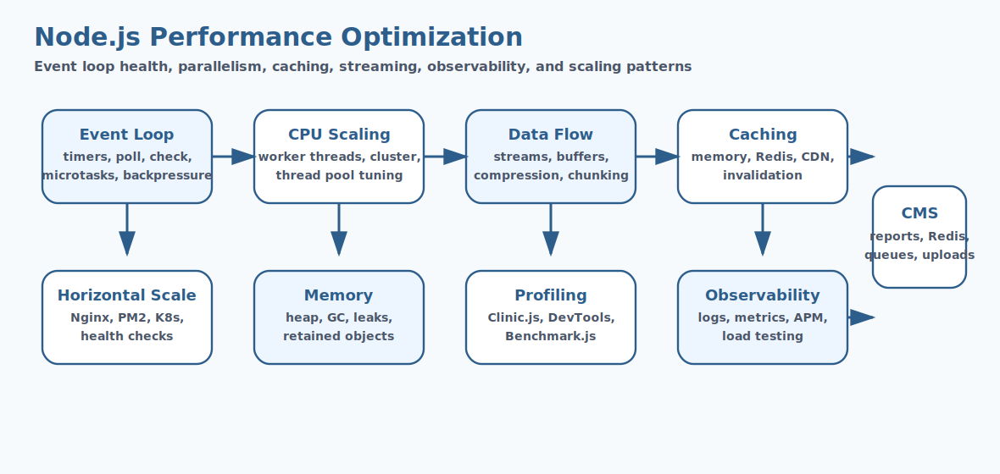

# Node.js Performance Optimization Interview Questions


This guide covers node.js performance optimization from interview basics to tricky production scenarios. It follows the corrected format of **100 interview questions for each subtopic**, and every answer includes a real Node.js code example with rotated real-world scenarios so the examples do not repeat verbatim.

## How To Use This Page

- Questions 1-100 cover Event Loop & Core Internals.
- Questions 101-200 cover Asynchronous Programming Optimization.
- Questions 201-300 cover Worker Threads.
- Questions 301-400 cover Clustering.
- Questions 401-500 cover Load Balancing & Horizontal Scaling.
- Questions 501-600 cover Caching Strategies.
- Questions 601-700 cover Avoiding Blocking Operations.
- Questions 701-800 cover Memory Management & Optimization.
- Questions 801-900 cover Streams & Backpressure.
- Questions 901-1000 cover Data Handling Optimization.
- Questions 1001-1100 cover Lazy Loading & Code Splitting.
- Questions 1101-1200 cover Algorithm & Data Structure Optimization.
- Questions 1201-1300 cover Profiling & Benchmarking.
- Questions 1301-1400 cover Monitoring & Observability.
- Questions 1401-1500 cover HTTP Performance Optimization.
- Questions 1501-1600 cover Database Optimization.
- Questions 1601-1700 cover Network Optimization.
- Questions 1701-1800 cover Thread Pool Tuning.
- Questions 1801-1900 cover Queue Systems & Background Jobs.
- Questions 1901-2000 cover Testing Performance.
- Questions 2001-2100 cover Rate Limiting & Throttling.
- Questions 2101-2200 cover Security vs Performance Trade-offs.
- Questions 2201-2300 cover Process Management.
- Questions 2301-2400 cover Advanced Optimization Concepts.

## 1. Event Loop & Core Internals

### Q1.1 What is event loop & core internals in Node.js?

**Answer:**

Event Loop & Core Internals matters in Node.js because it affects how event loop & core internals affects runtime behavior and delivery decisions. In a real system like a high-traffic Node.js API serving customer traffic behind a load balancer, a strong answer should connect the concept to runtime behavior, delivery trade-offs, production debugging, and the way Node.js applications behave under load or failure. A senior-level answer also explains the operational impact so the answer reflects real Node.js engineering instead of textbook definitions.

**Code Example:**

```js
setTimeout(() => console.log('timer'), 0);
setImmediate(() => console.log('immediate'));
Promise.resolve().then(() => console.log('promise microtask'));
process.nextTick(() => console.log('nextTick'));
```

### Q1.2 Why does event loop & core internals fundamentals matter in real Node.js applications?

**Answer:**

Event Loop & Core Internals fundamentals matters in Node.js because it affects how event loop & core internals should be understood before tackling deeper production issues. In a real system like a background worker processing queues and scheduled jobs in production, a strong answer should connect the concept to runtime behavior, delivery trade-offs, production debugging, and the way Node.js applications behave under load or failure. A senior-level answer also explains the operational impact so teams can connect the concept to runtime behavior and operational impact.

**Code Example:**

```js
const fs = require('node:fs');
fs.readFile(__filename, () => {
  setImmediate(() => console.log('after I/O immediate'));
});
```

### Q1.3 When should a team focus on event loop & core internals design?

**Answer:**

Event Loop & Core Internals design matters in Node.js because it affects how event loop & core internals influences code structure and operational outcomes. In a real system like a CMS platform handling uploads, downloads, and rich admin workflows, a strong answer should connect the concept to runtime behavior, delivery trade-offs, production debugging, and the way Node.js applications behave under load or failure. A senior-level answer also explains the operational impact so production debugging becomes easier because the mechanics are clearer.

**Code Example:**

```js
let count = 0;
function flood() {
  if (count++ < 3) process.nextTick(flood);
}
flood();
```

### Q1.4 How would you explain event loop & core internals debugging in a production discussion?

**Answer:**

Event Loop & Core Internals debugging matters in Node.js because it affects how teams investigate problems related to event loop & core internals in production. In a real system like a banking integration service where reliability and observability are tightly controlled, a strong answer should connect the concept to runtime behavior, delivery trade-offs, production debugging, and the way Node.js applications behave under load or failure. A senior-level answer also explains the operational impact so architecture choices become easier to defend in interviews and reviews.

**Code Example:**

```js
setInterval(() => console.log('heartbeat'), 1000);
```

### Q1.5 What is a common interview trap around event loop & core internals trade-offs?

**Answer:**

Event Loop & Core Internals trade-offs matters in Node.js because it affects how event loop & core internals shapes performance, maintainability, or reliability decisions. In a real system like a healthcare backend where safe error handling and data validation matter deeply, a strong answer should connect the concept to runtime behavior, delivery trade-offs, production debugging, and the way Node.js applications behave under load or failure. A senior-level answer also explains the operational impact so performance, correctness, and maintainability are discussed together.

**Code Example:**

```js
const net = require('node:net');
const socket = net.connect(80, 'example.com');
socket.on('close', () => console.log('socket closed'));
```

### Q1.6 How do you apply event loop & core internals safely in practice?

**Answer:**

Event Loop & Core Internals matters in Node.js because it affects how event loop & core internals affects runtime behavior and delivery decisions. In a real system like a logistics platform coordinating events, retries, and distributed workflows, a strong answer should connect the concept to runtime behavior, delivery trade-offs, production debugging, and the way Node.js applications behave under load or failure. A senior-level answer also explains the operational impact so common Node.js pitfalls are easier to prevent before release.

**Code Example:**

```js
setTimeout(() => console.log('timer'), 0);
setImmediate(() => console.log('immediate'));
Promise.resolve().then(() => console.log('promise microtask'));
process.nextTick(() => console.log('nextTick'));
```

### Q1.7 What production issue usually exposes weak understanding of event loop & core internals fundamentals?

**Answer:**

Event Loop & Core Internals fundamentals matters in Node.js because it affects how event loop & core internals should be understood before tackling deeper production issues. In a real system like an enterprise Express application with many middlewares and shared modules, a strong answer should connect the concept to runtime behavior, delivery trade-offs, production debugging, and the way Node.js applications behave under load or failure. A senior-level answer also explains the operational impact so the codebase stays easier to evolve as traffic and complexity grow.

**Code Example:**

```js
const fs = require('node:fs');
fs.readFile(__filename, () => {
  setImmediate(() => console.log('after I/O immediate'));
});
```

### Q1.8 How would a senior engineer justify event loop & core internals design to a team?

**Answer:**

Event Loop & Core Internals design matters in Node.js because it affects how event loop & core internals influences code structure and operational outcomes. In a real system like a real-time dashboard service where event-loop behavior affects user experience, a strong answer should connect the concept to runtime behavior, delivery trade-offs, production debugging, and the way Node.js applications behave under load or failure. A senior-level answer also explains the operational impact so operational trade-offs are visible instead of hidden behind abstractions.

**Code Example:**

```js
let count = 0;
function flood() {
  if (count++ < 3) process.nextTick(flood);
}
flood();
```

### Q1.9 What trade-off does event loop & core internals debugging introduce?

**Answer:**

Event Loop & Core Internals debugging matters in Node.js because it affects how teams investigate problems related to event loop & core internals in production. In a real system like a containerized Node.js deployment where startup, memory, and scaling all matter, a strong answer should connect the concept to runtime behavior, delivery trade-offs, production debugging, and the way Node.js applications behave under load or failure. A senior-level answer also explains the operational impact so the example ties Node.js internals to practical delivery concerns.

**Code Example:**

```js
setInterval(() => console.log('heartbeat'), 1000);
```

### Q1.10 How do you answer a tricky follow-up about event loop & core internals trade-offs?

**Answer:**

Event Loop & Core Internals trade-offs matters in Node.js because it affects how event loop & core internals shapes performance, maintainability, or reliability decisions. In a real system like a migration effort from ad hoc scripts to a more maintainable Node.js architecture, a strong answer should connect the concept to runtime behavior, delivery trade-offs, production debugging, and the way Node.js applications behave under load or failure. A senior-level answer also explains the operational impact so new team members can understand the concept from both code and behavior.

**Code Example:**

```js
const net = require('node:net');
const socket = net.connect(80, 'example.com');
socket.on('close', () => console.log('socket closed'));
```

### Q1.11 What is event loop & core internals in Node.js?

**Answer:**

Event Loop & Core Internals matters in Node.js because it affects how event loop & core internals affects runtime behavior and delivery decisions. In a real system like a high-traffic Node.js API serving customer traffic behind a load balancer, a strong answer should connect the concept to runtime behavior, delivery trade-offs, production debugging, and the way Node.js applications behave under load or failure. A senior-level answer also explains the operational impact so the answer reflects real Node.js engineering instead of textbook definitions.

**Code Example:**

```js
setTimeout(() => console.log('timer'), 0);
setImmediate(() => console.log('immediate'));
Promise.resolve().then(() => console.log('promise microtask'));
process.nextTick(() => console.log('nextTick'));
```

### Q1.12 Why does event loop & core internals fundamentals matter in real Node.js applications?

**Answer:**

Event Loop & Core Internals fundamentals matters in Node.js because it affects how event loop & core internals should be understood before tackling deeper production issues. In a real system like a background worker processing queues and scheduled jobs in production, a strong answer should connect the concept to runtime behavior, delivery trade-offs, production debugging, and the way Node.js applications behave under load or failure. A senior-level answer also explains the operational impact so teams can connect the concept to runtime behavior and operational impact.

**Code Example:**

```js
const fs = require('node:fs');
fs.readFile(__filename, () => {
  setImmediate(() => console.log('after I/O immediate'));
});
```

### Q1.13 When should a team focus on event loop & core internals design?

**Answer:**

Event Loop & Core Internals design matters in Node.js because it affects how event loop & core internals influences code structure and operational outcomes. In a real system like a CMS platform handling uploads, downloads, and rich admin workflows, a strong answer should connect the concept to runtime behavior, delivery trade-offs, production debugging, and the way Node.js applications behave under load or failure. A senior-level answer also explains the operational impact so production debugging becomes easier because the mechanics are clearer.

**Code Example:**

```js
let count = 0;
function flood() {
  if (count++ < 3) process.nextTick(flood);
}
flood();
```

### Q1.14 How would you explain event loop & core internals debugging in a production discussion?

**Answer:**

Event Loop & Core Internals debugging matters in Node.js because it affects how teams investigate problems related to event loop & core internals in production. In a real system like a banking integration service where reliability and observability are tightly controlled, a strong answer should connect the concept to runtime behavior, delivery trade-offs, production debugging, and the way Node.js applications behave under load or failure. A senior-level answer also explains the operational impact so architecture choices become easier to defend in interviews and reviews.

**Code Example:**

```js
setInterval(() => console.log('heartbeat'), 1000);
```

### Q1.15 What is a common interview trap around event loop & core internals trade-offs?

**Answer:**

Event Loop & Core Internals trade-offs matters in Node.js because it affects how event loop & core internals shapes performance, maintainability, or reliability decisions. In a real system like a healthcare backend where safe error handling and data validation matter deeply, a strong answer should connect the concept to runtime behavior, delivery trade-offs, production debugging, and the way Node.js applications behave under load or failure. A senior-level answer also explains the operational impact so performance, correctness, and maintainability are discussed together.

**Code Example:**

```js
const net = require('node:net');
const socket = net.connect(80, 'example.com');
socket.on('close', () => console.log('socket closed'));
```

### Q1.16 How do you apply event loop & core internals safely in practice?

**Answer:**

Event Loop & Core Internals matters in Node.js because it affects how event loop & core internals affects runtime behavior and delivery decisions. In a real system like a logistics platform coordinating events, retries, and distributed workflows, a strong answer should connect the concept to runtime behavior, delivery trade-offs, production debugging, and the way Node.js applications behave under load or failure. A senior-level answer also explains the operational impact so common Node.js pitfalls are easier to prevent before release.

**Code Example:**

```js
setTimeout(() => console.log('timer'), 0);
setImmediate(() => console.log('immediate'));
Promise.resolve().then(() => console.log('promise microtask'));
process.nextTick(() => console.log('nextTick'));
```

### Q1.17 What production issue usually exposes weak understanding of event loop & core internals fundamentals?

**Answer:**

Event Loop & Core Internals fundamentals matters in Node.js because it affects how event loop & core internals should be understood before tackling deeper production issues. In a real system like an enterprise Express application with many middlewares and shared modules, a strong answer should connect the concept to runtime behavior, delivery trade-offs, production debugging, and the way Node.js applications behave under load or failure. A senior-level answer also explains the operational impact so the codebase stays easier to evolve as traffic and complexity grow.

**Code Example:**

```js
const fs = require('node:fs');
fs.readFile(__filename, () => {
  setImmediate(() => console.log('after I/O immediate'));
});
```

### Q1.18 How would a senior engineer justify event loop & core internals design to a team?

**Answer:**

Event Loop & Core Internals design matters in Node.js because it affects how event loop & core internals influences code structure and operational outcomes. In a real system like a real-time dashboard service where event-loop behavior affects user experience, a strong answer should connect the concept to runtime behavior, delivery trade-offs, production debugging, and the way Node.js applications behave under load or failure. A senior-level answer also explains the operational impact so operational trade-offs are visible instead of hidden behind abstractions.

**Code Example:**

```js
let count = 0;
function flood() {
  if (count++ < 3) process.nextTick(flood);
}
flood();
```

### Q1.19 What trade-off does event loop & core internals debugging introduce?

**Answer:**

Event Loop & Core Internals debugging matters in Node.js because it affects how teams investigate problems related to event loop & core internals in production. In a real system like a containerized Node.js deployment where startup, memory, and scaling all matter, a strong answer should connect the concept to runtime behavior, delivery trade-offs, production debugging, and the way Node.js applications behave under load or failure. A senior-level answer also explains the operational impact so the example ties Node.js internals to practical delivery concerns.

**Code Example:**

```js
setInterval(() => console.log('heartbeat'), 1000);
```

### Q1.20 How do you answer a tricky follow-up about event loop & core internals trade-offs?

**Answer:**

Event Loop & Core Internals trade-offs matters in Node.js because it affects how event loop & core internals shapes performance, maintainability, or reliability decisions. In a real system like a migration effort from ad hoc scripts to a more maintainable Node.js architecture, a strong answer should connect the concept to runtime behavior, delivery trade-offs, production debugging, and the way Node.js applications behave under load or failure. A senior-level answer also explains the operational impact so new team members can understand the concept from both code and behavior.

**Code Example:**

```js
const net = require('node:net');
const socket = net.connect(80, 'example.com');
socket.on('close', () => console.log('socket closed'));
```

### Q1.21 What is event loop & core internals in Node.js?

**Answer:**

Event Loop & Core Internals matters in Node.js because it affects how event loop & core internals affects runtime behavior and delivery decisions. In a real system like a high-traffic Node.js API serving customer traffic behind a load balancer, a strong answer should connect the concept to runtime behavior, delivery trade-offs, production debugging, and the way Node.js applications behave under load or failure. A senior-level answer also explains the operational impact so the answer reflects real Node.js engineering instead of textbook definitions.

**Code Example:**

```js
setTimeout(() => console.log('timer'), 0);
setImmediate(() => console.log('immediate'));
Promise.resolve().then(() => console.log('promise microtask'));
process.nextTick(() => console.log('nextTick'));
```

### Q1.22 Why does event loop & core internals fundamentals matter in real Node.js applications?

**Answer:**

Event Loop & Core Internals fundamentals matters in Node.js because it affects how event loop & core internals should be understood before tackling deeper production issues. In a real system like a background worker processing queues and scheduled jobs in production, a strong answer should connect the concept to runtime behavior, delivery trade-offs, production debugging, and the way Node.js applications behave under load or failure. A senior-level answer also explains the operational impact so teams can connect the concept to runtime behavior and operational impact.

**Code Example:**

```js
const fs = require('node:fs');
fs.readFile(__filename, () => {
  setImmediate(() => console.log('after I/O immediate'));
});
```

### Q1.23 When should a team focus on event loop & core internals design?

**Answer:**

Event Loop & Core Internals design matters in Node.js because it affects how event loop & core internals influences code structure and operational outcomes. In a real system like a CMS platform handling uploads, downloads, and rich admin workflows, a strong answer should connect the concept to runtime behavior, delivery trade-offs, production debugging, and the way Node.js applications behave under load or failure. A senior-level answer also explains the operational impact so production debugging becomes easier because the mechanics are clearer.

**Code Example:**

```js
let count = 0;
function flood() {
  if (count++ < 3) process.nextTick(flood);
}
flood();
```

### Q1.24 How would you explain event loop & core internals debugging in a production discussion?

**Answer:**

Event Loop & Core Internals debugging matters in Node.js because it affects how teams investigate problems related to event loop & core internals in production. In a real system like a banking integration service where reliability and observability are tightly controlled, a strong answer should connect the concept to runtime behavior, delivery trade-offs, production debugging, and the way Node.js applications behave under load or failure. A senior-level answer also explains the operational impact so architecture choices become easier to defend in interviews and reviews.

**Code Example:**

```js
setInterval(() => console.log('heartbeat'), 1000);
```

### Q1.25 What is a common interview trap around event loop & core internals trade-offs?

**Answer:**

Event Loop & Core Internals trade-offs matters in Node.js because it affects how event loop & core internals shapes performance, maintainability, or reliability decisions. In a real system like a healthcare backend where safe error handling and data validation matter deeply, a strong answer should connect the concept to runtime behavior, delivery trade-offs, production debugging, and the way Node.js applications behave under load or failure. A senior-level answer also explains the operational impact so performance, correctness, and maintainability are discussed together.

**Code Example:**

```js
const net = require('node:net');
const socket = net.connect(80, 'example.com');
socket.on('close', () => console.log('socket closed'));
```

### Q1.26 How do you apply event loop & core internals safely in practice?

**Answer:**

Event Loop & Core Internals matters in Node.js because it affects how event loop & core internals affects runtime behavior and delivery decisions. In a real system like a logistics platform coordinating events, retries, and distributed workflows, a strong answer should connect the concept to runtime behavior, delivery trade-offs, production debugging, and the way Node.js applications behave under load or failure. A senior-level answer also explains the operational impact so common Node.js pitfalls are easier to prevent before release.

**Code Example:**

```js
setTimeout(() => console.log('timer'), 0);
setImmediate(() => console.log('immediate'));
Promise.resolve().then(() => console.log('promise microtask'));
process.nextTick(() => console.log('nextTick'));
```

### Q1.27 What production issue usually exposes weak understanding of event loop & core internals fundamentals?

**Answer:**

Event Loop & Core Internals fundamentals matters in Node.js because it affects how event loop & core internals should be understood before tackling deeper production issues. In a real system like an enterprise Express application with many middlewares and shared modules, a strong answer should connect the concept to runtime behavior, delivery trade-offs, production debugging, and the way Node.js applications behave under load or failure. A senior-level answer also explains the operational impact so the codebase stays easier to evolve as traffic and complexity grow.

**Code Example:**

```js
const fs = require('node:fs');
fs.readFile(__filename, () => {
  setImmediate(() => console.log('after I/O immediate'));
});
```

### Q1.28 How would a senior engineer justify event loop & core internals design to a team?

**Answer:**

Event Loop & Core Internals design matters in Node.js because it affects how event loop & core internals influences code structure and operational outcomes. In a real system like a real-time dashboard service where event-loop behavior affects user experience, a strong answer should connect the concept to runtime behavior, delivery trade-offs, production debugging, and the way Node.js applications behave under load or failure. A senior-level answer also explains the operational impact so operational trade-offs are visible instead of hidden behind abstractions.

**Code Example:**

```js
let count = 0;
function flood() {
  if (count++ < 3) process.nextTick(flood);
}
flood();
```

### Q1.29 What trade-off does event loop & core internals debugging introduce?

**Answer:**

Event Loop & Core Internals debugging matters in Node.js because it affects how teams investigate problems related to event loop & core internals in production. In a real system like a containerized Node.js deployment where startup, memory, and scaling all matter, a strong answer should connect the concept to runtime behavior, delivery trade-offs, production debugging, and the way Node.js applications behave under load or failure. A senior-level answer also explains the operational impact so the example ties Node.js internals to practical delivery concerns.

**Code Example:**

```js
setInterval(() => console.log('heartbeat'), 1000);
```

### Q1.30 How do you answer a tricky follow-up about event loop & core internals trade-offs?

**Answer:**

Event Loop & Core Internals trade-offs matters in Node.js because it affects how event loop & core internals shapes performance, maintainability, or reliability decisions. In a real system like a migration effort from ad hoc scripts to a more maintainable Node.js architecture, a strong answer should connect the concept to runtime behavior, delivery trade-offs, production debugging, and the way Node.js applications behave under load or failure. A senior-level answer also explains the operational impact so new team members can understand the concept from both code and behavior.

**Code Example:**

```js
const net = require('node:net');
const socket = net.connect(80, 'example.com');
socket.on('close', () => console.log('socket closed'));
```

### Q1.31 What is event loop & core internals in Node.js?

**Answer:**

Event Loop & Core Internals matters in Node.js because it affects how event loop & core internals affects runtime behavior and delivery decisions. In a real system like a high-traffic Node.js API serving customer traffic behind a load balancer, a strong answer should connect the concept to runtime behavior, delivery trade-offs, production debugging, and the way Node.js applications behave under load or failure. A senior-level answer also explains the operational impact so the answer reflects real Node.js engineering instead of textbook definitions.

**Code Example:**

```js
setTimeout(() => console.log('timer'), 0);
setImmediate(() => console.log('immediate'));
Promise.resolve().then(() => console.log('promise microtask'));
process.nextTick(() => console.log('nextTick'));
```

### Q1.32 Why does event loop & core internals fundamentals matter in real Node.js applications?

**Answer:**

Event Loop & Core Internals fundamentals matters in Node.js because it affects how event loop & core internals should be understood before tackling deeper production issues. In a real system like a background worker processing queues and scheduled jobs in production, a strong answer should connect the concept to runtime behavior, delivery trade-offs, production debugging, and the way Node.js applications behave under load or failure. A senior-level answer also explains the operational impact so teams can connect the concept to runtime behavior and operational impact.

**Code Example:**

```js
const fs = require('node:fs');
fs.readFile(__filename, () => {
  setImmediate(() => console.log('after I/O immediate'));
});
```

### Q1.33 When should a team focus on event loop & core internals design?

**Answer:**

Event Loop & Core Internals design matters in Node.js because it affects how event loop & core internals influences code structure and operational outcomes. In a real system like a CMS platform handling uploads, downloads, and rich admin workflows, a strong answer should connect the concept to runtime behavior, delivery trade-offs, production debugging, and the way Node.js applications behave under load or failure. A senior-level answer also explains the operational impact so production debugging becomes easier because the mechanics are clearer.

**Code Example:**

```js
let count = 0;
function flood() {
  if (count++ < 3) process.nextTick(flood);
}
flood();
```

### Q1.34 How would you explain event loop & core internals debugging in a production discussion?

**Answer:**

Event Loop & Core Internals debugging matters in Node.js because it affects how teams investigate problems related to event loop & core internals in production. In a real system like a banking integration service where reliability and observability are tightly controlled, a strong answer should connect the concept to runtime behavior, delivery trade-offs, production debugging, and the way Node.js applications behave under load or failure. A senior-level answer also explains the operational impact so architecture choices become easier to defend in interviews and reviews.

**Code Example:**

```js
setInterval(() => console.log('heartbeat'), 1000);
```

### Q1.35 What is a common interview trap around event loop & core internals trade-offs?

**Answer:**

Event Loop & Core Internals trade-offs matters in Node.js because it affects how event loop & core internals shapes performance, maintainability, or reliability decisions. In a real system like a healthcare backend where safe error handling and data validation matter deeply, a strong answer should connect the concept to runtime behavior, delivery trade-offs, production debugging, and the way Node.js applications behave under load or failure. A senior-level answer also explains the operational impact so performance, correctness, and maintainability are discussed together.

**Code Example:**

```js
const net = require('node:net');
const socket = net.connect(80, 'example.com');
socket.on('close', () => console.log('socket closed'));
```

### Q1.36 How do you apply event loop & core internals safely in practice?

**Answer:**

Event Loop & Core Internals matters in Node.js because it affects how event loop & core internals affects runtime behavior and delivery decisions. In a real system like a logistics platform coordinating events, retries, and distributed workflows, a strong answer should connect the concept to runtime behavior, delivery trade-offs, production debugging, and the way Node.js applications behave under load or failure. A senior-level answer also explains the operational impact so common Node.js pitfalls are easier to prevent before release.

**Code Example:**

```js
setTimeout(() => console.log('timer'), 0);
setImmediate(() => console.log('immediate'));
Promise.resolve().then(() => console.log('promise microtask'));
process.nextTick(() => console.log('nextTick'));
```

### Q1.37 What production issue usually exposes weak understanding of event loop & core internals fundamentals?

**Answer:**

Event Loop & Core Internals fundamentals matters in Node.js because it affects how event loop & core internals should be understood before tackling deeper production issues. In a real system like an enterprise Express application with many middlewares and shared modules, a strong answer should connect the concept to runtime behavior, delivery trade-offs, production debugging, and the way Node.js applications behave under load or failure. A senior-level answer also explains the operational impact so the codebase stays easier to evolve as traffic and complexity grow.

**Code Example:**

```js
const fs = require('node:fs');
fs.readFile(__filename, () => {
  setImmediate(() => console.log('after I/O immediate'));
});
```

### Q1.38 How would a senior engineer justify event loop & core internals design to a team?

**Answer:**

Event Loop & Core Internals design matters in Node.js because it affects how event loop & core internals influences code structure and operational outcomes. In a real system like a real-time dashboard service where event-loop behavior affects user experience, a strong answer should connect the concept to runtime behavior, delivery trade-offs, production debugging, and the way Node.js applications behave under load or failure. A senior-level answer also explains the operational impact so operational trade-offs are visible instead of hidden behind abstractions.

**Code Example:**

```js
let count = 0;
function flood() {
  if (count++ < 3) process.nextTick(flood);
}
flood();
```

### Q1.39 What trade-off does event loop & core internals debugging introduce?

**Answer:**

Event Loop & Core Internals debugging matters in Node.js because it affects how teams investigate problems related to event loop & core internals in production. In a real system like a containerized Node.js deployment where startup, memory, and scaling all matter, a strong answer should connect the concept to runtime behavior, delivery trade-offs, production debugging, and the way Node.js applications behave under load or failure. A senior-level answer also explains the operational impact so the example ties Node.js internals to practical delivery concerns.

**Code Example:**

```js
setInterval(() => console.log('heartbeat'), 1000);
```

### Q1.40 How do you answer a tricky follow-up about event loop & core internals trade-offs?

**Answer:**

Event Loop & Core Internals trade-offs matters in Node.js because it affects how event loop & core internals shapes performance, maintainability, or reliability decisions. In a real system like a migration effort from ad hoc scripts to a more maintainable Node.js architecture, a strong answer should connect the concept to runtime behavior, delivery trade-offs, production debugging, and the way Node.js applications behave under load or failure. A senior-level answer also explains the operational impact so new team members can understand the concept from both code and behavior.

**Code Example:**

```js
const net = require('node:net');
const socket = net.connect(80, 'example.com');
socket.on('close', () => console.log('socket closed'));
```

### Q1.41 What is event loop & core internals in Node.js?

**Answer:**

Event Loop & Core Internals matters in Node.js because it affects how event loop & core internals affects runtime behavior and delivery decisions. In a real system like a high-traffic Node.js API serving customer traffic behind a load balancer, a strong answer should connect the concept to runtime behavior, delivery trade-offs, production debugging, and the way Node.js applications behave under load or failure. A senior-level answer also explains the operational impact so the answer reflects real Node.js engineering instead of textbook definitions.

**Code Example:**

```js
setTimeout(() => console.log('timer'), 0);
setImmediate(() => console.log('immediate'));
Promise.resolve().then(() => console.log('promise microtask'));
process.nextTick(() => console.log('nextTick'));
```

### Q1.42 Why does event loop & core internals fundamentals matter in real Node.js applications?

**Answer:**

Event Loop & Core Internals fundamentals matters in Node.js because it affects how event loop & core internals should be understood before tackling deeper production issues. In a real system like a background worker processing queues and scheduled jobs in production, a strong answer should connect the concept to runtime behavior, delivery trade-offs, production debugging, and the way Node.js applications behave under load or failure. A senior-level answer also explains the operational impact so teams can connect the concept to runtime behavior and operational impact.

**Code Example:**

```js
const fs = require('node:fs');
fs.readFile(__filename, () => {
  setImmediate(() => console.log('after I/O immediate'));
});
```

### Q1.43 When should a team focus on event loop & core internals design?

**Answer:**

Event Loop & Core Internals design matters in Node.js because it affects how event loop & core internals influences code structure and operational outcomes. In a real system like a CMS platform handling uploads, downloads, and rich admin workflows, a strong answer should connect the concept to runtime behavior, delivery trade-offs, production debugging, and the way Node.js applications behave under load or failure. A senior-level answer also explains the operational impact so production debugging becomes easier because the mechanics are clearer.

**Code Example:**

```js
let count = 0;
function flood() {
  if (count++ < 3) process.nextTick(flood);
}
flood();
```

### Q1.44 How would you explain event loop & core internals debugging in a production discussion?

**Answer:**

Event Loop & Core Internals debugging matters in Node.js because it affects how teams investigate problems related to event loop & core internals in production. In a real system like a banking integration service where reliability and observability are tightly controlled, a strong answer should connect the concept to runtime behavior, delivery trade-offs, production debugging, and the way Node.js applications behave under load or failure. A senior-level answer also explains the operational impact so architecture choices become easier to defend in interviews and reviews.

**Code Example:**

```js
setInterval(() => console.log('heartbeat'), 1000);
```

### Q1.45 What is a common interview trap around event loop & core internals trade-offs?

**Answer:**

Event Loop & Core Internals trade-offs matters in Node.js because it affects how event loop & core internals shapes performance, maintainability, or reliability decisions. In a real system like a healthcare backend where safe error handling and data validation matter deeply, a strong answer should connect the concept to runtime behavior, delivery trade-offs, production debugging, and the way Node.js applications behave under load or failure. A senior-level answer also explains the operational impact so performance, correctness, and maintainability are discussed together.

**Code Example:**

```js
const net = require('node:net');
const socket = net.connect(80, 'example.com');
socket.on('close', () => console.log('socket closed'));
```

### Q1.46 How do you apply event loop & core internals safely in practice?

**Answer:**

Event Loop & Core Internals matters in Node.js because it affects how event loop & core internals affects runtime behavior and delivery decisions. In a real system like a logistics platform coordinating events, retries, and distributed workflows, a strong answer should connect the concept to runtime behavior, delivery trade-offs, production debugging, and the way Node.js applications behave under load or failure. A senior-level answer also explains the operational impact so common Node.js pitfalls are easier to prevent before release.

**Code Example:**

```js
setTimeout(() => console.log('timer'), 0);
setImmediate(() => console.log('immediate'));
Promise.resolve().then(() => console.log('promise microtask'));
process.nextTick(() => console.log('nextTick'));
```

### Q1.47 What production issue usually exposes weak understanding of event loop & core internals fundamentals?

**Answer:**

Event Loop & Core Internals fundamentals matters in Node.js because it affects how event loop & core internals should be understood before tackling deeper production issues. In a real system like an enterprise Express application with many middlewares and shared modules, a strong answer should connect the concept to runtime behavior, delivery trade-offs, production debugging, and the way Node.js applications behave under load or failure. A senior-level answer also explains the operational impact so the codebase stays easier to evolve as traffic and complexity grow.

**Code Example:**

```js
const fs = require('node:fs');
fs.readFile(__filename, () => {
  setImmediate(() => console.log('after I/O immediate'));
});
```

### Q1.48 How would a senior engineer justify event loop & core internals design to a team?

**Answer:**

Event Loop & Core Internals design matters in Node.js because it affects how event loop & core internals influences code structure and operational outcomes. In a real system like a real-time dashboard service where event-loop behavior affects user experience, a strong answer should connect the concept to runtime behavior, delivery trade-offs, production debugging, and the way Node.js applications behave under load or failure. A senior-level answer also explains the operational impact so operational trade-offs are visible instead of hidden behind abstractions.

**Code Example:**

```js
let count = 0;
function flood() {
  if (count++ < 3) process.nextTick(flood);
}
flood();
```

### Q1.49 What trade-off does event loop & core internals debugging introduce?

**Answer:**

Event Loop & Core Internals debugging matters in Node.js because it affects how teams investigate problems related to event loop & core internals in production. In a real system like a containerized Node.js deployment where startup, memory, and scaling all matter, a strong answer should connect the concept to runtime behavior, delivery trade-offs, production debugging, and the way Node.js applications behave under load or failure. A senior-level answer also explains the operational impact so the example ties Node.js internals to practical delivery concerns.

**Code Example:**

```js
setInterval(() => console.log('heartbeat'), 1000);
```

### Q1.50 How do you answer a tricky follow-up about event loop & core internals trade-offs?

**Answer:**

Event Loop & Core Internals trade-offs matters in Node.js because it affects how event loop & core internals shapes performance, maintainability, or reliability decisions. In a real system like a migration effort from ad hoc scripts to a more maintainable Node.js architecture, a strong answer should connect the concept to runtime behavior, delivery trade-offs, production debugging, and the way Node.js applications behave under load or failure. A senior-level answer also explains the operational impact so new team members can understand the concept from both code and behavior.

**Code Example:**

```js
const net = require('node:net');
const socket = net.connect(80, 'example.com');
socket.on('close', () => console.log('socket closed'));
```

### Q1.51 What is event loop & core internals in Node.js?

**Answer:**

Event Loop & Core Internals matters in Node.js because it affects how event loop & core internals affects runtime behavior and delivery decisions. In a real system like a high-traffic Node.js API serving customer traffic behind a load balancer, a strong answer should connect the concept to runtime behavior, delivery trade-offs, production debugging, and the way Node.js applications behave under load or failure. A senior-level answer also explains the operational impact so the answer reflects real Node.js engineering instead of textbook definitions.

**Code Example:**

```js
setTimeout(() => console.log('timer'), 0);
setImmediate(() => console.log('immediate'));
Promise.resolve().then(() => console.log('promise microtask'));
process.nextTick(() => console.log('nextTick'));
```

### Q1.52 Why does event loop & core internals fundamentals matter in real Node.js applications?

**Answer:**

Event Loop & Core Internals fundamentals matters in Node.js because it affects how event loop & core internals should be understood before tackling deeper production issues. In a real system like a background worker processing queues and scheduled jobs in production, a strong answer should connect the concept to runtime behavior, delivery trade-offs, production debugging, and the way Node.js applications behave under load or failure. A senior-level answer also explains the operational impact so teams can connect the concept to runtime behavior and operational impact.

**Code Example:**

```js
const fs = require('node:fs');
fs.readFile(__filename, () => {
  setImmediate(() => console.log('after I/O immediate'));
});
```

### Q1.53 When should a team focus on event loop & core internals design?

**Answer:**

Event Loop & Core Internals design matters in Node.js because it affects how event loop & core internals influences code structure and operational outcomes. In a real system like a CMS platform handling uploads, downloads, and rich admin workflows, a strong answer should connect the concept to runtime behavior, delivery trade-offs, production debugging, and the way Node.js applications behave under load or failure. A senior-level answer also explains the operational impact so production debugging becomes easier because the mechanics are clearer.

**Code Example:**

```js
let count = 0;
function flood() {
  if (count++ < 3) process.nextTick(flood);
}
flood();
```

### Q1.54 How would you explain event loop & core internals debugging in a production discussion?

**Answer:**

Event Loop & Core Internals debugging matters in Node.js because it affects how teams investigate problems related to event loop & core internals in production. In a real system like a banking integration service where reliability and observability are tightly controlled, a strong answer should connect the concept to runtime behavior, delivery trade-offs, production debugging, and the way Node.js applications behave under load or failure. A senior-level answer also explains the operational impact so architecture choices become easier to defend in interviews and reviews.

**Code Example:**

```js
setInterval(() => console.log('heartbeat'), 1000);
```

### Q1.55 What is a common interview trap around event loop & core internals trade-offs?

**Answer:**

Event Loop & Core Internals trade-offs matters in Node.js because it affects how event loop & core internals shapes performance, maintainability, or reliability decisions. In a real system like a healthcare backend where safe error handling and data validation matter deeply, a strong answer should connect the concept to runtime behavior, delivery trade-offs, production debugging, and the way Node.js applications behave under load or failure. A senior-level answer also explains the operational impact so performance, correctness, and maintainability are discussed together.

**Code Example:**

```js
const net = require('node:net');
const socket = net.connect(80, 'example.com');
socket.on('close', () => console.log('socket closed'));
```

### Q1.56 How do you apply event loop & core internals safely in practice?

**Answer:**

Event Loop & Core Internals matters in Node.js because it affects how event loop & core internals affects runtime behavior and delivery decisions. In a real system like a logistics platform coordinating events, retries, and distributed workflows, a strong answer should connect the concept to runtime behavior, delivery trade-offs, production debugging, and the way Node.js applications behave under load or failure. A senior-level answer also explains the operational impact so common Node.js pitfalls are easier to prevent before release.

**Code Example:**

```js
setTimeout(() => console.log('timer'), 0);
setImmediate(() => console.log('immediate'));
Promise.resolve().then(() => console.log('promise microtask'));
process.nextTick(() => console.log('nextTick'));
```

### Q1.57 What production issue usually exposes weak understanding of event loop & core internals fundamentals?

**Answer:**

Event Loop & Core Internals fundamentals matters in Node.js because it affects how event loop & core internals should be understood before tackling deeper production issues. In a real system like an enterprise Express application with many middlewares and shared modules, a strong answer should connect the concept to runtime behavior, delivery trade-offs, production debugging, and the way Node.js applications behave under load or failure. A senior-level answer also explains the operational impact so the codebase stays easier to evolve as traffic and complexity grow.

**Code Example:**

```js
const fs = require('node:fs');
fs.readFile(__filename, () => {
  setImmediate(() => console.log('after I/O immediate'));
});
```

### Q1.58 How would a senior engineer justify event loop & core internals design to a team?

**Answer:**

Event Loop & Core Internals design matters in Node.js because it affects how event loop & core internals influences code structure and operational outcomes. In a real system like a real-time dashboard service where event-loop behavior affects user experience, a strong answer should connect the concept to runtime behavior, delivery trade-offs, production debugging, and the way Node.js applications behave under load or failure. A senior-level answer also explains the operational impact so operational trade-offs are visible instead of hidden behind abstractions.

**Code Example:**

```js
let count = 0;
function flood() {
  if (count++ < 3) process.nextTick(flood);
}
flood();
```

### Q1.59 What trade-off does event loop & core internals debugging introduce?

**Answer:**

Event Loop & Core Internals debugging matters in Node.js because it affects how teams investigate problems related to event loop & core internals in production. In a real system like a containerized Node.js deployment where startup, memory, and scaling all matter, a strong answer should connect the concept to runtime behavior, delivery trade-offs, production debugging, and the way Node.js applications behave under load or failure. A senior-level answer also explains the operational impact so the example ties Node.js internals to practical delivery concerns.

**Code Example:**

```js
setInterval(() => console.log('heartbeat'), 1000);
```

### Q1.60 How do you answer a tricky follow-up about event loop & core internals trade-offs?

**Answer:**

Event Loop & Core Internals trade-offs matters in Node.js because it affects how event loop & core internals shapes performance, maintainability, or reliability decisions. In a real system like a migration effort from ad hoc scripts to a more maintainable Node.js architecture, a strong answer should connect the concept to runtime behavior, delivery trade-offs, production debugging, and the way Node.js applications behave under load or failure. A senior-level answer also explains the operational impact so new team members can understand the concept from both code and behavior.

**Code Example:**

```js
const net = require('node:net');
const socket = net.connect(80, 'example.com');
socket.on('close', () => console.log('socket closed'));
```

### Q1.61 What is event loop & core internals in Node.js?

**Answer:**

Event Loop & Core Internals matters in Node.js because it affects how event loop & core internals affects runtime behavior and delivery decisions. In a real system like a high-traffic Node.js API serving customer traffic behind a load balancer, a strong answer should connect the concept to runtime behavior, delivery trade-offs, production debugging, and the way Node.js applications behave under load or failure. A senior-level answer also explains the operational impact so the answer reflects real Node.js engineering instead of textbook definitions.

**Code Example:**

```js
setTimeout(() => console.log('timer'), 0);
setImmediate(() => console.log('immediate'));
Promise.resolve().then(() => console.log('promise microtask'));
process.nextTick(() => console.log('nextTick'));
```

### Q1.62 Why does event loop & core internals fundamentals matter in real Node.js applications?

**Answer:**

Event Loop & Core Internals fundamentals matters in Node.js because it affects how event loop & core internals should be understood before tackling deeper production issues. In a real system like a background worker processing queues and scheduled jobs in production, a strong answer should connect the concept to runtime behavior, delivery trade-offs, production debugging, and the way Node.js applications behave under load or failure. A senior-level answer also explains the operational impact so teams can connect the concept to runtime behavior and operational impact.

**Code Example:**

```js
const fs = require('node:fs');
fs.readFile(__filename, () => {
  setImmediate(() => console.log('after I/O immediate'));
});
```

### Q1.63 When should a team focus on event loop & core internals design?

**Answer:**

Event Loop & Core Internals design matters in Node.js because it affects how event loop & core internals influences code structure and operational outcomes. In a real system like a CMS platform handling uploads, downloads, and rich admin workflows, a strong answer should connect the concept to runtime behavior, delivery trade-offs, production debugging, and the way Node.js applications behave under load or failure. A senior-level answer also explains the operational impact so production debugging becomes easier because the mechanics are clearer.

**Code Example:**

```js
let count = 0;
function flood() {
  if (count++ < 3) process.nextTick(flood);
}
flood();
```

### Q1.64 How would you explain event loop & core internals debugging in a production discussion?

**Answer:**

Event Loop & Core Internals debugging matters in Node.js because it affects how teams investigate problems related to event loop & core internals in production. In a real system like a banking integration service where reliability and observability are tightly controlled, a strong answer should connect the concept to runtime behavior, delivery trade-offs, production debugging, and the way Node.js applications behave under load or failure. A senior-level answer also explains the operational impact so architecture choices become easier to defend in interviews and reviews.

**Code Example:**

```js
setInterval(() => console.log('heartbeat'), 1000);
```

### Q1.65 What is a common interview trap around event loop & core internals trade-offs?

**Answer:**

Event Loop & Core Internals trade-offs matters in Node.js because it affects how event loop & core internals shapes performance, maintainability, or reliability decisions. In a real system like a healthcare backend where safe error handling and data validation matter deeply, a strong answer should connect the concept to runtime behavior, delivery trade-offs, production debugging, and the way Node.js applications behave under load or failure. A senior-level answer also explains the operational impact so performance, correctness, and maintainability are discussed together.

**Code Example:**

```js
const net = require('node:net');
const socket = net.connect(80, 'example.com');
socket.on('close', () => console.log('socket closed'));
```

### Q1.66 How do you apply event loop & core internals safely in practice?

**Answer:**

Event Loop & Core Internals matters in Node.js because it affects how event loop & core internals affects runtime behavior and delivery decisions. In a real system like a logistics platform coordinating events, retries, and distributed workflows, a strong answer should connect the concept to runtime behavior, delivery trade-offs, production debugging, and the way Node.js applications behave under load or failure. A senior-level answer also explains the operational impact so common Node.js pitfalls are easier to prevent before release.

**Code Example:**

```js
setTimeout(() => console.log('timer'), 0);
setImmediate(() => console.log('immediate'));
Promise.resolve().then(() => console.log('promise microtask'));
process.nextTick(() => console.log('nextTick'));
```

### Q1.67 What production issue usually exposes weak understanding of event loop & core internals fundamentals?

**Answer:**

Event Loop & Core Internals fundamentals matters in Node.js because it affects how event loop & core internals should be understood before tackling deeper production issues. In a real system like an enterprise Express application with many middlewares and shared modules, a strong answer should connect the concept to runtime behavior, delivery trade-offs, production debugging, and the way Node.js applications behave under load or failure. A senior-level answer also explains the operational impact so the codebase stays easier to evolve as traffic and complexity grow.

**Code Example:**

```js
const fs = require('node:fs');
fs.readFile(__filename, () => {
  setImmediate(() => console.log('after I/O immediate'));
});
```

### Q1.68 How would a senior engineer justify event loop & core internals design to a team?

**Answer:**

Event Loop & Core Internals design matters in Node.js because it affects how event loop & core internals influences code structure and operational outcomes. In a real system like a real-time dashboard service where event-loop behavior affects user experience, a strong answer should connect the concept to runtime behavior, delivery trade-offs, production debugging, and the way Node.js applications behave under load or failure. A senior-level answer also explains the operational impact so operational trade-offs are visible instead of hidden behind abstractions.

**Code Example:**

```js
let count = 0;
function flood() {
  if (count++ < 3) process.nextTick(flood);
}
flood();
```

### Q1.69 What trade-off does event loop & core internals debugging introduce?

**Answer:**

Event Loop & Core Internals debugging matters in Node.js because it affects how teams investigate problems related to event loop & core internals in production. In a real system like a containerized Node.js deployment where startup, memory, and scaling all matter, a strong answer should connect the concept to runtime behavior, delivery trade-offs, production debugging, and the way Node.js applications behave under load or failure. A senior-level answer also explains the operational impact so the example ties Node.js internals to practical delivery concerns.

**Code Example:**

```js
setInterval(() => console.log('heartbeat'), 1000);
```

### Q1.70 How do you answer a tricky follow-up about event loop & core internals trade-offs?

**Answer:**

Event Loop & Core Internals trade-offs matters in Node.js because it affects how event loop & core internals shapes performance, maintainability, or reliability decisions. In a real system like a migration effort from ad hoc scripts to a more maintainable Node.js architecture, a strong answer should connect the concept to runtime behavior, delivery trade-offs, production debugging, and the way Node.js applications behave under load or failure. A senior-level answer also explains the operational impact so new team members can understand the concept from both code and behavior.

**Code Example:**

```js
const net = require('node:net');
const socket = net.connect(80, 'example.com');
socket.on('close', () => console.log('socket closed'));
```

### Q1.71 What is event loop & core internals in Node.js?

**Answer:**

Event Loop & Core Internals matters in Node.js because it affects how event loop & core internals affects runtime behavior and delivery decisions. In a real system like a high-traffic Node.js API serving customer traffic behind a load balancer, a strong answer should connect the concept to runtime behavior, delivery trade-offs, production debugging, and the way Node.js applications behave under load or failure. A senior-level answer also explains the operational impact so the answer reflects real Node.js engineering instead of textbook definitions.

**Code Example:**

```js
setTimeout(() => console.log('timer'), 0);
setImmediate(() => console.log('immediate'));
Promise.resolve().then(() => console.log('promise microtask'));
process.nextTick(() => console.log('nextTick'));
```

### Q1.72 Why does event loop & core internals fundamentals matter in real Node.js applications?

**Answer:**

Event Loop & Core Internals fundamentals matters in Node.js because it affects how event loop & core internals should be understood before tackling deeper production issues. In a real system like a background worker processing queues and scheduled jobs in production, a strong answer should connect the concept to runtime behavior, delivery trade-offs, production debugging, and the way Node.js applications behave under load or failure. A senior-level answer also explains the operational impact so teams can connect the concept to runtime behavior and operational impact.

**Code Example:**

```js
const fs = require('node:fs');
fs.readFile(__filename, () => {
  setImmediate(() => console.log('after I/O immediate'));
});
```

### Q1.73 When should a team focus on event loop & core internals design?

**Answer:**

Event Loop & Core Internals design matters in Node.js because it affects how event loop & core internals influences code structure and operational outcomes. In a real system like a CMS platform handling uploads, downloads, and rich admin workflows, a strong answer should connect the concept to runtime behavior, delivery trade-offs, production debugging, and the way Node.js applications behave under load or failure. A senior-level answer also explains the operational impact so production debugging becomes easier because the mechanics are clearer.

**Code Example:**

```js
let count = 0;
function flood() {
  if (count++ < 3) process.nextTick(flood);
}
flood();
```

### Q1.74 How would you explain event loop & core internals debugging in a production discussion?

**Answer:**

Event Loop & Core Internals debugging matters in Node.js because it affects how teams investigate problems related to event loop & core internals in production. In a real system like a banking integration service where reliability and observability are tightly controlled, a strong answer should connect the concept to runtime behavior, delivery trade-offs, production debugging, and the way Node.js applications behave under load or failure. A senior-level answer also explains the operational impact so architecture choices become easier to defend in interviews and reviews.

**Code Example:**

```js
setInterval(() => console.log('heartbeat'), 1000);
```

### Q1.75 What is a common interview trap around event loop & core internals trade-offs?

**Answer:**

Event Loop & Core Internals trade-offs matters in Node.js because it affects how event loop & core internals shapes performance, maintainability, or reliability decisions. In a real system like a healthcare backend where safe error handling and data validation matter deeply, a strong answer should connect the concept to runtime behavior, delivery trade-offs, production debugging, and the way Node.js applications behave under load or failure. A senior-level answer also explains the operational impact so performance, correctness, and maintainability are discussed together.

**Code Example:**

```js
const net = require('node:net');
const socket = net.connect(80, 'example.com');
socket.on('close', () => console.log('socket closed'));
```

### Q1.76 How do you apply event loop & core internals safely in practice?

**Answer:**

Event Loop & Core Internals matters in Node.js because it affects how event loop & core internals affects runtime behavior and delivery decisions. In a real system like a logistics platform coordinating events, retries, and distributed workflows, a strong answer should connect the concept to runtime behavior, delivery trade-offs, production debugging, and the way Node.js applications behave under load or failure. A senior-level answer also explains the operational impact so common Node.js pitfalls are easier to prevent before release.

**Code Example:**

```js
setTimeout(() => console.log('timer'), 0);
setImmediate(() => console.log('immediate'));
Promise.resolve().then(() => console.log('promise microtask'));
process.nextTick(() => console.log('nextTick'));
```

### Q1.77 What production issue usually exposes weak understanding of event loop & core internals fundamentals?

**Answer:**

Event Loop & Core Internals fundamentals matters in Node.js because it affects how event loop & core internals should be understood before tackling deeper production issues. In a real system like an enterprise Express application with many middlewares and shared modules, a strong answer should connect the concept to runtime behavior, delivery trade-offs, production debugging, and the way Node.js applications behave under load or failure. A senior-level answer also explains the operational impact so the codebase stays easier to evolve as traffic and complexity grow.

**Code Example:**

```js
const fs = require('node:fs');
fs.readFile(__filename, () => {
  setImmediate(() => console.log('after I/O immediate'));
});
```

### Q1.78 How would a senior engineer justify event loop & core internals design to a team?

**Answer:**

Event Loop & Core Internals design matters in Node.js because it affects how event loop & core internals influences code structure and operational outcomes. In a real system like a real-time dashboard service where event-loop behavior affects user experience, a strong answer should connect the concept to runtime behavior, delivery trade-offs, production debugging, and the way Node.js applications behave under load or failure. A senior-level answer also explains the operational impact so operational trade-offs are visible instead of hidden behind abstractions.

**Code Example:**

```js
let count = 0;
function flood() {
  if (count++ < 3) process.nextTick(flood);
}
flood();
```

### Q1.79 What trade-off does event loop & core internals debugging introduce?

**Answer:**

Event Loop & Core Internals debugging matters in Node.js because it affects how teams investigate problems related to event loop & core internals in production. In a real system like a containerized Node.js deployment where startup, memory, and scaling all matter, a strong answer should connect the concept to runtime behavior, delivery trade-offs, production debugging, and the way Node.js applications behave under load or failure. A senior-level answer also explains the operational impact so the example ties Node.js internals to practical delivery concerns.

**Code Example:**

```js
setInterval(() => console.log('heartbeat'), 1000);
```

### Q1.80 How do you answer a tricky follow-up about event loop & core internals trade-offs?

**Answer:**

Event Loop & Core Internals trade-offs matters in Node.js because it affects how event loop & core internals shapes performance, maintainability, or reliability decisions. In a real system like a migration effort from ad hoc scripts to a more maintainable Node.js architecture, a strong answer should connect the concept to runtime behavior, delivery trade-offs, production debugging, and the way Node.js applications behave under load or failure. A senior-level answer also explains the operational impact so new team members can understand the concept from both code and behavior.

**Code Example:**

```js
const net = require('node:net');
const socket = net.connect(80, 'example.com');
socket.on('close', () => console.log('socket closed'));
```

### Q1.81 What is event loop & core internals in Node.js?

**Answer:**

Event Loop & Core Internals matters in Node.js because it affects how event loop & core internals affects runtime behavior and delivery decisions. In a real system like a high-traffic Node.js API serving customer traffic behind a load balancer, a strong answer should connect the concept to runtime behavior, delivery trade-offs, production debugging, and the way Node.js applications behave under load or failure. A senior-level answer also explains the operational impact so the answer reflects real Node.js engineering instead of textbook definitions.

**Code Example:**

```js
setTimeout(() => console.log('timer'), 0);
setImmediate(() => console.log('immediate'));
Promise.resolve().then(() => console.log('promise microtask'));
process.nextTick(() => console.log('nextTick'));
```

### Q1.82 Why does event loop & core internals fundamentals matter in real Node.js applications?

**Answer:**

Event Loop & Core Internals fundamentals matters in Node.js because it affects how event loop & core internals should be understood before tackling deeper production issues. In a real system like a background worker processing queues and scheduled jobs in production, a strong answer should connect the concept to runtime behavior, delivery trade-offs, production debugging, and the way Node.js applications behave under load or failure. A senior-level answer also explains the operational impact so teams can connect the concept to runtime behavior and operational impact.

**Code Example:**

```js
const fs = require('node:fs');
fs.readFile(__filename, () => {
  setImmediate(() => console.log('after I/O immediate'));
});
```

### Q1.83 When should a team focus on event loop & core internals design?

**Answer:**

Event Loop & Core Internals design matters in Node.js because it affects how event loop & core internals influences code structure and operational outcomes. In a real system like a CMS platform handling uploads, downloads, and rich admin workflows, a strong answer should connect the concept to runtime behavior, delivery trade-offs, production debugging, and the way Node.js applications behave under load or failure. A senior-level answer also explains the operational impact so production debugging becomes easier because the mechanics are clearer.

**Code Example:**

```js
let count = 0;
function flood() {
  if (count++ < 3) process.nextTick(flood);
}
flood();
```

### Q1.84 How would you explain event loop & core internals debugging in a production discussion?

**Answer:**

Event Loop & Core Internals debugging matters in Node.js because it affects how teams investigate problems related to event loop & core internals in production. In a real system like a banking integration service where reliability and observability are tightly controlled, a strong answer should connect the concept to runtime behavior, delivery trade-offs, production debugging, and the way Node.js applications behave under load or failure. A senior-level answer also explains the operational impact so architecture choices become easier to defend in interviews and reviews.

**Code Example:**

```js
setInterval(() => console.log('heartbeat'), 1000);
```

### Q1.85 What is a common interview trap around event loop & core internals trade-offs?

**Answer:**

Event Loop & Core Internals trade-offs matters in Node.js because it affects how event loop & core internals shapes performance, maintainability, or reliability decisions. In a real system like a healthcare backend where safe error handling and data validation matter deeply, a strong answer should connect the concept to runtime behavior, delivery trade-offs, production debugging, and the way Node.js applications behave under load or failure. A senior-level answer also explains the operational impact so performance, correctness, and maintainability are discussed together.

**Code Example:**

```js
const net = require('node:net');
const socket = net.connect(80, 'example.com');
socket.on('close', () => console.log('socket closed'));
```

### Q1.86 How do you apply event loop & core internals safely in practice?

**Answer:**

Event Loop & Core Internals matters in Node.js because it affects how event loop & core internals affects runtime behavior and delivery decisions. In a real system like a logistics platform coordinating events, retries, and distributed workflows, a strong answer should connect the concept to runtime behavior, delivery trade-offs, production debugging, and the way Node.js applications behave under load or failure. A senior-level answer also explains the operational impact so common Node.js pitfalls are easier to prevent before release.

**Code Example:**

```js
setTimeout(() => console.log('timer'), 0);
setImmediate(() => console.log('immediate'));
Promise.resolve().then(() => console.log('promise microtask'));
process.nextTick(() => console.log('nextTick'));
```

### Q1.87 What production issue usually exposes weak understanding of event loop & core internals fundamentals?

**Answer:**

Event Loop & Core Internals fundamentals matters in Node.js because it affects how event loop & core internals should be understood before tackling deeper production issues. In a real system like an enterprise Express application with many middlewares and shared modules, a strong answer should connect the concept to runtime behavior, delivery trade-offs, production debugging, and the way Node.js applications behave under load or failure. A senior-level answer also explains the operational impact so the codebase stays easier to evolve as traffic and complexity grow.

**Code Example:**

```js
const fs = require('node:fs');
fs.readFile(__filename, () => {
  setImmediate(() => console.log('after I/O immediate'));
});
```

### Q1.88 How would a senior engineer justify event loop & core internals design to a team?

**Answer:**

Event Loop & Core Internals design matters in Node.js because it affects how event loop & core internals influences code structure and operational outcomes. In a real system like a real-time dashboard service where event-loop behavior affects user experience, a strong answer should connect the concept to runtime behavior, delivery trade-offs, production debugging, and the way Node.js applications behave under load or failure. A senior-level answer also explains the operational impact so operational trade-offs are visible instead of hidden behind abstractions.

**Code Example:**

```js
let count = 0;
function flood() {
  if (count++ < 3) process.nextTick(flood);
}
flood();
```

### Q1.89 What trade-off does event loop & core internals debugging introduce?

**Answer:**

Event Loop & Core Internals debugging matters in Node.js because it affects how teams investigate problems related to event loop & core internals in production. In a real system like a containerized Node.js deployment where startup, memory, and scaling all matter, a strong answer should connect the concept to runtime behavior, delivery trade-offs, production debugging, and the way Node.js applications behave under load or failure. A senior-level answer also explains the operational impact so the example ties Node.js internals to practical delivery concerns.

**Code Example:**

```js
setInterval(() => console.log('heartbeat'), 1000);
```

### Q1.90 How do you answer a tricky follow-up about event loop & core internals trade-offs?

**Answer:**

Event Loop & Core Internals trade-offs matters in Node.js because it affects how event loop & core internals shapes performance, maintainability, or reliability decisions. In a real system like a migration effort from ad hoc scripts to a more maintainable Node.js architecture, a strong answer should connect the concept to runtime behavior, delivery trade-offs, production debugging, and the way Node.js applications behave under load or failure. A senior-level answer also explains the operational impact so new team members can understand the concept from both code and behavior.

**Code Example:**

```js
const net = require('node:net');
const socket = net.connect(80, 'example.com');
socket.on('close', () => console.log('socket closed'));
```

### Q1.91 What is event loop & core internals in Node.js?

**Answer:**

Event Loop & Core Internals matters in Node.js because it affects how event loop & core internals affects runtime behavior and delivery decisions. In a real system like a high-traffic Node.js API serving customer traffic behind a load balancer, a strong answer should connect the concept to runtime behavior, delivery trade-offs, production debugging, and the way Node.js applications behave under load or failure. A senior-level answer also explains the operational impact so the answer reflects real Node.js engineering instead of textbook definitions.

**Code Example:**

```js
setTimeout(() => console.log('timer'), 0);
setImmediate(() => console.log('immediate'));
Promise.resolve().then(() => console.log('promise microtask'));
process.nextTick(() => console.log('nextTick'));
```

### Q1.92 Why does event loop & core internals fundamentals matter in real Node.js applications?

**Answer:**

Event Loop & Core Internals fundamentals matters in Node.js because it affects how event loop & core internals should be understood before tackling deeper production issues. In a real system like a background worker processing queues and scheduled jobs in production, a strong answer should connect the concept to runtime behavior, delivery trade-offs, production debugging, and the way Node.js applications behave under load or failure. A senior-level answer also explains the operational impact so teams can connect the concept to runtime behavior and operational impact.

**Code Example:**

```js
const fs = require('node:fs');
fs.readFile(__filename, () => {
  setImmediate(() => console.log('after I/O immediate'));
});
```

### Q1.93 When should a team focus on event loop & core internals design?

**Answer:**

Event Loop & Core Internals design matters in Node.js because it affects how event loop & core internals influences code structure and operational outcomes. In a real system like a CMS platform handling uploads, downloads, and rich admin workflows, a strong answer should connect the concept to runtime behavior, delivery trade-offs, production debugging, and the way Node.js applications behave under load or failure. A senior-level answer also explains the operational impact so production debugging becomes easier because the mechanics are clearer.

**Code Example:**

```js
let count = 0;
function flood() {
  if (count++ < 3) process.nextTick(flood);
}
flood();
```

### Q1.94 How would you explain event loop & core internals debugging in a production discussion?

**Answer:**

Event Loop & Core Internals debugging matters in Node.js because it affects how teams investigate problems related to event loop & core internals in production. In a real system like a banking integration service where reliability and observability are tightly controlled, a strong answer should connect the concept to runtime behavior, delivery trade-offs, production debugging, and the way Node.js applications behave under load or failure. A senior-level answer also explains the operational impact so architecture choices become easier to defend in interviews and reviews.

**Code Example:**

```js
setInterval(() => console.log('heartbeat'), 1000);
```

### Q1.95 What is a common interview trap around event loop & core internals trade-offs?

**Answer:**

Event Loop & Core Internals trade-offs matters in Node.js because it affects how event loop & core internals shapes performance, maintainability, or reliability decisions. In a real system like a healthcare backend where safe error handling and data validation matter deeply, a strong answer should connect the concept to runtime behavior, delivery trade-offs, production debugging, and the way Node.js applications behave under load or failure. A senior-level answer also explains the operational impact so performance, correctness, and maintainability are discussed together.

**Code Example:**

```js
const net = require('node:net');
const socket = net.connect(80, 'example.com');
socket.on('close', () => console.log('socket closed'));
```

### Q1.96 How do you apply event loop & core internals safely in practice?

**Answer:**

Event Loop & Core Internals matters in Node.js because it affects how event loop & core internals affects runtime behavior and delivery decisions. In a real system like a logistics platform coordinating events, retries, and distributed workflows, a strong answer should connect the concept to runtime behavior, delivery trade-offs, production debugging, and the way Node.js applications behave under load or failure. A senior-level answer also explains the operational impact so common Node.js pitfalls are easier to prevent before release.

**Code Example:**

```js
setTimeout(() => console.log('timer'), 0);
setImmediate(() => console.log('immediate'));
Promise.resolve().then(() => console.log('promise microtask'));
process.nextTick(() => console.log('nextTick'));
```

### Q1.97 What production issue usually exposes weak understanding of event loop & core internals fundamentals?

**Answer:**

Event Loop & Core Internals fundamentals matters in Node.js because it affects how event loop & core internals should be understood before tackling deeper production issues. In a real system like an enterprise Express application with many middlewares and shared modules, a strong answer should connect the concept to runtime behavior, delivery trade-offs, production debugging, and the way Node.js applications behave under load or failure. A senior-level answer also explains the operational impact so the codebase stays easier to evolve as traffic and complexity grow.

**Code Example:**

```js
const fs = require('node:fs');
fs.readFile(__filename, () => {
  setImmediate(() => console.log('after I/O immediate'));
});
```

### Q1.98 How would a senior engineer justify event loop & core internals design to a team?

**Answer:**

Event Loop & Core Internals design matters in Node.js because it affects how event loop & core internals influences code structure and operational outcomes. In a real system like a real-time dashboard service where event-loop behavior affects user experience, a strong answer should connect the concept to runtime behavior, delivery trade-offs, production debugging, and the way Node.js applications behave under load or failure. A senior-level answer also explains the operational impact so operational trade-offs are visible instead of hidden behind abstractions.

**Code Example:**

```js
let count = 0;
function flood() {
  if (count++ < 3) process.nextTick(flood);
}
flood();
```

### Q1.99 What trade-off does event loop & core internals debugging introduce?

**Answer:**

Event Loop & Core Internals debugging matters in Node.js because it affects how teams investigate problems related to event loop & core internals in production. In a real system like a containerized Node.js deployment where startup, memory, and scaling all matter, a strong answer should connect the concept to runtime behavior, delivery trade-offs, production debugging, and the way Node.js applications behave under load or failure. A senior-level answer also explains the operational impact so the example ties Node.js internals to practical delivery concerns.

**Code Example:**

```js
setInterval(() => console.log('heartbeat'), 1000);
```

### Q1.100 How do you answer a tricky follow-up about event loop & core internals trade-offs?

**Answer:**

Event Loop & Core Internals trade-offs matters in Node.js because it affects how event loop & core internals shapes performance, maintainability, or reliability decisions. In a real system like a migration effort from ad hoc scripts to a more maintainable Node.js architecture, a strong answer should connect the concept to runtime behavior, delivery trade-offs, production debugging, and the way Node.js applications behave under load or failure. A senior-level answer also explains the operational impact so new team members can understand the concept from both code and behavior.

**Code Example:**

```js
const net = require('node:net');
const socket = net.connect(80, 'example.com');
socket.on('close', () => console.log('socket closed'));
```

## 2. Asynchronous Programming Optimization

### Q2.1 What is asynchronous programming optimization in Node.js?

**Answer:**

Asynchronous Programming Optimization matters in Node.js because it affects how asynchronous programming optimization affects runtime behavior and delivery decisions. In a real system like a high-traffic Node.js API serving customer traffic behind a load balancer, a strong answer should connect the concept to runtime behavior, delivery trade-offs, production debugging, and the way Node.js applications behave under load or failure. A senior-level answer also explains the operational impact so the answer reflects real Node.js engineering instead of textbook definitions.

**Code Example:**

```js
async function loadUser(id) {
  const response = await fetch(`https://api.example.com/users/${id}`);
  return response.json();
}
```

### Q2.2 Why does asynchronous programming optimization fundamentals matter in real Node.js applications?

**Answer:**

Asynchronous Programming Optimization fundamentals matters in Node.js because it affects how asynchronous programming optimization should be understood before tackling deeper production issues. In a real system like a background worker processing queues and scheduled jobs in production, a strong answer should connect the concept to runtime behavior, delivery trade-offs, production debugging, and the way Node.js applications behave under load or failure. A senior-level answer also explains the operational impact so teams can connect the concept to runtime behavior and operational impact.

**Code Example:**

```js
Promise.all([loadUser(1), loadUser(2)]).then(console.log).catch(console.error);
```

### Q2.3 When should a team focus on asynchronous programming optimization design?

**Answer:**

Asynchronous Programming Optimization design matters in Node.js because it affects how asynchronous programming optimization influences code structure and operational outcomes. In a real system like a CMS platform handling uploads, downloads, and rich admin workflows, a strong answer should connect the concept to runtime behavior, delivery trade-offs, production debugging, and the way Node.js applications behave under load or failure. A senior-level answer also explains the operational impact so production debugging becomes easier because the mechanics are clearer.

**Code Example:**

```js
const fs = require('node:fs');
fs.readFile('config.json', 'utf8', (err, data) => {
  if (err) return console.error(err);
  console.log(data.length);
});
```

### Q2.4 How would you explain asynchronous programming optimization debugging in a production discussion?

**Answer:**

Asynchronous Programming Optimization debugging matters in Node.js because it affects how teams investigate problems related to asynchronous programming optimization in production. In a real system like a banking integration service where reliability and observability are tightly controlled, a strong answer should connect the concept to runtime behavior, delivery trade-offs, production debugging, and the way Node.js applications behave under load or failure. A senior-level answer also explains the operational impact so architecture choices become easier to defend in interviews and reviews.

**Code Example:**

```js
setImmediate(() => console.log('check phase'));
process.nextTick(() => console.log('next tick queue'));
```

### Q2.5 What is a common interview trap around asynchronous programming optimization trade-offs?

**Answer:**

Asynchronous Programming Optimization trade-offs matters in Node.js because it affects how asynchronous programming optimization shapes performance, maintainability, or reliability decisions. In a real system like a healthcare backend where safe error handling and data validation matter deeply, a strong answer should connect the concept to runtime behavior, delivery trade-offs, production debugging, and the way Node.js applications behave under load or failure. A senior-level answer also explains the operational impact so performance, correctness, and maintainability are discussed together.

**Code Example:**

```js
const EventEmitter = require('node:events');
const bus = new EventEmitter();
bus.on('order.created', payload => console.log(payload));
```

### Q2.6 How do you apply asynchronous programming optimization safely in practice?

**Answer:**

Asynchronous Programming Optimization matters in Node.js because it affects how asynchronous programming optimization affects runtime behavior and delivery decisions. In a real system like a logistics platform coordinating events, retries, and distributed workflows, a strong answer should connect the concept to runtime behavior, delivery trade-offs, production debugging, and the way Node.js applications behave under load or failure. A senior-level answer also explains the operational impact so common Node.js pitfalls are easier to prevent before release.

**Code Example:**

```js
async function loadUser(id) {
  const response = await fetch(`https://api.example.com/users/${id}`);
  return response.json();
}
```

### Q2.7 What production issue usually exposes weak understanding of asynchronous programming optimization fundamentals?

**Answer:**

Asynchronous Programming Optimization fundamentals matters in Node.js because it affects how asynchronous programming optimization should be understood before tackling deeper production issues. In a real system like an enterprise Express application with many middlewares and shared modules, a strong answer should connect the concept to runtime behavior, delivery trade-offs, production debugging, and the way Node.js applications behave under load or failure. A senior-level answer also explains the operational impact so the codebase stays easier to evolve as traffic and complexity grow.

**Code Example:**

```js
Promise.all([loadUser(1), loadUser(2)]).then(console.log).catch(console.error);
```

### Q2.8 How would a senior engineer justify asynchronous programming optimization design to a team?

**Answer:**

Asynchronous Programming Optimization design matters in Node.js because it affects how asynchronous programming optimization influences code structure and operational outcomes. In a real system like a real-time dashboard service where event-loop behavior affects user experience, a strong answer should connect the concept to runtime behavior, delivery trade-offs, production debugging, and the way Node.js applications behave under load or failure. A senior-level answer also explains the operational impact so operational trade-offs are visible instead of hidden behind abstractions.

**Code Example:**

```js
const fs = require('node:fs');
fs.readFile('config.json', 'utf8', (err, data) => {
  if (err) return console.error(err);
  console.log(data.length);
});
```

### Q2.9 What trade-off does asynchronous programming optimization debugging introduce?

**Answer:**

Asynchronous Programming Optimization debugging matters in Node.js because it affects how teams investigate problems related to asynchronous programming optimization in production. In a real system like a containerized Node.js deployment where startup, memory, and scaling all matter, a strong answer should connect the concept to runtime behavior, delivery trade-offs, production debugging, and the way Node.js applications behave under load or failure. A senior-level answer also explains the operational impact so the example ties Node.js internals to practical delivery concerns.

**Code Example:**

```js
setImmediate(() => console.log('check phase'));
process.nextTick(() => console.log('next tick queue'));
```

### Q2.10 How do you answer a tricky follow-up about asynchronous programming optimization trade-offs?

**Answer:**

Asynchronous Programming Optimization trade-offs matters in Node.js because it affects how asynchronous programming optimization shapes performance, maintainability, or reliability decisions. In a real system like a migration effort from ad hoc scripts to a more maintainable Node.js architecture, a strong answer should connect the concept to runtime behavior, delivery trade-offs, production debugging, and the way Node.js applications behave under load or failure. A senior-level answer also explains the operational impact so new team members can understand the concept from both code and behavior.

**Code Example:**

```js
const EventEmitter = require('node:events');
const bus = new EventEmitter();
bus.on('order.created', payload => console.log(payload));
```

### Q2.11 What is asynchronous programming optimization in Node.js?

**Answer:**

Asynchronous Programming Optimization matters in Node.js because it affects how asynchronous programming optimization affects runtime behavior and delivery decisions. In a real system like a high-traffic Node.js API serving customer traffic behind a load balancer, a strong answer should connect the concept to runtime behavior, delivery trade-offs, production debugging, and the way Node.js applications behave under load or failure. A senior-level answer also explains the operational impact so the answer reflects real Node.js engineering instead of textbook definitions.

**Code Example:**

```js
async function loadUser(id) {
  const response = await fetch(`https://api.example.com/users/${id}`);
  return response.json();
}
```

### Q2.12 Why does asynchronous programming optimization fundamentals matter in real Node.js applications?

**Answer:**

Asynchronous Programming Optimization fundamentals matters in Node.js because it affects how asynchronous programming optimization should be understood before tackling deeper production issues. In a real system like a background worker processing queues and scheduled jobs in production, a strong answer should connect the concept to runtime behavior, delivery trade-offs, production debugging, and the way Node.js applications behave under load or failure. A senior-level answer also explains the operational impact so teams can connect the concept to runtime behavior and operational impact.

**Code Example:**

```js
Promise.all([loadUser(1), loadUser(2)]).then(console.log).catch(console.error);
```

### Q2.13 When should a team focus on asynchronous programming optimization design?

**Answer:**

Asynchronous Programming Optimization design matters in Node.js because it affects how asynchronous programming optimization influences code structure and operational outcomes. In a real system like a CMS platform handling uploads, downloads, and rich admin workflows, a strong answer should connect the concept to runtime behavior, delivery trade-offs, production debugging, and the way Node.js applications behave under load or failure. A senior-level answer also explains the operational impact so production debugging becomes easier because the mechanics are clearer.

**Code Example:**

```js
const fs = require('node:fs');
fs.readFile('config.json', 'utf8', (err, data) => {
  if (err) return console.error(err);
  console.log(data.length);
});
```

### Q2.14 How would you explain asynchronous programming optimization debugging in a production discussion?

**Answer:**

Asynchronous Programming Optimization debugging matters in Node.js because it affects how teams investigate problems related to asynchronous programming optimization in production. In a real system like a banking integration service where reliability and observability are tightly controlled, a strong answer should connect the concept to runtime behavior, delivery trade-offs, production debugging, and the way Node.js applications behave under load or failure. A senior-level answer also explains the operational impact so architecture choices become easier to defend in interviews and reviews.

**Code Example:**

```js
setImmediate(() => console.log('check phase'));
process.nextTick(() => console.log('next tick queue'));
```

### Q2.15 What is a common interview trap around asynchronous programming optimization trade-offs?

**Answer:**

Asynchronous Programming Optimization trade-offs matters in Node.js because it affects how asynchronous programming optimization shapes performance, maintainability, or reliability decisions. In a real system like a healthcare backend where safe error handling and data validation matter deeply, a strong answer should connect the concept to runtime behavior, delivery trade-offs, production debugging, and the way Node.js applications behave under load or failure. A senior-level answer also explains the operational impact so performance, correctness, and maintainability are discussed together.

**Code Example:**

```js
const EventEmitter = require('node:events');
const bus = new EventEmitter();
bus.on('order.created', payload => console.log(payload));
```

### Q2.16 How do you apply asynchronous programming optimization safely in practice?

**Answer:**

Asynchronous Programming Optimization matters in Node.js because it affects how asynchronous programming optimization affects runtime behavior and delivery decisions. In a real system like a logistics platform coordinating events, retries, and distributed workflows, a strong answer should connect the concept to runtime behavior, delivery trade-offs, production debugging, and the way Node.js applications behave under load or failure. A senior-level answer also explains the operational impact so common Node.js pitfalls are easier to prevent before release.

**Code Example:**

```js
async function loadUser(id) {
  const response = await fetch(`https://api.example.com/users/${id}`);
  return response.json();
}
```

### Q2.17 What production issue usually exposes weak understanding of asynchronous programming optimization fundamentals?

**Answer:**

Asynchronous Programming Optimization fundamentals matters in Node.js because it affects how asynchronous programming optimization should be understood before tackling deeper production issues. In a real system like an enterprise Express application with many middlewares and shared modules, a strong answer should connect the concept to runtime behavior, delivery trade-offs, production debugging, and the way Node.js applications behave under load or failure. A senior-level answer also explains the operational impact so the codebase stays easier to evolve as traffic and complexity grow.

**Code Example:**

```js
Promise.all([loadUser(1), loadUser(2)]).then(console.log).catch(console.error);
```

### Q2.18 How would a senior engineer justify asynchronous programming optimization design to a team?

**Answer:**

Asynchronous Programming Optimization design matters in Node.js because it affects how asynchronous programming optimization influences code structure and operational outcomes. In a real system like a real-time dashboard service where event-loop behavior affects user experience, a strong answer should connect the concept to runtime behavior, delivery trade-offs, production debugging, and the way Node.js applications behave under load or failure. A senior-level answer also explains the operational impact so operational trade-offs are visible instead of hidden behind abstractions.

**Code Example:**

```js
const fs = require('node:fs');
fs.readFile('config.json', 'utf8', (err, data) => {
  if (err) return console.error(err);
  console.log(data.length);
});
```

### Q2.19 What trade-off does asynchronous programming optimization debugging introduce?

**Answer:**

Asynchronous Programming Optimization debugging matters in Node.js because it affects how teams investigate problems related to asynchronous programming optimization in production. In a real system like a containerized Node.js deployment where startup, memory, and scaling all matter, a strong answer should connect the concept to runtime behavior, delivery trade-offs, production debugging, and the way Node.js applications behave under load or failure. A senior-level answer also explains the operational impact so the example ties Node.js internals to practical delivery concerns.

**Code Example:**

```js
setImmediate(() => console.log('check phase'));
process.nextTick(() => console.log('next tick queue'));
```

### Q2.20 How do you answer a tricky follow-up about asynchronous programming optimization trade-offs?

**Answer:**

Asynchronous Programming Optimization trade-offs matters in Node.js because it affects how asynchronous programming optimization shapes performance, maintainability, or reliability decisions. In a real system like a migration effort from ad hoc scripts to a more maintainable Node.js architecture, a strong answer should connect the concept to runtime behavior, delivery trade-offs, production debugging, and the way Node.js applications behave under load or failure. A senior-level answer also explains the operational impact so new team members can understand the concept from both code and behavior.

**Code Example:**

```js
const EventEmitter = require('node:events');
const bus = new EventEmitter();
bus.on('order.created', payload => console.log(payload));
```

### Q2.21 What is asynchronous programming optimization in Node.js?

**Answer:**

Asynchronous Programming Optimization matters in Node.js because it affects how asynchronous programming optimization affects runtime behavior and delivery decisions. In a real system like a high-traffic Node.js API serving customer traffic behind a load balancer, a strong answer should connect the concept to runtime behavior, delivery trade-offs, production debugging, and the way Node.js applications behave under load or failure. A senior-level answer also explains the operational impact so the answer reflects real Node.js engineering instead of textbook definitions.

**Code Example:**

```js
async function loadUser(id) {
  const response = await fetch(`https://api.example.com/users/${id}`);
  return response.json();
}
```

### Q2.22 Why does asynchronous programming optimization fundamentals matter in real Node.js applications?

**Answer:**

Asynchronous Programming Optimization fundamentals matters in Node.js because it affects how asynchronous programming optimization should be understood before tackling deeper production issues. In a real system like a background worker processing queues and scheduled jobs in production, a strong answer should connect the concept to runtime behavior, delivery trade-offs, production debugging, and the way Node.js applications behave under load or failure. A senior-level answer also explains the operational impact so teams can connect the concept to runtime behavior and operational impact.

**Code Example:**

```js
Promise.all([loadUser(1), loadUser(2)]).then(console.log).catch(console.error);
```

### Q2.23 When should a team focus on asynchronous programming optimization design?

**Answer:**

Asynchronous Programming Optimization design matters in Node.js because it affects how asynchronous programming optimization influences code structure and operational outcomes. In a real system like a CMS platform handling uploads, downloads, and rich admin workflows, a strong answer should connect the concept to runtime behavior, delivery trade-offs, production debugging, and the way Node.js applications behave under load or failure. A senior-level answer also explains the operational impact so production debugging becomes easier because the mechanics are clearer.

**Code Example:**

```js
const fs = require('node:fs');
fs.readFile('config.json', 'utf8', (err, data) => {
  if (err) return console.error(err);
  console.log(data.length);
});
```

### Q2.24 How would you explain asynchronous programming optimization debugging in a production discussion?

**Answer:**

Asynchronous Programming Optimization debugging matters in Node.js because it affects how teams investigate problems related to asynchronous programming optimization in production. In a real system like a banking integration service where reliability and observability are tightly controlled, a strong answer should connect the concept to runtime behavior, delivery trade-offs, production debugging, and the way Node.js applications behave under load or failure. A senior-level answer also explains the operational impact so architecture choices become easier to defend in interviews and reviews.

**Code Example:**

```js
setImmediate(() => console.log('check phase'));
process.nextTick(() => console.log('next tick queue'));
```

### Q2.25 What is a common interview trap around asynchronous programming optimization trade-offs?

**Answer:**

Asynchronous Programming Optimization trade-offs matters in Node.js because it affects how asynchronous programming optimization shapes performance, maintainability, or reliability decisions. In a real system like a healthcare backend where safe error handling and data validation matter deeply, a strong answer should connect the concept to runtime behavior, delivery trade-offs, production debugging, and the way Node.js applications behave under load or failure. A senior-level answer also explains the operational impact so performance, correctness, and maintainability are discussed together.

**Code Example:**

```js
const EventEmitter = require('node:events');
const bus = new EventEmitter();
bus.on('order.created', payload => console.log(payload));
```

### Q2.26 How do you apply asynchronous programming optimization safely in practice?

**Answer:**

Asynchronous Programming Optimization matters in Node.js because it affects how asynchronous programming optimization affects runtime behavior and delivery decisions. In a real system like a logistics platform coordinating events, retries, and distributed workflows, a strong answer should connect the concept to runtime behavior, delivery trade-offs, production debugging, and the way Node.js applications behave under load or failure. A senior-level answer also explains the operational impact so common Node.js pitfalls are easier to prevent before release.

**Code Example:**

```js
async function loadUser(id) {
  const response = await fetch(`https://api.example.com/users/${id}`);
  return response.json();
}
```

### Q2.27 What production issue usually exposes weak understanding of asynchronous programming optimization fundamentals?

**Answer:**

Asynchronous Programming Optimization fundamentals matters in Node.js because it affects how asynchronous programming optimization should be understood before tackling deeper production issues. In a real system like an enterprise Express application with many middlewares and shared modules, a strong answer should connect the concept to runtime behavior, delivery trade-offs, production debugging, and the way Node.js applications behave under load or failure. A senior-level answer also explains the operational impact so the codebase stays easier to evolve as traffic and complexity grow.

**Code Example:**

```js
Promise.all([loadUser(1), loadUser(2)]).then(console.log).catch(console.error);
```

### Q2.28 How would a senior engineer justify asynchronous programming optimization design to a team?

**Answer:**

Asynchronous Programming Optimization design matters in Node.js because it affects how asynchronous programming optimization influences code structure and operational outcomes. In a real system like a real-time dashboard service where event-loop behavior affects user experience, a strong answer should connect the concept to runtime behavior, delivery trade-offs, production debugging, and the way Node.js applications behave under load or failure. A senior-level answer also explains the operational impact so operational trade-offs are visible instead of hidden behind abstractions.

**Code Example:**

```js
const fs = require('node:fs');
fs.readFile('config.json', 'utf8', (err, data) => {
  if (err) return console.error(err);
  console.log(data.length);
});
```

### Q2.29 What trade-off does asynchronous programming optimization debugging introduce?

**Answer:**

Asynchronous Programming Optimization debugging matters in Node.js because it affects how teams investigate problems related to asynchronous programming optimization in production. In a real system like a containerized Node.js deployment where startup, memory, and scaling all matter, a strong answer should connect the concept to runtime behavior, delivery trade-offs, production debugging, and the way Node.js applications behave under load or failure. A senior-level answer also explains the operational impact so the example ties Node.js internals to practical delivery concerns.

**Code Example:**

```js
setImmediate(() => console.log('check phase'));
process.nextTick(() => console.log('next tick queue'));
```

### Q2.30 How do you answer a tricky follow-up about asynchronous programming optimization trade-offs?

**Answer:**

Asynchronous Programming Optimization trade-offs matters in Node.js because it affects how asynchronous programming optimization shapes performance, maintainability, or reliability decisions. In a real system like a migration effort from ad hoc scripts to a more maintainable Node.js architecture, a strong answer should connect the concept to runtime behavior, delivery trade-offs, production debugging, and the way Node.js applications behave under load or failure. A senior-level answer also explains the operational impact so new team members can understand the concept from both code and behavior.

**Code Example:**

```js
const EventEmitter = require('node:events');
const bus = new EventEmitter();
bus.on('order.created', payload => console.log(payload));
```

### Q2.31 What is asynchronous programming optimization in Node.js?

**Answer:**

Asynchronous Programming Optimization matters in Node.js because it affects how asynchronous programming optimization affects runtime behavior and delivery decisions. In a real system like a high-traffic Node.js API serving customer traffic behind a load balancer, a strong answer should connect the concept to runtime behavior, delivery trade-offs, production debugging, and the way Node.js applications behave under load or failure. A senior-level answer also explains the operational impact so the answer reflects real Node.js engineering instead of textbook definitions.

**Code Example:**

```js
async function loadUser(id) {
  const response = await fetch(`https://api.example.com/users/${id}`);
  return response.json();
}
```

### Q2.32 Why does asynchronous programming optimization fundamentals matter in real Node.js applications?

**Answer:**

Asynchronous Programming Optimization fundamentals matters in Node.js because it affects how asynchronous programming optimization should be understood before tackling deeper production issues. In a real system like a background worker processing queues and scheduled jobs in production, a strong answer should connect the concept to runtime behavior, delivery trade-offs, production debugging, and the way Node.js applications behave under load or failure. A senior-level answer also explains the operational impact so teams can connect the concept to runtime behavior and operational impact.

**Code Example:**

```js
Promise.all([loadUser(1), loadUser(2)]).then(console.log).catch(console.error);
```

### Q2.33 When should a team focus on asynchronous programming optimization design?

**Answer:**

Asynchronous Programming Optimization design matters in Node.js because it affects how asynchronous programming optimization influences code structure and operational outcomes. In a real system like a CMS platform handling uploads, downloads, and rich admin workflows, a strong answer should connect the concept to runtime behavior, delivery trade-offs, production debugging, and the way Node.js applications behave under load or failure. A senior-level answer also explains the operational impact so production debugging becomes easier because the mechanics are clearer.

**Code Example:**

```js
const fs = require('node:fs');
fs.readFile('config.json', 'utf8', (err, data) => {
  if (err) return console.error(err);
  console.log(data.length);
});
```

### Q2.34 How would you explain asynchronous programming optimization debugging in a production discussion?

**Answer:**

Asynchronous Programming Optimization debugging matters in Node.js because it affects how teams investigate problems related to asynchronous programming optimization in production. In a real system like a banking integration service where reliability and observability are tightly controlled, a strong answer should connect the concept to runtime behavior, delivery trade-offs, production debugging, and the way Node.js applications behave under load or failure. A senior-level answer also explains the operational impact so architecture choices become easier to defend in interviews and reviews.

**Code Example:**

```js
setImmediate(() => console.log('check phase'));
process.nextTick(() => console.log('next tick queue'));
```

### Q2.35 What is a common interview trap around asynchronous programming optimization trade-offs?

**Answer:**

Asynchronous Programming Optimization trade-offs matters in Node.js because it affects how asynchronous programming optimization shapes performance, maintainability, or reliability decisions. In a real system like a healthcare backend where safe error handling and data validation matter deeply, a strong answer should connect the concept to runtime behavior, delivery trade-offs, production debugging, and the way Node.js applications behave under load or failure. A senior-level answer also explains the operational impact so performance, correctness, and maintainability are discussed together.

**Code Example:**

```js
const EventEmitter = require('node:events');
const bus = new EventEmitter();
bus.on('order.created', payload => console.log(payload));
```

### Q2.36 How do you apply asynchronous programming optimization safely in practice?

**Answer:**

Asynchronous Programming Optimization matters in Node.js because it affects how asynchronous programming optimization affects runtime behavior and delivery decisions. In a real system like a logistics platform coordinating events, retries, and distributed workflows, a strong answer should connect the concept to runtime behavior, delivery trade-offs, production debugging, and the way Node.js applications behave under load or failure. A senior-level answer also explains the operational impact so common Node.js pitfalls are easier to prevent before release.

**Code Example:**

```js
async function loadUser(id) {
  const response = await fetch(`https://api.example.com/users/${id}`);
  return response.json();
}
```

### Q2.37 What production issue usually exposes weak understanding of asynchronous programming optimization fundamentals?

**Answer:**

Asynchronous Programming Optimization fundamentals matters in Node.js because it affects how asynchronous programming optimization should be understood before tackling deeper production issues. In a real system like an enterprise Express application with many middlewares and shared modules, a strong answer should connect the concept to runtime behavior, delivery trade-offs, production debugging, and the way Node.js applications behave under load or failure. A senior-level answer also explains the operational impact so the codebase stays easier to evolve as traffic and complexity grow.

**Code Example:**

```js
Promise.all([loadUser(1), loadUser(2)]).then(console.log).catch(console.error);
```

### Q2.38 How would a senior engineer justify asynchronous programming optimization design to a team?

**Answer:**

Asynchronous Programming Optimization design matters in Node.js because it affects how asynchronous programming optimization influences code structure and operational outcomes. In a real system like a real-time dashboard service where event-loop behavior affects user experience, a strong answer should connect the concept to runtime behavior, delivery trade-offs, production debugging, and the way Node.js applications behave under load or failure. A senior-level answer also explains the operational impact so operational trade-offs are visible instead of hidden behind abstractions.

**Code Example:**

```js
const fs = require('node:fs');
fs.readFile('config.json', 'utf8', (err, data) => {
  if (err) return console.error(err);
  console.log(data.length);
});
```

### Q2.39 What trade-off does asynchronous programming optimization debugging introduce?

**Answer:**

Asynchronous Programming Optimization debugging matters in Node.js because it affects how teams investigate problems related to asynchronous programming optimization in production. In a real system like a containerized Node.js deployment where startup, memory, and scaling all matter, a strong answer should connect the concept to runtime behavior, delivery trade-offs, production debugging, and the way Node.js applications behave under load or failure. A senior-level answer also explains the operational impact so the example ties Node.js internals to practical delivery concerns.

**Code Example:**

```js
setImmediate(() => console.log('check phase'));
process.nextTick(() => console.log('next tick queue'));
```

### Q2.40 How do you answer a tricky follow-up about asynchronous programming optimization trade-offs?

**Answer:**

Asynchronous Programming Optimization trade-offs matters in Node.js because it affects how asynchronous programming optimization shapes performance, maintainability, or reliability decisions. In a real system like a migration effort from ad hoc scripts to a more maintainable Node.js architecture, a strong answer should connect the concept to runtime behavior, delivery trade-offs, production debugging, and the way Node.js applications behave under load or failure. A senior-level answer also explains the operational impact so new team members can understand the concept from both code and behavior.

**Code Example:**

```js
const EventEmitter = require('node:events');
const bus = new EventEmitter();
bus.on('order.created', payload => console.log(payload));
```

### Q2.41 What is asynchronous programming optimization in Node.js?

**Answer:**

Asynchronous Programming Optimization matters in Node.js because it affects how asynchronous programming optimization affects runtime behavior and delivery decisions. In a real system like a high-traffic Node.js API serving customer traffic behind a load balancer, a strong answer should connect the concept to runtime behavior, delivery trade-offs, production debugging, and the way Node.js applications behave under load or failure. A senior-level answer also explains the operational impact so the answer reflects real Node.js engineering instead of textbook definitions.

**Code Example:**

```js
async function loadUser(id) {
  const response = await fetch(`https://api.example.com/users/${id}`);
  return response.json();
}
```

### Q2.42 Why does asynchronous programming optimization fundamentals matter in real Node.js applications?

**Answer:**

Asynchronous Programming Optimization fundamentals matters in Node.js because it affects how asynchronous programming optimization should be understood before tackling deeper production issues. In a real system like a background worker processing queues and scheduled jobs in production, a strong answer should connect the concept to runtime behavior, delivery trade-offs, production debugging, and the way Node.js applications behave under load or failure. A senior-level answer also explains the operational impact so teams can connect the concept to runtime behavior and operational impact.

**Code Example:**

```js
Promise.all([loadUser(1), loadUser(2)]).then(console.log).catch(console.error);
```

### Q2.43 When should a team focus on asynchronous programming optimization design?

**Answer:**

Asynchronous Programming Optimization design matters in Node.js because it affects how asynchronous programming optimization influences code structure and operational outcomes. In a real system like a CMS platform handling uploads, downloads, and rich admin workflows, a strong answer should connect the concept to runtime behavior, delivery trade-offs, production debugging, and the way Node.js applications behave under load or failure. A senior-level answer also explains the operational impact so production debugging becomes easier because the mechanics are clearer.

**Code Example:**

```js
const fs = require('node:fs');
fs.readFile('config.json', 'utf8', (err, data) => {
  if (err) return console.error(err);
  console.log(data.length);
});
```

### Q2.44 How would you explain asynchronous programming optimization debugging in a production discussion?

**Answer:**

Asynchronous Programming Optimization debugging matters in Node.js because it affects how teams investigate problems related to asynchronous programming optimization in production. In a real system like a banking integration service where reliability and observability are tightly controlled, a strong answer should connect the concept to runtime behavior, delivery trade-offs, production debugging, and the way Node.js applications behave under load or failure. A senior-level answer also explains the operational impact so architecture choices become easier to defend in interviews and reviews.

**Code Example:**

```js
setImmediate(() => console.log('check phase'));
process.nextTick(() => console.log('next tick queue'));
```

### Q2.45 What is a common interview trap around asynchronous programming optimization trade-offs?

**Answer:**

Asynchronous Programming Optimization trade-offs matters in Node.js because it affects how asynchronous programming optimization shapes performance, maintainability, or reliability decisions. In a real system like a healthcare backend where safe error handling and data validation matter deeply, a strong answer should connect the concept to runtime behavior, delivery trade-offs, production debugging, and the way Node.js applications behave under load or failure. A senior-level answer also explains the operational impact so performance, correctness, and maintainability are discussed together.

**Code Example:**

```js
const EventEmitter = require('node:events');
const bus = new EventEmitter();
bus.on('order.created', payload => console.log(payload));
```

### Q2.46 How do you apply asynchronous programming optimization safely in practice?

**Answer:**

Asynchronous Programming Optimization matters in Node.js because it affects how asynchronous programming optimization affects runtime behavior and delivery decisions. In a real system like a logistics platform coordinating events, retries, and distributed workflows, a strong answer should connect the concept to runtime behavior, delivery trade-offs, production debugging, and the way Node.js applications behave under load or failure. A senior-level answer also explains the operational impact so common Node.js pitfalls are easier to prevent before release.

**Code Example:**

```js
async function loadUser(id) {
  const response = await fetch(`https://api.example.com/users/${id}`);
  return response.json();
}
```

### Q2.47 What production issue usually exposes weak understanding of asynchronous programming optimization fundamentals?

**Answer:**

Asynchronous Programming Optimization fundamentals matters in Node.js because it affects how asynchronous programming optimization should be understood before tackling deeper production issues. In a real system like an enterprise Express application with many middlewares and shared modules, a strong answer should connect the concept to runtime behavior, delivery trade-offs, production debugging, and the way Node.js applications behave under load or failure. A senior-level answer also explains the operational impact so the codebase stays easier to evolve as traffic and complexity grow.

**Code Example:**

```js
Promise.all([loadUser(1), loadUser(2)]).then(console.log).catch(console.error);
```

### Q2.48 How would a senior engineer justify asynchronous programming optimization design to a team?

**Answer:**

Asynchronous Programming Optimization design matters in Node.js because it affects how asynchronous programming optimization influences code structure and operational outcomes. In a real system like a real-time dashboard service where event-loop behavior affects user experience, a strong answer should connect the concept to runtime behavior, delivery trade-offs, production debugging, and the way Node.js applications behave under load or failure. A senior-level answer also explains the operational impact so operational trade-offs are visible instead of hidden behind abstractions.

**Code Example:**

```js
const fs = require('node:fs');
fs.readFile('config.json', 'utf8', (err, data) => {
  if (err) return console.error(err);
  console.log(data.length);
});
```

### Q2.49 What trade-off does asynchronous programming optimization debugging introduce?

**Answer:**

Asynchronous Programming Optimization debugging matters in Node.js because it affects how teams investigate problems related to asynchronous programming optimization in production. In a real system like a containerized Node.js deployment where startup, memory, and scaling all matter, a strong answer should connect the concept to runtime behavior, delivery trade-offs, production debugging, and the way Node.js applications behave under load or failure. A senior-level answer also explains the operational impact so the example ties Node.js internals to practical delivery concerns.

**Code Example:**

```js
setImmediate(() => console.log('check phase'));
process.nextTick(() => console.log('next tick queue'));
```

### Q2.50 How do you answer a tricky follow-up about asynchronous programming optimization trade-offs?

**Answer:**

Asynchronous Programming Optimization trade-offs matters in Node.js because it affects how asynchronous programming optimization shapes performance, maintainability, or reliability decisions. In a real system like a migration effort from ad hoc scripts to a more maintainable Node.js architecture, a strong answer should connect the concept to runtime behavior, delivery trade-offs, production debugging, and the way Node.js applications behave under load or failure. A senior-level answer also explains the operational impact so new team members can understand the concept from both code and behavior.

**Code Example:**

```js
const EventEmitter = require('node:events');
const bus = new EventEmitter();
bus.on('order.created', payload => console.log(payload));
```

### Q2.51 What is asynchronous programming optimization in Node.js?

**Answer:**

Asynchronous Programming Optimization matters in Node.js because it affects how asynchronous programming optimization affects runtime behavior and delivery decisions. In a real system like a high-traffic Node.js API serving customer traffic behind a load balancer, a strong answer should connect the concept to runtime behavior, delivery trade-offs, production debugging, and the way Node.js applications behave under load or failure. A senior-level answer also explains the operational impact so the answer reflects real Node.js engineering instead of textbook definitions.

**Code Example:**

```js
async function loadUser(id) {
  const response = await fetch(`https://api.example.com/users/${id}`);
  return response.json();
}
```

### Q2.52 Why does asynchronous programming optimization fundamentals matter in real Node.js applications?

**Answer:**

Asynchronous Programming Optimization fundamentals matters in Node.js because it affects how asynchronous programming optimization should be understood before tackling deeper production issues. In a real system like a background worker processing queues and scheduled jobs in production, a strong answer should connect the concept to runtime behavior, delivery trade-offs, production debugging, and the way Node.js applications behave under load or failure. A senior-level answer also explains the operational impact so teams can connect the concept to runtime behavior and operational impact.

**Code Example:**

```js
Promise.all([loadUser(1), loadUser(2)]).then(console.log).catch(console.error);
```

### Q2.53 When should a team focus on asynchronous programming optimization design?

**Answer:**

Asynchronous Programming Optimization design matters in Node.js because it affects how asynchronous programming optimization influences code structure and operational outcomes. In a real system like a CMS platform handling uploads, downloads, and rich admin workflows, a strong answer should connect the concept to runtime behavior, delivery trade-offs, production debugging, and the way Node.js applications behave under load or failure. A senior-level answer also explains the operational impact so production debugging becomes easier because the mechanics are clearer.

**Code Example:**

```js
const fs = require('node:fs');
fs.readFile('config.json', 'utf8', (err, data) => {
  if (err) return console.error(err);
  console.log(data.length);
});
```

### Q2.54 How would you explain asynchronous programming optimization debugging in a production discussion?

**Answer:**

Asynchronous Programming Optimization debugging matters in Node.js because it affects how teams investigate problems related to asynchronous programming optimization in production. In a real system like a banking integration service where reliability and observability are tightly controlled, a strong answer should connect the concept to runtime behavior, delivery trade-offs, production debugging, and the way Node.js applications behave under load or failure. A senior-level answer also explains the operational impact so architecture choices become easier to defend in interviews and reviews.

**Code Example:**

```js
setImmediate(() => console.log('check phase'));
process.nextTick(() => console.log('next tick queue'));
```

### Q2.55 What is a common interview trap around asynchronous programming optimization trade-offs?

**Answer:**

Asynchronous Programming Optimization trade-offs matters in Node.js because it affects how asynchronous programming optimization shapes performance, maintainability, or reliability decisions. In a real system like a healthcare backend where safe error handling and data validation matter deeply, a strong answer should connect the concept to runtime behavior, delivery trade-offs, production debugging, and the way Node.js applications behave under load or failure. A senior-level answer also explains the operational impact so performance, correctness, and maintainability are discussed together.

**Code Example:**

```js
const EventEmitter = require('node:events');
const bus = new EventEmitter();
bus.on('order.created', payload => console.log(payload));
```

### Q2.56 How do you apply asynchronous programming optimization safely in practice?

**Answer:**

Asynchronous Programming Optimization matters in Node.js because it affects how asynchronous programming optimization affects runtime behavior and delivery decisions. In a real system like a logistics platform coordinating events, retries, and distributed workflows, a strong answer should connect the concept to runtime behavior, delivery trade-offs, production debugging, and the way Node.js applications behave under load or failure. A senior-level answer also explains the operational impact so common Node.js pitfalls are easier to prevent before release.

**Code Example:**

```js
async function loadUser(id) {
  const response = await fetch(`https://api.example.com/users/${id}`);
  return response.json();
}
```

### Q2.57 What production issue usually exposes weak understanding of asynchronous programming optimization fundamentals?

**Answer:**

Asynchronous Programming Optimization fundamentals matters in Node.js because it affects how asynchronous programming optimization should be understood before tackling deeper production issues. In a real system like an enterprise Express application with many middlewares and shared modules, a strong answer should connect the concept to runtime behavior, delivery trade-offs, production debugging, and the way Node.js applications behave under load or failure. A senior-level answer also explains the operational impact so the codebase stays easier to evolve as traffic and complexity grow.

**Code Example:**

```js
Promise.all([loadUser(1), loadUser(2)]).then(console.log).catch(console.error);
```

### Q2.58 How would a senior engineer justify asynchronous programming optimization design to a team?

**Answer:**

Asynchronous Programming Optimization design matters in Node.js because it affects how asynchronous programming optimization influences code structure and operational outcomes. In a real system like a real-time dashboard service where event-loop behavior affects user experience, a strong answer should connect the concept to runtime behavior, delivery trade-offs, production debugging, and the way Node.js applications behave under load or failure. A senior-level answer also explains the operational impact so operational trade-offs are visible instead of hidden behind abstractions.

**Code Example:**

```js
const fs = require('node:fs');
fs.readFile('config.json', 'utf8', (err, data) => {
  if (err) return console.error(err);
  console.log(data.length);
});
```

### Q2.59 What trade-off does asynchronous programming optimization debugging introduce?

**Answer:**

Asynchronous Programming Optimization debugging matters in Node.js because it affects how teams investigate problems related to asynchronous programming optimization in production. In a real system like a containerized Node.js deployment where startup, memory, and scaling all matter, a strong answer should connect the concept to runtime behavior, delivery trade-offs, production debugging, and the way Node.js applications behave under load or failure. A senior-level answer also explains the operational impact so the example ties Node.js internals to practical delivery concerns.

**Code Example:**

```js
setImmediate(() => console.log('check phase'));
process.nextTick(() => console.log('next tick queue'));
```

### Q2.60 How do you answer a tricky follow-up about asynchronous programming optimization trade-offs?

**Answer:**

Asynchronous Programming Optimization trade-offs matters in Node.js because it affects how asynchronous programming optimization shapes performance, maintainability, or reliability decisions. In a real system like a migration effort from ad hoc scripts to a more maintainable Node.js architecture, a strong answer should connect the concept to runtime behavior, delivery trade-offs, production debugging, and the way Node.js applications behave under load or failure. A senior-level answer also explains the operational impact so new team members can understand the concept from both code and behavior.

**Code Example:**

```js
const EventEmitter = require('node:events');
const bus = new EventEmitter();
bus.on('order.created', payload => console.log(payload));
```

### Q2.61 What is asynchronous programming optimization in Node.js?

**Answer:**

Asynchronous Programming Optimization matters in Node.js because it affects how asynchronous programming optimization affects runtime behavior and delivery decisions. In a real system like a high-traffic Node.js API serving customer traffic behind a load balancer, a strong answer should connect the concept to runtime behavior, delivery trade-offs, production debugging, and the way Node.js applications behave under load or failure. A senior-level answer also explains the operational impact so the answer reflects real Node.js engineering instead of textbook definitions.

**Code Example:**

```js
async function loadUser(id) {
  const response = await fetch(`https://api.example.com/users/${id}`);
  return response.json();
}
```

### Q2.62 Why does asynchronous programming optimization fundamentals matter in real Node.js applications?

**Answer:**

Asynchronous Programming Optimization fundamentals matters in Node.js because it affects how asynchronous programming optimization should be understood before tackling deeper production issues. In a real system like a background worker processing queues and scheduled jobs in production, a strong answer should connect the concept to runtime behavior, delivery trade-offs, production debugging, and the way Node.js applications behave under load or failure. A senior-level answer also explains the operational impact so teams can connect the concept to runtime behavior and operational impact.

**Code Example:**

```js
Promise.all([loadUser(1), loadUser(2)]).then(console.log).catch(console.error);
```

### Q2.63 When should a team focus on asynchronous programming optimization design?

**Answer:**

Asynchronous Programming Optimization design matters in Node.js because it affects how asynchronous programming optimization influences code structure and operational outcomes. In a real system like a CMS platform handling uploads, downloads, and rich admin workflows, a strong answer should connect the concept to runtime behavior, delivery trade-offs, production debugging, and the way Node.js applications behave under load or failure. A senior-level answer also explains the operational impact so production debugging becomes easier because the mechanics are clearer.

**Code Example:**

```js
const fs = require('node:fs');
fs.readFile('config.json', 'utf8', (err, data) => {
  if (err) return console.error(err);
  console.log(data.length);
});
```

### Q2.64 How would you explain asynchronous programming optimization debugging in a production discussion?

**Answer:**

Asynchronous Programming Optimization debugging matters in Node.js because it affects how teams investigate problems related to asynchronous programming optimization in production. In a real system like a banking integration service where reliability and observability are tightly controlled, a strong answer should connect the concept to runtime behavior, delivery trade-offs, production debugging, and the way Node.js applications behave under load or failure. A senior-level answer also explains the operational impact so architecture choices become easier to defend in interviews and reviews.

**Code Example:**

```js
setImmediate(() => console.log('check phase'));
process.nextTick(() => console.log('next tick queue'));
```

### Q2.65 What is a common interview trap around asynchronous programming optimization trade-offs?

**Answer:**

Asynchronous Programming Optimization trade-offs matters in Node.js because it affects how asynchronous programming optimization shapes performance, maintainability, or reliability decisions. In a real system like a healthcare backend where safe error handling and data validation matter deeply, a strong answer should connect the concept to runtime behavior, delivery trade-offs, production debugging, and the way Node.js applications behave under load or failure. A senior-level answer also explains the operational impact so performance, correctness, and maintainability are discussed together.

**Code Example:**

```js
const EventEmitter = require('node:events');
const bus = new EventEmitter();
bus.on('order.created', payload => console.log(payload));
```

### Q2.66 How do you apply asynchronous programming optimization safely in practice?

**Answer:**

Asynchronous Programming Optimization matters in Node.js because it affects how asynchronous programming optimization affects runtime behavior and delivery decisions. In a real system like a logistics platform coordinating events, retries, and distributed workflows, a strong answer should connect the concept to runtime behavior, delivery trade-offs, production debugging, and the way Node.js applications behave under load or failure. A senior-level answer also explains the operational impact so common Node.js pitfalls are easier to prevent before release.

**Code Example:**

```js
async function loadUser(id) {
  const response = await fetch(`https://api.example.com/users/${id}`);
  return response.json();
}
```

### Q2.67 What production issue usually exposes weak understanding of asynchronous programming optimization fundamentals?

**Answer:**

Asynchronous Programming Optimization fundamentals matters in Node.js because it affects how asynchronous programming optimization should be understood before tackling deeper production issues. In a real system like an enterprise Express application with many middlewares and shared modules, a strong answer should connect the concept to runtime behavior, delivery trade-offs, production debugging, and the way Node.js applications behave under load or failure. A senior-level answer also explains the operational impact so the codebase stays easier to evolve as traffic and complexity grow.

**Code Example:**

```js
Promise.all([loadUser(1), loadUser(2)]).then(console.log).catch(console.error);
```

### Q2.68 How would a senior engineer justify asynchronous programming optimization design to a team?

**Answer:**

Asynchronous Programming Optimization design matters in Node.js because it affects how asynchronous programming optimization influences code structure and operational outcomes. In a real system like a real-time dashboard service where event-loop behavior affects user experience, a strong answer should connect the concept to runtime behavior, delivery trade-offs, production debugging, and the way Node.js applications behave under load or failure. A senior-level answer also explains the operational impact so operational trade-offs are visible instead of hidden behind abstractions.

**Code Example:**

```js
const fs = require('node:fs');
fs.readFile('config.json', 'utf8', (err, data) => {
  if (err) return console.error(err);
  console.log(data.length);
});
```

### Q2.69 What trade-off does asynchronous programming optimization debugging introduce?

**Answer:**

Asynchronous Programming Optimization debugging matters in Node.js because it affects how teams investigate problems related to asynchronous programming optimization in production. In a real system like a containerized Node.js deployment where startup, memory, and scaling all matter, a strong answer should connect the concept to runtime behavior, delivery trade-offs, production debugging, and the way Node.js applications behave under load or failure. A senior-level answer also explains the operational impact so the example ties Node.js internals to practical delivery concerns.

**Code Example:**

```js
setImmediate(() => console.log('check phase'));
process.nextTick(() => console.log('next tick queue'));
```

### Q2.70 How do you answer a tricky follow-up about asynchronous programming optimization trade-offs?

**Answer:**

Asynchronous Programming Optimization trade-offs matters in Node.js because it affects how asynchronous programming optimization shapes performance, maintainability, or reliability decisions. In a real system like a migration effort from ad hoc scripts to a more maintainable Node.js architecture, a strong answer should connect the concept to runtime behavior, delivery trade-offs, production debugging, and the way Node.js applications behave under load or failure. A senior-level answer also explains the operational impact so new team members can understand the concept from both code and behavior.

**Code Example:**

```js
const EventEmitter = require('node:events');
const bus = new EventEmitter();
bus.on('order.created', payload => console.log(payload));
```

### Q2.71 What is asynchronous programming optimization in Node.js?

**Answer:**

Asynchronous Programming Optimization matters in Node.js because it affects how asynchronous programming optimization affects runtime behavior and delivery decisions. In a real system like a high-traffic Node.js API serving customer traffic behind a load balancer, a strong answer should connect the concept to runtime behavior, delivery trade-offs, production debugging, and the way Node.js applications behave under load or failure. A senior-level answer also explains the operational impact so the answer reflects real Node.js engineering instead of textbook definitions.

**Code Example:**

```js
async function loadUser(id) {
  const response = await fetch(`https://api.example.com/users/${id}`);
  return response.json();
}
```

### Q2.72 Why does asynchronous programming optimization fundamentals matter in real Node.js applications?

**Answer:**

Asynchronous Programming Optimization fundamentals matters in Node.js because it affects how asynchronous programming optimization should be understood before tackling deeper production issues. In a real system like a background worker processing queues and scheduled jobs in production, a strong answer should connect the concept to runtime behavior, delivery trade-offs, production debugging, and the way Node.js applications behave under load or failure. A senior-level answer also explains the operational impact so teams can connect the concept to runtime behavior and operational impact.

**Code Example:**

```js
Promise.all([loadUser(1), loadUser(2)]).then(console.log).catch(console.error);
```

### Q2.73 When should a team focus on asynchronous programming optimization design?

**Answer:**

Asynchronous Programming Optimization design matters in Node.js because it affects how asynchronous programming optimization influences code structure and operational outcomes. In a real system like a CMS platform handling uploads, downloads, and rich admin workflows, a strong answer should connect the concept to runtime behavior, delivery trade-offs, production debugging, and the way Node.js applications behave under load or failure. A senior-level answer also explains the operational impact so production debugging becomes easier because the mechanics are clearer.

**Code Example:**

```js
const fs = require('node:fs');
fs.readFile('config.json', 'utf8', (err, data) => {
  if (err) return console.error(err);
  console.log(data.length);
});
```

### Q2.74 How would you explain asynchronous programming optimization debugging in a production discussion?

**Answer:**

Asynchronous Programming Optimization debugging matters in Node.js because it affects how teams investigate problems related to asynchronous programming optimization in production. In a real system like a banking integration service where reliability and observability are tightly controlled, a strong answer should connect the concept to runtime behavior, delivery trade-offs, production debugging, and the way Node.js applications behave under load or failure. A senior-level answer also explains the operational impact so architecture choices become easier to defend in interviews and reviews.

**Code Example:**

```js
setImmediate(() => console.log('check phase'));
process.nextTick(() => console.log('next tick queue'));
```

### Q2.75 What is a common interview trap around asynchronous programming optimization trade-offs?

**Answer:**

Asynchronous Programming Optimization trade-offs matters in Node.js because it affects how asynchronous programming optimization shapes performance, maintainability, or reliability decisions. In a real system like a healthcare backend where safe error handling and data validation matter deeply, a strong answer should connect the concept to runtime behavior, delivery trade-offs, production debugging, and the way Node.js applications behave under load or failure. A senior-level answer also explains the operational impact so performance, correctness, and maintainability are discussed together.

**Code Example:**

```js
const EventEmitter = require('node:events');
const bus = new EventEmitter();
bus.on('order.created', payload => console.log(payload));
```

### Q2.76 How do you apply asynchronous programming optimization safely in practice?

**Answer:**

Asynchronous Programming Optimization matters in Node.js because it affects how asynchronous programming optimization affects runtime behavior and delivery decisions. In a real system like a logistics platform coordinating events, retries, and distributed workflows, a strong answer should connect the concept to runtime behavior, delivery trade-offs, production debugging, and the way Node.js applications behave under load or failure. A senior-level answer also explains the operational impact so common Node.js pitfalls are easier to prevent before release.

**Code Example:**

```js
async function loadUser(id) {
  const response = await fetch(`https://api.example.com/users/${id}`);
  return response.json();
}
```

### Q2.77 What production issue usually exposes weak understanding of asynchronous programming optimization fundamentals?

**Answer:**

Asynchronous Programming Optimization fundamentals matters in Node.js because it affects how asynchronous programming optimization should be understood before tackling deeper production issues. In a real system like an enterprise Express application with many middlewares and shared modules, a strong answer should connect the concept to runtime behavior, delivery trade-offs, production debugging, and the way Node.js applications behave under load or failure. A senior-level answer also explains the operational impact so the codebase stays easier to evolve as traffic and complexity grow.

**Code Example:**

```js
Promise.all([loadUser(1), loadUser(2)]).then(console.log).catch(console.error);
```

### Q2.78 How would a senior engineer justify asynchronous programming optimization design to a team?

**Answer:**

Asynchronous Programming Optimization design matters in Node.js because it affects how asynchronous programming optimization influences code structure and operational outcomes. In a real system like a real-time dashboard service where event-loop behavior affects user experience, a strong answer should connect the concept to runtime behavior, delivery trade-offs, production debugging, and the way Node.js applications behave under load or failure. A senior-level answer also explains the operational impact so operational trade-offs are visible instead of hidden behind abstractions.

**Code Example:**

```js
const fs = require('node:fs');
fs.readFile('config.json', 'utf8', (err, data) => {
  if (err) return console.error(err);
  console.log(data.length);
});
```

### Q2.79 What trade-off does asynchronous programming optimization debugging introduce?

**Answer:**

Asynchronous Programming Optimization debugging matters in Node.js because it affects how teams investigate problems related to asynchronous programming optimization in production. In a real system like a containerized Node.js deployment where startup, memory, and scaling all matter, a strong answer should connect the concept to runtime behavior, delivery trade-offs, production debugging, and the way Node.js applications behave under load or failure. A senior-level answer also explains the operational impact so the example ties Node.js internals to practical delivery concerns.

**Code Example:**

```js
setImmediate(() => console.log('check phase'));
process.nextTick(() => console.log('next tick queue'));
```

### Q2.80 How do you answer a tricky follow-up about asynchronous programming optimization trade-offs?

**Answer:**

Asynchronous Programming Optimization trade-offs matters in Node.js because it affects how asynchronous programming optimization shapes performance, maintainability, or reliability decisions. In a real system like a migration effort from ad hoc scripts to a more maintainable Node.js architecture, a strong answer should connect the concept to runtime behavior, delivery trade-offs, production debugging, and the way Node.js applications behave under load or failure. A senior-level answer also explains the operational impact so new team members can understand the concept from both code and behavior.

**Code Example:**

```js
const EventEmitter = require('node:events');
const bus = new EventEmitter();
bus.on('order.created', payload => console.log(payload));
```

### Q2.81 What is asynchronous programming optimization in Node.js?

**Answer:**

Asynchronous Programming Optimization matters in Node.js because it affects how asynchronous programming optimization affects runtime behavior and delivery decisions. In a real system like a high-traffic Node.js API serving customer traffic behind a load balancer, a strong answer should connect the concept to runtime behavior, delivery trade-offs, production debugging, and the way Node.js applications behave under load or failure. A senior-level answer also explains the operational impact so the answer reflects real Node.js engineering instead of textbook definitions.

**Code Example:**

```js
async function loadUser(id) {
  const response = await fetch(`https://api.example.com/users/${id}`);
  return response.json();
}
```

### Q2.82 Why does asynchronous programming optimization fundamentals matter in real Node.js applications?

**Answer:**

Asynchronous Programming Optimization fundamentals matters in Node.js because it affects how asynchronous programming optimization should be understood before tackling deeper production issues. In a real system like a background worker processing queues and scheduled jobs in production, a strong answer should connect the concept to runtime behavior, delivery trade-offs, production debugging, and the way Node.js applications behave under load or failure. A senior-level answer also explains the operational impact so teams can connect the concept to runtime behavior and operational impact.

**Code Example:**

```js
Promise.all([loadUser(1), loadUser(2)]).then(console.log).catch(console.error);
```

### Q2.83 When should a team focus on asynchronous programming optimization design?

**Answer:**

Asynchronous Programming Optimization design matters in Node.js because it affects how asynchronous programming optimization influences code structure and operational outcomes. In a real system like a CMS platform handling uploads, downloads, and rich admin workflows, a strong answer should connect the concept to runtime behavior, delivery trade-offs, production debugging, and the way Node.js applications behave under load or failure. A senior-level answer also explains the operational impact so production debugging becomes easier because the mechanics are clearer.

**Code Example:**

```js
const fs = require('node:fs');
fs.readFile('config.json', 'utf8', (err, data) => {
  if (err) return console.error(err);
  console.log(data.length);
});
```

### Q2.84 How would you explain asynchronous programming optimization debugging in a production discussion?

**Answer:**

Asynchronous Programming Optimization debugging matters in Node.js because it affects how teams investigate problems related to asynchronous programming optimization in production. In a real system like a banking integration service where reliability and observability are tightly controlled, a strong answer should connect the concept to runtime behavior, delivery trade-offs, production debugging, and the way Node.js applications behave under load or failure. A senior-level answer also explains the operational impact so architecture choices become easier to defend in interviews and reviews.

**Code Example:**

```js
setImmediate(() => console.log('check phase'));
process.nextTick(() => console.log('next tick queue'));
```

### Q2.85 What is a common interview trap around asynchronous programming optimization trade-offs?

**Answer:**

Asynchronous Programming Optimization trade-offs matters in Node.js because it affects how asynchronous programming optimization shapes performance, maintainability, or reliability decisions. In a real system like a healthcare backend where safe error handling and data validation matter deeply, a strong answer should connect the concept to runtime behavior, delivery trade-offs, production debugging, and the way Node.js applications behave under load or failure. A senior-level answer also explains the operational impact so performance, correctness, and maintainability are discussed together.

**Code Example:**

```js
const EventEmitter = require('node:events');
const bus = new EventEmitter();
bus.on('order.created', payload => console.log(payload));
```

### Q2.86 How do you apply asynchronous programming optimization safely in practice?

**Answer:**

Asynchronous Programming Optimization matters in Node.js because it affects how asynchronous programming optimization affects runtime behavior and delivery decisions. In a real system like a logistics platform coordinating events, retries, and distributed workflows, a strong answer should connect the concept to runtime behavior, delivery trade-offs, production debugging, and the way Node.js applications behave under load or failure. A senior-level answer also explains the operational impact so common Node.js pitfalls are easier to prevent before release.

**Code Example:**

```js
async function loadUser(id) {
  const response = await fetch(`https://api.example.com/users/${id}`);
  return response.json();
}
```

### Q2.87 What production issue usually exposes weak understanding of asynchronous programming optimization fundamentals?

**Answer:**

Asynchronous Programming Optimization fundamentals matters in Node.js because it affects how asynchronous programming optimization should be understood before tackling deeper production issues. In a real system like an enterprise Express application with many middlewares and shared modules, a strong answer should connect the concept to runtime behavior, delivery trade-offs, production debugging, and the way Node.js applications behave under load or failure. A senior-level answer also explains the operational impact so the codebase stays easier to evolve as traffic and complexity grow.

**Code Example:**

```js
Promise.all([loadUser(1), loadUser(2)]).then(console.log).catch(console.error);
```

### Q2.88 How would a senior engineer justify asynchronous programming optimization design to a team?

**Answer:**

Asynchronous Programming Optimization design matters in Node.js because it affects how asynchronous programming optimization influences code structure and operational outcomes. In a real system like a real-time dashboard service where event-loop behavior affects user experience, a strong answer should connect the concept to runtime behavior, delivery trade-offs, production debugging, and the way Node.js applications behave under load or failure. A senior-level answer also explains the operational impact so operational trade-offs are visible instead of hidden behind abstractions.

**Code Example:**

```js
const fs = require('node:fs');
fs.readFile('config.json', 'utf8', (err, data) => {
  if (err) return console.error(err);
  console.log(data.length);
});
```

### Q2.89 What trade-off does asynchronous programming optimization debugging introduce?

**Answer:**

Asynchronous Programming Optimization debugging matters in Node.js because it affects how teams investigate problems related to asynchronous programming optimization in production. In a real system like a containerized Node.js deployment where startup, memory, and scaling all matter, a strong answer should connect the concept to runtime behavior, delivery trade-offs, production debugging, and the way Node.js applications behave under load or failure. A senior-level answer also explains the operational impact so the example ties Node.js internals to practical delivery concerns.

**Code Example:**

```js
setImmediate(() => console.log('check phase'));
process.nextTick(() => console.log('next tick queue'));
```

### Q2.90 How do you answer a tricky follow-up about asynchronous programming optimization trade-offs?

**Answer:**

Asynchronous Programming Optimization trade-offs matters in Node.js because it affects how asynchronous programming optimization shapes performance, maintainability, or reliability decisions. In a real system like a migration effort from ad hoc scripts to a more maintainable Node.js architecture, a strong answer should connect the concept to runtime behavior, delivery trade-offs, production debugging, and the way Node.js applications behave under load or failure. A senior-level answer also explains the operational impact so new team members can understand the concept from both code and behavior.

**Code Example:**

```js
const EventEmitter = require('node:events');
const bus = new EventEmitter();
bus.on('order.created', payload => console.log(payload));
```

### Q2.91 What is asynchronous programming optimization in Node.js?

**Answer:**

Asynchronous Programming Optimization matters in Node.js because it affects how asynchronous programming optimization affects runtime behavior and delivery decisions. In a real system like a high-traffic Node.js API serving customer traffic behind a load balancer, a strong answer should connect the concept to runtime behavior, delivery trade-offs, production debugging, and the way Node.js applications behave under load or failure. A senior-level answer also explains the operational impact so the answer reflects real Node.js engineering instead of textbook definitions.

**Code Example:**

```js
async function loadUser(id) {
  const response = await fetch(`https://api.example.com/users/${id}`);
  return response.json();
}
```

### Q2.92 Why does asynchronous programming optimization fundamentals matter in real Node.js applications?

**Answer:**

Asynchronous Programming Optimization fundamentals matters in Node.js because it affects how asynchronous programming optimization should be understood before tackling deeper production issues. In a real system like a background worker processing queues and scheduled jobs in production, a strong answer should connect the concept to runtime behavior, delivery trade-offs, production debugging, and the way Node.js applications behave under load or failure. A senior-level answer also explains the operational impact so teams can connect the concept to runtime behavior and operational impact.

**Code Example:**

```js
Promise.all([loadUser(1), loadUser(2)]).then(console.log).catch(console.error);
```

### Q2.93 When should a team focus on asynchronous programming optimization design?

**Answer:**

Asynchronous Programming Optimization design matters in Node.js because it affects how asynchronous programming optimization influences code structure and operational outcomes. In a real system like a CMS platform handling uploads, downloads, and rich admin workflows, a strong answer should connect the concept to runtime behavior, delivery trade-offs, production debugging, and the way Node.js applications behave under load or failure. A senior-level answer also explains the operational impact so production debugging becomes easier because the mechanics are clearer.

**Code Example:**

```js
const fs = require('node:fs');
fs.readFile('config.json', 'utf8', (err, data) => {
  if (err) return console.error(err);
  console.log(data.length);
});
```

### Q2.94 How would you explain asynchronous programming optimization debugging in a production discussion?

**Answer:**

Asynchronous Programming Optimization debugging matters in Node.js because it affects how teams investigate problems related to asynchronous programming optimization in production. In a real system like a banking integration service where reliability and observability are tightly controlled, a strong answer should connect the concept to runtime behavior, delivery trade-offs, production debugging, and the way Node.js applications behave under load or failure. A senior-level answer also explains the operational impact so architecture choices become easier to defend in interviews and reviews.

**Code Example:**

```js
setImmediate(() => console.log('check phase'));
process.nextTick(() => console.log('next tick queue'));
```

### Q2.95 What is a common interview trap around asynchronous programming optimization trade-offs?

**Answer:**

Asynchronous Programming Optimization trade-offs matters in Node.js because it affects how asynchronous programming optimization shapes performance, maintainability, or reliability decisions. In a real system like a healthcare backend where safe error handling and data validation matter deeply, a strong answer should connect the concept to runtime behavior, delivery trade-offs, production debugging, and the way Node.js applications behave under load or failure. A senior-level answer also explains the operational impact so performance, correctness, and maintainability are discussed together.

**Code Example:**

```js
const EventEmitter = require('node:events');
const bus = new EventEmitter();
bus.on('order.created', payload => console.log(payload));
```

### Q2.96 How do you apply asynchronous programming optimization safely in practice?

**Answer:**

Asynchronous Programming Optimization matters in Node.js because it affects how asynchronous programming optimization affects runtime behavior and delivery decisions. In a real system like a logistics platform coordinating events, retries, and distributed workflows, a strong answer should connect the concept to runtime behavior, delivery trade-offs, production debugging, and the way Node.js applications behave under load or failure. A senior-level answer also explains the operational impact so common Node.js pitfalls are easier to prevent before release.

**Code Example:**

```js
async function loadUser(id) {
  const response = await fetch(`https://api.example.com/users/${id}`);
  return response.json();
}
```

### Q2.97 What production issue usually exposes weak understanding of asynchronous programming optimization fundamentals?

**Answer:**

Asynchronous Programming Optimization fundamentals matters in Node.js because it affects how asynchronous programming optimization should be understood before tackling deeper production issues. In a real system like an enterprise Express application with many middlewares and shared modules, a strong answer should connect the concept to runtime behavior, delivery trade-offs, production debugging, and the way Node.js applications behave under load or failure. A senior-level answer also explains the operational impact so the codebase stays easier to evolve as traffic and complexity grow.

**Code Example:**

```js
Promise.all([loadUser(1), loadUser(2)]).then(console.log).catch(console.error);
```

### Q2.98 How would a senior engineer justify asynchronous programming optimization design to a team?

**Answer:**

Asynchronous Programming Optimization design matters in Node.js because it affects how asynchronous programming optimization influences code structure and operational outcomes. In a real system like a real-time dashboard service where event-loop behavior affects user experience, a strong answer should connect the concept to runtime behavior, delivery trade-offs, production debugging, and the way Node.js applications behave under load or failure. A senior-level answer also explains the operational impact so operational trade-offs are visible instead of hidden behind abstractions.

**Code Example:**

```js
const fs = require('node:fs');
fs.readFile('config.json', 'utf8', (err, data) => {
  if (err) return console.error(err);
  console.log(data.length);
});
```

### Q2.99 What trade-off does asynchronous programming optimization debugging introduce?

**Answer:**

Asynchronous Programming Optimization debugging matters in Node.js because it affects how teams investigate problems related to asynchronous programming optimization in production. In a real system like a containerized Node.js deployment where startup, memory, and scaling all matter, a strong answer should connect the concept to runtime behavior, delivery trade-offs, production debugging, and the way Node.js applications behave under load or failure. A senior-level answer also explains the operational impact so the example ties Node.js internals to practical delivery concerns.

**Code Example:**

```js
setImmediate(() => console.log('check phase'));
process.nextTick(() => console.log('next tick queue'));
```

### Q2.100 How do you answer a tricky follow-up about asynchronous programming optimization trade-offs?

**Answer:**

Asynchronous Programming Optimization trade-offs matters in Node.js because it affects how asynchronous programming optimization shapes performance, maintainability, or reliability decisions. In a real system like a migration effort from ad hoc scripts to a more maintainable Node.js architecture, a strong answer should connect the concept to runtime behavior, delivery trade-offs, production debugging, and the way Node.js applications behave under load or failure. A senior-level answer also explains the operational impact so new team members can understand the concept from both code and behavior.

**Code Example:**

```js
const EventEmitter = require('node:events');
const bus = new EventEmitter();
bus.on('order.created', payload => console.log(payload));
```

## 3. Worker Threads

### Q3.1 What is worker threads in Node.js?

**Answer:**

Worker Threads matters in Node.js because it affects how worker threads affects runtime behavior and delivery decisions. In a real system like a high-traffic Node.js API serving customer traffic behind a load balancer, a strong answer should connect the concept to runtime behavior, delivery trade-offs, production debugging, and the way Node.js applications behave under load or failure. A senior-level answer also explains the operational impact so the answer reflects real Node.js engineering instead of textbook definitions.

**Code Example:**

```js
console.log(process.pid, process.cwd());
```

### Q3.2 Why does worker threads fundamentals matter in real Node.js applications?

**Answer:**

Worker Threads fundamentals matters in Node.js because it affects how worker threads should be understood before tackling deeper production issues. In a real system like a background worker processing queues and scheduled jobs in production, a strong answer should connect the concept to runtime behavior, delivery trade-offs, production debugging, and the way Node.js applications behave under load or failure. A senior-level answer also explains the operational impact so teams can connect the concept to runtime behavior and operational impact.

**Code Example:**

```js
const crypto = require('node:crypto');
crypto.pbkdf2('secret', 'salt', 100000, 64, 'sha512', console.log);
```

### Q3.3 When should a team focus on worker threads design?

**Answer:**

Worker Threads design matters in Node.js because it affects how worker threads influences code structure and operational outcomes. In a real system like a CMS platform handling uploads, downloads, and rich admin workflows, a strong answer should connect the concept to runtime behavior, delivery trade-offs, production debugging, and the way Node.js applications behave under load or failure. A senior-level answer also explains the operational impact so production debugging becomes easier because the mechanics are clearer.

**Code Example:**

```js
const { Worker } = require('node:worker_threads');
new Worker(`console.log('worker running')`, { eval: true });
```

### Q3.4 How would you explain worker threads debugging in a production discussion?

**Answer:**

Worker Threads debugging matters in Node.js because it affects how teams investigate problems related to worker threads in production. In a real system like a banking integration service where reliability and observability are tightly controlled, a strong answer should connect the concept to runtime behavior, delivery trade-offs, production debugging, and the way Node.js applications behave under load or failure. A senior-level answer also explains the operational impact so architecture choices become easier to defend in interviews and reviews.

**Code Example:**

```js
const cluster = require('node:cluster');
if (cluster.isPrimary) {
  cluster.fork();
}
```

### Q3.5 What is a common interview trap around worker threads trade-offs?

**Answer:**

Worker Threads trade-offs matters in Node.js because it affects how worker threads shapes performance, maintainability, or reliability decisions. In a real system like a healthcare backend where safe error handling and data validation matter deeply, a strong answer should connect the concept to runtime behavior, delivery trade-offs, production debugging, and the way Node.js applications behave under load or failure. A senior-level answer also explains the operational impact so performance, correctness, and maintainability are discussed together.

**Code Example:**

```js
console.log(process.env.UV_THREADPOOL_SIZE || 'default thread pool');
```

### Q3.6 How do you apply worker threads safely in practice?

**Answer:**

Worker Threads matters in Node.js because it affects how worker threads affects runtime behavior and delivery decisions. In a real system like a logistics platform coordinating events, retries, and distributed workflows, a strong answer should connect the concept to runtime behavior, delivery trade-offs, production debugging, and the way Node.js applications behave under load or failure. A senior-level answer also explains the operational impact so common Node.js pitfalls are easier to prevent before release.

**Code Example:**

```js
console.log(process.pid, process.cwd());
```

### Q3.7 What production issue usually exposes weak understanding of worker threads fundamentals?

**Answer:**

Worker Threads fundamentals matters in Node.js because it affects how worker threads should be understood before tackling deeper production issues. In a real system like an enterprise Express application with many middlewares and shared modules, a strong answer should connect the concept to runtime behavior, delivery trade-offs, production debugging, and the way Node.js applications behave under load or failure. A senior-level answer also explains the operational impact so the codebase stays easier to evolve as traffic and complexity grow.

**Code Example:**

```js
const crypto = require('node:crypto');
crypto.pbkdf2('secret', 'salt', 100000, 64, 'sha512', console.log);
```

### Q3.8 How would a senior engineer justify worker threads design to a team?

**Answer:**

Worker Threads design matters in Node.js because it affects how worker threads influences code structure and operational outcomes. In a real system like a real-time dashboard service where event-loop behavior affects user experience, a strong answer should connect the concept to runtime behavior, delivery trade-offs, production debugging, and the way Node.js applications behave under load or failure. A senior-level answer also explains the operational impact so operational trade-offs are visible instead of hidden behind abstractions.

**Code Example:**

```js
const { Worker } = require('node:worker_threads');
new Worker(`console.log('worker running')`, { eval: true });
```

### Q3.9 What trade-off does worker threads debugging introduce?

**Answer:**

Worker Threads debugging matters in Node.js because it affects how teams investigate problems related to worker threads in production. In a real system like a containerized Node.js deployment where startup, memory, and scaling all matter, a strong answer should connect the concept to runtime behavior, delivery trade-offs, production debugging, and the way Node.js applications behave under load or failure. A senior-level answer also explains the operational impact so the example ties Node.js internals to practical delivery concerns.

**Code Example:**

```js
const cluster = require('node:cluster');
if (cluster.isPrimary) {
  cluster.fork();
}
```

### Q3.10 How do you answer a tricky follow-up about worker threads trade-offs?

**Answer:**

Worker Threads trade-offs matters in Node.js because it affects how worker threads shapes performance, maintainability, or reliability decisions. In a real system like a migration effort from ad hoc scripts to a more maintainable Node.js architecture, a strong answer should connect the concept to runtime behavior, delivery trade-offs, production debugging, and the way Node.js applications behave under load or failure. A senior-level answer also explains the operational impact so new team members can understand the concept from both code and behavior.

**Code Example:**

```js
console.log(process.env.UV_THREADPOOL_SIZE || 'default thread pool');
```

### Q3.11 What is worker threads in Node.js?

**Answer:**

Worker Threads matters in Node.js because it affects how worker threads affects runtime behavior and delivery decisions. In a real system like a high-traffic Node.js API serving customer traffic behind a load balancer, a strong answer should connect the concept to runtime behavior, delivery trade-offs, production debugging, and the way Node.js applications behave under load or failure. A senior-level answer also explains the operational impact so the answer reflects real Node.js engineering instead of textbook definitions.

**Code Example:**

```js
console.log(process.pid, process.cwd());
```

### Q3.12 Why does worker threads fundamentals matter in real Node.js applications?

**Answer:**

Worker Threads fundamentals matters in Node.js because it affects how worker threads should be understood before tackling deeper production issues. In a real system like a background worker processing queues and scheduled jobs in production, a strong answer should connect the concept to runtime behavior, delivery trade-offs, production debugging, and the way Node.js applications behave under load or failure. A senior-level answer also explains the operational impact so teams can connect the concept to runtime behavior and operational impact.

**Code Example:**

```js
const crypto = require('node:crypto');
crypto.pbkdf2('secret', 'salt', 100000, 64, 'sha512', console.log);
```

### Q3.13 When should a team focus on worker threads design?

**Answer:**

Worker Threads design matters in Node.js because it affects how worker threads influences code structure and operational outcomes. In a real system like a CMS platform handling uploads, downloads, and rich admin workflows, a strong answer should connect the concept to runtime behavior, delivery trade-offs, production debugging, and the way Node.js applications behave under load or failure. A senior-level answer also explains the operational impact so production debugging becomes easier because the mechanics are clearer.

**Code Example:**

```js
const { Worker } = require('node:worker_threads');
new Worker(`console.log('worker running')`, { eval: true });
```

### Q3.14 How would you explain worker threads debugging in a production discussion?

**Answer:**

Worker Threads debugging matters in Node.js because it affects how teams investigate problems related to worker threads in production. In a real system like a banking integration service where reliability and observability are tightly controlled, a strong answer should connect the concept to runtime behavior, delivery trade-offs, production debugging, and the way Node.js applications behave under load or failure. A senior-level answer also explains the operational impact so architecture choices become easier to defend in interviews and reviews.

**Code Example:**

```js
const cluster = require('node:cluster');
if (cluster.isPrimary) {
  cluster.fork();
}
```

### Q3.15 What is a common interview trap around worker threads trade-offs?

**Answer:**

Worker Threads trade-offs matters in Node.js because it affects how worker threads shapes performance, maintainability, or reliability decisions. In a real system like a healthcare backend where safe error handling and data validation matter deeply, a strong answer should connect the concept to runtime behavior, delivery trade-offs, production debugging, and the way Node.js applications behave under load or failure. A senior-level answer also explains the operational impact so performance, correctness, and maintainability are discussed together.

**Code Example:**

```js
console.log(process.env.UV_THREADPOOL_SIZE || 'default thread pool');
```

### Q3.16 How do you apply worker threads safely in practice?

**Answer:**

Worker Threads matters in Node.js because it affects how worker threads affects runtime behavior and delivery decisions. In a real system like a logistics platform coordinating events, retries, and distributed workflows, a strong answer should connect the concept to runtime behavior, delivery trade-offs, production debugging, and the way Node.js applications behave under load or failure. A senior-level answer also explains the operational impact so common Node.js pitfalls are easier to prevent before release.

**Code Example:**

```js
console.log(process.pid, process.cwd());
```

### Q3.17 What production issue usually exposes weak understanding of worker threads fundamentals?

**Answer:**

Worker Threads fundamentals matters in Node.js because it affects how worker threads should be understood before tackling deeper production issues. In a real system like an enterprise Express application with many middlewares and shared modules, a strong answer should connect the concept to runtime behavior, delivery trade-offs, production debugging, and the way Node.js applications behave under load or failure. A senior-level answer also explains the operational impact so the codebase stays easier to evolve as traffic and complexity grow.

**Code Example:**

```js
const crypto = require('node:crypto');
crypto.pbkdf2('secret', 'salt', 100000, 64, 'sha512', console.log);
```

### Q3.18 How would a senior engineer justify worker threads design to a team?

**Answer:**

Worker Threads design matters in Node.js because it affects how worker threads influences code structure and operational outcomes. In a real system like a real-time dashboard service where event-loop behavior affects user experience, a strong answer should connect the concept to runtime behavior, delivery trade-offs, production debugging, and the way Node.js applications behave under load or failure. A senior-level answer also explains the operational impact so operational trade-offs are visible instead of hidden behind abstractions.

**Code Example:**

```js
const { Worker } = require('node:worker_threads');
new Worker(`console.log('worker running')`, { eval: true });
```

### Q3.19 What trade-off does worker threads debugging introduce?

**Answer:**

Worker Threads debugging matters in Node.js because it affects how teams investigate problems related to worker threads in production. In a real system like a containerized Node.js deployment where startup, memory, and scaling all matter, a strong answer should connect the concept to runtime behavior, delivery trade-offs, production debugging, and the way Node.js applications behave under load or failure. A senior-level answer also explains the operational impact so the example ties Node.js internals to practical delivery concerns.

**Code Example:**

```js
const cluster = require('node:cluster');
if (cluster.isPrimary) {
  cluster.fork();
}
```

### Q3.20 How do you answer a tricky follow-up about worker threads trade-offs?

**Answer:**

Worker Threads trade-offs matters in Node.js because it affects how worker threads shapes performance, maintainability, or reliability decisions. In a real system like a migration effort from ad hoc scripts to a more maintainable Node.js architecture, a strong answer should connect the concept to runtime behavior, delivery trade-offs, production debugging, and the way Node.js applications behave under load or failure. A senior-level answer also explains the operational impact so new team members can understand the concept from both code and behavior.

**Code Example:**

```js
console.log(process.env.UV_THREADPOOL_SIZE || 'default thread pool');
```

### Q3.21 What is worker threads in Node.js?

**Answer:**

Worker Threads matters in Node.js because it affects how worker threads affects runtime behavior and delivery decisions. In a real system like a high-traffic Node.js API serving customer traffic behind a load balancer, a strong answer should connect the concept to runtime behavior, delivery trade-offs, production debugging, and the way Node.js applications behave under load or failure. A senior-level answer also explains the operational impact so the answer reflects real Node.js engineering instead of textbook definitions.

**Code Example:**

```js
console.log(process.pid, process.cwd());
```

### Q3.22 Why does worker threads fundamentals matter in real Node.js applications?

**Answer:**

Worker Threads fundamentals matters in Node.js because it affects how worker threads should be understood before tackling deeper production issues. In a real system like a background worker processing queues and scheduled jobs in production, a strong answer should connect the concept to runtime behavior, delivery trade-offs, production debugging, and the way Node.js applications behave under load or failure. A senior-level answer also explains the operational impact so teams can connect the concept to runtime behavior and operational impact.

**Code Example:**

```js
const crypto = require('node:crypto');
crypto.pbkdf2('secret', 'salt', 100000, 64, 'sha512', console.log);
```

### Q3.23 When should a team focus on worker threads design?

**Answer:**

Worker Threads design matters in Node.js because it affects how worker threads influences code structure and operational outcomes. In a real system like a CMS platform handling uploads, downloads, and rich admin workflows, a strong answer should connect the concept to runtime behavior, delivery trade-offs, production debugging, and the way Node.js applications behave under load or failure. A senior-level answer also explains the operational impact so production debugging becomes easier because the mechanics are clearer.

**Code Example:**

```js
const { Worker } = require('node:worker_threads');
new Worker(`console.log('worker running')`, { eval: true });
```

### Q3.24 How would you explain worker threads debugging in a production discussion?

**Answer:**

Worker Threads debugging matters in Node.js because it affects how teams investigate problems related to worker threads in production. In a real system like a banking integration service where reliability and observability are tightly controlled, a strong answer should connect the concept to runtime behavior, delivery trade-offs, production debugging, and the way Node.js applications behave under load or failure. A senior-level answer also explains the operational impact so architecture choices become easier to defend in interviews and reviews.

**Code Example:**

```js
const cluster = require('node:cluster');
if (cluster.isPrimary) {
  cluster.fork();
}
```

### Q3.25 What is a common interview trap around worker threads trade-offs?

**Answer:**

Worker Threads trade-offs matters in Node.js because it affects how worker threads shapes performance, maintainability, or reliability decisions. In a real system like a healthcare backend where safe error handling and data validation matter deeply, a strong answer should connect the concept to runtime behavior, delivery trade-offs, production debugging, and the way Node.js applications behave under load or failure. A senior-level answer also explains the operational impact so performance, correctness, and maintainability are discussed together.

**Code Example:**

```js
console.log(process.env.UV_THREADPOOL_SIZE || 'default thread pool');
```

### Q3.26 How do you apply worker threads safely in practice?

**Answer:**

Worker Threads matters in Node.js because it affects how worker threads affects runtime behavior and delivery decisions. In a real system like a logistics platform coordinating events, retries, and distributed workflows, a strong answer should connect the concept to runtime behavior, delivery trade-offs, production debugging, and the way Node.js applications behave under load or failure. A senior-level answer also explains the operational impact so common Node.js pitfalls are easier to prevent before release.

**Code Example:**

```js
console.log(process.pid, process.cwd());
```

### Q3.27 What production issue usually exposes weak understanding of worker threads fundamentals?

**Answer:**

Worker Threads fundamentals matters in Node.js because it affects how worker threads should be understood before tackling deeper production issues. In a real system like an enterprise Express application with many middlewares and shared modules, a strong answer should connect the concept to runtime behavior, delivery trade-offs, production debugging, and the way Node.js applications behave under load or failure. A senior-level answer also explains the operational impact so the codebase stays easier to evolve as traffic and complexity grow.

**Code Example:**

```js
const crypto = require('node:crypto');
crypto.pbkdf2('secret', 'salt', 100000, 64, 'sha512', console.log);
```

### Q3.28 How would a senior engineer justify worker threads design to a team?

**Answer:**

Worker Threads design matters in Node.js because it affects how worker threads influences code structure and operational outcomes. In a real system like a real-time dashboard service where event-loop behavior affects user experience, a strong answer should connect the concept to runtime behavior, delivery trade-offs, production debugging, and the way Node.js applications behave under load or failure. A senior-level answer also explains the operational impact so operational trade-offs are visible instead of hidden behind abstractions.

**Code Example:**

```js
const { Worker } = require('node:worker_threads');
new Worker(`console.log('worker running')`, { eval: true });
```

### Q3.29 What trade-off does worker threads debugging introduce?

**Answer:**

Worker Threads debugging matters in Node.js because it affects how teams investigate problems related to worker threads in production. In a real system like a containerized Node.js deployment where startup, memory, and scaling all matter, a strong answer should connect the concept to runtime behavior, delivery trade-offs, production debugging, and the way Node.js applications behave under load or failure. A senior-level answer also explains the operational impact so the example ties Node.js internals to practical delivery concerns.

**Code Example:**

```js
const cluster = require('node:cluster');
if (cluster.isPrimary) {
  cluster.fork();
}
```

### Q3.30 How do you answer a tricky follow-up about worker threads trade-offs?

**Answer:**

Worker Threads trade-offs matters in Node.js because it affects how worker threads shapes performance, maintainability, or reliability decisions. In a real system like a migration effort from ad hoc scripts to a more maintainable Node.js architecture, a strong answer should connect the concept to runtime behavior, delivery trade-offs, production debugging, and the way Node.js applications behave under load or failure. A senior-level answer also explains the operational impact so new team members can understand the concept from both code and behavior.

**Code Example:**

```js
console.log(process.env.UV_THREADPOOL_SIZE || 'default thread pool');
```

### Q3.31 What is worker threads in Node.js?

**Answer:**

Worker Threads matters in Node.js because it affects how worker threads affects runtime behavior and delivery decisions. In a real system like a high-traffic Node.js API serving customer traffic behind a load balancer, a strong answer should connect the concept to runtime behavior, delivery trade-offs, production debugging, and the way Node.js applications behave under load or failure. A senior-level answer also explains the operational impact so the answer reflects real Node.js engineering instead of textbook definitions.

**Code Example:**

```js
console.log(process.pid, process.cwd());
```

### Q3.32 Why does worker threads fundamentals matter in real Node.js applications?

**Answer:**

Worker Threads fundamentals matters in Node.js because it affects how worker threads should be understood before tackling deeper production issues. In a real system like a background worker processing queues and scheduled jobs in production, a strong answer should connect the concept to runtime behavior, delivery trade-offs, production debugging, and the way Node.js applications behave under load or failure. A senior-level answer also explains the operational impact so teams can connect the concept to runtime behavior and operational impact.

**Code Example:**

```js
const crypto = require('node:crypto');
crypto.pbkdf2('secret', 'salt', 100000, 64, 'sha512', console.log);
```

### Q3.33 When should a team focus on worker threads design?

**Answer:**

Worker Threads design matters in Node.js because it affects how worker threads influences code structure and operational outcomes. In a real system like a CMS platform handling uploads, downloads, and rich admin workflows, a strong answer should connect the concept to runtime behavior, delivery trade-offs, production debugging, and the way Node.js applications behave under load or failure. A senior-level answer also explains the operational impact so production debugging becomes easier because the mechanics are clearer.

**Code Example:**

```js
const { Worker } = require('node:worker_threads');
new Worker(`console.log('worker running')`, { eval: true });
```

### Q3.34 How would you explain worker threads debugging in a production discussion?

**Answer:**

Worker Threads debugging matters in Node.js because it affects how teams investigate problems related to worker threads in production. In a real system like a banking integration service where reliability and observability are tightly controlled, a strong answer should connect the concept to runtime behavior, delivery trade-offs, production debugging, and the way Node.js applications behave under load or failure. A senior-level answer also explains the operational impact so architecture choices become easier to defend in interviews and reviews.

**Code Example:**

```js
const cluster = require('node:cluster');
if (cluster.isPrimary) {
  cluster.fork();
}
```

### Q3.35 What is a common interview trap around worker threads trade-offs?

**Answer:**

Worker Threads trade-offs matters in Node.js because it affects how worker threads shapes performance, maintainability, or reliability decisions. In a real system like a healthcare backend where safe error handling and data validation matter deeply, a strong answer should connect the concept to runtime behavior, delivery trade-offs, production debugging, and the way Node.js applications behave under load or failure. A senior-level answer also explains the operational impact so performance, correctness, and maintainability are discussed together.

**Code Example:**

```js
console.log(process.env.UV_THREADPOOL_SIZE || 'default thread pool');
```

### Q3.36 How do you apply worker threads safely in practice?

**Answer:**

Worker Threads matters in Node.js because it affects how worker threads affects runtime behavior and delivery decisions. In a real system like a logistics platform coordinating events, retries, and distributed workflows, a strong answer should connect the concept to runtime behavior, delivery trade-offs, production debugging, and the way Node.js applications behave under load or failure. A senior-level answer also explains the operational impact so common Node.js pitfalls are easier to prevent before release.

**Code Example:**

```js
console.log(process.pid, process.cwd());
```

### Q3.37 What production issue usually exposes weak understanding of worker threads fundamentals?

**Answer:**

Worker Threads fundamentals matters in Node.js because it affects how worker threads should be understood before tackling deeper production issues. In a real system like an enterprise Express application with many middlewares and shared modules, a strong answer should connect the concept to runtime behavior, delivery trade-offs, production debugging, and the way Node.js applications behave under load or failure. A senior-level answer also explains the operational impact so the codebase stays easier to evolve as traffic and complexity grow.

**Code Example:**

```js
const crypto = require('node:crypto');
crypto.pbkdf2('secret', 'salt', 100000, 64, 'sha512', console.log);
```

### Q3.38 How would a senior engineer justify worker threads design to a team?

**Answer:**

Worker Threads design matters in Node.js because it affects how worker threads influences code structure and operational outcomes. In a real system like a real-time dashboard service where event-loop behavior affects user experience, a strong answer should connect the concept to runtime behavior, delivery trade-offs, production debugging, and the way Node.js applications behave under load or failure. A senior-level answer also explains the operational impact so operational trade-offs are visible instead of hidden behind abstractions.

**Code Example:**

```js
const { Worker } = require('node:worker_threads');
new Worker(`console.log('worker running')`, { eval: true });
```

### Q3.39 What trade-off does worker threads debugging introduce?

**Answer:**

Worker Threads debugging matters in Node.js because it affects how teams investigate problems related to worker threads in production. In a real system like a containerized Node.js deployment where startup, memory, and scaling all matter, a strong answer should connect the concept to runtime behavior, delivery trade-offs, production debugging, and the way Node.js applications behave under load or failure. A senior-level answer also explains the operational impact so the example ties Node.js internals to practical delivery concerns.

**Code Example:**

```js
const cluster = require('node:cluster');
if (cluster.isPrimary) {
  cluster.fork();
}
```

### Q3.40 How do you answer a tricky follow-up about worker threads trade-offs?

**Answer:**

Worker Threads trade-offs matters in Node.js because it affects how worker threads shapes performance, maintainability, or reliability decisions. In a real system like a migration effort from ad hoc scripts to a more maintainable Node.js architecture, a strong answer should connect the concept to runtime behavior, delivery trade-offs, production debugging, and the way Node.js applications behave under load or failure. A senior-level answer also explains the operational impact so new team members can understand the concept from both code and behavior.

**Code Example:**

```js
console.log(process.env.UV_THREADPOOL_SIZE || 'default thread pool');
```

### Q3.41 What is worker threads in Node.js?

**Answer:**

Worker Threads matters in Node.js because it affects how worker threads affects runtime behavior and delivery decisions. In a real system like a high-traffic Node.js API serving customer traffic behind a load balancer, a strong answer should connect the concept to runtime behavior, delivery trade-offs, production debugging, and the way Node.js applications behave under load or failure. A senior-level answer also explains the operational impact so the answer reflects real Node.js engineering instead of textbook definitions.

**Code Example:**

```js
console.log(process.pid, process.cwd());
```

### Q3.42 Why does worker threads fundamentals matter in real Node.js applications?

**Answer:**

Worker Threads fundamentals matters in Node.js because it affects how worker threads should be understood before tackling deeper production issues. In a real system like a background worker processing queues and scheduled jobs in production, a strong answer should connect the concept to runtime behavior, delivery trade-offs, production debugging, and the way Node.js applications behave under load or failure. A senior-level answer also explains the operational impact so teams can connect the concept to runtime behavior and operational impact.

**Code Example:**

```js
const crypto = require('node:crypto');
crypto.pbkdf2('secret', 'salt', 100000, 64, 'sha512', console.log);
```

### Q3.43 When should a team focus on worker threads design?

**Answer:**

Worker Threads design matters in Node.js because it affects how worker threads influences code structure and operational outcomes. In a real system like a CMS platform handling uploads, downloads, and rich admin workflows, a strong answer should connect the concept to runtime behavior, delivery trade-offs, production debugging, and the way Node.js applications behave under load or failure. A senior-level answer also explains the operational impact so production debugging becomes easier because the mechanics are clearer.

**Code Example:**

```js
const { Worker } = require('node:worker_threads');
new Worker(`console.log('worker running')`, { eval: true });
```

### Q3.44 How would you explain worker threads debugging in a production discussion?

**Answer:**

Worker Threads debugging matters in Node.js because it affects how teams investigate problems related to worker threads in production. In a real system like a banking integration service where reliability and observability are tightly controlled, a strong answer should connect the concept to runtime behavior, delivery trade-offs, production debugging, and the way Node.js applications behave under load or failure. A senior-level answer also explains the operational impact so architecture choices become easier to defend in interviews and reviews.

**Code Example:**

```js
const cluster = require('node:cluster');
if (cluster.isPrimary) {
  cluster.fork();
}
```

### Q3.45 What is a common interview trap around worker threads trade-offs?

**Answer:**

Worker Threads trade-offs matters in Node.js because it affects how worker threads shapes performance, maintainability, or reliability decisions. In a real system like a healthcare backend where safe error handling and data validation matter deeply, a strong answer should connect the concept to runtime behavior, delivery trade-offs, production debugging, and the way Node.js applications behave under load or failure. A senior-level answer also explains the operational impact so performance, correctness, and maintainability are discussed together.

**Code Example:**

```js
console.log(process.env.UV_THREADPOOL_SIZE || 'default thread pool');
```

### Q3.46 How do you apply worker threads safely in practice?

**Answer:**

Worker Threads matters in Node.js because it affects how worker threads affects runtime behavior and delivery decisions. In a real system like a logistics platform coordinating events, retries, and distributed workflows, a strong answer should connect the concept to runtime behavior, delivery trade-offs, production debugging, and the way Node.js applications behave under load or failure. A senior-level answer also explains the operational impact so common Node.js pitfalls are easier to prevent before release.

**Code Example:**

```js
console.log(process.pid, process.cwd());
```

### Q3.47 What production issue usually exposes weak understanding of worker threads fundamentals?

**Answer:**

Worker Threads fundamentals matters in Node.js because it affects how worker threads should be understood before tackling deeper production issues. In a real system like an enterprise Express application with many middlewares and shared modules, a strong answer should connect the concept to runtime behavior, delivery trade-offs, production debugging, and the way Node.js applications behave under load or failure. A senior-level answer also explains the operational impact so the codebase stays easier to evolve as traffic and complexity grow.

**Code Example:**

```js
const crypto = require('node:crypto');
crypto.pbkdf2('secret', 'salt', 100000, 64, 'sha512', console.log);
```

### Q3.48 How would a senior engineer justify worker threads design to a team?

**Answer:**

Worker Threads design matters in Node.js because it affects how worker threads influences code structure and operational outcomes. In a real system like a real-time dashboard service where event-loop behavior affects user experience, a strong answer should connect the concept to runtime behavior, delivery trade-offs, production debugging, and the way Node.js applications behave under load or failure. A senior-level answer also explains the operational impact so operational trade-offs are visible instead of hidden behind abstractions.

**Code Example:**

```js
const { Worker } = require('node:worker_threads');
new Worker(`console.log('worker running')`, { eval: true });
```

### Q3.49 What trade-off does worker threads debugging introduce?

**Answer:**

Worker Threads debugging matters in Node.js because it affects how teams investigate problems related to worker threads in production. In a real system like a containerized Node.js deployment where startup, memory, and scaling all matter, a strong answer should connect the concept to runtime behavior, delivery trade-offs, production debugging, and the way Node.js applications behave under load or failure. A senior-level answer also explains the operational impact so the example ties Node.js internals to practical delivery concerns.

**Code Example:**

```js
const cluster = require('node:cluster');
if (cluster.isPrimary) {
  cluster.fork();
}
```

### Q3.50 How do you answer a tricky follow-up about worker threads trade-offs?

**Answer:**

Worker Threads trade-offs matters in Node.js because it affects how worker threads shapes performance, maintainability, or reliability decisions. In a real system like a migration effort from ad hoc scripts to a more maintainable Node.js architecture, a strong answer should connect the concept to runtime behavior, delivery trade-offs, production debugging, and the way Node.js applications behave under load or failure. A senior-level answer also explains the operational impact so new team members can understand the concept from both code and behavior.

**Code Example:**

```js
console.log(process.env.UV_THREADPOOL_SIZE || 'default thread pool');
```

### Q3.51 What is worker threads in Node.js?

**Answer:**

Worker Threads matters in Node.js because it affects how worker threads affects runtime behavior and delivery decisions. In a real system like a high-traffic Node.js API serving customer traffic behind a load balancer, a strong answer should connect the concept to runtime behavior, delivery trade-offs, production debugging, and the way Node.js applications behave under load or failure. A senior-level answer also explains the operational impact so the answer reflects real Node.js engineering instead of textbook definitions.

**Code Example:**

```js
console.log(process.pid, process.cwd());
```

### Q3.52 Why does worker threads fundamentals matter in real Node.js applications?

**Answer:**

Worker Threads fundamentals matters in Node.js because it affects how worker threads should be understood before tackling deeper production issues. In a real system like a background worker processing queues and scheduled jobs in production, a strong answer should connect the concept to runtime behavior, delivery trade-offs, production debugging, and the way Node.js applications behave under load or failure. A senior-level answer also explains the operational impact so teams can connect the concept to runtime behavior and operational impact.

**Code Example:**

```js
const crypto = require('node:crypto');
crypto.pbkdf2('secret', 'salt', 100000, 64, 'sha512', console.log);
```

### Q3.53 When should a team focus on worker threads design?

**Answer:**

Worker Threads design matters in Node.js because it affects how worker threads influences code structure and operational outcomes. In a real system like a CMS platform handling uploads, downloads, and rich admin workflows, a strong answer should connect the concept to runtime behavior, delivery trade-offs, production debugging, and the way Node.js applications behave under load or failure. A senior-level answer also explains the operational impact so production debugging becomes easier because the mechanics are clearer.

**Code Example:**

```js
const { Worker } = require('node:worker_threads');
new Worker(`console.log('worker running')`, { eval: true });
```

### Q3.54 How would you explain worker threads debugging in a production discussion?

**Answer:**

Worker Threads debugging matters in Node.js because it affects how teams investigate problems related to worker threads in production. In a real system like a banking integration service where reliability and observability are tightly controlled, a strong answer should connect the concept to runtime behavior, delivery trade-offs, production debugging, and the way Node.js applications behave under load or failure. A senior-level answer also explains the operational impact so architecture choices become easier to defend in interviews and reviews.

**Code Example:**

```js
const cluster = require('node:cluster');
if (cluster.isPrimary) {
  cluster.fork();
}
```

### Q3.55 What is a common interview trap around worker threads trade-offs?

**Answer:**

Worker Threads trade-offs matters in Node.js because it affects how worker threads shapes performance, maintainability, or reliability decisions. In a real system like a healthcare backend where safe error handling and data validation matter deeply, a strong answer should connect the concept to runtime behavior, delivery trade-offs, production debugging, and the way Node.js applications behave under load or failure. A senior-level answer also explains the operational impact so performance, correctness, and maintainability are discussed together.

**Code Example:**

```js
console.log(process.env.UV_THREADPOOL_SIZE || 'default thread pool');
```

### Q3.56 How do you apply worker threads safely in practice?

**Answer:**

Worker Threads matters in Node.js because it affects how worker threads affects runtime behavior and delivery decisions. In a real system like a logistics platform coordinating events, retries, and distributed workflows, a strong answer should connect the concept to runtime behavior, delivery trade-offs, production debugging, and the way Node.js applications behave under load or failure. A senior-level answer also explains the operational impact so common Node.js pitfalls are easier to prevent before release.

**Code Example:**

```js
console.log(process.pid, process.cwd());
```

### Q3.57 What production issue usually exposes weak understanding of worker threads fundamentals?

**Answer:**

Worker Threads fundamentals matters in Node.js because it affects how worker threads should be understood before tackling deeper production issues. In a real system like an enterprise Express application with many middlewares and shared modules, a strong answer should connect the concept to runtime behavior, delivery trade-offs, production debugging, and the way Node.js applications behave under load or failure. A senior-level answer also explains the operational impact so the codebase stays easier to evolve as traffic and complexity grow.

**Code Example:**

```js
const crypto = require('node:crypto');
crypto.pbkdf2('secret', 'salt', 100000, 64, 'sha512', console.log);
```

### Q3.58 How would a senior engineer justify worker threads design to a team?

**Answer:**

Worker Threads design matters in Node.js because it affects how worker threads influences code structure and operational outcomes. In a real system like a real-time dashboard service where event-loop behavior affects user experience, a strong answer should connect the concept to runtime behavior, delivery trade-offs, production debugging, and the way Node.js applications behave under load or failure. A senior-level answer also explains the operational impact so operational trade-offs are visible instead of hidden behind abstractions.

**Code Example:**

```js
const { Worker } = require('node:worker_threads');
new Worker(`console.log('worker running')`, { eval: true });
```

### Q3.59 What trade-off does worker threads debugging introduce?

**Answer:**

Worker Threads debugging matters in Node.js because it affects how teams investigate problems related to worker threads in production. In a real system like a containerized Node.js deployment where startup, memory, and scaling all matter, a strong answer should connect the concept to runtime behavior, delivery trade-offs, production debugging, and the way Node.js applications behave under load or failure. A senior-level answer also explains the operational impact so the example ties Node.js internals to practical delivery concerns.

**Code Example:**

```js
const cluster = require('node:cluster');
if (cluster.isPrimary) {
  cluster.fork();
}
```

### Q3.60 How do you answer a tricky follow-up about worker threads trade-offs?

**Answer:**

Worker Threads trade-offs matters in Node.js because it affects how worker threads shapes performance, maintainability, or reliability decisions. In a real system like a migration effort from ad hoc scripts to a more maintainable Node.js architecture, a strong answer should connect the concept to runtime behavior, delivery trade-offs, production debugging, and the way Node.js applications behave under load or failure. A senior-level answer also explains the operational impact so new team members can understand the concept from both code and behavior.

**Code Example:**

```js
console.log(process.env.UV_THREADPOOL_SIZE || 'default thread pool');
```

### Q3.61 What is worker threads in Node.js?

**Answer:**

Worker Threads matters in Node.js because it affects how worker threads affects runtime behavior and delivery decisions. In a real system like a high-traffic Node.js API serving customer traffic behind a load balancer, a strong answer should connect the concept to runtime behavior, delivery trade-offs, production debugging, and the way Node.js applications behave under load or failure. A senior-level answer also explains the operational impact so the answer reflects real Node.js engineering instead of textbook definitions.

**Code Example:**

```js
console.log(process.pid, process.cwd());
```

### Q3.62 Why does worker threads fundamentals matter in real Node.js applications?

**Answer:**

Worker Threads fundamentals matters in Node.js because it affects how worker threads should be understood before tackling deeper production issues. In a real system like a background worker processing queues and scheduled jobs in production, a strong answer should connect the concept to runtime behavior, delivery trade-offs, production debugging, and the way Node.js applications behave under load or failure. A senior-level answer also explains the operational impact so teams can connect the concept to runtime behavior and operational impact.

**Code Example:**

```js
const crypto = require('node:crypto');
crypto.pbkdf2('secret', 'salt', 100000, 64, 'sha512', console.log);
```

### Q3.63 When should a team focus on worker threads design?

**Answer:**

Worker Threads design matters in Node.js because it affects how worker threads influences code structure and operational outcomes. In a real system like a CMS platform handling uploads, downloads, and rich admin workflows, a strong answer should connect the concept to runtime behavior, delivery trade-offs, production debugging, and the way Node.js applications behave under load or failure. A senior-level answer also explains the operational impact so production debugging becomes easier because the mechanics are clearer.

**Code Example:**

```js
const { Worker } = require('node:worker_threads');
new Worker(`console.log('worker running')`, { eval: true });
```

### Q3.64 How would you explain worker threads debugging in a production discussion?

**Answer:**

Worker Threads debugging matters in Node.js because it affects how teams investigate problems related to worker threads in production. In a real system like a banking integration service where reliability and observability are tightly controlled, a strong answer should connect the concept to runtime behavior, delivery trade-offs, production debugging, and the way Node.js applications behave under load or failure. A senior-level answer also explains the operational impact so architecture choices become easier to defend in interviews and reviews.

**Code Example:**

```js
const cluster = require('node:cluster');
if (cluster.isPrimary) {
  cluster.fork();
}
```

### Q3.65 What is a common interview trap around worker threads trade-offs?

**Answer:**

Worker Threads trade-offs matters in Node.js because it affects how worker threads shapes performance, maintainability, or reliability decisions. In a real system like a healthcare backend where safe error handling and data validation matter deeply, a strong answer should connect the concept to runtime behavior, delivery trade-offs, production debugging, and the way Node.js applications behave under load or failure. A senior-level answer also explains the operational impact so performance, correctness, and maintainability are discussed together.

**Code Example:**

```js
console.log(process.env.UV_THREADPOOL_SIZE || 'default thread pool');
```

### Q3.66 How do you apply worker threads safely in practice?

**Answer:**

Worker Threads matters in Node.js because it affects how worker threads affects runtime behavior and delivery decisions. In a real system like a logistics platform coordinating events, retries, and distributed workflows, a strong answer should connect the concept to runtime behavior, delivery trade-offs, production debugging, and the way Node.js applications behave under load or failure. A senior-level answer also explains the operational impact so common Node.js pitfalls are easier to prevent before release.

**Code Example:**

```js
console.log(process.pid, process.cwd());
```

### Q3.67 What production issue usually exposes weak understanding of worker threads fundamentals?

**Answer:**

Worker Threads fundamentals matters in Node.js because it affects how worker threads should be understood before tackling deeper production issues. In a real system like an enterprise Express application with many middlewares and shared modules, a strong answer should connect the concept to runtime behavior, delivery trade-offs, production debugging, and the way Node.js applications behave under load or failure. A senior-level answer also explains the operational impact so the codebase stays easier to evolve as traffic and complexity grow.

**Code Example:**

```js
const crypto = require('node:crypto');
crypto.pbkdf2('secret', 'salt', 100000, 64, 'sha512', console.log);
```

### Q3.68 How would a senior engineer justify worker threads design to a team?

**Answer:**

Worker Threads design matters in Node.js because it affects how worker threads influences code structure and operational outcomes. In a real system like a real-time dashboard service where event-loop behavior affects user experience, a strong answer should connect the concept to runtime behavior, delivery trade-offs, production debugging, and the way Node.js applications behave under load or failure. A senior-level answer also explains the operational impact so operational trade-offs are visible instead of hidden behind abstractions.

**Code Example:**

```js
const { Worker } = require('node:worker_threads');
new Worker(`console.log('worker running')`, { eval: true });
```

### Q3.69 What trade-off does worker threads debugging introduce?

**Answer:**

Worker Threads debugging matters in Node.js because it affects how teams investigate problems related to worker threads in production. In a real system like a containerized Node.js deployment where startup, memory, and scaling all matter, a strong answer should connect the concept to runtime behavior, delivery trade-offs, production debugging, and the way Node.js applications behave under load or failure. A senior-level answer also explains the operational impact so the example ties Node.js internals to practical delivery concerns.

**Code Example:**

```js
const cluster = require('node:cluster');
if (cluster.isPrimary) {
  cluster.fork();
}
```

### Q3.70 How do you answer a tricky follow-up about worker threads trade-offs?

**Answer:**

Worker Threads trade-offs matters in Node.js because it affects how worker threads shapes performance, maintainability, or reliability decisions. In a real system like a migration effort from ad hoc scripts to a more maintainable Node.js architecture, a strong answer should connect the concept to runtime behavior, delivery trade-offs, production debugging, and the way Node.js applications behave under load or failure. A senior-level answer also explains the operational impact so new team members can understand the concept from both code and behavior.

**Code Example:**

```js
console.log(process.env.UV_THREADPOOL_SIZE || 'default thread pool');
```

### Q3.71 What is worker threads in Node.js?

**Answer:**

Worker Threads matters in Node.js because it affects how worker threads affects runtime behavior and delivery decisions. In a real system like a high-traffic Node.js API serving customer traffic behind a load balancer, a strong answer should connect the concept to runtime behavior, delivery trade-offs, production debugging, and the way Node.js applications behave under load or failure. A senior-level answer also explains the operational impact so the answer reflects real Node.js engineering instead of textbook definitions.

**Code Example:**

```js
console.log(process.pid, process.cwd());
```

### Q3.72 Why does worker threads fundamentals matter in real Node.js applications?

**Answer:**

Worker Threads fundamentals matters in Node.js because it affects how worker threads should be understood before tackling deeper production issues. In a real system like a background worker processing queues and scheduled jobs in production, a strong answer should connect the concept to runtime behavior, delivery trade-offs, production debugging, and the way Node.js applications behave under load or failure. A senior-level answer also explains the operational impact so teams can connect the concept to runtime behavior and operational impact.

**Code Example:**

```js
const crypto = require('node:crypto');
crypto.pbkdf2('secret', 'salt', 100000, 64, 'sha512', console.log);
```

### Q3.73 When should a team focus on worker threads design?

**Answer:**

Worker Threads design matters in Node.js because it affects how worker threads influences code structure and operational outcomes. In a real system like a CMS platform handling uploads, downloads, and rich admin workflows, a strong answer should connect the concept to runtime behavior, delivery trade-offs, production debugging, and the way Node.js applications behave under load or failure. A senior-level answer also explains the operational impact so production debugging becomes easier because the mechanics are clearer.

**Code Example:**

```js
const { Worker } = require('node:worker_threads');
new Worker(`console.log('worker running')`, { eval: true });
```

### Q3.74 How would you explain worker threads debugging in a production discussion?

**Answer:**

Worker Threads debugging matters in Node.js because it affects how teams investigate problems related to worker threads in production. In a real system like a banking integration service where reliability and observability are tightly controlled, a strong answer should connect the concept to runtime behavior, delivery trade-offs, production debugging, and the way Node.js applications behave under load or failure. A senior-level answer also explains the operational impact so architecture choices become easier to defend in interviews and reviews.

**Code Example:**

```js
const cluster = require('node:cluster');
if (cluster.isPrimary) {
  cluster.fork();
}
```

### Q3.75 What is a common interview trap around worker threads trade-offs?

**Answer:**

Worker Threads trade-offs matters in Node.js because it affects how worker threads shapes performance, maintainability, or reliability decisions. In a real system like a healthcare backend where safe error handling and data validation matter deeply, a strong answer should connect the concept to runtime behavior, delivery trade-offs, production debugging, and the way Node.js applications behave under load or failure. A senior-level answer also explains the operational impact so performance, correctness, and maintainability are discussed together.

**Code Example:**

```js
console.log(process.env.UV_THREADPOOL_SIZE || 'default thread pool');
```

### Q3.76 How do you apply worker threads safely in practice?

**Answer:**

Worker Threads matters in Node.js because it affects how worker threads affects runtime behavior and delivery decisions. In a real system like a logistics platform coordinating events, retries, and distributed workflows, a strong answer should connect the concept to runtime behavior, delivery trade-offs, production debugging, and the way Node.js applications behave under load or failure. A senior-level answer also explains the operational impact so common Node.js pitfalls are easier to prevent before release.

**Code Example:**

```js
console.log(process.pid, process.cwd());
```

### Q3.77 What production issue usually exposes weak understanding of worker threads fundamentals?

**Answer:**

Worker Threads fundamentals matters in Node.js because it affects how worker threads should be understood before tackling deeper production issues. In a real system like an enterprise Express application with many middlewares and shared modules, a strong answer should connect the concept to runtime behavior, delivery trade-offs, production debugging, and the way Node.js applications behave under load or failure. A senior-level answer also explains the operational impact so the codebase stays easier to evolve as traffic and complexity grow.

**Code Example:**

```js
const crypto = require('node:crypto');
crypto.pbkdf2('secret', 'salt', 100000, 64, 'sha512', console.log);
```

### Q3.78 How would a senior engineer justify worker threads design to a team?

**Answer:**

Worker Threads design matters in Node.js because it affects how worker threads influences code structure and operational outcomes. In a real system like a real-time dashboard service where event-loop behavior affects user experience, a strong answer should connect the concept to runtime behavior, delivery trade-offs, production debugging, and the way Node.js applications behave under load or failure. A senior-level answer also explains the operational impact so operational trade-offs are visible instead of hidden behind abstractions.

**Code Example:**

```js
const { Worker } = require('node:worker_threads');
new Worker(`console.log('worker running')`, { eval: true });
```

### Q3.79 What trade-off does worker threads debugging introduce?

**Answer:**

Worker Threads debugging matters in Node.js because it affects how teams investigate problems related to worker threads in production. In a real system like a containerized Node.js deployment where startup, memory, and scaling all matter, a strong answer should connect the concept to runtime behavior, delivery trade-offs, production debugging, and the way Node.js applications behave under load or failure. A senior-level answer also explains the operational impact so the example ties Node.js internals to practical delivery concerns.

**Code Example:**

```js
const cluster = require('node:cluster');
if (cluster.isPrimary) {
  cluster.fork();
}
```

### Q3.80 How do you answer a tricky follow-up about worker threads trade-offs?

**Answer:**

Worker Threads trade-offs matters in Node.js because it affects how worker threads shapes performance, maintainability, or reliability decisions. In a real system like a migration effort from ad hoc scripts to a more maintainable Node.js architecture, a strong answer should connect the concept to runtime behavior, delivery trade-offs, production debugging, and the way Node.js applications behave under load or failure. A senior-level answer also explains the operational impact so new team members can understand the concept from both code and behavior.

**Code Example:**

```js
console.log(process.env.UV_THREADPOOL_SIZE || 'default thread pool');
```

### Q3.81 What is worker threads in Node.js?

**Answer:**

Worker Threads matters in Node.js because it affects how worker threads affects runtime behavior and delivery decisions. In a real system like a high-traffic Node.js API serving customer traffic behind a load balancer, a strong answer should connect the concept to runtime behavior, delivery trade-offs, production debugging, and the way Node.js applications behave under load or failure. A senior-level answer also explains the operational impact so the answer reflects real Node.js engineering instead of textbook definitions.

**Code Example:**

```js
console.log(process.pid, process.cwd());
```

### Q3.82 Why does worker threads fundamentals matter in real Node.js applications?

**Answer:**

Worker Threads fundamentals matters in Node.js because it affects how worker threads should be understood before tackling deeper production issues. In a real system like a background worker processing queues and scheduled jobs in production, a strong answer should connect the concept to runtime behavior, delivery trade-offs, production debugging, and the way Node.js applications behave under load or failure. A senior-level answer also explains the operational impact so teams can connect the concept to runtime behavior and operational impact.

**Code Example:**

```js
const crypto = require('node:crypto');
crypto.pbkdf2('secret', 'salt', 100000, 64, 'sha512', console.log);
```

### Q3.83 When should a team focus on worker threads design?

**Answer:**

Worker Threads design matters in Node.js because it affects how worker threads influences code structure and operational outcomes. In a real system like a CMS platform handling uploads, downloads, and rich admin workflows, a strong answer should connect the concept to runtime behavior, delivery trade-offs, production debugging, and the way Node.js applications behave under load or failure. A senior-level answer also explains the operational impact so production debugging becomes easier because the mechanics are clearer.

**Code Example:**

```js
const { Worker } = require('node:worker_threads');
new Worker(`console.log('worker running')`, { eval: true });
```

### Q3.84 How would you explain worker threads debugging in a production discussion?

**Answer:**

Worker Threads debugging matters in Node.js because it affects how teams investigate problems related to worker threads in production. In a real system like a banking integration service where reliability and observability are tightly controlled, a strong answer should connect the concept to runtime behavior, delivery trade-offs, production debugging, and the way Node.js applications behave under load or failure. A senior-level answer also explains the operational impact so architecture choices become easier to defend in interviews and reviews.

**Code Example:**

```js
const cluster = require('node:cluster');
if (cluster.isPrimary) {
  cluster.fork();
}
```

### Q3.85 What is a common interview trap around worker threads trade-offs?

**Answer:**

Worker Threads trade-offs matters in Node.js because it affects how worker threads shapes performance, maintainability, or reliability decisions. In a real system like a healthcare backend where safe error handling and data validation matter deeply, a strong answer should connect the concept to runtime behavior, delivery trade-offs, production debugging, and the way Node.js applications behave under load or failure. A senior-level answer also explains the operational impact so performance, correctness, and maintainability are discussed together.

**Code Example:**

```js
console.log(process.env.UV_THREADPOOL_SIZE || 'default thread pool');
```

### Q3.86 How do you apply worker threads safely in practice?

**Answer:**

Worker Threads matters in Node.js because it affects how worker threads affects runtime behavior and delivery decisions. In a real system like a logistics platform coordinating events, retries, and distributed workflows, a strong answer should connect the concept to runtime behavior, delivery trade-offs, production debugging, and the way Node.js applications behave under load or failure. A senior-level answer also explains the operational impact so common Node.js pitfalls are easier to prevent before release.

**Code Example:**

```js
console.log(process.pid, process.cwd());
```

### Q3.87 What production issue usually exposes weak understanding of worker threads fundamentals?

**Answer:**

Worker Threads fundamentals matters in Node.js because it affects how worker threads should be understood before tackling deeper production issues. In a real system like an enterprise Express application with many middlewares and shared modules, a strong answer should connect the concept to runtime behavior, delivery trade-offs, production debugging, and the way Node.js applications behave under load or failure. A senior-level answer also explains the operational impact so the codebase stays easier to evolve as traffic and complexity grow.

**Code Example:**

```js
const crypto = require('node:crypto');
crypto.pbkdf2('secret', 'salt', 100000, 64, 'sha512', console.log);
```

### Q3.88 How would a senior engineer justify worker threads design to a team?

**Answer:**

Worker Threads design matters in Node.js because it affects how worker threads influences code structure and operational outcomes. In a real system like a real-time dashboard service where event-loop behavior affects user experience, a strong answer should connect the concept to runtime behavior, delivery trade-offs, production debugging, and the way Node.js applications behave under load or failure. A senior-level answer also explains the operational impact so operational trade-offs are visible instead of hidden behind abstractions.

**Code Example:**

```js
const { Worker } = require('node:worker_threads');
new Worker(`console.log('worker running')`, { eval: true });
```

### Q3.89 What trade-off does worker threads debugging introduce?

**Answer:**

Worker Threads debugging matters in Node.js because it affects how teams investigate problems related to worker threads in production. In a real system like a containerized Node.js deployment where startup, memory, and scaling all matter, a strong answer should connect the concept to runtime behavior, delivery trade-offs, production debugging, and the way Node.js applications behave under load or failure. A senior-level answer also explains the operational impact so the example ties Node.js internals to practical delivery concerns.

**Code Example:**

```js
const cluster = require('node:cluster');
if (cluster.isPrimary) {
  cluster.fork();
}
```

### Q3.90 How do you answer a tricky follow-up about worker threads trade-offs?

**Answer:**

Worker Threads trade-offs matters in Node.js because it affects how worker threads shapes performance, maintainability, or reliability decisions. In a real system like a migration effort from ad hoc scripts to a more maintainable Node.js architecture, a strong answer should connect the concept to runtime behavior, delivery trade-offs, production debugging, and the way Node.js applications behave under load or failure. A senior-level answer also explains the operational impact so new team members can understand the concept from both code and behavior.

**Code Example:**

```js
console.log(process.env.UV_THREADPOOL_SIZE || 'default thread pool');
```

### Q3.91 What is worker threads in Node.js?

**Answer:**

Worker Threads matters in Node.js because it affects how worker threads affects runtime behavior and delivery decisions. In a real system like a high-traffic Node.js API serving customer traffic behind a load balancer, a strong answer should connect the concept to runtime behavior, delivery trade-offs, production debugging, and the way Node.js applications behave under load or failure. A senior-level answer also explains the operational impact so the answer reflects real Node.js engineering instead of textbook definitions.

**Code Example:**

```js
console.log(process.pid, process.cwd());
```

### Q3.92 Why does worker threads fundamentals matter in real Node.js applications?

**Answer:**

Worker Threads fundamentals matters in Node.js because it affects how worker threads should be understood before tackling deeper production issues. In a real system like a background worker processing queues and scheduled jobs in production, a strong answer should connect the concept to runtime behavior, delivery trade-offs, production debugging, and the way Node.js applications behave under load or failure. A senior-level answer also explains the operational impact so teams can connect the concept to runtime behavior and operational impact.

**Code Example:**

```js
const crypto = require('node:crypto');
crypto.pbkdf2('secret', 'salt', 100000, 64, 'sha512', console.log);
```

### Q3.93 When should a team focus on worker threads design?

**Answer:**

Worker Threads design matters in Node.js because it affects how worker threads influences code structure and operational outcomes. In a real system like a CMS platform handling uploads, downloads, and rich admin workflows, a strong answer should connect the concept to runtime behavior, delivery trade-offs, production debugging, and the way Node.js applications behave under load or failure. A senior-level answer also explains the operational impact so production debugging becomes easier because the mechanics are clearer.

**Code Example:**

```js
const { Worker } = require('node:worker_threads');
new Worker(`console.log('worker running')`, { eval: true });
```

### Q3.94 How would you explain worker threads debugging in a production discussion?

**Answer:**

Worker Threads debugging matters in Node.js because it affects how teams investigate problems related to worker threads in production. In a real system like a banking integration service where reliability and observability are tightly controlled, a strong answer should connect the concept to runtime behavior, delivery trade-offs, production debugging, and the way Node.js applications behave under load or failure. A senior-level answer also explains the operational impact so architecture choices become easier to defend in interviews and reviews.

**Code Example:**

```js
const cluster = require('node:cluster');
if (cluster.isPrimary) {
  cluster.fork();
}
```

### Q3.95 What is a common interview trap around worker threads trade-offs?

**Answer:**

Worker Threads trade-offs matters in Node.js because it affects how worker threads shapes performance, maintainability, or reliability decisions. In a real system like a healthcare backend where safe error handling and data validation matter deeply, a strong answer should connect the concept to runtime behavior, delivery trade-offs, production debugging, and the way Node.js applications behave under load or failure. A senior-level answer also explains the operational impact so performance, correctness, and maintainability are discussed together.

**Code Example:**

```js
console.log(process.env.UV_THREADPOOL_SIZE || 'default thread pool');
```

### Q3.96 How do you apply worker threads safely in practice?

**Answer:**

Worker Threads matters in Node.js because it affects how worker threads affects runtime behavior and delivery decisions. In a real system like a logistics platform coordinating events, retries, and distributed workflows, a strong answer should connect the concept to runtime behavior, delivery trade-offs, production debugging, and the way Node.js applications behave under load or failure. A senior-level answer also explains the operational impact so common Node.js pitfalls are easier to prevent before release.

**Code Example:**

```js
console.log(process.pid, process.cwd());
```

### Q3.97 What production issue usually exposes weak understanding of worker threads fundamentals?

**Answer:**

Worker Threads fundamentals matters in Node.js because it affects how worker threads should be understood before tackling deeper production issues. In a real system like an enterprise Express application with many middlewares and shared modules, a strong answer should connect the concept to runtime behavior, delivery trade-offs, production debugging, and the way Node.js applications behave under load or failure. A senior-level answer also explains the operational impact so the codebase stays easier to evolve as traffic and complexity grow.

**Code Example:**

```js
const crypto = require('node:crypto');
crypto.pbkdf2('secret', 'salt', 100000, 64, 'sha512', console.log);
```

### Q3.98 How would a senior engineer justify worker threads design to a team?

**Answer:**

Worker Threads design matters in Node.js because it affects how worker threads influences code structure and operational outcomes. In a real system like a real-time dashboard service where event-loop behavior affects user experience, a strong answer should connect the concept to runtime behavior, delivery trade-offs, production debugging, and the way Node.js applications behave under load or failure. A senior-level answer also explains the operational impact so operational trade-offs are visible instead of hidden behind abstractions.

**Code Example:**

```js
const { Worker } = require('node:worker_threads');
new Worker(`console.log('worker running')`, { eval: true });
```

### Q3.99 What trade-off does worker threads debugging introduce?

**Answer:**

Worker Threads debugging matters in Node.js because it affects how teams investigate problems related to worker threads in production. In a real system like a containerized Node.js deployment where startup, memory, and scaling all matter, a strong answer should connect the concept to runtime behavior, delivery trade-offs, production debugging, and the way Node.js applications behave under load or failure. A senior-level answer also explains the operational impact so the example ties Node.js internals to practical delivery concerns.

**Code Example:**

```js
const cluster = require('node:cluster');
if (cluster.isPrimary) {
  cluster.fork();
}
```

### Q3.100 How do you answer a tricky follow-up about worker threads trade-offs?

**Answer:**

Worker Threads trade-offs matters in Node.js because it affects how worker threads shapes performance, maintainability, or reliability decisions. In a real system like a migration effort from ad hoc scripts to a more maintainable Node.js architecture, a strong answer should connect the concept to runtime behavior, delivery trade-offs, production debugging, and the way Node.js applications behave under load or failure. A senior-level answer also explains the operational impact so new team members can understand the concept from both code and behavior.

**Code Example:**

```js
console.log(process.env.UV_THREADPOOL_SIZE || 'default thread pool');
```

## 4. Clustering

### Q4.1 What is clustering in Node.js?

**Answer:**

Clustering matters in Node.js because it affects how clustering affects runtime behavior and delivery decisions. In a real system like a high-traffic Node.js API serving customer traffic behind a load balancer, a strong answer should connect the concept to runtime behavior, delivery trade-offs, production debugging, and the way Node.js applications behave under load or failure. A senior-level answer also explains the operational impact so the answer reflects real Node.js engineering instead of textbook definitions.

**Code Example:**

```js
console.log(process.pid, process.cwd());
```

### Q4.2 Why does clustering fundamentals matter in real Node.js applications?

**Answer:**

Clustering fundamentals matters in Node.js because it affects how clustering should be understood before tackling deeper production issues. In a real system like a background worker processing queues and scheduled jobs in production, a strong answer should connect the concept to runtime behavior, delivery trade-offs, production debugging, and the way Node.js applications behave under load or failure. A senior-level answer also explains the operational impact so teams can connect the concept to runtime behavior and operational impact.

**Code Example:**

```js
const crypto = require('node:crypto');
crypto.pbkdf2('secret', 'salt', 100000, 64, 'sha512', console.log);
```

### Q4.3 When should a team focus on clustering design?

**Answer:**

Clustering design matters in Node.js because it affects how clustering influences code structure and operational outcomes. In a real system like a CMS platform handling uploads, downloads, and rich admin workflows, a strong answer should connect the concept to runtime behavior, delivery trade-offs, production debugging, and the way Node.js applications behave under load or failure. A senior-level answer also explains the operational impact so production debugging becomes easier because the mechanics are clearer.

**Code Example:**

```js
const { Worker } = require('node:worker_threads');
new Worker(`console.log('worker running')`, { eval: true });
```

### Q4.4 How would you explain clustering debugging in a production discussion?

**Answer:**

Clustering debugging matters in Node.js because it affects how teams investigate problems related to clustering in production. In a real system like a banking integration service where reliability and observability are tightly controlled, a strong answer should connect the concept to runtime behavior, delivery trade-offs, production debugging, and the way Node.js applications behave under load or failure. A senior-level answer also explains the operational impact so architecture choices become easier to defend in interviews and reviews.

**Code Example:**

```js
const cluster = require('node:cluster');
if (cluster.isPrimary) {
  cluster.fork();
}
```

### Q4.5 What is a common interview trap around clustering trade-offs?

**Answer:**

Clustering trade-offs matters in Node.js because it affects how clustering shapes performance, maintainability, or reliability decisions. In a real system like a healthcare backend where safe error handling and data validation matter deeply, a strong answer should connect the concept to runtime behavior, delivery trade-offs, production debugging, and the way Node.js applications behave under load or failure. A senior-level answer also explains the operational impact so performance, correctness, and maintainability are discussed together.

**Code Example:**

```js
console.log(process.env.UV_THREADPOOL_SIZE || 'default thread pool');
```

### Q4.6 How do you apply clustering safely in practice?

**Answer:**

Clustering matters in Node.js because it affects how clustering affects runtime behavior and delivery decisions. In a real system like a logistics platform coordinating events, retries, and distributed workflows, a strong answer should connect the concept to runtime behavior, delivery trade-offs, production debugging, and the way Node.js applications behave under load or failure. A senior-level answer also explains the operational impact so common Node.js pitfalls are easier to prevent before release.

**Code Example:**

```js
console.log(process.pid, process.cwd());
```

### Q4.7 What production issue usually exposes weak understanding of clustering fundamentals?

**Answer:**

Clustering fundamentals matters in Node.js because it affects how clustering should be understood before tackling deeper production issues. In a real system like an enterprise Express application with many middlewares and shared modules, a strong answer should connect the concept to runtime behavior, delivery trade-offs, production debugging, and the way Node.js applications behave under load or failure. A senior-level answer also explains the operational impact so the codebase stays easier to evolve as traffic and complexity grow.

**Code Example:**

```js
const crypto = require('node:crypto');
crypto.pbkdf2('secret', 'salt', 100000, 64, 'sha512', console.log);
```

### Q4.8 How would a senior engineer justify clustering design to a team?

**Answer:**

Clustering design matters in Node.js because it affects how clustering influences code structure and operational outcomes. In a real system like a real-time dashboard service where event-loop behavior affects user experience, a strong answer should connect the concept to runtime behavior, delivery trade-offs, production debugging, and the way Node.js applications behave under load or failure. A senior-level answer also explains the operational impact so operational trade-offs are visible instead of hidden behind abstractions.

**Code Example:**

```js
const { Worker } = require('node:worker_threads');
new Worker(`console.log('worker running')`, { eval: true });
```

### Q4.9 What trade-off does clustering debugging introduce?

**Answer:**

Clustering debugging matters in Node.js because it affects how teams investigate problems related to clustering in production. In a real system like a containerized Node.js deployment where startup, memory, and scaling all matter, a strong answer should connect the concept to runtime behavior, delivery trade-offs, production debugging, and the way Node.js applications behave under load or failure. A senior-level answer also explains the operational impact so the example ties Node.js internals to practical delivery concerns.

**Code Example:**

```js
const cluster = require('node:cluster');
if (cluster.isPrimary) {
  cluster.fork();
}
```

### Q4.10 How do you answer a tricky follow-up about clustering trade-offs?

**Answer:**

Clustering trade-offs matters in Node.js because it affects how clustering shapes performance, maintainability, or reliability decisions. In a real system like a migration effort from ad hoc scripts to a more maintainable Node.js architecture, a strong answer should connect the concept to runtime behavior, delivery trade-offs, production debugging, and the way Node.js applications behave under load or failure. A senior-level answer also explains the operational impact so new team members can understand the concept from both code and behavior.

**Code Example:**

```js
console.log(process.env.UV_THREADPOOL_SIZE || 'default thread pool');
```

### Q4.11 What is clustering in Node.js?

**Answer:**

Clustering matters in Node.js because it affects how clustering affects runtime behavior and delivery decisions. In a real system like a high-traffic Node.js API serving customer traffic behind a load balancer, a strong answer should connect the concept to runtime behavior, delivery trade-offs, production debugging, and the way Node.js applications behave under load or failure. A senior-level answer also explains the operational impact so the answer reflects real Node.js engineering instead of textbook definitions.

**Code Example:**

```js
console.log(process.pid, process.cwd());
```

### Q4.12 Why does clustering fundamentals matter in real Node.js applications?

**Answer:**

Clustering fundamentals matters in Node.js because it affects how clustering should be understood before tackling deeper production issues. In a real system like a background worker processing queues and scheduled jobs in production, a strong answer should connect the concept to runtime behavior, delivery trade-offs, production debugging, and the way Node.js applications behave under load or failure. A senior-level answer also explains the operational impact so teams can connect the concept to runtime behavior and operational impact.

**Code Example:**

```js
const crypto = require('node:crypto');
crypto.pbkdf2('secret', 'salt', 100000, 64, 'sha512', console.log);
```

### Q4.13 When should a team focus on clustering design?

**Answer:**

Clustering design matters in Node.js because it affects how clustering influences code structure and operational outcomes. In a real system like a CMS platform handling uploads, downloads, and rich admin workflows, a strong answer should connect the concept to runtime behavior, delivery trade-offs, production debugging, and the way Node.js applications behave under load or failure. A senior-level answer also explains the operational impact so production debugging becomes easier because the mechanics are clearer.

**Code Example:**

```js
const { Worker } = require('node:worker_threads');
new Worker(`console.log('worker running')`, { eval: true });
```

### Q4.14 How would you explain clustering debugging in a production discussion?

**Answer:**

Clustering debugging matters in Node.js because it affects how teams investigate problems related to clustering in production. In a real system like a banking integration service where reliability and observability are tightly controlled, a strong answer should connect the concept to runtime behavior, delivery trade-offs, production debugging, and the way Node.js applications behave under load or failure. A senior-level answer also explains the operational impact so architecture choices become easier to defend in interviews and reviews.

**Code Example:**

```js
const cluster = require('node:cluster');
if (cluster.isPrimary) {
  cluster.fork();
}
```

### Q4.15 What is a common interview trap around clustering trade-offs?

**Answer:**

Clustering trade-offs matters in Node.js because it affects how clustering shapes performance, maintainability, or reliability decisions. In a real system like a healthcare backend where safe error handling and data validation matter deeply, a strong answer should connect the concept to runtime behavior, delivery trade-offs, production debugging, and the way Node.js applications behave under load or failure. A senior-level answer also explains the operational impact so performance, correctness, and maintainability are discussed together.

**Code Example:**

```js
console.log(process.env.UV_THREADPOOL_SIZE || 'default thread pool');
```

### Q4.16 How do you apply clustering safely in practice?

**Answer:**

Clustering matters in Node.js because it affects how clustering affects runtime behavior and delivery decisions. In a real system like a logistics platform coordinating events, retries, and distributed workflows, a strong answer should connect the concept to runtime behavior, delivery trade-offs, production debugging, and the way Node.js applications behave under load or failure. A senior-level answer also explains the operational impact so common Node.js pitfalls are easier to prevent before release.

**Code Example:**

```js
console.log(process.pid, process.cwd());
```

### Q4.17 What production issue usually exposes weak understanding of clustering fundamentals?

**Answer:**

Clustering fundamentals matters in Node.js because it affects how clustering should be understood before tackling deeper production issues. In a real system like an enterprise Express application with many middlewares and shared modules, a strong answer should connect the concept to runtime behavior, delivery trade-offs, production debugging, and the way Node.js applications behave under load or failure. A senior-level answer also explains the operational impact so the codebase stays easier to evolve as traffic and complexity grow.

**Code Example:**

```js
const crypto = require('node:crypto');
crypto.pbkdf2('secret', 'salt', 100000, 64, 'sha512', console.log);
```

### Q4.18 How would a senior engineer justify clustering design to a team?

**Answer:**

Clustering design matters in Node.js because it affects how clustering influences code structure and operational outcomes. In a real system like a real-time dashboard service where event-loop behavior affects user experience, a strong answer should connect the concept to runtime behavior, delivery trade-offs, production debugging, and the way Node.js applications behave under load or failure. A senior-level answer also explains the operational impact so operational trade-offs are visible instead of hidden behind abstractions.

**Code Example:**

```js
const { Worker } = require('node:worker_threads');
new Worker(`console.log('worker running')`, { eval: true });
```

### Q4.19 What trade-off does clustering debugging introduce?

**Answer:**

Clustering debugging matters in Node.js because it affects how teams investigate problems related to clustering in production. In a real system like a containerized Node.js deployment where startup, memory, and scaling all matter, a strong answer should connect the concept to runtime behavior, delivery trade-offs, production debugging, and the way Node.js applications behave under load or failure. A senior-level answer also explains the operational impact so the example ties Node.js internals to practical delivery concerns.

**Code Example:**

```js
const cluster = require('node:cluster');
if (cluster.isPrimary) {
  cluster.fork();
}
```

### Q4.20 How do you answer a tricky follow-up about clustering trade-offs?

**Answer:**

Clustering trade-offs matters in Node.js because it affects how clustering shapes performance, maintainability, or reliability decisions. In a real system like a migration effort from ad hoc scripts to a more maintainable Node.js architecture, a strong answer should connect the concept to runtime behavior, delivery trade-offs, production debugging, and the way Node.js applications behave under load or failure. A senior-level answer also explains the operational impact so new team members can understand the concept from both code and behavior.

**Code Example:**

```js
console.log(process.env.UV_THREADPOOL_SIZE || 'default thread pool');
```

### Q4.21 What is clustering in Node.js?

**Answer:**

Clustering matters in Node.js because it affects how clustering affects runtime behavior and delivery decisions. In a real system like a high-traffic Node.js API serving customer traffic behind a load balancer, a strong answer should connect the concept to runtime behavior, delivery trade-offs, production debugging, and the way Node.js applications behave under load or failure. A senior-level answer also explains the operational impact so the answer reflects real Node.js engineering instead of textbook definitions.

**Code Example:**

```js
console.log(process.pid, process.cwd());
```

### Q4.22 Why does clustering fundamentals matter in real Node.js applications?

**Answer:**

Clustering fundamentals matters in Node.js because it affects how clustering should be understood before tackling deeper production issues. In a real system like a background worker processing queues and scheduled jobs in production, a strong answer should connect the concept to runtime behavior, delivery trade-offs, production debugging, and the way Node.js applications behave under load or failure. A senior-level answer also explains the operational impact so teams can connect the concept to runtime behavior and operational impact.

**Code Example:**

```js
const crypto = require('node:crypto');
crypto.pbkdf2('secret', 'salt', 100000, 64, 'sha512', console.log);
```

### Q4.23 When should a team focus on clustering design?

**Answer:**

Clustering design matters in Node.js because it affects how clustering influences code structure and operational outcomes. In a real system like a CMS platform handling uploads, downloads, and rich admin workflows, a strong answer should connect the concept to runtime behavior, delivery trade-offs, production debugging, and the way Node.js applications behave under load or failure. A senior-level answer also explains the operational impact so production debugging becomes easier because the mechanics are clearer.

**Code Example:**

```js
const { Worker } = require('node:worker_threads');
new Worker(`console.log('worker running')`, { eval: true });
```

### Q4.24 How would you explain clustering debugging in a production discussion?

**Answer:**

Clustering debugging matters in Node.js because it affects how teams investigate problems related to clustering in production. In a real system like a banking integration service where reliability and observability are tightly controlled, a strong answer should connect the concept to runtime behavior, delivery trade-offs, production debugging, and the way Node.js applications behave under load or failure. A senior-level answer also explains the operational impact so architecture choices become easier to defend in interviews and reviews.

**Code Example:**

```js
const cluster = require('node:cluster');
if (cluster.isPrimary) {
  cluster.fork();
}
```

### Q4.25 What is a common interview trap around clustering trade-offs?

**Answer:**

Clustering trade-offs matters in Node.js because it affects how clustering shapes performance, maintainability, or reliability decisions. In a real system like a healthcare backend where safe error handling and data validation matter deeply, a strong answer should connect the concept to runtime behavior, delivery trade-offs, production debugging, and the way Node.js applications behave under load or failure. A senior-level answer also explains the operational impact so performance, correctness, and maintainability are discussed together.

**Code Example:**

```js
console.log(process.env.UV_THREADPOOL_SIZE || 'default thread pool');
```

### Q4.26 How do you apply clustering safely in practice?

**Answer:**

Clustering matters in Node.js because it affects how clustering affects runtime behavior and delivery decisions. In a real system like a logistics platform coordinating events, retries, and distributed workflows, a strong answer should connect the concept to runtime behavior, delivery trade-offs, production debugging, and the way Node.js applications behave under load or failure. A senior-level answer also explains the operational impact so common Node.js pitfalls are easier to prevent before release.

**Code Example:**

```js
console.log(process.pid, process.cwd());
```

### Q4.27 What production issue usually exposes weak understanding of clustering fundamentals?

**Answer:**

Clustering fundamentals matters in Node.js because it affects how clustering should be understood before tackling deeper production issues. In a real system like an enterprise Express application with many middlewares and shared modules, a strong answer should connect the concept to runtime behavior, delivery trade-offs, production debugging, and the way Node.js applications behave under load or failure. A senior-level answer also explains the operational impact so the codebase stays easier to evolve as traffic and complexity grow.

**Code Example:**

```js
const crypto = require('node:crypto');
crypto.pbkdf2('secret', 'salt', 100000, 64, 'sha512', console.log);
```

### Q4.28 How would a senior engineer justify clustering design to a team?

**Answer:**

Clustering design matters in Node.js because it affects how clustering influences code structure and operational outcomes. In a real system like a real-time dashboard service where event-loop behavior affects user experience, a strong answer should connect the concept to runtime behavior, delivery trade-offs, production debugging, and the way Node.js applications behave under load or failure. A senior-level answer also explains the operational impact so operational trade-offs are visible instead of hidden behind abstractions.

**Code Example:**

```js
const { Worker } = require('node:worker_threads');
new Worker(`console.log('worker running')`, { eval: true });
```

### Q4.29 What trade-off does clustering debugging introduce?

**Answer:**

Clustering debugging matters in Node.js because it affects how teams investigate problems related to clustering in production. In a real system like a containerized Node.js deployment where startup, memory, and scaling all matter, a strong answer should connect the concept to runtime behavior, delivery trade-offs, production debugging, and the way Node.js applications behave under load or failure. A senior-level answer also explains the operational impact so the example ties Node.js internals to practical delivery concerns.

**Code Example:**

```js
const cluster = require('node:cluster');
if (cluster.isPrimary) {
  cluster.fork();
}
```

### Q4.30 How do you answer a tricky follow-up about clustering trade-offs?

**Answer:**

Clustering trade-offs matters in Node.js because it affects how clustering shapes performance, maintainability, or reliability decisions. In a real system like a migration effort from ad hoc scripts to a more maintainable Node.js architecture, a strong answer should connect the concept to runtime behavior, delivery trade-offs, production debugging, and the way Node.js applications behave under load or failure. A senior-level answer also explains the operational impact so new team members can understand the concept from both code and behavior.

**Code Example:**

```js
console.log(process.env.UV_THREADPOOL_SIZE || 'default thread pool');
```

### Q4.31 What is clustering in Node.js?

**Answer:**

Clustering matters in Node.js because it affects how clustering affects runtime behavior and delivery decisions. In a real system like a high-traffic Node.js API serving customer traffic behind a load balancer, a strong answer should connect the concept to runtime behavior, delivery trade-offs, production debugging, and the way Node.js applications behave under load or failure. A senior-level answer also explains the operational impact so the answer reflects real Node.js engineering instead of textbook definitions.

**Code Example:**

```js
console.log(process.pid, process.cwd());
```

### Q4.32 Why does clustering fundamentals matter in real Node.js applications?

**Answer:**

Clustering fundamentals matters in Node.js because it affects how clustering should be understood before tackling deeper production issues. In a real system like a background worker processing queues and scheduled jobs in production, a strong answer should connect the concept to runtime behavior, delivery trade-offs, production debugging, and the way Node.js applications behave under load or failure. A senior-level answer also explains the operational impact so teams can connect the concept to runtime behavior and operational impact.

**Code Example:**

```js
const crypto = require('node:crypto');
crypto.pbkdf2('secret', 'salt', 100000, 64, 'sha512', console.log);
```

### Q4.33 When should a team focus on clustering design?

**Answer:**

Clustering design matters in Node.js because it affects how clustering influences code structure and operational outcomes. In a real system like a CMS platform handling uploads, downloads, and rich admin workflows, a strong answer should connect the concept to runtime behavior, delivery trade-offs, production debugging, and the way Node.js applications behave under load or failure. A senior-level answer also explains the operational impact so production debugging becomes easier because the mechanics are clearer.

**Code Example:**

```js
const { Worker } = require('node:worker_threads');
new Worker(`console.log('worker running')`, { eval: true });
```

### Q4.34 How would you explain clustering debugging in a production discussion?

**Answer:**

Clustering debugging matters in Node.js because it affects how teams investigate problems related to clustering in production. In a real system like a banking integration service where reliability and observability are tightly controlled, a strong answer should connect the concept to runtime behavior, delivery trade-offs, production debugging, and the way Node.js applications behave under load or failure. A senior-level answer also explains the operational impact so architecture choices become easier to defend in interviews and reviews.

**Code Example:**

```js
const cluster = require('node:cluster');
if (cluster.isPrimary) {
  cluster.fork();
}
```

### Q4.35 What is a common interview trap around clustering trade-offs?

**Answer:**

Clustering trade-offs matters in Node.js because it affects how clustering shapes performance, maintainability, or reliability decisions. In a real system like a healthcare backend where safe error handling and data validation matter deeply, a strong answer should connect the concept to runtime behavior, delivery trade-offs, production debugging, and the way Node.js applications behave under load or failure. A senior-level answer also explains the operational impact so performance, correctness, and maintainability are discussed together.

**Code Example:**

```js
console.log(process.env.UV_THREADPOOL_SIZE || 'default thread pool');
```

### Q4.36 How do you apply clustering safely in practice?

**Answer:**

Clustering matters in Node.js because it affects how clustering affects runtime behavior and delivery decisions. In a real system like a logistics platform coordinating events, retries, and distributed workflows, a strong answer should connect the concept to runtime behavior, delivery trade-offs, production debugging, and the way Node.js applications behave under load or failure. A senior-level answer also explains the operational impact so common Node.js pitfalls are easier to prevent before release.

**Code Example:**

```js
console.log(process.pid, process.cwd());
```

### Q4.37 What production issue usually exposes weak understanding of clustering fundamentals?

**Answer:**

Clustering fundamentals matters in Node.js because it affects how clustering should be understood before tackling deeper production issues. In a real system like an enterprise Express application with many middlewares and shared modules, a strong answer should connect the concept to runtime behavior, delivery trade-offs, production debugging, and the way Node.js applications behave under load or failure. A senior-level answer also explains the operational impact so the codebase stays easier to evolve as traffic and complexity grow.

**Code Example:**

```js
const crypto = require('node:crypto');
crypto.pbkdf2('secret', 'salt', 100000, 64, 'sha512', console.log);
```

### Q4.38 How would a senior engineer justify clustering design to a team?

**Answer:**

Clustering design matters in Node.js because it affects how clustering influences code structure and operational outcomes. In a real system like a real-time dashboard service where event-loop behavior affects user experience, a strong answer should connect the concept to runtime behavior, delivery trade-offs, production debugging, and the way Node.js applications behave under load or failure. A senior-level answer also explains the operational impact so operational trade-offs are visible instead of hidden behind abstractions.

**Code Example:**

```js
const { Worker } = require('node:worker_threads');
new Worker(`console.log('worker running')`, { eval: true });
```

### Q4.39 What trade-off does clustering debugging introduce?

**Answer:**

Clustering debugging matters in Node.js because it affects how teams investigate problems related to clustering in production. In a real system like a containerized Node.js deployment where startup, memory, and scaling all matter, a strong answer should connect the concept to runtime behavior, delivery trade-offs, production debugging, and the way Node.js applications behave under load or failure. A senior-level answer also explains the operational impact so the example ties Node.js internals to practical delivery concerns.

**Code Example:**

```js
const cluster = require('node:cluster');
if (cluster.isPrimary) {
  cluster.fork();
}
```

### Q4.40 How do you answer a tricky follow-up about clustering trade-offs?

**Answer:**

Clustering trade-offs matters in Node.js because it affects how clustering shapes performance, maintainability, or reliability decisions. In a real system like a migration effort from ad hoc scripts to a more maintainable Node.js architecture, a strong answer should connect the concept to runtime behavior, delivery trade-offs, production debugging, and the way Node.js applications behave under load or failure. A senior-level answer also explains the operational impact so new team members can understand the concept from both code and behavior.

**Code Example:**

```js
console.log(process.env.UV_THREADPOOL_SIZE || 'default thread pool');
```

### Q4.41 What is clustering in Node.js?

**Answer:**

Clustering matters in Node.js because it affects how clustering affects runtime behavior and delivery decisions. In a real system like a high-traffic Node.js API serving customer traffic behind a load balancer, a strong answer should connect the concept to runtime behavior, delivery trade-offs, production debugging, and the way Node.js applications behave under load or failure. A senior-level answer also explains the operational impact so the answer reflects real Node.js engineering instead of textbook definitions.

**Code Example:**

```js
console.log(process.pid, process.cwd());
```

### Q4.42 Why does clustering fundamentals matter in real Node.js applications?

**Answer:**

Clustering fundamentals matters in Node.js because it affects how clustering should be understood before tackling deeper production issues. In a real system like a background worker processing queues and scheduled jobs in production, a strong answer should connect the concept to runtime behavior, delivery trade-offs, production debugging, and the way Node.js applications behave under load or failure. A senior-level answer also explains the operational impact so teams can connect the concept to runtime behavior and operational impact.

**Code Example:**

```js
const crypto = require('node:crypto');
crypto.pbkdf2('secret', 'salt', 100000, 64, 'sha512', console.log);
```

### Q4.43 When should a team focus on clustering design?

**Answer:**

Clustering design matters in Node.js because it affects how clustering influences code structure and operational outcomes. In a real system like a CMS platform handling uploads, downloads, and rich admin workflows, a strong answer should connect the concept to runtime behavior, delivery trade-offs, production debugging, and the way Node.js applications behave under load or failure. A senior-level answer also explains the operational impact so production debugging becomes easier because the mechanics are clearer.

**Code Example:**

```js
const { Worker } = require('node:worker_threads');
new Worker(`console.log('worker running')`, { eval: true });
```

### Q4.44 How would you explain clustering debugging in a production discussion?

**Answer:**

Clustering debugging matters in Node.js because it affects how teams investigate problems related to clustering in production. In a real system like a banking integration service where reliability and observability are tightly controlled, a strong answer should connect the concept to runtime behavior, delivery trade-offs, production debugging, and the way Node.js applications behave under load or failure. A senior-level answer also explains the operational impact so architecture choices become easier to defend in interviews and reviews.

**Code Example:**

```js
const cluster = require('node:cluster');
if (cluster.isPrimary) {
  cluster.fork();
}
```

### Q4.45 What is a common interview trap around clustering trade-offs?

**Answer:**

Clustering trade-offs matters in Node.js because it affects how clustering shapes performance, maintainability, or reliability decisions. In a real system like a healthcare backend where safe error handling and data validation matter deeply, a strong answer should connect the concept to runtime behavior, delivery trade-offs, production debugging, and the way Node.js applications behave under load or failure. A senior-level answer also explains the operational impact so performance, correctness, and maintainability are discussed together.

**Code Example:**

```js
console.log(process.env.UV_THREADPOOL_SIZE || 'default thread pool');
```

### Q4.46 How do you apply clustering safely in practice?

**Answer:**

Clustering matters in Node.js because it affects how clustering affects runtime behavior and delivery decisions. In a real system like a logistics platform coordinating events, retries, and distributed workflows, a strong answer should connect the concept to runtime behavior, delivery trade-offs, production debugging, and the way Node.js applications behave under load or failure. A senior-level answer also explains the operational impact so common Node.js pitfalls are easier to prevent before release.

**Code Example:**

```js
console.log(process.pid, process.cwd());
```

### Q4.47 What production issue usually exposes weak understanding of clustering fundamentals?

**Answer:**

Clustering fundamentals matters in Node.js because it affects how clustering should be understood before tackling deeper production issues. In a real system like an enterprise Express application with many middlewares and shared modules, a strong answer should connect the concept to runtime behavior, delivery trade-offs, production debugging, and the way Node.js applications behave under load or failure. A senior-level answer also explains the operational impact so the codebase stays easier to evolve as traffic and complexity grow.

**Code Example:**

```js
const crypto = require('node:crypto');
crypto.pbkdf2('secret', 'salt', 100000, 64, 'sha512', console.log);
```

### Q4.48 How would a senior engineer justify clustering design to a team?

**Answer:**

Clustering design matters in Node.js because it affects how clustering influences code structure and operational outcomes. In a real system like a real-time dashboard service where event-loop behavior affects user experience, a strong answer should connect the concept to runtime behavior, delivery trade-offs, production debugging, and the way Node.js applications behave under load or failure. A senior-level answer also explains the operational impact so operational trade-offs are visible instead of hidden behind abstractions.

**Code Example:**

```js
const { Worker } = require('node:worker_threads');
new Worker(`console.log('worker running')`, { eval: true });
```

### Q4.49 What trade-off does clustering debugging introduce?

**Answer:**

Clustering debugging matters in Node.js because it affects how teams investigate problems related to clustering in production. In a real system like a containerized Node.js deployment where startup, memory, and scaling all matter, a strong answer should connect the concept to runtime behavior, delivery trade-offs, production debugging, and the way Node.js applications behave under load or failure. A senior-level answer also explains the operational impact so the example ties Node.js internals to practical delivery concerns.

**Code Example:**

```js
const cluster = require('node:cluster');
if (cluster.isPrimary) {
  cluster.fork();
}
```

### Q4.50 How do you answer a tricky follow-up about clustering trade-offs?

**Answer:**

Clustering trade-offs matters in Node.js because it affects how clustering shapes performance, maintainability, or reliability decisions. In a real system like a migration effort from ad hoc scripts to a more maintainable Node.js architecture, a strong answer should connect the concept to runtime behavior, delivery trade-offs, production debugging, and the way Node.js applications behave under load or failure. A senior-level answer also explains the operational impact so new team members can understand the concept from both code and behavior.

**Code Example:**

```js
console.log(process.env.UV_THREADPOOL_SIZE || 'default thread pool');
```

### Q4.51 What is clustering in Node.js?

**Answer:**

Clustering matters in Node.js because it affects how clustering affects runtime behavior and delivery decisions. In a real system like a high-traffic Node.js API serving customer traffic behind a load balancer, a strong answer should connect the concept to runtime behavior, delivery trade-offs, production debugging, and the way Node.js applications behave under load or failure. A senior-level answer also explains the operational impact so the answer reflects real Node.js engineering instead of textbook definitions.

**Code Example:**

```js
console.log(process.pid, process.cwd());
```

### Q4.52 Why does clustering fundamentals matter in real Node.js applications?

**Answer:**

Clustering fundamentals matters in Node.js because it affects how clustering should be understood before tackling deeper production issues. In a real system like a background worker processing queues and scheduled jobs in production, a strong answer should connect the concept to runtime behavior, delivery trade-offs, production debugging, and the way Node.js applications behave under load or failure. A senior-level answer also explains the operational impact so teams can connect the concept to runtime behavior and operational impact.

**Code Example:**

```js
const crypto = require('node:crypto');
crypto.pbkdf2('secret', 'salt', 100000, 64, 'sha512', console.log);
```

### Q4.53 When should a team focus on clustering design?

**Answer:**

Clustering design matters in Node.js because it affects how clustering influences code structure and operational outcomes. In a real system like a CMS platform handling uploads, downloads, and rich admin workflows, a strong answer should connect the concept to runtime behavior, delivery trade-offs, production debugging, and the way Node.js applications behave under load or failure. A senior-level answer also explains the operational impact so production debugging becomes easier because the mechanics are clearer.

**Code Example:**

```js
const { Worker } = require('node:worker_threads');
new Worker(`console.log('worker running')`, { eval: true });
```

### Q4.54 How would you explain clustering debugging in a production discussion?

**Answer:**

Clustering debugging matters in Node.js because it affects how teams investigate problems related to clustering in production. In a real system like a banking integration service where reliability and observability are tightly controlled, a strong answer should connect the concept to runtime behavior, delivery trade-offs, production debugging, and the way Node.js applications behave under load or failure. A senior-level answer also explains the operational impact so architecture choices become easier to defend in interviews and reviews.

**Code Example:**

```js
const cluster = require('node:cluster');
if (cluster.isPrimary) {
  cluster.fork();
}
```

### Q4.55 What is a common interview trap around clustering trade-offs?

**Answer:**

Clustering trade-offs matters in Node.js because it affects how clustering shapes performance, maintainability, or reliability decisions. In a real system like a healthcare backend where safe error handling and data validation matter deeply, a strong answer should connect the concept to runtime behavior, delivery trade-offs, production debugging, and the way Node.js applications behave under load or failure. A senior-level answer also explains the operational impact so performance, correctness, and maintainability are discussed together.

**Code Example:**

```js
console.log(process.env.UV_THREADPOOL_SIZE || 'default thread pool');
```

### Q4.56 How do you apply clustering safely in practice?

**Answer:**

Clustering matters in Node.js because it affects how clustering affects runtime behavior and delivery decisions. In a real system like a logistics platform coordinating events, retries, and distributed workflows, a strong answer should connect the concept to runtime behavior, delivery trade-offs, production debugging, and the way Node.js applications behave under load or failure. A senior-level answer also explains the operational impact so common Node.js pitfalls are easier to prevent before release.

**Code Example:**

```js
console.log(process.pid, process.cwd());
```

### Q4.57 What production issue usually exposes weak understanding of clustering fundamentals?

**Answer:**

Clustering fundamentals matters in Node.js because it affects how clustering should be understood before tackling deeper production issues. In a real system like an enterprise Express application with many middlewares and shared modules, a strong answer should connect the concept to runtime behavior, delivery trade-offs, production debugging, and the way Node.js applications behave under load or failure. A senior-level answer also explains the operational impact so the codebase stays easier to evolve as traffic and complexity grow.

**Code Example:**

```js
const crypto = require('node:crypto');
crypto.pbkdf2('secret', 'salt', 100000, 64, 'sha512', console.log);
```

### Q4.58 How would a senior engineer justify clustering design to a team?

**Answer:**

Clustering design matters in Node.js because it affects how clustering influences code structure and operational outcomes. In a real system like a real-time dashboard service where event-loop behavior affects user experience, a strong answer should connect the concept to runtime behavior, delivery trade-offs, production debugging, and the way Node.js applications behave under load or failure. A senior-level answer also explains the operational impact so operational trade-offs are visible instead of hidden behind abstractions.

**Code Example:**

```js
const { Worker } = require('node:worker_threads');
new Worker(`console.log('worker running')`, { eval: true });
```

### Q4.59 What trade-off does clustering debugging introduce?

**Answer:**

Clustering debugging matters in Node.js because it affects how teams investigate problems related to clustering in production. In a real system like a containerized Node.js deployment where startup, memory, and scaling all matter, a strong answer should connect the concept to runtime behavior, delivery trade-offs, production debugging, and the way Node.js applications behave under load or failure. A senior-level answer also explains the operational impact so the example ties Node.js internals to practical delivery concerns.

**Code Example:**

```js
const cluster = require('node:cluster');
if (cluster.isPrimary) {
  cluster.fork();
}
```

### Q4.60 How do you answer a tricky follow-up about clustering trade-offs?

**Answer:**

Clustering trade-offs matters in Node.js because it affects how clustering shapes performance, maintainability, or reliability decisions. In a real system like a migration effort from ad hoc scripts to a more maintainable Node.js architecture, a strong answer should connect the concept to runtime behavior, delivery trade-offs, production debugging, and the way Node.js applications behave under load or failure. A senior-level answer also explains the operational impact so new team members can understand the concept from both code and behavior.

**Code Example:**

```js
console.log(process.env.UV_THREADPOOL_SIZE || 'default thread pool');
```

### Q4.61 What is clustering in Node.js?

**Answer:**

Clustering matters in Node.js because it affects how clustering affects runtime behavior and delivery decisions. In a real system like a high-traffic Node.js API serving customer traffic behind a load balancer, a strong answer should connect the concept to runtime behavior, delivery trade-offs, production debugging, and the way Node.js applications behave under load or failure. A senior-level answer also explains the operational impact so the answer reflects real Node.js engineering instead of textbook definitions.

**Code Example:**

```js
console.log(process.pid, process.cwd());
```

### Q4.62 Why does clustering fundamentals matter in real Node.js applications?

**Answer:**

Clustering fundamentals matters in Node.js because it affects how clustering should be understood before tackling deeper production issues. In a real system like a background worker processing queues and scheduled jobs in production, a strong answer should connect the concept to runtime behavior, delivery trade-offs, production debugging, and the way Node.js applications behave under load or failure. A senior-level answer also explains the operational impact so teams can connect the concept to runtime behavior and operational impact.

**Code Example:**

```js
const crypto = require('node:crypto');
crypto.pbkdf2('secret', 'salt', 100000, 64, 'sha512', console.log);
```

### Q4.63 When should a team focus on clustering design?

**Answer:**

Clustering design matters in Node.js because it affects how clustering influences code structure and operational outcomes. In a real system like a CMS platform handling uploads, downloads, and rich admin workflows, a strong answer should connect the concept to runtime behavior, delivery trade-offs, production debugging, and the way Node.js applications behave under load or failure. A senior-level answer also explains the operational impact so production debugging becomes easier because the mechanics are clearer.

**Code Example:**

```js
const { Worker } = require('node:worker_threads');
new Worker(`console.log('worker running')`, { eval: true });
```

### Q4.64 How would you explain clustering debugging in a production discussion?

**Answer:**

Clustering debugging matters in Node.js because it affects how teams investigate problems related to clustering in production. In a real system like a banking integration service where reliability and observability are tightly controlled, a strong answer should connect the concept to runtime behavior, delivery trade-offs, production debugging, and the way Node.js applications behave under load or failure. A senior-level answer also explains the operational impact so architecture choices become easier to defend in interviews and reviews.

**Code Example:**

```js
const cluster = require('node:cluster');
if (cluster.isPrimary) {
  cluster.fork();
}
```

### Q4.65 What is a common interview trap around clustering trade-offs?

**Answer:**

Clustering trade-offs matters in Node.js because it affects how clustering shapes performance, maintainability, or reliability decisions. In a real system like a healthcare backend where safe error handling and data validation matter deeply, a strong answer should connect the concept to runtime behavior, delivery trade-offs, production debugging, and the way Node.js applications behave under load or failure. A senior-level answer also explains the operational impact so performance, correctness, and maintainability are discussed together.

**Code Example:**

```js
console.log(process.env.UV_THREADPOOL_SIZE || 'default thread pool');
```

### Q4.66 How do you apply clustering safely in practice?

**Answer:**

Clustering matters in Node.js because it affects how clustering affects runtime behavior and delivery decisions. In a real system like a logistics platform coordinating events, retries, and distributed workflows, a strong answer should connect the concept to runtime behavior, delivery trade-offs, production debugging, and the way Node.js applications behave under load or failure. A senior-level answer also explains the operational impact so common Node.js pitfalls are easier to prevent before release.

**Code Example:**

```js
console.log(process.pid, process.cwd());
```

### Q4.67 What production issue usually exposes weak understanding of clustering fundamentals?

**Answer:**

Clustering fundamentals matters in Node.js because it affects how clustering should be understood before tackling deeper production issues. In a real system like an enterprise Express application with many middlewares and shared modules, a strong answer should connect the concept to runtime behavior, delivery trade-offs, production debugging, and the way Node.js applications behave under load or failure. A senior-level answer also explains the operational impact so the codebase stays easier to evolve as traffic and complexity grow.

**Code Example:**

```js
const crypto = require('node:crypto');
crypto.pbkdf2('secret', 'salt', 100000, 64, 'sha512', console.log);
```

### Q4.68 How would a senior engineer justify clustering design to a team?

**Answer:**

Clustering design matters in Node.js because it affects how clustering influences code structure and operational outcomes. In a real system like a real-time dashboard service where event-loop behavior affects user experience, a strong answer should connect the concept to runtime behavior, delivery trade-offs, production debugging, and the way Node.js applications behave under load or failure. A senior-level answer also explains the operational impact so operational trade-offs are visible instead of hidden behind abstractions.

**Code Example:**

```js
const { Worker } = require('node:worker_threads');
new Worker(`console.log('worker running')`, { eval: true });
```

### Q4.69 What trade-off does clustering debugging introduce?

**Answer:**

Clustering debugging matters in Node.js because it affects how teams investigate problems related to clustering in production. In a real system like a containerized Node.js deployment where startup, memory, and scaling all matter, a strong answer should connect the concept to runtime behavior, delivery trade-offs, production debugging, and the way Node.js applications behave under load or failure. A senior-level answer also explains the operational impact so the example ties Node.js internals to practical delivery concerns.

**Code Example:**

```js
const cluster = require('node:cluster');
if (cluster.isPrimary) {
  cluster.fork();
}
```

### Q4.70 How do you answer a tricky follow-up about clustering trade-offs?

**Answer:**

Clustering trade-offs matters in Node.js because it affects how clustering shapes performance, maintainability, or reliability decisions. In a real system like a migration effort from ad hoc scripts to a more maintainable Node.js architecture, a strong answer should connect the concept to runtime behavior, delivery trade-offs, production debugging, and the way Node.js applications behave under load or failure. A senior-level answer also explains the operational impact so new team members can understand the concept from both code and behavior.

**Code Example:**

```js
console.log(process.env.UV_THREADPOOL_SIZE || 'default thread pool');
```

### Q4.71 What is clustering in Node.js?

**Answer:**

Clustering matters in Node.js because it affects how clustering affects runtime behavior and delivery decisions. In a real system like a high-traffic Node.js API serving customer traffic behind a load balancer, a strong answer should connect the concept to runtime behavior, delivery trade-offs, production debugging, and the way Node.js applications behave under load or failure. A senior-level answer also explains the operational impact so the answer reflects real Node.js engineering instead of textbook definitions.

**Code Example:**

```js
console.log(process.pid, process.cwd());
```

### Q4.72 Why does clustering fundamentals matter in real Node.js applications?

**Answer:**

Clustering fundamentals matters in Node.js because it affects how clustering should be understood before tackling deeper production issues. In a real system like a background worker processing queues and scheduled jobs in production, a strong answer should connect the concept to runtime behavior, delivery trade-offs, production debugging, and the way Node.js applications behave under load or failure. A senior-level answer also explains the operational impact so teams can connect the concept to runtime behavior and operational impact.

**Code Example:**

```js
const crypto = require('node:crypto');
crypto.pbkdf2('secret', 'salt', 100000, 64, 'sha512', console.log);
```

### Q4.73 When should a team focus on clustering design?

**Answer:**

Clustering design matters in Node.js because it affects how clustering influences code structure and operational outcomes. In a real system like a CMS platform handling uploads, downloads, and rich admin workflows, a strong answer should connect the concept to runtime behavior, delivery trade-offs, production debugging, and the way Node.js applications behave under load or failure. A senior-level answer also explains the operational impact so production debugging becomes easier because the mechanics are clearer.

**Code Example:**

```js
const { Worker } = require('node:worker_threads');
new Worker(`console.log('worker running')`, { eval: true });
```

### Q4.74 How would you explain clustering debugging in a production discussion?

**Answer:**

Clustering debugging matters in Node.js because it affects how teams investigate problems related to clustering in production. In a real system like a banking integration service where reliability and observability are tightly controlled, a strong answer should connect the concept to runtime behavior, delivery trade-offs, production debugging, and the way Node.js applications behave under load or failure. A senior-level answer also explains the operational impact so architecture choices become easier to defend in interviews and reviews.

**Code Example:**

```js
const cluster = require('node:cluster');
if (cluster.isPrimary) {
  cluster.fork();
}
```

### Q4.75 What is a common interview trap around clustering trade-offs?

**Answer:**

Clustering trade-offs matters in Node.js because it affects how clustering shapes performance, maintainability, or reliability decisions. In a real system like a healthcare backend where safe error handling and data validation matter deeply, a strong answer should connect the concept to runtime behavior, delivery trade-offs, production debugging, and the way Node.js applications behave under load or failure. A senior-level answer also explains the operational impact so performance, correctness, and maintainability are discussed together.

**Code Example:**

```js
console.log(process.env.UV_THREADPOOL_SIZE || 'default thread pool');
```

### Q4.76 How do you apply clustering safely in practice?

**Answer:**

Clustering matters in Node.js because it affects how clustering affects runtime behavior and delivery decisions. In a real system like a logistics platform coordinating events, retries, and distributed workflows, a strong answer should connect the concept to runtime behavior, delivery trade-offs, production debugging, and the way Node.js applications behave under load or failure. A senior-level answer also explains the operational impact so common Node.js pitfalls are easier to prevent before release.

**Code Example:**

```js
console.log(process.pid, process.cwd());
```

### Q4.77 What production issue usually exposes weak understanding of clustering fundamentals?

**Answer:**

Clustering fundamentals matters in Node.js because it affects how clustering should be understood before tackling deeper production issues. In a real system like an enterprise Express application with many middlewares and shared modules, a strong answer should connect the concept to runtime behavior, delivery trade-offs, production debugging, and the way Node.js applications behave under load or failure. A senior-level answer also explains the operational impact so the codebase stays easier to evolve as traffic and complexity grow.

**Code Example:**

```js
const crypto = require('node:crypto');
crypto.pbkdf2('secret', 'salt', 100000, 64, 'sha512', console.log);
```

### Q4.78 How would a senior engineer justify clustering design to a team?

**Answer:**

Clustering design matters in Node.js because it affects how clustering influences code structure and operational outcomes. In a real system like a real-time dashboard service where event-loop behavior affects user experience, a strong answer should connect the concept to runtime behavior, delivery trade-offs, production debugging, and the way Node.js applications behave under load or failure. A senior-level answer also explains the operational impact so operational trade-offs are visible instead of hidden behind abstractions.

**Code Example:**

```js
const { Worker } = require('node:worker_threads');
new Worker(`console.log('worker running')`, { eval: true });
```

### Q4.79 What trade-off does clustering debugging introduce?

**Answer:**

Clustering debugging matters in Node.js because it affects how teams investigate problems related to clustering in production. In a real system like a containerized Node.js deployment where startup, memory, and scaling all matter, a strong answer should connect the concept to runtime behavior, delivery trade-offs, production debugging, and the way Node.js applications behave under load or failure. A senior-level answer also explains the operational impact so the example ties Node.js internals to practical delivery concerns.

**Code Example:**

```js
const cluster = require('node:cluster');
if (cluster.isPrimary) {
  cluster.fork();
}
```

### Q4.80 How do you answer a tricky follow-up about clustering trade-offs?

**Answer:**

Clustering trade-offs matters in Node.js because it affects how clustering shapes performance, maintainability, or reliability decisions. In a real system like a migration effort from ad hoc scripts to a more maintainable Node.js architecture, a strong answer should connect the concept to runtime behavior, delivery trade-offs, production debugging, and the way Node.js applications behave under load or failure. A senior-level answer also explains the operational impact so new team members can understand the concept from both code and behavior.

**Code Example:**

```js
console.log(process.env.UV_THREADPOOL_SIZE || 'default thread pool');
```

### Q4.81 What is clustering in Node.js?

**Answer:**

Clustering matters in Node.js because it affects how clustering affects runtime behavior and delivery decisions. In a real system like a high-traffic Node.js API serving customer traffic behind a load balancer, a strong answer should connect the concept to runtime behavior, delivery trade-offs, production debugging, and the way Node.js applications behave under load or failure. A senior-level answer also explains the operational impact so the answer reflects real Node.js engineering instead of textbook definitions.

**Code Example:**

```js
console.log(process.pid, process.cwd());
```

### Q4.82 Why does clustering fundamentals matter in real Node.js applications?

**Answer:**

Clustering fundamentals matters in Node.js because it affects how clustering should be understood before tackling deeper production issues. In a real system like a background worker processing queues and scheduled jobs in production, a strong answer should connect the concept to runtime behavior, delivery trade-offs, production debugging, and the way Node.js applications behave under load or failure. A senior-level answer also explains the operational impact so teams can connect the concept to runtime behavior and operational impact.

**Code Example:**

```js
const crypto = require('node:crypto');
crypto.pbkdf2('secret', 'salt', 100000, 64, 'sha512', console.log);
```

### Q4.83 When should a team focus on clustering design?

**Answer:**

Clustering design matters in Node.js because it affects how clustering influences code structure and operational outcomes. In a real system like a CMS platform handling uploads, downloads, and rich admin workflows, a strong answer should connect the concept to runtime behavior, delivery trade-offs, production debugging, and the way Node.js applications behave under load or failure. A senior-level answer also explains the operational impact so production debugging becomes easier because the mechanics are clearer.

**Code Example:**

```js
const { Worker } = require('node:worker_threads');
new Worker(`console.log('worker running')`, { eval: true });
```

### Q4.84 How would you explain clustering debugging in a production discussion?

**Answer:**

Clustering debugging matters in Node.js because it affects how teams investigate problems related to clustering in production. In a real system like a banking integration service where reliability and observability are tightly controlled, a strong answer should connect the concept to runtime behavior, delivery trade-offs, production debugging, and the way Node.js applications behave under load or failure. A senior-level answer also explains the operational impact so architecture choices become easier to defend in interviews and reviews.

**Code Example:**

```js
const cluster = require('node:cluster');
if (cluster.isPrimary) {
  cluster.fork();
}
```

### Q4.85 What is a common interview trap around clustering trade-offs?

**Answer:**

Clustering trade-offs matters in Node.js because it affects how clustering shapes performance, maintainability, or reliability decisions. In a real system like a healthcare backend where safe error handling and data validation matter deeply, a strong answer should connect the concept to runtime behavior, delivery trade-offs, production debugging, and the way Node.js applications behave under load or failure. A senior-level answer also explains the operational impact so performance, correctness, and maintainability are discussed together.

**Code Example:**

```js
console.log(process.env.UV_THREADPOOL_SIZE || 'default thread pool');
```

### Q4.86 How do you apply clustering safely in practice?

**Answer:**

Clustering matters in Node.js because it affects how clustering affects runtime behavior and delivery decisions. In a real system like a logistics platform coordinating events, retries, and distributed workflows, a strong answer should connect the concept to runtime behavior, delivery trade-offs, production debugging, and the way Node.js applications behave under load or failure. A senior-level answer also explains the operational impact so common Node.js pitfalls are easier to prevent before release.

**Code Example:**

```js
console.log(process.pid, process.cwd());
```

### Q4.87 What production issue usually exposes weak understanding of clustering fundamentals?

**Answer:**

Clustering fundamentals matters in Node.js because it affects how clustering should be understood before tackling deeper production issues. In a real system like an enterprise Express application with many middlewares and shared modules, a strong answer should connect the concept to runtime behavior, delivery trade-offs, production debugging, and the way Node.js applications behave under load or failure. A senior-level answer also explains the operational impact so the codebase stays easier to evolve as traffic and complexity grow.

**Code Example:**

```js
const crypto = require('node:crypto');
crypto.pbkdf2('secret', 'salt', 100000, 64, 'sha512', console.log);
```

### Q4.88 How would a senior engineer justify clustering design to a team?

**Answer:**

Clustering design matters in Node.js because it affects how clustering influences code structure and operational outcomes. In a real system like a real-time dashboard service where event-loop behavior affects user experience, a strong answer should connect the concept to runtime behavior, delivery trade-offs, production debugging, and the way Node.js applications behave under load or failure. A senior-level answer also explains the operational impact so operational trade-offs are visible instead of hidden behind abstractions.

**Code Example:**

```js
const { Worker } = require('node:worker_threads');
new Worker(`console.log('worker running')`, { eval: true });
```

### Q4.89 What trade-off does clustering debugging introduce?

**Answer:**

Clustering debugging matters in Node.js because it affects how teams investigate problems related to clustering in production. In a real system like a containerized Node.js deployment where startup, memory, and scaling all matter, a strong answer should connect the concept to runtime behavior, delivery trade-offs, production debugging, and the way Node.js applications behave under load or failure. A senior-level answer also explains the operational impact so the example ties Node.js internals to practical delivery concerns.

**Code Example:**

```js
const cluster = require('node:cluster');
if (cluster.isPrimary) {
  cluster.fork();
}
```

### Q4.90 How do you answer a tricky follow-up about clustering trade-offs?

**Answer:**

Clustering trade-offs matters in Node.js because it affects how clustering shapes performance, maintainability, or reliability decisions. In a real system like a migration effort from ad hoc scripts to a more maintainable Node.js architecture, a strong answer should connect the concept to runtime behavior, delivery trade-offs, production debugging, and the way Node.js applications behave under load or failure. A senior-level answer also explains the operational impact so new team members can understand the concept from both code and behavior.

**Code Example:**

```js
console.log(process.env.UV_THREADPOOL_SIZE || 'default thread pool');
```

### Q4.91 What is clustering in Node.js?

**Answer:**

Clustering matters in Node.js because it affects how clustering affects runtime behavior and delivery decisions. In a real system like a high-traffic Node.js API serving customer traffic behind a load balancer, a strong answer should connect the concept to runtime behavior, delivery trade-offs, production debugging, and the way Node.js applications behave under load or failure. A senior-level answer also explains the operational impact so the answer reflects real Node.js engineering instead of textbook definitions.

**Code Example:**

```js
console.log(process.pid, process.cwd());
```

### Q4.92 Why does clustering fundamentals matter in real Node.js applications?

**Answer:**

Clustering fundamentals matters in Node.js because it affects how clustering should be understood before tackling deeper production issues. In a real system like a background worker processing queues and scheduled jobs in production, a strong answer should connect the concept to runtime behavior, delivery trade-offs, production debugging, and the way Node.js applications behave under load or failure. A senior-level answer also explains the operational impact so teams can connect the concept to runtime behavior and operational impact.

**Code Example:**

```js
const crypto = require('node:crypto');
crypto.pbkdf2('secret', 'salt', 100000, 64, 'sha512', console.log);
```

### Q4.93 When should a team focus on clustering design?

**Answer:**

Clustering design matters in Node.js because it affects how clustering influences code structure and operational outcomes. In a real system like a CMS platform handling uploads, downloads, and rich admin workflows, a strong answer should connect the concept to runtime behavior, delivery trade-offs, production debugging, and the way Node.js applications behave under load or failure. A senior-level answer also explains the operational impact so production debugging becomes easier because the mechanics are clearer.

**Code Example:**

```js
const { Worker } = require('node:worker_threads');
new Worker(`console.log('worker running')`, { eval: true });
```

### Q4.94 How would you explain clustering debugging in a production discussion?

**Answer:**

Clustering debugging matters in Node.js because it affects how teams investigate problems related to clustering in production. In a real system like a banking integration service where reliability and observability are tightly controlled, a strong answer should connect the concept to runtime behavior, delivery trade-offs, production debugging, and the way Node.js applications behave under load or failure. A senior-level answer also explains the operational impact so architecture choices become easier to defend in interviews and reviews.

**Code Example:**

```js
const cluster = require('node:cluster');
if (cluster.isPrimary) {
  cluster.fork();
}
```

### Q4.95 What is a common interview trap around clustering trade-offs?

**Answer:**

Clustering trade-offs matters in Node.js because it affects how clustering shapes performance, maintainability, or reliability decisions. In a real system like a healthcare backend where safe error handling and data validation matter deeply, a strong answer should connect the concept to runtime behavior, delivery trade-offs, production debugging, and the way Node.js applications behave under load or failure. A senior-level answer also explains the operational impact so performance, correctness, and maintainability are discussed together.

**Code Example:**

```js
console.log(process.env.UV_THREADPOOL_SIZE || 'default thread pool');
```

### Q4.96 How do you apply clustering safely in practice?

**Answer:**

Clustering matters in Node.js because it affects how clustering affects runtime behavior and delivery decisions. In a real system like a logistics platform coordinating events, retries, and distributed workflows, a strong answer should connect the concept to runtime behavior, delivery trade-offs, production debugging, and the way Node.js applications behave under load or failure. A senior-level answer also explains the operational impact so common Node.js pitfalls are easier to prevent before release.

**Code Example:**

```js
console.log(process.pid, process.cwd());
```

### Q4.97 What production issue usually exposes weak understanding of clustering fundamentals?

**Answer:**

Clustering fundamentals matters in Node.js because it affects how clustering should be understood before tackling deeper production issues. In a real system like an enterprise Express application with many middlewares and shared modules, a strong answer should connect the concept to runtime behavior, delivery trade-offs, production debugging, and the way Node.js applications behave under load or failure. A senior-level answer also explains the operational impact so the codebase stays easier to evolve as traffic and complexity grow.

**Code Example:**

```js
const crypto = require('node:crypto');
crypto.pbkdf2('secret', 'salt', 100000, 64, 'sha512', console.log);
```

### Q4.98 How would a senior engineer justify clustering design to a team?

**Answer:**

Clustering design matters in Node.js because it affects how clustering influences code structure and operational outcomes. In a real system like a real-time dashboard service where event-loop behavior affects user experience, a strong answer should connect the concept to runtime behavior, delivery trade-offs, production debugging, and the way Node.js applications behave under load or failure. A senior-level answer also explains the operational impact so operational trade-offs are visible instead of hidden behind abstractions.

**Code Example:**

```js
const { Worker } = require('node:worker_threads');
new Worker(`console.log('worker running')`, { eval: true });
```

### Q4.99 What trade-off does clustering debugging introduce?

**Answer:**

Clustering debugging matters in Node.js because it affects how teams investigate problems related to clustering in production. In a real system like a containerized Node.js deployment where startup, memory, and scaling all matter, a strong answer should connect the concept to runtime behavior, delivery trade-offs, production debugging, and the way Node.js applications behave under load or failure. A senior-level answer also explains the operational impact so the example ties Node.js internals to practical delivery concerns.

**Code Example:**

```js
const cluster = require('node:cluster');
if (cluster.isPrimary) {
  cluster.fork();
}
```

### Q4.100 How do you answer a tricky follow-up about clustering trade-offs?

**Answer:**

Clustering trade-offs matters in Node.js because it affects how clustering shapes performance, maintainability, or reliability decisions. In a real system like a migration effort from ad hoc scripts to a more maintainable Node.js architecture, a strong answer should connect the concept to runtime behavior, delivery trade-offs, production debugging, and the way Node.js applications behave under load or failure. A senior-level answer also explains the operational impact so new team members can understand the concept from both code and behavior.

**Code Example:**

```js
console.log(process.env.UV_THREADPOOL_SIZE || 'default thread pool');
```

## 5. Load Balancing & Horizontal Scaling

### Q5.1 What is load balancing & horizontal scaling in Node.js?

**Answer:**

Load Balancing & Horizontal Scaling matters in Node.js because it affects how load balancing & horizontal scaling affects runtime behavior and delivery decisions. In a real system like a high-traffic Node.js API serving customer traffic behind a load balancer, a strong answer should connect the concept to runtime behavior, delivery trade-offs, production debugging, and the way Node.js applications behave under load or failure. A senior-level answer also explains the operational impact so the answer reflects real Node.js engineering instead of textbook definitions.

**Code Example:**

```js
console.log({ topic: 'Load Balancing & Horizontal Scaling', question: 401 });
```

### Q5.2 Why does load balancing & horizontal scaling fundamentals matter in real Node.js applications?

**Answer:**

Load Balancing & Horizontal Scaling fundamentals matters in Node.js because it affects how load balancing & horizontal scaling should be understood before tackling deeper production issues. In a real system like a background worker processing queues and scheduled jobs in production, a strong answer should connect the concept to runtime behavior, delivery trade-offs, production debugging, and the way Node.js applications behave under load or failure. A senior-level answer also explains the operational impact so teams can connect the concept to runtime behavior and operational impact.

**Code Example:**

```js
function explainLoadBalancingHorizontalScaling() {
  return 'Load Balancing & Horizontal Scaling';
}
```

### Q5.3 When should a team focus on load balancing & horizontal scaling design?

**Answer:**

Load Balancing & Horizontal Scaling design matters in Node.js because it affects how load balancing & horizontal scaling influences code structure and operational outcomes. In a real system like a CMS platform handling uploads, downloads, and rich admin workflows, a strong answer should connect the concept to runtime behavior, delivery trade-offs, production debugging, and the way Node.js applications behave under load or failure. A senior-level answer also explains the operational impact so production debugging becomes easier because the mechanics are clearer.

**Code Example:**

```js
const data = ['alpha', 'beta', 'gamma'];
console.log(data.join(','));
```

### Q5.4 How would you explain load balancing & horizontal scaling debugging in a production discussion?

**Answer:**

Load Balancing & Horizontal Scaling debugging matters in Node.js because it affects how teams investigate problems related to load balancing & horizontal scaling in production. In a real system like a banking integration service where reliability and observability are tightly controlled, a strong answer should connect the concept to runtime behavior, delivery trade-offs, production debugging, and the way Node.js applications behave under load or failure. A senior-level answer also explains the operational impact so architecture choices become easier to defend in interviews and reviews.

**Code Example:**

```js
const config = { enabled: true, retries: 3 };
console.log(config);
```

### Q5.5 What is a common interview trap around load balancing & horizontal scaling trade-offs?

**Answer:**

Load Balancing & Horizontal Scaling trade-offs matters in Node.js because it affects how load balancing & horizontal scaling shapes performance, maintainability, or reliability decisions. In a real system like a healthcare backend where safe error handling and data validation matter deeply, a strong answer should connect the concept to runtime behavior, delivery trade-offs, production debugging, and the way Node.js applications behave under load or failure. A senior-level answer also explains the operational impact so performance, correctness, and maintainability are discussed together.

**Code Example:**

```js
setTimeout(() => console.log('node example executed'), 10);
```

### Q5.6 How do you apply load balancing & horizontal scaling safely in practice?

**Answer:**

Load Balancing & Horizontal Scaling matters in Node.js because it affects how load balancing & horizontal scaling affects runtime behavior and delivery decisions. In a real system like a logistics platform coordinating events, retries, and distributed workflows, a strong answer should connect the concept to runtime behavior, delivery trade-offs, production debugging, and the way Node.js applications behave under load or failure. A senior-level answer also explains the operational impact so common Node.js pitfalls are easier to prevent before release.

**Code Example:**

```js
console.log({ topic: 'Load Balancing & Horizontal Scaling', question: 406 });
```

### Q5.7 What production issue usually exposes weak understanding of load balancing & horizontal scaling fundamentals?

**Answer:**

Load Balancing & Horizontal Scaling fundamentals matters in Node.js because it affects how load balancing & horizontal scaling should be understood before tackling deeper production issues. In a real system like an enterprise Express application with many middlewares and shared modules, a strong answer should connect the concept to runtime behavior, delivery trade-offs, production debugging, and the way Node.js applications behave under load or failure. A senior-level answer also explains the operational impact so the codebase stays easier to evolve as traffic and complexity grow.

**Code Example:**

```js
function explainLoadBalancingHorizontalScaling() {
  return 'Load Balancing & Horizontal Scaling';
}
```

### Q5.8 How would a senior engineer justify load balancing & horizontal scaling design to a team?

**Answer:**

Load Balancing & Horizontal Scaling design matters in Node.js because it affects how load balancing & horizontal scaling influences code structure and operational outcomes. In a real system like a real-time dashboard service where event-loop behavior affects user experience, a strong answer should connect the concept to runtime behavior, delivery trade-offs, production debugging, and the way Node.js applications behave under load or failure. A senior-level answer also explains the operational impact so operational trade-offs are visible instead of hidden behind abstractions.

**Code Example:**

```js
const data = ['alpha', 'beta', 'gamma'];
console.log(data.join(','));
```

### Q5.9 What trade-off does load balancing & horizontal scaling debugging introduce?

**Answer:**

Load Balancing & Horizontal Scaling debugging matters in Node.js because it affects how teams investigate problems related to load balancing & horizontal scaling in production. In a real system like a containerized Node.js deployment where startup, memory, and scaling all matter, a strong answer should connect the concept to runtime behavior, delivery trade-offs, production debugging, and the way Node.js applications behave under load or failure. A senior-level answer also explains the operational impact so the example ties Node.js internals to practical delivery concerns.

**Code Example:**

```js
const config = { enabled: true, retries: 3 };
console.log(config);
```

### Q5.10 How do you answer a tricky follow-up about load balancing & horizontal scaling trade-offs?

**Answer:**

Load Balancing & Horizontal Scaling trade-offs matters in Node.js because it affects how load balancing & horizontal scaling shapes performance, maintainability, or reliability decisions. In a real system like a migration effort from ad hoc scripts to a more maintainable Node.js architecture, a strong answer should connect the concept to runtime behavior, delivery trade-offs, production debugging, and the way Node.js applications behave under load or failure. A senior-level answer also explains the operational impact so new team members can understand the concept from both code and behavior.

**Code Example:**

```js
setTimeout(() => console.log('node example executed'), 10);
```

### Q5.11 What is load balancing & horizontal scaling in Node.js?

**Answer:**

Load Balancing & Horizontal Scaling matters in Node.js because it affects how load balancing & horizontal scaling affects runtime behavior and delivery decisions. In a real system like a high-traffic Node.js API serving customer traffic behind a load balancer, a strong answer should connect the concept to runtime behavior, delivery trade-offs, production debugging, and the way Node.js applications behave under load or failure. A senior-level answer also explains the operational impact so the answer reflects real Node.js engineering instead of textbook definitions.

**Code Example:**

```js
console.log({ topic: 'Load Balancing & Horizontal Scaling', question: 411 });
```

### Q5.12 Why does load balancing & horizontal scaling fundamentals matter in real Node.js applications?

**Answer:**

Load Balancing & Horizontal Scaling fundamentals matters in Node.js because it affects how load balancing & horizontal scaling should be understood before tackling deeper production issues. In a real system like a background worker processing queues and scheduled jobs in production, a strong answer should connect the concept to runtime behavior, delivery trade-offs, production debugging, and the way Node.js applications behave under load or failure. A senior-level answer also explains the operational impact so teams can connect the concept to runtime behavior and operational impact.

**Code Example:**

```js
function explainLoadBalancingHorizontalScaling() {
  return 'Load Balancing & Horizontal Scaling';
}
```

### Q5.13 When should a team focus on load balancing & horizontal scaling design?

**Answer:**

Load Balancing & Horizontal Scaling design matters in Node.js because it affects how load balancing & horizontal scaling influences code structure and operational outcomes. In a real system like a CMS platform handling uploads, downloads, and rich admin workflows, a strong answer should connect the concept to runtime behavior, delivery trade-offs, production debugging, and the way Node.js applications behave under load or failure. A senior-level answer also explains the operational impact so production debugging becomes easier because the mechanics are clearer.

**Code Example:**

```js
const data = ['alpha', 'beta', 'gamma'];
console.log(data.join(','));
```

### Q5.14 How would you explain load balancing & horizontal scaling debugging in a production discussion?

**Answer:**

Load Balancing & Horizontal Scaling debugging matters in Node.js because it affects how teams investigate problems related to load balancing & horizontal scaling in production. In a real system like a banking integration service where reliability and observability are tightly controlled, a strong answer should connect the concept to runtime behavior, delivery trade-offs, production debugging, and the way Node.js applications behave under load or failure. A senior-level answer also explains the operational impact so architecture choices become easier to defend in interviews and reviews.

**Code Example:**

```js
const config = { enabled: true, retries: 3 };
console.log(config);
```

### Q5.15 What is a common interview trap around load balancing & horizontal scaling trade-offs?

**Answer:**

Load Balancing & Horizontal Scaling trade-offs matters in Node.js because it affects how load balancing & horizontal scaling shapes performance, maintainability, or reliability decisions. In a real system like a healthcare backend where safe error handling and data validation matter deeply, a strong answer should connect the concept to runtime behavior, delivery trade-offs, production debugging, and the way Node.js applications behave under load or failure. A senior-level answer also explains the operational impact so performance, correctness, and maintainability are discussed together.

**Code Example:**

```js
setTimeout(() => console.log('node example executed'), 10);
```

### Q5.16 How do you apply load balancing & horizontal scaling safely in practice?

**Answer:**

Load Balancing & Horizontal Scaling matters in Node.js because it affects how load balancing & horizontal scaling affects runtime behavior and delivery decisions. In a real system like a logistics platform coordinating events, retries, and distributed workflows, a strong answer should connect the concept to runtime behavior, delivery trade-offs, production debugging, and the way Node.js applications behave under load or failure. A senior-level answer also explains the operational impact so common Node.js pitfalls are easier to prevent before release.

**Code Example:**

```js
console.log({ topic: 'Load Balancing & Horizontal Scaling', question: 416 });
```

### Q5.17 What production issue usually exposes weak understanding of load balancing & horizontal scaling fundamentals?

**Answer:**

Load Balancing & Horizontal Scaling fundamentals matters in Node.js because it affects how load balancing & horizontal scaling should be understood before tackling deeper production issues. In a real system like an enterprise Express application with many middlewares and shared modules, a strong answer should connect the concept to runtime behavior, delivery trade-offs, production debugging, and the way Node.js applications behave under load or failure. A senior-level answer also explains the operational impact so the codebase stays easier to evolve as traffic and complexity grow.

**Code Example:**

```js
function explainLoadBalancingHorizontalScaling() {
  return 'Load Balancing & Horizontal Scaling';
}
```

### Q5.18 How would a senior engineer justify load balancing & horizontal scaling design to a team?

**Answer:**

Load Balancing & Horizontal Scaling design matters in Node.js because it affects how load balancing & horizontal scaling influences code structure and operational outcomes. In a real system like a real-time dashboard service where event-loop behavior affects user experience, a strong answer should connect the concept to runtime behavior, delivery trade-offs, production debugging, and the way Node.js applications behave under load or failure. A senior-level answer also explains the operational impact so operational trade-offs are visible instead of hidden behind abstractions.

**Code Example:**

```js
const data = ['alpha', 'beta', 'gamma'];
console.log(data.join(','));
```

### Q5.19 What trade-off does load balancing & horizontal scaling debugging introduce?

**Answer:**

Load Balancing & Horizontal Scaling debugging matters in Node.js because it affects how teams investigate problems related to load balancing & horizontal scaling in production. In a real system like a containerized Node.js deployment where startup, memory, and scaling all matter, a strong answer should connect the concept to runtime behavior, delivery trade-offs, production debugging, and the way Node.js applications behave under load or failure. A senior-level answer also explains the operational impact so the example ties Node.js internals to practical delivery concerns.

**Code Example:**

```js
const config = { enabled: true, retries: 3 };
console.log(config);
```

### Q5.20 How do you answer a tricky follow-up about load balancing & horizontal scaling trade-offs?

**Answer:**

Load Balancing & Horizontal Scaling trade-offs matters in Node.js because it affects how load balancing & horizontal scaling shapes performance, maintainability, or reliability decisions. In a real system like a migration effort from ad hoc scripts to a more maintainable Node.js architecture, a strong answer should connect the concept to runtime behavior, delivery trade-offs, production debugging, and the way Node.js applications behave under load or failure. A senior-level answer also explains the operational impact so new team members can understand the concept from both code and behavior.

**Code Example:**

```js
setTimeout(() => console.log('node example executed'), 10);
```

### Q5.21 What is load balancing & horizontal scaling in Node.js?

**Answer:**

Load Balancing & Horizontal Scaling matters in Node.js because it affects how load balancing & horizontal scaling affects runtime behavior and delivery decisions. In a real system like a high-traffic Node.js API serving customer traffic behind a load balancer, a strong answer should connect the concept to runtime behavior, delivery trade-offs, production debugging, and the way Node.js applications behave under load or failure. A senior-level answer also explains the operational impact so the answer reflects real Node.js engineering instead of textbook definitions.

**Code Example:**

```js
console.log({ topic: 'Load Balancing & Horizontal Scaling', question: 421 });
```

### Q5.22 Why does load balancing & horizontal scaling fundamentals matter in real Node.js applications?

**Answer:**

Load Balancing & Horizontal Scaling fundamentals matters in Node.js because it affects how load balancing & horizontal scaling should be understood before tackling deeper production issues. In a real system like a background worker processing queues and scheduled jobs in production, a strong answer should connect the concept to runtime behavior, delivery trade-offs, production debugging, and the way Node.js applications behave under load or failure. A senior-level answer also explains the operational impact so teams can connect the concept to runtime behavior and operational impact.

**Code Example:**

```js
function explainLoadBalancingHorizontalScaling() {
  return 'Load Balancing & Horizontal Scaling';
}
```

### Q5.23 When should a team focus on load balancing & horizontal scaling design?

**Answer:**

Load Balancing & Horizontal Scaling design matters in Node.js because it affects how load balancing & horizontal scaling influences code structure and operational outcomes. In a real system like a CMS platform handling uploads, downloads, and rich admin workflows, a strong answer should connect the concept to runtime behavior, delivery trade-offs, production debugging, and the way Node.js applications behave under load or failure. A senior-level answer also explains the operational impact so production debugging becomes easier because the mechanics are clearer.

**Code Example:**

```js
const data = ['alpha', 'beta', 'gamma'];
console.log(data.join(','));
```

### Q5.24 How would you explain load balancing & horizontal scaling debugging in a production discussion?

**Answer:**

Load Balancing & Horizontal Scaling debugging matters in Node.js because it affects how teams investigate problems related to load balancing & horizontal scaling in production. In a real system like a banking integration service where reliability and observability are tightly controlled, a strong answer should connect the concept to runtime behavior, delivery trade-offs, production debugging, and the way Node.js applications behave under load or failure. A senior-level answer also explains the operational impact so architecture choices become easier to defend in interviews and reviews.

**Code Example:**

```js
const config = { enabled: true, retries: 3 };
console.log(config);
```

### Q5.25 What is a common interview trap around load balancing & horizontal scaling trade-offs?

**Answer:**

Load Balancing & Horizontal Scaling trade-offs matters in Node.js because it affects how load balancing & horizontal scaling shapes performance, maintainability, or reliability decisions. In a real system like a healthcare backend where safe error handling and data validation matter deeply, a strong answer should connect the concept to runtime behavior, delivery trade-offs, production debugging, and the way Node.js applications behave under load or failure. A senior-level answer also explains the operational impact so performance, correctness, and maintainability are discussed together.

**Code Example:**

```js
setTimeout(() => console.log('node example executed'), 10);
```

### Q5.26 How do you apply load balancing & horizontal scaling safely in practice?

**Answer:**

Load Balancing & Horizontal Scaling matters in Node.js because it affects how load balancing & horizontal scaling affects runtime behavior and delivery decisions. In a real system like a logistics platform coordinating events, retries, and distributed workflows, a strong answer should connect the concept to runtime behavior, delivery trade-offs, production debugging, and the way Node.js applications behave under load or failure. A senior-level answer also explains the operational impact so common Node.js pitfalls are easier to prevent before release.

**Code Example:**

```js
console.log({ topic: 'Load Balancing & Horizontal Scaling', question: 426 });
```

### Q5.27 What production issue usually exposes weak understanding of load balancing & horizontal scaling fundamentals?

**Answer:**

Load Balancing & Horizontal Scaling fundamentals matters in Node.js because it affects how load balancing & horizontal scaling should be understood before tackling deeper production issues. In a real system like an enterprise Express application with many middlewares and shared modules, a strong answer should connect the concept to runtime behavior, delivery trade-offs, production debugging, and the way Node.js applications behave under load or failure. A senior-level answer also explains the operational impact so the codebase stays easier to evolve as traffic and complexity grow.

**Code Example:**

```js
function explainLoadBalancingHorizontalScaling() {
  return 'Load Balancing & Horizontal Scaling';
}
```

### Q5.28 How would a senior engineer justify load balancing & horizontal scaling design to a team?

**Answer:**

Load Balancing & Horizontal Scaling design matters in Node.js because it affects how load balancing & horizontal scaling influences code structure and operational outcomes. In a real system like a real-time dashboard service where event-loop behavior affects user experience, a strong answer should connect the concept to runtime behavior, delivery trade-offs, production debugging, and the way Node.js applications behave under load or failure. A senior-level answer also explains the operational impact so operational trade-offs are visible instead of hidden behind abstractions.

**Code Example:**

```js
const data = ['alpha', 'beta', 'gamma'];
console.log(data.join(','));
```

### Q5.29 What trade-off does load balancing & horizontal scaling debugging introduce?

**Answer:**

Load Balancing & Horizontal Scaling debugging matters in Node.js because it affects how teams investigate problems related to load balancing & horizontal scaling in production. In a real system like a containerized Node.js deployment where startup, memory, and scaling all matter, a strong answer should connect the concept to runtime behavior, delivery trade-offs, production debugging, and the way Node.js applications behave under load or failure. A senior-level answer also explains the operational impact so the example ties Node.js internals to practical delivery concerns.

**Code Example:**

```js
const config = { enabled: true, retries: 3 };
console.log(config);
```

### Q5.30 How do you answer a tricky follow-up about load balancing & horizontal scaling trade-offs?

**Answer:**

Load Balancing & Horizontal Scaling trade-offs matters in Node.js because it affects how load balancing & horizontal scaling shapes performance, maintainability, or reliability decisions. In a real system like a migration effort from ad hoc scripts to a more maintainable Node.js architecture, a strong answer should connect the concept to runtime behavior, delivery trade-offs, production debugging, and the way Node.js applications behave under load or failure. A senior-level answer also explains the operational impact so new team members can understand the concept from both code and behavior.

**Code Example:**

```js
setTimeout(() => console.log('node example executed'), 10);
```

### Q5.31 What is load balancing & horizontal scaling in Node.js?

**Answer:**

Load Balancing & Horizontal Scaling matters in Node.js because it affects how load balancing & horizontal scaling affects runtime behavior and delivery decisions. In a real system like a high-traffic Node.js API serving customer traffic behind a load balancer, a strong answer should connect the concept to runtime behavior, delivery trade-offs, production debugging, and the way Node.js applications behave under load or failure. A senior-level answer also explains the operational impact so the answer reflects real Node.js engineering instead of textbook definitions.

**Code Example:**

```js
console.log({ topic: 'Load Balancing & Horizontal Scaling', question: 431 });
```

### Q5.32 Why does load balancing & horizontal scaling fundamentals matter in real Node.js applications?

**Answer:**

Load Balancing & Horizontal Scaling fundamentals matters in Node.js because it affects how load balancing & horizontal scaling should be understood before tackling deeper production issues. In a real system like a background worker processing queues and scheduled jobs in production, a strong answer should connect the concept to runtime behavior, delivery trade-offs, production debugging, and the way Node.js applications behave under load or failure. A senior-level answer also explains the operational impact so teams can connect the concept to runtime behavior and operational impact.

**Code Example:**

```js
function explainLoadBalancingHorizontalScaling() {
  return 'Load Balancing & Horizontal Scaling';
}
```

### Q5.33 When should a team focus on load balancing & horizontal scaling design?

**Answer:**

Load Balancing & Horizontal Scaling design matters in Node.js because it affects how load balancing & horizontal scaling influences code structure and operational outcomes. In a real system like a CMS platform handling uploads, downloads, and rich admin workflows, a strong answer should connect the concept to runtime behavior, delivery trade-offs, production debugging, and the way Node.js applications behave under load or failure. A senior-level answer also explains the operational impact so production debugging becomes easier because the mechanics are clearer.

**Code Example:**

```js
const data = ['alpha', 'beta', 'gamma'];
console.log(data.join(','));
```

### Q5.34 How would you explain load balancing & horizontal scaling debugging in a production discussion?

**Answer:**

Load Balancing & Horizontal Scaling debugging matters in Node.js because it affects how teams investigate problems related to load balancing & horizontal scaling in production. In a real system like a banking integration service where reliability and observability are tightly controlled, a strong answer should connect the concept to runtime behavior, delivery trade-offs, production debugging, and the way Node.js applications behave under load or failure. A senior-level answer also explains the operational impact so architecture choices become easier to defend in interviews and reviews.

**Code Example:**

```js
const config = { enabled: true, retries: 3 };
console.log(config);
```

### Q5.35 What is a common interview trap around load balancing & horizontal scaling trade-offs?

**Answer:**

Load Balancing & Horizontal Scaling trade-offs matters in Node.js because it affects how load balancing & horizontal scaling shapes performance, maintainability, or reliability decisions. In a real system like a healthcare backend where safe error handling and data validation matter deeply, a strong answer should connect the concept to runtime behavior, delivery trade-offs, production debugging, and the way Node.js applications behave under load or failure. A senior-level answer also explains the operational impact so performance, correctness, and maintainability are discussed together.

**Code Example:**

```js
setTimeout(() => console.log('node example executed'), 10);
```

### Q5.36 How do you apply load balancing & horizontal scaling safely in practice?

**Answer:**

Load Balancing & Horizontal Scaling matters in Node.js because it affects how load balancing & horizontal scaling affects runtime behavior and delivery decisions. In a real system like a logistics platform coordinating events, retries, and distributed workflows, a strong answer should connect the concept to runtime behavior, delivery trade-offs, production debugging, and the way Node.js applications behave under load or failure. A senior-level answer also explains the operational impact so common Node.js pitfalls are easier to prevent before release.

**Code Example:**

```js
console.log({ topic: 'Load Balancing & Horizontal Scaling', question: 436 });
```

### Q5.37 What production issue usually exposes weak understanding of load balancing & horizontal scaling fundamentals?

**Answer:**

Load Balancing & Horizontal Scaling fundamentals matters in Node.js because it affects how load balancing & horizontal scaling should be understood before tackling deeper production issues. In a real system like an enterprise Express application with many middlewares and shared modules, a strong answer should connect the concept to runtime behavior, delivery trade-offs, production debugging, and the way Node.js applications behave under load or failure. A senior-level answer also explains the operational impact so the codebase stays easier to evolve as traffic and complexity grow.

**Code Example:**

```js
function explainLoadBalancingHorizontalScaling() {
  return 'Load Balancing & Horizontal Scaling';
}
```

### Q5.38 How would a senior engineer justify load balancing & horizontal scaling design to a team?

**Answer:**

Load Balancing & Horizontal Scaling design matters in Node.js because it affects how load balancing & horizontal scaling influences code structure and operational outcomes. In a real system like a real-time dashboard service where event-loop behavior affects user experience, a strong answer should connect the concept to runtime behavior, delivery trade-offs, production debugging, and the way Node.js applications behave under load or failure. A senior-level answer also explains the operational impact so operational trade-offs are visible instead of hidden behind abstractions.

**Code Example:**

```js
const data = ['alpha', 'beta', 'gamma'];
console.log(data.join(','));
```

### Q5.39 What trade-off does load balancing & horizontal scaling debugging introduce?

**Answer:**

Load Balancing & Horizontal Scaling debugging matters in Node.js because it affects how teams investigate problems related to load balancing & horizontal scaling in production. In a real system like a containerized Node.js deployment where startup, memory, and scaling all matter, a strong answer should connect the concept to runtime behavior, delivery trade-offs, production debugging, and the way Node.js applications behave under load or failure. A senior-level answer also explains the operational impact so the example ties Node.js internals to practical delivery concerns.

**Code Example:**

```js
const config = { enabled: true, retries: 3 };
console.log(config);
```

### Q5.40 How do you answer a tricky follow-up about load balancing & horizontal scaling trade-offs?

**Answer:**

Load Balancing & Horizontal Scaling trade-offs matters in Node.js because it affects how load balancing & horizontal scaling shapes performance, maintainability, or reliability decisions. In a real system like a migration effort from ad hoc scripts to a more maintainable Node.js architecture, a strong answer should connect the concept to runtime behavior, delivery trade-offs, production debugging, and the way Node.js applications behave under load or failure. A senior-level answer also explains the operational impact so new team members can understand the concept from both code and behavior.

**Code Example:**

```js
setTimeout(() => console.log('node example executed'), 10);
```

### Q5.41 What is load balancing & horizontal scaling in Node.js?

**Answer:**

Load Balancing & Horizontal Scaling matters in Node.js because it affects how load balancing & horizontal scaling affects runtime behavior and delivery decisions. In a real system like a high-traffic Node.js API serving customer traffic behind a load balancer, a strong answer should connect the concept to runtime behavior, delivery trade-offs, production debugging, and the way Node.js applications behave under load or failure. A senior-level answer also explains the operational impact so the answer reflects real Node.js engineering instead of textbook definitions.

**Code Example:**

```js
console.log({ topic: 'Load Balancing & Horizontal Scaling', question: 441 });
```

### Q5.42 Why does load balancing & horizontal scaling fundamentals matter in real Node.js applications?

**Answer:**

Load Balancing & Horizontal Scaling fundamentals matters in Node.js because it affects how load balancing & horizontal scaling should be understood before tackling deeper production issues. In a real system like a background worker processing queues and scheduled jobs in production, a strong answer should connect the concept to runtime behavior, delivery trade-offs, production debugging, and the way Node.js applications behave under load or failure. A senior-level answer also explains the operational impact so teams can connect the concept to runtime behavior and operational impact.

**Code Example:**

```js
function explainLoadBalancingHorizontalScaling() {
  return 'Load Balancing & Horizontal Scaling';
}
```

### Q5.43 When should a team focus on load balancing & horizontal scaling design?

**Answer:**

Load Balancing & Horizontal Scaling design matters in Node.js because it affects how load balancing & horizontal scaling influences code structure and operational outcomes. In a real system like a CMS platform handling uploads, downloads, and rich admin workflows, a strong answer should connect the concept to runtime behavior, delivery trade-offs, production debugging, and the way Node.js applications behave under load or failure. A senior-level answer also explains the operational impact so production debugging becomes easier because the mechanics are clearer.

**Code Example:**

```js
const data = ['alpha', 'beta', 'gamma'];
console.log(data.join(','));
```

### Q5.44 How would you explain load balancing & horizontal scaling debugging in a production discussion?

**Answer:**

Load Balancing & Horizontal Scaling debugging matters in Node.js because it affects how teams investigate problems related to load balancing & horizontal scaling in production. In a real system like a banking integration service where reliability and observability are tightly controlled, a strong answer should connect the concept to runtime behavior, delivery trade-offs, production debugging, and the way Node.js applications behave under load or failure. A senior-level answer also explains the operational impact so architecture choices become easier to defend in interviews and reviews.

**Code Example:**

```js
const config = { enabled: true, retries: 3 };
console.log(config);
```

### Q5.45 What is a common interview trap around load balancing & horizontal scaling trade-offs?

**Answer:**

Load Balancing & Horizontal Scaling trade-offs matters in Node.js because it affects how load balancing & horizontal scaling shapes performance, maintainability, or reliability decisions. In a real system like a healthcare backend where safe error handling and data validation matter deeply, a strong answer should connect the concept to runtime behavior, delivery trade-offs, production debugging, and the way Node.js applications behave under load or failure. A senior-level answer also explains the operational impact so performance, correctness, and maintainability are discussed together.

**Code Example:**

```js
setTimeout(() => console.log('node example executed'), 10);
```

### Q5.46 How do you apply load balancing & horizontal scaling safely in practice?

**Answer:**

Load Balancing & Horizontal Scaling matters in Node.js because it affects how load balancing & horizontal scaling affects runtime behavior and delivery decisions. In a real system like a logistics platform coordinating events, retries, and distributed workflows, a strong answer should connect the concept to runtime behavior, delivery trade-offs, production debugging, and the way Node.js applications behave under load or failure. A senior-level answer also explains the operational impact so common Node.js pitfalls are easier to prevent before release.

**Code Example:**

```js
console.log({ topic: 'Load Balancing & Horizontal Scaling', question: 446 });
```

### Q5.47 What production issue usually exposes weak understanding of load balancing & horizontal scaling fundamentals?

**Answer:**

Load Balancing & Horizontal Scaling fundamentals matters in Node.js because it affects how load balancing & horizontal scaling should be understood before tackling deeper production issues. In a real system like an enterprise Express application with many middlewares and shared modules, a strong answer should connect the concept to runtime behavior, delivery trade-offs, production debugging, and the way Node.js applications behave under load or failure. A senior-level answer also explains the operational impact so the codebase stays easier to evolve as traffic and complexity grow.

**Code Example:**

```js
function explainLoadBalancingHorizontalScaling() {
  return 'Load Balancing & Horizontal Scaling';
}
```

### Q5.48 How would a senior engineer justify load balancing & horizontal scaling design to a team?

**Answer:**

Load Balancing & Horizontal Scaling design matters in Node.js because it affects how load balancing & horizontal scaling influences code structure and operational outcomes. In a real system like a real-time dashboard service where event-loop behavior affects user experience, a strong answer should connect the concept to runtime behavior, delivery trade-offs, production debugging, and the way Node.js applications behave under load or failure. A senior-level answer also explains the operational impact so operational trade-offs are visible instead of hidden behind abstractions.

**Code Example:**

```js
const data = ['alpha', 'beta', 'gamma'];
console.log(data.join(','));
```

### Q5.49 What trade-off does load balancing & horizontal scaling debugging introduce?

**Answer:**

Load Balancing & Horizontal Scaling debugging matters in Node.js because it affects how teams investigate problems related to load balancing & horizontal scaling in production. In a real system like a containerized Node.js deployment where startup, memory, and scaling all matter, a strong answer should connect the concept to runtime behavior, delivery trade-offs, production debugging, and the way Node.js applications behave under load or failure. A senior-level answer also explains the operational impact so the example ties Node.js internals to practical delivery concerns.

**Code Example:**

```js
const config = { enabled: true, retries: 3 };
console.log(config);
```

### Q5.50 How do you answer a tricky follow-up about load balancing & horizontal scaling trade-offs?

**Answer:**

Load Balancing & Horizontal Scaling trade-offs matters in Node.js because it affects how load balancing & horizontal scaling shapes performance, maintainability, or reliability decisions. In a real system like a migration effort from ad hoc scripts to a more maintainable Node.js architecture, a strong answer should connect the concept to runtime behavior, delivery trade-offs, production debugging, and the way Node.js applications behave under load or failure. A senior-level answer also explains the operational impact so new team members can understand the concept from both code and behavior.

**Code Example:**

```js
setTimeout(() => console.log('node example executed'), 10);
```

### Q5.51 What is load balancing & horizontal scaling in Node.js?

**Answer:**

Load Balancing & Horizontal Scaling matters in Node.js because it affects how load balancing & horizontal scaling affects runtime behavior and delivery decisions. In a real system like a high-traffic Node.js API serving customer traffic behind a load balancer, a strong answer should connect the concept to runtime behavior, delivery trade-offs, production debugging, and the way Node.js applications behave under load or failure. A senior-level answer also explains the operational impact so the answer reflects real Node.js engineering instead of textbook definitions.

**Code Example:**

```js
console.log({ topic: 'Load Balancing & Horizontal Scaling', question: 451 });
```

### Q5.52 Why does load balancing & horizontal scaling fundamentals matter in real Node.js applications?

**Answer:**

Load Balancing & Horizontal Scaling fundamentals matters in Node.js because it affects how load balancing & horizontal scaling should be understood before tackling deeper production issues. In a real system like a background worker processing queues and scheduled jobs in production, a strong answer should connect the concept to runtime behavior, delivery trade-offs, production debugging, and the way Node.js applications behave under load or failure. A senior-level answer also explains the operational impact so teams can connect the concept to runtime behavior and operational impact.

**Code Example:**

```js
function explainLoadBalancingHorizontalScaling() {
  return 'Load Balancing & Horizontal Scaling';
}
```

### Q5.53 When should a team focus on load balancing & horizontal scaling design?

**Answer:**

Load Balancing & Horizontal Scaling design matters in Node.js because it affects how load balancing & horizontal scaling influences code structure and operational outcomes. In a real system like a CMS platform handling uploads, downloads, and rich admin workflows, a strong answer should connect the concept to runtime behavior, delivery trade-offs, production debugging, and the way Node.js applications behave under load or failure. A senior-level answer also explains the operational impact so production debugging becomes easier because the mechanics are clearer.

**Code Example:**

```js
const data = ['alpha', 'beta', 'gamma'];
console.log(data.join(','));
```

### Q5.54 How would you explain load balancing & horizontal scaling debugging in a production discussion?

**Answer:**

Load Balancing & Horizontal Scaling debugging matters in Node.js because it affects how teams investigate problems related to load balancing & horizontal scaling in production. In a real system like a banking integration service where reliability and observability are tightly controlled, a strong answer should connect the concept to runtime behavior, delivery trade-offs, production debugging, and the way Node.js applications behave under load or failure. A senior-level answer also explains the operational impact so architecture choices become easier to defend in interviews and reviews.

**Code Example:**

```js
const config = { enabled: true, retries: 3 };
console.log(config);
```

### Q5.55 What is a common interview trap around load balancing & horizontal scaling trade-offs?

**Answer:**

Load Balancing & Horizontal Scaling trade-offs matters in Node.js because it affects how load balancing & horizontal scaling shapes performance, maintainability, or reliability decisions. In a real system like a healthcare backend where safe error handling and data validation matter deeply, a strong answer should connect the concept to runtime behavior, delivery trade-offs, production debugging, and the way Node.js applications behave under load or failure. A senior-level answer also explains the operational impact so performance, correctness, and maintainability are discussed together.

**Code Example:**

```js
setTimeout(() => console.log('node example executed'), 10);
```

### Q5.56 How do you apply load balancing & horizontal scaling safely in practice?

**Answer:**

Load Balancing & Horizontal Scaling matters in Node.js because it affects how load balancing & horizontal scaling affects runtime behavior and delivery decisions. In a real system like a logistics platform coordinating events, retries, and distributed workflows, a strong answer should connect the concept to runtime behavior, delivery trade-offs, production debugging, and the way Node.js applications behave under load or failure. A senior-level answer also explains the operational impact so common Node.js pitfalls are easier to prevent before release.

**Code Example:**

```js
console.log({ topic: 'Load Balancing & Horizontal Scaling', question: 456 });
```

### Q5.57 What production issue usually exposes weak understanding of load balancing & horizontal scaling fundamentals?

**Answer:**

Load Balancing & Horizontal Scaling fundamentals matters in Node.js because it affects how load balancing & horizontal scaling should be understood before tackling deeper production issues. In a real system like an enterprise Express application with many middlewares and shared modules, a strong answer should connect the concept to runtime behavior, delivery trade-offs, production debugging, and the way Node.js applications behave under load or failure. A senior-level answer also explains the operational impact so the codebase stays easier to evolve as traffic and complexity grow.

**Code Example:**

```js
function explainLoadBalancingHorizontalScaling() {
  return 'Load Balancing & Horizontal Scaling';
}
```

### Q5.58 How would a senior engineer justify load balancing & horizontal scaling design to a team?

**Answer:**

Load Balancing & Horizontal Scaling design matters in Node.js because it affects how load balancing & horizontal scaling influences code structure and operational outcomes. In a real system like a real-time dashboard service where event-loop behavior affects user experience, a strong answer should connect the concept to runtime behavior, delivery trade-offs, production debugging, and the way Node.js applications behave under load or failure. A senior-level answer also explains the operational impact so operational trade-offs are visible instead of hidden behind abstractions.

**Code Example:**

```js
const data = ['alpha', 'beta', 'gamma'];
console.log(data.join(','));
```

### Q5.59 What trade-off does load balancing & horizontal scaling debugging introduce?

**Answer:**

Load Balancing & Horizontal Scaling debugging matters in Node.js because it affects how teams investigate problems related to load balancing & horizontal scaling in production. In a real system like a containerized Node.js deployment where startup, memory, and scaling all matter, a strong answer should connect the concept to runtime behavior, delivery trade-offs, production debugging, and the way Node.js applications behave under load or failure. A senior-level answer also explains the operational impact so the example ties Node.js internals to practical delivery concerns.

**Code Example:**

```js
const config = { enabled: true, retries: 3 };
console.log(config);
```

### Q5.60 How do you answer a tricky follow-up about load balancing & horizontal scaling trade-offs?

**Answer:**

Load Balancing & Horizontal Scaling trade-offs matters in Node.js because it affects how load balancing & horizontal scaling shapes performance, maintainability, or reliability decisions. In a real system like a migration effort from ad hoc scripts to a more maintainable Node.js architecture, a strong answer should connect the concept to runtime behavior, delivery trade-offs, production debugging, and the way Node.js applications behave under load or failure. A senior-level answer also explains the operational impact so new team members can understand the concept from both code and behavior.

**Code Example:**

```js
setTimeout(() => console.log('node example executed'), 10);
```

### Q5.61 What is load balancing & horizontal scaling in Node.js?

**Answer:**

Load Balancing & Horizontal Scaling matters in Node.js because it affects how load balancing & horizontal scaling affects runtime behavior and delivery decisions. In a real system like a high-traffic Node.js API serving customer traffic behind a load balancer, a strong answer should connect the concept to runtime behavior, delivery trade-offs, production debugging, and the way Node.js applications behave under load or failure. A senior-level answer also explains the operational impact so the answer reflects real Node.js engineering instead of textbook definitions.

**Code Example:**

```js
console.log({ topic: 'Load Balancing & Horizontal Scaling', question: 461 });
```

### Q5.62 Why does load balancing & horizontal scaling fundamentals matter in real Node.js applications?

**Answer:**

Load Balancing & Horizontal Scaling fundamentals matters in Node.js because it affects how load balancing & horizontal scaling should be understood before tackling deeper production issues. In a real system like a background worker processing queues and scheduled jobs in production, a strong answer should connect the concept to runtime behavior, delivery trade-offs, production debugging, and the way Node.js applications behave under load or failure. A senior-level answer also explains the operational impact so teams can connect the concept to runtime behavior and operational impact.

**Code Example:**

```js
function explainLoadBalancingHorizontalScaling() {
  return 'Load Balancing & Horizontal Scaling';
}
```

### Q5.63 When should a team focus on load balancing & horizontal scaling design?

**Answer:**

Load Balancing & Horizontal Scaling design matters in Node.js because it affects how load balancing & horizontal scaling influences code structure and operational outcomes. In a real system like a CMS platform handling uploads, downloads, and rich admin workflows, a strong answer should connect the concept to runtime behavior, delivery trade-offs, production debugging, and the way Node.js applications behave under load or failure. A senior-level answer also explains the operational impact so production debugging becomes easier because the mechanics are clearer.

**Code Example:**

```js
const data = ['alpha', 'beta', 'gamma'];
console.log(data.join(','));
```

### Q5.64 How would you explain load balancing & horizontal scaling debugging in a production discussion?

**Answer:**

Load Balancing & Horizontal Scaling debugging matters in Node.js because it affects how teams investigate problems related to load balancing & horizontal scaling in production. In a real system like a banking integration service where reliability and observability are tightly controlled, a strong answer should connect the concept to runtime behavior, delivery trade-offs, production debugging, and the way Node.js applications behave under load or failure. A senior-level answer also explains the operational impact so architecture choices become easier to defend in interviews and reviews.

**Code Example:**

```js
const config = { enabled: true, retries: 3 };
console.log(config);
```

### Q5.65 What is a common interview trap around load balancing & horizontal scaling trade-offs?

**Answer:**

Load Balancing & Horizontal Scaling trade-offs matters in Node.js because it affects how load balancing & horizontal scaling shapes performance, maintainability, or reliability decisions. In a real system like a healthcare backend where safe error handling and data validation matter deeply, a strong answer should connect the concept to runtime behavior, delivery trade-offs, production debugging, and the way Node.js applications behave under load or failure. A senior-level answer also explains the operational impact so performance, correctness, and maintainability are discussed together.

**Code Example:**

```js
setTimeout(() => console.log('node example executed'), 10);
```

### Q5.66 How do you apply load balancing & horizontal scaling safely in practice?

**Answer:**

Load Balancing & Horizontal Scaling matters in Node.js because it affects how load balancing & horizontal scaling affects runtime behavior and delivery decisions. In a real system like a logistics platform coordinating events, retries, and distributed workflows, a strong answer should connect the concept to runtime behavior, delivery trade-offs, production debugging, and the way Node.js applications behave under load or failure. A senior-level answer also explains the operational impact so common Node.js pitfalls are easier to prevent before release.

**Code Example:**

```js
console.log({ topic: 'Load Balancing & Horizontal Scaling', question: 466 });
```

### Q5.67 What production issue usually exposes weak understanding of load balancing & horizontal scaling fundamentals?

**Answer:**

Load Balancing & Horizontal Scaling fundamentals matters in Node.js because it affects how load balancing & horizontal scaling should be understood before tackling deeper production issues. In a real system like an enterprise Express application with many middlewares and shared modules, a strong answer should connect the concept to runtime behavior, delivery trade-offs, production debugging, and the way Node.js applications behave under load or failure. A senior-level answer also explains the operational impact so the codebase stays easier to evolve as traffic and complexity grow.

**Code Example:**

```js
function explainLoadBalancingHorizontalScaling() {
  return 'Load Balancing & Horizontal Scaling';
}
```

### Q5.68 How would a senior engineer justify load balancing & horizontal scaling design to a team?

**Answer:**

Load Balancing & Horizontal Scaling design matters in Node.js because it affects how load balancing & horizontal scaling influences code structure and operational outcomes. In a real system like a real-time dashboard service where event-loop behavior affects user experience, a strong answer should connect the concept to runtime behavior, delivery trade-offs, production debugging, and the way Node.js applications behave under load or failure. A senior-level answer also explains the operational impact so operational trade-offs are visible instead of hidden behind abstractions.

**Code Example:**

```js
const data = ['alpha', 'beta', 'gamma'];
console.log(data.join(','));
```

### Q5.69 What trade-off does load balancing & horizontal scaling debugging introduce?

**Answer:**

Load Balancing & Horizontal Scaling debugging matters in Node.js because it affects how teams investigate problems related to load balancing & horizontal scaling in production. In a real system like a containerized Node.js deployment where startup, memory, and scaling all matter, a strong answer should connect the concept to runtime behavior, delivery trade-offs, production debugging, and the way Node.js applications behave under load or failure. A senior-level answer also explains the operational impact so the example ties Node.js internals to practical delivery concerns.

**Code Example:**

```js
const config = { enabled: true, retries: 3 };
console.log(config);
```

### Q5.70 How do you answer a tricky follow-up about load balancing & horizontal scaling trade-offs?

**Answer:**

Load Balancing & Horizontal Scaling trade-offs matters in Node.js because it affects how load balancing & horizontal scaling shapes performance, maintainability, or reliability decisions. In a real system like a migration effort from ad hoc scripts to a more maintainable Node.js architecture, a strong answer should connect the concept to runtime behavior, delivery trade-offs, production debugging, and the way Node.js applications behave under load or failure. A senior-level answer also explains the operational impact so new team members can understand the concept from both code and behavior.

**Code Example:**

```js
setTimeout(() => console.log('node example executed'), 10);
```

### Q5.71 What is load balancing & horizontal scaling in Node.js?

**Answer:**

Load Balancing & Horizontal Scaling matters in Node.js because it affects how load balancing & horizontal scaling affects runtime behavior and delivery decisions. In a real system like a high-traffic Node.js API serving customer traffic behind a load balancer, a strong answer should connect the concept to runtime behavior, delivery trade-offs, production debugging, and the way Node.js applications behave under load or failure. A senior-level answer also explains the operational impact so the answer reflects real Node.js engineering instead of textbook definitions.

**Code Example:**

```js
console.log({ topic: 'Load Balancing & Horizontal Scaling', question: 471 });
```

### Q5.72 Why does load balancing & horizontal scaling fundamentals matter in real Node.js applications?

**Answer:**

Load Balancing & Horizontal Scaling fundamentals matters in Node.js because it affects how load balancing & horizontal scaling should be understood before tackling deeper production issues. In a real system like a background worker processing queues and scheduled jobs in production, a strong answer should connect the concept to runtime behavior, delivery trade-offs, production debugging, and the way Node.js applications behave under load or failure. A senior-level answer also explains the operational impact so teams can connect the concept to runtime behavior and operational impact.

**Code Example:**

```js
function explainLoadBalancingHorizontalScaling() {
  return 'Load Balancing & Horizontal Scaling';
}
```

### Q5.73 When should a team focus on load balancing & horizontal scaling design?

**Answer:**

Load Balancing & Horizontal Scaling design matters in Node.js because it affects how load balancing & horizontal scaling influences code structure and operational outcomes. In a real system like a CMS platform handling uploads, downloads, and rich admin workflows, a strong answer should connect the concept to runtime behavior, delivery trade-offs, production debugging, and the way Node.js applications behave under load or failure. A senior-level answer also explains the operational impact so production debugging becomes easier because the mechanics are clearer.

**Code Example:**

```js
const data = ['alpha', 'beta', 'gamma'];
console.log(data.join(','));
```

### Q5.74 How would you explain load balancing & horizontal scaling debugging in a production discussion?

**Answer:**

Load Balancing & Horizontal Scaling debugging matters in Node.js because it affects how teams investigate problems related to load balancing & horizontal scaling in production. In a real system like a banking integration service where reliability and observability are tightly controlled, a strong answer should connect the concept to runtime behavior, delivery trade-offs, production debugging, and the way Node.js applications behave under load or failure. A senior-level answer also explains the operational impact so architecture choices become easier to defend in interviews and reviews.

**Code Example:**

```js
const config = { enabled: true, retries: 3 };
console.log(config);
```

### Q5.75 What is a common interview trap around load balancing & horizontal scaling trade-offs?

**Answer:**

Load Balancing & Horizontal Scaling trade-offs matters in Node.js because it affects how load balancing & horizontal scaling shapes performance, maintainability, or reliability decisions. In a real system like a healthcare backend where safe error handling and data validation matter deeply, a strong answer should connect the concept to runtime behavior, delivery trade-offs, production debugging, and the way Node.js applications behave under load or failure. A senior-level answer also explains the operational impact so performance, correctness, and maintainability are discussed together.

**Code Example:**

```js
setTimeout(() => console.log('node example executed'), 10);
```

### Q5.76 How do you apply load balancing & horizontal scaling safely in practice?

**Answer:**

Load Balancing & Horizontal Scaling matters in Node.js because it affects how load balancing & horizontal scaling affects runtime behavior and delivery decisions. In a real system like a logistics platform coordinating events, retries, and distributed workflows, a strong answer should connect the concept to runtime behavior, delivery trade-offs, production debugging, and the way Node.js applications behave under load or failure. A senior-level answer also explains the operational impact so common Node.js pitfalls are easier to prevent before release.

**Code Example:**

```js
console.log({ topic: 'Load Balancing & Horizontal Scaling', question: 476 });
```

### Q5.77 What production issue usually exposes weak understanding of load balancing & horizontal scaling fundamentals?

**Answer:**

Load Balancing & Horizontal Scaling fundamentals matters in Node.js because it affects how load balancing & horizontal scaling should be understood before tackling deeper production issues. In a real system like an enterprise Express application with many middlewares and shared modules, a strong answer should connect the concept to runtime behavior, delivery trade-offs, production debugging, and the way Node.js applications behave under load or failure. A senior-level answer also explains the operational impact so the codebase stays easier to evolve as traffic and complexity grow.

**Code Example:**

```js
function explainLoadBalancingHorizontalScaling() {
  return 'Load Balancing & Horizontal Scaling';
}
```

### Q5.78 How would a senior engineer justify load balancing & horizontal scaling design to a team?

**Answer:**

Load Balancing & Horizontal Scaling design matters in Node.js because it affects how load balancing & horizontal scaling influences code structure and operational outcomes. In a real system like a real-time dashboard service where event-loop behavior affects user experience, a strong answer should connect the concept to runtime behavior, delivery trade-offs, production debugging, and the way Node.js applications behave under load or failure. A senior-level answer also explains the operational impact so operational trade-offs are visible instead of hidden behind abstractions.

**Code Example:**

```js
const data = ['alpha', 'beta', 'gamma'];
console.log(data.join(','));
```

### Q5.79 What trade-off does load balancing & horizontal scaling debugging introduce?

**Answer:**

Load Balancing & Horizontal Scaling debugging matters in Node.js because it affects how teams investigate problems related to load balancing & horizontal scaling in production. In a real system like a containerized Node.js deployment where startup, memory, and scaling all matter, a strong answer should connect the concept to runtime behavior, delivery trade-offs, production debugging, and the way Node.js applications behave under load or failure. A senior-level answer also explains the operational impact so the example ties Node.js internals to practical delivery concerns.

**Code Example:**

```js
const config = { enabled: true, retries: 3 };
console.log(config);
```

### Q5.80 How do you answer a tricky follow-up about load balancing & horizontal scaling trade-offs?

**Answer:**

Load Balancing & Horizontal Scaling trade-offs matters in Node.js because it affects how load balancing & horizontal scaling shapes performance, maintainability, or reliability decisions. In a real system like a migration effort from ad hoc scripts to a more maintainable Node.js architecture, a strong answer should connect the concept to runtime behavior, delivery trade-offs, production debugging, and the way Node.js applications behave under load or failure. A senior-level answer also explains the operational impact so new team members can understand the concept from both code and behavior.

**Code Example:**

```js
setTimeout(() => console.log('node example executed'), 10);
```

### Q5.81 What is load balancing & horizontal scaling in Node.js?

**Answer:**

Load Balancing & Horizontal Scaling matters in Node.js because it affects how load balancing & horizontal scaling affects runtime behavior and delivery decisions. In a real system like a high-traffic Node.js API serving customer traffic behind a load balancer, a strong answer should connect the concept to runtime behavior, delivery trade-offs, production debugging, and the way Node.js applications behave under load or failure. A senior-level answer also explains the operational impact so the answer reflects real Node.js engineering instead of textbook definitions.

**Code Example:**

```js
console.log({ topic: 'Load Balancing & Horizontal Scaling', question: 481 });
```

### Q5.82 Why does load balancing & horizontal scaling fundamentals matter in real Node.js applications?

**Answer:**

Load Balancing & Horizontal Scaling fundamentals matters in Node.js because it affects how load balancing & horizontal scaling should be understood before tackling deeper production issues. In a real system like a background worker processing queues and scheduled jobs in production, a strong answer should connect the concept to runtime behavior, delivery trade-offs, production debugging, and the way Node.js applications behave under load or failure. A senior-level answer also explains the operational impact so teams can connect the concept to runtime behavior and operational impact.

**Code Example:**

```js
function explainLoadBalancingHorizontalScaling() {
  return 'Load Balancing & Horizontal Scaling';
}
```

### Q5.83 When should a team focus on load balancing & horizontal scaling design?

**Answer:**

Load Balancing & Horizontal Scaling design matters in Node.js because it affects how load balancing & horizontal scaling influences code structure and operational outcomes. In a real system like a CMS platform handling uploads, downloads, and rich admin workflows, a strong answer should connect the concept to runtime behavior, delivery trade-offs, production debugging, and the way Node.js applications behave under load or failure. A senior-level answer also explains the operational impact so production debugging becomes easier because the mechanics are clearer.

**Code Example:**

```js
const data = ['alpha', 'beta', 'gamma'];
console.log(data.join(','));
```

### Q5.84 How would you explain load balancing & horizontal scaling debugging in a production discussion?

**Answer:**

Load Balancing & Horizontal Scaling debugging matters in Node.js because it affects how teams investigate problems related to load balancing & horizontal scaling in production. In a real system like a banking integration service where reliability and observability are tightly controlled, a strong answer should connect the concept to runtime behavior, delivery trade-offs, production debugging, and the way Node.js applications behave under load or failure. A senior-level answer also explains the operational impact so architecture choices become easier to defend in interviews and reviews.

**Code Example:**

```js
const config = { enabled: true, retries: 3 };
console.log(config);
```

### Q5.85 What is a common interview trap around load balancing & horizontal scaling trade-offs?

**Answer:**

Load Balancing & Horizontal Scaling trade-offs matters in Node.js because it affects how load balancing & horizontal scaling shapes performance, maintainability, or reliability decisions. In a real system like a healthcare backend where safe error handling and data validation matter deeply, a strong answer should connect the concept to runtime behavior, delivery trade-offs, production debugging, and the way Node.js applications behave under load or failure. A senior-level answer also explains the operational impact so performance, correctness, and maintainability are discussed together.

**Code Example:**

```js
setTimeout(() => console.log('node example executed'), 10);
```

### Q5.86 How do you apply load balancing & horizontal scaling safely in practice?

**Answer:**

Load Balancing & Horizontal Scaling matters in Node.js because it affects how load balancing & horizontal scaling affects runtime behavior and delivery decisions. In a real system like a logistics platform coordinating events, retries, and distributed workflows, a strong answer should connect the concept to runtime behavior, delivery trade-offs, production debugging, and the way Node.js applications behave under load or failure. A senior-level answer also explains the operational impact so common Node.js pitfalls are easier to prevent before release.

**Code Example:**

```js
console.log({ topic: 'Load Balancing & Horizontal Scaling', question: 486 });
```

### Q5.87 What production issue usually exposes weak understanding of load balancing & horizontal scaling fundamentals?

**Answer:**

Load Balancing & Horizontal Scaling fundamentals matters in Node.js because it affects how load balancing & horizontal scaling should be understood before tackling deeper production issues. In a real system like an enterprise Express application with many middlewares and shared modules, a strong answer should connect the concept to runtime behavior, delivery trade-offs, production debugging, and the way Node.js applications behave under load or failure. A senior-level answer also explains the operational impact so the codebase stays easier to evolve as traffic and complexity grow.

**Code Example:**

```js
function explainLoadBalancingHorizontalScaling() {
  return 'Load Balancing & Horizontal Scaling';
}
```

### Q5.88 How would a senior engineer justify load balancing & horizontal scaling design to a team?

**Answer:**

Load Balancing & Horizontal Scaling design matters in Node.js because it affects how load balancing & horizontal scaling influences code structure and operational outcomes. In a real system like a real-time dashboard service where event-loop behavior affects user experience, a strong answer should connect the concept to runtime behavior, delivery trade-offs, production debugging, and the way Node.js applications behave under load or failure. A senior-level answer also explains the operational impact so operational trade-offs are visible instead of hidden behind abstractions.

**Code Example:**

```js
const data = ['alpha', 'beta', 'gamma'];
console.log(data.join(','));
```

### Q5.89 What trade-off does load balancing & horizontal scaling debugging introduce?

**Answer:**

Load Balancing & Horizontal Scaling debugging matters in Node.js because it affects how teams investigate problems related to load balancing & horizontal scaling in production. In a real system like a containerized Node.js deployment where startup, memory, and scaling all matter, a strong answer should connect the concept to runtime behavior, delivery trade-offs, production debugging, and the way Node.js applications behave under load or failure. A senior-level answer also explains the operational impact so the example ties Node.js internals to practical delivery concerns.

**Code Example:**

```js
const config = { enabled: true, retries: 3 };
console.log(config);
```

### Q5.90 How do you answer a tricky follow-up about load balancing & horizontal scaling trade-offs?

**Answer:**

Load Balancing & Horizontal Scaling trade-offs matters in Node.js because it affects how load balancing & horizontal scaling shapes performance, maintainability, or reliability decisions. In a real system like a migration effort from ad hoc scripts to a more maintainable Node.js architecture, a strong answer should connect the concept to runtime behavior, delivery trade-offs, production debugging, and the way Node.js applications behave under load or failure. A senior-level answer also explains the operational impact so new team members can understand the concept from both code and behavior.

**Code Example:**

```js
setTimeout(() => console.log('node example executed'), 10);
```

### Q5.91 What is load balancing & horizontal scaling in Node.js?

**Answer:**

Load Balancing & Horizontal Scaling matters in Node.js because it affects how load balancing & horizontal scaling affects runtime behavior and delivery decisions. In a real system like a high-traffic Node.js API serving customer traffic behind a load balancer, a strong answer should connect the concept to runtime behavior, delivery trade-offs, production debugging, and the way Node.js applications behave under load or failure. A senior-level answer also explains the operational impact so the answer reflects real Node.js engineering instead of textbook definitions.

**Code Example:**

```js
console.log({ topic: 'Load Balancing & Horizontal Scaling', question: 491 });
```

### Q5.92 Why does load balancing & horizontal scaling fundamentals matter in real Node.js applications?

**Answer:**

Load Balancing & Horizontal Scaling fundamentals matters in Node.js because it affects how load balancing & horizontal scaling should be understood before tackling deeper production issues. In a real system like a background worker processing queues and scheduled jobs in production, a strong answer should connect the concept to runtime behavior, delivery trade-offs, production debugging, and the way Node.js applications behave under load or failure. A senior-level answer also explains the operational impact so teams can connect the concept to runtime behavior and operational impact.

**Code Example:**

```js
function explainLoadBalancingHorizontalScaling() {
  return 'Load Balancing & Horizontal Scaling';
}
```

### Q5.93 When should a team focus on load balancing & horizontal scaling design?

**Answer:**

Load Balancing & Horizontal Scaling design matters in Node.js because it affects how load balancing & horizontal scaling influences code structure and operational outcomes. In a real system like a CMS platform handling uploads, downloads, and rich admin workflows, a strong answer should connect the concept to runtime behavior, delivery trade-offs, production debugging, and the way Node.js applications behave under load or failure. A senior-level answer also explains the operational impact so production debugging becomes easier because the mechanics are clearer.

**Code Example:**

```js
const data = ['alpha', 'beta', 'gamma'];
console.log(data.join(','));
```

### Q5.94 How would you explain load balancing & horizontal scaling debugging in a production discussion?

**Answer:**

Load Balancing & Horizontal Scaling debugging matters in Node.js because it affects how teams investigate problems related to load balancing & horizontal scaling in production. In a real system like a banking integration service where reliability and observability are tightly controlled, a strong answer should connect the concept to runtime behavior, delivery trade-offs, production debugging, and the way Node.js applications behave under load or failure. A senior-level answer also explains the operational impact so architecture choices become easier to defend in interviews and reviews.

**Code Example:**

```js
const config = { enabled: true, retries: 3 };
console.log(config);
```

### Q5.95 What is a common interview trap around load balancing & horizontal scaling trade-offs?

**Answer:**

Load Balancing & Horizontal Scaling trade-offs matters in Node.js because it affects how load balancing & horizontal scaling shapes performance, maintainability, or reliability decisions. In a real system like a healthcare backend where safe error handling and data validation matter deeply, a strong answer should connect the concept to runtime behavior, delivery trade-offs, production debugging, and the way Node.js applications behave under load or failure. A senior-level answer also explains the operational impact so performance, correctness, and maintainability are discussed together.

**Code Example:**

```js
setTimeout(() => console.log('node example executed'), 10);
```

### Q5.96 How do you apply load balancing & horizontal scaling safely in practice?

**Answer:**

Load Balancing & Horizontal Scaling matters in Node.js because it affects how load balancing & horizontal scaling affects runtime behavior and delivery decisions. In a real system like a logistics platform coordinating events, retries, and distributed workflows, a strong answer should connect the concept to runtime behavior, delivery trade-offs, production debugging, and the way Node.js applications behave under load or failure. A senior-level answer also explains the operational impact so common Node.js pitfalls are easier to prevent before release.

**Code Example:**

```js
console.log({ topic: 'Load Balancing & Horizontal Scaling', question: 496 });
```

### Q5.97 What production issue usually exposes weak understanding of load balancing & horizontal scaling fundamentals?

**Answer:**

Load Balancing & Horizontal Scaling fundamentals matters in Node.js because it affects how load balancing & horizontal scaling should be understood before tackling deeper production issues. In a real system like an enterprise Express application with many middlewares and shared modules, a strong answer should connect the concept to runtime behavior, delivery trade-offs, production debugging, and the way Node.js applications behave under load or failure. A senior-level answer also explains the operational impact so the codebase stays easier to evolve as traffic and complexity grow.

**Code Example:**

```js
function explainLoadBalancingHorizontalScaling() {
  return 'Load Balancing & Horizontal Scaling';
}
```

### Q5.98 How would a senior engineer justify load balancing & horizontal scaling design to a team?

**Answer:**

Load Balancing & Horizontal Scaling design matters in Node.js because it affects how load balancing & horizontal scaling influences code structure and operational outcomes. In a real system like a real-time dashboard service where event-loop behavior affects user experience, a strong answer should connect the concept to runtime behavior, delivery trade-offs, production debugging, and the way Node.js applications behave under load or failure. A senior-level answer also explains the operational impact so operational trade-offs are visible instead of hidden behind abstractions.

**Code Example:**

```js
const data = ['alpha', 'beta', 'gamma'];
console.log(data.join(','));
```

### Q5.99 What trade-off does load balancing & horizontal scaling debugging introduce?

**Answer:**

Load Balancing & Horizontal Scaling debugging matters in Node.js because it affects how teams investigate problems related to load balancing & horizontal scaling in production. In a real system like a containerized Node.js deployment where startup, memory, and scaling all matter, a strong answer should connect the concept to runtime behavior, delivery trade-offs, production debugging, and the way Node.js applications behave under load or failure. A senior-level answer also explains the operational impact so the example ties Node.js internals to practical delivery concerns.

**Code Example:**

```js
const config = { enabled: true, retries: 3 };
console.log(config);
```

### Q5.100 How do you answer a tricky follow-up about load balancing & horizontal scaling trade-offs?

**Answer:**

Load Balancing & Horizontal Scaling trade-offs matters in Node.js because it affects how load balancing & horizontal scaling shapes performance, maintainability, or reliability decisions. In a real system like a migration effort from ad hoc scripts to a more maintainable Node.js architecture, a strong answer should connect the concept to runtime behavior, delivery trade-offs, production debugging, and the way Node.js applications behave under load or failure. A senior-level answer also explains the operational impact so new team members can understand the concept from both code and behavior.

**Code Example:**

```js
setTimeout(() => console.log('node example executed'), 10);
```

## 6. Caching Strategies

### Q6.1 What is caching strategies in Node.js?

**Answer:**

Caching Strategies matters in Node.js because it affects how caching strategies affects runtime behavior and delivery decisions. In a real system like a high-traffic Node.js API serving customer traffic behind a load balancer, a strong answer should connect the concept to runtime behavior, delivery trade-offs, production debugging, and the way Node.js applications behave under load or failure. A senior-level answer also explains the operational impact so the answer reflects real Node.js engineering instead of textbook definitions.

**Code Example:**

```js
console.log({ topic: 'Caching Strategies', question: 501 });
```

### Q6.2 Why does caching strategies fundamentals matter in real Node.js applications?

**Answer:**

Caching Strategies fundamentals matters in Node.js because it affects how caching strategies should be understood before tackling deeper production issues. In a real system like a background worker processing queues and scheduled jobs in production, a strong answer should connect the concept to runtime behavior, delivery trade-offs, production debugging, and the way Node.js applications behave under load or failure. A senior-level answer also explains the operational impact so teams can connect the concept to runtime behavior and operational impact.

**Code Example:**

```js
function explainCachingStrategies() {
  return 'Caching Strategies';
}
```

### Q6.3 When should a team focus on caching strategies design?

**Answer:**

Caching Strategies design matters in Node.js because it affects how caching strategies influences code structure and operational outcomes. In a real system like a CMS platform handling uploads, downloads, and rich admin workflows, a strong answer should connect the concept to runtime behavior, delivery trade-offs, production debugging, and the way Node.js applications behave under load or failure. A senior-level answer also explains the operational impact so production debugging becomes easier because the mechanics are clearer.

**Code Example:**

```js
const data = ['alpha', 'beta', 'gamma'];
console.log(data.join(','));
```

### Q6.4 How would you explain caching strategies debugging in a production discussion?

**Answer:**

Caching Strategies debugging matters in Node.js because it affects how teams investigate problems related to caching strategies in production. In a real system like a banking integration service where reliability and observability are tightly controlled, a strong answer should connect the concept to runtime behavior, delivery trade-offs, production debugging, and the way Node.js applications behave under load or failure. A senior-level answer also explains the operational impact so architecture choices become easier to defend in interviews and reviews.

**Code Example:**

```js
const config = { enabled: true, retries: 3 };
console.log(config);
```

### Q6.5 What is a common interview trap around caching strategies trade-offs?

**Answer:**

Caching Strategies trade-offs matters in Node.js because it affects how caching strategies shapes performance, maintainability, or reliability decisions. In a real system like a healthcare backend where safe error handling and data validation matter deeply, a strong answer should connect the concept to runtime behavior, delivery trade-offs, production debugging, and the way Node.js applications behave under load or failure. A senior-level answer also explains the operational impact so performance, correctness, and maintainability are discussed together.

**Code Example:**

```js
setTimeout(() => console.log('node example executed'), 10);
```

### Q6.6 How do you apply caching strategies safely in practice?

**Answer:**

Caching Strategies matters in Node.js because it affects how caching strategies affects runtime behavior and delivery decisions. In a real system like a logistics platform coordinating events, retries, and distributed workflows, a strong answer should connect the concept to runtime behavior, delivery trade-offs, production debugging, and the way Node.js applications behave under load or failure. A senior-level answer also explains the operational impact so common Node.js pitfalls are easier to prevent before release.

**Code Example:**

```js
console.log({ topic: 'Caching Strategies', question: 506 });
```

### Q6.7 What production issue usually exposes weak understanding of caching strategies fundamentals?

**Answer:**

Caching Strategies fundamentals matters in Node.js because it affects how caching strategies should be understood before tackling deeper production issues. In a real system like an enterprise Express application with many middlewares and shared modules, a strong answer should connect the concept to runtime behavior, delivery trade-offs, production debugging, and the way Node.js applications behave under load or failure. A senior-level answer also explains the operational impact so the codebase stays easier to evolve as traffic and complexity grow.

**Code Example:**

```js
function explainCachingStrategies() {
  return 'Caching Strategies';
}
```

### Q6.8 How would a senior engineer justify caching strategies design to a team?

**Answer:**

Caching Strategies design matters in Node.js because it affects how caching strategies influences code structure and operational outcomes. In a real system like a real-time dashboard service where event-loop behavior affects user experience, a strong answer should connect the concept to runtime behavior, delivery trade-offs, production debugging, and the way Node.js applications behave under load or failure. A senior-level answer also explains the operational impact so operational trade-offs are visible instead of hidden behind abstractions.

**Code Example:**

```js
const data = ['alpha', 'beta', 'gamma'];
console.log(data.join(','));
```

### Q6.9 What trade-off does caching strategies debugging introduce?

**Answer:**

Caching Strategies debugging matters in Node.js because it affects how teams investigate problems related to caching strategies in production. In a real system like a containerized Node.js deployment where startup, memory, and scaling all matter, a strong answer should connect the concept to runtime behavior, delivery trade-offs, production debugging, and the way Node.js applications behave under load or failure. A senior-level answer also explains the operational impact so the example ties Node.js internals to practical delivery concerns.

**Code Example:**

```js
const config = { enabled: true, retries: 3 };
console.log(config);
```

### Q6.10 How do you answer a tricky follow-up about caching strategies trade-offs?

**Answer:**

Caching Strategies trade-offs matters in Node.js because it affects how caching strategies shapes performance, maintainability, or reliability decisions. In a real system like a migration effort from ad hoc scripts to a more maintainable Node.js architecture, a strong answer should connect the concept to runtime behavior, delivery trade-offs, production debugging, and the way Node.js applications behave under load or failure. A senior-level answer also explains the operational impact so new team members can understand the concept from both code and behavior.

**Code Example:**

```js
setTimeout(() => console.log('node example executed'), 10);
```

### Q6.11 What is caching strategies in Node.js?

**Answer:**

Caching Strategies matters in Node.js because it affects how caching strategies affects runtime behavior and delivery decisions. In a real system like a high-traffic Node.js API serving customer traffic behind a load balancer, a strong answer should connect the concept to runtime behavior, delivery trade-offs, production debugging, and the way Node.js applications behave under load or failure. A senior-level answer also explains the operational impact so the answer reflects real Node.js engineering instead of textbook definitions.

**Code Example:**

```js
console.log({ topic: 'Caching Strategies', question: 511 });
```

### Q6.12 Why does caching strategies fundamentals matter in real Node.js applications?

**Answer:**

Caching Strategies fundamentals matters in Node.js because it affects how caching strategies should be understood before tackling deeper production issues. In a real system like a background worker processing queues and scheduled jobs in production, a strong answer should connect the concept to runtime behavior, delivery trade-offs, production debugging, and the way Node.js applications behave under load or failure. A senior-level answer also explains the operational impact so teams can connect the concept to runtime behavior and operational impact.

**Code Example:**

```js
function explainCachingStrategies() {
  return 'Caching Strategies';
}
```

### Q6.13 When should a team focus on caching strategies design?

**Answer:**

Caching Strategies design matters in Node.js because it affects how caching strategies influences code structure and operational outcomes. In a real system like a CMS platform handling uploads, downloads, and rich admin workflows, a strong answer should connect the concept to runtime behavior, delivery trade-offs, production debugging, and the way Node.js applications behave under load or failure. A senior-level answer also explains the operational impact so production debugging becomes easier because the mechanics are clearer.

**Code Example:**

```js
const data = ['alpha', 'beta', 'gamma'];
console.log(data.join(','));
```

### Q6.14 How would you explain caching strategies debugging in a production discussion?

**Answer:**

Caching Strategies debugging matters in Node.js because it affects how teams investigate problems related to caching strategies in production. In a real system like a banking integration service where reliability and observability are tightly controlled, a strong answer should connect the concept to runtime behavior, delivery trade-offs, production debugging, and the way Node.js applications behave under load or failure. A senior-level answer also explains the operational impact so architecture choices become easier to defend in interviews and reviews.

**Code Example:**

```js
const config = { enabled: true, retries: 3 };
console.log(config);
```

### Q6.15 What is a common interview trap around caching strategies trade-offs?

**Answer:**

Caching Strategies trade-offs matters in Node.js because it affects how caching strategies shapes performance, maintainability, or reliability decisions. In a real system like a healthcare backend where safe error handling and data validation matter deeply, a strong answer should connect the concept to runtime behavior, delivery trade-offs, production debugging, and the way Node.js applications behave under load or failure. A senior-level answer also explains the operational impact so performance, correctness, and maintainability are discussed together.

**Code Example:**

```js
setTimeout(() => console.log('node example executed'), 10);
```

### Q6.16 How do you apply caching strategies safely in practice?

**Answer:**

Caching Strategies matters in Node.js because it affects how caching strategies affects runtime behavior and delivery decisions. In a real system like a logistics platform coordinating events, retries, and distributed workflows, a strong answer should connect the concept to runtime behavior, delivery trade-offs, production debugging, and the way Node.js applications behave under load or failure. A senior-level answer also explains the operational impact so common Node.js pitfalls are easier to prevent before release.

**Code Example:**

```js
console.log({ topic: 'Caching Strategies', question: 516 });
```

### Q6.17 What production issue usually exposes weak understanding of caching strategies fundamentals?

**Answer:**

Caching Strategies fundamentals matters in Node.js because it affects how caching strategies should be understood before tackling deeper production issues. In a real system like an enterprise Express application with many middlewares and shared modules, a strong answer should connect the concept to runtime behavior, delivery trade-offs, production debugging, and the way Node.js applications behave under load or failure. A senior-level answer also explains the operational impact so the codebase stays easier to evolve as traffic and complexity grow.

**Code Example:**

```js
function explainCachingStrategies() {
  return 'Caching Strategies';
}
```

### Q6.18 How would a senior engineer justify caching strategies design to a team?

**Answer:**

Caching Strategies design matters in Node.js because it affects how caching strategies influences code structure and operational outcomes. In a real system like a real-time dashboard service where event-loop behavior affects user experience, a strong answer should connect the concept to runtime behavior, delivery trade-offs, production debugging, and the way Node.js applications behave under load or failure. A senior-level answer also explains the operational impact so operational trade-offs are visible instead of hidden behind abstractions.

**Code Example:**

```js
const data = ['alpha', 'beta', 'gamma'];
console.log(data.join(','));
```

### Q6.19 What trade-off does caching strategies debugging introduce?

**Answer:**

Caching Strategies debugging matters in Node.js because it affects how teams investigate problems related to caching strategies in production. In a real system like a containerized Node.js deployment where startup, memory, and scaling all matter, a strong answer should connect the concept to runtime behavior, delivery trade-offs, production debugging, and the way Node.js applications behave under load or failure. A senior-level answer also explains the operational impact so the example ties Node.js internals to practical delivery concerns.

**Code Example:**

```js
const config = { enabled: true, retries: 3 };
console.log(config);
```

### Q6.20 How do you answer a tricky follow-up about caching strategies trade-offs?

**Answer:**

Caching Strategies trade-offs matters in Node.js because it affects how caching strategies shapes performance, maintainability, or reliability decisions. In a real system like a migration effort from ad hoc scripts to a more maintainable Node.js architecture, a strong answer should connect the concept to runtime behavior, delivery trade-offs, production debugging, and the way Node.js applications behave under load or failure. A senior-level answer also explains the operational impact so new team members can understand the concept from both code and behavior.

**Code Example:**

```js
setTimeout(() => console.log('node example executed'), 10);
```

### Q6.21 What is caching strategies in Node.js?

**Answer:**

Caching Strategies matters in Node.js because it affects how caching strategies affects runtime behavior and delivery decisions. In a real system like a high-traffic Node.js API serving customer traffic behind a load balancer, a strong answer should connect the concept to runtime behavior, delivery trade-offs, production debugging, and the way Node.js applications behave under load or failure. A senior-level answer also explains the operational impact so the answer reflects real Node.js engineering instead of textbook definitions.

**Code Example:**

```js
console.log({ topic: 'Caching Strategies', question: 521 });
```

### Q6.22 Why does caching strategies fundamentals matter in real Node.js applications?

**Answer:**

Caching Strategies fundamentals matters in Node.js because it affects how caching strategies should be understood before tackling deeper production issues. In a real system like a background worker processing queues and scheduled jobs in production, a strong answer should connect the concept to runtime behavior, delivery trade-offs, production debugging, and the way Node.js applications behave under load or failure. A senior-level answer also explains the operational impact so teams can connect the concept to runtime behavior and operational impact.

**Code Example:**

```js
function explainCachingStrategies() {
  return 'Caching Strategies';
}
```

### Q6.23 When should a team focus on caching strategies design?

**Answer:**

Caching Strategies design matters in Node.js because it affects how caching strategies influences code structure and operational outcomes. In a real system like a CMS platform handling uploads, downloads, and rich admin workflows, a strong answer should connect the concept to runtime behavior, delivery trade-offs, production debugging, and the way Node.js applications behave under load or failure. A senior-level answer also explains the operational impact so production debugging becomes easier because the mechanics are clearer.

**Code Example:**

```js
const data = ['alpha', 'beta', 'gamma'];
console.log(data.join(','));
```

### Q6.24 How would you explain caching strategies debugging in a production discussion?

**Answer:**

Caching Strategies debugging matters in Node.js because it affects how teams investigate problems related to caching strategies in production. In a real system like a banking integration service where reliability and observability are tightly controlled, a strong answer should connect the concept to runtime behavior, delivery trade-offs, production debugging, and the way Node.js applications behave under load or failure. A senior-level answer also explains the operational impact so architecture choices become easier to defend in interviews and reviews.

**Code Example:**

```js
const config = { enabled: true, retries: 3 };
console.log(config);
```

### Q6.25 What is a common interview trap around caching strategies trade-offs?

**Answer:**

Caching Strategies trade-offs matters in Node.js because it affects how caching strategies shapes performance, maintainability, or reliability decisions. In a real system like a healthcare backend where safe error handling and data validation matter deeply, a strong answer should connect the concept to runtime behavior, delivery trade-offs, production debugging, and the way Node.js applications behave under load or failure. A senior-level answer also explains the operational impact so performance, correctness, and maintainability are discussed together.

**Code Example:**

```js
setTimeout(() => console.log('node example executed'), 10);
```

### Q6.26 How do you apply caching strategies safely in practice?

**Answer:**

Caching Strategies matters in Node.js because it affects how caching strategies affects runtime behavior and delivery decisions. In a real system like a logistics platform coordinating events, retries, and distributed workflows, a strong answer should connect the concept to runtime behavior, delivery trade-offs, production debugging, and the way Node.js applications behave under load or failure. A senior-level answer also explains the operational impact so common Node.js pitfalls are easier to prevent before release.

**Code Example:**

```js
console.log({ topic: 'Caching Strategies', question: 526 });
```

### Q6.27 What production issue usually exposes weak understanding of caching strategies fundamentals?

**Answer:**

Caching Strategies fundamentals matters in Node.js because it affects how caching strategies should be understood before tackling deeper production issues. In a real system like an enterprise Express application with many middlewares and shared modules, a strong answer should connect the concept to runtime behavior, delivery trade-offs, production debugging, and the way Node.js applications behave under load or failure. A senior-level answer also explains the operational impact so the codebase stays easier to evolve as traffic and complexity grow.

**Code Example:**

```js
function explainCachingStrategies() {
  return 'Caching Strategies';
}
```

### Q6.28 How would a senior engineer justify caching strategies design to a team?

**Answer:**

Caching Strategies design matters in Node.js because it affects how caching strategies influences code structure and operational outcomes. In a real system like a real-time dashboard service where event-loop behavior affects user experience, a strong answer should connect the concept to runtime behavior, delivery trade-offs, production debugging, and the way Node.js applications behave under load or failure. A senior-level answer also explains the operational impact so operational trade-offs are visible instead of hidden behind abstractions.

**Code Example:**

```js
const data = ['alpha', 'beta', 'gamma'];
console.log(data.join(','));
```

### Q6.29 What trade-off does caching strategies debugging introduce?

**Answer:**

Caching Strategies debugging matters in Node.js because it affects how teams investigate problems related to caching strategies in production. In a real system like a containerized Node.js deployment where startup, memory, and scaling all matter, a strong answer should connect the concept to runtime behavior, delivery trade-offs, production debugging, and the way Node.js applications behave under load or failure. A senior-level answer also explains the operational impact so the example ties Node.js internals to practical delivery concerns.

**Code Example:**

```js
const config = { enabled: true, retries: 3 };
console.log(config);
```

### Q6.30 How do you answer a tricky follow-up about caching strategies trade-offs?

**Answer:**

Caching Strategies trade-offs matters in Node.js because it affects how caching strategies shapes performance, maintainability, or reliability decisions. In a real system like a migration effort from ad hoc scripts to a more maintainable Node.js architecture, a strong answer should connect the concept to runtime behavior, delivery trade-offs, production debugging, and the way Node.js applications behave under load or failure. A senior-level answer also explains the operational impact so new team members can understand the concept from both code and behavior.

**Code Example:**

```js
setTimeout(() => console.log('node example executed'), 10);
```

### Q6.31 What is caching strategies in Node.js?

**Answer:**

Caching Strategies matters in Node.js because it affects how caching strategies affects runtime behavior and delivery decisions. In a real system like a high-traffic Node.js API serving customer traffic behind a load balancer, a strong answer should connect the concept to runtime behavior, delivery trade-offs, production debugging, and the way Node.js applications behave under load or failure. A senior-level answer also explains the operational impact so the answer reflects real Node.js engineering instead of textbook definitions.

**Code Example:**

```js
console.log({ topic: 'Caching Strategies', question: 531 });
```

### Q6.32 Why does caching strategies fundamentals matter in real Node.js applications?

**Answer:**

Caching Strategies fundamentals matters in Node.js because it affects how caching strategies should be understood before tackling deeper production issues. In a real system like a background worker processing queues and scheduled jobs in production, a strong answer should connect the concept to runtime behavior, delivery trade-offs, production debugging, and the way Node.js applications behave under load or failure. A senior-level answer also explains the operational impact so teams can connect the concept to runtime behavior and operational impact.

**Code Example:**

```js
function explainCachingStrategies() {
  return 'Caching Strategies';
}
```

### Q6.33 When should a team focus on caching strategies design?

**Answer:**

Caching Strategies design matters in Node.js because it affects how caching strategies influences code structure and operational outcomes. In a real system like a CMS platform handling uploads, downloads, and rich admin workflows, a strong answer should connect the concept to runtime behavior, delivery trade-offs, production debugging, and the way Node.js applications behave under load or failure. A senior-level answer also explains the operational impact so production debugging becomes easier because the mechanics are clearer.

**Code Example:**

```js
const data = ['alpha', 'beta', 'gamma'];
console.log(data.join(','));
```

### Q6.34 How would you explain caching strategies debugging in a production discussion?

**Answer:**

Caching Strategies debugging matters in Node.js because it affects how teams investigate problems related to caching strategies in production. In a real system like a banking integration service where reliability and observability are tightly controlled, a strong answer should connect the concept to runtime behavior, delivery trade-offs, production debugging, and the way Node.js applications behave under load or failure. A senior-level answer also explains the operational impact so architecture choices become easier to defend in interviews and reviews.

**Code Example:**

```js
const config = { enabled: true, retries: 3 };
console.log(config);
```

### Q6.35 What is a common interview trap around caching strategies trade-offs?

**Answer:**

Caching Strategies trade-offs matters in Node.js because it affects how caching strategies shapes performance, maintainability, or reliability decisions. In a real system like a healthcare backend where safe error handling and data validation matter deeply, a strong answer should connect the concept to runtime behavior, delivery trade-offs, production debugging, and the way Node.js applications behave under load or failure. A senior-level answer also explains the operational impact so performance, correctness, and maintainability are discussed together.

**Code Example:**

```js
setTimeout(() => console.log('node example executed'), 10);
```

### Q6.36 How do you apply caching strategies safely in practice?

**Answer:**

Caching Strategies matters in Node.js because it affects how caching strategies affects runtime behavior and delivery decisions. In a real system like a logistics platform coordinating events, retries, and distributed workflows, a strong answer should connect the concept to runtime behavior, delivery trade-offs, production debugging, and the way Node.js applications behave under load or failure. A senior-level answer also explains the operational impact so common Node.js pitfalls are easier to prevent before release.

**Code Example:**

```js
console.log({ topic: 'Caching Strategies', question: 536 });
```

### Q6.37 What production issue usually exposes weak understanding of caching strategies fundamentals?

**Answer:**

Caching Strategies fundamentals matters in Node.js because it affects how caching strategies should be understood before tackling deeper production issues. In a real system like an enterprise Express application with many middlewares and shared modules, a strong answer should connect the concept to runtime behavior, delivery trade-offs, production debugging, and the way Node.js applications behave under load or failure. A senior-level answer also explains the operational impact so the codebase stays easier to evolve as traffic and complexity grow.

**Code Example:**

```js
function explainCachingStrategies() {
  return 'Caching Strategies';
}
```

### Q6.38 How would a senior engineer justify caching strategies design to a team?

**Answer:**

Caching Strategies design matters in Node.js because it affects how caching strategies influences code structure and operational outcomes. In a real system like a real-time dashboard service where event-loop behavior affects user experience, a strong answer should connect the concept to runtime behavior, delivery trade-offs, production debugging, and the way Node.js applications behave under load or failure. A senior-level answer also explains the operational impact so operational trade-offs are visible instead of hidden behind abstractions.

**Code Example:**

```js
const data = ['alpha', 'beta', 'gamma'];
console.log(data.join(','));
```

### Q6.39 What trade-off does caching strategies debugging introduce?

**Answer:**

Caching Strategies debugging matters in Node.js because it affects how teams investigate problems related to caching strategies in production. In a real system like a containerized Node.js deployment where startup, memory, and scaling all matter, a strong answer should connect the concept to runtime behavior, delivery trade-offs, production debugging, and the way Node.js applications behave under load or failure. A senior-level answer also explains the operational impact so the example ties Node.js internals to practical delivery concerns.

**Code Example:**

```js
const config = { enabled: true, retries: 3 };
console.log(config);
```

### Q6.40 How do you answer a tricky follow-up about caching strategies trade-offs?

**Answer:**

Caching Strategies trade-offs matters in Node.js because it affects how caching strategies shapes performance, maintainability, or reliability decisions. In a real system like a migration effort from ad hoc scripts to a more maintainable Node.js architecture, a strong answer should connect the concept to runtime behavior, delivery trade-offs, production debugging, and the way Node.js applications behave under load or failure. A senior-level answer also explains the operational impact so new team members can understand the concept from both code and behavior.

**Code Example:**

```js
setTimeout(() => console.log('node example executed'), 10);
```

### Q6.41 What is caching strategies in Node.js?

**Answer:**

Caching Strategies matters in Node.js because it affects how caching strategies affects runtime behavior and delivery decisions. In a real system like a high-traffic Node.js API serving customer traffic behind a load balancer, a strong answer should connect the concept to runtime behavior, delivery trade-offs, production debugging, and the way Node.js applications behave under load or failure. A senior-level answer also explains the operational impact so the answer reflects real Node.js engineering instead of textbook definitions.

**Code Example:**

```js
console.log({ topic: 'Caching Strategies', question: 541 });
```

### Q6.42 Why does caching strategies fundamentals matter in real Node.js applications?

**Answer:**

Caching Strategies fundamentals matters in Node.js because it affects how caching strategies should be understood before tackling deeper production issues. In a real system like a background worker processing queues and scheduled jobs in production, a strong answer should connect the concept to runtime behavior, delivery trade-offs, production debugging, and the way Node.js applications behave under load or failure. A senior-level answer also explains the operational impact so teams can connect the concept to runtime behavior and operational impact.

**Code Example:**

```js
function explainCachingStrategies() {
  return 'Caching Strategies';
}
```

### Q6.43 When should a team focus on caching strategies design?

**Answer:**

Caching Strategies design matters in Node.js because it affects how caching strategies influences code structure and operational outcomes. In a real system like a CMS platform handling uploads, downloads, and rich admin workflows, a strong answer should connect the concept to runtime behavior, delivery trade-offs, production debugging, and the way Node.js applications behave under load or failure. A senior-level answer also explains the operational impact so production debugging becomes easier because the mechanics are clearer.

**Code Example:**

```js
const data = ['alpha', 'beta', 'gamma'];
console.log(data.join(','));
```

### Q6.44 How would you explain caching strategies debugging in a production discussion?

**Answer:**

Caching Strategies debugging matters in Node.js because it affects how teams investigate problems related to caching strategies in production. In a real system like a banking integration service where reliability and observability are tightly controlled, a strong answer should connect the concept to runtime behavior, delivery trade-offs, production debugging, and the way Node.js applications behave under load or failure. A senior-level answer also explains the operational impact so architecture choices become easier to defend in interviews and reviews.

**Code Example:**

```js
const config = { enabled: true, retries: 3 };
console.log(config);
```

### Q6.45 What is a common interview trap around caching strategies trade-offs?

**Answer:**

Caching Strategies trade-offs matters in Node.js because it affects how caching strategies shapes performance, maintainability, or reliability decisions. In a real system like a healthcare backend where safe error handling and data validation matter deeply, a strong answer should connect the concept to runtime behavior, delivery trade-offs, production debugging, and the way Node.js applications behave under load or failure. A senior-level answer also explains the operational impact so performance, correctness, and maintainability are discussed together.

**Code Example:**

```js
setTimeout(() => console.log('node example executed'), 10);
```

### Q6.46 How do you apply caching strategies safely in practice?

**Answer:**

Caching Strategies matters in Node.js because it affects how caching strategies affects runtime behavior and delivery decisions. In a real system like a logistics platform coordinating events, retries, and distributed workflows, a strong answer should connect the concept to runtime behavior, delivery trade-offs, production debugging, and the way Node.js applications behave under load or failure. A senior-level answer also explains the operational impact so common Node.js pitfalls are easier to prevent before release.

**Code Example:**

```js
console.log({ topic: 'Caching Strategies', question: 546 });
```

### Q6.47 What production issue usually exposes weak understanding of caching strategies fundamentals?

**Answer:**

Caching Strategies fundamentals matters in Node.js because it affects how caching strategies should be understood before tackling deeper production issues. In a real system like an enterprise Express application with many middlewares and shared modules, a strong answer should connect the concept to runtime behavior, delivery trade-offs, production debugging, and the way Node.js applications behave under load or failure. A senior-level answer also explains the operational impact so the codebase stays easier to evolve as traffic and complexity grow.

**Code Example:**

```js
function explainCachingStrategies() {
  return 'Caching Strategies';
}
```

### Q6.48 How would a senior engineer justify caching strategies design to a team?

**Answer:**

Caching Strategies design matters in Node.js because it affects how caching strategies influences code structure and operational outcomes. In a real system like a real-time dashboard service where event-loop behavior affects user experience, a strong answer should connect the concept to runtime behavior, delivery trade-offs, production debugging, and the way Node.js applications behave under load or failure. A senior-level answer also explains the operational impact so operational trade-offs are visible instead of hidden behind abstractions.

**Code Example:**

```js
const data = ['alpha', 'beta', 'gamma'];
console.log(data.join(','));
```

### Q6.49 What trade-off does caching strategies debugging introduce?

**Answer:**

Caching Strategies debugging matters in Node.js because it affects how teams investigate problems related to caching strategies in production. In a real system like a containerized Node.js deployment where startup, memory, and scaling all matter, a strong answer should connect the concept to runtime behavior, delivery trade-offs, production debugging, and the way Node.js applications behave under load or failure. A senior-level answer also explains the operational impact so the example ties Node.js internals to practical delivery concerns.

**Code Example:**

```js
const config = { enabled: true, retries: 3 };
console.log(config);
```

### Q6.50 How do you answer a tricky follow-up about caching strategies trade-offs?

**Answer:**

Caching Strategies trade-offs matters in Node.js because it affects how caching strategies shapes performance, maintainability, or reliability decisions. In a real system like a migration effort from ad hoc scripts to a more maintainable Node.js architecture, a strong answer should connect the concept to runtime behavior, delivery trade-offs, production debugging, and the way Node.js applications behave under load or failure. A senior-level answer also explains the operational impact so new team members can understand the concept from both code and behavior.

**Code Example:**

```js
setTimeout(() => console.log('node example executed'), 10);
```

### Q6.51 What is caching strategies in Node.js?

**Answer:**

Caching Strategies matters in Node.js because it affects how caching strategies affects runtime behavior and delivery decisions. In a real system like a high-traffic Node.js API serving customer traffic behind a load balancer, a strong answer should connect the concept to runtime behavior, delivery trade-offs, production debugging, and the way Node.js applications behave under load or failure. A senior-level answer also explains the operational impact so the answer reflects real Node.js engineering instead of textbook definitions.

**Code Example:**

```js
console.log({ topic: 'Caching Strategies', question: 551 });
```

### Q6.52 Why does caching strategies fundamentals matter in real Node.js applications?

**Answer:**

Caching Strategies fundamentals matters in Node.js because it affects how caching strategies should be understood before tackling deeper production issues. In a real system like a background worker processing queues and scheduled jobs in production, a strong answer should connect the concept to runtime behavior, delivery trade-offs, production debugging, and the way Node.js applications behave under load or failure. A senior-level answer also explains the operational impact so teams can connect the concept to runtime behavior and operational impact.

**Code Example:**

```js
function explainCachingStrategies() {
  return 'Caching Strategies';
}
```

### Q6.53 When should a team focus on caching strategies design?

**Answer:**

Caching Strategies design matters in Node.js because it affects how caching strategies influences code structure and operational outcomes. In a real system like a CMS platform handling uploads, downloads, and rich admin workflows, a strong answer should connect the concept to runtime behavior, delivery trade-offs, production debugging, and the way Node.js applications behave under load or failure. A senior-level answer also explains the operational impact so production debugging becomes easier because the mechanics are clearer.

**Code Example:**

```js
const data = ['alpha', 'beta', 'gamma'];
console.log(data.join(','));
```

### Q6.54 How would you explain caching strategies debugging in a production discussion?

**Answer:**

Caching Strategies debugging matters in Node.js because it affects how teams investigate problems related to caching strategies in production. In a real system like a banking integration service where reliability and observability are tightly controlled, a strong answer should connect the concept to runtime behavior, delivery trade-offs, production debugging, and the way Node.js applications behave under load or failure. A senior-level answer also explains the operational impact so architecture choices become easier to defend in interviews and reviews.

**Code Example:**

```js
const config = { enabled: true, retries: 3 };
console.log(config);
```

### Q6.55 What is a common interview trap around caching strategies trade-offs?

**Answer:**

Caching Strategies trade-offs matters in Node.js because it affects how caching strategies shapes performance, maintainability, or reliability decisions. In a real system like a healthcare backend where safe error handling and data validation matter deeply, a strong answer should connect the concept to runtime behavior, delivery trade-offs, production debugging, and the way Node.js applications behave under load or failure. A senior-level answer also explains the operational impact so performance, correctness, and maintainability are discussed together.

**Code Example:**

```js
setTimeout(() => console.log('node example executed'), 10);
```

### Q6.56 How do you apply caching strategies safely in practice?

**Answer:**

Caching Strategies matters in Node.js because it affects how caching strategies affects runtime behavior and delivery decisions. In a real system like a logistics platform coordinating events, retries, and distributed workflows, a strong answer should connect the concept to runtime behavior, delivery trade-offs, production debugging, and the way Node.js applications behave under load or failure. A senior-level answer also explains the operational impact so common Node.js pitfalls are easier to prevent before release.

**Code Example:**

```js
console.log({ topic: 'Caching Strategies', question: 556 });
```

### Q6.57 What production issue usually exposes weak understanding of caching strategies fundamentals?

**Answer:**

Caching Strategies fundamentals matters in Node.js because it affects how caching strategies should be understood before tackling deeper production issues. In a real system like an enterprise Express application with many middlewares and shared modules, a strong answer should connect the concept to runtime behavior, delivery trade-offs, production debugging, and the way Node.js applications behave under load or failure. A senior-level answer also explains the operational impact so the codebase stays easier to evolve as traffic and complexity grow.

**Code Example:**

```js
function explainCachingStrategies() {
  return 'Caching Strategies';
}
```

### Q6.58 How would a senior engineer justify caching strategies design to a team?

**Answer:**

Caching Strategies design matters in Node.js because it affects how caching strategies influences code structure and operational outcomes. In a real system like a real-time dashboard service where event-loop behavior affects user experience, a strong answer should connect the concept to runtime behavior, delivery trade-offs, production debugging, and the way Node.js applications behave under load or failure. A senior-level answer also explains the operational impact so operational trade-offs are visible instead of hidden behind abstractions.

**Code Example:**

```js
const data = ['alpha', 'beta', 'gamma'];
console.log(data.join(','));
```

### Q6.59 What trade-off does caching strategies debugging introduce?

**Answer:**

Caching Strategies debugging matters in Node.js because it affects how teams investigate problems related to caching strategies in production. In a real system like a containerized Node.js deployment where startup, memory, and scaling all matter, a strong answer should connect the concept to runtime behavior, delivery trade-offs, production debugging, and the way Node.js applications behave under load or failure. A senior-level answer also explains the operational impact so the example ties Node.js internals to practical delivery concerns.

**Code Example:**

```js
const config = { enabled: true, retries: 3 };
console.log(config);
```

### Q6.60 How do you answer a tricky follow-up about caching strategies trade-offs?

**Answer:**

Caching Strategies trade-offs matters in Node.js because it affects how caching strategies shapes performance, maintainability, or reliability decisions. In a real system like a migration effort from ad hoc scripts to a more maintainable Node.js architecture, a strong answer should connect the concept to runtime behavior, delivery trade-offs, production debugging, and the way Node.js applications behave under load or failure. A senior-level answer also explains the operational impact so new team members can understand the concept from both code and behavior.

**Code Example:**

```js
setTimeout(() => console.log('node example executed'), 10);
```

### Q6.61 What is caching strategies in Node.js?

**Answer:**

Caching Strategies matters in Node.js because it affects how caching strategies affects runtime behavior and delivery decisions. In a real system like a high-traffic Node.js API serving customer traffic behind a load balancer, a strong answer should connect the concept to runtime behavior, delivery trade-offs, production debugging, and the way Node.js applications behave under load or failure. A senior-level answer also explains the operational impact so the answer reflects real Node.js engineering instead of textbook definitions.

**Code Example:**

```js
console.log({ topic: 'Caching Strategies', question: 561 });
```

### Q6.62 Why does caching strategies fundamentals matter in real Node.js applications?

**Answer:**

Caching Strategies fundamentals matters in Node.js because it affects how caching strategies should be understood before tackling deeper production issues. In a real system like a background worker processing queues and scheduled jobs in production, a strong answer should connect the concept to runtime behavior, delivery trade-offs, production debugging, and the way Node.js applications behave under load or failure. A senior-level answer also explains the operational impact so teams can connect the concept to runtime behavior and operational impact.

**Code Example:**

```js
function explainCachingStrategies() {
  return 'Caching Strategies';
}
```

### Q6.63 When should a team focus on caching strategies design?

**Answer:**

Caching Strategies design matters in Node.js because it affects how caching strategies influences code structure and operational outcomes. In a real system like a CMS platform handling uploads, downloads, and rich admin workflows, a strong answer should connect the concept to runtime behavior, delivery trade-offs, production debugging, and the way Node.js applications behave under load or failure. A senior-level answer also explains the operational impact so production debugging becomes easier because the mechanics are clearer.

**Code Example:**

```js
const data = ['alpha', 'beta', 'gamma'];
console.log(data.join(','));
```

### Q6.64 How would you explain caching strategies debugging in a production discussion?

**Answer:**

Caching Strategies debugging matters in Node.js because it affects how teams investigate problems related to caching strategies in production. In a real system like a banking integration service where reliability and observability are tightly controlled, a strong answer should connect the concept to runtime behavior, delivery trade-offs, production debugging, and the way Node.js applications behave under load or failure. A senior-level answer also explains the operational impact so architecture choices become easier to defend in interviews and reviews.

**Code Example:**

```js
const config = { enabled: true, retries: 3 };
console.log(config);
```

### Q6.65 What is a common interview trap around caching strategies trade-offs?

**Answer:**

Caching Strategies trade-offs matters in Node.js because it affects how caching strategies shapes performance, maintainability, or reliability decisions. In a real system like a healthcare backend where safe error handling and data validation matter deeply, a strong answer should connect the concept to runtime behavior, delivery trade-offs, production debugging, and the way Node.js applications behave under load or failure. A senior-level answer also explains the operational impact so performance, correctness, and maintainability are discussed together.

**Code Example:**

```js
setTimeout(() => console.log('node example executed'), 10);
```

### Q6.66 How do you apply caching strategies safely in practice?

**Answer:**

Caching Strategies matters in Node.js because it affects how caching strategies affects runtime behavior and delivery decisions. In a real system like a logistics platform coordinating events, retries, and distributed workflows, a strong answer should connect the concept to runtime behavior, delivery trade-offs, production debugging, and the way Node.js applications behave under load or failure. A senior-level answer also explains the operational impact so common Node.js pitfalls are easier to prevent before release.

**Code Example:**

```js
console.log({ topic: 'Caching Strategies', question: 566 });
```

### Q6.67 What production issue usually exposes weak understanding of caching strategies fundamentals?

**Answer:**

Caching Strategies fundamentals matters in Node.js because it affects how caching strategies should be understood before tackling deeper production issues. In a real system like an enterprise Express application with many middlewares and shared modules, a strong answer should connect the concept to runtime behavior, delivery trade-offs, production debugging, and the way Node.js applications behave under load or failure. A senior-level answer also explains the operational impact so the codebase stays easier to evolve as traffic and complexity grow.

**Code Example:**

```js
function explainCachingStrategies() {
  return 'Caching Strategies';
}
```

### Q6.68 How would a senior engineer justify caching strategies design to a team?

**Answer:**

Caching Strategies design matters in Node.js because it affects how caching strategies influences code structure and operational outcomes. In a real system like a real-time dashboard service where event-loop behavior affects user experience, a strong answer should connect the concept to runtime behavior, delivery trade-offs, production debugging, and the way Node.js applications behave under load or failure. A senior-level answer also explains the operational impact so operational trade-offs are visible instead of hidden behind abstractions.

**Code Example:**

```js
const data = ['alpha', 'beta', 'gamma'];
console.log(data.join(','));
```

### Q6.69 What trade-off does caching strategies debugging introduce?

**Answer:**

Caching Strategies debugging matters in Node.js because it affects how teams investigate problems related to caching strategies in production. In a real system like a containerized Node.js deployment where startup, memory, and scaling all matter, a strong answer should connect the concept to runtime behavior, delivery trade-offs, production debugging, and the way Node.js applications behave under load or failure. A senior-level answer also explains the operational impact so the example ties Node.js internals to practical delivery concerns.

**Code Example:**

```js
const config = { enabled: true, retries: 3 };
console.log(config);
```

### Q6.70 How do you answer a tricky follow-up about caching strategies trade-offs?

**Answer:**

Caching Strategies trade-offs matters in Node.js because it affects how caching strategies shapes performance, maintainability, or reliability decisions. In a real system like a migration effort from ad hoc scripts to a more maintainable Node.js architecture, a strong answer should connect the concept to runtime behavior, delivery trade-offs, production debugging, and the way Node.js applications behave under load or failure. A senior-level answer also explains the operational impact so new team members can understand the concept from both code and behavior.

**Code Example:**

```js
setTimeout(() => console.log('node example executed'), 10);
```

### Q6.71 What is caching strategies in Node.js?

**Answer:**

Caching Strategies matters in Node.js because it affects how caching strategies affects runtime behavior and delivery decisions. In a real system like a high-traffic Node.js API serving customer traffic behind a load balancer, a strong answer should connect the concept to runtime behavior, delivery trade-offs, production debugging, and the way Node.js applications behave under load or failure. A senior-level answer also explains the operational impact so the answer reflects real Node.js engineering instead of textbook definitions.

**Code Example:**

```js
console.log({ topic: 'Caching Strategies', question: 571 });
```

### Q6.72 Why does caching strategies fundamentals matter in real Node.js applications?

**Answer:**

Caching Strategies fundamentals matters in Node.js because it affects how caching strategies should be understood before tackling deeper production issues. In a real system like a background worker processing queues and scheduled jobs in production, a strong answer should connect the concept to runtime behavior, delivery trade-offs, production debugging, and the way Node.js applications behave under load or failure. A senior-level answer also explains the operational impact so teams can connect the concept to runtime behavior and operational impact.

**Code Example:**

```js
function explainCachingStrategies() {
  return 'Caching Strategies';
}
```

### Q6.73 When should a team focus on caching strategies design?

**Answer:**

Caching Strategies design matters in Node.js because it affects how caching strategies influences code structure and operational outcomes. In a real system like a CMS platform handling uploads, downloads, and rich admin workflows, a strong answer should connect the concept to runtime behavior, delivery trade-offs, production debugging, and the way Node.js applications behave under load or failure. A senior-level answer also explains the operational impact so production debugging becomes easier because the mechanics are clearer.

**Code Example:**

```js
const data = ['alpha', 'beta', 'gamma'];
console.log(data.join(','));
```

### Q6.74 How would you explain caching strategies debugging in a production discussion?

**Answer:**

Caching Strategies debugging matters in Node.js because it affects how teams investigate problems related to caching strategies in production. In a real system like a banking integration service where reliability and observability are tightly controlled, a strong answer should connect the concept to runtime behavior, delivery trade-offs, production debugging, and the way Node.js applications behave under load or failure. A senior-level answer also explains the operational impact so architecture choices become easier to defend in interviews and reviews.

**Code Example:**

```js
const config = { enabled: true, retries: 3 };
console.log(config);
```

### Q6.75 What is a common interview trap around caching strategies trade-offs?

**Answer:**

Caching Strategies trade-offs matters in Node.js because it affects how caching strategies shapes performance, maintainability, or reliability decisions. In a real system like a healthcare backend where safe error handling and data validation matter deeply, a strong answer should connect the concept to runtime behavior, delivery trade-offs, production debugging, and the way Node.js applications behave under load or failure. A senior-level answer also explains the operational impact so performance, correctness, and maintainability are discussed together.

**Code Example:**

```js
setTimeout(() => console.log('node example executed'), 10);
```

### Q6.76 How do you apply caching strategies safely in practice?

**Answer:**

Caching Strategies matters in Node.js because it affects how caching strategies affects runtime behavior and delivery decisions. In a real system like a logistics platform coordinating events, retries, and distributed workflows, a strong answer should connect the concept to runtime behavior, delivery trade-offs, production debugging, and the way Node.js applications behave under load or failure. A senior-level answer also explains the operational impact so common Node.js pitfalls are easier to prevent before release.

**Code Example:**

```js
console.log({ topic: 'Caching Strategies', question: 576 });
```

### Q6.77 What production issue usually exposes weak understanding of caching strategies fundamentals?

**Answer:**

Caching Strategies fundamentals matters in Node.js because it affects how caching strategies should be understood before tackling deeper production issues. In a real system like an enterprise Express application with many middlewares and shared modules, a strong answer should connect the concept to runtime behavior, delivery trade-offs, production debugging, and the way Node.js applications behave under load or failure. A senior-level answer also explains the operational impact so the codebase stays easier to evolve as traffic and complexity grow.

**Code Example:**

```js
function explainCachingStrategies() {
  return 'Caching Strategies';
}
```

### Q6.78 How would a senior engineer justify caching strategies design to a team?

**Answer:**

Caching Strategies design matters in Node.js because it affects how caching strategies influences code structure and operational outcomes. In a real system like a real-time dashboard service where event-loop behavior affects user experience, a strong answer should connect the concept to runtime behavior, delivery trade-offs, production debugging, and the way Node.js applications behave under load or failure. A senior-level answer also explains the operational impact so operational trade-offs are visible instead of hidden behind abstractions.

**Code Example:**

```js
const data = ['alpha', 'beta', 'gamma'];
console.log(data.join(','));
```

### Q6.79 What trade-off does caching strategies debugging introduce?

**Answer:**

Caching Strategies debugging matters in Node.js because it affects how teams investigate problems related to caching strategies in production. In a real system like a containerized Node.js deployment where startup, memory, and scaling all matter, a strong answer should connect the concept to runtime behavior, delivery trade-offs, production debugging, and the way Node.js applications behave under load or failure. A senior-level answer also explains the operational impact so the example ties Node.js internals to practical delivery concerns.

**Code Example:**

```js
const config = { enabled: true, retries: 3 };
console.log(config);
```

### Q6.80 How do you answer a tricky follow-up about caching strategies trade-offs?

**Answer:**

Caching Strategies trade-offs matters in Node.js because it affects how caching strategies shapes performance, maintainability, or reliability decisions. In a real system like a migration effort from ad hoc scripts to a more maintainable Node.js architecture, a strong answer should connect the concept to runtime behavior, delivery trade-offs, production debugging, and the way Node.js applications behave under load or failure. A senior-level answer also explains the operational impact so new team members can understand the concept from both code and behavior.

**Code Example:**

```js
setTimeout(() => console.log('node example executed'), 10);
```

### Q6.81 What is caching strategies in Node.js?

**Answer:**

Caching Strategies matters in Node.js because it affects how caching strategies affects runtime behavior and delivery decisions. In a real system like a high-traffic Node.js API serving customer traffic behind a load balancer, a strong answer should connect the concept to runtime behavior, delivery trade-offs, production debugging, and the way Node.js applications behave under load or failure. A senior-level answer also explains the operational impact so the answer reflects real Node.js engineering instead of textbook definitions.

**Code Example:**

```js
console.log({ topic: 'Caching Strategies', question: 581 });
```

### Q6.82 Why does caching strategies fundamentals matter in real Node.js applications?

**Answer:**

Caching Strategies fundamentals matters in Node.js because it affects how caching strategies should be understood before tackling deeper production issues. In a real system like a background worker processing queues and scheduled jobs in production, a strong answer should connect the concept to runtime behavior, delivery trade-offs, production debugging, and the way Node.js applications behave under load or failure. A senior-level answer also explains the operational impact so teams can connect the concept to runtime behavior and operational impact.

**Code Example:**

```js
function explainCachingStrategies() {
  return 'Caching Strategies';
}
```

### Q6.83 When should a team focus on caching strategies design?

**Answer:**

Caching Strategies design matters in Node.js because it affects how caching strategies influences code structure and operational outcomes. In a real system like a CMS platform handling uploads, downloads, and rich admin workflows, a strong answer should connect the concept to runtime behavior, delivery trade-offs, production debugging, and the way Node.js applications behave under load or failure. A senior-level answer also explains the operational impact so production debugging becomes easier because the mechanics are clearer.

**Code Example:**

```js
const data = ['alpha', 'beta', 'gamma'];
console.log(data.join(','));
```

### Q6.84 How would you explain caching strategies debugging in a production discussion?

**Answer:**

Caching Strategies debugging matters in Node.js because it affects how teams investigate problems related to caching strategies in production. In a real system like a banking integration service where reliability and observability are tightly controlled, a strong answer should connect the concept to runtime behavior, delivery trade-offs, production debugging, and the way Node.js applications behave under load or failure. A senior-level answer also explains the operational impact so architecture choices become easier to defend in interviews and reviews.

**Code Example:**

```js
const config = { enabled: true, retries: 3 };
console.log(config);
```

### Q6.85 What is a common interview trap around caching strategies trade-offs?

**Answer:**

Caching Strategies trade-offs matters in Node.js because it affects how caching strategies shapes performance, maintainability, or reliability decisions. In a real system like a healthcare backend where safe error handling and data validation matter deeply, a strong answer should connect the concept to runtime behavior, delivery trade-offs, production debugging, and the way Node.js applications behave under load or failure. A senior-level answer also explains the operational impact so performance, correctness, and maintainability are discussed together.

**Code Example:**

```js
setTimeout(() => console.log('node example executed'), 10);
```

### Q6.86 How do you apply caching strategies safely in practice?

**Answer:**

Caching Strategies matters in Node.js because it affects how caching strategies affects runtime behavior and delivery decisions. In a real system like a logistics platform coordinating events, retries, and distributed workflows, a strong answer should connect the concept to runtime behavior, delivery trade-offs, production debugging, and the way Node.js applications behave under load or failure. A senior-level answer also explains the operational impact so common Node.js pitfalls are easier to prevent before release.

**Code Example:**

```js
console.log({ topic: 'Caching Strategies', question: 586 });
```

### Q6.87 What production issue usually exposes weak understanding of caching strategies fundamentals?

**Answer:**

Caching Strategies fundamentals matters in Node.js because it affects how caching strategies should be understood before tackling deeper production issues. In a real system like an enterprise Express application with many middlewares and shared modules, a strong answer should connect the concept to runtime behavior, delivery trade-offs, production debugging, and the way Node.js applications behave under load or failure. A senior-level answer also explains the operational impact so the codebase stays easier to evolve as traffic and complexity grow.

**Code Example:**

```js
function explainCachingStrategies() {
  return 'Caching Strategies';
}
```

### Q6.88 How would a senior engineer justify caching strategies design to a team?

**Answer:**

Caching Strategies design matters in Node.js because it affects how caching strategies influences code structure and operational outcomes. In a real system like a real-time dashboard service where event-loop behavior affects user experience, a strong answer should connect the concept to runtime behavior, delivery trade-offs, production debugging, and the way Node.js applications behave under load or failure. A senior-level answer also explains the operational impact so operational trade-offs are visible instead of hidden behind abstractions.

**Code Example:**

```js
const data = ['alpha', 'beta', 'gamma'];
console.log(data.join(','));
```

### Q6.89 What trade-off does caching strategies debugging introduce?

**Answer:**

Caching Strategies debugging matters in Node.js because it affects how teams investigate problems related to caching strategies in production. In a real system like a containerized Node.js deployment where startup, memory, and scaling all matter, a strong answer should connect the concept to runtime behavior, delivery trade-offs, production debugging, and the way Node.js applications behave under load or failure. A senior-level answer also explains the operational impact so the example ties Node.js internals to practical delivery concerns.

**Code Example:**

```js
const config = { enabled: true, retries: 3 };
console.log(config);
```

### Q6.90 How do you answer a tricky follow-up about caching strategies trade-offs?

**Answer:**

Caching Strategies trade-offs matters in Node.js because it affects how caching strategies shapes performance, maintainability, or reliability decisions. In a real system like a migration effort from ad hoc scripts to a more maintainable Node.js architecture, a strong answer should connect the concept to runtime behavior, delivery trade-offs, production debugging, and the way Node.js applications behave under load or failure. A senior-level answer also explains the operational impact so new team members can understand the concept from both code and behavior.

**Code Example:**

```js
setTimeout(() => console.log('node example executed'), 10);
```

### Q6.91 What is caching strategies in Node.js?

**Answer:**

Caching Strategies matters in Node.js because it affects how caching strategies affects runtime behavior and delivery decisions. In a real system like a high-traffic Node.js API serving customer traffic behind a load balancer, a strong answer should connect the concept to runtime behavior, delivery trade-offs, production debugging, and the way Node.js applications behave under load or failure. A senior-level answer also explains the operational impact so the answer reflects real Node.js engineering instead of textbook definitions.

**Code Example:**

```js
console.log({ topic: 'Caching Strategies', question: 591 });
```

### Q6.92 Why does caching strategies fundamentals matter in real Node.js applications?

**Answer:**

Caching Strategies fundamentals matters in Node.js because it affects how caching strategies should be understood before tackling deeper production issues. In a real system like a background worker processing queues and scheduled jobs in production, a strong answer should connect the concept to runtime behavior, delivery trade-offs, production debugging, and the way Node.js applications behave under load or failure. A senior-level answer also explains the operational impact so teams can connect the concept to runtime behavior and operational impact.

**Code Example:**

```js
function explainCachingStrategies() {
  return 'Caching Strategies';
}
```

### Q6.93 When should a team focus on caching strategies design?

**Answer:**

Caching Strategies design matters in Node.js because it affects how caching strategies influences code structure and operational outcomes. In a real system like a CMS platform handling uploads, downloads, and rich admin workflows, a strong answer should connect the concept to runtime behavior, delivery trade-offs, production debugging, and the way Node.js applications behave under load or failure. A senior-level answer also explains the operational impact so production debugging becomes easier because the mechanics are clearer.

**Code Example:**

```js
const data = ['alpha', 'beta', 'gamma'];
console.log(data.join(','));
```

### Q6.94 How would you explain caching strategies debugging in a production discussion?

**Answer:**

Caching Strategies debugging matters in Node.js because it affects how teams investigate problems related to caching strategies in production. In a real system like a banking integration service where reliability and observability are tightly controlled, a strong answer should connect the concept to runtime behavior, delivery trade-offs, production debugging, and the way Node.js applications behave under load or failure. A senior-level answer also explains the operational impact so architecture choices become easier to defend in interviews and reviews.

**Code Example:**

```js
const config = { enabled: true, retries: 3 };
console.log(config);
```

### Q6.95 What is a common interview trap around caching strategies trade-offs?

**Answer:**

Caching Strategies trade-offs matters in Node.js because it affects how caching strategies shapes performance, maintainability, or reliability decisions. In a real system like a healthcare backend where safe error handling and data validation matter deeply, a strong answer should connect the concept to runtime behavior, delivery trade-offs, production debugging, and the way Node.js applications behave under load or failure. A senior-level answer also explains the operational impact so performance, correctness, and maintainability are discussed together.

**Code Example:**

```js
setTimeout(() => console.log('node example executed'), 10);
```

### Q6.96 How do you apply caching strategies safely in practice?

**Answer:**

Caching Strategies matters in Node.js because it affects how caching strategies affects runtime behavior and delivery decisions. In a real system like a logistics platform coordinating events, retries, and distributed workflows, a strong answer should connect the concept to runtime behavior, delivery trade-offs, production debugging, and the way Node.js applications behave under load or failure. A senior-level answer also explains the operational impact so common Node.js pitfalls are easier to prevent before release.

**Code Example:**

```js
console.log({ topic: 'Caching Strategies', question: 596 });
```

### Q6.97 What production issue usually exposes weak understanding of caching strategies fundamentals?

**Answer:**

Caching Strategies fundamentals matters in Node.js because it affects how caching strategies should be understood before tackling deeper production issues. In a real system like an enterprise Express application with many middlewares and shared modules, a strong answer should connect the concept to runtime behavior, delivery trade-offs, production debugging, and the way Node.js applications behave under load or failure. A senior-level answer also explains the operational impact so the codebase stays easier to evolve as traffic and complexity grow.

**Code Example:**

```js
function explainCachingStrategies() {
  return 'Caching Strategies';
}
```

### Q6.98 How would a senior engineer justify caching strategies design to a team?

**Answer:**

Caching Strategies design matters in Node.js because it affects how caching strategies influences code structure and operational outcomes. In a real system like a real-time dashboard service where event-loop behavior affects user experience, a strong answer should connect the concept to runtime behavior, delivery trade-offs, production debugging, and the way Node.js applications behave under load or failure. A senior-level answer also explains the operational impact so operational trade-offs are visible instead of hidden behind abstractions.

**Code Example:**

```js
const data = ['alpha', 'beta', 'gamma'];
console.log(data.join(','));
```

### Q6.99 What trade-off does caching strategies debugging introduce?

**Answer:**

Caching Strategies debugging matters in Node.js because it affects how teams investigate problems related to caching strategies in production. In a real system like a containerized Node.js deployment where startup, memory, and scaling all matter, a strong answer should connect the concept to runtime behavior, delivery trade-offs, production debugging, and the way Node.js applications behave under load or failure. A senior-level answer also explains the operational impact so the example ties Node.js internals to practical delivery concerns.

**Code Example:**

```js
const config = { enabled: true, retries: 3 };
console.log(config);
```

### Q6.100 How do you answer a tricky follow-up about caching strategies trade-offs?

**Answer:**

Caching Strategies trade-offs matters in Node.js because it affects how caching strategies shapes performance, maintainability, or reliability decisions. In a real system like a migration effort from ad hoc scripts to a more maintainable Node.js architecture, a strong answer should connect the concept to runtime behavior, delivery trade-offs, production debugging, and the way Node.js applications behave under load or failure. A senior-level answer also explains the operational impact so new team members can understand the concept from both code and behavior.

**Code Example:**

```js
setTimeout(() => console.log('node example executed'), 10);
```

## 7. Avoiding Blocking Operations

### Q7.1 What is avoiding blocking operations in Node.js?

**Answer:**

Avoiding Blocking Operations matters in Node.js because it affects how avoiding blocking operations affects runtime behavior and delivery decisions. In a real system like a high-traffic Node.js API serving customer traffic behind a load balancer, a strong answer should connect the concept to runtime behavior, delivery trade-offs, production debugging, and the way Node.js applications behave under load or failure. A senior-level answer also explains the operational impact so the answer reflects real Node.js engineering instead of textbook definitions.

**Code Example:**

```js
console.log({ topic: 'Avoiding Blocking Operations', question: 601 });
```

### Q7.2 Why does avoiding blocking operations fundamentals matter in real Node.js applications?

**Answer:**

Avoiding Blocking Operations fundamentals matters in Node.js because it affects how avoiding blocking operations should be understood before tackling deeper production issues. In a real system like a background worker processing queues and scheduled jobs in production, a strong answer should connect the concept to runtime behavior, delivery trade-offs, production debugging, and the way Node.js applications behave under load or failure. A senior-level answer also explains the operational impact so teams can connect the concept to runtime behavior and operational impact.

**Code Example:**

```js
function explainAvoidingBlockingOperations() {
  return 'Avoiding Blocking Operations';
}
```

### Q7.3 When should a team focus on avoiding blocking operations design?

**Answer:**

Avoiding Blocking Operations design matters in Node.js because it affects how avoiding blocking operations influences code structure and operational outcomes. In a real system like a CMS platform handling uploads, downloads, and rich admin workflows, a strong answer should connect the concept to runtime behavior, delivery trade-offs, production debugging, and the way Node.js applications behave under load or failure. A senior-level answer also explains the operational impact so production debugging becomes easier because the mechanics are clearer.

**Code Example:**

```js
const data = ['alpha', 'beta', 'gamma'];
console.log(data.join(','));
```

### Q7.4 How would you explain avoiding blocking operations debugging in a production discussion?

**Answer:**

Avoiding Blocking Operations debugging matters in Node.js because it affects how teams investigate problems related to avoiding blocking operations in production. In a real system like a banking integration service where reliability and observability are tightly controlled, a strong answer should connect the concept to runtime behavior, delivery trade-offs, production debugging, and the way Node.js applications behave under load or failure. A senior-level answer also explains the operational impact so architecture choices become easier to defend in interviews and reviews.

**Code Example:**

```js
const config = { enabled: true, retries: 3 };
console.log(config);
```

### Q7.5 What is a common interview trap around avoiding blocking operations trade-offs?

**Answer:**

Avoiding Blocking Operations trade-offs matters in Node.js because it affects how avoiding blocking operations shapes performance, maintainability, or reliability decisions. In a real system like a healthcare backend where safe error handling and data validation matter deeply, a strong answer should connect the concept to runtime behavior, delivery trade-offs, production debugging, and the way Node.js applications behave under load or failure. A senior-level answer also explains the operational impact so performance, correctness, and maintainability are discussed together.

**Code Example:**

```js
setTimeout(() => console.log('node example executed'), 10);
```

### Q7.6 How do you apply avoiding blocking operations safely in practice?

**Answer:**

Avoiding Blocking Operations matters in Node.js because it affects how avoiding blocking operations affects runtime behavior and delivery decisions. In a real system like a logistics platform coordinating events, retries, and distributed workflows, a strong answer should connect the concept to runtime behavior, delivery trade-offs, production debugging, and the way Node.js applications behave under load or failure. A senior-level answer also explains the operational impact so common Node.js pitfalls are easier to prevent before release.

**Code Example:**

```js
console.log({ topic: 'Avoiding Blocking Operations', question: 606 });
```

### Q7.7 What production issue usually exposes weak understanding of avoiding blocking operations fundamentals?

**Answer:**

Avoiding Blocking Operations fundamentals matters in Node.js because it affects how avoiding blocking operations should be understood before tackling deeper production issues. In a real system like an enterprise Express application with many middlewares and shared modules, a strong answer should connect the concept to runtime behavior, delivery trade-offs, production debugging, and the way Node.js applications behave under load or failure. A senior-level answer also explains the operational impact so the codebase stays easier to evolve as traffic and complexity grow.

**Code Example:**

```js
function explainAvoidingBlockingOperations() {
  return 'Avoiding Blocking Operations';
}
```

### Q7.8 How would a senior engineer justify avoiding blocking operations design to a team?

**Answer:**

Avoiding Blocking Operations design matters in Node.js because it affects how avoiding blocking operations influences code structure and operational outcomes. In a real system like a real-time dashboard service where event-loop behavior affects user experience, a strong answer should connect the concept to runtime behavior, delivery trade-offs, production debugging, and the way Node.js applications behave under load or failure. A senior-level answer also explains the operational impact so operational trade-offs are visible instead of hidden behind abstractions.

**Code Example:**

```js
const data = ['alpha', 'beta', 'gamma'];
console.log(data.join(','));
```

### Q7.9 What trade-off does avoiding blocking operations debugging introduce?

**Answer:**

Avoiding Blocking Operations debugging matters in Node.js because it affects how teams investigate problems related to avoiding blocking operations in production. In a real system like a containerized Node.js deployment where startup, memory, and scaling all matter, a strong answer should connect the concept to runtime behavior, delivery trade-offs, production debugging, and the way Node.js applications behave under load or failure. A senior-level answer also explains the operational impact so the example ties Node.js internals to practical delivery concerns.

**Code Example:**

```js
const config = { enabled: true, retries: 3 };
console.log(config);
```

### Q7.10 How do you answer a tricky follow-up about avoiding blocking operations trade-offs?

**Answer:**

Avoiding Blocking Operations trade-offs matters in Node.js because it affects how avoiding blocking operations shapes performance, maintainability, or reliability decisions. In a real system like a migration effort from ad hoc scripts to a more maintainable Node.js architecture, a strong answer should connect the concept to runtime behavior, delivery trade-offs, production debugging, and the way Node.js applications behave under load or failure. A senior-level answer also explains the operational impact so new team members can understand the concept from both code and behavior.

**Code Example:**

```js
setTimeout(() => console.log('node example executed'), 10);
```

### Q7.11 What is avoiding blocking operations in Node.js?

**Answer:**

Avoiding Blocking Operations matters in Node.js because it affects how avoiding blocking operations affects runtime behavior and delivery decisions. In a real system like a high-traffic Node.js API serving customer traffic behind a load balancer, a strong answer should connect the concept to runtime behavior, delivery trade-offs, production debugging, and the way Node.js applications behave under load or failure. A senior-level answer also explains the operational impact so the answer reflects real Node.js engineering instead of textbook definitions.

**Code Example:**

```js
console.log({ topic: 'Avoiding Blocking Operations', question: 611 });
```

### Q7.12 Why does avoiding blocking operations fundamentals matter in real Node.js applications?

**Answer:**

Avoiding Blocking Operations fundamentals matters in Node.js because it affects how avoiding blocking operations should be understood before tackling deeper production issues. In a real system like a background worker processing queues and scheduled jobs in production, a strong answer should connect the concept to runtime behavior, delivery trade-offs, production debugging, and the way Node.js applications behave under load or failure. A senior-level answer also explains the operational impact so teams can connect the concept to runtime behavior and operational impact.

**Code Example:**

```js
function explainAvoidingBlockingOperations() {
  return 'Avoiding Blocking Operations';
}
```

### Q7.13 When should a team focus on avoiding blocking operations design?

**Answer:**

Avoiding Blocking Operations design matters in Node.js because it affects how avoiding blocking operations influences code structure and operational outcomes. In a real system like a CMS platform handling uploads, downloads, and rich admin workflows, a strong answer should connect the concept to runtime behavior, delivery trade-offs, production debugging, and the way Node.js applications behave under load or failure. A senior-level answer also explains the operational impact so production debugging becomes easier because the mechanics are clearer.

**Code Example:**

```js
const data = ['alpha', 'beta', 'gamma'];
console.log(data.join(','));
```

### Q7.14 How would you explain avoiding blocking operations debugging in a production discussion?

**Answer:**

Avoiding Blocking Operations debugging matters in Node.js because it affects how teams investigate problems related to avoiding blocking operations in production. In a real system like a banking integration service where reliability and observability are tightly controlled, a strong answer should connect the concept to runtime behavior, delivery trade-offs, production debugging, and the way Node.js applications behave under load or failure. A senior-level answer also explains the operational impact so architecture choices become easier to defend in interviews and reviews.

**Code Example:**

```js
const config = { enabled: true, retries: 3 };
console.log(config);
```

### Q7.15 What is a common interview trap around avoiding blocking operations trade-offs?

**Answer:**

Avoiding Blocking Operations trade-offs matters in Node.js because it affects how avoiding blocking operations shapes performance, maintainability, or reliability decisions. In a real system like a healthcare backend where safe error handling and data validation matter deeply, a strong answer should connect the concept to runtime behavior, delivery trade-offs, production debugging, and the way Node.js applications behave under load or failure. A senior-level answer also explains the operational impact so performance, correctness, and maintainability are discussed together.

**Code Example:**

```js
setTimeout(() => console.log('node example executed'), 10);
```

### Q7.16 How do you apply avoiding blocking operations safely in practice?

**Answer:**

Avoiding Blocking Operations matters in Node.js because it affects how avoiding blocking operations affects runtime behavior and delivery decisions. In a real system like a logistics platform coordinating events, retries, and distributed workflows, a strong answer should connect the concept to runtime behavior, delivery trade-offs, production debugging, and the way Node.js applications behave under load or failure. A senior-level answer also explains the operational impact so common Node.js pitfalls are easier to prevent before release.

**Code Example:**

```js
console.log({ topic: 'Avoiding Blocking Operations', question: 616 });
```

### Q7.17 What production issue usually exposes weak understanding of avoiding blocking operations fundamentals?

**Answer:**

Avoiding Blocking Operations fundamentals matters in Node.js because it affects how avoiding blocking operations should be understood before tackling deeper production issues. In a real system like an enterprise Express application with many middlewares and shared modules, a strong answer should connect the concept to runtime behavior, delivery trade-offs, production debugging, and the way Node.js applications behave under load or failure. A senior-level answer also explains the operational impact so the codebase stays easier to evolve as traffic and complexity grow.

**Code Example:**

```js
function explainAvoidingBlockingOperations() {
  return 'Avoiding Blocking Operations';
}
```

### Q7.18 How would a senior engineer justify avoiding blocking operations design to a team?

**Answer:**

Avoiding Blocking Operations design matters in Node.js because it affects how avoiding blocking operations influences code structure and operational outcomes. In a real system like a real-time dashboard service where event-loop behavior affects user experience, a strong answer should connect the concept to runtime behavior, delivery trade-offs, production debugging, and the way Node.js applications behave under load or failure. A senior-level answer also explains the operational impact so operational trade-offs are visible instead of hidden behind abstractions.

**Code Example:**

```js
const data = ['alpha', 'beta', 'gamma'];
console.log(data.join(','));
```

### Q7.19 What trade-off does avoiding blocking operations debugging introduce?

**Answer:**

Avoiding Blocking Operations debugging matters in Node.js because it affects how teams investigate problems related to avoiding blocking operations in production. In a real system like a containerized Node.js deployment where startup, memory, and scaling all matter, a strong answer should connect the concept to runtime behavior, delivery trade-offs, production debugging, and the way Node.js applications behave under load or failure. A senior-level answer also explains the operational impact so the example ties Node.js internals to practical delivery concerns.

**Code Example:**

```js
const config = { enabled: true, retries: 3 };
console.log(config);
```

### Q7.20 How do you answer a tricky follow-up about avoiding blocking operations trade-offs?

**Answer:**

Avoiding Blocking Operations trade-offs matters in Node.js because it affects how avoiding blocking operations shapes performance, maintainability, or reliability decisions. In a real system like a migration effort from ad hoc scripts to a more maintainable Node.js architecture, a strong answer should connect the concept to runtime behavior, delivery trade-offs, production debugging, and the way Node.js applications behave under load or failure. A senior-level answer also explains the operational impact so new team members can understand the concept from both code and behavior.

**Code Example:**

```js
setTimeout(() => console.log('node example executed'), 10);
```

### Q7.21 What is avoiding blocking operations in Node.js?

**Answer:**

Avoiding Blocking Operations matters in Node.js because it affects how avoiding blocking operations affects runtime behavior and delivery decisions. In a real system like a high-traffic Node.js API serving customer traffic behind a load balancer, a strong answer should connect the concept to runtime behavior, delivery trade-offs, production debugging, and the way Node.js applications behave under load or failure. A senior-level answer also explains the operational impact so the answer reflects real Node.js engineering instead of textbook definitions.

**Code Example:**

```js
console.log({ topic: 'Avoiding Blocking Operations', question: 621 });
```

### Q7.22 Why does avoiding blocking operations fundamentals matter in real Node.js applications?

**Answer:**

Avoiding Blocking Operations fundamentals matters in Node.js because it affects how avoiding blocking operations should be understood before tackling deeper production issues. In a real system like a background worker processing queues and scheduled jobs in production, a strong answer should connect the concept to runtime behavior, delivery trade-offs, production debugging, and the way Node.js applications behave under load or failure. A senior-level answer also explains the operational impact so teams can connect the concept to runtime behavior and operational impact.

**Code Example:**

```js
function explainAvoidingBlockingOperations() {
  return 'Avoiding Blocking Operations';
}
```

### Q7.23 When should a team focus on avoiding blocking operations design?

**Answer:**

Avoiding Blocking Operations design matters in Node.js because it affects how avoiding blocking operations influences code structure and operational outcomes. In a real system like a CMS platform handling uploads, downloads, and rich admin workflows, a strong answer should connect the concept to runtime behavior, delivery trade-offs, production debugging, and the way Node.js applications behave under load or failure. A senior-level answer also explains the operational impact so production debugging becomes easier because the mechanics are clearer.

**Code Example:**

```js
const data = ['alpha', 'beta', 'gamma'];
console.log(data.join(','));
```

### Q7.24 How would you explain avoiding blocking operations debugging in a production discussion?

**Answer:**

Avoiding Blocking Operations debugging matters in Node.js because it affects how teams investigate problems related to avoiding blocking operations in production. In a real system like a banking integration service where reliability and observability are tightly controlled, a strong answer should connect the concept to runtime behavior, delivery trade-offs, production debugging, and the way Node.js applications behave under load or failure. A senior-level answer also explains the operational impact so architecture choices become easier to defend in interviews and reviews.

**Code Example:**

```js
const config = { enabled: true, retries: 3 };
console.log(config);
```

### Q7.25 What is a common interview trap around avoiding blocking operations trade-offs?

**Answer:**

Avoiding Blocking Operations trade-offs matters in Node.js because it affects how avoiding blocking operations shapes performance, maintainability, or reliability decisions. In a real system like a healthcare backend where safe error handling and data validation matter deeply, a strong answer should connect the concept to runtime behavior, delivery trade-offs, production debugging, and the way Node.js applications behave under load or failure. A senior-level answer also explains the operational impact so performance, correctness, and maintainability are discussed together.

**Code Example:**

```js
setTimeout(() => console.log('node example executed'), 10);
```

### Q7.26 How do you apply avoiding blocking operations safely in practice?

**Answer:**

Avoiding Blocking Operations matters in Node.js because it affects how avoiding blocking operations affects runtime behavior and delivery decisions. In a real system like a logistics platform coordinating events, retries, and distributed workflows, a strong answer should connect the concept to runtime behavior, delivery trade-offs, production debugging, and the way Node.js applications behave under load or failure. A senior-level answer also explains the operational impact so common Node.js pitfalls are easier to prevent before release.

**Code Example:**

```js
console.log({ topic: 'Avoiding Blocking Operations', question: 626 });
```

### Q7.27 What production issue usually exposes weak understanding of avoiding blocking operations fundamentals?

**Answer:**

Avoiding Blocking Operations fundamentals matters in Node.js because it affects how avoiding blocking operations should be understood before tackling deeper production issues. In a real system like an enterprise Express application with many middlewares and shared modules, a strong answer should connect the concept to runtime behavior, delivery trade-offs, production debugging, and the way Node.js applications behave under load or failure. A senior-level answer also explains the operational impact so the codebase stays easier to evolve as traffic and complexity grow.

**Code Example:**

```js
function explainAvoidingBlockingOperations() {
  return 'Avoiding Blocking Operations';
}
```

### Q7.28 How would a senior engineer justify avoiding blocking operations design to a team?

**Answer:**

Avoiding Blocking Operations design matters in Node.js because it affects how avoiding blocking operations influences code structure and operational outcomes. In a real system like a real-time dashboard service where event-loop behavior affects user experience, a strong answer should connect the concept to runtime behavior, delivery trade-offs, production debugging, and the way Node.js applications behave under load or failure. A senior-level answer also explains the operational impact so operational trade-offs are visible instead of hidden behind abstractions.

**Code Example:**

```js
const data = ['alpha', 'beta', 'gamma'];
console.log(data.join(','));
```

### Q7.29 What trade-off does avoiding blocking operations debugging introduce?

**Answer:**

Avoiding Blocking Operations debugging matters in Node.js because it affects how teams investigate problems related to avoiding blocking operations in production. In a real system like a containerized Node.js deployment where startup, memory, and scaling all matter, a strong answer should connect the concept to runtime behavior, delivery trade-offs, production debugging, and the way Node.js applications behave under load or failure. A senior-level answer also explains the operational impact so the example ties Node.js internals to practical delivery concerns.

**Code Example:**

```js
const config = { enabled: true, retries: 3 };
console.log(config);
```

### Q7.30 How do you answer a tricky follow-up about avoiding blocking operations trade-offs?

**Answer:**

Avoiding Blocking Operations trade-offs matters in Node.js because it affects how avoiding blocking operations shapes performance, maintainability, or reliability decisions. In a real system like a migration effort from ad hoc scripts to a more maintainable Node.js architecture, a strong answer should connect the concept to runtime behavior, delivery trade-offs, production debugging, and the way Node.js applications behave under load or failure. A senior-level answer also explains the operational impact so new team members can understand the concept from both code and behavior.

**Code Example:**

```js
setTimeout(() => console.log('node example executed'), 10);
```

### Q7.31 What is avoiding blocking operations in Node.js?

**Answer:**

Avoiding Blocking Operations matters in Node.js because it affects how avoiding blocking operations affects runtime behavior and delivery decisions. In a real system like a high-traffic Node.js API serving customer traffic behind a load balancer, a strong answer should connect the concept to runtime behavior, delivery trade-offs, production debugging, and the way Node.js applications behave under load or failure. A senior-level answer also explains the operational impact so the answer reflects real Node.js engineering instead of textbook definitions.

**Code Example:**

```js
console.log({ topic: 'Avoiding Blocking Operations', question: 631 });
```

### Q7.32 Why does avoiding blocking operations fundamentals matter in real Node.js applications?

**Answer:**

Avoiding Blocking Operations fundamentals matters in Node.js because it affects how avoiding blocking operations should be understood before tackling deeper production issues. In a real system like a background worker processing queues and scheduled jobs in production, a strong answer should connect the concept to runtime behavior, delivery trade-offs, production debugging, and the way Node.js applications behave under load or failure. A senior-level answer also explains the operational impact so teams can connect the concept to runtime behavior and operational impact.

**Code Example:**

```js
function explainAvoidingBlockingOperations() {
  return 'Avoiding Blocking Operations';
}
```

### Q7.33 When should a team focus on avoiding blocking operations design?

**Answer:**

Avoiding Blocking Operations design matters in Node.js because it affects how avoiding blocking operations influences code structure and operational outcomes. In a real system like a CMS platform handling uploads, downloads, and rich admin workflows, a strong answer should connect the concept to runtime behavior, delivery trade-offs, production debugging, and the way Node.js applications behave under load or failure. A senior-level answer also explains the operational impact so production debugging becomes easier because the mechanics are clearer.

**Code Example:**

```js
const data = ['alpha', 'beta', 'gamma'];
console.log(data.join(','));
```

### Q7.34 How would you explain avoiding blocking operations debugging in a production discussion?

**Answer:**

Avoiding Blocking Operations debugging matters in Node.js because it affects how teams investigate problems related to avoiding blocking operations in production. In a real system like a banking integration service where reliability and observability are tightly controlled, a strong answer should connect the concept to runtime behavior, delivery trade-offs, production debugging, and the way Node.js applications behave under load or failure. A senior-level answer also explains the operational impact so architecture choices become easier to defend in interviews and reviews.

**Code Example:**

```js
const config = { enabled: true, retries: 3 };
console.log(config);
```

### Q7.35 What is a common interview trap around avoiding blocking operations trade-offs?

**Answer:**

Avoiding Blocking Operations trade-offs matters in Node.js because it affects how avoiding blocking operations shapes performance, maintainability, or reliability decisions. In a real system like a healthcare backend where safe error handling and data validation matter deeply, a strong answer should connect the concept to runtime behavior, delivery trade-offs, production debugging, and the way Node.js applications behave under load or failure. A senior-level answer also explains the operational impact so performance, correctness, and maintainability are discussed together.

**Code Example:**

```js
setTimeout(() => console.log('node example executed'), 10);
```

### Q7.36 How do you apply avoiding blocking operations safely in practice?

**Answer:**

Avoiding Blocking Operations matters in Node.js because it affects how avoiding blocking operations affects runtime behavior and delivery decisions. In a real system like a logistics platform coordinating events, retries, and distributed workflows, a strong answer should connect the concept to runtime behavior, delivery trade-offs, production debugging, and the way Node.js applications behave under load or failure. A senior-level answer also explains the operational impact so common Node.js pitfalls are easier to prevent before release.

**Code Example:**

```js
console.log({ topic: 'Avoiding Blocking Operations', question: 636 });
```

### Q7.37 What production issue usually exposes weak understanding of avoiding blocking operations fundamentals?

**Answer:**

Avoiding Blocking Operations fundamentals matters in Node.js because it affects how avoiding blocking operations should be understood before tackling deeper production issues. In a real system like an enterprise Express application with many middlewares and shared modules, a strong answer should connect the concept to runtime behavior, delivery trade-offs, production debugging, and the way Node.js applications behave under load or failure. A senior-level answer also explains the operational impact so the codebase stays easier to evolve as traffic and complexity grow.

**Code Example:**

```js
function explainAvoidingBlockingOperations() {
  return 'Avoiding Blocking Operations';
}
```

### Q7.38 How would a senior engineer justify avoiding blocking operations design to a team?

**Answer:**

Avoiding Blocking Operations design matters in Node.js because it affects how avoiding blocking operations influences code structure and operational outcomes. In a real system like a real-time dashboard service where event-loop behavior affects user experience, a strong answer should connect the concept to runtime behavior, delivery trade-offs, production debugging, and the way Node.js applications behave under load or failure. A senior-level answer also explains the operational impact so operational trade-offs are visible instead of hidden behind abstractions.

**Code Example:**

```js
const data = ['alpha', 'beta', 'gamma'];
console.log(data.join(','));
```

### Q7.39 What trade-off does avoiding blocking operations debugging introduce?

**Answer:**

Avoiding Blocking Operations debugging matters in Node.js because it affects how teams investigate problems related to avoiding blocking operations in production. In a real system like a containerized Node.js deployment where startup, memory, and scaling all matter, a strong answer should connect the concept to runtime behavior, delivery trade-offs, production debugging, and the way Node.js applications behave under load or failure. A senior-level answer also explains the operational impact so the example ties Node.js internals to practical delivery concerns.

**Code Example:**

```js
const config = { enabled: true, retries: 3 };
console.log(config);
```

### Q7.40 How do you answer a tricky follow-up about avoiding blocking operations trade-offs?

**Answer:**

Avoiding Blocking Operations trade-offs matters in Node.js because it affects how avoiding blocking operations shapes performance, maintainability, or reliability decisions. In a real system like a migration effort from ad hoc scripts to a more maintainable Node.js architecture, a strong answer should connect the concept to runtime behavior, delivery trade-offs, production debugging, and the way Node.js applications behave under load or failure. A senior-level answer also explains the operational impact so new team members can understand the concept from both code and behavior.

**Code Example:**

```js
setTimeout(() => console.log('node example executed'), 10);
```

### Q7.41 What is avoiding blocking operations in Node.js?

**Answer:**

Avoiding Blocking Operations matters in Node.js because it affects how avoiding blocking operations affects runtime behavior and delivery decisions. In a real system like a high-traffic Node.js API serving customer traffic behind a load balancer, a strong answer should connect the concept to runtime behavior, delivery trade-offs, production debugging, and the way Node.js applications behave under load or failure. A senior-level answer also explains the operational impact so the answer reflects real Node.js engineering instead of textbook definitions.

**Code Example:**

```js
console.log({ topic: 'Avoiding Blocking Operations', question: 641 });
```

### Q7.42 Why does avoiding blocking operations fundamentals matter in real Node.js applications?

**Answer:**

Avoiding Blocking Operations fundamentals matters in Node.js because it affects how avoiding blocking operations should be understood before tackling deeper production issues. In a real system like a background worker processing queues and scheduled jobs in production, a strong answer should connect the concept to runtime behavior, delivery trade-offs, production debugging, and the way Node.js applications behave under load or failure. A senior-level answer also explains the operational impact so teams can connect the concept to runtime behavior and operational impact.

**Code Example:**

```js
function explainAvoidingBlockingOperations() {
  return 'Avoiding Blocking Operations';
}
```

### Q7.43 When should a team focus on avoiding blocking operations design?

**Answer:**

Avoiding Blocking Operations design matters in Node.js because it affects how avoiding blocking operations influences code structure and operational outcomes. In a real system like a CMS platform handling uploads, downloads, and rich admin workflows, a strong answer should connect the concept to runtime behavior, delivery trade-offs, production debugging, and the way Node.js applications behave under load or failure. A senior-level answer also explains the operational impact so production debugging becomes easier because the mechanics are clearer.

**Code Example:**

```js
const data = ['alpha', 'beta', 'gamma'];
console.log(data.join(','));
```

### Q7.44 How would you explain avoiding blocking operations debugging in a production discussion?

**Answer:**

Avoiding Blocking Operations debugging matters in Node.js because it affects how teams investigate problems related to avoiding blocking operations in production. In a real system like a banking integration service where reliability and observability are tightly controlled, a strong answer should connect the concept to runtime behavior, delivery trade-offs, production debugging, and the way Node.js applications behave under load or failure. A senior-level answer also explains the operational impact so architecture choices become easier to defend in interviews and reviews.

**Code Example:**

```js
const config = { enabled: true, retries: 3 };
console.log(config);
```

### Q7.45 What is a common interview trap around avoiding blocking operations trade-offs?

**Answer:**

Avoiding Blocking Operations trade-offs matters in Node.js because it affects how avoiding blocking operations shapes performance, maintainability, or reliability decisions. In a real system like a healthcare backend where safe error handling and data validation matter deeply, a strong answer should connect the concept to runtime behavior, delivery trade-offs, production debugging, and the way Node.js applications behave under load or failure. A senior-level answer also explains the operational impact so performance, correctness, and maintainability are discussed together.

**Code Example:**

```js
setTimeout(() => console.log('node example executed'), 10);
```

### Q7.46 How do you apply avoiding blocking operations safely in practice?

**Answer:**

Avoiding Blocking Operations matters in Node.js because it affects how avoiding blocking operations affects runtime behavior and delivery decisions. In a real system like a logistics platform coordinating events, retries, and distributed workflows, a strong answer should connect the concept to runtime behavior, delivery trade-offs, production debugging, and the way Node.js applications behave under load or failure. A senior-level answer also explains the operational impact so common Node.js pitfalls are easier to prevent before release.

**Code Example:**

```js
console.log({ topic: 'Avoiding Blocking Operations', question: 646 });
```

### Q7.47 What production issue usually exposes weak understanding of avoiding blocking operations fundamentals?

**Answer:**

Avoiding Blocking Operations fundamentals matters in Node.js because it affects how avoiding blocking operations should be understood before tackling deeper production issues. In a real system like an enterprise Express application with many middlewares and shared modules, a strong answer should connect the concept to runtime behavior, delivery trade-offs, production debugging, and the way Node.js applications behave under load or failure. A senior-level answer also explains the operational impact so the codebase stays easier to evolve as traffic and complexity grow.

**Code Example:**

```js
function explainAvoidingBlockingOperations() {
  return 'Avoiding Blocking Operations';
}
```

### Q7.48 How would a senior engineer justify avoiding blocking operations design to a team?

**Answer:**

Avoiding Blocking Operations design matters in Node.js because it affects how avoiding blocking operations influences code structure and operational outcomes. In a real system like a real-time dashboard service where event-loop behavior affects user experience, a strong answer should connect the concept to runtime behavior, delivery trade-offs, production debugging, and the way Node.js applications behave under load or failure. A senior-level answer also explains the operational impact so operational trade-offs are visible instead of hidden behind abstractions.

**Code Example:**

```js
const data = ['alpha', 'beta', 'gamma'];
console.log(data.join(','));
```

### Q7.49 What trade-off does avoiding blocking operations debugging introduce?

**Answer:**

Avoiding Blocking Operations debugging matters in Node.js because it affects how teams investigate problems related to avoiding blocking operations in production. In a real system like a containerized Node.js deployment where startup, memory, and scaling all matter, a strong answer should connect the concept to runtime behavior, delivery trade-offs, production debugging, and the way Node.js applications behave under load or failure. A senior-level answer also explains the operational impact so the example ties Node.js internals to practical delivery concerns.

**Code Example:**

```js
const config = { enabled: true, retries: 3 };
console.log(config);
```

### Q7.50 How do you answer a tricky follow-up about avoiding blocking operations trade-offs?

**Answer:**

Avoiding Blocking Operations trade-offs matters in Node.js because it affects how avoiding blocking operations shapes performance, maintainability, or reliability decisions. In a real system like a migration effort from ad hoc scripts to a more maintainable Node.js architecture, a strong answer should connect the concept to runtime behavior, delivery trade-offs, production debugging, and the way Node.js applications behave under load or failure. A senior-level answer also explains the operational impact so new team members can understand the concept from both code and behavior.

**Code Example:**

```js
setTimeout(() => console.log('node example executed'), 10);
```

### Q7.51 What is avoiding blocking operations in Node.js?

**Answer:**

Avoiding Blocking Operations matters in Node.js because it affects how avoiding blocking operations affects runtime behavior and delivery decisions. In a real system like a high-traffic Node.js API serving customer traffic behind a load balancer, a strong answer should connect the concept to runtime behavior, delivery trade-offs, production debugging, and the way Node.js applications behave under load or failure. A senior-level answer also explains the operational impact so the answer reflects real Node.js engineering instead of textbook definitions.

**Code Example:**

```js
console.log({ topic: 'Avoiding Blocking Operations', question: 651 });
```

### Q7.52 Why does avoiding blocking operations fundamentals matter in real Node.js applications?

**Answer:**

Avoiding Blocking Operations fundamentals matters in Node.js because it affects how avoiding blocking operations should be understood before tackling deeper production issues. In a real system like a background worker processing queues and scheduled jobs in production, a strong answer should connect the concept to runtime behavior, delivery trade-offs, production debugging, and the way Node.js applications behave under load or failure. A senior-level answer also explains the operational impact so teams can connect the concept to runtime behavior and operational impact.

**Code Example:**

```js
function explainAvoidingBlockingOperations() {
  return 'Avoiding Blocking Operations';
}
```

### Q7.53 When should a team focus on avoiding blocking operations design?

**Answer:**

Avoiding Blocking Operations design matters in Node.js because it affects how avoiding blocking operations influences code structure and operational outcomes. In a real system like a CMS platform handling uploads, downloads, and rich admin workflows, a strong answer should connect the concept to runtime behavior, delivery trade-offs, production debugging, and the way Node.js applications behave under load or failure. A senior-level answer also explains the operational impact so production debugging becomes easier because the mechanics are clearer.

**Code Example:**

```js
const data = ['alpha', 'beta', 'gamma'];
console.log(data.join(','));
```

### Q7.54 How would you explain avoiding blocking operations debugging in a production discussion?

**Answer:**

Avoiding Blocking Operations debugging matters in Node.js because it affects how teams investigate problems related to avoiding blocking operations in production. In a real system like a banking integration service where reliability and observability are tightly controlled, a strong answer should connect the concept to runtime behavior, delivery trade-offs, production debugging, and the way Node.js applications behave under load or failure. A senior-level answer also explains the operational impact so architecture choices become easier to defend in interviews and reviews.

**Code Example:**

```js
const config = { enabled: true, retries: 3 };
console.log(config);
```

### Q7.55 What is a common interview trap around avoiding blocking operations trade-offs?

**Answer:**

Avoiding Blocking Operations trade-offs matters in Node.js because it affects how avoiding blocking operations shapes performance, maintainability, or reliability decisions. In a real system like a healthcare backend where safe error handling and data validation matter deeply, a strong answer should connect the concept to runtime behavior, delivery trade-offs, production debugging, and the way Node.js applications behave under load or failure. A senior-level answer also explains the operational impact so performance, correctness, and maintainability are discussed together.

**Code Example:**

```js
setTimeout(() => console.log('node example executed'), 10);
```

### Q7.56 How do you apply avoiding blocking operations safely in practice?

**Answer:**

Avoiding Blocking Operations matters in Node.js because it affects how avoiding blocking operations affects runtime behavior and delivery decisions. In a real system like a logistics platform coordinating events, retries, and distributed workflows, a strong answer should connect the concept to runtime behavior, delivery trade-offs, production debugging, and the way Node.js applications behave under load or failure. A senior-level answer also explains the operational impact so common Node.js pitfalls are easier to prevent before release.

**Code Example:**

```js
console.log({ topic: 'Avoiding Blocking Operations', question: 656 });
```

### Q7.57 What production issue usually exposes weak understanding of avoiding blocking operations fundamentals?

**Answer:**

Avoiding Blocking Operations fundamentals matters in Node.js because it affects how avoiding blocking operations should be understood before tackling deeper production issues. In a real system like an enterprise Express application with many middlewares and shared modules, a strong answer should connect the concept to runtime behavior, delivery trade-offs, production debugging, and the way Node.js applications behave under load or failure. A senior-level answer also explains the operational impact so the codebase stays easier to evolve as traffic and complexity grow.

**Code Example:**

```js
function explainAvoidingBlockingOperations() {
  return 'Avoiding Blocking Operations';
}
```

### Q7.58 How would a senior engineer justify avoiding blocking operations design to a team?

**Answer:**

Avoiding Blocking Operations design matters in Node.js because it affects how avoiding blocking operations influences code structure and operational outcomes. In a real system like a real-time dashboard service where event-loop behavior affects user experience, a strong answer should connect the concept to runtime behavior, delivery trade-offs, production debugging, and the way Node.js applications behave under load or failure. A senior-level answer also explains the operational impact so operational trade-offs are visible instead of hidden behind abstractions.

**Code Example:**

```js
const data = ['alpha', 'beta', 'gamma'];
console.log(data.join(','));
```

### Q7.59 What trade-off does avoiding blocking operations debugging introduce?

**Answer:**

Avoiding Blocking Operations debugging matters in Node.js because it affects how teams investigate problems related to avoiding blocking operations in production. In a real system like a containerized Node.js deployment where startup, memory, and scaling all matter, a strong answer should connect the concept to runtime behavior, delivery trade-offs, production debugging, and the way Node.js applications behave under load or failure. A senior-level answer also explains the operational impact so the example ties Node.js internals to practical delivery concerns.

**Code Example:**

```js
const config = { enabled: true, retries: 3 };
console.log(config);
```

### Q7.60 How do you answer a tricky follow-up about avoiding blocking operations trade-offs?

**Answer:**

Avoiding Blocking Operations trade-offs matters in Node.js because it affects how avoiding blocking operations shapes performance, maintainability, or reliability decisions. In a real system like a migration effort from ad hoc scripts to a more maintainable Node.js architecture, a strong answer should connect the concept to runtime behavior, delivery trade-offs, production debugging, and the way Node.js applications behave under load or failure. A senior-level answer also explains the operational impact so new team members can understand the concept from both code and behavior.

**Code Example:**

```js
setTimeout(() => console.log('node example executed'), 10);
```

### Q7.61 What is avoiding blocking operations in Node.js?

**Answer:**

Avoiding Blocking Operations matters in Node.js because it affects how avoiding blocking operations affects runtime behavior and delivery decisions. In a real system like a high-traffic Node.js API serving customer traffic behind a load balancer, a strong answer should connect the concept to runtime behavior, delivery trade-offs, production debugging, and the way Node.js applications behave under load or failure. A senior-level answer also explains the operational impact so the answer reflects real Node.js engineering instead of textbook definitions.

**Code Example:**

```js
console.log({ topic: 'Avoiding Blocking Operations', question: 661 });
```

### Q7.62 Why does avoiding blocking operations fundamentals matter in real Node.js applications?

**Answer:**

Avoiding Blocking Operations fundamentals matters in Node.js because it affects how avoiding blocking operations should be understood before tackling deeper production issues. In a real system like a background worker processing queues and scheduled jobs in production, a strong answer should connect the concept to runtime behavior, delivery trade-offs, production debugging, and the way Node.js applications behave under load or failure. A senior-level answer also explains the operational impact so teams can connect the concept to runtime behavior and operational impact.

**Code Example:**

```js
function explainAvoidingBlockingOperations() {
  return 'Avoiding Blocking Operations';
}
```

### Q7.63 When should a team focus on avoiding blocking operations design?

**Answer:**

Avoiding Blocking Operations design matters in Node.js because it affects how avoiding blocking operations influences code structure and operational outcomes. In a real system like a CMS platform handling uploads, downloads, and rich admin workflows, a strong answer should connect the concept to runtime behavior, delivery trade-offs, production debugging, and the way Node.js applications behave under load or failure. A senior-level answer also explains the operational impact so production debugging becomes easier because the mechanics are clearer.

**Code Example:**

```js
const data = ['alpha', 'beta', 'gamma'];
console.log(data.join(','));
```

### Q7.64 How would you explain avoiding blocking operations debugging in a production discussion?

**Answer:**

Avoiding Blocking Operations debugging matters in Node.js because it affects how teams investigate problems related to avoiding blocking operations in production. In a real system like a banking integration service where reliability and observability are tightly controlled, a strong answer should connect the concept to runtime behavior, delivery trade-offs, production debugging, and the way Node.js applications behave under load or failure. A senior-level answer also explains the operational impact so architecture choices become easier to defend in interviews and reviews.

**Code Example:**

```js
const config = { enabled: true, retries: 3 };
console.log(config);
```

### Q7.65 What is a common interview trap around avoiding blocking operations trade-offs?

**Answer:**

Avoiding Blocking Operations trade-offs matters in Node.js because it affects how avoiding blocking operations shapes performance, maintainability, or reliability decisions. In a real system like a healthcare backend where safe error handling and data validation matter deeply, a strong answer should connect the concept to runtime behavior, delivery trade-offs, production debugging, and the way Node.js applications behave under load or failure. A senior-level answer also explains the operational impact so performance, correctness, and maintainability are discussed together.

**Code Example:**

```js
setTimeout(() => console.log('node example executed'), 10);
```

### Q7.66 How do you apply avoiding blocking operations safely in practice?

**Answer:**

Avoiding Blocking Operations matters in Node.js because it affects how avoiding blocking operations affects runtime behavior and delivery decisions. In a real system like a logistics platform coordinating events, retries, and distributed workflows, a strong answer should connect the concept to runtime behavior, delivery trade-offs, production debugging, and the way Node.js applications behave under load or failure. A senior-level answer also explains the operational impact so common Node.js pitfalls are easier to prevent before release.

**Code Example:**

```js
console.log({ topic: 'Avoiding Blocking Operations', question: 666 });
```

### Q7.67 What production issue usually exposes weak understanding of avoiding blocking operations fundamentals?

**Answer:**

Avoiding Blocking Operations fundamentals matters in Node.js because it affects how avoiding blocking operations should be understood before tackling deeper production issues. In a real system like an enterprise Express application with many middlewares and shared modules, a strong answer should connect the concept to runtime behavior, delivery trade-offs, production debugging, and the way Node.js applications behave under load or failure. A senior-level answer also explains the operational impact so the codebase stays easier to evolve as traffic and complexity grow.

**Code Example:**

```js
function explainAvoidingBlockingOperations() {
  return 'Avoiding Blocking Operations';
}
```

### Q7.68 How would a senior engineer justify avoiding blocking operations design to a team?

**Answer:**

Avoiding Blocking Operations design matters in Node.js because it affects how avoiding blocking operations influences code structure and operational outcomes. In a real system like a real-time dashboard service where event-loop behavior affects user experience, a strong answer should connect the concept to runtime behavior, delivery trade-offs, production debugging, and the way Node.js applications behave under load or failure. A senior-level answer also explains the operational impact so operational trade-offs are visible instead of hidden behind abstractions.

**Code Example:**

```js
const data = ['alpha', 'beta', 'gamma'];
console.log(data.join(','));
```

### Q7.69 What trade-off does avoiding blocking operations debugging introduce?

**Answer:**

Avoiding Blocking Operations debugging matters in Node.js because it affects how teams investigate problems related to avoiding blocking operations in production. In a real system like a containerized Node.js deployment where startup, memory, and scaling all matter, a strong answer should connect the concept to runtime behavior, delivery trade-offs, production debugging, and the way Node.js applications behave under load or failure. A senior-level answer also explains the operational impact so the example ties Node.js internals to practical delivery concerns.

**Code Example:**

```js
const config = { enabled: true, retries: 3 };
console.log(config);
```

### Q7.70 How do you answer a tricky follow-up about avoiding blocking operations trade-offs?

**Answer:**

Avoiding Blocking Operations trade-offs matters in Node.js because it affects how avoiding blocking operations shapes performance, maintainability, or reliability decisions. In a real system like a migration effort from ad hoc scripts to a more maintainable Node.js architecture, a strong answer should connect the concept to runtime behavior, delivery trade-offs, production debugging, and the way Node.js applications behave under load or failure. A senior-level answer also explains the operational impact so new team members can understand the concept from both code and behavior.

**Code Example:**

```js
setTimeout(() => console.log('node example executed'), 10);
```

### Q7.71 What is avoiding blocking operations in Node.js?

**Answer:**

Avoiding Blocking Operations matters in Node.js because it affects how avoiding blocking operations affects runtime behavior and delivery decisions. In a real system like a high-traffic Node.js API serving customer traffic behind a load balancer, a strong answer should connect the concept to runtime behavior, delivery trade-offs, production debugging, and the way Node.js applications behave under load or failure. A senior-level answer also explains the operational impact so the answer reflects real Node.js engineering instead of textbook definitions.

**Code Example:**

```js
console.log({ topic: 'Avoiding Blocking Operations', question: 671 });
```

### Q7.72 Why does avoiding blocking operations fundamentals matter in real Node.js applications?

**Answer:**

Avoiding Blocking Operations fundamentals matters in Node.js because it affects how avoiding blocking operations should be understood before tackling deeper production issues. In a real system like a background worker processing queues and scheduled jobs in production, a strong answer should connect the concept to runtime behavior, delivery trade-offs, production debugging, and the way Node.js applications behave under load or failure. A senior-level answer also explains the operational impact so teams can connect the concept to runtime behavior and operational impact.

**Code Example:**

```js
function explainAvoidingBlockingOperations() {
  return 'Avoiding Blocking Operations';
}
```

### Q7.73 When should a team focus on avoiding blocking operations design?

**Answer:**

Avoiding Blocking Operations design matters in Node.js because it affects how avoiding blocking operations influences code structure and operational outcomes. In a real system like a CMS platform handling uploads, downloads, and rich admin workflows, a strong answer should connect the concept to runtime behavior, delivery trade-offs, production debugging, and the way Node.js applications behave under load or failure. A senior-level answer also explains the operational impact so production debugging becomes easier because the mechanics are clearer.

**Code Example:**

```js
const data = ['alpha', 'beta', 'gamma'];
console.log(data.join(','));
```

### Q7.74 How would you explain avoiding blocking operations debugging in a production discussion?

**Answer:**

Avoiding Blocking Operations debugging matters in Node.js because it affects how teams investigate problems related to avoiding blocking operations in production. In a real system like a banking integration service where reliability and observability are tightly controlled, a strong answer should connect the concept to runtime behavior, delivery trade-offs, production debugging, and the way Node.js applications behave under load or failure. A senior-level answer also explains the operational impact so architecture choices become easier to defend in interviews and reviews.

**Code Example:**

```js
const config = { enabled: true, retries: 3 };
console.log(config);
```

### Q7.75 What is a common interview trap around avoiding blocking operations trade-offs?

**Answer:**

Avoiding Blocking Operations trade-offs matters in Node.js because it affects how avoiding blocking operations shapes performance, maintainability, or reliability decisions. In a real system like a healthcare backend where safe error handling and data validation matter deeply, a strong answer should connect the concept to runtime behavior, delivery trade-offs, production debugging, and the way Node.js applications behave under load or failure. A senior-level answer also explains the operational impact so performance, correctness, and maintainability are discussed together.

**Code Example:**

```js
setTimeout(() => console.log('node example executed'), 10);
```

### Q7.76 How do you apply avoiding blocking operations safely in practice?

**Answer:**

Avoiding Blocking Operations matters in Node.js because it affects how avoiding blocking operations affects runtime behavior and delivery decisions. In a real system like a logistics platform coordinating events, retries, and distributed workflows, a strong answer should connect the concept to runtime behavior, delivery trade-offs, production debugging, and the way Node.js applications behave under load or failure. A senior-level answer also explains the operational impact so common Node.js pitfalls are easier to prevent before release.

**Code Example:**

```js
console.log({ topic: 'Avoiding Blocking Operations', question: 676 });
```

### Q7.77 What production issue usually exposes weak understanding of avoiding blocking operations fundamentals?

**Answer:**

Avoiding Blocking Operations fundamentals matters in Node.js because it affects how avoiding blocking operations should be understood before tackling deeper production issues. In a real system like an enterprise Express application with many middlewares and shared modules, a strong answer should connect the concept to runtime behavior, delivery trade-offs, production debugging, and the way Node.js applications behave under load or failure. A senior-level answer also explains the operational impact so the codebase stays easier to evolve as traffic and complexity grow.

**Code Example:**

```js
function explainAvoidingBlockingOperations() {
  return 'Avoiding Blocking Operations';
}
```

### Q7.78 How would a senior engineer justify avoiding blocking operations design to a team?

**Answer:**

Avoiding Blocking Operations design matters in Node.js because it affects how avoiding blocking operations influences code structure and operational outcomes. In a real system like a real-time dashboard service where event-loop behavior affects user experience, a strong answer should connect the concept to runtime behavior, delivery trade-offs, production debugging, and the way Node.js applications behave under load or failure. A senior-level answer also explains the operational impact so operational trade-offs are visible instead of hidden behind abstractions.

**Code Example:**

```js
const data = ['alpha', 'beta', 'gamma'];
console.log(data.join(','));
```

### Q7.79 What trade-off does avoiding blocking operations debugging introduce?

**Answer:**

Avoiding Blocking Operations debugging matters in Node.js because it affects how teams investigate problems related to avoiding blocking operations in production. In a real system like a containerized Node.js deployment where startup, memory, and scaling all matter, a strong answer should connect the concept to runtime behavior, delivery trade-offs, production debugging, and the way Node.js applications behave under load or failure. A senior-level answer also explains the operational impact so the example ties Node.js internals to practical delivery concerns.

**Code Example:**

```js
const config = { enabled: true, retries: 3 };
console.log(config);
```

### Q7.80 How do you answer a tricky follow-up about avoiding blocking operations trade-offs?

**Answer:**

Avoiding Blocking Operations trade-offs matters in Node.js because it affects how avoiding blocking operations shapes performance, maintainability, or reliability decisions. In a real system like a migration effort from ad hoc scripts to a more maintainable Node.js architecture, a strong answer should connect the concept to runtime behavior, delivery trade-offs, production debugging, and the way Node.js applications behave under load or failure. A senior-level answer also explains the operational impact so new team members can understand the concept from both code and behavior.

**Code Example:**

```js
setTimeout(() => console.log('node example executed'), 10);
```

### Q7.81 What is avoiding blocking operations in Node.js?

**Answer:**

Avoiding Blocking Operations matters in Node.js because it affects how avoiding blocking operations affects runtime behavior and delivery decisions. In a real system like a high-traffic Node.js API serving customer traffic behind a load balancer, a strong answer should connect the concept to runtime behavior, delivery trade-offs, production debugging, and the way Node.js applications behave under load or failure. A senior-level answer also explains the operational impact so the answer reflects real Node.js engineering instead of textbook definitions.

**Code Example:**

```js
console.log({ topic: 'Avoiding Blocking Operations', question: 681 });
```

### Q7.82 Why does avoiding blocking operations fundamentals matter in real Node.js applications?

**Answer:**

Avoiding Blocking Operations fundamentals matters in Node.js because it affects how avoiding blocking operations should be understood before tackling deeper production issues. In a real system like a background worker processing queues and scheduled jobs in production, a strong answer should connect the concept to runtime behavior, delivery trade-offs, production debugging, and the way Node.js applications behave under load or failure. A senior-level answer also explains the operational impact so teams can connect the concept to runtime behavior and operational impact.

**Code Example:**

```js
function explainAvoidingBlockingOperations() {
  return 'Avoiding Blocking Operations';
}
```

### Q7.83 When should a team focus on avoiding blocking operations design?

**Answer:**

Avoiding Blocking Operations design matters in Node.js because it affects how avoiding blocking operations influences code structure and operational outcomes. In a real system like a CMS platform handling uploads, downloads, and rich admin workflows, a strong answer should connect the concept to runtime behavior, delivery trade-offs, production debugging, and the way Node.js applications behave under load or failure. A senior-level answer also explains the operational impact so production debugging becomes easier because the mechanics are clearer.

**Code Example:**

```js
const data = ['alpha', 'beta', 'gamma'];
console.log(data.join(','));
```

### Q7.84 How would you explain avoiding blocking operations debugging in a production discussion?

**Answer:**

Avoiding Blocking Operations debugging matters in Node.js because it affects how teams investigate problems related to avoiding blocking operations in production. In a real system like a banking integration service where reliability and observability are tightly controlled, a strong answer should connect the concept to runtime behavior, delivery trade-offs, production debugging, and the way Node.js applications behave under load or failure. A senior-level answer also explains the operational impact so architecture choices become easier to defend in interviews and reviews.

**Code Example:**

```js
const config = { enabled: true, retries: 3 };
console.log(config);
```

### Q7.85 What is a common interview trap around avoiding blocking operations trade-offs?

**Answer:**

Avoiding Blocking Operations trade-offs matters in Node.js because it affects how avoiding blocking operations shapes performance, maintainability, or reliability decisions. In a real system like a healthcare backend where safe error handling and data validation matter deeply, a strong answer should connect the concept to runtime behavior, delivery trade-offs, production debugging, and the way Node.js applications behave under load or failure. A senior-level answer also explains the operational impact so performance, correctness, and maintainability are discussed together.

**Code Example:**

```js
setTimeout(() => console.log('node example executed'), 10);
```

### Q7.86 How do you apply avoiding blocking operations safely in practice?

**Answer:**

Avoiding Blocking Operations matters in Node.js because it affects how avoiding blocking operations affects runtime behavior and delivery decisions. In a real system like a logistics platform coordinating events, retries, and distributed workflows, a strong answer should connect the concept to runtime behavior, delivery trade-offs, production debugging, and the way Node.js applications behave under load or failure. A senior-level answer also explains the operational impact so common Node.js pitfalls are easier to prevent before release.

**Code Example:**

```js
console.log({ topic: 'Avoiding Blocking Operations', question: 686 });
```

### Q7.87 What production issue usually exposes weak understanding of avoiding blocking operations fundamentals?

**Answer:**

Avoiding Blocking Operations fundamentals matters in Node.js because it affects how avoiding blocking operations should be understood before tackling deeper production issues. In a real system like an enterprise Express application with many middlewares and shared modules, a strong answer should connect the concept to runtime behavior, delivery trade-offs, production debugging, and the way Node.js applications behave under load or failure. A senior-level answer also explains the operational impact so the codebase stays easier to evolve as traffic and complexity grow.

**Code Example:**

```js
function explainAvoidingBlockingOperations() {
  return 'Avoiding Blocking Operations';
}
```

### Q7.88 How would a senior engineer justify avoiding blocking operations design to a team?

**Answer:**

Avoiding Blocking Operations design matters in Node.js because it affects how avoiding blocking operations influences code structure and operational outcomes. In a real system like a real-time dashboard service where event-loop behavior affects user experience, a strong answer should connect the concept to runtime behavior, delivery trade-offs, production debugging, and the way Node.js applications behave under load or failure. A senior-level answer also explains the operational impact so operational trade-offs are visible instead of hidden behind abstractions.

**Code Example:**

```js
const data = ['alpha', 'beta', 'gamma'];
console.log(data.join(','));
```

### Q7.89 What trade-off does avoiding blocking operations debugging introduce?

**Answer:**

Avoiding Blocking Operations debugging matters in Node.js because it affects how teams investigate problems related to avoiding blocking operations in production. In a real system like a containerized Node.js deployment where startup, memory, and scaling all matter, a strong answer should connect the concept to runtime behavior, delivery trade-offs, production debugging, and the way Node.js applications behave under load or failure. A senior-level answer also explains the operational impact so the example ties Node.js internals to practical delivery concerns.

**Code Example:**

```js
const config = { enabled: true, retries: 3 };
console.log(config);
```

### Q7.90 How do you answer a tricky follow-up about avoiding blocking operations trade-offs?

**Answer:**

Avoiding Blocking Operations trade-offs matters in Node.js because it affects how avoiding blocking operations shapes performance, maintainability, or reliability decisions. In a real system like a migration effort from ad hoc scripts to a more maintainable Node.js architecture, a strong answer should connect the concept to runtime behavior, delivery trade-offs, production debugging, and the way Node.js applications behave under load or failure. A senior-level answer also explains the operational impact so new team members can understand the concept from both code and behavior.

**Code Example:**

```js
setTimeout(() => console.log('node example executed'), 10);
```

### Q7.91 What is avoiding blocking operations in Node.js?

**Answer:**

Avoiding Blocking Operations matters in Node.js because it affects how avoiding blocking operations affects runtime behavior and delivery decisions. In a real system like a high-traffic Node.js API serving customer traffic behind a load balancer, a strong answer should connect the concept to runtime behavior, delivery trade-offs, production debugging, and the way Node.js applications behave under load or failure. A senior-level answer also explains the operational impact so the answer reflects real Node.js engineering instead of textbook definitions.

**Code Example:**

```js
console.log({ topic: 'Avoiding Blocking Operations', question: 691 });
```

### Q7.92 Why does avoiding blocking operations fundamentals matter in real Node.js applications?

**Answer:**

Avoiding Blocking Operations fundamentals matters in Node.js because it affects how avoiding blocking operations should be understood before tackling deeper production issues. In a real system like a background worker processing queues and scheduled jobs in production, a strong answer should connect the concept to runtime behavior, delivery trade-offs, production debugging, and the way Node.js applications behave under load or failure. A senior-level answer also explains the operational impact so teams can connect the concept to runtime behavior and operational impact.

**Code Example:**

```js
function explainAvoidingBlockingOperations() {
  return 'Avoiding Blocking Operations';
}
```

### Q7.93 When should a team focus on avoiding blocking operations design?

**Answer:**

Avoiding Blocking Operations design matters in Node.js because it affects how avoiding blocking operations influences code structure and operational outcomes. In a real system like a CMS platform handling uploads, downloads, and rich admin workflows, a strong answer should connect the concept to runtime behavior, delivery trade-offs, production debugging, and the way Node.js applications behave under load or failure. A senior-level answer also explains the operational impact so production debugging becomes easier because the mechanics are clearer.

**Code Example:**

```js
const data = ['alpha', 'beta', 'gamma'];
console.log(data.join(','));
```

### Q7.94 How would you explain avoiding blocking operations debugging in a production discussion?

**Answer:**

Avoiding Blocking Operations debugging matters in Node.js because it affects how teams investigate problems related to avoiding blocking operations in production. In a real system like a banking integration service where reliability and observability are tightly controlled, a strong answer should connect the concept to runtime behavior, delivery trade-offs, production debugging, and the way Node.js applications behave under load or failure. A senior-level answer also explains the operational impact so architecture choices become easier to defend in interviews and reviews.

**Code Example:**

```js
const config = { enabled: true, retries: 3 };
console.log(config);
```

### Q7.95 What is a common interview trap around avoiding blocking operations trade-offs?

**Answer:**

Avoiding Blocking Operations trade-offs matters in Node.js because it affects how avoiding blocking operations shapes performance, maintainability, or reliability decisions. In a real system like a healthcare backend where safe error handling and data validation matter deeply, a strong answer should connect the concept to runtime behavior, delivery trade-offs, production debugging, and the way Node.js applications behave under load or failure. A senior-level answer also explains the operational impact so performance, correctness, and maintainability are discussed together.

**Code Example:**

```js
setTimeout(() => console.log('node example executed'), 10);
```

### Q7.96 How do you apply avoiding blocking operations safely in practice?

**Answer:**

Avoiding Blocking Operations matters in Node.js because it affects how avoiding blocking operations affects runtime behavior and delivery decisions. In a real system like a logistics platform coordinating events, retries, and distributed workflows, a strong answer should connect the concept to runtime behavior, delivery trade-offs, production debugging, and the way Node.js applications behave under load or failure. A senior-level answer also explains the operational impact so common Node.js pitfalls are easier to prevent before release.

**Code Example:**

```js
console.log({ topic: 'Avoiding Blocking Operations', question: 696 });
```

### Q7.97 What production issue usually exposes weak understanding of avoiding blocking operations fundamentals?

**Answer:**

Avoiding Blocking Operations fundamentals matters in Node.js because it affects how avoiding blocking operations should be understood before tackling deeper production issues. In a real system like an enterprise Express application with many middlewares and shared modules, a strong answer should connect the concept to runtime behavior, delivery trade-offs, production debugging, and the way Node.js applications behave under load or failure. A senior-level answer also explains the operational impact so the codebase stays easier to evolve as traffic and complexity grow.

**Code Example:**

```js
function explainAvoidingBlockingOperations() {
  return 'Avoiding Blocking Operations';
}
```

### Q7.98 How would a senior engineer justify avoiding blocking operations design to a team?

**Answer:**

Avoiding Blocking Operations design matters in Node.js because it affects how avoiding blocking operations influences code structure and operational outcomes. In a real system like a real-time dashboard service where event-loop behavior affects user experience, a strong answer should connect the concept to runtime behavior, delivery trade-offs, production debugging, and the way Node.js applications behave under load or failure. A senior-level answer also explains the operational impact so operational trade-offs are visible instead of hidden behind abstractions.

**Code Example:**

```js
const data = ['alpha', 'beta', 'gamma'];
console.log(data.join(','));
```

### Q7.99 What trade-off does avoiding blocking operations debugging introduce?

**Answer:**

Avoiding Blocking Operations debugging matters in Node.js because it affects how teams investigate problems related to avoiding blocking operations in production. In a real system like a containerized Node.js deployment where startup, memory, and scaling all matter, a strong answer should connect the concept to runtime behavior, delivery trade-offs, production debugging, and the way Node.js applications behave under load or failure. A senior-level answer also explains the operational impact so the example ties Node.js internals to practical delivery concerns.

**Code Example:**

```js
const config = { enabled: true, retries: 3 };
console.log(config);
```

### Q7.100 How do you answer a tricky follow-up about avoiding blocking operations trade-offs?

**Answer:**

Avoiding Blocking Operations trade-offs matters in Node.js because it affects how avoiding blocking operations shapes performance, maintainability, or reliability decisions. In a real system like a migration effort from ad hoc scripts to a more maintainable Node.js architecture, a strong answer should connect the concept to runtime behavior, delivery trade-offs, production debugging, and the way Node.js applications behave under load or failure. A senior-level answer also explains the operational impact so new team members can understand the concept from both code and behavior.

**Code Example:**

```js
setTimeout(() => console.log('node example executed'), 10);
```

## 8. Memory Management & Optimization

### Q8.1 What is memory management & optimization in Node.js?

**Answer:**

Memory Management & Optimization matters in Node.js because it affects how memory management & optimization affects runtime behavior and delivery decisions. In a real system like a high-traffic Node.js API serving customer traffic behind a load balancer, a strong answer should connect the concept to runtime behavior, delivery trade-offs, production debugging, and the way Node.js applications behave under load or failure. A senior-level answer also explains the operational impact so the answer reflects real Node.js engineering instead of textbook definitions.

**Code Example:**

```js
console.log(process.memoryUsage());
```

### Q8.2 Why does memory management & optimization fundamentals matter in real Node.js applications?

**Answer:**

Memory Management & Optimization fundamentals matters in Node.js because it affects how memory management & optimization should be understood before tackling deeper production issues. In a real system like a background worker processing queues and scheduled jobs in production, a strong answer should connect the concept to runtime behavior, delivery trade-offs, production debugging, and the way Node.js applications behave under load or failure. A senior-level answer also explains the operational impact so teams can connect the concept to runtime behavior and operational impact.

**Code Example:**

```js
const v8 = require('node:v8');
console.log(v8.getHeapStatistics());
```

### Q8.3 When should a team focus on memory management & optimization design?

**Answer:**

Memory Management & Optimization design matters in Node.js because it affects how memory management & optimization influences code structure and operational outcomes. In a real system like a CMS platform handling uploads, downloads, and rich admin workflows, a strong answer should connect the concept to runtime behavior, delivery trade-offs, production debugging, and the way Node.js applications behave under load or failure. A senior-level answer also explains the operational impact so production debugging becomes easier because the mechanics are clearer.

**Code Example:**

```js
const cache = new Map();
cache.set('user:42', { id: 42, name: 'Asha' });
```

### Q8.4 How would you explain memory management & optimization debugging in a production discussion?

**Answer:**

Memory Management & Optimization debugging matters in Node.js because it affects how teams investigate problems related to memory management & optimization in production. In a real system like a banking integration service where reliability and observability are tightly controlled, a strong answer should connect the concept to runtime behavior, delivery trade-offs, production debugging, and the way Node.js applications behave under load or failure. A senior-level answer also explains the operational impact so architecture choices become easier to defend in interviews and reviews.

**Code Example:**

```js
const tracked = [];
setInterval(() => tracked.push(Buffer.alloc(1024)), 1000);
```

### Q8.5 What is a common interview trap around memory management & optimization trade-offs?

**Answer:**

Memory Management & Optimization trade-offs matters in Node.js because it affects how memory management & optimization shapes performance, maintainability, or reliability decisions. In a real system like a healthcare backend where safe error handling and data validation matter deeply, a strong answer should connect the concept to runtime behavior, delivery trade-offs, production debugging, and the way Node.js applications behave under load or failure. A senior-level answer also explains the operational impact so performance, correctness, and maintainability are discussed together.

**Code Example:**

```js
const weak = new WeakMap();
const key = {};
weak.set(key, { active: true });
```

### Q8.6 How do you apply memory management & optimization safely in practice?

**Answer:**

Memory Management & Optimization matters in Node.js because it affects how memory management & optimization affects runtime behavior and delivery decisions. In a real system like a logistics platform coordinating events, retries, and distributed workflows, a strong answer should connect the concept to runtime behavior, delivery trade-offs, production debugging, and the way Node.js applications behave under load or failure. A senior-level answer also explains the operational impact so common Node.js pitfalls are easier to prevent before release.

**Code Example:**

```js
console.log(process.memoryUsage());
```

### Q8.7 What production issue usually exposes weak understanding of memory management & optimization fundamentals?

**Answer:**

Memory Management & Optimization fundamentals matters in Node.js because it affects how memory management & optimization should be understood before tackling deeper production issues. In a real system like an enterprise Express application with many middlewares and shared modules, a strong answer should connect the concept to runtime behavior, delivery trade-offs, production debugging, and the way Node.js applications behave under load or failure. A senior-level answer also explains the operational impact so the codebase stays easier to evolve as traffic and complexity grow.

**Code Example:**

```js
const v8 = require('node:v8');
console.log(v8.getHeapStatistics());
```

### Q8.8 How would a senior engineer justify memory management & optimization design to a team?

**Answer:**

Memory Management & Optimization design matters in Node.js because it affects how memory management & optimization influences code structure and operational outcomes. In a real system like a real-time dashboard service where event-loop behavior affects user experience, a strong answer should connect the concept to runtime behavior, delivery trade-offs, production debugging, and the way Node.js applications behave under load or failure. A senior-level answer also explains the operational impact so operational trade-offs are visible instead of hidden behind abstractions.

**Code Example:**

```js
const cache = new Map();
cache.set('user:42', { id: 42, name: 'Asha' });
```

### Q8.9 What trade-off does memory management & optimization debugging introduce?

**Answer:**

Memory Management & Optimization debugging matters in Node.js because it affects how teams investigate problems related to memory management & optimization in production. In a real system like a containerized Node.js deployment where startup, memory, and scaling all matter, a strong answer should connect the concept to runtime behavior, delivery trade-offs, production debugging, and the way Node.js applications behave under load or failure. A senior-level answer also explains the operational impact so the example ties Node.js internals to practical delivery concerns.

**Code Example:**

```js
const tracked = [];
setInterval(() => tracked.push(Buffer.alloc(1024)), 1000);
```

### Q8.10 How do you answer a tricky follow-up about memory management & optimization trade-offs?

**Answer:**

Memory Management & Optimization trade-offs matters in Node.js because it affects how memory management & optimization shapes performance, maintainability, or reliability decisions. In a real system like a migration effort from ad hoc scripts to a more maintainable Node.js architecture, a strong answer should connect the concept to runtime behavior, delivery trade-offs, production debugging, and the way Node.js applications behave under load or failure. A senior-level answer also explains the operational impact so new team members can understand the concept from both code and behavior.

**Code Example:**

```js
const weak = new WeakMap();
const key = {};
weak.set(key, { active: true });
```

### Q8.11 What is memory management & optimization in Node.js?

**Answer:**

Memory Management & Optimization matters in Node.js because it affects how memory management & optimization affects runtime behavior and delivery decisions. In a real system like a high-traffic Node.js API serving customer traffic behind a load balancer, a strong answer should connect the concept to runtime behavior, delivery trade-offs, production debugging, and the way Node.js applications behave under load or failure. A senior-level answer also explains the operational impact so the answer reflects real Node.js engineering instead of textbook definitions.

**Code Example:**

```js
console.log(process.memoryUsage());
```

### Q8.12 Why does memory management & optimization fundamentals matter in real Node.js applications?

**Answer:**

Memory Management & Optimization fundamentals matters in Node.js because it affects how memory management & optimization should be understood before tackling deeper production issues. In a real system like a background worker processing queues and scheduled jobs in production, a strong answer should connect the concept to runtime behavior, delivery trade-offs, production debugging, and the way Node.js applications behave under load or failure. A senior-level answer also explains the operational impact so teams can connect the concept to runtime behavior and operational impact.

**Code Example:**

```js
const v8 = require('node:v8');
console.log(v8.getHeapStatistics());
```

### Q8.13 When should a team focus on memory management & optimization design?

**Answer:**

Memory Management & Optimization design matters in Node.js because it affects how memory management & optimization influences code structure and operational outcomes. In a real system like a CMS platform handling uploads, downloads, and rich admin workflows, a strong answer should connect the concept to runtime behavior, delivery trade-offs, production debugging, and the way Node.js applications behave under load or failure. A senior-level answer also explains the operational impact so production debugging becomes easier because the mechanics are clearer.

**Code Example:**

```js
const cache = new Map();
cache.set('user:42', { id: 42, name: 'Asha' });
```

### Q8.14 How would you explain memory management & optimization debugging in a production discussion?

**Answer:**

Memory Management & Optimization debugging matters in Node.js because it affects how teams investigate problems related to memory management & optimization in production. In a real system like a banking integration service where reliability and observability are tightly controlled, a strong answer should connect the concept to runtime behavior, delivery trade-offs, production debugging, and the way Node.js applications behave under load or failure. A senior-level answer also explains the operational impact so architecture choices become easier to defend in interviews and reviews.

**Code Example:**

```js
const tracked = [];
setInterval(() => tracked.push(Buffer.alloc(1024)), 1000);
```

### Q8.15 What is a common interview trap around memory management & optimization trade-offs?

**Answer:**

Memory Management & Optimization trade-offs matters in Node.js because it affects how memory management & optimization shapes performance, maintainability, or reliability decisions. In a real system like a healthcare backend where safe error handling and data validation matter deeply, a strong answer should connect the concept to runtime behavior, delivery trade-offs, production debugging, and the way Node.js applications behave under load or failure. A senior-level answer also explains the operational impact so performance, correctness, and maintainability are discussed together.

**Code Example:**

```js
const weak = new WeakMap();
const key = {};
weak.set(key, { active: true });
```

### Q8.16 How do you apply memory management & optimization safely in practice?

**Answer:**

Memory Management & Optimization matters in Node.js because it affects how memory management & optimization affects runtime behavior and delivery decisions. In a real system like a logistics platform coordinating events, retries, and distributed workflows, a strong answer should connect the concept to runtime behavior, delivery trade-offs, production debugging, and the way Node.js applications behave under load or failure. A senior-level answer also explains the operational impact so common Node.js pitfalls are easier to prevent before release.

**Code Example:**

```js
console.log(process.memoryUsage());
```

### Q8.17 What production issue usually exposes weak understanding of memory management & optimization fundamentals?

**Answer:**

Memory Management & Optimization fundamentals matters in Node.js because it affects how memory management & optimization should be understood before tackling deeper production issues. In a real system like an enterprise Express application with many middlewares and shared modules, a strong answer should connect the concept to runtime behavior, delivery trade-offs, production debugging, and the way Node.js applications behave under load or failure. A senior-level answer also explains the operational impact so the codebase stays easier to evolve as traffic and complexity grow.

**Code Example:**

```js
const v8 = require('node:v8');
console.log(v8.getHeapStatistics());
```

### Q8.18 How would a senior engineer justify memory management & optimization design to a team?

**Answer:**

Memory Management & Optimization design matters in Node.js because it affects how memory management & optimization influences code structure and operational outcomes. In a real system like a real-time dashboard service where event-loop behavior affects user experience, a strong answer should connect the concept to runtime behavior, delivery trade-offs, production debugging, and the way Node.js applications behave under load or failure. A senior-level answer also explains the operational impact so operational trade-offs are visible instead of hidden behind abstractions.

**Code Example:**

```js
const cache = new Map();
cache.set('user:42', { id: 42, name: 'Asha' });
```

### Q8.19 What trade-off does memory management & optimization debugging introduce?

**Answer:**

Memory Management & Optimization debugging matters in Node.js because it affects how teams investigate problems related to memory management & optimization in production. In a real system like a containerized Node.js deployment where startup, memory, and scaling all matter, a strong answer should connect the concept to runtime behavior, delivery trade-offs, production debugging, and the way Node.js applications behave under load or failure. A senior-level answer also explains the operational impact so the example ties Node.js internals to practical delivery concerns.

**Code Example:**

```js
const tracked = [];
setInterval(() => tracked.push(Buffer.alloc(1024)), 1000);
```

### Q8.20 How do you answer a tricky follow-up about memory management & optimization trade-offs?

**Answer:**

Memory Management & Optimization trade-offs matters in Node.js because it affects how memory management & optimization shapes performance, maintainability, or reliability decisions. In a real system like a migration effort from ad hoc scripts to a more maintainable Node.js architecture, a strong answer should connect the concept to runtime behavior, delivery trade-offs, production debugging, and the way Node.js applications behave under load or failure. A senior-level answer also explains the operational impact so new team members can understand the concept from both code and behavior.

**Code Example:**

```js
const weak = new WeakMap();
const key = {};
weak.set(key, { active: true });
```

### Q8.21 What is memory management & optimization in Node.js?

**Answer:**

Memory Management & Optimization matters in Node.js because it affects how memory management & optimization affects runtime behavior and delivery decisions. In a real system like a high-traffic Node.js API serving customer traffic behind a load balancer, a strong answer should connect the concept to runtime behavior, delivery trade-offs, production debugging, and the way Node.js applications behave under load or failure. A senior-level answer also explains the operational impact so the answer reflects real Node.js engineering instead of textbook definitions.

**Code Example:**

```js
console.log(process.memoryUsage());
```

### Q8.22 Why does memory management & optimization fundamentals matter in real Node.js applications?

**Answer:**

Memory Management & Optimization fundamentals matters in Node.js because it affects how memory management & optimization should be understood before tackling deeper production issues. In a real system like a background worker processing queues and scheduled jobs in production, a strong answer should connect the concept to runtime behavior, delivery trade-offs, production debugging, and the way Node.js applications behave under load or failure. A senior-level answer also explains the operational impact so teams can connect the concept to runtime behavior and operational impact.

**Code Example:**

```js
const v8 = require('node:v8');
console.log(v8.getHeapStatistics());
```

### Q8.23 When should a team focus on memory management & optimization design?

**Answer:**

Memory Management & Optimization design matters in Node.js because it affects how memory management & optimization influences code structure and operational outcomes. In a real system like a CMS platform handling uploads, downloads, and rich admin workflows, a strong answer should connect the concept to runtime behavior, delivery trade-offs, production debugging, and the way Node.js applications behave under load or failure. A senior-level answer also explains the operational impact so production debugging becomes easier because the mechanics are clearer.

**Code Example:**

```js
const cache = new Map();
cache.set('user:42', { id: 42, name: 'Asha' });
```

### Q8.24 How would you explain memory management & optimization debugging in a production discussion?

**Answer:**

Memory Management & Optimization debugging matters in Node.js because it affects how teams investigate problems related to memory management & optimization in production. In a real system like a banking integration service where reliability and observability are tightly controlled, a strong answer should connect the concept to runtime behavior, delivery trade-offs, production debugging, and the way Node.js applications behave under load or failure. A senior-level answer also explains the operational impact so architecture choices become easier to defend in interviews and reviews.

**Code Example:**

```js
const tracked = [];
setInterval(() => tracked.push(Buffer.alloc(1024)), 1000);
```

### Q8.25 What is a common interview trap around memory management & optimization trade-offs?

**Answer:**

Memory Management & Optimization trade-offs matters in Node.js because it affects how memory management & optimization shapes performance, maintainability, or reliability decisions. In a real system like a healthcare backend where safe error handling and data validation matter deeply, a strong answer should connect the concept to runtime behavior, delivery trade-offs, production debugging, and the way Node.js applications behave under load or failure. A senior-level answer also explains the operational impact so performance, correctness, and maintainability are discussed together.

**Code Example:**

```js
const weak = new WeakMap();
const key = {};
weak.set(key, { active: true });
```

### Q8.26 How do you apply memory management & optimization safely in practice?

**Answer:**

Memory Management & Optimization matters in Node.js because it affects how memory management & optimization affects runtime behavior and delivery decisions. In a real system like a logistics platform coordinating events, retries, and distributed workflows, a strong answer should connect the concept to runtime behavior, delivery trade-offs, production debugging, and the way Node.js applications behave under load or failure. A senior-level answer also explains the operational impact so common Node.js pitfalls are easier to prevent before release.

**Code Example:**

```js
console.log(process.memoryUsage());
```

### Q8.27 What production issue usually exposes weak understanding of memory management & optimization fundamentals?

**Answer:**

Memory Management & Optimization fundamentals matters in Node.js because it affects how memory management & optimization should be understood before tackling deeper production issues. In a real system like an enterprise Express application with many middlewares and shared modules, a strong answer should connect the concept to runtime behavior, delivery trade-offs, production debugging, and the way Node.js applications behave under load or failure. A senior-level answer also explains the operational impact so the codebase stays easier to evolve as traffic and complexity grow.

**Code Example:**

```js
const v8 = require('node:v8');
console.log(v8.getHeapStatistics());
```

### Q8.28 How would a senior engineer justify memory management & optimization design to a team?

**Answer:**

Memory Management & Optimization design matters in Node.js because it affects how memory management & optimization influences code structure and operational outcomes. In a real system like a real-time dashboard service where event-loop behavior affects user experience, a strong answer should connect the concept to runtime behavior, delivery trade-offs, production debugging, and the way Node.js applications behave under load or failure. A senior-level answer also explains the operational impact so operational trade-offs are visible instead of hidden behind abstractions.

**Code Example:**

```js
const cache = new Map();
cache.set('user:42', { id: 42, name: 'Asha' });
```

### Q8.29 What trade-off does memory management & optimization debugging introduce?

**Answer:**

Memory Management & Optimization debugging matters in Node.js because it affects how teams investigate problems related to memory management & optimization in production. In a real system like a containerized Node.js deployment where startup, memory, and scaling all matter, a strong answer should connect the concept to runtime behavior, delivery trade-offs, production debugging, and the way Node.js applications behave under load or failure. A senior-level answer also explains the operational impact so the example ties Node.js internals to practical delivery concerns.

**Code Example:**

```js
const tracked = [];
setInterval(() => tracked.push(Buffer.alloc(1024)), 1000);
```

### Q8.30 How do you answer a tricky follow-up about memory management & optimization trade-offs?

**Answer:**

Memory Management & Optimization trade-offs matters in Node.js because it affects how memory management & optimization shapes performance, maintainability, or reliability decisions. In a real system like a migration effort from ad hoc scripts to a more maintainable Node.js architecture, a strong answer should connect the concept to runtime behavior, delivery trade-offs, production debugging, and the way Node.js applications behave under load or failure. A senior-level answer also explains the operational impact so new team members can understand the concept from both code and behavior.

**Code Example:**

```js
const weak = new WeakMap();
const key = {};
weak.set(key, { active: true });
```

### Q8.31 What is memory management & optimization in Node.js?

**Answer:**

Memory Management & Optimization matters in Node.js because it affects how memory management & optimization affects runtime behavior and delivery decisions. In a real system like a high-traffic Node.js API serving customer traffic behind a load balancer, a strong answer should connect the concept to runtime behavior, delivery trade-offs, production debugging, and the way Node.js applications behave under load or failure. A senior-level answer also explains the operational impact so the answer reflects real Node.js engineering instead of textbook definitions.

**Code Example:**

```js
console.log(process.memoryUsage());
```

### Q8.32 Why does memory management & optimization fundamentals matter in real Node.js applications?

**Answer:**

Memory Management & Optimization fundamentals matters in Node.js because it affects how memory management & optimization should be understood before tackling deeper production issues. In a real system like a background worker processing queues and scheduled jobs in production, a strong answer should connect the concept to runtime behavior, delivery trade-offs, production debugging, and the way Node.js applications behave under load or failure. A senior-level answer also explains the operational impact so teams can connect the concept to runtime behavior and operational impact.

**Code Example:**

```js
const v8 = require('node:v8');
console.log(v8.getHeapStatistics());
```

### Q8.33 When should a team focus on memory management & optimization design?

**Answer:**

Memory Management & Optimization design matters in Node.js because it affects how memory management & optimization influences code structure and operational outcomes. In a real system like a CMS platform handling uploads, downloads, and rich admin workflows, a strong answer should connect the concept to runtime behavior, delivery trade-offs, production debugging, and the way Node.js applications behave under load or failure. A senior-level answer also explains the operational impact so production debugging becomes easier because the mechanics are clearer.

**Code Example:**

```js
const cache = new Map();
cache.set('user:42', { id: 42, name: 'Asha' });
```

### Q8.34 How would you explain memory management & optimization debugging in a production discussion?

**Answer:**

Memory Management & Optimization debugging matters in Node.js because it affects how teams investigate problems related to memory management & optimization in production. In a real system like a banking integration service where reliability and observability are tightly controlled, a strong answer should connect the concept to runtime behavior, delivery trade-offs, production debugging, and the way Node.js applications behave under load or failure. A senior-level answer also explains the operational impact so architecture choices become easier to defend in interviews and reviews.

**Code Example:**

```js
const tracked = [];
setInterval(() => tracked.push(Buffer.alloc(1024)), 1000);
```

### Q8.35 What is a common interview trap around memory management & optimization trade-offs?

**Answer:**

Memory Management & Optimization trade-offs matters in Node.js because it affects how memory management & optimization shapes performance, maintainability, or reliability decisions. In a real system like a healthcare backend where safe error handling and data validation matter deeply, a strong answer should connect the concept to runtime behavior, delivery trade-offs, production debugging, and the way Node.js applications behave under load or failure. A senior-level answer also explains the operational impact so performance, correctness, and maintainability are discussed together.

**Code Example:**

```js
const weak = new WeakMap();
const key = {};
weak.set(key, { active: true });
```

### Q8.36 How do you apply memory management & optimization safely in practice?

**Answer:**

Memory Management & Optimization matters in Node.js because it affects how memory management & optimization affects runtime behavior and delivery decisions. In a real system like a logistics platform coordinating events, retries, and distributed workflows, a strong answer should connect the concept to runtime behavior, delivery trade-offs, production debugging, and the way Node.js applications behave under load or failure. A senior-level answer also explains the operational impact so common Node.js pitfalls are easier to prevent before release.

**Code Example:**

```js
console.log(process.memoryUsage());
```

### Q8.37 What production issue usually exposes weak understanding of memory management & optimization fundamentals?

**Answer:**

Memory Management & Optimization fundamentals matters in Node.js because it affects how memory management & optimization should be understood before tackling deeper production issues. In a real system like an enterprise Express application with many middlewares and shared modules, a strong answer should connect the concept to runtime behavior, delivery trade-offs, production debugging, and the way Node.js applications behave under load or failure. A senior-level answer also explains the operational impact so the codebase stays easier to evolve as traffic and complexity grow.

**Code Example:**

```js
const v8 = require('node:v8');
console.log(v8.getHeapStatistics());
```

### Q8.38 How would a senior engineer justify memory management & optimization design to a team?

**Answer:**

Memory Management & Optimization design matters in Node.js because it affects how memory management & optimization influences code structure and operational outcomes. In a real system like a real-time dashboard service where event-loop behavior affects user experience, a strong answer should connect the concept to runtime behavior, delivery trade-offs, production debugging, and the way Node.js applications behave under load or failure. A senior-level answer also explains the operational impact so operational trade-offs are visible instead of hidden behind abstractions.

**Code Example:**

```js
const cache = new Map();
cache.set('user:42', { id: 42, name: 'Asha' });
```

### Q8.39 What trade-off does memory management & optimization debugging introduce?

**Answer:**

Memory Management & Optimization debugging matters in Node.js because it affects how teams investigate problems related to memory management & optimization in production. In a real system like a containerized Node.js deployment where startup, memory, and scaling all matter, a strong answer should connect the concept to runtime behavior, delivery trade-offs, production debugging, and the way Node.js applications behave under load or failure. A senior-level answer also explains the operational impact so the example ties Node.js internals to practical delivery concerns.

**Code Example:**

```js
const tracked = [];
setInterval(() => tracked.push(Buffer.alloc(1024)), 1000);
```

### Q8.40 How do you answer a tricky follow-up about memory management & optimization trade-offs?

**Answer:**

Memory Management & Optimization trade-offs matters in Node.js because it affects how memory management & optimization shapes performance, maintainability, or reliability decisions. In a real system like a migration effort from ad hoc scripts to a more maintainable Node.js architecture, a strong answer should connect the concept to runtime behavior, delivery trade-offs, production debugging, and the way Node.js applications behave under load or failure. A senior-level answer also explains the operational impact so new team members can understand the concept from both code and behavior.

**Code Example:**

```js
const weak = new WeakMap();
const key = {};
weak.set(key, { active: true });
```

### Q8.41 What is memory management & optimization in Node.js?

**Answer:**

Memory Management & Optimization matters in Node.js because it affects how memory management & optimization affects runtime behavior and delivery decisions. In a real system like a high-traffic Node.js API serving customer traffic behind a load balancer, a strong answer should connect the concept to runtime behavior, delivery trade-offs, production debugging, and the way Node.js applications behave under load or failure. A senior-level answer also explains the operational impact so the answer reflects real Node.js engineering instead of textbook definitions.

**Code Example:**

```js
console.log(process.memoryUsage());
```

### Q8.42 Why does memory management & optimization fundamentals matter in real Node.js applications?

**Answer:**

Memory Management & Optimization fundamentals matters in Node.js because it affects how memory management & optimization should be understood before tackling deeper production issues. In a real system like a background worker processing queues and scheduled jobs in production, a strong answer should connect the concept to runtime behavior, delivery trade-offs, production debugging, and the way Node.js applications behave under load or failure. A senior-level answer also explains the operational impact so teams can connect the concept to runtime behavior and operational impact.

**Code Example:**

```js
const v8 = require('node:v8');
console.log(v8.getHeapStatistics());
```

### Q8.43 When should a team focus on memory management & optimization design?

**Answer:**

Memory Management & Optimization design matters in Node.js because it affects how memory management & optimization influences code structure and operational outcomes. In a real system like a CMS platform handling uploads, downloads, and rich admin workflows, a strong answer should connect the concept to runtime behavior, delivery trade-offs, production debugging, and the way Node.js applications behave under load or failure. A senior-level answer also explains the operational impact so production debugging becomes easier because the mechanics are clearer.

**Code Example:**

```js
const cache = new Map();
cache.set('user:42', { id: 42, name: 'Asha' });
```

### Q8.44 How would you explain memory management & optimization debugging in a production discussion?

**Answer:**

Memory Management & Optimization debugging matters in Node.js because it affects how teams investigate problems related to memory management & optimization in production. In a real system like a banking integration service where reliability and observability are tightly controlled, a strong answer should connect the concept to runtime behavior, delivery trade-offs, production debugging, and the way Node.js applications behave under load or failure. A senior-level answer also explains the operational impact so architecture choices become easier to defend in interviews and reviews.

**Code Example:**

```js
const tracked = [];
setInterval(() => tracked.push(Buffer.alloc(1024)), 1000);
```

### Q8.45 What is a common interview trap around memory management & optimization trade-offs?

**Answer:**

Memory Management & Optimization trade-offs matters in Node.js because it affects how memory management & optimization shapes performance, maintainability, or reliability decisions. In a real system like a healthcare backend where safe error handling and data validation matter deeply, a strong answer should connect the concept to runtime behavior, delivery trade-offs, production debugging, and the way Node.js applications behave under load or failure. A senior-level answer also explains the operational impact so performance, correctness, and maintainability are discussed together.

**Code Example:**

```js
const weak = new WeakMap();
const key = {};
weak.set(key, { active: true });
```

### Q8.46 How do you apply memory management & optimization safely in practice?

**Answer:**

Memory Management & Optimization matters in Node.js because it affects how memory management & optimization affects runtime behavior and delivery decisions. In a real system like a logistics platform coordinating events, retries, and distributed workflows, a strong answer should connect the concept to runtime behavior, delivery trade-offs, production debugging, and the way Node.js applications behave under load or failure. A senior-level answer also explains the operational impact so common Node.js pitfalls are easier to prevent before release.

**Code Example:**

```js
console.log(process.memoryUsage());
```

### Q8.47 What production issue usually exposes weak understanding of memory management & optimization fundamentals?

**Answer:**

Memory Management & Optimization fundamentals matters in Node.js because it affects how memory management & optimization should be understood before tackling deeper production issues. In a real system like an enterprise Express application with many middlewares and shared modules, a strong answer should connect the concept to runtime behavior, delivery trade-offs, production debugging, and the way Node.js applications behave under load or failure. A senior-level answer also explains the operational impact so the codebase stays easier to evolve as traffic and complexity grow.

**Code Example:**

```js
const v8 = require('node:v8');
console.log(v8.getHeapStatistics());
```

### Q8.48 How would a senior engineer justify memory management & optimization design to a team?

**Answer:**

Memory Management & Optimization design matters in Node.js because it affects how memory management & optimization influences code structure and operational outcomes. In a real system like a real-time dashboard service where event-loop behavior affects user experience, a strong answer should connect the concept to runtime behavior, delivery trade-offs, production debugging, and the way Node.js applications behave under load or failure. A senior-level answer also explains the operational impact so operational trade-offs are visible instead of hidden behind abstractions.

**Code Example:**

```js
const cache = new Map();
cache.set('user:42', { id: 42, name: 'Asha' });
```

### Q8.49 What trade-off does memory management & optimization debugging introduce?

**Answer:**

Memory Management & Optimization debugging matters in Node.js because it affects how teams investigate problems related to memory management & optimization in production. In a real system like a containerized Node.js deployment where startup, memory, and scaling all matter, a strong answer should connect the concept to runtime behavior, delivery trade-offs, production debugging, and the way Node.js applications behave under load or failure. A senior-level answer also explains the operational impact so the example ties Node.js internals to practical delivery concerns.

**Code Example:**

```js
const tracked = [];
setInterval(() => tracked.push(Buffer.alloc(1024)), 1000);
```

### Q8.50 How do you answer a tricky follow-up about memory management & optimization trade-offs?

**Answer:**

Memory Management & Optimization trade-offs matters in Node.js because it affects how memory management & optimization shapes performance, maintainability, or reliability decisions. In a real system like a migration effort from ad hoc scripts to a more maintainable Node.js architecture, a strong answer should connect the concept to runtime behavior, delivery trade-offs, production debugging, and the way Node.js applications behave under load or failure. A senior-level answer also explains the operational impact so new team members can understand the concept from both code and behavior.

**Code Example:**

```js
const weak = new WeakMap();
const key = {};
weak.set(key, { active: true });
```

### Q8.51 What is memory management & optimization in Node.js?

**Answer:**

Memory Management & Optimization matters in Node.js because it affects how memory management & optimization affects runtime behavior and delivery decisions. In a real system like a high-traffic Node.js API serving customer traffic behind a load balancer, a strong answer should connect the concept to runtime behavior, delivery trade-offs, production debugging, and the way Node.js applications behave under load or failure. A senior-level answer also explains the operational impact so the answer reflects real Node.js engineering instead of textbook definitions.

**Code Example:**

```js
console.log(process.memoryUsage());
```

### Q8.52 Why does memory management & optimization fundamentals matter in real Node.js applications?

**Answer:**

Memory Management & Optimization fundamentals matters in Node.js because it affects how memory management & optimization should be understood before tackling deeper production issues. In a real system like a background worker processing queues and scheduled jobs in production, a strong answer should connect the concept to runtime behavior, delivery trade-offs, production debugging, and the way Node.js applications behave under load or failure. A senior-level answer also explains the operational impact so teams can connect the concept to runtime behavior and operational impact.

**Code Example:**

```js
const v8 = require('node:v8');
console.log(v8.getHeapStatistics());
```

### Q8.53 When should a team focus on memory management & optimization design?

**Answer:**

Memory Management & Optimization design matters in Node.js because it affects how memory management & optimization influences code structure and operational outcomes. In a real system like a CMS platform handling uploads, downloads, and rich admin workflows, a strong answer should connect the concept to runtime behavior, delivery trade-offs, production debugging, and the way Node.js applications behave under load or failure. A senior-level answer also explains the operational impact so production debugging becomes easier because the mechanics are clearer.

**Code Example:**

```js
const cache = new Map();
cache.set('user:42', { id: 42, name: 'Asha' });
```

### Q8.54 How would you explain memory management & optimization debugging in a production discussion?

**Answer:**

Memory Management & Optimization debugging matters in Node.js because it affects how teams investigate problems related to memory management & optimization in production. In a real system like a banking integration service where reliability and observability are tightly controlled, a strong answer should connect the concept to runtime behavior, delivery trade-offs, production debugging, and the way Node.js applications behave under load or failure. A senior-level answer also explains the operational impact so architecture choices become easier to defend in interviews and reviews.

**Code Example:**

```js
const tracked = [];
setInterval(() => tracked.push(Buffer.alloc(1024)), 1000);
```

### Q8.55 What is a common interview trap around memory management & optimization trade-offs?

**Answer:**

Memory Management & Optimization trade-offs matters in Node.js because it affects how memory management & optimization shapes performance, maintainability, or reliability decisions. In a real system like a healthcare backend where safe error handling and data validation matter deeply, a strong answer should connect the concept to runtime behavior, delivery trade-offs, production debugging, and the way Node.js applications behave under load or failure. A senior-level answer also explains the operational impact so performance, correctness, and maintainability are discussed together.

**Code Example:**

```js
const weak = new WeakMap();
const key = {};
weak.set(key, { active: true });
```

### Q8.56 How do you apply memory management & optimization safely in practice?

**Answer:**

Memory Management & Optimization matters in Node.js because it affects how memory management & optimization affects runtime behavior and delivery decisions. In a real system like a logistics platform coordinating events, retries, and distributed workflows, a strong answer should connect the concept to runtime behavior, delivery trade-offs, production debugging, and the way Node.js applications behave under load or failure. A senior-level answer also explains the operational impact so common Node.js pitfalls are easier to prevent before release.

**Code Example:**

```js
console.log(process.memoryUsage());
```

### Q8.57 What production issue usually exposes weak understanding of memory management & optimization fundamentals?

**Answer:**

Memory Management & Optimization fundamentals matters in Node.js because it affects how memory management & optimization should be understood before tackling deeper production issues. In a real system like an enterprise Express application with many middlewares and shared modules, a strong answer should connect the concept to runtime behavior, delivery trade-offs, production debugging, and the way Node.js applications behave under load or failure. A senior-level answer also explains the operational impact so the codebase stays easier to evolve as traffic and complexity grow.

**Code Example:**

```js
const v8 = require('node:v8');
console.log(v8.getHeapStatistics());
```

### Q8.58 How would a senior engineer justify memory management & optimization design to a team?

**Answer:**

Memory Management & Optimization design matters in Node.js because it affects how memory management & optimization influences code structure and operational outcomes. In a real system like a real-time dashboard service where event-loop behavior affects user experience, a strong answer should connect the concept to runtime behavior, delivery trade-offs, production debugging, and the way Node.js applications behave under load or failure. A senior-level answer also explains the operational impact so operational trade-offs are visible instead of hidden behind abstractions.

**Code Example:**

```js
const cache = new Map();
cache.set('user:42', { id: 42, name: 'Asha' });
```

### Q8.59 What trade-off does memory management & optimization debugging introduce?

**Answer:**

Memory Management & Optimization debugging matters in Node.js because it affects how teams investigate problems related to memory management & optimization in production. In a real system like a containerized Node.js deployment where startup, memory, and scaling all matter, a strong answer should connect the concept to runtime behavior, delivery trade-offs, production debugging, and the way Node.js applications behave under load or failure. A senior-level answer also explains the operational impact so the example ties Node.js internals to practical delivery concerns.

**Code Example:**

```js
const tracked = [];
setInterval(() => tracked.push(Buffer.alloc(1024)), 1000);
```

### Q8.60 How do you answer a tricky follow-up about memory management & optimization trade-offs?

**Answer:**

Memory Management & Optimization trade-offs matters in Node.js because it affects how memory management & optimization shapes performance, maintainability, or reliability decisions. In a real system like a migration effort from ad hoc scripts to a more maintainable Node.js architecture, a strong answer should connect the concept to runtime behavior, delivery trade-offs, production debugging, and the way Node.js applications behave under load or failure. A senior-level answer also explains the operational impact so new team members can understand the concept from both code and behavior.

**Code Example:**

```js
const weak = new WeakMap();
const key = {};
weak.set(key, { active: true });
```

### Q8.61 What is memory management & optimization in Node.js?

**Answer:**

Memory Management & Optimization matters in Node.js because it affects how memory management & optimization affects runtime behavior and delivery decisions. In a real system like a high-traffic Node.js API serving customer traffic behind a load balancer, a strong answer should connect the concept to runtime behavior, delivery trade-offs, production debugging, and the way Node.js applications behave under load or failure. A senior-level answer also explains the operational impact so the answer reflects real Node.js engineering instead of textbook definitions.

**Code Example:**

```js
console.log(process.memoryUsage());
```

### Q8.62 Why does memory management & optimization fundamentals matter in real Node.js applications?

**Answer:**

Memory Management & Optimization fundamentals matters in Node.js because it affects how memory management & optimization should be understood before tackling deeper production issues. In a real system like a background worker processing queues and scheduled jobs in production, a strong answer should connect the concept to runtime behavior, delivery trade-offs, production debugging, and the way Node.js applications behave under load or failure. A senior-level answer also explains the operational impact so teams can connect the concept to runtime behavior and operational impact.

**Code Example:**

```js
const v8 = require('node:v8');
console.log(v8.getHeapStatistics());
```

### Q8.63 When should a team focus on memory management & optimization design?

**Answer:**

Memory Management & Optimization design matters in Node.js because it affects how memory management & optimization influences code structure and operational outcomes. In a real system like a CMS platform handling uploads, downloads, and rich admin workflows, a strong answer should connect the concept to runtime behavior, delivery trade-offs, production debugging, and the way Node.js applications behave under load or failure. A senior-level answer also explains the operational impact so production debugging becomes easier because the mechanics are clearer.

**Code Example:**

```js
const cache = new Map();
cache.set('user:42', { id: 42, name: 'Asha' });
```

### Q8.64 How would you explain memory management & optimization debugging in a production discussion?

**Answer:**

Memory Management & Optimization debugging matters in Node.js because it affects how teams investigate problems related to memory management & optimization in production. In a real system like a banking integration service where reliability and observability are tightly controlled, a strong answer should connect the concept to runtime behavior, delivery trade-offs, production debugging, and the way Node.js applications behave under load or failure. A senior-level answer also explains the operational impact so architecture choices become easier to defend in interviews and reviews.

**Code Example:**

```js
const tracked = [];
setInterval(() => tracked.push(Buffer.alloc(1024)), 1000);
```

### Q8.65 What is a common interview trap around memory management & optimization trade-offs?

**Answer:**

Memory Management & Optimization trade-offs matters in Node.js because it affects how memory management & optimization shapes performance, maintainability, or reliability decisions. In a real system like a healthcare backend where safe error handling and data validation matter deeply, a strong answer should connect the concept to runtime behavior, delivery trade-offs, production debugging, and the way Node.js applications behave under load or failure. A senior-level answer also explains the operational impact so performance, correctness, and maintainability are discussed together.

**Code Example:**

```js
const weak = new WeakMap();
const key = {};
weak.set(key, { active: true });
```

### Q8.66 How do you apply memory management & optimization safely in practice?

**Answer:**

Memory Management & Optimization matters in Node.js because it affects how memory management & optimization affects runtime behavior and delivery decisions. In a real system like a logistics platform coordinating events, retries, and distributed workflows, a strong answer should connect the concept to runtime behavior, delivery trade-offs, production debugging, and the way Node.js applications behave under load or failure. A senior-level answer also explains the operational impact so common Node.js pitfalls are easier to prevent before release.

**Code Example:**

```js
console.log(process.memoryUsage());
```

### Q8.67 What production issue usually exposes weak understanding of memory management & optimization fundamentals?

**Answer:**

Memory Management & Optimization fundamentals matters in Node.js because it affects how memory management & optimization should be understood before tackling deeper production issues. In a real system like an enterprise Express application with many middlewares and shared modules, a strong answer should connect the concept to runtime behavior, delivery trade-offs, production debugging, and the way Node.js applications behave under load or failure. A senior-level answer also explains the operational impact so the codebase stays easier to evolve as traffic and complexity grow.

**Code Example:**

```js
const v8 = require('node:v8');
console.log(v8.getHeapStatistics());
```

### Q8.68 How would a senior engineer justify memory management & optimization design to a team?

**Answer:**

Memory Management & Optimization design matters in Node.js because it affects how memory management & optimization influences code structure and operational outcomes. In a real system like a real-time dashboard service where event-loop behavior affects user experience, a strong answer should connect the concept to runtime behavior, delivery trade-offs, production debugging, and the way Node.js applications behave under load or failure. A senior-level answer also explains the operational impact so operational trade-offs are visible instead of hidden behind abstractions.

**Code Example:**

```js
const cache = new Map();
cache.set('user:42', { id: 42, name: 'Asha' });
```

### Q8.69 What trade-off does memory management & optimization debugging introduce?

**Answer:**

Memory Management & Optimization debugging matters in Node.js because it affects how teams investigate problems related to memory management & optimization in production. In a real system like a containerized Node.js deployment where startup, memory, and scaling all matter, a strong answer should connect the concept to runtime behavior, delivery trade-offs, production debugging, and the way Node.js applications behave under load or failure. A senior-level answer also explains the operational impact so the example ties Node.js internals to practical delivery concerns.

**Code Example:**

```js
const tracked = [];
setInterval(() => tracked.push(Buffer.alloc(1024)), 1000);
```

### Q8.70 How do you answer a tricky follow-up about memory management & optimization trade-offs?

**Answer:**

Memory Management & Optimization trade-offs matters in Node.js because it affects how memory management & optimization shapes performance, maintainability, or reliability decisions. In a real system like a migration effort from ad hoc scripts to a more maintainable Node.js architecture, a strong answer should connect the concept to runtime behavior, delivery trade-offs, production debugging, and the way Node.js applications behave under load or failure. A senior-level answer also explains the operational impact so new team members can understand the concept from both code and behavior.

**Code Example:**

```js
const weak = new WeakMap();
const key = {};
weak.set(key, { active: true });
```

### Q8.71 What is memory management & optimization in Node.js?

**Answer:**

Memory Management & Optimization matters in Node.js because it affects how memory management & optimization affects runtime behavior and delivery decisions. In a real system like a high-traffic Node.js API serving customer traffic behind a load balancer, a strong answer should connect the concept to runtime behavior, delivery trade-offs, production debugging, and the way Node.js applications behave under load or failure. A senior-level answer also explains the operational impact so the answer reflects real Node.js engineering instead of textbook definitions.

**Code Example:**

```js
console.log(process.memoryUsage());
```

### Q8.72 Why does memory management & optimization fundamentals matter in real Node.js applications?

**Answer:**

Memory Management & Optimization fundamentals matters in Node.js because it affects how memory management & optimization should be understood before tackling deeper production issues. In a real system like a background worker processing queues and scheduled jobs in production, a strong answer should connect the concept to runtime behavior, delivery trade-offs, production debugging, and the way Node.js applications behave under load or failure. A senior-level answer also explains the operational impact so teams can connect the concept to runtime behavior and operational impact.

**Code Example:**

```js
const v8 = require('node:v8');
console.log(v8.getHeapStatistics());
```

### Q8.73 When should a team focus on memory management & optimization design?

**Answer:**

Memory Management & Optimization design matters in Node.js because it affects how memory management & optimization influences code structure and operational outcomes. In a real system like a CMS platform handling uploads, downloads, and rich admin workflows, a strong answer should connect the concept to runtime behavior, delivery trade-offs, production debugging, and the way Node.js applications behave under load or failure. A senior-level answer also explains the operational impact so production debugging becomes easier because the mechanics are clearer.

**Code Example:**

```js
const cache = new Map();
cache.set('user:42', { id: 42, name: 'Asha' });
```

### Q8.74 How would you explain memory management & optimization debugging in a production discussion?

**Answer:**

Memory Management & Optimization debugging matters in Node.js because it affects how teams investigate problems related to memory management & optimization in production. In a real system like a banking integration service where reliability and observability are tightly controlled, a strong answer should connect the concept to runtime behavior, delivery trade-offs, production debugging, and the way Node.js applications behave under load or failure. A senior-level answer also explains the operational impact so architecture choices become easier to defend in interviews and reviews.

**Code Example:**

```js
const tracked = [];
setInterval(() => tracked.push(Buffer.alloc(1024)), 1000);
```

### Q8.75 What is a common interview trap around memory management & optimization trade-offs?

**Answer:**

Memory Management & Optimization trade-offs matters in Node.js because it affects how memory management & optimization shapes performance, maintainability, or reliability decisions. In a real system like a healthcare backend where safe error handling and data validation matter deeply, a strong answer should connect the concept to runtime behavior, delivery trade-offs, production debugging, and the way Node.js applications behave under load or failure. A senior-level answer also explains the operational impact so performance, correctness, and maintainability are discussed together.

**Code Example:**

```js
const weak = new WeakMap();
const key = {};
weak.set(key, { active: true });
```

### Q8.76 How do you apply memory management & optimization safely in practice?

**Answer:**

Memory Management & Optimization matters in Node.js because it affects how memory management & optimization affects runtime behavior and delivery decisions. In a real system like a logistics platform coordinating events, retries, and distributed workflows, a strong answer should connect the concept to runtime behavior, delivery trade-offs, production debugging, and the way Node.js applications behave under load or failure. A senior-level answer also explains the operational impact so common Node.js pitfalls are easier to prevent before release.

**Code Example:**

```js
console.log(process.memoryUsage());
```

### Q8.77 What production issue usually exposes weak understanding of memory management & optimization fundamentals?

**Answer:**

Memory Management & Optimization fundamentals matters in Node.js because it affects how memory management & optimization should be understood before tackling deeper production issues. In a real system like an enterprise Express application with many middlewares and shared modules, a strong answer should connect the concept to runtime behavior, delivery trade-offs, production debugging, and the way Node.js applications behave under load or failure. A senior-level answer also explains the operational impact so the codebase stays easier to evolve as traffic and complexity grow.

**Code Example:**

```js
const v8 = require('node:v8');
console.log(v8.getHeapStatistics());
```

### Q8.78 How would a senior engineer justify memory management & optimization design to a team?

**Answer:**

Memory Management & Optimization design matters in Node.js because it affects how memory management & optimization influences code structure and operational outcomes. In a real system like a real-time dashboard service where event-loop behavior affects user experience, a strong answer should connect the concept to runtime behavior, delivery trade-offs, production debugging, and the way Node.js applications behave under load or failure. A senior-level answer also explains the operational impact so operational trade-offs are visible instead of hidden behind abstractions.

**Code Example:**

```js
const cache = new Map();
cache.set('user:42', { id: 42, name: 'Asha' });
```

### Q8.79 What trade-off does memory management & optimization debugging introduce?

**Answer:**

Memory Management & Optimization debugging matters in Node.js because it affects how teams investigate problems related to memory management & optimization in production. In a real system like a containerized Node.js deployment where startup, memory, and scaling all matter, a strong answer should connect the concept to runtime behavior, delivery trade-offs, production debugging, and the way Node.js applications behave under load or failure. A senior-level answer also explains the operational impact so the example ties Node.js internals to practical delivery concerns.

**Code Example:**

```js
const tracked = [];
setInterval(() => tracked.push(Buffer.alloc(1024)), 1000);
```

### Q8.80 How do you answer a tricky follow-up about memory management & optimization trade-offs?

**Answer:**

Memory Management & Optimization trade-offs matters in Node.js because it affects how memory management & optimization shapes performance, maintainability, or reliability decisions. In a real system like a migration effort from ad hoc scripts to a more maintainable Node.js architecture, a strong answer should connect the concept to runtime behavior, delivery trade-offs, production debugging, and the way Node.js applications behave under load or failure. A senior-level answer also explains the operational impact so new team members can understand the concept from both code and behavior.

**Code Example:**

```js
const weak = new WeakMap();
const key = {};
weak.set(key, { active: true });
```

### Q8.81 What is memory management & optimization in Node.js?

**Answer:**

Memory Management & Optimization matters in Node.js because it affects how memory management & optimization affects runtime behavior and delivery decisions. In a real system like a high-traffic Node.js API serving customer traffic behind a load balancer, a strong answer should connect the concept to runtime behavior, delivery trade-offs, production debugging, and the way Node.js applications behave under load or failure. A senior-level answer also explains the operational impact so the answer reflects real Node.js engineering instead of textbook definitions.

**Code Example:**

```js
console.log(process.memoryUsage());
```

### Q8.82 Why does memory management & optimization fundamentals matter in real Node.js applications?

**Answer:**

Memory Management & Optimization fundamentals matters in Node.js because it affects how memory management & optimization should be understood before tackling deeper production issues. In a real system like a background worker processing queues and scheduled jobs in production, a strong answer should connect the concept to runtime behavior, delivery trade-offs, production debugging, and the way Node.js applications behave under load or failure. A senior-level answer also explains the operational impact so teams can connect the concept to runtime behavior and operational impact.

**Code Example:**

```js
const v8 = require('node:v8');
console.log(v8.getHeapStatistics());
```

### Q8.83 When should a team focus on memory management & optimization design?

**Answer:**

Memory Management & Optimization design matters in Node.js because it affects how memory management & optimization influences code structure and operational outcomes. In a real system like a CMS platform handling uploads, downloads, and rich admin workflows, a strong answer should connect the concept to runtime behavior, delivery trade-offs, production debugging, and the way Node.js applications behave under load or failure. A senior-level answer also explains the operational impact so production debugging becomes easier because the mechanics are clearer.

**Code Example:**

```js
const cache = new Map();
cache.set('user:42', { id: 42, name: 'Asha' });
```

### Q8.84 How would you explain memory management & optimization debugging in a production discussion?

**Answer:**

Memory Management & Optimization debugging matters in Node.js because it affects how teams investigate problems related to memory management & optimization in production. In a real system like a banking integration service where reliability and observability are tightly controlled, a strong answer should connect the concept to runtime behavior, delivery trade-offs, production debugging, and the way Node.js applications behave under load or failure. A senior-level answer also explains the operational impact so architecture choices become easier to defend in interviews and reviews.

**Code Example:**

```js
const tracked = [];
setInterval(() => tracked.push(Buffer.alloc(1024)), 1000);
```

### Q8.85 What is a common interview trap around memory management & optimization trade-offs?

**Answer:**

Memory Management & Optimization trade-offs matters in Node.js because it affects how memory management & optimization shapes performance, maintainability, or reliability decisions. In a real system like a healthcare backend where safe error handling and data validation matter deeply, a strong answer should connect the concept to runtime behavior, delivery trade-offs, production debugging, and the way Node.js applications behave under load or failure. A senior-level answer also explains the operational impact so performance, correctness, and maintainability are discussed together.

**Code Example:**

```js
const weak = new WeakMap();
const key = {};
weak.set(key, { active: true });
```

### Q8.86 How do you apply memory management & optimization safely in practice?

**Answer:**

Memory Management & Optimization matters in Node.js because it affects how memory management & optimization affects runtime behavior and delivery decisions. In a real system like a logistics platform coordinating events, retries, and distributed workflows, a strong answer should connect the concept to runtime behavior, delivery trade-offs, production debugging, and the way Node.js applications behave under load or failure. A senior-level answer also explains the operational impact so common Node.js pitfalls are easier to prevent before release.

**Code Example:**

```js
console.log(process.memoryUsage());
```

### Q8.87 What production issue usually exposes weak understanding of memory management & optimization fundamentals?

**Answer:**

Memory Management & Optimization fundamentals matters in Node.js because it affects how memory management & optimization should be understood before tackling deeper production issues. In a real system like an enterprise Express application with many middlewares and shared modules, a strong answer should connect the concept to runtime behavior, delivery trade-offs, production debugging, and the way Node.js applications behave under load or failure. A senior-level answer also explains the operational impact so the codebase stays easier to evolve as traffic and complexity grow.

**Code Example:**

```js
const v8 = require('node:v8');
console.log(v8.getHeapStatistics());
```

### Q8.88 How would a senior engineer justify memory management & optimization design to a team?

**Answer:**

Memory Management & Optimization design matters in Node.js because it affects how memory management & optimization influences code structure and operational outcomes. In a real system like a real-time dashboard service where event-loop behavior affects user experience, a strong answer should connect the concept to runtime behavior, delivery trade-offs, production debugging, and the way Node.js applications behave under load or failure. A senior-level answer also explains the operational impact so operational trade-offs are visible instead of hidden behind abstractions.

**Code Example:**

```js
const cache = new Map();
cache.set('user:42', { id: 42, name: 'Asha' });
```

### Q8.89 What trade-off does memory management & optimization debugging introduce?

**Answer:**

Memory Management & Optimization debugging matters in Node.js because it affects how teams investigate problems related to memory management & optimization in production. In a real system like a containerized Node.js deployment where startup, memory, and scaling all matter, a strong answer should connect the concept to runtime behavior, delivery trade-offs, production debugging, and the way Node.js applications behave under load or failure. A senior-level answer also explains the operational impact so the example ties Node.js internals to practical delivery concerns.

**Code Example:**

```js
const tracked = [];
setInterval(() => tracked.push(Buffer.alloc(1024)), 1000);
```

### Q8.90 How do you answer a tricky follow-up about memory management & optimization trade-offs?

**Answer:**

Memory Management & Optimization trade-offs matters in Node.js because it affects how memory management & optimization shapes performance, maintainability, or reliability decisions. In a real system like a migration effort from ad hoc scripts to a more maintainable Node.js architecture, a strong answer should connect the concept to runtime behavior, delivery trade-offs, production debugging, and the way Node.js applications behave under load or failure. A senior-level answer also explains the operational impact so new team members can understand the concept from both code and behavior.

**Code Example:**

```js
const weak = new WeakMap();
const key = {};
weak.set(key, { active: true });
```

### Q8.91 What is memory management & optimization in Node.js?

**Answer:**

Memory Management & Optimization matters in Node.js because it affects how memory management & optimization affects runtime behavior and delivery decisions. In a real system like a high-traffic Node.js API serving customer traffic behind a load balancer, a strong answer should connect the concept to runtime behavior, delivery trade-offs, production debugging, and the way Node.js applications behave under load or failure. A senior-level answer also explains the operational impact so the answer reflects real Node.js engineering instead of textbook definitions.

**Code Example:**

```js
console.log(process.memoryUsage());
```

### Q8.92 Why does memory management & optimization fundamentals matter in real Node.js applications?

**Answer:**

Memory Management & Optimization fundamentals matters in Node.js because it affects how memory management & optimization should be understood before tackling deeper production issues. In a real system like a background worker processing queues and scheduled jobs in production, a strong answer should connect the concept to runtime behavior, delivery trade-offs, production debugging, and the way Node.js applications behave under load or failure. A senior-level answer also explains the operational impact so teams can connect the concept to runtime behavior and operational impact.

**Code Example:**

```js
const v8 = require('node:v8');
console.log(v8.getHeapStatistics());
```

### Q8.93 When should a team focus on memory management & optimization design?

**Answer:**

Memory Management & Optimization design matters in Node.js because it affects how memory management & optimization influences code structure and operational outcomes. In a real system like a CMS platform handling uploads, downloads, and rich admin workflows, a strong answer should connect the concept to runtime behavior, delivery trade-offs, production debugging, and the way Node.js applications behave under load or failure. A senior-level answer also explains the operational impact so production debugging becomes easier because the mechanics are clearer.

**Code Example:**

```js
const cache = new Map();
cache.set('user:42', { id: 42, name: 'Asha' });
```

### Q8.94 How would you explain memory management & optimization debugging in a production discussion?

**Answer:**

Memory Management & Optimization debugging matters in Node.js because it affects how teams investigate problems related to memory management & optimization in production. In a real system like a banking integration service where reliability and observability are tightly controlled, a strong answer should connect the concept to runtime behavior, delivery trade-offs, production debugging, and the way Node.js applications behave under load or failure. A senior-level answer also explains the operational impact so architecture choices become easier to defend in interviews and reviews.

**Code Example:**

```js
const tracked = [];
setInterval(() => tracked.push(Buffer.alloc(1024)), 1000);
```

### Q8.95 What is a common interview trap around memory management & optimization trade-offs?

**Answer:**

Memory Management & Optimization trade-offs matters in Node.js because it affects how memory management & optimization shapes performance, maintainability, or reliability decisions. In a real system like a healthcare backend where safe error handling and data validation matter deeply, a strong answer should connect the concept to runtime behavior, delivery trade-offs, production debugging, and the way Node.js applications behave under load or failure. A senior-level answer also explains the operational impact so performance, correctness, and maintainability are discussed together.

**Code Example:**

```js
const weak = new WeakMap();
const key = {};
weak.set(key, { active: true });
```

### Q8.96 How do you apply memory management & optimization safely in practice?

**Answer:**

Memory Management & Optimization matters in Node.js because it affects how memory management & optimization affects runtime behavior and delivery decisions. In a real system like a logistics platform coordinating events, retries, and distributed workflows, a strong answer should connect the concept to runtime behavior, delivery trade-offs, production debugging, and the way Node.js applications behave under load or failure. A senior-level answer also explains the operational impact so common Node.js pitfalls are easier to prevent before release.

**Code Example:**

```js
console.log(process.memoryUsage());
```

### Q8.97 What production issue usually exposes weak understanding of memory management & optimization fundamentals?

**Answer:**

Memory Management & Optimization fundamentals matters in Node.js because it affects how memory management & optimization should be understood before tackling deeper production issues. In a real system like an enterprise Express application with many middlewares and shared modules, a strong answer should connect the concept to runtime behavior, delivery trade-offs, production debugging, and the way Node.js applications behave under load or failure. A senior-level answer also explains the operational impact so the codebase stays easier to evolve as traffic and complexity grow.

**Code Example:**

```js
const v8 = require('node:v8');
console.log(v8.getHeapStatistics());
```

### Q8.98 How would a senior engineer justify memory management & optimization design to a team?

**Answer:**

Memory Management & Optimization design matters in Node.js because it affects how memory management & optimization influences code structure and operational outcomes. In a real system like a real-time dashboard service where event-loop behavior affects user experience, a strong answer should connect the concept to runtime behavior, delivery trade-offs, production debugging, and the way Node.js applications behave under load or failure. A senior-level answer also explains the operational impact so operational trade-offs are visible instead of hidden behind abstractions.

**Code Example:**

```js
const cache = new Map();
cache.set('user:42', { id: 42, name: 'Asha' });
```

### Q8.99 What trade-off does memory management & optimization debugging introduce?

**Answer:**

Memory Management & Optimization debugging matters in Node.js because it affects how teams investigate problems related to memory management & optimization in production. In a real system like a containerized Node.js deployment where startup, memory, and scaling all matter, a strong answer should connect the concept to runtime behavior, delivery trade-offs, production debugging, and the way Node.js applications behave under load or failure. A senior-level answer also explains the operational impact so the example ties Node.js internals to practical delivery concerns.

**Code Example:**

```js
const tracked = [];
setInterval(() => tracked.push(Buffer.alloc(1024)), 1000);
```

### Q8.100 How do you answer a tricky follow-up about memory management & optimization trade-offs?

**Answer:**

Memory Management & Optimization trade-offs matters in Node.js because it affects how memory management & optimization shapes performance, maintainability, or reliability decisions. In a real system like a migration effort from ad hoc scripts to a more maintainable Node.js architecture, a strong answer should connect the concept to runtime behavior, delivery trade-offs, production debugging, and the way Node.js applications behave under load or failure. A senior-level answer also explains the operational impact so new team members can understand the concept from both code and behavior.

**Code Example:**

```js
const weak = new WeakMap();
const key = {};
weak.set(key, { active: true });
```

## 9. Streams & Backpressure

### Q9.1 What is streams & backpressure in Node.js?

**Answer:**

Streams & Backpressure matters in Node.js because it affects how streams & backpressure affects runtime behavior and delivery decisions. In a real system like a high-traffic Node.js API serving customer traffic behind a load balancer, a strong answer should connect the concept to runtime behavior, delivery trade-offs, production debugging, and the way Node.js applications behave under load or failure. A senior-level answer also explains the operational impact so the answer reflects real Node.js engineering instead of textbook definitions.

**Code Example:**

```js
const fs = require('fs');
const stream = fs.createReadStream('large-file.log', { encoding: 'utf8' });

stream.on('data', chunk => {
  console.log(chunk.length);
});
```

### Q9.2 Why does streams & backpressure fundamentals matter in real Node.js applications?

**Answer:**

Streams & Backpressure fundamentals matters in Node.js because it affects how streams & backpressure should be understood before tackling deeper production issues. In a real system like a background worker processing queues and scheduled jobs in production, a strong answer should connect the concept to runtime behavior, delivery trade-offs, production debugging, and the way Node.js applications behave under load or failure. A senior-level answer also explains the operational impact so teams can connect the concept to runtime behavior and operational impact.

**Code Example:**

```js
const { pipeline } = require('stream');
const fs = require('fs');
const zlib = require('zlib');

pipeline(
  fs.createReadStream('input.txt'),
  zlib.createGzip(),
  fs.createWriteStream('input.txt.gz'),
  err => err && console.error(err)
);
```

### Q9.3 When should a team focus on streams & backpressure design?

**Answer:**

Streams & Backpressure design matters in Node.js because it affects how streams & backpressure influences code structure and operational outcomes. In a real system like a CMS platform handling uploads, downloads, and rich admin workflows, a strong answer should connect the concept to runtime behavior, delivery trade-offs, production debugging, and the way Node.js applications behave under load or failure. A senior-level answer also explains the operational impact so production debugging becomes easier because the mechanics are clearer.

**Code Example:**

```js
const buffer = Buffer.from('nodejs');
console.log(buffer.toString('hex'));
```

### Q9.4 How would you explain streams & backpressure debugging in a production discussion?

**Answer:**

Streams & Backpressure debugging matters in Node.js because it affects how teams investigate problems related to streams & backpressure in production. In a real system like a banking integration service where reliability and observability are tightly controlled, a strong answer should connect the concept to runtime behavior, delivery trade-offs, production debugging, and the way Node.js applications behave under load or failure. A senior-level answer also explains the operational impact so architecture choices become easier to defend in interviews and reviews.

**Code Example:**

```js
const fs = require('fs');
const writeStream = fs.createWriteStream('out.log');

if (!writeStream.write('chunk\n')) {
  writeStream.once('drain', () => console.log('resume writes'));
}
```

### Q9.5 What is a common interview trap around streams & backpressure trade-offs?

**Answer:**

Streams & Backpressure trade-offs matters in Node.js because it affects how streams & backpressure shapes performance, maintainability, or reliability decisions. In a real system like a healthcare backend where safe error handling and data validation matter deeply, a strong answer should connect the concept to runtime behavior, delivery trade-offs, production debugging, and the way Node.js applications behave under load or failure. A senior-level answer also explains the operational impact so performance, correctness, and maintainability are discussed together.

**Code Example:**

```js
const { Transform } = require('stream');
const upper = new Transform({
  transform(chunk, enc, cb) {
    cb(null, chunk.toString().toUpperCase());
  }
});
```

### Q9.6 How do you apply streams & backpressure safely in practice?

**Answer:**

Streams & Backpressure matters in Node.js because it affects how streams & backpressure affects runtime behavior and delivery decisions. In a real system like a logistics platform coordinating events, retries, and distributed workflows, a strong answer should connect the concept to runtime behavior, delivery trade-offs, production debugging, and the way Node.js applications behave under load or failure. A senior-level answer also explains the operational impact so common Node.js pitfalls are easier to prevent before release.

**Code Example:**

```js
const fs = require('fs');
const stream = fs.createReadStream('large-file.log', { encoding: 'utf8' });

stream.on('data', chunk => {
  console.log(chunk.length);
});
```

### Q9.7 What production issue usually exposes weak understanding of streams & backpressure fundamentals?

**Answer:**

Streams & Backpressure fundamentals matters in Node.js because it affects how streams & backpressure should be understood before tackling deeper production issues. In a real system like an enterprise Express application with many middlewares and shared modules, a strong answer should connect the concept to runtime behavior, delivery trade-offs, production debugging, and the way Node.js applications behave under load or failure. A senior-level answer also explains the operational impact so the codebase stays easier to evolve as traffic and complexity grow.

**Code Example:**

```js
const { pipeline } = require('stream');
const fs = require('fs');
const zlib = require('zlib');

pipeline(
  fs.createReadStream('input.txt'),
  zlib.createGzip(),
  fs.createWriteStream('input.txt.gz'),
  err => err && console.error(err)
);
```

### Q9.8 How would a senior engineer justify streams & backpressure design to a team?

**Answer:**

Streams & Backpressure design matters in Node.js because it affects how streams & backpressure influences code structure and operational outcomes. In a real system like a real-time dashboard service where event-loop behavior affects user experience, a strong answer should connect the concept to runtime behavior, delivery trade-offs, production debugging, and the way Node.js applications behave under load or failure. A senior-level answer also explains the operational impact so operational trade-offs are visible instead of hidden behind abstractions.

**Code Example:**

```js
const buffer = Buffer.from('nodejs');
console.log(buffer.toString('hex'));
```

### Q9.9 What trade-off does streams & backpressure debugging introduce?

**Answer:**

Streams & Backpressure debugging matters in Node.js because it affects how teams investigate problems related to streams & backpressure in production. In a real system like a containerized Node.js deployment where startup, memory, and scaling all matter, a strong answer should connect the concept to runtime behavior, delivery trade-offs, production debugging, and the way Node.js applications behave under load or failure. A senior-level answer also explains the operational impact so the example ties Node.js internals to practical delivery concerns.

**Code Example:**

```js
const fs = require('fs');
const writeStream = fs.createWriteStream('out.log');

if (!writeStream.write('chunk\n')) {
  writeStream.once('drain', () => console.log('resume writes'));
}
```

### Q9.10 How do you answer a tricky follow-up about streams & backpressure trade-offs?

**Answer:**

Streams & Backpressure trade-offs matters in Node.js because it affects how streams & backpressure shapes performance, maintainability, or reliability decisions. In a real system like a migration effort from ad hoc scripts to a more maintainable Node.js architecture, a strong answer should connect the concept to runtime behavior, delivery trade-offs, production debugging, and the way Node.js applications behave under load or failure. A senior-level answer also explains the operational impact so new team members can understand the concept from both code and behavior.

**Code Example:**

```js
const { Transform } = require('stream');
const upper = new Transform({
  transform(chunk, enc, cb) {
    cb(null, chunk.toString().toUpperCase());
  }
});
```

### Q9.11 What is streams & backpressure in Node.js?

**Answer:**

Streams & Backpressure matters in Node.js because it affects how streams & backpressure affects runtime behavior and delivery decisions. In a real system like a high-traffic Node.js API serving customer traffic behind a load balancer, a strong answer should connect the concept to runtime behavior, delivery trade-offs, production debugging, and the way Node.js applications behave under load or failure. A senior-level answer also explains the operational impact so the answer reflects real Node.js engineering instead of textbook definitions.

**Code Example:**

```js
const fs = require('fs');
const stream = fs.createReadStream('large-file.log', { encoding: 'utf8' });

stream.on('data', chunk => {
  console.log(chunk.length);
});
```

### Q9.12 Why does streams & backpressure fundamentals matter in real Node.js applications?

**Answer:**

Streams & Backpressure fundamentals matters in Node.js because it affects how streams & backpressure should be understood before tackling deeper production issues. In a real system like a background worker processing queues and scheduled jobs in production, a strong answer should connect the concept to runtime behavior, delivery trade-offs, production debugging, and the way Node.js applications behave under load or failure. A senior-level answer also explains the operational impact so teams can connect the concept to runtime behavior and operational impact.

**Code Example:**

```js
const { pipeline } = require('stream');
const fs = require('fs');
const zlib = require('zlib');

pipeline(
  fs.createReadStream('input.txt'),
  zlib.createGzip(),
  fs.createWriteStream('input.txt.gz'),
  err => err && console.error(err)
);
```

### Q9.13 When should a team focus on streams & backpressure design?

**Answer:**

Streams & Backpressure design matters in Node.js because it affects how streams & backpressure influences code structure and operational outcomes. In a real system like a CMS platform handling uploads, downloads, and rich admin workflows, a strong answer should connect the concept to runtime behavior, delivery trade-offs, production debugging, and the way Node.js applications behave under load or failure. A senior-level answer also explains the operational impact so production debugging becomes easier because the mechanics are clearer.

**Code Example:**

```js
const buffer = Buffer.from('nodejs');
console.log(buffer.toString('hex'));
```

### Q9.14 How would you explain streams & backpressure debugging in a production discussion?

**Answer:**

Streams & Backpressure debugging matters in Node.js because it affects how teams investigate problems related to streams & backpressure in production. In a real system like a banking integration service where reliability and observability are tightly controlled, a strong answer should connect the concept to runtime behavior, delivery trade-offs, production debugging, and the way Node.js applications behave under load or failure. A senior-level answer also explains the operational impact so architecture choices become easier to defend in interviews and reviews.

**Code Example:**

```js
const fs = require('fs');
const writeStream = fs.createWriteStream('out.log');

if (!writeStream.write('chunk\n')) {
  writeStream.once('drain', () => console.log('resume writes'));
}
```

### Q9.15 What is a common interview trap around streams & backpressure trade-offs?

**Answer:**

Streams & Backpressure trade-offs matters in Node.js because it affects how streams & backpressure shapes performance, maintainability, or reliability decisions. In a real system like a healthcare backend where safe error handling and data validation matter deeply, a strong answer should connect the concept to runtime behavior, delivery trade-offs, production debugging, and the way Node.js applications behave under load or failure. A senior-level answer also explains the operational impact so performance, correctness, and maintainability are discussed together.

**Code Example:**

```js
const { Transform } = require('stream');
const upper = new Transform({
  transform(chunk, enc, cb) {
    cb(null, chunk.toString().toUpperCase());
  }
});
```

### Q9.16 How do you apply streams & backpressure safely in practice?

**Answer:**

Streams & Backpressure matters in Node.js because it affects how streams & backpressure affects runtime behavior and delivery decisions. In a real system like a logistics platform coordinating events, retries, and distributed workflows, a strong answer should connect the concept to runtime behavior, delivery trade-offs, production debugging, and the way Node.js applications behave under load or failure. A senior-level answer also explains the operational impact so common Node.js pitfalls are easier to prevent before release.

**Code Example:**

```js
const fs = require('fs');
const stream = fs.createReadStream('large-file.log', { encoding: 'utf8' });

stream.on('data', chunk => {
  console.log(chunk.length);
});
```

### Q9.17 What production issue usually exposes weak understanding of streams & backpressure fundamentals?

**Answer:**

Streams & Backpressure fundamentals matters in Node.js because it affects how streams & backpressure should be understood before tackling deeper production issues. In a real system like an enterprise Express application with many middlewares and shared modules, a strong answer should connect the concept to runtime behavior, delivery trade-offs, production debugging, and the way Node.js applications behave under load or failure. A senior-level answer also explains the operational impact so the codebase stays easier to evolve as traffic and complexity grow.

**Code Example:**

```js
const { pipeline } = require('stream');
const fs = require('fs');
const zlib = require('zlib');

pipeline(
  fs.createReadStream('input.txt'),
  zlib.createGzip(),
  fs.createWriteStream('input.txt.gz'),
  err => err && console.error(err)
);
```

### Q9.18 How would a senior engineer justify streams & backpressure design to a team?

**Answer:**

Streams & Backpressure design matters in Node.js because it affects how streams & backpressure influences code structure and operational outcomes. In a real system like a real-time dashboard service where event-loop behavior affects user experience, a strong answer should connect the concept to runtime behavior, delivery trade-offs, production debugging, and the way Node.js applications behave under load or failure. A senior-level answer also explains the operational impact so operational trade-offs are visible instead of hidden behind abstractions.

**Code Example:**

```js
const buffer = Buffer.from('nodejs');
console.log(buffer.toString('hex'));
```

### Q9.19 What trade-off does streams & backpressure debugging introduce?

**Answer:**

Streams & Backpressure debugging matters in Node.js because it affects how teams investigate problems related to streams & backpressure in production. In a real system like a containerized Node.js deployment where startup, memory, and scaling all matter, a strong answer should connect the concept to runtime behavior, delivery trade-offs, production debugging, and the way Node.js applications behave under load or failure. A senior-level answer also explains the operational impact so the example ties Node.js internals to practical delivery concerns.

**Code Example:**

```js
const fs = require('fs');
const writeStream = fs.createWriteStream('out.log');

if (!writeStream.write('chunk\n')) {
  writeStream.once('drain', () => console.log('resume writes'));
}
```

### Q9.20 How do you answer a tricky follow-up about streams & backpressure trade-offs?

**Answer:**

Streams & Backpressure trade-offs matters in Node.js because it affects how streams & backpressure shapes performance, maintainability, or reliability decisions. In a real system like a migration effort from ad hoc scripts to a more maintainable Node.js architecture, a strong answer should connect the concept to runtime behavior, delivery trade-offs, production debugging, and the way Node.js applications behave under load or failure. A senior-level answer also explains the operational impact so new team members can understand the concept from both code and behavior.

**Code Example:**

```js
const { Transform } = require('stream');
const upper = new Transform({
  transform(chunk, enc, cb) {
    cb(null, chunk.toString().toUpperCase());
  }
});
```

### Q9.21 What is streams & backpressure in Node.js?

**Answer:**

Streams & Backpressure matters in Node.js because it affects how streams & backpressure affects runtime behavior and delivery decisions. In a real system like a high-traffic Node.js API serving customer traffic behind a load balancer, a strong answer should connect the concept to runtime behavior, delivery trade-offs, production debugging, and the way Node.js applications behave under load or failure. A senior-level answer also explains the operational impact so the answer reflects real Node.js engineering instead of textbook definitions.

**Code Example:**

```js
const fs = require('fs');
const stream = fs.createReadStream('large-file.log', { encoding: 'utf8' });

stream.on('data', chunk => {
  console.log(chunk.length);
});
```

### Q9.22 Why does streams & backpressure fundamentals matter in real Node.js applications?

**Answer:**

Streams & Backpressure fundamentals matters in Node.js because it affects how streams & backpressure should be understood before tackling deeper production issues. In a real system like a background worker processing queues and scheduled jobs in production, a strong answer should connect the concept to runtime behavior, delivery trade-offs, production debugging, and the way Node.js applications behave under load or failure. A senior-level answer also explains the operational impact so teams can connect the concept to runtime behavior and operational impact.

**Code Example:**

```js
const { pipeline } = require('stream');
const fs = require('fs');
const zlib = require('zlib');

pipeline(
  fs.createReadStream('input.txt'),
  zlib.createGzip(),
  fs.createWriteStream('input.txt.gz'),
  err => err && console.error(err)
);
```

### Q9.23 When should a team focus on streams & backpressure design?

**Answer:**

Streams & Backpressure design matters in Node.js because it affects how streams & backpressure influences code structure and operational outcomes. In a real system like a CMS platform handling uploads, downloads, and rich admin workflows, a strong answer should connect the concept to runtime behavior, delivery trade-offs, production debugging, and the way Node.js applications behave under load or failure. A senior-level answer also explains the operational impact so production debugging becomes easier because the mechanics are clearer.

**Code Example:**

```js
const buffer = Buffer.from('nodejs');
console.log(buffer.toString('hex'));
```

### Q9.24 How would you explain streams & backpressure debugging in a production discussion?

**Answer:**

Streams & Backpressure debugging matters in Node.js because it affects how teams investigate problems related to streams & backpressure in production. In a real system like a banking integration service where reliability and observability are tightly controlled, a strong answer should connect the concept to runtime behavior, delivery trade-offs, production debugging, and the way Node.js applications behave under load or failure. A senior-level answer also explains the operational impact so architecture choices become easier to defend in interviews and reviews.

**Code Example:**

```js
const fs = require('fs');
const writeStream = fs.createWriteStream('out.log');

if (!writeStream.write('chunk\n')) {
  writeStream.once('drain', () => console.log('resume writes'));
}
```

### Q9.25 What is a common interview trap around streams & backpressure trade-offs?

**Answer:**

Streams & Backpressure trade-offs matters in Node.js because it affects how streams & backpressure shapes performance, maintainability, or reliability decisions. In a real system like a healthcare backend where safe error handling and data validation matter deeply, a strong answer should connect the concept to runtime behavior, delivery trade-offs, production debugging, and the way Node.js applications behave under load or failure. A senior-level answer also explains the operational impact so performance, correctness, and maintainability are discussed together.

**Code Example:**

```js
const { Transform } = require('stream');
const upper = new Transform({
  transform(chunk, enc, cb) {
    cb(null, chunk.toString().toUpperCase());
  }
});
```

### Q9.26 How do you apply streams & backpressure safely in practice?

**Answer:**

Streams & Backpressure matters in Node.js because it affects how streams & backpressure affects runtime behavior and delivery decisions. In a real system like a logistics platform coordinating events, retries, and distributed workflows, a strong answer should connect the concept to runtime behavior, delivery trade-offs, production debugging, and the way Node.js applications behave under load or failure. A senior-level answer also explains the operational impact so common Node.js pitfalls are easier to prevent before release.

**Code Example:**

```js
const fs = require('fs');
const stream = fs.createReadStream('large-file.log', { encoding: 'utf8' });

stream.on('data', chunk => {
  console.log(chunk.length);
});
```

### Q9.27 What production issue usually exposes weak understanding of streams & backpressure fundamentals?

**Answer:**

Streams & Backpressure fundamentals matters in Node.js because it affects how streams & backpressure should be understood before tackling deeper production issues. In a real system like an enterprise Express application with many middlewares and shared modules, a strong answer should connect the concept to runtime behavior, delivery trade-offs, production debugging, and the way Node.js applications behave under load or failure. A senior-level answer also explains the operational impact so the codebase stays easier to evolve as traffic and complexity grow.

**Code Example:**

```js
const { pipeline } = require('stream');
const fs = require('fs');
const zlib = require('zlib');

pipeline(
  fs.createReadStream('input.txt'),
  zlib.createGzip(),
  fs.createWriteStream('input.txt.gz'),
  err => err && console.error(err)
);
```

### Q9.28 How would a senior engineer justify streams & backpressure design to a team?

**Answer:**

Streams & Backpressure design matters in Node.js because it affects how streams & backpressure influences code structure and operational outcomes. In a real system like a real-time dashboard service where event-loop behavior affects user experience, a strong answer should connect the concept to runtime behavior, delivery trade-offs, production debugging, and the way Node.js applications behave under load or failure. A senior-level answer also explains the operational impact so operational trade-offs are visible instead of hidden behind abstractions.

**Code Example:**

```js
const buffer = Buffer.from('nodejs');
console.log(buffer.toString('hex'));
```

### Q9.29 What trade-off does streams & backpressure debugging introduce?

**Answer:**

Streams & Backpressure debugging matters in Node.js because it affects how teams investigate problems related to streams & backpressure in production. In a real system like a containerized Node.js deployment where startup, memory, and scaling all matter, a strong answer should connect the concept to runtime behavior, delivery trade-offs, production debugging, and the way Node.js applications behave under load or failure. A senior-level answer also explains the operational impact so the example ties Node.js internals to practical delivery concerns.

**Code Example:**

```js
const fs = require('fs');
const writeStream = fs.createWriteStream('out.log');

if (!writeStream.write('chunk\n')) {
  writeStream.once('drain', () => console.log('resume writes'));
}
```

### Q9.30 How do you answer a tricky follow-up about streams & backpressure trade-offs?

**Answer:**

Streams & Backpressure trade-offs matters in Node.js because it affects how streams & backpressure shapes performance, maintainability, or reliability decisions. In a real system like a migration effort from ad hoc scripts to a more maintainable Node.js architecture, a strong answer should connect the concept to runtime behavior, delivery trade-offs, production debugging, and the way Node.js applications behave under load or failure. A senior-level answer also explains the operational impact so new team members can understand the concept from both code and behavior.

**Code Example:**

```js
const { Transform } = require('stream');
const upper = new Transform({
  transform(chunk, enc, cb) {
    cb(null, chunk.toString().toUpperCase());
  }
});
```

### Q9.31 What is streams & backpressure in Node.js?

**Answer:**

Streams & Backpressure matters in Node.js because it affects how streams & backpressure affects runtime behavior and delivery decisions. In a real system like a high-traffic Node.js API serving customer traffic behind a load balancer, a strong answer should connect the concept to runtime behavior, delivery trade-offs, production debugging, and the way Node.js applications behave under load or failure. A senior-level answer also explains the operational impact so the answer reflects real Node.js engineering instead of textbook definitions.

**Code Example:**

```js
const fs = require('fs');
const stream = fs.createReadStream('large-file.log', { encoding: 'utf8' });

stream.on('data', chunk => {
  console.log(chunk.length);
});
```

### Q9.32 Why does streams & backpressure fundamentals matter in real Node.js applications?

**Answer:**

Streams & Backpressure fundamentals matters in Node.js because it affects how streams & backpressure should be understood before tackling deeper production issues. In a real system like a background worker processing queues and scheduled jobs in production, a strong answer should connect the concept to runtime behavior, delivery trade-offs, production debugging, and the way Node.js applications behave under load or failure. A senior-level answer also explains the operational impact so teams can connect the concept to runtime behavior and operational impact.

**Code Example:**

```js
const { pipeline } = require('stream');
const fs = require('fs');
const zlib = require('zlib');

pipeline(
  fs.createReadStream('input.txt'),
  zlib.createGzip(),
  fs.createWriteStream('input.txt.gz'),
  err => err && console.error(err)
);
```

### Q9.33 When should a team focus on streams & backpressure design?

**Answer:**

Streams & Backpressure design matters in Node.js because it affects how streams & backpressure influences code structure and operational outcomes. In a real system like a CMS platform handling uploads, downloads, and rich admin workflows, a strong answer should connect the concept to runtime behavior, delivery trade-offs, production debugging, and the way Node.js applications behave under load or failure. A senior-level answer also explains the operational impact so production debugging becomes easier because the mechanics are clearer.

**Code Example:**

```js
const buffer = Buffer.from('nodejs');
console.log(buffer.toString('hex'));
```

### Q9.34 How would you explain streams & backpressure debugging in a production discussion?

**Answer:**

Streams & Backpressure debugging matters in Node.js because it affects how teams investigate problems related to streams & backpressure in production. In a real system like a banking integration service where reliability and observability are tightly controlled, a strong answer should connect the concept to runtime behavior, delivery trade-offs, production debugging, and the way Node.js applications behave under load or failure. A senior-level answer also explains the operational impact so architecture choices become easier to defend in interviews and reviews.

**Code Example:**

```js
const fs = require('fs');
const writeStream = fs.createWriteStream('out.log');

if (!writeStream.write('chunk\n')) {
  writeStream.once('drain', () => console.log('resume writes'));
}
```

### Q9.35 What is a common interview trap around streams & backpressure trade-offs?

**Answer:**

Streams & Backpressure trade-offs matters in Node.js because it affects how streams & backpressure shapes performance, maintainability, or reliability decisions. In a real system like a healthcare backend where safe error handling and data validation matter deeply, a strong answer should connect the concept to runtime behavior, delivery trade-offs, production debugging, and the way Node.js applications behave under load or failure. A senior-level answer also explains the operational impact so performance, correctness, and maintainability are discussed together.

**Code Example:**

```js
const { Transform } = require('stream');
const upper = new Transform({
  transform(chunk, enc, cb) {
    cb(null, chunk.toString().toUpperCase());
  }
});
```

### Q9.36 How do you apply streams & backpressure safely in practice?

**Answer:**

Streams & Backpressure matters in Node.js because it affects how streams & backpressure affects runtime behavior and delivery decisions. In a real system like a logistics platform coordinating events, retries, and distributed workflows, a strong answer should connect the concept to runtime behavior, delivery trade-offs, production debugging, and the way Node.js applications behave under load or failure. A senior-level answer also explains the operational impact so common Node.js pitfalls are easier to prevent before release.

**Code Example:**

```js
const fs = require('fs');
const stream = fs.createReadStream('large-file.log', { encoding: 'utf8' });

stream.on('data', chunk => {
  console.log(chunk.length);
});
```

### Q9.37 What production issue usually exposes weak understanding of streams & backpressure fundamentals?

**Answer:**

Streams & Backpressure fundamentals matters in Node.js because it affects how streams & backpressure should be understood before tackling deeper production issues. In a real system like an enterprise Express application with many middlewares and shared modules, a strong answer should connect the concept to runtime behavior, delivery trade-offs, production debugging, and the way Node.js applications behave under load or failure. A senior-level answer also explains the operational impact so the codebase stays easier to evolve as traffic and complexity grow.

**Code Example:**

```js
const { pipeline } = require('stream');
const fs = require('fs');
const zlib = require('zlib');

pipeline(
  fs.createReadStream('input.txt'),
  zlib.createGzip(),
  fs.createWriteStream('input.txt.gz'),
  err => err && console.error(err)
);
```

### Q9.38 How would a senior engineer justify streams & backpressure design to a team?

**Answer:**

Streams & Backpressure design matters in Node.js because it affects how streams & backpressure influences code structure and operational outcomes. In a real system like a real-time dashboard service where event-loop behavior affects user experience, a strong answer should connect the concept to runtime behavior, delivery trade-offs, production debugging, and the way Node.js applications behave under load or failure. A senior-level answer also explains the operational impact so operational trade-offs are visible instead of hidden behind abstractions.

**Code Example:**

```js
const buffer = Buffer.from('nodejs');
console.log(buffer.toString('hex'));
```

### Q9.39 What trade-off does streams & backpressure debugging introduce?

**Answer:**

Streams & Backpressure debugging matters in Node.js because it affects how teams investigate problems related to streams & backpressure in production. In a real system like a containerized Node.js deployment where startup, memory, and scaling all matter, a strong answer should connect the concept to runtime behavior, delivery trade-offs, production debugging, and the way Node.js applications behave under load or failure. A senior-level answer also explains the operational impact so the example ties Node.js internals to practical delivery concerns.

**Code Example:**

```js
const fs = require('fs');
const writeStream = fs.createWriteStream('out.log');

if (!writeStream.write('chunk\n')) {
  writeStream.once('drain', () => console.log('resume writes'));
}
```

### Q9.40 How do you answer a tricky follow-up about streams & backpressure trade-offs?

**Answer:**

Streams & Backpressure trade-offs matters in Node.js because it affects how streams & backpressure shapes performance, maintainability, or reliability decisions. In a real system like a migration effort from ad hoc scripts to a more maintainable Node.js architecture, a strong answer should connect the concept to runtime behavior, delivery trade-offs, production debugging, and the way Node.js applications behave under load or failure. A senior-level answer also explains the operational impact so new team members can understand the concept from both code and behavior.

**Code Example:**

```js
const { Transform } = require('stream');
const upper = new Transform({
  transform(chunk, enc, cb) {
    cb(null, chunk.toString().toUpperCase());
  }
});
```

### Q9.41 What is streams & backpressure in Node.js?

**Answer:**

Streams & Backpressure matters in Node.js because it affects how streams & backpressure affects runtime behavior and delivery decisions. In a real system like a high-traffic Node.js API serving customer traffic behind a load balancer, a strong answer should connect the concept to runtime behavior, delivery trade-offs, production debugging, and the way Node.js applications behave under load or failure. A senior-level answer also explains the operational impact so the answer reflects real Node.js engineering instead of textbook definitions.

**Code Example:**

```js
const fs = require('fs');
const stream = fs.createReadStream('large-file.log', { encoding: 'utf8' });

stream.on('data', chunk => {
  console.log(chunk.length);
});
```

### Q9.42 Why does streams & backpressure fundamentals matter in real Node.js applications?

**Answer:**

Streams & Backpressure fundamentals matters in Node.js because it affects how streams & backpressure should be understood before tackling deeper production issues. In a real system like a background worker processing queues and scheduled jobs in production, a strong answer should connect the concept to runtime behavior, delivery trade-offs, production debugging, and the way Node.js applications behave under load or failure. A senior-level answer also explains the operational impact so teams can connect the concept to runtime behavior and operational impact.

**Code Example:**

```js
const { pipeline } = require('stream');
const fs = require('fs');
const zlib = require('zlib');

pipeline(
  fs.createReadStream('input.txt'),
  zlib.createGzip(),
  fs.createWriteStream('input.txt.gz'),
  err => err && console.error(err)
);
```

### Q9.43 When should a team focus on streams & backpressure design?

**Answer:**

Streams & Backpressure design matters in Node.js because it affects how streams & backpressure influences code structure and operational outcomes. In a real system like a CMS platform handling uploads, downloads, and rich admin workflows, a strong answer should connect the concept to runtime behavior, delivery trade-offs, production debugging, and the way Node.js applications behave under load or failure. A senior-level answer also explains the operational impact so production debugging becomes easier because the mechanics are clearer.

**Code Example:**

```js
const buffer = Buffer.from('nodejs');
console.log(buffer.toString('hex'));
```

### Q9.44 How would you explain streams & backpressure debugging in a production discussion?

**Answer:**

Streams & Backpressure debugging matters in Node.js because it affects how teams investigate problems related to streams & backpressure in production. In a real system like a banking integration service where reliability and observability are tightly controlled, a strong answer should connect the concept to runtime behavior, delivery trade-offs, production debugging, and the way Node.js applications behave under load or failure. A senior-level answer also explains the operational impact so architecture choices become easier to defend in interviews and reviews.

**Code Example:**

```js
const fs = require('fs');
const writeStream = fs.createWriteStream('out.log');

if (!writeStream.write('chunk\n')) {
  writeStream.once('drain', () => console.log('resume writes'));
}
```

### Q9.45 What is a common interview trap around streams & backpressure trade-offs?

**Answer:**

Streams & Backpressure trade-offs matters in Node.js because it affects how streams & backpressure shapes performance, maintainability, or reliability decisions. In a real system like a healthcare backend where safe error handling and data validation matter deeply, a strong answer should connect the concept to runtime behavior, delivery trade-offs, production debugging, and the way Node.js applications behave under load or failure. A senior-level answer also explains the operational impact so performance, correctness, and maintainability are discussed together.

**Code Example:**

```js
const { Transform } = require('stream');
const upper = new Transform({
  transform(chunk, enc, cb) {
    cb(null, chunk.toString().toUpperCase());
  }
});
```

### Q9.46 How do you apply streams & backpressure safely in practice?

**Answer:**

Streams & Backpressure matters in Node.js because it affects how streams & backpressure affects runtime behavior and delivery decisions. In a real system like a logistics platform coordinating events, retries, and distributed workflows, a strong answer should connect the concept to runtime behavior, delivery trade-offs, production debugging, and the way Node.js applications behave under load or failure. A senior-level answer also explains the operational impact so common Node.js pitfalls are easier to prevent before release.

**Code Example:**

```js
const fs = require('fs');
const stream = fs.createReadStream('large-file.log', { encoding: 'utf8' });

stream.on('data', chunk => {
  console.log(chunk.length);
});
```

### Q9.47 What production issue usually exposes weak understanding of streams & backpressure fundamentals?

**Answer:**

Streams & Backpressure fundamentals matters in Node.js because it affects how streams & backpressure should be understood before tackling deeper production issues. In a real system like an enterprise Express application with many middlewares and shared modules, a strong answer should connect the concept to runtime behavior, delivery trade-offs, production debugging, and the way Node.js applications behave under load or failure. A senior-level answer also explains the operational impact so the codebase stays easier to evolve as traffic and complexity grow.

**Code Example:**

```js
const { pipeline } = require('stream');
const fs = require('fs');
const zlib = require('zlib');

pipeline(
  fs.createReadStream('input.txt'),
  zlib.createGzip(),
  fs.createWriteStream('input.txt.gz'),
  err => err && console.error(err)
);
```

### Q9.48 How would a senior engineer justify streams & backpressure design to a team?

**Answer:**

Streams & Backpressure design matters in Node.js because it affects how streams & backpressure influences code structure and operational outcomes. In a real system like a real-time dashboard service where event-loop behavior affects user experience, a strong answer should connect the concept to runtime behavior, delivery trade-offs, production debugging, and the way Node.js applications behave under load or failure. A senior-level answer also explains the operational impact so operational trade-offs are visible instead of hidden behind abstractions.

**Code Example:**

```js
const buffer = Buffer.from('nodejs');
console.log(buffer.toString('hex'));
```

### Q9.49 What trade-off does streams & backpressure debugging introduce?

**Answer:**

Streams & Backpressure debugging matters in Node.js because it affects how teams investigate problems related to streams & backpressure in production. In a real system like a containerized Node.js deployment where startup, memory, and scaling all matter, a strong answer should connect the concept to runtime behavior, delivery trade-offs, production debugging, and the way Node.js applications behave under load or failure. A senior-level answer also explains the operational impact so the example ties Node.js internals to practical delivery concerns.

**Code Example:**

```js
const fs = require('fs');
const writeStream = fs.createWriteStream('out.log');

if (!writeStream.write('chunk\n')) {
  writeStream.once('drain', () => console.log('resume writes'));
}
```

### Q9.50 How do you answer a tricky follow-up about streams & backpressure trade-offs?

**Answer:**

Streams & Backpressure trade-offs matters in Node.js because it affects how streams & backpressure shapes performance, maintainability, or reliability decisions. In a real system like a migration effort from ad hoc scripts to a more maintainable Node.js architecture, a strong answer should connect the concept to runtime behavior, delivery trade-offs, production debugging, and the way Node.js applications behave under load or failure. A senior-level answer also explains the operational impact so new team members can understand the concept from both code and behavior.

**Code Example:**

```js
const { Transform } = require('stream');
const upper = new Transform({
  transform(chunk, enc, cb) {
    cb(null, chunk.toString().toUpperCase());
  }
});
```

### Q9.51 What is streams & backpressure in Node.js?

**Answer:**

Streams & Backpressure matters in Node.js because it affects how streams & backpressure affects runtime behavior and delivery decisions. In a real system like a high-traffic Node.js API serving customer traffic behind a load balancer, a strong answer should connect the concept to runtime behavior, delivery trade-offs, production debugging, and the way Node.js applications behave under load or failure. A senior-level answer also explains the operational impact so the answer reflects real Node.js engineering instead of textbook definitions.

**Code Example:**

```js
const fs = require('fs');
const stream = fs.createReadStream('large-file.log', { encoding: 'utf8' });

stream.on('data', chunk => {
  console.log(chunk.length);
});
```

### Q9.52 Why does streams & backpressure fundamentals matter in real Node.js applications?

**Answer:**

Streams & Backpressure fundamentals matters in Node.js because it affects how streams & backpressure should be understood before tackling deeper production issues. In a real system like a background worker processing queues and scheduled jobs in production, a strong answer should connect the concept to runtime behavior, delivery trade-offs, production debugging, and the way Node.js applications behave under load or failure. A senior-level answer also explains the operational impact so teams can connect the concept to runtime behavior and operational impact.

**Code Example:**

```js
const { pipeline } = require('stream');
const fs = require('fs');
const zlib = require('zlib');

pipeline(
  fs.createReadStream('input.txt'),
  zlib.createGzip(),
  fs.createWriteStream('input.txt.gz'),
  err => err && console.error(err)
);
```

### Q9.53 When should a team focus on streams & backpressure design?

**Answer:**

Streams & Backpressure design matters in Node.js because it affects how streams & backpressure influences code structure and operational outcomes. In a real system like a CMS platform handling uploads, downloads, and rich admin workflows, a strong answer should connect the concept to runtime behavior, delivery trade-offs, production debugging, and the way Node.js applications behave under load or failure. A senior-level answer also explains the operational impact so production debugging becomes easier because the mechanics are clearer.

**Code Example:**

```js
const buffer = Buffer.from('nodejs');
console.log(buffer.toString('hex'));
```

### Q9.54 How would you explain streams & backpressure debugging in a production discussion?

**Answer:**

Streams & Backpressure debugging matters in Node.js because it affects how teams investigate problems related to streams & backpressure in production. In a real system like a banking integration service where reliability and observability are tightly controlled, a strong answer should connect the concept to runtime behavior, delivery trade-offs, production debugging, and the way Node.js applications behave under load or failure. A senior-level answer also explains the operational impact so architecture choices become easier to defend in interviews and reviews.

**Code Example:**

```js
const fs = require('fs');
const writeStream = fs.createWriteStream('out.log');

if (!writeStream.write('chunk\n')) {
  writeStream.once('drain', () => console.log('resume writes'));
}
```

### Q9.55 What is a common interview trap around streams & backpressure trade-offs?

**Answer:**

Streams & Backpressure trade-offs matters in Node.js because it affects how streams & backpressure shapes performance, maintainability, or reliability decisions. In a real system like a healthcare backend where safe error handling and data validation matter deeply, a strong answer should connect the concept to runtime behavior, delivery trade-offs, production debugging, and the way Node.js applications behave under load or failure. A senior-level answer also explains the operational impact so performance, correctness, and maintainability are discussed together.

**Code Example:**

```js
const { Transform } = require('stream');
const upper = new Transform({
  transform(chunk, enc, cb) {
    cb(null, chunk.toString().toUpperCase());
  }
});
```

### Q9.56 How do you apply streams & backpressure safely in practice?

**Answer:**

Streams & Backpressure matters in Node.js because it affects how streams & backpressure affects runtime behavior and delivery decisions. In a real system like a logistics platform coordinating events, retries, and distributed workflows, a strong answer should connect the concept to runtime behavior, delivery trade-offs, production debugging, and the way Node.js applications behave under load or failure. A senior-level answer also explains the operational impact so common Node.js pitfalls are easier to prevent before release.

**Code Example:**

```js
const fs = require('fs');
const stream = fs.createReadStream('large-file.log', { encoding: 'utf8' });

stream.on('data', chunk => {
  console.log(chunk.length);
});
```

### Q9.57 What production issue usually exposes weak understanding of streams & backpressure fundamentals?

**Answer:**

Streams & Backpressure fundamentals matters in Node.js because it affects how streams & backpressure should be understood before tackling deeper production issues. In a real system like an enterprise Express application with many middlewares and shared modules, a strong answer should connect the concept to runtime behavior, delivery trade-offs, production debugging, and the way Node.js applications behave under load or failure. A senior-level answer also explains the operational impact so the codebase stays easier to evolve as traffic and complexity grow.

**Code Example:**

```js
const { pipeline } = require('stream');
const fs = require('fs');
const zlib = require('zlib');

pipeline(
  fs.createReadStream('input.txt'),
  zlib.createGzip(),
  fs.createWriteStream('input.txt.gz'),
  err => err && console.error(err)
);
```

### Q9.58 How would a senior engineer justify streams & backpressure design to a team?

**Answer:**

Streams & Backpressure design matters in Node.js because it affects how streams & backpressure influences code structure and operational outcomes. In a real system like a real-time dashboard service where event-loop behavior affects user experience, a strong answer should connect the concept to runtime behavior, delivery trade-offs, production debugging, and the way Node.js applications behave under load or failure. A senior-level answer also explains the operational impact so operational trade-offs are visible instead of hidden behind abstractions.

**Code Example:**

```js
const buffer = Buffer.from('nodejs');
console.log(buffer.toString('hex'));
```

### Q9.59 What trade-off does streams & backpressure debugging introduce?

**Answer:**

Streams & Backpressure debugging matters in Node.js because it affects how teams investigate problems related to streams & backpressure in production. In a real system like a containerized Node.js deployment where startup, memory, and scaling all matter, a strong answer should connect the concept to runtime behavior, delivery trade-offs, production debugging, and the way Node.js applications behave under load or failure. A senior-level answer also explains the operational impact so the example ties Node.js internals to practical delivery concerns.

**Code Example:**

```js
const fs = require('fs');
const writeStream = fs.createWriteStream('out.log');

if (!writeStream.write('chunk\n')) {
  writeStream.once('drain', () => console.log('resume writes'));
}
```

### Q9.60 How do you answer a tricky follow-up about streams & backpressure trade-offs?

**Answer:**

Streams & Backpressure trade-offs matters in Node.js because it affects how streams & backpressure shapes performance, maintainability, or reliability decisions. In a real system like a migration effort from ad hoc scripts to a more maintainable Node.js architecture, a strong answer should connect the concept to runtime behavior, delivery trade-offs, production debugging, and the way Node.js applications behave under load or failure. A senior-level answer also explains the operational impact so new team members can understand the concept from both code and behavior.

**Code Example:**

```js
const { Transform } = require('stream');
const upper = new Transform({
  transform(chunk, enc, cb) {
    cb(null, chunk.toString().toUpperCase());
  }
});
```

### Q9.61 What is streams & backpressure in Node.js?

**Answer:**

Streams & Backpressure matters in Node.js because it affects how streams & backpressure affects runtime behavior and delivery decisions. In a real system like a high-traffic Node.js API serving customer traffic behind a load balancer, a strong answer should connect the concept to runtime behavior, delivery trade-offs, production debugging, and the way Node.js applications behave under load or failure. A senior-level answer also explains the operational impact so the answer reflects real Node.js engineering instead of textbook definitions.

**Code Example:**

```js
const fs = require('fs');
const stream = fs.createReadStream('large-file.log', { encoding: 'utf8' });

stream.on('data', chunk => {
  console.log(chunk.length);
});
```

### Q9.62 Why does streams & backpressure fundamentals matter in real Node.js applications?

**Answer:**

Streams & Backpressure fundamentals matters in Node.js because it affects how streams & backpressure should be understood before tackling deeper production issues. In a real system like a background worker processing queues and scheduled jobs in production, a strong answer should connect the concept to runtime behavior, delivery trade-offs, production debugging, and the way Node.js applications behave under load or failure. A senior-level answer also explains the operational impact so teams can connect the concept to runtime behavior and operational impact.

**Code Example:**

```js
const { pipeline } = require('stream');
const fs = require('fs');
const zlib = require('zlib');

pipeline(
  fs.createReadStream('input.txt'),
  zlib.createGzip(),
  fs.createWriteStream('input.txt.gz'),
  err => err && console.error(err)
);
```

### Q9.63 When should a team focus on streams & backpressure design?

**Answer:**

Streams & Backpressure design matters in Node.js because it affects how streams & backpressure influences code structure and operational outcomes. In a real system like a CMS platform handling uploads, downloads, and rich admin workflows, a strong answer should connect the concept to runtime behavior, delivery trade-offs, production debugging, and the way Node.js applications behave under load or failure. A senior-level answer also explains the operational impact so production debugging becomes easier because the mechanics are clearer.

**Code Example:**

```js
const buffer = Buffer.from('nodejs');
console.log(buffer.toString('hex'));
```

### Q9.64 How would you explain streams & backpressure debugging in a production discussion?

**Answer:**

Streams & Backpressure debugging matters in Node.js because it affects how teams investigate problems related to streams & backpressure in production. In a real system like a banking integration service where reliability and observability are tightly controlled, a strong answer should connect the concept to runtime behavior, delivery trade-offs, production debugging, and the way Node.js applications behave under load or failure. A senior-level answer also explains the operational impact so architecture choices become easier to defend in interviews and reviews.

**Code Example:**

```js
const fs = require('fs');
const writeStream = fs.createWriteStream('out.log');

if (!writeStream.write('chunk\n')) {
  writeStream.once('drain', () => console.log('resume writes'));
}
```

### Q9.65 What is a common interview trap around streams & backpressure trade-offs?

**Answer:**

Streams & Backpressure trade-offs matters in Node.js because it affects how streams & backpressure shapes performance, maintainability, or reliability decisions. In a real system like a healthcare backend where safe error handling and data validation matter deeply, a strong answer should connect the concept to runtime behavior, delivery trade-offs, production debugging, and the way Node.js applications behave under load or failure. A senior-level answer also explains the operational impact so performance, correctness, and maintainability are discussed together.

**Code Example:**

```js
const { Transform } = require('stream');
const upper = new Transform({
  transform(chunk, enc, cb) {
    cb(null, chunk.toString().toUpperCase());
  }
});
```

### Q9.66 How do you apply streams & backpressure safely in practice?

**Answer:**

Streams & Backpressure matters in Node.js because it affects how streams & backpressure affects runtime behavior and delivery decisions. In a real system like a logistics platform coordinating events, retries, and distributed workflows, a strong answer should connect the concept to runtime behavior, delivery trade-offs, production debugging, and the way Node.js applications behave under load or failure. A senior-level answer also explains the operational impact so common Node.js pitfalls are easier to prevent before release.

**Code Example:**

```js
const fs = require('fs');
const stream = fs.createReadStream('large-file.log', { encoding: 'utf8' });

stream.on('data', chunk => {
  console.log(chunk.length);
});
```

### Q9.67 What production issue usually exposes weak understanding of streams & backpressure fundamentals?

**Answer:**

Streams & Backpressure fundamentals matters in Node.js because it affects how streams & backpressure should be understood before tackling deeper production issues. In a real system like an enterprise Express application with many middlewares and shared modules, a strong answer should connect the concept to runtime behavior, delivery trade-offs, production debugging, and the way Node.js applications behave under load or failure. A senior-level answer also explains the operational impact so the codebase stays easier to evolve as traffic and complexity grow.

**Code Example:**

```js
const { pipeline } = require('stream');
const fs = require('fs');
const zlib = require('zlib');

pipeline(
  fs.createReadStream('input.txt'),
  zlib.createGzip(),
  fs.createWriteStream('input.txt.gz'),
  err => err && console.error(err)
);
```

### Q9.68 How would a senior engineer justify streams & backpressure design to a team?

**Answer:**

Streams & Backpressure design matters in Node.js because it affects how streams & backpressure influences code structure and operational outcomes. In a real system like a real-time dashboard service where event-loop behavior affects user experience, a strong answer should connect the concept to runtime behavior, delivery trade-offs, production debugging, and the way Node.js applications behave under load or failure. A senior-level answer also explains the operational impact so operational trade-offs are visible instead of hidden behind abstractions.

**Code Example:**

```js
const buffer = Buffer.from('nodejs');
console.log(buffer.toString('hex'));
```

### Q9.69 What trade-off does streams & backpressure debugging introduce?

**Answer:**

Streams & Backpressure debugging matters in Node.js because it affects how teams investigate problems related to streams & backpressure in production. In a real system like a containerized Node.js deployment where startup, memory, and scaling all matter, a strong answer should connect the concept to runtime behavior, delivery trade-offs, production debugging, and the way Node.js applications behave under load or failure. A senior-level answer also explains the operational impact so the example ties Node.js internals to practical delivery concerns.

**Code Example:**

```js
const fs = require('fs');
const writeStream = fs.createWriteStream('out.log');

if (!writeStream.write('chunk\n')) {
  writeStream.once('drain', () => console.log('resume writes'));
}
```

### Q9.70 How do you answer a tricky follow-up about streams & backpressure trade-offs?

**Answer:**

Streams & Backpressure trade-offs matters in Node.js because it affects how streams & backpressure shapes performance, maintainability, or reliability decisions. In a real system like a migration effort from ad hoc scripts to a more maintainable Node.js architecture, a strong answer should connect the concept to runtime behavior, delivery trade-offs, production debugging, and the way Node.js applications behave under load or failure. A senior-level answer also explains the operational impact so new team members can understand the concept from both code and behavior.

**Code Example:**

```js
const { Transform } = require('stream');
const upper = new Transform({
  transform(chunk, enc, cb) {
    cb(null, chunk.toString().toUpperCase());
  }
});
```

### Q9.71 What is streams & backpressure in Node.js?

**Answer:**

Streams & Backpressure matters in Node.js because it affects how streams & backpressure affects runtime behavior and delivery decisions. In a real system like a high-traffic Node.js API serving customer traffic behind a load balancer, a strong answer should connect the concept to runtime behavior, delivery trade-offs, production debugging, and the way Node.js applications behave under load or failure. A senior-level answer also explains the operational impact so the answer reflects real Node.js engineering instead of textbook definitions.

**Code Example:**

```js
const fs = require('fs');
const stream = fs.createReadStream('large-file.log', { encoding: 'utf8' });

stream.on('data', chunk => {
  console.log(chunk.length);
});
```

### Q9.72 Why does streams & backpressure fundamentals matter in real Node.js applications?

**Answer:**

Streams & Backpressure fundamentals matters in Node.js because it affects how streams & backpressure should be understood before tackling deeper production issues. In a real system like a background worker processing queues and scheduled jobs in production, a strong answer should connect the concept to runtime behavior, delivery trade-offs, production debugging, and the way Node.js applications behave under load or failure. A senior-level answer also explains the operational impact so teams can connect the concept to runtime behavior and operational impact.

**Code Example:**

```js
const { pipeline } = require('stream');
const fs = require('fs');
const zlib = require('zlib');

pipeline(
  fs.createReadStream('input.txt'),
  zlib.createGzip(),
  fs.createWriteStream('input.txt.gz'),
  err => err && console.error(err)
);
```

### Q9.73 When should a team focus on streams & backpressure design?

**Answer:**

Streams & Backpressure design matters in Node.js because it affects how streams & backpressure influences code structure and operational outcomes. In a real system like a CMS platform handling uploads, downloads, and rich admin workflows, a strong answer should connect the concept to runtime behavior, delivery trade-offs, production debugging, and the way Node.js applications behave under load or failure. A senior-level answer also explains the operational impact so production debugging becomes easier because the mechanics are clearer.

**Code Example:**

```js
const buffer = Buffer.from('nodejs');
console.log(buffer.toString('hex'));
```

### Q9.74 How would you explain streams & backpressure debugging in a production discussion?

**Answer:**

Streams & Backpressure debugging matters in Node.js because it affects how teams investigate problems related to streams & backpressure in production. In a real system like a banking integration service where reliability and observability are tightly controlled, a strong answer should connect the concept to runtime behavior, delivery trade-offs, production debugging, and the way Node.js applications behave under load or failure. A senior-level answer also explains the operational impact so architecture choices become easier to defend in interviews and reviews.

**Code Example:**

```js
const fs = require('fs');
const writeStream = fs.createWriteStream('out.log');

if (!writeStream.write('chunk\n')) {
  writeStream.once('drain', () => console.log('resume writes'));
}
```

### Q9.75 What is a common interview trap around streams & backpressure trade-offs?

**Answer:**

Streams & Backpressure trade-offs matters in Node.js because it affects how streams & backpressure shapes performance, maintainability, or reliability decisions. In a real system like a healthcare backend where safe error handling and data validation matter deeply, a strong answer should connect the concept to runtime behavior, delivery trade-offs, production debugging, and the way Node.js applications behave under load or failure. A senior-level answer also explains the operational impact so performance, correctness, and maintainability are discussed together.

**Code Example:**

```js
const { Transform } = require('stream');
const upper = new Transform({
  transform(chunk, enc, cb) {
    cb(null, chunk.toString().toUpperCase());
  }
});
```

### Q9.76 How do you apply streams & backpressure safely in practice?

**Answer:**

Streams & Backpressure matters in Node.js because it affects how streams & backpressure affects runtime behavior and delivery decisions. In a real system like a logistics platform coordinating events, retries, and distributed workflows, a strong answer should connect the concept to runtime behavior, delivery trade-offs, production debugging, and the way Node.js applications behave under load or failure. A senior-level answer also explains the operational impact so common Node.js pitfalls are easier to prevent before release.

**Code Example:**

```js
const fs = require('fs');
const stream = fs.createReadStream('large-file.log', { encoding: 'utf8' });

stream.on('data', chunk => {
  console.log(chunk.length);
});
```

### Q9.77 What production issue usually exposes weak understanding of streams & backpressure fundamentals?

**Answer:**

Streams & Backpressure fundamentals matters in Node.js because it affects how streams & backpressure should be understood before tackling deeper production issues. In a real system like an enterprise Express application with many middlewares and shared modules, a strong answer should connect the concept to runtime behavior, delivery trade-offs, production debugging, and the way Node.js applications behave under load or failure. A senior-level answer also explains the operational impact so the codebase stays easier to evolve as traffic and complexity grow.

**Code Example:**

```js
const { pipeline } = require('stream');
const fs = require('fs');
const zlib = require('zlib');

pipeline(
  fs.createReadStream('input.txt'),
  zlib.createGzip(),
  fs.createWriteStream('input.txt.gz'),
  err => err && console.error(err)
);
```

### Q9.78 How would a senior engineer justify streams & backpressure design to a team?

**Answer:**

Streams & Backpressure design matters in Node.js because it affects how streams & backpressure influences code structure and operational outcomes. In a real system like a real-time dashboard service where event-loop behavior affects user experience, a strong answer should connect the concept to runtime behavior, delivery trade-offs, production debugging, and the way Node.js applications behave under load or failure. A senior-level answer also explains the operational impact so operational trade-offs are visible instead of hidden behind abstractions.

**Code Example:**

```js
const buffer = Buffer.from('nodejs');
console.log(buffer.toString('hex'));
```

### Q9.79 What trade-off does streams & backpressure debugging introduce?

**Answer:**

Streams & Backpressure debugging matters in Node.js because it affects how teams investigate problems related to streams & backpressure in production. In a real system like a containerized Node.js deployment where startup, memory, and scaling all matter, a strong answer should connect the concept to runtime behavior, delivery trade-offs, production debugging, and the way Node.js applications behave under load or failure. A senior-level answer also explains the operational impact so the example ties Node.js internals to practical delivery concerns.

**Code Example:**

```js
const fs = require('fs');
const writeStream = fs.createWriteStream('out.log');

if (!writeStream.write('chunk\n')) {
  writeStream.once('drain', () => console.log('resume writes'));
}
```

### Q9.80 How do you answer a tricky follow-up about streams & backpressure trade-offs?

**Answer:**

Streams & Backpressure trade-offs matters in Node.js because it affects how streams & backpressure shapes performance, maintainability, or reliability decisions. In a real system like a migration effort from ad hoc scripts to a more maintainable Node.js architecture, a strong answer should connect the concept to runtime behavior, delivery trade-offs, production debugging, and the way Node.js applications behave under load or failure. A senior-level answer also explains the operational impact so new team members can understand the concept from both code and behavior.

**Code Example:**

```js
const { Transform } = require('stream');
const upper = new Transform({
  transform(chunk, enc, cb) {
    cb(null, chunk.toString().toUpperCase());
  }
});
```

### Q9.81 What is streams & backpressure in Node.js?

**Answer:**

Streams & Backpressure matters in Node.js because it affects how streams & backpressure affects runtime behavior and delivery decisions. In a real system like a high-traffic Node.js API serving customer traffic behind a load balancer, a strong answer should connect the concept to runtime behavior, delivery trade-offs, production debugging, and the way Node.js applications behave under load or failure. A senior-level answer also explains the operational impact so the answer reflects real Node.js engineering instead of textbook definitions.

**Code Example:**

```js
const fs = require('fs');
const stream = fs.createReadStream('large-file.log', { encoding: 'utf8' });

stream.on('data', chunk => {
  console.log(chunk.length);
});
```

### Q9.82 Why does streams & backpressure fundamentals matter in real Node.js applications?

**Answer:**

Streams & Backpressure fundamentals matters in Node.js because it affects how streams & backpressure should be understood before tackling deeper production issues. In a real system like a background worker processing queues and scheduled jobs in production, a strong answer should connect the concept to runtime behavior, delivery trade-offs, production debugging, and the way Node.js applications behave under load or failure. A senior-level answer also explains the operational impact so teams can connect the concept to runtime behavior and operational impact.

**Code Example:**

```js
const { pipeline } = require('stream');
const fs = require('fs');
const zlib = require('zlib');

pipeline(
  fs.createReadStream('input.txt'),
  zlib.createGzip(),
  fs.createWriteStream('input.txt.gz'),
  err => err && console.error(err)
);
```

### Q9.83 When should a team focus on streams & backpressure design?

**Answer:**

Streams & Backpressure design matters in Node.js because it affects how streams & backpressure influences code structure and operational outcomes. In a real system like a CMS platform handling uploads, downloads, and rich admin workflows, a strong answer should connect the concept to runtime behavior, delivery trade-offs, production debugging, and the way Node.js applications behave under load or failure. A senior-level answer also explains the operational impact so production debugging becomes easier because the mechanics are clearer.

**Code Example:**

```js
const buffer = Buffer.from('nodejs');
console.log(buffer.toString('hex'));
```

### Q9.84 How would you explain streams & backpressure debugging in a production discussion?

**Answer:**

Streams & Backpressure debugging matters in Node.js because it affects how teams investigate problems related to streams & backpressure in production. In a real system like a banking integration service where reliability and observability are tightly controlled, a strong answer should connect the concept to runtime behavior, delivery trade-offs, production debugging, and the way Node.js applications behave under load or failure. A senior-level answer also explains the operational impact so architecture choices become easier to defend in interviews and reviews.

**Code Example:**

```js
const fs = require('fs');
const writeStream = fs.createWriteStream('out.log');

if (!writeStream.write('chunk\n')) {
  writeStream.once('drain', () => console.log('resume writes'));
}
```

### Q9.85 What is a common interview trap around streams & backpressure trade-offs?

**Answer:**

Streams & Backpressure trade-offs matters in Node.js because it affects how streams & backpressure shapes performance, maintainability, or reliability decisions. In a real system like a healthcare backend where safe error handling and data validation matter deeply, a strong answer should connect the concept to runtime behavior, delivery trade-offs, production debugging, and the way Node.js applications behave under load or failure. A senior-level answer also explains the operational impact so performance, correctness, and maintainability are discussed together.

**Code Example:**

```js
const { Transform } = require('stream');
const upper = new Transform({
  transform(chunk, enc, cb) {
    cb(null, chunk.toString().toUpperCase());
  }
});
```

### Q9.86 How do you apply streams & backpressure safely in practice?

**Answer:**

Streams & Backpressure matters in Node.js because it affects how streams & backpressure affects runtime behavior and delivery decisions. In a real system like a logistics platform coordinating events, retries, and distributed workflows, a strong answer should connect the concept to runtime behavior, delivery trade-offs, production debugging, and the way Node.js applications behave under load or failure. A senior-level answer also explains the operational impact so common Node.js pitfalls are easier to prevent before release.

**Code Example:**

```js
const fs = require('fs');
const stream = fs.createReadStream('large-file.log', { encoding: 'utf8' });

stream.on('data', chunk => {
  console.log(chunk.length);
});
```

### Q9.87 What production issue usually exposes weak understanding of streams & backpressure fundamentals?

**Answer:**

Streams & Backpressure fundamentals matters in Node.js because it affects how streams & backpressure should be understood before tackling deeper production issues. In a real system like an enterprise Express application with many middlewares and shared modules, a strong answer should connect the concept to runtime behavior, delivery trade-offs, production debugging, and the way Node.js applications behave under load or failure. A senior-level answer also explains the operational impact so the codebase stays easier to evolve as traffic and complexity grow.

**Code Example:**

```js
const { pipeline } = require('stream');
const fs = require('fs');
const zlib = require('zlib');

pipeline(
  fs.createReadStream('input.txt'),
  zlib.createGzip(),
  fs.createWriteStream('input.txt.gz'),
  err => err && console.error(err)
);
```

### Q9.88 How would a senior engineer justify streams & backpressure design to a team?

**Answer:**

Streams & Backpressure design matters in Node.js because it affects how streams & backpressure influences code structure and operational outcomes. In a real system like a real-time dashboard service where event-loop behavior affects user experience, a strong answer should connect the concept to runtime behavior, delivery trade-offs, production debugging, and the way Node.js applications behave under load or failure. A senior-level answer also explains the operational impact so operational trade-offs are visible instead of hidden behind abstractions.

**Code Example:**

```js
const buffer = Buffer.from('nodejs');
console.log(buffer.toString('hex'));
```

### Q9.89 What trade-off does streams & backpressure debugging introduce?

**Answer:**

Streams & Backpressure debugging matters in Node.js because it affects how teams investigate problems related to streams & backpressure in production. In a real system like a containerized Node.js deployment where startup, memory, and scaling all matter, a strong answer should connect the concept to runtime behavior, delivery trade-offs, production debugging, and the way Node.js applications behave under load or failure. A senior-level answer also explains the operational impact so the example ties Node.js internals to practical delivery concerns.

**Code Example:**

```js
const fs = require('fs');
const writeStream = fs.createWriteStream('out.log');

if (!writeStream.write('chunk\n')) {
  writeStream.once('drain', () => console.log('resume writes'));
}
```

### Q9.90 How do you answer a tricky follow-up about streams & backpressure trade-offs?

**Answer:**

Streams & Backpressure trade-offs matters in Node.js because it affects how streams & backpressure shapes performance, maintainability, or reliability decisions. In a real system like a migration effort from ad hoc scripts to a more maintainable Node.js architecture, a strong answer should connect the concept to runtime behavior, delivery trade-offs, production debugging, and the way Node.js applications behave under load or failure. A senior-level answer also explains the operational impact so new team members can understand the concept from both code and behavior.

**Code Example:**

```js
const { Transform } = require('stream');
const upper = new Transform({
  transform(chunk, enc, cb) {
    cb(null, chunk.toString().toUpperCase());
  }
});
```

### Q9.91 What is streams & backpressure in Node.js?

**Answer:**

Streams & Backpressure matters in Node.js because it affects how streams & backpressure affects runtime behavior and delivery decisions. In a real system like a high-traffic Node.js API serving customer traffic behind a load balancer, a strong answer should connect the concept to runtime behavior, delivery trade-offs, production debugging, and the way Node.js applications behave under load or failure. A senior-level answer also explains the operational impact so the answer reflects real Node.js engineering instead of textbook definitions.

**Code Example:**

```js
const fs = require('fs');
const stream = fs.createReadStream('large-file.log', { encoding: 'utf8' });

stream.on('data', chunk => {
  console.log(chunk.length);
});
```

### Q9.92 Why does streams & backpressure fundamentals matter in real Node.js applications?

**Answer:**

Streams & Backpressure fundamentals matters in Node.js because it affects how streams & backpressure should be understood before tackling deeper production issues. In a real system like a background worker processing queues and scheduled jobs in production, a strong answer should connect the concept to runtime behavior, delivery trade-offs, production debugging, and the way Node.js applications behave under load or failure. A senior-level answer also explains the operational impact so teams can connect the concept to runtime behavior and operational impact.

**Code Example:**

```js
const { pipeline } = require('stream');
const fs = require('fs');
const zlib = require('zlib');

pipeline(
  fs.createReadStream('input.txt'),
  zlib.createGzip(),
  fs.createWriteStream('input.txt.gz'),
  err => err && console.error(err)
);
```

### Q9.93 When should a team focus on streams & backpressure design?

**Answer:**

Streams & Backpressure design matters in Node.js because it affects how streams & backpressure influences code structure and operational outcomes. In a real system like a CMS platform handling uploads, downloads, and rich admin workflows, a strong answer should connect the concept to runtime behavior, delivery trade-offs, production debugging, and the way Node.js applications behave under load or failure. A senior-level answer also explains the operational impact so production debugging becomes easier because the mechanics are clearer.

**Code Example:**

```js
const buffer = Buffer.from('nodejs');
console.log(buffer.toString('hex'));
```

### Q9.94 How would you explain streams & backpressure debugging in a production discussion?

**Answer:**

Streams & Backpressure debugging matters in Node.js because it affects how teams investigate problems related to streams & backpressure in production. In a real system like a banking integration service where reliability and observability are tightly controlled, a strong answer should connect the concept to runtime behavior, delivery trade-offs, production debugging, and the way Node.js applications behave under load or failure. A senior-level answer also explains the operational impact so architecture choices become easier to defend in interviews and reviews.

**Code Example:**

```js
const fs = require('fs');
const writeStream = fs.createWriteStream('out.log');

if (!writeStream.write('chunk\n')) {
  writeStream.once('drain', () => console.log('resume writes'));
}
```

### Q9.95 What is a common interview trap around streams & backpressure trade-offs?

**Answer:**

Streams & Backpressure trade-offs matters in Node.js because it affects how streams & backpressure shapes performance, maintainability, or reliability decisions. In a real system like a healthcare backend where safe error handling and data validation matter deeply, a strong answer should connect the concept to runtime behavior, delivery trade-offs, production debugging, and the way Node.js applications behave under load or failure. A senior-level answer also explains the operational impact so performance, correctness, and maintainability are discussed together.

**Code Example:**

```js
const { Transform } = require('stream');
const upper = new Transform({
  transform(chunk, enc, cb) {
    cb(null, chunk.toString().toUpperCase());
  }
});
```

### Q9.96 How do you apply streams & backpressure safely in practice?

**Answer:**

Streams & Backpressure matters in Node.js because it affects how streams & backpressure affects runtime behavior and delivery decisions. In a real system like a logistics platform coordinating events, retries, and distributed workflows, a strong answer should connect the concept to runtime behavior, delivery trade-offs, production debugging, and the way Node.js applications behave under load or failure. A senior-level answer also explains the operational impact so common Node.js pitfalls are easier to prevent before release.

**Code Example:**

```js
const fs = require('fs');
const stream = fs.createReadStream('large-file.log', { encoding: 'utf8' });

stream.on('data', chunk => {
  console.log(chunk.length);
});
```

### Q9.97 What production issue usually exposes weak understanding of streams & backpressure fundamentals?

**Answer:**

Streams & Backpressure fundamentals matters in Node.js because it affects how streams & backpressure should be understood before tackling deeper production issues. In a real system like an enterprise Express application with many middlewares and shared modules, a strong answer should connect the concept to runtime behavior, delivery trade-offs, production debugging, and the way Node.js applications behave under load or failure. A senior-level answer also explains the operational impact so the codebase stays easier to evolve as traffic and complexity grow.

**Code Example:**

```js
const { pipeline } = require('stream');
const fs = require('fs');
const zlib = require('zlib');

pipeline(
  fs.createReadStream('input.txt'),
  zlib.createGzip(),
  fs.createWriteStream('input.txt.gz'),
  err => err && console.error(err)
);
```

### Q9.98 How would a senior engineer justify streams & backpressure design to a team?

**Answer:**

Streams & Backpressure design matters in Node.js because it affects how streams & backpressure influences code structure and operational outcomes. In a real system like a real-time dashboard service where event-loop behavior affects user experience, a strong answer should connect the concept to runtime behavior, delivery trade-offs, production debugging, and the way Node.js applications behave under load or failure. A senior-level answer also explains the operational impact so operational trade-offs are visible instead of hidden behind abstractions.

**Code Example:**

```js
const buffer = Buffer.from('nodejs');
console.log(buffer.toString('hex'));
```

### Q9.99 What trade-off does streams & backpressure debugging introduce?

**Answer:**

Streams & Backpressure debugging matters in Node.js because it affects how teams investigate problems related to streams & backpressure in production. In a real system like a containerized Node.js deployment where startup, memory, and scaling all matter, a strong answer should connect the concept to runtime behavior, delivery trade-offs, production debugging, and the way Node.js applications behave under load or failure. A senior-level answer also explains the operational impact so the example ties Node.js internals to practical delivery concerns.

**Code Example:**

```js
const fs = require('fs');
const writeStream = fs.createWriteStream('out.log');

if (!writeStream.write('chunk\n')) {
  writeStream.once('drain', () => console.log('resume writes'));
}
```

### Q9.100 How do you answer a tricky follow-up about streams & backpressure trade-offs?

**Answer:**

Streams & Backpressure trade-offs matters in Node.js because it affects how streams & backpressure shapes performance, maintainability, or reliability decisions. In a real system like a migration effort from ad hoc scripts to a more maintainable Node.js architecture, a strong answer should connect the concept to runtime behavior, delivery trade-offs, production debugging, and the way Node.js applications behave under load or failure. A senior-level answer also explains the operational impact so new team members can understand the concept from both code and behavior.

**Code Example:**

```js
const { Transform } = require('stream');
const upper = new Transform({
  transform(chunk, enc, cb) {
    cb(null, chunk.toString().toUpperCase());
  }
});
```

## 10. Data Handling Optimization

### Q10.1 What is data handling optimization in Node.js?

**Answer:**

Data Handling Optimization matters in Node.js because it affects how data handling optimization affects runtime behavior and delivery decisions. In a real system like a high-traffic Node.js API serving customer traffic behind a load balancer, a strong answer should connect the concept to runtime behavior, delivery trade-offs, production debugging, and the way Node.js applications behave under load or failure. A senior-level answer also explains the operational impact so the answer reflects real Node.js engineering instead of textbook definitions.

**Code Example:**

```js
console.log({ topic: 'Data Handling Optimization', question: 901 });
```

### Q10.2 Why does data handling optimization fundamentals matter in real Node.js applications?

**Answer:**

Data Handling Optimization fundamentals matters in Node.js because it affects how data handling optimization should be understood before tackling deeper production issues. In a real system like a background worker processing queues and scheduled jobs in production, a strong answer should connect the concept to runtime behavior, delivery trade-offs, production debugging, and the way Node.js applications behave under load or failure. A senior-level answer also explains the operational impact so teams can connect the concept to runtime behavior and operational impact.

**Code Example:**

```js
function explainDataHandlingOptimization() {
  return 'Data Handling Optimization';
}
```

### Q10.3 When should a team focus on data handling optimization design?

**Answer:**

Data Handling Optimization design matters in Node.js because it affects how data handling optimization influences code structure and operational outcomes. In a real system like a CMS platform handling uploads, downloads, and rich admin workflows, a strong answer should connect the concept to runtime behavior, delivery trade-offs, production debugging, and the way Node.js applications behave under load or failure. A senior-level answer also explains the operational impact so production debugging becomes easier because the mechanics are clearer.

**Code Example:**

```js
const data = ['alpha', 'beta', 'gamma'];
console.log(data.join(','));
```

### Q10.4 How would you explain data handling optimization debugging in a production discussion?

**Answer:**

Data Handling Optimization debugging matters in Node.js because it affects how teams investigate problems related to data handling optimization in production. In a real system like a banking integration service where reliability and observability are tightly controlled, a strong answer should connect the concept to runtime behavior, delivery trade-offs, production debugging, and the way Node.js applications behave under load or failure. A senior-level answer also explains the operational impact so architecture choices become easier to defend in interviews and reviews.

**Code Example:**

```js
const config = { enabled: true, retries: 3 };
console.log(config);
```

### Q10.5 What is a common interview trap around data handling optimization trade-offs?

**Answer:**

Data Handling Optimization trade-offs matters in Node.js because it affects how data handling optimization shapes performance, maintainability, or reliability decisions. In a real system like a healthcare backend where safe error handling and data validation matter deeply, a strong answer should connect the concept to runtime behavior, delivery trade-offs, production debugging, and the way Node.js applications behave under load or failure. A senior-level answer also explains the operational impact so performance, correctness, and maintainability are discussed together.

**Code Example:**

```js
setTimeout(() => console.log('node example executed'), 10);
```

### Q10.6 How do you apply data handling optimization safely in practice?

**Answer:**

Data Handling Optimization matters in Node.js because it affects how data handling optimization affects runtime behavior and delivery decisions. In a real system like a logistics platform coordinating events, retries, and distributed workflows, a strong answer should connect the concept to runtime behavior, delivery trade-offs, production debugging, and the way Node.js applications behave under load or failure. A senior-level answer also explains the operational impact so common Node.js pitfalls are easier to prevent before release.

**Code Example:**

```js
console.log({ topic: 'Data Handling Optimization', question: 906 });
```

### Q10.7 What production issue usually exposes weak understanding of data handling optimization fundamentals?

**Answer:**

Data Handling Optimization fundamentals matters in Node.js because it affects how data handling optimization should be understood before tackling deeper production issues. In a real system like an enterprise Express application with many middlewares and shared modules, a strong answer should connect the concept to runtime behavior, delivery trade-offs, production debugging, and the way Node.js applications behave under load or failure. A senior-level answer also explains the operational impact so the codebase stays easier to evolve as traffic and complexity grow.

**Code Example:**

```js
function explainDataHandlingOptimization() {
  return 'Data Handling Optimization';
}
```

### Q10.8 How would a senior engineer justify data handling optimization design to a team?

**Answer:**

Data Handling Optimization design matters in Node.js because it affects how data handling optimization influences code structure and operational outcomes. In a real system like a real-time dashboard service where event-loop behavior affects user experience, a strong answer should connect the concept to runtime behavior, delivery trade-offs, production debugging, and the way Node.js applications behave under load or failure. A senior-level answer also explains the operational impact so operational trade-offs are visible instead of hidden behind abstractions.

**Code Example:**

```js
const data = ['alpha', 'beta', 'gamma'];
console.log(data.join(','));
```

### Q10.9 What trade-off does data handling optimization debugging introduce?

**Answer:**

Data Handling Optimization debugging matters in Node.js because it affects how teams investigate problems related to data handling optimization in production. In a real system like a containerized Node.js deployment where startup, memory, and scaling all matter, a strong answer should connect the concept to runtime behavior, delivery trade-offs, production debugging, and the way Node.js applications behave under load or failure. A senior-level answer also explains the operational impact so the example ties Node.js internals to practical delivery concerns.

**Code Example:**

```js
const config = { enabled: true, retries: 3 };
console.log(config);
```

### Q10.10 How do you answer a tricky follow-up about data handling optimization trade-offs?

**Answer:**

Data Handling Optimization trade-offs matters in Node.js because it affects how data handling optimization shapes performance, maintainability, or reliability decisions. In a real system like a migration effort from ad hoc scripts to a more maintainable Node.js architecture, a strong answer should connect the concept to runtime behavior, delivery trade-offs, production debugging, and the way Node.js applications behave under load or failure. A senior-level answer also explains the operational impact so new team members can understand the concept from both code and behavior.

**Code Example:**

```js
setTimeout(() => console.log('node example executed'), 10);
```

### Q10.11 What is data handling optimization in Node.js?

**Answer:**

Data Handling Optimization matters in Node.js because it affects how data handling optimization affects runtime behavior and delivery decisions. In a real system like a high-traffic Node.js API serving customer traffic behind a load balancer, a strong answer should connect the concept to runtime behavior, delivery trade-offs, production debugging, and the way Node.js applications behave under load or failure. A senior-level answer also explains the operational impact so the answer reflects real Node.js engineering instead of textbook definitions.

**Code Example:**

```js
console.log({ topic: 'Data Handling Optimization', question: 911 });
```

### Q10.12 Why does data handling optimization fundamentals matter in real Node.js applications?

**Answer:**

Data Handling Optimization fundamentals matters in Node.js because it affects how data handling optimization should be understood before tackling deeper production issues. In a real system like a background worker processing queues and scheduled jobs in production, a strong answer should connect the concept to runtime behavior, delivery trade-offs, production debugging, and the way Node.js applications behave under load or failure. A senior-level answer also explains the operational impact so teams can connect the concept to runtime behavior and operational impact.

**Code Example:**

```js
function explainDataHandlingOptimization() {
  return 'Data Handling Optimization';
}
```

### Q10.13 When should a team focus on data handling optimization design?

**Answer:**

Data Handling Optimization design matters in Node.js because it affects how data handling optimization influences code structure and operational outcomes. In a real system like a CMS platform handling uploads, downloads, and rich admin workflows, a strong answer should connect the concept to runtime behavior, delivery trade-offs, production debugging, and the way Node.js applications behave under load or failure. A senior-level answer also explains the operational impact so production debugging becomes easier because the mechanics are clearer.

**Code Example:**

```js
const data = ['alpha', 'beta', 'gamma'];
console.log(data.join(','));
```

### Q10.14 How would you explain data handling optimization debugging in a production discussion?

**Answer:**

Data Handling Optimization debugging matters in Node.js because it affects how teams investigate problems related to data handling optimization in production. In a real system like a banking integration service where reliability and observability are tightly controlled, a strong answer should connect the concept to runtime behavior, delivery trade-offs, production debugging, and the way Node.js applications behave under load or failure. A senior-level answer also explains the operational impact so architecture choices become easier to defend in interviews and reviews.

**Code Example:**

```js
const config = { enabled: true, retries: 3 };
console.log(config);
```

### Q10.15 What is a common interview trap around data handling optimization trade-offs?

**Answer:**

Data Handling Optimization trade-offs matters in Node.js because it affects how data handling optimization shapes performance, maintainability, or reliability decisions. In a real system like a healthcare backend where safe error handling and data validation matter deeply, a strong answer should connect the concept to runtime behavior, delivery trade-offs, production debugging, and the way Node.js applications behave under load or failure. A senior-level answer also explains the operational impact so performance, correctness, and maintainability are discussed together.

**Code Example:**

```js
setTimeout(() => console.log('node example executed'), 10);
```

### Q10.16 How do you apply data handling optimization safely in practice?

**Answer:**

Data Handling Optimization matters in Node.js because it affects how data handling optimization affects runtime behavior and delivery decisions. In a real system like a logistics platform coordinating events, retries, and distributed workflows, a strong answer should connect the concept to runtime behavior, delivery trade-offs, production debugging, and the way Node.js applications behave under load or failure. A senior-level answer also explains the operational impact so common Node.js pitfalls are easier to prevent before release.

**Code Example:**

```js
console.log({ topic: 'Data Handling Optimization', question: 916 });
```

### Q10.17 What production issue usually exposes weak understanding of data handling optimization fundamentals?

**Answer:**

Data Handling Optimization fundamentals matters in Node.js because it affects how data handling optimization should be understood before tackling deeper production issues. In a real system like an enterprise Express application with many middlewares and shared modules, a strong answer should connect the concept to runtime behavior, delivery trade-offs, production debugging, and the way Node.js applications behave under load or failure. A senior-level answer also explains the operational impact so the codebase stays easier to evolve as traffic and complexity grow.

**Code Example:**

```js
function explainDataHandlingOptimization() {
  return 'Data Handling Optimization';
}
```

### Q10.18 How would a senior engineer justify data handling optimization design to a team?

**Answer:**

Data Handling Optimization design matters in Node.js because it affects how data handling optimization influences code structure and operational outcomes. In a real system like a real-time dashboard service where event-loop behavior affects user experience, a strong answer should connect the concept to runtime behavior, delivery trade-offs, production debugging, and the way Node.js applications behave under load or failure. A senior-level answer also explains the operational impact so operational trade-offs are visible instead of hidden behind abstractions.

**Code Example:**

```js
const data = ['alpha', 'beta', 'gamma'];
console.log(data.join(','));
```

### Q10.19 What trade-off does data handling optimization debugging introduce?

**Answer:**

Data Handling Optimization debugging matters in Node.js because it affects how teams investigate problems related to data handling optimization in production. In a real system like a containerized Node.js deployment where startup, memory, and scaling all matter, a strong answer should connect the concept to runtime behavior, delivery trade-offs, production debugging, and the way Node.js applications behave under load or failure. A senior-level answer also explains the operational impact so the example ties Node.js internals to practical delivery concerns.

**Code Example:**

```js
const config = { enabled: true, retries: 3 };
console.log(config);
```

### Q10.20 How do you answer a tricky follow-up about data handling optimization trade-offs?

**Answer:**

Data Handling Optimization trade-offs matters in Node.js because it affects how data handling optimization shapes performance, maintainability, or reliability decisions. In a real system like a migration effort from ad hoc scripts to a more maintainable Node.js architecture, a strong answer should connect the concept to runtime behavior, delivery trade-offs, production debugging, and the way Node.js applications behave under load or failure. A senior-level answer also explains the operational impact so new team members can understand the concept from both code and behavior.

**Code Example:**

```js
setTimeout(() => console.log('node example executed'), 10);
```

### Q10.21 What is data handling optimization in Node.js?

**Answer:**

Data Handling Optimization matters in Node.js because it affects how data handling optimization affects runtime behavior and delivery decisions. In a real system like a high-traffic Node.js API serving customer traffic behind a load balancer, a strong answer should connect the concept to runtime behavior, delivery trade-offs, production debugging, and the way Node.js applications behave under load or failure. A senior-level answer also explains the operational impact so the answer reflects real Node.js engineering instead of textbook definitions.

**Code Example:**

```js
console.log({ topic: 'Data Handling Optimization', question: 921 });
```

### Q10.22 Why does data handling optimization fundamentals matter in real Node.js applications?

**Answer:**

Data Handling Optimization fundamentals matters in Node.js because it affects how data handling optimization should be understood before tackling deeper production issues. In a real system like a background worker processing queues and scheduled jobs in production, a strong answer should connect the concept to runtime behavior, delivery trade-offs, production debugging, and the way Node.js applications behave under load or failure. A senior-level answer also explains the operational impact so teams can connect the concept to runtime behavior and operational impact.

**Code Example:**

```js
function explainDataHandlingOptimization() {
  return 'Data Handling Optimization';
}
```

### Q10.23 When should a team focus on data handling optimization design?

**Answer:**

Data Handling Optimization design matters in Node.js because it affects how data handling optimization influences code structure and operational outcomes. In a real system like a CMS platform handling uploads, downloads, and rich admin workflows, a strong answer should connect the concept to runtime behavior, delivery trade-offs, production debugging, and the way Node.js applications behave under load or failure. A senior-level answer also explains the operational impact so production debugging becomes easier because the mechanics are clearer.

**Code Example:**

```js
const data = ['alpha', 'beta', 'gamma'];
console.log(data.join(','));
```

### Q10.24 How would you explain data handling optimization debugging in a production discussion?

**Answer:**

Data Handling Optimization debugging matters in Node.js because it affects how teams investigate problems related to data handling optimization in production. In a real system like a banking integration service where reliability and observability are tightly controlled, a strong answer should connect the concept to runtime behavior, delivery trade-offs, production debugging, and the way Node.js applications behave under load or failure. A senior-level answer also explains the operational impact so architecture choices become easier to defend in interviews and reviews.

**Code Example:**

```js
const config = { enabled: true, retries: 3 };
console.log(config);
```

### Q10.25 What is a common interview trap around data handling optimization trade-offs?

**Answer:**

Data Handling Optimization trade-offs matters in Node.js because it affects how data handling optimization shapes performance, maintainability, or reliability decisions. In a real system like a healthcare backend where safe error handling and data validation matter deeply, a strong answer should connect the concept to runtime behavior, delivery trade-offs, production debugging, and the way Node.js applications behave under load or failure. A senior-level answer also explains the operational impact so performance, correctness, and maintainability are discussed together.

**Code Example:**

```js
setTimeout(() => console.log('node example executed'), 10);
```

### Q10.26 How do you apply data handling optimization safely in practice?

**Answer:**

Data Handling Optimization matters in Node.js because it affects how data handling optimization affects runtime behavior and delivery decisions. In a real system like a logistics platform coordinating events, retries, and distributed workflows, a strong answer should connect the concept to runtime behavior, delivery trade-offs, production debugging, and the way Node.js applications behave under load or failure. A senior-level answer also explains the operational impact so common Node.js pitfalls are easier to prevent before release.

**Code Example:**

```js
console.log({ topic: 'Data Handling Optimization', question: 926 });
```

### Q10.27 What production issue usually exposes weak understanding of data handling optimization fundamentals?

**Answer:**

Data Handling Optimization fundamentals matters in Node.js because it affects how data handling optimization should be understood before tackling deeper production issues. In a real system like an enterprise Express application with many middlewares and shared modules, a strong answer should connect the concept to runtime behavior, delivery trade-offs, production debugging, and the way Node.js applications behave under load or failure. A senior-level answer also explains the operational impact so the codebase stays easier to evolve as traffic and complexity grow.

**Code Example:**

```js
function explainDataHandlingOptimization() {
  return 'Data Handling Optimization';
}
```

### Q10.28 How would a senior engineer justify data handling optimization design to a team?

**Answer:**

Data Handling Optimization design matters in Node.js because it affects how data handling optimization influences code structure and operational outcomes. In a real system like a real-time dashboard service where event-loop behavior affects user experience, a strong answer should connect the concept to runtime behavior, delivery trade-offs, production debugging, and the way Node.js applications behave under load or failure. A senior-level answer also explains the operational impact so operational trade-offs are visible instead of hidden behind abstractions.

**Code Example:**

```js
const data = ['alpha', 'beta', 'gamma'];
console.log(data.join(','));
```

### Q10.29 What trade-off does data handling optimization debugging introduce?

**Answer:**

Data Handling Optimization debugging matters in Node.js because it affects how teams investigate problems related to data handling optimization in production. In a real system like a containerized Node.js deployment where startup, memory, and scaling all matter, a strong answer should connect the concept to runtime behavior, delivery trade-offs, production debugging, and the way Node.js applications behave under load or failure. A senior-level answer also explains the operational impact so the example ties Node.js internals to practical delivery concerns.

**Code Example:**

```js
const config = { enabled: true, retries: 3 };
console.log(config);
```

### Q10.30 How do you answer a tricky follow-up about data handling optimization trade-offs?

**Answer:**

Data Handling Optimization trade-offs matters in Node.js because it affects how data handling optimization shapes performance, maintainability, or reliability decisions. In a real system like a migration effort from ad hoc scripts to a more maintainable Node.js architecture, a strong answer should connect the concept to runtime behavior, delivery trade-offs, production debugging, and the way Node.js applications behave under load or failure. A senior-level answer also explains the operational impact so new team members can understand the concept from both code and behavior.

**Code Example:**

```js
setTimeout(() => console.log('node example executed'), 10);
```

### Q10.31 What is data handling optimization in Node.js?

**Answer:**

Data Handling Optimization matters in Node.js because it affects how data handling optimization affects runtime behavior and delivery decisions. In a real system like a high-traffic Node.js API serving customer traffic behind a load balancer, a strong answer should connect the concept to runtime behavior, delivery trade-offs, production debugging, and the way Node.js applications behave under load or failure. A senior-level answer also explains the operational impact so the answer reflects real Node.js engineering instead of textbook definitions.

**Code Example:**

```js
console.log({ topic: 'Data Handling Optimization', question: 931 });
```

### Q10.32 Why does data handling optimization fundamentals matter in real Node.js applications?

**Answer:**

Data Handling Optimization fundamentals matters in Node.js because it affects how data handling optimization should be understood before tackling deeper production issues. In a real system like a background worker processing queues and scheduled jobs in production, a strong answer should connect the concept to runtime behavior, delivery trade-offs, production debugging, and the way Node.js applications behave under load or failure. A senior-level answer also explains the operational impact so teams can connect the concept to runtime behavior and operational impact.

**Code Example:**

```js
function explainDataHandlingOptimization() {
  return 'Data Handling Optimization';
}
```

### Q10.33 When should a team focus on data handling optimization design?

**Answer:**

Data Handling Optimization design matters in Node.js because it affects how data handling optimization influences code structure and operational outcomes. In a real system like a CMS platform handling uploads, downloads, and rich admin workflows, a strong answer should connect the concept to runtime behavior, delivery trade-offs, production debugging, and the way Node.js applications behave under load or failure. A senior-level answer also explains the operational impact so production debugging becomes easier because the mechanics are clearer.

**Code Example:**

```js
const data = ['alpha', 'beta', 'gamma'];
console.log(data.join(','));
```

### Q10.34 How would you explain data handling optimization debugging in a production discussion?

**Answer:**

Data Handling Optimization debugging matters in Node.js because it affects how teams investigate problems related to data handling optimization in production. In a real system like a banking integration service where reliability and observability are tightly controlled, a strong answer should connect the concept to runtime behavior, delivery trade-offs, production debugging, and the way Node.js applications behave under load or failure. A senior-level answer also explains the operational impact so architecture choices become easier to defend in interviews and reviews.

**Code Example:**

```js
const config = { enabled: true, retries: 3 };
console.log(config);
```

### Q10.35 What is a common interview trap around data handling optimization trade-offs?

**Answer:**

Data Handling Optimization trade-offs matters in Node.js because it affects how data handling optimization shapes performance, maintainability, or reliability decisions. In a real system like a healthcare backend where safe error handling and data validation matter deeply, a strong answer should connect the concept to runtime behavior, delivery trade-offs, production debugging, and the way Node.js applications behave under load or failure. A senior-level answer also explains the operational impact so performance, correctness, and maintainability are discussed together.

**Code Example:**

```js
setTimeout(() => console.log('node example executed'), 10);
```

### Q10.36 How do you apply data handling optimization safely in practice?

**Answer:**

Data Handling Optimization matters in Node.js because it affects how data handling optimization affects runtime behavior and delivery decisions. In a real system like a logistics platform coordinating events, retries, and distributed workflows, a strong answer should connect the concept to runtime behavior, delivery trade-offs, production debugging, and the way Node.js applications behave under load or failure. A senior-level answer also explains the operational impact so common Node.js pitfalls are easier to prevent before release.

**Code Example:**

```js
console.log({ topic: 'Data Handling Optimization', question: 936 });
```

### Q10.37 What production issue usually exposes weak understanding of data handling optimization fundamentals?

**Answer:**

Data Handling Optimization fundamentals matters in Node.js because it affects how data handling optimization should be understood before tackling deeper production issues. In a real system like an enterprise Express application with many middlewares and shared modules, a strong answer should connect the concept to runtime behavior, delivery trade-offs, production debugging, and the way Node.js applications behave under load or failure. A senior-level answer also explains the operational impact so the codebase stays easier to evolve as traffic and complexity grow.

**Code Example:**

```js
function explainDataHandlingOptimization() {
  return 'Data Handling Optimization';
}
```

### Q10.38 How would a senior engineer justify data handling optimization design to a team?

**Answer:**

Data Handling Optimization design matters in Node.js because it affects how data handling optimization influences code structure and operational outcomes. In a real system like a real-time dashboard service where event-loop behavior affects user experience, a strong answer should connect the concept to runtime behavior, delivery trade-offs, production debugging, and the way Node.js applications behave under load or failure. A senior-level answer also explains the operational impact so operational trade-offs are visible instead of hidden behind abstractions.

**Code Example:**

```js
const data = ['alpha', 'beta', 'gamma'];
console.log(data.join(','));
```

### Q10.39 What trade-off does data handling optimization debugging introduce?

**Answer:**

Data Handling Optimization debugging matters in Node.js because it affects how teams investigate problems related to data handling optimization in production. In a real system like a containerized Node.js deployment where startup, memory, and scaling all matter, a strong answer should connect the concept to runtime behavior, delivery trade-offs, production debugging, and the way Node.js applications behave under load or failure. A senior-level answer also explains the operational impact so the example ties Node.js internals to practical delivery concerns.

**Code Example:**

```js
const config = { enabled: true, retries: 3 };
console.log(config);
```

### Q10.40 How do you answer a tricky follow-up about data handling optimization trade-offs?

**Answer:**

Data Handling Optimization trade-offs matters in Node.js because it affects how data handling optimization shapes performance, maintainability, or reliability decisions. In a real system like a migration effort from ad hoc scripts to a more maintainable Node.js architecture, a strong answer should connect the concept to runtime behavior, delivery trade-offs, production debugging, and the way Node.js applications behave under load or failure. A senior-level answer also explains the operational impact so new team members can understand the concept from both code and behavior.

**Code Example:**

```js
setTimeout(() => console.log('node example executed'), 10);
```

### Q10.41 What is data handling optimization in Node.js?

**Answer:**

Data Handling Optimization matters in Node.js because it affects how data handling optimization affects runtime behavior and delivery decisions. In a real system like a high-traffic Node.js API serving customer traffic behind a load balancer, a strong answer should connect the concept to runtime behavior, delivery trade-offs, production debugging, and the way Node.js applications behave under load or failure. A senior-level answer also explains the operational impact so the answer reflects real Node.js engineering instead of textbook definitions.

**Code Example:**

```js
console.log({ topic: 'Data Handling Optimization', question: 941 });
```

### Q10.42 Why does data handling optimization fundamentals matter in real Node.js applications?

**Answer:**

Data Handling Optimization fundamentals matters in Node.js because it affects how data handling optimization should be understood before tackling deeper production issues. In a real system like a background worker processing queues and scheduled jobs in production, a strong answer should connect the concept to runtime behavior, delivery trade-offs, production debugging, and the way Node.js applications behave under load or failure. A senior-level answer also explains the operational impact so teams can connect the concept to runtime behavior and operational impact.

**Code Example:**

```js
function explainDataHandlingOptimization() {
  return 'Data Handling Optimization';
}
```

### Q10.43 When should a team focus on data handling optimization design?

**Answer:**

Data Handling Optimization design matters in Node.js because it affects how data handling optimization influences code structure and operational outcomes. In a real system like a CMS platform handling uploads, downloads, and rich admin workflows, a strong answer should connect the concept to runtime behavior, delivery trade-offs, production debugging, and the way Node.js applications behave under load or failure. A senior-level answer also explains the operational impact so production debugging becomes easier because the mechanics are clearer.

**Code Example:**

```js
const data = ['alpha', 'beta', 'gamma'];
console.log(data.join(','));
```

### Q10.44 How would you explain data handling optimization debugging in a production discussion?

**Answer:**

Data Handling Optimization debugging matters in Node.js because it affects how teams investigate problems related to data handling optimization in production. In a real system like a banking integration service where reliability and observability are tightly controlled, a strong answer should connect the concept to runtime behavior, delivery trade-offs, production debugging, and the way Node.js applications behave under load or failure. A senior-level answer also explains the operational impact so architecture choices become easier to defend in interviews and reviews.

**Code Example:**

```js
const config = { enabled: true, retries: 3 };
console.log(config);
```

### Q10.45 What is a common interview trap around data handling optimization trade-offs?

**Answer:**

Data Handling Optimization trade-offs matters in Node.js because it affects how data handling optimization shapes performance, maintainability, or reliability decisions. In a real system like a healthcare backend where safe error handling and data validation matter deeply, a strong answer should connect the concept to runtime behavior, delivery trade-offs, production debugging, and the way Node.js applications behave under load or failure. A senior-level answer also explains the operational impact so performance, correctness, and maintainability are discussed together.

**Code Example:**

```js
setTimeout(() => console.log('node example executed'), 10);
```

### Q10.46 How do you apply data handling optimization safely in practice?

**Answer:**

Data Handling Optimization matters in Node.js because it affects how data handling optimization affects runtime behavior and delivery decisions. In a real system like a logistics platform coordinating events, retries, and distributed workflows, a strong answer should connect the concept to runtime behavior, delivery trade-offs, production debugging, and the way Node.js applications behave under load or failure. A senior-level answer also explains the operational impact so common Node.js pitfalls are easier to prevent before release.

**Code Example:**

```js
console.log({ topic: 'Data Handling Optimization', question: 946 });
```

### Q10.47 What production issue usually exposes weak understanding of data handling optimization fundamentals?

**Answer:**

Data Handling Optimization fundamentals matters in Node.js because it affects how data handling optimization should be understood before tackling deeper production issues. In a real system like an enterprise Express application with many middlewares and shared modules, a strong answer should connect the concept to runtime behavior, delivery trade-offs, production debugging, and the way Node.js applications behave under load or failure. A senior-level answer also explains the operational impact so the codebase stays easier to evolve as traffic and complexity grow.

**Code Example:**

```js
function explainDataHandlingOptimization() {
  return 'Data Handling Optimization';
}
```

### Q10.48 How would a senior engineer justify data handling optimization design to a team?

**Answer:**

Data Handling Optimization design matters in Node.js because it affects how data handling optimization influences code structure and operational outcomes. In a real system like a real-time dashboard service where event-loop behavior affects user experience, a strong answer should connect the concept to runtime behavior, delivery trade-offs, production debugging, and the way Node.js applications behave under load or failure. A senior-level answer also explains the operational impact so operational trade-offs are visible instead of hidden behind abstractions.

**Code Example:**

```js
const data = ['alpha', 'beta', 'gamma'];
console.log(data.join(','));
```

### Q10.49 What trade-off does data handling optimization debugging introduce?

**Answer:**

Data Handling Optimization debugging matters in Node.js because it affects how teams investigate problems related to data handling optimization in production. In a real system like a containerized Node.js deployment where startup, memory, and scaling all matter, a strong answer should connect the concept to runtime behavior, delivery trade-offs, production debugging, and the way Node.js applications behave under load or failure. A senior-level answer also explains the operational impact so the example ties Node.js internals to practical delivery concerns.

**Code Example:**

```js
const config = { enabled: true, retries: 3 };
console.log(config);
```

### Q10.50 How do you answer a tricky follow-up about data handling optimization trade-offs?

**Answer:**

Data Handling Optimization trade-offs matters in Node.js because it affects how data handling optimization shapes performance, maintainability, or reliability decisions. In a real system like a migration effort from ad hoc scripts to a more maintainable Node.js architecture, a strong answer should connect the concept to runtime behavior, delivery trade-offs, production debugging, and the way Node.js applications behave under load or failure. A senior-level answer also explains the operational impact so new team members can understand the concept from both code and behavior.

**Code Example:**

```js
setTimeout(() => console.log('node example executed'), 10);
```

### Q10.51 What is data handling optimization in Node.js?

**Answer:**

Data Handling Optimization matters in Node.js because it affects how data handling optimization affects runtime behavior and delivery decisions. In a real system like a high-traffic Node.js API serving customer traffic behind a load balancer, a strong answer should connect the concept to runtime behavior, delivery trade-offs, production debugging, and the way Node.js applications behave under load or failure. A senior-level answer also explains the operational impact so the answer reflects real Node.js engineering instead of textbook definitions.

**Code Example:**

```js
console.log({ topic: 'Data Handling Optimization', question: 951 });
```

### Q10.52 Why does data handling optimization fundamentals matter in real Node.js applications?

**Answer:**

Data Handling Optimization fundamentals matters in Node.js because it affects how data handling optimization should be understood before tackling deeper production issues. In a real system like a background worker processing queues and scheduled jobs in production, a strong answer should connect the concept to runtime behavior, delivery trade-offs, production debugging, and the way Node.js applications behave under load or failure. A senior-level answer also explains the operational impact so teams can connect the concept to runtime behavior and operational impact.

**Code Example:**

```js
function explainDataHandlingOptimization() {
  return 'Data Handling Optimization';
}
```

### Q10.53 When should a team focus on data handling optimization design?

**Answer:**

Data Handling Optimization design matters in Node.js because it affects how data handling optimization influences code structure and operational outcomes. In a real system like a CMS platform handling uploads, downloads, and rich admin workflows, a strong answer should connect the concept to runtime behavior, delivery trade-offs, production debugging, and the way Node.js applications behave under load or failure. A senior-level answer also explains the operational impact so production debugging becomes easier because the mechanics are clearer.

**Code Example:**

```js
const data = ['alpha', 'beta', 'gamma'];
console.log(data.join(','));
```

### Q10.54 How would you explain data handling optimization debugging in a production discussion?

**Answer:**

Data Handling Optimization debugging matters in Node.js because it affects how teams investigate problems related to data handling optimization in production. In a real system like a banking integration service where reliability and observability are tightly controlled, a strong answer should connect the concept to runtime behavior, delivery trade-offs, production debugging, and the way Node.js applications behave under load or failure. A senior-level answer also explains the operational impact so architecture choices become easier to defend in interviews and reviews.

**Code Example:**

```js
const config = { enabled: true, retries: 3 };
console.log(config);
```

### Q10.55 What is a common interview trap around data handling optimization trade-offs?

**Answer:**

Data Handling Optimization trade-offs matters in Node.js because it affects how data handling optimization shapes performance, maintainability, or reliability decisions. In a real system like a healthcare backend where safe error handling and data validation matter deeply, a strong answer should connect the concept to runtime behavior, delivery trade-offs, production debugging, and the way Node.js applications behave under load or failure. A senior-level answer also explains the operational impact so performance, correctness, and maintainability are discussed together.

**Code Example:**

```js
setTimeout(() => console.log('node example executed'), 10);
```

### Q10.56 How do you apply data handling optimization safely in practice?

**Answer:**

Data Handling Optimization matters in Node.js because it affects how data handling optimization affects runtime behavior and delivery decisions. In a real system like a logistics platform coordinating events, retries, and distributed workflows, a strong answer should connect the concept to runtime behavior, delivery trade-offs, production debugging, and the way Node.js applications behave under load or failure. A senior-level answer also explains the operational impact so common Node.js pitfalls are easier to prevent before release.

**Code Example:**

```js
console.log({ topic: 'Data Handling Optimization', question: 956 });
```

### Q10.57 What production issue usually exposes weak understanding of data handling optimization fundamentals?

**Answer:**

Data Handling Optimization fundamentals matters in Node.js because it affects how data handling optimization should be understood before tackling deeper production issues. In a real system like an enterprise Express application with many middlewares and shared modules, a strong answer should connect the concept to runtime behavior, delivery trade-offs, production debugging, and the way Node.js applications behave under load or failure. A senior-level answer also explains the operational impact so the codebase stays easier to evolve as traffic and complexity grow.

**Code Example:**

```js
function explainDataHandlingOptimization() {
  return 'Data Handling Optimization';
}
```

### Q10.58 How would a senior engineer justify data handling optimization design to a team?

**Answer:**

Data Handling Optimization design matters in Node.js because it affects how data handling optimization influences code structure and operational outcomes. In a real system like a real-time dashboard service where event-loop behavior affects user experience, a strong answer should connect the concept to runtime behavior, delivery trade-offs, production debugging, and the way Node.js applications behave under load or failure. A senior-level answer also explains the operational impact so operational trade-offs are visible instead of hidden behind abstractions.

**Code Example:**

```js
const data = ['alpha', 'beta', 'gamma'];
console.log(data.join(','));
```

### Q10.59 What trade-off does data handling optimization debugging introduce?

**Answer:**

Data Handling Optimization debugging matters in Node.js because it affects how teams investigate problems related to data handling optimization in production. In a real system like a containerized Node.js deployment where startup, memory, and scaling all matter, a strong answer should connect the concept to runtime behavior, delivery trade-offs, production debugging, and the way Node.js applications behave under load or failure. A senior-level answer also explains the operational impact so the example ties Node.js internals to practical delivery concerns.

**Code Example:**

```js
const config = { enabled: true, retries: 3 };
console.log(config);
```

### Q10.60 How do you answer a tricky follow-up about data handling optimization trade-offs?

**Answer:**

Data Handling Optimization trade-offs matters in Node.js because it affects how data handling optimization shapes performance, maintainability, or reliability decisions. In a real system like a migration effort from ad hoc scripts to a more maintainable Node.js architecture, a strong answer should connect the concept to runtime behavior, delivery trade-offs, production debugging, and the way Node.js applications behave under load or failure. A senior-level answer also explains the operational impact so new team members can understand the concept from both code and behavior.

**Code Example:**

```js
setTimeout(() => console.log('node example executed'), 10);
```

### Q10.61 What is data handling optimization in Node.js?

**Answer:**

Data Handling Optimization matters in Node.js because it affects how data handling optimization affects runtime behavior and delivery decisions. In a real system like a high-traffic Node.js API serving customer traffic behind a load balancer, a strong answer should connect the concept to runtime behavior, delivery trade-offs, production debugging, and the way Node.js applications behave under load or failure. A senior-level answer also explains the operational impact so the answer reflects real Node.js engineering instead of textbook definitions.

**Code Example:**

```js
console.log({ topic: 'Data Handling Optimization', question: 961 });
```

### Q10.62 Why does data handling optimization fundamentals matter in real Node.js applications?

**Answer:**

Data Handling Optimization fundamentals matters in Node.js because it affects how data handling optimization should be understood before tackling deeper production issues. In a real system like a background worker processing queues and scheduled jobs in production, a strong answer should connect the concept to runtime behavior, delivery trade-offs, production debugging, and the way Node.js applications behave under load or failure. A senior-level answer also explains the operational impact so teams can connect the concept to runtime behavior and operational impact.

**Code Example:**

```js
function explainDataHandlingOptimization() {
  return 'Data Handling Optimization';
}
```

### Q10.63 When should a team focus on data handling optimization design?

**Answer:**

Data Handling Optimization design matters in Node.js because it affects how data handling optimization influences code structure and operational outcomes. In a real system like a CMS platform handling uploads, downloads, and rich admin workflows, a strong answer should connect the concept to runtime behavior, delivery trade-offs, production debugging, and the way Node.js applications behave under load or failure. A senior-level answer also explains the operational impact so production debugging becomes easier because the mechanics are clearer.

**Code Example:**

```js
const data = ['alpha', 'beta', 'gamma'];
console.log(data.join(','));
```

### Q10.64 How would you explain data handling optimization debugging in a production discussion?

**Answer:**

Data Handling Optimization debugging matters in Node.js because it affects how teams investigate problems related to data handling optimization in production. In a real system like a banking integration service where reliability and observability are tightly controlled, a strong answer should connect the concept to runtime behavior, delivery trade-offs, production debugging, and the way Node.js applications behave under load or failure. A senior-level answer also explains the operational impact so architecture choices become easier to defend in interviews and reviews.

**Code Example:**

```js
const config = { enabled: true, retries: 3 };
console.log(config);
```

### Q10.65 What is a common interview trap around data handling optimization trade-offs?

**Answer:**

Data Handling Optimization trade-offs matters in Node.js because it affects how data handling optimization shapes performance, maintainability, or reliability decisions. In a real system like a healthcare backend where safe error handling and data validation matter deeply, a strong answer should connect the concept to runtime behavior, delivery trade-offs, production debugging, and the way Node.js applications behave under load or failure. A senior-level answer also explains the operational impact so performance, correctness, and maintainability are discussed together.

**Code Example:**

```js
setTimeout(() => console.log('node example executed'), 10);
```

### Q10.66 How do you apply data handling optimization safely in practice?

**Answer:**

Data Handling Optimization matters in Node.js because it affects how data handling optimization affects runtime behavior and delivery decisions. In a real system like a logistics platform coordinating events, retries, and distributed workflows, a strong answer should connect the concept to runtime behavior, delivery trade-offs, production debugging, and the way Node.js applications behave under load or failure. A senior-level answer also explains the operational impact so common Node.js pitfalls are easier to prevent before release.

**Code Example:**

```js
console.log({ topic: 'Data Handling Optimization', question: 966 });
```

### Q10.67 What production issue usually exposes weak understanding of data handling optimization fundamentals?

**Answer:**

Data Handling Optimization fundamentals matters in Node.js because it affects how data handling optimization should be understood before tackling deeper production issues. In a real system like an enterprise Express application with many middlewares and shared modules, a strong answer should connect the concept to runtime behavior, delivery trade-offs, production debugging, and the way Node.js applications behave under load or failure. A senior-level answer also explains the operational impact so the codebase stays easier to evolve as traffic and complexity grow.

**Code Example:**

```js
function explainDataHandlingOptimization() {
  return 'Data Handling Optimization';
}
```

### Q10.68 How would a senior engineer justify data handling optimization design to a team?

**Answer:**

Data Handling Optimization design matters in Node.js because it affects how data handling optimization influences code structure and operational outcomes. In a real system like a real-time dashboard service where event-loop behavior affects user experience, a strong answer should connect the concept to runtime behavior, delivery trade-offs, production debugging, and the way Node.js applications behave under load or failure. A senior-level answer also explains the operational impact so operational trade-offs are visible instead of hidden behind abstractions.

**Code Example:**

```js
const data = ['alpha', 'beta', 'gamma'];
console.log(data.join(','));
```

### Q10.69 What trade-off does data handling optimization debugging introduce?

**Answer:**

Data Handling Optimization debugging matters in Node.js because it affects how teams investigate problems related to data handling optimization in production. In a real system like a containerized Node.js deployment where startup, memory, and scaling all matter, a strong answer should connect the concept to runtime behavior, delivery trade-offs, production debugging, and the way Node.js applications behave under load or failure. A senior-level answer also explains the operational impact so the example ties Node.js internals to practical delivery concerns.

**Code Example:**

```js
const config = { enabled: true, retries: 3 };
console.log(config);
```

### Q10.70 How do you answer a tricky follow-up about data handling optimization trade-offs?

**Answer:**

Data Handling Optimization trade-offs matters in Node.js because it affects how data handling optimization shapes performance, maintainability, or reliability decisions. In a real system like a migration effort from ad hoc scripts to a more maintainable Node.js architecture, a strong answer should connect the concept to runtime behavior, delivery trade-offs, production debugging, and the way Node.js applications behave under load or failure. A senior-level answer also explains the operational impact so new team members can understand the concept from both code and behavior.

**Code Example:**

```js
setTimeout(() => console.log('node example executed'), 10);
```

### Q10.71 What is data handling optimization in Node.js?

**Answer:**

Data Handling Optimization matters in Node.js because it affects how data handling optimization affects runtime behavior and delivery decisions. In a real system like a high-traffic Node.js API serving customer traffic behind a load balancer, a strong answer should connect the concept to runtime behavior, delivery trade-offs, production debugging, and the way Node.js applications behave under load or failure. A senior-level answer also explains the operational impact so the answer reflects real Node.js engineering instead of textbook definitions.

**Code Example:**

```js
console.log({ topic: 'Data Handling Optimization', question: 971 });
```

### Q10.72 Why does data handling optimization fundamentals matter in real Node.js applications?

**Answer:**

Data Handling Optimization fundamentals matters in Node.js because it affects how data handling optimization should be understood before tackling deeper production issues. In a real system like a background worker processing queues and scheduled jobs in production, a strong answer should connect the concept to runtime behavior, delivery trade-offs, production debugging, and the way Node.js applications behave under load or failure. A senior-level answer also explains the operational impact so teams can connect the concept to runtime behavior and operational impact.

**Code Example:**

```js
function explainDataHandlingOptimization() {
  return 'Data Handling Optimization';
}
```

### Q10.73 When should a team focus on data handling optimization design?

**Answer:**

Data Handling Optimization design matters in Node.js because it affects how data handling optimization influences code structure and operational outcomes. In a real system like a CMS platform handling uploads, downloads, and rich admin workflows, a strong answer should connect the concept to runtime behavior, delivery trade-offs, production debugging, and the way Node.js applications behave under load or failure. A senior-level answer also explains the operational impact so production debugging becomes easier because the mechanics are clearer.

**Code Example:**

```js
const data = ['alpha', 'beta', 'gamma'];
console.log(data.join(','));
```

### Q10.74 How would you explain data handling optimization debugging in a production discussion?

**Answer:**

Data Handling Optimization debugging matters in Node.js because it affects how teams investigate problems related to data handling optimization in production. In a real system like a banking integration service where reliability and observability are tightly controlled, a strong answer should connect the concept to runtime behavior, delivery trade-offs, production debugging, and the way Node.js applications behave under load or failure. A senior-level answer also explains the operational impact so architecture choices become easier to defend in interviews and reviews.

**Code Example:**

```js
const config = { enabled: true, retries: 3 };
console.log(config);
```

### Q10.75 What is a common interview trap around data handling optimization trade-offs?

**Answer:**

Data Handling Optimization trade-offs matters in Node.js because it affects how data handling optimization shapes performance, maintainability, or reliability decisions. In a real system like a healthcare backend where safe error handling and data validation matter deeply, a strong answer should connect the concept to runtime behavior, delivery trade-offs, production debugging, and the way Node.js applications behave under load or failure. A senior-level answer also explains the operational impact so performance, correctness, and maintainability are discussed together.

**Code Example:**

```js
setTimeout(() => console.log('node example executed'), 10);
```

### Q10.76 How do you apply data handling optimization safely in practice?

**Answer:**

Data Handling Optimization matters in Node.js because it affects how data handling optimization affects runtime behavior and delivery decisions. In a real system like a logistics platform coordinating events, retries, and distributed workflows, a strong answer should connect the concept to runtime behavior, delivery trade-offs, production debugging, and the way Node.js applications behave under load or failure. A senior-level answer also explains the operational impact so common Node.js pitfalls are easier to prevent before release.

**Code Example:**

```js
console.log({ topic: 'Data Handling Optimization', question: 976 });
```

### Q10.77 What production issue usually exposes weak understanding of data handling optimization fundamentals?

**Answer:**

Data Handling Optimization fundamentals matters in Node.js because it affects how data handling optimization should be understood before tackling deeper production issues. In a real system like an enterprise Express application with many middlewares and shared modules, a strong answer should connect the concept to runtime behavior, delivery trade-offs, production debugging, and the way Node.js applications behave under load or failure. A senior-level answer also explains the operational impact so the codebase stays easier to evolve as traffic and complexity grow.

**Code Example:**

```js
function explainDataHandlingOptimization() {
  return 'Data Handling Optimization';
}
```

### Q10.78 How would a senior engineer justify data handling optimization design to a team?

**Answer:**

Data Handling Optimization design matters in Node.js because it affects how data handling optimization influences code structure and operational outcomes. In a real system like a real-time dashboard service where event-loop behavior affects user experience, a strong answer should connect the concept to runtime behavior, delivery trade-offs, production debugging, and the way Node.js applications behave under load or failure. A senior-level answer also explains the operational impact so operational trade-offs are visible instead of hidden behind abstractions.

**Code Example:**

```js
const data = ['alpha', 'beta', 'gamma'];
console.log(data.join(','));
```

### Q10.79 What trade-off does data handling optimization debugging introduce?

**Answer:**

Data Handling Optimization debugging matters in Node.js because it affects how teams investigate problems related to data handling optimization in production. In a real system like a containerized Node.js deployment where startup, memory, and scaling all matter, a strong answer should connect the concept to runtime behavior, delivery trade-offs, production debugging, and the way Node.js applications behave under load or failure. A senior-level answer also explains the operational impact so the example ties Node.js internals to practical delivery concerns.

**Code Example:**

```js
const config = { enabled: true, retries: 3 };
console.log(config);
```

### Q10.80 How do you answer a tricky follow-up about data handling optimization trade-offs?

**Answer:**

Data Handling Optimization trade-offs matters in Node.js because it affects how data handling optimization shapes performance, maintainability, or reliability decisions. In a real system like a migration effort from ad hoc scripts to a more maintainable Node.js architecture, a strong answer should connect the concept to runtime behavior, delivery trade-offs, production debugging, and the way Node.js applications behave under load or failure. A senior-level answer also explains the operational impact so new team members can understand the concept from both code and behavior.

**Code Example:**

```js
setTimeout(() => console.log('node example executed'), 10);
```

### Q10.81 What is data handling optimization in Node.js?

**Answer:**

Data Handling Optimization matters in Node.js because it affects how data handling optimization affects runtime behavior and delivery decisions. In a real system like a high-traffic Node.js API serving customer traffic behind a load balancer, a strong answer should connect the concept to runtime behavior, delivery trade-offs, production debugging, and the way Node.js applications behave under load or failure. A senior-level answer also explains the operational impact so the answer reflects real Node.js engineering instead of textbook definitions.

**Code Example:**

```js
console.log({ topic: 'Data Handling Optimization', question: 981 });
```

### Q10.82 Why does data handling optimization fundamentals matter in real Node.js applications?

**Answer:**

Data Handling Optimization fundamentals matters in Node.js because it affects how data handling optimization should be understood before tackling deeper production issues. In a real system like a background worker processing queues and scheduled jobs in production, a strong answer should connect the concept to runtime behavior, delivery trade-offs, production debugging, and the way Node.js applications behave under load or failure. A senior-level answer also explains the operational impact so teams can connect the concept to runtime behavior and operational impact.

**Code Example:**

```js
function explainDataHandlingOptimization() {
  return 'Data Handling Optimization';
}
```

### Q10.83 When should a team focus on data handling optimization design?

**Answer:**

Data Handling Optimization design matters in Node.js because it affects how data handling optimization influences code structure and operational outcomes. In a real system like a CMS platform handling uploads, downloads, and rich admin workflows, a strong answer should connect the concept to runtime behavior, delivery trade-offs, production debugging, and the way Node.js applications behave under load or failure. A senior-level answer also explains the operational impact so production debugging becomes easier because the mechanics are clearer.

**Code Example:**

```js
const data = ['alpha', 'beta', 'gamma'];
console.log(data.join(','));
```

### Q10.84 How would you explain data handling optimization debugging in a production discussion?

**Answer:**

Data Handling Optimization debugging matters in Node.js because it affects how teams investigate problems related to data handling optimization in production. In a real system like a banking integration service where reliability and observability are tightly controlled, a strong answer should connect the concept to runtime behavior, delivery trade-offs, production debugging, and the way Node.js applications behave under load or failure. A senior-level answer also explains the operational impact so architecture choices become easier to defend in interviews and reviews.

**Code Example:**

```js
const config = { enabled: true, retries: 3 };
console.log(config);
```

### Q10.85 What is a common interview trap around data handling optimization trade-offs?

**Answer:**

Data Handling Optimization trade-offs matters in Node.js because it affects how data handling optimization shapes performance, maintainability, or reliability decisions. In a real system like a healthcare backend where safe error handling and data validation matter deeply, a strong answer should connect the concept to runtime behavior, delivery trade-offs, production debugging, and the way Node.js applications behave under load or failure. A senior-level answer also explains the operational impact so performance, correctness, and maintainability are discussed together.

**Code Example:**

```js
setTimeout(() => console.log('node example executed'), 10);
```

### Q10.86 How do you apply data handling optimization safely in practice?

**Answer:**

Data Handling Optimization matters in Node.js because it affects how data handling optimization affects runtime behavior and delivery decisions. In a real system like a logistics platform coordinating events, retries, and distributed workflows, a strong answer should connect the concept to runtime behavior, delivery trade-offs, production debugging, and the way Node.js applications behave under load or failure. A senior-level answer also explains the operational impact so common Node.js pitfalls are easier to prevent before release.

**Code Example:**

```js
console.log({ topic: 'Data Handling Optimization', question: 986 });
```

### Q10.87 What production issue usually exposes weak understanding of data handling optimization fundamentals?

**Answer:**

Data Handling Optimization fundamentals matters in Node.js because it affects how data handling optimization should be understood before tackling deeper production issues. In a real system like an enterprise Express application with many middlewares and shared modules, a strong answer should connect the concept to runtime behavior, delivery trade-offs, production debugging, and the way Node.js applications behave under load or failure. A senior-level answer also explains the operational impact so the codebase stays easier to evolve as traffic and complexity grow.

**Code Example:**

```js
function explainDataHandlingOptimization() {
  return 'Data Handling Optimization';
}
```

### Q10.88 How would a senior engineer justify data handling optimization design to a team?

**Answer:**

Data Handling Optimization design matters in Node.js because it affects how data handling optimization influences code structure and operational outcomes. In a real system like a real-time dashboard service where event-loop behavior affects user experience, a strong answer should connect the concept to runtime behavior, delivery trade-offs, production debugging, and the way Node.js applications behave under load or failure. A senior-level answer also explains the operational impact so operational trade-offs are visible instead of hidden behind abstractions.

**Code Example:**

```js
const data = ['alpha', 'beta', 'gamma'];
console.log(data.join(','));
```

### Q10.89 What trade-off does data handling optimization debugging introduce?

**Answer:**

Data Handling Optimization debugging matters in Node.js because it affects how teams investigate problems related to data handling optimization in production. In a real system like a containerized Node.js deployment where startup, memory, and scaling all matter, a strong answer should connect the concept to runtime behavior, delivery trade-offs, production debugging, and the way Node.js applications behave under load or failure. A senior-level answer also explains the operational impact so the example ties Node.js internals to practical delivery concerns.

**Code Example:**

```js
const config = { enabled: true, retries: 3 };
console.log(config);
```

### Q10.90 How do you answer a tricky follow-up about data handling optimization trade-offs?

**Answer:**

Data Handling Optimization trade-offs matters in Node.js because it affects how data handling optimization shapes performance, maintainability, or reliability decisions. In a real system like a migration effort from ad hoc scripts to a more maintainable Node.js architecture, a strong answer should connect the concept to runtime behavior, delivery trade-offs, production debugging, and the way Node.js applications behave under load or failure. A senior-level answer also explains the operational impact so new team members can understand the concept from both code and behavior.

**Code Example:**

```js
setTimeout(() => console.log('node example executed'), 10);
```

### Q10.91 What is data handling optimization in Node.js?

**Answer:**

Data Handling Optimization matters in Node.js because it affects how data handling optimization affects runtime behavior and delivery decisions. In a real system like a high-traffic Node.js API serving customer traffic behind a load balancer, a strong answer should connect the concept to runtime behavior, delivery trade-offs, production debugging, and the way Node.js applications behave under load or failure. A senior-level answer also explains the operational impact so the answer reflects real Node.js engineering instead of textbook definitions.

**Code Example:**

```js
console.log({ topic: 'Data Handling Optimization', question: 991 });
```

### Q10.92 Why does data handling optimization fundamentals matter in real Node.js applications?

**Answer:**

Data Handling Optimization fundamentals matters in Node.js because it affects how data handling optimization should be understood before tackling deeper production issues. In a real system like a background worker processing queues and scheduled jobs in production, a strong answer should connect the concept to runtime behavior, delivery trade-offs, production debugging, and the way Node.js applications behave under load or failure. A senior-level answer also explains the operational impact so teams can connect the concept to runtime behavior and operational impact.

**Code Example:**

```js
function explainDataHandlingOptimization() {
  return 'Data Handling Optimization';
}
```

### Q10.93 When should a team focus on data handling optimization design?

**Answer:**

Data Handling Optimization design matters in Node.js because it affects how data handling optimization influences code structure and operational outcomes. In a real system like a CMS platform handling uploads, downloads, and rich admin workflows, a strong answer should connect the concept to runtime behavior, delivery trade-offs, production debugging, and the way Node.js applications behave under load or failure. A senior-level answer also explains the operational impact so production debugging becomes easier because the mechanics are clearer.

**Code Example:**

```js
const data = ['alpha', 'beta', 'gamma'];
console.log(data.join(','));
```

### Q10.94 How would you explain data handling optimization debugging in a production discussion?

**Answer:**

Data Handling Optimization debugging matters in Node.js because it affects how teams investigate problems related to data handling optimization in production. In a real system like a banking integration service where reliability and observability are tightly controlled, a strong answer should connect the concept to runtime behavior, delivery trade-offs, production debugging, and the way Node.js applications behave under load or failure. A senior-level answer also explains the operational impact so architecture choices become easier to defend in interviews and reviews.

**Code Example:**

```js
const config = { enabled: true, retries: 3 };
console.log(config);
```

### Q10.95 What is a common interview trap around data handling optimization trade-offs?

**Answer:**

Data Handling Optimization trade-offs matters in Node.js because it affects how data handling optimization shapes performance, maintainability, or reliability decisions. In a real system like a healthcare backend where safe error handling and data validation matter deeply, a strong answer should connect the concept to runtime behavior, delivery trade-offs, production debugging, and the way Node.js applications behave under load or failure. A senior-level answer also explains the operational impact so performance, correctness, and maintainability are discussed together.

**Code Example:**

```js
setTimeout(() => console.log('node example executed'), 10);
```

### Q10.96 How do you apply data handling optimization safely in practice?

**Answer:**

Data Handling Optimization matters in Node.js because it affects how data handling optimization affects runtime behavior and delivery decisions. In a real system like a logistics platform coordinating events, retries, and distributed workflows, a strong answer should connect the concept to runtime behavior, delivery trade-offs, production debugging, and the way Node.js applications behave under load or failure. A senior-level answer also explains the operational impact so common Node.js pitfalls are easier to prevent before release.

**Code Example:**

```js
console.log({ topic: 'Data Handling Optimization', question: 996 });
```

### Q10.97 What production issue usually exposes weak understanding of data handling optimization fundamentals?

**Answer:**

Data Handling Optimization fundamentals matters in Node.js because it affects how data handling optimization should be understood before tackling deeper production issues. In a real system like an enterprise Express application with many middlewares and shared modules, a strong answer should connect the concept to runtime behavior, delivery trade-offs, production debugging, and the way Node.js applications behave under load or failure. A senior-level answer also explains the operational impact so the codebase stays easier to evolve as traffic and complexity grow.

**Code Example:**

```js
function explainDataHandlingOptimization() {
  return 'Data Handling Optimization';
}
```

### Q10.98 How would a senior engineer justify data handling optimization design to a team?

**Answer:**

Data Handling Optimization design matters in Node.js because it affects how data handling optimization influences code structure and operational outcomes. In a real system like a real-time dashboard service where event-loop behavior affects user experience, a strong answer should connect the concept to runtime behavior, delivery trade-offs, production debugging, and the way Node.js applications behave under load or failure. A senior-level answer also explains the operational impact so operational trade-offs are visible instead of hidden behind abstractions.

**Code Example:**

```js
const data = ['alpha', 'beta', 'gamma'];
console.log(data.join(','));
```

### Q10.99 What trade-off does data handling optimization debugging introduce?

**Answer:**

Data Handling Optimization debugging matters in Node.js because it affects how teams investigate problems related to data handling optimization in production. In a real system like a containerized Node.js deployment where startup, memory, and scaling all matter, a strong answer should connect the concept to runtime behavior, delivery trade-offs, production debugging, and the way Node.js applications behave under load or failure. A senior-level answer also explains the operational impact so the example ties Node.js internals to practical delivery concerns.

**Code Example:**

```js
const config = { enabled: true, retries: 3 };
console.log(config);
```

### Q10.100 How do you answer a tricky follow-up about data handling optimization trade-offs?

**Answer:**

Data Handling Optimization trade-offs matters in Node.js because it affects how data handling optimization shapes performance, maintainability, or reliability decisions. In a real system like a migration effort from ad hoc scripts to a more maintainable Node.js architecture, a strong answer should connect the concept to runtime behavior, delivery trade-offs, production debugging, and the way Node.js applications behave under load or failure. A senior-level answer also explains the operational impact so new team members can understand the concept from both code and behavior.

**Code Example:**

```js
setTimeout(() => console.log('node example executed'), 10);
```

## 11. Lazy Loading & Code Splitting

### Q11.1 What is lazy loading & code splitting in Node.js?

**Answer:**

Lazy Loading & Code Splitting matters in Node.js because it affects how lazy loading & code splitting affects runtime behavior and delivery decisions. In a real system like a high-traffic Node.js API serving customer traffic behind a load balancer, a strong answer should connect the concept to runtime behavior, delivery trade-offs, production debugging, and the way Node.js applications behave under load or failure. A senior-level answer also explains the operational impact so the answer reflects real Node.js engineering instead of textbook definitions.

**Code Example:**

```js
console.log({ topic: 'Lazy Loading & Code Splitting', question: 1001 });
```

### Q11.2 Why does lazy loading & code splitting fundamentals matter in real Node.js applications?

**Answer:**

Lazy Loading & Code Splitting fundamentals matters in Node.js because it affects how lazy loading & code splitting should be understood before tackling deeper production issues. In a real system like a background worker processing queues and scheduled jobs in production, a strong answer should connect the concept to runtime behavior, delivery trade-offs, production debugging, and the way Node.js applications behave under load or failure. A senior-level answer also explains the operational impact so teams can connect the concept to runtime behavior and operational impact.

**Code Example:**

```js
function explainLazyLoadingCodeSplitting() {
  return 'Lazy Loading & Code Splitting';
}
```

### Q11.3 When should a team focus on lazy loading & code splitting design?

**Answer:**

Lazy Loading & Code Splitting design matters in Node.js because it affects how lazy loading & code splitting influences code structure and operational outcomes. In a real system like a CMS platform handling uploads, downloads, and rich admin workflows, a strong answer should connect the concept to runtime behavior, delivery trade-offs, production debugging, and the way Node.js applications behave under load or failure. A senior-level answer also explains the operational impact so production debugging becomes easier because the mechanics are clearer.

**Code Example:**

```js
const data = ['alpha', 'beta', 'gamma'];
console.log(data.join(','));
```

### Q11.4 How would you explain lazy loading & code splitting debugging in a production discussion?

**Answer:**

Lazy Loading & Code Splitting debugging matters in Node.js because it affects how teams investigate problems related to lazy loading & code splitting in production. In a real system like a banking integration service where reliability and observability are tightly controlled, a strong answer should connect the concept to runtime behavior, delivery trade-offs, production debugging, and the way Node.js applications behave under load or failure. A senior-level answer also explains the operational impact so architecture choices become easier to defend in interviews and reviews.

**Code Example:**

```js
const config = { enabled: true, retries: 3 };
console.log(config);
```

### Q11.5 What is a common interview trap around lazy loading & code splitting trade-offs?

**Answer:**

Lazy Loading & Code Splitting trade-offs matters in Node.js because it affects how lazy loading & code splitting shapes performance, maintainability, or reliability decisions. In a real system like a healthcare backend where safe error handling and data validation matter deeply, a strong answer should connect the concept to runtime behavior, delivery trade-offs, production debugging, and the way Node.js applications behave under load or failure. A senior-level answer also explains the operational impact so performance, correctness, and maintainability are discussed together.

**Code Example:**

```js
setTimeout(() => console.log('node example executed'), 10);
```

### Q11.6 How do you apply lazy loading & code splitting safely in practice?

**Answer:**

Lazy Loading & Code Splitting matters in Node.js because it affects how lazy loading & code splitting affects runtime behavior and delivery decisions. In a real system like a logistics platform coordinating events, retries, and distributed workflows, a strong answer should connect the concept to runtime behavior, delivery trade-offs, production debugging, and the way Node.js applications behave under load or failure. A senior-level answer also explains the operational impact so common Node.js pitfalls are easier to prevent before release.

**Code Example:**

```js
console.log({ topic: 'Lazy Loading & Code Splitting', question: 1006 });
```

### Q11.7 What production issue usually exposes weak understanding of lazy loading & code splitting fundamentals?

**Answer:**

Lazy Loading & Code Splitting fundamentals matters in Node.js because it affects how lazy loading & code splitting should be understood before tackling deeper production issues. In a real system like an enterprise Express application with many middlewares and shared modules, a strong answer should connect the concept to runtime behavior, delivery trade-offs, production debugging, and the way Node.js applications behave under load or failure. A senior-level answer also explains the operational impact so the codebase stays easier to evolve as traffic and complexity grow.

**Code Example:**

```js
function explainLazyLoadingCodeSplitting() {
  return 'Lazy Loading & Code Splitting';
}
```

### Q11.8 How would a senior engineer justify lazy loading & code splitting design to a team?

**Answer:**

Lazy Loading & Code Splitting design matters in Node.js because it affects how lazy loading & code splitting influences code structure and operational outcomes. In a real system like a real-time dashboard service where event-loop behavior affects user experience, a strong answer should connect the concept to runtime behavior, delivery trade-offs, production debugging, and the way Node.js applications behave under load or failure. A senior-level answer also explains the operational impact so operational trade-offs are visible instead of hidden behind abstractions.

**Code Example:**

```js
const data = ['alpha', 'beta', 'gamma'];
console.log(data.join(','));
```

### Q11.9 What trade-off does lazy loading & code splitting debugging introduce?

**Answer:**

Lazy Loading & Code Splitting debugging matters in Node.js because it affects how teams investigate problems related to lazy loading & code splitting in production. In a real system like a containerized Node.js deployment where startup, memory, and scaling all matter, a strong answer should connect the concept to runtime behavior, delivery trade-offs, production debugging, and the way Node.js applications behave under load or failure. A senior-level answer also explains the operational impact so the example ties Node.js internals to practical delivery concerns.

**Code Example:**

```js
const config = { enabled: true, retries: 3 };
console.log(config);
```

### Q11.10 How do you answer a tricky follow-up about lazy loading & code splitting trade-offs?

**Answer:**

Lazy Loading & Code Splitting trade-offs matters in Node.js because it affects how lazy loading & code splitting shapes performance, maintainability, or reliability decisions. In a real system like a migration effort from ad hoc scripts to a more maintainable Node.js architecture, a strong answer should connect the concept to runtime behavior, delivery trade-offs, production debugging, and the way Node.js applications behave under load or failure. A senior-level answer also explains the operational impact so new team members can understand the concept from both code and behavior.

**Code Example:**

```js
setTimeout(() => console.log('node example executed'), 10);
```

### Q11.11 What is lazy loading & code splitting in Node.js?

**Answer:**

Lazy Loading & Code Splitting matters in Node.js because it affects how lazy loading & code splitting affects runtime behavior and delivery decisions. In a real system like a high-traffic Node.js API serving customer traffic behind a load balancer, a strong answer should connect the concept to runtime behavior, delivery trade-offs, production debugging, and the way Node.js applications behave under load or failure. A senior-level answer also explains the operational impact so the answer reflects real Node.js engineering instead of textbook definitions.

**Code Example:**

```js
console.log({ topic: 'Lazy Loading & Code Splitting', question: 1011 });
```

### Q11.12 Why does lazy loading & code splitting fundamentals matter in real Node.js applications?

**Answer:**

Lazy Loading & Code Splitting fundamentals matters in Node.js because it affects how lazy loading & code splitting should be understood before tackling deeper production issues. In a real system like a background worker processing queues and scheduled jobs in production, a strong answer should connect the concept to runtime behavior, delivery trade-offs, production debugging, and the way Node.js applications behave under load or failure. A senior-level answer also explains the operational impact so teams can connect the concept to runtime behavior and operational impact.

**Code Example:**

```js
function explainLazyLoadingCodeSplitting() {
  return 'Lazy Loading & Code Splitting';
}
```

### Q11.13 When should a team focus on lazy loading & code splitting design?

**Answer:**

Lazy Loading & Code Splitting design matters in Node.js because it affects how lazy loading & code splitting influences code structure and operational outcomes. In a real system like a CMS platform handling uploads, downloads, and rich admin workflows, a strong answer should connect the concept to runtime behavior, delivery trade-offs, production debugging, and the way Node.js applications behave under load or failure. A senior-level answer also explains the operational impact so production debugging becomes easier because the mechanics are clearer.

**Code Example:**

```js
const data = ['alpha', 'beta', 'gamma'];
console.log(data.join(','));
```

### Q11.14 How would you explain lazy loading & code splitting debugging in a production discussion?

**Answer:**

Lazy Loading & Code Splitting debugging matters in Node.js because it affects how teams investigate problems related to lazy loading & code splitting in production. In a real system like a banking integration service where reliability and observability are tightly controlled, a strong answer should connect the concept to runtime behavior, delivery trade-offs, production debugging, and the way Node.js applications behave under load or failure. A senior-level answer also explains the operational impact so architecture choices become easier to defend in interviews and reviews.

**Code Example:**

```js
const config = { enabled: true, retries: 3 };
console.log(config);
```

### Q11.15 What is a common interview trap around lazy loading & code splitting trade-offs?

**Answer:**

Lazy Loading & Code Splitting trade-offs matters in Node.js because it affects how lazy loading & code splitting shapes performance, maintainability, or reliability decisions. In a real system like a healthcare backend where safe error handling and data validation matter deeply, a strong answer should connect the concept to runtime behavior, delivery trade-offs, production debugging, and the way Node.js applications behave under load or failure. A senior-level answer also explains the operational impact so performance, correctness, and maintainability are discussed together.

**Code Example:**

```js
setTimeout(() => console.log('node example executed'), 10);
```

### Q11.16 How do you apply lazy loading & code splitting safely in practice?

**Answer:**

Lazy Loading & Code Splitting matters in Node.js because it affects how lazy loading & code splitting affects runtime behavior and delivery decisions. In a real system like a logistics platform coordinating events, retries, and distributed workflows, a strong answer should connect the concept to runtime behavior, delivery trade-offs, production debugging, and the way Node.js applications behave under load or failure. A senior-level answer also explains the operational impact so common Node.js pitfalls are easier to prevent before release.

**Code Example:**

```js
console.log({ topic: 'Lazy Loading & Code Splitting', question: 1016 });
```

### Q11.17 What production issue usually exposes weak understanding of lazy loading & code splitting fundamentals?

**Answer:**

Lazy Loading & Code Splitting fundamentals matters in Node.js because it affects how lazy loading & code splitting should be understood before tackling deeper production issues. In a real system like an enterprise Express application with many middlewares and shared modules, a strong answer should connect the concept to runtime behavior, delivery trade-offs, production debugging, and the way Node.js applications behave under load or failure. A senior-level answer also explains the operational impact so the codebase stays easier to evolve as traffic and complexity grow.

**Code Example:**

```js
function explainLazyLoadingCodeSplitting() {
  return 'Lazy Loading & Code Splitting';
}
```

### Q11.18 How would a senior engineer justify lazy loading & code splitting design to a team?

**Answer:**

Lazy Loading & Code Splitting design matters in Node.js because it affects how lazy loading & code splitting influences code structure and operational outcomes. In a real system like a real-time dashboard service where event-loop behavior affects user experience, a strong answer should connect the concept to runtime behavior, delivery trade-offs, production debugging, and the way Node.js applications behave under load or failure. A senior-level answer also explains the operational impact so operational trade-offs are visible instead of hidden behind abstractions.

**Code Example:**

```js
const data = ['alpha', 'beta', 'gamma'];
console.log(data.join(','));
```

### Q11.19 What trade-off does lazy loading & code splitting debugging introduce?

**Answer:**

Lazy Loading & Code Splitting debugging matters in Node.js because it affects how teams investigate problems related to lazy loading & code splitting in production. In a real system like a containerized Node.js deployment where startup, memory, and scaling all matter, a strong answer should connect the concept to runtime behavior, delivery trade-offs, production debugging, and the way Node.js applications behave under load or failure. A senior-level answer also explains the operational impact so the example ties Node.js internals to practical delivery concerns.

**Code Example:**

```js
const config = { enabled: true, retries: 3 };
console.log(config);
```

### Q11.20 How do you answer a tricky follow-up about lazy loading & code splitting trade-offs?

**Answer:**

Lazy Loading & Code Splitting trade-offs matters in Node.js because it affects how lazy loading & code splitting shapes performance, maintainability, or reliability decisions. In a real system like a migration effort from ad hoc scripts to a more maintainable Node.js architecture, a strong answer should connect the concept to runtime behavior, delivery trade-offs, production debugging, and the way Node.js applications behave under load or failure. A senior-level answer also explains the operational impact so new team members can understand the concept from both code and behavior.

**Code Example:**

```js
setTimeout(() => console.log('node example executed'), 10);
```

### Q11.21 What is lazy loading & code splitting in Node.js?

**Answer:**

Lazy Loading & Code Splitting matters in Node.js because it affects how lazy loading & code splitting affects runtime behavior and delivery decisions. In a real system like a high-traffic Node.js API serving customer traffic behind a load balancer, a strong answer should connect the concept to runtime behavior, delivery trade-offs, production debugging, and the way Node.js applications behave under load or failure. A senior-level answer also explains the operational impact so the answer reflects real Node.js engineering instead of textbook definitions.

**Code Example:**

```js
console.log({ topic: 'Lazy Loading & Code Splitting', question: 1021 });
```

### Q11.22 Why does lazy loading & code splitting fundamentals matter in real Node.js applications?

**Answer:**

Lazy Loading & Code Splitting fundamentals matters in Node.js because it affects how lazy loading & code splitting should be understood before tackling deeper production issues. In a real system like a background worker processing queues and scheduled jobs in production, a strong answer should connect the concept to runtime behavior, delivery trade-offs, production debugging, and the way Node.js applications behave under load or failure. A senior-level answer also explains the operational impact so teams can connect the concept to runtime behavior and operational impact.

**Code Example:**

```js
function explainLazyLoadingCodeSplitting() {
  return 'Lazy Loading & Code Splitting';
}
```

### Q11.23 When should a team focus on lazy loading & code splitting design?

**Answer:**

Lazy Loading & Code Splitting design matters in Node.js because it affects how lazy loading & code splitting influences code structure and operational outcomes. In a real system like a CMS platform handling uploads, downloads, and rich admin workflows, a strong answer should connect the concept to runtime behavior, delivery trade-offs, production debugging, and the way Node.js applications behave under load or failure. A senior-level answer also explains the operational impact so production debugging becomes easier because the mechanics are clearer.

**Code Example:**

```js
const data = ['alpha', 'beta', 'gamma'];
console.log(data.join(','));
```

### Q11.24 How would you explain lazy loading & code splitting debugging in a production discussion?

**Answer:**

Lazy Loading & Code Splitting debugging matters in Node.js because it affects how teams investigate problems related to lazy loading & code splitting in production. In a real system like a banking integration service where reliability and observability are tightly controlled, a strong answer should connect the concept to runtime behavior, delivery trade-offs, production debugging, and the way Node.js applications behave under load or failure. A senior-level answer also explains the operational impact so architecture choices become easier to defend in interviews and reviews.

**Code Example:**

```js
const config = { enabled: true, retries: 3 };
console.log(config);
```

### Q11.25 What is a common interview trap around lazy loading & code splitting trade-offs?

**Answer:**

Lazy Loading & Code Splitting trade-offs matters in Node.js because it affects how lazy loading & code splitting shapes performance, maintainability, or reliability decisions. In a real system like a healthcare backend where safe error handling and data validation matter deeply, a strong answer should connect the concept to runtime behavior, delivery trade-offs, production debugging, and the way Node.js applications behave under load or failure. A senior-level answer also explains the operational impact so performance, correctness, and maintainability are discussed together.

**Code Example:**

```js
setTimeout(() => console.log('node example executed'), 10);
```

### Q11.26 How do you apply lazy loading & code splitting safely in practice?

**Answer:**

Lazy Loading & Code Splitting matters in Node.js because it affects how lazy loading & code splitting affects runtime behavior and delivery decisions. In a real system like a logistics platform coordinating events, retries, and distributed workflows, a strong answer should connect the concept to runtime behavior, delivery trade-offs, production debugging, and the way Node.js applications behave under load or failure. A senior-level answer also explains the operational impact so common Node.js pitfalls are easier to prevent before release.

**Code Example:**

```js
console.log({ topic: 'Lazy Loading & Code Splitting', question: 1026 });
```

### Q11.27 What production issue usually exposes weak understanding of lazy loading & code splitting fundamentals?

**Answer:**

Lazy Loading & Code Splitting fundamentals matters in Node.js because it affects how lazy loading & code splitting should be understood before tackling deeper production issues. In a real system like an enterprise Express application with many middlewares and shared modules, a strong answer should connect the concept to runtime behavior, delivery trade-offs, production debugging, and the way Node.js applications behave under load or failure. A senior-level answer also explains the operational impact so the codebase stays easier to evolve as traffic and complexity grow.

**Code Example:**

```js
function explainLazyLoadingCodeSplitting() {
  return 'Lazy Loading & Code Splitting';
}
```

### Q11.28 How would a senior engineer justify lazy loading & code splitting design to a team?

**Answer:**

Lazy Loading & Code Splitting design matters in Node.js because it affects how lazy loading & code splitting influences code structure and operational outcomes. In a real system like a real-time dashboard service where event-loop behavior affects user experience, a strong answer should connect the concept to runtime behavior, delivery trade-offs, production debugging, and the way Node.js applications behave under load or failure. A senior-level answer also explains the operational impact so operational trade-offs are visible instead of hidden behind abstractions.

**Code Example:**

```js
const data = ['alpha', 'beta', 'gamma'];
console.log(data.join(','));
```

### Q11.29 What trade-off does lazy loading & code splitting debugging introduce?

**Answer:**

Lazy Loading & Code Splitting debugging matters in Node.js because it affects how teams investigate problems related to lazy loading & code splitting in production. In a real system like a containerized Node.js deployment where startup, memory, and scaling all matter, a strong answer should connect the concept to runtime behavior, delivery trade-offs, production debugging, and the way Node.js applications behave under load or failure. A senior-level answer also explains the operational impact so the example ties Node.js internals to practical delivery concerns.

**Code Example:**

```js
const config = { enabled: true, retries: 3 };
console.log(config);
```

### Q11.30 How do you answer a tricky follow-up about lazy loading & code splitting trade-offs?

**Answer:**

Lazy Loading & Code Splitting trade-offs matters in Node.js because it affects how lazy loading & code splitting shapes performance, maintainability, or reliability decisions. In a real system like a migration effort from ad hoc scripts to a more maintainable Node.js architecture, a strong answer should connect the concept to runtime behavior, delivery trade-offs, production debugging, and the way Node.js applications behave under load or failure. A senior-level answer also explains the operational impact so new team members can understand the concept from both code and behavior.

**Code Example:**

```js
setTimeout(() => console.log('node example executed'), 10);
```

### Q11.31 What is lazy loading & code splitting in Node.js?

**Answer:**

Lazy Loading & Code Splitting matters in Node.js because it affects how lazy loading & code splitting affects runtime behavior and delivery decisions. In a real system like a high-traffic Node.js API serving customer traffic behind a load balancer, a strong answer should connect the concept to runtime behavior, delivery trade-offs, production debugging, and the way Node.js applications behave under load or failure. A senior-level answer also explains the operational impact so the answer reflects real Node.js engineering instead of textbook definitions.

**Code Example:**

```js
console.log({ topic: 'Lazy Loading & Code Splitting', question: 1031 });
```

### Q11.32 Why does lazy loading & code splitting fundamentals matter in real Node.js applications?

**Answer:**

Lazy Loading & Code Splitting fundamentals matters in Node.js because it affects how lazy loading & code splitting should be understood before tackling deeper production issues. In a real system like a background worker processing queues and scheduled jobs in production, a strong answer should connect the concept to runtime behavior, delivery trade-offs, production debugging, and the way Node.js applications behave under load or failure. A senior-level answer also explains the operational impact so teams can connect the concept to runtime behavior and operational impact.

**Code Example:**

```js
function explainLazyLoadingCodeSplitting() {
  return 'Lazy Loading & Code Splitting';
}
```

### Q11.33 When should a team focus on lazy loading & code splitting design?

**Answer:**

Lazy Loading & Code Splitting design matters in Node.js because it affects how lazy loading & code splitting influences code structure and operational outcomes. In a real system like a CMS platform handling uploads, downloads, and rich admin workflows, a strong answer should connect the concept to runtime behavior, delivery trade-offs, production debugging, and the way Node.js applications behave under load or failure. A senior-level answer also explains the operational impact so production debugging becomes easier because the mechanics are clearer.

**Code Example:**

```js
const data = ['alpha', 'beta', 'gamma'];
console.log(data.join(','));
```

### Q11.34 How would you explain lazy loading & code splitting debugging in a production discussion?

**Answer:**

Lazy Loading & Code Splitting debugging matters in Node.js because it affects how teams investigate problems related to lazy loading & code splitting in production. In a real system like a banking integration service where reliability and observability are tightly controlled, a strong answer should connect the concept to runtime behavior, delivery trade-offs, production debugging, and the way Node.js applications behave under load or failure. A senior-level answer also explains the operational impact so architecture choices become easier to defend in interviews and reviews.

**Code Example:**

```js
const config = { enabled: true, retries: 3 };
console.log(config);
```

### Q11.35 What is a common interview trap around lazy loading & code splitting trade-offs?

**Answer:**

Lazy Loading & Code Splitting trade-offs matters in Node.js because it affects how lazy loading & code splitting shapes performance, maintainability, or reliability decisions. In a real system like a healthcare backend where safe error handling and data validation matter deeply, a strong answer should connect the concept to runtime behavior, delivery trade-offs, production debugging, and the way Node.js applications behave under load or failure. A senior-level answer also explains the operational impact so performance, correctness, and maintainability are discussed together.

**Code Example:**

```js
setTimeout(() => console.log('node example executed'), 10);
```

### Q11.36 How do you apply lazy loading & code splitting safely in practice?

**Answer:**

Lazy Loading & Code Splitting matters in Node.js because it affects how lazy loading & code splitting affects runtime behavior and delivery decisions. In a real system like a logistics platform coordinating events, retries, and distributed workflows, a strong answer should connect the concept to runtime behavior, delivery trade-offs, production debugging, and the way Node.js applications behave under load or failure. A senior-level answer also explains the operational impact so common Node.js pitfalls are easier to prevent before release.

**Code Example:**

```js
console.log({ topic: 'Lazy Loading & Code Splitting', question: 1036 });
```

### Q11.37 What production issue usually exposes weak understanding of lazy loading & code splitting fundamentals?

**Answer:**

Lazy Loading & Code Splitting fundamentals matters in Node.js because it affects how lazy loading & code splitting should be understood before tackling deeper production issues. In a real system like an enterprise Express application with many middlewares and shared modules, a strong answer should connect the concept to runtime behavior, delivery trade-offs, production debugging, and the way Node.js applications behave under load or failure. A senior-level answer also explains the operational impact so the codebase stays easier to evolve as traffic and complexity grow.

**Code Example:**

```js
function explainLazyLoadingCodeSplitting() {
  return 'Lazy Loading & Code Splitting';
}
```

### Q11.38 How would a senior engineer justify lazy loading & code splitting design to a team?

**Answer:**

Lazy Loading & Code Splitting design matters in Node.js because it affects how lazy loading & code splitting influences code structure and operational outcomes. In a real system like a real-time dashboard service where event-loop behavior affects user experience, a strong answer should connect the concept to runtime behavior, delivery trade-offs, production debugging, and the way Node.js applications behave under load or failure. A senior-level answer also explains the operational impact so operational trade-offs are visible instead of hidden behind abstractions.

**Code Example:**

```js
const data = ['alpha', 'beta', 'gamma'];
console.log(data.join(','));
```

### Q11.39 What trade-off does lazy loading & code splitting debugging introduce?

**Answer:**

Lazy Loading & Code Splitting debugging matters in Node.js because it affects how teams investigate problems related to lazy loading & code splitting in production. In a real system like a containerized Node.js deployment where startup, memory, and scaling all matter, a strong answer should connect the concept to runtime behavior, delivery trade-offs, production debugging, and the way Node.js applications behave under load or failure. A senior-level answer also explains the operational impact so the example ties Node.js internals to practical delivery concerns.

**Code Example:**

```js
const config = { enabled: true, retries: 3 };
console.log(config);
```

### Q11.40 How do you answer a tricky follow-up about lazy loading & code splitting trade-offs?

**Answer:**

Lazy Loading & Code Splitting trade-offs matters in Node.js because it affects how lazy loading & code splitting shapes performance, maintainability, or reliability decisions. In a real system like a migration effort from ad hoc scripts to a more maintainable Node.js architecture, a strong answer should connect the concept to runtime behavior, delivery trade-offs, production debugging, and the way Node.js applications behave under load or failure. A senior-level answer also explains the operational impact so new team members can understand the concept from both code and behavior.

**Code Example:**

```js
setTimeout(() => console.log('node example executed'), 10);
```

### Q11.41 What is lazy loading & code splitting in Node.js?

**Answer:**

Lazy Loading & Code Splitting matters in Node.js because it affects how lazy loading & code splitting affects runtime behavior and delivery decisions. In a real system like a high-traffic Node.js API serving customer traffic behind a load balancer, a strong answer should connect the concept to runtime behavior, delivery trade-offs, production debugging, and the way Node.js applications behave under load or failure. A senior-level answer also explains the operational impact so the answer reflects real Node.js engineering instead of textbook definitions.

**Code Example:**

```js
console.log({ topic: 'Lazy Loading & Code Splitting', question: 1041 });
```

### Q11.42 Why does lazy loading & code splitting fundamentals matter in real Node.js applications?

**Answer:**

Lazy Loading & Code Splitting fundamentals matters in Node.js because it affects how lazy loading & code splitting should be understood before tackling deeper production issues. In a real system like a background worker processing queues and scheduled jobs in production, a strong answer should connect the concept to runtime behavior, delivery trade-offs, production debugging, and the way Node.js applications behave under load or failure. A senior-level answer also explains the operational impact so teams can connect the concept to runtime behavior and operational impact.

**Code Example:**

```js
function explainLazyLoadingCodeSplitting() {
  return 'Lazy Loading & Code Splitting';
}
```

### Q11.43 When should a team focus on lazy loading & code splitting design?

**Answer:**

Lazy Loading & Code Splitting design matters in Node.js because it affects how lazy loading & code splitting influences code structure and operational outcomes. In a real system like a CMS platform handling uploads, downloads, and rich admin workflows, a strong answer should connect the concept to runtime behavior, delivery trade-offs, production debugging, and the way Node.js applications behave under load or failure. A senior-level answer also explains the operational impact so production debugging becomes easier because the mechanics are clearer.

**Code Example:**

```js
const data = ['alpha', 'beta', 'gamma'];
console.log(data.join(','));
```

### Q11.44 How would you explain lazy loading & code splitting debugging in a production discussion?

**Answer:**

Lazy Loading & Code Splitting debugging matters in Node.js because it affects how teams investigate problems related to lazy loading & code splitting in production. In a real system like a banking integration service where reliability and observability are tightly controlled, a strong answer should connect the concept to runtime behavior, delivery trade-offs, production debugging, and the way Node.js applications behave under load or failure. A senior-level answer also explains the operational impact so architecture choices become easier to defend in interviews and reviews.

**Code Example:**

```js
const config = { enabled: true, retries: 3 };
console.log(config);
```

### Q11.45 What is a common interview trap around lazy loading & code splitting trade-offs?

**Answer:**

Lazy Loading & Code Splitting trade-offs matters in Node.js because it affects how lazy loading & code splitting shapes performance, maintainability, or reliability decisions. In a real system like a healthcare backend where safe error handling and data validation matter deeply, a strong answer should connect the concept to runtime behavior, delivery trade-offs, production debugging, and the way Node.js applications behave under load or failure. A senior-level answer also explains the operational impact so performance, correctness, and maintainability are discussed together.

**Code Example:**

```js
setTimeout(() => console.log('node example executed'), 10);
```

### Q11.46 How do you apply lazy loading & code splitting safely in practice?

**Answer:**

Lazy Loading & Code Splitting matters in Node.js because it affects how lazy loading & code splitting affects runtime behavior and delivery decisions. In a real system like a logistics platform coordinating events, retries, and distributed workflows, a strong answer should connect the concept to runtime behavior, delivery trade-offs, production debugging, and the way Node.js applications behave under load or failure. A senior-level answer also explains the operational impact so common Node.js pitfalls are easier to prevent before release.

**Code Example:**

```js
console.log({ topic: 'Lazy Loading & Code Splitting', question: 1046 });
```

### Q11.47 What production issue usually exposes weak understanding of lazy loading & code splitting fundamentals?

**Answer:**

Lazy Loading & Code Splitting fundamentals matters in Node.js because it affects how lazy loading & code splitting should be understood before tackling deeper production issues. In a real system like an enterprise Express application with many middlewares and shared modules, a strong answer should connect the concept to runtime behavior, delivery trade-offs, production debugging, and the way Node.js applications behave under load or failure. A senior-level answer also explains the operational impact so the codebase stays easier to evolve as traffic and complexity grow.

**Code Example:**

```js
function explainLazyLoadingCodeSplitting() {
  return 'Lazy Loading & Code Splitting';
}
```

### Q11.48 How would a senior engineer justify lazy loading & code splitting design to a team?

**Answer:**

Lazy Loading & Code Splitting design matters in Node.js because it affects how lazy loading & code splitting influences code structure and operational outcomes. In a real system like a real-time dashboard service where event-loop behavior affects user experience, a strong answer should connect the concept to runtime behavior, delivery trade-offs, production debugging, and the way Node.js applications behave under load or failure. A senior-level answer also explains the operational impact so operational trade-offs are visible instead of hidden behind abstractions.

**Code Example:**

```js
const data = ['alpha', 'beta', 'gamma'];
console.log(data.join(','));
```

### Q11.49 What trade-off does lazy loading & code splitting debugging introduce?

**Answer:**

Lazy Loading & Code Splitting debugging matters in Node.js because it affects how teams investigate problems related to lazy loading & code splitting in production. In a real system like a containerized Node.js deployment where startup, memory, and scaling all matter, a strong answer should connect the concept to runtime behavior, delivery trade-offs, production debugging, and the way Node.js applications behave under load or failure. A senior-level answer also explains the operational impact so the example ties Node.js internals to practical delivery concerns.

**Code Example:**

```js
const config = { enabled: true, retries: 3 };
console.log(config);
```

### Q11.50 How do you answer a tricky follow-up about lazy loading & code splitting trade-offs?

**Answer:**

Lazy Loading & Code Splitting trade-offs matters in Node.js because it affects how lazy loading & code splitting shapes performance, maintainability, or reliability decisions. In a real system like a migration effort from ad hoc scripts to a more maintainable Node.js architecture, a strong answer should connect the concept to runtime behavior, delivery trade-offs, production debugging, and the way Node.js applications behave under load or failure. A senior-level answer also explains the operational impact so new team members can understand the concept from both code and behavior.

**Code Example:**

```js
setTimeout(() => console.log('node example executed'), 10);
```

### Q11.51 What is lazy loading & code splitting in Node.js?

**Answer:**

Lazy Loading & Code Splitting matters in Node.js because it affects how lazy loading & code splitting affects runtime behavior and delivery decisions. In a real system like a high-traffic Node.js API serving customer traffic behind a load balancer, a strong answer should connect the concept to runtime behavior, delivery trade-offs, production debugging, and the way Node.js applications behave under load or failure. A senior-level answer also explains the operational impact so the answer reflects real Node.js engineering instead of textbook definitions.

**Code Example:**

```js
console.log({ topic: 'Lazy Loading & Code Splitting', question: 1051 });
```

### Q11.52 Why does lazy loading & code splitting fundamentals matter in real Node.js applications?

**Answer:**

Lazy Loading & Code Splitting fundamentals matters in Node.js because it affects how lazy loading & code splitting should be understood before tackling deeper production issues. In a real system like a background worker processing queues and scheduled jobs in production, a strong answer should connect the concept to runtime behavior, delivery trade-offs, production debugging, and the way Node.js applications behave under load or failure. A senior-level answer also explains the operational impact so teams can connect the concept to runtime behavior and operational impact.

**Code Example:**

```js
function explainLazyLoadingCodeSplitting() {
  return 'Lazy Loading & Code Splitting';
}
```

### Q11.53 When should a team focus on lazy loading & code splitting design?

**Answer:**

Lazy Loading & Code Splitting design matters in Node.js because it affects how lazy loading & code splitting influences code structure and operational outcomes. In a real system like a CMS platform handling uploads, downloads, and rich admin workflows, a strong answer should connect the concept to runtime behavior, delivery trade-offs, production debugging, and the way Node.js applications behave under load or failure. A senior-level answer also explains the operational impact so production debugging becomes easier because the mechanics are clearer.

**Code Example:**

```js
const data = ['alpha', 'beta', 'gamma'];
console.log(data.join(','));
```

### Q11.54 How would you explain lazy loading & code splitting debugging in a production discussion?

**Answer:**

Lazy Loading & Code Splitting debugging matters in Node.js because it affects how teams investigate problems related to lazy loading & code splitting in production. In a real system like a banking integration service where reliability and observability are tightly controlled, a strong answer should connect the concept to runtime behavior, delivery trade-offs, production debugging, and the way Node.js applications behave under load or failure. A senior-level answer also explains the operational impact so architecture choices become easier to defend in interviews and reviews.

**Code Example:**

```js
const config = { enabled: true, retries: 3 };
console.log(config);
```

### Q11.55 What is a common interview trap around lazy loading & code splitting trade-offs?

**Answer:**

Lazy Loading & Code Splitting trade-offs matters in Node.js because it affects how lazy loading & code splitting shapes performance, maintainability, or reliability decisions. In a real system like a healthcare backend where safe error handling and data validation matter deeply, a strong answer should connect the concept to runtime behavior, delivery trade-offs, production debugging, and the way Node.js applications behave under load or failure. A senior-level answer also explains the operational impact so performance, correctness, and maintainability are discussed together.

**Code Example:**

```js
setTimeout(() => console.log('node example executed'), 10);
```

### Q11.56 How do you apply lazy loading & code splitting safely in practice?

**Answer:**

Lazy Loading & Code Splitting matters in Node.js because it affects how lazy loading & code splitting affects runtime behavior and delivery decisions. In a real system like a logistics platform coordinating events, retries, and distributed workflows, a strong answer should connect the concept to runtime behavior, delivery trade-offs, production debugging, and the way Node.js applications behave under load or failure. A senior-level answer also explains the operational impact so common Node.js pitfalls are easier to prevent before release.

**Code Example:**

```js
console.log({ topic: 'Lazy Loading & Code Splitting', question: 1056 });
```

### Q11.57 What production issue usually exposes weak understanding of lazy loading & code splitting fundamentals?

**Answer:**

Lazy Loading & Code Splitting fundamentals matters in Node.js because it affects how lazy loading & code splitting should be understood before tackling deeper production issues. In a real system like an enterprise Express application with many middlewares and shared modules, a strong answer should connect the concept to runtime behavior, delivery trade-offs, production debugging, and the way Node.js applications behave under load or failure. A senior-level answer also explains the operational impact so the codebase stays easier to evolve as traffic and complexity grow.

**Code Example:**

```js
function explainLazyLoadingCodeSplitting() {
  return 'Lazy Loading & Code Splitting';
}
```

### Q11.58 How would a senior engineer justify lazy loading & code splitting design to a team?

**Answer:**

Lazy Loading & Code Splitting design matters in Node.js because it affects how lazy loading & code splitting influences code structure and operational outcomes. In a real system like a real-time dashboard service where event-loop behavior affects user experience, a strong answer should connect the concept to runtime behavior, delivery trade-offs, production debugging, and the way Node.js applications behave under load or failure. A senior-level answer also explains the operational impact so operational trade-offs are visible instead of hidden behind abstractions.

**Code Example:**

```js
const data = ['alpha', 'beta', 'gamma'];
console.log(data.join(','));
```

### Q11.59 What trade-off does lazy loading & code splitting debugging introduce?

**Answer:**

Lazy Loading & Code Splitting debugging matters in Node.js because it affects how teams investigate problems related to lazy loading & code splitting in production. In a real system like a containerized Node.js deployment where startup, memory, and scaling all matter, a strong answer should connect the concept to runtime behavior, delivery trade-offs, production debugging, and the way Node.js applications behave under load or failure. A senior-level answer also explains the operational impact so the example ties Node.js internals to practical delivery concerns.

**Code Example:**

```js
const config = { enabled: true, retries: 3 };
console.log(config);
```

### Q11.60 How do you answer a tricky follow-up about lazy loading & code splitting trade-offs?

**Answer:**

Lazy Loading & Code Splitting trade-offs matters in Node.js because it affects how lazy loading & code splitting shapes performance, maintainability, or reliability decisions. In a real system like a migration effort from ad hoc scripts to a more maintainable Node.js architecture, a strong answer should connect the concept to runtime behavior, delivery trade-offs, production debugging, and the way Node.js applications behave under load or failure. A senior-level answer also explains the operational impact so new team members can understand the concept from both code and behavior.

**Code Example:**

```js
setTimeout(() => console.log('node example executed'), 10);
```

### Q11.61 What is lazy loading & code splitting in Node.js?

**Answer:**

Lazy Loading & Code Splitting matters in Node.js because it affects how lazy loading & code splitting affects runtime behavior and delivery decisions. In a real system like a high-traffic Node.js API serving customer traffic behind a load balancer, a strong answer should connect the concept to runtime behavior, delivery trade-offs, production debugging, and the way Node.js applications behave under load or failure. A senior-level answer also explains the operational impact so the answer reflects real Node.js engineering instead of textbook definitions.

**Code Example:**

```js
console.log({ topic: 'Lazy Loading & Code Splitting', question: 1061 });
```

### Q11.62 Why does lazy loading & code splitting fundamentals matter in real Node.js applications?

**Answer:**

Lazy Loading & Code Splitting fundamentals matters in Node.js because it affects how lazy loading & code splitting should be understood before tackling deeper production issues. In a real system like a background worker processing queues and scheduled jobs in production, a strong answer should connect the concept to runtime behavior, delivery trade-offs, production debugging, and the way Node.js applications behave under load or failure. A senior-level answer also explains the operational impact so teams can connect the concept to runtime behavior and operational impact.

**Code Example:**

```js
function explainLazyLoadingCodeSplitting() {
  return 'Lazy Loading & Code Splitting';
}
```

### Q11.63 When should a team focus on lazy loading & code splitting design?

**Answer:**

Lazy Loading & Code Splitting design matters in Node.js because it affects how lazy loading & code splitting influences code structure and operational outcomes. In a real system like a CMS platform handling uploads, downloads, and rich admin workflows, a strong answer should connect the concept to runtime behavior, delivery trade-offs, production debugging, and the way Node.js applications behave under load or failure. A senior-level answer also explains the operational impact so production debugging becomes easier because the mechanics are clearer.

**Code Example:**

```js
const data = ['alpha', 'beta', 'gamma'];
console.log(data.join(','));
```

### Q11.64 How would you explain lazy loading & code splitting debugging in a production discussion?

**Answer:**

Lazy Loading & Code Splitting debugging matters in Node.js because it affects how teams investigate problems related to lazy loading & code splitting in production. In a real system like a banking integration service where reliability and observability are tightly controlled, a strong answer should connect the concept to runtime behavior, delivery trade-offs, production debugging, and the way Node.js applications behave under load or failure. A senior-level answer also explains the operational impact so architecture choices become easier to defend in interviews and reviews.

**Code Example:**

```js
const config = { enabled: true, retries: 3 };
console.log(config);
```

### Q11.65 What is a common interview trap around lazy loading & code splitting trade-offs?

**Answer:**

Lazy Loading & Code Splitting trade-offs matters in Node.js because it affects how lazy loading & code splitting shapes performance, maintainability, or reliability decisions. In a real system like a healthcare backend where safe error handling and data validation matter deeply, a strong answer should connect the concept to runtime behavior, delivery trade-offs, production debugging, and the way Node.js applications behave under load or failure. A senior-level answer also explains the operational impact so performance, correctness, and maintainability are discussed together.

**Code Example:**

```js
setTimeout(() => console.log('node example executed'), 10);
```

### Q11.66 How do you apply lazy loading & code splitting safely in practice?

**Answer:**

Lazy Loading & Code Splitting matters in Node.js because it affects how lazy loading & code splitting affects runtime behavior and delivery decisions. In a real system like a logistics platform coordinating events, retries, and distributed workflows, a strong answer should connect the concept to runtime behavior, delivery trade-offs, production debugging, and the way Node.js applications behave under load or failure. A senior-level answer also explains the operational impact so common Node.js pitfalls are easier to prevent before release.

**Code Example:**

```js
console.log({ topic: 'Lazy Loading & Code Splitting', question: 1066 });
```

### Q11.67 What production issue usually exposes weak understanding of lazy loading & code splitting fundamentals?

**Answer:**

Lazy Loading & Code Splitting fundamentals matters in Node.js because it affects how lazy loading & code splitting should be understood before tackling deeper production issues. In a real system like an enterprise Express application with many middlewares and shared modules, a strong answer should connect the concept to runtime behavior, delivery trade-offs, production debugging, and the way Node.js applications behave under load or failure. A senior-level answer also explains the operational impact so the codebase stays easier to evolve as traffic and complexity grow.

**Code Example:**

```js
function explainLazyLoadingCodeSplitting() {
  return 'Lazy Loading & Code Splitting';
}
```

### Q11.68 How would a senior engineer justify lazy loading & code splitting design to a team?

**Answer:**

Lazy Loading & Code Splitting design matters in Node.js because it affects how lazy loading & code splitting influences code structure and operational outcomes. In a real system like a real-time dashboard service where event-loop behavior affects user experience, a strong answer should connect the concept to runtime behavior, delivery trade-offs, production debugging, and the way Node.js applications behave under load or failure. A senior-level answer also explains the operational impact so operational trade-offs are visible instead of hidden behind abstractions.

**Code Example:**

```js
const data = ['alpha', 'beta', 'gamma'];
console.log(data.join(','));
```

### Q11.69 What trade-off does lazy loading & code splitting debugging introduce?

**Answer:**

Lazy Loading & Code Splitting debugging matters in Node.js because it affects how teams investigate problems related to lazy loading & code splitting in production. In a real system like a containerized Node.js deployment where startup, memory, and scaling all matter, a strong answer should connect the concept to runtime behavior, delivery trade-offs, production debugging, and the way Node.js applications behave under load or failure. A senior-level answer also explains the operational impact so the example ties Node.js internals to practical delivery concerns.

**Code Example:**

```js
const config = { enabled: true, retries: 3 };
console.log(config);
```

### Q11.70 How do you answer a tricky follow-up about lazy loading & code splitting trade-offs?

**Answer:**

Lazy Loading & Code Splitting trade-offs matters in Node.js because it affects how lazy loading & code splitting shapes performance, maintainability, or reliability decisions. In a real system like a migration effort from ad hoc scripts to a more maintainable Node.js architecture, a strong answer should connect the concept to runtime behavior, delivery trade-offs, production debugging, and the way Node.js applications behave under load or failure. A senior-level answer also explains the operational impact so new team members can understand the concept from both code and behavior.

**Code Example:**

```js
setTimeout(() => console.log('node example executed'), 10);
```

### Q11.71 What is lazy loading & code splitting in Node.js?

**Answer:**

Lazy Loading & Code Splitting matters in Node.js because it affects how lazy loading & code splitting affects runtime behavior and delivery decisions. In a real system like a high-traffic Node.js API serving customer traffic behind a load balancer, a strong answer should connect the concept to runtime behavior, delivery trade-offs, production debugging, and the way Node.js applications behave under load or failure. A senior-level answer also explains the operational impact so the answer reflects real Node.js engineering instead of textbook definitions.

**Code Example:**

```js
console.log({ topic: 'Lazy Loading & Code Splitting', question: 1071 });
```

### Q11.72 Why does lazy loading & code splitting fundamentals matter in real Node.js applications?

**Answer:**

Lazy Loading & Code Splitting fundamentals matters in Node.js because it affects how lazy loading & code splitting should be understood before tackling deeper production issues. In a real system like a background worker processing queues and scheduled jobs in production, a strong answer should connect the concept to runtime behavior, delivery trade-offs, production debugging, and the way Node.js applications behave under load or failure. A senior-level answer also explains the operational impact so teams can connect the concept to runtime behavior and operational impact.

**Code Example:**

```js
function explainLazyLoadingCodeSplitting() {
  return 'Lazy Loading & Code Splitting';
}
```

### Q11.73 When should a team focus on lazy loading & code splitting design?

**Answer:**

Lazy Loading & Code Splitting design matters in Node.js because it affects how lazy loading & code splitting influences code structure and operational outcomes. In a real system like a CMS platform handling uploads, downloads, and rich admin workflows, a strong answer should connect the concept to runtime behavior, delivery trade-offs, production debugging, and the way Node.js applications behave under load or failure. A senior-level answer also explains the operational impact so production debugging becomes easier because the mechanics are clearer.

**Code Example:**

```js
const data = ['alpha', 'beta', 'gamma'];
console.log(data.join(','));
```

### Q11.74 How would you explain lazy loading & code splitting debugging in a production discussion?

**Answer:**

Lazy Loading & Code Splitting debugging matters in Node.js because it affects how teams investigate problems related to lazy loading & code splitting in production. In a real system like a banking integration service where reliability and observability are tightly controlled, a strong answer should connect the concept to runtime behavior, delivery trade-offs, production debugging, and the way Node.js applications behave under load or failure. A senior-level answer also explains the operational impact so architecture choices become easier to defend in interviews and reviews.

**Code Example:**

```js
const config = { enabled: true, retries: 3 };
console.log(config);
```

### Q11.75 What is a common interview trap around lazy loading & code splitting trade-offs?

**Answer:**

Lazy Loading & Code Splitting trade-offs matters in Node.js because it affects how lazy loading & code splitting shapes performance, maintainability, or reliability decisions. In a real system like a healthcare backend where safe error handling and data validation matter deeply, a strong answer should connect the concept to runtime behavior, delivery trade-offs, production debugging, and the way Node.js applications behave under load or failure. A senior-level answer also explains the operational impact so performance, correctness, and maintainability are discussed together.

**Code Example:**

```js
setTimeout(() => console.log('node example executed'), 10);
```

### Q11.76 How do you apply lazy loading & code splitting safely in practice?

**Answer:**

Lazy Loading & Code Splitting matters in Node.js because it affects how lazy loading & code splitting affects runtime behavior and delivery decisions. In a real system like a logistics platform coordinating events, retries, and distributed workflows, a strong answer should connect the concept to runtime behavior, delivery trade-offs, production debugging, and the way Node.js applications behave under load or failure. A senior-level answer also explains the operational impact so common Node.js pitfalls are easier to prevent before release.

**Code Example:**

```js
console.log({ topic: 'Lazy Loading & Code Splitting', question: 1076 });
```

### Q11.77 What production issue usually exposes weak understanding of lazy loading & code splitting fundamentals?

**Answer:**

Lazy Loading & Code Splitting fundamentals matters in Node.js because it affects how lazy loading & code splitting should be understood before tackling deeper production issues. In a real system like an enterprise Express application with many middlewares and shared modules, a strong answer should connect the concept to runtime behavior, delivery trade-offs, production debugging, and the way Node.js applications behave under load or failure. A senior-level answer also explains the operational impact so the codebase stays easier to evolve as traffic and complexity grow.

**Code Example:**

```js
function explainLazyLoadingCodeSplitting() {
  return 'Lazy Loading & Code Splitting';
}
```

### Q11.78 How would a senior engineer justify lazy loading & code splitting design to a team?

**Answer:**

Lazy Loading & Code Splitting design matters in Node.js because it affects how lazy loading & code splitting influences code structure and operational outcomes. In a real system like a real-time dashboard service where event-loop behavior affects user experience, a strong answer should connect the concept to runtime behavior, delivery trade-offs, production debugging, and the way Node.js applications behave under load or failure. A senior-level answer also explains the operational impact so operational trade-offs are visible instead of hidden behind abstractions.

**Code Example:**

```js
const data = ['alpha', 'beta', 'gamma'];
console.log(data.join(','));
```

### Q11.79 What trade-off does lazy loading & code splitting debugging introduce?

**Answer:**

Lazy Loading & Code Splitting debugging matters in Node.js because it affects how teams investigate problems related to lazy loading & code splitting in production. In a real system like a containerized Node.js deployment where startup, memory, and scaling all matter, a strong answer should connect the concept to runtime behavior, delivery trade-offs, production debugging, and the way Node.js applications behave under load or failure. A senior-level answer also explains the operational impact so the example ties Node.js internals to practical delivery concerns.

**Code Example:**

```js
const config = { enabled: true, retries: 3 };
console.log(config);
```

### Q11.80 How do you answer a tricky follow-up about lazy loading & code splitting trade-offs?

**Answer:**

Lazy Loading & Code Splitting trade-offs matters in Node.js because it affects how lazy loading & code splitting shapes performance, maintainability, or reliability decisions. In a real system like a migration effort from ad hoc scripts to a more maintainable Node.js architecture, a strong answer should connect the concept to runtime behavior, delivery trade-offs, production debugging, and the way Node.js applications behave under load or failure. A senior-level answer also explains the operational impact so new team members can understand the concept from both code and behavior.

**Code Example:**

```js
setTimeout(() => console.log('node example executed'), 10);
```

### Q11.81 What is lazy loading & code splitting in Node.js?

**Answer:**

Lazy Loading & Code Splitting matters in Node.js because it affects how lazy loading & code splitting affects runtime behavior and delivery decisions. In a real system like a high-traffic Node.js API serving customer traffic behind a load balancer, a strong answer should connect the concept to runtime behavior, delivery trade-offs, production debugging, and the way Node.js applications behave under load or failure. A senior-level answer also explains the operational impact so the answer reflects real Node.js engineering instead of textbook definitions.

**Code Example:**

```js
console.log({ topic: 'Lazy Loading & Code Splitting', question: 1081 });
```

### Q11.82 Why does lazy loading & code splitting fundamentals matter in real Node.js applications?

**Answer:**

Lazy Loading & Code Splitting fundamentals matters in Node.js because it affects how lazy loading & code splitting should be understood before tackling deeper production issues. In a real system like a background worker processing queues and scheduled jobs in production, a strong answer should connect the concept to runtime behavior, delivery trade-offs, production debugging, and the way Node.js applications behave under load or failure. A senior-level answer also explains the operational impact so teams can connect the concept to runtime behavior and operational impact.

**Code Example:**

```js
function explainLazyLoadingCodeSplitting() {
  return 'Lazy Loading & Code Splitting';
}
```

### Q11.83 When should a team focus on lazy loading & code splitting design?

**Answer:**

Lazy Loading & Code Splitting design matters in Node.js because it affects how lazy loading & code splitting influences code structure and operational outcomes. In a real system like a CMS platform handling uploads, downloads, and rich admin workflows, a strong answer should connect the concept to runtime behavior, delivery trade-offs, production debugging, and the way Node.js applications behave under load or failure. A senior-level answer also explains the operational impact so production debugging becomes easier because the mechanics are clearer.

**Code Example:**

```js
const data = ['alpha', 'beta', 'gamma'];
console.log(data.join(','));
```

### Q11.84 How would you explain lazy loading & code splitting debugging in a production discussion?

**Answer:**

Lazy Loading & Code Splitting debugging matters in Node.js because it affects how teams investigate problems related to lazy loading & code splitting in production. In a real system like a banking integration service where reliability and observability are tightly controlled, a strong answer should connect the concept to runtime behavior, delivery trade-offs, production debugging, and the way Node.js applications behave under load or failure. A senior-level answer also explains the operational impact so architecture choices become easier to defend in interviews and reviews.

**Code Example:**

```js
const config = { enabled: true, retries: 3 };
console.log(config);
```

### Q11.85 What is a common interview trap around lazy loading & code splitting trade-offs?

**Answer:**

Lazy Loading & Code Splitting trade-offs matters in Node.js because it affects how lazy loading & code splitting shapes performance, maintainability, or reliability decisions. In a real system like a healthcare backend where safe error handling and data validation matter deeply, a strong answer should connect the concept to runtime behavior, delivery trade-offs, production debugging, and the way Node.js applications behave under load or failure. A senior-level answer also explains the operational impact so performance, correctness, and maintainability are discussed together.

**Code Example:**

```js
setTimeout(() => console.log('node example executed'), 10);
```

### Q11.86 How do you apply lazy loading & code splitting safely in practice?

**Answer:**

Lazy Loading & Code Splitting matters in Node.js because it affects how lazy loading & code splitting affects runtime behavior and delivery decisions. In a real system like a logistics platform coordinating events, retries, and distributed workflows, a strong answer should connect the concept to runtime behavior, delivery trade-offs, production debugging, and the way Node.js applications behave under load or failure. A senior-level answer also explains the operational impact so common Node.js pitfalls are easier to prevent before release.

**Code Example:**

```js
console.log({ topic: 'Lazy Loading & Code Splitting', question: 1086 });
```

### Q11.87 What production issue usually exposes weak understanding of lazy loading & code splitting fundamentals?

**Answer:**

Lazy Loading & Code Splitting fundamentals matters in Node.js because it affects how lazy loading & code splitting should be understood before tackling deeper production issues. In a real system like an enterprise Express application with many middlewares and shared modules, a strong answer should connect the concept to runtime behavior, delivery trade-offs, production debugging, and the way Node.js applications behave under load or failure. A senior-level answer also explains the operational impact so the codebase stays easier to evolve as traffic and complexity grow.

**Code Example:**

```js
function explainLazyLoadingCodeSplitting() {
  return 'Lazy Loading & Code Splitting';
}
```

### Q11.88 How would a senior engineer justify lazy loading & code splitting design to a team?

**Answer:**

Lazy Loading & Code Splitting design matters in Node.js because it affects how lazy loading & code splitting influences code structure and operational outcomes. In a real system like a real-time dashboard service where event-loop behavior affects user experience, a strong answer should connect the concept to runtime behavior, delivery trade-offs, production debugging, and the way Node.js applications behave under load or failure. A senior-level answer also explains the operational impact so operational trade-offs are visible instead of hidden behind abstractions.

**Code Example:**

```js
const data = ['alpha', 'beta', 'gamma'];
console.log(data.join(','));
```

### Q11.89 What trade-off does lazy loading & code splitting debugging introduce?

**Answer:**

Lazy Loading & Code Splitting debugging matters in Node.js because it affects how teams investigate problems related to lazy loading & code splitting in production. In a real system like a containerized Node.js deployment where startup, memory, and scaling all matter, a strong answer should connect the concept to runtime behavior, delivery trade-offs, production debugging, and the way Node.js applications behave under load or failure. A senior-level answer also explains the operational impact so the example ties Node.js internals to practical delivery concerns.

**Code Example:**

```js
const config = { enabled: true, retries: 3 };
console.log(config);
```

### Q11.90 How do you answer a tricky follow-up about lazy loading & code splitting trade-offs?

**Answer:**

Lazy Loading & Code Splitting trade-offs matters in Node.js because it affects how lazy loading & code splitting shapes performance, maintainability, or reliability decisions. In a real system like a migration effort from ad hoc scripts to a more maintainable Node.js architecture, a strong answer should connect the concept to runtime behavior, delivery trade-offs, production debugging, and the way Node.js applications behave under load or failure. A senior-level answer also explains the operational impact so new team members can understand the concept from both code and behavior.

**Code Example:**

```js
setTimeout(() => console.log('node example executed'), 10);
```

### Q11.91 What is lazy loading & code splitting in Node.js?

**Answer:**

Lazy Loading & Code Splitting matters in Node.js because it affects how lazy loading & code splitting affects runtime behavior and delivery decisions. In a real system like a high-traffic Node.js API serving customer traffic behind a load balancer, a strong answer should connect the concept to runtime behavior, delivery trade-offs, production debugging, and the way Node.js applications behave under load or failure. A senior-level answer also explains the operational impact so the answer reflects real Node.js engineering instead of textbook definitions.

**Code Example:**

```js
console.log({ topic: 'Lazy Loading & Code Splitting', question: 1091 });
```

### Q11.92 Why does lazy loading & code splitting fundamentals matter in real Node.js applications?

**Answer:**

Lazy Loading & Code Splitting fundamentals matters in Node.js because it affects how lazy loading & code splitting should be understood before tackling deeper production issues. In a real system like a background worker processing queues and scheduled jobs in production, a strong answer should connect the concept to runtime behavior, delivery trade-offs, production debugging, and the way Node.js applications behave under load or failure. A senior-level answer also explains the operational impact so teams can connect the concept to runtime behavior and operational impact.

**Code Example:**

```js
function explainLazyLoadingCodeSplitting() {
  return 'Lazy Loading & Code Splitting';
}
```

### Q11.93 When should a team focus on lazy loading & code splitting design?

**Answer:**

Lazy Loading & Code Splitting design matters in Node.js because it affects how lazy loading & code splitting influences code structure and operational outcomes. In a real system like a CMS platform handling uploads, downloads, and rich admin workflows, a strong answer should connect the concept to runtime behavior, delivery trade-offs, production debugging, and the way Node.js applications behave under load or failure. A senior-level answer also explains the operational impact so production debugging becomes easier because the mechanics are clearer.

**Code Example:**

```js
const data = ['alpha', 'beta', 'gamma'];
console.log(data.join(','));
```

### Q11.94 How would you explain lazy loading & code splitting debugging in a production discussion?

**Answer:**

Lazy Loading & Code Splitting debugging matters in Node.js because it affects how teams investigate problems related to lazy loading & code splitting in production. In a real system like a banking integration service where reliability and observability are tightly controlled, a strong answer should connect the concept to runtime behavior, delivery trade-offs, production debugging, and the way Node.js applications behave under load or failure. A senior-level answer also explains the operational impact so architecture choices become easier to defend in interviews and reviews.

**Code Example:**

```js
const config = { enabled: true, retries: 3 };
console.log(config);
```

### Q11.95 What is a common interview trap around lazy loading & code splitting trade-offs?

**Answer:**

Lazy Loading & Code Splitting trade-offs matters in Node.js because it affects how lazy loading & code splitting shapes performance, maintainability, or reliability decisions. In a real system like a healthcare backend where safe error handling and data validation matter deeply, a strong answer should connect the concept to runtime behavior, delivery trade-offs, production debugging, and the way Node.js applications behave under load or failure. A senior-level answer also explains the operational impact so performance, correctness, and maintainability are discussed together.

**Code Example:**

```js
setTimeout(() => console.log('node example executed'), 10);
```

### Q11.96 How do you apply lazy loading & code splitting safely in practice?

**Answer:**

Lazy Loading & Code Splitting matters in Node.js because it affects how lazy loading & code splitting affects runtime behavior and delivery decisions. In a real system like a logistics platform coordinating events, retries, and distributed workflows, a strong answer should connect the concept to runtime behavior, delivery trade-offs, production debugging, and the way Node.js applications behave under load or failure. A senior-level answer also explains the operational impact so common Node.js pitfalls are easier to prevent before release.

**Code Example:**

```js
console.log({ topic: 'Lazy Loading & Code Splitting', question: 1096 });
```

### Q11.97 What production issue usually exposes weak understanding of lazy loading & code splitting fundamentals?

**Answer:**

Lazy Loading & Code Splitting fundamentals matters in Node.js because it affects how lazy loading & code splitting should be understood before tackling deeper production issues. In a real system like an enterprise Express application with many middlewares and shared modules, a strong answer should connect the concept to runtime behavior, delivery trade-offs, production debugging, and the way Node.js applications behave under load or failure. A senior-level answer also explains the operational impact so the codebase stays easier to evolve as traffic and complexity grow.

**Code Example:**

```js
function explainLazyLoadingCodeSplitting() {
  return 'Lazy Loading & Code Splitting';
}
```

### Q11.98 How would a senior engineer justify lazy loading & code splitting design to a team?

**Answer:**

Lazy Loading & Code Splitting design matters in Node.js because it affects how lazy loading & code splitting influences code structure and operational outcomes. In a real system like a real-time dashboard service where event-loop behavior affects user experience, a strong answer should connect the concept to runtime behavior, delivery trade-offs, production debugging, and the way Node.js applications behave under load or failure. A senior-level answer also explains the operational impact so operational trade-offs are visible instead of hidden behind abstractions.

**Code Example:**

```js
const data = ['alpha', 'beta', 'gamma'];
console.log(data.join(','));
```

### Q11.99 What trade-off does lazy loading & code splitting debugging introduce?

**Answer:**

Lazy Loading & Code Splitting debugging matters in Node.js because it affects how teams investigate problems related to lazy loading & code splitting in production. In a real system like a containerized Node.js deployment where startup, memory, and scaling all matter, a strong answer should connect the concept to runtime behavior, delivery trade-offs, production debugging, and the way Node.js applications behave under load or failure. A senior-level answer also explains the operational impact so the example ties Node.js internals to practical delivery concerns.

**Code Example:**

```js
const config = { enabled: true, retries: 3 };
console.log(config);
```

### Q11.100 How do you answer a tricky follow-up about lazy loading & code splitting trade-offs?

**Answer:**

Lazy Loading & Code Splitting trade-offs matters in Node.js because it affects how lazy loading & code splitting shapes performance, maintainability, or reliability decisions. In a real system like a migration effort from ad hoc scripts to a more maintainable Node.js architecture, a strong answer should connect the concept to runtime behavior, delivery trade-offs, production debugging, and the way Node.js applications behave under load or failure. A senior-level answer also explains the operational impact so new team members can understand the concept from both code and behavior.

**Code Example:**

```js
setTimeout(() => console.log('node example executed'), 10);
```

## 12. Algorithm & Data Structure Optimization

### Q12.1 What is algorithm & data structure optimization in Node.js?

**Answer:**

Algorithm & Data Structure Optimization matters in Node.js because it affects how algorithm & data structure optimization affects runtime behavior and delivery decisions. In a real system like a high-traffic Node.js API serving customer traffic behind a load balancer, a strong answer should connect the concept to runtime behavior, delivery trade-offs, production debugging, and the way Node.js applications behave under load or failure. A senior-level answer also explains the operational impact so the answer reflects real Node.js engineering instead of textbook definitions.

**Code Example:**

```js
console.time('job');
for (let i = 0; i < 100000; i++) {}
console.timeEnd('job');
```

### Q12.2 Why does algorithm & data structure optimization fundamentals matter in real Node.js applications?

**Answer:**

Algorithm & Data Structure Optimization fundamentals matters in Node.js because it affects how algorithm & data structure optimization should be understood before tackling deeper production issues. In a real system like a background worker processing queues and scheduled jobs in production, a strong answer should connect the concept to runtime behavior, delivery trade-offs, production debugging, and the way Node.js applications behave under load or failure. A senior-level answer also explains the operational impact so teams can connect the concept to runtime behavior and operational impact.

**Code Example:**

```js
const Redis = require('ioredis');
const redis = new Redis(process.env.REDIS_URL);
redis.set('user:42', JSON.stringify({ id: 42 }));
```

### Q12.3 When should a team focus on algorithm & data structure optimization design?

**Answer:**

Algorithm & Data Structure Optimization design matters in Node.js because it affects how algorithm & data structure optimization influences code structure and operational outcomes. In a real system like a CMS platform handling uploads, downloads, and rich admin workflows, a strong answer should connect the concept to runtime behavior, delivery trade-offs, production debugging, and the way Node.js applications behave under load or failure. A senior-level answer also explains the operational impact so production debugging becomes easier because the mechanics are clearer.

**Code Example:**

```js
const { pipeline } = require('node:stream');
pipeline(sourceStream, transformStream, destinationStream, console.error);
```

### Q12.4 How would you explain algorithm & data structure optimization debugging in a production discussion?

**Answer:**

Algorithm & Data Structure Optimization debugging matters in Node.js because it affects how teams investigate problems related to algorithm & data structure optimization in production. In a real system like a banking integration service where reliability and observability are tightly controlled, a strong answer should connect the concept to runtime behavior, delivery trade-offs, production debugging, and the way Node.js applications behave under load or failure. A senior-level answer also explains the operational impact so architecture choices become easier to defend in interviews and reviews.

**Code Example:**

```js
const { Worker } = require('node:worker_threads');
// offload CPU-heavy work to a worker thread
```

### Q12.5 What is a common interview trap around algorithm & data structure optimization trade-offs?

**Answer:**

Algorithm & Data Structure Optimization trade-offs matters in Node.js because it affects how algorithm & data structure optimization shapes performance, maintainability, or reliability decisions. In a real system like a healthcare backend where safe error handling and data validation matter deeply, a strong answer should connect the concept to runtime behavior, delivery trade-offs, production debugging, and the way Node.js applications behave under load or failure. A senior-level answer also explains the operational impact so performance, correctness, and maintainability are discussed together.

**Code Example:**

```js
const fastLookup = new Map(items.map(item => [item.id, item]));
```

### Q12.6 How do you apply algorithm & data structure optimization safely in practice?

**Answer:**

Algorithm & Data Structure Optimization matters in Node.js because it affects how algorithm & data structure optimization affects runtime behavior and delivery decisions. In a real system like a logistics platform coordinating events, retries, and distributed workflows, a strong answer should connect the concept to runtime behavior, delivery trade-offs, production debugging, and the way Node.js applications behave under load or failure. A senior-level answer also explains the operational impact so common Node.js pitfalls are easier to prevent before release.

**Code Example:**

```js
console.time('job');
for (let i = 0; i < 100000; i++) {}
console.timeEnd('job');
```

### Q12.7 What production issue usually exposes weak understanding of algorithm & data structure optimization fundamentals?

**Answer:**

Algorithm & Data Structure Optimization fundamentals matters in Node.js because it affects how algorithm & data structure optimization should be understood before tackling deeper production issues. In a real system like an enterprise Express application with many middlewares and shared modules, a strong answer should connect the concept to runtime behavior, delivery trade-offs, production debugging, and the way Node.js applications behave under load or failure. A senior-level answer also explains the operational impact so the codebase stays easier to evolve as traffic and complexity grow.

**Code Example:**

```js
const Redis = require('ioredis');
const redis = new Redis(process.env.REDIS_URL);
redis.set('user:42', JSON.stringify({ id: 42 }));
```

### Q12.8 How would a senior engineer justify algorithm & data structure optimization design to a team?

**Answer:**

Algorithm & Data Structure Optimization design matters in Node.js because it affects how algorithm & data structure optimization influences code structure and operational outcomes. In a real system like a real-time dashboard service where event-loop behavior affects user experience, a strong answer should connect the concept to runtime behavior, delivery trade-offs, production debugging, and the way Node.js applications behave under load or failure. A senior-level answer also explains the operational impact so operational trade-offs are visible instead of hidden behind abstractions.

**Code Example:**

```js
const { pipeline } = require('node:stream');
pipeline(sourceStream, transformStream, destinationStream, console.error);
```

### Q12.9 What trade-off does algorithm & data structure optimization debugging introduce?

**Answer:**

Algorithm & Data Structure Optimization debugging matters in Node.js because it affects how teams investigate problems related to algorithm & data structure optimization in production. In a real system like a containerized Node.js deployment where startup, memory, and scaling all matter, a strong answer should connect the concept to runtime behavior, delivery trade-offs, production debugging, and the way Node.js applications behave under load or failure. A senior-level answer also explains the operational impact so the example ties Node.js internals to practical delivery concerns.

**Code Example:**

```js
const { Worker } = require('node:worker_threads');
// offload CPU-heavy work to a worker thread
```

### Q12.10 How do you answer a tricky follow-up about algorithm & data structure optimization trade-offs?

**Answer:**

Algorithm & Data Structure Optimization trade-offs matters in Node.js because it affects how algorithm & data structure optimization shapes performance, maintainability, or reliability decisions. In a real system like a migration effort from ad hoc scripts to a more maintainable Node.js architecture, a strong answer should connect the concept to runtime behavior, delivery trade-offs, production debugging, and the way Node.js applications behave under load or failure. A senior-level answer also explains the operational impact so new team members can understand the concept from both code and behavior.

**Code Example:**

```js
const fastLookup = new Map(items.map(item => [item.id, item]));
```

### Q12.11 What is algorithm & data structure optimization in Node.js?

**Answer:**

Algorithm & Data Structure Optimization matters in Node.js because it affects how algorithm & data structure optimization affects runtime behavior and delivery decisions. In a real system like a high-traffic Node.js API serving customer traffic behind a load balancer, a strong answer should connect the concept to runtime behavior, delivery trade-offs, production debugging, and the way Node.js applications behave under load or failure. A senior-level answer also explains the operational impact so the answer reflects real Node.js engineering instead of textbook definitions.

**Code Example:**

```js
console.time('job');
for (let i = 0; i < 100000; i++) {}
console.timeEnd('job');
```

### Q12.12 Why does algorithm & data structure optimization fundamentals matter in real Node.js applications?

**Answer:**

Algorithm & Data Structure Optimization fundamentals matters in Node.js because it affects how algorithm & data structure optimization should be understood before tackling deeper production issues. In a real system like a background worker processing queues and scheduled jobs in production, a strong answer should connect the concept to runtime behavior, delivery trade-offs, production debugging, and the way Node.js applications behave under load or failure. A senior-level answer also explains the operational impact so teams can connect the concept to runtime behavior and operational impact.

**Code Example:**

```js
const Redis = require('ioredis');
const redis = new Redis(process.env.REDIS_URL);
redis.set('user:42', JSON.stringify({ id: 42 }));
```

### Q12.13 When should a team focus on algorithm & data structure optimization design?

**Answer:**

Algorithm & Data Structure Optimization design matters in Node.js because it affects how algorithm & data structure optimization influences code structure and operational outcomes. In a real system like a CMS platform handling uploads, downloads, and rich admin workflows, a strong answer should connect the concept to runtime behavior, delivery trade-offs, production debugging, and the way Node.js applications behave under load or failure. A senior-level answer also explains the operational impact so production debugging becomes easier because the mechanics are clearer.

**Code Example:**

```js
const { pipeline } = require('node:stream');
pipeline(sourceStream, transformStream, destinationStream, console.error);
```

### Q12.14 How would you explain algorithm & data structure optimization debugging in a production discussion?

**Answer:**

Algorithm & Data Structure Optimization debugging matters in Node.js because it affects how teams investigate problems related to algorithm & data structure optimization in production. In a real system like a banking integration service where reliability and observability are tightly controlled, a strong answer should connect the concept to runtime behavior, delivery trade-offs, production debugging, and the way Node.js applications behave under load or failure. A senior-level answer also explains the operational impact so architecture choices become easier to defend in interviews and reviews.

**Code Example:**

```js
const { Worker } = require('node:worker_threads');
// offload CPU-heavy work to a worker thread
```

### Q12.15 What is a common interview trap around algorithm & data structure optimization trade-offs?

**Answer:**

Algorithm & Data Structure Optimization trade-offs matters in Node.js because it affects how algorithm & data structure optimization shapes performance, maintainability, or reliability decisions. In a real system like a healthcare backend where safe error handling and data validation matter deeply, a strong answer should connect the concept to runtime behavior, delivery trade-offs, production debugging, and the way Node.js applications behave under load or failure. A senior-level answer also explains the operational impact so performance, correctness, and maintainability are discussed together.

**Code Example:**

```js
const fastLookup = new Map(items.map(item => [item.id, item]));
```

### Q12.16 How do you apply algorithm & data structure optimization safely in practice?

**Answer:**

Algorithm & Data Structure Optimization matters in Node.js because it affects how algorithm & data structure optimization affects runtime behavior and delivery decisions. In a real system like a logistics platform coordinating events, retries, and distributed workflows, a strong answer should connect the concept to runtime behavior, delivery trade-offs, production debugging, and the way Node.js applications behave under load or failure. A senior-level answer also explains the operational impact so common Node.js pitfalls are easier to prevent before release.

**Code Example:**

```js
console.time('job');
for (let i = 0; i < 100000; i++) {}
console.timeEnd('job');
```

### Q12.17 What production issue usually exposes weak understanding of algorithm & data structure optimization fundamentals?

**Answer:**

Algorithm & Data Structure Optimization fundamentals matters in Node.js because it affects how algorithm & data structure optimization should be understood before tackling deeper production issues. In a real system like an enterprise Express application with many middlewares and shared modules, a strong answer should connect the concept to runtime behavior, delivery trade-offs, production debugging, and the way Node.js applications behave under load or failure. A senior-level answer also explains the operational impact so the codebase stays easier to evolve as traffic and complexity grow.

**Code Example:**

```js
const Redis = require('ioredis');
const redis = new Redis(process.env.REDIS_URL);
redis.set('user:42', JSON.stringify({ id: 42 }));
```

### Q12.18 How would a senior engineer justify algorithm & data structure optimization design to a team?

**Answer:**

Algorithm & Data Structure Optimization design matters in Node.js because it affects how algorithm & data structure optimization influences code structure and operational outcomes. In a real system like a real-time dashboard service where event-loop behavior affects user experience, a strong answer should connect the concept to runtime behavior, delivery trade-offs, production debugging, and the way Node.js applications behave under load or failure. A senior-level answer also explains the operational impact so operational trade-offs are visible instead of hidden behind abstractions.

**Code Example:**

```js
const { pipeline } = require('node:stream');
pipeline(sourceStream, transformStream, destinationStream, console.error);
```

### Q12.19 What trade-off does algorithm & data structure optimization debugging introduce?

**Answer:**

Algorithm & Data Structure Optimization debugging matters in Node.js because it affects how teams investigate problems related to algorithm & data structure optimization in production. In a real system like a containerized Node.js deployment where startup, memory, and scaling all matter, a strong answer should connect the concept to runtime behavior, delivery trade-offs, production debugging, and the way Node.js applications behave under load or failure. A senior-level answer also explains the operational impact so the example ties Node.js internals to practical delivery concerns.

**Code Example:**

```js
const { Worker } = require('node:worker_threads');
// offload CPU-heavy work to a worker thread
```

### Q12.20 How do you answer a tricky follow-up about algorithm & data structure optimization trade-offs?

**Answer:**

Algorithm & Data Structure Optimization trade-offs matters in Node.js because it affects how algorithm & data structure optimization shapes performance, maintainability, or reliability decisions. In a real system like a migration effort from ad hoc scripts to a more maintainable Node.js architecture, a strong answer should connect the concept to runtime behavior, delivery trade-offs, production debugging, and the way Node.js applications behave under load or failure. A senior-level answer also explains the operational impact so new team members can understand the concept from both code and behavior.

**Code Example:**

```js
const fastLookup = new Map(items.map(item => [item.id, item]));
```

### Q12.21 What is algorithm & data structure optimization in Node.js?

**Answer:**

Algorithm & Data Structure Optimization matters in Node.js because it affects how algorithm & data structure optimization affects runtime behavior and delivery decisions. In a real system like a high-traffic Node.js API serving customer traffic behind a load balancer, a strong answer should connect the concept to runtime behavior, delivery trade-offs, production debugging, and the way Node.js applications behave under load or failure. A senior-level answer also explains the operational impact so the answer reflects real Node.js engineering instead of textbook definitions.

**Code Example:**

```js
console.time('job');
for (let i = 0; i < 100000; i++) {}
console.timeEnd('job');
```

### Q12.22 Why does algorithm & data structure optimization fundamentals matter in real Node.js applications?

**Answer:**

Algorithm & Data Structure Optimization fundamentals matters in Node.js because it affects how algorithm & data structure optimization should be understood before tackling deeper production issues. In a real system like a background worker processing queues and scheduled jobs in production, a strong answer should connect the concept to runtime behavior, delivery trade-offs, production debugging, and the way Node.js applications behave under load or failure. A senior-level answer also explains the operational impact so teams can connect the concept to runtime behavior and operational impact.

**Code Example:**

```js
const Redis = require('ioredis');
const redis = new Redis(process.env.REDIS_URL);
redis.set('user:42', JSON.stringify({ id: 42 }));
```

### Q12.23 When should a team focus on algorithm & data structure optimization design?

**Answer:**

Algorithm & Data Structure Optimization design matters in Node.js because it affects how algorithm & data structure optimization influences code structure and operational outcomes. In a real system like a CMS platform handling uploads, downloads, and rich admin workflows, a strong answer should connect the concept to runtime behavior, delivery trade-offs, production debugging, and the way Node.js applications behave under load or failure. A senior-level answer also explains the operational impact so production debugging becomes easier because the mechanics are clearer.

**Code Example:**

```js
const { pipeline } = require('node:stream');
pipeline(sourceStream, transformStream, destinationStream, console.error);
```

### Q12.24 How would you explain algorithm & data structure optimization debugging in a production discussion?

**Answer:**

Algorithm & Data Structure Optimization debugging matters in Node.js because it affects how teams investigate problems related to algorithm & data structure optimization in production. In a real system like a banking integration service where reliability and observability are tightly controlled, a strong answer should connect the concept to runtime behavior, delivery trade-offs, production debugging, and the way Node.js applications behave under load or failure. A senior-level answer also explains the operational impact so architecture choices become easier to defend in interviews and reviews.

**Code Example:**

```js
const { Worker } = require('node:worker_threads');
// offload CPU-heavy work to a worker thread
```

### Q12.25 What is a common interview trap around algorithm & data structure optimization trade-offs?

**Answer:**

Algorithm & Data Structure Optimization trade-offs matters in Node.js because it affects how algorithm & data structure optimization shapes performance, maintainability, or reliability decisions. In a real system like a healthcare backend where safe error handling and data validation matter deeply, a strong answer should connect the concept to runtime behavior, delivery trade-offs, production debugging, and the way Node.js applications behave under load or failure. A senior-level answer also explains the operational impact so performance, correctness, and maintainability are discussed together.

**Code Example:**

```js
const fastLookup = new Map(items.map(item => [item.id, item]));
```

### Q12.26 How do you apply algorithm & data structure optimization safely in practice?

**Answer:**

Algorithm & Data Structure Optimization matters in Node.js because it affects how algorithm & data structure optimization affects runtime behavior and delivery decisions. In a real system like a logistics platform coordinating events, retries, and distributed workflows, a strong answer should connect the concept to runtime behavior, delivery trade-offs, production debugging, and the way Node.js applications behave under load or failure. A senior-level answer also explains the operational impact so common Node.js pitfalls are easier to prevent before release.

**Code Example:**

```js
console.time('job');
for (let i = 0; i < 100000; i++) {}
console.timeEnd('job');
```

### Q12.27 What production issue usually exposes weak understanding of algorithm & data structure optimization fundamentals?

**Answer:**

Algorithm & Data Structure Optimization fundamentals matters in Node.js because it affects how algorithm & data structure optimization should be understood before tackling deeper production issues. In a real system like an enterprise Express application with many middlewares and shared modules, a strong answer should connect the concept to runtime behavior, delivery trade-offs, production debugging, and the way Node.js applications behave under load or failure. A senior-level answer also explains the operational impact so the codebase stays easier to evolve as traffic and complexity grow.

**Code Example:**

```js
const Redis = require('ioredis');
const redis = new Redis(process.env.REDIS_URL);
redis.set('user:42', JSON.stringify({ id: 42 }));
```

### Q12.28 How would a senior engineer justify algorithm & data structure optimization design to a team?

**Answer:**

Algorithm & Data Structure Optimization design matters in Node.js because it affects how algorithm & data structure optimization influences code structure and operational outcomes. In a real system like a real-time dashboard service where event-loop behavior affects user experience, a strong answer should connect the concept to runtime behavior, delivery trade-offs, production debugging, and the way Node.js applications behave under load or failure. A senior-level answer also explains the operational impact so operational trade-offs are visible instead of hidden behind abstractions.

**Code Example:**

```js
const { pipeline } = require('node:stream');
pipeline(sourceStream, transformStream, destinationStream, console.error);
```

### Q12.29 What trade-off does algorithm & data structure optimization debugging introduce?

**Answer:**

Algorithm & Data Structure Optimization debugging matters in Node.js because it affects how teams investigate problems related to algorithm & data structure optimization in production. In a real system like a containerized Node.js deployment where startup, memory, and scaling all matter, a strong answer should connect the concept to runtime behavior, delivery trade-offs, production debugging, and the way Node.js applications behave under load or failure. A senior-level answer also explains the operational impact so the example ties Node.js internals to practical delivery concerns.

**Code Example:**

```js
const { Worker } = require('node:worker_threads');
// offload CPU-heavy work to a worker thread
```

### Q12.30 How do you answer a tricky follow-up about algorithm & data structure optimization trade-offs?

**Answer:**

Algorithm & Data Structure Optimization trade-offs matters in Node.js because it affects how algorithm & data structure optimization shapes performance, maintainability, or reliability decisions. In a real system like a migration effort from ad hoc scripts to a more maintainable Node.js architecture, a strong answer should connect the concept to runtime behavior, delivery trade-offs, production debugging, and the way Node.js applications behave under load or failure. A senior-level answer also explains the operational impact so new team members can understand the concept from both code and behavior.

**Code Example:**

```js
const fastLookup = new Map(items.map(item => [item.id, item]));
```

### Q12.31 What is algorithm & data structure optimization in Node.js?

**Answer:**

Algorithm & Data Structure Optimization matters in Node.js because it affects how algorithm & data structure optimization affects runtime behavior and delivery decisions. In a real system like a high-traffic Node.js API serving customer traffic behind a load balancer, a strong answer should connect the concept to runtime behavior, delivery trade-offs, production debugging, and the way Node.js applications behave under load or failure. A senior-level answer also explains the operational impact so the answer reflects real Node.js engineering instead of textbook definitions.

**Code Example:**

```js
console.time('job');
for (let i = 0; i < 100000; i++) {}
console.timeEnd('job');
```

### Q12.32 Why does algorithm & data structure optimization fundamentals matter in real Node.js applications?

**Answer:**

Algorithm & Data Structure Optimization fundamentals matters in Node.js because it affects how algorithm & data structure optimization should be understood before tackling deeper production issues. In a real system like a background worker processing queues and scheduled jobs in production, a strong answer should connect the concept to runtime behavior, delivery trade-offs, production debugging, and the way Node.js applications behave under load or failure. A senior-level answer also explains the operational impact so teams can connect the concept to runtime behavior and operational impact.

**Code Example:**

```js
const Redis = require('ioredis');
const redis = new Redis(process.env.REDIS_URL);
redis.set('user:42', JSON.stringify({ id: 42 }));
```

### Q12.33 When should a team focus on algorithm & data structure optimization design?

**Answer:**

Algorithm & Data Structure Optimization design matters in Node.js because it affects how algorithm & data structure optimization influences code structure and operational outcomes. In a real system like a CMS platform handling uploads, downloads, and rich admin workflows, a strong answer should connect the concept to runtime behavior, delivery trade-offs, production debugging, and the way Node.js applications behave under load or failure. A senior-level answer also explains the operational impact so production debugging becomes easier because the mechanics are clearer.

**Code Example:**

```js
const { pipeline } = require('node:stream');
pipeline(sourceStream, transformStream, destinationStream, console.error);
```

### Q12.34 How would you explain algorithm & data structure optimization debugging in a production discussion?

**Answer:**

Algorithm & Data Structure Optimization debugging matters in Node.js because it affects how teams investigate problems related to algorithm & data structure optimization in production. In a real system like a banking integration service where reliability and observability are tightly controlled, a strong answer should connect the concept to runtime behavior, delivery trade-offs, production debugging, and the way Node.js applications behave under load or failure. A senior-level answer also explains the operational impact so architecture choices become easier to defend in interviews and reviews.

**Code Example:**

```js
const { Worker } = require('node:worker_threads');
// offload CPU-heavy work to a worker thread
```

### Q12.35 What is a common interview trap around algorithm & data structure optimization trade-offs?

**Answer:**

Algorithm & Data Structure Optimization trade-offs matters in Node.js because it affects how algorithm & data structure optimization shapes performance, maintainability, or reliability decisions. In a real system like a healthcare backend where safe error handling and data validation matter deeply, a strong answer should connect the concept to runtime behavior, delivery trade-offs, production debugging, and the way Node.js applications behave under load or failure. A senior-level answer also explains the operational impact so performance, correctness, and maintainability are discussed together.

**Code Example:**

```js
const fastLookup = new Map(items.map(item => [item.id, item]));
```

### Q12.36 How do you apply algorithm & data structure optimization safely in practice?

**Answer:**

Algorithm & Data Structure Optimization matters in Node.js because it affects how algorithm & data structure optimization affects runtime behavior and delivery decisions. In a real system like a logistics platform coordinating events, retries, and distributed workflows, a strong answer should connect the concept to runtime behavior, delivery trade-offs, production debugging, and the way Node.js applications behave under load or failure. A senior-level answer also explains the operational impact so common Node.js pitfalls are easier to prevent before release.

**Code Example:**

```js
console.time('job');
for (let i = 0; i < 100000; i++) {}
console.timeEnd('job');
```

### Q12.37 What production issue usually exposes weak understanding of algorithm & data structure optimization fundamentals?

**Answer:**

Algorithm & Data Structure Optimization fundamentals matters in Node.js because it affects how algorithm & data structure optimization should be understood before tackling deeper production issues. In a real system like an enterprise Express application with many middlewares and shared modules, a strong answer should connect the concept to runtime behavior, delivery trade-offs, production debugging, and the way Node.js applications behave under load or failure. A senior-level answer also explains the operational impact so the codebase stays easier to evolve as traffic and complexity grow.

**Code Example:**

```js
const Redis = require('ioredis');
const redis = new Redis(process.env.REDIS_URL);
redis.set('user:42', JSON.stringify({ id: 42 }));
```

### Q12.38 How would a senior engineer justify algorithm & data structure optimization design to a team?

**Answer:**

Algorithm & Data Structure Optimization design matters in Node.js because it affects how algorithm & data structure optimization influences code structure and operational outcomes. In a real system like a real-time dashboard service where event-loop behavior affects user experience, a strong answer should connect the concept to runtime behavior, delivery trade-offs, production debugging, and the way Node.js applications behave under load or failure. A senior-level answer also explains the operational impact so operational trade-offs are visible instead of hidden behind abstractions.

**Code Example:**

```js
const { pipeline } = require('node:stream');
pipeline(sourceStream, transformStream, destinationStream, console.error);
```

### Q12.39 What trade-off does algorithm & data structure optimization debugging introduce?

**Answer:**

Algorithm & Data Structure Optimization debugging matters in Node.js because it affects how teams investigate problems related to algorithm & data structure optimization in production. In a real system like a containerized Node.js deployment where startup, memory, and scaling all matter, a strong answer should connect the concept to runtime behavior, delivery trade-offs, production debugging, and the way Node.js applications behave under load or failure. A senior-level answer also explains the operational impact so the example ties Node.js internals to practical delivery concerns.

**Code Example:**

```js
const { Worker } = require('node:worker_threads');
// offload CPU-heavy work to a worker thread
```

### Q12.40 How do you answer a tricky follow-up about algorithm & data structure optimization trade-offs?

**Answer:**

Algorithm & Data Structure Optimization trade-offs matters in Node.js because it affects how algorithm & data structure optimization shapes performance, maintainability, or reliability decisions. In a real system like a migration effort from ad hoc scripts to a more maintainable Node.js architecture, a strong answer should connect the concept to runtime behavior, delivery trade-offs, production debugging, and the way Node.js applications behave under load or failure. A senior-level answer also explains the operational impact so new team members can understand the concept from both code and behavior.

**Code Example:**

```js
const fastLookup = new Map(items.map(item => [item.id, item]));
```

### Q12.41 What is algorithm & data structure optimization in Node.js?

**Answer:**

Algorithm & Data Structure Optimization matters in Node.js because it affects how algorithm & data structure optimization affects runtime behavior and delivery decisions. In a real system like a high-traffic Node.js API serving customer traffic behind a load balancer, a strong answer should connect the concept to runtime behavior, delivery trade-offs, production debugging, and the way Node.js applications behave under load or failure. A senior-level answer also explains the operational impact so the answer reflects real Node.js engineering instead of textbook definitions.

**Code Example:**

```js
console.time('job');
for (let i = 0; i < 100000; i++) {}
console.timeEnd('job');
```

### Q12.42 Why does algorithm & data structure optimization fundamentals matter in real Node.js applications?

**Answer:**

Algorithm & Data Structure Optimization fundamentals matters in Node.js because it affects how algorithm & data structure optimization should be understood before tackling deeper production issues. In a real system like a background worker processing queues and scheduled jobs in production, a strong answer should connect the concept to runtime behavior, delivery trade-offs, production debugging, and the way Node.js applications behave under load or failure. A senior-level answer also explains the operational impact so teams can connect the concept to runtime behavior and operational impact.

**Code Example:**

```js
const Redis = require('ioredis');
const redis = new Redis(process.env.REDIS_URL);
redis.set('user:42', JSON.stringify({ id: 42 }));
```

### Q12.43 When should a team focus on algorithm & data structure optimization design?

**Answer:**

Algorithm & Data Structure Optimization design matters in Node.js because it affects how algorithm & data structure optimization influences code structure and operational outcomes. In a real system like a CMS platform handling uploads, downloads, and rich admin workflows, a strong answer should connect the concept to runtime behavior, delivery trade-offs, production debugging, and the way Node.js applications behave under load or failure. A senior-level answer also explains the operational impact so production debugging becomes easier because the mechanics are clearer.

**Code Example:**

```js
const { pipeline } = require('node:stream');
pipeline(sourceStream, transformStream, destinationStream, console.error);
```

### Q12.44 How would you explain algorithm & data structure optimization debugging in a production discussion?

**Answer:**

Algorithm & Data Structure Optimization debugging matters in Node.js because it affects how teams investigate problems related to algorithm & data structure optimization in production. In a real system like a banking integration service where reliability and observability are tightly controlled, a strong answer should connect the concept to runtime behavior, delivery trade-offs, production debugging, and the way Node.js applications behave under load or failure. A senior-level answer also explains the operational impact so architecture choices become easier to defend in interviews and reviews.

**Code Example:**

```js
const { Worker } = require('node:worker_threads');
// offload CPU-heavy work to a worker thread
```

### Q12.45 What is a common interview trap around algorithm & data structure optimization trade-offs?

**Answer:**

Algorithm & Data Structure Optimization trade-offs matters in Node.js because it affects how algorithm & data structure optimization shapes performance, maintainability, or reliability decisions. In a real system like a healthcare backend where safe error handling and data validation matter deeply, a strong answer should connect the concept to runtime behavior, delivery trade-offs, production debugging, and the way Node.js applications behave under load or failure. A senior-level answer also explains the operational impact so performance, correctness, and maintainability are discussed together.

**Code Example:**

```js
const fastLookup = new Map(items.map(item => [item.id, item]));
```

### Q12.46 How do you apply algorithm & data structure optimization safely in practice?

**Answer:**

Algorithm & Data Structure Optimization matters in Node.js because it affects how algorithm & data structure optimization affects runtime behavior and delivery decisions. In a real system like a logistics platform coordinating events, retries, and distributed workflows, a strong answer should connect the concept to runtime behavior, delivery trade-offs, production debugging, and the way Node.js applications behave under load or failure. A senior-level answer also explains the operational impact so common Node.js pitfalls are easier to prevent before release.

**Code Example:**

```js
console.time('job');
for (let i = 0; i < 100000; i++) {}
console.timeEnd('job');
```

### Q12.47 What production issue usually exposes weak understanding of algorithm & data structure optimization fundamentals?

**Answer:**

Algorithm & Data Structure Optimization fundamentals matters in Node.js because it affects how algorithm & data structure optimization should be understood before tackling deeper production issues. In a real system like an enterprise Express application with many middlewares and shared modules, a strong answer should connect the concept to runtime behavior, delivery trade-offs, production debugging, and the way Node.js applications behave under load or failure. A senior-level answer also explains the operational impact so the codebase stays easier to evolve as traffic and complexity grow.

**Code Example:**

```js
const Redis = require('ioredis');
const redis = new Redis(process.env.REDIS_URL);
redis.set('user:42', JSON.stringify({ id: 42 }));
```

### Q12.48 How would a senior engineer justify algorithm & data structure optimization design to a team?

**Answer:**

Algorithm & Data Structure Optimization design matters in Node.js because it affects how algorithm & data structure optimization influences code structure and operational outcomes. In a real system like a real-time dashboard service where event-loop behavior affects user experience, a strong answer should connect the concept to runtime behavior, delivery trade-offs, production debugging, and the way Node.js applications behave under load or failure. A senior-level answer also explains the operational impact so operational trade-offs are visible instead of hidden behind abstractions.

**Code Example:**

```js
const { pipeline } = require('node:stream');
pipeline(sourceStream, transformStream, destinationStream, console.error);
```

### Q12.49 What trade-off does algorithm & data structure optimization debugging introduce?

**Answer:**

Algorithm & Data Structure Optimization debugging matters in Node.js because it affects how teams investigate problems related to algorithm & data structure optimization in production. In a real system like a containerized Node.js deployment where startup, memory, and scaling all matter, a strong answer should connect the concept to runtime behavior, delivery trade-offs, production debugging, and the way Node.js applications behave under load or failure. A senior-level answer also explains the operational impact so the example ties Node.js internals to practical delivery concerns.

**Code Example:**

```js
const { Worker } = require('node:worker_threads');
// offload CPU-heavy work to a worker thread
```

### Q12.50 How do you answer a tricky follow-up about algorithm & data structure optimization trade-offs?

**Answer:**

Algorithm & Data Structure Optimization trade-offs matters in Node.js because it affects how algorithm & data structure optimization shapes performance, maintainability, or reliability decisions. In a real system like a migration effort from ad hoc scripts to a more maintainable Node.js architecture, a strong answer should connect the concept to runtime behavior, delivery trade-offs, production debugging, and the way Node.js applications behave under load or failure. A senior-level answer also explains the operational impact so new team members can understand the concept from both code and behavior.

**Code Example:**

```js
const fastLookup = new Map(items.map(item => [item.id, item]));
```

### Q12.51 What is algorithm & data structure optimization in Node.js?

**Answer:**

Algorithm & Data Structure Optimization matters in Node.js because it affects how algorithm & data structure optimization affects runtime behavior and delivery decisions. In a real system like a high-traffic Node.js API serving customer traffic behind a load balancer, a strong answer should connect the concept to runtime behavior, delivery trade-offs, production debugging, and the way Node.js applications behave under load or failure. A senior-level answer also explains the operational impact so the answer reflects real Node.js engineering instead of textbook definitions.

**Code Example:**

```js
console.time('job');
for (let i = 0; i < 100000; i++) {}
console.timeEnd('job');
```

### Q12.52 Why does algorithm & data structure optimization fundamentals matter in real Node.js applications?

**Answer:**

Algorithm & Data Structure Optimization fundamentals matters in Node.js because it affects how algorithm & data structure optimization should be understood before tackling deeper production issues. In a real system like a background worker processing queues and scheduled jobs in production, a strong answer should connect the concept to runtime behavior, delivery trade-offs, production debugging, and the way Node.js applications behave under load or failure. A senior-level answer also explains the operational impact so teams can connect the concept to runtime behavior and operational impact.

**Code Example:**

```js
const Redis = require('ioredis');
const redis = new Redis(process.env.REDIS_URL);
redis.set('user:42', JSON.stringify({ id: 42 }));
```

### Q12.53 When should a team focus on algorithm & data structure optimization design?

**Answer:**

Algorithm & Data Structure Optimization design matters in Node.js because it affects how algorithm & data structure optimization influences code structure and operational outcomes. In a real system like a CMS platform handling uploads, downloads, and rich admin workflows, a strong answer should connect the concept to runtime behavior, delivery trade-offs, production debugging, and the way Node.js applications behave under load or failure. A senior-level answer also explains the operational impact so production debugging becomes easier because the mechanics are clearer.

**Code Example:**

```js
const { pipeline } = require('node:stream');
pipeline(sourceStream, transformStream, destinationStream, console.error);
```

### Q12.54 How would you explain algorithm & data structure optimization debugging in a production discussion?

**Answer:**

Algorithm & Data Structure Optimization debugging matters in Node.js because it affects how teams investigate problems related to algorithm & data structure optimization in production. In a real system like a banking integration service where reliability and observability are tightly controlled, a strong answer should connect the concept to runtime behavior, delivery trade-offs, production debugging, and the way Node.js applications behave under load or failure. A senior-level answer also explains the operational impact so architecture choices become easier to defend in interviews and reviews.

**Code Example:**

```js
const { Worker } = require('node:worker_threads');
// offload CPU-heavy work to a worker thread
```

### Q12.55 What is a common interview trap around algorithm & data structure optimization trade-offs?

**Answer:**

Algorithm & Data Structure Optimization trade-offs matters in Node.js because it affects how algorithm & data structure optimization shapes performance, maintainability, or reliability decisions. In a real system like a healthcare backend where safe error handling and data validation matter deeply, a strong answer should connect the concept to runtime behavior, delivery trade-offs, production debugging, and the way Node.js applications behave under load or failure. A senior-level answer also explains the operational impact so performance, correctness, and maintainability are discussed together.

**Code Example:**

```js
const fastLookup = new Map(items.map(item => [item.id, item]));
```

### Q12.56 How do you apply algorithm & data structure optimization safely in practice?

**Answer:**

Algorithm & Data Structure Optimization matters in Node.js because it affects how algorithm & data structure optimization affects runtime behavior and delivery decisions. In a real system like a logistics platform coordinating events, retries, and distributed workflows, a strong answer should connect the concept to runtime behavior, delivery trade-offs, production debugging, and the way Node.js applications behave under load or failure. A senior-level answer also explains the operational impact so common Node.js pitfalls are easier to prevent before release.

**Code Example:**

```js
console.time('job');
for (let i = 0; i < 100000; i++) {}
console.timeEnd('job');
```

### Q12.57 What production issue usually exposes weak understanding of algorithm & data structure optimization fundamentals?

**Answer:**

Algorithm & Data Structure Optimization fundamentals matters in Node.js because it affects how algorithm & data structure optimization should be understood before tackling deeper production issues. In a real system like an enterprise Express application with many middlewares and shared modules, a strong answer should connect the concept to runtime behavior, delivery trade-offs, production debugging, and the way Node.js applications behave under load or failure. A senior-level answer also explains the operational impact so the codebase stays easier to evolve as traffic and complexity grow.

**Code Example:**

```js
const Redis = require('ioredis');
const redis = new Redis(process.env.REDIS_URL);
redis.set('user:42', JSON.stringify({ id: 42 }));
```

### Q12.58 How would a senior engineer justify algorithm & data structure optimization design to a team?

**Answer:**

Algorithm & Data Structure Optimization design matters in Node.js because it affects how algorithm & data structure optimization influences code structure and operational outcomes. In a real system like a real-time dashboard service where event-loop behavior affects user experience, a strong answer should connect the concept to runtime behavior, delivery trade-offs, production debugging, and the way Node.js applications behave under load or failure. A senior-level answer also explains the operational impact so operational trade-offs are visible instead of hidden behind abstractions.

**Code Example:**

```js
const { pipeline } = require('node:stream');
pipeline(sourceStream, transformStream, destinationStream, console.error);
```

### Q12.59 What trade-off does algorithm & data structure optimization debugging introduce?

**Answer:**

Algorithm & Data Structure Optimization debugging matters in Node.js because it affects how teams investigate problems related to algorithm & data structure optimization in production. In a real system like a containerized Node.js deployment where startup, memory, and scaling all matter, a strong answer should connect the concept to runtime behavior, delivery trade-offs, production debugging, and the way Node.js applications behave under load or failure. A senior-level answer also explains the operational impact so the example ties Node.js internals to practical delivery concerns.

**Code Example:**

```js
const { Worker } = require('node:worker_threads');
// offload CPU-heavy work to a worker thread
```

### Q12.60 How do you answer a tricky follow-up about algorithm & data structure optimization trade-offs?

**Answer:**

Algorithm & Data Structure Optimization trade-offs matters in Node.js because it affects how algorithm & data structure optimization shapes performance, maintainability, or reliability decisions. In a real system like a migration effort from ad hoc scripts to a more maintainable Node.js architecture, a strong answer should connect the concept to runtime behavior, delivery trade-offs, production debugging, and the way Node.js applications behave under load or failure. A senior-level answer also explains the operational impact so new team members can understand the concept from both code and behavior.

**Code Example:**

```js
const fastLookup = new Map(items.map(item => [item.id, item]));
```

### Q12.61 What is algorithm & data structure optimization in Node.js?

**Answer:**

Algorithm & Data Structure Optimization matters in Node.js because it affects how algorithm & data structure optimization affects runtime behavior and delivery decisions. In a real system like a high-traffic Node.js API serving customer traffic behind a load balancer, a strong answer should connect the concept to runtime behavior, delivery trade-offs, production debugging, and the way Node.js applications behave under load or failure. A senior-level answer also explains the operational impact so the answer reflects real Node.js engineering instead of textbook definitions.

**Code Example:**

```js
console.time('job');
for (let i = 0; i < 100000; i++) {}
console.timeEnd('job');
```

### Q12.62 Why does algorithm & data structure optimization fundamentals matter in real Node.js applications?

**Answer:**

Algorithm & Data Structure Optimization fundamentals matters in Node.js because it affects how algorithm & data structure optimization should be understood before tackling deeper production issues. In a real system like a background worker processing queues and scheduled jobs in production, a strong answer should connect the concept to runtime behavior, delivery trade-offs, production debugging, and the way Node.js applications behave under load or failure. A senior-level answer also explains the operational impact so teams can connect the concept to runtime behavior and operational impact.

**Code Example:**

```js
const Redis = require('ioredis');
const redis = new Redis(process.env.REDIS_URL);
redis.set('user:42', JSON.stringify({ id: 42 }));
```

### Q12.63 When should a team focus on algorithm & data structure optimization design?

**Answer:**

Algorithm & Data Structure Optimization design matters in Node.js because it affects how algorithm & data structure optimization influences code structure and operational outcomes. In a real system like a CMS platform handling uploads, downloads, and rich admin workflows, a strong answer should connect the concept to runtime behavior, delivery trade-offs, production debugging, and the way Node.js applications behave under load or failure. A senior-level answer also explains the operational impact so production debugging becomes easier because the mechanics are clearer.

**Code Example:**

```js
const { pipeline } = require('node:stream');
pipeline(sourceStream, transformStream, destinationStream, console.error);
```

### Q12.64 How would you explain algorithm & data structure optimization debugging in a production discussion?

**Answer:**

Algorithm & Data Structure Optimization debugging matters in Node.js because it affects how teams investigate problems related to algorithm & data structure optimization in production. In a real system like a banking integration service where reliability and observability are tightly controlled, a strong answer should connect the concept to runtime behavior, delivery trade-offs, production debugging, and the way Node.js applications behave under load or failure. A senior-level answer also explains the operational impact so architecture choices become easier to defend in interviews and reviews.

**Code Example:**

```js
const { Worker } = require('node:worker_threads');
// offload CPU-heavy work to a worker thread
```

### Q12.65 What is a common interview trap around algorithm & data structure optimization trade-offs?

**Answer:**

Algorithm & Data Structure Optimization trade-offs matters in Node.js because it affects how algorithm & data structure optimization shapes performance, maintainability, or reliability decisions. In a real system like a healthcare backend where safe error handling and data validation matter deeply, a strong answer should connect the concept to runtime behavior, delivery trade-offs, production debugging, and the way Node.js applications behave under load or failure. A senior-level answer also explains the operational impact so performance, correctness, and maintainability are discussed together.

**Code Example:**

```js
const fastLookup = new Map(items.map(item => [item.id, item]));
```

### Q12.66 How do you apply algorithm & data structure optimization safely in practice?

**Answer:**

Algorithm & Data Structure Optimization matters in Node.js because it affects how algorithm & data structure optimization affects runtime behavior and delivery decisions. In a real system like a logistics platform coordinating events, retries, and distributed workflows, a strong answer should connect the concept to runtime behavior, delivery trade-offs, production debugging, and the way Node.js applications behave under load or failure. A senior-level answer also explains the operational impact so common Node.js pitfalls are easier to prevent before release.

**Code Example:**

```js
console.time('job');
for (let i = 0; i < 100000; i++) {}
console.timeEnd('job');
```

### Q12.67 What production issue usually exposes weak understanding of algorithm & data structure optimization fundamentals?

**Answer:**

Algorithm & Data Structure Optimization fundamentals matters in Node.js because it affects how algorithm & data structure optimization should be understood before tackling deeper production issues. In a real system like an enterprise Express application with many middlewares and shared modules, a strong answer should connect the concept to runtime behavior, delivery trade-offs, production debugging, and the way Node.js applications behave under load or failure. A senior-level answer also explains the operational impact so the codebase stays easier to evolve as traffic and complexity grow.

**Code Example:**

```js
const Redis = require('ioredis');
const redis = new Redis(process.env.REDIS_URL);
redis.set('user:42', JSON.stringify({ id: 42 }));
```

### Q12.68 How would a senior engineer justify algorithm & data structure optimization design to a team?

**Answer:**

Algorithm & Data Structure Optimization design matters in Node.js because it affects how algorithm & data structure optimization influences code structure and operational outcomes. In a real system like a real-time dashboard service where event-loop behavior affects user experience, a strong answer should connect the concept to runtime behavior, delivery trade-offs, production debugging, and the way Node.js applications behave under load or failure. A senior-level answer also explains the operational impact so operational trade-offs are visible instead of hidden behind abstractions.

**Code Example:**

```js
const { pipeline } = require('node:stream');
pipeline(sourceStream, transformStream, destinationStream, console.error);
```

### Q12.69 What trade-off does algorithm & data structure optimization debugging introduce?

**Answer:**

Algorithm & Data Structure Optimization debugging matters in Node.js because it affects how teams investigate problems related to algorithm & data structure optimization in production. In a real system like a containerized Node.js deployment where startup, memory, and scaling all matter, a strong answer should connect the concept to runtime behavior, delivery trade-offs, production debugging, and the way Node.js applications behave under load or failure. A senior-level answer also explains the operational impact so the example ties Node.js internals to practical delivery concerns.

**Code Example:**

```js
const { Worker } = require('node:worker_threads');
// offload CPU-heavy work to a worker thread
```

### Q12.70 How do you answer a tricky follow-up about algorithm & data structure optimization trade-offs?

**Answer:**

Algorithm & Data Structure Optimization trade-offs matters in Node.js because it affects how algorithm & data structure optimization shapes performance, maintainability, or reliability decisions. In a real system like a migration effort from ad hoc scripts to a more maintainable Node.js architecture, a strong answer should connect the concept to runtime behavior, delivery trade-offs, production debugging, and the way Node.js applications behave under load or failure. A senior-level answer also explains the operational impact so new team members can understand the concept from both code and behavior.

**Code Example:**

```js
const fastLookup = new Map(items.map(item => [item.id, item]));
```

### Q12.71 What is algorithm & data structure optimization in Node.js?

**Answer:**

Algorithm & Data Structure Optimization matters in Node.js because it affects how algorithm & data structure optimization affects runtime behavior and delivery decisions. In a real system like a high-traffic Node.js API serving customer traffic behind a load balancer, a strong answer should connect the concept to runtime behavior, delivery trade-offs, production debugging, and the way Node.js applications behave under load or failure. A senior-level answer also explains the operational impact so the answer reflects real Node.js engineering instead of textbook definitions.

**Code Example:**

```js
console.time('job');
for (let i = 0; i < 100000; i++) {}
console.timeEnd('job');
```

### Q12.72 Why does algorithm & data structure optimization fundamentals matter in real Node.js applications?

**Answer:**

Algorithm & Data Structure Optimization fundamentals matters in Node.js because it affects how algorithm & data structure optimization should be understood before tackling deeper production issues. In a real system like a background worker processing queues and scheduled jobs in production, a strong answer should connect the concept to runtime behavior, delivery trade-offs, production debugging, and the way Node.js applications behave under load or failure. A senior-level answer also explains the operational impact so teams can connect the concept to runtime behavior and operational impact.

**Code Example:**

```js
const Redis = require('ioredis');
const redis = new Redis(process.env.REDIS_URL);
redis.set('user:42', JSON.stringify({ id: 42 }));
```

### Q12.73 When should a team focus on algorithm & data structure optimization design?

**Answer:**

Algorithm & Data Structure Optimization design matters in Node.js because it affects how algorithm & data structure optimization influences code structure and operational outcomes. In a real system like a CMS platform handling uploads, downloads, and rich admin workflows, a strong answer should connect the concept to runtime behavior, delivery trade-offs, production debugging, and the way Node.js applications behave under load or failure. A senior-level answer also explains the operational impact so production debugging becomes easier because the mechanics are clearer.

**Code Example:**

```js
const { pipeline } = require('node:stream');
pipeline(sourceStream, transformStream, destinationStream, console.error);
```

### Q12.74 How would you explain algorithm & data structure optimization debugging in a production discussion?

**Answer:**

Algorithm & Data Structure Optimization debugging matters in Node.js because it affects how teams investigate problems related to algorithm & data structure optimization in production. In a real system like a banking integration service where reliability and observability are tightly controlled, a strong answer should connect the concept to runtime behavior, delivery trade-offs, production debugging, and the way Node.js applications behave under load or failure. A senior-level answer also explains the operational impact so architecture choices become easier to defend in interviews and reviews.

**Code Example:**

```js
const { Worker } = require('node:worker_threads');
// offload CPU-heavy work to a worker thread
```

### Q12.75 What is a common interview trap around algorithm & data structure optimization trade-offs?

**Answer:**

Algorithm & Data Structure Optimization trade-offs matters in Node.js because it affects how algorithm & data structure optimization shapes performance, maintainability, or reliability decisions. In a real system like a healthcare backend where safe error handling and data validation matter deeply, a strong answer should connect the concept to runtime behavior, delivery trade-offs, production debugging, and the way Node.js applications behave under load or failure. A senior-level answer also explains the operational impact so performance, correctness, and maintainability are discussed together.

**Code Example:**

```js
const fastLookup = new Map(items.map(item => [item.id, item]));
```

### Q12.76 How do you apply algorithm & data structure optimization safely in practice?

**Answer:**

Algorithm & Data Structure Optimization matters in Node.js because it affects how algorithm & data structure optimization affects runtime behavior and delivery decisions. In a real system like a logistics platform coordinating events, retries, and distributed workflows, a strong answer should connect the concept to runtime behavior, delivery trade-offs, production debugging, and the way Node.js applications behave under load or failure. A senior-level answer also explains the operational impact so common Node.js pitfalls are easier to prevent before release.

**Code Example:**

```js
console.time('job');
for (let i = 0; i < 100000; i++) {}
console.timeEnd('job');
```

### Q12.77 What production issue usually exposes weak understanding of algorithm & data structure optimization fundamentals?

**Answer:**

Algorithm & Data Structure Optimization fundamentals matters in Node.js because it affects how algorithm & data structure optimization should be understood before tackling deeper production issues. In a real system like an enterprise Express application with many middlewares and shared modules, a strong answer should connect the concept to runtime behavior, delivery trade-offs, production debugging, and the way Node.js applications behave under load or failure. A senior-level answer also explains the operational impact so the codebase stays easier to evolve as traffic and complexity grow.

**Code Example:**

```js
const Redis = require('ioredis');
const redis = new Redis(process.env.REDIS_URL);
redis.set('user:42', JSON.stringify({ id: 42 }));
```

### Q12.78 How would a senior engineer justify algorithm & data structure optimization design to a team?

**Answer:**

Algorithm & Data Structure Optimization design matters in Node.js because it affects how algorithm & data structure optimization influences code structure and operational outcomes. In a real system like a real-time dashboard service where event-loop behavior affects user experience, a strong answer should connect the concept to runtime behavior, delivery trade-offs, production debugging, and the way Node.js applications behave under load or failure. A senior-level answer also explains the operational impact so operational trade-offs are visible instead of hidden behind abstractions.

**Code Example:**

```js
const { pipeline } = require('node:stream');
pipeline(sourceStream, transformStream, destinationStream, console.error);
```

### Q12.79 What trade-off does algorithm & data structure optimization debugging introduce?

**Answer:**

Algorithm & Data Structure Optimization debugging matters in Node.js because it affects how teams investigate problems related to algorithm & data structure optimization in production. In a real system like a containerized Node.js deployment where startup, memory, and scaling all matter, a strong answer should connect the concept to runtime behavior, delivery trade-offs, production debugging, and the way Node.js applications behave under load or failure. A senior-level answer also explains the operational impact so the example ties Node.js internals to practical delivery concerns.

**Code Example:**

```js
const { Worker } = require('node:worker_threads');
// offload CPU-heavy work to a worker thread
```

### Q12.80 How do you answer a tricky follow-up about algorithm & data structure optimization trade-offs?

**Answer:**

Algorithm & Data Structure Optimization trade-offs matters in Node.js because it affects how algorithm & data structure optimization shapes performance, maintainability, or reliability decisions. In a real system like a migration effort from ad hoc scripts to a more maintainable Node.js architecture, a strong answer should connect the concept to runtime behavior, delivery trade-offs, production debugging, and the way Node.js applications behave under load or failure. A senior-level answer also explains the operational impact so new team members can understand the concept from both code and behavior.

**Code Example:**

```js
const fastLookup = new Map(items.map(item => [item.id, item]));
```

### Q12.81 What is algorithm & data structure optimization in Node.js?

**Answer:**

Algorithm & Data Structure Optimization matters in Node.js because it affects how algorithm & data structure optimization affects runtime behavior and delivery decisions. In a real system like a high-traffic Node.js API serving customer traffic behind a load balancer, a strong answer should connect the concept to runtime behavior, delivery trade-offs, production debugging, and the way Node.js applications behave under load or failure. A senior-level answer also explains the operational impact so the answer reflects real Node.js engineering instead of textbook definitions.

**Code Example:**

```js
console.time('job');
for (let i = 0; i < 100000; i++) {}
console.timeEnd('job');
```

### Q12.82 Why does algorithm & data structure optimization fundamentals matter in real Node.js applications?

**Answer:**

Algorithm & Data Structure Optimization fundamentals matters in Node.js because it affects how algorithm & data structure optimization should be understood before tackling deeper production issues. In a real system like a background worker processing queues and scheduled jobs in production, a strong answer should connect the concept to runtime behavior, delivery trade-offs, production debugging, and the way Node.js applications behave under load or failure. A senior-level answer also explains the operational impact so teams can connect the concept to runtime behavior and operational impact.

**Code Example:**

```js
const Redis = require('ioredis');
const redis = new Redis(process.env.REDIS_URL);
redis.set('user:42', JSON.stringify({ id: 42 }));
```

### Q12.83 When should a team focus on algorithm & data structure optimization design?

**Answer:**

Algorithm & Data Structure Optimization design matters in Node.js because it affects how algorithm & data structure optimization influences code structure and operational outcomes. In a real system like a CMS platform handling uploads, downloads, and rich admin workflows, a strong answer should connect the concept to runtime behavior, delivery trade-offs, production debugging, and the way Node.js applications behave under load or failure. A senior-level answer also explains the operational impact so production debugging becomes easier because the mechanics are clearer.

**Code Example:**

```js
const { pipeline } = require('node:stream');
pipeline(sourceStream, transformStream, destinationStream, console.error);
```

### Q12.84 How would you explain algorithm & data structure optimization debugging in a production discussion?

**Answer:**

Algorithm & Data Structure Optimization debugging matters in Node.js because it affects how teams investigate problems related to algorithm & data structure optimization in production. In a real system like a banking integration service where reliability and observability are tightly controlled, a strong answer should connect the concept to runtime behavior, delivery trade-offs, production debugging, and the way Node.js applications behave under load or failure. A senior-level answer also explains the operational impact so architecture choices become easier to defend in interviews and reviews.

**Code Example:**

```js
const { Worker } = require('node:worker_threads');
// offload CPU-heavy work to a worker thread
```

### Q12.85 What is a common interview trap around algorithm & data structure optimization trade-offs?

**Answer:**

Algorithm & Data Structure Optimization trade-offs matters in Node.js because it affects how algorithm & data structure optimization shapes performance, maintainability, or reliability decisions. In a real system like a healthcare backend where safe error handling and data validation matter deeply, a strong answer should connect the concept to runtime behavior, delivery trade-offs, production debugging, and the way Node.js applications behave under load or failure. A senior-level answer also explains the operational impact so performance, correctness, and maintainability are discussed together.

**Code Example:**

```js
const fastLookup = new Map(items.map(item => [item.id, item]));
```

### Q12.86 How do you apply algorithm & data structure optimization safely in practice?

**Answer:**

Algorithm & Data Structure Optimization matters in Node.js because it affects how algorithm & data structure optimization affects runtime behavior and delivery decisions. In a real system like a logistics platform coordinating events, retries, and distributed workflows, a strong answer should connect the concept to runtime behavior, delivery trade-offs, production debugging, and the way Node.js applications behave under load or failure. A senior-level answer also explains the operational impact so common Node.js pitfalls are easier to prevent before release.

**Code Example:**

```js
console.time('job');
for (let i = 0; i < 100000; i++) {}
console.timeEnd('job');
```

### Q12.87 What production issue usually exposes weak understanding of algorithm & data structure optimization fundamentals?

**Answer:**

Algorithm & Data Structure Optimization fundamentals matters in Node.js because it affects how algorithm & data structure optimization should be understood before tackling deeper production issues. In a real system like an enterprise Express application with many middlewares and shared modules, a strong answer should connect the concept to runtime behavior, delivery trade-offs, production debugging, and the way Node.js applications behave under load or failure. A senior-level answer also explains the operational impact so the codebase stays easier to evolve as traffic and complexity grow.

**Code Example:**

```js
const Redis = require('ioredis');
const redis = new Redis(process.env.REDIS_URL);
redis.set('user:42', JSON.stringify({ id: 42 }));
```

### Q12.88 How would a senior engineer justify algorithm & data structure optimization design to a team?

**Answer:**

Algorithm & Data Structure Optimization design matters in Node.js because it affects how algorithm & data structure optimization influences code structure and operational outcomes. In a real system like a real-time dashboard service where event-loop behavior affects user experience, a strong answer should connect the concept to runtime behavior, delivery trade-offs, production debugging, and the way Node.js applications behave under load or failure. A senior-level answer also explains the operational impact so operational trade-offs are visible instead of hidden behind abstractions.

**Code Example:**

```js
const { pipeline } = require('node:stream');
pipeline(sourceStream, transformStream, destinationStream, console.error);
```

### Q12.89 What trade-off does algorithm & data structure optimization debugging introduce?

**Answer:**

Algorithm & Data Structure Optimization debugging matters in Node.js because it affects how teams investigate problems related to algorithm & data structure optimization in production. In a real system like a containerized Node.js deployment where startup, memory, and scaling all matter, a strong answer should connect the concept to runtime behavior, delivery trade-offs, production debugging, and the way Node.js applications behave under load or failure. A senior-level answer also explains the operational impact so the example ties Node.js internals to practical delivery concerns.

**Code Example:**

```js
const { Worker } = require('node:worker_threads');
// offload CPU-heavy work to a worker thread
```

### Q12.90 How do you answer a tricky follow-up about algorithm & data structure optimization trade-offs?

**Answer:**

Algorithm & Data Structure Optimization trade-offs matters in Node.js because it affects how algorithm & data structure optimization shapes performance, maintainability, or reliability decisions. In a real system like a migration effort from ad hoc scripts to a more maintainable Node.js architecture, a strong answer should connect the concept to runtime behavior, delivery trade-offs, production debugging, and the way Node.js applications behave under load or failure. A senior-level answer also explains the operational impact so new team members can understand the concept from both code and behavior.

**Code Example:**

```js
const fastLookup = new Map(items.map(item => [item.id, item]));
```

### Q12.91 What is algorithm & data structure optimization in Node.js?

**Answer:**

Algorithm & Data Structure Optimization matters in Node.js because it affects how algorithm & data structure optimization affects runtime behavior and delivery decisions. In a real system like a high-traffic Node.js API serving customer traffic behind a load balancer, a strong answer should connect the concept to runtime behavior, delivery trade-offs, production debugging, and the way Node.js applications behave under load or failure. A senior-level answer also explains the operational impact so the answer reflects real Node.js engineering instead of textbook definitions.

**Code Example:**

```js
console.time('job');
for (let i = 0; i < 100000; i++) {}
console.timeEnd('job');
```

### Q12.92 Why does algorithm & data structure optimization fundamentals matter in real Node.js applications?

**Answer:**

Algorithm & Data Structure Optimization fundamentals matters in Node.js because it affects how algorithm & data structure optimization should be understood before tackling deeper production issues. In a real system like a background worker processing queues and scheduled jobs in production, a strong answer should connect the concept to runtime behavior, delivery trade-offs, production debugging, and the way Node.js applications behave under load or failure. A senior-level answer also explains the operational impact so teams can connect the concept to runtime behavior and operational impact.

**Code Example:**

```js
const Redis = require('ioredis');
const redis = new Redis(process.env.REDIS_URL);
redis.set('user:42', JSON.stringify({ id: 42 }));
```

### Q12.93 When should a team focus on algorithm & data structure optimization design?

**Answer:**

Algorithm & Data Structure Optimization design matters in Node.js because it affects how algorithm & data structure optimization influences code structure and operational outcomes. In a real system like a CMS platform handling uploads, downloads, and rich admin workflows, a strong answer should connect the concept to runtime behavior, delivery trade-offs, production debugging, and the way Node.js applications behave under load or failure. A senior-level answer also explains the operational impact so production debugging becomes easier because the mechanics are clearer.

**Code Example:**

```js
const { pipeline } = require('node:stream');
pipeline(sourceStream, transformStream, destinationStream, console.error);
```

### Q12.94 How would you explain algorithm & data structure optimization debugging in a production discussion?

**Answer:**

Algorithm & Data Structure Optimization debugging matters in Node.js because it affects how teams investigate problems related to algorithm & data structure optimization in production. In a real system like a banking integration service where reliability and observability are tightly controlled, a strong answer should connect the concept to runtime behavior, delivery trade-offs, production debugging, and the way Node.js applications behave under load or failure. A senior-level answer also explains the operational impact so architecture choices become easier to defend in interviews and reviews.

**Code Example:**

```js
const { Worker } = require('node:worker_threads');
// offload CPU-heavy work to a worker thread
```

### Q12.95 What is a common interview trap around algorithm & data structure optimization trade-offs?

**Answer:**

Algorithm & Data Structure Optimization trade-offs matters in Node.js because it affects how algorithm & data structure optimization shapes performance, maintainability, or reliability decisions. In a real system like a healthcare backend where safe error handling and data validation matter deeply, a strong answer should connect the concept to runtime behavior, delivery trade-offs, production debugging, and the way Node.js applications behave under load or failure. A senior-level answer also explains the operational impact so performance, correctness, and maintainability are discussed together.

**Code Example:**

```js
const fastLookup = new Map(items.map(item => [item.id, item]));
```

### Q12.96 How do you apply algorithm & data structure optimization safely in practice?

**Answer:**

Algorithm & Data Structure Optimization matters in Node.js because it affects how algorithm & data structure optimization affects runtime behavior and delivery decisions. In a real system like a logistics platform coordinating events, retries, and distributed workflows, a strong answer should connect the concept to runtime behavior, delivery trade-offs, production debugging, and the way Node.js applications behave under load or failure. A senior-level answer also explains the operational impact so common Node.js pitfalls are easier to prevent before release.

**Code Example:**

```js
console.time('job');
for (let i = 0; i < 100000; i++) {}
console.timeEnd('job');
```

### Q12.97 What production issue usually exposes weak understanding of algorithm & data structure optimization fundamentals?

**Answer:**

Algorithm & Data Structure Optimization fundamentals matters in Node.js because it affects how algorithm & data structure optimization should be understood before tackling deeper production issues. In a real system like an enterprise Express application with many middlewares and shared modules, a strong answer should connect the concept to runtime behavior, delivery trade-offs, production debugging, and the way Node.js applications behave under load or failure. A senior-level answer also explains the operational impact so the codebase stays easier to evolve as traffic and complexity grow.

**Code Example:**

```js
const Redis = require('ioredis');
const redis = new Redis(process.env.REDIS_URL);
redis.set('user:42', JSON.stringify({ id: 42 }));
```

### Q12.98 How would a senior engineer justify algorithm & data structure optimization design to a team?

**Answer:**

Algorithm & Data Structure Optimization design matters in Node.js because it affects how algorithm & data structure optimization influences code structure and operational outcomes. In a real system like a real-time dashboard service where event-loop behavior affects user experience, a strong answer should connect the concept to runtime behavior, delivery trade-offs, production debugging, and the way Node.js applications behave under load or failure. A senior-level answer also explains the operational impact so operational trade-offs are visible instead of hidden behind abstractions.

**Code Example:**

```js
const { pipeline } = require('node:stream');
pipeline(sourceStream, transformStream, destinationStream, console.error);
```

### Q12.99 What trade-off does algorithm & data structure optimization debugging introduce?

**Answer:**

Algorithm & Data Structure Optimization debugging matters in Node.js because it affects how teams investigate problems related to algorithm & data structure optimization in production. In a real system like a containerized Node.js deployment where startup, memory, and scaling all matter, a strong answer should connect the concept to runtime behavior, delivery trade-offs, production debugging, and the way Node.js applications behave under load or failure. A senior-level answer also explains the operational impact so the example ties Node.js internals to practical delivery concerns.

**Code Example:**

```js
const { Worker } = require('node:worker_threads');
// offload CPU-heavy work to a worker thread
```

### Q12.100 How do you answer a tricky follow-up about algorithm & data structure optimization trade-offs?

**Answer:**

Algorithm & Data Structure Optimization trade-offs matters in Node.js because it affects how algorithm & data structure optimization shapes performance, maintainability, or reliability decisions. In a real system like a migration effort from ad hoc scripts to a more maintainable Node.js architecture, a strong answer should connect the concept to runtime behavior, delivery trade-offs, production debugging, and the way Node.js applications behave under load or failure. A senior-level answer also explains the operational impact so new team members can understand the concept from both code and behavior.

**Code Example:**

```js
const fastLookup = new Map(items.map(item => [item.id, item]));
```

## 13. Profiling & Benchmarking

### Q13.1 What is profiling & benchmarking in Node.js?

**Answer:**

Profiling & Benchmarking matters in Node.js because it affects how profiling & benchmarking affects runtime behavior and delivery decisions. In a real system like a high-traffic Node.js API serving customer traffic behind a load balancer, a strong answer should connect the concept to runtime behavior, delivery trade-offs, production debugging, and the way Node.js applications behave under load or failure. A senior-level answer also explains the operational impact so the answer reflects real Node.js engineering instead of textbook definitions.

**Code Example:**

```js
console.time('job');
for (let i = 0; i < 100000; i++) {}
console.timeEnd('job');
```

### Q13.2 Why does profiling & benchmarking fundamentals matter in real Node.js applications?

**Answer:**

Profiling & Benchmarking fundamentals matters in Node.js because it affects how profiling & benchmarking should be understood before tackling deeper production issues. In a real system like a background worker processing queues and scheduled jobs in production, a strong answer should connect the concept to runtime behavior, delivery trade-offs, production debugging, and the way Node.js applications behave under load or failure. A senior-level answer also explains the operational impact so teams can connect the concept to runtime behavior and operational impact.

**Code Example:**

```js
const Redis = require('ioredis');
const redis = new Redis(process.env.REDIS_URL);
redis.set('user:42', JSON.stringify({ id: 42 }));
```

### Q13.3 When should a team focus on profiling & benchmarking design?

**Answer:**

Profiling & Benchmarking design matters in Node.js because it affects how profiling & benchmarking influences code structure and operational outcomes. In a real system like a CMS platform handling uploads, downloads, and rich admin workflows, a strong answer should connect the concept to runtime behavior, delivery trade-offs, production debugging, and the way Node.js applications behave under load or failure. A senior-level answer also explains the operational impact so production debugging becomes easier because the mechanics are clearer.

**Code Example:**

```js
const { pipeline } = require('node:stream');
pipeline(sourceStream, transformStream, destinationStream, console.error);
```

### Q13.4 How would you explain profiling & benchmarking debugging in a production discussion?

**Answer:**

Profiling & Benchmarking debugging matters in Node.js because it affects how teams investigate problems related to profiling & benchmarking in production. In a real system like a banking integration service where reliability and observability are tightly controlled, a strong answer should connect the concept to runtime behavior, delivery trade-offs, production debugging, and the way Node.js applications behave under load or failure. A senior-level answer also explains the operational impact so architecture choices become easier to defend in interviews and reviews.

**Code Example:**

```js
const { Worker } = require('node:worker_threads');
// offload CPU-heavy work to a worker thread
```

### Q13.5 What is a common interview trap around profiling & benchmarking trade-offs?

**Answer:**

Profiling & Benchmarking trade-offs matters in Node.js because it affects how profiling & benchmarking shapes performance, maintainability, or reliability decisions. In a real system like a healthcare backend where safe error handling and data validation matter deeply, a strong answer should connect the concept to runtime behavior, delivery trade-offs, production debugging, and the way Node.js applications behave under load or failure. A senior-level answer also explains the operational impact so performance, correctness, and maintainability are discussed together.

**Code Example:**

```js
const fastLookup = new Map(items.map(item => [item.id, item]));
```

### Q13.6 How do you apply profiling & benchmarking safely in practice?

**Answer:**

Profiling & Benchmarking matters in Node.js because it affects how profiling & benchmarking affects runtime behavior and delivery decisions. In a real system like a logistics platform coordinating events, retries, and distributed workflows, a strong answer should connect the concept to runtime behavior, delivery trade-offs, production debugging, and the way Node.js applications behave under load or failure. A senior-level answer also explains the operational impact so common Node.js pitfalls are easier to prevent before release.

**Code Example:**

```js
console.time('job');
for (let i = 0; i < 100000; i++) {}
console.timeEnd('job');
```

### Q13.7 What production issue usually exposes weak understanding of profiling & benchmarking fundamentals?

**Answer:**

Profiling & Benchmarking fundamentals matters in Node.js because it affects how profiling & benchmarking should be understood before tackling deeper production issues. In a real system like an enterprise Express application with many middlewares and shared modules, a strong answer should connect the concept to runtime behavior, delivery trade-offs, production debugging, and the way Node.js applications behave under load or failure. A senior-level answer also explains the operational impact so the codebase stays easier to evolve as traffic and complexity grow.

**Code Example:**

```js
const Redis = require('ioredis');
const redis = new Redis(process.env.REDIS_URL);
redis.set('user:42', JSON.stringify({ id: 42 }));
```

### Q13.8 How would a senior engineer justify profiling & benchmarking design to a team?

**Answer:**

Profiling & Benchmarking design matters in Node.js because it affects how profiling & benchmarking influences code structure and operational outcomes. In a real system like a real-time dashboard service where event-loop behavior affects user experience, a strong answer should connect the concept to runtime behavior, delivery trade-offs, production debugging, and the way Node.js applications behave under load or failure. A senior-level answer also explains the operational impact so operational trade-offs are visible instead of hidden behind abstractions.

**Code Example:**

```js
const { pipeline } = require('node:stream');
pipeline(sourceStream, transformStream, destinationStream, console.error);
```

### Q13.9 What trade-off does profiling & benchmarking debugging introduce?

**Answer:**

Profiling & Benchmarking debugging matters in Node.js because it affects how teams investigate problems related to profiling & benchmarking in production. In a real system like a containerized Node.js deployment where startup, memory, and scaling all matter, a strong answer should connect the concept to runtime behavior, delivery trade-offs, production debugging, and the way Node.js applications behave under load or failure. A senior-level answer also explains the operational impact so the example ties Node.js internals to practical delivery concerns.

**Code Example:**

```js
const { Worker } = require('node:worker_threads');
// offload CPU-heavy work to a worker thread
```

### Q13.10 How do you answer a tricky follow-up about profiling & benchmarking trade-offs?

**Answer:**

Profiling & Benchmarking trade-offs matters in Node.js because it affects how profiling & benchmarking shapes performance, maintainability, or reliability decisions. In a real system like a migration effort from ad hoc scripts to a more maintainable Node.js architecture, a strong answer should connect the concept to runtime behavior, delivery trade-offs, production debugging, and the way Node.js applications behave under load or failure. A senior-level answer also explains the operational impact so new team members can understand the concept from both code and behavior.

**Code Example:**

```js
const fastLookup = new Map(items.map(item => [item.id, item]));
```

### Q13.11 What is profiling & benchmarking in Node.js?

**Answer:**

Profiling & Benchmarking matters in Node.js because it affects how profiling & benchmarking affects runtime behavior and delivery decisions. In a real system like a high-traffic Node.js API serving customer traffic behind a load balancer, a strong answer should connect the concept to runtime behavior, delivery trade-offs, production debugging, and the way Node.js applications behave under load or failure. A senior-level answer also explains the operational impact so the answer reflects real Node.js engineering instead of textbook definitions.

**Code Example:**

```js
console.time('job');
for (let i = 0; i < 100000; i++) {}
console.timeEnd('job');
```

### Q13.12 Why does profiling & benchmarking fundamentals matter in real Node.js applications?

**Answer:**

Profiling & Benchmarking fundamentals matters in Node.js because it affects how profiling & benchmarking should be understood before tackling deeper production issues. In a real system like a background worker processing queues and scheduled jobs in production, a strong answer should connect the concept to runtime behavior, delivery trade-offs, production debugging, and the way Node.js applications behave under load or failure. A senior-level answer also explains the operational impact so teams can connect the concept to runtime behavior and operational impact.

**Code Example:**

```js
const Redis = require('ioredis');
const redis = new Redis(process.env.REDIS_URL);
redis.set('user:42', JSON.stringify({ id: 42 }));
```

### Q13.13 When should a team focus on profiling & benchmarking design?

**Answer:**

Profiling & Benchmarking design matters in Node.js because it affects how profiling & benchmarking influences code structure and operational outcomes. In a real system like a CMS platform handling uploads, downloads, and rich admin workflows, a strong answer should connect the concept to runtime behavior, delivery trade-offs, production debugging, and the way Node.js applications behave under load or failure. A senior-level answer also explains the operational impact so production debugging becomes easier because the mechanics are clearer.

**Code Example:**

```js
const { pipeline } = require('node:stream');
pipeline(sourceStream, transformStream, destinationStream, console.error);
```

### Q13.14 How would you explain profiling & benchmarking debugging in a production discussion?

**Answer:**

Profiling & Benchmarking debugging matters in Node.js because it affects how teams investigate problems related to profiling & benchmarking in production. In a real system like a banking integration service where reliability and observability are tightly controlled, a strong answer should connect the concept to runtime behavior, delivery trade-offs, production debugging, and the way Node.js applications behave under load or failure. A senior-level answer also explains the operational impact so architecture choices become easier to defend in interviews and reviews.

**Code Example:**

```js
const { Worker } = require('node:worker_threads');
// offload CPU-heavy work to a worker thread
```

### Q13.15 What is a common interview trap around profiling & benchmarking trade-offs?

**Answer:**

Profiling & Benchmarking trade-offs matters in Node.js because it affects how profiling & benchmarking shapes performance, maintainability, or reliability decisions. In a real system like a healthcare backend where safe error handling and data validation matter deeply, a strong answer should connect the concept to runtime behavior, delivery trade-offs, production debugging, and the way Node.js applications behave under load or failure. A senior-level answer also explains the operational impact so performance, correctness, and maintainability are discussed together.

**Code Example:**

```js
const fastLookup = new Map(items.map(item => [item.id, item]));
```

### Q13.16 How do you apply profiling & benchmarking safely in practice?

**Answer:**

Profiling & Benchmarking matters in Node.js because it affects how profiling & benchmarking affects runtime behavior and delivery decisions. In a real system like a logistics platform coordinating events, retries, and distributed workflows, a strong answer should connect the concept to runtime behavior, delivery trade-offs, production debugging, and the way Node.js applications behave under load or failure. A senior-level answer also explains the operational impact so common Node.js pitfalls are easier to prevent before release.

**Code Example:**

```js
console.time('job');
for (let i = 0; i < 100000; i++) {}
console.timeEnd('job');
```

### Q13.17 What production issue usually exposes weak understanding of profiling & benchmarking fundamentals?

**Answer:**

Profiling & Benchmarking fundamentals matters in Node.js because it affects how profiling & benchmarking should be understood before tackling deeper production issues. In a real system like an enterprise Express application with many middlewares and shared modules, a strong answer should connect the concept to runtime behavior, delivery trade-offs, production debugging, and the way Node.js applications behave under load or failure. A senior-level answer also explains the operational impact so the codebase stays easier to evolve as traffic and complexity grow.

**Code Example:**

```js
const Redis = require('ioredis');
const redis = new Redis(process.env.REDIS_URL);
redis.set('user:42', JSON.stringify({ id: 42 }));
```

### Q13.18 How would a senior engineer justify profiling & benchmarking design to a team?

**Answer:**

Profiling & Benchmarking design matters in Node.js because it affects how profiling & benchmarking influences code structure and operational outcomes. In a real system like a real-time dashboard service where event-loop behavior affects user experience, a strong answer should connect the concept to runtime behavior, delivery trade-offs, production debugging, and the way Node.js applications behave under load or failure. A senior-level answer also explains the operational impact so operational trade-offs are visible instead of hidden behind abstractions.

**Code Example:**

```js
const { pipeline } = require('node:stream');
pipeline(sourceStream, transformStream, destinationStream, console.error);
```

### Q13.19 What trade-off does profiling & benchmarking debugging introduce?

**Answer:**

Profiling & Benchmarking debugging matters in Node.js because it affects how teams investigate problems related to profiling & benchmarking in production. In a real system like a containerized Node.js deployment where startup, memory, and scaling all matter, a strong answer should connect the concept to runtime behavior, delivery trade-offs, production debugging, and the way Node.js applications behave under load or failure. A senior-level answer also explains the operational impact so the example ties Node.js internals to practical delivery concerns.

**Code Example:**

```js
const { Worker } = require('node:worker_threads');
// offload CPU-heavy work to a worker thread
```

### Q13.20 How do you answer a tricky follow-up about profiling & benchmarking trade-offs?

**Answer:**

Profiling & Benchmarking trade-offs matters in Node.js because it affects how profiling & benchmarking shapes performance, maintainability, or reliability decisions. In a real system like a migration effort from ad hoc scripts to a more maintainable Node.js architecture, a strong answer should connect the concept to runtime behavior, delivery trade-offs, production debugging, and the way Node.js applications behave under load or failure. A senior-level answer also explains the operational impact so new team members can understand the concept from both code and behavior.

**Code Example:**

```js
const fastLookup = new Map(items.map(item => [item.id, item]));
```

### Q13.21 What is profiling & benchmarking in Node.js?

**Answer:**

Profiling & Benchmarking matters in Node.js because it affects how profiling & benchmarking affects runtime behavior and delivery decisions. In a real system like a high-traffic Node.js API serving customer traffic behind a load balancer, a strong answer should connect the concept to runtime behavior, delivery trade-offs, production debugging, and the way Node.js applications behave under load or failure. A senior-level answer also explains the operational impact so the answer reflects real Node.js engineering instead of textbook definitions.

**Code Example:**

```js
console.time('job');
for (let i = 0; i < 100000; i++) {}
console.timeEnd('job');
```

### Q13.22 Why does profiling & benchmarking fundamentals matter in real Node.js applications?

**Answer:**

Profiling & Benchmarking fundamentals matters in Node.js because it affects how profiling & benchmarking should be understood before tackling deeper production issues. In a real system like a background worker processing queues and scheduled jobs in production, a strong answer should connect the concept to runtime behavior, delivery trade-offs, production debugging, and the way Node.js applications behave under load or failure. A senior-level answer also explains the operational impact so teams can connect the concept to runtime behavior and operational impact.

**Code Example:**

```js
const Redis = require('ioredis');
const redis = new Redis(process.env.REDIS_URL);
redis.set('user:42', JSON.stringify({ id: 42 }));
```

### Q13.23 When should a team focus on profiling & benchmarking design?

**Answer:**

Profiling & Benchmarking design matters in Node.js because it affects how profiling & benchmarking influences code structure and operational outcomes. In a real system like a CMS platform handling uploads, downloads, and rich admin workflows, a strong answer should connect the concept to runtime behavior, delivery trade-offs, production debugging, and the way Node.js applications behave under load or failure. A senior-level answer also explains the operational impact so production debugging becomes easier because the mechanics are clearer.

**Code Example:**

```js
const { pipeline } = require('node:stream');
pipeline(sourceStream, transformStream, destinationStream, console.error);
```

### Q13.24 How would you explain profiling & benchmarking debugging in a production discussion?

**Answer:**

Profiling & Benchmarking debugging matters in Node.js because it affects how teams investigate problems related to profiling & benchmarking in production. In a real system like a banking integration service where reliability and observability are tightly controlled, a strong answer should connect the concept to runtime behavior, delivery trade-offs, production debugging, and the way Node.js applications behave under load or failure. A senior-level answer also explains the operational impact so architecture choices become easier to defend in interviews and reviews.

**Code Example:**

```js
const { Worker } = require('node:worker_threads');
// offload CPU-heavy work to a worker thread
```

### Q13.25 What is a common interview trap around profiling & benchmarking trade-offs?

**Answer:**

Profiling & Benchmarking trade-offs matters in Node.js because it affects how profiling & benchmarking shapes performance, maintainability, or reliability decisions. In a real system like a healthcare backend where safe error handling and data validation matter deeply, a strong answer should connect the concept to runtime behavior, delivery trade-offs, production debugging, and the way Node.js applications behave under load or failure. A senior-level answer also explains the operational impact so performance, correctness, and maintainability are discussed together.

**Code Example:**

```js
const fastLookup = new Map(items.map(item => [item.id, item]));
```

### Q13.26 How do you apply profiling & benchmarking safely in practice?

**Answer:**

Profiling & Benchmarking matters in Node.js because it affects how profiling & benchmarking affects runtime behavior and delivery decisions. In a real system like a logistics platform coordinating events, retries, and distributed workflows, a strong answer should connect the concept to runtime behavior, delivery trade-offs, production debugging, and the way Node.js applications behave under load or failure. A senior-level answer also explains the operational impact so common Node.js pitfalls are easier to prevent before release.

**Code Example:**

```js
console.time('job');
for (let i = 0; i < 100000; i++) {}
console.timeEnd('job');
```

### Q13.27 What production issue usually exposes weak understanding of profiling & benchmarking fundamentals?

**Answer:**

Profiling & Benchmarking fundamentals matters in Node.js because it affects how profiling & benchmarking should be understood before tackling deeper production issues. In a real system like an enterprise Express application with many middlewares and shared modules, a strong answer should connect the concept to runtime behavior, delivery trade-offs, production debugging, and the way Node.js applications behave under load or failure. A senior-level answer also explains the operational impact so the codebase stays easier to evolve as traffic and complexity grow.

**Code Example:**

```js
const Redis = require('ioredis');
const redis = new Redis(process.env.REDIS_URL);
redis.set('user:42', JSON.stringify({ id: 42 }));
```

### Q13.28 How would a senior engineer justify profiling & benchmarking design to a team?

**Answer:**

Profiling & Benchmarking design matters in Node.js because it affects how profiling & benchmarking influences code structure and operational outcomes. In a real system like a real-time dashboard service where event-loop behavior affects user experience, a strong answer should connect the concept to runtime behavior, delivery trade-offs, production debugging, and the way Node.js applications behave under load or failure. A senior-level answer also explains the operational impact so operational trade-offs are visible instead of hidden behind abstractions.

**Code Example:**

```js
const { pipeline } = require('node:stream');
pipeline(sourceStream, transformStream, destinationStream, console.error);
```

### Q13.29 What trade-off does profiling & benchmarking debugging introduce?

**Answer:**

Profiling & Benchmarking debugging matters in Node.js because it affects how teams investigate problems related to profiling & benchmarking in production. In a real system like a containerized Node.js deployment where startup, memory, and scaling all matter, a strong answer should connect the concept to runtime behavior, delivery trade-offs, production debugging, and the way Node.js applications behave under load or failure. A senior-level answer also explains the operational impact so the example ties Node.js internals to practical delivery concerns.

**Code Example:**

```js
const { Worker } = require('node:worker_threads');
// offload CPU-heavy work to a worker thread
```

### Q13.30 How do you answer a tricky follow-up about profiling & benchmarking trade-offs?

**Answer:**

Profiling & Benchmarking trade-offs matters in Node.js because it affects how profiling & benchmarking shapes performance, maintainability, or reliability decisions. In a real system like a migration effort from ad hoc scripts to a more maintainable Node.js architecture, a strong answer should connect the concept to runtime behavior, delivery trade-offs, production debugging, and the way Node.js applications behave under load or failure. A senior-level answer also explains the operational impact so new team members can understand the concept from both code and behavior.

**Code Example:**

```js
const fastLookup = new Map(items.map(item => [item.id, item]));
```

### Q13.31 What is profiling & benchmarking in Node.js?

**Answer:**

Profiling & Benchmarking matters in Node.js because it affects how profiling & benchmarking affects runtime behavior and delivery decisions. In a real system like a high-traffic Node.js API serving customer traffic behind a load balancer, a strong answer should connect the concept to runtime behavior, delivery trade-offs, production debugging, and the way Node.js applications behave under load or failure. A senior-level answer also explains the operational impact so the answer reflects real Node.js engineering instead of textbook definitions.

**Code Example:**

```js
console.time('job');
for (let i = 0; i < 100000; i++) {}
console.timeEnd('job');
```

### Q13.32 Why does profiling & benchmarking fundamentals matter in real Node.js applications?

**Answer:**

Profiling & Benchmarking fundamentals matters in Node.js because it affects how profiling & benchmarking should be understood before tackling deeper production issues. In a real system like a background worker processing queues and scheduled jobs in production, a strong answer should connect the concept to runtime behavior, delivery trade-offs, production debugging, and the way Node.js applications behave under load or failure. A senior-level answer also explains the operational impact so teams can connect the concept to runtime behavior and operational impact.

**Code Example:**

```js
const Redis = require('ioredis');
const redis = new Redis(process.env.REDIS_URL);
redis.set('user:42', JSON.stringify({ id: 42 }));
```

### Q13.33 When should a team focus on profiling & benchmarking design?

**Answer:**

Profiling & Benchmarking design matters in Node.js because it affects how profiling & benchmarking influences code structure and operational outcomes. In a real system like a CMS platform handling uploads, downloads, and rich admin workflows, a strong answer should connect the concept to runtime behavior, delivery trade-offs, production debugging, and the way Node.js applications behave under load or failure. A senior-level answer also explains the operational impact so production debugging becomes easier because the mechanics are clearer.

**Code Example:**

```js
const { pipeline } = require('node:stream');
pipeline(sourceStream, transformStream, destinationStream, console.error);
```

### Q13.34 How would you explain profiling & benchmarking debugging in a production discussion?

**Answer:**

Profiling & Benchmarking debugging matters in Node.js because it affects how teams investigate problems related to profiling & benchmarking in production. In a real system like a banking integration service where reliability and observability are tightly controlled, a strong answer should connect the concept to runtime behavior, delivery trade-offs, production debugging, and the way Node.js applications behave under load or failure. A senior-level answer also explains the operational impact so architecture choices become easier to defend in interviews and reviews.

**Code Example:**

```js
const { Worker } = require('node:worker_threads');
// offload CPU-heavy work to a worker thread
```

### Q13.35 What is a common interview trap around profiling & benchmarking trade-offs?

**Answer:**

Profiling & Benchmarking trade-offs matters in Node.js because it affects how profiling & benchmarking shapes performance, maintainability, or reliability decisions. In a real system like a healthcare backend where safe error handling and data validation matter deeply, a strong answer should connect the concept to runtime behavior, delivery trade-offs, production debugging, and the way Node.js applications behave under load or failure. A senior-level answer also explains the operational impact so performance, correctness, and maintainability are discussed together.

**Code Example:**

```js
const fastLookup = new Map(items.map(item => [item.id, item]));
```

### Q13.36 How do you apply profiling & benchmarking safely in practice?

**Answer:**

Profiling & Benchmarking matters in Node.js because it affects how profiling & benchmarking affects runtime behavior and delivery decisions. In a real system like a logistics platform coordinating events, retries, and distributed workflows, a strong answer should connect the concept to runtime behavior, delivery trade-offs, production debugging, and the way Node.js applications behave under load or failure. A senior-level answer also explains the operational impact so common Node.js pitfalls are easier to prevent before release.

**Code Example:**

```js
console.time('job');
for (let i = 0; i < 100000; i++) {}
console.timeEnd('job');
```

### Q13.37 What production issue usually exposes weak understanding of profiling & benchmarking fundamentals?

**Answer:**

Profiling & Benchmarking fundamentals matters in Node.js because it affects how profiling & benchmarking should be understood before tackling deeper production issues. In a real system like an enterprise Express application with many middlewares and shared modules, a strong answer should connect the concept to runtime behavior, delivery trade-offs, production debugging, and the way Node.js applications behave under load or failure. A senior-level answer also explains the operational impact so the codebase stays easier to evolve as traffic and complexity grow.

**Code Example:**

```js
const Redis = require('ioredis');
const redis = new Redis(process.env.REDIS_URL);
redis.set('user:42', JSON.stringify({ id: 42 }));
```

### Q13.38 How would a senior engineer justify profiling & benchmarking design to a team?

**Answer:**

Profiling & Benchmarking design matters in Node.js because it affects how profiling & benchmarking influences code structure and operational outcomes. In a real system like a real-time dashboard service where event-loop behavior affects user experience, a strong answer should connect the concept to runtime behavior, delivery trade-offs, production debugging, and the way Node.js applications behave under load or failure. A senior-level answer also explains the operational impact so operational trade-offs are visible instead of hidden behind abstractions.

**Code Example:**

```js
const { pipeline } = require('node:stream');
pipeline(sourceStream, transformStream, destinationStream, console.error);
```

### Q13.39 What trade-off does profiling & benchmarking debugging introduce?

**Answer:**

Profiling & Benchmarking debugging matters in Node.js because it affects how teams investigate problems related to profiling & benchmarking in production. In a real system like a containerized Node.js deployment where startup, memory, and scaling all matter, a strong answer should connect the concept to runtime behavior, delivery trade-offs, production debugging, and the way Node.js applications behave under load or failure. A senior-level answer also explains the operational impact so the example ties Node.js internals to practical delivery concerns.

**Code Example:**

```js
const { Worker } = require('node:worker_threads');
// offload CPU-heavy work to a worker thread
```

### Q13.40 How do you answer a tricky follow-up about profiling & benchmarking trade-offs?

**Answer:**

Profiling & Benchmarking trade-offs matters in Node.js because it affects how profiling & benchmarking shapes performance, maintainability, or reliability decisions. In a real system like a migration effort from ad hoc scripts to a more maintainable Node.js architecture, a strong answer should connect the concept to runtime behavior, delivery trade-offs, production debugging, and the way Node.js applications behave under load or failure. A senior-level answer also explains the operational impact so new team members can understand the concept from both code and behavior.

**Code Example:**

```js
const fastLookup = new Map(items.map(item => [item.id, item]));
```

### Q13.41 What is profiling & benchmarking in Node.js?

**Answer:**

Profiling & Benchmarking matters in Node.js because it affects how profiling & benchmarking affects runtime behavior and delivery decisions. In a real system like a high-traffic Node.js API serving customer traffic behind a load balancer, a strong answer should connect the concept to runtime behavior, delivery trade-offs, production debugging, and the way Node.js applications behave under load or failure. A senior-level answer also explains the operational impact so the answer reflects real Node.js engineering instead of textbook definitions.

**Code Example:**

```js
console.time('job');
for (let i = 0; i < 100000; i++) {}
console.timeEnd('job');
```

### Q13.42 Why does profiling & benchmarking fundamentals matter in real Node.js applications?

**Answer:**

Profiling & Benchmarking fundamentals matters in Node.js because it affects how profiling & benchmarking should be understood before tackling deeper production issues. In a real system like a background worker processing queues and scheduled jobs in production, a strong answer should connect the concept to runtime behavior, delivery trade-offs, production debugging, and the way Node.js applications behave under load or failure. A senior-level answer also explains the operational impact so teams can connect the concept to runtime behavior and operational impact.

**Code Example:**

```js
const Redis = require('ioredis');
const redis = new Redis(process.env.REDIS_URL);
redis.set('user:42', JSON.stringify({ id: 42 }));
```

### Q13.43 When should a team focus on profiling & benchmarking design?

**Answer:**

Profiling & Benchmarking design matters in Node.js because it affects how profiling & benchmarking influences code structure and operational outcomes. In a real system like a CMS platform handling uploads, downloads, and rich admin workflows, a strong answer should connect the concept to runtime behavior, delivery trade-offs, production debugging, and the way Node.js applications behave under load or failure. A senior-level answer also explains the operational impact so production debugging becomes easier because the mechanics are clearer.

**Code Example:**

```js
const { pipeline } = require('node:stream');
pipeline(sourceStream, transformStream, destinationStream, console.error);
```

### Q13.44 How would you explain profiling & benchmarking debugging in a production discussion?

**Answer:**

Profiling & Benchmarking debugging matters in Node.js because it affects how teams investigate problems related to profiling & benchmarking in production. In a real system like a banking integration service where reliability and observability are tightly controlled, a strong answer should connect the concept to runtime behavior, delivery trade-offs, production debugging, and the way Node.js applications behave under load or failure. A senior-level answer also explains the operational impact so architecture choices become easier to defend in interviews and reviews.

**Code Example:**

```js
const { Worker } = require('node:worker_threads');
// offload CPU-heavy work to a worker thread
```

### Q13.45 What is a common interview trap around profiling & benchmarking trade-offs?

**Answer:**

Profiling & Benchmarking trade-offs matters in Node.js because it affects how profiling & benchmarking shapes performance, maintainability, or reliability decisions. In a real system like a healthcare backend where safe error handling and data validation matter deeply, a strong answer should connect the concept to runtime behavior, delivery trade-offs, production debugging, and the way Node.js applications behave under load or failure. A senior-level answer also explains the operational impact so performance, correctness, and maintainability are discussed together.

**Code Example:**

```js
const fastLookup = new Map(items.map(item => [item.id, item]));
```

### Q13.46 How do you apply profiling & benchmarking safely in practice?

**Answer:**

Profiling & Benchmarking matters in Node.js because it affects how profiling & benchmarking affects runtime behavior and delivery decisions. In a real system like a logistics platform coordinating events, retries, and distributed workflows, a strong answer should connect the concept to runtime behavior, delivery trade-offs, production debugging, and the way Node.js applications behave under load or failure. A senior-level answer also explains the operational impact so common Node.js pitfalls are easier to prevent before release.

**Code Example:**

```js
console.time('job');
for (let i = 0; i < 100000; i++) {}
console.timeEnd('job');
```

### Q13.47 What production issue usually exposes weak understanding of profiling & benchmarking fundamentals?

**Answer:**

Profiling & Benchmarking fundamentals matters in Node.js because it affects how profiling & benchmarking should be understood before tackling deeper production issues. In a real system like an enterprise Express application with many middlewares and shared modules, a strong answer should connect the concept to runtime behavior, delivery trade-offs, production debugging, and the way Node.js applications behave under load or failure. A senior-level answer also explains the operational impact so the codebase stays easier to evolve as traffic and complexity grow.

**Code Example:**

```js
const Redis = require('ioredis');
const redis = new Redis(process.env.REDIS_URL);
redis.set('user:42', JSON.stringify({ id: 42 }));
```

### Q13.48 How would a senior engineer justify profiling & benchmarking design to a team?

**Answer:**

Profiling & Benchmarking design matters in Node.js because it affects how profiling & benchmarking influences code structure and operational outcomes. In a real system like a real-time dashboard service where event-loop behavior affects user experience, a strong answer should connect the concept to runtime behavior, delivery trade-offs, production debugging, and the way Node.js applications behave under load or failure. A senior-level answer also explains the operational impact so operational trade-offs are visible instead of hidden behind abstractions.

**Code Example:**

```js
const { pipeline } = require('node:stream');
pipeline(sourceStream, transformStream, destinationStream, console.error);
```

### Q13.49 What trade-off does profiling & benchmarking debugging introduce?

**Answer:**

Profiling & Benchmarking debugging matters in Node.js because it affects how teams investigate problems related to profiling & benchmarking in production. In a real system like a containerized Node.js deployment where startup, memory, and scaling all matter, a strong answer should connect the concept to runtime behavior, delivery trade-offs, production debugging, and the way Node.js applications behave under load or failure. A senior-level answer also explains the operational impact so the example ties Node.js internals to practical delivery concerns.

**Code Example:**

```js
const { Worker } = require('node:worker_threads');
// offload CPU-heavy work to a worker thread
```

### Q13.50 How do you answer a tricky follow-up about profiling & benchmarking trade-offs?

**Answer:**

Profiling & Benchmarking trade-offs matters in Node.js because it affects how profiling & benchmarking shapes performance, maintainability, or reliability decisions. In a real system like a migration effort from ad hoc scripts to a more maintainable Node.js architecture, a strong answer should connect the concept to runtime behavior, delivery trade-offs, production debugging, and the way Node.js applications behave under load or failure. A senior-level answer also explains the operational impact so new team members can understand the concept from both code and behavior.

**Code Example:**

```js
const fastLookup = new Map(items.map(item => [item.id, item]));
```

### Q13.51 What is profiling & benchmarking in Node.js?

**Answer:**

Profiling & Benchmarking matters in Node.js because it affects how profiling & benchmarking affects runtime behavior and delivery decisions. In a real system like a high-traffic Node.js API serving customer traffic behind a load balancer, a strong answer should connect the concept to runtime behavior, delivery trade-offs, production debugging, and the way Node.js applications behave under load or failure. A senior-level answer also explains the operational impact so the answer reflects real Node.js engineering instead of textbook definitions.

**Code Example:**

```js
console.time('job');
for (let i = 0; i < 100000; i++) {}
console.timeEnd('job');
```

### Q13.52 Why does profiling & benchmarking fundamentals matter in real Node.js applications?

**Answer:**

Profiling & Benchmarking fundamentals matters in Node.js because it affects how profiling & benchmarking should be understood before tackling deeper production issues. In a real system like a background worker processing queues and scheduled jobs in production, a strong answer should connect the concept to runtime behavior, delivery trade-offs, production debugging, and the way Node.js applications behave under load or failure. A senior-level answer also explains the operational impact so teams can connect the concept to runtime behavior and operational impact.

**Code Example:**

```js
const Redis = require('ioredis');
const redis = new Redis(process.env.REDIS_URL);
redis.set('user:42', JSON.stringify({ id: 42 }));
```

### Q13.53 When should a team focus on profiling & benchmarking design?

**Answer:**

Profiling & Benchmarking design matters in Node.js because it affects how profiling & benchmarking influences code structure and operational outcomes. In a real system like a CMS platform handling uploads, downloads, and rich admin workflows, a strong answer should connect the concept to runtime behavior, delivery trade-offs, production debugging, and the way Node.js applications behave under load or failure. A senior-level answer also explains the operational impact so production debugging becomes easier because the mechanics are clearer.

**Code Example:**

```js
const { pipeline } = require('node:stream');
pipeline(sourceStream, transformStream, destinationStream, console.error);
```

### Q13.54 How would you explain profiling & benchmarking debugging in a production discussion?

**Answer:**

Profiling & Benchmarking debugging matters in Node.js because it affects how teams investigate problems related to profiling & benchmarking in production. In a real system like a banking integration service where reliability and observability are tightly controlled, a strong answer should connect the concept to runtime behavior, delivery trade-offs, production debugging, and the way Node.js applications behave under load or failure. A senior-level answer also explains the operational impact so architecture choices become easier to defend in interviews and reviews.

**Code Example:**

```js
const { Worker } = require('node:worker_threads');
// offload CPU-heavy work to a worker thread
```

### Q13.55 What is a common interview trap around profiling & benchmarking trade-offs?

**Answer:**

Profiling & Benchmarking trade-offs matters in Node.js because it affects how profiling & benchmarking shapes performance, maintainability, or reliability decisions. In a real system like a healthcare backend where safe error handling and data validation matter deeply, a strong answer should connect the concept to runtime behavior, delivery trade-offs, production debugging, and the way Node.js applications behave under load or failure. A senior-level answer also explains the operational impact so performance, correctness, and maintainability are discussed together.

**Code Example:**

```js
const fastLookup = new Map(items.map(item => [item.id, item]));
```

### Q13.56 How do you apply profiling & benchmarking safely in practice?

**Answer:**

Profiling & Benchmarking matters in Node.js because it affects how profiling & benchmarking affects runtime behavior and delivery decisions. In a real system like a logistics platform coordinating events, retries, and distributed workflows, a strong answer should connect the concept to runtime behavior, delivery trade-offs, production debugging, and the way Node.js applications behave under load or failure. A senior-level answer also explains the operational impact so common Node.js pitfalls are easier to prevent before release.

**Code Example:**

```js
console.time('job');
for (let i = 0; i < 100000; i++) {}
console.timeEnd('job');
```

### Q13.57 What production issue usually exposes weak understanding of profiling & benchmarking fundamentals?

**Answer:**

Profiling & Benchmarking fundamentals matters in Node.js because it affects how profiling & benchmarking should be understood before tackling deeper production issues. In a real system like an enterprise Express application with many middlewares and shared modules, a strong answer should connect the concept to runtime behavior, delivery trade-offs, production debugging, and the way Node.js applications behave under load or failure. A senior-level answer also explains the operational impact so the codebase stays easier to evolve as traffic and complexity grow.

**Code Example:**

```js
const Redis = require('ioredis');
const redis = new Redis(process.env.REDIS_URL);
redis.set('user:42', JSON.stringify({ id: 42 }));
```

### Q13.58 How would a senior engineer justify profiling & benchmarking design to a team?

**Answer:**

Profiling & Benchmarking design matters in Node.js because it affects how profiling & benchmarking influences code structure and operational outcomes. In a real system like a real-time dashboard service where event-loop behavior affects user experience, a strong answer should connect the concept to runtime behavior, delivery trade-offs, production debugging, and the way Node.js applications behave under load or failure. A senior-level answer also explains the operational impact so operational trade-offs are visible instead of hidden behind abstractions.

**Code Example:**

```js
const { pipeline } = require('node:stream');
pipeline(sourceStream, transformStream, destinationStream, console.error);
```

### Q13.59 What trade-off does profiling & benchmarking debugging introduce?

**Answer:**

Profiling & Benchmarking debugging matters in Node.js because it affects how teams investigate problems related to profiling & benchmarking in production. In a real system like a containerized Node.js deployment where startup, memory, and scaling all matter, a strong answer should connect the concept to runtime behavior, delivery trade-offs, production debugging, and the way Node.js applications behave under load or failure. A senior-level answer also explains the operational impact so the example ties Node.js internals to practical delivery concerns.

**Code Example:**

```js
const { Worker } = require('node:worker_threads');
// offload CPU-heavy work to a worker thread
```

### Q13.60 How do you answer a tricky follow-up about profiling & benchmarking trade-offs?

**Answer:**

Profiling & Benchmarking trade-offs matters in Node.js because it affects how profiling & benchmarking shapes performance, maintainability, or reliability decisions. In a real system like a migration effort from ad hoc scripts to a more maintainable Node.js architecture, a strong answer should connect the concept to runtime behavior, delivery trade-offs, production debugging, and the way Node.js applications behave under load or failure. A senior-level answer also explains the operational impact so new team members can understand the concept from both code and behavior.

**Code Example:**

```js
const fastLookup = new Map(items.map(item => [item.id, item]));
```

### Q13.61 What is profiling & benchmarking in Node.js?

**Answer:**

Profiling & Benchmarking matters in Node.js because it affects how profiling & benchmarking affects runtime behavior and delivery decisions. In a real system like a high-traffic Node.js API serving customer traffic behind a load balancer, a strong answer should connect the concept to runtime behavior, delivery trade-offs, production debugging, and the way Node.js applications behave under load or failure. A senior-level answer also explains the operational impact so the answer reflects real Node.js engineering instead of textbook definitions.

**Code Example:**

```js
console.time('job');
for (let i = 0; i < 100000; i++) {}
console.timeEnd('job');
```

### Q13.62 Why does profiling & benchmarking fundamentals matter in real Node.js applications?

**Answer:**

Profiling & Benchmarking fundamentals matters in Node.js because it affects how profiling & benchmarking should be understood before tackling deeper production issues. In a real system like a background worker processing queues and scheduled jobs in production, a strong answer should connect the concept to runtime behavior, delivery trade-offs, production debugging, and the way Node.js applications behave under load or failure. A senior-level answer also explains the operational impact so teams can connect the concept to runtime behavior and operational impact.

**Code Example:**

```js
const Redis = require('ioredis');
const redis = new Redis(process.env.REDIS_URL);
redis.set('user:42', JSON.stringify({ id: 42 }));
```

### Q13.63 When should a team focus on profiling & benchmarking design?

**Answer:**

Profiling & Benchmarking design matters in Node.js because it affects how profiling & benchmarking influences code structure and operational outcomes. In a real system like a CMS platform handling uploads, downloads, and rich admin workflows, a strong answer should connect the concept to runtime behavior, delivery trade-offs, production debugging, and the way Node.js applications behave under load or failure. A senior-level answer also explains the operational impact so production debugging becomes easier because the mechanics are clearer.

**Code Example:**

```js
const { pipeline } = require('node:stream');
pipeline(sourceStream, transformStream, destinationStream, console.error);
```

### Q13.64 How would you explain profiling & benchmarking debugging in a production discussion?

**Answer:**

Profiling & Benchmarking debugging matters in Node.js because it affects how teams investigate problems related to profiling & benchmarking in production. In a real system like a banking integration service where reliability and observability are tightly controlled, a strong answer should connect the concept to runtime behavior, delivery trade-offs, production debugging, and the way Node.js applications behave under load or failure. A senior-level answer also explains the operational impact so architecture choices become easier to defend in interviews and reviews.

**Code Example:**

```js
const { Worker } = require('node:worker_threads');
// offload CPU-heavy work to a worker thread
```

### Q13.65 What is a common interview trap around profiling & benchmarking trade-offs?

**Answer:**

Profiling & Benchmarking trade-offs matters in Node.js because it affects how profiling & benchmarking shapes performance, maintainability, or reliability decisions. In a real system like a healthcare backend where safe error handling and data validation matter deeply, a strong answer should connect the concept to runtime behavior, delivery trade-offs, production debugging, and the way Node.js applications behave under load or failure. A senior-level answer also explains the operational impact so performance, correctness, and maintainability are discussed together.

**Code Example:**

```js
const fastLookup = new Map(items.map(item => [item.id, item]));
```

### Q13.66 How do you apply profiling & benchmarking safely in practice?

**Answer:**

Profiling & Benchmarking matters in Node.js because it affects how profiling & benchmarking affects runtime behavior and delivery decisions. In a real system like a logistics platform coordinating events, retries, and distributed workflows, a strong answer should connect the concept to runtime behavior, delivery trade-offs, production debugging, and the way Node.js applications behave under load or failure. A senior-level answer also explains the operational impact so common Node.js pitfalls are easier to prevent before release.

**Code Example:**

```js
console.time('job');
for (let i = 0; i < 100000; i++) {}
console.timeEnd('job');
```

### Q13.67 What production issue usually exposes weak understanding of profiling & benchmarking fundamentals?

**Answer:**

Profiling & Benchmarking fundamentals matters in Node.js because it affects how profiling & benchmarking should be understood before tackling deeper production issues. In a real system like an enterprise Express application with many middlewares and shared modules, a strong answer should connect the concept to runtime behavior, delivery trade-offs, production debugging, and the way Node.js applications behave under load or failure. A senior-level answer also explains the operational impact so the codebase stays easier to evolve as traffic and complexity grow.

**Code Example:**

```js
const Redis = require('ioredis');
const redis = new Redis(process.env.REDIS_URL);
redis.set('user:42', JSON.stringify({ id: 42 }));
```

### Q13.68 How would a senior engineer justify profiling & benchmarking design to a team?

**Answer:**

Profiling & Benchmarking design matters in Node.js because it affects how profiling & benchmarking influences code structure and operational outcomes. In a real system like a real-time dashboard service where event-loop behavior affects user experience, a strong answer should connect the concept to runtime behavior, delivery trade-offs, production debugging, and the way Node.js applications behave under load or failure. A senior-level answer also explains the operational impact so operational trade-offs are visible instead of hidden behind abstractions.

**Code Example:**

```js
const { pipeline } = require('node:stream');
pipeline(sourceStream, transformStream, destinationStream, console.error);
```

### Q13.69 What trade-off does profiling & benchmarking debugging introduce?

**Answer:**

Profiling & Benchmarking debugging matters in Node.js because it affects how teams investigate problems related to profiling & benchmarking in production. In a real system like a containerized Node.js deployment where startup, memory, and scaling all matter, a strong answer should connect the concept to runtime behavior, delivery trade-offs, production debugging, and the way Node.js applications behave under load or failure. A senior-level answer also explains the operational impact so the example ties Node.js internals to practical delivery concerns.

**Code Example:**

```js
const { Worker } = require('node:worker_threads');
// offload CPU-heavy work to a worker thread
```

### Q13.70 How do you answer a tricky follow-up about profiling & benchmarking trade-offs?

**Answer:**

Profiling & Benchmarking trade-offs matters in Node.js because it affects how profiling & benchmarking shapes performance, maintainability, or reliability decisions. In a real system like a migration effort from ad hoc scripts to a more maintainable Node.js architecture, a strong answer should connect the concept to runtime behavior, delivery trade-offs, production debugging, and the way Node.js applications behave under load or failure. A senior-level answer also explains the operational impact so new team members can understand the concept from both code and behavior.

**Code Example:**

```js
const fastLookup = new Map(items.map(item => [item.id, item]));
```

### Q13.71 What is profiling & benchmarking in Node.js?

**Answer:**

Profiling & Benchmarking matters in Node.js because it affects how profiling & benchmarking affects runtime behavior and delivery decisions. In a real system like a high-traffic Node.js API serving customer traffic behind a load balancer, a strong answer should connect the concept to runtime behavior, delivery trade-offs, production debugging, and the way Node.js applications behave under load or failure. A senior-level answer also explains the operational impact so the answer reflects real Node.js engineering instead of textbook definitions.

**Code Example:**

```js
console.time('job');
for (let i = 0; i < 100000; i++) {}
console.timeEnd('job');
```

### Q13.72 Why does profiling & benchmarking fundamentals matter in real Node.js applications?

**Answer:**

Profiling & Benchmarking fundamentals matters in Node.js because it affects how profiling & benchmarking should be understood before tackling deeper production issues. In a real system like a background worker processing queues and scheduled jobs in production, a strong answer should connect the concept to runtime behavior, delivery trade-offs, production debugging, and the way Node.js applications behave under load or failure. A senior-level answer also explains the operational impact so teams can connect the concept to runtime behavior and operational impact.

**Code Example:**

```js
const Redis = require('ioredis');
const redis = new Redis(process.env.REDIS_URL);
redis.set('user:42', JSON.stringify({ id: 42 }));
```

### Q13.73 When should a team focus on profiling & benchmarking design?

**Answer:**

Profiling & Benchmarking design matters in Node.js because it affects how profiling & benchmarking influences code structure and operational outcomes. In a real system like a CMS platform handling uploads, downloads, and rich admin workflows, a strong answer should connect the concept to runtime behavior, delivery trade-offs, production debugging, and the way Node.js applications behave under load or failure. A senior-level answer also explains the operational impact so production debugging becomes easier because the mechanics are clearer.

**Code Example:**

```js
const { pipeline } = require('node:stream');
pipeline(sourceStream, transformStream, destinationStream, console.error);
```

### Q13.74 How would you explain profiling & benchmarking debugging in a production discussion?

**Answer:**

Profiling & Benchmarking debugging matters in Node.js because it affects how teams investigate problems related to profiling & benchmarking in production. In a real system like a banking integration service where reliability and observability are tightly controlled, a strong answer should connect the concept to runtime behavior, delivery trade-offs, production debugging, and the way Node.js applications behave under load or failure. A senior-level answer also explains the operational impact so architecture choices become easier to defend in interviews and reviews.

**Code Example:**

```js
const { Worker } = require('node:worker_threads');
// offload CPU-heavy work to a worker thread
```

### Q13.75 What is a common interview trap around profiling & benchmarking trade-offs?

**Answer:**

Profiling & Benchmarking trade-offs matters in Node.js because it affects how profiling & benchmarking shapes performance, maintainability, or reliability decisions. In a real system like a healthcare backend where safe error handling and data validation matter deeply, a strong answer should connect the concept to runtime behavior, delivery trade-offs, production debugging, and the way Node.js applications behave under load or failure. A senior-level answer also explains the operational impact so performance, correctness, and maintainability are discussed together.

**Code Example:**

```js
const fastLookup = new Map(items.map(item => [item.id, item]));
```

### Q13.76 How do you apply profiling & benchmarking safely in practice?

**Answer:**

Profiling & Benchmarking matters in Node.js because it affects how profiling & benchmarking affects runtime behavior and delivery decisions. In a real system like a logistics platform coordinating events, retries, and distributed workflows, a strong answer should connect the concept to runtime behavior, delivery trade-offs, production debugging, and the way Node.js applications behave under load or failure. A senior-level answer also explains the operational impact so common Node.js pitfalls are easier to prevent before release.

**Code Example:**

```js
console.time('job');
for (let i = 0; i < 100000; i++) {}
console.timeEnd('job');
```

### Q13.77 What production issue usually exposes weak understanding of profiling & benchmarking fundamentals?

**Answer:**

Profiling & Benchmarking fundamentals matters in Node.js because it affects how profiling & benchmarking should be understood before tackling deeper production issues. In a real system like an enterprise Express application with many middlewares and shared modules, a strong answer should connect the concept to runtime behavior, delivery trade-offs, production debugging, and the way Node.js applications behave under load or failure. A senior-level answer also explains the operational impact so the codebase stays easier to evolve as traffic and complexity grow.

**Code Example:**

```js
const Redis = require('ioredis');
const redis = new Redis(process.env.REDIS_URL);
redis.set('user:42', JSON.stringify({ id: 42 }));
```

### Q13.78 How would a senior engineer justify profiling & benchmarking design to a team?

**Answer:**

Profiling & Benchmarking design matters in Node.js because it affects how profiling & benchmarking influences code structure and operational outcomes. In a real system like a real-time dashboard service where event-loop behavior affects user experience, a strong answer should connect the concept to runtime behavior, delivery trade-offs, production debugging, and the way Node.js applications behave under load or failure. A senior-level answer also explains the operational impact so operational trade-offs are visible instead of hidden behind abstractions.

**Code Example:**

```js
const { pipeline } = require('node:stream');
pipeline(sourceStream, transformStream, destinationStream, console.error);
```

### Q13.79 What trade-off does profiling & benchmarking debugging introduce?

**Answer:**

Profiling & Benchmarking debugging matters in Node.js because it affects how teams investigate problems related to profiling & benchmarking in production. In a real system like a containerized Node.js deployment where startup, memory, and scaling all matter, a strong answer should connect the concept to runtime behavior, delivery trade-offs, production debugging, and the way Node.js applications behave under load or failure. A senior-level answer also explains the operational impact so the example ties Node.js internals to practical delivery concerns.

**Code Example:**

```js
const { Worker } = require('node:worker_threads');
// offload CPU-heavy work to a worker thread
```

### Q13.80 How do you answer a tricky follow-up about profiling & benchmarking trade-offs?

**Answer:**

Profiling & Benchmarking trade-offs matters in Node.js because it affects how profiling & benchmarking shapes performance, maintainability, or reliability decisions. In a real system like a migration effort from ad hoc scripts to a more maintainable Node.js architecture, a strong answer should connect the concept to runtime behavior, delivery trade-offs, production debugging, and the way Node.js applications behave under load or failure. A senior-level answer also explains the operational impact so new team members can understand the concept from both code and behavior.

**Code Example:**

```js
const fastLookup = new Map(items.map(item => [item.id, item]));
```

### Q13.81 What is profiling & benchmarking in Node.js?

**Answer:**

Profiling & Benchmarking matters in Node.js because it affects how profiling & benchmarking affects runtime behavior and delivery decisions. In a real system like a high-traffic Node.js API serving customer traffic behind a load balancer, a strong answer should connect the concept to runtime behavior, delivery trade-offs, production debugging, and the way Node.js applications behave under load or failure. A senior-level answer also explains the operational impact so the answer reflects real Node.js engineering instead of textbook definitions.

**Code Example:**

```js
console.time('job');
for (let i = 0; i < 100000; i++) {}
console.timeEnd('job');
```

### Q13.82 Why does profiling & benchmarking fundamentals matter in real Node.js applications?

**Answer:**

Profiling & Benchmarking fundamentals matters in Node.js because it affects how profiling & benchmarking should be understood before tackling deeper production issues. In a real system like a background worker processing queues and scheduled jobs in production, a strong answer should connect the concept to runtime behavior, delivery trade-offs, production debugging, and the way Node.js applications behave under load or failure. A senior-level answer also explains the operational impact so teams can connect the concept to runtime behavior and operational impact.

**Code Example:**

```js
const Redis = require('ioredis');
const redis = new Redis(process.env.REDIS_URL);
redis.set('user:42', JSON.stringify({ id: 42 }));
```

### Q13.83 When should a team focus on profiling & benchmarking design?

**Answer:**

Profiling & Benchmarking design matters in Node.js because it affects how profiling & benchmarking influences code structure and operational outcomes. In a real system like a CMS platform handling uploads, downloads, and rich admin workflows, a strong answer should connect the concept to runtime behavior, delivery trade-offs, production debugging, and the way Node.js applications behave under load or failure. A senior-level answer also explains the operational impact so production debugging becomes easier because the mechanics are clearer.

**Code Example:**

```js
const { pipeline } = require('node:stream');
pipeline(sourceStream, transformStream, destinationStream, console.error);
```

### Q13.84 How would you explain profiling & benchmarking debugging in a production discussion?

**Answer:**

Profiling & Benchmarking debugging matters in Node.js because it affects how teams investigate problems related to profiling & benchmarking in production. In a real system like a banking integration service where reliability and observability are tightly controlled, a strong answer should connect the concept to runtime behavior, delivery trade-offs, production debugging, and the way Node.js applications behave under load or failure. A senior-level answer also explains the operational impact so architecture choices become easier to defend in interviews and reviews.

**Code Example:**

```js
const { Worker } = require('node:worker_threads');
// offload CPU-heavy work to a worker thread
```

### Q13.85 What is a common interview trap around profiling & benchmarking trade-offs?

**Answer:**

Profiling & Benchmarking trade-offs matters in Node.js because it affects how profiling & benchmarking shapes performance, maintainability, or reliability decisions. In a real system like a healthcare backend where safe error handling and data validation matter deeply, a strong answer should connect the concept to runtime behavior, delivery trade-offs, production debugging, and the way Node.js applications behave under load or failure. A senior-level answer also explains the operational impact so performance, correctness, and maintainability are discussed together.

**Code Example:**

```js
const fastLookup = new Map(items.map(item => [item.id, item]));
```

### Q13.86 How do you apply profiling & benchmarking safely in practice?

**Answer:**

Profiling & Benchmarking matters in Node.js because it affects how profiling & benchmarking affects runtime behavior and delivery decisions. In a real system like a logistics platform coordinating events, retries, and distributed workflows, a strong answer should connect the concept to runtime behavior, delivery trade-offs, production debugging, and the way Node.js applications behave under load or failure. A senior-level answer also explains the operational impact so common Node.js pitfalls are easier to prevent before release.

**Code Example:**

```js
console.time('job');
for (let i = 0; i < 100000; i++) {}
console.timeEnd('job');
```

### Q13.87 What production issue usually exposes weak understanding of profiling & benchmarking fundamentals?

**Answer:**

Profiling & Benchmarking fundamentals matters in Node.js because it affects how profiling & benchmarking should be understood before tackling deeper production issues. In a real system like an enterprise Express application with many middlewares and shared modules, a strong answer should connect the concept to runtime behavior, delivery trade-offs, production debugging, and the way Node.js applications behave under load or failure. A senior-level answer also explains the operational impact so the codebase stays easier to evolve as traffic and complexity grow.

**Code Example:**

```js
const Redis = require('ioredis');
const redis = new Redis(process.env.REDIS_URL);
redis.set('user:42', JSON.stringify({ id: 42 }));
```

### Q13.88 How would a senior engineer justify profiling & benchmarking design to a team?

**Answer:**

Profiling & Benchmarking design matters in Node.js because it affects how profiling & benchmarking influences code structure and operational outcomes. In a real system like a real-time dashboard service where event-loop behavior affects user experience, a strong answer should connect the concept to runtime behavior, delivery trade-offs, production debugging, and the way Node.js applications behave under load or failure. A senior-level answer also explains the operational impact so operational trade-offs are visible instead of hidden behind abstractions.

**Code Example:**

```js
const { pipeline } = require('node:stream');
pipeline(sourceStream, transformStream, destinationStream, console.error);
```

### Q13.89 What trade-off does profiling & benchmarking debugging introduce?

**Answer:**

Profiling & Benchmarking debugging matters in Node.js because it affects how teams investigate problems related to profiling & benchmarking in production. In a real system like a containerized Node.js deployment where startup, memory, and scaling all matter, a strong answer should connect the concept to runtime behavior, delivery trade-offs, production debugging, and the way Node.js applications behave under load or failure. A senior-level answer also explains the operational impact so the example ties Node.js internals to practical delivery concerns.

**Code Example:**

```js
const { Worker } = require('node:worker_threads');
// offload CPU-heavy work to a worker thread
```

### Q13.90 How do you answer a tricky follow-up about profiling & benchmarking trade-offs?

**Answer:**

Profiling & Benchmarking trade-offs matters in Node.js because it affects how profiling & benchmarking shapes performance, maintainability, or reliability decisions. In a real system like a migration effort from ad hoc scripts to a more maintainable Node.js architecture, a strong answer should connect the concept to runtime behavior, delivery trade-offs, production debugging, and the way Node.js applications behave under load or failure. A senior-level answer also explains the operational impact so new team members can understand the concept from both code and behavior.

**Code Example:**

```js
const fastLookup = new Map(items.map(item => [item.id, item]));
```

### Q13.91 What is profiling & benchmarking in Node.js?

**Answer:**

Profiling & Benchmarking matters in Node.js because it affects how profiling & benchmarking affects runtime behavior and delivery decisions. In a real system like a high-traffic Node.js API serving customer traffic behind a load balancer, a strong answer should connect the concept to runtime behavior, delivery trade-offs, production debugging, and the way Node.js applications behave under load or failure. A senior-level answer also explains the operational impact so the answer reflects real Node.js engineering instead of textbook definitions.

**Code Example:**

```js
console.time('job');
for (let i = 0; i < 100000; i++) {}
console.timeEnd('job');
```

### Q13.92 Why does profiling & benchmarking fundamentals matter in real Node.js applications?

**Answer:**

Profiling & Benchmarking fundamentals matters in Node.js because it affects how profiling & benchmarking should be understood before tackling deeper production issues. In a real system like a background worker processing queues and scheduled jobs in production, a strong answer should connect the concept to runtime behavior, delivery trade-offs, production debugging, and the way Node.js applications behave under load or failure. A senior-level answer also explains the operational impact so teams can connect the concept to runtime behavior and operational impact.

**Code Example:**

```js
const Redis = require('ioredis');
const redis = new Redis(process.env.REDIS_URL);
redis.set('user:42', JSON.stringify({ id: 42 }));
```

### Q13.93 When should a team focus on profiling & benchmarking design?

**Answer:**

Profiling & Benchmarking design matters in Node.js because it affects how profiling & benchmarking influences code structure and operational outcomes. In a real system like a CMS platform handling uploads, downloads, and rich admin workflows, a strong answer should connect the concept to runtime behavior, delivery trade-offs, production debugging, and the way Node.js applications behave under load or failure. A senior-level answer also explains the operational impact so production debugging becomes easier because the mechanics are clearer.

**Code Example:**

```js
const { pipeline } = require('node:stream');
pipeline(sourceStream, transformStream, destinationStream, console.error);
```

### Q13.94 How would you explain profiling & benchmarking debugging in a production discussion?

**Answer:**

Profiling & Benchmarking debugging matters in Node.js because it affects how teams investigate problems related to profiling & benchmarking in production. In a real system like a banking integration service where reliability and observability are tightly controlled, a strong answer should connect the concept to runtime behavior, delivery trade-offs, production debugging, and the way Node.js applications behave under load or failure. A senior-level answer also explains the operational impact so architecture choices become easier to defend in interviews and reviews.

**Code Example:**

```js
const { Worker } = require('node:worker_threads');
// offload CPU-heavy work to a worker thread
```

### Q13.95 What is a common interview trap around profiling & benchmarking trade-offs?

**Answer:**

Profiling & Benchmarking trade-offs matters in Node.js because it affects how profiling & benchmarking shapes performance, maintainability, or reliability decisions. In a real system like a healthcare backend where safe error handling and data validation matter deeply, a strong answer should connect the concept to runtime behavior, delivery trade-offs, production debugging, and the way Node.js applications behave under load or failure. A senior-level answer also explains the operational impact so performance, correctness, and maintainability are discussed together.

**Code Example:**

```js
const fastLookup = new Map(items.map(item => [item.id, item]));
```

### Q13.96 How do you apply profiling & benchmarking safely in practice?

**Answer:**

Profiling & Benchmarking matters in Node.js because it affects how profiling & benchmarking affects runtime behavior and delivery decisions. In a real system like a logistics platform coordinating events, retries, and distributed workflows, a strong answer should connect the concept to runtime behavior, delivery trade-offs, production debugging, and the way Node.js applications behave under load or failure. A senior-level answer also explains the operational impact so common Node.js pitfalls are easier to prevent before release.

**Code Example:**

```js
console.time('job');
for (let i = 0; i < 100000; i++) {}
console.timeEnd('job');
```

### Q13.97 What production issue usually exposes weak understanding of profiling & benchmarking fundamentals?

**Answer:**

Profiling & Benchmarking fundamentals matters in Node.js because it affects how profiling & benchmarking should be understood before tackling deeper production issues. In a real system like an enterprise Express application with many middlewares and shared modules, a strong answer should connect the concept to runtime behavior, delivery trade-offs, production debugging, and the way Node.js applications behave under load or failure. A senior-level answer also explains the operational impact so the codebase stays easier to evolve as traffic and complexity grow.

**Code Example:**

```js
const Redis = require('ioredis');
const redis = new Redis(process.env.REDIS_URL);
redis.set('user:42', JSON.stringify({ id: 42 }));
```

### Q13.98 How would a senior engineer justify profiling & benchmarking design to a team?

**Answer:**

Profiling & Benchmarking design matters in Node.js because it affects how profiling & benchmarking influences code structure and operational outcomes. In a real system like a real-time dashboard service where event-loop behavior affects user experience, a strong answer should connect the concept to runtime behavior, delivery trade-offs, production debugging, and the way Node.js applications behave under load or failure. A senior-level answer also explains the operational impact so operational trade-offs are visible instead of hidden behind abstractions.

**Code Example:**

```js
const { pipeline } = require('node:stream');
pipeline(sourceStream, transformStream, destinationStream, console.error);
```

### Q13.99 What trade-off does profiling & benchmarking debugging introduce?

**Answer:**

Profiling & Benchmarking debugging matters in Node.js because it affects how teams investigate problems related to profiling & benchmarking in production. In a real system like a containerized Node.js deployment where startup, memory, and scaling all matter, a strong answer should connect the concept to runtime behavior, delivery trade-offs, production debugging, and the way Node.js applications behave under load or failure. A senior-level answer also explains the operational impact so the example ties Node.js internals to practical delivery concerns.

**Code Example:**

```js
const { Worker } = require('node:worker_threads');
// offload CPU-heavy work to a worker thread
```

### Q13.100 How do you answer a tricky follow-up about profiling & benchmarking trade-offs?

**Answer:**

Profiling & Benchmarking trade-offs matters in Node.js because it affects how profiling & benchmarking shapes performance, maintainability, or reliability decisions. In a real system like a migration effort from ad hoc scripts to a more maintainable Node.js architecture, a strong answer should connect the concept to runtime behavior, delivery trade-offs, production debugging, and the way Node.js applications behave under load or failure. A senior-level answer also explains the operational impact so new team members can understand the concept from both code and behavior.

**Code Example:**

```js
const fastLookup = new Map(items.map(item => [item.id, item]));
```

## 14. Monitoring & Observability

### Q14.1 What is monitoring & observability in Node.js?

**Answer:**

Monitoring & Observability matters in Node.js because it affects how monitoring & observability affects runtime behavior and delivery decisions. In a real system like a high-traffic Node.js API serving customer traffic behind a load balancer, a strong answer should connect the concept to runtime behavior, delivery trade-offs, production debugging, and the way Node.js applications behave under load or failure. A senior-level answer also explains the operational impact so the answer reflects real Node.js engineering instead of textbook definitions.

**Code Example:**

```js
console.log({ topic: 'Monitoring & Observability', question: 1301 });
```

### Q14.2 Why does monitoring & observability fundamentals matter in real Node.js applications?

**Answer:**

Monitoring & Observability fundamentals matters in Node.js because it affects how monitoring & observability should be understood before tackling deeper production issues. In a real system like a background worker processing queues and scheduled jobs in production, a strong answer should connect the concept to runtime behavior, delivery trade-offs, production debugging, and the way Node.js applications behave under load or failure. A senior-level answer also explains the operational impact so teams can connect the concept to runtime behavior and operational impact.

**Code Example:**

```js
function explainMonitoringObservability() {
  return 'Monitoring & Observability';
}
```

### Q14.3 When should a team focus on monitoring & observability design?

**Answer:**

Monitoring & Observability design matters in Node.js because it affects how monitoring & observability influences code structure and operational outcomes. In a real system like a CMS platform handling uploads, downloads, and rich admin workflows, a strong answer should connect the concept to runtime behavior, delivery trade-offs, production debugging, and the way Node.js applications behave under load or failure. A senior-level answer also explains the operational impact so production debugging becomes easier because the mechanics are clearer.

**Code Example:**

```js
const data = ['alpha', 'beta', 'gamma'];
console.log(data.join(','));
```

### Q14.4 How would you explain monitoring & observability debugging in a production discussion?

**Answer:**

Monitoring & Observability debugging matters in Node.js because it affects how teams investigate problems related to monitoring & observability in production. In a real system like a banking integration service where reliability and observability are tightly controlled, a strong answer should connect the concept to runtime behavior, delivery trade-offs, production debugging, and the way Node.js applications behave under load or failure. A senior-level answer also explains the operational impact so architecture choices become easier to defend in interviews and reviews.

**Code Example:**

```js
const config = { enabled: true, retries: 3 };
console.log(config);
```

### Q14.5 What is a common interview trap around monitoring & observability trade-offs?

**Answer:**

Monitoring & Observability trade-offs matters in Node.js because it affects how monitoring & observability shapes performance, maintainability, or reliability decisions. In a real system like a healthcare backend where safe error handling and data validation matter deeply, a strong answer should connect the concept to runtime behavior, delivery trade-offs, production debugging, and the way Node.js applications behave under load or failure. A senior-level answer also explains the operational impact so performance, correctness, and maintainability are discussed together.

**Code Example:**

```js
setTimeout(() => console.log('node example executed'), 10);
```

### Q14.6 How do you apply monitoring & observability safely in practice?

**Answer:**

Monitoring & Observability matters in Node.js because it affects how monitoring & observability affects runtime behavior and delivery decisions. In a real system like a logistics platform coordinating events, retries, and distributed workflows, a strong answer should connect the concept to runtime behavior, delivery trade-offs, production debugging, and the way Node.js applications behave under load or failure. A senior-level answer also explains the operational impact so common Node.js pitfalls are easier to prevent before release.

**Code Example:**

```js
console.log({ topic: 'Monitoring & Observability', question: 1306 });
```

### Q14.7 What production issue usually exposes weak understanding of monitoring & observability fundamentals?

**Answer:**

Monitoring & Observability fundamentals matters in Node.js because it affects how monitoring & observability should be understood before tackling deeper production issues. In a real system like an enterprise Express application with many middlewares and shared modules, a strong answer should connect the concept to runtime behavior, delivery trade-offs, production debugging, and the way Node.js applications behave under load or failure. A senior-level answer also explains the operational impact so the codebase stays easier to evolve as traffic and complexity grow.

**Code Example:**

```js
function explainMonitoringObservability() {
  return 'Monitoring & Observability';
}
```

### Q14.8 How would a senior engineer justify monitoring & observability design to a team?

**Answer:**

Monitoring & Observability design matters in Node.js because it affects how monitoring & observability influences code structure and operational outcomes. In a real system like a real-time dashboard service where event-loop behavior affects user experience, a strong answer should connect the concept to runtime behavior, delivery trade-offs, production debugging, and the way Node.js applications behave under load or failure. A senior-level answer also explains the operational impact so operational trade-offs are visible instead of hidden behind abstractions.

**Code Example:**

```js
const data = ['alpha', 'beta', 'gamma'];
console.log(data.join(','));
```

### Q14.9 What trade-off does monitoring & observability debugging introduce?

**Answer:**

Monitoring & Observability debugging matters in Node.js because it affects how teams investigate problems related to monitoring & observability in production. In a real system like a containerized Node.js deployment where startup, memory, and scaling all matter, a strong answer should connect the concept to runtime behavior, delivery trade-offs, production debugging, and the way Node.js applications behave under load or failure. A senior-level answer also explains the operational impact so the example ties Node.js internals to practical delivery concerns.

**Code Example:**

```js
const config = { enabled: true, retries: 3 };
console.log(config);
```

### Q14.10 How do you answer a tricky follow-up about monitoring & observability trade-offs?

**Answer:**

Monitoring & Observability trade-offs matters in Node.js because it affects how monitoring & observability shapes performance, maintainability, or reliability decisions. In a real system like a migration effort from ad hoc scripts to a more maintainable Node.js architecture, a strong answer should connect the concept to runtime behavior, delivery trade-offs, production debugging, and the way Node.js applications behave under load or failure. A senior-level answer also explains the operational impact so new team members can understand the concept from both code and behavior.

**Code Example:**

```js
setTimeout(() => console.log('node example executed'), 10);
```

### Q14.11 What is monitoring & observability in Node.js?

**Answer:**

Monitoring & Observability matters in Node.js because it affects how monitoring & observability affects runtime behavior and delivery decisions. In a real system like a high-traffic Node.js API serving customer traffic behind a load balancer, a strong answer should connect the concept to runtime behavior, delivery trade-offs, production debugging, and the way Node.js applications behave under load or failure. A senior-level answer also explains the operational impact so the answer reflects real Node.js engineering instead of textbook definitions.

**Code Example:**

```js
console.log({ topic: 'Monitoring & Observability', question: 1311 });
```

### Q14.12 Why does monitoring & observability fundamentals matter in real Node.js applications?

**Answer:**

Monitoring & Observability fundamentals matters in Node.js because it affects how monitoring & observability should be understood before tackling deeper production issues. In a real system like a background worker processing queues and scheduled jobs in production, a strong answer should connect the concept to runtime behavior, delivery trade-offs, production debugging, and the way Node.js applications behave under load or failure. A senior-level answer also explains the operational impact so teams can connect the concept to runtime behavior and operational impact.

**Code Example:**

```js
function explainMonitoringObservability() {
  return 'Monitoring & Observability';
}
```

### Q14.13 When should a team focus on monitoring & observability design?

**Answer:**

Monitoring & Observability design matters in Node.js because it affects how monitoring & observability influences code structure and operational outcomes. In a real system like a CMS platform handling uploads, downloads, and rich admin workflows, a strong answer should connect the concept to runtime behavior, delivery trade-offs, production debugging, and the way Node.js applications behave under load or failure. A senior-level answer also explains the operational impact so production debugging becomes easier because the mechanics are clearer.

**Code Example:**

```js
const data = ['alpha', 'beta', 'gamma'];
console.log(data.join(','));
```

### Q14.14 How would you explain monitoring & observability debugging in a production discussion?

**Answer:**

Monitoring & Observability debugging matters in Node.js because it affects how teams investigate problems related to monitoring & observability in production. In a real system like a banking integration service where reliability and observability are tightly controlled, a strong answer should connect the concept to runtime behavior, delivery trade-offs, production debugging, and the way Node.js applications behave under load or failure. A senior-level answer also explains the operational impact so architecture choices become easier to defend in interviews and reviews.

**Code Example:**

```js
const config = { enabled: true, retries: 3 };
console.log(config);
```

### Q14.15 What is a common interview trap around monitoring & observability trade-offs?

**Answer:**

Monitoring & Observability trade-offs matters in Node.js because it affects how monitoring & observability shapes performance, maintainability, or reliability decisions. In a real system like a healthcare backend where safe error handling and data validation matter deeply, a strong answer should connect the concept to runtime behavior, delivery trade-offs, production debugging, and the way Node.js applications behave under load or failure. A senior-level answer also explains the operational impact so performance, correctness, and maintainability are discussed together.

**Code Example:**

```js
setTimeout(() => console.log('node example executed'), 10);
```

### Q14.16 How do you apply monitoring & observability safely in practice?

**Answer:**

Monitoring & Observability matters in Node.js because it affects how monitoring & observability affects runtime behavior and delivery decisions. In a real system like a logistics platform coordinating events, retries, and distributed workflows, a strong answer should connect the concept to runtime behavior, delivery trade-offs, production debugging, and the way Node.js applications behave under load or failure. A senior-level answer also explains the operational impact so common Node.js pitfalls are easier to prevent before release.

**Code Example:**

```js
console.log({ topic: 'Monitoring & Observability', question: 1316 });
```

### Q14.17 What production issue usually exposes weak understanding of monitoring & observability fundamentals?

**Answer:**

Monitoring & Observability fundamentals matters in Node.js because it affects how monitoring & observability should be understood before tackling deeper production issues. In a real system like an enterprise Express application with many middlewares and shared modules, a strong answer should connect the concept to runtime behavior, delivery trade-offs, production debugging, and the way Node.js applications behave under load or failure. A senior-level answer also explains the operational impact so the codebase stays easier to evolve as traffic and complexity grow.

**Code Example:**

```js
function explainMonitoringObservability() {
  return 'Monitoring & Observability';
}
```

### Q14.18 How would a senior engineer justify monitoring & observability design to a team?

**Answer:**

Monitoring & Observability design matters in Node.js because it affects how monitoring & observability influences code structure and operational outcomes. In a real system like a real-time dashboard service where event-loop behavior affects user experience, a strong answer should connect the concept to runtime behavior, delivery trade-offs, production debugging, and the way Node.js applications behave under load or failure. A senior-level answer also explains the operational impact so operational trade-offs are visible instead of hidden behind abstractions.

**Code Example:**

```js
const data = ['alpha', 'beta', 'gamma'];
console.log(data.join(','));
```

### Q14.19 What trade-off does monitoring & observability debugging introduce?

**Answer:**

Monitoring & Observability debugging matters in Node.js because it affects how teams investigate problems related to monitoring & observability in production. In a real system like a containerized Node.js deployment where startup, memory, and scaling all matter, a strong answer should connect the concept to runtime behavior, delivery trade-offs, production debugging, and the way Node.js applications behave under load or failure. A senior-level answer also explains the operational impact so the example ties Node.js internals to practical delivery concerns.

**Code Example:**

```js
const config = { enabled: true, retries: 3 };
console.log(config);
```

### Q14.20 How do you answer a tricky follow-up about monitoring & observability trade-offs?

**Answer:**

Monitoring & Observability trade-offs matters in Node.js because it affects how monitoring & observability shapes performance, maintainability, or reliability decisions. In a real system like a migration effort from ad hoc scripts to a more maintainable Node.js architecture, a strong answer should connect the concept to runtime behavior, delivery trade-offs, production debugging, and the way Node.js applications behave under load or failure. A senior-level answer also explains the operational impact so new team members can understand the concept from both code and behavior.

**Code Example:**

```js
setTimeout(() => console.log('node example executed'), 10);
```

### Q14.21 What is monitoring & observability in Node.js?

**Answer:**

Monitoring & Observability matters in Node.js because it affects how monitoring & observability affects runtime behavior and delivery decisions. In a real system like a high-traffic Node.js API serving customer traffic behind a load balancer, a strong answer should connect the concept to runtime behavior, delivery trade-offs, production debugging, and the way Node.js applications behave under load or failure. A senior-level answer also explains the operational impact so the answer reflects real Node.js engineering instead of textbook definitions.

**Code Example:**

```js
console.log({ topic: 'Monitoring & Observability', question: 1321 });
```

### Q14.22 Why does monitoring & observability fundamentals matter in real Node.js applications?

**Answer:**

Monitoring & Observability fundamentals matters in Node.js because it affects how monitoring & observability should be understood before tackling deeper production issues. In a real system like a background worker processing queues and scheduled jobs in production, a strong answer should connect the concept to runtime behavior, delivery trade-offs, production debugging, and the way Node.js applications behave under load or failure. A senior-level answer also explains the operational impact so teams can connect the concept to runtime behavior and operational impact.

**Code Example:**

```js
function explainMonitoringObservability() {
  return 'Monitoring & Observability';
}
```

### Q14.23 When should a team focus on monitoring & observability design?

**Answer:**

Monitoring & Observability design matters in Node.js because it affects how monitoring & observability influences code structure and operational outcomes. In a real system like a CMS platform handling uploads, downloads, and rich admin workflows, a strong answer should connect the concept to runtime behavior, delivery trade-offs, production debugging, and the way Node.js applications behave under load or failure. A senior-level answer also explains the operational impact so production debugging becomes easier because the mechanics are clearer.

**Code Example:**

```js
const data = ['alpha', 'beta', 'gamma'];
console.log(data.join(','));
```

### Q14.24 How would you explain monitoring & observability debugging in a production discussion?

**Answer:**

Monitoring & Observability debugging matters in Node.js because it affects how teams investigate problems related to monitoring & observability in production. In a real system like a banking integration service where reliability and observability are tightly controlled, a strong answer should connect the concept to runtime behavior, delivery trade-offs, production debugging, and the way Node.js applications behave under load or failure. A senior-level answer also explains the operational impact so architecture choices become easier to defend in interviews and reviews.

**Code Example:**

```js
const config = { enabled: true, retries: 3 };
console.log(config);
```

### Q14.25 What is a common interview trap around monitoring & observability trade-offs?

**Answer:**

Monitoring & Observability trade-offs matters in Node.js because it affects how monitoring & observability shapes performance, maintainability, or reliability decisions. In a real system like a healthcare backend where safe error handling and data validation matter deeply, a strong answer should connect the concept to runtime behavior, delivery trade-offs, production debugging, and the way Node.js applications behave under load or failure. A senior-level answer also explains the operational impact so performance, correctness, and maintainability are discussed together.

**Code Example:**

```js
setTimeout(() => console.log('node example executed'), 10);
```

### Q14.26 How do you apply monitoring & observability safely in practice?

**Answer:**

Monitoring & Observability matters in Node.js because it affects how monitoring & observability affects runtime behavior and delivery decisions. In a real system like a logistics platform coordinating events, retries, and distributed workflows, a strong answer should connect the concept to runtime behavior, delivery trade-offs, production debugging, and the way Node.js applications behave under load or failure. A senior-level answer also explains the operational impact so common Node.js pitfalls are easier to prevent before release.

**Code Example:**

```js
console.log({ topic: 'Monitoring & Observability', question: 1326 });
```

### Q14.27 What production issue usually exposes weak understanding of monitoring & observability fundamentals?

**Answer:**

Monitoring & Observability fundamentals matters in Node.js because it affects how monitoring & observability should be understood before tackling deeper production issues. In a real system like an enterprise Express application with many middlewares and shared modules, a strong answer should connect the concept to runtime behavior, delivery trade-offs, production debugging, and the way Node.js applications behave under load or failure. A senior-level answer also explains the operational impact so the codebase stays easier to evolve as traffic and complexity grow.

**Code Example:**

```js
function explainMonitoringObservability() {
  return 'Monitoring & Observability';
}
```

### Q14.28 How would a senior engineer justify monitoring & observability design to a team?

**Answer:**

Monitoring & Observability design matters in Node.js because it affects how monitoring & observability influences code structure and operational outcomes. In a real system like a real-time dashboard service where event-loop behavior affects user experience, a strong answer should connect the concept to runtime behavior, delivery trade-offs, production debugging, and the way Node.js applications behave under load or failure. A senior-level answer also explains the operational impact so operational trade-offs are visible instead of hidden behind abstractions.

**Code Example:**

```js
const data = ['alpha', 'beta', 'gamma'];
console.log(data.join(','));
```

### Q14.29 What trade-off does monitoring & observability debugging introduce?

**Answer:**

Monitoring & Observability debugging matters in Node.js because it affects how teams investigate problems related to monitoring & observability in production. In a real system like a containerized Node.js deployment where startup, memory, and scaling all matter, a strong answer should connect the concept to runtime behavior, delivery trade-offs, production debugging, and the way Node.js applications behave under load or failure. A senior-level answer also explains the operational impact so the example ties Node.js internals to practical delivery concerns.

**Code Example:**

```js
const config = { enabled: true, retries: 3 };
console.log(config);
```

### Q14.30 How do you answer a tricky follow-up about monitoring & observability trade-offs?

**Answer:**

Monitoring & Observability trade-offs matters in Node.js because it affects how monitoring & observability shapes performance, maintainability, or reliability decisions. In a real system like a migration effort from ad hoc scripts to a more maintainable Node.js architecture, a strong answer should connect the concept to runtime behavior, delivery trade-offs, production debugging, and the way Node.js applications behave under load or failure. A senior-level answer also explains the operational impact so new team members can understand the concept from both code and behavior.

**Code Example:**

```js
setTimeout(() => console.log('node example executed'), 10);
```

### Q14.31 What is monitoring & observability in Node.js?

**Answer:**

Monitoring & Observability matters in Node.js because it affects how monitoring & observability affects runtime behavior and delivery decisions. In a real system like a high-traffic Node.js API serving customer traffic behind a load balancer, a strong answer should connect the concept to runtime behavior, delivery trade-offs, production debugging, and the way Node.js applications behave under load or failure. A senior-level answer also explains the operational impact so the answer reflects real Node.js engineering instead of textbook definitions.

**Code Example:**

```js
console.log({ topic: 'Monitoring & Observability', question: 1331 });
```

### Q14.32 Why does monitoring & observability fundamentals matter in real Node.js applications?

**Answer:**

Monitoring & Observability fundamentals matters in Node.js because it affects how monitoring & observability should be understood before tackling deeper production issues. In a real system like a background worker processing queues and scheduled jobs in production, a strong answer should connect the concept to runtime behavior, delivery trade-offs, production debugging, and the way Node.js applications behave under load or failure. A senior-level answer also explains the operational impact so teams can connect the concept to runtime behavior and operational impact.

**Code Example:**

```js
function explainMonitoringObservability() {
  return 'Monitoring & Observability';
}
```

### Q14.33 When should a team focus on monitoring & observability design?

**Answer:**

Monitoring & Observability design matters in Node.js because it affects how monitoring & observability influences code structure and operational outcomes. In a real system like a CMS platform handling uploads, downloads, and rich admin workflows, a strong answer should connect the concept to runtime behavior, delivery trade-offs, production debugging, and the way Node.js applications behave under load or failure. A senior-level answer also explains the operational impact so production debugging becomes easier because the mechanics are clearer.

**Code Example:**

```js
const data = ['alpha', 'beta', 'gamma'];
console.log(data.join(','));
```

### Q14.34 How would you explain monitoring & observability debugging in a production discussion?

**Answer:**

Monitoring & Observability debugging matters in Node.js because it affects how teams investigate problems related to monitoring & observability in production. In a real system like a banking integration service where reliability and observability are tightly controlled, a strong answer should connect the concept to runtime behavior, delivery trade-offs, production debugging, and the way Node.js applications behave under load or failure. A senior-level answer also explains the operational impact so architecture choices become easier to defend in interviews and reviews.

**Code Example:**

```js
const config = { enabled: true, retries: 3 };
console.log(config);
```

### Q14.35 What is a common interview trap around monitoring & observability trade-offs?

**Answer:**

Monitoring & Observability trade-offs matters in Node.js because it affects how monitoring & observability shapes performance, maintainability, or reliability decisions. In a real system like a healthcare backend where safe error handling and data validation matter deeply, a strong answer should connect the concept to runtime behavior, delivery trade-offs, production debugging, and the way Node.js applications behave under load or failure. A senior-level answer also explains the operational impact so performance, correctness, and maintainability are discussed together.

**Code Example:**

```js
setTimeout(() => console.log('node example executed'), 10);
```

### Q14.36 How do you apply monitoring & observability safely in practice?

**Answer:**

Monitoring & Observability matters in Node.js because it affects how monitoring & observability affects runtime behavior and delivery decisions. In a real system like a logistics platform coordinating events, retries, and distributed workflows, a strong answer should connect the concept to runtime behavior, delivery trade-offs, production debugging, and the way Node.js applications behave under load or failure. A senior-level answer also explains the operational impact so common Node.js pitfalls are easier to prevent before release.

**Code Example:**

```js
console.log({ topic: 'Monitoring & Observability', question: 1336 });
```

### Q14.37 What production issue usually exposes weak understanding of monitoring & observability fundamentals?

**Answer:**

Monitoring & Observability fundamentals matters in Node.js because it affects how monitoring & observability should be understood before tackling deeper production issues. In a real system like an enterprise Express application with many middlewares and shared modules, a strong answer should connect the concept to runtime behavior, delivery trade-offs, production debugging, and the way Node.js applications behave under load or failure. A senior-level answer also explains the operational impact so the codebase stays easier to evolve as traffic and complexity grow.

**Code Example:**

```js
function explainMonitoringObservability() {
  return 'Monitoring & Observability';
}
```

### Q14.38 How would a senior engineer justify monitoring & observability design to a team?

**Answer:**

Monitoring & Observability design matters in Node.js because it affects how monitoring & observability influences code structure and operational outcomes. In a real system like a real-time dashboard service where event-loop behavior affects user experience, a strong answer should connect the concept to runtime behavior, delivery trade-offs, production debugging, and the way Node.js applications behave under load or failure. A senior-level answer also explains the operational impact so operational trade-offs are visible instead of hidden behind abstractions.

**Code Example:**

```js
const data = ['alpha', 'beta', 'gamma'];
console.log(data.join(','));
```

### Q14.39 What trade-off does monitoring & observability debugging introduce?

**Answer:**

Monitoring & Observability debugging matters in Node.js because it affects how teams investigate problems related to monitoring & observability in production. In a real system like a containerized Node.js deployment where startup, memory, and scaling all matter, a strong answer should connect the concept to runtime behavior, delivery trade-offs, production debugging, and the way Node.js applications behave under load or failure. A senior-level answer also explains the operational impact so the example ties Node.js internals to practical delivery concerns.

**Code Example:**

```js
const config = { enabled: true, retries: 3 };
console.log(config);
```

### Q14.40 How do you answer a tricky follow-up about monitoring & observability trade-offs?

**Answer:**

Monitoring & Observability trade-offs matters in Node.js because it affects how monitoring & observability shapes performance, maintainability, or reliability decisions. In a real system like a migration effort from ad hoc scripts to a more maintainable Node.js architecture, a strong answer should connect the concept to runtime behavior, delivery trade-offs, production debugging, and the way Node.js applications behave under load or failure. A senior-level answer also explains the operational impact so new team members can understand the concept from both code and behavior.

**Code Example:**

```js
setTimeout(() => console.log('node example executed'), 10);
```

### Q14.41 What is monitoring & observability in Node.js?

**Answer:**

Monitoring & Observability matters in Node.js because it affects how monitoring & observability affects runtime behavior and delivery decisions. In a real system like a high-traffic Node.js API serving customer traffic behind a load balancer, a strong answer should connect the concept to runtime behavior, delivery trade-offs, production debugging, and the way Node.js applications behave under load or failure. A senior-level answer also explains the operational impact so the answer reflects real Node.js engineering instead of textbook definitions.

**Code Example:**

```js
console.log({ topic: 'Monitoring & Observability', question: 1341 });
```

### Q14.42 Why does monitoring & observability fundamentals matter in real Node.js applications?

**Answer:**

Monitoring & Observability fundamentals matters in Node.js because it affects how monitoring & observability should be understood before tackling deeper production issues. In a real system like a background worker processing queues and scheduled jobs in production, a strong answer should connect the concept to runtime behavior, delivery trade-offs, production debugging, and the way Node.js applications behave under load or failure. A senior-level answer also explains the operational impact so teams can connect the concept to runtime behavior and operational impact.

**Code Example:**

```js
function explainMonitoringObservability() {
  return 'Monitoring & Observability';
}
```

### Q14.43 When should a team focus on monitoring & observability design?

**Answer:**

Monitoring & Observability design matters in Node.js because it affects how monitoring & observability influences code structure and operational outcomes. In a real system like a CMS platform handling uploads, downloads, and rich admin workflows, a strong answer should connect the concept to runtime behavior, delivery trade-offs, production debugging, and the way Node.js applications behave under load or failure. A senior-level answer also explains the operational impact so production debugging becomes easier because the mechanics are clearer.

**Code Example:**

```js
const data = ['alpha', 'beta', 'gamma'];
console.log(data.join(','));
```

### Q14.44 How would you explain monitoring & observability debugging in a production discussion?

**Answer:**

Monitoring & Observability debugging matters in Node.js because it affects how teams investigate problems related to monitoring & observability in production. In a real system like a banking integration service where reliability and observability are tightly controlled, a strong answer should connect the concept to runtime behavior, delivery trade-offs, production debugging, and the way Node.js applications behave under load or failure. A senior-level answer also explains the operational impact so architecture choices become easier to defend in interviews and reviews.

**Code Example:**

```js
const config = { enabled: true, retries: 3 };
console.log(config);
```

### Q14.45 What is a common interview trap around monitoring & observability trade-offs?

**Answer:**

Monitoring & Observability trade-offs matters in Node.js because it affects how monitoring & observability shapes performance, maintainability, or reliability decisions. In a real system like a healthcare backend where safe error handling and data validation matter deeply, a strong answer should connect the concept to runtime behavior, delivery trade-offs, production debugging, and the way Node.js applications behave under load or failure. A senior-level answer also explains the operational impact so performance, correctness, and maintainability are discussed together.

**Code Example:**

```js
setTimeout(() => console.log('node example executed'), 10);
```

### Q14.46 How do you apply monitoring & observability safely in practice?

**Answer:**

Monitoring & Observability matters in Node.js because it affects how monitoring & observability affects runtime behavior and delivery decisions. In a real system like a logistics platform coordinating events, retries, and distributed workflows, a strong answer should connect the concept to runtime behavior, delivery trade-offs, production debugging, and the way Node.js applications behave under load or failure. A senior-level answer also explains the operational impact so common Node.js pitfalls are easier to prevent before release.

**Code Example:**

```js
console.log({ topic: 'Monitoring & Observability', question: 1346 });
```

### Q14.47 What production issue usually exposes weak understanding of monitoring & observability fundamentals?

**Answer:**

Monitoring & Observability fundamentals matters in Node.js because it affects how monitoring & observability should be understood before tackling deeper production issues. In a real system like an enterprise Express application with many middlewares and shared modules, a strong answer should connect the concept to runtime behavior, delivery trade-offs, production debugging, and the way Node.js applications behave under load or failure. A senior-level answer also explains the operational impact so the codebase stays easier to evolve as traffic and complexity grow.

**Code Example:**

```js
function explainMonitoringObservability() {
  return 'Monitoring & Observability';
}
```

### Q14.48 How would a senior engineer justify monitoring & observability design to a team?

**Answer:**

Monitoring & Observability design matters in Node.js because it affects how monitoring & observability influences code structure and operational outcomes. In a real system like a real-time dashboard service where event-loop behavior affects user experience, a strong answer should connect the concept to runtime behavior, delivery trade-offs, production debugging, and the way Node.js applications behave under load or failure. A senior-level answer also explains the operational impact so operational trade-offs are visible instead of hidden behind abstractions.

**Code Example:**

```js
const data = ['alpha', 'beta', 'gamma'];
console.log(data.join(','));
```

### Q14.49 What trade-off does monitoring & observability debugging introduce?

**Answer:**

Monitoring & Observability debugging matters in Node.js because it affects how teams investigate problems related to monitoring & observability in production. In a real system like a containerized Node.js deployment where startup, memory, and scaling all matter, a strong answer should connect the concept to runtime behavior, delivery trade-offs, production debugging, and the way Node.js applications behave under load or failure. A senior-level answer also explains the operational impact so the example ties Node.js internals to practical delivery concerns.

**Code Example:**

```js
const config = { enabled: true, retries: 3 };
console.log(config);
```

### Q14.50 How do you answer a tricky follow-up about monitoring & observability trade-offs?

**Answer:**

Monitoring & Observability trade-offs matters in Node.js because it affects how monitoring & observability shapes performance, maintainability, or reliability decisions. In a real system like a migration effort from ad hoc scripts to a more maintainable Node.js architecture, a strong answer should connect the concept to runtime behavior, delivery trade-offs, production debugging, and the way Node.js applications behave under load or failure. A senior-level answer also explains the operational impact so new team members can understand the concept from both code and behavior.

**Code Example:**

```js
setTimeout(() => console.log('node example executed'), 10);
```

### Q14.51 What is monitoring & observability in Node.js?

**Answer:**

Monitoring & Observability matters in Node.js because it affects how monitoring & observability affects runtime behavior and delivery decisions. In a real system like a high-traffic Node.js API serving customer traffic behind a load balancer, a strong answer should connect the concept to runtime behavior, delivery trade-offs, production debugging, and the way Node.js applications behave under load or failure. A senior-level answer also explains the operational impact so the answer reflects real Node.js engineering instead of textbook definitions.

**Code Example:**

```js
console.log({ topic: 'Monitoring & Observability', question: 1351 });
```

### Q14.52 Why does monitoring & observability fundamentals matter in real Node.js applications?

**Answer:**

Monitoring & Observability fundamentals matters in Node.js because it affects how monitoring & observability should be understood before tackling deeper production issues. In a real system like a background worker processing queues and scheduled jobs in production, a strong answer should connect the concept to runtime behavior, delivery trade-offs, production debugging, and the way Node.js applications behave under load or failure. A senior-level answer also explains the operational impact so teams can connect the concept to runtime behavior and operational impact.

**Code Example:**

```js
function explainMonitoringObservability() {
  return 'Monitoring & Observability';
}
```

### Q14.53 When should a team focus on monitoring & observability design?

**Answer:**

Monitoring & Observability design matters in Node.js because it affects how monitoring & observability influences code structure and operational outcomes. In a real system like a CMS platform handling uploads, downloads, and rich admin workflows, a strong answer should connect the concept to runtime behavior, delivery trade-offs, production debugging, and the way Node.js applications behave under load or failure. A senior-level answer also explains the operational impact so production debugging becomes easier because the mechanics are clearer.

**Code Example:**

```js
const data = ['alpha', 'beta', 'gamma'];
console.log(data.join(','));
```

### Q14.54 How would you explain monitoring & observability debugging in a production discussion?

**Answer:**

Monitoring & Observability debugging matters in Node.js because it affects how teams investigate problems related to monitoring & observability in production. In a real system like a banking integration service where reliability and observability are tightly controlled, a strong answer should connect the concept to runtime behavior, delivery trade-offs, production debugging, and the way Node.js applications behave under load or failure. A senior-level answer also explains the operational impact so architecture choices become easier to defend in interviews and reviews.

**Code Example:**

```js
const config = { enabled: true, retries: 3 };
console.log(config);
```

### Q14.55 What is a common interview trap around monitoring & observability trade-offs?

**Answer:**

Monitoring & Observability trade-offs matters in Node.js because it affects how monitoring & observability shapes performance, maintainability, or reliability decisions. In a real system like a healthcare backend where safe error handling and data validation matter deeply, a strong answer should connect the concept to runtime behavior, delivery trade-offs, production debugging, and the way Node.js applications behave under load or failure. A senior-level answer also explains the operational impact so performance, correctness, and maintainability are discussed together.

**Code Example:**

```js
setTimeout(() => console.log('node example executed'), 10);
```

### Q14.56 How do you apply monitoring & observability safely in practice?

**Answer:**

Monitoring & Observability matters in Node.js because it affects how monitoring & observability affects runtime behavior and delivery decisions. In a real system like a logistics platform coordinating events, retries, and distributed workflows, a strong answer should connect the concept to runtime behavior, delivery trade-offs, production debugging, and the way Node.js applications behave under load or failure. A senior-level answer also explains the operational impact so common Node.js pitfalls are easier to prevent before release.

**Code Example:**

```js
console.log({ topic: 'Monitoring & Observability', question: 1356 });
```

### Q14.57 What production issue usually exposes weak understanding of monitoring & observability fundamentals?

**Answer:**

Monitoring & Observability fundamentals matters in Node.js because it affects how monitoring & observability should be understood before tackling deeper production issues. In a real system like an enterprise Express application with many middlewares and shared modules, a strong answer should connect the concept to runtime behavior, delivery trade-offs, production debugging, and the way Node.js applications behave under load or failure. A senior-level answer also explains the operational impact so the codebase stays easier to evolve as traffic and complexity grow.

**Code Example:**

```js
function explainMonitoringObservability() {
  return 'Monitoring & Observability';
}
```

### Q14.58 How would a senior engineer justify monitoring & observability design to a team?

**Answer:**

Monitoring & Observability design matters in Node.js because it affects how monitoring & observability influences code structure and operational outcomes. In a real system like a real-time dashboard service where event-loop behavior affects user experience, a strong answer should connect the concept to runtime behavior, delivery trade-offs, production debugging, and the way Node.js applications behave under load or failure. A senior-level answer also explains the operational impact so operational trade-offs are visible instead of hidden behind abstractions.

**Code Example:**

```js
const data = ['alpha', 'beta', 'gamma'];
console.log(data.join(','));
```

### Q14.59 What trade-off does monitoring & observability debugging introduce?

**Answer:**

Monitoring & Observability debugging matters in Node.js because it affects how teams investigate problems related to monitoring & observability in production. In a real system like a containerized Node.js deployment where startup, memory, and scaling all matter, a strong answer should connect the concept to runtime behavior, delivery trade-offs, production debugging, and the way Node.js applications behave under load or failure. A senior-level answer also explains the operational impact so the example ties Node.js internals to practical delivery concerns.

**Code Example:**

```js
const config = { enabled: true, retries: 3 };
console.log(config);
```

### Q14.60 How do you answer a tricky follow-up about monitoring & observability trade-offs?

**Answer:**

Monitoring & Observability trade-offs matters in Node.js because it affects how monitoring & observability shapes performance, maintainability, or reliability decisions. In a real system like a migration effort from ad hoc scripts to a more maintainable Node.js architecture, a strong answer should connect the concept to runtime behavior, delivery trade-offs, production debugging, and the way Node.js applications behave under load or failure. A senior-level answer also explains the operational impact so new team members can understand the concept from both code and behavior.

**Code Example:**

```js
setTimeout(() => console.log('node example executed'), 10);
```

### Q14.61 What is monitoring & observability in Node.js?

**Answer:**

Monitoring & Observability matters in Node.js because it affects how monitoring & observability affects runtime behavior and delivery decisions. In a real system like a high-traffic Node.js API serving customer traffic behind a load balancer, a strong answer should connect the concept to runtime behavior, delivery trade-offs, production debugging, and the way Node.js applications behave under load or failure. A senior-level answer also explains the operational impact so the answer reflects real Node.js engineering instead of textbook definitions.

**Code Example:**

```js
console.log({ topic: 'Monitoring & Observability', question: 1361 });
```

### Q14.62 Why does monitoring & observability fundamentals matter in real Node.js applications?

**Answer:**

Monitoring & Observability fundamentals matters in Node.js because it affects how monitoring & observability should be understood before tackling deeper production issues. In a real system like a background worker processing queues and scheduled jobs in production, a strong answer should connect the concept to runtime behavior, delivery trade-offs, production debugging, and the way Node.js applications behave under load or failure. A senior-level answer also explains the operational impact so teams can connect the concept to runtime behavior and operational impact.

**Code Example:**

```js
function explainMonitoringObservability() {
  return 'Monitoring & Observability';
}
```

### Q14.63 When should a team focus on monitoring & observability design?

**Answer:**

Monitoring & Observability design matters in Node.js because it affects how monitoring & observability influences code structure and operational outcomes. In a real system like a CMS platform handling uploads, downloads, and rich admin workflows, a strong answer should connect the concept to runtime behavior, delivery trade-offs, production debugging, and the way Node.js applications behave under load or failure. A senior-level answer also explains the operational impact so production debugging becomes easier because the mechanics are clearer.

**Code Example:**

```js
const data = ['alpha', 'beta', 'gamma'];
console.log(data.join(','));
```

### Q14.64 How would you explain monitoring & observability debugging in a production discussion?

**Answer:**

Monitoring & Observability debugging matters in Node.js because it affects how teams investigate problems related to monitoring & observability in production. In a real system like a banking integration service where reliability and observability are tightly controlled, a strong answer should connect the concept to runtime behavior, delivery trade-offs, production debugging, and the way Node.js applications behave under load or failure. A senior-level answer also explains the operational impact so architecture choices become easier to defend in interviews and reviews.

**Code Example:**

```js
const config = { enabled: true, retries: 3 };
console.log(config);
```

### Q14.65 What is a common interview trap around monitoring & observability trade-offs?

**Answer:**

Monitoring & Observability trade-offs matters in Node.js because it affects how monitoring & observability shapes performance, maintainability, or reliability decisions. In a real system like a healthcare backend where safe error handling and data validation matter deeply, a strong answer should connect the concept to runtime behavior, delivery trade-offs, production debugging, and the way Node.js applications behave under load or failure. A senior-level answer also explains the operational impact so performance, correctness, and maintainability are discussed together.

**Code Example:**

```js
setTimeout(() => console.log('node example executed'), 10);
```

### Q14.66 How do you apply monitoring & observability safely in practice?

**Answer:**

Monitoring & Observability matters in Node.js because it affects how monitoring & observability affects runtime behavior and delivery decisions. In a real system like a logistics platform coordinating events, retries, and distributed workflows, a strong answer should connect the concept to runtime behavior, delivery trade-offs, production debugging, and the way Node.js applications behave under load or failure. A senior-level answer also explains the operational impact so common Node.js pitfalls are easier to prevent before release.

**Code Example:**

```js
console.log({ topic: 'Monitoring & Observability', question: 1366 });
```

### Q14.67 What production issue usually exposes weak understanding of monitoring & observability fundamentals?

**Answer:**

Monitoring & Observability fundamentals matters in Node.js because it affects how monitoring & observability should be understood before tackling deeper production issues. In a real system like an enterprise Express application with many middlewares and shared modules, a strong answer should connect the concept to runtime behavior, delivery trade-offs, production debugging, and the way Node.js applications behave under load or failure. A senior-level answer also explains the operational impact so the codebase stays easier to evolve as traffic and complexity grow.

**Code Example:**

```js
function explainMonitoringObservability() {
  return 'Monitoring & Observability';
}
```

### Q14.68 How would a senior engineer justify monitoring & observability design to a team?

**Answer:**

Monitoring & Observability design matters in Node.js because it affects how monitoring & observability influences code structure and operational outcomes. In a real system like a real-time dashboard service where event-loop behavior affects user experience, a strong answer should connect the concept to runtime behavior, delivery trade-offs, production debugging, and the way Node.js applications behave under load or failure. A senior-level answer also explains the operational impact so operational trade-offs are visible instead of hidden behind abstractions.

**Code Example:**

```js
const data = ['alpha', 'beta', 'gamma'];
console.log(data.join(','));
```

### Q14.69 What trade-off does monitoring & observability debugging introduce?

**Answer:**

Monitoring & Observability debugging matters in Node.js because it affects how teams investigate problems related to monitoring & observability in production. In a real system like a containerized Node.js deployment where startup, memory, and scaling all matter, a strong answer should connect the concept to runtime behavior, delivery trade-offs, production debugging, and the way Node.js applications behave under load or failure. A senior-level answer also explains the operational impact so the example ties Node.js internals to practical delivery concerns.

**Code Example:**

```js
const config = { enabled: true, retries: 3 };
console.log(config);
```

### Q14.70 How do you answer a tricky follow-up about monitoring & observability trade-offs?

**Answer:**

Monitoring & Observability trade-offs matters in Node.js because it affects how monitoring & observability shapes performance, maintainability, or reliability decisions. In a real system like a migration effort from ad hoc scripts to a more maintainable Node.js architecture, a strong answer should connect the concept to runtime behavior, delivery trade-offs, production debugging, and the way Node.js applications behave under load or failure. A senior-level answer also explains the operational impact so new team members can understand the concept from both code and behavior.

**Code Example:**

```js
setTimeout(() => console.log('node example executed'), 10);
```

### Q14.71 What is monitoring & observability in Node.js?

**Answer:**

Monitoring & Observability matters in Node.js because it affects how monitoring & observability affects runtime behavior and delivery decisions. In a real system like a high-traffic Node.js API serving customer traffic behind a load balancer, a strong answer should connect the concept to runtime behavior, delivery trade-offs, production debugging, and the way Node.js applications behave under load or failure. A senior-level answer also explains the operational impact so the answer reflects real Node.js engineering instead of textbook definitions.

**Code Example:**

```js
console.log({ topic: 'Monitoring & Observability', question: 1371 });
```

### Q14.72 Why does monitoring & observability fundamentals matter in real Node.js applications?

**Answer:**

Monitoring & Observability fundamentals matters in Node.js because it affects how monitoring & observability should be understood before tackling deeper production issues. In a real system like a background worker processing queues and scheduled jobs in production, a strong answer should connect the concept to runtime behavior, delivery trade-offs, production debugging, and the way Node.js applications behave under load or failure. A senior-level answer also explains the operational impact so teams can connect the concept to runtime behavior and operational impact.

**Code Example:**

```js
function explainMonitoringObservability() {
  return 'Monitoring & Observability';
}
```

### Q14.73 When should a team focus on monitoring & observability design?

**Answer:**

Monitoring & Observability design matters in Node.js because it affects how monitoring & observability influences code structure and operational outcomes. In a real system like a CMS platform handling uploads, downloads, and rich admin workflows, a strong answer should connect the concept to runtime behavior, delivery trade-offs, production debugging, and the way Node.js applications behave under load or failure. A senior-level answer also explains the operational impact so production debugging becomes easier because the mechanics are clearer.

**Code Example:**

```js
const data = ['alpha', 'beta', 'gamma'];
console.log(data.join(','));
```

### Q14.74 How would you explain monitoring & observability debugging in a production discussion?

**Answer:**

Monitoring & Observability debugging matters in Node.js because it affects how teams investigate problems related to monitoring & observability in production. In a real system like a banking integration service where reliability and observability are tightly controlled, a strong answer should connect the concept to runtime behavior, delivery trade-offs, production debugging, and the way Node.js applications behave under load or failure. A senior-level answer also explains the operational impact so architecture choices become easier to defend in interviews and reviews.

**Code Example:**

```js
const config = { enabled: true, retries: 3 };
console.log(config);
```

### Q14.75 What is a common interview trap around monitoring & observability trade-offs?

**Answer:**

Monitoring & Observability trade-offs matters in Node.js because it affects how monitoring & observability shapes performance, maintainability, or reliability decisions. In a real system like a healthcare backend where safe error handling and data validation matter deeply, a strong answer should connect the concept to runtime behavior, delivery trade-offs, production debugging, and the way Node.js applications behave under load or failure. A senior-level answer also explains the operational impact so performance, correctness, and maintainability are discussed together.

**Code Example:**

```js
setTimeout(() => console.log('node example executed'), 10);
```

### Q14.76 How do you apply monitoring & observability safely in practice?

**Answer:**

Monitoring & Observability matters in Node.js because it affects how monitoring & observability affects runtime behavior and delivery decisions. In a real system like a logistics platform coordinating events, retries, and distributed workflows, a strong answer should connect the concept to runtime behavior, delivery trade-offs, production debugging, and the way Node.js applications behave under load or failure. A senior-level answer also explains the operational impact so common Node.js pitfalls are easier to prevent before release.

**Code Example:**

```js
console.log({ topic: 'Monitoring & Observability', question: 1376 });
```

### Q14.77 What production issue usually exposes weak understanding of monitoring & observability fundamentals?

**Answer:**

Monitoring & Observability fundamentals matters in Node.js because it affects how monitoring & observability should be understood before tackling deeper production issues. In a real system like an enterprise Express application with many middlewares and shared modules, a strong answer should connect the concept to runtime behavior, delivery trade-offs, production debugging, and the way Node.js applications behave under load or failure. A senior-level answer also explains the operational impact so the codebase stays easier to evolve as traffic and complexity grow.

**Code Example:**

```js
function explainMonitoringObservability() {
  return 'Monitoring & Observability';
}
```

### Q14.78 How would a senior engineer justify monitoring & observability design to a team?

**Answer:**

Monitoring & Observability design matters in Node.js because it affects how monitoring & observability influences code structure and operational outcomes. In a real system like a real-time dashboard service where event-loop behavior affects user experience, a strong answer should connect the concept to runtime behavior, delivery trade-offs, production debugging, and the way Node.js applications behave under load or failure. A senior-level answer also explains the operational impact so operational trade-offs are visible instead of hidden behind abstractions.

**Code Example:**

```js
const data = ['alpha', 'beta', 'gamma'];
console.log(data.join(','));
```

### Q14.79 What trade-off does monitoring & observability debugging introduce?

**Answer:**

Monitoring & Observability debugging matters in Node.js because it affects how teams investigate problems related to monitoring & observability in production. In a real system like a containerized Node.js deployment where startup, memory, and scaling all matter, a strong answer should connect the concept to runtime behavior, delivery trade-offs, production debugging, and the way Node.js applications behave under load or failure. A senior-level answer also explains the operational impact so the example ties Node.js internals to practical delivery concerns.

**Code Example:**

```js
const config = { enabled: true, retries: 3 };
console.log(config);
```

### Q14.80 How do you answer a tricky follow-up about monitoring & observability trade-offs?

**Answer:**

Monitoring & Observability trade-offs matters in Node.js because it affects how monitoring & observability shapes performance, maintainability, or reliability decisions. In a real system like a migration effort from ad hoc scripts to a more maintainable Node.js architecture, a strong answer should connect the concept to runtime behavior, delivery trade-offs, production debugging, and the way Node.js applications behave under load or failure. A senior-level answer also explains the operational impact so new team members can understand the concept from both code and behavior.

**Code Example:**

```js
setTimeout(() => console.log('node example executed'), 10);
```

### Q14.81 What is monitoring & observability in Node.js?

**Answer:**

Monitoring & Observability matters in Node.js because it affects how monitoring & observability affects runtime behavior and delivery decisions. In a real system like a high-traffic Node.js API serving customer traffic behind a load balancer, a strong answer should connect the concept to runtime behavior, delivery trade-offs, production debugging, and the way Node.js applications behave under load or failure. A senior-level answer also explains the operational impact so the answer reflects real Node.js engineering instead of textbook definitions.

**Code Example:**

```js
console.log({ topic: 'Monitoring & Observability', question: 1381 });
```

### Q14.82 Why does monitoring & observability fundamentals matter in real Node.js applications?

**Answer:**

Monitoring & Observability fundamentals matters in Node.js because it affects how monitoring & observability should be understood before tackling deeper production issues. In a real system like a background worker processing queues and scheduled jobs in production, a strong answer should connect the concept to runtime behavior, delivery trade-offs, production debugging, and the way Node.js applications behave under load or failure. A senior-level answer also explains the operational impact so teams can connect the concept to runtime behavior and operational impact.

**Code Example:**

```js
function explainMonitoringObservability() {
  return 'Monitoring & Observability';
}
```

### Q14.83 When should a team focus on monitoring & observability design?

**Answer:**

Monitoring & Observability design matters in Node.js because it affects how monitoring & observability influences code structure and operational outcomes. In a real system like a CMS platform handling uploads, downloads, and rich admin workflows, a strong answer should connect the concept to runtime behavior, delivery trade-offs, production debugging, and the way Node.js applications behave under load or failure. A senior-level answer also explains the operational impact so production debugging becomes easier because the mechanics are clearer.

**Code Example:**

```js
const data = ['alpha', 'beta', 'gamma'];
console.log(data.join(','));
```

### Q14.84 How would you explain monitoring & observability debugging in a production discussion?

**Answer:**

Monitoring & Observability debugging matters in Node.js because it affects how teams investigate problems related to monitoring & observability in production. In a real system like a banking integration service where reliability and observability are tightly controlled, a strong answer should connect the concept to runtime behavior, delivery trade-offs, production debugging, and the way Node.js applications behave under load or failure. A senior-level answer also explains the operational impact so architecture choices become easier to defend in interviews and reviews.

**Code Example:**

```js
const config = { enabled: true, retries: 3 };
console.log(config);
```

### Q14.85 What is a common interview trap around monitoring & observability trade-offs?

**Answer:**

Monitoring & Observability trade-offs matters in Node.js because it affects how monitoring & observability shapes performance, maintainability, or reliability decisions. In a real system like a healthcare backend where safe error handling and data validation matter deeply, a strong answer should connect the concept to runtime behavior, delivery trade-offs, production debugging, and the way Node.js applications behave under load or failure. A senior-level answer also explains the operational impact so performance, correctness, and maintainability are discussed together.

**Code Example:**

```js
setTimeout(() => console.log('node example executed'), 10);
```

### Q14.86 How do you apply monitoring & observability safely in practice?

**Answer:**

Monitoring & Observability matters in Node.js because it affects how monitoring & observability affects runtime behavior and delivery decisions. In a real system like a logistics platform coordinating events, retries, and distributed workflows, a strong answer should connect the concept to runtime behavior, delivery trade-offs, production debugging, and the way Node.js applications behave under load or failure. A senior-level answer also explains the operational impact so common Node.js pitfalls are easier to prevent before release.

**Code Example:**

```js
console.log({ topic: 'Monitoring & Observability', question: 1386 });
```

### Q14.87 What production issue usually exposes weak understanding of monitoring & observability fundamentals?

**Answer:**

Monitoring & Observability fundamentals matters in Node.js because it affects how monitoring & observability should be understood before tackling deeper production issues. In a real system like an enterprise Express application with many middlewares and shared modules, a strong answer should connect the concept to runtime behavior, delivery trade-offs, production debugging, and the way Node.js applications behave under load or failure. A senior-level answer also explains the operational impact so the codebase stays easier to evolve as traffic and complexity grow.

**Code Example:**

```js
function explainMonitoringObservability() {
  return 'Monitoring & Observability';
}
```

### Q14.88 How would a senior engineer justify monitoring & observability design to a team?

**Answer:**

Monitoring & Observability design matters in Node.js because it affects how monitoring & observability influences code structure and operational outcomes. In a real system like a real-time dashboard service where event-loop behavior affects user experience, a strong answer should connect the concept to runtime behavior, delivery trade-offs, production debugging, and the way Node.js applications behave under load or failure. A senior-level answer also explains the operational impact so operational trade-offs are visible instead of hidden behind abstractions.

**Code Example:**

```js
const data = ['alpha', 'beta', 'gamma'];
console.log(data.join(','));
```

### Q14.89 What trade-off does monitoring & observability debugging introduce?

**Answer:**

Monitoring & Observability debugging matters in Node.js because it affects how teams investigate problems related to monitoring & observability in production. In a real system like a containerized Node.js deployment where startup, memory, and scaling all matter, a strong answer should connect the concept to runtime behavior, delivery trade-offs, production debugging, and the way Node.js applications behave under load or failure. A senior-level answer also explains the operational impact so the example ties Node.js internals to practical delivery concerns.

**Code Example:**

```js
const config = { enabled: true, retries: 3 };
console.log(config);
```

### Q14.90 How do you answer a tricky follow-up about monitoring & observability trade-offs?

**Answer:**

Monitoring & Observability trade-offs matters in Node.js because it affects how monitoring & observability shapes performance, maintainability, or reliability decisions. In a real system like a migration effort from ad hoc scripts to a more maintainable Node.js architecture, a strong answer should connect the concept to runtime behavior, delivery trade-offs, production debugging, and the way Node.js applications behave under load or failure. A senior-level answer also explains the operational impact so new team members can understand the concept from both code and behavior.

**Code Example:**

```js
setTimeout(() => console.log('node example executed'), 10);
```

### Q14.91 What is monitoring & observability in Node.js?

**Answer:**

Monitoring & Observability matters in Node.js because it affects how monitoring & observability affects runtime behavior and delivery decisions. In a real system like a high-traffic Node.js API serving customer traffic behind a load balancer, a strong answer should connect the concept to runtime behavior, delivery trade-offs, production debugging, and the way Node.js applications behave under load or failure. A senior-level answer also explains the operational impact so the answer reflects real Node.js engineering instead of textbook definitions.

**Code Example:**

```js
console.log({ topic: 'Monitoring & Observability', question: 1391 });
```

### Q14.92 Why does monitoring & observability fundamentals matter in real Node.js applications?

**Answer:**

Monitoring & Observability fundamentals matters in Node.js because it affects how monitoring & observability should be understood before tackling deeper production issues. In a real system like a background worker processing queues and scheduled jobs in production, a strong answer should connect the concept to runtime behavior, delivery trade-offs, production debugging, and the way Node.js applications behave under load or failure. A senior-level answer also explains the operational impact so teams can connect the concept to runtime behavior and operational impact.

**Code Example:**

```js
function explainMonitoringObservability() {
  return 'Monitoring & Observability';
}
```

### Q14.93 When should a team focus on monitoring & observability design?

**Answer:**

Monitoring & Observability design matters in Node.js because it affects how monitoring & observability influences code structure and operational outcomes. In a real system like a CMS platform handling uploads, downloads, and rich admin workflows, a strong answer should connect the concept to runtime behavior, delivery trade-offs, production debugging, and the way Node.js applications behave under load or failure. A senior-level answer also explains the operational impact so production debugging becomes easier because the mechanics are clearer.

**Code Example:**

```js
const data = ['alpha', 'beta', 'gamma'];
console.log(data.join(','));
```

### Q14.94 How would you explain monitoring & observability debugging in a production discussion?

**Answer:**

Monitoring & Observability debugging matters in Node.js because it affects how teams investigate problems related to monitoring & observability in production. In a real system like a banking integration service where reliability and observability are tightly controlled, a strong answer should connect the concept to runtime behavior, delivery trade-offs, production debugging, and the way Node.js applications behave under load or failure. A senior-level answer also explains the operational impact so architecture choices become easier to defend in interviews and reviews.

**Code Example:**

```js
const config = { enabled: true, retries: 3 };
console.log(config);
```

### Q14.95 What is a common interview trap around monitoring & observability trade-offs?

**Answer:**

Monitoring & Observability trade-offs matters in Node.js because it affects how monitoring & observability shapes performance, maintainability, or reliability decisions. In a real system like a healthcare backend where safe error handling and data validation matter deeply, a strong answer should connect the concept to runtime behavior, delivery trade-offs, production debugging, and the way Node.js applications behave under load or failure. A senior-level answer also explains the operational impact so performance, correctness, and maintainability are discussed together.

**Code Example:**

```js
setTimeout(() => console.log('node example executed'), 10);
```

### Q14.96 How do you apply monitoring & observability safely in practice?

**Answer:**

Monitoring & Observability matters in Node.js because it affects how monitoring & observability affects runtime behavior and delivery decisions. In a real system like a logistics platform coordinating events, retries, and distributed workflows, a strong answer should connect the concept to runtime behavior, delivery trade-offs, production debugging, and the way Node.js applications behave under load or failure. A senior-level answer also explains the operational impact so common Node.js pitfalls are easier to prevent before release.

**Code Example:**

```js
console.log({ topic: 'Monitoring & Observability', question: 1396 });
```

### Q14.97 What production issue usually exposes weak understanding of monitoring & observability fundamentals?

**Answer:**

Monitoring & Observability fundamentals matters in Node.js because it affects how monitoring & observability should be understood before tackling deeper production issues. In a real system like an enterprise Express application with many middlewares and shared modules, a strong answer should connect the concept to runtime behavior, delivery trade-offs, production debugging, and the way Node.js applications behave under load or failure. A senior-level answer also explains the operational impact so the codebase stays easier to evolve as traffic and complexity grow.

**Code Example:**

```js
function explainMonitoringObservability() {
  return 'Monitoring & Observability';
}
```

### Q14.98 How would a senior engineer justify monitoring & observability design to a team?

**Answer:**

Monitoring & Observability design matters in Node.js because it affects how monitoring & observability influences code structure and operational outcomes. In a real system like a real-time dashboard service where event-loop behavior affects user experience, a strong answer should connect the concept to runtime behavior, delivery trade-offs, production debugging, and the way Node.js applications behave under load or failure. A senior-level answer also explains the operational impact so operational trade-offs are visible instead of hidden behind abstractions.

**Code Example:**

```js
const data = ['alpha', 'beta', 'gamma'];
console.log(data.join(','));
```

### Q14.99 What trade-off does monitoring & observability debugging introduce?

**Answer:**

Monitoring & Observability debugging matters in Node.js because it affects how teams investigate problems related to monitoring & observability in production. In a real system like a containerized Node.js deployment where startup, memory, and scaling all matter, a strong answer should connect the concept to runtime behavior, delivery trade-offs, production debugging, and the way Node.js applications behave under load or failure. A senior-level answer also explains the operational impact so the example ties Node.js internals to practical delivery concerns.

**Code Example:**

```js
const config = { enabled: true, retries: 3 };
console.log(config);
```

### Q14.100 How do you answer a tricky follow-up about monitoring & observability trade-offs?

**Answer:**

Monitoring & Observability trade-offs matters in Node.js because it affects how monitoring & observability shapes performance, maintainability, or reliability decisions. In a real system like a migration effort from ad hoc scripts to a more maintainable Node.js architecture, a strong answer should connect the concept to runtime behavior, delivery trade-offs, production debugging, and the way Node.js applications behave under load or failure. A senior-level answer also explains the operational impact so new team members can understand the concept from both code and behavior.

**Code Example:**

```js
setTimeout(() => console.log('node example executed'), 10);
```

## 15. HTTP Performance Optimization

### Q15.1 What is http performance optimization in Node.js?

**Answer:**

HTTP Performance Optimization matters in Node.js because it affects how http performance optimization affects runtime behavior and delivery decisions. In a real system like a high-traffic Node.js API serving customer traffic behind a load balancer, a strong answer should connect the concept to runtime behavior, delivery trade-offs, production debugging, and the way Node.js applications behave under load or failure. A senior-level answer also explains the operational impact so the answer reflects real Node.js engineering instead of textbook definitions.

**Code Example:**

```js
const http = require('node:http');
const server = http.createServer((req, res) => {
  res.writeHead(200, { 'content-type': 'application/json' });
  res.end(JSON.stringify({ ok: true }));
});
```

### Q15.2 Why does http performance optimization fundamentals matter in real Node.js applications?

**Answer:**

HTTP Performance Optimization fundamentals matters in Node.js because it affects how http performance optimization should be understood before tackling deeper production issues. In a real system like a background worker processing queues and scheduled jobs in production, a strong answer should connect the concept to runtime behavior, delivery trade-offs, production debugging, and the way Node.js applications behave under load or failure. A senior-level answer also explains the operational impact so teams can connect the concept to runtime behavior and operational impact.

**Code Example:**

```js
const https = require('node:https');
https.get('https://example.com', res => {
  console.log(res.statusCode);
});
```

### Q15.3 When should a team focus on http performance optimization design?

**Answer:**

HTTP Performance Optimization design matters in Node.js because it affects how http performance optimization influences code structure and operational outcomes. In a real system like a CMS platform handling uploads, downloads, and rich admin workflows, a strong answer should connect the concept to runtime behavior, delivery trade-offs, production debugging, and the way Node.js applications behave under load or failure. A senior-level answer also explains the operational impact so production debugging becomes easier because the mechanics are clearer.

**Code Example:**

```js
const url = new URL('https://api.example.com/orders?page=2');
console.log(url.searchParams.get('page'));
```

### Q15.4 How would you explain http performance optimization debugging in a production discussion?

**Answer:**

HTTP Performance Optimization debugging matters in Node.js because it affects how teams investigate problems related to http performance optimization in production. In a real system like a banking integration service where reliability and observability are tightly controlled, a strong answer should connect the concept to runtime behavior, delivery trade-offs, production debugging, and the way Node.js applications behave under load or failure. A senior-level answer also explains the operational impact so architecture choices become easier to defend in interviews and reviews.

**Code Example:**

```js
const server = require('node:http').createServer();
server.keepAliveTimeout = 60000;
```

### Q15.5 What is a common interview trap around http performance optimization trade-offs?

**Answer:**

HTTP Performance Optimization trade-offs matters in Node.js because it affects how http performance optimization shapes performance, maintainability, or reliability decisions. In a real system like a healthcare backend where safe error handling and data validation matter deeply, a strong answer should connect the concept to runtime behavior, delivery trade-offs, production debugging, and the way Node.js applications behave under load or failure. A senior-level answer also explains the operational impact so performance, correctness, and maintainability are discussed together.

**Code Example:**

```js
app.set('trust proxy', true);
app.get('/ip', (req, res) => res.send(req.ip));
```

### Q15.6 How do you apply http performance optimization safely in practice?

**Answer:**

HTTP Performance Optimization matters in Node.js because it affects how http performance optimization affects runtime behavior and delivery decisions. In a real system like a logistics platform coordinating events, retries, and distributed workflows, a strong answer should connect the concept to runtime behavior, delivery trade-offs, production debugging, and the way Node.js applications behave under load or failure. A senior-level answer also explains the operational impact so common Node.js pitfalls are easier to prevent before release.

**Code Example:**

```js
const http = require('node:http');
const server = http.createServer((req, res) => {
  res.writeHead(200, { 'content-type': 'application/json' });
  res.end(JSON.stringify({ ok: true }));
});
```

### Q15.7 What production issue usually exposes weak understanding of http performance optimization fundamentals?

**Answer:**

HTTP Performance Optimization fundamentals matters in Node.js because it affects how http performance optimization should be understood before tackling deeper production issues. In a real system like an enterprise Express application with many middlewares and shared modules, a strong answer should connect the concept to runtime behavior, delivery trade-offs, production debugging, and the way Node.js applications behave under load or failure. A senior-level answer also explains the operational impact so the codebase stays easier to evolve as traffic and complexity grow.

**Code Example:**

```js
const https = require('node:https');
https.get('https://example.com', res => {
  console.log(res.statusCode);
});
```

### Q15.8 How would a senior engineer justify http performance optimization design to a team?

**Answer:**

HTTP Performance Optimization design matters in Node.js because it affects how http performance optimization influences code structure and operational outcomes. In a real system like a real-time dashboard service where event-loop behavior affects user experience, a strong answer should connect the concept to runtime behavior, delivery trade-offs, production debugging, and the way Node.js applications behave under load or failure. A senior-level answer also explains the operational impact so operational trade-offs are visible instead of hidden behind abstractions.

**Code Example:**

```js
const url = new URL('https://api.example.com/orders?page=2');
console.log(url.searchParams.get('page'));
```

### Q15.9 What trade-off does http performance optimization debugging introduce?

**Answer:**

HTTP Performance Optimization debugging matters in Node.js because it affects how teams investigate problems related to http performance optimization in production. In a real system like a containerized Node.js deployment where startup, memory, and scaling all matter, a strong answer should connect the concept to runtime behavior, delivery trade-offs, production debugging, and the way Node.js applications behave under load or failure. A senior-level answer also explains the operational impact so the example ties Node.js internals to practical delivery concerns.

**Code Example:**

```js
const server = require('node:http').createServer();
server.keepAliveTimeout = 60000;
```

### Q15.10 How do you answer a tricky follow-up about http performance optimization trade-offs?

**Answer:**

HTTP Performance Optimization trade-offs matters in Node.js because it affects how http performance optimization shapes performance, maintainability, or reliability decisions. In a real system like a migration effort from ad hoc scripts to a more maintainable Node.js architecture, a strong answer should connect the concept to runtime behavior, delivery trade-offs, production debugging, and the way Node.js applications behave under load or failure. A senior-level answer also explains the operational impact so new team members can understand the concept from both code and behavior.

**Code Example:**

```js
app.set('trust proxy', true);
app.get('/ip', (req, res) => res.send(req.ip));
```

### Q15.11 What is http performance optimization in Node.js?

**Answer:**

HTTP Performance Optimization matters in Node.js because it affects how http performance optimization affects runtime behavior and delivery decisions. In a real system like a high-traffic Node.js API serving customer traffic behind a load balancer, a strong answer should connect the concept to runtime behavior, delivery trade-offs, production debugging, and the way Node.js applications behave under load or failure. A senior-level answer also explains the operational impact so the answer reflects real Node.js engineering instead of textbook definitions.

**Code Example:**

```js
const http = require('node:http');
const server = http.createServer((req, res) => {
  res.writeHead(200, { 'content-type': 'application/json' });
  res.end(JSON.stringify({ ok: true }));
});
```

### Q15.12 Why does http performance optimization fundamentals matter in real Node.js applications?

**Answer:**

HTTP Performance Optimization fundamentals matters in Node.js because it affects how http performance optimization should be understood before tackling deeper production issues. In a real system like a background worker processing queues and scheduled jobs in production, a strong answer should connect the concept to runtime behavior, delivery trade-offs, production debugging, and the way Node.js applications behave under load or failure. A senior-level answer also explains the operational impact so teams can connect the concept to runtime behavior and operational impact.

**Code Example:**

```js
const https = require('node:https');
https.get('https://example.com', res => {
  console.log(res.statusCode);
});
```

### Q15.13 When should a team focus on http performance optimization design?

**Answer:**

HTTP Performance Optimization design matters in Node.js because it affects how http performance optimization influences code structure and operational outcomes. In a real system like a CMS platform handling uploads, downloads, and rich admin workflows, a strong answer should connect the concept to runtime behavior, delivery trade-offs, production debugging, and the way Node.js applications behave under load or failure. A senior-level answer also explains the operational impact so production debugging becomes easier because the mechanics are clearer.

**Code Example:**

```js
const url = new URL('https://api.example.com/orders?page=2');
console.log(url.searchParams.get('page'));
```

### Q15.14 How would you explain http performance optimization debugging in a production discussion?

**Answer:**

HTTP Performance Optimization debugging matters in Node.js because it affects how teams investigate problems related to http performance optimization in production. In a real system like a banking integration service where reliability and observability are tightly controlled, a strong answer should connect the concept to runtime behavior, delivery trade-offs, production debugging, and the way Node.js applications behave under load or failure. A senior-level answer also explains the operational impact so architecture choices become easier to defend in interviews and reviews.

**Code Example:**

```js
const server = require('node:http').createServer();
server.keepAliveTimeout = 60000;
```

### Q15.15 What is a common interview trap around http performance optimization trade-offs?

**Answer:**

HTTP Performance Optimization trade-offs matters in Node.js because it affects how http performance optimization shapes performance, maintainability, or reliability decisions. In a real system like a healthcare backend where safe error handling and data validation matter deeply, a strong answer should connect the concept to runtime behavior, delivery trade-offs, production debugging, and the way Node.js applications behave under load or failure. A senior-level answer also explains the operational impact so performance, correctness, and maintainability are discussed together.

**Code Example:**

```js
app.set('trust proxy', true);
app.get('/ip', (req, res) => res.send(req.ip));
```

### Q15.16 How do you apply http performance optimization safely in practice?

**Answer:**

HTTP Performance Optimization matters in Node.js because it affects how http performance optimization affects runtime behavior and delivery decisions. In a real system like a logistics platform coordinating events, retries, and distributed workflows, a strong answer should connect the concept to runtime behavior, delivery trade-offs, production debugging, and the way Node.js applications behave under load or failure. A senior-level answer also explains the operational impact so common Node.js pitfalls are easier to prevent before release.

**Code Example:**

```js
const http = require('node:http');
const server = http.createServer((req, res) => {
  res.writeHead(200, { 'content-type': 'application/json' });
  res.end(JSON.stringify({ ok: true }));
});
```

### Q15.17 What production issue usually exposes weak understanding of http performance optimization fundamentals?

**Answer:**

HTTP Performance Optimization fundamentals matters in Node.js because it affects how http performance optimization should be understood before tackling deeper production issues. In a real system like an enterprise Express application with many middlewares and shared modules, a strong answer should connect the concept to runtime behavior, delivery trade-offs, production debugging, and the way Node.js applications behave under load or failure. A senior-level answer also explains the operational impact so the codebase stays easier to evolve as traffic and complexity grow.

**Code Example:**

```js
const https = require('node:https');
https.get('https://example.com', res => {
  console.log(res.statusCode);
});
```

### Q15.18 How would a senior engineer justify http performance optimization design to a team?

**Answer:**

HTTP Performance Optimization design matters in Node.js because it affects how http performance optimization influences code structure and operational outcomes. In a real system like a real-time dashboard service where event-loop behavior affects user experience, a strong answer should connect the concept to runtime behavior, delivery trade-offs, production debugging, and the way Node.js applications behave under load or failure. A senior-level answer also explains the operational impact so operational trade-offs are visible instead of hidden behind abstractions.

**Code Example:**

```js
const url = new URL('https://api.example.com/orders?page=2');
console.log(url.searchParams.get('page'));
```

### Q15.19 What trade-off does http performance optimization debugging introduce?

**Answer:**

HTTP Performance Optimization debugging matters in Node.js because it affects how teams investigate problems related to http performance optimization in production. In a real system like a containerized Node.js deployment where startup, memory, and scaling all matter, a strong answer should connect the concept to runtime behavior, delivery trade-offs, production debugging, and the way Node.js applications behave under load or failure. A senior-level answer also explains the operational impact so the example ties Node.js internals to practical delivery concerns.

**Code Example:**

```js
const server = require('node:http').createServer();
server.keepAliveTimeout = 60000;
```

### Q15.20 How do you answer a tricky follow-up about http performance optimization trade-offs?

**Answer:**

HTTP Performance Optimization trade-offs matters in Node.js because it affects how http performance optimization shapes performance, maintainability, or reliability decisions. In a real system like a migration effort from ad hoc scripts to a more maintainable Node.js architecture, a strong answer should connect the concept to runtime behavior, delivery trade-offs, production debugging, and the way Node.js applications behave under load or failure. A senior-level answer also explains the operational impact so new team members can understand the concept from both code and behavior.

**Code Example:**

```js
app.set('trust proxy', true);
app.get('/ip', (req, res) => res.send(req.ip));
```

### Q15.21 What is http performance optimization in Node.js?

**Answer:**

HTTP Performance Optimization matters in Node.js because it affects how http performance optimization affects runtime behavior and delivery decisions. In a real system like a high-traffic Node.js API serving customer traffic behind a load balancer, a strong answer should connect the concept to runtime behavior, delivery trade-offs, production debugging, and the way Node.js applications behave under load or failure. A senior-level answer also explains the operational impact so the answer reflects real Node.js engineering instead of textbook definitions.

**Code Example:**

```js
const http = require('node:http');
const server = http.createServer((req, res) => {
  res.writeHead(200, { 'content-type': 'application/json' });
  res.end(JSON.stringify({ ok: true }));
});
```

### Q15.22 Why does http performance optimization fundamentals matter in real Node.js applications?

**Answer:**

HTTP Performance Optimization fundamentals matters in Node.js because it affects how http performance optimization should be understood before tackling deeper production issues. In a real system like a background worker processing queues and scheduled jobs in production, a strong answer should connect the concept to runtime behavior, delivery trade-offs, production debugging, and the way Node.js applications behave under load or failure. A senior-level answer also explains the operational impact so teams can connect the concept to runtime behavior and operational impact.

**Code Example:**

```js
const https = require('node:https');
https.get('https://example.com', res => {
  console.log(res.statusCode);
});
```

### Q15.23 When should a team focus on http performance optimization design?

**Answer:**

HTTP Performance Optimization design matters in Node.js because it affects how http performance optimization influences code structure and operational outcomes. In a real system like a CMS platform handling uploads, downloads, and rich admin workflows, a strong answer should connect the concept to runtime behavior, delivery trade-offs, production debugging, and the way Node.js applications behave under load or failure. A senior-level answer also explains the operational impact so production debugging becomes easier because the mechanics are clearer.

**Code Example:**

```js
const url = new URL('https://api.example.com/orders?page=2');
console.log(url.searchParams.get('page'));
```

### Q15.24 How would you explain http performance optimization debugging in a production discussion?

**Answer:**

HTTP Performance Optimization debugging matters in Node.js because it affects how teams investigate problems related to http performance optimization in production. In a real system like a banking integration service where reliability and observability are tightly controlled, a strong answer should connect the concept to runtime behavior, delivery trade-offs, production debugging, and the way Node.js applications behave under load or failure. A senior-level answer also explains the operational impact so architecture choices become easier to defend in interviews and reviews.

**Code Example:**

```js
const server = require('node:http').createServer();
server.keepAliveTimeout = 60000;
```

### Q15.25 What is a common interview trap around http performance optimization trade-offs?

**Answer:**

HTTP Performance Optimization trade-offs matters in Node.js because it affects how http performance optimization shapes performance, maintainability, or reliability decisions. In a real system like a healthcare backend where safe error handling and data validation matter deeply, a strong answer should connect the concept to runtime behavior, delivery trade-offs, production debugging, and the way Node.js applications behave under load or failure. A senior-level answer also explains the operational impact so performance, correctness, and maintainability are discussed together.

**Code Example:**

```js
app.set('trust proxy', true);
app.get('/ip', (req, res) => res.send(req.ip));
```

### Q15.26 How do you apply http performance optimization safely in practice?

**Answer:**

HTTP Performance Optimization matters in Node.js because it affects how http performance optimization affects runtime behavior and delivery decisions. In a real system like a logistics platform coordinating events, retries, and distributed workflows, a strong answer should connect the concept to runtime behavior, delivery trade-offs, production debugging, and the way Node.js applications behave under load or failure. A senior-level answer also explains the operational impact so common Node.js pitfalls are easier to prevent before release.

**Code Example:**

```js
const http = require('node:http');
const server = http.createServer((req, res) => {
  res.writeHead(200, { 'content-type': 'application/json' });
  res.end(JSON.stringify({ ok: true }));
});
```

### Q15.27 What production issue usually exposes weak understanding of http performance optimization fundamentals?

**Answer:**

HTTP Performance Optimization fundamentals matters in Node.js because it affects how http performance optimization should be understood before tackling deeper production issues. In a real system like an enterprise Express application with many middlewares and shared modules, a strong answer should connect the concept to runtime behavior, delivery trade-offs, production debugging, and the way Node.js applications behave under load or failure. A senior-level answer also explains the operational impact so the codebase stays easier to evolve as traffic and complexity grow.

**Code Example:**

```js
const https = require('node:https');
https.get('https://example.com', res => {
  console.log(res.statusCode);
});
```

### Q15.28 How would a senior engineer justify http performance optimization design to a team?

**Answer:**

HTTP Performance Optimization design matters in Node.js because it affects how http performance optimization influences code structure and operational outcomes. In a real system like a real-time dashboard service where event-loop behavior affects user experience, a strong answer should connect the concept to runtime behavior, delivery trade-offs, production debugging, and the way Node.js applications behave under load or failure. A senior-level answer also explains the operational impact so operational trade-offs are visible instead of hidden behind abstractions.

**Code Example:**

```js
const url = new URL('https://api.example.com/orders?page=2');
console.log(url.searchParams.get('page'));
```

### Q15.29 What trade-off does http performance optimization debugging introduce?

**Answer:**

HTTP Performance Optimization debugging matters in Node.js because it affects how teams investigate problems related to http performance optimization in production. In a real system like a containerized Node.js deployment where startup, memory, and scaling all matter, a strong answer should connect the concept to runtime behavior, delivery trade-offs, production debugging, and the way Node.js applications behave under load or failure. A senior-level answer also explains the operational impact so the example ties Node.js internals to practical delivery concerns.

**Code Example:**

```js
const server = require('node:http').createServer();
server.keepAliveTimeout = 60000;
```

### Q15.30 How do you answer a tricky follow-up about http performance optimization trade-offs?

**Answer:**

HTTP Performance Optimization trade-offs matters in Node.js because it affects how http performance optimization shapes performance, maintainability, or reliability decisions. In a real system like a migration effort from ad hoc scripts to a more maintainable Node.js architecture, a strong answer should connect the concept to runtime behavior, delivery trade-offs, production debugging, and the way Node.js applications behave under load or failure. A senior-level answer also explains the operational impact so new team members can understand the concept from both code and behavior.

**Code Example:**

```js
app.set('trust proxy', true);
app.get('/ip', (req, res) => res.send(req.ip));
```

### Q15.31 What is http performance optimization in Node.js?

**Answer:**

HTTP Performance Optimization matters in Node.js because it affects how http performance optimization affects runtime behavior and delivery decisions. In a real system like a high-traffic Node.js API serving customer traffic behind a load balancer, a strong answer should connect the concept to runtime behavior, delivery trade-offs, production debugging, and the way Node.js applications behave under load or failure. A senior-level answer also explains the operational impact so the answer reflects real Node.js engineering instead of textbook definitions.

**Code Example:**

```js
const http = require('node:http');
const server = http.createServer((req, res) => {
  res.writeHead(200, { 'content-type': 'application/json' });
  res.end(JSON.stringify({ ok: true }));
});
```

### Q15.32 Why does http performance optimization fundamentals matter in real Node.js applications?

**Answer:**

HTTP Performance Optimization fundamentals matters in Node.js because it affects how http performance optimization should be understood before tackling deeper production issues. In a real system like a background worker processing queues and scheduled jobs in production, a strong answer should connect the concept to runtime behavior, delivery trade-offs, production debugging, and the way Node.js applications behave under load or failure. A senior-level answer also explains the operational impact so teams can connect the concept to runtime behavior and operational impact.

**Code Example:**

```js
const https = require('node:https');
https.get('https://example.com', res => {
  console.log(res.statusCode);
});
```

### Q15.33 When should a team focus on http performance optimization design?

**Answer:**

HTTP Performance Optimization design matters in Node.js because it affects how http performance optimization influences code structure and operational outcomes. In a real system like a CMS platform handling uploads, downloads, and rich admin workflows, a strong answer should connect the concept to runtime behavior, delivery trade-offs, production debugging, and the way Node.js applications behave under load or failure. A senior-level answer also explains the operational impact so production debugging becomes easier because the mechanics are clearer.

**Code Example:**

```js
const url = new URL('https://api.example.com/orders?page=2');
console.log(url.searchParams.get('page'));
```

### Q15.34 How would you explain http performance optimization debugging in a production discussion?

**Answer:**

HTTP Performance Optimization debugging matters in Node.js because it affects how teams investigate problems related to http performance optimization in production. In a real system like a banking integration service where reliability and observability are tightly controlled, a strong answer should connect the concept to runtime behavior, delivery trade-offs, production debugging, and the way Node.js applications behave under load or failure. A senior-level answer also explains the operational impact so architecture choices become easier to defend in interviews and reviews.

**Code Example:**

```js
const server = require('node:http').createServer();
server.keepAliveTimeout = 60000;
```

### Q15.35 What is a common interview trap around http performance optimization trade-offs?

**Answer:**

HTTP Performance Optimization trade-offs matters in Node.js because it affects how http performance optimization shapes performance, maintainability, or reliability decisions. In a real system like a healthcare backend where safe error handling and data validation matter deeply, a strong answer should connect the concept to runtime behavior, delivery trade-offs, production debugging, and the way Node.js applications behave under load or failure. A senior-level answer also explains the operational impact so performance, correctness, and maintainability are discussed together.

**Code Example:**

```js
app.set('trust proxy', true);
app.get('/ip', (req, res) => res.send(req.ip));
```

### Q15.36 How do you apply http performance optimization safely in practice?

**Answer:**

HTTP Performance Optimization matters in Node.js because it affects how http performance optimization affects runtime behavior and delivery decisions. In a real system like a logistics platform coordinating events, retries, and distributed workflows, a strong answer should connect the concept to runtime behavior, delivery trade-offs, production debugging, and the way Node.js applications behave under load or failure. A senior-level answer also explains the operational impact so common Node.js pitfalls are easier to prevent before release.

**Code Example:**

```js
const http = require('node:http');
const server = http.createServer((req, res) => {
  res.writeHead(200, { 'content-type': 'application/json' });
  res.end(JSON.stringify({ ok: true }));
});
```

### Q15.37 What production issue usually exposes weak understanding of http performance optimization fundamentals?

**Answer:**

HTTP Performance Optimization fundamentals matters in Node.js because it affects how http performance optimization should be understood before tackling deeper production issues. In a real system like an enterprise Express application with many middlewares and shared modules, a strong answer should connect the concept to runtime behavior, delivery trade-offs, production debugging, and the way Node.js applications behave under load or failure. A senior-level answer also explains the operational impact so the codebase stays easier to evolve as traffic and complexity grow.

**Code Example:**

```js
const https = require('node:https');
https.get('https://example.com', res => {
  console.log(res.statusCode);
});
```

### Q15.38 How would a senior engineer justify http performance optimization design to a team?

**Answer:**

HTTP Performance Optimization design matters in Node.js because it affects how http performance optimization influences code structure and operational outcomes. In a real system like a real-time dashboard service where event-loop behavior affects user experience, a strong answer should connect the concept to runtime behavior, delivery trade-offs, production debugging, and the way Node.js applications behave under load or failure. A senior-level answer also explains the operational impact so operational trade-offs are visible instead of hidden behind abstractions.

**Code Example:**

```js
const url = new URL('https://api.example.com/orders?page=2');
console.log(url.searchParams.get('page'));
```

### Q15.39 What trade-off does http performance optimization debugging introduce?

**Answer:**

HTTP Performance Optimization debugging matters in Node.js because it affects how teams investigate problems related to http performance optimization in production. In a real system like a containerized Node.js deployment where startup, memory, and scaling all matter, a strong answer should connect the concept to runtime behavior, delivery trade-offs, production debugging, and the way Node.js applications behave under load or failure. A senior-level answer also explains the operational impact so the example ties Node.js internals to practical delivery concerns.

**Code Example:**

```js
const server = require('node:http').createServer();
server.keepAliveTimeout = 60000;
```

### Q15.40 How do you answer a tricky follow-up about http performance optimization trade-offs?

**Answer:**

HTTP Performance Optimization trade-offs matters in Node.js because it affects how http performance optimization shapes performance, maintainability, or reliability decisions. In a real system like a migration effort from ad hoc scripts to a more maintainable Node.js architecture, a strong answer should connect the concept to runtime behavior, delivery trade-offs, production debugging, and the way Node.js applications behave under load or failure. A senior-level answer also explains the operational impact so new team members can understand the concept from both code and behavior.

**Code Example:**

```js
app.set('trust proxy', true);
app.get('/ip', (req, res) => res.send(req.ip));
```

### Q15.41 What is http performance optimization in Node.js?

**Answer:**

HTTP Performance Optimization matters in Node.js because it affects how http performance optimization affects runtime behavior and delivery decisions. In a real system like a high-traffic Node.js API serving customer traffic behind a load balancer, a strong answer should connect the concept to runtime behavior, delivery trade-offs, production debugging, and the way Node.js applications behave under load or failure. A senior-level answer also explains the operational impact so the answer reflects real Node.js engineering instead of textbook definitions.

**Code Example:**

```js
const http = require('node:http');
const server = http.createServer((req, res) => {
  res.writeHead(200, { 'content-type': 'application/json' });
  res.end(JSON.stringify({ ok: true }));
});
```

### Q15.42 Why does http performance optimization fundamentals matter in real Node.js applications?

**Answer:**

HTTP Performance Optimization fundamentals matters in Node.js because it affects how http performance optimization should be understood before tackling deeper production issues. In a real system like a background worker processing queues and scheduled jobs in production, a strong answer should connect the concept to runtime behavior, delivery trade-offs, production debugging, and the way Node.js applications behave under load or failure. A senior-level answer also explains the operational impact so teams can connect the concept to runtime behavior and operational impact.

**Code Example:**

```js
const https = require('node:https');
https.get('https://example.com', res => {
  console.log(res.statusCode);
});
```

### Q15.43 When should a team focus on http performance optimization design?

**Answer:**

HTTP Performance Optimization design matters in Node.js because it affects how http performance optimization influences code structure and operational outcomes. In a real system like a CMS platform handling uploads, downloads, and rich admin workflows, a strong answer should connect the concept to runtime behavior, delivery trade-offs, production debugging, and the way Node.js applications behave under load or failure. A senior-level answer also explains the operational impact so production debugging becomes easier because the mechanics are clearer.

**Code Example:**

```js
const url = new URL('https://api.example.com/orders?page=2');
console.log(url.searchParams.get('page'));
```

### Q15.44 How would you explain http performance optimization debugging in a production discussion?

**Answer:**

HTTP Performance Optimization debugging matters in Node.js because it affects how teams investigate problems related to http performance optimization in production. In a real system like a banking integration service where reliability and observability are tightly controlled, a strong answer should connect the concept to runtime behavior, delivery trade-offs, production debugging, and the way Node.js applications behave under load or failure. A senior-level answer also explains the operational impact so architecture choices become easier to defend in interviews and reviews.

**Code Example:**

```js
const server = require('node:http').createServer();
server.keepAliveTimeout = 60000;
```

### Q15.45 What is a common interview trap around http performance optimization trade-offs?

**Answer:**

HTTP Performance Optimization trade-offs matters in Node.js because it affects how http performance optimization shapes performance, maintainability, or reliability decisions. In a real system like a healthcare backend where safe error handling and data validation matter deeply, a strong answer should connect the concept to runtime behavior, delivery trade-offs, production debugging, and the way Node.js applications behave under load or failure. A senior-level answer also explains the operational impact so performance, correctness, and maintainability are discussed together.

**Code Example:**

```js
app.set('trust proxy', true);
app.get('/ip', (req, res) => res.send(req.ip));
```

### Q15.46 How do you apply http performance optimization safely in practice?

**Answer:**

HTTP Performance Optimization matters in Node.js because it affects how http performance optimization affects runtime behavior and delivery decisions. In a real system like a logistics platform coordinating events, retries, and distributed workflows, a strong answer should connect the concept to runtime behavior, delivery trade-offs, production debugging, and the way Node.js applications behave under load or failure. A senior-level answer also explains the operational impact so common Node.js pitfalls are easier to prevent before release.

**Code Example:**

```js
const http = require('node:http');
const server = http.createServer((req, res) => {
  res.writeHead(200, { 'content-type': 'application/json' });
  res.end(JSON.stringify({ ok: true }));
});
```

### Q15.47 What production issue usually exposes weak understanding of http performance optimization fundamentals?

**Answer:**

HTTP Performance Optimization fundamentals matters in Node.js because it affects how http performance optimization should be understood before tackling deeper production issues. In a real system like an enterprise Express application with many middlewares and shared modules, a strong answer should connect the concept to runtime behavior, delivery trade-offs, production debugging, and the way Node.js applications behave under load or failure. A senior-level answer also explains the operational impact so the codebase stays easier to evolve as traffic and complexity grow.

**Code Example:**

```js
const https = require('node:https');
https.get('https://example.com', res => {
  console.log(res.statusCode);
});
```

### Q15.48 How would a senior engineer justify http performance optimization design to a team?

**Answer:**

HTTP Performance Optimization design matters in Node.js because it affects how http performance optimization influences code structure and operational outcomes. In a real system like a real-time dashboard service where event-loop behavior affects user experience, a strong answer should connect the concept to runtime behavior, delivery trade-offs, production debugging, and the way Node.js applications behave under load or failure. A senior-level answer also explains the operational impact so operational trade-offs are visible instead of hidden behind abstractions.

**Code Example:**

```js
const url = new URL('https://api.example.com/orders?page=2');
console.log(url.searchParams.get('page'));
```

### Q15.49 What trade-off does http performance optimization debugging introduce?

**Answer:**

HTTP Performance Optimization debugging matters in Node.js because it affects how teams investigate problems related to http performance optimization in production. In a real system like a containerized Node.js deployment where startup, memory, and scaling all matter, a strong answer should connect the concept to runtime behavior, delivery trade-offs, production debugging, and the way Node.js applications behave under load or failure. A senior-level answer also explains the operational impact so the example ties Node.js internals to practical delivery concerns.

**Code Example:**

```js
const server = require('node:http').createServer();
server.keepAliveTimeout = 60000;
```

### Q15.50 How do you answer a tricky follow-up about http performance optimization trade-offs?

**Answer:**

HTTP Performance Optimization trade-offs matters in Node.js because it affects how http performance optimization shapes performance, maintainability, or reliability decisions. In a real system like a migration effort from ad hoc scripts to a more maintainable Node.js architecture, a strong answer should connect the concept to runtime behavior, delivery trade-offs, production debugging, and the way Node.js applications behave under load or failure. A senior-level answer also explains the operational impact so new team members can understand the concept from both code and behavior.

**Code Example:**

```js
app.set('trust proxy', true);
app.get('/ip', (req, res) => res.send(req.ip));
```

### Q15.51 What is http performance optimization in Node.js?

**Answer:**

HTTP Performance Optimization matters in Node.js because it affects how http performance optimization affects runtime behavior and delivery decisions. In a real system like a high-traffic Node.js API serving customer traffic behind a load balancer, a strong answer should connect the concept to runtime behavior, delivery trade-offs, production debugging, and the way Node.js applications behave under load or failure. A senior-level answer also explains the operational impact so the answer reflects real Node.js engineering instead of textbook definitions.

**Code Example:**

```js
const http = require('node:http');
const server = http.createServer((req, res) => {
  res.writeHead(200, { 'content-type': 'application/json' });
  res.end(JSON.stringify({ ok: true }));
});
```

### Q15.52 Why does http performance optimization fundamentals matter in real Node.js applications?

**Answer:**

HTTP Performance Optimization fundamentals matters in Node.js because it affects how http performance optimization should be understood before tackling deeper production issues. In a real system like a background worker processing queues and scheduled jobs in production, a strong answer should connect the concept to runtime behavior, delivery trade-offs, production debugging, and the way Node.js applications behave under load or failure. A senior-level answer also explains the operational impact so teams can connect the concept to runtime behavior and operational impact.

**Code Example:**

```js
const https = require('node:https');
https.get('https://example.com', res => {
  console.log(res.statusCode);
});
```

### Q15.53 When should a team focus on http performance optimization design?

**Answer:**

HTTP Performance Optimization design matters in Node.js because it affects how http performance optimization influences code structure and operational outcomes. In a real system like a CMS platform handling uploads, downloads, and rich admin workflows, a strong answer should connect the concept to runtime behavior, delivery trade-offs, production debugging, and the way Node.js applications behave under load or failure. A senior-level answer also explains the operational impact so production debugging becomes easier because the mechanics are clearer.

**Code Example:**

```js
const url = new URL('https://api.example.com/orders?page=2');
console.log(url.searchParams.get('page'));
```

### Q15.54 How would you explain http performance optimization debugging in a production discussion?

**Answer:**

HTTP Performance Optimization debugging matters in Node.js because it affects how teams investigate problems related to http performance optimization in production. In a real system like a banking integration service where reliability and observability are tightly controlled, a strong answer should connect the concept to runtime behavior, delivery trade-offs, production debugging, and the way Node.js applications behave under load or failure. A senior-level answer also explains the operational impact so architecture choices become easier to defend in interviews and reviews.

**Code Example:**

```js
const server = require('node:http').createServer();
server.keepAliveTimeout = 60000;
```

### Q15.55 What is a common interview trap around http performance optimization trade-offs?

**Answer:**

HTTP Performance Optimization trade-offs matters in Node.js because it affects how http performance optimization shapes performance, maintainability, or reliability decisions. In a real system like a healthcare backend where safe error handling and data validation matter deeply, a strong answer should connect the concept to runtime behavior, delivery trade-offs, production debugging, and the way Node.js applications behave under load or failure. A senior-level answer also explains the operational impact so performance, correctness, and maintainability are discussed together.

**Code Example:**

```js
app.set('trust proxy', true);
app.get('/ip', (req, res) => res.send(req.ip));
```

### Q15.56 How do you apply http performance optimization safely in practice?

**Answer:**

HTTP Performance Optimization matters in Node.js because it affects how http performance optimization affects runtime behavior and delivery decisions. In a real system like a logistics platform coordinating events, retries, and distributed workflows, a strong answer should connect the concept to runtime behavior, delivery trade-offs, production debugging, and the way Node.js applications behave under load or failure. A senior-level answer also explains the operational impact so common Node.js pitfalls are easier to prevent before release.

**Code Example:**

```js
const http = require('node:http');
const server = http.createServer((req, res) => {
  res.writeHead(200, { 'content-type': 'application/json' });
  res.end(JSON.stringify({ ok: true }));
});
```

### Q15.57 What production issue usually exposes weak understanding of http performance optimization fundamentals?

**Answer:**

HTTP Performance Optimization fundamentals matters in Node.js because it affects how http performance optimization should be understood before tackling deeper production issues. In a real system like an enterprise Express application with many middlewares and shared modules, a strong answer should connect the concept to runtime behavior, delivery trade-offs, production debugging, and the way Node.js applications behave under load or failure. A senior-level answer also explains the operational impact so the codebase stays easier to evolve as traffic and complexity grow.

**Code Example:**

```js
const https = require('node:https');
https.get('https://example.com', res => {
  console.log(res.statusCode);
});
```

### Q15.58 How would a senior engineer justify http performance optimization design to a team?

**Answer:**

HTTP Performance Optimization design matters in Node.js because it affects how http performance optimization influences code structure and operational outcomes. In a real system like a real-time dashboard service where event-loop behavior affects user experience, a strong answer should connect the concept to runtime behavior, delivery trade-offs, production debugging, and the way Node.js applications behave under load or failure. A senior-level answer also explains the operational impact so operational trade-offs are visible instead of hidden behind abstractions.

**Code Example:**

```js
const url = new URL('https://api.example.com/orders?page=2');
console.log(url.searchParams.get('page'));
```

### Q15.59 What trade-off does http performance optimization debugging introduce?

**Answer:**

HTTP Performance Optimization debugging matters in Node.js because it affects how teams investigate problems related to http performance optimization in production. In a real system like a containerized Node.js deployment where startup, memory, and scaling all matter, a strong answer should connect the concept to runtime behavior, delivery trade-offs, production debugging, and the way Node.js applications behave under load or failure. A senior-level answer also explains the operational impact so the example ties Node.js internals to practical delivery concerns.

**Code Example:**

```js
const server = require('node:http').createServer();
server.keepAliveTimeout = 60000;
```

### Q15.60 How do you answer a tricky follow-up about http performance optimization trade-offs?

**Answer:**

HTTP Performance Optimization trade-offs matters in Node.js because it affects how http performance optimization shapes performance, maintainability, or reliability decisions. In a real system like a migration effort from ad hoc scripts to a more maintainable Node.js architecture, a strong answer should connect the concept to runtime behavior, delivery trade-offs, production debugging, and the way Node.js applications behave under load or failure. A senior-level answer also explains the operational impact so new team members can understand the concept from both code and behavior.

**Code Example:**

```js
app.set('trust proxy', true);
app.get('/ip', (req, res) => res.send(req.ip));
```

### Q15.61 What is http performance optimization in Node.js?

**Answer:**

HTTP Performance Optimization matters in Node.js because it affects how http performance optimization affects runtime behavior and delivery decisions. In a real system like a high-traffic Node.js API serving customer traffic behind a load balancer, a strong answer should connect the concept to runtime behavior, delivery trade-offs, production debugging, and the way Node.js applications behave under load or failure. A senior-level answer also explains the operational impact so the answer reflects real Node.js engineering instead of textbook definitions.

**Code Example:**

```js
const http = require('node:http');
const server = http.createServer((req, res) => {
  res.writeHead(200, { 'content-type': 'application/json' });
  res.end(JSON.stringify({ ok: true }));
});
```

### Q15.62 Why does http performance optimization fundamentals matter in real Node.js applications?

**Answer:**

HTTP Performance Optimization fundamentals matters in Node.js because it affects how http performance optimization should be understood before tackling deeper production issues. In a real system like a background worker processing queues and scheduled jobs in production, a strong answer should connect the concept to runtime behavior, delivery trade-offs, production debugging, and the way Node.js applications behave under load or failure. A senior-level answer also explains the operational impact so teams can connect the concept to runtime behavior and operational impact.

**Code Example:**

```js
const https = require('node:https');
https.get('https://example.com', res => {
  console.log(res.statusCode);
});
```

### Q15.63 When should a team focus on http performance optimization design?

**Answer:**

HTTP Performance Optimization design matters in Node.js because it affects how http performance optimization influences code structure and operational outcomes. In a real system like a CMS platform handling uploads, downloads, and rich admin workflows, a strong answer should connect the concept to runtime behavior, delivery trade-offs, production debugging, and the way Node.js applications behave under load or failure. A senior-level answer also explains the operational impact so production debugging becomes easier because the mechanics are clearer.

**Code Example:**

```js
const url = new URL('https://api.example.com/orders?page=2');
console.log(url.searchParams.get('page'));
```

### Q15.64 How would you explain http performance optimization debugging in a production discussion?

**Answer:**

HTTP Performance Optimization debugging matters in Node.js because it affects how teams investigate problems related to http performance optimization in production. In a real system like a banking integration service where reliability and observability are tightly controlled, a strong answer should connect the concept to runtime behavior, delivery trade-offs, production debugging, and the way Node.js applications behave under load or failure. A senior-level answer also explains the operational impact so architecture choices become easier to defend in interviews and reviews.

**Code Example:**

```js
const server = require('node:http').createServer();
server.keepAliveTimeout = 60000;
```

### Q15.65 What is a common interview trap around http performance optimization trade-offs?

**Answer:**

HTTP Performance Optimization trade-offs matters in Node.js because it affects how http performance optimization shapes performance, maintainability, or reliability decisions. In a real system like a healthcare backend where safe error handling and data validation matter deeply, a strong answer should connect the concept to runtime behavior, delivery trade-offs, production debugging, and the way Node.js applications behave under load or failure. A senior-level answer also explains the operational impact so performance, correctness, and maintainability are discussed together.

**Code Example:**

```js
app.set('trust proxy', true);
app.get('/ip', (req, res) => res.send(req.ip));
```

### Q15.66 How do you apply http performance optimization safely in practice?

**Answer:**

HTTP Performance Optimization matters in Node.js because it affects how http performance optimization affects runtime behavior and delivery decisions. In a real system like a logistics platform coordinating events, retries, and distributed workflows, a strong answer should connect the concept to runtime behavior, delivery trade-offs, production debugging, and the way Node.js applications behave under load or failure. A senior-level answer also explains the operational impact so common Node.js pitfalls are easier to prevent before release.

**Code Example:**

```js
const http = require('node:http');
const server = http.createServer((req, res) => {
  res.writeHead(200, { 'content-type': 'application/json' });
  res.end(JSON.stringify({ ok: true }));
});
```

### Q15.67 What production issue usually exposes weak understanding of http performance optimization fundamentals?

**Answer:**

HTTP Performance Optimization fundamentals matters in Node.js because it affects how http performance optimization should be understood before tackling deeper production issues. In a real system like an enterprise Express application with many middlewares and shared modules, a strong answer should connect the concept to runtime behavior, delivery trade-offs, production debugging, and the way Node.js applications behave under load or failure. A senior-level answer also explains the operational impact so the codebase stays easier to evolve as traffic and complexity grow.

**Code Example:**

```js
const https = require('node:https');
https.get('https://example.com', res => {
  console.log(res.statusCode);
});
```

### Q15.68 How would a senior engineer justify http performance optimization design to a team?

**Answer:**

HTTP Performance Optimization design matters in Node.js because it affects how http performance optimization influences code structure and operational outcomes. In a real system like a real-time dashboard service where event-loop behavior affects user experience, a strong answer should connect the concept to runtime behavior, delivery trade-offs, production debugging, and the way Node.js applications behave under load or failure. A senior-level answer also explains the operational impact so operational trade-offs are visible instead of hidden behind abstractions.

**Code Example:**

```js
const url = new URL('https://api.example.com/orders?page=2');
console.log(url.searchParams.get('page'));
```

### Q15.69 What trade-off does http performance optimization debugging introduce?

**Answer:**

HTTP Performance Optimization debugging matters in Node.js because it affects how teams investigate problems related to http performance optimization in production. In a real system like a containerized Node.js deployment where startup, memory, and scaling all matter, a strong answer should connect the concept to runtime behavior, delivery trade-offs, production debugging, and the way Node.js applications behave under load or failure. A senior-level answer also explains the operational impact so the example ties Node.js internals to practical delivery concerns.

**Code Example:**

```js
const server = require('node:http').createServer();
server.keepAliveTimeout = 60000;
```

### Q15.70 How do you answer a tricky follow-up about http performance optimization trade-offs?

**Answer:**

HTTP Performance Optimization trade-offs matters in Node.js because it affects how http performance optimization shapes performance, maintainability, or reliability decisions. In a real system like a migration effort from ad hoc scripts to a more maintainable Node.js architecture, a strong answer should connect the concept to runtime behavior, delivery trade-offs, production debugging, and the way Node.js applications behave under load or failure. A senior-level answer also explains the operational impact so new team members can understand the concept from both code and behavior.

**Code Example:**

```js
app.set('trust proxy', true);
app.get('/ip', (req, res) => res.send(req.ip));
```

### Q15.71 What is http performance optimization in Node.js?

**Answer:**

HTTP Performance Optimization matters in Node.js because it affects how http performance optimization affects runtime behavior and delivery decisions. In a real system like a high-traffic Node.js API serving customer traffic behind a load balancer, a strong answer should connect the concept to runtime behavior, delivery trade-offs, production debugging, and the way Node.js applications behave under load or failure. A senior-level answer also explains the operational impact so the answer reflects real Node.js engineering instead of textbook definitions.

**Code Example:**

```js
const http = require('node:http');
const server = http.createServer((req, res) => {
  res.writeHead(200, { 'content-type': 'application/json' });
  res.end(JSON.stringify({ ok: true }));
});
```

### Q15.72 Why does http performance optimization fundamentals matter in real Node.js applications?

**Answer:**

HTTP Performance Optimization fundamentals matters in Node.js because it affects how http performance optimization should be understood before tackling deeper production issues. In a real system like a background worker processing queues and scheduled jobs in production, a strong answer should connect the concept to runtime behavior, delivery trade-offs, production debugging, and the way Node.js applications behave under load or failure. A senior-level answer also explains the operational impact so teams can connect the concept to runtime behavior and operational impact.

**Code Example:**

```js
const https = require('node:https');
https.get('https://example.com', res => {
  console.log(res.statusCode);
});
```

### Q15.73 When should a team focus on http performance optimization design?

**Answer:**

HTTP Performance Optimization design matters in Node.js because it affects how http performance optimization influences code structure and operational outcomes. In a real system like a CMS platform handling uploads, downloads, and rich admin workflows, a strong answer should connect the concept to runtime behavior, delivery trade-offs, production debugging, and the way Node.js applications behave under load or failure. A senior-level answer also explains the operational impact so production debugging becomes easier because the mechanics are clearer.

**Code Example:**

```js
const url = new URL('https://api.example.com/orders?page=2');
console.log(url.searchParams.get('page'));
```

### Q15.74 How would you explain http performance optimization debugging in a production discussion?

**Answer:**

HTTP Performance Optimization debugging matters in Node.js because it affects how teams investigate problems related to http performance optimization in production. In a real system like a banking integration service where reliability and observability are tightly controlled, a strong answer should connect the concept to runtime behavior, delivery trade-offs, production debugging, and the way Node.js applications behave under load or failure. A senior-level answer also explains the operational impact so architecture choices become easier to defend in interviews and reviews.

**Code Example:**

```js
const server = require('node:http').createServer();
server.keepAliveTimeout = 60000;
```

### Q15.75 What is a common interview trap around http performance optimization trade-offs?

**Answer:**

HTTP Performance Optimization trade-offs matters in Node.js because it affects how http performance optimization shapes performance, maintainability, or reliability decisions. In a real system like a healthcare backend where safe error handling and data validation matter deeply, a strong answer should connect the concept to runtime behavior, delivery trade-offs, production debugging, and the way Node.js applications behave under load or failure. A senior-level answer also explains the operational impact so performance, correctness, and maintainability are discussed together.

**Code Example:**

```js
app.set('trust proxy', true);
app.get('/ip', (req, res) => res.send(req.ip));
```

### Q15.76 How do you apply http performance optimization safely in practice?

**Answer:**

HTTP Performance Optimization matters in Node.js because it affects how http performance optimization affects runtime behavior and delivery decisions. In a real system like a logistics platform coordinating events, retries, and distributed workflows, a strong answer should connect the concept to runtime behavior, delivery trade-offs, production debugging, and the way Node.js applications behave under load or failure. A senior-level answer also explains the operational impact so common Node.js pitfalls are easier to prevent before release.

**Code Example:**

```js
const http = require('node:http');
const server = http.createServer((req, res) => {
  res.writeHead(200, { 'content-type': 'application/json' });
  res.end(JSON.stringify({ ok: true }));
});
```

### Q15.77 What production issue usually exposes weak understanding of http performance optimization fundamentals?

**Answer:**

HTTP Performance Optimization fundamentals matters in Node.js because it affects how http performance optimization should be understood before tackling deeper production issues. In a real system like an enterprise Express application with many middlewares and shared modules, a strong answer should connect the concept to runtime behavior, delivery trade-offs, production debugging, and the way Node.js applications behave under load or failure. A senior-level answer also explains the operational impact so the codebase stays easier to evolve as traffic and complexity grow.

**Code Example:**

```js
const https = require('node:https');
https.get('https://example.com', res => {
  console.log(res.statusCode);
});
```

### Q15.78 How would a senior engineer justify http performance optimization design to a team?

**Answer:**

HTTP Performance Optimization design matters in Node.js because it affects how http performance optimization influences code structure and operational outcomes. In a real system like a real-time dashboard service where event-loop behavior affects user experience, a strong answer should connect the concept to runtime behavior, delivery trade-offs, production debugging, and the way Node.js applications behave under load or failure. A senior-level answer also explains the operational impact so operational trade-offs are visible instead of hidden behind abstractions.

**Code Example:**

```js
const url = new URL('https://api.example.com/orders?page=2');
console.log(url.searchParams.get('page'));
```

### Q15.79 What trade-off does http performance optimization debugging introduce?

**Answer:**

HTTP Performance Optimization debugging matters in Node.js because it affects how teams investigate problems related to http performance optimization in production. In a real system like a containerized Node.js deployment where startup, memory, and scaling all matter, a strong answer should connect the concept to runtime behavior, delivery trade-offs, production debugging, and the way Node.js applications behave under load or failure. A senior-level answer also explains the operational impact so the example ties Node.js internals to practical delivery concerns.

**Code Example:**

```js
const server = require('node:http').createServer();
server.keepAliveTimeout = 60000;
```

### Q15.80 How do you answer a tricky follow-up about http performance optimization trade-offs?

**Answer:**

HTTP Performance Optimization trade-offs matters in Node.js because it affects how http performance optimization shapes performance, maintainability, or reliability decisions. In a real system like a migration effort from ad hoc scripts to a more maintainable Node.js architecture, a strong answer should connect the concept to runtime behavior, delivery trade-offs, production debugging, and the way Node.js applications behave under load or failure. A senior-level answer also explains the operational impact so new team members can understand the concept from both code and behavior.

**Code Example:**

```js
app.set('trust proxy', true);
app.get('/ip', (req, res) => res.send(req.ip));
```

### Q15.81 What is http performance optimization in Node.js?

**Answer:**

HTTP Performance Optimization matters in Node.js because it affects how http performance optimization affects runtime behavior and delivery decisions. In a real system like a high-traffic Node.js API serving customer traffic behind a load balancer, a strong answer should connect the concept to runtime behavior, delivery trade-offs, production debugging, and the way Node.js applications behave under load or failure. A senior-level answer also explains the operational impact so the answer reflects real Node.js engineering instead of textbook definitions.

**Code Example:**

```js
const http = require('node:http');
const server = http.createServer((req, res) => {
  res.writeHead(200, { 'content-type': 'application/json' });
  res.end(JSON.stringify({ ok: true }));
});
```

### Q15.82 Why does http performance optimization fundamentals matter in real Node.js applications?

**Answer:**

HTTP Performance Optimization fundamentals matters in Node.js because it affects how http performance optimization should be understood before tackling deeper production issues. In a real system like a background worker processing queues and scheduled jobs in production, a strong answer should connect the concept to runtime behavior, delivery trade-offs, production debugging, and the way Node.js applications behave under load or failure. A senior-level answer also explains the operational impact so teams can connect the concept to runtime behavior and operational impact.

**Code Example:**

```js
const https = require('node:https');
https.get('https://example.com', res => {
  console.log(res.statusCode);
});
```

### Q15.83 When should a team focus on http performance optimization design?

**Answer:**

HTTP Performance Optimization design matters in Node.js because it affects how http performance optimization influences code structure and operational outcomes. In a real system like a CMS platform handling uploads, downloads, and rich admin workflows, a strong answer should connect the concept to runtime behavior, delivery trade-offs, production debugging, and the way Node.js applications behave under load or failure. A senior-level answer also explains the operational impact so production debugging becomes easier because the mechanics are clearer.

**Code Example:**

```js
const url = new URL('https://api.example.com/orders?page=2');
console.log(url.searchParams.get('page'));
```

### Q15.84 How would you explain http performance optimization debugging in a production discussion?

**Answer:**

HTTP Performance Optimization debugging matters in Node.js because it affects how teams investigate problems related to http performance optimization in production. In a real system like a banking integration service where reliability and observability are tightly controlled, a strong answer should connect the concept to runtime behavior, delivery trade-offs, production debugging, and the way Node.js applications behave under load or failure. A senior-level answer also explains the operational impact so architecture choices become easier to defend in interviews and reviews.

**Code Example:**

```js
const server = require('node:http').createServer();
server.keepAliveTimeout = 60000;
```

### Q15.85 What is a common interview trap around http performance optimization trade-offs?

**Answer:**

HTTP Performance Optimization trade-offs matters in Node.js because it affects how http performance optimization shapes performance, maintainability, or reliability decisions. In a real system like a healthcare backend where safe error handling and data validation matter deeply, a strong answer should connect the concept to runtime behavior, delivery trade-offs, production debugging, and the way Node.js applications behave under load or failure. A senior-level answer also explains the operational impact so performance, correctness, and maintainability are discussed together.

**Code Example:**

```js
app.set('trust proxy', true);
app.get('/ip', (req, res) => res.send(req.ip));
```

### Q15.86 How do you apply http performance optimization safely in practice?

**Answer:**

HTTP Performance Optimization matters in Node.js because it affects how http performance optimization affects runtime behavior and delivery decisions. In a real system like a logistics platform coordinating events, retries, and distributed workflows, a strong answer should connect the concept to runtime behavior, delivery trade-offs, production debugging, and the way Node.js applications behave under load or failure. A senior-level answer also explains the operational impact so common Node.js pitfalls are easier to prevent before release.

**Code Example:**

```js
const http = require('node:http');
const server = http.createServer((req, res) => {
  res.writeHead(200, { 'content-type': 'application/json' });
  res.end(JSON.stringify({ ok: true }));
});
```

### Q15.87 What production issue usually exposes weak understanding of http performance optimization fundamentals?

**Answer:**

HTTP Performance Optimization fundamentals matters in Node.js because it affects how http performance optimization should be understood before tackling deeper production issues. In a real system like an enterprise Express application with many middlewares and shared modules, a strong answer should connect the concept to runtime behavior, delivery trade-offs, production debugging, and the way Node.js applications behave under load or failure. A senior-level answer also explains the operational impact so the codebase stays easier to evolve as traffic and complexity grow.

**Code Example:**

```js
const https = require('node:https');
https.get('https://example.com', res => {
  console.log(res.statusCode);
});
```

### Q15.88 How would a senior engineer justify http performance optimization design to a team?

**Answer:**

HTTP Performance Optimization design matters in Node.js because it affects how http performance optimization influences code structure and operational outcomes. In a real system like a real-time dashboard service where event-loop behavior affects user experience, a strong answer should connect the concept to runtime behavior, delivery trade-offs, production debugging, and the way Node.js applications behave under load or failure. A senior-level answer also explains the operational impact so operational trade-offs are visible instead of hidden behind abstractions.

**Code Example:**

```js
const url = new URL('https://api.example.com/orders?page=2');
console.log(url.searchParams.get('page'));
```

### Q15.89 What trade-off does http performance optimization debugging introduce?

**Answer:**

HTTP Performance Optimization debugging matters in Node.js because it affects how teams investigate problems related to http performance optimization in production. In a real system like a containerized Node.js deployment where startup, memory, and scaling all matter, a strong answer should connect the concept to runtime behavior, delivery trade-offs, production debugging, and the way Node.js applications behave under load or failure. A senior-level answer also explains the operational impact so the example ties Node.js internals to practical delivery concerns.

**Code Example:**

```js
const server = require('node:http').createServer();
server.keepAliveTimeout = 60000;
```

### Q15.90 How do you answer a tricky follow-up about http performance optimization trade-offs?

**Answer:**

HTTP Performance Optimization trade-offs matters in Node.js because it affects how http performance optimization shapes performance, maintainability, or reliability decisions. In a real system like a migration effort from ad hoc scripts to a more maintainable Node.js architecture, a strong answer should connect the concept to runtime behavior, delivery trade-offs, production debugging, and the way Node.js applications behave under load or failure. A senior-level answer also explains the operational impact so new team members can understand the concept from both code and behavior.

**Code Example:**

```js
app.set('trust proxy', true);
app.get('/ip', (req, res) => res.send(req.ip));
```

### Q15.91 What is http performance optimization in Node.js?

**Answer:**

HTTP Performance Optimization matters in Node.js because it affects how http performance optimization affects runtime behavior and delivery decisions. In a real system like a high-traffic Node.js API serving customer traffic behind a load balancer, a strong answer should connect the concept to runtime behavior, delivery trade-offs, production debugging, and the way Node.js applications behave under load or failure. A senior-level answer also explains the operational impact so the answer reflects real Node.js engineering instead of textbook definitions.

**Code Example:**

```js
const http = require('node:http');
const server = http.createServer((req, res) => {
  res.writeHead(200, { 'content-type': 'application/json' });
  res.end(JSON.stringify({ ok: true }));
});
```

### Q15.92 Why does http performance optimization fundamentals matter in real Node.js applications?

**Answer:**

HTTP Performance Optimization fundamentals matters in Node.js because it affects how http performance optimization should be understood before tackling deeper production issues. In a real system like a background worker processing queues and scheduled jobs in production, a strong answer should connect the concept to runtime behavior, delivery trade-offs, production debugging, and the way Node.js applications behave under load or failure. A senior-level answer also explains the operational impact so teams can connect the concept to runtime behavior and operational impact.

**Code Example:**

```js
const https = require('node:https');
https.get('https://example.com', res => {
  console.log(res.statusCode);
});
```

### Q15.93 When should a team focus on http performance optimization design?

**Answer:**

HTTP Performance Optimization design matters in Node.js because it affects how http performance optimization influences code structure and operational outcomes. In a real system like a CMS platform handling uploads, downloads, and rich admin workflows, a strong answer should connect the concept to runtime behavior, delivery trade-offs, production debugging, and the way Node.js applications behave under load or failure. A senior-level answer also explains the operational impact so production debugging becomes easier because the mechanics are clearer.

**Code Example:**

```js
const url = new URL('https://api.example.com/orders?page=2');
console.log(url.searchParams.get('page'));
```

### Q15.94 How would you explain http performance optimization debugging in a production discussion?

**Answer:**

HTTP Performance Optimization debugging matters in Node.js because it affects how teams investigate problems related to http performance optimization in production. In a real system like a banking integration service where reliability and observability are tightly controlled, a strong answer should connect the concept to runtime behavior, delivery trade-offs, production debugging, and the way Node.js applications behave under load or failure. A senior-level answer also explains the operational impact so architecture choices become easier to defend in interviews and reviews.

**Code Example:**

```js
const server = require('node:http').createServer();
server.keepAliveTimeout = 60000;
```

### Q15.95 What is a common interview trap around http performance optimization trade-offs?

**Answer:**

HTTP Performance Optimization trade-offs matters in Node.js because it affects how http performance optimization shapes performance, maintainability, or reliability decisions. In a real system like a healthcare backend where safe error handling and data validation matter deeply, a strong answer should connect the concept to runtime behavior, delivery trade-offs, production debugging, and the way Node.js applications behave under load or failure. A senior-level answer also explains the operational impact so performance, correctness, and maintainability are discussed together.

**Code Example:**

```js
app.set('trust proxy', true);
app.get('/ip', (req, res) => res.send(req.ip));
```

### Q15.96 How do you apply http performance optimization safely in practice?

**Answer:**

HTTP Performance Optimization matters in Node.js because it affects how http performance optimization affects runtime behavior and delivery decisions. In a real system like a logistics platform coordinating events, retries, and distributed workflows, a strong answer should connect the concept to runtime behavior, delivery trade-offs, production debugging, and the way Node.js applications behave under load or failure. A senior-level answer also explains the operational impact so common Node.js pitfalls are easier to prevent before release.

**Code Example:**

```js
const http = require('node:http');
const server = http.createServer((req, res) => {
  res.writeHead(200, { 'content-type': 'application/json' });
  res.end(JSON.stringify({ ok: true }));
});
```

### Q15.97 What production issue usually exposes weak understanding of http performance optimization fundamentals?

**Answer:**

HTTP Performance Optimization fundamentals matters in Node.js because it affects how http performance optimization should be understood before tackling deeper production issues. In a real system like an enterprise Express application with many middlewares and shared modules, a strong answer should connect the concept to runtime behavior, delivery trade-offs, production debugging, and the way Node.js applications behave under load or failure. A senior-level answer also explains the operational impact so the codebase stays easier to evolve as traffic and complexity grow.

**Code Example:**

```js
const https = require('node:https');
https.get('https://example.com', res => {
  console.log(res.statusCode);
});
```

### Q15.98 How would a senior engineer justify http performance optimization design to a team?

**Answer:**

HTTP Performance Optimization design matters in Node.js because it affects how http performance optimization influences code structure and operational outcomes. In a real system like a real-time dashboard service where event-loop behavior affects user experience, a strong answer should connect the concept to runtime behavior, delivery trade-offs, production debugging, and the way Node.js applications behave under load or failure. A senior-level answer also explains the operational impact so operational trade-offs are visible instead of hidden behind abstractions.

**Code Example:**

```js
const url = new URL('https://api.example.com/orders?page=2');
console.log(url.searchParams.get('page'));
```

### Q15.99 What trade-off does http performance optimization debugging introduce?

**Answer:**

HTTP Performance Optimization debugging matters in Node.js because it affects how teams investigate problems related to http performance optimization in production. In a real system like a containerized Node.js deployment where startup, memory, and scaling all matter, a strong answer should connect the concept to runtime behavior, delivery trade-offs, production debugging, and the way Node.js applications behave under load or failure. A senior-level answer also explains the operational impact so the example ties Node.js internals to practical delivery concerns.

**Code Example:**

```js
const server = require('node:http').createServer();
server.keepAliveTimeout = 60000;
```

### Q15.100 How do you answer a tricky follow-up about http performance optimization trade-offs?

**Answer:**

HTTP Performance Optimization trade-offs matters in Node.js because it affects how http performance optimization shapes performance, maintainability, or reliability decisions. In a real system like a migration effort from ad hoc scripts to a more maintainable Node.js architecture, a strong answer should connect the concept to runtime behavior, delivery trade-offs, production debugging, and the way Node.js applications behave under load or failure. A senior-level answer also explains the operational impact so new team members can understand the concept from both code and behavior.

**Code Example:**

```js
app.set('trust proxy', true);
app.get('/ip', (req, res) => res.send(req.ip));
```

## 16. Database Optimization

### Q16.1 What is database optimization in Node.js?

**Answer:**

Database Optimization matters in Node.js because it affects how database optimization affects runtime behavior and delivery decisions. In a real system like a high-traffic Node.js API serving customer traffic behind a load balancer, a strong answer should connect the concept to runtime behavior, delivery trade-offs, production debugging, and the way Node.js applications behave under load or failure. A senior-level answer also explains the operational impact so the answer reflects real Node.js engineering instead of textbook definitions.

**Code Example:**

```js
console.time('job');
for (let i = 0; i < 100000; i++) {}
console.timeEnd('job');
```

### Q16.2 Why does database optimization fundamentals matter in real Node.js applications?

**Answer:**

Database Optimization fundamentals matters in Node.js because it affects how database optimization should be understood before tackling deeper production issues. In a real system like a background worker processing queues and scheduled jobs in production, a strong answer should connect the concept to runtime behavior, delivery trade-offs, production debugging, and the way Node.js applications behave under load or failure. A senior-level answer also explains the operational impact so teams can connect the concept to runtime behavior and operational impact.

**Code Example:**

```js
const Redis = require('ioredis');
const redis = new Redis(process.env.REDIS_URL);
redis.set('user:42', JSON.stringify({ id: 42 }));
```

### Q16.3 When should a team focus on database optimization design?

**Answer:**

Database Optimization design matters in Node.js because it affects how database optimization influences code structure and operational outcomes. In a real system like a CMS platform handling uploads, downloads, and rich admin workflows, a strong answer should connect the concept to runtime behavior, delivery trade-offs, production debugging, and the way Node.js applications behave under load or failure. A senior-level answer also explains the operational impact so production debugging becomes easier because the mechanics are clearer.

**Code Example:**

```js
const { pipeline } = require('node:stream');
pipeline(sourceStream, transformStream, destinationStream, console.error);
```

### Q16.4 How would you explain database optimization debugging in a production discussion?

**Answer:**

Database Optimization debugging matters in Node.js because it affects how teams investigate problems related to database optimization in production. In a real system like a banking integration service where reliability and observability are tightly controlled, a strong answer should connect the concept to runtime behavior, delivery trade-offs, production debugging, and the way Node.js applications behave under load or failure. A senior-level answer also explains the operational impact so architecture choices become easier to defend in interviews and reviews.

**Code Example:**

```js
const { Worker } = require('node:worker_threads');
// offload CPU-heavy work to a worker thread
```

### Q16.5 What is a common interview trap around database optimization trade-offs?

**Answer:**

Database Optimization trade-offs matters in Node.js because it affects how database optimization shapes performance, maintainability, or reliability decisions. In a real system like a healthcare backend where safe error handling and data validation matter deeply, a strong answer should connect the concept to runtime behavior, delivery trade-offs, production debugging, and the way Node.js applications behave under load or failure. A senior-level answer also explains the operational impact so performance, correctness, and maintainability are discussed together.

**Code Example:**

```js
const fastLookup = new Map(items.map(item => [item.id, item]));
```

### Q16.6 How do you apply database optimization safely in practice?

**Answer:**

Database Optimization matters in Node.js because it affects how database optimization affects runtime behavior and delivery decisions. In a real system like a logistics platform coordinating events, retries, and distributed workflows, a strong answer should connect the concept to runtime behavior, delivery trade-offs, production debugging, and the way Node.js applications behave under load or failure. A senior-level answer also explains the operational impact so common Node.js pitfalls are easier to prevent before release.

**Code Example:**

```js
console.time('job');
for (let i = 0; i < 100000; i++) {}
console.timeEnd('job');
```

### Q16.7 What production issue usually exposes weak understanding of database optimization fundamentals?

**Answer:**

Database Optimization fundamentals matters in Node.js because it affects how database optimization should be understood before tackling deeper production issues. In a real system like an enterprise Express application with many middlewares and shared modules, a strong answer should connect the concept to runtime behavior, delivery trade-offs, production debugging, and the way Node.js applications behave under load or failure. A senior-level answer also explains the operational impact so the codebase stays easier to evolve as traffic and complexity grow.

**Code Example:**

```js
const Redis = require('ioredis');
const redis = new Redis(process.env.REDIS_URL);
redis.set('user:42', JSON.stringify({ id: 42 }));
```

### Q16.8 How would a senior engineer justify database optimization design to a team?

**Answer:**

Database Optimization design matters in Node.js because it affects how database optimization influences code structure and operational outcomes. In a real system like a real-time dashboard service where event-loop behavior affects user experience, a strong answer should connect the concept to runtime behavior, delivery trade-offs, production debugging, and the way Node.js applications behave under load or failure. A senior-level answer also explains the operational impact so operational trade-offs are visible instead of hidden behind abstractions.

**Code Example:**

```js
const { pipeline } = require('node:stream');
pipeline(sourceStream, transformStream, destinationStream, console.error);
```

### Q16.9 What trade-off does database optimization debugging introduce?

**Answer:**

Database Optimization debugging matters in Node.js because it affects how teams investigate problems related to database optimization in production. In a real system like a containerized Node.js deployment where startup, memory, and scaling all matter, a strong answer should connect the concept to runtime behavior, delivery trade-offs, production debugging, and the way Node.js applications behave under load or failure. A senior-level answer also explains the operational impact so the example ties Node.js internals to practical delivery concerns.

**Code Example:**

```js
const { Worker } = require('node:worker_threads');
// offload CPU-heavy work to a worker thread
```

### Q16.10 How do you answer a tricky follow-up about database optimization trade-offs?

**Answer:**

Database Optimization trade-offs matters in Node.js because it affects how database optimization shapes performance, maintainability, or reliability decisions. In a real system like a migration effort from ad hoc scripts to a more maintainable Node.js architecture, a strong answer should connect the concept to runtime behavior, delivery trade-offs, production debugging, and the way Node.js applications behave under load or failure. A senior-level answer also explains the operational impact so new team members can understand the concept from both code and behavior.

**Code Example:**

```js
const fastLookup = new Map(items.map(item => [item.id, item]));
```

### Q16.11 What is database optimization in Node.js?

**Answer:**

Database Optimization matters in Node.js because it affects how database optimization affects runtime behavior and delivery decisions. In a real system like a high-traffic Node.js API serving customer traffic behind a load balancer, a strong answer should connect the concept to runtime behavior, delivery trade-offs, production debugging, and the way Node.js applications behave under load or failure. A senior-level answer also explains the operational impact so the answer reflects real Node.js engineering instead of textbook definitions.

**Code Example:**

```js
console.time('job');
for (let i = 0; i < 100000; i++) {}
console.timeEnd('job');
```

### Q16.12 Why does database optimization fundamentals matter in real Node.js applications?

**Answer:**

Database Optimization fundamentals matters in Node.js because it affects how database optimization should be understood before tackling deeper production issues. In a real system like a background worker processing queues and scheduled jobs in production, a strong answer should connect the concept to runtime behavior, delivery trade-offs, production debugging, and the way Node.js applications behave under load or failure. A senior-level answer also explains the operational impact so teams can connect the concept to runtime behavior and operational impact.

**Code Example:**

```js
const Redis = require('ioredis');
const redis = new Redis(process.env.REDIS_URL);
redis.set('user:42', JSON.stringify({ id: 42 }));
```

### Q16.13 When should a team focus on database optimization design?

**Answer:**

Database Optimization design matters in Node.js because it affects how database optimization influences code structure and operational outcomes. In a real system like a CMS platform handling uploads, downloads, and rich admin workflows, a strong answer should connect the concept to runtime behavior, delivery trade-offs, production debugging, and the way Node.js applications behave under load or failure. A senior-level answer also explains the operational impact so production debugging becomes easier because the mechanics are clearer.

**Code Example:**

```js
const { pipeline } = require('node:stream');
pipeline(sourceStream, transformStream, destinationStream, console.error);
```

### Q16.14 How would you explain database optimization debugging in a production discussion?

**Answer:**

Database Optimization debugging matters in Node.js because it affects how teams investigate problems related to database optimization in production. In a real system like a banking integration service where reliability and observability are tightly controlled, a strong answer should connect the concept to runtime behavior, delivery trade-offs, production debugging, and the way Node.js applications behave under load or failure. A senior-level answer also explains the operational impact so architecture choices become easier to defend in interviews and reviews.

**Code Example:**

```js
const { Worker } = require('node:worker_threads');
// offload CPU-heavy work to a worker thread
```

### Q16.15 What is a common interview trap around database optimization trade-offs?

**Answer:**

Database Optimization trade-offs matters in Node.js because it affects how database optimization shapes performance, maintainability, or reliability decisions. In a real system like a healthcare backend where safe error handling and data validation matter deeply, a strong answer should connect the concept to runtime behavior, delivery trade-offs, production debugging, and the way Node.js applications behave under load or failure. A senior-level answer also explains the operational impact so performance, correctness, and maintainability are discussed together.

**Code Example:**

```js
const fastLookup = new Map(items.map(item => [item.id, item]));
```

### Q16.16 How do you apply database optimization safely in practice?

**Answer:**

Database Optimization matters in Node.js because it affects how database optimization affects runtime behavior and delivery decisions. In a real system like a logistics platform coordinating events, retries, and distributed workflows, a strong answer should connect the concept to runtime behavior, delivery trade-offs, production debugging, and the way Node.js applications behave under load or failure. A senior-level answer also explains the operational impact so common Node.js pitfalls are easier to prevent before release.

**Code Example:**

```js
console.time('job');
for (let i = 0; i < 100000; i++) {}
console.timeEnd('job');
```

### Q16.17 What production issue usually exposes weak understanding of database optimization fundamentals?

**Answer:**

Database Optimization fundamentals matters in Node.js because it affects how database optimization should be understood before tackling deeper production issues. In a real system like an enterprise Express application with many middlewares and shared modules, a strong answer should connect the concept to runtime behavior, delivery trade-offs, production debugging, and the way Node.js applications behave under load or failure. A senior-level answer also explains the operational impact so the codebase stays easier to evolve as traffic and complexity grow.

**Code Example:**

```js
const Redis = require('ioredis');
const redis = new Redis(process.env.REDIS_URL);
redis.set('user:42', JSON.stringify({ id: 42 }));
```

### Q16.18 How would a senior engineer justify database optimization design to a team?

**Answer:**

Database Optimization design matters in Node.js because it affects how database optimization influences code structure and operational outcomes. In a real system like a real-time dashboard service where event-loop behavior affects user experience, a strong answer should connect the concept to runtime behavior, delivery trade-offs, production debugging, and the way Node.js applications behave under load or failure. A senior-level answer also explains the operational impact so operational trade-offs are visible instead of hidden behind abstractions.

**Code Example:**

```js
const { pipeline } = require('node:stream');
pipeline(sourceStream, transformStream, destinationStream, console.error);
```

### Q16.19 What trade-off does database optimization debugging introduce?

**Answer:**

Database Optimization debugging matters in Node.js because it affects how teams investigate problems related to database optimization in production. In a real system like a containerized Node.js deployment where startup, memory, and scaling all matter, a strong answer should connect the concept to runtime behavior, delivery trade-offs, production debugging, and the way Node.js applications behave under load or failure. A senior-level answer also explains the operational impact so the example ties Node.js internals to practical delivery concerns.

**Code Example:**

```js
const { Worker } = require('node:worker_threads');
// offload CPU-heavy work to a worker thread
```

### Q16.20 How do you answer a tricky follow-up about database optimization trade-offs?

**Answer:**

Database Optimization trade-offs matters in Node.js because it affects how database optimization shapes performance, maintainability, or reliability decisions. In a real system like a migration effort from ad hoc scripts to a more maintainable Node.js architecture, a strong answer should connect the concept to runtime behavior, delivery trade-offs, production debugging, and the way Node.js applications behave under load or failure. A senior-level answer also explains the operational impact so new team members can understand the concept from both code and behavior.

**Code Example:**

```js
const fastLookup = new Map(items.map(item => [item.id, item]));
```

### Q16.21 What is database optimization in Node.js?

**Answer:**

Database Optimization matters in Node.js because it affects how database optimization affects runtime behavior and delivery decisions. In a real system like a high-traffic Node.js API serving customer traffic behind a load balancer, a strong answer should connect the concept to runtime behavior, delivery trade-offs, production debugging, and the way Node.js applications behave under load or failure. A senior-level answer also explains the operational impact so the answer reflects real Node.js engineering instead of textbook definitions.

**Code Example:**

```js
console.time('job');
for (let i = 0; i < 100000; i++) {}
console.timeEnd('job');
```

### Q16.22 Why does database optimization fundamentals matter in real Node.js applications?

**Answer:**

Database Optimization fundamentals matters in Node.js because it affects how database optimization should be understood before tackling deeper production issues. In a real system like a background worker processing queues and scheduled jobs in production, a strong answer should connect the concept to runtime behavior, delivery trade-offs, production debugging, and the way Node.js applications behave under load or failure. A senior-level answer also explains the operational impact so teams can connect the concept to runtime behavior and operational impact.

**Code Example:**

```js
const Redis = require('ioredis');
const redis = new Redis(process.env.REDIS_URL);
redis.set('user:42', JSON.stringify({ id: 42 }));
```

### Q16.23 When should a team focus on database optimization design?

**Answer:**

Database Optimization design matters in Node.js because it affects how database optimization influences code structure and operational outcomes. In a real system like a CMS platform handling uploads, downloads, and rich admin workflows, a strong answer should connect the concept to runtime behavior, delivery trade-offs, production debugging, and the way Node.js applications behave under load or failure. A senior-level answer also explains the operational impact so production debugging becomes easier because the mechanics are clearer.

**Code Example:**

```js
const { pipeline } = require('node:stream');
pipeline(sourceStream, transformStream, destinationStream, console.error);
```

### Q16.24 How would you explain database optimization debugging in a production discussion?

**Answer:**

Database Optimization debugging matters in Node.js because it affects how teams investigate problems related to database optimization in production. In a real system like a banking integration service where reliability and observability are tightly controlled, a strong answer should connect the concept to runtime behavior, delivery trade-offs, production debugging, and the way Node.js applications behave under load or failure. A senior-level answer also explains the operational impact so architecture choices become easier to defend in interviews and reviews.

**Code Example:**

```js
const { Worker } = require('node:worker_threads');
// offload CPU-heavy work to a worker thread
```

### Q16.25 What is a common interview trap around database optimization trade-offs?

**Answer:**

Database Optimization trade-offs matters in Node.js because it affects how database optimization shapes performance, maintainability, or reliability decisions. In a real system like a healthcare backend where safe error handling and data validation matter deeply, a strong answer should connect the concept to runtime behavior, delivery trade-offs, production debugging, and the way Node.js applications behave under load or failure. A senior-level answer also explains the operational impact so performance, correctness, and maintainability are discussed together.

**Code Example:**

```js
const fastLookup = new Map(items.map(item => [item.id, item]));
```

### Q16.26 How do you apply database optimization safely in practice?

**Answer:**

Database Optimization matters in Node.js because it affects how database optimization affects runtime behavior and delivery decisions. In a real system like a logistics platform coordinating events, retries, and distributed workflows, a strong answer should connect the concept to runtime behavior, delivery trade-offs, production debugging, and the way Node.js applications behave under load or failure. A senior-level answer also explains the operational impact so common Node.js pitfalls are easier to prevent before release.

**Code Example:**

```js
console.time('job');
for (let i = 0; i < 100000; i++) {}
console.timeEnd('job');
```

### Q16.27 What production issue usually exposes weak understanding of database optimization fundamentals?

**Answer:**

Database Optimization fundamentals matters in Node.js because it affects how database optimization should be understood before tackling deeper production issues. In a real system like an enterprise Express application with many middlewares and shared modules, a strong answer should connect the concept to runtime behavior, delivery trade-offs, production debugging, and the way Node.js applications behave under load or failure. A senior-level answer also explains the operational impact so the codebase stays easier to evolve as traffic and complexity grow.

**Code Example:**

```js
const Redis = require('ioredis');
const redis = new Redis(process.env.REDIS_URL);
redis.set('user:42', JSON.stringify({ id: 42 }));
```

### Q16.28 How would a senior engineer justify database optimization design to a team?

**Answer:**

Database Optimization design matters in Node.js because it affects how database optimization influences code structure and operational outcomes. In a real system like a real-time dashboard service where event-loop behavior affects user experience, a strong answer should connect the concept to runtime behavior, delivery trade-offs, production debugging, and the way Node.js applications behave under load or failure. A senior-level answer also explains the operational impact so operational trade-offs are visible instead of hidden behind abstractions.

**Code Example:**

```js
const { pipeline } = require('node:stream');
pipeline(sourceStream, transformStream, destinationStream, console.error);
```

### Q16.29 What trade-off does database optimization debugging introduce?

**Answer:**

Database Optimization debugging matters in Node.js because it affects how teams investigate problems related to database optimization in production. In a real system like a containerized Node.js deployment where startup, memory, and scaling all matter, a strong answer should connect the concept to runtime behavior, delivery trade-offs, production debugging, and the way Node.js applications behave under load or failure. A senior-level answer also explains the operational impact so the example ties Node.js internals to practical delivery concerns.

**Code Example:**

```js
const { Worker } = require('node:worker_threads');
// offload CPU-heavy work to a worker thread
```

### Q16.30 How do you answer a tricky follow-up about database optimization trade-offs?

**Answer:**

Database Optimization trade-offs matters in Node.js because it affects how database optimization shapes performance, maintainability, or reliability decisions. In a real system like a migration effort from ad hoc scripts to a more maintainable Node.js architecture, a strong answer should connect the concept to runtime behavior, delivery trade-offs, production debugging, and the way Node.js applications behave under load or failure. A senior-level answer also explains the operational impact so new team members can understand the concept from both code and behavior.

**Code Example:**

```js
const fastLookup = new Map(items.map(item => [item.id, item]));
```

### Q16.31 What is database optimization in Node.js?

**Answer:**

Database Optimization matters in Node.js because it affects how database optimization affects runtime behavior and delivery decisions. In a real system like a high-traffic Node.js API serving customer traffic behind a load balancer, a strong answer should connect the concept to runtime behavior, delivery trade-offs, production debugging, and the way Node.js applications behave under load or failure. A senior-level answer also explains the operational impact so the answer reflects real Node.js engineering instead of textbook definitions.

**Code Example:**

```js
console.time('job');
for (let i = 0; i < 100000; i++) {}
console.timeEnd('job');
```

### Q16.32 Why does database optimization fundamentals matter in real Node.js applications?

**Answer:**

Database Optimization fundamentals matters in Node.js because it affects how database optimization should be understood before tackling deeper production issues. In a real system like a background worker processing queues and scheduled jobs in production, a strong answer should connect the concept to runtime behavior, delivery trade-offs, production debugging, and the way Node.js applications behave under load or failure. A senior-level answer also explains the operational impact so teams can connect the concept to runtime behavior and operational impact.

**Code Example:**

```js
const Redis = require('ioredis');
const redis = new Redis(process.env.REDIS_URL);
redis.set('user:42', JSON.stringify({ id: 42 }));
```

### Q16.33 When should a team focus on database optimization design?

**Answer:**

Database Optimization design matters in Node.js because it affects how database optimization influences code structure and operational outcomes. In a real system like a CMS platform handling uploads, downloads, and rich admin workflows, a strong answer should connect the concept to runtime behavior, delivery trade-offs, production debugging, and the way Node.js applications behave under load or failure. A senior-level answer also explains the operational impact so production debugging becomes easier because the mechanics are clearer.

**Code Example:**

```js
const { pipeline } = require('node:stream');
pipeline(sourceStream, transformStream, destinationStream, console.error);
```

### Q16.34 How would you explain database optimization debugging in a production discussion?

**Answer:**

Database Optimization debugging matters in Node.js because it affects how teams investigate problems related to database optimization in production. In a real system like a banking integration service where reliability and observability are tightly controlled, a strong answer should connect the concept to runtime behavior, delivery trade-offs, production debugging, and the way Node.js applications behave under load or failure. A senior-level answer also explains the operational impact so architecture choices become easier to defend in interviews and reviews.

**Code Example:**

```js
const { Worker } = require('node:worker_threads');
// offload CPU-heavy work to a worker thread
```

### Q16.35 What is a common interview trap around database optimization trade-offs?

**Answer:**

Database Optimization trade-offs matters in Node.js because it affects how database optimization shapes performance, maintainability, or reliability decisions. In a real system like a healthcare backend where safe error handling and data validation matter deeply, a strong answer should connect the concept to runtime behavior, delivery trade-offs, production debugging, and the way Node.js applications behave under load or failure. A senior-level answer also explains the operational impact so performance, correctness, and maintainability are discussed together.

**Code Example:**

```js
const fastLookup = new Map(items.map(item => [item.id, item]));
```

### Q16.36 How do you apply database optimization safely in practice?

**Answer:**

Database Optimization matters in Node.js because it affects how database optimization affects runtime behavior and delivery decisions. In a real system like a logistics platform coordinating events, retries, and distributed workflows, a strong answer should connect the concept to runtime behavior, delivery trade-offs, production debugging, and the way Node.js applications behave under load or failure. A senior-level answer also explains the operational impact so common Node.js pitfalls are easier to prevent before release.

**Code Example:**

```js
console.time('job');
for (let i = 0; i < 100000; i++) {}
console.timeEnd('job');
```

### Q16.37 What production issue usually exposes weak understanding of database optimization fundamentals?

**Answer:**

Database Optimization fundamentals matters in Node.js because it affects how database optimization should be understood before tackling deeper production issues. In a real system like an enterprise Express application with many middlewares and shared modules, a strong answer should connect the concept to runtime behavior, delivery trade-offs, production debugging, and the way Node.js applications behave under load or failure. A senior-level answer also explains the operational impact so the codebase stays easier to evolve as traffic and complexity grow.

**Code Example:**

```js
const Redis = require('ioredis');
const redis = new Redis(process.env.REDIS_URL);
redis.set('user:42', JSON.stringify({ id: 42 }));
```

### Q16.38 How would a senior engineer justify database optimization design to a team?

**Answer:**

Database Optimization design matters in Node.js because it affects how database optimization influences code structure and operational outcomes. In a real system like a real-time dashboard service where event-loop behavior affects user experience, a strong answer should connect the concept to runtime behavior, delivery trade-offs, production debugging, and the way Node.js applications behave under load or failure. A senior-level answer also explains the operational impact so operational trade-offs are visible instead of hidden behind abstractions.

**Code Example:**

```js
const { pipeline } = require('node:stream');
pipeline(sourceStream, transformStream, destinationStream, console.error);
```

### Q16.39 What trade-off does database optimization debugging introduce?

**Answer:**

Database Optimization debugging matters in Node.js because it affects how teams investigate problems related to database optimization in production. In a real system like a containerized Node.js deployment where startup, memory, and scaling all matter, a strong answer should connect the concept to runtime behavior, delivery trade-offs, production debugging, and the way Node.js applications behave under load or failure. A senior-level answer also explains the operational impact so the example ties Node.js internals to practical delivery concerns.

**Code Example:**

```js
const { Worker } = require('node:worker_threads');
// offload CPU-heavy work to a worker thread
```

### Q16.40 How do you answer a tricky follow-up about database optimization trade-offs?

**Answer:**

Database Optimization trade-offs matters in Node.js because it affects how database optimization shapes performance, maintainability, or reliability decisions. In a real system like a migration effort from ad hoc scripts to a more maintainable Node.js architecture, a strong answer should connect the concept to runtime behavior, delivery trade-offs, production debugging, and the way Node.js applications behave under load or failure. A senior-level answer also explains the operational impact so new team members can understand the concept from both code and behavior.

**Code Example:**

```js
const fastLookup = new Map(items.map(item => [item.id, item]));
```

### Q16.41 What is database optimization in Node.js?

**Answer:**

Database Optimization matters in Node.js because it affects how database optimization affects runtime behavior and delivery decisions. In a real system like a high-traffic Node.js API serving customer traffic behind a load balancer, a strong answer should connect the concept to runtime behavior, delivery trade-offs, production debugging, and the way Node.js applications behave under load or failure. A senior-level answer also explains the operational impact so the answer reflects real Node.js engineering instead of textbook definitions.

**Code Example:**

```js
console.time('job');
for (let i = 0; i < 100000; i++) {}
console.timeEnd('job');
```

### Q16.42 Why does database optimization fundamentals matter in real Node.js applications?

**Answer:**

Database Optimization fundamentals matters in Node.js because it affects how database optimization should be understood before tackling deeper production issues. In a real system like a background worker processing queues and scheduled jobs in production, a strong answer should connect the concept to runtime behavior, delivery trade-offs, production debugging, and the way Node.js applications behave under load or failure. A senior-level answer also explains the operational impact so teams can connect the concept to runtime behavior and operational impact.

**Code Example:**

```js
const Redis = require('ioredis');
const redis = new Redis(process.env.REDIS_URL);
redis.set('user:42', JSON.stringify({ id: 42 }));
```

### Q16.43 When should a team focus on database optimization design?

**Answer:**

Database Optimization design matters in Node.js because it affects how database optimization influences code structure and operational outcomes. In a real system like a CMS platform handling uploads, downloads, and rich admin workflows, a strong answer should connect the concept to runtime behavior, delivery trade-offs, production debugging, and the way Node.js applications behave under load or failure. A senior-level answer also explains the operational impact so production debugging becomes easier because the mechanics are clearer.

**Code Example:**

```js
const { pipeline } = require('node:stream');
pipeline(sourceStream, transformStream, destinationStream, console.error);
```

### Q16.44 How would you explain database optimization debugging in a production discussion?

**Answer:**

Database Optimization debugging matters in Node.js because it affects how teams investigate problems related to database optimization in production. In a real system like a banking integration service where reliability and observability are tightly controlled, a strong answer should connect the concept to runtime behavior, delivery trade-offs, production debugging, and the way Node.js applications behave under load or failure. A senior-level answer also explains the operational impact so architecture choices become easier to defend in interviews and reviews.

**Code Example:**

```js
const { Worker } = require('node:worker_threads');
// offload CPU-heavy work to a worker thread
```

### Q16.45 What is a common interview trap around database optimization trade-offs?

**Answer:**

Database Optimization trade-offs matters in Node.js because it affects how database optimization shapes performance, maintainability, or reliability decisions. In a real system like a healthcare backend where safe error handling and data validation matter deeply, a strong answer should connect the concept to runtime behavior, delivery trade-offs, production debugging, and the way Node.js applications behave under load or failure. A senior-level answer also explains the operational impact so performance, correctness, and maintainability are discussed together.

**Code Example:**

```js
const fastLookup = new Map(items.map(item => [item.id, item]));
```

### Q16.46 How do you apply database optimization safely in practice?

**Answer:**

Database Optimization matters in Node.js because it affects how database optimization affects runtime behavior and delivery decisions. In a real system like a logistics platform coordinating events, retries, and distributed workflows, a strong answer should connect the concept to runtime behavior, delivery trade-offs, production debugging, and the way Node.js applications behave under load or failure. A senior-level answer also explains the operational impact so common Node.js pitfalls are easier to prevent before release.

**Code Example:**

```js
console.time('job');
for (let i = 0; i < 100000; i++) {}
console.timeEnd('job');
```

### Q16.47 What production issue usually exposes weak understanding of database optimization fundamentals?

**Answer:**

Database Optimization fundamentals matters in Node.js because it affects how database optimization should be understood before tackling deeper production issues. In a real system like an enterprise Express application with many middlewares and shared modules, a strong answer should connect the concept to runtime behavior, delivery trade-offs, production debugging, and the way Node.js applications behave under load or failure. A senior-level answer also explains the operational impact so the codebase stays easier to evolve as traffic and complexity grow.

**Code Example:**

```js
const Redis = require('ioredis');
const redis = new Redis(process.env.REDIS_URL);
redis.set('user:42', JSON.stringify({ id: 42 }));
```

### Q16.48 How would a senior engineer justify database optimization design to a team?

**Answer:**

Database Optimization design matters in Node.js because it affects how database optimization influences code structure and operational outcomes. In a real system like a real-time dashboard service where event-loop behavior affects user experience, a strong answer should connect the concept to runtime behavior, delivery trade-offs, production debugging, and the way Node.js applications behave under load or failure. A senior-level answer also explains the operational impact so operational trade-offs are visible instead of hidden behind abstractions.

**Code Example:**

```js
const { pipeline } = require('node:stream');
pipeline(sourceStream, transformStream, destinationStream, console.error);
```

### Q16.49 What trade-off does database optimization debugging introduce?

**Answer:**

Database Optimization debugging matters in Node.js because it affects how teams investigate problems related to database optimization in production. In a real system like a containerized Node.js deployment where startup, memory, and scaling all matter, a strong answer should connect the concept to runtime behavior, delivery trade-offs, production debugging, and the way Node.js applications behave under load or failure. A senior-level answer also explains the operational impact so the example ties Node.js internals to practical delivery concerns.

**Code Example:**

```js
const { Worker } = require('node:worker_threads');
// offload CPU-heavy work to a worker thread
```

### Q16.50 How do you answer a tricky follow-up about database optimization trade-offs?

**Answer:**

Database Optimization trade-offs matters in Node.js because it affects how database optimization shapes performance, maintainability, or reliability decisions. In a real system like a migration effort from ad hoc scripts to a more maintainable Node.js architecture, a strong answer should connect the concept to runtime behavior, delivery trade-offs, production debugging, and the way Node.js applications behave under load or failure. A senior-level answer also explains the operational impact so new team members can understand the concept from both code and behavior.

**Code Example:**

```js
const fastLookup = new Map(items.map(item => [item.id, item]));
```

### Q16.51 What is database optimization in Node.js?

**Answer:**

Database Optimization matters in Node.js because it affects how database optimization affects runtime behavior and delivery decisions. In a real system like a high-traffic Node.js API serving customer traffic behind a load balancer, a strong answer should connect the concept to runtime behavior, delivery trade-offs, production debugging, and the way Node.js applications behave under load or failure. A senior-level answer also explains the operational impact so the answer reflects real Node.js engineering instead of textbook definitions.

**Code Example:**

```js
console.time('job');
for (let i = 0; i < 100000; i++) {}
console.timeEnd('job');
```

### Q16.52 Why does database optimization fundamentals matter in real Node.js applications?

**Answer:**

Database Optimization fundamentals matters in Node.js because it affects how database optimization should be understood before tackling deeper production issues. In a real system like a background worker processing queues and scheduled jobs in production, a strong answer should connect the concept to runtime behavior, delivery trade-offs, production debugging, and the way Node.js applications behave under load or failure. A senior-level answer also explains the operational impact so teams can connect the concept to runtime behavior and operational impact.

**Code Example:**

```js
const Redis = require('ioredis');
const redis = new Redis(process.env.REDIS_URL);
redis.set('user:42', JSON.stringify({ id: 42 }));
```

### Q16.53 When should a team focus on database optimization design?

**Answer:**

Database Optimization design matters in Node.js because it affects how database optimization influences code structure and operational outcomes. In a real system like a CMS platform handling uploads, downloads, and rich admin workflows, a strong answer should connect the concept to runtime behavior, delivery trade-offs, production debugging, and the way Node.js applications behave under load or failure. A senior-level answer also explains the operational impact so production debugging becomes easier because the mechanics are clearer.

**Code Example:**

```js
const { pipeline } = require('node:stream');
pipeline(sourceStream, transformStream, destinationStream, console.error);
```

### Q16.54 How would you explain database optimization debugging in a production discussion?

**Answer:**

Database Optimization debugging matters in Node.js because it affects how teams investigate problems related to database optimization in production. In a real system like a banking integration service where reliability and observability are tightly controlled, a strong answer should connect the concept to runtime behavior, delivery trade-offs, production debugging, and the way Node.js applications behave under load or failure. A senior-level answer also explains the operational impact so architecture choices become easier to defend in interviews and reviews.

**Code Example:**

```js
const { Worker } = require('node:worker_threads');
// offload CPU-heavy work to a worker thread
```

### Q16.55 What is a common interview trap around database optimization trade-offs?

**Answer:**

Database Optimization trade-offs matters in Node.js because it affects how database optimization shapes performance, maintainability, or reliability decisions. In a real system like a healthcare backend where safe error handling and data validation matter deeply, a strong answer should connect the concept to runtime behavior, delivery trade-offs, production debugging, and the way Node.js applications behave under load or failure. A senior-level answer also explains the operational impact so performance, correctness, and maintainability are discussed together.

**Code Example:**

```js
const fastLookup = new Map(items.map(item => [item.id, item]));
```

### Q16.56 How do you apply database optimization safely in practice?

**Answer:**

Database Optimization matters in Node.js because it affects how database optimization affects runtime behavior and delivery decisions. In a real system like a logistics platform coordinating events, retries, and distributed workflows, a strong answer should connect the concept to runtime behavior, delivery trade-offs, production debugging, and the way Node.js applications behave under load or failure. A senior-level answer also explains the operational impact so common Node.js pitfalls are easier to prevent before release.

**Code Example:**

```js
console.time('job');
for (let i = 0; i < 100000; i++) {}
console.timeEnd('job');
```

### Q16.57 What production issue usually exposes weak understanding of database optimization fundamentals?

**Answer:**

Database Optimization fundamentals matters in Node.js because it affects how database optimization should be understood before tackling deeper production issues. In a real system like an enterprise Express application with many middlewares and shared modules, a strong answer should connect the concept to runtime behavior, delivery trade-offs, production debugging, and the way Node.js applications behave under load or failure. A senior-level answer also explains the operational impact so the codebase stays easier to evolve as traffic and complexity grow.

**Code Example:**

```js
const Redis = require('ioredis');
const redis = new Redis(process.env.REDIS_URL);
redis.set('user:42', JSON.stringify({ id: 42 }));
```

### Q16.58 How would a senior engineer justify database optimization design to a team?

**Answer:**

Database Optimization design matters in Node.js because it affects how database optimization influences code structure and operational outcomes. In a real system like a real-time dashboard service where event-loop behavior affects user experience, a strong answer should connect the concept to runtime behavior, delivery trade-offs, production debugging, and the way Node.js applications behave under load or failure. A senior-level answer also explains the operational impact so operational trade-offs are visible instead of hidden behind abstractions.

**Code Example:**

```js
const { pipeline } = require('node:stream');
pipeline(sourceStream, transformStream, destinationStream, console.error);
```

### Q16.59 What trade-off does database optimization debugging introduce?

**Answer:**

Database Optimization debugging matters in Node.js because it affects how teams investigate problems related to database optimization in production. In a real system like a containerized Node.js deployment where startup, memory, and scaling all matter, a strong answer should connect the concept to runtime behavior, delivery trade-offs, production debugging, and the way Node.js applications behave under load or failure. A senior-level answer also explains the operational impact so the example ties Node.js internals to practical delivery concerns.

**Code Example:**

```js
const { Worker } = require('node:worker_threads');
// offload CPU-heavy work to a worker thread
```

### Q16.60 How do you answer a tricky follow-up about database optimization trade-offs?

**Answer:**

Database Optimization trade-offs matters in Node.js because it affects how database optimization shapes performance, maintainability, or reliability decisions. In a real system like a migration effort from ad hoc scripts to a more maintainable Node.js architecture, a strong answer should connect the concept to runtime behavior, delivery trade-offs, production debugging, and the way Node.js applications behave under load or failure. A senior-level answer also explains the operational impact so new team members can understand the concept from both code and behavior.

**Code Example:**

```js
const fastLookup = new Map(items.map(item => [item.id, item]));
```

### Q16.61 What is database optimization in Node.js?

**Answer:**

Database Optimization matters in Node.js because it affects how database optimization affects runtime behavior and delivery decisions. In a real system like a high-traffic Node.js API serving customer traffic behind a load balancer, a strong answer should connect the concept to runtime behavior, delivery trade-offs, production debugging, and the way Node.js applications behave under load or failure. A senior-level answer also explains the operational impact so the answer reflects real Node.js engineering instead of textbook definitions.

**Code Example:**

```js
console.time('job');
for (let i = 0; i < 100000; i++) {}
console.timeEnd('job');
```

### Q16.62 Why does database optimization fundamentals matter in real Node.js applications?

**Answer:**

Database Optimization fundamentals matters in Node.js because it affects how database optimization should be understood before tackling deeper production issues. In a real system like a background worker processing queues and scheduled jobs in production, a strong answer should connect the concept to runtime behavior, delivery trade-offs, production debugging, and the way Node.js applications behave under load or failure. A senior-level answer also explains the operational impact so teams can connect the concept to runtime behavior and operational impact.

**Code Example:**

```js
const Redis = require('ioredis');
const redis = new Redis(process.env.REDIS_URL);
redis.set('user:42', JSON.stringify({ id: 42 }));
```

### Q16.63 When should a team focus on database optimization design?

**Answer:**

Database Optimization design matters in Node.js because it affects how database optimization influences code structure and operational outcomes. In a real system like a CMS platform handling uploads, downloads, and rich admin workflows, a strong answer should connect the concept to runtime behavior, delivery trade-offs, production debugging, and the way Node.js applications behave under load or failure. A senior-level answer also explains the operational impact so production debugging becomes easier because the mechanics are clearer.

**Code Example:**

```js
const { pipeline } = require('node:stream');
pipeline(sourceStream, transformStream, destinationStream, console.error);
```

### Q16.64 How would you explain database optimization debugging in a production discussion?

**Answer:**

Database Optimization debugging matters in Node.js because it affects how teams investigate problems related to database optimization in production. In a real system like a banking integration service where reliability and observability are tightly controlled, a strong answer should connect the concept to runtime behavior, delivery trade-offs, production debugging, and the way Node.js applications behave under load or failure. A senior-level answer also explains the operational impact so architecture choices become easier to defend in interviews and reviews.

**Code Example:**

```js
const { Worker } = require('node:worker_threads');
// offload CPU-heavy work to a worker thread
```

### Q16.65 What is a common interview trap around database optimization trade-offs?

**Answer:**

Database Optimization trade-offs matters in Node.js because it affects how database optimization shapes performance, maintainability, or reliability decisions. In a real system like a healthcare backend where safe error handling and data validation matter deeply, a strong answer should connect the concept to runtime behavior, delivery trade-offs, production debugging, and the way Node.js applications behave under load or failure. A senior-level answer also explains the operational impact so performance, correctness, and maintainability are discussed together.

**Code Example:**

```js
const fastLookup = new Map(items.map(item => [item.id, item]));
```

### Q16.66 How do you apply database optimization safely in practice?

**Answer:**

Database Optimization matters in Node.js because it affects how database optimization affects runtime behavior and delivery decisions. In a real system like a logistics platform coordinating events, retries, and distributed workflows, a strong answer should connect the concept to runtime behavior, delivery trade-offs, production debugging, and the way Node.js applications behave under load or failure. A senior-level answer also explains the operational impact so common Node.js pitfalls are easier to prevent before release.

**Code Example:**

```js
console.time('job');
for (let i = 0; i < 100000; i++) {}
console.timeEnd('job');
```

### Q16.67 What production issue usually exposes weak understanding of database optimization fundamentals?

**Answer:**

Database Optimization fundamentals matters in Node.js because it affects how database optimization should be understood before tackling deeper production issues. In a real system like an enterprise Express application with many middlewares and shared modules, a strong answer should connect the concept to runtime behavior, delivery trade-offs, production debugging, and the way Node.js applications behave under load or failure. A senior-level answer also explains the operational impact so the codebase stays easier to evolve as traffic and complexity grow.

**Code Example:**

```js
const Redis = require('ioredis');
const redis = new Redis(process.env.REDIS_URL);
redis.set('user:42', JSON.stringify({ id: 42 }));
```

### Q16.68 How would a senior engineer justify database optimization design to a team?

**Answer:**

Database Optimization design matters in Node.js because it affects how database optimization influences code structure and operational outcomes. In a real system like a real-time dashboard service where event-loop behavior affects user experience, a strong answer should connect the concept to runtime behavior, delivery trade-offs, production debugging, and the way Node.js applications behave under load or failure. A senior-level answer also explains the operational impact so operational trade-offs are visible instead of hidden behind abstractions.

**Code Example:**

```js
const { pipeline } = require('node:stream');
pipeline(sourceStream, transformStream, destinationStream, console.error);
```

### Q16.69 What trade-off does database optimization debugging introduce?

**Answer:**

Database Optimization debugging matters in Node.js because it affects how teams investigate problems related to database optimization in production. In a real system like a containerized Node.js deployment where startup, memory, and scaling all matter, a strong answer should connect the concept to runtime behavior, delivery trade-offs, production debugging, and the way Node.js applications behave under load or failure. A senior-level answer also explains the operational impact so the example ties Node.js internals to practical delivery concerns.

**Code Example:**

```js
const { Worker } = require('node:worker_threads');
// offload CPU-heavy work to a worker thread
```

### Q16.70 How do you answer a tricky follow-up about database optimization trade-offs?

**Answer:**

Database Optimization trade-offs matters in Node.js because it affects how database optimization shapes performance, maintainability, or reliability decisions. In a real system like a migration effort from ad hoc scripts to a more maintainable Node.js architecture, a strong answer should connect the concept to runtime behavior, delivery trade-offs, production debugging, and the way Node.js applications behave under load or failure. A senior-level answer also explains the operational impact so new team members can understand the concept from both code and behavior.

**Code Example:**

```js
const fastLookup = new Map(items.map(item => [item.id, item]));
```

### Q16.71 What is database optimization in Node.js?

**Answer:**

Database Optimization matters in Node.js because it affects how database optimization affects runtime behavior and delivery decisions. In a real system like a high-traffic Node.js API serving customer traffic behind a load balancer, a strong answer should connect the concept to runtime behavior, delivery trade-offs, production debugging, and the way Node.js applications behave under load or failure. A senior-level answer also explains the operational impact so the answer reflects real Node.js engineering instead of textbook definitions.

**Code Example:**

```js
console.time('job');
for (let i = 0; i < 100000; i++) {}
console.timeEnd('job');
```

### Q16.72 Why does database optimization fundamentals matter in real Node.js applications?

**Answer:**

Database Optimization fundamentals matters in Node.js because it affects how database optimization should be understood before tackling deeper production issues. In a real system like a background worker processing queues and scheduled jobs in production, a strong answer should connect the concept to runtime behavior, delivery trade-offs, production debugging, and the way Node.js applications behave under load or failure. A senior-level answer also explains the operational impact so teams can connect the concept to runtime behavior and operational impact.

**Code Example:**

```js
const Redis = require('ioredis');
const redis = new Redis(process.env.REDIS_URL);
redis.set('user:42', JSON.stringify({ id: 42 }));
```

### Q16.73 When should a team focus on database optimization design?

**Answer:**

Database Optimization design matters in Node.js because it affects how database optimization influences code structure and operational outcomes. In a real system like a CMS platform handling uploads, downloads, and rich admin workflows, a strong answer should connect the concept to runtime behavior, delivery trade-offs, production debugging, and the way Node.js applications behave under load or failure. A senior-level answer also explains the operational impact so production debugging becomes easier because the mechanics are clearer.

**Code Example:**

```js
const { pipeline } = require('node:stream');
pipeline(sourceStream, transformStream, destinationStream, console.error);
```

### Q16.74 How would you explain database optimization debugging in a production discussion?

**Answer:**

Database Optimization debugging matters in Node.js because it affects how teams investigate problems related to database optimization in production. In a real system like a banking integration service where reliability and observability are tightly controlled, a strong answer should connect the concept to runtime behavior, delivery trade-offs, production debugging, and the way Node.js applications behave under load or failure. A senior-level answer also explains the operational impact so architecture choices become easier to defend in interviews and reviews.

**Code Example:**

```js
const { Worker } = require('node:worker_threads');
// offload CPU-heavy work to a worker thread
```

### Q16.75 What is a common interview trap around database optimization trade-offs?

**Answer:**

Database Optimization trade-offs matters in Node.js because it affects how database optimization shapes performance, maintainability, or reliability decisions. In a real system like a healthcare backend where safe error handling and data validation matter deeply, a strong answer should connect the concept to runtime behavior, delivery trade-offs, production debugging, and the way Node.js applications behave under load or failure. A senior-level answer also explains the operational impact so performance, correctness, and maintainability are discussed together.

**Code Example:**

```js
const fastLookup = new Map(items.map(item => [item.id, item]));
```

### Q16.76 How do you apply database optimization safely in practice?

**Answer:**

Database Optimization matters in Node.js because it affects how database optimization affects runtime behavior and delivery decisions. In a real system like a logistics platform coordinating events, retries, and distributed workflows, a strong answer should connect the concept to runtime behavior, delivery trade-offs, production debugging, and the way Node.js applications behave under load or failure. A senior-level answer also explains the operational impact so common Node.js pitfalls are easier to prevent before release.

**Code Example:**

```js
console.time('job');
for (let i = 0; i < 100000; i++) {}
console.timeEnd('job');
```

### Q16.77 What production issue usually exposes weak understanding of database optimization fundamentals?

**Answer:**

Database Optimization fundamentals matters in Node.js because it affects how database optimization should be understood before tackling deeper production issues. In a real system like an enterprise Express application with many middlewares and shared modules, a strong answer should connect the concept to runtime behavior, delivery trade-offs, production debugging, and the way Node.js applications behave under load or failure. A senior-level answer also explains the operational impact so the codebase stays easier to evolve as traffic and complexity grow.

**Code Example:**

```js
const Redis = require('ioredis');
const redis = new Redis(process.env.REDIS_URL);
redis.set('user:42', JSON.stringify({ id: 42 }));
```

### Q16.78 How would a senior engineer justify database optimization design to a team?

**Answer:**

Database Optimization design matters in Node.js because it affects how database optimization influences code structure and operational outcomes. In a real system like a real-time dashboard service where event-loop behavior affects user experience, a strong answer should connect the concept to runtime behavior, delivery trade-offs, production debugging, and the way Node.js applications behave under load or failure. A senior-level answer also explains the operational impact so operational trade-offs are visible instead of hidden behind abstractions.

**Code Example:**

```js
const { pipeline } = require('node:stream');
pipeline(sourceStream, transformStream, destinationStream, console.error);
```

### Q16.79 What trade-off does database optimization debugging introduce?

**Answer:**

Database Optimization debugging matters in Node.js because it affects how teams investigate problems related to database optimization in production. In a real system like a containerized Node.js deployment where startup, memory, and scaling all matter, a strong answer should connect the concept to runtime behavior, delivery trade-offs, production debugging, and the way Node.js applications behave under load or failure. A senior-level answer also explains the operational impact so the example ties Node.js internals to practical delivery concerns.

**Code Example:**

```js
const { Worker } = require('node:worker_threads');
// offload CPU-heavy work to a worker thread
```

### Q16.80 How do you answer a tricky follow-up about database optimization trade-offs?

**Answer:**

Database Optimization trade-offs matters in Node.js because it affects how database optimization shapes performance, maintainability, or reliability decisions. In a real system like a migration effort from ad hoc scripts to a more maintainable Node.js architecture, a strong answer should connect the concept to runtime behavior, delivery trade-offs, production debugging, and the way Node.js applications behave under load or failure. A senior-level answer also explains the operational impact so new team members can understand the concept from both code and behavior.

**Code Example:**

```js
const fastLookup = new Map(items.map(item => [item.id, item]));
```

### Q16.81 What is database optimization in Node.js?

**Answer:**

Database Optimization matters in Node.js because it affects how database optimization affects runtime behavior and delivery decisions. In a real system like a high-traffic Node.js API serving customer traffic behind a load balancer, a strong answer should connect the concept to runtime behavior, delivery trade-offs, production debugging, and the way Node.js applications behave under load or failure. A senior-level answer also explains the operational impact so the answer reflects real Node.js engineering instead of textbook definitions.

**Code Example:**

```js
console.time('job');
for (let i = 0; i < 100000; i++) {}
console.timeEnd('job');
```

### Q16.82 Why does database optimization fundamentals matter in real Node.js applications?

**Answer:**

Database Optimization fundamentals matters in Node.js because it affects how database optimization should be understood before tackling deeper production issues. In a real system like a background worker processing queues and scheduled jobs in production, a strong answer should connect the concept to runtime behavior, delivery trade-offs, production debugging, and the way Node.js applications behave under load or failure. A senior-level answer also explains the operational impact so teams can connect the concept to runtime behavior and operational impact.

**Code Example:**

```js
const Redis = require('ioredis');
const redis = new Redis(process.env.REDIS_URL);
redis.set('user:42', JSON.stringify({ id: 42 }));
```

### Q16.83 When should a team focus on database optimization design?

**Answer:**

Database Optimization design matters in Node.js because it affects how database optimization influences code structure and operational outcomes. In a real system like a CMS platform handling uploads, downloads, and rich admin workflows, a strong answer should connect the concept to runtime behavior, delivery trade-offs, production debugging, and the way Node.js applications behave under load or failure. A senior-level answer also explains the operational impact so production debugging becomes easier because the mechanics are clearer.

**Code Example:**

```js
const { pipeline } = require('node:stream');
pipeline(sourceStream, transformStream, destinationStream, console.error);
```

### Q16.84 How would you explain database optimization debugging in a production discussion?

**Answer:**

Database Optimization debugging matters in Node.js because it affects how teams investigate problems related to database optimization in production. In a real system like a banking integration service where reliability and observability are tightly controlled, a strong answer should connect the concept to runtime behavior, delivery trade-offs, production debugging, and the way Node.js applications behave under load or failure. A senior-level answer also explains the operational impact so architecture choices become easier to defend in interviews and reviews.

**Code Example:**

```js
const { Worker } = require('node:worker_threads');
// offload CPU-heavy work to a worker thread
```

### Q16.85 What is a common interview trap around database optimization trade-offs?

**Answer:**

Database Optimization trade-offs matters in Node.js because it affects how database optimization shapes performance, maintainability, or reliability decisions. In a real system like a healthcare backend where safe error handling and data validation matter deeply, a strong answer should connect the concept to runtime behavior, delivery trade-offs, production debugging, and the way Node.js applications behave under load or failure. A senior-level answer also explains the operational impact so performance, correctness, and maintainability are discussed together.

**Code Example:**

```js
const fastLookup = new Map(items.map(item => [item.id, item]));
```

### Q16.86 How do you apply database optimization safely in practice?

**Answer:**

Database Optimization matters in Node.js because it affects how database optimization affects runtime behavior and delivery decisions. In a real system like a logistics platform coordinating events, retries, and distributed workflows, a strong answer should connect the concept to runtime behavior, delivery trade-offs, production debugging, and the way Node.js applications behave under load or failure. A senior-level answer also explains the operational impact so common Node.js pitfalls are easier to prevent before release.

**Code Example:**

```js
console.time('job');
for (let i = 0; i < 100000; i++) {}
console.timeEnd('job');
```

### Q16.87 What production issue usually exposes weak understanding of database optimization fundamentals?

**Answer:**

Database Optimization fundamentals matters in Node.js because it affects how database optimization should be understood before tackling deeper production issues. In a real system like an enterprise Express application with many middlewares and shared modules, a strong answer should connect the concept to runtime behavior, delivery trade-offs, production debugging, and the way Node.js applications behave under load or failure. A senior-level answer also explains the operational impact so the codebase stays easier to evolve as traffic and complexity grow.

**Code Example:**

```js
const Redis = require('ioredis');
const redis = new Redis(process.env.REDIS_URL);
redis.set('user:42', JSON.stringify({ id: 42 }));
```

### Q16.88 How would a senior engineer justify database optimization design to a team?

**Answer:**

Database Optimization design matters in Node.js because it affects how database optimization influences code structure and operational outcomes. In a real system like a real-time dashboard service where event-loop behavior affects user experience, a strong answer should connect the concept to runtime behavior, delivery trade-offs, production debugging, and the way Node.js applications behave under load or failure. A senior-level answer also explains the operational impact so operational trade-offs are visible instead of hidden behind abstractions.

**Code Example:**

```js
const { pipeline } = require('node:stream');
pipeline(sourceStream, transformStream, destinationStream, console.error);
```

### Q16.89 What trade-off does database optimization debugging introduce?

**Answer:**

Database Optimization debugging matters in Node.js because it affects how teams investigate problems related to database optimization in production. In a real system like a containerized Node.js deployment where startup, memory, and scaling all matter, a strong answer should connect the concept to runtime behavior, delivery trade-offs, production debugging, and the way Node.js applications behave under load or failure. A senior-level answer also explains the operational impact so the example ties Node.js internals to practical delivery concerns.

**Code Example:**

```js
const { Worker } = require('node:worker_threads');
// offload CPU-heavy work to a worker thread
```

### Q16.90 How do you answer a tricky follow-up about database optimization trade-offs?

**Answer:**

Database Optimization trade-offs matters in Node.js because it affects how database optimization shapes performance, maintainability, or reliability decisions. In a real system like a migration effort from ad hoc scripts to a more maintainable Node.js architecture, a strong answer should connect the concept to runtime behavior, delivery trade-offs, production debugging, and the way Node.js applications behave under load or failure. A senior-level answer also explains the operational impact so new team members can understand the concept from both code and behavior.

**Code Example:**

```js
const fastLookup = new Map(items.map(item => [item.id, item]));
```

### Q16.91 What is database optimization in Node.js?

**Answer:**

Database Optimization matters in Node.js because it affects how database optimization affects runtime behavior and delivery decisions. In a real system like a high-traffic Node.js API serving customer traffic behind a load balancer, a strong answer should connect the concept to runtime behavior, delivery trade-offs, production debugging, and the way Node.js applications behave under load or failure. A senior-level answer also explains the operational impact so the answer reflects real Node.js engineering instead of textbook definitions.

**Code Example:**

```js
console.time('job');
for (let i = 0; i < 100000; i++) {}
console.timeEnd('job');
```

### Q16.92 Why does database optimization fundamentals matter in real Node.js applications?

**Answer:**

Database Optimization fundamentals matters in Node.js because it affects how database optimization should be understood before tackling deeper production issues. In a real system like a background worker processing queues and scheduled jobs in production, a strong answer should connect the concept to runtime behavior, delivery trade-offs, production debugging, and the way Node.js applications behave under load or failure. A senior-level answer also explains the operational impact so teams can connect the concept to runtime behavior and operational impact.

**Code Example:**

```js
const Redis = require('ioredis');
const redis = new Redis(process.env.REDIS_URL);
redis.set('user:42', JSON.stringify({ id: 42 }));
```

### Q16.93 When should a team focus on database optimization design?

**Answer:**

Database Optimization design matters in Node.js because it affects how database optimization influences code structure and operational outcomes. In a real system like a CMS platform handling uploads, downloads, and rich admin workflows, a strong answer should connect the concept to runtime behavior, delivery trade-offs, production debugging, and the way Node.js applications behave under load or failure. A senior-level answer also explains the operational impact so production debugging becomes easier because the mechanics are clearer.

**Code Example:**

```js
const { pipeline } = require('node:stream');
pipeline(sourceStream, transformStream, destinationStream, console.error);
```

### Q16.94 How would you explain database optimization debugging in a production discussion?

**Answer:**

Database Optimization debugging matters in Node.js because it affects how teams investigate problems related to database optimization in production. In a real system like a banking integration service where reliability and observability are tightly controlled, a strong answer should connect the concept to runtime behavior, delivery trade-offs, production debugging, and the way Node.js applications behave under load or failure. A senior-level answer also explains the operational impact so architecture choices become easier to defend in interviews and reviews.

**Code Example:**

```js
const { Worker } = require('node:worker_threads');
// offload CPU-heavy work to a worker thread
```

### Q16.95 What is a common interview trap around database optimization trade-offs?

**Answer:**

Database Optimization trade-offs matters in Node.js because it affects how database optimization shapes performance, maintainability, or reliability decisions. In a real system like a healthcare backend where safe error handling and data validation matter deeply, a strong answer should connect the concept to runtime behavior, delivery trade-offs, production debugging, and the way Node.js applications behave under load or failure. A senior-level answer also explains the operational impact so performance, correctness, and maintainability are discussed together.

**Code Example:**

```js
const fastLookup = new Map(items.map(item => [item.id, item]));
```

### Q16.96 How do you apply database optimization safely in practice?

**Answer:**

Database Optimization matters in Node.js because it affects how database optimization affects runtime behavior and delivery decisions. In a real system like a logistics platform coordinating events, retries, and distributed workflows, a strong answer should connect the concept to runtime behavior, delivery trade-offs, production debugging, and the way Node.js applications behave under load or failure. A senior-level answer also explains the operational impact so common Node.js pitfalls are easier to prevent before release.

**Code Example:**

```js
console.time('job');
for (let i = 0; i < 100000; i++) {}
console.timeEnd('job');
```

### Q16.97 What production issue usually exposes weak understanding of database optimization fundamentals?

**Answer:**

Database Optimization fundamentals matters in Node.js because it affects how database optimization should be understood before tackling deeper production issues. In a real system like an enterprise Express application with many middlewares and shared modules, a strong answer should connect the concept to runtime behavior, delivery trade-offs, production debugging, and the way Node.js applications behave under load or failure. A senior-level answer also explains the operational impact so the codebase stays easier to evolve as traffic and complexity grow.

**Code Example:**

```js
const Redis = require('ioredis');
const redis = new Redis(process.env.REDIS_URL);
redis.set('user:42', JSON.stringify({ id: 42 }));
```

### Q16.98 How would a senior engineer justify database optimization design to a team?

**Answer:**

Database Optimization design matters in Node.js because it affects how database optimization influences code structure and operational outcomes. In a real system like a real-time dashboard service where event-loop behavior affects user experience, a strong answer should connect the concept to runtime behavior, delivery trade-offs, production debugging, and the way Node.js applications behave under load or failure. A senior-level answer also explains the operational impact so operational trade-offs are visible instead of hidden behind abstractions.

**Code Example:**

```js
const { pipeline } = require('node:stream');
pipeline(sourceStream, transformStream, destinationStream, console.error);
```

### Q16.99 What trade-off does database optimization debugging introduce?

**Answer:**

Database Optimization debugging matters in Node.js because it affects how teams investigate problems related to database optimization in production. In a real system like a containerized Node.js deployment where startup, memory, and scaling all matter, a strong answer should connect the concept to runtime behavior, delivery trade-offs, production debugging, and the way Node.js applications behave under load or failure. A senior-level answer also explains the operational impact so the example ties Node.js internals to practical delivery concerns.

**Code Example:**

```js
const { Worker } = require('node:worker_threads');
// offload CPU-heavy work to a worker thread
```

### Q16.100 How do you answer a tricky follow-up about database optimization trade-offs?

**Answer:**

Database Optimization trade-offs matters in Node.js because it affects how database optimization shapes performance, maintainability, or reliability decisions. In a real system like a migration effort from ad hoc scripts to a more maintainable Node.js architecture, a strong answer should connect the concept to runtime behavior, delivery trade-offs, production debugging, and the way Node.js applications behave under load or failure. A senior-level answer also explains the operational impact so new team members can understand the concept from both code and behavior.

**Code Example:**

```js
const fastLookup = new Map(items.map(item => [item.id, item]));
```

## 17. Network Optimization

### Q17.1 What is network optimization in Node.js?

**Answer:**

Network Optimization matters in Node.js because it affects how network optimization affects runtime behavior and delivery decisions. In a real system like a high-traffic Node.js API serving customer traffic behind a load balancer, a strong answer should connect the concept to runtime behavior, delivery trade-offs, production debugging, and the way Node.js applications behave under load or failure. A senior-level answer also explains the operational impact so the answer reflects real Node.js engineering instead of textbook definitions.

**Code Example:**

```js
console.time('job');
for (let i = 0; i < 100000; i++) {}
console.timeEnd('job');
```

### Q17.2 Why does network optimization fundamentals matter in real Node.js applications?

**Answer:**

Network Optimization fundamentals matters in Node.js because it affects how network optimization should be understood before tackling deeper production issues. In a real system like a background worker processing queues and scheduled jobs in production, a strong answer should connect the concept to runtime behavior, delivery trade-offs, production debugging, and the way Node.js applications behave under load or failure. A senior-level answer also explains the operational impact so teams can connect the concept to runtime behavior and operational impact.

**Code Example:**

```js
const Redis = require('ioredis');
const redis = new Redis(process.env.REDIS_URL);
redis.set('user:42', JSON.stringify({ id: 42 }));
```

### Q17.3 When should a team focus on network optimization design?

**Answer:**

Network Optimization design matters in Node.js because it affects how network optimization influences code structure and operational outcomes. In a real system like a CMS platform handling uploads, downloads, and rich admin workflows, a strong answer should connect the concept to runtime behavior, delivery trade-offs, production debugging, and the way Node.js applications behave under load or failure. A senior-level answer also explains the operational impact so production debugging becomes easier because the mechanics are clearer.

**Code Example:**

```js
const { pipeline } = require('node:stream');
pipeline(sourceStream, transformStream, destinationStream, console.error);
```

### Q17.4 How would you explain network optimization debugging in a production discussion?

**Answer:**

Network Optimization debugging matters in Node.js because it affects how teams investigate problems related to network optimization in production. In a real system like a banking integration service where reliability and observability are tightly controlled, a strong answer should connect the concept to runtime behavior, delivery trade-offs, production debugging, and the way Node.js applications behave under load or failure. A senior-level answer also explains the operational impact so architecture choices become easier to defend in interviews and reviews.

**Code Example:**

```js
const { Worker } = require('node:worker_threads');
// offload CPU-heavy work to a worker thread
```

### Q17.5 What is a common interview trap around network optimization trade-offs?

**Answer:**

Network Optimization trade-offs matters in Node.js because it affects how network optimization shapes performance, maintainability, or reliability decisions. In a real system like a healthcare backend where safe error handling and data validation matter deeply, a strong answer should connect the concept to runtime behavior, delivery trade-offs, production debugging, and the way Node.js applications behave under load or failure. A senior-level answer also explains the operational impact so performance, correctness, and maintainability are discussed together.

**Code Example:**

```js
const fastLookup = new Map(items.map(item => [item.id, item]));
```

### Q17.6 How do you apply network optimization safely in practice?

**Answer:**

Network Optimization matters in Node.js because it affects how network optimization affects runtime behavior and delivery decisions. In a real system like a logistics platform coordinating events, retries, and distributed workflows, a strong answer should connect the concept to runtime behavior, delivery trade-offs, production debugging, and the way Node.js applications behave under load or failure. A senior-level answer also explains the operational impact so common Node.js pitfalls are easier to prevent before release.

**Code Example:**

```js
console.time('job');
for (let i = 0; i < 100000; i++) {}
console.timeEnd('job');
```

### Q17.7 What production issue usually exposes weak understanding of network optimization fundamentals?

**Answer:**

Network Optimization fundamentals matters in Node.js because it affects how network optimization should be understood before tackling deeper production issues. In a real system like an enterprise Express application with many middlewares and shared modules, a strong answer should connect the concept to runtime behavior, delivery trade-offs, production debugging, and the way Node.js applications behave under load or failure. A senior-level answer also explains the operational impact so the codebase stays easier to evolve as traffic and complexity grow.

**Code Example:**

```js
const Redis = require('ioredis');
const redis = new Redis(process.env.REDIS_URL);
redis.set('user:42', JSON.stringify({ id: 42 }));
```

### Q17.8 How would a senior engineer justify network optimization design to a team?

**Answer:**

Network Optimization design matters in Node.js because it affects how network optimization influences code structure and operational outcomes. In a real system like a real-time dashboard service where event-loop behavior affects user experience, a strong answer should connect the concept to runtime behavior, delivery trade-offs, production debugging, and the way Node.js applications behave under load or failure. A senior-level answer also explains the operational impact so operational trade-offs are visible instead of hidden behind abstractions.

**Code Example:**

```js
const { pipeline } = require('node:stream');
pipeline(sourceStream, transformStream, destinationStream, console.error);
```

### Q17.9 What trade-off does network optimization debugging introduce?

**Answer:**

Network Optimization debugging matters in Node.js because it affects how teams investigate problems related to network optimization in production. In a real system like a containerized Node.js deployment where startup, memory, and scaling all matter, a strong answer should connect the concept to runtime behavior, delivery trade-offs, production debugging, and the way Node.js applications behave under load or failure. A senior-level answer also explains the operational impact so the example ties Node.js internals to practical delivery concerns.

**Code Example:**

```js
const { Worker } = require('node:worker_threads');
// offload CPU-heavy work to a worker thread
```

### Q17.10 How do you answer a tricky follow-up about network optimization trade-offs?

**Answer:**

Network Optimization trade-offs matters in Node.js because it affects how network optimization shapes performance, maintainability, or reliability decisions. In a real system like a migration effort from ad hoc scripts to a more maintainable Node.js architecture, a strong answer should connect the concept to runtime behavior, delivery trade-offs, production debugging, and the way Node.js applications behave under load or failure. A senior-level answer also explains the operational impact so new team members can understand the concept from both code and behavior.

**Code Example:**

```js
const fastLookup = new Map(items.map(item => [item.id, item]));
```

### Q17.11 What is network optimization in Node.js?

**Answer:**

Network Optimization matters in Node.js because it affects how network optimization affects runtime behavior and delivery decisions. In a real system like a high-traffic Node.js API serving customer traffic behind a load balancer, a strong answer should connect the concept to runtime behavior, delivery trade-offs, production debugging, and the way Node.js applications behave under load or failure. A senior-level answer also explains the operational impact so the answer reflects real Node.js engineering instead of textbook definitions.

**Code Example:**

```js
console.time('job');
for (let i = 0; i < 100000; i++) {}
console.timeEnd('job');
```

### Q17.12 Why does network optimization fundamentals matter in real Node.js applications?

**Answer:**

Network Optimization fundamentals matters in Node.js because it affects how network optimization should be understood before tackling deeper production issues. In a real system like a background worker processing queues and scheduled jobs in production, a strong answer should connect the concept to runtime behavior, delivery trade-offs, production debugging, and the way Node.js applications behave under load or failure. A senior-level answer also explains the operational impact so teams can connect the concept to runtime behavior and operational impact.

**Code Example:**

```js
const Redis = require('ioredis');
const redis = new Redis(process.env.REDIS_URL);
redis.set('user:42', JSON.stringify({ id: 42 }));
```

### Q17.13 When should a team focus on network optimization design?

**Answer:**

Network Optimization design matters in Node.js because it affects how network optimization influences code structure and operational outcomes. In a real system like a CMS platform handling uploads, downloads, and rich admin workflows, a strong answer should connect the concept to runtime behavior, delivery trade-offs, production debugging, and the way Node.js applications behave under load or failure. A senior-level answer also explains the operational impact so production debugging becomes easier because the mechanics are clearer.

**Code Example:**

```js
const { pipeline } = require('node:stream');
pipeline(sourceStream, transformStream, destinationStream, console.error);
```

### Q17.14 How would you explain network optimization debugging in a production discussion?

**Answer:**

Network Optimization debugging matters in Node.js because it affects how teams investigate problems related to network optimization in production. In a real system like a banking integration service where reliability and observability are tightly controlled, a strong answer should connect the concept to runtime behavior, delivery trade-offs, production debugging, and the way Node.js applications behave under load or failure. A senior-level answer also explains the operational impact so architecture choices become easier to defend in interviews and reviews.

**Code Example:**

```js
const { Worker } = require('node:worker_threads');
// offload CPU-heavy work to a worker thread
```

### Q17.15 What is a common interview trap around network optimization trade-offs?

**Answer:**

Network Optimization trade-offs matters in Node.js because it affects how network optimization shapes performance, maintainability, or reliability decisions. In a real system like a healthcare backend where safe error handling and data validation matter deeply, a strong answer should connect the concept to runtime behavior, delivery trade-offs, production debugging, and the way Node.js applications behave under load or failure. A senior-level answer also explains the operational impact so performance, correctness, and maintainability are discussed together.

**Code Example:**

```js
const fastLookup = new Map(items.map(item => [item.id, item]));
```

### Q17.16 How do you apply network optimization safely in practice?

**Answer:**

Network Optimization matters in Node.js because it affects how network optimization affects runtime behavior and delivery decisions. In a real system like a logistics platform coordinating events, retries, and distributed workflows, a strong answer should connect the concept to runtime behavior, delivery trade-offs, production debugging, and the way Node.js applications behave under load or failure. A senior-level answer also explains the operational impact so common Node.js pitfalls are easier to prevent before release.

**Code Example:**

```js
console.time('job');
for (let i = 0; i < 100000; i++) {}
console.timeEnd('job');
```

### Q17.17 What production issue usually exposes weak understanding of network optimization fundamentals?

**Answer:**

Network Optimization fundamentals matters in Node.js because it affects how network optimization should be understood before tackling deeper production issues. In a real system like an enterprise Express application with many middlewares and shared modules, a strong answer should connect the concept to runtime behavior, delivery trade-offs, production debugging, and the way Node.js applications behave under load or failure. A senior-level answer also explains the operational impact so the codebase stays easier to evolve as traffic and complexity grow.

**Code Example:**

```js
const Redis = require('ioredis');
const redis = new Redis(process.env.REDIS_URL);
redis.set('user:42', JSON.stringify({ id: 42 }));
```

### Q17.18 How would a senior engineer justify network optimization design to a team?

**Answer:**

Network Optimization design matters in Node.js because it affects how network optimization influences code structure and operational outcomes. In a real system like a real-time dashboard service where event-loop behavior affects user experience, a strong answer should connect the concept to runtime behavior, delivery trade-offs, production debugging, and the way Node.js applications behave under load or failure. A senior-level answer also explains the operational impact so operational trade-offs are visible instead of hidden behind abstractions.

**Code Example:**

```js
const { pipeline } = require('node:stream');
pipeline(sourceStream, transformStream, destinationStream, console.error);
```

### Q17.19 What trade-off does network optimization debugging introduce?

**Answer:**

Network Optimization debugging matters in Node.js because it affects how teams investigate problems related to network optimization in production. In a real system like a containerized Node.js deployment where startup, memory, and scaling all matter, a strong answer should connect the concept to runtime behavior, delivery trade-offs, production debugging, and the way Node.js applications behave under load or failure. A senior-level answer also explains the operational impact so the example ties Node.js internals to practical delivery concerns.

**Code Example:**

```js
const { Worker } = require('node:worker_threads');
// offload CPU-heavy work to a worker thread
```

### Q17.20 How do you answer a tricky follow-up about network optimization trade-offs?

**Answer:**

Network Optimization trade-offs matters in Node.js because it affects how network optimization shapes performance, maintainability, or reliability decisions. In a real system like a migration effort from ad hoc scripts to a more maintainable Node.js architecture, a strong answer should connect the concept to runtime behavior, delivery trade-offs, production debugging, and the way Node.js applications behave under load or failure. A senior-level answer also explains the operational impact so new team members can understand the concept from both code and behavior.

**Code Example:**

```js
const fastLookup = new Map(items.map(item => [item.id, item]));
```

### Q17.21 What is network optimization in Node.js?

**Answer:**

Network Optimization matters in Node.js because it affects how network optimization affects runtime behavior and delivery decisions. In a real system like a high-traffic Node.js API serving customer traffic behind a load balancer, a strong answer should connect the concept to runtime behavior, delivery trade-offs, production debugging, and the way Node.js applications behave under load or failure. A senior-level answer also explains the operational impact so the answer reflects real Node.js engineering instead of textbook definitions.

**Code Example:**

```js
console.time('job');
for (let i = 0; i < 100000; i++) {}
console.timeEnd('job');
```

### Q17.22 Why does network optimization fundamentals matter in real Node.js applications?

**Answer:**

Network Optimization fundamentals matters in Node.js because it affects how network optimization should be understood before tackling deeper production issues. In a real system like a background worker processing queues and scheduled jobs in production, a strong answer should connect the concept to runtime behavior, delivery trade-offs, production debugging, and the way Node.js applications behave under load or failure. A senior-level answer also explains the operational impact so teams can connect the concept to runtime behavior and operational impact.

**Code Example:**

```js
const Redis = require('ioredis');
const redis = new Redis(process.env.REDIS_URL);
redis.set('user:42', JSON.stringify({ id: 42 }));
```

### Q17.23 When should a team focus on network optimization design?

**Answer:**

Network Optimization design matters in Node.js because it affects how network optimization influences code structure and operational outcomes. In a real system like a CMS platform handling uploads, downloads, and rich admin workflows, a strong answer should connect the concept to runtime behavior, delivery trade-offs, production debugging, and the way Node.js applications behave under load or failure. A senior-level answer also explains the operational impact so production debugging becomes easier because the mechanics are clearer.

**Code Example:**

```js
const { pipeline } = require('node:stream');
pipeline(sourceStream, transformStream, destinationStream, console.error);
```

### Q17.24 How would you explain network optimization debugging in a production discussion?

**Answer:**

Network Optimization debugging matters in Node.js because it affects how teams investigate problems related to network optimization in production. In a real system like a banking integration service where reliability and observability are tightly controlled, a strong answer should connect the concept to runtime behavior, delivery trade-offs, production debugging, and the way Node.js applications behave under load or failure. A senior-level answer also explains the operational impact so architecture choices become easier to defend in interviews and reviews.

**Code Example:**

```js
const { Worker } = require('node:worker_threads');
// offload CPU-heavy work to a worker thread
```

### Q17.25 What is a common interview trap around network optimization trade-offs?

**Answer:**

Network Optimization trade-offs matters in Node.js because it affects how network optimization shapes performance, maintainability, or reliability decisions. In a real system like a healthcare backend where safe error handling and data validation matter deeply, a strong answer should connect the concept to runtime behavior, delivery trade-offs, production debugging, and the way Node.js applications behave under load or failure. A senior-level answer also explains the operational impact so performance, correctness, and maintainability are discussed together.

**Code Example:**

```js
const fastLookup = new Map(items.map(item => [item.id, item]));
```

### Q17.26 How do you apply network optimization safely in practice?

**Answer:**

Network Optimization matters in Node.js because it affects how network optimization affects runtime behavior and delivery decisions. In a real system like a logistics platform coordinating events, retries, and distributed workflows, a strong answer should connect the concept to runtime behavior, delivery trade-offs, production debugging, and the way Node.js applications behave under load or failure. A senior-level answer also explains the operational impact so common Node.js pitfalls are easier to prevent before release.

**Code Example:**

```js
console.time('job');
for (let i = 0; i < 100000; i++) {}
console.timeEnd('job');
```

### Q17.27 What production issue usually exposes weak understanding of network optimization fundamentals?

**Answer:**

Network Optimization fundamentals matters in Node.js because it affects how network optimization should be understood before tackling deeper production issues. In a real system like an enterprise Express application with many middlewares and shared modules, a strong answer should connect the concept to runtime behavior, delivery trade-offs, production debugging, and the way Node.js applications behave under load or failure. A senior-level answer also explains the operational impact so the codebase stays easier to evolve as traffic and complexity grow.

**Code Example:**

```js
const Redis = require('ioredis');
const redis = new Redis(process.env.REDIS_URL);
redis.set('user:42', JSON.stringify({ id: 42 }));
```

### Q17.28 How would a senior engineer justify network optimization design to a team?

**Answer:**

Network Optimization design matters in Node.js because it affects how network optimization influences code structure and operational outcomes. In a real system like a real-time dashboard service where event-loop behavior affects user experience, a strong answer should connect the concept to runtime behavior, delivery trade-offs, production debugging, and the way Node.js applications behave under load or failure. A senior-level answer also explains the operational impact so operational trade-offs are visible instead of hidden behind abstractions.

**Code Example:**

```js
const { pipeline } = require('node:stream');
pipeline(sourceStream, transformStream, destinationStream, console.error);
```

### Q17.29 What trade-off does network optimization debugging introduce?

**Answer:**

Network Optimization debugging matters in Node.js because it affects how teams investigate problems related to network optimization in production. In a real system like a containerized Node.js deployment where startup, memory, and scaling all matter, a strong answer should connect the concept to runtime behavior, delivery trade-offs, production debugging, and the way Node.js applications behave under load or failure. A senior-level answer also explains the operational impact so the example ties Node.js internals to practical delivery concerns.

**Code Example:**

```js
const { Worker } = require('node:worker_threads');
// offload CPU-heavy work to a worker thread
```

### Q17.30 How do you answer a tricky follow-up about network optimization trade-offs?

**Answer:**

Network Optimization trade-offs matters in Node.js because it affects how network optimization shapes performance, maintainability, or reliability decisions. In a real system like a migration effort from ad hoc scripts to a more maintainable Node.js architecture, a strong answer should connect the concept to runtime behavior, delivery trade-offs, production debugging, and the way Node.js applications behave under load or failure. A senior-level answer also explains the operational impact so new team members can understand the concept from both code and behavior.

**Code Example:**

```js
const fastLookup = new Map(items.map(item => [item.id, item]));
```

### Q17.31 What is network optimization in Node.js?

**Answer:**

Network Optimization matters in Node.js because it affects how network optimization affects runtime behavior and delivery decisions. In a real system like a high-traffic Node.js API serving customer traffic behind a load balancer, a strong answer should connect the concept to runtime behavior, delivery trade-offs, production debugging, and the way Node.js applications behave under load or failure. A senior-level answer also explains the operational impact so the answer reflects real Node.js engineering instead of textbook definitions.

**Code Example:**

```js
console.time('job');
for (let i = 0; i < 100000; i++) {}
console.timeEnd('job');
```

### Q17.32 Why does network optimization fundamentals matter in real Node.js applications?

**Answer:**

Network Optimization fundamentals matters in Node.js because it affects how network optimization should be understood before tackling deeper production issues. In a real system like a background worker processing queues and scheduled jobs in production, a strong answer should connect the concept to runtime behavior, delivery trade-offs, production debugging, and the way Node.js applications behave under load or failure. A senior-level answer also explains the operational impact so teams can connect the concept to runtime behavior and operational impact.

**Code Example:**

```js
const Redis = require('ioredis');
const redis = new Redis(process.env.REDIS_URL);
redis.set('user:42', JSON.stringify({ id: 42 }));
```

### Q17.33 When should a team focus on network optimization design?

**Answer:**

Network Optimization design matters in Node.js because it affects how network optimization influences code structure and operational outcomes. In a real system like a CMS platform handling uploads, downloads, and rich admin workflows, a strong answer should connect the concept to runtime behavior, delivery trade-offs, production debugging, and the way Node.js applications behave under load or failure. A senior-level answer also explains the operational impact so production debugging becomes easier because the mechanics are clearer.

**Code Example:**

```js
const { pipeline } = require('node:stream');
pipeline(sourceStream, transformStream, destinationStream, console.error);
```

### Q17.34 How would you explain network optimization debugging in a production discussion?

**Answer:**

Network Optimization debugging matters in Node.js because it affects how teams investigate problems related to network optimization in production. In a real system like a banking integration service where reliability and observability are tightly controlled, a strong answer should connect the concept to runtime behavior, delivery trade-offs, production debugging, and the way Node.js applications behave under load or failure. A senior-level answer also explains the operational impact so architecture choices become easier to defend in interviews and reviews.

**Code Example:**

```js
const { Worker } = require('node:worker_threads');
// offload CPU-heavy work to a worker thread
```

### Q17.35 What is a common interview trap around network optimization trade-offs?

**Answer:**

Network Optimization trade-offs matters in Node.js because it affects how network optimization shapes performance, maintainability, or reliability decisions. In a real system like a healthcare backend where safe error handling and data validation matter deeply, a strong answer should connect the concept to runtime behavior, delivery trade-offs, production debugging, and the way Node.js applications behave under load or failure. A senior-level answer also explains the operational impact so performance, correctness, and maintainability are discussed together.

**Code Example:**

```js
const fastLookup = new Map(items.map(item => [item.id, item]));
```

### Q17.36 How do you apply network optimization safely in practice?

**Answer:**

Network Optimization matters in Node.js because it affects how network optimization affects runtime behavior and delivery decisions. In a real system like a logistics platform coordinating events, retries, and distributed workflows, a strong answer should connect the concept to runtime behavior, delivery trade-offs, production debugging, and the way Node.js applications behave under load or failure. A senior-level answer also explains the operational impact so common Node.js pitfalls are easier to prevent before release.

**Code Example:**

```js
console.time('job');
for (let i = 0; i < 100000; i++) {}
console.timeEnd('job');
```

### Q17.37 What production issue usually exposes weak understanding of network optimization fundamentals?

**Answer:**

Network Optimization fundamentals matters in Node.js because it affects how network optimization should be understood before tackling deeper production issues. In a real system like an enterprise Express application with many middlewares and shared modules, a strong answer should connect the concept to runtime behavior, delivery trade-offs, production debugging, and the way Node.js applications behave under load or failure. A senior-level answer also explains the operational impact so the codebase stays easier to evolve as traffic and complexity grow.

**Code Example:**

```js
const Redis = require('ioredis');
const redis = new Redis(process.env.REDIS_URL);
redis.set('user:42', JSON.stringify({ id: 42 }));
```

### Q17.38 How would a senior engineer justify network optimization design to a team?

**Answer:**

Network Optimization design matters in Node.js because it affects how network optimization influences code structure and operational outcomes. In a real system like a real-time dashboard service where event-loop behavior affects user experience, a strong answer should connect the concept to runtime behavior, delivery trade-offs, production debugging, and the way Node.js applications behave under load or failure. A senior-level answer also explains the operational impact so operational trade-offs are visible instead of hidden behind abstractions.

**Code Example:**

```js
const { pipeline } = require('node:stream');
pipeline(sourceStream, transformStream, destinationStream, console.error);
```

### Q17.39 What trade-off does network optimization debugging introduce?

**Answer:**

Network Optimization debugging matters in Node.js because it affects how teams investigate problems related to network optimization in production. In a real system like a containerized Node.js deployment where startup, memory, and scaling all matter, a strong answer should connect the concept to runtime behavior, delivery trade-offs, production debugging, and the way Node.js applications behave under load or failure. A senior-level answer also explains the operational impact so the example ties Node.js internals to practical delivery concerns.

**Code Example:**

```js
const { Worker } = require('node:worker_threads');
// offload CPU-heavy work to a worker thread
```

### Q17.40 How do you answer a tricky follow-up about network optimization trade-offs?

**Answer:**

Network Optimization trade-offs matters in Node.js because it affects how network optimization shapes performance, maintainability, or reliability decisions. In a real system like a migration effort from ad hoc scripts to a more maintainable Node.js architecture, a strong answer should connect the concept to runtime behavior, delivery trade-offs, production debugging, and the way Node.js applications behave under load or failure. A senior-level answer also explains the operational impact so new team members can understand the concept from both code and behavior.

**Code Example:**

```js
const fastLookup = new Map(items.map(item => [item.id, item]));
```

### Q17.41 What is network optimization in Node.js?

**Answer:**

Network Optimization matters in Node.js because it affects how network optimization affects runtime behavior and delivery decisions. In a real system like a high-traffic Node.js API serving customer traffic behind a load balancer, a strong answer should connect the concept to runtime behavior, delivery trade-offs, production debugging, and the way Node.js applications behave under load or failure. A senior-level answer also explains the operational impact so the answer reflects real Node.js engineering instead of textbook definitions.

**Code Example:**

```js
console.time('job');
for (let i = 0; i < 100000; i++) {}
console.timeEnd('job');
```

### Q17.42 Why does network optimization fundamentals matter in real Node.js applications?

**Answer:**

Network Optimization fundamentals matters in Node.js because it affects how network optimization should be understood before tackling deeper production issues. In a real system like a background worker processing queues and scheduled jobs in production, a strong answer should connect the concept to runtime behavior, delivery trade-offs, production debugging, and the way Node.js applications behave under load or failure. A senior-level answer also explains the operational impact so teams can connect the concept to runtime behavior and operational impact.

**Code Example:**

```js
const Redis = require('ioredis');
const redis = new Redis(process.env.REDIS_URL);
redis.set('user:42', JSON.stringify({ id: 42 }));
```

### Q17.43 When should a team focus on network optimization design?

**Answer:**

Network Optimization design matters in Node.js because it affects how network optimization influences code structure and operational outcomes. In a real system like a CMS platform handling uploads, downloads, and rich admin workflows, a strong answer should connect the concept to runtime behavior, delivery trade-offs, production debugging, and the way Node.js applications behave under load or failure. A senior-level answer also explains the operational impact so production debugging becomes easier because the mechanics are clearer.

**Code Example:**

```js
const { pipeline } = require('node:stream');
pipeline(sourceStream, transformStream, destinationStream, console.error);
```

### Q17.44 How would you explain network optimization debugging in a production discussion?

**Answer:**

Network Optimization debugging matters in Node.js because it affects how teams investigate problems related to network optimization in production. In a real system like a banking integration service where reliability and observability are tightly controlled, a strong answer should connect the concept to runtime behavior, delivery trade-offs, production debugging, and the way Node.js applications behave under load or failure. A senior-level answer also explains the operational impact so architecture choices become easier to defend in interviews and reviews.

**Code Example:**

```js
const { Worker } = require('node:worker_threads');
// offload CPU-heavy work to a worker thread
```

### Q17.45 What is a common interview trap around network optimization trade-offs?

**Answer:**

Network Optimization trade-offs matters in Node.js because it affects how network optimization shapes performance, maintainability, or reliability decisions. In a real system like a healthcare backend where safe error handling and data validation matter deeply, a strong answer should connect the concept to runtime behavior, delivery trade-offs, production debugging, and the way Node.js applications behave under load or failure. A senior-level answer also explains the operational impact so performance, correctness, and maintainability are discussed together.

**Code Example:**

```js
const fastLookup = new Map(items.map(item => [item.id, item]));
```

### Q17.46 How do you apply network optimization safely in practice?

**Answer:**

Network Optimization matters in Node.js because it affects how network optimization affects runtime behavior and delivery decisions. In a real system like a logistics platform coordinating events, retries, and distributed workflows, a strong answer should connect the concept to runtime behavior, delivery trade-offs, production debugging, and the way Node.js applications behave under load or failure. A senior-level answer also explains the operational impact so common Node.js pitfalls are easier to prevent before release.

**Code Example:**

```js
console.time('job');
for (let i = 0; i < 100000; i++) {}
console.timeEnd('job');
```

### Q17.47 What production issue usually exposes weak understanding of network optimization fundamentals?

**Answer:**

Network Optimization fundamentals matters in Node.js because it affects how network optimization should be understood before tackling deeper production issues. In a real system like an enterprise Express application with many middlewares and shared modules, a strong answer should connect the concept to runtime behavior, delivery trade-offs, production debugging, and the way Node.js applications behave under load or failure. A senior-level answer also explains the operational impact so the codebase stays easier to evolve as traffic and complexity grow.

**Code Example:**

```js
const Redis = require('ioredis');
const redis = new Redis(process.env.REDIS_URL);
redis.set('user:42', JSON.stringify({ id: 42 }));
```

### Q17.48 How would a senior engineer justify network optimization design to a team?

**Answer:**

Network Optimization design matters in Node.js because it affects how network optimization influences code structure and operational outcomes. In a real system like a real-time dashboard service where event-loop behavior affects user experience, a strong answer should connect the concept to runtime behavior, delivery trade-offs, production debugging, and the way Node.js applications behave under load or failure. A senior-level answer also explains the operational impact so operational trade-offs are visible instead of hidden behind abstractions.

**Code Example:**

```js
const { pipeline } = require('node:stream');
pipeline(sourceStream, transformStream, destinationStream, console.error);
```

### Q17.49 What trade-off does network optimization debugging introduce?

**Answer:**

Network Optimization debugging matters in Node.js because it affects how teams investigate problems related to network optimization in production. In a real system like a containerized Node.js deployment where startup, memory, and scaling all matter, a strong answer should connect the concept to runtime behavior, delivery trade-offs, production debugging, and the way Node.js applications behave under load or failure. A senior-level answer also explains the operational impact so the example ties Node.js internals to practical delivery concerns.

**Code Example:**

```js
const { Worker } = require('node:worker_threads');
// offload CPU-heavy work to a worker thread
```

### Q17.50 How do you answer a tricky follow-up about network optimization trade-offs?

**Answer:**

Network Optimization trade-offs matters in Node.js because it affects how network optimization shapes performance, maintainability, or reliability decisions. In a real system like a migration effort from ad hoc scripts to a more maintainable Node.js architecture, a strong answer should connect the concept to runtime behavior, delivery trade-offs, production debugging, and the way Node.js applications behave under load or failure. A senior-level answer also explains the operational impact so new team members can understand the concept from both code and behavior.

**Code Example:**

```js
const fastLookup = new Map(items.map(item => [item.id, item]));
```

### Q17.51 What is network optimization in Node.js?

**Answer:**

Network Optimization matters in Node.js because it affects how network optimization affects runtime behavior and delivery decisions. In a real system like a high-traffic Node.js API serving customer traffic behind a load balancer, a strong answer should connect the concept to runtime behavior, delivery trade-offs, production debugging, and the way Node.js applications behave under load or failure. A senior-level answer also explains the operational impact so the answer reflects real Node.js engineering instead of textbook definitions.

**Code Example:**

```js
console.time('job');
for (let i = 0; i < 100000; i++) {}
console.timeEnd('job');
```

### Q17.52 Why does network optimization fundamentals matter in real Node.js applications?

**Answer:**

Network Optimization fundamentals matters in Node.js because it affects how network optimization should be understood before tackling deeper production issues. In a real system like a background worker processing queues and scheduled jobs in production, a strong answer should connect the concept to runtime behavior, delivery trade-offs, production debugging, and the way Node.js applications behave under load or failure. A senior-level answer also explains the operational impact so teams can connect the concept to runtime behavior and operational impact.

**Code Example:**

```js
const Redis = require('ioredis');
const redis = new Redis(process.env.REDIS_URL);
redis.set('user:42', JSON.stringify({ id: 42 }));
```

### Q17.53 When should a team focus on network optimization design?

**Answer:**

Network Optimization design matters in Node.js because it affects how network optimization influences code structure and operational outcomes. In a real system like a CMS platform handling uploads, downloads, and rich admin workflows, a strong answer should connect the concept to runtime behavior, delivery trade-offs, production debugging, and the way Node.js applications behave under load or failure. A senior-level answer also explains the operational impact so production debugging becomes easier because the mechanics are clearer.

**Code Example:**

```js
const { pipeline } = require('node:stream');
pipeline(sourceStream, transformStream, destinationStream, console.error);
```

### Q17.54 How would you explain network optimization debugging in a production discussion?

**Answer:**

Network Optimization debugging matters in Node.js because it affects how teams investigate problems related to network optimization in production. In a real system like a banking integration service where reliability and observability are tightly controlled, a strong answer should connect the concept to runtime behavior, delivery trade-offs, production debugging, and the way Node.js applications behave under load or failure. A senior-level answer also explains the operational impact so architecture choices become easier to defend in interviews and reviews.

**Code Example:**

```js
const { Worker } = require('node:worker_threads');
// offload CPU-heavy work to a worker thread
```

### Q17.55 What is a common interview trap around network optimization trade-offs?

**Answer:**

Network Optimization trade-offs matters in Node.js because it affects how network optimization shapes performance, maintainability, or reliability decisions. In a real system like a healthcare backend where safe error handling and data validation matter deeply, a strong answer should connect the concept to runtime behavior, delivery trade-offs, production debugging, and the way Node.js applications behave under load or failure. A senior-level answer also explains the operational impact so performance, correctness, and maintainability are discussed together.

**Code Example:**

```js
const fastLookup = new Map(items.map(item => [item.id, item]));
```

### Q17.56 How do you apply network optimization safely in practice?

**Answer:**

Network Optimization matters in Node.js because it affects how network optimization affects runtime behavior and delivery decisions. In a real system like a logistics platform coordinating events, retries, and distributed workflows, a strong answer should connect the concept to runtime behavior, delivery trade-offs, production debugging, and the way Node.js applications behave under load or failure. A senior-level answer also explains the operational impact so common Node.js pitfalls are easier to prevent before release.

**Code Example:**

```js
console.time('job');
for (let i = 0; i < 100000; i++) {}
console.timeEnd('job');
```

### Q17.57 What production issue usually exposes weak understanding of network optimization fundamentals?

**Answer:**

Network Optimization fundamentals matters in Node.js because it affects how network optimization should be understood before tackling deeper production issues. In a real system like an enterprise Express application with many middlewares and shared modules, a strong answer should connect the concept to runtime behavior, delivery trade-offs, production debugging, and the way Node.js applications behave under load or failure. A senior-level answer also explains the operational impact so the codebase stays easier to evolve as traffic and complexity grow.

**Code Example:**

```js
const Redis = require('ioredis');
const redis = new Redis(process.env.REDIS_URL);
redis.set('user:42', JSON.stringify({ id: 42 }));
```

### Q17.58 How would a senior engineer justify network optimization design to a team?

**Answer:**

Network Optimization design matters in Node.js because it affects how network optimization influences code structure and operational outcomes. In a real system like a real-time dashboard service where event-loop behavior affects user experience, a strong answer should connect the concept to runtime behavior, delivery trade-offs, production debugging, and the way Node.js applications behave under load or failure. A senior-level answer also explains the operational impact so operational trade-offs are visible instead of hidden behind abstractions.

**Code Example:**

```js
const { pipeline } = require('node:stream');
pipeline(sourceStream, transformStream, destinationStream, console.error);
```

### Q17.59 What trade-off does network optimization debugging introduce?

**Answer:**

Network Optimization debugging matters in Node.js because it affects how teams investigate problems related to network optimization in production. In a real system like a containerized Node.js deployment where startup, memory, and scaling all matter, a strong answer should connect the concept to runtime behavior, delivery trade-offs, production debugging, and the way Node.js applications behave under load or failure. A senior-level answer also explains the operational impact so the example ties Node.js internals to practical delivery concerns.

**Code Example:**

```js
const { Worker } = require('node:worker_threads');
// offload CPU-heavy work to a worker thread
```

### Q17.60 How do you answer a tricky follow-up about network optimization trade-offs?

**Answer:**

Network Optimization trade-offs matters in Node.js because it affects how network optimization shapes performance, maintainability, or reliability decisions. In a real system like a migration effort from ad hoc scripts to a more maintainable Node.js architecture, a strong answer should connect the concept to runtime behavior, delivery trade-offs, production debugging, and the way Node.js applications behave under load or failure. A senior-level answer also explains the operational impact so new team members can understand the concept from both code and behavior.

**Code Example:**

```js
const fastLookup = new Map(items.map(item => [item.id, item]));
```

### Q17.61 What is network optimization in Node.js?

**Answer:**

Network Optimization matters in Node.js because it affects how network optimization affects runtime behavior and delivery decisions. In a real system like a high-traffic Node.js API serving customer traffic behind a load balancer, a strong answer should connect the concept to runtime behavior, delivery trade-offs, production debugging, and the way Node.js applications behave under load or failure. A senior-level answer also explains the operational impact so the answer reflects real Node.js engineering instead of textbook definitions.

**Code Example:**

```js
console.time('job');
for (let i = 0; i < 100000; i++) {}
console.timeEnd('job');
```

### Q17.62 Why does network optimization fundamentals matter in real Node.js applications?

**Answer:**

Network Optimization fundamentals matters in Node.js because it affects how network optimization should be understood before tackling deeper production issues. In a real system like a background worker processing queues and scheduled jobs in production, a strong answer should connect the concept to runtime behavior, delivery trade-offs, production debugging, and the way Node.js applications behave under load or failure. A senior-level answer also explains the operational impact so teams can connect the concept to runtime behavior and operational impact.

**Code Example:**

```js
const Redis = require('ioredis');
const redis = new Redis(process.env.REDIS_URL);
redis.set('user:42', JSON.stringify({ id: 42 }));
```

### Q17.63 When should a team focus on network optimization design?

**Answer:**

Network Optimization design matters in Node.js because it affects how network optimization influences code structure and operational outcomes. In a real system like a CMS platform handling uploads, downloads, and rich admin workflows, a strong answer should connect the concept to runtime behavior, delivery trade-offs, production debugging, and the way Node.js applications behave under load or failure. A senior-level answer also explains the operational impact so production debugging becomes easier because the mechanics are clearer.

**Code Example:**

```js
const { pipeline } = require('node:stream');
pipeline(sourceStream, transformStream, destinationStream, console.error);
```

### Q17.64 How would you explain network optimization debugging in a production discussion?

**Answer:**

Network Optimization debugging matters in Node.js because it affects how teams investigate problems related to network optimization in production. In a real system like a banking integration service where reliability and observability are tightly controlled, a strong answer should connect the concept to runtime behavior, delivery trade-offs, production debugging, and the way Node.js applications behave under load or failure. A senior-level answer also explains the operational impact so architecture choices become easier to defend in interviews and reviews.

**Code Example:**

```js
const { Worker } = require('node:worker_threads');
// offload CPU-heavy work to a worker thread
```

### Q17.65 What is a common interview trap around network optimization trade-offs?

**Answer:**

Network Optimization trade-offs matters in Node.js because it affects how network optimization shapes performance, maintainability, or reliability decisions. In a real system like a healthcare backend where safe error handling and data validation matter deeply, a strong answer should connect the concept to runtime behavior, delivery trade-offs, production debugging, and the way Node.js applications behave under load or failure. A senior-level answer also explains the operational impact so performance, correctness, and maintainability are discussed together.

**Code Example:**

```js
const fastLookup = new Map(items.map(item => [item.id, item]));
```

### Q17.66 How do you apply network optimization safely in practice?

**Answer:**

Network Optimization matters in Node.js because it affects how network optimization affects runtime behavior and delivery decisions. In a real system like a logistics platform coordinating events, retries, and distributed workflows, a strong answer should connect the concept to runtime behavior, delivery trade-offs, production debugging, and the way Node.js applications behave under load or failure. A senior-level answer also explains the operational impact so common Node.js pitfalls are easier to prevent before release.

**Code Example:**

```js
console.time('job');
for (let i = 0; i < 100000; i++) {}
console.timeEnd('job');
```

### Q17.67 What production issue usually exposes weak understanding of network optimization fundamentals?

**Answer:**

Network Optimization fundamentals matters in Node.js because it affects how network optimization should be understood before tackling deeper production issues. In a real system like an enterprise Express application with many middlewares and shared modules, a strong answer should connect the concept to runtime behavior, delivery trade-offs, production debugging, and the way Node.js applications behave under load or failure. A senior-level answer also explains the operational impact so the codebase stays easier to evolve as traffic and complexity grow.

**Code Example:**

```js
const Redis = require('ioredis');
const redis = new Redis(process.env.REDIS_URL);
redis.set('user:42', JSON.stringify({ id: 42 }));
```

### Q17.68 How would a senior engineer justify network optimization design to a team?

**Answer:**

Network Optimization design matters in Node.js because it affects how network optimization influences code structure and operational outcomes. In a real system like a real-time dashboard service where event-loop behavior affects user experience, a strong answer should connect the concept to runtime behavior, delivery trade-offs, production debugging, and the way Node.js applications behave under load or failure. A senior-level answer also explains the operational impact so operational trade-offs are visible instead of hidden behind abstractions.

**Code Example:**

```js
const { pipeline } = require('node:stream');
pipeline(sourceStream, transformStream, destinationStream, console.error);
```

### Q17.69 What trade-off does network optimization debugging introduce?

**Answer:**

Network Optimization debugging matters in Node.js because it affects how teams investigate problems related to network optimization in production. In a real system like a containerized Node.js deployment where startup, memory, and scaling all matter, a strong answer should connect the concept to runtime behavior, delivery trade-offs, production debugging, and the way Node.js applications behave under load or failure. A senior-level answer also explains the operational impact so the example ties Node.js internals to practical delivery concerns.

**Code Example:**

```js
const { Worker } = require('node:worker_threads');
// offload CPU-heavy work to a worker thread
```

### Q17.70 How do you answer a tricky follow-up about network optimization trade-offs?

**Answer:**

Network Optimization trade-offs matters in Node.js because it affects how network optimization shapes performance, maintainability, or reliability decisions. In a real system like a migration effort from ad hoc scripts to a more maintainable Node.js architecture, a strong answer should connect the concept to runtime behavior, delivery trade-offs, production debugging, and the way Node.js applications behave under load or failure. A senior-level answer also explains the operational impact so new team members can understand the concept from both code and behavior.

**Code Example:**

```js
const fastLookup = new Map(items.map(item => [item.id, item]));
```

### Q17.71 What is network optimization in Node.js?

**Answer:**

Network Optimization matters in Node.js because it affects how network optimization affects runtime behavior and delivery decisions. In a real system like a high-traffic Node.js API serving customer traffic behind a load balancer, a strong answer should connect the concept to runtime behavior, delivery trade-offs, production debugging, and the way Node.js applications behave under load or failure. A senior-level answer also explains the operational impact so the answer reflects real Node.js engineering instead of textbook definitions.

**Code Example:**

```js
console.time('job');
for (let i = 0; i < 100000; i++) {}
console.timeEnd('job');
```

### Q17.72 Why does network optimization fundamentals matter in real Node.js applications?

**Answer:**

Network Optimization fundamentals matters in Node.js because it affects how network optimization should be understood before tackling deeper production issues. In a real system like a background worker processing queues and scheduled jobs in production, a strong answer should connect the concept to runtime behavior, delivery trade-offs, production debugging, and the way Node.js applications behave under load or failure. A senior-level answer also explains the operational impact so teams can connect the concept to runtime behavior and operational impact.

**Code Example:**

```js
const Redis = require('ioredis');
const redis = new Redis(process.env.REDIS_URL);
redis.set('user:42', JSON.stringify({ id: 42 }));
```

### Q17.73 When should a team focus on network optimization design?

**Answer:**

Network Optimization design matters in Node.js because it affects how network optimization influences code structure and operational outcomes. In a real system like a CMS platform handling uploads, downloads, and rich admin workflows, a strong answer should connect the concept to runtime behavior, delivery trade-offs, production debugging, and the way Node.js applications behave under load or failure. A senior-level answer also explains the operational impact so production debugging becomes easier because the mechanics are clearer.

**Code Example:**

```js
const { pipeline } = require('node:stream');
pipeline(sourceStream, transformStream, destinationStream, console.error);
```

### Q17.74 How would you explain network optimization debugging in a production discussion?

**Answer:**

Network Optimization debugging matters in Node.js because it affects how teams investigate problems related to network optimization in production. In a real system like a banking integration service where reliability and observability are tightly controlled, a strong answer should connect the concept to runtime behavior, delivery trade-offs, production debugging, and the way Node.js applications behave under load or failure. A senior-level answer also explains the operational impact so architecture choices become easier to defend in interviews and reviews.

**Code Example:**

```js
const { Worker } = require('node:worker_threads');
// offload CPU-heavy work to a worker thread
```

### Q17.75 What is a common interview trap around network optimization trade-offs?

**Answer:**

Network Optimization trade-offs matters in Node.js because it affects how network optimization shapes performance, maintainability, or reliability decisions. In a real system like a healthcare backend where safe error handling and data validation matter deeply, a strong answer should connect the concept to runtime behavior, delivery trade-offs, production debugging, and the way Node.js applications behave under load or failure. A senior-level answer also explains the operational impact so performance, correctness, and maintainability are discussed together.

**Code Example:**

```js
const fastLookup = new Map(items.map(item => [item.id, item]));
```

### Q17.76 How do you apply network optimization safely in practice?

**Answer:**

Network Optimization matters in Node.js because it affects how network optimization affects runtime behavior and delivery decisions. In a real system like a logistics platform coordinating events, retries, and distributed workflows, a strong answer should connect the concept to runtime behavior, delivery trade-offs, production debugging, and the way Node.js applications behave under load or failure. A senior-level answer also explains the operational impact so common Node.js pitfalls are easier to prevent before release.

**Code Example:**

```js
console.time('job');
for (let i = 0; i < 100000; i++) {}
console.timeEnd('job');
```

### Q17.77 What production issue usually exposes weak understanding of network optimization fundamentals?

**Answer:**

Network Optimization fundamentals matters in Node.js because it affects how network optimization should be understood before tackling deeper production issues. In a real system like an enterprise Express application with many middlewares and shared modules, a strong answer should connect the concept to runtime behavior, delivery trade-offs, production debugging, and the way Node.js applications behave under load or failure. A senior-level answer also explains the operational impact so the codebase stays easier to evolve as traffic and complexity grow.

**Code Example:**

```js
const Redis = require('ioredis');
const redis = new Redis(process.env.REDIS_URL);
redis.set('user:42', JSON.stringify({ id: 42 }));
```

### Q17.78 How would a senior engineer justify network optimization design to a team?

**Answer:**

Network Optimization design matters in Node.js because it affects how network optimization influences code structure and operational outcomes. In a real system like a real-time dashboard service where event-loop behavior affects user experience, a strong answer should connect the concept to runtime behavior, delivery trade-offs, production debugging, and the way Node.js applications behave under load or failure. A senior-level answer also explains the operational impact so operational trade-offs are visible instead of hidden behind abstractions.

**Code Example:**

```js
const { pipeline } = require('node:stream');
pipeline(sourceStream, transformStream, destinationStream, console.error);
```

### Q17.79 What trade-off does network optimization debugging introduce?

**Answer:**

Network Optimization debugging matters in Node.js because it affects how teams investigate problems related to network optimization in production. In a real system like a containerized Node.js deployment where startup, memory, and scaling all matter, a strong answer should connect the concept to runtime behavior, delivery trade-offs, production debugging, and the way Node.js applications behave under load or failure. A senior-level answer also explains the operational impact so the example ties Node.js internals to practical delivery concerns.

**Code Example:**

```js
const { Worker } = require('node:worker_threads');
// offload CPU-heavy work to a worker thread
```

### Q17.80 How do you answer a tricky follow-up about network optimization trade-offs?

**Answer:**

Network Optimization trade-offs matters in Node.js because it affects how network optimization shapes performance, maintainability, or reliability decisions. In a real system like a migration effort from ad hoc scripts to a more maintainable Node.js architecture, a strong answer should connect the concept to runtime behavior, delivery trade-offs, production debugging, and the way Node.js applications behave under load or failure. A senior-level answer also explains the operational impact so new team members can understand the concept from both code and behavior.

**Code Example:**

```js
const fastLookup = new Map(items.map(item => [item.id, item]));
```

### Q17.81 What is network optimization in Node.js?

**Answer:**

Network Optimization matters in Node.js because it affects how network optimization affects runtime behavior and delivery decisions. In a real system like a high-traffic Node.js API serving customer traffic behind a load balancer, a strong answer should connect the concept to runtime behavior, delivery trade-offs, production debugging, and the way Node.js applications behave under load or failure. A senior-level answer also explains the operational impact so the answer reflects real Node.js engineering instead of textbook definitions.

**Code Example:**

```js
console.time('job');
for (let i = 0; i < 100000; i++) {}
console.timeEnd('job');
```

### Q17.82 Why does network optimization fundamentals matter in real Node.js applications?

**Answer:**

Network Optimization fundamentals matters in Node.js because it affects how network optimization should be understood before tackling deeper production issues. In a real system like a background worker processing queues and scheduled jobs in production, a strong answer should connect the concept to runtime behavior, delivery trade-offs, production debugging, and the way Node.js applications behave under load or failure. A senior-level answer also explains the operational impact so teams can connect the concept to runtime behavior and operational impact.

**Code Example:**

```js
const Redis = require('ioredis');
const redis = new Redis(process.env.REDIS_URL);
redis.set('user:42', JSON.stringify({ id: 42 }));
```

### Q17.83 When should a team focus on network optimization design?

**Answer:**

Network Optimization design matters in Node.js because it affects how network optimization influences code structure and operational outcomes. In a real system like a CMS platform handling uploads, downloads, and rich admin workflows, a strong answer should connect the concept to runtime behavior, delivery trade-offs, production debugging, and the way Node.js applications behave under load or failure. A senior-level answer also explains the operational impact so production debugging becomes easier because the mechanics are clearer.

**Code Example:**

```js
const { pipeline } = require('node:stream');
pipeline(sourceStream, transformStream, destinationStream, console.error);
```

### Q17.84 How would you explain network optimization debugging in a production discussion?

**Answer:**

Network Optimization debugging matters in Node.js because it affects how teams investigate problems related to network optimization in production. In a real system like a banking integration service where reliability and observability are tightly controlled, a strong answer should connect the concept to runtime behavior, delivery trade-offs, production debugging, and the way Node.js applications behave under load or failure. A senior-level answer also explains the operational impact so architecture choices become easier to defend in interviews and reviews.

**Code Example:**

```js
const { Worker } = require('node:worker_threads');
// offload CPU-heavy work to a worker thread
```

### Q17.85 What is a common interview trap around network optimization trade-offs?

**Answer:**

Network Optimization trade-offs matters in Node.js because it affects how network optimization shapes performance, maintainability, or reliability decisions. In a real system like a healthcare backend where safe error handling and data validation matter deeply, a strong answer should connect the concept to runtime behavior, delivery trade-offs, production debugging, and the way Node.js applications behave under load or failure. A senior-level answer also explains the operational impact so performance, correctness, and maintainability are discussed together.

**Code Example:**

```js
const fastLookup = new Map(items.map(item => [item.id, item]));
```

### Q17.86 How do you apply network optimization safely in practice?

**Answer:**

Network Optimization matters in Node.js because it affects how network optimization affects runtime behavior and delivery decisions. In a real system like a logistics platform coordinating events, retries, and distributed workflows, a strong answer should connect the concept to runtime behavior, delivery trade-offs, production debugging, and the way Node.js applications behave under load or failure. A senior-level answer also explains the operational impact so common Node.js pitfalls are easier to prevent before release.

**Code Example:**

```js
console.time('job');
for (let i = 0; i < 100000; i++) {}
console.timeEnd('job');
```

### Q17.87 What production issue usually exposes weak understanding of network optimization fundamentals?

**Answer:**

Network Optimization fundamentals matters in Node.js because it affects how network optimization should be understood before tackling deeper production issues. In a real system like an enterprise Express application with many middlewares and shared modules, a strong answer should connect the concept to runtime behavior, delivery trade-offs, production debugging, and the way Node.js applications behave under load or failure. A senior-level answer also explains the operational impact so the codebase stays easier to evolve as traffic and complexity grow.

**Code Example:**

```js
const Redis = require('ioredis');
const redis = new Redis(process.env.REDIS_URL);
redis.set('user:42', JSON.stringify({ id: 42 }));
```

### Q17.88 How would a senior engineer justify network optimization design to a team?

**Answer:**

Network Optimization design matters in Node.js because it affects how network optimization influences code structure and operational outcomes. In a real system like a real-time dashboard service where event-loop behavior affects user experience, a strong answer should connect the concept to runtime behavior, delivery trade-offs, production debugging, and the way Node.js applications behave under load or failure. A senior-level answer also explains the operational impact so operational trade-offs are visible instead of hidden behind abstractions.

**Code Example:**

```js
const { pipeline } = require('node:stream');
pipeline(sourceStream, transformStream, destinationStream, console.error);
```

### Q17.89 What trade-off does network optimization debugging introduce?

**Answer:**

Network Optimization debugging matters in Node.js because it affects how teams investigate problems related to network optimization in production. In a real system like a containerized Node.js deployment where startup, memory, and scaling all matter, a strong answer should connect the concept to runtime behavior, delivery trade-offs, production debugging, and the way Node.js applications behave under load or failure. A senior-level answer also explains the operational impact so the example ties Node.js internals to practical delivery concerns.

**Code Example:**

```js
const { Worker } = require('node:worker_threads');
// offload CPU-heavy work to a worker thread
```

### Q17.90 How do you answer a tricky follow-up about network optimization trade-offs?

**Answer:**

Network Optimization trade-offs matters in Node.js because it affects how network optimization shapes performance, maintainability, or reliability decisions. In a real system like a migration effort from ad hoc scripts to a more maintainable Node.js architecture, a strong answer should connect the concept to runtime behavior, delivery trade-offs, production debugging, and the way Node.js applications behave under load or failure. A senior-level answer also explains the operational impact so new team members can understand the concept from both code and behavior.

**Code Example:**

```js
const fastLookup = new Map(items.map(item => [item.id, item]));
```

### Q17.91 What is network optimization in Node.js?

**Answer:**

Network Optimization matters in Node.js because it affects how network optimization affects runtime behavior and delivery decisions. In a real system like a high-traffic Node.js API serving customer traffic behind a load balancer, a strong answer should connect the concept to runtime behavior, delivery trade-offs, production debugging, and the way Node.js applications behave under load or failure. A senior-level answer also explains the operational impact so the answer reflects real Node.js engineering instead of textbook definitions.

**Code Example:**

```js
console.time('job');
for (let i = 0; i < 100000; i++) {}
console.timeEnd('job');
```

### Q17.92 Why does network optimization fundamentals matter in real Node.js applications?

**Answer:**

Network Optimization fundamentals matters in Node.js because it affects how network optimization should be understood before tackling deeper production issues. In a real system like a background worker processing queues and scheduled jobs in production, a strong answer should connect the concept to runtime behavior, delivery trade-offs, production debugging, and the way Node.js applications behave under load or failure. A senior-level answer also explains the operational impact so teams can connect the concept to runtime behavior and operational impact.

**Code Example:**

```js
const Redis = require('ioredis');
const redis = new Redis(process.env.REDIS_URL);
redis.set('user:42', JSON.stringify({ id: 42 }));
```

### Q17.93 When should a team focus on network optimization design?

**Answer:**

Network Optimization design matters in Node.js because it affects how network optimization influences code structure and operational outcomes. In a real system like a CMS platform handling uploads, downloads, and rich admin workflows, a strong answer should connect the concept to runtime behavior, delivery trade-offs, production debugging, and the way Node.js applications behave under load or failure. A senior-level answer also explains the operational impact so production debugging becomes easier because the mechanics are clearer.

**Code Example:**

```js
const { pipeline } = require('node:stream');
pipeline(sourceStream, transformStream, destinationStream, console.error);
```

### Q17.94 How would you explain network optimization debugging in a production discussion?

**Answer:**

Network Optimization debugging matters in Node.js because it affects how teams investigate problems related to network optimization in production. In a real system like a banking integration service where reliability and observability are tightly controlled, a strong answer should connect the concept to runtime behavior, delivery trade-offs, production debugging, and the way Node.js applications behave under load or failure. A senior-level answer also explains the operational impact so architecture choices become easier to defend in interviews and reviews.

**Code Example:**

```js
const { Worker } = require('node:worker_threads');
// offload CPU-heavy work to a worker thread
```

### Q17.95 What is a common interview trap around network optimization trade-offs?

**Answer:**

Network Optimization trade-offs matters in Node.js because it affects how network optimization shapes performance, maintainability, or reliability decisions. In a real system like a healthcare backend where safe error handling and data validation matter deeply, a strong answer should connect the concept to runtime behavior, delivery trade-offs, production debugging, and the way Node.js applications behave under load or failure. A senior-level answer also explains the operational impact so performance, correctness, and maintainability are discussed together.

**Code Example:**

```js
const fastLookup = new Map(items.map(item => [item.id, item]));
```

### Q17.96 How do you apply network optimization safely in practice?

**Answer:**

Network Optimization matters in Node.js because it affects how network optimization affects runtime behavior and delivery decisions. In a real system like a logistics platform coordinating events, retries, and distributed workflows, a strong answer should connect the concept to runtime behavior, delivery trade-offs, production debugging, and the way Node.js applications behave under load or failure. A senior-level answer also explains the operational impact so common Node.js pitfalls are easier to prevent before release.

**Code Example:**

```js
console.time('job');
for (let i = 0; i < 100000; i++) {}
console.timeEnd('job');
```

### Q17.97 What production issue usually exposes weak understanding of network optimization fundamentals?

**Answer:**

Network Optimization fundamentals matters in Node.js because it affects how network optimization should be understood before tackling deeper production issues. In a real system like an enterprise Express application with many middlewares and shared modules, a strong answer should connect the concept to runtime behavior, delivery trade-offs, production debugging, and the way Node.js applications behave under load or failure. A senior-level answer also explains the operational impact so the codebase stays easier to evolve as traffic and complexity grow.

**Code Example:**

```js
const Redis = require('ioredis');
const redis = new Redis(process.env.REDIS_URL);
redis.set('user:42', JSON.stringify({ id: 42 }));
```

### Q17.98 How would a senior engineer justify network optimization design to a team?

**Answer:**

Network Optimization design matters in Node.js because it affects how network optimization influences code structure and operational outcomes. In a real system like a real-time dashboard service where event-loop behavior affects user experience, a strong answer should connect the concept to runtime behavior, delivery trade-offs, production debugging, and the way Node.js applications behave under load or failure. A senior-level answer also explains the operational impact so operational trade-offs are visible instead of hidden behind abstractions.

**Code Example:**

```js
const { pipeline } = require('node:stream');
pipeline(sourceStream, transformStream, destinationStream, console.error);
```

### Q17.99 What trade-off does network optimization debugging introduce?

**Answer:**

Network Optimization debugging matters in Node.js because it affects how teams investigate problems related to network optimization in production. In a real system like a containerized Node.js deployment where startup, memory, and scaling all matter, a strong answer should connect the concept to runtime behavior, delivery trade-offs, production debugging, and the way Node.js applications behave under load or failure. A senior-level answer also explains the operational impact so the example ties Node.js internals to practical delivery concerns.

**Code Example:**

```js
const { Worker } = require('node:worker_threads');
// offload CPU-heavy work to a worker thread
```

### Q17.100 How do you answer a tricky follow-up about network optimization trade-offs?

**Answer:**

Network Optimization trade-offs matters in Node.js because it affects how network optimization shapes performance, maintainability, or reliability decisions. In a real system like a migration effort from ad hoc scripts to a more maintainable Node.js architecture, a strong answer should connect the concept to runtime behavior, delivery trade-offs, production debugging, and the way Node.js applications behave under load or failure. A senior-level answer also explains the operational impact so new team members can understand the concept from both code and behavior.

**Code Example:**

```js
const fastLookup = new Map(items.map(item => [item.id, item]));
```

## 18. Thread Pool Tuning

### Q18.1 What is thread pool tuning in Node.js?

**Answer:**

Thread Pool Tuning matters in Node.js because it affects how thread pool tuning affects runtime behavior and delivery decisions. In a real system like a high-traffic Node.js API serving customer traffic behind a load balancer, a strong answer should connect the concept to runtime behavior, delivery trade-offs, production debugging, and the way Node.js applications behave under load or failure. A senior-level answer also explains the operational impact so the answer reflects real Node.js engineering instead of textbook definitions.

**Code Example:**

```js
console.log(process.pid, process.cwd());
```

### Q18.2 Why does thread pool tuning fundamentals matter in real Node.js applications?

**Answer:**

Thread Pool Tuning fundamentals matters in Node.js because it affects how thread pool tuning should be understood before tackling deeper production issues. In a real system like a background worker processing queues and scheduled jobs in production, a strong answer should connect the concept to runtime behavior, delivery trade-offs, production debugging, and the way Node.js applications behave under load or failure. A senior-level answer also explains the operational impact so teams can connect the concept to runtime behavior and operational impact.

**Code Example:**

```js
const crypto = require('node:crypto');
crypto.pbkdf2('secret', 'salt', 100000, 64, 'sha512', console.log);
```

### Q18.3 When should a team focus on thread pool tuning design?

**Answer:**

Thread Pool Tuning design matters in Node.js because it affects how thread pool tuning influences code structure and operational outcomes. In a real system like a CMS platform handling uploads, downloads, and rich admin workflows, a strong answer should connect the concept to runtime behavior, delivery trade-offs, production debugging, and the way Node.js applications behave under load or failure. A senior-level answer also explains the operational impact so production debugging becomes easier because the mechanics are clearer.

**Code Example:**

```js
const { Worker } = require('node:worker_threads');
new Worker(`console.log('worker running')`, { eval: true });
```

### Q18.4 How would you explain thread pool tuning debugging in a production discussion?

**Answer:**

Thread Pool Tuning debugging matters in Node.js because it affects how teams investigate problems related to thread pool tuning in production. In a real system like a banking integration service where reliability and observability are tightly controlled, a strong answer should connect the concept to runtime behavior, delivery trade-offs, production debugging, and the way Node.js applications behave under load or failure. A senior-level answer also explains the operational impact so architecture choices become easier to defend in interviews and reviews.

**Code Example:**

```js
const cluster = require('node:cluster');
if (cluster.isPrimary) {
  cluster.fork();
}
```

### Q18.5 What is a common interview trap around thread pool tuning trade-offs?

**Answer:**

Thread Pool Tuning trade-offs matters in Node.js because it affects how thread pool tuning shapes performance, maintainability, or reliability decisions. In a real system like a healthcare backend where safe error handling and data validation matter deeply, a strong answer should connect the concept to runtime behavior, delivery trade-offs, production debugging, and the way Node.js applications behave under load or failure. A senior-level answer also explains the operational impact so performance, correctness, and maintainability are discussed together.

**Code Example:**

```js
console.log(process.env.UV_THREADPOOL_SIZE || 'default thread pool');
```

### Q18.6 How do you apply thread pool tuning safely in practice?

**Answer:**

Thread Pool Tuning matters in Node.js because it affects how thread pool tuning affects runtime behavior and delivery decisions. In a real system like a logistics platform coordinating events, retries, and distributed workflows, a strong answer should connect the concept to runtime behavior, delivery trade-offs, production debugging, and the way Node.js applications behave under load or failure. A senior-level answer also explains the operational impact so common Node.js pitfalls are easier to prevent before release.

**Code Example:**

```js
console.log(process.pid, process.cwd());
```

### Q18.7 What production issue usually exposes weak understanding of thread pool tuning fundamentals?

**Answer:**

Thread Pool Tuning fundamentals matters in Node.js because it affects how thread pool tuning should be understood before tackling deeper production issues. In a real system like an enterprise Express application with many middlewares and shared modules, a strong answer should connect the concept to runtime behavior, delivery trade-offs, production debugging, and the way Node.js applications behave under load or failure. A senior-level answer also explains the operational impact so the codebase stays easier to evolve as traffic and complexity grow.

**Code Example:**

```js
const crypto = require('node:crypto');
crypto.pbkdf2('secret', 'salt', 100000, 64, 'sha512', console.log);
```

### Q18.8 How would a senior engineer justify thread pool tuning design to a team?

**Answer:**

Thread Pool Tuning design matters in Node.js because it affects how thread pool tuning influences code structure and operational outcomes. In a real system like a real-time dashboard service where event-loop behavior affects user experience, a strong answer should connect the concept to runtime behavior, delivery trade-offs, production debugging, and the way Node.js applications behave under load or failure. A senior-level answer also explains the operational impact so operational trade-offs are visible instead of hidden behind abstractions.

**Code Example:**

```js
const { Worker } = require('node:worker_threads');
new Worker(`console.log('worker running')`, { eval: true });
```

### Q18.9 What trade-off does thread pool tuning debugging introduce?

**Answer:**

Thread Pool Tuning debugging matters in Node.js because it affects how teams investigate problems related to thread pool tuning in production. In a real system like a containerized Node.js deployment where startup, memory, and scaling all matter, a strong answer should connect the concept to runtime behavior, delivery trade-offs, production debugging, and the way Node.js applications behave under load or failure. A senior-level answer also explains the operational impact so the example ties Node.js internals to practical delivery concerns.

**Code Example:**

```js
const cluster = require('node:cluster');
if (cluster.isPrimary) {
  cluster.fork();
}
```

### Q18.10 How do you answer a tricky follow-up about thread pool tuning trade-offs?

**Answer:**

Thread Pool Tuning trade-offs matters in Node.js because it affects how thread pool tuning shapes performance, maintainability, or reliability decisions. In a real system like a migration effort from ad hoc scripts to a more maintainable Node.js architecture, a strong answer should connect the concept to runtime behavior, delivery trade-offs, production debugging, and the way Node.js applications behave under load or failure. A senior-level answer also explains the operational impact so new team members can understand the concept from both code and behavior.

**Code Example:**

```js
console.log(process.env.UV_THREADPOOL_SIZE || 'default thread pool');
```

### Q18.11 What is thread pool tuning in Node.js?

**Answer:**

Thread Pool Tuning matters in Node.js because it affects how thread pool tuning affects runtime behavior and delivery decisions. In a real system like a high-traffic Node.js API serving customer traffic behind a load balancer, a strong answer should connect the concept to runtime behavior, delivery trade-offs, production debugging, and the way Node.js applications behave under load or failure. A senior-level answer also explains the operational impact so the answer reflects real Node.js engineering instead of textbook definitions.

**Code Example:**

```js
console.log(process.pid, process.cwd());
```

### Q18.12 Why does thread pool tuning fundamentals matter in real Node.js applications?

**Answer:**

Thread Pool Tuning fundamentals matters in Node.js because it affects how thread pool tuning should be understood before tackling deeper production issues. In a real system like a background worker processing queues and scheduled jobs in production, a strong answer should connect the concept to runtime behavior, delivery trade-offs, production debugging, and the way Node.js applications behave under load or failure. A senior-level answer also explains the operational impact so teams can connect the concept to runtime behavior and operational impact.

**Code Example:**

```js
const crypto = require('node:crypto');
crypto.pbkdf2('secret', 'salt', 100000, 64, 'sha512', console.log);
```

### Q18.13 When should a team focus on thread pool tuning design?

**Answer:**

Thread Pool Tuning design matters in Node.js because it affects how thread pool tuning influences code structure and operational outcomes. In a real system like a CMS platform handling uploads, downloads, and rich admin workflows, a strong answer should connect the concept to runtime behavior, delivery trade-offs, production debugging, and the way Node.js applications behave under load or failure. A senior-level answer also explains the operational impact so production debugging becomes easier because the mechanics are clearer.

**Code Example:**

```js
const { Worker } = require('node:worker_threads');
new Worker(`console.log('worker running')`, { eval: true });
```

### Q18.14 How would you explain thread pool tuning debugging in a production discussion?

**Answer:**

Thread Pool Tuning debugging matters in Node.js because it affects how teams investigate problems related to thread pool tuning in production. In a real system like a banking integration service where reliability and observability are tightly controlled, a strong answer should connect the concept to runtime behavior, delivery trade-offs, production debugging, and the way Node.js applications behave under load or failure. A senior-level answer also explains the operational impact so architecture choices become easier to defend in interviews and reviews.

**Code Example:**

```js
const cluster = require('node:cluster');
if (cluster.isPrimary) {
  cluster.fork();
}
```

### Q18.15 What is a common interview trap around thread pool tuning trade-offs?

**Answer:**

Thread Pool Tuning trade-offs matters in Node.js because it affects how thread pool tuning shapes performance, maintainability, or reliability decisions. In a real system like a healthcare backend where safe error handling and data validation matter deeply, a strong answer should connect the concept to runtime behavior, delivery trade-offs, production debugging, and the way Node.js applications behave under load or failure. A senior-level answer also explains the operational impact so performance, correctness, and maintainability are discussed together.

**Code Example:**

```js
console.log(process.env.UV_THREADPOOL_SIZE || 'default thread pool');
```

### Q18.16 How do you apply thread pool tuning safely in practice?

**Answer:**

Thread Pool Tuning matters in Node.js because it affects how thread pool tuning affects runtime behavior and delivery decisions. In a real system like a logistics platform coordinating events, retries, and distributed workflows, a strong answer should connect the concept to runtime behavior, delivery trade-offs, production debugging, and the way Node.js applications behave under load or failure. A senior-level answer also explains the operational impact so common Node.js pitfalls are easier to prevent before release.

**Code Example:**

```js
console.log(process.pid, process.cwd());
```

### Q18.17 What production issue usually exposes weak understanding of thread pool tuning fundamentals?

**Answer:**

Thread Pool Tuning fundamentals matters in Node.js because it affects how thread pool tuning should be understood before tackling deeper production issues. In a real system like an enterprise Express application with many middlewares and shared modules, a strong answer should connect the concept to runtime behavior, delivery trade-offs, production debugging, and the way Node.js applications behave under load or failure. A senior-level answer also explains the operational impact so the codebase stays easier to evolve as traffic and complexity grow.

**Code Example:**

```js
const crypto = require('node:crypto');
crypto.pbkdf2('secret', 'salt', 100000, 64, 'sha512', console.log);
```

### Q18.18 How would a senior engineer justify thread pool tuning design to a team?

**Answer:**

Thread Pool Tuning design matters in Node.js because it affects how thread pool tuning influences code structure and operational outcomes. In a real system like a real-time dashboard service where event-loop behavior affects user experience, a strong answer should connect the concept to runtime behavior, delivery trade-offs, production debugging, and the way Node.js applications behave under load or failure. A senior-level answer also explains the operational impact so operational trade-offs are visible instead of hidden behind abstractions.

**Code Example:**

```js
const { Worker } = require('node:worker_threads');
new Worker(`console.log('worker running')`, { eval: true });
```

### Q18.19 What trade-off does thread pool tuning debugging introduce?

**Answer:**

Thread Pool Tuning debugging matters in Node.js because it affects how teams investigate problems related to thread pool tuning in production. In a real system like a containerized Node.js deployment where startup, memory, and scaling all matter, a strong answer should connect the concept to runtime behavior, delivery trade-offs, production debugging, and the way Node.js applications behave under load or failure. A senior-level answer also explains the operational impact so the example ties Node.js internals to practical delivery concerns.

**Code Example:**

```js
const cluster = require('node:cluster');
if (cluster.isPrimary) {
  cluster.fork();
}
```

### Q18.20 How do you answer a tricky follow-up about thread pool tuning trade-offs?

**Answer:**

Thread Pool Tuning trade-offs matters in Node.js because it affects how thread pool tuning shapes performance, maintainability, or reliability decisions. In a real system like a migration effort from ad hoc scripts to a more maintainable Node.js architecture, a strong answer should connect the concept to runtime behavior, delivery trade-offs, production debugging, and the way Node.js applications behave under load or failure. A senior-level answer also explains the operational impact so new team members can understand the concept from both code and behavior.

**Code Example:**

```js
console.log(process.env.UV_THREADPOOL_SIZE || 'default thread pool');
```

### Q18.21 What is thread pool tuning in Node.js?

**Answer:**

Thread Pool Tuning matters in Node.js because it affects how thread pool tuning affects runtime behavior and delivery decisions. In a real system like a high-traffic Node.js API serving customer traffic behind a load balancer, a strong answer should connect the concept to runtime behavior, delivery trade-offs, production debugging, and the way Node.js applications behave under load or failure. A senior-level answer also explains the operational impact so the answer reflects real Node.js engineering instead of textbook definitions.

**Code Example:**

```js
console.log(process.pid, process.cwd());
```

### Q18.22 Why does thread pool tuning fundamentals matter in real Node.js applications?

**Answer:**

Thread Pool Tuning fundamentals matters in Node.js because it affects how thread pool tuning should be understood before tackling deeper production issues. In a real system like a background worker processing queues and scheduled jobs in production, a strong answer should connect the concept to runtime behavior, delivery trade-offs, production debugging, and the way Node.js applications behave under load or failure. A senior-level answer also explains the operational impact so teams can connect the concept to runtime behavior and operational impact.

**Code Example:**

```js
const crypto = require('node:crypto');
crypto.pbkdf2('secret', 'salt', 100000, 64, 'sha512', console.log);
```

### Q18.23 When should a team focus on thread pool tuning design?

**Answer:**

Thread Pool Tuning design matters in Node.js because it affects how thread pool tuning influences code structure and operational outcomes. In a real system like a CMS platform handling uploads, downloads, and rich admin workflows, a strong answer should connect the concept to runtime behavior, delivery trade-offs, production debugging, and the way Node.js applications behave under load or failure. A senior-level answer also explains the operational impact so production debugging becomes easier because the mechanics are clearer.

**Code Example:**

```js
const { Worker } = require('node:worker_threads');
new Worker(`console.log('worker running')`, { eval: true });
```

### Q18.24 How would you explain thread pool tuning debugging in a production discussion?

**Answer:**

Thread Pool Tuning debugging matters in Node.js because it affects how teams investigate problems related to thread pool tuning in production. In a real system like a banking integration service where reliability and observability are tightly controlled, a strong answer should connect the concept to runtime behavior, delivery trade-offs, production debugging, and the way Node.js applications behave under load or failure. A senior-level answer also explains the operational impact so architecture choices become easier to defend in interviews and reviews.

**Code Example:**

```js
const cluster = require('node:cluster');
if (cluster.isPrimary) {
  cluster.fork();
}
```

### Q18.25 What is a common interview trap around thread pool tuning trade-offs?

**Answer:**

Thread Pool Tuning trade-offs matters in Node.js because it affects how thread pool tuning shapes performance, maintainability, or reliability decisions. In a real system like a healthcare backend where safe error handling and data validation matter deeply, a strong answer should connect the concept to runtime behavior, delivery trade-offs, production debugging, and the way Node.js applications behave under load or failure. A senior-level answer also explains the operational impact so performance, correctness, and maintainability are discussed together.

**Code Example:**

```js
console.log(process.env.UV_THREADPOOL_SIZE || 'default thread pool');
```

### Q18.26 How do you apply thread pool tuning safely in practice?

**Answer:**

Thread Pool Tuning matters in Node.js because it affects how thread pool tuning affects runtime behavior and delivery decisions. In a real system like a logistics platform coordinating events, retries, and distributed workflows, a strong answer should connect the concept to runtime behavior, delivery trade-offs, production debugging, and the way Node.js applications behave under load or failure. A senior-level answer also explains the operational impact so common Node.js pitfalls are easier to prevent before release.

**Code Example:**

```js
console.log(process.pid, process.cwd());
```

### Q18.27 What production issue usually exposes weak understanding of thread pool tuning fundamentals?

**Answer:**

Thread Pool Tuning fundamentals matters in Node.js because it affects how thread pool tuning should be understood before tackling deeper production issues. In a real system like an enterprise Express application with many middlewares and shared modules, a strong answer should connect the concept to runtime behavior, delivery trade-offs, production debugging, and the way Node.js applications behave under load or failure. A senior-level answer also explains the operational impact so the codebase stays easier to evolve as traffic and complexity grow.

**Code Example:**

```js
const crypto = require('node:crypto');
crypto.pbkdf2('secret', 'salt', 100000, 64, 'sha512', console.log);
```

### Q18.28 How would a senior engineer justify thread pool tuning design to a team?

**Answer:**

Thread Pool Tuning design matters in Node.js because it affects how thread pool tuning influences code structure and operational outcomes. In a real system like a real-time dashboard service where event-loop behavior affects user experience, a strong answer should connect the concept to runtime behavior, delivery trade-offs, production debugging, and the way Node.js applications behave under load or failure. A senior-level answer also explains the operational impact so operational trade-offs are visible instead of hidden behind abstractions.

**Code Example:**

```js
const { Worker } = require('node:worker_threads');
new Worker(`console.log('worker running')`, { eval: true });
```

### Q18.29 What trade-off does thread pool tuning debugging introduce?

**Answer:**

Thread Pool Tuning debugging matters in Node.js because it affects how teams investigate problems related to thread pool tuning in production. In a real system like a containerized Node.js deployment where startup, memory, and scaling all matter, a strong answer should connect the concept to runtime behavior, delivery trade-offs, production debugging, and the way Node.js applications behave under load or failure. A senior-level answer also explains the operational impact so the example ties Node.js internals to practical delivery concerns.

**Code Example:**

```js
const cluster = require('node:cluster');
if (cluster.isPrimary) {
  cluster.fork();
}
```

### Q18.30 How do you answer a tricky follow-up about thread pool tuning trade-offs?

**Answer:**

Thread Pool Tuning trade-offs matters in Node.js because it affects how thread pool tuning shapes performance, maintainability, or reliability decisions. In a real system like a migration effort from ad hoc scripts to a more maintainable Node.js architecture, a strong answer should connect the concept to runtime behavior, delivery trade-offs, production debugging, and the way Node.js applications behave under load or failure. A senior-level answer also explains the operational impact so new team members can understand the concept from both code and behavior.

**Code Example:**

```js
console.log(process.env.UV_THREADPOOL_SIZE || 'default thread pool');
```

### Q18.31 What is thread pool tuning in Node.js?

**Answer:**

Thread Pool Tuning matters in Node.js because it affects how thread pool tuning affects runtime behavior and delivery decisions. In a real system like a high-traffic Node.js API serving customer traffic behind a load balancer, a strong answer should connect the concept to runtime behavior, delivery trade-offs, production debugging, and the way Node.js applications behave under load or failure. A senior-level answer also explains the operational impact so the answer reflects real Node.js engineering instead of textbook definitions.

**Code Example:**

```js
console.log(process.pid, process.cwd());
```

### Q18.32 Why does thread pool tuning fundamentals matter in real Node.js applications?

**Answer:**

Thread Pool Tuning fundamentals matters in Node.js because it affects how thread pool tuning should be understood before tackling deeper production issues. In a real system like a background worker processing queues and scheduled jobs in production, a strong answer should connect the concept to runtime behavior, delivery trade-offs, production debugging, and the way Node.js applications behave under load or failure. A senior-level answer also explains the operational impact so teams can connect the concept to runtime behavior and operational impact.

**Code Example:**

```js
const crypto = require('node:crypto');
crypto.pbkdf2('secret', 'salt', 100000, 64, 'sha512', console.log);
```

### Q18.33 When should a team focus on thread pool tuning design?

**Answer:**

Thread Pool Tuning design matters in Node.js because it affects how thread pool tuning influences code structure and operational outcomes. In a real system like a CMS platform handling uploads, downloads, and rich admin workflows, a strong answer should connect the concept to runtime behavior, delivery trade-offs, production debugging, and the way Node.js applications behave under load or failure. A senior-level answer also explains the operational impact so production debugging becomes easier because the mechanics are clearer.

**Code Example:**

```js
const { Worker } = require('node:worker_threads');
new Worker(`console.log('worker running')`, { eval: true });
```

### Q18.34 How would you explain thread pool tuning debugging in a production discussion?

**Answer:**

Thread Pool Tuning debugging matters in Node.js because it affects how teams investigate problems related to thread pool tuning in production. In a real system like a banking integration service where reliability and observability are tightly controlled, a strong answer should connect the concept to runtime behavior, delivery trade-offs, production debugging, and the way Node.js applications behave under load or failure. A senior-level answer also explains the operational impact so architecture choices become easier to defend in interviews and reviews.

**Code Example:**

```js
const cluster = require('node:cluster');
if (cluster.isPrimary) {
  cluster.fork();
}
```

### Q18.35 What is a common interview trap around thread pool tuning trade-offs?

**Answer:**

Thread Pool Tuning trade-offs matters in Node.js because it affects how thread pool tuning shapes performance, maintainability, or reliability decisions. In a real system like a healthcare backend where safe error handling and data validation matter deeply, a strong answer should connect the concept to runtime behavior, delivery trade-offs, production debugging, and the way Node.js applications behave under load or failure. A senior-level answer also explains the operational impact so performance, correctness, and maintainability are discussed together.

**Code Example:**

```js
console.log(process.env.UV_THREADPOOL_SIZE || 'default thread pool');
```

### Q18.36 How do you apply thread pool tuning safely in practice?

**Answer:**

Thread Pool Tuning matters in Node.js because it affects how thread pool tuning affects runtime behavior and delivery decisions. In a real system like a logistics platform coordinating events, retries, and distributed workflows, a strong answer should connect the concept to runtime behavior, delivery trade-offs, production debugging, and the way Node.js applications behave under load or failure. A senior-level answer also explains the operational impact so common Node.js pitfalls are easier to prevent before release.

**Code Example:**

```js
console.log(process.pid, process.cwd());
```

### Q18.37 What production issue usually exposes weak understanding of thread pool tuning fundamentals?

**Answer:**

Thread Pool Tuning fundamentals matters in Node.js because it affects how thread pool tuning should be understood before tackling deeper production issues. In a real system like an enterprise Express application with many middlewares and shared modules, a strong answer should connect the concept to runtime behavior, delivery trade-offs, production debugging, and the way Node.js applications behave under load or failure. A senior-level answer also explains the operational impact so the codebase stays easier to evolve as traffic and complexity grow.

**Code Example:**

```js
const crypto = require('node:crypto');
crypto.pbkdf2('secret', 'salt', 100000, 64, 'sha512', console.log);
```

### Q18.38 How would a senior engineer justify thread pool tuning design to a team?

**Answer:**

Thread Pool Tuning design matters in Node.js because it affects how thread pool tuning influences code structure and operational outcomes. In a real system like a real-time dashboard service where event-loop behavior affects user experience, a strong answer should connect the concept to runtime behavior, delivery trade-offs, production debugging, and the way Node.js applications behave under load or failure. A senior-level answer also explains the operational impact so operational trade-offs are visible instead of hidden behind abstractions.

**Code Example:**

```js
const { Worker } = require('node:worker_threads');
new Worker(`console.log('worker running')`, { eval: true });
```

### Q18.39 What trade-off does thread pool tuning debugging introduce?

**Answer:**

Thread Pool Tuning debugging matters in Node.js because it affects how teams investigate problems related to thread pool tuning in production. In a real system like a containerized Node.js deployment where startup, memory, and scaling all matter, a strong answer should connect the concept to runtime behavior, delivery trade-offs, production debugging, and the way Node.js applications behave under load or failure. A senior-level answer also explains the operational impact so the example ties Node.js internals to practical delivery concerns.

**Code Example:**

```js
const cluster = require('node:cluster');
if (cluster.isPrimary) {
  cluster.fork();
}
```

### Q18.40 How do you answer a tricky follow-up about thread pool tuning trade-offs?

**Answer:**

Thread Pool Tuning trade-offs matters in Node.js because it affects how thread pool tuning shapes performance, maintainability, or reliability decisions. In a real system like a migration effort from ad hoc scripts to a more maintainable Node.js architecture, a strong answer should connect the concept to runtime behavior, delivery trade-offs, production debugging, and the way Node.js applications behave under load or failure. A senior-level answer also explains the operational impact so new team members can understand the concept from both code and behavior.

**Code Example:**

```js
console.log(process.env.UV_THREADPOOL_SIZE || 'default thread pool');
```

### Q18.41 What is thread pool tuning in Node.js?

**Answer:**

Thread Pool Tuning matters in Node.js because it affects how thread pool tuning affects runtime behavior and delivery decisions. In a real system like a high-traffic Node.js API serving customer traffic behind a load balancer, a strong answer should connect the concept to runtime behavior, delivery trade-offs, production debugging, and the way Node.js applications behave under load or failure. A senior-level answer also explains the operational impact so the answer reflects real Node.js engineering instead of textbook definitions.

**Code Example:**

```js
console.log(process.pid, process.cwd());
```

### Q18.42 Why does thread pool tuning fundamentals matter in real Node.js applications?

**Answer:**

Thread Pool Tuning fundamentals matters in Node.js because it affects how thread pool tuning should be understood before tackling deeper production issues. In a real system like a background worker processing queues and scheduled jobs in production, a strong answer should connect the concept to runtime behavior, delivery trade-offs, production debugging, and the way Node.js applications behave under load or failure. A senior-level answer also explains the operational impact so teams can connect the concept to runtime behavior and operational impact.

**Code Example:**

```js
const crypto = require('node:crypto');
crypto.pbkdf2('secret', 'salt', 100000, 64, 'sha512', console.log);
```

### Q18.43 When should a team focus on thread pool tuning design?

**Answer:**

Thread Pool Tuning design matters in Node.js because it affects how thread pool tuning influences code structure and operational outcomes. In a real system like a CMS platform handling uploads, downloads, and rich admin workflows, a strong answer should connect the concept to runtime behavior, delivery trade-offs, production debugging, and the way Node.js applications behave under load or failure. A senior-level answer also explains the operational impact so production debugging becomes easier because the mechanics are clearer.

**Code Example:**

```js
const { Worker } = require('node:worker_threads');
new Worker(`console.log('worker running')`, { eval: true });
```

### Q18.44 How would you explain thread pool tuning debugging in a production discussion?

**Answer:**

Thread Pool Tuning debugging matters in Node.js because it affects how teams investigate problems related to thread pool tuning in production. In a real system like a banking integration service where reliability and observability are tightly controlled, a strong answer should connect the concept to runtime behavior, delivery trade-offs, production debugging, and the way Node.js applications behave under load or failure. A senior-level answer also explains the operational impact so architecture choices become easier to defend in interviews and reviews.

**Code Example:**

```js
const cluster = require('node:cluster');
if (cluster.isPrimary) {
  cluster.fork();
}
```

### Q18.45 What is a common interview trap around thread pool tuning trade-offs?

**Answer:**

Thread Pool Tuning trade-offs matters in Node.js because it affects how thread pool tuning shapes performance, maintainability, or reliability decisions. In a real system like a healthcare backend where safe error handling and data validation matter deeply, a strong answer should connect the concept to runtime behavior, delivery trade-offs, production debugging, and the way Node.js applications behave under load or failure. A senior-level answer also explains the operational impact so performance, correctness, and maintainability are discussed together.

**Code Example:**

```js
console.log(process.env.UV_THREADPOOL_SIZE || 'default thread pool');
```

### Q18.46 How do you apply thread pool tuning safely in practice?

**Answer:**

Thread Pool Tuning matters in Node.js because it affects how thread pool tuning affects runtime behavior and delivery decisions. In a real system like a logistics platform coordinating events, retries, and distributed workflows, a strong answer should connect the concept to runtime behavior, delivery trade-offs, production debugging, and the way Node.js applications behave under load or failure. A senior-level answer also explains the operational impact so common Node.js pitfalls are easier to prevent before release.

**Code Example:**

```js
console.log(process.pid, process.cwd());
```

### Q18.47 What production issue usually exposes weak understanding of thread pool tuning fundamentals?

**Answer:**

Thread Pool Tuning fundamentals matters in Node.js because it affects how thread pool tuning should be understood before tackling deeper production issues. In a real system like an enterprise Express application with many middlewares and shared modules, a strong answer should connect the concept to runtime behavior, delivery trade-offs, production debugging, and the way Node.js applications behave under load or failure. A senior-level answer also explains the operational impact so the codebase stays easier to evolve as traffic and complexity grow.

**Code Example:**

```js
const crypto = require('node:crypto');
crypto.pbkdf2('secret', 'salt', 100000, 64, 'sha512', console.log);
```

### Q18.48 How would a senior engineer justify thread pool tuning design to a team?

**Answer:**

Thread Pool Tuning design matters in Node.js because it affects how thread pool tuning influences code structure and operational outcomes. In a real system like a real-time dashboard service where event-loop behavior affects user experience, a strong answer should connect the concept to runtime behavior, delivery trade-offs, production debugging, and the way Node.js applications behave under load or failure. A senior-level answer also explains the operational impact so operational trade-offs are visible instead of hidden behind abstractions.

**Code Example:**

```js
const { Worker } = require('node:worker_threads');
new Worker(`console.log('worker running')`, { eval: true });
```

### Q18.49 What trade-off does thread pool tuning debugging introduce?

**Answer:**

Thread Pool Tuning debugging matters in Node.js because it affects how teams investigate problems related to thread pool tuning in production. In a real system like a containerized Node.js deployment where startup, memory, and scaling all matter, a strong answer should connect the concept to runtime behavior, delivery trade-offs, production debugging, and the way Node.js applications behave under load or failure. A senior-level answer also explains the operational impact so the example ties Node.js internals to practical delivery concerns.

**Code Example:**

```js
const cluster = require('node:cluster');
if (cluster.isPrimary) {
  cluster.fork();
}
```

### Q18.50 How do you answer a tricky follow-up about thread pool tuning trade-offs?

**Answer:**

Thread Pool Tuning trade-offs matters in Node.js because it affects how thread pool tuning shapes performance, maintainability, or reliability decisions. In a real system like a migration effort from ad hoc scripts to a more maintainable Node.js architecture, a strong answer should connect the concept to runtime behavior, delivery trade-offs, production debugging, and the way Node.js applications behave under load or failure. A senior-level answer also explains the operational impact so new team members can understand the concept from both code and behavior.

**Code Example:**

```js
console.log(process.env.UV_THREADPOOL_SIZE || 'default thread pool');
```

### Q18.51 What is thread pool tuning in Node.js?

**Answer:**

Thread Pool Tuning matters in Node.js because it affects how thread pool tuning affects runtime behavior and delivery decisions. In a real system like a high-traffic Node.js API serving customer traffic behind a load balancer, a strong answer should connect the concept to runtime behavior, delivery trade-offs, production debugging, and the way Node.js applications behave under load or failure. A senior-level answer also explains the operational impact so the answer reflects real Node.js engineering instead of textbook definitions.

**Code Example:**

```js
console.log(process.pid, process.cwd());
```

### Q18.52 Why does thread pool tuning fundamentals matter in real Node.js applications?

**Answer:**

Thread Pool Tuning fundamentals matters in Node.js because it affects how thread pool tuning should be understood before tackling deeper production issues. In a real system like a background worker processing queues and scheduled jobs in production, a strong answer should connect the concept to runtime behavior, delivery trade-offs, production debugging, and the way Node.js applications behave under load or failure. A senior-level answer also explains the operational impact so teams can connect the concept to runtime behavior and operational impact.

**Code Example:**

```js
const crypto = require('node:crypto');
crypto.pbkdf2('secret', 'salt', 100000, 64, 'sha512', console.log);
```

### Q18.53 When should a team focus on thread pool tuning design?

**Answer:**

Thread Pool Tuning design matters in Node.js because it affects how thread pool tuning influences code structure and operational outcomes. In a real system like a CMS platform handling uploads, downloads, and rich admin workflows, a strong answer should connect the concept to runtime behavior, delivery trade-offs, production debugging, and the way Node.js applications behave under load or failure. A senior-level answer also explains the operational impact so production debugging becomes easier because the mechanics are clearer.

**Code Example:**

```js
const { Worker } = require('node:worker_threads');
new Worker(`console.log('worker running')`, { eval: true });
```

### Q18.54 How would you explain thread pool tuning debugging in a production discussion?

**Answer:**

Thread Pool Tuning debugging matters in Node.js because it affects how teams investigate problems related to thread pool tuning in production. In a real system like a banking integration service where reliability and observability are tightly controlled, a strong answer should connect the concept to runtime behavior, delivery trade-offs, production debugging, and the way Node.js applications behave under load or failure. A senior-level answer also explains the operational impact so architecture choices become easier to defend in interviews and reviews.

**Code Example:**

```js
const cluster = require('node:cluster');
if (cluster.isPrimary) {
  cluster.fork();
}
```

### Q18.55 What is a common interview trap around thread pool tuning trade-offs?

**Answer:**

Thread Pool Tuning trade-offs matters in Node.js because it affects how thread pool tuning shapes performance, maintainability, or reliability decisions. In a real system like a healthcare backend where safe error handling and data validation matter deeply, a strong answer should connect the concept to runtime behavior, delivery trade-offs, production debugging, and the way Node.js applications behave under load or failure. A senior-level answer also explains the operational impact so performance, correctness, and maintainability are discussed together.

**Code Example:**

```js
console.log(process.env.UV_THREADPOOL_SIZE || 'default thread pool');
```

### Q18.56 How do you apply thread pool tuning safely in practice?

**Answer:**

Thread Pool Tuning matters in Node.js because it affects how thread pool tuning affects runtime behavior and delivery decisions. In a real system like a logistics platform coordinating events, retries, and distributed workflows, a strong answer should connect the concept to runtime behavior, delivery trade-offs, production debugging, and the way Node.js applications behave under load or failure. A senior-level answer also explains the operational impact so common Node.js pitfalls are easier to prevent before release.

**Code Example:**

```js
console.log(process.pid, process.cwd());
```

### Q18.57 What production issue usually exposes weak understanding of thread pool tuning fundamentals?

**Answer:**

Thread Pool Tuning fundamentals matters in Node.js because it affects how thread pool tuning should be understood before tackling deeper production issues. In a real system like an enterprise Express application with many middlewares and shared modules, a strong answer should connect the concept to runtime behavior, delivery trade-offs, production debugging, and the way Node.js applications behave under load or failure. A senior-level answer also explains the operational impact so the codebase stays easier to evolve as traffic and complexity grow.

**Code Example:**

```js
const crypto = require('node:crypto');
crypto.pbkdf2('secret', 'salt', 100000, 64, 'sha512', console.log);
```

### Q18.58 How would a senior engineer justify thread pool tuning design to a team?

**Answer:**

Thread Pool Tuning design matters in Node.js because it affects how thread pool tuning influences code structure and operational outcomes. In a real system like a real-time dashboard service where event-loop behavior affects user experience, a strong answer should connect the concept to runtime behavior, delivery trade-offs, production debugging, and the way Node.js applications behave under load or failure. A senior-level answer also explains the operational impact so operational trade-offs are visible instead of hidden behind abstractions.

**Code Example:**

```js
const { Worker } = require('node:worker_threads');
new Worker(`console.log('worker running')`, { eval: true });
```

### Q18.59 What trade-off does thread pool tuning debugging introduce?

**Answer:**

Thread Pool Tuning debugging matters in Node.js because it affects how teams investigate problems related to thread pool tuning in production. In a real system like a containerized Node.js deployment where startup, memory, and scaling all matter, a strong answer should connect the concept to runtime behavior, delivery trade-offs, production debugging, and the way Node.js applications behave under load or failure. A senior-level answer also explains the operational impact so the example ties Node.js internals to practical delivery concerns.

**Code Example:**

```js
const cluster = require('node:cluster');
if (cluster.isPrimary) {
  cluster.fork();
}
```

### Q18.60 How do you answer a tricky follow-up about thread pool tuning trade-offs?

**Answer:**

Thread Pool Tuning trade-offs matters in Node.js because it affects how thread pool tuning shapes performance, maintainability, or reliability decisions. In a real system like a migration effort from ad hoc scripts to a more maintainable Node.js architecture, a strong answer should connect the concept to runtime behavior, delivery trade-offs, production debugging, and the way Node.js applications behave under load or failure. A senior-level answer also explains the operational impact so new team members can understand the concept from both code and behavior.

**Code Example:**

```js
console.log(process.env.UV_THREADPOOL_SIZE || 'default thread pool');
```

### Q18.61 What is thread pool tuning in Node.js?

**Answer:**

Thread Pool Tuning matters in Node.js because it affects how thread pool tuning affects runtime behavior and delivery decisions. In a real system like a high-traffic Node.js API serving customer traffic behind a load balancer, a strong answer should connect the concept to runtime behavior, delivery trade-offs, production debugging, and the way Node.js applications behave under load or failure. A senior-level answer also explains the operational impact so the answer reflects real Node.js engineering instead of textbook definitions.

**Code Example:**

```js
console.log(process.pid, process.cwd());
```

### Q18.62 Why does thread pool tuning fundamentals matter in real Node.js applications?

**Answer:**

Thread Pool Tuning fundamentals matters in Node.js because it affects how thread pool tuning should be understood before tackling deeper production issues. In a real system like a background worker processing queues and scheduled jobs in production, a strong answer should connect the concept to runtime behavior, delivery trade-offs, production debugging, and the way Node.js applications behave under load or failure. A senior-level answer also explains the operational impact so teams can connect the concept to runtime behavior and operational impact.

**Code Example:**

```js
const crypto = require('node:crypto');
crypto.pbkdf2('secret', 'salt', 100000, 64, 'sha512', console.log);
```

### Q18.63 When should a team focus on thread pool tuning design?

**Answer:**

Thread Pool Tuning design matters in Node.js because it affects how thread pool tuning influences code structure and operational outcomes. In a real system like a CMS platform handling uploads, downloads, and rich admin workflows, a strong answer should connect the concept to runtime behavior, delivery trade-offs, production debugging, and the way Node.js applications behave under load or failure. A senior-level answer also explains the operational impact so production debugging becomes easier because the mechanics are clearer.

**Code Example:**

```js
const { Worker } = require('node:worker_threads');
new Worker(`console.log('worker running')`, { eval: true });
```

### Q18.64 How would you explain thread pool tuning debugging in a production discussion?

**Answer:**

Thread Pool Tuning debugging matters in Node.js because it affects how teams investigate problems related to thread pool tuning in production. In a real system like a banking integration service where reliability and observability are tightly controlled, a strong answer should connect the concept to runtime behavior, delivery trade-offs, production debugging, and the way Node.js applications behave under load or failure. A senior-level answer also explains the operational impact so architecture choices become easier to defend in interviews and reviews.

**Code Example:**

```js
const cluster = require('node:cluster');
if (cluster.isPrimary) {
  cluster.fork();
}
```

### Q18.65 What is a common interview trap around thread pool tuning trade-offs?

**Answer:**

Thread Pool Tuning trade-offs matters in Node.js because it affects how thread pool tuning shapes performance, maintainability, or reliability decisions. In a real system like a healthcare backend where safe error handling and data validation matter deeply, a strong answer should connect the concept to runtime behavior, delivery trade-offs, production debugging, and the way Node.js applications behave under load or failure. A senior-level answer also explains the operational impact so performance, correctness, and maintainability are discussed together.

**Code Example:**

```js
console.log(process.env.UV_THREADPOOL_SIZE || 'default thread pool');
```

### Q18.66 How do you apply thread pool tuning safely in practice?

**Answer:**

Thread Pool Tuning matters in Node.js because it affects how thread pool tuning affects runtime behavior and delivery decisions. In a real system like a logistics platform coordinating events, retries, and distributed workflows, a strong answer should connect the concept to runtime behavior, delivery trade-offs, production debugging, and the way Node.js applications behave under load or failure. A senior-level answer also explains the operational impact so common Node.js pitfalls are easier to prevent before release.

**Code Example:**

```js
console.log(process.pid, process.cwd());
```

### Q18.67 What production issue usually exposes weak understanding of thread pool tuning fundamentals?

**Answer:**

Thread Pool Tuning fundamentals matters in Node.js because it affects how thread pool tuning should be understood before tackling deeper production issues. In a real system like an enterprise Express application with many middlewares and shared modules, a strong answer should connect the concept to runtime behavior, delivery trade-offs, production debugging, and the way Node.js applications behave under load or failure. A senior-level answer also explains the operational impact so the codebase stays easier to evolve as traffic and complexity grow.

**Code Example:**

```js
const crypto = require('node:crypto');
crypto.pbkdf2('secret', 'salt', 100000, 64, 'sha512', console.log);
```

### Q18.68 How would a senior engineer justify thread pool tuning design to a team?

**Answer:**

Thread Pool Tuning design matters in Node.js because it affects how thread pool tuning influences code structure and operational outcomes. In a real system like a real-time dashboard service where event-loop behavior affects user experience, a strong answer should connect the concept to runtime behavior, delivery trade-offs, production debugging, and the way Node.js applications behave under load or failure. A senior-level answer also explains the operational impact so operational trade-offs are visible instead of hidden behind abstractions.

**Code Example:**

```js
const { Worker } = require('node:worker_threads');
new Worker(`console.log('worker running')`, { eval: true });
```

### Q18.69 What trade-off does thread pool tuning debugging introduce?

**Answer:**

Thread Pool Tuning debugging matters in Node.js because it affects how teams investigate problems related to thread pool tuning in production. In a real system like a containerized Node.js deployment where startup, memory, and scaling all matter, a strong answer should connect the concept to runtime behavior, delivery trade-offs, production debugging, and the way Node.js applications behave under load or failure. A senior-level answer also explains the operational impact so the example ties Node.js internals to practical delivery concerns.

**Code Example:**

```js
const cluster = require('node:cluster');
if (cluster.isPrimary) {
  cluster.fork();
}
```

### Q18.70 How do you answer a tricky follow-up about thread pool tuning trade-offs?

**Answer:**

Thread Pool Tuning trade-offs matters in Node.js because it affects how thread pool tuning shapes performance, maintainability, or reliability decisions. In a real system like a migration effort from ad hoc scripts to a more maintainable Node.js architecture, a strong answer should connect the concept to runtime behavior, delivery trade-offs, production debugging, and the way Node.js applications behave under load or failure. A senior-level answer also explains the operational impact so new team members can understand the concept from both code and behavior.

**Code Example:**

```js
console.log(process.env.UV_THREADPOOL_SIZE || 'default thread pool');
```

### Q18.71 What is thread pool tuning in Node.js?

**Answer:**

Thread Pool Tuning matters in Node.js because it affects how thread pool tuning affects runtime behavior and delivery decisions. In a real system like a high-traffic Node.js API serving customer traffic behind a load balancer, a strong answer should connect the concept to runtime behavior, delivery trade-offs, production debugging, and the way Node.js applications behave under load or failure. A senior-level answer also explains the operational impact so the answer reflects real Node.js engineering instead of textbook definitions.

**Code Example:**

```js
console.log(process.pid, process.cwd());
```

### Q18.72 Why does thread pool tuning fundamentals matter in real Node.js applications?

**Answer:**

Thread Pool Tuning fundamentals matters in Node.js because it affects how thread pool tuning should be understood before tackling deeper production issues. In a real system like a background worker processing queues and scheduled jobs in production, a strong answer should connect the concept to runtime behavior, delivery trade-offs, production debugging, and the way Node.js applications behave under load or failure. A senior-level answer also explains the operational impact so teams can connect the concept to runtime behavior and operational impact.

**Code Example:**

```js
const crypto = require('node:crypto');
crypto.pbkdf2('secret', 'salt', 100000, 64, 'sha512', console.log);
```

### Q18.73 When should a team focus on thread pool tuning design?

**Answer:**

Thread Pool Tuning design matters in Node.js because it affects how thread pool tuning influences code structure and operational outcomes. In a real system like a CMS platform handling uploads, downloads, and rich admin workflows, a strong answer should connect the concept to runtime behavior, delivery trade-offs, production debugging, and the way Node.js applications behave under load or failure. A senior-level answer also explains the operational impact so production debugging becomes easier because the mechanics are clearer.

**Code Example:**

```js
const { Worker } = require('node:worker_threads');
new Worker(`console.log('worker running')`, { eval: true });
```

### Q18.74 How would you explain thread pool tuning debugging in a production discussion?

**Answer:**

Thread Pool Tuning debugging matters in Node.js because it affects how teams investigate problems related to thread pool tuning in production. In a real system like a banking integration service where reliability and observability are tightly controlled, a strong answer should connect the concept to runtime behavior, delivery trade-offs, production debugging, and the way Node.js applications behave under load or failure. A senior-level answer also explains the operational impact so architecture choices become easier to defend in interviews and reviews.

**Code Example:**

```js
const cluster = require('node:cluster');
if (cluster.isPrimary) {
  cluster.fork();
}
```

### Q18.75 What is a common interview trap around thread pool tuning trade-offs?

**Answer:**

Thread Pool Tuning trade-offs matters in Node.js because it affects how thread pool tuning shapes performance, maintainability, or reliability decisions. In a real system like a healthcare backend where safe error handling and data validation matter deeply, a strong answer should connect the concept to runtime behavior, delivery trade-offs, production debugging, and the way Node.js applications behave under load or failure. A senior-level answer also explains the operational impact so performance, correctness, and maintainability are discussed together.

**Code Example:**

```js
console.log(process.env.UV_THREADPOOL_SIZE || 'default thread pool');
```

### Q18.76 How do you apply thread pool tuning safely in practice?

**Answer:**

Thread Pool Tuning matters in Node.js because it affects how thread pool tuning affects runtime behavior and delivery decisions. In a real system like a logistics platform coordinating events, retries, and distributed workflows, a strong answer should connect the concept to runtime behavior, delivery trade-offs, production debugging, and the way Node.js applications behave under load or failure. A senior-level answer also explains the operational impact so common Node.js pitfalls are easier to prevent before release.

**Code Example:**

```js
console.log(process.pid, process.cwd());
```

### Q18.77 What production issue usually exposes weak understanding of thread pool tuning fundamentals?

**Answer:**

Thread Pool Tuning fundamentals matters in Node.js because it affects how thread pool tuning should be understood before tackling deeper production issues. In a real system like an enterprise Express application with many middlewares and shared modules, a strong answer should connect the concept to runtime behavior, delivery trade-offs, production debugging, and the way Node.js applications behave under load or failure. A senior-level answer also explains the operational impact so the codebase stays easier to evolve as traffic and complexity grow.

**Code Example:**

```js
const crypto = require('node:crypto');
crypto.pbkdf2('secret', 'salt', 100000, 64, 'sha512', console.log);
```

### Q18.78 How would a senior engineer justify thread pool tuning design to a team?

**Answer:**

Thread Pool Tuning design matters in Node.js because it affects how thread pool tuning influences code structure and operational outcomes. In a real system like a real-time dashboard service where event-loop behavior affects user experience, a strong answer should connect the concept to runtime behavior, delivery trade-offs, production debugging, and the way Node.js applications behave under load or failure. A senior-level answer also explains the operational impact so operational trade-offs are visible instead of hidden behind abstractions.

**Code Example:**

```js
const { Worker } = require('node:worker_threads');
new Worker(`console.log('worker running')`, { eval: true });
```

### Q18.79 What trade-off does thread pool tuning debugging introduce?

**Answer:**

Thread Pool Tuning debugging matters in Node.js because it affects how teams investigate problems related to thread pool tuning in production. In a real system like a containerized Node.js deployment where startup, memory, and scaling all matter, a strong answer should connect the concept to runtime behavior, delivery trade-offs, production debugging, and the way Node.js applications behave under load or failure. A senior-level answer also explains the operational impact so the example ties Node.js internals to practical delivery concerns.

**Code Example:**

```js
const cluster = require('node:cluster');
if (cluster.isPrimary) {
  cluster.fork();
}
```

### Q18.80 How do you answer a tricky follow-up about thread pool tuning trade-offs?

**Answer:**

Thread Pool Tuning trade-offs matters in Node.js because it affects how thread pool tuning shapes performance, maintainability, or reliability decisions. In a real system like a migration effort from ad hoc scripts to a more maintainable Node.js architecture, a strong answer should connect the concept to runtime behavior, delivery trade-offs, production debugging, and the way Node.js applications behave under load or failure. A senior-level answer also explains the operational impact so new team members can understand the concept from both code and behavior.

**Code Example:**

```js
console.log(process.env.UV_THREADPOOL_SIZE || 'default thread pool');
```

### Q18.81 What is thread pool tuning in Node.js?

**Answer:**

Thread Pool Tuning matters in Node.js because it affects how thread pool tuning affects runtime behavior and delivery decisions. In a real system like a high-traffic Node.js API serving customer traffic behind a load balancer, a strong answer should connect the concept to runtime behavior, delivery trade-offs, production debugging, and the way Node.js applications behave under load or failure. A senior-level answer also explains the operational impact so the answer reflects real Node.js engineering instead of textbook definitions.

**Code Example:**

```js
console.log(process.pid, process.cwd());
```

### Q18.82 Why does thread pool tuning fundamentals matter in real Node.js applications?

**Answer:**

Thread Pool Tuning fundamentals matters in Node.js because it affects how thread pool tuning should be understood before tackling deeper production issues. In a real system like a background worker processing queues and scheduled jobs in production, a strong answer should connect the concept to runtime behavior, delivery trade-offs, production debugging, and the way Node.js applications behave under load or failure. A senior-level answer also explains the operational impact so teams can connect the concept to runtime behavior and operational impact.

**Code Example:**

```js
const crypto = require('node:crypto');
crypto.pbkdf2('secret', 'salt', 100000, 64, 'sha512', console.log);
```

### Q18.83 When should a team focus on thread pool tuning design?

**Answer:**

Thread Pool Tuning design matters in Node.js because it affects how thread pool tuning influences code structure and operational outcomes. In a real system like a CMS platform handling uploads, downloads, and rich admin workflows, a strong answer should connect the concept to runtime behavior, delivery trade-offs, production debugging, and the way Node.js applications behave under load or failure. A senior-level answer also explains the operational impact so production debugging becomes easier because the mechanics are clearer.

**Code Example:**

```js
const { Worker } = require('node:worker_threads');
new Worker(`console.log('worker running')`, { eval: true });
```

### Q18.84 How would you explain thread pool tuning debugging in a production discussion?

**Answer:**

Thread Pool Tuning debugging matters in Node.js because it affects how teams investigate problems related to thread pool tuning in production. In a real system like a banking integration service where reliability and observability are tightly controlled, a strong answer should connect the concept to runtime behavior, delivery trade-offs, production debugging, and the way Node.js applications behave under load or failure. A senior-level answer also explains the operational impact so architecture choices become easier to defend in interviews and reviews.

**Code Example:**

```js
const cluster = require('node:cluster');
if (cluster.isPrimary) {
  cluster.fork();
}
```

### Q18.85 What is a common interview trap around thread pool tuning trade-offs?

**Answer:**

Thread Pool Tuning trade-offs matters in Node.js because it affects how thread pool tuning shapes performance, maintainability, or reliability decisions. In a real system like a healthcare backend where safe error handling and data validation matter deeply, a strong answer should connect the concept to runtime behavior, delivery trade-offs, production debugging, and the way Node.js applications behave under load or failure. A senior-level answer also explains the operational impact so performance, correctness, and maintainability are discussed together.

**Code Example:**

```js
console.log(process.env.UV_THREADPOOL_SIZE || 'default thread pool');
```

### Q18.86 How do you apply thread pool tuning safely in practice?

**Answer:**

Thread Pool Tuning matters in Node.js because it affects how thread pool tuning affects runtime behavior and delivery decisions. In a real system like a logistics platform coordinating events, retries, and distributed workflows, a strong answer should connect the concept to runtime behavior, delivery trade-offs, production debugging, and the way Node.js applications behave under load or failure. A senior-level answer also explains the operational impact so common Node.js pitfalls are easier to prevent before release.

**Code Example:**

```js
console.log(process.pid, process.cwd());
```

### Q18.87 What production issue usually exposes weak understanding of thread pool tuning fundamentals?

**Answer:**

Thread Pool Tuning fundamentals matters in Node.js because it affects how thread pool tuning should be understood before tackling deeper production issues. In a real system like an enterprise Express application with many middlewares and shared modules, a strong answer should connect the concept to runtime behavior, delivery trade-offs, production debugging, and the way Node.js applications behave under load or failure. A senior-level answer also explains the operational impact so the codebase stays easier to evolve as traffic and complexity grow.

**Code Example:**

```js
const crypto = require('node:crypto');
crypto.pbkdf2('secret', 'salt', 100000, 64, 'sha512', console.log);
```

### Q18.88 How would a senior engineer justify thread pool tuning design to a team?

**Answer:**

Thread Pool Tuning design matters in Node.js because it affects how thread pool tuning influences code structure and operational outcomes. In a real system like a real-time dashboard service where event-loop behavior affects user experience, a strong answer should connect the concept to runtime behavior, delivery trade-offs, production debugging, and the way Node.js applications behave under load or failure. A senior-level answer also explains the operational impact so operational trade-offs are visible instead of hidden behind abstractions.

**Code Example:**

```js
const { Worker } = require('node:worker_threads');
new Worker(`console.log('worker running')`, { eval: true });
```

### Q18.89 What trade-off does thread pool tuning debugging introduce?

**Answer:**

Thread Pool Tuning debugging matters in Node.js because it affects how teams investigate problems related to thread pool tuning in production. In a real system like a containerized Node.js deployment where startup, memory, and scaling all matter, a strong answer should connect the concept to runtime behavior, delivery trade-offs, production debugging, and the way Node.js applications behave under load or failure. A senior-level answer also explains the operational impact so the example ties Node.js internals to practical delivery concerns.

**Code Example:**

```js
const cluster = require('node:cluster');
if (cluster.isPrimary) {
  cluster.fork();
}
```

### Q18.90 How do you answer a tricky follow-up about thread pool tuning trade-offs?

**Answer:**

Thread Pool Tuning trade-offs matters in Node.js because it affects how thread pool tuning shapes performance, maintainability, or reliability decisions. In a real system like a migration effort from ad hoc scripts to a more maintainable Node.js architecture, a strong answer should connect the concept to runtime behavior, delivery trade-offs, production debugging, and the way Node.js applications behave under load or failure. A senior-level answer also explains the operational impact so new team members can understand the concept from both code and behavior.

**Code Example:**

```js
console.log(process.env.UV_THREADPOOL_SIZE || 'default thread pool');
```

### Q18.91 What is thread pool tuning in Node.js?

**Answer:**

Thread Pool Tuning matters in Node.js because it affects how thread pool tuning affects runtime behavior and delivery decisions. In a real system like a high-traffic Node.js API serving customer traffic behind a load balancer, a strong answer should connect the concept to runtime behavior, delivery trade-offs, production debugging, and the way Node.js applications behave under load or failure. A senior-level answer also explains the operational impact so the answer reflects real Node.js engineering instead of textbook definitions.

**Code Example:**

```js
console.log(process.pid, process.cwd());
```

### Q18.92 Why does thread pool tuning fundamentals matter in real Node.js applications?

**Answer:**

Thread Pool Tuning fundamentals matters in Node.js because it affects how thread pool tuning should be understood before tackling deeper production issues. In a real system like a background worker processing queues and scheduled jobs in production, a strong answer should connect the concept to runtime behavior, delivery trade-offs, production debugging, and the way Node.js applications behave under load or failure. A senior-level answer also explains the operational impact so teams can connect the concept to runtime behavior and operational impact.

**Code Example:**

```js
const crypto = require('node:crypto');
crypto.pbkdf2('secret', 'salt', 100000, 64, 'sha512', console.log);
```

### Q18.93 When should a team focus on thread pool tuning design?

**Answer:**

Thread Pool Tuning design matters in Node.js because it affects how thread pool tuning influences code structure and operational outcomes. In a real system like a CMS platform handling uploads, downloads, and rich admin workflows, a strong answer should connect the concept to runtime behavior, delivery trade-offs, production debugging, and the way Node.js applications behave under load or failure. A senior-level answer also explains the operational impact so production debugging becomes easier because the mechanics are clearer.

**Code Example:**

```js
const { Worker } = require('node:worker_threads');
new Worker(`console.log('worker running')`, { eval: true });
```

### Q18.94 How would you explain thread pool tuning debugging in a production discussion?

**Answer:**

Thread Pool Tuning debugging matters in Node.js because it affects how teams investigate problems related to thread pool tuning in production. In a real system like a banking integration service where reliability and observability are tightly controlled, a strong answer should connect the concept to runtime behavior, delivery trade-offs, production debugging, and the way Node.js applications behave under load or failure. A senior-level answer also explains the operational impact so architecture choices become easier to defend in interviews and reviews.

**Code Example:**

```js
const cluster = require('node:cluster');
if (cluster.isPrimary) {
  cluster.fork();
}
```

### Q18.95 What is a common interview trap around thread pool tuning trade-offs?

**Answer:**

Thread Pool Tuning trade-offs matters in Node.js because it affects how thread pool tuning shapes performance, maintainability, or reliability decisions. In a real system like a healthcare backend where safe error handling and data validation matter deeply, a strong answer should connect the concept to runtime behavior, delivery trade-offs, production debugging, and the way Node.js applications behave under load or failure. A senior-level answer also explains the operational impact so performance, correctness, and maintainability are discussed together.

**Code Example:**

```js
console.log(process.env.UV_THREADPOOL_SIZE || 'default thread pool');
```

### Q18.96 How do you apply thread pool tuning safely in practice?

**Answer:**

Thread Pool Tuning matters in Node.js because it affects how thread pool tuning affects runtime behavior and delivery decisions. In a real system like a logistics platform coordinating events, retries, and distributed workflows, a strong answer should connect the concept to runtime behavior, delivery trade-offs, production debugging, and the way Node.js applications behave under load or failure. A senior-level answer also explains the operational impact so common Node.js pitfalls are easier to prevent before release.

**Code Example:**

```js
console.log(process.pid, process.cwd());
```

### Q18.97 What production issue usually exposes weak understanding of thread pool tuning fundamentals?

**Answer:**

Thread Pool Tuning fundamentals matters in Node.js because it affects how thread pool tuning should be understood before tackling deeper production issues. In a real system like an enterprise Express application with many middlewares and shared modules, a strong answer should connect the concept to runtime behavior, delivery trade-offs, production debugging, and the way Node.js applications behave under load or failure. A senior-level answer also explains the operational impact so the codebase stays easier to evolve as traffic and complexity grow.

**Code Example:**

```js
const crypto = require('node:crypto');
crypto.pbkdf2('secret', 'salt', 100000, 64, 'sha512', console.log);
```

### Q18.98 How would a senior engineer justify thread pool tuning design to a team?

**Answer:**

Thread Pool Tuning design matters in Node.js because it affects how thread pool tuning influences code structure and operational outcomes. In a real system like a real-time dashboard service where event-loop behavior affects user experience, a strong answer should connect the concept to runtime behavior, delivery trade-offs, production debugging, and the way Node.js applications behave under load or failure. A senior-level answer also explains the operational impact so operational trade-offs are visible instead of hidden behind abstractions.

**Code Example:**

```js
const { Worker } = require('node:worker_threads');
new Worker(`console.log('worker running')`, { eval: true });
```

### Q18.99 What trade-off does thread pool tuning debugging introduce?

**Answer:**

Thread Pool Tuning debugging matters in Node.js because it affects how teams investigate problems related to thread pool tuning in production. In a real system like a containerized Node.js deployment where startup, memory, and scaling all matter, a strong answer should connect the concept to runtime behavior, delivery trade-offs, production debugging, and the way Node.js applications behave under load or failure. A senior-level answer also explains the operational impact so the example ties Node.js internals to practical delivery concerns.

**Code Example:**

```js
const cluster = require('node:cluster');
if (cluster.isPrimary) {
  cluster.fork();
}
```

### Q18.100 How do you answer a tricky follow-up about thread pool tuning trade-offs?

**Answer:**

Thread Pool Tuning trade-offs matters in Node.js because it affects how thread pool tuning shapes performance, maintainability, or reliability decisions. In a real system like a migration effort from ad hoc scripts to a more maintainable Node.js architecture, a strong answer should connect the concept to runtime behavior, delivery trade-offs, production debugging, and the way Node.js applications behave under load or failure. A senior-level answer also explains the operational impact so new team members can understand the concept from both code and behavior.

**Code Example:**

```js
console.log(process.env.UV_THREADPOOL_SIZE || 'default thread pool');
```

## 19. Queue Systems & Background Jobs

### Q19.1 What is queue systems & background jobs in Node.js?

**Answer:**

Queue Systems & Background Jobs matters in Node.js because it affects how queue systems & background jobs affects runtime behavior and delivery decisions. In a real system like a high-traffic Node.js API serving customer traffic behind a load balancer, a strong answer should connect the concept to runtime behavior, delivery trade-offs, production debugging, and the way Node.js applications behave under load or failure. A senior-level answer also explains the operational impact so the answer reflects real Node.js engineering instead of textbook definitions.

**Code Example:**

```js
console.time('job');
for (let i = 0; i < 100000; i++) {}
console.timeEnd('job');
```

### Q19.2 Why does queue systems & background jobs fundamentals matter in real Node.js applications?

**Answer:**

Queue Systems & Background Jobs fundamentals matters in Node.js because it affects how queue systems & background jobs should be understood before tackling deeper production issues. In a real system like a background worker processing queues and scheduled jobs in production, a strong answer should connect the concept to runtime behavior, delivery trade-offs, production debugging, and the way Node.js applications behave under load or failure. A senior-level answer also explains the operational impact so teams can connect the concept to runtime behavior and operational impact.

**Code Example:**

```js
const Redis = require('ioredis');
const redis = new Redis(process.env.REDIS_URL);
redis.set('user:42', JSON.stringify({ id: 42 }));
```

### Q19.3 When should a team focus on queue systems & background jobs design?

**Answer:**

Queue Systems & Background Jobs design matters in Node.js because it affects how queue systems & background jobs influences code structure and operational outcomes. In a real system like a CMS platform handling uploads, downloads, and rich admin workflows, a strong answer should connect the concept to runtime behavior, delivery trade-offs, production debugging, and the way Node.js applications behave under load or failure. A senior-level answer also explains the operational impact so production debugging becomes easier because the mechanics are clearer.

**Code Example:**

```js
const { pipeline } = require('node:stream');
pipeline(sourceStream, transformStream, destinationStream, console.error);
```

### Q19.4 How would you explain queue systems & background jobs debugging in a production discussion?

**Answer:**

Queue Systems & Background Jobs debugging matters in Node.js because it affects how teams investigate problems related to queue systems & background jobs in production. In a real system like a banking integration service where reliability and observability are tightly controlled, a strong answer should connect the concept to runtime behavior, delivery trade-offs, production debugging, and the way Node.js applications behave under load or failure. A senior-level answer also explains the operational impact so architecture choices become easier to defend in interviews and reviews.

**Code Example:**

```js
const { Worker } = require('node:worker_threads');
// offload CPU-heavy work to a worker thread
```

### Q19.5 What is a common interview trap around queue systems & background jobs trade-offs?

**Answer:**

Queue Systems & Background Jobs trade-offs matters in Node.js because it affects how queue systems & background jobs shapes performance, maintainability, or reliability decisions. In a real system like a healthcare backend where safe error handling and data validation matter deeply, a strong answer should connect the concept to runtime behavior, delivery trade-offs, production debugging, and the way Node.js applications behave under load or failure. A senior-level answer also explains the operational impact so performance, correctness, and maintainability are discussed together.

**Code Example:**

```js
const fastLookup = new Map(items.map(item => [item.id, item]));
```

### Q19.6 How do you apply queue systems & background jobs safely in practice?

**Answer:**

Queue Systems & Background Jobs matters in Node.js because it affects how queue systems & background jobs affects runtime behavior and delivery decisions. In a real system like a logistics platform coordinating events, retries, and distributed workflows, a strong answer should connect the concept to runtime behavior, delivery trade-offs, production debugging, and the way Node.js applications behave under load or failure. A senior-level answer also explains the operational impact so common Node.js pitfalls are easier to prevent before release.

**Code Example:**

```js
console.time('job');
for (let i = 0; i < 100000; i++) {}
console.timeEnd('job');
```

### Q19.7 What production issue usually exposes weak understanding of queue systems & background jobs fundamentals?

**Answer:**

Queue Systems & Background Jobs fundamentals matters in Node.js because it affects how queue systems & background jobs should be understood before tackling deeper production issues. In a real system like an enterprise Express application with many middlewares and shared modules, a strong answer should connect the concept to runtime behavior, delivery trade-offs, production debugging, and the way Node.js applications behave under load or failure. A senior-level answer also explains the operational impact so the codebase stays easier to evolve as traffic and complexity grow.

**Code Example:**

```js
const Redis = require('ioredis');
const redis = new Redis(process.env.REDIS_URL);
redis.set('user:42', JSON.stringify({ id: 42 }));
```

### Q19.8 How would a senior engineer justify queue systems & background jobs design to a team?

**Answer:**

Queue Systems & Background Jobs design matters in Node.js because it affects how queue systems & background jobs influences code structure and operational outcomes. In a real system like a real-time dashboard service where event-loop behavior affects user experience, a strong answer should connect the concept to runtime behavior, delivery trade-offs, production debugging, and the way Node.js applications behave under load or failure. A senior-level answer also explains the operational impact so operational trade-offs are visible instead of hidden behind abstractions.

**Code Example:**

```js
const { pipeline } = require('node:stream');
pipeline(sourceStream, transformStream, destinationStream, console.error);
```

### Q19.9 What trade-off does queue systems & background jobs debugging introduce?

**Answer:**

Queue Systems & Background Jobs debugging matters in Node.js because it affects how teams investigate problems related to queue systems & background jobs in production. In a real system like a containerized Node.js deployment where startup, memory, and scaling all matter, a strong answer should connect the concept to runtime behavior, delivery trade-offs, production debugging, and the way Node.js applications behave under load or failure. A senior-level answer also explains the operational impact so the example ties Node.js internals to practical delivery concerns.

**Code Example:**

```js
const { Worker } = require('node:worker_threads');
// offload CPU-heavy work to a worker thread
```

### Q19.10 How do you answer a tricky follow-up about queue systems & background jobs trade-offs?

**Answer:**

Queue Systems & Background Jobs trade-offs matters in Node.js because it affects how queue systems & background jobs shapes performance, maintainability, or reliability decisions. In a real system like a migration effort from ad hoc scripts to a more maintainable Node.js architecture, a strong answer should connect the concept to runtime behavior, delivery trade-offs, production debugging, and the way Node.js applications behave under load or failure. A senior-level answer also explains the operational impact so new team members can understand the concept from both code and behavior.

**Code Example:**

```js
const fastLookup = new Map(items.map(item => [item.id, item]));
```

### Q19.11 What is queue systems & background jobs in Node.js?

**Answer:**

Queue Systems & Background Jobs matters in Node.js because it affects how queue systems & background jobs affects runtime behavior and delivery decisions. In a real system like a high-traffic Node.js API serving customer traffic behind a load balancer, a strong answer should connect the concept to runtime behavior, delivery trade-offs, production debugging, and the way Node.js applications behave under load or failure. A senior-level answer also explains the operational impact so the answer reflects real Node.js engineering instead of textbook definitions.

**Code Example:**

```js
console.time('job');
for (let i = 0; i < 100000; i++) {}
console.timeEnd('job');
```

### Q19.12 Why does queue systems & background jobs fundamentals matter in real Node.js applications?

**Answer:**

Queue Systems & Background Jobs fundamentals matters in Node.js because it affects how queue systems & background jobs should be understood before tackling deeper production issues. In a real system like a background worker processing queues and scheduled jobs in production, a strong answer should connect the concept to runtime behavior, delivery trade-offs, production debugging, and the way Node.js applications behave under load or failure. A senior-level answer also explains the operational impact so teams can connect the concept to runtime behavior and operational impact.

**Code Example:**

```js
const Redis = require('ioredis');
const redis = new Redis(process.env.REDIS_URL);
redis.set('user:42', JSON.stringify({ id: 42 }));
```

### Q19.13 When should a team focus on queue systems & background jobs design?

**Answer:**

Queue Systems & Background Jobs design matters in Node.js because it affects how queue systems & background jobs influences code structure and operational outcomes. In a real system like a CMS platform handling uploads, downloads, and rich admin workflows, a strong answer should connect the concept to runtime behavior, delivery trade-offs, production debugging, and the way Node.js applications behave under load or failure. A senior-level answer also explains the operational impact so production debugging becomes easier because the mechanics are clearer.

**Code Example:**

```js
const { pipeline } = require('node:stream');
pipeline(sourceStream, transformStream, destinationStream, console.error);
```

### Q19.14 How would you explain queue systems & background jobs debugging in a production discussion?

**Answer:**

Queue Systems & Background Jobs debugging matters in Node.js because it affects how teams investigate problems related to queue systems & background jobs in production. In a real system like a banking integration service where reliability and observability are tightly controlled, a strong answer should connect the concept to runtime behavior, delivery trade-offs, production debugging, and the way Node.js applications behave under load or failure. A senior-level answer also explains the operational impact so architecture choices become easier to defend in interviews and reviews.

**Code Example:**

```js
const { Worker } = require('node:worker_threads');
// offload CPU-heavy work to a worker thread
```

### Q19.15 What is a common interview trap around queue systems & background jobs trade-offs?

**Answer:**

Queue Systems & Background Jobs trade-offs matters in Node.js because it affects how queue systems & background jobs shapes performance, maintainability, or reliability decisions. In a real system like a healthcare backend where safe error handling and data validation matter deeply, a strong answer should connect the concept to runtime behavior, delivery trade-offs, production debugging, and the way Node.js applications behave under load or failure. A senior-level answer also explains the operational impact so performance, correctness, and maintainability are discussed together.

**Code Example:**

```js
const fastLookup = new Map(items.map(item => [item.id, item]));
```

### Q19.16 How do you apply queue systems & background jobs safely in practice?

**Answer:**

Queue Systems & Background Jobs matters in Node.js because it affects how queue systems & background jobs affects runtime behavior and delivery decisions. In a real system like a logistics platform coordinating events, retries, and distributed workflows, a strong answer should connect the concept to runtime behavior, delivery trade-offs, production debugging, and the way Node.js applications behave under load or failure. A senior-level answer also explains the operational impact so common Node.js pitfalls are easier to prevent before release.

**Code Example:**

```js
console.time('job');
for (let i = 0; i < 100000; i++) {}
console.timeEnd('job');
```

### Q19.17 What production issue usually exposes weak understanding of queue systems & background jobs fundamentals?

**Answer:**

Queue Systems & Background Jobs fundamentals matters in Node.js because it affects how queue systems & background jobs should be understood before tackling deeper production issues. In a real system like an enterprise Express application with many middlewares and shared modules, a strong answer should connect the concept to runtime behavior, delivery trade-offs, production debugging, and the way Node.js applications behave under load or failure. A senior-level answer also explains the operational impact so the codebase stays easier to evolve as traffic and complexity grow.

**Code Example:**

```js
const Redis = require('ioredis');
const redis = new Redis(process.env.REDIS_URL);
redis.set('user:42', JSON.stringify({ id: 42 }));
```

### Q19.18 How would a senior engineer justify queue systems & background jobs design to a team?

**Answer:**

Queue Systems & Background Jobs design matters in Node.js because it affects how queue systems & background jobs influences code structure and operational outcomes. In a real system like a real-time dashboard service where event-loop behavior affects user experience, a strong answer should connect the concept to runtime behavior, delivery trade-offs, production debugging, and the way Node.js applications behave under load or failure. A senior-level answer also explains the operational impact so operational trade-offs are visible instead of hidden behind abstractions.

**Code Example:**

```js
const { pipeline } = require('node:stream');
pipeline(sourceStream, transformStream, destinationStream, console.error);
```

### Q19.19 What trade-off does queue systems & background jobs debugging introduce?

**Answer:**

Queue Systems & Background Jobs debugging matters in Node.js because it affects how teams investigate problems related to queue systems & background jobs in production. In a real system like a containerized Node.js deployment where startup, memory, and scaling all matter, a strong answer should connect the concept to runtime behavior, delivery trade-offs, production debugging, and the way Node.js applications behave under load or failure. A senior-level answer also explains the operational impact so the example ties Node.js internals to practical delivery concerns.

**Code Example:**

```js
const { Worker } = require('node:worker_threads');
// offload CPU-heavy work to a worker thread
```

### Q19.20 How do you answer a tricky follow-up about queue systems & background jobs trade-offs?

**Answer:**

Queue Systems & Background Jobs trade-offs matters in Node.js because it affects how queue systems & background jobs shapes performance, maintainability, or reliability decisions. In a real system like a migration effort from ad hoc scripts to a more maintainable Node.js architecture, a strong answer should connect the concept to runtime behavior, delivery trade-offs, production debugging, and the way Node.js applications behave under load or failure. A senior-level answer also explains the operational impact so new team members can understand the concept from both code and behavior.

**Code Example:**

```js
const fastLookup = new Map(items.map(item => [item.id, item]));
```

### Q19.21 What is queue systems & background jobs in Node.js?

**Answer:**

Queue Systems & Background Jobs matters in Node.js because it affects how queue systems & background jobs affects runtime behavior and delivery decisions. In a real system like a high-traffic Node.js API serving customer traffic behind a load balancer, a strong answer should connect the concept to runtime behavior, delivery trade-offs, production debugging, and the way Node.js applications behave under load or failure. A senior-level answer also explains the operational impact so the answer reflects real Node.js engineering instead of textbook definitions.

**Code Example:**

```js
console.time('job');
for (let i = 0; i < 100000; i++) {}
console.timeEnd('job');
```

### Q19.22 Why does queue systems & background jobs fundamentals matter in real Node.js applications?

**Answer:**

Queue Systems & Background Jobs fundamentals matters in Node.js because it affects how queue systems & background jobs should be understood before tackling deeper production issues. In a real system like a background worker processing queues and scheduled jobs in production, a strong answer should connect the concept to runtime behavior, delivery trade-offs, production debugging, and the way Node.js applications behave under load or failure. A senior-level answer also explains the operational impact so teams can connect the concept to runtime behavior and operational impact.

**Code Example:**

```js
const Redis = require('ioredis');
const redis = new Redis(process.env.REDIS_URL);
redis.set('user:42', JSON.stringify({ id: 42 }));
```

### Q19.23 When should a team focus on queue systems & background jobs design?

**Answer:**

Queue Systems & Background Jobs design matters in Node.js because it affects how queue systems & background jobs influences code structure and operational outcomes. In a real system like a CMS platform handling uploads, downloads, and rich admin workflows, a strong answer should connect the concept to runtime behavior, delivery trade-offs, production debugging, and the way Node.js applications behave under load or failure. A senior-level answer also explains the operational impact so production debugging becomes easier because the mechanics are clearer.

**Code Example:**

```js
const { pipeline } = require('node:stream');
pipeline(sourceStream, transformStream, destinationStream, console.error);
```

### Q19.24 How would you explain queue systems & background jobs debugging in a production discussion?

**Answer:**

Queue Systems & Background Jobs debugging matters in Node.js because it affects how teams investigate problems related to queue systems & background jobs in production. In a real system like a banking integration service where reliability and observability are tightly controlled, a strong answer should connect the concept to runtime behavior, delivery trade-offs, production debugging, and the way Node.js applications behave under load or failure. A senior-level answer also explains the operational impact so architecture choices become easier to defend in interviews and reviews.

**Code Example:**

```js
const { Worker } = require('node:worker_threads');
// offload CPU-heavy work to a worker thread
```

### Q19.25 What is a common interview trap around queue systems & background jobs trade-offs?

**Answer:**

Queue Systems & Background Jobs trade-offs matters in Node.js because it affects how queue systems & background jobs shapes performance, maintainability, or reliability decisions. In a real system like a healthcare backend where safe error handling and data validation matter deeply, a strong answer should connect the concept to runtime behavior, delivery trade-offs, production debugging, and the way Node.js applications behave under load or failure. A senior-level answer also explains the operational impact so performance, correctness, and maintainability are discussed together.

**Code Example:**

```js
const fastLookup = new Map(items.map(item => [item.id, item]));
```

### Q19.26 How do you apply queue systems & background jobs safely in practice?

**Answer:**

Queue Systems & Background Jobs matters in Node.js because it affects how queue systems & background jobs affects runtime behavior and delivery decisions. In a real system like a logistics platform coordinating events, retries, and distributed workflows, a strong answer should connect the concept to runtime behavior, delivery trade-offs, production debugging, and the way Node.js applications behave under load or failure. A senior-level answer also explains the operational impact so common Node.js pitfalls are easier to prevent before release.

**Code Example:**

```js
console.time('job');
for (let i = 0; i < 100000; i++) {}
console.timeEnd('job');
```

### Q19.27 What production issue usually exposes weak understanding of queue systems & background jobs fundamentals?

**Answer:**

Queue Systems & Background Jobs fundamentals matters in Node.js because it affects how queue systems & background jobs should be understood before tackling deeper production issues. In a real system like an enterprise Express application with many middlewares and shared modules, a strong answer should connect the concept to runtime behavior, delivery trade-offs, production debugging, and the way Node.js applications behave under load or failure. A senior-level answer also explains the operational impact so the codebase stays easier to evolve as traffic and complexity grow.

**Code Example:**

```js
const Redis = require('ioredis');
const redis = new Redis(process.env.REDIS_URL);
redis.set('user:42', JSON.stringify({ id: 42 }));
```

### Q19.28 How would a senior engineer justify queue systems & background jobs design to a team?

**Answer:**

Queue Systems & Background Jobs design matters in Node.js because it affects how queue systems & background jobs influences code structure and operational outcomes. In a real system like a real-time dashboard service where event-loop behavior affects user experience, a strong answer should connect the concept to runtime behavior, delivery trade-offs, production debugging, and the way Node.js applications behave under load or failure. A senior-level answer also explains the operational impact so operational trade-offs are visible instead of hidden behind abstractions.

**Code Example:**

```js
const { pipeline } = require('node:stream');
pipeline(sourceStream, transformStream, destinationStream, console.error);
```

### Q19.29 What trade-off does queue systems & background jobs debugging introduce?

**Answer:**

Queue Systems & Background Jobs debugging matters in Node.js because it affects how teams investigate problems related to queue systems & background jobs in production. In a real system like a containerized Node.js deployment where startup, memory, and scaling all matter, a strong answer should connect the concept to runtime behavior, delivery trade-offs, production debugging, and the way Node.js applications behave under load or failure. A senior-level answer also explains the operational impact so the example ties Node.js internals to practical delivery concerns.

**Code Example:**

```js
const { Worker } = require('node:worker_threads');
// offload CPU-heavy work to a worker thread
```

### Q19.30 How do you answer a tricky follow-up about queue systems & background jobs trade-offs?

**Answer:**

Queue Systems & Background Jobs trade-offs matters in Node.js because it affects how queue systems & background jobs shapes performance, maintainability, or reliability decisions. In a real system like a migration effort from ad hoc scripts to a more maintainable Node.js architecture, a strong answer should connect the concept to runtime behavior, delivery trade-offs, production debugging, and the way Node.js applications behave under load or failure. A senior-level answer also explains the operational impact so new team members can understand the concept from both code and behavior.

**Code Example:**

```js
const fastLookup = new Map(items.map(item => [item.id, item]));
```

### Q19.31 What is queue systems & background jobs in Node.js?

**Answer:**

Queue Systems & Background Jobs matters in Node.js because it affects how queue systems & background jobs affects runtime behavior and delivery decisions. In a real system like a high-traffic Node.js API serving customer traffic behind a load balancer, a strong answer should connect the concept to runtime behavior, delivery trade-offs, production debugging, and the way Node.js applications behave under load or failure. A senior-level answer also explains the operational impact so the answer reflects real Node.js engineering instead of textbook definitions.

**Code Example:**

```js
console.time('job');
for (let i = 0; i < 100000; i++) {}
console.timeEnd('job');
```

### Q19.32 Why does queue systems & background jobs fundamentals matter in real Node.js applications?

**Answer:**

Queue Systems & Background Jobs fundamentals matters in Node.js because it affects how queue systems & background jobs should be understood before tackling deeper production issues. In a real system like a background worker processing queues and scheduled jobs in production, a strong answer should connect the concept to runtime behavior, delivery trade-offs, production debugging, and the way Node.js applications behave under load or failure. A senior-level answer also explains the operational impact so teams can connect the concept to runtime behavior and operational impact.

**Code Example:**

```js
const Redis = require('ioredis');
const redis = new Redis(process.env.REDIS_URL);
redis.set('user:42', JSON.stringify({ id: 42 }));
```

### Q19.33 When should a team focus on queue systems & background jobs design?

**Answer:**

Queue Systems & Background Jobs design matters in Node.js because it affects how queue systems & background jobs influences code structure and operational outcomes. In a real system like a CMS platform handling uploads, downloads, and rich admin workflows, a strong answer should connect the concept to runtime behavior, delivery trade-offs, production debugging, and the way Node.js applications behave under load or failure. A senior-level answer also explains the operational impact so production debugging becomes easier because the mechanics are clearer.

**Code Example:**

```js
const { pipeline } = require('node:stream');
pipeline(sourceStream, transformStream, destinationStream, console.error);
```

### Q19.34 How would you explain queue systems & background jobs debugging in a production discussion?

**Answer:**

Queue Systems & Background Jobs debugging matters in Node.js because it affects how teams investigate problems related to queue systems & background jobs in production. In a real system like a banking integration service where reliability and observability are tightly controlled, a strong answer should connect the concept to runtime behavior, delivery trade-offs, production debugging, and the way Node.js applications behave under load or failure. A senior-level answer also explains the operational impact so architecture choices become easier to defend in interviews and reviews.

**Code Example:**

```js
const { Worker } = require('node:worker_threads');
// offload CPU-heavy work to a worker thread
```

### Q19.35 What is a common interview trap around queue systems & background jobs trade-offs?

**Answer:**

Queue Systems & Background Jobs trade-offs matters in Node.js because it affects how queue systems & background jobs shapes performance, maintainability, or reliability decisions. In a real system like a healthcare backend where safe error handling and data validation matter deeply, a strong answer should connect the concept to runtime behavior, delivery trade-offs, production debugging, and the way Node.js applications behave under load or failure. A senior-level answer also explains the operational impact so performance, correctness, and maintainability are discussed together.

**Code Example:**

```js
const fastLookup = new Map(items.map(item => [item.id, item]));
```

### Q19.36 How do you apply queue systems & background jobs safely in practice?

**Answer:**

Queue Systems & Background Jobs matters in Node.js because it affects how queue systems & background jobs affects runtime behavior and delivery decisions. In a real system like a logistics platform coordinating events, retries, and distributed workflows, a strong answer should connect the concept to runtime behavior, delivery trade-offs, production debugging, and the way Node.js applications behave under load or failure. A senior-level answer also explains the operational impact so common Node.js pitfalls are easier to prevent before release.

**Code Example:**

```js
console.time('job');
for (let i = 0; i < 100000; i++) {}
console.timeEnd('job');
```

### Q19.37 What production issue usually exposes weak understanding of queue systems & background jobs fundamentals?

**Answer:**

Queue Systems & Background Jobs fundamentals matters in Node.js because it affects how queue systems & background jobs should be understood before tackling deeper production issues. In a real system like an enterprise Express application with many middlewares and shared modules, a strong answer should connect the concept to runtime behavior, delivery trade-offs, production debugging, and the way Node.js applications behave under load or failure. A senior-level answer also explains the operational impact so the codebase stays easier to evolve as traffic and complexity grow.

**Code Example:**

```js
const Redis = require('ioredis');
const redis = new Redis(process.env.REDIS_URL);
redis.set('user:42', JSON.stringify({ id: 42 }));
```

### Q19.38 How would a senior engineer justify queue systems & background jobs design to a team?

**Answer:**

Queue Systems & Background Jobs design matters in Node.js because it affects how queue systems & background jobs influences code structure and operational outcomes. In a real system like a real-time dashboard service where event-loop behavior affects user experience, a strong answer should connect the concept to runtime behavior, delivery trade-offs, production debugging, and the way Node.js applications behave under load or failure. A senior-level answer also explains the operational impact so operational trade-offs are visible instead of hidden behind abstractions.

**Code Example:**

```js
const { pipeline } = require('node:stream');
pipeline(sourceStream, transformStream, destinationStream, console.error);
```

### Q19.39 What trade-off does queue systems & background jobs debugging introduce?

**Answer:**

Queue Systems & Background Jobs debugging matters in Node.js because it affects how teams investigate problems related to queue systems & background jobs in production. In a real system like a containerized Node.js deployment where startup, memory, and scaling all matter, a strong answer should connect the concept to runtime behavior, delivery trade-offs, production debugging, and the way Node.js applications behave under load or failure. A senior-level answer also explains the operational impact so the example ties Node.js internals to practical delivery concerns.

**Code Example:**

```js
const { Worker } = require('node:worker_threads');
// offload CPU-heavy work to a worker thread
```

### Q19.40 How do you answer a tricky follow-up about queue systems & background jobs trade-offs?

**Answer:**

Queue Systems & Background Jobs trade-offs matters in Node.js because it affects how queue systems & background jobs shapes performance, maintainability, or reliability decisions. In a real system like a migration effort from ad hoc scripts to a more maintainable Node.js architecture, a strong answer should connect the concept to runtime behavior, delivery trade-offs, production debugging, and the way Node.js applications behave under load or failure. A senior-level answer also explains the operational impact so new team members can understand the concept from both code and behavior.

**Code Example:**

```js
const fastLookup = new Map(items.map(item => [item.id, item]));
```

### Q19.41 What is queue systems & background jobs in Node.js?

**Answer:**

Queue Systems & Background Jobs matters in Node.js because it affects how queue systems & background jobs affects runtime behavior and delivery decisions. In a real system like a high-traffic Node.js API serving customer traffic behind a load balancer, a strong answer should connect the concept to runtime behavior, delivery trade-offs, production debugging, and the way Node.js applications behave under load or failure. A senior-level answer also explains the operational impact so the answer reflects real Node.js engineering instead of textbook definitions.

**Code Example:**

```js
console.time('job');
for (let i = 0; i < 100000; i++) {}
console.timeEnd('job');
```

### Q19.42 Why does queue systems & background jobs fundamentals matter in real Node.js applications?

**Answer:**

Queue Systems & Background Jobs fundamentals matters in Node.js because it affects how queue systems & background jobs should be understood before tackling deeper production issues. In a real system like a background worker processing queues and scheduled jobs in production, a strong answer should connect the concept to runtime behavior, delivery trade-offs, production debugging, and the way Node.js applications behave under load or failure. A senior-level answer also explains the operational impact so teams can connect the concept to runtime behavior and operational impact.

**Code Example:**

```js
const Redis = require('ioredis');
const redis = new Redis(process.env.REDIS_URL);
redis.set('user:42', JSON.stringify({ id: 42 }));
```

### Q19.43 When should a team focus on queue systems & background jobs design?

**Answer:**

Queue Systems & Background Jobs design matters in Node.js because it affects how queue systems & background jobs influences code structure and operational outcomes. In a real system like a CMS platform handling uploads, downloads, and rich admin workflows, a strong answer should connect the concept to runtime behavior, delivery trade-offs, production debugging, and the way Node.js applications behave under load or failure. A senior-level answer also explains the operational impact so production debugging becomes easier because the mechanics are clearer.

**Code Example:**

```js
const { pipeline } = require('node:stream');
pipeline(sourceStream, transformStream, destinationStream, console.error);
```

### Q19.44 How would you explain queue systems & background jobs debugging in a production discussion?

**Answer:**

Queue Systems & Background Jobs debugging matters in Node.js because it affects how teams investigate problems related to queue systems & background jobs in production. In a real system like a banking integration service where reliability and observability are tightly controlled, a strong answer should connect the concept to runtime behavior, delivery trade-offs, production debugging, and the way Node.js applications behave under load or failure. A senior-level answer also explains the operational impact so architecture choices become easier to defend in interviews and reviews.

**Code Example:**

```js
const { Worker } = require('node:worker_threads');
// offload CPU-heavy work to a worker thread
```

### Q19.45 What is a common interview trap around queue systems & background jobs trade-offs?

**Answer:**

Queue Systems & Background Jobs trade-offs matters in Node.js because it affects how queue systems & background jobs shapes performance, maintainability, or reliability decisions. In a real system like a healthcare backend where safe error handling and data validation matter deeply, a strong answer should connect the concept to runtime behavior, delivery trade-offs, production debugging, and the way Node.js applications behave under load or failure. A senior-level answer also explains the operational impact so performance, correctness, and maintainability are discussed together.

**Code Example:**

```js
const fastLookup = new Map(items.map(item => [item.id, item]));
```

### Q19.46 How do you apply queue systems & background jobs safely in practice?

**Answer:**

Queue Systems & Background Jobs matters in Node.js because it affects how queue systems & background jobs affects runtime behavior and delivery decisions. In a real system like a logistics platform coordinating events, retries, and distributed workflows, a strong answer should connect the concept to runtime behavior, delivery trade-offs, production debugging, and the way Node.js applications behave under load or failure. A senior-level answer also explains the operational impact so common Node.js pitfalls are easier to prevent before release.

**Code Example:**

```js
console.time('job');
for (let i = 0; i < 100000; i++) {}
console.timeEnd('job');
```

### Q19.47 What production issue usually exposes weak understanding of queue systems & background jobs fundamentals?

**Answer:**

Queue Systems & Background Jobs fundamentals matters in Node.js because it affects how queue systems & background jobs should be understood before tackling deeper production issues. In a real system like an enterprise Express application with many middlewares and shared modules, a strong answer should connect the concept to runtime behavior, delivery trade-offs, production debugging, and the way Node.js applications behave under load or failure. A senior-level answer also explains the operational impact so the codebase stays easier to evolve as traffic and complexity grow.

**Code Example:**

```js
const Redis = require('ioredis');
const redis = new Redis(process.env.REDIS_URL);
redis.set('user:42', JSON.stringify({ id: 42 }));
```

### Q19.48 How would a senior engineer justify queue systems & background jobs design to a team?

**Answer:**

Queue Systems & Background Jobs design matters in Node.js because it affects how queue systems & background jobs influences code structure and operational outcomes. In a real system like a real-time dashboard service where event-loop behavior affects user experience, a strong answer should connect the concept to runtime behavior, delivery trade-offs, production debugging, and the way Node.js applications behave under load or failure. A senior-level answer also explains the operational impact so operational trade-offs are visible instead of hidden behind abstractions.

**Code Example:**

```js
const { pipeline } = require('node:stream');
pipeline(sourceStream, transformStream, destinationStream, console.error);
```

### Q19.49 What trade-off does queue systems & background jobs debugging introduce?

**Answer:**

Queue Systems & Background Jobs debugging matters in Node.js because it affects how teams investigate problems related to queue systems & background jobs in production. In a real system like a containerized Node.js deployment where startup, memory, and scaling all matter, a strong answer should connect the concept to runtime behavior, delivery trade-offs, production debugging, and the way Node.js applications behave under load or failure. A senior-level answer also explains the operational impact so the example ties Node.js internals to practical delivery concerns.

**Code Example:**

```js
const { Worker } = require('node:worker_threads');
// offload CPU-heavy work to a worker thread
```

### Q19.50 How do you answer a tricky follow-up about queue systems & background jobs trade-offs?

**Answer:**

Queue Systems & Background Jobs trade-offs matters in Node.js because it affects how queue systems & background jobs shapes performance, maintainability, or reliability decisions. In a real system like a migration effort from ad hoc scripts to a more maintainable Node.js architecture, a strong answer should connect the concept to runtime behavior, delivery trade-offs, production debugging, and the way Node.js applications behave under load or failure. A senior-level answer also explains the operational impact so new team members can understand the concept from both code and behavior.

**Code Example:**

```js
const fastLookup = new Map(items.map(item => [item.id, item]));
```

### Q19.51 What is queue systems & background jobs in Node.js?

**Answer:**

Queue Systems & Background Jobs matters in Node.js because it affects how queue systems & background jobs affects runtime behavior and delivery decisions. In a real system like a high-traffic Node.js API serving customer traffic behind a load balancer, a strong answer should connect the concept to runtime behavior, delivery trade-offs, production debugging, and the way Node.js applications behave under load or failure. A senior-level answer also explains the operational impact so the answer reflects real Node.js engineering instead of textbook definitions.

**Code Example:**

```js
console.time('job');
for (let i = 0; i < 100000; i++) {}
console.timeEnd('job');
```

### Q19.52 Why does queue systems & background jobs fundamentals matter in real Node.js applications?

**Answer:**

Queue Systems & Background Jobs fundamentals matters in Node.js because it affects how queue systems & background jobs should be understood before tackling deeper production issues. In a real system like a background worker processing queues and scheduled jobs in production, a strong answer should connect the concept to runtime behavior, delivery trade-offs, production debugging, and the way Node.js applications behave under load or failure. A senior-level answer also explains the operational impact so teams can connect the concept to runtime behavior and operational impact.

**Code Example:**

```js
const Redis = require('ioredis');
const redis = new Redis(process.env.REDIS_URL);
redis.set('user:42', JSON.stringify({ id: 42 }));
```

### Q19.53 When should a team focus on queue systems & background jobs design?

**Answer:**

Queue Systems & Background Jobs design matters in Node.js because it affects how queue systems & background jobs influences code structure and operational outcomes. In a real system like a CMS platform handling uploads, downloads, and rich admin workflows, a strong answer should connect the concept to runtime behavior, delivery trade-offs, production debugging, and the way Node.js applications behave under load or failure. A senior-level answer also explains the operational impact so production debugging becomes easier because the mechanics are clearer.

**Code Example:**

```js
const { pipeline } = require('node:stream');
pipeline(sourceStream, transformStream, destinationStream, console.error);
```

### Q19.54 How would you explain queue systems & background jobs debugging in a production discussion?

**Answer:**

Queue Systems & Background Jobs debugging matters in Node.js because it affects how teams investigate problems related to queue systems & background jobs in production. In a real system like a banking integration service where reliability and observability are tightly controlled, a strong answer should connect the concept to runtime behavior, delivery trade-offs, production debugging, and the way Node.js applications behave under load or failure. A senior-level answer also explains the operational impact so architecture choices become easier to defend in interviews and reviews.

**Code Example:**

```js
const { Worker } = require('node:worker_threads');
// offload CPU-heavy work to a worker thread
```

### Q19.55 What is a common interview trap around queue systems & background jobs trade-offs?

**Answer:**

Queue Systems & Background Jobs trade-offs matters in Node.js because it affects how queue systems & background jobs shapes performance, maintainability, or reliability decisions. In a real system like a healthcare backend where safe error handling and data validation matter deeply, a strong answer should connect the concept to runtime behavior, delivery trade-offs, production debugging, and the way Node.js applications behave under load or failure. A senior-level answer also explains the operational impact so performance, correctness, and maintainability are discussed together.

**Code Example:**

```js
const fastLookup = new Map(items.map(item => [item.id, item]));
```

### Q19.56 How do you apply queue systems & background jobs safely in practice?

**Answer:**

Queue Systems & Background Jobs matters in Node.js because it affects how queue systems & background jobs affects runtime behavior and delivery decisions. In a real system like a logistics platform coordinating events, retries, and distributed workflows, a strong answer should connect the concept to runtime behavior, delivery trade-offs, production debugging, and the way Node.js applications behave under load or failure. A senior-level answer also explains the operational impact so common Node.js pitfalls are easier to prevent before release.

**Code Example:**

```js
console.time('job');
for (let i = 0; i < 100000; i++) {}
console.timeEnd('job');
```

### Q19.57 What production issue usually exposes weak understanding of queue systems & background jobs fundamentals?

**Answer:**

Queue Systems & Background Jobs fundamentals matters in Node.js because it affects how queue systems & background jobs should be understood before tackling deeper production issues. In a real system like an enterprise Express application with many middlewares and shared modules, a strong answer should connect the concept to runtime behavior, delivery trade-offs, production debugging, and the way Node.js applications behave under load or failure. A senior-level answer also explains the operational impact so the codebase stays easier to evolve as traffic and complexity grow.

**Code Example:**

```js
const Redis = require('ioredis');
const redis = new Redis(process.env.REDIS_URL);
redis.set('user:42', JSON.stringify({ id: 42 }));
```

### Q19.58 How would a senior engineer justify queue systems & background jobs design to a team?

**Answer:**

Queue Systems & Background Jobs design matters in Node.js because it affects how queue systems & background jobs influences code structure and operational outcomes. In a real system like a real-time dashboard service where event-loop behavior affects user experience, a strong answer should connect the concept to runtime behavior, delivery trade-offs, production debugging, and the way Node.js applications behave under load or failure. A senior-level answer also explains the operational impact so operational trade-offs are visible instead of hidden behind abstractions.

**Code Example:**

```js
const { pipeline } = require('node:stream');
pipeline(sourceStream, transformStream, destinationStream, console.error);
```

### Q19.59 What trade-off does queue systems & background jobs debugging introduce?

**Answer:**

Queue Systems & Background Jobs debugging matters in Node.js because it affects how teams investigate problems related to queue systems & background jobs in production. In a real system like a containerized Node.js deployment where startup, memory, and scaling all matter, a strong answer should connect the concept to runtime behavior, delivery trade-offs, production debugging, and the way Node.js applications behave under load or failure. A senior-level answer also explains the operational impact so the example ties Node.js internals to practical delivery concerns.

**Code Example:**

```js
const { Worker } = require('node:worker_threads');
// offload CPU-heavy work to a worker thread
```

### Q19.60 How do you answer a tricky follow-up about queue systems & background jobs trade-offs?

**Answer:**

Queue Systems & Background Jobs trade-offs matters in Node.js because it affects how queue systems & background jobs shapes performance, maintainability, or reliability decisions. In a real system like a migration effort from ad hoc scripts to a more maintainable Node.js architecture, a strong answer should connect the concept to runtime behavior, delivery trade-offs, production debugging, and the way Node.js applications behave under load or failure. A senior-level answer also explains the operational impact so new team members can understand the concept from both code and behavior.

**Code Example:**

```js
const fastLookup = new Map(items.map(item => [item.id, item]));
```

### Q19.61 What is queue systems & background jobs in Node.js?

**Answer:**

Queue Systems & Background Jobs matters in Node.js because it affects how queue systems & background jobs affects runtime behavior and delivery decisions. In a real system like a high-traffic Node.js API serving customer traffic behind a load balancer, a strong answer should connect the concept to runtime behavior, delivery trade-offs, production debugging, and the way Node.js applications behave under load or failure. A senior-level answer also explains the operational impact so the answer reflects real Node.js engineering instead of textbook definitions.

**Code Example:**

```js
console.time('job');
for (let i = 0; i < 100000; i++) {}
console.timeEnd('job');
```

### Q19.62 Why does queue systems & background jobs fundamentals matter in real Node.js applications?

**Answer:**

Queue Systems & Background Jobs fundamentals matters in Node.js because it affects how queue systems & background jobs should be understood before tackling deeper production issues. In a real system like a background worker processing queues and scheduled jobs in production, a strong answer should connect the concept to runtime behavior, delivery trade-offs, production debugging, and the way Node.js applications behave under load or failure. A senior-level answer also explains the operational impact so teams can connect the concept to runtime behavior and operational impact.

**Code Example:**

```js
const Redis = require('ioredis');
const redis = new Redis(process.env.REDIS_URL);
redis.set('user:42', JSON.stringify({ id: 42 }));
```

### Q19.63 When should a team focus on queue systems & background jobs design?

**Answer:**

Queue Systems & Background Jobs design matters in Node.js because it affects how queue systems & background jobs influences code structure and operational outcomes. In a real system like a CMS platform handling uploads, downloads, and rich admin workflows, a strong answer should connect the concept to runtime behavior, delivery trade-offs, production debugging, and the way Node.js applications behave under load or failure. A senior-level answer also explains the operational impact so production debugging becomes easier because the mechanics are clearer.

**Code Example:**

```js
const { pipeline } = require('node:stream');
pipeline(sourceStream, transformStream, destinationStream, console.error);
```

### Q19.64 How would you explain queue systems & background jobs debugging in a production discussion?

**Answer:**

Queue Systems & Background Jobs debugging matters in Node.js because it affects how teams investigate problems related to queue systems & background jobs in production. In a real system like a banking integration service where reliability and observability are tightly controlled, a strong answer should connect the concept to runtime behavior, delivery trade-offs, production debugging, and the way Node.js applications behave under load or failure. A senior-level answer also explains the operational impact so architecture choices become easier to defend in interviews and reviews.

**Code Example:**

```js
const { Worker } = require('node:worker_threads');
// offload CPU-heavy work to a worker thread
```

### Q19.65 What is a common interview trap around queue systems & background jobs trade-offs?

**Answer:**

Queue Systems & Background Jobs trade-offs matters in Node.js because it affects how queue systems & background jobs shapes performance, maintainability, or reliability decisions. In a real system like a healthcare backend where safe error handling and data validation matter deeply, a strong answer should connect the concept to runtime behavior, delivery trade-offs, production debugging, and the way Node.js applications behave under load or failure. A senior-level answer also explains the operational impact so performance, correctness, and maintainability are discussed together.

**Code Example:**

```js
const fastLookup = new Map(items.map(item => [item.id, item]));
```

### Q19.66 How do you apply queue systems & background jobs safely in practice?

**Answer:**

Queue Systems & Background Jobs matters in Node.js because it affects how queue systems & background jobs affects runtime behavior and delivery decisions. In a real system like a logistics platform coordinating events, retries, and distributed workflows, a strong answer should connect the concept to runtime behavior, delivery trade-offs, production debugging, and the way Node.js applications behave under load or failure. A senior-level answer also explains the operational impact so common Node.js pitfalls are easier to prevent before release.

**Code Example:**

```js
console.time('job');
for (let i = 0; i < 100000; i++) {}
console.timeEnd('job');
```

### Q19.67 What production issue usually exposes weak understanding of queue systems & background jobs fundamentals?

**Answer:**

Queue Systems & Background Jobs fundamentals matters in Node.js because it affects how queue systems & background jobs should be understood before tackling deeper production issues. In a real system like an enterprise Express application with many middlewares and shared modules, a strong answer should connect the concept to runtime behavior, delivery trade-offs, production debugging, and the way Node.js applications behave under load or failure. A senior-level answer also explains the operational impact so the codebase stays easier to evolve as traffic and complexity grow.

**Code Example:**

```js
const Redis = require('ioredis');
const redis = new Redis(process.env.REDIS_URL);
redis.set('user:42', JSON.stringify({ id: 42 }));
```

### Q19.68 How would a senior engineer justify queue systems & background jobs design to a team?

**Answer:**

Queue Systems & Background Jobs design matters in Node.js because it affects how queue systems & background jobs influences code structure and operational outcomes. In a real system like a real-time dashboard service where event-loop behavior affects user experience, a strong answer should connect the concept to runtime behavior, delivery trade-offs, production debugging, and the way Node.js applications behave under load or failure. A senior-level answer also explains the operational impact so operational trade-offs are visible instead of hidden behind abstractions.

**Code Example:**

```js
const { pipeline } = require('node:stream');
pipeline(sourceStream, transformStream, destinationStream, console.error);
```

### Q19.69 What trade-off does queue systems & background jobs debugging introduce?

**Answer:**

Queue Systems & Background Jobs debugging matters in Node.js because it affects how teams investigate problems related to queue systems & background jobs in production. In a real system like a containerized Node.js deployment where startup, memory, and scaling all matter, a strong answer should connect the concept to runtime behavior, delivery trade-offs, production debugging, and the way Node.js applications behave under load or failure. A senior-level answer also explains the operational impact so the example ties Node.js internals to practical delivery concerns.

**Code Example:**

```js
const { Worker } = require('node:worker_threads');
// offload CPU-heavy work to a worker thread
```

### Q19.70 How do you answer a tricky follow-up about queue systems & background jobs trade-offs?

**Answer:**

Queue Systems & Background Jobs trade-offs matters in Node.js because it affects how queue systems & background jobs shapes performance, maintainability, or reliability decisions. In a real system like a migration effort from ad hoc scripts to a more maintainable Node.js architecture, a strong answer should connect the concept to runtime behavior, delivery trade-offs, production debugging, and the way Node.js applications behave under load or failure. A senior-level answer also explains the operational impact so new team members can understand the concept from both code and behavior.

**Code Example:**

```js
const fastLookup = new Map(items.map(item => [item.id, item]));
```

### Q19.71 What is queue systems & background jobs in Node.js?

**Answer:**

Queue Systems & Background Jobs matters in Node.js because it affects how queue systems & background jobs affects runtime behavior and delivery decisions. In a real system like a high-traffic Node.js API serving customer traffic behind a load balancer, a strong answer should connect the concept to runtime behavior, delivery trade-offs, production debugging, and the way Node.js applications behave under load or failure. A senior-level answer also explains the operational impact so the answer reflects real Node.js engineering instead of textbook definitions.

**Code Example:**

```js
console.time('job');
for (let i = 0; i < 100000; i++) {}
console.timeEnd('job');
```

### Q19.72 Why does queue systems & background jobs fundamentals matter in real Node.js applications?

**Answer:**

Queue Systems & Background Jobs fundamentals matters in Node.js because it affects how queue systems & background jobs should be understood before tackling deeper production issues. In a real system like a background worker processing queues and scheduled jobs in production, a strong answer should connect the concept to runtime behavior, delivery trade-offs, production debugging, and the way Node.js applications behave under load or failure. A senior-level answer also explains the operational impact so teams can connect the concept to runtime behavior and operational impact.

**Code Example:**

```js
const Redis = require('ioredis');
const redis = new Redis(process.env.REDIS_URL);
redis.set('user:42', JSON.stringify({ id: 42 }));
```

### Q19.73 When should a team focus on queue systems & background jobs design?

**Answer:**

Queue Systems & Background Jobs design matters in Node.js because it affects how queue systems & background jobs influences code structure and operational outcomes. In a real system like a CMS platform handling uploads, downloads, and rich admin workflows, a strong answer should connect the concept to runtime behavior, delivery trade-offs, production debugging, and the way Node.js applications behave under load or failure. A senior-level answer also explains the operational impact so production debugging becomes easier because the mechanics are clearer.

**Code Example:**

```js
const { pipeline } = require('node:stream');
pipeline(sourceStream, transformStream, destinationStream, console.error);
```

### Q19.74 How would you explain queue systems & background jobs debugging in a production discussion?

**Answer:**

Queue Systems & Background Jobs debugging matters in Node.js because it affects how teams investigate problems related to queue systems & background jobs in production. In a real system like a banking integration service where reliability and observability are tightly controlled, a strong answer should connect the concept to runtime behavior, delivery trade-offs, production debugging, and the way Node.js applications behave under load or failure. A senior-level answer also explains the operational impact so architecture choices become easier to defend in interviews and reviews.

**Code Example:**

```js
const { Worker } = require('node:worker_threads');
// offload CPU-heavy work to a worker thread
```

### Q19.75 What is a common interview trap around queue systems & background jobs trade-offs?

**Answer:**

Queue Systems & Background Jobs trade-offs matters in Node.js because it affects how queue systems & background jobs shapes performance, maintainability, or reliability decisions. In a real system like a healthcare backend where safe error handling and data validation matter deeply, a strong answer should connect the concept to runtime behavior, delivery trade-offs, production debugging, and the way Node.js applications behave under load or failure. A senior-level answer also explains the operational impact so performance, correctness, and maintainability are discussed together.

**Code Example:**

```js
const fastLookup = new Map(items.map(item => [item.id, item]));
```

### Q19.76 How do you apply queue systems & background jobs safely in practice?

**Answer:**

Queue Systems & Background Jobs matters in Node.js because it affects how queue systems & background jobs affects runtime behavior and delivery decisions. In a real system like a logistics platform coordinating events, retries, and distributed workflows, a strong answer should connect the concept to runtime behavior, delivery trade-offs, production debugging, and the way Node.js applications behave under load or failure. A senior-level answer also explains the operational impact so common Node.js pitfalls are easier to prevent before release.

**Code Example:**

```js
console.time('job');
for (let i = 0; i < 100000; i++) {}
console.timeEnd('job');
```

### Q19.77 What production issue usually exposes weak understanding of queue systems & background jobs fundamentals?

**Answer:**

Queue Systems & Background Jobs fundamentals matters in Node.js because it affects how queue systems & background jobs should be understood before tackling deeper production issues. In a real system like an enterprise Express application with many middlewares and shared modules, a strong answer should connect the concept to runtime behavior, delivery trade-offs, production debugging, and the way Node.js applications behave under load or failure. A senior-level answer also explains the operational impact so the codebase stays easier to evolve as traffic and complexity grow.

**Code Example:**

```js
const Redis = require('ioredis');
const redis = new Redis(process.env.REDIS_URL);
redis.set('user:42', JSON.stringify({ id: 42 }));
```

### Q19.78 How would a senior engineer justify queue systems & background jobs design to a team?

**Answer:**

Queue Systems & Background Jobs design matters in Node.js because it affects how queue systems & background jobs influences code structure and operational outcomes. In a real system like a real-time dashboard service where event-loop behavior affects user experience, a strong answer should connect the concept to runtime behavior, delivery trade-offs, production debugging, and the way Node.js applications behave under load or failure. A senior-level answer also explains the operational impact so operational trade-offs are visible instead of hidden behind abstractions.

**Code Example:**

```js
const { pipeline } = require('node:stream');
pipeline(sourceStream, transformStream, destinationStream, console.error);
```

### Q19.79 What trade-off does queue systems & background jobs debugging introduce?

**Answer:**

Queue Systems & Background Jobs debugging matters in Node.js because it affects how teams investigate problems related to queue systems & background jobs in production. In a real system like a containerized Node.js deployment where startup, memory, and scaling all matter, a strong answer should connect the concept to runtime behavior, delivery trade-offs, production debugging, and the way Node.js applications behave under load or failure. A senior-level answer also explains the operational impact so the example ties Node.js internals to practical delivery concerns.

**Code Example:**

```js
const { Worker } = require('node:worker_threads');
// offload CPU-heavy work to a worker thread
```

### Q19.80 How do you answer a tricky follow-up about queue systems & background jobs trade-offs?

**Answer:**

Queue Systems & Background Jobs trade-offs matters in Node.js because it affects how queue systems & background jobs shapes performance, maintainability, or reliability decisions. In a real system like a migration effort from ad hoc scripts to a more maintainable Node.js architecture, a strong answer should connect the concept to runtime behavior, delivery trade-offs, production debugging, and the way Node.js applications behave under load or failure. A senior-level answer also explains the operational impact so new team members can understand the concept from both code and behavior.

**Code Example:**

```js
const fastLookup = new Map(items.map(item => [item.id, item]));
```

### Q19.81 What is queue systems & background jobs in Node.js?

**Answer:**

Queue Systems & Background Jobs matters in Node.js because it affects how queue systems & background jobs affects runtime behavior and delivery decisions. In a real system like a high-traffic Node.js API serving customer traffic behind a load balancer, a strong answer should connect the concept to runtime behavior, delivery trade-offs, production debugging, and the way Node.js applications behave under load or failure. A senior-level answer also explains the operational impact so the answer reflects real Node.js engineering instead of textbook definitions.

**Code Example:**

```js
console.time('job');
for (let i = 0; i < 100000; i++) {}
console.timeEnd('job');
```

### Q19.82 Why does queue systems & background jobs fundamentals matter in real Node.js applications?

**Answer:**

Queue Systems & Background Jobs fundamentals matters in Node.js because it affects how queue systems & background jobs should be understood before tackling deeper production issues. In a real system like a background worker processing queues and scheduled jobs in production, a strong answer should connect the concept to runtime behavior, delivery trade-offs, production debugging, and the way Node.js applications behave under load or failure. A senior-level answer also explains the operational impact so teams can connect the concept to runtime behavior and operational impact.

**Code Example:**

```js
const Redis = require('ioredis');
const redis = new Redis(process.env.REDIS_URL);
redis.set('user:42', JSON.stringify({ id: 42 }));
```

### Q19.83 When should a team focus on queue systems & background jobs design?

**Answer:**

Queue Systems & Background Jobs design matters in Node.js because it affects how queue systems & background jobs influences code structure and operational outcomes. In a real system like a CMS platform handling uploads, downloads, and rich admin workflows, a strong answer should connect the concept to runtime behavior, delivery trade-offs, production debugging, and the way Node.js applications behave under load or failure. A senior-level answer also explains the operational impact so production debugging becomes easier because the mechanics are clearer.

**Code Example:**

```js
const { pipeline } = require('node:stream');
pipeline(sourceStream, transformStream, destinationStream, console.error);
```

### Q19.84 How would you explain queue systems & background jobs debugging in a production discussion?

**Answer:**

Queue Systems & Background Jobs debugging matters in Node.js because it affects how teams investigate problems related to queue systems & background jobs in production. In a real system like a banking integration service where reliability and observability are tightly controlled, a strong answer should connect the concept to runtime behavior, delivery trade-offs, production debugging, and the way Node.js applications behave under load or failure. A senior-level answer also explains the operational impact so architecture choices become easier to defend in interviews and reviews.

**Code Example:**

```js
const { Worker } = require('node:worker_threads');
// offload CPU-heavy work to a worker thread
```

### Q19.85 What is a common interview trap around queue systems & background jobs trade-offs?

**Answer:**

Queue Systems & Background Jobs trade-offs matters in Node.js because it affects how queue systems & background jobs shapes performance, maintainability, or reliability decisions. In a real system like a healthcare backend where safe error handling and data validation matter deeply, a strong answer should connect the concept to runtime behavior, delivery trade-offs, production debugging, and the way Node.js applications behave under load or failure. A senior-level answer also explains the operational impact so performance, correctness, and maintainability are discussed together.

**Code Example:**

```js
const fastLookup = new Map(items.map(item => [item.id, item]));
```

### Q19.86 How do you apply queue systems & background jobs safely in practice?

**Answer:**

Queue Systems & Background Jobs matters in Node.js because it affects how queue systems & background jobs affects runtime behavior and delivery decisions. In a real system like a logistics platform coordinating events, retries, and distributed workflows, a strong answer should connect the concept to runtime behavior, delivery trade-offs, production debugging, and the way Node.js applications behave under load or failure. A senior-level answer also explains the operational impact so common Node.js pitfalls are easier to prevent before release.

**Code Example:**

```js
console.time('job');
for (let i = 0; i < 100000; i++) {}
console.timeEnd('job');
```

### Q19.87 What production issue usually exposes weak understanding of queue systems & background jobs fundamentals?

**Answer:**

Queue Systems & Background Jobs fundamentals matters in Node.js because it affects how queue systems & background jobs should be understood before tackling deeper production issues. In a real system like an enterprise Express application with many middlewares and shared modules, a strong answer should connect the concept to runtime behavior, delivery trade-offs, production debugging, and the way Node.js applications behave under load or failure. A senior-level answer also explains the operational impact so the codebase stays easier to evolve as traffic and complexity grow.

**Code Example:**

```js
const Redis = require('ioredis');
const redis = new Redis(process.env.REDIS_URL);
redis.set('user:42', JSON.stringify({ id: 42 }));
```

### Q19.88 How would a senior engineer justify queue systems & background jobs design to a team?

**Answer:**

Queue Systems & Background Jobs design matters in Node.js because it affects how queue systems & background jobs influences code structure and operational outcomes. In a real system like a real-time dashboard service where event-loop behavior affects user experience, a strong answer should connect the concept to runtime behavior, delivery trade-offs, production debugging, and the way Node.js applications behave under load or failure. A senior-level answer also explains the operational impact so operational trade-offs are visible instead of hidden behind abstractions.

**Code Example:**

```js
const { pipeline } = require('node:stream');
pipeline(sourceStream, transformStream, destinationStream, console.error);
```

### Q19.89 What trade-off does queue systems & background jobs debugging introduce?

**Answer:**

Queue Systems & Background Jobs debugging matters in Node.js because it affects how teams investigate problems related to queue systems & background jobs in production. In a real system like a containerized Node.js deployment where startup, memory, and scaling all matter, a strong answer should connect the concept to runtime behavior, delivery trade-offs, production debugging, and the way Node.js applications behave under load or failure. A senior-level answer also explains the operational impact so the example ties Node.js internals to practical delivery concerns.

**Code Example:**

```js
const { Worker } = require('node:worker_threads');
// offload CPU-heavy work to a worker thread
```

### Q19.90 How do you answer a tricky follow-up about queue systems & background jobs trade-offs?

**Answer:**

Queue Systems & Background Jobs trade-offs matters in Node.js because it affects how queue systems & background jobs shapes performance, maintainability, or reliability decisions. In a real system like a migration effort from ad hoc scripts to a more maintainable Node.js architecture, a strong answer should connect the concept to runtime behavior, delivery trade-offs, production debugging, and the way Node.js applications behave under load or failure. A senior-level answer also explains the operational impact so new team members can understand the concept from both code and behavior.

**Code Example:**

```js
const fastLookup = new Map(items.map(item => [item.id, item]));
```

### Q19.91 What is queue systems & background jobs in Node.js?

**Answer:**

Queue Systems & Background Jobs matters in Node.js because it affects how queue systems & background jobs affects runtime behavior and delivery decisions. In a real system like a high-traffic Node.js API serving customer traffic behind a load balancer, a strong answer should connect the concept to runtime behavior, delivery trade-offs, production debugging, and the way Node.js applications behave under load or failure. A senior-level answer also explains the operational impact so the answer reflects real Node.js engineering instead of textbook definitions.

**Code Example:**

```js
console.time('job');
for (let i = 0; i < 100000; i++) {}
console.timeEnd('job');
```

### Q19.92 Why does queue systems & background jobs fundamentals matter in real Node.js applications?

**Answer:**

Queue Systems & Background Jobs fundamentals matters in Node.js because it affects how queue systems & background jobs should be understood before tackling deeper production issues. In a real system like a background worker processing queues and scheduled jobs in production, a strong answer should connect the concept to runtime behavior, delivery trade-offs, production debugging, and the way Node.js applications behave under load or failure. A senior-level answer also explains the operational impact so teams can connect the concept to runtime behavior and operational impact.

**Code Example:**

```js
const Redis = require('ioredis');
const redis = new Redis(process.env.REDIS_URL);
redis.set('user:42', JSON.stringify({ id: 42 }));
```

### Q19.93 When should a team focus on queue systems & background jobs design?

**Answer:**

Queue Systems & Background Jobs design matters in Node.js because it affects how queue systems & background jobs influences code structure and operational outcomes. In a real system like a CMS platform handling uploads, downloads, and rich admin workflows, a strong answer should connect the concept to runtime behavior, delivery trade-offs, production debugging, and the way Node.js applications behave under load or failure. A senior-level answer also explains the operational impact so production debugging becomes easier because the mechanics are clearer.

**Code Example:**

```js
const { pipeline } = require('node:stream');
pipeline(sourceStream, transformStream, destinationStream, console.error);
```

### Q19.94 How would you explain queue systems & background jobs debugging in a production discussion?

**Answer:**

Queue Systems & Background Jobs debugging matters in Node.js because it affects how teams investigate problems related to queue systems & background jobs in production. In a real system like a banking integration service where reliability and observability are tightly controlled, a strong answer should connect the concept to runtime behavior, delivery trade-offs, production debugging, and the way Node.js applications behave under load or failure. A senior-level answer also explains the operational impact so architecture choices become easier to defend in interviews and reviews.

**Code Example:**

```js
const { Worker } = require('node:worker_threads');
// offload CPU-heavy work to a worker thread
```

### Q19.95 What is a common interview trap around queue systems & background jobs trade-offs?

**Answer:**

Queue Systems & Background Jobs trade-offs matters in Node.js because it affects how queue systems & background jobs shapes performance, maintainability, or reliability decisions. In a real system like a healthcare backend where safe error handling and data validation matter deeply, a strong answer should connect the concept to runtime behavior, delivery trade-offs, production debugging, and the way Node.js applications behave under load or failure. A senior-level answer also explains the operational impact so performance, correctness, and maintainability are discussed together.

**Code Example:**

```js
const fastLookup = new Map(items.map(item => [item.id, item]));
```

### Q19.96 How do you apply queue systems & background jobs safely in practice?

**Answer:**

Queue Systems & Background Jobs matters in Node.js because it affects how queue systems & background jobs affects runtime behavior and delivery decisions. In a real system like a logistics platform coordinating events, retries, and distributed workflows, a strong answer should connect the concept to runtime behavior, delivery trade-offs, production debugging, and the way Node.js applications behave under load or failure. A senior-level answer also explains the operational impact so common Node.js pitfalls are easier to prevent before release.

**Code Example:**

```js
console.time('job');
for (let i = 0; i < 100000; i++) {}
console.timeEnd('job');
```

### Q19.97 What production issue usually exposes weak understanding of queue systems & background jobs fundamentals?

**Answer:**

Queue Systems & Background Jobs fundamentals matters in Node.js because it affects how queue systems & background jobs should be understood before tackling deeper production issues. In a real system like an enterprise Express application with many middlewares and shared modules, a strong answer should connect the concept to runtime behavior, delivery trade-offs, production debugging, and the way Node.js applications behave under load or failure. A senior-level answer also explains the operational impact so the codebase stays easier to evolve as traffic and complexity grow.

**Code Example:**

```js
const Redis = require('ioredis');
const redis = new Redis(process.env.REDIS_URL);
redis.set('user:42', JSON.stringify({ id: 42 }));
```

### Q19.98 How would a senior engineer justify queue systems & background jobs design to a team?

**Answer:**

Queue Systems & Background Jobs design matters in Node.js because it affects how queue systems & background jobs influences code structure and operational outcomes. In a real system like a real-time dashboard service where event-loop behavior affects user experience, a strong answer should connect the concept to runtime behavior, delivery trade-offs, production debugging, and the way Node.js applications behave under load or failure. A senior-level answer also explains the operational impact so operational trade-offs are visible instead of hidden behind abstractions.

**Code Example:**

```js
const { pipeline } = require('node:stream');
pipeline(sourceStream, transformStream, destinationStream, console.error);
```

### Q19.99 What trade-off does queue systems & background jobs debugging introduce?

**Answer:**

Queue Systems & Background Jobs debugging matters in Node.js because it affects how teams investigate problems related to queue systems & background jobs in production. In a real system like a containerized Node.js deployment where startup, memory, and scaling all matter, a strong answer should connect the concept to runtime behavior, delivery trade-offs, production debugging, and the way Node.js applications behave under load or failure. A senior-level answer also explains the operational impact so the example ties Node.js internals to practical delivery concerns.

**Code Example:**

```js
const { Worker } = require('node:worker_threads');
// offload CPU-heavy work to a worker thread
```

### Q19.100 How do you answer a tricky follow-up about queue systems & background jobs trade-offs?

**Answer:**

Queue Systems & Background Jobs trade-offs matters in Node.js because it affects how queue systems & background jobs shapes performance, maintainability, or reliability decisions. In a real system like a migration effort from ad hoc scripts to a more maintainable Node.js architecture, a strong answer should connect the concept to runtime behavior, delivery trade-offs, production debugging, and the way Node.js applications behave under load or failure. A senior-level answer also explains the operational impact so new team members can understand the concept from both code and behavior.

**Code Example:**

```js
const fastLookup = new Map(items.map(item => [item.id, item]));
```

## 20. Testing Performance

### Q20.1 What is testing performance in Node.js?

**Answer:**

Testing Performance matters in Node.js because it affects how testing performance affects runtime behavior and delivery decisions. In a real system like a high-traffic Node.js API serving customer traffic behind a load balancer, a strong answer should connect the concept to runtime behavior, delivery trade-offs, production debugging, and the way Node.js applications behave under load or failure. A senior-level answer also explains the operational impact so the answer reflects real Node.js engineering instead of textbook definitions.

**Code Example:**

```js
console.time('job');
for (let i = 0; i < 100000; i++) {}
console.timeEnd('job');
```

### Q20.2 Why does testing performance fundamentals matter in real Node.js applications?

**Answer:**

Testing Performance fundamentals matters in Node.js because it affects how testing performance should be understood before tackling deeper production issues. In a real system like a background worker processing queues and scheduled jobs in production, a strong answer should connect the concept to runtime behavior, delivery trade-offs, production debugging, and the way Node.js applications behave under load or failure. A senior-level answer also explains the operational impact so teams can connect the concept to runtime behavior and operational impact.

**Code Example:**

```js
const Redis = require('ioredis');
const redis = new Redis(process.env.REDIS_URL);
redis.set('user:42', JSON.stringify({ id: 42 }));
```

### Q20.3 When should a team focus on testing performance design?

**Answer:**

Testing Performance design matters in Node.js because it affects how testing performance influences code structure and operational outcomes. In a real system like a CMS platform handling uploads, downloads, and rich admin workflows, a strong answer should connect the concept to runtime behavior, delivery trade-offs, production debugging, and the way Node.js applications behave under load or failure. A senior-level answer also explains the operational impact so production debugging becomes easier because the mechanics are clearer.

**Code Example:**

```js
const { pipeline } = require('node:stream');
pipeline(sourceStream, transformStream, destinationStream, console.error);
```

### Q20.4 How would you explain testing performance debugging in a production discussion?

**Answer:**

Testing Performance debugging matters in Node.js because it affects how teams investigate problems related to testing performance in production. In a real system like a banking integration service where reliability and observability are tightly controlled, a strong answer should connect the concept to runtime behavior, delivery trade-offs, production debugging, and the way Node.js applications behave under load or failure. A senior-level answer also explains the operational impact so architecture choices become easier to defend in interviews and reviews.

**Code Example:**

```js
const { Worker } = require('node:worker_threads');
// offload CPU-heavy work to a worker thread
```

### Q20.5 What is a common interview trap around testing performance trade-offs?

**Answer:**

Testing Performance trade-offs matters in Node.js because it affects how testing performance shapes performance, maintainability, or reliability decisions. In a real system like a healthcare backend where safe error handling and data validation matter deeply, a strong answer should connect the concept to runtime behavior, delivery trade-offs, production debugging, and the way Node.js applications behave under load or failure. A senior-level answer also explains the operational impact so performance, correctness, and maintainability are discussed together.

**Code Example:**

```js
const fastLookup = new Map(items.map(item => [item.id, item]));
```

### Q20.6 How do you apply testing performance safely in practice?

**Answer:**

Testing Performance matters in Node.js because it affects how testing performance affects runtime behavior and delivery decisions. In a real system like a logistics platform coordinating events, retries, and distributed workflows, a strong answer should connect the concept to runtime behavior, delivery trade-offs, production debugging, and the way Node.js applications behave under load or failure. A senior-level answer also explains the operational impact so common Node.js pitfalls are easier to prevent before release.

**Code Example:**

```js
console.time('job');
for (let i = 0; i < 100000; i++) {}
console.timeEnd('job');
```

### Q20.7 What production issue usually exposes weak understanding of testing performance fundamentals?

**Answer:**

Testing Performance fundamentals matters in Node.js because it affects how testing performance should be understood before tackling deeper production issues. In a real system like an enterprise Express application with many middlewares and shared modules, a strong answer should connect the concept to runtime behavior, delivery trade-offs, production debugging, and the way Node.js applications behave under load or failure. A senior-level answer also explains the operational impact so the codebase stays easier to evolve as traffic and complexity grow.

**Code Example:**

```js
const Redis = require('ioredis');
const redis = new Redis(process.env.REDIS_URL);
redis.set('user:42', JSON.stringify({ id: 42 }));
```

### Q20.8 How would a senior engineer justify testing performance design to a team?

**Answer:**

Testing Performance design matters in Node.js because it affects how testing performance influences code structure and operational outcomes. In a real system like a real-time dashboard service where event-loop behavior affects user experience, a strong answer should connect the concept to runtime behavior, delivery trade-offs, production debugging, and the way Node.js applications behave under load or failure. A senior-level answer also explains the operational impact so operational trade-offs are visible instead of hidden behind abstractions.

**Code Example:**

```js
const { pipeline } = require('node:stream');
pipeline(sourceStream, transformStream, destinationStream, console.error);
```

### Q20.9 What trade-off does testing performance debugging introduce?

**Answer:**

Testing Performance debugging matters in Node.js because it affects how teams investigate problems related to testing performance in production. In a real system like a containerized Node.js deployment where startup, memory, and scaling all matter, a strong answer should connect the concept to runtime behavior, delivery trade-offs, production debugging, and the way Node.js applications behave under load or failure. A senior-level answer also explains the operational impact so the example ties Node.js internals to practical delivery concerns.

**Code Example:**

```js
const { Worker } = require('node:worker_threads');
// offload CPU-heavy work to a worker thread
```

### Q20.10 How do you answer a tricky follow-up about testing performance trade-offs?

**Answer:**

Testing Performance trade-offs matters in Node.js because it affects how testing performance shapes performance, maintainability, or reliability decisions. In a real system like a migration effort from ad hoc scripts to a more maintainable Node.js architecture, a strong answer should connect the concept to runtime behavior, delivery trade-offs, production debugging, and the way Node.js applications behave under load or failure. A senior-level answer also explains the operational impact so new team members can understand the concept from both code and behavior.

**Code Example:**

```js
const fastLookup = new Map(items.map(item => [item.id, item]));
```

### Q20.11 What is testing performance in Node.js?

**Answer:**

Testing Performance matters in Node.js because it affects how testing performance affects runtime behavior and delivery decisions. In a real system like a high-traffic Node.js API serving customer traffic behind a load balancer, a strong answer should connect the concept to runtime behavior, delivery trade-offs, production debugging, and the way Node.js applications behave under load or failure. A senior-level answer also explains the operational impact so the answer reflects real Node.js engineering instead of textbook definitions.

**Code Example:**

```js
console.time('job');
for (let i = 0; i < 100000; i++) {}
console.timeEnd('job');
```

### Q20.12 Why does testing performance fundamentals matter in real Node.js applications?

**Answer:**

Testing Performance fundamentals matters in Node.js because it affects how testing performance should be understood before tackling deeper production issues. In a real system like a background worker processing queues and scheduled jobs in production, a strong answer should connect the concept to runtime behavior, delivery trade-offs, production debugging, and the way Node.js applications behave under load or failure. A senior-level answer also explains the operational impact so teams can connect the concept to runtime behavior and operational impact.

**Code Example:**

```js
const Redis = require('ioredis');
const redis = new Redis(process.env.REDIS_URL);
redis.set('user:42', JSON.stringify({ id: 42 }));
```

### Q20.13 When should a team focus on testing performance design?

**Answer:**

Testing Performance design matters in Node.js because it affects how testing performance influences code structure and operational outcomes. In a real system like a CMS platform handling uploads, downloads, and rich admin workflows, a strong answer should connect the concept to runtime behavior, delivery trade-offs, production debugging, and the way Node.js applications behave under load or failure. A senior-level answer also explains the operational impact so production debugging becomes easier because the mechanics are clearer.

**Code Example:**

```js
const { pipeline } = require('node:stream');
pipeline(sourceStream, transformStream, destinationStream, console.error);
```

### Q20.14 How would you explain testing performance debugging in a production discussion?

**Answer:**

Testing Performance debugging matters in Node.js because it affects how teams investigate problems related to testing performance in production. In a real system like a banking integration service where reliability and observability are tightly controlled, a strong answer should connect the concept to runtime behavior, delivery trade-offs, production debugging, and the way Node.js applications behave under load or failure. A senior-level answer also explains the operational impact so architecture choices become easier to defend in interviews and reviews.

**Code Example:**

```js
const { Worker } = require('node:worker_threads');
// offload CPU-heavy work to a worker thread
```

### Q20.15 What is a common interview trap around testing performance trade-offs?

**Answer:**

Testing Performance trade-offs matters in Node.js because it affects how testing performance shapes performance, maintainability, or reliability decisions. In a real system like a healthcare backend where safe error handling and data validation matter deeply, a strong answer should connect the concept to runtime behavior, delivery trade-offs, production debugging, and the way Node.js applications behave under load or failure. A senior-level answer also explains the operational impact so performance, correctness, and maintainability are discussed together.

**Code Example:**

```js
const fastLookup = new Map(items.map(item => [item.id, item]));
```

### Q20.16 How do you apply testing performance safely in practice?

**Answer:**

Testing Performance matters in Node.js because it affects how testing performance affects runtime behavior and delivery decisions. In a real system like a logistics platform coordinating events, retries, and distributed workflows, a strong answer should connect the concept to runtime behavior, delivery trade-offs, production debugging, and the way Node.js applications behave under load or failure. A senior-level answer also explains the operational impact so common Node.js pitfalls are easier to prevent before release.

**Code Example:**

```js
console.time('job');
for (let i = 0; i < 100000; i++) {}
console.timeEnd('job');
```

### Q20.17 What production issue usually exposes weak understanding of testing performance fundamentals?

**Answer:**

Testing Performance fundamentals matters in Node.js because it affects how testing performance should be understood before tackling deeper production issues. In a real system like an enterprise Express application with many middlewares and shared modules, a strong answer should connect the concept to runtime behavior, delivery trade-offs, production debugging, and the way Node.js applications behave under load or failure. A senior-level answer also explains the operational impact so the codebase stays easier to evolve as traffic and complexity grow.

**Code Example:**

```js
const Redis = require('ioredis');
const redis = new Redis(process.env.REDIS_URL);
redis.set('user:42', JSON.stringify({ id: 42 }));
```

### Q20.18 How would a senior engineer justify testing performance design to a team?

**Answer:**

Testing Performance design matters in Node.js because it affects how testing performance influences code structure and operational outcomes. In a real system like a real-time dashboard service where event-loop behavior affects user experience, a strong answer should connect the concept to runtime behavior, delivery trade-offs, production debugging, and the way Node.js applications behave under load or failure. A senior-level answer also explains the operational impact so operational trade-offs are visible instead of hidden behind abstractions.

**Code Example:**

```js
const { pipeline } = require('node:stream');
pipeline(sourceStream, transformStream, destinationStream, console.error);
```

### Q20.19 What trade-off does testing performance debugging introduce?

**Answer:**

Testing Performance debugging matters in Node.js because it affects how teams investigate problems related to testing performance in production. In a real system like a containerized Node.js deployment where startup, memory, and scaling all matter, a strong answer should connect the concept to runtime behavior, delivery trade-offs, production debugging, and the way Node.js applications behave under load or failure. A senior-level answer also explains the operational impact so the example ties Node.js internals to practical delivery concerns.

**Code Example:**

```js
const { Worker } = require('node:worker_threads');
// offload CPU-heavy work to a worker thread
```

### Q20.20 How do you answer a tricky follow-up about testing performance trade-offs?

**Answer:**

Testing Performance trade-offs matters in Node.js because it affects how testing performance shapes performance, maintainability, or reliability decisions. In a real system like a migration effort from ad hoc scripts to a more maintainable Node.js architecture, a strong answer should connect the concept to runtime behavior, delivery trade-offs, production debugging, and the way Node.js applications behave under load or failure. A senior-level answer also explains the operational impact so new team members can understand the concept from both code and behavior.

**Code Example:**

```js
const fastLookup = new Map(items.map(item => [item.id, item]));
```

### Q20.21 What is testing performance in Node.js?

**Answer:**

Testing Performance matters in Node.js because it affects how testing performance affects runtime behavior and delivery decisions. In a real system like a high-traffic Node.js API serving customer traffic behind a load balancer, a strong answer should connect the concept to runtime behavior, delivery trade-offs, production debugging, and the way Node.js applications behave under load or failure. A senior-level answer also explains the operational impact so the answer reflects real Node.js engineering instead of textbook definitions.

**Code Example:**

```js
console.time('job');
for (let i = 0; i < 100000; i++) {}
console.timeEnd('job');
```

### Q20.22 Why does testing performance fundamentals matter in real Node.js applications?

**Answer:**

Testing Performance fundamentals matters in Node.js because it affects how testing performance should be understood before tackling deeper production issues. In a real system like a background worker processing queues and scheduled jobs in production, a strong answer should connect the concept to runtime behavior, delivery trade-offs, production debugging, and the way Node.js applications behave under load or failure. A senior-level answer also explains the operational impact so teams can connect the concept to runtime behavior and operational impact.

**Code Example:**

```js
const Redis = require('ioredis');
const redis = new Redis(process.env.REDIS_URL);
redis.set('user:42', JSON.stringify({ id: 42 }));
```

### Q20.23 When should a team focus on testing performance design?

**Answer:**

Testing Performance design matters in Node.js because it affects how testing performance influences code structure and operational outcomes. In a real system like a CMS platform handling uploads, downloads, and rich admin workflows, a strong answer should connect the concept to runtime behavior, delivery trade-offs, production debugging, and the way Node.js applications behave under load or failure. A senior-level answer also explains the operational impact so production debugging becomes easier because the mechanics are clearer.

**Code Example:**

```js
const { pipeline } = require('node:stream');
pipeline(sourceStream, transformStream, destinationStream, console.error);
```

### Q20.24 How would you explain testing performance debugging in a production discussion?

**Answer:**

Testing Performance debugging matters in Node.js because it affects how teams investigate problems related to testing performance in production. In a real system like a banking integration service where reliability and observability are tightly controlled, a strong answer should connect the concept to runtime behavior, delivery trade-offs, production debugging, and the way Node.js applications behave under load or failure. A senior-level answer also explains the operational impact so architecture choices become easier to defend in interviews and reviews.

**Code Example:**

```js
const { Worker } = require('node:worker_threads');
// offload CPU-heavy work to a worker thread
```

### Q20.25 What is a common interview trap around testing performance trade-offs?

**Answer:**

Testing Performance trade-offs matters in Node.js because it affects how testing performance shapes performance, maintainability, or reliability decisions. In a real system like a healthcare backend where safe error handling and data validation matter deeply, a strong answer should connect the concept to runtime behavior, delivery trade-offs, production debugging, and the way Node.js applications behave under load or failure. A senior-level answer also explains the operational impact so performance, correctness, and maintainability are discussed together.

**Code Example:**

```js
const fastLookup = new Map(items.map(item => [item.id, item]));
```

### Q20.26 How do you apply testing performance safely in practice?

**Answer:**

Testing Performance matters in Node.js because it affects how testing performance affects runtime behavior and delivery decisions. In a real system like a logistics platform coordinating events, retries, and distributed workflows, a strong answer should connect the concept to runtime behavior, delivery trade-offs, production debugging, and the way Node.js applications behave under load or failure. A senior-level answer also explains the operational impact so common Node.js pitfalls are easier to prevent before release.

**Code Example:**

```js
console.time('job');
for (let i = 0; i < 100000; i++) {}
console.timeEnd('job');
```

### Q20.27 What production issue usually exposes weak understanding of testing performance fundamentals?

**Answer:**

Testing Performance fundamentals matters in Node.js because it affects how testing performance should be understood before tackling deeper production issues. In a real system like an enterprise Express application with many middlewares and shared modules, a strong answer should connect the concept to runtime behavior, delivery trade-offs, production debugging, and the way Node.js applications behave under load or failure. A senior-level answer also explains the operational impact so the codebase stays easier to evolve as traffic and complexity grow.

**Code Example:**

```js
const Redis = require('ioredis');
const redis = new Redis(process.env.REDIS_URL);
redis.set('user:42', JSON.stringify({ id: 42 }));
```

### Q20.28 How would a senior engineer justify testing performance design to a team?

**Answer:**

Testing Performance design matters in Node.js because it affects how testing performance influences code structure and operational outcomes. In a real system like a real-time dashboard service where event-loop behavior affects user experience, a strong answer should connect the concept to runtime behavior, delivery trade-offs, production debugging, and the way Node.js applications behave under load or failure. A senior-level answer also explains the operational impact so operational trade-offs are visible instead of hidden behind abstractions.

**Code Example:**

```js
const { pipeline } = require('node:stream');
pipeline(sourceStream, transformStream, destinationStream, console.error);
```

### Q20.29 What trade-off does testing performance debugging introduce?

**Answer:**

Testing Performance debugging matters in Node.js because it affects how teams investigate problems related to testing performance in production. In a real system like a containerized Node.js deployment where startup, memory, and scaling all matter, a strong answer should connect the concept to runtime behavior, delivery trade-offs, production debugging, and the way Node.js applications behave under load or failure. A senior-level answer also explains the operational impact so the example ties Node.js internals to practical delivery concerns.

**Code Example:**

```js
const { Worker } = require('node:worker_threads');
// offload CPU-heavy work to a worker thread
```

### Q20.30 How do you answer a tricky follow-up about testing performance trade-offs?

**Answer:**

Testing Performance trade-offs matters in Node.js because it affects how testing performance shapes performance, maintainability, or reliability decisions. In a real system like a migration effort from ad hoc scripts to a more maintainable Node.js architecture, a strong answer should connect the concept to runtime behavior, delivery trade-offs, production debugging, and the way Node.js applications behave under load or failure. A senior-level answer also explains the operational impact so new team members can understand the concept from both code and behavior.

**Code Example:**

```js
const fastLookup = new Map(items.map(item => [item.id, item]));
```

### Q20.31 What is testing performance in Node.js?

**Answer:**

Testing Performance matters in Node.js because it affects how testing performance affects runtime behavior and delivery decisions. In a real system like a high-traffic Node.js API serving customer traffic behind a load balancer, a strong answer should connect the concept to runtime behavior, delivery trade-offs, production debugging, and the way Node.js applications behave under load or failure. A senior-level answer also explains the operational impact so the answer reflects real Node.js engineering instead of textbook definitions.

**Code Example:**

```js
console.time('job');
for (let i = 0; i < 100000; i++) {}
console.timeEnd('job');
```

### Q20.32 Why does testing performance fundamentals matter in real Node.js applications?

**Answer:**

Testing Performance fundamentals matters in Node.js because it affects how testing performance should be understood before tackling deeper production issues. In a real system like a background worker processing queues and scheduled jobs in production, a strong answer should connect the concept to runtime behavior, delivery trade-offs, production debugging, and the way Node.js applications behave under load or failure. A senior-level answer also explains the operational impact so teams can connect the concept to runtime behavior and operational impact.

**Code Example:**

```js
const Redis = require('ioredis');
const redis = new Redis(process.env.REDIS_URL);
redis.set('user:42', JSON.stringify({ id: 42 }));
```

### Q20.33 When should a team focus on testing performance design?

**Answer:**

Testing Performance design matters in Node.js because it affects how testing performance influences code structure and operational outcomes. In a real system like a CMS platform handling uploads, downloads, and rich admin workflows, a strong answer should connect the concept to runtime behavior, delivery trade-offs, production debugging, and the way Node.js applications behave under load or failure. A senior-level answer also explains the operational impact so production debugging becomes easier because the mechanics are clearer.

**Code Example:**

```js
const { pipeline } = require('node:stream');
pipeline(sourceStream, transformStream, destinationStream, console.error);
```

### Q20.34 How would you explain testing performance debugging in a production discussion?

**Answer:**

Testing Performance debugging matters in Node.js because it affects how teams investigate problems related to testing performance in production. In a real system like a banking integration service where reliability and observability are tightly controlled, a strong answer should connect the concept to runtime behavior, delivery trade-offs, production debugging, and the way Node.js applications behave under load or failure. A senior-level answer also explains the operational impact so architecture choices become easier to defend in interviews and reviews.

**Code Example:**

```js
const { Worker } = require('node:worker_threads');
// offload CPU-heavy work to a worker thread
```

### Q20.35 What is a common interview trap around testing performance trade-offs?

**Answer:**

Testing Performance trade-offs matters in Node.js because it affects how testing performance shapes performance, maintainability, or reliability decisions. In a real system like a healthcare backend where safe error handling and data validation matter deeply, a strong answer should connect the concept to runtime behavior, delivery trade-offs, production debugging, and the way Node.js applications behave under load or failure. A senior-level answer also explains the operational impact so performance, correctness, and maintainability are discussed together.

**Code Example:**

```js
const fastLookup = new Map(items.map(item => [item.id, item]));
```

### Q20.36 How do you apply testing performance safely in practice?

**Answer:**

Testing Performance matters in Node.js because it affects how testing performance affects runtime behavior and delivery decisions. In a real system like a logistics platform coordinating events, retries, and distributed workflows, a strong answer should connect the concept to runtime behavior, delivery trade-offs, production debugging, and the way Node.js applications behave under load or failure. A senior-level answer also explains the operational impact so common Node.js pitfalls are easier to prevent before release.

**Code Example:**

```js
console.time('job');
for (let i = 0; i < 100000; i++) {}
console.timeEnd('job');
```

### Q20.37 What production issue usually exposes weak understanding of testing performance fundamentals?

**Answer:**

Testing Performance fundamentals matters in Node.js because it affects how testing performance should be understood before tackling deeper production issues. In a real system like an enterprise Express application with many middlewares and shared modules, a strong answer should connect the concept to runtime behavior, delivery trade-offs, production debugging, and the way Node.js applications behave under load or failure. A senior-level answer also explains the operational impact so the codebase stays easier to evolve as traffic and complexity grow.

**Code Example:**

```js
const Redis = require('ioredis');
const redis = new Redis(process.env.REDIS_URL);
redis.set('user:42', JSON.stringify({ id: 42 }));
```

### Q20.38 How would a senior engineer justify testing performance design to a team?

**Answer:**

Testing Performance design matters in Node.js because it affects how testing performance influences code structure and operational outcomes. In a real system like a real-time dashboard service where event-loop behavior affects user experience, a strong answer should connect the concept to runtime behavior, delivery trade-offs, production debugging, and the way Node.js applications behave under load or failure. A senior-level answer also explains the operational impact so operational trade-offs are visible instead of hidden behind abstractions.

**Code Example:**

```js
const { pipeline } = require('node:stream');
pipeline(sourceStream, transformStream, destinationStream, console.error);
```

### Q20.39 What trade-off does testing performance debugging introduce?

**Answer:**

Testing Performance debugging matters in Node.js because it affects how teams investigate problems related to testing performance in production. In a real system like a containerized Node.js deployment where startup, memory, and scaling all matter, a strong answer should connect the concept to runtime behavior, delivery trade-offs, production debugging, and the way Node.js applications behave under load or failure. A senior-level answer also explains the operational impact so the example ties Node.js internals to practical delivery concerns.

**Code Example:**

```js
const { Worker } = require('node:worker_threads');
// offload CPU-heavy work to a worker thread
```

### Q20.40 How do you answer a tricky follow-up about testing performance trade-offs?

**Answer:**

Testing Performance trade-offs matters in Node.js because it affects how testing performance shapes performance, maintainability, or reliability decisions. In a real system like a migration effort from ad hoc scripts to a more maintainable Node.js architecture, a strong answer should connect the concept to runtime behavior, delivery trade-offs, production debugging, and the way Node.js applications behave under load or failure. A senior-level answer also explains the operational impact so new team members can understand the concept from both code and behavior.

**Code Example:**

```js
const fastLookup = new Map(items.map(item => [item.id, item]));
```

### Q20.41 What is testing performance in Node.js?

**Answer:**

Testing Performance matters in Node.js because it affects how testing performance affects runtime behavior and delivery decisions. In a real system like a high-traffic Node.js API serving customer traffic behind a load balancer, a strong answer should connect the concept to runtime behavior, delivery trade-offs, production debugging, and the way Node.js applications behave under load or failure. A senior-level answer also explains the operational impact so the answer reflects real Node.js engineering instead of textbook definitions.

**Code Example:**

```js
console.time('job');
for (let i = 0; i < 100000; i++) {}
console.timeEnd('job');
```

### Q20.42 Why does testing performance fundamentals matter in real Node.js applications?

**Answer:**

Testing Performance fundamentals matters in Node.js because it affects how testing performance should be understood before tackling deeper production issues. In a real system like a background worker processing queues and scheduled jobs in production, a strong answer should connect the concept to runtime behavior, delivery trade-offs, production debugging, and the way Node.js applications behave under load or failure. A senior-level answer also explains the operational impact so teams can connect the concept to runtime behavior and operational impact.

**Code Example:**

```js
const Redis = require('ioredis');
const redis = new Redis(process.env.REDIS_URL);
redis.set('user:42', JSON.stringify({ id: 42 }));
```

### Q20.43 When should a team focus on testing performance design?

**Answer:**

Testing Performance design matters in Node.js because it affects how testing performance influences code structure and operational outcomes. In a real system like a CMS platform handling uploads, downloads, and rich admin workflows, a strong answer should connect the concept to runtime behavior, delivery trade-offs, production debugging, and the way Node.js applications behave under load or failure. A senior-level answer also explains the operational impact so production debugging becomes easier because the mechanics are clearer.

**Code Example:**

```js
const { pipeline } = require('node:stream');
pipeline(sourceStream, transformStream, destinationStream, console.error);
```

### Q20.44 How would you explain testing performance debugging in a production discussion?

**Answer:**

Testing Performance debugging matters in Node.js because it affects how teams investigate problems related to testing performance in production. In a real system like a banking integration service where reliability and observability are tightly controlled, a strong answer should connect the concept to runtime behavior, delivery trade-offs, production debugging, and the way Node.js applications behave under load or failure. A senior-level answer also explains the operational impact so architecture choices become easier to defend in interviews and reviews.

**Code Example:**

```js
const { Worker } = require('node:worker_threads');
// offload CPU-heavy work to a worker thread
```

### Q20.45 What is a common interview trap around testing performance trade-offs?

**Answer:**

Testing Performance trade-offs matters in Node.js because it affects how testing performance shapes performance, maintainability, or reliability decisions. In a real system like a healthcare backend where safe error handling and data validation matter deeply, a strong answer should connect the concept to runtime behavior, delivery trade-offs, production debugging, and the way Node.js applications behave under load or failure. A senior-level answer also explains the operational impact so performance, correctness, and maintainability are discussed together.

**Code Example:**

```js
const fastLookup = new Map(items.map(item => [item.id, item]));
```

### Q20.46 How do you apply testing performance safely in practice?

**Answer:**

Testing Performance matters in Node.js because it affects how testing performance affects runtime behavior and delivery decisions. In a real system like a logistics platform coordinating events, retries, and distributed workflows, a strong answer should connect the concept to runtime behavior, delivery trade-offs, production debugging, and the way Node.js applications behave under load or failure. A senior-level answer also explains the operational impact so common Node.js pitfalls are easier to prevent before release.

**Code Example:**

```js
console.time('job');
for (let i = 0; i < 100000; i++) {}
console.timeEnd('job');
```

### Q20.47 What production issue usually exposes weak understanding of testing performance fundamentals?

**Answer:**

Testing Performance fundamentals matters in Node.js because it affects how testing performance should be understood before tackling deeper production issues. In a real system like an enterprise Express application with many middlewares and shared modules, a strong answer should connect the concept to runtime behavior, delivery trade-offs, production debugging, and the way Node.js applications behave under load or failure. A senior-level answer also explains the operational impact so the codebase stays easier to evolve as traffic and complexity grow.

**Code Example:**

```js
const Redis = require('ioredis');
const redis = new Redis(process.env.REDIS_URL);
redis.set('user:42', JSON.stringify({ id: 42 }));
```

### Q20.48 How would a senior engineer justify testing performance design to a team?

**Answer:**

Testing Performance design matters in Node.js because it affects how testing performance influences code structure and operational outcomes. In a real system like a real-time dashboard service where event-loop behavior affects user experience, a strong answer should connect the concept to runtime behavior, delivery trade-offs, production debugging, and the way Node.js applications behave under load or failure. A senior-level answer also explains the operational impact so operational trade-offs are visible instead of hidden behind abstractions.

**Code Example:**

```js
const { pipeline } = require('node:stream');
pipeline(sourceStream, transformStream, destinationStream, console.error);
```

### Q20.49 What trade-off does testing performance debugging introduce?

**Answer:**

Testing Performance debugging matters in Node.js because it affects how teams investigate problems related to testing performance in production. In a real system like a containerized Node.js deployment where startup, memory, and scaling all matter, a strong answer should connect the concept to runtime behavior, delivery trade-offs, production debugging, and the way Node.js applications behave under load or failure. A senior-level answer also explains the operational impact so the example ties Node.js internals to practical delivery concerns.

**Code Example:**

```js
const { Worker } = require('node:worker_threads');
// offload CPU-heavy work to a worker thread
```

### Q20.50 How do you answer a tricky follow-up about testing performance trade-offs?

**Answer:**

Testing Performance trade-offs matters in Node.js because it affects how testing performance shapes performance, maintainability, or reliability decisions. In a real system like a migration effort from ad hoc scripts to a more maintainable Node.js architecture, a strong answer should connect the concept to runtime behavior, delivery trade-offs, production debugging, and the way Node.js applications behave under load or failure. A senior-level answer also explains the operational impact so new team members can understand the concept from both code and behavior.

**Code Example:**

```js
const fastLookup = new Map(items.map(item => [item.id, item]));
```

### Q20.51 What is testing performance in Node.js?

**Answer:**

Testing Performance matters in Node.js because it affects how testing performance affects runtime behavior and delivery decisions. In a real system like a high-traffic Node.js API serving customer traffic behind a load balancer, a strong answer should connect the concept to runtime behavior, delivery trade-offs, production debugging, and the way Node.js applications behave under load or failure. A senior-level answer also explains the operational impact so the answer reflects real Node.js engineering instead of textbook definitions.

**Code Example:**

```js
console.time('job');
for (let i = 0; i < 100000; i++) {}
console.timeEnd('job');
```

### Q20.52 Why does testing performance fundamentals matter in real Node.js applications?

**Answer:**

Testing Performance fundamentals matters in Node.js because it affects how testing performance should be understood before tackling deeper production issues. In a real system like a background worker processing queues and scheduled jobs in production, a strong answer should connect the concept to runtime behavior, delivery trade-offs, production debugging, and the way Node.js applications behave under load or failure. A senior-level answer also explains the operational impact so teams can connect the concept to runtime behavior and operational impact.

**Code Example:**

```js
const Redis = require('ioredis');
const redis = new Redis(process.env.REDIS_URL);
redis.set('user:42', JSON.stringify({ id: 42 }));
```

### Q20.53 When should a team focus on testing performance design?

**Answer:**

Testing Performance design matters in Node.js because it affects how testing performance influences code structure and operational outcomes. In a real system like a CMS platform handling uploads, downloads, and rich admin workflows, a strong answer should connect the concept to runtime behavior, delivery trade-offs, production debugging, and the way Node.js applications behave under load or failure. A senior-level answer also explains the operational impact so production debugging becomes easier because the mechanics are clearer.

**Code Example:**

```js
const { pipeline } = require('node:stream');
pipeline(sourceStream, transformStream, destinationStream, console.error);
```

### Q20.54 How would you explain testing performance debugging in a production discussion?

**Answer:**

Testing Performance debugging matters in Node.js because it affects how teams investigate problems related to testing performance in production. In a real system like a banking integration service where reliability and observability are tightly controlled, a strong answer should connect the concept to runtime behavior, delivery trade-offs, production debugging, and the way Node.js applications behave under load or failure. A senior-level answer also explains the operational impact so architecture choices become easier to defend in interviews and reviews.

**Code Example:**

```js
const { Worker } = require('node:worker_threads');
// offload CPU-heavy work to a worker thread
```

### Q20.55 What is a common interview trap around testing performance trade-offs?

**Answer:**

Testing Performance trade-offs matters in Node.js because it affects how testing performance shapes performance, maintainability, or reliability decisions. In a real system like a healthcare backend where safe error handling and data validation matter deeply, a strong answer should connect the concept to runtime behavior, delivery trade-offs, production debugging, and the way Node.js applications behave under load or failure. A senior-level answer also explains the operational impact so performance, correctness, and maintainability are discussed together.

**Code Example:**

```js
const fastLookup = new Map(items.map(item => [item.id, item]));
```

### Q20.56 How do you apply testing performance safely in practice?

**Answer:**

Testing Performance matters in Node.js because it affects how testing performance affects runtime behavior and delivery decisions. In a real system like a logistics platform coordinating events, retries, and distributed workflows, a strong answer should connect the concept to runtime behavior, delivery trade-offs, production debugging, and the way Node.js applications behave under load or failure. A senior-level answer also explains the operational impact so common Node.js pitfalls are easier to prevent before release.

**Code Example:**

```js
console.time('job');
for (let i = 0; i < 100000; i++) {}
console.timeEnd('job');
```

### Q20.57 What production issue usually exposes weak understanding of testing performance fundamentals?

**Answer:**

Testing Performance fundamentals matters in Node.js because it affects how testing performance should be understood before tackling deeper production issues. In a real system like an enterprise Express application with many middlewares and shared modules, a strong answer should connect the concept to runtime behavior, delivery trade-offs, production debugging, and the way Node.js applications behave under load or failure. A senior-level answer also explains the operational impact so the codebase stays easier to evolve as traffic and complexity grow.

**Code Example:**

```js
const Redis = require('ioredis');
const redis = new Redis(process.env.REDIS_URL);
redis.set('user:42', JSON.stringify({ id: 42 }));
```

### Q20.58 How would a senior engineer justify testing performance design to a team?

**Answer:**

Testing Performance design matters in Node.js because it affects how testing performance influences code structure and operational outcomes. In a real system like a real-time dashboard service where event-loop behavior affects user experience, a strong answer should connect the concept to runtime behavior, delivery trade-offs, production debugging, and the way Node.js applications behave under load or failure. A senior-level answer also explains the operational impact so operational trade-offs are visible instead of hidden behind abstractions.

**Code Example:**

```js
const { pipeline } = require('node:stream');
pipeline(sourceStream, transformStream, destinationStream, console.error);
```

### Q20.59 What trade-off does testing performance debugging introduce?

**Answer:**

Testing Performance debugging matters in Node.js because it affects how teams investigate problems related to testing performance in production. In a real system like a containerized Node.js deployment where startup, memory, and scaling all matter, a strong answer should connect the concept to runtime behavior, delivery trade-offs, production debugging, and the way Node.js applications behave under load or failure. A senior-level answer also explains the operational impact so the example ties Node.js internals to practical delivery concerns.

**Code Example:**

```js
const { Worker } = require('node:worker_threads');
// offload CPU-heavy work to a worker thread
```

### Q20.60 How do you answer a tricky follow-up about testing performance trade-offs?

**Answer:**

Testing Performance trade-offs matters in Node.js because it affects how testing performance shapes performance, maintainability, or reliability decisions. In a real system like a migration effort from ad hoc scripts to a more maintainable Node.js architecture, a strong answer should connect the concept to runtime behavior, delivery trade-offs, production debugging, and the way Node.js applications behave under load or failure. A senior-level answer also explains the operational impact so new team members can understand the concept from both code and behavior.

**Code Example:**

```js
const fastLookup = new Map(items.map(item => [item.id, item]));
```

### Q20.61 What is testing performance in Node.js?

**Answer:**

Testing Performance matters in Node.js because it affects how testing performance affects runtime behavior and delivery decisions. In a real system like a high-traffic Node.js API serving customer traffic behind a load balancer, a strong answer should connect the concept to runtime behavior, delivery trade-offs, production debugging, and the way Node.js applications behave under load or failure. A senior-level answer also explains the operational impact so the answer reflects real Node.js engineering instead of textbook definitions.

**Code Example:**

```js
console.time('job');
for (let i = 0; i < 100000; i++) {}
console.timeEnd('job');
```

### Q20.62 Why does testing performance fundamentals matter in real Node.js applications?

**Answer:**

Testing Performance fundamentals matters in Node.js because it affects how testing performance should be understood before tackling deeper production issues. In a real system like a background worker processing queues and scheduled jobs in production, a strong answer should connect the concept to runtime behavior, delivery trade-offs, production debugging, and the way Node.js applications behave under load or failure. A senior-level answer also explains the operational impact so teams can connect the concept to runtime behavior and operational impact.

**Code Example:**

```js
const Redis = require('ioredis');
const redis = new Redis(process.env.REDIS_URL);
redis.set('user:42', JSON.stringify({ id: 42 }));
```

### Q20.63 When should a team focus on testing performance design?

**Answer:**

Testing Performance design matters in Node.js because it affects how testing performance influences code structure and operational outcomes. In a real system like a CMS platform handling uploads, downloads, and rich admin workflows, a strong answer should connect the concept to runtime behavior, delivery trade-offs, production debugging, and the way Node.js applications behave under load or failure. A senior-level answer also explains the operational impact so production debugging becomes easier because the mechanics are clearer.

**Code Example:**

```js
const { pipeline } = require('node:stream');
pipeline(sourceStream, transformStream, destinationStream, console.error);
```

### Q20.64 How would you explain testing performance debugging in a production discussion?

**Answer:**

Testing Performance debugging matters in Node.js because it affects how teams investigate problems related to testing performance in production. In a real system like a banking integration service where reliability and observability are tightly controlled, a strong answer should connect the concept to runtime behavior, delivery trade-offs, production debugging, and the way Node.js applications behave under load or failure. A senior-level answer also explains the operational impact so architecture choices become easier to defend in interviews and reviews.

**Code Example:**

```js
const { Worker } = require('node:worker_threads');
// offload CPU-heavy work to a worker thread
```

### Q20.65 What is a common interview trap around testing performance trade-offs?

**Answer:**

Testing Performance trade-offs matters in Node.js because it affects how testing performance shapes performance, maintainability, or reliability decisions. In a real system like a healthcare backend where safe error handling and data validation matter deeply, a strong answer should connect the concept to runtime behavior, delivery trade-offs, production debugging, and the way Node.js applications behave under load or failure. A senior-level answer also explains the operational impact so performance, correctness, and maintainability are discussed together.

**Code Example:**

```js
const fastLookup = new Map(items.map(item => [item.id, item]));
```

### Q20.66 How do you apply testing performance safely in practice?

**Answer:**

Testing Performance matters in Node.js because it affects how testing performance affects runtime behavior and delivery decisions. In a real system like a logistics platform coordinating events, retries, and distributed workflows, a strong answer should connect the concept to runtime behavior, delivery trade-offs, production debugging, and the way Node.js applications behave under load or failure. A senior-level answer also explains the operational impact so common Node.js pitfalls are easier to prevent before release.

**Code Example:**

```js
console.time('job');
for (let i = 0; i < 100000; i++) {}
console.timeEnd('job');
```

### Q20.67 What production issue usually exposes weak understanding of testing performance fundamentals?

**Answer:**

Testing Performance fundamentals matters in Node.js because it affects how testing performance should be understood before tackling deeper production issues. In a real system like an enterprise Express application with many middlewares and shared modules, a strong answer should connect the concept to runtime behavior, delivery trade-offs, production debugging, and the way Node.js applications behave under load or failure. A senior-level answer also explains the operational impact so the codebase stays easier to evolve as traffic and complexity grow.

**Code Example:**

```js
const Redis = require('ioredis');
const redis = new Redis(process.env.REDIS_URL);
redis.set('user:42', JSON.stringify({ id: 42 }));
```

### Q20.68 How would a senior engineer justify testing performance design to a team?

**Answer:**

Testing Performance design matters in Node.js because it affects how testing performance influences code structure and operational outcomes. In a real system like a real-time dashboard service where event-loop behavior affects user experience, a strong answer should connect the concept to runtime behavior, delivery trade-offs, production debugging, and the way Node.js applications behave under load or failure. A senior-level answer also explains the operational impact so operational trade-offs are visible instead of hidden behind abstractions.

**Code Example:**

```js
const { pipeline } = require('node:stream');
pipeline(sourceStream, transformStream, destinationStream, console.error);
```

### Q20.69 What trade-off does testing performance debugging introduce?

**Answer:**

Testing Performance debugging matters in Node.js because it affects how teams investigate problems related to testing performance in production. In a real system like a containerized Node.js deployment where startup, memory, and scaling all matter, a strong answer should connect the concept to runtime behavior, delivery trade-offs, production debugging, and the way Node.js applications behave under load or failure. A senior-level answer also explains the operational impact so the example ties Node.js internals to practical delivery concerns.

**Code Example:**

```js
const { Worker } = require('node:worker_threads');
// offload CPU-heavy work to a worker thread
```

### Q20.70 How do you answer a tricky follow-up about testing performance trade-offs?

**Answer:**

Testing Performance trade-offs matters in Node.js because it affects how testing performance shapes performance, maintainability, or reliability decisions. In a real system like a migration effort from ad hoc scripts to a more maintainable Node.js architecture, a strong answer should connect the concept to runtime behavior, delivery trade-offs, production debugging, and the way Node.js applications behave under load or failure. A senior-level answer also explains the operational impact so new team members can understand the concept from both code and behavior.

**Code Example:**

```js
const fastLookup = new Map(items.map(item => [item.id, item]));
```

### Q20.71 What is testing performance in Node.js?

**Answer:**

Testing Performance matters in Node.js because it affects how testing performance affects runtime behavior and delivery decisions. In a real system like a high-traffic Node.js API serving customer traffic behind a load balancer, a strong answer should connect the concept to runtime behavior, delivery trade-offs, production debugging, and the way Node.js applications behave under load or failure. A senior-level answer also explains the operational impact so the answer reflects real Node.js engineering instead of textbook definitions.

**Code Example:**

```js
console.time('job');
for (let i = 0; i < 100000; i++) {}
console.timeEnd('job');
```

### Q20.72 Why does testing performance fundamentals matter in real Node.js applications?

**Answer:**

Testing Performance fundamentals matters in Node.js because it affects how testing performance should be understood before tackling deeper production issues. In a real system like a background worker processing queues and scheduled jobs in production, a strong answer should connect the concept to runtime behavior, delivery trade-offs, production debugging, and the way Node.js applications behave under load or failure. A senior-level answer also explains the operational impact so teams can connect the concept to runtime behavior and operational impact.

**Code Example:**

```js
const Redis = require('ioredis');
const redis = new Redis(process.env.REDIS_URL);
redis.set('user:42', JSON.stringify({ id: 42 }));
```

### Q20.73 When should a team focus on testing performance design?

**Answer:**

Testing Performance design matters in Node.js because it affects how testing performance influences code structure and operational outcomes. In a real system like a CMS platform handling uploads, downloads, and rich admin workflows, a strong answer should connect the concept to runtime behavior, delivery trade-offs, production debugging, and the way Node.js applications behave under load or failure. A senior-level answer also explains the operational impact so production debugging becomes easier because the mechanics are clearer.

**Code Example:**

```js
const { pipeline } = require('node:stream');
pipeline(sourceStream, transformStream, destinationStream, console.error);
```

### Q20.74 How would you explain testing performance debugging in a production discussion?

**Answer:**

Testing Performance debugging matters in Node.js because it affects how teams investigate problems related to testing performance in production. In a real system like a banking integration service where reliability and observability are tightly controlled, a strong answer should connect the concept to runtime behavior, delivery trade-offs, production debugging, and the way Node.js applications behave under load or failure. A senior-level answer also explains the operational impact so architecture choices become easier to defend in interviews and reviews.

**Code Example:**

```js
const { Worker } = require('node:worker_threads');
// offload CPU-heavy work to a worker thread
```

### Q20.75 What is a common interview trap around testing performance trade-offs?

**Answer:**

Testing Performance trade-offs matters in Node.js because it affects how testing performance shapes performance, maintainability, or reliability decisions. In a real system like a healthcare backend where safe error handling and data validation matter deeply, a strong answer should connect the concept to runtime behavior, delivery trade-offs, production debugging, and the way Node.js applications behave under load or failure. A senior-level answer also explains the operational impact so performance, correctness, and maintainability are discussed together.

**Code Example:**

```js
const fastLookup = new Map(items.map(item => [item.id, item]));
```

### Q20.76 How do you apply testing performance safely in practice?

**Answer:**

Testing Performance matters in Node.js because it affects how testing performance affects runtime behavior and delivery decisions. In a real system like a logistics platform coordinating events, retries, and distributed workflows, a strong answer should connect the concept to runtime behavior, delivery trade-offs, production debugging, and the way Node.js applications behave under load or failure. A senior-level answer also explains the operational impact so common Node.js pitfalls are easier to prevent before release.

**Code Example:**

```js
console.time('job');
for (let i = 0; i < 100000; i++) {}
console.timeEnd('job');
```

### Q20.77 What production issue usually exposes weak understanding of testing performance fundamentals?

**Answer:**

Testing Performance fundamentals matters in Node.js because it affects how testing performance should be understood before tackling deeper production issues. In a real system like an enterprise Express application with many middlewares and shared modules, a strong answer should connect the concept to runtime behavior, delivery trade-offs, production debugging, and the way Node.js applications behave under load or failure. A senior-level answer also explains the operational impact so the codebase stays easier to evolve as traffic and complexity grow.

**Code Example:**

```js
const Redis = require('ioredis');
const redis = new Redis(process.env.REDIS_URL);
redis.set('user:42', JSON.stringify({ id: 42 }));
```

### Q20.78 How would a senior engineer justify testing performance design to a team?

**Answer:**

Testing Performance design matters in Node.js because it affects how testing performance influences code structure and operational outcomes. In a real system like a real-time dashboard service where event-loop behavior affects user experience, a strong answer should connect the concept to runtime behavior, delivery trade-offs, production debugging, and the way Node.js applications behave under load or failure. A senior-level answer also explains the operational impact so operational trade-offs are visible instead of hidden behind abstractions.

**Code Example:**

```js
const { pipeline } = require('node:stream');
pipeline(sourceStream, transformStream, destinationStream, console.error);
```

### Q20.79 What trade-off does testing performance debugging introduce?

**Answer:**

Testing Performance debugging matters in Node.js because it affects how teams investigate problems related to testing performance in production. In a real system like a containerized Node.js deployment where startup, memory, and scaling all matter, a strong answer should connect the concept to runtime behavior, delivery trade-offs, production debugging, and the way Node.js applications behave under load or failure. A senior-level answer also explains the operational impact so the example ties Node.js internals to practical delivery concerns.

**Code Example:**

```js
const { Worker } = require('node:worker_threads');
// offload CPU-heavy work to a worker thread
```

### Q20.80 How do you answer a tricky follow-up about testing performance trade-offs?

**Answer:**

Testing Performance trade-offs matters in Node.js because it affects how testing performance shapes performance, maintainability, or reliability decisions. In a real system like a migration effort from ad hoc scripts to a more maintainable Node.js architecture, a strong answer should connect the concept to runtime behavior, delivery trade-offs, production debugging, and the way Node.js applications behave under load or failure. A senior-level answer also explains the operational impact so new team members can understand the concept from both code and behavior.

**Code Example:**

```js
const fastLookup = new Map(items.map(item => [item.id, item]));
```

### Q20.81 What is testing performance in Node.js?

**Answer:**

Testing Performance matters in Node.js because it affects how testing performance affects runtime behavior and delivery decisions. In a real system like a high-traffic Node.js API serving customer traffic behind a load balancer, a strong answer should connect the concept to runtime behavior, delivery trade-offs, production debugging, and the way Node.js applications behave under load or failure. A senior-level answer also explains the operational impact so the answer reflects real Node.js engineering instead of textbook definitions.

**Code Example:**

```js
console.time('job');
for (let i = 0; i < 100000; i++) {}
console.timeEnd('job');
```

### Q20.82 Why does testing performance fundamentals matter in real Node.js applications?

**Answer:**

Testing Performance fundamentals matters in Node.js because it affects how testing performance should be understood before tackling deeper production issues. In a real system like a background worker processing queues and scheduled jobs in production, a strong answer should connect the concept to runtime behavior, delivery trade-offs, production debugging, and the way Node.js applications behave under load or failure. A senior-level answer also explains the operational impact so teams can connect the concept to runtime behavior and operational impact.

**Code Example:**

```js
const Redis = require('ioredis');
const redis = new Redis(process.env.REDIS_URL);
redis.set('user:42', JSON.stringify({ id: 42 }));
```

### Q20.83 When should a team focus on testing performance design?

**Answer:**

Testing Performance design matters in Node.js because it affects how testing performance influences code structure and operational outcomes. In a real system like a CMS platform handling uploads, downloads, and rich admin workflows, a strong answer should connect the concept to runtime behavior, delivery trade-offs, production debugging, and the way Node.js applications behave under load or failure. A senior-level answer also explains the operational impact so production debugging becomes easier because the mechanics are clearer.

**Code Example:**

```js
const { pipeline } = require('node:stream');
pipeline(sourceStream, transformStream, destinationStream, console.error);
```

### Q20.84 How would you explain testing performance debugging in a production discussion?

**Answer:**

Testing Performance debugging matters in Node.js because it affects how teams investigate problems related to testing performance in production. In a real system like a banking integration service where reliability and observability are tightly controlled, a strong answer should connect the concept to runtime behavior, delivery trade-offs, production debugging, and the way Node.js applications behave under load or failure. A senior-level answer also explains the operational impact so architecture choices become easier to defend in interviews and reviews.

**Code Example:**

```js
const { Worker } = require('node:worker_threads');
// offload CPU-heavy work to a worker thread
```

### Q20.85 What is a common interview trap around testing performance trade-offs?

**Answer:**

Testing Performance trade-offs matters in Node.js because it affects how testing performance shapes performance, maintainability, or reliability decisions. In a real system like a healthcare backend where safe error handling and data validation matter deeply, a strong answer should connect the concept to runtime behavior, delivery trade-offs, production debugging, and the way Node.js applications behave under load or failure. A senior-level answer also explains the operational impact so performance, correctness, and maintainability are discussed together.

**Code Example:**

```js
const fastLookup = new Map(items.map(item => [item.id, item]));
```

### Q20.86 How do you apply testing performance safely in practice?

**Answer:**

Testing Performance matters in Node.js because it affects how testing performance affects runtime behavior and delivery decisions. In a real system like a logistics platform coordinating events, retries, and distributed workflows, a strong answer should connect the concept to runtime behavior, delivery trade-offs, production debugging, and the way Node.js applications behave under load or failure. A senior-level answer also explains the operational impact so common Node.js pitfalls are easier to prevent before release.

**Code Example:**

```js
console.time('job');
for (let i = 0; i < 100000; i++) {}
console.timeEnd('job');
```

### Q20.87 What production issue usually exposes weak understanding of testing performance fundamentals?

**Answer:**

Testing Performance fundamentals matters in Node.js because it affects how testing performance should be understood before tackling deeper production issues. In a real system like an enterprise Express application with many middlewares and shared modules, a strong answer should connect the concept to runtime behavior, delivery trade-offs, production debugging, and the way Node.js applications behave under load or failure. A senior-level answer also explains the operational impact so the codebase stays easier to evolve as traffic and complexity grow.

**Code Example:**

```js
const Redis = require('ioredis');
const redis = new Redis(process.env.REDIS_URL);
redis.set('user:42', JSON.stringify({ id: 42 }));
```

### Q20.88 How would a senior engineer justify testing performance design to a team?

**Answer:**

Testing Performance design matters in Node.js because it affects how testing performance influences code structure and operational outcomes. In a real system like a real-time dashboard service where event-loop behavior affects user experience, a strong answer should connect the concept to runtime behavior, delivery trade-offs, production debugging, and the way Node.js applications behave under load or failure. A senior-level answer also explains the operational impact so operational trade-offs are visible instead of hidden behind abstractions.

**Code Example:**

```js
const { pipeline } = require('node:stream');
pipeline(sourceStream, transformStream, destinationStream, console.error);
```

### Q20.89 What trade-off does testing performance debugging introduce?

**Answer:**

Testing Performance debugging matters in Node.js because it affects how teams investigate problems related to testing performance in production. In a real system like a containerized Node.js deployment where startup, memory, and scaling all matter, a strong answer should connect the concept to runtime behavior, delivery trade-offs, production debugging, and the way Node.js applications behave under load or failure. A senior-level answer also explains the operational impact so the example ties Node.js internals to practical delivery concerns.

**Code Example:**

```js
const { Worker } = require('node:worker_threads');
// offload CPU-heavy work to a worker thread
```

### Q20.90 How do you answer a tricky follow-up about testing performance trade-offs?

**Answer:**

Testing Performance trade-offs matters in Node.js because it affects how testing performance shapes performance, maintainability, or reliability decisions. In a real system like a migration effort from ad hoc scripts to a more maintainable Node.js architecture, a strong answer should connect the concept to runtime behavior, delivery trade-offs, production debugging, and the way Node.js applications behave under load or failure. A senior-level answer also explains the operational impact so new team members can understand the concept from both code and behavior.

**Code Example:**

```js
const fastLookup = new Map(items.map(item => [item.id, item]));
```

### Q20.91 What is testing performance in Node.js?

**Answer:**

Testing Performance matters in Node.js because it affects how testing performance affects runtime behavior and delivery decisions. In a real system like a high-traffic Node.js API serving customer traffic behind a load balancer, a strong answer should connect the concept to runtime behavior, delivery trade-offs, production debugging, and the way Node.js applications behave under load or failure. A senior-level answer also explains the operational impact so the answer reflects real Node.js engineering instead of textbook definitions.

**Code Example:**

```js
console.time('job');
for (let i = 0; i < 100000; i++) {}
console.timeEnd('job');
```

### Q20.92 Why does testing performance fundamentals matter in real Node.js applications?

**Answer:**

Testing Performance fundamentals matters in Node.js because it affects how testing performance should be understood before tackling deeper production issues. In a real system like a background worker processing queues and scheduled jobs in production, a strong answer should connect the concept to runtime behavior, delivery trade-offs, production debugging, and the way Node.js applications behave under load or failure. A senior-level answer also explains the operational impact so teams can connect the concept to runtime behavior and operational impact.

**Code Example:**

```js
const Redis = require('ioredis');
const redis = new Redis(process.env.REDIS_URL);
redis.set('user:42', JSON.stringify({ id: 42 }));
```

### Q20.93 When should a team focus on testing performance design?

**Answer:**

Testing Performance design matters in Node.js because it affects how testing performance influences code structure and operational outcomes. In a real system like a CMS platform handling uploads, downloads, and rich admin workflows, a strong answer should connect the concept to runtime behavior, delivery trade-offs, production debugging, and the way Node.js applications behave under load or failure. A senior-level answer also explains the operational impact so production debugging becomes easier because the mechanics are clearer.

**Code Example:**

```js
const { pipeline } = require('node:stream');
pipeline(sourceStream, transformStream, destinationStream, console.error);
```

### Q20.94 How would you explain testing performance debugging in a production discussion?

**Answer:**

Testing Performance debugging matters in Node.js because it affects how teams investigate problems related to testing performance in production. In a real system like a banking integration service where reliability and observability are tightly controlled, a strong answer should connect the concept to runtime behavior, delivery trade-offs, production debugging, and the way Node.js applications behave under load or failure. A senior-level answer also explains the operational impact so architecture choices become easier to defend in interviews and reviews.

**Code Example:**

```js
const { Worker } = require('node:worker_threads');
// offload CPU-heavy work to a worker thread
```

### Q20.95 What is a common interview trap around testing performance trade-offs?

**Answer:**

Testing Performance trade-offs matters in Node.js because it affects how testing performance shapes performance, maintainability, or reliability decisions. In a real system like a healthcare backend where safe error handling and data validation matter deeply, a strong answer should connect the concept to runtime behavior, delivery trade-offs, production debugging, and the way Node.js applications behave under load or failure. A senior-level answer also explains the operational impact so performance, correctness, and maintainability are discussed together.

**Code Example:**

```js
const fastLookup = new Map(items.map(item => [item.id, item]));
```

### Q20.96 How do you apply testing performance safely in practice?

**Answer:**

Testing Performance matters in Node.js because it affects how testing performance affects runtime behavior and delivery decisions. In a real system like a logistics platform coordinating events, retries, and distributed workflows, a strong answer should connect the concept to runtime behavior, delivery trade-offs, production debugging, and the way Node.js applications behave under load or failure. A senior-level answer also explains the operational impact so common Node.js pitfalls are easier to prevent before release.

**Code Example:**

```js
console.time('job');
for (let i = 0; i < 100000; i++) {}
console.timeEnd('job');
```

### Q20.97 What production issue usually exposes weak understanding of testing performance fundamentals?

**Answer:**

Testing Performance fundamentals matters in Node.js because it affects how testing performance should be understood before tackling deeper production issues. In a real system like an enterprise Express application with many middlewares and shared modules, a strong answer should connect the concept to runtime behavior, delivery trade-offs, production debugging, and the way Node.js applications behave under load or failure. A senior-level answer also explains the operational impact so the codebase stays easier to evolve as traffic and complexity grow.

**Code Example:**

```js
const Redis = require('ioredis');
const redis = new Redis(process.env.REDIS_URL);
redis.set('user:42', JSON.stringify({ id: 42 }));
```

### Q20.98 How would a senior engineer justify testing performance design to a team?

**Answer:**

Testing Performance design matters in Node.js because it affects how testing performance influences code structure and operational outcomes. In a real system like a real-time dashboard service where event-loop behavior affects user experience, a strong answer should connect the concept to runtime behavior, delivery trade-offs, production debugging, and the way Node.js applications behave under load or failure. A senior-level answer also explains the operational impact so operational trade-offs are visible instead of hidden behind abstractions.

**Code Example:**

```js
const { pipeline } = require('node:stream');
pipeline(sourceStream, transformStream, destinationStream, console.error);
```

### Q20.99 What trade-off does testing performance debugging introduce?

**Answer:**

Testing Performance debugging matters in Node.js because it affects how teams investigate problems related to testing performance in production. In a real system like a containerized Node.js deployment where startup, memory, and scaling all matter, a strong answer should connect the concept to runtime behavior, delivery trade-offs, production debugging, and the way Node.js applications behave under load or failure. A senior-level answer also explains the operational impact so the example ties Node.js internals to practical delivery concerns.

**Code Example:**

```js
const { Worker } = require('node:worker_threads');
// offload CPU-heavy work to a worker thread
```

### Q20.100 How do you answer a tricky follow-up about testing performance trade-offs?

**Answer:**

Testing Performance trade-offs matters in Node.js because it affects how testing performance shapes performance, maintainability, or reliability decisions. In a real system like a migration effort from ad hoc scripts to a more maintainable Node.js architecture, a strong answer should connect the concept to runtime behavior, delivery trade-offs, production debugging, and the way Node.js applications behave under load or failure. A senior-level answer also explains the operational impact so new team members can understand the concept from both code and behavior.

**Code Example:**

```js
const fastLookup = new Map(items.map(item => [item.id, item]));
```

## 21. Rate Limiting & Throttling

### Q21.1 What is rate limiting & throttling in Node.js?

**Answer:**

Rate Limiting & Throttling matters in Node.js because it affects how rate limiting & throttling affects runtime behavior and delivery decisions. In a real system like a high-traffic Node.js API serving customer traffic behind a load balancer, a strong answer should connect the concept to runtime behavior, delivery trade-offs, production debugging, and the way Node.js applications behave under load or failure. A senior-level answer also explains the operational impact so the answer reflects real Node.js engineering instead of textbook definitions.

**Code Example:**

```js
const jwt = require('jsonwebtoken');
const token = jwt.sign({ sub: 'user-42' }, process.env.JWT_SECRET, { expiresIn: '15m' });
```

### Q21.2 Why does rate limiting & throttling fundamentals matter in real Node.js applications?

**Answer:**

Rate Limiting & Throttling fundamentals matters in Node.js because it affects how rate limiting & throttling should be understood before tackling deeper production issues. In a real system like a background worker processing queues and scheduled jobs in production, a strong answer should connect the concept to runtime behavior, delivery trade-offs, production debugging, and the way Node.js applications behave under load or failure. A senior-level answer also explains the operational impact so teams can connect the concept to runtime behavior and operational impact.

**Code Example:**

```js
const bcrypt = require('bcrypt');
async function hashPassword(password) {
  return bcrypt.hash(password, 12);
}
```

### Q21.3 When should a team focus on rate limiting & throttling design?

**Answer:**

Rate Limiting & Throttling design matters in Node.js because it affects how rate limiting & throttling influences code structure and operational outcomes. In a real system like a CMS platform handling uploads, downloads, and rich admin workflows, a strong answer should connect the concept to runtime behavior, delivery trade-offs, production debugging, and the way Node.js applications behave under load or failure. A senior-level answer also explains the operational impact so production debugging becomes easier because the mechanics are clearer.

**Code Example:**

```js
const rateLimit = require('express-rate-limit');
const limiter = rateLimit({ windowMs: 15 * 60 * 1000, max: 100 });
```

### Q21.4 How would you explain rate limiting & throttling debugging in a production discussion?

**Answer:**

Rate Limiting & Throttling debugging matters in Node.js because it affects how teams investigate problems related to rate limiting & throttling in production. In a real system like a banking integration service where reliability and observability are tightly controlled, a strong answer should connect the concept to runtime behavior, delivery trade-offs, production debugging, and the way Node.js applications behave under load or failure. A senior-level answer also explains the operational impact so architecture choices become easier to defend in interviews and reviews.

**Code Example:**

```js
const cors = require('cors');
app.use(cors({ origin: 'https://app.example.com', credentials: true }));
```

### Q21.5 What is a common interview trap around rate limiting & throttling trade-offs?

**Answer:**

Rate Limiting & Throttling trade-offs matters in Node.js because it affects how rate limiting & throttling shapes performance, maintainability, or reliability decisions. In a real system like a healthcare backend where safe error handling and data validation matter deeply, a strong answer should connect the concept to runtime behavior, delivery trade-offs, production debugging, and the way Node.js applications behave under load or failure. A senior-level answer also explains the operational impact so performance, correctness, and maintainability are discussed together.

**Code Example:**

```js
const helmet = require('helmet');
app.use(helmet());
```

### Q21.6 How do you apply rate limiting & throttling safely in practice?

**Answer:**

Rate Limiting & Throttling matters in Node.js because it affects how rate limiting & throttling affects runtime behavior and delivery decisions. In a real system like a logistics platform coordinating events, retries, and distributed workflows, a strong answer should connect the concept to runtime behavior, delivery trade-offs, production debugging, and the way Node.js applications behave under load or failure. A senior-level answer also explains the operational impact so common Node.js pitfalls are easier to prevent before release.

**Code Example:**

```js
const jwt = require('jsonwebtoken');
const token = jwt.sign({ sub: 'user-42' }, process.env.JWT_SECRET, { expiresIn: '15m' });
```

### Q21.7 What production issue usually exposes weak understanding of rate limiting & throttling fundamentals?

**Answer:**

Rate Limiting & Throttling fundamentals matters in Node.js because it affects how rate limiting & throttling should be understood before tackling deeper production issues. In a real system like an enterprise Express application with many middlewares and shared modules, a strong answer should connect the concept to runtime behavior, delivery trade-offs, production debugging, and the way Node.js applications behave under load or failure. A senior-level answer also explains the operational impact so the codebase stays easier to evolve as traffic and complexity grow.

**Code Example:**

```js
const bcrypt = require('bcrypt');
async function hashPassword(password) {
  return bcrypt.hash(password, 12);
}
```

### Q21.8 How would a senior engineer justify rate limiting & throttling design to a team?

**Answer:**

Rate Limiting & Throttling design matters in Node.js because it affects how rate limiting & throttling influences code structure and operational outcomes. In a real system like a real-time dashboard service where event-loop behavior affects user experience, a strong answer should connect the concept to runtime behavior, delivery trade-offs, production debugging, and the way Node.js applications behave under load or failure. A senior-level answer also explains the operational impact so operational trade-offs are visible instead of hidden behind abstractions.

**Code Example:**

```js
const rateLimit = require('express-rate-limit');
const limiter = rateLimit({ windowMs: 15 * 60 * 1000, max: 100 });
```

### Q21.9 What trade-off does rate limiting & throttling debugging introduce?

**Answer:**

Rate Limiting & Throttling debugging matters in Node.js because it affects how teams investigate problems related to rate limiting & throttling in production. In a real system like a containerized Node.js deployment where startup, memory, and scaling all matter, a strong answer should connect the concept to runtime behavior, delivery trade-offs, production debugging, and the way Node.js applications behave under load or failure. A senior-level answer also explains the operational impact so the example ties Node.js internals to practical delivery concerns.

**Code Example:**

```js
const cors = require('cors');
app.use(cors({ origin: 'https://app.example.com', credentials: true }));
```

### Q21.10 How do you answer a tricky follow-up about rate limiting & throttling trade-offs?

**Answer:**

Rate Limiting & Throttling trade-offs matters in Node.js because it affects how rate limiting & throttling shapes performance, maintainability, or reliability decisions. In a real system like a migration effort from ad hoc scripts to a more maintainable Node.js architecture, a strong answer should connect the concept to runtime behavior, delivery trade-offs, production debugging, and the way Node.js applications behave under load or failure. A senior-level answer also explains the operational impact so new team members can understand the concept from both code and behavior.

**Code Example:**

```js
const helmet = require('helmet');
app.use(helmet());
```

### Q21.11 What is rate limiting & throttling in Node.js?

**Answer:**

Rate Limiting & Throttling matters in Node.js because it affects how rate limiting & throttling affects runtime behavior and delivery decisions. In a real system like a high-traffic Node.js API serving customer traffic behind a load balancer, a strong answer should connect the concept to runtime behavior, delivery trade-offs, production debugging, and the way Node.js applications behave under load or failure. A senior-level answer also explains the operational impact so the answer reflects real Node.js engineering instead of textbook definitions.

**Code Example:**

```js
const jwt = require('jsonwebtoken');
const token = jwt.sign({ sub: 'user-42' }, process.env.JWT_SECRET, { expiresIn: '15m' });
```

### Q21.12 Why does rate limiting & throttling fundamentals matter in real Node.js applications?

**Answer:**

Rate Limiting & Throttling fundamentals matters in Node.js because it affects how rate limiting & throttling should be understood before tackling deeper production issues. In a real system like a background worker processing queues and scheduled jobs in production, a strong answer should connect the concept to runtime behavior, delivery trade-offs, production debugging, and the way Node.js applications behave under load or failure. A senior-level answer also explains the operational impact so teams can connect the concept to runtime behavior and operational impact.

**Code Example:**

```js
const bcrypt = require('bcrypt');
async function hashPassword(password) {
  return bcrypt.hash(password, 12);
}
```

### Q21.13 When should a team focus on rate limiting & throttling design?

**Answer:**

Rate Limiting & Throttling design matters in Node.js because it affects how rate limiting & throttling influences code structure and operational outcomes. In a real system like a CMS platform handling uploads, downloads, and rich admin workflows, a strong answer should connect the concept to runtime behavior, delivery trade-offs, production debugging, and the way Node.js applications behave under load or failure. A senior-level answer also explains the operational impact so production debugging becomes easier because the mechanics are clearer.

**Code Example:**

```js
const rateLimit = require('express-rate-limit');
const limiter = rateLimit({ windowMs: 15 * 60 * 1000, max: 100 });
```

### Q21.14 How would you explain rate limiting & throttling debugging in a production discussion?

**Answer:**

Rate Limiting & Throttling debugging matters in Node.js because it affects how teams investigate problems related to rate limiting & throttling in production. In a real system like a banking integration service where reliability and observability are tightly controlled, a strong answer should connect the concept to runtime behavior, delivery trade-offs, production debugging, and the way Node.js applications behave under load or failure. A senior-level answer also explains the operational impact so architecture choices become easier to defend in interviews and reviews.

**Code Example:**

```js
const cors = require('cors');
app.use(cors({ origin: 'https://app.example.com', credentials: true }));
```

### Q21.15 What is a common interview trap around rate limiting & throttling trade-offs?

**Answer:**

Rate Limiting & Throttling trade-offs matters in Node.js because it affects how rate limiting & throttling shapes performance, maintainability, or reliability decisions. In a real system like a healthcare backend where safe error handling and data validation matter deeply, a strong answer should connect the concept to runtime behavior, delivery trade-offs, production debugging, and the way Node.js applications behave under load or failure. A senior-level answer also explains the operational impact so performance, correctness, and maintainability are discussed together.

**Code Example:**

```js
const helmet = require('helmet');
app.use(helmet());
```

### Q21.16 How do you apply rate limiting & throttling safely in practice?

**Answer:**

Rate Limiting & Throttling matters in Node.js because it affects how rate limiting & throttling affects runtime behavior and delivery decisions. In a real system like a logistics platform coordinating events, retries, and distributed workflows, a strong answer should connect the concept to runtime behavior, delivery trade-offs, production debugging, and the way Node.js applications behave under load or failure. A senior-level answer also explains the operational impact so common Node.js pitfalls are easier to prevent before release.

**Code Example:**

```js
const jwt = require('jsonwebtoken');
const token = jwt.sign({ sub: 'user-42' }, process.env.JWT_SECRET, { expiresIn: '15m' });
```

### Q21.17 What production issue usually exposes weak understanding of rate limiting & throttling fundamentals?

**Answer:**

Rate Limiting & Throttling fundamentals matters in Node.js because it affects how rate limiting & throttling should be understood before tackling deeper production issues. In a real system like an enterprise Express application with many middlewares and shared modules, a strong answer should connect the concept to runtime behavior, delivery trade-offs, production debugging, and the way Node.js applications behave under load or failure. A senior-level answer also explains the operational impact so the codebase stays easier to evolve as traffic and complexity grow.

**Code Example:**

```js
const bcrypt = require('bcrypt');
async function hashPassword(password) {
  return bcrypt.hash(password, 12);
}
```

### Q21.18 How would a senior engineer justify rate limiting & throttling design to a team?

**Answer:**

Rate Limiting & Throttling design matters in Node.js because it affects how rate limiting & throttling influences code structure and operational outcomes. In a real system like a real-time dashboard service where event-loop behavior affects user experience, a strong answer should connect the concept to runtime behavior, delivery trade-offs, production debugging, and the way Node.js applications behave under load or failure. A senior-level answer also explains the operational impact so operational trade-offs are visible instead of hidden behind abstractions.

**Code Example:**

```js
const rateLimit = require('express-rate-limit');
const limiter = rateLimit({ windowMs: 15 * 60 * 1000, max: 100 });
```

### Q21.19 What trade-off does rate limiting & throttling debugging introduce?

**Answer:**

Rate Limiting & Throttling debugging matters in Node.js because it affects how teams investigate problems related to rate limiting & throttling in production. In a real system like a containerized Node.js deployment where startup, memory, and scaling all matter, a strong answer should connect the concept to runtime behavior, delivery trade-offs, production debugging, and the way Node.js applications behave under load or failure. A senior-level answer also explains the operational impact so the example ties Node.js internals to practical delivery concerns.

**Code Example:**

```js
const cors = require('cors');
app.use(cors({ origin: 'https://app.example.com', credentials: true }));
```

### Q21.20 How do you answer a tricky follow-up about rate limiting & throttling trade-offs?

**Answer:**

Rate Limiting & Throttling trade-offs matters in Node.js because it affects how rate limiting & throttling shapes performance, maintainability, or reliability decisions. In a real system like a migration effort from ad hoc scripts to a more maintainable Node.js architecture, a strong answer should connect the concept to runtime behavior, delivery trade-offs, production debugging, and the way Node.js applications behave under load or failure. A senior-level answer also explains the operational impact so new team members can understand the concept from both code and behavior.

**Code Example:**

```js
const helmet = require('helmet');
app.use(helmet());
```

### Q21.21 What is rate limiting & throttling in Node.js?

**Answer:**

Rate Limiting & Throttling matters in Node.js because it affects how rate limiting & throttling affects runtime behavior and delivery decisions. In a real system like a high-traffic Node.js API serving customer traffic behind a load balancer, a strong answer should connect the concept to runtime behavior, delivery trade-offs, production debugging, and the way Node.js applications behave under load or failure. A senior-level answer also explains the operational impact so the answer reflects real Node.js engineering instead of textbook definitions.

**Code Example:**

```js
const jwt = require('jsonwebtoken');
const token = jwt.sign({ sub: 'user-42' }, process.env.JWT_SECRET, { expiresIn: '15m' });
```

### Q21.22 Why does rate limiting & throttling fundamentals matter in real Node.js applications?

**Answer:**

Rate Limiting & Throttling fundamentals matters in Node.js because it affects how rate limiting & throttling should be understood before tackling deeper production issues. In a real system like a background worker processing queues and scheduled jobs in production, a strong answer should connect the concept to runtime behavior, delivery trade-offs, production debugging, and the way Node.js applications behave under load or failure. A senior-level answer also explains the operational impact so teams can connect the concept to runtime behavior and operational impact.

**Code Example:**

```js
const bcrypt = require('bcrypt');
async function hashPassword(password) {
  return bcrypt.hash(password, 12);
}
```

### Q21.23 When should a team focus on rate limiting & throttling design?

**Answer:**

Rate Limiting & Throttling design matters in Node.js because it affects how rate limiting & throttling influences code structure and operational outcomes. In a real system like a CMS platform handling uploads, downloads, and rich admin workflows, a strong answer should connect the concept to runtime behavior, delivery trade-offs, production debugging, and the way Node.js applications behave under load or failure. A senior-level answer also explains the operational impact so production debugging becomes easier because the mechanics are clearer.

**Code Example:**

```js
const rateLimit = require('express-rate-limit');
const limiter = rateLimit({ windowMs: 15 * 60 * 1000, max: 100 });
```

### Q21.24 How would you explain rate limiting & throttling debugging in a production discussion?

**Answer:**

Rate Limiting & Throttling debugging matters in Node.js because it affects how teams investigate problems related to rate limiting & throttling in production. In a real system like a banking integration service where reliability and observability are tightly controlled, a strong answer should connect the concept to runtime behavior, delivery trade-offs, production debugging, and the way Node.js applications behave under load or failure. A senior-level answer also explains the operational impact so architecture choices become easier to defend in interviews and reviews.

**Code Example:**

```js
const cors = require('cors');
app.use(cors({ origin: 'https://app.example.com', credentials: true }));
```

### Q21.25 What is a common interview trap around rate limiting & throttling trade-offs?

**Answer:**

Rate Limiting & Throttling trade-offs matters in Node.js because it affects how rate limiting & throttling shapes performance, maintainability, or reliability decisions. In a real system like a healthcare backend where safe error handling and data validation matter deeply, a strong answer should connect the concept to runtime behavior, delivery trade-offs, production debugging, and the way Node.js applications behave under load or failure. A senior-level answer also explains the operational impact so performance, correctness, and maintainability are discussed together.

**Code Example:**

```js
const helmet = require('helmet');
app.use(helmet());
```

### Q21.26 How do you apply rate limiting & throttling safely in practice?

**Answer:**

Rate Limiting & Throttling matters in Node.js because it affects how rate limiting & throttling affects runtime behavior and delivery decisions. In a real system like a logistics platform coordinating events, retries, and distributed workflows, a strong answer should connect the concept to runtime behavior, delivery trade-offs, production debugging, and the way Node.js applications behave under load or failure. A senior-level answer also explains the operational impact so common Node.js pitfalls are easier to prevent before release.

**Code Example:**

```js
const jwt = require('jsonwebtoken');
const token = jwt.sign({ sub: 'user-42' }, process.env.JWT_SECRET, { expiresIn: '15m' });
```

### Q21.27 What production issue usually exposes weak understanding of rate limiting & throttling fundamentals?

**Answer:**

Rate Limiting & Throttling fundamentals matters in Node.js because it affects how rate limiting & throttling should be understood before tackling deeper production issues. In a real system like an enterprise Express application with many middlewares and shared modules, a strong answer should connect the concept to runtime behavior, delivery trade-offs, production debugging, and the way Node.js applications behave under load or failure. A senior-level answer also explains the operational impact so the codebase stays easier to evolve as traffic and complexity grow.

**Code Example:**

```js
const bcrypt = require('bcrypt');
async function hashPassword(password) {
  return bcrypt.hash(password, 12);
}
```

### Q21.28 How would a senior engineer justify rate limiting & throttling design to a team?

**Answer:**

Rate Limiting & Throttling design matters in Node.js because it affects how rate limiting & throttling influences code structure and operational outcomes. In a real system like a real-time dashboard service where event-loop behavior affects user experience, a strong answer should connect the concept to runtime behavior, delivery trade-offs, production debugging, and the way Node.js applications behave under load or failure. A senior-level answer also explains the operational impact so operational trade-offs are visible instead of hidden behind abstractions.

**Code Example:**

```js
const rateLimit = require('express-rate-limit');
const limiter = rateLimit({ windowMs: 15 * 60 * 1000, max: 100 });
```

### Q21.29 What trade-off does rate limiting & throttling debugging introduce?

**Answer:**

Rate Limiting & Throttling debugging matters in Node.js because it affects how teams investigate problems related to rate limiting & throttling in production. In a real system like a containerized Node.js deployment where startup, memory, and scaling all matter, a strong answer should connect the concept to runtime behavior, delivery trade-offs, production debugging, and the way Node.js applications behave under load or failure. A senior-level answer also explains the operational impact so the example ties Node.js internals to practical delivery concerns.

**Code Example:**

```js
const cors = require('cors');
app.use(cors({ origin: 'https://app.example.com', credentials: true }));
```

### Q21.30 How do you answer a tricky follow-up about rate limiting & throttling trade-offs?

**Answer:**

Rate Limiting & Throttling trade-offs matters in Node.js because it affects how rate limiting & throttling shapes performance, maintainability, or reliability decisions. In a real system like a migration effort from ad hoc scripts to a more maintainable Node.js architecture, a strong answer should connect the concept to runtime behavior, delivery trade-offs, production debugging, and the way Node.js applications behave under load or failure. A senior-level answer also explains the operational impact so new team members can understand the concept from both code and behavior.

**Code Example:**

```js
const helmet = require('helmet');
app.use(helmet());
```

### Q21.31 What is rate limiting & throttling in Node.js?

**Answer:**

Rate Limiting & Throttling matters in Node.js because it affects how rate limiting & throttling affects runtime behavior and delivery decisions. In a real system like a high-traffic Node.js API serving customer traffic behind a load balancer, a strong answer should connect the concept to runtime behavior, delivery trade-offs, production debugging, and the way Node.js applications behave under load or failure. A senior-level answer also explains the operational impact so the answer reflects real Node.js engineering instead of textbook definitions.

**Code Example:**

```js
const jwt = require('jsonwebtoken');
const token = jwt.sign({ sub: 'user-42' }, process.env.JWT_SECRET, { expiresIn: '15m' });
```

### Q21.32 Why does rate limiting & throttling fundamentals matter in real Node.js applications?

**Answer:**

Rate Limiting & Throttling fundamentals matters in Node.js because it affects how rate limiting & throttling should be understood before tackling deeper production issues. In a real system like a background worker processing queues and scheduled jobs in production, a strong answer should connect the concept to runtime behavior, delivery trade-offs, production debugging, and the way Node.js applications behave under load or failure. A senior-level answer also explains the operational impact so teams can connect the concept to runtime behavior and operational impact.

**Code Example:**

```js
const bcrypt = require('bcrypt');
async function hashPassword(password) {
  return bcrypt.hash(password, 12);
}
```

### Q21.33 When should a team focus on rate limiting & throttling design?

**Answer:**

Rate Limiting & Throttling design matters in Node.js because it affects how rate limiting & throttling influences code structure and operational outcomes. In a real system like a CMS platform handling uploads, downloads, and rich admin workflows, a strong answer should connect the concept to runtime behavior, delivery trade-offs, production debugging, and the way Node.js applications behave under load or failure. A senior-level answer also explains the operational impact so production debugging becomes easier because the mechanics are clearer.

**Code Example:**

```js
const rateLimit = require('express-rate-limit');
const limiter = rateLimit({ windowMs: 15 * 60 * 1000, max: 100 });
```

### Q21.34 How would you explain rate limiting & throttling debugging in a production discussion?

**Answer:**

Rate Limiting & Throttling debugging matters in Node.js because it affects how teams investigate problems related to rate limiting & throttling in production. In a real system like a banking integration service where reliability and observability are tightly controlled, a strong answer should connect the concept to runtime behavior, delivery trade-offs, production debugging, and the way Node.js applications behave under load or failure. A senior-level answer also explains the operational impact so architecture choices become easier to defend in interviews and reviews.

**Code Example:**

```js
const cors = require('cors');
app.use(cors({ origin: 'https://app.example.com', credentials: true }));
```

### Q21.35 What is a common interview trap around rate limiting & throttling trade-offs?

**Answer:**

Rate Limiting & Throttling trade-offs matters in Node.js because it affects how rate limiting & throttling shapes performance, maintainability, or reliability decisions. In a real system like a healthcare backend where safe error handling and data validation matter deeply, a strong answer should connect the concept to runtime behavior, delivery trade-offs, production debugging, and the way Node.js applications behave under load or failure. A senior-level answer also explains the operational impact so performance, correctness, and maintainability are discussed together.

**Code Example:**

```js
const helmet = require('helmet');
app.use(helmet());
```

### Q21.36 How do you apply rate limiting & throttling safely in practice?

**Answer:**

Rate Limiting & Throttling matters in Node.js because it affects how rate limiting & throttling affects runtime behavior and delivery decisions. In a real system like a logistics platform coordinating events, retries, and distributed workflows, a strong answer should connect the concept to runtime behavior, delivery trade-offs, production debugging, and the way Node.js applications behave under load or failure. A senior-level answer also explains the operational impact so common Node.js pitfalls are easier to prevent before release.

**Code Example:**

```js
const jwt = require('jsonwebtoken');
const token = jwt.sign({ sub: 'user-42' }, process.env.JWT_SECRET, { expiresIn: '15m' });
```

### Q21.37 What production issue usually exposes weak understanding of rate limiting & throttling fundamentals?

**Answer:**

Rate Limiting & Throttling fundamentals matters in Node.js because it affects how rate limiting & throttling should be understood before tackling deeper production issues. In a real system like an enterprise Express application with many middlewares and shared modules, a strong answer should connect the concept to runtime behavior, delivery trade-offs, production debugging, and the way Node.js applications behave under load or failure. A senior-level answer also explains the operational impact so the codebase stays easier to evolve as traffic and complexity grow.

**Code Example:**

```js
const bcrypt = require('bcrypt');
async function hashPassword(password) {
  return bcrypt.hash(password, 12);
}
```

### Q21.38 How would a senior engineer justify rate limiting & throttling design to a team?

**Answer:**

Rate Limiting & Throttling design matters in Node.js because it affects how rate limiting & throttling influences code structure and operational outcomes. In a real system like a real-time dashboard service where event-loop behavior affects user experience, a strong answer should connect the concept to runtime behavior, delivery trade-offs, production debugging, and the way Node.js applications behave under load or failure. A senior-level answer also explains the operational impact so operational trade-offs are visible instead of hidden behind abstractions.

**Code Example:**

```js
const rateLimit = require('express-rate-limit');
const limiter = rateLimit({ windowMs: 15 * 60 * 1000, max: 100 });
```

### Q21.39 What trade-off does rate limiting & throttling debugging introduce?

**Answer:**

Rate Limiting & Throttling debugging matters in Node.js because it affects how teams investigate problems related to rate limiting & throttling in production. In a real system like a containerized Node.js deployment where startup, memory, and scaling all matter, a strong answer should connect the concept to runtime behavior, delivery trade-offs, production debugging, and the way Node.js applications behave under load or failure. A senior-level answer also explains the operational impact so the example ties Node.js internals to practical delivery concerns.

**Code Example:**

```js
const cors = require('cors');
app.use(cors({ origin: 'https://app.example.com', credentials: true }));
```

### Q21.40 How do you answer a tricky follow-up about rate limiting & throttling trade-offs?

**Answer:**

Rate Limiting & Throttling trade-offs matters in Node.js because it affects how rate limiting & throttling shapes performance, maintainability, or reliability decisions. In a real system like a migration effort from ad hoc scripts to a more maintainable Node.js architecture, a strong answer should connect the concept to runtime behavior, delivery trade-offs, production debugging, and the way Node.js applications behave under load or failure. A senior-level answer also explains the operational impact so new team members can understand the concept from both code and behavior.

**Code Example:**

```js
const helmet = require('helmet');
app.use(helmet());
```

### Q21.41 What is rate limiting & throttling in Node.js?

**Answer:**

Rate Limiting & Throttling matters in Node.js because it affects how rate limiting & throttling affects runtime behavior and delivery decisions. In a real system like a high-traffic Node.js API serving customer traffic behind a load balancer, a strong answer should connect the concept to runtime behavior, delivery trade-offs, production debugging, and the way Node.js applications behave under load or failure. A senior-level answer also explains the operational impact so the answer reflects real Node.js engineering instead of textbook definitions.

**Code Example:**

```js
const jwt = require('jsonwebtoken');
const token = jwt.sign({ sub: 'user-42' }, process.env.JWT_SECRET, { expiresIn: '15m' });
```

### Q21.42 Why does rate limiting & throttling fundamentals matter in real Node.js applications?

**Answer:**

Rate Limiting & Throttling fundamentals matters in Node.js because it affects how rate limiting & throttling should be understood before tackling deeper production issues. In a real system like a background worker processing queues and scheduled jobs in production, a strong answer should connect the concept to runtime behavior, delivery trade-offs, production debugging, and the way Node.js applications behave under load or failure. A senior-level answer also explains the operational impact so teams can connect the concept to runtime behavior and operational impact.

**Code Example:**

```js
const bcrypt = require('bcrypt');
async function hashPassword(password) {
  return bcrypt.hash(password, 12);
}
```

### Q21.43 When should a team focus on rate limiting & throttling design?

**Answer:**

Rate Limiting & Throttling design matters in Node.js because it affects how rate limiting & throttling influences code structure and operational outcomes. In a real system like a CMS platform handling uploads, downloads, and rich admin workflows, a strong answer should connect the concept to runtime behavior, delivery trade-offs, production debugging, and the way Node.js applications behave under load or failure. A senior-level answer also explains the operational impact so production debugging becomes easier because the mechanics are clearer.

**Code Example:**

```js
const rateLimit = require('express-rate-limit');
const limiter = rateLimit({ windowMs: 15 * 60 * 1000, max: 100 });
```

### Q21.44 How would you explain rate limiting & throttling debugging in a production discussion?

**Answer:**

Rate Limiting & Throttling debugging matters in Node.js because it affects how teams investigate problems related to rate limiting & throttling in production. In a real system like a banking integration service where reliability and observability are tightly controlled, a strong answer should connect the concept to runtime behavior, delivery trade-offs, production debugging, and the way Node.js applications behave under load or failure. A senior-level answer also explains the operational impact so architecture choices become easier to defend in interviews and reviews.

**Code Example:**

```js
const cors = require('cors');
app.use(cors({ origin: 'https://app.example.com', credentials: true }));
```

### Q21.45 What is a common interview trap around rate limiting & throttling trade-offs?

**Answer:**

Rate Limiting & Throttling trade-offs matters in Node.js because it affects how rate limiting & throttling shapes performance, maintainability, or reliability decisions. In a real system like a healthcare backend where safe error handling and data validation matter deeply, a strong answer should connect the concept to runtime behavior, delivery trade-offs, production debugging, and the way Node.js applications behave under load or failure. A senior-level answer also explains the operational impact so performance, correctness, and maintainability are discussed together.

**Code Example:**

```js
const helmet = require('helmet');
app.use(helmet());
```

### Q21.46 How do you apply rate limiting & throttling safely in practice?

**Answer:**

Rate Limiting & Throttling matters in Node.js because it affects how rate limiting & throttling affects runtime behavior and delivery decisions. In a real system like a logistics platform coordinating events, retries, and distributed workflows, a strong answer should connect the concept to runtime behavior, delivery trade-offs, production debugging, and the way Node.js applications behave under load or failure. A senior-level answer also explains the operational impact so common Node.js pitfalls are easier to prevent before release.

**Code Example:**

```js
const jwt = require('jsonwebtoken');
const token = jwt.sign({ sub: 'user-42' }, process.env.JWT_SECRET, { expiresIn: '15m' });
```

### Q21.47 What production issue usually exposes weak understanding of rate limiting & throttling fundamentals?

**Answer:**

Rate Limiting & Throttling fundamentals matters in Node.js because it affects how rate limiting & throttling should be understood before tackling deeper production issues. In a real system like an enterprise Express application with many middlewares and shared modules, a strong answer should connect the concept to runtime behavior, delivery trade-offs, production debugging, and the way Node.js applications behave under load or failure. A senior-level answer also explains the operational impact so the codebase stays easier to evolve as traffic and complexity grow.

**Code Example:**

```js
const bcrypt = require('bcrypt');
async function hashPassword(password) {
  return bcrypt.hash(password, 12);
}
```

### Q21.48 How would a senior engineer justify rate limiting & throttling design to a team?

**Answer:**

Rate Limiting & Throttling design matters in Node.js because it affects how rate limiting & throttling influences code structure and operational outcomes. In a real system like a real-time dashboard service where event-loop behavior affects user experience, a strong answer should connect the concept to runtime behavior, delivery trade-offs, production debugging, and the way Node.js applications behave under load or failure. A senior-level answer also explains the operational impact so operational trade-offs are visible instead of hidden behind abstractions.

**Code Example:**

```js
const rateLimit = require('express-rate-limit');
const limiter = rateLimit({ windowMs: 15 * 60 * 1000, max: 100 });
```

### Q21.49 What trade-off does rate limiting & throttling debugging introduce?

**Answer:**

Rate Limiting & Throttling debugging matters in Node.js because it affects how teams investigate problems related to rate limiting & throttling in production. In a real system like a containerized Node.js deployment where startup, memory, and scaling all matter, a strong answer should connect the concept to runtime behavior, delivery trade-offs, production debugging, and the way Node.js applications behave under load or failure. A senior-level answer also explains the operational impact so the example ties Node.js internals to practical delivery concerns.

**Code Example:**

```js
const cors = require('cors');
app.use(cors({ origin: 'https://app.example.com', credentials: true }));
```

### Q21.50 How do you answer a tricky follow-up about rate limiting & throttling trade-offs?

**Answer:**

Rate Limiting & Throttling trade-offs matters in Node.js because it affects how rate limiting & throttling shapes performance, maintainability, or reliability decisions. In a real system like a migration effort from ad hoc scripts to a more maintainable Node.js architecture, a strong answer should connect the concept to runtime behavior, delivery trade-offs, production debugging, and the way Node.js applications behave under load or failure. A senior-level answer also explains the operational impact so new team members can understand the concept from both code and behavior.

**Code Example:**

```js
const helmet = require('helmet');
app.use(helmet());
```

### Q21.51 What is rate limiting & throttling in Node.js?

**Answer:**

Rate Limiting & Throttling matters in Node.js because it affects how rate limiting & throttling affects runtime behavior and delivery decisions. In a real system like a high-traffic Node.js API serving customer traffic behind a load balancer, a strong answer should connect the concept to runtime behavior, delivery trade-offs, production debugging, and the way Node.js applications behave under load or failure. A senior-level answer also explains the operational impact so the answer reflects real Node.js engineering instead of textbook definitions.

**Code Example:**

```js
const jwt = require('jsonwebtoken');
const token = jwt.sign({ sub: 'user-42' }, process.env.JWT_SECRET, { expiresIn: '15m' });
```

### Q21.52 Why does rate limiting & throttling fundamentals matter in real Node.js applications?

**Answer:**

Rate Limiting & Throttling fundamentals matters in Node.js because it affects how rate limiting & throttling should be understood before tackling deeper production issues. In a real system like a background worker processing queues and scheduled jobs in production, a strong answer should connect the concept to runtime behavior, delivery trade-offs, production debugging, and the way Node.js applications behave under load or failure. A senior-level answer also explains the operational impact so teams can connect the concept to runtime behavior and operational impact.

**Code Example:**

```js
const bcrypt = require('bcrypt');
async function hashPassword(password) {
  return bcrypt.hash(password, 12);
}
```

### Q21.53 When should a team focus on rate limiting & throttling design?

**Answer:**

Rate Limiting & Throttling design matters in Node.js because it affects how rate limiting & throttling influences code structure and operational outcomes. In a real system like a CMS platform handling uploads, downloads, and rich admin workflows, a strong answer should connect the concept to runtime behavior, delivery trade-offs, production debugging, and the way Node.js applications behave under load or failure. A senior-level answer also explains the operational impact so production debugging becomes easier because the mechanics are clearer.

**Code Example:**

```js
const rateLimit = require('express-rate-limit');
const limiter = rateLimit({ windowMs: 15 * 60 * 1000, max: 100 });
```

### Q21.54 How would you explain rate limiting & throttling debugging in a production discussion?

**Answer:**

Rate Limiting & Throttling debugging matters in Node.js because it affects how teams investigate problems related to rate limiting & throttling in production. In a real system like a banking integration service where reliability and observability are tightly controlled, a strong answer should connect the concept to runtime behavior, delivery trade-offs, production debugging, and the way Node.js applications behave under load or failure. A senior-level answer also explains the operational impact so architecture choices become easier to defend in interviews and reviews.

**Code Example:**

```js
const cors = require('cors');
app.use(cors({ origin: 'https://app.example.com', credentials: true }));
```

### Q21.55 What is a common interview trap around rate limiting & throttling trade-offs?

**Answer:**

Rate Limiting & Throttling trade-offs matters in Node.js because it affects how rate limiting & throttling shapes performance, maintainability, or reliability decisions. In a real system like a healthcare backend where safe error handling and data validation matter deeply, a strong answer should connect the concept to runtime behavior, delivery trade-offs, production debugging, and the way Node.js applications behave under load or failure. A senior-level answer also explains the operational impact so performance, correctness, and maintainability are discussed together.

**Code Example:**

```js
const helmet = require('helmet');
app.use(helmet());
```

### Q21.56 How do you apply rate limiting & throttling safely in practice?

**Answer:**

Rate Limiting & Throttling matters in Node.js because it affects how rate limiting & throttling affects runtime behavior and delivery decisions. In a real system like a logistics platform coordinating events, retries, and distributed workflows, a strong answer should connect the concept to runtime behavior, delivery trade-offs, production debugging, and the way Node.js applications behave under load or failure. A senior-level answer also explains the operational impact so common Node.js pitfalls are easier to prevent before release.

**Code Example:**

```js
const jwt = require('jsonwebtoken');
const token = jwt.sign({ sub: 'user-42' }, process.env.JWT_SECRET, { expiresIn: '15m' });
```

### Q21.57 What production issue usually exposes weak understanding of rate limiting & throttling fundamentals?

**Answer:**

Rate Limiting & Throttling fundamentals matters in Node.js because it affects how rate limiting & throttling should be understood before tackling deeper production issues. In a real system like an enterprise Express application with many middlewares and shared modules, a strong answer should connect the concept to runtime behavior, delivery trade-offs, production debugging, and the way Node.js applications behave under load or failure. A senior-level answer also explains the operational impact so the codebase stays easier to evolve as traffic and complexity grow.

**Code Example:**

```js
const bcrypt = require('bcrypt');
async function hashPassword(password) {
  return bcrypt.hash(password, 12);
}
```

### Q21.58 How would a senior engineer justify rate limiting & throttling design to a team?

**Answer:**

Rate Limiting & Throttling design matters in Node.js because it affects how rate limiting & throttling influences code structure and operational outcomes. In a real system like a real-time dashboard service where event-loop behavior affects user experience, a strong answer should connect the concept to runtime behavior, delivery trade-offs, production debugging, and the way Node.js applications behave under load or failure. A senior-level answer also explains the operational impact so operational trade-offs are visible instead of hidden behind abstractions.

**Code Example:**

```js
const rateLimit = require('express-rate-limit');
const limiter = rateLimit({ windowMs: 15 * 60 * 1000, max: 100 });
```

### Q21.59 What trade-off does rate limiting & throttling debugging introduce?

**Answer:**

Rate Limiting & Throttling debugging matters in Node.js because it affects how teams investigate problems related to rate limiting & throttling in production. In a real system like a containerized Node.js deployment where startup, memory, and scaling all matter, a strong answer should connect the concept to runtime behavior, delivery trade-offs, production debugging, and the way Node.js applications behave under load or failure. A senior-level answer also explains the operational impact so the example ties Node.js internals to practical delivery concerns.

**Code Example:**

```js
const cors = require('cors');
app.use(cors({ origin: 'https://app.example.com', credentials: true }));
```

### Q21.60 How do you answer a tricky follow-up about rate limiting & throttling trade-offs?

**Answer:**

Rate Limiting & Throttling trade-offs matters in Node.js because it affects how rate limiting & throttling shapes performance, maintainability, or reliability decisions. In a real system like a migration effort from ad hoc scripts to a more maintainable Node.js architecture, a strong answer should connect the concept to runtime behavior, delivery trade-offs, production debugging, and the way Node.js applications behave under load or failure. A senior-level answer also explains the operational impact so new team members can understand the concept from both code and behavior.

**Code Example:**

```js
const helmet = require('helmet');
app.use(helmet());
```

### Q21.61 What is rate limiting & throttling in Node.js?

**Answer:**

Rate Limiting & Throttling matters in Node.js because it affects how rate limiting & throttling affects runtime behavior and delivery decisions. In a real system like a high-traffic Node.js API serving customer traffic behind a load balancer, a strong answer should connect the concept to runtime behavior, delivery trade-offs, production debugging, and the way Node.js applications behave under load or failure. A senior-level answer also explains the operational impact so the answer reflects real Node.js engineering instead of textbook definitions.

**Code Example:**

```js
const jwt = require('jsonwebtoken');
const token = jwt.sign({ sub: 'user-42' }, process.env.JWT_SECRET, { expiresIn: '15m' });
```

### Q21.62 Why does rate limiting & throttling fundamentals matter in real Node.js applications?

**Answer:**

Rate Limiting & Throttling fundamentals matters in Node.js because it affects how rate limiting & throttling should be understood before tackling deeper production issues. In a real system like a background worker processing queues and scheduled jobs in production, a strong answer should connect the concept to runtime behavior, delivery trade-offs, production debugging, and the way Node.js applications behave under load or failure. A senior-level answer also explains the operational impact so teams can connect the concept to runtime behavior and operational impact.

**Code Example:**

```js
const bcrypt = require('bcrypt');
async function hashPassword(password) {
  return bcrypt.hash(password, 12);
}
```

### Q21.63 When should a team focus on rate limiting & throttling design?

**Answer:**

Rate Limiting & Throttling design matters in Node.js because it affects how rate limiting & throttling influences code structure and operational outcomes. In a real system like a CMS platform handling uploads, downloads, and rich admin workflows, a strong answer should connect the concept to runtime behavior, delivery trade-offs, production debugging, and the way Node.js applications behave under load or failure. A senior-level answer also explains the operational impact so production debugging becomes easier because the mechanics are clearer.

**Code Example:**

```js
const rateLimit = require('express-rate-limit');
const limiter = rateLimit({ windowMs: 15 * 60 * 1000, max: 100 });
```

### Q21.64 How would you explain rate limiting & throttling debugging in a production discussion?

**Answer:**

Rate Limiting & Throttling debugging matters in Node.js because it affects how teams investigate problems related to rate limiting & throttling in production. In a real system like a banking integration service where reliability and observability are tightly controlled, a strong answer should connect the concept to runtime behavior, delivery trade-offs, production debugging, and the way Node.js applications behave under load or failure. A senior-level answer also explains the operational impact so architecture choices become easier to defend in interviews and reviews.

**Code Example:**

```js
const cors = require('cors');
app.use(cors({ origin: 'https://app.example.com', credentials: true }));
```

### Q21.65 What is a common interview trap around rate limiting & throttling trade-offs?

**Answer:**

Rate Limiting & Throttling trade-offs matters in Node.js because it affects how rate limiting & throttling shapes performance, maintainability, or reliability decisions. In a real system like a healthcare backend where safe error handling and data validation matter deeply, a strong answer should connect the concept to runtime behavior, delivery trade-offs, production debugging, and the way Node.js applications behave under load or failure. A senior-level answer also explains the operational impact so performance, correctness, and maintainability are discussed together.

**Code Example:**

```js
const helmet = require('helmet');
app.use(helmet());
```

### Q21.66 How do you apply rate limiting & throttling safely in practice?

**Answer:**

Rate Limiting & Throttling matters in Node.js because it affects how rate limiting & throttling affects runtime behavior and delivery decisions. In a real system like a logistics platform coordinating events, retries, and distributed workflows, a strong answer should connect the concept to runtime behavior, delivery trade-offs, production debugging, and the way Node.js applications behave under load or failure. A senior-level answer also explains the operational impact so common Node.js pitfalls are easier to prevent before release.

**Code Example:**

```js
const jwt = require('jsonwebtoken');
const token = jwt.sign({ sub: 'user-42' }, process.env.JWT_SECRET, { expiresIn: '15m' });
```

### Q21.67 What production issue usually exposes weak understanding of rate limiting & throttling fundamentals?

**Answer:**

Rate Limiting & Throttling fundamentals matters in Node.js because it affects how rate limiting & throttling should be understood before tackling deeper production issues. In a real system like an enterprise Express application with many middlewares and shared modules, a strong answer should connect the concept to runtime behavior, delivery trade-offs, production debugging, and the way Node.js applications behave under load or failure. A senior-level answer also explains the operational impact so the codebase stays easier to evolve as traffic and complexity grow.

**Code Example:**

```js
const bcrypt = require('bcrypt');
async function hashPassword(password) {
  return bcrypt.hash(password, 12);
}
```

### Q21.68 How would a senior engineer justify rate limiting & throttling design to a team?

**Answer:**

Rate Limiting & Throttling design matters in Node.js because it affects how rate limiting & throttling influences code structure and operational outcomes. In a real system like a real-time dashboard service where event-loop behavior affects user experience, a strong answer should connect the concept to runtime behavior, delivery trade-offs, production debugging, and the way Node.js applications behave under load or failure. A senior-level answer also explains the operational impact so operational trade-offs are visible instead of hidden behind abstractions.

**Code Example:**

```js
const rateLimit = require('express-rate-limit');
const limiter = rateLimit({ windowMs: 15 * 60 * 1000, max: 100 });
```

### Q21.69 What trade-off does rate limiting & throttling debugging introduce?

**Answer:**

Rate Limiting & Throttling debugging matters in Node.js because it affects how teams investigate problems related to rate limiting & throttling in production. In a real system like a containerized Node.js deployment where startup, memory, and scaling all matter, a strong answer should connect the concept to runtime behavior, delivery trade-offs, production debugging, and the way Node.js applications behave under load or failure. A senior-level answer also explains the operational impact so the example ties Node.js internals to practical delivery concerns.

**Code Example:**

```js
const cors = require('cors');
app.use(cors({ origin: 'https://app.example.com', credentials: true }));
```

### Q21.70 How do you answer a tricky follow-up about rate limiting & throttling trade-offs?

**Answer:**

Rate Limiting & Throttling trade-offs matters in Node.js because it affects how rate limiting & throttling shapes performance, maintainability, or reliability decisions. In a real system like a migration effort from ad hoc scripts to a more maintainable Node.js architecture, a strong answer should connect the concept to runtime behavior, delivery trade-offs, production debugging, and the way Node.js applications behave under load or failure. A senior-level answer also explains the operational impact so new team members can understand the concept from both code and behavior.

**Code Example:**

```js
const helmet = require('helmet');
app.use(helmet());
```

### Q21.71 What is rate limiting & throttling in Node.js?

**Answer:**

Rate Limiting & Throttling matters in Node.js because it affects how rate limiting & throttling affects runtime behavior and delivery decisions. In a real system like a high-traffic Node.js API serving customer traffic behind a load balancer, a strong answer should connect the concept to runtime behavior, delivery trade-offs, production debugging, and the way Node.js applications behave under load or failure. A senior-level answer also explains the operational impact so the answer reflects real Node.js engineering instead of textbook definitions.

**Code Example:**

```js
const jwt = require('jsonwebtoken');
const token = jwt.sign({ sub: 'user-42' }, process.env.JWT_SECRET, { expiresIn: '15m' });
```

### Q21.72 Why does rate limiting & throttling fundamentals matter in real Node.js applications?

**Answer:**

Rate Limiting & Throttling fundamentals matters in Node.js because it affects how rate limiting & throttling should be understood before tackling deeper production issues. In a real system like a background worker processing queues and scheduled jobs in production, a strong answer should connect the concept to runtime behavior, delivery trade-offs, production debugging, and the way Node.js applications behave under load or failure. A senior-level answer also explains the operational impact so teams can connect the concept to runtime behavior and operational impact.

**Code Example:**

```js
const bcrypt = require('bcrypt');
async function hashPassword(password) {
  return bcrypt.hash(password, 12);
}
```

### Q21.73 When should a team focus on rate limiting & throttling design?

**Answer:**

Rate Limiting & Throttling design matters in Node.js because it affects how rate limiting & throttling influences code structure and operational outcomes. In a real system like a CMS platform handling uploads, downloads, and rich admin workflows, a strong answer should connect the concept to runtime behavior, delivery trade-offs, production debugging, and the way Node.js applications behave under load or failure. A senior-level answer also explains the operational impact so production debugging becomes easier because the mechanics are clearer.

**Code Example:**

```js
const rateLimit = require('express-rate-limit');
const limiter = rateLimit({ windowMs: 15 * 60 * 1000, max: 100 });
```

### Q21.74 How would you explain rate limiting & throttling debugging in a production discussion?

**Answer:**

Rate Limiting & Throttling debugging matters in Node.js because it affects how teams investigate problems related to rate limiting & throttling in production. In a real system like a banking integration service where reliability and observability are tightly controlled, a strong answer should connect the concept to runtime behavior, delivery trade-offs, production debugging, and the way Node.js applications behave under load or failure. A senior-level answer also explains the operational impact so architecture choices become easier to defend in interviews and reviews.

**Code Example:**

```js
const cors = require('cors');
app.use(cors({ origin: 'https://app.example.com', credentials: true }));
```

### Q21.75 What is a common interview trap around rate limiting & throttling trade-offs?

**Answer:**

Rate Limiting & Throttling trade-offs matters in Node.js because it affects how rate limiting & throttling shapes performance, maintainability, or reliability decisions. In a real system like a healthcare backend where safe error handling and data validation matter deeply, a strong answer should connect the concept to runtime behavior, delivery trade-offs, production debugging, and the way Node.js applications behave under load or failure. A senior-level answer also explains the operational impact so performance, correctness, and maintainability are discussed together.

**Code Example:**

```js
const helmet = require('helmet');
app.use(helmet());
```

### Q21.76 How do you apply rate limiting & throttling safely in practice?

**Answer:**

Rate Limiting & Throttling matters in Node.js because it affects how rate limiting & throttling affects runtime behavior and delivery decisions. In a real system like a logistics platform coordinating events, retries, and distributed workflows, a strong answer should connect the concept to runtime behavior, delivery trade-offs, production debugging, and the way Node.js applications behave under load or failure. A senior-level answer also explains the operational impact so common Node.js pitfalls are easier to prevent before release.

**Code Example:**

```js
const jwt = require('jsonwebtoken');
const token = jwt.sign({ sub: 'user-42' }, process.env.JWT_SECRET, { expiresIn: '15m' });
```

### Q21.77 What production issue usually exposes weak understanding of rate limiting & throttling fundamentals?

**Answer:**

Rate Limiting & Throttling fundamentals matters in Node.js because it affects how rate limiting & throttling should be understood before tackling deeper production issues. In a real system like an enterprise Express application with many middlewares and shared modules, a strong answer should connect the concept to runtime behavior, delivery trade-offs, production debugging, and the way Node.js applications behave under load or failure. A senior-level answer also explains the operational impact so the codebase stays easier to evolve as traffic and complexity grow.

**Code Example:**

```js
const bcrypt = require('bcrypt');
async function hashPassword(password) {
  return bcrypt.hash(password, 12);
}
```

### Q21.78 How would a senior engineer justify rate limiting & throttling design to a team?

**Answer:**

Rate Limiting & Throttling design matters in Node.js because it affects how rate limiting & throttling influences code structure and operational outcomes. In a real system like a real-time dashboard service where event-loop behavior affects user experience, a strong answer should connect the concept to runtime behavior, delivery trade-offs, production debugging, and the way Node.js applications behave under load or failure. A senior-level answer also explains the operational impact so operational trade-offs are visible instead of hidden behind abstractions.

**Code Example:**

```js
const rateLimit = require('express-rate-limit');
const limiter = rateLimit({ windowMs: 15 * 60 * 1000, max: 100 });
```

### Q21.79 What trade-off does rate limiting & throttling debugging introduce?

**Answer:**

Rate Limiting & Throttling debugging matters in Node.js because it affects how teams investigate problems related to rate limiting & throttling in production. In a real system like a containerized Node.js deployment where startup, memory, and scaling all matter, a strong answer should connect the concept to runtime behavior, delivery trade-offs, production debugging, and the way Node.js applications behave under load or failure. A senior-level answer also explains the operational impact so the example ties Node.js internals to practical delivery concerns.

**Code Example:**

```js
const cors = require('cors');
app.use(cors({ origin: 'https://app.example.com', credentials: true }));
```

### Q21.80 How do you answer a tricky follow-up about rate limiting & throttling trade-offs?

**Answer:**

Rate Limiting & Throttling trade-offs matters in Node.js because it affects how rate limiting & throttling shapes performance, maintainability, or reliability decisions. In a real system like a migration effort from ad hoc scripts to a more maintainable Node.js architecture, a strong answer should connect the concept to runtime behavior, delivery trade-offs, production debugging, and the way Node.js applications behave under load or failure. A senior-level answer also explains the operational impact so new team members can understand the concept from both code and behavior.

**Code Example:**

```js
const helmet = require('helmet');
app.use(helmet());
```

### Q21.81 What is rate limiting & throttling in Node.js?

**Answer:**

Rate Limiting & Throttling matters in Node.js because it affects how rate limiting & throttling affects runtime behavior and delivery decisions. In a real system like a high-traffic Node.js API serving customer traffic behind a load balancer, a strong answer should connect the concept to runtime behavior, delivery trade-offs, production debugging, and the way Node.js applications behave under load or failure. A senior-level answer also explains the operational impact so the answer reflects real Node.js engineering instead of textbook definitions.

**Code Example:**

```js
const jwt = require('jsonwebtoken');
const token = jwt.sign({ sub: 'user-42' }, process.env.JWT_SECRET, { expiresIn: '15m' });
```

### Q21.82 Why does rate limiting & throttling fundamentals matter in real Node.js applications?

**Answer:**

Rate Limiting & Throttling fundamentals matters in Node.js because it affects how rate limiting & throttling should be understood before tackling deeper production issues. In a real system like a background worker processing queues and scheduled jobs in production, a strong answer should connect the concept to runtime behavior, delivery trade-offs, production debugging, and the way Node.js applications behave under load or failure. A senior-level answer also explains the operational impact so teams can connect the concept to runtime behavior and operational impact.

**Code Example:**

```js
const bcrypt = require('bcrypt');
async function hashPassword(password) {
  return bcrypt.hash(password, 12);
}
```

### Q21.83 When should a team focus on rate limiting & throttling design?

**Answer:**

Rate Limiting & Throttling design matters in Node.js because it affects how rate limiting & throttling influences code structure and operational outcomes. In a real system like a CMS platform handling uploads, downloads, and rich admin workflows, a strong answer should connect the concept to runtime behavior, delivery trade-offs, production debugging, and the way Node.js applications behave under load or failure. A senior-level answer also explains the operational impact so production debugging becomes easier because the mechanics are clearer.

**Code Example:**

```js
const rateLimit = require('express-rate-limit');
const limiter = rateLimit({ windowMs: 15 * 60 * 1000, max: 100 });
```

### Q21.84 How would you explain rate limiting & throttling debugging in a production discussion?

**Answer:**

Rate Limiting & Throttling debugging matters in Node.js because it affects how teams investigate problems related to rate limiting & throttling in production. In a real system like a banking integration service where reliability and observability are tightly controlled, a strong answer should connect the concept to runtime behavior, delivery trade-offs, production debugging, and the way Node.js applications behave under load or failure. A senior-level answer also explains the operational impact so architecture choices become easier to defend in interviews and reviews.

**Code Example:**

```js
const cors = require('cors');
app.use(cors({ origin: 'https://app.example.com', credentials: true }));
```

### Q21.85 What is a common interview trap around rate limiting & throttling trade-offs?

**Answer:**

Rate Limiting & Throttling trade-offs matters in Node.js because it affects how rate limiting & throttling shapes performance, maintainability, or reliability decisions. In a real system like a healthcare backend where safe error handling and data validation matter deeply, a strong answer should connect the concept to runtime behavior, delivery trade-offs, production debugging, and the way Node.js applications behave under load or failure. A senior-level answer also explains the operational impact so performance, correctness, and maintainability are discussed together.

**Code Example:**

```js
const helmet = require('helmet');
app.use(helmet());
```

### Q21.86 How do you apply rate limiting & throttling safely in practice?

**Answer:**

Rate Limiting & Throttling matters in Node.js because it affects how rate limiting & throttling affects runtime behavior and delivery decisions. In a real system like a logistics platform coordinating events, retries, and distributed workflows, a strong answer should connect the concept to runtime behavior, delivery trade-offs, production debugging, and the way Node.js applications behave under load or failure. A senior-level answer also explains the operational impact so common Node.js pitfalls are easier to prevent before release.

**Code Example:**

```js
const jwt = require('jsonwebtoken');
const token = jwt.sign({ sub: 'user-42' }, process.env.JWT_SECRET, { expiresIn: '15m' });
```

### Q21.87 What production issue usually exposes weak understanding of rate limiting & throttling fundamentals?

**Answer:**

Rate Limiting & Throttling fundamentals matters in Node.js because it affects how rate limiting & throttling should be understood before tackling deeper production issues. In a real system like an enterprise Express application with many middlewares and shared modules, a strong answer should connect the concept to runtime behavior, delivery trade-offs, production debugging, and the way Node.js applications behave under load or failure. A senior-level answer also explains the operational impact so the codebase stays easier to evolve as traffic and complexity grow.

**Code Example:**

```js
const bcrypt = require('bcrypt');
async function hashPassword(password) {
  return bcrypt.hash(password, 12);
}
```

### Q21.88 How would a senior engineer justify rate limiting & throttling design to a team?

**Answer:**

Rate Limiting & Throttling design matters in Node.js because it affects how rate limiting & throttling influences code structure and operational outcomes. In a real system like a real-time dashboard service where event-loop behavior affects user experience, a strong answer should connect the concept to runtime behavior, delivery trade-offs, production debugging, and the way Node.js applications behave under load or failure. A senior-level answer also explains the operational impact so operational trade-offs are visible instead of hidden behind abstractions.

**Code Example:**

```js
const rateLimit = require('express-rate-limit');
const limiter = rateLimit({ windowMs: 15 * 60 * 1000, max: 100 });
```

### Q21.89 What trade-off does rate limiting & throttling debugging introduce?

**Answer:**

Rate Limiting & Throttling debugging matters in Node.js because it affects how teams investigate problems related to rate limiting & throttling in production. In a real system like a containerized Node.js deployment where startup, memory, and scaling all matter, a strong answer should connect the concept to runtime behavior, delivery trade-offs, production debugging, and the way Node.js applications behave under load or failure. A senior-level answer also explains the operational impact so the example ties Node.js internals to practical delivery concerns.

**Code Example:**

```js
const cors = require('cors');
app.use(cors({ origin: 'https://app.example.com', credentials: true }));
```

### Q21.90 How do you answer a tricky follow-up about rate limiting & throttling trade-offs?

**Answer:**

Rate Limiting & Throttling trade-offs matters in Node.js because it affects how rate limiting & throttling shapes performance, maintainability, or reliability decisions. In a real system like a migration effort from ad hoc scripts to a more maintainable Node.js architecture, a strong answer should connect the concept to runtime behavior, delivery trade-offs, production debugging, and the way Node.js applications behave under load or failure. A senior-level answer also explains the operational impact so new team members can understand the concept from both code and behavior.

**Code Example:**

```js
const helmet = require('helmet');
app.use(helmet());
```

### Q21.91 What is rate limiting & throttling in Node.js?

**Answer:**

Rate Limiting & Throttling matters in Node.js because it affects how rate limiting & throttling affects runtime behavior and delivery decisions. In a real system like a high-traffic Node.js API serving customer traffic behind a load balancer, a strong answer should connect the concept to runtime behavior, delivery trade-offs, production debugging, and the way Node.js applications behave under load or failure. A senior-level answer also explains the operational impact so the answer reflects real Node.js engineering instead of textbook definitions.

**Code Example:**

```js
const jwt = require('jsonwebtoken');
const token = jwt.sign({ sub: 'user-42' }, process.env.JWT_SECRET, { expiresIn: '15m' });
```

### Q21.92 Why does rate limiting & throttling fundamentals matter in real Node.js applications?

**Answer:**

Rate Limiting & Throttling fundamentals matters in Node.js because it affects how rate limiting & throttling should be understood before tackling deeper production issues. In a real system like a background worker processing queues and scheduled jobs in production, a strong answer should connect the concept to runtime behavior, delivery trade-offs, production debugging, and the way Node.js applications behave under load or failure. A senior-level answer also explains the operational impact so teams can connect the concept to runtime behavior and operational impact.

**Code Example:**

```js
const bcrypt = require('bcrypt');
async function hashPassword(password) {
  return bcrypt.hash(password, 12);
}
```

### Q21.93 When should a team focus on rate limiting & throttling design?

**Answer:**

Rate Limiting & Throttling design matters in Node.js because it affects how rate limiting & throttling influences code structure and operational outcomes. In a real system like a CMS platform handling uploads, downloads, and rich admin workflows, a strong answer should connect the concept to runtime behavior, delivery trade-offs, production debugging, and the way Node.js applications behave under load or failure. A senior-level answer also explains the operational impact so production debugging becomes easier because the mechanics are clearer.

**Code Example:**

```js
const rateLimit = require('express-rate-limit');
const limiter = rateLimit({ windowMs: 15 * 60 * 1000, max: 100 });
```

### Q21.94 How would you explain rate limiting & throttling debugging in a production discussion?

**Answer:**

Rate Limiting & Throttling debugging matters in Node.js because it affects how teams investigate problems related to rate limiting & throttling in production. In a real system like a banking integration service where reliability and observability are tightly controlled, a strong answer should connect the concept to runtime behavior, delivery trade-offs, production debugging, and the way Node.js applications behave under load or failure. A senior-level answer also explains the operational impact so architecture choices become easier to defend in interviews and reviews.

**Code Example:**

```js
const cors = require('cors');
app.use(cors({ origin: 'https://app.example.com', credentials: true }));
```

### Q21.95 What is a common interview trap around rate limiting & throttling trade-offs?

**Answer:**

Rate Limiting & Throttling trade-offs matters in Node.js because it affects how rate limiting & throttling shapes performance, maintainability, or reliability decisions. In a real system like a healthcare backend where safe error handling and data validation matter deeply, a strong answer should connect the concept to runtime behavior, delivery trade-offs, production debugging, and the way Node.js applications behave under load or failure. A senior-level answer also explains the operational impact so performance, correctness, and maintainability are discussed together.

**Code Example:**

```js
const helmet = require('helmet');
app.use(helmet());
```

### Q21.96 How do you apply rate limiting & throttling safely in practice?

**Answer:**

Rate Limiting & Throttling matters in Node.js because it affects how rate limiting & throttling affects runtime behavior and delivery decisions. In a real system like a logistics platform coordinating events, retries, and distributed workflows, a strong answer should connect the concept to runtime behavior, delivery trade-offs, production debugging, and the way Node.js applications behave under load or failure. A senior-level answer also explains the operational impact so common Node.js pitfalls are easier to prevent before release.

**Code Example:**

```js
const jwt = require('jsonwebtoken');
const token = jwt.sign({ sub: 'user-42' }, process.env.JWT_SECRET, { expiresIn: '15m' });
```

### Q21.97 What production issue usually exposes weak understanding of rate limiting & throttling fundamentals?

**Answer:**

Rate Limiting & Throttling fundamentals matters in Node.js because it affects how rate limiting & throttling should be understood before tackling deeper production issues. In a real system like an enterprise Express application with many middlewares and shared modules, a strong answer should connect the concept to runtime behavior, delivery trade-offs, production debugging, and the way Node.js applications behave under load or failure. A senior-level answer also explains the operational impact so the codebase stays easier to evolve as traffic and complexity grow.

**Code Example:**

```js
const bcrypt = require('bcrypt');
async function hashPassword(password) {
  return bcrypt.hash(password, 12);
}
```

### Q21.98 How would a senior engineer justify rate limiting & throttling design to a team?

**Answer:**

Rate Limiting & Throttling design matters in Node.js because it affects how rate limiting & throttling influences code structure and operational outcomes. In a real system like a real-time dashboard service where event-loop behavior affects user experience, a strong answer should connect the concept to runtime behavior, delivery trade-offs, production debugging, and the way Node.js applications behave under load or failure. A senior-level answer also explains the operational impact so operational trade-offs are visible instead of hidden behind abstractions.

**Code Example:**

```js
const rateLimit = require('express-rate-limit');
const limiter = rateLimit({ windowMs: 15 * 60 * 1000, max: 100 });
```

### Q21.99 What trade-off does rate limiting & throttling debugging introduce?

**Answer:**

Rate Limiting & Throttling debugging matters in Node.js because it affects how teams investigate problems related to rate limiting & throttling in production. In a real system like a containerized Node.js deployment where startup, memory, and scaling all matter, a strong answer should connect the concept to runtime behavior, delivery trade-offs, production debugging, and the way Node.js applications behave under load or failure. A senior-level answer also explains the operational impact so the example ties Node.js internals to practical delivery concerns.

**Code Example:**

```js
const cors = require('cors');
app.use(cors({ origin: 'https://app.example.com', credentials: true }));
```

### Q21.100 How do you answer a tricky follow-up about rate limiting & throttling trade-offs?

**Answer:**

Rate Limiting & Throttling trade-offs matters in Node.js because it affects how rate limiting & throttling shapes performance, maintainability, or reliability decisions. In a real system like a migration effort from ad hoc scripts to a more maintainable Node.js architecture, a strong answer should connect the concept to runtime behavior, delivery trade-offs, production debugging, and the way Node.js applications behave under load or failure. A senior-level answer also explains the operational impact so new team members can understand the concept from both code and behavior.

**Code Example:**

```js
const helmet = require('helmet');
app.use(helmet());
```

## 22. Security vs Performance Trade-offs

### Q22.1 What is security vs performance trade-offs in Node.js?

**Answer:**

Security vs Performance Trade-offs matters in Node.js because it affects how security vs performance trade-offs affects runtime behavior and delivery decisions. In a real system like a high-traffic Node.js API serving customer traffic behind a load balancer, a strong answer should connect the concept to runtime behavior, delivery trade-offs, production debugging, and the way Node.js applications behave under load or failure. A senior-level answer also explains the operational impact so the answer reflects real Node.js engineering instead of textbook definitions.

**Code Example:**

```js
const jwt = require('jsonwebtoken');
const token = jwt.sign({ sub: 'user-42' }, process.env.JWT_SECRET, { expiresIn: '15m' });
```

### Q22.2 Why does security vs performance trade-offs fundamentals matter in real Node.js applications?

**Answer:**

Security vs Performance Trade-offs fundamentals matters in Node.js because it affects how security vs performance trade-offs should be understood before tackling deeper production issues. In a real system like a background worker processing queues and scheduled jobs in production, a strong answer should connect the concept to runtime behavior, delivery trade-offs, production debugging, and the way Node.js applications behave under load or failure. A senior-level answer also explains the operational impact so teams can connect the concept to runtime behavior and operational impact.

**Code Example:**

```js
const bcrypt = require('bcrypt');
async function hashPassword(password) {
  return bcrypt.hash(password, 12);
}
```

### Q22.3 When should a team focus on security vs performance trade-offs design?

**Answer:**

Security vs Performance Trade-offs design matters in Node.js because it affects how security vs performance trade-offs influences code structure and operational outcomes. In a real system like a CMS platform handling uploads, downloads, and rich admin workflows, a strong answer should connect the concept to runtime behavior, delivery trade-offs, production debugging, and the way Node.js applications behave under load or failure. A senior-level answer also explains the operational impact so production debugging becomes easier because the mechanics are clearer.

**Code Example:**

```js
const rateLimit = require('express-rate-limit');
const limiter = rateLimit({ windowMs: 15 * 60 * 1000, max: 100 });
```

### Q22.4 How would you explain security vs performance trade-offs debugging in a production discussion?

**Answer:**

Security vs Performance Trade-offs debugging matters in Node.js because it affects how teams investigate problems related to security vs performance trade-offs in production. In a real system like a banking integration service where reliability and observability are tightly controlled, a strong answer should connect the concept to runtime behavior, delivery trade-offs, production debugging, and the way Node.js applications behave under load or failure. A senior-level answer also explains the operational impact so architecture choices become easier to defend in interviews and reviews.

**Code Example:**

```js
const cors = require('cors');
app.use(cors({ origin: 'https://app.example.com', credentials: true }));
```

### Q22.5 What is a common interview trap around security vs performance trade-offs trade-offs?

**Answer:**

Security vs Performance Trade-offs trade-offs matters in Node.js because it affects how security vs performance trade-offs shapes performance, maintainability, or reliability decisions. In a real system like a healthcare backend where safe error handling and data validation matter deeply, a strong answer should connect the concept to runtime behavior, delivery trade-offs, production debugging, and the way Node.js applications behave under load or failure. A senior-level answer also explains the operational impact so performance, correctness, and maintainability are discussed together.

**Code Example:**

```js
const helmet = require('helmet');
app.use(helmet());
```

### Q22.6 How do you apply security vs performance trade-offs safely in practice?

**Answer:**

Security vs Performance Trade-offs matters in Node.js because it affects how security vs performance trade-offs affects runtime behavior and delivery decisions. In a real system like a logistics platform coordinating events, retries, and distributed workflows, a strong answer should connect the concept to runtime behavior, delivery trade-offs, production debugging, and the way Node.js applications behave under load or failure. A senior-level answer also explains the operational impact so common Node.js pitfalls are easier to prevent before release.

**Code Example:**

```js
const jwt = require('jsonwebtoken');
const token = jwt.sign({ sub: 'user-42' }, process.env.JWT_SECRET, { expiresIn: '15m' });
```

### Q22.7 What production issue usually exposes weak understanding of security vs performance trade-offs fundamentals?

**Answer:**

Security vs Performance Trade-offs fundamentals matters in Node.js because it affects how security vs performance trade-offs should be understood before tackling deeper production issues. In a real system like an enterprise Express application with many middlewares and shared modules, a strong answer should connect the concept to runtime behavior, delivery trade-offs, production debugging, and the way Node.js applications behave under load or failure. A senior-level answer also explains the operational impact so the codebase stays easier to evolve as traffic and complexity grow.

**Code Example:**

```js
const bcrypt = require('bcrypt');
async function hashPassword(password) {
  return bcrypt.hash(password, 12);
}
```

### Q22.8 How would a senior engineer justify security vs performance trade-offs design to a team?

**Answer:**

Security vs Performance Trade-offs design matters in Node.js because it affects how security vs performance trade-offs influences code structure and operational outcomes. In a real system like a real-time dashboard service where event-loop behavior affects user experience, a strong answer should connect the concept to runtime behavior, delivery trade-offs, production debugging, and the way Node.js applications behave under load or failure. A senior-level answer also explains the operational impact so operational trade-offs are visible instead of hidden behind abstractions.

**Code Example:**

```js
const rateLimit = require('express-rate-limit');
const limiter = rateLimit({ windowMs: 15 * 60 * 1000, max: 100 });
```

### Q22.9 What trade-off does security vs performance trade-offs debugging introduce?

**Answer:**

Security vs Performance Trade-offs debugging matters in Node.js because it affects how teams investigate problems related to security vs performance trade-offs in production. In a real system like a containerized Node.js deployment where startup, memory, and scaling all matter, a strong answer should connect the concept to runtime behavior, delivery trade-offs, production debugging, and the way Node.js applications behave under load or failure. A senior-level answer also explains the operational impact so the example ties Node.js internals to practical delivery concerns.

**Code Example:**

```js
const cors = require('cors');
app.use(cors({ origin: 'https://app.example.com', credentials: true }));
```

### Q22.10 How do you answer a tricky follow-up about security vs performance trade-offs trade-offs?

**Answer:**

Security vs Performance Trade-offs trade-offs matters in Node.js because it affects how security vs performance trade-offs shapes performance, maintainability, or reliability decisions. In a real system like a migration effort from ad hoc scripts to a more maintainable Node.js architecture, a strong answer should connect the concept to runtime behavior, delivery trade-offs, production debugging, and the way Node.js applications behave under load or failure. A senior-level answer also explains the operational impact so new team members can understand the concept from both code and behavior.

**Code Example:**

```js
const helmet = require('helmet');
app.use(helmet());
```

### Q22.11 What is security vs performance trade-offs in Node.js?

**Answer:**

Security vs Performance Trade-offs matters in Node.js because it affects how security vs performance trade-offs affects runtime behavior and delivery decisions. In a real system like a high-traffic Node.js API serving customer traffic behind a load balancer, a strong answer should connect the concept to runtime behavior, delivery trade-offs, production debugging, and the way Node.js applications behave under load or failure. A senior-level answer also explains the operational impact so the answer reflects real Node.js engineering instead of textbook definitions.

**Code Example:**

```js
const jwt = require('jsonwebtoken');
const token = jwt.sign({ sub: 'user-42' }, process.env.JWT_SECRET, { expiresIn: '15m' });
```

### Q22.12 Why does security vs performance trade-offs fundamentals matter in real Node.js applications?

**Answer:**

Security vs Performance Trade-offs fundamentals matters in Node.js because it affects how security vs performance trade-offs should be understood before tackling deeper production issues. In a real system like a background worker processing queues and scheduled jobs in production, a strong answer should connect the concept to runtime behavior, delivery trade-offs, production debugging, and the way Node.js applications behave under load or failure. A senior-level answer also explains the operational impact so teams can connect the concept to runtime behavior and operational impact.

**Code Example:**

```js
const bcrypt = require('bcrypt');
async function hashPassword(password) {
  return bcrypt.hash(password, 12);
}
```

### Q22.13 When should a team focus on security vs performance trade-offs design?

**Answer:**

Security vs Performance Trade-offs design matters in Node.js because it affects how security vs performance trade-offs influences code structure and operational outcomes. In a real system like a CMS platform handling uploads, downloads, and rich admin workflows, a strong answer should connect the concept to runtime behavior, delivery trade-offs, production debugging, and the way Node.js applications behave under load or failure. A senior-level answer also explains the operational impact so production debugging becomes easier because the mechanics are clearer.

**Code Example:**

```js
const rateLimit = require('express-rate-limit');
const limiter = rateLimit({ windowMs: 15 * 60 * 1000, max: 100 });
```

### Q22.14 How would you explain security vs performance trade-offs debugging in a production discussion?

**Answer:**

Security vs Performance Trade-offs debugging matters in Node.js because it affects how teams investigate problems related to security vs performance trade-offs in production. In a real system like a banking integration service where reliability and observability are tightly controlled, a strong answer should connect the concept to runtime behavior, delivery trade-offs, production debugging, and the way Node.js applications behave under load or failure. A senior-level answer also explains the operational impact so architecture choices become easier to defend in interviews and reviews.

**Code Example:**

```js
const cors = require('cors');
app.use(cors({ origin: 'https://app.example.com', credentials: true }));
```

### Q22.15 What is a common interview trap around security vs performance trade-offs trade-offs?

**Answer:**

Security vs Performance Trade-offs trade-offs matters in Node.js because it affects how security vs performance trade-offs shapes performance, maintainability, or reliability decisions. In a real system like a healthcare backend where safe error handling and data validation matter deeply, a strong answer should connect the concept to runtime behavior, delivery trade-offs, production debugging, and the way Node.js applications behave under load or failure. A senior-level answer also explains the operational impact so performance, correctness, and maintainability are discussed together.

**Code Example:**

```js
const helmet = require('helmet');
app.use(helmet());
```

### Q22.16 How do you apply security vs performance trade-offs safely in practice?

**Answer:**

Security vs Performance Trade-offs matters in Node.js because it affects how security vs performance trade-offs affects runtime behavior and delivery decisions. In a real system like a logistics platform coordinating events, retries, and distributed workflows, a strong answer should connect the concept to runtime behavior, delivery trade-offs, production debugging, and the way Node.js applications behave under load or failure. A senior-level answer also explains the operational impact so common Node.js pitfalls are easier to prevent before release.

**Code Example:**

```js
const jwt = require('jsonwebtoken');
const token = jwt.sign({ sub: 'user-42' }, process.env.JWT_SECRET, { expiresIn: '15m' });
```

### Q22.17 What production issue usually exposes weak understanding of security vs performance trade-offs fundamentals?

**Answer:**

Security vs Performance Trade-offs fundamentals matters in Node.js because it affects how security vs performance trade-offs should be understood before tackling deeper production issues. In a real system like an enterprise Express application with many middlewares and shared modules, a strong answer should connect the concept to runtime behavior, delivery trade-offs, production debugging, and the way Node.js applications behave under load or failure. A senior-level answer also explains the operational impact so the codebase stays easier to evolve as traffic and complexity grow.

**Code Example:**

```js
const bcrypt = require('bcrypt');
async function hashPassword(password) {
  return bcrypt.hash(password, 12);
}
```

### Q22.18 How would a senior engineer justify security vs performance trade-offs design to a team?

**Answer:**

Security vs Performance Trade-offs design matters in Node.js because it affects how security vs performance trade-offs influences code structure and operational outcomes. In a real system like a real-time dashboard service where event-loop behavior affects user experience, a strong answer should connect the concept to runtime behavior, delivery trade-offs, production debugging, and the way Node.js applications behave under load or failure. A senior-level answer also explains the operational impact so operational trade-offs are visible instead of hidden behind abstractions.

**Code Example:**

```js
const rateLimit = require('express-rate-limit');
const limiter = rateLimit({ windowMs: 15 * 60 * 1000, max: 100 });
```

### Q22.19 What trade-off does security vs performance trade-offs debugging introduce?

**Answer:**

Security vs Performance Trade-offs debugging matters in Node.js because it affects how teams investigate problems related to security vs performance trade-offs in production. In a real system like a containerized Node.js deployment where startup, memory, and scaling all matter, a strong answer should connect the concept to runtime behavior, delivery trade-offs, production debugging, and the way Node.js applications behave under load or failure. A senior-level answer also explains the operational impact so the example ties Node.js internals to practical delivery concerns.

**Code Example:**

```js
const cors = require('cors');
app.use(cors({ origin: 'https://app.example.com', credentials: true }));
```

### Q22.20 How do you answer a tricky follow-up about security vs performance trade-offs trade-offs?

**Answer:**

Security vs Performance Trade-offs trade-offs matters in Node.js because it affects how security vs performance trade-offs shapes performance, maintainability, or reliability decisions. In a real system like a migration effort from ad hoc scripts to a more maintainable Node.js architecture, a strong answer should connect the concept to runtime behavior, delivery trade-offs, production debugging, and the way Node.js applications behave under load or failure. A senior-level answer also explains the operational impact so new team members can understand the concept from both code and behavior.

**Code Example:**

```js
const helmet = require('helmet');
app.use(helmet());
```

### Q22.21 What is security vs performance trade-offs in Node.js?

**Answer:**

Security vs Performance Trade-offs matters in Node.js because it affects how security vs performance trade-offs affects runtime behavior and delivery decisions. In a real system like a high-traffic Node.js API serving customer traffic behind a load balancer, a strong answer should connect the concept to runtime behavior, delivery trade-offs, production debugging, and the way Node.js applications behave under load or failure. A senior-level answer also explains the operational impact so the answer reflects real Node.js engineering instead of textbook definitions.

**Code Example:**

```js
const jwt = require('jsonwebtoken');
const token = jwt.sign({ sub: 'user-42' }, process.env.JWT_SECRET, { expiresIn: '15m' });
```

### Q22.22 Why does security vs performance trade-offs fundamentals matter in real Node.js applications?

**Answer:**

Security vs Performance Trade-offs fundamentals matters in Node.js because it affects how security vs performance trade-offs should be understood before tackling deeper production issues. In a real system like a background worker processing queues and scheduled jobs in production, a strong answer should connect the concept to runtime behavior, delivery trade-offs, production debugging, and the way Node.js applications behave under load or failure. A senior-level answer also explains the operational impact so teams can connect the concept to runtime behavior and operational impact.

**Code Example:**

```js
const bcrypt = require('bcrypt');
async function hashPassword(password) {
  return bcrypt.hash(password, 12);
}
```

### Q22.23 When should a team focus on security vs performance trade-offs design?

**Answer:**

Security vs Performance Trade-offs design matters in Node.js because it affects how security vs performance trade-offs influences code structure and operational outcomes. In a real system like a CMS platform handling uploads, downloads, and rich admin workflows, a strong answer should connect the concept to runtime behavior, delivery trade-offs, production debugging, and the way Node.js applications behave under load or failure. A senior-level answer also explains the operational impact so production debugging becomes easier because the mechanics are clearer.

**Code Example:**

```js
const rateLimit = require('express-rate-limit');
const limiter = rateLimit({ windowMs: 15 * 60 * 1000, max: 100 });
```

### Q22.24 How would you explain security vs performance trade-offs debugging in a production discussion?

**Answer:**

Security vs Performance Trade-offs debugging matters in Node.js because it affects how teams investigate problems related to security vs performance trade-offs in production. In a real system like a banking integration service where reliability and observability are tightly controlled, a strong answer should connect the concept to runtime behavior, delivery trade-offs, production debugging, and the way Node.js applications behave under load or failure. A senior-level answer also explains the operational impact so architecture choices become easier to defend in interviews and reviews.

**Code Example:**

```js
const cors = require('cors');
app.use(cors({ origin: 'https://app.example.com', credentials: true }));
```

### Q22.25 What is a common interview trap around security vs performance trade-offs trade-offs?

**Answer:**

Security vs Performance Trade-offs trade-offs matters in Node.js because it affects how security vs performance trade-offs shapes performance, maintainability, or reliability decisions. In a real system like a healthcare backend where safe error handling and data validation matter deeply, a strong answer should connect the concept to runtime behavior, delivery trade-offs, production debugging, and the way Node.js applications behave under load or failure. A senior-level answer also explains the operational impact so performance, correctness, and maintainability are discussed together.

**Code Example:**

```js
const helmet = require('helmet');
app.use(helmet());
```

### Q22.26 How do you apply security vs performance trade-offs safely in practice?

**Answer:**

Security vs Performance Trade-offs matters in Node.js because it affects how security vs performance trade-offs affects runtime behavior and delivery decisions. In a real system like a logistics platform coordinating events, retries, and distributed workflows, a strong answer should connect the concept to runtime behavior, delivery trade-offs, production debugging, and the way Node.js applications behave under load or failure. A senior-level answer also explains the operational impact so common Node.js pitfalls are easier to prevent before release.

**Code Example:**

```js
const jwt = require('jsonwebtoken');
const token = jwt.sign({ sub: 'user-42' }, process.env.JWT_SECRET, { expiresIn: '15m' });
```

### Q22.27 What production issue usually exposes weak understanding of security vs performance trade-offs fundamentals?

**Answer:**

Security vs Performance Trade-offs fundamentals matters in Node.js because it affects how security vs performance trade-offs should be understood before tackling deeper production issues. In a real system like an enterprise Express application with many middlewares and shared modules, a strong answer should connect the concept to runtime behavior, delivery trade-offs, production debugging, and the way Node.js applications behave under load or failure. A senior-level answer also explains the operational impact so the codebase stays easier to evolve as traffic and complexity grow.

**Code Example:**

```js
const bcrypt = require('bcrypt');
async function hashPassword(password) {
  return bcrypt.hash(password, 12);
}
```

### Q22.28 How would a senior engineer justify security vs performance trade-offs design to a team?

**Answer:**

Security vs Performance Trade-offs design matters in Node.js because it affects how security vs performance trade-offs influences code structure and operational outcomes. In a real system like a real-time dashboard service where event-loop behavior affects user experience, a strong answer should connect the concept to runtime behavior, delivery trade-offs, production debugging, and the way Node.js applications behave under load or failure. A senior-level answer also explains the operational impact so operational trade-offs are visible instead of hidden behind abstractions.

**Code Example:**

```js
const rateLimit = require('express-rate-limit');
const limiter = rateLimit({ windowMs: 15 * 60 * 1000, max: 100 });
```

### Q22.29 What trade-off does security vs performance trade-offs debugging introduce?

**Answer:**

Security vs Performance Trade-offs debugging matters in Node.js because it affects how teams investigate problems related to security vs performance trade-offs in production. In a real system like a containerized Node.js deployment where startup, memory, and scaling all matter, a strong answer should connect the concept to runtime behavior, delivery trade-offs, production debugging, and the way Node.js applications behave under load or failure. A senior-level answer also explains the operational impact so the example ties Node.js internals to practical delivery concerns.

**Code Example:**

```js
const cors = require('cors');
app.use(cors({ origin: 'https://app.example.com', credentials: true }));
```

### Q22.30 How do you answer a tricky follow-up about security vs performance trade-offs trade-offs?

**Answer:**

Security vs Performance Trade-offs trade-offs matters in Node.js because it affects how security vs performance trade-offs shapes performance, maintainability, or reliability decisions. In a real system like a migration effort from ad hoc scripts to a more maintainable Node.js architecture, a strong answer should connect the concept to runtime behavior, delivery trade-offs, production debugging, and the way Node.js applications behave under load or failure. A senior-level answer also explains the operational impact so new team members can understand the concept from both code and behavior.

**Code Example:**

```js
const helmet = require('helmet');
app.use(helmet());
```

### Q22.31 What is security vs performance trade-offs in Node.js?

**Answer:**

Security vs Performance Trade-offs matters in Node.js because it affects how security vs performance trade-offs affects runtime behavior and delivery decisions. In a real system like a high-traffic Node.js API serving customer traffic behind a load balancer, a strong answer should connect the concept to runtime behavior, delivery trade-offs, production debugging, and the way Node.js applications behave under load or failure. A senior-level answer also explains the operational impact so the answer reflects real Node.js engineering instead of textbook definitions.

**Code Example:**

```js
const jwt = require('jsonwebtoken');
const token = jwt.sign({ sub: 'user-42' }, process.env.JWT_SECRET, { expiresIn: '15m' });
```

### Q22.32 Why does security vs performance trade-offs fundamentals matter in real Node.js applications?

**Answer:**

Security vs Performance Trade-offs fundamentals matters in Node.js because it affects how security vs performance trade-offs should be understood before tackling deeper production issues. In a real system like a background worker processing queues and scheduled jobs in production, a strong answer should connect the concept to runtime behavior, delivery trade-offs, production debugging, and the way Node.js applications behave under load or failure. A senior-level answer also explains the operational impact so teams can connect the concept to runtime behavior and operational impact.

**Code Example:**

```js
const bcrypt = require('bcrypt');
async function hashPassword(password) {
  return bcrypt.hash(password, 12);
}
```

### Q22.33 When should a team focus on security vs performance trade-offs design?

**Answer:**

Security vs Performance Trade-offs design matters in Node.js because it affects how security vs performance trade-offs influences code structure and operational outcomes. In a real system like a CMS platform handling uploads, downloads, and rich admin workflows, a strong answer should connect the concept to runtime behavior, delivery trade-offs, production debugging, and the way Node.js applications behave under load or failure. A senior-level answer also explains the operational impact so production debugging becomes easier because the mechanics are clearer.

**Code Example:**

```js
const rateLimit = require('express-rate-limit');
const limiter = rateLimit({ windowMs: 15 * 60 * 1000, max: 100 });
```

### Q22.34 How would you explain security vs performance trade-offs debugging in a production discussion?

**Answer:**

Security vs Performance Trade-offs debugging matters in Node.js because it affects how teams investigate problems related to security vs performance trade-offs in production. In a real system like a banking integration service where reliability and observability are tightly controlled, a strong answer should connect the concept to runtime behavior, delivery trade-offs, production debugging, and the way Node.js applications behave under load or failure. A senior-level answer also explains the operational impact so architecture choices become easier to defend in interviews and reviews.

**Code Example:**

```js
const cors = require('cors');
app.use(cors({ origin: 'https://app.example.com', credentials: true }));
```

### Q22.35 What is a common interview trap around security vs performance trade-offs trade-offs?

**Answer:**

Security vs Performance Trade-offs trade-offs matters in Node.js because it affects how security vs performance trade-offs shapes performance, maintainability, or reliability decisions. In a real system like a healthcare backend where safe error handling and data validation matter deeply, a strong answer should connect the concept to runtime behavior, delivery trade-offs, production debugging, and the way Node.js applications behave under load or failure. A senior-level answer also explains the operational impact so performance, correctness, and maintainability are discussed together.

**Code Example:**

```js
const helmet = require('helmet');
app.use(helmet());
```

### Q22.36 How do you apply security vs performance trade-offs safely in practice?

**Answer:**

Security vs Performance Trade-offs matters in Node.js because it affects how security vs performance trade-offs affects runtime behavior and delivery decisions. In a real system like a logistics platform coordinating events, retries, and distributed workflows, a strong answer should connect the concept to runtime behavior, delivery trade-offs, production debugging, and the way Node.js applications behave under load or failure. A senior-level answer also explains the operational impact so common Node.js pitfalls are easier to prevent before release.

**Code Example:**

```js
const jwt = require('jsonwebtoken');
const token = jwt.sign({ sub: 'user-42' }, process.env.JWT_SECRET, { expiresIn: '15m' });
```

### Q22.37 What production issue usually exposes weak understanding of security vs performance trade-offs fundamentals?

**Answer:**

Security vs Performance Trade-offs fundamentals matters in Node.js because it affects how security vs performance trade-offs should be understood before tackling deeper production issues. In a real system like an enterprise Express application with many middlewares and shared modules, a strong answer should connect the concept to runtime behavior, delivery trade-offs, production debugging, and the way Node.js applications behave under load or failure. A senior-level answer also explains the operational impact so the codebase stays easier to evolve as traffic and complexity grow.

**Code Example:**

```js
const bcrypt = require('bcrypt');
async function hashPassword(password) {
  return bcrypt.hash(password, 12);
}
```

### Q22.38 How would a senior engineer justify security vs performance trade-offs design to a team?

**Answer:**

Security vs Performance Trade-offs design matters in Node.js because it affects how security vs performance trade-offs influences code structure and operational outcomes. In a real system like a real-time dashboard service where event-loop behavior affects user experience, a strong answer should connect the concept to runtime behavior, delivery trade-offs, production debugging, and the way Node.js applications behave under load or failure. A senior-level answer also explains the operational impact so operational trade-offs are visible instead of hidden behind abstractions.

**Code Example:**

```js
const rateLimit = require('express-rate-limit');
const limiter = rateLimit({ windowMs: 15 * 60 * 1000, max: 100 });
```

### Q22.39 What trade-off does security vs performance trade-offs debugging introduce?

**Answer:**

Security vs Performance Trade-offs debugging matters in Node.js because it affects how teams investigate problems related to security vs performance trade-offs in production. In a real system like a containerized Node.js deployment where startup, memory, and scaling all matter, a strong answer should connect the concept to runtime behavior, delivery trade-offs, production debugging, and the way Node.js applications behave under load or failure. A senior-level answer also explains the operational impact so the example ties Node.js internals to practical delivery concerns.

**Code Example:**

```js
const cors = require('cors');
app.use(cors({ origin: 'https://app.example.com', credentials: true }));
```

### Q22.40 How do you answer a tricky follow-up about security vs performance trade-offs trade-offs?

**Answer:**

Security vs Performance Trade-offs trade-offs matters in Node.js because it affects how security vs performance trade-offs shapes performance, maintainability, or reliability decisions. In a real system like a migration effort from ad hoc scripts to a more maintainable Node.js architecture, a strong answer should connect the concept to runtime behavior, delivery trade-offs, production debugging, and the way Node.js applications behave under load or failure. A senior-level answer also explains the operational impact so new team members can understand the concept from both code and behavior.

**Code Example:**

```js
const helmet = require('helmet');
app.use(helmet());
```

### Q22.41 What is security vs performance trade-offs in Node.js?

**Answer:**

Security vs Performance Trade-offs matters in Node.js because it affects how security vs performance trade-offs affects runtime behavior and delivery decisions. In a real system like a high-traffic Node.js API serving customer traffic behind a load balancer, a strong answer should connect the concept to runtime behavior, delivery trade-offs, production debugging, and the way Node.js applications behave under load or failure. A senior-level answer also explains the operational impact so the answer reflects real Node.js engineering instead of textbook definitions.

**Code Example:**

```js
const jwt = require('jsonwebtoken');
const token = jwt.sign({ sub: 'user-42' }, process.env.JWT_SECRET, { expiresIn: '15m' });
```

### Q22.42 Why does security vs performance trade-offs fundamentals matter in real Node.js applications?

**Answer:**

Security vs Performance Trade-offs fundamentals matters in Node.js because it affects how security vs performance trade-offs should be understood before tackling deeper production issues. In a real system like a background worker processing queues and scheduled jobs in production, a strong answer should connect the concept to runtime behavior, delivery trade-offs, production debugging, and the way Node.js applications behave under load or failure. A senior-level answer also explains the operational impact so teams can connect the concept to runtime behavior and operational impact.

**Code Example:**

```js
const bcrypt = require('bcrypt');
async function hashPassword(password) {
  return bcrypt.hash(password, 12);
}
```

### Q22.43 When should a team focus on security vs performance trade-offs design?

**Answer:**

Security vs Performance Trade-offs design matters in Node.js because it affects how security vs performance trade-offs influences code structure and operational outcomes. In a real system like a CMS platform handling uploads, downloads, and rich admin workflows, a strong answer should connect the concept to runtime behavior, delivery trade-offs, production debugging, and the way Node.js applications behave under load or failure. A senior-level answer also explains the operational impact so production debugging becomes easier because the mechanics are clearer.

**Code Example:**

```js
const rateLimit = require('express-rate-limit');
const limiter = rateLimit({ windowMs: 15 * 60 * 1000, max: 100 });
```

### Q22.44 How would you explain security vs performance trade-offs debugging in a production discussion?

**Answer:**

Security vs Performance Trade-offs debugging matters in Node.js because it affects how teams investigate problems related to security vs performance trade-offs in production. In a real system like a banking integration service where reliability and observability are tightly controlled, a strong answer should connect the concept to runtime behavior, delivery trade-offs, production debugging, and the way Node.js applications behave under load or failure. A senior-level answer also explains the operational impact so architecture choices become easier to defend in interviews and reviews.

**Code Example:**

```js
const cors = require('cors');
app.use(cors({ origin: 'https://app.example.com', credentials: true }));
```

### Q22.45 What is a common interview trap around security vs performance trade-offs trade-offs?

**Answer:**

Security vs Performance Trade-offs trade-offs matters in Node.js because it affects how security vs performance trade-offs shapes performance, maintainability, or reliability decisions. In a real system like a healthcare backend where safe error handling and data validation matter deeply, a strong answer should connect the concept to runtime behavior, delivery trade-offs, production debugging, and the way Node.js applications behave under load or failure. A senior-level answer also explains the operational impact so performance, correctness, and maintainability are discussed together.

**Code Example:**

```js
const helmet = require('helmet');
app.use(helmet());
```

### Q22.46 How do you apply security vs performance trade-offs safely in practice?

**Answer:**

Security vs Performance Trade-offs matters in Node.js because it affects how security vs performance trade-offs affects runtime behavior and delivery decisions. In a real system like a logistics platform coordinating events, retries, and distributed workflows, a strong answer should connect the concept to runtime behavior, delivery trade-offs, production debugging, and the way Node.js applications behave under load or failure. A senior-level answer also explains the operational impact so common Node.js pitfalls are easier to prevent before release.

**Code Example:**

```js
const jwt = require('jsonwebtoken');
const token = jwt.sign({ sub: 'user-42' }, process.env.JWT_SECRET, { expiresIn: '15m' });
```

### Q22.47 What production issue usually exposes weak understanding of security vs performance trade-offs fundamentals?

**Answer:**

Security vs Performance Trade-offs fundamentals matters in Node.js because it affects how security vs performance trade-offs should be understood before tackling deeper production issues. In a real system like an enterprise Express application with many middlewares and shared modules, a strong answer should connect the concept to runtime behavior, delivery trade-offs, production debugging, and the way Node.js applications behave under load or failure. A senior-level answer also explains the operational impact so the codebase stays easier to evolve as traffic and complexity grow.

**Code Example:**

```js
const bcrypt = require('bcrypt');
async function hashPassword(password) {
  return bcrypt.hash(password, 12);
}
```

### Q22.48 How would a senior engineer justify security vs performance trade-offs design to a team?

**Answer:**

Security vs Performance Trade-offs design matters in Node.js because it affects how security vs performance trade-offs influences code structure and operational outcomes. In a real system like a real-time dashboard service where event-loop behavior affects user experience, a strong answer should connect the concept to runtime behavior, delivery trade-offs, production debugging, and the way Node.js applications behave under load or failure. A senior-level answer also explains the operational impact so operational trade-offs are visible instead of hidden behind abstractions.

**Code Example:**

```js
const rateLimit = require('express-rate-limit');
const limiter = rateLimit({ windowMs: 15 * 60 * 1000, max: 100 });
```

### Q22.49 What trade-off does security vs performance trade-offs debugging introduce?

**Answer:**

Security vs Performance Trade-offs debugging matters in Node.js because it affects how teams investigate problems related to security vs performance trade-offs in production. In a real system like a containerized Node.js deployment where startup, memory, and scaling all matter, a strong answer should connect the concept to runtime behavior, delivery trade-offs, production debugging, and the way Node.js applications behave under load or failure. A senior-level answer also explains the operational impact so the example ties Node.js internals to practical delivery concerns.

**Code Example:**

```js
const cors = require('cors');
app.use(cors({ origin: 'https://app.example.com', credentials: true }));
```

### Q22.50 How do you answer a tricky follow-up about security vs performance trade-offs trade-offs?

**Answer:**

Security vs Performance Trade-offs trade-offs matters in Node.js because it affects how security vs performance trade-offs shapes performance, maintainability, or reliability decisions. In a real system like a migration effort from ad hoc scripts to a more maintainable Node.js architecture, a strong answer should connect the concept to runtime behavior, delivery trade-offs, production debugging, and the way Node.js applications behave under load or failure. A senior-level answer also explains the operational impact so new team members can understand the concept from both code and behavior.

**Code Example:**

```js
const helmet = require('helmet');
app.use(helmet());
```

### Q22.51 What is security vs performance trade-offs in Node.js?

**Answer:**

Security vs Performance Trade-offs matters in Node.js because it affects how security vs performance trade-offs affects runtime behavior and delivery decisions. In a real system like a high-traffic Node.js API serving customer traffic behind a load balancer, a strong answer should connect the concept to runtime behavior, delivery trade-offs, production debugging, and the way Node.js applications behave under load or failure. A senior-level answer also explains the operational impact so the answer reflects real Node.js engineering instead of textbook definitions.

**Code Example:**

```js
const jwt = require('jsonwebtoken');
const token = jwt.sign({ sub: 'user-42' }, process.env.JWT_SECRET, { expiresIn: '15m' });
```

### Q22.52 Why does security vs performance trade-offs fundamentals matter in real Node.js applications?

**Answer:**

Security vs Performance Trade-offs fundamentals matters in Node.js because it affects how security vs performance trade-offs should be understood before tackling deeper production issues. In a real system like a background worker processing queues and scheduled jobs in production, a strong answer should connect the concept to runtime behavior, delivery trade-offs, production debugging, and the way Node.js applications behave under load or failure. A senior-level answer also explains the operational impact so teams can connect the concept to runtime behavior and operational impact.

**Code Example:**

```js
const bcrypt = require('bcrypt');
async function hashPassword(password) {
  return bcrypt.hash(password, 12);
}
```

### Q22.53 When should a team focus on security vs performance trade-offs design?

**Answer:**

Security vs Performance Trade-offs design matters in Node.js because it affects how security vs performance trade-offs influences code structure and operational outcomes. In a real system like a CMS platform handling uploads, downloads, and rich admin workflows, a strong answer should connect the concept to runtime behavior, delivery trade-offs, production debugging, and the way Node.js applications behave under load or failure. A senior-level answer also explains the operational impact so production debugging becomes easier because the mechanics are clearer.

**Code Example:**

```js
const rateLimit = require('express-rate-limit');
const limiter = rateLimit({ windowMs: 15 * 60 * 1000, max: 100 });
```

### Q22.54 How would you explain security vs performance trade-offs debugging in a production discussion?

**Answer:**

Security vs Performance Trade-offs debugging matters in Node.js because it affects how teams investigate problems related to security vs performance trade-offs in production. In a real system like a banking integration service where reliability and observability are tightly controlled, a strong answer should connect the concept to runtime behavior, delivery trade-offs, production debugging, and the way Node.js applications behave under load or failure. A senior-level answer also explains the operational impact so architecture choices become easier to defend in interviews and reviews.

**Code Example:**

```js
const cors = require('cors');
app.use(cors({ origin: 'https://app.example.com', credentials: true }));
```

### Q22.55 What is a common interview trap around security vs performance trade-offs trade-offs?

**Answer:**

Security vs Performance Trade-offs trade-offs matters in Node.js because it affects how security vs performance trade-offs shapes performance, maintainability, or reliability decisions. In a real system like a healthcare backend where safe error handling and data validation matter deeply, a strong answer should connect the concept to runtime behavior, delivery trade-offs, production debugging, and the way Node.js applications behave under load or failure. A senior-level answer also explains the operational impact so performance, correctness, and maintainability are discussed together.

**Code Example:**

```js
const helmet = require('helmet');
app.use(helmet());
```

### Q22.56 How do you apply security vs performance trade-offs safely in practice?

**Answer:**

Security vs Performance Trade-offs matters in Node.js because it affects how security vs performance trade-offs affects runtime behavior and delivery decisions. In a real system like a logistics platform coordinating events, retries, and distributed workflows, a strong answer should connect the concept to runtime behavior, delivery trade-offs, production debugging, and the way Node.js applications behave under load or failure. A senior-level answer also explains the operational impact so common Node.js pitfalls are easier to prevent before release.

**Code Example:**

```js
const jwt = require('jsonwebtoken');
const token = jwt.sign({ sub: 'user-42' }, process.env.JWT_SECRET, { expiresIn: '15m' });
```

### Q22.57 What production issue usually exposes weak understanding of security vs performance trade-offs fundamentals?

**Answer:**

Security vs Performance Trade-offs fundamentals matters in Node.js because it affects how security vs performance trade-offs should be understood before tackling deeper production issues. In a real system like an enterprise Express application with many middlewares and shared modules, a strong answer should connect the concept to runtime behavior, delivery trade-offs, production debugging, and the way Node.js applications behave under load or failure. A senior-level answer also explains the operational impact so the codebase stays easier to evolve as traffic and complexity grow.

**Code Example:**

```js
const bcrypt = require('bcrypt');
async function hashPassword(password) {
  return bcrypt.hash(password, 12);
}
```

### Q22.58 How would a senior engineer justify security vs performance trade-offs design to a team?

**Answer:**

Security vs Performance Trade-offs design matters in Node.js because it affects how security vs performance trade-offs influences code structure and operational outcomes. In a real system like a real-time dashboard service where event-loop behavior affects user experience, a strong answer should connect the concept to runtime behavior, delivery trade-offs, production debugging, and the way Node.js applications behave under load or failure. A senior-level answer also explains the operational impact so operational trade-offs are visible instead of hidden behind abstractions.

**Code Example:**

```js
const rateLimit = require('express-rate-limit');
const limiter = rateLimit({ windowMs: 15 * 60 * 1000, max: 100 });
```

### Q22.59 What trade-off does security vs performance trade-offs debugging introduce?

**Answer:**

Security vs Performance Trade-offs debugging matters in Node.js because it affects how teams investigate problems related to security vs performance trade-offs in production. In a real system like a containerized Node.js deployment where startup, memory, and scaling all matter, a strong answer should connect the concept to runtime behavior, delivery trade-offs, production debugging, and the way Node.js applications behave under load or failure. A senior-level answer also explains the operational impact so the example ties Node.js internals to practical delivery concerns.

**Code Example:**

```js
const cors = require('cors');
app.use(cors({ origin: 'https://app.example.com', credentials: true }));
```

### Q22.60 How do you answer a tricky follow-up about security vs performance trade-offs trade-offs?

**Answer:**

Security vs Performance Trade-offs trade-offs matters in Node.js because it affects how security vs performance trade-offs shapes performance, maintainability, or reliability decisions. In a real system like a migration effort from ad hoc scripts to a more maintainable Node.js architecture, a strong answer should connect the concept to runtime behavior, delivery trade-offs, production debugging, and the way Node.js applications behave under load or failure. A senior-level answer also explains the operational impact so new team members can understand the concept from both code and behavior.

**Code Example:**

```js
const helmet = require('helmet');
app.use(helmet());
```

### Q22.61 What is security vs performance trade-offs in Node.js?

**Answer:**

Security vs Performance Trade-offs matters in Node.js because it affects how security vs performance trade-offs affects runtime behavior and delivery decisions. In a real system like a high-traffic Node.js API serving customer traffic behind a load balancer, a strong answer should connect the concept to runtime behavior, delivery trade-offs, production debugging, and the way Node.js applications behave under load or failure. A senior-level answer also explains the operational impact so the answer reflects real Node.js engineering instead of textbook definitions.

**Code Example:**

```js
const jwt = require('jsonwebtoken');
const token = jwt.sign({ sub: 'user-42' }, process.env.JWT_SECRET, { expiresIn: '15m' });
```

### Q22.62 Why does security vs performance trade-offs fundamentals matter in real Node.js applications?

**Answer:**

Security vs Performance Trade-offs fundamentals matters in Node.js because it affects how security vs performance trade-offs should be understood before tackling deeper production issues. In a real system like a background worker processing queues and scheduled jobs in production, a strong answer should connect the concept to runtime behavior, delivery trade-offs, production debugging, and the way Node.js applications behave under load or failure. A senior-level answer also explains the operational impact so teams can connect the concept to runtime behavior and operational impact.

**Code Example:**

```js
const bcrypt = require('bcrypt');
async function hashPassword(password) {
  return bcrypt.hash(password, 12);
}
```

### Q22.63 When should a team focus on security vs performance trade-offs design?

**Answer:**

Security vs Performance Trade-offs design matters in Node.js because it affects how security vs performance trade-offs influences code structure and operational outcomes. In a real system like a CMS platform handling uploads, downloads, and rich admin workflows, a strong answer should connect the concept to runtime behavior, delivery trade-offs, production debugging, and the way Node.js applications behave under load or failure. A senior-level answer also explains the operational impact so production debugging becomes easier because the mechanics are clearer.

**Code Example:**

```js
const rateLimit = require('express-rate-limit');
const limiter = rateLimit({ windowMs: 15 * 60 * 1000, max: 100 });
```

### Q22.64 How would you explain security vs performance trade-offs debugging in a production discussion?

**Answer:**

Security vs Performance Trade-offs debugging matters in Node.js because it affects how teams investigate problems related to security vs performance trade-offs in production. In a real system like a banking integration service where reliability and observability are tightly controlled, a strong answer should connect the concept to runtime behavior, delivery trade-offs, production debugging, and the way Node.js applications behave under load or failure. A senior-level answer also explains the operational impact so architecture choices become easier to defend in interviews and reviews.

**Code Example:**

```js
const cors = require('cors');
app.use(cors({ origin: 'https://app.example.com', credentials: true }));
```

### Q22.65 What is a common interview trap around security vs performance trade-offs trade-offs?

**Answer:**

Security vs Performance Trade-offs trade-offs matters in Node.js because it affects how security vs performance trade-offs shapes performance, maintainability, or reliability decisions. In a real system like a healthcare backend where safe error handling and data validation matter deeply, a strong answer should connect the concept to runtime behavior, delivery trade-offs, production debugging, and the way Node.js applications behave under load or failure. A senior-level answer also explains the operational impact so performance, correctness, and maintainability are discussed together.

**Code Example:**

```js
const helmet = require('helmet');
app.use(helmet());
```

### Q22.66 How do you apply security vs performance trade-offs safely in practice?

**Answer:**

Security vs Performance Trade-offs matters in Node.js because it affects how security vs performance trade-offs affects runtime behavior and delivery decisions. In a real system like a logistics platform coordinating events, retries, and distributed workflows, a strong answer should connect the concept to runtime behavior, delivery trade-offs, production debugging, and the way Node.js applications behave under load or failure. A senior-level answer also explains the operational impact so common Node.js pitfalls are easier to prevent before release.

**Code Example:**

```js
const jwt = require('jsonwebtoken');
const token = jwt.sign({ sub: 'user-42' }, process.env.JWT_SECRET, { expiresIn: '15m' });
```

### Q22.67 What production issue usually exposes weak understanding of security vs performance trade-offs fundamentals?

**Answer:**

Security vs Performance Trade-offs fundamentals matters in Node.js because it affects how security vs performance trade-offs should be understood before tackling deeper production issues. In a real system like an enterprise Express application with many middlewares and shared modules, a strong answer should connect the concept to runtime behavior, delivery trade-offs, production debugging, and the way Node.js applications behave under load or failure. A senior-level answer also explains the operational impact so the codebase stays easier to evolve as traffic and complexity grow.

**Code Example:**

```js
const bcrypt = require('bcrypt');
async function hashPassword(password) {
  return bcrypt.hash(password, 12);
}
```

### Q22.68 How would a senior engineer justify security vs performance trade-offs design to a team?

**Answer:**

Security vs Performance Trade-offs design matters in Node.js because it affects how security vs performance trade-offs influences code structure and operational outcomes. In a real system like a real-time dashboard service where event-loop behavior affects user experience, a strong answer should connect the concept to runtime behavior, delivery trade-offs, production debugging, and the way Node.js applications behave under load or failure. A senior-level answer also explains the operational impact so operational trade-offs are visible instead of hidden behind abstractions.

**Code Example:**

```js
const rateLimit = require('express-rate-limit');
const limiter = rateLimit({ windowMs: 15 * 60 * 1000, max: 100 });
```

### Q22.69 What trade-off does security vs performance trade-offs debugging introduce?

**Answer:**

Security vs Performance Trade-offs debugging matters in Node.js because it affects how teams investigate problems related to security vs performance trade-offs in production. In a real system like a containerized Node.js deployment where startup, memory, and scaling all matter, a strong answer should connect the concept to runtime behavior, delivery trade-offs, production debugging, and the way Node.js applications behave under load or failure. A senior-level answer also explains the operational impact so the example ties Node.js internals to practical delivery concerns.

**Code Example:**

```js
const cors = require('cors');
app.use(cors({ origin: 'https://app.example.com', credentials: true }));
```

### Q22.70 How do you answer a tricky follow-up about security vs performance trade-offs trade-offs?

**Answer:**

Security vs Performance Trade-offs trade-offs matters in Node.js because it affects how security vs performance trade-offs shapes performance, maintainability, or reliability decisions. In a real system like a migration effort from ad hoc scripts to a more maintainable Node.js architecture, a strong answer should connect the concept to runtime behavior, delivery trade-offs, production debugging, and the way Node.js applications behave under load or failure. A senior-level answer also explains the operational impact so new team members can understand the concept from both code and behavior.

**Code Example:**

```js
const helmet = require('helmet');
app.use(helmet());
```

### Q22.71 What is security vs performance trade-offs in Node.js?

**Answer:**

Security vs Performance Trade-offs matters in Node.js because it affects how security vs performance trade-offs affects runtime behavior and delivery decisions. In a real system like a high-traffic Node.js API serving customer traffic behind a load balancer, a strong answer should connect the concept to runtime behavior, delivery trade-offs, production debugging, and the way Node.js applications behave under load or failure. A senior-level answer also explains the operational impact so the answer reflects real Node.js engineering instead of textbook definitions.

**Code Example:**

```js
const jwt = require('jsonwebtoken');
const token = jwt.sign({ sub: 'user-42' }, process.env.JWT_SECRET, { expiresIn: '15m' });
```

### Q22.72 Why does security vs performance trade-offs fundamentals matter in real Node.js applications?

**Answer:**

Security vs Performance Trade-offs fundamentals matters in Node.js because it affects how security vs performance trade-offs should be understood before tackling deeper production issues. In a real system like a background worker processing queues and scheduled jobs in production, a strong answer should connect the concept to runtime behavior, delivery trade-offs, production debugging, and the way Node.js applications behave under load or failure. A senior-level answer also explains the operational impact so teams can connect the concept to runtime behavior and operational impact.

**Code Example:**

```js
const bcrypt = require('bcrypt');
async function hashPassword(password) {
  return bcrypt.hash(password, 12);
}
```

### Q22.73 When should a team focus on security vs performance trade-offs design?

**Answer:**

Security vs Performance Trade-offs design matters in Node.js because it affects how security vs performance trade-offs influences code structure and operational outcomes. In a real system like a CMS platform handling uploads, downloads, and rich admin workflows, a strong answer should connect the concept to runtime behavior, delivery trade-offs, production debugging, and the way Node.js applications behave under load or failure. A senior-level answer also explains the operational impact so production debugging becomes easier because the mechanics are clearer.

**Code Example:**

```js
const rateLimit = require('express-rate-limit');
const limiter = rateLimit({ windowMs: 15 * 60 * 1000, max: 100 });
```

### Q22.74 How would you explain security vs performance trade-offs debugging in a production discussion?

**Answer:**

Security vs Performance Trade-offs debugging matters in Node.js because it affects how teams investigate problems related to security vs performance trade-offs in production. In a real system like a banking integration service where reliability and observability are tightly controlled, a strong answer should connect the concept to runtime behavior, delivery trade-offs, production debugging, and the way Node.js applications behave under load or failure. A senior-level answer also explains the operational impact so architecture choices become easier to defend in interviews and reviews.

**Code Example:**

```js
const cors = require('cors');
app.use(cors({ origin: 'https://app.example.com', credentials: true }));
```

### Q22.75 What is a common interview trap around security vs performance trade-offs trade-offs?

**Answer:**

Security vs Performance Trade-offs trade-offs matters in Node.js because it affects how security vs performance trade-offs shapes performance, maintainability, or reliability decisions. In a real system like a healthcare backend where safe error handling and data validation matter deeply, a strong answer should connect the concept to runtime behavior, delivery trade-offs, production debugging, and the way Node.js applications behave under load or failure. A senior-level answer also explains the operational impact so performance, correctness, and maintainability are discussed together.

**Code Example:**

```js
const helmet = require('helmet');
app.use(helmet());
```

### Q22.76 How do you apply security vs performance trade-offs safely in practice?

**Answer:**

Security vs Performance Trade-offs matters in Node.js because it affects how security vs performance trade-offs affects runtime behavior and delivery decisions. In a real system like a logistics platform coordinating events, retries, and distributed workflows, a strong answer should connect the concept to runtime behavior, delivery trade-offs, production debugging, and the way Node.js applications behave under load or failure. A senior-level answer also explains the operational impact so common Node.js pitfalls are easier to prevent before release.

**Code Example:**

```js
const jwt = require('jsonwebtoken');
const token = jwt.sign({ sub: 'user-42' }, process.env.JWT_SECRET, { expiresIn: '15m' });
```

### Q22.77 What production issue usually exposes weak understanding of security vs performance trade-offs fundamentals?

**Answer:**

Security vs Performance Trade-offs fundamentals matters in Node.js because it affects how security vs performance trade-offs should be understood before tackling deeper production issues. In a real system like an enterprise Express application with many middlewares and shared modules, a strong answer should connect the concept to runtime behavior, delivery trade-offs, production debugging, and the way Node.js applications behave under load or failure. A senior-level answer also explains the operational impact so the codebase stays easier to evolve as traffic and complexity grow.

**Code Example:**

```js
const bcrypt = require('bcrypt');
async function hashPassword(password) {
  return bcrypt.hash(password, 12);
}
```

### Q22.78 How would a senior engineer justify security vs performance trade-offs design to a team?

**Answer:**

Security vs Performance Trade-offs design matters in Node.js because it affects how security vs performance trade-offs influences code structure and operational outcomes. In a real system like a real-time dashboard service where event-loop behavior affects user experience, a strong answer should connect the concept to runtime behavior, delivery trade-offs, production debugging, and the way Node.js applications behave under load or failure. A senior-level answer also explains the operational impact so operational trade-offs are visible instead of hidden behind abstractions.

**Code Example:**

```js
const rateLimit = require('express-rate-limit');
const limiter = rateLimit({ windowMs: 15 * 60 * 1000, max: 100 });
```

### Q22.79 What trade-off does security vs performance trade-offs debugging introduce?

**Answer:**

Security vs Performance Trade-offs debugging matters in Node.js because it affects how teams investigate problems related to security vs performance trade-offs in production. In a real system like a containerized Node.js deployment where startup, memory, and scaling all matter, a strong answer should connect the concept to runtime behavior, delivery trade-offs, production debugging, and the way Node.js applications behave under load or failure. A senior-level answer also explains the operational impact so the example ties Node.js internals to practical delivery concerns.

**Code Example:**

```js
const cors = require('cors');
app.use(cors({ origin: 'https://app.example.com', credentials: true }));
```

### Q22.80 How do you answer a tricky follow-up about security vs performance trade-offs trade-offs?

**Answer:**

Security vs Performance Trade-offs trade-offs matters in Node.js because it affects how security vs performance trade-offs shapes performance, maintainability, or reliability decisions. In a real system like a migration effort from ad hoc scripts to a more maintainable Node.js architecture, a strong answer should connect the concept to runtime behavior, delivery trade-offs, production debugging, and the way Node.js applications behave under load or failure. A senior-level answer also explains the operational impact so new team members can understand the concept from both code and behavior.

**Code Example:**

```js
const helmet = require('helmet');
app.use(helmet());
```

### Q22.81 What is security vs performance trade-offs in Node.js?

**Answer:**

Security vs Performance Trade-offs matters in Node.js because it affects how security vs performance trade-offs affects runtime behavior and delivery decisions. In a real system like a high-traffic Node.js API serving customer traffic behind a load balancer, a strong answer should connect the concept to runtime behavior, delivery trade-offs, production debugging, and the way Node.js applications behave under load or failure. A senior-level answer also explains the operational impact so the answer reflects real Node.js engineering instead of textbook definitions.

**Code Example:**

```js
const jwt = require('jsonwebtoken');
const token = jwt.sign({ sub: 'user-42' }, process.env.JWT_SECRET, { expiresIn: '15m' });
```

### Q22.82 Why does security vs performance trade-offs fundamentals matter in real Node.js applications?

**Answer:**

Security vs Performance Trade-offs fundamentals matters in Node.js because it affects how security vs performance trade-offs should be understood before tackling deeper production issues. In a real system like a background worker processing queues and scheduled jobs in production, a strong answer should connect the concept to runtime behavior, delivery trade-offs, production debugging, and the way Node.js applications behave under load or failure. A senior-level answer also explains the operational impact so teams can connect the concept to runtime behavior and operational impact.

**Code Example:**

```js
const bcrypt = require('bcrypt');
async function hashPassword(password) {
  return bcrypt.hash(password, 12);
}
```

### Q22.83 When should a team focus on security vs performance trade-offs design?

**Answer:**

Security vs Performance Trade-offs design matters in Node.js because it affects how security vs performance trade-offs influences code structure and operational outcomes. In a real system like a CMS platform handling uploads, downloads, and rich admin workflows, a strong answer should connect the concept to runtime behavior, delivery trade-offs, production debugging, and the way Node.js applications behave under load or failure. A senior-level answer also explains the operational impact so production debugging becomes easier because the mechanics are clearer.

**Code Example:**

```js
const rateLimit = require('express-rate-limit');
const limiter = rateLimit({ windowMs: 15 * 60 * 1000, max: 100 });
```

### Q22.84 How would you explain security vs performance trade-offs debugging in a production discussion?

**Answer:**

Security vs Performance Trade-offs debugging matters in Node.js because it affects how teams investigate problems related to security vs performance trade-offs in production. In a real system like a banking integration service where reliability and observability are tightly controlled, a strong answer should connect the concept to runtime behavior, delivery trade-offs, production debugging, and the way Node.js applications behave under load or failure. A senior-level answer also explains the operational impact so architecture choices become easier to defend in interviews and reviews.

**Code Example:**

```js
const cors = require('cors');
app.use(cors({ origin: 'https://app.example.com', credentials: true }));
```

### Q22.85 What is a common interview trap around security vs performance trade-offs trade-offs?

**Answer:**

Security vs Performance Trade-offs trade-offs matters in Node.js because it affects how security vs performance trade-offs shapes performance, maintainability, or reliability decisions. In a real system like a healthcare backend where safe error handling and data validation matter deeply, a strong answer should connect the concept to runtime behavior, delivery trade-offs, production debugging, and the way Node.js applications behave under load or failure. A senior-level answer also explains the operational impact so performance, correctness, and maintainability are discussed together.

**Code Example:**

```js
const helmet = require('helmet');
app.use(helmet());
```

### Q22.86 How do you apply security vs performance trade-offs safely in practice?

**Answer:**

Security vs Performance Trade-offs matters in Node.js because it affects how security vs performance trade-offs affects runtime behavior and delivery decisions. In a real system like a logistics platform coordinating events, retries, and distributed workflows, a strong answer should connect the concept to runtime behavior, delivery trade-offs, production debugging, and the way Node.js applications behave under load or failure. A senior-level answer also explains the operational impact so common Node.js pitfalls are easier to prevent before release.

**Code Example:**

```js
const jwt = require('jsonwebtoken');
const token = jwt.sign({ sub: 'user-42' }, process.env.JWT_SECRET, { expiresIn: '15m' });
```

### Q22.87 What production issue usually exposes weak understanding of security vs performance trade-offs fundamentals?

**Answer:**

Security vs Performance Trade-offs fundamentals matters in Node.js because it affects how security vs performance trade-offs should be understood before tackling deeper production issues. In a real system like an enterprise Express application with many middlewares and shared modules, a strong answer should connect the concept to runtime behavior, delivery trade-offs, production debugging, and the way Node.js applications behave under load or failure. A senior-level answer also explains the operational impact so the codebase stays easier to evolve as traffic and complexity grow.

**Code Example:**

```js
const bcrypt = require('bcrypt');
async function hashPassword(password) {
  return bcrypt.hash(password, 12);
}
```

### Q22.88 How would a senior engineer justify security vs performance trade-offs design to a team?

**Answer:**

Security vs Performance Trade-offs design matters in Node.js because it affects how security vs performance trade-offs influences code structure and operational outcomes. In a real system like a real-time dashboard service where event-loop behavior affects user experience, a strong answer should connect the concept to runtime behavior, delivery trade-offs, production debugging, and the way Node.js applications behave under load or failure. A senior-level answer also explains the operational impact so operational trade-offs are visible instead of hidden behind abstractions.

**Code Example:**

```js
const rateLimit = require('express-rate-limit');
const limiter = rateLimit({ windowMs: 15 * 60 * 1000, max: 100 });
```

### Q22.89 What trade-off does security vs performance trade-offs debugging introduce?

**Answer:**

Security vs Performance Trade-offs debugging matters in Node.js because it affects how teams investigate problems related to security vs performance trade-offs in production. In a real system like a containerized Node.js deployment where startup, memory, and scaling all matter, a strong answer should connect the concept to runtime behavior, delivery trade-offs, production debugging, and the way Node.js applications behave under load or failure. A senior-level answer also explains the operational impact so the example ties Node.js internals to practical delivery concerns.

**Code Example:**

```js
const cors = require('cors');
app.use(cors({ origin: 'https://app.example.com', credentials: true }));
```

### Q22.90 How do you answer a tricky follow-up about security vs performance trade-offs trade-offs?

**Answer:**

Security vs Performance Trade-offs trade-offs matters in Node.js because it affects how security vs performance trade-offs shapes performance, maintainability, or reliability decisions. In a real system like a migration effort from ad hoc scripts to a more maintainable Node.js architecture, a strong answer should connect the concept to runtime behavior, delivery trade-offs, production debugging, and the way Node.js applications behave under load or failure. A senior-level answer also explains the operational impact so new team members can understand the concept from both code and behavior.

**Code Example:**

```js
const helmet = require('helmet');
app.use(helmet());
```

### Q22.91 What is security vs performance trade-offs in Node.js?

**Answer:**

Security vs Performance Trade-offs matters in Node.js because it affects how security vs performance trade-offs affects runtime behavior and delivery decisions. In a real system like a high-traffic Node.js API serving customer traffic behind a load balancer, a strong answer should connect the concept to runtime behavior, delivery trade-offs, production debugging, and the way Node.js applications behave under load or failure. A senior-level answer also explains the operational impact so the answer reflects real Node.js engineering instead of textbook definitions.

**Code Example:**

```js
const jwt = require('jsonwebtoken');
const token = jwt.sign({ sub: 'user-42' }, process.env.JWT_SECRET, { expiresIn: '15m' });
```

### Q22.92 Why does security vs performance trade-offs fundamentals matter in real Node.js applications?

**Answer:**

Security vs Performance Trade-offs fundamentals matters in Node.js because it affects how security vs performance trade-offs should be understood before tackling deeper production issues. In a real system like a background worker processing queues and scheduled jobs in production, a strong answer should connect the concept to runtime behavior, delivery trade-offs, production debugging, and the way Node.js applications behave under load or failure. A senior-level answer also explains the operational impact so teams can connect the concept to runtime behavior and operational impact.

**Code Example:**

```js
const bcrypt = require('bcrypt');
async function hashPassword(password) {
  return bcrypt.hash(password, 12);
}
```

### Q22.93 When should a team focus on security vs performance trade-offs design?

**Answer:**

Security vs Performance Trade-offs design matters in Node.js because it affects how security vs performance trade-offs influences code structure and operational outcomes. In a real system like a CMS platform handling uploads, downloads, and rich admin workflows, a strong answer should connect the concept to runtime behavior, delivery trade-offs, production debugging, and the way Node.js applications behave under load or failure. A senior-level answer also explains the operational impact so production debugging becomes easier because the mechanics are clearer.

**Code Example:**

```js
const rateLimit = require('express-rate-limit');
const limiter = rateLimit({ windowMs: 15 * 60 * 1000, max: 100 });
```

### Q22.94 How would you explain security vs performance trade-offs debugging in a production discussion?

**Answer:**

Security vs Performance Trade-offs debugging matters in Node.js because it affects how teams investigate problems related to security vs performance trade-offs in production. In a real system like a banking integration service where reliability and observability are tightly controlled, a strong answer should connect the concept to runtime behavior, delivery trade-offs, production debugging, and the way Node.js applications behave under load or failure. A senior-level answer also explains the operational impact so architecture choices become easier to defend in interviews and reviews.

**Code Example:**

```js
const cors = require('cors');
app.use(cors({ origin: 'https://app.example.com', credentials: true }));
```

### Q22.95 What is a common interview trap around security vs performance trade-offs trade-offs?

**Answer:**

Security vs Performance Trade-offs trade-offs matters in Node.js because it affects how security vs performance trade-offs shapes performance, maintainability, or reliability decisions. In a real system like a healthcare backend where safe error handling and data validation matter deeply, a strong answer should connect the concept to runtime behavior, delivery trade-offs, production debugging, and the way Node.js applications behave under load or failure. A senior-level answer also explains the operational impact so performance, correctness, and maintainability are discussed together.

**Code Example:**

```js
const helmet = require('helmet');
app.use(helmet());
```

### Q22.96 How do you apply security vs performance trade-offs safely in practice?

**Answer:**

Security vs Performance Trade-offs matters in Node.js because it affects how security vs performance trade-offs affects runtime behavior and delivery decisions. In a real system like a logistics platform coordinating events, retries, and distributed workflows, a strong answer should connect the concept to runtime behavior, delivery trade-offs, production debugging, and the way Node.js applications behave under load or failure. A senior-level answer also explains the operational impact so common Node.js pitfalls are easier to prevent before release.

**Code Example:**

```js
const jwt = require('jsonwebtoken');
const token = jwt.sign({ sub: 'user-42' }, process.env.JWT_SECRET, { expiresIn: '15m' });
```

### Q22.97 What production issue usually exposes weak understanding of security vs performance trade-offs fundamentals?

**Answer:**

Security vs Performance Trade-offs fundamentals matters in Node.js because it affects how security vs performance trade-offs should be understood before tackling deeper production issues. In a real system like an enterprise Express application with many middlewares and shared modules, a strong answer should connect the concept to runtime behavior, delivery trade-offs, production debugging, and the way Node.js applications behave under load or failure. A senior-level answer also explains the operational impact so the codebase stays easier to evolve as traffic and complexity grow.

**Code Example:**

```js
const bcrypt = require('bcrypt');
async function hashPassword(password) {
  return bcrypt.hash(password, 12);
}
```

### Q22.98 How would a senior engineer justify security vs performance trade-offs design to a team?

**Answer:**

Security vs Performance Trade-offs design matters in Node.js because it affects how security vs performance trade-offs influences code structure and operational outcomes. In a real system like a real-time dashboard service where event-loop behavior affects user experience, a strong answer should connect the concept to runtime behavior, delivery trade-offs, production debugging, and the way Node.js applications behave under load or failure. A senior-level answer also explains the operational impact so operational trade-offs are visible instead of hidden behind abstractions.

**Code Example:**

```js
const rateLimit = require('express-rate-limit');
const limiter = rateLimit({ windowMs: 15 * 60 * 1000, max: 100 });
```

### Q22.99 What trade-off does security vs performance trade-offs debugging introduce?

**Answer:**

Security vs Performance Trade-offs debugging matters in Node.js because it affects how teams investigate problems related to security vs performance trade-offs in production. In a real system like a containerized Node.js deployment where startup, memory, and scaling all matter, a strong answer should connect the concept to runtime behavior, delivery trade-offs, production debugging, and the way Node.js applications behave under load or failure. A senior-level answer also explains the operational impact so the example ties Node.js internals to practical delivery concerns.

**Code Example:**

```js
const cors = require('cors');
app.use(cors({ origin: 'https://app.example.com', credentials: true }));
```

### Q22.100 How do you answer a tricky follow-up about security vs performance trade-offs trade-offs?

**Answer:**

Security vs Performance Trade-offs trade-offs matters in Node.js because it affects how security vs performance trade-offs shapes performance, maintainability, or reliability decisions. In a real system like a migration effort from ad hoc scripts to a more maintainable Node.js architecture, a strong answer should connect the concept to runtime behavior, delivery trade-offs, production debugging, and the way Node.js applications behave under load or failure. A senior-level answer also explains the operational impact so new team members can understand the concept from both code and behavior.

**Code Example:**

```js
const helmet = require('helmet');
app.use(helmet());
```

## 23. Process Management

### Q23.1 What is process management in Node.js?

**Answer:**

Process Management matters in Node.js because it affects how process management affects runtime behavior and delivery decisions. In a real system like a high-traffic Node.js API serving customer traffic behind a load balancer, a strong answer should connect the concept to runtime behavior, delivery trade-offs, production debugging, and the way Node.js applications behave under load or failure. A senior-level answer also explains the operational impact so the answer reflects real Node.js engineering instead of textbook definitions.

**Code Example:**

```js
console.log(process.pid, process.cwd());
```

### Q23.2 Why does process management fundamentals matter in real Node.js applications?

**Answer:**

Process Management fundamentals matters in Node.js because it affects how process management should be understood before tackling deeper production issues. In a real system like a background worker processing queues and scheduled jobs in production, a strong answer should connect the concept to runtime behavior, delivery trade-offs, production debugging, and the way Node.js applications behave under load or failure. A senior-level answer also explains the operational impact so teams can connect the concept to runtime behavior and operational impact.

**Code Example:**

```js
const crypto = require('node:crypto');
crypto.pbkdf2('secret', 'salt', 100000, 64, 'sha512', console.log);
```

### Q23.3 When should a team focus on process management design?

**Answer:**

Process Management design matters in Node.js because it affects how process management influences code structure and operational outcomes. In a real system like a CMS platform handling uploads, downloads, and rich admin workflows, a strong answer should connect the concept to runtime behavior, delivery trade-offs, production debugging, and the way Node.js applications behave under load or failure. A senior-level answer also explains the operational impact so production debugging becomes easier because the mechanics are clearer.

**Code Example:**

```js
const { Worker } = require('node:worker_threads');
new Worker(`console.log('worker running')`, { eval: true });
```

### Q23.4 How would you explain process management debugging in a production discussion?

**Answer:**

Process Management debugging matters in Node.js because it affects how teams investigate problems related to process management in production. In a real system like a banking integration service where reliability and observability are tightly controlled, a strong answer should connect the concept to runtime behavior, delivery trade-offs, production debugging, and the way Node.js applications behave under load or failure. A senior-level answer also explains the operational impact so architecture choices become easier to defend in interviews and reviews.

**Code Example:**

```js
const cluster = require('node:cluster');
if (cluster.isPrimary) {
  cluster.fork();
}
```

### Q23.5 What is a common interview trap around process management trade-offs?

**Answer:**

Process Management trade-offs matters in Node.js because it affects how process management shapes performance, maintainability, or reliability decisions. In a real system like a healthcare backend where safe error handling and data validation matter deeply, a strong answer should connect the concept to runtime behavior, delivery trade-offs, production debugging, and the way Node.js applications behave under load or failure. A senior-level answer also explains the operational impact so performance, correctness, and maintainability are discussed together.

**Code Example:**

```js
console.log(process.env.UV_THREADPOOL_SIZE || 'default thread pool');
```

### Q23.6 How do you apply process management safely in practice?

**Answer:**

Process Management matters in Node.js because it affects how process management affects runtime behavior and delivery decisions. In a real system like a logistics platform coordinating events, retries, and distributed workflows, a strong answer should connect the concept to runtime behavior, delivery trade-offs, production debugging, and the way Node.js applications behave under load or failure. A senior-level answer also explains the operational impact so common Node.js pitfalls are easier to prevent before release.

**Code Example:**

```js
console.log(process.pid, process.cwd());
```

### Q23.7 What production issue usually exposes weak understanding of process management fundamentals?

**Answer:**

Process Management fundamentals matters in Node.js because it affects how process management should be understood before tackling deeper production issues. In a real system like an enterprise Express application with many middlewares and shared modules, a strong answer should connect the concept to runtime behavior, delivery trade-offs, production debugging, and the way Node.js applications behave under load or failure. A senior-level answer also explains the operational impact so the codebase stays easier to evolve as traffic and complexity grow.

**Code Example:**

```js
const crypto = require('node:crypto');
crypto.pbkdf2('secret', 'salt', 100000, 64, 'sha512', console.log);
```

### Q23.8 How would a senior engineer justify process management design to a team?

**Answer:**

Process Management design matters in Node.js because it affects how process management influences code structure and operational outcomes. In a real system like a real-time dashboard service where event-loop behavior affects user experience, a strong answer should connect the concept to runtime behavior, delivery trade-offs, production debugging, and the way Node.js applications behave under load or failure. A senior-level answer also explains the operational impact so operational trade-offs are visible instead of hidden behind abstractions.

**Code Example:**

```js
const { Worker } = require('node:worker_threads');
new Worker(`console.log('worker running')`, { eval: true });
```

### Q23.9 What trade-off does process management debugging introduce?

**Answer:**

Process Management debugging matters in Node.js because it affects how teams investigate problems related to process management in production. In a real system like a containerized Node.js deployment where startup, memory, and scaling all matter, a strong answer should connect the concept to runtime behavior, delivery trade-offs, production debugging, and the way Node.js applications behave under load or failure. A senior-level answer also explains the operational impact so the example ties Node.js internals to practical delivery concerns.

**Code Example:**

```js
const cluster = require('node:cluster');
if (cluster.isPrimary) {
  cluster.fork();
}
```

### Q23.10 How do you answer a tricky follow-up about process management trade-offs?

**Answer:**

Process Management trade-offs matters in Node.js because it affects how process management shapes performance, maintainability, or reliability decisions. In a real system like a migration effort from ad hoc scripts to a more maintainable Node.js architecture, a strong answer should connect the concept to runtime behavior, delivery trade-offs, production debugging, and the way Node.js applications behave under load or failure. A senior-level answer also explains the operational impact so new team members can understand the concept from both code and behavior.

**Code Example:**

```js
console.log(process.env.UV_THREADPOOL_SIZE || 'default thread pool');
```

### Q23.11 What is process management in Node.js?

**Answer:**

Process Management matters in Node.js because it affects how process management affects runtime behavior and delivery decisions. In a real system like a high-traffic Node.js API serving customer traffic behind a load balancer, a strong answer should connect the concept to runtime behavior, delivery trade-offs, production debugging, and the way Node.js applications behave under load or failure. A senior-level answer also explains the operational impact so the answer reflects real Node.js engineering instead of textbook definitions.

**Code Example:**

```js
console.log(process.pid, process.cwd());
```

### Q23.12 Why does process management fundamentals matter in real Node.js applications?

**Answer:**

Process Management fundamentals matters in Node.js because it affects how process management should be understood before tackling deeper production issues. In a real system like a background worker processing queues and scheduled jobs in production, a strong answer should connect the concept to runtime behavior, delivery trade-offs, production debugging, and the way Node.js applications behave under load or failure. A senior-level answer also explains the operational impact so teams can connect the concept to runtime behavior and operational impact.

**Code Example:**

```js
const crypto = require('node:crypto');
crypto.pbkdf2('secret', 'salt', 100000, 64, 'sha512', console.log);
```

### Q23.13 When should a team focus on process management design?

**Answer:**

Process Management design matters in Node.js because it affects how process management influences code structure and operational outcomes. In a real system like a CMS platform handling uploads, downloads, and rich admin workflows, a strong answer should connect the concept to runtime behavior, delivery trade-offs, production debugging, and the way Node.js applications behave under load or failure. A senior-level answer also explains the operational impact so production debugging becomes easier because the mechanics are clearer.

**Code Example:**

```js
const { Worker } = require('node:worker_threads');
new Worker(`console.log('worker running')`, { eval: true });
```

### Q23.14 How would you explain process management debugging in a production discussion?

**Answer:**

Process Management debugging matters in Node.js because it affects how teams investigate problems related to process management in production. In a real system like a banking integration service where reliability and observability are tightly controlled, a strong answer should connect the concept to runtime behavior, delivery trade-offs, production debugging, and the way Node.js applications behave under load or failure. A senior-level answer also explains the operational impact so architecture choices become easier to defend in interviews and reviews.

**Code Example:**

```js
const cluster = require('node:cluster');
if (cluster.isPrimary) {
  cluster.fork();
}
```

### Q23.15 What is a common interview trap around process management trade-offs?

**Answer:**

Process Management trade-offs matters in Node.js because it affects how process management shapes performance, maintainability, or reliability decisions. In a real system like a healthcare backend where safe error handling and data validation matter deeply, a strong answer should connect the concept to runtime behavior, delivery trade-offs, production debugging, and the way Node.js applications behave under load or failure. A senior-level answer also explains the operational impact so performance, correctness, and maintainability are discussed together.

**Code Example:**

```js
console.log(process.env.UV_THREADPOOL_SIZE || 'default thread pool');
```

### Q23.16 How do you apply process management safely in practice?

**Answer:**

Process Management matters in Node.js because it affects how process management affects runtime behavior and delivery decisions. In a real system like a logistics platform coordinating events, retries, and distributed workflows, a strong answer should connect the concept to runtime behavior, delivery trade-offs, production debugging, and the way Node.js applications behave under load or failure. A senior-level answer also explains the operational impact so common Node.js pitfalls are easier to prevent before release.

**Code Example:**

```js
console.log(process.pid, process.cwd());
```

### Q23.17 What production issue usually exposes weak understanding of process management fundamentals?

**Answer:**

Process Management fundamentals matters in Node.js because it affects how process management should be understood before tackling deeper production issues. In a real system like an enterprise Express application with many middlewares and shared modules, a strong answer should connect the concept to runtime behavior, delivery trade-offs, production debugging, and the way Node.js applications behave under load or failure. A senior-level answer also explains the operational impact so the codebase stays easier to evolve as traffic and complexity grow.

**Code Example:**

```js
const crypto = require('node:crypto');
crypto.pbkdf2('secret', 'salt', 100000, 64, 'sha512', console.log);
```

### Q23.18 How would a senior engineer justify process management design to a team?

**Answer:**

Process Management design matters in Node.js because it affects how process management influences code structure and operational outcomes. In a real system like a real-time dashboard service where event-loop behavior affects user experience, a strong answer should connect the concept to runtime behavior, delivery trade-offs, production debugging, and the way Node.js applications behave under load or failure. A senior-level answer also explains the operational impact so operational trade-offs are visible instead of hidden behind abstractions.

**Code Example:**

```js
const { Worker } = require('node:worker_threads');
new Worker(`console.log('worker running')`, { eval: true });
```

### Q23.19 What trade-off does process management debugging introduce?

**Answer:**

Process Management debugging matters in Node.js because it affects how teams investigate problems related to process management in production. In a real system like a containerized Node.js deployment where startup, memory, and scaling all matter, a strong answer should connect the concept to runtime behavior, delivery trade-offs, production debugging, and the way Node.js applications behave under load or failure. A senior-level answer also explains the operational impact so the example ties Node.js internals to practical delivery concerns.

**Code Example:**

```js
const cluster = require('node:cluster');
if (cluster.isPrimary) {
  cluster.fork();
}
```

### Q23.20 How do you answer a tricky follow-up about process management trade-offs?

**Answer:**

Process Management trade-offs matters in Node.js because it affects how process management shapes performance, maintainability, or reliability decisions. In a real system like a migration effort from ad hoc scripts to a more maintainable Node.js architecture, a strong answer should connect the concept to runtime behavior, delivery trade-offs, production debugging, and the way Node.js applications behave under load or failure. A senior-level answer also explains the operational impact so new team members can understand the concept from both code and behavior.

**Code Example:**

```js
console.log(process.env.UV_THREADPOOL_SIZE || 'default thread pool');
```

### Q23.21 What is process management in Node.js?

**Answer:**

Process Management matters in Node.js because it affects how process management affects runtime behavior and delivery decisions. In a real system like a high-traffic Node.js API serving customer traffic behind a load balancer, a strong answer should connect the concept to runtime behavior, delivery trade-offs, production debugging, and the way Node.js applications behave under load or failure. A senior-level answer also explains the operational impact so the answer reflects real Node.js engineering instead of textbook definitions.

**Code Example:**

```js
console.log(process.pid, process.cwd());
```

### Q23.22 Why does process management fundamentals matter in real Node.js applications?

**Answer:**

Process Management fundamentals matters in Node.js because it affects how process management should be understood before tackling deeper production issues. In a real system like a background worker processing queues and scheduled jobs in production, a strong answer should connect the concept to runtime behavior, delivery trade-offs, production debugging, and the way Node.js applications behave under load or failure. A senior-level answer also explains the operational impact so teams can connect the concept to runtime behavior and operational impact.

**Code Example:**

```js
const crypto = require('node:crypto');
crypto.pbkdf2('secret', 'salt', 100000, 64, 'sha512', console.log);
```

### Q23.23 When should a team focus on process management design?

**Answer:**

Process Management design matters in Node.js because it affects how process management influences code structure and operational outcomes. In a real system like a CMS platform handling uploads, downloads, and rich admin workflows, a strong answer should connect the concept to runtime behavior, delivery trade-offs, production debugging, and the way Node.js applications behave under load or failure. A senior-level answer also explains the operational impact so production debugging becomes easier because the mechanics are clearer.

**Code Example:**

```js
const { Worker } = require('node:worker_threads');
new Worker(`console.log('worker running')`, { eval: true });
```

### Q23.24 How would you explain process management debugging in a production discussion?

**Answer:**

Process Management debugging matters in Node.js because it affects how teams investigate problems related to process management in production. In a real system like a banking integration service where reliability and observability are tightly controlled, a strong answer should connect the concept to runtime behavior, delivery trade-offs, production debugging, and the way Node.js applications behave under load or failure. A senior-level answer also explains the operational impact so architecture choices become easier to defend in interviews and reviews.

**Code Example:**

```js
const cluster = require('node:cluster');
if (cluster.isPrimary) {
  cluster.fork();
}
```

### Q23.25 What is a common interview trap around process management trade-offs?

**Answer:**

Process Management trade-offs matters in Node.js because it affects how process management shapes performance, maintainability, or reliability decisions. In a real system like a healthcare backend where safe error handling and data validation matter deeply, a strong answer should connect the concept to runtime behavior, delivery trade-offs, production debugging, and the way Node.js applications behave under load or failure. A senior-level answer also explains the operational impact so performance, correctness, and maintainability are discussed together.

**Code Example:**

```js
console.log(process.env.UV_THREADPOOL_SIZE || 'default thread pool');
```

### Q23.26 How do you apply process management safely in practice?

**Answer:**

Process Management matters in Node.js because it affects how process management affects runtime behavior and delivery decisions. In a real system like a logistics platform coordinating events, retries, and distributed workflows, a strong answer should connect the concept to runtime behavior, delivery trade-offs, production debugging, and the way Node.js applications behave under load or failure. A senior-level answer also explains the operational impact so common Node.js pitfalls are easier to prevent before release.

**Code Example:**

```js
console.log(process.pid, process.cwd());
```

### Q23.27 What production issue usually exposes weak understanding of process management fundamentals?

**Answer:**

Process Management fundamentals matters in Node.js because it affects how process management should be understood before tackling deeper production issues. In a real system like an enterprise Express application with many middlewares and shared modules, a strong answer should connect the concept to runtime behavior, delivery trade-offs, production debugging, and the way Node.js applications behave under load or failure. A senior-level answer also explains the operational impact so the codebase stays easier to evolve as traffic and complexity grow.

**Code Example:**

```js
const crypto = require('node:crypto');
crypto.pbkdf2('secret', 'salt', 100000, 64, 'sha512', console.log);
```

### Q23.28 How would a senior engineer justify process management design to a team?

**Answer:**

Process Management design matters in Node.js because it affects how process management influences code structure and operational outcomes. In a real system like a real-time dashboard service where event-loop behavior affects user experience, a strong answer should connect the concept to runtime behavior, delivery trade-offs, production debugging, and the way Node.js applications behave under load or failure. A senior-level answer also explains the operational impact so operational trade-offs are visible instead of hidden behind abstractions.

**Code Example:**

```js
const { Worker } = require('node:worker_threads');
new Worker(`console.log('worker running')`, { eval: true });
```

### Q23.29 What trade-off does process management debugging introduce?

**Answer:**

Process Management debugging matters in Node.js because it affects how teams investigate problems related to process management in production. In a real system like a containerized Node.js deployment where startup, memory, and scaling all matter, a strong answer should connect the concept to runtime behavior, delivery trade-offs, production debugging, and the way Node.js applications behave under load or failure. A senior-level answer also explains the operational impact so the example ties Node.js internals to practical delivery concerns.

**Code Example:**

```js
const cluster = require('node:cluster');
if (cluster.isPrimary) {
  cluster.fork();
}
```

### Q23.30 How do you answer a tricky follow-up about process management trade-offs?

**Answer:**

Process Management trade-offs matters in Node.js because it affects how process management shapes performance, maintainability, or reliability decisions. In a real system like a migration effort from ad hoc scripts to a more maintainable Node.js architecture, a strong answer should connect the concept to runtime behavior, delivery trade-offs, production debugging, and the way Node.js applications behave under load or failure. A senior-level answer also explains the operational impact so new team members can understand the concept from both code and behavior.

**Code Example:**

```js
console.log(process.env.UV_THREADPOOL_SIZE || 'default thread pool');
```

### Q23.31 What is process management in Node.js?

**Answer:**

Process Management matters in Node.js because it affects how process management affects runtime behavior and delivery decisions. In a real system like a high-traffic Node.js API serving customer traffic behind a load balancer, a strong answer should connect the concept to runtime behavior, delivery trade-offs, production debugging, and the way Node.js applications behave under load or failure. A senior-level answer also explains the operational impact so the answer reflects real Node.js engineering instead of textbook definitions.

**Code Example:**

```js
console.log(process.pid, process.cwd());
```

### Q23.32 Why does process management fundamentals matter in real Node.js applications?

**Answer:**

Process Management fundamentals matters in Node.js because it affects how process management should be understood before tackling deeper production issues. In a real system like a background worker processing queues and scheduled jobs in production, a strong answer should connect the concept to runtime behavior, delivery trade-offs, production debugging, and the way Node.js applications behave under load or failure. A senior-level answer also explains the operational impact so teams can connect the concept to runtime behavior and operational impact.

**Code Example:**

```js
const crypto = require('node:crypto');
crypto.pbkdf2('secret', 'salt', 100000, 64, 'sha512', console.log);
```

### Q23.33 When should a team focus on process management design?

**Answer:**

Process Management design matters in Node.js because it affects how process management influences code structure and operational outcomes. In a real system like a CMS platform handling uploads, downloads, and rich admin workflows, a strong answer should connect the concept to runtime behavior, delivery trade-offs, production debugging, and the way Node.js applications behave under load or failure. A senior-level answer also explains the operational impact so production debugging becomes easier because the mechanics are clearer.

**Code Example:**

```js
const { Worker } = require('node:worker_threads');
new Worker(`console.log('worker running')`, { eval: true });
```

### Q23.34 How would you explain process management debugging in a production discussion?

**Answer:**

Process Management debugging matters in Node.js because it affects how teams investigate problems related to process management in production. In a real system like a banking integration service where reliability and observability are tightly controlled, a strong answer should connect the concept to runtime behavior, delivery trade-offs, production debugging, and the way Node.js applications behave under load or failure. A senior-level answer also explains the operational impact so architecture choices become easier to defend in interviews and reviews.

**Code Example:**

```js
const cluster = require('node:cluster');
if (cluster.isPrimary) {
  cluster.fork();
}
```

### Q23.35 What is a common interview trap around process management trade-offs?

**Answer:**

Process Management trade-offs matters in Node.js because it affects how process management shapes performance, maintainability, or reliability decisions. In a real system like a healthcare backend where safe error handling and data validation matter deeply, a strong answer should connect the concept to runtime behavior, delivery trade-offs, production debugging, and the way Node.js applications behave under load or failure. A senior-level answer also explains the operational impact so performance, correctness, and maintainability are discussed together.

**Code Example:**

```js
console.log(process.env.UV_THREADPOOL_SIZE || 'default thread pool');
```

### Q23.36 How do you apply process management safely in practice?

**Answer:**

Process Management matters in Node.js because it affects how process management affects runtime behavior and delivery decisions. In a real system like a logistics platform coordinating events, retries, and distributed workflows, a strong answer should connect the concept to runtime behavior, delivery trade-offs, production debugging, and the way Node.js applications behave under load or failure. A senior-level answer also explains the operational impact so common Node.js pitfalls are easier to prevent before release.

**Code Example:**

```js
console.log(process.pid, process.cwd());
```

### Q23.37 What production issue usually exposes weak understanding of process management fundamentals?

**Answer:**

Process Management fundamentals matters in Node.js because it affects how process management should be understood before tackling deeper production issues. In a real system like an enterprise Express application with many middlewares and shared modules, a strong answer should connect the concept to runtime behavior, delivery trade-offs, production debugging, and the way Node.js applications behave under load or failure. A senior-level answer also explains the operational impact so the codebase stays easier to evolve as traffic and complexity grow.

**Code Example:**

```js
const crypto = require('node:crypto');
crypto.pbkdf2('secret', 'salt', 100000, 64, 'sha512', console.log);
```

### Q23.38 How would a senior engineer justify process management design to a team?

**Answer:**

Process Management design matters in Node.js because it affects how process management influences code structure and operational outcomes. In a real system like a real-time dashboard service where event-loop behavior affects user experience, a strong answer should connect the concept to runtime behavior, delivery trade-offs, production debugging, and the way Node.js applications behave under load or failure. A senior-level answer also explains the operational impact so operational trade-offs are visible instead of hidden behind abstractions.

**Code Example:**

```js
const { Worker } = require('node:worker_threads');
new Worker(`console.log('worker running')`, { eval: true });
```

### Q23.39 What trade-off does process management debugging introduce?

**Answer:**

Process Management debugging matters in Node.js because it affects how teams investigate problems related to process management in production. In a real system like a containerized Node.js deployment where startup, memory, and scaling all matter, a strong answer should connect the concept to runtime behavior, delivery trade-offs, production debugging, and the way Node.js applications behave under load or failure. A senior-level answer also explains the operational impact so the example ties Node.js internals to practical delivery concerns.

**Code Example:**

```js
const cluster = require('node:cluster');
if (cluster.isPrimary) {
  cluster.fork();
}
```

### Q23.40 How do you answer a tricky follow-up about process management trade-offs?

**Answer:**

Process Management trade-offs matters in Node.js because it affects how process management shapes performance, maintainability, or reliability decisions. In a real system like a migration effort from ad hoc scripts to a more maintainable Node.js architecture, a strong answer should connect the concept to runtime behavior, delivery trade-offs, production debugging, and the way Node.js applications behave under load or failure. A senior-level answer also explains the operational impact so new team members can understand the concept from both code and behavior.

**Code Example:**

```js
console.log(process.env.UV_THREADPOOL_SIZE || 'default thread pool');
```

### Q23.41 What is process management in Node.js?

**Answer:**

Process Management matters in Node.js because it affects how process management affects runtime behavior and delivery decisions. In a real system like a high-traffic Node.js API serving customer traffic behind a load balancer, a strong answer should connect the concept to runtime behavior, delivery trade-offs, production debugging, and the way Node.js applications behave under load or failure. A senior-level answer also explains the operational impact so the answer reflects real Node.js engineering instead of textbook definitions.

**Code Example:**

```js
console.log(process.pid, process.cwd());
```

### Q23.42 Why does process management fundamentals matter in real Node.js applications?

**Answer:**

Process Management fundamentals matters in Node.js because it affects how process management should be understood before tackling deeper production issues. In a real system like a background worker processing queues and scheduled jobs in production, a strong answer should connect the concept to runtime behavior, delivery trade-offs, production debugging, and the way Node.js applications behave under load or failure. A senior-level answer also explains the operational impact so teams can connect the concept to runtime behavior and operational impact.

**Code Example:**

```js
const crypto = require('node:crypto');
crypto.pbkdf2('secret', 'salt', 100000, 64, 'sha512', console.log);
```

### Q23.43 When should a team focus on process management design?

**Answer:**

Process Management design matters in Node.js because it affects how process management influences code structure and operational outcomes. In a real system like a CMS platform handling uploads, downloads, and rich admin workflows, a strong answer should connect the concept to runtime behavior, delivery trade-offs, production debugging, and the way Node.js applications behave under load or failure. A senior-level answer also explains the operational impact so production debugging becomes easier because the mechanics are clearer.

**Code Example:**

```js
const { Worker } = require('node:worker_threads');
new Worker(`console.log('worker running')`, { eval: true });
```

### Q23.44 How would you explain process management debugging in a production discussion?

**Answer:**

Process Management debugging matters in Node.js because it affects how teams investigate problems related to process management in production. In a real system like a banking integration service where reliability and observability are tightly controlled, a strong answer should connect the concept to runtime behavior, delivery trade-offs, production debugging, and the way Node.js applications behave under load or failure. A senior-level answer also explains the operational impact so architecture choices become easier to defend in interviews and reviews.

**Code Example:**

```js
const cluster = require('node:cluster');
if (cluster.isPrimary) {
  cluster.fork();
}
```

### Q23.45 What is a common interview trap around process management trade-offs?

**Answer:**

Process Management trade-offs matters in Node.js because it affects how process management shapes performance, maintainability, or reliability decisions. In a real system like a healthcare backend where safe error handling and data validation matter deeply, a strong answer should connect the concept to runtime behavior, delivery trade-offs, production debugging, and the way Node.js applications behave under load or failure. A senior-level answer also explains the operational impact so performance, correctness, and maintainability are discussed together.

**Code Example:**

```js
console.log(process.env.UV_THREADPOOL_SIZE || 'default thread pool');
```

### Q23.46 How do you apply process management safely in practice?

**Answer:**

Process Management matters in Node.js because it affects how process management affects runtime behavior and delivery decisions. In a real system like a logistics platform coordinating events, retries, and distributed workflows, a strong answer should connect the concept to runtime behavior, delivery trade-offs, production debugging, and the way Node.js applications behave under load or failure. A senior-level answer also explains the operational impact so common Node.js pitfalls are easier to prevent before release.

**Code Example:**

```js
console.log(process.pid, process.cwd());
```

### Q23.47 What production issue usually exposes weak understanding of process management fundamentals?

**Answer:**

Process Management fundamentals matters in Node.js because it affects how process management should be understood before tackling deeper production issues. In a real system like an enterprise Express application with many middlewares and shared modules, a strong answer should connect the concept to runtime behavior, delivery trade-offs, production debugging, and the way Node.js applications behave under load or failure. A senior-level answer also explains the operational impact so the codebase stays easier to evolve as traffic and complexity grow.

**Code Example:**

```js
const crypto = require('node:crypto');
crypto.pbkdf2('secret', 'salt', 100000, 64, 'sha512', console.log);
```

### Q23.48 How would a senior engineer justify process management design to a team?

**Answer:**

Process Management design matters in Node.js because it affects how process management influences code structure and operational outcomes. In a real system like a real-time dashboard service where event-loop behavior affects user experience, a strong answer should connect the concept to runtime behavior, delivery trade-offs, production debugging, and the way Node.js applications behave under load or failure. A senior-level answer also explains the operational impact so operational trade-offs are visible instead of hidden behind abstractions.

**Code Example:**

```js
const { Worker } = require('node:worker_threads');
new Worker(`console.log('worker running')`, { eval: true });
```

### Q23.49 What trade-off does process management debugging introduce?

**Answer:**

Process Management debugging matters in Node.js because it affects how teams investigate problems related to process management in production. In a real system like a containerized Node.js deployment where startup, memory, and scaling all matter, a strong answer should connect the concept to runtime behavior, delivery trade-offs, production debugging, and the way Node.js applications behave under load or failure. A senior-level answer also explains the operational impact so the example ties Node.js internals to practical delivery concerns.

**Code Example:**

```js
const cluster = require('node:cluster');
if (cluster.isPrimary) {
  cluster.fork();
}
```

### Q23.50 How do you answer a tricky follow-up about process management trade-offs?

**Answer:**

Process Management trade-offs matters in Node.js because it affects how process management shapes performance, maintainability, or reliability decisions. In a real system like a migration effort from ad hoc scripts to a more maintainable Node.js architecture, a strong answer should connect the concept to runtime behavior, delivery trade-offs, production debugging, and the way Node.js applications behave under load or failure. A senior-level answer also explains the operational impact so new team members can understand the concept from both code and behavior.

**Code Example:**

```js
console.log(process.env.UV_THREADPOOL_SIZE || 'default thread pool');
```

### Q23.51 What is process management in Node.js?

**Answer:**

Process Management matters in Node.js because it affects how process management affects runtime behavior and delivery decisions. In a real system like a high-traffic Node.js API serving customer traffic behind a load balancer, a strong answer should connect the concept to runtime behavior, delivery trade-offs, production debugging, and the way Node.js applications behave under load or failure. A senior-level answer also explains the operational impact so the answer reflects real Node.js engineering instead of textbook definitions.

**Code Example:**

```js
console.log(process.pid, process.cwd());
```

### Q23.52 Why does process management fundamentals matter in real Node.js applications?

**Answer:**

Process Management fundamentals matters in Node.js because it affects how process management should be understood before tackling deeper production issues. In a real system like a background worker processing queues and scheduled jobs in production, a strong answer should connect the concept to runtime behavior, delivery trade-offs, production debugging, and the way Node.js applications behave under load or failure. A senior-level answer also explains the operational impact so teams can connect the concept to runtime behavior and operational impact.

**Code Example:**

```js
const crypto = require('node:crypto');
crypto.pbkdf2('secret', 'salt', 100000, 64, 'sha512', console.log);
```

### Q23.53 When should a team focus on process management design?

**Answer:**

Process Management design matters in Node.js because it affects how process management influences code structure and operational outcomes. In a real system like a CMS platform handling uploads, downloads, and rich admin workflows, a strong answer should connect the concept to runtime behavior, delivery trade-offs, production debugging, and the way Node.js applications behave under load or failure. A senior-level answer also explains the operational impact so production debugging becomes easier because the mechanics are clearer.

**Code Example:**

```js
const { Worker } = require('node:worker_threads');
new Worker(`console.log('worker running')`, { eval: true });
```

### Q23.54 How would you explain process management debugging in a production discussion?

**Answer:**

Process Management debugging matters in Node.js because it affects how teams investigate problems related to process management in production. In a real system like a banking integration service where reliability and observability are tightly controlled, a strong answer should connect the concept to runtime behavior, delivery trade-offs, production debugging, and the way Node.js applications behave under load or failure. A senior-level answer also explains the operational impact so architecture choices become easier to defend in interviews and reviews.

**Code Example:**

```js
const cluster = require('node:cluster');
if (cluster.isPrimary) {
  cluster.fork();
}
```

### Q23.55 What is a common interview trap around process management trade-offs?

**Answer:**

Process Management trade-offs matters in Node.js because it affects how process management shapes performance, maintainability, or reliability decisions. In a real system like a healthcare backend where safe error handling and data validation matter deeply, a strong answer should connect the concept to runtime behavior, delivery trade-offs, production debugging, and the way Node.js applications behave under load or failure. A senior-level answer also explains the operational impact so performance, correctness, and maintainability are discussed together.

**Code Example:**

```js
console.log(process.env.UV_THREADPOOL_SIZE || 'default thread pool');
```

### Q23.56 How do you apply process management safely in practice?

**Answer:**

Process Management matters in Node.js because it affects how process management affects runtime behavior and delivery decisions. In a real system like a logistics platform coordinating events, retries, and distributed workflows, a strong answer should connect the concept to runtime behavior, delivery trade-offs, production debugging, and the way Node.js applications behave under load or failure. A senior-level answer also explains the operational impact so common Node.js pitfalls are easier to prevent before release.

**Code Example:**

```js
console.log(process.pid, process.cwd());
```

### Q23.57 What production issue usually exposes weak understanding of process management fundamentals?

**Answer:**

Process Management fundamentals matters in Node.js because it affects how process management should be understood before tackling deeper production issues. In a real system like an enterprise Express application with many middlewares and shared modules, a strong answer should connect the concept to runtime behavior, delivery trade-offs, production debugging, and the way Node.js applications behave under load or failure. A senior-level answer also explains the operational impact so the codebase stays easier to evolve as traffic and complexity grow.

**Code Example:**

```js
const crypto = require('node:crypto');
crypto.pbkdf2('secret', 'salt', 100000, 64, 'sha512', console.log);
```

### Q23.58 How would a senior engineer justify process management design to a team?

**Answer:**

Process Management design matters in Node.js because it affects how process management influences code structure and operational outcomes. In a real system like a real-time dashboard service where event-loop behavior affects user experience, a strong answer should connect the concept to runtime behavior, delivery trade-offs, production debugging, and the way Node.js applications behave under load or failure. A senior-level answer also explains the operational impact so operational trade-offs are visible instead of hidden behind abstractions.

**Code Example:**

```js
const { Worker } = require('node:worker_threads');
new Worker(`console.log('worker running')`, { eval: true });
```

### Q23.59 What trade-off does process management debugging introduce?

**Answer:**

Process Management debugging matters in Node.js because it affects how teams investigate problems related to process management in production. In a real system like a containerized Node.js deployment where startup, memory, and scaling all matter, a strong answer should connect the concept to runtime behavior, delivery trade-offs, production debugging, and the way Node.js applications behave under load or failure. A senior-level answer also explains the operational impact so the example ties Node.js internals to practical delivery concerns.

**Code Example:**

```js
const cluster = require('node:cluster');
if (cluster.isPrimary) {
  cluster.fork();
}
```

### Q23.60 How do you answer a tricky follow-up about process management trade-offs?

**Answer:**

Process Management trade-offs matters in Node.js because it affects how process management shapes performance, maintainability, or reliability decisions. In a real system like a migration effort from ad hoc scripts to a more maintainable Node.js architecture, a strong answer should connect the concept to runtime behavior, delivery trade-offs, production debugging, and the way Node.js applications behave under load or failure. A senior-level answer also explains the operational impact so new team members can understand the concept from both code and behavior.

**Code Example:**

```js
console.log(process.env.UV_THREADPOOL_SIZE || 'default thread pool');
```

### Q23.61 What is process management in Node.js?

**Answer:**

Process Management matters in Node.js because it affects how process management affects runtime behavior and delivery decisions. In a real system like a high-traffic Node.js API serving customer traffic behind a load balancer, a strong answer should connect the concept to runtime behavior, delivery trade-offs, production debugging, and the way Node.js applications behave under load or failure. A senior-level answer also explains the operational impact so the answer reflects real Node.js engineering instead of textbook definitions.

**Code Example:**

```js
console.log(process.pid, process.cwd());
```

### Q23.62 Why does process management fundamentals matter in real Node.js applications?

**Answer:**

Process Management fundamentals matters in Node.js because it affects how process management should be understood before tackling deeper production issues. In a real system like a background worker processing queues and scheduled jobs in production, a strong answer should connect the concept to runtime behavior, delivery trade-offs, production debugging, and the way Node.js applications behave under load or failure. A senior-level answer also explains the operational impact so teams can connect the concept to runtime behavior and operational impact.

**Code Example:**

```js
const crypto = require('node:crypto');
crypto.pbkdf2('secret', 'salt', 100000, 64, 'sha512', console.log);
```

### Q23.63 When should a team focus on process management design?

**Answer:**

Process Management design matters in Node.js because it affects how process management influences code structure and operational outcomes. In a real system like a CMS platform handling uploads, downloads, and rich admin workflows, a strong answer should connect the concept to runtime behavior, delivery trade-offs, production debugging, and the way Node.js applications behave under load or failure. A senior-level answer also explains the operational impact so production debugging becomes easier because the mechanics are clearer.

**Code Example:**

```js
const { Worker } = require('node:worker_threads');
new Worker(`console.log('worker running')`, { eval: true });
```

### Q23.64 How would you explain process management debugging in a production discussion?

**Answer:**

Process Management debugging matters in Node.js because it affects how teams investigate problems related to process management in production. In a real system like a banking integration service where reliability and observability are tightly controlled, a strong answer should connect the concept to runtime behavior, delivery trade-offs, production debugging, and the way Node.js applications behave under load or failure. A senior-level answer also explains the operational impact so architecture choices become easier to defend in interviews and reviews.

**Code Example:**

```js
const cluster = require('node:cluster');
if (cluster.isPrimary) {
  cluster.fork();
}
```

### Q23.65 What is a common interview trap around process management trade-offs?

**Answer:**

Process Management trade-offs matters in Node.js because it affects how process management shapes performance, maintainability, or reliability decisions. In a real system like a healthcare backend where safe error handling and data validation matter deeply, a strong answer should connect the concept to runtime behavior, delivery trade-offs, production debugging, and the way Node.js applications behave under load or failure. A senior-level answer also explains the operational impact so performance, correctness, and maintainability are discussed together.

**Code Example:**

```js
console.log(process.env.UV_THREADPOOL_SIZE || 'default thread pool');
```

### Q23.66 How do you apply process management safely in practice?

**Answer:**

Process Management matters in Node.js because it affects how process management affects runtime behavior and delivery decisions. In a real system like a logistics platform coordinating events, retries, and distributed workflows, a strong answer should connect the concept to runtime behavior, delivery trade-offs, production debugging, and the way Node.js applications behave under load or failure. A senior-level answer also explains the operational impact so common Node.js pitfalls are easier to prevent before release.

**Code Example:**

```js
console.log(process.pid, process.cwd());
```

### Q23.67 What production issue usually exposes weak understanding of process management fundamentals?

**Answer:**

Process Management fundamentals matters in Node.js because it affects how process management should be understood before tackling deeper production issues. In a real system like an enterprise Express application with many middlewares and shared modules, a strong answer should connect the concept to runtime behavior, delivery trade-offs, production debugging, and the way Node.js applications behave under load or failure. A senior-level answer also explains the operational impact so the codebase stays easier to evolve as traffic and complexity grow.

**Code Example:**

```js
const crypto = require('node:crypto');
crypto.pbkdf2('secret', 'salt', 100000, 64, 'sha512', console.log);
```

### Q23.68 How would a senior engineer justify process management design to a team?

**Answer:**

Process Management design matters in Node.js because it affects how process management influences code structure and operational outcomes. In a real system like a real-time dashboard service where event-loop behavior affects user experience, a strong answer should connect the concept to runtime behavior, delivery trade-offs, production debugging, and the way Node.js applications behave under load or failure. A senior-level answer also explains the operational impact so operational trade-offs are visible instead of hidden behind abstractions.

**Code Example:**

```js
const { Worker } = require('node:worker_threads');
new Worker(`console.log('worker running')`, { eval: true });
```

### Q23.69 What trade-off does process management debugging introduce?

**Answer:**

Process Management debugging matters in Node.js because it affects how teams investigate problems related to process management in production. In a real system like a containerized Node.js deployment where startup, memory, and scaling all matter, a strong answer should connect the concept to runtime behavior, delivery trade-offs, production debugging, and the way Node.js applications behave under load or failure. A senior-level answer also explains the operational impact so the example ties Node.js internals to practical delivery concerns.

**Code Example:**

```js
const cluster = require('node:cluster');
if (cluster.isPrimary) {
  cluster.fork();
}
```

### Q23.70 How do you answer a tricky follow-up about process management trade-offs?

**Answer:**

Process Management trade-offs matters in Node.js because it affects how process management shapes performance, maintainability, or reliability decisions. In a real system like a migration effort from ad hoc scripts to a more maintainable Node.js architecture, a strong answer should connect the concept to runtime behavior, delivery trade-offs, production debugging, and the way Node.js applications behave under load or failure. A senior-level answer also explains the operational impact so new team members can understand the concept from both code and behavior.

**Code Example:**

```js
console.log(process.env.UV_THREADPOOL_SIZE || 'default thread pool');
```

### Q23.71 What is process management in Node.js?

**Answer:**

Process Management matters in Node.js because it affects how process management affects runtime behavior and delivery decisions. In a real system like a high-traffic Node.js API serving customer traffic behind a load balancer, a strong answer should connect the concept to runtime behavior, delivery trade-offs, production debugging, and the way Node.js applications behave under load or failure. A senior-level answer also explains the operational impact so the answer reflects real Node.js engineering instead of textbook definitions.

**Code Example:**

```js
console.log(process.pid, process.cwd());
```

### Q23.72 Why does process management fundamentals matter in real Node.js applications?

**Answer:**

Process Management fundamentals matters in Node.js because it affects how process management should be understood before tackling deeper production issues. In a real system like a background worker processing queues and scheduled jobs in production, a strong answer should connect the concept to runtime behavior, delivery trade-offs, production debugging, and the way Node.js applications behave under load or failure. A senior-level answer also explains the operational impact so teams can connect the concept to runtime behavior and operational impact.

**Code Example:**

```js
const crypto = require('node:crypto');
crypto.pbkdf2('secret', 'salt', 100000, 64, 'sha512', console.log);
```

### Q23.73 When should a team focus on process management design?

**Answer:**

Process Management design matters in Node.js because it affects how process management influences code structure and operational outcomes. In a real system like a CMS platform handling uploads, downloads, and rich admin workflows, a strong answer should connect the concept to runtime behavior, delivery trade-offs, production debugging, and the way Node.js applications behave under load or failure. A senior-level answer also explains the operational impact so production debugging becomes easier because the mechanics are clearer.

**Code Example:**

```js
const { Worker } = require('node:worker_threads');
new Worker(`console.log('worker running')`, { eval: true });
```

### Q23.74 How would you explain process management debugging in a production discussion?

**Answer:**

Process Management debugging matters in Node.js because it affects how teams investigate problems related to process management in production. In a real system like a banking integration service where reliability and observability are tightly controlled, a strong answer should connect the concept to runtime behavior, delivery trade-offs, production debugging, and the way Node.js applications behave under load or failure. A senior-level answer also explains the operational impact so architecture choices become easier to defend in interviews and reviews.

**Code Example:**

```js
const cluster = require('node:cluster');
if (cluster.isPrimary) {
  cluster.fork();
}
```

### Q23.75 What is a common interview trap around process management trade-offs?

**Answer:**

Process Management trade-offs matters in Node.js because it affects how process management shapes performance, maintainability, or reliability decisions. In a real system like a healthcare backend where safe error handling and data validation matter deeply, a strong answer should connect the concept to runtime behavior, delivery trade-offs, production debugging, and the way Node.js applications behave under load or failure. A senior-level answer also explains the operational impact so performance, correctness, and maintainability are discussed together.

**Code Example:**

```js
console.log(process.env.UV_THREADPOOL_SIZE || 'default thread pool');
```

### Q23.76 How do you apply process management safely in practice?

**Answer:**

Process Management matters in Node.js because it affects how process management affects runtime behavior and delivery decisions. In a real system like a logistics platform coordinating events, retries, and distributed workflows, a strong answer should connect the concept to runtime behavior, delivery trade-offs, production debugging, and the way Node.js applications behave under load or failure. A senior-level answer also explains the operational impact so common Node.js pitfalls are easier to prevent before release.

**Code Example:**

```js
console.log(process.pid, process.cwd());
```

### Q23.77 What production issue usually exposes weak understanding of process management fundamentals?

**Answer:**

Process Management fundamentals matters in Node.js because it affects how process management should be understood before tackling deeper production issues. In a real system like an enterprise Express application with many middlewares and shared modules, a strong answer should connect the concept to runtime behavior, delivery trade-offs, production debugging, and the way Node.js applications behave under load or failure. A senior-level answer also explains the operational impact so the codebase stays easier to evolve as traffic and complexity grow.

**Code Example:**

```js
const crypto = require('node:crypto');
crypto.pbkdf2('secret', 'salt', 100000, 64, 'sha512', console.log);
```

### Q23.78 How would a senior engineer justify process management design to a team?

**Answer:**

Process Management design matters in Node.js because it affects how process management influences code structure and operational outcomes. In a real system like a real-time dashboard service where event-loop behavior affects user experience, a strong answer should connect the concept to runtime behavior, delivery trade-offs, production debugging, and the way Node.js applications behave under load or failure. A senior-level answer also explains the operational impact so operational trade-offs are visible instead of hidden behind abstractions.

**Code Example:**

```js
const { Worker } = require('node:worker_threads');
new Worker(`console.log('worker running')`, { eval: true });
```

### Q23.79 What trade-off does process management debugging introduce?

**Answer:**

Process Management debugging matters in Node.js because it affects how teams investigate problems related to process management in production. In a real system like a containerized Node.js deployment where startup, memory, and scaling all matter, a strong answer should connect the concept to runtime behavior, delivery trade-offs, production debugging, and the way Node.js applications behave under load or failure. A senior-level answer also explains the operational impact so the example ties Node.js internals to practical delivery concerns.

**Code Example:**

```js
const cluster = require('node:cluster');
if (cluster.isPrimary) {
  cluster.fork();
}
```

### Q23.80 How do you answer a tricky follow-up about process management trade-offs?

**Answer:**

Process Management trade-offs matters in Node.js because it affects how process management shapes performance, maintainability, or reliability decisions. In a real system like a migration effort from ad hoc scripts to a more maintainable Node.js architecture, a strong answer should connect the concept to runtime behavior, delivery trade-offs, production debugging, and the way Node.js applications behave under load or failure. A senior-level answer also explains the operational impact so new team members can understand the concept from both code and behavior.

**Code Example:**

```js
console.log(process.env.UV_THREADPOOL_SIZE || 'default thread pool');
```

### Q23.81 What is process management in Node.js?

**Answer:**

Process Management matters in Node.js because it affects how process management affects runtime behavior and delivery decisions. In a real system like a high-traffic Node.js API serving customer traffic behind a load balancer, a strong answer should connect the concept to runtime behavior, delivery trade-offs, production debugging, and the way Node.js applications behave under load or failure. A senior-level answer also explains the operational impact so the answer reflects real Node.js engineering instead of textbook definitions.

**Code Example:**

```js
console.log(process.pid, process.cwd());
```

### Q23.82 Why does process management fundamentals matter in real Node.js applications?

**Answer:**

Process Management fundamentals matters in Node.js because it affects how process management should be understood before tackling deeper production issues. In a real system like a background worker processing queues and scheduled jobs in production, a strong answer should connect the concept to runtime behavior, delivery trade-offs, production debugging, and the way Node.js applications behave under load or failure. A senior-level answer also explains the operational impact so teams can connect the concept to runtime behavior and operational impact.

**Code Example:**

```js
const crypto = require('node:crypto');
crypto.pbkdf2('secret', 'salt', 100000, 64, 'sha512', console.log);
```

### Q23.83 When should a team focus on process management design?

**Answer:**

Process Management design matters in Node.js because it affects how process management influences code structure and operational outcomes. In a real system like a CMS platform handling uploads, downloads, and rich admin workflows, a strong answer should connect the concept to runtime behavior, delivery trade-offs, production debugging, and the way Node.js applications behave under load or failure. A senior-level answer also explains the operational impact so production debugging becomes easier because the mechanics are clearer.

**Code Example:**

```js
const { Worker } = require('node:worker_threads');
new Worker(`console.log('worker running')`, { eval: true });
```

### Q23.84 How would you explain process management debugging in a production discussion?

**Answer:**

Process Management debugging matters in Node.js because it affects how teams investigate problems related to process management in production. In a real system like a banking integration service where reliability and observability are tightly controlled, a strong answer should connect the concept to runtime behavior, delivery trade-offs, production debugging, and the way Node.js applications behave under load or failure. A senior-level answer also explains the operational impact so architecture choices become easier to defend in interviews and reviews.

**Code Example:**

```js
const cluster = require('node:cluster');
if (cluster.isPrimary) {
  cluster.fork();
}
```

### Q23.85 What is a common interview trap around process management trade-offs?

**Answer:**

Process Management trade-offs matters in Node.js because it affects how process management shapes performance, maintainability, or reliability decisions. In a real system like a healthcare backend where safe error handling and data validation matter deeply, a strong answer should connect the concept to runtime behavior, delivery trade-offs, production debugging, and the way Node.js applications behave under load or failure. A senior-level answer also explains the operational impact so performance, correctness, and maintainability are discussed together.

**Code Example:**

```js
console.log(process.env.UV_THREADPOOL_SIZE || 'default thread pool');
```

### Q23.86 How do you apply process management safely in practice?

**Answer:**

Process Management matters in Node.js because it affects how process management affects runtime behavior and delivery decisions. In a real system like a logistics platform coordinating events, retries, and distributed workflows, a strong answer should connect the concept to runtime behavior, delivery trade-offs, production debugging, and the way Node.js applications behave under load or failure. A senior-level answer also explains the operational impact so common Node.js pitfalls are easier to prevent before release.

**Code Example:**

```js
console.log(process.pid, process.cwd());
```

### Q23.87 What production issue usually exposes weak understanding of process management fundamentals?

**Answer:**

Process Management fundamentals matters in Node.js because it affects how process management should be understood before tackling deeper production issues. In a real system like an enterprise Express application with many middlewares and shared modules, a strong answer should connect the concept to runtime behavior, delivery trade-offs, production debugging, and the way Node.js applications behave under load or failure. A senior-level answer also explains the operational impact so the codebase stays easier to evolve as traffic and complexity grow.

**Code Example:**

```js
const crypto = require('node:crypto');
crypto.pbkdf2('secret', 'salt', 100000, 64, 'sha512', console.log);
```

### Q23.88 How would a senior engineer justify process management design to a team?

**Answer:**

Process Management design matters in Node.js because it affects how process management influences code structure and operational outcomes. In a real system like a real-time dashboard service where event-loop behavior affects user experience, a strong answer should connect the concept to runtime behavior, delivery trade-offs, production debugging, and the way Node.js applications behave under load or failure. A senior-level answer also explains the operational impact so operational trade-offs are visible instead of hidden behind abstractions.

**Code Example:**

```js
const { Worker } = require('node:worker_threads');
new Worker(`console.log('worker running')`, { eval: true });
```

### Q23.89 What trade-off does process management debugging introduce?

**Answer:**

Process Management debugging matters in Node.js because it affects how teams investigate problems related to process management in production. In a real system like a containerized Node.js deployment where startup, memory, and scaling all matter, a strong answer should connect the concept to runtime behavior, delivery trade-offs, production debugging, and the way Node.js applications behave under load or failure. A senior-level answer also explains the operational impact so the example ties Node.js internals to practical delivery concerns.

**Code Example:**

```js
const cluster = require('node:cluster');
if (cluster.isPrimary) {
  cluster.fork();
}
```

### Q23.90 How do you answer a tricky follow-up about process management trade-offs?

**Answer:**

Process Management trade-offs matters in Node.js because it affects how process management shapes performance, maintainability, or reliability decisions. In a real system like a migration effort from ad hoc scripts to a more maintainable Node.js architecture, a strong answer should connect the concept to runtime behavior, delivery trade-offs, production debugging, and the way Node.js applications behave under load or failure. A senior-level answer also explains the operational impact so new team members can understand the concept from both code and behavior.

**Code Example:**

```js
console.log(process.env.UV_THREADPOOL_SIZE || 'default thread pool');
```

### Q23.91 What is process management in Node.js?

**Answer:**

Process Management matters in Node.js because it affects how process management affects runtime behavior and delivery decisions. In a real system like a high-traffic Node.js API serving customer traffic behind a load balancer, a strong answer should connect the concept to runtime behavior, delivery trade-offs, production debugging, and the way Node.js applications behave under load or failure. A senior-level answer also explains the operational impact so the answer reflects real Node.js engineering instead of textbook definitions.

**Code Example:**

```js
console.log(process.pid, process.cwd());
```

### Q23.92 Why does process management fundamentals matter in real Node.js applications?

**Answer:**

Process Management fundamentals matters in Node.js because it affects how process management should be understood before tackling deeper production issues. In a real system like a background worker processing queues and scheduled jobs in production, a strong answer should connect the concept to runtime behavior, delivery trade-offs, production debugging, and the way Node.js applications behave under load or failure. A senior-level answer also explains the operational impact so teams can connect the concept to runtime behavior and operational impact.

**Code Example:**

```js
const crypto = require('node:crypto');
crypto.pbkdf2('secret', 'salt', 100000, 64, 'sha512', console.log);
```

### Q23.93 When should a team focus on process management design?

**Answer:**

Process Management design matters in Node.js because it affects how process management influences code structure and operational outcomes. In a real system like a CMS platform handling uploads, downloads, and rich admin workflows, a strong answer should connect the concept to runtime behavior, delivery trade-offs, production debugging, and the way Node.js applications behave under load or failure. A senior-level answer also explains the operational impact so production debugging becomes easier because the mechanics are clearer.

**Code Example:**

```js
const { Worker } = require('node:worker_threads');
new Worker(`console.log('worker running')`, { eval: true });
```

### Q23.94 How would you explain process management debugging in a production discussion?

**Answer:**

Process Management debugging matters in Node.js because it affects how teams investigate problems related to process management in production. In a real system like a banking integration service where reliability and observability are tightly controlled, a strong answer should connect the concept to runtime behavior, delivery trade-offs, production debugging, and the way Node.js applications behave under load or failure. A senior-level answer also explains the operational impact so architecture choices become easier to defend in interviews and reviews.

**Code Example:**

```js
const cluster = require('node:cluster');
if (cluster.isPrimary) {
  cluster.fork();
}
```

### Q23.95 What is a common interview trap around process management trade-offs?

**Answer:**

Process Management trade-offs matters in Node.js because it affects how process management shapes performance, maintainability, or reliability decisions. In a real system like a healthcare backend where safe error handling and data validation matter deeply, a strong answer should connect the concept to runtime behavior, delivery trade-offs, production debugging, and the way Node.js applications behave under load or failure. A senior-level answer also explains the operational impact so performance, correctness, and maintainability are discussed together.

**Code Example:**

```js
console.log(process.env.UV_THREADPOOL_SIZE || 'default thread pool');
```

### Q23.96 How do you apply process management safely in practice?

**Answer:**

Process Management matters in Node.js because it affects how process management affects runtime behavior and delivery decisions. In a real system like a logistics platform coordinating events, retries, and distributed workflows, a strong answer should connect the concept to runtime behavior, delivery trade-offs, production debugging, and the way Node.js applications behave under load or failure. A senior-level answer also explains the operational impact so common Node.js pitfalls are easier to prevent before release.

**Code Example:**

```js
console.log(process.pid, process.cwd());
```

### Q23.97 What production issue usually exposes weak understanding of process management fundamentals?

**Answer:**

Process Management fundamentals matters in Node.js because it affects how process management should be understood before tackling deeper production issues. In a real system like an enterprise Express application with many middlewares and shared modules, a strong answer should connect the concept to runtime behavior, delivery trade-offs, production debugging, and the way Node.js applications behave under load or failure. A senior-level answer also explains the operational impact so the codebase stays easier to evolve as traffic and complexity grow.

**Code Example:**

```js
const crypto = require('node:crypto');
crypto.pbkdf2('secret', 'salt', 100000, 64, 'sha512', console.log);
```

### Q23.98 How would a senior engineer justify process management design to a team?

**Answer:**

Process Management design matters in Node.js because it affects how process management influences code structure and operational outcomes. In a real system like a real-time dashboard service where event-loop behavior affects user experience, a strong answer should connect the concept to runtime behavior, delivery trade-offs, production debugging, and the way Node.js applications behave under load or failure. A senior-level answer also explains the operational impact so operational trade-offs are visible instead of hidden behind abstractions.

**Code Example:**

```js
const { Worker } = require('node:worker_threads');
new Worker(`console.log('worker running')`, { eval: true });
```

### Q23.99 What trade-off does process management debugging introduce?

**Answer:**

Process Management debugging matters in Node.js because it affects how teams investigate problems related to process management in production. In a real system like a containerized Node.js deployment where startup, memory, and scaling all matter, a strong answer should connect the concept to runtime behavior, delivery trade-offs, production debugging, and the way Node.js applications behave under load or failure. A senior-level answer also explains the operational impact so the example ties Node.js internals to practical delivery concerns.

**Code Example:**

```js
const cluster = require('node:cluster');
if (cluster.isPrimary) {
  cluster.fork();
}
```

### Q23.100 How do you answer a tricky follow-up about process management trade-offs?

**Answer:**

Process Management trade-offs matters in Node.js because it affects how process management shapes performance, maintainability, or reliability decisions. In a real system like a migration effort from ad hoc scripts to a more maintainable Node.js architecture, a strong answer should connect the concept to runtime behavior, delivery trade-offs, production debugging, and the way Node.js applications behave under load or failure. A senior-level answer also explains the operational impact so new team members can understand the concept from both code and behavior.

**Code Example:**

```js
console.log(process.env.UV_THREADPOOL_SIZE || 'default thread pool');
```

## 24. Advanced Optimization Concepts

### Q24.1 What is advanced optimization concepts in Node.js?

**Answer:**

Advanced Optimization Concepts matters in Node.js because it affects how advanced optimization concepts affects runtime behavior and delivery decisions. In a real system like a high-traffic Node.js API serving customer traffic behind a load balancer, a strong answer should connect the concept to runtime behavior, delivery trade-offs, production debugging, and the way Node.js applications behave under load or failure. A senior-level answer also explains the operational impact so the answer reflects real Node.js engineering instead of textbook definitions.

**Code Example:**

```js
console.log({ topic: 'Advanced Optimization Concepts', question: 2301 });
```

### Q24.2 Why does advanced optimization concepts fundamentals matter in real Node.js applications?

**Answer:**

Advanced Optimization Concepts fundamentals matters in Node.js because it affects how advanced optimization concepts should be understood before tackling deeper production issues. In a real system like a background worker processing queues and scheduled jobs in production, a strong answer should connect the concept to runtime behavior, delivery trade-offs, production debugging, and the way Node.js applications behave under load or failure. A senior-level answer also explains the operational impact so teams can connect the concept to runtime behavior and operational impact.

**Code Example:**

```js
function explainAdvancedOptimizationConcepts() {
  return 'Advanced Optimization Concepts';
}
```

### Q24.3 When should a team focus on advanced optimization concepts design?

**Answer:**

Advanced Optimization Concepts design matters in Node.js because it affects how advanced optimization concepts influences code structure and operational outcomes. In a real system like a CMS platform handling uploads, downloads, and rich admin workflows, a strong answer should connect the concept to runtime behavior, delivery trade-offs, production debugging, and the way Node.js applications behave under load or failure. A senior-level answer also explains the operational impact so production debugging becomes easier because the mechanics are clearer.

**Code Example:**

```js
const data = ['alpha', 'beta', 'gamma'];
console.log(data.join(','));
```

### Q24.4 How would you explain advanced optimization concepts debugging in a production discussion?

**Answer:**

Advanced Optimization Concepts debugging matters in Node.js because it affects how teams investigate problems related to advanced optimization concepts in production. In a real system like a banking integration service where reliability and observability are tightly controlled, a strong answer should connect the concept to runtime behavior, delivery trade-offs, production debugging, and the way Node.js applications behave under load or failure. A senior-level answer also explains the operational impact so architecture choices become easier to defend in interviews and reviews.

**Code Example:**

```js
const config = { enabled: true, retries: 3 };
console.log(config);
```

### Q24.5 What is a common interview trap around advanced optimization concepts trade-offs?

**Answer:**

Advanced Optimization Concepts trade-offs matters in Node.js because it affects how advanced optimization concepts shapes performance, maintainability, or reliability decisions. In a real system like a healthcare backend where safe error handling and data validation matter deeply, a strong answer should connect the concept to runtime behavior, delivery trade-offs, production debugging, and the way Node.js applications behave under load or failure. A senior-level answer also explains the operational impact so performance, correctness, and maintainability are discussed together.

**Code Example:**

```js
setTimeout(() => console.log('node example executed'), 10);
```

### Q24.6 How do you apply advanced optimization concepts safely in practice?

**Answer:**

Advanced Optimization Concepts matters in Node.js because it affects how advanced optimization concepts affects runtime behavior and delivery decisions. In a real system like a logistics platform coordinating events, retries, and distributed workflows, a strong answer should connect the concept to runtime behavior, delivery trade-offs, production debugging, and the way Node.js applications behave under load or failure. A senior-level answer also explains the operational impact so common Node.js pitfalls are easier to prevent before release.

**Code Example:**

```js
console.log({ topic: 'Advanced Optimization Concepts', question: 2306 });
```

### Q24.7 What production issue usually exposes weak understanding of advanced optimization concepts fundamentals?

**Answer:**

Advanced Optimization Concepts fundamentals matters in Node.js because it affects how advanced optimization concepts should be understood before tackling deeper production issues. In a real system like an enterprise Express application with many middlewares and shared modules, a strong answer should connect the concept to runtime behavior, delivery trade-offs, production debugging, and the way Node.js applications behave under load or failure. A senior-level answer also explains the operational impact so the codebase stays easier to evolve as traffic and complexity grow.

**Code Example:**

```js
function explainAdvancedOptimizationConcepts() {
  return 'Advanced Optimization Concepts';
}
```

### Q24.8 How would a senior engineer justify advanced optimization concepts design to a team?

**Answer:**

Advanced Optimization Concepts design matters in Node.js because it affects how advanced optimization concepts influences code structure and operational outcomes. In a real system like a real-time dashboard service where event-loop behavior affects user experience, a strong answer should connect the concept to runtime behavior, delivery trade-offs, production debugging, and the way Node.js applications behave under load or failure. A senior-level answer also explains the operational impact so operational trade-offs are visible instead of hidden behind abstractions.

**Code Example:**

```js
const data = ['alpha', 'beta', 'gamma'];
console.log(data.join(','));
```

### Q24.9 What trade-off does advanced optimization concepts debugging introduce?

**Answer:**

Advanced Optimization Concepts debugging matters in Node.js because it affects how teams investigate problems related to advanced optimization concepts in production. In a real system like a containerized Node.js deployment where startup, memory, and scaling all matter, a strong answer should connect the concept to runtime behavior, delivery trade-offs, production debugging, and the way Node.js applications behave under load or failure. A senior-level answer also explains the operational impact so the example ties Node.js internals to practical delivery concerns.

**Code Example:**

```js
const config = { enabled: true, retries: 3 };
console.log(config);
```

### Q24.10 How do you answer a tricky follow-up about advanced optimization concepts trade-offs?

**Answer:**

Advanced Optimization Concepts trade-offs matters in Node.js because it affects how advanced optimization concepts shapes performance, maintainability, or reliability decisions. In a real system like a migration effort from ad hoc scripts to a more maintainable Node.js architecture, a strong answer should connect the concept to runtime behavior, delivery trade-offs, production debugging, and the way Node.js applications behave under load or failure. A senior-level answer also explains the operational impact so new team members can understand the concept from both code and behavior.

**Code Example:**

```js
setTimeout(() => console.log('node example executed'), 10);
```

### Q24.11 What is advanced optimization concepts in Node.js?

**Answer:**

Advanced Optimization Concepts matters in Node.js because it affects how advanced optimization concepts affects runtime behavior and delivery decisions. In a real system like a high-traffic Node.js API serving customer traffic behind a load balancer, a strong answer should connect the concept to runtime behavior, delivery trade-offs, production debugging, and the way Node.js applications behave under load or failure. A senior-level answer also explains the operational impact so the answer reflects real Node.js engineering instead of textbook definitions.

**Code Example:**

```js
console.log({ topic: 'Advanced Optimization Concepts', question: 2311 });
```

### Q24.12 Why does advanced optimization concepts fundamentals matter in real Node.js applications?

**Answer:**

Advanced Optimization Concepts fundamentals matters in Node.js because it affects how advanced optimization concepts should be understood before tackling deeper production issues. In a real system like a background worker processing queues and scheduled jobs in production, a strong answer should connect the concept to runtime behavior, delivery trade-offs, production debugging, and the way Node.js applications behave under load or failure. A senior-level answer also explains the operational impact so teams can connect the concept to runtime behavior and operational impact.

**Code Example:**

```js
function explainAdvancedOptimizationConcepts() {
  return 'Advanced Optimization Concepts';
}
```

### Q24.13 When should a team focus on advanced optimization concepts design?

**Answer:**

Advanced Optimization Concepts design matters in Node.js because it affects how advanced optimization concepts influences code structure and operational outcomes. In a real system like a CMS platform handling uploads, downloads, and rich admin workflows, a strong answer should connect the concept to runtime behavior, delivery trade-offs, production debugging, and the way Node.js applications behave under load or failure. A senior-level answer also explains the operational impact so production debugging becomes easier because the mechanics are clearer.

**Code Example:**

```js
const data = ['alpha', 'beta', 'gamma'];
console.log(data.join(','));
```

### Q24.14 How would you explain advanced optimization concepts debugging in a production discussion?

**Answer:**

Advanced Optimization Concepts debugging matters in Node.js because it affects how teams investigate problems related to advanced optimization concepts in production. In a real system like a banking integration service where reliability and observability are tightly controlled, a strong answer should connect the concept to runtime behavior, delivery trade-offs, production debugging, and the way Node.js applications behave under load or failure. A senior-level answer also explains the operational impact so architecture choices become easier to defend in interviews and reviews.

**Code Example:**

```js
const config = { enabled: true, retries: 3 };
console.log(config);
```

### Q24.15 What is a common interview trap around advanced optimization concepts trade-offs?

**Answer:**

Advanced Optimization Concepts trade-offs matters in Node.js because it affects how advanced optimization concepts shapes performance, maintainability, or reliability decisions. In a real system like a healthcare backend where safe error handling and data validation matter deeply, a strong answer should connect the concept to runtime behavior, delivery trade-offs, production debugging, and the way Node.js applications behave under load or failure. A senior-level answer also explains the operational impact so performance, correctness, and maintainability are discussed together.

**Code Example:**

```js
setTimeout(() => console.log('node example executed'), 10);
```

### Q24.16 How do you apply advanced optimization concepts safely in practice?

**Answer:**

Advanced Optimization Concepts matters in Node.js because it affects how advanced optimization concepts affects runtime behavior and delivery decisions. In a real system like a logistics platform coordinating events, retries, and distributed workflows, a strong answer should connect the concept to runtime behavior, delivery trade-offs, production debugging, and the way Node.js applications behave under load or failure. A senior-level answer also explains the operational impact so common Node.js pitfalls are easier to prevent before release.

**Code Example:**

```js
console.log({ topic: 'Advanced Optimization Concepts', question: 2316 });
```

### Q24.17 What production issue usually exposes weak understanding of advanced optimization concepts fundamentals?

**Answer:**

Advanced Optimization Concepts fundamentals matters in Node.js because it affects how advanced optimization concepts should be understood before tackling deeper production issues. In a real system like an enterprise Express application with many middlewares and shared modules, a strong answer should connect the concept to runtime behavior, delivery trade-offs, production debugging, and the way Node.js applications behave under load or failure. A senior-level answer also explains the operational impact so the codebase stays easier to evolve as traffic and complexity grow.

**Code Example:**

```js
function explainAdvancedOptimizationConcepts() {
  return 'Advanced Optimization Concepts';
}
```

### Q24.18 How would a senior engineer justify advanced optimization concepts design to a team?

**Answer:**

Advanced Optimization Concepts design matters in Node.js because it affects how advanced optimization concepts influences code structure and operational outcomes. In a real system like a real-time dashboard service where event-loop behavior affects user experience, a strong answer should connect the concept to runtime behavior, delivery trade-offs, production debugging, and the way Node.js applications behave under load or failure. A senior-level answer also explains the operational impact so operational trade-offs are visible instead of hidden behind abstractions.

**Code Example:**

```js
const data = ['alpha', 'beta', 'gamma'];
console.log(data.join(','));
```

### Q24.19 What trade-off does advanced optimization concepts debugging introduce?

**Answer:**

Advanced Optimization Concepts debugging matters in Node.js because it affects how teams investigate problems related to advanced optimization concepts in production. In a real system like a containerized Node.js deployment where startup, memory, and scaling all matter, a strong answer should connect the concept to runtime behavior, delivery trade-offs, production debugging, and the way Node.js applications behave under load or failure. A senior-level answer also explains the operational impact so the example ties Node.js internals to practical delivery concerns.

**Code Example:**

```js
const config = { enabled: true, retries: 3 };
console.log(config);
```

### Q24.20 How do you answer a tricky follow-up about advanced optimization concepts trade-offs?

**Answer:**

Advanced Optimization Concepts trade-offs matters in Node.js because it affects how advanced optimization concepts shapes performance, maintainability, or reliability decisions. In a real system like a migration effort from ad hoc scripts to a more maintainable Node.js architecture, a strong answer should connect the concept to runtime behavior, delivery trade-offs, production debugging, and the way Node.js applications behave under load or failure. A senior-level answer also explains the operational impact so new team members can understand the concept from both code and behavior.

**Code Example:**

```js
setTimeout(() => console.log('node example executed'), 10);
```

### Q24.21 What is advanced optimization concepts in Node.js?

**Answer:**

Advanced Optimization Concepts matters in Node.js because it affects how advanced optimization concepts affects runtime behavior and delivery decisions. In a real system like a high-traffic Node.js API serving customer traffic behind a load balancer, a strong answer should connect the concept to runtime behavior, delivery trade-offs, production debugging, and the way Node.js applications behave under load or failure. A senior-level answer also explains the operational impact so the answer reflects real Node.js engineering instead of textbook definitions.

**Code Example:**

```js
console.log({ topic: 'Advanced Optimization Concepts', question: 2321 });
```

### Q24.22 Why does advanced optimization concepts fundamentals matter in real Node.js applications?

**Answer:**

Advanced Optimization Concepts fundamentals matters in Node.js because it affects how advanced optimization concepts should be understood before tackling deeper production issues. In a real system like a background worker processing queues and scheduled jobs in production, a strong answer should connect the concept to runtime behavior, delivery trade-offs, production debugging, and the way Node.js applications behave under load or failure. A senior-level answer also explains the operational impact so teams can connect the concept to runtime behavior and operational impact.

**Code Example:**

```js
function explainAdvancedOptimizationConcepts() {
  return 'Advanced Optimization Concepts';
}
```

### Q24.23 When should a team focus on advanced optimization concepts design?

**Answer:**

Advanced Optimization Concepts design matters in Node.js because it affects how advanced optimization concepts influences code structure and operational outcomes. In a real system like a CMS platform handling uploads, downloads, and rich admin workflows, a strong answer should connect the concept to runtime behavior, delivery trade-offs, production debugging, and the way Node.js applications behave under load or failure. A senior-level answer also explains the operational impact so production debugging becomes easier because the mechanics are clearer.

**Code Example:**

```js
const data = ['alpha', 'beta', 'gamma'];
console.log(data.join(','));
```

### Q24.24 How would you explain advanced optimization concepts debugging in a production discussion?

**Answer:**

Advanced Optimization Concepts debugging matters in Node.js because it affects how teams investigate problems related to advanced optimization concepts in production. In a real system like a banking integration service where reliability and observability are tightly controlled, a strong answer should connect the concept to runtime behavior, delivery trade-offs, production debugging, and the way Node.js applications behave under load or failure. A senior-level answer also explains the operational impact so architecture choices become easier to defend in interviews and reviews.

**Code Example:**

```js
const config = { enabled: true, retries: 3 };
console.log(config);
```

### Q24.25 What is a common interview trap around advanced optimization concepts trade-offs?

**Answer:**

Advanced Optimization Concepts trade-offs matters in Node.js because it affects how advanced optimization concepts shapes performance, maintainability, or reliability decisions. In a real system like a healthcare backend where safe error handling and data validation matter deeply, a strong answer should connect the concept to runtime behavior, delivery trade-offs, production debugging, and the way Node.js applications behave under load or failure. A senior-level answer also explains the operational impact so performance, correctness, and maintainability are discussed together.

**Code Example:**

```js
setTimeout(() => console.log('node example executed'), 10);
```

### Q24.26 How do you apply advanced optimization concepts safely in practice?

**Answer:**

Advanced Optimization Concepts matters in Node.js because it affects how advanced optimization concepts affects runtime behavior and delivery decisions. In a real system like a logistics platform coordinating events, retries, and distributed workflows, a strong answer should connect the concept to runtime behavior, delivery trade-offs, production debugging, and the way Node.js applications behave under load or failure. A senior-level answer also explains the operational impact so common Node.js pitfalls are easier to prevent before release.

**Code Example:**

```js
console.log({ topic: 'Advanced Optimization Concepts', question: 2326 });
```

### Q24.27 What production issue usually exposes weak understanding of advanced optimization concepts fundamentals?

**Answer:**

Advanced Optimization Concepts fundamentals matters in Node.js because it affects how advanced optimization concepts should be understood before tackling deeper production issues. In a real system like an enterprise Express application with many middlewares and shared modules, a strong answer should connect the concept to runtime behavior, delivery trade-offs, production debugging, and the way Node.js applications behave under load or failure. A senior-level answer also explains the operational impact so the codebase stays easier to evolve as traffic and complexity grow.

**Code Example:**

```js
function explainAdvancedOptimizationConcepts() {
  return 'Advanced Optimization Concepts';
}
```

### Q24.28 How would a senior engineer justify advanced optimization concepts design to a team?

**Answer:**

Advanced Optimization Concepts design matters in Node.js because it affects how advanced optimization concepts influences code structure and operational outcomes. In a real system like a real-time dashboard service where event-loop behavior affects user experience, a strong answer should connect the concept to runtime behavior, delivery trade-offs, production debugging, and the way Node.js applications behave under load or failure. A senior-level answer also explains the operational impact so operational trade-offs are visible instead of hidden behind abstractions.

**Code Example:**

```js
const data = ['alpha', 'beta', 'gamma'];
console.log(data.join(','));
```

### Q24.29 What trade-off does advanced optimization concepts debugging introduce?

**Answer:**

Advanced Optimization Concepts debugging matters in Node.js because it affects how teams investigate problems related to advanced optimization concepts in production. In a real system like a containerized Node.js deployment where startup, memory, and scaling all matter, a strong answer should connect the concept to runtime behavior, delivery trade-offs, production debugging, and the way Node.js applications behave under load or failure. A senior-level answer also explains the operational impact so the example ties Node.js internals to practical delivery concerns.

**Code Example:**

```js
const config = { enabled: true, retries: 3 };
console.log(config);
```

### Q24.30 How do you answer a tricky follow-up about advanced optimization concepts trade-offs?

**Answer:**

Advanced Optimization Concepts trade-offs matters in Node.js because it affects how advanced optimization concepts shapes performance, maintainability, or reliability decisions. In a real system like a migration effort from ad hoc scripts to a more maintainable Node.js architecture, a strong answer should connect the concept to runtime behavior, delivery trade-offs, production debugging, and the way Node.js applications behave under load or failure. A senior-level answer also explains the operational impact so new team members can understand the concept from both code and behavior.

**Code Example:**

```js
setTimeout(() => console.log('node example executed'), 10);
```

### Q24.31 What is advanced optimization concepts in Node.js?

**Answer:**

Advanced Optimization Concepts matters in Node.js because it affects how advanced optimization concepts affects runtime behavior and delivery decisions. In a real system like a high-traffic Node.js API serving customer traffic behind a load balancer, a strong answer should connect the concept to runtime behavior, delivery trade-offs, production debugging, and the way Node.js applications behave under load or failure. A senior-level answer also explains the operational impact so the answer reflects real Node.js engineering instead of textbook definitions.

**Code Example:**

```js
console.log({ topic: 'Advanced Optimization Concepts', question: 2331 });
```

### Q24.32 Why does advanced optimization concepts fundamentals matter in real Node.js applications?

**Answer:**

Advanced Optimization Concepts fundamentals matters in Node.js because it affects how advanced optimization concepts should be understood before tackling deeper production issues. In a real system like a background worker processing queues and scheduled jobs in production, a strong answer should connect the concept to runtime behavior, delivery trade-offs, production debugging, and the way Node.js applications behave under load or failure. A senior-level answer also explains the operational impact so teams can connect the concept to runtime behavior and operational impact.

**Code Example:**

```js
function explainAdvancedOptimizationConcepts() {
  return 'Advanced Optimization Concepts';
}
```

### Q24.33 When should a team focus on advanced optimization concepts design?

**Answer:**

Advanced Optimization Concepts design matters in Node.js because it affects how advanced optimization concepts influences code structure and operational outcomes. In a real system like a CMS platform handling uploads, downloads, and rich admin workflows, a strong answer should connect the concept to runtime behavior, delivery trade-offs, production debugging, and the way Node.js applications behave under load or failure. A senior-level answer also explains the operational impact so production debugging becomes easier because the mechanics are clearer.

**Code Example:**

```js
const data = ['alpha', 'beta', 'gamma'];
console.log(data.join(','));
```

### Q24.34 How would you explain advanced optimization concepts debugging in a production discussion?

**Answer:**

Advanced Optimization Concepts debugging matters in Node.js because it affects how teams investigate problems related to advanced optimization concepts in production. In a real system like a banking integration service where reliability and observability are tightly controlled, a strong answer should connect the concept to runtime behavior, delivery trade-offs, production debugging, and the way Node.js applications behave under load or failure. A senior-level answer also explains the operational impact so architecture choices become easier to defend in interviews and reviews.

**Code Example:**

```js
const config = { enabled: true, retries: 3 };
console.log(config);
```

### Q24.35 What is a common interview trap around advanced optimization concepts trade-offs?

**Answer:**

Advanced Optimization Concepts trade-offs matters in Node.js because it affects how advanced optimization concepts shapes performance, maintainability, or reliability decisions. In a real system like a healthcare backend where safe error handling and data validation matter deeply, a strong answer should connect the concept to runtime behavior, delivery trade-offs, production debugging, and the way Node.js applications behave under load or failure. A senior-level answer also explains the operational impact so performance, correctness, and maintainability are discussed together.

**Code Example:**

```js
setTimeout(() => console.log('node example executed'), 10);
```

### Q24.36 How do you apply advanced optimization concepts safely in practice?

**Answer:**

Advanced Optimization Concepts matters in Node.js because it affects how advanced optimization concepts affects runtime behavior and delivery decisions. In a real system like a logistics platform coordinating events, retries, and distributed workflows, a strong answer should connect the concept to runtime behavior, delivery trade-offs, production debugging, and the way Node.js applications behave under load or failure. A senior-level answer also explains the operational impact so common Node.js pitfalls are easier to prevent before release.

**Code Example:**

```js
console.log({ topic: 'Advanced Optimization Concepts', question: 2336 });
```

### Q24.37 What production issue usually exposes weak understanding of advanced optimization concepts fundamentals?

**Answer:**

Advanced Optimization Concepts fundamentals matters in Node.js because it affects how advanced optimization concepts should be understood before tackling deeper production issues. In a real system like an enterprise Express application with many middlewares and shared modules, a strong answer should connect the concept to runtime behavior, delivery trade-offs, production debugging, and the way Node.js applications behave under load or failure. A senior-level answer also explains the operational impact so the codebase stays easier to evolve as traffic and complexity grow.

**Code Example:**

```js
function explainAdvancedOptimizationConcepts() {
  return 'Advanced Optimization Concepts';
}
```

### Q24.38 How would a senior engineer justify advanced optimization concepts design to a team?

**Answer:**

Advanced Optimization Concepts design matters in Node.js because it affects how advanced optimization concepts influences code structure and operational outcomes. In a real system like a real-time dashboard service where event-loop behavior affects user experience, a strong answer should connect the concept to runtime behavior, delivery trade-offs, production debugging, and the way Node.js applications behave under load or failure. A senior-level answer also explains the operational impact so operational trade-offs are visible instead of hidden behind abstractions.

**Code Example:**

```js
const data = ['alpha', 'beta', 'gamma'];
console.log(data.join(','));
```

### Q24.39 What trade-off does advanced optimization concepts debugging introduce?

**Answer:**

Advanced Optimization Concepts debugging matters in Node.js because it affects how teams investigate problems related to advanced optimization concepts in production. In a real system like a containerized Node.js deployment where startup, memory, and scaling all matter, a strong answer should connect the concept to runtime behavior, delivery trade-offs, production debugging, and the way Node.js applications behave under load or failure. A senior-level answer also explains the operational impact so the example ties Node.js internals to practical delivery concerns.

**Code Example:**

```js
const config = { enabled: true, retries: 3 };
console.log(config);
```

### Q24.40 How do you answer a tricky follow-up about advanced optimization concepts trade-offs?

**Answer:**

Advanced Optimization Concepts trade-offs matters in Node.js because it affects how advanced optimization concepts shapes performance, maintainability, or reliability decisions. In a real system like a migration effort from ad hoc scripts to a more maintainable Node.js architecture, a strong answer should connect the concept to runtime behavior, delivery trade-offs, production debugging, and the way Node.js applications behave under load or failure. A senior-level answer also explains the operational impact so new team members can understand the concept from both code and behavior.

**Code Example:**

```js
setTimeout(() => console.log('node example executed'), 10);
```

### Q24.41 What is advanced optimization concepts in Node.js?

**Answer:**

Advanced Optimization Concepts matters in Node.js because it affects how advanced optimization concepts affects runtime behavior and delivery decisions. In a real system like a high-traffic Node.js API serving customer traffic behind a load balancer, a strong answer should connect the concept to runtime behavior, delivery trade-offs, production debugging, and the way Node.js applications behave under load or failure. A senior-level answer also explains the operational impact so the answer reflects real Node.js engineering instead of textbook definitions.

**Code Example:**

```js
console.log({ topic: 'Advanced Optimization Concepts', question: 2341 });
```

### Q24.42 Why does advanced optimization concepts fundamentals matter in real Node.js applications?

**Answer:**

Advanced Optimization Concepts fundamentals matters in Node.js because it affects how advanced optimization concepts should be understood before tackling deeper production issues. In a real system like a background worker processing queues and scheduled jobs in production, a strong answer should connect the concept to runtime behavior, delivery trade-offs, production debugging, and the way Node.js applications behave under load or failure. A senior-level answer also explains the operational impact so teams can connect the concept to runtime behavior and operational impact.

**Code Example:**

```js
function explainAdvancedOptimizationConcepts() {
  return 'Advanced Optimization Concepts';
}
```

### Q24.43 When should a team focus on advanced optimization concepts design?

**Answer:**

Advanced Optimization Concepts design matters in Node.js because it affects how advanced optimization concepts influences code structure and operational outcomes. In a real system like a CMS platform handling uploads, downloads, and rich admin workflows, a strong answer should connect the concept to runtime behavior, delivery trade-offs, production debugging, and the way Node.js applications behave under load or failure. A senior-level answer also explains the operational impact so production debugging becomes easier because the mechanics are clearer.

**Code Example:**

```js
const data = ['alpha', 'beta', 'gamma'];
console.log(data.join(','));
```

### Q24.44 How would you explain advanced optimization concepts debugging in a production discussion?

**Answer:**

Advanced Optimization Concepts debugging matters in Node.js because it affects how teams investigate problems related to advanced optimization concepts in production. In a real system like a banking integration service where reliability and observability are tightly controlled, a strong answer should connect the concept to runtime behavior, delivery trade-offs, production debugging, and the way Node.js applications behave under load or failure. A senior-level answer also explains the operational impact so architecture choices become easier to defend in interviews and reviews.

**Code Example:**

```js
const config = { enabled: true, retries: 3 };
console.log(config);
```

### Q24.45 What is a common interview trap around advanced optimization concepts trade-offs?

**Answer:**

Advanced Optimization Concepts trade-offs matters in Node.js because it affects how advanced optimization concepts shapes performance, maintainability, or reliability decisions. In a real system like a healthcare backend where safe error handling and data validation matter deeply, a strong answer should connect the concept to runtime behavior, delivery trade-offs, production debugging, and the way Node.js applications behave under load or failure. A senior-level answer also explains the operational impact so performance, correctness, and maintainability are discussed together.

**Code Example:**

```js
setTimeout(() => console.log('node example executed'), 10);
```

### Q24.46 How do you apply advanced optimization concepts safely in practice?

**Answer:**

Advanced Optimization Concepts matters in Node.js because it affects how advanced optimization concepts affects runtime behavior and delivery decisions. In a real system like a logistics platform coordinating events, retries, and distributed workflows, a strong answer should connect the concept to runtime behavior, delivery trade-offs, production debugging, and the way Node.js applications behave under load or failure. A senior-level answer also explains the operational impact so common Node.js pitfalls are easier to prevent before release.

**Code Example:**

```js
console.log({ topic: 'Advanced Optimization Concepts', question: 2346 });
```

### Q24.47 What production issue usually exposes weak understanding of advanced optimization concepts fundamentals?

**Answer:**

Advanced Optimization Concepts fundamentals matters in Node.js because it affects how advanced optimization concepts should be understood before tackling deeper production issues. In a real system like an enterprise Express application with many middlewares and shared modules, a strong answer should connect the concept to runtime behavior, delivery trade-offs, production debugging, and the way Node.js applications behave under load or failure. A senior-level answer also explains the operational impact so the codebase stays easier to evolve as traffic and complexity grow.

**Code Example:**

```js
function explainAdvancedOptimizationConcepts() {
  return 'Advanced Optimization Concepts';
}
```

### Q24.48 How would a senior engineer justify advanced optimization concepts design to a team?

**Answer:**

Advanced Optimization Concepts design matters in Node.js because it affects how advanced optimization concepts influences code structure and operational outcomes. In a real system like a real-time dashboard service where event-loop behavior affects user experience, a strong answer should connect the concept to runtime behavior, delivery trade-offs, production debugging, and the way Node.js applications behave under load or failure. A senior-level answer also explains the operational impact so operational trade-offs are visible instead of hidden behind abstractions.

**Code Example:**

```js
const data = ['alpha', 'beta', 'gamma'];
console.log(data.join(','));
```

### Q24.49 What trade-off does advanced optimization concepts debugging introduce?

**Answer:**

Advanced Optimization Concepts debugging matters in Node.js because it affects how teams investigate problems related to advanced optimization concepts in production. In a real system like a containerized Node.js deployment where startup, memory, and scaling all matter, a strong answer should connect the concept to runtime behavior, delivery trade-offs, production debugging, and the way Node.js applications behave under load or failure. A senior-level answer also explains the operational impact so the example ties Node.js internals to practical delivery concerns.

**Code Example:**

```js
const config = { enabled: true, retries: 3 };
console.log(config);
```

### Q24.50 How do you answer a tricky follow-up about advanced optimization concepts trade-offs?

**Answer:**

Advanced Optimization Concepts trade-offs matters in Node.js because it affects how advanced optimization concepts shapes performance, maintainability, or reliability decisions. In a real system like a migration effort from ad hoc scripts to a more maintainable Node.js architecture, a strong answer should connect the concept to runtime behavior, delivery trade-offs, production debugging, and the way Node.js applications behave under load or failure. A senior-level answer also explains the operational impact so new team members can understand the concept from both code and behavior.

**Code Example:**

```js
setTimeout(() => console.log('node example executed'), 10);
```

### Q24.51 What is advanced optimization concepts in Node.js?

**Answer:**

Advanced Optimization Concepts matters in Node.js because it affects how advanced optimization concepts affects runtime behavior and delivery decisions. In a real system like a high-traffic Node.js API serving customer traffic behind a load balancer, a strong answer should connect the concept to runtime behavior, delivery trade-offs, production debugging, and the way Node.js applications behave under load or failure. A senior-level answer also explains the operational impact so the answer reflects real Node.js engineering instead of textbook definitions.

**Code Example:**

```js
console.log({ topic: 'Advanced Optimization Concepts', question: 2351 });
```

### Q24.52 Why does advanced optimization concepts fundamentals matter in real Node.js applications?

**Answer:**

Advanced Optimization Concepts fundamentals matters in Node.js because it affects how advanced optimization concepts should be understood before tackling deeper production issues. In a real system like a background worker processing queues and scheduled jobs in production, a strong answer should connect the concept to runtime behavior, delivery trade-offs, production debugging, and the way Node.js applications behave under load or failure. A senior-level answer also explains the operational impact so teams can connect the concept to runtime behavior and operational impact.

**Code Example:**

```js
function explainAdvancedOptimizationConcepts() {
  return 'Advanced Optimization Concepts';
}
```

### Q24.53 When should a team focus on advanced optimization concepts design?

**Answer:**

Advanced Optimization Concepts design matters in Node.js because it affects how advanced optimization concepts influences code structure and operational outcomes. In a real system like a CMS platform handling uploads, downloads, and rich admin workflows, a strong answer should connect the concept to runtime behavior, delivery trade-offs, production debugging, and the way Node.js applications behave under load or failure. A senior-level answer also explains the operational impact so production debugging becomes easier because the mechanics are clearer.

**Code Example:**

```js
const data = ['alpha', 'beta', 'gamma'];
console.log(data.join(','));
```

### Q24.54 How would you explain advanced optimization concepts debugging in a production discussion?

**Answer:**

Advanced Optimization Concepts debugging matters in Node.js because it affects how teams investigate problems related to advanced optimization concepts in production. In a real system like a banking integration service where reliability and observability are tightly controlled, a strong answer should connect the concept to runtime behavior, delivery trade-offs, production debugging, and the way Node.js applications behave under load or failure. A senior-level answer also explains the operational impact so architecture choices become easier to defend in interviews and reviews.

**Code Example:**

```js
const config = { enabled: true, retries: 3 };
console.log(config);
```

### Q24.55 What is a common interview trap around advanced optimization concepts trade-offs?

**Answer:**

Advanced Optimization Concepts trade-offs matters in Node.js because it affects how advanced optimization concepts shapes performance, maintainability, or reliability decisions. In a real system like a healthcare backend where safe error handling and data validation matter deeply, a strong answer should connect the concept to runtime behavior, delivery trade-offs, production debugging, and the way Node.js applications behave under load or failure. A senior-level answer also explains the operational impact so performance, correctness, and maintainability are discussed together.

**Code Example:**

```js
setTimeout(() => console.log('node example executed'), 10);
```

### Q24.56 How do you apply advanced optimization concepts safely in practice?

**Answer:**

Advanced Optimization Concepts matters in Node.js because it affects how advanced optimization concepts affects runtime behavior and delivery decisions. In a real system like a logistics platform coordinating events, retries, and distributed workflows, a strong answer should connect the concept to runtime behavior, delivery trade-offs, production debugging, and the way Node.js applications behave under load or failure. A senior-level answer also explains the operational impact so common Node.js pitfalls are easier to prevent before release.

**Code Example:**

```js
console.log({ topic: 'Advanced Optimization Concepts', question: 2356 });
```

### Q24.57 What production issue usually exposes weak understanding of advanced optimization concepts fundamentals?

**Answer:**

Advanced Optimization Concepts fundamentals matters in Node.js because it affects how advanced optimization concepts should be understood before tackling deeper production issues. In a real system like an enterprise Express application with many middlewares and shared modules, a strong answer should connect the concept to runtime behavior, delivery trade-offs, production debugging, and the way Node.js applications behave under load or failure. A senior-level answer also explains the operational impact so the codebase stays easier to evolve as traffic and complexity grow.

**Code Example:**

```js
function explainAdvancedOptimizationConcepts() {
  return 'Advanced Optimization Concepts';
}
```

### Q24.58 How would a senior engineer justify advanced optimization concepts design to a team?

**Answer:**

Advanced Optimization Concepts design matters in Node.js because it affects how advanced optimization concepts influences code structure and operational outcomes. In a real system like a real-time dashboard service where event-loop behavior affects user experience, a strong answer should connect the concept to runtime behavior, delivery trade-offs, production debugging, and the way Node.js applications behave under load or failure. A senior-level answer also explains the operational impact so operational trade-offs are visible instead of hidden behind abstractions.

**Code Example:**

```js
const data = ['alpha', 'beta', 'gamma'];
console.log(data.join(','));
```

### Q24.59 What trade-off does advanced optimization concepts debugging introduce?

**Answer:**

Advanced Optimization Concepts debugging matters in Node.js because it affects how teams investigate problems related to advanced optimization concepts in production. In a real system like a containerized Node.js deployment where startup, memory, and scaling all matter, a strong answer should connect the concept to runtime behavior, delivery trade-offs, production debugging, and the way Node.js applications behave under load or failure. A senior-level answer also explains the operational impact so the example ties Node.js internals to practical delivery concerns.

**Code Example:**

```js
const config = { enabled: true, retries: 3 };
console.log(config);
```

### Q24.60 How do you answer a tricky follow-up about advanced optimization concepts trade-offs?

**Answer:**

Advanced Optimization Concepts trade-offs matters in Node.js because it affects how advanced optimization concepts shapes performance, maintainability, or reliability decisions. In a real system like a migration effort from ad hoc scripts to a more maintainable Node.js architecture, a strong answer should connect the concept to runtime behavior, delivery trade-offs, production debugging, and the way Node.js applications behave under load or failure. A senior-level answer also explains the operational impact so new team members can understand the concept from both code and behavior.

**Code Example:**

```js
setTimeout(() => console.log('node example executed'), 10);
```

### Q24.61 What is advanced optimization concepts in Node.js?

**Answer:**

Advanced Optimization Concepts matters in Node.js because it affects how advanced optimization concepts affects runtime behavior and delivery decisions. In a real system like a high-traffic Node.js API serving customer traffic behind a load balancer, a strong answer should connect the concept to runtime behavior, delivery trade-offs, production debugging, and the way Node.js applications behave under load or failure. A senior-level answer also explains the operational impact so the answer reflects real Node.js engineering instead of textbook definitions.

**Code Example:**

```js
console.log({ topic: 'Advanced Optimization Concepts', question: 2361 });
```

### Q24.62 Why does advanced optimization concepts fundamentals matter in real Node.js applications?

**Answer:**

Advanced Optimization Concepts fundamentals matters in Node.js because it affects how advanced optimization concepts should be understood before tackling deeper production issues. In a real system like a background worker processing queues and scheduled jobs in production, a strong answer should connect the concept to runtime behavior, delivery trade-offs, production debugging, and the way Node.js applications behave under load or failure. A senior-level answer also explains the operational impact so teams can connect the concept to runtime behavior and operational impact.

**Code Example:**

```js
function explainAdvancedOptimizationConcepts() {
  return 'Advanced Optimization Concepts';
}
```

### Q24.63 When should a team focus on advanced optimization concepts design?

**Answer:**

Advanced Optimization Concepts design matters in Node.js because it affects how advanced optimization concepts influences code structure and operational outcomes. In a real system like a CMS platform handling uploads, downloads, and rich admin workflows, a strong answer should connect the concept to runtime behavior, delivery trade-offs, production debugging, and the way Node.js applications behave under load or failure. A senior-level answer also explains the operational impact so production debugging becomes easier because the mechanics are clearer.

**Code Example:**

```js
const data = ['alpha', 'beta', 'gamma'];
console.log(data.join(','));
```

### Q24.64 How would you explain advanced optimization concepts debugging in a production discussion?

**Answer:**

Advanced Optimization Concepts debugging matters in Node.js because it affects how teams investigate problems related to advanced optimization concepts in production. In a real system like a banking integration service where reliability and observability are tightly controlled, a strong answer should connect the concept to runtime behavior, delivery trade-offs, production debugging, and the way Node.js applications behave under load or failure. A senior-level answer also explains the operational impact so architecture choices become easier to defend in interviews and reviews.

**Code Example:**

```js
const config = { enabled: true, retries: 3 };
console.log(config);
```

### Q24.65 What is a common interview trap around advanced optimization concepts trade-offs?

**Answer:**

Advanced Optimization Concepts trade-offs matters in Node.js because it affects how advanced optimization concepts shapes performance, maintainability, or reliability decisions. In a real system like a healthcare backend where safe error handling and data validation matter deeply, a strong answer should connect the concept to runtime behavior, delivery trade-offs, production debugging, and the way Node.js applications behave under load or failure. A senior-level answer also explains the operational impact so performance, correctness, and maintainability are discussed together.

**Code Example:**

```js
setTimeout(() => console.log('node example executed'), 10);
```

### Q24.66 How do you apply advanced optimization concepts safely in practice?

**Answer:**

Advanced Optimization Concepts matters in Node.js because it affects how advanced optimization concepts affects runtime behavior and delivery decisions. In a real system like a logistics platform coordinating events, retries, and distributed workflows, a strong answer should connect the concept to runtime behavior, delivery trade-offs, production debugging, and the way Node.js applications behave under load or failure. A senior-level answer also explains the operational impact so common Node.js pitfalls are easier to prevent before release.

**Code Example:**

```js
console.log({ topic: 'Advanced Optimization Concepts', question: 2366 });
```

### Q24.67 What production issue usually exposes weak understanding of advanced optimization concepts fundamentals?

**Answer:**

Advanced Optimization Concepts fundamentals matters in Node.js because it affects how advanced optimization concepts should be understood before tackling deeper production issues. In a real system like an enterprise Express application with many middlewares and shared modules, a strong answer should connect the concept to runtime behavior, delivery trade-offs, production debugging, and the way Node.js applications behave under load or failure. A senior-level answer also explains the operational impact so the codebase stays easier to evolve as traffic and complexity grow.

**Code Example:**

```js
function explainAdvancedOptimizationConcepts() {
  return 'Advanced Optimization Concepts';
}
```

### Q24.68 How would a senior engineer justify advanced optimization concepts design to a team?

**Answer:**

Advanced Optimization Concepts design matters in Node.js because it affects how advanced optimization concepts influences code structure and operational outcomes. In a real system like a real-time dashboard service where event-loop behavior affects user experience, a strong answer should connect the concept to runtime behavior, delivery trade-offs, production debugging, and the way Node.js applications behave under load or failure. A senior-level answer also explains the operational impact so operational trade-offs are visible instead of hidden behind abstractions.

**Code Example:**

```js
const data = ['alpha', 'beta', 'gamma'];
console.log(data.join(','));
```

### Q24.69 What trade-off does advanced optimization concepts debugging introduce?

**Answer:**

Advanced Optimization Concepts debugging matters in Node.js because it affects how teams investigate problems related to advanced optimization concepts in production. In a real system like a containerized Node.js deployment where startup, memory, and scaling all matter, a strong answer should connect the concept to runtime behavior, delivery trade-offs, production debugging, and the way Node.js applications behave under load or failure. A senior-level answer also explains the operational impact so the example ties Node.js internals to practical delivery concerns.

**Code Example:**

```js
const config = { enabled: true, retries: 3 };
console.log(config);
```

### Q24.70 How do you answer a tricky follow-up about advanced optimization concepts trade-offs?

**Answer:**

Advanced Optimization Concepts trade-offs matters in Node.js because it affects how advanced optimization concepts shapes performance, maintainability, or reliability decisions. In a real system like a migration effort from ad hoc scripts to a more maintainable Node.js architecture, a strong answer should connect the concept to runtime behavior, delivery trade-offs, production debugging, and the way Node.js applications behave under load or failure. A senior-level answer also explains the operational impact so new team members can understand the concept from both code and behavior.

**Code Example:**

```js
setTimeout(() => console.log('node example executed'), 10);
```

### Q24.71 What is advanced optimization concepts in Node.js?

**Answer:**

Advanced Optimization Concepts matters in Node.js because it affects how advanced optimization concepts affects runtime behavior and delivery decisions. In a real system like a high-traffic Node.js API serving customer traffic behind a load balancer, a strong answer should connect the concept to runtime behavior, delivery trade-offs, production debugging, and the way Node.js applications behave under load or failure. A senior-level answer also explains the operational impact so the answer reflects real Node.js engineering instead of textbook definitions.

**Code Example:**

```js
console.log({ topic: 'Advanced Optimization Concepts', question: 2371 });
```

### Q24.72 Why does advanced optimization concepts fundamentals matter in real Node.js applications?

**Answer:**

Advanced Optimization Concepts fundamentals matters in Node.js because it affects how advanced optimization concepts should be understood before tackling deeper production issues. In a real system like a background worker processing queues and scheduled jobs in production, a strong answer should connect the concept to runtime behavior, delivery trade-offs, production debugging, and the way Node.js applications behave under load or failure. A senior-level answer also explains the operational impact so teams can connect the concept to runtime behavior and operational impact.

**Code Example:**

```js
function explainAdvancedOptimizationConcepts() {
  return 'Advanced Optimization Concepts';
}
```

### Q24.73 When should a team focus on advanced optimization concepts design?

**Answer:**

Advanced Optimization Concepts design matters in Node.js because it affects how advanced optimization concepts influences code structure and operational outcomes. In a real system like a CMS platform handling uploads, downloads, and rich admin workflows, a strong answer should connect the concept to runtime behavior, delivery trade-offs, production debugging, and the way Node.js applications behave under load or failure. A senior-level answer also explains the operational impact so production debugging becomes easier because the mechanics are clearer.

**Code Example:**

```js
const data = ['alpha', 'beta', 'gamma'];
console.log(data.join(','));
```

### Q24.74 How would you explain advanced optimization concepts debugging in a production discussion?

**Answer:**

Advanced Optimization Concepts debugging matters in Node.js because it affects how teams investigate problems related to advanced optimization concepts in production. In a real system like a banking integration service where reliability and observability are tightly controlled, a strong answer should connect the concept to runtime behavior, delivery trade-offs, production debugging, and the way Node.js applications behave under load or failure. A senior-level answer also explains the operational impact so architecture choices become easier to defend in interviews and reviews.

**Code Example:**

```js
const config = { enabled: true, retries: 3 };
console.log(config);
```

### Q24.75 What is a common interview trap around advanced optimization concepts trade-offs?

**Answer:**

Advanced Optimization Concepts trade-offs matters in Node.js because it affects how advanced optimization concepts shapes performance, maintainability, or reliability decisions. In a real system like a healthcare backend where safe error handling and data validation matter deeply, a strong answer should connect the concept to runtime behavior, delivery trade-offs, production debugging, and the way Node.js applications behave under load or failure. A senior-level answer also explains the operational impact so performance, correctness, and maintainability are discussed together.

**Code Example:**

```js
setTimeout(() => console.log('node example executed'), 10);
```

### Q24.76 How do you apply advanced optimization concepts safely in practice?

**Answer:**

Advanced Optimization Concepts matters in Node.js because it affects how advanced optimization concepts affects runtime behavior and delivery decisions. In a real system like a logistics platform coordinating events, retries, and distributed workflows, a strong answer should connect the concept to runtime behavior, delivery trade-offs, production debugging, and the way Node.js applications behave under load or failure. A senior-level answer also explains the operational impact so common Node.js pitfalls are easier to prevent before release.

**Code Example:**

```js
console.log({ topic: 'Advanced Optimization Concepts', question: 2376 });
```

### Q24.77 What production issue usually exposes weak understanding of advanced optimization concepts fundamentals?

**Answer:**

Advanced Optimization Concepts fundamentals matters in Node.js because it affects how advanced optimization concepts should be understood before tackling deeper production issues. In a real system like an enterprise Express application with many middlewares and shared modules, a strong answer should connect the concept to runtime behavior, delivery trade-offs, production debugging, and the way Node.js applications behave under load or failure. A senior-level answer also explains the operational impact so the codebase stays easier to evolve as traffic and complexity grow.

**Code Example:**

```js
function explainAdvancedOptimizationConcepts() {
  return 'Advanced Optimization Concepts';
}
```

### Q24.78 How would a senior engineer justify advanced optimization concepts design to a team?

**Answer:**

Advanced Optimization Concepts design matters in Node.js because it affects how advanced optimization concepts influences code structure and operational outcomes. In a real system like a real-time dashboard service where event-loop behavior affects user experience, a strong answer should connect the concept to runtime behavior, delivery trade-offs, production debugging, and the way Node.js applications behave under load or failure. A senior-level answer also explains the operational impact so operational trade-offs are visible instead of hidden behind abstractions.

**Code Example:**

```js
const data = ['alpha', 'beta', 'gamma'];
console.log(data.join(','));
```

### Q24.79 What trade-off does advanced optimization concepts debugging introduce?

**Answer:**

Advanced Optimization Concepts debugging matters in Node.js because it affects how teams investigate problems related to advanced optimization concepts in production. In a real system like a containerized Node.js deployment where startup, memory, and scaling all matter, a strong answer should connect the concept to runtime behavior, delivery trade-offs, production debugging, and the way Node.js applications behave under load or failure. A senior-level answer also explains the operational impact so the example ties Node.js internals to practical delivery concerns.

**Code Example:**

```js
const config = { enabled: true, retries: 3 };
console.log(config);
```

### Q24.80 How do you answer a tricky follow-up about advanced optimization concepts trade-offs?

**Answer:**

Advanced Optimization Concepts trade-offs matters in Node.js because it affects how advanced optimization concepts shapes performance, maintainability, or reliability decisions. In a real system like a migration effort from ad hoc scripts to a more maintainable Node.js architecture, a strong answer should connect the concept to runtime behavior, delivery trade-offs, production debugging, and the way Node.js applications behave under load or failure. A senior-level answer also explains the operational impact so new team members can understand the concept from both code and behavior.

**Code Example:**

```js
setTimeout(() => console.log('node example executed'), 10);
```

### Q24.81 What is advanced optimization concepts in Node.js?

**Answer:**

Advanced Optimization Concepts matters in Node.js because it affects how advanced optimization concepts affects runtime behavior and delivery decisions. In a real system like a high-traffic Node.js API serving customer traffic behind a load balancer, a strong answer should connect the concept to runtime behavior, delivery trade-offs, production debugging, and the way Node.js applications behave under load or failure. A senior-level answer also explains the operational impact so the answer reflects real Node.js engineering instead of textbook definitions.

**Code Example:**

```js
console.log({ topic: 'Advanced Optimization Concepts', question: 2381 });
```

### Q24.82 Why does advanced optimization concepts fundamentals matter in real Node.js applications?

**Answer:**

Advanced Optimization Concepts fundamentals matters in Node.js because it affects how advanced optimization concepts should be understood before tackling deeper production issues. In a real system like a background worker processing queues and scheduled jobs in production, a strong answer should connect the concept to runtime behavior, delivery trade-offs, production debugging, and the way Node.js applications behave under load or failure. A senior-level answer also explains the operational impact so teams can connect the concept to runtime behavior and operational impact.

**Code Example:**

```js
function explainAdvancedOptimizationConcepts() {
  return 'Advanced Optimization Concepts';
}
```

### Q24.83 When should a team focus on advanced optimization concepts design?

**Answer:**

Advanced Optimization Concepts design matters in Node.js because it affects how advanced optimization concepts influences code structure and operational outcomes. In a real system like a CMS platform handling uploads, downloads, and rich admin workflows, a strong answer should connect the concept to runtime behavior, delivery trade-offs, production debugging, and the way Node.js applications behave under load or failure. A senior-level answer also explains the operational impact so production debugging becomes easier because the mechanics are clearer.

**Code Example:**

```js
const data = ['alpha', 'beta', 'gamma'];
console.log(data.join(','));
```

### Q24.84 How would you explain advanced optimization concepts debugging in a production discussion?

**Answer:**

Advanced Optimization Concepts debugging matters in Node.js because it affects how teams investigate problems related to advanced optimization concepts in production. In a real system like a banking integration service where reliability and observability are tightly controlled, a strong answer should connect the concept to runtime behavior, delivery trade-offs, production debugging, and the way Node.js applications behave under load or failure. A senior-level answer also explains the operational impact so architecture choices become easier to defend in interviews and reviews.

**Code Example:**

```js
const config = { enabled: true, retries: 3 };
console.log(config);
```

### Q24.85 What is a common interview trap around advanced optimization concepts trade-offs?

**Answer:**

Advanced Optimization Concepts trade-offs matters in Node.js because it affects how advanced optimization concepts shapes performance, maintainability, or reliability decisions. In a real system like a healthcare backend where safe error handling and data validation matter deeply, a strong answer should connect the concept to runtime behavior, delivery trade-offs, production debugging, and the way Node.js applications behave under load or failure. A senior-level answer also explains the operational impact so performance, correctness, and maintainability are discussed together.

**Code Example:**

```js
setTimeout(() => console.log('node example executed'), 10);
```

### Q24.86 How do you apply advanced optimization concepts safely in practice?

**Answer:**

Advanced Optimization Concepts matters in Node.js because it affects how advanced optimization concepts affects runtime behavior and delivery decisions. In a real system like a logistics platform coordinating events, retries, and distributed workflows, a strong answer should connect the concept to runtime behavior, delivery trade-offs, production debugging, and the way Node.js applications behave under load or failure. A senior-level answer also explains the operational impact so common Node.js pitfalls are easier to prevent before release.

**Code Example:**

```js
console.log({ topic: 'Advanced Optimization Concepts', question: 2386 });
```

### Q24.87 What production issue usually exposes weak understanding of advanced optimization concepts fundamentals?

**Answer:**

Advanced Optimization Concepts fundamentals matters in Node.js because it affects how advanced optimization concepts should be understood before tackling deeper production issues. In a real system like an enterprise Express application with many middlewares and shared modules, a strong answer should connect the concept to runtime behavior, delivery trade-offs, production debugging, and the way Node.js applications behave under load or failure. A senior-level answer also explains the operational impact so the codebase stays easier to evolve as traffic and complexity grow.

**Code Example:**

```js
function explainAdvancedOptimizationConcepts() {
  return 'Advanced Optimization Concepts';
}
```

### Q24.88 How would a senior engineer justify advanced optimization concepts design to a team?

**Answer:**

Advanced Optimization Concepts design matters in Node.js because it affects how advanced optimization concepts influences code structure and operational outcomes. In a real system like a real-time dashboard service where event-loop behavior affects user experience, a strong answer should connect the concept to runtime behavior, delivery trade-offs, production debugging, and the way Node.js applications behave under load or failure. A senior-level answer also explains the operational impact so operational trade-offs are visible instead of hidden behind abstractions.

**Code Example:**

```js
const data = ['alpha', 'beta', 'gamma'];
console.log(data.join(','));
```

### Q24.89 What trade-off does advanced optimization concepts debugging introduce?

**Answer:**

Advanced Optimization Concepts debugging matters in Node.js because it affects how teams investigate problems related to advanced optimization concepts in production. In a real system like a containerized Node.js deployment where startup, memory, and scaling all matter, a strong answer should connect the concept to runtime behavior, delivery trade-offs, production debugging, and the way Node.js applications behave under load or failure. A senior-level answer also explains the operational impact so the example ties Node.js internals to practical delivery concerns.

**Code Example:**

```js
const config = { enabled: true, retries: 3 };
console.log(config);
```

### Q24.90 How do you answer a tricky follow-up about advanced optimization concepts trade-offs?

**Answer:**

Advanced Optimization Concepts trade-offs matters in Node.js because it affects how advanced optimization concepts shapes performance, maintainability, or reliability decisions. In a real system like a migration effort from ad hoc scripts to a more maintainable Node.js architecture, a strong answer should connect the concept to runtime behavior, delivery trade-offs, production debugging, and the way Node.js applications behave under load or failure. A senior-level answer also explains the operational impact so new team members can understand the concept from both code and behavior.

**Code Example:**

```js
setTimeout(() => console.log('node example executed'), 10);
```

### Q24.91 What is advanced optimization concepts in Node.js?

**Answer:**

Advanced Optimization Concepts matters in Node.js because it affects how advanced optimization concepts affects runtime behavior and delivery decisions. In a real system like a high-traffic Node.js API serving customer traffic behind a load balancer, a strong answer should connect the concept to runtime behavior, delivery trade-offs, production debugging, and the way Node.js applications behave under load or failure. A senior-level answer also explains the operational impact so the answer reflects real Node.js engineering instead of textbook definitions.

**Code Example:**

```js
console.log({ topic: 'Advanced Optimization Concepts', question: 2391 });
```

### Q24.92 Why does advanced optimization concepts fundamentals matter in real Node.js applications?

**Answer:**

Advanced Optimization Concepts fundamentals matters in Node.js because it affects how advanced optimization concepts should be understood before tackling deeper production issues. In a real system like a background worker processing queues and scheduled jobs in production, a strong answer should connect the concept to runtime behavior, delivery trade-offs, production debugging, and the way Node.js applications behave under load or failure. A senior-level answer also explains the operational impact so teams can connect the concept to runtime behavior and operational impact.

**Code Example:**

```js
function explainAdvancedOptimizationConcepts() {
  return 'Advanced Optimization Concepts';
}
```

### Q24.93 When should a team focus on advanced optimization concepts design?

**Answer:**

Advanced Optimization Concepts design matters in Node.js because it affects how advanced optimization concepts influences code structure and operational outcomes. In a real system like a CMS platform handling uploads, downloads, and rich admin workflows, a strong answer should connect the concept to runtime behavior, delivery trade-offs, production debugging, and the way Node.js applications behave under load or failure. A senior-level answer also explains the operational impact so production debugging becomes easier because the mechanics are clearer.

**Code Example:**

```js
const data = ['alpha', 'beta', 'gamma'];
console.log(data.join(','));
```

### Q24.94 How would you explain advanced optimization concepts debugging in a production discussion?

**Answer:**

Advanced Optimization Concepts debugging matters in Node.js because it affects how teams investigate problems related to advanced optimization concepts in production. In a real system like a banking integration service where reliability and observability are tightly controlled, a strong answer should connect the concept to runtime behavior, delivery trade-offs, production debugging, and the way Node.js applications behave under load or failure. A senior-level answer also explains the operational impact so architecture choices become easier to defend in interviews and reviews.

**Code Example:**

```js
const config = { enabled: true, retries: 3 };
console.log(config);
```

### Q24.95 What is a common interview trap around advanced optimization concepts trade-offs?

**Answer:**

Advanced Optimization Concepts trade-offs matters in Node.js because it affects how advanced optimization concepts shapes performance, maintainability, or reliability decisions. In a real system like a healthcare backend where safe error handling and data validation matter deeply, a strong answer should connect the concept to runtime behavior, delivery trade-offs, production debugging, and the way Node.js applications behave under load or failure. A senior-level answer also explains the operational impact so performance, correctness, and maintainability are discussed together.

**Code Example:**

```js
setTimeout(() => console.log('node example executed'), 10);
```

### Q24.96 How do you apply advanced optimization concepts safely in practice?

**Answer:**

Advanced Optimization Concepts matters in Node.js because it affects how advanced optimization concepts affects runtime behavior and delivery decisions. In a real system like a logistics platform coordinating events, retries, and distributed workflows, a strong answer should connect the concept to runtime behavior, delivery trade-offs, production debugging, and the way Node.js applications behave under load or failure. A senior-level answer also explains the operational impact so common Node.js pitfalls are easier to prevent before release.

**Code Example:**

```js
console.log({ topic: 'Advanced Optimization Concepts', question: 2396 });
```

### Q24.97 What production issue usually exposes weak understanding of advanced optimization concepts fundamentals?

**Answer:**

Advanced Optimization Concepts fundamentals matters in Node.js because it affects how advanced optimization concepts should be understood before tackling deeper production issues. In a real system like an enterprise Express application with many middlewares and shared modules, a strong answer should connect the concept to runtime behavior, delivery trade-offs, production debugging, and the way Node.js applications behave under load or failure. A senior-level answer also explains the operational impact so the codebase stays easier to evolve as traffic and complexity grow.

**Code Example:**

```js
function explainAdvancedOptimizationConcepts() {
  return 'Advanced Optimization Concepts';
}
```

### Q24.98 How would a senior engineer justify advanced optimization concepts design to a team?

**Answer:**

Advanced Optimization Concepts design matters in Node.js because it affects how advanced optimization concepts influences code structure and operational outcomes. In a real system like a real-time dashboard service where event-loop behavior affects user experience, a strong answer should connect the concept to runtime behavior, delivery trade-offs, production debugging, and the way Node.js applications behave under load or failure. A senior-level answer also explains the operational impact so operational trade-offs are visible instead of hidden behind abstractions.

**Code Example:**

```js
const data = ['alpha', 'beta', 'gamma'];
console.log(data.join(','));
```

### Q24.99 What trade-off does advanced optimization concepts debugging introduce?

**Answer:**

Advanced Optimization Concepts debugging matters in Node.js because it affects how teams investigate problems related to advanced optimization concepts in production. In a real system like a containerized Node.js deployment where startup, memory, and scaling all matter, a strong answer should connect the concept to runtime behavior, delivery trade-offs, production debugging, and the way Node.js applications behave under load or failure. A senior-level answer also explains the operational impact so the example ties Node.js internals to practical delivery concerns.

**Code Example:**

```js
const config = { enabled: true, retries: 3 };
console.log(config);
```

### Q24.100 How do you answer a tricky follow-up about advanced optimization concepts trade-offs?

**Answer:**

Advanced Optimization Concepts trade-offs matters in Node.js because it affects how advanced optimization concepts shapes performance, maintainability, or reliability decisions. In a real system like a migration effort from ad hoc scripts to a more maintainable Node.js architecture, a strong answer should connect the concept to runtime behavior, delivery trade-offs, production debugging, and the way Node.js applications behave under load or failure. A senior-level answer also explains the operational impact so new team members can understand the concept from both code and behavior.

**Code Example:**

```js
setTimeout(() => console.log('node example executed'), 10);
```
