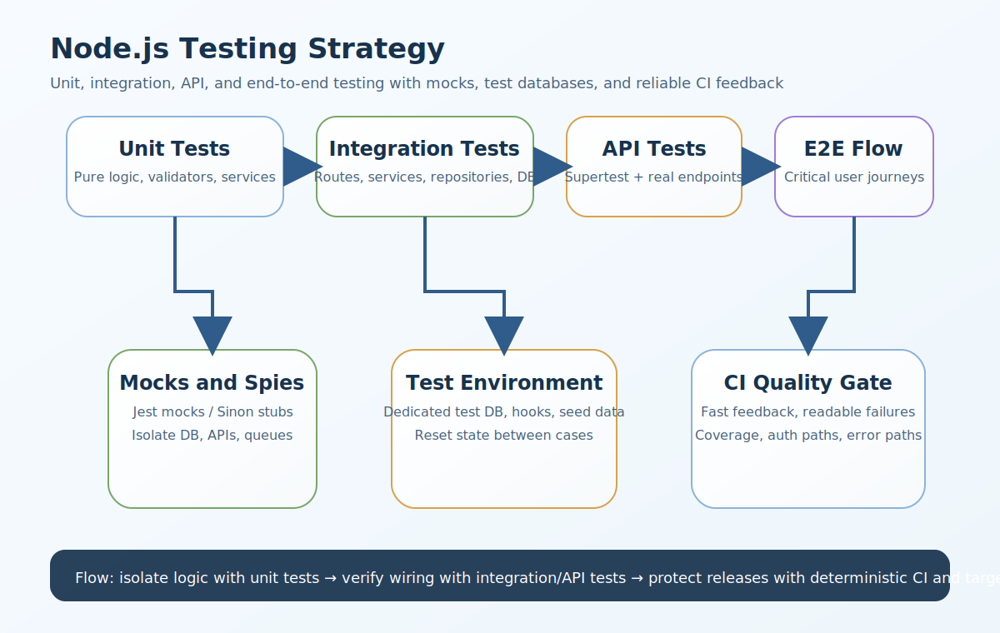

# Node.js Testing Interview Questions


This guide covers testing in Node.js from interview basics to tricky production scenarios. It follows the corrected format of **100 interview questions for each subtopic**, and every answer includes a real Node.js code example plus a real-time example so the scenarios and snippets do not repeat verbatim.

## How To Use This Page

- Questions 1-100 cover Why testing matters.
- Questions 101-200 cover Types of testing in Node.js.
- Questions 201-300 cover Unit testing.
- Questions 301-400 cover Testing tools in Node.js.
- Questions 401-500 cover Jest vs Mocha.
- Questions 501-600 cover Test structure in Node.js projects.
- Questions 601-700 cover What to unit test.
- Questions 701-800 cover What not to over-unit-test.
- Questions 801-900 cover Integration testing.
- Questions 901-1000 cover API testing.
- Questions 1001-1100 cover Testing authenticated APIs.
- Questions 1101-1200 cover Mocking and stubbing.
- Questions 1201-1300 cover Mocking in Jest.
- Questions 1301-1400 cover Stubs and spies.
- Questions 1401-1500 cover Mocking with Mocha + Sinon.
- Questions 1501-1600 cover Mocking external dependencies.
- Questions 1601-1700 cover Database testing strategy.
- Questions 1701-1800 cover Test lifecycle hooks.
- Questions 1801-1900 cover Arrange, Act, Assert pattern.
- Questions 1901-2000 cover Positive and negative test cases.
- Questions 2001-2100 cover Error handling tests.
- Questions 2101-2200 cover Snapshot testing.
- Questions 2201-2300 cover Code coverage.
- Questions 2301-2400 cover Good testing practices.
- Questions 2401-2500 cover Common mistakes in Node.js testing.
- Questions 2501-2600 cover Async testing in Node.js.
- Questions 2601-2700 cover Testing middleware.
- Questions 2701-2800 cover Testing services vs controllers.
- Questions 2801-2900 cover Real-world example: login flow.
- Questions 2901-3000 cover Useful libraries to know.
- Questions 3001-3100 cover Common interview questions.
- Questions 3101-3200 cover Topics you should not miss.
- Questions 3201-3300 cover Strong senior-level answer.

## 1. Why testing matters

### Q1.1 What is why testing matters in Node.js testing?

**Answer:**

Why testing matters matters in Node.js testing because it affects change safety, regression prevention, code clarity, release confidence, and the ability to verify behavior across isolated logic, APIs, and integrated flows. In a real system like a Node.js API where frequent releases require confidence that user, auth, and billing changes will not break existing flows, a strong answer should connect the concept to test speed, determinism, mocking boundaries, realistic integration coverage, and failure-path verification. A more senior answer also explains the practical trade-off so the answer stays grounded in real engineering trade-offs instead of only testing terminology.

**Code Example:**

```js
const testingNote1 = { section: 1, value: 'testing strategy', question: 1 };
console.log(testingNote1);
```

**Real-Time Example:** In a Node.js API where frequent releases require confidence that user, auth, and billing changes will not break existing flows, the team used this concept so the answer stays grounded in real engineering trade-offs instead of only testing terminology.

### Q1.2 Why does regression prevention matter in real production systems?

**Answer:**

Regression prevention matters in Node.js testing because it affects change safety, regression prevention, code clarity, release confidence, and the ability to verify behavior across isolated logic, APIs, and integrated flows. In a real system like a microservices platform where route logic, service logic, queue consumers, and storage integrations all need different test levels, a strong answer should connect the concept to test speed, determinism, mocking boundaries, realistic integration coverage, and failure-path verification. A more senior answer also explains the practical trade-off so teams can change code more safely without introducing silent regressions.

**Code Example:**

```js
function testingDecision2(needsIsolation) { return needsIsolation ? 'unit-test' : 'integration-test'; }
console.log(testingDecision2(true));
```

**Real-Time Example:** In a microservices platform where route logic, service logic, queue consumers, and storage integrations all need different test levels, the team used this concept so teams can change code more safely without introducing silent regressions.

### Q1.3 When should a backend team use refactoring safety?

**Answer:**

Refactoring safety matters in Node.js testing because it affects change safety, regression prevention, code clarity, release confidence, and the ability to verify behavior across isolated logic, APIs, and integrated flows. In a real system like a CMS-style application where login, profile updates, document uploads, and notifications must be tested across layers, a strong answer should connect the concept to test speed, determinism, mocking boundaries, realistic integration coverage, and failure-path verification. A more senior answer also explains the practical trade-off so the difference between unit, integration, and API tests becomes easier to justify.

**Code Example:**

```js
const strategyMap3 = ['unit', 'integration', 'api', 'e2e'];
console.log({ q: 3, strategyMap: strategyMap3 });
```

**Real-Time Example:** In a CMS-style application where login, profile updates, document uploads, and notifications must be tested across layers, the team used this concept so the difference between unit, integration, and API tests becomes easier to justify.

### Q1.4 How would you explain deployment confidence in an interview?

**Answer:**

Deployment confidence matters in Node.js testing because it affects change safety, regression prevention, code clarity, release confidence, and the ability to verify behavior across isolated logic, APIs, and integrated flows. In a real system like a team refactoring a monolith into cleaner controllers, services, and repositories without changing behavior, a strong answer should connect the concept to test speed, determinism, mocking boundaries, realistic integration coverage, and failure-path verification. A more senior answer also explains the practical trade-off so mocking decisions stay focused on isolation instead of hiding important behavior.

**Code Example:**

```js
const tradeoff4 = { speed: 'fast', realism: 'lower', useCase: 'isolated logic' };
console.log(tradeoff4);
```

**Real-Time Example:** In a team refactoring a monolith into cleaner controllers, services, and repositories without changing behavior, the team used this concept so mocking decisions stay focused on isolation instead of hiding important behavior.

### Q1.5 What is a common interview trap around expected behavior documentation?

**Answer:**

Expected behavior documentation matters in Node.js testing because it affects change safety, regression prevention, code clarity, release confidence, and the ability to verify behavior across isolated logic, APIs, and integrated flows. In a real system like a production issue where a missing await caused a test to pass while the real endpoint failed under load, a strong answer should connect the concept to test speed, determinism, mocking boundaries, realistic integration coverage, and failure-path verification. A more senior answer also explains the practical trade-off so the examples sound like production Node.js systems instead of textbook test cases.

**Code Example:**

```js
const checklist5 = ['readable', 'deterministic', 'isolated', 'meaningful'];
console.log(checklist5);
```

**Real-Time Example:** In a production issue where a missing await caused a test to pass while the real endpoint failed under load, the team used this concept so the examples sound like production Node.js systems instead of textbook test cases.

### Q1.6 How is why testing matters implemented safely in Node.js projects?

**Answer:**

Why testing matters matters in Node.js testing because it affects change safety, regression prevention, code clarity, release confidence, and the ability to verify behavior across isolated logic, APIs, and integrated flows. In a real system like a multi-tenant SaaS where permission checks and auth failures must be tested carefully for data isolation, a strong answer should connect the concept to test speed, determinism, mocking boundaries, realistic integration coverage, and failure-path verification. A more senior answer also explains the practical trade-off so fast, deterministic feedback becomes part of delivery quality rather than an afterthought.

**Code Example:**

```js
const testingNote6 = { section: 1, value: 'testing strategy', question: 6 };
console.log(testingNote6);
```

**Real-Time Example:** In a multi-tenant SaaS where permission checks and auth failures must be tested carefully for data isolation, the team used this concept so fast, deterministic feedback becomes part of delivery quality rather than an afterthought.

### Q1.7 What production problem usually exposes weak understanding of regression prevention?

**Answer:**

Regression prevention matters in Node.js testing because it affects change safety, regression prevention, code clarity, release confidence, and the ability to verify behavior across isolated logic, APIs, and integrated flows. In a real system like a CI pipeline where flaky tests slow releases and reduce trust in automated checks, a strong answer should connect the concept to test speed, determinism, mocking boundaries, realistic integration coverage, and failure-path verification. A more senior answer also explains the practical trade-off so auth, validation, and failure paths are treated as first-class test targets.

**Code Example:**

```js
function testingDecision7(needsIsolation) { return needsIsolation ? 'unit-test' : 'integration-test'; }
console.log(testingDecision7(true));
```

**Real-Time Example:** In a CI pipeline where flaky tests slow releases and reduce trust in automated checks, the team used this concept so auth, validation, and failure paths are treated as first-class test targets.

### Q1.8 How would a senior engineer justify refactoring safety to a team?

**Answer:**

Refactoring safety matters in Node.js testing because it affects change safety, regression prevention, code clarity, release confidence, and the ability to verify behavior across isolated logic, APIs, and integrated flows. In a real system like an Express application where validation, auth middleware, and error handling must be verified end to end, a strong answer should connect the concept to test speed, determinism, mocking boundaries, realistic integration coverage, and failure-path verification. A more senior answer also explains the practical trade-off so coverage numbers are balanced with test usefulness and maintainability.

**Code Example:**

```js
const strategyMap8 = ['unit', 'integration', 'api', 'e2e'];
console.log({ q: 8, strategyMap: strategyMap8 });
```

**Real-Time Example:** In an Express application where validation, auth middleware, and error handling must be verified end to end, the team used this concept so coverage numbers are balanced with test usefulness and maintainability.

### Q1.9 What trade-off does deployment confidence introduce?

**Answer:**

Deployment confidence matters in Node.js testing because it affects change safety, regression prevention, code clarity, release confidence, and the ability to verify behavior across isolated logic, APIs, and integrated flows. In a real system like a login flow with password validation, token creation, refresh token rotation, and logout revocation logic, a strong answer should connect the concept to test speed, determinism, mocking boundaries, realistic integration coverage, and failure-path verification. A more senior answer also explains the practical trade-off so asynchronous behavior and real failure modes are easier to reason about.

**Code Example:**

```js
const tradeoff9 = { speed: 'fast', realism: 'lower', useCase: 'isolated logic' };
console.log(tradeoff9);
```

**Real-Time Example:** In a login flow with password validation, token creation, refresh token rotation, and logout revocation logic, the team used this concept so asynchronous behavior and real failure modes are easier to reason about.

### Q1.10 How do you answer a tricky follow-up about expected behavior documentation?

**Answer:**

Expected behavior documentation matters in Node.js testing because it affects change safety, regression prevention, code clarity, release confidence, and the ability to verify behavior across isolated logic, APIs, and integrated flows. In a real system like a backend that integrates with Redis, third-party APIs, email delivery, and file storage, all of which should be mocked appropriately, a strong answer should connect the concept to test speed, determinism, mocking boundaries, realistic integration coverage, and failure-path verification. A more senior answer also explains the practical trade-off so the answer reflects senior-level thinking about confidence, speed, and maintainability.

**Code Example:**

```js
const checklist10 = ['readable', 'deterministic', 'isolated', 'meaningful'];
console.log(checklist10);
```

**Real-Time Example:** In a backend that integrates with Redis, third-party APIs, email delivery, and file storage, all of which should be mocked appropriately, the team used this concept so the answer reflects senior-level thinking about confidence, speed, and maintainability.

### Q1.11 What is why testing matters in Node.js testing?

**Answer:**

Why testing matters matters in Node.js testing because it affects change safety, regression prevention, code clarity, release confidence, and the ability to verify behavior across isolated logic, APIs, and integrated flows. In a real system like a Node.js API where frequent releases require confidence that user, auth, and billing changes will not break existing flows, a strong answer should connect the concept to test speed, determinism, mocking boundaries, realistic integration coverage, and failure-path verification. A more senior answer also explains the practical trade-off so the answer stays grounded in real engineering trade-offs instead of only testing terminology.

**Code Example:**

```js
const testingNote11 = { section: 1, value: 'testing strategy', question: 11 };
console.log(testingNote11);
```

**Real-Time Example:** In a Node.js API where frequent releases require confidence that user, auth, and billing changes will not break existing flows, the team used this concept so the answer stays grounded in real engineering trade-offs instead of only testing terminology.

### Q1.12 Why does regression prevention matter in real production systems?

**Answer:**

Regression prevention matters in Node.js testing because it affects change safety, regression prevention, code clarity, release confidence, and the ability to verify behavior across isolated logic, APIs, and integrated flows. In a real system like a microservices platform where route logic, service logic, queue consumers, and storage integrations all need different test levels, a strong answer should connect the concept to test speed, determinism, mocking boundaries, realistic integration coverage, and failure-path verification. A more senior answer also explains the practical trade-off so teams can change code more safely without introducing silent regressions.

**Code Example:**

```js
function testingDecision12(needsIsolation) { return needsIsolation ? 'unit-test' : 'integration-test'; }
console.log(testingDecision12(true));
```

**Real-Time Example:** In a microservices platform where route logic, service logic, queue consumers, and storage integrations all need different test levels, the team used this concept so teams can change code more safely without introducing silent regressions.

### Q1.13 When should a backend team use refactoring safety?

**Answer:**

Refactoring safety matters in Node.js testing because it affects change safety, regression prevention, code clarity, release confidence, and the ability to verify behavior across isolated logic, APIs, and integrated flows. In a real system like a CMS-style application where login, profile updates, document uploads, and notifications must be tested across layers, a strong answer should connect the concept to test speed, determinism, mocking boundaries, realistic integration coverage, and failure-path verification. A more senior answer also explains the practical trade-off so the difference between unit, integration, and API tests becomes easier to justify.

**Code Example:**

```js
const strategyMap13 = ['unit', 'integration', 'api', 'e2e'];
console.log({ q: 13, strategyMap: strategyMap13 });
```

**Real-Time Example:** In a CMS-style application where login, profile updates, document uploads, and notifications must be tested across layers, the team used this concept so the difference between unit, integration, and API tests becomes easier to justify.

### Q1.14 How would you explain deployment confidence in an interview?

**Answer:**

Deployment confidence matters in Node.js testing because it affects change safety, regression prevention, code clarity, release confidence, and the ability to verify behavior across isolated logic, APIs, and integrated flows. In a real system like a team refactoring a monolith into cleaner controllers, services, and repositories without changing behavior, a strong answer should connect the concept to test speed, determinism, mocking boundaries, realistic integration coverage, and failure-path verification. A more senior answer also explains the practical trade-off so mocking decisions stay focused on isolation instead of hiding important behavior.

**Code Example:**

```js
const tradeoff14 = { speed: 'fast', realism: 'lower', useCase: 'isolated logic' };
console.log(tradeoff14);
```

**Real-Time Example:** In a team refactoring a monolith into cleaner controllers, services, and repositories without changing behavior, the team used this concept so mocking decisions stay focused on isolation instead of hiding important behavior.

### Q1.15 What is a common interview trap around expected behavior documentation?

**Answer:**

Expected behavior documentation matters in Node.js testing because it affects change safety, regression prevention, code clarity, release confidence, and the ability to verify behavior across isolated logic, APIs, and integrated flows. In a real system like a production issue where a missing await caused a test to pass while the real endpoint failed under load, a strong answer should connect the concept to test speed, determinism, mocking boundaries, realistic integration coverage, and failure-path verification. A more senior answer also explains the practical trade-off so the examples sound like production Node.js systems instead of textbook test cases.

**Code Example:**

```js
const checklist15 = ['readable', 'deterministic', 'isolated', 'meaningful'];
console.log(checklist15);
```

**Real-Time Example:** In a production issue where a missing await caused a test to pass while the real endpoint failed under load, the team used this concept so the examples sound like production Node.js systems instead of textbook test cases.

### Q1.16 How is why testing matters implemented safely in Node.js projects?

**Answer:**

Why testing matters matters in Node.js testing because it affects change safety, regression prevention, code clarity, release confidence, and the ability to verify behavior across isolated logic, APIs, and integrated flows. In a real system like a multi-tenant SaaS where permission checks and auth failures must be tested carefully for data isolation, a strong answer should connect the concept to test speed, determinism, mocking boundaries, realistic integration coverage, and failure-path verification. A more senior answer also explains the practical trade-off so fast, deterministic feedback becomes part of delivery quality rather than an afterthought.

**Code Example:**

```js
const testingNote16 = { section: 1, value: 'testing strategy', question: 16 };
console.log(testingNote16);
```

**Real-Time Example:** In a multi-tenant SaaS where permission checks and auth failures must be tested carefully for data isolation, the team used this concept so fast, deterministic feedback becomes part of delivery quality rather than an afterthought.

### Q1.17 What production problem usually exposes weak understanding of regression prevention?

**Answer:**

Regression prevention matters in Node.js testing because it affects change safety, regression prevention, code clarity, release confidence, and the ability to verify behavior across isolated logic, APIs, and integrated flows. In a real system like a CI pipeline where flaky tests slow releases and reduce trust in automated checks, a strong answer should connect the concept to test speed, determinism, mocking boundaries, realistic integration coverage, and failure-path verification. A more senior answer also explains the practical trade-off so auth, validation, and failure paths are treated as first-class test targets.

**Code Example:**

```js
function testingDecision17(needsIsolation) { return needsIsolation ? 'unit-test' : 'integration-test'; }
console.log(testingDecision17(true));
```

**Real-Time Example:** In a CI pipeline where flaky tests slow releases and reduce trust in automated checks, the team used this concept so auth, validation, and failure paths are treated as first-class test targets.

### Q1.18 How would a senior engineer justify refactoring safety to a team?

**Answer:**

Refactoring safety matters in Node.js testing because it affects change safety, regression prevention, code clarity, release confidence, and the ability to verify behavior across isolated logic, APIs, and integrated flows. In a real system like an Express application where validation, auth middleware, and error handling must be verified end to end, a strong answer should connect the concept to test speed, determinism, mocking boundaries, realistic integration coverage, and failure-path verification. A more senior answer also explains the practical trade-off so coverage numbers are balanced with test usefulness and maintainability.

**Code Example:**

```js
const strategyMap18 = ['unit', 'integration', 'api', 'e2e'];
console.log({ q: 18, strategyMap: strategyMap18 });
```

**Real-Time Example:** In an Express application where validation, auth middleware, and error handling must be verified end to end, the team used this concept so coverage numbers are balanced with test usefulness and maintainability.

### Q1.19 What trade-off does deployment confidence introduce?

**Answer:**

Deployment confidence matters in Node.js testing because it affects change safety, regression prevention, code clarity, release confidence, and the ability to verify behavior across isolated logic, APIs, and integrated flows. In a real system like a login flow with password validation, token creation, refresh token rotation, and logout revocation logic, a strong answer should connect the concept to test speed, determinism, mocking boundaries, realistic integration coverage, and failure-path verification. A more senior answer also explains the practical trade-off so asynchronous behavior and real failure modes are easier to reason about.

**Code Example:**

```js
const tradeoff19 = { speed: 'fast', realism: 'lower', useCase: 'isolated logic' };
console.log(tradeoff19);
```

**Real-Time Example:** In a login flow with password validation, token creation, refresh token rotation, and logout revocation logic, the team used this concept so asynchronous behavior and real failure modes are easier to reason about.

### Q1.20 How do you answer a tricky follow-up about expected behavior documentation?

**Answer:**

Expected behavior documentation matters in Node.js testing because it affects change safety, regression prevention, code clarity, release confidence, and the ability to verify behavior across isolated logic, APIs, and integrated flows. In a real system like a backend that integrates with Redis, third-party APIs, email delivery, and file storage, all of which should be mocked appropriately, a strong answer should connect the concept to test speed, determinism, mocking boundaries, realistic integration coverage, and failure-path verification. A more senior answer also explains the practical trade-off so the answer reflects senior-level thinking about confidence, speed, and maintainability.

**Code Example:**

```js
const checklist20 = ['readable', 'deterministic', 'isolated', 'meaningful'];
console.log(checklist20);
```

**Real-Time Example:** In a backend that integrates with Redis, third-party APIs, email delivery, and file storage, all of which should be mocked appropriately, the team used this concept so the answer reflects senior-level thinking about confidence, speed, and maintainability.

### Q1.21 What is why testing matters in Node.js testing?

**Answer:**

Why testing matters matters in Node.js testing because it affects change safety, regression prevention, code clarity, release confidence, and the ability to verify behavior across isolated logic, APIs, and integrated flows. In a real system like a Node.js API where frequent releases require confidence that user, auth, and billing changes will not break existing flows, a strong answer should connect the concept to test speed, determinism, mocking boundaries, realistic integration coverage, and failure-path verification. A more senior answer also explains the practical trade-off so the answer stays grounded in real engineering trade-offs instead of only testing terminology.

**Code Example:**

```js
const testingNote21 = { section: 1, value: 'testing strategy', question: 21 };
console.log(testingNote21);
```

**Real-Time Example:** In a Node.js API where frequent releases require confidence that user, auth, and billing changes will not break existing flows, the team used this concept so the answer stays grounded in real engineering trade-offs instead of only testing terminology.

### Q1.22 Why does regression prevention matter in real production systems?

**Answer:**

Regression prevention matters in Node.js testing because it affects change safety, regression prevention, code clarity, release confidence, and the ability to verify behavior across isolated logic, APIs, and integrated flows. In a real system like a microservices platform where route logic, service logic, queue consumers, and storage integrations all need different test levels, a strong answer should connect the concept to test speed, determinism, mocking boundaries, realistic integration coverage, and failure-path verification. A more senior answer also explains the practical trade-off so teams can change code more safely without introducing silent regressions.

**Code Example:**

```js
function testingDecision22(needsIsolation) { return needsIsolation ? 'unit-test' : 'integration-test'; }
console.log(testingDecision22(true));
```

**Real-Time Example:** In a microservices platform where route logic, service logic, queue consumers, and storage integrations all need different test levels, the team used this concept so teams can change code more safely without introducing silent regressions.

### Q1.23 When should a backend team use refactoring safety?

**Answer:**

Refactoring safety matters in Node.js testing because it affects change safety, regression prevention, code clarity, release confidence, and the ability to verify behavior across isolated logic, APIs, and integrated flows. In a real system like a CMS-style application where login, profile updates, document uploads, and notifications must be tested across layers, a strong answer should connect the concept to test speed, determinism, mocking boundaries, realistic integration coverage, and failure-path verification. A more senior answer also explains the practical trade-off so the difference between unit, integration, and API tests becomes easier to justify.

**Code Example:**

```js
const strategyMap23 = ['unit', 'integration', 'api', 'e2e'];
console.log({ q: 23, strategyMap: strategyMap23 });
```

**Real-Time Example:** In a CMS-style application where login, profile updates, document uploads, and notifications must be tested across layers, the team used this concept so the difference between unit, integration, and API tests becomes easier to justify.

### Q1.24 How would you explain deployment confidence in an interview?

**Answer:**

Deployment confidence matters in Node.js testing because it affects change safety, regression prevention, code clarity, release confidence, and the ability to verify behavior across isolated logic, APIs, and integrated flows. In a real system like a team refactoring a monolith into cleaner controllers, services, and repositories without changing behavior, a strong answer should connect the concept to test speed, determinism, mocking boundaries, realistic integration coverage, and failure-path verification. A more senior answer also explains the practical trade-off so mocking decisions stay focused on isolation instead of hiding important behavior.

**Code Example:**

```js
const tradeoff24 = { speed: 'fast', realism: 'lower', useCase: 'isolated logic' };
console.log(tradeoff24);
```

**Real-Time Example:** In a team refactoring a monolith into cleaner controllers, services, and repositories without changing behavior, the team used this concept so mocking decisions stay focused on isolation instead of hiding important behavior.

### Q1.25 What is a common interview trap around expected behavior documentation?

**Answer:**

Expected behavior documentation matters in Node.js testing because it affects change safety, regression prevention, code clarity, release confidence, and the ability to verify behavior across isolated logic, APIs, and integrated flows. In a real system like a production issue where a missing await caused a test to pass while the real endpoint failed under load, a strong answer should connect the concept to test speed, determinism, mocking boundaries, realistic integration coverage, and failure-path verification. A more senior answer also explains the practical trade-off so the examples sound like production Node.js systems instead of textbook test cases.

**Code Example:**

```js
const checklist25 = ['readable', 'deterministic', 'isolated', 'meaningful'];
console.log(checklist25);
```

**Real-Time Example:** In a production issue where a missing await caused a test to pass while the real endpoint failed under load, the team used this concept so the examples sound like production Node.js systems instead of textbook test cases.

### Q1.26 How is why testing matters implemented safely in Node.js projects?

**Answer:**

Why testing matters matters in Node.js testing because it affects change safety, regression prevention, code clarity, release confidence, and the ability to verify behavior across isolated logic, APIs, and integrated flows. In a real system like a multi-tenant SaaS where permission checks and auth failures must be tested carefully for data isolation, a strong answer should connect the concept to test speed, determinism, mocking boundaries, realistic integration coverage, and failure-path verification. A more senior answer also explains the practical trade-off so fast, deterministic feedback becomes part of delivery quality rather than an afterthought.

**Code Example:**

```js
const testingNote26 = { section: 1, value: 'testing strategy', question: 26 };
console.log(testingNote26);
```

**Real-Time Example:** In a multi-tenant SaaS where permission checks and auth failures must be tested carefully for data isolation, the team used this concept so fast, deterministic feedback becomes part of delivery quality rather than an afterthought.

### Q1.27 What production problem usually exposes weak understanding of regression prevention?

**Answer:**

Regression prevention matters in Node.js testing because it affects change safety, regression prevention, code clarity, release confidence, and the ability to verify behavior across isolated logic, APIs, and integrated flows. In a real system like a CI pipeline where flaky tests slow releases and reduce trust in automated checks, a strong answer should connect the concept to test speed, determinism, mocking boundaries, realistic integration coverage, and failure-path verification. A more senior answer also explains the practical trade-off so auth, validation, and failure paths are treated as first-class test targets.

**Code Example:**

```js
function testingDecision27(needsIsolation) { return needsIsolation ? 'unit-test' : 'integration-test'; }
console.log(testingDecision27(true));
```

**Real-Time Example:** In a CI pipeline where flaky tests slow releases and reduce trust in automated checks, the team used this concept so auth, validation, and failure paths are treated as first-class test targets.

### Q1.28 How would a senior engineer justify refactoring safety to a team?

**Answer:**

Refactoring safety matters in Node.js testing because it affects change safety, regression prevention, code clarity, release confidence, and the ability to verify behavior across isolated logic, APIs, and integrated flows. In a real system like an Express application where validation, auth middleware, and error handling must be verified end to end, a strong answer should connect the concept to test speed, determinism, mocking boundaries, realistic integration coverage, and failure-path verification. A more senior answer also explains the practical trade-off so coverage numbers are balanced with test usefulness and maintainability.

**Code Example:**

```js
const strategyMap28 = ['unit', 'integration', 'api', 'e2e'];
console.log({ q: 28, strategyMap: strategyMap28 });
```

**Real-Time Example:** In an Express application where validation, auth middleware, and error handling must be verified end to end, the team used this concept so coverage numbers are balanced with test usefulness and maintainability.

### Q1.29 What trade-off does deployment confidence introduce?

**Answer:**

Deployment confidence matters in Node.js testing because it affects change safety, regression prevention, code clarity, release confidence, and the ability to verify behavior across isolated logic, APIs, and integrated flows. In a real system like a login flow with password validation, token creation, refresh token rotation, and logout revocation logic, a strong answer should connect the concept to test speed, determinism, mocking boundaries, realistic integration coverage, and failure-path verification. A more senior answer also explains the practical trade-off so asynchronous behavior and real failure modes are easier to reason about.

**Code Example:**

```js
const tradeoff29 = { speed: 'fast', realism: 'lower', useCase: 'isolated logic' };
console.log(tradeoff29);
```

**Real-Time Example:** In a login flow with password validation, token creation, refresh token rotation, and logout revocation logic, the team used this concept so asynchronous behavior and real failure modes are easier to reason about.

### Q1.30 How do you answer a tricky follow-up about expected behavior documentation?

**Answer:**

Expected behavior documentation matters in Node.js testing because it affects change safety, regression prevention, code clarity, release confidence, and the ability to verify behavior across isolated logic, APIs, and integrated flows. In a real system like a backend that integrates with Redis, third-party APIs, email delivery, and file storage, all of which should be mocked appropriately, a strong answer should connect the concept to test speed, determinism, mocking boundaries, realistic integration coverage, and failure-path verification. A more senior answer also explains the practical trade-off so the answer reflects senior-level thinking about confidence, speed, and maintainability.

**Code Example:**

```js
const checklist30 = ['readable', 'deterministic', 'isolated', 'meaningful'];
console.log(checklist30);
```

**Real-Time Example:** In a backend that integrates with Redis, third-party APIs, email delivery, and file storage, all of which should be mocked appropriately, the team used this concept so the answer reflects senior-level thinking about confidence, speed, and maintainability.

### Q1.31 What is why testing matters in Node.js testing?

**Answer:**

Why testing matters matters in Node.js testing because it affects change safety, regression prevention, code clarity, release confidence, and the ability to verify behavior across isolated logic, APIs, and integrated flows. In a real system like a Node.js API where frequent releases require confidence that user, auth, and billing changes will not break existing flows, a strong answer should connect the concept to test speed, determinism, mocking boundaries, realistic integration coverage, and failure-path verification. A more senior answer also explains the practical trade-off so the answer stays grounded in real engineering trade-offs instead of only testing terminology.

**Code Example:**

```js
const testingNote31 = { section: 1, value: 'testing strategy', question: 31 };
console.log(testingNote31);
```

**Real-Time Example:** In a Node.js API where frequent releases require confidence that user, auth, and billing changes will not break existing flows, the team used this concept so the answer stays grounded in real engineering trade-offs instead of only testing terminology.

### Q1.32 Why does regression prevention matter in real production systems?

**Answer:**

Regression prevention matters in Node.js testing because it affects change safety, regression prevention, code clarity, release confidence, and the ability to verify behavior across isolated logic, APIs, and integrated flows. In a real system like a microservices platform where route logic, service logic, queue consumers, and storage integrations all need different test levels, a strong answer should connect the concept to test speed, determinism, mocking boundaries, realistic integration coverage, and failure-path verification. A more senior answer also explains the practical trade-off so teams can change code more safely without introducing silent regressions.

**Code Example:**

```js
function testingDecision32(needsIsolation) { return needsIsolation ? 'unit-test' : 'integration-test'; }
console.log(testingDecision32(true));
```

**Real-Time Example:** In a microservices platform where route logic, service logic, queue consumers, and storage integrations all need different test levels, the team used this concept so teams can change code more safely without introducing silent regressions.

### Q1.33 When should a backend team use refactoring safety?

**Answer:**

Refactoring safety matters in Node.js testing because it affects change safety, regression prevention, code clarity, release confidence, and the ability to verify behavior across isolated logic, APIs, and integrated flows. In a real system like a CMS-style application where login, profile updates, document uploads, and notifications must be tested across layers, a strong answer should connect the concept to test speed, determinism, mocking boundaries, realistic integration coverage, and failure-path verification. A more senior answer also explains the practical trade-off so the difference between unit, integration, and API tests becomes easier to justify.

**Code Example:**

```js
const strategyMap33 = ['unit', 'integration', 'api', 'e2e'];
console.log({ q: 33, strategyMap: strategyMap33 });
```

**Real-Time Example:** In a CMS-style application where login, profile updates, document uploads, and notifications must be tested across layers, the team used this concept so the difference between unit, integration, and API tests becomes easier to justify.

### Q1.34 How would you explain deployment confidence in an interview?

**Answer:**

Deployment confidence matters in Node.js testing because it affects change safety, regression prevention, code clarity, release confidence, and the ability to verify behavior across isolated logic, APIs, and integrated flows. In a real system like a team refactoring a monolith into cleaner controllers, services, and repositories without changing behavior, a strong answer should connect the concept to test speed, determinism, mocking boundaries, realistic integration coverage, and failure-path verification. A more senior answer also explains the practical trade-off so mocking decisions stay focused on isolation instead of hiding important behavior.

**Code Example:**

```js
const tradeoff34 = { speed: 'fast', realism: 'lower', useCase: 'isolated logic' };
console.log(tradeoff34);
```

**Real-Time Example:** In a team refactoring a monolith into cleaner controllers, services, and repositories without changing behavior, the team used this concept so mocking decisions stay focused on isolation instead of hiding important behavior.

### Q1.35 What is a common interview trap around expected behavior documentation?

**Answer:**

Expected behavior documentation matters in Node.js testing because it affects change safety, regression prevention, code clarity, release confidence, and the ability to verify behavior across isolated logic, APIs, and integrated flows. In a real system like a production issue where a missing await caused a test to pass while the real endpoint failed under load, a strong answer should connect the concept to test speed, determinism, mocking boundaries, realistic integration coverage, and failure-path verification. A more senior answer also explains the practical trade-off so the examples sound like production Node.js systems instead of textbook test cases.

**Code Example:**

```js
const checklist35 = ['readable', 'deterministic', 'isolated', 'meaningful'];
console.log(checklist35);
```

**Real-Time Example:** In a production issue where a missing await caused a test to pass while the real endpoint failed under load, the team used this concept so the examples sound like production Node.js systems instead of textbook test cases.

### Q1.36 How is why testing matters implemented safely in Node.js projects?

**Answer:**

Why testing matters matters in Node.js testing because it affects change safety, regression prevention, code clarity, release confidence, and the ability to verify behavior across isolated logic, APIs, and integrated flows. In a real system like a multi-tenant SaaS where permission checks and auth failures must be tested carefully for data isolation, a strong answer should connect the concept to test speed, determinism, mocking boundaries, realistic integration coverage, and failure-path verification. A more senior answer also explains the practical trade-off so fast, deterministic feedback becomes part of delivery quality rather than an afterthought.

**Code Example:**

```js
const testingNote36 = { section: 1, value: 'testing strategy', question: 36 };
console.log(testingNote36);
```

**Real-Time Example:** In a multi-tenant SaaS where permission checks and auth failures must be tested carefully for data isolation, the team used this concept so fast, deterministic feedback becomes part of delivery quality rather than an afterthought.

### Q1.37 What production problem usually exposes weak understanding of regression prevention?

**Answer:**

Regression prevention matters in Node.js testing because it affects change safety, regression prevention, code clarity, release confidence, and the ability to verify behavior across isolated logic, APIs, and integrated flows. In a real system like a CI pipeline where flaky tests slow releases and reduce trust in automated checks, a strong answer should connect the concept to test speed, determinism, mocking boundaries, realistic integration coverage, and failure-path verification. A more senior answer also explains the practical trade-off so auth, validation, and failure paths are treated as first-class test targets.

**Code Example:**

```js
function testingDecision37(needsIsolation) { return needsIsolation ? 'unit-test' : 'integration-test'; }
console.log(testingDecision37(true));
```

**Real-Time Example:** In a CI pipeline where flaky tests slow releases and reduce trust in automated checks, the team used this concept so auth, validation, and failure paths are treated as first-class test targets.

### Q1.38 How would a senior engineer justify refactoring safety to a team?

**Answer:**

Refactoring safety matters in Node.js testing because it affects change safety, regression prevention, code clarity, release confidence, and the ability to verify behavior across isolated logic, APIs, and integrated flows. In a real system like an Express application where validation, auth middleware, and error handling must be verified end to end, a strong answer should connect the concept to test speed, determinism, mocking boundaries, realistic integration coverage, and failure-path verification. A more senior answer also explains the practical trade-off so coverage numbers are balanced with test usefulness and maintainability.

**Code Example:**

```js
const strategyMap38 = ['unit', 'integration', 'api', 'e2e'];
console.log({ q: 38, strategyMap: strategyMap38 });
```

**Real-Time Example:** In an Express application where validation, auth middleware, and error handling must be verified end to end, the team used this concept so coverage numbers are balanced with test usefulness and maintainability.

### Q1.39 What trade-off does deployment confidence introduce?

**Answer:**

Deployment confidence matters in Node.js testing because it affects change safety, regression prevention, code clarity, release confidence, and the ability to verify behavior across isolated logic, APIs, and integrated flows. In a real system like a login flow with password validation, token creation, refresh token rotation, and logout revocation logic, a strong answer should connect the concept to test speed, determinism, mocking boundaries, realistic integration coverage, and failure-path verification. A more senior answer also explains the practical trade-off so asynchronous behavior and real failure modes are easier to reason about.

**Code Example:**

```js
const tradeoff39 = { speed: 'fast', realism: 'lower', useCase: 'isolated logic' };
console.log(tradeoff39);
```

**Real-Time Example:** In a login flow with password validation, token creation, refresh token rotation, and logout revocation logic, the team used this concept so asynchronous behavior and real failure modes are easier to reason about.

### Q1.40 How do you answer a tricky follow-up about expected behavior documentation?

**Answer:**

Expected behavior documentation matters in Node.js testing because it affects change safety, regression prevention, code clarity, release confidence, and the ability to verify behavior across isolated logic, APIs, and integrated flows. In a real system like a backend that integrates with Redis, third-party APIs, email delivery, and file storage, all of which should be mocked appropriately, a strong answer should connect the concept to test speed, determinism, mocking boundaries, realistic integration coverage, and failure-path verification. A more senior answer also explains the practical trade-off so the answer reflects senior-level thinking about confidence, speed, and maintainability.

**Code Example:**

```js
const checklist40 = ['readable', 'deterministic', 'isolated', 'meaningful'];
console.log(checklist40);
```

**Real-Time Example:** In a backend that integrates with Redis, third-party APIs, email delivery, and file storage, all of which should be mocked appropriately, the team used this concept so the answer reflects senior-level thinking about confidence, speed, and maintainability.

### Q1.41 What is why testing matters in Node.js testing?

**Answer:**

Why testing matters matters in Node.js testing because it affects change safety, regression prevention, code clarity, release confidence, and the ability to verify behavior across isolated logic, APIs, and integrated flows. In a real system like a Node.js API where frequent releases require confidence that user, auth, and billing changes will not break existing flows, a strong answer should connect the concept to test speed, determinism, mocking boundaries, realistic integration coverage, and failure-path verification. A more senior answer also explains the practical trade-off so the answer stays grounded in real engineering trade-offs instead of only testing terminology.

**Code Example:**

```js
const testingNote41 = { section: 1, value: 'testing strategy', question: 41 };
console.log(testingNote41);
```

**Real-Time Example:** In a Node.js API where frequent releases require confidence that user, auth, and billing changes will not break existing flows, the team used this concept so the answer stays grounded in real engineering trade-offs instead of only testing terminology.

### Q1.42 Why does regression prevention matter in real production systems?

**Answer:**

Regression prevention matters in Node.js testing because it affects change safety, regression prevention, code clarity, release confidence, and the ability to verify behavior across isolated logic, APIs, and integrated flows. In a real system like a microservices platform where route logic, service logic, queue consumers, and storage integrations all need different test levels, a strong answer should connect the concept to test speed, determinism, mocking boundaries, realistic integration coverage, and failure-path verification. A more senior answer also explains the practical trade-off so teams can change code more safely without introducing silent regressions.

**Code Example:**

```js
function testingDecision42(needsIsolation) { return needsIsolation ? 'unit-test' : 'integration-test'; }
console.log(testingDecision42(true));
```

**Real-Time Example:** In a microservices platform where route logic, service logic, queue consumers, and storage integrations all need different test levels, the team used this concept so teams can change code more safely without introducing silent regressions.

### Q1.43 When should a backend team use refactoring safety?

**Answer:**

Refactoring safety matters in Node.js testing because it affects change safety, regression prevention, code clarity, release confidence, and the ability to verify behavior across isolated logic, APIs, and integrated flows. In a real system like a CMS-style application where login, profile updates, document uploads, and notifications must be tested across layers, a strong answer should connect the concept to test speed, determinism, mocking boundaries, realistic integration coverage, and failure-path verification. A more senior answer also explains the practical trade-off so the difference between unit, integration, and API tests becomes easier to justify.

**Code Example:**

```js
const strategyMap43 = ['unit', 'integration', 'api', 'e2e'];
console.log({ q: 43, strategyMap: strategyMap43 });
```

**Real-Time Example:** In a CMS-style application where login, profile updates, document uploads, and notifications must be tested across layers, the team used this concept so the difference between unit, integration, and API tests becomes easier to justify.

### Q1.44 How would you explain deployment confidence in an interview?

**Answer:**

Deployment confidence matters in Node.js testing because it affects change safety, regression prevention, code clarity, release confidence, and the ability to verify behavior across isolated logic, APIs, and integrated flows. In a real system like a team refactoring a monolith into cleaner controllers, services, and repositories without changing behavior, a strong answer should connect the concept to test speed, determinism, mocking boundaries, realistic integration coverage, and failure-path verification. A more senior answer also explains the practical trade-off so mocking decisions stay focused on isolation instead of hiding important behavior.

**Code Example:**

```js
const tradeoff44 = { speed: 'fast', realism: 'lower', useCase: 'isolated logic' };
console.log(tradeoff44);
```

**Real-Time Example:** In a team refactoring a monolith into cleaner controllers, services, and repositories without changing behavior, the team used this concept so mocking decisions stay focused on isolation instead of hiding important behavior.

### Q1.45 What is a common interview trap around expected behavior documentation?

**Answer:**

Expected behavior documentation matters in Node.js testing because it affects change safety, regression prevention, code clarity, release confidence, and the ability to verify behavior across isolated logic, APIs, and integrated flows. In a real system like a production issue where a missing await caused a test to pass while the real endpoint failed under load, a strong answer should connect the concept to test speed, determinism, mocking boundaries, realistic integration coverage, and failure-path verification. A more senior answer also explains the practical trade-off so the examples sound like production Node.js systems instead of textbook test cases.

**Code Example:**

```js
const checklist45 = ['readable', 'deterministic', 'isolated', 'meaningful'];
console.log(checklist45);
```

**Real-Time Example:** In a production issue where a missing await caused a test to pass while the real endpoint failed under load, the team used this concept so the examples sound like production Node.js systems instead of textbook test cases.

### Q1.46 How is why testing matters implemented safely in Node.js projects?

**Answer:**

Why testing matters matters in Node.js testing because it affects change safety, regression prevention, code clarity, release confidence, and the ability to verify behavior across isolated logic, APIs, and integrated flows. In a real system like a multi-tenant SaaS where permission checks and auth failures must be tested carefully for data isolation, a strong answer should connect the concept to test speed, determinism, mocking boundaries, realistic integration coverage, and failure-path verification. A more senior answer also explains the practical trade-off so fast, deterministic feedback becomes part of delivery quality rather than an afterthought.

**Code Example:**

```js
const testingNote46 = { section: 1, value: 'testing strategy', question: 46 };
console.log(testingNote46);
```

**Real-Time Example:** In a multi-tenant SaaS where permission checks and auth failures must be tested carefully for data isolation, the team used this concept so fast, deterministic feedback becomes part of delivery quality rather than an afterthought.

### Q1.47 What production problem usually exposes weak understanding of regression prevention?

**Answer:**

Regression prevention matters in Node.js testing because it affects change safety, regression prevention, code clarity, release confidence, and the ability to verify behavior across isolated logic, APIs, and integrated flows. In a real system like a CI pipeline where flaky tests slow releases and reduce trust in automated checks, a strong answer should connect the concept to test speed, determinism, mocking boundaries, realistic integration coverage, and failure-path verification. A more senior answer also explains the practical trade-off so auth, validation, and failure paths are treated as first-class test targets.

**Code Example:**

```js
function testingDecision47(needsIsolation) { return needsIsolation ? 'unit-test' : 'integration-test'; }
console.log(testingDecision47(true));
```

**Real-Time Example:** In a CI pipeline where flaky tests slow releases and reduce trust in automated checks, the team used this concept so auth, validation, and failure paths are treated as first-class test targets.

### Q1.48 How would a senior engineer justify refactoring safety to a team?

**Answer:**

Refactoring safety matters in Node.js testing because it affects change safety, regression prevention, code clarity, release confidence, and the ability to verify behavior across isolated logic, APIs, and integrated flows. In a real system like an Express application where validation, auth middleware, and error handling must be verified end to end, a strong answer should connect the concept to test speed, determinism, mocking boundaries, realistic integration coverage, and failure-path verification. A more senior answer also explains the practical trade-off so coverage numbers are balanced with test usefulness and maintainability.

**Code Example:**

```js
const strategyMap48 = ['unit', 'integration', 'api', 'e2e'];
console.log({ q: 48, strategyMap: strategyMap48 });
```

**Real-Time Example:** In an Express application where validation, auth middleware, and error handling must be verified end to end, the team used this concept so coverage numbers are balanced with test usefulness and maintainability.

### Q1.49 What trade-off does deployment confidence introduce?

**Answer:**

Deployment confidence matters in Node.js testing because it affects change safety, regression prevention, code clarity, release confidence, and the ability to verify behavior across isolated logic, APIs, and integrated flows. In a real system like a login flow with password validation, token creation, refresh token rotation, and logout revocation logic, a strong answer should connect the concept to test speed, determinism, mocking boundaries, realistic integration coverage, and failure-path verification. A more senior answer also explains the practical trade-off so asynchronous behavior and real failure modes are easier to reason about.

**Code Example:**

```js
const tradeoff49 = { speed: 'fast', realism: 'lower', useCase: 'isolated logic' };
console.log(tradeoff49);
```

**Real-Time Example:** In a login flow with password validation, token creation, refresh token rotation, and logout revocation logic, the team used this concept so asynchronous behavior and real failure modes are easier to reason about.

### Q1.50 How do you answer a tricky follow-up about expected behavior documentation?

**Answer:**

Expected behavior documentation matters in Node.js testing because it affects change safety, regression prevention, code clarity, release confidence, and the ability to verify behavior across isolated logic, APIs, and integrated flows. In a real system like a backend that integrates with Redis, third-party APIs, email delivery, and file storage, all of which should be mocked appropriately, a strong answer should connect the concept to test speed, determinism, mocking boundaries, realistic integration coverage, and failure-path verification. A more senior answer also explains the practical trade-off so the answer reflects senior-level thinking about confidence, speed, and maintainability.

**Code Example:**

```js
const checklist50 = ['readable', 'deterministic', 'isolated', 'meaningful'];
console.log(checklist50);
```

**Real-Time Example:** In a backend that integrates with Redis, third-party APIs, email delivery, and file storage, all of which should be mocked appropriately, the team used this concept so the answer reflects senior-level thinking about confidence, speed, and maintainability.

### Q1.51 What is why testing matters in Node.js testing?

**Answer:**

Why testing matters matters in Node.js testing because it affects change safety, regression prevention, code clarity, release confidence, and the ability to verify behavior across isolated logic, APIs, and integrated flows. In a real system like a Node.js API where frequent releases require confidence that user, auth, and billing changes will not break existing flows, a strong answer should connect the concept to test speed, determinism, mocking boundaries, realistic integration coverage, and failure-path verification. A more senior answer also explains the practical trade-off so the answer stays grounded in real engineering trade-offs instead of only testing terminology.

**Code Example:**

```js
const testingNote51 = { section: 1, value: 'testing strategy', question: 51 };
console.log(testingNote51);
```

**Real-Time Example:** In a Node.js API where frequent releases require confidence that user, auth, and billing changes will not break existing flows, the team used this concept so the answer stays grounded in real engineering trade-offs instead of only testing terminology.

### Q1.52 Why does regression prevention matter in real production systems?

**Answer:**

Regression prevention matters in Node.js testing because it affects change safety, regression prevention, code clarity, release confidence, and the ability to verify behavior across isolated logic, APIs, and integrated flows. In a real system like a microservices platform where route logic, service logic, queue consumers, and storage integrations all need different test levels, a strong answer should connect the concept to test speed, determinism, mocking boundaries, realistic integration coverage, and failure-path verification. A more senior answer also explains the practical trade-off so teams can change code more safely without introducing silent regressions.

**Code Example:**

```js
function testingDecision52(needsIsolation) { return needsIsolation ? 'unit-test' : 'integration-test'; }
console.log(testingDecision52(true));
```

**Real-Time Example:** In a microservices platform where route logic, service logic, queue consumers, and storage integrations all need different test levels, the team used this concept so teams can change code more safely without introducing silent regressions.

### Q1.53 When should a backend team use refactoring safety?

**Answer:**

Refactoring safety matters in Node.js testing because it affects change safety, regression prevention, code clarity, release confidence, and the ability to verify behavior across isolated logic, APIs, and integrated flows. In a real system like a CMS-style application where login, profile updates, document uploads, and notifications must be tested across layers, a strong answer should connect the concept to test speed, determinism, mocking boundaries, realistic integration coverage, and failure-path verification. A more senior answer also explains the practical trade-off so the difference between unit, integration, and API tests becomes easier to justify.

**Code Example:**

```js
const strategyMap53 = ['unit', 'integration', 'api', 'e2e'];
console.log({ q: 53, strategyMap: strategyMap53 });
```

**Real-Time Example:** In a CMS-style application where login, profile updates, document uploads, and notifications must be tested across layers, the team used this concept so the difference between unit, integration, and API tests becomes easier to justify.

### Q1.54 How would you explain deployment confidence in an interview?

**Answer:**

Deployment confidence matters in Node.js testing because it affects change safety, regression prevention, code clarity, release confidence, and the ability to verify behavior across isolated logic, APIs, and integrated flows. In a real system like a team refactoring a monolith into cleaner controllers, services, and repositories without changing behavior, a strong answer should connect the concept to test speed, determinism, mocking boundaries, realistic integration coverage, and failure-path verification. A more senior answer also explains the practical trade-off so mocking decisions stay focused on isolation instead of hiding important behavior.

**Code Example:**

```js
const tradeoff54 = { speed: 'fast', realism: 'lower', useCase: 'isolated logic' };
console.log(tradeoff54);
```

**Real-Time Example:** In a team refactoring a monolith into cleaner controllers, services, and repositories without changing behavior, the team used this concept so mocking decisions stay focused on isolation instead of hiding important behavior.

### Q1.55 What is a common interview trap around expected behavior documentation?

**Answer:**

Expected behavior documentation matters in Node.js testing because it affects change safety, regression prevention, code clarity, release confidence, and the ability to verify behavior across isolated logic, APIs, and integrated flows. In a real system like a production issue where a missing await caused a test to pass while the real endpoint failed under load, a strong answer should connect the concept to test speed, determinism, mocking boundaries, realistic integration coverage, and failure-path verification. A more senior answer also explains the practical trade-off so the examples sound like production Node.js systems instead of textbook test cases.

**Code Example:**

```js
const checklist55 = ['readable', 'deterministic', 'isolated', 'meaningful'];
console.log(checklist55);
```

**Real-Time Example:** In a production issue where a missing await caused a test to pass while the real endpoint failed under load, the team used this concept so the examples sound like production Node.js systems instead of textbook test cases.

### Q1.56 How is why testing matters implemented safely in Node.js projects?

**Answer:**

Why testing matters matters in Node.js testing because it affects change safety, regression prevention, code clarity, release confidence, and the ability to verify behavior across isolated logic, APIs, and integrated flows. In a real system like a multi-tenant SaaS where permission checks and auth failures must be tested carefully for data isolation, a strong answer should connect the concept to test speed, determinism, mocking boundaries, realistic integration coverage, and failure-path verification. A more senior answer also explains the practical trade-off so fast, deterministic feedback becomes part of delivery quality rather than an afterthought.

**Code Example:**

```js
const testingNote56 = { section: 1, value: 'testing strategy', question: 56 };
console.log(testingNote56);
```

**Real-Time Example:** In a multi-tenant SaaS where permission checks and auth failures must be tested carefully for data isolation, the team used this concept so fast, deterministic feedback becomes part of delivery quality rather than an afterthought.

### Q1.57 What production problem usually exposes weak understanding of regression prevention?

**Answer:**

Regression prevention matters in Node.js testing because it affects change safety, regression prevention, code clarity, release confidence, and the ability to verify behavior across isolated logic, APIs, and integrated flows. In a real system like a CI pipeline where flaky tests slow releases and reduce trust in automated checks, a strong answer should connect the concept to test speed, determinism, mocking boundaries, realistic integration coverage, and failure-path verification. A more senior answer also explains the practical trade-off so auth, validation, and failure paths are treated as first-class test targets.

**Code Example:**

```js
function testingDecision57(needsIsolation) { return needsIsolation ? 'unit-test' : 'integration-test'; }
console.log(testingDecision57(true));
```

**Real-Time Example:** In a CI pipeline where flaky tests slow releases and reduce trust in automated checks, the team used this concept so auth, validation, and failure paths are treated as first-class test targets.

### Q1.58 How would a senior engineer justify refactoring safety to a team?

**Answer:**

Refactoring safety matters in Node.js testing because it affects change safety, regression prevention, code clarity, release confidence, and the ability to verify behavior across isolated logic, APIs, and integrated flows. In a real system like an Express application where validation, auth middleware, and error handling must be verified end to end, a strong answer should connect the concept to test speed, determinism, mocking boundaries, realistic integration coverage, and failure-path verification. A more senior answer also explains the practical trade-off so coverage numbers are balanced with test usefulness and maintainability.

**Code Example:**

```js
const strategyMap58 = ['unit', 'integration', 'api', 'e2e'];
console.log({ q: 58, strategyMap: strategyMap58 });
```

**Real-Time Example:** In an Express application where validation, auth middleware, and error handling must be verified end to end, the team used this concept so coverage numbers are balanced with test usefulness and maintainability.

### Q1.59 What trade-off does deployment confidence introduce?

**Answer:**

Deployment confidence matters in Node.js testing because it affects change safety, regression prevention, code clarity, release confidence, and the ability to verify behavior across isolated logic, APIs, and integrated flows. In a real system like a login flow with password validation, token creation, refresh token rotation, and logout revocation logic, a strong answer should connect the concept to test speed, determinism, mocking boundaries, realistic integration coverage, and failure-path verification. A more senior answer also explains the practical trade-off so asynchronous behavior and real failure modes are easier to reason about.

**Code Example:**

```js
const tradeoff59 = { speed: 'fast', realism: 'lower', useCase: 'isolated logic' };
console.log(tradeoff59);
```

**Real-Time Example:** In a login flow with password validation, token creation, refresh token rotation, and logout revocation logic, the team used this concept so asynchronous behavior and real failure modes are easier to reason about.

### Q1.60 How do you answer a tricky follow-up about expected behavior documentation?

**Answer:**

Expected behavior documentation matters in Node.js testing because it affects change safety, regression prevention, code clarity, release confidence, and the ability to verify behavior across isolated logic, APIs, and integrated flows. In a real system like a backend that integrates with Redis, third-party APIs, email delivery, and file storage, all of which should be mocked appropriately, a strong answer should connect the concept to test speed, determinism, mocking boundaries, realistic integration coverage, and failure-path verification. A more senior answer also explains the practical trade-off so the answer reflects senior-level thinking about confidence, speed, and maintainability.

**Code Example:**

```js
const checklist60 = ['readable', 'deterministic', 'isolated', 'meaningful'];
console.log(checklist60);
```

**Real-Time Example:** In a backend that integrates with Redis, third-party APIs, email delivery, and file storage, all of which should be mocked appropriately, the team used this concept so the answer reflects senior-level thinking about confidence, speed, and maintainability.

### Q1.61 What is why testing matters in Node.js testing?

**Answer:**

Why testing matters matters in Node.js testing because it affects change safety, regression prevention, code clarity, release confidence, and the ability to verify behavior across isolated logic, APIs, and integrated flows. In a real system like a Node.js API where frequent releases require confidence that user, auth, and billing changes will not break existing flows, a strong answer should connect the concept to test speed, determinism, mocking boundaries, realistic integration coverage, and failure-path verification. A more senior answer also explains the practical trade-off so the answer stays grounded in real engineering trade-offs instead of only testing terminology.

**Code Example:**

```js
const testingNote61 = { section: 1, value: 'testing strategy', question: 61 };
console.log(testingNote61);
```

**Real-Time Example:** In a Node.js API where frequent releases require confidence that user, auth, and billing changes will not break existing flows, the team used this concept so the answer stays grounded in real engineering trade-offs instead of only testing terminology.

### Q1.62 Why does regression prevention matter in real production systems?

**Answer:**

Regression prevention matters in Node.js testing because it affects change safety, regression prevention, code clarity, release confidence, and the ability to verify behavior across isolated logic, APIs, and integrated flows. In a real system like a microservices platform where route logic, service logic, queue consumers, and storage integrations all need different test levels, a strong answer should connect the concept to test speed, determinism, mocking boundaries, realistic integration coverage, and failure-path verification. A more senior answer also explains the practical trade-off so teams can change code more safely without introducing silent regressions.

**Code Example:**

```js
function testingDecision62(needsIsolation) { return needsIsolation ? 'unit-test' : 'integration-test'; }
console.log(testingDecision62(true));
```

**Real-Time Example:** In a microservices platform where route logic, service logic, queue consumers, and storage integrations all need different test levels, the team used this concept so teams can change code more safely without introducing silent regressions.

### Q1.63 When should a backend team use refactoring safety?

**Answer:**

Refactoring safety matters in Node.js testing because it affects change safety, regression prevention, code clarity, release confidence, and the ability to verify behavior across isolated logic, APIs, and integrated flows. In a real system like a CMS-style application where login, profile updates, document uploads, and notifications must be tested across layers, a strong answer should connect the concept to test speed, determinism, mocking boundaries, realistic integration coverage, and failure-path verification. A more senior answer also explains the practical trade-off so the difference between unit, integration, and API tests becomes easier to justify.

**Code Example:**

```js
const strategyMap63 = ['unit', 'integration', 'api', 'e2e'];
console.log({ q: 63, strategyMap: strategyMap63 });
```

**Real-Time Example:** In a CMS-style application where login, profile updates, document uploads, and notifications must be tested across layers, the team used this concept so the difference between unit, integration, and API tests becomes easier to justify.

### Q1.64 How would you explain deployment confidence in an interview?

**Answer:**

Deployment confidence matters in Node.js testing because it affects change safety, regression prevention, code clarity, release confidence, and the ability to verify behavior across isolated logic, APIs, and integrated flows. In a real system like a team refactoring a monolith into cleaner controllers, services, and repositories without changing behavior, a strong answer should connect the concept to test speed, determinism, mocking boundaries, realistic integration coverage, and failure-path verification. A more senior answer also explains the practical trade-off so mocking decisions stay focused on isolation instead of hiding important behavior.

**Code Example:**

```js
const tradeoff64 = { speed: 'fast', realism: 'lower', useCase: 'isolated logic' };
console.log(tradeoff64);
```

**Real-Time Example:** In a team refactoring a monolith into cleaner controllers, services, and repositories without changing behavior, the team used this concept so mocking decisions stay focused on isolation instead of hiding important behavior.

### Q1.65 What is a common interview trap around expected behavior documentation?

**Answer:**

Expected behavior documentation matters in Node.js testing because it affects change safety, regression prevention, code clarity, release confidence, and the ability to verify behavior across isolated logic, APIs, and integrated flows. In a real system like a production issue where a missing await caused a test to pass while the real endpoint failed under load, a strong answer should connect the concept to test speed, determinism, mocking boundaries, realistic integration coverage, and failure-path verification. A more senior answer also explains the practical trade-off so the examples sound like production Node.js systems instead of textbook test cases.

**Code Example:**

```js
const checklist65 = ['readable', 'deterministic', 'isolated', 'meaningful'];
console.log(checklist65);
```

**Real-Time Example:** In a production issue where a missing await caused a test to pass while the real endpoint failed under load, the team used this concept so the examples sound like production Node.js systems instead of textbook test cases.

### Q1.66 How is why testing matters implemented safely in Node.js projects?

**Answer:**

Why testing matters matters in Node.js testing because it affects change safety, regression prevention, code clarity, release confidence, and the ability to verify behavior across isolated logic, APIs, and integrated flows. In a real system like a multi-tenant SaaS where permission checks and auth failures must be tested carefully for data isolation, a strong answer should connect the concept to test speed, determinism, mocking boundaries, realistic integration coverage, and failure-path verification. A more senior answer also explains the practical trade-off so fast, deterministic feedback becomes part of delivery quality rather than an afterthought.

**Code Example:**

```js
const testingNote66 = { section: 1, value: 'testing strategy', question: 66 };
console.log(testingNote66);
```

**Real-Time Example:** In a multi-tenant SaaS where permission checks and auth failures must be tested carefully for data isolation, the team used this concept so fast, deterministic feedback becomes part of delivery quality rather than an afterthought.

### Q1.67 What production problem usually exposes weak understanding of regression prevention?

**Answer:**

Regression prevention matters in Node.js testing because it affects change safety, regression prevention, code clarity, release confidence, and the ability to verify behavior across isolated logic, APIs, and integrated flows. In a real system like a CI pipeline where flaky tests slow releases and reduce trust in automated checks, a strong answer should connect the concept to test speed, determinism, mocking boundaries, realistic integration coverage, and failure-path verification. A more senior answer also explains the practical trade-off so auth, validation, and failure paths are treated as first-class test targets.

**Code Example:**

```js
function testingDecision67(needsIsolation) { return needsIsolation ? 'unit-test' : 'integration-test'; }
console.log(testingDecision67(true));
```

**Real-Time Example:** In a CI pipeline where flaky tests slow releases and reduce trust in automated checks, the team used this concept so auth, validation, and failure paths are treated as first-class test targets.

### Q1.68 How would a senior engineer justify refactoring safety to a team?

**Answer:**

Refactoring safety matters in Node.js testing because it affects change safety, regression prevention, code clarity, release confidence, and the ability to verify behavior across isolated logic, APIs, and integrated flows. In a real system like an Express application where validation, auth middleware, and error handling must be verified end to end, a strong answer should connect the concept to test speed, determinism, mocking boundaries, realistic integration coverage, and failure-path verification. A more senior answer also explains the practical trade-off so coverage numbers are balanced with test usefulness and maintainability.

**Code Example:**

```js
const strategyMap68 = ['unit', 'integration', 'api', 'e2e'];
console.log({ q: 68, strategyMap: strategyMap68 });
```

**Real-Time Example:** In an Express application where validation, auth middleware, and error handling must be verified end to end, the team used this concept so coverage numbers are balanced with test usefulness and maintainability.

### Q1.69 What trade-off does deployment confidence introduce?

**Answer:**

Deployment confidence matters in Node.js testing because it affects change safety, regression prevention, code clarity, release confidence, and the ability to verify behavior across isolated logic, APIs, and integrated flows. In a real system like a login flow with password validation, token creation, refresh token rotation, and logout revocation logic, a strong answer should connect the concept to test speed, determinism, mocking boundaries, realistic integration coverage, and failure-path verification. A more senior answer also explains the practical trade-off so asynchronous behavior and real failure modes are easier to reason about.

**Code Example:**

```js
const tradeoff69 = { speed: 'fast', realism: 'lower', useCase: 'isolated logic' };
console.log(tradeoff69);
```

**Real-Time Example:** In a login flow with password validation, token creation, refresh token rotation, and logout revocation logic, the team used this concept so asynchronous behavior and real failure modes are easier to reason about.

### Q1.70 How do you answer a tricky follow-up about expected behavior documentation?

**Answer:**

Expected behavior documentation matters in Node.js testing because it affects change safety, regression prevention, code clarity, release confidence, and the ability to verify behavior across isolated logic, APIs, and integrated flows. In a real system like a backend that integrates with Redis, third-party APIs, email delivery, and file storage, all of which should be mocked appropriately, a strong answer should connect the concept to test speed, determinism, mocking boundaries, realistic integration coverage, and failure-path verification. A more senior answer also explains the practical trade-off so the answer reflects senior-level thinking about confidence, speed, and maintainability.

**Code Example:**

```js
const checklist70 = ['readable', 'deterministic', 'isolated', 'meaningful'];
console.log(checklist70);
```

**Real-Time Example:** In a backend that integrates with Redis, third-party APIs, email delivery, and file storage, all of which should be mocked appropriately, the team used this concept so the answer reflects senior-level thinking about confidence, speed, and maintainability.

### Q1.71 What is why testing matters in Node.js testing?

**Answer:**

Why testing matters matters in Node.js testing because it affects change safety, regression prevention, code clarity, release confidence, and the ability to verify behavior across isolated logic, APIs, and integrated flows. In a real system like a Node.js API where frequent releases require confidence that user, auth, and billing changes will not break existing flows, a strong answer should connect the concept to test speed, determinism, mocking boundaries, realistic integration coverage, and failure-path verification. A more senior answer also explains the practical trade-off so the answer stays grounded in real engineering trade-offs instead of only testing terminology.

**Code Example:**

```js
const testingNote71 = { section: 1, value: 'testing strategy', question: 71 };
console.log(testingNote71);
```

**Real-Time Example:** In a Node.js API where frequent releases require confidence that user, auth, and billing changes will not break existing flows, the team used this concept so the answer stays grounded in real engineering trade-offs instead of only testing terminology.

### Q1.72 Why does regression prevention matter in real production systems?

**Answer:**

Regression prevention matters in Node.js testing because it affects change safety, regression prevention, code clarity, release confidence, and the ability to verify behavior across isolated logic, APIs, and integrated flows. In a real system like a microservices platform where route logic, service logic, queue consumers, and storage integrations all need different test levels, a strong answer should connect the concept to test speed, determinism, mocking boundaries, realistic integration coverage, and failure-path verification. A more senior answer also explains the practical trade-off so teams can change code more safely without introducing silent regressions.

**Code Example:**

```js
function testingDecision72(needsIsolation) { return needsIsolation ? 'unit-test' : 'integration-test'; }
console.log(testingDecision72(true));
```

**Real-Time Example:** In a microservices platform where route logic, service logic, queue consumers, and storage integrations all need different test levels, the team used this concept so teams can change code more safely without introducing silent regressions.

### Q1.73 When should a backend team use refactoring safety?

**Answer:**

Refactoring safety matters in Node.js testing because it affects change safety, regression prevention, code clarity, release confidence, and the ability to verify behavior across isolated logic, APIs, and integrated flows. In a real system like a CMS-style application where login, profile updates, document uploads, and notifications must be tested across layers, a strong answer should connect the concept to test speed, determinism, mocking boundaries, realistic integration coverage, and failure-path verification. A more senior answer also explains the practical trade-off so the difference between unit, integration, and API tests becomes easier to justify.

**Code Example:**

```js
const strategyMap73 = ['unit', 'integration', 'api', 'e2e'];
console.log({ q: 73, strategyMap: strategyMap73 });
```

**Real-Time Example:** In a CMS-style application where login, profile updates, document uploads, and notifications must be tested across layers, the team used this concept so the difference between unit, integration, and API tests becomes easier to justify.

### Q1.74 How would you explain deployment confidence in an interview?

**Answer:**

Deployment confidence matters in Node.js testing because it affects change safety, regression prevention, code clarity, release confidence, and the ability to verify behavior across isolated logic, APIs, and integrated flows. In a real system like a team refactoring a monolith into cleaner controllers, services, and repositories without changing behavior, a strong answer should connect the concept to test speed, determinism, mocking boundaries, realistic integration coverage, and failure-path verification. A more senior answer also explains the practical trade-off so mocking decisions stay focused on isolation instead of hiding important behavior.

**Code Example:**

```js
const tradeoff74 = { speed: 'fast', realism: 'lower', useCase: 'isolated logic' };
console.log(tradeoff74);
```

**Real-Time Example:** In a team refactoring a monolith into cleaner controllers, services, and repositories without changing behavior, the team used this concept so mocking decisions stay focused on isolation instead of hiding important behavior.

### Q1.75 What is a common interview trap around expected behavior documentation?

**Answer:**

Expected behavior documentation matters in Node.js testing because it affects change safety, regression prevention, code clarity, release confidence, and the ability to verify behavior across isolated logic, APIs, and integrated flows. In a real system like a production issue where a missing await caused a test to pass while the real endpoint failed under load, a strong answer should connect the concept to test speed, determinism, mocking boundaries, realistic integration coverage, and failure-path verification. A more senior answer also explains the practical trade-off so the examples sound like production Node.js systems instead of textbook test cases.

**Code Example:**

```js
const checklist75 = ['readable', 'deterministic', 'isolated', 'meaningful'];
console.log(checklist75);
```

**Real-Time Example:** In a production issue where a missing await caused a test to pass while the real endpoint failed under load, the team used this concept so the examples sound like production Node.js systems instead of textbook test cases.

### Q1.76 How is why testing matters implemented safely in Node.js projects?

**Answer:**

Why testing matters matters in Node.js testing because it affects change safety, regression prevention, code clarity, release confidence, and the ability to verify behavior across isolated logic, APIs, and integrated flows. In a real system like a multi-tenant SaaS where permission checks and auth failures must be tested carefully for data isolation, a strong answer should connect the concept to test speed, determinism, mocking boundaries, realistic integration coverage, and failure-path verification. A more senior answer also explains the practical trade-off so fast, deterministic feedback becomes part of delivery quality rather than an afterthought.

**Code Example:**

```js
const testingNote76 = { section: 1, value: 'testing strategy', question: 76 };
console.log(testingNote76);
```

**Real-Time Example:** In a multi-tenant SaaS where permission checks and auth failures must be tested carefully for data isolation, the team used this concept so fast, deterministic feedback becomes part of delivery quality rather than an afterthought.

### Q1.77 What production problem usually exposes weak understanding of regression prevention?

**Answer:**

Regression prevention matters in Node.js testing because it affects change safety, regression prevention, code clarity, release confidence, and the ability to verify behavior across isolated logic, APIs, and integrated flows. In a real system like a CI pipeline where flaky tests slow releases and reduce trust in automated checks, a strong answer should connect the concept to test speed, determinism, mocking boundaries, realistic integration coverage, and failure-path verification. A more senior answer also explains the practical trade-off so auth, validation, and failure paths are treated as first-class test targets.

**Code Example:**

```js
function testingDecision77(needsIsolation) { return needsIsolation ? 'unit-test' : 'integration-test'; }
console.log(testingDecision77(true));
```

**Real-Time Example:** In a CI pipeline where flaky tests slow releases and reduce trust in automated checks, the team used this concept so auth, validation, and failure paths are treated as first-class test targets.

### Q1.78 How would a senior engineer justify refactoring safety to a team?

**Answer:**

Refactoring safety matters in Node.js testing because it affects change safety, regression prevention, code clarity, release confidence, and the ability to verify behavior across isolated logic, APIs, and integrated flows. In a real system like an Express application where validation, auth middleware, and error handling must be verified end to end, a strong answer should connect the concept to test speed, determinism, mocking boundaries, realistic integration coverage, and failure-path verification. A more senior answer also explains the practical trade-off so coverage numbers are balanced with test usefulness and maintainability.

**Code Example:**

```js
const strategyMap78 = ['unit', 'integration', 'api', 'e2e'];
console.log({ q: 78, strategyMap: strategyMap78 });
```

**Real-Time Example:** In an Express application where validation, auth middleware, and error handling must be verified end to end, the team used this concept so coverage numbers are balanced with test usefulness and maintainability.

### Q1.79 What trade-off does deployment confidence introduce?

**Answer:**

Deployment confidence matters in Node.js testing because it affects change safety, regression prevention, code clarity, release confidence, and the ability to verify behavior across isolated logic, APIs, and integrated flows. In a real system like a login flow with password validation, token creation, refresh token rotation, and logout revocation logic, a strong answer should connect the concept to test speed, determinism, mocking boundaries, realistic integration coverage, and failure-path verification. A more senior answer also explains the practical trade-off so asynchronous behavior and real failure modes are easier to reason about.

**Code Example:**

```js
const tradeoff79 = { speed: 'fast', realism: 'lower', useCase: 'isolated logic' };
console.log(tradeoff79);
```

**Real-Time Example:** In a login flow with password validation, token creation, refresh token rotation, and logout revocation logic, the team used this concept so asynchronous behavior and real failure modes are easier to reason about.

### Q1.80 How do you answer a tricky follow-up about expected behavior documentation?

**Answer:**

Expected behavior documentation matters in Node.js testing because it affects change safety, regression prevention, code clarity, release confidence, and the ability to verify behavior across isolated logic, APIs, and integrated flows. In a real system like a backend that integrates with Redis, third-party APIs, email delivery, and file storage, all of which should be mocked appropriately, a strong answer should connect the concept to test speed, determinism, mocking boundaries, realistic integration coverage, and failure-path verification. A more senior answer also explains the practical trade-off so the answer reflects senior-level thinking about confidence, speed, and maintainability.

**Code Example:**

```js
const checklist80 = ['readable', 'deterministic', 'isolated', 'meaningful'];
console.log(checklist80);
```

**Real-Time Example:** In a backend that integrates with Redis, third-party APIs, email delivery, and file storage, all of which should be mocked appropriately, the team used this concept so the answer reflects senior-level thinking about confidence, speed, and maintainability.

### Q1.81 What is why testing matters in Node.js testing?

**Answer:**

Why testing matters matters in Node.js testing because it affects change safety, regression prevention, code clarity, release confidence, and the ability to verify behavior across isolated logic, APIs, and integrated flows. In a real system like a Node.js API where frequent releases require confidence that user, auth, and billing changes will not break existing flows, a strong answer should connect the concept to test speed, determinism, mocking boundaries, realistic integration coverage, and failure-path verification. A more senior answer also explains the practical trade-off so the answer stays grounded in real engineering trade-offs instead of only testing terminology.

**Code Example:**

```js
const testingNote81 = { section: 1, value: 'testing strategy', question: 81 };
console.log(testingNote81);
```

**Real-Time Example:** In a Node.js API where frequent releases require confidence that user, auth, and billing changes will not break existing flows, the team used this concept so the answer stays grounded in real engineering trade-offs instead of only testing terminology.

### Q1.82 Why does regression prevention matter in real production systems?

**Answer:**

Regression prevention matters in Node.js testing because it affects change safety, regression prevention, code clarity, release confidence, and the ability to verify behavior across isolated logic, APIs, and integrated flows. In a real system like a microservices platform where route logic, service logic, queue consumers, and storage integrations all need different test levels, a strong answer should connect the concept to test speed, determinism, mocking boundaries, realistic integration coverage, and failure-path verification. A more senior answer also explains the practical trade-off so teams can change code more safely without introducing silent regressions.

**Code Example:**

```js
function testingDecision82(needsIsolation) { return needsIsolation ? 'unit-test' : 'integration-test'; }
console.log(testingDecision82(true));
```

**Real-Time Example:** In a microservices platform where route logic, service logic, queue consumers, and storage integrations all need different test levels, the team used this concept so teams can change code more safely without introducing silent regressions.

### Q1.83 When should a backend team use refactoring safety?

**Answer:**

Refactoring safety matters in Node.js testing because it affects change safety, regression prevention, code clarity, release confidence, and the ability to verify behavior across isolated logic, APIs, and integrated flows. In a real system like a CMS-style application where login, profile updates, document uploads, and notifications must be tested across layers, a strong answer should connect the concept to test speed, determinism, mocking boundaries, realistic integration coverage, and failure-path verification. A more senior answer also explains the practical trade-off so the difference between unit, integration, and API tests becomes easier to justify.

**Code Example:**

```js
const strategyMap83 = ['unit', 'integration', 'api', 'e2e'];
console.log({ q: 83, strategyMap: strategyMap83 });
```

**Real-Time Example:** In a CMS-style application where login, profile updates, document uploads, and notifications must be tested across layers, the team used this concept so the difference between unit, integration, and API tests becomes easier to justify.

### Q1.84 How would you explain deployment confidence in an interview?

**Answer:**

Deployment confidence matters in Node.js testing because it affects change safety, regression prevention, code clarity, release confidence, and the ability to verify behavior across isolated logic, APIs, and integrated flows. In a real system like a team refactoring a monolith into cleaner controllers, services, and repositories without changing behavior, a strong answer should connect the concept to test speed, determinism, mocking boundaries, realistic integration coverage, and failure-path verification. A more senior answer also explains the practical trade-off so mocking decisions stay focused on isolation instead of hiding important behavior.

**Code Example:**

```js
const tradeoff84 = { speed: 'fast', realism: 'lower', useCase: 'isolated logic' };
console.log(tradeoff84);
```

**Real-Time Example:** In a team refactoring a monolith into cleaner controllers, services, and repositories without changing behavior, the team used this concept so mocking decisions stay focused on isolation instead of hiding important behavior.

### Q1.85 What is a common interview trap around expected behavior documentation?

**Answer:**

Expected behavior documentation matters in Node.js testing because it affects change safety, regression prevention, code clarity, release confidence, and the ability to verify behavior across isolated logic, APIs, and integrated flows. In a real system like a production issue where a missing await caused a test to pass while the real endpoint failed under load, a strong answer should connect the concept to test speed, determinism, mocking boundaries, realistic integration coverage, and failure-path verification. A more senior answer also explains the practical trade-off so the examples sound like production Node.js systems instead of textbook test cases.

**Code Example:**

```js
const checklist85 = ['readable', 'deterministic', 'isolated', 'meaningful'];
console.log(checklist85);
```

**Real-Time Example:** In a production issue where a missing await caused a test to pass while the real endpoint failed under load, the team used this concept so the examples sound like production Node.js systems instead of textbook test cases.

### Q1.86 How is why testing matters implemented safely in Node.js projects?

**Answer:**

Why testing matters matters in Node.js testing because it affects change safety, regression prevention, code clarity, release confidence, and the ability to verify behavior across isolated logic, APIs, and integrated flows. In a real system like a multi-tenant SaaS where permission checks and auth failures must be tested carefully for data isolation, a strong answer should connect the concept to test speed, determinism, mocking boundaries, realistic integration coverage, and failure-path verification. A more senior answer also explains the practical trade-off so fast, deterministic feedback becomes part of delivery quality rather than an afterthought.

**Code Example:**

```js
const testingNote86 = { section: 1, value: 'testing strategy', question: 86 };
console.log(testingNote86);
```

**Real-Time Example:** In a multi-tenant SaaS where permission checks and auth failures must be tested carefully for data isolation, the team used this concept so fast, deterministic feedback becomes part of delivery quality rather than an afterthought.

### Q1.87 What production problem usually exposes weak understanding of regression prevention?

**Answer:**

Regression prevention matters in Node.js testing because it affects change safety, regression prevention, code clarity, release confidence, and the ability to verify behavior across isolated logic, APIs, and integrated flows. In a real system like a CI pipeline where flaky tests slow releases and reduce trust in automated checks, a strong answer should connect the concept to test speed, determinism, mocking boundaries, realistic integration coverage, and failure-path verification. A more senior answer also explains the practical trade-off so auth, validation, and failure paths are treated as first-class test targets.

**Code Example:**

```js
function testingDecision87(needsIsolation) { return needsIsolation ? 'unit-test' : 'integration-test'; }
console.log(testingDecision87(true));
```

**Real-Time Example:** In a CI pipeline where flaky tests slow releases and reduce trust in automated checks, the team used this concept so auth, validation, and failure paths are treated as first-class test targets.

### Q1.88 How would a senior engineer justify refactoring safety to a team?

**Answer:**

Refactoring safety matters in Node.js testing because it affects change safety, regression prevention, code clarity, release confidence, and the ability to verify behavior across isolated logic, APIs, and integrated flows. In a real system like an Express application where validation, auth middleware, and error handling must be verified end to end, a strong answer should connect the concept to test speed, determinism, mocking boundaries, realistic integration coverage, and failure-path verification. A more senior answer also explains the practical trade-off so coverage numbers are balanced with test usefulness and maintainability.

**Code Example:**

```js
const strategyMap88 = ['unit', 'integration', 'api', 'e2e'];
console.log({ q: 88, strategyMap: strategyMap88 });
```

**Real-Time Example:** In an Express application where validation, auth middleware, and error handling must be verified end to end, the team used this concept so coverage numbers are balanced with test usefulness and maintainability.

### Q1.89 What trade-off does deployment confidence introduce?

**Answer:**

Deployment confidence matters in Node.js testing because it affects change safety, regression prevention, code clarity, release confidence, and the ability to verify behavior across isolated logic, APIs, and integrated flows. In a real system like a login flow with password validation, token creation, refresh token rotation, and logout revocation logic, a strong answer should connect the concept to test speed, determinism, mocking boundaries, realistic integration coverage, and failure-path verification. A more senior answer also explains the practical trade-off so asynchronous behavior and real failure modes are easier to reason about.

**Code Example:**

```js
const tradeoff89 = { speed: 'fast', realism: 'lower', useCase: 'isolated logic' };
console.log(tradeoff89);
```

**Real-Time Example:** In a login flow with password validation, token creation, refresh token rotation, and logout revocation logic, the team used this concept so asynchronous behavior and real failure modes are easier to reason about.

### Q1.90 How do you answer a tricky follow-up about expected behavior documentation?

**Answer:**

Expected behavior documentation matters in Node.js testing because it affects change safety, regression prevention, code clarity, release confidence, and the ability to verify behavior across isolated logic, APIs, and integrated flows. In a real system like a backend that integrates with Redis, third-party APIs, email delivery, and file storage, all of which should be mocked appropriately, a strong answer should connect the concept to test speed, determinism, mocking boundaries, realistic integration coverage, and failure-path verification. A more senior answer also explains the practical trade-off so the answer reflects senior-level thinking about confidence, speed, and maintainability.

**Code Example:**

```js
const checklist90 = ['readable', 'deterministic', 'isolated', 'meaningful'];
console.log(checklist90);
```

**Real-Time Example:** In a backend that integrates with Redis, third-party APIs, email delivery, and file storage, all of which should be mocked appropriately, the team used this concept so the answer reflects senior-level thinking about confidence, speed, and maintainability.

### Q1.91 What is why testing matters in Node.js testing?

**Answer:**

Why testing matters matters in Node.js testing because it affects change safety, regression prevention, code clarity, release confidence, and the ability to verify behavior across isolated logic, APIs, and integrated flows. In a real system like a Node.js API where frequent releases require confidence that user, auth, and billing changes will not break existing flows, a strong answer should connect the concept to test speed, determinism, mocking boundaries, realistic integration coverage, and failure-path verification. A more senior answer also explains the practical trade-off so the answer stays grounded in real engineering trade-offs instead of only testing terminology.

**Code Example:**

```js
const testingNote91 = { section: 1, value: 'testing strategy', question: 91 };
console.log(testingNote91);
```

**Real-Time Example:** In a Node.js API where frequent releases require confidence that user, auth, and billing changes will not break existing flows, the team used this concept so the answer stays grounded in real engineering trade-offs instead of only testing terminology.

### Q1.92 Why does regression prevention matter in real production systems?

**Answer:**

Regression prevention matters in Node.js testing because it affects change safety, regression prevention, code clarity, release confidence, and the ability to verify behavior across isolated logic, APIs, and integrated flows. In a real system like a microservices platform where route logic, service logic, queue consumers, and storage integrations all need different test levels, a strong answer should connect the concept to test speed, determinism, mocking boundaries, realistic integration coverage, and failure-path verification. A more senior answer also explains the practical trade-off so teams can change code more safely without introducing silent regressions.

**Code Example:**

```js
function testingDecision92(needsIsolation) { return needsIsolation ? 'unit-test' : 'integration-test'; }
console.log(testingDecision92(true));
```

**Real-Time Example:** In a microservices platform where route logic, service logic, queue consumers, and storage integrations all need different test levels, the team used this concept so teams can change code more safely without introducing silent regressions.

### Q1.93 When should a backend team use refactoring safety?

**Answer:**

Refactoring safety matters in Node.js testing because it affects change safety, regression prevention, code clarity, release confidence, and the ability to verify behavior across isolated logic, APIs, and integrated flows. In a real system like a CMS-style application where login, profile updates, document uploads, and notifications must be tested across layers, a strong answer should connect the concept to test speed, determinism, mocking boundaries, realistic integration coverage, and failure-path verification. A more senior answer also explains the practical trade-off so the difference between unit, integration, and API tests becomes easier to justify.

**Code Example:**

```js
const strategyMap93 = ['unit', 'integration', 'api', 'e2e'];
console.log({ q: 93, strategyMap: strategyMap93 });
```

**Real-Time Example:** In a CMS-style application where login, profile updates, document uploads, and notifications must be tested across layers, the team used this concept so the difference between unit, integration, and API tests becomes easier to justify.

### Q1.94 How would you explain deployment confidence in an interview?

**Answer:**

Deployment confidence matters in Node.js testing because it affects change safety, regression prevention, code clarity, release confidence, and the ability to verify behavior across isolated logic, APIs, and integrated flows. In a real system like a team refactoring a monolith into cleaner controllers, services, and repositories without changing behavior, a strong answer should connect the concept to test speed, determinism, mocking boundaries, realistic integration coverage, and failure-path verification. A more senior answer also explains the practical trade-off so mocking decisions stay focused on isolation instead of hiding important behavior.

**Code Example:**

```js
const tradeoff94 = { speed: 'fast', realism: 'lower', useCase: 'isolated logic' };
console.log(tradeoff94);
```

**Real-Time Example:** In a team refactoring a monolith into cleaner controllers, services, and repositories without changing behavior, the team used this concept so mocking decisions stay focused on isolation instead of hiding important behavior.

### Q1.95 What is a common interview trap around expected behavior documentation?

**Answer:**

Expected behavior documentation matters in Node.js testing because it affects change safety, regression prevention, code clarity, release confidence, and the ability to verify behavior across isolated logic, APIs, and integrated flows. In a real system like a production issue where a missing await caused a test to pass while the real endpoint failed under load, a strong answer should connect the concept to test speed, determinism, mocking boundaries, realistic integration coverage, and failure-path verification. A more senior answer also explains the practical trade-off so the examples sound like production Node.js systems instead of textbook test cases.

**Code Example:**

```js
const checklist95 = ['readable', 'deterministic', 'isolated', 'meaningful'];
console.log(checklist95);
```

**Real-Time Example:** In a production issue where a missing await caused a test to pass while the real endpoint failed under load, the team used this concept so the examples sound like production Node.js systems instead of textbook test cases.

### Q1.96 How is why testing matters implemented safely in Node.js projects?

**Answer:**

Why testing matters matters in Node.js testing because it affects change safety, regression prevention, code clarity, release confidence, and the ability to verify behavior across isolated logic, APIs, and integrated flows. In a real system like a multi-tenant SaaS where permission checks and auth failures must be tested carefully for data isolation, a strong answer should connect the concept to test speed, determinism, mocking boundaries, realistic integration coverage, and failure-path verification. A more senior answer also explains the practical trade-off so fast, deterministic feedback becomes part of delivery quality rather than an afterthought.

**Code Example:**

```js
const testingNote96 = { section: 1, value: 'testing strategy', question: 96 };
console.log(testingNote96);
```

**Real-Time Example:** In a multi-tenant SaaS where permission checks and auth failures must be tested carefully for data isolation, the team used this concept so fast, deterministic feedback becomes part of delivery quality rather than an afterthought.

### Q1.97 What production problem usually exposes weak understanding of regression prevention?

**Answer:**

Regression prevention matters in Node.js testing because it affects change safety, regression prevention, code clarity, release confidence, and the ability to verify behavior across isolated logic, APIs, and integrated flows. In a real system like a CI pipeline where flaky tests slow releases and reduce trust in automated checks, a strong answer should connect the concept to test speed, determinism, mocking boundaries, realistic integration coverage, and failure-path verification. A more senior answer also explains the practical trade-off so auth, validation, and failure paths are treated as first-class test targets.

**Code Example:**

```js
function testingDecision97(needsIsolation) { return needsIsolation ? 'unit-test' : 'integration-test'; }
console.log(testingDecision97(true));
```

**Real-Time Example:** In a CI pipeline where flaky tests slow releases and reduce trust in automated checks, the team used this concept so auth, validation, and failure paths are treated as first-class test targets.

### Q1.98 How would a senior engineer justify refactoring safety to a team?

**Answer:**

Refactoring safety matters in Node.js testing because it affects change safety, regression prevention, code clarity, release confidence, and the ability to verify behavior across isolated logic, APIs, and integrated flows. In a real system like an Express application where validation, auth middleware, and error handling must be verified end to end, a strong answer should connect the concept to test speed, determinism, mocking boundaries, realistic integration coverage, and failure-path verification. A more senior answer also explains the practical trade-off so coverage numbers are balanced with test usefulness and maintainability.

**Code Example:**

```js
const strategyMap98 = ['unit', 'integration', 'api', 'e2e'];
console.log({ q: 98, strategyMap: strategyMap98 });
```

**Real-Time Example:** In an Express application where validation, auth middleware, and error handling must be verified end to end, the team used this concept so coverage numbers are balanced with test usefulness and maintainability.

### Q1.99 What trade-off does deployment confidence introduce?

**Answer:**

Deployment confidence matters in Node.js testing because it affects change safety, regression prevention, code clarity, release confidence, and the ability to verify behavior across isolated logic, APIs, and integrated flows. In a real system like a login flow with password validation, token creation, refresh token rotation, and logout revocation logic, a strong answer should connect the concept to test speed, determinism, mocking boundaries, realistic integration coverage, and failure-path verification. A more senior answer also explains the practical trade-off so asynchronous behavior and real failure modes are easier to reason about.

**Code Example:**

```js
const tradeoff99 = { speed: 'fast', realism: 'lower', useCase: 'isolated logic' };
console.log(tradeoff99);
```

**Real-Time Example:** In a login flow with password validation, token creation, refresh token rotation, and logout revocation logic, the team used this concept so asynchronous behavior and real failure modes are easier to reason about.

### Q1.100 How do you answer a tricky follow-up about expected behavior documentation?

**Answer:**

Expected behavior documentation matters in Node.js testing because it affects change safety, regression prevention, code clarity, release confidence, and the ability to verify behavior across isolated logic, APIs, and integrated flows. In a real system like a backend that integrates with Redis, third-party APIs, email delivery, and file storage, all of which should be mocked appropriately, a strong answer should connect the concept to test speed, determinism, mocking boundaries, realistic integration coverage, and failure-path verification. A more senior answer also explains the practical trade-off so the answer reflects senior-level thinking about confidence, speed, and maintainability.

**Code Example:**

```js
const checklist100 = ['readable', 'deterministic', 'isolated', 'meaningful'];
console.log(checklist100);
```

**Real-Time Example:** In a backend that integrates with Redis, third-party APIs, email delivery, and file storage, all of which should be mocked appropriately, the team used this concept so the answer reflects senior-level thinking about confidence, speed, and maintainability.

## 2. Types of testing in Node.js

### Q2.1 What is unit testing in Node.js testing?

**Answer:**

Unit testing matters in Node.js testing because it affects change safety, regression prevention, code clarity, release confidence, and the ability to verify behavior across isolated logic, APIs, and integrated flows. In a real system like a Node.js API where frequent releases require confidence that user, auth, and billing changes will not break existing flows, a strong answer should connect the concept to test speed, determinism, mocking boundaries, realistic integration coverage, and failure-path verification. A more senior answer also explains the practical trade-off so the answer stays grounded in real engineering trade-offs instead of only testing terminology.

**Code Example:**

```js
const testingNote101 = { section: 2, value: 'testing strategy', question: 101 };
console.log(testingNote101);
```

**Real-Time Example:** In a Node.js API where frequent releases require confidence that user, auth, and billing changes will not break existing flows, the team used this concept so the answer stays grounded in real engineering trade-offs instead of only testing terminology.

### Q2.2 Why does integration testing matter in real production systems?

**Answer:**

Integration testing matters in Node.js testing because it affects change safety, regression prevention, code clarity, release confidence, and the ability to verify behavior across isolated logic, APIs, and integrated flows. In a real system like a microservices platform where route logic, service logic, queue consumers, and storage integrations all need different test levels, a strong answer should connect the concept to test speed, determinism, mocking boundaries, realistic integration coverage, and failure-path verification. A more senior answer also explains the practical trade-off so teams can change code more safely without introducing silent regressions.

**Code Example:**

```js
function testingDecision102(needsIsolation) { return needsIsolation ? 'unit-test' : 'integration-test'; }
console.log(testingDecision102(true));
```

**Real-Time Example:** In a microservices platform where route logic, service logic, queue consumers, and storage integrations all need different test levels, the team used this concept so teams can change code more safely without introducing silent regressions.

### Q2.3 When should a backend team use api testing?

**Answer:**

API testing matters in Node.js testing because it affects change safety, regression prevention, code clarity, release confidence, and the ability to verify behavior across isolated logic, APIs, and integrated flows. In a real system like a CMS-style application where login, profile updates, document uploads, and notifications must be tested across layers, a strong answer should connect the concept to test speed, determinism, mocking boundaries, realistic integration coverage, and failure-path verification. A more senior answer also explains the practical trade-off so the difference between unit, integration, and API tests becomes easier to justify.

**Code Example:**

```js
const strategyMap103 = ['unit', 'integration', 'api', 'e2e'];
console.log({ q: 103, strategyMap: strategyMap103 });
```

**Real-Time Example:** In a CMS-style application where login, profile updates, document uploads, and notifications must be tested across layers, the team used this concept so the difference between unit, integration, and API tests becomes easier to justify.

### Q2.4 How would you explain end-to-end testing in an interview?

**Answer:**

End-to-end testing matters in Node.js testing because it affects change safety, regression prevention, code clarity, release confidence, and the ability to verify behavior across isolated logic, APIs, and integrated flows. In a real system like a team refactoring a monolith into cleaner controllers, services, and repositories without changing behavior, a strong answer should connect the concept to test speed, determinism, mocking boundaries, realistic integration coverage, and failure-path verification. A more senior answer also explains the practical trade-off so mocking decisions stay focused on isolation instead of hiding important behavior.

**Code Example:**

```js
const tradeoff104 = { speed: 'fast', realism: 'lower', useCase: 'isolated logic' };
console.log(tradeoff104);
```

**Real-Time Example:** In a team refactoring a monolith into cleaner controllers, services, and repositories without changing behavior, the team used this concept so mocking decisions stay focused on isolation instead of hiding important behavior.

### Q2.5 What is a common interview trap around testing pyramid awareness?

**Answer:**

Testing pyramid awareness matters in Node.js testing because it affects change safety, regression prevention, code clarity, release confidence, and the ability to verify behavior across isolated logic, APIs, and integrated flows. In a real system like a production issue where a missing await caused a test to pass while the real endpoint failed under load, a strong answer should connect the concept to test speed, determinism, mocking boundaries, realistic integration coverage, and failure-path verification. A more senior answer also explains the practical trade-off so the examples sound like production Node.js systems instead of textbook test cases.

**Code Example:**

```js
const checklist105 = ['readable', 'deterministic', 'isolated', 'meaningful'];
console.log(checklist105);
```

**Real-Time Example:** In a production issue where a missing await caused a test to pass while the real endpoint failed under load, the team used this concept so the examples sound like production Node.js systems instead of textbook test cases.

### Q2.6 How is unit testing implemented safely in Node.js projects?

**Answer:**

Unit testing matters in Node.js testing because it affects change safety, regression prevention, code clarity, release confidence, and the ability to verify behavior across isolated logic, APIs, and integrated flows. In a real system like a multi-tenant SaaS where permission checks and auth failures must be tested carefully for data isolation, a strong answer should connect the concept to test speed, determinism, mocking boundaries, realistic integration coverage, and failure-path verification. A more senior answer also explains the practical trade-off so fast, deterministic feedback becomes part of delivery quality rather than an afterthought.

**Code Example:**

```js
const testingNote106 = { section: 2, value: 'testing strategy', question: 106 };
console.log(testingNote106);
```

**Real-Time Example:** In a multi-tenant SaaS where permission checks and auth failures must be tested carefully for data isolation, the team used this concept so fast, deterministic feedback becomes part of delivery quality rather than an afterthought.

### Q2.7 What production problem usually exposes weak understanding of integration testing?

**Answer:**

Integration testing matters in Node.js testing because it affects change safety, regression prevention, code clarity, release confidence, and the ability to verify behavior across isolated logic, APIs, and integrated flows. In a real system like a CI pipeline where flaky tests slow releases and reduce trust in automated checks, a strong answer should connect the concept to test speed, determinism, mocking boundaries, realistic integration coverage, and failure-path verification. A more senior answer also explains the practical trade-off so auth, validation, and failure paths are treated as first-class test targets.

**Code Example:**

```js
function testingDecision107(needsIsolation) { return needsIsolation ? 'unit-test' : 'integration-test'; }
console.log(testingDecision107(true));
```

**Real-Time Example:** In a CI pipeline where flaky tests slow releases and reduce trust in automated checks, the team used this concept so auth, validation, and failure paths are treated as first-class test targets.

### Q2.8 How would a senior engineer justify api testing to a team?

**Answer:**

API testing matters in Node.js testing because it affects change safety, regression prevention, code clarity, release confidence, and the ability to verify behavior across isolated logic, APIs, and integrated flows. In a real system like an Express application where validation, auth middleware, and error handling must be verified end to end, a strong answer should connect the concept to test speed, determinism, mocking boundaries, realistic integration coverage, and failure-path verification. A more senior answer also explains the practical trade-off so coverage numbers are balanced with test usefulness and maintainability.

**Code Example:**

```js
const strategyMap108 = ['unit', 'integration', 'api', 'e2e'];
console.log({ q: 108, strategyMap: strategyMap108 });
```

**Real-Time Example:** In an Express application where validation, auth middleware, and error handling must be verified end to end, the team used this concept so coverage numbers are balanced with test usefulness and maintainability.

### Q2.9 What trade-off does end-to-end testing introduce?

**Answer:**

End-to-end testing matters in Node.js testing because it affects change safety, regression prevention, code clarity, release confidence, and the ability to verify behavior across isolated logic, APIs, and integrated flows. In a real system like a login flow with password validation, token creation, refresh token rotation, and logout revocation logic, a strong answer should connect the concept to test speed, determinism, mocking boundaries, realistic integration coverage, and failure-path verification. A more senior answer also explains the practical trade-off so asynchronous behavior and real failure modes are easier to reason about.

**Code Example:**

```js
const tradeoff109 = { speed: 'fast', realism: 'lower', useCase: 'isolated logic' };
console.log(tradeoff109);
```

**Real-Time Example:** In a login flow with password validation, token creation, refresh token rotation, and logout revocation logic, the team used this concept so asynchronous behavior and real failure modes are easier to reason about.

### Q2.10 How do you answer a tricky follow-up about testing pyramid awareness?

**Answer:**

Testing pyramid awareness matters in Node.js testing because it affects change safety, regression prevention, code clarity, release confidence, and the ability to verify behavior across isolated logic, APIs, and integrated flows. In a real system like a backend that integrates with Redis, third-party APIs, email delivery, and file storage, all of which should be mocked appropriately, a strong answer should connect the concept to test speed, determinism, mocking boundaries, realistic integration coverage, and failure-path verification. A more senior answer also explains the practical trade-off so the answer reflects senior-level thinking about confidence, speed, and maintainability.

**Code Example:**

```js
const checklist110 = ['readable', 'deterministic', 'isolated', 'meaningful'];
console.log(checklist110);
```

**Real-Time Example:** In a backend that integrates with Redis, third-party APIs, email delivery, and file storage, all of which should be mocked appropriately, the team used this concept so the answer reflects senior-level thinking about confidence, speed, and maintainability.

### Q2.11 What is unit testing in Node.js testing?

**Answer:**

Unit testing matters in Node.js testing because it affects change safety, regression prevention, code clarity, release confidence, and the ability to verify behavior across isolated logic, APIs, and integrated flows. In a real system like a Node.js API where frequent releases require confidence that user, auth, and billing changes will not break existing flows, a strong answer should connect the concept to test speed, determinism, mocking boundaries, realistic integration coverage, and failure-path verification. A more senior answer also explains the practical trade-off so the answer stays grounded in real engineering trade-offs instead of only testing terminology.

**Code Example:**

```js
const testingNote111 = { section: 2, value: 'testing strategy', question: 111 };
console.log(testingNote111);
```

**Real-Time Example:** In a Node.js API where frequent releases require confidence that user, auth, and billing changes will not break existing flows, the team used this concept so the answer stays grounded in real engineering trade-offs instead of only testing terminology.

### Q2.12 Why does integration testing matter in real production systems?

**Answer:**

Integration testing matters in Node.js testing because it affects change safety, regression prevention, code clarity, release confidence, and the ability to verify behavior across isolated logic, APIs, and integrated flows. In a real system like a microservices platform where route logic, service logic, queue consumers, and storage integrations all need different test levels, a strong answer should connect the concept to test speed, determinism, mocking boundaries, realistic integration coverage, and failure-path verification. A more senior answer also explains the practical trade-off so teams can change code more safely without introducing silent regressions.

**Code Example:**

```js
function testingDecision112(needsIsolation) { return needsIsolation ? 'unit-test' : 'integration-test'; }
console.log(testingDecision112(true));
```

**Real-Time Example:** In a microservices platform where route logic, service logic, queue consumers, and storage integrations all need different test levels, the team used this concept so teams can change code more safely without introducing silent regressions.

### Q2.13 When should a backend team use api testing?

**Answer:**

API testing matters in Node.js testing because it affects change safety, regression prevention, code clarity, release confidence, and the ability to verify behavior across isolated logic, APIs, and integrated flows. In a real system like a CMS-style application where login, profile updates, document uploads, and notifications must be tested across layers, a strong answer should connect the concept to test speed, determinism, mocking boundaries, realistic integration coverage, and failure-path verification. A more senior answer also explains the practical trade-off so the difference between unit, integration, and API tests becomes easier to justify.

**Code Example:**

```js
const strategyMap113 = ['unit', 'integration', 'api', 'e2e'];
console.log({ q: 113, strategyMap: strategyMap113 });
```

**Real-Time Example:** In a CMS-style application where login, profile updates, document uploads, and notifications must be tested across layers, the team used this concept so the difference between unit, integration, and API tests becomes easier to justify.

### Q2.14 How would you explain end-to-end testing in an interview?

**Answer:**

End-to-end testing matters in Node.js testing because it affects change safety, regression prevention, code clarity, release confidence, and the ability to verify behavior across isolated logic, APIs, and integrated flows. In a real system like a team refactoring a monolith into cleaner controllers, services, and repositories without changing behavior, a strong answer should connect the concept to test speed, determinism, mocking boundaries, realistic integration coverage, and failure-path verification. A more senior answer also explains the practical trade-off so mocking decisions stay focused on isolation instead of hiding important behavior.

**Code Example:**

```js
const tradeoff114 = { speed: 'fast', realism: 'lower', useCase: 'isolated logic' };
console.log(tradeoff114);
```

**Real-Time Example:** In a team refactoring a monolith into cleaner controllers, services, and repositories without changing behavior, the team used this concept so mocking decisions stay focused on isolation instead of hiding important behavior.

### Q2.15 What is a common interview trap around testing pyramid awareness?

**Answer:**

Testing pyramid awareness matters in Node.js testing because it affects change safety, regression prevention, code clarity, release confidence, and the ability to verify behavior across isolated logic, APIs, and integrated flows. In a real system like a production issue where a missing await caused a test to pass while the real endpoint failed under load, a strong answer should connect the concept to test speed, determinism, mocking boundaries, realistic integration coverage, and failure-path verification. A more senior answer also explains the practical trade-off so the examples sound like production Node.js systems instead of textbook test cases.

**Code Example:**

```js
const checklist115 = ['readable', 'deterministic', 'isolated', 'meaningful'];
console.log(checklist115);
```

**Real-Time Example:** In a production issue where a missing await caused a test to pass while the real endpoint failed under load, the team used this concept so the examples sound like production Node.js systems instead of textbook test cases.

### Q2.16 How is unit testing implemented safely in Node.js projects?

**Answer:**

Unit testing matters in Node.js testing because it affects change safety, regression prevention, code clarity, release confidence, and the ability to verify behavior across isolated logic, APIs, and integrated flows. In a real system like a multi-tenant SaaS where permission checks and auth failures must be tested carefully for data isolation, a strong answer should connect the concept to test speed, determinism, mocking boundaries, realistic integration coverage, and failure-path verification. A more senior answer also explains the practical trade-off so fast, deterministic feedback becomes part of delivery quality rather than an afterthought.

**Code Example:**

```js
const testingNote116 = { section: 2, value: 'testing strategy', question: 116 };
console.log(testingNote116);
```

**Real-Time Example:** In a multi-tenant SaaS where permission checks and auth failures must be tested carefully for data isolation, the team used this concept so fast, deterministic feedback becomes part of delivery quality rather than an afterthought.

### Q2.17 What production problem usually exposes weak understanding of integration testing?

**Answer:**

Integration testing matters in Node.js testing because it affects change safety, regression prevention, code clarity, release confidence, and the ability to verify behavior across isolated logic, APIs, and integrated flows. In a real system like a CI pipeline where flaky tests slow releases and reduce trust in automated checks, a strong answer should connect the concept to test speed, determinism, mocking boundaries, realistic integration coverage, and failure-path verification. A more senior answer also explains the practical trade-off so auth, validation, and failure paths are treated as first-class test targets.

**Code Example:**

```js
function testingDecision117(needsIsolation) { return needsIsolation ? 'unit-test' : 'integration-test'; }
console.log(testingDecision117(true));
```

**Real-Time Example:** In a CI pipeline where flaky tests slow releases and reduce trust in automated checks, the team used this concept so auth, validation, and failure paths are treated as first-class test targets.

### Q2.18 How would a senior engineer justify api testing to a team?

**Answer:**

API testing matters in Node.js testing because it affects change safety, regression prevention, code clarity, release confidence, and the ability to verify behavior across isolated logic, APIs, and integrated flows. In a real system like an Express application where validation, auth middleware, and error handling must be verified end to end, a strong answer should connect the concept to test speed, determinism, mocking boundaries, realistic integration coverage, and failure-path verification. A more senior answer also explains the practical trade-off so coverage numbers are balanced with test usefulness and maintainability.

**Code Example:**

```js
const strategyMap118 = ['unit', 'integration', 'api', 'e2e'];
console.log({ q: 118, strategyMap: strategyMap118 });
```

**Real-Time Example:** In an Express application where validation, auth middleware, and error handling must be verified end to end, the team used this concept so coverage numbers are balanced with test usefulness and maintainability.

### Q2.19 What trade-off does end-to-end testing introduce?

**Answer:**

End-to-end testing matters in Node.js testing because it affects change safety, regression prevention, code clarity, release confidence, and the ability to verify behavior across isolated logic, APIs, and integrated flows. In a real system like a login flow with password validation, token creation, refresh token rotation, and logout revocation logic, a strong answer should connect the concept to test speed, determinism, mocking boundaries, realistic integration coverage, and failure-path verification. A more senior answer also explains the practical trade-off so asynchronous behavior and real failure modes are easier to reason about.

**Code Example:**

```js
const tradeoff119 = { speed: 'fast', realism: 'lower', useCase: 'isolated logic' };
console.log(tradeoff119);
```

**Real-Time Example:** In a login flow with password validation, token creation, refresh token rotation, and logout revocation logic, the team used this concept so asynchronous behavior and real failure modes are easier to reason about.

### Q2.20 How do you answer a tricky follow-up about testing pyramid awareness?

**Answer:**

Testing pyramid awareness matters in Node.js testing because it affects change safety, regression prevention, code clarity, release confidence, and the ability to verify behavior across isolated logic, APIs, and integrated flows. In a real system like a backend that integrates with Redis, third-party APIs, email delivery, and file storage, all of which should be mocked appropriately, a strong answer should connect the concept to test speed, determinism, mocking boundaries, realistic integration coverage, and failure-path verification. A more senior answer also explains the practical trade-off so the answer reflects senior-level thinking about confidence, speed, and maintainability.

**Code Example:**

```js
const checklist120 = ['readable', 'deterministic', 'isolated', 'meaningful'];
console.log(checklist120);
```

**Real-Time Example:** In a backend that integrates with Redis, third-party APIs, email delivery, and file storage, all of which should be mocked appropriately, the team used this concept so the answer reflects senior-level thinking about confidence, speed, and maintainability.

### Q2.21 What is unit testing in Node.js testing?

**Answer:**

Unit testing matters in Node.js testing because it affects change safety, regression prevention, code clarity, release confidence, and the ability to verify behavior across isolated logic, APIs, and integrated flows. In a real system like a Node.js API where frequent releases require confidence that user, auth, and billing changes will not break existing flows, a strong answer should connect the concept to test speed, determinism, mocking boundaries, realistic integration coverage, and failure-path verification. A more senior answer also explains the practical trade-off so the answer stays grounded in real engineering trade-offs instead of only testing terminology.

**Code Example:**

```js
const testingNote121 = { section: 2, value: 'testing strategy', question: 121 };
console.log(testingNote121);
```

**Real-Time Example:** In a Node.js API where frequent releases require confidence that user, auth, and billing changes will not break existing flows, the team used this concept so the answer stays grounded in real engineering trade-offs instead of only testing terminology.

### Q2.22 Why does integration testing matter in real production systems?

**Answer:**

Integration testing matters in Node.js testing because it affects change safety, regression prevention, code clarity, release confidence, and the ability to verify behavior across isolated logic, APIs, and integrated flows. In a real system like a microservices platform where route logic, service logic, queue consumers, and storage integrations all need different test levels, a strong answer should connect the concept to test speed, determinism, mocking boundaries, realistic integration coverage, and failure-path verification. A more senior answer also explains the practical trade-off so teams can change code more safely without introducing silent regressions.

**Code Example:**

```js
function testingDecision122(needsIsolation) { return needsIsolation ? 'unit-test' : 'integration-test'; }
console.log(testingDecision122(true));
```

**Real-Time Example:** In a microservices platform where route logic, service logic, queue consumers, and storage integrations all need different test levels, the team used this concept so teams can change code more safely without introducing silent regressions.

### Q2.23 When should a backend team use api testing?

**Answer:**

API testing matters in Node.js testing because it affects change safety, regression prevention, code clarity, release confidence, and the ability to verify behavior across isolated logic, APIs, and integrated flows. In a real system like a CMS-style application where login, profile updates, document uploads, and notifications must be tested across layers, a strong answer should connect the concept to test speed, determinism, mocking boundaries, realistic integration coverage, and failure-path verification. A more senior answer also explains the practical trade-off so the difference between unit, integration, and API tests becomes easier to justify.

**Code Example:**

```js
const strategyMap123 = ['unit', 'integration', 'api', 'e2e'];
console.log({ q: 123, strategyMap: strategyMap123 });
```

**Real-Time Example:** In a CMS-style application where login, profile updates, document uploads, and notifications must be tested across layers, the team used this concept so the difference between unit, integration, and API tests becomes easier to justify.

### Q2.24 How would you explain end-to-end testing in an interview?

**Answer:**

End-to-end testing matters in Node.js testing because it affects change safety, regression prevention, code clarity, release confidence, and the ability to verify behavior across isolated logic, APIs, and integrated flows. In a real system like a team refactoring a monolith into cleaner controllers, services, and repositories without changing behavior, a strong answer should connect the concept to test speed, determinism, mocking boundaries, realistic integration coverage, and failure-path verification. A more senior answer also explains the practical trade-off so mocking decisions stay focused on isolation instead of hiding important behavior.

**Code Example:**

```js
const tradeoff124 = { speed: 'fast', realism: 'lower', useCase: 'isolated logic' };
console.log(tradeoff124);
```

**Real-Time Example:** In a team refactoring a monolith into cleaner controllers, services, and repositories without changing behavior, the team used this concept so mocking decisions stay focused on isolation instead of hiding important behavior.

### Q2.25 What is a common interview trap around testing pyramid awareness?

**Answer:**

Testing pyramid awareness matters in Node.js testing because it affects change safety, regression prevention, code clarity, release confidence, and the ability to verify behavior across isolated logic, APIs, and integrated flows. In a real system like a production issue where a missing await caused a test to pass while the real endpoint failed under load, a strong answer should connect the concept to test speed, determinism, mocking boundaries, realistic integration coverage, and failure-path verification. A more senior answer also explains the practical trade-off so the examples sound like production Node.js systems instead of textbook test cases.

**Code Example:**

```js
const checklist125 = ['readable', 'deterministic', 'isolated', 'meaningful'];
console.log(checklist125);
```

**Real-Time Example:** In a production issue where a missing await caused a test to pass while the real endpoint failed under load, the team used this concept so the examples sound like production Node.js systems instead of textbook test cases.

### Q2.26 How is unit testing implemented safely in Node.js projects?

**Answer:**

Unit testing matters in Node.js testing because it affects change safety, regression prevention, code clarity, release confidence, and the ability to verify behavior across isolated logic, APIs, and integrated flows. In a real system like a multi-tenant SaaS where permission checks and auth failures must be tested carefully for data isolation, a strong answer should connect the concept to test speed, determinism, mocking boundaries, realistic integration coverage, and failure-path verification. A more senior answer also explains the practical trade-off so fast, deterministic feedback becomes part of delivery quality rather than an afterthought.

**Code Example:**

```js
const testingNote126 = { section: 2, value: 'testing strategy', question: 126 };
console.log(testingNote126);
```

**Real-Time Example:** In a multi-tenant SaaS where permission checks and auth failures must be tested carefully for data isolation, the team used this concept so fast, deterministic feedback becomes part of delivery quality rather than an afterthought.

### Q2.27 What production problem usually exposes weak understanding of integration testing?

**Answer:**

Integration testing matters in Node.js testing because it affects change safety, regression prevention, code clarity, release confidence, and the ability to verify behavior across isolated logic, APIs, and integrated flows. In a real system like a CI pipeline where flaky tests slow releases and reduce trust in automated checks, a strong answer should connect the concept to test speed, determinism, mocking boundaries, realistic integration coverage, and failure-path verification. A more senior answer also explains the practical trade-off so auth, validation, and failure paths are treated as first-class test targets.

**Code Example:**

```js
function testingDecision127(needsIsolation) { return needsIsolation ? 'unit-test' : 'integration-test'; }
console.log(testingDecision127(true));
```

**Real-Time Example:** In a CI pipeline where flaky tests slow releases and reduce trust in automated checks, the team used this concept so auth, validation, and failure paths are treated as first-class test targets.

### Q2.28 How would a senior engineer justify api testing to a team?

**Answer:**

API testing matters in Node.js testing because it affects change safety, regression prevention, code clarity, release confidence, and the ability to verify behavior across isolated logic, APIs, and integrated flows. In a real system like an Express application where validation, auth middleware, and error handling must be verified end to end, a strong answer should connect the concept to test speed, determinism, mocking boundaries, realistic integration coverage, and failure-path verification. A more senior answer also explains the practical trade-off so coverage numbers are balanced with test usefulness and maintainability.

**Code Example:**

```js
const strategyMap128 = ['unit', 'integration', 'api', 'e2e'];
console.log({ q: 128, strategyMap: strategyMap128 });
```

**Real-Time Example:** In an Express application where validation, auth middleware, and error handling must be verified end to end, the team used this concept so coverage numbers are balanced with test usefulness and maintainability.

### Q2.29 What trade-off does end-to-end testing introduce?

**Answer:**

End-to-end testing matters in Node.js testing because it affects change safety, regression prevention, code clarity, release confidence, and the ability to verify behavior across isolated logic, APIs, and integrated flows. In a real system like a login flow with password validation, token creation, refresh token rotation, and logout revocation logic, a strong answer should connect the concept to test speed, determinism, mocking boundaries, realistic integration coverage, and failure-path verification. A more senior answer also explains the practical trade-off so asynchronous behavior and real failure modes are easier to reason about.

**Code Example:**

```js
const tradeoff129 = { speed: 'fast', realism: 'lower', useCase: 'isolated logic' };
console.log(tradeoff129);
```

**Real-Time Example:** In a login flow with password validation, token creation, refresh token rotation, and logout revocation logic, the team used this concept so asynchronous behavior and real failure modes are easier to reason about.

### Q2.30 How do you answer a tricky follow-up about testing pyramid awareness?

**Answer:**

Testing pyramid awareness matters in Node.js testing because it affects change safety, regression prevention, code clarity, release confidence, and the ability to verify behavior across isolated logic, APIs, and integrated flows. In a real system like a backend that integrates with Redis, third-party APIs, email delivery, and file storage, all of which should be mocked appropriately, a strong answer should connect the concept to test speed, determinism, mocking boundaries, realistic integration coverage, and failure-path verification. A more senior answer also explains the practical trade-off so the answer reflects senior-level thinking about confidence, speed, and maintainability.

**Code Example:**

```js
const checklist130 = ['readable', 'deterministic', 'isolated', 'meaningful'];
console.log(checklist130);
```

**Real-Time Example:** In a backend that integrates with Redis, third-party APIs, email delivery, and file storage, all of which should be mocked appropriately, the team used this concept so the answer reflects senior-level thinking about confidence, speed, and maintainability.

### Q2.31 What is unit testing in Node.js testing?

**Answer:**

Unit testing matters in Node.js testing because it affects change safety, regression prevention, code clarity, release confidence, and the ability to verify behavior across isolated logic, APIs, and integrated flows. In a real system like a Node.js API where frequent releases require confidence that user, auth, and billing changes will not break existing flows, a strong answer should connect the concept to test speed, determinism, mocking boundaries, realistic integration coverage, and failure-path verification. A more senior answer also explains the practical trade-off so the answer stays grounded in real engineering trade-offs instead of only testing terminology.

**Code Example:**

```js
const testingNote131 = { section: 2, value: 'testing strategy', question: 131 };
console.log(testingNote131);
```

**Real-Time Example:** In a Node.js API where frequent releases require confidence that user, auth, and billing changes will not break existing flows, the team used this concept so the answer stays grounded in real engineering trade-offs instead of only testing terminology.

### Q2.32 Why does integration testing matter in real production systems?

**Answer:**

Integration testing matters in Node.js testing because it affects change safety, regression prevention, code clarity, release confidence, and the ability to verify behavior across isolated logic, APIs, and integrated flows. In a real system like a microservices platform where route logic, service logic, queue consumers, and storage integrations all need different test levels, a strong answer should connect the concept to test speed, determinism, mocking boundaries, realistic integration coverage, and failure-path verification. A more senior answer also explains the practical trade-off so teams can change code more safely without introducing silent regressions.

**Code Example:**

```js
function testingDecision132(needsIsolation) { return needsIsolation ? 'unit-test' : 'integration-test'; }
console.log(testingDecision132(true));
```

**Real-Time Example:** In a microservices platform where route logic, service logic, queue consumers, and storage integrations all need different test levels, the team used this concept so teams can change code more safely without introducing silent regressions.

### Q2.33 When should a backend team use api testing?

**Answer:**

API testing matters in Node.js testing because it affects change safety, regression prevention, code clarity, release confidence, and the ability to verify behavior across isolated logic, APIs, and integrated flows. In a real system like a CMS-style application where login, profile updates, document uploads, and notifications must be tested across layers, a strong answer should connect the concept to test speed, determinism, mocking boundaries, realistic integration coverage, and failure-path verification. A more senior answer also explains the practical trade-off so the difference between unit, integration, and API tests becomes easier to justify.

**Code Example:**

```js
const strategyMap133 = ['unit', 'integration', 'api', 'e2e'];
console.log({ q: 133, strategyMap: strategyMap133 });
```

**Real-Time Example:** In a CMS-style application where login, profile updates, document uploads, and notifications must be tested across layers, the team used this concept so the difference between unit, integration, and API tests becomes easier to justify.

### Q2.34 How would you explain end-to-end testing in an interview?

**Answer:**

End-to-end testing matters in Node.js testing because it affects change safety, regression prevention, code clarity, release confidence, and the ability to verify behavior across isolated logic, APIs, and integrated flows. In a real system like a team refactoring a monolith into cleaner controllers, services, and repositories without changing behavior, a strong answer should connect the concept to test speed, determinism, mocking boundaries, realistic integration coverage, and failure-path verification. A more senior answer also explains the practical trade-off so mocking decisions stay focused on isolation instead of hiding important behavior.

**Code Example:**

```js
const tradeoff134 = { speed: 'fast', realism: 'lower', useCase: 'isolated logic' };
console.log(tradeoff134);
```

**Real-Time Example:** In a team refactoring a monolith into cleaner controllers, services, and repositories without changing behavior, the team used this concept so mocking decisions stay focused on isolation instead of hiding important behavior.

### Q2.35 What is a common interview trap around testing pyramid awareness?

**Answer:**

Testing pyramid awareness matters in Node.js testing because it affects change safety, regression prevention, code clarity, release confidence, and the ability to verify behavior across isolated logic, APIs, and integrated flows. In a real system like a production issue where a missing await caused a test to pass while the real endpoint failed under load, a strong answer should connect the concept to test speed, determinism, mocking boundaries, realistic integration coverage, and failure-path verification. A more senior answer also explains the practical trade-off so the examples sound like production Node.js systems instead of textbook test cases.

**Code Example:**

```js
const checklist135 = ['readable', 'deterministic', 'isolated', 'meaningful'];
console.log(checklist135);
```

**Real-Time Example:** In a production issue where a missing await caused a test to pass while the real endpoint failed under load, the team used this concept so the examples sound like production Node.js systems instead of textbook test cases.

### Q2.36 How is unit testing implemented safely in Node.js projects?

**Answer:**

Unit testing matters in Node.js testing because it affects change safety, regression prevention, code clarity, release confidence, and the ability to verify behavior across isolated logic, APIs, and integrated flows. In a real system like a multi-tenant SaaS where permission checks and auth failures must be tested carefully for data isolation, a strong answer should connect the concept to test speed, determinism, mocking boundaries, realistic integration coverage, and failure-path verification. A more senior answer also explains the practical trade-off so fast, deterministic feedback becomes part of delivery quality rather than an afterthought.

**Code Example:**

```js
const testingNote136 = { section: 2, value: 'testing strategy', question: 136 };
console.log(testingNote136);
```

**Real-Time Example:** In a multi-tenant SaaS where permission checks and auth failures must be tested carefully for data isolation, the team used this concept so fast, deterministic feedback becomes part of delivery quality rather than an afterthought.

### Q2.37 What production problem usually exposes weak understanding of integration testing?

**Answer:**

Integration testing matters in Node.js testing because it affects change safety, regression prevention, code clarity, release confidence, and the ability to verify behavior across isolated logic, APIs, and integrated flows. In a real system like a CI pipeline where flaky tests slow releases and reduce trust in automated checks, a strong answer should connect the concept to test speed, determinism, mocking boundaries, realistic integration coverage, and failure-path verification. A more senior answer also explains the practical trade-off so auth, validation, and failure paths are treated as first-class test targets.

**Code Example:**

```js
function testingDecision137(needsIsolation) { return needsIsolation ? 'unit-test' : 'integration-test'; }
console.log(testingDecision137(true));
```

**Real-Time Example:** In a CI pipeline where flaky tests slow releases and reduce trust in automated checks, the team used this concept so auth, validation, and failure paths are treated as first-class test targets.

### Q2.38 How would a senior engineer justify api testing to a team?

**Answer:**

API testing matters in Node.js testing because it affects change safety, regression prevention, code clarity, release confidence, and the ability to verify behavior across isolated logic, APIs, and integrated flows. In a real system like an Express application where validation, auth middleware, and error handling must be verified end to end, a strong answer should connect the concept to test speed, determinism, mocking boundaries, realistic integration coverage, and failure-path verification. A more senior answer also explains the practical trade-off so coverage numbers are balanced with test usefulness and maintainability.

**Code Example:**

```js
const strategyMap138 = ['unit', 'integration', 'api', 'e2e'];
console.log({ q: 138, strategyMap: strategyMap138 });
```

**Real-Time Example:** In an Express application where validation, auth middleware, and error handling must be verified end to end, the team used this concept so coverage numbers are balanced with test usefulness and maintainability.

### Q2.39 What trade-off does end-to-end testing introduce?

**Answer:**

End-to-end testing matters in Node.js testing because it affects change safety, regression prevention, code clarity, release confidence, and the ability to verify behavior across isolated logic, APIs, and integrated flows. In a real system like a login flow with password validation, token creation, refresh token rotation, and logout revocation logic, a strong answer should connect the concept to test speed, determinism, mocking boundaries, realistic integration coverage, and failure-path verification. A more senior answer also explains the practical trade-off so asynchronous behavior and real failure modes are easier to reason about.

**Code Example:**

```js
const tradeoff139 = { speed: 'fast', realism: 'lower', useCase: 'isolated logic' };
console.log(tradeoff139);
```

**Real-Time Example:** In a login flow with password validation, token creation, refresh token rotation, and logout revocation logic, the team used this concept so asynchronous behavior and real failure modes are easier to reason about.

### Q2.40 How do you answer a tricky follow-up about testing pyramid awareness?

**Answer:**

Testing pyramid awareness matters in Node.js testing because it affects change safety, regression prevention, code clarity, release confidence, and the ability to verify behavior across isolated logic, APIs, and integrated flows. In a real system like a backend that integrates with Redis, third-party APIs, email delivery, and file storage, all of which should be mocked appropriately, a strong answer should connect the concept to test speed, determinism, mocking boundaries, realistic integration coverage, and failure-path verification. A more senior answer also explains the practical trade-off so the answer reflects senior-level thinking about confidence, speed, and maintainability.

**Code Example:**

```js
const checklist140 = ['readable', 'deterministic', 'isolated', 'meaningful'];
console.log(checklist140);
```

**Real-Time Example:** In a backend that integrates with Redis, third-party APIs, email delivery, and file storage, all of which should be mocked appropriately, the team used this concept so the answer reflects senior-level thinking about confidence, speed, and maintainability.

### Q2.41 What is unit testing in Node.js testing?

**Answer:**

Unit testing matters in Node.js testing because it affects change safety, regression prevention, code clarity, release confidence, and the ability to verify behavior across isolated logic, APIs, and integrated flows. In a real system like a Node.js API where frequent releases require confidence that user, auth, and billing changes will not break existing flows, a strong answer should connect the concept to test speed, determinism, mocking boundaries, realistic integration coverage, and failure-path verification. A more senior answer also explains the practical trade-off so the answer stays grounded in real engineering trade-offs instead of only testing terminology.

**Code Example:**

```js
const testingNote141 = { section: 2, value: 'testing strategy', question: 141 };
console.log(testingNote141);
```

**Real-Time Example:** In a Node.js API where frequent releases require confidence that user, auth, and billing changes will not break existing flows, the team used this concept so the answer stays grounded in real engineering trade-offs instead of only testing terminology.

### Q2.42 Why does integration testing matter in real production systems?

**Answer:**

Integration testing matters in Node.js testing because it affects change safety, regression prevention, code clarity, release confidence, and the ability to verify behavior across isolated logic, APIs, and integrated flows. In a real system like a microservices platform where route logic, service logic, queue consumers, and storage integrations all need different test levels, a strong answer should connect the concept to test speed, determinism, mocking boundaries, realistic integration coverage, and failure-path verification. A more senior answer also explains the practical trade-off so teams can change code more safely without introducing silent regressions.

**Code Example:**

```js
function testingDecision142(needsIsolation) { return needsIsolation ? 'unit-test' : 'integration-test'; }
console.log(testingDecision142(true));
```

**Real-Time Example:** In a microservices platform where route logic, service logic, queue consumers, and storage integrations all need different test levels, the team used this concept so teams can change code more safely without introducing silent regressions.

### Q2.43 When should a backend team use api testing?

**Answer:**

API testing matters in Node.js testing because it affects change safety, regression prevention, code clarity, release confidence, and the ability to verify behavior across isolated logic, APIs, and integrated flows. In a real system like a CMS-style application where login, profile updates, document uploads, and notifications must be tested across layers, a strong answer should connect the concept to test speed, determinism, mocking boundaries, realistic integration coverage, and failure-path verification. A more senior answer also explains the practical trade-off so the difference between unit, integration, and API tests becomes easier to justify.

**Code Example:**

```js
const strategyMap143 = ['unit', 'integration', 'api', 'e2e'];
console.log({ q: 143, strategyMap: strategyMap143 });
```

**Real-Time Example:** In a CMS-style application where login, profile updates, document uploads, and notifications must be tested across layers, the team used this concept so the difference between unit, integration, and API tests becomes easier to justify.

### Q2.44 How would you explain end-to-end testing in an interview?

**Answer:**

End-to-end testing matters in Node.js testing because it affects change safety, regression prevention, code clarity, release confidence, and the ability to verify behavior across isolated logic, APIs, and integrated flows. In a real system like a team refactoring a monolith into cleaner controllers, services, and repositories without changing behavior, a strong answer should connect the concept to test speed, determinism, mocking boundaries, realistic integration coverage, and failure-path verification. A more senior answer also explains the practical trade-off so mocking decisions stay focused on isolation instead of hiding important behavior.

**Code Example:**

```js
const tradeoff144 = { speed: 'fast', realism: 'lower', useCase: 'isolated logic' };
console.log(tradeoff144);
```

**Real-Time Example:** In a team refactoring a monolith into cleaner controllers, services, and repositories without changing behavior, the team used this concept so mocking decisions stay focused on isolation instead of hiding important behavior.

### Q2.45 What is a common interview trap around testing pyramid awareness?

**Answer:**

Testing pyramid awareness matters in Node.js testing because it affects change safety, regression prevention, code clarity, release confidence, and the ability to verify behavior across isolated logic, APIs, and integrated flows. In a real system like a production issue where a missing await caused a test to pass while the real endpoint failed under load, a strong answer should connect the concept to test speed, determinism, mocking boundaries, realistic integration coverage, and failure-path verification. A more senior answer also explains the practical trade-off so the examples sound like production Node.js systems instead of textbook test cases.

**Code Example:**

```js
const checklist145 = ['readable', 'deterministic', 'isolated', 'meaningful'];
console.log(checklist145);
```

**Real-Time Example:** In a production issue where a missing await caused a test to pass while the real endpoint failed under load, the team used this concept so the examples sound like production Node.js systems instead of textbook test cases.

### Q2.46 How is unit testing implemented safely in Node.js projects?

**Answer:**

Unit testing matters in Node.js testing because it affects change safety, regression prevention, code clarity, release confidence, and the ability to verify behavior across isolated logic, APIs, and integrated flows. In a real system like a multi-tenant SaaS where permission checks and auth failures must be tested carefully for data isolation, a strong answer should connect the concept to test speed, determinism, mocking boundaries, realistic integration coverage, and failure-path verification. A more senior answer also explains the practical trade-off so fast, deterministic feedback becomes part of delivery quality rather than an afterthought.

**Code Example:**

```js
const testingNote146 = { section: 2, value: 'testing strategy', question: 146 };
console.log(testingNote146);
```

**Real-Time Example:** In a multi-tenant SaaS where permission checks and auth failures must be tested carefully for data isolation, the team used this concept so fast, deterministic feedback becomes part of delivery quality rather than an afterthought.

### Q2.47 What production problem usually exposes weak understanding of integration testing?

**Answer:**

Integration testing matters in Node.js testing because it affects change safety, regression prevention, code clarity, release confidence, and the ability to verify behavior across isolated logic, APIs, and integrated flows. In a real system like a CI pipeline where flaky tests slow releases and reduce trust in automated checks, a strong answer should connect the concept to test speed, determinism, mocking boundaries, realistic integration coverage, and failure-path verification. A more senior answer also explains the practical trade-off so auth, validation, and failure paths are treated as first-class test targets.

**Code Example:**

```js
function testingDecision147(needsIsolation) { return needsIsolation ? 'unit-test' : 'integration-test'; }
console.log(testingDecision147(true));
```

**Real-Time Example:** In a CI pipeline where flaky tests slow releases and reduce trust in automated checks, the team used this concept so auth, validation, and failure paths are treated as first-class test targets.

### Q2.48 How would a senior engineer justify api testing to a team?

**Answer:**

API testing matters in Node.js testing because it affects change safety, regression prevention, code clarity, release confidence, and the ability to verify behavior across isolated logic, APIs, and integrated flows. In a real system like an Express application where validation, auth middleware, and error handling must be verified end to end, a strong answer should connect the concept to test speed, determinism, mocking boundaries, realistic integration coverage, and failure-path verification. A more senior answer also explains the practical trade-off so coverage numbers are balanced with test usefulness and maintainability.

**Code Example:**

```js
const strategyMap148 = ['unit', 'integration', 'api', 'e2e'];
console.log({ q: 148, strategyMap: strategyMap148 });
```

**Real-Time Example:** In an Express application where validation, auth middleware, and error handling must be verified end to end, the team used this concept so coverage numbers are balanced with test usefulness and maintainability.

### Q2.49 What trade-off does end-to-end testing introduce?

**Answer:**

End-to-end testing matters in Node.js testing because it affects change safety, regression prevention, code clarity, release confidence, and the ability to verify behavior across isolated logic, APIs, and integrated flows. In a real system like a login flow with password validation, token creation, refresh token rotation, and logout revocation logic, a strong answer should connect the concept to test speed, determinism, mocking boundaries, realistic integration coverage, and failure-path verification. A more senior answer also explains the practical trade-off so asynchronous behavior and real failure modes are easier to reason about.

**Code Example:**

```js
const tradeoff149 = { speed: 'fast', realism: 'lower', useCase: 'isolated logic' };
console.log(tradeoff149);
```

**Real-Time Example:** In a login flow with password validation, token creation, refresh token rotation, and logout revocation logic, the team used this concept so asynchronous behavior and real failure modes are easier to reason about.

### Q2.50 How do you answer a tricky follow-up about testing pyramid awareness?

**Answer:**

Testing pyramid awareness matters in Node.js testing because it affects change safety, regression prevention, code clarity, release confidence, and the ability to verify behavior across isolated logic, APIs, and integrated flows. In a real system like a backend that integrates with Redis, third-party APIs, email delivery, and file storage, all of which should be mocked appropriately, a strong answer should connect the concept to test speed, determinism, mocking boundaries, realistic integration coverage, and failure-path verification. A more senior answer also explains the practical trade-off so the answer reflects senior-level thinking about confidence, speed, and maintainability.

**Code Example:**

```js
const checklist150 = ['readable', 'deterministic', 'isolated', 'meaningful'];
console.log(checklist150);
```

**Real-Time Example:** In a backend that integrates with Redis, third-party APIs, email delivery, and file storage, all of which should be mocked appropriately, the team used this concept so the answer reflects senior-level thinking about confidence, speed, and maintainability.

### Q2.51 What is unit testing in Node.js testing?

**Answer:**

Unit testing matters in Node.js testing because it affects change safety, regression prevention, code clarity, release confidence, and the ability to verify behavior across isolated logic, APIs, and integrated flows. In a real system like a Node.js API where frequent releases require confidence that user, auth, and billing changes will not break existing flows, a strong answer should connect the concept to test speed, determinism, mocking boundaries, realistic integration coverage, and failure-path verification. A more senior answer also explains the practical trade-off so the answer stays grounded in real engineering trade-offs instead of only testing terminology.

**Code Example:**

```js
const testingNote151 = { section: 2, value: 'testing strategy', question: 151 };
console.log(testingNote151);
```

**Real-Time Example:** In a Node.js API where frequent releases require confidence that user, auth, and billing changes will not break existing flows, the team used this concept so the answer stays grounded in real engineering trade-offs instead of only testing terminology.

### Q2.52 Why does integration testing matter in real production systems?

**Answer:**

Integration testing matters in Node.js testing because it affects change safety, regression prevention, code clarity, release confidence, and the ability to verify behavior across isolated logic, APIs, and integrated flows. In a real system like a microservices platform where route logic, service logic, queue consumers, and storage integrations all need different test levels, a strong answer should connect the concept to test speed, determinism, mocking boundaries, realistic integration coverage, and failure-path verification. A more senior answer also explains the practical trade-off so teams can change code more safely without introducing silent regressions.

**Code Example:**

```js
function testingDecision152(needsIsolation) { return needsIsolation ? 'unit-test' : 'integration-test'; }
console.log(testingDecision152(true));
```

**Real-Time Example:** In a microservices platform where route logic, service logic, queue consumers, and storage integrations all need different test levels, the team used this concept so teams can change code more safely without introducing silent regressions.

### Q2.53 When should a backend team use api testing?

**Answer:**

API testing matters in Node.js testing because it affects change safety, regression prevention, code clarity, release confidence, and the ability to verify behavior across isolated logic, APIs, and integrated flows. In a real system like a CMS-style application where login, profile updates, document uploads, and notifications must be tested across layers, a strong answer should connect the concept to test speed, determinism, mocking boundaries, realistic integration coverage, and failure-path verification. A more senior answer also explains the practical trade-off so the difference between unit, integration, and API tests becomes easier to justify.

**Code Example:**

```js
const strategyMap153 = ['unit', 'integration', 'api', 'e2e'];
console.log({ q: 153, strategyMap: strategyMap153 });
```

**Real-Time Example:** In a CMS-style application where login, profile updates, document uploads, and notifications must be tested across layers, the team used this concept so the difference between unit, integration, and API tests becomes easier to justify.

### Q2.54 How would you explain end-to-end testing in an interview?

**Answer:**

End-to-end testing matters in Node.js testing because it affects change safety, regression prevention, code clarity, release confidence, and the ability to verify behavior across isolated logic, APIs, and integrated flows. In a real system like a team refactoring a monolith into cleaner controllers, services, and repositories without changing behavior, a strong answer should connect the concept to test speed, determinism, mocking boundaries, realistic integration coverage, and failure-path verification. A more senior answer also explains the practical trade-off so mocking decisions stay focused on isolation instead of hiding important behavior.

**Code Example:**

```js
const tradeoff154 = { speed: 'fast', realism: 'lower', useCase: 'isolated logic' };
console.log(tradeoff154);
```

**Real-Time Example:** In a team refactoring a monolith into cleaner controllers, services, and repositories without changing behavior, the team used this concept so mocking decisions stay focused on isolation instead of hiding important behavior.

### Q2.55 What is a common interview trap around testing pyramid awareness?

**Answer:**

Testing pyramid awareness matters in Node.js testing because it affects change safety, regression prevention, code clarity, release confidence, and the ability to verify behavior across isolated logic, APIs, and integrated flows. In a real system like a production issue where a missing await caused a test to pass while the real endpoint failed under load, a strong answer should connect the concept to test speed, determinism, mocking boundaries, realistic integration coverage, and failure-path verification. A more senior answer also explains the practical trade-off so the examples sound like production Node.js systems instead of textbook test cases.

**Code Example:**

```js
const checklist155 = ['readable', 'deterministic', 'isolated', 'meaningful'];
console.log(checklist155);
```

**Real-Time Example:** In a production issue where a missing await caused a test to pass while the real endpoint failed under load, the team used this concept so the examples sound like production Node.js systems instead of textbook test cases.

### Q2.56 How is unit testing implemented safely in Node.js projects?

**Answer:**

Unit testing matters in Node.js testing because it affects change safety, regression prevention, code clarity, release confidence, and the ability to verify behavior across isolated logic, APIs, and integrated flows. In a real system like a multi-tenant SaaS where permission checks and auth failures must be tested carefully for data isolation, a strong answer should connect the concept to test speed, determinism, mocking boundaries, realistic integration coverage, and failure-path verification. A more senior answer also explains the practical trade-off so fast, deterministic feedback becomes part of delivery quality rather than an afterthought.

**Code Example:**

```js
const testingNote156 = { section: 2, value: 'testing strategy', question: 156 };
console.log(testingNote156);
```

**Real-Time Example:** In a multi-tenant SaaS where permission checks and auth failures must be tested carefully for data isolation, the team used this concept so fast, deterministic feedback becomes part of delivery quality rather than an afterthought.

### Q2.57 What production problem usually exposes weak understanding of integration testing?

**Answer:**

Integration testing matters in Node.js testing because it affects change safety, regression prevention, code clarity, release confidence, and the ability to verify behavior across isolated logic, APIs, and integrated flows. In a real system like a CI pipeline where flaky tests slow releases and reduce trust in automated checks, a strong answer should connect the concept to test speed, determinism, mocking boundaries, realistic integration coverage, and failure-path verification. A more senior answer also explains the practical trade-off so auth, validation, and failure paths are treated as first-class test targets.

**Code Example:**

```js
function testingDecision157(needsIsolation) { return needsIsolation ? 'unit-test' : 'integration-test'; }
console.log(testingDecision157(true));
```

**Real-Time Example:** In a CI pipeline where flaky tests slow releases and reduce trust in automated checks, the team used this concept so auth, validation, and failure paths are treated as first-class test targets.

### Q2.58 How would a senior engineer justify api testing to a team?

**Answer:**

API testing matters in Node.js testing because it affects change safety, regression prevention, code clarity, release confidence, and the ability to verify behavior across isolated logic, APIs, and integrated flows. In a real system like an Express application where validation, auth middleware, and error handling must be verified end to end, a strong answer should connect the concept to test speed, determinism, mocking boundaries, realistic integration coverage, and failure-path verification. A more senior answer also explains the practical trade-off so coverage numbers are balanced with test usefulness and maintainability.

**Code Example:**

```js
const strategyMap158 = ['unit', 'integration', 'api', 'e2e'];
console.log({ q: 158, strategyMap: strategyMap158 });
```

**Real-Time Example:** In an Express application where validation, auth middleware, and error handling must be verified end to end, the team used this concept so coverage numbers are balanced with test usefulness and maintainability.

### Q2.59 What trade-off does end-to-end testing introduce?

**Answer:**

End-to-end testing matters in Node.js testing because it affects change safety, regression prevention, code clarity, release confidence, and the ability to verify behavior across isolated logic, APIs, and integrated flows. In a real system like a login flow with password validation, token creation, refresh token rotation, and logout revocation logic, a strong answer should connect the concept to test speed, determinism, mocking boundaries, realistic integration coverage, and failure-path verification. A more senior answer also explains the practical trade-off so asynchronous behavior and real failure modes are easier to reason about.

**Code Example:**

```js
const tradeoff159 = { speed: 'fast', realism: 'lower', useCase: 'isolated logic' };
console.log(tradeoff159);
```

**Real-Time Example:** In a login flow with password validation, token creation, refresh token rotation, and logout revocation logic, the team used this concept so asynchronous behavior and real failure modes are easier to reason about.

### Q2.60 How do you answer a tricky follow-up about testing pyramid awareness?

**Answer:**

Testing pyramid awareness matters in Node.js testing because it affects change safety, regression prevention, code clarity, release confidence, and the ability to verify behavior across isolated logic, APIs, and integrated flows. In a real system like a backend that integrates with Redis, third-party APIs, email delivery, and file storage, all of which should be mocked appropriately, a strong answer should connect the concept to test speed, determinism, mocking boundaries, realistic integration coverage, and failure-path verification. A more senior answer also explains the practical trade-off so the answer reflects senior-level thinking about confidence, speed, and maintainability.

**Code Example:**

```js
const checklist160 = ['readable', 'deterministic', 'isolated', 'meaningful'];
console.log(checklist160);
```

**Real-Time Example:** In a backend that integrates with Redis, third-party APIs, email delivery, and file storage, all of which should be mocked appropriately, the team used this concept so the answer reflects senior-level thinking about confidence, speed, and maintainability.

### Q2.61 What is unit testing in Node.js testing?

**Answer:**

Unit testing matters in Node.js testing because it affects change safety, regression prevention, code clarity, release confidence, and the ability to verify behavior across isolated logic, APIs, and integrated flows. In a real system like a Node.js API where frequent releases require confidence that user, auth, and billing changes will not break existing flows, a strong answer should connect the concept to test speed, determinism, mocking boundaries, realistic integration coverage, and failure-path verification. A more senior answer also explains the practical trade-off so the answer stays grounded in real engineering trade-offs instead of only testing terminology.

**Code Example:**

```js
const testingNote161 = { section: 2, value: 'testing strategy', question: 161 };
console.log(testingNote161);
```

**Real-Time Example:** In a Node.js API where frequent releases require confidence that user, auth, and billing changes will not break existing flows, the team used this concept so the answer stays grounded in real engineering trade-offs instead of only testing terminology.

### Q2.62 Why does integration testing matter in real production systems?

**Answer:**

Integration testing matters in Node.js testing because it affects change safety, regression prevention, code clarity, release confidence, and the ability to verify behavior across isolated logic, APIs, and integrated flows. In a real system like a microservices platform where route logic, service logic, queue consumers, and storage integrations all need different test levels, a strong answer should connect the concept to test speed, determinism, mocking boundaries, realistic integration coverage, and failure-path verification. A more senior answer also explains the practical trade-off so teams can change code more safely without introducing silent regressions.

**Code Example:**

```js
function testingDecision162(needsIsolation) { return needsIsolation ? 'unit-test' : 'integration-test'; }
console.log(testingDecision162(true));
```

**Real-Time Example:** In a microservices platform where route logic, service logic, queue consumers, and storage integrations all need different test levels, the team used this concept so teams can change code more safely without introducing silent regressions.

### Q2.63 When should a backend team use api testing?

**Answer:**

API testing matters in Node.js testing because it affects change safety, regression prevention, code clarity, release confidence, and the ability to verify behavior across isolated logic, APIs, and integrated flows. In a real system like a CMS-style application where login, profile updates, document uploads, and notifications must be tested across layers, a strong answer should connect the concept to test speed, determinism, mocking boundaries, realistic integration coverage, and failure-path verification. A more senior answer also explains the practical trade-off so the difference between unit, integration, and API tests becomes easier to justify.

**Code Example:**

```js
const strategyMap163 = ['unit', 'integration', 'api', 'e2e'];
console.log({ q: 163, strategyMap: strategyMap163 });
```

**Real-Time Example:** In a CMS-style application where login, profile updates, document uploads, and notifications must be tested across layers, the team used this concept so the difference between unit, integration, and API tests becomes easier to justify.

### Q2.64 How would you explain end-to-end testing in an interview?

**Answer:**

End-to-end testing matters in Node.js testing because it affects change safety, regression prevention, code clarity, release confidence, and the ability to verify behavior across isolated logic, APIs, and integrated flows. In a real system like a team refactoring a monolith into cleaner controllers, services, and repositories without changing behavior, a strong answer should connect the concept to test speed, determinism, mocking boundaries, realistic integration coverage, and failure-path verification. A more senior answer also explains the practical trade-off so mocking decisions stay focused on isolation instead of hiding important behavior.

**Code Example:**

```js
const tradeoff164 = { speed: 'fast', realism: 'lower', useCase: 'isolated logic' };
console.log(tradeoff164);
```

**Real-Time Example:** In a team refactoring a monolith into cleaner controllers, services, and repositories without changing behavior, the team used this concept so mocking decisions stay focused on isolation instead of hiding important behavior.

### Q2.65 What is a common interview trap around testing pyramid awareness?

**Answer:**

Testing pyramid awareness matters in Node.js testing because it affects change safety, regression prevention, code clarity, release confidence, and the ability to verify behavior across isolated logic, APIs, and integrated flows. In a real system like a production issue where a missing await caused a test to pass while the real endpoint failed under load, a strong answer should connect the concept to test speed, determinism, mocking boundaries, realistic integration coverage, and failure-path verification. A more senior answer also explains the practical trade-off so the examples sound like production Node.js systems instead of textbook test cases.

**Code Example:**

```js
const checklist165 = ['readable', 'deterministic', 'isolated', 'meaningful'];
console.log(checklist165);
```

**Real-Time Example:** In a production issue where a missing await caused a test to pass while the real endpoint failed under load, the team used this concept so the examples sound like production Node.js systems instead of textbook test cases.

### Q2.66 How is unit testing implemented safely in Node.js projects?

**Answer:**

Unit testing matters in Node.js testing because it affects change safety, regression prevention, code clarity, release confidence, and the ability to verify behavior across isolated logic, APIs, and integrated flows. In a real system like a multi-tenant SaaS where permission checks and auth failures must be tested carefully for data isolation, a strong answer should connect the concept to test speed, determinism, mocking boundaries, realistic integration coverage, and failure-path verification. A more senior answer also explains the practical trade-off so fast, deterministic feedback becomes part of delivery quality rather than an afterthought.

**Code Example:**

```js
const testingNote166 = { section: 2, value: 'testing strategy', question: 166 };
console.log(testingNote166);
```

**Real-Time Example:** In a multi-tenant SaaS where permission checks and auth failures must be tested carefully for data isolation, the team used this concept so fast, deterministic feedback becomes part of delivery quality rather than an afterthought.

### Q2.67 What production problem usually exposes weak understanding of integration testing?

**Answer:**

Integration testing matters in Node.js testing because it affects change safety, regression prevention, code clarity, release confidence, and the ability to verify behavior across isolated logic, APIs, and integrated flows. In a real system like a CI pipeline where flaky tests slow releases and reduce trust in automated checks, a strong answer should connect the concept to test speed, determinism, mocking boundaries, realistic integration coverage, and failure-path verification. A more senior answer also explains the practical trade-off so auth, validation, and failure paths are treated as first-class test targets.

**Code Example:**

```js
function testingDecision167(needsIsolation) { return needsIsolation ? 'unit-test' : 'integration-test'; }
console.log(testingDecision167(true));
```

**Real-Time Example:** In a CI pipeline where flaky tests slow releases and reduce trust in automated checks, the team used this concept so auth, validation, and failure paths are treated as first-class test targets.

### Q2.68 How would a senior engineer justify api testing to a team?

**Answer:**

API testing matters in Node.js testing because it affects change safety, regression prevention, code clarity, release confidence, and the ability to verify behavior across isolated logic, APIs, and integrated flows. In a real system like an Express application where validation, auth middleware, and error handling must be verified end to end, a strong answer should connect the concept to test speed, determinism, mocking boundaries, realistic integration coverage, and failure-path verification. A more senior answer also explains the practical trade-off so coverage numbers are balanced with test usefulness and maintainability.

**Code Example:**

```js
const strategyMap168 = ['unit', 'integration', 'api', 'e2e'];
console.log({ q: 168, strategyMap: strategyMap168 });
```

**Real-Time Example:** In an Express application where validation, auth middleware, and error handling must be verified end to end, the team used this concept so coverage numbers are balanced with test usefulness and maintainability.

### Q2.69 What trade-off does end-to-end testing introduce?

**Answer:**

End-to-end testing matters in Node.js testing because it affects change safety, regression prevention, code clarity, release confidence, and the ability to verify behavior across isolated logic, APIs, and integrated flows. In a real system like a login flow with password validation, token creation, refresh token rotation, and logout revocation logic, a strong answer should connect the concept to test speed, determinism, mocking boundaries, realistic integration coverage, and failure-path verification. A more senior answer also explains the practical trade-off so asynchronous behavior and real failure modes are easier to reason about.

**Code Example:**

```js
const tradeoff169 = { speed: 'fast', realism: 'lower', useCase: 'isolated logic' };
console.log(tradeoff169);
```

**Real-Time Example:** In a login flow with password validation, token creation, refresh token rotation, and logout revocation logic, the team used this concept so asynchronous behavior and real failure modes are easier to reason about.

### Q2.70 How do you answer a tricky follow-up about testing pyramid awareness?

**Answer:**

Testing pyramid awareness matters in Node.js testing because it affects change safety, regression prevention, code clarity, release confidence, and the ability to verify behavior across isolated logic, APIs, and integrated flows. In a real system like a backend that integrates with Redis, third-party APIs, email delivery, and file storage, all of which should be mocked appropriately, a strong answer should connect the concept to test speed, determinism, mocking boundaries, realistic integration coverage, and failure-path verification. A more senior answer also explains the practical trade-off so the answer reflects senior-level thinking about confidence, speed, and maintainability.

**Code Example:**

```js
const checklist170 = ['readable', 'deterministic', 'isolated', 'meaningful'];
console.log(checklist170);
```

**Real-Time Example:** In a backend that integrates with Redis, third-party APIs, email delivery, and file storage, all of which should be mocked appropriately, the team used this concept so the answer reflects senior-level thinking about confidence, speed, and maintainability.

### Q2.71 What is unit testing in Node.js testing?

**Answer:**

Unit testing matters in Node.js testing because it affects change safety, regression prevention, code clarity, release confidence, and the ability to verify behavior across isolated logic, APIs, and integrated flows. In a real system like a Node.js API where frequent releases require confidence that user, auth, and billing changes will not break existing flows, a strong answer should connect the concept to test speed, determinism, mocking boundaries, realistic integration coverage, and failure-path verification. A more senior answer also explains the practical trade-off so the answer stays grounded in real engineering trade-offs instead of only testing terminology.

**Code Example:**

```js
const testingNote171 = { section: 2, value: 'testing strategy', question: 171 };
console.log(testingNote171);
```

**Real-Time Example:** In a Node.js API where frequent releases require confidence that user, auth, and billing changes will not break existing flows, the team used this concept so the answer stays grounded in real engineering trade-offs instead of only testing terminology.

### Q2.72 Why does integration testing matter in real production systems?

**Answer:**

Integration testing matters in Node.js testing because it affects change safety, regression prevention, code clarity, release confidence, and the ability to verify behavior across isolated logic, APIs, and integrated flows. In a real system like a microservices platform where route logic, service logic, queue consumers, and storage integrations all need different test levels, a strong answer should connect the concept to test speed, determinism, mocking boundaries, realistic integration coverage, and failure-path verification. A more senior answer also explains the practical trade-off so teams can change code more safely without introducing silent regressions.

**Code Example:**

```js
function testingDecision172(needsIsolation) { return needsIsolation ? 'unit-test' : 'integration-test'; }
console.log(testingDecision172(true));
```

**Real-Time Example:** In a microservices platform where route logic, service logic, queue consumers, and storage integrations all need different test levels, the team used this concept so teams can change code more safely without introducing silent regressions.

### Q2.73 When should a backend team use api testing?

**Answer:**

API testing matters in Node.js testing because it affects change safety, regression prevention, code clarity, release confidence, and the ability to verify behavior across isolated logic, APIs, and integrated flows. In a real system like a CMS-style application where login, profile updates, document uploads, and notifications must be tested across layers, a strong answer should connect the concept to test speed, determinism, mocking boundaries, realistic integration coverage, and failure-path verification. A more senior answer also explains the practical trade-off so the difference between unit, integration, and API tests becomes easier to justify.

**Code Example:**

```js
const strategyMap173 = ['unit', 'integration', 'api', 'e2e'];
console.log({ q: 173, strategyMap: strategyMap173 });
```

**Real-Time Example:** In a CMS-style application where login, profile updates, document uploads, and notifications must be tested across layers, the team used this concept so the difference between unit, integration, and API tests becomes easier to justify.

### Q2.74 How would you explain end-to-end testing in an interview?

**Answer:**

End-to-end testing matters in Node.js testing because it affects change safety, regression prevention, code clarity, release confidence, and the ability to verify behavior across isolated logic, APIs, and integrated flows. In a real system like a team refactoring a monolith into cleaner controllers, services, and repositories without changing behavior, a strong answer should connect the concept to test speed, determinism, mocking boundaries, realistic integration coverage, and failure-path verification. A more senior answer also explains the practical trade-off so mocking decisions stay focused on isolation instead of hiding important behavior.

**Code Example:**

```js
const tradeoff174 = { speed: 'fast', realism: 'lower', useCase: 'isolated logic' };
console.log(tradeoff174);
```

**Real-Time Example:** In a team refactoring a monolith into cleaner controllers, services, and repositories without changing behavior, the team used this concept so mocking decisions stay focused on isolation instead of hiding important behavior.

### Q2.75 What is a common interview trap around testing pyramid awareness?

**Answer:**

Testing pyramid awareness matters in Node.js testing because it affects change safety, regression prevention, code clarity, release confidence, and the ability to verify behavior across isolated logic, APIs, and integrated flows. In a real system like a production issue where a missing await caused a test to pass while the real endpoint failed under load, a strong answer should connect the concept to test speed, determinism, mocking boundaries, realistic integration coverage, and failure-path verification. A more senior answer also explains the practical trade-off so the examples sound like production Node.js systems instead of textbook test cases.

**Code Example:**

```js
const checklist175 = ['readable', 'deterministic', 'isolated', 'meaningful'];
console.log(checklist175);
```

**Real-Time Example:** In a production issue where a missing await caused a test to pass while the real endpoint failed under load, the team used this concept so the examples sound like production Node.js systems instead of textbook test cases.

### Q2.76 How is unit testing implemented safely in Node.js projects?

**Answer:**

Unit testing matters in Node.js testing because it affects change safety, regression prevention, code clarity, release confidence, and the ability to verify behavior across isolated logic, APIs, and integrated flows. In a real system like a multi-tenant SaaS where permission checks and auth failures must be tested carefully for data isolation, a strong answer should connect the concept to test speed, determinism, mocking boundaries, realistic integration coverage, and failure-path verification. A more senior answer also explains the practical trade-off so fast, deterministic feedback becomes part of delivery quality rather than an afterthought.

**Code Example:**

```js
const testingNote176 = { section: 2, value: 'testing strategy', question: 176 };
console.log(testingNote176);
```

**Real-Time Example:** In a multi-tenant SaaS where permission checks and auth failures must be tested carefully for data isolation, the team used this concept so fast, deterministic feedback becomes part of delivery quality rather than an afterthought.

### Q2.77 What production problem usually exposes weak understanding of integration testing?

**Answer:**

Integration testing matters in Node.js testing because it affects change safety, regression prevention, code clarity, release confidence, and the ability to verify behavior across isolated logic, APIs, and integrated flows. In a real system like a CI pipeline where flaky tests slow releases and reduce trust in automated checks, a strong answer should connect the concept to test speed, determinism, mocking boundaries, realistic integration coverage, and failure-path verification. A more senior answer also explains the practical trade-off so auth, validation, and failure paths are treated as first-class test targets.

**Code Example:**

```js
function testingDecision177(needsIsolation) { return needsIsolation ? 'unit-test' : 'integration-test'; }
console.log(testingDecision177(true));
```

**Real-Time Example:** In a CI pipeline where flaky tests slow releases and reduce trust in automated checks, the team used this concept so auth, validation, and failure paths are treated as first-class test targets.

### Q2.78 How would a senior engineer justify api testing to a team?

**Answer:**

API testing matters in Node.js testing because it affects change safety, regression prevention, code clarity, release confidence, and the ability to verify behavior across isolated logic, APIs, and integrated flows. In a real system like an Express application where validation, auth middleware, and error handling must be verified end to end, a strong answer should connect the concept to test speed, determinism, mocking boundaries, realistic integration coverage, and failure-path verification. A more senior answer also explains the practical trade-off so coverage numbers are balanced with test usefulness and maintainability.

**Code Example:**

```js
const strategyMap178 = ['unit', 'integration', 'api', 'e2e'];
console.log({ q: 178, strategyMap: strategyMap178 });
```

**Real-Time Example:** In an Express application where validation, auth middleware, and error handling must be verified end to end, the team used this concept so coverage numbers are balanced with test usefulness and maintainability.

### Q2.79 What trade-off does end-to-end testing introduce?

**Answer:**

End-to-end testing matters in Node.js testing because it affects change safety, regression prevention, code clarity, release confidence, and the ability to verify behavior across isolated logic, APIs, and integrated flows. In a real system like a login flow with password validation, token creation, refresh token rotation, and logout revocation logic, a strong answer should connect the concept to test speed, determinism, mocking boundaries, realistic integration coverage, and failure-path verification. A more senior answer also explains the practical trade-off so asynchronous behavior and real failure modes are easier to reason about.

**Code Example:**

```js
const tradeoff179 = { speed: 'fast', realism: 'lower', useCase: 'isolated logic' };
console.log(tradeoff179);
```

**Real-Time Example:** In a login flow with password validation, token creation, refresh token rotation, and logout revocation logic, the team used this concept so asynchronous behavior and real failure modes are easier to reason about.

### Q2.80 How do you answer a tricky follow-up about testing pyramid awareness?

**Answer:**

Testing pyramid awareness matters in Node.js testing because it affects change safety, regression prevention, code clarity, release confidence, and the ability to verify behavior across isolated logic, APIs, and integrated flows. In a real system like a backend that integrates with Redis, third-party APIs, email delivery, and file storage, all of which should be mocked appropriately, a strong answer should connect the concept to test speed, determinism, mocking boundaries, realistic integration coverage, and failure-path verification. A more senior answer also explains the practical trade-off so the answer reflects senior-level thinking about confidence, speed, and maintainability.

**Code Example:**

```js
const checklist180 = ['readable', 'deterministic', 'isolated', 'meaningful'];
console.log(checklist180);
```

**Real-Time Example:** In a backend that integrates with Redis, third-party APIs, email delivery, and file storage, all of which should be mocked appropriately, the team used this concept so the answer reflects senior-level thinking about confidence, speed, and maintainability.

### Q2.81 What is unit testing in Node.js testing?

**Answer:**

Unit testing matters in Node.js testing because it affects change safety, regression prevention, code clarity, release confidence, and the ability to verify behavior across isolated logic, APIs, and integrated flows. In a real system like a Node.js API where frequent releases require confidence that user, auth, and billing changes will not break existing flows, a strong answer should connect the concept to test speed, determinism, mocking boundaries, realistic integration coverage, and failure-path verification. A more senior answer also explains the practical trade-off so the answer stays grounded in real engineering trade-offs instead of only testing terminology.

**Code Example:**

```js
const testingNote181 = { section: 2, value: 'testing strategy', question: 181 };
console.log(testingNote181);
```

**Real-Time Example:** In a Node.js API where frequent releases require confidence that user, auth, and billing changes will not break existing flows, the team used this concept so the answer stays grounded in real engineering trade-offs instead of only testing terminology.

### Q2.82 Why does integration testing matter in real production systems?

**Answer:**

Integration testing matters in Node.js testing because it affects change safety, regression prevention, code clarity, release confidence, and the ability to verify behavior across isolated logic, APIs, and integrated flows. In a real system like a microservices platform where route logic, service logic, queue consumers, and storage integrations all need different test levels, a strong answer should connect the concept to test speed, determinism, mocking boundaries, realistic integration coverage, and failure-path verification. A more senior answer also explains the practical trade-off so teams can change code more safely without introducing silent regressions.

**Code Example:**

```js
function testingDecision182(needsIsolation) { return needsIsolation ? 'unit-test' : 'integration-test'; }
console.log(testingDecision182(true));
```

**Real-Time Example:** In a microservices platform where route logic, service logic, queue consumers, and storage integrations all need different test levels, the team used this concept so teams can change code more safely without introducing silent regressions.

### Q2.83 When should a backend team use api testing?

**Answer:**

API testing matters in Node.js testing because it affects change safety, regression prevention, code clarity, release confidence, and the ability to verify behavior across isolated logic, APIs, and integrated flows. In a real system like a CMS-style application where login, profile updates, document uploads, and notifications must be tested across layers, a strong answer should connect the concept to test speed, determinism, mocking boundaries, realistic integration coverage, and failure-path verification. A more senior answer also explains the practical trade-off so the difference between unit, integration, and API tests becomes easier to justify.

**Code Example:**

```js
const strategyMap183 = ['unit', 'integration', 'api', 'e2e'];
console.log({ q: 183, strategyMap: strategyMap183 });
```

**Real-Time Example:** In a CMS-style application where login, profile updates, document uploads, and notifications must be tested across layers, the team used this concept so the difference between unit, integration, and API tests becomes easier to justify.

### Q2.84 How would you explain end-to-end testing in an interview?

**Answer:**

End-to-end testing matters in Node.js testing because it affects change safety, regression prevention, code clarity, release confidence, and the ability to verify behavior across isolated logic, APIs, and integrated flows. In a real system like a team refactoring a monolith into cleaner controllers, services, and repositories without changing behavior, a strong answer should connect the concept to test speed, determinism, mocking boundaries, realistic integration coverage, and failure-path verification. A more senior answer also explains the practical trade-off so mocking decisions stay focused on isolation instead of hiding important behavior.

**Code Example:**

```js
const tradeoff184 = { speed: 'fast', realism: 'lower', useCase: 'isolated logic' };
console.log(tradeoff184);
```

**Real-Time Example:** In a team refactoring a monolith into cleaner controllers, services, and repositories without changing behavior, the team used this concept so mocking decisions stay focused on isolation instead of hiding important behavior.

### Q2.85 What is a common interview trap around testing pyramid awareness?

**Answer:**

Testing pyramid awareness matters in Node.js testing because it affects change safety, regression prevention, code clarity, release confidence, and the ability to verify behavior across isolated logic, APIs, and integrated flows. In a real system like a production issue where a missing await caused a test to pass while the real endpoint failed under load, a strong answer should connect the concept to test speed, determinism, mocking boundaries, realistic integration coverage, and failure-path verification. A more senior answer also explains the practical trade-off so the examples sound like production Node.js systems instead of textbook test cases.

**Code Example:**

```js
const checklist185 = ['readable', 'deterministic', 'isolated', 'meaningful'];
console.log(checklist185);
```

**Real-Time Example:** In a production issue where a missing await caused a test to pass while the real endpoint failed under load, the team used this concept so the examples sound like production Node.js systems instead of textbook test cases.

### Q2.86 How is unit testing implemented safely in Node.js projects?

**Answer:**

Unit testing matters in Node.js testing because it affects change safety, regression prevention, code clarity, release confidence, and the ability to verify behavior across isolated logic, APIs, and integrated flows. In a real system like a multi-tenant SaaS where permission checks and auth failures must be tested carefully for data isolation, a strong answer should connect the concept to test speed, determinism, mocking boundaries, realistic integration coverage, and failure-path verification. A more senior answer also explains the practical trade-off so fast, deterministic feedback becomes part of delivery quality rather than an afterthought.

**Code Example:**

```js
const testingNote186 = { section: 2, value: 'testing strategy', question: 186 };
console.log(testingNote186);
```

**Real-Time Example:** In a multi-tenant SaaS where permission checks and auth failures must be tested carefully for data isolation, the team used this concept so fast, deterministic feedback becomes part of delivery quality rather than an afterthought.

### Q2.87 What production problem usually exposes weak understanding of integration testing?

**Answer:**

Integration testing matters in Node.js testing because it affects change safety, regression prevention, code clarity, release confidence, and the ability to verify behavior across isolated logic, APIs, and integrated flows. In a real system like a CI pipeline where flaky tests slow releases and reduce trust in automated checks, a strong answer should connect the concept to test speed, determinism, mocking boundaries, realistic integration coverage, and failure-path verification. A more senior answer also explains the practical trade-off so auth, validation, and failure paths are treated as first-class test targets.

**Code Example:**

```js
function testingDecision187(needsIsolation) { return needsIsolation ? 'unit-test' : 'integration-test'; }
console.log(testingDecision187(true));
```

**Real-Time Example:** In a CI pipeline where flaky tests slow releases and reduce trust in automated checks, the team used this concept so auth, validation, and failure paths are treated as first-class test targets.

### Q2.88 How would a senior engineer justify api testing to a team?

**Answer:**

API testing matters in Node.js testing because it affects change safety, regression prevention, code clarity, release confidence, and the ability to verify behavior across isolated logic, APIs, and integrated flows. In a real system like an Express application where validation, auth middleware, and error handling must be verified end to end, a strong answer should connect the concept to test speed, determinism, mocking boundaries, realistic integration coverage, and failure-path verification. A more senior answer also explains the practical trade-off so coverage numbers are balanced with test usefulness and maintainability.

**Code Example:**

```js
const strategyMap188 = ['unit', 'integration', 'api', 'e2e'];
console.log({ q: 188, strategyMap: strategyMap188 });
```

**Real-Time Example:** In an Express application where validation, auth middleware, and error handling must be verified end to end, the team used this concept so coverage numbers are balanced with test usefulness and maintainability.

### Q2.89 What trade-off does end-to-end testing introduce?

**Answer:**

End-to-end testing matters in Node.js testing because it affects change safety, regression prevention, code clarity, release confidence, and the ability to verify behavior across isolated logic, APIs, and integrated flows. In a real system like a login flow with password validation, token creation, refresh token rotation, and logout revocation logic, a strong answer should connect the concept to test speed, determinism, mocking boundaries, realistic integration coverage, and failure-path verification. A more senior answer also explains the practical trade-off so asynchronous behavior and real failure modes are easier to reason about.

**Code Example:**

```js
const tradeoff189 = { speed: 'fast', realism: 'lower', useCase: 'isolated logic' };
console.log(tradeoff189);
```

**Real-Time Example:** In a login flow with password validation, token creation, refresh token rotation, and logout revocation logic, the team used this concept so asynchronous behavior and real failure modes are easier to reason about.

### Q2.90 How do you answer a tricky follow-up about testing pyramid awareness?

**Answer:**

Testing pyramid awareness matters in Node.js testing because it affects change safety, regression prevention, code clarity, release confidence, and the ability to verify behavior across isolated logic, APIs, and integrated flows. In a real system like a backend that integrates with Redis, third-party APIs, email delivery, and file storage, all of which should be mocked appropriately, a strong answer should connect the concept to test speed, determinism, mocking boundaries, realistic integration coverage, and failure-path verification. A more senior answer also explains the practical trade-off so the answer reflects senior-level thinking about confidence, speed, and maintainability.

**Code Example:**

```js
const checklist190 = ['readable', 'deterministic', 'isolated', 'meaningful'];
console.log(checklist190);
```

**Real-Time Example:** In a backend that integrates with Redis, third-party APIs, email delivery, and file storage, all of which should be mocked appropriately, the team used this concept so the answer reflects senior-level thinking about confidence, speed, and maintainability.

### Q2.91 What is unit testing in Node.js testing?

**Answer:**

Unit testing matters in Node.js testing because it affects change safety, regression prevention, code clarity, release confidence, and the ability to verify behavior across isolated logic, APIs, and integrated flows. In a real system like a Node.js API where frequent releases require confidence that user, auth, and billing changes will not break existing flows, a strong answer should connect the concept to test speed, determinism, mocking boundaries, realistic integration coverage, and failure-path verification. A more senior answer also explains the practical trade-off so the answer stays grounded in real engineering trade-offs instead of only testing terminology.

**Code Example:**

```js
const testingNote191 = { section: 2, value: 'testing strategy', question: 191 };
console.log(testingNote191);
```

**Real-Time Example:** In a Node.js API where frequent releases require confidence that user, auth, and billing changes will not break existing flows, the team used this concept so the answer stays grounded in real engineering trade-offs instead of only testing terminology.

### Q2.92 Why does integration testing matter in real production systems?

**Answer:**

Integration testing matters in Node.js testing because it affects change safety, regression prevention, code clarity, release confidence, and the ability to verify behavior across isolated logic, APIs, and integrated flows. In a real system like a microservices platform where route logic, service logic, queue consumers, and storage integrations all need different test levels, a strong answer should connect the concept to test speed, determinism, mocking boundaries, realistic integration coverage, and failure-path verification. A more senior answer also explains the practical trade-off so teams can change code more safely without introducing silent regressions.

**Code Example:**

```js
function testingDecision192(needsIsolation) { return needsIsolation ? 'unit-test' : 'integration-test'; }
console.log(testingDecision192(true));
```

**Real-Time Example:** In a microservices platform where route logic, service logic, queue consumers, and storage integrations all need different test levels, the team used this concept so teams can change code more safely without introducing silent regressions.

### Q2.93 When should a backend team use api testing?

**Answer:**

API testing matters in Node.js testing because it affects change safety, regression prevention, code clarity, release confidence, and the ability to verify behavior across isolated logic, APIs, and integrated flows. In a real system like a CMS-style application where login, profile updates, document uploads, and notifications must be tested across layers, a strong answer should connect the concept to test speed, determinism, mocking boundaries, realistic integration coverage, and failure-path verification. A more senior answer also explains the practical trade-off so the difference between unit, integration, and API tests becomes easier to justify.

**Code Example:**

```js
const strategyMap193 = ['unit', 'integration', 'api', 'e2e'];
console.log({ q: 193, strategyMap: strategyMap193 });
```

**Real-Time Example:** In a CMS-style application where login, profile updates, document uploads, and notifications must be tested across layers, the team used this concept so the difference between unit, integration, and API tests becomes easier to justify.

### Q2.94 How would you explain end-to-end testing in an interview?

**Answer:**

End-to-end testing matters in Node.js testing because it affects change safety, regression prevention, code clarity, release confidence, and the ability to verify behavior across isolated logic, APIs, and integrated flows. In a real system like a team refactoring a monolith into cleaner controllers, services, and repositories without changing behavior, a strong answer should connect the concept to test speed, determinism, mocking boundaries, realistic integration coverage, and failure-path verification. A more senior answer also explains the practical trade-off so mocking decisions stay focused on isolation instead of hiding important behavior.

**Code Example:**

```js
const tradeoff194 = { speed: 'fast', realism: 'lower', useCase: 'isolated logic' };
console.log(tradeoff194);
```

**Real-Time Example:** In a team refactoring a monolith into cleaner controllers, services, and repositories without changing behavior, the team used this concept so mocking decisions stay focused on isolation instead of hiding important behavior.

### Q2.95 What is a common interview trap around testing pyramid awareness?

**Answer:**

Testing pyramid awareness matters in Node.js testing because it affects change safety, regression prevention, code clarity, release confidence, and the ability to verify behavior across isolated logic, APIs, and integrated flows. In a real system like a production issue where a missing await caused a test to pass while the real endpoint failed under load, a strong answer should connect the concept to test speed, determinism, mocking boundaries, realistic integration coverage, and failure-path verification. A more senior answer also explains the practical trade-off so the examples sound like production Node.js systems instead of textbook test cases.

**Code Example:**

```js
const checklist195 = ['readable', 'deterministic', 'isolated', 'meaningful'];
console.log(checklist195);
```

**Real-Time Example:** In a production issue where a missing await caused a test to pass while the real endpoint failed under load, the team used this concept so the examples sound like production Node.js systems instead of textbook test cases.

### Q2.96 How is unit testing implemented safely in Node.js projects?

**Answer:**

Unit testing matters in Node.js testing because it affects change safety, regression prevention, code clarity, release confidence, and the ability to verify behavior across isolated logic, APIs, and integrated flows. In a real system like a multi-tenant SaaS where permission checks and auth failures must be tested carefully for data isolation, a strong answer should connect the concept to test speed, determinism, mocking boundaries, realistic integration coverage, and failure-path verification. A more senior answer also explains the practical trade-off so fast, deterministic feedback becomes part of delivery quality rather than an afterthought.

**Code Example:**

```js
const testingNote196 = { section: 2, value: 'testing strategy', question: 196 };
console.log(testingNote196);
```

**Real-Time Example:** In a multi-tenant SaaS where permission checks and auth failures must be tested carefully for data isolation, the team used this concept so fast, deterministic feedback becomes part of delivery quality rather than an afterthought.

### Q2.97 What production problem usually exposes weak understanding of integration testing?

**Answer:**

Integration testing matters in Node.js testing because it affects change safety, regression prevention, code clarity, release confidence, and the ability to verify behavior across isolated logic, APIs, and integrated flows. In a real system like a CI pipeline where flaky tests slow releases and reduce trust in automated checks, a strong answer should connect the concept to test speed, determinism, mocking boundaries, realistic integration coverage, and failure-path verification. A more senior answer also explains the practical trade-off so auth, validation, and failure paths are treated as first-class test targets.

**Code Example:**

```js
function testingDecision197(needsIsolation) { return needsIsolation ? 'unit-test' : 'integration-test'; }
console.log(testingDecision197(true));
```

**Real-Time Example:** In a CI pipeline where flaky tests slow releases and reduce trust in automated checks, the team used this concept so auth, validation, and failure paths are treated as first-class test targets.

### Q2.98 How would a senior engineer justify api testing to a team?

**Answer:**

API testing matters in Node.js testing because it affects change safety, regression prevention, code clarity, release confidence, and the ability to verify behavior across isolated logic, APIs, and integrated flows. In a real system like an Express application where validation, auth middleware, and error handling must be verified end to end, a strong answer should connect the concept to test speed, determinism, mocking boundaries, realistic integration coverage, and failure-path verification. A more senior answer also explains the practical trade-off so coverage numbers are balanced with test usefulness and maintainability.

**Code Example:**

```js
const strategyMap198 = ['unit', 'integration', 'api', 'e2e'];
console.log({ q: 198, strategyMap: strategyMap198 });
```

**Real-Time Example:** In an Express application where validation, auth middleware, and error handling must be verified end to end, the team used this concept so coverage numbers are balanced with test usefulness and maintainability.

### Q2.99 What trade-off does end-to-end testing introduce?

**Answer:**

End-to-end testing matters in Node.js testing because it affects change safety, regression prevention, code clarity, release confidence, and the ability to verify behavior across isolated logic, APIs, and integrated flows. In a real system like a login flow with password validation, token creation, refresh token rotation, and logout revocation logic, a strong answer should connect the concept to test speed, determinism, mocking boundaries, realistic integration coverage, and failure-path verification. A more senior answer also explains the practical trade-off so asynchronous behavior and real failure modes are easier to reason about.

**Code Example:**

```js
const tradeoff199 = { speed: 'fast', realism: 'lower', useCase: 'isolated logic' };
console.log(tradeoff199);
```

**Real-Time Example:** In a login flow with password validation, token creation, refresh token rotation, and logout revocation logic, the team used this concept so asynchronous behavior and real failure modes are easier to reason about.

### Q2.100 How do you answer a tricky follow-up about testing pyramid awareness?

**Answer:**

Testing pyramid awareness matters in Node.js testing because it affects change safety, regression prevention, code clarity, release confidence, and the ability to verify behavior across isolated logic, APIs, and integrated flows. In a real system like a backend that integrates with Redis, third-party APIs, email delivery, and file storage, all of which should be mocked appropriately, a strong answer should connect the concept to test speed, determinism, mocking boundaries, realistic integration coverage, and failure-path verification. A more senior answer also explains the practical trade-off so the answer reflects senior-level thinking about confidence, speed, and maintainability.

**Code Example:**

```js
const checklist200 = ['readable', 'deterministic', 'isolated', 'meaningful'];
console.log(checklist200);
```

**Real-Time Example:** In a backend that integrates with Redis, third-party APIs, email delivery, and file storage, all of which should be mocked appropriately, the team used this concept so the answer reflects senior-level thinking about confidence, speed, and maintainability.

## 3. Unit testing

### Q3.1 What is unit test isolation in Node.js testing?

**Answer:**

Unit test isolation matters in Node.js testing because it affects change safety, regression prevention, code clarity, release confidence, and the ability to verify behavior across isolated logic, APIs, and integrated flows. In a real system like a Node.js API where frequent releases require confidence that user, auth, and billing changes will not break existing flows, a strong answer should connect the concept to test speed, determinism, mocking boundaries, realistic integration coverage, and failure-path verification. A more senior answer also explains the practical trade-off so the answer stays grounded in real engineering trade-offs instead of only testing terminology.

**Code Example:**

```js
test('question 201 returns expected value', () => {
  expect(2 + 1).toBe(3);
});
```

**Real-Time Example:** In a Node.js API where frequent releases require confidence that user, auth, and billing changes will not break existing flows, the team used this concept so the answer stays grounded in real engineering trade-offs instead of only testing terminology.

### Q3.2 Why does deterministic unit tests matter in real production systems?

**Answer:**

Deterministic unit tests matters in Node.js testing because it affects change safety, regression prevention, code clarity, release confidence, and the ability to verify behavior across isolated logic, APIs, and integrated flows. In a real system like a microservices platform where route logic, service logic, queue consumers, and storage integrations all need different test levels, a strong answer should connect the concept to test speed, determinism, mocking boundaries, realistic integration coverage, and failure-path verification. A more senior answer also explains the practical trade-off so teams can change code more safely without introducing silent regressions.

**Code Example:**

```js
test('question 202 rejects missing dependency', async () => {
  const fn = async () => { throw new Error('failure-202'); };
  await expect(fn()).rejects.toThrow('failure-202');
});
```

**Real-Time Example:** In a microservices platform where route logic, service logic, queue consumers, and storage integrations all need different test levels, the team used this concept so teams can change code more safely without introducing silent regressions.

### Q3.3 When should a backend team use fast feedback loops?

**Answer:**

Fast feedback loops matters in Node.js testing because it affects change safety, regression prevention, code clarity, release confidence, and the ability to verify behavior across isolated logic, APIs, and integrated flows. In a real system like a CMS-style application where login, profile updates, document uploads, and notifications must be tested across layers, a strong answer should connect the concept to test speed, determinism, mocking boundaries, realistic integration coverage, and failure-path verification. A more senior answer also explains the practical trade-off so the difference between unit, integration, and API tests becomes easier to justify.

**Code Example:**

```js
const repo203 = { findById: jest.fn().mockResolvedValue({ id: 203, name: 'User203' }) };
test('question 203 calls repo', async () => {
  await repo203.findById(203);
  expect(repo203.findById).toHaveBeenCalledWith(203);
});
```

**Real-Time Example:** In a CMS-style application where login, profile updates, document uploads, and notifications must be tested across layers, the team used this concept so the difference between unit, integration, and API tests becomes easier to justify.

### Q3.4 How would you explain business-rule unit tests in an interview?

**Answer:**

Business-rule unit tests matters in Node.js testing because it affects change safety, regression prevention, code clarity, release confidence, and the ability to verify behavior across isolated logic, APIs, and integrated flows. In a real system like a team refactoring a monolith into cleaner controllers, services, and repositories without changing behavior, a strong answer should connect the concept to test speed, determinism, mocking boundaries, realistic integration coverage, and failure-path verification. A more senior answer also explains the practical trade-off so mocking decisions stay focused on isolation instead of hiding important behavior.

**Code Example:**

```js
beforeEach(() => {
  jest.clearAllMocks();
});
test('question 204 follows AAA', () => {
  const input = 204;
  const result = input * 2;
  expect(result).toBe(408);
});
```

**Real-Time Example:** In a team refactoring a monolith into cleaner controllers, services, and repositories without changing behavior, the team used this concept so mocking decisions stay focused on isolation instead of hiding important behavior.

### Q3.5 What is a common interview trap around pure function testing?

**Answer:**

Pure function testing matters in Node.js testing because it affects change safety, regression prevention, code clarity, release confidence, and the ability to verify behavior across isolated logic, APIs, and integrated flows. In a real system like a production issue where a missing await caused a test to pass while the real endpoint failed under load, a strong answer should connect the concept to test speed, determinism, mocking boundaries, realistic integration coverage, and failure-path verification. A more senior answer also explains the practical trade-off so the examples sound like production Node.js systems instead of textbook test cases.

**Code Example:**

```js
test('question 205 handles invalid input', () => {
  const validate = value => value > 0;
  expect(validate(-2)).toBe(false);
});
```

**Real-Time Example:** In a production issue where a missing await caused a test to pass while the real endpoint failed under load, the team used this concept so the examples sound like production Node.js systems instead of textbook test cases.

### Q3.6 How is unit test isolation implemented safely in Node.js projects?

**Answer:**

Unit test isolation matters in Node.js testing because it affects change safety, regression prevention, code clarity, release confidence, and the ability to verify behavior across isolated logic, APIs, and integrated flows. In a real system like a multi-tenant SaaS where permission checks and auth failures must be tested carefully for data isolation, a strong answer should connect the concept to test speed, determinism, mocking boundaries, realistic integration coverage, and failure-path verification. A more senior answer also explains the practical trade-off so fast, deterministic feedback becomes part of delivery quality rather than an afterthought.

**Code Example:**

```js
test('question 206 returns expected value', () => {
  expect(2 + 1).toBe(3);
});
```

**Real-Time Example:** In a multi-tenant SaaS where permission checks and auth failures must be tested carefully for data isolation, the team used this concept so fast, deterministic feedback becomes part of delivery quality rather than an afterthought.

### Q3.7 What production problem usually exposes weak understanding of deterministic unit tests?

**Answer:**

Deterministic unit tests matters in Node.js testing because it affects change safety, regression prevention, code clarity, release confidence, and the ability to verify behavior across isolated logic, APIs, and integrated flows. In a real system like a CI pipeline where flaky tests slow releases and reduce trust in automated checks, a strong answer should connect the concept to test speed, determinism, mocking boundaries, realistic integration coverage, and failure-path verification. A more senior answer also explains the practical trade-off so auth, validation, and failure paths are treated as first-class test targets.

**Code Example:**

```js
test('question 207 rejects missing dependency', async () => {
  const fn = async () => { throw new Error('failure-207'); };
  await expect(fn()).rejects.toThrow('failure-207');
});
```

**Real-Time Example:** In a CI pipeline where flaky tests slow releases and reduce trust in automated checks, the team used this concept so auth, validation, and failure paths are treated as first-class test targets.

### Q3.8 How would a senior engineer justify fast feedback loops to a team?

**Answer:**

Fast feedback loops matters in Node.js testing because it affects change safety, regression prevention, code clarity, release confidence, and the ability to verify behavior across isolated logic, APIs, and integrated flows. In a real system like an Express application where validation, auth middleware, and error handling must be verified end to end, a strong answer should connect the concept to test speed, determinism, mocking boundaries, realistic integration coverage, and failure-path verification. A more senior answer also explains the practical trade-off so coverage numbers are balanced with test usefulness and maintainability.

**Code Example:**

```js
const repo208 = { findById: jest.fn().mockResolvedValue({ id: 208, name: 'User208' }) };
test('question 208 calls repo', async () => {
  await repo208.findById(208);
  expect(repo208.findById).toHaveBeenCalledWith(208);
});
```

**Real-Time Example:** In an Express application where validation, auth middleware, and error handling must be verified end to end, the team used this concept so coverage numbers are balanced with test usefulness and maintainability.

### Q3.9 What trade-off does business-rule unit tests introduce?

**Answer:**

Business-rule unit tests matters in Node.js testing because it affects change safety, regression prevention, code clarity, release confidence, and the ability to verify behavior across isolated logic, APIs, and integrated flows. In a real system like a login flow with password validation, token creation, refresh token rotation, and logout revocation logic, a strong answer should connect the concept to test speed, determinism, mocking boundaries, realistic integration coverage, and failure-path verification. A more senior answer also explains the practical trade-off so asynchronous behavior and real failure modes are easier to reason about.

**Code Example:**

```js
beforeEach(() => {
  jest.clearAllMocks();
});
test('question 209 follows AAA', () => {
  const input = 209;
  const result = input * 2;
  expect(result).toBe(418);
});
```

**Real-Time Example:** In a login flow with password validation, token creation, refresh token rotation, and logout revocation logic, the team used this concept so asynchronous behavior and real failure modes are easier to reason about.

### Q3.10 How do you answer a tricky follow-up about pure function testing?

**Answer:**

Pure function testing matters in Node.js testing because it affects change safety, regression prevention, code clarity, release confidence, and the ability to verify behavior across isolated logic, APIs, and integrated flows. In a real system like a backend that integrates with Redis, third-party APIs, email delivery, and file storage, all of which should be mocked appropriately, a strong answer should connect the concept to test speed, determinism, mocking boundaries, realistic integration coverage, and failure-path verification. A more senior answer also explains the practical trade-off so the answer reflects senior-level thinking about confidence, speed, and maintainability.

**Code Example:**

```js
test('question 210 handles invalid input', () => {
  const validate = value => value > 0;
  expect(validate(-1)).toBe(false);
});
```

**Real-Time Example:** In a backend that integrates with Redis, third-party APIs, email delivery, and file storage, all of which should be mocked appropriately, the team used this concept so the answer reflects senior-level thinking about confidence, speed, and maintainability.

### Q3.11 What is unit test isolation in Node.js testing?

**Answer:**

Unit test isolation matters in Node.js testing because it affects change safety, regression prevention, code clarity, release confidence, and the ability to verify behavior across isolated logic, APIs, and integrated flows. In a real system like a Node.js API where frequent releases require confidence that user, auth, and billing changes will not break existing flows, a strong answer should connect the concept to test speed, determinism, mocking boundaries, realistic integration coverage, and failure-path verification. A more senior answer also explains the practical trade-off so the answer stays grounded in real engineering trade-offs instead of only testing terminology.

**Code Example:**

```js
test('question 211 returns expected value', () => {
  expect(2 + 1).toBe(3);
});
```

**Real-Time Example:** In a Node.js API where frequent releases require confidence that user, auth, and billing changes will not break existing flows, the team used this concept so the answer stays grounded in real engineering trade-offs instead of only testing terminology.

### Q3.12 Why does deterministic unit tests matter in real production systems?

**Answer:**

Deterministic unit tests matters in Node.js testing because it affects change safety, regression prevention, code clarity, release confidence, and the ability to verify behavior across isolated logic, APIs, and integrated flows. In a real system like a microservices platform where route logic, service logic, queue consumers, and storage integrations all need different test levels, a strong answer should connect the concept to test speed, determinism, mocking boundaries, realistic integration coverage, and failure-path verification. A more senior answer also explains the practical trade-off so teams can change code more safely without introducing silent regressions.

**Code Example:**

```js
test('question 212 rejects missing dependency', async () => {
  const fn = async () => { throw new Error('failure-212'); };
  await expect(fn()).rejects.toThrow('failure-212');
});
```

**Real-Time Example:** In a microservices platform where route logic, service logic, queue consumers, and storage integrations all need different test levels, the team used this concept so teams can change code more safely without introducing silent regressions.

### Q3.13 When should a backend team use fast feedback loops?

**Answer:**

Fast feedback loops matters in Node.js testing because it affects change safety, regression prevention, code clarity, release confidence, and the ability to verify behavior across isolated logic, APIs, and integrated flows. In a real system like a CMS-style application where login, profile updates, document uploads, and notifications must be tested across layers, a strong answer should connect the concept to test speed, determinism, mocking boundaries, realistic integration coverage, and failure-path verification. A more senior answer also explains the practical trade-off so the difference between unit, integration, and API tests becomes easier to justify.

**Code Example:**

```js
const repo213 = { findById: jest.fn().mockResolvedValue({ id: 213, name: 'User213' }) };
test('question 213 calls repo', async () => {
  await repo213.findById(213);
  expect(repo213.findById).toHaveBeenCalledWith(213);
});
```

**Real-Time Example:** In a CMS-style application where login, profile updates, document uploads, and notifications must be tested across layers, the team used this concept so the difference between unit, integration, and API tests becomes easier to justify.

### Q3.14 How would you explain business-rule unit tests in an interview?

**Answer:**

Business-rule unit tests matters in Node.js testing because it affects change safety, regression prevention, code clarity, release confidence, and the ability to verify behavior across isolated logic, APIs, and integrated flows. In a real system like a team refactoring a monolith into cleaner controllers, services, and repositories without changing behavior, a strong answer should connect the concept to test speed, determinism, mocking boundaries, realistic integration coverage, and failure-path verification. A more senior answer also explains the practical trade-off so mocking decisions stay focused on isolation instead of hiding important behavior.

**Code Example:**

```js
beforeEach(() => {
  jest.clearAllMocks();
});
test('question 214 follows AAA', () => {
  const input = 214;
  const result = input * 2;
  expect(result).toBe(428);
});
```

**Real-Time Example:** In a team refactoring a monolith into cleaner controllers, services, and repositories without changing behavior, the team used this concept so mocking decisions stay focused on isolation instead of hiding important behavior.

### Q3.15 What is a common interview trap around pure function testing?

**Answer:**

Pure function testing matters in Node.js testing because it affects change safety, regression prevention, code clarity, release confidence, and the ability to verify behavior across isolated logic, APIs, and integrated flows. In a real system like a production issue where a missing await caused a test to pass while the real endpoint failed under load, a strong answer should connect the concept to test speed, determinism, mocking boundaries, realistic integration coverage, and failure-path verification. A more senior answer also explains the practical trade-off so the examples sound like production Node.js systems instead of textbook test cases.

**Code Example:**

```js
test('question 215 handles invalid input', () => {
  const validate = value => value > 0;
  expect(validate(-3)).toBe(false);
});
```

**Real-Time Example:** In a production issue where a missing await caused a test to pass while the real endpoint failed under load, the team used this concept so the examples sound like production Node.js systems instead of textbook test cases.

### Q3.16 How is unit test isolation implemented safely in Node.js projects?

**Answer:**

Unit test isolation matters in Node.js testing because it affects change safety, regression prevention, code clarity, release confidence, and the ability to verify behavior across isolated logic, APIs, and integrated flows. In a real system like a multi-tenant SaaS where permission checks and auth failures must be tested carefully for data isolation, a strong answer should connect the concept to test speed, determinism, mocking boundaries, realistic integration coverage, and failure-path verification. A more senior answer also explains the practical trade-off so fast, deterministic feedback becomes part of delivery quality rather than an afterthought.

**Code Example:**

```js
test('question 216 returns expected value', () => {
  expect(2 + 1).toBe(3);
});
```

**Real-Time Example:** In a multi-tenant SaaS where permission checks and auth failures must be tested carefully for data isolation, the team used this concept so fast, deterministic feedback becomes part of delivery quality rather than an afterthought.

### Q3.17 What production problem usually exposes weak understanding of deterministic unit tests?

**Answer:**

Deterministic unit tests matters in Node.js testing because it affects change safety, regression prevention, code clarity, release confidence, and the ability to verify behavior across isolated logic, APIs, and integrated flows. In a real system like a CI pipeline where flaky tests slow releases and reduce trust in automated checks, a strong answer should connect the concept to test speed, determinism, mocking boundaries, realistic integration coverage, and failure-path verification. A more senior answer also explains the practical trade-off so auth, validation, and failure paths are treated as first-class test targets.

**Code Example:**

```js
test('question 217 rejects missing dependency', async () => {
  const fn = async () => { throw new Error('failure-217'); };
  await expect(fn()).rejects.toThrow('failure-217');
});
```

**Real-Time Example:** In a CI pipeline where flaky tests slow releases and reduce trust in automated checks, the team used this concept so auth, validation, and failure paths are treated as first-class test targets.

### Q3.18 How would a senior engineer justify fast feedback loops to a team?

**Answer:**

Fast feedback loops matters in Node.js testing because it affects change safety, regression prevention, code clarity, release confidence, and the ability to verify behavior across isolated logic, APIs, and integrated flows. In a real system like an Express application where validation, auth middleware, and error handling must be verified end to end, a strong answer should connect the concept to test speed, determinism, mocking boundaries, realistic integration coverage, and failure-path verification. A more senior answer also explains the practical trade-off so coverage numbers are balanced with test usefulness and maintainability.

**Code Example:**

```js
const repo218 = { findById: jest.fn().mockResolvedValue({ id: 218, name: 'User218' }) };
test('question 218 calls repo', async () => {
  await repo218.findById(218);
  expect(repo218.findById).toHaveBeenCalledWith(218);
});
```

**Real-Time Example:** In an Express application where validation, auth middleware, and error handling must be verified end to end, the team used this concept so coverage numbers are balanced with test usefulness and maintainability.

### Q3.19 What trade-off does business-rule unit tests introduce?

**Answer:**

Business-rule unit tests matters in Node.js testing because it affects change safety, regression prevention, code clarity, release confidence, and the ability to verify behavior across isolated logic, APIs, and integrated flows. In a real system like a login flow with password validation, token creation, refresh token rotation, and logout revocation logic, a strong answer should connect the concept to test speed, determinism, mocking boundaries, realistic integration coverage, and failure-path verification. A more senior answer also explains the practical trade-off so asynchronous behavior and real failure modes are easier to reason about.

**Code Example:**

```js
beforeEach(() => {
  jest.clearAllMocks();
});
test('question 219 follows AAA', () => {
  const input = 219;
  const result = input * 2;
  expect(result).toBe(438);
});
```

**Real-Time Example:** In a login flow with password validation, token creation, refresh token rotation, and logout revocation logic, the team used this concept so asynchronous behavior and real failure modes are easier to reason about.

### Q3.20 How do you answer a tricky follow-up about pure function testing?

**Answer:**

Pure function testing matters in Node.js testing because it affects change safety, regression prevention, code clarity, release confidence, and the ability to verify behavior across isolated logic, APIs, and integrated flows. In a real system like a backend that integrates with Redis, third-party APIs, email delivery, and file storage, all of which should be mocked appropriately, a strong answer should connect the concept to test speed, determinism, mocking boundaries, realistic integration coverage, and failure-path verification. A more senior answer also explains the practical trade-off so the answer reflects senior-level thinking about confidence, speed, and maintainability.

**Code Example:**

```js
test('question 220 handles invalid input', () => {
  const validate = value => value > 0;
  expect(validate(-2)).toBe(false);
});
```

**Real-Time Example:** In a backend that integrates with Redis, third-party APIs, email delivery, and file storage, all of which should be mocked appropriately, the team used this concept so the answer reflects senior-level thinking about confidence, speed, and maintainability.

### Q3.21 What is unit test isolation in Node.js testing?

**Answer:**

Unit test isolation matters in Node.js testing because it affects change safety, regression prevention, code clarity, release confidence, and the ability to verify behavior across isolated logic, APIs, and integrated flows. In a real system like a Node.js API where frequent releases require confidence that user, auth, and billing changes will not break existing flows, a strong answer should connect the concept to test speed, determinism, mocking boundaries, realistic integration coverage, and failure-path verification. A more senior answer also explains the practical trade-off so the answer stays grounded in real engineering trade-offs instead of only testing terminology.

**Code Example:**

```js
test('question 221 returns expected value', () => {
  expect(2 + 1).toBe(3);
});
```

**Real-Time Example:** In a Node.js API where frequent releases require confidence that user, auth, and billing changes will not break existing flows, the team used this concept so the answer stays grounded in real engineering trade-offs instead of only testing terminology.

### Q3.22 Why does deterministic unit tests matter in real production systems?

**Answer:**

Deterministic unit tests matters in Node.js testing because it affects change safety, regression prevention, code clarity, release confidence, and the ability to verify behavior across isolated logic, APIs, and integrated flows. In a real system like a microservices platform where route logic, service logic, queue consumers, and storage integrations all need different test levels, a strong answer should connect the concept to test speed, determinism, mocking boundaries, realistic integration coverage, and failure-path verification. A more senior answer also explains the practical trade-off so teams can change code more safely without introducing silent regressions.

**Code Example:**

```js
test('question 222 rejects missing dependency', async () => {
  const fn = async () => { throw new Error('failure-222'); };
  await expect(fn()).rejects.toThrow('failure-222');
});
```

**Real-Time Example:** In a microservices platform where route logic, service logic, queue consumers, and storage integrations all need different test levels, the team used this concept so teams can change code more safely without introducing silent regressions.

### Q3.23 When should a backend team use fast feedback loops?

**Answer:**

Fast feedback loops matters in Node.js testing because it affects change safety, regression prevention, code clarity, release confidence, and the ability to verify behavior across isolated logic, APIs, and integrated flows. In a real system like a CMS-style application where login, profile updates, document uploads, and notifications must be tested across layers, a strong answer should connect the concept to test speed, determinism, mocking boundaries, realistic integration coverage, and failure-path verification. A more senior answer also explains the practical trade-off so the difference between unit, integration, and API tests becomes easier to justify.

**Code Example:**

```js
const repo223 = { findById: jest.fn().mockResolvedValue({ id: 223, name: 'User223' }) };
test('question 223 calls repo', async () => {
  await repo223.findById(223);
  expect(repo223.findById).toHaveBeenCalledWith(223);
});
```

**Real-Time Example:** In a CMS-style application where login, profile updates, document uploads, and notifications must be tested across layers, the team used this concept so the difference between unit, integration, and API tests becomes easier to justify.

### Q3.24 How would you explain business-rule unit tests in an interview?

**Answer:**

Business-rule unit tests matters in Node.js testing because it affects change safety, regression prevention, code clarity, release confidence, and the ability to verify behavior across isolated logic, APIs, and integrated flows. In a real system like a team refactoring a monolith into cleaner controllers, services, and repositories without changing behavior, a strong answer should connect the concept to test speed, determinism, mocking boundaries, realistic integration coverage, and failure-path verification. A more senior answer also explains the practical trade-off so mocking decisions stay focused on isolation instead of hiding important behavior.

**Code Example:**

```js
beforeEach(() => {
  jest.clearAllMocks();
});
test('question 224 follows AAA', () => {
  const input = 224;
  const result = input * 2;
  expect(result).toBe(448);
});
```

**Real-Time Example:** In a team refactoring a monolith into cleaner controllers, services, and repositories without changing behavior, the team used this concept so mocking decisions stay focused on isolation instead of hiding important behavior.

### Q3.25 What is a common interview trap around pure function testing?

**Answer:**

Pure function testing matters in Node.js testing because it affects change safety, regression prevention, code clarity, release confidence, and the ability to verify behavior across isolated logic, APIs, and integrated flows. In a real system like a production issue where a missing await caused a test to pass while the real endpoint failed under load, a strong answer should connect the concept to test speed, determinism, mocking boundaries, realistic integration coverage, and failure-path verification. A more senior answer also explains the practical trade-off so the examples sound like production Node.js systems instead of textbook test cases.

**Code Example:**

```js
test('question 225 handles invalid input', () => {
  const validate = value => value > 0;
  expect(validate(-1)).toBe(false);
});
```

**Real-Time Example:** In a production issue where a missing await caused a test to pass while the real endpoint failed under load, the team used this concept so the examples sound like production Node.js systems instead of textbook test cases.

### Q3.26 How is unit test isolation implemented safely in Node.js projects?

**Answer:**

Unit test isolation matters in Node.js testing because it affects change safety, regression prevention, code clarity, release confidence, and the ability to verify behavior across isolated logic, APIs, and integrated flows. In a real system like a multi-tenant SaaS where permission checks and auth failures must be tested carefully for data isolation, a strong answer should connect the concept to test speed, determinism, mocking boundaries, realistic integration coverage, and failure-path verification. A more senior answer also explains the practical trade-off so fast, deterministic feedback becomes part of delivery quality rather than an afterthought.

**Code Example:**

```js
test('question 226 returns expected value', () => {
  expect(2 + 1).toBe(3);
});
```

**Real-Time Example:** In a multi-tenant SaaS where permission checks and auth failures must be tested carefully for data isolation, the team used this concept so fast, deterministic feedback becomes part of delivery quality rather than an afterthought.

### Q3.27 What production problem usually exposes weak understanding of deterministic unit tests?

**Answer:**

Deterministic unit tests matters in Node.js testing because it affects change safety, regression prevention, code clarity, release confidence, and the ability to verify behavior across isolated logic, APIs, and integrated flows. In a real system like a CI pipeline where flaky tests slow releases and reduce trust in automated checks, a strong answer should connect the concept to test speed, determinism, mocking boundaries, realistic integration coverage, and failure-path verification. A more senior answer also explains the practical trade-off so auth, validation, and failure paths are treated as first-class test targets.

**Code Example:**

```js
test('question 227 rejects missing dependency', async () => {
  const fn = async () => { throw new Error('failure-227'); };
  await expect(fn()).rejects.toThrow('failure-227');
});
```

**Real-Time Example:** In a CI pipeline where flaky tests slow releases and reduce trust in automated checks, the team used this concept so auth, validation, and failure paths are treated as first-class test targets.

### Q3.28 How would a senior engineer justify fast feedback loops to a team?

**Answer:**

Fast feedback loops matters in Node.js testing because it affects change safety, regression prevention, code clarity, release confidence, and the ability to verify behavior across isolated logic, APIs, and integrated flows. In a real system like an Express application where validation, auth middleware, and error handling must be verified end to end, a strong answer should connect the concept to test speed, determinism, mocking boundaries, realistic integration coverage, and failure-path verification. A more senior answer also explains the practical trade-off so coverage numbers are balanced with test usefulness and maintainability.

**Code Example:**

```js
const repo228 = { findById: jest.fn().mockResolvedValue({ id: 228, name: 'User228' }) };
test('question 228 calls repo', async () => {
  await repo228.findById(228);
  expect(repo228.findById).toHaveBeenCalledWith(228);
});
```

**Real-Time Example:** In an Express application where validation, auth middleware, and error handling must be verified end to end, the team used this concept so coverage numbers are balanced with test usefulness and maintainability.

### Q3.29 What trade-off does business-rule unit tests introduce?

**Answer:**

Business-rule unit tests matters in Node.js testing because it affects change safety, regression prevention, code clarity, release confidence, and the ability to verify behavior across isolated logic, APIs, and integrated flows. In a real system like a login flow with password validation, token creation, refresh token rotation, and logout revocation logic, a strong answer should connect the concept to test speed, determinism, mocking boundaries, realistic integration coverage, and failure-path verification. A more senior answer also explains the practical trade-off so asynchronous behavior and real failure modes are easier to reason about.

**Code Example:**

```js
beforeEach(() => {
  jest.clearAllMocks();
});
test('question 229 follows AAA', () => {
  const input = 229;
  const result = input * 2;
  expect(result).toBe(458);
});
```

**Real-Time Example:** In a login flow with password validation, token creation, refresh token rotation, and logout revocation logic, the team used this concept so asynchronous behavior and real failure modes are easier to reason about.

### Q3.30 How do you answer a tricky follow-up about pure function testing?

**Answer:**

Pure function testing matters in Node.js testing because it affects change safety, regression prevention, code clarity, release confidence, and the ability to verify behavior across isolated logic, APIs, and integrated flows. In a real system like a backend that integrates with Redis, third-party APIs, email delivery, and file storage, all of which should be mocked appropriately, a strong answer should connect the concept to test speed, determinism, mocking boundaries, realistic integration coverage, and failure-path verification. A more senior answer also explains the practical trade-off so the answer reflects senior-level thinking about confidence, speed, and maintainability.

**Code Example:**

```js
test('question 230 handles invalid input', () => {
  const validate = value => value > 0;
  expect(validate(-3)).toBe(false);
});
```

**Real-Time Example:** In a backend that integrates with Redis, third-party APIs, email delivery, and file storage, all of which should be mocked appropriately, the team used this concept so the answer reflects senior-level thinking about confidence, speed, and maintainability.

### Q3.31 What is unit test isolation in Node.js testing?

**Answer:**

Unit test isolation matters in Node.js testing because it affects change safety, regression prevention, code clarity, release confidence, and the ability to verify behavior across isolated logic, APIs, and integrated flows. In a real system like a Node.js API where frequent releases require confidence that user, auth, and billing changes will not break existing flows, a strong answer should connect the concept to test speed, determinism, mocking boundaries, realistic integration coverage, and failure-path verification. A more senior answer also explains the practical trade-off so the answer stays grounded in real engineering trade-offs instead of only testing terminology.

**Code Example:**

```js
test('question 231 returns expected value', () => {
  expect(2 + 1).toBe(3);
});
```

**Real-Time Example:** In a Node.js API where frequent releases require confidence that user, auth, and billing changes will not break existing flows, the team used this concept so the answer stays grounded in real engineering trade-offs instead of only testing terminology.

### Q3.32 Why does deterministic unit tests matter in real production systems?

**Answer:**

Deterministic unit tests matters in Node.js testing because it affects change safety, regression prevention, code clarity, release confidence, and the ability to verify behavior across isolated logic, APIs, and integrated flows. In a real system like a microservices platform where route logic, service logic, queue consumers, and storage integrations all need different test levels, a strong answer should connect the concept to test speed, determinism, mocking boundaries, realistic integration coverage, and failure-path verification. A more senior answer also explains the practical trade-off so teams can change code more safely without introducing silent regressions.

**Code Example:**

```js
test('question 232 rejects missing dependency', async () => {
  const fn = async () => { throw new Error('failure-232'); };
  await expect(fn()).rejects.toThrow('failure-232');
});
```

**Real-Time Example:** In a microservices platform where route logic, service logic, queue consumers, and storage integrations all need different test levels, the team used this concept so teams can change code more safely without introducing silent regressions.

### Q3.33 When should a backend team use fast feedback loops?

**Answer:**

Fast feedback loops matters in Node.js testing because it affects change safety, regression prevention, code clarity, release confidence, and the ability to verify behavior across isolated logic, APIs, and integrated flows. In a real system like a CMS-style application where login, profile updates, document uploads, and notifications must be tested across layers, a strong answer should connect the concept to test speed, determinism, mocking boundaries, realistic integration coverage, and failure-path verification. A more senior answer also explains the practical trade-off so the difference between unit, integration, and API tests becomes easier to justify.

**Code Example:**

```js
const repo233 = { findById: jest.fn().mockResolvedValue({ id: 233, name: 'User233' }) };
test('question 233 calls repo', async () => {
  await repo233.findById(233);
  expect(repo233.findById).toHaveBeenCalledWith(233);
});
```

**Real-Time Example:** In a CMS-style application where login, profile updates, document uploads, and notifications must be tested across layers, the team used this concept so the difference between unit, integration, and API tests becomes easier to justify.

### Q3.34 How would you explain business-rule unit tests in an interview?

**Answer:**

Business-rule unit tests matters in Node.js testing because it affects change safety, regression prevention, code clarity, release confidence, and the ability to verify behavior across isolated logic, APIs, and integrated flows. In a real system like a team refactoring a monolith into cleaner controllers, services, and repositories without changing behavior, a strong answer should connect the concept to test speed, determinism, mocking boundaries, realistic integration coverage, and failure-path verification. A more senior answer also explains the practical trade-off so mocking decisions stay focused on isolation instead of hiding important behavior.

**Code Example:**

```js
beforeEach(() => {
  jest.clearAllMocks();
});
test('question 234 follows AAA', () => {
  const input = 234;
  const result = input * 2;
  expect(result).toBe(468);
});
```

**Real-Time Example:** In a team refactoring a monolith into cleaner controllers, services, and repositories without changing behavior, the team used this concept so mocking decisions stay focused on isolation instead of hiding important behavior.

### Q3.35 What is a common interview trap around pure function testing?

**Answer:**

Pure function testing matters in Node.js testing because it affects change safety, regression prevention, code clarity, release confidence, and the ability to verify behavior across isolated logic, APIs, and integrated flows. In a real system like a production issue where a missing await caused a test to pass while the real endpoint failed under load, a strong answer should connect the concept to test speed, determinism, mocking boundaries, realistic integration coverage, and failure-path verification. A more senior answer also explains the practical trade-off so the examples sound like production Node.js systems instead of textbook test cases.

**Code Example:**

```js
test('question 235 handles invalid input', () => {
  const validate = value => value > 0;
  expect(validate(-2)).toBe(false);
});
```

**Real-Time Example:** In a production issue where a missing await caused a test to pass while the real endpoint failed under load, the team used this concept so the examples sound like production Node.js systems instead of textbook test cases.

### Q3.36 How is unit test isolation implemented safely in Node.js projects?

**Answer:**

Unit test isolation matters in Node.js testing because it affects change safety, regression prevention, code clarity, release confidence, and the ability to verify behavior across isolated logic, APIs, and integrated flows. In a real system like a multi-tenant SaaS where permission checks and auth failures must be tested carefully for data isolation, a strong answer should connect the concept to test speed, determinism, mocking boundaries, realistic integration coverage, and failure-path verification. A more senior answer also explains the practical trade-off so fast, deterministic feedback becomes part of delivery quality rather than an afterthought.

**Code Example:**

```js
test('question 236 returns expected value', () => {
  expect(2 + 1).toBe(3);
});
```

**Real-Time Example:** In a multi-tenant SaaS where permission checks and auth failures must be tested carefully for data isolation, the team used this concept so fast, deterministic feedback becomes part of delivery quality rather than an afterthought.

### Q3.37 What production problem usually exposes weak understanding of deterministic unit tests?

**Answer:**

Deterministic unit tests matters in Node.js testing because it affects change safety, regression prevention, code clarity, release confidence, and the ability to verify behavior across isolated logic, APIs, and integrated flows. In a real system like a CI pipeline where flaky tests slow releases and reduce trust in automated checks, a strong answer should connect the concept to test speed, determinism, mocking boundaries, realistic integration coverage, and failure-path verification. A more senior answer also explains the practical trade-off so auth, validation, and failure paths are treated as first-class test targets.

**Code Example:**

```js
test('question 237 rejects missing dependency', async () => {
  const fn = async () => { throw new Error('failure-237'); };
  await expect(fn()).rejects.toThrow('failure-237');
});
```

**Real-Time Example:** In a CI pipeline where flaky tests slow releases and reduce trust in automated checks, the team used this concept so auth, validation, and failure paths are treated as first-class test targets.

### Q3.38 How would a senior engineer justify fast feedback loops to a team?

**Answer:**

Fast feedback loops matters in Node.js testing because it affects change safety, regression prevention, code clarity, release confidence, and the ability to verify behavior across isolated logic, APIs, and integrated flows. In a real system like an Express application where validation, auth middleware, and error handling must be verified end to end, a strong answer should connect the concept to test speed, determinism, mocking boundaries, realistic integration coverage, and failure-path verification. A more senior answer also explains the practical trade-off so coverage numbers are balanced with test usefulness and maintainability.

**Code Example:**

```js
const repo238 = { findById: jest.fn().mockResolvedValue({ id: 238, name: 'User238' }) };
test('question 238 calls repo', async () => {
  await repo238.findById(238);
  expect(repo238.findById).toHaveBeenCalledWith(238);
});
```

**Real-Time Example:** In an Express application where validation, auth middleware, and error handling must be verified end to end, the team used this concept so coverage numbers are balanced with test usefulness and maintainability.

### Q3.39 What trade-off does business-rule unit tests introduce?

**Answer:**

Business-rule unit tests matters in Node.js testing because it affects change safety, regression prevention, code clarity, release confidence, and the ability to verify behavior across isolated logic, APIs, and integrated flows. In a real system like a login flow with password validation, token creation, refresh token rotation, and logout revocation logic, a strong answer should connect the concept to test speed, determinism, mocking boundaries, realistic integration coverage, and failure-path verification. A more senior answer also explains the practical trade-off so asynchronous behavior and real failure modes are easier to reason about.

**Code Example:**

```js
beforeEach(() => {
  jest.clearAllMocks();
});
test('question 239 follows AAA', () => {
  const input = 239;
  const result = input * 2;
  expect(result).toBe(478);
});
```

**Real-Time Example:** In a login flow with password validation, token creation, refresh token rotation, and logout revocation logic, the team used this concept so asynchronous behavior and real failure modes are easier to reason about.

### Q3.40 How do you answer a tricky follow-up about pure function testing?

**Answer:**

Pure function testing matters in Node.js testing because it affects change safety, regression prevention, code clarity, release confidence, and the ability to verify behavior across isolated logic, APIs, and integrated flows. In a real system like a backend that integrates with Redis, third-party APIs, email delivery, and file storage, all of which should be mocked appropriately, a strong answer should connect the concept to test speed, determinism, mocking boundaries, realistic integration coverage, and failure-path verification. A more senior answer also explains the practical trade-off so the answer reflects senior-level thinking about confidence, speed, and maintainability.

**Code Example:**

```js
test('question 240 handles invalid input', () => {
  const validate = value => value > 0;
  expect(validate(-1)).toBe(false);
});
```

**Real-Time Example:** In a backend that integrates with Redis, third-party APIs, email delivery, and file storage, all of which should be mocked appropriately, the team used this concept so the answer reflects senior-level thinking about confidence, speed, and maintainability.

### Q3.41 What is unit test isolation in Node.js testing?

**Answer:**

Unit test isolation matters in Node.js testing because it affects change safety, regression prevention, code clarity, release confidence, and the ability to verify behavior across isolated logic, APIs, and integrated flows. In a real system like a Node.js API where frequent releases require confidence that user, auth, and billing changes will not break existing flows, a strong answer should connect the concept to test speed, determinism, mocking boundaries, realistic integration coverage, and failure-path verification. A more senior answer also explains the practical trade-off so the answer stays grounded in real engineering trade-offs instead of only testing terminology.

**Code Example:**

```js
test('question 241 returns expected value', () => {
  expect(2 + 1).toBe(3);
});
```

**Real-Time Example:** In a Node.js API where frequent releases require confidence that user, auth, and billing changes will not break existing flows, the team used this concept so the answer stays grounded in real engineering trade-offs instead of only testing terminology.

### Q3.42 Why does deterministic unit tests matter in real production systems?

**Answer:**

Deterministic unit tests matters in Node.js testing because it affects change safety, regression prevention, code clarity, release confidence, and the ability to verify behavior across isolated logic, APIs, and integrated flows. In a real system like a microservices platform where route logic, service logic, queue consumers, and storage integrations all need different test levels, a strong answer should connect the concept to test speed, determinism, mocking boundaries, realistic integration coverage, and failure-path verification. A more senior answer also explains the practical trade-off so teams can change code more safely without introducing silent regressions.

**Code Example:**

```js
test('question 242 rejects missing dependency', async () => {
  const fn = async () => { throw new Error('failure-242'); };
  await expect(fn()).rejects.toThrow('failure-242');
});
```

**Real-Time Example:** In a microservices platform where route logic, service logic, queue consumers, and storage integrations all need different test levels, the team used this concept so teams can change code more safely without introducing silent regressions.

### Q3.43 When should a backend team use fast feedback loops?

**Answer:**

Fast feedback loops matters in Node.js testing because it affects change safety, regression prevention, code clarity, release confidence, and the ability to verify behavior across isolated logic, APIs, and integrated flows. In a real system like a CMS-style application where login, profile updates, document uploads, and notifications must be tested across layers, a strong answer should connect the concept to test speed, determinism, mocking boundaries, realistic integration coverage, and failure-path verification. A more senior answer also explains the practical trade-off so the difference between unit, integration, and API tests becomes easier to justify.

**Code Example:**

```js
const repo243 = { findById: jest.fn().mockResolvedValue({ id: 243, name: 'User243' }) };
test('question 243 calls repo', async () => {
  await repo243.findById(243);
  expect(repo243.findById).toHaveBeenCalledWith(243);
});
```

**Real-Time Example:** In a CMS-style application where login, profile updates, document uploads, and notifications must be tested across layers, the team used this concept so the difference between unit, integration, and API tests becomes easier to justify.

### Q3.44 How would you explain business-rule unit tests in an interview?

**Answer:**

Business-rule unit tests matters in Node.js testing because it affects change safety, regression prevention, code clarity, release confidence, and the ability to verify behavior across isolated logic, APIs, and integrated flows. In a real system like a team refactoring a monolith into cleaner controllers, services, and repositories without changing behavior, a strong answer should connect the concept to test speed, determinism, mocking boundaries, realistic integration coverage, and failure-path verification. A more senior answer also explains the practical trade-off so mocking decisions stay focused on isolation instead of hiding important behavior.

**Code Example:**

```js
beforeEach(() => {
  jest.clearAllMocks();
});
test('question 244 follows AAA', () => {
  const input = 244;
  const result = input * 2;
  expect(result).toBe(488);
});
```

**Real-Time Example:** In a team refactoring a monolith into cleaner controllers, services, and repositories without changing behavior, the team used this concept so mocking decisions stay focused on isolation instead of hiding important behavior.

### Q3.45 What is a common interview trap around pure function testing?

**Answer:**

Pure function testing matters in Node.js testing because it affects change safety, regression prevention, code clarity, release confidence, and the ability to verify behavior across isolated logic, APIs, and integrated flows. In a real system like a production issue where a missing await caused a test to pass while the real endpoint failed under load, a strong answer should connect the concept to test speed, determinism, mocking boundaries, realistic integration coverage, and failure-path verification. A more senior answer also explains the practical trade-off so the examples sound like production Node.js systems instead of textbook test cases.

**Code Example:**

```js
test('question 245 handles invalid input', () => {
  const validate = value => value > 0;
  expect(validate(-3)).toBe(false);
});
```

**Real-Time Example:** In a production issue where a missing await caused a test to pass while the real endpoint failed under load, the team used this concept so the examples sound like production Node.js systems instead of textbook test cases.

### Q3.46 How is unit test isolation implemented safely in Node.js projects?

**Answer:**

Unit test isolation matters in Node.js testing because it affects change safety, regression prevention, code clarity, release confidence, and the ability to verify behavior across isolated logic, APIs, and integrated flows. In a real system like a multi-tenant SaaS where permission checks and auth failures must be tested carefully for data isolation, a strong answer should connect the concept to test speed, determinism, mocking boundaries, realistic integration coverage, and failure-path verification. A more senior answer also explains the practical trade-off so fast, deterministic feedback becomes part of delivery quality rather than an afterthought.

**Code Example:**

```js
test('question 246 returns expected value', () => {
  expect(2 + 1).toBe(3);
});
```

**Real-Time Example:** In a multi-tenant SaaS where permission checks and auth failures must be tested carefully for data isolation, the team used this concept so fast, deterministic feedback becomes part of delivery quality rather than an afterthought.

### Q3.47 What production problem usually exposes weak understanding of deterministic unit tests?

**Answer:**

Deterministic unit tests matters in Node.js testing because it affects change safety, regression prevention, code clarity, release confidence, and the ability to verify behavior across isolated logic, APIs, and integrated flows. In a real system like a CI pipeline where flaky tests slow releases and reduce trust in automated checks, a strong answer should connect the concept to test speed, determinism, mocking boundaries, realistic integration coverage, and failure-path verification. A more senior answer also explains the practical trade-off so auth, validation, and failure paths are treated as first-class test targets.

**Code Example:**

```js
test('question 247 rejects missing dependency', async () => {
  const fn = async () => { throw new Error('failure-247'); };
  await expect(fn()).rejects.toThrow('failure-247');
});
```

**Real-Time Example:** In a CI pipeline where flaky tests slow releases and reduce trust in automated checks, the team used this concept so auth, validation, and failure paths are treated as first-class test targets.

### Q3.48 How would a senior engineer justify fast feedback loops to a team?

**Answer:**

Fast feedback loops matters in Node.js testing because it affects change safety, regression prevention, code clarity, release confidence, and the ability to verify behavior across isolated logic, APIs, and integrated flows. In a real system like an Express application where validation, auth middleware, and error handling must be verified end to end, a strong answer should connect the concept to test speed, determinism, mocking boundaries, realistic integration coverage, and failure-path verification. A more senior answer also explains the practical trade-off so coverage numbers are balanced with test usefulness and maintainability.

**Code Example:**

```js
const repo248 = { findById: jest.fn().mockResolvedValue({ id: 248, name: 'User248' }) };
test('question 248 calls repo', async () => {
  await repo248.findById(248);
  expect(repo248.findById).toHaveBeenCalledWith(248);
});
```

**Real-Time Example:** In an Express application where validation, auth middleware, and error handling must be verified end to end, the team used this concept so coverage numbers are balanced with test usefulness and maintainability.

### Q3.49 What trade-off does business-rule unit tests introduce?

**Answer:**

Business-rule unit tests matters in Node.js testing because it affects change safety, regression prevention, code clarity, release confidence, and the ability to verify behavior across isolated logic, APIs, and integrated flows. In a real system like a login flow with password validation, token creation, refresh token rotation, and logout revocation logic, a strong answer should connect the concept to test speed, determinism, mocking boundaries, realistic integration coverage, and failure-path verification. A more senior answer also explains the practical trade-off so asynchronous behavior and real failure modes are easier to reason about.

**Code Example:**

```js
beforeEach(() => {
  jest.clearAllMocks();
});
test('question 249 follows AAA', () => {
  const input = 249;
  const result = input * 2;
  expect(result).toBe(498);
});
```

**Real-Time Example:** In a login flow with password validation, token creation, refresh token rotation, and logout revocation logic, the team used this concept so asynchronous behavior and real failure modes are easier to reason about.

### Q3.50 How do you answer a tricky follow-up about pure function testing?

**Answer:**

Pure function testing matters in Node.js testing because it affects change safety, regression prevention, code clarity, release confidence, and the ability to verify behavior across isolated logic, APIs, and integrated flows. In a real system like a backend that integrates with Redis, third-party APIs, email delivery, and file storage, all of which should be mocked appropriately, a strong answer should connect the concept to test speed, determinism, mocking boundaries, realistic integration coverage, and failure-path verification. A more senior answer also explains the practical trade-off so the answer reflects senior-level thinking about confidence, speed, and maintainability.

**Code Example:**

```js
test('question 250 handles invalid input', () => {
  const validate = value => value > 0;
  expect(validate(-2)).toBe(false);
});
```

**Real-Time Example:** In a backend that integrates with Redis, third-party APIs, email delivery, and file storage, all of which should be mocked appropriately, the team used this concept so the answer reflects senior-level thinking about confidence, speed, and maintainability.

### Q3.51 What is unit test isolation in Node.js testing?

**Answer:**

Unit test isolation matters in Node.js testing because it affects change safety, regression prevention, code clarity, release confidence, and the ability to verify behavior across isolated logic, APIs, and integrated flows. In a real system like a Node.js API where frequent releases require confidence that user, auth, and billing changes will not break existing flows, a strong answer should connect the concept to test speed, determinism, mocking boundaries, realistic integration coverage, and failure-path verification. A more senior answer also explains the practical trade-off so the answer stays grounded in real engineering trade-offs instead of only testing terminology.

**Code Example:**

```js
test('question 251 returns expected value', () => {
  expect(2 + 1).toBe(3);
});
```

**Real-Time Example:** In a Node.js API where frequent releases require confidence that user, auth, and billing changes will not break existing flows, the team used this concept so the answer stays grounded in real engineering trade-offs instead of only testing terminology.

### Q3.52 Why does deterministic unit tests matter in real production systems?

**Answer:**

Deterministic unit tests matters in Node.js testing because it affects change safety, regression prevention, code clarity, release confidence, and the ability to verify behavior across isolated logic, APIs, and integrated flows. In a real system like a microservices platform where route logic, service logic, queue consumers, and storage integrations all need different test levels, a strong answer should connect the concept to test speed, determinism, mocking boundaries, realistic integration coverage, and failure-path verification. A more senior answer also explains the practical trade-off so teams can change code more safely without introducing silent regressions.

**Code Example:**

```js
test('question 252 rejects missing dependency', async () => {
  const fn = async () => { throw new Error('failure-252'); };
  await expect(fn()).rejects.toThrow('failure-252');
});
```

**Real-Time Example:** In a microservices platform where route logic, service logic, queue consumers, and storage integrations all need different test levels, the team used this concept so teams can change code more safely without introducing silent regressions.

### Q3.53 When should a backend team use fast feedback loops?

**Answer:**

Fast feedback loops matters in Node.js testing because it affects change safety, regression prevention, code clarity, release confidence, and the ability to verify behavior across isolated logic, APIs, and integrated flows. In a real system like a CMS-style application where login, profile updates, document uploads, and notifications must be tested across layers, a strong answer should connect the concept to test speed, determinism, mocking boundaries, realistic integration coverage, and failure-path verification. A more senior answer also explains the practical trade-off so the difference between unit, integration, and API tests becomes easier to justify.

**Code Example:**

```js
const repo253 = { findById: jest.fn().mockResolvedValue({ id: 253, name: 'User253' }) };
test('question 253 calls repo', async () => {
  await repo253.findById(253);
  expect(repo253.findById).toHaveBeenCalledWith(253);
});
```

**Real-Time Example:** In a CMS-style application where login, profile updates, document uploads, and notifications must be tested across layers, the team used this concept so the difference between unit, integration, and API tests becomes easier to justify.

### Q3.54 How would you explain business-rule unit tests in an interview?

**Answer:**

Business-rule unit tests matters in Node.js testing because it affects change safety, regression prevention, code clarity, release confidence, and the ability to verify behavior across isolated logic, APIs, and integrated flows. In a real system like a team refactoring a monolith into cleaner controllers, services, and repositories without changing behavior, a strong answer should connect the concept to test speed, determinism, mocking boundaries, realistic integration coverage, and failure-path verification. A more senior answer also explains the practical trade-off so mocking decisions stay focused on isolation instead of hiding important behavior.

**Code Example:**

```js
beforeEach(() => {
  jest.clearAllMocks();
});
test('question 254 follows AAA', () => {
  const input = 254;
  const result = input * 2;
  expect(result).toBe(508);
});
```

**Real-Time Example:** In a team refactoring a monolith into cleaner controllers, services, and repositories without changing behavior, the team used this concept so mocking decisions stay focused on isolation instead of hiding important behavior.

### Q3.55 What is a common interview trap around pure function testing?

**Answer:**

Pure function testing matters in Node.js testing because it affects change safety, regression prevention, code clarity, release confidence, and the ability to verify behavior across isolated logic, APIs, and integrated flows. In a real system like a production issue where a missing await caused a test to pass while the real endpoint failed under load, a strong answer should connect the concept to test speed, determinism, mocking boundaries, realistic integration coverage, and failure-path verification. A more senior answer also explains the practical trade-off so the examples sound like production Node.js systems instead of textbook test cases.

**Code Example:**

```js
test('question 255 handles invalid input', () => {
  const validate = value => value > 0;
  expect(validate(-1)).toBe(false);
});
```

**Real-Time Example:** In a production issue where a missing await caused a test to pass while the real endpoint failed under load, the team used this concept so the examples sound like production Node.js systems instead of textbook test cases.

### Q3.56 How is unit test isolation implemented safely in Node.js projects?

**Answer:**

Unit test isolation matters in Node.js testing because it affects change safety, regression prevention, code clarity, release confidence, and the ability to verify behavior across isolated logic, APIs, and integrated flows. In a real system like a multi-tenant SaaS where permission checks and auth failures must be tested carefully for data isolation, a strong answer should connect the concept to test speed, determinism, mocking boundaries, realistic integration coverage, and failure-path verification. A more senior answer also explains the practical trade-off so fast, deterministic feedback becomes part of delivery quality rather than an afterthought.

**Code Example:**

```js
test('question 256 returns expected value', () => {
  expect(2 + 1).toBe(3);
});
```

**Real-Time Example:** In a multi-tenant SaaS where permission checks and auth failures must be tested carefully for data isolation, the team used this concept so fast, deterministic feedback becomes part of delivery quality rather than an afterthought.

### Q3.57 What production problem usually exposes weak understanding of deterministic unit tests?

**Answer:**

Deterministic unit tests matters in Node.js testing because it affects change safety, regression prevention, code clarity, release confidence, and the ability to verify behavior across isolated logic, APIs, and integrated flows. In a real system like a CI pipeline where flaky tests slow releases and reduce trust in automated checks, a strong answer should connect the concept to test speed, determinism, mocking boundaries, realistic integration coverage, and failure-path verification. A more senior answer also explains the practical trade-off so auth, validation, and failure paths are treated as first-class test targets.

**Code Example:**

```js
test('question 257 rejects missing dependency', async () => {
  const fn = async () => { throw new Error('failure-257'); };
  await expect(fn()).rejects.toThrow('failure-257');
});
```

**Real-Time Example:** In a CI pipeline where flaky tests slow releases and reduce trust in automated checks, the team used this concept so auth, validation, and failure paths are treated as first-class test targets.

### Q3.58 How would a senior engineer justify fast feedback loops to a team?

**Answer:**

Fast feedback loops matters in Node.js testing because it affects change safety, regression prevention, code clarity, release confidence, and the ability to verify behavior across isolated logic, APIs, and integrated flows. In a real system like an Express application where validation, auth middleware, and error handling must be verified end to end, a strong answer should connect the concept to test speed, determinism, mocking boundaries, realistic integration coverage, and failure-path verification. A more senior answer also explains the practical trade-off so coverage numbers are balanced with test usefulness and maintainability.

**Code Example:**

```js
const repo258 = { findById: jest.fn().mockResolvedValue({ id: 258, name: 'User258' }) };
test('question 258 calls repo', async () => {
  await repo258.findById(258);
  expect(repo258.findById).toHaveBeenCalledWith(258);
});
```

**Real-Time Example:** In an Express application where validation, auth middleware, and error handling must be verified end to end, the team used this concept so coverage numbers are balanced with test usefulness and maintainability.

### Q3.59 What trade-off does business-rule unit tests introduce?

**Answer:**

Business-rule unit tests matters in Node.js testing because it affects change safety, regression prevention, code clarity, release confidence, and the ability to verify behavior across isolated logic, APIs, and integrated flows. In a real system like a login flow with password validation, token creation, refresh token rotation, and logout revocation logic, a strong answer should connect the concept to test speed, determinism, mocking boundaries, realistic integration coverage, and failure-path verification. A more senior answer also explains the practical trade-off so asynchronous behavior and real failure modes are easier to reason about.

**Code Example:**

```js
beforeEach(() => {
  jest.clearAllMocks();
});
test('question 259 follows AAA', () => {
  const input = 259;
  const result = input * 2;
  expect(result).toBe(518);
});
```

**Real-Time Example:** In a login flow with password validation, token creation, refresh token rotation, and logout revocation logic, the team used this concept so asynchronous behavior and real failure modes are easier to reason about.

### Q3.60 How do you answer a tricky follow-up about pure function testing?

**Answer:**

Pure function testing matters in Node.js testing because it affects change safety, regression prevention, code clarity, release confidence, and the ability to verify behavior across isolated logic, APIs, and integrated flows. In a real system like a backend that integrates with Redis, third-party APIs, email delivery, and file storage, all of which should be mocked appropriately, a strong answer should connect the concept to test speed, determinism, mocking boundaries, realistic integration coverage, and failure-path verification. A more senior answer also explains the practical trade-off so the answer reflects senior-level thinking about confidence, speed, and maintainability.

**Code Example:**

```js
test('question 260 handles invalid input', () => {
  const validate = value => value > 0;
  expect(validate(-3)).toBe(false);
});
```

**Real-Time Example:** In a backend that integrates with Redis, third-party APIs, email delivery, and file storage, all of which should be mocked appropriately, the team used this concept so the answer reflects senior-level thinking about confidence, speed, and maintainability.

### Q3.61 What is unit test isolation in Node.js testing?

**Answer:**

Unit test isolation matters in Node.js testing because it affects change safety, regression prevention, code clarity, release confidence, and the ability to verify behavior across isolated logic, APIs, and integrated flows. In a real system like a Node.js API where frequent releases require confidence that user, auth, and billing changes will not break existing flows, a strong answer should connect the concept to test speed, determinism, mocking boundaries, realistic integration coverage, and failure-path verification. A more senior answer also explains the practical trade-off so the answer stays grounded in real engineering trade-offs instead of only testing terminology.

**Code Example:**

```js
test('question 261 returns expected value', () => {
  expect(2 + 1).toBe(3);
});
```

**Real-Time Example:** In a Node.js API where frequent releases require confidence that user, auth, and billing changes will not break existing flows, the team used this concept so the answer stays grounded in real engineering trade-offs instead of only testing terminology.

### Q3.62 Why does deterministic unit tests matter in real production systems?

**Answer:**

Deterministic unit tests matters in Node.js testing because it affects change safety, regression prevention, code clarity, release confidence, and the ability to verify behavior across isolated logic, APIs, and integrated flows. In a real system like a microservices platform where route logic, service logic, queue consumers, and storage integrations all need different test levels, a strong answer should connect the concept to test speed, determinism, mocking boundaries, realistic integration coverage, and failure-path verification. A more senior answer also explains the practical trade-off so teams can change code more safely without introducing silent regressions.

**Code Example:**

```js
test('question 262 rejects missing dependency', async () => {
  const fn = async () => { throw new Error('failure-262'); };
  await expect(fn()).rejects.toThrow('failure-262');
});
```

**Real-Time Example:** In a microservices platform where route logic, service logic, queue consumers, and storage integrations all need different test levels, the team used this concept so teams can change code more safely without introducing silent regressions.

### Q3.63 When should a backend team use fast feedback loops?

**Answer:**

Fast feedback loops matters in Node.js testing because it affects change safety, regression prevention, code clarity, release confidence, and the ability to verify behavior across isolated logic, APIs, and integrated flows. In a real system like a CMS-style application where login, profile updates, document uploads, and notifications must be tested across layers, a strong answer should connect the concept to test speed, determinism, mocking boundaries, realistic integration coverage, and failure-path verification. A more senior answer also explains the practical trade-off so the difference between unit, integration, and API tests becomes easier to justify.

**Code Example:**

```js
const repo263 = { findById: jest.fn().mockResolvedValue({ id: 263, name: 'User263' }) };
test('question 263 calls repo', async () => {
  await repo263.findById(263);
  expect(repo263.findById).toHaveBeenCalledWith(263);
});
```

**Real-Time Example:** In a CMS-style application where login, profile updates, document uploads, and notifications must be tested across layers, the team used this concept so the difference between unit, integration, and API tests becomes easier to justify.

### Q3.64 How would you explain business-rule unit tests in an interview?

**Answer:**

Business-rule unit tests matters in Node.js testing because it affects change safety, regression prevention, code clarity, release confidence, and the ability to verify behavior across isolated logic, APIs, and integrated flows. In a real system like a team refactoring a monolith into cleaner controllers, services, and repositories without changing behavior, a strong answer should connect the concept to test speed, determinism, mocking boundaries, realistic integration coverage, and failure-path verification. A more senior answer also explains the practical trade-off so mocking decisions stay focused on isolation instead of hiding important behavior.

**Code Example:**

```js
beforeEach(() => {
  jest.clearAllMocks();
});
test('question 264 follows AAA', () => {
  const input = 264;
  const result = input * 2;
  expect(result).toBe(528);
});
```

**Real-Time Example:** In a team refactoring a monolith into cleaner controllers, services, and repositories without changing behavior, the team used this concept so mocking decisions stay focused on isolation instead of hiding important behavior.

### Q3.65 What is a common interview trap around pure function testing?

**Answer:**

Pure function testing matters in Node.js testing because it affects change safety, regression prevention, code clarity, release confidence, and the ability to verify behavior across isolated logic, APIs, and integrated flows. In a real system like a production issue where a missing await caused a test to pass while the real endpoint failed under load, a strong answer should connect the concept to test speed, determinism, mocking boundaries, realistic integration coverage, and failure-path verification. A more senior answer also explains the practical trade-off so the examples sound like production Node.js systems instead of textbook test cases.

**Code Example:**

```js
test('question 265 handles invalid input', () => {
  const validate = value => value > 0;
  expect(validate(-2)).toBe(false);
});
```

**Real-Time Example:** In a production issue where a missing await caused a test to pass while the real endpoint failed under load, the team used this concept so the examples sound like production Node.js systems instead of textbook test cases.

### Q3.66 How is unit test isolation implemented safely in Node.js projects?

**Answer:**

Unit test isolation matters in Node.js testing because it affects change safety, regression prevention, code clarity, release confidence, and the ability to verify behavior across isolated logic, APIs, and integrated flows. In a real system like a multi-tenant SaaS where permission checks and auth failures must be tested carefully for data isolation, a strong answer should connect the concept to test speed, determinism, mocking boundaries, realistic integration coverage, and failure-path verification. A more senior answer also explains the practical trade-off so fast, deterministic feedback becomes part of delivery quality rather than an afterthought.

**Code Example:**

```js
test('question 266 returns expected value', () => {
  expect(2 + 1).toBe(3);
});
```

**Real-Time Example:** In a multi-tenant SaaS where permission checks and auth failures must be tested carefully for data isolation, the team used this concept so fast, deterministic feedback becomes part of delivery quality rather than an afterthought.

### Q3.67 What production problem usually exposes weak understanding of deterministic unit tests?

**Answer:**

Deterministic unit tests matters in Node.js testing because it affects change safety, regression prevention, code clarity, release confidence, and the ability to verify behavior across isolated logic, APIs, and integrated flows. In a real system like a CI pipeline where flaky tests slow releases and reduce trust in automated checks, a strong answer should connect the concept to test speed, determinism, mocking boundaries, realistic integration coverage, and failure-path verification. A more senior answer also explains the practical trade-off so auth, validation, and failure paths are treated as first-class test targets.

**Code Example:**

```js
test('question 267 rejects missing dependency', async () => {
  const fn = async () => { throw new Error('failure-267'); };
  await expect(fn()).rejects.toThrow('failure-267');
});
```

**Real-Time Example:** In a CI pipeline where flaky tests slow releases and reduce trust in automated checks, the team used this concept so auth, validation, and failure paths are treated as first-class test targets.

### Q3.68 How would a senior engineer justify fast feedback loops to a team?

**Answer:**

Fast feedback loops matters in Node.js testing because it affects change safety, regression prevention, code clarity, release confidence, and the ability to verify behavior across isolated logic, APIs, and integrated flows. In a real system like an Express application where validation, auth middleware, and error handling must be verified end to end, a strong answer should connect the concept to test speed, determinism, mocking boundaries, realistic integration coverage, and failure-path verification. A more senior answer also explains the practical trade-off so coverage numbers are balanced with test usefulness and maintainability.

**Code Example:**

```js
const repo268 = { findById: jest.fn().mockResolvedValue({ id: 268, name: 'User268' }) };
test('question 268 calls repo', async () => {
  await repo268.findById(268);
  expect(repo268.findById).toHaveBeenCalledWith(268);
});
```

**Real-Time Example:** In an Express application where validation, auth middleware, and error handling must be verified end to end, the team used this concept so coverage numbers are balanced with test usefulness and maintainability.

### Q3.69 What trade-off does business-rule unit tests introduce?

**Answer:**

Business-rule unit tests matters in Node.js testing because it affects change safety, regression prevention, code clarity, release confidence, and the ability to verify behavior across isolated logic, APIs, and integrated flows. In a real system like a login flow with password validation, token creation, refresh token rotation, and logout revocation logic, a strong answer should connect the concept to test speed, determinism, mocking boundaries, realistic integration coverage, and failure-path verification. A more senior answer also explains the practical trade-off so asynchronous behavior and real failure modes are easier to reason about.

**Code Example:**

```js
beforeEach(() => {
  jest.clearAllMocks();
});
test('question 269 follows AAA', () => {
  const input = 269;
  const result = input * 2;
  expect(result).toBe(538);
});
```

**Real-Time Example:** In a login flow with password validation, token creation, refresh token rotation, and logout revocation logic, the team used this concept so asynchronous behavior and real failure modes are easier to reason about.

### Q3.70 How do you answer a tricky follow-up about pure function testing?

**Answer:**

Pure function testing matters in Node.js testing because it affects change safety, regression prevention, code clarity, release confidence, and the ability to verify behavior across isolated logic, APIs, and integrated flows. In a real system like a backend that integrates with Redis, third-party APIs, email delivery, and file storage, all of which should be mocked appropriately, a strong answer should connect the concept to test speed, determinism, mocking boundaries, realistic integration coverage, and failure-path verification. A more senior answer also explains the practical trade-off so the answer reflects senior-level thinking about confidence, speed, and maintainability.

**Code Example:**

```js
test('question 270 handles invalid input', () => {
  const validate = value => value > 0;
  expect(validate(-1)).toBe(false);
});
```

**Real-Time Example:** In a backend that integrates with Redis, third-party APIs, email delivery, and file storage, all of which should be mocked appropriately, the team used this concept so the answer reflects senior-level thinking about confidence, speed, and maintainability.

### Q3.71 What is unit test isolation in Node.js testing?

**Answer:**

Unit test isolation matters in Node.js testing because it affects change safety, regression prevention, code clarity, release confidence, and the ability to verify behavior across isolated logic, APIs, and integrated flows. In a real system like a Node.js API where frequent releases require confidence that user, auth, and billing changes will not break existing flows, a strong answer should connect the concept to test speed, determinism, mocking boundaries, realistic integration coverage, and failure-path verification. A more senior answer also explains the practical trade-off so the answer stays grounded in real engineering trade-offs instead of only testing terminology.

**Code Example:**

```js
test('question 271 returns expected value', () => {
  expect(2 + 1).toBe(3);
});
```

**Real-Time Example:** In a Node.js API where frequent releases require confidence that user, auth, and billing changes will not break existing flows, the team used this concept so the answer stays grounded in real engineering trade-offs instead of only testing terminology.

### Q3.72 Why does deterministic unit tests matter in real production systems?

**Answer:**

Deterministic unit tests matters in Node.js testing because it affects change safety, regression prevention, code clarity, release confidence, and the ability to verify behavior across isolated logic, APIs, and integrated flows. In a real system like a microservices platform where route logic, service logic, queue consumers, and storage integrations all need different test levels, a strong answer should connect the concept to test speed, determinism, mocking boundaries, realistic integration coverage, and failure-path verification. A more senior answer also explains the practical trade-off so teams can change code more safely without introducing silent regressions.

**Code Example:**

```js
test('question 272 rejects missing dependency', async () => {
  const fn = async () => { throw new Error('failure-272'); };
  await expect(fn()).rejects.toThrow('failure-272');
});
```

**Real-Time Example:** In a microservices platform where route logic, service logic, queue consumers, and storage integrations all need different test levels, the team used this concept so teams can change code more safely without introducing silent regressions.

### Q3.73 When should a backend team use fast feedback loops?

**Answer:**

Fast feedback loops matters in Node.js testing because it affects change safety, regression prevention, code clarity, release confidence, and the ability to verify behavior across isolated logic, APIs, and integrated flows. In a real system like a CMS-style application where login, profile updates, document uploads, and notifications must be tested across layers, a strong answer should connect the concept to test speed, determinism, mocking boundaries, realistic integration coverage, and failure-path verification. A more senior answer also explains the practical trade-off so the difference between unit, integration, and API tests becomes easier to justify.

**Code Example:**

```js
const repo273 = { findById: jest.fn().mockResolvedValue({ id: 273, name: 'User273' }) };
test('question 273 calls repo', async () => {
  await repo273.findById(273);
  expect(repo273.findById).toHaveBeenCalledWith(273);
});
```

**Real-Time Example:** In a CMS-style application where login, profile updates, document uploads, and notifications must be tested across layers, the team used this concept so the difference between unit, integration, and API tests becomes easier to justify.

### Q3.74 How would you explain business-rule unit tests in an interview?

**Answer:**

Business-rule unit tests matters in Node.js testing because it affects change safety, regression prevention, code clarity, release confidence, and the ability to verify behavior across isolated logic, APIs, and integrated flows. In a real system like a team refactoring a monolith into cleaner controllers, services, and repositories without changing behavior, a strong answer should connect the concept to test speed, determinism, mocking boundaries, realistic integration coverage, and failure-path verification. A more senior answer also explains the practical trade-off so mocking decisions stay focused on isolation instead of hiding important behavior.

**Code Example:**

```js
beforeEach(() => {
  jest.clearAllMocks();
});
test('question 274 follows AAA', () => {
  const input = 274;
  const result = input * 2;
  expect(result).toBe(548);
});
```

**Real-Time Example:** In a team refactoring a monolith into cleaner controllers, services, and repositories without changing behavior, the team used this concept so mocking decisions stay focused on isolation instead of hiding important behavior.

### Q3.75 What is a common interview trap around pure function testing?

**Answer:**

Pure function testing matters in Node.js testing because it affects change safety, regression prevention, code clarity, release confidence, and the ability to verify behavior across isolated logic, APIs, and integrated flows. In a real system like a production issue where a missing await caused a test to pass while the real endpoint failed under load, a strong answer should connect the concept to test speed, determinism, mocking boundaries, realistic integration coverage, and failure-path verification. A more senior answer also explains the practical trade-off so the examples sound like production Node.js systems instead of textbook test cases.

**Code Example:**

```js
test('question 275 handles invalid input', () => {
  const validate = value => value > 0;
  expect(validate(-3)).toBe(false);
});
```

**Real-Time Example:** In a production issue where a missing await caused a test to pass while the real endpoint failed under load, the team used this concept so the examples sound like production Node.js systems instead of textbook test cases.

### Q3.76 How is unit test isolation implemented safely in Node.js projects?

**Answer:**

Unit test isolation matters in Node.js testing because it affects change safety, regression prevention, code clarity, release confidence, and the ability to verify behavior across isolated logic, APIs, and integrated flows. In a real system like a multi-tenant SaaS where permission checks and auth failures must be tested carefully for data isolation, a strong answer should connect the concept to test speed, determinism, mocking boundaries, realistic integration coverage, and failure-path verification. A more senior answer also explains the practical trade-off so fast, deterministic feedback becomes part of delivery quality rather than an afterthought.

**Code Example:**

```js
test('question 276 returns expected value', () => {
  expect(2 + 1).toBe(3);
});
```

**Real-Time Example:** In a multi-tenant SaaS where permission checks and auth failures must be tested carefully for data isolation, the team used this concept so fast, deterministic feedback becomes part of delivery quality rather than an afterthought.

### Q3.77 What production problem usually exposes weak understanding of deterministic unit tests?

**Answer:**

Deterministic unit tests matters in Node.js testing because it affects change safety, regression prevention, code clarity, release confidence, and the ability to verify behavior across isolated logic, APIs, and integrated flows. In a real system like a CI pipeline where flaky tests slow releases and reduce trust in automated checks, a strong answer should connect the concept to test speed, determinism, mocking boundaries, realistic integration coverage, and failure-path verification. A more senior answer also explains the practical trade-off so auth, validation, and failure paths are treated as first-class test targets.

**Code Example:**

```js
test('question 277 rejects missing dependency', async () => {
  const fn = async () => { throw new Error('failure-277'); };
  await expect(fn()).rejects.toThrow('failure-277');
});
```

**Real-Time Example:** In a CI pipeline where flaky tests slow releases and reduce trust in automated checks, the team used this concept so auth, validation, and failure paths are treated as first-class test targets.

### Q3.78 How would a senior engineer justify fast feedback loops to a team?

**Answer:**

Fast feedback loops matters in Node.js testing because it affects change safety, regression prevention, code clarity, release confidence, and the ability to verify behavior across isolated logic, APIs, and integrated flows. In a real system like an Express application where validation, auth middleware, and error handling must be verified end to end, a strong answer should connect the concept to test speed, determinism, mocking boundaries, realistic integration coverage, and failure-path verification. A more senior answer also explains the practical trade-off so coverage numbers are balanced with test usefulness and maintainability.

**Code Example:**

```js
const repo278 = { findById: jest.fn().mockResolvedValue({ id: 278, name: 'User278' }) };
test('question 278 calls repo', async () => {
  await repo278.findById(278);
  expect(repo278.findById).toHaveBeenCalledWith(278);
});
```

**Real-Time Example:** In an Express application where validation, auth middleware, and error handling must be verified end to end, the team used this concept so coverage numbers are balanced with test usefulness and maintainability.

### Q3.79 What trade-off does business-rule unit tests introduce?

**Answer:**

Business-rule unit tests matters in Node.js testing because it affects change safety, regression prevention, code clarity, release confidence, and the ability to verify behavior across isolated logic, APIs, and integrated flows. In a real system like a login flow with password validation, token creation, refresh token rotation, and logout revocation logic, a strong answer should connect the concept to test speed, determinism, mocking boundaries, realistic integration coverage, and failure-path verification. A more senior answer also explains the practical trade-off so asynchronous behavior and real failure modes are easier to reason about.

**Code Example:**

```js
beforeEach(() => {
  jest.clearAllMocks();
});
test('question 279 follows AAA', () => {
  const input = 279;
  const result = input * 2;
  expect(result).toBe(558);
});
```

**Real-Time Example:** In a login flow with password validation, token creation, refresh token rotation, and logout revocation logic, the team used this concept so asynchronous behavior and real failure modes are easier to reason about.

### Q3.80 How do you answer a tricky follow-up about pure function testing?

**Answer:**

Pure function testing matters in Node.js testing because it affects change safety, regression prevention, code clarity, release confidence, and the ability to verify behavior across isolated logic, APIs, and integrated flows. In a real system like a backend that integrates with Redis, third-party APIs, email delivery, and file storage, all of which should be mocked appropriately, a strong answer should connect the concept to test speed, determinism, mocking boundaries, realistic integration coverage, and failure-path verification. A more senior answer also explains the practical trade-off so the answer reflects senior-level thinking about confidence, speed, and maintainability.

**Code Example:**

```js
test('question 280 handles invalid input', () => {
  const validate = value => value > 0;
  expect(validate(-2)).toBe(false);
});
```

**Real-Time Example:** In a backend that integrates with Redis, third-party APIs, email delivery, and file storage, all of which should be mocked appropriately, the team used this concept so the answer reflects senior-level thinking about confidence, speed, and maintainability.

### Q3.81 What is unit test isolation in Node.js testing?

**Answer:**

Unit test isolation matters in Node.js testing because it affects change safety, regression prevention, code clarity, release confidence, and the ability to verify behavior across isolated logic, APIs, and integrated flows. In a real system like a Node.js API where frequent releases require confidence that user, auth, and billing changes will not break existing flows, a strong answer should connect the concept to test speed, determinism, mocking boundaries, realistic integration coverage, and failure-path verification. A more senior answer also explains the practical trade-off so the answer stays grounded in real engineering trade-offs instead of only testing terminology.

**Code Example:**

```js
test('question 281 returns expected value', () => {
  expect(2 + 1).toBe(3);
});
```

**Real-Time Example:** In a Node.js API where frequent releases require confidence that user, auth, and billing changes will not break existing flows, the team used this concept so the answer stays grounded in real engineering trade-offs instead of only testing terminology.

### Q3.82 Why does deterministic unit tests matter in real production systems?

**Answer:**

Deterministic unit tests matters in Node.js testing because it affects change safety, regression prevention, code clarity, release confidence, and the ability to verify behavior across isolated logic, APIs, and integrated flows. In a real system like a microservices platform where route logic, service logic, queue consumers, and storage integrations all need different test levels, a strong answer should connect the concept to test speed, determinism, mocking boundaries, realistic integration coverage, and failure-path verification. A more senior answer also explains the practical trade-off so teams can change code more safely without introducing silent regressions.

**Code Example:**

```js
test('question 282 rejects missing dependency', async () => {
  const fn = async () => { throw new Error('failure-282'); };
  await expect(fn()).rejects.toThrow('failure-282');
});
```

**Real-Time Example:** In a microservices platform where route logic, service logic, queue consumers, and storage integrations all need different test levels, the team used this concept so teams can change code more safely without introducing silent regressions.

### Q3.83 When should a backend team use fast feedback loops?

**Answer:**

Fast feedback loops matters in Node.js testing because it affects change safety, regression prevention, code clarity, release confidence, and the ability to verify behavior across isolated logic, APIs, and integrated flows. In a real system like a CMS-style application where login, profile updates, document uploads, and notifications must be tested across layers, a strong answer should connect the concept to test speed, determinism, mocking boundaries, realistic integration coverage, and failure-path verification. A more senior answer also explains the practical trade-off so the difference between unit, integration, and API tests becomes easier to justify.

**Code Example:**

```js
const repo283 = { findById: jest.fn().mockResolvedValue({ id: 283, name: 'User283' }) };
test('question 283 calls repo', async () => {
  await repo283.findById(283);
  expect(repo283.findById).toHaveBeenCalledWith(283);
});
```

**Real-Time Example:** In a CMS-style application where login, profile updates, document uploads, and notifications must be tested across layers, the team used this concept so the difference between unit, integration, and API tests becomes easier to justify.

### Q3.84 How would you explain business-rule unit tests in an interview?

**Answer:**

Business-rule unit tests matters in Node.js testing because it affects change safety, regression prevention, code clarity, release confidence, and the ability to verify behavior across isolated logic, APIs, and integrated flows. In a real system like a team refactoring a monolith into cleaner controllers, services, and repositories without changing behavior, a strong answer should connect the concept to test speed, determinism, mocking boundaries, realistic integration coverage, and failure-path verification. A more senior answer also explains the practical trade-off so mocking decisions stay focused on isolation instead of hiding important behavior.

**Code Example:**

```js
beforeEach(() => {
  jest.clearAllMocks();
});
test('question 284 follows AAA', () => {
  const input = 284;
  const result = input * 2;
  expect(result).toBe(568);
});
```

**Real-Time Example:** In a team refactoring a monolith into cleaner controllers, services, and repositories without changing behavior, the team used this concept so mocking decisions stay focused on isolation instead of hiding important behavior.

### Q3.85 What is a common interview trap around pure function testing?

**Answer:**

Pure function testing matters in Node.js testing because it affects change safety, regression prevention, code clarity, release confidence, and the ability to verify behavior across isolated logic, APIs, and integrated flows. In a real system like a production issue where a missing await caused a test to pass while the real endpoint failed under load, a strong answer should connect the concept to test speed, determinism, mocking boundaries, realistic integration coverage, and failure-path verification. A more senior answer also explains the practical trade-off so the examples sound like production Node.js systems instead of textbook test cases.

**Code Example:**

```js
test('question 285 handles invalid input', () => {
  const validate = value => value > 0;
  expect(validate(-1)).toBe(false);
});
```

**Real-Time Example:** In a production issue where a missing await caused a test to pass while the real endpoint failed under load, the team used this concept so the examples sound like production Node.js systems instead of textbook test cases.

### Q3.86 How is unit test isolation implemented safely in Node.js projects?

**Answer:**

Unit test isolation matters in Node.js testing because it affects change safety, regression prevention, code clarity, release confidence, and the ability to verify behavior across isolated logic, APIs, and integrated flows. In a real system like a multi-tenant SaaS where permission checks and auth failures must be tested carefully for data isolation, a strong answer should connect the concept to test speed, determinism, mocking boundaries, realistic integration coverage, and failure-path verification. A more senior answer also explains the practical trade-off so fast, deterministic feedback becomes part of delivery quality rather than an afterthought.

**Code Example:**

```js
test('question 286 returns expected value', () => {
  expect(2 + 1).toBe(3);
});
```

**Real-Time Example:** In a multi-tenant SaaS where permission checks and auth failures must be tested carefully for data isolation, the team used this concept so fast, deterministic feedback becomes part of delivery quality rather than an afterthought.

### Q3.87 What production problem usually exposes weak understanding of deterministic unit tests?

**Answer:**

Deterministic unit tests matters in Node.js testing because it affects change safety, regression prevention, code clarity, release confidence, and the ability to verify behavior across isolated logic, APIs, and integrated flows. In a real system like a CI pipeline where flaky tests slow releases and reduce trust in automated checks, a strong answer should connect the concept to test speed, determinism, mocking boundaries, realistic integration coverage, and failure-path verification. A more senior answer also explains the practical trade-off so auth, validation, and failure paths are treated as first-class test targets.

**Code Example:**

```js
test('question 287 rejects missing dependency', async () => {
  const fn = async () => { throw new Error('failure-287'); };
  await expect(fn()).rejects.toThrow('failure-287');
});
```

**Real-Time Example:** In a CI pipeline where flaky tests slow releases and reduce trust in automated checks, the team used this concept so auth, validation, and failure paths are treated as first-class test targets.

### Q3.88 How would a senior engineer justify fast feedback loops to a team?

**Answer:**

Fast feedback loops matters in Node.js testing because it affects change safety, regression prevention, code clarity, release confidence, and the ability to verify behavior across isolated logic, APIs, and integrated flows. In a real system like an Express application where validation, auth middleware, and error handling must be verified end to end, a strong answer should connect the concept to test speed, determinism, mocking boundaries, realistic integration coverage, and failure-path verification. A more senior answer also explains the practical trade-off so coverage numbers are balanced with test usefulness and maintainability.

**Code Example:**

```js
const repo288 = { findById: jest.fn().mockResolvedValue({ id: 288, name: 'User288' }) };
test('question 288 calls repo', async () => {
  await repo288.findById(288);
  expect(repo288.findById).toHaveBeenCalledWith(288);
});
```

**Real-Time Example:** In an Express application where validation, auth middleware, and error handling must be verified end to end, the team used this concept so coverage numbers are balanced with test usefulness and maintainability.

### Q3.89 What trade-off does business-rule unit tests introduce?

**Answer:**

Business-rule unit tests matters in Node.js testing because it affects change safety, regression prevention, code clarity, release confidence, and the ability to verify behavior across isolated logic, APIs, and integrated flows. In a real system like a login flow with password validation, token creation, refresh token rotation, and logout revocation logic, a strong answer should connect the concept to test speed, determinism, mocking boundaries, realistic integration coverage, and failure-path verification. A more senior answer also explains the practical trade-off so asynchronous behavior and real failure modes are easier to reason about.

**Code Example:**

```js
beforeEach(() => {
  jest.clearAllMocks();
});
test('question 289 follows AAA', () => {
  const input = 289;
  const result = input * 2;
  expect(result).toBe(578);
});
```

**Real-Time Example:** In a login flow with password validation, token creation, refresh token rotation, and logout revocation logic, the team used this concept so asynchronous behavior and real failure modes are easier to reason about.

### Q3.90 How do you answer a tricky follow-up about pure function testing?

**Answer:**

Pure function testing matters in Node.js testing because it affects change safety, regression prevention, code clarity, release confidence, and the ability to verify behavior across isolated logic, APIs, and integrated flows. In a real system like a backend that integrates with Redis, third-party APIs, email delivery, and file storage, all of which should be mocked appropriately, a strong answer should connect the concept to test speed, determinism, mocking boundaries, realistic integration coverage, and failure-path verification. A more senior answer also explains the practical trade-off so the answer reflects senior-level thinking about confidence, speed, and maintainability.

**Code Example:**

```js
test('question 290 handles invalid input', () => {
  const validate = value => value > 0;
  expect(validate(-3)).toBe(false);
});
```

**Real-Time Example:** In a backend that integrates with Redis, third-party APIs, email delivery, and file storage, all of which should be mocked appropriately, the team used this concept so the answer reflects senior-level thinking about confidence, speed, and maintainability.

### Q3.91 What is unit test isolation in Node.js testing?

**Answer:**

Unit test isolation matters in Node.js testing because it affects change safety, regression prevention, code clarity, release confidence, and the ability to verify behavior across isolated logic, APIs, and integrated flows. In a real system like a Node.js API where frequent releases require confidence that user, auth, and billing changes will not break existing flows, a strong answer should connect the concept to test speed, determinism, mocking boundaries, realistic integration coverage, and failure-path verification. A more senior answer also explains the practical trade-off so the answer stays grounded in real engineering trade-offs instead of only testing terminology.

**Code Example:**

```js
test('question 291 returns expected value', () => {
  expect(2 + 1).toBe(3);
});
```

**Real-Time Example:** In a Node.js API where frequent releases require confidence that user, auth, and billing changes will not break existing flows, the team used this concept so the answer stays grounded in real engineering trade-offs instead of only testing terminology.

### Q3.92 Why does deterministic unit tests matter in real production systems?

**Answer:**

Deterministic unit tests matters in Node.js testing because it affects change safety, regression prevention, code clarity, release confidence, and the ability to verify behavior across isolated logic, APIs, and integrated flows. In a real system like a microservices platform where route logic, service logic, queue consumers, and storage integrations all need different test levels, a strong answer should connect the concept to test speed, determinism, mocking boundaries, realistic integration coverage, and failure-path verification. A more senior answer also explains the practical trade-off so teams can change code more safely without introducing silent regressions.

**Code Example:**

```js
test('question 292 rejects missing dependency', async () => {
  const fn = async () => { throw new Error('failure-292'); };
  await expect(fn()).rejects.toThrow('failure-292');
});
```

**Real-Time Example:** In a microservices platform where route logic, service logic, queue consumers, and storage integrations all need different test levels, the team used this concept so teams can change code more safely without introducing silent regressions.

### Q3.93 When should a backend team use fast feedback loops?

**Answer:**

Fast feedback loops matters in Node.js testing because it affects change safety, regression prevention, code clarity, release confidence, and the ability to verify behavior across isolated logic, APIs, and integrated flows. In a real system like a CMS-style application where login, profile updates, document uploads, and notifications must be tested across layers, a strong answer should connect the concept to test speed, determinism, mocking boundaries, realistic integration coverage, and failure-path verification. A more senior answer also explains the practical trade-off so the difference between unit, integration, and API tests becomes easier to justify.

**Code Example:**

```js
const repo293 = { findById: jest.fn().mockResolvedValue({ id: 293, name: 'User293' }) };
test('question 293 calls repo', async () => {
  await repo293.findById(293);
  expect(repo293.findById).toHaveBeenCalledWith(293);
});
```

**Real-Time Example:** In a CMS-style application where login, profile updates, document uploads, and notifications must be tested across layers, the team used this concept so the difference between unit, integration, and API tests becomes easier to justify.

### Q3.94 How would you explain business-rule unit tests in an interview?

**Answer:**

Business-rule unit tests matters in Node.js testing because it affects change safety, regression prevention, code clarity, release confidence, and the ability to verify behavior across isolated logic, APIs, and integrated flows. In a real system like a team refactoring a monolith into cleaner controllers, services, and repositories without changing behavior, a strong answer should connect the concept to test speed, determinism, mocking boundaries, realistic integration coverage, and failure-path verification. A more senior answer also explains the practical trade-off so mocking decisions stay focused on isolation instead of hiding important behavior.

**Code Example:**

```js
beforeEach(() => {
  jest.clearAllMocks();
});
test('question 294 follows AAA', () => {
  const input = 294;
  const result = input * 2;
  expect(result).toBe(588);
});
```

**Real-Time Example:** In a team refactoring a monolith into cleaner controllers, services, and repositories without changing behavior, the team used this concept so mocking decisions stay focused on isolation instead of hiding important behavior.

### Q3.95 What is a common interview trap around pure function testing?

**Answer:**

Pure function testing matters in Node.js testing because it affects change safety, regression prevention, code clarity, release confidence, and the ability to verify behavior across isolated logic, APIs, and integrated flows. In a real system like a production issue where a missing await caused a test to pass while the real endpoint failed under load, a strong answer should connect the concept to test speed, determinism, mocking boundaries, realistic integration coverage, and failure-path verification. A more senior answer also explains the practical trade-off so the examples sound like production Node.js systems instead of textbook test cases.

**Code Example:**

```js
test('question 295 handles invalid input', () => {
  const validate = value => value > 0;
  expect(validate(-2)).toBe(false);
});
```

**Real-Time Example:** In a production issue where a missing await caused a test to pass while the real endpoint failed under load, the team used this concept so the examples sound like production Node.js systems instead of textbook test cases.

### Q3.96 How is unit test isolation implemented safely in Node.js projects?

**Answer:**

Unit test isolation matters in Node.js testing because it affects change safety, regression prevention, code clarity, release confidence, and the ability to verify behavior across isolated logic, APIs, and integrated flows. In a real system like a multi-tenant SaaS where permission checks and auth failures must be tested carefully for data isolation, a strong answer should connect the concept to test speed, determinism, mocking boundaries, realistic integration coverage, and failure-path verification. A more senior answer also explains the practical trade-off so fast, deterministic feedback becomes part of delivery quality rather than an afterthought.

**Code Example:**

```js
test('question 296 returns expected value', () => {
  expect(2 + 1).toBe(3);
});
```

**Real-Time Example:** In a multi-tenant SaaS where permission checks and auth failures must be tested carefully for data isolation, the team used this concept so fast, deterministic feedback becomes part of delivery quality rather than an afterthought.

### Q3.97 What production problem usually exposes weak understanding of deterministic unit tests?

**Answer:**

Deterministic unit tests matters in Node.js testing because it affects change safety, regression prevention, code clarity, release confidence, and the ability to verify behavior across isolated logic, APIs, and integrated flows. In a real system like a CI pipeline where flaky tests slow releases and reduce trust in automated checks, a strong answer should connect the concept to test speed, determinism, mocking boundaries, realistic integration coverage, and failure-path verification. A more senior answer also explains the practical trade-off so auth, validation, and failure paths are treated as first-class test targets.

**Code Example:**

```js
test('question 297 rejects missing dependency', async () => {
  const fn = async () => { throw new Error('failure-297'); };
  await expect(fn()).rejects.toThrow('failure-297');
});
```

**Real-Time Example:** In a CI pipeline where flaky tests slow releases and reduce trust in automated checks, the team used this concept so auth, validation, and failure paths are treated as first-class test targets.

### Q3.98 How would a senior engineer justify fast feedback loops to a team?

**Answer:**

Fast feedback loops matters in Node.js testing because it affects change safety, regression prevention, code clarity, release confidence, and the ability to verify behavior across isolated logic, APIs, and integrated flows. In a real system like an Express application where validation, auth middleware, and error handling must be verified end to end, a strong answer should connect the concept to test speed, determinism, mocking boundaries, realistic integration coverage, and failure-path verification. A more senior answer also explains the practical trade-off so coverage numbers are balanced with test usefulness and maintainability.

**Code Example:**

```js
const repo298 = { findById: jest.fn().mockResolvedValue({ id: 298, name: 'User298' }) };
test('question 298 calls repo', async () => {
  await repo298.findById(298);
  expect(repo298.findById).toHaveBeenCalledWith(298);
});
```

**Real-Time Example:** In an Express application where validation, auth middleware, and error handling must be verified end to end, the team used this concept so coverage numbers are balanced with test usefulness and maintainability.

### Q3.99 What trade-off does business-rule unit tests introduce?

**Answer:**

Business-rule unit tests matters in Node.js testing because it affects change safety, regression prevention, code clarity, release confidence, and the ability to verify behavior across isolated logic, APIs, and integrated flows. In a real system like a login flow with password validation, token creation, refresh token rotation, and logout revocation logic, a strong answer should connect the concept to test speed, determinism, mocking boundaries, realistic integration coverage, and failure-path verification. A more senior answer also explains the practical trade-off so asynchronous behavior and real failure modes are easier to reason about.

**Code Example:**

```js
beforeEach(() => {
  jest.clearAllMocks();
});
test('question 299 follows AAA', () => {
  const input = 299;
  const result = input * 2;
  expect(result).toBe(598);
});
```

**Real-Time Example:** In a login flow with password validation, token creation, refresh token rotation, and logout revocation logic, the team used this concept so asynchronous behavior and real failure modes are easier to reason about.

### Q3.100 How do you answer a tricky follow-up about pure function testing?

**Answer:**

Pure function testing matters in Node.js testing because it affects change safety, regression prevention, code clarity, release confidence, and the ability to verify behavior across isolated logic, APIs, and integrated flows. In a real system like a backend that integrates with Redis, third-party APIs, email delivery, and file storage, all of which should be mocked appropriately, a strong answer should connect the concept to test speed, determinism, mocking boundaries, realistic integration coverage, and failure-path verification. A more senior answer also explains the practical trade-off so the answer reflects senior-level thinking about confidence, speed, and maintainability.

**Code Example:**

```js
test('question 300 handles invalid input', () => {
  const validate = value => value > 0;
  expect(validate(-1)).toBe(false);
});
```

**Real-Time Example:** In a backend that integrates with Redis, third-party APIs, email delivery, and file storage, all of which should be mocked appropriately, the team used this concept so the answer reflects senior-level thinking about confidence, speed, and maintainability.

## 4. Testing tools in Node.js

### Q4.1 What is jest basics in Node.js testing?

**Answer:**

Jest basics matters in Node.js testing because it affects change safety, regression prevention, code clarity, release confidence, and the ability to verify behavior across isolated logic, APIs, and integrated flows. In a real system like a Node.js API where frequent releases require confidence that user, auth, and billing changes will not break existing flows, a strong answer should connect the concept to test speed, determinism, mocking boundaries, realistic integration coverage, and failure-path verification. A more senior answer also explains the practical trade-off so the answer stays grounded in real engineering trade-offs instead of only testing terminology.

**Code Example:**

```js
describe('question 301', () => {
  it('checks a condition', () => {
    const assert = require('assert');
    assert.strictEqual(0 + 1, 1);
  });
});
```

**Real-Time Example:** In a Node.js API where frequent releases require confidence that user, auth, and billing changes will not break existing flows, the team used this concept so the answer stays grounded in real engineering trade-offs instead of only testing terminology.

### Q4.2 Why does mocha basics matter in real production systems?

**Answer:**

Mocha basics matters in Node.js testing because it affects change safety, regression prevention, code clarity, release confidence, and the ability to verify behavior across isolated logic, APIs, and integrated flows. In a real system like a microservices platform where route logic, service logic, queue consumers, and storage integrations all need different test levels, a strong answer should connect the concept to test speed, determinism, mocking boundaries, realistic integration coverage, and failure-path verification. A more senior answer also explains the practical trade-off so teams can change code more safely without introducing silent regressions.

**Code Example:**

```js
const sinon = require('sinon');
describe('question 302', () => {
  it('uses a stub', async () => {
    const repo = { findById: sinon.stub().resolves({ id: 302 }) };
    const user = await repo.findById(302);
    sinon.assert.calledOnce(repo.findById);
  });
});
```

**Real-Time Example:** In a microservices platform where route logic, service logic, queue consumers, and storage integrations all need different test levels, the team used this concept so teams can change code more safely without introducing silent regressions.

### Q4.3 When should a backend team use chai assertions?

**Answer:**

Chai assertions matters in Node.js testing because it affects change safety, regression prevention, code clarity, release confidence, and the ability to verify behavior across isolated logic, APIs, and integrated flows. In a real system like a CMS-style application where login, profile updates, document uploads, and notifications must be tested across layers, a strong answer should connect the concept to test speed, determinism, mocking boundaries, realistic integration coverage, and failure-path verification. A more senior answer also explains the practical trade-off so the difference between unit, integration, and API tests becomes easier to justify.

**Code Example:**

```js
test('question 303 with jest mock', () => {
  const fn = jest.fn().mockReturnValue('ok-303');
  expect(fn()).toBe('ok-303');
});
```

**Real-Time Example:** In a CMS-style application where login, profile updates, document uploads, and notifications must be tested across layers, the team used this concept so the difference between unit, integration, and API tests becomes easier to justify.

### Q4.4 How would you explain sinon basics in an interview?

**Answer:**

Sinon basics matters in Node.js testing because it affects change safety, regression prevention, code clarity, release confidence, and the ability to verify behavior across isolated logic, APIs, and integrated flows. In a real system like a team refactoring a monolith into cleaner controllers, services, and repositories without changing behavior, a strong answer should connect the concept to test speed, determinism, mocking boundaries, realistic integration coverage, and failure-path verification. A more senior answer also explains the practical trade-off so mocking decisions stay focused on isolation instead of hiding important behavior.

**Code Example:**

```js
const subject304 = { work: () => 'done-304' };
test('question 304 spy example', () => {
  const spy = jest.spyOn(subject304, 'work');
  subject304.work();
  expect(spy).toHaveBeenCalled();
  spy.mockRestore();
});
```

**Real-Time Example:** In a team refactoring a monolith into cleaner controllers, services, and repositories without changing behavior, the team used this concept so mocking decisions stay focused on isolation instead of hiding important behavior.

### Q4.5 What is a common interview trap around tool selection?

**Answer:**

Tool selection matters in Node.js testing because it affects change safety, regression prevention, code clarity, release confidence, and the ability to verify behavior across isolated logic, APIs, and integrated flows. In a real system like a production issue where a missing await caused a test to pass while the real endpoint failed under load, a strong answer should connect the concept to test speed, determinism, mocking boundaries, realistic integration coverage, and failure-path verification. A more senior answer also explains the practical trade-off so the examples sound like production Node.js systems instead of textbook test cases.

**Code Example:**

```js
describe('question 305', () => {
  it('shows modular setup', () => {
    const chai = require('chai');
    chai.expect(true).to.equal(true);
  });
});
```

**Real-Time Example:** In a production issue where a missing await caused a test to pass while the real endpoint failed under load, the team used this concept so the examples sound like production Node.js systems instead of textbook test cases.

### Q4.6 How is jest basics implemented safely in Node.js projects?

**Answer:**

Jest basics matters in Node.js testing because it affects change safety, regression prevention, code clarity, release confidence, and the ability to verify behavior across isolated logic, APIs, and integrated flows. In a real system like a multi-tenant SaaS where permission checks and auth failures must be tested carefully for data isolation, a strong answer should connect the concept to test speed, determinism, mocking boundaries, realistic integration coverage, and failure-path verification. A more senior answer also explains the practical trade-off so fast, deterministic feedback becomes part of delivery quality rather than an afterthought.

**Code Example:**

```js
describe('question 306', () => {
  it('checks a condition', () => {
    const assert = require('assert');
    assert.strictEqual(5 + 1, 6);
  });
});
```

**Real-Time Example:** In a multi-tenant SaaS where permission checks and auth failures must be tested carefully for data isolation, the team used this concept so fast, deterministic feedback becomes part of delivery quality rather than an afterthought.

### Q4.7 What production problem usually exposes weak understanding of mocha basics?

**Answer:**

Mocha basics matters in Node.js testing because it affects change safety, regression prevention, code clarity, release confidence, and the ability to verify behavior across isolated logic, APIs, and integrated flows. In a real system like a CI pipeline where flaky tests slow releases and reduce trust in automated checks, a strong answer should connect the concept to test speed, determinism, mocking boundaries, realistic integration coverage, and failure-path verification. A more senior answer also explains the practical trade-off so auth, validation, and failure paths are treated as first-class test targets.

**Code Example:**

```js
const sinon = require('sinon');
describe('question 307', () => {
  it('uses a stub', async () => {
    const repo = { findById: sinon.stub().resolves({ id: 307 }) };
    const user = await repo.findById(307);
    sinon.assert.calledOnce(repo.findById);
  });
});
```

**Real-Time Example:** In a CI pipeline where flaky tests slow releases and reduce trust in automated checks, the team used this concept so auth, validation, and failure paths are treated as first-class test targets.

### Q4.8 How would a senior engineer justify chai assertions to a team?

**Answer:**

Chai assertions matters in Node.js testing because it affects change safety, regression prevention, code clarity, release confidence, and the ability to verify behavior across isolated logic, APIs, and integrated flows. In a real system like an Express application where validation, auth middleware, and error handling must be verified end to end, a strong answer should connect the concept to test speed, determinism, mocking boundaries, realistic integration coverage, and failure-path verification. A more senior answer also explains the practical trade-off so coverage numbers are balanced with test usefulness and maintainability.

**Code Example:**

```js
test('question 308 with jest mock', () => {
  const fn = jest.fn().mockReturnValue('ok-308');
  expect(fn()).toBe('ok-308');
});
```

**Real-Time Example:** In an Express application where validation, auth middleware, and error handling must be verified end to end, the team used this concept so coverage numbers are balanced with test usefulness and maintainability.

### Q4.9 What trade-off does sinon basics introduce?

**Answer:**

Sinon basics matters in Node.js testing because it affects change safety, regression prevention, code clarity, release confidence, and the ability to verify behavior across isolated logic, APIs, and integrated flows. In a real system like a login flow with password validation, token creation, refresh token rotation, and logout revocation logic, a strong answer should connect the concept to test speed, determinism, mocking boundaries, realistic integration coverage, and failure-path verification. A more senior answer also explains the practical trade-off so asynchronous behavior and real failure modes are easier to reason about.

**Code Example:**

```js
const subject309 = { work: () => 'done-309' };
test('question 309 spy example', () => {
  const spy = jest.spyOn(subject309, 'work');
  subject309.work();
  expect(spy).toHaveBeenCalled();
  spy.mockRestore();
});
```

**Real-Time Example:** In a login flow with password validation, token creation, refresh token rotation, and logout revocation logic, the team used this concept so asynchronous behavior and real failure modes are easier to reason about.

### Q4.10 How do you answer a tricky follow-up about tool selection?

**Answer:**

Tool selection matters in Node.js testing because it affects change safety, regression prevention, code clarity, release confidence, and the ability to verify behavior across isolated logic, APIs, and integrated flows. In a real system like a backend that integrates with Redis, third-party APIs, email delivery, and file storage, all of which should be mocked appropriately, a strong answer should connect the concept to test speed, determinism, mocking boundaries, realistic integration coverage, and failure-path verification. A more senior answer also explains the practical trade-off so the answer reflects senior-level thinking about confidence, speed, and maintainability.

**Code Example:**

```js
describe('question 310', () => {
  it('shows modular setup', () => {
    const chai = require('chai');
    chai.expect(true).to.equal(true);
  });
});
```

**Real-Time Example:** In a backend that integrates with Redis, third-party APIs, email delivery, and file storage, all of which should be mocked appropriately, the team used this concept so the answer reflects senior-level thinking about confidence, speed, and maintainability.

### Q4.11 What is jest basics in Node.js testing?

**Answer:**

Jest basics matters in Node.js testing because it affects change safety, regression prevention, code clarity, release confidence, and the ability to verify behavior across isolated logic, APIs, and integrated flows. In a real system like a Node.js API where frequent releases require confidence that user, auth, and billing changes will not break existing flows, a strong answer should connect the concept to test speed, determinism, mocking boundaries, realistic integration coverage, and failure-path verification. A more senior answer also explains the practical trade-off so the answer stays grounded in real engineering trade-offs instead of only testing terminology.

**Code Example:**

```js
describe('question 311', () => {
  it('checks a condition', () => {
    const assert = require('assert');
    assert.strictEqual(3 + 1, 4);
  });
});
```

**Real-Time Example:** In a Node.js API where frequent releases require confidence that user, auth, and billing changes will not break existing flows, the team used this concept so the answer stays grounded in real engineering trade-offs instead of only testing terminology.

### Q4.12 Why does mocha basics matter in real production systems?

**Answer:**

Mocha basics matters in Node.js testing because it affects change safety, regression prevention, code clarity, release confidence, and the ability to verify behavior across isolated logic, APIs, and integrated flows. In a real system like a microservices platform where route logic, service logic, queue consumers, and storage integrations all need different test levels, a strong answer should connect the concept to test speed, determinism, mocking boundaries, realistic integration coverage, and failure-path verification. A more senior answer also explains the practical trade-off so teams can change code more safely without introducing silent regressions.

**Code Example:**

```js
const sinon = require('sinon');
describe('question 312', () => {
  it('uses a stub', async () => {
    const repo = { findById: sinon.stub().resolves({ id: 312 }) };
    const user = await repo.findById(312);
    sinon.assert.calledOnce(repo.findById);
  });
});
```

**Real-Time Example:** In a microservices platform where route logic, service logic, queue consumers, and storage integrations all need different test levels, the team used this concept so teams can change code more safely without introducing silent regressions.

### Q4.13 When should a backend team use chai assertions?

**Answer:**

Chai assertions matters in Node.js testing because it affects change safety, regression prevention, code clarity, release confidence, and the ability to verify behavior across isolated logic, APIs, and integrated flows. In a real system like a CMS-style application where login, profile updates, document uploads, and notifications must be tested across layers, a strong answer should connect the concept to test speed, determinism, mocking boundaries, realistic integration coverage, and failure-path verification. A more senior answer also explains the practical trade-off so the difference between unit, integration, and API tests becomes easier to justify.

**Code Example:**

```js
test('question 313 with jest mock', () => {
  const fn = jest.fn().mockReturnValue('ok-313');
  expect(fn()).toBe('ok-313');
});
```

**Real-Time Example:** In a CMS-style application where login, profile updates, document uploads, and notifications must be tested across layers, the team used this concept so the difference between unit, integration, and API tests becomes easier to justify.

### Q4.14 How would you explain sinon basics in an interview?

**Answer:**

Sinon basics matters in Node.js testing because it affects change safety, regression prevention, code clarity, release confidence, and the ability to verify behavior across isolated logic, APIs, and integrated flows. In a real system like a team refactoring a monolith into cleaner controllers, services, and repositories without changing behavior, a strong answer should connect the concept to test speed, determinism, mocking boundaries, realistic integration coverage, and failure-path verification. A more senior answer also explains the practical trade-off so mocking decisions stay focused on isolation instead of hiding important behavior.

**Code Example:**

```js
const subject314 = { work: () => 'done-314' };
test('question 314 spy example', () => {
  const spy = jest.spyOn(subject314, 'work');
  subject314.work();
  expect(spy).toHaveBeenCalled();
  spy.mockRestore();
});
```

**Real-Time Example:** In a team refactoring a monolith into cleaner controllers, services, and repositories without changing behavior, the team used this concept so mocking decisions stay focused on isolation instead of hiding important behavior.

### Q4.15 What is a common interview trap around tool selection?

**Answer:**

Tool selection matters in Node.js testing because it affects change safety, regression prevention, code clarity, release confidence, and the ability to verify behavior across isolated logic, APIs, and integrated flows. In a real system like a production issue where a missing await caused a test to pass while the real endpoint failed under load, a strong answer should connect the concept to test speed, determinism, mocking boundaries, realistic integration coverage, and failure-path verification. A more senior answer also explains the practical trade-off so the examples sound like production Node.js systems instead of textbook test cases.

**Code Example:**

```js
describe('question 315', () => {
  it('shows modular setup', () => {
    const chai = require('chai');
    chai.expect(true).to.equal(true);
  });
});
```

**Real-Time Example:** In a production issue where a missing await caused a test to pass while the real endpoint failed under load, the team used this concept so the examples sound like production Node.js systems instead of textbook test cases.

### Q4.16 How is jest basics implemented safely in Node.js projects?

**Answer:**

Jest basics matters in Node.js testing because it affects change safety, regression prevention, code clarity, release confidence, and the ability to verify behavior across isolated logic, APIs, and integrated flows. In a real system like a multi-tenant SaaS where permission checks and auth failures must be tested carefully for data isolation, a strong answer should connect the concept to test speed, determinism, mocking boundaries, realistic integration coverage, and failure-path verification. A more senior answer also explains the practical trade-off so fast, deterministic feedback becomes part of delivery quality rather than an afterthought.

**Code Example:**

```js
describe('question 316', () => {
  it('checks a condition', () => {
    const assert = require('assert');
    assert.strictEqual(1 + 1, 2);
  });
});
```

**Real-Time Example:** In a multi-tenant SaaS where permission checks and auth failures must be tested carefully for data isolation, the team used this concept so fast, deterministic feedback becomes part of delivery quality rather than an afterthought.

### Q4.17 What production problem usually exposes weak understanding of mocha basics?

**Answer:**

Mocha basics matters in Node.js testing because it affects change safety, regression prevention, code clarity, release confidence, and the ability to verify behavior across isolated logic, APIs, and integrated flows. In a real system like a CI pipeline where flaky tests slow releases and reduce trust in automated checks, a strong answer should connect the concept to test speed, determinism, mocking boundaries, realistic integration coverage, and failure-path verification. A more senior answer also explains the practical trade-off so auth, validation, and failure paths are treated as first-class test targets.

**Code Example:**

```js
const sinon = require('sinon');
describe('question 317', () => {
  it('uses a stub', async () => {
    const repo = { findById: sinon.stub().resolves({ id: 317 }) };
    const user = await repo.findById(317);
    sinon.assert.calledOnce(repo.findById);
  });
});
```

**Real-Time Example:** In a CI pipeline where flaky tests slow releases and reduce trust in automated checks, the team used this concept so auth, validation, and failure paths are treated as first-class test targets.

### Q4.18 How would a senior engineer justify chai assertions to a team?

**Answer:**

Chai assertions matters in Node.js testing because it affects change safety, regression prevention, code clarity, release confidence, and the ability to verify behavior across isolated logic, APIs, and integrated flows. In a real system like an Express application where validation, auth middleware, and error handling must be verified end to end, a strong answer should connect the concept to test speed, determinism, mocking boundaries, realistic integration coverage, and failure-path verification. A more senior answer also explains the practical trade-off so coverage numbers are balanced with test usefulness and maintainability.

**Code Example:**

```js
test('question 318 with jest mock', () => {
  const fn = jest.fn().mockReturnValue('ok-318');
  expect(fn()).toBe('ok-318');
});
```

**Real-Time Example:** In an Express application where validation, auth middleware, and error handling must be verified end to end, the team used this concept so coverage numbers are balanced with test usefulness and maintainability.

### Q4.19 What trade-off does sinon basics introduce?

**Answer:**

Sinon basics matters in Node.js testing because it affects change safety, regression prevention, code clarity, release confidence, and the ability to verify behavior across isolated logic, APIs, and integrated flows. In a real system like a login flow with password validation, token creation, refresh token rotation, and logout revocation logic, a strong answer should connect the concept to test speed, determinism, mocking boundaries, realistic integration coverage, and failure-path verification. A more senior answer also explains the practical trade-off so asynchronous behavior and real failure modes are easier to reason about.

**Code Example:**

```js
const subject319 = { work: () => 'done-319' };
test('question 319 spy example', () => {
  const spy = jest.spyOn(subject319, 'work');
  subject319.work();
  expect(spy).toHaveBeenCalled();
  spy.mockRestore();
});
```

**Real-Time Example:** In a login flow with password validation, token creation, refresh token rotation, and logout revocation logic, the team used this concept so asynchronous behavior and real failure modes are easier to reason about.

### Q4.20 How do you answer a tricky follow-up about tool selection?

**Answer:**

Tool selection matters in Node.js testing because it affects change safety, regression prevention, code clarity, release confidence, and the ability to verify behavior across isolated logic, APIs, and integrated flows. In a real system like a backend that integrates with Redis, third-party APIs, email delivery, and file storage, all of which should be mocked appropriately, a strong answer should connect the concept to test speed, determinism, mocking boundaries, realistic integration coverage, and failure-path verification. A more senior answer also explains the practical trade-off so the answer reflects senior-level thinking about confidence, speed, and maintainability.

**Code Example:**

```js
describe('question 320', () => {
  it('shows modular setup', () => {
    const chai = require('chai');
    chai.expect(true).to.equal(true);
  });
});
```

**Real-Time Example:** In a backend that integrates with Redis, third-party APIs, email delivery, and file storage, all of which should be mocked appropriately, the team used this concept so the answer reflects senior-level thinking about confidence, speed, and maintainability.

### Q4.21 What is jest basics in Node.js testing?

**Answer:**

Jest basics matters in Node.js testing because it affects change safety, regression prevention, code clarity, release confidence, and the ability to verify behavior across isolated logic, APIs, and integrated flows. In a real system like a Node.js API where frequent releases require confidence that user, auth, and billing changes will not break existing flows, a strong answer should connect the concept to test speed, determinism, mocking boundaries, realistic integration coverage, and failure-path verification. A more senior answer also explains the practical trade-off so the answer stays grounded in real engineering trade-offs instead of only testing terminology.

**Code Example:**

```js
describe('question 321', () => {
  it('checks a condition', () => {
    const assert = require('assert');
    assert.strictEqual(6 + 1, 7);
  });
});
```

**Real-Time Example:** In a Node.js API where frequent releases require confidence that user, auth, and billing changes will not break existing flows, the team used this concept so the answer stays grounded in real engineering trade-offs instead of only testing terminology.

### Q4.22 Why does mocha basics matter in real production systems?

**Answer:**

Mocha basics matters in Node.js testing because it affects change safety, regression prevention, code clarity, release confidence, and the ability to verify behavior across isolated logic, APIs, and integrated flows. In a real system like a microservices platform where route logic, service logic, queue consumers, and storage integrations all need different test levels, a strong answer should connect the concept to test speed, determinism, mocking boundaries, realistic integration coverage, and failure-path verification. A more senior answer also explains the practical trade-off so teams can change code more safely without introducing silent regressions.

**Code Example:**

```js
const sinon = require('sinon');
describe('question 322', () => {
  it('uses a stub', async () => {
    const repo = { findById: sinon.stub().resolves({ id: 322 }) };
    const user = await repo.findById(322);
    sinon.assert.calledOnce(repo.findById);
  });
});
```

**Real-Time Example:** In a microservices platform where route logic, service logic, queue consumers, and storage integrations all need different test levels, the team used this concept so teams can change code more safely without introducing silent regressions.

### Q4.23 When should a backend team use chai assertions?

**Answer:**

Chai assertions matters in Node.js testing because it affects change safety, regression prevention, code clarity, release confidence, and the ability to verify behavior across isolated logic, APIs, and integrated flows. In a real system like a CMS-style application where login, profile updates, document uploads, and notifications must be tested across layers, a strong answer should connect the concept to test speed, determinism, mocking boundaries, realistic integration coverage, and failure-path verification. A more senior answer also explains the practical trade-off so the difference between unit, integration, and API tests becomes easier to justify.

**Code Example:**

```js
test('question 323 with jest mock', () => {
  const fn = jest.fn().mockReturnValue('ok-323');
  expect(fn()).toBe('ok-323');
});
```

**Real-Time Example:** In a CMS-style application where login, profile updates, document uploads, and notifications must be tested across layers, the team used this concept so the difference between unit, integration, and API tests becomes easier to justify.

### Q4.24 How would you explain sinon basics in an interview?

**Answer:**

Sinon basics matters in Node.js testing because it affects change safety, regression prevention, code clarity, release confidence, and the ability to verify behavior across isolated logic, APIs, and integrated flows. In a real system like a team refactoring a monolith into cleaner controllers, services, and repositories without changing behavior, a strong answer should connect the concept to test speed, determinism, mocking boundaries, realistic integration coverage, and failure-path verification. A more senior answer also explains the practical trade-off so mocking decisions stay focused on isolation instead of hiding important behavior.

**Code Example:**

```js
const subject324 = { work: () => 'done-324' };
test('question 324 spy example', () => {
  const spy = jest.spyOn(subject324, 'work');
  subject324.work();
  expect(spy).toHaveBeenCalled();
  spy.mockRestore();
});
```

**Real-Time Example:** In a team refactoring a monolith into cleaner controllers, services, and repositories without changing behavior, the team used this concept so mocking decisions stay focused on isolation instead of hiding important behavior.

### Q4.25 What is a common interview trap around tool selection?

**Answer:**

Tool selection matters in Node.js testing because it affects change safety, regression prevention, code clarity, release confidence, and the ability to verify behavior across isolated logic, APIs, and integrated flows. In a real system like a production issue where a missing await caused a test to pass while the real endpoint failed under load, a strong answer should connect the concept to test speed, determinism, mocking boundaries, realistic integration coverage, and failure-path verification. A more senior answer also explains the practical trade-off so the examples sound like production Node.js systems instead of textbook test cases.

**Code Example:**

```js
describe('question 325', () => {
  it('shows modular setup', () => {
    const chai = require('chai');
    chai.expect(true).to.equal(true);
  });
});
```

**Real-Time Example:** In a production issue where a missing await caused a test to pass while the real endpoint failed under load, the team used this concept so the examples sound like production Node.js systems instead of textbook test cases.

### Q4.26 How is jest basics implemented safely in Node.js projects?

**Answer:**

Jest basics matters in Node.js testing because it affects change safety, regression prevention, code clarity, release confidence, and the ability to verify behavior across isolated logic, APIs, and integrated flows. In a real system like a multi-tenant SaaS where permission checks and auth failures must be tested carefully for data isolation, a strong answer should connect the concept to test speed, determinism, mocking boundaries, realistic integration coverage, and failure-path verification. A more senior answer also explains the practical trade-off so fast, deterministic feedback becomes part of delivery quality rather than an afterthought.

**Code Example:**

```js
describe('question 326', () => {
  it('checks a condition', () => {
    const assert = require('assert');
    assert.strictEqual(4 + 1, 5);
  });
});
```

**Real-Time Example:** In a multi-tenant SaaS where permission checks and auth failures must be tested carefully for data isolation, the team used this concept so fast, deterministic feedback becomes part of delivery quality rather than an afterthought.

### Q4.27 What production problem usually exposes weak understanding of mocha basics?

**Answer:**

Mocha basics matters in Node.js testing because it affects change safety, regression prevention, code clarity, release confidence, and the ability to verify behavior across isolated logic, APIs, and integrated flows. In a real system like a CI pipeline where flaky tests slow releases and reduce trust in automated checks, a strong answer should connect the concept to test speed, determinism, mocking boundaries, realistic integration coverage, and failure-path verification. A more senior answer also explains the practical trade-off so auth, validation, and failure paths are treated as first-class test targets.

**Code Example:**

```js
const sinon = require('sinon');
describe('question 327', () => {
  it('uses a stub', async () => {
    const repo = { findById: sinon.stub().resolves({ id: 327 }) };
    const user = await repo.findById(327);
    sinon.assert.calledOnce(repo.findById);
  });
});
```

**Real-Time Example:** In a CI pipeline where flaky tests slow releases and reduce trust in automated checks, the team used this concept so auth, validation, and failure paths are treated as first-class test targets.

### Q4.28 How would a senior engineer justify chai assertions to a team?

**Answer:**

Chai assertions matters in Node.js testing because it affects change safety, regression prevention, code clarity, release confidence, and the ability to verify behavior across isolated logic, APIs, and integrated flows. In a real system like an Express application where validation, auth middleware, and error handling must be verified end to end, a strong answer should connect the concept to test speed, determinism, mocking boundaries, realistic integration coverage, and failure-path verification. A more senior answer also explains the practical trade-off so coverage numbers are balanced with test usefulness and maintainability.

**Code Example:**

```js
test('question 328 with jest mock', () => {
  const fn = jest.fn().mockReturnValue('ok-328');
  expect(fn()).toBe('ok-328');
});
```

**Real-Time Example:** In an Express application where validation, auth middleware, and error handling must be verified end to end, the team used this concept so coverage numbers are balanced with test usefulness and maintainability.

### Q4.29 What trade-off does sinon basics introduce?

**Answer:**

Sinon basics matters in Node.js testing because it affects change safety, regression prevention, code clarity, release confidence, and the ability to verify behavior across isolated logic, APIs, and integrated flows. In a real system like a login flow with password validation, token creation, refresh token rotation, and logout revocation logic, a strong answer should connect the concept to test speed, determinism, mocking boundaries, realistic integration coverage, and failure-path verification. A more senior answer also explains the practical trade-off so asynchronous behavior and real failure modes are easier to reason about.

**Code Example:**

```js
const subject329 = { work: () => 'done-329' };
test('question 329 spy example', () => {
  const spy = jest.spyOn(subject329, 'work');
  subject329.work();
  expect(spy).toHaveBeenCalled();
  spy.mockRestore();
});
```

**Real-Time Example:** In a login flow with password validation, token creation, refresh token rotation, and logout revocation logic, the team used this concept so asynchronous behavior and real failure modes are easier to reason about.

### Q4.30 How do you answer a tricky follow-up about tool selection?

**Answer:**

Tool selection matters in Node.js testing because it affects change safety, regression prevention, code clarity, release confidence, and the ability to verify behavior across isolated logic, APIs, and integrated flows. In a real system like a backend that integrates with Redis, third-party APIs, email delivery, and file storage, all of which should be mocked appropriately, a strong answer should connect the concept to test speed, determinism, mocking boundaries, realistic integration coverage, and failure-path verification. A more senior answer also explains the practical trade-off so the answer reflects senior-level thinking about confidence, speed, and maintainability.

**Code Example:**

```js
describe('question 330', () => {
  it('shows modular setup', () => {
    const chai = require('chai');
    chai.expect(true).to.equal(true);
  });
});
```

**Real-Time Example:** In a backend that integrates with Redis, third-party APIs, email delivery, and file storage, all of which should be mocked appropriately, the team used this concept so the answer reflects senior-level thinking about confidence, speed, and maintainability.

### Q4.31 What is jest basics in Node.js testing?

**Answer:**

Jest basics matters in Node.js testing because it affects change safety, regression prevention, code clarity, release confidence, and the ability to verify behavior across isolated logic, APIs, and integrated flows. In a real system like a Node.js API where frequent releases require confidence that user, auth, and billing changes will not break existing flows, a strong answer should connect the concept to test speed, determinism, mocking boundaries, realistic integration coverage, and failure-path verification. A more senior answer also explains the practical trade-off so the answer stays grounded in real engineering trade-offs instead of only testing terminology.

**Code Example:**

```js
describe('question 331', () => {
  it('checks a condition', () => {
    const assert = require('assert');
    assert.strictEqual(2 + 1, 3);
  });
});
```

**Real-Time Example:** In a Node.js API where frequent releases require confidence that user, auth, and billing changes will not break existing flows, the team used this concept so the answer stays grounded in real engineering trade-offs instead of only testing terminology.

### Q4.32 Why does mocha basics matter in real production systems?

**Answer:**

Mocha basics matters in Node.js testing because it affects change safety, regression prevention, code clarity, release confidence, and the ability to verify behavior across isolated logic, APIs, and integrated flows. In a real system like a microservices platform where route logic, service logic, queue consumers, and storage integrations all need different test levels, a strong answer should connect the concept to test speed, determinism, mocking boundaries, realistic integration coverage, and failure-path verification. A more senior answer also explains the practical trade-off so teams can change code more safely without introducing silent regressions.

**Code Example:**

```js
const sinon = require('sinon');
describe('question 332', () => {
  it('uses a stub', async () => {
    const repo = { findById: sinon.stub().resolves({ id: 332 }) };
    const user = await repo.findById(332);
    sinon.assert.calledOnce(repo.findById);
  });
});
```

**Real-Time Example:** In a microservices platform where route logic, service logic, queue consumers, and storage integrations all need different test levels, the team used this concept so teams can change code more safely without introducing silent regressions.

### Q4.33 When should a backend team use chai assertions?

**Answer:**

Chai assertions matters in Node.js testing because it affects change safety, regression prevention, code clarity, release confidence, and the ability to verify behavior across isolated logic, APIs, and integrated flows. In a real system like a CMS-style application where login, profile updates, document uploads, and notifications must be tested across layers, a strong answer should connect the concept to test speed, determinism, mocking boundaries, realistic integration coverage, and failure-path verification. A more senior answer also explains the practical trade-off so the difference between unit, integration, and API tests becomes easier to justify.

**Code Example:**

```js
test('question 333 with jest mock', () => {
  const fn = jest.fn().mockReturnValue('ok-333');
  expect(fn()).toBe('ok-333');
});
```

**Real-Time Example:** In a CMS-style application where login, profile updates, document uploads, and notifications must be tested across layers, the team used this concept so the difference between unit, integration, and API tests becomes easier to justify.

### Q4.34 How would you explain sinon basics in an interview?

**Answer:**

Sinon basics matters in Node.js testing because it affects change safety, regression prevention, code clarity, release confidence, and the ability to verify behavior across isolated logic, APIs, and integrated flows. In a real system like a team refactoring a monolith into cleaner controllers, services, and repositories without changing behavior, a strong answer should connect the concept to test speed, determinism, mocking boundaries, realistic integration coverage, and failure-path verification. A more senior answer also explains the practical trade-off so mocking decisions stay focused on isolation instead of hiding important behavior.

**Code Example:**

```js
const subject334 = { work: () => 'done-334' };
test('question 334 spy example', () => {
  const spy = jest.spyOn(subject334, 'work');
  subject334.work();
  expect(spy).toHaveBeenCalled();
  spy.mockRestore();
});
```

**Real-Time Example:** In a team refactoring a monolith into cleaner controllers, services, and repositories without changing behavior, the team used this concept so mocking decisions stay focused on isolation instead of hiding important behavior.

### Q4.35 What is a common interview trap around tool selection?

**Answer:**

Tool selection matters in Node.js testing because it affects change safety, regression prevention, code clarity, release confidence, and the ability to verify behavior across isolated logic, APIs, and integrated flows. In a real system like a production issue where a missing await caused a test to pass while the real endpoint failed under load, a strong answer should connect the concept to test speed, determinism, mocking boundaries, realistic integration coverage, and failure-path verification. A more senior answer also explains the practical trade-off so the examples sound like production Node.js systems instead of textbook test cases.

**Code Example:**

```js
describe('question 335', () => {
  it('shows modular setup', () => {
    const chai = require('chai');
    chai.expect(true).to.equal(true);
  });
});
```

**Real-Time Example:** In a production issue where a missing await caused a test to pass while the real endpoint failed under load, the team used this concept so the examples sound like production Node.js systems instead of textbook test cases.

### Q4.36 How is jest basics implemented safely in Node.js projects?

**Answer:**

Jest basics matters in Node.js testing because it affects change safety, regression prevention, code clarity, release confidence, and the ability to verify behavior across isolated logic, APIs, and integrated flows. In a real system like a multi-tenant SaaS where permission checks and auth failures must be tested carefully for data isolation, a strong answer should connect the concept to test speed, determinism, mocking boundaries, realistic integration coverage, and failure-path verification. A more senior answer also explains the practical trade-off so fast, deterministic feedback becomes part of delivery quality rather than an afterthought.

**Code Example:**

```js
describe('question 336', () => {
  it('checks a condition', () => {
    const assert = require('assert');
    assert.strictEqual(0 + 1, 1);
  });
});
```

**Real-Time Example:** In a multi-tenant SaaS where permission checks and auth failures must be tested carefully for data isolation, the team used this concept so fast, deterministic feedback becomes part of delivery quality rather than an afterthought.

### Q4.37 What production problem usually exposes weak understanding of mocha basics?

**Answer:**

Mocha basics matters in Node.js testing because it affects change safety, regression prevention, code clarity, release confidence, and the ability to verify behavior across isolated logic, APIs, and integrated flows. In a real system like a CI pipeline where flaky tests slow releases and reduce trust in automated checks, a strong answer should connect the concept to test speed, determinism, mocking boundaries, realistic integration coverage, and failure-path verification. A more senior answer also explains the practical trade-off so auth, validation, and failure paths are treated as first-class test targets.

**Code Example:**

```js
const sinon = require('sinon');
describe('question 337', () => {
  it('uses a stub', async () => {
    const repo = { findById: sinon.stub().resolves({ id: 337 }) };
    const user = await repo.findById(337);
    sinon.assert.calledOnce(repo.findById);
  });
});
```

**Real-Time Example:** In a CI pipeline where flaky tests slow releases and reduce trust in automated checks, the team used this concept so auth, validation, and failure paths are treated as first-class test targets.

### Q4.38 How would a senior engineer justify chai assertions to a team?

**Answer:**

Chai assertions matters in Node.js testing because it affects change safety, regression prevention, code clarity, release confidence, and the ability to verify behavior across isolated logic, APIs, and integrated flows. In a real system like an Express application where validation, auth middleware, and error handling must be verified end to end, a strong answer should connect the concept to test speed, determinism, mocking boundaries, realistic integration coverage, and failure-path verification. A more senior answer also explains the practical trade-off so coverage numbers are balanced with test usefulness and maintainability.

**Code Example:**

```js
test('question 338 with jest mock', () => {
  const fn = jest.fn().mockReturnValue('ok-338');
  expect(fn()).toBe('ok-338');
});
```

**Real-Time Example:** In an Express application where validation, auth middleware, and error handling must be verified end to end, the team used this concept so coverage numbers are balanced with test usefulness and maintainability.

### Q4.39 What trade-off does sinon basics introduce?

**Answer:**

Sinon basics matters in Node.js testing because it affects change safety, regression prevention, code clarity, release confidence, and the ability to verify behavior across isolated logic, APIs, and integrated flows. In a real system like a login flow with password validation, token creation, refresh token rotation, and logout revocation logic, a strong answer should connect the concept to test speed, determinism, mocking boundaries, realistic integration coverage, and failure-path verification. A more senior answer also explains the practical trade-off so asynchronous behavior and real failure modes are easier to reason about.

**Code Example:**

```js
const subject339 = { work: () => 'done-339' };
test('question 339 spy example', () => {
  const spy = jest.spyOn(subject339, 'work');
  subject339.work();
  expect(spy).toHaveBeenCalled();
  spy.mockRestore();
});
```

**Real-Time Example:** In a login flow with password validation, token creation, refresh token rotation, and logout revocation logic, the team used this concept so asynchronous behavior and real failure modes are easier to reason about.

### Q4.40 How do you answer a tricky follow-up about tool selection?

**Answer:**

Tool selection matters in Node.js testing because it affects change safety, regression prevention, code clarity, release confidence, and the ability to verify behavior across isolated logic, APIs, and integrated flows. In a real system like a backend that integrates with Redis, third-party APIs, email delivery, and file storage, all of which should be mocked appropriately, a strong answer should connect the concept to test speed, determinism, mocking boundaries, realistic integration coverage, and failure-path verification. A more senior answer also explains the practical trade-off so the answer reflects senior-level thinking about confidence, speed, and maintainability.

**Code Example:**

```js
describe('question 340', () => {
  it('shows modular setup', () => {
    const chai = require('chai');
    chai.expect(true).to.equal(true);
  });
});
```

**Real-Time Example:** In a backend that integrates with Redis, third-party APIs, email delivery, and file storage, all of which should be mocked appropriately, the team used this concept so the answer reflects senior-level thinking about confidence, speed, and maintainability.

### Q4.41 What is jest basics in Node.js testing?

**Answer:**

Jest basics matters in Node.js testing because it affects change safety, regression prevention, code clarity, release confidence, and the ability to verify behavior across isolated logic, APIs, and integrated flows. In a real system like a Node.js API where frequent releases require confidence that user, auth, and billing changes will not break existing flows, a strong answer should connect the concept to test speed, determinism, mocking boundaries, realistic integration coverage, and failure-path verification. A more senior answer also explains the practical trade-off so the answer stays grounded in real engineering trade-offs instead of only testing terminology.

**Code Example:**

```js
describe('question 341', () => {
  it('checks a condition', () => {
    const assert = require('assert');
    assert.strictEqual(5 + 1, 6);
  });
});
```

**Real-Time Example:** In a Node.js API where frequent releases require confidence that user, auth, and billing changes will not break existing flows, the team used this concept so the answer stays grounded in real engineering trade-offs instead of only testing terminology.

### Q4.42 Why does mocha basics matter in real production systems?

**Answer:**

Mocha basics matters in Node.js testing because it affects change safety, regression prevention, code clarity, release confidence, and the ability to verify behavior across isolated logic, APIs, and integrated flows. In a real system like a microservices platform where route logic, service logic, queue consumers, and storage integrations all need different test levels, a strong answer should connect the concept to test speed, determinism, mocking boundaries, realistic integration coverage, and failure-path verification. A more senior answer also explains the practical trade-off so teams can change code more safely without introducing silent regressions.

**Code Example:**

```js
const sinon = require('sinon');
describe('question 342', () => {
  it('uses a stub', async () => {
    const repo = { findById: sinon.stub().resolves({ id: 342 }) };
    const user = await repo.findById(342);
    sinon.assert.calledOnce(repo.findById);
  });
});
```

**Real-Time Example:** In a microservices platform where route logic, service logic, queue consumers, and storage integrations all need different test levels, the team used this concept so teams can change code more safely without introducing silent regressions.

### Q4.43 When should a backend team use chai assertions?

**Answer:**

Chai assertions matters in Node.js testing because it affects change safety, regression prevention, code clarity, release confidence, and the ability to verify behavior across isolated logic, APIs, and integrated flows. In a real system like a CMS-style application where login, profile updates, document uploads, and notifications must be tested across layers, a strong answer should connect the concept to test speed, determinism, mocking boundaries, realistic integration coverage, and failure-path verification. A more senior answer also explains the practical trade-off so the difference between unit, integration, and API tests becomes easier to justify.

**Code Example:**

```js
test('question 343 with jest mock', () => {
  const fn = jest.fn().mockReturnValue('ok-343');
  expect(fn()).toBe('ok-343');
});
```

**Real-Time Example:** In a CMS-style application where login, profile updates, document uploads, and notifications must be tested across layers, the team used this concept so the difference between unit, integration, and API tests becomes easier to justify.

### Q4.44 How would you explain sinon basics in an interview?

**Answer:**

Sinon basics matters in Node.js testing because it affects change safety, regression prevention, code clarity, release confidence, and the ability to verify behavior across isolated logic, APIs, and integrated flows. In a real system like a team refactoring a monolith into cleaner controllers, services, and repositories without changing behavior, a strong answer should connect the concept to test speed, determinism, mocking boundaries, realistic integration coverage, and failure-path verification. A more senior answer also explains the practical trade-off so mocking decisions stay focused on isolation instead of hiding important behavior.

**Code Example:**

```js
const subject344 = { work: () => 'done-344' };
test('question 344 spy example', () => {
  const spy = jest.spyOn(subject344, 'work');
  subject344.work();
  expect(spy).toHaveBeenCalled();
  spy.mockRestore();
});
```

**Real-Time Example:** In a team refactoring a monolith into cleaner controllers, services, and repositories without changing behavior, the team used this concept so mocking decisions stay focused on isolation instead of hiding important behavior.

### Q4.45 What is a common interview trap around tool selection?

**Answer:**

Tool selection matters in Node.js testing because it affects change safety, regression prevention, code clarity, release confidence, and the ability to verify behavior across isolated logic, APIs, and integrated flows. In a real system like a production issue where a missing await caused a test to pass while the real endpoint failed under load, a strong answer should connect the concept to test speed, determinism, mocking boundaries, realistic integration coverage, and failure-path verification. A more senior answer also explains the practical trade-off so the examples sound like production Node.js systems instead of textbook test cases.

**Code Example:**

```js
describe('question 345', () => {
  it('shows modular setup', () => {
    const chai = require('chai');
    chai.expect(true).to.equal(true);
  });
});
```

**Real-Time Example:** In a production issue where a missing await caused a test to pass while the real endpoint failed under load, the team used this concept so the examples sound like production Node.js systems instead of textbook test cases.

### Q4.46 How is jest basics implemented safely in Node.js projects?

**Answer:**

Jest basics matters in Node.js testing because it affects change safety, regression prevention, code clarity, release confidence, and the ability to verify behavior across isolated logic, APIs, and integrated flows. In a real system like a multi-tenant SaaS where permission checks and auth failures must be tested carefully for data isolation, a strong answer should connect the concept to test speed, determinism, mocking boundaries, realistic integration coverage, and failure-path verification. A more senior answer also explains the practical trade-off so fast, deterministic feedback becomes part of delivery quality rather than an afterthought.

**Code Example:**

```js
describe('question 346', () => {
  it('checks a condition', () => {
    const assert = require('assert');
    assert.strictEqual(3 + 1, 4);
  });
});
```

**Real-Time Example:** In a multi-tenant SaaS where permission checks and auth failures must be tested carefully for data isolation, the team used this concept so fast, deterministic feedback becomes part of delivery quality rather than an afterthought.

### Q4.47 What production problem usually exposes weak understanding of mocha basics?

**Answer:**

Mocha basics matters in Node.js testing because it affects change safety, regression prevention, code clarity, release confidence, and the ability to verify behavior across isolated logic, APIs, and integrated flows. In a real system like a CI pipeline where flaky tests slow releases and reduce trust in automated checks, a strong answer should connect the concept to test speed, determinism, mocking boundaries, realistic integration coverage, and failure-path verification. A more senior answer also explains the practical trade-off so auth, validation, and failure paths are treated as first-class test targets.

**Code Example:**

```js
const sinon = require('sinon');
describe('question 347', () => {
  it('uses a stub', async () => {
    const repo = { findById: sinon.stub().resolves({ id: 347 }) };
    const user = await repo.findById(347);
    sinon.assert.calledOnce(repo.findById);
  });
});
```

**Real-Time Example:** In a CI pipeline where flaky tests slow releases and reduce trust in automated checks, the team used this concept so auth, validation, and failure paths are treated as first-class test targets.

### Q4.48 How would a senior engineer justify chai assertions to a team?

**Answer:**

Chai assertions matters in Node.js testing because it affects change safety, regression prevention, code clarity, release confidence, and the ability to verify behavior across isolated logic, APIs, and integrated flows. In a real system like an Express application where validation, auth middleware, and error handling must be verified end to end, a strong answer should connect the concept to test speed, determinism, mocking boundaries, realistic integration coverage, and failure-path verification. A more senior answer also explains the practical trade-off so coverage numbers are balanced with test usefulness and maintainability.

**Code Example:**

```js
test('question 348 with jest mock', () => {
  const fn = jest.fn().mockReturnValue('ok-348');
  expect(fn()).toBe('ok-348');
});
```

**Real-Time Example:** In an Express application where validation, auth middleware, and error handling must be verified end to end, the team used this concept so coverage numbers are balanced with test usefulness and maintainability.

### Q4.49 What trade-off does sinon basics introduce?

**Answer:**

Sinon basics matters in Node.js testing because it affects change safety, regression prevention, code clarity, release confidence, and the ability to verify behavior across isolated logic, APIs, and integrated flows. In a real system like a login flow with password validation, token creation, refresh token rotation, and logout revocation logic, a strong answer should connect the concept to test speed, determinism, mocking boundaries, realistic integration coverage, and failure-path verification. A more senior answer also explains the practical trade-off so asynchronous behavior and real failure modes are easier to reason about.

**Code Example:**

```js
const subject349 = { work: () => 'done-349' };
test('question 349 spy example', () => {
  const spy = jest.spyOn(subject349, 'work');
  subject349.work();
  expect(spy).toHaveBeenCalled();
  spy.mockRestore();
});
```

**Real-Time Example:** In a login flow with password validation, token creation, refresh token rotation, and logout revocation logic, the team used this concept so asynchronous behavior and real failure modes are easier to reason about.

### Q4.50 How do you answer a tricky follow-up about tool selection?

**Answer:**

Tool selection matters in Node.js testing because it affects change safety, regression prevention, code clarity, release confidence, and the ability to verify behavior across isolated logic, APIs, and integrated flows. In a real system like a backend that integrates with Redis, third-party APIs, email delivery, and file storage, all of which should be mocked appropriately, a strong answer should connect the concept to test speed, determinism, mocking boundaries, realistic integration coverage, and failure-path verification. A more senior answer also explains the practical trade-off so the answer reflects senior-level thinking about confidence, speed, and maintainability.

**Code Example:**

```js
describe('question 350', () => {
  it('shows modular setup', () => {
    const chai = require('chai');
    chai.expect(true).to.equal(true);
  });
});
```

**Real-Time Example:** In a backend that integrates with Redis, third-party APIs, email delivery, and file storage, all of which should be mocked appropriately, the team used this concept so the answer reflects senior-level thinking about confidence, speed, and maintainability.

### Q4.51 What is jest basics in Node.js testing?

**Answer:**

Jest basics matters in Node.js testing because it affects change safety, regression prevention, code clarity, release confidence, and the ability to verify behavior across isolated logic, APIs, and integrated flows. In a real system like a Node.js API where frequent releases require confidence that user, auth, and billing changes will not break existing flows, a strong answer should connect the concept to test speed, determinism, mocking boundaries, realistic integration coverage, and failure-path verification. A more senior answer also explains the practical trade-off so the answer stays grounded in real engineering trade-offs instead of only testing terminology.

**Code Example:**

```js
describe('question 351', () => {
  it('checks a condition', () => {
    const assert = require('assert');
    assert.strictEqual(1 + 1, 2);
  });
});
```

**Real-Time Example:** In a Node.js API where frequent releases require confidence that user, auth, and billing changes will not break existing flows, the team used this concept so the answer stays grounded in real engineering trade-offs instead of only testing terminology.

### Q4.52 Why does mocha basics matter in real production systems?

**Answer:**

Mocha basics matters in Node.js testing because it affects change safety, regression prevention, code clarity, release confidence, and the ability to verify behavior across isolated logic, APIs, and integrated flows. In a real system like a microservices platform where route logic, service logic, queue consumers, and storage integrations all need different test levels, a strong answer should connect the concept to test speed, determinism, mocking boundaries, realistic integration coverage, and failure-path verification. A more senior answer also explains the practical trade-off so teams can change code more safely without introducing silent regressions.

**Code Example:**

```js
const sinon = require('sinon');
describe('question 352', () => {
  it('uses a stub', async () => {
    const repo = { findById: sinon.stub().resolves({ id: 352 }) };
    const user = await repo.findById(352);
    sinon.assert.calledOnce(repo.findById);
  });
});
```

**Real-Time Example:** In a microservices platform where route logic, service logic, queue consumers, and storage integrations all need different test levels, the team used this concept so teams can change code more safely without introducing silent regressions.

### Q4.53 When should a backend team use chai assertions?

**Answer:**

Chai assertions matters in Node.js testing because it affects change safety, regression prevention, code clarity, release confidence, and the ability to verify behavior across isolated logic, APIs, and integrated flows. In a real system like a CMS-style application where login, profile updates, document uploads, and notifications must be tested across layers, a strong answer should connect the concept to test speed, determinism, mocking boundaries, realistic integration coverage, and failure-path verification. A more senior answer also explains the practical trade-off so the difference between unit, integration, and API tests becomes easier to justify.

**Code Example:**

```js
test('question 353 with jest mock', () => {
  const fn = jest.fn().mockReturnValue('ok-353');
  expect(fn()).toBe('ok-353');
});
```

**Real-Time Example:** In a CMS-style application where login, profile updates, document uploads, and notifications must be tested across layers, the team used this concept so the difference between unit, integration, and API tests becomes easier to justify.

### Q4.54 How would you explain sinon basics in an interview?

**Answer:**

Sinon basics matters in Node.js testing because it affects change safety, regression prevention, code clarity, release confidence, and the ability to verify behavior across isolated logic, APIs, and integrated flows. In a real system like a team refactoring a monolith into cleaner controllers, services, and repositories without changing behavior, a strong answer should connect the concept to test speed, determinism, mocking boundaries, realistic integration coverage, and failure-path verification. A more senior answer also explains the practical trade-off so mocking decisions stay focused on isolation instead of hiding important behavior.

**Code Example:**

```js
const subject354 = { work: () => 'done-354' };
test('question 354 spy example', () => {
  const spy = jest.spyOn(subject354, 'work');
  subject354.work();
  expect(spy).toHaveBeenCalled();
  spy.mockRestore();
});
```

**Real-Time Example:** In a team refactoring a monolith into cleaner controllers, services, and repositories without changing behavior, the team used this concept so mocking decisions stay focused on isolation instead of hiding important behavior.

### Q4.55 What is a common interview trap around tool selection?

**Answer:**

Tool selection matters in Node.js testing because it affects change safety, regression prevention, code clarity, release confidence, and the ability to verify behavior across isolated logic, APIs, and integrated flows. In a real system like a production issue where a missing await caused a test to pass while the real endpoint failed under load, a strong answer should connect the concept to test speed, determinism, mocking boundaries, realistic integration coverage, and failure-path verification. A more senior answer also explains the practical trade-off so the examples sound like production Node.js systems instead of textbook test cases.

**Code Example:**

```js
describe('question 355', () => {
  it('shows modular setup', () => {
    const chai = require('chai');
    chai.expect(true).to.equal(true);
  });
});
```

**Real-Time Example:** In a production issue where a missing await caused a test to pass while the real endpoint failed under load, the team used this concept so the examples sound like production Node.js systems instead of textbook test cases.

### Q4.56 How is jest basics implemented safely in Node.js projects?

**Answer:**

Jest basics matters in Node.js testing because it affects change safety, regression prevention, code clarity, release confidence, and the ability to verify behavior across isolated logic, APIs, and integrated flows. In a real system like a multi-tenant SaaS where permission checks and auth failures must be tested carefully for data isolation, a strong answer should connect the concept to test speed, determinism, mocking boundaries, realistic integration coverage, and failure-path verification. A more senior answer also explains the practical trade-off so fast, deterministic feedback becomes part of delivery quality rather than an afterthought.

**Code Example:**

```js
describe('question 356', () => {
  it('checks a condition', () => {
    const assert = require('assert');
    assert.strictEqual(6 + 1, 7);
  });
});
```

**Real-Time Example:** In a multi-tenant SaaS where permission checks and auth failures must be tested carefully for data isolation, the team used this concept so fast, deterministic feedback becomes part of delivery quality rather than an afterthought.

### Q4.57 What production problem usually exposes weak understanding of mocha basics?

**Answer:**

Mocha basics matters in Node.js testing because it affects change safety, regression prevention, code clarity, release confidence, and the ability to verify behavior across isolated logic, APIs, and integrated flows. In a real system like a CI pipeline where flaky tests slow releases and reduce trust in automated checks, a strong answer should connect the concept to test speed, determinism, mocking boundaries, realistic integration coverage, and failure-path verification. A more senior answer also explains the practical trade-off so auth, validation, and failure paths are treated as first-class test targets.

**Code Example:**

```js
const sinon = require('sinon');
describe('question 357', () => {
  it('uses a stub', async () => {
    const repo = { findById: sinon.stub().resolves({ id: 357 }) };
    const user = await repo.findById(357);
    sinon.assert.calledOnce(repo.findById);
  });
});
```

**Real-Time Example:** In a CI pipeline where flaky tests slow releases and reduce trust in automated checks, the team used this concept so auth, validation, and failure paths are treated as first-class test targets.

### Q4.58 How would a senior engineer justify chai assertions to a team?

**Answer:**

Chai assertions matters in Node.js testing because it affects change safety, regression prevention, code clarity, release confidence, and the ability to verify behavior across isolated logic, APIs, and integrated flows. In a real system like an Express application where validation, auth middleware, and error handling must be verified end to end, a strong answer should connect the concept to test speed, determinism, mocking boundaries, realistic integration coverage, and failure-path verification. A more senior answer also explains the practical trade-off so coverage numbers are balanced with test usefulness and maintainability.

**Code Example:**

```js
test('question 358 with jest mock', () => {
  const fn = jest.fn().mockReturnValue('ok-358');
  expect(fn()).toBe('ok-358');
});
```

**Real-Time Example:** In an Express application where validation, auth middleware, and error handling must be verified end to end, the team used this concept so coverage numbers are balanced with test usefulness and maintainability.

### Q4.59 What trade-off does sinon basics introduce?

**Answer:**

Sinon basics matters in Node.js testing because it affects change safety, regression prevention, code clarity, release confidence, and the ability to verify behavior across isolated logic, APIs, and integrated flows. In a real system like a login flow with password validation, token creation, refresh token rotation, and logout revocation logic, a strong answer should connect the concept to test speed, determinism, mocking boundaries, realistic integration coverage, and failure-path verification. A more senior answer also explains the practical trade-off so asynchronous behavior and real failure modes are easier to reason about.

**Code Example:**

```js
const subject359 = { work: () => 'done-359' };
test('question 359 spy example', () => {
  const spy = jest.spyOn(subject359, 'work');
  subject359.work();
  expect(spy).toHaveBeenCalled();
  spy.mockRestore();
});
```

**Real-Time Example:** In a login flow with password validation, token creation, refresh token rotation, and logout revocation logic, the team used this concept so asynchronous behavior and real failure modes are easier to reason about.

### Q4.60 How do you answer a tricky follow-up about tool selection?

**Answer:**

Tool selection matters in Node.js testing because it affects change safety, regression prevention, code clarity, release confidence, and the ability to verify behavior across isolated logic, APIs, and integrated flows. In a real system like a backend that integrates with Redis, third-party APIs, email delivery, and file storage, all of which should be mocked appropriately, a strong answer should connect the concept to test speed, determinism, mocking boundaries, realistic integration coverage, and failure-path verification. A more senior answer also explains the practical trade-off so the answer reflects senior-level thinking about confidence, speed, and maintainability.

**Code Example:**

```js
describe('question 360', () => {
  it('shows modular setup', () => {
    const chai = require('chai');
    chai.expect(true).to.equal(true);
  });
});
```

**Real-Time Example:** In a backend that integrates with Redis, third-party APIs, email delivery, and file storage, all of which should be mocked appropriately, the team used this concept so the answer reflects senior-level thinking about confidence, speed, and maintainability.

### Q4.61 What is jest basics in Node.js testing?

**Answer:**

Jest basics matters in Node.js testing because it affects change safety, regression prevention, code clarity, release confidence, and the ability to verify behavior across isolated logic, APIs, and integrated flows. In a real system like a Node.js API where frequent releases require confidence that user, auth, and billing changes will not break existing flows, a strong answer should connect the concept to test speed, determinism, mocking boundaries, realistic integration coverage, and failure-path verification. A more senior answer also explains the practical trade-off so the answer stays grounded in real engineering trade-offs instead of only testing terminology.

**Code Example:**

```js
describe('question 361', () => {
  it('checks a condition', () => {
    const assert = require('assert');
    assert.strictEqual(4 + 1, 5);
  });
});
```

**Real-Time Example:** In a Node.js API where frequent releases require confidence that user, auth, and billing changes will not break existing flows, the team used this concept so the answer stays grounded in real engineering trade-offs instead of only testing terminology.

### Q4.62 Why does mocha basics matter in real production systems?

**Answer:**

Mocha basics matters in Node.js testing because it affects change safety, regression prevention, code clarity, release confidence, and the ability to verify behavior across isolated logic, APIs, and integrated flows. In a real system like a microservices platform where route logic, service logic, queue consumers, and storage integrations all need different test levels, a strong answer should connect the concept to test speed, determinism, mocking boundaries, realistic integration coverage, and failure-path verification. A more senior answer also explains the practical trade-off so teams can change code more safely without introducing silent regressions.

**Code Example:**

```js
const sinon = require('sinon');
describe('question 362', () => {
  it('uses a stub', async () => {
    const repo = { findById: sinon.stub().resolves({ id: 362 }) };
    const user = await repo.findById(362);
    sinon.assert.calledOnce(repo.findById);
  });
});
```

**Real-Time Example:** In a microservices platform where route logic, service logic, queue consumers, and storage integrations all need different test levels, the team used this concept so teams can change code more safely without introducing silent regressions.

### Q4.63 When should a backend team use chai assertions?

**Answer:**

Chai assertions matters in Node.js testing because it affects change safety, regression prevention, code clarity, release confidence, and the ability to verify behavior across isolated logic, APIs, and integrated flows. In a real system like a CMS-style application where login, profile updates, document uploads, and notifications must be tested across layers, a strong answer should connect the concept to test speed, determinism, mocking boundaries, realistic integration coverage, and failure-path verification. A more senior answer also explains the practical trade-off so the difference between unit, integration, and API tests becomes easier to justify.

**Code Example:**

```js
test('question 363 with jest mock', () => {
  const fn = jest.fn().mockReturnValue('ok-363');
  expect(fn()).toBe('ok-363');
});
```

**Real-Time Example:** In a CMS-style application where login, profile updates, document uploads, and notifications must be tested across layers, the team used this concept so the difference between unit, integration, and API tests becomes easier to justify.

### Q4.64 How would you explain sinon basics in an interview?

**Answer:**

Sinon basics matters in Node.js testing because it affects change safety, regression prevention, code clarity, release confidence, and the ability to verify behavior across isolated logic, APIs, and integrated flows. In a real system like a team refactoring a monolith into cleaner controllers, services, and repositories without changing behavior, a strong answer should connect the concept to test speed, determinism, mocking boundaries, realistic integration coverage, and failure-path verification. A more senior answer also explains the practical trade-off so mocking decisions stay focused on isolation instead of hiding important behavior.

**Code Example:**

```js
const subject364 = { work: () => 'done-364' };
test('question 364 spy example', () => {
  const spy = jest.spyOn(subject364, 'work');
  subject364.work();
  expect(spy).toHaveBeenCalled();
  spy.mockRestore();
});
```

**Real-Time Example:** In a team refactoring a monolith into cleaner controllers, services, and repositories without changing behavior, the team used this concept so mocking decisions stay focused on isolation instead of hiding important behavior.

### Q4.65 What is a common interview trap around tool selection?

**Answer:**

Tool selection matters in Node.js testing because it affects change safety, regression prevention, code clarity, release confidence, and the ability to verify behavior across isolated logic, APIs, and integrated flows. In a real system like a production issue where a missing await caused a test to pass while the real endpoint failed under load, a strong answer should connect the concept to test speed, determinism, mocking boundaries, realistic integration coverage, and failure-path verification. A more senior answer also explains the practical trade-off so the examples sound like production Node.js systems instead of textbook test cases.

**Code Example:**

```js
describe('question 365', () => {
  it('shows modular setup', () => {
    const chai = require('chai');
    chai.expect(true).to.equal(true);
  });
});
```

**Real-Time Example:** In a production issue where a missing await caused a test to pass while the real endpoint failed under load, the team used this concept so the examples sound like production Node.js systems instead of textbook test cases.

### Q4.66 How is jest basics implemented safely in Node.js projects?

**Answer:**

Jest basics matters in Node.js testing because it affects change safety, regression prevention, code clarity, release confidence, and the ability to verify behavior across isolated logic, APIs, and integrated flows. In a real system like a multi-tenant SaaS where permission checks and auth failures must be tested carefully for data isolation, a strong answer should connect the concept to test speed, determinism, mocking boundaries, realistic integration coverage, and failure-path verification. A more senior answer also explains the practical trade-off so fast, deterministic feedback becomes part of delivery quality rather than an afterthought.

**Code Example:**

```js
describe('question 366', () => {
  it('checks a condition', () => {
    const assert = require('assert');
    assert.strictEqual(2 + 1, 3);
  });
});
```

**Real-Time Example:** In a multi-tenant SaaS where permission checks and auth failures must be tested carefully for data isolation, the team used this concept so fast, deterministic feedback becomes part of delivery quality rather than an afterthought.

### Q4.67 What production problem usually exposes weak understanding of mocha basics?

**Answer:**

Mocha basics matters in Node.js testing because it affects change safety, regression prevention, code clarity, release confidence, and the ability to verify behavior across isolated logic, APIs, and integrated flows. In a real system like a CI pipeline where flaky tests slow releases and reduce trust in automated checks, a strong answer should connect the concept to test speed, determinism, mocking boundaries, realistic integration coverage, and failure-path verification. A more senior answer also explains the practical trade-off so auth, validation, and failure paths are treated as first-class test targets.

**Code Example:**

```js
const sinon = require('sinon');
describe('question 367', () => {
  it('uses a stub', async () => {
    const repo = { findById: sinon.stub().resolves({ id: 367 }) };
    const user = await repo.findById(367);
    sinon.assert.calledOnce(repo.findById);
  });
});
```

**Real-Time Example:** In a CI pipeline where flaky tests slow releases and reduce trust in automated checks, the team used this concept so auth, validation, and failure paths are treated as first-class test targets.

### Q4.68 How would a senior engineer justify chai assertions to a team?

**Answer:**

Chai assertions matters in Node.js testing because it affects change safety, regression prevention, code clarity, release confidence, and the ability to verify behavior across isolated logic, APIs, and integrated flows. In a real system like an Express application where validation, auth middleware, and error handling must be verified end to end, a strong answer should connect the concept to test speed, determinism, mocking boundaries, realistic integration coverage, and failure-path verification. A more senior answer also explains the practical trade-off so coverage numbers are balanced with test usefulness and maintainability.

**Code Example:**

```js
test('question 368 with jest mock', () => {
  const fn = jest.fn().mockReturnValue('ok-368');
  expect(fn()).toBe('ok-368');
});
```

**Real-Time Example:** In an Express application where validation, auth middleware, and error handling must be verified end to end, the team used this concept so coverage numbers are balanced with test usefulness and maintainability.

### Q4.69 What trade-off does sinon basics introduce?

**Answer:**

Sinon basics matters in Node.js testing because it affects change safety, regression prevention, code clarity, release confidence, and the ability to verify behavior across isolated logic, APIs, and integrated flows. In a real system like a login flow with password validation, token creation, refresh token rotation, and logout revocation logic, a strong answer should connect the concept to test speed, determinism, mocking boundaries, realistic integration coverage, and failure-path verification. A more senior answer also explains the practical trade-off so asynchronous behavior and real failure modes are easier to reason about.

**Code Example:**

```js
const subject369 = { work: () => 'done-369' };
test('question 369 spy example', () => {
  const spy = jest.spyOn(subject369, 'work');
  subject369.work();
  expect(spy).toHaveBeenCalled();
  spy.mockRestore();
});
```

**Real-Time Example:** In a login flow with password validation, token creation, refresh token rotation, and logout revocation logic, the team used this concept so asynchronous behavior and real failure modes are easier to reason about.

### Q4.70 How do you answer a tricky follow-up about tool selection?

**Answer:**

Tool selection matters in Node.js testing because it affects change safety, regression prevention, code clarity, release confidence, and the ability to verify behavior across isolated logic, APIs, and integrated flows. In a real system like a backend that integrates with Redis, third-party APIs, email delivery, and file storage, all of which should be mocked appropriately, a strong answer should connect the concept to test speed, determinism, mocking boundaries, realistic integration coverage, and failure-path verification. A more senior answer also explains the practical trade-off so the answer reflects senior-level thinking about confidence, speed, and maintainability.

**Code Example:**

```js
describe('question 370', () => {
  it('shows modular setup', () => {
    const chai = require('chai');
    chai.expect(true).to.equal(true);
  });
});
```

**Real-Time Example:** In a backend that integrates with Redis, third-party APIs, email delivery, and file storage, all of which should be mocked appropriately, the team used this concept so the answer reflects senior-level thinking about confidence, speed, and maintainability.

### Q4.71 What is jest basics in Node.js testing?

**Answer:**

Jest basics matters in Node.js testing because it affects change safety, regression prevention, code clarity, release confidence, and the ability to verify behavior across isolated logic, APIs, and integrated flows. In a real system like a Node.js API where frequent releases require confidence that user, auth, and billing changes will not break existing flows, a strong answer should connect the concept to test speed, determinism, mocking boundaries, realistic integration coverage, and failure-path verification. A more senior answer also explains the practical trade-off so the answer stays grounded in real engineering trade-offs instead of only testing terminology.

**Code Example:**

```js
describe('question 371', () => {
  it('checks a condition', () => {
    const assert = require('assert');
    assert.strictEqual(0 + 1, 1);
  });
});
```

**Real-Time Example:** In a Node.js API where frequent releases require confidence that user, auth, and billing changes will not break existing flows, the team used this concept so the answer stays grounded in real engineering trade-offs instead of only testing terminology.

### Q4.72 Why does mocha basics matter in real production systems?

**Answer:**

Mocha basics matters in Node.js testing because it affects change safety, regression prevention, code clarity, release confidence, and the ability to verify behavior across isolated logic, APIs, and integrated flows. In a real system like a microservices platform where route logic, service logic, queue consumers, and storage integrations all need different test levels, a strong answer should connect the concept to test speed, determinism, mocking boundaries, realistic integration coverage, and failure-path verification. A more senior answer also explains the practical trade-off so teams can change code more safely without introducing silent regressions.

**Code Example:**

```js
const sinon = require('sinon');
describe('question 372', () => {
  it('uses a stub', async () => {
    const repo = { findById: sinon.stub().resolves({ id: 372 }) };
    const user = await repo.findById(372);
    sinon.assert.calledOnce(repo.findById);
  });
});
```

**Real-Time Example:** In a microservices platform where route logic, service logic, queue consumers, and storage integrations all need different test levels, the team used this concept so teams can change code more safely without introducing silent regressions.

### Q4.73 When should a backend team use chai assertions?

**Answer:**

Chai assertions matters in Node.js testing because it affects change safety, regression prevention, code clarity, release confidence, and the ability to verify behavior across isolated logic, APIs, and integrated flows. In a real system like a CMS-style application where login, profile updates, document uploads, and notifications must be tested across layers, a strong answer should connect the concept to test speed, determinism, mocking boundaries, realistic integration coverage, and failure-path verification. A more senior answer also explains the practical trade-off so the difference between unit, integration, and API tests becomes easier to justify.

**Code Example:**

```js
test('question 373 with jest mock', () => {
  const fn = jest.fn().mockReturnValue('ok-373');
  expect(fn()).toBe('ok-373');
});
```

**Real-Time Example:** In a CMS-style application where login, profile updates, document uploads, and notifications must be tested across layers, the team used this concept so the difference between unit, integration, and API tests becomes easier to justify.

### Q4.74 How would you explain sinon basics in an interview?

**Answer:**

Sinon basics matters in Node.js testing because it affects change safety, regression prevention, code clarity, release confidence, and the ability to verify behavior across isolated logic, APIs, and integrated flows. In a real system like a team refactoring a monolith into cleaner controllers, services, and repositories without changing behavior, a strong answer should connect the concept to test speed, determinism, mocking boundaries, realistic integration coverage, and failure-path verification. A more senior answer also explains the practical trade-off so mocking decisions stay focused on isolation instead of hiding important behavior.

**Code Example:**

```js
const subject374 = { work: () => 'done-374' };
test('question 374 spy example', () => {
  const spy = jest.spyOn(subject374, 'work');
  subject374.work();
  expect(spy).toHaveBeenCalled();
  spy.mockRestore();
});
```

**Real-Time Example:** In a team refactoring a monolith into cleaner controllers, services, and repositories without changing behavior, the team used this concept so mocking decisions stay focused on isolation instead of hiding important behavior.

### Q4.75 What is a common interview trap around tool selection?

**Answer:**

Tool selection matters in Node.js testing because it affects change safety, regression prevention, code clarity, release confidence, and the ability to verify behavior across isolated logic, APIs, and integrated flows. In a real system like a production issue where a missing await caused a test to pass while the real endpoint failed under load, a strong answer should connect the concept to test speed, determinism, mocking boundaries, realistic integration coverage, and failure-path verification. A more senior answer also explains the practical trade-off so the examples sound like production Node.js systems instead of textbook test cases.

**Code Example:**

```js
describe('question 375', () => {
  it('shows modular setup', () => {
    const chai = require('chai');
    chai.expect(true).to.equal(true);
  });
});
```

**Real-Time Example:** In a production issue where a missing await caused a test to pass while the real endpoint failed under load, the team used this concept so the examples sound like production Node.js systems instead of textbook test cases.

### Q4.76 How is jest basics implemented safely in Node.js projects?

**Answer:**

Jest basics matters in Node.js testing because it affects change safety, regression prevention, code clarity, release confidence, and the ability to verify behavior across isolated logic, APIs, and integrated flows. In a real system like a multi-tenant SaaS where permission checks and auth failures must be tested carefully for data isolation, a strong answer should connect the concept to test speed, determinism, mocking boundaries, realistic integration coverage, and failure-path verification. A more senior answer also explains the practical trade-off so fast, deterministic feedback becomes part of delivery quality rather than an afterthought.

**Code Example:**

```js
describe('question 376', () => {
  it('checks a condition', () => {
    const assert = require('assert');
    assert.strictEqual(5 + 1, 6);
  });
});
```

**Real-Time Example:** In a multi-tenant SaaS where permission checks and auth failures must be tested carefully for data isolation, the team used this concept so fast, deterministic feedback becomes part of delivery quality rather than an afterthought.

### Q4.77 What production problem usually exposes weak understanding of mocha basics?

**Answer:**

Mocha basics matters in Node.js testing because it affects change safety, regression prevention, code clarity, release confidence, and the ability to verify behavior across isolated logic, APIs, and integrated flows. In a real system like a CI pipeline where flaky tests slow releases and reduce trust in automated checks, a strong answer should connect the concept to test speed, determinism, mocking boundaries, realistic integration coverage, and failure-path verification. A more senior answer also explains the practical trade-off so auth, validation, and failure paths are treated as first-class test targets.

**Code Example:**

```js
const sinon = require('sinon');
describe('question 377', () => {
  it('uses a stub', async () => {
    const repo = { findById: sinon.stub().resolves({ id: 377 }) };
    const user = await repo.findById(377);
    sinon.assert.calledOnce(repo.findById);
  });
});
```

**Real-Time Example:** In a CI pipeline where flaky tests slow releases and reduce trust in automated checks, the team used this concept so auth, validation, and failure paths are treated as first-class test targets.

### Q4.78 How would a senior engineer justify chai assertions to a team?

**Answer:**

Chai assertions matters in Node.js testing because it affects change safety, regression prevention, code clarity, release confidence, and the ability to verify behavior across isolated logic, APIs, and integrated flows. In a real system like an Express application where validation, auth middleware, and error handling must be verified end to end, a strong answer should connect the concept to test speed, determinism, mocking boundaries, realistic integration coverage, and failure-path verification. A more senior answer also explains the practical trade-off so coverage numbers are balanced with test usefulness and maintainability.

**Code Example:**

```js
test('question 378 with jest mock', () => {
  const fn = jest.fn().mockReturnValue('ok-378');
  expect(fn()).toBe('ok-378');
});
```

**Real-Time Example:** In an Express application where validation, auth middleware, and error handling must be verified end to end, the team used this concept so coverage numbers are balanced with test usefulness and maintainability.

### Q4.79 What trade-off does sinon basics introduce?

**Answer:**

Sinon basics matters in Node.js testing because it affects change safety, regression prevention, code clarity, release confidence, and the ability to verify behavior across isolated logic, APIs, and integrated flows. In a real system like a login flow with password validation, token creation, refresh token rotation, and logout revocation logic, a strong answer should connect the concept to test speed, determinism, mocking boundaries, realistic integration coverage, and failure-path verification. A more senior answer also explains the practical trade-off so asynchronous behavior and real failure modes are easier to reason about.

**Code Example:**

```js
const subject379 = { work: () => 'done-379' };
test('question 379 spy example', () => {
  const spy = jest.spyOn(subject379, 'work');
  subject379.work();
  expect(spy).toHaveBeenCalled();
  spy.mockRestore();
});
```

**Real-Time Example:** In a login flow with password validation, token creation, refresh token rotation, and logout revocation logic, the team used this concept so asynchronous behavior and real failure modes are easier to reason about.

### Q4.80 How do you answer a tricky follow-up about tool selection?

**Answer:**

Tool selection matters in Node.js testing because it affects change safety, regression prevention, code clarity, release confidence, and the ability to verify behavior across isolated logic, APIs, and integrated flows. In a real system like a backend that integrates with Redis, third-party APIs, email delivery, and file storage, all of which should be mocked appropriately, a strong answer should connect the concept to test speed, determinism, mocking boundaries, realistic integration coverage, and failure-path verification. A more senior answer also explains the practical trade-off so the answer reflects senior-level thinking about confidence, speed, and maintainability.

**Code Example:**

```js
describe('question 380', () => {
  it('shows modular setup', () => {
    const chai = require('chai');
    chai.expect(true).to.equal(true);
  });
});
```

**Real-Time Example:** In a backend that integrates with Redis, third-party APIs, email delivery, and file storage, all of which should be mocked appropriately, the team used this concept so the answer reflects senior-level thinking about confidence, speed, and maintainability.

### Q4.81 What is jest basics in Node.js testing?

**Answer:**

Jest basics matters in Node.js testing because it affects change safety, regression prevention, code clarity, release confidence, and the ability to verify behavior across isolated logic, APIs, and integrated flows. In a real system like a Node.js API where frequent releases require confidence that user, auth, and billing changes will not break existing flows, a strong answer should connect the concept to test speed, determinism, mocking boundaries, realistic integration coverage, and failure-path verification. A more senior answer also explains the practical trade-off so the answer stays grounded in real engineering trade-offs instead of only testing terminology.

**Code Example:**

```js
describe('question 381', () => {
  it('checks a condition', () => {
    const assert = require('assert');
    assert.strictEqual(3 + 1, 4);
  });
});
```

**Real-Time Example:** In a Node.js API where frequent releases require confidence that user, auth, and billing changes will not break existing flows, the team used this concept so the answer stays grounded in real engineering trade-offs instead of only testing terminology.

### Q4.82 Why does mocha basics matter in real production systems?

**Answer:**

Mocha basics matters in Node.js testing because it affects change safety, regression prevention, code clarity, release confidence, and the ability to verify behavior across isolated logic, APIs, and integrated flows. In a real system like a microservices platform where route logic, service logic, queue consumers, and storage integrations all need different test levels, a strong answer should connect the concept to test speed, determinism, mocking boundaries, realistic integration coverage, and failure-path verification. A more senior answer also explains the practical trade-off so teams can change code more safely without introducing silent regressions.

**Code Example:**

```js
const sinon = require('sinon');
describe('question 382', () => {
  it('uses a stub', async () => {
    const repo = { findById: sinon.stub().resolves({ id: 382 }) };
    const user = await repo.findById(382);
    sinon.assert.calledOnce(repo.findById);
  });
});
```

**Real-Time Example:** In a microservices platform where route logic, service logic, queue consumers, and storage integrations all need different test levels, the team used this concept so teams can change code more safely without introducing silent regressions.

### Q4.83 When should a backend team use chai assertions?

**Answer:**

Chai assertions matters in Node.js testing because it affects change safety, regression prevention, code clarity, release confidence, and the ability to verify behavior across isolated logic, APIs, and integrated flows. In a real system like a CMS-style application where login, profile updates, document uploads, and notifications must be tested across layers, a strong answer should connect the concept to test speed, determinism, mocking boundaries, realistic integration coverage, and failure-path verification. A more senior answer also explains the practical trade-off so the difference between unit, integration, and API tests becomes easier to justify.

**Code Example:**

```js
test('question 383 with jest mock', () => {
  const fn = jest.fn().mockReturnValue('ok-383');
  expect(fn()).toBe('ok-383');
});
```

**Real-Time Example:** In a CMS-style application where login, profile updates, document uploads, and notifications must be tested across layers, the team used this concept so the difference between unit, integration, and API tests becomes easier to justify.

### Q4.84 How would you explain sinon basics in an interview?

**Answer:**

Sinon basics matters in Node.js testing because it affects change safety, regression prevention, code clarity, release confidence, and the ability to verify behavior across isolated logic, APIs, and integrated flows. In a real system like a team refactoring a monolith into cleaner controllers, services, and repositories without changing behavior, a strong answer should connect the concept to test speed, determinism, mocking boundaries, realistic integration coverage, and failure-path verification. A more senior answer also explains the practical trade-off so mocking decisions stay focused on isolation instead of hiding important behavior.

**Code Example:**

```js
const subject384 = { work: () => 'done-384' };
test('question 384 spy example', () => {
  const spy = jest.spyOn(subject384, 'work');
  subject384.work();
  expect(spy).toHaveBeenCalled();
  spy.mockRestore();
});
```

**Real-Time Example:** In a team refactoring a monolith into cleaner controllers, services, and repositories without changing behavior, the team used this concept so mocking decisions stay focused on isolation instead of hiding important behavior.

### Q4.85 What is a common interview trap around tool selection?

**Answer:**

Tool selection matters in Node.js testing because it affects change safety, regression prevention, code clarity, release confidence, and the ability to verify behavior across isolated logic, APIs, and integrated flows. In a real system like a production issue where a missing await caused a test to pass while the real endpoint failed under load, a strong answer should connect the concept to test speed, determinism, mocking boundaries, realistic integration coverage, and failure-path verification. A more senior answer also explains the practical trade-off so the examples sound like production Node.js systems instead of textbook test cases.

**Code Example:**

```js
describe('question 385', () => {
  it('shows modular setup', () => {
    const chai = require('chai');
    chai.expect(true).to.equal(true);
  });
});
```

**Real-Time Example:** In a production issue where a missing await caused a test to pass while the real endpoint failed under load, the team used this concept so the examples sound like production Node.js systems instead of textbook test cases.

### Q4.86 How is jest basics implemented safely in Node.js projects?

**Answer:**

Jest basics matters in Node.js testing because it affects change safety, regression prevention, code clarity, release confidence, and the ability to verify behavior across isolated logic, APIs, and integrated flows. In a real system like a multi-tenant SaaS where permission checks and auth failures must be tested carefully for data isolation, a strong answer should connect the concept to test speed, determinism, mocking boundaries, realistic integration coverage, and failure-path verification. A more senior answer also explains the practical trade-off so fast, deterministic feedback becomes part of delivery quality rather than an afterthought.

**Code Example:**

```js
describe('question 386', () => {
  it('checks a condition', () => {
    const assert = require('assert');
    assert.strictEqual(1 + 1, 2);
  });
});
```

**Real-Time Example:** In a multi-tenant SaaS where permission checks and auth failures must be tested carefully for data isolation, the team used this concept so fast, deterministic feedback becomes part of delivery quality rather than an afterthought.

### Q4.87 What production problem usually exposes weak understanding of mocha basics?

**Answer:**

Mocha basics matters in Node.js testing because it affects change safety, regression prevention, code clarity, release confidence, and the ability to verify behavior across isolated logic, APIs, and integrated flows. In a real system like a CI pipeline where flaky tests slow releases and reduce trust in automated checks, a strong answer should connect the concept to test speed, determinism, mocking boundaries, realistic integration coverage, and failure-path verification. A more senior answer also explains the practical trade-off so auth, validation, and failure paths are treated as first-class test targets.

**Code Example:**

```js
const sinon = require('sinon');
describe('question 387', () => {
  it('uses a stub', async () => {
    const repo = { findById: sinon.stub().resolves({ id: 387 }) };
    const user = await repo.findById(387);
    sinon.assert.calledOnce(repo.findById);
  });
});
```

**Real-Time Example:** In a CI pipeline where flaky tests slow releases and reduce trust in automated checks, the team used this concept so auth, validation, and failure paths are treated as first-class test targets.

### Q4.88 How would a senior engineer justify chai assertions to a team?

**Answer:**

Chai assertions matters in Node.js testing because it affects change safety, regression prevention, code clarity, release confidence, and the ability to verify behavior across isolated logic, APIs, and integrated flows. In a real system like an Express application where validation, auth middleware, and error handling must be verified end to end, a strong answer should connect the concept to test speed, determinism, mocking boundaries, realistic integration coverage, and failure-path verification. A more senior answer also explains the practical trade-off so coverage numbers are balanced with test usefulness and maintainability.

**Code Example:**

```js
test('question 388 with jest mock', () => {
  const fn = jest.fn().mockReturnValue('ok-388');
  expect(fn()).toBe('ok-388');
});
```

**Real-Time Example:** In an Express application where validation, auth middleware, and error handling must be verified end to end, the team used this concept so coverage numbers are balanced with test usefulness and maintainability.

### Q4.89 What trade-off does sinon basics introduce?

**Answer:**

Sinon basics matters in Node.js testing because it affects change safety, regression prevention, code clarity, release confidence, and the ability to verify behavior across isolated logic, APIs, and integrated flows. In a real system like a login flow with password validation, token creation, refresh token rotation, and logout revocation logic, a strong answer should connect the concept to test speed, determinism, mocking boundaries, realistic integration coverage, and failure-path verification. A more senior answer also explains the practical trade-off so asynchronous behavior and real failure modes are easier to reason about.

**Code Example:**

```js
const subject389 = { work: () => 'done-389' };
test('question 389 spy example', () => {
  const spy = jest.spyOn(subject389, 'work');
  subject389.work();
  expect(spy).toHaveBeenCalled();
  spy.mockRestore();
});
```

**Real-Time Example:** In a login flow with password validation, token creation, refresh token rotation, and logout revocation logic, the team used this concept so asynchronous behavior and real failure modes are easier to reason about.

### Q4.90 How do you answer a tricky follow-up about tool selection?

**Answer:**

Tool selection matters in Node.js testing because it affects change safety, regression prevention, code clarity, release confidence, and the ability to verify behavior across isolated logic, APIs, and integrated flows. In a real system like a backend that integrates with Redis, third-party APIs, email delivery, and file storage, all of which should be mocked appropriately, a strong answer should connect the concept to test speed, determinism, mocking boundaries, realistic integration coverage, and failure-path verification. A more senior answer also explains the practical trade-off so the answer reflects senior-level thinking about confidence, speed, and maintainability.

**Code Example:**

```js
describe('question 390', () => {
  it('shows modular setup', () => {
    const chai = require('chai');
    chai.expect(true).to.equal(true);
  });
});
```

**Real-Time Example:** In a backend that integrates with Redis, third-party APIs, email delivery, and file storage, all of which should be mocked appropriately, the team used this concept so the answer reflects senior-level thinking about confidence, speed, and maintainability.

### Q4.91 What is jest basics in Node.js testing?

**Answer:**

Jest basics matters in Node.js testing because it affects change safety, regression prevention, code clarity, release confidence, and the ability to verify behavior across isolated logic, APIs, and integrated flows. In a real system like a Node.js API where frequent releases require confidence that user, auth, and billing changes will not break existing flows, a strong answer should connect the concept to test speed, determinism, mocking boundaries, realistic integration coverage, and failure-path verification. A more senior answer also explains the practical trade-off so the answer stays grounded in real engineering trade-offs instead of only testing terminology.

**Code Example:**

```js
describe('question 391', () => {
  it('checks a condition', () => {
    const assert = require('assert');
    assert.strictEqual(6 + 1, 7);
  });
});
```

**Real-Time Example:** In a Node.js API where frequent releases require confidence that user, auth, and billing changes will not break existing flows, the team used this concept so the answer stays grounded in real engineering trade-offs instead of only testing terminology.

### Q4.92 Why does mocha basics matter in real production systems?

**Answer:**

Mocha basics matters in Node.js testing because it affects change safety, regression prevention, code clarity, release confidence, and the ability to verify behavior across isolated logic, APIs, and integrated flows. In a real system like a microservices platform where route logic, service logic, queue consumers, and storage integrations all need different test levels, a strong answer should connect the concept to test speed, determinism, mocking boundaries, realistic integration coverage, and failure-path verification. A more senior answer also explains the practical trade-off so teams can change code more safely without introducing silent regressions.

**Code Example:**

```js
const sinon = require('sinon');
describe('question 392', () => {
  it('uses a stub', async () => {
    const repo = { findById: sinon.stub().resolves({ id: 392 }) };
    const user = await repo.findById(392);
    sinon.assert.calledOnce(repo.findById);
  });
});
```

**Real-Time Example:** In a microservices platform where route logic, service logic, queue consumers, and storage integrations all need different test levels, the team used this concept so teams can change code more safely without introducing silent regressions.

### Q4.93 When should a backend team use chai assertions?

**Answer:**

Chai assertions matters in Node.js testing because it affects change safety, regression prevention, code clarity, release confidence, and the ability to verify behavior across isolated logic, APIs, and integrated flows. In a real system like a CMS-style application where login, profile updates, document uploads, and notifications must be tested across layers, a strong answer should connect the concept to test speed, determinism, mocking boundaries, realistic integration coverage, and failure-path verification. A more senior answer also explains the practical trade-off so the difference between unit, integration, and API tests becomes easier to justify.

**Code Example:**

```js
test('question 393 with jest mock', () => {
  const fn = jest.fn().mockReturnValue('ok-393');
  expect(fn()).toBe('ok-393');
});
```

**Real-Time Example:** In a CMS-style application where login, profile updates, document uploads, and notifications must be tested across layers, the team used this concept so the difference between unit, integration, and API tests becomes easier to justify.

### Q4.94 How would you explain sinon basics in an interview?

**Answer:**

Sinon basics matters in Node.js testing because it affects change safety, regression prevention, code clarity, release confidence, and the ability to verify behavior across isolated logic, APIs, and integrated flows. In a real system like a team refactoring a monolith into cleaner controllers, services, and repositories without changing behavior, a strong answer should connect the concept to test speed, determinism, mocking boundaries, realistic integration coverage, and failure-path verification. A more senior answer also explains the practical trade-off so mocking decisions stay focused on isolation instead of hiding important behavior.

**Code Example:**

```js
const subject394 = { work: () => 'done-394' };
test('question 394 spy example', () => {
  const spy = jest.spyOn(subject394, 'work');
  subject394.work();
  expect(spy).toHaveBeenCalled();
  spy.mockRestore();
});
```

**Real-Time Example:** In a team refactoring a monolith into cleaner controllers, services, and repositories without changing behavior, the team used this concept so mocking decisions stay focused on isolation instead of hiding important behavior.

### Q4.95 What is a common interview trap around tool selection?

**Answer:**

Tool selection matters in Node.js testing because it affects change safety, regression prevention, code clarity, release confidence, and the ability to verify behavior across isolated logic, APIs, and integrated flows. In a real system like a production issue where a missing await caused a test to pass while the real endpoint failed under load, a strong answer should connect the concept to test speed, determinism, mocking boundaries, realistic integration coverage, and failure-path verification. A more senior answer also explains the practical trade-off so the examples sound like production Node.js systems instead of textbook test cases.

**Code Example:**

```js
describe('question 395', () => {
  it('shows modular setup', () => {
    const chai = require('chai');
    chai.expect(true).to.equal(true);
  });
});
```

**Real-Time Example:** In a production issue where a missing await caused a test to pass while the real endpoint failed under load, the team used this concept so the examples sound like production Node.js systems instead of textbook test cases.

### Q4.96 How is jest basics implemented safely in Node.js projects?

**Answer:**

Jest basics matters in Node.js testing because it affects change safety, regression prevention, code clarity, release confidence, and the ability to verify behavior across isolated logic, APIs, and integrated flows. In a real system like a multi-tenant SaaS where permission checks and auth failures must be tested carefully for data isolation, a strong answer should connect the concept to test speed, determinism, mocking boundaries, realistic integration coverage, and failure-path verification. A more senior answer also explains the practical trade-off so fast, deterministic feedback becomes part of delivery quality rather than an afterthought.

**Code Example:**

```js
describe('question 396', () => {
  it('checks a condition', () => {
    const assert = require('assert');
    assert.strictEqual(4 + 1, 5);
  });
});
```

**Real-Time Example:** In a multi-tenant SaaS where permission checks and auth failures must be tested carefully for data isolation, the team used this concept so fast, deterministic feedback becomes part of delivery quality rather than an afterthought.

### Q4.97 What production problem usually exposes weak understanding of mocha basics?

**Answer:**

Mocha basics matters in Node.js testing because it affects change safety, regression prevention, code clarity, release confidence, and the ability to verify behavior across isolated logic, APIs, and integrated flows. In a real system like a CI pipeline where flaky tests slow releases and reduce trust in automated checks, a strong answer should connect the concept to test speed, determinism, mocking boundaries, realistic integration coverage, and failure-path verification. A more senior answer also explains the practical trade-off so auth, validation, and failure paths are treated as first-class test targets.

**Code Example:**

```js
const sinon = require('sinon');
describe('question 397', () => {
  it('uses a stub', async () => {
    const repo = { findById: sinon.stub().resolves({ id: 397 }) };
    const user = await repo.findById(397);
    sinon.assert.calledOnce(repo.findById);
  });
});
```

**Real-Time Example:** In a CI pipeline where flaky tests slow releases and reduce trust in automated checks, the team used this concept so auth, validation, and failure paths are treated as first-class test targets.

### Q4.98 How would a senior engineer justify chai assertions to a team?

**Answer:**

Chai assertions matters in Node.js testing because it affects change safety, regression prevention, code clarity, release confidence, and the ability to verify behavior across isolated logic, APIs, and integrated flows. In a real system like an Express application where validation, auth middleware, and error handling must be verified end to end, a strong answer should connect the concept to test speed, determinism, mocking boundaries, realistic integration coverage, and failure-path verification. A more senior answer also explains the practical trade-off so coverage numbers are balanced with test usefulness and maintainability.

**Code Example:**

```js
test('question 398 with jest mock', () => {
  const fn = jest.fn().mockReturnValue('ok-398');
  expect(fn()).toBe('ok-398');
});
```

**Real-Time Example:** In an Express application where validation, auth middleware, and error handling must be verified end to end, the team used this concept so coverage numbers are balanced with test usefulness and maintainability.

### Q4.99 What trade-off does sinon basics introduce?

**Answer:**

Sinon basics matters in Node.js testing because it affects change safety, regression prevention, code clarity, release confidence, and the ability to verify behavior across isolated logic, APIs, and integrated flows. In a real system like a login flow with password validation, token creation, refresh token rotation, and logout revocation logic, a strong answer should connect the concept to test speed, determinism, mocking boundaries, realistic integration coverage, and failure-path verification. A more senior answer also explains the practical trade-off so asynchronous behavior and real failure modes are easier to reason about.

**Code Example:**

```js
const subject399 = { work: () => 'done-399' };
test('question 399 spy example', () => {
  const spy = jest.spyOn(subject399, 'work');
  subject399.work();
  expect(spy).toHaveBeenCalled();
  spy.mockRestore();
});
```

**Real-Time Example:** In a login flow with password validation, token creation, refresh token rotation, and logout revocation logic, the team used this concept so asynchronous behavior and real failure modes are easier to reason about.

### Q4.100 How do you answer a tricky follow-up about tool selection?

**Answer:**

Tool selection matters in Node.js testing because it affects change safety, regression prevention, code clarity, release confidence, and the ability to verify behavior across isolated logic, APIs, and integrated flows. In a real system like a backend that integrates with Redis, third-party APIs, email delivery, and file storage, all of which should be mocked appropriately, a strong answer should connect the concept to test speed, determinism, mocking boundaries, realistic integration coverage, and failure-path verification. A more senior answer also explains the practical trade-off so the answer reflects senior-level thinking about confidence, speed, and maintainability.

**Code Example:**

```js
describe('question 400', () => {
  it('shows modular setup', () => {
    const chai = require('chai');
    chai.expect(true).to.equal(true);
  });
});
```

**Real-Time Example:** In a backend that integrates with Redis, third-party APIs, email delivery, and file storage, all of which should be mocked appropriately, the team used this concept so the answer reflects senior-level thinking about confidence, speed, and maintainability.

## 5. Jest vs Mocha

### Q5.1 What is setup complexity in Node.js testing?

**Answer:**

Setup complexity matters in Node.js testing because it affects change safety, regression prevention, code clarity, release confidence, and the ability to verify behavior across isolated logic, APIs, and integrated flows. In a real system like a Node.js API where frequent releases require confidence that user, auth, and billing changes will not break existing flows, a strong answer should connect the concept to test speed, determinism, mocking boundaries, realistic integration coverage, and failure-path verification. A more senior answer also explains the practical trade-off so the answer stays grounded in real engineering trade-offs instead of only testing terminology.

**Code Example:**

```js
const testingNote401 = { section: 5, value: 'testing strategy', question: 401 };
console.log(testingNote401);
```

**Real-Time Example:** In a Node.js API where frequent releases require confidence that user, auth, and billing changes will not break existing flows, the team used this concept so the answer stays grounded in real engineering trade-offs instead of only testing terminology.

### Q5.2 Why does assertion support matter in real production systems?

**Answer:**

Assertion support matters in Node.js testing because it affects change safety, regression prevention, code clarity, release confidence, and the ability to verify behavior across isolated logic, APIs, and integrated flows. In a real system like a microservices platform where route logic, service logic, queue consumers, and storage integrations all need different test levels, a strong answer should connect the concept to test speed, determinism, mocking boundaries, realistic integration coverage, and failure-path verification. A more senior answer also explains the practical trade-off so teams can change code more safely without introducing silent regressions.

**Code Example:**

```js
function testingDecision402(needsIsolation) { return needsIsolation ? 'unit-test' : 'integration-test'; }
console.log(testingDecision402(true));
```

**Real-Time Example:** In a microservices platform where route logic, service logic, queue consumers, and storage integrations all need different test levels, the team used this concept so teams can change code more safely without introducing silent regressions.

### Q5.3 When should a backend team use built-in mocking?

**Answer:**

Built-in mocking matters in Node.js testing because it affects change safety, regression prevention, code clarity, release confidence, and the ability to verify behavior across isolated logic, APIs, and integrated flows. In a real system like a CMS-style application where login, profile updates, document uploads, and notifications must be tested across layers, a strong answer should connect the concept to test speed, determinism, mocking boundaries, realistic integration coverage, and failure-path verification. A more senior answer also explains the practical trade-off so the difference between unit, integration, and API tests becomes easier to justify.

**Code Example:**

```js
const strategyMap403 = ['unit', 'integration', 'api', 'e2e'];
console.log({ q: 403, strategyMap: strategyMap403 });
```

**Real-Time Example:** In a CMS-style application where login, profile updates, document uploads, and notifications must be tested across layers, the team used this concept so the difference between unit, integration, and API tests becomes easier to justify.

### Q5.4 How would you explain flexibility trade-offs in an interview?

**Answer:**

Flexibility trade-offs matters in Node.js testing because it affects change safety, regression prevention, code clarity, release confidence, and the ability to verify behavior across isolated logic, APIs, and integrated flows. In a real system like a team refactoring a monolith into cleaner controllers, services, and repositories without changing behavior, a strong answer should connect the concept to test speed, determinism, mocking boundaries, realistic integration coverage, and failure-path verification. A more senior answer also explains the practical trade-off so mocking decisions stay focused on isolation instead of hiding important behavior.

**Code Example:**

```js
const tradeoff404 = { speed: 'fast', realism: 'lower', useCase: 'isolated logic' };
console.log(tradeoff404);
```

**Real-Time Example:** In a team refactoring a monolith into cleaner controllers, services, and repositories without changing behavior, the team used this concept so mocking decisions stay focused on isolation instead of hiding important behavior.

### Q5.5 What is a common interview trap around framework selection?

**Answer:**

Framework selection matters in Node.js testing because it affects change safety, regression prevention, code clarity, release confidence, and the ability to verify behavior across isolated logic, APIs, and integrated flows. In a real system like a production issue where a missing await caused a test to pass while the real endpoint failed under load, a strong answer should connect the concept to test speed, determinism, mocking boundaries, realistic integration coverage, and failure-path verification. A more senior answer also explains the practical trade-off so the examples sound like production Node.js systems instead of textbook test cases.

**Code Example:**

```js
const checklist405 = ['readable', 'deterministic', 'isolated', 'meaningful'];
console.log(checklist405);
```

**Real-Time Example:** In a production issue where a missing await caused a test to pass while the real endpoint failed under load, the team used this concept so the examples sound like production Node.js systems instead of textbook test cases.

### Q5.6 How is setup complexity implemented safely in Node.js projects?

**Answer:**

Setup complexity matters in Node.js testing because it affects change safety, regression prevention, code clarity, release confidence, and the ability to verify behavior across isolated logic, APIs, and integrated flows. In a real system like a multi-tenant SaaS where permission checks and auth failures must be tested carefully for data isolation, a strong answer should connect the concept to test speed, determinism, mocking boundaries, realistic integration coverage, and failure-path verification. A more senior answer also explains the practical trade-off so fast, deterministic feedback becomes part of delivery quality rather than an afterthought.

**Code Example:**

```js
const testingNote406 = { section: 5, value: 'testing strategy', question: 406 };
console.log(testingNote406);
```

**Real-Time Example:** In a multi-tenant SaaS where permission checks and auth failures must be tested carefully for data isolation, the team used this concept so fast, deterministic feedback becomes part of delivery quality rather than an afterthought.

### Q5.7 What production problem usually exposes weak understanding of assertion support?

**Answer:**

Assertion support matters in Node.js testing because it affects change safety, regression prevention, code clarity, release confidence, and the ability to verify behavior across isolated logic, APIs, and integrated flows. In a real system like a CI pipeline where flaky tests slow releases and reduce trust in automated checks, a strong answer should connect the concept to test speed, determinism, mocking boundaries, realistic integration coverage, and failure-path verification. A more senior answer also explains the practical trade-off so auth, validation, and failure paths are treated as first-class test targets.

**Code Example:**

```js
function testingDecision407(needsIsolation) { return needsIsolation ? 'unit-test' : 'integration-test'; }
console.log(testingDecision407(true));
```

**Real-Time Example:** In a CI pipeline where flaky tests slow releases and reduce trust in automated checks, the team used this concept so auth, validation, and failure paths are treated as first-class test targets.

### Q5.8 How would a senior engineer justify built-in mocking to a team?

**Answer:**

Built-in mocking matters in Node.js testing because it affects change safety, regression prevention, code clarity, release confidence, and the ability to verify behavior across isolated logic, APIs, and integrated flows. In a real system like an Express application where validation, auth middleware, and error handling must be verified end to end, a strong answer should connect the concept to test speed, determinism, mocking boundaries, realistic integration coverage, and failure-path verification. A more senior answer also explains the practical trade-off so coverage numbers are balanced with test usefulness and maintainability.

**Code Example:**

```js
const strategyMap408 = ['unit', 'integration', 'api', 'e2e'];
console.log({ q: 408, strategyMap: strategyMap408 });
```

**Real-Time Example:** In an Express application where validation, auth middleware, and error handling must be verified end to end, the team used this concept so coverage numbers are balanced with test usefulness and maintainability.

### Q5.9 What trade-off does flexibility trade-offs introduce?

**Answer:**

Flexibility trade-offs matters in Node.js testing because it affects change safety, regression prevention, code clarity, release confidence, and the ability to verify behavior across isolated logic, APIs, and integrated flows. In a real system like a login flow with password validation, token creation, refresh token rotation, and logout revocation logic, a strong answer should connect the concept to test speed, determinism, mocking boundaries, realistic integration coverage, and failure-path verification. A more senior answer also explains the practical trade-off so asynchronous behavior and real failure modes are easier to reason about.

**Code Example:**

```js
const tradeoff409 = { speed: 'fast', realism: 'lower', useCase: 'isolated logic' };
console.log(tradeoff409);
```

**Real-Time Example:** In a login flow with password validation, token creation, refresh token rotation, and logout revocation logic, the team used this concept so asynchronous behavior and real failure modes are easier to reason about.

### Q5.10 How do you answer a tricky follow-up about framework selection?

**Answer:**

Framework selection matters in Node.js testing because it affects change safety, regression prevention, code clarity, release confidence, and the ability to verify behavior across isolated logic, APIs, and integrated flows. In a real system like a backend that integrates with Redis, third-party APIs, email delivery, and file storage, all of which should be mocked appropriately, a strong answer should connect the concept to test speed, determinism, mocking boundaries, realistic integration coverage, and failure-path verification. A more senior answer also explains the practical trade-off so the answer reflects senior-level thinking about confidence, speed, and maintainability.

**Code Example:**

```js
const checklist410 = ['readable', 'deterministic', 'isolated', 'meaningful'];
console.log(checklist410);
```

**Real-Time Example:** In a backend that integrates with Redis, third-party APIs, email delivery, and file storage, all of which should be mocked appropriately, the team used this concept so the answer reflects senior-level thinking about confidence, speed, and maintainability.

### Q5.11 What is setup complexity in Node.js testing?

**Answer:**

Setup complexity matters in Node.js testing because it affects change safety, regression prevention, code clarity, release confidence, and the ability to verify behavior across isolated logic, APIs, and integrated flows. In a real system like a Node.js API where frequent releases require confidence that user, auth, and billing changes will not break existing flows, a strong answer should connect the concept to test speed, determinism, mocking boundaries, realistic integration coverage, and failure-path verification. A more senior answer also explains the practical trade-off so the answer stays grounded in real engineering trade-offs instead of only testing terminology.

**Code Example:**

```js
const testingNote411 = { section: 5, value: 'testing strategy', question: 411 };
console.log(testingNote411);
```

**Real-Time Example:** In a Node.js API where frequent releases require confidence that user, auth, and billing changes will not break existing flows, the team used this concept so the answer stays grounded in real engineering trade-offs instead of only testing terminology.

### Q5.12 Why does assertion support matter in real production systems?

**Answer:**

Assertion support matters in Node.js testing because it affects change safety, regression prevention, code clarity, release confidence, and the ability to verify behavior across isolated logic, APIs, and integrated flows. In a real system like a microservices platform where route logic, service logic, queue consumers, and storage integrations all need different test levels, a strong answer should connect the concept to test speed, determinism, mocking boundaries, realistic integration coverage, and failure-path verification. A more senior answer also explains the practical trade-off so teams can change code more safely without introducing silent regressions.

**Code Example:**

```js
function testingDecision412(needsIsolation) { return needsIsolation ? 'unit-test' : 'integration-test'; }
console.log(testingDecision412(true));
```

**Real-Time Example:** In a microservices platform where route logic, service logic, queue consumers, and storage integrations all need different test levels, the team used this concept so teams can change code more safely without introducing silent regressions.

### Q5.13 When should a backend team use built-in mocking?

**Answer:**

Built-in mocking matters in Node.js testing because it affects change safety, regression prevention, code clarity, release confidence, and the ability to verify behavior across isolated logic, APIs, and integrated flows. In a real system like a CMS-style application where login, profile updates, document uploads, and notifications must be tested across layers, a strong answer should connect the concept to test speed, determinism, mocking boundaries, realistic integration coverage, and failure-path verification. A more senior answer also explains the practical trade-off so the difference between unit, integration, and API tests becomes easier to justify.

**Code Example:**

```js
const strategyMap413 = ['unit', 'integration', 'api', 'e2e'];
console.log({ q: 413, strategyMap: strategyMap413 });
```

**Real-Time Example:** In a CMS-style application where login, profile updates, document uploads, and notifications must be tested across layers, the team used this concept so the difference between unit, integration, and API tests becomes easier to justify.

### Q5.14 How would you explain flexibility trade-offs in an interview?

**Answer:**

Flexibility trade-offs matters in Node.js testing because it affects change safety, regression prevention, code clarity, release confidence, and the ability to verify behavior across isolated logic, APIs, and integrated flows. In a real system like a team refactoring a monolith into cleaner controllers, services, and repositories without changing behavior, a strong answer should connect the concept to test speed, determinism, mocking boundaries, realistic integration coverage, and failure-path verification. A more senior answer also explains the practical trade-off so mocking decisions stay focused on isolation instead of hiding important behavior.

**Code Example:**

```js
const tradeoff414 = { speed: 'fast', realism: 'lower', useCase: 'isolated logic' };
console.log(tradeoff414);
```

**Real-Time Example:** In a team refactoring a monolith into cleaner controllers, services, and repositories without changing behavior, the team used this concept so mocking decisions stay focused on isolation instead of hiding important behavior.

### Q5.15 What is a common interview trap around framework selection?

**Answer:**

Framework selection matters in Node.js testing because it affects change safety, regression prevention, code clarity, release confidence, and the ability to verify behavior across isolated logic, APIs, and integrated flows. In a real system like a production issue where a missing await caused a test to pass while the real endpoint failed under load, a strong answer should connect the concept to test speed, determinism, mocking boundaries, realistic integration coverage, and failure-path verification. A more senior answer also explains the practical trade-off so the examples sound like production Node.js systems instead of textbook test cases.

**Code Example:**

```js
const checklist415 = ['readable', 'deterministic', 'isolated', 'meaningful'];
console.log(checklist415);
```

**Real-Time Example:** In a production issue where a missing await caused a test to pass while the real endpoint failed under load, the team used this concept so the examples sound like production Node.js systems instead of textbook test cases.

### Q5.16 How is setup complexity implemented safely in Node.js projects?

**Answer:**

Setup complexity matters in Node.js testing because it affects change safety, regression prevention, code clarity, release confidence, and the ability to verify behavior across isolated logic, APIs, and integrated flows. In a real system like a multi-tenant SaaS where permission checks and auth failures must be tested carefully for data isolation, a strong answer should connect the concept to test speed, determinism, mocking boundaries, realistic integration coverage, and failure-path verification. A more senior answer also explains the practical trade-off so fast, deterministic feedback becomes part of delivery quality rather than an afterthought.

**Code Example:**

```js
const testingNote416 = { section: 5, value: 'testing strategy', question: 416 };
console.log(testingNote416);
```

**Real-Time Example:** In a multi-tenant SaaS where permission checks and auth failures must be tested carefully for data isolation, the team used this concept so fast, deterministic feedback becomes part of delivery quality rather than an afterthought.

### Q5.17 What production problem usually exposes weak understanding of assertion support?

**Answer:**

Assertion support matters in Node.js testing because it affects change safety, regression prevention, code clarity, release confidence, and the ability to verify behavior across isolated logic, APIs, and integrated flows. In a real system like a CI pipeline where flaky tests slow releases and reduce trust in automated checks, a strong answer should connect the concept to test speed, determinism, mocking boundaries, realistic integration coverage, and failure-path verification. A more senior answer also explains the practical trade-off so auth, validation, and failure paths are treated as first-class test targets.

**Code Example:**

```js
function testingDecision417(needsIsolation) { return needsIsolation ? 'unit-test' : 'integration-test'; }
console.log(testingDecision417(true));
```

**Real-Time Example:** In a CI pipeline where flaky tests slow releases and reduce trust in automated checks, the team used this concept so auth, validation, and failure paths are treated as first-class test targets.

### Q5.18 How would a senior engineer justify built-in mocking to a team?

**Answer:**

Built-in mocking matters in Node.js testing because it affects change safety, regression prevention, code clarity, release confidence, and the ability to verify behavior across isolated logic, APIs, and integrated flows. In a real system like an Express application where validation, auth middleware, and error handling must be verified end to end, a strong answer should connect the concept to test speed, determinism, mocking boundaries, realistic integration coverage, and failure-path verification. A more senior answer also explains the practical trade-off so coverage numbers are balanced with test usefulness and maintainability.

**Code Example:**

```js
const strategyMap418 = ['unit', 'integration', 'api', 'e2e'];
console.log({ q: 418, strategyMap: strategyMap418 });
```

**Real-Time Example:** In an Express application where validation, auth middleware, and error handling must be verified end to end, the team used this concept so coverage numbers are balanced with test usefulness and maintainability.

### Q5.19 What trade-off does flexibility trade-offs introduce?

**Answer:**

Flexibility trade-offs matters in Node.js testing because it affects change safety, regression prevention, code clarity, release confidence, and the ability to verify behavior across isolated logic, APIs, and integrated flows. In a real system like a login flow with password validation, token creation, refresh token rotation, and logout revocation logic, a strong answer should connect the concept to test speed, determinism, mocking boundaries, realistic integration coverage, and failure-path verification. A more senior answer also explains the practical trade-off so asynchronous behavior and real failure modes are easier to reason about.

**Code Example:**

```js
const tradeoff419 = { speed: 'fast', realism: 'lower', useCase: 'isolated logic' };
console.log(tradeoff419);
```

**Real-Time Example:** In a login flow with password validation, token creation, refresh token rotation, and logout revocation logic, the team used this concept so asynchronous behavior and real failure modes are easier to reason about.

### Q5.20 How do you answer a tricky follow-up about framework selection?

**Answer:**

Framework selection matters in Node.js testing because it affects change safety, regression prevention, code clarity, release confidence, and the ability to verify behavior across isolated logic, APIs, and integrated flows. In a real system like a backend that integrates with Redis, third-party APIs, email delivery, and file storage, all of which should be mocked appropriately, a strong answer should connect the concept to test speed, determinism, mocking boundaries, realistic integration coverage, and failure-path verification. A more senior answer also explains the practical trade-off so the answer reflects senior-level thinking about confidence, speed, and maintainability.

**Code Example:**

```js
const checklist420 = ['readable', 'deterministic', 'isolated', 'meaningful'];
console.log(checklist420);
```

**Real-Time Example:** In a backend that integrates with Redis, third-party APIs, email delivery, and file storage, all of which should be mocked appropriately, the team used this concept so the answer reflects senior-level thinking about confidence, speed, and maintainability.

### Q5.21 What is setup complexity in Node.js testing?

**Answer:**

Setup complexity matters in Node.js testing because it affects change safety, regression prevention, code clarity, release confidence, and the ability to verify behavior across isolated logic, APIs, and integrated flows. In a real system like a Node.js API where frequent releases require confidence that user, auth, and billing changes will not break existing flows, a strong answer should connect the concept to test speed, determinism, mocking boundaries, realistic integration coverage, and failure-path verification. A more senior answer also explains the practical trade-off so the answer stays grounded in real engineering trade-offs instead of only testing terminology.

**Code Example:**

```js
const testingNote421 = { section: 5, value: 'testing strategy', question: 421 };
console.log(testingNote421);
```

**Real-Time Example:** In a Node.js API where frequent releases require confidence that user, auth, and billing changes will not break existing flows, the team used this concept so the answer stays grounded in real engineering trade-offs instead of only testing terminology.

### Q5.22 Why does assertion support matter in real production systems?

**Answer:**

Assertion support matters in Node.js testing because it affects change safety, regression prevention, code clarity, release confidence, and the ability to verify behavior across isolated logic, APIs, and integrated flows. In a real system like a microservices platform where route logic, service logic, queue consumers, and storage integrations all need different test levels, a strong answer should connect the concept to test speed, determinism, mocking boundaries, realistic integration coverage, and failure-path verification. A more senior answer also explains the practical trade-off so teams can change code more safely without introducing silent regressions.

**Code Example:**

```js
function testingDecision422(needsIsolation) { return needsIsolation ? 'unit-test' : 'integration-test'; }
console.log(testingDecision422(true));
```

**Real-Time Example:** In a microservices platform where route logic, service logic, queue consumers, and storage integrations all need different test levels, the team used this concept so teams can change code more safely without introducing silent regressions.

### Q5.23 When should a backend team use built-in mocking?

**Answer:**

Built-in mocking matters in Node.js testing because it affects change safety, regression prevention, code clarity, release confidence, and the ability to verify behavior across isolated logic, APIs, and integrated flows. In a real system like a CMS-style application where login, profile updates, document uploads, and notifications must be tested across layers, a strong answer should connect the concept to test speed, determinism, mocking boundaries, realistic integration coverage, and failure-path verification. A more senior answer also explains the practical trade-off so the difference between unit, integration, and API tests becomes easier to justify.

**Code Example:**

```js
const strategyMap423 = ['unit', 'integration', 'api', 'e2e'];
console.log({ q: 423, strategyMap: strategyMap423 });
```

**Real-Time Example:** In a CMS-style application where login, profile updates, document uploads, and notifications must be tested across layers, the team used this concept so the difference between unit, integration, and API tests becomes easier to justify.

### Q5.24 How would you explain flexibility trade-offs in an interview?

**Answer:**

Flexibility trade-offs matters in Node.js testing because it affects change safety, regression prevention, code clarity, release confidence, and the ability to verify behavior across isolated logic, APIs, and integrated flows. In a real system like a team refactoring a monolith into cleaner controllers, services, and repositories without changing behavior, a strong answer should connect the concept to test speed, determinism, mocking boundaries, realistic integration coverage, and failure-path verification. A more senior answer also explains the practical trade-off so mocking decisions stay focused on isolation instead of hiding important behavior.

**Code Example:**

```js
const tradeoff424 = { speed: 'fast', realism: 'lower', useCase: 'isolated logic' };
console.log(tradeoff424);
```

**Real-Time Example:** In a team refactoring a monolith into cleaner controllers, services, and repositories without changing behavior, the team used this concept so mocking decisions stay focused on isolation instead of hiding important behavior.

### Q5.25 What is a common interview trap around framework selection?

**Answer:**

Framework selection matters in Node.js testing because it affects change safety, regression prevention, code clarity, release confidence, and the ability to verify behavior across isolated logic, APIs, and integrated flows. In a real system like a production issue where a missing await caused a test to pass while the real endpoint failed under load, a strong answer should connect the concept to test speed, determinism, mocking boundaries, realistic integration coverage, and failure-path verification. A more senior answer also explains the practical trade-off so the examples sound like production Node.js systems instead of textbook test cases.

**Code Example:**

```js
const checklist425 = ['readable', 'deterministic', 'isolated', 'meaningful'];
console.log(checklist425);
```

**Real-Time Example:** In a production issue where a missing await caused a test to pass while the real endpoint failed under load, the team used this concept so the examples sound like production Node.js systems instead of textbook test cases.

### Q5.26 How is setup complexity implemented safely in Node.js projects?

**Answer:**

Setup complexity matters in Node.js testing because it affects change safety, regression prevention, code clarity, release confidence, and the ability to verify behavior across isolated logic, APIs, and integrated flows. In a real system like a multi-tenant SaaS where permission checks and auth failures must be tested carefully for data isolation, a strong answer should connect the concept to test speed, determinism, mocking boundaries, realistic integration coverage, and failure-path verification. A more senior answer also explains the practical trade-off so fast, deterministic feedback becomes part of delivery quality rather than an afterthought.

**Code Example:**

```js
const testingNote426 = { section: 5, value: 'testing strategy', question: 426 };
console.log(testingNote426);
```

**Real-Time Example:** In a multi-tenant SaaS where permission checks and auth failures must be tested carefully for data isolation, the team used this concept so fast, deterministic feedback becomes part of delivery quality rather than an afterthought.

### Q5.27 What production problem usually exposes weak understanding of assertion support?

**Answer:**

Assertion support matters in Node.js testing because it affects change safety, regression prevention, code clarity, release confidence, and the ability to verify behavior across isolated logic, APIs, and integrated flows. In a real system like a CI pipeline where flaky tests slow releases and reduce trust in automated checks, a strong answer should connect the concept to test speed, determinism, mocking boundaries, realistic integration coverage, and failure-path verification. A more senior answer also explains the practical trade-off so auth, validation, and failure paths are treated as first-class test targets.

**Code Example:**

```js
function testingDecision427(needsIsolation) { return needsIsolation ? 'unit-test' : 'integration-test'; }
console.log(testingDecision427(true));
```

**Real-Time Example:** In a CI pipeline where flaky tests slow releases and reduce trust in automated checks, the team used this concept so auth, validation, and failure paths are treated as first-class test targets.

### Q5.28 How would a senior engineer justify built-in mocking to a team?

**Answer:**

Built-in mocking matters in Node.js testing because it affects change safety, regression prevention, code clarity, release confidence, and the ability to verify behavior across isolated logic, APIs, and integrated flows. In a real system like an Express application where validation, auth middleware, and error handling must be verified end to end, a strong answer should connect the concept to test speed, determinism, mocking boundaries, realistic integration coverage, and failure-path verification. A more senior answer also explains the practical trade-off so coverage numbers are balanced with test usefulness and maintainability.

**Code Example:**

```js
const strategyMap428 = ['unit', 'integration', 'api', 'e2e'];
console.log({ q: 428, strategyMap: strategyMap428 });
```

**Real-Time Example:** In an Express application where validation, auth middleware, and error handling must be verified end to end, the team used this concept so coverage numbers are balanced with test usefulness and maintainability.

### Q5.29 What trade-off does flexibility trade-offs introduce?

**Answer:**

Flexibility trade-offs matters in Node.js testing because it affects change safety, regression prevention, code clarity, release confidence, and the ability to verify behavior across isolated logic, APIs, and integrated flows. In a real system like a login flow with password validation, token creation, refresh token rotation, and logout revocation logic, a strong answer should connect the concept to test speed, determinism, mocking boundaries, realistic integration coverage, and failure-path verification. A more senior answer also explains the practical trade-off so asynchronous behavior and real failure modes are easier to reason about.

**Code Example:**

```js
const tradeoff429 = { speed: 'fast', realism: 'lower', useCase: 'isolated logic' };
console.log(tradeoff429);
```

**Real-Time Example:** In a login flow with password validation, token creation, refresh token rotation, and logout revocation logic, the team used this concept so asynchronous behavior and real failure modes are easier to reason about.

### Q5.30 How do you answer a tricky follow-up about framework selection?

**Answer:**

Framework selection matters in Node.js testing because it affects change safety, regression prevention, code clarity, release confidence, and the ability to verify behavior across isolated logic, APIs, and integrated flows. In a real system like a backend that integrates with Redis, third-party APIs, email delivery, and file storage, all of which should be mocked appropriately, a strong answer should connect the concept to test speed, determinism, mocking boundaries, realistic integration coverage, and failure-path verification. A more senior answer also explains the practical trade-off so the answer reflects senior-level thinking about confidence, speed, and maintainability.

**Code Example:**

```js
const checklist430 = ['readable', 'deterministic', 'isolated', 'meaningful'];
console.log(checklist430);
```

**Real-Time Example:** In a backend that integrates with Redis, third-party APIs, email delivery, and file storage, all of which should be mocked appropriately, the team used this concept so the answer reflects senior-level thinking about confidence, speed, and maintainability.

### Q5.31 What is setup complexity in Node.js testing?

**Answer:**

Setup complexity matters in Node.js testing because it affects change safety, regression prevention, code clarity, release confidence, and the ability to verify behavior across isolated logic, APIs, and integrated flows. In a real system like a Node.js API where frequent releases require confidence that user, auth, and billing changes will not break existing flows, a strong answer should connect the concept to test speed, determinism, mocking boundaries, realistic integration coverage, and failure-path verification. A more senior answer also explains the practical trade-off so the answer stays grounded in real engineering trade-offs instead of only testing terminology.

**Code Example:**

```js
const testingNote431 = { section: 5, value: 'testing strategy', question: 431 };
console.log(testingNote431);
```

**Real-Time Example:** In a Node.js API where frequent releases require confidence that user, auth, and billing changes will not break existing flows, the team used this concept so the answer stays grounded in real engineering trade-offs instead of only testing terminology.

### Q5.32 Why does assertion support matter in real production systems?

**Answer:**

Assertion support matters in Node.js testing because it affects change safety, regression prevention, code clarity, release confidence, and the ability to verify behavior across isolated logic, APIs, and integrated flows. In a real system like a microservices platform where route logic, service logic, queue consumers, and storage integrations all need different test levels, a strong answer should connect the concept to test speed, determinism, mocking boundaries, realistic integration coverage, and failure-path verification. A more senior answer also explains the practical trade-off so teams can change code more safely without introducing silent regressions.

**Code Example:**

```js
function testingDecision432(needsIsolation) { return needsIsolation ? 'unit-test' : 'integration-test'; }
console.log(testingDecision432(true));
```

**Real-Time Example:** In a microservices platform where route logic, service logic, queue consumers, and storage integrations all need different test levels, the team used this concept so teams can change code more safely without introducing silent regressions.

### Q5.33 When should a backend team use built-in mocking?

**Answer:**

Built-in mocking matters in Node.js testing because it affects change safety, regression prevention, code clarity, release confidence, and the ability to verify behavior across isolated logic, APIs, and integrated flows. In a real system like a CMS-style application where login, profile updates, document uploads, and notifications must be tested across layers, a strong answer should connect the concept to test speed, determinism, mocking boundaries, realistic integration coverage, and failure-path verification. A more senior answer also explains the practical trade-off so the difference between unit, integration, and API tests becomes easier to justify.

**Code Example:**

```js
const strategyMap433 = ['unit', 'integration', 'api', 'e2e'];
console.log({ q: 433, strategyMap: strategyMap433 });
```

**Real-Time Example:** In a CMS-style application where login, profile updates, document uploads, and notifications must be tested across layers, the team used this concept so the difference between unit, integration, and API tests becomes easier to justify.

### Q5.34 How would you explain flexibility trade-offs in an interview?

**Answer:**

Flexibility trade-offs matters in Node.js testing because it affects change safety, regression prevention, code clarity, release confidence, and the ability to verify behavior across isolated logic, APIs, and integrated flows. In a real system like a team refactoring a monolith into cleaner controllers, services, and repositories without changing behavior, a strong answer should connect the concept to test speed, determinism, mocking boundaries, realistic integration coverage, and failure-path verification. A more senior answer also explains the practical trade-off so mocking decisions stay focused on isolation instead of hiding important behavior.

**Code Example:**

```js
const tradeoff434 = { speed: 'fast', realism: 'lower', useCase: 'isolated logic' };
console.log(tradeoff434);
```

**Real-Time Example:** In a team refactoring a monolith into cleaner controllers, services, and repositories without changing behavior, the team used this concept so mocking decisions stay focused on isolation instead of hiding important behavior.

### Q5.35 What is a common interview trap around framework selection?

**Answer:**

Framework selection matters in Node.js testing because it affects change safety, regression prevention, code clarity, release confidence, and the ability to verify behavior across isolated logic, APIs, and integrated flows. In a real system like a production issue where a missing await caused a test to pass while the real endpoint failed under load, a strong answer should connect the concept to test speed, determinism, mocking boundaries, realistic integration coverage, and failure-path verification. A more senior answer also explains the practical trade-off so the examples sound like production Node.js systems instead of textbook test cases.

**Code Example:**

```js
const checklist435 = ['readable', 'deterministic', 'isolated', 'meaningful'];
console.log(checklist435);
```

**Real-Time Example:** In a production issue where a missing await caused a test to pass while the real endpoint failed under load, the team used this concept so the examples sound like production Node.js systems instead of textbook test cases.

### Q5.36 How is setup complexity implemented safely in Node.js projects?

**Answer:**

Setup complexity matters in Node.js testing because it affects change safety, regression prevention, code clarity, release confidence, and the ability to verify behavior across isolated logic, APIs, and integrated flows. In a real system like a multi-tenant SaaS where permission checks and auth failures must be tested carefully for data isolation, a strong answer should connect the concept to test speed, determinism, mocking boundaries, realistic integration coverage, and failure-path verification. A more senior answer also explains the practical trade-off so fast, deterministic feedback becomes part of delivery quality rather than an afterthought.

**Code Example:**

```js
const testingNote436 = { section: 5, value: 'testing strategy', question: 436 };
console.log(testingNote436);
```

**Real-Time Example:** In a multi-tenant SaaS where permission checks and auth failures must be tested carefully for data isolation, the team used this concept so fast, deterministic feedback becomes part of delivery quality rather than an afterthought.

### Q5.37 What production problem usually exposes weak understanding of assertion support?

**Answer:**

Assertion support matters in Node.js testing because it affects change safety, regression prevention, code clarity, release confidence, and the ability to verify behavior across isolated logic, APIs, and integrated flows. In a real system like a CI pipeline where flaky tests slow releases and reduce trust in automated checks, a strong answer should connect the concept to test speed, determinism, mocking boundaries, realistic integration coverage, and failure-path verification. A more senior answer also explains the practical trade-off so auth, validation, and failure paths are treated as first-class test targets.

**Code Example:**

```js
function testingDecision437(needsIsolation) { return needsIsolation ? 'unit-test' : 'integration-test'; }
console.log(testingDecision437(true));
```

**Real-Time Example:** In a CI pipeline where flaky tests slow releases and reduce trust in automated checks, the team used this concept so auth, validation, and failure paths are treated as first-class test targets.

### Q5.38 How would a senior engineer justify built-in mocking to a team?

**Answer:**

Built-in mocking matters in Node.js testing because it affects change safety, regression prevention, code clarity, release confidence, and the ability to verify behavior across isolated logic, APIs, and integrated flows. In a real system like an Express application where validation, auth middleware, and error handling must be verified end to end, a strong answer should connect the concept to test speed, determinism, mocking boundaries, realistic integration coverage, and failure-path verification. A more senior answer also explains the practical trade-off so coverage numbers are balanced with test usefulness and maintainability.

**Code Example:**

```js
const strategyMap438 = ['unit', 'integration', 'api', 'e2e'];
console.log({ q: 438, strategyMap: strategyMap438 });
```

**Real-Time Example:** In an Express application where validation, auth middleware, and error handling must be verified end to end, the team used this concept so coverage numbers are balanced with test usefulness and maintainability.

### Q5.39 What trade-off does flexibility trade-offs introduce?

**Answer:**

Flexibility trade-offs matters in Node.js testing because it affects change safety, regression prevention, code clarity, release confidence, and the ability to verify behavior across isolated logic, APIs, and integrated flows. In a real system like a login flow with password validation, token creation, refresh token rotation, and logout revocation logic, a strong answer should connect the concept to test speed, determinism, mocking boundaries, realistic integration coverage, and failure-path verification. A more senior answer also explains the practical trade-off so asynchronous behavior and real failure modes are easier to reason about.

**Code Example:**

```js
const tradeoff439 = { speed: 'fast', realism: 'lower', useCase: 'isolated logic' };
console.log(tradeoff439);
```

**Real-Time Example:** In a login flow with password validation, token creation, refresh token rotation, and logout revocation logic, the team used this concept so asynchronous behavior and real failure modes are easier to reason about.

### Q5.40 How do you answer a tricky follow-up about framework selection?

**Answer:**

Framework selection matters in Node.js testing because it affects change safety, regression prevention, code clarity, release confidence, and the ability to verify behavior across isolated logic, APIs, and integrated flows. In a real system like a backend that integrates with Redis, third-party APIs, email delivery, and file storage, all of which should be mocked appropriately, a strong answer should connect the concept to test speed, determinism, mocking boundaries, realistic integration coverage, and failure-path verification. A more senior answer also explains the practical trade-off so the answer reflects senior-level thinking about confidence, speed, and maintainability.

**Code Example:**

```js
const checklist440 = ['readable', 'deterministic', 'isolated', 'meaningful'];
console.log(checklist440);
```

**Real-Time Example:** In a backend that integrates with Redis, third-party APIs, email delivery, and file storage, all of which should be mocked appropriately, the team used this concept so the answer reflects senior-level thinking about confidence, speed, and maintainability.

### Q5.41 What is setup complexity in Node.js testing?

**Answer:**

Setup complexity matters in Node.js testing because it affects change safety, regression prevention, code clarity, release confidence, and the ability to verify behavior across isolated logic, APIs, and integrated flows. In a real system like a Node.js API where frequent releases require confidence that user, auth, and billing changes will not break existing flows, a strong answer should connect the concept to test speed, determinism, mocking boundaries, realistic integration coverage, and failure-path verification. A more senior answer also explains the practical trade-off so the answer stays grounded in real engineering trade-offs instead of only testing terminology.

**Code Example:**

```js
const testingNote441 = { section: 5, value: 'testing strategy', question: 441 };
console.log(testingNote441);
```

**Real-Time Example:** In a Node.js API where frequent releases require confidence that user, auth, and billing changes will not break existing flows, the team used this concept so the answer stays grounded in real engineering trade-offs instead of only testing terminology.

### Q5.42 Why does assertion support matter in real production systems?

**Answer:**

Assertion support matters in Node.js testing because it affects change safety, regression prevention, code clarity, release confidence, and the ability to verify behavior across isolated logic, APIs, and integrated flows. In a real system like a microservices platform where route logic, service logic, queue consumers, and storage integrations all need different test levels, a strong answer should connect the concept to test speed, determinism, mocking boundaries, realistic integration coverage, and failure-path verification. A more senior answer also explains the practical trade-off so teams can change code more safely without introducing silent regressions.

**Code Example:**

```js
function testingDecision442(needsIsolation) { return needsIsolation ? 'unit-test' : 'integration-test'; }
console.log(testingDecision442(true));
```

**Real-Time Example:** In a microservices platform where route logic, service logic, queue consumers, and storage integrations all need different test levels, the team used this concept so teams can change code more safely without introducing silent regressions.

### Q5.43 When should a backend team use built-in mocking?

**Answer:**

Built-in mocking matters in Node.js testing because it affects change safety, regression prevention, code clarity, release confidence, and the ability to verify behavior across isolated logic, APIs, and integrated flows. In a real system like a CMS-style application where login, profile updates, document uploads, and notifications must be tested across layers, a strong answer should connect the concept to test speed, determinism, mocking boundaries, realistic integration coverage, and failure-path verification. A more senior answer also explains the practical trade-off so the difference between unit, integration, and API tests becomes easier to justify.

**Code Example:**

```js
const strategyMap443 = ['unit', 'integration', 'api', 'e2e'];
console.log({ q: 443, strategyMap: strategyMap443 });
```

**Real-Time Example:** In a CMS-style application where login, profile updates, document uploads, and notifications must be tested across layers, the team used this concept so the difference between unit, integration, and API tests becomes easier to justify.

### Q5.44 How would you explain flexibility trade-offs in an interview?

**Answer:**

Flexibility trade-offs matters in Node.js testing because it affects change safety, regression prevention, code clarity, release confidence, and the ability to verify behavior across isolated logic, APIs, and integrated flows. In a real system like a team refactoring a monolith into cleaner controllers, services, and repositories without changing behavior, a strong answer should connect the concept to test speed, determinism, mocking boundaries, realistic integration coverage, and failure-path verification. A more senior answer also explains the practical trade-off so mocking decisions stay focused on isolation instead of hiding important behavior.

**Code Example:**

```js
const tradeoff444 = { speed: 'fast', realism: 'lower', useCase: 'isolated logic' };
console.log(tradeoff444);
```

**Real-Time Example:** In a team refactoring a monolith into cleaner controllers, services, and repositories without changing behavior, the team used this concept so mocking decisions stay focused on isolation instead of hiding important behavior.

### Q5.45 What is a common interview trap around framework selection?

**Answer:**

Framework selection matters in Node.js testing because it affects change safety, regression prevention, code clarity, release confidence, and the ability to verify behavior across isolated logic, APIs, and integrated flows. In a real system like a production issue where a missing await caused a test to pass while the real endpoint failed under load, a strong answer should connect the concept to test speed, determinism, mocking boundaries, realistic integration coverage, and failure-path verification. A more senior answer also explains the practical trade-off so the examples sound like production Node.js systems instead of textbook test cases.

**Code Example:**

```js
const checklist445 = ['readable', 'deterministic', 'isolated', 'meaningful'];
console.log(checklist445);
```

**Real-Time Example:** In a production issue where a missing await caused a test to pass while the real endpoint failed under load, the team used this concept so the examples sound like production Node.js systems instead of textbook test cases.

### Q5.46 How is setup complexity implemented safely in Node.js projects?

**Answer:**

Setup complexity matters in Node.js testing because it affects change safety, regression prevention, code clarity, release confidence, and the ability to verify behavior across isolated logic, APIs, and integrated flows. In a real system like a multi-tenant SaaS where permission checks and auth failures must be tested carefully for data isolation, a strong answer should connect the concept to test speed, determinism, mocking boundaries, realistic integration coverage, and failure-path verification. A more senior answer also explains the practical trade-off so fast, deterministic feedback becomes part of delivery quality rather than an afterthought.

**Code Example:**

```js
const testingNote446 = { section: 5, value: 'testing strategy', question: 446 };
console.log(testingNote446);
```

**Real-Time Example:** In a multi-tenant SaaS where permission checks and auth failures must be tested carefully for data isolation, the team used this concept so fast, deterministic feedback becomes part of delivery quality rather than an afterthought.

### Q5.47 What production problem usually exposes weak understanding of assertion support?

**Answer:**

Assertion support matters in Node.js testing because it affects change safety, regression prevention, code clarity, release confidence, and the ability to verify behavior across isolated logic, APIs, and integrated flows. In a real system like a CI pipeline where flaky tests slow releases and reduce trust in automated checks, a strong answer should connect the concept to test speed, determinism, mocking boundaries, realistic integration coverage, and failure-path verification. A more senior answer also explains the practical trade-off so auth, validation, and failure paths are treated as first-class test targets.

**Code Example:**

```js
function testingDecision447(needsIsolation) { return needsIsolation ? 'unit-test' : 'integration-test'; }
console.log(testingDecision447(true));
```

**Real-Time Example:** In a CI pipeline where flaky tests slow releases and reduce trust in automated checks, the team used this concept so auth, validation, and failure paths are treated as first-class test targets.

### Q5.48 How would a senior engineer justify built-in mocking to a team?

**Answer:**

Built-in mocking matters in Node.js testing because it affects change safety, regression prevention, code clarity, release confidence, and the ability to verify behavior across isolated logic, APIs, and integrated flows. In a real system like an Express application where validation, auth middleware, and error handling must be verified end to end, a strong answer should connect the concept to test speed, determinism, mocking boundaries, realistic integration coverage, and failure-path verification. A more senior answer also explains the practical trade-off so coverage numbers are balanced with test usefulness and maintainability.

**Code Example:**

```js
const strategyMap448 = ['unit', 'integration', 'api', 'e2e'];
console.log({ q: 448, strategyMap: strategyMap448 });
```

**Real-Time Example:** In an Express application where validation, auth middleware, and error handling must be verified end to end, the team used this concept so coverage numbers are balanced with test usefulness and maintainability.

### Q5.49 What trade-off does flexibility trade-offs introduce?

**Answer:**

Flexibility trade-offs matters in Node.js testing because it affects change safety, regression prevention, code clarity, release confidence, and the ability to verify behavior across isolated logic, APIs, and integrated flows. In a real system like a login flow with password validation, token creation, refresh token rotation, and logout revocation logic, a strong answer should connect the concept to test speed, determinism, mocking boundaries, realistic integration coverage, and failure-path verification. A more senior answer also explains the practical trade-off so asynchronous behavior and real failure modes are easier to reason about.

**Code Example:**

```js
const tradeoff449 = { speed: 'fast', realism: 'lower', useCase: 'isolated logic' };
console.log(tradeoff449);
```

**Real-Time Example:** In a login flow with password validation, token creation, refresh token rotation, and logout revocation logic, the team used this concept so asynchronous behavior and real failure modes are easier to reason about.

### Q5.50 How do you answer a tricky follow-up about framework selection?

**Answer:**

Framework selection matters in Node.js testing because it affects change safety, regression prevention, code clarity, release confidence, and the ability to verify behavior across isolated logic, APIs, and integrated flows. In a real system like a backend that integrates with Redis, third-party APIs, email delivery, and file storage, all of which should be mocked appropriately, a strong answer should connect the concept to test speed, determinism, mocking boundaries, realistic integration coverage, and failure-path verification. A more senior answer also explains the practical trade-off so the answer reflects senior-level thinking about confidence, speed, and maintainability.

**Code Example:**

```js
const checklist450 = ['readable', 'deterministic', 'isolated', 'meaningful'];
console.log(checklist450);
```

**Real-Time Example:** In a backend that integrates with Redis, third-party APIs, email delivery, and file storage, all of which should be mocked appropriately, the team used this concept so the answer reflects senior-level thinking about confidence, speed, and maintainability.

### Q5.51 What is setup complexity in Node.js testing?

**Answer:**

Setup complexity matters in Node.js testing because it affects change safety, regression prevention, code clarity, release confidence, and the ability to verify behavior across isolated logic, APIs, and integrated flows. In a real system like a Node.js API where frequent releases require confidence that user, auth, and billing changes will not break existing flows, a strong answer should connect the concept to test speed, determinism, mocking boundaries, realistic integration coverage, and failure-path verification. A more senior answer also explains the practical trade-off so the answer stays grounded in real engineering trade-offs instead of only testing terminology.

**Code Example:**

```js
const testingNote451 = { section: 5, value: 'testing strategy', question: 451 };
console.log(testingNote451);
```

**Real-Time Example:** In a Node.js API where frequent releases require confidence that user, auth, and billing changes will not break existing flows, the team used this concept so the answer stays grounded in real engineering trade-offs instead of only testing terminology.

### Q5.52 Why does assertion support matter in real production systems?

**Answer:**

Assertion support matters in Node.js testing because it affects change safety, regression prevention, code clarity, release confidence, and the ability to verify behavior across isolated logic, APIs, and integrated flows. In a real system like a microservices platform where route logic, service logic, queue consumers, and storage integrations all need different test levels, a strong answer should connect the concept to test speed, determinism, mocking boundaries, realistic integration coverage, and failure-path verification. A more senior answer also explains the practical trade-off so teams can change code more safely without introducing silent regressions.

**Code Example:**

```js
function testingDecision452(needsIsolation) { return needsIsolation ? 'unit-test' : 'integration-test'; }
console.log(testingDecision452(true));
```

**Real-Time Example:** In a microservices platform where route logic, service logic, queue consumers, and storage integrations all need different test levels, the team used this concept so teams can change code more safely without introducing silent regressions.

### Q5.53 When should a backend team use built-in mocking?

**Answer:**

Built-in mocking matters in Node.js testing because it affects change safety, regression prevention, code clarity, release confidence, and the ability to verify behavior across isolated logic, APIs, and integrated flows. In a real system like a CMS-style application where login, profile updates, document uploads, and notifications must be tested across layers, a strong answer should connect the concept to test speed, determinism, mocking boundaries, realistic integration coverage, and failure-path verification. A more senior answer also explains the practical trade-off so the difference between unit, integration, and API tests becomes easier to justify.

**Code Example:**

```js
const strategyMap453 = ['unit', 'integration', 'api', 'e2e'];
console.log({ q: 453, strategyMap: strategyMap453 });
```

**Real-Time Example:** In a CMS-style application where login, profile updates, document uploads, and notifications must be tested across layers, the team used this concept so the difference between unit, integration, and API tests becomes easier to justify.

### Q5.54 How would you explain flexibility trade-offs in an interview?

**Answer:**

Flexibility trade-offs matters in Node.js testing because it affects change safety, regression prevention, code clarity, release confidence, and the ability to verify behavior across isolated logic, APIs, and integrated flows. In a real system like a team refactoring a monolith into cleaner controllers, services, and repositories without changing behavior, a strong answer should connect the concept to test speed, determinism, mocking boundaries, realistic integration coverage, and failure-path verification. A more senior answer also explains the practical trade-off so mocking decisions stay focused on isolation instead of hiding important behavior.

**Code Example:**

```js
const tradeoff454 = { speed: 'fast', realism: 'lower', useCase: 'isolated logic' };
console.log(tradeoff454);
```

**Real-Time Example:** In a team refactoring a monolith into cleaner controllers, services, and repositories without changing behavior, the team used this concept so mocking decisions stay focused on isolation instead of hiding important behavior.

### Q5.55 What is a common interview trap around framework selection?

**Answer:**

Framework selection matters in Node.js testing because it affects change safety, regression prevention, code clarity, release confidence, and the ability to verify behavior across isolated logic, APIs, and integrated flows. In a real system like a production issue where a missing await caused a test to pass while the real endpoint failed under load, a strong answer should connect the concept to test speed, determinism, mocking boundaries, realistic integration coverage, and failure-path verification. A more senior answer also explains the practical trade-off so the examples sound like production Node.js systems instead of textbook test cases.

**Code Example:**

```js
const checklist455 = ['readable', 'deterministic', 'isolated', 'meaningful'];
console.log(checklist455);
```

**Real-Time Example:** In a production issue where a missing await caused a test to pass while the real endpoint failed under load, the team used this concept so the examples sound like production Node.js systems instead of textbook test cases.

### Q5.56 How is setup complexity implemented safely in Node.js projects?

**Answer:**

Setup complexity matters in Node.js testing because it affects change safety, regression prevention, code clarity, release confidence, and the ability to verify behavior across isolated logic, APIs, and integrated flows. In a real system like a multi-tenant SaaS where permission checks and auth failures must be tested carefully for data isolation, a strong answer should connect the concept to test speed, determinism, mocking boundaries, realistic integration coverage, and failure-path verification. A more senior answer also explains the practical trade-off so fast, deterministic feedback becomes part of delivery quality rather than an afterthought.

**Code Example:**

```js
const testingNote456 = { section: 5, value: 'testing strategy', question: 456 };
console.log(testingNote456);
```

**Real-Time Example:** In a multi-tenant SaaS where permission checks and auth failures must be tested carefully for data isolation, the team used this concept so fast, deterministic feedback becomes part of delivery quality rather than an afterthought.

### Q5.57 What production problem usually exposes weak understanding of assertion support?

**Answer:**

Assertion support matters in Node.js testing because it affects change safety, regression prevention, code clarity, release confidence, and the ability to verify behavior across isolated logic, APIs, and integrated flows. In a real system like a CI pipeline where flaky tests slow releases and reduce trust in automated checks, a strong answer should connect the concept to test speed, determinism, mocking boundaries, realistic integration coverage, and failure-path verification. A more senior answer also explains the practical trade-off so auth, validation, and failure paths are treated as first-class test targets.

**Code Example:**

```js
function testingDecision457(needsIsolation) { return needsIsolation ? 'unit-test' : 'integration-test'; }
console.log(testingDecision457(true));
```

**Real-Time Example:** In a CI pipeline where flaky tests slow releases and reduce trust in automated checks, the team used this concept so auth, validation, and failure paths are treated as first-class test targets.

### Q5.58 How would a senior engineer justify built-in mocking to a team?

**Answer:**

Built-in mocking matters in Node.js testing because it affects change safety, regression prevention, code clarity, release confidence, and the ability to verify behavior across isolated logic, APIs, and integrated flows. In a real system like an Express application where validation, auth middleware, and error handling must be verified end to end, a strong answer should connect the concept to test speed, determinism, mocking boundaries, realistic integration coverage, and failure-path verification. A more senior answer also explains the practical trade-off so coverage numbers are balanced with test usefulness and maintainability.

**Code Example:**

```js
const strategyMap458 = ['unit', 'integration', 'api', 'e2e'];
console.log({ q: 458, strategyMap: strategyMap458 });
```

**Real-Time Example:** In an Express application where validation, auth middleware, and error handling must be verified end to end, the team used this concept so coverage numbers are balanced with test usefulness and maintainability.

### Q5.59 What trade-off does flexibility trade-offs introduce?

**Answer:**

Flexibility trade-offs matters in Node.js testing because it affects change safety, regression prevention, code clarity, release confidence, and the ability to verify behavior across isolated logic, APIs, and integrated flows. In a real system like a login flow with password validation, token creation, refresh token rotation, and logout revocation logic, a strong answer should connect the concept to test speed, determinism, mocking boundaries, realistic integration coverage, and failure-path verification. A more senior answer also explains the practical trade-off so asynchronous behavior and real failure modes are easier to reason about.

**Code Example:**

```js
const tradeoff459 = { speed: 'fast', realism: 'lower', useCase: 'isolated logic' };
console.log(tradeoff459);
```

**Real-Time Example:** In a login flow with password validation, token creation, refresh token rotation, and logout revocation logic, the team used this concept so asynchronous behavior and real failure modes are easier to reason about.

### Q5.60 How do you answer a tricky follow-up about framework selection?

**Answer:**

Framework selection matters in Node.js testing because it affects change safety, regression prevention, code clarity, release confidence, and the ability to verify behavior across isolated logic, APIs, and integrated flows. In a real system like a backend that integrates with Redis, third-party APIs, email delivery, and file storage, all of which should be mocked appropriately, a strong answer should connect the concept to test speed, determinism, mocking boundaries, realistic integration coverage, and failure-path verification. A more senior answer also explains the practical trade-off so the answer reflects senior-level thinking about confidence, speed, and maintainability.

**Code Example:**

```js
const checklist460 = ['readable', 'deterministic', 'isolated', 'meaningful'];
console.log(checklist460);
```

**Real-Time Example:** In a backend that integrates with Redis, third-party APIs, email delivery, and file storage, all of which should be mocked appropriately, the team used this concept so the answer reflects senior-level thinking about confidence, speed, and maintainability.

### Q5.61 What is setup complexity in Node.js testing?

**Answer:**

Setup complexity matters in Node.js testing because it affects change safety, regression prevention, code clarity, release confidence, and the ability to verify behavior across isolated logic, APIs, and integrated flows. In a real system like a Node.js API where frequent releases require confidence that user, auth, and billing changes will not break existing flows, a strong answer should connect the concept to test speed, determinism, mocking boundaries, realistic integration coverage, and failure-path verification. A more senior answer also explains the practical trade-off so the answer stays grounded in real engineering trade-offs instead of only testing terminology.

**Code Example:**

```js
const testingNote461 = { section: 5, value: 'testing strategy', question: 461 };
console.log(testingNote461);
```

**Real-Time Example:** In a Node.js API where frequent releases require confidence that user, auth, and billing changes will not break existing flows, the team used this concept so the answer stays grounded in real engineering trade-offs instead of only testing terminology.

### Q5.62 Why does assertion support matter in real production systems?

**Answer:**

Assertion support matters in Node.js testing because it affects change safety, regression prevention, code clarity, release confidence, and the ability to verify behavior across isolated logic, APIs, and integrated flows. In a real system like a microservices platform where route logic, service logic, queue consumers, and storage integrations all need different test levels, a strong answer should connect the concept to test speed, determinism, mocking boundaries, realistic integration coverage, and failure-path verification. A more senior answer also explains the practical trade-off so teams can change code more safely without introducing silent regressions.

**Code Example:**

```js
function testingDecision462(needsIsolation) { return needsIsolation ? 'unit-test' : 'integration-test'; }
console.log(testingDecision462(true));
```

**Real-Time Example:** In a microservices platform where route logic, service logic, queue consumers, and storage integrations all need different test levels, the team used this concept so teams can change code more safely without introducing silent regressions.

### Q5.63 When should a backend team use built-in mocking?

**Answer:**

Built-in mocking matters in Node.js testing because it affects change safety, regression prevention, code clarity, release confidence, and the ability to verify behavior across isolated logic, APIs, and integrated flows. In a real system like a CMS-style application where login, profile updates, document uploads, and notifications must be tested across layers, a strong answer should connect the concept to test speed, determinism, mocking boundaries, realistic integration coverage, and failure-path verification. A more senior answer also explains the practical trade-off so the difference between unit, integration, and API tests becomes easier to justify.

**Code Example:**

```js
const strategyMap463 = ['unit', 'integration', 'api', 'e2e'];
console.log({ q: 463, strategyMap: strategyMap463 });
```

**Real-Time Example:** In a CMS-style application where login, profile updates, document uploads, and notifications must be tested across layers, the team used this concept so the difference between unit, integration, and API tests becomes easier to justify.

### Q5.64 How would you explain flexibility trade-offs in an interview?

**Answer:**

Flexibility trade-offs matters in Node.js testing because it affects change safety, regression prevention, code clarity, release confidence, and the ability to verify behavior across isolated logic, APIs, and integrated flows. In a real system like a team refactoring a monolith into cleaner controllers, services, and repositories without changing behavior, a strong answer should connect the concept to test speed, determinism, mocking boundaries, realistic integration coverage, and failure-path verification. A more senior answer also explains the practical trade-off so mocking decisions stay focused on isolation instead of hiding important behavior.

**Code Example:**

```js
const tradeoff464 = { speed: 'fast', realism: 'lower', useCase: 'isolated logic' };
console.log(tradeoff464);
```

**Real-Time Example:** In a team refactoring a monolith into cleaner controllers, services, and repositories without changing behavior, the team used this concept so mocking decisions stay focused on isolation instead of hiding important behavior.

### Q5.65 What is a common interview trap around framework selection?

**Answer:**

Framework selection matters in Node.js testing because it affects change safety, regression prevention, code clarity, release confidence, and the ability to verify behavior across isolated logic, APIs, and integrated flows. In a real system like a production issue where a missing await caused a test to pass while the real endpoint failed under load, a strong answer should connect the concept to test speed, determinism, mocking boundaries, realistic integration coverage, and failure-path verification. A more senior answer also explains the practical trade-off so the examples sound like production Node.js systems instead of textbook test cases.

**Code Example:**

```js
const checklist465 = ['readable', 'deterministic', 'isolated', 'meaningful'];
console.log(checklist465);
```

**Real-Time Example:** In a production issue where a missing await caused a test to pass while the real endpoint failed under load, the team used this concept so the examples sound like production Node.js systems instead of textbook test cases.

### Q5.66 How is setup complexity implemented safely in Node.js projects?

**Answer:**

Setup complexity matters in Node.js testing because it affects change safety, regression prevention, code clarity, release confidence, and the ability to verify behavior across isolated logic, APIs, and integrated flows. In a real system like a multi-tenant SaaS where permission checks and auth failures must be tested carefully for data isolation, a strong answer should connect the concept to test speed, determinism, mocking boundaries, realistic integration coverage, and failure-path verification. A more senior answer also explains the practical trade-off so fast, deterministic feedback becomes part of delivery quality rather than an afterthought.

**Code Example:**

```js
const testingNote466 = { section: 5, value: 'testing strategy', question: 466 };
console.log(testingNote466);
```

**Real-Time Example:** In a multi-tenant SaaS where permission checks and auth failures must be tested carefully for data isolation, the team used this concept so fast, deterministic feedback becomes part of delivery quality rather than an afterthought.

### Q5.67 What production problem usually exposes weak understanding of assertion support?

**Answer:**

Assertion support matters in Node.js testing because it affects change safety, regression prevention, code clarity, release confidence, and the ability to verify behavior across isolated logic, APIs, and integrated flows. In a real system like a CI pipeline where flaky tests slow releases and reduce trust in automated checks, a strong answer should connect the concept to test speed, determinism, mocking boundaries, realistic integration coverage, and failure-path verification. A more senior answer also explains the practical trade-off so auth, validation, and failure paths are treated as first-class test targets.

**Code Example:**

```js
function testingDecision467(needsIsolation) { return needsIsolation ? 'unit-test' : 'integration-test'; }
console.log(testingDecision467(true));
```

**Real-Time Example:** In a CI pipeline where flaky tests slow releases and reduce trust in automated checks, the team used this concept so auth, validation, and failure paths are treated as first-class test targets.

### Q5.68 How would a senior engineer justify built-in mocking to a team?

**Answer:**

Built-in mocking matters in Node.js testing because it affects change safety, regression prevention, code clarity, release confidence, and the ability to verify behavior across isolated logic, APIs, and integrated flows. In a real system like an Express application where validation, auth middleware, and error handling must be verified end to end, a strong answer should connect the concept to test speed, determinism, mocking boundaries, realistic integration coverage, and failure-path verification. A more senior answer also explains the practical trade-off so coverage numbers are balanced with test usefulness and maintainability.

**Code Example:**

```js
const strategyMap468 = ['unit', 'integration', 'api', 'e2e'];
console.log({ q: 468, strategyMap: strategyMap468 });
```

**Real-Time Example:** In an Express application where validation, auth middleware, and error handling must be verified end to end, the team used this concept so coverage numbers are balanced with test usefulness and maintainability.

### Q5.69 What trade-off does flexibility trade-offs introduce?

**Answer:**

Flexibility trade-offs matters in Node.js testing because it affects change safety, regression prevention, code clarity, release confidence, and the ability to verify behavior across isolated logic, APIs, and integrated flows. In a real system like a login flow with password validation, token creation, refresh token rotation, and logout revocation logic, a strong answer should connect the concept to test speed, determinism, mocking boundaries, realistic integration coverage, and failure-path verification. A more senior answer also explains the practical trade-off so asynchronous behavior and real failure modes are easier to reason about.

**Code Example:**

```js
const tradeoff469 = { speed: 'fast', realism: 'lower', useCase: 'isolated logic' };
console.log(tradeoff469);
```

**Real-Time Example:** In a login flow with password validation, token creation, refresh token rotation, and logout revocation logic, the team used this concept so asynchronous behavior and real failure modes are easier to reason about.

### Q5.70 How do you answer a tricky follow-up about framework selection?

**Answer:**

Framework selection matters in Node.js testing because it affects change safety, regression prevention, code clarity, release confidence, and the ability to verify behavior across isolated logic, APIs, and integrated flows. In a real system like a backend that integrates with Redis, third-party APIs, email delivery, and file storage, all of which should be mocked appropriately, a strong answer should connect the concept to test speed, determinism, mocking boundaries, realistic integration coverage, and failure-path verification. A more senior answer also explains the practical trade-off so the answer reflects senior-level thinking about confidence, speed, and maintainability.

**Code Example:**

```js
const checklist470 = ['readable', 'deterministic', 'isolated', 'meaningful'];
console.log(checklist470);
```

**Real-Time Example:** In a backend that integrates with Redis, third-party APIs, email delivery, and file storage, all of which should be mocked appropriately, the team used this concept so the answer reflects senior-level thinking about confidence, speed, and maintainability.

### Q5.71 What is setup complexity in Node.js testing?

**Answer:**

Setup complexity matters in Node.js testing because it affects change safety, regression prevention, code clarity, release confidence, and the ability to verify behavior across isolated logic, APIs, and integrated flows. In a real system like a Node.js API where frequent releases require confidence that user, auth, and billing changes will not break existing flows, a strong answer should connect the concept to test speed, determinism, mocking boundaries, realistic integration coverage, and failure-path verification. A more senior answer also explains the practical trade-off so the answer stays grounded in real engineering trade-offs instead of only testing terminology.

**Code Example:**

```js
const testingNote471 = { section: 5, value: 'testing strategy', question: 471 };
console.log(testingNote471);
```

**Real-Time Example:** In a Node.js API where frequent releases require confidence that user, auth, and billing changes will not break existing flows, the team used this concept so the answer stays grounded in real engineering trade-offs instead of only testing terminology.

### Q5.72 Why does assertion support matter in real production systems?

**Answer:**

Assertion support matters in Node.js testing because it affects change safety, regression prevention, code clarity, release confidence, and the ability to verify behavior across isolated logic, APIs, and integrated flows. In a real system like a microservices platform where route logic, service logic, queue consumers, and storage integrations all need different test levels, a strong answer should connect the concept to test speed, determinism, mocking boundaries, realistic integration coverage, and failure-path verification. A more senior answer also explains the practical trade-off so teams can change code more safely without introducing silent regressions.

**Code Example:**

```js
function testingDecision472(needsIsolation) { return needsIsolation ? 'unit-test' : 'integration-test'; }
console.log(testingDecision472(true));
```

**Real-Time Example:** In a microservices platform where route logic, service logic, queue consumers, and storage integrations all need different test levels, the team used this concept so teams can change code more safely without introducing silent regressions.

### Q5.73 When should a backend team use built-in mocking?

**Answer:**

Built-in mocking matters in Node.js testing because it affects change safety, regression prevention, code clarity, release confidence, and the ability to verify behavior across isolated logic, APIs, and integrated flows. In a real system like a CMS-style application where login, profile updates, document uploads, and notifications must be tested across layers, a strong answer should connect the concept to test speed, determinism, mocking boundaries, realistic integration coverage, and failure-path verification. A more senior answer also explains the practical trade-off so the difference between unit, integration, and API tests becomes easier to justify.

**Code Example:**

```js
const strategyMap473 = ['unit', 'integration', 'api', 'e2e'];
console.log({ q: 473, strategyMap: strategyMap473 });
```

**Real-Time Example:** In a CMS-style application where login, profile updates, document uploads, and notifications must be tested across layers, the team used this concept so the difference between unit, integration, and API tests becomes easier to justify.

### Q5.74 How would you explain flexibility trade-offs in an interview?

**Answer:**

Flexibility trade-offs matters in Node.js testing because it affects change safety, regression prevention, code clarity, release confidence, and the ability to verify behavior across isolated logic, APIs, and integrated flows. In a real system like a team refactoring a monolith into cleaner controllers, services, and repositories without changing behavior, a strong answer should connect the concept to test speed, determinism, mocking boundaries, realistic integration coverage, and failure-path verification. A more senior answer also explains the practical trade-off so mocking decisions stay focused on isolation instead of hiding important behavior.

**Code Example:**

```js
const tradeoff474 = { speed: 'fast', realism: 'lower', useCase: 'isolated logic' };
console.log(tradeoff474);
```

**Real-Time Example:** In a team refactoring a monolith into cleaner controllers, services, and repositories without changing behavior, the team used this concept so mocking decisions stay focused on isolation instead of hiding important behavior.

### Q5.75 What is a common interview trap around framework selection?

**Answer:**

Framework selection matters in Node.js testing because it affects change safety, regression prevention, code clarity, release confidence, and the ability to verify behavior across isolated logic, APIs, and integrated flows. In a real system like a production issue where a missing await caused a test to pass while the real endpoint failed under load, a strong answer should connect the concept to test speed, determinism, mocking boundaries, realistic integration coverage, and failure-path verification. A more senior answer also explains the practical trade-off so the examples sound like production Node.js systems instead of textbook test cases.

**Code Example:**

```js
const checklist475 = ['readable', 'deterministic', 'isolated', 'meaningful'];
console.log(checklist475);
```

**Real-Time Example:** In a production issue where a missing await caused a test to pass while the real endpoint failed under load, the team used this concept so the examples sound like production Node.js systems instead of textbook test cases.

### Q5.76 How is setup complexity implemented safely in Node.js projects?

**Answer:**

Setup complexity matters in Node.js testing because it affects change safety, regression prevention, code clarity, release confidence, and the ability to verify behavior across isolated logic, APIs, and integrated flows. In a real system like a multi-tenant SaaS where permission checks and auth failures must be tested carefully for data isolation, a strong answer should connect the concept to test speed, determinism, mocking boundaries, realistic integration coverage, and failure-path verification. A more senior answer also explains the practical trade-off so fast, deterministic feedback becomes part of delivery quality rather than an afterthought.

**Code Example:**

```js
const testingNote476 = { section: 5, value: 'testing strategy', question: 476 };
console.log(testingNote476);
```

**Real-Time Example:** In a multi-tenant SaaS where permission checks and auth failures must be tested carefully for data isolation, the team used this concept so fast, deterministic feedback becomes part of delivery quality rather than an afterthought.

### Q5.77 What production problem usually exposes weak understanding of assertion support?

**Answer:**

Assertion support matters in Node.js testing because it affects change safety, regression prevention, code clarity, release confidence, and the ability to verify behavior across isolated logic, APIs, and integrated flows. In a real system like a CI pipeline where flaky tests slow releases and reduce trust in automated checks, a strong answer should connect the concept to test speed, determinism, mocking boundaries, realistic integration coverage, and failure-path verification. A more senior answer also explains the practical trade-off so auth, validation, and failure paths are treated as first-class test targets.

**Code Example:**

```js
function testingDecision477(needsIsolation) { return needsIsolation ? 'unit-test' : 'integration-test'; }
console.log(testingDecision477(true));
```

**Real-Time Example:** In a CI pipeline where flaky tests slow releases and reduce trust in automated checks, the team used this concept so auth, validation, and failure paths are treated as first-class test targets.

### Q5.78 How would a senior engineer justify built-in mocking to a team?

**Answer:**

Built-in mocking matters in Node.js testing because it affects change safety, regression prevention, code clarity, release confidence, and the ability to verify behavior across isolated logic, APIs, and integrated flows. In a real system like an Express application where validation, auth middleware, and error handling must be verified end to end, a strong answer should connect the concept to test speed, determinism, mocking boundaries, realistic integration coverage, and failure-path verification. A more senior answer also explains the practical trade-off so coverage numbers are balanced with test usefulness and maintainability.

**Code Example:**

```js
const strategyMap478 = ['unit', 'integration', 'api', 'e2e'];
console.log({ q: 478, strategyMap: strategyMap478 });
```

**Real-Time Example:** In an Express application where validation, auth middleware, and error handling must be verified end to end, the team used this concept so coverage numbers are balanced with test usefulness and maintainability.

### Q5.79 What trade-off does flexibility trade-offs introduce?

**Answer:**

Flexibility trade-offs matters in Node.js testing because it affects change safety, regression prevention, code clarity, release confidence, and the ability to verify behavior across isolated logic, APIs, and integrated flows. In a real system like a login flow with password validation, token creation, refresh token rotation, and logout revocation logic, a strong answer should connect the concept to test speed, determinism, mocking boundaries, realistic integration coverage, and failure-path verification. A more senior answer also explains the practical trade-off so asynchronous behavior and real failure modes are easier to reason about.

**Code Example:**

```js
const tradeoff479 = { speed: 'fast', realism: 'lower', useCase: 'isolated logic' };
console.log(tradeoff479);
```

**Real-Time Example:** In a login flow with password validation, token creation, refresh token rotation, and logout revocation logic, the team used this concept so asynchronous behavior and real failure modes are easier to reason about.

### Q5.80 How do you answer a tricky follow-up about framework selection?

**Answer:**

Framework selection matters in Node.js testing because it affects change safety, regression prevention, code clarity, release confidence, and the ability to verify behavior across isolated logic, APIs, and integrated flows. In a real system like a backend that integrates with Redis, third-party APIs, email delivery, and file storage, all of which should be mocked appropriately, a strong answer should connect the concept to test speed, determinism, mocking boundaries, realistic integration coverage, and failure-path verification. A more senior answer also explains the practical trade-off so the answer reflects senior-level thinking about confidence, speed, and maintainability.

**Code Example:**

```js
const checklist480 = ['readable', 'deterministic', 'isolated', 'meaningful'];
console.log(checklist480);
```

**Real-Time Example:** In a backend that integrates with Redis, third-party APIs, email delivery, and file storage, all of which should be mocked appropriately, the team used this concept so the answer reflects senior-level thinking about confidence, speed, and maintainability.

### Q5.81 What is setup complexity in Node.js testing?

**Answer:**

Setup complexity matters in Node.js testing because it affects change safety, regression prevention, code clarity, release confidence, and the ability to verify behavior across isolated logic, APIs, and integrated flows. In a real system like a Node.js API where frequent releases require confidence that user, auth, and billing changes will not break existing flows, a strong answer should connect the concept to test speed, determinism, mocking boundaries, realistic integration coverage, and failure-path verification. A more senior answer also explains the practical trade-off so the answer stays grounded in real engineering trade-offs instead of only testing terminology.

**Code Example:**

```js
const testingNote481 = { section: 5, value: 'testing strategy', question: 481 };
console.log(testingNote481);
```

**Real-Time Example:** In a Node.js API where frequent releases require confidence that user, auth, and billing changes will not break existing flows, the team used this concept so the answer stays grounded in real engineering trade-offs instead of only testing terminology.

### Q5.82 Why does assertion support matter in real production systems?

**Answer:**

Assertion support matters in Node.js testing because it affects change safety, regression prevention, code clarity, release confidence, and the ability to verify behavior across isolated logic, APIs, and integrated flows. In a real system like a microservices platform where route logic, service logic, queue consumers, and storage integrations all need different test levels, a strong answer should connect the concept to test speed, determinism, mocking boundaries, realistic integration coverage, and failure-path verification. A more senior answer also explains the practical trade-off so teams can change code more safely without introducing silent regressions.

**Code Example:**

```js
function testingDecision482(needsIsolation) { return needsIsolation ? 'unit-test' : 'integration-test'; }
console.log(testingDecision482(true));
```

**Real-Time Example:** In a microservices platform where route logic, service logic, queue consumers, and storage integrations all need different test levels, the team used this concept so teams can change code more safely without introducing silent regressions.

### Q5.83 When should a backend team use built-in mocking?

**Answer:**

Built-in mocking matters in Node.js testing because it affects change safety, regression prevention, code clarity, release confidence, and the ability to verify behavior across isolated logic, APIs, and integrated flows. In a real system like a CMS-style application where login, profile updates, document uploads, and notifications must be tested across layers, a strong answer should connect the concept to test speed, determinism, mocking boundaries, realistic integration coverage, and failure-path verification. A more senior answer also explains the practical trade-off so the difference between unit, integration, and API tests becomes easier to justify.

**Code Example:**

```js
const strategyMap483 = ['unit', 'integration', 'api', 'e2e'];
console.log({ q: 483, strategyMap: strategyMap483 });
```

**Real-Time Example:** In a CMS-style application where login, profile updates, document uploads, and notifications must be tested across layers, the team used this concept so the difference between unit, integration, and API tests becomes easier to justify.

### Q5.84 How would you explain flexibility trade-offs in an interview?

**Answer:**

Flexibility trade-offs matters in Node.js testing because it affects change safety, regression prevention, code clarity, release confidence, and the ability to verify behavior across isolated logic, APIs, and integrated flows. In a real system like a team refactoring a monolith into cleaner controllers, services, and repositories without changing behavior, a strong answer should connect the concept to test speed, determinism, mocking boundaries, realistic integration coverage, and failure-path verification. A more senior answer also explains the practical trade-off so mocking decisions stay focused on isolation instead of hiding important behavior.

**Code Example:**

```js
const tradeoff484 = { speed: 'fast', realism: 'lower', useCase: 'isolated logic' };
console.log(tradeoff484);
```

**Real-Time Example:** In a team refactoring a monolith into cleaner controllers, services, and repositories without changing behavior, the team used this concept so mocking decisions stay focused on isolation instead of hiding important behavior.

### Q5.85 What is a common interview trap around framework selection?

**Answer:**

Framework selection matters in Node.js testing because it affects change safety, regression prevention, code clarity, release confidence, and the ability to verify behavior across isolated logic, APIs, and integrated flows. In a real system like a production issue where a missing await caused a test to pass while the real endpoint failed under load, a strong answer should connect the concept to test speed, determinism, mocking boundaries, realistic integration coverage, and failure-path verification. A more senior answer also explains the practical trade-off so the examples sound like production Node.js systems instead of textbook test cases.

**Code Example:**

```js
const checklist485 = ['readable', 'deterministic', 'isolated', 'meaningful'];
console.log(checklist485);
```

**Real-Time Example:** In a production issue where a missing await caused a test to pass while the real endpoint failed under load, the team used this concept so the examples sound like production Node.js systems instead of textbook test cases.

### Q5.86 How is setup complexity implemented safely in Node.js projects?

**Answer:**

Setup complexity matters in Node.js testing because it affects change safety, regression prevention, code clarity, release confidence, and the ability to verify behavior across isolated logic, APIs, and integrated flows. In a real system like a multi-tenant SaaS where permission checks and auth failures must be tested carefully for data isolation, a strong answer should connect the concept to test speed, determinism, mocking boundaries, realistic integration coverage, and failure-path verification. A more senior answer also explains the practical trade-off so fast, deterministic feedback becomes part of delivery quality rather than an afterthought.

**Code Example:**

```js
const testingNote486 = { section: 5, value: 'testing strategy', question: 486 };
console.log(testingNote486);
```

**Real-Time Example:** In a multi-tenant SaaS where permission checks and auth failures must be tested carefully for data isolation, the team used this concept so fast, deterministic feedback becomes part of delivery quality rather than an afterthought.

### Q5.87 What production problem usually exposes weak understanding of assertion support?

**Answer:**

Assertion support matters in Node.js testing because it affects change safety, regression prevention, code clarity, release confidence, and the ability to verify behavior across isolated logic, APIs, and integrated flows. In a real system like a CI pipeline where flaky tests slow releases and reduce trust in automated checks, a strong answer should connect the concept to test speed, determinism, mocking boundaries, realistic integration coverage, and failure-path verification. A more senior answer also explains the practical trade-off so auth, validation, and failure paths are treated as first-class test targets.

**Code Example:**

```js
function testingDecision487(needsIsolation) { return needsIsolation ? 'unit-test' : 'integration-test'; }
console.log(testingDecision487(true));
```

**Real-Time Example:** In a CI pipeline where flaky tests slow releases and reduce trust in automated checks, the team used this concept so auth, validation, and failure paths are treated as first-class test targets.

### Q5.88 How would a senior engineer justify built-in mocking to a team?

**Answer:**

Built-in mocking matters in Node.js testing because it affects change safety, regression prevention, code clarity, release confidence, and the ability to verify behavior across isolated logic, APIs, and integrated flows. In a real system like an Express application where validation, auth middleware, and error handling must be verified end to end, a strong answer should connect the concept to test speed, determinism, mocking boundaries, realistic integration coverage, and failure-path verification. A more senior answer also explains the practical trade-off so coverage numbers are balanced with test usefulness and maintainability.

**Code Example:**

```js
const strategyMap488 = ['unit', 'integration', 'api', 'e2e'];
console.log({ q: 488, strategyMap: strategyMap488 });
```

**Real-Time Example:** In an Express application where validation, auth middleware, and error handling must be verified end to end, the team used this concept so coverage numbers are balanced with test usefulness and maintainability.

### Q5.89 What trade-off does flexibility trade-offs introduce?

**Answer:**

Flexibility trade-offs matters in Node.js testing because it affects change safety, regression prevention, code clarity, release confidence, and the ability to verify behavior across isolated logic, APIs, and integrated flows. In a real system like a login flow with password validation, token creation, refresh token rotation, and logout revocation logic, a strong answer should connect the concept to test speed, determinism, mocking boundaries, realistic integration coverage, and failure-path verification. A more senior answer also explains the practical trade-off so asynchronous behavior and real failure modes are easier to reason about.

**Code Example:**

```js
const tradeoff489 = { speed: 'fast', realism: 'lower', useCase: 'isolated logic' };
console.log(tradeoff489);
```

**Real-Time Example:** In a login flow with password validation, token creation, refresh token rotation, and logout revocation logic, the team used this concept so asynchronous behavior and real failure modes are easier to reason about.

### Q5.90 How do you answer a tricky follow-up about framework selection?

**Answer:**

Framework selection matters in Node.js testing because it affects change safety, regression prevention, code clarity, release confidence, and the ability to verify behavior across isolated logic, APIs, and integrated flows. In a real system like a backend that integrates with Redis, third-party APIs, email delivery, and file storage, all of which should be mocked appropriately, a strong answer should connect the concept to test speed, determinism, mocking boundaries, realistic integration coverage, and failure-path verification. A more senior answer also explains the practical trade-off so the answer reflects senior-level thinking about confidence, speed, and maintainability.

**Code Example:**

```js
const checklist490 = ['readable', 'deterministic', 'isolated', 'meaningful'];
console.log(checklist490);
```

**Real-Time Example:** In a backend that integrates with Redis, third-party APIs, email delivery, and file storage, all of which should be mocked appropriately, the team used this concept so the answer reflects senior-level thinking about confidence, speed, and maintainability.

### Q5.91 What is setup complexity in Node.js testing?

**Answer:**

Setup complexity matters in Node.js testing because it affects change safety, regression prevention, code clarity, release confidence, and the ability to verify behavior across isolated logic, APIs, and integrated flows. In a real system like a Node.js API where frequent releases require confidence that user, auth, and billing changes will not break existing flows, a strong answer should connect the concept to test speed, determinism, mocking boundaries, realistic integration coverage, and failure-path verification. A more senior answer also explains the practical trade-off so the answer stays grounded in real engineering trade-offs instead of only testing terminology.

**Code Example:**

```js
const testingNote491 = { section: 5, value: 'testing strategy', question: 491 };
console.log(testingNote491);
```

**Real-Time Example:** In a Node.js API where frequent releases require confidence that user, auth, and billing changes will not break existing flows, the team used this concept so the answer stays grounded in real engineering trade-offs instead of only testing terminology.

### Q5.92 Why does assertion support matter in real production systems?

**Answer:**

Assertion support matters in Node.js testing because it affects change safety, regression prevention, code clarity, release confidence, and the ability to verify behavior across isolated logic, APIs, and integrated flows. In a real system like a microservices platform where route logic, service logic, queue consumers, and storage integrations all need different test levels, a strong answer should connect the concept to test speed, determinism, mocking boundaries, realistic integration coverage, and failure-path verification. A more senior answer also explains the practical trade-off so teams can change code more safely without introducing silent regressions.

**Code Example:**

```js
function testingDecision492(needsIsolation) { return needsIsolation ? 'unit-test' : 'integration-test'; }
console.log(testingDecision492(true));
```

**Real-Time Example:** In a microservices platform where route logic, service logic, queue consumers, and storage integrations all need different test levels, the team used this concept so teams can change code more safely without introducing silent regressions.

### Q5.93 When should a backend team use built-in mocking?

**Answer:**

Built-in mocking matters in Node.js testing because it affects change safety, regression prevention, code clarity, release confidence, and the ability to verify behavior across isolated logic, APIs, and integrated flows. In a real system like a CMS-style application where login, profile updates, document uploads, and notifications must be tested across layers, a strong answer should connect the concept to test speed, determinism, mocking boundaries, realistic integration coverage, and failure-path verification. A more senior answer also explains the practical trade-off so the difference between unit, integration, and API tests becomes easier to justify.

**Code Example:**

```js
const strategyMap493 = ['unit', 'integration', 'api', 'e2e'];
console.log({ q: 493, strategyMap: strategyMap493 });
```

**Real-Time Example:** In a CMS-style application where login, profile updates, document uploads, and notifications must be tested across layers, the team used this concept so the difference between unit, integration, and API tests becomes easier to justify.

### Q5.94 How would you explain flexibility trade-offs in an interview?

**Answer:**

Flexibility trade-offs matters in Node.js testing because it affects change safety, regression prevention, code clarity, release confidence, and the ability to verify behavior across isolated logic, APIs, and integrated flows. In a real system like a team refactoring a monolith into cleaner controllers, services, and repositories without changing behavior, a strong answer should connect the concept to test speed, determinism, mocking boundaries, realistic integration coverage, and failure-path verification. A more senior answer also explains the practical trade-off so mocking decisions stay focused on isolation instead of hiding important behavior.

**Code Example:**

```js
const tradeoff494 = { speed: 'fast', realism: 'lower', useCase: 'isolated logic' };
console.log(tradeoff494);
```

**Real-Time Example:** In a team refactoring a monolith into cleaner controllers, services, and repositories without changing behavior, the team used this concept so mocking decisions stay focused on isolation instead of hiding important behavior.

### Q5.95 What is a common interview trap around framework selection?

**Answer:**

Framework selection matters in Node.js testing because it affects change safety, regression prevention, code clarity, release confidence, and the ability to verify behavior across isolated logic, APIs, and integrated flows. In a real system like a production issue where a missing await caused a test to pass while the real endpoint failed under load, a strong answer should connect the concept to test speed, determinism, mocking boundaries, realistic integration coverage, and failure-path verification. A more senior answer also explains the practical trade-off so the examples sound like production Node.js systems instead of textbook test cases.

**Code Example:**

```js
const checklist495 = ['readable', 'deterministic', 'isolated', 'meaningful'];
console.log(checklist495);
```

**Real-Time Example:** In a production issue where a missing await caused a test to pass while the real endpoint failed under load, the team used this concept so the examples sound like production Node.js systems instead of textbook test cases.

### Q5.96 How is setup complexity implemented safely in Node.js projects?

**Answer:**

Setup complexity matters in Node.js testing because it affects change safety, regression prevention, code clarity, release confidence, and the ability to verify behavior across isolated logic, APIs, and integrated flows. In a real system like a multi-tenant SaaS where permission checks and auth failures must be tested carefully for data isolation, a strong answer should connect the concept to test speed, determinism, mocking boundaries, realistic integration coverage, and failure-path verification. A more senior answer also explains the practical trade-off so fast, deterministic feedback becomes part of delivery quality rather than an afterthought.

**Code Example:**

```js
const testingNote496 = { section: 5, value: 'testing strategy', question: 496 };
console.log(testingNote496);
```

**Real-Time Example:** In a multi-tenant SaaS where permission checks and auth failures must be tested carefully for data isolation, the team used this concept so fast, deterministic feedback becomes part of delivery quality rather than an afterthought.

### Q5.97 What production problem usually exposes weak understanding of assertion support?

**Answer:**

Assertion support matters in Node.js testing because it affects change safety, regression prevention, code clarity, release confidence, and the ability to verify behavior across isolated logic, APIs, and integrated flows. In a real system like a CI pipeline where flaky tests slow releases and reduce trust in automated checks, a strong answer should connect the concept to test speed, determinism, mocking boundaries, realistic integration coverage, and failure-path verification. A more senior answer also explains the practical trade-off so auth, validation, and failure paths are treated as first-class test targets.

**Code Example:**

```js
function testingDecision497(needsIsolation) { return needsIsolation ? 'unit-test' : 'integration-test'; }
console.log(testingDecision497(true));
```

**Real-Time Example:** In a CI pipeline where flaky tests slow releases and reduce trust in automated checks, the team used this concept so auth, validation, and failure paths are treated as first-class test targets.

### Q5.98 How would a senior engineer justify built-in mocking to a team?

**Answer:**

Built-in mocking matters in Node.js testing because it affects change safety, regression prevention, code clarity, release confidence, and the ability to verify behavior across isolated logic, APIs, and integrated flows. In a real system like an Express application where validation, auth middleware, and error handling must be verified end to end, a strong answer should connect the concept to test speed, determinism, mocking boundaries, realistic integration coverage, and failure-path verification. A more senior answer also explains the practical trade-off so coverage numbers are balanced with test usefulness and maintainability.

**Code Example:**

```js
const strategyMap498 = ['unit', 'integration', 'api', 'e2e'];
console.log({ q: 498, strategyMap: strategyMap498 });
```

**Real-Time Example:** In an Express application where validation, auth middleware, and error handling must be verified end to end, the team used this concept so coverage numbers are balanced with test usefulness and maintainability.

### Q5.99 What trade-off does flexibility trade-offs introduce?

**Answer:**

Flexibility trade-offs matters in Node.js testing because it affects change safety, regression prevention, code clarity, release confidence, and the ability to verify behavior across isolated logic, APIs, and integrated flows. In a real system like a login flow with password validation, token creation, refresh token rotation, and logout revocation logic, a strong answer should connect the concept to test speed, determinism, mocking boundaries, realistic integration coverage, and failure-path verification. A more senior answer also explains the practical trade-off so asynchronous behavior and real failure modes are easier to reason about.

**Code Example:**

```js
const tradeoff499 = { speed: 'fast', realism: 'lower', useCase: 'isolated logic' };
console.log(tradeoff499);
```

**Real-Time Example:** In a login flow with password validation, token creation, refresh token rotation, and logout revocation logic, the team used this concept so asynchronous behavior and real failure modes are easier to reason about.

### Q5.100 How do you answer a tricky follow-up about framework selection?

**Answer:**

Framework selection matters in Node.js testing because it affects change safety, regression prevention, code clarity, release confidence, and the ability to verify behavior across isolated logic, APIs, and integrated flows. In a real system like a backend that integrates with Redis, third-party APIs, email delivery, and file storage, all of which should be mocked appropriately, a strong answer should connect the concept to test speed, determinism, mocking boundaries, realistic integration coverage, and failure-path verification. A more senior answer also explains the practical trade-off so the answer reflects senior-level thinking about confidence, speed, and maintainability.

**Code Example:**

```js
const checklist500 = ['readable', 'deterministic', 'isolated', 'meaningful'];
console.log(checklist500);
```

**Real-Time Example:** In a backend that integrates with Redis, third-party APIs, email delivery, and file storage, all of which should be mocked appropriately, the team used this concept so the answer reflects senior-level thinking about confidence, speed, and maintainability.

## 6. Test structure in Node.js projects

### Q6.1 What is project test folders in Node.js testing?

**Answer:**

Project test folders matters in Node.js testing because it affects change safety, regression prevention, code clarity, release confidence, and the ability to verify behavior across isolated logic, APIs, and integrated flows. In a real system like a Node.js API where frequent releases require confidence that user, auth, and billing changes will not break existing flows, a strong answer should connect the concept to test speed, determinism, mocking boundaries, realistic integration coverage, and failure-path verification. A more senior answer also explains the practical trade-off so the answer stays grounded in real engineering trade-offs instead of only testing terminology.

**Code Example:**

```js
const testingNote501 = { section: 6, value: 'testing strategy', question: 501 };
console.log(testingNote501);
```

**Real-Time Example:** In a Node.js API where frequent releases require confidence that user, auth, and billing changes will not break existing flows, the team used this concept so the answer stays grounded in real engineering trade-offs instead of only testing terminology.

### Q6.2 Why does unit integration api split matter in real production systems?

**Answer:**

Unit integration api split matters in Node.js testing because it affects change safety, regression prevention, code clarity, release confidence, and the ability to verify behavior across isolated logic, APIs, and integrated flows. In a real system like a microservices platform where route logic, service logic, queue consumers, and storage integrations all need different test levels, a strong answer should connect the concept to test speed, determinism, mocking boundaries, realistic integration coverage, and failure-path verification. A more senior answer also explains the practical trade-off so teams can change code more safely without introducing silent regressions.

**Code Example:**

```js
function testingDecision502(needsIsolation) { return needsIsolation ? 'unit-test' : 'integration-test'; }
console.log(testingDecision502(true));
```

**Real-Time Example:** In a microservices platform where route logic, service logic, queue consumers, and storage integrations all need different test levels, the team used this concept so teams can change code more safely without introducing silent regressions.

### Q6.3 When should a backend team use feature-based organization?

**Answer:**

Feature-based organization matters in Node.js testing because it affects change safety, regression prevention, code clarity, release confidence, and the ability to verify behavior across isolated logic, APIs, and integrated flows. In a real system like a CMS-style application where login, profile updates, document uploads, and notifications must be tested across layers, a strong answer should connect the concept to test speed, determinism, mocking boundaries, realistic integration coverage, and failure-path verification. A more senior answer also explains the practical trade-off so the difference between unit, integration, and API tests becomes easier to justify.

**Code Example:**

```js
const strategyMap503 = ['unit', 'integration', 'api', 'e2e'];
console.log({ q: 503, strategyMap: strategyMap503 });
```

**Real-Time Example:** In a CMS-style application where login, profile updates, document uploads, and notifications must be tested across layers, the team used this concept so the difference between unit, integration, and API tests becomes easier to justify.

### Q6.4 How would you explain test naming conventions in an interview?

**Answer:**

Test naming conventions matters in Node.js testing because it affects change safety, regression prevention, code clarity, release confidence, and the ability to verify behavior across isolated logic, APIs, and integrated flows. In a real system like a team refactoring a monolith into cleaner controllers, services, and repositories without changing behavior, a strong answer should connect the concept to test speed, determinism, mocking boundaries, realistic integration coverage, and failure-path verification. A more senior answer also explains the practical trade-off so mocking decisions stay focused on isolation instead of hiding important behavior.

**Code Example:**

```js
const tradeoff504 = { speed: 'fast', realism: 'lower', useCase: 'isolated logic' };
console.log(tradeoff504);
```

**Real-Time Example:** In a team refactoring a monolith into cleaner controllers, services, and repositories without changing behavior, the team used this concept so mocking decisions stay focused on isolation instead of hiding important behavior.

### Q6.5 What is a common interview trap around maintainable layout?

**Answer:**

Maintainable layout matters in Node.js testing because it affects change safety, regression prevention, code clarity, release confidence, and the ability to verify behavior across isolated logic, APIs, and integrated flows. In a real system like a production issue where a missing await caused a test to pass while the real endpoint failed under load, a strong answer should connect the concept to test speed, determinism, mocking boundaries, realistic integration coverage, and failure-path verification. A more senior answer also explains the practical trade-off so the examples sound like production Node.js systems instead of textbook test cases.

**Code Example:**

```js
const checklist505 = ['readable', 'deterministic', 'isolated', 'meaningful'];
console.log(checklist505);
```

**Real-Time Example:** In a production issue where a missing await caused a test to pass while the real endpoint failed under load, the team used this concept so the examples sound like production Node.js systems instead of textbook test cases.

### Q6.6 How is project test folders implemented safely in Node.js projects?

**Answer:**

Project test folders matters in Node.js testing because it affects change safety, regression prevention, code clarity, release confidence, and the ability to verify behavior across isolated logic, APIs, and integrated flows. In a real system like a multi-tenant SaaS where permission checks and auth failures must be tested carefully for data isolation, a strong answer should connect the concept to test speed, determinism, mocking boundaries, realistic integration coverage, and failure-path verification. A more senior answer also explains the practical trade-off so fast, deterministic feedback becomes part of delivery quality rather than an afterthought.

**Code Example:**

```js
const testingNote506 = { section: 6, value: 'testing strategy', question: 506 };
console.log(testingNote506);
```

**Real-Time Example:** In a multi-tenant SaaS where permission checks and auth failures must be tested carefully for data isolation, the team used this concept so fast, deterministic feedback becomes part of delivery quality rather than an afterthought.

### Q6.7 What production problem usually exposes weak understanding of unit integration api split?

**Answer:**

Unit integration api split matters in Node.js testing because it affects change safety, regression prevention, code clarity, release confidence, and the ability to verify behavior across isolated logic, APIs, and integrated flows. In a real system like a CI pipeline where flaky tests slow releases and reduce trust in automated checks, a strong answer should connect the concept to test speed, determinism, mocking boundaries, realistic integration coverage, and failure-path verification. A more senior answer also explains the practical trade-off so auth, validation, and failure paths are treated as first-class test targets.

**Code Example:**

```js
function testingDecision507(needsIsolation) { return needsIsolation ? 'unit-test' : 'integration-test'; }
console.log(testingDecision507(true));
```

**Real-Time Example:** In a CI pipeline where flaky tests slow releases and reduce trust in automated checks, the team used this concept so auth, validation, and failure paths are treated as first-class test targets.

### Q6.8 How would a senior engineer justify feature-based organization to a team?

**Answer:**

Feature-based organization matters in Node.js testing because it affects change safety, regression prevention, code clarity, release confidence, and the ability to verify behavior across isolated logic, APIs, and integrated flows. In a real system like an Express application where validation, auth middleware, and error handling must be verified end to end, a strong answer should connect the concept to test speed, determinism, mocking boundaries, realistic integration coverage, and failure-path verification. A more senior answer also explains the practical trade-off so coverage numbers are balanced with test usefulness and maintainability.

**Code Example:**

```js
const strategyMap508 = ['unit', 'integration', 'api', 'e2e'];
console.log({ q: 508, strategyMap: strategyMap508 });
```

**Real-Time Example:** In an Express application where validation, auth middleware, and error handling must be verified end to end, the team used this concept so coverage numbers are balanced with test usefulness and maintainability.

### Q6.9 What trade-off does test naming conventions introduce?

**Answer:**

Test naming conventions matters in Node.js testing because it affects change safety, regression prevention, code clarity, release confidence, and the ability to verify behavior across isolated logic, APIs, and integrated flows. In a real system like a login flow with password validation, token creation, refresh token rotation, and logout revocation logic, a strong answer should connect the concept to test speed, determinism, mocking boundaries, realistic integration coverage, and failure-path verification. A more senior answer also explains the practical trade-off so asynchronous behavior and real failure modes are easier to reason about.

**Code Example:**

```js
const tradeoff509 = { speed: 'fast', realism: 'lower', useCase: 'isolated logic' };
console.log(tradeoff509);
```

**Real-Time Example:** In a login flow with password validation, token creation, refresh token rotation, and logout revocation logic, the team used this concept so asynchronous behavior and real failure modes are easier to reason about.

### Q6.10 How do you answer a tricky follow-up about maintainable layout?

**Answer:**

Maintainable layout matters in Node.js testing because it affects change safety, regression prevention, code clarity, release confidence, and the ability to verify behavior across isolated logic, APIs, and integrated flows. In a real system like a backend that integrates with Redis, third-party APIs, email delivery, and file storage, all of which should be mocked appropriately, a strong answer should connect the concept to test speed, determinism, mocking boundaries, realistic integration coverage, and failure-path verification. A more senior answer also explains the practical trade-off so the answer reflects senior-level thinking about confidence, speed, and maintainability.

**Code Example:**

```js
const checklist510 = ['readable', 'deterministic', 'isolated', 'meaningful'];
console.log(checklist510);
```

**Real-Time Example:** In a backend that integrates with Redis, third-party APIs, email delivery, and file storage, all of which should be mocked appropriately, the team used this concept so the answer reflects senior-level thinking about confidence, speed, and maintainability.

### Q6.11 What is project test folders in Node.js testing?

**Answer:**

Project test folders matters in Node.js testing because it affects change safety, regression prevention, code clarity, release confidence, and the ability to verify behavior across isolated logic, APIs, and integrated flows. In a real system like a Node.js API where frequent releases require confidence that user, auth, and billing changes will not break existing flows, a strong answer should connect the concept to test speed, determinism, mocking boundaries, realistic integration coverage, and failure-path verification. A more senior answer also explains the practical trade-off so the answer stays grounded in real engineering trade-offs instead of only testing terminology.

**Code Example:**

```js
const testingNote511 = { section: 6, value: 'testing strategy', question: 511 };
console.log(testingNote511);
```

**Real-Time Example:** In a Node.js API where frequent releases require confidence that user, auth, and billing changes will not break existing flows, the team used this concept so the answer stays grounded in real engineering trade-offs instead of only testing terminology.

### Q6.12 Why does unit integration api split matter in real production systems?

**Answer:**

Unit integration api split matters in Node.js testing because it affects change safety, regression prevention, code clarity, release confidence, and the ability to verify behavior across isolated logic, APIs, and integrated flows. In a real system like a microservices platform where route logic, service logic, queue consumers, and storage integrations all need different test levels, a strong answer should connect the concept to test speed, determinism, mocking boundaries, realistic integration coverage, and failure-path verification. A more senior answer also explains the practical trade-off so teams can change code more safely without introducing silent regressions.

**Code Example:**

```js
function testingDecision512(needsIsolation) { return needsIsolation ? 'unit-test' : 'integration-test'; }
console.log(testingDecision512(true));
```

**Real-Time Example:** In a microservices platform where route logic, service logic, queue consumers, and storage integrations all need different test levels, the team used this concept so teams can change code more safely without introducing silent regressions.

### Q6.13 When should a backend team use feature-based organization?

**Answer:**

Feature-based organization matters in Node.js testing because it affects change safety, regression prevention, code clarity, release confidence, and the ability to verify behavior across isolated logic, APIs, and integrated flows. In a real system like a CMS-style application where login, profile updates, document uploads, and notifications must be tested across layers, a strong answer should connect the concept to test speed, determinism, mocking boundaries, realistic integration coverage, and failure-path verification. A more senior answer also explains the practical trade-off so the difference between unit, integration, and API tests becomes easier to justify.

**Code Example:**

```js
const strategyMap513 = ['unit', 'integration', 'api', 'e2e'];
console.log({ q: 513, strategyMap: strategyMap513 });
```

**Real-Time Example:** In a CMS-style application where login, profile updates, document uploads, and notifications must be tested across layers, the team used this concept so the difference between unit, integration, and API tests becomes easier to justify.

### Q6.14 How would you explain test naming conventions in an interview?

**Answer:**

Test naming conventions matters in Node.js testing because it affects change safety, regression prevention, code clarity, release confidence, and the ability to verify behavior across isolated logic, APIs, and integrated flows. In a real system like a team refactoring a monolith into cleaner controllers, services, and repositories without changing behavior, a strong answer should connect the concept to test speed, determinism, mocking boundaries, realistic integration coverage, and failure-path verification. A more senior answer also explains the practical trade-off so mocking decisions stay focused on isolation instead of hiding important behavior.

**Code Example:**

```js
const tradeoff514 = { speed: 'fast', realism: 'lower', useCase: 'isolated logic' };
console.log(tradeoff514);
```

**Real-Time Example:** In a team refactoring a monolith into cleaner controllers, services, and repositories without changing behavior, the team used this concept so mocking decisions stay focused on isolation instead of hiding important behavior.

### Q6.15 What is a common interview trap around maintainable layout?

**Answer:**

Maintainable layout matters in Node.js testing because it affects change safety, regression prevention, code clarity, release confidence, and the ability to verify behavior across isolated logic, APIs, and integrated flows. In a real system like a production issue where a missing await caused a test to pass while the real endpoint failed under load, a strong answer should connect the concept to test speed, determinism, mocking boundaries, realistic integration coverage, and failure-path verification. A more senior answer also explains the practical trade-off so the examples sound like production Node.js systems instead of textbook test cases.

**Code Example:**

```js
const checklist515 = ['readable', 'deterministic', 'isolated', 'meaningful'];
console.log(checklist515);
```

**Real-Time Example:** In a production issue where a missing await caused a test to pass while the real endpoint failed under load, the team used this concept so the examples sound like production Node.js systems instead of textbook test cases.

### Q6.16 How is project test folders implemented safely in Node.js projects?

**Answer:**

Project test folders matters in Node.js testing because it affects change safety, regression prevention, code clarity, release confidence, and the ability to verify behavior across isolated logic, APIs, and integrated flows. In a real system like a multi-tenant SaaS where permission checks and auth failures must be tested carefully for data isolation, a strong answer should connect the concept to test speed, determinism, mocking boundaries, realistic integration coverage, and failure-path verification. A more senior answer also explains the practical trade-off so fast, deterministic feedback becomes part of delivery quality rather than an afterthought.

**Code Example:**

```js
const testingNote516 = { section: 6, value: 'testing strategy', question: 516 };
console.log(testingNote516);
```

**Real-Time Example:** In a multi-tenant SaaS where permission checks and auth failures must be tested carefully for data isolation, the team used this concept so fast, deterministic feedback becomes part of delivery quality rather than an afterthought.

### Q6.17 What production problem usually exposes weak understanding of unit integration api split?

**Answer:**

Unit integration api split matters in Node.js testing because it affects change safety, regression prevention, code clarity, release confidence, and the ability to verify behavior across isolated logic, APIs, and integrated flows. In a real system like a CI pipeline where flaky tests slow releases and reduce trust in automated checks, a strong answer should connect the concept to test speed, determinism, mocking boundaries, realistic integration coverage, and failure-path verification. A more senior answer also explains the practical trade-off so auth, validation, and failure paths are treated as first-class test targets.

**Code Example:**

```js
function testingDecision517(needsIsolation) { return needsIsolation ? 'unit-test' : 'integration-test'; }
console.log(testingDecision517(true));
```

**Real-Time Example:** In a CI pipeline where flaky tests slow releases and reduce trust in automated checks, the team used this concept so auth, validation, and failure paths are treated as first-class test targets.

### Q6.18 How would a senior engineer justify feature-based organization to a team?

**Answer:**

Feature-based organization matters in Node.js testing because it affects change safety, regression prevention, code clarity, release confidence, and the ability to verify behavior across isolated logic, APIs, and integrated flows. In a real system like an Express application where validation, auth middleware, and error handling must be verified end to end, a strong answer should connect the concept to test speed, determinism, mocking boundaries, realistic integration coverage, and failure-path verification. A more senior answer also explains the practical trade-off so coverage numbers are balanced with test usefulness and maintainability.

**Code Example:**

```js
const strategyMap518 = ['unit', 'integration', 'api', 'e2e'];
console.log({ q: 518, strategyMap: strategyMap518 });
```

**Real-Time Example:** In an Express application where validation, auth middleware, and error handling must be verified end to end, the team used this concept so coverage numbers are balanced with test usefulness and maintainability.

### Q6.19 What trade-off does test naming conventions introduce?

**Answer:**

Test naming conventions matters in Node.js testing because it affects change safety, regression prevention, code clarity, release confidence, and the ability to verify behavior across isolated logic, APIs, and integrated flows. In a real system like a login flow with password validation, token creation, refresh token rotation, and logout revocation logic, a strong answer should connect the concept to test speed, determinism, mocking boundaries, realistic integration coverage, and failure-path verification. A more senior answer also explains the practical trade-off so asynchronous behavior and real failure modes are easier to reason about.

**Code Example:**

```js
const tradeoff519 = { speed: 'fast', realism: 'lower', useCase: 'isolated logic' };
console.log(tradeoff519);
```

**Real-Time Example:** In a login flow with password validation, token creation, refresh token rotation, and logout revocation logic, the team used this concept so asynchronous behavior and real failure modes are easier to reason about.

### Q6.20 How do you answer a tricky follow-up about maintainable layout?

**Answer:**

Maintainable layout matters in Node.js testing because it affects change safety, regression prevention, code clarity, release confidence, and the ability to verify behavior across isolated logic, APIs, and integrated flows. In a real system like a backend that integrates with Redis, third-party APIs, email delivery, and file storage, all of which should be mocked appropriately, a strong answer should connect the concept to test speed, determinism, mocking boundaries, realistic integration coverage, and failure-path verification. A more senior answer also explains the practical trade-off so the answer reflects senior-level thinking about confidence, speed, and maintainability.

**Code Example:**

```js
const checklist520 = ['readable', 'deterministic', 'isolated', 'meaningful'];
console.log(checklist520);
```

**Real-Time Example:** In a backend that integrates with Redis, third-party APIs, email delivery, and file storage, all of which should be mocked appropriately, the team used this concept so the answer reflects senior-level thinking about confidence, speed, and maintainability.

### Q6.21 What is project test folders in Node.js testing?

**Answer:**

Project test folders matters in Node.js testing because it affects change safety, regression prevention, code clarity, release confidence, and the ability to verify behavior across isolated logic, APIs, and integrated flows. In a real system like a Node.js API where frequent releases require confidence that user, auth, and billing changes will not break existing flows, a strong answer should connect the concept to test speed, determinism, mocking boundaries, realistic integration coverage, and failure-path verification. A more senior answer also explains the practical trade-off so the answer stays grounded in real engineering trade-offs instead of only testing terminology.

**Code Example:**

```js
const testingNote521 = { section: 6, value: 'testing strategy', question: 521 };
console.log(testingNote521);
```

**Real-Time Example:** In a Node.js API where frequent releases require confidence that user, auth, and billing changes will not break existing flows, the team used this concept so the answer stays grounded in real engineering trade-offs instead of only testing terminology.

### Q6.22 Why does unit integration api split matter in real production systems?

**Answer:**

Unit integration api split matters in Node.js testing because it affects change safety, regression prevention, code clarity, release confidence, and the ability to verify behavior across isolated logic, APIs, and integrated flows. In a real system like a microservices platform where route logic, service logic, queue consumers, and storage integrations all need different test levels, a strong answer should connect the concept to test speed, determinism, mocking boundaries, realistic integration coverage, and failure-path verification. A more senior answer also explains the practical trade-off so teams can change code more safely without introducing silent regressions.

**Code Example:**

```js
function testingDecision522(needsIsolation) { return needsIsolation ? 'unit-test' : 'integration-test'; }
console.log(testingDecision522(true));
```

**Real-Time Example:** In a microservices platform where route logic, service logic, queue consumers, and storage integrations all need different test levels, the team used this concept so teams can change code more safely without introducing silent regressions.

### Q6.23 When should a backend team use feature-based organization?

**Answer:**

Feature-based organization matters in Node.js testing because it affects change safety, regression prevention, code clarity, release confidence, and the ability to verify behavior across isolated logic, APIs, and integrated flows. In a real system like a CMS-style application where login, profile updates, document uploads, and notifications must be tested across layers, a strong answer should connect the concept to test speed, determinism, mocking boundaries, realistic integration coverage, and failure-path verification. A more senior answer also explains the practical trade-off so the difference between unit, integration, and API tests becomes easier to justify.

**Code Example:**

```js
const strategyMap523 = ['unit', 'integration', 'api', 'e2e'];
console.log({ q: 523, strategyMap: strategyMap523 });
```

**Real-Time Example:** In a CMS-style application where login, profile updates, document uploads, and notifications must be tested across layers, the team used this concept so the difference between unit, integration, and API tests becomes easier to justify.

### Q6.24 How would you explain test naming conventions in an interview?

**Answer:**

Test naming conventions matters in Node.js testing because it affects change safety, regression prevention, code clarity, release confidence, and the ability to verify behavior across isolated logic, APIs, and integrated flows. In a real system like a team refactoring a monolith into cleaner controllers, services, and repositories without changing behavior, a strong answer should connect the concept to test speed, determinism, mocking boundaries, realistic integration coverage, and failure-path verification. A more senior answer also explains the practical trade-off so mocking decisions stay focused on isolation instead of hiding important behavior.

**Code Example:**

```js
const tradeoff524 = { speed: 'fast', realism: 'lower', useCase: 'isolated logic' };
console.log(tradeoff524);
```

**Real-Time Example:** In a team refactoring a monolith into cleaner controllers, services, and repositories without changing behavior, the team used this concept so mocking decisions stay focused on isolation instead of hiding important behavior.

### Q6.25 What is a common interview trap around maintainable layout?

**Answer:**

Maintainable layout matters in Node.js testing because it affects change safety, regression prevention, code clarity, release confidence, and the ability to verify behavior across isolated logic, APIs, and integrated flows. In a real system like a production issue where a missing await caused a test to pass while the real endpoint failed under load, a strong answer should connect the concept to test speed, determinism, mocking boundaries, realistic integration coverage, and failure-path verification. A more senior answer also explains the practical trade-off so the examples sound like production Node.js systems instead of textbook test cases.

**Code Example:**

```js
const checklist525 = ['readable', 'deterministic', 'isolated', 'meaningful'];
console.log(checklist525);
```

**Real-Time Example:** In a production issue where a missing await caused a test to pass while the real endpoint failed under load, the team used this concept so the examples sound like production Node.js systems instead of textbook test cases.

### Q6.26 How is project test folders implemented safely in Node.js projects?

**Answer:**

Project test folders matters in Node.js testing because it affects change safety, regression prevention, code clarity, release confidence, and the ability to verify behavior across isolated logic, APIs, and integrated flows. In a real system like a multi-tenant SaaS where permission checks and auth failures must be tested carefully for data isolation, a strong answer should connect the concept to test speed, determinism, mocking boundaries, realistic integration coverage, and failure-path verification. A more senior answer also explains the practical trade-off so fast, deterministic feedback becomes part of delivery quality rather than an afterthought.

**Code Example:**

```js
const testingNote526 = { section: 6, value: 'testing strategy', question: 526 };
console.log(testingNote526);
```

**Real-Time Example:** In a multi-tenant SaaS where permission checks and auth failures must be tested carefully for data isolation, the team used this concept so fast, deterministic feedback becomes part of delivery quality rather than an afterthought.

### Q6.27 What production problem usually exposes weak understanding of unit integration api split?

**Answer:**

Unit integration api split matters in Node.js testing because it affects change safety, regression prevention, code clarity, release confidence, and the ability to verify behavior across isolated logic, APIs, and integrated flows. In a real system like a CI pipeline where flaky tests slow releases and reduce trust in automated checks, a strong answer should connect the concept to test speed, determinism, mocking boundaries, realistic integration coverage, and failure-path verification. A more senior answer also explains the practical trade-off so auth, validation, and failure paths are treated as first-class test targets.

**Code Example:**

```js
function testingDecision527(needsIsolation) { return needsIsolation ? 'unit-test' : 'integration-test'; }
console.log(testingDecision527(true));
```

**Real-Time Example:** In a CI pipeline where flaky tests slow releases and reduce trust in automated checks, the team used this concept so auth, validation, and failure paths are treated as first-class test targets.

### Q6.28 How would a senior engineer justify feature-based organization to a team?

**Answer:**

Feature-based organization matters in Node.js testing because it affects change safety, regression prevention, code clarity, release confidence, and the ability to verify behavior across isolated logic, APIs, and integrated flows. In a real system like an Express application where validation, auth middleware, and error handling must be verified end to end, a strong answer should connect the concept to test speed, determinism, mocking boundaries, realistic integration coverage, and failure-path verification. A more senior answer also explains the practical trade-off so coverage numbers are balanced with test usefulness and maintainability.

**Code Example:**

```js
const strategyMap528 = ['unit', 'integration', 'api', 'e2e'];
console.log({ q: 528, strategyMap: strategyMap528 });
```

**Real-Time Example:** In an Express application where validation, auth middleware, and error handling must be verified end to end, the team used this concept so coverage numbers are balanced with test usefulness and maintainability.

### Q6.29 What trade-off does test naming conventions introduce?

**Answer:**

Test naming conventions matters in Node.js testing because it affects change safety, regression prevention, code clarity, release confidence, and the ability to verify behavior across isolated logic, APIs, and integrated flows. In a real system like a login flow with password validation, token creation, refresh token rotation, and logout revocation logic, a strong answer should connect the concept to test speed, determinism, mocking boundaries, realistic integration coverage, and failure-path verification. A more senior answer also explains the practical trade-off so asynchronous behavior and real failure modes are easier to reason about.

**Code Example:**

```js
const tradeoff529 = { speed: 'fast', realism: 'lower', useCase: 'isolated logic' };
console.log(tradeoff529);
```

**Real-Time Example:** In a login flow with password validation, token creation, refresh token rotation, and logout revocation logic, the team used this concept so asynchronous behavior and real failure modes are easier to reason about.

### Q6.30 How do you answer a tricky follow-up about maintainable layout?

**Answer:**

Maintainable layout matters in Node.js testing because it affects change safety, regression prevention, code clarity, release confidence, and the ability to verify behavior across isolated logic, APIs, and integrated flows. In a real system like a backend that integrates with Redis, third-party APIs, email delivery, and file storage, all of which should be mocked appropriately, a strong answer should connect the concept to test speed, determinism, mocking boundaries, realistic integration coverage, and failure-path verification. A more senior answer also explains the practical trade-off so the answer reflects senior-level thinking about confidence, speed, and maintainability.

**Code Example:**

```js
const checklist530 = ['readable', 'deterministic', 'isolated', 'meaningful'];
console.log(checklist530);
```

**Real-Time Example:** In a backend that integrates with Redis, third-party APIs, email delivery, and file storage, all of which should be mocked appropriately, the team used this concept so the answer reflects senior-level thinking about confidence, speed, and maintainability.

### Q6.31 What is project test folders in Node.js testing?

**Answer:**

Project test folders matters in Node.js testing because it affects change safety, regression prevention, code clarity, release confidence, and the ability to verify behavior across isolated logic, APIs, and integrated flows. In a real system like a Node.js API where frequent releases require confidence that user, auth, and billing changes will not break existing flows, a strong answer should connect the concept to test speed, determinism, mocking boundaries, realistic integration coverage, and failure-path verification. A more senior answer also explains the practical trade-off so the answer stays grounded in real engineering trade-offs instead of only testing terminology.

**Code Example:**

```js
const testingNote531 = { section: 6, value: 'testing strategy', question: 531 };
console.log(testingNote531);
```

**Real-Time Example:** In a Node.js API where frequent releases require confidence that user, auth, and billing changes will not break existing flows, the team used this concept so the answer stays grounded in real engineering trade-offs instead of only testing terminology.

### Q6.32 Why does unit integration api split matter in real production systems?

**Answer:**

Unit integration api split matters in Node.js testing because it affects change safety, regression prevention, code clarity, release confidence, and the ability to verify behavior across isolated logic, APIs, and integrated flows. In a real system like a microservices platform where route logic, service logic, queue consumers, and storage integrations all need different test levels, a strong answer should connect the concept to test speed, determinism, mocking boundaries, realistic integration coverage, and failure-path verification. A more senior answer also explains the practical trade-off so teams can change code more safely without introducing silent regressions.

**Code Example:**

```js
function testingDecision532(needsIsolation) { return needsIsolation ? 'unit-test' : 'integration-test'; }
console.log(testingDecision532(true));
```

**Real-Time Example:** In a microservices platform where route logic, service logic, queue consumers, and storage integrations all need different test levels, the team used this concept so teams can change code more safely without introducing silent regressions.

### Q6.33 When should a backend team use feature-based organization?

**Answer:**

Feature-based organization matters in Node.js testing because it affects change safety, regression prevention, code clarity, release confidence, and the ability to verify behavior across isolated logic, APIs, and integrated flows. In a real system like a CMS-style application where login, profile updates, document uploads, and notifications must be tested across layers, a strong answer should connect the concept to test speed, determinism, mocking boundaries, realistic integration coverage, and failure-path verification. A more senior answer also explains the practical trade-off so the difference between unit, integration, and API tests becomes easier to justify.

**Code Example:**

```js
const strategyMap533 = ['unit', 'integration', 'api', 'e2e'];
console.log({ q: 533, strategyMap: strategyMap533 });
```

**Real-Time Example:** In a CMS-style application where login, profile updates, document uploads, and notifications must be tested across layers, the team used this concept so the difference between unit, integration, and API tests becomes easier to justify.

### Q6.34 How would you explain test naming conventions in an interview?

**Answer:**

Test naming conventions matters in Node.js testing because it affects change safety, regression prevention, code clarity, release confidence, and the ability to verify behavior across isolated logic, APIs, and integrated flows. In a real system like a team refactoring a monolith into cleaner controllers, services, and repositories without changing behavior, a strong answer should connect the concept to test speed, determinism, mocking boundaries, realistic integration coverage, and failure-path verification. A more senior answer also explains the practical trade-off so mocking decisions stay focused on isolation instead of hiding important behavior.

**Code Example:**

```js
const tradeoff534 = { speed: 'fast', realism: 'lower', useCase: 'isolated logic' };
console.log(tradeoff534);
```

**Real-Time Example:** In a team refactoring a monolith into cleaner controllers, services, and repositories without changing behavior, the team used this concept so mocking decisions stay focused on isolation instead of hiding important behavior.

### Q6.35 What is a common interview trap around maintainable layout?

**Answer:**

Maintainable layout matters in Node.js testing because it affects change safety, regression prevention, code clarity, release confidence, and the ability to verify behavior across isolated logic, APIs, and integrated flows. In a real system like a production issue where a missing await caused a test to pass while the real endpoint failed under load, a strong answer should connect the concept to test speed, determinism, mocking boundaries, realistic integration coverage, and failure-path verification. A more senior answer also explains the practical trade-off so the examples sound like production Node.js systems instead of textbook test cases.

**Code Example:**

```js
const checklist535 = ['readable', 'deterministic', 'isolated', 'meaningful'];
console.log(checklist535);
```

**Real-Time Example:** In a production issue where a missing await caused a test to pass while the real endpoint failed under load, the team used this concept so the examples sound like production Node.js systems instead of textbook test cases.

### Q6.36 How is project test folders implemented safely in Node.js projects?

**Answer:**

Project test folders matters in Node.js testing because it affects change safety, regression prevention, code clarity, release confidence, and the ability to verify behavior across isolated logic, APIs, and integrated flows. In a real system like a multi-tenant SaaS where permission checks and auth failures must be tested carefully for data isolation, a strong answer should connect the concept to test speed, determinism, mocking boundaries, realistic integration coverage, and failure-path verification. A more senior answer also explains the practical trade-off so fast, deterministic feedback becomes part of delivery quality rather than an afterthought.

**Code Example:**

```js
const testingNote536 = { section: 6, value: 'testing strategy', question: 536 };
console.log(testingNote536);
```

**Real-Time Example:** In a multi-tenant SaaS where permission checks and auth failures must be tested carefully for data isolation, the team used this concept so fast, deterministic feedback becomes part of delivery quality rather than an afterthought.

### Q6.37 What production problem usually exposes weak understanding of unit integration api split?

**Answer:**

Unit integration api split matters in Node.js testing because it affects change safety, regression prevention, code clarity, release confidence, and the ability to verify behavior across isolated logic, APIs, and integrated flows. In a real system like a CI pipeline where flaky tests slow releases and reduce trust in automated checks, a strong answer should connect the concept to test speed, determinism, mocking boundaries, realistic integration coverage, and failure-path verification. A more senior answer also explains the practical trade-off so auth, validation, and failure paths are treated as first-class test targets.

**Code Example:**

```js
function testingDecision537(needsIsolation) { return needsIsolation ? 'unit-test' : 'integration-test'; }
console.log(testingDecision537(true));
```

**Real-Time Example:** In a CI pipeline where flaky tests slow releases and reduce trust in automated checks, the team used this concept so auth, validation, and failure paths are treated as first-class test targets.

### Q6.38 How would a senior engineer justify feature-based organization to a team?

**Answer:**

Feature-based organization matters in Node.js testing because it affects change safety, regression prevention, code clarity, release confidence, and the ability to verify behavior across isolated logic, APIs, and integrated flows. In a real system like an Express application where validation, auth middleware, and error handling must be verified end to end, a strong answer should connect the concept to test speed, determinism, mocking boundaries, realistic integration coverage, and failure-path verification. A more senior answer also explains the practical trade-off so coverage numbers are balanced with test usefulness and maintainability.

**Code Example:**

```js
const strategyMap538 = ['unit', 'integration', 'api', 'e2e'];
console.log({ q: 538, strategyMap: strategyMap538 });
```

**Real-Time Example:** In an Express application where validation, auth middleware, and error handling must be verified end to end, the team used this concept so coverage numbers are balanced with test usefulness and maintainability.

### Q6.39 What trade-off does test naming conventions introduce?

**Answer:**

Test naming conventions matters in Node.js testing because it affects change safety, regression prevention, code clarity, release confidence, and the ability to verify behavior across isolated logic, APIs, and integrated flows. In a real system like a login flow with password validation, token creation, refresh token rotation, and logout revocation logic, a strong answer should connect the concept to test speed, determinism, mocking boundaries, realistic integration coverage, and failure-path verification. A more senior answer also explains the practical trade-off so asynchronous behavior and real failure modes are easier to reason about.

**Code Example:**

```js
const tradeoff539 = { speed: 'fast', realism: 'lower', useCase: 'isolated logic' };
console.log(tradeoff539);
```

**Real-Time Example:** In a login flow with password validation, token creation, refresh token rotation, and logout revocation logic, the team used this concept so asynchronous behavior and real failure modes are easier to reason about.

### Q6.40 How do you answer a tricky follow-up about maintainable layout?

**Answer:**

Maintainable layout matters in Node.js testing because it affects change safety, regression prevention, code clarity, release confidence, and the ability to verify behavior across isolated logic, APIs, and integrated flows. In a real system like a backend that integrates with Redis, third-party APIs, email delivery, and file storage, all of which should be mocked appropriately, a strong answer should connect the concept to test speed, determinism, mocking boundaries, realistic integration coverage, and failure-path verification. A more senior answer also explains the practical trade-off so the answer reflects senior-level thinking about confidence, speed, and maintainability.

**Code Example:**

```js
const checklist540 = ['readable', 'deterministic', 'isolated', 'meaningful'];
console.log(checklist540);
```

**Real-Time Example:** In a backend that integrates with Redis, third-party APIs, email delivery, and file storage, all of which should be mocked appropriately, the team used this concept so the answer reflects senior-level thinking about confidence, speed, and maintainability.

### Q6.41 What is project test folders in Node.js testing?

**Answer:**

Project test folders matters in Node.js testing because it affects change safety, regression prevention, code clarity, release confidence, and the ability to verify behavior across isolated logic, APIs, and integrated flows. In a real system like a Node.js API where frequent releases require confidence that user, auth, and billing changes will not break existing flows, a strong answer should connect the concept to test speed, determinism, mocking boundaries, realistic integration coverage, and failure-path verification. A more senior answer also explains the practical trade-off so the answer stays grounded in real engineering trade-offs instead of only testing terminology.

**Code Example:**

```js
const testingNote541 = { section: 6, value: 'testing strategy', question: 541 };
console.log(testingNote541);
```

**Real-Time Example:** In a Node.js API where frequent releases require confidence that user, auth, and billing changes will not break existing flows, the team used this concept so the answer stays grounded in real engineering trade-offs instead of only testing terminology.

### Q6.42 Why does unit integration api split matter in real production systems?

**Answer:**

Unit integration api split matters in Node.js testing because it affects change safety, regression prevention, code clarity, release confidence, and the ability to verify behavior across isolated logic, APIs, and integrated flows. In a real system like a microservices platform where route logic, service logic, queue consumers, and storage integrations all need different test levels, a strong answer should connect the concept to test speed, determinism, mocking boundaries, realistic integration coverage, and failure-path verification. A more senior answer also explains the practical trade-off so teams can change code more safely without introducing silent regressions.

**Code Example:**

```js
function testingDecision542(needsIsolation) { return needsIsolation ? 'unit-test' : 'integration-test'; }
console.log(testingDecision542(true));
```

**Real-Time Example:** In a microservices platform where route logic, service logic, queue consumers, and storage integrations all need different test levels, the team used this concept so teams can change code more safely without introducing silent regressions.

### Q6.43 When should a backend team use feature-based organization?

**Answer:**

Feature-based organization matters in Node.js testing because it affects change safety, regression prevention, code clarity, release confidence, and the ability to verify behavior across isolated logic, APIs, and integrated flows. In a real system like a CMS-style application where login, profile updates, document uploads, and notifications must be tested across layers, a strong answer should connect the concept to test speed, determinism, mocking boundaries, realistic integration coverage, and failure-path verification. A more senior answer also explains the practical trade-off so the difference between unit, integration, and API tests becomes easier to justify.

**Code Example:**

```js
const strategyMap543 = ['unit', 'integration', 'api', 'e2e'];
console.log({ q: 543, strategyMap: strategyMap543 });
```

**Real-Time Example:** In a CMS-style application where login, profile updates, document uploads, and notifications must be tested across layers, the team used this concept so the difference between unit, integration, and API tests becomes easier to justify.

### Q6.44 How would you explain test naming conventions in an interview?

**Answer:**

Test naming conventions matters in Node.js testing because it affects change safety, regression prevention, code clarity, release confidence, and the ability to verify behavior across isolated logic, APIs, and integrated flows. In a real system like a team refactoring a monolith into cleaner controllers, services, and repositories without changing behavior, a strong answer should connect the concept to test speed, determinism, mocking boundaries, realistic integration coverage, and failure-path verification. A more senior answer also explains the practical trade-off so mocking decisions stay focused on isolation instead of hiding important behavior.

**Code Example:**

```js
const tradeoff544 = { speed: 'fast', realism: 'lower', useCase: 'isolated logic' };
console.log(tradeoff544);
```

**Real-Time Example:** In a team refactoring a monolith into cleaner controllers, services, and repositories without changing behavior, the team used this concept so mocking decisions stay focused on isolation instead of hiding important behavior.

### Q6.45 What is a common interview trap around maintainable layout?

**Answer:**

Maintainable layout matters in Node.js testing because it affects change safety, regression prevention, code clarity, release confidence, and the ability to verify behavior across isolated logic, APIs, and integrated flows. In a real system like a production issue where a missing await caused a test to pass while the real endpoint failed under load, a strong answer should connect the concept to test speed, determinism, mocking boundaries, realistic integration coverage, and failure-path verification. A more senior answer also explains the practical trade-off so the examples sound like production Node.js systems instead of textbook test cases.

**Code Example:**

```js
const checklist545 = ['readable', 'deterministic', 'isolated', 'meaningful'];
console.log(checklist545);
```

**Real-Time Example:** In a production issue where a missing await caused a test to pass while the real endpoint failed under load, the team used this concept so the examples sound like production Node.js systems instead of textbook test cases.

### Q6.46 How is project test folders implemented safely in Node.js projects?

**Answer:**

Project test folders matters in Node.js testing because it affects change safety, regression prevention, code clarity, release confidence, and the ability to verify behavior across isolated logic, APIs, and integrated flows. In a real system like a multi-tenant SaaS where permission checks and auth failures must be tested carefully for data isolation, a strong answer should connect the concept to test speed, determinism, mocking boundaries, realistic integration coverage, and failure-path verification. A more senior answer also explains the practical trade-off so fast, deterministic feedback becomes part of delivery quality rather than an afterthought.

**Code Example:**

```js
const testingNote546 = { section: 6, value: 'testing strategy', question: 546 };
console.log(testingNote546);
```

**Real-Time Example:** In a multi-tenant SaaS where permission checks and auth failures must be tested carefully for data isolation, the team used this concept so fast, deterministic feedback becomes part of delivery quality rather than an afterthought.

### Q6.47 What production problem usually exposes weak understanding of unit integration api split?

**Answer:**

Unit integration api split matters in Node.js testing because it affects change safety, regression prevention, code clarity, release confidence, and the ability to verify behavior across isolated logic, APIs, and integrated flows. In a real system like a CI pipeline where flaky tests slow releases and reduce trust in automated checks, a strong answer should connect the concept to test speed, determinism, mocking boundaries, realistic integration coverage, and failure-path verification. A more senior answer also explains the practical trade-off so auth, validation, and failure paths are treated as first-class test targets.

**Code Example:**

```js
function testingDecision547(needsIsolation) { return needsIsolation ? 'unit-test' : 'integration-test'; }
console.log(testingDecision547(true));
```

**Real-Time Example:** In a CI pipeline where flaky tests slow releases and reduce trust in automated checks, the team used this concept so auth, validation, and failure paths are treated as first-class test targets.

### Q6.48 How would a senior engineer justify feature-based organization to a team?

**Answer:**

Feature-based organization matters in Node.js testing because it affects change safety, regression prevention, code clarity, release confidence, and the ability to verify behavior across isolated logic, APIs, and integrated flows. In a real system like an Express application where validation, auth middleware, and error handling must be verified end to end, a strong answer should connect the concept to test speed, determinism, mocking boundaries, realistic integration coverage, and failure-path verification. A more senior answer also explains the practical trade-off so coverage numbers are balanced with test usefulness and maintainability.

**Code Example:**

```js
const strategyMap548 = ['unit', 'integration', 'api', 'e2e'];
console.log({ q: 548, strategyMap: strategyMap548 });
```

**Real-Time Example:** In an Express application where validation, auth middleware, and error handling must be verified end to end, the team used this concept so coverage numbers are balanced with test usefulness and maintainability.

### Q6.49 What trade-off does test naming conventions introduce?

**Answer:**

Test naming conventions matters in Node.js testing because it affects change safety, regression prevention, code clarity, release confidence, and the ability to verify behavior across isolated logic, APIs, and integrated flows. In a real system like a login flow with password validation, token creation, refresh token rotation, and logout revocation logic, a strong answer should connect the concept to test speed, determinism, mocking boundaries, realistic integration coverage, and failure-path verification. A more senior answer also explains the practical trade-off so asynchronous behavior and real failure modes are easier to reason about.

**Code Example:**

```js
const tradeoff549 = { speed: 'fast', realism: 'lower', useCase: 'isolated logic' };
console.log(tradeoff549);
```

**Real-Time Example:** In a login flow with password validation, token creation, refresh token rotation, and logout revocation logic, the team used this concept so asynchronous behavior and real failure modes are easier to reason about.

### Q6.50 How do you answer a tricky follow-up about maintainable layout?

**Answer:**

Maintainable layout matters in Node.js testing because it affects change safety, regression prevention, code clarity, release confidence, and the ability to verify behavior across isolated logic, APIs, and integrated flows. In a real system like a backend that integrates with Redis, third-party APIs, email delivery, and file storage, all of which should be mocked appropriately, a strong answer should connect the concept to test speed, determinism, mocking boundaries, realistic integration coverage, and failure-path verification. A more senior answer also explains the practical trade-off so the answer reflects senior-level thinking about confidence, speed, and maintainability.

**Code Example:**

```js
const checklist550 = ['readable', 'deterministic', 'isolated', 'meaningful'];
console.log(checklist550);
```

**Real-Time Example:** In a backend that integrates with Redis, third-party APIs, email delivery, and file storage, all of which should be mocked appropriately, the team used this concept so the answer reflects senior-level thinking about confidence, speed, and maintainability.

### Q6.51 What is project test folders in Node.js testing?

**Answer:**

Project test folders matters in Node.js testing because it affects change safety, regression prevention, code clarity, release confidence, and the ability to verify behavior across isolated logic, APIs, and integrated flows. In a real system like a Node.js API where frequent releases require confidence that user, auth, and billing changes will not break existing flows, a strong answer should connect the concept to test speed, determinism, mocking boundaries, realistic integration coverage, and failure-path verification. A more senior answer also explains the practical trade-off so the answer stays grounded in real engineering trade-offs instead of only testing terminology.

**Code Example:**

```js
const testingNote551 = { section: 6, value: 'testing strategy', question: 551 };
console.log(testingNote551);
```

**Real-Time Example:** In a Node.js API where frequent releases require confidence that user, auth, and billing changes will not break existing flows, the team used this concept so the answer stays grounded in real engineering trade-offs instead of only testing terminology.

### Q6.52 Why does unit integration api split matter in real production systems?

**Answer:**

Unit integration api split matters in Node.js testing because it affects change safety, regression prevention, code clarity, release confidence, and the ability to verify behavior across isolated logic, APIs, and integrated flows. In a real system like a microservices platform where route logic, service logic, queue consumers, and storage integrations all need different test levels, a strong answer should connect the concept to test speed, determinism, mocking boundaries, realistic integration coverage, and failure-path verification. A more senior answer also explains the practical trade-off so teams can change code more safely without introducing silent regressions.

**Code Example:**

```js
function testingDecision552(needsIsolation) { return needsIsolation ? 'unit-test' : 'integration-test'; }
console.log(testingDecision552(true));
```

**Real-Time Example:** In a microservices platform where route logic, service logic, queue consumers, and storage integrations all need different test levels, the team used this concept so teams can change code more safely without introducing silent regressions.

### Q6.53 When should a backend team use feature-based organization?

**Answer:**

Feature-based organization matters in Node.js testing because it affects change safety, regression prevention, code clarity, release confidence, and the ability to verify behavior across isolated logic, APIs, and integrated flows. In a real system like a CMS-style application where login, profile updates, document uploads, and notifications must be tested across layers, a strong answer should connect the concept to test speed, determinism, mocking boundaries, realistic integration coverage, and failure-path verification. A more senior answer also explains the practical trade-off so the difference between unit, integration, and API tests becomes easier to justify.

**Code Example:**

```js
const strategyMap553 = ['unit', 'integration', 'api', 'e2e'];
console.log({ q: 553, strategyMap: strategyMap553 });
```

**Real-Time Example:** In a CMS-style application where login, profile updates, document uploads, and notifications must be tested across layers, the team used this concept so the difference between unit, integration, and API tests becomes easier to justify.

### Q6.54 How would you explain test naming conventions in an interview?

**Answer:**

Test naming conventions matters in Node.js testing because it affects change safety, regression prevention, code clarity, release confidence, and the ability to verify behavior across isolated logic, APIs, and integrated flows. In a real system like a team refactoring a monolith into cleaner controllers, services, and repositories without changing behavior, a strong answer should connect the concept to test speed, determinism, mocking boundaries, realistic integration coverage, and failure-path verification. A more senior answer also explains the practical trade-off so mocking decisions stay focused on isolation instead of hiding important behavior.

**Code Example:**

```js
const tradeoff554 = { speed: 'fast', realism: 'lower', useCase: 'isolated logic' };
console.log(tradeoff554);
```

**Real-Time Example:** In a team refactoring a monolith into cleaner controllers, services, and repositories without changing behavior, the team used this concept so mocking decisions stay focused on isolation instead of hiding important behavior.

### Q6.55 What is a common interview trap around maintainable layout?

**Answer:**

Maintainable layout matters in Node.js testing because it affects change safety, regression prevention, code clarity, release confidence, and the ability to verify behavior across isolated logic, APIs, and integrated flows. In a real system like a production issue where a missing await caused a test to pass while the real endpoint failed under load, a strong answer should connect the concept to test speed, determinism, mocking boundaries, realistic integration coverage, and failure-path verification. A more senior answer also explains the practical trade-off so the examples sound like production Node.js systems instead of textbook test cases.

**Code Example:**

```js
const checklist555 = ['readable', 'deterministic', 'isolated', 'meaningful'];
console.log(checklist555);
```

**Real-Time Example:** In a production issue where a missing await caused a test to pass while the real endpoint failed under load, the team used this concept so the examples sound like production Node.js systems instead of textbook test cases.

### Q6.56 How is project test folders implemented safely in Node.js projects?

**Answer:**

Project test folders matters in Node.js testing because it affects change safety, regression prevention, code clarity, release confidence, and the ability to verify behavior across isolated logic, APIs, and integrated flows. In a real system like a multi-tenant SaaS where permission checks and auth failures must be tested carefully for data isolation, a strong answer should connect the concept to test speed, determinism, mocking boundaries, realistic integration coverage, and failure-path verification. A more senior answer also explains the practical trade-off so fast, deterministic feedback becomes part of delivery quality rather than an afterthought.

**Code Example:**

```js
const testingNote556 = { section: 6, value: 'testing strategy', question: 556 };
console.log(testingNote556);
```

**Real-Time Example:** In a multi-tenant SaaS where permission checks and auth failures must be tested carefully for data isolation, the team used this concept so fast, deterministic feedback becomes part of delivery quality rather than an afterthought.

### Q6.57 What production problem usually exposes weak understanding of unit integration api split?

**Answer:**

Unit integration api split matters in Node.js testing because it affects change safety, regression prevention, code clarity, release confidence, and the ability to verify behavior across isolated logic, APIs, and integrated flows. In a real system like a CI pipeline where flaky tests slow releases and reduce trust in automated checks, a strong answer should connect the concept to test speed, determinism, mocking boundaries, realistic integration coverage, and failure-path verification. A more senior answer also explains the practical trade-off so auth, validation, and failure paths are treated as first-class test targets.

**Code Example:**

```js
function testingDecision557(needsIsolation) { return needsIsolation ? 'unit-test' : 'integration-test'; }
console.log(testingDecision557(true));
```

**Real-Time Example:** In a CI pipeline where flaky tests slow releases and reduce trust in automated checks, the team used this concept so auth, validation, and failure paths are treated as first-class test targets.

### Q6.58 How would a senior engineer justify feature-based organization to a team?

**Answer:**

Feature-based organization matters in Node.js testing because it affects change safety, regression prevention, code clarity, release confidence, and the ability to verify behavior across isolated logic, APIs, and integrated flows. In a real system like an Express application where validation, auth middleware, and error handling must be verified end to end, a strong answer should connect the concept to test speed, determinism, mocking boundaries, realistic integration coverage, and failure-path verification. A more senior answer also explains the practical trade-off so coverage numbers are balanced with test usefulness and maintainability.

**Code Example:**

```js
const strategyMap558 = ['unit', 'integration', 'api', 'e2e'];
console.log({ q: 558, strategyMap: strategyMap558 });
```

**Real-Time Example:** In an Express application where validation, auth middleware, and error handling must be verified end to end, the team used this concept so coverage numbers are balanced with test usefulness and maintainability.

### Q6.59 What trade-off does test naming conventions introduce?

**Answer:**

Test naming conventions matters in Node.js testing because it affects change safety, regression prevention, code clarity, release confidence, and the ability to verify behavior across isolated logic, APIs, and integrated flows. In a real system like a login flow with password validation, token creation, refresh token rotation, and logout revocation logic, a strong answer should connect the concept to test speed, determinism, mocking boundaries, realistic integration coverage, and failure-path verification. A more senior answer also explains the practical trade-off so asynchronous behavior and real failure modes are easier to reason about.

**Code Example:**

```js
const tradeoff559 = { speed: 'fast', realism: 'lower', useCase: 'isolated logic' };
console.log(tradeoff559);
```

**Real-Time Example:** In a login flow with password validation, token creation, refresh token rotation, and logout revocation logic, the team used this concept so asynchronous behavior and real failure modes are easier to reason about.

### Q6.60 How do you answer a tricky follow-up about maintainable layout?

**Answer:**

Maintainable layout matters in Node.js testing because it affects change safety, regression prevention, code clarity, release confidence, and the ability to verify behavior across isolated logic, APIs, and integrated flows. In a real system like a backend that integrates with Redis, third-party APIs, email delivery, and file storage, all of which should be mocked appropriately, a strong answer should connect the concept to test speed, determinism, mocking boundaries, realistic integration coverage, and failure-path verification. A more senior answer also explains the practical trade-off so the answer reflects senior-level thinking about confidence, speed, and maintainability.

**Code Example:**

```js
const checklist560 = ['readable', 'deterministic', 'isolated', 'meaningful'];
console.log(checklist560);
```

**Real-Time Example:** In a backend that integrates with Redis, third-party APIs, email delivery, and file storage, all of which should be mocked appropriately, the team used this concept so the answer reflects senior-level thinking about confidence, speed, and maintainability.

### Q6.61 What is project test folders in Node.js testing?

**Answer:**

Project test folders matters in Node.js testing because it affects change safety, regression prevention, code clarity, release confidence, and the ability to verify behavior across isolated logic, APIs, and integrated flows. In a real system like a Node.js API where frequent releases require confidence that user, auth, and billing changes will not break existing flows, a strong answer should connect the concept to test speed, determinism, mocking boundaries, realistic integration coverage, and failure-path verification. A more senior answer also explains the practical trade-off so the answer stays grounded in real engineering trade-offs instead of only testing terminology.

**Code Example:**

```js
const testingNote561 = { section: 6, value: 'testing strategy', question: 561 };
console.log(testingNote561);
```

**Real-Time Example:** In a Node.js API where frequent releases require confidence that user, auth, and billing changes will not break existing flows, the team used this concept so the answer stays grounded in real engineering trade-offs instead of only testing terminology.

### Q6.62 Why does unit integration api split matter in real production systems?

**Answer:**

Unit integration api split matters in Node.js testing because it affects change safety, regression prevention, code clarity, release confidence, and the ability to verify behavior across isolated logic, APIs, and integrated flows. In a real system like a microservices platform where route logic, service logic, queue consumers, and storage integrations all need different test levels, a strong answer should connect the concept to test speed, determinism, mocking boundaries, realistic integration coverage, and failure-path verification. A more senior answer also explains the practical trade-off so teams can change code more safely without introducing silent regressions.

**Code Example:**

```js
function testingDecision562(needsIsolation) { return needsIsolation ? 'unit-test' : 'integration-test'; }
console.log(testingDecision562(true));
```

**Real-Time Example:** In a microservices platform where route logic, service logic, queue consumers, and storage integrations all need different test levels, the team used this concept so teams can change code more safely without introducing silent regressions.

### Q6.63 When should a backend team use feature-based organization?

**Answer:**

Feature-based organization matters in Node.js testing because it affects change safety, regression prevention, code clarity, release confidence, and the ability to verify behavior across isolated logic, APIs, and integrated flows. In a real system like a CMS-style application where login, profile updates, document uploads, and notifications must be tested across layers, a strong answer should connect the concept to test speed, determinism, mocking boundaries, realistic integration coverage, and failure-path verification. A more senior answer also explains the practical trade-off so the difference between unit, integration, and API tests becomes easier to justify.

**Code Example:**

```js
const strategyMap563 = ['unit', 'integration', 'api', 'e2e'];
console.log({ q: 563, strategyMap: strategyMap563 });
```

**Real-Time Example:** In a CMS-style application where login, profile updates, document uploads, and notifications must be tested across layers, the team used this concept so the difference between unit, integration, and API tests becomes easier to justify.

### Q6.64 How would you explain test naming conventions in an interview?

**Answer:**

Test naming conventions matters in Node.js testing because it affects change safety, regression prevention, code clarity, release confidence, and the ability to verify behavior across isolated logic, APIs, and integrated flows. In a real system like a team refactoring a monolith into cleaner controllers, services, and repositories without changing behavior, a strong answer should connect the concept to test speed, determinism, mocking boundaries, realistic integration coverage, and failure-path verification. A more senior answer also explains the practical trade-off so mocking decisions stay focused on isolation instead of hiding important behavior.

**Code Example:**

```js
const tradeoff564 = { speed: 'fast', realism: 'lower', useCase: 'isolated logic' };
console.log(tradeoff564);
```

**Real-Time Example:** In a team refactoring a monolith into cleaner controllers, services, and repositories without changing behavior, the team used this concept so mocking decisions stay focused on isolation instead of hiding important behavior.

### Q6.65 What is a common interview trap around maintainable layout?

**Answer:**

Maintainable layout matters in Node.js testing because it affects change safety, regression prevention, code clarity, release confidence, and the ability to verify behavior across isolated logic, APIs, and integrated flows. In a real system like a production issue where a missing await caused a test to pass while the real endpoint failed under load, a strong answer should connect the concept to test speed, determinism, mocking boundaries, realistic integration coverage, and failure-path verification. A more senior answer also explains the practical trade-off so the examples sound like production Node.js systems instead of textbook test cases.

**Code Example:**

```js
const checklist565 = ['readable', 'deterministic', 'isolated', 'meaningful'];
console.log(checklist565);
```

**Real-Time Example:** In a production issue where a missing await caused a test to pass while the real endpoint failed under load, the team used this concept so the examples sound like production Node.js systems instead of textbook test cases.

### Q6.66 How is project test folders implemented safely in Node.js projects?

**Answer:**

Project test folders matters in Node.js testing because it affects change safety, regression prevention, code clarity, release confidence, and the ability to verify behavior across isolated logic, APIs, and integrated flows. In a real system like a multi-tenant SaaS where permission checks and auth failures must be tested carefully for data isolation, a strong answer should connect the concept to test speed, determinism, mocking boundaries, realistic integration coverage, and failure-path verification. A more senior answer also explains the practical trade-off so fast, deterministic feedback becomes part of delivery quality rather than an afterthought.

**Code Example:**

```js
const testingNote566 = { section: 6, value: 'testing strategy', question: 566 };
console.log(testingNote566);
```

**Real-Time Example:** In a multi-tenant SaaS where permission checks and auth failures must be tested carefully for data isolation, the team used this concept so fast, deterministic feedback becomes part of delivery quality rather than an afterthought.

### Q6.67 What production problem usually exposes weak understanding of unit integration api split?

**Answer:**

Unit integration api split matters in Node.js testing because it affects change safety, regression prevention, code clarity, release confidence, and the ability to verify behavior across isolated logic, APIs, and integrated flows. In a real system like a CI pipeline where flaky tests slow releases and reduce trust in automated checks, a strong answer should connect the concept to test speed, determinism, mocking boundaries, realistic integration coverage, and failure-path verification. A more senior answer also explains the practical trade-off so auth, validation, and failure paths are treated as first-class test targets.

**Code Example:**

```js
function testingDecision567(needsIsolation) { return needsIsolation ? 'unit-test' : 'integration-test'; }
console.log(testingDecision567(true));
```

**Real-Time Example:** In a CI pipeline where flaky tests slow releases and reduce trust in automated checks, the team used this concept so auth, validation, and failure paths are treated as first-class test targets.

### Q6.68 How would a senior engineer justify feature-based organization to a team?

**Answer:**

Feature-based organization matters in Node.js testing because it affects change safety, regression prevention, code clarity, release confidence, and the ability to verify behavior across isolated logic, APIs, and integrated flows. In a real system like an Express application where validation, auth middleware, and error handling must be verified end to end, a strong answer should connect the concept to test speed, determinism, mocking boundaries, realistic integration coverage, and failure-path verification. A more senior answer also explains the practical trade-off so coverage numbers are balanced with test usefulness and maintainability.

**Code Example:**

```js
const strategyMap568 = ['unit', 'integration', 'api', 'e2e'];
console.log({ q: 568, strategyMap: strategyMap568 });
```

**Real-Time Example:** In an Express application where validation, auth middleware, and error handling must be verified end to end, the team used this concept so coverage numbers are balanced with test usefulness and maintainability.

### Q6.69 What trade-off does test naming conventions introduce?

**Answer:**

Test naming conventions matters in Node.js testing because it affects change safety, regression prevention, code clarity, release confidence, and the ability to verify behavior across isolated logic, APIs, and integrated flows. In a real system like a login flow with password validation, token creation, refresh token rotation, and logout revocation logic, a strong answer should connect the concept to test speed, determinism, mocking boundaries, realistic integration coverage, and failure-path verification. A more senior answer also explains the practical trade-off so asynchronous behavior and real failure modes are easier to reason about.

**Code Example:**

```js
const tradeoff569 = { speed: 'fast', realism: 'lower', useCase: 'isolated logic' };
console.log(tradeoff569);
```

**Real-Time Example:** In a login flow with password validation, token creation, refresh token rotation, and logout revocation logic, the team used this concept so asynchronous behavior and real failure modes are easier to reason about.

### Q6.70 How do you answer a tricky follow-up about maintainable layout?

**Answer:**

Maintainable layout matters in Node.js testing because it affects change safety, regression prevention, code clarity, release confidence, and the ability to verify behavior across isolated logic, APIs, and integrated flows. In a real system like a backend that integrates with Redis, third-party APIs, email delivery, and file storage, all of which should be mocked appropriately, a strong answer should connect the concept to test speed, determinism, mocking boundaries, realistic integration coverage, and failure-path verification. A more senior answer also explains the practical trade-off so the answer reflects senior-level thinking about confidence, speed, and maintainability.

**Code Example:**

```js
const checklist570 = ['readable', 'deterministic', 'isolated', 'meaningful'];
console.log(checklist570);
```

**Real-Time Example:** In a backend that integrates with Redis, third-party APIs, email delivery, and file storage, all of which should be mocked appropriately, the team used this concept so the answer reflects senior-level thinking about confidence, speed, and maintainability.

### Q6.71 What is project test folders in Node.js testing?

**Answer:**

Project test folders matters in Node.js testing because it affects change safety, regression prevention, code clarity, release confidence, and the ability to verify behavior across isolated logic, APIs, and integrated flows. In a real system like a Node.js API where frequent releases require confidence that user, auth, and billing changes will not break existing flows, a strong answer should connect the concept to test speed, determinism, mocking boundaries, realistic integration coverage, and failure-path verification. A more senior answer also explains the practical trade-off so the answer stays grounded in real engineering trade-offs instead of only testing terminology.

**Code Example:**

```js
const testingNote571 = { section: 6, value: 'testing strategy', question: 571 };
console.log(testingNote571);
```

**Real-Time Example:** In a Node.js API where frequent releases require confidence that user, auth, and billing changes will not break existing flows, the team used this concept so the answer stays grounded in real engineering trade-offs instead of only testing terminology.

### Q6.72 Why does unit integration api split matter in real production systems?

**Answer:**

Unit integration api split matters in Node.js testing because it affects change safety, regression prevention, code clarity, release confidence, and the ability to verify behavior across isolated logic, APIs, and integrated flows. In a real system like a microservices platform where route logic, service logic, queue consumers, and storage integrations all need different test levels, a strong answer should connect the concept to test speed, determinism, mocking boundaries, realistic integration coverage, and failure-path verification. A more senior answer also explains the practical trade-off so teams can change code more safely without introducing silent regressions.

**Code Example:**

```js
function testingDecision572(needsIsolation) { return needsIsolation ? 'unit-test' : 'integration-test'; }
console.log(testingDecision572(true));
```

**Real-Time Example:** In a microservices platform where route logic, service logic, queue consumers, and storage integrations all need different test levels, the team used this concept so teams can change code more safely without introducing silent regressions.

### Q6.73 When should a backend team use feature-based organization?

**Answer:**

Feature-based organization matters in Node.js testing because it affects change safety, regression prevention, code clarity, release confidence, and the ability to verify behavior across isolated logic, APIs, and integrated flows. In a real system like a CMS-style application where login, profile updates, document uploads, and notifications must be tested across layers, a strong answer should connect the concept to test speed, determinism, mocking boundaries, realistic integration coverage, and failure-path verification. A more senior answer also explains the practical trade-off so the difference between unit, integration, and API tests becomes easier to justify.

**Code Example:**

```js
const strategyMap573 = ['unit', 'integration', 'api', 'e2e'];
console.log({ q: 573, strategyMap: strategyMap573 });
```

**Real-Time Example:** In a CMS-style application where login, profile updates, document uploads, and notifications must be tested across layers, the team used this concept so the difference between unit, integration, and API tests becomes easier to justify.

### Q6.74 How would you explain test naming conventions in an interview?

**Answer:**

Test naming conventions matters in Node.js testing because it affects change safety, regression prevention, code clarity, release confidence, and the ability to verify behavior across isolated logic, APIs, and integrated flows. In a real system like a team refactoring a monolith into cleaner controllers, services, and repositories without changing behavior, a strong answer should connect the concept to test speed, determinism, mocking boundaries, realistic integration coverage, and failure-path verification. A more senior answer also explains the practical trade-off so mocking decisions stay focused on isolation instead of hiding important behavior.

**Code Example:**

```js
const tradeoff574 = { speed: 'fast', realism: 'lower', useCase: 'isolated logic' };
console.log(tradeoff574);
```

**Real-Time Example:** In a team refactoring a monolith into cleaner controllers, services, and repositories without changing behavior, the team used this concept so mocking decisions stay focused on isolation instead of hiding important behavior.

### Q6.75 What is a common interview trap around maintainable layout?

**Answer:**

Maintainable layout matters in Node.js testing because it affects change safety, regression prevention, code clarity, release confidence, and the ability to verify behavior across isolated logic, APIs, and integrated flows. In a real system like a production issue where a missing await caused a test to pass while the real endpoint failed under load, a strong answer should connect the concept to test speed, determinism, mocking boundaries, realistic integration coverage, and failure-path verification. A more senior answer also explains the practical trade-off so the examples sound like production Node.js systems instead of textbook test cases.

**Code Example:**

```js
const checklist575 = ['readable', 'deterministic', 'isolated', 'meaningful'];
console.log(checklist575);
```

**Real-Time Example:** In a production issue where a missing await caused a test to pass while the real endpoint failed under load, the team used this concept so the examples sound like production Node.js systems instead of textbook test cases.

### Q6.76 How is project test folders implemented safely in Node.js projects?

**Answer:**

Project test folders matters in Node.js testing because it affects change safety, regression prevention, code clarity, release confidence, and the ability to verify behavior across isolated logic, APIs, and integrated flows. In a real system like a multi-tenant SaaS where permission checks and auth failures must be tested carefully for data isolation, a strong answer should connect the concept to test speed, determinism, mocking boundaries, realistic integration coverage, and failure-path verification. A more senior answer also explains the practical trade-off so fast, deterministic feedback becomes part of delivery quality rather than an afterthought.

**Code Example:**

```js
const testingNote576 = { section: 6, value: 'testing strategy', question: 576 };
console.log(testingNote576);
```

**Real-Time Example:** In a multi-tenant SaaS where permission checks and auth failures must be tested carefully for data isolation, the team used this concept so fast, deterministic feedback becomes part of delivery quality rather than an afterthought.

### Q6.77 What production problem usually exposes weak understanding of unit integration api split?

**Answer:**

Unit integration api split matters in Node.js testing because it affects change safety, regression prevention, code clarity, release confidence, and the ability to verify behavior across isolated logic, APIs, and integrated flows. In a real system like a CI pipeline where flaky tests slow releases and reduce trust in automated checks, a strong answer should connect the concept to test speed, determinism, mocking boundaries, realistic integration coverage, and failure-path verification. A more senior answer also explains the practical trade-off so auth, validation, and failure paths are treated as first-class test targets.

**Code Example:**

```js
function testingDecision577(needsIsolation) { return needsIsolation ? 'unit-test' : 'integration-test'; }
console.log(testingDecision577(true));
```

**Real-Time Example:** In a CI pipeline where flaky tests slow releases and reduce trust in automated checks, the team used this concept so auth, validation, and failure paths are treated as first-class test targets.

### Q6.78 How would a senior engineer justify feature-based organization to a team?

**Answer:**

Feature-based organization matters in Node.js testing because it affects change safety, regression prevention, code clarity, release confidence, and the ability to verify behavior across isolated logic, APIs, and integrated flows. In a real system like an Express application where validation, auth middleware, and error handling must be verified end to end, a strong answer should connect the concept to test speed, determinism, mocking boundaries, realistic integration coverage, and failure-path verification. A more senior answer also explains the practical trade-off so coverage numbers are balanced with test usefulness and maintainability.

**Code Example:**

```js
const strategyMap578 = ['unit', 'integration', 'api', 'e2e'];
console.log({ q: 578, strategyMap: strategyMap578 });
```

**Real-Time Example:** In an Express application where validation, auth middleware, and error handling must be verified end to end, the team used this concept so coverage numbers are balanced with test usefulness and maintainability.

### Q6.79 What trade-off does test naming conventions introduce?

**Answer:**

Test naming conventions matters in Node.js testing because it affects change safety, regression prevention, code clarity, release confidence, and the ability to verify behavior across isolated logic, APIs, and integrated flows. In a real system like a login flow with password validation, token creation, refresh token rotation, and logout revocation logic, a strong answer should connect the concept to test speed, determinism, mocking boundaries, realistic integration coverage, and failure-path verification. A more senior answer also explains the practical trade-off so asynchronous behavior and real failure modes are easier to reason about.

**Code Example:**

```js
const tradeoff579 = { speed: 'fast', realism: 'lower', useCase: 'isolated logic' };
console.log(tradeoff579);
```

**Real-Time Example:** In a login flow with password validation, token creation, refresh token rotation, and logout revocation logic, the team used this concept so asynchronous behavior and real failure modes are easier to reason about.

### Q6.80 How do you answer a tricky follow-up about maintainable layout?

**Answer:**

Maintainable layout matters in Node.js testing because it affects change safety, regression prevention, code clarity, release confidence, and the ability to verify behavior across isolated logic, APIs, and integrated flows. In a real system like a backend that integrates with Redis, third-party APIs, email delivery, and file storage, all of which should be mocked appropriately, a strong answer should connect the concept to test speed, determinism, mocking boundaries, realistic integration coverage, and failure-path verification. A more senior answer also explains the practical trade-off so the answer reflects senior-level thinking about confidence, speed, and maintainability.

**Code Example:**

```js
const checklist580 = ['readable', 'deterministic', 'isolated', 'meaningful'];
console.log(checklist580);
```

**Real-Time Example:** In a backend that integrates with Redis, third-party APIs, email delivery, and file storage, all of which should be mocked appropriately, the team used this concept so the answer reflects senior-level thinking about confidence, speed, and maintainability.

### Q6.81 What is project test folders in Node.js testing?

**Answer:**

Project test folders matters in Node.js testing because it affects change safety, regression prevention, code clarity, release confidence, and the ability to verify behavior across isolated logic, APIs, and integrated flows. In a real system like a Node.js API where frequent releases require confidence that user, auth, and billing changes will not break existing flows, a strong answer should connect the concept to test speed, determinism, mocking boundaries, realistic integration coverage, and failure-path verification. A more senior answer also explains the practical trade-off so the answer stays grounded in real engineering trade-offs instead of only testing terminology.

**Code Example:**

```js
const testingNote581 = { section: 6, value: 'testing strategy', question: 581 };
console.log(testingNote581);
```

**Real-Time Example:** In a Node.js API where frequent releases require confidence that user, auth, and billing changes will not break existing flows, the team used this concept so the answer stays grounded in real engineering trade-offs instead of only testing terminology.

### Q6.82 Why does unit integration api split matter in real production systems?

**Answer:**

Unit integration api split matters in Node.js testing because it affects change safety, regression prevention, code clarity, release confidence, and the ability to verify behavior across isolated logic, APIs, and integrated flows. In a real system like a microservices platform where route logic, service logic, queue consumers, and storage integrations all need different test levels, a strong answer should connect the concept to test speed, determinism, mocking boundaries, realistic integration coverage, and failure-path verification. A more senior answer also explains the practical trade-off so teams can change code more safely without introducing silent regressions.

**Code Example:**

```js
function testingDecision582(needsIsolation) { return needsIsolation ? 'unit-test' : 'integration-test'; }
console.log(testingDecision582(true));
```

**Real-Time Example:** In a microservices platform where route logic, service logic, queue consumers, and storage integrations all need different test levels, the team used this concept so teams can change code more safely without introducing silent regressions.

### Q6.83 When should a backend team use feature-based organization?

**Answer:**

Feature-based organization matters in Node.js testing because it affects change safety, regression prevention, code clarity, release confidence, and the ability to verify behavior across isolated logic, APIs, and integrated flows. In a real system like a CMS-style application where login, profile updates, document uploads, and notifications must be tested across layers, a strong answer should connect the concept to test speed, determinism, mocking boundaries, realistic integration coverage, and failure-path verification. A more senior answer also explains the practical trade-off so the difference between unit, integration, and API tests becomes easier to justify.

**Code Example:**

```js
const strategyMap583 = ['unit', 'integration', 'api', 'e2e'];
console.log({ q: 583, strategyMap: strategyMap583 });
```

**Real-Time Example:** In a CMS-style application where login, profile updates, document uploads, and notifications must be tested across layers, the team used this concept so the difference between unit, integration, and API tests becomes easier to justify.

### Q6.84 How would you explain test naming conventions in an interview?

**Answer:**

Test naming conventions matters in Node.js testing because it affects change safety, regression prevention, code clarity, release confidence, and the ability to verify behavior across isolated logic, APIs, and integrated flows. In a real system like a team refactoring a monolith into cleaner controllers, services, and repositories without changing behavior, a strong answer should connect the concept to test speed, determinism, mocking boundaries, realistic integration coverage, and failure-path verification. A more senior answer also explains the practical trade-off so mocking decisions stay focused on isolation instead of hiding important behavior.

**Code Example:**

```js
const tradeoff584 = { speed: 'fast', realism: 'lower', useCase: 'isolated logic' };
console.log(tradeoff584);
```

**Real-Time Example:** In a team refactoring a monolith into cleaner controllers, services, and repositories without changing behavior, the team used this concept so mocking decisions stay focused on isolation instead of hiding important behavior.

### Q6.85 What is a common interview trap around maintainable layout?

**Answer:**

Maintainable layout matters in Node.js testing because it affects change safety, regression prevention, code clarity, release confidence, and the ability to verify behavior across isolated logic, APIs, and integrated flows. In a real system like a production issue where a missing await caused a test to pass while the real endpoint failed under load, a strong answer should connect the concept to test speed, determinism, mocking boundaries, realistic integration coverage, and failure-path verification. A more senior answer also explains the practical trade-off so the examples sound like production Node.js systems instead of textbook test cases.

**Code Example:**

```js
const checklist585 = ['readable', 'deterministic', 'isolated', 'meaningful'];
console.log(checklist585);
```

**Real-Time Example:** In a production issue where a missing await caused a test to pass while the real endpoint failed under load, the team used this concept so the examples sound like production Node.js systems instead of textbook test cases.

### Q6.86 How is project test folders implemented safely in Node.js projects?

**Answer:**

Project test folders matters in Node.js testing because it affects change safety, regression prevention, code clarity, release confidence, and the ability to verify behavior across isolated logic, APIs, and integrated flows. In a real system like a multi-tenant SaaS where permission checks and auth failures must be tested carefully for data isolation, a strong answer should connect the concept to test speed, determinism, mocking boundaries, realistic integration coverage, and failure-path verification. A more senior answer also explains the practical trade-off so fast, deterministic feedback becomes part of delivery quality rather than an afterthought.

**Code Example:**

```js
const testingNote586 = { section: 6, value: 'testing strategy', question: 586 };
console.log(testingNote586);
```

**Real-Time Example:** In a multi-tenant SaaS where permission checks and auth failures must be tested carefully for data isolation, the team used this concept so fast, deterministic feedback becomes part of delivery quality rather than an afterthought.

### Q6.87 What production problem usually exposes weak understanding of unit integration api split?

**Answer:**

Unit integration api split matters in Node.js testing because it affects change safety, regression prevention, code clarity, release confidence, and the ability to verify behavior across isolated logic, APIs, and integrated flows. In a real system like a CI pipeline where flaky tests slow releases and reduce trust in automated checks, a strong answer should connect the concept to test speed, determinism, mocking boundaries, realistic integration coverage, and failure-path verification. A more senior answer also explains the practical trade-off so auth, validation, and failure paths are treated as first-class test targets.

**Code Example:**

```js
function testingDecision587(needsIsolation) { return needsIsolation ? 'unit-test' : 'integration-test'; }
console.log(testingDecision587(true));
```

**Real-Time Example:** In a CI pipeline where flaky tests slow releases and reduce trust in automated checks, the team used this concept so auth, validation, and failure paths are treated as first-class test targets.

### Q6.88 How would a senior engineer justify feature-based organization to a team?

**Answer:**

Feature-based organization matters in Node.js testing because it affects change safety, regression prevention, code clarity, release confidence, and the ability to verify behavior across isolated logic, APIs, and integrated flows. In a real system like an Express application where validation, auth middleware, and error handling must be verified end to end, a strong answer should connect the concept to test speed, determinism, mocking boundaries, realistic integration coverage, and failure-path verification. A more senior answer also explains the practical trade-off so coverage numbers are balanced with test usefulness and maintainability.

**Code Example:**

```js
const strategyMap588 = ['unit', 'integration', 'api', 'e2e'];
console.log({ q: 588, strategyMap: strategyMap588 });
```

**Real-Time Example:** In an Express application where validation, auth middleware, and error handling must be verified end to end, the team used this concept so coverage numbers are balanced with test usefulness and maintainability.

### Q6.89 What trade-off does test naming conventions introduce?

**Answer:**

Test naming conventions matters in Node.js testing because it affects change safety, regression prevention, code clarity, release confidence, and the ability to verify behavior across isolated logic, APIs, and integrated flows. In a real system like a login flow with password validation, token creation, refresh token rotation, and logout revocation logic, a strong answer should connect the concept to test speed, determinism, mocking boundaries, realistic integration coverage, and failure-path verification. A more senior answer also explains the practical trade-off so asynchronous behavior and real failure modes are easier to reason about.

**Code Example:**

```js
const tradeoff589 = { speed: 'fast', realism: 'lower', useCase: 'isolated logic' };
console.log(tradeoff589);
```

**Real-Time Example:** In a login flow with password validation, token creation, refresh token rotation, and logout revocation logic, the team used this concept so asynchronous behavior and real failure modes are easier to reason about.

### Q6.90 How do you answer a tricky follow-up about maintainable layout?

**Answer:**

Maintainable layout matters in Node.js testing because it affects change safety, regression prevention, code clarity, release confidence, and the ability to verify behavior across isolated logic, APIs, and integrated flows. In a real system like a backend that integrates with Redis, third-party APIs, email delivery, and file storage, all of which should be mocked appropriately, a strong answer should connect the concept to test speed, determinism, mocking boundaries, realistic integration coverage, and failure-path verification. A more senior answer also explains the practical trade-off so the answer reflects senior-level thinking about confidence, speed, and maintainability.

**Code Example:**

```js
const checklist590 = ['readable', 'deterministic', 'isolated', 'meaningful'];
console.log(checklist590);
```

**Real-Time Example:** In a backend that integrates with Redis, third-party APIs, email delivery, and file storage, all of which should be mocked appropriately, the team used this concept so the answer reflects senior-level thinking about confidence, speed, and maintainability.

### Q6.91 What is project test folders in Node.js testing?

**Answer:**

Project test folders matters in Node.js testing because it affects change safety, regression prevention, code clarity, release confidence, and the ability to verify behavior across isolated logic, APIs, and integrated flows. In a real system like a Node.js API where frequent releases require confidence that user, auth, and billing changes will not break existing flows, a strong answer should connect the concept to test speed, determinism, mocking boundaries, realistic integration coverage, and failure-path verification. A more senior answer also explains the practical trade-off so the answer stays grounded in real engineering trade-offs instead of only testing terminology.

**Code Example:**

```js
const testingNote591 = { section: 6, value: 'testing strategy', question: 591 };
console.log(testingNote591);
```

**Real-Time Example:** In a Node.js API where frequent releases require confidence that user, auth, and billing changes will not break existing flows, the team used this concept so the answer stays grounded in real engineering trade-offs instead of only testing terminology.

### Q6.92 Why does unit integration api split matter in real production systems?

**Answer:**

Unit integration api split matters in Node.js testing because it affects change safety, regression prevention, code clarity, release confidence, and the ability to verify behavior across isolated logic, APIs, and integrated flows. In a real system like a microservices platform where route logic, service logic, queue consumers, and storage integrations all need different test levels, a strong answer should connect the concept to test speed, determinism, mocking boundaries, realistic integration coverage, and failure-path verification. A more senior answer also explains the practical trade-off so teams can change code more safely without introducing silent regressions.

**Code Example:**

```js
function testingDecision592(needsIsolation) { return needsIsolation ? 'unit-test' : 'integration-test'; }
console.log(testingDecision592(true));
```

**Real-Time Example:** In a microservices platform where route logic, service logic, queue consumers, and storage integrations all need different test levels, the team used this concept so teams can change code more safely without introducing silent regressions.

### Q6.93 When should a backend team use feature-based organization?

**Answer:**

Feature-based organization matters in Node.js testing because it affects change safety, regression prevention, code clarity, release confidence, and the ability to verify behavior across isolated logic, APIs, and integrated flows. In a real system like a CMS-style application where login, profile updates, document uploads, and notifications must be tested across layers, a strong answer should connect the concept to test speed, determinism, mocking boundaries, realistic integration coverage, and failure-path verification. A more senior answer also explains the practical trade-off so the difference between unit, integration, and API tests becomes easier to justify.

**Code Example:**

```js
const strategyMap593 = ['unit', 'integration', 'api', 'e2e'];
console.log({ q: 593, strategyMap: strategyMap593 });
```

**Real-Time Example:** In a CMS-style application where login, profile updates, document uploads, and notifications must be tested across layers, the team used this concept so the difference between unit, integration, and API tests becomes easier to justify.

### Q6.94 How would you explain test naming conventions in an interview?

**Answer:**

Test naming conventions matters in Node.js testing because it affects change safety, regression prevention, code clarity, release confidence, and the ability to verify behavior across isolated logic, APIs, and integrated flows. In a real system like a team refactoring a monolith into cleaner controllers, services, and repositories without changing behavior, a strong answer should connect the concept to test speed, determinism, mocking boundaries, realistic integration coverage, and failure-path verification. A more senior answer also explains the practical trade-off so mocking decisions stay focused on isolation instead of hiding important behavior.

**Code Example:**

```js
const tradeoff594 = { speed: 'fast', realism: 'lower', useCase: 'isolated logic' };
console.log(tradeoff594);
```

**Real-Time Example:** In a team refactoring a monolith into cleaner controllers, services, and repositories without changing behavior, the team used this concept so mocking decisions stay focused on isolation instead of hiding important behavior.

### Q6.95 What is a common interview trap around maintainable layout?

**Answer:**

Maintainable layout matters in Node.js testing because it affects change safety, regression prevention, code clarity, release confidence, and the ability to verify behavior across isolated logic, APIs, and integrated flows. In a real system like a production issue where a missing await caused a test to pass while the real endpoint failed under load, a strong answer should connect the concept to test speed, determinism, mocking boundaries, realistic integration coverage, and failure-path verification. A more senior answer also explains the practical trade-off so the examples sound like production Node.js systems instead of textbook test cases.

**Code Example:**

```js
const checklist595 = ['readable', 'deterministic', 'isolated', 'meaningful'];
console.log(checklist595);
```

**Real-Time Example:** In a production issue where a missing await caused a test to pass while the real endpoint failed under load, the team used this concept so the examples sound like production Node.js systems instead of textbook test cases.

### Q6.96 How is project test folders implemented safely in Node.js projects?

**Answer:**

Project test folders matters in Node.js testing because it affects change safety, regression prevention, code clarity, release confidence, and the ability to verify behavior across isolated logic, APIs, and integrated flows. In a real system like a multi-tenant SaaS where permission checks and auth failures must be tested carefully for data isolation, a strong answer should connect the concept to test speed, determinism, mocking boundaries, realistic integration coverage, and failure-path verification. A more senior answer also explains the practical trade-off so fast, deterministic feedback becomes part of delivery quality rather than an afterthought.

**Code Example:**

```js
const testingNote596 = { section: 6, value: 'testing strategy', question: 596 };
console.log(testingNote596);
```

**Real-Time Example:** In a multi-tenant SaaS where permission checks and auth failures must be tested carefully for data isolation, the team used this concept so fast, deterministic feedback becomes part of delivery quality rather than an afterthought.

### Q6.97 What production problem usually exposes weak understanding of unit integration api split?

**Answer:**

Unit integration api split matters in Node.js testing because it affects change safety, regression prevention, code clarity, release confidence, and the ability to verify behavior across isolated logic, APIs, and integrated flows. In a real system like a CI pipeline where flaky tests slow releases and reduce trust in automated checks, a strong answer should connect the concept to test speed, determinism, mocking boundaries, realistic integration coverage, and failure-path verification. A more senior answer also explains the practical trade-off so auth, validation, and failure paths are treated as first-class test targets.

**Code Example:**

```js
function testingDecision597(needsIsolation) { return needsIsolation ? 'unit-test' : 'integration-test'; }
console.log(testingDecision597(true));
```

**Real-Time Example:** In a CI pipeline where flaky tests slow releases and reduce trust in automated checks, the team used this concept so auth, validation, and failure paths are treated as first-class test targets.

### Q6.98 How would a senior engineer justify feature-based organization to a team?

**Answer:**

Feature-based organization matters in Node.js testing because it affects change safety, regression prevention, code clarity, release confidence, and the ability to verify behavior across isolated logic, APIs, and integrated flows. In a real system like an Express application where validation, auth middleware, and error handling must be verified end to end, a strong answer should connect the concept to test speed, determinism, mocking boundaries, realistic integration coverage, and failure-path verification. A more senior answer also explains the practical trade-off so coverage numbers are balanced with test usefulness and maintainability.

**Code Example:**

```js
const strategyMap598 = ['unit', 'integration', 'api', 'e2e'];
console.log({ q: 598, strategyMap: strategyMap598 });
```

**Real-Time Example:** In an Express application where validation, auth middleware, and error handling must be verified end to end, the team used this concept so coverage numbers are balanced with test usefulness and maintainability.

### Q6.99 What trade-off does test naming conventions introduce?

**Answer:**

Test naming conventions matters in Node.js testing because it affects change safety, regression prevention, code clarity, release confidence, and the ability to verify behavior across isolated logic, APIs, and integrated flows. In a real system like a login flow with password validation, token creation, refresh token rotation, and logout revocation logic, a strong answer should connect the concept to test speed, determinism, mocking boundaries, realistic integration coverage, and failure-path verification. A more senior answer also explains the practical trade-off so asynchronous behavior and real failure modes are easier to reason about.

**Code Example:**

```js
const tradeoff599 = { speed: 'fast', realism: 'lower', useCase: 'isolated logic' };
console.log(tradeoff599);
```

**Real-Time Example:** In a login flow with password validation, token creation, refresh token rotation, and logout revocation logic, the team used this concept so asynchronous behavior and real failure modes are easier to reason about.

### Q6.100 How do you answer a tricky follow-up about maintainable layout?

**Answer:**

Maintainable layout matters in Node.js testing because it affects change safety, regression prevention, code clarity, release confidence, and the ability to verify behavior across isolated logic, APIs, and integrated flows. In a real system like a backend that integrates with Redis, third-party APIs, email delivery, and file storage, all of which should be mocked appropriately, a strong answer should connect the concept to test speed, determinism, mocking boundaries, realistic integration coverage, and failure-path verification. A more senior answer also explains the practical trade-off so the answer reflects senior-level thinking about confidence, speed, and maintainability.

**Code Example:**

```js
const checklist600 = ['readable', 'deterministic', 'isolated', 'meaningful'];
console.log(checklist600);
```

**Real-Time Example:** In a backend that integrates with Redis, third-party APIs, email delivery, and file storage, all of which should be mocked appropriately, the team used this concept so the answer reflects senior-level thinking about confidence, speed, and maintainability.

## 7. What to unit test

### Q7.1 What is business logic in Node.js testing?

**Answer:**

Business logic matters in Node.js testing because it affects change safety, regression prevention, code clarity, release confidence, and the ability to verify behavior across isolated logic, APIs, and integrated flows. In a real system like a Node.js API where frequent releases require confidence that user, auth, and billing changes will not break existing flows, a strong answer should connect the concept to test speed, determinism, mocking boundaries, realistic integration coverage, and failure-path verification. A more senior answer also explains the practical trade-off so the answer stays grounded in real engineering trade-offs instead of only testing terminology.

**Code Example:**

```js
test('question 601 returns expected value', () => {
  expect(2 + 1).toBe(3);
});
```

**Real-Time Example:** In a Node.js API where frequent releases require confidence that user, auth, and billing changes will not break existing flows, the team used this concept so the answer stays grounded in real engineering trade-offs instead of only testing terminology.

### Q7.2 Why does permission checks matter in real production systems?

**Answer:**

Permission checks matters in Node.js testing because it affects change safety, regression prevention, code clarity, release confidence, and the ability to verify behavior across isolated logic, APIs, and integrated flows. In a real system like a microservices platform where route logic, service logic, queue consumers, and storage integrations all need different test levels, a strong answer should connect the concept to test speed, determinism, mocking boundaries, realistic integration coverage, and failure-path verification. A more senior answer also explains the practical trade-off so teams can change code more safely without introducing silent regressions.

**Code Example:**

```js
test('question 602 rejects missing dependency', async () => {
  const fn = async () => { throw new Error('failure-602'); };
  await expect(fn()).rejects.toThrow('failure-602');
});
```

**Real-Time Example:** In a microservices platform where route logic, service logic, queue consumers, and storage integrations all need different test levels, the team used this concept so teams can change code more safely without introducing silent regressions.

### Q7.3 When should a backend team use validation logic?

**Answer:**

Validation logic matters in Node.js testing because it affects change safety, regression prevention, code clarity, release confidence, and the ability to verify behavior across isolated logic, APIs, and integrated flows. In a real system like a CMS-style application where login, profile updates, document uploads, and notifications must be tested across layers, a strong answer should connect the concept to test speed, determinism, mocking boundaries, realistic integration coverage, and failure-path verification. A more senior answer also explains the practical trade-off so the difference between unit, integration, and API tests becomes easier to justify.

**Code Example:**

```js
const repo603 = { findById: jest.fn().mockResolvedValue({ id: 603, name: 'User603' }) };
test('question 603 calls repo', async () => {
  await repo603.findById(603);
  expect(repo603.findById).toHaveBeenCalledWith(603);
});
```

**Real-Time Example:** In a CMS-style application where login, profile updates, document uploads, and notifications must be tested across layers, the team used this concept so the difference between unit, integration, and API tests becomes easier to justify.

### Q7.4 How would you explain transformation functions in an interview?

**Answer:**

Transformation functions matters in Node.js testing because it affects change safety, regression prevention, code clarity, release confidence, and the ability to verify behavior across isolated logic, APIs, and integrated flows. In a real system like a team refactoring a monolith into cleaner controllers, services, and repositories without changing behavior, a strong answer should connect the concept to test speed, determinism, mocking boundaries, realistic integration coverage, and failure-path verification. A more senior answer also explains the practical trade-off so mocking decisions stay focused on isolation instead of hiding important behavior.

**Code Example:**

```js
beforeEach(() => {
  jest.clearAllMocks();
});
test('question 604 follows AAA', () => {
  const input = 604;
  const result = input * 2;
  expect(result).toBe(1208);
});
```

**Real-Time Example:** In a team refactoring a monolith into cleaner controllers, services, and repositories without changing behavior, the team used this concept so mocking decisions stay focused on isolation instead of hiding important behavior.

### Q7.5 What is a common interview trap around error paths?

**Answer:**

Error paths matters in Node.js testing because it affects change safety, regression prevention, code clarity, release confidence, and the ability to verify behavior across isolated logic, APIs, and integrated flows. In a real system like a production issue where a missing await caused a test to pass while the real endpoint failed under load, a strong answer should connect the concept to test speed, determinism, mocking boundaries, realistic integration coverage, and failure-path verification. A more senior answer also explains the practical trade-off so the examples sound like production Node.js systems instead of textbook test cases.

**Code Example:**

```js
test('question 605 handles invalid input', () => {
  const validate = value => value > 0;
  expect(validate(-3)).toBe(false);
});
```

**Real-Time Example:** In a production issue where a missing await caused a test to pass while the real endpoint failed under load, the team used this concept so the examples sound like production Node.js systems instead of textbook test cases.

### Q7.6 How is business logic implemented safely in Node.js projects?

**Answer:**

Business logic matters in Node.js testing because it affects change safety, regression prevention, code clarity, release confidence, and the ability to verify behavior across isolated logic, APIs, and integrated flows. In a real system like a multi-tenant SaaS where permission checks and auth failures must be tested carefully for data isolation, a strong answer should connect the concept to test speed, determinism, mocking boundaries, realistic integration coverage, and failure-path verification. A more senior answer also explains the practical trade-off so fast, deterministic feedback becomes part of delivery quality rather than an afterthought.

**Code Example:**

```js
test('question 606 returns expected value', () => {
  expect(2 + 1).toBe(3);
});
```

**Real-Time Example:** In a multi-tenant SaaS where permission checks and auth failures must be tested carefully for data isolation, the team used this concept so fast, deterministic feedback becomes part of delivery quality rather than an afterthought.

### Q7.7 What production problem usually exposes weak understanding of permission checks?

**Answer:**

Permission checks matters in Node.js testing because it affects change safety, regression prevention, code clarity, release confidence, and the ability to verify behavior across isolated logic, APIs, and integrated flows. In a real system like a CI pipeline where flaky tests slow releases and reduce trust in automated checks, a strong answer should connect the concept to test speed, determinism, mocking boundaries, realistic integration coverage, and failure-path verification. A more senior answer also explains the practical trade-off so auth, validation, and failure paths are treated as first-class test targets.

**Code Example:**

```js
test('question 607 rejects missing dependency', async () => {
  const fn = async () => { throw new Error('failure-607'); };
  await expect(fn()).rejects.toThrow('failure-607');
});
```

**Real-Time Example:** In a CI pipeline where flaky tests slow releases and reduce trust in automated checks, the team used this concept so auth, validation, and failure paths are treated as first-class test targets.

### Q7.8 How would a senior engineer justify validation logic to a team?

**Answer:**

Validation logic matters in Node.js testing because it affects change safety, regression prevention, code clarity, release confidence, and the ability to verify behavior across isolated logic, APIs, and integrated flows. In a real system like an Express application where validation, auth middleware, and error handling must be verified end to end, a strong answer should connect the concept to test speed, determinism, mocking boundaries, realistic integration coverage, and failure-path verification. A more senior answer also explains the practical trade-off so coverage numbers are balanced with test usefulness and maintainability.

**Code Example:**

```js
const repo608 = { findById: jest.fn().mockResolvedValue({ id: 608, name: 'User608' }) };
test('question 608 calls repo', async () => {
  await repo608.findById(608);
  expect(repo608.findById).toHaveBeenCalledWith(608);
});
```

**Real-Time Example:** In an Express application where validation, auth middleware, and error handling must be verified end to end, the team used this concept so coverage numbers are balanced with test usefulness and maintainability.

### Q7.9 What trade-off does transformation functions introduce?

**Answer:**

Transformation functions matters in Node.js testing because it affects change safety, regression prevention, code clarity, release confidence, and the ability to verify behavior across isolated logic, APIs, and integrated flows. In a real system like a login flow with password validation, token creation, refresh token rotation, and logout revocation logic, a strong answer should connect the concept to test speed, determinism, mocking boundaries, realistic integration coverage, and failure-path verification. A more senior answer also explains the practical trade-off so asynchronous behavior and real failure modes are easier to reason about.

**Code Example:**

```js
beforeEach(() => {
  jest.clearAllMocks();
});
test('question 609 follows AAA', () => {
  const input = 609;
  const result = input * 2;
  expect(result).toBe(1218);
});
```

**Real-Time Example:** In a login flow with password validation, token creation, refresh token rotation, and logout revocation logic, the team used this concept so asynchronous behavior and real failure modes are easier to reason about.

### Q7.10 How do you answer a tricky follow-up about error paths?

**Answer:**

Error paths matters in Node.js testing because it affects change safety, regression prevention, code clarity, release confidence, and the ability to verify behavior across isolated logic, APIs, and integrated flows. In a real system like a backend that integrates with Redis, third-party APIs, email delivery, and file storage, all of which should be mocked appropriately, a strong answer should connect the concept to test speed, determinism, mocking boundaries, realistic integration coverage, and failure-path verification. A more senior answer also explains the practical trade-off so the answer reflects senior-level thinking about confidence, speed, and maintainability.

**Code Example:**

```js
test('question 610 handles invalid input', () => {
  const validate = value => value > 0;
  expect(validate(-2)).toBe(false);
});
```

**Real-Time Example:** In a backend that integrates with Redis, third-party APIs, email delivery, and file storage, all of which should be mocked appropriately, the team used this concept so the answer reflects senior-level thinking about confidence, speed, and maintainability.

### Q7.11 What is business logic in Node.js testing?

**Answer:**

Business logic matters in Node.js testing because it affects change safety, regression prevention, code clarity, release confidence, and the ability to verify behavior across isolated logic, APIs, and integrated flows. In a real system like a Node.js API where frequent releases require confidence that user, auth, and billing changes will not break existing flows, a strong answer should connect the concept to test speed, determinism, mocking boundaries, realistic integration coverage, and failure-path verification. A more senior answer also explains the practical trade-off so the answer stays grounded in real engineering trade-offs instead of only testing terminology.

**Code Example:**

```js
test('question 611 returns expected value', () => {
  expect(2 + 1).toBe(3);
});
```

**Real-Time Example:** In a Node.js API where frequent releases require confidence that user, auth, and billing changes will not break existing flows, the team used this concept so the answer stays grounded in real engineering trade-offs instead of only testing terminology.

### Q7.12 Why does permission checks matter in real production systems?

**Answer:**

Permission checks matters in Node.js testing because it affects change safety, regression prevention, code clarity, release confidence, and the ability to verify behavior across isolated logic, APIs, and integrated flows. In a real system like a microservices platform where route logic, service logic, queue consumers, and storage integrations all need different test levels, a strong answer should connect the concept to test speed, determinism, mocking boundaries, realistic integration coverage, and failure-path verification. A more senior answer also explains the practical trade-off so teams can change code more safely without introducing silent regressions.

**Code Example:**

```js
test('question 612 rejects missing dependency', async () => {
  const fn = async () => { throw new Error('failure-612'); };
  await expect(fn()).rejects.toThrow('failure-612');
});
```

**Real-Time Example:** In a microservices platform where route logic, service logic, queue consumers, and storage integrations all need different test levels, the team used this concept so teams can change code more safely without introducing silent regressions.

### Q7.13 When should a backend team use validation logic?

**Answer:**

Validation logic matters in Node.js testing because it affects change safety, regression prevention, code clarity, release confidence, and the ability to verify behavior across isolated logic, APIs, and integrated flows. In a real system like a CMS-style application where login, profile updates, document uploads, and notifications must be tested across layers, a strong answer should connect the concept to test speed, determinism, mocking boundaries, realistic integration coverage, and failure-path verification. A more senior answer also explains the practical trade-off so the difference between unit, integration, and API tests becomes easier to justify.

**Code Example:**

```js
const repo613 = { findById: jest.fn().mockResolvedValue({ id: 613, name: 'User613' }) };
test('question 613 calls repo', async () => {
  await repo613.findById(613);
  expect(repo613.findById).toHaveBeenCalledWith(613);
});
```

**Real-Time Example:** In a CMS-style application where login, profile updates, document uploads, and notifications must be tested across layers, the team used this concept so the difference between unit, integration, and API tests becomes easier to justify.

### Q7.14 How would you explain transformation functions in an interview?

**Answer:**

Transformation functions matters in Node.js testing because it affects change safety, regression prevention, code clarity, release confidence, and the ability to verify behavior across isolated logic, APIs, and integrated flows. In a real system like a team refactoring a monolith into cleaner controllers, services, and repositories without changing behavior, a strong answer should connect the concept to test speed, determinism, mocking boundaries, realistic integration coverage, and failure-path verification. A more senior answer also explains the practical trade-off so mocking decisions stay focused on isolation instead of hiding important behavior.

**Code Example:**

```js
beforeEach(() => {
  jest.clearAllMocks();
});
test('question 614 follows AAA', () => {
  const input = 614;
  const result = input * 2;
  expect(result).toBe(1228);
});
```

**Real-Time Example:** In a team refactoring a monolith into cleaner controllers, services, and repositories without changing behavior, the team used this concept so mocking decisions stay focused on isolation instead of hiding important behavior.

### Q7.15 What is a common interview trap around error paths?

**Answer:**

Error paths matters in Node.js testing because it affects change safety, regression prevention, code clarity, release confidence, and the ability to verify behavior across isolated logic, APIs, and integrated flows. In a real system like a production issue where a missing await caused a test to pass while the real endpoint failed under load, a strong answer should connect the concept to test speed, determinism, mocking boundaries, realistic integration coverage, and failure-path verification. A more senior answer also explains the practical trade-off so the examples sound like production Node.js systems instead of textbook test cases.

**Code Example:**

```js
test('question 615 handles invalid input', () => {
  const validate = value => value > 0;
  expect(validate(-1)).toBe(false);
});
```

**Real-Time Example:** In a production issue where a missing await caused a test to pass while the real endpoint failed under load, the team used this concept so the examples sound like production Node.js systems instead of textbook test cases.

### Q7.16 How is business logic implemented safely in Node.js projects?

**Answer:**

Business logic matters in Node.js testing because it affects change safety, regression prevention, code clarity, release confidence, and the ability to verify behavior across isolated logic, APIs, and integrated flows. In a real system like a multi-tenant SaaS where permission checks and auth failures must be tested carefully for data isolation, a strong answer should connect the concept to test speed, determinism, mocking boundaries, realistic integration coverage, and failure-path verification. A more senior answer also explains the practical trade-off so fast, deterministic feedback becomes part of delivery quality rather than an afterthought.

**Code Example:**

```js
test('question 616 returns expected value', () => {
  expect(2 + 1).toBe(3);
});
```

**Real-Time Example:** In a multi-tenant SaaS where permission checks and auth failures must be tested carefully for data isolation, the team used this concept so fast, deterministic feedback becomes part of delivery quality rather than an afterthought.

### Q7.17 What production problem usually exposes weak understanding of permission checks?

**Answer:**

Permission checks matters in Node.js testing because it affects change safety, regression prevention, code clarity, release confidence, and the ability to verify behavior across isolated logic, APIs, and integrated flows. In a real system like a CI pipeline where flaky tests slow releases and reduce trust in automated checks, a strong answer should connect the concept to test speed, determinism, mocking boundaries, realistic integration coverage, and failure-path verification. A more senior answer also explains the practical trade-off so auth, validation, and failure paths are treated as first-class test targets.

**Code Example:**

```js
test('question 617 rejects missing dependency', async () => {
  const fn = async () => { throw new Error('failure-617'); };
  await expect(fn()).rejects.toThrow('failure-617');
});
```

**Real-Time Example:** In a CI pipeline where flaky tests slow releases and reduce trust in automated checks, the team used this concept so auth, validation, and failure paths are treated as first-class test targets.

### Q7.18 How would a senior engineer justify validation logic to a team?

**Answer:**

Validation logic matters in Node.js testing because it affects change safety, regression prevention, code clarity, release confidence, and the ability to verify behavior across isolated logic, APIs, and integrated flows. In a real system like an Express application where validation, auth middleware, and error handling must be verified end to end, a strong answer should connect the concept to test speed, determinism, mocking boundaries, realistic integration coverage, and failure-path verification. A more senior answer also explains the practical trade-off so coverage numbers are balanced with test usefulness and maintainability.

**Code Example:**

```js
const repo618 = { findById: jest.fn().mockResolvedValue({ id: 618, name: 'User618' }) };
test('question 618 calls repo', async () => {
  await repo618.findById(618);
  expect(repo618.findById).toHaveBeenCalledWith(618);
});
```

**Real-Time Example:** In an Express application where validation, auth middleware, and error handling must be verified end to end, the team used this concept so coverage numbers are balanced with test usefulness and maintainability.

### Q7.19 What trade-off does transformation functions introduce?

**Answer:**

Transformation functions matters in Node.js testing because it affects change safety, regression prevention, code clarity, release confidence, and the ability to verify behavior across isolated logic, APIs, and integrated flows. In a real system like a login flow with password validation, token creation, refresh token rotation, and logout revocation logic, a strong answer should connect the concept to test speed, determinism, mocking boundaries, realistic integration coverage, and failure-path verification. A more senior answer also explains the practical trade-off so asynchronous behavior and real failure modes are easier to reason about.

**Code Example:**

```js
beforeEach(() => {
  jest.clearAllMocks();
});
test('question 619 follows AAA', () => {
  const input = 619;
  const result = input * 2;
  expect(result).toBe(1238);
});
```

**Real-Time Example:** In a login flow with password validation, token creation, refresh token rotation, and logout revocation logic, the team used this concept so asynchronous behavior and real failure modes are easier to reason about.

### Q7.20 How do you answer a tricky follow-up about error paths?

**Answer:**

Error paths matters in Node.js testing because it affects change safety, regression prevention, code clarity, release confidence, and the ability to verify behavior across isolated logic, APIs, and integrated flows. In a real system like a backend that integrates with Redis, third-party APIs, email delivery, and file storage, all of which should be mocked appropriately, a strong answer should connect the concept to test speed, determinism, mocking boundaries, realistic integration coverage, and failure-path verification. A more senior answer also explains the practical trade-off so the answer reflects senior-level thinking about confidence, speed, and maintainability.

**Code Example:**

```js
test('question 620 handles invalid input', () => {
  const validate = value => value > 0;
  expect(validate(-3)).toBe(false);
});
```

**Real-Time Example:** In a backend that integrates with Redis, third-party APIs, email delivery, and file storage, all of which should be mocked appropriately, the team used this concept so the answer reflects senior-level thinking about confidence, speed, and maintainability.

### Q7.21 What is business logic in Node.js testing?

**Answer:**

Business logic matters in Node.js testing because it affects change safety, regression prevention, code clarity, release confidence, and the ability to verify behavior across isolated logic, APIs, and integrated flows. In a real system like a Node.js API where frequent releases require confidence that user, auth, and billing changes will not break existing flows, a strong answer should connect the concept to test speed, determinism, mocking boundaries, realistic integration coverage, and failure-path verification. A more senior answer also explains the practical trade-off so the answer stays grounded in real engineering trade-offs instead of only testing terminology.

**Code Example:**

```js
test('question 621 returns expected value', () => {
  expect(2 + 1).toBe(3);
});
```

**Real-Time Example:** In a Node.js API where frequent releases require confidence that user, auth, and billing changes will not break existing flows, the team used this concept so the answer stays grounded in real engineering trade-offs instead of only testing terminology.

### Q7.22 Why does permission checks matter in real production systems?

**Answer:**

Permission checks matters in Node.js testing because it affects change safety, regression prevention, code clarity, release confidence, and the ability to verify behavior across isolated logic, APIs, and integrated flows. In a real system like a microservices platform where route logic, service logic, queue consumers, and storage integrations all need different test levels, a strong answer should connect the concept to test speed, determinism, mocking boundaries, realistic integration coverage, and failure-path verification. A more senior answer also explains the practical trade-off so teams can change code more safely without introducing silent regressions.

**Code Example:**

```js
test('question 622 rejects missing dependency', async () => {
  const fn = async () => { throw new Error('failure-622'); };
  await expect(fn()).rejects.toThrow('failure-622');
});
```

**Real-Time Example:** In a microservices platform where route logic, service logic, queue consumers, and storage integrations all need different test levels, the team used this concept so teams can change code more safely without introducing silent regressions.

### Q7.23 When should a backend team use validation logic?

**Answer:**

Validation logic matters in Node.js testing because it affects change safety, regression prevention, code clarity, release confidence, and the ability to verify behavior across isolated logic, APIs, and integrated flows. In a real system like a CMS-style application where login, profile updates, document uploads, and notifications must be tested across layers, a strong answer should connect the concept to test speed, determinism, mocking boundaries, realistic integration coverage, and failure-path verification. A more senior answer also explains the practical trade-off so the difference between unit, integration, and API tests becomes easier to justify.

**Code Example:**

```js
const repo623 = { findById: jest.fn().mockResolvedValue({ id: 623, name: 'User623' }) };
test('question 623 calls repo', async () => {
  await repo623.findById(623);
  expect(repo623.findById).toHaveBeenCalledWith(623);
});
```

**Real-Time Example:** In a CMS-style application where login, profile updates, document uploads, and notifications must be tested across layers, the team used this concept so the difference between unit, integration, and API tests becomes easier to justify.

### Q7.24 How would you explain transformation functions in an interview?

**Answer:**

Transformation functions matters in Node.js testing because it affects change safety, regression prevention, code clarity, release confidence, and the ability to verify behavior across isolated logic, APIs, and integrated flows. In a real system like a team refactoring a monolith into cleaner controllers, services, and repositories without changing behavior, a strong answer should connect the concept to test speed, determinism, mocking boundaries, realistic integration coverage, and failure-path verification. A more senior answer also explains the practical trade-off so mocking decisions stay focused on isolation instead of hiding important behavior.

**Code Example:**

```js
beforeEach(() => {
  jest.clearAllMocks();
});
test('question 624 follows AAA', () => {
  const input = 624;
  const result = input * 2;
  expect(result).toBe(1248);
});
```

**Real-Time Example:** In a team refactoring a monolith into cleaner controllers, services, and repositories without changing behavior, the team used this concept so mocking decisions stay focused on isolation instead of hiding important behavior.

### Q7.25 What is a common interview trap around error paths?

**Answer:**

Error paths matters in Node.js testing because it affects change safety, regression prevention, code clarity, release confidence, and the ability to verify behavior across isolated logic, APIs, and integrated flows. In a real system like a production issue where a missing await caused a test to pass while the real endpoint failed under load, a strong answer should connect the concept to test speed, determinism, mocking boundaries, realistic integration coverage, and failure-path verification. A more senior answer also explains the practical trade-off so the examples sound like production Node.js systems instead of textbook test cases.

**Code Example:**

```js
test('question 625 handles invalid input', () => {
  const validate = value => value > 0;
  expect(validate(-2)).toBe(false);
});
```

**Real-Time Example:** In a production issue where a missing await caused a test to pass while the real endpoint failed under load, the team used this concept so the examples sound like production Node.js systems instead of textbook test cases.

### Q7.26 How is business logic implemented safely in Node.js projects?

**Answer:**

Business logic matters in Node.js testing because it affects change safety, regression prevention, code clarity, release confidence, and the ability to verify behavior across isolated logic, APIs, and integrated flows. In a real system like a multi-tenant SaaS where permission checks and auth failures must be tested carefully for data isolation, a strong answer should connect the concept to test speed, determinism, mocking boundaries, realistic integration coverage, and failure-path verification. A more senior answer also explains the practical trade-off so fast, deterministic feedback becomes part of delivery quality rather than an afterthought.

**Code Example:**

```js
test('question 626 returns expected value', () => {
  expect(2 + 1).toBe(3);
});
```

**Real-Time Example:** In a multi-tenant SaaS where permission checks and auth failures must be tested carefully for data isolation, the team used this concept so fast, deterministic feedback becomes part of delivery quality rather than an afterthought.

### Q7.27 What production problem usually exposes weak understanding of permission checks?

**Answer:**

Permission checks matters in Node.js testing because it affects change safety, regression prevention, code clarity, release confidence, and the ability to verify behavior across isolated logic, APIs, and integrated flows. In a real system like a CI pipeline where flaky tests slow releases and reduce trust in automated checks, a strong answer should connect the concept to test speed, determinism, mocking boundaries, realistic integration coverage, and failure-path verification. A more senior answer also explains the practical trade-off so auth, validation, and failure paths are treated as first-class test targets.

**Code Example:**

```js
test('question 627 rejects missing dependency', async () => {
  const fn = async () => { throw new Error('failure-627'); };
  await expect(fn()).rejects.toThrow('failure-627');
});
```

**Real-Time Example:** In a CI pipeline where flaky tests slow releases and reduce trust in automated checks, the team used this concept so auth, validation, and failure paths are treated as first-class test targets.

### Q7.28 How would a senior engineer justify validation logic to a team?

**Answer:**

Validation logic matters in Node.js testing because it affects change safety, regression prevention, code clarity, release confidence, and the ability to verify behavior across isolated logic, APIs, and integrated flows. In a real system like an Express application where validation, auth middleware, and error handling must be verified end to end, a strong answer should connect the concept to test speed, determinism, mocking boundaries, realistic integration coverage, and failure-path verification. A more senior answer also explains the practical trade-off so coverage numbers are balanced with test usefulness and maintainability.

**Code Example:**

```js
const repo628 = { findById: jest.fn().mockResolvedValue({ id: 628, name: 'User628' }) };
test('question 628 calls repo', async () => {
  await repo628.findById(628);
  expect(repo628.findById).toHaveBeenCalledWith(628);
});
```

**Real-Time Example:** In an Express application where validation, auth middleware, and error handling must be verified end to end, the team used this concept so coverage numbers are balanced with test usefulness and maintainability.

### Q7.29 What trade-off does transformation functions introduce?

**Answer:**

Transformation functions matters in Node.js testing because it affects change safety, regression prevention, code clarity, release confidence, and the ability to verify behavior across isolated logic, APIs, and integrated flows. In a real system like a login flow with password validation, token creation, refresh token rotation, and logout revocation logic, a strong answer should connect the concept to test speed, determinism, mocking boundaries, realistic integration coverage, and failure-path verification. A more senior answer also explains the practical trade-off so asynchronous behavior and real failure modes are easier to reason about.

**Code Example:**

```js
beforeEach(() => {
  jest.clearAllMocks();
});
test('question 629 follows AAA', () => {
  const input = 629;
  const result = input * 2;
  expect(result).toBe(1258);
});
```

**Real-Time Example:** In a login flow with password validation, token creation, refresh token rotation, and logout revocation logic, the team used this concept so asynchronous behavior and real failure modes are easier to reason about.

### Q7.30 How do you answer a tricky follow-up about error paths?

**Answer:**

Error paths matters in Node.js testing because it affects change safety, regression prevention, code clarity, release confidence, and the ability to verify behavior across isolated logic, APIs, and integrated flows. In a real system like a backend that integrates with Redis, third-party APIs, email delivery, and file storage, all of which should be mocked appropriately, a strong answer should connect the concept to test speed, determinism, mocking boundaries, realistic integration coverage, and failure-path verification. A more senior answer also explains the practical trade-off so the answer reflects senior-level thinking about confidence, speed, and maintainability.

**Code Example:**

```js
test('question 630 handles invalid input', () => {
  const validate = value => value > 0;
  expect(validate(-1)).toBe(false);
});
```

**Real-Time Example:** In a backend that integrates with Redis, third-party APIs, email delivery, and file storage, all of which should be mocked appropriately, the team used this concept so the answer reflects senior-level thinking about confidence, speed, and maintainability.

### Q7.31 What is business logic in Node.js testing?

**Answer:**

Business logic matters in Node.js testing because it affects change safety, regression prevention, code clarity, release confidence, and the ability to verify behavior across isolated logic, APIs, and integrated flows. In a real system like a Node.js API where frequent releases require confidence that user, auth, and billing changes will not break existing flows, a strong answer should connect the concept to test speed, determinism, mocking boundaries, realistic integration coverage, and failure-path verification. A more senior answer also explains the practical trade-off so the answer stays grounded in real engineering trade-offs instead of only testing terminology.

**Code Example:**

```js
test('question 631 returns expected value', () => {
  expect(2 + 1).toBe(3);
});
```

**Real-Time Example:** In a Node.js API where frequent releases require confidence that user, auth, and billing changes will not break existing flows, the team used this concept so the answer stays grounded in real engineering trade-offs instead of only testing terminology.

### Q7.32 Why does permission checks matter in real production systems?

**Answer:**

Permission checks matters in Node.js testing because it affects change safety, regression prevention, code clarity, release confidence, and the ability to verify behavior across isolated logic, APIs, and integrated flows. In a real system like a microservices platform where route logic, service logic, queue consumers, and storage integrations all need different test levels, a strong answer should connect the concept to test speed, determinism, mocking boundaries, realistic integration coverage, and failure-path verification. A more senior answer also explains the practical trade-off so teams can change code more safely without introducing silent regressions.

**Code Example:**

```js
test('question 632 rejects missing dependency', async () => {
  const fn = async () => { throw new Error('failure-632'); };
  await expect(fn()).rejects.toThrow('failure-632');
});
```

**Real-Time Example:** In a microservices platform where route logic, service logic, queue consumers, and storage integrations all need different test levels, the team used this concept so teams can change code more safely without introducing silent regressions.

### Q7.33 When should a backend team use validation logic?

**Answer:**

Validation logic matters in Node.js testing because it affects change safety, regression prevention, code clarity, release confidence, and the ability to verify behavior across isolated logic, APIs, and integrated flows. In a real system like a CMS-style application where login, profile updates, document uploads, and notifications must be tested across layers, a strong answer should connect the concept to test speed, determinism, mocking boundaries, realistic integration coverage, and failure-path verification. A more senior answer also explains the practical trade-off so the difference between unit, integration, and API tests becomes easier to justify.

**Code Example:**

```js
const repo633 = { findById: jest.fn().mockResolvedValue({ id: 633, name: 'User633' }) };
test('question 633 calls repo', async () => {
  await repo633.findById(633);
  expect(repo633.findById).toHaveBeenCalledWith(633);
});
```

**Real-Time Example:** In a CMS-style application where login, profile updates, document uploads, and notifications must be tested across layers, the team used this concept so the difference between unit, integration, and API tests becomes easier to justify.

### Q7.34 How would you explain transformation functions in an interview?

**Answer:**

Transformation functions matters in Node.js testing because it affects change safety, regression prevention, code clarity, release confidence, and the ability to verify behavior across isolated logic, APIs, and integrated flows. In a real system like a team refactoring a monolith into cleaner controllers, services, and repositories without changing behavior, a strong answer should connect the concept to test speed, determinism, mocking boundaries, realistic integration coverage, and failure-path verification. A more senior answer also explains the practical trade-off so mocking decisions stay focused on isolation instead of hiding important behavior.

**Code Example:**

```js
beforeEach(() => {
  jest.clearAllMocks();
});
test('question 634 follows AAA', () => {
  const input = 634;
  const result = input * 2;
  expect(result).toBe(1268);
});
```

**Real-Time Example:** In a team refactoring a monolith into cleaner controllers, services, and repositories without changing behavior, the team used this concept so mocking decisions stay focused on isolation instead of hiding important behavior.

### Q7.35 What is a common interview trap around error paths?

**Answer:**

Error paths matters in Node.js testing because it affects change safety, regression prevention, code clarity, release confidence, and the ability to verify behavior across isolated logic, APIs, and integrated flows. In a real system like a production issue where a missing await caused a test to pass while the real endpoint failed under load, a strong answer should connect the concept to test speed, determinism, mocking boundaries, realistic integration coverage, and failure-path verification. A more senior answer also explains the practical trade-off so the examples sound like production Node.js systems instead of textbook test cases.

**Code Example:**

```js
test('question 635 handles invalid input', () => {
  const validate = value => value > 0;
  expect(validate(-3)).toBe(false);
});
```

**Real-Time Example:** In a production issue where a missing await caused a test to pass while the real endpoint failed under load, the team used this concept so the examples sound like production Node.js systems instead of textbook test cases.

### Q7.36 How is business logic implemented safely in Node.js projects?

**Answer:**

Business logic matters in Node.js testing because it affects change safety, regression prevention, code clarity, release confidence, and the ability to verify behavior across isolated logic, APIs, and integrated flows. In a real system like a multi-tenant SaaS where permission checks and auth failures must be tested carefully for data isolation, a strong answer should connect the concept to test speed, determinism, mocking boundaries, realistic integration coverage, and failure-path verification. A more senior answer also explains the practical trade-off so fast, deterministic feedback becomes part of delivery quality rather than an afterthought.

**Code Example:**

```js
test('question 636 returns expected value', () => {
  expect(2 + 1).toBe(3);
});
```

**Real-Time Example:** In a multi-tenant SaaS where permission checks and auth failures must be tested carefully for data isolation, the team used this concept so fast, deterministic feedback becomes part of delivery quality rather than an afterthought.

### Q7.37 What production problem usually exposes weak understanding of permission checks?

**Answer:**

Permission checks matters in Node.js testing because it affects change safety, regression prevention, code clarity, release confidence, and the ability to verify behavior across isolated logic, APIs, and integrated flows. In a real system like a CI pipeline where flaky tests slow releases and reduce trust in automated checks, a strong answer should connect the concept to test speed, determinism, mocking boundaries, realistic integration coverage, and failure-path verification. A more senior answer also explains the practical trade-off so auth, validation, and failure paths are treated as first-class test targets.

**Code Example:**

```js
test('question 637 rejects missing dependency', async () => {
  const fn = async () => { throw new Error('failure-637'); };
  await expect(fn()).rejects.toThrow('failure-637');
});
```

**Real-Time Example:** In a CI pipeline where flaky tests slow releases and reduce trust in automated checks, the team used this concept so auth, validation, and failure paths are treated as first-class test targets.

### Q7.38 How would a senior engineer justify validation logic to a team?

**Answer:**

Validation logic matters in Node.js testing because it affects change safety, regression prevention, code clarity, release confidence, and the ability to verify behavior across isolated logic, APIs, and integrated flows. In a real system like an Express application where validation, auth middleware, and error handling must be verified end to end, a strong answer should connect the concept to test speed, determinism, mocking boundaries, realistic integration coverage, and failure-path verification. A more senior answer also explains the practical trade-off so coverage numbers are balanced with test usefulness and maintainability.

**Code Example:**

```js
const repo638 = { findById: jest.fn().mockResolvedValue({ id: 638, name: 'User638' }) };
test('question 638 calls repo', async () => {
  await repo638.findById(638);
  expect(repo638.findById).toHaveBeenCalledWith(638);
});
```

**Real-Time Example:** In an Express application where validation, auth middleware, and error handling must be verified end to end, the team used this concept so coverage numbers are balanced with test usefulness and maintainability.

### Q7.39 What trade-off does transformation functions introduce?

**Answer:**

Transformation functions matters in Node.js testing because it affects change safety, regression prevention, code clarity, release confidence, and the ability to verify behavior across isolated logic, APIs, and integrated flows. In a real system like a login flow with password validation, token creation, refresh token rotation, and logout revocation logic, a strong answer should connect the concept to test speed, determinism, mocking boundaries, realistic integration coverage, and failure-path verification. A more senior answer also explains the practical trade-off so asynchronous behavior and real failure modes are easier to reason about.

**Code Example:**

```js
beforeEach(() => {
  jest.clearAllMocks();
});
test('question 639 follows AAA', () => {
  const input = 639;
  const result = input * 2;
  expect(result).toBe(1278);
});
```

**Real-Time Example:** In a login flow with password validation, token creation, refresh token rotation, and logout revocation logic, the team used this concept so asynchronous behavior and real failure modes are easier to reason about.

### Q7.40 How do you answer a tricky follow-up about error paths?

**Answer:**

Error paths matters in Node.js testing because it affects change safety, regression prevention, code clarity, release confidence, and the ability to verify behavior across isolated logic, APIs, and integrated flows. In a real system like a backend that integrates with Redis, third-party APIs, email delivery, and file storage, all of which should be mocked appropriately, a strong answer should connect the concept to test speed, determinism, mocking boundaries, realistic integration coverage, and failure-path verification. A more senior answer also explains the practical trade-off so the answer reflects senior-level thinking about confidence, speed, and maintainability.

**Code Example:**

```js
test('question 640 handles invalid input', () => {
  const validate = value => value > 0;
  expect(validate(-2)).toBe(false);
});
```

**Real-Time Example:** In a backend that integrates with Redis, third-party APIs, email delivery, and file storage, all of which should be mocked appropriately, the team used this concept so the answer reflects senior-level thinking about confidence, speed, and maintainability.

### Q7.41 What is business logic in Node.js testing?

**Answer:**

Business logic matters in Node.js testing because it affects change safety, regression prevention, code clarity, release confidence, and the ability to verify behavior across isolated logic, APIs, and integrated flows. In a real system like a Node.js API where frequent releases require confidence that user, auth, and billing changes will not break existing flows, a strong answer should connect the concept to test speed, determinism, mocking boundaries, realistic integration coverage, and failure-path verification. A more senior answer also explains the practical trade-off so the answer stays grounded in real engineering trade-offs instead of only testing terminology.

**Code Example:**

```js
test('question 641 returns expected value', () => {
  expect(2 + 1).toBe(3);
});
```

**Real-Time Example:** In a Node.js API where frequent releases require confidence that user, auth, and billing changes will not break existing flows, the team used this concept so the answer stays grounded in real engineering trade-offs instead of only testing terminology.

### Q7.42 Why does permission checks matter in real production systems?

**Answer:**

Permission checks matters in Node.js testing because it affects change safety, regression prevention, code clarity, release confidence, and the ability to verify behavior across isolated logic, APIs, and integrated flows. In a real system like a microservices platform where route logic, service logic, queue consumers, and storage integrations all need different test levels, a strong answer should connect the concept to test speed, determinism, mocking boundaries, realistic integration coverage, and failure-path verification. A more senior answer also explains the practical trade-off so teams can change code more safely without introducing silent regressions.

**Code Example:**

```js
test('question 642 rejects missing dependency', async () => {
  const fn = async () => { throw new Error('failure-642'); };
  await expect(fn()).rejects.toThrow('failure-642');
});
```

**Real-Time Example:** In a microservices platform where route logic, service logic, queue consumers, and storage integrations all need different test levels, the team used this concept so teams can change code more safely without introducing silent regressions.

### Q7.43 When should a backend team use validation logic?

**Answer:**

Validation logic matters in Node.js testing because it affects change safety, regression prevention, code clarity, release confidence, and the ability to verify behavior across isolated logic, APIs, and integrated flows. In a real system like a CMS-style application where login, profile updates, document uploads, and notifications must be tested across layers, a strong answer should connect the concept to test speed, determinism, mocking boundaries, realistic integration coverage, and failure-path verification. A more senior answer also explains the practical trade-off so the difference between unit, integration, and API tests becomes easier to justify.

**Code Example:**

```js
const repo643 = { findById: jest.fn().mockResolvedValue({ id: 643, name: 'User643' }) };
test('question 643 calls repo', async () => {
  await repo643.findById(643);
  expect(repo643.findById).toHaveBeenCalledWith(643);
});
```

**Real-Time Example:** In a CMS-style application where login, profile updates, document uploads, and notifications must be tested across layers, the team used this concept so the difference between unit, integration, and API tests becomes easier to justify.

### Q7.44 How would you explain transformation functions in an interview?

**Answer:**

Transformation functions matters in Node.js testing because it affects change safety, regression prevention, code clarity, release confidence, and the ability to verify behavior across isolated logic, APIs, and integrated flows. In a real system like a team refactoring a monolith into cleaner controllers, services, and repositories without changing behavior, a strong answer should connect the concept to test speed, determinism, mocking boundaries, realistic integration coverage, and failure-path verification. A more senior answer also explains the practical trade-off so mocking decisions stay focused on isolation instead of hiding important behavior.

**Code Example:**

```js
beforeEach(() => {
  jest.clearAllMocks();
});
test('question 644 follows AAA', () => {
  const input = 644;
  const result = input * 2;
  expect(result).toBe(1288);
});
```

**Real-Time Example:** In a team refactoring a monolith into cleaner controllers, services, and repositories without changing behavior, the team used this concept so mocking decisions stay focused on isolation instead of hiding important behavior.

### Q7.45 What is a common interview trap around error paths?

**Answer:**

Error paths matters in Node.js testing because it affects change safety, regression prevention, code clarity, release confidence, and the ability to verify behavior across isolated logic, APIs, and integrated flows. In a real system like a production issue where a missing await caused a test to pass while the real endpoint failed under load, a strong answer should connect the concept to test speed, determinism, mocking boundaries, realistic integration coverage, and failure-path verification. A more senior answer also explains the practical trade-off so the examples sound like production Node.js systems instead of textbook test cases.

**Code Example:**

```js
test('question 645 handles invalid input', () => {
  const validate = value => value > 0;
  expect(validate(-1)).toBe(false);
});
```

**Real-Time Example:** In a production issue where a missing await caused a test to pass while the real endpoint failed under load, the team used this concept so the examples sound like production Node.js systems instead of textbook test cases.

### Q7.46 How is business logic implemented safely in Node.js projects?

**Answer:**

Business logic matters in Node.js testing because it affects change safety, regression prevention, code clarity, release confidence, and the ability to verify behavior across isolated logic, APIs, and integrated flows. In a real system like a multi-tenant SaaS where permission checks and auth failures must be tested carefully for data isolation, a strong answer should connect the concept to test speed, determinism, mocking boundaries, realistic integration coverage, and failure-path verification. A more senior answer also explains the practical trade-off so fast, deterministic feedback becomes part of delivery quality rather than an afterthought.

**Code Example:**

```js
test('question 646 returns expected value', () => {
  expect(2 + 1).toBe(3);
});
```

**Real-Time Example:** In a multi-tenant SaaS where permission checks and auth failures must be tested carefully for data isolation, the team used this concept so fast, deterministic feedback becomes part of delivery quality rather than an afterthought.

### Q7.47 What production problem usually exposes weak understanding of permission checks?

**Answer:**

Permission checks matters in Node.js testing because it affects change safety, regression prevention, code clarity, release confidence, and the ability to verify behavior across isolated logic, APIs, and integrated flows. In a real system like a CI pipeline where flaky tests slow releases and reduce trust in automated checks, a strong answer should connect the concept to test speed, determinism, mocking boundaries, realistic integration coverage, and failure-path verification. A more senior answer also explains the practical trade-off so auth, validation, and failure paths are treated as first-class test targets.

**Code Example:**

```js
test('question 647 rejects missing dependency', async () => {
  const fn = async () => { throw new Error('failure-647'); };
  await expect(fn()).rejects.toThrow('failure-647');
});
```

**Real-Time Example:** In a CI pipeline where flaky tests slow releases and reduce trust in automated checks, the team used this concept so auth, validation, and failure paths are treated as first-class test targets.

### Q7.48 How would a senior engineer justify validation logic to a team?

**Answer:**

Validation logic matters in Node.js testing because it affects change safety, regression prevention, code clarity, release confidence, and the ability to verify behavior across isolated logic, APIs, and integrated flows. In a real system like an Express application where validation, auth middleware, and error handling must be verified end to end, a strong answer should connect the concept to test speed, determinism, mocking boundaries, realistic integration coverage, and failure-path verification. A more senior answer also explains the practical trade-off so coverage numbers are balanced with test usefulness and maintainability.

**Code Example:**

```js
const repo648 = { findById: jest.fn().mockResolvedValue({ id: 648, name: 'User648' }) };
test('question 648 calls repo', async () => {
  await repo648.findById(648);
  expect(repo648.findById).toHaveBeenCalledWith(648);
});
```

**Real-Time Example:** In an Express application where validation, auth middleware, and error handling must be verified end to end, the team used this concept so coverage numbers are balanced with test usefulness and maintainability.

### Q7.49 What trade-off does transformation functions introduce?

**Answer:**

Transformation functions matters in Node.js testing because it affects change safety, regression prevention, code clarity, release confidence, and the ability to verify behavior across isolated logic, APIs, and integrated flows. In a real system like a login flow with password validation, token creation, refresh token rotation, and logout revocation logic, a strong answer should connect the concept to test speed, determinism, mocking boundaries, realistic integration coverage, and failure-path verification. A more senior answer also explains the practical trade-off so asynchronous behavior and real failure modes are easier to reason about.

**Code Example:**

```js
beforeEach(() => {
  jest.clearAllMocks();
});
test('question 649 follows AAA', () => {
  const input = 649;
  const result = input * 2;
  expect(result).toBe(1298);
});
```

**Real-Time Example:** In a login flow with password validation, token creation, refresh token rotation, and logout revocation logic, the team used this concept so asynchronous behavior and real failure modes are easier to reason about.

### Q7.50 How do you answer a tricky follow-up about error paths?

**Answer:**

Error paths matters in Node.js testing because it affects change safety, regression prevention, code clarity, release confidence, and the ability to verify behavior across isolated logic, APIs, and integrated flows. In a real system like a backend that integrates with Redis, third-party APIs, email delivery, and file storage, all of which should be mocked appropriately, a strong answer should connect the concept to test speed, determinism, mocking boundaries, realistic integration coverage, and failure-path verification. A more senior answer also explains the practical trade-off so the answer reflects senior-level thinking about confidence, speed, and maintainability.

**Code Example:**

```js
test('question 650 handles invalid input', () => {
  const validate = value => value > 0;
  expect(validate(-3)).toBe(false);
});
```

**Real-Time Example:** In a backend that integrates with Redis, third-party APIs, email delivery, and file storage, all of which should be mocked appropriately, the team used this concept so the answer reflects senior-level thinking about confidence, speed, and maintainability.

### Q7.51 What is business logic in Node.js testing?

**Answer:**

Business logic matters in Node.js testing because it affects change safety, regression prevention, code clarity, release confidence, and the ability to verify behavior across isolated logic, APIs, and integrated flows. In a real system like a Node.js API where frequent releases require confidence that user, auth, and billing changes will not break existing flows, a strong answer should connect the concept to test speed, determinism, mocking boundaries, realistic integration coverage, and failure-path verification. A more senior answer also explains the practical trade-off so the answer stays grounded in real engineering trade-offs instead of only testing terminology.

**Code Example:**

```js
test('question 651 returns expected value', () => {
  expect(2 + 1).toBe(3);
});
```

**Real-Time Example:** In a Node.js API where frequent releases require confidence that user, auth, and billing changes will not break existing flows, the team used this concept so the answer stays grounded in real engineering trade-offs instead of only testing terminology.

### Q7.52 Why does permission checks matter in real production systems?

**Answer:**

Permission checks matters in Node.js testing because it affects change safety, regression prevention, code clarity, release confidence, and the ability to verify behavior across isolated logic, APIs, and integrated flows. In a real system like a microservices platform where route logic, service logic, queue consumers, and storage integrations all need different test levels, a strong answer should connect the concept to test speed, determinism, mocking boundaries, realistic integration coverage, and failure-path verification. A more senior answer also explains the practical trade-off so teams can change code more safely without introducing silent regressions.

**Code Example:**

```js
test('question 652 rejects missing dependency', async () => {
  const fn = async () => { throw new Error('failure-652'); };
  await expect(fn()).rejects.toThrow('failure-652');
});
```

**Real-Time Example:** In a microservices platform where route logic, service logic, queue consumers, and storage integrations all need different test levels, the team used this concept so teams can change code more safely without introducing silent regressions.

### Q7.53 When should a backend team use validation logic?

**Answer:**

Validation logic matters in Node.js testing because it affects change safety, regression prevention, code clarity, release confidence, and the ability to verify behavior across isolated logic, APIs, and integrated flows. In a real system like a CMS-style application where login, profile updates, document uploads, and notifications must be tested across layers, a strong answer should connect the concept to test speed, determinism, mocking boundaries, realistic integration coverage, and failure-path verification. A more senior answer also explains the practical trade-off so the difference between unit, integration, and API tests becomes easier to justify.

**Code Example:**

```js
const repo653 = { findById: jest.fn().mockResolvedValue({ id: 653, name: 'User653' }) };
test('question 653 calls repo', async () => {
  await repo653.findById(653);
  expect(repo653.findById).toHaveBeenCalledWith(653);
});
```

**Real-Time Example:** In a CMS-style application where login, profile updates, document uploads, and notifications must be tested across layers, the team used this concept so the difference between unit, integration, and API tests becomes easier to justify.

### Q7.54 How would you explain transformation functions in an interview?

**Answer:**

Transformation functions matters in Node.js testing because it affects change safety, regression prevention, code clarity, release confidence, and the ability to verify behavior across isolated logic, APIs, and integrated flows. In a real system like a team refactoring a monolith into cleaner controllers, services, and repositories without changing behavior, a strong answer should connect the concept to test speed, determinism, mocking boundaries, realistic integration coverage, and failure-path verification. A more senior answer also explains the practical trade-off so mocking decisions stay focused on isolation instead of hiding important behavior.

**Code Example:**

```js
beforeEach(() => {
  jest.clearAllMocks();
});
test('question 654 follows AAA', () => {
  const input = 654;
  const result = input * 2;
  expect(result).toBe(1308);
});
```

**Real-Time Example:** In a team refactoring a monolith into cleaner controllers, services, and repositories without changing behavior, the team used this concept so mocking decisions stay focused on isolation instead of hiding important behavior.

### Q7.55 What is a common interview trap around error paths?

**Answer:**

Error paths matters in Node.js testing because it affects change safety, regression prevention, code clarity, release confidence, and the ability to verify behavior across isolated logic, APIs, and integrated flows. In a real system like a production issue where a missing await caused a test to pass while the real endpoint failed under load, a strong answer should connect the concept to test speed, determinism, mocking boundaries, realistic integration coverage, and failure-path verification. A more senior answer also explains the practical trade-off so the examples sound like production Node.js systems instead of textbook test cases.

**Code Example:**

```js
test('question 655 handles invalid input', () => {
  const validate = value => value > 0;
  expect(validate(-2)).toBe(false);
});
```

**Real-Time Example:** In a production issue where a missing await caused a test to pass while the real endpoint failed under load, the team used this concept so the examples sound like production Node.js systems instead of textbook test cases.

### Q7.56 How is business logic implemented safely in Node.js projects?

**Answer:**

Business logic matters in Node.js testing because it affects change safety, regression prevention, code clarity, release confidence, and the ability to verify behavior across isolated logic, APIs, and integrated flows. In a real system like a multi-tenant SaaS where permission checks and auth failures must be tested carefully for data isolation, a strong answer should connect the concept to test speed, determinism, mocking boundaries, realistic integration coverage, and failure-path verification. A more senior answer also explains the practical trade-off so fast, deterministic feedback becomes part of delivery quality rather than an afterthought.

**Code Example:**

```js
test('question 656 returns expected value', () => {
  expect(2 + 1).toBe(3);
});
```

**Real-Time Example:** In a multi-tenant SaaS where permission checks and auth failures must be tested carefully for data isolation, the team used this concept so fast, deterministic feedback becomes part of delivery quality rather than an afterthought.

### Q7.57 What production problem usually exposes weak understanding of permission checks?

**Answer:**

Permission checks matters in Node.js testing because it affects change safety, regression prevention, code clarity, release confidence, and the ability to verify behavior across isolated logic, APIs, and integrated flows. In a real system like a CI pipeline where flaky tests slow releases and reduce trust in automated checks, a strong answer should connect the concept to test speed, determinism, mocking boundaries, realistic integration coverage, and failure-path verification. A more senior answer also explains the practical trade-off so auth, validation, and failure paths are treated as first-class test targets.

**Code Example:**

```js
test('question 657 rejects missing dependency', async () => {
  const fn = async () => { throw new Error('failure-657'); };
  await expect(fn()).rejects.toThrow('failure-657');
});
```

**Real-Time Example:** In a CI pipeline where flaky tests slow releases and reduce trust in automated checks, the team used this concept so auth, validation, and failure paths are treated as first-class test targets.

### Q7.58 How would a senior engineer justify validation logic to a team?

**Answer:**

Validation logic matters in Node.js testing because it affects change safety, regression prevention, code clarity, release confidence, and the ability to verify behavior across isolated logic, APIs, and integrated flows. In a real system like an Express application where validation, auth middleware, and error handling must be verified end to end, a strong answer should connect the concept to test speed, determinism, mocking boundaries, realistic integration coverage, and failure-path verification. A more senior answer also explains the practical trade-off so coverage numbers are balanced with test usefulness and maintainability.

**Code Example:**

```js
const repo658 = { findById: jest.fn().mockResolvedValue({ id: 658, name: 'User658' }) };
test('question 658 calls repo', async () => {
  await repo658.findById(658);
  expect(repo658.findById).toHaveBeenCalledWith(658);
});
```

**Real-Time Example:** In an Express application where validation, auth middleware, and error handling must be verified end to end, the team used this concept so coverage numbers are balanced with test usefulness and maintainability.

### Q7.59 What trade-off does transformation functions introduce?

**Answer:**

Transformation functions matters in Node.js testing because it affects change safety, regression prevention, code clarity, release confidence, and the ability to verify behavior across isolated logic, APIs, and integrated flows. In a real system like a login flow with password validation, token creation, refresh token rotation, and logout revocation logic, a strong answer should connect the concept to test speed, determinism, mocking boundaries, realistic integration coverage, and failure-path verification. A more senior answer also explains the practical trade-off so asynchronous behavior and real failure modes are easier to reason about.

**Code Example:**

```js
beforeEach(() => {
  jest.clearAllMocks();
});
test('question 659 follows AAA', () => {
  const input = 659;
  const result = input * 2;
  expect(result).toBe(1318);
});
```

**Real-Time Example:** In a login flow with password validation, token creation, refresh token rotation, and logout revocation logic, the team used this concept so asynchronous behavior and real failure modes are easier to reason about.

### Q7.60 How do you answer a tricky follow-up about error paths?

**Answer:**

Error paths matters in Node.js testing because it affects change safety, regression prevention, code clarity, release confidence, and the ability to verify behavior across isolated logic, APIs, and integrated flows. In a real system like a backend that integrates with Redis, third-party APIs, email delivery, and file storage, all of which should be mocked appropriately, a strong answer should connect the concept to test speed, determinism, mocking boundaries, realistic integration coverage, and failure-path verification. A more senior answer also explains the practical trade-off so the answer reflects senior-level thinking about confidence, speed, and maintainability.

**Code Example:**

```js
test('question 660 handles invalid input', () => {
  const validate = value => value > 0;
  expect(validate(-1)).toBe(false);
});
```

**Real-Time Example:** In a backend that integrates with Redis, third-party APIs, email delivery, and file storage, all of which should be mocked appropriately, the team used this concept so the answer reflects senior-level thinking about confidence, speed, and maintainability.

### Q7.61 What is business logic in Node.js testing?

**Answer:**

Business logic matters in Node.js testing because it affects change safety, regression prevention, code clarity, release confidence, and the ability to verify behavior across isolated logic, APIs, and integrated flows. In a real system like a Node.js API where frequent releases require confidence that user, auth, and billing changes will not break existing flows, a strong answer should connect the concept to test speed, determinism, mocking boundaries, realistic integration coverage, and failure-path verification. A more senior answer also explains the practical trade-off so the answer stays grounded in real engineering trade-offs instead of only testing terminology.

**Code Example:**

```js
test('question 661 returns expected value', () => {
  expect(2 + 1).toBe(3);
});
```

**Real-Time Example:** In a Node.js API where frequent releases require confidence that user, auth, and billing changes will not break existing flows, the team used this concept so the answer stays grounded in real engineering trade-offs instead of only testing terminology.

### Q7.62 Why does permission checks matter in real production systems?

**Answer:**

Permission checks matters in Node.js testing because it affects change safety, regression prevention, code clarity, release confidence, and the ability to verify behavior across isolated logic, APIs, and integrated flows. In a real system like a microservices platform where route logic, service logic, queue consumers, and storage integrations all need different test levels, a strong answer should connect the concept to test speed, determinism, mocking boundaries, realistic integration coverage, and failure-path verification. A more senior answer also explains the practical trade-off so teams can change code more safely without introducing silent regressions.

**Code Example:**

```js
test('question 662 rejects missing dependency', async () => {
  const fn = async () => { throw new Error('failure-662'); };
  await expect(fn()).rejects.toThrow('failure-662');
});
```

**Real-Time Example:** In a microservices platform where route logic, service logic, queue consumers, and storage integrations all need different test levels, the team used this concept so teams can change code more safely without introducing silent regressions.

### Q7.63 When should a backend team use validation logic?

**Answer:**

Validation logic matters in Node.js testing because it affects change safety, regression prevention, code clarity, release confidence, and the ability to verify behavior across isolated logic, APIs, and integrated flows. In a real system like a CMS-style application where login, profile updates, document uploads, and notifications must be tested across layers, a strong answer should connect the concept to test speed, determinism, mocking boundaries, realistic integration coverage, and failure-path verification. A more senior answer also explains the practical trade-off so the difference between unit, integration, and API tests becomes easier to justify.

**Code Example:**

```js
const repo663 = { findById: jest.fn().mockResolvedValue({ id: 663, name: 'User663' }) };
test('question 663 calls repo', async () => {
  await repo663.findById(663);
  expect(repo663.findById).toHaveBeenCalledWith(663);
});
```

**Real-Time Example:** In a CMS-style application where login, profile updates, document uploads, and notifications must be tested across layers, the team used this concept so the difference between unit, integration, and API tests becomes easier to justify.

### Q7.64 How would you explain transformation functions in an interview?

**Answer:**

Transformation functions matters in Node.js testing because it affects change safety, regression prevention, code clarity, release confidence, and the ability to verify behavior across isolated logic, APIs, and integrated flows. In a real system like a team refactoring a monolith into cleaner controllers, services, and repositories without changing behavior, a strong answer should connect the concept to test speed, determinism, mocking boundaries, realistic integration coverage, and failure-path verification. A more senior answer also explains the practical trade-off so mocking decisions stay focused on isolation instead of hiding important behavior.

**Code Example:**

```js
beforeEach(() => {
  jest.clearAllMocks();
});
test('question 664 follows AAA', () => {
  const input = 664;
  const result = input * 2;
  expect(result).toBe(1328);
});
```

**Real-Time Example:** In a team refactoring a monolith into cleaner controllers, services, and repositories without changing behavior, the team used this concept so mocking decisions stay focused on isolation instead of hiding important behavior.

### Q7.65 What is a common interview trap around error paths?

**Answer:**

Error paths matters in Node.js testing because it affects change safety, regression prevention, code clarity, release confidence, and the ability to verify behavior across isolated logic, APIs, and integrated flows. In a real system like a production issue where a missing await caused a test to pass while the real endpoint failed under load, a strong answer should connect the concept to test speed, determinism, mocking boundaries, realistic integration coverage, and failure-path verification. A more senior answer also explains the practical trade-off so the examples sound like production Node.js systems instead of textbook test cases.

**Code Example:**

```js
test('question 665 handles invalid input', () => {
  const validate = value => value > 0;
  expect(validate(-3)).toBe(false);
});
```

**Real-Time Example:** In a production issue where a missing await caused a test to pass while the real endpoint failed under load, the team used this concept so the examples sound like production Node.js systems instead of textbook test cases.

### Q7.66 How is business logic implemented safely in Node.js projects?

**Answer:**

Business logic matters in Node.js testing because it affects change safety, regression prevention, code clarity, release confidence, and the ability to verify behavior across isolated logic, APIs, and integrated flows. In a real system like a multi-tenant SaaS where permission checks and auth failures must be tested carefully for data isolation, a strong answer should connect the concept to test speed, determinism, mocking boundaries, realistic integration coverage, and failure-path verification. A more senior answer also explains the practical trade-off so fast, deterministic feedback becomes part of delivery quality rather than an afterthought.

**Code Example:**

```js
test('question 666 returns expected value', () => {
  expect(2 + 1).toBe(3);
});
```

**Real-Time Example:** In a multi-tenant SaaS where permission checks and auth failures must be tested carefully for data isolation, the team used this concept so fast, deterministic feedback becomes part of delivery quality rather than an afterthought.

### Q7.67 What production problem usually exposes weak understanding of permission checks?

**Answer:**

Permission checks matters in Node.js testing because it affects change safety, regression prevention, code clarity, release confidence, and the ability to verify behavior across isolated logic, APIs, and integrated flows. In a real system like a CI pipeline where flaky tests slow releases and reduce trust in automated checks, a strong answer should connect the concept to test speed, determinism, mocking boundaries, realistic integration coverage, and failure-path verification. A more senior answer also explains the practical trade-off so auth, validation, and failure paths are treated as first-class test targets.

**Code Example:**

```js
test('question 667 rejects missing dependency', async () => {
  const fn = async () => { throw new Error('failure-667'); };
  await expect(fn()).rejects.toThrow('failure-667');
});
```

**Real-Time Example:** In a CI pipeline where flaky tests slow releases and reduce trust in automated checks, the team used this concept so auth, validation, and failure paths are treated as first-class test targets.

### Q7.68 How would a senior engineer justify validation logic to a team?

**Answer:**

Validation logic matters in Node.js testing because it affects change safety, regression prevention, code clarity, release confidence, and the ability to verify behavior across isolated logic, APIs, and integrated flows. In a real system like an Express application where validation, auth middleware, and error handling must be verified end to end, a strong answer should connect the concept to test speed, determinism, mocking boundaries, realistic integration coverage, and failure-path verification. A more senior answer also explains the practical trade-off so coverage numbers are balanced with test usefulness and maintainability.

**Code Example:**

```js
const repo668 = { findById: jest.fn().mockResolvedValue({ id: 668, name: 'User668' }) };
test('question 668 calls repo', async () => {
  await repo668.findById(668);
  expect(repo668.findById).toHaveBeenCalledWith(668);
});
```

**Real-Time Example:** In an Express application where validation, auth middleware, and error handling must be verified end to end, the team used this concept so coverage numbers are balanced with test usefulness and maintainability.

### Q7.69 What trade-off does transformation functions introduce?

**Answer:**

Transformation functions matters in Node.js testing because it affects change safety, regression prevention, code clarity, release confidence, and the ability to verify behavior across isolated logic, APIs, and integrated flows. In a real system like a login flow with password validation, token creation, refresh token rotation, and logout revocation logic, a strong answer should connect the concept to test speed, determinism, mocking boundaries, realistic integration coverage, and failure-path verification. A more senior answer also explains the practical trade-off so asynchronous behavior and real failure modes are easier to reason about.

**Code Example:**

```js
beforeEach(() => {
  jest.clearAllMocks();
});
test('question 669 follows AAA', () => {
  const input = 669;
  const result = input * 2;
  expect(result).toBe(1338);
});
```

**Real-Time Example:** In a login flow with password validation, token creation, refresh token rotation, and logout revocation logic, the team used this concept so asynchronous behavior and real failure modes are easier to reason about.

### Q7.70 How do you answer a tricky follow-up about error paths?

**Answer:**

Error paths matters in Node.js testing because it affects change safety, regression prevention, code clarity, release confidence, and the ability to verify behavior across isolated logic, APIs, and integrated flows. In a real system like a backend that integrates with Redis, third-party APIs, email delivery, and file storage, all of which should be mocked appropriately, a strong answer should connect the concept to test speed, determinism, mocking boundaries, realistic integration coverage, and failure-path verification. A more senior answer also explains the practical trade-off so the answer reflects senior-level thinking about confidence, speed, and maintainability.

**Code Example:**

```js
test('question 670 handles invalid input', () => {
  const validate = value => value > 0;
  expect(validate(-2)).toBe(false);
});
```

**Real-Time Example:** In a backend that integrates with Redis, third-party APIs, email delivery, and file storage, all of which should be mocked appropriately, the team used this concept so the answer reflects senior-level thinking about confidence, speed, and maintainability.

### Q7.71 What is business logic in Node.js testing?

**Answer:**

Business logic matters in Node.js testing because it affects change safety, regression prevention, code clarity, release confidence, and the ability to verify behavior across isolated logic, APIs, and integrated flows. In a real system like a Node.js API where frequent releases require confidence that user, auth, and billing changes will not break existing flows, a strong answer should connect the concept to test speed, determinism, mocking boundaries, realistic integration coverage, and failure-path verification. A more senior answer also explains the practical trade-off so the answer stays grounded in real engineering trade-offs instead of only testing terminology.

**Code Example:**

```js
test('question 671 returns expected value', () => {
  expect(2 + 1).toBe(3);
});
```

**Real-Time Example:** In a Node.js API where frequent releases require confidence that user, auth, and billing changes will not break existing flows, the team used this concept so the answer stays grounded in real engineering trade-offs instead of only testing terminology.

### Q7.72 Why does permission checks matter in real production systems?

**Answer:**

Permission checks matters in Node.js testing because it affects change safety, regression prevention, code clarity, release confidence, and the ability to verify behavior across isolated logic, APIs, and integrated flows. In a real system like a microservices platform where route logic, service logic, queue consumers, and storage integrations all need different test levels, a strong answer should connect the concept to test speed, determinism, mocking boundaries, realistic integration coverage, and failure-path verification. A more senior answer also explains the practical trade-off so teams can change code more safely without introducing silent regressions.

**Code Example:**

```js
test('question 672 rejects missing dependency', async () => {
  const fn = async () => { throw new Error('failure-672'); };
  await expect(fn()).rejects.toThrow('failure-672');
});
```

**Real-Time Example:** In a microservices platform where route logic, service logic, queue consumers, and storage integrations all need different test levels, the team used this concept so teams can change code more safely without introducing silent regressions.

### Q7.73 When should a backend team use validation logic?

**Answer:**

Validation logic matters in Node.js testing because it affects change safety, regression prevention, code clarity, release confidence, and the ability to verify behavior across isolated logic, APIs, and integrated flows. In a real system like a CMS-style application where login, profile updates, document uploads, and notifications must be tested across layers, a strong answer should connect the concept to test speed, determinism, mocking boundaries, realistic integration coverage, and failure-path verification. A more senior answer also explains the practical trade-off so the difference between unit, integration, and API tests becomes easier to justify.

**Code Example:**

```js
const repo673 = { findById: jest.fn().mockResolvedValue({ id: 673, name: 'User673' }) };
test('question 673 calls repo', async () => {
  await repo673.findById(673);
  expect(repo673.findById).toHaveBeenCalledWith(673);
});
```

**Real-Time Example:** In a CMS-style application where login, profile updates, document uploads, and notifications must be tested across layers, the team used this concept so the difference between unit, integration, and API tests becomes easier to justify.

### Q7.74 How would you explain transformation functions in an interview?

**Answer:**

Transformation functions matters in Node.js testing because it affects change safety, regression prevention, code clarity, release confidence, and the ability to verify behavior across isolated logic, APIs, and integrated flows. In a real system like a team refactoring a monolith into cleaner controllers, services, and repositories without changing behavior, a strong answer should connect the concept to test speed, determinism, mocking boundaries, realistic integration coverage, and failure-path verification. A more senior answer also explains the practical trade-off so mocking decisions stay focused on isolation instead of hiding important behavior.

**Code Example:**

```js
beforeEach(() => {
  jest.clearAllMocks();
});
test('question 674 follows AAA', () => {
  const input = 674;
  const result = input * 2;
  expect(result).toBe(1348);
});
```

**Real-Time Example:** In a team refactoring a monolith into cleaner controllers, services, and repositories without changing behavior, the team used this concept so mocking decisions stay focused on isolation instead of hiding important behavior.

### Q7.75 What is a common interview trap around error paths?

**Answer:**

Error paths matters in Node.js testing because it affects change safety, regression prevention, code clarity, release confidence, and the ability to verify behavior across isolated logic, APIs, and integrated flows. In a real system like a production issue where a missing await caused a test to pass while the real endpoint failed under load, a strong answer should connect the concept to test speed, determinism, mocking boundaries, realistic integration coverage, and failure-path verification. A more senior answer also explains the practical trade-off so the examples sound like production Node.js systems instead of textbook test cases.

**Code Example:**

```js
test('question 675 handles invalid input', () => {
  const validate = value => value > 0;
  expect(validate(-1)).toBe(false);
});
```

**Real-Time Example:** In a production issue where a missing await caused a test to pass while the real endpoint failed under load, the team used this concept so the examples sound like production Node.js systems instead of textbook test cases.

### Q7.76 How is business logic implemented safely in Node.js projects?

**Answer:**

Business logic matters in Node.js testing because it affects change safety, regression prevention, code clarity, release confidence, and the ability to verify behavior across isolated logic, APIs, and integrated flows. In a real system like a multi-tenant SaaS where permission checks and auth failures must be tested carefully for data isolation, a strong answer should connect the concept to test speed, determinism, mocking boundaries, realistic integration coverage, and failure-path verification. A more senior answer also explains the practical trade-off so fast, deterministic feedback becomes part of delivery quality rather than an afterthought.

**Code Example:**

```js
test('question 676 returns expected value', () => {
  expect(2 + 1).toBe(3);
});
```

**Real-Time Example:** In a multi-tenant SaaS where permission checks and auth failures must be tested carefully for data isolation, the team used this concept so fast, deterministic feedback becomes part of delivery quality rather than an afterthought.

### Q7.77 What production problem usually exposes weak understanding of permission checks?

**Answer:**

Permission checks matters in Node.js testing because it affects change safety, regression prevention, code clarity, release confidence, and the ability to verify behavior across isolated logic, APIs, and integrated flows. In a real system like a CI pipeline where flaky tests slow releases and reduce trust in automated checks, a strong answer should connect the concept to test speed, determinism, mocking boundaries, realistic integration coverage, and failure-path verification. A more senior answer also explains the practical trade-off so auth, validation, and failure paths are treated as first-class test targets.

**Code Example:**

```js
test('question 677 rejects missing dependency', async () => {
  const fn = async () => { throw new Error('failure-677'); };
  await expect(fn()).rejects.toThrow('failure-677');
});
```

**Real-Time Example:** In a CI pipeline where flaky tests slow releases and reduce trust in automated checks, the team used this concept so auth, validation, and failure paths are treated as first-class test targets.

### Q7.78 How would a senior engineer justify validation logic to a team?

**Answer:**

Validation logic matters in Node.js testing because it affects change safety, regression prevention, code clarity, release confidence, and the ability to verify behavior across isolated logic, APIs, and integrated flows. In a real system like an Express application where validation, auth middleware, and error handling must be verified end to end, a strong answer should connect the concept to test speed, determinism, mocking boundaries, realistic integration coverage, and failure-path verification. A more senior answer also explains the practical trade-off so coverage numbers are balanced with test usefulness and maintainability.

**Code Example:**

```js
const repo678 = { findById: jest.fn().mockResolvedValue({ id: 678, name: 'User678' }) };
test('question 678 calls repo', async () => {
  await repo678.findById(678);
  expect(repo678.findById).toHaveBeenCalledWith(678);
});
```

**Real-Time Example:** In an Express application where validation, auth middleware, and error handling must be verified end to end, the team used this concept so coverage numbers are balanced with test usefulness and maintainability.

### Q7.79 What trade-off does transformation functions introduce?

**Answer:**

Transformation functions matters in Node.js testing because it affects change safety, regression prevention, code clarity, release confidence, and the ability to verify behavior across isolated logic, APIs, and integrated flows. In a real system like a login flow with password validation, token creation, refresh token rotation, and logout revocation logic, a strong answer should connect the concept to test speed, determinism, mocking boundaries, realistic integration coverage, and failure-path verification. A more senior answer also explains the practical trade-off so asynchronous behavior and real failure modes are easier to reason about.

**Code Example:**

```js
beforeEach(() => {
  jest.clearAllMocks();
});
test('question 679 follows AAA', () => {
  const input = 679;
  const result = input * 2;
  expect(result).toBe(1358);
});
```

**Real-Time Example:** In a login flow with password validation, token creation, refresh token rotation, and logout revocation logic, the team used this concept so asynchronous behavior and real failure modes are easier to reason about.

### Q7.80 How do you answer a tricky follow-up about error paths?

**Answer:**

Error paths matters in Node.js testing because it affects change safety, regression prevention, code clarity, release confidence, and the ability to verify behavior across isolated logic, APIs, and integrated flows. In a real system like a backend that integrates with Redis, third-party APIs, email delivery, and file storage, all of which should be mocked appropriately, a strong answer should connect the concept to test speed, determinism, mocking boundaries, realistic integration coverage, and failure-path verification. A more senior answer also explains the practical trade-off so the answer reflects senior-level thinking about confidence, speed, and maintainability.

**Code Example:**

```js
test('question 680 handles invalid input', () => {
  const validate = value => value > 0;
  expect(validate(-3)).toBe(false);
});
```

**Real-Time Example:** In a backend that integrates with Redis, third-party APIs, email delivery, and file storage, all of which should be mocked appropriately, the team used this concept so the answer reflects senior-level thinking about confidence, speed, and maintainability.

### Q7.81 What is business logic in Node.js testing?

**Answer:**

Business logic matters in Node.js testing because it affects change safety, regression prevention, code clarity, release confidence, and the ability to verify behavior across isolated logic, APIs, and integrated flows. In a real system like a Node.js API where frequent releases require confidence that user, auth, and billing changes will not break existing flows, a strong answer should connect the concept to test speed, determinism, mocking boundaries, realistic integration coverage, and failure-path verification. A more senior answer also explains the practical trade-off so the answer stays grounded in real engineering trade-offs instead of only testing terminology.

**Code Example:**

```js
test('question 681 returns expected value', () => {
  expect(2 + 1).toBe(3);
});
```

**Real-Time Example:** In a Node.js API where frequent releases require confidence that user, auth, and billing changes will not break existing flows, the team used this concept so the answer stays grounded in real engineering trade-offs instead of only testing terminology.

### Q7.82 Why does permission checks matter in real production systems?

**Answer:**

Permission checks matters in Node.js testing because it affects change safety, regression prevention, code clarity, release confidence, and the ability to verify behavior across isolated logic, APIs, and integrated flows. In a real system like a microservices platform where route logic, service logic, queue consumers, and storage integrations all need different test levels, a strong answer should connect the concept to test speed, determinism, mocking boundaries, realistic integration coverage, and failure-path verification. A more senior answer also explains the practical trade-off so teams can change code more safely without introducing silent regressions.

**Code Example:**

```js
test('question 682 rejects missing dependency', async () => {
  const fn = async () => { throw new Error('failure-682'); };
  await expect(fn()).rejects.toThrow('failure-682');
});
```

**Real-Time Example:** In a microservices platform where route logic, service logic, queue consumers, and storage integrations all need different test levels, the team used this concept so teams can change code more safely without introducing silent regressions.

### Q7.83 When should a backend team use validation logic?

**Answer:**

Validation logic matters in Node.js testing because it affects change safety, regression prevention, code clarity, release confidence, and the ability to verify behavior across isolated logic, APIs, and integrated flows. In a real system like a CMS-style application where login, profile updates, document uploads, and notifications must be tested across layers, a strong answer should connect the concept to test speed, determinism, mocking boundaries, realistic integration coverage, and failure-path verification. A more senior answer also explains the practical trade-off so the difference between unit, integration, and API tests becomes easier to justify.

**Code Example:**

```js
const repo683 = { findById: jest.fn().mockResolvedValue({ id: 683, name: 'User683' }) };
test('question 683 calls repo', async () => {
  await repo683.findById(683);
  expect(repo683.findById).toHaveBeenCalledWith(683);
});
```

**Real-Time Example:** In a CMS-style application where login, profile updates, document uploads, and notifications must be tested across layers, the team used this concept so the difference between unit, integration, and API tests becomes easier to justify.

### Q7.84 How would you explain transformation functions in an interview?

**Answer:**

Transformation functions matters in Node.js testing because it affects change safety, regression prevention, code clarity, release confidence, and the ability to verify behavior across isolated logic, APIs, and integrated flows. In a real system like a team refactoring a monolith into cleaner controllers, services, and repositories without changing behavior, a strong answer should connect the concept to test speed, determinism, mocking boundaries, realistic integration coverage, and failure-path verification. A more senior answer also explains the practical trade-off so mocking decisions stay focused on isolation instead of hiding important behavior.

**Code Example:**

```js
beforeEach(() => {
  jest.clearAllMocks();
});
test('question 684 follows AAA', () => {
  const input = 684;
  const result = input * 2;
  expect(result).toBe(1368);
});
```

**Real-Time Example:** In a team refactoring a monolith into cleaner controllers, services, and repositories without changing behavior, the team used this concept so mocking decisions stay focused on isolation instead of hiding important behavior.

### Q7.85 What is a common interview trap around error paths?

**Answer:**

Error paths matters in Node.js testing because it affects change safety, regression prevention, code clarity, release confidence, and the ability to verify behavior across isolated logic, APIs, and integrated flows. In a real system like a production issue where a missing await caused a test to pass while the real endpoint failed under load, a strong answer should connect the concept to test speed, determinism, mocking boundaries, realistic integration coverage, and failure-path verification. A more senior answer also explains the practical trade-off so the examples sound like production Node.js systems instead of textbook test cases.

**Code Example:**

```js
test('question 685 handles invalid input', () => {
  const validate = value => value > 0;
  expect(validate(-2)).toBe(false);
});
```

**Real-Time Example:** In a production issue where a missing await caused a test to pass while the real endpoint failed under load, the team used this concept so the examples sound like production Node.js systems instead of textbook test cases.

### Q7.86 How is business logic implemented safely in Node.js projects?

**Answer:**

Business logic matters in Node.js testing because it affects change safety, regression prevention, code clarity, release confidence, and the ability to verify behavior across isolated logic, APIs, and integrated flows. In a real system like a multi-tenant SaaS where permission checks and auth failures must be tested carefully for data isolation, a strong answer should connect the concept to test speed, determinism, mocking boundaries, realistic integration coverage, and failure-path verification. A more senior answer also explains the practical trade-off so fast, deterministic feedback becomes part of delivery quality rather than an afterthought.

**Code Example:**

```js
test('question 686 returns expected value', () => {
  expect(2 + 1).toBe(3);
});
```

**Real-Time Example:** In a multi-tenant SaaS where permission checks and auth failures must be tested carefully for data isolation, the team used this concept so fast, deterministic feedback becomes part of delivery quality rather than an afterthought.

### Q7.87 What production problem usually exposes weak understanding of permission checks?

**Answer:**

Permission checks matters in Node.js testing because it affects change safety, regression prevention, code clarity, release confidence, and the ability to verify behavior across isolated logic, APIs, and integrated flows. In a real system like a CI pipeline where flaky tests slow releases and reduce trust in automated checks, a strong answer should connect the concept to test speed, determinism, mocking boundaries, realistic integration coverage, and failure-path verification. A more senior answer also explains the practical trade-off so auth, validation, and failure paths are treated as first-class test targets.

**Code Example:**

```js
test('question 687 rejects missing dependency', async () => {
  const fn = async () => { throw new Error('failure-687'); };
  await expect(fn()).rejects.toThrow('failure-687');
});
```

**Real-Time Example:** In a CI pipeline where flaky tests slow releases and reduce trust in automated checks, the team used this concept so auth, validation, and failure paths are treated as first-class test targets.

### Q7.88 How would a senior engineer justify validation logic to a team?

**Answer:**

Validation logic matters in Node.js testing because it affects change safety, regression prevention, code clarity, release confidence, and the ability to verify behavior across isolated logic, APIs, and integrated flows. In a real system like an Express application where validation, auth middleware, and error handling must be verified end to end, a strong answer should connect the concept to test speed, determinism, mocking boundaries, realistic integration coverage, and failure-path verification. A more senior answer also explains the practical trade-off so coverage numbers are balanced with test usefulness and maintainability.

**Code Example:**

```js
const repo688 = { findById: jest.fn().mockResolvedValue({ id: 688, name: 'User688' }) };
test('question 688 calls repo', async () => {
  await repo688.findById(688);
  expect(repo688.findById).toHaveBeenCalledWith(688);
});
```

**Real-Time Example:** In an Express application where validation, auth middleware, and error handling must be verified end to end, the team used this concept so coverage numbers are balanced with test usefulness and maintainability.

### Q7.89 What trade-off does transformation functions introduce?

**Answer:**

Transformation functions matters in Node.js testing because it affects change safety, regression prevention, code clarity, release confidence, and the ability to verify behavior across isolated logic, APIs, and integrated flows. In a real system like a login flow with password validation, token creation, refresh token rotation, and logout revocation logic, a strong answer should connect the concept to test speed, determinism, mocking boundaries, realistic integration coverage, and failure-path verification. A more senior answer also explains the practical trade-off so asynchronous behavior and real failure modes are easier to reason about.

**Code Example:**

```js
beforeEach(() => {
  jest.clearAllMocks();
});
test('question 689 follows AAA', () => {
  const input = 689;
  const result = input * 2;
  expect(result).toBe(1378);
});
```

**Real-Time Example:** In a login flow with password validation, token creation, refresh token rotation, and logout revocation logic, the team used this concept so asynchronous behavior and real failure modes are easier to reason about.

### Q7.90 How do you answer a tricky follow-up about error paths?

**Answer:**

Error paths matters in Node.js testing because it affects change safety, regression prevention, code clarity, release confidence, and the ability to verify behavior across isolated logic, APIs, and integrated flows. In a real system like a backend that integrates with Redis, third-party APIs, email delivery, and file storage, all of which should be mocked appropriately, a strong answer should connect the concept to test speed, determinism, mocking boundaries, realistic integration coverage, and failure-path verification. A more senior answer also explains the practical trade-off so the answer reflects senior-level thinking about confidence, speed, and maintainability.

**Code Example:**

```js
test('question 690 handles invalid input', () => {
  const validate = value => value > 0;
  expect(validate(-1)).toBe(false);
});
```

**Real-Time Example:** In a backend that integrates with Redis, third-party APIs, email delivery, and file storage, all of which should be mocked appropriately, the team used this concept so the answer reflects senior-level thinking about confidence, speed, and maintainability.

### Q7.91 What is business logic in Node.js testing?

**Answer:**

Business logic matters in Node.js testing because it affects change safety, regression prevention, code clarity, release confidence, and the ability to verify behavior across isolated logic, APIs, and integrated flows. In a real system like a Node.js API where frequent releases require confidence that user, auth, and billing changes will not break existing flows, a strong answer should connect the concept to test speed, determinism, mocking boundaries, realistic integration coverage, and failure-path verification. A more senior answer also explains the practical trade-off so the answer stays grounded in real engineering trade-offs instead of only testing terminology.

**Code Example:**

```js
test('question 691 returns expected value', () => {
  expect(2 + 1).toBe(3);
});
```

**Real-Time Example:** In a Node.js API where frequent releases require confidence that user, auth, and billing changes will not break existing flows, the team used this concept so the answer stays grounded in real engineering trade-offs instead of only testing terminology.

### Q7.92 Why does permission checks matter in real production systems?

**Answer:**

Permission checks matters in Node.js testing because it affects change safety, regression prevention, code clarity, release confidence, and the ability to verify behavior across isolated logic, APIs, and integrated flows. In a real system like a microservices platform where route logic, service logic, queue consumers, and storage integrations all need different test levels, a strong answer should connect the concept to test speed, determinism, mocking boundaries, realistic integration coverage, and failure-path verification. A more senior answer also explains the practical trade-off so teams can change code more safely without introducing silent regressions.

**Code Example:**

```js
test('question 692 rejects missing dependency', async () => {
  const fn = async () => { throw new Error('failure-692'); };
  await expect(fn()).rejects.toThrow('failure-692');
});
```

**Real-Time Example:** In a microservices platform where route logic, service logic, queue consumers, and storage integrations all need different test levels, the team used this concept so teams can change code more safely without introducing silent regressions.

### Q7.93 When should a backend team use validation logic?

**Answer:**

Validation logic matters in Node.js testing because it affects change safety, regression prevention, code clarity, release confidence, and the ability to verify behavior across isolated logic, APIs, and integrated flows. In a real system like a CMS-style application where login, profile updates, document uploads, and notifications must be tested across layers, a strong answer should connect the concept to test speed, determinism, mocking boundaries, realistic integration coverage, and failure-path verification. A more senior answer also explains the practical trade-off so the difference between unit, integration, and API tests becomes easier to justify.

**Code Example:**

```js
const repo693 = { findById: jest.fn().mockResolvedValue({ id: 693, name: 'User693' }) };
test('question 693 calls repo', async () => {
  await repo693.findById(693);
  expect(repo693.findById).toHaveBeenCalledWith(693);
});
```

**Real-Time Example:** In a CMS-style application where login, profile updates, document uploads, and notifications must be tested across layers, the team used this concept so the difference between unit, integration, and API tests becomes easier to justify.

### Q7.94 How would you explain transformation functions in an interview?

**Answer:**

Transformation functions matters in Node.js testing because it affects change safety, regression prevention, code clarity, release confidence, and the ability to verify behavior across isolated logic, APIs, and integrated flows. In a real system like a team refactoring a monolith into cleaner controllers, services, and repositories without changing behavior, a strong answer should connect the concept to test speed, determinism, mocking boundaries, realistic integration coverage, and failure-path verification. A more senior answer also explains the practical trade-off so mocking decisions stay focused on isolation instead of hiding important behavior.

**Code Example:**

```js
beforeEach(() => {
  jest.clearAllMocks();
});
test('question 694 follows AAA', () => {
  const input = 694;
  const result = input * 2;
  expect(result).toBe(1388);
});
```

**Real-Time Example:** In a team refactoring a monolith into cleaner controllers, services, and repositories without changing behavior, the team used this concept so mocking decisions stay focused on isolation instead of hiding important behavior.

### Q7.95 What is a common interview trap around error paths?

**Answer:**

Error paths matters in Node.js testing because it affects change safety, regression prevention, code clarity, release confidence, and the ability to verify behavior across isolated logic, APIs, and integrated flows. In a real system like a production issue where a missing await caused a test to pass while the real endpoint failed under load, a strong answer should connect the concept to test speed, determinism, mocking boundaries, realistic integration coverage, and failure-path verification. A more senior answer also explains the practical trade-off so the examples sound like production Node.js systems instead of textbook test cases.

**Code Example:**

```js
test('question 695 handles invalid input', () => {
  const validate = value => value > 0;
  expect(validate(-3)).toBe(false);
});
```

**Real-Time Example:** In a production issue where a missing await caused a test to pass while the real endpoint failed under load, the team used this concept so the examples sound like production Node.js systems instead of textbook test cases.

### Q7.96 How is business logic implemented safely in Node.js projects?

**Answer:**

Business logic matters in Node.js testing because it affects change safety, regression prevention, code clarity, release confidence, and the ability to verify behavior across isolated logic, APIs, and integrated flows. In a real system like a multi-tenant SaaS where permission checks and auth failures must be tested carefully for data isolation, a strong answer should connect the concept to test speed, determinism, mocking boundaries, realistic integration coverage, and failure-path verification. A more senior answer also explains the practical trade-off so fast, deterministic feedback becomes part of delivery quality rather than an afterthought.

**Code Example:**

```js
test('question 696 returns expected value', () => {
  expect(2 + 1).toBe(3);
});
```

**Real-Time Example:** In a multi-tenant SaaS where permission checks and auth failures must be tested carefully for data isolation, the team used this concept so fast, deterministic feedback becomes part of delivery quality rather than an afterthought.

### Q7.97 What production problem usually exposes weak understanding of permission checks?

**Answer:**

Permission checks matters in Node.js testing because it affects change safety, regression prevention, code clarity, release confidence, and the ability to verify behavior across isolated logic, APIs, and integrated flows. In a real system like a CI pipeline where flaky tests slow releases and reduce trust in automated checks, a strong answer should connect the concept to test speed, determinism, mocking boundaries, realistic integration coverage, and failure-path verification. A more senior answer also explains the practical trade-off so auth, validation, and failure paths are treated as first-class test targets.

**Code Example:**

```js
test('question 697 rejects missing dependency', async () => {
  const fn = async () => { throw new Error('failure-697'); };
  await expect(fn()).rejects.toThrow('failure-697');
});
```

**Real-Time Example:** In a CI pipeline where flaky tests slow releases and reduce trust in automated checks, the team used this concept so auth, validation, and failure paths are treated as first-class test targets.

### Q7.98 How would a senior engineer justify validation logic to a team?

**Answer:**

Validation logic matters in Node.js testing because it affects change safety, regression prevention, code clarity, release confidence, and the ability to verify behavior across isolated logic, APIs, and integrated flows. In a real system like an Express application where validation, auth middleware, and error handling must be verified end to end, a strong answer should connect the concept to test speed, determinism, mocking boundaries, realistic integration coverage, and failure-path verification. A more senior answer also explains the practical trade-off so coverage numbers are balanced with test usefulness and maintainability.

**Code Example:**

```js
const repo698 = { findById: jest.fn().mockResolvedValue({ id: 698, name: 'User698' }) };
test('question 698 calls repo', async () => {
  await repo698.findById(698);
  expect(repo698.findById).toHaveBeenCalledWith(698);
});
```

**Real-Time Example:** In an Express application where validation, auth middleware, and error handling must be verified end to end, the team used this concept so coverage numbers are balanced with test usefulness and maintainability.

### Q7.99 What trade-off does transformation functions introduce?

**Answer:**

Transformation functions matters in Node.js testing because it affects change safety, regression prevention, code clarity, release confidence, and the ability to verify behavior across isolated logic, APIs, and integrated flows. In a real system like a login flow with password validation, token creation, refresh token rotation, and logout revocation logic, a strong answer should connect the concept to test speed, determinism, mocking boundaries, realistic integration coverage, and failure-path verification. A more senior answer also explains the practical trade-off so asynchronous behavior and real failure modes are easier to reason about.

**Code Example:**

```js
beforeEach(() => {
  jest.clearAllMocks();
});
test('question 699 follows AAA', () => {
  const input = 699;
  const result = input * 2;
  expect(result).toBe(1398);
});
```

**Real-Time Example:** In a login flow with password validation, token creation, refresh token rotation, and logout revocation logic, the team used this concept so asynchronous behavior and real failure modes are easier to reason about.

### Q7.100 How do you answer a tricky follow-up about error paths?

**Answer:**

Error paths matters in Node.js testing because it affects change safety, regression prevention, code clarity, release confidence, and the ability to verify behavior across isolated logic, APIs, and integrated flows. In a real system like a backend that integrates with Redis, third-party APIs, email delivery, and file storage, all of which should be mocked appropriately, a strong answer should connect the concept to test speed, determinism, mocking boundaries, realistic integration coverage, and failure-path verification. A more senior answer also explains the practical trade-off so the answer reflects senior-level thinking about confidence, speed, and maintainability.

**Code Example:**

```js
test('question 700 handles invalid input', () => {
  const validate = value => value > 0;
  expect(validate(-2)).toBe(false);
});
```

**Real-Time Example:** In a backend that integrates with Redis, third-party APIs, email delivery, and file storage, all of which should be mocked appropriately, the team used this concept so the answer reflects senior-level thinking about confidence, speed, and maintainability.

## 8. What not to over-unit-test

### Q8.1 What is thin wrappers in Node.js testing?

**Answer:**

Thin wrappers matters in Node.js testing because it affects change safety, regression prevention, code clarity, release confidence, and the ability to verify behavior across isolated logic, APIs, and integrated flows. In a real system like a Node.js API where frequent releases require confidence that user, auth, and billing changes will not break existing flows, a strong answer should connect the concept to test speed, determinism, mocking boundaries, realistic integration coverage, and failure-path verification. A more senior answer also explains the practical trade-off so the answer stays grounded in real engineering trade-offs instead of only testing terminology.

**Code Example:**

```js
const testingNote701 = { section: 8, value: 'testing strategy', question: 701 };
console.log(testingNote701);
```

**Real-Time Example:** In a Node.js API where frequent releases require confidence that user, auth, and billing changes will not break existing flows, the team used this concept so the answer stays grounded in real engineering trade-offs instead of only testing terminology.

### Q8.2 Why does framework internals matter in real production systems?

**Answer:**

Framework internals matters in Node.js testing because it affects change safety, regression prevention, code clarity, release confidence, and the ability to verify behavior across isolated logic, APIs, and integrated flows. In a real system like a microservices platform where route logic, service logic, queue consumers, and storage integrations all need different test levels, a strong answer should connect the concept to test speed, determinism, mocking boundaries, realistic integration coverage, and failure-path verification. A more senior answer also explains the practical trade-off so teams can change code more safely without introducing silent regressions.

**Code Example:**

```js
function testingDecision702(needsIsolation) { return needsIsolation ? 'unit-test' : 'integration-test'; }
console.log(testingDecision702(true));
```

**Real-Time Example:** In a microservices platform where route logic, service logic, queue consumers, and storage integrations all need different test levels, the team used this concept so teams can change code more safely without introducing silent regressions.

### Q8.3 When should a backend team use trivial getters and setters?

**Answer:**

Trivial getters and setters matters in Node.js testing because it affects change safety, regression prevention, code clarity, release confidence, and the ability to verify behavior across isolated logic, APIs, and integrated flows. In a real system like a CMS-style application where login, profile updates, document uploads, and notifications must be tested across layers, a strong answer should connect the concept to test speed, determinism, mocking boundaries, realistic integration coverage, and failure-path verification. A more senior answer also explains the practical trade-off so the difference between unit, integration, and API tests becomes easier to justify.

**Code Example:**

```js
const strategyMap703 = ['unit', 'integration', 'api', 'e2e'];
console.log({ q: 703, strategyMap: strategyMap703 });
```

**Real-Time Example:** In a CMS-style application where login, profile updates, document uploads, and notifications must be tested across layers, the team used this concept so the difference between unit, integration, and API tests becomes easier to justify.

### Q8.4 How would you explain over-mocking in an interview?

**Answer:**

Over-mocking matters in Node.js testing because it affects change safety, regression prevention, code clarity, release confidence, and the ability to verify behavior across isolated logic, APIs, and integrated flows. In a real system like a team refactoring a monolith into cleaner controllers, services, and repositories without changing behavior, a strong answer should connect the concept to test speed, determinism, mocking boundaries, realistic integration coverage, and failure-path verification. A more senior answer also explains the practical trade-off so mocking decisions stay focused on isolation instead of hiding important behavior.

**Code Example:**

```js
const tradeoff704 = { speed: 'fast', realism: 'lower', useCase: 'isolated logic' };
console.log(tradeoff704);
```

**Real-Time Example:** In a team refactoring a monolith into cleaner controllers, services, and repositories without changing behavior, the team used this concept so mocking decisions stay focused on isolation instead of hiding important behavior.

### Q8.5 What is a common interview trap around meaningful coverage focus?

**Answer:**

Meaningful coverage focus matters in Node.js testing because it affects change safety, regression prevention, code clarity, release confidence, and the ability to verify behavior across isolated logic, APIs, and integrated flows. In a real system like a production issue where a missing await caused a test to pass while the real endpoint failed under load, a strong answer should connect the concept to test speed, determinism, mocking boundaries, realistic integration coverage, and failure-path verification. A more senior answer also explains the practical trade-off so the examples sound like production Node.js systems instead of textbook test cases.

**Code Example:**

```js
const checklist705 = ['readable', 'deterministic', 'isolated', 'meaningful'];
console.log(checklist705);
```

**Real-Time Example:** In a production issue where a missing await caused a test to pass while the real endpoint failed under load, the team used this concept so the examples sound like production Node.js systems instead of textbook test cases.

### Q8.6 How is thin wrappers implemented safely in Node.js projects?

**Answer:**

Thin wrappers matters in Node.js testing because it affects change safety, regression prevention, code clarity, release confidence, and the ability to verify behavior across isolated logic, APIs, and integrated flows. In a real system like a multi-tenant SaaS where permission checks and auth failures must be tested carefully for data isolation, a strong answer should connect the concept to test speed, determinism, mocking boundaries, realistic integration coverage, and failure-path verification. A more senior answer also explains the practical trade-off so fast, deterministic feedback becomes part of delivery quality rather than an afterthought.

**Code Example:**

```js
const testingNote706 = { section: 8, value: 'testing strategy', question: 706 };
console.log(testingNote706);
```

**Real-Time Example:** In a multi-tenant SaaS where permission checks and auth failures must be tested carefully for data isolation, the team used this concept so fast, deterministic feedback becomes part of delivery quality rather than an afterthought.

### Q8.7 What production problem usually exposes weak understanding of framework internals?

**Answer:**

Framework internals matters in Node.js testing because it affects change safety, regression prevention, code clarity, release confidence, and the ability to verify behavior across isolated logic, APIs, and integrated flows. In a real system like a CI pipeline where flaky tests slow releases and reduce trust in automated checks, a strong answer should connect the concept to test speed, determinism, mocking boundaries, realistic integration coverage, and failure-path verification. A more senior answer also explains the practical trade-off so auth, validation, and failure paths are treated as first-class test targets.

**Code Example:**

```js
function testingDecision707(needsIsolation) { return needsIsolation ? 'unit-test' : 'integration-test'; }
console.log(testingDecision707(true));
```

**Real-Time Example:** In a CI pipeline where flaky tests slow releases and reduce trust in automated checks, the team used this concept so auth, validation, and failure paths are treated as first-class test targets.

### Q8.8 How would a senior engineer justify trivial getters and setters to a team?

**Answer:**

Trivial getters and setters matters in Node.js testing because it affects change safety, regression prevention, code clarity, release confidence, and the ability to verify behavior across isolated logic, APIs, and integrated flows. In a real system like an Express application where validation, auth middleware, and error handling must be verified end to end, a strong answer should connect the concept to test speed, determinism, mocking boundaries, realistic integration coverage, and failure-path verification. A more senior answer also explains the practical trade-off so coverage numbers are balanced with test usefulness and maintainability.

**Code Example:**

```js
const strategyMap708 = ['unit', 'integration', 'api', 'e2e'];
console.log({ q: 708, strategyMap: strategyMap708 });
```

**Real-Time Example:** In an Express application where validation, auth middleware, and error handling must be verified end to end, the team used this concept so coverage numbers are balanced with test usefulness and maintainability.

### Q8.9 What trade-off does over-mocking introduce?

**Answer:**

Over-mocking matters in Node.js testing because it affects change safety, regression prevention, code clarity, release confidence, and the ability to verify behavior across isolated logic, APIs, and integrated flows. In a real system like a login flow with password validation, token creation, refresh token rotation, and logout revocation logic, a strong answer should connect the concept to test speed, determinism, mocking boundaries, realistic integration coverage, and failure-path verification. A more senior answer also explains the practical trade-off so asynchronous behavior and real failure modes are easier to reason about.

**Code Example:**

```js
const tradeoff709 = { speed: 'fast', realism: 'lower', useCase: 'isolated logic' };
console.log(tradeoff709);
```

**Real-Time Example:** In a login flow with password validation, token creation, refresh token rotation, and logout revocation logic, the team used this concept so asynchronous behavior and real failure modes are easier to reason about.

### Q8.10 How do you answer a tricky follow-up about meaningful coverage focus?

**Answer:**

Meaningful coverage focus matters in Node.js testing because it affects change safety, regression prevention, code clarity, release confidence, and the ability to verify behavior across isolated logic, APIs, and integrated flows. In a real system like a backend that integrates with Redis, third-party APIs, email delivery, and file storage, all of which should be mocked appropriately, a strong answer should connect the concept to test speed, determinism, mocking boundaries, realistic integration coverage, and failure-path verification. A more senior answer also explains the practical trade-off so the answer reflects senior-level thinking about confidence, speed, and maintainability.

**Code Example:**

```js
const checklist710 = ['readable', 'deterministic', 'isolated', 'meaningful'];
console.log(checklist710);
```

**Real-Time Example:** In a backend that integrates with Redis, third-party APIs, email delivery, and file storage, all of which should be mocked appropriately, the team used this concept so the answer reflects senior-level thinking about confidence, speed, and maintainability.

### Q8.11 What is thin wrappers in Node.js testing?

**Answer:**

Thin wrappers matters in Node.js testing because it affects change safety, regression prevention, code clarity, release confidence, and the ability to verify behavior across isolated logic, APIs, and integrated flows. In a real system like a Node.js API where frequent releases require confidence that user, auth, and billing changes will not break existing flows, a strong answer should connect the concept to test speed, determinism, mocking boundaries, realistic integration coverage, and failure-path verification. A more senior answer also explains the practical trade-off so the answer stays grounded in real engineering trade-offs instead of only testing terminology.

**Code Example:**

```js
const testingNote711 = { section: 8, value: 'testing strategy', question: 711 };
console.log(testingNote711);
```

**Real-Time Example:** In a Node.js API where frequent releases require confidence that user, auth, and billing changes will not break existing flows, the team used this concept so the answer stays grounded in real engineering trade-offs instead of only testing terminology.

### Q8.12 Why does framework internals matter in real production systems?

**Answer:**

Framework internals matters in Node.js testing because it affects change safety, regression prevention, code clarity, release confidence, and the ability to verify behavior across isolated logic, APIs, and integrated flows. In a real system like a microservices platform where route logic, service logic, queue consumers, and storage integrations all need different test levels, a strong answer should connect the concept to test speed, determinism, mocking boundaries, realistic integration coverage, and failure-path verification. A more senior answer also explains the practical trade-off so teams can change code more safely without introducing silent regressions.

**Code Example:**

```js
function testingDecision712(needsIsolation) { return needsIsolation ? 'unit-test' : 'integration-test'; }
console.log(testingDecision712(true));
```

**Real-Time Example:** In a microservices platform where route logic, service logic, queue consumers, and storage integrations all need different test levels, the team used this concept so teams can change code more safely without introducing silent regressions.

### Q8.13 When should a backend team use trivial getters and setters?

**Answer:**

Trivial getters and setters matters in Node.js testing because it affects change safety, regression prevention, code clarity, release confidence, and the ability to verify behavior across isolated logic, APIs, and integrated flows. In a real system like a CMS-style application where login, profile updates, document uploads, and notifications must be tested across layers, a strong answer should connect the concept to test speed, determinism, mocking boundaries, realistic integration coverage, and failure-path verification. A more senior answer also explains the practical trade-off so the difference between unit, integration, and API tests becomes easier to justify.

**Code Example:**

```js
const strategyMap713 = ['unit', 'integration', 'api', 'e2e'];
console.log({ q: 713, strategyMap: strategyMap713 });
```

**Real-Time Example:** In a CMS-style application where login, profile updates, document uploads, and notifications must be tested across layers, the team used this concept so the difference between unit, integration, and API tests becomes easier to justify.

### Q8.14 How would you explain over-mocking in an interview?

**Answer:**

Over-mocking matters in Node.js testing because it affects change safety, regression prevention, code clarity, release confidence, and the ability to verify behavior across isolated logic, APIs, and integrated flows. In a real system like a team refactoring a monolith into cleaner controllers, services, and repositories without changing behavior, a strong answer should connect the concept to test speed, determinism, mocking boundaries, realistic integration coverage, and failure-path verification. A more senior answer also explains the practical trade-off so mocking decisions stay focused on isolation instead of hiding important behavior.

**Code Example:**

```js
const tradeoff714 = { speed: 'fast', realism: 'lower', useCase: 'isolated logic' };
console.log(tradeoff714);
```

**Real-Time Example:** In a team refactoring a monolith into cleaner controllers, services, and repositories without changing behavior, the team used this concept so mocking decisions stay focused on isolation instead of hiding important behavior.

### Q8.15 What is a common interview trap around meaningful coverage focus?

**Answer:**

Meaningful coverage focus matters in Node.js testing because it affects change safety, regression prevention, code clarity, release confidence, and the ability to verify behavior across isolated logic, APIs, and integrated flows. In a real system like a production issue where a missing await caused a test to pass while the real endpoint failed under load, a strong answer should connect the concept to test speed, determinism, mocking boundaries, realistic integration coverage, and failure-path verification. A more senior answer also explains the practical trade-off so the examples sound like production Node.js systems instead of textbook test cases.

**Code Example:**

```js
const checklist715 = ['readable', 'deterministic', 'isolated', 'meaningful'];
console.log(checklist715);
```

**Real-Time Example:** In a production issue where a missing await caused a test to pass while the real endpoint failed under load, the team used this concept so the examples sound like production Node.js systems instead of textbook test cases.

### Q8.16 How is thin wrappers implemented safely in Node.js projects?

**Answer:**

Thin wrappers matters in Node.js testing because it affects change safety, regression prevention, code clarity, release confidence, and the ability to verify behavior across isolated logic, APIs, and integrated flows. In a real system like a multi-tenant SaaS where permission checks and auth failures must be tested carefully for data isolation, a strong answer should connect the concept to test speed, determinism, mocking boundaries, realistic integration coverage, and failure-path verification. A more senior answer also explains the practical trade-off so fast, deterministic feedback becomes part of delivery quality rather than an afterthought.

**Code Example:**

```js
const testingNote716 = { section: 8, value: 'testing strategy', question: 716 };
console.log(testingNote716);
```

**Real-Time Example:** In a multi-tenant SaaS where permission checks and auth failures must be tested carefully for data isolation, the team used this concept so fast, deterministic feedback becomes part of delivery quality rather than an afterthought.

### Q8.17 What production problem usually exposes weak understanding of framework internals?

**Answer:**

Framework internals matters in Node.js testing because it affects change safety, regression prevention, code clarity, release confidence, and the ability to verify behavior across isolated logic, APIs, and integrated flows. In a real system like a CI pipeline where flaky tests slow releases and reduce trust in automated checks, a strong answer should connect the concept to test speed, determinism, mocking boundaries, realistic integration coverage, and failure-path verification. A more senior answer also explains the practical trade-off so auth, validation, and failure paths are treated as first-class test targets.

**Code Example:**

```js
function testingDecision717(needsIsolation) { return needsIsolation ? 'unit-test' : 'integration-test'; }
console.log(testingDecision717(true));
```

**Real-Time Example:** In a CI pipeline where flaky tests slow releases and reduce trust in automated checks, the team used this concept so auth, validation, and failure paths are treated as first-class test targets.

### Q8.18 How would a senior engineer justify trivial getters and setters to a team?

**Answer:**

Trivial getters and setters matters in Node.js testing because it affects change safety, regression prevention, code clarity, release confidence, and the ability to verify behavior across isolated logic, APIs, and integrated flows. In a real system like an Express application where validation, auth middleware, and error handling must be verified end to end, a strong answer should connect the concept to test speed, determinism, mocking boundaries, realistic integration coverage, and failure-path verification. A more senior answer also explains the practical trade-off so coverage numbers are balanced with test usefulness and maintainability.

**Code Example:**

```js
const strategyMap718 = ['unit', 'integration', 'api', 'e2e'];
console.log({ q: 718, strategyMap: strategyMap718 });
```

**Real-Time Example:** In an Express application where validation, auth middleware, and error handling must be verified end to end, the team used this concept so coverage numbers are balanced with test usefulness and maintainability.

### Q8.19 What trade-off does over-mocking introduce?

**Answer:**

Over-mocking matters in Node.js testing because it affects change safety, regression prevention, code clarity, release confidence, and the ability to verify behavior across isolated logic, APIs, and integrated flows. In a real system like a login flow with password validation, token creation, refresh token rotation, and logout revocation logic, a strong answer should connect the concept to test speed, determinism, mocking boundaries, realistic integration coverage, and failure-path verification. A more senior answer also explains the practical trade-off so asynchronous behavior and real failure modes are easier to reason about.

**Code Example:**

```js
const tradeoff719 = { speed: 'fast', realism: 'lower', useCase: 'isolated logic' };
console.log(tradeoff719);
```

**Real-Time Example:** In a login flow with password validation, token creation, refresh token rotation, and logout revocation logic, the team used this concept so asynchronous behavior and real failure modes are easier to reason about.

### Q8.20 How do you answer a tricky follow-up about meaningful coverage focus?

**Answer:**

Meaningful coverage focus matters in Node.js testing because it affects change safety, regression prevention, code clarity, release confidence, and the ability to verify behavior across isolated logic, APIs, and integrated flows. In a real system like a backend that integrates with Redis, third-party APIs, email delivery, and file storage, all of which should be mocked appropriately, a strong answer should connect the concept to test speed, determinism, mocking boundaries, realistic integration coverage, and failure-path verification. A more senior answer also explains the practical trade-off so the answer reflects senior-level thinking about confidence, speed, and maintainability.

**Code Example:**

```js
const checklist720 = ['readable', 'deterministic', 'isolated', 'meaningful'];
console.log(checklist720);
```

**Real-Time Example:** In a backend that integrates with Redis, third-party APIs, email delivery, and file storage, all of which should be mocked appropriately, the team used this concept so the answer reflects senior-level thinking about confidence, speed, and maintainability.

### Q8.21 What is thin wrappers in Node.js testing?

**Answer:**

Thin wrappers matters in Node.js testing because it affects change safety, regression prevention, code clarity, release confidence, and the ability to verify behavior across isolated logic, APIs, and integrated flows. In a real system like a Node.js API where frequent releases require confidence that user, auth, and billing changes will not break existing flows, a strong answer should connect the concept to test speed, determinism, mocking boundaries, realistic integration coverage, and failure-path verification. A more senior answer also explains the practical trade-off so the answer stays grounded in real engineering trade-offs instead of only testing terminology.

**Code Example:**

```js
const testingNote721 = { section: 8, value: 'testing strategy', question: 721 };
console.log(testingNote721);
```

**Real-Time Example:** In a Node.js API where frequent releases require confidence that user, auth, and billing changes will not break existing flows, the team used this concept so the answer stays grounded in real engineering trade-offs instead of only testing terminology.

### Q8.22 Why does framework internals matter in real production systems?

**Answer:**

Framework internals matters in Node.js testing because it affects change safety, regression prevention, code clarity, release confidence, and the ability to verify behavior across isolated logic, APIs, and integrated flows. In a real system like a microservices platform where route logic, service logic, queue consumers, and storage integrations all need different test levels, a strong answer should connect the concept to test speed, determinism, mocking boundaries, realistic integration coverage, and failure-path verification. A more senior answer also explains the practical trade-off so teams can change code more safely without introducing silent regressions.

**Code Example:**

```js
function testingDecision722(needsIsolation) { return needsIsolation ? 'unit-test' : 'integration-test'; }
console.log(testingDecision722(true));
```

**Real-Time Example:** In a microservices platform where route logic, service logic, queue consumers, and storage integrations all need different test levels, the team used this concept so teams can change code more safely without introducing silent regressions.

### Q8.23 When should a backend team use trivial getters and setters?

**Answer:**

Trivial getters and setters matters in Node.js testing because it affects change safety, regression prevention, code clarity, release confidence, and the ability to verify behavior across isolated logic, APIs, and integrated flows. In a real system like a CMS-style application where login, profile updates, document uploads, and notifications must be tested across layers, a strong answer should connect the concept to test speed, determinism, mocking boundaries, realistic integration coverage, and failure-path verification. A more senior answer also explains the practical trade-off so the difference between unit, integration, and API tests becomes easier to justify.

**Code Example:**

```js
const strategyMap723 = ['unit', 'integration', 'api', 'e2e'];
console.log({ q: 723, strategyMap: strategyMap723 });
```

**Real-Time Example:** In a CMS-style application where login, profile updates, document uploads, and notifications must be tested across layers, the team used this concept so the difference between unit, integration, and API tests becomes easier to justify.

### Q8.24 How would you explain over-mocking in an interview?

**Answer:**

Over-mocking matters in Node.js testing because it affects change safety, regression prevention, code clarity, release confidence, and the ability to verify behavior across isolated logic, APIs, and integrated flows. In a real system like a team refactoring a monolith into cleaner controllers, services, and repositories without changing behavior, a strong answer should connect the concept to test speed, determinism, mocking boundaries, realistic integration coverage, and failure-path verification. A more senior answer also explains the practical trade-off so mocking decisions stay focused on isolation instead of hiding important behavior.

**Code Example:**

```js
const tradeoff724 = { speed: 'fast', realism: 'lower', useCase: 'isolated logic' };
console.log(tradeoff724);
```

**Real-Time Example:** In a team refactoring a monolith into cleaner controllers, services, and repositories without changing behavior, the team used this concept so mocking decisions stay focused on isolation instead of hiding important behavior.

### Q8.25 What is a common interview trap around meaningful coverage focus?

**Answer:**

Meaningful coverage focus matters in Node.js testing because it affects change safety, regression prevention, code clarity, release confidence, and the ability to verify behavior across isolated logic, APIs, and integrated flows. In a real system like a production issue where a missing await caused a test to pass while the real endpoint failed under load, a strong answer should connect the concept to test speed, determinism, mocking boundaries, realistic integration coverage, and failure-path verification. A more senior answer also explains the practical trade-off so the examples sound like production Node.js systems instead of textbook test cases.

**Code Example:**

```js
const checklist725 = ['readable', 'deterministic', 'isolated', 'meaningful'];
console.log(checklist725);
```

**Real-Time Example:** In a production issue where a missing await caused a test to pass while the real endpoint failed under load, the team used this concept so the examples sound like production Node.js systems instead of textbook test cases.

### Q8.26 How is thin wrappers implemented safely in Node.js projects?

**Answer:**

Thin wrappers matters in Node.js testing because it affects change safety, regression prevention, code clarity, release confidence, and the ability to verify behavior across isolated logic, APIs, and integrated flows. In a real system like a multi-tenant SaaS where permission checks and auth failures must be tested carefully for data isolation, a strong answer should connect the concept to test speed, determinism, mocking boundaries, realistic integration coverage, and failure-path verification. A more senior answer also explains the practical trade-off so fast, deterministic feedback becomes part of delivery quality rather than an afterthought.

**Code Example:**

```js
const testingNote726 = { section: 8, value: 'testing strategy', question: 726 };
console.log(testingNote726);
```

**Real-Time Example:** In a multi-tenant SaaS where permission checks and auth failures must be tested carefully for data isolation, the team used this concept so fast, deterministic feedback becomes part of delivery quality rather than an afterthought.

### Q8.27 What production problem usually exposes weak understanding of framework internals?

**Answer:**

Framework internals matters in Node.js testing because it affects change safety, regression prevention, code clarity, release confidence, and the ability to verify behavior across isolated logic, APIs, and integrated flows. In a real system like a CI pipeline where flaky tests slow releases and reduce trust in automated checks, a strong answer should connect the concept to test speed, determinism, mocking boundaries, realistic integration coverage, and failure-path verification. A more senior answer also explains the practical trade-off so auth, validation, and failure paths are treated as first-class test targets.

**Code Example:**

```js
function testingDecision727(needsIsolation) { return needsIsolation ? 'unit-test' : 'integration-test'; }
console.log(testingDecision727(true));
```

**Real-Time Example:** In a CI pipeline where flaky tests slow releases and reduce trust in automated checks, the team used this concept so auth, validation, and failure paths are treated as first-class test targets.

### Q8.28 How would a senior engineer justify trivial getters and setters to a team?

**Answer:**

Trivial getters and setters matters in Node.js testing because it affects change safety, regression prevention, code clarity, release confidence, and the ability to verify behavior across isolated logic, APIs, and integrated flows. In a real system like an Express application where validation, auth middleware, and error handling must be verified end to end, a strong answer should connect the concept to test speed, determinism, mocking boundaries, realistic integration coverage, and failure-path verification. A more senior answer also explains the practical trade-off so coverage numbers are balanced with test usefulness and maintainability.

**Code Example:**

```js
const strategyMap728 = ['unit', 'integration', 'api', 'e2e'];
console.log({ q: 728, strategyMap: strategyMap728 });
```

**Real-Time Example:** In an Express application where validation, auth middleware, and error handling must be verified end to end, the team used this concept so coverage numbers are balanced with test usefulness and maintainability.

### Q8.29 What trade-off does over-mocking introduce?

**Answer:**

Over-mocking matters in Node.js testing because it affects change safety, regression prevention, code clarity, release confidence, and the ability to verify behavior across isolated logic, APIs, and integrated flows. In a real system like a login flow with password validation, token creation, refresh token rotation, and logout revocation logic, a strong answer should connect the concept to test speed, determinism, mocking boundaries, realistic integration coverage, and failure-path verification. A more senior answer also explains the practical trade-off so asynchronous behavior and real failure modes are easier to reason about.

**Code Example:**

```js
const tradeoff729 = { speed: 'fast', realism: 'lower', useCase: 'isolated logic' };
console.log(tradeoff729);
```

**Real-Time Example:** In a login flow with password validation, token creation, refresh token rotation, and logout revocation logic, the team used this concept so asynchronous behavior and real failure modes are easier to reason about.

### Q8.30 How do you answer a tricky follow-up about meaningful coverage focus?

**Answer:**

Meaningful coverage focus matters in Node.js testing because it affects change safety, regression prevention, code clarity, release confidence, and the ability to verify behavior across isolated logic, APIs, and integrated flows. In a real system like a backend that integrates with Redis, third-party APIs, email delivery, and file storage, all of which should be mocked appropriately, a strong answer should connect the concept to test speed, determinism, mocking boundaries, realistic integration coverage, and failure-path verification. A more senior answer also explains the practical trade-off so the answer reflects senior-level thinking about confidence, speed, and maintainability.

**Code Example:**

```js
const checklist730 = ['readable', 'deterministic', 'isolated', 'meaningful'];
console.log(checklist730);
```

**Real-Time Example:** In a backend that integrates with Redis, third-party APIs, email delivery, and file storage, all of which should be mocked appropriately, the team used this concept so the answer reflects senior-level thinking about confidence, speed, and maintainability.

### Q8.31 What is thin wrappers in Node.js testing?

**Answer:**

Thin wrappers matters in Node.js testing because it affects change safety, regression prevention, code clarity, release confidence, and the ability to verify behavior across isolated logic, APIs, and integrated flows. In a real system like a Node.js API where frequent releases require confidence that user, auth, and billing changes will not break existing flows, a strong answer should connect the concept to test speed, determinism, mocking boundaries, realistic integration coverage, and failure-path verification. A more senior answer also explains the practical trade-off so the answer stays grounded in real engineering trade-offs instead of only testing terminology.

**Code Example:**

```js
const testingNote731 = { section: 8, value: 'testing strategy', question: 731 };
console.log(testingNote731);
```

**Real-Time Example:** In a Node.js API where frequent releases require confidence that user, auth, and billing changes will not break existing flows, the team used this concept so the answer stays grounded in real engineering trade-offs instead of only testing terminology.

### Q8.32 Why does framework internals matter in real production systems?

**Answer:**

Framework internals matters in Node.js testing because it affects change safety, regression prevention, code clarity, release confidence, and the ability to verify behavior across isolated logic, APIs, and integrated flows. In a real system like a microservices platform where route logic, service logic, queue consumers, and storage integrations all need different test levels, a strong answer should connect the concept to test speed, determinism, mocking boundaries, realistic integration coverage, and failure-path verification. A more senior answer also explains the practical trade-off so teams can change code more safely without introducing silent regressions.

**Code Example:**

```js
function testingDecision732(needsIsolation) { return needsIsolation ? 'unit-test' : 'integration-test'; }
console.log(testingDecision732(true));
```

**Real-Time Example:** In a microservices platform where route logic, service logic, queue consumers, and storage integrations all need different test levels, the team used this concept so teams can change code more safely without introducing silent regressions.

### Q8.33 When should a backend team use trivial getters and setters?

**Answer:**

Trivial getters and setters matters in Node.js testing because it affects change safety, regression prevention, code clarity, release confidence, and the ability to verify behavior across isolated logic, APIs, and integrated flows. In a real system like a CMS-style application where login, profile updates, document uploads, and notifications must be tested across layers, a strong answer should connect the concept to test speed, determinism, mocking boundaries, realistic integration coverage, and failure-path verification. A more senior answer also explains the practical trade-off so the difference between unit, integration, and API tests becomes easier to justify.

**Code Example:**

```js
const strategyMap733 = ['unit', 'integration', 'api', 'e2e'];
console.log({ q: 733, strategyMap: strategyMap733 });
```

**Real-Time Example:** In a CMS-style application where login, profile updates, document uploads, and notifications must be tested across layers, the team used this concept so the difference between unit, integration, and API tests becomes easier to justify.

### Q8.34 How would you explain over-mocking in an interview?

**Answer:**

Over-mocking matters in Node.js testing because it affects change safety, regression prevention, code clarity, release confidence, and the ability to verify behavior across isolated logic, APIs, and integrated flows. In a real system like a team refactoring a monolith into cleaner controllers, services, and repositories without changing behavior, a strong answer should connect the concept to test speed, determinism, mocking boundaries, realistic integration coverage, and failure-path verification. A more senior answer also explains the practical trade-off so mocking decisions stay focused on isolation instead of hiding important behavior.

**Code Example:**

```js
const tradeoff734 = { speed: 'fast', realism: 'lower', useCase: 'isolated logic' };
console.log(tradeoff734);
```

**Real-Time Example:** In a team refactoring a monolith into cleaner controllers, services, and repositories without changing behavior, the team used this concept so mocking decisions stay focused on isolation instead of hiding important behavior.

### Q8.35 What is a common interview trap around meaningful coverage focus?

**Answer:**

Meaningful coverage focus matters in Node.js testing because it affects change safety, regression prevention, code clarity, release confidence, and the ability to verify behavior across isolated logic, APIs, and integrated flows. In a real system like a production issue where a missing await caused a test to pass while the real endpoint failed under load, a strong answer should connect the concept to test speed, determinism, mocking boundaries, realistic integration coverage, and failure-path verification. A more senior answer also explains the practical trade-off so the examples sound like production Node.js systems instead of textbook test cases.

**Code Example:**

```js
const checklist735 = ['readable', 'deterministic', 'isolated', 'meaningful'];
console.log(checklist735);
```

**Real-Time Example:** In a production issue where a missing await caused a test to pass while the real endpoint failed under load, the team used this concept so the examples sound like production Node.js systems instead of textbook test cases.

### Q8.36 How is thin wrappers implemented safely in Node.js projects?

**Answer:**

Thin wrappers matters in Node.js testing because it affects change safety, regression prevention, code clarity, release confidence, and the ability to verify behavior across isolated logic, APIs, and integrated flows. In a real system like a multi-tenant SaaS where permission checks and auth failures must be tested carefully for data isolation, a strong answer should connect the concept to test speed, determinism, mocking boundaries, realistic integration coverage, and failure-path verification. A more senior answer also explains the practical trade-off so fast, deterministic feedback becomes part of delivery quality rather than an afterthought.

**Code Example:**

```js
const testingNote736 = { section: 8, value: 'testing strategy', question: 736 };
console.log(testingNote736);
```

**Real-Time Example:** In a multi-tenant SaaS where permission checks and auth failures must be tested carefully for data isolation, the team used this concept so fast, deterministic feedback becomes part of delivery quality rather than an afterthought.

### Q8.37 What production problem usually exposes weak understanding of framework internals?

**Answer:**

Framework internals matters in Node.js testing because it affects change safety, regression prevention, code clarity, release confidence, and the ability to verify behavior across isolated logic, APIs, and integrated flows. In a real system like a CI pipeline where flaky tests slow releases and reduce trust in automated checks, a strong answer should connect the concept to test speed, determinism, mocking boundaries, realistic integration coverage, and failure-path verification. A more senior answer also explains the practical trade-off so auth, validation, and failure paths are treated as first-class test targets.

**Code Example:**

```js
function testingDecision737(needsIsolation) { return needsIsolation ? 'unit-test' : 'integration-test'; }
console.log(testingDecision737(true));
```

**Real-Time Example:** In a CI pipeline where flaky tests slow releases and reduce trust in automated checks, the team used this concept so auth, validation, and failure paths are treated as first-class test targets.

### Q8.38 How would a senior engineer justify trivial getters and setters to a team?

**Answer:**

Trivial getters and setters matters in Node.js testing because it affects change safety, regression prevention, code clarity, release confidence, and the ability to verify behavior across isolated logic, APIs, and integrated flows. In a real system like an Express application where validation, auth middleware, and error handling must be verified end to end, a strong answer should connect the concept to test speed, determinism, mocking boundaries, realistic integration coverage, and failure-path verification. A more senior answer also explains the practical trade-off so coverage numbers are balanced with test usefulness and maintainability.

**Code Example:**

```js
const strategyMap738 = ['unit', 'integration', 'api', 'e2e'];
console.log({ q: 738, strategyMap: strategyMap738 });
```

**Real-Time Example:** In an Express application where validation, auth middleware, and error handling must be verified end to end, the team used this concept so coverage numbers are balanced with test usefulness and maintainability.

### Q8.39 What trade-off does over-mocking introduce?

**Answer:**

Over-mocking matters in Node.js testing because it affects change safety, regression prevention, code clarity, release confidence, and the ability to verify behavior across isolated logic, APIs, and integrated flows. In a real system like a login flow with password validation, token creation, refresh token rotation, and logout revocation logic, a strong answer should connect the concept to test speed, determinism, mocking boundaries, realistic integration coverage, and failure-path verification. A more senior answer also explains the practical trade-off so asynchronous behavior and real failure modes are easier to reason about.

**Code Example:**

```js
const tradeoff739 = { speed: 'fast', realism: 'lower', useCase: 'isolated logic' };
console.log(tradeoff739);
```

**Real-Time Example:** In a login flow with password validation, token creation, refresh token rotation, and logout revocation logic, the team used this concept so asynchronous behavior and real failure modes are easier to reason about.

### Q8.40 How do you answer a tricky follow-up about meaningful coverage focus?

**Answer:**

Meaningful coverage focus matters in Node.js testing because it affects change safety, regression prevention, code clarity, release confidence, and the ability to verify behavior across isolated logic, APIs, and integrated flows. In a real system like a backend that integrates with Redis, third-party APIs, email delivery, and file storage, all of which should be mocked appropriately, a strong answer should connect the concept to test speed, determinism, mocking boundaries, realistic integration coverage, and failure-path verification. A more senior answer also explains the practical trade-off so the answer reflects senior-level thinking about confidence, speed, and maintainability.

**Code Example:**

```js
const checklist740 = ['readable', 'deterministic', 'isolated', 'meaningful'];
console.log(checklist740);
```

**Real-Time Example:** In a backend that integrates with Redis, third-party APIs, email delivery, and file storage, all of which should be mocked appropriately, the team used this concept so the answer reflects senior-level thinking about confidence, speed, and maintainability.

### Q8.41 What is thin wrappers in Node.js testing?

**Answer:**

Thin wrappers matters in Node.js testing because it affects change safety, regression prevention, code clarity, release confidence, and the ability to verify behavior across isolated logic, APIs, and integrated flows. In a real system like a Node.js API where frequent releases require confidence that user, auth, and billing changes will not break existing flows, a strong answer should connect the concept to test speed, determinism, mocking boundaries, realistic integration coverage, and failure-path verification. A more senior answer also explains the practical trade-off so the answer stays grounded in real engineering trade-offs instead of only testing terminology.

**Code Example:**

```js
const testingNote741 = { section: 8, value: 'testing strategy', question: 741 };
console.log(testingNote741);
```

**Real-Time Example:** In a Node.js API where frequent releases require confidence that user, auth, and billing changes will not break existing flows, the team used this concept so the answer stays grounded in real engineering trade-offs instead of only testing terminology.

### Q8.42 Why does framework internals matter in real production systems?

**Answer:**

Framework internals matters in Node.js testing because it affects change safety, regression prevention, code clarity, release confidence, and the ability to verify behavior across isolated logic, APIs, and integrated flows. In a real system like a microservices platform where route logic, service logic, queue consumers, and storage integrations all need different test levels, a strong answer should connect the concept to test speed, determinism, mocking boundaries, realistic integration coverage, and failure-path verification. A more senior answer also explains the practical trade-off so teams can change code more safely without introducing silent regressions.

**Code Example:**

```js
function testingDecision742(needsIsolation) { return needsIsolation ? 'unit-test' : 'integration-test'; }
console.log(testingDecision742(true));
```

**Real-Time Example:** In a microservices platform where route logic, service logic, queue consumers, and storage integrations all need different test levels, the team used this concept so teams can change code more safely without introducing silent regressions.

### Q8.43 When should a backend team use trivial getters and setters?

**Answer:**

Trivial getters and setters matters in Node.js testing because it affects change safety, regression prevention, code clarity, release confidence, and the ability to verify behavior across isolated logic, APIs, and integrated flows. In a real system like a CMS-style application where login, profile updates, document uploads, and notifications must be tested across layers, a strong answer should connect the concept to test speed, determinism, mocking boundaries, realistic integration coverage, and failure-path verification. A more senior answer also explains the practical trade-off so the difference between unit, integration, and API tests becomes easier to justify.

**Code Example:**

```js
const strategyMap743 = ['unit', 'integration', 'api', 'e2e'];
console.log({ q: 743, strategyMap: strategyMap743 });
```

**Real-Time Example:** In a CMS-style application where login, profile updates, document uploads, and notifications must be tested across layers, the team used this concept so the difference between unit, integration, and API tests becomes easier to justify.

### Q8.44 How would you explain over-mocking in an interview?

**Answer:**

Over-mocking matters in Node.js testing because it affects change safety, regression prevention, code clarity, release confidence, and the ability to verify behavior across isolated logic, APIs, and integrated flows. In a real system like a team refactoring a monolith into cleaner controllers, services, and repositories without changing behavior, a strong answer should connect the concept to test speed, determinism, mocking boundaries, realistic integration coverage, and failure-path verification. A more senior answer also explains the practical trade-off so mocking decisions stay focused on isolation instead of hiding important behavior.

**Code Example:**

```js
const tradeoff744 = { speed: 'fast', realism: 'lower', useCase: 'isolated logic' };
console.log(tradeoff744);
```

**Real-Time Example:** In a team refactoring a monolith into cleaner controllers, services, and repositories without changing behavior, the team used this concept so mocking decisions stay focused on isolation instead of hiding important behavior.

### Q8.45 What is a common interview trap around meaningful coverage focus?

**Answer:**

Meaningful coverage focus matters in Node.js testing because it affects change safety, regression prevention, code clarity, release confidence, and the ability to verify behavior across isolated logic, APIs, and integrated flows. In a real system like a production issue where a missing await caused a test to pass while the real endpoint failed under load, a strong answer should connect the concept to test speed, determinism, mocking boundaries, realistic integration coverage, and failure-path verification. A more senior answer also explains the practical trade-off so the examples sound like production Node.js systems instead of textbook test cases.

**Code Example:**

```js
const checklist745 = ['readable', 'deterministic', 'isolated', 'meaningful'];
console.log(checklist745);
```

**Real-Time Example:** In a production issue where a missing await caused a test to pass while the real endpoint failed under load, the team used this concept so the examples sound like production Node.js systems instead of textbook test cases.

### Q8.46 How is thin wrappers implemented safely in Node.js projects?

**Answer:**

Thin wrappers matters in Node.js testing because it affects change safety, regression prevention, code clarity, release confidence, and the ability to verify behavior across isolated logic, APIs, and integrated flows. In a real system like a multi-tenant SaaS where permission checks and auth failures must be tested carefully for data isolation, a strong answer should connect the concept to test speed, determinism, mocking boundaries, realistic integration coverage, and failure-path verification. A more senior answer also explains the practical trade-off so fast, deterministic feedback becomes part of delivery quality rather than an afterthought.

**Code Example:**

```js
const testingNote746 = { section: 8, value: 'testing strategy', question: 746 };
console.log(testingNote746);
```

**Real-Time Example:** In a multi-tenant SaaS where permission checks and auth failures must be tested carefully for data isolation, the team used this concept so fast, deterministic feedback becomes part of delivery quality rather than an afterthought.

### Q8.47 What production problem usually exposes weak understanding of framework internals?

**Answer:**

Framework internals matters in Node.js testing because it affects change safety, regression prevention, code clarity, release confidence, and the ability to verify behavior across isolated logic, APIs, and integrated flows. In a real system like a CI pipeline where flaky tests slow releases and reduce trust in automated checks, a strong answer should connect the concept to test speed, determinism, mocking boundaries, realistic integration coverage, and failure-path verification. A more senior answer also explains the practical trade-off so auth, validation, and failure paths are treated as first-class test targets.

**Code Example:**

```js
function testingDecision747(needsIsolation) { return needsIsolation ? 'unit-test' : 'integration-test'; }
console.log(testingDecision747(true));
```

**Real-Time Example:** In a CI pipeline where flaky tests slow releases and reduce trust in automated checks, the team used this concept so auth, validation, and failure paths are treated as first-class test targets.

### Q8.48 How would a senior engineer justify trivial getters and setters to a team?

**Answer:**

Trivial getters and setters matters in Node.js testing because it affects change safety, regression prevention, code clarity, release confidence, and the ability to verify behavior across isolated logic, APIs, and integrated flows. In a real system like an Express application where validation, auth middleware, and error handling must be verified end to end, a strong answer should connect the concept to test speed, determinism, mocking boundaries, realistic integration coverage, and failure-path verification. A more senior answer also explains the practical trade-off so coverage numbers are balanced with test usefulness and maintainability.

**Code Example:**

```js
const strategyMap748 = ['unit', 'integration', 'api', 'e2e'];
console.log({ q: 748, strategyMap: strategyMap748 });
```

**Real-Time Example:** In an Express application where validation, auth middleware, and error handling must be verified end to end, the team used this concept so coverage numbers are balanced with test usefulness and maintainability.

### Q8.49 What trade-off does over-mocking introduce?

**Answer:**

Over-mocking matters in Node.js testing because it affects change safety, regression prevention, code clarity, release confidence, and the ability to verify behavior across isolated logic, APIs, and integrated flows. In a real system like a login flow with password validation, token creation, refresh token rotation, and logout revocation logic, a strong answer should connect the concept to test speed, determinism, mocking boundaries, realistic integration coverage, and failure-path verification. A more senior answer also explains the practical trade-off so asynchronous behavior and real failure modes are easier to reason about.

**Code Example:**

```js
const tradeoff749 = { speed: 'fast', realism: 'lower', useCase: 'isolated logic' };
console.log(tradeoff749);
```

**Real-Time Example:** In a login flow with password validation, token creation, refresh token rotation, and logout revocation logic, the team used this concept so asynchronous behavior and real failure modes are easier to reason about.

### Q8.50 How do you answer a tricky follow-up about meaningful coverage focus?

**Answer:**

Meaningful coverage focus matters in Node.js testing because it affects change safety, regression prevention, code clarity, release confidence, and the ability to verify behavior across isolated logic, APIs, and integrated flows. In a real system like a backend that integrates with Redis, third-party APIs, email delivery, and file storage, all of which should be mocked appropriately, a strong answer should connect the concept to test speed, determinism, mocking boundaries, realistic integration coverage, and failure-path verification. A more senior answer also explains the practical trade-off so the answer reflects senior-level thinking about confidence, speed, and maintainability.

**Code Example:**

```js
const checklist750 = ['readable', 'deterministic', 'isolated', 'meaningful'];
console.log(checklist750);
```

**Real-Time Example:** In a backend that integrates with Redis, third-party APIs, email delivery, and file storage, all of which should be mocked appropriately, the team used this concept so the answer reflects senior-level thinking about confidence, speed, and maintainability.

### Q8.51 What is thin wrappers in Node.js testing?

**Answer:**

Thin wrappers matters in Node.js testing because it affects change safety, regression prevention, code clarity, release confidence, and the ability to verify behavior across isolated logic, APIs, and integrated flows. In a real system like a Node.js API where frequent releases require confidence that user, auth, and billing changes will not break existing flows, a strong answer should connect the concept to test speed, determinism, mocking boundaries, realistic integration coverage, and failure-path verification. A more senior answer also explains the practical trade-off so the answer stays grounded in real engineering trade-offs instead of only testing terminology.

**Code Example:**

```js
const testingNote751 = { section: 8, value: 'testing strategy', question: 751 };
console.log(testingNote751);
```

**Real-Time Example:** In a Node.js API where frequent releases require confidence that user, auth, and billing changes will not break existing flows, the team used this concept so the answer stays grounded in real engineering trade-offs instead of only testing terminology.

### Q8.52 Why does framework internals matter in real production systems?

**Answer:**

Framework internals matters in Node.js testing because it affects change safety, regression prevention, code clarity, release confidence, and the ability to verify behavior across isolated logic, APIs, and integrated flows. In a real system like a microservices platform where route logic, service logic, queue consumers, and storage integrations all need different test levels, a strong answer should connect the concept to test speed, determinism, mocking boundaries, realistic integration coverage, and failure-path verification. A more senior answer also explains the practical trade-off so teams can change code more safely without introducing silent regressions.

**Code Example:**

```js
function testingDecision752(needsIsolation) { return needsIsolation ? 'unit-test' : 'integration-test'; }
console.log(testingDecision752(true));
```

**Real-Time Example:** In a microservices platform where route logic, service logic, queue consumers, and storage integrations all need different test levels, the team used this concept so teams can change code more safely without introducing silent regressions.

### Q8.53 When should a backend team use trivial getters and setters?

**Answer:**

Trivial getters and setters matters in Node.js testing because it affects change safety, regression prevention, code clarity, release confidence, and the ability to verify behavior across isolated logic, APIs, and integrated flows. In a real system like a CMS-style application where login, profile updates, document uploads, and notifications must be tested across layers, a strong answer should connect the concept to test speed, determinism, mocking boundaries, realistic integration coverage, and failure-path verification. A more senior answer also explains the practical trade-off so the difference between unit, integration, and API tests becomes easier to justify.

**Code Example:**

```js
const strategyMap753 = ['unit', 'integration', 'api', 'e2e'];
console.log({ q: 753, strategyMap: strategyMap753 });
```

**Real-Time Example:** In a CMS-style application where login, profile updates, document uploads, and notifications must be tested across layers, the team used this concept so the difference between unit, integration, and API tests becomes easier to justify.

### Q8.54 How would you explain over-mocking in an interview?

**Answer:**

Over-mocking matters in Node.js testing because it affects change safety, regression prevention, code clarity, release confidence, and the ability to verify behavior across isolated logic, APIs, and integrated flows. In a real system like a team refactoring a monolith into cleaner controllers, services, and repositories without changing behavior, a strong answer should connect the concept to test speed, determinism, mocking boundaries, realistic integration coverage, and failure-path verification. A more senior answer also explains the practical trade-off so mocking decisions stay focused on isolation instead of hiding important behavior.

**Code Example:**

```js
const tradeoff754 = { speed: 'fast', realism: 'lower', useCase: 'isolated logic' };
console.log(tradeoff754);
```

**Real-Time Example:** In a team refactoring a monolith into cleaner controllers, services, and repositories without changing behavior, the team used this concept so mocking decisions stay focused on isolation instead of hiding important behavior.

### Q8.55 What is a common interview trap around meaningful coverage focus?

**Answer:**

Meaningful coverage focus matters in Node.js testing because it affects change safety, regression prevention, code clarity, release confidence, and the ability to verify behavior across isolated logic, APIs, and integrated flows. In a real system like a production issue where a missing await caused a test to pass while the real endpoint failed under load, a strong answer should connect the concept to test speed, determinism, mocking boundaries, realistic integration coverage, and failure-path verification. A more senior answer also explains the practical trade-off so the examples sound like production Node.js systems instead of textbook test cases.

**Code Example:**

```js
const checklist755 = ['readable', 'deterministic', 'isolated', 'meaningful'];
console.log(checklist755);
```

**Real-Time Example:** In a production issue where a missing await caused a test to pass while the real endpoint failed under load, the team used this concept so the examples sound like production Node.js systems instead of textbook test cases.

### Q8.56 How is thin wrappers implemented safely in Node.js projects?

**Answer:**

Thin wrappers matters in Node.js testing because it affects change safety, regression prevention, code clarity, release confidence, and the ability to verify behavior across isolated logic, APIs, and integrated flows. In a real system like a multi-tenant SaaS where permission checks and auth failures must be tested carefully for data isolation, a strong answer should connect the concept to test speed, determinism, mocking boundaries, realistic integration coverage, and failure-path verification. A more senior answer also explains the practical trade-off so fast, deterministic feedback becomes part of delivery quality rather than an afterthought.

**Code Example:**

```js
const testingNote756 = { section: 8, value: 'testing strategy', question: 756 };
console.log(testingNote756);
```

**Real-Time Example:** In a multi-tenant SaaS where permission checks and auth failures must be tested carefully for data isolation, the team used this concept so fast, deterministic feedback becomes part of delivery quality rather than an afterthought.

### Q8.57 What production problem usually exposes weak understanding of framework internals?

**Answer:**

Framework internals matters in Node.js testing because it affects change safety, regression prevention, code clarity, release confidence, and the ability to verify behavior across isolated logic, APIs, and integrated flows. In a real system like a CI pipeline where flaky tests slow releases and reduce trust in automated checks, a strong answer should connect the concept to test speed, determinism, mocking boundaries, realistic integration coverage, and failure-path verification. A more senior answer also explains the practical trade-off so auth, validation, and failure paths are treated as first-class test targets.

**Code Example:**

```js
function testingDecision757(needsIsolation) { return needsIsolation ? 'unit-test' : 'integration-test'; }
console.log(testingDecision757(true));
```

**Real-Time Example:** In a CI pipeline where flaky tests slow releases and reduce trust in automated checks, the team used this concept so auth, validation, and failure paths are treated as first-class test targets.

### Q8.58 How would a senior engineer justify trivial getters and setters to a team?

**Answer:**

Trivial getters and setters matters in Node.js testing because it affects change safety, regression prevention, code clarity, release confidence, and the ability to verify behavior across isolated logic, APIs, and integrated flows. In a real system like an Express application where validation, auth middleware, and error handling must be verified end to end, a strong answer should connect the concept to test speed, determinism, mocking boundaries, realistic integration coverage, and failure-path verification. A more senior answer also explains the practical trade-off so coverage numbers are balanced with test usefulness and maintainability.

**Code Example:**

```js
const strategyMap758 = ['unit', 'integration', 'api', 'e2e'];
console.log({ q: 758, strategyMap: strategyMap758 });
```

**Real-Time Example:** In an Express application where validation, auth middleware, and error handling must be verified end to end, the team used this concept so coverage numbers are balanced with test usefulness and maintainability.

### Q8.59 What trade-off does over-mocking introduce?

**Answer:**

Over-mocking matters in Node.js testing because it affects change safety, regression prevention, code clarity, release confidence, and the ability to verify behavior across isolated logic, APIs, and integrated flows. In a real system like a login flow with password validation, token creation, refresh token rotation, and logout revocation logic, a strong answer should connect the concept to test speed, determinism, mocking boundaries, realistic integration coverage, and failure-path verification. A more senior answer also explains the practical trade-off so asynchronous behavior and real failure modes are easier to reason about.

**Code Example:**

```js
const tradeoff759 = { speed: 'fast', realism: 'lower', useCase: 'isolated logic' };
console.log(tradeoff759);
```

**Real-Time Example:** In a login flow with password validation, token creation, refresh token rotation, and logout revocation logic, the team used this concept so asynchronous behavior and real failure modes are easier to reason about.

### Q8.60 How do you answer a tricky follow-up about meaningful coverage focus?

**Answer:**

Meaningful coverage focus matters in Node.js testing because it affects change safety, regression prevention, code clarity, release confidence, and the ability to verify behavior across isolated logic, APIs, and integrated flows. In a real system like a backend that integrates with Redis, third-party APIs, email delivery, and file storage, all of which should be mocked appropriately, a strong answer should connect the concept to test speed, determinism, mocking boundaries, realistic integration coverage, and failure-path verification. A more senior answer also explains the practical trade-off so the answer reflects senior-level thinking about confidence, speed, and maintainability.

**Code Example:**

```js
const checklist760 = ['readable', 'deterministic', 'isolated', 'meaningful'];
console.log(checklist760);
```

**Real-Time Example:** In a backend that integrates with Redis, third-party APIs, email delivery, and file storage, all of which should be mocked appropriately, the team used this concept so the answer reflects senior-level thinking about confidence, speed, and maintainability.

### Q8.61 What is thin wrappers in Node.js testing?

**Answer:**

Thin wrappers matters in Node.js testing because it affects change safety, regression prevention, code clarity, release confidence, and the ability to verify behavior across isolated logic, APIs, and integrated flows. In a real system like a Node.js API where frequent releases require confidence that user, auth, and billing changes will not break existing flows, a strong answer should connect the concept to test speed, determinism, mocking boundaries, realistic integration coverage, and failure-path verification. A more senior answer also explains the practical trade-off so the answer stays grounded in real engineering trade-offs instead of only testing terminology.

**Code Example:**

```js
const testingNote761 = { section: 8, value: 'testing strategy', question: 761 };
console.log(testingNote761);
```

**Real-Time Example:** In a Node.js API where frequent releases require confidence that user, auth, and billing changes will not break existing flows, the team used this concept so the answer stays grounded in real engineering trade-offs instead of only testing terminology.

### Q8.62 Why does framework internals matter in real production systems?

**Answer:**

Framework internals matters in Node.js testing because it affects change safety, regression prevention, code clarity, release confidence, and the ability to verify behavior across isolated logic, APIs, and integrated flows. In a real system like a microservices platform where route logic, service logic, queue consumers, and storage integrations all need different test levels, a strong answer should connect the concept to test speed, determinism, mocking boundaries, realistic integration coverage, and failure-path verification. A more senior answer also explains the practical trade-off so teams can change code more safely without introducing silent regressions.

**Code Example:**

```js
function testingDecision762(needsIsolation) { return needsIsolation ? 'unit-test' : 'integration-test'; }
console.log(testingDecision762(true));
```

**Real-Time Example:** In a microservices platform where route logic, service logic, queue consumers, and storage integrations all need different test levels, the team used this concept so teams can change code more safely without introducing silent regressions.

### Q8.63 When should a backend team use trivial getters and setters?

**Answer:**

Trivial getters and setters matters in Node.js testing because it affects change safety, regression prevention, code clarity, release confidence, and the ability to verify behavior across isolated logic, APIs, and integrated flows. In a real system like a CMS-style application where login, profile updates, document uploads, and notifications must be tested across layers, a strong answer should connect the concept to test speed, determinism, mocking boundaries, realistic integration coverage, and failure-path verification. A more senior answer also explains the practical trade-off so the difference between unit, integration, and API tests becomes easier to justify.

**Code Example:**

```js
const strategyMap763 = ['unit', 'integration', 'api', 'e2e'];
console.log({ q: 763, strategyMap: strategyMap763 });
```

**Real-Time Example:** In a CMS-style application where login, profile updates, document uploads, and notifications must be tested across layers, the team used this concept so the difference between unit, integration, and API tests becomes easier to justify.

### Q8.64 How would you explain over-mocking in an interview?

**Answer:**

Over-mocking matters in Node.js testing because it affects change safety, regression prevention, code clarity, release confidence, and the ability to verify behavior across isolated logic, APIs, and integrated flows. In a real system like a team refactoring a monolith into cleaner controllers, services, and repositories without changing behavior, a strong answer should connect the concept to test speed, determinism, mocking boundaries, realistic integration coverage, and failure-path verification. A more senior answer also explains the practical trade-off so mocking decisions stay focused on isolation instead of hiding important behavior.

**Code Example:**

```js
const tradeoff764 = { speed: 'fast', realism: 'lower', useCase: 'isolated logic' };
console.log(tradeoff764);
```

**Real-Time Example:** In a team refactoring a monolith into cleaner controllers, services, and repositories without changing behavior, the team used this concept so mocking decisions stay focused on isolation instead of hiding important behavior.

### Q8.65 What is a common interview trap around meaningful coverage focus?

**Answer:**

Meaningful coverage focus matters in Node.js testing because it affects change safety, regression prevention, code clarity, release confidence, and the ability to verify behavior across isolated logic, APIs, and integrated flows. In a real system like a production issue where a missing await caused a test to pass while the real endpoint failed under load, a strong answer should connect the concept to test speed, determinism, mocking boundaries, realistic integration coverage, and failure-path verification. A more senior answer also explains the practical trade-off so the examples sound like production Node.js systems instead of textbook test cases.

**Code Example:**

```js
const checklist765 = ['readable', 'deterministic', 'isolated', 'meaningful'];
console.log(checklist765);
```

**Real-Time Example:** In a production issue where a missing await caused a test to pass while the real endpoint failed under load, the team used this concept so the examples sound like production Node.js systems instead of textbook test cases.

### Q8.66 How is thin wrappers implemented safely in Node.js projects?

**Answer:**

Thin wrappers matters in Node.js testing because it affects change safety, regression prevention, code clarity, release confidence, and the ability to verify behavior across isolated logic, APIs, and integrated flows. In a real system like a multi-tenant SaaS where permission checks and auth failures must be tested carefully for data isolation, a strong answer should connect the concept to test speed, determinism, mocking boundaries, realistic integration coverage, and failure-path verification. A more senior answer also explains the practical trade-off so fast, deterministic feedback becomes part of delivery quality rather than an afterthought.

**Code Example:**

```js
const testingNote766 = { section: 8, value: 'testing strategy', question: 766 };
console.log(testingNote766);
```

**Real-Time Example:** In a multi-tenant SaaS where permission checks and auth failures must be tested carefully for data isolation, the team used this concept so fast, deterministic feedback becomes part of delivery quality rather than an afterthought.

### Q8.67 What production problem usually exposes weak understanding of framework internals?

**Answer:**

Framework internals matters in Node.js testing because it affects change safety, regression prevention, code clarity, release confidence, and the ability to verify behavior across isolated logic, APIs, and integrated flows. In a real system like a CI pipeline where flaky tests slow releases and reduce trust in automated checks, a strong answer should connect the concept to test speed, determinism, mocking boundaries, realistic integration coverage, and failure-path verification. A more senior answer also explains the practical trade-off so auth, validation, and failure paths are treated as first-class test targets.

**Code Example:**

```js
function testingDecision767(needsIsolation) { return needsIsolation ? 'unit-test' : 'integration-test'; }
console.log(testingDecision767(true));
```

**Real-Time Example:** In a CI pipeline where flaky tests slow releases and reduce trust in automated checks, the team used this concept so auth, validation, and failure paths are treated as first-class test targets.

### Q8.68 How would a senior engineer justify trivial getters and setters to a team?

**Answer:**

Trivial getters and setters matters in Node.js testing because it affects change safety, regression prevention, code clarity, release confidence, and the ability to verify behavior across isolated logic, APIs, and integrated flows. In a real system like an Express application where validation, auth middleware, and error handling must be verified end to end, a strong answer should connect the concept to test speed, determinism, mocking boundaries, realistic integration coverage, and failure-path verification. A more senior answer also explains the practical trade-off so coverage numbers are balanced with test usefulness and maintainability.

**Code Example:**

```js
const strategyMap768 = ['unit', 'integration', 'api', 'e2e'];
console.log({ q: 768, strategyMap: strategyMap768 });
```

**Real-Time Example:** In an Express application where validation, auth middleware, and error handling must be verified end to end, the team used this concept so coverage numbers are balanced with test usefulness and maintainability.

### Q8.69 What trade-off does over-mocking introduce?

**Answer:**

Over-mocking matters in Node.js testing because it affects change safety, regression prevention, code clarity, release confidence, and the ability to verify behavior across isolated logic, APIs, and integrated flows. In a real system like a login flow with password validation, token creation, refresh token rotation, and logout revocation logic, a strong answer should connect the concept to test speed, determinism, mocking boundaries, realistic integration coverage, and failure-path verification. A more senior answer also explains the practical trade-off so asynchronous behavior and real failure modes are easier to reason about.

**Code Example:**

```js
const tradeoff769 = { speed: 'fast', realism: 'lower', useCase: 'isolated logic' };
console.log(tradeoff769);
```

**Real-Time Example:** In a login flow with password validation, token creation, refresh token rotation, and logout revocation logic, the team used this concept so asynchronous behavior and real failure modes are easier to reason about.

### Q8.70 How do you answer a tricky follow-up about meaningful coverage focus?

**Answer:**

Meaningful coverage focus matters in Node.js testing because it affects change safety, regression prevention, code clarity, release confidence, and the ability to verify behavior across isolated logic, APIs, and integrated flows. In a real system like a backend that integrates with Redis, third-party APIs, email delivery, and file storage, all of which should be mocked appropriately, a strong answer should connect the concept to test speed, determinism, mocking boundaries, realistic integration coverage, and failure-path verification. A more senior answer also explains the practical trade-off so the answer reflects senior-level thinking about confidence, speed, and maintainability.

**Code Example:**

```js
const checklist770 = ['readable', 'deterministic', 'isolated', 'meaningful'];
console.log(checklist770);
```

**Real-Time Example:** In a backend that integrates with Redis, third-party APIs, email delivery, and file storage, all of which should be mocked appropriately, the team used this concept so the answer reflects senior-level thinking about confidence, speed, and maintainability.

### Q8.71 What is thin wrappers in Node.js testing?

**Answer:**

Thin wrappers matters in Node.js testing because it affects change safety, regression prevention, code clarity, release confidence, and the ability to verify behavior across isolated logic, APIs, and integrated flows. In a real system like a Node.js API where frequent releases require confidence that user, auth, and billing changes will not break existing flows, a strong answer should connect the concept to test speed, determinism, mocking boundaries, realistic integration coverage, and failure-path verification. A more senior answer also explains the practical trade-off so the answer stays grounded in real engineering trade-offs instead of only testing terminology.

**Code Example:**

```js
const testingNote771 = { section: 8, value: 'testing strategy', question: 771 };
console.log(testingNote771);
```

**Real-Time Example:** In a Node.js API where frequent releases require confidence that user, auth, and billing changes will not break existing flows, the team used this concept so the answer stays grounded in real engineering trade-offs instead of only testing terminology.

### Q8.72 Why does framework internals matter in real production systems?

**Answer:**

Framework internals matters in Node.js testing because it affects change safety, regression prevention, code clarity, release confidence, and the ability to verify behavior across isolated logic, APIs, and integrated flows. In a real system like a microservices platform where route logic, service logic, queue consumers, and storage integrations all need different test levels, a strong answer should connect the concept to test speed, determinism, mocking boundaries, realistic integration coverage, and failure-path verification. A more senior answer also explains the practical trade-off so teams can change code more safely without introducing silent regressions.

**Code Example:**

```js
function testingDecision772(needsIsolation) { return needsIsolation ? 'unit-test' : 'integration-test'; }
console.log(testingDecision772(true));
```

**Real-Time Example:** In a microservices platform where route logic, service logic, queue consumers, and storage integrations all need different test levels, the team used this concept so teams can change code more safely without introducing silent regressions.

### Q8.73 When should a backend team use trivial getters and setters?

**Answer:**

Trivial getters and setters matters in Node.js testing because it affects change safety, regression prevention, code clarity, release confidence, and the ability to verify behavior across isolated logic, APIs, and integrated flows. In a real system like a CMS-style application where login, profile updates, document uploads, and notifications must be tested across layers, a strong answer should connect the concept to test speed, determinism, mocking boundaries, realistic integration coverage, and failure-path verification. A more senior answer also explains the practical trade-off so the difference between unit, integration, and API tests becomes easier to justify.

**Code Example:**

```js
const strategyMap773 = ['unit', 'integration', 'api', 'e2e'];
console.log({ q: 773, strategyMap: strategyMap773 });
```

**Real-Time Example:** In a CMS-style application where login, profile updates, document uploads, and notifications must be tested across layers, the team used this concept so the difference between unit, integration, and API tests becomes easier to justify.

### Q8.74 How would you explain over-mocking in an interview?

**Answer:**

Over-mocking matters in Node.js testing because it affects change safety, regression prevention, code clarity, release confidence, and the ability to verify behavior across isolated logic, APIs, and integrated flows. In a real system like a team refactoring a monolith into cleaner controllers, services, and repositories without changing behavior, a strong answer should connect the concept to test speed, determinism, mocking boundaries, realistic integration coverage, and failure-path verification. A more senior answer also explains the practical trade-off so mocking decisions stay focused on isolation instead of hiding important behavior.

**Code Example:**

```js
const tradeoff774 = { speed: 'fast', realism: 'lower', useCase: 'isolated logic' };
console.log(tradeoff774);
```

**Real-Time Example:** In a team refactoring a monolith into cleaner controllers, services, and repositories without changing behavior, the team used this concept so mocking decisions stay focused on isolation instead of hiding important behavior.

### Q8.75 What is a common interview trap around meaningful coverage focus?

**Answer:**

Meaningful coverage focus matters in Node.js testing because it affects change safety, regression prevention, code clarity, release confidence, and the ability to verify behavior across isolated logic, APIs, and integrated flows. In a real system like a production issue where a missing await caused a test to pass while the real endpoint failed under load, a strong answer should connect the concept to test speed, determinism, mocking boundaries, realistic integration coverage, and failure-path verification. A more senior answer also explains the practical trade-off so the examples sound like production Node.js systems instead of textbook test cases.

**Code Example:**

```js
const checklist775 = ['readable', 'deterministic', 'isolated', 'meaningful'];
console.log(checklist775);
```

**Real-Time Example:** In a production issue where a missing await caused a test to pass while the real endpoint failed under load, the team used this concept so the examples sound like production Node.js systems instead of textbook test cases.

### Q8.76 How is thin wrappers implemented safely in Node.js projects?

**Answer:**

Thin wrappers matters in Node.js testing because it affects change safety, regression prevention, code clarity, release confidence, and the ability to verify behavior across isolated logic, APIs, and integrated flows. In a real system like a multi-tenant SaaS where permission checks and auth failures must be tested carefully for data isolation, a strong answer should connect the concept to test speed, determinism, mocking boundaries, realistic integration coverage, and failure-path verification. A more senior answer also explains the practical trade-off so fast, deterministic feedback becomes part of delivery quality rather than an afterthought.

**Code Example:**

```js
const testingNote776 = { section: 8, value: 'testing strategy', question: 776 };
console.log(testingNote776);
```

**Real-Time Example:** In a multi-tenant SaaS where permission checks and auth failures must be tested carefully for data isolation, the team used this concept so fast, deterministic feedback becomes part of delivery quality rather than an afterthought.

### Q8.77 What production problem usually exposes weak understanding of framework internals?

**Answer:**

Framework internals matters in Node.js testing because it affects change safety, regression prevention, code clarity, release confidence, and the ability to verify behavior across isolated logic, APIs, and integrated flows. In a real system like a CI pipeline where flaky tests slow releases and reduce trust in automated checks, a strong answer should connect the concept to test speed, determinism, mocking boundaries, realistic integration coverage, and failure-path verification. A more senior answer also explains the practical trade-off so auth, validation, and failure paths are treated as first-class test targets.

**Code Example:**

```js
function testingDecision777(needsIsolation) { return needsIsolation ? 'unit-test' : 'integration-test'; }
console.log(testingDecision777(true));
```

**Real-Time Example:** In a CI pipeline where flaky tests slow releases and reduce trust in automated checks, the team used this concept so auth, validation, and failure paths are treated as first-class test targets.

### Q8.78 How would a senior engineer justify trivial getters and setters to a team?

**Answer:**

Trivial getters and setters matters in Node.js testing because it affects change safety, regression prevention, code clarity, release confidence, and the ability to verify behavior across isolated logic, APIs, and integrated flows. In a real system like an Express application where validation, auth middleware, and error handling must be verified end to end, a strong answer should connect the concept to test speed, determinism, mocking boundaries, realistic integration coverage, and failure-path verification. A more senior answer also explains the practical trade-off so coverage numbers are balanced with test usefulness and maintainability.

**Code Example:**

```js
const strategyMap778 = ['unit', 'integration', 'api', 'e2e'];
console.log({ q: 778, strategyMap: strategyMap778 });
```

**Real-Time Example:** In an Express application where validation, auth middleware, and error handling must be verified end to end, the team used this concept so coverage numbers are balanced with test usefulness and maintainability.

### Q8.79 What trade-off does over-mocking introduce?

**Answer:**

Over-mocking matters in Node.js testing because it affects change safety, regression prevention, code clarity, release confidence, and the ability to verify behavior across isolated logic, APIs, and integrated flows. In a real system like a login flow with password validation, token creation, refresh token rotation, and logout revocation logic, a strong answer should connect the concept to test speed, determinism, mocking boundaries, realistic integration coverage, and failure-path verification. A more senior answer also explains the practical trade-off so asynchronous behavior and real failure modes are easier to reason about.

**Code Example:**

```js
const tradeoff779 = { speed: 'fast', realism: 'lower', useCase: 'isolated logic' };
console.log(tradeoff779);
```

**Real-Time Example:** In a login flow with password validation, token creation, refresh token rotation, and logout revocation logic, the team used this concept so asynchronous behavior and real failure modes are easier to reason about.

### Q8.80 How do you answer a tricky follow-up about meaningful coverage focus?

**Answer:**

Meaningful coverage focus matters in Node.js testing because it affects change safety, regression prevention, code clarity, release confidence, and the ability to verify behavior across isolated logic, APIs, and integrated flows. In a real system like a backend that integrates with Redis, third-party APIs, email delivery, and file storage, all of which should be mocked appropriately, a strong answer should connect the concept to test speed, determinism, mocking boundaries, realistic integration coverage, and failure-path verification. A more senior answer also explains the practical trade-off so the answer reflects senior-level thinking about confidence, speed, and maintainability.

**Code Example:**

```js
const checklist780 = ['readable', 'deterministic', 'isolated', 'meaningful'];
console.log(checklist780);
```

**Real-Time Example:** In a backend that integrates with Redis, third-party APIs, email delivery, and file storage, all of which should be mocked appropriately, the team used this concept so the answer reflects senior-level thinking about confidence, speed, and maintainability.

### Q8.81 What is thin wrappers in Node.js testing?

**Answer:**

Thin wrappers matters in Node.js testing because it affects change safety, regression prevention, code clarity, release confidence, and the ability to verify behavior across isolated logic, APIs, and integrated flows. In a real system like a Node.js API where frequent releases require confidence that user, auth, and billing changes will not break existing flows, a strong answer should connect the concept to test speed, determinism, mocking boundaries, realistic integration coverage, and failure-path verification. A more senior answer also explains the practical trade-off so the answer stays grounded in real engineering trade-offs instead of only testing terminology.

**Code Example:**

```js
const testingNote781 = { section: 8, value: 'testing strategy', question: 781 };
console.log(testingNote781);
```

**Real-Time Example:** In a Node.js API where frequent releases require confidence that user, auth, and billing changes will not break existing flows, the team used this concept so the answer stays grounded in real engineering trade-offs instead of only testing terminology.

### Q8.82 Why does framework internals matter in real production systems?

**Answer:**

Framework internals matters in Node.js testing because it affects change safety, regression prevention, code clarity, release confidence, and the ability to verify behavior across isolated logic, APIs, and integrated flows. In a real system like a microservices platform where route logic, service logic, queue consumers, and storage integrations all need different test levels, a strong answer should connect the concept to test speed, determinism, mocking boundaries, realistic integration coverage, and failure-path verification. A more senior answer also explains the practical trade-off so teams can change code more safely without introducing silent regressions.

**Code Example:**

```js
function testingDecision782(needsIsolation) { return needsIsolation ? 'unit-test' : 'integration-test'; }
console.log(testingDecision782(true));
```

**Real-Time Example:** In a microservices platform where route logic, service logic, queue consumers, and storage integrations all need different test levels, the team used this concept so teams can change code more safely without introducing silent regressions.

### Q8.83 When should a backend team use trivial getters and setters?

**Answer:**

Trivial getters and setters matters in Node.js testing because it affects change safety, regression prevention, code clarity, release confidence, and the ability to verify behavior across isolated logic, APIs, and integrated flows. In a real system like a CMS-style application where login, profile updates, document uploads, and notifications must be tested across layers, a strong answer should connect the concept to test speed, determinism, mocking boundaries, realistic integration coverage, and failure-path verification. A more senior answer also explains the practical trade-off so the difference between unit, integration, and API tests becomes easier to justify.

**Code Example:**

```js
const strategyMap783 = ['unit', 'integration', 'api', 'e2e'];
console.log({ q: 783, strategyMap: strategyMap783 });
```

**Real-Time Example:** In a CMS-style application where login, profile updates, document uploads, and notifications must be tested across layers, the team used this concept so the difference between unit, integration, and API tests becomes easier to justify.

### Q8.84 How would you explain over-mocking in an interview?

**Answer:**

Over-mocking matters in Node.js testing because it affects change safety, regression prevention, code clarity, release confidence, and the ability to verify behavior across isolated logic, APIs, and integrated flows. In a real system like a team refactoring a monolith into cleaner controllers, services, and repositories without changing behavior, a strong answer should connect the concept to test speed, determinism, mocking boundaries, realistic integration coverage, and failure-path verification. A more senior answer also explains the practical trade-off so mocking decisions stay focused on isolation instead of hiding important behavior.

**Code Example:**

```js
const tradeoff784 = { speed: 'fast', realism: 'lower', useCase: 'isolated logic' };
console.log(tradeoff784);
```

**Real-Time Example:** In a team refactoring a monolith into cleaner controllers, services, and repositories without changing behavior, the team used this concept so mocking decisions stay focused on isolation instead of hiding important behavior.

### Q8.85 What is a common interview trap around meaningful coverage focus?

**Answer:**

Meaningful coverage focus matters in Node.js testing because it affects change safety, regression prevention, code clarity, release confidence, and the ability to verify behavior across isolated logic, APIs, and integrated flows. In a real system like a production issue where a missing await caused a test to pass while the real endpoint failed under load, a strong answer should connect the concept to test speed, determinism, mocking boundaries, realistic integration coverage, and failure-path verification. A more senior answer also explains the practical trade-off so the examples sound like production Node.js systems instead of textbook test cases.

**Code Example:**

```js
const checklist785 = ['readable', 'deterministic', 'isolated', 'meaningful'];
console.log(checklist785);
```

**Real-Time Example:** In a production issue where a missing await caused a test to pass while the real endpoint failed under load, the team used this concept so the examples sound like production Node.js systems instead of textbook test cases.

### Q8.86 How is thin wrappers implemented safely in Node.js projects?

**Answer:**

Thin wrappers matters in Node.js testing because it affects change safety, regression prevention, code clarity, release confidence, and the ability to verify behavior across isolated logic, APIs, and integrated flows. In a real system like a multi-tenant SaaS where permission checks and auth failures must be tested carefully for data isolation, a strong answer should connect the concept to test speed, determinism, mocking boundaries, realistic integration coverage, and failure-path verification. A more senior answer also explains the practical trade-off so fast, deterministic feedback becomes part of delivery quality rather than an afterthought.

**Code Example:**

```js
const testingNote786 = { section: 8, value: 'testing strategy', question: 786 };
console.log(testingNote786);
```

**Real-Time Example:** In a multi-tenant SaaS where permission checks and auth failures must be tested carefully for data isolation, the team used this concept so fast, deterministic feedback becomes part of delivery quality rather than an afterthought.

### Q8.87 What production problem usually exposes weak understanding of framework internals?

**Answer:**

Framework internals matters in Node.js testing because it affects change safety, regression prevention, code clarity, release confidence, and the ability to verify behavior across isolated logic, APIs, and integrated flows. In a real system like a CI pipeline where flaky tests slow releases and reduce trust in automated checks, a strong answer should connect the concept to test speed, determinism, mocking boundaries, realistic integration coverage, and failure-path verification. A more senior answer also explains the practical trade-off so auth, validation, and failure paths are treated as first-class test targets.

**Code Example:**

```js
function testingDecision787(needsIsolation) { return needsIsolation ? 'unit-test' : 'integration-test'; }
console.log(testingDecision787(true));
```

**Real-Time Example:** In a CI pipeline where flaky tests slow releases and reduce trust in automated checks, the team used this concept so auth, validation, and failure paths are treated as first-class test targets.

### Q8.88 How would a senior engineer justify trivial getters and setters to a team?

**Answer:**

Trivial getters and setters matters in Node.js testing because it affects change safety, regression prevention, code clarity, release confidence, and the ability to verify behavior across isolated logic, APIs, and integrated flows. In a real system like an Express application where validation, auth middleware, and error handling must be verified end to end, a strong answer should connect the concept to test speed, determinism, mocking boundaries, realistic integration coverage, and failure-path verification. A more senior answer also explains the practical trade-off so coverage numbers are balanced with test usefulness and maintainability.

**Code Example:**

```js
const strategyMap788 = ['unit', 'integration', 'api', 'e2e'];
console.log({ q: 788, strategyMap: strategyMap788 });
```

**Real-Time Example:** In an Express application where validation, auth middleware, and error handling must be verified end to end, the team used this concept so coverage numbers are balanced with test usefulness and maintainability.

### Q8.89 What trade-off does over-mocking introduce?

**Answer:**

Over-mocking matters in Node.js testing because it affects change safety, regression prevention, code clarity, release confidence, and the ability to verify behavior across isolated logic, APIs, and integrated flows. In a real system like a login flow with password validation, token creation, refresh token rotation, and logout revocation logic, a strong answer should connect the concept to test speed, determinism, mocking boundaries, realistic integration coverage, and failure-path verification. A more senior answer also explains the practical trade-off so asynchronous behavior and real failure modes are easier to reason about.

**Code Example:**

```js
const tradeoff789 = { speed: 'fast', realism: 'lower', useCase: 'isolated logic' };
console.log(tradeoff789);
```

**Real-Time Example:** In a login flow with password validation, token creation, refresh token rotation, and logout revocation logic, the team used this concept so asynchronous behavior and real failure modes are easier to reason about.

### Q8.90 How do you answer a tricky follow-up about meaningful coverage focus?

**Answer:**

Meaningful coverage focus matters in Node.js testing because it affects change safety, regression prevention, code clarity, release confidence, and the ability to verify behavior across isolated logic, APIs, and integrated flows. In a real system like a backend that integrates with Redis, third-party APIs, email delivery, and file storage, all of which should be mocked appropriately, a strong answer should connect the concept to test speed, determinism, mocking boundaries, realistic integration coverage, and failure-path verification. A more senior answer also explains the practical trade-off so the answer reflects senior-level thinking about confidence, speed, and maintainability.

**Code Example:**

```js
const checklist790 = ['readable', 'deterministic', 'isolated', 'meaningful'];
console.log(checklist790);
```

**Real-Time Example:** In a backend that integrates with Redis, third-party APIs, email delivery, and file storage, all of which should be mocked appropriately, the team used this concept so the answer reflects senior-level thinking about confidence, speed, and maintainability.

### Q8.91 What is thin wrappers in Node.js testing?

**Answer:**

Thin wrappers matters in Node.js testing because it affects change safety, regression prevention, code clarity, release confidence, and the ability to verify behavior across isolated logic, APIs, and integrated flows. In a real system like a Node.js API where frequent releases require confidence that user, auth, and billing changes will not break existing flows, a strong answer should connect the concept to test speed, determinism, mocking boundaries, realistic integration coverage, and failure-path verification. A more senior answer also explains the practical trade-off so the answer stays grounded in real engineering trade-offs instead of only testing terminology.

**Code Example:**

```js
const testingNote791 = { section: 8, value: 'testing strategy', question: 791 };
console.log(testingNote791);
```

**Real-Time Example:** In a Node.js API where frequent releases require confidence that user, auth, and billing changes will not break existing flows, the team used this concept so the answer stays grounded in real engineering trade-offs instead of only testing terminology.

### Q8.92 Why does framework internals matter in real production systems?

**Answer:**

Framework internals matters in Node.js testing because it affects change safety, regression prevention, code clarity, release confidence, and the ability to verify behavior across isolated logic, APIs, and integrated flows. In a real system like a microservices platform where route logic, service logic, queue consumers, and storage integrations all need different test levels, a strong answer should connect the concept to test speed, determinism, mocking boundaries, realistic integration coverage, and failure-path verification. A more senior answer also explains the practical trade-off so teams can change code more safely without introducing silent regressions.

**Code Example:**

```js
function testingDecision792(needsIsolation) { return needsIsolation ? 'unit-test' : 'integration-test'; }
console.log(testingDecision792(true));
```

**Real-Time Example:** In a microservices platform where route logic, service logic, queue consumers, and storage integrations all need different test levels, the team used this concept so teams can change code more safely without introducing silent regressions.

### Q8.93 When should a backend team use trivial getters and setters?

**Answer:**

Trivial getters and setters matters in Node.js testing because it affects change safety, regression prevention, code clarity, release confidence, and the ability to verify behavior across isolated logic, APIs, and integrated flows. In a real system like a CMS-style application where login, profile updates, document uploads, and notifications must be tested across layers, a strong answer should connect the concept to test speed, determinism, mocking boundaries, realistic integration coverage, and failure-path verification. A more senior answer also explains the practical trade-off so the difference between unit, integration, and API tests becomes easier to justify.

**Code Example:**

```js
const strategyMap793 = ['unit', 'integration', 'api', 'e2e'];
console.log({ q: 793, strategyMap: strategyMap793 });
```

**Real-Time Example:** In a CMS-style application where login, profile updates, document uploads, and notifications must be tested across layers, the team used this concept so the difference between unit, integration, and API tests becomes easier to justify.

### Q8.94 How would you explain over-mocking in an interview?

**Answer:**

Over-mocking matters in Node.js testing because it affects change safety, regression prevention, code clarity, release confidence, and the ability to verify behavior across isolated logic, APIs, and integrated flows. In a real system like a team refactoring a monolith into cleaner controllers, services, and repositories without changing behavior, a strong answer should connect the concept to test speed, determinism, mocking boundaries, realistic integration coverage, and failure-path verification. A more senior answer also explains the practical trade-off so mocking decisions stay focused on isolation instead of hiding important behavior.

**Code Example:**

```js
const tradeoff794 = { speed: 'fast', realism: 'lower', useCase: 'isolated logic' };
console.log(tradeoff794);
```

**Real-Time Example:** In a team refactoring a monolith into cleaner controllers, services, and repositories without changing behavior, the team used this concept so mocking decisions stay focused on isolation instead of hiding important behavior.

### Q8.95 What is a common interview trap around meaningful coverage focus?

**Answer:**

Meaningful coverage focus matters in Node.js testing because it affects change safety, regression prevention, code clarity, release confidence, and the ability to verify behavior across isolated logic, APIs, and integrated flows. In a real system like a production issue where a missing await caused a test to pass while the real endpoint failed under load, a strong answer should connect the concept to test speed, determinism, mocking boundaries, realistic integration coverage, and failure-path verification. A more senior answer also explains the practical trade-off so the examples sound like production Node.js systems instead of textbook test cases.

**Code Example:**

```js
const checklist795 = ['readable', 'deterministic', 'isolated', 'meaningful'];
console.log(checklist795);
```

**Real-Time Example:** In a production issue where a missing await caused a test to pass while the real endpoint failed under load, the team used this concept so the examples sound like production Node.js systems instead of textbook test cases.

### Q8.96 How is thin wrappers implemented safely in Node.js projects?

**Answer:**

Thin wrappers matters in Node.js testing because it affects change safety, regression prevention, code clarity, release confidence, and the ability to verify behavior across isolated logic, APIs, and integrated flows. In a real system like a multi-tenant SaaS where permission checks and auth failures must be tested carefully for data isolation, a strong answer should connect the concept to test speed, determinism, mocking boundaries, realistic integration coverage, and failure-path verification. A more senior answer also explains the practical trade-off so fast, deterministic feedback becomes part of delivery quality rather than an afterthought.

**Code Example:**

```js
const testingNote796 = { section: 8, value: 'testing strategy', question: 796 };
console.log(testingNote796);
```

**Real-Time Example:** In a multi-tenant SaaS where permission checks and auth failures must be tested carefully for data isolation, the team used this concept so fast, deterministic feedback becomes part of delivery quality rather than an afterthought.

### Q8.97 What production problem usually exposes weak understanding of framework internals?

**Answer:**

Framework internals matters in Node.js testing because it affects change safety, regression prevention, code clarity, release confidence, and the ability to verify behavior across isolated logic, APIs, and integrated flows. In a real system like a CI pipeline where flaky tests slow releases and reduce trust in automated checks, a strong answer should connect the concept to test speed, determinism, mocking boundaries, realistic integration coverage, and failure-path verification. A more senior answer also explains the practical trade-off so auth, validation, and failure paths are treated as first-class test targets.

**Code Example:**

```js
function testingDecision797(needsIsolation) { return needsIsolation ? 'unit-test' : 'integration-test'; }
console.log(testingDecision797(true));
```

**Real-Time Example:** In a CI pipeline where flaky tests slow releases and reduce trust in automated checks, the team used this concept so auth, validation, and failure paths are treated as first-class test targets.

### Q8.98 How would a senior engineer justify trivial getters and setters to a team?

**Answer:**

Trivial getters and setters matters in Node.js testing because it affects change safety, regression prevention, code clarity, release confidence, and the ability to verify behavior across isolated logic, APIs, and integrated flows. In a real system like an Express application where validation, auth middleware, and error handling must be verified end to end, a strong answer should connect the concept to test speed, determinism, mocking boundaries, realistic integration coverage, and failure-path verification. A more senior answer also explains the practical trade-off so coverage numbers are balanced with test usefulness and maintainability.

**Code Example:**

```js
const strategyMap798 = ['unit', 'integration', 'api', 'e2e'];
console.log({ q: 798, strategyMap: strategyMap798 });
```

**Real-Time Example:** In an Express application where validation, auth middleware, and error handling must be verified end to end, the team used this concept so coverage numbers are balanced with test usefulness and maintainability.

### Q8.99 What trade-off does over-mocking introduce?

**Answer:**

Over-mocking matters in Node.js testing because it affects change safety, regression prevention, code clarity, release confidence, and the ability to verify behavior across isolated logic, APIs, and integrated flows. In a real system like a login flow with password validation, token creation, refresh token rotation, and logout revocation logic, a strong answer should connect the concept to test speed, determinism, mocking boundaries, realistic integration coverage, and failure-path verification. A more senior answer also explains the practical trade-off so asynchronous behavior and real failure modes are easier to reason about.

**Code Example:**

```js
const tradeoff799 = { speed: 'fast', realism: 'lower', useCase: 'isolated logic' };
console.log(tradeoff799);
```

**Real-Time Example:** In a login flow with password validation, token creation, refresh token rotation, and logout revocation logic, the team used this concept so asynchronous behavior and real failure modes are easier to reason about.

### Q8.100 How do you answer a tricky follow-up about meaningful coverage focus?

**Answer:**

Meaningful coverage focus matters in Node.js testing because it affects change safety, regression prevention, code clarity, release confidence, and the ability to verify behavior across isolated logic, APIs, and integrated flows. In a real system like a backend that integrates with Redis, third-party APIs, email delivery, and file storage, all of which should be mocked appropriately, a strong answer should connect the concept to test speed, determinism, mocking boundaries, realistic integration coverage, and failure-path verification. A more senior answer also explains the practical trade-off so the answer reflects senior-level thinking about confidence, speed, and maintainability.

**Code Example:**

```js
const checklist800 = ['readable', 'deterministic', 'isolated', 'meaningful'];
console.log(checklist800);
```

**Real-Time Example:** In a backend that integrates with Redis, third-party APIs, email delivery, and file storage, all of which should be mocked appropriately, the team used this concept so the answer reflects senior-level thinking about confidence, speed, and maintainability.

## 9. Integration testing

### Q9.1 What is layer integration in Node.js testing?

**Answer:**

Layer integration matters in Node.js testing because it affects change safety, regression prevention, code clarity, release confidence, and the ability to verify behavior across isolated logic, APIs, and integrated flows. In a real system like a Node.js API where frequent releases require confidence that user, auth, and billing changes will not break existing flows, a strong answer should connect the concept to test speed, determinism, mocking boundaries, realistic integration coverage, and failure-path verification. A more senior answer also explains the practical trade-off so the answer stays grounded in real engineering trade-offs instead of only testing terminology.

**Code Example:**

```js
const request = require('supertest');
test('question 801 returns 200', async () => {
  const app = require('../src/app');
  const res = await request(app).get('/health');
  expect([200, 204]).toContain(res.statusCode);
});
```

**Real-Time Example:** In a Node.js API where frequent releases require confidence that user, auth, and billing changes will not break existing flows, the team used this concept so the answer stays grounded in real engineering trade-offs instead of only testing terminology.

### Q9.2 Why does configuration wiring matter in real production systems?

**Answer:**

Configuration wiring matters in Node.js testing because it affects change safety, regression prevention, code clarity, release confidence, and the ability to verify behavior across isolated logic, APIs, and integrated flows. In a real system like a microservices platform where route logic, service logic, queue consumers, and storage integrations all need different test levels, a strong answer should connect the concept to test speed, determinism, mocking boundaries, realistic integration coverage, and failure-path verification. A more senior answer also explains the practical trade-off so teams can change code more safely without introducing silent regressions.

**Code Example:**

```js
const request = require('supertest');
test('question 802 returns 401 without token', async () => {
  const app = require('../src/app');
  const res = await request(app).get('/protected-route-802');
  expect([401,404]).toContain(res.statusCode);
});
```

**Real-Time Example:** In a microservices platform where route logic, service logic, queue consumers, and storage integrations all need different test levels, the team used this concept so teams can change code more safely without introducing silent regressions.

### Q9.3 When should a backend team use repository integration?

**Answer:**

Repository integration matters in Node.js testing because it affects change safety, regression prevention, code clarity, release confidence, and the ability to verify behavior across isolated logic, APIs, and integrated flows. In a real system like a CMS-style application where login, profile updates, document uploads, and notifications must be tested across layers, a strong answer should connect the concept to test speed, determinism, mocking boundaries, realistic integration coverage, and failure-path verification. A more senior answer also explains the practical trade-off so the difference between unit, integration, and API tests becomes easier to justify.

**Code Example:**

```js
const request = require('supertest');
test('question 803 validates payload', async () => {
  const app = require('../src/app');
  const res = await request(app).post('/users').send({});
  expect([400,422]).toContain(res.statusCode);
});
```

**Real-Time Example:** In a CMS-style application where login, profile updates, document uploads, and notifications must be tested across layers, the team used this concept so the difference between unit, integration, and API tests becomes easier to justify.

### Q9.4 How would you explain middleware plus route behavior in an interview?

**Answer:**

Middleware plus route behavior matters in Node.js testing because it affects change safety, regression prevention, code clarity, release confidence, and the ability to verify behavior across isolated logic, APIs, and integrated flows. In a real system like a team refactoring a monolith into cleaner controllers, services, and repositories without changing behavior, a strong answer should connect the concept to test speed, determinism, mocking boundaries, realistic integration coverage, and failure-path verification. A more senior answer also explains the practical trade-off so mocking decisions stay focused on isolation instead of hiding important behavior.

**Code Example:**

```js
const req804 = { headers: { authorization: 'Bearer token-804' } };
const res804 = { status: jest.fn().mockReturnThis(), json: jest.fn() };
const next804 = jest.fn();
expect(typeof next804).toBe('function');
```

**Real-Time Example:** In a team refactoring a monolith into cleaner controllers, services, and repositories without changing behavior, the team used this concept so mocking decisions stay focused on isolation instead of hiding important behavior.

### Q9.5 What is a common interview trap around database-backed flows?

**Answer:**

Database-backed flows matters in Node.js testing because it affects change safety, regression prevention, code clarity, release confidence, and the ability to verify behavior across isolated logic, APIs, and integrated flows. In a real system like a production issue where a missing await caused a test to pass while the real endpoint failed under load, a strong answer should connect the concept to test speed, determinism, mocking boundaries, realistic integration coverage, and failure-path verification. A more senior answer also explains the practical trade-off so the examples sound like production Node.js systems instead of textbook test cases.

**Code Example:**

```js
const start805 = Date.now();
const durationMs805 = Date.now() - start805;
console.log({ route: '/route-805', durationMs: durationMs805 });
```

**Real-Time Example:** In a production issue where a missing await caused a test to pass while the real endpoint failed under load, the team used this concept so the examples sound like production Node.js systems instead of textbook test cases.

### Q9.6 How is layer integration implemented safely in Node.js projects?

**Answer:**

Layer integration matters in Node.js testing because it affects change safety, regression prevention, code clarity, release confidence, and the ability to verify behavior across isolated logic, APIs, and integrated flows. In a real system like a multi-tenant SaaS where permission checks and auth failures must be tested carefully for data isolation, a strong answer should connect the concept to test speed, determinism, mocking boundaries, realistic integration coverage, and failure-path verification. A more senior answer also explains the practical trade-off so fast, deterministic feedback becomes part of delivery quality rather than an afterthought.

**Code Example:**

```js
const request = require('supertest');
test('question 806 returns 200', async () => {
  const app = require('../src/app');
  const res = await request(app).get('/health');
  expect([200, 204]).toContain(res.statusCode);
});
```

**Real-Time Example:** In a multi-tenant SaaS where permission checks and auth failures must be tested carefully for data isolation, the team used this concept so fast, deterministic feedback becomes part of delivery quality rather than an afterthought.

### Q9.7 What production problem usually exposes weak understanding of configuration wiring?

**Answer:**

Configuration wiring matters in Node.js testing because it affects change safety, regression prevention, code clarity, release confidence, and the ability to verify behavior across isolated logic, APIs, and integrated flows. In a real system like a CI pipeline where flaky tests slow releases and reduce trust in automated checks, a strong answer should connect the concept to test speed, determinism, mocking boundaries, realistic integration coverage, and failure-path verification. A more senior answer also explains the practical trade-off so auth, validation, and failure paths are treated as first-class test targets.

**Code Example:**

```js
const request = require('supertest');
test('question 807 returns 401 without token', async () => {
  const app = require('../src/app');
  const res = await request(app).get('/protected-route-807');
  expect([401,404]).toContain(res.statusCode);
});
```

**Real-Time Example:** In a CI pipeline where flaky tests slow releases and reduce trust in automated checks, the team used this concept so auth, validation, and failure paths are treated as first-class test targets.

### Q9.8 How would a senior engineer justify repository integration to a team?

**Answer:**

Repository integration matters in Node.js testing because it affects change safety, regression prevention, code clarity, release confidence, and the ability to verify behavior across isolated logic, APIs, and integrated flows. In a real system like an Express application where validation, auth middleware, and error handling must be verified end to end, a strong answer should connect the concept to test speed, determinism, mocking boundaries, realistic integration coverage, and failure-path verification. A more senior answer also explains the practical trade-off so coverage numbers are balanced with test usefulness and maintainability.

**Code Example:**

```js
const request = require('supertest');
test('question 808 validates payload', async () => {
  const app = require('../src/app');
  const res = await request(app).post('/users').send({});
  expect([400,422]).toContain(res.statusCode);
});
```

**Real-Time Example:** In an Express application where validation, auth middleware, and error handling must be verified end to end, the team used this concept so coverage numbers are balanced with test usefulness and maintainability.

### Q9.9 What trade-off does middleware plus route behavior introduce?

**Answer:**

Middleware plus route behavior matters in Node.js testing because it affects change safety, regression prevention, code clarity, release confidence, and the ability to verify behavior across isolated logic, APIs, and integrated flows. In a real system like a login flow with password validation, token creation, refresh token rotation, and logout revocation logic, a strong answer should connect the concept to test speed, determinism, mocking boundaries, realistic integration coverage, and failure-path verification. A more senior answer also explains the practical trade-off so asynchronous behavior and real failure modes are easier to reason about.

**Code Example:**

```js
const req809 = { headers: { authorization: 'Bearer token-809' } };
const res809 = { status: jest.fn().mockReturnThis(), json: jest.fn() };
const next809 = jest.fn();
expect(typeof next809).toBe('function');
```

**Real-Time Example:** In a login flow with password validation, token creation, refresh token rotation, and logout revocation logic, the team used this concept so asynchronous behavior and real failure modes are easier to reason about.

### Q9.10 How do you answer a tricky follow-up about database-backed flows?

**Answer:**

Database-backed flows matters in Node.js testing because it affects change safety, regression prevention, code clarity, release confidence, and the ability to verify behavior across isolated logic, APIs, and integrated flows. In a real system like a backend that integrates with Redis, third-party APIs, email delivery, and file storage, all of which should be mocked appropriately, a strong answer should connect the concept to test speed, determinism, mocking boundaries, realistic integration coverage, and failure-path verification. A more senior answer also explains the practical trade-off so the answer reflects senior-level thinking about confidence, speed, and maintainability.

**Code Example:**

```js
const start810 = Date.now();
const durationMs810 = Date.now() - start810;
console.log({ route: '/route-810', durationMs: durationMs810 });
```

**Real-Time Example:** In a backend that integrates with Redis, third-party APIs, email delivery, and file storage, all of which should be mocked appropriately, the team used this concept so the answer reflects senior-level thinking about confidence, speed, and maintainability.

### Q9.11 What is layer integration in Node.js testing?

**Answer:**

Layer integration matters in Node.js testing because it affects change safety, regression prevention, code clarity, release confidence, and the ability to verify behavior across isolated logic, APIs, and integrated flows. In a real system like a Node.js API where frequent releases require confidence that user, auth, and billing changes will not break existing flows, a strong answer should connect the concept to test speed, determinism, mocking boundaries, realistic integration coverage, and failure-path verification. A more senior answer also explains the practical trade-off so the answer stays grounded in real engineering trade-offs instead of only testing terminology.

**Code Example:**

```js
const request = require('supertest');
test('question 811 returns 200', async () => {
  const app = require('../src/app');
  const res = await request(app).get('/health');
  expect([200, 204]).toContain(res.statusCode);
});
```

**Real-Time Example:** In a Node.js API where frequent releases require confidence that user, auth, and billing changes will not break existing flows, the team used this concept so the answer stays grounded in real engineering trade-offs instead of only testing terminology.

### Q9.12 Why does configuration wiring matter in real production systems?

**Answer:**

Configuration wiring matters in Node.js testing because it affects change safety, regression prevention, code clarity, release confidence, and the ability to verify behavior across isolated logic, APIs, and integrated flows. In a real system like a microservices platform where route logic, service logic, queue consumers, and storage integrations all need different test levels, a strong answer should connect the concept to test speed, determinism, mocking boundaries, realistic integration coverage, and failure-path verification. A more senior answer also explains the practical trade-off so teams can change code more safely without introducing silent regressions.

**Code Example:**

```js
const request = require('supertest');
test('question 812 returns 401 without token', async () => {
  const app = require('../src/app');
  const res = await request(app).get('/protected-route-812');
  expect([401,404]).toContain(res.statusCode);
});
```

**Real-Time Example:** In a microservices platform where route logic, service logic, queue consumers, and storage integrations all need different test levels, the team used this concept so teams can change code more safely without introducing silent regressions.

### Q9.13 When should a backend team use repository integration?

**Answer:**

Repository integration matters in Node.js testing because it affects change safety, regression prevention, code clarity, release confidence, and the ability to verify behavior across isolated logic, APIs, and integrated flows. In a real system like a CMS-style application where login, profile updates, document uploads, and notifications must be tested across layers, a strong answer should connect the concept to test speed, determinism, mocking boundaries, realistic integration coverage, and failure-path verification. A more senior answer also explains the practical trade-off so the difference between unit, integration, and API tests becomes easier to justify.

**Code Example:**

```js
const request = require('supertest');
test('question 813 validates payload', async () => {
  const app = require('../src/app');
  const res = await request(app).post('/users').send({});
  expect([400,422]).toContain(res.statusCode);
});
```

**Real-Time Example:** In a CMS-style application where login, profile updates, document uploads, and notifications must be tested across layers, the team used this concept so the difference between unit, integration, and API tests becomes easier to justify.

### Q9.14 How would you explain middleware plus route behavior in an interview?

**Answer:**

Middleware plus route behavior matters in Node.js testing because it affects change safety, regression prevention, code clarity, release confidence, and the ability to verify behavior across isolated logic, APIs, and integrated flows. In a real system like a team refactoring a monolith into cleaner controllers, services, and repositories without changing behavior, a strong answer should connect the concept to test speed, determinism, mocking boundaries, realistic integration coverage, and failure-path verification. A more senior answer also explains the practical trade-off so mocking decisions stay focused on isolation instead of hiding important behavior.

**Code Example:**

```js
const req814 = { headers: { authorization: 'Bearer token-814' } };
const res814 = { status: jest.fn().mockReturnThis(), json: jest.fn() };
const next814 = jest.fn();
expect(typeof next814).toBe('function');
```

**Real-Time Example:** In a team refactoring a monolith into cleaner controllers, services, and repositories without changing behavior, the team used this concept so mocking decisions stay focused on isolation instead of hiding important behavior.

### Q9.15 What is a common interview trap around database-backed flows?

**Answer:**

Database-backed flows matters in Node.js testing because it affects change safety, regression prevention, code clarity, release confidence, and the ability to verify behavior across isolated logic, APIs, and integrated flows. In a real system like a production issue where a missing await caused a test to pass while the real endpoint failed under load, a strong answer should connect the concept to test speed, determinism, mocking boundaries, realistic integration coverage, and failure-path verification. A more senior answer also explains the practical trade-off so the examples sound like production Node.js systems instead of textbook test cases.

**Code Example:**

```js
const start815 = Date.now();
const durationMs815 = Date.now() - start815;
console.log({ route: '/route-815', durationMs: durationMs815 });
```

**Real-Time Example:** In a production issue where a missing await caused a test to pass while the real endpoint failed under load, the team used this concept so the examples sound like production Node.js systems instead of textbook test cases.

### Q9.16 How is layer integration implemented safely in Node.js projects?

**Answer:**

Layer integration matters in Node.js testing because it affects change safety, regression prevention, code clarity, release confidence, and the ability to verify behavior across isolated logic, APIs, and integrated flows. In a real system like a multi-tenant SaaS where permission checks and auth failures must be tested carefully for data isolation, a strong answer should connect the concept to test speed, determinism, mocking boundaries, realistic integration coverage, and failure-path verification. A more senior answer also explains the practical trade-off so fast, deterministic feedback becomes part of delivery quality rather than an afterthought.

**Code Example:**

```js
const request = require('supertest');
test('question 816 returns 200', async () => {
  const app = require('../src/app');
  const res = await request(app).get('/health');
  expect([200, 204]).toContain(res.statusCode);
});
```

**Real-Time Example:** In a multi-tenant SaaS where permission checks and auth failures must be tested carefully for data isolation, the team used this concept so fast, deterministic feedback becomes part of delivery quality rather than an afterthought.

### Q9.17 What production problem usually exposes weak understanding of configuration wiring?

**Answer:**

Configuration wiring matters in Node.js testing because it affects change safety, regression prevention, code clarity, release confidence, and the ability to verify behavior across isolated logic, APIs, and integrated flows. In a real system like a CI pipeline where flaky tests slow releases and reduce trust in automated checks, a strong answer should connect the concept to test speed, determinism, mocking boundaries, realistic integration coverage, and failure-path verification. A more senior answer also explains the practical trade-off so auth, validation, and failure paths are treated as first-class test targets.

**Code Example:**

```js
const request = require('supertest');
test('question 817 returns 401 without token', async () => {
  const app = require('../src/app');
  const res = await request(app).get('/protected-route-817');
  expect([401,404]).toContain(res.statusCode);
});
```

**Real-Time Example:** In a CI pipeline where flaky tests slow releases and reduce trust in automated checks, the team used this concept so auth, validation, and failure paths are treated as first-class test targets.

### Q9.18 How would a senior engineer justify repository integration to a team?

**Answer:**

Repository integration matters in Node.js testing because it affects change safety, regression prevention, code clarity, release confidence, and the ability to verify behavior across isolated logic, APIs, and integrated flows. In a real system like an Express application where validation, auth middleware, and error handling must be verified end to end, a strong answer should connect the concept to test speed, determinism, mocking boundaries, realistic integration coverage, and failure-path verification. A more senior answer also explains the practical trade-off so coverage numbers are balanced with test usefulness and maintainability.

**Code Example:**

```js
const request = require('supertest');
test('question 818 validates payload', async () => {
  const app = require('../src/app');
  const res = await request(app).post('/users').send({});
  expect([400,422]).toContain(res.statusCode);
});
```

**Real-Time Example:** In an Express application where validation, auth middleware, and error handling must be verified end to end, the team used this concept so coverage numbers are balanced with test usefulness and maintainability.

### Q9.19 What trade-off does middleware plus route behavior introduce?

**Answer:**

Middleware plus route behavior matters in Node.js testing because it affects change safety, regression prevention, code clarity, release confidence, and the ability to verify behavior across isolated logic, APIs, and integrated flows. In a real system like a login flow with password validation, token creation, refresh token rotation, and logout revocation logic, a strong answer should connect the concept to test speed, determinism, mocking boundaries, realistic integration coverage, and failure-path verification. A more senior answer also explains the practical trade-off so asynchronous behavior and real failure modes are easier to reason about.

**Code Example:**

```js
const req819 = { headers: { authorization: 'Bearer token-819' } };
const res819 = { status: jest.fn().mockReturnThis(), json: jest.fn() };
const next819 = jest.fn();
expect(typeof next819).toBe('function');
```

**Real-Time Example:** In a login flow with password validation, token creation, refresh token rotation, and logout revocation logic, the team used this concept so asynchronous behavior and real failure modes are easier to reason about.

### Q9.20 How do you answer a tricky follow-up about database-backed flows?

**Answer:**

Database-backed flows matters in Node.js testing because it affects change safety, regression prevention, code clarity, release confidence, and the ability to verify behavior across isolated logic, APIs, and integrated flows. In a real system like a backend that integrates with Redis, third-party APIs, email delivery, and file storage, all of which should be mocked appropriately, a strong answer should connect the concept to test speed, determinism, mocking boundaries, realistic integration coverage, and failure-path verification. A more senior answer also explains the practical trade-off so the answer reflects senior-level thinking about confidence, speed, and maintainability.

**Code Example:**

```js
const start820 = Date.now();
const durationMs820 = Date.now() - start820;
console.log({ route: '/route-820', durationMs: durationMs820 });
```

**Real-Time Example:** In a backend that integrates with Redis, third-party APIs, email delivery, and file storage, all of which should be mocked appropriately, the team used this concept so the answer reflects senior-level thinking about confidence, speed, and maintainability.

### Q9.21 What is layer integration in Node.js testing?

**Answer:**

Layer integration matters in Node.js testing because it affects change safety, regression prevention, code clarity, release confidence, and the ability to verify behavior across isolated logic, APIs, and integrated flows. In a real system like a Node.js API where frequent releases require confidence that user, auth, and billing changes will not break existing flows, a strong answer should connect the concept to test speed, determinism, mocking boundaries, realistic integration coverage, and failure-path verification. A more senior answer also explains the practical trade-off so the answer stays grounded in real engineering trade-offs instead of only testing terminology.

**Code Example:**

```js
const request = require('supertest');
test('question 821 returns 200', async () => {
  const app = require('../src/app');
  const res = await request(app).get('/health');
  expect([200, 204]).toContain(res.statusCode);
});
```

**Real-Time Example:** In a Node.js API where frequent releases require confidence that user, auth, and billing changes will not break existing flows, the team used this concept so the answer stays grounded in real engineering trade-offs instead of only testing terminology.

### Q9.22 Why does configuration wiring matter in real production systems?

**Answer:**

Configuration wiring matters in Node.js testing because it affects change safety, regression prevention, code clarity, release confidence, and the ability to verify behavior across isolated logic, APIs, and integrated flows. In a real system like a microservices platform where route logic, service logic, queue consumers, and storage integrations all need different test levels, a strong answer should connect the concept to test speed, determinism, mocking boundaries, realistic integration coverage, and failure-path verification. A more senior answer also explains the practical trade-off so teams can change code more safely without introducing silent regressions.

**Code Example:**

```js
const request = require('supertest');
test('question 822 returns 401 without token', async () => {
  const app = require('../src/app');
  const res = await request(app).get('/protected-route-822');
  expect([401,404]).toContain(res.statusCode);
});
```

**Real-Time Example:** In a microservices platform where route logic, service logic, queue consumers, and storage integrations all need different test levels, the team used this concept so teams can change code more safely without introducing silent regressions.

### Q9.23 When should a backend team use repository integration?

**Answer:**

Repository integration matters in Node.js testing because it affects change safety, regression prevention, code clarity, release confidence, and the ability to verify behavior across isolated logic, APIs, and integrated flows. In a real system like a CMS-style application where login, profile updates, document uploads, and notifications must be tested across layers, a strong answer should connect the concept to test speed, determinism, mocking boundaries, realistic integration coverage, and failure-path verification. A more senior answer also explains the practical trade-off so the difference between unit, integration, and API tests becomes easier to justify.

**Code Example:**

```js
const request = require('supertest');
test('question 823 validates payload', async () => {
  const app = require('../src/app');
  const res = await request(app).post('/users').send({});
  expect([400,422]).toContain(res.statusCode);
});
```

**Real-Time Example:** In a CMS-style application where login, profile updates, document uploads, and notifications must be tested across layers, the team used this concept so the difference between unit, integration, and API tests becomes easier to justify.

### Q9.24 How would you explain middleware plus route behavior in an interview?

**Answer:**

Middleware plus route behavior matters in Node.js testing because it affects change safety, regression prevention, code clarity, release confidence, and the ability to verify behavior across isolated logic, APIs, and integrated flows. In a real system like a team refactoring a monolith into cleaner controllers, services, and repositories without changing behavior, a strong answer should connect the concept to test speed, determinism, mocking boundaries, realistic integration coverage, and failure-path verification. A more senior answer also explains the practical trade-off so mocking decisions stay focused on isolation instead of hiding important behavior.

**Code Example:**

```js
const req824 = { headers: { authorization: 'Bearer token-824' } };
const res824 = { status: jest.fn().mockReturnThis(), json: jest.fn() };
const next824 = jest.fn();
expect(typeof next824).toBe('function');
```

**Real-Time Example:** In a team refactoring a monolith into cleaner controllers, services, and repositories without changing behavior, the team used this concept so mocking decisions stay focused on isolation instead of hiding important behavior.

### Q9.25 What is a common interview trap around database-backed flows?

**Answer:**

Database-backed flows matters in Node.js testing because it affects change safety, regression prevention, code clarity, release confidence, and the ability to verify behavior across isolated logic, APIs, and integrated flows. In a real system like a production issue where a missing await caused a test to pass while the real endpoint failed under load, a strong answer should connect the concept to test speed, determinism, mocking boundaries, realistic integration coverage, and failure-path verification. A more senior answer also explains the practical trade-off so the examples sound like production Node.js systems instead of textbook test cases.

**Code Example:**

```js
const start825 = Date.now();
const durationMs825 = Date.now() - start825;
console.log({ route: '/route-825', durationMs: durationMs825 });
```

**Real-Time Example:** In a production issue where a missing await caused a test to pass while the real endpoint failed under load, the team used this concept so the examples sound like production Node.js systems instead of textbook test cases.

### Q9.26 How is layer integration implemented safely in Node.js projects?

**Answer:**

Layer integration matters in Node.js testing because it affects change safety, regression prevention, code clarity, release confidence, and the ability to verify behavior across isolated logic, APIs, and integrated flows. In a real system like a multi-tenant SaaS where permission checks and auth failures must be tested carefully for data isolation, a strong answer should connect the concept to test speed, determinism, mocking boundaries, realistic integration coverage, and failure-path verification. A more senior answer also explains the practical trade-off so fast, deterministic feedback becomes part of delivery quality rather than an afterthought.

**Code Example:**

```js
const request = require('supertest');
test('question 826 returns 200', async () => {
  const app = require('../src/app');
  const res = await request(app).get('/health');
  expect([200, 204]).toContain(res.statusCode);
});
```

**Real-Time Example:** In a multi-tenant SaaS where permission checks and auth failures must be tested carefully for data isolation, the team used this concept so fast, deterministic feedback becomes part of delivery quality rather than an afterthought.

### Q9.27 What production problem usually exposes weak understanding of configuration wiring?

**Answer:**

Configuration wiring matters in Node.js testing because it affects change safety, regression prevention, code clarity, release confidence, and the ability to verify behavior across isolated logic, APIs, and integrated flows. In a real system like a CI pipeline where flaky tests slow releases and reduce trust in automated checks, a strong answer should connect the concept to test speed, determinism, mocking boundaries, realistic integration coverage, and failure-path verification. A more senior answer also explains the practical trade-off so auth, validation, and failure paths are treated as first-class test targets.

**Code Example:**

```js
const request = require('supertest');
test('question 827 returns 401 without token', async () => {
  const app = require('../src/app');
  const res = await request(app).get('/protected-route-827');
  expect([401,404]).toContain(res.statusCode);
});
```

**Real-Time Example:** In a CI pipeline where flaky tests slow releases and reduce trust in automated checks, the team used this concept so auth, validation, and failure paths are treated as first-class test targets.

### Q9.28 How would a senior engineer justify repository integration to a team?

**Answer:**

Repository integration matters in Node.js testing because it affects change safety, regression prevention, code clarity, release confidence, and the ability to verify behavior across isolated logic, APIs, and integrated flows. In a real system like an Express application where validation, auth middleware, and error handling must be verified end to end, a strong answer should connect the concept to test speed, determinism, mocking boundaries, realistic integration coverage, and failure-path verification. A more senior answer also explains the practical trade-off so coverage numbers are balanced with test usefulness and maintainability.

**Code Example:**

```js
const request = require('supertest');
test('question 828 validates payload', async () => {
  const app = require('../src/app');
  const res = await request(app).post('/users').send({});
  expect([400,422]).toContain(res.statusCode);
});
```

**Real-Time Example:** In an Express application where validation, auth middleware, and error handling must be verified end to end, the team used this concept so coverage numbers are balanced with test usefulness and maintainability.

### Q9.29 What trade-off does middleware plus route behavior introduce?

**Answer:**

Middleware plus route behavior matters in Node.js testing because it affects change safety, regression prevention, code clarity, release confidence, and the ability to verify behavior across isolated logic, APIs, and integrated flows. In a real system like a login flow with password validation, token creation, refresh token rotation, and logout revocation logic, a strong answer should connect the concept to test speed, determinism, mocking boundaries, realistic integration coverage, and failure-path verification. A more senior answer also explains the practical trade-off so asynchronous behavior and real failure modes are easier to reason about.

**Code Example:**

```js
const req829 = { headers: { authorization: 'Bearer token-829' } };
const res829 = { status: jest.fn().mockReturnThis(), json: jest.fn() };
const next829 = jest.fn();
expect(typeof next829).toBe('function');
```

**Real-Time Example:** In a login flow with password validation, token creation, refresh token rotation, and logout revocation logic, the team used this concept so asynchronous behavior and real failure modes are easier to reason about.

### Q9.30 How do you answer a tricky follow-up about database-backed flows?

**Answer:**

Database-backed flows matters in Node.js testing because it affects change safety, regression prevention, code clarity, release confidence, and the ability to verify behavior across isolated logic, APIs, and integrated flows. In a real system like a backend that integrates with Redis, third-party APIs, email delivery, and file storage, all of which should be mocked appropriately, a strong answer should connect the concept to test speed, determinism, mocking boundaries, realistic integration coverage, and failure-path verification. A more senior answer also explains the practical trade-off so the answer reflects senior-level thinking about confidence, speed, and maintainability.

**Code Example:**

```js
const start830 = Date.now();
const durationMs830 = Date.now() - start830;
console.log({ route: '/route-830', durationMs: durationMs830 });
```

**Real-Time Example:** In a backend that integrates with Redis, third-party APIs, email delivery, and file storage, all of which should be mocked appropriately, the team used this concept so the answer reflects senior-level thinking about confidence, speed, and maintainability.

### Q9.31 What is layer integration in Node.js testing?

**Answer:**

Layer integration matters in Node.js testing because it affects change safety, regression prevention, code clarity, release confidence, and the ability to verify behavior across isolated logic, APIs, and integrated flows. In a real system like a Node.js API where frequent releases require confidence that user, auth, and billing changes will not break existing flows, a strong answer should connect the concept to test speed, determinism, mocking boundaries, realistic integration coverage, and failure-path verification. A more senior answer also explains the practical trade-off so the answer stays grounded in real engineering trade-offs instead of only testing terminology.

**Code Example:**

```js
const request = require('supertest');
test('question 831 returns 200', async () => {
  const app = require('../src/app');
  const res = await request(app).get('/health');
  expect([200, 204]).toContain(res.statusCode);
});
```

**Real-Time Example:** In a Node.js API where frequent releases require confidence that user, auth, and billing changes will not break existing flows, the team used this concept so the answer stays grounded in real engineering trade-offs instead of only testing terminology.

### Q9.32 Why does configuration wiring matter in real production systems?

**Answer:**

Configuration wiring matters in Node.js testing because it affects change safety, regression prevention, code clarity, release confidence, and the ability to verify behavior across isolated logic, APIs, and integrated flows. In a real system like a microservices platform where route logic, service logic, queue consumers, and storage integrations all need different test levels, a strong answer should connect the concept to test speed, determinism, mocking boundaries, realistic integration coverage, and failure-path verification. A more senior answer also explains the practical trade-off so teams can change code more safely without introducing silent regressions.

**Code Example:**

```js
const request = require('supertest');
test('question 832 returns 401 without token', async () => {
  const app = require('../src/app');
  const res = await request(app).get('/protected-route-832');
  expect([401,404]).toContain(res.statusCode);
});
```

**Real-Time Example:** In a microservices platform where route logic, service logic, queue consumers, and storage integrations all need different test levels, the team used this concept so teams can change code more safely without introducing silent regressions.

### Q9.33 When should a backend team use repository integration?

**Answer:**

Repository integration matters in Node.js testing because it affects change safety, regression prevention, code clarity, release confidence, and the ability to verify behavior across isolated logic, APIs, and integrated flows. In a real system like a CMS-style application where login, profile updates, document uploads, and notifications must be tested across layers, a strong answer should connect the concept to test speed, determinism, mocking boundaries, realistic integration coverage, and failure-path verification. A more senior answer also explains the practical trade-off so the difference between unit, integration, and API tests becomes easier to justify.

**Code Example:**

```js
const request = require('supertest');
test('question 833 validates payload', async () => {
  const app = require('../src/app');
  const res = await request(app).post('/users').send({});
  expect([400,422]).toContain(res.statusCode);
});
```

**Real-Time Example:** In a CMS-style application where login, profile updates, document uploads, and notifications must be tested across layers, the team used this concept so the difference between unit, integration, and API tests becomes easier to justify.

### Q9.34 How would you explain middleware plus route behavior in an interview?

**Answer:**

Middleware plus route behavior matters in Node.js testing because it affects change safety, regression prevention, code clarity, release confidence, and the ability to verify behavior across isolated logic, APIs, and integrated flows. In a real system like a team refactoring a monolith into cleaner controllers, services, and repositories without changing behavior, a strong answer should connect the concept to test speed, determinism, mocking boundaries, realistic integration coverage, and failure-path verification. A more senior answer also explains the practical trade-off so mocking decisions stay focused on isolation instead of hiding important behavior.

**Code Example:**

```js
const req834 = { headers: { authorization: 'Bearer token-834' } };
const res834 = { status: jest.fn().mockReturnThis(), json: jest.fn() };
const next834 = jest.fn();
expect(typeof next834).toBe('function');
```

**Real-Time Example:** In a team refactoring a monolith into cleaner controllers, services, and repositories without changing behavior, the team used this concept so mocking decisions stay focused on isolation instead of hiding important behavior.

### Q9.35 What is a common interview trap around database-backed flows?

**Answer:**

Database-backed flows matters in Node.js testing because it affects change safety, regression prevention, code clarity, release confidence, and the ability to verify behavior across isolated logic, APIs, and integrated flows. In a real system like a production issue where a missing await caused a test to pass while the real endpoint failed under load, a strong answer should connect the concept to test speed, determinism, mocking boundaries, realistic integration coverage, and failure-path verification. A more senior answer also explains the practical trade-off so the examples sound like production Node.js systems instead of textbook test cases.

**Code Example:**

```js
const start835 = Date.now();
const durationMs835 = Date.now() - start835;
console.log({ route: '/route-835', durationMs: durationMs835 });
```

**Real-Time Example:** In a production issue where a missing await caused a test to pass while the real endpoint failed under load, the team used this concept so the examples sound like production Node.js systems instead of textbook test cases.

### Q9.36 How is layer integration implemented safely in Node.js projects?

**Answer:**

Layer integration matters in Node.js testing because it affects change safety, regression prevention, code clarity, release confidence, and the ability to verify behavior across isolated logic, APIs, and integrated flows. In a real system like a multi-tenant SaaS where permission checks and auth failures must be tested carefully for data isolation, a strong answer should connect the concept to test speed, determinism, mocking boundaries, realistic integration coverage, and failure-path verification. A more senior answer also explains the practical trade-off so fast, deterministic feedback becomes part of delivery quality rather than an afterthought.

**Code Example:**

```js
const request = require('supertest');
test('question 836 returns 200', async () => {
  const app = require('../src/app');
  const res = await request(app).get('/health');
  expect([200, 204]).toContain(res.statusCode);
});
```

**Real-Time Example:** In a multi-tenant SaaS where permission checks and auth failures must be tested carefully for data isolation, the team used this concept so fast, deterministic feedback becomes part of delivery quality rather than an afterthought.

### Q9.37 What production problem usually exposes weak understanding of configuration wiring?

**Answer:**

Configuration wiring matters in Node.js testing because it affects change safety, regression prevention, code clarity, release confidence, and the ability to verify behavior across isolated logic, APIs, and integrated flows. In a real system like a CI pipeline where flaky tests slow releases and reduce trust in automated checks, a strong answer should connect the concept to test speed, determinism, mocking boundaries, realistic integration coverage, and failure-path verification. A more senior answer also explains the practical trade-off so auth, validation, and failure paths are treated as first-class test targets.

**Code Example:**

```js
const request = require('supertest');
test('question 837 returns 401 without token', async () => {
  const app = require('../src/app');
  const res = await request(app).get('/protected-route-837');
  expect([401,404]).toContain(res.statusCode);
});
```

**Real-Time Example:** In a CI pipeline where flaky tests slow releases and reduce trust in automated checks, the team used this concept so auth, validation, and failure paths are treated as first-class test targets.

### Q9.38 How would a senior engineer justify repository integration to a team?

**Answer:**

Repository integration matters in Node.js testing because it affects change safety, regression prevention, code clarity, release confidence, and the ability to verify behavior across isolated logic, APIs, and integrated flows. In a real system like an Express application where validation, auth middleware, and error handling must be verified end to end, a strong answer should connect the concept to test speed, determinism, mocking boundaries, realistic integration coverage, and failure-path verification. A more senior answer also explains the practical trade-off so coverage numbers are balanced with test usefulness and maintainability.

**Code Example:**

```js
const request = require('supertest');
test('question 838 validates payload', async () => {
  const app = require('../src/app');
  const res = await request(app).post('/users').send({});
  expect([400,422]).toContain(res.statusCode);
});
```

**Real-Time Example:** In an Express application where validation, auth middleware, and error handling must be verified end to end, the team used this concept so coverage numbers are balanced with test usefulness and maintainability.

### Q9.39 What trade-off does middleware plus route behavior introduce?

**Answer:**

Middleware plus route behavior matters in Node.js testing because it affects change safety, regression prevention, code clarity, release confidence, and the ability to verify behavior across isolated logic, APIs, and integrated flows. In a real system like a login flow with password validation, token creation, refresh token rotation, and logout revocation logic, a strong answer should connect the concept to test speed, determinism, mocking boundaries, realistic integration coverage, and failure-path verification. A more senior answer also explains the practical trade-off so asynchronous behavior and real failure modes are easier to reason about.

**Code Example:**

```js
const req839 = { headers: { authorization: 'Bearer token-839' } };
const res839 = { status: jest.fn().mockReturnThis(), json: jest.fn() };
const next839 = jest.fn();
expect(typeof next839).toBe('function');
```

**Real-Time Example:** In a login flow with password validation, token creation, refresh token rotation, and logout revocation logic, the team used this concept so asynchronous behavior and real failure modes are easier to reason about.

### Q9.40 How do you answer a tricky follow-up about database-backed flows?

**Answer:**

Database-backed flows matters in Node.js testing because it affects change safety, regression prevention, code clarity, release confidence, and the ability to verify behavior across isolated logic, APIs, and integrated flows. In a real system like a backend that integrates with Redis, third-party APIs, email delivery, and file storage, all of which should be mocked appropriately, a strong answer should connect the concept to test speed, determinism, mocking boundaries, realistic integration coverage, and failure-path verification. A more senior answer also explains the practical trade-off so the answer reflects senior-level thinking about confidence, speed, and maintainability.

**Code Example:**

```js
const start840 = Date.now();
const durationMs840 = Date.now() - start840;
console.log({ route: '/route-840', durationMs: durationMs840 });
```

**Real-Time Example:** In a backend that integrates with Redis, third-party APIs, email delivery, and file storage, all of which should be mocked appropriately, the team used this concept so the answer reflects senior-level thinking about confidence, speed, and maintainability.

### Q9.41 What is layer integration in Node.js testing?

**Answer:**

Layer integration matters in Node.js testing because it affects change safety, regression prevention, code clarity, release confidence, and the ability to verify behavior across isolated logic, APIs, and integrated flows. In a real system like a Node.js API where frequent releases require confidence that user, auth, and billing changes will not break existing flows, a strong answer should connect the concept to test speed, determinism, mocking boundaries, realistic integration coverage, and failure-path verification. A more senior answer also explains the practical trade-off so the answer stays grounded in real engineering trade-offs instead of only testing terminology.

**Code Example:**

```js
const request = require('supertest');
test('question 841 returns 200', async () => {
  const app = require('../src/app');
  const res = await request(app).get('/health');
  expect([200, 204]).toContain(res.statusCode);
});
```

**Real-Time Example:** In a Node.js API where frequent releases require confidence that user, auth, and billing changes will not break existing flows, the team used this concept so the answer stays grounded in real engineering trade-offs instead of only testing terminology.

### Q9.42 Why does configuration wiring matter in real production systems?

**Answer:**

Configuration wiring matters in Node.js testing because it affects change safety, regression prevention, code clarity, release confidence, and the ability to verify behavior across isolated logic, APIs, and integrated flows. In a real system like a microservices platform where route logic, service logic, queue consumers, and storage integrations all need different test levels, a strong answer should connect the concept to test speed, determinism, mocking boundaries, realistic integration coverage, and failure-path verification. A more senior answer also explains the practical trade-off so teams can change code more safely without introducing silent regressions.

**Code Example:**

```js
const request = require('supertest');
test('question 842 returns 401 without token', async () => {
  const app = require('../src/app');
  const res = await request(app).get('/protected-route-842');
  expect([401,404]).toContain(res.statusCode);
});
```

**Real-Time Example:** In a microservices platform where route logic, service logic, queue consumers, and storage integrations all need different test levels, the team used this concept so teams can change code more safely without introducing silent regressions.

### Q9.43 When should a backend team use repository integration?

**Answer:**

Repository integration matters in Node.js testing because it affects change safety, regression prevention, code clarity, release confidence, and the ability to verify behavior across isolated logic, APIs, and integrated flows. In a real system like a CMS-style application where login, profile updates, document uploads, and notifications must be tested across layers, a strong answer should connect the concept to test speed, determinism, mocking boundaries, realistic integration coverage, and failure-path verification. A more senior answer also explains the practical trade-off so the difference between unit, integration, and API tests becomes easier to justify.

**Code Example:**

```js
const request = require('supertest');
test('question 843 validates payload', async () => {
  const app = require('../src/app');
  const res = await request(app).post('/users').send({});
  expect([400,422]).toContain(res.statusCode);
});
```

**Real-Time Example:** In a CMS-style application where login, profile updates, document uploads, and notifications must be tested across layers, the team used this concept so the difference between unit, integration, and API tests becomes easier to justify.

### Q9.44 How would you explain middleware plus route behavior in an interview?

**Answer:**

Middleware plus route behavior matters in Node.js testing because it affects change safety, regression prevention, code clarity, release confidence, and the ability to verify behavior across isolated logic, APIs, and integrated flows. In a real system like a team refactoring a monolith into cleaner controllers, services, and repositories without changing behavior, a strong answer should connect the concept to test speed, determinism, mocking boundaries, realistic integration coverage, and failure-path verification. A more senior answer also explains the practical trade-off so mocking decisions stay focused on isolation instead of hiding important behavior.

**Code Example:**

```js
const req844 = { headers: { authorization: 'Bearer token-844' } };
const res844 = { status: jest.fn().mockReturnThis(), json: jest.fn() };
const next844 = jest.fn();
expect(typeof next844).toBe('function');
```

**Real-Time Example:** In a team refactoring a monolith into cleaner controllers, services, and repositories without changing behavior, the team used this concept so mocking decisions stay focused on isolation instead of hiding important behavior.

### Q9.45 What is a common interview trap around database-backed flows?

**Answer:**

Database-backed flows matters in Node.js testing because it affects change safety, regression prevention, code clarity, release confidence, and the ability to verify behavior across isolated logic, APIs, and integrated flows. In a real system like a production issue where a missing await caused a test to pass while the real endpoint failed under load, a strong answer should connect the concept to test speed, determinism, mocking boundaries, realistic integration coverage, and failure-path verification. A more senior answer also explains the practical trade-off so the examples sound like production Node.js systems instead of textbook test cases.

**Code Example:**

```js
const start845 = Date.now();
const durationMs845 = Date.now() - start845;
console.log({ route: '/route-845', durationMs: durationMs845 });
```

**Real-Time Example:** In a production issue where a missing await caused a test to pass while the real endpoint failed under load, the team used this concept so the examples sound like production Node.js systems instead of textbook test cases.

### Q9.46 How is layer integration implemented safely in Node.js projects?

**Answer:**

Layer integration matters in Node.js testing because it affects change safety, regression prevention, code clarity, release confidence, and the ability to verify behavior across isolated logic, APIs, and integrated flows. In a real system like a multi-tenant SaaS where permission checks and auth failures must be tested carefully for data isolation, a strong answer should connect the concept to test speed, determinism, mocking boundaries, realistic integration coverage, and failure-path verification. A more senior answer also explains the practical trade-off so fast, deterministic feedback becomes part of delivery quality rather than an afterthought.

**Code Example:**

```js
const request = require('supertest');
test('question 846 returns 200', async () => {
  const app = require('../src/app');
  const res = await request(app).get('/health');
  expect([200, 204]).toContain(res.statusCode);
});
```

**Real-Time Example:** In a multi-tenant SaaS where permission checks and auth failures must be tested carefully for data isolation, the team used this concept so fast, deterministic feedback becomes part of delivery quality rather than an afterthought.

### Q9.47 What production problem usually exposes weak understanding of configuration wiring?

**Answer:**

Configuration wiring matters in Node.js testing because it affects change safety, regression prevention, code clarity, release confidence, and the ability to verify behavior across isolated logic, APIs, and integrated flows. In a real system like a CI pipeline where flaky tests slow releases and reduce trust in automated checks, a strong answer should connect the concept to test speed, determinism, mocking boundaries, realistic integration coverage, and failure-path verification. A more senior answer also explains the practical trade-off so auth, validation, and failure paths are treated as first-class test targets.

**Code Example:**

```js
const request = require('supertest');
test('question 847 returns 401 without token', async () => {
  const app = require('../src/app');
  const res = await request(app).get('/protected-route-847');
  expect([401,404]).toContain(res.statusCode);
});
```

**Real-Time Example:** In a CI pipeline where flaky tests slow releases and reduce trust in automated checks, the team used this concept so auth, validation, and failure paths are treated as first-class test targets.

### Q9.48 How would a senior engineer justify repository integration to a team?

**Answer:**

Repository integration matters in Node.js testing because it affects change safety, regression prevention, code clarity, release confidence, and the ability to verify behavior across isolated logic, APIs, and integrated flows. In a real system like an Express application where validation, auth middleware, and error handling must be verified end to end, a strong answer should connect the concept to test speed, determinism, mocking boundaries, realistic integration coverage, and failure-path verification. A more senior answer also explains the practical trade-off so coverage numbers are balanced with test usefulness and maintainability.

**Code Example:**

```js
const request = require('supertest');
test('question 848 validates payload', async () => {
  const app = require('../src/app');
  const res = await request(app).post('/users').send({});
  expect([400,422]).toContain(res.statusCode);
});
```

**Real-Time Example:** In an Express application where validation, auth middleware, and error handling must be verified end to end, the team used this concept so coverage numbers are balanced with test usefulness and maintainability.

### Q9.49 What trade-off does middleware plus route behavior introduce?

**Answer:**

Middleware plus route behavior matters in Node.js testing because it affects change safety, regression prevention, code clarity, release confidence, and the ability to verify behavior across isolated logic, APIs, and integrated flows. In a real system like a login flow with password validation, token creation, refresh token rotation, and logout revocation logic, a strong answer should connect the concept to test speed, determinism, mocking boundaries, realistic integration coverage, and failure-path verification. A more senior answer also explains the practical trade-off so asynchronous behavior and real failure modes are easier to reason about.

**Code Example:**

```js
const req849 = { headers: { authorization: 'Bearer token-849' } };
const res849 = { status: jest.fn().mockReturnThis(), json: jest.fn() };
const next849 = jest.fn();
expect(typeof next849).toBe('function');
```

**Real-Time Example:** In a login flow with password validation, token creation, refresh token rotation, and logout revocation logic, the team used this concept so asynchronous behavior and real failure modes are easier to reason about.

### Q9.50 How do you answer a tricky follow-up about database-backed flows?

**Answer:**

Database-backed flows matters in Node.js testing because it affects change safety, regression prevention, code clarity, release confidence, and the ability to verify behavior across isolated logic, APIs, and integrated flows. In a real system like a backend that integrates with Redis, third-party APIs, email delivery, and file storage, all of which should be mocked appropriately, a strong answer should connect the concept to test speed, determinism, mocking boundaries, realistic integration coverage, and failure-path verification. A more senior answer also explains the practical trade-off so the answer reflects senior-level thinking about confidence, speed, and maintainability.

**Code Example:**

```js
const start850 = Date.now();
const durationMs850 = Date.now() - start850;
console.log({ route: '/route-850', durationMs: durationMs850 });
```

**Real-Time Example:** In a backend that integrates with Redis, third-party APIs, email delivery, and file storage, all of which should be mocked appropriately, the team used this concept so the answer reflects senior-level thinking about confidence, speed, and maintainability.

### Q9.51 What is layer integration in Node.js testing?

**Answer:**

Layer integration matters in Node.js testing because it affects change safety, regression prevention, code clarity, release confidence, and the ability to verify behavior across isolated logic, APIs, and integrated flows. In a real system like a Node.js API where frequent releases require confidence that user, auth, and billing changes will not break existing flows, a strong answer should connect the concept to test speed, determinism, mocking boundaries, realistic integration coverage, and failure-path verification. A more senior answer also explains the practical trade-off so the answer stays grounded in real engineering trade-offs instead of only testing terminology.

**Code Example:**

```js
const request = require('supertest');
test('question 851 returns 200', async () => {
  const app = require('../src/app');
  const res = await request(app).get('/health');
  expect([200, 204]).toContain(res.statusCode);
});
```

**Real-Time Example:** In a Node.js API where frequent releases require confidence that user, auth, and billing changes will not break existing flows, the team used this concept so the answer stays grounded in real engineering trade-offs instead of only testing terminology.

### Q9.52 Why does configuration wiring matter in real production systems?

**Answer:**

Configuration wiring matters in Node.js testing because it affects change safety, regression prevention, code clarity, release confidence, and the ability to verify behavior across isolated logic, APIs, and integrated flows. In a real system like a microservices platform where route logic, service logic, queue consumers, and storage integrations all need different test levels, a strong answer should connect the concept to test speed, determinism, mocking boundaries, realistic integration coverage, and failure-path verification. A more senior answer also explains the practical trade-off so teams can change code more safely without introducing silent regressions.

**Code Example:**

```js
const request = require('supertest');
test('question 852 returns 401 without token', async () => {
  const app = require('../src/app');
  const res = await request(app).get('/protected-route-852');
  expect([401,404]).toContain(res.statusCode);
});
```

**Real-Time Example:** In a microservices platform where route logic, service logic, queue consumers, and storage integrations all need different test levels, the team used this concept so teams can change code more safely without introducing silent regressions.

### Q9.53 When should a backend team use repository integration?

**Answer:**

Repository integration matters in Node.js testing because it affects change safety, regression prevention, code clarity, release confidence, and the ability to verify behavior across isolated logic, APIs, and integrated flows. In a real system like a CMS-style application where login, profile updates, document uploads, and notifications must be tested across layers, a strong answer should connect the concept to test speed, determinism, mocking boundaries, realistic integration coverage, and failure-path verification. A more senior answer also explains the practical trade-off so the difference between unit, integration, and API tests becomes easier to justify.

**Code Example:**

```js
const request = require('supertest');
test('question 853 validates payload', async () => {
  const app = require('../src/app');
  const res = await request(app).post('/users').send({});
  expect([400,422]).toContain(res.statusCode);
});
```

**Real-Time Example:** In a CMS-style application where login, profile updates, document uploads, and notifications must be tested across layers, the team used this concept so the difference between unit, integration, and API tests becomes easier to justify.

### Q9.54 How would you explain middleware plus route behavior in an interview?

**Answer:**

Middleware plus route behavior matters in Node.js testing because it affects change safety, regression prevention, code clarity, release confidence, and the ability to verify behavior across isolated logic, APIs, and integrated flows. In a real system like a team refactoring a monolith into cleaner controllers, services, and repositories without changing behavior, a strong answer should connect the concept to test speed, determinism, mocking boundaries, realistic integration coverage, and failure-path verification. A more senior answer also explains the practical trade-off so mocking decisions stay focused on isolation instead of hiding important behavior.

**Code Example:**

```js
const req854 = { headers: { authorization: 'Bearer token-854' } };
const res854 = { status: jest.fn().mockReturnThis(), json: jest.fn() };
const next854 = jest.fn();
expect(typeof next854).toBe('function');
```

**Real-Time Example:** In a team refactoring a monolith into cleaner controllers, services, and repositories without changing behavior, the team used this concept so mocking decisions stay focused on isolation instead of hiding important behavior.

### Q9.55 What is a common interview trap around database-backed flows?

**Answer:**

Database-backed flows matters in Node.js testing because it affects change safety, regression prevention, code clarity, release confidence, and the ability to verify behavior across isolated logic, APIs, and integrated flows. In a real system like a production issue where a missing await caused a test to pass while the real endpoint failed under load, a strong answer should connect the concept to test speed, determinism, mocking boundaries, realistic integration coverage, and failure-path verification. A more senior answer also explains the practical trade-off so the examples sound like production Node.js systems instead of textbook test cases.

**Code Example:**

```js
const start855 = Date.now();
const durationMs855 = Date.now() - start855;
console.log({ route: '/route-855', durationMs: durationMs855 });
```

**Real-Time Example:** In a production issue where a missing await caused a test to pass while the real endpoint failed under load, the team used this concept so the examples sound like production Node.js systems instead of textbook test cases.

### Q9.56 How is layer integration implemented safely in Node.js projects?

**Answer:**

Layer integration matters in Node.js testing because it affects change safety, regression prevention, code clarity, release confidence, and the ability to verify behavior across isolated logic, APIs, and integrated flows. In a real system like a multi-tenant SaaS where permission checks and auth failures must be tested carefully for data isolation, a strong answer should connect the concept to test speed, determinism, mocking boundaries, realistic integration coverage, and failure-path verification. A more senior answer also explains the practical trade-off so fast, deterministic feedback becomes part of delivery quality rather than an afterthought.

**Code Example:**

```js
const request = require('supertest');
test('question 856 returns 200', async () => {
  const app = require('../src/app');
  const res = await request(app).get('/health');
  expect([200, 204]).toContain(res.statusCode);
});
```

**Real-Time Example:** In a multi-tenant SaaS where permission checks and auth failures must be tested carefully for data isolation, the team used this concept so fast, deterministic feedback becomes part of delivery quality rather than an afterthought.

### Q9.57 What production problem usually exposes weak understanding of configuration wiring?

**Answer:**

Configuration wiring matters in Node.js testing because it affects change safety, regression prevention, code clarity, release confidence, and the ability to verify behavior across isolated logic, APIs, and integrated flows. In a real system like a CI pipeline where flaky tests slow releases and reduce trust in automated checks, a strong answer should connect the concept to test speed, determinism, mocking boundaries, realistic integration coverage, and failure-path verification. A more senior answer also explains the practical trade-off so auth, validation, and failure paths are treated as first-class test targets.

**Code Example:**

```js
const request = require('supertest');
test('question 857 returns 401 without token', async () => {
  const app = require('../src/app');
  const res = await request(app).get('/protected-route-857');
  expect([401,404]).toContain(res.statusCode);
});
```

**Real-Time Example:** In a CI pipeline where flaky tests slow releases and reduce trust in automated checks, the team used this concept so auth, validation, and failure paths are treated as first-class test targets.

### Q9.58 How would a senior engineer justify repository integration to a team?

**Answer:**

Repository integration matters in Node.js testing because it affects change safety, regression prevention, code clarity, release confidence, and the ability to verify behavior across isolated logic, APIs, and integrated flows. In a real system like an Express application where validation, auth middleware, and error handling must be verified end to end, a strong answer should connect the concept to test speed, determinism, mocking boundaries, realistic integration coverage, and failure-path verification. A more senior answer also explains the practical trade-off so coverage numbers are balanced with test usefulness and maintainability.

**Code Example:**

```js
const request = require('supertest');
test('question 858 validates payload', async () => {
  const app = require('../src/app');
  const res = await request(app).post('/users').send({});
  expect([400,422]).toContain(res.statusCode);
});
```

**Real-Time Example:** In an Express application where validation, auth middleware, and error handling must be verified end to end, the team used this concept so coverage numbers are balanced with test usefulness and maintainability.

### Q9.59 What trade-off does middleware plus route behavior introduce?

**Answer:**

Middleware plus route behavior matters in Node.js testing because it affects change safety, regression prevention, code clarity, release confidence, and the ability to verify behavior across isolated logic, APIs, and integrated flows. In a real system like a login flow with password validation, token creation, refresh token rotation, and logout revocation logic, a strong answer should connect the concept to test speed, determinism, mocking boundaries, realistic integration coverage, and failure-path verification. A more senior answer also explains the practical trade-off so asynchronous behavior and real failure modes are easier to reason about.

**Code Example:**

```js
const req859 = { headers: { authorization: 'Bearer token-859' } };
const res859 = { status: jest.fn().mockReturnThis(), json: jest.fn() };
const next859 = jest.fn();
expect(typeof next859).toBe('function');
```

**Real-Time Example:** In a login flow with password validation, token creation, refresh token rotation, and logout revocation logic, the team used this concept so asynchronous behavior and real failure modes are easier to reason about.

### Q9.60 How do you answer a tricky follow-up about database-backed flows?

**Answer:**

Database-backed flows matters in Node.js testing because it affects change safety, regression prevention, code clarity, release confidence, and the ability to verify behavior across isolated logic, APIs, and integrated flows. In a real system like a backend that integrates with Redis, third-party APIs, email delivery, and file storage, all of which should be mocked appropriately, a strong answer should connect the concept to test speed, determinism, mocking boundaries, realistic integration coverage, and failure-path verification. A more senior answer also explains the practical trade-off so the answer reflects senior-level thinking about confidence, speed, and maintainability.

**Code Example:**

```js
const start860 = Date.now();
const durationMs860 = Date.now() - start860;
console.log({ route: '/route-860', durationMs: durationMs860 });
```

**Real-Time Example:** In a backend that integrates with Redis, third-party APIs, email delivery, and file storage, all of which should be mocked appropriately, the team used this concept so the answer reflects senior-level thinking about confidence, speed, and maintainability.

### Q9.61 What is layer integration in Node.js testing?

**Answer:**

Layer integration matters in Node.js testing because it affects change safety, regression prevention, code clarity, release confidence, and the ability to verify behavior across isolated logic, APIs, and integrated flows. In a real system like a Node.js API where frequent releases require confidence that user, auth, and billing changes will not break existing flows, a strong answer should connect the concept to test speed, determinism, mocking boundaries, realistic integration coverage, and failure-path verification. A more senior answer also explains the practical trade-off so the answer stays grounded in real engineering trade-offs instead of only testing terminology.

**Code Example:**

```js
const request = require('supertest');
test('question 861 returns 200', async () => {
  const app = require('../src/app');
  const res = await request(app).get('/health');
  expect([200, 204]).toContain(res.statusCode);
});
```

**Real-Time Example:** In a Node.js API where frequent releases require confidence that user, auth, and billing changes will not break existing flows, the team used this concept so the answer stays grounded in real engineering trade-offs instead of only testing terminology.

### Q9.62 Why does configuration wiring matter in real production systems?

**Answer:**

Configuration wiring matters in Node.js testing because it affects change safety, regression prevention, code clarity, release confidence, and the ability to verify behavior across isolated logic, APIs, and integrated flows. In a real system like a microservices platform where route logic, service logic, queue consumers, and storage integrations all need different test levels, a strong answer should connect the concept to test speed, determinism, mocking boundaries, realistic integration coverage, and failure-path verification. A more senior answer also explains the practical trade-off so teams can change code more safely without introducing silent regressions.

**Code Example:**

```js
const request = require('supertest');
test('question 862 returns 401 without token', async () => {
  const app = require('../src/app');
  const res = await request(app).get('/protected-route-862');
  expect([401,404]).toContain(res.statusCode);
});
```

**Real-Time Example:** In a microservices platform where route logic, service logic, queue consumers, and storage integrations all need different test levels, the team used this concept so teams can change code more safely without introducing silent regressions.

### Q9.63 When should a backend team use repository integration?

**Answer:**

Repository integration matters in Node.js testing because it affects change safety, regression prevention, code clarity, release confidence, and the ability to verify behavior across isolated logic, APIs, and integrated flows. In a real system like a CMS-style application where login, profile updates, document uploads, and notifications must be tested across layers, a strong answer should connect the concept to test speed, determinism, mocking boundaries, realistic integration coverage, and failure-path verification. A more senior answer also explains the practical trade-off so the difference between unit, integration, and API tests becomes easier to justify.

**Code Example:**

```js
const request = require('supertest');
test('question 863 validates payload', async () => {
  const app = require('../src/app');
  const res = await request(app).post('/users').send({});
  expect([400,422]).toContain(res.statusCode);
});
```

**Real-Time Example:** In a CMS-style application where login, profile updates, document uploads, and notifications must be tested across layers, the team used this concept so the difference between unit, integration, and API tests becomes easier to justify.

### Q9.64 How would you explain middleware plus route behavior in an interview?

**Answer:**

Middleware plus route behavior matters in Node.js testing because it affects change safety, regression prevention, code clarity, release confidence, and the ability to verify behavior across isolated logic, APIs, and integrated flows. In a real system like a team refactoring a monolith into cleaner controllers, services, and repositories without changing behavior, a strong answer should connect the concept to test speed, determinism, mocking boundaries, realistic integration coverage, and failure-path verification. A more senior answer also explains the practical trade-off so mocking decisions stay focused on isolation instead of hiding important behavior.

**Code Example:**

```js
const req864 = { headers: { authorization: 'Bearer token-864' } };
const res864 = { status: jest.fn().mockReturnThis(), json: jest.fn() };
const next864 = jest.fn();
expect(typeof next864).toBe('function');
```

**Real-Time Example:** In a team refactoring a monolith into cleaner controllers, services, and repositories without changing behavior, the team used this concept so mocking decisions stay focused on isolation instead of hiding important behavior.

### Q9.65 What is a common interview trap around database-backed flows?

**Answer:**

Database-backed flows matters in Node.js testing because it affects change safety, regression prevention, code clarity, release confidence, and the ability to verify behavior across isolated logic, APIs, and integrated flows. In a real system like a production issue where a missing await caused a test to pass while the real endpoint failed under load, a strong answer should connect the concept to test speed, determinism, mocking boundaries, realistic integration coverage, and failure-path verification. A more senior answer also explains the practical trade-off so the examples sound like production Node.js systems instead of textbook test cases.

**Code Example:**

```js
const start865 = Date.now();
const durationMs865 = Date.now() - start865;
console.log({ route: '/route-865', durationMs: durationMs865 });
```

**Real-Time Example:** In a production issue where a missing await caused a test to pass while the real endpoint failed under load, the team used this concept so the examples sound like production Node.js systems instead of textbook test cases.

### Q9.66 How is layer integration implemented safely in Node.js projects?

**Answer:**

Layer integration matters in Node.js testing because it affects change safety, regression prevention, code clarity, release confidence, and the ability to verify behavior across isolated logic, APIs, and integrated flows. In a real system like a multi-tenant SaaS where permission checks and auth failures must be tested carefully for data isolation, a strong answer should connect the concept to test speed, determinism, mocking boundaries, realistic integration coverage, and failure-path verification. A more senior answer also explains the practical trade-off so fast, deterministic feedback becomes part of delivery quality rather than an afterthought.

**Code Example:**

```js
const request = require('supertest');
test('question 866 returns 200', async () => {
  const app = require('../src/app');
  const res = await request(app).get('/health');
  expect([200, 204]).toContain(res.statusCode);
});
```

**Real-Time Example:** In a multi-tenant SaaS where permission checks and auth failures must be tested carefully for data isolation, the team used this concept so fast, deterministic feedback becomes part of delivery quality rather than an afterthought.

### Q9.67 What production problem usually exposes weak understanding of configuration wiring?

**Answer:**

Configuration wiring matters in Node.js testing because it affects change safety, regression prevention, code clarity, release confidence, and the ability to verify behavior across isolated logic, APIs, and integrated flows. In a real system like a CI pipeline where flaky tests slow releases and reduce trust in automated checks, a strong answer should connect the concept to test speed, determinism, mocking boundaries, realistic integration coverage, and failure-path verification. A more senior answer also explains the practical trade-off so auth, validation, and failure paths are treated as first-class test targets.

**Code Example:**

```js
const request = require('supertest');
test('question 867 returns 401 without token', async () => {
  const app = require('../src/app');
  const res = await request(app).get('/protected-route-867');
  expect([401,404]).toContain(res.statusCode);
});
```

**Real-Time Example:** In a CI pipeline where flaky tests slow releases and reduce trust in automated checks, the team used this concept so auth, validation, and failure paths are treated as first-class test targets.

### Q9.68 How would a senior engineer justify repository integration to a team?

**Answer:**

Repository integration matters in Node.js testing because it affects change safety, regression prevention, code clarity, release confidence, and the ability to verify behavior across isolated logic, APIs, and integrated flows. In a real system like an Express application where validation, auth middleware, and error handling must be verified end to end, a strong answer should connect the concept to test speed, determinism, mocking boundaries, realistic integration coverage, and failure-path verification. A more senior answer also explains the practical trade-off so coverage numbers are balanced with test usefulness and maintainability.

**Code Example:**

```js
const request = require('supertest');
test('question 868 validates payload', async () => {
  const app = require('../src/app');
  const res = await request(app).post('/users').send({});
  expect([400,422]).toContain(res.statusCode);
});
```

**Real-Time Example:** In an Express application where validation, auth middleware, and error handling must be verified end to end, the team used this concept so coverage numbers are balanced with test usefulness and maintainability.

### Q9.69 What trade-off does middleware plus route behavior introduce?

**Answer:**

Middleware plus route behavior matters in Node.js testing because it affects change safety, regression prevention, code clarity, release confidence, and the ability to verify behavior across isolated logic, APIs, and integrated flows. In a real system like a login flow with password validation, token creation, refresh token rotation, and logout revocation logic, a strong answer should connect the concept to test speed, determinism, mocking boundaries, realistic integration coverage, and failure-path verification. A more senior answer also explains the practical trade-off so asynchronous behavior and real failure modes are easier to reason about.

**Code Example:**

```js
const req869 = { headers: { authorization: 'Bearer token-869' } };
const res869 = { status: jest.fn().mockReturnThis(), json: jest.fn() };
const next869 = jest.fn();
expect(typeof next869).toBe('function');
```

**Real-Time Example:** In a login flow with password validation, token creation, refresh token rotation, and logout revocation logic, the team used this concept so asynchronous behavior and real failure modes are easier to reason about.

### Q9.70 How do you answer a tricky follow-up about database-backed flows?

**Answer:**

Database-backed flows matters in Node.js testing because it affects change safety, regression prevention, code clarity, release confidence, and the ability to verify behavior across isolated logic, APIs, and integrated flows. In a real system like a backend that integrates with Redis, third-party APIs, email delivery, and file storage, all of which should be mocked appropriately, a strong answer should connect the concept to test speed, determinism, mocking boundaries, realistic integration coverage, and failure-path verification. A more senior answer also explains the practical trade-off so the answer reflects senior-level thinking about confidence, speed, and maintainability.

**Code Example:**

```js
const start870 = Date.now();
const durationMs870 = Date.now() - start870;
console.log({ route: '/route-870', durationMs: durationMs870 });
```

**Real-Time Example:** In a backend that integrates with Redis, third-party APIs, email delivery, and file storage, all of which should be mocked appropriately, the team used this concept so the answer reflects senior-level thinking about confidence, speed, and maintainability.

### Q9.71 What is layer integration in Node.js testing?

**Answer:**

Layer integration matters in Node.js testing because it affects change safety, regression prevention, code clarity, release confidence, and the ability to verify behavior across isolated logic, APIs, and integrated flows. In a real system like a Node.js API where frequent releases require confidence that user, auth, and billing changes will not break existing flows, a strong answer should connect the concept to test speed, determinism, mocking boundaries, realistic integration coverage, and failure-path verification. A more senior answer also explains the practical trade-off so the answer stays grounded in real engineering trade-offs instead of only testing terminology.

**Code Example:**

```js
const request = require('supertest');
test('question 871 returns 200', async () => {
  const app = require('../src/app');
  const res = await request(app).get('/health');
  expect([200, 204]).toContain(res.statusCode);
});
```

**Real-Time Example:** In a Node.js API where frequent releases require confidence that user, auth, and billing changes will not break existing flows, the team used this concept so the answer stays grounded in real engineering trade-offs instead of only testing terminology.

### Q9.72 Why does configuration wiring matter in real production systems?

**Answer:**

Configuration wiring matters in Node.js testing because it affects change safety, regression prevention, code clarity, release confidence, and the ability to verify behavior across isolated logic, APIs, and integrated flows. In a real system like a microservices platform where route logic, service logic, queue consumers, and storage integrations all need different test levels, a strong answer should connect the concept to test speed, determinism, mocking boundaries, realistic integration coverage, and failure-path verification. A more senior answer also explains the practical trade-off so teams can change code more safely without introducing silent regressions.

**Code Example:**

```js
const request = require('supertest');
test('question 872 returns 401 without token', async () => {
  const app = require('../src/app');
  const res = await request(app).get('/protected-route-872');
  expect([401,404]).toContain(res.statusCode);
});
```

**Real-Time Example:** In a microservices platform where route logic, service logic, queue consumers, and storage integrations all need different test levels, the team used this concept so teams can change code more safely without introducing silent regressions.

### Q9.73 When should a backend team use repository integration?

**Answer:**

Repository integration matters in Node.js testing because it affects change safety, regression prevention, code clarity, release confidence, and the ability to verify behavior across isolated logic, APIs, and integrated flows. In a real system like a CMS-style application where login, profile updates, document uploads, and notifications must be tested across layers, a strong answer should connect the concept to test speed, determinism, mocking boundaries, realistic integration coverage, and failure-path verification. A more senior answer also explains the practical trade-off so the difference between unit, integration, and API tests becomes easier to justify.

**Code Example:**

```js
const request = require('supertest');
test('question 873 validates payload', async () => {
  const app = require('../src/app');
  const res = await request(app).post('/users').send({});
  expect([400,422]).toContain(res.statusCode);
});
```

**Real-Time Example:** In a CMS-style application where login, profile updates, document uploads, and notifications must be tested across layers, the team used this concept so the difference between unit, integration, and API tests becomes easier to justify.

### Q9.74 How would you explain middleware plus route behavior in an interview?

**Answer:**

Middleware plus route behavior matters in Node.js testing because it affects change safety, regression prevention, code clarity, release confidence, and the ability to verify behavior across isolated logic, APIs, and integrated flows. In a real system like a team refactoring a monolith into cleaner controllers, services, and repositories without changing behavior, a strong answer should connect the concept to test speed, determinism, mocking boundaries, realistic integration coverage, and failure-path verification. A more senior answer also explains the practical trade-off so mocking decisions stay focused on isolation instead of hiding important behavior.

**Code Example:**

```js
const req874 = { headers: { authorization: 'Bearer token-874' } };
const res874 = { status: jest.fn().mockReturnThis(), json: jest.fn() };
const next874 = jest.fn();
expect(typeof next874).toBe('function');
```

**Real-Time Example:** In a team refactoring a monolith into cleaner controllers, services, and repositories without changing behavior, the team used this concept so mocking decisions stay focused on isolation instead of hiding important behavior.

### Q9.75 What is a common interview trap around database-backed flows?

**Answer:**

Database-backed flows matters in Node.js testing because it affects change safety, regression prevention, code clarity, release confidence, and the ability to verify behavior across isolated logic, APIs, and integrated flows. In a real system like a production issue where a missing await caused a test to pass while the real endpoint failed under load, a strong answer should connect the concept to test speed, determinism, mocking boundaries, realistic integration coverage, and failure-path verification. A more senior answer also explains the practical trade-off so the examples sound like production Node.js systems instead of textbook test cases.

**Code Example:**

```js
const start875 = Date.now();
const durationMs875 = Date.now() - start875;
console.log({ route: '/route-875', durationMs: durationMs875 });
```

**Real-Time Example:** In a production issue where a missing await caused a test to pass while the real endpoint failed under load, the team used this concept so the examples sound like production Node.js systems instead of textbook test cases.

### Q9.76 How is layer integration implemented safely in Node.js projects?

**Answer:**

Layer integration matters in Node.js testing because it affects change safety, regression prevention, code clarity, release confidence, and the ability to verify behavior across isolated logic, APIs, and integrated flows. In a real system like a multi-tenant SaaS where permission checks and auth failures must be tested carefully for data isolation, a strong answer should connect the concept to test speed, determinism, mocking boundaries, realistic integration coverage, and failure-path verification. A more senior answer also explains the practical trade-off so fast, deterministic feedback becomes part of delivery quality rather than an afterthought.

**Code Example:**

```js
const request = require('supertest');
test('question 876 returns 200', async () => {
  const app = require('../src/app');
  const res = await request(app).get('/health');
  expect([200, 204]).toContain(res.statusCode);
});
```

**Real-Time Example:** In a multi-tenant SaaS where permission checks and auth failures must be tested carefully for data isolation, the team used this concept so fast, deterministic feedback becomes part of delivery quality rather than an afterthought.

### Q9.77 What production problem usually exposes weak understanding of configuration wiring?

**Answer:**

Configuration wiring matters in Node.js testing because it affects change safety, regression prevention, code clarity, release confidence, and the ability to verify behavior across isolated logic, APIs, and integrated flows. In a real system like a CI pipeline where flaky tests slow releases and reduce trust in automated checks, a strong answer should connect the concept to test speed, determinism, mocking boundaries, realistic integration coverage, and failure-path verification. A more senior answer also explains the practical trade-off so auth, validation, and failure paths are treated as first-class test targets.

**Code Example:**

```js
const request = require('supertest');
test('question 877 returns 401 without token', async () => {
  const app = require('../src/app');
  const res = await request(app).get('/protected-route-877');
  expect([401,404]).toContain(res.statusCode);
});
```

**Real-Time Example:** In a CI pipeline where flaky tests slow releases and reduce trust in automated checks, the team used this concept so auth, validation, and failure paths are treated as first-class test targets.

### Q9.78 How would a senior engineer justify repository integration to a team?

**Answer:**

Repository integration matters in Node.js testing because it affects change safety, regression prevention, code clarity, release confidence, and the ability to verify behavior across isolated logic, APIs, and integrated flows. In a real system like an Express application where validation, auth middleware, and error handling must be verified end to end, a strong answer should connect the concept to test speed, determinism, mocking boundaries, realistic integration coverage, and failure-path verification. A more senior answer also explains the practical trade-off so coverage numbers are balanced with test usefulness and maintainability.

**Code Example:**

```js
const request = require('supertest');
test('question 878 validates payload', async () => {
  const app = require('../src/app');
  const res = await request(app).post('/users').send({});
  expect([400,422]).toContain(res.statusCode);
});
```

**Real-Time Example:** In an Express application where validation, auth middleware, and error handling must be verified end to end, the team used this concept so coverage numbers are balanced with test usefulness and maintainability.

### Q9.79 What trade-off does middleware plus route behavior introduce?

**Answer:**

Middleware plus route behavior matters in Node.js testing because it affects change safety, regression prevention, code clarity, release confidence, and the ability to verify behavior across isolated logic, APIs, and integrated flows. In a real system like a login flow with password validation, token creation, refresh token rotation, and logout revocation logic, a strong answer should connect the concept to test speed, determinism, mocking boundaries, realistic integration coverage, and failure-path verification. A more senior answer also explains the practical trade-off so asynchronous behavior and real failure modes are easier to reason about.

**Code Example:**

```js
const req879 = { headers: { authorization: 'Bearer token-879' } };
const res879 = { status: jest.fn().mockReturnThis(), json: jest.fn() };
const next879 = jest.fn();
expect(typeof next879).toBe('function');
```

**Real-Time Example:** In a login flow with password validation, token creation, refresh token rotation, and logout revocation logic, the team used this concept so asynchronous behavior and real failure modes are easier to reason about.

### Q9.80 How do you answer a tricky follow-up about database-backed flows?

**Answer:**

Database-backed flows matters in Node.js testing because it affects change safety, regression prevention, code clarity, release confidence, and the ability to verify behavior across isolated logic, APIs, and integrated flows. In a real system like a backend that integrates with Redis, third-party APIs, email delivery, and file storage, all of which should be mocked appropriately, a strong answer should connect the concept to test speed, determinism, mocking boundaries, realistic integration coverage, and failure-path verification. A more senior answer also explains the practical trade-off so the answer reflects senior-level thinking about confidence, speed, and maintainability.

**Code Example:**

```js
const start880 = Date.now();
const durationMs880 = Date.now() - start880;
console.log({ route: '/route-880', durationMs: durationMs880 });
```

**Real-Time Example:** In a backend that integrates with Redis, third-party APIs, email delivery, and file storage, all of which should be mocked appropriately, the team used this concept so the answer reflects senior-level thinking about confidence, speed, and maintainability.

### Q9.81 What is layer integration in Node.js testing?

**Answer:**

Layer integration matters in Node.js testing because it affects change safety, regression prevention, code clarity, release confidence, and the ability to verify behavior across isolated logic, APIs, and integrated flows. In a real system like a Node.js API where frequent releases require confidence that user, auth, and billing changes will not break existing flows, a strong answer should connect the concept to test speed, determinism, mocking boundaries, realistic integration coverage, and failure-path verification. A more senior answer also explains the practical trade-off so the answer stays grounded in real engineering trade-offs instead of only testing terminology.

**Code Example:**

```js
const request = require('supertest');
test('question 881 returns 200', async () => {
  const app = require('../src/app');
  const res = await request(app).get('/health');
  expect([200, 204]).toContain(res.statusCode);
});
```

**Real-Time Example:** In a Node.js API where frequent releases require confidence that user, auth, and billing changes will not break existing flows, the team used this concept so the answer stays grounded in real engineering trade-offs instead of only testing terminology.

### Q9.82 Why does configuration wiring matter in real production systems?

**Answer:**

Configuration wiring matters in Node.js testing because it affects change safety, regression prevention, code clarity, release confidence, and the ability to verify behavior across isolated logic, APIs, and integrated flows. In a real system like a microservices platform where route logic, service logic, queue consumers, and storage integrations all need different test levels, a strong answer should connect the concept to test speed, determinism, mocking boundaries, realistic integration coverage, and failure-path verification. A more senior answer also explains the practical trade-off so teams can change code more safely without introducing silent regressions.

**Code Example:**

```js
const request = require('supertest');
test('question 882 returns 401 without token', async () => {
  const app = require('../src/app');
  const res = await request(app).get('/protected-route-882');
  expect([401,404]).toContain(res.statusCode);
});
```

**Real-Time Example:** In a microservices platform where route logic, service logic, queue consumers, and storage integrations all need different test levels, the team used this concept so teams can change code more safely without introducing silent regressions.

### Q9.83 When should a backend team use repository integration?

**Answer:**

Repository integration matters in Node.js testing because it affects change safety, regression prevention, code clarity, release confidence, and the ability to verify behavior across isolated logic, APIs, and integrated flows. In a real system like a CMS-style application where login, profile updates, document uploads, and notifications must be tested across layers, a strong answer should connect the concept to test speed, determinism, mocking boundaries, realistic integration coverage, and failure-path verification. A more senior answer also explains the practical trade-off so the difference between unit, integration, and API tests becomes easier to justify.

**Code Example:**

```js
const request = require('supertest');
test('question 883 validates payload', async () => {
  const app = require('../src/app');
  const res = await request(app).post('/users').send({});
  expect([400,422]).toContain(res.statusCode);
});
```

**Real-Time Example:** In a CMS-style application where login, profile updates, document uploads, and notifications must be tested across layers, the team used this concept so the difference between unit, integration, and API tests becomes easier to justify.

### Q9.84 How would you explain middleware plus route behavior in an interview?

**Answer:**

Middleware plus route behavior matters in Node.js testing because it affects change safety, regression prevention, code clarity, release confidence, and the ability to verify behavior across isolated logic, APIs, and integrated flows. In a real system like a team refactoring a monolith into cleaner controllers, services, and repositories without changing behavior, a strong answer should connect the concept to test speed, determinism, mocking boundaries, realistic integration coverage, and failure-path verification. A more senior answer also explains the practical trade-off so mocking decisions stay focused on isolation instead of hiding important behavior.

**Code Example:**

```js
const req884 = { headers: { authorization: 'Bearer token-884' } };
const res884 = { status: jest.fn().mockReturnThis(), json: jest.fn() };
const next884 = jest.fn();
expect(typeof next884).toBe('function');
```

**Real-Time Example:** In a team refactoring a monolith into cleaner controllers, services, and repositories without changing behavior, the team used this concept so mocking decisions stay focused on isolation instead of hiding important behavior.

### Q9.85 What is a common interview trap around database-backed flows?

**Answer:**

Database-backed flows matters in Node.js testing because it affects change safety, regression prevention, code clarity, release confidence, and the ability to verify behavior across isolated logic, APIs, and integrated flows. In a real system like a production issue where a missing await caused a test to pass while the real endpoint failed under load, a strong answer should connect the concept to test speed, determinism, mocking boundaries, realistic integration coverage, and failure-path verification. A more senior answer also explains the practical trade-off so the examples sound like production Node.js systems instead of textbook test cases.

**Code Example:**

```js
const start885 = Date.now();
const durationMs885 = Date.now() - start885;
console.log({ route: '/route-885', durationMs: durationMs885 });
```

**Real-Time Example:** In a production issue where a missing await caused a test to pass while the real endpoint failed under load, the team used this concept so the examples sound like production Node.js systems instead of textbook test cases.

### Q9.86 How is layer integration implemented safely in Node.js projects?

**Answer:**

Layer integration matters in Node.js testing because it affects change safety, regression prevention, code clarity, release confidence, and the ability to verify behavior across isolated logic, APIs, and integrated flows. In a real system like a multi-tenant SaaS where permission checks and auth failures must be tested carefully for data isolation, a strong answer should connect the concept to test speed, determinism, mocking boundaries, realistic integration coverage, and failure-path verification. A more senior answer also explains the practical trade-off so fast, deterministic feedback becomes part of delivery quality rather than an afterthought.

**Code Example:**

```js
const request = require('supertest');
test('question 886 returns 200', async () => {
  const app = require('../src/app');
  const res = await request(app).get('/health');
  expect([200, 204]).toContain(res.statusCode);
});
```

**Real-Time Example:** In a multi-tenant SaaS where permission checks and auth failures must be tested carefully for data isolation, the team used this concept so fast, deterministic feedback becomes part of delivery quality rather than an afterthought.

### Q9.87 What production problem usually exposes weak understanding of configuration wiring?

**Answer:**

Configuration wiring matters in Node.js testing because it affects change safety, regression prevention, code clarity, release confidence, and the ability to verify behavior across isolated logic, APIs, and integrated flows. In a real system like a CI pipeline where flaky tests slow releases and reduce trust in automated checks, a strong answer should connect the concept to test speed, determinism, mocking boundaries, realistic integration coverage, and failure-path verification. A more senior answer also explains the practical trade-off so auth, validation, and failure paths are treated as first-class test targets.

**Code Example:**

```js
const request = require('supertest');
test('question 887 returns 401 without token', async () => {
  const app = require('../src/app');
  const res = await request(app).get('/protected-route-887');
  expect([401,404]).toContain(res.statusCode);
});
```

**Real-Time Example:** In a CI pipeline where flaky tests slow releases and reduce trust in automated checks, the team used this concept so auth, validation, and failure paths are treated as first-class test targets.

### Q9.88 How would a senior engineer justify repository integration to a team?

**Answer:**

Repository integration matters in Node.js testing because it affects change safety, regression prevention, code clarity, release confidence, and the ability to verify behavior across isolated logic, APIs, and integrated flows. In a real system like an Express application where validation, auth middleware, and error handling must be verified end to end, a strong answer should connect the concept to test speed, determinism, mocking boundaries, realistic integration coverage, and failure-path verification. A more senior answer also explains the practical trade-off so coverage numbers are balanced with test usefulness and maintainability.

**Code Example:**

```js
const request = require('supertest');
test('question 888 validates payload', async () => {
  const app = require('../src/app');
  const res = await request(app).post('/users').send({});
  expect([400,422]).toContain(res.statusCode);
});
```

**Real-Time Example:** In an Express application where validation, auth middleware, and error handling must be verified end to end, the team used this concept so coverage numbers are balanced with test usefulness and maintainability.

### Q9.89 What trade-off does middleware plus route behavior introduce?

**Answer:**

Middleware plus route behavior matters in Node.js testing because it affects change safety, regression prevention, code clarity, release confidence, and the ability to verify behavior across isolated logic, APIs, and integrated flows. In a real system like a login flow with password validation, token creation, refresh token rotation, and logout revocation logic, a strong answer should connect the concept to test speed, determinism, mocking boundaries, realistic integration coverage, and failure-path verification. A more senior answer also explains the practical trade-off so asynchronous behavior and real failure modes are easier to reason about.

**Code Example:**

```js
const req889 = { headers: { authorization: 'Bearer token-889' } };
const res889 = { status: jest.fn().mockReturnThis(), json: jest.fn() };
const next889 = jest.fn();
expect(typeof next889).toBe('function');
```

**Real-Time Example:** In a login flow with password validation, token creation, refresh token rotation, and logout revocation logic, the team used this concept so asynchronous behavior and real failure modes are easier to reason about.

### Q9.90 How do you answer a tricky follow-up about database-backed flows?

**Answer:**

Database-backed flows matters in Node.js testing because it affects change safety, regression prevention, code clarity, release confidence, and the ability to verify behavior across isolated logic, APIs, and integrated flows. In a real system like a backend that integrates with Redis, third-party APIs, email delivery, and file storage, all of which should be mocked appropriately, a strong answer should connect the concept to test speed, determinism, mocking boundaries, realistic integration coverage, and failure-path verification. A more senior answer also explains the practical trade-off so the answer reflects senior-level thinking about confidence, speed, and maintainability.

**Code Example:**

```js
const start890 = Date.now();
const durationMs890 = Date.now() - start890;
console.log({ route: '/route-890', durationMs: durationMs890 });
```

**Real-Time Example:** In a backend that integrates with Redis, third-party APIs, email delivery, and file storage, all of which should be mocked appropriately, the team used this concept so the answer reflects senior-level thinking about confidence, speed, and maintainability.

### Q9.91 What is layer integration in Node.js testing?

**Answer:**

Layer integration matters in Node.js testing because it affects change safety, regression prevention, code clarity, release confidence, and the ability to verify behavior across isolated logic, APIs, and integrated flows. In a real system like a Node.js API where frequent releases require confidence that user, auth, and billing changes will not break existing flows, a strong answer should connect the concept to test speed, determinism, mocking boundaries, realistic integration coverage, and failure-path verification. A more senior answer also explains the practical trade-off so the answer stays grounded in real engineering trade-offs instead of only testing terminology.

**Code Example:**

```js
const request = require('supertest');
test('question 891 returns 200', async () => {
  const app = require('../src/app');
  const res = await request(app).get('/health');
  expect([200, 204]).toContain(res.statusCode);
});
```

**Real-Time Example:** In a Node.js API where frequent releases require confidence that user, auth, and billing changes will not break existing flows, the team used this concept so the answer stays grounded in real engineering trade-offs instead of only testing terminology.

### Q9.92 Why does configuration wiring matter in real production systems?

**Answer:**

Configuration wiring matters in Node.js testing because it affects change safety, regression prevention, code clarity, release confidence, and the ability to verify behavior across isolated logic, APIs, and integrated flows. In a real system like a microservices platform where route logic, service logic, queue consumers, and storage integrations all need different test levels, a strong answer should connect the concept to test speed, determinism, mocking boundaries, realistic integration coverage, and failure-path verification. A more senior answer also explains the practical trade-off so teams can change code more safely without introducing silent regressions.

**Code Example:**

```js
const request = require('supertest');
test('question 892 returns 401 without token', async () => {
  const app = require('../src/app');
  const res = await request(app).get('/protected-route-892');
  expect([401,404]).toContain(res.statusCode);
});
```

**Real-Time Example:** In a microservices platform where route logic, service logic, queue consumers, and storage integrations all need different test levels, the team used this concept so teams can change code more safely without introducing silent regressions.

### Q9.93 When should a backend team use repository integration?

**Answer:**

Repository integration matters in Node.js testing because it affects change safety, regression prevention, code clarity, release confidence, and the ability to verify behavior across isolated logic, APIs, and integrated flows. In a real system like a CMS-style application where login, profile updates, document uploads, and notifications must be tested across layers, a strong answer should connect the concept to test speed, determinism, mocking boundaries, realistic integration coverage, and failure-path verification. A more senior answer also explains the practical trade-off so the difference between unit, integration, and API tests becomes easier to justify.

**Code Example:**

```js
const request = require('supertest');
test('question 893 validates payload', async () => {
  const app = require('../src/app');
  const res = await request(app).post('/users').send({});
  expect([400,422]).toContain(res.statusCode);
});
```

**Real-Time Example:** In a CMS-style application where login, profile updates, document uploads, and notifications must be tested across layers, the team used this concept so the difference between unit, integration, and API tests becomes easier to justify.

### Q9.94 How would you explain middleware plus route behavior in an interview?

**Answer:**

Middleware plus route behavior matters in Node.js testing because it affects change safety, regression prevention, code clarity, release confidence, and the ability to verify behavior across isolated logic, APIs, and integrated flows. In a real system like a team refactoring a monolith into cleaner controllers, services, and repositories without changing behavior, a strong answer should connect the concept to test speed, determinism, mocking boundaries, realistic integration coverage, and failure-path verification. A more senior answer also explains the practical trade-off so mocking decisions stay focused on isolation instead of hiding important behavior.

**Code Example:**

```js
const req894 = { headers: { authorization: 'Bearer token-894' } };
const res894 = { status: jest.fn().mockReturnThis(), json: jest.fn() };
const next894 = jest.fn();
expect(typeof next894).toBe('function');
```

**Real-Time Example:** In a team refactoring a monolith into cleaner controllers, services, and repositories without changing behavior, the team used this concept so mocking decisions stay focused on isolation instead of hiding important behavior.

### Q9.95 What is a common interview trap around database-backed flows?

**Answer:**

Database-backed flows matters in Node.js testing because it affects change safety, regression prevention, code clarity, release confidence, and the ability to verify behavior across isolated logic, APIs, and integrated flows. In a real system like a production issue where a missing await caused a test to pass while the real endpoint failed under load, a strong answer should connect the concept to test speed, determinism, mocking boundaries, realistic integration coverage, and failure-path verification. A more senior answer also explains the practical trade-off so the examples sound like production Node.js systems instead of textbook test cases.

**Code Example:**

```js
const start895 = Date.now();
const durationMs895 = Date.now() - start895;
console.log({ route: '/route-895', durationMs: durationMs895 });
```

**Real-Time Example:** In a production issue where a missing await caused a test to pass while the real endpoint failed under load, the team used this concept so the examples sound like production Node.js systems instead of textbook test cases.

### Q9.96 How is layer integration implemented safely in Node.js projects?

**Answer:**

Layer integration matters in Node.js testing because it affects change safety, regression prevention, code clarity, release confidence, and the ability to verify behavior across isolated logic, APIs, and integrated flows. In a real system like a multi-tenant SaaS where permission checks and auth failures must be tested carefully for data isolation, a strong answer should connect the concept to test speed, determinism, mocking boundaries, realistic integration coverage, and failure-path verification. A more senior answer also explains the practical trade-off so fast, deterministic feedback becomes part of delivery quality rather than an afterthought.

**Code Example:**

```js
const request = require('supertest');
test('question 896 returns 200', async () => {
  const app = require('../src/app');
  const res = await request(app).get('/health');
  expect([200, 204]).toContain(res.statusCode);
});
```

**Real-Time Example:** In a multi-tenant SaaS where permission checks and auth failures must be tested carefully for data isolation, the team used this concept so fast, deterministic feedback becomes part of delivery quality rather than an afterthought.

### Q9.97 What production problem usually exposes weak understanding of configuration wiring?

**Answer:**

Configuration wiring matters in Node.js testing because it affects change safety, regression prevention, code clarity, release confidence, and the ability to verify behavior across isolated logic, APIs, and integrated flows. In a real system like a CI pipeline where flaky tests slow releases and reduce trust in automated checks, a strong answer should connect the concept to test speed, determinism, mocking boundaries, realistic integration coverage, and failure-path verification. A more senior answer also explains the practical trade-off so auth, validation, and failure paths are treated as first-class test targets.

**Code Example:**

```js
const request = require('supertest');
test('question 897 returns 401 without token', async () => {
  const app = require('../src/app');
  const res = await request(app).get('/protected-route-897');
  expect([401,404]).toContain(res.statusCode);
});
```

**Real-Time Example:** In a CI pipeline where flaky tests slow releases and reduce trust in automated checks, the team used this concept so auth, validation, and failure paths are treated as first-class test targets.

### Q9.98 How would a senior engineer justify repository integration to a team?

**Answer:**

Repository integration matters in Node.js testing because it affects change safety, regression prevention, code clarity, release confidence, and the ability to verify behavior across isolated logic, APIs, and integrated flows. In a real system like an Express application where validation, auth middleware, and error handling must be verified end to end, a strong answer should connect the concept to test speed, determinism, mocking boundaries, realistic integration coverage, and failure-path verification. A more senior answer also explains the practical trade-off so coverage numbers are balanced with test usefulness and maintainability.

**Code Example:**

```js
const request = require('supertest');
test('question 898 validates payload', async () => {
  const app = require('../src/app');
  const res = await request(app).post('/users').send({});
  expect([400,422]).toContain(res.statusCode);
});
```

**Real-Time Example:** In an Express application where validation, auth middleware, and error handling must be verified end to end, the team used this concept so coverage numbers are balanced with test usefulness and maintainability.

### Q9.99 What trade-off does middleware plus route behavior introduce?

**Answer:**

Middleware plus route behavior matters in Node.js testing because it affects change safety, regression prevention, code clarity, release confidence, and the ability to verify behavior across isolated logic, APIs, and integrated flows. In a real system like a login flow with password validation, token creation, refresh token rotation, and logout revocation logic, a strong answer should connect the concept to test speed, determinism, mocking boundaries, realistic integration coverage, and failure-path verification. A more senior answer also explains the practical trade-off so asynchronous behavior and real failure modes are easier to reason about.

**Code Example:**

```js
const req899 = { headers: { authorization: 'Bearer token-899' } };
const res899 = { status: jest.fn().mockReturnThis(), json: jest.fn() };
const next899 = jest.fn();
expect(typeof next899).toBe('function');
```

**Real-Time Example:** In a login flow with password validation, token creation, refresh token rotation, and logout revocation logic, the team used this concept so asynchronous behavior and real failure modes are easier to reason about.

### Q9.100 How do you answer a tricky follow-up about database-backed flows?

**Answer:**

Database-backed flows matters in Node.js testing because it affects change safety, regression prevention, code clarity, release confidence, and the ability to verify behavior across isolated logic, APIs, and integrated flows. In a real system like a backend that integrates with Redis, third-party APIs, email delivery, and file storage, all of which should be mocked appropriately, a strong answer should connect the concept to test speed, determinism, mocking boundaries, realistic integration coverage, and failure-path verification. A more senior answer also explains the practical trade-off so the answer reflects senior-level thinking about confidence, speed, and maintainability.

**Code Example:**

```js
const start900 = Date.now();
const durationMs900 = Date.now() - start900;
console.log({ route: '/route-900', durationMs: durationMs900 });
```

**Real-Time Example:** In a backend that integrates with Redis, third-party APIs, email delivery, and file storage, all of which should be mocked appropriately, the team used this concept so the answer reflects senior-level thinking about confidence, speed, and maintainability.

## 10. API testing

### Q10.1 What is http endpoint testing in Node.js testing?

**Answer:**

HTTP endpoint testing matters in Node.js testing because it affects change safety, regression prevention, code clarity, release confidence, and the ability to verify behavior across isolated logic, APIs, and integrated flows. In a real system like a Node.js API where frequent releases require confidence that user, auth, and billing changes will not break existing flows, a strong answer should connect the concept to test speed, determinism, mocking boundaries, realistic integration coverage, and failure-path verification. A more senior answer also explains the practical trade-off so the answer stays grounded in real engineering trade-offs instead of only testing terminology.

**Code Example:**

```js
const request = require('supertest');
test('question 901 returns 200', async () => {
  const app = require('../src/app');
  const res = await request(app).get('/health');
  expect([200, 204]).toContain(res.statusCode);
});
```

**Real-Time Example:** In a Node.js API where frequent releases require confidence that user, auth, and billing changes will not break existing flows, the team used this concept so the answer stays grounded in real engineering trade-offs instead of only testing terminology.

### Q10.2 Why does status code verification matter in real production systems?

**Answer:**

Status code verification matters in Node.js testing because it affects change safety, regression prevention, code clarity, release confidence, and the ability to verify behavior across isolated logic, APIs, and integrated flows. In a real system like a microservices platform where route logic, service logic, queue consumers, and storage integrations all need different test levels, a strong answer should connect the concept to test speed, determinism, mocking boundaries, realistic integration coverage, and failure-path verification. A more senior answer also explains the practical trade-off so teams can change code more safely without introducing silent regressions.

**Code Example:**

```js
const request = require('supertest');
test('question 902 returns 401 without token', async () => {
  const app = require('../src/app');
  const res = await request(app).get('/protected-route-902');
  expect([401,404]).toContain(res.statusCode);
});
```

**Real-Time Example:** In a microservices platform where route logic, service logic, queue consumers, and storage integrations all need different test levels, the team used this concept so teams can change code more safely without introducing silent regressions.

### Q10.3 When should a backend team use response shape testing?

**Answer:**

Response shape testing matters in Node.js testing because it affects change safety, regression prevention, code clarity, release confidence, and the ability to verify behavior across isolated logic, APIs, and integrated flows. In a real system like a CMS-style application where login, profile updates, document uploads, and notifications must be tested across layers, a strong answer should connect the concept to test speed, determinism, mocking boundaries, realistic integration coverage, and failure-path verification. A more senior answer also explains the practical trade-off so the difference between unit, integration, and API tests becomes easier to justify.

**Code Example:**

```js
const request = require('supertest');
test('question 903 validates payload', async () => {
  const app = require('../src/app');
  const res = await request(app).post('/users').send({});
  expect([400,422]).toContain(res.statusCode);
});
```

**Real-Time Example:** In a CMS-style application where login, profile updates, document uploads, and notifications must be tested across layers, the team used this concept so the difference between unit, integration, and API tests becomes easier to justify.

### Q10.4 How would you explain header testing in an interview?

**Answer:**

Header testing matters in Node.js testing because it affects change safety, regression prevention, code clarity, release confidence, and the ability to verify behavior across isolated logic, APIs, and integrated flows. In a real system like a team refactoring a monolith into cleaner controllers, services, and repositories without changing behavior, a strong answer should connect the concept to test speed, determinism, mocking boundaries, realistic integration coverage, and failure-path verification. A more senior answer also explains the practical trade-off so mocking decisions stay focused on isolation instead of hiding important behavior.

**Code Example:**

```js
const req904 = { headers: { authorization: 'Bearer token-904' } };
const res904 = { status: jest.fn().mockReturnThis(), json: jest.fn() };
const next904 = jest.fn();
expect(typeof next904).toBe('function');
```

**Real-Time Example:** In a team refactoring a monolith into cleaner controllers, services, and repositories without changing behavior, the team used this concept so mocking decisions stay focused on isolation instead of hiding important behavior.

### Q10.5 What is a common interview trap around validation failure testing?

**Answer:**

Validation failure testing matters in Node.js testing because it affects change safety, regression prevention, code clarity, release confidence, and the ability to verify behavior across isolated logic, APIs, and integrated flows. In a real system like a production issue where a missing await caused a test to pass while the real endpoint failed under load, a strong answer should connect the concept to test speed, determinism, mocking boundaries, realistic integration coverage, and failure-path verification. A more senior answer also explains the practical trade-off so the examples sound like production Node.js systems instead of textbook test cases.

**Code Example:**

```js
const start905 = Date.now();
const durationMs905 = Date.now() - start905;
console.log({ route: '/route-905', durationMs: durationMs905 });
```

**Real-Time Example:** In a production issue where a missing await caused a test to pass while the real endpoint failed under load, the team used this concept so the examples sound like production Node.js systems instead of textbook test cases.

### Q10.6 How is http endpoint testing implemented safely in Node.js projects?

**Answer:**

HTTP endpoint testing matters in Node.js testing because it affects change safety, regression prevention, code clarity, release confidence, and the ability to verify behavior across isolated logic, APIs, and integrated flows. In a real system like a multi-tenant SaaS where permission checks and auth failures must be tested carefully for data isolation, a strong answer should connect the concept to test speed, determinism, mocking boundaries, realistic integration coverage, and failure-path verification. A more senior answer also explains the practical trade-off so fast, deterministic feedback becomes part of delivery quality rather than an afterthought.

**Code Example:**

```js
const request = require('supertest');
test('question 906 returns 200', async () => {
  const app = require('../src/app');
  const res = await request(app).get('/health');
  expect([200, 204]).toContain(res.statusCode);
});
```

**Real-Time Example:** In a multi-tenant SaaS where permission checks and auth failures must be tested carefully for data isolation, the team used this concept so fast, deterministic feedback becomes part of delivery quality rather than an afterthought.

### Q10.7 What production problem usually exposes weak understanding of status code verification?

**Answer:**

Status code verification matters in Node.js testing because it affects change safety, regression prevention, code clarity, release confidence, and the ability to verify behavior across isolated logic, APIs, and integrated flows. In a real system like a CI pipeline where flaky tests slow releases and reduce trust in automated checks, a strong answer should connect the concept to test speed, determinism, mocking boundaries, realistic integration coverage, and failure-path verification. A more senior answer also explains the practical trade-off so auth, validation, and failure paths are treated as first-class test targets.

**Code Example:**

```js
const request = require('supertest');
test('question 907 returns 401 without token', async () => {
  const app = require('../src/app');
  const res = await request(app).get('/protected-route-907');
  expect([401,404]).toContain(res.statusCode);
});
```

**Real-Time Example:** In a CI pipeline where flaky tests slow releases and reduce trust in automated checks, the team used this concept so auth, validation, and failure paths are treated as first-class test targets.

### Q10.8 How would a senior engineer justify response shape testing to a team?

**Answer:**

Response shape testing matters in Node.js testing because it affects change safety, regression prevention, code clarity, release confidence, and the ability to verify behavior across isolated logic, APIs, and integrated flows. In a real system like an Express application where validation, auth middleware, and error handling must be verified end to end, a strong answer should connect the concept to test speed, determinism, mocking boundaries, realistic integration coverage, and failure-path verification. A more senior answer also explains the practical trade-off so coverage numbers are balanced with test usefulness and maintainability.

**Code Example:**

```js
const request = require('supertest');
test('question 908 validates payload', async () => {
  const app = require('../src/app');
  const res = await request(app).post('/users').send({});
  expect([400,422]).toContain(res.statusCode);
});
```

**Real-Time Example:** In an Express application where validation, auth middleware, and error handling must be verified end to end, the team used this concept so coverage numbers are balanced with test usefulness and maintainability.

### Q10.9 What trade-off does header testing introduce?

**Answer:**

Header testing matters in Node.js testing because it affects change safety, regression prevention, code clarity, release confidence, and the ability to verify behavior across isolated logic, APIs, and integrated flows. In a real system like a login flow with password validation, token creation, refresh token rotation, and logout revocation logic, a strong answer should connect the concept to test speed, determinism, mocking boundaries, realistic integration coverage, and failure-path verification. A more senior answer also explains the practical trade-off so asynchronous behavior and real failure modes are easier to reason about.

**Code Example:**

```js
const req909 = { headers: { authorization: 'Bearer token-909' } };
const res909 = { status: jest.fn().mockReturnThis(), json: jest.fn() };
const next909 = jest.fn();
expect(typeof next909).toBe('function');
```

**Real-Time Example:** In a login flow with password validation, token creation, refresh token rotation, and logout revocation logic, the team used this concept so asynchronous behavior and real failure modes are easier to reason about.

### Q10.10 How do you answer a tricky follow-up about validation failure testing?

**Answer:**

Validation failure testing matters in Node.js testing because it affects change safety, regression prevention, code clarity, release confidence, and the ability to verify behavior across isolated logic, APIs, and integrated flows. In a real system like a backend that integrates with Redis, third-party APIs, email delivery, and file storage, all of which should be mocked appropriately, a strong answer should connect the concept to test speed, determinism, mocking boundaries, realistic integration coverage, and failure-path verification. A more senior answer also explains the practical trade-off so the answer reflects senior-level thinking about confidence, speed, and maintainability.

**Code Example:**

```js
const start910 = Date.now();
const durationMs910 = Date.now() - start910;
console.log({ route: '/route-910', durationMs: durationMs910 });
```

**Real-Time Example:** In a backend that integrates with Redis, third-party APIs, email delivery, and file storage, all of which should be mocked appropriately, the team used this concept so the answer reflects senior-level thinking about confidence, speed, and maintainability.

### Q10.11 What is http endpoint testing in Node.js testing?

**Answer:**

HTTP endpoint testing matters in Node.js testing because it affects change safety, regression prevention, code clarity, release confidence, and the ability to verify behavior across isolated logic, APIs, and integrated flows. In a real system like a Node.js API where frequent releases require confidence that user, auth, and billing changes will not break existing flows, a strong answer should connect the concept to test speed, determinism, mocking boundaries, realistic integration coverage, and failure-path verification. A more senior answer also explains the practical trade-off so the answer stays grounded in real engineering trade-offs instead of only testing terminology.

**Code Example:**

```js
const request = require('supertest');
test('question 911 returns 200', async () => {
  const app = require('../src/app');
  const res = await request(app).get('/health');
  expect([200, 204]).toContain(res.statusCode);
});
```

**Real-Time Example:** In a Node.js API where frequent releases require confidence that user, auth, and billing changes will not break existing flows, the team used this concept so the answer stays grounded in real engineering trade-offs instead of only testing terminology.

### Q10.12 Why does status code verification matter in real production systems?

**Answer:**

Status code verification matters in Node.js testing because it affects change safety, regression prevention, code clarity, release confidence, and the ability to verify behavior across isolated logic, APIs, and integrated flows. In a real system like a microservices platform where route logic, service logic, queue consumers, and storage integrations all need different test levels, a strong answer should connect the concept to test speed, determinism, mocking boundaries, realistic integration coverage, and failure-path verification. A more senior answer also explains the practical trade-off so teams can change code more safely without introducing silent regressions.

**Code Example:**

```js
const request = require('supertest');
test('question 912 returns 401 without token', async () => {
  const app = require('../src/app');
  const res = await request(app).get('/protected-route-912');
  expect([401,404]).toContain(res.statusCode);
});
```

**Real-Time Example:** In a microservices platform where route logic, service logic, queue consumers, and storage integrations all need different test levels, the team used this concept so teams can change code more safely without introducing silent regressions.

### Q10.13 When should a backend team use response shape testing?

**Answer:**

Response shape testing matters in Node.js testing because it affects change safety, regression prevention, code clarity, release confidence, and the ability to verify behavior across isolated logic, APIs, and integrated flows. In a real system like a CMS-style application where login, profile updates, document uploads, and notifications must be tested across layers, a strong answer should connect the concept to test speed, determinism, mocking boundaries, realistic integration coverage, and failure-path verification. A more senior answer also explains the practical trade-off so the difference between unit, integration, and API tests becomes easier to justify.

**Code Example:**

```js
const request = require('supertest');
test('question 913 validates payload', async () => {
  const app = require('../src/app');
  const res = await request(app).post('/users').send({});
  expect([400,422]).toContain(res.statusCode);
});
```

**Real-Time Example:** In a CMS-style application where login, profile updates, document uploads, and notifications must be tested across layers, the team used this concept so the difference between unit, integration, and API tests becomes easier to justify.

### Q10.14 How would you explain header testing in an interview?

**Answer:**

Header testing matters in Node.js testing because it affects change safety, regression prevention, code clarity, release confidence, and the ability to verify behavior across isolated logic, APIs, and integrated flows. In a real system like a team refactoring a monolith into cleaner controllers, services, and repositories without changing behavior, a strong answer should connect the concept to test speed, determinism, mocking boundaries, realistic integration coverage, and failure-path verification. A more senior answer also explains the practical trade-off so mocking decisions stay focused on isolation instead of hiding important behavior.

**Code Example:**

```js
const req914 = { headers: { authorization: 'Bearer token-914' } };
const res914 = { status: jest.fn().mockReturnThis(), json: jest.fn() };
const next914 = jest.fn();
expect(typeof next914).toBe('function');
```

**Real-Time Example:** In a team refactoring a monolith into cleaner controllers, services, and repositories without changing behavior, the team used this concept so mocking decisions stay focused on isolation instead of hiding important behavior.

### Q10.15 What is a common interview trap around validation failure testing?

**Answer:**

Validation failure testing matters in Node.js testing because it affects change safety, regression prevention, code clarity, release confidence, and the ability to verify behavior across isolated logic, APIs, and integrated flows. In a real system like a production issue where a missing await caused a test to pass while the real endpoint failed under load, a strong answer should connect the concept to test speed, determinism, mocking boundaries, realistic integration coverage, and failure-path verification. A more senior answer also explains the practical trade-off so the examples sound like production Node.js systems instead of textbook test cases.

**Code Example:**

```js
const start915 = Date.now();
const durationMs915 = Date.now() - start915;
console.log({ route: '/route-915', durationMs: durationMs915 });
```

**Real-Time Example:** In a production issue where a missing await caused a test to pass while the real endpoint failed under load, the team used this concept so the examples sound like production Node.js systems instead of textbook test cases.

### Q10.16 How is http endpoint testing implemented safely in Node.js projects?

**Answer:**

HTTP endpoint testing matters in Node.js testing because it affects change safety, regression prevention, code clarity, release confidence, and the ability to verify behavior across isolated logic, APIs, and integrated flows. In a real system like a multi-tenant SaaS where permission checks and auth failures must be tested carefully for data isolation, a strong answer should connect the concept to test speed, determinism, mocking boundaries, realistic integration coverage, and failure-path verification. A more senior answer also explains the practical trade-off so fast, deterministic feedback becomes part of delivery quality rather than an afterthought.

**Code Example:**

```js
const request = require('supertest');
test('question 916 returns 200', async () => {
  const app = require('../src/app');
  const res = await request(app).get('/health');
  expect([200, 204]).toContain(res.statusCode);
});
```

**Real-Time Example:** In a multi-tenant SaaS where permission checks and auth failures must be tested carefully for data isolation, the team used this concept so fast, deterministic feedback becomes part of delivery quality rather than an afterthought.

### Q10.17 What production problem usually exposes weak understanding of status code verification?

**Answer:**

Status code verification matters in Node.js testing because it affects change safety, regression prevention, code clarity, release confidence, and the ability to verify behavior across isolated logic, APIs, and integrated flows. In a real system like a CI pipeline where flaky tests slow releases and reduce trust in automated checks, a strong answer should connect the concept to test speed, determinism, mocking boundaries, realistic integration coverage, and failure-path verification. A more senior answer also explains the practical trade-off so auth, validation, and failure paths are treated as first-class test targets.

**Code Example:**

```js
const request = require('supertest');
test('question 917 returns 401 without token', async () => {
  const app = require('../src/app');
  const res = await request(app).get('/protected-route-917');
  expect([401,404]).toContain(res.statusCode);
});
```

**Real-Time Example:** In a CI pipeline where flaky tests slow releases and reduce trust in automated checks, the team used this concept so auth, validation, and failure paths are treated as first-class test targets.

### Q10.18 How would a senior engineer justify response shape testing to a team?

**Answer:**

Response shape testing matters in Node.js testing because it affects change safety, regression prevention, code clarity, release confidence, and the ability to verify behavior across isolated logic, APIs, and integrated flows. In a real system like an Express application where validation, auth middleware, and error handling must be verified end to end, a strong answer should connect the concept to test speed, determinism, mocking boundaries, realistic integration coverage, and failure-path verification. A more senior answer also explains the practical trade-off so coverage numbers are balanced with test usefulness and maintainability.

**Code Example:**

```js
const request = require('supertest');
test('question 918 validates payload', async () => {
  const app = require('../src/app');
  const res = await request(app).post('/users').send({});
  expect([400,422]).toContain(res.statusCode);
});
```

**Real-Time Example:** In an Express application where validation, auth middleware, and error handling must be verified end to end, the team used this concept so coverage numbers are balanced with test usefulness and maintainability.

### Q10.19 What trade-off does header testing introduce?

**Answer:**

Header testing matters in Node.js testing because it affects change safety, regression prevention, code clarity, release confidence, and the ability to verify behavior across isolated logic, APIs, and integrated flows. In a real system like a login flow with password validation, token creation, refresh token rotation, and logout revocation logic, a strong answer should connect the concept to test speed, determinism, mocking boundaries, realistic integration coverage, and failure-path verification. A more senior answer also explains the practical trade-off so asynchronous behavior and real failure modes are easier to reason about.

**Code Example:**

```js
const req919 = { headers: { authorization: 'Bearer token-919' } };
const res919 = { status: jest.fn().mockReturnThis(), json: jest.fn() };
const next919 = jest.fn();
expect(typeof next919).toBe('function');
```

**Real-Time Example:** In a login flow with password validation, token creation, refresh token rotation, and logout revocation logic, the team used this concept so asynchronous behavior and real failure modes are easier to reason about.

### Q10.20 How do you answer a tricky follow-up about validation failure testing?

**Answer:**

Validation failure testing matters in Node.js testing because it affects change safety, regression prevention, code clarity, release confidence, and the ability to verify behavior across isolated logic, APIs, and integrated flows. In a real system like a backend that integrates with Redis, third-party APIs, email delivery, and file storage, all of which should be mocked appropriately, a strong answer should connect the concept to test speed, determinism, mocking boundaries, realistic integration coverage, and failure-path verification. A more senior answer also explains the practical trade-off so the answer reflects senior-level thinking about confidence, speed, and maintainability.

**Code Example:**

```js
const start920 = Date.now();
const durationMs920 = Date.now() - start920;
console.log({ route: '/route-920', durationMs: durationMs920 });
```

**Real-Time Example:** In a backend that integrates with Redis, third-party APIs, email delivery, and file storage, all of which should be mocked appropriately, the team used this concept so the answer reflects senior-level thinking about confidence, speed, and maintainability.

### Q10.21 What is http endpoint testing in Node.js testing?

**Answer:**

HTTP endpoint testing matters in Node.js testing because it affects change safety, regression prevention, code clarity, release confidence, and the ability to verify behavior across isolated logic, APIs, and integrated flows. In a real system like a Node.js API where frequent releases require confidence that user, auth, and billing changes will not break existing flows, a strong answer should connect the concept to test speed, determinism, mocking boundaries, realistic integration coverage, and failure-path verification. A more senior answer also explains the practical trade-off so the answer stays grounded in real engineering trade-offs instead of only testing terminology.

**Code Example:**

```js
const request = require('supertest');
test('question 921 returns 200', async () => {
  const app = require('../src/app');
  const res = await request(app).get('/health');
  expect([200, 204]).toContain(res.statusCode);
});
```

**Real-Time Example:** In a Node.js API where frequent releases require confidence that user, auth, and billing changes will not break existing flows, the team used this concept so the answer stays grounded in real engineering trade-offs instead of only testing terminology.

### Q10.22 Why does status code verification matter in real production systems?

**Answer:**

Status code verification matters in Node.js testing because it affects change safety, regression prevention, code clarity, release confidence, and the ability to verify behavior across isolated logic, APIs, and integrated flows. In a real system like a microservices platform where route logic, service logic, queue consumers, and storage integrations all need different test levels, a strong answer should connect the concept to test speed, determinism, mocking boundaries, realistic integration coverage, and failure-path verification. A more senior answer also explains the practical trade-off so teams can change code more safely without introducing silent regressions.

**Code Example:**

```js
const request = require('supertest');
test('question 922 returns 401 without token', async () => {
  const app = require('../src/app');
  const res = await request(app).get('/protected-route-922');
  expect([401,404]).toContain(res.statusCode);
});
```

**Real-Time Example:** In a microservices platform where route logic, service logic, queue consumers, and storage integrations all need different test levels, the team used this concept so teams can change code more safely without introducing silent regressions.

### Q10.23 When should a backend team use response shape testing?

**Answer:**

Response shape testing matters in Node.js testing because it affects change safety, regression prevention, code clarity, release confidence, and the ability to verify behavior across isolated logic, APIs, and integrated flows. In a real system like a CMS-style application where login, profile updates, document uploads, and notifications must be tested across layers, a strong answer should connect the concept to test speed, determinism, mocking boundaries, realistic integration coverage, and failure-path verification. A more senior answer also explains the practical trade-off so the difference between unit, integration, and API tests becomes easier to justify.

**Code Example:**

```js
const request = require('supertest');
test('question 923 validates payload', async () => {
  const app = require('../src/app');
  const res = await request(app).post('/users').send({});
  expect([400,422]).toContain(res.statusCode);
});
```

**Real-Time Example:** In a CMS-style application where login, profile updates, document uploads, and notifications must be tested across layers, the team used this concept so the difference between unit, integration, and API tests becomes easier to justify.

### Q10.24 How would you explain header testing in an interview?

**Answer:**

Header testing matters in Node.js testing because it affects change safety, regression prevention, code clarity, release confidence, and the ability to verify behavior across isolated logic, APIs, and integrated flows. In a real system like a team refactoring a monolith into cleaner controllers, services, and repositories without changing behavior, a strong answer should connect the concept to test speed, determinism, mocking boundaries, realistic integration coverage, and failure-path verification. A more senior answer also explains the practical trade-off so mocking decisions stay focused on isolation instead of hiding important behavior.

**Code Example:**

```js
const req924 = { headers: { authorization: 'Bearer token-924' } };
const res924 = { status: jest.fn().mockReturnThis(), json: jest.fn() };
const next924 = jest.fn();
expect(typeof next924).toBe('function');
```

**Real-Time Example:** In a team refactoring a monolith into cleaner controllers, services, and repositories without changing behavior, the team used this concept so mocking decisions stay focused on isolation instead of hiding important behavior.

### Q10.25 What is a common interview trap around validation failure testing?

**Answer:**

Validation failure testing matters in Node.js testing because it affects change safety, regression prevention, code clarity, release confidence, and the ability to verify behavior across isolated logic, APIs, and integrated flows. In a real system like a production issue where a missing await caused a test to pass while the real endpoint failed under load, a strong answer should connect the concept to test speed, determinism, mocking boundaries, realistic integration coverage, and failure-path verification. A more senior answer also explains the practical trade-off so the examples sound like production Node.js systems instead of textbook test cases.

**Code Example:**

```js
const start925 = Date.now();
const durationMs925 = Date.now() - start925;
console.log({ route: '/route-925', durationMs: durationMs925 });
```

**Real-Time Example:** In a production issue where a missing await caused a test to pass while the real endpoint failed under load, the team used this concept so the examples sound like production Node.js systems instead of textbook test cases.

### Q10.26 How is http endpoint testing implemented safely in Node.js projects?

**Answer:**

HTTP endpoint testing matters in Node.js testing because it affects change safety, regression prevention, code clarity, release confidence, and the ability to verify behavior across isolated logic, APIs, and integrated flows. In a real system like a multi-tenant SaaS where permission checks and auth failures must be tested carefully for data isolation, a strong answer should connect the concept to test speed, determinism, mocking boundaries, realistic integration coverage, and failure-path verification. A more senior answer also explains the practical trade-off so fast, deterministic feedback becomes part of delivery quality rather than an afterthought.

**Code Example:**

```js
const request = require('supertest');
test('question 926 returns 200', async () => {
  const app = require('../src/app');
  const res = await request(app).get('/health');
  expect([200, 204]).toContain(res.statusCode);
});
```

**Real-Time Example:** In a multi-tenant SaaS where permission checks and auth failures must be tested carefully for data isolation, the team used this concept so fast, deterministic feedback becomes part of delivery quality rather than an afterthought.

### Q10.27 What production problem usually exposes weak understanding of status code verification?

**Answer:**

Status code verification matters in Node.js testing because it affects change safety, regression prevention, code clarity, release confidence, and the ability to verify behavior across isolated logic, APIs, and integrated flows. In a real system like a CI pipeline where flaky tests slow releases and reduce trust in automated checks, a strong answer should connect the concept to test speed, determinism, mocking boundaries, realistic integration coverage, and failure-path verification. A more senior answer also explains the practical trade-off so auth, validation, and failure paths are treated as first-class test targets.

**Code Example:**

```js
const request = require('supertest');
test('question 927 returns 401 without token', async () => {
  const app = require('../src/app');
  const res = await request(app).get('/protected-route-927');
  expect([401,404]).toContain(res.statusCode);
});
```

**Real-Time Example:** In a CI pipeline where flaky tests slow releases and reduce trust in automated checks, the team used this concept so auth, validation, and failure paths are treated as first-class test targets.

### Q10.28 How would a senior engineer justify response shape testing to a team?

**Answer:**

Response shape testing matters in Node.js testing because it affects change safety, regression prevention, code clarity, release confidence, and the ability to verify behavior across isolated logic, APIs, and integrated flows. In a real system like an Express application where validation, auth middleware, and error handling must be verified end to end, a strong answer should connect the concept to test speed, determinism, mocking boundaries, realistic integration coverage, and failure-path verification. A more senior answer also explains the practical trade-off so coverage numbers are balanced with test usefulness and maintainability.

**Code Example:**

```js
const request = require('supertest');
test('question 928 validates payload', async () => {
  const app = require('../src/app');
  const res = await request(app).post('/users').send({});
  expect([400,422]).toContain(res.statusCode);
});
```

**Real-Time Example:** In an Express application where validation, auth middleware, and error handling must be verified end to end, the team used this concept so coverage numbers are balanced with test usefulness and maintainability.

### Q10.29 What trade-off does header testing introduce?

**Answer:**

Header testing matters in Node.js testing because it affects change safety, regression prevention, code clarity, release confidence, and the ability to verify behavior across isolated logic, APIs, and integrated flows. In a real system like a login flow with password validation, token creation, refresh token rotation, and logout revocation logic, a strong answer should connect the concept to test speed, determinism, mocking boundaries, realistic integration coverage, and failure-path verification. A more senior answer also explains the practical trade-off so asynchronous behavior and real failure modes are easier to reason about.

**Code Example:**

```js
const req929 = { headers: { authorization: 'Bearer token-929' } };
const res929 = { status: jest.fn().mockReturnThis(), json: jest.fn() };
const next929 = jest.fn();
expect(typeof next929).toBe('function');
```

**Real-Time Example:** In a login flow with password validation, token creation, refresh token rotation, and logout revocation logic, the team used this concept so asynchronous behavior and real failure modes are easier to reason about.

### Q10.30 How do you answer a tricky follow-up about validation failure testing?

**Answer:**

Validation failure testing matters in Node.js testing because it affects change safety, regression prevention, code clarity, release confidence, and the ability to verify behavior across isolated logic, APIs, and integrated flows. In a real system like a backend that integrates with Redis, third-party APIs, email delivery, and file storage, all of which should be mocked appropriately, a strong answer should connect the concept to test speed, determinism, mocking boundaries, realistic integration coverage, and failure-path verification. A more senior answer also explains the practical trade-off so the answer reflects senior-level thinking about confidence, speed, and maintainability.

**Code Example:**

```js
const start930 = Date.now();
const durationMs930 = Date.now() - start930;
console.log({ route: '/route-930', durationMs: durationMs930 });
```

**Real-Time Example:** In a backend that integrates with Redis, third-party APIs, email delivery, and file storage, all of which should be mocked appropriately, the team used this concept so the answer reflects senior-level thinking about confidence, speed, and maintainability.

### Q10.31 What is http endpoint testing in Node.js testing?

**Answer:**

HTTP endpoint testing matters in Node.js testing because it affects change safety, regression prevention, code clarity, release confidence, and the ability to verify behavior across isolated logic, APIs, and integrated flows. In a real system like a Node.js API where frequent releases require confidence that user, auth, and billing changes will not break existing flows, a strong answer should connect the concept to test speed, determinism, mocking boundaries, realistic integration coverage, and failure-path verification. A more senior answer also explains the practical trade-off so the answer stays grounded in real engineering trade-offs instead of only testing terminology.

**Code Example:**

```js
const request = require('supertest');
test('question 931 returns 200', async () => {
  const app = require('../src/app');
  const res = await request(app).get('/health');
  expect([200, 204]).toContain(res.statusCode);
});
```

**Real-Time Example:** In a Node.js API where frequent releases require confidence that user, auth, and billing changes will not break existing flows, the team used this concept so the answer stays grounded in real engineering trade-offs instead of only testing terminology.

### Q10.32 Why does status code verification matter in real production systems?

**Answer:**

Status code verification matters in Node.js testing because it affects change safety, regression prevention, code clarity, release confidence, and the ability to verify behavior across isolated logic, APIs, and integrated flows. In a real system like a microservices platform where route logic, service logic, queue consumers, and storage integrations all need different test levels, a strong answer should connect the concept to test speed, determinism, mocking boundaries, realistic integration coverage, and failure-path verification. A more senior answer also explains the practical trade-off so teams can change code more safely without introducing silent regressions.

**Code Example:**

```js
const request = require('supertest');
test('question 932 returns 401 without token', async () => {
  const app = require('../src/app');
  const res = await request(app).get('/protected-route-932');
  expect([401,404]).toContain(res.statusCode);
});
```

**Real-Time Example:** In a microservices platform where route logic, service logic, queue consumers, and storage integrations all need different test levels, the team used this concept so teams can change code more safely without introducing silent regressions.

### Q10.33 When should a backend team use response shape testing?

**Answer:**

Response shape testing matters in Node.js testing because it affects change safety, regression prevention, code clarity, release confidence, and the ability to verify behavior across isolated logic, APIs, and integrated flows. In a real system like a CMS-style application where login, profile updates, document uploads, and notifications must be tested across layers, a strong answer should connect the concept to test speed, determinism, mocking boundaries, realistic integration coverage, and failure-path verification. A more senior answer also explains the practical trade-off so the difference between unit, integration, and API tests becomes easier to justify.

**Code Example:**

```js
const request = require('supertest');
test('question 933 validates payload', async () => {
  const app = require('../src/app');
  const res = await request(app).post('/users').send({});
  expect([400,422]).toContain(res.statusCode);
});
```

**Real-Time Example:** In a CMS-style application where login, profile updates, document uploads, and notifications must be tested across layers, the team used this concept so the difference between unit, integration, and API tests becomes easier to justify.

### Q10.34 How would you explain header testing in an interview?

**Answer:**

Header testing matters in Node.js testing because it affects change safety, regression prevention, code clarity, release confidence, and the ability to verify behavior across isolated logic, APIs, and integrated flows. In a real system like a team refactoring a monolith into cleaner controllers, services, and repositories without changing behavior, a strong answer should connect the concept to test speed, determinism, mocking boundaries, realistic integration coverage, and failure-path verification. A more senior answer also explains the practical trade-off so mocking decisions stay focused on isolation instead of hiding important behavior.

**Code Example:**

```js
const req934 = { headers: { authorization: 'Bearer token-934' } };
const res934 = { status: jest.fn().mockReturnThis(), json: jest.fn() };
const next934 = jest.fn();
expect(typeof next934).toBe('function');
```

**Real-Time Example:** In a team refactoring a monolith into cleaner controllers, services, and repositories without changing behavior, the team used this concept so mocking decisions stay focused on isolation instead of hiding important behavior.

### Q10.35 What is a common interview trap around validation failure testing?

**Answer:**

Validation failure testing matters in Node.js testing because it affects change safety, regression prevention, code clarity, release confidence, and the ability to verify behavior across isolated logic, APIs, and integrated flows. In a real system like a production issue where a missing await caused a test to pass while the real endpoint failed under load, a strong answer should connect the concept to test speed, determinism, mocking boundaries, realistic integration coverage, and failure-path verification. A more senior answer also explains the practical trade-off so the examples sound like production Node.js systems instead of textbook test cases.

**Code Example:**

```js
const start935 = Date.now();
const durationMs935 = Date.now() - start935;
console.log({ route: '/route-935', durationMs: durationMs935 });
```

**Real-Time Example:** In a production issue where a missing await caused a test to pass while the real endpoint failed under load, the team used this concept so the examples sound like production Node.js systems instead of textbook test cases.

### Q10.36 How is http endpoint testing implemented safely in Node.js projects?

**Answer:**

HTTP endpoint testing matters in Node.js testing because it affects change safety, regression prevention, code clarity, release confidence, and the ability to verify behavior across isolated logic, APIs, and integrated flows. In a real system like a multi-tenant SaaS where permission checks and auth failures must be tested carefully for data isolation, a strong answer should connect the concept to test speed, determinism, mocking boundaries, realistic integration coverage, and failure-path verification. A more senior answer also explains the practical trade-off so fast, deterministic feedback becomes part of delivery quality rather than an afterthought.

**Code Example:**

```js
const request = require('supertest');
test('question 936 returns 200', async () => {
  const app = require('../src/app');
  const res = await request(app).get('/health');
  expect([200, 204]).toContain(res.statusCode);
});
```

**Real-Time Example:** In a multi-tenant SaaS where permission checks and auth failures must be tested carefully for data isolation, the team used this concept so fast, deterministic feedback becomes part of delivery quality rather than an afterthought.

### Q10.37 What production problem usually exposes weak understanding of status code verification?

**Answer:**

Status code verification matters in Node.js testing because it affects change safety, regression prevention, code clarity, release confidence, and the ability to verify behavior across isolated logic, APIs, and integrated flows. In a real system like a CI pipeline where flaky tests slow releases and reduce trust in automated checks, a strong answer should connect the concept to test speed, determinism, mocking boundaries, realistic integration coverage, and failure-path verification. A more senior answer also explains the practical trade-off so auth, validation, and failure paths are treated as first-class test targets.

**Code Example:**

```js
const request = require('supertest');
test('question 937 returns 401 without token', async () => {
  const app = require('../src/app');
  const res = await request(app).get('/protected-route-937');
  expect([401,404]).toContain(res.statusCode);
});
```

**Real-Time Example:** In a CI pipeline where flaky tests slow releases and reduce trust in automated checks, the team used this concept so auth, validation, and failure paths are treated as first-class test targets.

### Q10.38 How would a senior engineer justify response shape testing to a team?

**Answer:**

Response shape testing matters in Node.js testing because it affects change safety, regression prevention, code clarity, release confidence, and the ability to verify behavior across isolated logic, APIs, and integrated flows. In a real system like an Express application where validation, auth middleware, and error handling must be verified end to end, a strong answer should connect the concept to test speed, determinism, mocking boundaries, realistic integration coverage, and failure-path verification. A more senior answer also explains the practical trade-off so coverage numbers are balanced with test usefulness and maintainability.

**Code Example:**

```js
const request = require('supertest');
test('question 938 validates payload', async () => {
  const app = require('../src/app');
  const res = await request(app).post('/users').send({});
  expect([400,422]).toContain(res.statusCode);
});
```

**Real-Time Example:** In an Express application where validation, auth middleware, and error handling must be verified end to end, the team used this concept so coverage numbers are balanced with test usefulness and maintainability.

### Q10.39 What trade-off does header testing introduce?

**Answer:**

Header testing matters in Node.js testing because it affects change safety, regression prevention, code clarity, release confidence, and the ability to verify behavior across isolated logic, APIs, and integrated flows. In a real system like a login flow with password validation, token creation, refresh token rotation, and logout revocation logic, a strong answer should connect the concept to test speed, determinism, mocking boundaries, realistic integration coverage, and failure-path verification. A more senior answer also explains the practical trade-off so asynchronous behavior and real failure modes are easier to reason about.

**Code Example:**

```js
const req939 = { headers: { authorization: 'Bearer token-939' } };
const res939 = { status: jest.fn().mockReturnThis(), json: jest.fn() };
const next939 = jest.fn();
expect(typeof next939).toBe('function');
```

**Real-Time Example:** In a login flow with password validation, token creation, refresh token rotation, and logout revocation logic, the team used this concept so asynchronous behavior and real failure modes are easier to reason about.

### Q10.40 How do you answer a tricky follow-up about validation failure testing?

**Answer:**

Validation failure testing matters in Node.js testing because it affects change safety, regression prevention, code clarity, release confidence, and the ability to verify behavior across isolated logic, APIs, and integrated flows. In a real system like a backend that integrates with Redis, third-party APIs, email delivery, and file storage, all of which should be mocked appropriately, a strong answer should connect the concept to test speed, determinism, mocking boundaries, realistic integration coverage, and failure-path verification. A more senior answer also explains the practical trade-off so the answer reflects senior-level thinking about confidence, speed, and maintainability.

**Code Example:**

```js
const start940 = Date.now();
const durationMs940 = Date.now() - start940;
console.log({ route: '/route-940', durationMs: durationMs940 });
```

**Real-Time Example:** In a backend that integrates with Redis, third-party APIs, email delivery, and file storage, all of which should be mocked appropriately, the team used this concept so the answer reflects senior-level thinking about confidence, speed, and maintainability.

### Q10.41 What is http endpoint testing in Node.js testing?

**Answer:**

HTTP endpoint testing matters in Node.js testing because it affects change safety, regression prevention, code clarity, release confidence, and the ability to verify behavior across isolated logic, APIs, and integrated flows. In a real system like a Node.js API where frequent releases require confidence that user, auth, and billing changes will not break existing flows, a strong answer should connect the concept to test speed, determinism, mocking boundaries, realistic integration coverage, and failure-path verification. A more senior answer also explains the practical trade-off so the answer stays grounded in real engineering trade-offs instead of only testing terminology.

**Code Example:**

```js
const request = require('supertest');
test('question 941 returns 200', async () => {
  const app = require('../src/app');
  const res = await request(app).get('/health');
  expect([200, 204]).toContain(res.statusCode);
});
```

**Real-Time Example:** In a Node.js API where frequent releases require confidence that user, auth, and billing changes will not break existing flows, the team used this concept so the answer stays grounded in real engineering trade-offs instead of only testing terminology.

### Q10.42 Why does status code verification matter in real production systems?

**Answer:**

Status code verification matters in Node.js testing because it affects change safety, regression prevention, code clarity, release confidence, and the ability to verify behavior across isolated logic, APIs, and integrated flows. In a real system like a microservices platform where route logic, service logic, queue consumers, and storage integrations all need different test levels, a strong answer should connect the concept to test speed, determinism, mocking boundaries, realistic integration coverage, and failure-path verification. A more senior answer also explains the practical trade-off so teams can change code more safely without introducing silent regressions.

**Code Example:**

```js
const request = require('supertest');
test('question 942 returns 401 without token', async () => {
  const app = require('../src/app');
  const res = await request(app).get('/protected-route-942');
  expect([401,404]).toContain(res.statusCode);
});
```

**Real-Time Example:** In a microservices platform where route logic, service logic, queue consumers, and storage integrations all need different test levels, the team used this concept so teams can change code more safely without introducing silent regressions.

### Q10.43 When should a backend team use response shape testing?

**Answer:**

Response shape testing matters in Node.js testing because it affects change safety, regression prevention, code clarity, release confidence, and the ability to verify behavior across isolated logic, APIs, and integrated flows. In a real system like a CMS-style application where login, profile updates, document uploads, and notifications must be tested across layers, a strong answer should connect the concept to test speed, determinism, mocking boundaries, realistic integration coverage, and failure-path verification. A more senior answer also explains the practical trade-off so the difference between unit, integration, and API tests becomes easier to justify.

**Code Example:**

```js
const request = require('supertest');
test('question 943 validates payload', async () => {
  const app = require('../src/app');
  const res = await request(app).post('/users').send({});
  expect([400,422]).toContain(res.statusCode);
});
```

**Real-Time Example:** In a CMS-style application where login, profile updates, document uploads, and notifications must be tested across layers, the team used this concept so the difference between unit, integration, and API tests becomes easier to justify.

### Q10.44 How would you explain header testing in an interview?

**Answer:**

Header testing matters in Node.js testing because it affects change safety, regression prevention, code clarity, release confidence, and the ability to verify behavior across isolated logic, APIs, and integrated flows. In a real system like a team refactoring a monolith into cleaner controllers, services, and repositories without changing behavior, a strong answer should connect the concept to test speed, determinism, mocking boundaries, realistic integration coverage, and failure-path verification. A more senior answer also explains the practical trade-off so mocking decisions stay focused on isolation instead of hiding important behavior.

**Code Example:**

```js
const req944 = { headers: { authorization: 'Bearer token-944' } };
const res944 = { status: jest.fn().mockReturnThis(), json: jest.fn() };
const next944 = jest.fn();
expect(typeof next944).toBe('function');
```

**Real-Time Example:** In a team refactoring a monolith into cleaner controllers, services, and repositories without changing behavior, the team used this concept so mocking decisions stay focused on isolation instead of hiding important behavior.

### Q10.45 What is a common interview trap around validation failure testing?

**Answer:**

Validation failure testing matters in Node.js testing because it affects change safety, regression prevention, code clarity, release confidence, and the ability to verify behavior across isolated logic, APIs, and integrated flows. In a real system like a production issue where a missing await caused a test to pass while the real endpoint failed under load, a strong answer should connect the concept to test speed, determinism, mocking boundaries, realistic integration coverage, and failure-path verification. A more senior answer also explains the practical trade-off so the examples sound like production Node.js systems instead of textbook test cases.

**Code Example:**

```js
const start945 = Date.now();
const durationMs945 = Date.now() - start945;
console.log({ route: '/route-945', durationMs: durationMs945 });
```

**Real-Time Example:** In a production issue where a missing await caused a test to pass while the real endpoint failed under load, the team used this concept so the examples sound like production Node.js systems instead of textbook test cases.

### Q10.46 How is http endpoint testing implemented safely in Node.js projects?

**Answer:**

HTTP endpoint testing matters in Node.js testing because it affects change safety, regression prevention, code clarity, release confidence, and the ability to verify behavior across isolated logic, APIs, and integrated flows. In a real system like a multi-tenant SaaS where permission checks and auth failures must be tested carefully for data isolation, a strong answer should connect the concept to test speed, determinism, mocking boundaries, realistic integration coverage, and failure-path verification. A more senior answer also explains the practical trade-off so fast, deterministic feedback becomes part of delivery quality rather than an afterthought.

**Code Example:**

```js
const request = require('supertest');
test('question 946 returns 200', async () => {
  const app = require('../src/app');
  const res = await request(app).get('/health');
  expect([200, 204]).toContain(res.statusCode);
});
```

**Real-Time Example:** In a multi-tenant SaaS where permission checks and auth failures must be tested carefully for data isolation, the team used this concept so fast, deterministic feedback becomes part of delivery quality rather than an afterthought.

### Q10.47 What production problem usually exposes weak understanding of status code verification?

**Answer:**

Status code verification matters in Node.js testing because it affects change safety, regression prevention, code clarity, release confidence, and the ability to verify behavior across isolated logic, APIs, and integrated flows. In a real system like a CI pipeline where flaky tests slow releases and reduce trust in automated checks, a strong answer should connect the concept to test speed, determinism, mocking boundaries, realistic integration coverage, and failure-path verification. A more senior answer also explains the practical trade-off so auth, validation, and failure paths are treated as first-class test targets.

**Code Example:**

```js
const request = require('supertest');
test('question 947 returns 401 without token', async () => {
  const app = require('../src/app');
  const res = await request(app).get('/protected-route-947');
  expect([401,404]).toContain(res.statusCode);
});
```

**Real-Time Example:** In a CI pipeline where flaky tests slow releases and reduce trust in automated checks, the team used this concept so auth, validation, and failure paths are treated as first-class test targets.

### Q10.48 How would a senior engineer justify response shape testing to a team?

**Answer:**

Response shape testing matters in Node.js testing because it affects change safety, regression prevention, code clarity, release confidence, and the ability to verify behavior across isolated logic, APIs, and integrated flows. In a real system like an Express application where validation, auth middleware, and error handling must be verified end to end, a strong answer should connect the concept to test speed, determinism, mocking boundaries, realistic integration coverage, and failure-path verification. A more senior answer also explains the practical trade-off so coverage numbers are balanced with test usefulness and maintainability.

**Code Example:**

```js
const request = require('supertest');
test('question 948 validates payload', async () => {
  const app = require('../src/app');
  const res = await request(app).post('/users').send({});
  expect([400,422]).toContain(res.statusCode);
});
```

**Real-Time Example:** In an Express application where validation, auth middleware, and error handling must be verified end to end, the team used this concept so coverage numbers are balanced with test usefulness and maintainability.

### Q10.49 What trade-off does header testing introduce?

**Answer:**

Header testing matters in Node.js testing because it affects change safety, regression prevention, code clarity, release confidence, and the ability to verify behavior across isolated logic, APIs, and integrated flows. In a real system like a login flow with password validation, token creation, refresh token rotation, and logout revocation logic, a strong answer should connect the concept to test speed, determinism, mocking boundaries, realistic integration coverage, and failure-path verification. A more senior answer also explains the practical trade-off so asynchronous behavior and real failure modes are easier to reason about.

**Code Example:**

```js
const req949 = { headers: { authorization: 'Bearer token-949' } };
const res949 = { status: jest.fn().mockReturnThis(), json: jest.fn() };
const next949 = jest.fn();
expect(typeof next949).toBe('function');
```

**Real-Time Example:** In a login flow with password validation, token creation, refresh token rotation, and logout revocation logic, the team used this concept so asynchronous behavior and real failure modes are easier to reason about.

### Q10.50 How do you answer a tricky follow-up about validation failure testing?

**Answer:**

Validation failure testing matters in Node.js testing because it affects change safety, regression prevention, code clarity, release confidence, and the ability to verify behavior across isolated logic, APIs, and integrated flows. In a real system like a backend that integrates with Redis, third-party APIs, email delivery, and file storage, all of which should be mocked appropriately, a strong answer should connect the concept to test speed, determinism, mocking boundaries, realistic integration coverage, and failure-path verification. A more senior answer also explains the practical trade-off so the answer reflects senior-level thinking about confidence, speed, and maintainability.

**Code Example:**

```js
const start950 = Date.now();
const durationMs950 = Date.now() - start950;
console.log({ route: '/route-950', durationMs: durationMs950 });
```

**Real-Time Example:** In a backend that integrates with Redis, third-party APIs, email delivery, and file storage, all of which should be mocked appropriately, the team used this concept so the answer reflects senior-level thinking about confidence, speed, and maintainability.

### Q10.51 What is http endpoint testing in Node.js testing?

**Answer:**

HTTP endpoint testing matters in Node.js testing because it affects change safety, regression prevention, code clarity, release confidence, and the ability to verify behavior across isolated logic, APIs, and integrated flows. In a real system like a Node.js API where frequent releases require confidence that user, auth, and billing changes will not break existing flows, a strong answer should connect the concept to test speed, determinism, mocking boundaries, realistic integration coverage, and failure-path verification. A more senior answer also explains the practical trade-off so the answer stays grounded in real engineering trade-offs instead of only testing terminology.

**Code Example:**

```js
const request = require('supertest');
test('question 951 returns 200', async () => {
  const app = require('../src/app');
  const res = await request(app).get('/health');
  expect([200, 204]).toContain(res.statusCode);
});
```

**Real-Time Example:** In a Node.js API where frequent releases require confidence that user, auth, and billing changes will not break existing flows, the team used this concept so the answer stays grounded in real engineering trade-offs instead of only testing terminology.

### Q10.52 Why does status code verification matter in real production systems?

**Answer:**

Status code verification matters in Node.js testing because it affects change safety, regression prevention, code clarity, release confidence, and the ability to verify behavior across isolated logic, APIs, and integrated flows. In a real system like a microservices platform where route logic, service logic, queue consumers, and storage integrations all need different test levels, a strong answer should connect the concept to test speed, determinism, mocking boundaries, realistic integration coverage, and failure-path verification. A more senior answer also explains the practical trade-off so teams can change code more safely without introducing silent regressions.

**Code Example:**

```js
const request = require('supertest');
test('question 952 returns 401 without token', async () => {
  const app = require('../src/app');
  const res = await request(app).get('/protected-route-952');
  expect([401,404]).toContain(res.statusCode);
});
```

**Real-Time Example:** In a microservices platform where route logic, service logic, queue consumers, and storage integrations all need different test levels, the team used this concept so teams can change code more safely without introducing silent regressions.

### Q10.53 When should a backend team use response shape testing?

**Answer:**

Response shape testing matters in Node.js testing because it affects change safety, regression prevention, code clarity, release confidence, and the ability to verify behavior across isolated logic, APIs, and integrated flows. In a real system like a CMS-style application where login, profile updates, document uploads, and notifications must be tested across layers, a strong answer should connect the concept to test speed, determinism, mocking boundaries, realistic integration coverage, and failure-path verification. A more senior answer also explains the practical trade-off so the difference between unit, integration, and API tests becomes easier to justify.

**Code Example:**

```js
const request = require('supertest');
test('question 953 validates payload', async () => {
  const app = require('../src/app');
  const res = await request(app).post('/users').send({});
  expect([400,422]).toContain(res.statusCode);
});
```

**Real-Time Example:** In a CMS-style application where login, profile updates, document uploads, and notifications must be tested across layers, the team used this concept so the difference between unit, integration, and API tests becomes easier to justify.

### Q10.54 How would you explain header testing in an interview?

**Answer:**

Header testing matters in Node.js testing because it affects change safety, regression prevention, code clarity, release confidence, and the ability to verify behavior across isolated logic, APIs, and integrated flows. In a real system like a team refactoring a monolith into cleaner controllers, services, and repositories without changing behavior, a strong answer should connect the concept to test speed, determinism, mocking boundaries, realistic integration coverage, and failure-path verification. A more senior answer also explains the practical trade-off so mocking decisions stay focused on isolation instead of hiding important behavior.

**Code Example:**

```js
const req954 = { headers: { authorization: 'Bearer token-954' } };
const res954 = { status: jest.fn().mockReturnThis(), json: jest.fn() };
const next954 = jest.fn();
expect(typeof next954).toBe('function');
```

**Real-Time Example:** In a team refactoring a monolith into cleaner controllers, services, and repositories without changing behavior, the team used this concept so mocking decisions stay focused on isolation instead of hiding important behavior.

### Q10.55 What is a common interview trap around validation failure testing?

**Answer:**

Validation failure testing matters in Node.js testing because it affects change safety, regression prevention, code clarity, release confidence, and the ability to verify behavior across isolated logic, APIs, and integrated flows. In a real system like a production issue where a missing await caused a test to pass while the real endpoint failed under load, a strong answer should connect the concept to test speed, determinism, mocking boundaries, realistic integration coverage, and failure-path verification. A more senior answer also explains the practical trade-off so the examples sound like production Node.js systems instead of textbook test cases.

**Code Example:**

```js
const start955 = Date.now();
const durationMs955 = Date.now() - start955;
console.log({ route: '/route-955', durationMs: durationMs955 });
```

**Real-Time Example:** In a production issue where a missing await caused a test to pass while the real endpoint failed under load, the team used this concept so the examples sound like production Node.js systems instead of textbook test cases.

### Q10.56 How is http endpoint testing implemented safely in Node.js projects?

**Answer:**

HTTP endpoint testing matters in Node.js testing because it affects change safety, regression prevention, code clarity, release confidence, and the ability to verify behavior across isolated logic, APIs, and integrated flows. In a real system like a multi-tenant SaaS where permission checks and auth failures must be tested carefully for data isolation, a strong answer should connect the concept to test speed, determinism, mocking boundaries, realistic integration coverage, and failure-path verification. A more senior answer also explains the practical trade-off so fast, deterministic feedback becomes part of delivery quality rather than an afterthought.

**Code Example:**

```js
const request = require('supertest');
test('question 956 returns 200', async () => {
  const app = require('../src/app');
  const res = await request(app).get('/health');
  expect([200, 204]).toContain(res.statusCode);
});
```

**Real-Time Example:** In a multi-tenant SaaS where permission checks and auth failures must be tested carefully for data isolation, the team used this concept so fast, deterministic feedback becomes part of delivery quality rather than an afterthought.

### Q10.57 What production problem usually exposes weak understanding of status code verification?

**Answer:**

Status code verification matters in Node.js testing because it affects change safety, regression prevention, code clarity, release confidence, and the ability to verify behavior across isolated logic, APIs, and integrated flows. In a real system like a CI pipeline where flaky tests slow releases and reduce trust in automated checks, a strong answer should connect the concept to test speed, determinism, mocking boundaries, realistic integration coverage, and failure-path verification. A more senior answer also explains the practical trade-off so auth, validation, and failure paths are treated as first-class test targets.

**Code Example:**

```js
const request = require('supertest');
test('question 957 returns 401 without token', async () => {
  const app = require('../src/app');
  const res = await request(app).get('/protected-route-957');
  expect([401,404]).toContain(res.statusCode);
});
```

**Real-Time Example:** In a CI pipeline where flaky tests slow releases and reduce trust in automated checks, the team used this concept so auth, validation, and failure paths are treated as first-class test targets.

### Q10.58 How would a senior engineer justify response shape testing to a team?

**Answer:**

Response shape testing matters in Node.js testing because it affects change safety, regression prevention, code clarity, release confidence, and the ability to verify behavior across isolated logic, APIs, and integrated flows. In a real system like an Express application where validation, auth middleware, and error handling must be verified end to end, a strong answer should connect the concept to test speed, determinism, mocking boundaries, realistic integration coverage, and failure-path verification. A more senior answer also explains the practical trade-off so coverage numbers are balanced with test usefulness and maintainability.

**Code Example:**

```js
const request = require('supertest');
test('question 958 validates payload', async () => {
  const app = require('../src/app');
  const res = await request(app).post('/users').send({});
  expect([400,422]).toContain(res.statusCode);
});
```

**Real-Time Example:** In an Express application where validation, auth middleware, and error handling must be verified end to end, the team used this concept so coverage numbers are balanced with test usefulness and maintainability.

### Q10.59 What trade-off does header testing introduce?

**Answer:**

Header testing matters in Node.js testing because it affects change safety, regression prevention, code clarity, release confidence, and the ability to verify behavior across isolated logic, APIs, and integrated flows. In a real system like a login flow with password validation, token creation, refresh token rotation, and logout revocation logic, a strong answer should connect the concept to test speed, determinism, mocking boundaries, realistic integration coverage, and failure-path verification. A more senior answer also explains the practical trade-off so asynchronous behavior and real failure modes are easier to reason about.

**Code Example:**

```js
const req959 = { headers: { authorization: 'Bearer token-959' } };
const res959 = { status: jest.fn().mockReturnThis(), json: jest.fn() };
const next959 = jest.fn();
expect(typeof next959).toBe('function');
```

**Real-Time Example:** In a login flow with password validation, token creation, refresh token rotation, and logout revocation logic, the team used this concept so asynchronous behavior and real failure modes are easier to reason about.

### Q10.60 How do you answer a tricky follow-up about validation failure testing?

**Answer:**

Validation failure testing matters in Node.js testing because it affects change safety, regression prevention, code clarity, release confidence, and the ability to verify behavior across isolated logic, APIs, and integrated flows. In a real system like a backend that integrates with Redis, third-party APIs, email delivery, and file storage, all of which should be mocked appropriately, a strong answer should connect the concept to test speed, determinism, mocking boundaries, realistic integration coverage, and failure-path verification. A more senior answer also explains the practical trade-off so the answer reflects senior-level thinking about confidence, speed, and maintainability.

**Code Example:**

```js
const start960 = Date.now();
const durationMs960 = Date.now() - start960;
console.log({ route: '/route-960', durationMs: durationMs960 });
```

**Real-Time Example:** In a backend that integrates with Redis, third-party APIs, email delivery, and file storage, all of which should be mocked appropriately, the team used this concept so the answer reflects senior-level thinking about confidence, speed, and maintainability.

### Q10.61 What is http endpoint testing in Node.js testing?

**Answer:**

HTTP endpoint testing matters in Node.js testing because it affects change safety, regression prevention, code clarity, release confidence, and the ability to verify behavior across isolated logic, APIs, and integrated flows. In a real system like a Node.js API where frequent releases require confidence that user, auth, and billing changes will not break existing flows, a strong answer should connect the concept to test speed, determinism, mocking boundaries, realistic integration coverage, and failure-path verification. A more senior answer also explains the practical trade-off so the answer stays grounded in real engineering trade-offs instead of only testing terminology.

**Code Example:**

```js
const request = require('supertest');
test('question 961 returns 200', async () => {
  const app = require('../src/app');
  const res = await request(app).get('/health');
  expect([200, 204]).toContain(res.statusCode);
});
```

**Real-Time Example:** In a Node.js API where frequent releases require confidence that user, auth, and billing changes will not break existing flows, the team used this concept so the answer stays grounded in real engineering trade-offs instead of only testing terminology.

### Q10.62 Why does status code verification matter in real production systems?

**Answer:**

Status code verification matters in Node.js testing because it affects change safety, regression prevention, code clarity, release confidence, and the ability to verify behavior across isolated logic, APIs, and integrated flows. In a real system like a microservices platform where route logic, service logic, queue consumers, and storage integrations all need different test levels, a strong answer should connect the concept to test speed, determinism, mocking boundaries, realistic integration coverage, and failure-path verification. A more senior answer also explains the practical trade-off so teams can change code more safely without introducing silent regressions.

**Code Example:**

```js
const request = require('supertest');
test('question 962 returns 401 without token', async () => {
  const app = require('../src/app');
  const res = await request(app).get('/protected-route-962');
  expect([401,404]).toContain(res.statusCode);
});
```

**Real-Time Example:** In a microservices platform where route logic, service logic, queue consumers, and storage integrations all need different test levels, the team used this concept so teams can change code more safely without introducing silent regressions.

### Q10.63 When should a backend team use response shape testing?

**Answer:**

Response shape testing matters in Node.js testing because it affects change safety, regression prevention, code clarity, release confidence, and the ability to verify behavior across isolated logic, APIs, and integrated flows. In a real system like a CMS-style application where login, profile updates, document uploads, and notifications must be tested across layers, a strong answer should connect the concept to test speed, determinism, mocking boundaries, realistic integration coverage, and failure-path verification. A more senior answer also explains the practical trade-off so the difference between unit, integration, and API tests becomes easier to justify.

**Code Example:**

```js
const request = require('supertest');
test('question 963 validates payload', async () => {
  const app = require('../src/app');
  const res = await request(app).post('/users').send({});
  expect([400,422]).toContain(res.statusCode);
});
```

**Real-Time Example:** In a CMS-style application where login, profile updates, document uploads, and notifications must be tested across layers, the team used this concept so the difference between unit, integration, and API tests becomes easier to justify.

### Q10.64 How would you explain header testing in an interview?

**Answer:**

Header testing matters in Node.js testing because it affects change safety, regression prevention, code clarity, release confidence, and the ability to verify behavior across isolated logic, APIs, and integrated flows. In a real system like a team refactoring a monolith into cleaner controllers, services, and repositories without changing behavior, a strong answer should connect the concept to test speed, determinism, mocking boundaries, realistic integration coverage, and failure-path verification. A more senior answer also explains the practical trade-off so mocking decisions stay focused on isolation instead of hiding important behavior.

**Code Example:**

```js
const req964 = { headers: { authorization: 'Bearer token-964' } };
const res964 = { status: jest.fn().mockReturnThis(), json: jest.fn() };
const next964 = jest.fn();
expect(typeof next964).toBe('function');
```

**Real-Time Example:** In a team refactoring a monolith into cleaner controllers, services, and repositories without changing behavior, the team used this concept so mocking decisions stay focused on isolation instead of hiding important behavior.

### Q10.65 What is a common interview trap around validation failure testing?

**Answer:**

Validation failure testing matters in Node.js testing because it affects change safety, regression prevention, code clarity, release confidence, and the ability to verify behavior across isolated logic, APIs, and integrated flows. In a real system like a production issue where a missing await caused a test to pass while the real endpoint failed under load, a strong answer should connect the concept to test speed, determinism, mocking boundaries, realistic integration coverage, and failure-path verification. A more senior answer also explains the practical trade-off so the examples sound like production Node.js systems instead of textbook test cases.

**Code Example:**

```js
const start965 = Date.now();
const durationMs965 = Date.now() - start965;
console.log({ route: '/route-965', durationMs: durationMs965 });
```

**Real-Time Example:** In a production issue where a missing await caused a test to pass while the real endpoint failed under load, the team used this concept so the examples sound like production Node.js systems instead of textbook test cases.

### Q10.66 How is http endpoint testing implemented safely in Node.js projects?

**Answer:**

HTTP endpoint testing matters in Node.js testing because it affects change safety, regression prevention, code clarity, release confidence, and the ability to verify behavior across isolated logic, APIs, and integrated flows. In a real system like a multi-tenant SaaS where permission checks and auth failures must be tested carefully for data isolation, a strong answer should connect the concept to test speed, determinism, mocking boundaries, realistic integration coverage, and failure-path verification. A more senior answer also explains the practical trade-off so fast, deterministic feedback becomes part of delivery quality rather than an afterthought.

**Code Example:**

```js
const request = require('supertest');
test('question 966 returns 200', async () => {
  const app = require('../src/app');
  const res = await request(app).get('/health');
  expect([200, 204]).toContain(res.statusCode);
});
```

**Real-Time Example:** In a multi-tenant SaaS where permission checks and auth failures must be tested carefully for data isolation, the team used this concept so fast, deterministic feedback becomes part of delivery quality rather than an afterthought.

### Q10.67 What production problem usually exposes weak understanding of status code verification?

**Answer:**

Status code verification matters in Node.js testing because it affects change safety, regression prevention, code clarity, release confidence, and the ability to verify behavior across isolated logic, APIs, and integrated flows. In a real system like a CI pipeline where flaky tests slow releases and reduce trust in automated checks, a strong answer should connect the concept to test speed, determinism, mocking boundaries, realistic integration coverage, and failure-path verification. A more senior answer also explains the practical trade-off so auth, validation, and failure paths are treated as first-class test targets.

**Code Example:**

```js
const request = require('supertest');
test('question 967 returns 401 without token', async () => {
  const app = require('../src/app');
  const res = await request(app).get('/protected-route-967');
  expect([401,404]).toContain(res.statusCode);
});
```

**Real-Time Example:** In a CI pipeline where flaky tests slow releases and reduce trust in automated checks, the team used this concept so auth, validation, and failure paths are treated as first-class test targets.

### Q10.68 How would a senior engineer justify response shape testing to a team?

**Answer:**

Response shape testing matters in Node.js testing because it affects change safety, regression prevention, code clarity, release confidence, and the ability to verify behavior across isolated logic, APIs, and integrated flows. In a real system like an Express application where validation, auth middleware, and error handling must be verified end to end, a strong answer should connect the concept to test speed, determinism, mocking boundaries, realistic integration coverage, and failure-path verification. A more senior answer also explains the practical trade-off so coverage numbers are balanced with test usefulness and maintainability.

**Code Example:**

```js
const request = require('supertest');
test('question 968 validates payload', async () => {
  const app = require('../src/app');
  const res = await request(app).post('/users').send({});
  expect([400,422]).toContain(res.statusCode);
});
```

**Real-Time Example:** In an Express application where validation, auth middleware, and error handling must be verified end to end, the team used this concept so coverage numbers are balanced with test usefulness and maintainability.

### Q10.69 What trade-off does header testing introduce?

**Answer:**

Header testing matters in Node.js testing because it affects change safety, regression prevention, code clarity, release confidence, and the ability to verify behavior across isolated logic, APIs, and integrated flows. In a real system like a login flow with password validation, token creation, refresh token rotation, and logout revocation logic, a strong answer should connect the concept to test speed, determinism, mocking boundaries, realistic integration coverage, and failure-path verification. A more senior answer also explains the practical trade-off so asynchronous behavior and real failure modes are easier to reason about.

**Code Example:**

```js
const req969 = { headers: { authorization: 'Bearer token-969' } };
const res969 = { status: jest.fn().mockReturnThis(), json: jest.fn() };
const next969 = jest.fn();
expect(typeof next969).toBe('function');
```

**Real-Time Example:** In a login flow with password validation, token creation, refresh token rotation, and logout revocation logic, the team used this concept so asynchronous behavior and real failure modes are easier to reason about.

### Q10.70 How do you answer a tricky follow-up about validation failure testing?

**Answer:**

Validation failure testing matters in Node.js testing because it affects change safety, regression prevention, code clarity, release confidence, and the ability to verify behavior across isolated logic, APIs, and integrated flows. In a real system like a backend that integrates with Redis, third-party APIs, email delivery, and file storage, all of which should be mocked appropriately, a strong answer should connect the concept to test speed, determinism, mocking boundaries, realistic integration coverage, and failure-path verification. A more senior answer also explains the practical trade-off so the answer reflects senior-level thinking about confidence, speed, and maintainability.

**Code Example:**

```js
const start970 = Date.now();
const durationMs970 = Date.now() - start970;
console.log({ route: '/route-970', durationMs: durationMs970 });
```

**Real-Time Example:** In a backend that integrates with Redis, third-party APIs, email delivery, and file storage, all of which should be mocked appropriately, the team used this concept so the answer reflects senior-level thinking about confidence, speed, and maintainability.

### Q10.71 What is http endpoint testing in Node.js testing?

**Answer:**

HTTP endpoint testing matters in Node.js testing because it affects change safety, regression prevention, code clarity, release confidence, and the ability to verify behavior across isolated logic, APIs, and integrated flows. In a real system like a Node.js API where frequent releases require confidence that user, auth, and billing changes will not break existing flows, a strong answer should connect the concept to test speed, determinism, mocking boundaries, realistic integration coverage, and failure-path verification. A more senior answer also explains the practical trade-off so the answer stays grounded in real engineering trade-offs instead of only testing terminology.

**Code Example:**

```js
const request = require('supertest');
test('question 971 returns 200', async () => {
  const app = require('../src/app');
  const res = await request(app).get('/health');
  expect([200, 204]).toContain(res.statusCode);
});
```

**Real-Time Example:** In a Node.js API where frequent releases require confidence that user, auth, and billing changes will not break existing flows, the team used this concept so the answer stays grounded in real engineering trade-offs instead of only testing terminology.

### Q10.72 Why does status code verification matter in real production systems?

**Answer:**

Status code verification matters in Node.js testing because it affects change safety, regression prevention, code clarity, release confidence, and the ability to verify behavior across isolated logic, APIs, and integrated flows. In a real system like a microservices platform where route logic, service logic, queue consumers, and storage integrations all need different test levels, a strong answer should connect the concept to test speed, determinism, mocking boundaries, realistic integration coverage, and failure-path verification. A more senior answer also explains the practical trade-off so teams can change code more safely without introducing silent regressions.

**Code Example:**

```js
const request = require('supertest');
test('question 972 returns 401 without token', async () => {
  const app = require('../src/app');
  const res = await request(app).get('/protected-route-972');
  expect([401,404]).toContain(res.statusCode);
});
```

**Real-Time Example:** In a microservices platform where route logic, service logic, queue consumers, and storage integrations all need different test levels, the team used this concept so teams can change code more safely without introducing silent regressions.

### Q10.73 When should a backend team use response shape testing?

**Answer:**

Response shape testing matters in Node.js testing because it affects change safety, regression prevention, code clarity, release confidence, and the ability to verify behavior across isolated logic, APIs, and integrated flows. In a real system like a CMS-style application where login, profile updates, document uploads, and notifications must be tested across layers, a strong answer should connect the concept to test speed, determinism, mocking boundaries, realistic integration coverage, and failure-path verification. A more senior answer also explains the practical trade-off so the difference between unit, integration, and API tests becomes easier to justify.

**Code Example:**

```js
const request = require('supertest');
test('question 973 validates payload', async () => {
  const app = require('../src/app');
  const res = await request(app).post('/users').send({});
  expect([400,422]).toContain(res.statusCode);
});
```

**Real-Time Example:** In a CMS-style application where login, profile updates, document uploads, and notifications must be tested across layers, the team used this concept so the difference between unit, integration, and API tests becomes easier to justify.

### Q10.74 How would you explain header testing in an interview?

**Answer:**

Header testing matters in Node.js testing because it affects change safety, regression prevention, code clarity, release confidence, and the ability to verify behavior across isolated logic, APIs, and integrated flows. In a real system like a team refactoring a monolith into cleaner controllers, services, and repositories without changing behavior, a strong answer should connect the concept to test speed, determinism, mocking boundaries, realistic integration coverage, and failure-path verification. A more senior answer also explains the practical trade-off so mocking decisions stay focused on isolation instead of hiding important behavior.

**Code Example:**

```js
const req974 = { headers: { authorization: 'Bearer token-974' } };
const res974 = { status: jest.fn().mockReturnThis(), json: jest.fn() };
const next974 = jest.fn();
expect(typeof next974).toBe('function');
```

**Real-Time Example:** In a team refactoring a monolith into cleaner controllers, services, and repositories without changing behavior, the team used this concept so mocking decisions stay focused on isolation instead of hiding important behavior.

### Q10.75 What is a common interview trap around validation failure testing?

**Answer:**

Validation failure testing matters in Node.js testing because it affects change safety, regression prevention, code clarity, release confidence, and the ability to verify behavior across isolated logic, APIs, and integrated flows. In a real system like a production issue where a missing await caused a test to pass while the real endpoint failed under load, a strong answer should connect the concept to test speed, determinism, mocking boundaries, realistic integration coverage, and failure-path verification. A more senior answer also explains the practical trade-off so the examples sound like production Node.js systems instead of textbook test cases.

**Code Example:**

```js
const start975 = Date.now();
const durationMs975 = Date.now() - start975;
console.log({ route: '/route-975', durationMs: durationMs975 });
```

**Real-Time Example:** In a production issue where a missing await caused a test to pass while the real endpoint failed under load, the team used this concept so the examples sound like production Node.js systems instead of textbook test cases.

### Q10.76 How is http endpoint testing implemented safely in Node.js projects?

**Answer:**

HTTP endpoint testing matters in Node.js testing because it affects change safety, regression prevention, code clarity, release confidence, and the ability to verify behavior across isolated logic, APIs, and integrated flows. In a real system like a multi-tenant SaaS where permission checks and auth failures must be tested carefully for data isolation, a strong answer should connect the concept to test speed, determinism, mocking boundaries, realistic integration coverage, and failure-path verification. A more senior answer also explains the practical trade-off so fast, deterministic feedback becomes part of delivery quality rather than an afterthought.

**Code Example:**

```js
const request = require('supertest');
test('question 976 returns 200', async () => {
  const app = require('../src/app');
  const res = await request(app).get('/health');
  expect([200, 204]).toContain(res.statusCode);
});
```

**Real-Time Example:** In a multi-tenant SaaS where permission checks and auth failures must be tested carefully for data isolation, the team used this concept so fast, deterministic feedback becomes part of delivery quality rather than an afterthought.

### Q10.77 What production problem usually exposes weak understanding of status code verification?

**Answer:**

Status code verification matters in Node.js testing because it affects change safety, regression prevention, code clarity, release confidence, and the ability to verify behavior across isolated logic, APIs, and integrated flows. In a real system like a CI pipeline where flaky tests slow releases and reduce trust in automated checks, a strong answer should connect the concept to test speed, determinism, mocking boundaries, realistic integration coverage, and failure-path verification. A more senior answer also explains the practical trade-off so auth, validation, and failure paths are treated as first-class test targets.

**Code Example:**

```js
const request = require('supertest');
test('question 977 returns 401 without token', async () => {
  const app = require('../src/app');
  const res = await request(app).get('/protected-route-977');
  expect([401,404]).toContain(res.statusCode);
});
```

**Real-Time Example:** In a CI pipeline where flaky tests slow releases and reduce trust in automated checks, the team used this concept so auth, validation, and failure paths are treated as first-class test targets.

### Q10.78 How would a senior engineer justify response shape testing to a team?

**Answer:**

Response shape testing matters in Node.js testing because it affects change safety, regression prevention, code clarity, release confidence, and the ability to verify behavior across isolated logic, APIs, and integrated flows. In a real system like an Express application where validation, auth middleware, and error handling must be verified end to end, a strong answer should connect the concept to test speed, determinism, mocking boundaries, realistic integration coverage, and failure-path verification. A more senior answer also explains the practical trade-off so coverage numbers are balanced with test usefulness and maintainability.

**Code Example:**

```js
const request = require('supertest');
test('question 978 validates payload', async () => {
  const app = require('../src/app');
  const res = await request(app).post('/users').send({});
  expect([400,422]).toContain(res.statusCode);
});
```

**Real-Time Example:** In an Express application where validation, auth middleware, and error handling must be verified end to end, the team used this concept so coverage numbers are balanced with test usefulness and maintainability.

### Q10.79 What trade-off does header testing introduce?

**Answer:**

Header testing matters in Node.js testing because it affects change safety, regression prevention, code clarity, release confidence, and the ability to verify behavior across isolated logic, APIs, and integrated flows. In a real system like a login flow with password validation, token creation, refresh token rotation, and logout revocation logic, a strong answer should connect the concept to test speed, determinism, mocking boundaries, realistic integration coverage, and failure-path verification. A more senior answer also explains the practical trade-off so asynchronous behavior and real failure modes are easier to reason about.

**Code Example:**

```js
const req979 = { headers: { authorization: 'Bearer token-979' } };
const res979 = { status: jest.fn().mockReturnThis(), json: jest.fn() };
const next979 = jest.fn();
expect(typeof next979).toBe('function');
```

**Real-Time Example:** In a login flow with password validation, token creation, refresh token rotation, and logout revocation logic, the team used this concept so asynchronous behavior and real failure modes are easier to reason about.

### Q10.80 How do you answer a tricky follow-up about validation failure testing?

**Answer:**

Validation failure testing matters in Node.js testing because it affects change safety, regression prevention, code clarity, release confidence, and the ability to verify behavior across isolated logic, APIs, and integrated flows. In a real system like a backend that integrates with Redis, third-party APIs, email delivery, and file storage, all of which should be mocked appropriately, a strong answer should connect the concept to test speed, determinism, mocking boundaries, realistic integration coverage, and failure-path verification. A more senior answer also explains the practical trade-off so the answer reflects senior-level thinking about confidence, speed, and maintainability.

**Code Example:**

```js
const start980 = Date.now();
const durationMs980 = Date.now() - start980;
console.log({ route: '/route-980', durationMs: durationMs980 });
```

**Real-Time Example:** In a backend that integrates with Redis, third-party APIs, email delivery, and file storage, all of which should be mocked appropriately, the team used this concept so the answer reflects senior-level thinking about confidence, speed, and maintainability.

### Q10.81 What is http endpoint testing in Node.js testing?

**Answer:**

HTTP endpoint testing matters in Node.js testing because it affects change safety, regression prevention, code clarity, release confidence, and the ability to verify behavior across isolated logic, APIs, and integrated flows. In a real system like a Node.js API where frequent releases require confidence that user, auth, and billing changes will not break existing flows, a strong answer should connect the concept to test speed, determinism, mocking boundaries, realistic integration coverage, and failure-path verification. A more senior answer also explains the practical trade-off so the answer stays grounded in real engineering trade-offs instead of only testing terminology.

**Code Example:**

```js
const request = require('supertest');
test('question 981 returns 200', async () => {
  const app = require('../src/app');
  const res = await request(app).get('/health');
  expect([200, 204]).toContain(res.statusCode);
});
```

**Real-Time Example:** In a Node.js API where frequent releases require confidence that user, auth, and billing changes will not break existing flows, the team used this concept so the answer stays grounded in real engineering trade-offs instead of only testing terminology.

### Q10.82 Why does status code verification matter in real production systems?

**Answer:**

Status code verification matters in Node.js testing because it affects change safety, regression prevention, code clarity, release confidence, and the ability to verify behavior across isolated logic, APIs, and integrated flows. In a real system like a microservices platform where route logic, service logic, queue consumers, and storage integrations all need different test levels, a strong answer should connect the concept to test speed, determinism, mocking boundaries, realistic integration coverage, and failure-path verification. A more senior answer also explains the practical trade-off so teams can change code more safely without introducing silent regressions.

**Code Example:**

```js
const request = require('supertest');
test('question 982 returns 401 without token', async () => {
  const app = require('../src/app');
  const res = await request(app).get('/protected-route-982');
  expect([401,404]).toContain(res.statusCode);
});
```

**Real-Time Example:** In a microservices platform where route logic, service logic, queue consumers, and storage integrations all need different test levels, the team used this concept so teams can change code more safely without introducing silent regressions.

### Q10.83 When should a backend team use response shape testing?

**Answer:**

Response shape testing matters in Node.js testing because it affects change safety, regression prevention, code clarity, release confidence, and the ability to verify behavior across isolated logic, APIs, and integrated flows. In a real system like a CMS-style application where login, profile updates, document uploads, and notifications must be tested across layers, a strong answer should connect the concept to test speed, determinism, mocking boundaries, realistic integration coverage, and failure-path verification. A more senior answer also explains the practical trade-off so the difference between unit, integration, and API tests becomes easier to justify.

**Code Example:**

```js
const request = require('supertest');
test('question 983 validates payload', async () => {
  const app = require('../src/app');
  const res = await request(app).post('/users').send({});
  expect([400,422]).toContain(res.statusCode);
});
```

**Real-Time Example:** In a CMS-style application where login, profile updates, document uploads, and notifications must be tested across layers, the team used this concept so the difference between unit, integration, and API tests becomes easier to justify.

### Q10.84 How would you explain header testing in an interview?

**Answer:**

Header testing matters in Node.js testing because it affects change safety, regression prevention, code clarity, release confidence, and the ability to verify behavior across isolated logic, APIs, and integrated flows. In a real system like a team refactoring a monolith into cleaner controllers, services, and repositories without changing behavior, a strong answer should connect the concept to test speed, determinism, mocking boundaries, realistic integration coverage, and failure-path verification. A more senior answer also explains the practical trade-off so mocking decisions stay focused on isolation instead of hiding important behavior.

**Code Example:**

```js
const req984 = { headers: { authorization: 'Bearer token-984' } };
const res984 = { status: jest.fn().mockReturnThis(), json: jest.fn() };
const next984 = jest.fn();
expect(typeof next984).toBe('function');
```

**Real-Time Example:** In a team refactoring a monolith into cleaner controllers, services, and repositories without changing behavior, the team used this concept so mocking decisions stay focused on isolation instead of hiding important behavior.

### Q10.85 What is a common interview trap around validation failure testing?

**Answer:**

Validation failure testing matters in Node.js testing because it affects change safety, regression prevention, code clarity, release confidence, and the ability to verify behavior across isolated logic, APIs, and integrated flows. In a real system like a production issue where a missing await caused a test to pass while the real endpoint failed under load, a strong answer should connect the concept to test speed, determinism, mocking boundaries, realistic integration coverage, and failure-path verification. A more senior answer also explains the practical trade-off so the examples sound like production Node.js systems instead of textbook test cases.

**Code Example:**

```js
const start985 = Date.now();
const durationMs985 = Date.now() - start985;
console.log({ route: '/route-985', durationMs: durationMs985 });
```

**Real-Time Example:** In a production issue where a missing await caused a test to pass while the real endpoint failed under load, the team used this concept so the examples sound like production Node.js systems instead of textbook test cases.

### Q10.86 How is http endpoint testing implemented safely in Node.js projects?

**Answer:**

HTTP endpoint testing matters in Node.js testing because it affects change safety, regression prevention, code clarity, release confidence, and the ability to verify behavior across isolated logic, APIs, and integrated flows. In a real system like a multi-tenant SaaS where permission checks and auth failures must be tested carefully for data isolation, a strong answer should connect the concept to test speed, determinism, mocking boundaries, realistic integration coverage, and failure-path verification. A more senior answer also explains the practical trade-off so fast, deterministic feedback becomes part of delivery quality rather than an afterthought.

**Code Example:**

```js
const request = require('supertest');
test('question 986 returns 200', async () => {
  const app = require('../src/app');
  const res = await request(app).get('/health');
  expect([200, 204]).toContain(res.statusCode);
});
```

**Real-Time Example:** In a multi-tenant SaaS where permission checks and auth failures must be tested carefully for data isolation, the team used this concept so fast, deterministic feedback becomes part of delivery quality rather than an afterthought.

### Q10.87 What production problem usually exposes weak understanding of status code verification?

**Answer:**

Status code verification matters in Node.js testing because it affects change safety, regression prevention, code clarity, release confidence, and the ability to verify behavior across isolated logic, APIs, and integrated flows. In a real system like a CI pipeline where flaky tests slow releases and reduce trust in automated checks, a strong answer should connect the concept to test speed, determinism, mocking boundaries, realistic integration coverage, and failure-path verification. A more senior answer also explains the practical trade-off so auth, validation, and failure paths are treated as first-class test targets.

**Code Example:**

```js
const request = require('supertest');
test('question 987 returns 401 without token', async () => {
  const app = require('../src/app');
  const res = await request(app).get('/protected-route-987');
  expect([401,404]).toContain(res.statusCode);
});
```

**Real-Time Example:** In a CI pipeline where flaky tests slow releases and reduce trust in automated checks, the team used this concept so auth, validation, and failure paths are treated as first-class test targets.

### Q10.88 How would a senior engineer justify response shape testing to a team?

**Answer:**

Response shape testing matters in Node.js testing because it affects change safety, regression prevention, code clarity, release confidence, and the ability to verify behavior across isolated logic, APIs, and integrated flows. In a real system like an Express application where validation, auth middleware, and error handling must be verified end to end, a strong answer should connect the concept to test speed, determinism, mocking boundaries, realistic integration coverage, and failure-path verification. A more senior answer also explains the practical trade-off so coverage numbers are balanced with test usefulness and maintainability.

**Code Example:**

```js
const request = require('supertest');
test('question 988 validates payload', async () => {
  const app = require('../src/app');
  const res = await request(app).post('/users').send({});
  expect([400,422]).toContain(res.statusCode);
});
```

**Real-Time Example:** In an Express application where validation, auth middleware, and error handling must be verified end to end, the team used this concept so coverage numbers are balanced with test usefulness and maintainability.

### Q10.89 What trade-off does header testing introduce?

**Answer:**

Header testing matters in Node.js testing because it affects change safety, regression prevention, code clarity, release confidence, and the ability to verify behavior across isolated logic, APIs, and integrated flows. In a real system like a login flow with password validation, token creation, refresh token rotation, and logout revocation logic, a strong answer should connect the concept to test speed, determinism, mocking boundaries, realistic integration coverage, and failure-path verification. A more senior answer also explains the practical trade-off so asynchronous behavior and real failure modes are easier to reason about.

**Code Example:**

```js
const req989 = { headers: { authorization: 'Bearer token-989' } };
const res989 = { status: jest.fn().mockReturnThis(), json: jest.fn() };
const next989 = jest.fn();
expect(typeof next989).toBe('function');
```

**Real-Time Example:** In a login flow with password validation, token creation, refresh token rotation, and logout revocation logic, the team used this concept so asynchronous behavior and real failure modes are easier to reason about.

### Q10.90 How do you answer a tricky follow-up about validation failure testing?

**Answer:**

Validation failure testing matters in Node.js testing because it affects change safety, regression prevention, code clarity, release confidence, and the ability to verify behavior across isolated logic, APIs, and integrated flows. In a real system like a backend that integrates with Redis, third-party APIs, email delivery, and file storage, all of which should be mocked appropriately, a strong answer should connect the concept to test speed, determinism, mocking boundaries, realistic integration coverage, and failure-path verification. A more senior answer also explains the practical trade-off so the answer reflects senior-level thinking about confidence, speed, and maintainability.

**Code Example:**

```js
const start990 = Date.now();
const durationMs990 = Date.now() - start990;
console.log({ route: '/route-990', durationMs: durationMs990 });
```

**Real-Time Example:** In a backend that integrates with Redis, third-party APIs, email delivery, and file storage, all of which should be mocked appropriately, the team used this concept so the answer reflects senior-level thinking about confidence, speed, and maintainability.

### Q10.91 What is http endpoint testing in Node.js testing?

**Answer:**

HTTP endpoint testing matters in Node.js testing because it affects change safety, regression prevention, code clarity, release confidence, and the ability to verify behavior across isolated logic, APIs, and integrated flows. In a real system like a Node.js API where frequent releases require confidence that user, auth, and billing changes will not break existing flows, a strong answer should connect the concept to test speed, determinism, mocking boundaries, realistic integration coverage, and failure-path verification. A more senior answer also explains the practical trade-off so the answer stays grounded in real engineering trade-offs instead of only testing terminology.

**Code Example:**

```js
const request = require('supertest');
test('question 991 returns 200', async () => {
  const app = require('../src/app');
  const res = await request(app).get('/health');
  expect([200, 204]).toContain(res.statusCode);
});
```

**Real-Time Example:** In a Node.js API where frequent releases require confidence that user, auth, and billing changes will not break existing flows, the team used this concept so the answer stays grounded in real engineering trade-offs instead of only testing terminology.

### Q10.92 Why does status code verification matter in real production systems?

**Answer:**

Status code verification matters in Node.js testing because it affects change safety, regression prevention, code clarity, release confidence, and the ability to verify behavior across isolated logic, APIs, and integrated flows. In a real system like a microservices platform where route logic, service logic, queue consumers, and storage integrations all need different test levels, a strong answer should connect the concept to test speed, determinism, mocking boundaries, realistic integration coverage, and failure-path verification. A more senior answer also explains the practical trade-off so teams can change code more safely without introducing silent regressions.

**Code Example:**

```js
const request = require('supertest');
test('question 992 returns 401 without token', async () => {
  const app = require('../src/app');
  const res = await request(app).get('/protected-route-992');
  expect([401,404]).toContain(res.statusCode);
});
```

**Real-Time Example:** In a microservices platform where route logic, service logic, queue consumers, and storage integrations all need different test levels, the team used this concept so teams can change code more safely without introducing silent regressions.

### Q10.93 When should a backend team use response shape testing?

**Answer:**

Response shape testing matters in Node.js testing because it affects change safety, regression prevention, code clarity, release confidence, and the ability to verify behavior across isolated logic, APIs, and integrated flows. In a real system like a CMS-style application where login, profile updates, document uploads, and notifications must be tested across layers, a strong answer should connect the concept to test speed, determinism, mocking boundaries, realistic integration coverage, and failure-path verification. A more senior answer also explains the practical trade-off so the difference between unit, integration, and API tests becomes easier to justify.

**Code Example:**

```js
const request = require('supertest');
test('question 993 validates payload', async () => {
  const app = require('../src/app');
  const res = await request(app).post('/users').send({});
  expect([400,422]).toContain(res.statusCode);
});
```

**Real-Time Example:** In a CMS-style application where login, profile updates, document uploads, and notifications must be tested across layers, the team used this concept so the difference between unit, integration, and API tests becomes easier to justify.

### Q10.94 How would you explain header testing in an interview?

**Answer:**

Header testing matters in Node.js testing because it affects change safety, regression prevention, code clarity, release confidence, and the ability to verify behavior across isolated logic, APIs, and integrated flows. In a real system like a team refactoring a monolith into cleaner controllers, services, and repositories without changing behavior, a strong answer should connect the concept to test speed, determinism, mocking boundaries, realistic integration coverage, and failure-path verification. A more senior answer also explains the practical trade-off so mocking decisions stay focused on isolation instead of hiding important behavior.

**Code Example:**

```js
const req994 = { headers: { authorization: 'Bearer token-994' } };
const res994 = { status: jest.fn().mockReturnThis(), json: jest.fn() };
const next994 = jest.fn();
expect(typeof next994).toBe('function');
```

**Real-Time Example:** In a team refactoring a monolith into cleaner controllers, services, and repositories without changing behavior, the team used this concept so mocking decisions stay focused on isolation instead of hiding important behavior.

### Q10.95 What is a common interview trap around validation failure testing?

**Answer:**

Validation failure testing matters in Node.js testing because it affects change safety, regression prevention, code clarity, release confidence, and the ability to verify behavior across isolated logic, APIs, and integrated flows. In a real system like a production issue where a missing await caused a test to pass while the real endpoint failed under load, a strong answer should connect the concept to test speed, determinism, mocking boundaries, realistic integration coverage, and failure-path verification. A more senior answer also explains the practical trade-off so the examples sound like production Node.js systems instead of textbook test cases.

**Code Example:**

```js
const start995 = Date.now();
const durationMs995 = Date.now() - start995;
console.log({ route: '/route-995', durationMs: durationMs995 });
```

**Real-Time Example:** In a production issue where a missing await caused a test to pass while the real endpoint failed under load, the team used this concept so the examples sound like production Node.js systems instead of textbook test cases.

### Q10.96 How is http endpoint testing implemented safely in Node.js projects?

**Answer:**

HTTP endpoint testing matters in Node.js testing because it affects change safety, regression prevention, code clarity, release confidence, and the ability to verify behavior across isolated logic, APIs, and integrated flows. In a real system like a multi-tenant SaaS where permission checks and auth failures must be tested carefully for data isolation, a strong answer should connect the concept to test speed, determinism, mocking boundaries, realistic integration coverage, and failure-path verification. A more senior answer also explains the practical trade-off so fast, deterministic feedback becomes part of delivery quality rather than an afterthought.

**Code Example:**

```js
const request = require('supertest');
test('question 996 returns 200', async () => {
  const app = require('../src/app');
  const res = await request(app).get('/health');
  expect([200, 204]).toContain(res.statusCode);
});
```

**Real-Time Example:** In a multi-tenant SaaS where permission checks and auth failures must be tested carefully for data isolation, the team used this concept so fast, deterministic feedback becomes part of delivery quality rather than an afterthought.

### Q10.97 What production problem usually exposes weak understanding of status code verification?

**Answer:**

Status code verification matters in Node.js testing because it affects change safety, regression prevention, code clarity, release confidence, and the ability to verify behavior across isolated logic, APIs, and integrated flows. In a real system like a CI pipeline where flaky tests slow releases and reduce trust in automated checks, a strong answer should connect the concept to test speed, determinism, mocking boundaries, realistic integration coverage, and failure-path verification. A more senior answer also explains the practical trade-off so auth, validation, and failure paths are treated as first-class test targets.

**Code Example:**

```js
const request = require('supertest');
test('question 997 returns 401 without token', async () => {
  const app = require('../src/app');
  const res = await request(app).get('/protected-route-997');
  expect([401,404]).toContain(res.statusCode);
});
```

**Real-Time Example:** In a CI pipeline where flaky tests slow releases and reduce trust in automated checks, the team used this concept so auth, validation, and failure paths are treated as first-class test targets.

### Q10.98 How would a senior engineer justify response shape testing to a team?

**Answer:**

Response shape testing matters in Node.js testing because it affects change safety, regression prevention, code clarity, release confidence, and the ability to verify behavior across isolated logic, APIs, and integrated flows. In a real system like an Express application where validation, auth middleware, and error handling must be verified end to end, a strong answer should connect the concept to test speed, determinism, mocking boundaries, realistic integration coverage, and failure-path verification. A more senior answer also explains the practical trade-off so coverage numbers are balanced with test usefulness and maintainability.

**Code Example:**

```js
const request = require('supertest');
test('question 998 validates payload', async () => {
  const app = require('../src/app');
  const res = await request(app).post('/users').send({});
  expect([400,422]).toContain(res.statusCode);
});
```

**Real-Time Example:** In an Express application where validation, auth middleware, and error handling must be verified end to end, the team used this concept so coverage numbers are balanced with test usefulness and maintainability.

### Q10.99 What trade-off does header testing introduce?

**Answer:**

Header testing matters in Node.js testing because it affects change safety, regression prevention, code clarity, release confidence, and the ability to verify behavior across isolated logic, APIs, and integrated flows. In a real system like a login flow with password validation, token creation, refresh token rotation, and logout revocation logic, a strong answer should connect the concept to test speed, determinism, mocking boundaries, realistic integration coverage, and failure-path verification. A more senior answer also explains the practical trade-off so asynchronous behavior and real failure modes are easier to reason about.

**Code Example:**

```js
const req999 = { headers: { authorization: 'Bearer token-999' } };
const res999 = { status: jest.fn().mockReturnThis(), json: jest.fn() };
const next999 = jest.fn();
expect(typeof next999).toBe('function');
```

**Real-Time Example:** In a login flow with password validation, token creation, refresh token rotation, and logout revocation logic, the team used this concept so asynchronous behavior and real failure modes are easier to reason about.

### Q10.100 How do you answer a tricky follow-up about validation failure testing?

**Answer:**

Validation failure testing matters in Node.js testing because it affects change safety, regression prevention, code clarity, release confidence, and the ability to verify behavior across isolated logic, APIs, and integrated flows. In a real system like a backend that integrates with Redis, third-party APIs, email delivery, and file storage, all of which should be mocked appropriately, a strong answer should connect the concept to test speed, determinism, mocking boundaries, realistic integration coverage, and failure-path verification. A more senior answer also explains the practical trade-off so the answer reflects senior-level thinking about confidence, speed, and maintainability.

**Code Example:**

```js
const start1000 = Date.now();
const durationMs1000 = Date.now() - start1000;
console.log({ route: '/route-1000', durationMs: durationMs1000 });
```

**Real-Time Example:** In a backend that integrates with Redis, third-party APIs, email delivery, and file storage, all of which should be mocked appropriately, the team used this concept so the answer reflects senior-level thinking about confidence, speed, and maintainability.

## 11. Testing authenticated APIs

### Q11.1 What is token-required endpoints in Node.js testing?

**Answer:**

Token-required endpoints matters in Node.js testing because it affects change safety, regression prevention, code clarity, release confidence, and the ability to verify behavior across isolated logic, APIs, and integrated flows. In a real system like a Node.js API where frequent releases require confidence that user, auth, and billing changes will not break existing flows, a strong answer should connect the concept to test speed, determinism, mocking boundaries, realistic integration coverage, and failure-path verification. A more senior answer also explains the practical trade-off so the answer stays grounded in real engineering trade-offs instead of only testing terminology.

**Code Example:**

```js
const request = require('supertest');
test('question 1001 returns 200', async () => {
  const app = require('../src/app');
  const res = await request(app).get('/health');
  expect([200, 204]).toContain(res.statusCode);
});
```

**Real-Time Example:** In a Node.js API where frequent releases require confidence that user, auth, and billing changes will not break existing flows, the team used this concept so the answer stays grounded in real engineering trade-offs instead of only testing terminology.

### Q11.2 Why does 401 scenarios matter in real production systems?

**Answer:**

401 scenarios matters in Node.js testing because it affects change safety, regression prevention, code clarity, release confidence, and the ability to verify behavior across isolated logic, APIs, and integrated flows. In a real system like a microservices platform where route logic, service logic, queue consumers, and storage integrations all need different test levels, a strong answer should connect the concept to test speed, determinism, mocking boundaries, realistic integration coverage, and failure-path verification. A more senior answer also explains the practical trade-off so teams can change code more safely without introducing silent regressions.

**Code Example:**

```js
const request = require('supertest');
test('question 1002 returns 401 without token', async () => {
  const app = require('../src/app');
  const res = await request(app).get('/protected-route-1002');
  expect([401,404]).toContain(res.statusCode);
});
```

**Real-Time Example:** In a microservices platform where route logic, service logic, queue consumers, and storage integrations all need different test levels, the team used this concept so teams can change code more safely without introducing silent regressions.

### Q11.3 When should a backend team use 403 scenarios?

**Answer:**

403 scenarios matters in Node.js testing because it affects change safety, regression prevention, code clarity, release confidence, and the ability to verify behavior across isolated logic, APIs, and integrated flows. In a real system like a CMS-style application where login, profile updates, document uploads, and notifications must be tested across layers, a strong answer should connect the concept to test speed, determinism, mocking boundaries, realistic integration coverage, and failure-path verification. A more senior answer also explains the practical trade-off so the difference between unit, integration, and API tests becomes easier to justify.

**Code Example:**

```js
const request = require('supertest');
test('question 1003 validates payload', async () => {
  const app = require('../src/app');
  const res = await request(app).post('/users').send({});
  expect([400,422]).toContain(res.statusCode);
});
```

**Real-Time Example:** In a CMS-style application where login, profile updates, document uploads, and notifications must be tested across layers, the team used this concept so the difference between unit, integration, and API tests becomes easier to justify.

### Q11.4 How would you explain login-to-protected flow in an interview?

**Answer:**

Login-to-protected flow matters in Node.js testing because it affects change safety, regression prevention, code clarity, release confidence, and the ability to verify behavior across isolated logic, APIs, and integrated flows. In a real system like a team refactoring a monolith into cleaner controllers, services, and repositories without changing behavior, a strong answer should connect the concept to test speed, determinism, mocking boundaries, realistic integration coverage, and failure-path verification. A more senior answer also explains the practical trade-off so mocking decisions stay focused on isolation instead of hiding important behavior.

**Code Example:**

```js
const req1004 = { headers: { authorization: 'Bearer token-1004' } };
const res1004 = { status: jest.fn().mockReturnThis(), json: jest.fn() };
const next1004 = jest.fn();
expect(typeof next1004).toBe('function');
```

**Real-Time Example:** In a team refactoring a monolith into cleaner controllers, services, and repositories without changing behavior, the team used this concept so mocking decisions stay focused on isolation instead of hiding important behavior.

### Q11.5 What is a common interview trap around role-based endpoint tests?

**Answer:**

Role-based endpoint tests matters in Node.js testing because it affects change safety, regression prevention, code clarity, release confidence, and the ability to verify behavior across isolated logic, APIs, and integrated flows. In a real system like a production issue where a missing await caused a test to pass while the real endpoint failed under load, a strong answer should connect the concept to test speed, determinism, mocking boundaries, realistic integration coverage, and failure-path verification. A more senior answer also explains the practical trade-off so the examples sound like production Node.js systems instead of textbook test cases.

**Code Example:**

```js
const start1005 = Date.now();
const durationMs1005 = Date.now() - start1005;
console.log({ route: '/route-1005', durationMs: durationMs1005 });
```

**Real-Time Example:** In a production issue where a missing await caused a test to pass while the real endpoint failed under load, the team used this concept so the examples sound like production Node.js systems instead of textbook test cases.

### Q11.6 How is token-required endpoints implemented safely in Node.js projects?

**Answer:**

Token-required endpoints matters in Node.js testing because it affects change safety, regression prevention, code clarity, release confidence, and the ability to verify behavior across isolated logic, APIs, and integrated flows. In a real system like a multi-tenant SaaS where permission checks and auth failures must be tested carefully for data isolation, a strong answer should connect the concept to test speed, determinism, mocking boundaries, realistic integration coverage, and failure-path verification. A more senior answer also explains the practical trade-off so fast, deterministic feedback becomes part of delivery quality rather than an afterthought.

**Code Example:**

```js
const request = require('supertest');
test('question 1006 returns 200', async () => {
  const app = require('../src/app');
  const res = await request(app).get('/health');
  expect([200, 204]).toContain(res.statusCode);
});
```

**Real-Time Example:** In a multi-tenant SaaS where permission checks and auth failures must be tested carefully for data isolation, the team used this concept so fast, deterministic feedback becomes part of delivery quality rather than an afterthought.

### Q11.7 What production problem usually exposes weak understanding of 401 scenarios?

**Answer:**

401 scenarios matters in Node.js testing because it affects change safety, regression prevention, code clarity, release confidence, and the ability to verify behavior across isolated logic, APIs, and integrated flows. In a real system like a CI pipeline where flaky tests slow releases and reduce trust in automated checks, a strong answer should connect the concept to test speed, determinism, mocking boundaries, realistic integration coverage, and failure-path verification. A more senior answer also explains the practical trade-off so auth, validation, and failure paths are treated as first-class test targets.

**Code Example:**

```js
const request = require('supertest');
test('question 1007 returns 401 without token', async () => {
  const app = require('../src/app');
  const res = await request(app).get('/protected-route-1007');
  expect([401,404]).toContain(res.statusCode);
});
```

**Real-Time Example:** In a CI pipeline where flaky tests slow releases and reduce trust in automated checks, the team used this concept so auth, validation, and failure paths are treated as first-class test targets.

### Q11.8 How would a senior engineer justify 403 scenarios to a team?

**Answer:**

403 scenarios matters in Node.js testing because it affects change safety, regression prevention, code clarity, release confidence, and the ability to verify behavior across isolated logic, APIs, and integrated flows. In a real system like an Express application where validation, auth middleware, and error handling must be verified end to end, a strong answer should connect the concept to test speed, determinism, mocking boundaries, realistic integration coverage, and failure-path verification. A more senior answer also explains the practical trade-off so coverage numbers are balanced with test usefulness and maintainability.

**Code Example:**

```js
const request = require('supertest');
test('question 1008 validates payload', async () => {
  const app = require('../src/app');
  const res = await request(app).post('/users').send({});
  expect([400,422]).toContain(res.statusCode);
});
```

**Real-Time Example:** In an Express application where validation, auth middleware, and error handling must be verified end to end, the team used this concept so coverage numbers are balanced with test usefulness and maintainability.

### Q11.9 What trade-off does login-to-protected flow introduce?

**Answer:**

Login-to-protected flow matters in Node.js testing because it affects change safety, regression prevention, code clarity, release confidence, and the ability to verify behavior across isolated logic, APIs, and integrated flows. In a real system like a login flow with password validation, token creation, refresh token rotation, and logout revocation logic, a strong answer should connect the concept to test speed, determinism, mocking boundaries, realistic integration coverage, and failure-path verification. A more senior answer also explains the practical trade-off so asynchronous behavior and real failure modes are easier to reason about.

**Code Example:**

```js
const req1009 = { headers: { authorization: 'Bearer token-1009' } };
const res1009 = { status: jest.fn().mockReturnThis(), json: jest.fn() };
const next1009 = jest.fn();
expect(typeof next1009).toBe('function');
```

**Real-Time Example:** In a login flow with password validation, token creation, refresh token rotation, and logout revocation logic, the team used this concept so asynchronous behavior and real failure modes are easier to reason about.

### Q11.10 How do you answer a tricky follow-up about role-based endpoint tests?

**Answer:**

Role-based endpoint tests matters in Node.js testing because it affects change safety, regression prevention, code clarity, release confidence, and the ability to verify behavior across isolated logic, APIs, and integrated flows. In a real system like a backend that integrates with Redis, third-party APIs, email delivery, and file storage, all of which should be mocked appropriately, a strong answer should connect the concept to test speed, determinism, mocking boundaries, realistic integration coverage, and failure-path verification. A more senior answer also explains the practical trade-off so the answer reflects senior-level thinking about confidence, speed, and maintainability.

**Code Example:**

```js
const start1010 = Date.now();
const durationMs1010 = Date.now() - start1010;
console.log({ route: '/route-1010', durationMs: durationMs1010 });
```

**Real-Time Example:** In a backend that integrates with Redis, third-party APIs, email delivery, and file storage, all of which should be mocked appropriately, the team used this concept so the answer reflects senior-level thinking about confidence, speed, and maintainability.

### Q11.11 What is token-required endpoints in Node.js testing?

**Answer:**

Token-required endpoints matters in Node.js testing because it affects change safety, regression prevention, code clarity, release confidence, and the ability to verify behavior across isolated logic, APIs, and integrated flows. In a real system like a Node.js API where frequent releases require confidence that user, auth, and billing changes will not break existing flows, a strong answer should connect the concept to test speed, determinism, mocking boundaries, realistic integration coverage, and failure-path verification. A more senior answer also explains the practical trade-off so the answer stays grounded in real engineering trade-offs instead of only testing terminology.

**Code Example:**

```js
const request = require('supertest');
test('question 1011 returns 200', async () => {
  const app = require('../src/app');
  const res = await request(app).get('/health');
  expect([200, 204]).toContain(res.statusCode);
});
```

**Real-Time Example:** In a Node.js API where frequent releases require confidence that user, auth, and billing changes will not break existing flows, the team used this concept so the answer stays grounded in real engineering trade-offs instead of only testing terminology.

### Q11.12 Why does 401 scenarios matter in real production systems?

**Answer:**

401 scenarios matters in Node.js testing because it affects change safety, regression prevention, code clarity, release confidence, and the ability to verify behavior across isolated logic, APIs, and integrated flows. In a real system like a microservices platform where route logic, service logic, queue consumers, and storage integrations all need different test levels, a strong answer should connect the concept to test speed, determinism, mocking boundaries, realistic integration coverage, and failure-path verification. A more senior answer also explains the practical trade-off so teams can change code more safely without introducing silent regressions.

**Code Example:**

```js
const request = require('supertest');
test('question 1012 returns 401 without token', async () => {
  const app = require('../src/app');
  const res = await request(app).get('/protected-route-1012');
  expect([401,404]).toContain(res.statusCode);
});
```

**Real-Time Example:** In a microservices platform where route logic, service logic, queue consumers, and storage integrations all need different test levels, the team used this concept so teams can change code more safely without introducing silent regressions.

### Q11.13 When should a backend team use 403 scenarios?

**Answer:**

403 scenarios matters in Node.js testing because it affects change safety, regression prevention, code clarity, release confidence, and the ability to verify behavior across isolated logic, APIs, and integrated flows. In a real system like a CMS-style application where login, profile updates, document uploads, and notifications must be tested across layers, a strong answer should connect the concept to test speed, determinism, mocking boundaries, realistic integration coverage, and failure-path verification. A more senior answer also explains the practical trade-off so the difference between unit, integration, and API tests becomes easier to justify.

**Code Example:**

```js
const request = require('supertest');
test('question 1013 validates payload', async () => {
  const app = require('../src/app');
  const res = await request(app).post('/users').send({});
  expect([400,422]).toContain(res.statusCode);
});
```

**Real-Time Example:** In a CMS-style application where login, profile updates, document uploads, and notifications must be tested across layers, the team used this concept so the difference between unit, integration, and API tests becomes easier to justify.

### Q11.14 How would you explain login-to-protected flow in an interview?

**Answer:**

Login-to-protected flow matters in Node.js testing because it affects change safety, regression prevention, code clarity, release confidence, and the ability to verify behavior across isolated logic, APIs, and integrated flows. In a real system like a team refactoring a monolith into cleaner controllers, services, and repositories without changing behavior, a strong answer should connect the concept to test speed, determinism, mocking boundaries, realistic integration coverage, and failure-path verification. A more senior answer also explains the practical trade-off so mocking decisions stay focused on isolation instead of hiding important behavior.

**Code Example:**

```js
const req1014 = { headers: { authorization: 'Bearer token-1014' } };
const res1014 = { status: jest.fn().mockReturnThis(), json: jest.fn() };
const next1014 = jest.fn();
expect(typeof next1014).toBe('function');
```

**Real-Time Example:** In a team refactoring a monolith into cleaner controllers, services, and repositories without changing behavior, the team used this concept so mocking decisions stay focused on isolation instead of hiding important behavior.

### Q11.15 What is a common interview trap around role-based endpoint tests?

**Answer:**

Role-based endpoint tests matters in Node.js testing because it affects change safety, regression prevention, code clarity, release confidence, and the ability to verify behavior across isolated logic, APIs, and integrated flows. In a real system like a production issue where a missing await caused a test to pass while the real endpoint failed under load, a strong answer should connect the concept to test speed, determinism, mocking boundaries, realistic integration coverage, and failure-path verification. A more senior answer also explains the practical trade-off so the examples sound like production Node.js systems instead of textbook test cases.

**Code Example:**

```js
const start1015 = Date.now();
const durationMs1015 = Date.now() - start1015;
console.log({ route: '/route-1015', durationMs: durationMs1015 });
```

**Real-Time Example:** In a production issue where a missing await caused a test to pass while the real endpoint failed under load, the team used this concept so the examples sound like production Node.js systems instead of textbook test cases.

### Q11.16 How is token-required endpoints implemented safely in Node.js projects?

**Answer:**

Token-required endpoints matters in Node.js testing because it affects change safety, regression prevention, code clarity, release confidence, and the ability to verify behavior across isolated logic, APIs, and integrated flows. In a real system like a multi-tenant SaaS where permission checks and auth failures must be tested carefully for data isolation, a strong answer should connect the concept to test speed, determinism, mocking boundaries, realistic integration coverage, and failure-path verification. A more senior answer also explains the practical trade-off so fast, deterministic feedback becomes part of delivery quality rather than an afterthought.

**Code Example:**

```js
const request = require('supertest');
test('question 1016 returns 200', async () => {
  const app = require('../src/app');
  const res = await request(app).get('/health');
  expect([200, 204]).toContain(res.statusCode);
});
```

**Real-Time Example:** In a multi-tenant SaaS where permission checks and auth failures must be tested carefully for data isolation, the team used this concept so fast, deterministic feedback becomes part of delivery quality rather than an afterthought.

### Q11.17 What production problem usually exposes weak understanding of 401 scenarios?

**Answer:**

401 scenarios matters in Node.js testing because it affects change safety, regression prevention, code clarity, release confidence, and the ability to verify behavior across isolated logic, APIs, and integrated flows. In a real system like a CI pipeline where flaky tests slow releases and reduce trust in automated checks, a strong answer should connect the concept to test speed, determinism, mocking boundaries, realistic integration coverage, and failure-path verification. A more senior answer also explains the practical trade-off so auth, validation, and failure paths are treated as first-class test targets.

**Code Example:**

```js
const request = require('supertest');
test('question 1017 returns 401 without token', async () => {
  const app = require('../src/app');
  const res = await request(app).get('/protected-route-1017');
  expect([401,404]).toContain(res.statusCode);
});
```

**Real-Time Example:** In a CI pipeline where flaky tests slow releases and reduce trust in automated checks, the team used this concept so auth, validation, and failure paths are treated as first-class test targets.

### Q11.18 How would a senior engineer justify 403 scenarios to a team?

**Answer:**

403 scenarios matters in Node.js testing because it affects change safety, regression prevention, code clarity, release confidence, and the ability to verify behavior across isolated logic, APIs, and integrated flows. In a real system like an Express application where validation, auth middleware, and error handling must be verified end to end, a strong answer should connect the concept to test speed, determinism, mocking boundaries, realistic integration coverage, and failure-path verification. A more senior answer also explains the practical trade-off so coverage numbers are balanced with test usefulness and maintainability.

**Code Example:**

```js
const request = require('supertest');
test('question 1018 validates payload', async () => {
  const app = require('../src/app');
  const res = await request(app).post('/users').send({});
  expect([400,422]).toContain(res.statusCode);
});
```

**Real-Time Example:** In an Express application where validation, auth middleware, and error handling must be verified end to end, the team used this concept so coverage numbers are balanced with test usefulness and maintainability.

### Q11.19 What trade-off does login-to-protected flow introduce?

**Answer:**

Login-to-protected flow matters in Node.js testing because it affects change safety, regression prevention, code clarity, release confidence, and the ability to verify behavior across isolated logic, APIs, and integrated flows. In a real system like a login flow with password validation, token creation, refresh token rotation, and logout revocation logic, a strong answer should connect the concept to test speed, determinism, mocking boundaries, realistic integration coverage, and failure-path verification. A more senior answer also explains the practical trade-off so asynchronous behavior and real failure modes are easier to reason about.

**Code Example:**

```js
const req1019 = { headers: { authorization: 'Bearer token-1019' } };
const res1019 = { status: jest.fn().mockReturnThis(), json: jest.fn() };
const next1019 = jest.fn();
expect(typeof next1019).toBe('function');
```

**Real-Time Example:** In a login flow with password validation, token creation, refresh token rotation, and logout revocation logic, the team used this concept so asynchronous behavior and real failure modes are easier to reason about.

### Q11.20 How do you answer a tricky follow-up about role-based endpoint tests?

**Answer:**

Role-based endpoint tests matters in Node.js testing because it affects change safety, regression prevention, code clarity, release confidence, and the ability to verify behavior across isolated logic, APIs, and integrated flows. In a real system like a backend that integrates with Redis, third-party APIs, email delivery, and file storage, all of which should be mocked appropriately, a strong answer should connect the concept to test speed, determinism, mocking boundaries, realistic integration coverage, and failure-path verification. A more senior answer also explains the practical trade-off so the answer reflects senior-level thinking about confidence, speed, and maintainability.

**Code Example:**

```js
const start1020 = Date.now();
const durationMs1020 = Date.now() - start1020;
console.log({ route: '/route-1020', durationMs: durationMs1020 });
```

**Real-Time Example:** In a backend that integrates with Redis, third-party APIs, email delivery, and file storage, all of which should be mocked appropriately, the team used this concept so the answer reflects senior-level thinking about confidence, speed, and maintainability.

### Q11.21 What is token-required endpoints in Node.js testing?

**Answer:**

Token-required endpoints matters in Node.js testing because it affects change safety, regression prevention, code clarity, release confidence, and the ability to verify behavior across isolated logic, APIs, and integrated flows. In a real system like a Node.js API where frequent releases require confidence that user, auth, and billing changes will not break existing flows, a strong answer should connect the concept to test speed, determinism, mocking boundaries, realistic integration coverage, and failure-path verification. A more senior answer also explains the practical trade-off so the answer stays grounded in real engineering trade-offs instead of only testing terminology.

**Code Example:**

```js
const request = require('supertest');
test('question 1021 returns 200', async () => {
  const app = require('../src/app');
  const res = await request(app).get('/health');
  expect([200, 204]).toContain(res.statusCode);
});
```

**Real-Time Example:** In a Node.js API where frequent releases require confidence that user, auth, and billing changes will not break existing flows, the team used this concept so the answer stays grounded in real engineering trade-offs instead of only testing terminology.

### Q11.22 Why does 401 scenarios matter in real production systems?

**Answer:**

401 scenarios matters in Node.js testing because it affects change safety, regression prevention, code clarity, release confidence, and the ability to verify behavior across isolated logic, APIs, and integrated flows. In a real system like a microservices platform where route logic, service logic, queue consumers, and storage integrations all need different test levels, a strong answer should connect the concept to test speed, determinism, mocking boundaries, realistic integration coverage, and failure-path verification. A more senior answer also explains the practical trade-off so teams can change code more safely without introducing silent regressions.

**Code Example:**

```js
const request = require('supertest');
test('question 1022 returns 401 without token', async () => {
  const app = require('../src/app');
  const res = await request(app).get('/protected-route-1022');
  expect([401,404]).toContain(res.statusCode);
});
```

**Real-Time Example:** In a microservices platform where route logic, service logic, queue consumers, and storage integrations all need different test levels, the team used this concept so teams can change code more safely without introducing silent regressions.

### Q11.23 When should a backend team use 403 scenarios?

**Answer:**

403 scenarios matters in Node.js testing because it affects change safety, regression prevention, code clarity, release confidence, and the ability to verify behavior across isolated logic, APIs, and integrated flows. In a real system like a CMS-style application where login, profile updates, document uploads, and notifications must be tested across layers, a strong answer should connect the concept to test speed, determinism, mocking boundaries, realistic integration coverage, and failure-path verification. A more senior answer also explains the practical trade-off so the difference between unit, integration, and API tests becomes easier to justify.

**Code Example:**

```js
const request = require('supertest');
test('question 1023 validates payload', async () => {
  const app = require('../src/app');
  const res = await request(app).post('/users').send({});
  expect([400,422]).toContain(res.statusCode);
});
```

**Real-Time Example:** In a CMS-style application where login, profile updates, document uploads, and notifications must be tested across layers, the team used this concept so the difference between unit, integration, and API tests becomes easier to justify.

### Q11.24 How would you explain login-to-protected flow in an interview?

**Answer:**

Login-to-protected flow matters in Node.js testing because it affects change safety, regression prevention, code clarity, release confidence, and the ability to verify behavior across isolated logic, APIs, and integrated flows. In a real system like a team refactoring a monolith into cleaner controllers, services, and repositories without changing behavior, a strong answer should connect the concept to test speed, determinism, mocking boundaries, realistic integration coverage, and failure-path verification. A more senior answer also explains the practical trade-off so mocking decisions stay focused on isolation instead of hiding important behavior.

**Code Example:**

```js
const req1024 = { headers: { authorization: 'Bearer token-1024' } };
const res1024 = { status: jest.fn().mockReturnThis(), json: jest.fn() };
const next1024 = jest.fn();
expect(typeof next1024).toBe('function');
```

**Real-Time Example:** In a team refactoring a monolith into cleaner controllers, services, and repositories without changing behavior, the team used this concept so mocking decisions stay focused on isolation instead of hiding important behavior.

### Q11.25 What is a common interview trap around role-based endpoint tests?

**Answer:**

Role-based endpoint tests matters in Node.js testing because it affects change safety, regression prevention, code clarity, release confidence, and the ability to verify behavior across isolated logic, APIs, and integrated flows. In a real system like a production issue where a missing await caused a test to pass while the real endpoint failed under load, a strong answer should connect the concept to test speed, determinism, mocking boundaries, realistic integration coverage, and failure-path verification. A more senior answer also explains the practical trade-off so the examples sound like production Node.js systems instead of textbook test cases.

**Code Example:**

```js
const start1025 = Date.now();
const durationMs1025 = Date.now() - start1025;
console.log({ route: '/route-1025', durationMs: durationMs1025 });
```

**Real-Time Example:** In a production issue where a missing await caused a test to pass while the real endpoint failed under load, the team used this concept so the examples sound like production Node.js systems instead of textbook test cases.

### Q11.26 How is token-required endpoints implemented safely in Node.js projects?

**Answer:**

Token-required endpoints matters in Node.js testing because it affects change safety, regression prevention, code clarity, release confidence, and the ability to verify behavior across isolated logic, APIs, and integrated flows. In a real system like a multi-tenant SaaS where permission checks and auth failures must be tested carefully for data isolation, a strong answer should connect the concept to test speed, determinism, mocking boundaries, realistic integration coverage, and failure-path verification. A more senior answer also explains the practical trade-off so fast, deterministic feedback becomes part of delivery quality rather than an afterthought.

**Code Example:**

```js
const request = require('supertest');
test('question 1026 returns 200', async () => {
  const app = require('../src/app');
  const res = await request(app).get('/health');
  expect([200, 204]).toContain(res.statusCode);
});
```

**Real-Time Example:** In a multi-tenant SaaS where permission checks and auth failures must be tested carefully for data isolation, the team used this concept so fast, deterministic feedback becomes part of delivery quality rather than an afterthought.

### Q11.27 What production problem usually exposes weak understanding of 401 scenarios?

**Answer:**

401 scenarios matters in Node.js testing because it affects change safety, regression prevention, code clarity, release confidence, and the ability to verify behavior across isolated logic, APIs, and integrated flows. In a real system like a CI pipeline where flaky tests slow releases and reduce trust in automated checks, a strong answer should connect the concept to test speed, determinism, mocking boundaries, realistic integration coverage, and failure-path verification. A more senior answer also explains the practical trade-off so auth, validation, and failure paths are treated as first-class test targets.

**Code Example:**

```js
const request = require('supertest');
test('question 1027 returns 401 without token', async () => {
  const app = require('../src/app');
  const res = await request(app).get('/protected-route-1027');
  expect([401,404]).toContain(res.statusCode);
});
```

**Real-Time Example:** In a CI pipeline where flaky tests slow releases and reduce trust in automated checks, the team used this concept so auth, validation, and failure paths are treated as first-class test targets.

### Q11.28 How would a senior engineer justify 403 scenarios to a team?

**Answer:**

403 scenarios matters in Node.js testing because it affects change safety, regression prevention, code clarity, release confidence, and the ability to verify behavior across isolated logic, APIs, and integrated flows. In a real system like an Express application where validation, auth middleware, and error handling must be verified end to end, a strong answer should connect the concept to test speed, determinism, mocking boundaries, realistic integration coverage, and failure-path verification. A more senior answer also explains the practical trade-off so coverage numbers are balanced with test usefulness and maintainability.

**Code Example:**

```js
const request = require('supertest');
test('question 1028 validates payload', async () => {
  const app = require('../src/app');
  const res = await request(app).post('/users').send({});
  expect([400,422]).toContain(res.statusCode);
});
```

**Real-Time Example:** In an Express application where validation, auth middleware, and error handling must be verified end to end, the team used this concept so coverage numbers are balanced with test usefulness and maintainability.

### Q11.29 What trade-off does login-to-protected flow introduce?

**Answer:**

Login-to-protected flow matters in Node.js testing because it affects change safety, regression prevention, code clarity, release confidence, and the ability to verify behavior across isolated logic, APIs, and integrated flows. In a real system like a login flow with password validation, token creation, refresh token rotation, and logout revocation logic, a strong answer should connect the concept to test speed, determinism, mocking boundaries, realistic integration coverage, and failure-path verification. A more senior answer also explains the practical trade-off so asynchronous behavior and real failure modes are easier to reason about.

**Code Example:**

```js
const req1029 = { headers: { authorization: 'Bearer token-1029' } };
const res1029 = { status: jest.fn().mockReturnThis(), json: jest.fn() };
const next1029 = jest.fn();
expect(typeof next1029).toBe('function');
```

**Real-Time Example:** In a login flow with password validation, token creation, refresh token rotation, and logout revocation logic, the team used this concept so asynchronous behavior and real failure modes are easier to reason about.

### Q11.30 How do you answer a tricky follow-up about role-based endpoint tests?

**Answer:**

Role-based endpoint tests matters in Node.js testing because it affects change safety, regression prevention, code clarity, release confidence, and the ability to verify behavior across isolated logic, APIs, and integrated flows. In a real system like a backend that integrates with Redis, third-party APIs, email delivery, and file storage, all of which should be mocked appropriately, a strong answer should connect the concept to test speed, determinism, mocking boundaries, realistic integration coverage, and failure-path verification. A more senior answer also explains the practical trade-off so the answer reflects senior-level thinking about confidence, speed, and maintainability.

**Code Example:**

```js
const start1030 = Date.now();
const durationMs1030 = Date.now() - start1030;
console.log({ route: '/route-1030', durationMs: durationMs1030 });
```

**Real-Time Example:** In a backend that integrates with Redis, third-party APIs, email delivery, and file storage, all of which should be mocked appropriately, the team used this concept so the answer reflects senior-level thinking about confidence, speed, and maintainability.

### Q11.31 What is token-required endpoints in Node.js testing?

**Answer:**

Token-required endpoints matters in Node.js testing because it affects change safety, regression prevention, code clarity, release confidence, and the ability to verify behavior across isolated logic, APIs, and integrated flows. In a real system like a Node.js API where frequent releases require confidence that user, auth, and billing changes will not break existing flows, a strong answer should connect the concept to test speed, determinism, mocking boundaries, realistic integration coverage, and failure-path verification. A more senior answer also explains the practical trade-off so the answer stays grounded in real engineering trade-offs instead of only testing terminology.

**Code Example:**

```js
const request = require('supertest');
test('question 1031 returns 200', async () => {
  const app = require('../src/app');
  const res = await request(app).get('/health');
  expect([200, 204]).toContain(res.statusCode);
});
```

**Real-Time Example:** In a Node.js API where frequent releases require confidence that user, auth, and billing changes will not break existing flows, the team used this concept so the answer stays grounded in real engineering trade-offs instead of only testing terminology.

### Q11.32 Why does 401 scenarios matter in real production systems?

**Answer:**

401 scenarios matters in Node.js testing because it affects change safety, regression prevention, code clarity, release confidence, and the ability to verify behavior across isolated logic, APIs, and integrated flows. In a real system like a microservices platform where route logic, service logic, queue consumers, and storage integrations all need different test levels, a strong answer should connect the concept to test speed, determinism, mocking boundaries, realistic integration coverage, and failure-path verification. A more senior answer also explains the practical trade-off so teams can change code more safely without introducing silent regressions.

**Code Example:**

```js
const request = require('supertest');
test('question 1032 returns 401 without token', async () => {
  const app = require('../src/app');
  const res = await request(app).get('/protected-route-1032');
  expect([401,404]).toContain(res.statusCode);
});
```

**Real-Time Example:** In a microservices platform where route logic, service logic, queue consumers, and storage integrations all need different test levels, the team used this concept so teams can change code more safely without introducing silent regressions.

### Q11.33 When should a backend team use 403 scenarios?

**Answer:**

403 scenarios matters in Node.js testing because it affects change safety, regression prevention, code clarity, release confidence, and the ability to verify behavior across isolated logic, APIs, and integrated flows. In a real system like a CMS-style application where login, profile updates, document uploads, and notifications must be tested across layers, a strong answer should connect the concept to test speed, determinism, mocking boundaries, realistic integration coverage, and failure-path verification. A more senior answer also explains the practical trade-off so the difference between unit, integration, and API tests becomes easier to justify.

**Code Example:**

```js
const request = require('supertest');
test('question 1033 validates payload', async () => {
  const app = require('../src/app');
  const res = await request(app).post('/users').send({});
  expect([400,422]).toContain(res.statusCode);
});
```

**Real-Time Example:** In a CMS-style application where login, profile updates, document uploads, and notifications must be tested across layers, the team used this concept so the difference between unit, integration, and API tests becomes easier to justify.

### Q11.34 How would you explain login-to-protected flow in an interview?

**Answer:**

Login-to-protected flow matters in Node.js testing because it affects change safety, regression prevention, code clarity, release confidence, and the ability to verify behavior across isolated logic, APIs, and integrated flows. In a real system like a team refactoring a monolith into cleaner controllers, services, and repositories without changing behavior, a strong answer should connect the concept to test speed, determinism, mocking boundaries, realistic integration coverage, and failure-path verification. A more senior answer also explains the practical trade-off so mocking decisions stay focused on isolation instead of hiding important behavior.

**Code Example:**

```js
const req1034 = { headers: { authorization: 'Bearer token-1034' } };
const res1034 = { status: jest.fn().mockReturnThis(), json: jest.fn() };
const next1034 = jest.fn();
expect(typeof next1034).toBe('function');
```

**Real-Time Example:** In a team refactoring a monolith into cleaner controllers, services, and repositories without changing behavior, the team used this concept so mocking decisions stay focused on isolation instead of hiding important behavior.

### Q11.35 What is a common interview trap around role-based endpoint tests?

**Answer:**

Role-based endpoint tests matters in Node.js testing because it affects change safety, regression prevention, code clarity, release confidence, and the ability to verify behavior across isolated logic, APIs, and integrated flows. In a real system like a production issue where a missing await caused a test to pass while the real endpoint failed under load, a strong answer should connect the concept to test speed, determinism, mocking boundaries, realistic integration coverage, and failure-path verification. A more senior answer also explains the practical trade-off so the examples sound like production Node.js systems instead of textbook test cases.

**Code Example:**

```js
const start1035 = Date.now();
const durationMs1035 = Date.now() - start1035;
console.log({ route: '/route-1035', durationMs: durationMs1035 });
```

**Real-Time Example:** In a production issue where a missing await caused a test to pass while the real endpoint failed under load, the team used this concept so the examples sound like production Node.js systems instead of textbook test cases.

### Q11.36 How is token-required endpoints implemented safely in Node.js projects?

**Answer:**

Token-required endpoints matters in Node.js testing because it affects change safety, regression prevention, code clarity, release confidence, and the ability to verify behavior across isolated logic, APIs, and integrated flows. In a real system like a multi-tenant SaaS where permission checks and auth failures must be tested carefully for data isolation, a strong answer should connect the concept to test speed, determinism, mocking boundaries, realistic integration coverage, and failure-path verification. A more senior answer also explains the practical trade-off so fast, deterministic feedback becomes part of delivery quality rather than an afterthought.

**Code Example:**

```js
const request = require('supertest');
test('question 1036 returns 200', async () => {
  const app = require('../src/app');
  const res = await request(app).get('/health');
  expect([200, 204]).toContain(res.statusCode);
});
```

**Real-Time Example:** In a multi-tenant SaaS where permission checks and auth failures must be tested carefully for data isolation, the team used this concept so fast, deterministic feedback becomes part of delivery quality rather than an afterthought.

### Q11.37 What production problem usually exposes weak understanding of 401 scenarios?

**Answer:**

401 scenarios matters in Node.js testing because it affects change safety, regression prevention, code clarity, release confidence, and the ability to verify behavior across isolated logic, APIs, and integrated flows. In a real system like a CI pipeline where flaky tests slow releases and reduce trust in automated checks, a strong answer should connect the concept to test speed, determinism, mocking boundaries, realistic integration coverage, and failure-path verification. A more senior answer also explains the practical trade-off so auth, validation, and failure paths are treated as first-class test targets.

**Code Example:**

```js
const request = require('supertest');
test('question 1037 returns 401 without token', async () => {
  const app = require('../src/app');
  const res = await request(app).get('/protected-route-1037');
  expect([401,404]).toContain(res.statusCode);
});
```

**Real-Time Example:** In a CI pipeline where flaky tests slow releases and reduce trust in automated checks, the team used this concept so auth, validation, and failure paths are treated as first-class test targets.

### Q11.38 How would a senior engineer justify 403 scenarios to a team?

**Answer:**

403 scenarios matters in Node.js testing because it affects change safety, regression prevention, code clarity, release confidence, and the ability to verify behavior across isolated logic, APIs, and integrated flows. In a real system like an Express application where validation, auth middleware, and error handling must be verified end to end, a strong answer should connect the concept to test speed, determinism, mocking boundaries, realistic integration coverage, and failure-path verification. A more senior answer also explains the practical trade-off so coverage numbers are balanced with test usefulness and maintainability.

**Code Example:**

```js
const request = require('supertest');
test('question 1038 validates payload', async () => {
  const app = require('../src/app');
  const res = await request(app).post('/users').send({});
  expect([400,422]).toContain(res.statusCode);
});
```

**Real-Time Example:** In an Express application where validation, auth middleware, and error handling must be verified end to end, the team used this concept so coverage numbers are balanced with test usefulness and maintainability.

### Q11.39 What trade-off does login-to-protected flow introduce?

**Answer:**

Login-to-protected flow matters in Node.js testing because it affects change safety, regression prevention, code clarity, release confidence, and the ability to verify behavior across isolated logic, APIs, and integrated flows. In a real system like a login flow with password validation, token creation, refresh token rotation, and logout revocation logic, a strong answer should connect the concept to test speed, determinism, mocking boundaries, realistic integration coverage, and failure-path verification. A more senior answer also explains the practical trade-off so asynchronous behavior and real failure modes are easier to reason about.

**Code Example:**

```js
const req1039 = { headers: { authorization: 'Bearer token-1039' } };
const res1039 = { status: jest.fn().mockReturnThis(), json: jest.fn() };
const next1039 = jest.fn();
expect(typeof next1039).toBe('function');
```

**Real-Time Example:** In a login flow with password validation, token creation, refresh token rotation, and logout revocation logic, the team used this concept so asynchronous behavior and real failure modes are easier to reason about.

### Q11.40 How do you answer a tricky follow-up about role-based endpoint tests?

**Answer:**

Role-based endpoint tests matters in Node.js testing because it affects change safety, regression prevention, code clarity, release confidence, and the ability to verify behavior across isolated logic, APIs, and integrated flows. In a real system like a backend that integrates with Redis, third-party APIs, email delivery, and file storage, all of which should be mocked appropriately, a strong answer should connect the concept to test speed, determinism, mocking boundaries, realistic integration coverage, and failure-path verification. A more senior answer also explains the practical trade-off so the answer reflects senior-level thinking about confidence, speed, and maintainability.

**Code Example:**

```js
const start1040 = Date.now();
const durationMs1040 = Date.now() - start1040;
console.log({ route: '/route-1040', durationMs: durationMs1040 });
```

**Real-Time Example:** In a backend that integrates with Redis, third-party APIs, email delivery, and file storage, all of which should be mocked appropriately, the team used this concept so the answer reflects senior-level thinking about confidence, speed, and maintainability.

### Q11.41 What is token-required endpoints in Node.js testing?

**Answer:**

Token-required endpoints matters in Node.js testing because it affects change safety, regression prevention, code clarity, release confidence, and the ability to verify behavior across isolated logic, APIs, and integrated flows. In a real system like a Node.js API where frequent releases require confidence that user, auth, and billing changes will not break existing flows, a strong answer should connect the concept to test speed, determinism, mocking boundaries, realistic integration coverage, and failure-path verification. A more senior answer also explains the practical trade-off so the answer stays grounded in real engineering trade-offs instead of only testing terminology.

**Code Example:**

```js
const request = require('supertest');
test('question 1041 returns 200', async () => {
  const app = require('../src/app');
  const res = await request(app).get('/health');
  expect([200, 204]).toContain(res.statusCode);
});
```

**Real-Time Example:** In a Node.js API where frequent releases require confidence that user, auth, and billing changes will not break existing flows, the team used this concept so the answer stays grounded in real engineering trade-offs instead of only testing terminology.

### Q11.42 Why does 401 scenarios matter in real production systems?

**Answer:**

401 scenarios matters in Node.js testing because it affects change safety, regression prevention, code clarity, release confidence, and the ability to verify behavior across isolated logic, APIs, and integrated flows. In a real system like a microservices platform where route logic, service logic, queue consumers, and storage integrations all need different test levels, a strong answer should connect the concept to test speed, determinism, mocking boundaries, realistic integration coverage, and failure-path verification. A more senior answer also explains the practical trade-off so teams can change code more safely without introducing silent regressions.

**Code Example:**

```js
const request = require('supertest');
test('question 1042 returns 401 without token', async () => {
  const app = require('../src/app');
  const res = await request(app).get('/protected-route-1042');
  expect([401,404]).toContain(res.statusCode);
});
```

**Real-Time Example:** In a microservices platform where route logic, service logic, queue consumers, and storage integrations all need different test levels, the team used this concept so teams can change code more safely without introducing silent regressions.

### Q11.43 When should a backend team use 403 scenarios?

**Answer:**

403 scenarios matters in Node.js testing because it affects change safety, regression prevention, code clarity, release confidence, and the ability to verify behavior across isolated logic, APIs, and integrated flows. In a real system like a CMS-style application where login, profile updates, document uploads, and notifications must be tested across layers, a strong answer should connect the concept to test speed, determinism, mocking boundaries, realistic integration coverage, and failure-path verification. A more senior answer also explains the practical trade-off so the difference between unit, integration, and API tests becomes easier to justify.

**Code Example:**

```js
const request = require('supertest');
test('question 1043 validates payload', async () => {
  const app = require('../src/app');
  const res = await request(app).post('/users').send({});
  expect([400,422]).toContain(res.statusCode);
});
```

**Real-Time Example:** In a CMS-style application where login, profile updates, document uploads, and notifications must be tested across layers, the team used this concept so the difference between unit, integration, and API tests becomes easier to justify.

### Q11.44 How would you explain login-to-protected flow in an interview?

**Answer:**

Login-to-protected flow matters in Node.js testing because it affects change safety, regression prevention, code clarity, release confidence, and the ability to verify behavior across isolated logic, APIs, and integrated flows. In a real system like a team refactoring a monolith into cleaner controllers, services, and repositories without changing behavior, a strong answer should connect the concept to test speed, determinism, mocking boundaries, realistic integration coverage, and failure-path verification. A more senior answer also explains the practical trade-off so mocking decisions stay focused on isolation instead of hiding important behavior.

**Code Example:**

```js
const req1044 = { headers: { authorization: 'Bearer token-1044' } };
const res1044 = { status: jest.fn().mockReturnThis(), json: jest.fn() };
const next1044 = jest.fn();
expect(typeof next1044).toBe('function');
```

**Real-Time Example:** In a team refactoring a monolith into cleaner controllers, services, and repositories without changing behavior, the team used this concept so mocking decisions stay focused on isolation instead of hiding important behavior.

### Q11.45 What is a common interview trap around role-based endpoint tests?

**Answer:**

Role-based endpoint tests matters in Node.js testing because it affects change safety, regression prevention, code clarity, release confidence, and the ability to verify behavior across isolated logic, APIs, and integrated flows. In a real system like a production issue where a missing await caused a test to pass while the real endpoint failed under load, a strong answer should connect the concept to test speed, determinism, mocking boundaries, realistic integration coverage, and failure-path verification. A more senior answer also explains the practical trade-off so the examples sound like production Node.js systems instead of textbook test cases.

**Code Example:**

```js
const start1045 = Date.now();
const durationMs1045 = Date.now() - start1045;
console.log({ route: '/route-1045', durationMs: durationMs1045 });
```

**Real-Time Example:** In a production issue where a missing await caused a test to pass while the real endpoint failed under load, the team used this concept so the examples sound like production Node.js systems instead of textbook test cases.

### Q11.46 How is token-required endpoints implemented safely in Node.js projects?

**Answer:**

Token-required endpoints matters in Node.js testing because it affects change safety, regression prevention, code clarity, release confidence, and the ability to verify behavior across isolated logic, APIs, and integrated flows. In a real system like a multi-tenant SaaS where permission checks and auth failures must be tested carefully for data isolation, a strong answer should connect the concept to test speed, determinism, mocking boundaries, realistic integration coverage, and failure-path verification. A more senior answer also explains the practical trade-off so fast, deterministic feedback becomes part of delivery quality rather than an afterthought.

**Code Example:**

```js
const request = require('supertest');
test('question 1046 returns 200', async () => {
  const app = require('../src/app');
  const res = await request(app).get('/health');
  expect([200, 204]).toContain(res.statusCode);
});
```

**Real-Time Example:** In a multi-tenant SaaS where permission checks and auth failures must be tested carefully for data isolation, the team used this concept so fast, deterministic feedback becomes part of delivery quality rather than an afterthought.

### Q11.47 What production problem usually exposes weak understanding of 401 scenarios?

**Answer:**

401 scenarios matters in Node.js testing because it affects change safety, regression prevention, code clarity, release confidence, and the ability to verify behavior across isolated logic, APIs, and integrated flows. In a real system like a CI pipeline where flaky tests slow releases and reduce trust in automated checks, a strong answer should connect the concept to test speed, determinism, mocking boundaries, realistic integration coverage, and failure-path verification. A more senior answer also explains the practical trade-off so auth, validation, and failure paths are treated as first-class test targets.

**Code Example:**

```js
const request = require('supertest');
test('question 1047 returns 401 without token', async () => {
  const app = require('../src/app');
  const res = await request(app).get('/protected-route-1047');
  expect([401,404]).toContain(res.statusCode);
});
```

**Real-Time Example:** In a CI pipeline where flaky tests slow releases and reduce trust in automated checks, the team used this concept so auth, validation, and failure paths are treated as first-class test targets.

### Q11.48 How would a senior engineer justify 403 scenarios to a team?

**Answer:**

403 scenarios matters in Node.js testing because it affects change safety, regression prevention, code clarity, release confidence, and the ability to verify behavior across isolated logic, APIs, and integrated flows. In a real system like an Express application where validation, auth middleware, and error handling must be verified end to end, a strong answer should connect the concept to test speed, determinism, mocking boundaries, realistic integration coverage, and failure-path verification. A more senior answer also explains the practical trade-off so coverage numbers are balanced with test usefulness and maintainability.

**Code Example:**

```js
const request = require('supertest');
test('question 1048 validates payload', async () => {
  const app = require('../src/app');
  const res = await request(app).post('/users').send({});
  expect([400,422]).toContain(res.statusCode);
});
```

**Real-Time Example:** In an Express application where validation, auth middleware, and error handling must be verified end to end, the team used this concept so coverage numbers are balanced with test usefulness and maintainability.

### Q11.49 What trade-off does login-to-protected flow introduce?

**Answer:**

Login-to-protected flow matters in Node.js testing because it affects change safety, regression prevention, code clarity, release confidence, and the ability to verify behavior across isolated logic, APIs, and integrated flows. In a real system like a login flow with password validation, token creation, refresh token rotation, and logout revocation logic, a strong answer should connect the concept to test speed, determinism, mocking boundaries, realistic integration coverage, and failure-path verification. A more senior answer also explains the practical trade-off so asynchronous behavior and real failure modes are easier to reason about.

**Code Example:**

```js
const req1049 = { headers: { authorization: 'Bearer token-1049' } };
const res1049 = { status: jest.fn().mockReturnThis(), json: jest.fn() };
const next1049 = jest.fn();
expect(typeof next1049).toBe('function');
```

**Real-Time Example:** In a login flow with password validation, token creation, refresh token rotation, and logout revocation logic, the team used this concept so asynchronous behavior and real failure modes are easier to reason about.

### Q11.50 How do you answer a tricky follow-up about role-based endpoint tests?

**Answer:**

Role-based endpoint tests matters in Node.js testing because it affects change safety, regression prevention, code clarity, release confidence, and the ability to verify behavior across isolated logic, APIs, and integrated flows. In a real system like a backend that integrates with Redis, third-party APIs, email delivery, and file storage, all of which should be mocked appropriately, a strong answer should connect the concept to test speed, determinism, mocking boundaries, realistic integration coverage, and failure-path verification. A more senior answer also explains the practical trade-off so the answer reflects senior-level thinking about confidence, speed, and maintainability.

**Code Example:**

```js
const start1050 = Date.now();
const durationMs1050 = Date.now() - start1050;
console.log({ route: '/route-1050', durationMs: durationMs1050 });
```

**Real-Time Example:** In a backend that integrates with Redis, third-party APIs, email delivery, and file storage, all of which should be mocked appropriately, the team used this concept so the answer reflects senior-level thinking about confidence, speed, and maintainability.

### Q11.51 What is token-required endpoints in Node.js testing?

**Answer:**

Token-required endpoints matters in Node.js testing because it affects change safety, regression prevention, code clarity, release confidence, and the ability to verify behavior across isolated logic, APIs, and integrated flows. In a real system like a Node.js API where frequent releases require confidence that user, auth, and billing changes will not break existing flows, a strong answer should connect the concept to test speed, determinism, mocking boundaries, realistic integration coverage, and failure-path verification. A more senior answer also explains the practical trade-off so the answer stays grounded in real engineering trade-offs instead of only testing terminology.

**Code Example:**

```js
const request = require('supertest');
test('question 1051 returns 200', async () => {
  const app = require('../src/app');
  const res = await request(app).get('/health');
  expect([200, 204]).toContain(res.statusCode);
});
```

**Real-Time Example:** In a Node.js API where frequent releases require confidence that user, auth, and billing changes will not break existing flows, the team used this concept so the answer stays grounded in real engineering trade-offs instead of only testing terminology.

### Q11.52 Why does 401 scenarios matter in real production systems?

**Answer:**

401 scenarios matters in Node.js testing because it affects change safety, regression prevention, code clarity, release confidence, and the ability to verify behavior across isolated logic, APIs, and integrated flows. In a real system like a microservices platform where route logic, service logic, queue consumers, and storage integrations all need different test levels, a strong answer should connect the concept to test speed, determinism, mocking boundaries, realistic integration coverage, and failure-path verification. A more senior answer also explains the practical trade-off so teams can change code more safely without introducing silent regressions.

**Code Example:**

```js
const request = require('supertest');
test('question 1052 returns 401 without token', async () => {
  const app = require('../src/app');
  const res = await request(app).get('/protected-route-1052');
  expect([401,404]).toContain(res.statusCode);
});
```

**Real-Time Example:** In a microservices platform where route logic, service logic, queue consumers, and storage integrations all need different test levels, the team used this concept so teams can change code more safely without introducing silent regressions.

### Q11.53 When should a backend team use 403 scenarios?

**Answer:**

403 scenarios matters in Node.js testing because it affects change safety, regression prevention, code clarity, release confidence, and the ability to verify behavior across isolated logic, APIs, and integrated flows. In a real system like a CMS-style application where login, profile updates, document uploads, and notifications must be tested across layers, a strong answer should connect the concept to test speed, determinism, mocking boundaries, realistic integration coverage, and failure-path verification. A more senior answer also explains the practical trade-off so the difference between unit, integration, and API tests becomes easier to justify.

**Code Example:**

```js
const request = require('supertest');
test('question 1053 validates payload', async () => {
  const app = require('../src/app');
  const res = await request(app).post('/users').send({});
  expect([400,422]).toContain(res.statusCode);
});
```

**Real-Time Example:** In a CMS-style application where login, profile updates, document uploads, and notifications must be tested across layers, the team used this concept so the difference between unit, integration, and API tests becomes easier to justify.

### Q11.54 How would you explain login-to-protected flow in an interview?

**Answer:**

Login-to-protected flow matters in Node.js testing because it affects change safety, regression prevention, code clarity, release confidence, and the ability to verify behavior across isolated logic, APIs, and integrated flows. In a real system like a team refactoring a monolith into cleaner controllers, services, and repositories without changing behavior, a strong answer should connect the concept to test speed, determinism, mocking boundaries, realistic integration coverage, and failure-path verification. A more senior answer also explains the practical trade-off so mocking decisions stay focused on isolation instead of hiding important behavior.

**Code Example:**

```js
const req1054 = { headers: { authorization: 'Bearer token-1054' } };
const res1054 = { status: jest.fn().mockReturnThis(), json: jest.fn() };
const next1054 = jest.fn();
expect(typeof next1054).toBe('function');
```

**Real-Time Example:** In a team refactoring a monolith into cleaner controllers, services, and repositories without changing behavior, the team used this concept so mocking decisions stay focused on isolation instead of hiding important behavior.

### Q11.55 What is a common interview trap around role-based endpoint tests?

**Answer:**

Role-based endpoint tests matters in Node.js testing because it affects change safety, regression prevention, code clarity, release confidence, and the ability to verify behavior across isolated logic, APIs, and integrated flows. In a real system like a production issue where a missing await caused a test to pass while the real endpoint failed under load, a strong answer should connect the concept to test speed, determinism, mocking boundaries, realistic integration coverage, and failure-path verification. A more senior answer also explains the practical trade-off so the examples sound like production Node.js systems instead of textbook test cases.

**Code Example:**

```js
const start1055 = Date.now();
const durationMs1055 = Date.now() - start1055;
console.log({ route: '/route-1055', durationMs: durationMs1055 });
```

**Real-Time Example:** In a production issue where a missing await caused a test to pass while the real endpoint failed under load, the team used this concept so the examples sound like production Node.js systems instead of textbook test cases.

### Q11.56 How is token-required endpoints implemented safely in Node.js projects?

**Answer:**

Token-required endpoints matters in Node.js testing because it affects change safety, regression prevention, code clarity, release confidence, and the ability to verify behavior across isolated logic, APIs, and integrated flows. In a real system like a multi-tenant SaaS where permission checks and auth failures must be tested carefully for data isolation, a strong answer should connect the concept to test speed, determinism, mocking boundaries, realistic integration coverage, and failure-path verification. A more senior answer also explains the practical trade-off so fast, deterministic feedback becomes part of delivery quality rather than an afterthought.

**Code Example:**

```js
const request = require('supertest');
test('question 1056 returns 200', async () => {
  const app = require('../src/app');
  const res = await request(app).get('/health');
  expect([200, 204]).toContain(res.statusCode);
});
```

**Real-Time Example:** In a multi-tenant SaaS where permission checks and auth failures must be tested carefully for data isolation, the team used this concept so fast, deterministic feedback becomes part of delivery quality rather than an afterthought.

### Q11.57 What production problem usually exposes weak understanding of 401 scenarios?

**Answer:**

401 scenarios matters in Node.js testing because it affects change safety, regression prevention, code clarity, release confidence, and the ability to verify behavior across isolated logic, APIs, and integrated flows. In a real system like a CI pipeline where flaky tests slow releases and reduce trust in automated checks, a strong answer should connect the concept to test speed, determinism, mocking boundaries, realistic integration coverage, and failure-path verification. A more senior answer also explains the practical trade-off so auth, validation, and failure paths are treated as first-class test targets.

**Code Example:**

```js
const request = require('supertest');
test('question 1057 returns 401 without token', async () => {
  const app = require('../src/app');
  const res = await request(app).get('/protected-route-1057');
  expect([401,404]).toContain(res.statusCode);
});
```

**Real-Time Example:** In a CI pipeline where flaky tests slow releases and reduce trust in automated checks, the team used this concept so auth, validation, and failure paths are treated as first-class test targets.

### Q11.58 How would a senior engineer justify 403 scenarios to a team?

**Answer:**

403 scenarios matters in Node.js testing because it affects change safety, regression prevention, code clarity, release confidence, and the ability to verify behavior across isolated logic, APIs, and integrated flows. In a real system like an Express application where validation, auth middleware, and error handling must be verified end to end, a strong answer should connect the concept to test speed, determinism, mocking boundaries, realistic integration coverage, and failure-path verification. A more senior answer also explains the practical trade-off so coverage numbers are balanced with test usefulness and maintainability.

**Code Example:**

```js
const request = require('supertest');
test('question 1058 validates payload', async () => {
  const app = require('../src/app');
  const res = await request(app).post('/users').send({});
  expect([400,422]).toContain(res.statusCode);
});
```

**Real-Time Example:** In an Express application where validation, auth middleware, and error handling must be verified end to end, the team used this concept so coverage numbers are balanced with test usefulness and maintainability.

### Q11.59 What trade-off does login-to-protected flow introduce?

**Answer:**

Login-to-protected flow matters in Node.js testing because it affects change safety, regression prevention, code clarity, release confidence, and the ability to verify behavior across isolated logic, APIs, and integrated flows. In a real system like a login flow with password validation, token creation, refresh token rotation, and logout revocation logic, a strong answer should connect the concept to test speed, determinism, mocking boundaries, realistic integration coverage, and failure-path verification. A more senior answer also explains the practical trade-off so asynchronous behavior and real failure modes are easier to reason about.

**Code Example:**

```js
const req1059 = { headers: { authorization: 'Bearer token-1059' } };
const res1059 = { status: jest.fn().mockReturnThis(), json: jest.fn() };
const next1059 = jest.fn();
expect(typeof next1059).toBe('function');
```

**Real-Time Example:** In a login flow with password validation, token creation, refresh token rotation, and logout revocation logic, the team used this concept so asynchronous behavior and real failure modes are easier to reason about.

### Q11.60 How do you answer a tricky follow-up about role-based endpoint tests?

**Answer:**

Role-based endpoint tests matters in Node.js testing because it affects change safety, regression prevention, code clarity, release confidence, and the ability to verify behavior across isolated logic, APIs, and integrated flows. In a real system like a backend that integrates with Redis, third-party APIs, email delivery, and file storage, all of which should be mocked appropriately, a strong answer should connect the concept to test speed, determinism, mocking boundaries, realistic integration coverage, and failure-path verification. A more senior answer also explains the practical trade-off so the answer reflects senior-level thinking about confidence, speed, and maintainability.

**Code Example:**

```js
const start1060 = Date.now();
const durationMs1060 = Date.now() - start1060;
console.log({ route: '/route-1060', durationMs: durationMs1060 });
```

**Real-Time Example:** In a backend that integrates with Redis, third-party APIs, email delivery, and file storage, all of which should be mocked appropriately, the team used this concept so the answer reflects senior-level thinking about confidence, speed, and maintainability.

### Q11.61 What is token-required endpoints in Node.js testing?

**Answer:**

Token-required endpoints matters in Node.js testing because it affects change safety, regression prevention, code clarity, release confidence, and the ability to verify behavior across isolated logic, APIs, and integrated flows. In a real system like a Node.js API where frequent releases require confidence that user, auth, and billing changes will not break existing flows, a strong answer should connect the concept to test speed, determinism, mocking boundaries, realistic integration coverage, and failure-path verification. A more senior answer also explains the practical trade-off so the answer stays grounded in real engineering trade-offs instead of only testing terminology.

**Code Example:**

```js
const request = require('supertest');
test('question 1061 returns 200', async () => {
  const app = require('../src/app');
  const res = await request(app).get('/health');
  expect([200, 204]).toContain(res.statusCode);
});
```

**Real-Time Example:** In a Node.js API where frequent releases require confidence that user, auth, and billing changes will not break existing flows, the team used this concept so the answer stays grounded in real engineering trade-offs instead of only testing terminology.

### Q11.62 Why does 401 scenarios matter in real production systems?

**Answer:**

401 scenarios matters in Node.js testing because it affects change safety, regression prevention, code clarity, release confidence, and the ability to verify behavior across isolated logic, APIs, and integrated flows. In a real system like a microservices platform where route logic, service logic, queue consumers, and storage integrations all need different test levels, a strong answer should connect the concept to test speed, determinism, mocking boundaries, realistic integration coverage, and failure-path verification. A more senior answer also explains the practical trade-off so teams can change code more safely without introducing silent regressions.

**Code Example:**

```js
const request = require('supertest');
test('question 1062 returns 401 without token', async () => {
  const app = require('../src/app');
  const res = await request(app).get('/protected-route-1062');
  expect([401,404]).toContain(res.statusCode);
});
```

**Real-Time Example:** In a microservices platform where route logic, service logic, queue consumers, and storage integrations all need different test levels, the team used this concept so teams can change code more safely without introducing silent regressions.

### Q11.63 When should a backend team use 403 scenarios?

**Answer:**

403 scenarios matters in Node.js testing because it affects change safety, regression prevention, code clarity, release confidence, and the ability to verify behavior across isolated logic, APIs, and integrated flows. In a real system like a CMS-style application where login, profile updates, document uploads, and notifications must be tested across layers, a strong answer should connect the concept to test speed, determinism, mocking boundaries, realistic integration coverage, and failure-path verification. A more senior answer also explains the practical trade-off so the difference between unit, integration, and API tests becomes easier to justify.

**Code Example:**

```js
const request = require('supertest');
test('question 1063 validates payload', async () => {
  const app = require('../src/app');
  const res = await request(app).post('/users').send({});
  expect([400,422]).toContain(res.statusCode);
});
```

**Real-Time Example:** In a CMS-style application where login, profile updates, document uploads, and notifications must be tested across layers, the team used this concept so the difference between unit, integration, and API tests becomes easier to justify.

### Q11.64 How would you explain login-to-protected flow in an interview?

**Answer:**

Login-to-protected flow matters in Node.js testing because it affects change safety, regression prevention, code clarity, release confidence, and the ability to verify behavior across isolated logic, APIs, and integrated flows. In a real system like a team refactoring a monolith into cleaner controllers, services, and repositories without changing behavior, a strong answer should connect the concept to test speed, determinism, mocking boundaries, realistic integration coverage, and failure-path verification. A more senior answer also explains the practical trade-off so mocking decisions stay focused on isolation instead of hiding important behavior.

**Code Example:**

```js
const req1064 = { headers: { authorization: 'Bearer token-1064' } };
const res1064 = { status: jest.fn().mockReturnThis(), json: jest.fn() };
const next1064 = jest.fn();
expect(typeof next1064).toBe('function');
```

**Real-Time Example:** In a team refactoring a monolith into cleaner controllers, services, and repositories without changing behavior, the team used this concept so mocking decisions stay focused on isolation instead of hiding important behavior.

### Q11.65 What is a common interview trap around role-based endpoint tests?

**Answer:**

Role-based endpoint tests matters in Node.js testing because it affects change safety, regression prevention, code clarity, release confidence, and the ability to verify behavior across isolated logic, APIs, and integrated flows. In a real system like a production issue where a missing await caused a test to pass while the real endpoint failed under load, a strong answer should connect the concept to test speed, determinism, mocking boundaries, realistic integration coverage, and failure-path verification. A more senior answer also explains the practical trade-off so the examples sound like production Node.js systems instead of textbook test cases.

**Code Example:**

```js
const start1065 = Date.now();
const durationMs1065 = Date.now() - start1065;
console.log({ route: '/route-1065', durationMs: durationMs1065 });
```

**Real-Time Example:** In a production issue where a missing await caused a test to pass while the real endpoint failed under load, the team used this concept so the examples sound like production Node.js systems instead of textbook test cases.

### Q11.66 How is token-required endpoints implemented safely in Node.js projects?

**Answer:**

Token-required endpoints matters in Node.js testing because it affects change safety, regression prevention, code clarity, release confidence, and the ability to verify behavior across isolated logic, APIs, and integrated flows. In a real system like a multi-tenant SaaS where permission checks and auth failures must be tested carefully for data isolation, a strong answer should connect the concept to test speed, determinism, mocking boundaries, realistic integration coverage, and failure-path verification. A more senior answer also explains the practical trade-off so fast, deterministic feedback becomes part of delivery quality rather than an afterthought.

**Code Example:**

```js
const request = require('supertest');
test('question 1066 returns 200', async () => {
  const app = require('../src/app');
  const res = await request(app).get('/health');
  expect([200, 204]).toContain(res.statusCode);
});
```

**Real-Time Example:** In a multi-tenant SaaS where permission checks and auth failures must be tested carefully for data isolation, the team used this concept so fast, deterministic feedback becomes part of delivery quality rather than an afterthought.

### Q11.67 What production problem usually exposes weak understanding of 401 scenarios?

**Answer:**

401 scenarios matters in Node.js testing because it affects change safety, regression prevention, code clarity, release confidence, and the ability to verify behavior across isolated logic, APIs, and integrated flows. In a real system like a CI pipeline where flaky tests slow releases and reduce trust in automated checks, a strong answer should connect the concept to test speed, determinism, mocking boundaries, realistic integration coverage, and failure-path verification. A more senior answer also explains the practical trade-off so auth, validation, and failure paths are treated as first-class test targets.

**Code Example:**

```js
const request = require('supertest');
test('question 1067 returns 401 without token', async () => {
  const app = require('../src/app');
  const res = await request(app).get('/protected-route-1067');
  expect([401,404]).toContain(res.statusCode);
});
```

**Real-Time Example:** In a CI pipeline where flaky tests slow releases and reduce trust in automated checks, the team used this concept so auth, validation, and failure paths are treated as first-class test targets.

### Q11.68 How would a senior engineer justify 403 scenarios to a team?

**Answer:**

403 scenarios matters in Node.js testing because it affects change safety, regression prevention, code clarity, release confidence, and the ability to verify behavior across isolated logic, APIs, and integrated flows. In a real system like an Express application where validation, auth middleware, and error handling must be verified end to end, a strong answer should connect the concept to test speed, determinism, mocking boundaries, realistic integration coverage, and failure-path verification. A more senior answer also explains the practical trade-off so coverage numbers are balanced with test usefulness and maintainability.

**Code Example:**

```js
const request = require('supertest');
test('question 1068 validates payload', async () => {
  const app = require('../src/app');
  const res = await request(app).post('/users').send({});
  expect([400,422]).toContain(res.statusCode);
});
```

**Real-Time Example:** In an Express application where validation, auth middleware, and error handling must be verified end to end, the team used this concept so coverage numbers are balanced with test usefulness and maintainability.

### Q11.69 What trade-off does login-to-protected flow introduce?

**Answer:**

Login-to-protected flow matters in Node.js testing because it affects change safety, regression prevention, code clarity, release confidence, and the ability to verify behavior across isolated logic, APIs, and integrated flows. In a real system like a login flow with password validation, token creation, refresh token rotation, and logout revocation logic, a strong answer should connect the concept to test speed, determinism, mocking boundaries, realistic integration coverage, and failure-path verification. A more senior answer also explains the practical trade-off so asynchronous behavior and real failure modes are easier to reason about.

**Code Example:**

```js
const req1069 = { headers: { authorization: 'Bearer token-1069' } };
const res1069 = { status: jest.fn().mockReturnThis(), json: jest.fn() };
const next1069 = jest.fn();
expect(typeof next1069).toBe('function');
```

**Real-Time Example:** In a login flow with password validation, token creation, refresh token rotation, and logout revocation logic, the team used this concept so asynchronous behavior and real failure modes are easier to reason about.

### Q11.70 How do you answer a tricky follow-up about role-based endpoint tests?

**Answer:**

Role-based endpoint tests matters in Node.js testing because it affects change safety, regression prevention, code clarity, release confidence, and the ability to verify behavior across isolated logic, APIs, and integrated flows. In a real system like a backend that integrates with Redis, third-party APIs, email delivery, and file storage, all of which should be mocked appropriately, a strong answer should connect the concept to test speed, determinism, mocking boundaries, realistic integration coverage, and failure-path verification. A more senior answer also explains the practical trade-off so the answer reflects senior-level thinking about confidence, speed, and maintainability.

**Code Example:**

```js
const start1070 = Date.now();
const durationMs1070 = Date.now() - start1070;
console.log({ route: '/route-1070', durationMs: durationMs1070 });
```

**Real-Time Example:** In a backend that integrates with Redis, third-party APIs, email delivery, and file storage, all of which should be mocked appropriately, the team used this concept so the answer reflects senior-level thinking about confidence, speed, and maintainability.

### Q11.71 What is token-required endpoints in Node.js testing?

**Answer:**

Token-required endpoints matters in Node.js testing because it affects change safety, regression prevention, code clarity, release confidence, and the ability to verify behavior across isolated logic, APIs, and integrated flows. In a real system like a Node.js API where frequent releases require confidence that user, auth, and billing changes will not break existing flows, a strong answer should connect the concept to test speed, determinism, mocking boundaries, realistic integration coverage, and failure-path verification. A more senior answer also explains the practical trade-off so the answer stays grounded in real engineering trade-offs instead of only testing terminology.

**Code Example:**

```js
const request = require('supertest');
test('question 1071 returns 200', async () => {
  const app = require('../src/app');
  const res = await request(app).get('/health');
  expect([200, 204]).toContain(res.statusCode);
});
```

**Real-Time Example:** In a Node.js API where frequent releases require confidence that user, auth, and billing changes will not break existing flows, the team used this concept so the answer stays grounded in real engineering trade-offs instead of only testing terminology.

### Q11.72 Why does 401 scenarios matter in real production systems?

**Answer:**

401 scenarios matters in Node.js testing because it affects change safety, regression prevention, code clarity, release confidence, and the ability to verify behavior across isolated logic, APIs, and integrated flows. In a real system like a microservices platform where route logic, service logic, queue consumers, and storage integrations all need different test levels, a strong answer should connect the concept to test speed, determinism, mocking boundaries, realistic integration coverage, and failure-path verification. A more senior answer also explains the practical trade-off so teams can change code more safely without introducing silent regressions.

**Code Example:**

```js
const request = require('supertest');
test('question 1072 returns 401 without token', async () => {
  const app = require('../src/app');
  const res = await request(app).get('/protected-route-1072');
  expect([401,404]).toContain(res.statusCode);
});
```

**Real-Time Example:** In a microservices platform where route logic, service logic, queue consumers, and storage integrations all need different test levels, the team used this concept so teams can change code more safely without introducing silent regressions.

### Q11.73 When should a backend team use 403 scenarios?

**Answer:**

403 scenarios matters in Node.js testing because it affects change safety, regression prevention, code clarity, release confidence, and the ability to verify behavior across isolated logic, APIs, and integrated flows. In a real system like a CMS-style application where login, profile updates, document uploads, and notifications must be tested across layers, a strong answer should connect the concept to test speed, determinism, mocking boundaries, realistic integration coverage, and failure-path verification. A more senior answer also explains the practical trade-off so the difference between unit, integration, and API tests becomes easier to justify.

**Code Example:**

```js
const request = require('supertest');
test('question 1073 validates payload', async () => {
  const app = require('../src/app');
  const res = await request(app).post('/users').send({});
  expect([400,422]).toContain(res.statusCode);
});
```

**Real-Time Example:** In a CMS-style application where login, profile updates, document uploads, and notifications must be tested across layers, the team used this concept so the difference between unit, integration, and API tests becomes easier to justify.

### Q11.74 How would you explain login-to-protected flow in an interview?

**Answer:**

Login-to-protected flow matters in Node.js testing because it affects change safety, regression prevention, code clarity, release confidence, and the ability to verify behavior across isolated logic, APIs, and integrated flows. In a real system like a team refactoring a monolith into cleaner controllers, services, and repositories without changing behavior, a strong answer should connect the concept to test speed, determinism, mocking boundaries, realistic integration coverage, and failure-path verification. A more senior answer also explains the practical trade-off so mocking decisions stay focused on isolation instead of hiding important behavior.

**Code Example:**

```js
const req1074 = { headers: { authorization: 'Bearer token-1074' } };
const res1074 = { status: jest.fn().mockReturnThis(), json: jest.fn() };
const next1074 = jest.fn();
expect(typeof next1074).toBe('function');
```

**Real-Time Example:** In a team refactoring a monolith into cleaner controllers, services, and repositories without changing behavior, the team used this concept so mocking decisions stay focused on isolation instead of hiding important behavior.

### Q11.75 What is a common interview trap around role-based endpoint tests?

**Answer:**

Role-based endpoint tests matters in Node.js testing because it affects change safety, regression prevention, code clarity, release confidence, and the ability to verify behavior across isolated logic, APIs, and integrated flows. In a real system like a production issue where a missing await caused a test to pass while the real endpoint failed under load, a strong answer should connect the concept to test speed, determinism, mocking boundaries, realistic integration coverage, and failure-path verification. A more senior answer also explains the practical trade-off so the examples sound like production Node.js systems instead of textbook test cases.

**Code Example:**

```js
const start1075 = Date.now();
const durationMs1075 = Date.now() - start1075;
console.log({ route: '/route-1075', durationMs: durationMs1075 });
```

**Real-Time Example:** In a production issue where a missing await caused a test to pass while the real endpoint failed under load, the team used this concept so the examples sound like production Node.js systems instead of textbook test cases.

### Q11.76 How is token-required endpoints implemented safely in Node.js projects?

**Answer:**

Token-required endpoints matters in Node.js testing because it affects change safety, regression prevention, code clarity, release confidence, and the ability to verify behavior across isolated logic, APIs, and integrated flows. In a real system like a multi-tenant SaaS where permission checks and auth failures must be tested carefully for data isolation, a strong answer should connect the concept to test speed, determinism, mocking boundaries, realistic integration coverage, and failure-path verification. A more senior answer also explains the practical trade-off so fast, deterministic feedback becomes part of delivery quality rather than an afterthought.

**Code Example:**

```js
const request = require('supertest');
test('question 1076 returns 200', async () => {
  const app = require('../src/app');
  const res = await request(app).get('/health');
  expect([200, 204]).toContain(res.statusCode);
});
```

**Real-Time Example:** In a multi-tenant SaaS where permission checks and auth failures must be tested carefully for data isolation, the team used this concept so fast, deterministic feedback becomes part of delivery quality rather than an afterthought.

### Q11.77 What production problem usually exposes weak understanding of 401 scenarios?

**Answer:**

401 scenarios matters in Node.js testing because it affects change safety, regression prevention, code clarity, release confidence, and the ability to verify behavior across isolated logic, APIs, and integrated flows. In a real system like a CI pipeline where flaky tests slow releases and reduce trust in automated checks, a strong answer should connect the concept to test speed, determinism, mocking boundaries, realistic integration coverage, and failure-path verification. A more senior answer also explains the practical trade-off so auth, validation, and failure paths are treated as first-class test targets.

**Code Example:**

```js
const request = require('supertest');
test('question 1077 returns 401 without token', async () => {
  const app = require('../src/app');
  const res = await request(app).get('/protected-route-1077');
  expect([401,404]).toContain(res.statusCode);
});
```

**Real-Time Example:** In a CI pipeline where flaky tests slow releases and reduce trust in automated checks, the team used this concept so auth, validation, and failure paths are treated as first-class test targets.

### Q11.78 How would a senior engineer justify 403 scenarios to a team?

**Answer:**

403 scenarios matters in Node.js testing because it affects change safety, regression prevention, code clarity, release confidence, and the ability to verify behavior across isolated logic, APIs, and integrated flows. In a real system like an Express application where validation, auth middleware, and error handling must be verified end to end, a strong answer should connect the concept to test speed, determinism, mocking boundaries, realistic integration coverage, and failure-path verification. A more senior answer also explains the practical trade-off so coverage numbers are balanced with test usefulness and maintainability.

**Code Example:**

```js
const request = require('supertest');
test('question 1078 validates payload', async () => {
  const app = require('../src/app');
  const res = await request(app).post('/users').send({});
  expect([400,422]).toContain(res.statusCode);
});
```

**Real-Time Example:** In an Express application where validation, auth middleware, and error handling must be verified end to end, the team used this concept so coverage numbers are balanced with test usefulness and maintainability.

### Q11.79 What trade-off does login-to-protected flow introduce?

**Answer:**

Login-to-protected flow matters in Node.js testing because it affects change safety, regression prevention, code clarity, release confidence, and the ability to verify behavior across isolated logic, APIs, and integrated flows. In a real system like a login flow with password validation, token creation, refresh token rotation, and logout revocation logic, a strong answer should connect the concept to test speed, determinism, mocking boundaries, realistic integration coverage, and failure-path verification. A more senior answer also explains the practical trade-off so asynchronous behavior and real failure modes are easier to reason about.

**Code Example:**

```js
const req1079 = { headers: { authorization: 'Bearer token-1079' } };
const res1079 = { status: jest.fn().mockReturnThis(), json: jest.fn() };
const next1079 = jest.fn();
expect(typeof next1079).toBe('function');
```

**Real-Time Example:** In a login flow with password validation, token creation, refresh token rotation, and logout revocation logic, the team used this concept so asynchronous behavior and real failure modes are easier to reason about.

### Q11.80 How do you answer a tricky follow-up about role-based endpoint tests?

**Answer:**

Role-based endpoint tests matters in Node.js testing because it affects change safety, regression prevention, code clarity, release confidence, and the ability to verify behavior across isolated logic, APIs, and integrated flows. In a real system like a backend that integrates with Redis, third-party APIs, email delivery, and file storage, all of which should be mocked appropriately, a strong answer should connect the concept to test speed, determinism, mocking boundaries, realistic integration coverage, and failure-path verification. A more senior answer also explains the practical trade-off so the answer reflects senior-level thinking about confidence, speed, and maintainability.

**Code Example:**

```js
const start1080 = Date.now();
const durationMs1080 = Date.now() - start1080;
console.log({ route: '/route-1080', durationMs: durationMs1080 });
```

**Real-Time Example:** In a backend that integrates with Redis, third-party APIs, email delivery, and file storage, all of which should be mocked appropriately, the team used this concept so the answer reflects senior-level thinking about confidence, speed, and maintainability.

### Q11.81 What is token-required endpoints in Node.js testing?

**Answer:**

Token-required endpoints matters in Node.js testing because it affects change safety, regression prevention, code clarity, release confidence, and the ability to verify behavior across isolated logic, APIs, and integrated flows. In a real system like a Node.js API where frequent releases require confidence that user, auth, and billing changes will not break existing flows, a strong answer should connect the concept to test speed, determinism, mocking boundaries, realistic integration coverage, and failure-path verification. A more senior answer also explains the practical trade-off so the answer stays grounded in real engineering trade-offs instead of only testing terminology.

**Code Example:**

```js
const request = require('supertest');
test('question 1081 returns 200', async () => {
  const app = require('../src/app');
  const res = await request(app).get('/health');
  expect([200, 204]).toContain(res.statusCode);
});
```

**Real-Time Example:** In a Node.js API where frequent releases require confidence that user, auth, and billing changes will not break existing flows, the team used this concept so the answer stays grounded in real engineering trade-offs instead of only testing terminology.

### Q11.82 Why does 401 scenarios matter in real production systems?

**Answer:**

401 scenarios matters in Node.js testing because it affects change safety, regression prevention, code clarity, release confidence, and the ability to verify behavior across isolated logic, APIs, and integrated flows. In a real system like a microservices platform where route logic, service logic, queue consumers, and storage integrations all need different test levels, a strong answer should connect the concept to test speed, determinism, mocking boundaries, realistic integration coverage, and failure-path verification. A more senior answer also explains the practical trade-off so teams can change code more safely without introducing silent regressions.

**Code Example:**

```js
const request = require('supertest');
test('question 1082 returns 401 without token', async () => {
  const app = require('../src/app');
  const res = await request(app).get('/protected-route-1082');
  expect([401,404]).toContain(res.statusCode);
});
```

**Real-Time Example:** In a microservices platform where route logic, service logic, queue consumers, and storage integrations all need different test levels, the team used this concept so teams can change code more safely without introducing silent regressions.

### Q11.83 When should a backend team use 403 scenarios?

**Answer:**

403 scenarios matters in Node.js testing because it affects change safety, regression prevention, code clarity, release confidence, and the ability to verify behavior across isolated logic, APIs, and integrated flows. In a real system like a CMS-style application where login, profile updates, document uploads, and notifications must be tested across layers, a strong answer should connect the concept to test speed, determinism, mocking boundaries, realistic integration coverage, and failure-path verification. A more senior answer also explains the practical trade-off so the difference between unit, integration, and API tests becomes easier to justify.

**Code Example:**

```js
const request = require('supertest');
test('question 1083 validates payload', async () => {
  const app = require('../src/app');
  const res = await request(app).post('/users').send({});
  expect([400,422]).toContain(res.statusCode);
});
```

**Real-Time Example:** In a CMS-style application where login, profile updates, document uploads, and notifications must be tested across layers, the team used this concept so the difference between unit, integration, and API tests becomes easier to justify.

### Q11.84 How would you explain login-to-protected flow in an interview?

**Answer:**

Login-to-protected flow matters in Node.js testing because it affects change safety, regression prevention, code clarity, release confidence, and the ability to verify behavior across isolated logic, APIs, and integrated flows. In a real system like a team refactoring a monolith into cleaner controllers, services, and repositories without changing behavior, a strong answer should connect the concept to test speed, determinism, mocking boundaries, realistic integration coverage, and failure-path verification. A more senior answer also explains the practical trade-off so mocking decisions stay focused on isolation instead of hiding important behavior.

**Code Example:**

```js
const req1084 = { headers: { authorization: 'Bearer token-1084' } };
const res1084 = { status: jest.fn().mockReturnThis(), json: jest.fn() };
const next1084 = jest.fn();
expect(typeof next1084).toBe('function');
```

**Real-Time Example:** In a team refactoring a monolith into cleaner controllers, services, and repositories without changing behavior, the team used this concept so mocking decisions stay focused on isolation instead of hiding important behavior.

### Q11.85 What is a common interview trap around role-based endpoint tests?

**Answer:**

Role-based endpoint tests matters in Node.js testing because it affects change safety, regression prevention, code clarity, release confidence, and the ability to verify behavior across isolated logic, APIs, and integrated flows. In a real system like a production issue where a missing await caused a test to pass while the real endpoint failed under load, a strong answer should connect the concept to test speed, determinism, mocking boundaries, realistic integration coverage, and failure-path verification. A more senior answer also explains the practical trade-off so the examples sound like production Node.js systems instead of textbook test cases.

**Code Example:**

```js
const start1085 = Date.now();
const durationMs1085 = Date.now() - start1085;
console.log({ route: '/route-1085', durationMs: durationMs1085 });
```

**Real-Time Example:** In a production issue where a missing await caused a test to pass while the real endpoint failed under load, the team used this concept so the examples sound like production Node.js systems instead of textbook test cases.

### Q11.86 How is token-required endpoints implemented safely in Node.js projects?

**Answer:**

Token-required endpoints matters in Node.js testing because it affects change safety, regression prevention, code clarity, release confidence, and the ability to verify behavior across isolated logic, APIs, and integrated flows. In a real system like a multi-tenant SaaS where permission checks and auth failures must be tested carefully for data isolation, a strong answer should connect the concept to test speed, determinism, mocking boundaries, realistic integration coverage, and failure-path verification. A more senior answer also explains the practical trade-off so fast, deterministic feedback becomes part of delivery quality rather than an afterthought.

**Code Example:**

```js
const request = require('supertest');
test('question 1086 returns 200', async () => {
  const app = require('../src/app');
  const res = await request(app).get('/health');
  expect([200, 204]).toContain(res.statusCode);
});
```

**Real-Time Example:** In a multi-tenant SaaS where permission checks and auth failures must be tested carefully for data isolation, the team used this concept so fast, deterministic feedback becomes part of delivery quality rather than an afterthought.

### Q11.87 What production problem usually exposes weak understanding of 401 scenarios?

**Answer:**

401 scenarios matters in Node.js testing because it affects change safety, regression prevention, code clarity, release confidence, and the ability to verify behavior across isolated logic, APIs, and integrated flows. In a real system like a CI pipeline where flaky tests slow releases and reduce trust in automated checks, a strong answer should connect the concept to test speed, determinism, mocking boundaries, realistic integration coverage, and failure-path verification. A more senior answer also explains the practical trade-off so auth, validation, and failure paths are treated as first-class test targets.

**Code Example:**

```js
const request = require('supertest');
test('question 1087 returns 401 without token', async () => {
  const app = require('../src/app');
  const res = await request(app).get('/protected-route-1087');
  expect([401,404]).toContain(res.statusCode);
});
```

**Real-Time Example:** In a CI pipeline where flaky tests slow releases and reduce trust in automated checks, the team used this concept so auth, validation, and failure paths are treated as first-class test targets.

### Q11.88 How would a senior engineer justify 403 scenarios to a team?

**Answer:**

403 scenarios matters in Node.js testing because it affects change safety, regression prevention, code clarity, release confidence, and the ability to verify behavior across isolated logic, APIs, and integrated flows. In a real system like an Express application where validation, auth middleware, and error handling must be verified end to end, a strong answer should connect the concept to test speed, determinism, mocking boundaries, realistic integration coverage, and failure-path verification. A more senior answer also explains the practical trade-off so coverage numbers are balanced with test usefulness and maintainability.

**Code Example:**

```js
const request = require('supertest');
test('question 1088 validates payload', async () => {
  const app = require('../src/app');
  const res = await request(app).post('/users').send({});
  expect([400,422]).toContain(res.statusCode);
});
```

**Real-Time Example:** In an Express application where validation, auth middleware, and error handling must be verified end to end, the team used this concept so coverage numbers are balanced with test usefulness and maintainability.

### Q11.89 What trade-off does login-to-protected flow introduce?

**Answer:**

Login-to-protected flow matters in Node.js testing because it affects change safety, regression prevention, code clarity, release confidence, and the ability to verify behavior across isolated logic, APIs, and integrated flows. In a real system like a login flow with password validation, token creation, refresh token rotation, and logout revocation logic, a strong answer should connect the concept to test speed, determinism, mocking boundaries, realistic integration coverage, and failure-path verification. A more senior answer also explains the practical trade-off so asynchronous behavior and real failure modes are easier to reason about.

**Code Example:**

```js
const req1089 = { headers: { authorization: 'Bearer token-1089' } };
const res1089 = { status: jest.fn().mockReturnThis(), json: jest.fn() };
const next1089 = jest.fn();
expect(typeof next1089).toBe('function');
```

**Real-Time Example:** In a login flow with password validation, token creation, refresh token rotation, and logout revocation logic, the team used this concept so asynchronous behavior and real failure modes are easier to reason about.

### Q11.90 How do you answer a tricky follow-up about role-based endpoint tests?

**Answer:**

Role-based endpoint tests matters in Node.js testing because it affects change safety, regression prevention, code clarity, release confidence, and the ability to verify behavior across isolated logic, APIs, and integrated flows. In a real system like a backend that integrates with Redis, third-party APIs, email delivery, and file storage, all of which should be mocked appropriately, a strong answer should connect the concept to test speed, determinism, mocking boundaries, realistic integration coverage, and failure-path verification. A more senior answer also explains the practical trade-off so the answer reflects senior-level thinking about confidence, speed, and maintainability.

**Code Example:**

```js
const start1090 = Date.now();
const durationMs1090 = Date.now() - start1090;
console.log({ route: '/route-1090', durationMs: durationMs1090 });
```

**Real-Time Example:** In a backend that integrates with Redis, third-party APIs, email delivery, and file storage, all of which should be mocked appropriately, the team used this concept so the answer reflects senior-level thinking about confidence, speed, and maintainability.

### Q11.91 What is token-required endpoints in Node.js testing?

**Answer:**

Token-required endpoints matters in Node.js testing because it affects change safety, regression prevention, code clarity, release confidence, and the ability to verify behavior across isolated logic, APIs, and integrated flows. In a real system like a Node.js API where frequent releases require confidence that user, auth, and billing changes will not break existing flows, a strong answer should connect the concept to test speed, determinism, mocking boundaries, realistic integration coverage, and failure-path verification. A more senior answer also explains the practical trade-off so the answer stays grounded in real engineering trade-offs instead of only testing terminology.

**Code Example:**

```js
const request = require('supertest');
test('question 1091 returns 200', async () => {
  const app = require('../src/app');
  const res = await request(app).get('/health');
  expect([200, 204]).toContain(res.statusCode);
});
```

**Real-Time Example:** In a Node.js API where frequent releases require confidence that user, auth, and billing changes will not break existing flows, the team used this concept so the answer stays grounded in real engineering trade-offs instead of only testing terminology.

### Q11.92 Why does 401 scenarios matter in real production systems?

**Answer:**

401 scenarios matters in Node.js testing because it affects change safety, regression prevention, code clarity, release confidence, and the ability to verify behavior across isolated logic, APIs, and integrated flows. In a real system like a microservices platform where route logic, service logic, queue consumers, and storage integrations all need different test levels, a strong answer should connect the concept to test speed, determinism, mocking boundaries, realistic integration coverage, and failure-path verification. A more senior answer also explains the practical trade-off so teams can change code more safely without introducing silent regressions.

**Code Example:**

```js
const request = require('supertest');
test('question 1092 returns 401 without token', async () => {
  const app = require('../src/app');
  const res = await request(app).get('/protected-route-1092');
  expect([401,404]).toContain(res.statusCode);
});
```

**Real-Time Example:** In a microservices platform where route logic, service logic, queue consumers, and storage integrations all need different test levels, the team used this concept so teams can change code more safely without introducing silent regressions.

### Q11.93 When should a backend team use 403 scenarios?

**Answer:**

403 scenarios matters in Node.js testing because it affects change safety, regression prevention, code clarity, release confidence, and the ability to verify behavior across isolated logic, APIs, and integrated flows. In a real system like a CMS-style application where login, profile updates, document uploads, and notifications must be tested across layers, a strong answer should connect the concept to test speed, determinism, mocking boundaries, realistic integration coverage, and failure-path verification. A more senior answer also explains the practical trade-off so the difference between unit, integration, and API tests becomes easier to justify.

**Code Example:**

```js
const request = require('supertest');
test('question 1093 validates payload', async () => {
  const app = require('../src/app');
  const res = await request(app).post('/users').send({});
  expect([400,422]).toContain(res.statusCode);
});
```

**Real-Time Example:** In a CMS-style application where login, profile updates, document uploads, and notifications must be tested across layers, the team used this concept so the difference between unit, integration, and API tests becomes easier to justify.

### Q11.94 How would you explain login-to-protected flow in an interview?

**Answer:**

Login-to-protected flow matters in Node.js testing because it affects change safety, regression prevention, code clarity, release confidence, and the ability to verify behavior across isolated logic, APIs, and integrated flows. In a real system like a team refactoring a monolith into cleaner controllers, services, and repositories without changing behavior, a strong answer should connect the concept to test speed, determinism, mocking boundaries, realistic integration coverage, and failure-path verification. A more senior answer also explains the practical trade-off so mocking decisions stay focused on isolation instead of hiding important behavior.

**Code Example:**

```js
const req1094 = { headers: { authorization: 'Bearer token-1094' } };
const res1094 = { status: jest.fn().mockReturnThis(), json: jest.fn() };
const next1094 = jest.fn();
expect(typeof next1094).toBe('function');
```

**Real-Time Example:** In a team refactoring a monolith into cleaner controllers, services, and repositories without changing behavior, the team used this concept so mocking decisions stay focused on isolation instead of hiding important behavior.

### Q11.95 What is a common interview trap around role-based endpoint tests?

**Answer:**

Role-based endpoint tests matters in Node.js testing because it affects change safety, regression prevention, code clarity, release confidence, and the ability to verify behavior across isolated logic, APIs, and integrated flows. In a real system like a production issue where a missing await caused a test to pass while the real endpoint failed under load, a strong answer should connect the concept to test speed, determinism, mocking boundaries, realistic integration coverage, and failure-path verification. A more senior answer also explains the practical trade-off so the examples sound like production Node.js systems instead of textbook test cases.

**Code Example:**

```js
const start1095 = Date.now();
const durationMs1095 = Date.now() - start1095;
console.log({ route: '/route-1095', durationMs: durationMs1095 });
```

**Real-Time Example:** In a production issue where a missing await caused a test to pass while the real endpoint failed under load, the team used this concept so the examples sound like production Node.js systems instead of textbook test cases.

### Q11.96 How is token-required endpoints implemented safely in Node.js projects?

**Answer:**

Token-required endpoints matters in Node.js testing because it affects change safety, regression prevention, code clarity, release confidence, and the ability to verify behavior across isolated logic, APIs, and integrated flows. In a real system like a multi-tenant SaaS where permission checks and auth failures must be tested carefully for data isolation, a strong answer should connect the concept to test speed, determinism, mocking boundaries, realistic integration coverage, and failure-path verification. A more senior answer also explains the practical trade-off so fast, deterministic feedback becomes part of delivery quality rather than an afterthought.

**Code Example:**

```js
const request = require('supertest');
test('question 1096 returns 200', async () => {
  const app = require('../src/app');
  const res = await request(app).get('/health');
  expect([200, 204]).toContain(res.statusCode);
});
```

**Real-Time Example:** In a multi-tenant SaaS where permission checks and auth failures must be tested carefully for data isolation, the team used this concept so fast, deterministic feedback becomes part of delivery quality rather than an afterthought.

### Q11.97 What production problem usually exposes weak understanding of 401 scenarios?

**Answer:**

401 scenarios matters in Node.js testing because it affects change safety, regression prevention, code clarity, release confidence, and the ability to verify behavior across isolated logic, APIs, and integrated flows. In a real system like a CI pipeline where flaky tests slow releases and reduce trust in automated checks, a strong answer should connect the concept to test speed, determinism, mocking boundaries, realistic integration coverage, and failure-path verification. A more senior answer also explains the practical trade-off so auth, validation, and failure paths are treated as first-class test targets.

**Code Example:**

```js
const request = require('supertest');
test('question 1097 returns 401 without token', async () => {
  const app = require('../src/app');
  const res = await request(app).get('/protected-route-1097');
  expect([401,404]).toContain(res.statusCode);
});
```

**Real-Time Example:** In a CI pipeline where flaky tests slow releases and reduce trust in automated checks, the team used this concept so auth, validation, and failure paths are treated as first-class test targets.

### Q11.98 How would a senior engineer justify 403 scenarios to a team?

**Answer:**

403 scenarios matters in Node.js testing because it affects change safety, regression prevention, code clarity, release confidence, and the ability to verify behavior across isolated logic, APIs, and integrated flows. In a real system like an Express application where validation, auth middleware, and error handling must be verified end to end, a strong answer should connect the concept to test speed, determinism, mocking boundaries, realistic integration coverage, and failure-path verification. A more senior answer also explains the practical trade-off so coverage numbers are balanced with test usefulness and maintainability.

**Code Example:**

```js
const request = require('supertest');
test('question 1098 validates payload', async () => {
  const app = require('../src/app');
  const res = await request(app).post('/users').send({});
  expect([400,422]).toContain(res.statusCode);
});
```

**Real-Time Example:** In an Express application where validation, auth middleware, and error handling must be verified end to end, the team used this concept so coverage numbers are balanced with test usefulness and maintainability.

### Q11.99 What trade-off does login-to-protected flow introduce?

**Answer:**

Login-to-protected flow matters in Node.js testing because it affects change safety, regression prevention, code clarity, release confidence, and the ability to verify behavior across isolated logic, APIs, and integrated flows. In a real system like a login flow with password validation, token creation, refresh token rotation, and logout revocation logic, a strong answer should connect the concept to test speed, determinism, mocking boundaries, realistic integration coverage, and failure-path verification. A more senior answer also explains the practical trade-off so asynchronous behavior and real failure modes are easier to reason about.

**Code Example:**

```js
const req1099 = { headers: { authorization: 'Bearer token-1099' } };
const res1099 = { status: jest.fn().mockReturnThis(), json: jest.fn() };
const next1099 = jest.fn();
expect(typeof next1099).toBe('function');
```

**Real-Time Example:** In a login flow with password validation, token creation, refresh token rotation, and logout revocation logic, the team used this concept so asynchronous behavior and real failure modes are easier to reason about.

### Q11.100 How do you answer a tricky follow-up about role-based endpoint tests?

**Answer:**

Role-based endpoint tests matters in Node.js testing because it affects change safety, regression prevention, code clarity, release confidence, and the ability to verify behavior across isolated logic, APIs, and integrated flows. In a real system like a backend that integrates with Redis, third-party APIs, email delivery, and file storage, all of which should be mocked appropriately, a strong answer should connect the concept to test speed, determinism, mocking boundaries, realistic integration coverage, and failure-path verification. A more senior answer also explains the practical trade-off so the answer reflects senior-level thinking about confidence, speed, and maintainability.

**Code Example:**

```js
const start1100 = Date.now();
const durationMs1100 = Date.now() - start1100;
console.log({ route: '/route-1100', durationMs: durationMs1100 });
```

**Real-Time Example:** In a backend that integrates with Redis, third-party APIs, email delivery, and file storage, all of which should be mocked appropriately, the team used this concept so the answer reflects senior-level thinking about confidence, speed, and maintainability.

## 12. Mocking and stubbing

### Q12.1 What is mocking dependencies in Node.js testing?

**Answer:**

Mocking dependencies matters in Node.js testing because it affects change safety, regression prevention, code clarity, release confidence, and the ability to verify behavior across isolated logic, APIs, and integrated flows. In a real system like a Node.js API where frequent releases require confidence that user, auth, and billing changes will not break existing flows, a strong answer should connect the concept to test speed, determinism, mocking boundaries, realistic integration coverage, and failure-path verification. A more senior answer also explains the practical trade-off so the answer stays grounded in real engineering trade-offs instead of only testing terminology.

**Code Example:**

```js
test('question 1101 returns expected value', () => {
  expect(2 + 1).toBe(3);
});
```

**Real-Time Example:** In a Node.js API where frequent releases require confidence that user, auth, and billing changes will not break existing flows, the team used this concept so the answer stays grounded in real engineering trade-offs instead of only testing terminology.

### Q12.2 Why does stubbing return values matter in real production systems?

**Answer:**

Stubbing return values matters in Node.js testing because it affects change safety, regression prevention, code clarity, release confidence, and the ability to verify behavior across isolated logic, APIs, and integrated flows. In a real system like a microservices platform where route logic, service logic, queue consumers, and storage integrations all need different test levels, a strong answer should connect the concept to test speed, determinism, mocking boundaries, realistic integration coverage, and failure-path verification. A more senior answer also explains the practical trade-off so teams can change code more safely without introducing silent regressions.

**Code Example:**

```js
test('question 1102 rejects missing dependency', async () => {
  const fn = async () => { throw new Error('failure-1102'); };
  await expect(fn()).rejects.toThrow('failure-1102');
});
```

**Real-Time Example:** In a microservices platform where route logic, service logic, queue consumers, and storage integrations all need different test levels, the team used this concept so teams can change code more safely without introducing silent regressions.

### Q12.3 When should a backend team use isolation strategy?

**Answer:**

Isolation strategy matters in Node.js testing because it affects change safety, regression prevention, code clarity, release confidence, and the ability to verify behavior across isolated logic, APIs, and integrated flows. In a real system like a CMS-style application where login, profile updates, document uploads, and notifications must be tested across layers, a strong answer should connect the concept to test speed, determinism, mocking boundaries, realistic integration coverage, and failure-path verification. A more senior answer also explains the practical trade-off so the difference between unit, integration, and API tests becomes easier to justify.

**Code Example:**

```js
const repo1103 = { findById: jest.fn().mockResolvedValue({ id: 1103, name: 'User1103' }) };
test('question 1103 calls repo', async () => {
  await repo1103.findById(1103);
  expect(repo1103.findById).toHaveBeenCalledWith(1103);
});
```

**Real-Time Example:** In a CMS-style application where login, profile updates, document uploads, and notifications must be tested across layers, the team used this concept so the difference between unit, integration, and API tests becomes easier to justify.

### Q12.4 How would you explain fake collaborators in an interview?

**Answer:**

Fake collaborators matters in Node.js testing because it affects change safety, regression prevention, code clarity, release confidence, and the ability to verify behavior across isolated logic, APIs, and integrated flows. In a real system like a team refactoring a monolith into cleaner controllers, services, and repositories without changing behavior, a strong answer should connect the concept to test speed, determinism, mocking boundaries, realistic integration coverage, and failure-path verification. A more senior answer also explains the practical trade-off so mocking decisions stay focused on isolation instead of hiding important behavior.

**Code Example:**

```js
beforeEach(() => {
  jest.clearAllMocks();
});
test('question 1104 follows AAA', () => {
  const input = 1104;
  const result = input * 2;
  expect(result).toBe(2208);
});
```

**Real-Time Example:** In a team refactoring a monolith into cleaner controllers, services, and repositories without changing behavior, the team used this concept so mocking decisions stay focused on isolation instead of hiding important behavior.

### Q12.5 What is a common interview trap around dependency control?

**Answer:**

Dependency control matters in Node.js testing because it affects change safety, regression prevention, code clarity, release confidence, and the ability to verify behavior across isolated logic, APIs, and integrated flows. In a real system like a production issue where a missing await caused a test to pass while the real endpoint failed under load, a strong answer should connect the concept to test speed, determinism, mocking boundaries, realistic integration coverage, and failure-path verification. A more senior answer also explains the practical trade-off so the examples sound like production Node.js systems instead of textbook test cases.

**Code Example:**

```js
test('question 1105 handles invalid input', () => {
  const validate = value => value > 0;
  expect(validate(-2)).toBe(false);
});
```

**Real-Time Example:** In a production issue where a missing await caused a test to pass while the real endpoint failed under load, the team used this concept so the examples sound like production Node.js systems instead of textbook test cases.

### Q12.6 How is mocking dependencies implemented safely in Node.js projects?

**Answer:**

Mocking dependencies matters in Node.js testing because it affects change safety, regression prevention, code clarity, release confidence, and the ability to verify behavior across isolated logic, APIs, and integrated flows. In a real system like a multi-tenant SaaS where permission checks and auth failures must be tested carefully for data isolation, a strong answer should connect the concept to test speed, determinism, mocking boundaries, realistic integration coverage, and failure-path verification. A more senior answer also explains the practical trade-off so fast, deterministic feedback becomes part of delivery quality rather than an afterthought.

**Code Example:**

```js
test('question 1106 returns expected value', () => {
  expect(2 + 1).toBe(3);
});
```

**Real-Time Example:** In a multi-tenant SaaS where permission checks and auth failures must be tested carefully for data isolation, the team used this concept so fast, deterministic feedback becomes part of delivery quality rather than an afterthought.

### Q12.7 What production problem usually exposes weak understanding of stubbing return values?

**Answer:**

Stubbing return values matters in Node.js testing because it affects change safety, regression prevention, code clarity, release confidence, and the ability to verify behavior across isolated logic, APIs, and integrated flows. In a real system like a CI pipeline where flaky tests slow releases and reduce trust in automated checks, a strong answer should connect the concept to test speed, determinism, mocking boundaries, realistic integration coverage, and failure-path verification. A more senior answer also explains the practical trade-off so auth, validation, and failure paths are treated as first-class test targets.

**Code Example:**

```js
test('question 1107 rejects missing dependency', async () => {
  const fn = async () => { throw new Error('failure-1107'); };
  await expect(fn()).rejects.toThrow('failure-1107');
});
```

**Real-Time Example:** In a CI pipeline where flaky tests slow releases and reduce trust in automated checks, the team used this concept so auth, validation, and failure paths are treated as first-class test targets.

### Q12.8 How would a senior engineer justify isolation strategy to a team?

**Answer:**

Isolation strategy matters in Node.js testing because it affects change safety, regression prevention, code clarity, release confidence, and the ability to verify behavior across isolated logic, APIs, and integrated flows. In a real system like an Express application where validation, auth middleware, and error handling must be verified end to end, a strong answer should connect the concept to test speed, determinism, mocking boundaries, realistic integration coverage, and failure-path verification. A more senior answer also explains the practical trade-off so coverage numbers are balanced with test usefulness and maintainability.

**Code Example:**

```js
const repo1108 = { findById: jest.fn().mockResolvedValue({ id: 1108, name: 'User1108' }) };
test('question 1108 calls repo', async () => {
  await repo1108.findById(1108);
  expect(repo1108.findById).toHaveBeenCalledWith(1108);
});
```

**Real-Time Example:** In an Express application where validation, auth middleware, and error handling must be verified end to end, the team used this concept so coverage numbers are balanced with test usefulness and maintainability.

### Q12.9 What trade-off does fake collaborators introduce?

**Answer:**

Fake collaborators matters in Node.js testing because it affects change safety, regression prevention, code clarity, release confidence, and the ability to verify behavior across isolated logic, APIs, and integrated flows. In a real system like a login flow with password validation, token creation, refresh token rotation, and logout revocation logic, a strong answer should connect the concept to test speed, determinism, mocking boundaries, realistic integration coverage, and failure-path verification. A more senior answer also explains the practical trade-off so asynchronous behavior and real failure modes are easier to reason about.

**Code Example:**

```js
beforeEach(() => {
  jest.clearAllMocks();
});
test('question 1109 follows AAA', () => {
  const input = 1109;
  const result = input * 2;
  expect(result).toBe(2218);
});
```

**Real-Time Example:** In a login flow with password validation, token creation, refresh token rotation, and logout revocation logic, the team used this concept so asynchronous behavior and real failure modes are easier to reason about.

### Q12.10 How do you answer a tricky follow-up about dependency control?

**Answer:**

Dependency control matters in Node.js testing because it affects change safety, regression prevention, code clarity, release confidence, and the ability to verify behavior across isolated logic, APIs, and integrated flows. In a real system like a backend that integrates with Redis, third-party APIs, email delivery, and file storage, all of which should be mocked appropriately, a strong answer should connect the concept to test speed, determinism, mocking boundaries, realistic integration coverage, and failure-path verification. A more senior answer also explains the practical trade-off so the answer reflects senior-level thinking about confidence, speed, and maintainability.

**Code Example:**

```js
test('question 1110 handles invalid input', () => {
  const validate = value => value > 0;
  expect(validate(-1)).toBe(false);
});
```

**Real-Time Example:** In a backend that integrates with Redis, third-party APIs, email delivery, and file storage, all of which should be mocked appropriately, the team used this concept so the answer reflects senior-level thinking about confidence, speed, and maintainability.

### Q12.11 What is mocking dependencies in Node.js testing?

**Answer:**

Mocking dependencies matters in Node.js testing because it affects change safety, regression prevention, code clarity, release confidence, and the ability to verify behavior across isolated logic, APIs, and integrated flows. In a real system like a Node.js API where frequent releases require confidence that user, auth, and billing changes will not break existing flows, a strong answer should connect the concept to test speed, determinism, mocking boundaries, realistic integration coverage, and failure-path verification. A more senior answer also explains the practical trade-off so the answer stays grounded in real engineering trade-offs instead of only testing terminology.

**Code Example:**

```js
test('question 1111 returns expected value', () => {
  expect(2 + 1).toBe(3);
});
```

**Real-Time Example:** In a Node.js API where frequent releases require confidence that user, auth, and billing changes will not break existing flows, the team used this concept so the answer stays grounded in real engineering trade-offs instead of only testing terminology.

### Q12.12 Why does stubbing return values matter in real production systems?

**Answer:**

Stubbing return values matters in Node.js testing because it affects change safety, regression prevention, code clarity, release confidence, and the ability to verify behavior across isolated logic, APIs, and integrated flows. In a real system like a microservices platform where route logic, service logic, queue consumers, and storage integrations all need different test levels, a strong answer should connect the concept to test speed, determinism, mocking boundaries, realistic integration coverage, and failure-path verification. A more senior answer also explains the practical trade-off so teams can change code more safely without introducing silent regressions.

**Code Example:**

```js
test('question 1112 rejects missing dependency', async () => {
  const fn = async () => { throw new Error('failure-1112'); };
  await expect(fn()).rejects.toThrow('failure-1112');
});
```

**Real-Time Example:** In a microservices platform where route logic, service logic, queue consumers, and storage integrations all need different test levels, the team used this concept so teams can change code more safely without introducing silent regressions.

### Q12.13 When should a backend team use isolation strategy?

**Answer:**

Isolation strategy matters in Node.js testing because it affects change safety, regression prevention, code clarity, release confidence, and the ability to verify behavior across isolated logic, APIs, and integrated flows. In a real system like a CMS-style application where login, profile updates, document uploads, and notifications must be tested across layers, a strong answer should connect the concept to test speed, determinism, mocking boundaries, realistic integration coverage, and failure-path verification. A more senior answer also explains the practical trade-off so the difference between unit, integration, and API tests becomes easier to justify.

**Code Example:**

```js
const repo1113 = { findById: jest.fn().mockResolvedValue({ id: 1113, name: 'User1113' }) };
test('question 1113 calls repo', async () => {
  await repo1113.findById(1113);
  expect(repo1113.findById).toHaveBeenCalledWith(1113);
});
```

**Real-Time Example:** In a CMS-style application where login, profile updates, document uploads, and notifications must be tested across layers, the team used this concept so the difference between unit, integration, and API tests becomes easier to justify.

### Q12.14 How would you explain fake collaborators in an interview?

**Answer:**

Fake collaborators matters in Node.js testing because it affects change safety, regression prevention, code clarity, release confidence, and the ability to verify behavior across isolated logic, APIs, and integrated flows. In a real system like a team refactoring a monolith into cleaner controllers, services, and repositories without changing behavior, a strong answer should connect the concept to test speed, determinism, mocking boundaries, realistic integration coverage, and failure-path verification. A more senior answer also explains the practical trade-off so mocking decisions stay focused on isolation instead of hiding important behavior.

**Code Example:**

```js
beforeEach(() => {
  jest.clearAllMocks();
});
test('question 1114 follows AAA', () => {
  const input = 1114;
  const result = input * 2;
  expect(result).toBe(2228);
});
```

**Real-Time Example:** In a team refactoring a monolith into cleaner controllers, services, and repositories without changing behavior, the team used this concept so mocking decisions stay focused on isolation instead of hiding important behavior.

### Q12.15 What is a common interview trap around dependency control?

**Answer:**

Dependency control matters in Node.js testing because it affects change safety, regression prevention, code clarity, release confidence, and the ability to verify behavior across isolated logic, APIs, and integrated flows. In a real system like a production issue where a missing await caused a test to pass while the real endpoint failed under load, a strong answer should connect the concept to test speed, determinism, mocking boundaries, realistic integration coverage, and failure-path verification. A more senior answer also explains the practical trade-off so the examples sound like production Node.js systems instead of textbook test cases.

**Code Example:**

```js
test('question 1115 handles invalid input', () => {
  const validate = value => value > 0;
  expect(validate(-3)).toBe(false);
});
```

**Real-Time Example:** In a production issue where a missing await caused a test to pass while the real endpoint failed under load, the team used this concept so the examples sound like production Node.js systems instead of textbook test cases.

### Q12.16 How is mocking dependencies implemented safely in Node.js projects?

**Answer:**

Mocking dependencies matters in Node.js testing because it affects change safety, regression prevention, code clarity, release confidence, and the ability to verify behavior across isolated logic, APIs, and integrated flows. In a real system like a multi-tenant SaaS where permission checks and auth failures must be tested carefully for data isolation, a strong answer should connect the concept to test speed, determinism, mocking boundaries, realistic integration coverage, and failure-path verification. A more senior answer also explains the practical trade-off so fast, deterministic feedback becomes part of delivery quality rather than an afterthought.

**Code Example:**

```js
test('question 1116 returns expected value', () => {
  expect(2 + 1).toBe(3);
});
```

**Real-Time Example:** In a multi-tenant SaaS where permission checks and auth failures must be tested carefully for data isolation, the team used this concept so fast, deterministic feedback becomes part of delivery quality rather than an afterthought.

### Q12.17 What production problem usually exposes weak understanding of stubbing return values?

**Answer:**

Stubbing return values matters in Node.js testing because it affects change safety, regression prevention, code clarity, release confidence, and the ability to verify behavior across isolated logic, APIs, and integrated flows. In a real system like a CI pipeline where flaky tests slow releases and reduce trust in automated checks, a strong answer should connect the concept to test speed, determinism, mocking boundaries, realistic integration coverage, and failure-path verification. A more senior answer also explains the practical trade-off so auth, validation, and failure paths are treated as first-class test targets.

**Code Example:**

```js
test('question 1117 rejects missing dependency', async () => {
  const fn = async () => { throw new Error('failure-1117'); };
  await expect(fn()).rejects.toThrow('failure-1117');
});
```

**Real-Time Example:** In a CI pipeline where flaky tests slow releases and reduce trust in automated checks, the team used this concept so auth, validation, and failure paths are treated as first-class test targets.

### Q12.18 How would a senior engineer justify isolation strategy to a team?

**Answer:**

Isolation strategy matters in Node.js testing because it affects change safety, regression prevention, code clarity, release confidence, and the ability to verify behavior across isolated logic, APIs, and integrated flows. In a real system like an Express application where validation, auth middleware, and error handling must be verified end to end, a strong answer should connect the concept to test speed, determinism, mocking boundaries, realistic integration coverage, and failure-path verification. A more senior answer also explains the practical trade-off so coverage numbers are balanced with test usefulness and maintainability.

**Code Example:**

```js
const repo1118 = { findById: jest.fn().mockResolvedValue({ id: 1118, name: 'User1118' }) };
test('question 1118 calls repo', async () => {
  await repo1118.findById(1118);
  expect(repo1118.findById).toHaveBeenCalledWith(1118);
});
```

**Real-Time Example:** In an Express application where validation, auth middleware, and error handling must be verified end to end, the team used this concept so coverage numbers are balanced with test usefulness and maintainability.

### Q12.19 What trade-off does fake collaborators introduce?

**Answer:**

Fake collaborators matters in Node.js testing because it affects change safety, regression prevention, code clarity, release confidence, and the ability to verify behavior across isolated logic, APIs, and integrated flows. In a real system like a login flow with password validation, token creation, refresh token rotation, and logout revocation logic, a strong answer should connect the concept to test speed, determinism, mocking boundaries, realistic integration coverage, and failure-path verification. A more senior answer also explains the practical trade-off so asynchronous behavior and real failure modes are easier to reason about.

**Code Example:**

```js
beforeEach(() => {
  jest.clearAllMocks();
});
test('question 1119 follows AAA', () => {
  const input = 1119;
  const result = input * 2;
  expect(result).toBe(2238);
});
```

**Real-Time Example:** In a login flow with password validation, token creation, refresh token rotation, and logout revocation logic, the team used this concept so asynchronous behavior and real failure modes are easier to reason about.

### Q12.20 How do you answer a tricky follow-up about dependency control?

**Answer:**

Dependency control matters in Node.js testing because it affects change safety, regression prevention, code clarity, release confidence, and the ability to verify behavior across isolated logic, APIs, and integrated flows. In a real system like a backend that integrates with Redis, third-party APIs, email delivery, and file storage, all of which should be mocked appropriately, a strong answer should connect the concept to test speed, determinism, mocking boundaries, realistic integration coverage, and failure-path verification. A more senior answer also explains the practical trade-off so the answer reflects senior-level thinking about confidence, speed, and maintainability.

**Code Example:**

```js
test('question 1120 handles invalid input', () => {
  const validate = value => value > 0;
  expect(validate(-2)).toBe(false);
});
```

**Real-Time Example:** In a backend that integrates with Redis, third-party APIs, email delivery, and file storage, all of which should be mocked appropriately, the team used this concept so the answer reflects senior-level thinking about confidence, speed, and maintainability.

### Q12.21 What is mocking dependencies in Node.js testing?

**Answer:**

Mocking dependencies matters in Node.js testing because it affects change safety, regression prevention, code clarity, release confidence, and the ability to verify behavior across isolated logic, APIs, and integrated flows. In a real system like a Node.js API where frequent releases require confidence that user, auth, and billing changes will not break existing flows, a strong answer should connect the concept to test speed, determinism, mocking boundaries, realistic integration coverage, and failure-path verification. A more senior answer also explains the practical trade-off so the answer stays grounded in real engineering trade-offs instead of only testing terminology.

**Code Example:**

```js
test('question 1121 returns expected value', () => {
  expect(2 + 1).toBe(3);
});
```

**Real-Time Example:** In a Node.js API where frequent releases require confidence that user, auth, and billing changes will not break existing flows, the team used this concept so the answer stays grounded in real engineering trade-offs instead of only testing terminology.

### Q12.22 Why does stubbing return values matter in real production systems?

**Answer:**

Stubbing return values matters in Node.js testing because it affects change safety, regression prevention, code clarity, release confidence, and the ability to verify behavior across isolated logic, APIs, and integrated flows. In a real system like a microservices platform where route logic, service logic, queue consumers, and storage integrations all need different test levels, a strong answer should connect the concept to test speed, determinism, mocking boundaries, realistic integration coverage, and failure-path verification. A more senior answer also explains the practical trade-off so teams can change code more safely without introducing silent regressions.

**Code Example:**

```js
test('question 1122 rejects missing dependency', async () => {
  const fn = async () => { throw new Error('failure-1122'); };
  await expect(fn()).rejects.toThrow('failure-1122');
});
```

**Real-Time Example:** In a microservices platform where route logic, service logic, queue consumers, and storage integrations all need different test levels, the team used this concept so teams can change code more safely without introducing silent regressions.

### Q12.23 When should a backend team use isolation strategy?

**Answer:**

Isolation strategy matters in Node.js testing because it affects change safety, regression prevention, code clarity, release confidence, and the ability to verify behavior across isolated logic, APIs, and integrated flows. In a real system like a CMS-style application where login, profile updates, document uploads, and notifications must be tested across layers, a strong answer should connect the concept to test speed, determinism, mocking boundaries, realistic integration coverage, and failure-path verification. A more senior answer also explains the practical trade-off so the difference between unit, integration, and API tests becomes easier to justify.

**Code Example:**

```js
const repo1123 = { findById: jest.fn().mockResolvedValue({ id: 1123, name: 'User1123' }) };
test('question 1123 calls repo', async () => {
  await repo1123.findById(1123);
  expect(repo1123.findById).toHaveBeenCalledWith(1123);
});
```

**Real-Time Example:** In a CMS-style application where login, profile updates, document uploads, and notifications must be tested across layers, the team used this concept so the difference between unit, integration, and API tests becomes easier to justify.

### Q12.24 How would you explain fake collaborators in an interview?

**Answer:**

Fake collaborators matters in Node.js testing because it affects change safety, regression prevention, code clarity, release confidence, and the ability to verify behavior across isolated logic, APIs, and integrated flows. In a real system like a team refactoring a monolith into cleaner controllers, services, and repositories without changing behavior, a strong answer should connect the concept to test speed, determinism, mocking boundaries, realistic integration coverage, and failure-path verification. A more senior answer also explains the practical trade-off so mocking decisions stay focused on isolation instead of hiding important behavior.

**Code Example:**

```js
beforeEach(() => {
  jest.clearAllMocks();
});
test('question 1124 follows AAA', () => {
  const input = 1124;
  const result = input * 2;
  expect(result).toBe(2248);
});
```

**Real-Time Example:** In a team refactoring a monolith into cleaner controllers, services, and repositories without changing behavior, the team used this concept so mocking decisions stay focused on isolation instead of hiding important behavior.

### Q12.25 What is a common interview trap around dependency control?

**Answer:**

Dependency control matters in Node.js testing because it affects change safety, regression prevention, code clarity, release confidence, and the ability to verify behavior across isolated logic, APIs, and integrated flows. In a real system like a production issue where a missing await caused a test to pass while the real endpoint failed under load, a strong answer should connect the concept to test speed, determinism, mocking boundaries, realistic integration coverage, and failure-path verification. A more senior answer also explains the practical trade-off so the examples sound like production Node.js systems instead of textbook test cases.

**Code Example:**

```js
test('question 1125 handles invalid input', () => {
  const validate = value => value > 0;
  expect(validate(-1)).toBe(false);
});
```

**Real-Time Example:** In a production issue where a missing await caused a test to pass while the real endpoint failed under load, the team used this concept so the examples sound like production Node.js systems instead of textbook test cases.

### Q12.26 How is mocking dependencies implemented safely in Node.js projects?

**Answer:**

Mocking dependencies matters in Node.js testing because it affects change safety, regression prevention, code clarity, release confidence, and the ability to verify behavior across isolated logic, APIs, and integrated flows. In a real system like a multi-tenant SaaS where permission checks and auth failures must be tested carefully for data isolation, a strong answer should connect the concept to test speed, determinism, mocking boundaries, realistic integration coverage, and failure-path verification. A more senior answer also explains the practical trade-off so fast, deterministic feedback becomes part of delivery quality rather than an afterthought.

**Code Example:**

```js
test('question 1126 returns expected value', () => {
  expect(2 + 1).toBe(3);
});
```

**Real-Time Example:** In a multi-tenant SaaS where permission checks and auth failures must be tested carefully for data isolation, the team used this concept so fast, deterministic feedback becomes part of delivery quality rather than an afterthought.

### Q12.27 What production problem usually exposes weak understanding of stubbing return values?

**Answer:**

Stubbing return values matters in Node.js testing because it affects change safety, regression prevention, code clarity, release confidence, and the ability to verify behavior across isolated logic, APIs, and integrated flows. In a real system like a CI pipeline where flaky tests slow releases and reduce trust in automated checks, a strong answer should connect the concept to test speed, determinism, mocking boundaries, realistic integration coverage, and failure-path verification. A more senior answer also explains the practical trade-off so auth, validation, and failure paths are treated as first-class test targets.

**Code Example:**

```js
test('question 1127 rejects missing dependency', async () => {
  const fn = async () => { throw new Error('failure-1127'); };
  await expect(fn()).rejects.toThrow('failure-1127');
});
```

**Real-Time Example:** In a CI pipeline where flaky tests slow releases and reduce trust in automated checks, the team used this concept so auth, validation, and failure paths are treated as first-class test targets.

### Q12.28 How would a senior engineer justify isolation strategy to a team?

**Answer:**

Isolation strategy matters in Node.js testing because it affects change safety, regression prevention, code clarity, release confidence, and the ability to verify behavior across isolated logic, APIs, and integrated flows. In a real system like an Express application where validation, auth middleware, and error handling must be verified end to end, a strong answer should connect the concept to test speed, determinism, mocking boundaries, realistic integration coverage, and failure-path verification. A more senior answer also explains the practical trade-off so coverage numbers are balanced with test usefulness and maintainability.

**Code Example:**

```js
const repo1128 = { findById: jest.fn().mockResolvedValue({ id: 1128, name: 'User1128' }) };
test('question 1128 calls repo', async () => {
  await repo1128.findById(1128);
  expect(repo1128.findById).toHaveBeenCalledWith(1128);
});
```

**Real-Time Example:** In an Express application where validation, auth middleware, and error handling must be verified end to end, the team used this concept so coverage numbers are balanced with test usefulness and maintainability.

### Q12.29 What trade-off does fake collaborators introduce?

**Answer:**

Fake collaborators matters in Node.js testing because it affects change safety, regression prevention, code clarity, release confidence, and the ability to verify behavior across isolated logic, APIs, and integrated flows. In a real system like a login flow with password validation, token creation, refresh token rotation, and logout revocation logic, a strong answer should connect the concept to test speed, determinism, mocking boundaries, realistic integration coverage, and failure-path verification. A more senior answer also explains the practical trade-off so asynchronous behavior and real failure modes are easier to reason about.

**Code Example:**

```js
beforeEach(() => {
  jest.clearAllMocks();
});
test('question 1129 follows AAA', () => {
  const input = 1129;
  const result = input * 2;
  expect(result).toBe(2258);
});
```

**Real-Time Example:** In a login flow with password validation, token creation, refresh token rotation, and logout revocation logic, the team used this concept so asynchronous behavior and real failure modes are easier to reason about.

### Q12.30 How do you answer a tricky follow-up about dependency control?

**Answer:**

Dependency control matters in Node.js testing because it affects change safety, regression prevention, code clarity, release confidence, and the ability to verify behavior across isolated logic, APIs, and integrated flows. In a real system like a backend that integrates with Redis, third-party APIs, email delivery, and file storage, all of which should be mocked appropriately, a strong answer should connect the concept to test speed, determinism, mocking boundaries, realistic integration coverage, and failure-path verification. A more senior answer also explains the practical trade-off so the answer reflects senior-level thinking about confidence, speed, and maintainability.

**Code Example:**

```js
test('question 1130 handles invalid input', () => {
  const validate = value => value > 0;
  expect(validate(-3)).toBe(false);
});
```

**Real-Time Example:** In a backend that integrates with Redis, third-party APIs, email delivery, and file storage, all of which should be mocked appropriately, the team used this concept so the answer reflects senior-level thinking about confidence, speed, and maintainability.

### Q12.31 What is mocking dependencies in Node.js testing?

**Answer:**

Mocking dependencies matters in Node.js testing because it affects change safety, regression prevention, code clarity, release confidence, and the ability to verify behavior across isolated logic, APIs, and integrated flows. In a real system like a Node.js API where frequent releases require confidence that user, auth, and billing changes will not break existing flows, a strong answer should connect the concept to test speed, determinism, mocking boundaries, realistic integration coverage, and failure-path verification. A more senior answer also explains the practical trade-off so the answer stays grounded in real engineering trade-offs instead of only testing terminology.

**Code Example:**

```js
test('question 1131 returns expected value', () => {
  expect(2 + 1).toBe(3);
});
```

**Real-Time Example:** In a Node.js API where frequent releases require confidence that user, auth, and billing changes will not break existing flows, the team used this concept so the answer stays grounded in real engineering trade-offs instead of only testing terminology.

### Q12.32 Why does stubbing return values matter in real production systems?

**Answer:**

Stubbing return values matters in Node.js testing because it affects change safety, regression prevention, code clarity, release confidence, and the ability to verify behavior across isolated logic, APIs, and integrated flows. In a real system like a microservices platform where route logic, service logic, queue consumers, and storage integrations all need different test levels, a strong answer should connect the concept to test speed, determinism, mocking boundaries, realistic integration coverage, and failure-path verification. A more senior answer also explains the practical trade-off so teams can change code more safely without introducing silent regressions.

**Code Example:**

```js
test('question 1132 rejects missing dependency', async () => {
  const fn = async () => { throw new Error('failure-1132'); };
  await expect(fn()).rejects.toThrow('failure-1132');
});
```

**Real-Time Example:** In a microservices platform where route logic, service logic, queue consumers, and storage integrations all need different test levels, the team used this concept so teams can change code more safely without introducing silent regressions.

### Q12.33 When should a backend team use isolation strategy?

**Answer:**

Isolation strategy matters in Node.js testing because it affects change safety, regression prevention, code clarity, release confidence, and the ability to verify behavior across isolated logic, APIs, and integrated flows. In a real system like a CMS-style application where login, profile updates, document uploads, and notifications must be tested across layers, a strong answer should connect the concept to test speed, determinism, mocking boundaries, realistic integration coverage, and failure-path verification. A more senior answer also explains the practical trade-off so the difference between unit, integration, and API tests becomes easier to justify.

**Code Example:**

```js
const repo1133 = { findById: jest.fn().mockResolvedValue({ id: 1133, name: 'User1133' }) };
test('question 1133 calls repo', async () => {
  await repo1133.findById(1133);
  expect(repo1133.findById).toHaveBeenCalledWith(1133);
});
```

**Real-Time Example:** In a CMS-style application where login, profile updates, document uploads, and notifications must be tested across layers, the team used this concept so the difference between unit, integration, and API tests becomes easier to justify.

### Q12.34 How would you explain fake collaborators in an interview?

**Answer:**

Fake collaborators matters in Node.js testing because it affects change safety, regression prevention, code clarity, release confidence, and the ability to verify behavior across isolated logic, APIs, and integrated flows. In a real system like a team refactoring a monolith into cleaner controllers, services, and repositories without changing behavior, a strong answer should connect the concept to test speed, determinism, mocking boundaries, realistic integration coverage, and failure-path verification. A more senior answer also explains the practical trade-off so mocking decisions stay focused on isolation instead of hiding important behavior.

**Code Example:**

```js
beforeEach(() => {
  jest.clearAllMocks();
});
test('question 1134 follows AAA', () => {
  const input = 1134;
  const result = input * 2;
  expect(result).toBe(2268);
});
```

**Real-Time Example:** In a team refactoring a monolith into cleaner controllers, services, and repositories without changing behavior, the team used this concept so mocking decisions stay focused on isolation instead of hiding important behavior.

### Q12.35 What is a common interview trap around dependency control?

**Answer:**

Dependency control matters in Node.js testing because it affects change safety, regression prevention, code clarity, release confidence, and the ability to verify behavior across isolated logic, APIs, and integrated flows. In a real system like a production issue where a missing await caused a test to pass while the real endpoint failed under load, a strong answer should connect the concept to test speed, determinism, mocking boundaries, realistic integration coverage, and failure-path verification. A more senior answer also explains the practical trade-off so the examples sound like production Node.js systems instead of textbook test cases.

**Code Example:**

```js
test('question 1135 handles invalid input', () => {
  const validate = value => value > 0;
  expect(validate(-2)).toBe(false);
});
```

**Real-Time Example:** In a production issue where a missing await caused a test to pass while the real endpoint failed under load, the team used this concept so the examples sound like production Node.js systems instead of textbook test cases.

### Q12.36 How is mocking dependencies implemented safely in Node.js projects?

**Answer:**

Mocking dependencies matters in Node.js testing because it affects change safety, regression prevention, code clarity, release confidence, and the ability to verify behavior across isolated logic, APIs, and integrated flows. In a real system like a multi-tenant SaaS where permission checks and auth failures must be tested carefully for data isolation, a strong answer should connect the concept to test speed, determinism, mocking boundaries, realistic integration coverage, and failure-path verification. A more senior answer also explains the practical trade-off so fast, deterministic feedback becomes part of delivery quality rather than an afterthought.

**Code Example:**

```js
test('question 1136 returns expected value', () => {
  expect(2 + 1).toBe(3);
});
```

**Real-Time Example:** In a multi-tenant SaaS where permission checks and auth failures must be tested carefully for data isolation, the team used this concept so fast, deterministic feedback becomes part of delivery quality rather than an afterthought.

### Q12.37 What production problem usually exposes weak understanding of stubbing return values?

**Answer:**

Stubbing return values matters in Node.js testing because it affects change safety, regression prevention, code clarity, release confidence, and the ability to verify behavior across isolated logic, APIs, and integrated flows. In a real system like a CI pipeline where flaky tests slow releases and reduce trust in automated checks, a strong answer should connect the concept to test speed, determinism, mocking boundaries, realistic integration coverage, and failure-path verification. A more senior answer also explains the practical trade-off so auth, validation, and failure paths are treated as first-class test targets.

**Code Example:**

```js
test('question 1137 rejects missing dependency', async () => {
  const fn = async () => { throw new Error('failure-1137'); };
  await expect(fn()).rejects.toThrow('failure-1137');
});
```

**Real-Time Example:** In a CI pipeline where flaky tests slow releases and reduce trust in automated checks, the team used this concept so auth, validation, and failure paths are treated as first-class test targets.

### Q12.38 How would a senior engineer justify isolation strategy to a team?

**Answer:**

Isolation strategy matters in Node.js testing because it affects change safety, regression prevention, code clarity, release confidence, and the ability to verify behavior across isolated logic, APIs, and integrated flows. In a real system like an Express application where validation, auth middleware, and error handling must be verified end to end, a strong answer should connect the concept to test speed, determinism, mocking boundaries, realistic integration coverage, and failure-path verification. A more senior answer also explains the practical trade-off so coverage numbers are balanced with test usefulness and maintainability.

**Code Example:**

```js
const repo1138 = { findById: jest.fn().mockResolvedValue({ id: 1138, name: 'User1138' }) };
test('question 1138 calls repo', async () => {
  await repo1138.findById(1138);
  expect(repo1138.findById).toHaveBeenCalledWith(1138);
});
```

**Real-Time Example:** In an Express application where validation, auth middleware, and error handling must be verified end to end, the team used this concept so coverage numbers are balanced with test usefulness and maintainability.

### Q12.39 What trade-off does fake collaborators introduce?

**Answer:**

Fake collaborators matters in Node.js testing because it affects change safety, regression prevention, code clarity, release confidence, and the ability to verify behavior across isolated logic, APIs, and integrated flows. In a real system like a login flow with password validation, token creation, refresh token rotation, and logout revocation logic, a strong answer should connect the concept to test speed, determinism, mocking boundaries, realistic integration coverage, and failure-path verification. A more senior answer also explains the practical trade-off so asynchronous behavior and real failure modes are easier to reason about.

**Code Example:**

```js
beforeEach(() => {
  jest.clearAllMocks();
});
test('question 1139 follows AAA', () => {
  const input = 1139;
  const result = input * 2;
  expect(result).toBe(2278);
});
```

**Real-Time Example:** In a login flow with password validation, token creation, refresh token rotation, and logout revocation logic, the team used this concept so asynchronous behavior and real failure modes are easier to reason about.

### Q12.40 How do you answer a tricky follow-up about dependency control?

**Answer:**

Dependency control matters in Node.js testing because it affects change safety, regression prevention, code clarity, release confidence, and the ability to verify behavior across isolated logic, APIs, and integrated flows. In a real system like a backend that integrates with Redis, third-party APIs, email delivery, and file storage, all of which should be mocked appropriately, a strong answer should connect the concept to test speed, determinism, mocking boundaries, realistic integration coverage, and failure-path verification. A more senior answer also explains the practical trade-off so the answer reflects senior-level thinking about confidence, speed, and maintainability.

**Code Example:**

```js
test('question 1140 handles invalid input', () => {
  const validate = value => value > 0;
  expect(validate(-1)).toBe(false);
});
```

**Real-Time Example:** In a backend that integrates with Redis, third-party APIs, email delivery, and file storage, all of which should be mocked appropriately, the team used this concept so the answer reflects senior-level thinking about confidence, speed, and maintainability.

### Q12.41 What is mocking dependencies in Node.js testing?

**Answer:**

Mocking dependencies matters in Node.js testing because it affects change safety, regression prevention, code clarity, release confidence, and the ability to verify behavior across isolated logic, APIs, and integrated flows. In a real system like a Node.js API where frequent releases require confidence that user, auth, and billing changes will not break existing flows, a strong answer should connect the concept to test speed, determinism, mocking boundaries, realistic integration coverage, and failure-path verification. A more senior answer also explains the practical trade-off so the answer stays grounded in real engineering trade-offs instead of only testing terminology.

**Code Example:**

```js
test('question 1141 returns expected value', () => {
  expect(2 + 1).toBe(3);
});
```

**Real-Time Example:** In a Node.js API where frequent releases require confidence that user, auth, and billing changes will not break existing flows, the team used this concept so the answer stays grounded in real engineering trade-offs instead of only testing terminology.

### Q12.42 Why does stubbing return values matter in real production systems?

**Answer:**

Stubbing return values matters in Node.js testing because it affects change safety, regression prevention, code clarity, release confidence, and the ability to verify behavior across isolated logic, APIs, and integrated flows. In a real system like a microservices platform where route logic, service logic, queue consumers, and storage integrations all need different test levels, a strong answer should connect the concept to test speed, determinism, mocking boundaries, realistic integration coverage, and failure-path verification. A more senior answer also explains the practical trade-off so teams can change code more safely without introducing silent regressions.

**Code Example:**

```js
test('question 1142 rejects missing dependency', async () => {
  const fn = async () => { throw new Error('failure-1142'); };
  await expect(fn()).rejects.toThrow('failure-1142');
});
```

**Real-Time Example:** In a microservices platform where route logic, service logic, queue consumers, and storage integrations all need different test levels, the team used this concept so teams can change code more safely without introducing silent regressions.

### Q12.43 When should a backend team use isolation strategy?

**Answer:**

Isolation strategy matters in Node.js testing because it affects change safety, regression prevention, code clarity, release confidence, and the ability to verify behavior across isolated logic, APIs, and integrated flows. In a real system like a CMS-style application where login, profile updates, document uploads, and notifications must be tested across layers, a strong answer should connect the concept to test speed, determinism, mocking boundaries, realistic integration coverage, and failure-path verification. A more senior answer also explains the practical trade-off so the difference between unit, integration, and API tests becomes easier to justify.

**Code Example:**

```js
const repo1143 = { findById: jest.fn().mockResolvedValue({ id: 1143, name: 'User1143' }) };
test('question 1143 calls repo', async () => {
  await repo1143.findById(1143);
  expect(repo1143.findById).toHaveBeenCalledWith(1143);
});
```

**Real-Time Example:** In a CMS-style application where login, profile updates, document uploads, and notifications must be tested across layers, the team used this concept so the difference between unit, integration, and API tests becomes easier to justify.

### Q12.44 How would you explain fake collaborators in an interview?

**Answer:**

Fake collaborators matters in Node.js testing because it affects change safety, regression prevention, code clarity, release confidence, and the ability to verify behavior across isolated logic, APIs, and integrated flows. In a real system like a team refactoring a monolith into cleaner controllers, services, and repositories without changing behavior, a strong answer should connect the concept to test speed, determinism, mocking boundaries, realistic integration coverage, and failure-path verification. A more senior answer also explains the practical trade-off so mocking decisions stay focused on isolation instead of hiding important behavior.

**Code Example:**

```js
beforeEach(() => {
  jest.clearAllMocks();
});
test('question 1144 follows AAA', () => {
  const input = 1144;
  const result = input * 2;
  expect(result).toBe(2288);
});
```

**Real-Time Example:** In a team refactoring a monolith into cleaner controllers, services, and repositories without changing behavior, the team used this concept so mocking decisions stay focused on isolation instead of hiding important behavior.

### Q12.45 What is a common interview trap around dependency control?

**Answer:**

Dependency control matters in Node.js testing because it affects change safety, regression prevention, code clarity, release confidence, and the ability to verify behavior across isolated logic, APIs, and integrated flows. In a real system like a production issue where a missing await caused a test to pass while the real endpoint failed under load, a strong answer should connect the concept to test speed, determinism, mocking boundaries, realistic integration coverage, and failure-path verification. A more senior answer also explains the practical trade-off so the examples sound like production Node.js systems instead of textbook test cases.

**Code Example:**

```js
test('question 1145 handles invalid input', () => {
  const validate = value => value > 0;
  expect(validate(-3)).toBe(false);
});
```

**Real-Time Example:** In a production issue where a missing await caused a test to pass while the real endpoint failed under load, the team used this concept so the examples sound like production Node.js systems instead of textbook test cases.

### Q12.46 How is mocking dependencies implemented safely in Node.js projects?

**Answer:**

Mocking dependencies matters in Node.js testing because it affects change safety, regression prevention, code clarity, release confidence, and the ability to verify behavior across isolated logic, APIs, and integrated flows. In a real system like a multi-tenant SaaS where permission checks and auth failures must be tested carefully for data isolation, a strong answer should connect the concept to test speed, determinism, mocking boundaries, realistic integration coverage, and failure-path verification. A more senior answer also explains the practical trade-off so fast, deterministic feedback becomes part of delivery quality rather than an afterthought.

**Code Example:**

```js
test('question 1146 returns expected value', () => {
  expect(2 + 1).toBe(3);
});
```

**Real-Time Example:** In a multi-tenant SaaS where permission checks and auth failures must be tested carefully for data isolation, the team used this concept so fast, deterministic feedback becomes part of delivery quality rather than an afterthought.

### Q12.47 What production problem usually exposes weak understanding of stubbing return values?

**Answer:**

Stubbing return values matters in Node.js testing because it affects change safety, regression prevention, code clarity, release confidence, and the ability to verify behavior across isolated logic, APIs, and integrated flows. In a real system like a CI pipeline where flaky tests slow releases and reduce trust in automated checks, a strong answer should connect the concept to test speed, determinism, mocking boundaries, realistic integration coverage, and failure-path verification. A more senior answer also explains the practical trade-off so auth, validation, and failure paths are treated as first-class test targets.

**Code Example:**

```js
test('question 1147 rejects missing dependency', async () => {
  const fn = async () => { throw new Error('failure-1147'); };
  await expect(fn()).rejects.toThrow('failure-1147');
});
```

**Real-Time Example:** In a CI pipeline where flaky tests slow releases and reduce trust in automated checks, the team used this concept so auth, validation, and failure paths are treated as first-class test targets.

### Q12.48 How would a senior engineer justify isolation strategy to a team?

**Answer:**

Isolation strategy matters in Node.js testing because it affects change safety, regression prevention, code clarity, release confidence, and the ability to verify behavior across isolated logic, APIs, and integrated flows. In a real system like an Express application where validation, auth middleware, and error handling must be verified end to end, a strong answer should connect the concept to test speed, determinism, mocking boundaries, realistic integration coverage, and failure-path verification. A more senior answer also explains the practical trade-off so coverage numbers are balanced with test usefulness and maintainability.

**Code Example:**

```js
const repo1148 = { findById: jest.fn().mockResolvedValue({ id: 1148, name: 'User1148' }) };
test('question 1148 calls repo', async () => {
  await repo1148.findById(1148);
  expect(repo1148.findById).toHaveBeenCalledWith(1148);
});
```

**Real-Time Example:** In an Express application where validation, auth middleware, and error handling must be verified end to end, the team used this concept so coverage numbers are balanced with test usefulness and maintainability.

### Q12.49 What trade-off does fake collaborators introduce?

**Answer:**

Fake collaborators matters in Node.js testing because it affects change safety, regression prevention, code clarity, release confidence, and the ability to verify behavior across isolated logic, APIs, and integrated flows. In a real system like a login flow with password validation, token creation, refresh token rotation, and logout revocation logic, a strong answer should connect the concept to test speed, determinism, mocking boundaries, realistic integration coverage, and failure-path verification. A more senior answer also explains the practical trade-off so asynchronous behavior and real failure modes are easier to reason about.

**Code Example:**

```js
beforeEach(() => {
  jest.clearAllMocks();
});
test('question 1149 follows AAA', () => {
  const input = 1149;
  const result = input * 2;
  expect(result).toBe(2298);
});
```

**Real-Time Example:** In a login flow with password validation, token creation, refresh token rotation, and logout revocation logic, the team used this concept so asynchronous behavior and real failure modes are easier to reason about.

### Q12.50 How do you answer a tricky follow-up about dependency control?

**Answer:**

Dependency control matters in Node.js testing because it affects change safety, regression prevention, code clarity, release confidence, and the ability to verify behavior across isolated logic, APIs, and integrated flows. In a real system like a backend that integrates with Redis, third-party APIs, email delivery, and file storage, all of which should be mocked appropriately, a strong answer should connect the concept to test speed, determinism, mocking boundaries, realistic integration coverage, and failure-path verification. A more senior answer also explains the practical trade-off so the answer reflects senior-level thinking about confidence, speed, and maintainability.

**Code Example:**

```js
test('question 1150 handles invalid input', () => {
  const validate = value => value > 0;
  expect(validate(-2)).toBe(false);
});
```

**Real-Time Example:** In a backend that integrates with Redis, third-party APIs, email delivery, and file storage, all of which should be mocked appropriately, the team used this concept so the answer reflects senior-level thinking about confidence, speed, and maintainability.

### Q12.51 What is mocking dependencies in Node.js testing?

**Answer:**

Mocking dependencies matters in Node.js testing because it affects change safety, regression prevention, code clarity, release confidence, and the ability to verify behavior across isolated logic, APIs, and integrated flows. In a real system like a Node.js API where frequent releases require confidence that user, auth, and billing changes will not break existing flows, a strong answer should connect the concept to test speed, determinism, mocking boundaries, realistic integration coverage, and failure-path verification. A more senior answer also explains the practical trade-off so the answer stays grounded in real engineering trade-offs instead of only testing terminology.

**Code Example:**

```js
test('question 1151 returns expected value', () => {
  expect(2 + 1).toBe(3);
});
```

**Real-Time Example:** In a Node.js API where frequent releases require confidence that user, auth, and billing changes will not break existing flows, the team used this concept so the answer stays grounded in real engineering trade-offs instead of only testing terminology.

### Q12.52 Why does stubbing return values matter in real production systems?

**Answer:**

Stubbing return values matters in Node.js testing because it affects change safety, regression prevention, code clarity, release confidence, and the ability to verify behavior across isolated logic, APIs, and integrated flows. In a real system like a microservices platform where route logic, service logic, queue consumers, and storage integrations all need different test levels, a strong answer should connect the concept to test speed, determinism, mocking boundaries, realistic integration coverage, and failure-path verification. A more senior answer also explains the practical trade-off so teams can change code more safely without introducing silent regressions.

**Code Example:**

```js
test('question 1152 rejects missing dependency', async () => {
  const fn = async () => { throw new Error('failure-1152'); };
  await expect(fn()).rejects.toThrow('failure-1152');
});
```

**Real-Time Example:** In a microservices platform where route logic, service logic, queue consumers, and storage integrations all need different test levels, the team used this concept so teams can change code more safely without introducing silent regressions.

### Q12.53 When should a backend team use isolation strategy?

**Answer:**

Isolation strategy matters in Node.js testing because it affects change safety, regression prevention, code clarity, release confidence, and the ability to verify behavior across isolated logic, APIs, and integrated flows. In a real system like a CMS-style application where login, profile updates, document uploads, and notifications must be tested across layers, a strong answer should connect the concept to test speed, determinism, mocking boundaries, realistic integration coverage, and failure-path verification. A more senior answer also explains the practical trade-off so the difference between unit, integration, and API tests becomes easier to justify.

**Code Example:**

```js
const repo1153 = { findById: jest.fn().mockResolvedValue({ id: 1153, name: 'User1153' }) };
test('question 1153 calls repo', async () => {
  await repo1153.findById(1153);
  expect(repo1153.findById).toHaveBeenCalledWith(1153);
});
```

**Real-Time Example:** In a CMS-style application where login, profile updates, document uploads, and notifications must be tested across layers, the team used this concept so the difference between unit, integration, and API tests becomes easier to justify.

### Q12.54 How would you explain fake collaborators in an interview?

**Answer:**

Fake collaborators matters in Node.js testing because it affects change safety, regression prevention, code clarity, release confidence, and the ability to verify behavior across isolated logic, APIs, and integrated flows. In a real system like a team refactoring a monolith into cleaner controllers, services, and repositories without changing behavior, a strong answer should connect the concept to test speed, determinism, mocking boundaries, realistic integration coverage, and failure-path verification. A more senior answer also explains the practical trade-off so mocking decisions stay focused on isolation instead of hiding important behavior.

**Code Example:**

```js
beforeEach(() => {
  jest.clearAllMocks();
});
test('question 1154 follows AAA', () => {
  const input = 1154;
  const result = input * 2;
  expect(result).toBe(2308);
});
```

**Real-Time Example:** In a team refactoring a monolith into cleaner controllers, services, and repositories without changing behavior, the team used this concept so mocking decisions stay focused on isolation instead of hiding important behavior.

### Q12.55 What is a common interview trap around dependency control?

**Answer:**

Dependency control matters in Node.js testing because it affects change safety, regression prevention, code clarity, release confidence, and the ability to verify behavior across isolated logic, APIs, and integrated flows. In a real system like a production issue where a missing await caused a test to pass while the real endpoint failed under load, a strong answer should connect the concept to test speed, determinism, mocking boundaries, realistic integration coverage, and failure-path verification. A more senior answer also explains the practical trade-off so the examples sound like production Node.js systems instead of textbook test cases.

**Code Example:**

```js
test('question 1155 handles invalid input', () => {
  const validate = value => value > 0;
  expect(validate(-1)).toBe(false);
});
```

**Real-Time Example:** In a production issue where a missing await caused a test to pass while the real endpoint failed under load, the team used this concept so the examples sound like production Node.js systems instead of textbook test cases.

### Q12.56 How is mocking dependencies implemented safely in Node.js projects?

**Answer:**

Mocking dependencies matters in Node.js testing because it affects change safety, regression prevention, code clarity, release confidence, and the ability to verify behavior across isolated logic, APIs, and integrated flows. In a real system like a multi-tenant SaaS where permission checks and auth failures must be tested carefully for data isolation, a strong answer should connect the concept to test speed, determinism, mocking boundaries, realistic integration coverage, and failure-path verification. A more senior answer also explains the practical trade-off so fast, deterministic feedback becomes part of delivery quality rather than an afterthought.

**Code Example:**

```js
test('question 1156 returns expected value', () => {
  expect(2 + 1).toBe(3);
});
```

**Real-Time Example:** In a multi-tenant SaaS where permission checks and auth failures must be tested carefully for data isolation, the team used this concept so fast, deterministic feedback becomes part of delivery quality rather than an afterthought.

### Q12.57 What production problem usually exposes weak understanding of stubbing return values?

**Answer:**

Stubbing return values matters in Node.js testing because it affects change safety, regression prevention, code clarity, release confidence, and the ability to verify behavior across isolated logic, APIs, and integrated flows. In a real system like a CI pipeline where flaky tests slow releases and reduce trust in automated checks, a strong answer should connect the concept to test speed, determinism, mocking boundaries, realistic integration coverage, and failure-path verification. A more senior answer also explains the practical trade-off so auth, validation, and failure paths are treated as first-class test targets.

**Code Example:**

```js
test('question 1157 rejects missing dependency', async () => {
  const fn = async () => { throw new Error('failure-1157'); };
  await expect(fn()).rejects.toThrow('failure-1157');
});
```

**Real-Time Example:** In a CI pipeline where flaky tests slow releases and reduce trust in automated checks, the team used this concept so auth, validation, and failure paths are treated as first-class test targets.

### Q12.58 How would a senior engineer justify isolation strategy to a team?

**Answer:**

Isolation strategy matters in Node.js testing because it affects change safety, regression prevention, code clarity, release confidence, and the ability to verify behavior across isolated logic, APIs, and integrated flows. In a real system like an Express application where validation, auth middleware, and error handling must be verified end to end, a strong answer should connect the concept to test speed, determinism, mocking boundaries, realistic integration coverage, and failure-path verification. A more senior answer also explains the practical trade-off so coverage numbers are balanced with test usefulness and maintainability.

**Code Example:**

```js
const repo1158 = { findById: jest.fn().mockResolvedValue({ id: 1158, name: 'User1158' }) };
test('question 1158 calls repo', async () => {
  await repo1158.findById(1158);
  expect(repo1158.findById).toHaveBeenCalledWith(1158);
});
```

**Real-Time Example:** In an Express application where validation, auth middleware, and error handling must be verified end to end, the team used this concept so coverage numbers are balanced with test usefulness and maintainability.

### Q12.59 What trade-off does fake collaborators introduce?

**Answer:**

Fake collaborators matters in Node.js testing because it affects change safety, regression prevention, code clarity, release confidence, and the ability to verify behavior across isolated logic, APIs, and integrated flows. In a real system like a login flow with password validation, token creation, refresh token rotation, and logout revocation logic, a strong answer should connect the concept to test speed, determinism, mocking boundaries, realistic integration coverage, and failure-path verification. A more senior answer also explains the practical trade-off so asynchronous behavior and real failure modes are easier to reason about.

**Code Example:**

```js
beforeEach(() => {
  jest.clearAllMocks();
});
test('question 1159 follows AAA', () => {
  const input = 1159;
  const result = input * 2;
  expect(result).toBe(2318);
});
```

**Real-Time Example:** In a login flow with password validation, token creation, refresh token rotation, and logout revocation logic, the team used this concept so asynchronous behavior and real failure modes are easier to reason about.

### Q12.60 How do you answer a tricky follow-up about dependency control?

**Answer:**

Dependency control matters in Node.js testing because it affects change safety, regression prevention, code clarity, release confidence, and the ability to verify behavior across isolated logic, APIs, and integrated flows. In a real system like a backend that integrates with Redis, third-party APIs, email delivery, and file storage, all of which should be mocked appropriately, a strong answer should connect the concept to test speed, determinism, mocking boundaries, realistic integration coverage, and failure-path verification. A more senior answer also explains the practical trade-off so the answer reflects senior-level thinking about confidence, speed, and maintainability.

**Code Example:**

```js
test('question 1160 handles invalid input', () => {
  const validate = value => value > 0;
  expect(validate(-3)).toBe(false);
});
```

**Real-Time Example:** In a backend that integrates with Redis, third-party APIs, email delivery, and file storage, all of which should be mocked appropriately, the team used this concept so the answer reflects senior-level thinking about confidence, speed, and maintainability.

### Q12.61 What is mocking dependencies in Node.js testing?

**Answer:**

Mocking dependencies matters in Node.js testing because it affects change safety, regression prevention, code clarity, release confidence, and the ability to verify behavior across isolated logic, APIs, and integrated flows. In a real system like a Node.js API where frequent releases require confidence that user, auth, and billing changes will not break existing flows, a strong answer should connect the concept to test speed, determinism, mocking boundaries, realistic integration coverage, and failure-path verification. A more senior answer also explains the practical trade-off so the answer stays grounded in real engineering trade-offs instead of only testing terminology.

**Code Example:**

```js
test('question 1161 returns expected value', () => {
  expect(2 + 1).toBe(3);
});
```

**Real-Time Example:** In a Node.js API where frequent releases require confidence that user, auth, and billing changes will not break existing flows, the team used this concept so the answer stays grounded in real engineering trade-offs instead of only testing terminology.

### Q12.62 Why does stubbing return values matter in real production systems?

**Answer:**

Stubbing return values matters in Node.js testing because it affects change safety, regression prevention, code clarity, release confidence, and the ability to verify behavior across isolated logic, APIs, and integrated flows. In a real system like a microservices platform where route logic, service logic, queue consumers, and storage integrations all need different test levels, a strong answer should connect the concept to test speed, determinism, mocking boundaries, realistic integration coverage, and failure-path verification. A more senior answer also explains the practical trade-off so teams can change code more safely without introducing silent regressions.

**Code Example:**

```js
test('question 1162 rejects missing dependency', async () => {
  const fn = async () => { throw new Error('failure-1162'); };
  await expect(fn()).rejects.toThrow('failure-1162');
});
```

**Real-Time Example:** In a microservices platform where route logic, service logic, queue consumers, and storage integrations all need different test levels, the team used this concept so teams can change code more safely without introducing silent regressions.

### Q12.63 When should a backend team use isolation strategy?

**Answer:**

Isolation strategy matters in Node.js testing because it affects change safety, regression prevention, code clarity, release confidence, and the ability to verify behavior across isolated logic, APIs, and integrated flows. In a real system like a CMS-style application where login, profile updates, document uploads, and notifications must be tested across layers, a strong answer should connect the concept to test speed, determinism, mocking boundaries, realistic integration coverage, and failure-path verification. A more senior answer also explains the practical trade-off so the difference between unit, integration, and API tests becomes easier to justify.

**Code Example:**

```js
const repo1163 = { findById: jest.fn().mockResolvedValue({ id: 1163, name: 'User1163' }) };
test('question 1163 calls repo', async () => {
  await repo1163.findById(1163);
  expect(repo1163.findById).toHaveBeenCalledWith(1163);
});
```

**Real-Time Example:** In a CMS-style application where login, profile updates, document uploads, and notifications must be tested across layers, the team used this concept so the difference between unit, integration, and API tests becomes easier to justify.

### Q12.64 How would you explain fake collaborators in an interview?

**Answer:**

Fake collaborators matters in Node.js testing because it affects change safety, regression prevention, code clarity, release confidence, and the ability to verify behavior across isolated logic, APIs, and integrated flows. In a real system like a team refactoring a monolith into cleaner controllers, services, and repositories without changing behavior, a strong answer should connect the concept to test speed, determinism, mocking boundaries, realistic integration coverage, and failure-path verification. A more senior answer also explains the practical trade-off so mocking decisions stay focused on isolation instead of hiding important behavior.

**Code Example:**

```js
beforeEach(() => {
  jest.clearAllMocks();
});
test('question 1164 follows AAA', () => {
  const input = 1164;
  const result = input * 2;
  expect(result).toBe(2328);
});
```

**Real-Time Example:** In a team refactoring a monolith into cleaner controllers, services, and repositories without changing behavior, the team used this concept so mocking decisions stay focused on isolation instead of hiding important behavior.

### Q12.65 What is a common interview trap around dependency control?

**Answer:**

Dependency control matters in Node.js testing because it affects change safety, regression prevention, code clarity, release confidence, and the ability to verify behavior across isolated logic, APIs, and integrated flows. In a real system like a production issue where a missing await caused a test to pass while the real endpoint failed under load, a strong answer should connect the concept to test speed, determinism, mocking boundaries, realistic integration coverage, and failure-path verification. A more senior answer also explains the practical trade-off so the examples sound like production Node.js systems instead of textbook test cases.

**Code Example:**

```js
test('question 1165 handles invalid input', () => {
  const validate = value => value > 0;
  expect(validate(-2)).toBe(false);
});
```

**Real-Time Example:** In a production issue where a missing await caused a test to pass while the real endpoint failed under load, the team used this concept so the examples sound like production Node.js systems instead of textbook test cases.

### Q12.66 How is mocking dependencies implemented safely in Node.js projects?

**Answer:**

Mocking dependencies matters in Node.js testing because it affects change safety, regression prevention, code clarity, release confidence, and the ability to verify behavior across isolated logic, APIs, and integrated flows. In a real system like a multi-tenant SaaS where permission checks and auth failures must be tested carefully for data isolation, a strong answer should connect the concept to test speed, determinism, mocking boundaries, realistic integration coverage, and failure-path verification. A more senior answer also explains the practical trade-off so fast, deterministic feedback becomes part of delivery quality rather than an afterthought.

**Code Example:**

```js
test('question 1166 returns expected value', () => {
  expect(2 + 1).toBe(3);
});
```

**Real-Time Example:** In a multi-tenant SaaS where permission checks and auth failures must be tested carefully for data isolation, the team used this concept so fast, deterministic feedback becomes part of delivery quality rather than an afterthought.

### Q12.67 What production problem usually exposes weak understanding of stubbing return values?

**Answer:**

Stubbing return values matters in Node.js testing because it affects change safety, regression prevention, code clarity, release confidence, and the ability to verify behavior across isolated logic, APIs, and integrated flows. In a real system like a CI pipeline where flaky tests slow releases and reduce trust in automated checks, a strong answer should connect the concept to test speed, determinism, mocking boundaries, realistic integration coverage, and failure-path verification. A more senior answer also explains the practical trade-off so auth, validation, and failure paths are treated as first-class test targets.

**Code Example:**

```js
test('question 1167 rejects missing dependency', async () => {
  const fn = async () => { throw new Error('failure-1167'); };
  await expect(fn()).rejects.toThrow('failure-1167');
});
```

**Real-Time Example:** In a CI pipeline where flaky tests slow releases and reduce trust in automated checks, the team used this concept so auth, validation, and failure paths are treated as first-class test targets.

### Q12.68 How would a senior engineer justify isolation strategy to a team?

**Answer:**

Isolation strategy matters in Node.js testing because it affects change safety, regression prevention, code clarity, release confidence, and the ability to verify behavior across isolated logic, APIs, and integrated flows. In a real system like an Express application where validation, auth middleware, and error handling must be verified end to end, a strong answer should connect the concept to test speed, determinism, mocking boundaries, realistic integration coverage, and failure-path verification. A more senior answer also explains the practical trade-off so coverage numbers are balanced with test usefulness and maintainability.

**Code Example:**

```js
const repo1168 = { findById: jest.fn().mockResolvedValue({ id: 1168, name: 'User1168' }) };
test('question 1168 calls repo', async () => {
  await repo1168.findById(1168);
  expect(repo1168.findById).toHaveBeenCalledWith(1168);
});
```

**Real-Time Example:** In an Express application where validation, auth middleware, and error handling must be verified end to end, the team used this concept so coverage numbers are balanced with test usefulness and maintainability.

### Q12.69 What trade-off does fake collaborators introduce?

**Answer:**

Fake collaborators matters in Node.js testing because it affects change safety, regression prevention, code clarity, release confidence, and the ability to verify behavior across isolated logic, APIs, and integrated flows. In a real system like a login flow with password validation, token creation, refresh token rotation, and logout revocation logic, a strong answer should connect the concept to test speed, determinism, mocking boundaries, realistic integration coverage, and failure-path verification. A more senior answer also explains the practical trade-off so asynchronous behavior and real failure modes are easier to reason about.

**Code Example:**

```js
beforeEach(() => {
  jest.clearAllMocks();
});
test('question 1169 follows AAA', () => {
  const input = 1169;
  const result = input * 2;
  expect(result).toBe(2338);
});
```

**Real-Time Example:** In a login flow with password validation, token creation, refresh token rotation, and logout revocation logic, the team used this concept so asynchronous behavior and real failure modes are easier to reason about.

### Q12.70 How do you answer a tricky follow-up about dependency control?

**Answer:**

Dependency control matters in Node.js testing because it affects change safety, regression prevention, code clarity, release confidence, and the ability to verify behavior across isolated logic, APIs, and integrated flows. In a real system like a backend that integrates with Redis, third-party APIs, email delivery, and file storage, all of which should be mocked appropriately, a strong answer should connect the concept to test speed, determinism, mocking boundaries, realistic integration coverage, and failure-path verification. A more senior answer also explains the practical trade-off so the answer reflects senior-level thinking about confidence, speed, and maintainability.

**Code Example:**

```js
test('question 1170 handles invalid input', () => {
  const validate = value => value > 0;
  expect(validate(-1)).toBe(false);
});
```

**Real-Time Example:** In a backend that integrates with Redis, third-party APIs, email delivery, and file storage, all of which should be mocked appropriately, the team used this concept so the answer reflects senior-level thinking about confidence, speed, and maintainability.

### Q12.71 What is mocking dependencies in Node.js testing?

**Answer:**

Mocking dependencies matters in Node.js testing because it affects change safety, regression prevention, code clarity, release confidence, and the ability to verify behavior across isolated logic, APIs, and integrated flows. In a real system like a Node.js API where frequent releases require confidence that user, auth, and billing changes will not break existing flows, a strong answer should connect the concept to test speed, determinism, mocking boundaries, realistic integration coverage, and failure-path verification. A more senior answer also explains the practical trade-off so the answer stays grounded in real engineering trade-offs instead of only testing terminology.

**Code Example:**

```js
test('question 1171 returns expected value', () => {
  expect(2 + 1).toBe(3);
});
```

**Real-Time Example:** In a Node.js API where frequent releases require confidence that user, auth, and billing changes will not break existing flows, the team used this concept so the answer stays grounded in real engineering trade-offs instead of only testing terminology.

### Q12.72 Why does stubbing return values matter in real production systems?

**Answer:**

Stubbing return values matters in Node.js testing because it affects change safety, regression prevention, code clarity, release confidence, and the ability to verify behavior across isolated logic, APIs, and integrated flows. In a real system like a microservices platform where route logic, service logic, queue consumers, and storage integrations all need different test levels, a strong answer should connect the concept to test speed, determinism, mocking boundaries, realistic integration coverage, and failure-path verification. A more senior answer also explains the practical trade-off so teams can change code more safely without introducing silent regressions.

**Code Example:**

```js
test('question 1172 rejects missing dependency', async () => {
  const fn = async () => { throw new Error('failure-1172'); };
  await expect(fn()).rejects.toThrow('failure-1172');
});
```

**Real-Time Example:** In a microservices platform where route logic, service logic, queue consumers, and storage integrations all need different test levels, the team used this concept so teams can change code more safely without introducing silent regressions.

### Q12.73 When should a backend team use isolation strategy?

**Answer:**

Isolation strategy matters in Node.js testing because it affects change safety, regression prevention, code clarity, release confidence, and the ability to verify behavior across isolated logic, APIs, and integrated flows. In a real system like a CMS-style application where login, profile updates, document uploads, and notifications must be tested across layers, a strong answer should connect the concept to test speed, determinism, mocking boundaries, realistic integration coverage, and failure-path verification. A more senior answer also explains the practical trade-off so the difference between unit, integration, and API tests becomes easier to justify.

**Code Example:**

```js
const repo1173 = { findById: jest.fn().mockResolvedValue({ id: 1173, name: 'User1173' }) };
test('question 1173 calls repo', async () => {
  await repo1173.findById(1173);
  expect(repo1173.findById).toHaveBeenCalledWith(1173);
});
```

**Real-Time Example:** In a CMS-style application where login, profile updates, document uploads, and notifications must be tested across layers, the team used this concept so the difference between unit, integration, and API tests becomes easier to justify.

### Q12.74 How would you explain fake collaborators in an interview?

**Answer:**

Fake collaborators matters in Node.js testing because it affects change safety, regression prevention, code clarity, release confidence, and the ability to verify behavior across isolated logic, APIs, and integrated flows. In a real system like a team refactoring a monolith into cleaner controllers, services, and repositories without changing behavior, a strong answer should connect the concept to test speed, determinism, mocking boundaries, realistic integration coverage, and failure-path verification. A more senior answer also explains the practical trade-off so mocking decisions stay focused on isolation instead of hiding important behavior.

**Code Example:**

```js
beforeEach(() => {
  jest.clearAllMocks();
});
test('question 1174 follows AAA', () => {
  const input = 1174;
  const result = input * 2;
  expect(result).toBe(2348);
});
```

**Real-Time Example:** In a team refactoring a monolith into cleaner controllers, services, and repositories without changing behavior, the team used this concept so mocking decisions stay focused on isolation instead of hiding important behavior.

### Q12.75 What is a common interview trap around dependency control?

**Answer:**

Dependency control matters in Node.js testing because it affects change safety, regression prevention, code clarity, release confidence, and the ability to verify behavior across isolated logic, APIs, and integrated flows. In a real system like a production issue where a missing await caused a test to pass while the real endpoint failed under load, a strong answer should connect the concept to test speed, determinism, mocking boundaries, realistic integration coverage, and failure-path verification. A more senior answer also explains the practical trade-off so the examples sound like production Node.js systems instead of textbook test cases.

**Code Example:**

```js
test('question 1175 handles invalid input', () => {
  const validate = value => value > 0;
  expect(validate(-3)).toBe(false);
});
```

**Real-Time Example:** In a production issue where a missing await caused a test to pass while the real endpoint failed under load, the team used this concept so the examples sound like production Node.js systems instead of textbook test cases.

### Q12.76 How is mocking dependencies implemented safely in Node.js projects?

**Answer:**

Mocking dependencies matters in Node.js testing because it affects change safety, regression prevention, code clarity, release confidence, and the ability to verify behavior across isolated logic, APIs, and integrated flows. In a real system like a multi-tenant SaaS where permission checks and auth failures must be tested carefully for data isolation, a strong answer should connect the concept to test speed, determinism, mocking boundaries, realistic integration coverage, and failure-path verification. A more senior answer also explains the practical trade-off so fast, deterministic feedback becomes part of delivery quality rather than an afterthought.

**Code Example:**

```js
test('question 1176 returns expected value', () => {
  expect(2 + 1).toBe(3);
});
```

**Real-Time Example:** In a multi-tenant SaaS where permission checks and auth failures must be tested carefully for data isolation, the team used this concept so fast, deterministic feedback becomes part of delivery quality rather than an afterthought.

### Q12.77 What production problem usually exposes weak understanding of stubbing return values?

**Answer:**

Stubbing return values matters in Node.js testing because it affects change safety, regression prevention, code clarity, release confidence, and the ability to verify behavior across isolated logic, APIs, and integrated flows. In a real system like a CI pipeline where flaky tests slow releases and reduce trust in automated checks, a strong answer should connect the concept to test speed, determinism, mocking boundaries, realistic integration coverage, and failure-path verification. A more senior answer also explains the practical trade-off so auth, validation, and failure paths are treated as first-class test targets.

**Code Example:**

```js
test('question 1177 rejects missing dependency', async () => {
  const fn = async () => { throw new Error('failure-1177'); };
  await expect(fn()).rejects.toThrow('failure-1177');
});
```

**Real-Time Example:** In a CI pipeline where flaky tests slow releases and reduce trust in automated checks, the team used this concept so auth, validation, and failure paths are treated as first-class test targets.

### Q12.78 How would a senior engineer justify isolation strategy to a team?

**Answer:**

Isolation strategy matters in Node.js testing because it affects change safety, regression prevention, code clarity, release confidence, and the ability to verify behavior across isolated logic, APIs, and integrated flows. In a real system like an Express application where validation, auth middleware, and error handling must be verified end to end, a strong answer should connect the concept to test speed, determinism, mocking boundaries, realistic integration coverage, and failure-path verification. A more senior answer also explains the practical trade-off so coverage numbers are balanced with test usefulness and maintainability.

**Code Example:**

```js
const repo1178 = { findById: jest.fn().mockResolvedValue({ id: 1178, name: 'User1178' }) };
test('question 1178 calls repo', async () => {
  await repo1178.findById(1178);
  expect(repo1178.findById).toHaveBeenCalledWith(1178);
});
```

**Real-Time Example:** In an Express application where validation, auth middleware, and error handling must be verified end to end, the team used this concept so coverage numbers are balanced with test usefulness and maintainability.

### Q12.79 What trade-off does fake collaborators introduce?

**Answer:**

Fake collaborators matters in Node.js testing because it affects change safety, regression prevention, code clarity, release confidence, and the ability to verify behavior across isolated logic, APIs, and integrated flows. In a real system like a login flow with password validation, token creation, refresh token rotation, and logout revocation logic, a strong answer should connect the concept to test speed, determinism, mocking boundaries, realistic integration coverage, and failure-path verification. A more senior answer also explains the practical trade-off so asynchronous behavior and real failure modes are easier to reason about.

**Code Example:**

```js
beforeEach(() => {
  jest.clearAllMocks();
});
test('question 1179 follows AAA', () => {
  const input = 1179;
  const result = input * 2;
  expect(result).toBe(2358);
});
```

**Real-Time Example:** In a login flow with password validation, token creation, refresh token rotation, and logout revocation logic, the team used this concept so asynchronous behavior and real failure modes are easier to reason about.

### Q12.80 How do you answer a tricky follow-up about dependency control?

**Answer:**

Dependency control matters in Node.js testing because it affects change safety, regression prevention, code clarity, release confidence, and the ability to verify behavior across isolated logic, APIs, and integrated flows. In a real system like a backend that integrates with Redis, third-party APIs, email delivery, and file storage, all of which should be mocked appropriately, a strong answer should connect the concept to test speed, determinism, mocking boundaries, realistic integration coverage, and failure-path verification. A more senior answer also explains the practical trade-off so the answer reflects senior-level thinking about confidence, speed, and maintainability.

**Code Example:**

```js
test('question 1180 handles invalid input', () => {
  const validate = value => value > 0;
  expect(validate(-2)).toBe(false);
});
```

**Real-Time Example:** In a backend that integrates with Redis, third-party APIs, email delivery, and file storage, all of which should be mocked appropriately, the team used this concept so the answer reflects senior-level thinking about confidence, speed, and maintainability.

### Q12.81 What is mocking dependencies in Node.js testing?

**Answer:**

Mocking dependencies matters in Node.js testing because it affects change safety, regression prevention, code clarity, release confidence, and the ability to verify behavior across isolated logic, APIs, and integrated flows. In a real system like a Node.js API where frequent releases require confidence that user, auth, and billing changes will not break existing flows, a strong answer should connect the concept to test speed, determinism, mocking boundaries, realistic integration coverage, and failure-path verification. A more senior answer also explains the practical trade-off so the answer stays grounded in real engineering trade-offs instead of only testing terminology.

**Code Example:**

```js
test('question 1181 returns expected value', () => {
  expect(2 + 1).toBe(3);
});
```

**Real-Time Example:** In a Node.js API where frequent releases require confidence that user, auth, and billing changes will not break existing flows, the team used this concept so the answer stays grounded in real engineering trade-offs instead of only testing terminology.

### Q12.82 Why does stubbing return values matter in real production systems?

**Answer:**

Stubbing return values matters in Node.js testing because it affects change safety, regression prevention, code clarity, release confidence, and the ability to verify behavior across isolated logic, APIs, and integrated flows. In a real system like a microservices platform where route logic, service logic, queue consumers, and storage integrations all need different test levels, a strong answer should connect the concept to test speed, determinism, mocking boundaries, realistic integration coverage, and failure-path verification. A more senior answer also explains the practical trade-off so teams can change code more safely without introducing silent regressions.

**Code Example:**

```js
test('question 1182 rejects missing dependency', async () => {
  const fn = async () => { throw new Error('failure-1182'); };
  await expect(fn()).rejects.toThrow('failure-1182');
});
```

**Real-Time Example:** In a microservices platform where route logic, service logic, queue consumers, and storage integrations all need different test levels, the team used this concept so teams can change code more safely without introducing silent regressions.

### Q12.83 When should a backend team use isolation strategy?

**Answer:**

Isolation strategy matters in Node.js testing because it affects change safety, regression prevention, code clarity, release confidence, and the ability to verify behavior across isolated logic, APIs, and integrated flows. In a real system like a CMS-style application where login, profile updates, document uploads, and notifications must be tested across layers, a strong answer should connect the concept to test speed, determinism, mocking boundaries, realistic integration coverage, and failure-path verification. A more senior answer also explains the practical trade-off so the difference between unit, integration, and API tests becomes easier to justify.

**Code Example:**

```js
const repo1183 = { findById: jest.fn().mockResolvedValue({ id: 1183, name: 'User1183' }) };
test('question 1183 calls repo', async () => {
  await repo1183.findById(1183);
  expect(repo1183.findById).toHaveBeenCalledWith(1183);
});
```

**Real-Time Example:** In a CMS-style application where login, profile updates, document uploads, and notifications must be tested across layers, the team used this concept so the difference between unit, integration, and API tests becomes easier to justify.

### Q12.84 How would you explain fake collaborators in an interview?

**Answer:**

Fake collaborators matters in Node.js testing because it affects change safety, regression prevention, code clarity, release confidence, and the ability to verify behavior across isolated logic, APIs, and integrated flows. In a real system like a team refactoring a monolith into cleaner controllers, services, and repositories without changing behavior, a strong answer should connect the concept to test speed, determinism, mocking boundaries, realistic integration coverage, and failure-path verification. A more senior answer also explains the practical trade-off so mocking decisions stay focused on isolation instead of hiding important behavior.

**Code Example:**

```js
beforeEach(() => {
  jest.clearAllMocks();
});
test('question 1184 follows AAA', () => {
  const input = 1184;
  const result = input * 2;
  expect(result).toBe(2368);
});
```

**Real-Time Example:** In a team refactoring a monolith into cleaner controllers, services, and repositories without changing behavior, the team used this concept so mocking decisions stay focused on isolation instead of hiding important behavior.

### Q12.85 What is a common interview trap around dependency control?

**Answer:**

Dependency control matters in Node.js testing because it affects change safety, regression prevention, code clarity, release confidence, and the ability to verify behavior across isolated logic, APIs, and integrated flows. In a real system like a production issue where a missing await caused a test to pass while the real endpoint failed under load, a strong answer should connect the concept to test speed, determinism, mocking boundaries, realistic integration coverage, and failure-path verification. A more senior answer also explains the practical trade-off so the examples sound like production Node.js systems instead of textbook test cases.

**Code Example:**

```js
test('question 1185 handles invalid input', () => {
  const validate = value => value > 0;
  expect(validate(-1)).toBe(false);
});
```

**Real-Time Example:** In a production issue where a missing await caused a test to pass while the real endpoint failed under load, the team used this concept so the examples sound like production Node.js systems instead of textbook test cases.

### Q12.86 How is mocking dependencies implemented safely in Node.js projects?

**Answer:**

Mocking dependencies matters in Node.js testing because it affects change safety, regression prevention, code clarity, release confidence, and the ability to verify behavior across isolated logic, APIs, and integrated flows. In a real system like a multi-tenant SaaS where permission checks and auth failures must be tested carefully for data isolation, a strong answer should connect the concept to test speed, determinism, mocking boundaries, realistic integration coverage, and failure-path verification. A more senior answer also explains the practical trade-off so fast, deterministic feedback becomes part of delivery quality rather than an afterthought.

**Code Example:**

```js
test('question 1186 returns expected value', () => {
  expect(2 + 1).toBe(3);
});
```

**Real-Time Example:** In a multi-tenant SaaS where permission checks and auth failures must be tested carefully for data isolation, the team used this concept so fast, deterministic feedback becomes part of delivery quality rather than an afterthought.

### Q12.87 What production problem usually exposes weak understanding of stubbing return values?

**Answer:**

Stubbing return values matters in Node.js testing because it affects change safety, regression prevention, code clarity, release confidence, and the ability to verify behavior across isolated logic, APIs, and integrated flows. In a real system like a CI pipeline where flaky tests slow releases and reduce trust in automated checks, a strong answer should connect the concept to test speed, determinism, mocking boundaries, realistic integration coverage, and failure-path verification. A more senior answer also explains the practical trade-off so auth, validation, and failure paths are treated as first-class test targets.

**Code Example:**

```js
test('question 1187 rejects missing dependency', async () => {
  const fn = async () => { throw new Error('failure-1187'); };
  await expect(fn()).rejects.toThrow('failure-1187');
});
```

**Real-Time Example:** In a CI pipeline where flaky tests slow releases and reduce trust in automated checks, the team used this concept so auth, validation, and failure paths are treated as first-class test targets.

### Q12.88 How would a senior engineer justify isolation strategy to a team?

**Answer:**

Isolation strategy matters in Node.js testing because it affects change safety, regression prevention, code clarity, release confidence, and the ability to verify behavior across isolated logic, APIs, and integrated flows. In a real system like an Express application where validation, auth middleware, and error handling must be verified end to end, a strong answer should connect the concept to test speed, determinism, mocking boundaries, realistic integration coverage, and failure-path verification. A more senior answer also explains the practical trade-off so coverage numbers are balanced with test usefulness and maintainability.

**Code Example:**

```js
const repo1188 = { findById: jest.fn().mockResolvedValue({ id: 1188, name: 'User1188' }) };
test('question 1188 calls repo', async () => {
  await repo1188.findById(1188);
  expect(repo1188.findById).toHaveBeenCalledWith(1188);
});
```

**Real-Time Example:** In an Express application where validation, auth middleware, and error handling must be verified end to end, the team used this concept so coverage numbers are balanced with test usefulness and maintainability.

### Q12.89 What trade-off does fake collaborators introduce?

**Answer:**

Fake collaborators matters in Node.js testing because it affects change safety, regression prevention, code clarity, release confidence, and the ability to verify behavior across isolated logic, APIs, and integrated flows. In a real system like a login flow with password validation, token creation, refresh token rotation, and logout revocation logic, a strong answer should connect the concept to test speed, determinism, mocking boundaries, realistic integration coverage, and failure-path verification. A more senior answer also explains the practical trade-off so asynchronous behavior and real failure modes are easier to reason about.

**Code Example:**

```js
beforeEach(() => {
  jest.clearAllMocks();
});
test('question 1189 follows AAA', () => {
  const input = 1189;
  const result = input * 2;
  expect(result).toBe(2378);
});
```

**Real-Time Example:** In a login flow with password validation, token creation, refresh token rotation, and logout revocation logic, the team used this concept so asynchronous behavior and real failure modes are easier to reason about.

### Q12.90 How do you answer a tricky follow-up about dependency control?

**Answer:**

Dependency control matters in Node.js testing because it affects change safety, regression prevention, code clarity, release confidence, and the ability to verify behavior across isolated logic, APIs, and integrated flows. In a real system like a backend that integrates with Redis, third-party APIs, email delivery, and file storage, all of which should be mocked appropriately, a strong answer should connect the concept to test speed, determinism, mocking boundaries, realistic integration coverage, and failure-path verification. A more senior answer also explains the practical trade-off so the answer reflects senior-level thinking about confidence, speed, and maintainability.

**Code Example:**

```js
test('question 1190 handles invalid input', () => {
  const validate = value => value > 0;
  expect(validate(-3)).toBe(false);
});
```

**Real-Time Example:** In a backend that integrates with Redis, third-party APIs, email delivery, and file storage, all of which should be mocked appropriately, the team used this concept so the answer reflects senior-level thinking about confidence, speed, and maintainability.

### Q12.91 What is mocking dependencies in Node.js testing?

**Answer:**

Mocking dependencies matters in Node.js testing because it affects change safety, regression prevention, code clarity, release confidence, and the ability to verify behavior across isolated logic, APIs, and integrated flows. In a real system like a Node.js API where frequent releases require confidence that user, auth, and billing changes will not break existing flows, a strong answer should connect the concept to test speed, determinism, mocking boundaries, realistic integration coverage, and failure-path verification. A more senior answer also explains the practical trade-off so the answer stays grounded in real engineering trade-offs instead of only testing terminology.

**Code Example:**

```js
test('question 1191 returns expected value', () => {
  expect(2 + 1).toBe(3);
});
```

**Real-Time Example:** In a Node.js API where frequent releases require confidence that user, auth, and billing changes will not break existing flows, the team used this concept so the answer stays grounded in real engineering trade-offs instead of only testing terminology.

### Q12.92 Why does stubbing return values matter in real production systems?

**Answer:**

Stubbing return values matters in Node.js testing because it affects change safety, regression prevention, code clarity, release confidence, and the ability to verify behavior across isolated logic, APIs, and integrated flows. In a real system like a microservices platform where route logic, service logic, queue consumers, and storage integrations all need different test levels, a strong answer should connect the concept to test speed, determinism, mocking boundaries, realistic integration coverage, and failure-path verification. A more senior answer also explains the practical trade-off so teams can change code more safely without introducing silent regressions.

**Code Example:**

```js
test('question 1192 rejects missing dependency', async () => {
  const fn = async () => { throw new Error('failure-1192'); };
  await expect(fn()).rejects.toThrow('failure-1192');
});
```

**Real-Time Example:** In a microservices platform where route logic, service logic, queue consumers, and storage integrations all need different test levels, the team used this concept so teams can change code more safely without introducing silent regressions.

### Q12.93 When should a backend team use isolation strategy?

**Answer:**

Isolation strategy matters in Node.js testing because it affects change safety, regression prevention, code clarity, release confidence, and the ability to verify behavior across isolated logic, APIs, and integrated flows. In a real system like a CMS-style application where login, profile updates, document uploads, and notifications must be tested across layers, a strong answer should connect the concept to test speed, determinism, mocking boundaries, realistic integration coverage, and failure-path verification. A more senior answer also explains the practical trade-off so the difference between unit, integration, and API tests becomes easier to justify.

**Code Example:**

```js
const repo1193 = { findById: jest.fn().mockResolvedValue({ id: 1193, name: 'User1193' }) };
test('question 1193 calls repo', async () => {
  await repo1193.findById(1193);
  expect(repo1193.findById).toHaveBeenCalledWith(1193);
});
```

**Real-Time Example:** In a CMS-style application where login, profile updates, document uploads, and notifications must be tested across layers, the team used this concept so the difference between unit, integration, and API tests becomes easier to justify.

### Q12.94 How would you explain fake collaborators in an interview?

**Answer:**

Fake collaborators matters in Node.js testing because it affects change safety, regression prevention, code clarity, release confidence, and the ability to verify behavior across isolated logic, APIs, and integrated flows. In a real system like a team refactoring a monolith into cleaner controllers, services, and repositories without changing behavior, a strong answer should connect the concept to test speed, determinism, mocking boundaries, realistic integration coverage, and failure-path verification. A more senior answer also explains the practical trade-off so mocking decisions stay focused on isolation instead of hiding important behavior.

**Code Example:**

```js
beforeEach(() => {
  jest.clearAllMocks();
});
test('question 1194 follows AAA', () => {
  const input = 1194;
  const result = input * 2;
  expect(result).toBe(2388);
});
```

**Real-Time Example:** In a team refactoring a monolith into cleaner controllers, services, and repositories without changing behavior, the team used this concept so mocking decisions stay focused on isolation instead of hiding important behavior.

### Q12.95 What is a common interview trap around dependency control?

**Answer:**

Dependency control matters in Node.js testing because it affects change safety, regression prevention, code clarity, release confidence, and the ability to verify behavior across isolated logic, APIs, and integrated flows. In a real system like a production issue where a missing await caused a test to pass while the real endpoint failed under load, a strong answer should connect the concept to test speed, determinism, mocking boundaries, realistic integration coverage, and failure-path verification. A more senior answer also explains the practical trade-off so the examples sound like production Node.js systems instead of textbook test cases.

**Code Example:**

```js
test('question 1195 handles invalid input', () => {
  const validate = value => value > 0;
  expect(validate(-2)).toBe(false);
});
```

**Real-Time Example:** In a production issue where a missing await caused a test to pass while the real endpoint failed under load, the team used this concept so the examples sound like production Node.js systems instead of textbook test cases.

### Q12.96 How is mocking dependencies implemented safely in Node.js projects?

**Answer:**

Mocking dependencies matters in Node.js testing because it affects change safety, regression prevention, code clarity, release confidence, and the ability to verify behavior across isolated logic, APIs, and integrated flows. In a real system like a multi-tenant SaaS where permission checks and auth failures must be tested carefully for data isolation, a strong answer should connect the concept to test speed, determinism, mocking boundaries, realistic integration coverage, and failure-path verification. A more senior answer also explains the practical trade-off so fast, deterministic feedback becomes part of delivery quality rather than an afterthought.

**Code Example:**

```js
test('question 1196 returns expected value', () => {
  expect(2 + 1).toBe(3);
});
```

**Real-Time Example:** In a multi-tenant SaaS where permission checks and auth failures must be tested carefully for data isolation, the team used this concept so fast, deterministic feedback becomes part of delivery quality rather than an afterthought.

### Q12.97 What production problem usually exposes weak understanding of stubbing return values?

**Answer:**

Stubbing return values matters in Node.js testing because it affects change safety, regression prevention, code clarity, release confidence, and the ability to verify behavior across isolated logic, APIs, and integrated flows. In a real system like a CI pipeline where flaky tests slow releases and reduce trust in automated checks, a strong answer should connect the concept to test speed, determinism, mocking boundaries, realistic integration coverage, and failure-path verification. A more senior answer also explains the practical trade-off so auth, validation, and failure paths are treated as first-class test targets.

**Code Example:**

```js
test('question 1197 rejects missing dependency', async () => {
  const fn = async () => { throw new Error('failure-1197'); };
  await expect(fn()).rejects.toThrow('failure-1197');
});
```

**Real-Time Example:** In a CI pipeline where flaky tests slow releases and reduce trust in automated checks, the team used this concept so auth, validation, and failure paths are treated as first-class test targets.

### Q12.98 How would a senior engineer justify isolation strategy to a team?

**Answer:**

Isolation strategy matters in Node.js testing because it affects change safety, regression prevention, code clarity, release confidence, and the ability to verify behavior across isolated logic, APIs, and integrated flows. In a real system like an Express application where validation, auth middleware, and error handling must be verified end to end, a strong answer should connect the concept to test speed, determinism, mocking boundaries, realistic integration coverage, and failure-path verification. A more senior answer also explains the practical trade-off so coverage numbers are balanced with test usefulness and maintainability.

**Code Example:**

```js
const repo1198 = { findById: jest.fn().mockResolvedValue({ id: 1198, name: 'User1198' }) };
test('question 1198 calls repo', async () => {
  await repo1198.findById(1198);
  expect(repo1198.findById).toHaveBeenCalledWith(1198);
});
```

**Real-Time Example:** In an Express application where validation, auth middleware, and error handling must be verified end to end, the team used this concept so coverage numbers are balanced with test usefulness and maintainability.

### Q12.99 What trade-off does fake collaborators introduce?

**Answer:**

Fake collaborators matters in Node.js testing because it affects change safety, regression prevention, code clarity, release confidence, and the ability to verify behavior across isolated logic, APIs, and integrated flows. In a real system like a login flow with password validation, token creation, refresh token rotation, and logout revocation logic, a strong answer should connect the concept to test speed, determinism, mocking boundaries, realistic integration coverage, and failure-path verification. A more senior answer also explains the practical trade-off so asynchronous behavior and real failure modes are easier to reason about.

**Code Example:**

```js
beforeEach(() => {
  jest.clearAllMocks();
});
test('question 1199 follows AAA', () => {
  const input = 1199;
  const result = input * 2;
  expect(result).toBe(2398);
});
```

**Real-Time Example:** In a login flow with password validation, token creation, refresh token rotation, and logout revocation logic, the team used this concept so asynchronous behavior and real failure modes are easier to reason about.

### Q12.100 How do you answer a tricky follow-up about dependency control?

**Answer:**

Dependency control matters in Node.js testing because it affects change safety, regression prevention, code clarity, release confidence, and the ability to verify behavior across isolated logic, APIs, and integrated flows. In a real system like a backend that integrates with Redis, third-party APIs, email delivery, and file storage, all of which should be mocked appropriately, a strong answer should connect the concept to test speed, determinism, mocking boundaries, realistic integration coverage, and failure-path verification. A more senior answer also explains the practical trade-off so the answer reflects senior-level thinking about confidence, speed, and maintainability.

**Code Example:**

```js
test('question 1200 handles invalid input', () => {
  const validate = value => value > 0;
  expect(validate(-1)).toBe(false);
});
```

**Real-Time Example:** In a backend that integrates with Redis, third-party APIs, email delivery, and file storage, all of which should be mocked appropriately, the team used this concept so the answer reflects senior-level thinking about confidence, speed, and maintainability.

## 13. Mocking in Jest

### Q13.1 What is jest.fn usage in Node.js testing?

**Answer:**

jest.fn usage matters in Node.js testing because it affects change safety, regression prevention, code clarity, release confidence, and the ability to verify behavior across isolated logic, APIs, and integrated flows. In a real system like a Node.js API where frequent releases require confidence that user, auth, and billing changes will not break existing flows, a strong answer should connect the concept to test speed, determinism, mocking boundaries, realistic integration coverage, and failure-path verification. A more senior answer also explains the practical trade-off so the answer stays grounded in real engineering trade-offs instead of only testing terminology.

**Code Example:**

```js
test('question 1201 returns expected value', () => {
  expect(2 + 1).toBe(3);
});
```

**Real-Time Example:** In a Node.js API where frequent releases require confidence that user, auth, and billing changes will not break existing flows, the team used this concept so the answer stays grounded in real engineering trade-offs instead of only testing terminology.

### Q13.2 Why does mockresolvedvalue matter in real production systems?

**Answer:**

mockResolvedValue matters in Node.js testing because it affects change safety, regression prevention, code clarity, release confidence, and the ability to verify behavior across isolated logic, APIs, and integrated flows. In a real system like a microservices platform where route logic, service logic, queue consumers, and storage integrations all need different test levels, a strong answer should connect the concept to test speed, determinism, mocking boundaries, realistic integration coverage, and failure-path verification. A more senior answer also explains the practical trade-off so teams can change code more safely without introducing silent regressions.

**Code Example:**

```js
test('question 1202 rejects missing dependency', async () => {
  const fn = async () => { throw new Error('failure-1202'); };
  await expect(fn()).rejects.toThrow('failure-1202');
});
```

**Real-Time Example:** In a microservices platform where route logic, service logic, queue consumers, and storage integrations all need different test levels, the team used this concept so teams can change code more safely without introducing silent regressions.

### Q13.3 When should a backend team use mock call assertions?

**Answer:**

Mock call assertions matters in Node.js testing because it affects change safety, regression prevention, code clarity, release confidence, and the ability to verify behavior across isolated logic, APIs, and integrated flows. In a real system like a CMS-style application where login, profile updates, document uploads, and notifications must be tested across layers, a strong answer should connect the concept to test speed, determinism, mocking boundaries, realistic integration coverage, and failure-path verification. A more senior answer also explains the practical trade-off so the difference between unit, integration, and API tests becomes easier to justify.

**Code Example:**

```js
const repo1203 = { findById: jest.fn().mockResolvedValue({ id: 1203, name: 'User1203' }) };
test('question 1203 calls repo', async () => {
  await repo1203.findById(1203);
  expect(repo1203.findById).toHaveBeenCalledWith(1203);
});
```

**Real-Time Example:** In a CMS-style application where login, profile updates, document uploads, and notifications must be tested across layers, the team used this concept so the difference between unit, integration, and API tests becomes easier to justify.

### Q13.4 How would you explain dependency injection for tests in an interview?

**Answer:**

Dependency injection for tests matters in Node.js testing because it affects change safety, regression prevention, code clarity, release confidence, and the ability to verify behavior across isolated logic, APIs, and integrated flows. In a real system like a team refactoring a monolith into cleaner controllers, services, and repositories without changing behavior, a strong answer should connect the concept to test speed, determinism, mocking boundaries, realistic integration coverage, and failure-path verification. A more senior answer also explains the practical trade-off so mocking decisions stay focused on isolation instead of hiding important behavior.

**Code Example:**

```js
beforeEach(() => {
  jest.clearAllMocks();
});
test('question 1204 follows AAA', () => {
  const input = 1204;
  const result = input * 2;
  expect(result).toBe(2408);
});
```

**Real-Time Example:** In a team refactoring a monolith into cleaner controllers, services, and repositories without changing behavior, the team used this concept so mocking decisions stay focused on isolation instead of hiding important behavior.

### Q13.5 What is a common interview trap around repository mocking?

**Answer:**

Repository mocking matters in Node.js testing because it affects change safety, regression prevention, code clarity, release confidence, and the ability to verify behavior across isolated logic, APIs, and integrated flows. In a real system like a production issue where a missing await caused a test to pass while the real endpoint failed under load, a strong answer should connect the concept to test speed, determinism, mocking boundaries, realistic integration coverage, and failure-path verification. A more senior answer also explains the practical trade-off so the examples sound like production Node.js systems instead of textbook test cases.

**Code Example:**

```js
test('question 1205 handles invalid input', () => {
  const validate = value => value > 0;
  expect(validate(-3)).toBe(false);
});
```

**Real-Time Example:** In a production issue where a missing await caused a test to pass while the real endpoint failed under load, the team used this concept so the examples sound like production Node.js systems instead of textbook test cases.

### Q13.6 How is jest.fn usage implemented safely in Node.js projects?

**Answer:**

jest.fn usage matters in Node.js testing because it affects change safety, regression prevention, code clarity, release confidence, and the ability to verify behavior across isolated logic, APIs, and integrated flows. In a real system like a multi-tenant SaaS where permission checks and auth failures must be tested carefully for data isolation, a strong answer should connect the concept to test speed, determinism, mocking boundaries, realistic integration coverage, and failure-path verification. A more senior answer also explains the practical trade-off so fast, deterministic feedback becomes part of delivery quality rather than an afterthought.

**Code Example:**

```js
test('question 1206 returns expected value', () => {
  expect(2 + 1).toBe(3);
});
```

**Real-Time Example:** In a multi-tenant SaaS where permission checks and auth failures must be tested carefully for data isolation, the team used this concept so fast, deterministic feedback becomes part of delivery quality rather than an afterthought.

### Q13.7 What production problem usually exposes weak understanding of mockresolvedvalue?

**Answer:**

mockResolvedValue matters in Node.js testing because it affects change safety, regression prevention, code clarity, release confidence, and the ability to verify behavior across isolated logic, APIs, and integrated flows. In a real system like a CI pipeline where flaky tests slow releases and reduce trust in automated checks, a strong answer should connect the concept to test speed, determinism, mocking boundaries, realistic integration coverage, and failure-path verification. A more senior answer also explains the practical trade-off so auth, validation, and failure paths are treated as first-class test targets.

**Code Example:**

```js
test('question 1207 rejects missing dependency', async () => {
  const fn = async () => { throw new Error('failure-1207'); };
  await expect(fn()).rejects.toThrow('failure-1207');
});
```

**Real-Time Example:** In a CI pipeline where flaky tests slow releases and reduce trust in automated checks, the team used this concept so auth, validation, and failure paths are treated as first-class test targets.

### Q13.8 How would a senior engineer justify mock call assertions to a team?

**Answer:**

Mock call assertions matters in Node.js testing because it affects change safety, regression prevention, code clarity, release confidence, and the ability to verify behavior across isolated logic, APIs, and integrated flows. In a real system like an Express application where validation, auth middleware, and error handling must be verified end to end, a strong answer should connect the concept to test speed, determinism, mocking boundaries, realistic integration coverage, and failure-path verification. A more senior answer also explains the practical trade-off so coverage numbers are balanced with test usefulness and maintainability.

**Code Example:**

```js
const repo1208 = { findById: jest.fn().mockResolvedValue({ id: 1208, name: 'User1208' }) };
test('question 1208 calls repo', async () => {
  await repo1208.findById(1208);
  expect(repo1208.findById).toHaveBeenCalledWith(1208);
});
```

**Real-Time Example:** In an Express application where validation, auth middleware, and error handling must be verified end to end, the team used this concept so coverage numbers are balanced with test usefulness and maintainability.

### Q13.9 What trade-off does dependency injection for tests introduce?

**Answer:**

Dependency injection for tests matters in Node.js testing because it affects change safety, regression prevention, code clarity, release confidence, and the ability to verify behavior across isolated logic, APIs, and integrated flows. In a real system like a login flow with password validation, token creation, refresh token rotation, and logout revocation logic, a strong answer should connect the concept to test speed, determinism, mocking boundaries, realistic integration coverage, and failure-path verification. A more senior answer also explains the practical trade-off so asynchronous behavior and real failure modes are easier to reason about.

**Code Example:**

```js
beforeEach(() => {
  jest.clearAllMocks();
});
test('question 1209 follows AAA', () => {
  const input = 1209;
  const result = input * 2;
  expect(result).toBe(2418);
});
```

**Real-Time Example:** In a login flow with password validation, token creation, refresh token rotation, and logout revocation logic, the team used this concept so asynchronous behavior and real failure modes are easier to reason about.

### Q13.10 How do you answer a tricky follow-up about repository mocking?

**Answer:**

Repository mocking matters in Node.js testing because it affects change safety, regression prevention, code clarity, release confidence, and the ability to verify behavior across isolated logic, APIs, and integrated flows. In a real system like a backend that integrates with Redis, third-party APIs, email delivery, and file storage, all of which should be mocked appropriately, a strong answer should connect the concept to test speed, determinism, mocking boundaries, realistic integration coverage, and failure-path verification. A more senior answer also explains the practical trade-off so the answer reflects senior-level thinking about confidence, speed, and maintainability.

**Code Example:**

```js
test('question 1210 handles invalid input', () => {
  const validate = value => value > 0;
  expect(validate(-2)).toBe(false);
});
```

**Real-Time Example:** In a backend that integrates with Redis, third-party APIs, email delivery, and file storage, all of which should be mocked appropriately, the team used this concept so the answer reflects senior-level thinking about confidence, speed, and maintainability.

### Q13.11 What is jest.fn usage in Node.js testing?

**Answer:**

jest.fn usage matters in Node.js testing because it affects change safety, regression prevention, code clarity, release confidence, and the ability to verify behavior across isolated logic, APIs, and integrated flows. In a real system like a Node.js API where frequent releases require confidence that user, auth, and billing changes will not break existing flows, a strong answer should connect the concept to test speed, determinism, mocking boundaries, realistic integration coverage, and failure-path verification. A more senior answer also explains the practical trade-off so the answer stays grounded in real engineering trade-offs instead of only testing terminology.

**Code Example:**

```js
test('question 1211 returns expected value', () => {
  expect(2 + 1).toBe(3);
});
```

**Real-Time Example:** In a Node.js API where frequent releases require confidence that user, auth, and billing changes will not break existing flows, the team used this concept so the answer stays grounded in real engineering trade-offs instead of only testing terminology.

### Q13.12 Why does mockresolvedvalue matter in real production systems?

**Answer:**

mockResolvedValue matters in Node.js testing because it affects change safety, regression prevention, code clarity, release confidence, and the ability to verify behavior across isolated logic, APIs, and integrated flows. In a real system like a microservices platform where route logic, service logic, queue consumers, and storage integrations all need different test levels, a strong answer should connect the concept to test speed, determinism, mocking boundaries, realistic integration coverage, and failure-path verification. A more senior answer also explains the practical trade-off so teams can change code more safely without introducing silent regressions.

**Code Example:**

```js
test('question 1212 rejects missing dependency', async () => {
  const fn = async () => { throw new Error('failure-1212'); };
  await expect(fn()).rejects.toThrow('failure-1212');
});
```

**Real-Time Example:** In a microservices platform where route logic, service logic, queue consumers, and storage integrations all need different test levels, the team used this concept so teams can change code more safely without introducing silent regressions.

### Q13.13 When should a backend team use mock call assertions?

**Answer:**

Mock call assertions matters in Node.js testing because it affects change safety, regression prevention, code clarity, release confidence, and the ability to verify behavior across isolated logic, APIs, and integrated flows. In a real system like a CMS-style application where login, profile updates, document uploads, and notifications must be tested across layers, a strong answer should connect the concept to test speed, determinism, mocking boundaries, realistic integration coverage, and failure-path verification. A more senior answer also explains the practical trade-off so the difference between unit, integration, and API tests becomes easier to justify.

**Code Example:**

```js
const repo1213 = { findById: jest.fn().mockResolvedValue({ id: 1213, name: 'User1213' }) };
test('question 1213 calls repo', async () => {
  await repo1213.findById(1213);
  expect(repo1213.findById).toHaveBeenCalledWith(1213);
});
```

**Real-Time Example:** In a CMS-style application where login, profile updates, document uploads, and notifications must be tested across layers, the team used this concept so the difference between unit, integration, and API tests becomes easier to justify.

### Q13.14 How would you explain dependency injection for tests in an interview?

**Answer:**

Dependency injection for tests matters in Node.js testing because it affects change safety, regression prevention, code clarity, release confidence, and the ability to verify behavior across isolated logic, APIs, and integrated flows. In a real system like a team refactoring a monolith into cleaner controllers, services, and repositories without changing behavior, a strong answer should connect the concept to test speed, determinism, mocking boundaries, realistic integration coverage, and failure-path verification. A more senior answer also explains the practical trade-off so mocking decisions stay focused on isolation instead of hiding important behavior.

**Code Example:**

```js
beforeEach(() => {
  jest.clearAllMocks();
});
test('question 1214 follows AAA', () => {
  const input = 1214;
  const result = input * 2;
  expect(result).toBe(2428);
});
```

**Real-Time Example:** In a team refactoring a monolith into cleaner controllers, services, and repositories without changing behavior, the team used this concept so mocking decisions stay focused on isolation instead of hiding important behavior.

### Q13.15 What is a common interview trap around repository mocking?

**Answer:**

Repository mocking matters in Node.js testing because it affects change safety, regression prevention, code clarity, release confidence, and the ability to verify behavior across isolated logic, APIs, and integrated flows. In a real system like a production issue where a missing await caused a test to pass while the real endpoint failed under load, a strong answer should connect the concept to test speed, determinism, mocking boundaries, realistic integration coverage, and failure-path verification. A more senior answer also explains the practical trade-off so the examples sound like production Node.js systems instead of textbook test cases.

**Code Example:**

```js
test('question 1215 handles invalid input', () => {
  const validate = value => value > 0;
  expect(validate(-1)).toBe(false);
});
```

**Real-Time Example:** In a production issue where a missing await caused a test to pass while the real endpoint failed under load, the team used this concept so the examples sound like production Node.js systems instead of textbook test cases.

### Q13.16 How is jest.fn usage implemented safely in Node.js projects?

**Answer:**

jest.fn usage matters in Node.js testing because it affects change safety, regression prevention, code clarity, release confidence, and the ability to verify behavior across isolated logic, APIs, and integrated flows. In a real system like a multi-tenant SaaS where permission checks and auth failures must be tested carefully for data isolation, a strong answer should connect the concept to test speed, determinism, mocking boundaries, realistic integration coverage, and failure-path verification. A more senior answer also explains the practical trade-off so fast, deterministic feedback becomes part of delivery quality rather than an afterthought.

**Code Example:**

```js
test('question 1216 returns expected value', () => {
  expect(2 + 1).toBe(3);
});
```

**Real-Time Example:** In a multi-tenant SaaS where permission checks and auth failures must be tested carefully for data isolation, the team used this concept so fast, deterministic feedback becomes part of delivery quality rather than an afterthought.

### Q13.17 What production problem usually exposes weak understanding of mockresolvedvalue?

**Answer:**

mockResolvedValue matters in Node.js testing because it affects change safety, regression prevention, code clarity, release confidence, and the ability to verify behavior across isolated logic, APIs, and integrated flows. In a real system like a CI pipeline where flaky tests slow releases and reduce trust in automated checks, a strong answer should connect the concept to test speed, determinism, mocking boundaries, realistic integration coverage, and failure-path verification. A more senior answer also explains the practical trade-off so auth, validation, and failure paths are treated as first-class test targets.

**Code Example:**

```js
test('question 1217 rejects missing dependency', async () => {
  const fn = async () => { throw new Error('failure-1217'); };
  await expect(fn()).rejects.toThrow('failure-1217');
});
```

**Real-Time Example:** In a CI pipeline where flaky tests slow releases and reduce trust in automated checks, the team used this concept so auth, validation, and failure paths are treated as first-class test targets.

### Q13.18 How would a senior engineer justify mock call assertions to a team?

**Answer:**

Mock call assertions matters in Node.js testing because it affects change safety, regression prevention, code clarity, release confidence, and the ability to verify behavior across isolated logic, APIs, and integrated flows. In a real system like an Express application where validation, auth middleware, and error handling must be verified end to end, a strong answer should connect the concept to test speed, determinism, mocking boundaries, realistic integration coverage, and failure-path verification. A more senior answer also explains the practical trade-off so coverage numbers are balanced with test usefulness and maintainability.

**Code Example:**

```js
const repo1218 = { findById: jest.fn().mockResolvedValue({ id: 1218, name: 'User1218' }) };
test('question 1218 calls repo', async () => {
  await repo1218.findById(1218);
  expect(repo1218.findById).toHaveBeenCalledWith(1218);
});
```

**Real-Time Example:** In an Express application where validation, auth middleware, and error handling must be verified end to end, the team used this concept so coverage numbers are balanced with test usefulness and maintainability.

### Q13.19 What trade-off does dependency injection for tests introduce?

**Answer:**

Dependency injection for tests matters in Node.js testing because it affects change safety, regression prevention, code clarity, release confidence, and the ability to verify behavior across isolated logic, APIs, and integrated flows. In a real system like a login flow with password validation, token creation, refresh token rotation, and logout revocation logic, a strong answer should connect the concept to test speed, determinism, mocking boundaries, realistic integration coverage, and failure-path verification. A more senior answer also explains the practical trade-off so asynchronous behavior and real failure modes are easier to reason about.

**Code Example:**

```js
beforeEach(() => {
  jest.clearAllMocks();
});
test('question 1219 follows AAA', () => {
  const input = 1219;
  const result = input * 2;
  expect(result).toBe(2438);
});
```

**Real-Time Example:** In a login flow with password validation, token creation, refresh token rotation, and logout revocation logic, the team used this concept so asynchronous behavior and real failure modes are easier to reason about.

### Q13.20 How do you answer a tricky follow-up about repository mocking?

**Answer:**

Repository mocking matters in Node.js testing because it affects change safety, regression prevention, code clarity, release confidence, and the ability to verify behavior across isolated logic, APIs, and integrated flows. In a real system like a backend that integrates with Redis, third-party APIs, email delivery, and file storage, all of which should be mocked appropriately, a strong answer should connect the concept to test speed, determinism, mocking boundaries, realistic integration coverage, and failure-path verification. A more senior answer also explains the practical trade-off so the answer reflects senior-level thinking about confidence, speed, and maintainability.

**Code Example:**

```js
test('question 1220 handles invalid input', () => {
  const validate = value => value > 0;
  expect(validate(-3)).toBe(false);
});
```

**Real-Time Example:** In a backend that integrates with Redis, third-party APIs, email delivery, and file storage, all of which should be mocked appropriately, the team used this concept so the answer reflects senior-level thinking about confidence, speed, and maintainability.

### Q13.21 What is jest.fn usage in Node.js testing?

**Answer:**

jest.fn usage matters in Node.js testing because it affects change safety, regression prevention, code clarity, release confidence, and the ability to verify behavior across isolated logic, APIs, and integrated flows. In a real system like a Node.js API where frequent releases require confidence that user, auth, and billing changes will not break existing flows, a strong answer should connect the concept to test speed, determinism, mocking boundaries, realistic integration coverage, and failure-path verification. A more senior answer also explains the practical trade-off so the answer stays grounded in real engineering trade-offs instead of only testing terminology.

**Code Example:**

```js
test('question 1221 returns expected value', () => {
  expect(2 + 1).toBe(3);
});
```

**Real-Time Example:** In a Node.js API where frequent releases require confidence that user, auth, and billing changes will not break existing flows, the team used this concept so the answer stays grounded in real engineering trade-offs instead of only testing terminology.

### Q13.22 Why does mockresolvedvalue matter in real production systems?

**Answer:**

mockResolvedValue matters in Node.js testing because it affects change safety, regression prevention, code clarity, release confidence, and the ability to verify behavior across isolated logic, APIs, and integrated flows. In a real system like a microservices platform where route logic, service logic, queue consumers, and storage integrations all need different test levels, a strong answer should connect the concept to test speed, determinism, mocking boundaries, realistic integration coverage, and failure-path verification. A more senior answer also explains the practical trade-off so teams can change code more safely without introducing silent regressions.

**Code Example:**

```js
test('question 1222 rejects missing dependency', async () => {
  const fn = async () => { throw new Error('failure-1222'); };
  await expect(fn()).rejects.toThrow('failure-1222');
});
```

**Real-Time Example:** In a microservices platform where route logic, service logic, queue consumers, and storage integrations all need different test levels, the team used this concept so teams can change code more safely without introducing silent regressions.

### Q13.23 When should a backend team use mock call assertions?

**Answer:**

Mock call assertions matters in Node.js testing because it affects change safety, regression prevention, code clarity, release confidence, and the ability to verify behavior across isolated logic, APIs, and integrated flows. In a real system like a CMS-style application where login, profile updates, document uploads, and notifications must be tested across layers, a strong answer should connect the concept to test speed, determinism, mocking boundaries, realistic integration coverage, and failure-path verification. A more senior answer also explains the practical trade-off so the difference between unit, integration, and API tests becomes easier to justify.

**Code Example:**

```js
const repo1223 = { findById: jest.fn().mockResolvedValue({ id: 1223, name: 'User1223' }) };
test('question 1223 calls repo', async () => {
  await repo1223.findById(1223);
  expect(repo1223.findById).toHaveBeenCalledWith(1223);
});
```

**Real-Time Example:** In a CMS-style application where login, profile updates, document uploads, and notifications must be tested across layers, the team used this concept so the difference between unit, integration, and API tests becomes easier to justify.

### Q13.24 How would you explain dependency injection for tests in an interview?

**Answer:**

Dependency injection for tests matters in Node.js testing because it affects change safety, regression prevention, code clarity, release confidence, and the ability to verify behavior across isolated logic, APIs, and integrated flows. In a real system like a team refactoring a monolith into cleaner controllers, services, and repositories without changing behavior, a strong answer should connect the concept to test speed, determinism, mocking boundaries, realistic integration coverage, and failure-path verification. A more senior answer also explains the practical trade-off so mocking decisions stay focused on isolation instead of hiding important behavior.

**Code Example:**

```js
beforeEach(() => {
  jest.clearAllMocks();
});
test('question 1224 follows AAA', () => {
  const input = 1224;
  const result = input * 2;
  expect(result).toBe(2448);
});
```

**Real-Time Example:** In a team refactoring a monolith into cleaner controllers, services, and repositories without changing behavior, the team used this concept so mocking decisions stay focused on isolation instead of hiding important behavior.

### Q13.25 What is a common interview trap around repository mocking?

**Answer:**

Repository mocking matters in Node.js testing because it affects change safety, regression prevention, code clarity, release confidence, and the ability to verify behavior across isolated logic, APIs, and integrated flows. In a real system like a production issue where a missing await caused a test to pass while the real endpoint failed under load, a strong answer should connect the concept to test speed, determinism, mocking boundaries, realistic integration coverage, and failure-path verification. A more senior answer also explains the practical trade-off so the examples sound like production Node.js systems instead of textbook test cases.

**Code Example:**

```js
test('question 1225 handles invalid input', () => {
  const validate = value => value > 0;
  expect(validate(-2)).toBe(false);
});
```

**Real-Time Example:** In a production issue where a missing await caused a test to pass while the real endpoint failed under load, the team used this concept so the examples sound like production Node.js systems instead of textbook test cases.

### Q13.26 How is jest.fn usage implemented safely in Node.js projects?

**Answer:**

jest.fn usage matters in Node.js testing because it affects change safety, regression prevention, code clarity, release confidence, and the ability to verify behavior across isolated logic, APIs, and integrated flows. In a real system like a multi-tenant SaaS where permission checks and auth failures must be tested carefully for data isolation, a strong answer should connect the concept to test speed, determinism, mocking boundaries, realistic integration coverage, and failure-path verification. A more senior answer also explains the practical trade-off so fast, deterministic feedback becomes part of delivery quality rather than an afterthought.

**Code Example:**

```js
test('question 1226 returns expected value', () => {
  expect(2 + 1).toBe(3);
});
```

**Real-Time Example:** In a multi-tenant SaaS where permission checks and auth failures must be tested carefully for data isolation, the team used this concept so fast, deterministic feedback becomes part of delivery quality rather than an afterthought.

### Q13.27 What production problem usually exposes weak understanding of mockresolvedvalue?

**Answer:**

mockResolvedValue matters in Node.js testing because it affects change safety, regression prevention, code clarity, release confidence, and the ability to verify behavior across isolated logic, APIs, and integrated flows. In a real system like a CI pipeline where flaky tests slow releases and reduce trust in automated checks, a strong answer should connect the concept to test speed, determinism, mocking boundaries, realistic integration coverage, and failure-path verification. A more senior answer also explains the practical trade-off so auth, validation, and failure paths are treated as first-class test targets.

**Code Example:**

```js
test('question 1227 rejects missing dependency', async () => {
  const fn = async () => { throw new Error('failure-1227'); };
  await expect(fn()).rejects.toThrow('failure-1227');
});
```

**Real-Time Example:** In a CI pipeline where flaky tests slow releases and reduce trust in automated checks, the team used this concept so auth, validation, and failure paths are treated as first-class test targets.

### Q13.28 How would a senior engineer justify mock call assertions to a team?

**Answer:**

Mock call assertions matters in Node.js testing because it affects change safety, regression prevention, code clarity, release confidence, and the ability to verify behavior across isolated logic, APIs, and integrated flows. In a real system like an Express application where validation, auth middleware, and error handling must be verified end to end, a strong answer should connect the concept to test speed, determinism, mocking boundaries, realistic integration coverage, and failure-path verification. A more senior answer also explains the practical trade-off so coverage numbers are balanced with test usefulness and maintainability.

**Code Example:**

```js
const repo1228 = { findById: jest.fn().mockResolvedValue({ id: 1228, name: 'User1228' }) };
test('question 1228 calls repo', async () => {
  await repo1228.findById(1228);
  expect(repo1228.findById).toHaveBeenCalledWith(1228);
});
```

**Real-Time Example:** In an Express application where validation, auth middleware, and error handling must be verified end to end, the team used this concept so coverage numbers are balanced with test usefulness and maintainability.

### Q13.29 What trade-off does dependency injection for tests introduce?

**Answer:**

Dependency injection for tests matters in Node.js testing because it affects change safety, regression prevention, code clarity, release confidence, and the ability to verify behavior across isolated logic, APIs, and integrated flows. In a real system like a login flow with password validation, token creation, refresh token rotation, and logout revocation logic, a strong answer should connect the concept to test speed, determinism, mocking boundaries, realistic integration coverage, and failure-path verification. A more senior answer also explains the practical trade-off so asynchronous behavior and real failure modes are easier to reason about.

**Code Example:**

```js
beforeEach(() => {
  jest.clearAllMocks();
});
test('question 1229 follows AAA', () => {
  const input = 1229;
  const result = input * 2;
  expect(result).toBe(2458);
});
```

**Real-Time Example:** In a login flow with password validation, token creation, refresh token rotation, and logout revocation logic, the team used this concept so asynchronous behavior and real failure modes are easier to reason about.

### Q13.30 How do you answer a tricky follow-up about repository mocking?

**Answer:**

Repository mocking matters in Node.js testing because it affects change safety, regression prevention, code clarity, release confidence, and the ability to verify behavior across isolated logic, APIs, and integrated flows. In a real system like a backend that integrates with Redis, third-party APIs, email delivery, and file storage, all of which should be mocked appropriately, a strong answer should connect the concept to test speed, determinism, mocking boundaries, realistic integration coverage, and failure-path verification. A more senior answer also explains the practical trade-off so the answer reflects senior-level thinking about confidence, speed, and maintainability.

**Code Example:**

```js
test('question 1230 handles invalid input', () => {
  const validate = value => value > 0;
  expect(validate(-1)).toBe(false);
});
```

**Real-Time Example:** In a backend that integrates with Redis, third-party APIs, email delivery, and file storage, all of which should be mocked appropriately, the team used this concept so the answer reflects senior-level thinking about confidence, speed, and maintainability.

### Q13.31 What is jest.fn usage in Node.js testing?

**Answer:**

jest.fn usage matters in Node.js testing because it affects change safety, regression prevention, code clarity, release confidence, and the ability to verify behavior across isolated logic, APIs, and integrated flows. In a real system like a Node.js API where frequent releases require confidence that user, auth, and billing changes will not break existing flows, a strong answer should connect the concept to test speed, determinism, mocking boundaries, realistic integration coverage, and failure-path verification. A more senior answer also explains the practical trade-off so the answer stays grounded in real engineering trade-offs instead of only testing terminology.

**Code Example:**

```js
test('question 1231 returns expected value', () => {
  expect(2 + 1).toBe(3);
});
```

**Real-Time Example:** In a Node.js API where frequent releases require confidence that user, auth, and billing changes will not break existing flows, the team used this concept so the answer stays grounded in real engineering trade-offs instead of only testing terminology.

### Q13.32 Why does mockresolvedvalue matter in real production systems?

**Answer:**

mockResolvedValue matters in Node.js testing because it affects change safety, regression prevention, code clarity, release confidence, and the ability to verify behavior across isolated logic, APIs, and integrated flows. In a real system like a microservices platform where route logic, service logic, queue consumers, and storage integrations all need different test levels, a strong answer should connect the concept to test speed, determinism, mocking boundaries, realistic integration coverage, and failure-path verification. A more senior answer also explains the practical trade-off so teams can change code more safely without introducing silent regressions.

**Code Example:**

```js
test('question 1232 rejects missing dependency', async () => {
  const fn = async () => { throw new Error('failure-1232'); };
  await expect(fn()).rejects.toThrow('failure-1232');
});
```

**Real-Time Example:** In a microservices platform where route logic, service logic, queue consumers, and storage integrations all need different test levels, the team used this concept so teams can change code more safely without introducing silent regressions.

### Q13.33 When should a backend team use mock call assertions?

**Answer:**

Mock call assertions matters in Node.js testing because it affects change safety, regression prevention, code clarity, release confidence, and the ability to verify behavior across isolated logic, APIs, and integrated flows. In a real system like a CMS-style application where login, profile updates, document uploads, and notifications must be tested across layers, a strong answer should connect the concept to test speed, determinism, mocking boundaries, realistic integration coverage, and failure-path verification. A more senior answer also explains the practical trade-off so the difference between unit, integration, and API tests becomes easier to justify.

**Code Example:**

```js
const repo1233 = { findById: jest.fn().mockResolvedValue({ id: 1233, name: 'User1233' }) };
test('question 1233 calls repo', async () => {
  await repo1233.findById(1233);
  expect(repo1233.findById).toHaveBeenCalledWith(1233);
});
```

**Real-Time Example:** In a CMS-style application where login, profile updates, document uploads, and notifications must be tested across layers, the team used this concept so the difference between unit, integration, and API tests becomes easier to justify.

### Q13.34 How would you explain dependency injection for tests in an interview?

**Answer:**

Dependency injection for tests matters in Node.js testing because it affects change safety, regression prevention, code clarity, release confidence, and the ability to verify behavior across isolated logic, APIs, and integrated flows. In a real system like a team refactoring a monolith into cleaner controllers, services, and repositories without changing behavior, a strong answer should connect the concept to test speed, determinism, mocking boundaries, realistic integration coverage, and failure-path verification. A more senior answer also explains the practical trade-off so mocking decisions stay focused on isolation instead of hiding important behavior.

**Code Example:**

```js
beforeEach(() => {
  jest.clearAllMocks();
});
test('question 1234 follows AAA', () => {
  const input = 1234;
  const result = input * 2;
  expect(result).toBe(2468);
});
```

**Real-Time Example:** In a team refactoring a monolith into cleaner controllers, services, and repositories without changing behavior, the team used this concept so mocking decisions stay focused on isolation instead of hiding important behavior.

### Q13.35 What is a common interview trap around repository mocking?

**Answer:**

Repository mocking matters in Node.js testing because it affects change safety, regression prevention, code clarity, release confidence, and the ability to verify behavior across isolated logic, APIs, and integrated flows. In a real system like a production issue where a missing await caused a test to pass while the real endpoint failed under load, a strong answer should connect the concept to test speed, determinism, mocking boundaries, realistic integration coverage, and failure-path verification. A more senior answer also explains the practical trade-off so the examples sound like production Node.js systems instead of textbook test cases.

**Code Example:**

```js
test('question 1235 handles invalid input', () => {
  const validate = value => value > 0;
  expect(validate(-3)).toBe(false);
});
```

**Real-Time Example:** In a production issue where a missing await caused a test to pass while the real endpoint failed under load, the team used this concept so the examples sound like production Node.js systems instead of textbook test cases.

### Q13.36 How is jest.fn usage implemented safely in Node.js projects?

**Answer:**

jest.fn usage matters in Node.js testing because it affects change safety, regression prevention, code clarity, release confidence, and the ability to verify behavior across isolated logic, APIs, and integrated flows. In a real system like a multi-tenant SaaS where permission checks and auth failures must be tested carefully for data isolation, a strong answer should connect the concept to test speed, determinism, mocking boundaries, realistic integration coverage, and failure-path verification. A more senior answer also explains the practical trade-off so fast, deterministic feedback becomes part of delivery quality rather than an afterthought.

**Code Example:**

```js
test('question 1236 returns expected value', () => {
  expect(2 + 1).toBe(3);
});
```

**Real-Time Example:** In a multi-tenant SaaS where permission checks and auth failures must be tested carefully for data isolation, the team used this concept so fast, deterministic feedback becomes part of delivery quality rather than an afterthought.

### Q13.37 What production problem usually exposes weak understanding of mockresolvedvalue?

**Answer:**

mockResolvedValue matters in Node.js testing because it affects change safety, regression prevention, code clarity, release confidence, and the ability to verify behavior across isolated logic, APIs, and integrated flows. In a real system like a CI pipeline where flaky tests slow releases and reduce trust in automated checks, a strong answer should connect the concept to test speed, determinism, mocking boundaries, realistic integration coverage, and failure-path verification. A more senior answer also explains the practical trade-off so auth, validation, and failure paths are treated as first-class test targets.

**Code Example:**

```js
test('question 1237 rejects missing dependency', async () => {
  const fn = async () => { throw new Error('failure-1237'); };
  await expect(fn()).rejects.toThrow('failure-1237');
});
```

**Real-Time Example:** In a CI pipeline where flaky tests slow releases and reduce trust in automated checks, the team used this concept so auth, validation, and failure paths are treated as first-class test targets.

### Q13.38 How would a senior engineer justify mock call assertions to a team?

**Answer:**

Mock call assertions matters in Node.js testing because it affects change safety, regression prevention, code clarity, release confidence, and the ability to verify behavior across isolated logic, APIs, and integrated flows. In a real system like an Express application where validation, auth middleware, and error handling must be verified end to end, a strong answer should connect the concept to test speed, determinism, mocking boundaries, realistic integration coverage, and failure-path verification. A more senior answer also explains the practical trade-off so coverage numbers are balanced with test usefulness and maintainability.

**Code Example:**

```js
const repo1238 = { findById: jest.fn().mockResolvedValue({ id: 1238, name: 'User1238' }) };
test('question 1238 calls repo', async () => {
  await repo1238.findById(1238);
  expect(repo1238.findById).toHaveBeenCalledWith(1238);
});
```

**Real-Time Example:** In an Express application where validation, auth middleware, and error handling must be verified end to end, the team used this concept so coverage numbers are balanced with test usefulness and maintainability.

### Q13.39 What trade-off does dependency injection for tests introduce?

**Answer:**

Dependency injection for tests matters in Node.js testing because it affects change safety, regression prevention, code clarity, release confidence, and the ability to verify behavior across isolated logic, APIs, and integrated flows. In a real system like a login flow with password validation, token creation, refresh token rotation, and logout revocation logic, a strong answer should connect the concept to test speed, determinism, mocking boundaries, realistic integration coverage, and failure-path verification. A more senior answer also explains the practical trade-off so asynchronous behavior and real failure modes are easier to reason about.

**Code Example:**

```js
beforeEach(() => {
  jest.clearAllMocks();
});
test('question 1239 follows AAA', () => {
  const input = 1239;
  const result = input * 2;
  expect(result).toBe(2478);
});
```

**Real-Time Example:** In a login flow with password validation, token creation, refresh token rotation, and logout revocation logic, the team used this concept so asynchronous behavior and real failure modes are easier to reason about.

### Q13.40 How do you answer a tricky follow-up about repository mocking?

**Answer:**

Repository mocking matters in Node.js testing because it affects change safety, regression prevention, code clarity, release confidence, and the ability to verify behavior across isolated logic, APIs, and integrated flows. In a real system like a backend that integrates with Redis, third-party APIs, email delivery, and file storage, all of which should be mocked appropriately, a strong answer should connect the concept to test speed, determinism, mocking boundaries, realistic integration coverage, and failure-path verification. A more senior answer also explains the practical trade-off so the answer reflects senior-level thinking about confidence, speed, and maintainability.

**Code Example:**

```js
test('question 1240 handles invalid input', () => {
  const validate = value => value > 0;
  expect(validate(-2)).toBe(false);
});
```

**Real-Time Example:** In a backend that integrates with Redis, third-party APIs, email delivery, and file storage, all of which should be mocked appropriately, the team used this concept so the answer reflects senior-level thinking about confidence, speed, and maintainability.

### Q13.41 What is jest.fn usage in Node.js testing?

**Answer:**

jest.fn usage matters in Node.js testing because it affects change safety, regression prevention, code clarity, release confidence, and the ability to verify behavior across isolated logic, APIs, and integrated flows. In a real system like a Node.js API where frequent releases require confidence that user, auth, and billing changes will not break existing flows, a strong answer should connect the concept to test speed, determinism, mocking boundaries, realistic integration coverage, and failure-path verification. A more senior answer also explains the practical trade-off so the answer stays grounded in real engineering trade-offs instead of only testing terminology.

**Code Example:**

```js
test('question 1241 returns expected value', () => {
  expect(2 + 1).toBe(3);
});
```

**Real-Time Example:** In a Node.js API where frequent releases require confidence that user, auth, and billing changes will not break existing flows, the team used this concept so the answer stays grounded in real engineering trade-offs instead of only testing terminology.

### Q13.42 Why does mockresolvedvalue matter in real production systems?

**Answer:**

mockResolvedValue matters in Node.js testing because it affects change safety, regression prevention, code clarity, release confidence, and the ability to verify behavior across isolated logic, APIs, and integrated flows. In a real system like a microservices platform where route logic, service logic, queue consumers, and storage integrations all need different test levels, a strong answer should connect the concept to test speed, determinism, mocking boundaries, realistic integration coverage, and failure-path verification. A more senior answer also explains the practical trade-off so teams can change code more safely without introducing silent regressions.

**Code Example:**

```js
test('question 1242 rejects missing dependency', async () => {
  const fn = async () => { throw new Error('failure-1242'); };
  await expect(fn()).rejects.toThrow('failure-1242');
});
```

**Real-Time Example:** In a microservices platform where route logic, service logic, queue consumers, and storage integrations all need different test levels, the team used this concept so teams can change code more safely without introducing silent regressions.

### Q13.43 When should a backend team use mock call assertions?

**Answer:**

Mock call assertions matters in Node.js testing because it affects change safety, regression prevention, code clarity, release confidence, and the ability to verify behavior across isolated logic, APIs, and integrated flows. In a real system like a CMS-style application where login, profile updates, document uploads, and notifications must be tested across layers, a strong answer should connect the concept to test speed, determinism, mocking boundaries, realistic integration coverage, and failure-path verification. A more senior answer also explains the practical trade-off so the difference between unit, integration, and API tests becomes easier to justify.

**Code Example:**

```js
const repo1243 = { findById: jest.fn().mockResolvedValue({ id: 1243, name: 'User1243' }) };
test('question 1243 calls repo', async () => {
  await repo1243.findById(1243);
  expect(repo1243.findById).toHaveBeenCalledWith(1243);
});
```

**Real-Time Example:** In a CMS-style application where login, profile updates, document uploads, and notifications must be tested across layers, the team used this concept so the difference between unit, integration, and API tests becomes easier to justify.

### Q13.44 How would you explain dependency injection for tests in an interview?

**Answer:**

Dependency injection for tests matters in Node.js testing because it affects change safety, regression prevention, code clarity, release confidence, and the ability to verify behavior across isolated logic, APIs, and integrated flows. In a real system like a team refactoring a monolith into cleaner controllers, services, and repositories without changing behavior, a strong answer should connect the concept to test speed, determinism, mocking boundaries, realistic integration coverage, and failure-path verification. A more senior answer also explains the practical trade-off so mocking decisions stay focused on isolation instead of hiding important behavior.

**Code Example:**

```js
beforeEach(() => {
  jest.clearAllMocks();
});
test('question 1244 follows AAA', () => {
  const input = 1244;
  const result = input * 2;
  expect(result).toBe(2488);
});
```

**Real-Time Example:** In a team refactoring a monolith into cleaner controllers, services, and repositories without changing behavior, the team used this concept so mocking decisions stay focused on isolation instead of hiding important behavior.

### Q13.45 What is a common interview trap around repository mocking?

**Answer:**

Repository mocking matters in Node.js testing because it affects change safety, regression prevention, code clarity, release confidence, and the ability to verify behavior across isolated logic, APIs, and integrated flows. In a real system like a production issue where a missing await caused a test to pass while the real endpoint failed under load, a strong answer should connect the concept to test speed, determinism, mocking boundaries, realistic integration coverage, and failure-path verification. A more senior answer also explains the practical trade-off so the examples sound like production Node.js systems instead of textbook test cases.

**Code Example:**

```js
test('question 1245 handles invalid input', () => {
  const validate = value => value > 0;
  expect(validate(-1)).toBe(false);
});
```

**Real-Time Example:** In a production issue where a missing await caused a test to pass while the real endpoint failed under load, the team used this concept so the examples sound like production Node.js systems instead of textbook test cases.

### Q13.46 How is jest.fn usage implemented safely in Node.js projects?

**Answer:**

jest.fn usage matters in Node.js testing because it affects change safety, regression prevention, code clarity, release confidence, and the ability to verify behavior across isolated logic, APIs, and integrated flows. In a real system like a multi-tenant SaaS where permission checks and auth failures must be tested carefully for data isolation, a strong answer should connect the concept to test speed, determinism, mocking boundaries, realistic integration coverage, and failure-path verification. A more senior answer also explains the practical trade-off so fast, deterministic feedback becomes part of delivery quality rather than an afterthought.

**Code Example:**

```js
test('question 1246 returns expected value', () => {
  expect(2 + 1).toBe(3);
});
```

**Real-Time Example:** In a multi-tenant SaaS where permission checks and auth failures must be tested carefully for data isolation, the team used this concept so fast, deterministic feedback becomes part of delivery quality rather than an afterthought.

### Q13.47 What production problem usually exposes weak understanding of mockresolvedvalue?

**Answer:**

mockResolvedValue matters in Node.js testing because it affects change safety, regression prevention, code clarity, release confidence, and the ability to verify behavior across isolated logic, APIs, and integrated flows. In a real system like a CI pipeline where flaky tests slow releases and reduce trust in automated checks, a strong answer should connect the concept to test speed, determinism, mocking boundaries, realistic integration coverage, and failure-path verification. A more senior answer also explains the practical trade-off so auth, validation, and failure paths are treated as first-class test targets.

**Code Example:**

```js
test('question 1247 rejects missing dependency', async () => {
  const fn = async () => { throw new Error('failure-1247'); };
  await expect(fn()).rejects.toThrow('failure-1247');
});
```

**Real-Time Example:** In a CI pipeline where flaky tests slow releases and reduce trust in automated checks, the team used this concept so auth, validation, and failure paths are treated as first-class test targets.

### Q13.48 How would a senior engineer justify mock call assertions to a team?

**Answer:**

Mock call assertions matters in Node.js testing because it affects change safety, regression prevention, code clarity, release confidence, and the ability to verify behavior across isolated logic, APIs, and integrated flows. In a real system like an Express application where validation, auth middleware, and error handling must be verified end to end, a strong answer should connect the concept to test speed, determinism, mocking boundaries, realistic integration coverage, and failure-path verification. A more senior answer also explains the practical trade-off so coverage numbers are balanced with test usefulness and maintainability.

**Code Example:**

```js
const repo1248 = { findById: jest.fn().mockResolvedValue({ id: 1248, name: 'User1248' }) };
test('question 1248 calls repo', async () => {
  await repo1248.findById(1248);
  expect(repo1248.findById).toHaveBeenCalledWith(1248);
});
```

**Real-Time Example:** In an Express application where validation, auth middleware, and error handling must be verified end to end, the team used this concept so coverage numbers are balanced with test usefulness and maintainability.

### Q13.49 What trade-off does dependency injection for tests introduce?

**Answer:**

Dependency injection for tests matters in Node.js testing because it affects change safety, regression prevention, code clarity, release confidence, and the ability to verify behavior across isolated logic, APIs, and integrated flows. In a real system like a login flow with password validation, token creation, refresh token rotation, and logout revocation logic, a strong answer should connect the concept to test speed, determinism, mocking boundaries, realistic integration coverage, and failure-path verification. A more senior answer also explains the practical trade-off so asynchronous behavior and real failure modes are easier to reason about.

**Code Example:**

```js
beforeEach(() => {
  jest.clearAllMocks();
});
test('question 1249 follows AAA', () => {
  const input = 1249;
  const result = input * 2;
  expect(result).toBe(2498);
});
```

**Real-Time Example:** In a login flow with password validation, token creation, refresh token rotation, and logout revocation logic, the team used this concept so asynchronous behavior and real failure modes are easier to reason about.

### Q13.50 How do you answer a tricky follow-up about repository mocking?

**Answer:**

Repository mocking matters in Node.js testing because it affects change safety, regression prevention, code clarity, release confidence, and the ability to verify behavior across isolated logic, APIs, and integrated flows. In a real system like a backend that integrates with Redis, third-party APIs, email delivery, and file storage, all of which should be mocked appropriately, a strong answer should connect the concept to test speed, determinism, mocking boundaries, realistic integration coverage, and failure-path verification. A more senior answer also explains the practical trade-off so the answer reflects senior-level thinking about confidence, speed, and maintainability.

**Code Example:**

```js
test('question 1250 handles invalid input', () => {
  const validate = value => value > 0;
  expect(validate(-3)).toBe(false);
});
```

**Real-Time Example:** In a backend that integrates with Redis, third-party APIs, email delivery, and file storage, all of which should be mocked appropriately, the team used this concept so the answer reflects senior-level thinking about confidence, speed, and maintainability.

### Q13.51 What is jest.fn usage in Node.js testing?

**Answer:**

jest.fn usage matters in Node.js testing because it affects change safety, regression prevention, code clarity, release confidence, and the ability to verify behavior across isolated logic, APIs, and integrated flows. In a real system like a Node.js API where frequent releases require confidence that user, auth, and billing changes will not break existing flows, a strong answer should connect the concept to test speed, determinism, mocking boundaries, realistic integration coverage, and failure-path verification. A more senior answer also explains the practical trade-off so the answer stays grounded in real engineering trade-offs instead of only testing terminology.

**Code Example:**

```js
test('question 1251 returns expected value', () => {
  expect(2 + 1).toBe(3);
});
```

**Real-Time Example:** In a Node.js API where frequent releases require confidence that user, auth, and billing changes will not break existing flows, the team used this concept so the answer stays grounded in real engineering trade-offs instead of only testing terminology.

### Q13.52 Why does mockresolvedvalue matter in real production systems?

**Answer:**

mockResolvedValue matters in Node.js testing because it affects change safety, regression prevention, code clarity, release confidence, and the ability to verify behavior across isolated logic, APIs, and integrated flows. In a real system like a microservices platform where route logic, service logic, queue consumers, and storage integrations all need different test levels, a strong answer should connect the concept to test speed, determinism, mocking boundaries, realistic integration coverage, and failure-path verification. A more senior answer also explains the practical trade-off so teams can change code more safely without introducing silent regressions.

**Code Example:**

```js
test('question 1252 rejects missing dependency', async () => {
  const fn = async () => { throw new Error('failure-1252'); };
  await expect(fn()).rejects.toThrow('failure-1252');
});
```

**Real-Time Example:** In a microservices platform where route logic, service logic, queue consumers, and storage integrations all need different test levels, the team used this concept so teams can change code more safely without introducing silent regressions.

### Q13.53 When should a backend team use mock call assertions?

**Answer:**

Mock call assertions matters in Node.js testing because it affects change safety, regression prevention, code clarity, release confidence, and the ability to verify behavior across isolated logic, APIs, and integrated flows. In a real system like a CMS-style application where login, profile updates, document uploads, and notifications must be tested across layers, a strong answer should connect the concept to test speed, determinism, mocking boundaries, realistic integration coverage, and failure-path verification. A more senior answer also explains the practical trade-off so the difference between unit, integration, and API tests becomes easier to justify.

**Code Example:**

```js
const repo1253 = { findById: jest.fn().mockResolvedValue({ id: 1253, name: 'User1253' }) };
test('question 1253 calls repo', async () => {
  await repo1253.findById(1253);
  expect(repo1253.findById).toHaveBeenCalledWith(1253);
});
```

**Real-Time Example:** In a CMS-style application where login, profile updates, document uploads, and notifications must be tested across layers, the team used this concept so the difference between unit, integration, and API tests becomes easier to justify.

### Q13.54 How would you explain dependency injection for tests in an interview?

**Answer:**

Dependency injection for tests matters in Node.js testing because it affects change safety, regression prevention, code clarity, release confidence, and the ability to verify behavior across isolated logic, APIs, and integrated flows. In a real system like a team refactoring a monolith into cleaner controllers, services, and repositories without changing behavior, a strong answer should connect the concept to test speed, determinism, mocking boundaries, realistic integration coverage, and failure-path verification. A more senior answer also explains the practical trade-off so mocking decisions stay focused on isolation instead of hiding important behavior.

**Code Example:**

```js
beforeEach(() => {
  jest.clearAllMocks();
});
test('question 1254 follows AAA', () => {
  const input = 1254;
  const result = input * 2;
  expect(result).toBe(2508);
});
```

**Real-Time Example:** In a team refactoring a monolith into cleaner controllers, services, and repositories without changing behavior, the team used this concept so mocking decisions stay focused on isolation instead of hiding important behavior.

### Q13.55 What is a common interview trap around repository mocking?

**Answer:**

Repository mocking matters in Node.js testing because it affects change safety, regression prevention, code clarity, release confidence, and the ability to verify behavior across isolated logic, APIs, and integrated flows. In a real system like a production issue where a missing await caused a test to pass while the real endpoint failed under load, a strong answer should connect the concept to test speed, determinism, mocking boundaries, realistic integration coverage, and failure-path verification. A more senior answer also explains the practical trade-off so the examples sound like production Node.js systems instead of textbook test cases.

**Code Example:**

```js
test('question 1255 handles invalid input', () => {
  const validate = value => value > 0;
  expect(validate(-2)).toBe(false);
});
```

**Real-Time Example:** In a production issue where a missing await caused a test to pass while the real endpoint failed under load, the team used this concept so the examples sound like production Node.js systems instead of textbook test cases.

### Q13.56 How is jest.fn usage implemented safely in Node.js projects?

**Answer:**

jest.fn usage matters in Node.js testing because it affects change safety, regression prevention, code clarity, release confidence, and the ability to verify behavior across isolated logic, APIs, and integrated flows. In a real system like a multi-tenant SaaS where permission checks and auth failures must be tested carefully for data isolation, a strong answer should connect the concept to test speed, determinism, mocking boundaries, realistic integration coverage, and failure-path verification. A more senior answer also explains the practical trade-off so fast, deterministic feedback becomes part of delivery quality rather than an afterthought.

**Code Example:**

```js
test('question 1256 returns expected value', () => {
  expect(2 + 1).toBe(3);
});
```

**Real-Time Example:** In a multi-tenant SaaS where permission checks and auth failures must be tested carefully for data isolation, the team used this concept so fast, deterministic feedback becomes part of delivery quality rather than an afterthought.

### Q13.57 What production problem usually exposes weak understanding of mockresolvedvalue?

**Answer:**

mockResolvedValue matters in Node.js testing because it affects change safety, regression prevention, code clarity, release confidence, and the ability to verify behavior across isolated logic, APIs, and integrated flows. In a real system like a CI pipeline where flaky tests slow releases and reduce trust in automated checks, a strong answer should connect the concept to test speed, determinism, mocking boundaries, realistic integration coverage, and failure-path verification. A more senior answer also explains the practical trade-off so auth, validation, and failure paths are treated as first-class test targets.

**Code Example:**

```js
test('question 1257 rejects missing dependency', async () => {
  const fn = async () => { throw new Error('failure-1257'); };
  await expect(fn()).rejects.toThrow('failure-1257');
});
```

**Real-Time Example:** In a CI pipeline where flaky tests slow releases and reduce trust in automated checks, the team used this concept so auth, validation, and failure paths are treated as first-class test targets.

### Q13.58 How would a senior engineer justify mock call assertions to a team?

**Answer:**

Mock call assertions matters in Node.js testing because it affects change safety, regression prevention, code clarity, release confidence, and the ability to verify behavior across isolated logic, APIs, and integrated flows. In a real system like an Express application where validation, auth middleware, and error handling must be verified end to end, a strong answer should connect the concept to test speed, determinism, mocking boundaries, realistic integration coverage, and failure-path verification. A more senior answer also explains the practical trade-off so coverage numbers are balanced with test usefulness and maintainability.

**Code Example:**

```js
const repo1258 = { findById: jest.fn().mockResolvedValue({ id: 1258, name: 'User1258' }) };
test('question 1258 calls repo', async () => {
  await repo1258.findById(1258);
  expect(repo1258.findById).toHaveBeenCalledWith(1258);
});
```

**Real-Time Example:** In an Express application where validation, auth middleware, and error handling must be verified end to end, the team used this concept so coverage numbers are balanced with test usefulness and maintainability.

### Q13.59 What trade-off does dependency injection for tests introduce?

**Answer:**

Dependency injection for tests matters in Node.js testing because it affects change safety, regression prevention, code clarity, release confidence, and the ability to verify behavior across isolated logic, APIs, and integrated flows. In a real system like a login flow with password validation, token creation, refresh token rotation, and logout revocation logic, a strong answer should connect the concept to test speed, determinism, mocking boundaries, realistic integration coverage, and failure-path verification. A more senior answer also explains the practical trade-off so asynchronous behavior and real failure modes are easier to reason about.

**Code Example:**

```js
beforeEach(() => {
  jest.clearAllMocks();
});
test('question 1259 follows AAA', () => {
  const input = 1259;
  const result = input * 2;
  expect(result).toBe(2518);
});
```

**Real-Time Example:** In a login flow with password validation, token creation, refresh token rotation, and logout revocation logic, the team used this concept so asynchronous behavior and real failure modes are easier to reason about.

### Q13.60 How do you answer a tricky follow-up about repository mocking?

**Answer:**

Repository mocking matters in Node.js testing because it affects change safety, regression prevention, code clarity, release confidence, and the ability to verify behavior across isolated logic, APIs, and integrated flows. In a real system like a backend that integrates with Redis, third-party APIs, email delivery, and file storage, all of which should be mocked appropriately, a strong answer should connect the concept to test speed, determinism, mocking boundaries, realistic integration coverage, and failure-path verification. A more senior answer also explains the practical trade-off so the answer reflects senior-level thinking about confidence, speed, and maintainability.

**Code Example:**

```js
test('question 1260 handles invalid input', () => {
  const validate = value => value > 0;
  expect(validate(-1)).toBe(false);
});
```

**Real-Time Example:** In a backend that integrates with Redis, third-party APIs, email delivery, and file storage, all of which should be mocked appropriately, the team used this concept so the answer reflects senior-level thinking about confidence, speed, and maintainability.

### Q13.61 What is jest.fn usage in Node.js testing?

**Answer:**

jest.fn usage matters in Node.js testing because it affects change safety, regression prevention, code clarity, release confidence, and the ability to verify behavior across isolated logic, APIs, and integrated flows. In a real system like a Node.js API where frequent releases require confidence that user, auth, and billing changes will not break existing flows, a strong answer should connect the concept to test speed, determinism, mocking boundaries, realistic integration coverage, and failure-path verification. A more senior answer also explains the practical trade-off so the answer stays grounded in real engineering trade-offs instead of only testing terminology.

**Code Example:**

```js
test('question 1261 returns expected value', () => {
  expect(2 + 1).toBe(3);
});
```

**Real-Time Example:** In a Node.js API where frequent releases require confidence that user, auth, and billing changes will not break existing flows, the team used this concept so the answer stays grounded in real engineering trade-offs instead of only testing terminology.

### Q13.62 Why does mockresolvedvalue matter in real production systems?

**Answer:**

mockResolvedValue matters in Node.js testing because it affects change safety, regression prevention, code clarity, release confidence, and the ability to verify behavior across isolated logic, APIs, and integrated flows. In a real system like a microservices platform where route logic, service logic, queue consumers, and storage integrations all need different test levels, a strong answer should connect the concept to test speed, determinism, mocking boundaries, realistic integration coverage, and failure-path verification. A more senior answer also explains the practical trade-off so teams can change code more safely without introducing silent regressions.

**Code Example:**

```js
test('question 1262 rejects missing dependency', async () => {
  const fn = async () => { throw new Error('failure-1262'); };
  await expect(fn()).rejects.toThrow('failure-1262');
});
```

**Real-Time Example:** In a microservices platform where route logic, service logic, queue consumers, and storage integrations all need different test levels, the team used this concept so teams can change code more safely without introducing silent regressions.

### Q13.63 When should a backend team use mock call assertions?

**Answer:**

Mock call assertions matters in Node.js testing because it affects change safety, regression prevention, code clarity, release confidence, and the ability to verify behavior across isolated logic, APIs, and integrated flows. In a real system like a CMS-style application where login, profile updates, document uploads, and notifications must be tested across layers, a strong answer should connect the concept to test speed, determinism, mocking boundaries, realistic integration coverage, and failure-path verification. A more senior answer also explains the practical trade-off so the difference between unit, integration, and API tests becomes easier to justify.

**Code Example:**

```js
const repo1263 = { findById: jest.fn().mockResolvedValue({ id: 1263, name: 'User1263' }) };
test('question 1263 calls repo', async () => {
  await repo1263.findById(1263);
  expect(repo1263.findById).toHaveBeenCalledWith(1263);
});
```

**Real-Time Example:** In a CMS-style application where login, profile updates, document uploads, and notifications must be tested across layers, the team used this concept so the difference between unit, integration, and API tests becomes easier to justify.

### Q13.64 How would you explain dependency injection for tests in an interview?

**Answer:**

Dependency injection for tests matters in Node.js testing because it affects change safety, regression prevention, code clarity, release confidence, and the ability to verify behavior across isolated logic, APIs, and integrated flows. In a real system like a team refactoring a monolith into cleaner controllers, services, and repositories without changing behavior, a strong answer should connect the concept to test speed, determinism, mocking boundaries, realistic integration coverage, and failure-path verification. A more senior answer also explains the practical trade-off so mocking decisions stay focused on isolation instead of hiding important behavior.

**Code Example:**

```js
beforeEach(() => {
  jest.clearAllMocks();
});
test('question 1264 follows AAA', () => {
  const input = 1264;
  const result = input * 2;
  expect(result).toBe(2528);
});
```

**Real-Time Example:** In a team refactoring a monolith into cleaner controllers, services, and repositories without changing behavior, the team used this concept so mocking decisions stay focused on isolation instead of hiding important behavior.

### Q13.65 What is a common interview trap around repository mocking?

**Answer:**

Repository mocking matters in Node.js testing because it affects change safety, regression prevention, code clarity, release confidence, and the ability to verify behavior across isolated logic, APIs, and integrated flows. In a real system like a production issue where a missing await caused a test to pass while the real endpoint failed under load, a strong answer should connect the concept to test speed, determinism, mocking boundaries, realistic integration coverage, and failure-path verification. A more senior answer also explains the practical trade-off so the examples sound like production Node.js systems instead of textbook test cases.

**Code Example:**

```js
test('question 1265 handles invalid input', () => {
  const validate = value => value > 0;
  expect(validate(-3)).toBe(false);
});
```

**Real-Time Example:** In a production issue where a missing await caused a test to pass while the real endpoint failed under load, the team used this concept so the examples sound like production Node.js systems instead of textbook test cases.

### Q13.66 How is jest.fn usage implemented safely in Node.js projects?

**Answer:**

jest.fn usage matters in Node.js testing because it affects change safety, regression prevention, code clarity, release confidence, and the ability to verify behavior across isolated logic, APIs, and integrated flows. In a real system like a multi-tenant SaaS where permission checks and auth failures must be tested carefully for data isolation, a strong answer should connect the concept to test speed, determinism, mocking boundaries, realistic integration coverage, and failure-path verification. A more senior answer also explains the practical trade-off so fast, deterministic feedback becomes part of delivery quality rather than an afterthought.

**Code Example:**

```js
test('question 1266 returns expected value', () => {
  expect(2 + 1).toBe(3);
});
```

**Real-Time Example:** In a multi-tenant SaaS where permission checks and auth failures must be tested carefully for data isolation, the team used this concept so fast, deterministic feedback becomes part of delivery quality rather than an afterthought.

### Q13.67 What production problem usually exposes weak understanding of mockresolvedvalue?

**Answer:**

mockResolvedValue matters in Node.js testing because it affects change safety, regression prevention, code clarity, release confidence, and the ability to verify behavior across isolated logic, APIs, and integrated flows. In a real system like a CI pipeline where flaky tests slow releases and reduce trust in automated checks, a strong answer should connect the concept to test speed, determinism, mocking boundaries, realistic integration coverage, and failure-path verification. A more senior answer also explains the practical trade-off so auth, validation, and failure paths are treated as first-class test targets.

**Code Example:**

```js
test('question 1267 rejects missing dependency', async () => {
  const fn = async () => { throw new Error('failure-1267'); };
  await expect(fn()).rejects.toThrow('failure-1267');
});
```

**Real-Time Example:** In a CI pipeline where flaky tests slow releases and reduce trust in automated checks, the team used this concept so auth, validation, and failure paths are treated as first-class test targets.

### Q13.68 How would a senior engineer justify mock call assertions to a team?

**Answer:**

Mock call assertions matters in Node.js testing because it affects change safety, regression prevention, code clarity, release confidence, and the ability to verify behavior across isolated logic, APIs, and integrated flows. In a real system like an Express application where validation, auth middleware, and error handling must be verified end to end, a strong answer should connect the concept to test speed, determinism, mocking boundaries, realistic integration coverage, and failure-path verification. A more senior answer also explains the practical trade-off so coverage numbers are balanced with test usefulness and maintainability.

**Code Example:**

```js
const repo1268 = { findById: jest.fn().mockResolvedValue({ id: 1268, name: 'User1268' }) };
test('question 1268 calls repo', async () => {
  await repo1268.findById(1268);
  expect(repo1268.findById).toHaveBeenCalledWith(1268);
});
```

**Real-Time Example:** In an Express application where validation, auth middleware, and error handling must be verified end to end, the team used this concept so coverage numbers are balanced with test usefulness and maintainability.

### Q13.69 What trade-off does dependency injection for tests introduce?

**Answer:**

Dependency injection for tests matters in Node.js testing because it affects change safety, regression prevention, code clarity, release confidence, and the ability to verify behavior across isolated logic, APIs, and integrated flows. In a real system like a login flow with password validation, token creation, refresh token rotation, and logout revocation logic, a strong answer should connect the concept to test speed, determinism, mocking boundaries, realistic integration coverage, and failure-path verification. A more senior answer also explains the practical trade-off so asynchronous behavior and real failure modes are easier to reason about.

**Code Example:**

```js
beforeEach(() => {
  jest.clearAllMocks();
});
test('question 1269 follows AAA', () => {
  const input = 1269;
  const result = input * 2;
  expect(result).toBe(2538);
});
```

**Real-Time Example:** In a login flow with password validation, token creation, refresh token rotation, and logout revocation logic, the team used this concept so asynchronous behavior and real failure modes are easier to reason about.

### Q13.70 How do you answer a tricky follow-up about repository mocking?

**Answer:**

Repository mocking matters in Node.js testing because it affects change safety, regression prevention, code clarity, release confidence, and the ability to verify behavior across isolated logic, APIs, and integrated flows. In a real system like a backend that integrates with Redis, third-party APIs, email delivery, and file storage, all of which should be mocked appropriately, a strong answer should connect the concept to test speed, determinism, mocking boundaries, realistic integration coverage, and failure-path verification. A more senior answer also explains the practical trade-off so the answer reflects senior-level thinking about confidence, speed, and maintainability.

**Code Example:**

```js
test('question 1270 handles invalid input', () => {
  const validate = value => value > 0;
  expect(validate(-2)).toBe(false);
});
```

**Real-Time Example:** In a backend that integrates with Redis, third-party APIs, email delivery, and file storage, all of which should be mocked appropriately, the team used this concept so the answer reflects senior-level thinking about confidence, speed, and maintainability.

### Q13.71 What is jest.fn usage in Node.js testing?

**Answer:**

jest.fn usage matters in Node.js testing because it affects change safety, regression prevention, code clarity, release confidence, and the ability to verify behavior across isolated logic, APIs, and integrated flows. In a real system like a Node.js API where frequent releases require confidence that user, auth, and billing changes will not break existing flows, a strong answer should connect the concept to test speed, determinism, mocking boundaries, realistic integration coverage, and failure-path verification. A more senior answer also explains the practical trade-off so the answer stays grounded in real engineering trade-offs instead of only testing terminology.

**Code Example:**

```js
test('question 1271 returns expected value', () => {
  expect(2 + 1).toBe(3);
});
```

**Real-Time Example:** In a Node.js API where frequent releases require confidence that user, auth, and billing changes will not break existing flows, the team used this concept so the answer stays grounded in real engineering trade-offs instead of only testing terminology.

### Q13.72 Why does mockresolvedvalue matter in real production systems?

**Answer:**

mockResolvedValue matters in Node.js testing because it affects change safety, regression prevention, code clarity, release confidence, and the ability to verify behavior across isolated logic, APIs, and integrated flows. In a real system like a microservices platform where route logic, service logic, queue consumers, and storage integrations all need different test levels, a strong answer should connect the concept to test speed, determinism, mocking boundaries, realistic integration coverage, and failure-path verification. A more senior answer also explains the practical trade-off so teams can change code more safely without introducing silent regressions.

**Code Example:**

```js
test('question 1272 rejects missing dependency', async () => {
  const fn = async () => { throw new Error('failure-1272'); };
  await expect(fn()).rejects.toThrow('failure-1272');
});
```

**Real-Time Example:** In a microservices platform where route logic, service logic, queue consumers, and storage integrations all need different test levels, the team used this concept so teams can change code more safely without introducing silent regressions.

### Q13.73 When should a backend team use mock call assertions?

**Answer:**

Mock call assertions matters in Node.js testing because it affects change safety, regression prevention, code clarity, release confidence, and the ability to verify behavior across isolated logic, APIs, and integrated flows. In a real system like a CMS-style application where login, profile updates, document uploads, and notifications must be tested across layers, a strong answer should connect the concept to test speed, determinism, mocking boundaries, realistic integration coverage, and failure-path verification. A more senior answer also explains the practical trade-off so the difference between unit, integration, and API tests becomes easier to justify.

**Code Example:**

```js
const repo1273 = { findById: jest.fn().mockResolvedValue({ id: 1273, name: 'User1273' }) };
test('question 1273 calls repo', async () => {
  await repo1273.findById(1273);
  expect(repo1273.findById).toHaveBeenCalledWith(1273);
});
```

**Real-Time Example:** In a CMS-style application where login, profile updates, document uploads, and notifications must be tested across layers, the team used this concept so the difference between unit, integration, and API tests becomes easier to justify.

### Q13.74 How would you explain dependency injection for tests in an interview?

**Answer:**

Dependency injection for tests matters in Node.js testing because it affects change safety, regression prevention, code clarity, release confidence, and the ability to verify behavior across isolated logic, APIs, and integrated flows. In a real system like a team refactoring a monolith into cleaner controllers, services, and repositories without changing behavior, a strong answer should connect the concept to test speed, determinism, mocking boundaries, realistic integration coverage, and failure-path verification. A more senior answer also explains the practical trade-off so mocking decisions stay focused on isolation instead of hiding important behavior.

**Code Example:**

```js
beforeEach(() => {
  jest.clearAllMocks();
});
test('question 1274 follows AAA', () => {
  const input = 1274;
  const result = input * 2;
  expect(result).toBe(2548);
});
```

**Real-Time Example:** In a team refactoring a monolith into cleaner controllers, services, and repositories without changing behavior, the team used this concept so mocking decisions stay focused on isolation instead of hiding important behavior.

### Q13.75 What is a common interview trap around repository mocking?

**Answer:**

Repository mocking matters in Node.js testing because it affects change safety, regression prevention, code clarity, release confidence, and the ability to verify behavior across isolated logic, APIs, and integrated flows. In a real system like a production issue where a missing await caused a test to pass while the real endpoint failed under load, a strong answer should connect the concept to test speed, determinism, mocking boundaries, realistic integration coverage, and failure-path verification. A more senior answer also explains the practical trade-off so the examples sound like production Node.js systems instead of textbook test cases.

**Code Example:**

```js
test('question 1275 handles invalid input', () => {
  const validate = value => value > 0;
  expect(validate(-1)).toBe(false);
});
```

**Real-Time Example:** In a production issue where a missing await caused a test to pass while the real endpoint failed under load, the team used this concept so the examples sound like production Node.js systems instead of textbook test cases.

### Q13.76 How is jest.fn usage implemented safely in Node.js projects?

**Answer:**

jest.fn usage matters in Node.js testing because it affects change safety, regression prevention, code clarity, release confidence, and the ability to verify behavior across isolated logic, APIs, and integrated flows. In a real system like a multi-tenant SaaS where permission checks and auth failures must be tested carefully for data isolation, a strong answer should connect the concept to test speed, determinism, mocking boundaries, realistic integration coverage, and failure-path verification. A more senior answer also explains the practical trade-off so fast, deterministic feedback becomes part of delivery quality rather than an afterthought.

**Code Example:**

```js
test('question 1276 returns expected value', () => {
  expect(2 + 1).toBe(3);
});
```

**Real-Time Example:** In a multi-tenant SaaS where permission checks and auth failures must be tested carefully for data isolation, the team used this concept so fast, deterministic feedback becomes part of delivery quality rather than an afterthought.

### Q13.77 What production problem usually exposes weak understanding of mockresolvedvalue?

**Answer:**

mockResolvedValue matters in Node.js testing because it affects change safety, regression prevention, code clarity, release confidence, and the ability to verify behavior across isolated logic, APIs, and integrated flows. In a real system like a CI pipeline where flaky tests slow releases and reduce trust in automated checks, a strong answer should connect the concept to test speed, determinism, mocking boundaries, realistic integration coverage, and failure-path verification. A more senior answer also explains the practical trade-off so auth, validation, and failure paths are treated as first-class test targets.

**Code Example:**

```js
test('question 1277 rejects missing dependency', async () => {
  const fn = async () => { throw new Error('failure-1277'); };
  await expect(fn()).rejects.toThrow('failure-1277');
});
```

**Real-Time Example:** In a CI pipeline where flaky tests slow releases and reduce trust in automated checks, the team used this concept so auth, validation, and failure paths are treated as first-class test targets.

### Q13.78 How would a senior engineer justify mock call assertions to a team?

**Answer:**

Mock call assertions matters in Node.js testing because it affects change safety, regression prevention, code clarity, release confidence, and the ability to verify behavior across isolated logic, APIs, and integrated flows. In a real system like an Express application where validation, auth middleware, and error handling must be verified end to end, a strong answer should connect the concept to test speed, determinism, mocking boundaries, realistic integration coverage, and failure-path verification. A more senior answer also explains the practical trade-off so coverage numbers are balanced with test usefulness and maintainability.

**Code Example:**

```js
const repo1278 = { findById: jest.fn().mockResolvedValue({ id: 1278, name: 'User1278' }) };
test('question 1278 calls repo', async () => {
  await repo1278.findById(1278);
  expect(repo1278.findById).toHaveBeenCalledWith(1278);
});
```

**Real-Time Example:** In an Express application where validation, auth middleware, and error handling must be verified end to end, the team used this concept so coverage numbers are balanced with test usefulness and maintainability.

### Q13.79 What trade-off does dependency injection for tests introduce?

**Answer:**

Dependency injection for tests matters in Node.js testing because it affects change safety, regression prevention, code clarity, release confidence, and the ability to verify behavior across isolated logic, APIs, and integrated flows. In a real system like a login flow with password validation, token creation, refresh token rotation, and logout revocation logic, a strong answer should connect the concept to test speed, determinism, mocking boundaries, realistic integration coverage, and failure-path verification. A more senior answer also explains the practical trade-off so asynchronous behavior and real failure modes are easier to reason about.

**Code Example:**

```js
beforeEach(() => {
  jest.clearAllMocks();
});
test('question 1279 follows AAA', () => {
  const input = 1279;
  const result = input * 2;
  expect(result).toBe(2558);
});
```

**Real-Time Example:** In a login flow with password validation, token creation, refresh token rotation, and logout revocation logic, the team used this concept so asynchronous behavior and real failure modes are easier to reason about.

### Q13.80 How do you answer a tricky follow-up about repository mocking?

**Answer:**

Repository mocking matters in Node.js testing because it affects change safety, regression prevention, code clarity, release confidence, and the ability to verify behavior across isolated logic, APIs, and integrated flows. In a real system like a backend that integrates with Redis, third-party APIs, email delivery, and file storage, all of which should be mocked appropriately, a strong answer should connect the concept to test speed, determinism, mocking boundaries, realistic integration coverage, and failure-path verification. A more senior answer also explains the practical trade-off so the answer reflects senior-level thinking about confidence, speed, and maintainability.

**Code Example:**

```js
test('question 1280 handles invalid input', () => {
  const validate = value => value > 0;
  expect(validate(-3)).toBe(false);
});
```

**Real-Time Example:** In a backend that integrates with Redis, third-party APIs, email delivery, and file storage, all of which should be mocked appropriately, the team used this concept so the answer reflects senior-level thinking about confidence, speed, and maintainability.

### Q13.81 What is jest.fn usage in Node.js testing?

**Answer:**

jest.fn usage matters in Node.js testing because it affects change safety, regression prevention, code clarity, release confidence, and the ability to verify behavior across isolated logic, APIs, and integrated flows. In a real system like a Node.js API where frequent releases require confidence that user, auth, and billing changes will not break existing flows, a strong answer should connect the concept to test speed, determinism, mocking boundaries, realistic integration coverage, and failure-path verification. A more senior answer also explains the practical trade-off so the answer stays grounded in real engineering trade-offs instead of only testing terminology.

**Code Example:**

```js
test('question 1281 returns expected value', () => {
  expect(2 + 1).toBe(3);
});
```

**Real-Time Example:** In a Node.js API where frequent releases require confidence that user, auth, and billing changes will not break existing flows, the team used this concept so the answer stays grounded in real engineering trade-offs instead of only testing terminology.

### Q13.82 Why does mockresolvedvalue matter in real production systems?

**Answer:**

mockResolvedValue matters in Node.js testing because it affects change safety, regression prevention, code clarity, release confidence, and the ability to verify behavior across isolated logic, APIs, and integrated flows. In a real system like a microservices platform where route logic, service logic, queue consumers, and storage integrations all need different test levels, a strong answer should connect the concept to test speed, determinism, mocking boundaries, realistic integration coverage, and failure-path verification. A more senior answer also explains the practical trade-off so teams can change code more safely without introducing silent regressions.

**Code Example:**

```js
test('question 1282 rejects missing dependency', async () => {
  const fn = async () => { throw new Error('failure-1282'); };
  await expect(fn()).rejects.toThrow('failure-1282');
});
```

**Real-Time Example:** In a microservices platform where route logic, service logic, queue consumers, and storage integrations all need different test levels, the team used this concept so teams can change code more safely without introducing silent regressions.

### Q13.83 When should a backend team use mock call assertions?

**Answer:**

Mock call assertions matters in Node.js testing because it affects change safety, regression prevention, code clarity, release confidence, and the ability to verify behavior across isolated logic, APIs, and integrated flows. In a real system like a CMS-style application where login, profile updates, document uploads, and notifications must be tested across layers, a strong answer should connect the concept to test speed, determinism, mocking boundaries, realistic integration coverage, and failure-path verification. A more senior answer also explains the practical trade-off so the difference between unit, integration, and API tests becomes easier to justify.

**Code Example:**

```js
const repo1283 = { findById: jest.fn().mockResolvedValue({ id: 1283, name: 'User1283' }) };
test('question 1283 calls repo', async () => {
  await repo1283.findById(1283);
  expect(repo1283.findById).toHaveBeenCalledWith(1283);
});
```

**Real-Time Example:** In a CMS-style application where login, profile updates, document uploads, and notifications must be tested across layers, the team used this concept so the difference between unit, integration, and API tests becomes easier to justify.

### Q13.84 How would you explain dependency injection for tests in an interview?

**Answer:**

Dependency injection for tests matters in Node.js testing because it affects change safety, regression prevention, code clarity, release confidence, and the ability to verify behavior across isolated logic, APIs, and integrated flows. In a real system like a team refactoring a monolith into cleaner controllers, services, and repositories without changing behavior, a strong answer should connect the concept to test speed, determinism, mocking boundaries, realistic integration coverage, and failure-path verification. A more senior answer also explains the practical trade-off so mocking decisions stay focused on isolation instead of hiding important behavior.

**Code Example:**

```js
beforeEach(() => {
  jest.clearAllMocks();
});
test('question 1284 follows AAA', () => {
  const input = 1284;
  const result = input * 2;
  expect(result).toBe(2568);
});
```

**Real-Time Example:** In a team refactoring a monolith into cleaner controllers, services, and repositories without changing behavior, the team used this concept so mocking decisions stay focused on isolation instead of hiding important behavior.

### Q13.85 What is a common interview trap around repository mocking?

**Answer:**

Repository mocking matters in Node.js testing because it affects change safety, regression prevention, code clarity, release confidence, and the ability to verify behavior across isolated logic, APIs, and integrated flows. In a real system like a production issue where a missing await caused a test to pass while the real endpoint failed under load, a strong answer should connect the concept to test speed, determinism, mocking boundaries, realistic integration coverage, and failure-path verification. A more senior answer also explains the practical trade-off so the examples sound like production Node.js systems instead of textbook test cases.

**Code Example:**

```js
test('question 1285 handles invalid input', () => {
  const validate = value => value > 0;
  expect(validate(-2)).toBe(false);
});
```

**Real-Time Example:** In a production issue where a missing await caused a test to pass while the real endpoint failed under load, the team used this concept so the examples sound like production Node.js systems instead of textbook test cases.

### Q13.86 How is jest.fn usage implemented safely in Node.js projects?

**Answer:**

jest.fn usage matters in Node.js testing because it affects change safety, regression prevention, code clarity, release confidence, and the ability to verify behavior across isolated logic, APIs, and integrated flows. In a real system like a multi-tenant SaaS where permission checks and auth failures must be tested carefully for data isolation, a strong answer should connect the concept to test speed, determinism, mocking boundaries, realistic integration coverage, and failure-path verification. A more senior answer also explains the practical trade-off so fast, deterministic feedback becomes part of delivery quality rather than an afterthought.

**Code Example:**

```js
test('question 1286 returns expected value', () => {
  expect(2 + 1).toBe(3);
});
```

**Real-Time Example:** In a multi-tenant SaaS where permission checks and auth failures must be tested carefully for data isolation, the team used this concept so fast, deterministic feedback becomes part of delivery quality rather than an afterthought.

### Q13.87 What production problem usually exposes weak understanding of mockresolvedvalue?

**Answer:**

mockResolvedValue matters in Node.js testing because it affects change safety, regression prevention, code clarity, release confidence, and the ability to verify behavior across isolated logic, APIs, and integrated flows. In a real system like a CI pipeline where flaky tests slow releases and reduce trust in automated checks, a strong answer should connect the concept to test speed, determinism, mocking boundaries, realistic integration coverage, and failure-path verification. A more senior answer also explains the practical trade-off so auth, validation, and failure paths are treated as first-class test targets.

**Code Example:**

```js
test('question 1287 rejects missing dependency', async () => {
  const fn = async () => { throw new Error('failure-1287'); };
  await expect(fn()).rejects.toThrow('failure-1287');
});
```

**Real-Time Example:** In a CI pipeline where flaky tests slow releases and reduce trust in automated checks, the team used this concept so auth, validation, and failure paths are treated as first-class test targets.

### Q13.88 How would a senior engineer justify mock call assertions to a team?

**Answer:**

Mock call assertions matters in Node.js testing because it affects change safety, regression prevention, code clarity, release confidence, and the ability to verify behavior across isolated logic, APIs, and integrated flows. In a real system like an Express application where validation, auth middleware, and error handling must be verified end to end, a strong answer should connect the concept to test speed, determinism, mocking boundaries, realistic integration coverage, and failure-path verification. A more senior answer also explains the practical trade-off so coverage numbers are balanced with test usefulness and maintainability.

**Code Example:**

```js
const repo1288 = { findById: jest.fn().mockResolvedValue({ id: 1288, name: 'User1288' }) };
test('question 1288 calls repo', async () => {
  await repo1288.findById(1288);
  expect(repo1288.findById).toHaveBeenCalledWith(1288);
});
```

**Real-Time Example:** In an Express application where validation, auth middleware, and error handling must be verified end to end, the team used this concept so coverage numbers are balanced with test usefulness and maintainability.

### Q13.89 What trade-off does dependency injection for tests introduce?

**Answer:**

Dependency injection for tests matters in Node.js testing because it affects change safety, regression prevention, code clarity, release confidence, and the ability to verify behavior across isolated logic, APIs, and integrated flows. In a real system like a login flow with password validation, token creation, refresh token rotation, and logout revocation logic, a strong answer should connect the concept to test speed, determinism, mocking boundaries, realistic integration coverage, and failure-path verification. A more senior answer also explains the practical trade-off so asynchronous behavior and real failure modes are easier to reason about.

**Code Example:**

```js
beforeEach(() => {
  jest.clearAllMocks();
});
test('question 1289 follows AAA', () => {
  const input = 1289;
  const result = input * 2;
  expect(result).toBe(2578);
});
```

**Real-Time Example:** In a login flow with password validation, token creation, refresh token rotation, and logout revocation logic, the team used this concept so asynchronous behavior and real failure modes are easier to reason about.

### Q13.90 How do you answer a tricky follow-up about repository mocking?

**Answer:**

Repository mocking matters in Node.js testing because it affects change safety, regression prevention, code clarity, release confidence, and the ability to verify behavior across isolated logic, APIs, and integrated flows. In a real system like a backend that integrates with Redis, third-party APIs, email delivery, and file storage, all of which should be mocked appropriately, a strong answer should connect the concept to test speed, determinism, mocking boundaries, realistic integration coverage, and failure-path verification. A more senior answer also explains the practical trade-off so the answer reflects senior-level thinking about confidence, speed, and maintainability.

**Code Example:**

```js
test('question 1290 handles invalid input', () => {
  const validate = value => value > 0;
  expect(validate(-1)).toBe(false);
});
```

**Real-Time Example:** In a backend that integrates with Redis, third-party APIs, email delivery, and file storage, all of which should be mocked appropriately, the team used this concept so the answer reflects senior-level thinking about confidence, speed, and maintainability.

### Q13.91 What is jest.fn usage in Node.js testing?

**Answer:**

jest.fn usage matters in Node.js testing because it affects change safety, regression prevention, code clarity, release confidence, and the ability to verify behavior across isolated logic, APIs, and integrated flows. In a real system like a Node.js API where frequent releases require confidence that user, auth, and billing changes will not break existing flows, a strong answer should connect the concept to test speed, determinism, mocking boundaries, realistic integration coverage, and failure-path verification. A more senior answer also explains the practical trade-off so the answer stays grounded in real engineering trade-offs instead of only testing terminology.

**Code Example:**

```js
test('question 1291 returns expected value', () => {
  expect(2 + 1).toBe(3);
});
```

**Real-Time Example:** In a Node.js API where frequent releases require confidence that user, auth, and billing changes will not break existing flows, the team used this concept so the answer stays grounded in real engineering trade-offs instead of only testing terminology.

### Q13.92 Why does mockresolvedvalue matter in real production systems?

**Answer:**

mockResolvedValue matters in Node.js testing because it affects change safety, regression prevention, code clarity, release confidence, and the ability to verify behavior across isolated logic, APIs, and integrated flows. In a real system like a microservices platform where route logic, service logic, queue consumers, and storage integrations all need different test levels, a strong answer should connect the concept to test speed, determinism, mocking boundaries, realistic integration coverage, and failure-path verification. A more senior answer also explains the practical trade-off so teams can change code more safely without introducing silent regressions.

**Code Example:**

```js
test('question 1292 rejects missing dependency', async () => {
  const fn = async () => { throw new Error('failure-1292'); };
  await expect(fn()).rejects.toThrow('failure-1292');
});
```

**Real-Time Example:** In a microservices platform where route logic, service logic, queue consumers, and storage integrations all need different test levels, the team used this concept so teams can change code more safely without introducing silent regressions.

### Q13.93 When should a backend team use mock call assertions?

**Answer:**

Mock call assertions matters in Node.js testing because it affects change safety, regression prevention, code clarity, release confidence, and the ability to verify behavior across isolated logic, APIs, and integrated flows. In a real system like a CMS-style application where login, profile updates, document uploads, and notifications must be tested across layers, a strong answer should connect the concept to test speed, determinism, mocking boundaries, realistic integration coverage, and failure-path verification. A more senior answer also explains the practical trade-off so the difference between unit, integration, and API tests becomes easier to justify.

**Code Example:**

```js
const repo1293 = { findById: jest.fn().mockResolvedValue({ id: 1293, name: 'User1293' }) };
test('question 1293 calls repo', async () => {
  await repo1293.findById(1293);
  expect(repo1293.findById).toHaveBeenCalledWith(1293);
});
```

**Real-Time Example:** In a CMS-style application where login, profile updates, document uploads, and notifications must be tested across layers, the team used this concept so the difference between unit, integration, and API tests becomes easier to justify.

### Q13.94 How would you explain dependency injection for tests in an interview?

**Answer:**

Dependency injection for tests matters in Node.js testing because it affects change safety, regression prevention, code clarity, release confidence, and the ability to verify behavior across isolated logic, APIs, and integrated flows. In a real system like a team refactoring a monolith into cleaner controllers, services, and repositories without changing behavior, a strong answer should connect the concept to test speed, determinism, mocking boundaries, realistic integration coverage, and failure-path verification. A more senior answer also explains the practical trade-off so mocking decisions stay focused on isolation instead of hiding important behavior.

**Code Example:**

```js
beforeEach(() => {
  jest.clearAllMocks();
});
test('question 1294 follows AAA', () => {
  const input = 1294;
  const result = input * 2;
  expect(result).toBe(2588);
});
```

**Real-Time Example:** In a team refactoring a monolith into cleaner controllers, services, and repositories without changing behavior, the team used this concept so mocking decisions stay focused on isolation instead of hiding important behavior.

### Q13.95 What is a common interview trap around repository mocking?

**Answer:**

Repository mocking matters in Node.js testing because it affects change safety, regression prevention, code clarity, release confidence, and the ability to verify behavior across isolated logic, APIs, and integrated flows. In a real system like a production issue where a missing await caused a test to pass while the real endpoint failed under load, a strong answer should connect the concept to test speed, determinism, mocking boundaries, realistic integration coverage, and failure-path verification. A more senior answer also explains the practical trade-off so the examples sound like production Node.js systems instead of textbook test cases.

**Code Example:**

```js
test('question 1295 handles invalid input', () => {
  const validate = value => value > 0;
  expect(validate(-3)).toBe(false);
});
```

**Real-Time Example:** In a production issue where a missing await caused a test to pass while the real endpoint failed under load, the team used this concept so the examples sound like production Node.js systems instead of textbook test cases.

### Q13.96 How is jest.fn usage implemented safely in Node.js projects?

**Answer:**

jest.fn usage matters in Node.js testing because it affects change safety, regression prevention, code clarity, release confidence, and the ability to verify behavior across isolated logic, APIs, and integrated flows. In a real system like a multi-tenant SaaS where permission checks and auth failures must be tested carefully for data isolation, a strong answer should connect the concept to test speed, determinism, mocking boundaries, realistic integration coverage, and failure-path verification. A more senior answer also explains the practical trade-off so fast, deterministic feedback becomes part of delivery quality rather than an afterthought.

**Code Example:**

```js
test('question 1296 returns expected value', () => {
  expect(2 + 1).toBe(3);
});
```

**Real-Time Example:** In a multi-tenant SaaS where permission checks and auth failures must be tested carefully for data isolation, the team used this concept so fast, deterministic feedback becomes part of delivery quality rather than an afterthought.

### Q13.97 What production problem usually exposes weak understanding of mockresolvedvalue?

**Answer:**

mockResolvedValue matters in Node.js testing because it affects change safety, regression prevention, code clarity, release confidence, and the ability to verify behavior across isolated logic, APIs, and integrated flows. In a real system like a CI pipeline where flaky tests slow releases and reduce trust in automated checks, a strong answer should connect the concept to test speed, determinism, mocking boundaries, realistic integration coverage, and failure-path verification. A more senior answer also explains the practical trade-off so auth, validation, and failure paths are treated as first-class test targets.

**Code Example:**

```js
test('question 1297 rejects missing dependency', async () => {
  const fn = async () => { throw new Error('failure-1297'); };
  await expect(fn()).rejects.toThrow('failure-1297');
});
```

**Real-Time Example:** In a CI pipeline where flaky tests slow releases and reduce trust in automated checks, the team used this concept so auth, validation, and failure paths are treated as first-class test targets.

### Q13.98 How would a senior engineer justify mock call assertions to a team?

**Answer:**

Mock call assertions matters in Node.js testing because it affects change safety, regression prevention, code clarity, release confidence, and the ability to verify behavior across isolated logic, APIs, and integrated flows. In a real system like an Express application where validation, auth middleware, and error handling must be verified end to end, a strong answer should connect the concept to test speed, determinism, mocking boundaries, realistic integration coverage, and failure-path verification. A more senior answer also explains the practical trade-off so coverage numbers are balanced with test usefulness and maintainability.

**Code Example:**

```js
const repo1298 = { findById: jest.fn().mockResolvedValue({ id: 1298, name: 'User1298' }) };
test('question 1298 calls repo', async () => {
  await repo1298.findById(1298);
  expect(repo1298.findById).toHaveBeenCalledWith(1298);
});
```

**Real-Time Example:** In an Express application where validation, auth middleware, and error handling must be verified end to end, the team used this concept so coverage numbers are balanced with test usefulness and maintainability.

### Q13.99 What trade-off does dependency injection for tests introduce?

**Answer:**

Dependency injection for tests matters in Node.js testing because it affects change safety, regression prevention, code clarity, release confidence, and the ability to verify behavior across isolated logic, APIs, and integrated flows. In a real system like a login flow with password validation, token creation, refresh token rotation, and logout revocation logic, a strong answer should connect the concept to test speed, determinism, mocking boundaries, realistic integration coverage, and failure-path verification. A more senior answer also explains the practical trade-off so asynchronous behavior and real failure modes are easier to reason about.

**Code Example:**

```js
beforeEach(() => {
  jest.clearAllMocks();
});
test('question 1299 follows AAA', () => {
  const input = 1299;
  const result = input * 2;
  expect(result).toBe(2598);
});
```

**Real-Time Example:** In a login flow with password validation, token creation, refresh token rotation, and logout revocation logic, the team used this concept so asynchronous behavior and real failure modes are easier to reason about.

### Q13.100 How do you answer a tricky follow-up about repository mocking?

**Answer:**

Repository mocking matters in Node.js testing because it affects change safety, regression prevention, code clarity, release confidence, and the ability to verify behavior across isolated logic, APIs, and integrated flows. In a real system like a backend that integrates with Redis, third-party APIs, email delivery, and file storage, all of which should be mocked appropriately, a strong answer should connect the concept to test speed, determinism, mocking boundaries, realistic integration coverage, and failure-path verification. A more senior answer also explains the practical trade-off so the answer reflects senior-level thinking about confidence, speed, and maintainability.

**Code Example:**

```js
test('question 1300 handles invalid input', () => {
  const validate = value => value > 0;
  expect(validate(-2)).toBe(false);
});
```

**Real-Time Example:** In a backend that integrates with Redis, third-party APIs, email delivery, and file storage, all of which should be mocked appropriately, the team used this concept so the answer reflects senior-level thinking about confidence, speed, and maintainability.

## 14. Stubs and spies

### Q14.1 What is spy behavior in Node.js testing?

**Answer:**

Spy behavior matters in Node.js testing because it affects change safety, regression prevention, code clarity, release confidence, and the ability to verify behavior across isolated logic, APIs, and integrated flows. In a real system like a Node.js API where frequent releases require confidence that user, auth, and billing changes will not break existing flows, a strong answer should connect the concept to test speed, determinism, mocking boundaries, realistic integration coverage, and failure-path verification. A more senior answer also explains the practical trade-off so the answer stays grounded in real engineering trade-offs instead of only testing terminology.

**Code Example:**

```js
describe('question 1301', () => {
  it('checks a condition', () => {
    const assert = require('assert');
    assert.strictEqual(6 + 1, 7);
  });
});
```

**Real-Time Example:** In a Node.js API where frequent releases require confidence that user, auth, and billing changes will not break existing flows, the team used this concept so the answer stays grounded in real engineering trade-offs instead of only testing terminology.

### Q14.2 Why does stub behavior matter in real production systems?

**Answer:**

Stub behavior matters in Node.js testing because it affects change safety, regression prevention, code clarity, release confidence, and the ability to verify behavior across isolated logic, APIs, and integrated flows. In a real system like a microservices platform where route logic, service logic, queue consumers, and storage integrations all need different test levels, a strong answer should connect the concept to test speed, determinism, mocking boundaries, realistic integration coverage, and failure-path verification. A more senior answer also explains the practical trade-off so teams can change code more safely without introducing silent regressions.

**Code Example:**

```js
const sinon = require('sinon');
describe('question 1302', () => {
  it('uses a stub', async () => {
    const repo = { findById: sinon.stub().resolves({ id: 1302 }) };
    const user = await repo.findById(1302);
    sinon.assert.calledOnce(repo.findById);
  });
});
```

**Real-Time Example:** In a microservices platform where route logic, service logic, queue consumers, and storage integrations all need different test levels, the team used this concept so teams can change code more safely without introducing silent regressions.

### Q14.3 When should a backend team use call verification?

**Answer:**

Call verification matters in Node.js testing because it affects change safety, regression prevention, code clarity, release confidence, and the ability to verify behavior across isolated logic, APIs, and integrated flows. In a real system like a CMS-style application where login, profile updates, document uploads, and notifications must be tested across layers, a strong answer should connect the concept to test speed, determinism, mocking boundaries, realistic integration coverage, and failure-path verification. A more senior answer also explains the practical trade-off so the difference between unit, integration, and API tests becomes easier to justify.

**Code Example:**

```js
test('question 1303 with jest mock', () => {
  const fn = jest.fn().mockReturnValue('ok-1303');
  expect(fn()).toBe('ok-1303');
});
```

**Real-Time Example:** In a CMS-style application where login, profile updates, document uploads, and notifications must be tested across layers, the team used this concept so the difference between unit, integration, and API tests becomes easier to justify.

### Q14.4 How would you explain partial mocking in an interview?

**Answer:**

Partial mocking matters in Node.js testing because it affects change safety, regression prevention, code clarity, release confidence, and the ability to verify behavior across isolated logic, APIs, and integrated flows. In a real system like a team refactoring a monolith into cleaner controllers, services, and repositories without changing behavior, a strong answer should connect the concept to test speed, determinism, mocking boundaries, realistic integration coverage, and failure-path verification. A more senior answer also explains the practical trade-off so mocking decisions stay focused on isolation instead of hiding important behavior.

**Code Example:**

```js
const subject1304 = { work: () => 'done-1304' };
test('question 1304 spy example', () => {
  const spy = jest.spyOn(subject1304, 'work');
  subject1304.work();
  expect(spy).toHaveBeenCalled();
  spy.mockRestore();
});
```

**Real-Time Example:** In a team refactoring a monolith into cleaner controllers, services, and repositories without changing behavior, the team used this concept so mocking decisions stay focused on isolation instead of hiding important behavior.

### Q14.5 What is a common interview trap around restore discipline?

**Answer:**

Restore discipline matters in Node.js testing because it affects change safety, regression prevention, code clarity, release confidence, and the ability to verify behavior across isolated logic, APIs, and integrated flows. In a real system like a production issue where a missing await caused a test to pass while the real endpoint failed under load, a strong answer should connect the concept to test speed, determinism, mocking boundaries, realistic integration coverage, and failure-path verification. A more senior answer also explains the practical trade-off so the examples sound like production Node.js systems instead of textbook test cases.

**Code Example:**

```js
describe('question 1305', () => {
  it('shows modular setup', () => {
    const chai = require('chai');
    chai.expect(true).to.equal(true);
  });
});
```

**Real-Time Example:** In a production issue where a missing await caused a test to pass while the real endpoint failed under load, the team used this concept so the examples sound like production Node.js systems instead of textbook test cases.

### Q14.6 How is spy behavior implemented safely in Node.js projects?

**Answer:**

Spy behavior matters in Node.js testing because it affects change safety, regression prevention, code clarity, release confidence, and the ability to verify behavior across isolated logic, APIs, and integrated flows. In a real system like a multi-tenant SaaS where permission checks and auth failures must be tested carefully for data isolation, a strong answer should connect the concept to test speed, determinism, mocking boundaries, realistic integration coverage, and failure-path verification. A more senior answer also explains the practical trade-off so fast, deterministic feedback becomes part of delivery quality rather than an afterthought.

**Code Example:**

```js
describe('question 1306', () => {
  it('checks a condition', () => {
    const assert = require('assert');
    assert.strictEqual(4 + 1, 5);
  });
});
```

**Real-Time Example:** In a multi-tenant SaaS where permission checks and auth failures must be tested carefully for data isolation, the team used this concept so fast, deterministic feedback becomes part of delivery quality rather than an afterthought.

### Q14.7 What production problem usually exposes weak understanding of stub behavior?

**Answer:**

Stub behavior matters in Node.js testing because it affects change safety, regression prevention, code clarity, release confidence, and the ability to verify behavior across isolated logic, APIs, and integrated flows. In a real system like a CI pipeline where flaky tests slow releases and reduce trust in automated checks, a strong answer should connect the concept to test speed, determinism, mocking boundaries, realistic integration coverage, and failure-path verification. A more senior answer also explains the practical trade-off so auth, validation, and failure paths are treated as first-class test targets.

**Code Example:**

```js
const sinon = require('sinon');
describe('question 1307', () => {
  it('uses a stub', async () => {
    const repo = { findById: sinon.stub().resolves({ id: 1307 }) };
    const user = await repo.findById(1307);
    sinon.assert.calledOnce(repo.findById);
  });
});
```

**Real-Time Example:** In a CI pipeline where flaky tests slow releases and reduce trust in automated checks, the team used this concept so auth, validation, and failure paths are treated as first-class test targets.

### Q14.8 How would a senior engineer justify call verification to a team?

**Answer:**

Call verification matters in Node.js testing because it affects change safety, regression prevention, code clarity, release confidence, and the ability to verify behavior across isolated logic, APIs, and integrated flows. In a real system like an Express application where validation, auth middleware, and error handling must be verified end to end, a strong answer should connect the concept to test speed, determinism, mocking boundaries, realistic integration coverage, and failure-path verification. A more senior answer also explains the practical trade-off so coverage numbers are balanced with test usefulness and maintainability.

**Code Example:**

```js
test('question 1308 with jest mock', () => {
  const fn = jest.fn().mockReturnValue('ok-1308');
  expect(fn()).toBe('ok-1308');
});
```

**Real-Time Example:** In an Express application where validation, auth middleware, and error handling must be verified end to end, the team used this concept so coverage numbers are balanced with test usefulness and maintainability.

### Q14.9 What trade-off does partial mocking introduce?

**Answer:**

Partial mocking matters in Node.js testing because it affects change safety, regression prevention, code clarity, release confidence, and the ability to verify behavior across isolated logic, APIs, and integrated flows. In a real system like a login flow with password validation, token creation, refresh token rotation, and logout revocation logic, a strong answer should connect the concept to test speed, determinism, mocking boundaries, realistic integration coverage, and failure-path verification. A more senior answer also explains the practical trade-off so asynchronous behavior and real failure modes are easier to reason about.

**Code Example:**

```js
const subject1309 = { work: () => 'done-1309' };
test('question 1309 spy example', () => {
  const spy = jest.spyOn(subject1309, 'work');
  subject1309.work();
  expect(spy).toHaveBeenCalled();
  spy.mockRestore();
});
```

**Real-Time Example:** In a login flow with password validation, token creation, refresh token rotation, and logout revocation logic, the team used this concept so asynchronous behavior and real failure modes are easier to reason about.

### Q14.10 How do you answer a tricky follow-up about restore discipline?

**Answer:**

Restore discipline matters in Node.js testing because it affects change safety, regression prevention, code clarity, release confidence, and the ability to verify behavior across isolated logic, APIs, and integrated flows. In a real system like a backend that integrates with Redis, third-party APIs, email delivery, and file storage, all of which should be mocked appropriately, a strong answer should connect the concept to test speed, determinism, mocking boundaries, realistic integration coverage, and failure-path verification. A more senior answer also explains the practical trade-off so the answer reflects senior-level thinking about confidence, speed, and maintainability.

**Code Example:**

```js
describe('question 1310', () => {
  it('shows modular setup', () => {
    const chai = require('chai');
    chai.expect(true).to.equal(true);
  });
});
```

**Real-Time Example:** In a backend that integrates with Redis, third-party APIs, email delivery, and file storage, all of which should be mocked appropriately, the team used this concept so the answer reflects senior-level thinking about confidence, speed, and maintainability.

### Q14.11 What is spy behavior in Node.js testing?

**Answer:**

Spy behavior matters in Node.js testing because it affects change safety, regression prevention, code clarity, release confidence, and the ability to verify behavior across isolated logic, APIs, and integrated flows. In a real system like a Node.js API where frequent releases require confidence that user, auth, and billing changes will not break existing flows, a strong answer should connect the concept to test speed, determinism, mocking boundaries, realistic integration coverage, and failure-path verification. A more senior answer also explains the practical trade-off so the answer stays grounded in real engineering trade-offs instead of only testing terminology.

**Code Example:**

```js
describe('question 1311', () => {
  it('checks a condition', () => {
    const assert = require('assert');
    assert.strictEqual(2 + 1, 3);
  });
});
```

**Real-Time Example:** In a Node.js API where frequent releases require confidence that user, auth, and billing changes will not break existing flows, the team used this concept so the answer stays grounded in real engineering trade-offs instead of only testing terminology.

### Q14.12 Why does stub behavior matter in real production systems?

**Answer:**

Stub behavior matters in Node.js testing because it affects change safety, regression prevention, code clarity, release confidence, and the ability to verify behavior across isolated logic, APIs, and integrated flows. In a real system like a microservices platform where route logic, service logic, queue consumers, and storage integrations all need different test levels, a strong answer should connect the concept to test speed, determinism, mocking boundaries, realistic integration coverage, and failure-path verification. A more senior answer also explains the practical trade-off so teams can change code more safely without introducing silent regressions.

**Code Example:**

```js
const sinon = require('sinon');
describe('question 1312', () => {
  it('uses a stub', async () => {
    const repo = { findById: sinon.stub().resolves({ id: 1312 }) };
    const user = await repo.findById(1312);
    sinon.assert.calledOnce(repo.findById);
  });
});
```

**Real-Time Example:** In a microservices platform where route logic, service logic, queue consumers, and storage integrations all need different test levels, the team used this concept so teams can change code more safely without introducing silent regressions.

### Q14.13 When should a backend team use call verification?

**Answer:**

Call verification matters in Node.js testing because it affects change safety, regression prevention, code clarity, release confidence, and the ability to verify behavior across isolated logic, APIs, and integrated flows. In a real system like a CMS-style application where login, profile updates, document uploads, and notifications must be tested across layers, a strong answer should connect the concept to test speed, determinism, mocking boundaries, realistic integration coverage, and failure-path verification. A more senior answer also explains the practical trade-off so the difference between unit, integration, and API tests becomes easier to justify.

**Code Example:**

```js
test('question 1313 with jest mock', () => {
  const fn = jest.fn().mockReturnValue('ok-1313');
  expect(fn()).toBe('ok-1313');
});
```

**Real-Time Example:** In a CMS-style application where login, profile updates, document uploads, and notifications must be tested across layers, the team used this concept so the difference between unit, integration, and API tests becomes easier to justify.

### Q14.14 How would you explain partial mocking in an interview?

**Answer:**

Partial mocking matters in Node.js testing because it affects change safety, regression prevention, code clarity, release confidence, and the ability to verify behavior across isolated logic, APIs, and integrated flows. In a real system like a team refactoring a monolith into cleaner controllers, services, and repositories without changing behavior, a strong answer should connect the concept to test speed, determinism, mocking boundaries, realistic integration coverage, and failure-path verification. A more senior answer also explains the practical trade-off so mocking decisions stay focused on isolation instead of hiding important behavior.

**Code Example:**

```js
const subject1314 = { work: () => 'done-1314' };
test('question 1314 spy example', () => {
  const spy = jest.spyOn(subject1314, 'work');
  subject1314.work();
  expect(spy).toHaveBeenCalled();
  spy.mockRestore();
});
```

**Real-Time Example:** In a team refactoring a monolith into cleaner controllers, services, and repositories without changing behavior, the team used this concept so mocking decisions stay focused on isolation instead of hiding important behavior.

### Q14.15 What is a common interview trap around restore discipline?

**Answer:**

Restore discipline matters in Node.js testing because it affects change safety, regression prevention, code clarity, release confidence, and the ability to verify behavior across isolated logic, APIs, and integrated flows. In a real system like a production issue where a missing await caused a test to pass while the real endpoint failed under load, a strong answer should connect the concept to test speed, determinism, mocking boundaries, realistic integration coverage, and failure-path verification. A more senior answer also explains the practical trade-off so the examples sound like production Node.js systems instead of textbook test cases.

**Code Example:**

```js
describe('question 1315', () => {
  it('shows modular setup', () => {
    const chai = require('chai');
    chai.expect(true).to.equal(true);
  });
});
```

**Real-Time Example:** In a production issue where a missing await caused a test to pass while the real endpoint failed under load, the team used this concept so the examples sound like production Node.js systems instead of textbook test cases.

### Q14.16 How is spy behavior implemented safely in Node.js projects?

**Answer:**

Spy behavior matters in Node.js testing because it affects change safety, regression prevention, code clarity, release confidence, and the ability to verify behavior across isolated logic, APIs, and integrated flows. In a real system like a multi-tenant SaaS where permission checks and auth failures must be tested carefully for data isolation, a strong answer should connect the concept to test speed, determinism, mocking boundaries, realistic integration coverage, and failure-path verification. A more senior answer also explains the practical trade-off so fast, deterministic feedback becomes part of delivery quality rather than an afterthought.

**Code Example:**

```js
describe('question 1316', () => {
  it('checks a condition', () => {
    const assert = require('assert');
    assert.strictEqual(0 + 1, 1);
  });
});
```

**Real-Time Example:** In a multi-tenant SaaS where permission checks and auth failures must be tested carefully for data isolation, the team used this concept so fast, deterministic feedback becomes part of delivery quality rather than an afterthought.

### Q14.17 What production problem usually exposes weak understanding of stub behavior?

**Answer:**

Stub behavior matters in Node.js testing because it affects change safety, regression prevention, code clarity, release confidence, and the ability to verify behavior across isolated logic, APIs, and integrated flows. In a real system like a CI pipeline where flaky tests slow releases and reduce trust in automated checks, a strong answer should connect the concept to test speed, determinism, mocking boundaries, realistic integration coverage, and failure-path verification. A more senior answer also explains the practical trade-off so auth, validation, and failure paths are treated as first-class test targets.

**Code Example:**

```js
const sinon = require('sinon');
describe('question 1317', () => {
  it('uses a stub', async () => {
    const repo = { findById: sinon.stub().resolves({ id: 1317 }) };
    const user = await repo.findById(1317);
    sinon.assert.calledOnce(repo.findById);
  });
});
```

**Real-Time Example:** In a CI pipeline where flaky tests slow releases and reduce trust in automated checks, the team used this concept so auth, validation, and failure paths are treated as first-class test targets.

### Q14.18 How would a senior engineer justify call verification to a team?

**Answer:**

Call verification matters in Node.js testing because it affects change safety, regression prevention, code clarity, release confidence, and the ability to verify behavior across isolated logic, APIs, and integrated flows. In a real system like an Express application where validation, auth middleware, and error handling must be verified end to end, a strong answer should connect the concept to test speed, determinism, mocking boundaries, realistic integration coverage, and failure-path verification. A more senior answer also explains the practical trade-off so coverage numbers are balanced with test usefulness and maintainability.

**Code Example:**

```js
test('question 1318 with jest mock', () => {
  const fn = jest.fn().mockReturnValue('ok-1318');
  expect(fn()).toBe('ok-1318');
});
```

**Real-Time Example:** In an Express application where validation, auth middleware, and error handling must be verified end to end, the team used this concept so coverage numbers are balanced with test usefulness and maintainability.

### Q14.19 What trade-off does partial mocking introduce?

**Answer:**

Partial mocking matters in Node.js testing because it affects change safety, regression prevention, code clarity, release confidence, and the ability to verify behavior across isolated logic, APIs, and integrated flows. In a real system like a login flow with password validation, token creation, refresh token rotation, and logout revocation logic, a strong answer should connect the concept to test speed, determinism, mocking boundaries, realistic integration coverage, and failure-path verification. A more senior answer also explains the practical trade-off so asynchronous behavior and real failure modes are easier to reason about.

**Code Example:**

```js
const subject1319 = { work: () => 'done-1319' };
test('question 1319 spy example', () => {
  const spy = jest.spyOn(subject1319, 'work');
  subject1319.work();
  expect(spy).toHaveBeenCalled();
  spy.mockRestore();
});
```

**Real-Time Example:** In a login flow with password validation, token creation, refresh token rotation, and logout revocation logic, the team used this concept so asynchronous behavior and real failure modes are easier to reason about.

### Q14.20 How do you answer a tricky follow-up about restore discipline?

**Answer:**

Restore discipline matters in Node.js testing because it affects change safety, regression prevention, code clarity, release confidence, and the ability to verify behavior across isolated logic, APIs, and integrated flows. In a real system like a backend that integrates with Redis, third-party APIs, email delivery, and file storage, all of which should be mocked appropriately, a strong answer should connect the concept to test speed, determinism, mocking boundaries, realistic integration coverage, and failure-path verification. A more senior answer also explains the practical trade-off so the answer reflects senior-level thinking about confidence, speed, and maintainability.

**Code Example:**

```js
describe('question 1320', () => {
  it('shows modular setup', () => {
    const chai = require('chai');
    chai.expect(true).to.equal(true);
  });
});
```

**Real-Time Example:** In a backend that integrates with Redis, third-party APIs, email delivery, and file storage, all of which should be mocked appropriately, the team used this concept so the answer reflects senior-level thinking about confidence, speed, and maintainability.

### Q14.21 What is spy behavior in Node.js testing?

**Answer:**

Spy behavior matters in Node.js testing because it affects change safety, regression prevention, code clarity, release confidence, and the ability to verify behavior across isolated logic, APIs, and integrated flows. In a real system like a Node.js API where frequent releases require confidence that user, auth, and billing changes will not break existing flows, a strong answer should connect the concept to test speed, determinism, mocking boundaries, realistic integration coverage, and failure-path verification. A more senior answer also explains the practical trade-off so the answer stays grounded in real engineering trade-offs instead of only testing terminology.

**Code Example:**

```js
describe('question 1321', () => {
  it('checks a condition', () => {
    const assert = require('assert');
    assert.strictEqual(5 + 1, 6);
  });
});
```

**Real-Time Example:** In a Node.js API where frequent releases require confidence that user, auth, and billing changes will not break existing flows, the team used this concept so the answer stays grounded in real engineering trade-offs instead of only testing terminology.

### Q14.22 Why does stub behavior matter in real production systems?

**Answer:**

Stub behavior matters in Node.js testing because it affects change safety, regression prevention, code clarity, release confidence, and the ability to verify behavior across isolated logic, APIs, and integrated flows. In a real system like a microservices platform where route logic, service logic, queue consumers, and storage integrations all need different test levels, a strong answer should connect the concept to test speed, determinism, mocking boundaries, realistic integration coverage, and failure-path verification. A more senior answer also explains the practical trade-off so teams can change code more safely without introducing silent regressions.

**Code Example:**

```js
const sinon = require('sinon');
describe('question 1322', () => {
  it('uses a stub', async () => {
    const repo = { findById: sinon.stub().resolves({ id: 1322 }) };
    const user = await repo.findById(1322);
    sinon.assert.calledOnce(repo.findById);
  });
});
```

**Real-Time Example:** In a microservices platform where route logic, service logic, queue consumers, and storage integrations all need different test levels, the team used this concept so teams can change code more safely without introducing silent regressions.

### Q14.23 When should a backend team use call verification?

**Answer:**

Call verification matters in Node.js testing because it affects change safety, regression prevention, code clarity, release confidence, and the ability to verify behavior across isolated logic, APIs, and integrated flows. In a real system like a CMS-style application where login, profile updates, document uploads, and notifications must be tested across layers, a strong answer should connect the concept to test speed, determinism, mocking boundaries, realistic integration coverage, and failure-path verification. A more senior answer also explains the practical trade-off so the difference between unit, integration, and API tests becomes easier to justify.

**Code Example:**

```js
test('question 1323 with jest mock', () => {
  const fn = jest.fn().mockReturnValue('ok-1323');
  expect(fn()).toBe('ok-1323');
});
```

**Real-Time Example:** In a CMS-style application where login, profile updates, document uploads, and notifications must be tested across layers, the team used this concept so the difference between unit, integration, and API tests becomes easier to justify.

### Q14.24 How would you explain partial mocking in an interview?

**Answer:**

Partial mocking matters in Node.js testing because it affects change safety, regression prevention, code clarity, release confidence, and the ability to verify behavior across isolated logic, APIs, and integrated flows. In a real system like a team refactoring a monolith into cleaner controllers, services, and repositories without changing behavior, a strong answer should connect the concept to test speed, determinism, mocking boundaries, realistic integration coverage, and failure-path verification. A more senior answer also explains the practical trade-off so mocking decisions stay focused on isolation instead of hiding important behavior.

**Code Example:**

```js
const subject1324 = { work: () => 'done-1324' };
test('question 1324 spy example', () => {
  const spy = jest.spyOn(subject1324, 'work');
  subject1324.work();
  expect(spy).toHaveBeenCalled();
  spy.mockRestore();
});
```

**Real-Time Example:** In a team refactoring a monolith into cleaner controllers, services, and repositories without changing behavior, the team used this concept so mocking decisions stay focused on isolation instead of hiding important behavior.

### Q14.25 What is a common interview trap around restore discipline?

**Answer:**

Restore discipline matters in Node.js testing because it affects change safety, regression prevention, code clarity, release confidence, and the ability to verify behavior across isolated logic, APIs, and integrated flows. In a real system like a production issue where a missing await caused a test to pass while the real endpoint failed under load, a strong answer should connect the concept to test speed, determinism, mocking boundaries, realistic integration coverage, and failure-path verification. A more senior answer also explains the practical trade-off so the examples sound like production Node.js systems instead of textbook test cases.

**Code Example:**

```js
describe('question 1325', () => {
  it('shows modular setup', () => {
    const chai = require('chai');
    chai.expect(true).to.equal(true);
  });
});
```

**Real-Time Example:** In a production issue where a missing await caused a test to pass while the real endpoint failed under load, the team used this concept so the examples sound like production Node.js systems instead of textbook test cases.

### Q14.26 How is spy behavior implemented safely in Node.js projects?

**Answer:**

Spy behavior matters in Node.js testing because it affects change safety, regression prevention, code clarity, release confidence, and the ability to verify behavior across isolated logic, APIs, and integrated flows. In a real system like a multi-tenant SaaS where permission checks and auth failures must be tested carefully for data isolation, a strong answer should connect the concept to test speed, determinism, mocking boundaries, realistic integration coverage, and failure-path verification. A more senior answer also explains the practical trade-off so fast, deterministic feedback becomes part of delivery quality rather than an afterthought.

**Code Example:**

```js
describe('question 1326', () => {
  it('checks a condition', () => {
    const assert = require('assert');
    assert.strictEqual(3 + 1, 4);
  });
});
```

**Real-Time Example:** In a multi-tenant SaaS where permission checks and auth failures must be tested carefully for data isolation, the team used this concept so fast, deterministic feedback becomes part of delivery quality rather than an afterthought.

### Q14.27 What production problem usually exposes weak understanding of stub behavior?

**Answer:**

Stub behavior matters in Node.js testing because it affects change safety, regression prevention, code clarity, release confidence, and the ability to verify behavior across isolated logic, APIs, and integrated flows. In a real system like a CI pipeline where flaky tests slow releases and reduce trust in automated checks, a strong answer should connect the concept to test speed, determinism, mocking boundaries, realistic integration coverage, and failure-path verification. A more senior answer also explains the practical trade-off so auth, validation, and failure paths are treated as first-class test targets.

**Code Example:**

```js
const sinon = require('sinon');
describe('question 1327', () => {
  it('uses a stub', async () => {
    const repo = { findById: sinon.stub().resolves({ id: 1327 }) };
    const user = await repo.findById(1327);
    sinon.assert.calledOnce(repo.findById);
  });
});
```

**Real-Time Example:** In a CI pipeline where flaky tests slow releases and reduce trust in automated checks, the team used this concept so auth, validation, and failure paths are treated as first-class test targets.

### Q14.28 How would a senior engineer justify call verification to a team?

**Answer:**

Call verification matters in Node.js testing because it affects change safety, regression prevention, code clarity, release confidence, and the ability to verify behavior across isolated logic, APIs, and integrated flows. In a real system like an Express application where validation, auth middleware, and error handling must be verified end to end, a strong answer should connect the concept to test speed, determinism, mocking boundaries, realistic integration coverage, and failure-path verification. A more senior answer also explains the practical trade-off so coverage numbers are balanced with test usefulness and maintainability.

**Code Example:**

```js
test('question 1328 with jest mock', () => {
  const fn = jest.fn().mockReturnValue('ok-1328');
  expect(fn()).toBe('ok-1328');
});
```

**Real-Time Example:** In an Express application where validation, auth middleware, and error handling must be verified end to end, the team used this concept so coverage numbers are balanced with test usefulness and maintainability.

### Q14.29 What trade-off does partial mocking introduce?

**Answer:**

Partial mocking matters in Node.js testing because it affects change safety, regression prevention, code clarity, release confidence, and the ability to verify behavior across isolated logic, APIs, and integrated flows. In a real system like a login flow with password validation, token creation, refresh token rotation, and logout revocation logic, a strong answer should connect the concept to test speed, determinism, mocking boundaries, realistic integration coverage, and failure-path verification. A more senior answer also explains the practical trade-off so asynchronous behavior and real failure modes are easier to reason about.

**Code Example:**

```js
const subject1329 = { work: () => 'done-1329' };
test('question 1329 spy example', () => {
  const spy = jest.spyOn(subject1329, 'work');
  subject1329.work();
  expect(spy).toHaveBeenCalled();
  spy.mockRestore();
});
```

**Real-Time Example:** In a login flow with password validation, token creation, refresh token rotation, and logout revocation logic, the team used this concept so asynchronous behavior and real failure modes are easier to reason about.

### Q14.30 How do you answer a tricky follow-up about restore discipline?

**Answer:**

Restore discipline matters in Node.js testing because it affects change safety, regression prevention, code clarity, release confidence, and the ability to verify behavior across isolated logic, APIs, and integrated flows. In a real system like a backend that integrates with Redis, third-party APIs, email delivery, and file storage, all of which should be mocked appropriately, a strong answer should connect the concept to test speed, determinism, mocking boundaries, realistic integration coverage, and failure-path verification. A more senior answer also explains the practical trade-off so the answer reflects senior-level thinking about confidence, speed, and maintainability.

**Code Example:**

```js
describe('question 1330', () => {
  it('shows modular setup', () => {
    const chai = require('chai');
    chai.expect(true).to.equal(true);
  });
});
```

**Real-Time Example:** In a backend that integrates with Redis, third-party APIs, email delivery, and file storage, all of which should be mocked appropriately, the team used this concept so the answer reflects senior-level thinking about confidence, speed, and maintainability.

### Q14.31 What is spy behavior in Node.js testing?

**Answer:**

Spy behavior matters in Node.js testing because it affects change safety, regression prevention, code clarity, release confidence, and the ability to verify behavior across isolated logic, APIs, and integrated flows. In a real system like a Node.js API where frequent releases require confidence that user, auth, and billing changes will not break existing flows, a strong answer should connect the concept to test speed, determinism, mocking boundaries, realistic integration coverage, and failure-path verification. A more senior answer also explains the practical trade-off so the answer stays grounded in real engineering trade-offs instead of only testing terminology.

**Code Example:**

```js
describe('question 1331', () => {
  it('checks a condition', () => {
    const assert = require('assert');
    assert.strictEqual(1 + 1, 2);
  });
});
```

**Real-Time Example:** In a Node.js API where frequent releases require confidence that user, auth, and billing changes will not break existing flows, the team used this concept so the answer stays grounded in real engineering trade-offs instead of only testing terminology.

### Q14.32 Why does stub behavior matter in real production systems?

**Answer:**

Stub behavior matters in Node.js testing because it affects change safety, regression prevention, code clarity, release confidence, and the ability to verify behavior across isolated logic, APIs, and integrated flows. In a real system like a microservices platform where route logic, service logic, queue consumers, and storage integrations all need different test levels, a strong answer should connect the concept to test speed, determinism, mocking boundaries, realistic integration coverage, and failure-path verification. A more senior answer also explains the practical trade-off so teams can change code more safely without introducing silent regressions.

**Code Example:**

```js
const sinon = require('sinon');
describe('question 1332', () => {
  it('uses a stub', async () => {
    const repo = { findById: sinon.stub().resolves({ id: 1332 }) };
    const user = await repo.findById(1332);
    sinon.assert.calledOnce(repo.findById);
  });
});
```

**Real-Time Example:** In a microservices platform where route logic, service logic, queue consumers, and storage integrations all need different test levels, the team used this concept so teams can change code more safely without introducing silent regressions.

### Q14.33 When should a backend team use call verification?

**Answer:**

Call verification matters in Node.js testing because it affects change safety, regression prevention, code clarity, release confidence, and the ability to verify behavior across isolated logic, APIs, and integrated flows. In a real system like a CMS-style application where login, profile updates, document uploads, and notifications must be tested across layers, a strong answer should connect the concept to test speed, determinism, mocking boundaries, realistic integration coverage, and failure-path verification. A more senior answer also explains the practical trade-off so the difference between unit, integration, and API tests becomes easier to justify.

**Code Example:**

```js
test('question 1333 with jest mock', () => {
  const fn = jest.fn().mockReturnValue('ok-1333');
  expect(fn()).toBe('ok-1333');
});
```

**Real-Time Example:** In a CMS-style application where login, profile updates, document uploads, and notifications must be tested across layers, the team used this concept so the difference between unit, integration, and API tests becomes easier to justify.

### Q14.34 How would you explain partial mocking in an interview?

**Answer:**

Partial mocking matters in Node.js testing because it affects change safety, regression prevention, code clarity, release confidence, and the ability to verify behavior across isolated logic, APIs, and integrated flows. In a real system like a team refactoring a monolith into cleaner controllers, services, and repositories without changing behavior, a strong answer should connect the concept to test speed, determinism, mocking boundaries, realistic integration coverage, and failure-path verification. A more senior answer also explains the practical trade-off so mocking decisions stay focused on isolation instead of hiding important behavior.

**Code Example:**

```js
const subject1334 = { work: () => 'done-1334' };
test('question 1334 spy example', () => {
  const spy = jest.spyOn(subject1334, 'work');
  subject1334.work();
  expect(spy).toHaveBeenCalled();
  spy.mockRestore();
});
```

**Real-Time Example:** In a team refactoring a monolith into cleaner controllers, services, and repositories without changing behavior, the team used this concept so mocking decisions stay focused on isolation instead of hiding important behavior.

### Q14.35 What is a common interview trap around restore discipline?

**Answer:**

Restore discipline matters in Node.js testing because it affects change safety, regression prevention, code clarity, release confidence, and the ability to verify behavior across isolated logic, APIs, and integrated flows. In a real system like a production issue where a missing await caused a test to pass while the real endpoint failed under load, a strong answer should connect the concept to test speed, determinism, mocking boundaries, realistic integration coverage, and failure-path verification. A more senior answer also explains the practical trade-off so the examples sound like production Node.js systems instead of textbook test cases.

**Code Example:**

```js
describe('question 1335', () => {
  it('shows modular setup', () => {
    const chai = require('chai');
    chai.expect(true).to.equal(true);
  });
});
```

**Real-Time Example:** In a production issue where a missing await caused a test to pass while the real endpoint failed under load, the team used this concept so the examples sound like production Node.js systems instead of textbook test cases.

### Q14.36 How is spy behavior implemented safely in Node.js projects?

**Answer:**

Spy behavior matters in Node.js testing because it affects change safety, regression prevention, code clarity, release confidence, and the ability to verify behavior across isolated logic, APIs, and integrated flows. In a real system like a multi-tenant SaaS where permission checks and auth failures must be tested carefully for data isolation, a strong answer should connect the concept to test speed, determinism, mocking boundaries, realistic integration coverage, and failure-path verification. A more senior answer also explains the practical trade-off so fast, deterministic feedback becomes part of delivery quality rather than an afterthought.

**Code Example:**

```js
describe('question 1336', () => {
  it('checks a condition', () => {
    const assert = require('assert');
    assert.strictEqual(6 + 1, 7);
  });
});
```

**Real-Time Example:** In a multi-tenant SaaS where permission checks and auth failures must be tested carefully for data isolation, the team used this concept so fast, deterministic feedback becomes part of delivery quality rather than an afterthought.

### Q14.37 What production problem usually exposes weak understanding of stub behavior?

**Answer:**

Stub behavior matters in Node.js testing because it affects change safety, regression prevention, code clarity, release confidence, and the ability to verify behavior across isolated logic, APIs, and integrated flows. In a real system like a CI pipeline where flaky tests slow releases and reduce trust in automated checks, a strong answer should connect the concept to test speed, determinism, mocking boundaries, realistic integration coverage, and failure-path verification. A more senior answer also explains the practical trade-off so auth, validation, and failure paths are treated as first-class test targets.

**Code Example:**

```js
const sinon = require('sinon');
describe('question 1337', () => {
  it('uses a stub', async () => {
    const repo = { findById: sinon.stub().resolves({ id: 1337 }) };
    const user = await repo.findById(1337);
    sinon.assert.calledOnce(repo.findById);
  });
});
```

**Real-Time Example:** In a CI pipeline where flaky tests slow releases and reduce trust in automated checks, the team used this concept so auth, validation, and failure paths are treated as first-class test targets.

### Q14.38 How would a senior engineer justify call verification to a team?

**Answer:**

Call verification matters in Node.js testing because it affects change safety, regression prevention, code clarity, release confidence, and the ability to verify behavior across isolated logic, APIs, and integrated flows. In a real system like an Express application where validation, auth middleware, and error handling must be verified end to end, a strong answer should connect the concept to test speed, determinism, mocking boundaries, realistic integration coverage, and failure-path verification. A more senior answer also explains the practical trade-off so coverage numbers are balanced with test usefulness and maintainability.

**Code Example:**

```js
test('question 1338 with jest mock', () => {
  const fn = jest.fn().mockReturnValue('ok-1338');
  expect(fn()).toBe('ok-1338');
});
```

**Real-Time Example:** In an Express application where validation, auth middleware, and error handling must be verified end to end, the team used this concept so coverage numbers are balanced with test usefulness and maintainability.

### Q14.39 What trade-off does partial mocking introduce?

**Answer:**

Partial mocking matters in Node.js testing because it affects change safety, regression prevention, code clarity, release confidence, and the ability to verify behavior across isolated logic, APIs, and integrated flows. In a real system like a login flow with password validation, token creation, refresh token rotation, and logout revocation logic, a strong answer should connect the concept to test speed, determinism, mocking boundaries, realistic integration coverage, and failure-path verification. A more senior answer also explains the practical trade-off so asynchronous behavior and real failure modes are easier to reason about.

**Code Example:**

```js
const subject1339 = { work: () => 'done-1339' };
test('question 1339 spy example', () => {
  const spy = jest.spyOn(subject1339, 'work');
  subject1339.work();
  expect(spy).toHaveBeenCalled();
  spy.mockRestore();
});
```

**Real-Time Example:** In a login flow with password validation, token creation, refresh token rotation, and logout revocation logic, the team used this concept so asynchronous behavior and real failure modes are easier to reason about.

### Q14.40 How do you answer a tricky follow-up about restore discipline?

**Answer:**

Restore discipline matters in Node.js testing because it affects change safety, regression prevention, code clarity, release confidence, and the ability to verify behavior across isolated logic, APIs, and integrated flows. In a real system like a backend that integrates with Redis, third-party APIs, email delivery, and file storage, all of which should be mocked appropriately, a strong answer should connect the concept to test speed, determinism, mocking boundaries, realistic integration coverage, and failure-path verification. A more senior answer also explains the practical trade-off so the answer reflects senior-level thinking about confidence, speed, and maintainability.

**Code Example:**

```js
describe('question 1340', () => {
  it('shows modular setup', () => {
    const chai = require('chai');
    chai.expect(true).to.equal(true);
  });
});
```

**Real-Time Example:** In a backend that integrates with Redis, third-party APIs, email delivery, and file storage, all of which should be mocked appropriately, the team used this concept so the answer reflects senior-level thinking about confidence, speed, and maintainability.

### Q14.41 What is spy behavior in Node.js testing?

**Answer:**

Spy behavior matters in Node.js testing because it affects change safety, regression prevention, code clarity, release confidence, and the ability to verify behavior across isolated logic, APIs, and integrated flows. In a real system like a Node.js API where frequent releases require confidence that user, auth, and billing changes will not break existing flows, a strong answer should connect the concept to test speed, determinism, mocking boundaries, realistic integration coverage, and failure-path verification. A more senior answer also explains the practical trade-off so the answer stays grounded in real engineering trade-offs instead of only testing terminology.

**Code Example:**

```js
describe('question 1341', () => {
  it('checks a condition', () => {
    const assert = require('assert');
    assert.strictEqual(4 + 1, 5);
  });
});
```

**Real-Time Example:** In a Node.js API where frequent releases require confidence that user, auth, and billing changes will not break existing flows, the team used this concept so the answer stays grounded in real engineering trade-offs instead of only testing terminology.

### Q14.42 Why does stub behavior matter in real production systems?

**Answer:**

Stub behavior matters in Node.js testing because it affects change safety, regression prevention, code clarity, release confidence, and the ability to verify behavior across isolated logic, APIs, and integrated flows. In a real system like a microservices platform where route logic, service logic, queue consumers, and storage integrations all need different test levels, a strong answer should connect the concept to test speed, determinism, mocking boundaries, realistic integration coverage, and failure-path verification. A more senior answer also explains the practical trade-off so teams can change code more safely without introducing silent regressions.

**Code Example:**

```js
const sinon = require('sinon');
describe('question 1342', () => {
  it('uses a stub', async () => {
    const repo = { findById: sinon.stub().resolves({ id: 1342 }) };
    const user = await repo.findById(1342);
    sinon.assert.calledOnce(repo.findById);
  });
});
```

**Real-Time Example:** In a microservices platform where route logic, service logic, queue consumers, and storage integrations all need different test levels, the team used this concept so teams can change code more safely without introducing silent regressions.

### Q14.43 When should a backend team use call verification?

**Answer:**

Call verification matters in Node.js testing because it affects change safety, regression prevention, code clarity, release confidence, and the ability to verify behavior across isolated logic, APIs, and integrated flows. In a real system like a CMS-style application where login, profile updates, document uploads, and notifications must be tested across layers, a strong answer should connect the concept to test speed, determinism, mocking boundaries, realistic integration coverage, and failure-path verification. A more senior answer also explains the practical trade-off so the difference between unit, integration, and API tests becomes easier to justify.

**Code Example:**

```js
test('question 1343 with jest mock', () => {
  const fn = jest.fn().mockReturnValue('ok-1343');
  expect(fn()).toBe('ok-1343');
});
```

**Real-Time Example:** In a CMS-style application where login, profile updates, document uploads, and notifications must be tested across layers, the team used this concept so the difference between unit, integration, and API tests becomes easier to justify.

### Q14.44 How would you explain partial mocking in an interview?

**Answer:**

Partial mocking matters in Node.js testing because it affects change safety, regression prevention, code clarity, release confidence, and the ability to verify behavior across isolated logic, APIs, and integrated flows. In a real system like a team refactoring a monolith into cleaner controllers, services, and repositories without changing behavior, a strong answer should connect the concept to test speed, determinism, mocking boundaries, realistic integration coverage, and failure-path verification. A more senior answer also explains the practical trade-off so mocking decisions stay focused on isolation instead of hiding important behavior.

**Code Example:**

```js
const subject1344 = { work: () => 'done-1344' };
test('question 1344 spy example', () => {
  const spy = jest.spyOn(subject1344, 'work');
  subject1344.work();
  expect(spy).toHaveBeenCalled();
  spy.mockRestore();
});
```

**Real-Time Example:** In a team refactoring a monolith into cleaner controllers, services, and repositories without changing behavior, the team used this concept so mocking decisions stay focused on isolation instead of hiding important behavior.

### Q14.45 What is a common interview trap around restore discipline?

**Answer:**

Restore discipline matters in Node.js testing because it affects change safety, regression prevention, code clarity, release confidence, and the ability to verify behavior across isolated logic, APIs, and integrated flows. In a real system like a production issue where a missing await caused a test to pass while the real endpoint failed under load, a strong answer should connect the concept to test speed, determinism, mocking boundaries, realistic integration coverage, and failure-path verification. A more senior answer also explains the practical trade-off so the examples sound like production Node.js systems instead of textbook test cases.

**Code Example:**

```js
describe('question 1345', () => {
  it('shows modular setup', () => {
    const chai = require('chai');
    chai.expect(true).to.equal(true);
  });
});
```

**Real-Time Example:** In a production issue where a missing await caused a test to pass while the real endpoint failed under load, the team used this concept so the examples sound like production Node.js systems instead of textbook test cases.

### Q14.46 How is spy behavior implemented safely in Node.js projects?

**Answer:**

Spy behavior matters in Node.js testing because it affects change safety, regression prevention, code clarity, release confidence, and the ability to verify behavior across isolated logic, APIs, and integrated flows. In a real system like a multi-tenant SaaS where permission checks and auth failures must be tested carefully for data isolation, a strong answer should connect the concept to test speed, determinism, mocking boundaries, realistic integration coverage, and failure-path verification. A more senior answer also explains the practical trade-off so fast, deterministic feedback becomes part of delivery quality rather than an afterthought.

**Code Example:**

```js
describe('question 1346', () => {
  it('checks a condition', () => {
    const assert = require('assert');
    assert.strictEqual(2 + 1, 3);
  });
});
```

**Real-Time Example:** In a multi-tenant SaaS where permission checks and auth failures must be tested carefully for data isolation, the team used this concept so fast, deterministic feedback becomes part of delivery quality rather than an afterthought.

### Q14.47 What production problem usually exposes weak understanding of stub behavior?

**Answer:**

Stub behavior matters in Node.js testing because it affects change safety, regression prevention, code clarity, release confidence, and the ability to verify behavior across isolated logic, APIs, and integrated flows. In a real system like a CI pipeline where flaky tests slow releases and reduce trust in automated checks, a strong answer should connect the concept to test speed, determinism, mocking boundaries, realistic integration coverage, and failure-path verification. A more senior answer also explains the practical trade-off so auth, validation, and failure paths are treated as first-class test targets.

**Code Example:**

```js
const sinon = require('sinon');
describe('question 1347', () => {
  it('uses a stub', async () => {
    const repo = { findById: sinon.stub().resolves({ id: 1347 }) };
    const user = await repo.findById(1347);
    sinon.assert.calledOnce(repo.findById);
  });
});
```

**Real-Time Example:** In a CI pipeline where flaky tests slow releases and reduce trust in automated checks, the team used this concept so auth, validation, and failure paths are treated as first-class test targets.

### Q14.48 How would a senior engineer justify call verification to a team?

**Answer:**

Call verification matters in Node.js testing because it affects change safety, regression prevention, code clarity, release confidence, and the ability to verify behavior across isolated logic, APIs, and integrated flows. In a real system like an Express application where validation, auth middleware, and error handling must be verified end to end, a strong answer should connect the concept to test speed, determinism, mocking boundaries, realistic integration coverage, and failure-path verification. A more senior answer also explains the practical trade-off so coverage numbers are balanced with test usefulness and maintainability.

**Code Example:**

```js
test('question 1348 with jest mock', () => {
  const fn = jest.fn().mockReturnValue('ok-1348');
  expect(fn()).toBe('ok-1348');
});
```

**Real-Time Example:** In an Express application where validation, auth middleware, and error handling must be verified end to end, the team used this concept so coverage numbers are balanced with test usefulness and maintainability.

### Q14.49 What trade-off does partial mocking introduce?

**Answer:**

Partial mocking matters in Node.js testing because it affects change safety, regression prevention, code clarity, release confidence, and the ability to verify behavior across isolated logic, APIs, and integrated flows. In a real system like a login flow with password validation, token creation, refresh token rotation, and logout revocation logic, a strong answer should connect the concept to test speed, determinism, mocking boundaries, realistic integration coverage, and failure-path verification. A more senior answer also explains the practical trade-off so asynchronous behavior and real failure modes are easier to reason about.

**Code Example:**

```js
const subject1349 = { work: () => 'done-1349' };
test('question 1349 spy example', () => {
  const spy = jest.spyOn(subject1349, 'work');
  subject1349.work();
  expect(spy).toHaveBeenCalled();
  spy.mockRestore();
});
```

**Real-Time Example:** In a login flow with password validation, token creation, refresh token rotation, and logout revocation logic, the team used this concept so asynchronous behavior and real failure modes are easier to reason about.

### Q14.50 How do you answer a tricky follow-up about restore discipline?

**Answer:**

Restore discipline matters in Node.js testing because it affects change safety, regression prevention, code clarity, release confidence, and the ability to verify behavior across isolated logic, APIs, and integrated flows. In a real system like a backend that integrates with Redis, third-party APIs, email delivery, and file storage, all of which should be mocked appropriately, a strong answer should connect the concept to test speed, determinism, mocking boundaries, realistic integration coverage, and failure-path verification. A more senior answer also explains the practical trade-off so the answer reflects senior-level thinking about confidence, speed, and maintainability.

**Code Example:**

```js
describe('question 1350', () => {
  it('shows modular setup', () => {
    const chai = require('chai');
    chai.expect(true).to.equal(true);
  });
});
```

**Real-Time Example:** In a backend that integrates with Redis, third-party APIs, email delivery, and file storage, all of which should be mocked appropriately, the team used this concept so the answer reflects senior-level thinking about confidence, speed, and maintainability.

### Q14.51 What is spy behavior in Node.js testing?

**Answer:**

Spy behavior matters in Node.js testing because it affects change safety, regression prevention, code clarity, release confidence, and the ability to verify behavior across isolated logic, APIs, and integrated flows. In a real system like a Node.js API where frequent releases require confidence that user, auth, and billing changes will not break existing flows, a strong answer should connect the concept to test speed, determinism, mocking boundaries, realistic integration coverage, and failure-path verification. A more senior answer also explains the practical trade-off so the answer stays grounded in real engineering trade-offs instead of only testing terminology.

**Code Example:**

```js
describe('question 1351', () => {
  it('checks a condition', () => {
    const assert = require('assert');
    assert.strictEqual(0 + 1, 1);
  });
});
```

**Real-Time Example:** In a Node.js API where frequent releases require confidence that user, auth, and billing changes will not break existing flows, the team used this concept so the answer stays grounded in real engineering trade-offs instead of only testing terminology.

### Q14.52 Why does stub behavior matter in real production systems?

**Answer:**

Stub behavior matters in Node.js testing because it affects change safety, regression prevention, code clarity, release confidence, and the ability to verify behavior across isolated logic, APIs, and integrated flows. In a real system like a microservices platform where route logic, service logic, queue consumers, and storage integrations all need different test levels, a strong answer should connect the concept to test speed, determinism, mocking boundaries, realistic integration coverage, and failure-path verification. A more senior answer also explains the practical trade-off so teams can change code more safely without introducing silent regressions.

**Code Example:**

```js
const sinon = require('sinon');
describe('question 1352', () => {
  it('uses a stub', async () => {
    const repo = { findById: sinon.stub().resolves({ id: 1352 }) };
    const user = await repo.findById(1352);
    sinon.assert.calledOnce(repo.findById);
  });
});
```

**Real-Time Example:** In a microservices platform where route logic, service logic, queue consumers, and storage integrations all need different test levels, the team used this concept so teams can change code more safely without introducing silent regressions.

### Q14.53 When should a backend team use call verification?

**Answer:**

Call verification matters in Node.js testing because it affects change safety, regression prevention, code clarity, release confidence, and the ability to verify behavior across isolated logic, APIs, and integrated flows. In a real system like a CMS-style application where login, profile updates, document uploads, and notifications must be tested across layers, a strong answer should connect the concept to test speed, determinism, mocking boundaries, realistic integration coverage, and failure-path verification. A more senior answer also explains the practical trade-off so the difference between unit, integration, and API tests becomes easier to justify.

**Code Example:**

```js
test('question 1353 with jest mock', () => {
  const fn = jest.fn().mockReturnValue('ok-1353');
  expect(fn()).toBe('ok-1353');
});
```

**Real-Time Example:** In a CMS-style application where login, profile updates, document uploads, and notifications must be tested across layers, the team used this concept so the difference between unit, integration, and API tests becomes easier to justify.

### Q14.54 How would you explain partial mocking in an interview?

**Answer:**

Partial mocking matters in Node.js testing because it affects change safety, regression prevention, code clarity, release confidence, and the ability to verify behavior across isolated logic, APIs, and integrated flows. In a real system like a team refactoring a monolith into cleaner controllers, services, and repositories without changing behavior, a strong answer should connect the concept to test speed, determinism, mocking boundaries, realistic integration coverage, and failure-path verification. A more senior answer also explains the practical trade-off so mocking decisions stay focused on isolation instead of hiding important behavior.

**Code Example:**

```js
const subject1354 = { work: () => 'done-1354' };
test('question 1354 spy example', () => {
  const spy = jest.spyOn(subject1354, 'work');
  subject1354.work();
  expect(spy).toHaveBeenCalled();
  spy.mockRestore();
});
```

**Real-Time Example:** In a team refactoring a monolith into cleaner controllers, services, and repositories without changing behavior, the team used this concept so mocking decisions stay focused on isolation instead of hiding important behavior.

### Q14.55 What is a common interview trap around restore discipline?

**Answer:**

Restore discipline matters in Node.js testing because it affects change safety, regression prevention, code clarity, release confidence, and the ability to verify behavior across isolated logic, APIs, and integrated flows. In a real system like a production issue where a missing await caused a test to pass while the real endpoint failed under load, a strong answer should connect the concept to test speed, determinism, mocking boundaries, realistic integration coverage, and failure-path verification. A more senior answer also explains the practical trade-off so the examples sound like production Node.js systems instead of textbook test cases.

**Code Example:**

```js
describe('question 1355', () => {
  it('shows modular setup', () => {
    const chai = require('chai');
    chai.expect(true).to.equal(true);
  });
});
```

**Real-Time Example:** In a production issue where a missing await caused a test to pass while the real endpoint failed under load, the team used this concept so the examples sound like production Node.js systems instead of textbook test cases.

### Q14.56 How is spy behavior implemented safely in Node.js projects?

**Answer:**

Spy behavior matters in Node.js testing because it affects change safety, regression prevention, code clarity, release confidence, and the ability to verify behavior across isolated logic, APIs, and integrated flows. In a real system like a multi-tenant SaaS where permission checks and auth failures must be tested carefully for data isolation, a strong answer should connect the concept to test speed, determinism, mocking boundaries, realistic integration coverage, and failure-path verification. A more senior answer also explains the practical trade-off so fast, deterministic feedback becomes part of delivery quality rather than an afterthought.

**Code Example:**

```js
describe('question 1356', () => {
  it('checks a condition', () => {
    const assert = require('assert');
    assert.strictEqual(5 + 1, 6);
  });
});
```

**Real-Time Example:** In a multi-tenant SaaS where permission checks and auth failures must be tested carefully for data isolation, the team used this concept so fast, deterministic feedback becomes part of delivery quality rather than an afterthought.

### Q14.57 What production problem usually exposes weak understanding of stub behavior?

**Answer:**

Stub behavior matters in Node.js testing because it affects change safety, regression prevention, code clarity, release confidence, and the ability to verify behavior across isolated logic, APIs, and integrated flows. In a real system like a CI pipeline where flaky tests slow releases and reduce trust in automated checks, a strong answer should connect the concept to test speed, determinism, mocking boundaries, realistic integration coverage, and failure-path verification. A more senior answer also explains the practical trade-off so auth, validation, and failure paths are treated as first-class test targets.

**Code Example:**

```js
const sinon = require('sinon');
describe('question 1357', () => {
  it('uses a stub', async () => {
    const repo = { findById: sinon.stub().resolves({ id: 1357 }) };
    const user = await repo.findById(1357);
    sinon.assert.calledOnce(repo.findById);
  });
});
```

**Real-Time Example:** In a CI pipeline where flaky tests slow releases and reduce trust in automated checks, the team used this concept so auth, validation, and failure paths are treated as first-class test targets.

### Q14.58 How would a senior engineer justify call verification to a team?

**Answer:**

Call verification matters in Node.js testing because it affects change safety, regression prevention, code clarity, release confidence, and the ability to verify behavior across isolated logic, APIs, and integrated flows. In a real system like an Express application where validation, auth middleware, and error handling must be verified end to end, a strong answer should connect the concept to test speed, determinism, mocking boundaries, realistic integration coverage, and failure-path verification. A more senior answer also explains the practical trade-off so coverage numbers are balanced with test usefulness and maintainability.

**Code Example:**

```js
test('question 1358 with jest mock', () => {
  const fn = jest.fn().mockReturnValue('ok-1358');
  expect(fn()).toBe('ok-1358');
});
```

**Real-Time Example:** In an Express application where validation, auth middleware, and error handling must be verified end to end, the team used this concept so coverage numbers are balanced with test usefulness and maintainability.

### Q14.59 What trade-off does partial mocking introduce?

**Answer:**

Partial mocking matters in Node.js testing because it affects change safety, regression prevention, code clarity, release confidence, and the ability to verify behavior across isolated logic, APIs, and integrated flows. In a real system like a login flow with password validation, token creation, refresh token rotation, and logout revocation logic, a strong answer should connect the concept to test speed, determinism, mocking boundaries, realistic integration coverage, and failure-path verification. A more senior answer also explains the practical trade-off so asynchronous behavior and real failure modes are easier to reason about.

**Code Example:**

```js
const subject1359 = { work: () => 'done-1359' };
test('question 1359 spy example', () => {
  const spy = jest.spyOn(subject1359, 'work');
  subject1359.work();
  expect(spy).toHaveBeenCalled();
  spy.mockRestore();
});
```

**Real-Time Example:** In a login flow with password validation, token creation, refresh token rotation, and logout revocation logic, the team used this concept so asynchronous behavior and real failure modes are easier to reason about.

### Q14.60 How do you answer a tricky follow-up about restore discipline?

**Answer:**

Restore discipline matters in Node.js testing because it affects change safety, regression prevention, code clarity, release confidence, and the ability to verify behavior across isolated logic, APIs, and integrated flows. In a real system like a backend that integrates with Redis, third-party APIs, email delivery, and file storage, all of which should be mocked appropriately, a strong answer should connect the concept to test speed, determinism, mocking boundaries, realistic integration coverage, and failure-path verification. A more senior answer also explains the practical trade-off so the answer reflects senior-level thinking about confidence, speed, and maintainability.

**Code Example:**

```js
describe('question 1360', () => {
  it('shows modular setup', () => {
    const chai = require('chai');
    chai.expect(true).to.equal(true);
  });
});
```

**Real-Time Example:** In a backend that integrates with Redis, third-party APIs, email delivery, and file storage, all of which should be mocked appropriately, the team used this concept so the answer reflects senior-level thinking about confidence, speed, and maintainability.

### Q14.61 What is spy behavior in Node.js testing?

**Answer:**

Spy behavior matters in Node.js testing because it affects change safety, regression prevention, code clarity, release confidence, and the ability to verify behavior across isolated logic, APIs, and integrated flows. In a real system like a Node.js API where frequent releases require confidence that user, auth, and billing changes will not break existing flows, a strong answer should connect the concept to test speed, determinism, mocking boundaries, realistic integration coverage, and failure-path verification. A more senior answer also explains the practical trade-off so the answer stays grounded in real engineering trade-offs instead of only testing terminology.

**Code Example:**

```js
describe('question 1361', () => {
  it('checks a condition', () => {
    const assert = require('assert');
    assert.strictEqual(3 + 1, 4);
  });
});
```

**Real-Time Example:** In a Node.js API where frequent releases require confidence that user, auth, and billing changes will not break existing flows, the team used this concept so the answer stays grounded in real engineering trade-offs instead of only testing terminology.

### Q14.62 Why does stub behavior matter in real production systems?

**Answer:**

Stub behavior matters in Node.js testing because it affects change safety, regression prevention, code clarity, release confidence, and the ability to verify behavior across isolated logic, APIs, and integrated flows. In a real system like a microservices platform where route logic, service logic, queue consumers, and storage integrations all need different test levels, a strong answer should connect the concept to test speed, determinism, mocking boundaries, realistic integration coverage, and failure-path verification. A more senior answer also explains the practical trade-off so teams can change code more safely without introducing silent regressions.

**Code Example:**

```js
const sinon = require('sinon');
describe('question 1362', () => {
  it('uses a stub', async () => {
    const repo = { findById: sinon.stub().resolves({ id: 1362 }) };
    const user = await repo.findById(1362);
    sinon.assert.calledOnce(repo.findById);
  });
});
```

**Real-Time Example:** In a microservices platform where route logic, service logic, queue consumers, and storage integrations all need different test levels, the team used this concept so teams can change code more safely without introducing silent regressions.

### Q14.63 When should a backend team use call verification?

**Answer:**

Call verification matters in Node.js testing because it affects change safety, regression prevention, code clarity, release confidence, and the ability to verify behavior across isolated logic, APIs, and integrated flows. In a real system like a CMS-style application where login, profile updates, document uploads, and notifications must be tested across layers, a strong answer should connect the concept to test speed, determinism, mocking boundaries, realistic integration coverage, and failure-path verification. A more senior answer also explains the practical trade-off so the difference between unit, integration, and API tests becomes easier to justify.

**Code Example:**

```js
test('question 1363 with jest mock', () => {
  const fn = jest.fn().mockReturnValue('ok-1363');
  expect(fn()).toBe('ok-1363');
});
```

**Real-Time Example:** In a CMS-style application where login, profile updates, document uploads, and notifications must be tested across layers, the team used this concept so the difference between unit, integration, and API tests becomes easier to justify.

### Q14.64 How would you explain partial mocking in an interview?

**Answer:**

Partial mocking matters in Node.js testing because it affects change safety, regression prevention, code clarity, release confidence, and the ability to verify behavior across isolated logic, APIs, and integrated flows. In a real system like a team refactoring a monolith into cleaner controllers, services, and repositories without changing behavior, a strong answer should connect the concept to test speed, determinism, mocking boundaries, realistic integration coverage, and failure-path verification. A more senior answer also explains the practical trade-off so mocking decisions stay focused on isolation instead of hiding important behavior.

**Code Example:**

```js
const subject1364 = { work: () => 'done-1364' };
test('question 1364 spy example', () => {
  const spy = jest.spyOn(subject1364, 'work');
  subject1364.work();
  expect(spy).toHaveBeenCalled();
  spy.mockRestore();
});
```

**Real-Time Example:** In a team refactoring a monolith into cleaner controllers, services, and repositories without changing behavior, the team used this concept so mocking decisions stay focused on isolation instead of hiding important behavior.

### Q14.65 What is a common interview trap around restore discipline?

**Answer:**

Restore discipline matters in Node.js testing because it affects change safety, regression prevention, code clarity, release confidence, and the ability to verify behavior across isolated logic, APIs, and integrated flows. In a real system like a production issue where a missing await caused a test to pass while the real endpoint failed under load, a strong answer should connect the concept to test speed, determinism, mocking boundaries, realistic integration coverage, and failure-path verification. A more senior answer also explains the practical trade-off so the examples sound like production Node.js systems instead of textbook test cases.

**Code Example:**

```js
describe('question 1365', () => {
  it('shows modular setup', () => {
    const chai = require('chai');
    chai.expect(true).to.equal(true);
  });
});
```

**Real-Time Example:** In a production issue where a missing await caused a test to pass while the real endpoint failed under load, the team used this concept so the examples sound like production Node.js systems instead of textbook test cases.

### Q14.66 How is spy behavior implemented safely in Node.js projects?

**Answer:**

Spy behavior matters in Node.js testing because it affects change safety, regression prevention, code clarity, release confidence, and the ability to verify behavior across isolated logic, APIs, and integrated flows. In a real system like a multi-tenant SaaS where permission checks and auth failures must be tested carefully for data isolation, a strong answer should connect the concept to test speed, determinism, mocking boundaries, realistic integration coverage, and failure-path verification. A more senior answer also explains the practical trade-off so fast, deterministic feedback becomes part of delivery quality rather than an afterthought.

**Code Example:**

```js
describe('question 1366', () => {
  it('checks a condition', () => {
    const assert = require('assert');
    assert.strictEqual(1 + 1, 2);
  });
});
```

**Real-Time Example:** In a multi-tenant SaaS where permission checks and auth failures must be tested carefully for data isolation, the team used this concept so fast, deterministic feedback becomes part of delivery quality rather than an afterthought.

### Q14.67 What production problem usually exposes weak understanding of stub behavior?

**Answer:**

Stub behavior matters in Node.js testing because it affects change safety, regression prevention, code clarity, release confidence, and the ability to verify behavior across isolated logic, APIs, and integrated flows. In a real system like a CI pipeline where flaky tests slow releases and reduce trust in automated checks, a strong answer should connect the concept to test speed, determinism, mocking boundaries, realistic integration coverage, and failure-path verification. A more senior answer also explains the practical trade-off so auth, validation, and failure paths are treated as first-class test targets.

**Code Example:**

```js
const sinon = require('sinon');
describe('question 1367', () => {
  it('uses a stub', async () => {
    const repo = { findById: sinon.stub().resolves({ id: 1367 }) };
    const user = await repo.findById(1367);
    sinon.assert.calledOnce(repo.findById);
  });
});
```

**Real-Time Example:** In a CI pipeline where flaky tests slow releases and reduce trust in automated checks, the team used this concept so auth, validation, and failure paths are treated as first-class test targets.

### Q14.68 How would a senior engineer justify call verification to a team?

**Answer:**

Call verification matters in Node.js testing because it affects change safety, regression prevention, code clarity, release confidence, and the ability to verify behavior across isolated logic, APIs, and integrated flows. In a real system like an Express application where validation, auth middleware, and error handling must be verified end to end, a strong answer should connect the concept to test speed, determinism, mocking boundaries, realistic integration coverage, and failure-path verification. A more senior answer also explains the practical trade-off so coverage numbers are balanced with test usefulness and maintainability.

**Code Example:**

```js
test('question 1368 with jest mock', () => {
  const fn = jest.fn().mockReturnValue('ok-1368');
  expect(fn()).toBe('ok-1368');
});
```

**Real-Time Example:** In an Express application where validation, auth middleware, and error handling must be verified end to end, the team used this concept so coverage numbers are balanced with test usefulness and maintainability.

### Q14.69 What trade-off does partial mocking introduce?

**Answer:**

Partial mocking matters in Node.js testing because it affects change safety, regression prevention, code clarity, release confidence, and the ability to verify behavior across isolated logic, APIs, and integrated flows. In a real system like a login flow with password validation, token creation, refresh token rotation, and logout revocation logic, a strong answer should connect the concept to test speed, determinism, mocking boundaries, realistic integration coverage, and failure-path verification. A more senior answer also explains the practical trade-off so asynchronous behavior and real failure modes are easier to reason about.

**Code Example:**

```js
const subject1369 = { work: () => 'done-1369' };
test('question 1369 spy example', () => {
  const spy = jest.spyOn(subject1369, 'work');
  subject1369.work();
  expect(spy).toHaveBeenCalled();
  spy.mockRestore();
});
```

**Real-Time Example:** In a login flow with password validation, token creation, refresh token rotation, and logout revocation logic, the team used this concept so asynchronous behavior and real failure modes are easier to reason about.

### Q14.70 How do you answer a tricky follow-up about restore discipline?

**Answer:**

Restore discipline matters in Node.js testing because it affects change safety, regression prevention, code clarity, release confidence, and the ability to verify behavior across isolated logic, APIs, and integrated flows. In a real system like a backend that integrates with Redis, third-party APIs, email delivery, and file storage, all of which should be mocked appropriately, a strong answer should connect the concept to test speed, determinism, mocking boundaries, realistic integration coverage, and failure-path verification. A more senior answer also explains the practical trade-off so the answer reflects senior-level thinking about confidence, speed, and maintainability.

**Code Example:**

```js
describe('question 1370', () => {
  it('shows modular setup', () => {
    const chai = require('chai');
    chai.expect(true).to.equal(true);
  });
});
```

**Real-Time Example:** In a backend that integrates with Redis, third-party APIs, email delivery, and file storage, all of which should be mocked appropriately, the team used this concept so the answer reflects senior-level thinking about confidence, speed, and maintainability.

### Q14.71 What is spy behavior in Node.js testing?

**Answer:**

Spy behavior matters in Node.js testing because it affects change safety, regression prevention, code clarity, release confidence, and the ability to verify behavior across isolated logic, APIs, and integrated flows. In a real system like a Node.js API where frequent releases require confidence that user, auth, and billing changes will not break existing flows, a strong answer should connect the concept to test speed, determinism, mocking boundaries, realistic integration coverage, and failure-path verification. A more senior answer also explains the practical trade-off so the answer stays grounded in real engineering trade-offs instead of only testing terminology.

**Code Example:**

```js
describe('question 1371', () => {
  it('checks a condition', () => {
    const assert = require('assert');
    assert.strictEqual(6 + 1, 7);
  });
});
```

**Real-Time Example:** In a Node.js API where frequent releases require confidence that user, auth, and billing changes will not break existing flows, the team used this concept so the answer stays grounded in real engineering trade-offs instead of only testing terminology.

### Q14.72 Why does stub behavior matter in real production systems?

**Answer:**

Stub behavior matters in Node.js testing because it affects change safety, regression prevention, code clarity, release confidence, and the ability to verify behavior across isolated logic, APIs, and integrated flows. In a real system like a microservices platform where route logic, service logic, queue consumers, and storage integrations all need different test levels, a strong answer should connect the concept to test speed, determinism, mocking boundaries, realistic integration coverage, and failure-path verification. A more senior answer also explains the practical trade-off so teams can change code more safely without introducing silent regressions.

**Code Example:**

```js
const sinon = require('sinon');
describe('question 1372', () => {
  it('uses a stub', async () => {
    const repo = { findById: sinon.stub().resolves({ id: 1372 }) };
    const user = await repo.findById(1372);
    sinon.assert.calledOnce(repo.findById);
  });
});
```

**Real-Time Example:** In a microservices platform where route logic, service logic, queue consumers, and storage integrations all need different test levels, the team used this concept so teams can change code more safely without introducing silent regressions.

### Q14.73 When should a backend team use call verification?

**Answer:**

Call verification matters in Node.js testing because it affects change safety, regression prevention, code clarity, release confidence, and the ability to verify behavior across isolated logic, APIs, and integrated flows. In a real system like a CMS-style application where login, profile updates, document uploads, and notifications must be tested across layers, a strong answer should connect the concept to test speed, determinism, mocking boundaries, realistic integration coverage, and failure-path verification. A more senior answer also explains the practical trade-off so the difference between unit, integration, and API tests becomes easier to justify.

**Code Example:**

```js
test('question 1373 with jest mock', () => {
  const fn = jest.fn().mockReturnValue('ok-1373');
  expect(fn()).toBe('ok-1373');
});
```

**Real-Time Example:** In a CMS-style application where login, profile updates, document uploads, and notifications must be tested across layers, the team used this concept so the difference between unit, integration, and API tests becomes easier to justify.

### Q14.74 How would you explain partial mocking in an interview?

**Answer:**

Partial mocking matters in Node.js testing because it affects change safety, regression prevention, code clarity, release confidence, and the ability to verify behavior across isolated logic, APIs, and integrated flows. In a real system like a team refactoring a monolith into cleaner controllers, services, and repositories without changing behavior, a strong answer should connect the concept to test speed, determinism, mocking boundaries, realistic integration coverage, and failure-path verification. A more senior answer also explains the practical trade-off so mocking decisions stay focused on isolation instead of hiding important behavior.

**Code Example:**

```js
const subject1374 = { work: () => 'done-1374' };
test('question 1374 spy example', () => {
  const spy = jest.spyOn(subject1374, 'work');
  subject1374.work();
  expect(spy).toHaveBeenCalled();
  spy.mockRestore();
});
```

**Real-Time Example:** In a team refactoring a monolith into cleaner controllers, services, and repositories without changing behavior, the team used this concept so mocking decisions stay focused on isolation instead of hiding important behavior.

### Q14.75 What is a common interview trap around restore discipline?

**Answer:**

Restore discipline matters in Node.js testing because it affects change safety, regression prevention, code clarity, release confidence, and the ability to verify behavior across isolated logic, APIs, and integrated flows. In a real system like a production issue where a missing await caused a test to pass while the real endpoint failed under load, a strong answer should connect the concept to test speed, determinism, mocking boundaries, realistic integration coverage, and failure-path verification. A more senior answer also explains the practical trade-off so the examples sound like production Node.js systems instead of textbook test cases.

**Code Example:**

```js
describe('question 1375', () => {
  it('shows modular setup', () => {
    const chai = require('chai');
    chai.expect(true).to.equal(true);
  });
});
```

**Real-Time Example:** In a production issue where a missing await caused a test to pass while the real endpoint failed under load, the team used this concept so the examples sound like production Node.js systems instead of textbook test cases.

### Q14.76 How is spy behavior implemented safely in Node.js projects?

**Answer:**

Spy behavior matters in Node.js testing because it affects change safety, regression prevention, code clarity, release confidence, and the ability to verify behavior across isolated logic, APIs, and integrated flows. In a real system like a multi-tenant SaaS where permission checks and auth failures must be tested carefully for data isolation, a strong answer should connect the concept to test speed, determinism, mocking boundaries, realistic integration coverage, and failure-path verification. A more senior answer also explains the practical trade-off so fast, deterministic feedback becomes part of delivery quality rather than an afterthought.

**Code Example:**

```js
describe('question 1376', () => {
  it('checks a condition', () => {
    const assert = require('assert');
    assert.strictEqual(4 + 1, 5);
  });
});
```

**Real-Time Example:** In a multi-tenant SaaS where permission checks and auth failures must be tested carefully for data isolation, the team used this concept so fast, deterministic feedback becomes part of delivery quality rather than an afterthought.

### Q14.77 What production problem usually exposes weak understanding of stub behavior?

**Answer:**

Stub behavior matters in Node.js testing because it affects change safety, regression prevention, code clarity, release confidence, and the ability to verify behavior across isolated logic, APIs, and integrated flows. In a real system like a CI pipeline where flaky tests slow releases and reduce trust in automated checks, a strong answer should connect the concept to test speed, determinism, mocking boundaries, realistic integration coverage, and failure-path verification. A more senior answer also explains the practical trade-off so auth, validation, and failure paths are treated as first-class test targets.

**Code Example:**

```js
const sinon = require('sinon');
describe('question 1377', () => {
  it('uses a stub', async () => {
    const repo = { findById: sinon.stub().resolves({ id: 1377 }) };
    const user = await repo.findById(1377);
    sinon.assert.calledOnce(repo.findById);
  });
});
```

**Real-Time Example:** In a CI pipeline where flaky tests slow releases and reduce trust in automated checks, the team used this concept so auth, validation, and failure paths are treated as first-class test targets.

### Q14.78 How would a senior engineer justify call verification to a team?

**Answer:**

Call verification matters in Node.js testing because it affects change safety, regression prevention, code clarity, release confidence, and the ability to verify behavior across isolated logic, APIs, and integrated flows. In a real system like an Express application where validation, auth middleware, and error handling must be verified end to end, a strong answer should connect the concept to test speed, determinism, mocking boundaries, realistic integration coverage, and failure-path verification. A more senior answer also explains the practical trade-off so coverage numbers are balanced with test usefulness and maintainability.

**Code Example:**

```js
test('question 1378 with jest mock', () => {
  const fn = jest.fn().mockReturnValue('ok-1378');
  expect(fn()).toBe('ok-1378');
});
```

**Real-Time Example:** In an Express application where validation, auth middleware, and error handling must be verified end to end, the team used this concept so coverage numbers are balanced with test usefulness and maintainability.

### Q14.79 What trade-off does partial mocking introduce?

**Answer:**

Partial mocking matters in Node.js testing because it affects change safety, regression prevention, code clarity, release confidence, and the ability to verify behavior across isolated logic, APIs, and integrated flows. In a real system like a login flow with password validation, token creation, refresh token rotation, and logout revocation logic, a strong answer should connect the concept to test speed, determinism, mocking boundaries, realistic integration coverage, and failure-path verification. A more senior answer also explains the practical trade-off so asynchronous behavior and real failure modes are easier to reason about.

**Code Example:**

```js
const subject1379 = { work: () => 'done-1379' };
test('question 1379 spy example', () => {
  const spy = jest.spyOn(subject1379, 'work');
  subject1379.work();
  expect(spy).toHaveBeenCalled();
  spy.mockRestore();
});
```

**Real-Time Example:** In a login flow with password validation, token creation, refresh token rotation, and logout revocation logic, the team used this concept so asynchronous behavior and real failure modes are easier to reason about.

### Q14.80 How do you answer a tricky follow-up about restore discipline?

**Answer:**

Restore discipline matters in Node.js testing because it affects change safety, regression prevention, code clarity, release confidence, and the ability to verify behavior across isolated logic, APIs, and integrated flows. In a real system like a backend that integrates with Redis, third-party APIs, email delivery, and file storage, all of which should be mocked appropriately, a strong answer should connect the concept to test speed, determinism, mocking boundaries, realistic integration coverage, and failure-path verification. A more senior answer also explains the practical trade-off so the answer reflects senior-level thinking about confidence, speed, and maintainability.

**Code Example:**

```js
describe('question 1380', () => {
  it('shows modular setup', () => {
    const chai = require('chai');
    chai.expect(true).to.equal(true);
  });
});
```

**Real-Time Example:** In a backend that integrates with Redis, third-party APIs, email delivery, and file storage, all of which should be mocked appropriately, the team used this concept so the answer reflects senior-level thinking about confidence, speed, and maintainability.

### Q14.81 What is spy behavior in Node.js testing?

**Answer:**

Spy behavior matters in Node.js testing because it affects change safety, regression prevention, code clarity, release confidence, and the ability to verify behavior across isolated logic, APIs, and integrated flows. In a real system like a Node.js API where frequent releases require confidence that user, auth, and billing changes will not break existing flows, a strong answer should connect the concept to test speed, determinism, mocking boundaries, realistic integration coverage, and failure-path verification. A more senior answer also explains the practical trade-off so the answer stays grounded in real engineering trade-offs instead of only testing terminology.

**Code Example:**

```js
describe('question 1381', () => {
  it('checks a condition', () => {
    const assert = require('assert');
    assert.strictEqual(2 + 1, 3);
  });
});
```

**Real-Time Example:** In a Node.js API where frequent releases require confidence that user, auth, and billing changes will not break existing flows, the team used this concept so the answer stays grounded in real engineering trade-offs instead of only testing terminology.

### Q14.82 Why does stub behavior matter in real production systems?

**Answer:**

Stub behavior matters in Node.js testing because it affects change safety, regression prevention, code clarity, release confidence, and the ability to verify behavior across isolated logic, APIs, and integrated flows. In a real system like a microservices platform where route logic, service logic, queue consumers, and storage integrations all need different test levels, a strong answer should connect the concept to test speed, determinism, mocking boundaries, realistic integration coverage, and failure-path verification. A more senior answer also explains the practical trade-off so teams can change code more safely without introducing silent regressions.

**Code Example:**

```js
const sinon = require('sinon');
describe('question 1382', () => {
  it('uses a stub', async () => {
    const repo = { findById: sinon.stub().resolves({ id: 1382 }) };
    const user = await repo.findById(1382);
    sinon.assert.calledOnce(repo.findById);
  });
});
```

**Real-Time Example:** In a microservices platform where route logic, service logic, queue consumers, and storage integrations all need different test levels, the team used this concept so teams can change code more safely without introducing silent regressions.

### Q14.83 When should a backend team use call verification?

**Answer:**

Call verification matters in Node.js testing because it affects change safety, regression prevention, code clarity, release confidence, and the ability to verify behavior across isolated logic, APIs, and integrated flows. In a real system like a CMS-style application where login, profile updates, document uploads, and notifications must be tested across layers, a strong answer should connect the concept to test speed, determinism, mocking boundaries, realistic integration coverage, and failure-path verification. A more senior answer also explains the practical trade-off so the difference between unit, integration, and API tests becomes easier to justify.

**Code Example:**

```js
test('question 1383 with jest mock', () => {
  const fn = jest.fn().mockReturnValue('ok-1383');
  expect(fn()).toBe('ok-1383');
});
```

**Real-Time Example:** In a CMS-style application where login, profile updates, document uploads, and notifications must be tested across layers, the team used this concept so the difference between unit, integration, and API tests becomes easier to justify.

### Q14.84 How would you explain partial mocking in an interview?

**Answer:**

Partial mocking matters in Node.js testing because it affects change safety, regression prevention, code clarity, release confidence, and the ability to verify behavior across isolated logic, APIs, and integrated flows. In a real system like a team refactoring a monolith into cleaner controllers, services, and repositories without changing behavior, a strong answer should connect the concept to test speed, determinism, mocking boundaries, realistic integration coverage, and failure-path verification. A more senior answer also explains the practical trade-off so mocking decisions stay focused on isolation instead of hiding important behavior.

**Code Example:**

```js
const subject1384 = { work: () => 'done-1384' };
test('question 1384 spy example', () => {
  const spy = jest.spyOn(subject1384, 'work');
  subject1384.work();
  expect(spy).toHaveBeenCalled();
  spy.mockRestore();
});
```

**Real-Time Example:** In a team refactoring a monolith into cleaner controllers, services, and repositories without changing behavior, the team used this concept so mocking decisions stay focused on isolation instead of hiding important behavior.

### Q14.85 What is a common interview trap around restore discipline?

**Answer:**

Restore discipline matters in Node.js testing because it affects change safety, regression prevention, code clarity, release confidence, and the ability to verify behavior across isolated logic, APIs, and integrated flows. In a real system like a production issue where a missing await caused a test to pass while the real endpoint failed under load, a strong answer should connect the concept to test speed, determinism, mocking boundaries, realistic integration coverage, and failure-path verification. A more senior answer also explains the practical trade-off so the examples sound like production Node.js systems instead of textbook test cases.

**Code Example:**

```js
describe('question 1385', () => {
  it('shows modular setup', () => {
    const chai = require('chai');
    chai.expect(true).to.equal(true);
  });
});
```

**Real-Time Example:** In a production issue where a missing await caused a test to pass while the real endpoint failed under load, the team used this concept so the examples sound like production Node.js systems instead of textbook test cases.

### Q14.86 How is spy behavior implemented safely in Node.js projects?

**Answer:**

Spy behavior matters in Node.js testing because it affects change safety, regression prevention, code clarity, release confidence, and the ability to verify behavior across isolated logic, APIs, and integrated flows. In a real system like a multi-tenant SaaS where permission checks and auth failures must be tested carefully for data isolation, a strong answer should connect the concept to test speed, determinism, mocking boundaries, realistic integration coverage, and failure-path verification. A more senior answer also explains the practical trade-off so fast, deterministic feedback becomes part of delivery quality rather than an afterthought.

**Code Example:**

```js
describe('question 1386', () => {
  it('checks a condition', () => {
    const assert = require('assert');
    assert.strictEqual(0 + 1, 1);
  });
});
```

**Real-Time Example:** In a multi-tenant SaaS where permission checks and auth failures must be tested carefully for data isolation, the team used this concept so fast, deterministic feedback becomes part of delivery quality rather than an afterthought.

### Q14.87 What production problem usually exposes weak understanding of stub behavior?

**Answer:**

Stub behavior matters in Node.js testing because it affects change safety, regression prevention, code clarity, release confidence, and the ability to verify behavior across isolated logic, APIs, and integrated flows. In a real system like a CI pipeline where flaky tests slow releases and reduce trust in automated checks, a strong answer should connect the concept to test speed, determinism, mocking boundaries, realistic integration coverage, and failure-path verification. A more senior answer also explains the practical trade-off so auth, validation, and failure paths are treated as first-class test targets.

**Code Example:**

```js
const sinon = require('sinon');
describe('question 1387', () => {
  it('uses a stub', async () => {
    const repo = { findById: sinon.stub().resolves({ id: 1387 }) };
    const user = await repo.findById(1387);
    sinon.assert.calledOnce(repo.findById);
  });
});
```

**Real-Time Example:** In a CI pipeline where flaky tests slow releases and reduce trust in automated checks, the team used this concept so auth, validation, and failure paths are treated as first-class test targets.

### Q14.88 How would a senior engineer justify call verification to a team?

**Answer:**

Call verification matters in Node.js testing because it affects change safety, regression prevention, code clarity, release confidence, and the ability to verify behavior across isolated logic, APIs, and integrated flows. In a real system like an Express application where validation, auth middleware, and error handling must be verified end to end, a strong answer should connect the concept to test speed, determinism, mocking boundaries, realistic integration coverage, and failure-path verification. A more senior answer also explains the practical trade-off so coverage numbers are balanced with test usefulness and maintainability.

**Code Example:**

```js
test('question 1388 with jest mock', () => {
  const fn = jest.fn().mockReturnValue('ok-1388');
  expect(fn()).toBe('ok-1388');
});
```

**Real-Time Example:** In an Express application where validation, auth middleware, and error handling must be verified end to end, the team used this concept so coverage numbers are balanced with test usefulness and maintainability.

### Q14.89 What trade-off does partial mocking introduce?

**Answer:**

Partial mocking matters in Node.js testing because it affects change safety, regression prevention, code clarity, release confidence, and the ability to verify behavior across isolated logic, APIs, and integrated flows. In a real system like a login flow with password validation, token creation, refresh token rotation, and logout revocation logic, a strong answer should connect the concept to test speed, determinism, mocking boundaries, realistic integration coverage, and failure-path verification. A more senior answer also explains the practical trade-off so asynchronous behavior and real failure modes are easier to reason about.

**Code Example:**

```js
const subject1389 = { work: () => 'done-1389' };
test('question 1389 spy example', () => {
  const spy = jest.spyOn(subject1389, 'work');
  subject1389.work();
  expect(spy).toHaveBeenCalled();
  spy.mockRestore();
});
```

**Real-Time Example:** In a login flow with password validation, token creation, refresh token rotation, and logout revocation logic, the team used this concept so asynchronous behavior and real failure modes are easier to reason about.

### Q14.90 How do you answer a tricky follow-up about restore discipline?

**Answer:**

Restore discipline matters in Node.js testing because it affects change safety, regression prevention, code clarity, release confidence, and the ability to verify behavior across isolated logic, APIs, and integrated flows. In a real system like a backend that integrates with Redis, third-party APIs, email delivery, and file storage, all of which should be mocked appropriately, a strong answer should connect the concept to test speed, determinism, mocking boundaries, realistic integration coverage, and failure-path verification. A more senior answer also explains the practical trade-off so the answer reflects senior-level thinking about confidence, speed, and maintainability.

**Code Example:**

```js
describe('question 1390', () => {
  it('shows modular setup', () => {
    const chai = require('chai');
    chai.expect(true).to.equal(true);
  });
});
```

**Real-Time Example:** In a backend that integrates with Redis, third-party APIs, email delivery, and file storage, all of which should be mocked appropriately, the team used this concept so the answer reflects senior-level thinking about confidence, speed, and maintainability.

### Q14.91 What is spy behavior in Node.js testing?

**Answer:**

Spy behavior matters in Node.js testing because it affects change safety, regression prevention, code clarity, release confidence, and the ability to verify behavior across isolated logic, APIs, and integrated flows. In a real system like a Node.js API where frequent releases require confidence that user, auth, and billing changes will not break existing flows, a strong answer should connect the concept to test speed, determinism, mocking boundaries, realistic integration coverage, and failure-path verification. A more senior answer also explains the practical trade-off so the answer stays grounded in real engineering trade-offs instead of only testing terminology.

**Code Example:**

```js
describe('question 1391', () => {
  it('checks a condition', () => {
    const assert = require('assert');
    assert.strictEqual(5 + 1, 6);
  });
});
```

**Real-Time Example:** In a Node.js API where frequent releases require confidence that user, auth, and billing changes will not break existing flows, the team used this concept so the answer stays grounded in real engineering trade-offs instead of only testing terminology.

### Q14.92 Why does stub behavior matter in real production systems?

**Answer:**

Stub behavior matters in Node.js testing because it affects change safety, regression prevention, code clarity, release confidence, and the ability to verify behavior across isolated logic, APIs, and integrated flows. In a real system like a microservices platform where route logic, service logic, queue consumers, and storage integrations all need different test levels, a strong answer should connect the concept to test speed, determinism, mocking boundaries, realistic integration coverage, and failure-path verification. A more senior answer also explains the practical trade-off so teams can change code more safely without introducing silent regressions.

**Code Example:**

```js
const sinon = require('sinon');
describe('question 1392', () => {
  it('uses a stub', async () => {
    const repo = { findById: sinon.stub().resolves({ id: 1392 }) };
    const user = await repo.findById(1392);
    sinon.assert.calledOnce(repo.findById);
  });
});
```

**Real-Time Example:** In a microservices platform where route logic, service logic, queue consumers, and storage integrations all need different test levels, the team used this concept so teams can change code more safely without introducing silent regressions.

### Q14.93 When should a backend team use call verification?

**Answer:**

Call verification matters in Node.js testing because it affects change safety, regression prevention, code clarity, release confidence, and the ability to verify behavior across isolated logic, APIs, and integrated flows. In a real system like a CMS-style application where login, profile updates, document uploads, and notifications must be tested across layers, a strong answer should connect the concept to test speed, determinism, mocking boundaries, realistic integration coverage, and failure-path verification. A more senior answer also explains the practical trade-off so the difference between unit, integration, and API tests becomes easier to justify.

**Code Example:**

```js
test('question 1393 with jest mock', () => {
  const fn = jest.fn().mockReturnValue('ok-1393');
  expect(fn()).toBe('ok-1393');
});
```

**Real-Time Example:** In a CMS-style application where login, profile updates, document uploads, and notifications must be tested across layers, the team used this concept so the difference between unit, integration, and API tests becomes easier to justify.

### Q14.94 How would you explain partial mocking in an interview?

**Answer:**

Partial mocking matters in Node.js testing because it affects change safety, regression prevention, code clarity, release confidence, and the ability to verify behavior across isolated logic, APIs, and integrated flows. In a real system like a team refactoring a monolith into cleaner controllers, services, and repositories without changing behavior, a strong answer should connect the concept to test speed, determinism, mocking boundaries, realistic integration coverage, and failure-path verification. A more senior answer also explains the practical trade-off so mocking decisions stay focused on isolation instead of hiding important behavior.

**Code Example:**

```js
const subject1394 = { work: () => 'done-1394' };
test('question 1394 spy example', () => {
  const spy = jest.spyOn(subject1394, 'work');
  subject1394.work();
  expect(spy).toHaveBeenCalled();
  spy.mockRestore();
});
```

**Real-Time Example:** In a team refactoring a monolith into cleaner controllers, services, and repositories without changing behavior, the team used this concept so mocking decisions stay focused on isolation instead of hiding important behavior.

### Q14.95 What is a common interview trap around restore discipline?

**Answer:**

Restore discipline matters in Node.js testing because it affects change safety, regression prevention, code clarity, release confidence, and the ability to verify behavior across isolated logic, APIs, and integrated flows. In a real system like a production issue where a missing await caused a test to pass while the real endpoint failed under load, a strong answer should connect the concept to test speed, determinism, mocking boundaries, realistic integration coverage, and failure-path verification. A more senior answer also explains the practical trade-off so the examples sound like production Node.js systems instead of textbook test cases.

**Code Example:**

```js
describe('question 1395', () => {
  it('shows modular setup', () => {
    const chai = require('chai');
    chai.expect(true).to.equal(true);
  });
});
```

**Real-Time Example:** In a production issue where a missing await caused a test to pass while the real endpoint failed under load, the team used this concept so the examples sound like production Node.js systems instead of textbook test cases.

### Q14.96 How is spy behavior implemented safely in Node.js projects?

**Answer:**

Spy behavior matters in Node.js testing because it affects change safety, regression prevention, code clarity, release confidence, and the ability to verify behavior across isolated logic, APIs, and integrated flows. In a real system like a multi-tenant SaaS where permission checks and auth failures must be tested carefully for data isolation, a strong answer should connect the concept to test speed, determinism, mocking boundaries, realistic integration coverage, and failure-path verification. A more senior answer also explains the practical trade-off so fast, deterministic feedback becomes part of delivery quality rather than an afterthought.

**Code Example:**

```js
describe('question 1396', () => {
  it('checks a condition', () => {
    const assert = require('assert');
    assert.strictEqual(3 + 1, 4);
  });
});
```

**Real-Time Example:** In a multi-tenant SaaS where permission checks and auth failures must be tested carefully for data isolation, the team used this concept so fast, deterministic feedback becomes part of delivery quality rather than an afterthought.

### Q14.97 What production problem usually exposes weak understanding of stub behavior?

**Answer:**

Stub behavior matters in Node.js testing because it affects change safety, regression prevention, code clarity, release confidence, and the ability to verify behavior across isolated logic, APIs, and integrated flows. In a real system like a CI pipeline where flaky tests slow releases and reduce trust in automated checks, a strong answer should connect the concept to test speed, determinism, mocking boundaries, realistic integration coverage, and failure-path verification. A more senior answer also explains the practical trade-off so auth, validation, and failure paths are treated as first-class test targets.

**Code Example:**

```js
const sinon = require('sinon');
describe('question 1397', () => {
  it('uses a stub', async () => {
    const repo = { findById: sinon.stub().resolves({ id: 1397 }) };
    const user = await repo.findById(1397);
    sinon.assert.calledOnce(repo.findById);
  });
});
```

**Real-Time Example:** In a CI pipeline where flaky tests slow releases and reduce trust in automated checks, the team used this concept so auth, validation, and failure paths are treated as first-class test targets.

### Q14.98 How would a senior engineer justify call verification to a team?

**Answer:**

Call verification matters in Node.js testing because it affects change safety, regression prevention, code clarity, release confidence, and the ability to verify behavior across isolated logic, APIs, and integrated flows. In a real system like an Express application where validation, auth middleware, and error handling must be verified end to end, a strong answer should connect the concept to test speed, determinism, mocking boundaries, realistic integration coverage, and failure-path verification. A more senior answer also explains the practical trade-off so coverage numbers are balanced with test usefulness and maintainability.

**Code Example:**

```js
test('question 1398 with jest mock', () => {
  const fn = jest.fn().mockReturnValue('ok-1398');
  expect(fn()).toBe('ok-1398');
});
```

**Real-Time Example:** In an Express application where validation, auth middleware, and error handling must be verified end to end, the team used this concept so coverage numbers are balanced with test usefulness and maintainability.

### Q14.99 What trade-off does partial mocking introduce?

**Answer:**

Partial mocking matters in Node.js testing because it affects change safety, regression prevention, code clarity, release confidence, and the ability to verify behavior across isolated logic, APIs, and integrated flows. In a real system like a login flow with password validation, token creation, refresh token rotation, and logout revocation logic, a strong answer should connect the concept to test speed, determinism, mocking boundaries, realistic integration coverage, and failure-path verification. A more senior answer also explains the practical trade-off so asynchronous behavior and real failure modes are easier to reason about.

**Code Example:**

```js
const subject1399 = { work: () => 'done-1399' };
test('question 1399 spy example', () => {
  const spy = jest.spyOn(subject1399, 'work');
  subject1399.work();
  expect(spy).toHaveBeenCalled();
  spy.mockRestore();
});
```

**Real-Time Example:** In a login flow with password validation, token creation, refresh token rotation, and logout revocation logic, the team used this concept so asynchronous behavior and real failure modes are easier to reason about.

### Q14.100 How do you answer a tricky follow-up about restore discipline?

**Answer:**

Restore discipline matters in Node.js testing because it affects change safety, regression prevention, code clarity, release confidence, and the ability to verify behavior across isolated logic, APIs, and integrated flows. In a real system like a backend that integrates with Redis, third-party APIs, email delivery, and file storage, all of which should be mocked appropriately, a strong answer should connect the concept to test speed, determinism, mocking boundaries, realistic integration coverage, and failure-path verification. A more senior answer also explains the practical trade-off so the answer reflects senior-level thinking about confidence, speed, and maintainability.

**Code Example:**

```js
describe('question 1400', () => {
  it('shows modular setup', () => {
    const chai = require('chai');
    chai.expect(true).to.equal(true);
  });
});
```

**Real-Time Example:** In a backend that integrates with Redis, third-party APIs, email delivery, and file storage, all of which should be mocked appropriately, the team used this concept so the answer reflects senior-level thinking about confidence, speed, and maintainability.

## 15. Mocking with Mocha + Sinon

### Q15.1 What is sinon stubs in Node.js testing?

**Answer:**

Sinon stubs matters in Node.js testing because it affects change safety, regression prevention, code clarity, release confidence, and the ability to verify behavior across isolated logic, APIs, and integrated flows. In a real system like a Node.js API where frequent releases require confidence that user, auth, and billing changes will not break existing flows, a strong answer should connect the concept to test speed, determinism, mocking boundaries, realistic integration coverage, and failure-path verification. A more senior answer also explains the practical trade-off so the answer stays grounded in real engineering trade-offs instead of only testing terminology.

**Code Example:**

```js
describe('question 1401', () => {
  it('checks a condition', () => {
    const assert = require('assert');
    assert.strictEqual(1 + 1, 2);
  });
});
```

**Real-Time Example:** In a Node.js API where frequent releases require confidence that user, auth, and billing changes will not break existing flows, the team used this concept so the answer stays grounded in real engineering trade-offs instead of only testing terminology.

### Q15.2 Why does sinon spies matter in real production systems?

**Answer:**

Sinon spies matters in Node.js testing because it affects change safety, regression prevention, code clarity, release confidence, and the ability to verify behavior across isolated logic, APIs, and integrated flows. In a real system like a microservices platform where route logic, service logic, queue consumers, and storage integrations all need different test levels, a strong answer should connect the concept to test speed, determinism, mocking boundaries, realistic integration coverage, and failure-path verification. A more senior answer also explains the practical trade-off so teams can change code more safely without introducing silent regressions.

**Code Example:**

```js
const sinon = require('sinon');
describe('question 1402', () => {
  it('uses a stub', async () => {
    const repo = { findById: sinon.stub().resolves({ id: 1402 }) };
    const user = await repo.findById(1402);
    sinon.assert.calledOnce(repo.findById);
  });
});
```

**Real-Time Example:** In a microservices platform where route logic, service logic, queue consumers, and storage integrations all need different test levels, the team used this concept so teams can change code more safely without introducing silent regressions.

### Q15.3 When should a backend team use sinon assertions?

**Answer:**

Sinon assertions matters in Node.js testing because it affects change safety, regression prevention, code clarity, release confidence, and the ability to verify behavior across isolated logic, APIs, and integrated flows. In a real system like a CMS-style application where login, profile updates, document uploads, and notifications must be tested across layers, a strong answer should connect the concept to test speed, determinism, mocking boundaries, realistic integration coverage, and failure-path verification. A more senior answer also explains the practical trade-off so the difference between unit, integration, and API tests becomes easier to justify.

**Code Example:**

```js
test('question 1403 with jest mock', () => {
  const fn = jest.fn().mockReturnValue('ok-1403');
  expect(fn()).toBe('ok-1403');
});
```

**Real-Time Example:** In a CMS-style application where login, profile updates, document uploads, and notifications must be tested across layers, the team used this concept so the difference between unit, integration, and API tests becomes easier to justify.

### Q15.4 How would you explain mocha lifecycle with mocks in an interview?

**Answer:**

Mocha lifecycle with mocks matters in Node.js testing because it affects change safety, regression prevention, code clarity, release confidence, and the ability to verify behavior across isolated logic, APIs, and integrated flows. In a real system like a team refactoring a monolith into cleaner controllers, services, and repositories without changing behavior, a strong answer should connect the concept to test speed, determinism, mocking boundaries, realistic integration coverage, and failure-path verification. A more senior answer also explains the practical trade-off so mocking decisions stay focused on isolation instead of hiding important behavior.

**Code Example:**

```js
const subject1404 = { work: () => 'done-1404' };
test('question 1404 spy example', () => {
  const spy = jest.spyOn(subject1404, 'work');
  subject1404.work();
  expect(spy).toHaveBeenCalled();
  spy.mockRestore();
});
```

**Real-Time Example:** In a team refactoring a monolith into cleaner controllers, services, and repositories without changing behavior, the team used this concept so mocking decisions stay focused on isolation instead of hiding important behavior.

### Q15.5 What is a common interview trap around modular mocking style?

**Answer:**

Modular mocking style matters in Node.js testing because it affects change safety, regression prevention, code clarity, release confidence, and the ability to verify behavior across isolated logic, APIs, and integrated flows. In a real system like a production issue where a missing await caused a test to pass while the real endpoint failed under load, a strong answer should connect the concept to test speed, determinism, mocking boundaries, realistic integration coverage, and failure-path verification. A more senior answer also explains the practical trade-off so the examples sound like production Node.js systems instead of textbook test cases.

**Code Example:**

```js
describe('question 1405', () => {
  it('shows modular setup', () => {
    const chai = require('chai');
    chai.expect(true).to.equal(true);
  });
});
```

**Real-Time Example:** In a production issue where a missing await caused a test to pass while the real endpoint failed under load, the team used this concept so the examples sound like production Node.js systems instead of textbook test cases.

### Q15.6 How is sinon stubs implemented safely in Node.js projects?

**Answer:**

Sinon stubs matters in Node.js testing because it affects change safety, regression prevention, code clarity, release confidence, and the ability to verify behavior across isolated logic, APIs, and integrated flows. In a real system like a multi-tenant SaaS where permission checks and auth failures must be tested carefully for data isolation, a strong answer should connect the concept to test speed, determinism, mocking boundaries, realistic integration coverage, and failure-path verification. A more senior answer also explains the practical trade-off so fast, deterministic feedback becomes part of delivery quality rather than an afterthought.

**Code Example:**

```js
describe('question 1406', () => {
  it('checks a condition', () => {
    const assert = require('assert');
    assert.strictEqual(6 + 1, 7);
  });
});
```

**Real-Time Example:** In a multi-tenant SaaS where permission checks and auth failures must be tested carefully for data isolation, the team used this concept so fast, deterministic feedback becomes part of delivery quality rather than an afterthought.

### Q15.7 What production problem usually exposes weak understanding of sinon spies?

**Answer:**

Sinon spies matters in Node.js testing because it affects change safety, regression prevention, code clarity, release confidence, and the ability to verify behavior across isolated logic, APIs, and integrated flows. In a real system like a CI pipeline where flaky tests slow releases and reduce trust in automated checks, a strong answer should connect the concept to test speed, determinism, mocking boundaries, realistic integration coverage, and failure-path verification. A more senior answer also explains the practical trade-off so auth, validation, and failure paths are treated as first-class test targets.

**Code Example:**

```js
const sinon = require('sinon');
describe('question 1407', () => {
  it('uses a stub', async () => {
    const repo = { findById: sinon.stub().resolves({ id: 1407 }) };
    const user = await repo.findById(1407);
    sinon.assert.calledOnce(repo.findById);
  });
});
```

**Real-Time Example:** In a CI pipeline where flaky tests slow releases and reduce trust in automated checks, the team used this concept so auth, validation, and failure paths are treated as first-class test targets.

### Q15.8 How would a senior engineer justify sinon assertions to a team?

**Answer:**

Sinon assertions matters in Node.js testing because it affects change safety, regression prevention, code clarity, release confidence, and the ability to verify behavior across isolated logic, APIs, and integrated flows. In a real system like an Express application where validation, auth middleware, and error handling must be verified end to end, a strong answer should connect the concept to test speed, determinism, mocking boundaries, realistic integration coverage, and failure-path verification. A more senior answer also explains the practical trade-off so coverage numbers are balanced with test usefulness and maintainability.

**Code Example:**

```js
test('question 1408 with jest mock', () => {
  const fn = jest.fn().mockReturnValue('ok-1408');
  expect(fn()).toBe('ok-1408');
});
```

**Real-Time Example:** In an Express application where validation, auth middleware, and error handling must be verified end to end, the team used this concept so coverage numbers are balanced with test usefulness and maintainability.

### Q15.9 What trade-off does mocha lifecycle with mocks introduce?

**Answer:**

Mocha lifecycle with mocks matters in Node.js testing because it affects change safety, regression prevention, code clarity, release confidence, and the ability to verify behavior across isolated logic, APIs, and integrated flows. In a real system like a login flow with password validation, token creation, refresh token rotation, and logout revocation logic, a strong answer should connect the concept to test speed, determinism, mocking boundaries, realistic integration coverage, and failure-path verification. A more senior answer also explains the practical trade-off so asynchronous behavior and real failure modes are easier to reason about.

**Code Example:**

```js
const subject1409 = { work: () => 'done-1409' };
test('question 1409 spy example', () => {
  const spy = jest.spyOn(subject1409, 'work');
  subject1409.work();
  expect(spy).toHaveBeenCalled();
  spy.mockRestore();
});
```

**Real-Time Example:** In a login flow with password validation, token creation, refresh token rotation, and logout revocation logic, the team used this concept so asynchronous behavior and real failure modes are easier to reason about.

### Q15.10 How do you answer a tricky follow-up about modular mocking style?

**Answer:**

Modular mocking style matters in Node.js testing because it affects change safety, regression prevention, code clarity, release confidence, and the ability to verify behavior across isolated logic, APIs, and integrated flows. In a real system like a backend that integrates with Redis, third-party APIs, email delivery, and file storage, all of which should be mocked appropriately, a strong answer should connect the concept to test speed, determinism, mocking boundaries, realistic integration coverage, and failure-path verification. A more senior answer also explains the practical trade-off so the answer reflects senior-level thinking about confidence, speed, and maintainability.

**Code Example:**

```js
describe('question 1410', () => {
  it('shows modular setup', () => {
    const chai = require('chai');
    chai.expect(true).to.equal(true);
  });
});
```

**Real-Time Example:** In a backend that integrates with Redis, third-party APIs, email delivery, and file storage, all of which should be mocked appropriately, the team used this concept so the answer reflects senior-level thinking about confidence, speed, and maintainability.

### Q15.11 What is sinon stubs in Node.js testing?

**Answer:**

Sinon stubs matters in Node.js testing because it affects change safety, regression prevention, code clarity, release confidence, and the ability to verify behavior across isolated logic, APIs, and integrated flows. In a real system like a Node.js API where frequent releases require confidence that user, auth, and billing changes will not break existing flows, a strong answer should connect the concept to test speed, determinism, mocking boundaries, realistic integration coverage, and failure-path verification. A more senior answer also explains the practical trade-off so the answer stays grounded in real engineering trade-offs instead of only testing terminology.

**Code Example:**

```js
describe('question 1411', () => {
  it('checks a condition', () => {
    const assert = require('assert');
    assert.strictEqual(4 + 1, 5);
  });
});
```

**Real-Time Example:** In a Node.js API where frequent releases require confidence that user, auth, and billing changes will not break existing flows, the team used this concept so the answer stays grounded in real engineering trade-offs instead of only testing terminology.

### Q15.12 Why does sinon spies matter in real production systems?

**Answer:**

Sinon spies matters in Node.js testing because it affects change safety, regression prevention, code clarity, release confidence, and the ability to verify behavior across isolated logic, APIs, and integrated flows. In a real system like a microservices platform where route logic, service logic, queue consumers, and storage integrations all need different test levels, a strong answer should connect the concept to test speed, determinism, mocking boundaries, realistic integration coverage, and failure-path verification. A more senior answer also explains the practical trade-off so teams can change code more safely without introducing silent regressions.

**Code Example:**

```js
const sinon = require('sinon');
describe('question 1412', () => {
  it('uses a stub', async () => {
    const repo = { findById: sinon.stub().resolves({ id: 1412 }) };
    const user = await repo.findById(1412);
    sinon.assert.calledOnce(repo.findById);
  });
});
```

**Real-Time Example:** In a microservices platform where route logic, service logic, queue consumers, and storage integrations all need different test levels, the team used this concept so teams can change code more safely without introducing silent regressions.

### Q15.13 When should a backend team use sinon assertions?

**Answer:**

Sinon assertions matters in Node.js testing because it affects change safety, regression prevention, code clarity, release confidence, and the ability to verify behavior across isolated logic, APIs, and integrated flows. In a real system like a CMS-style application where login, profile updates, document uploads, and notifications must be tested across layers, a strong answer should connect the concept to test speed, determinism, mocking boundaries, realistic integration coverage, and failure-path verification. A more senior answer also explains the practical trade-off so the difference between unit, integration, and API tests becomes easier to justify.

**Code Example:**

```js
test('question 1413 with jest mock', () => {
  const fn = jest.fn().mockReturnValue('ok-1413');
  expect(fn()).toBe('ok-1413');
});
```

**Real-Time Example:** In a CMS-style application where login, profile updates, document uploads, and notifications must be tested across layers, the team used this concept so the difference between unit, integration, and API tests becomes easier to justify.

### Q15.14 How would you explain mocha lifecycle with mocks in an interview?

**Answer:**

Mocha lifecycle with mocks matters in Node.js testing because it affects change safety, regression prevention, code clarity, release confidence, and the ability to verify behavior across isolated logic, APIs, and integrated flows. In a real system like a team refactoring a monolith into cleaner controllers, services, and repositories without changing behavior, a strong answer should connect the concept to test speed, determinism, mocking boundaries, realistic integration coverage, and failure-path verification. A more senior answer also explains the practical trade-off so mocking decisions stay focused on isolation instead of hiding important behavior.

**Code Example:**

```js
const subject1414 = { work: () => 'done-1414' };
test('question 1414 spy example', () => {
  const spy = jest.spyOn(subject1414, 'work');
  subject1414.work();
  expect(spy).toHaveBeenCalled();
  spy.mockRestore();
});
```

**Real-Time Example:** In a team refactoring a monolith into cleaner controllers, services, and repositories without changing behavior, the team used this concept so mocking decisions stay focused on isolation instead of hiding important behavior.

### Q15.15 What is a common interview trap around modular mocking style?

**Answer:**

Modular mocking style matters in Node.js testing because it affects change safety, regression prevention, code clarity, release confidence, and the ability to verify behavior across isolated logic, APIs, and integrated flows. In a real system like a production issue where a missing await caused a test to pass while the real endpoint failed under load, a strong answer should connect the concept to test speed, determinism, mocking boundaries, realistic integration coverage, and failure-path verification. A more senior answer also explains the practical trade-off so the examples sound like production Node.js systems instead of textbook test cases.

**Code Example:**

```js
describe('question 1415', () => {
  it('shows modular setup', () => {
    const chai = require('chai');
    chai.expect(true).to.equal(true);
  });
});
```

**Real-Time Example:** In a production issue where a missing await caused a test to pass while the real endpoint failed under load, the team used this concept so the examples sound like production Node.js systems instead of textbook test cases.

### Q15.16 How is sinon stubs implemented safely in Node.js projects?

**Answer:**

Sinon stubs matters in Node.js testing because it affects change safety, regression prevention, code clarity, release confidence, and the ability to verify behavior across isolated logic, APIs, and integrated flows. In a real system like a multi-tenant SaaS where permission checks and auth failures must be tested carefully for data isolation, a strong answer should connect the concept to test speed, determinism, mocking boundaries, realistic integration coverage, and failure-path verification. A more senior answer also explains the practical trade-off so fast, deterministic feedback becomes part of delivery quality rather than an afterthought.

**Code Example:**

```js
describe('question 1416', () => {
  it('checks a condition', () => {
    const assert = require('assert');
    assert.strictEqual(2 + 1, 3);
  });
});
```

**Real-Time Example:** In a multi-tenant SaaS where permission checks and auth failures must be tested carefully for data isolation, the team used this concept so fast, deterministic feedback becomes part of delivery quality rather than an afterthought.

### Q15.17 What production problem usually exposes weak understanding of sinon spies?

**Answer:**

Sinon spies matters in Node.js testing because it affects change safety, regression prevention, code clarity, release confidence, and the ability to verify behavior across isolated logic, APIs, and integrated flows. In a real system like a CI pipeline where flaky tests slow releases and reduce trust in automated checks, a strong answer should connect the concept to test speed, determinism, mocking boundaries, realistic integration coverage, and failure-path verification. A more senior answer also explains the practical trade-off so auth, validation, and failure paths are treated as first-class test targets.

**Code Example:**

```js
const sinon = require('sinon');
describe('question 1417', () => {
  it('uses a stub', async () => {
    const repo = { findById: sinon.stub().resolves({ id: 1417 }) };
    const user = await repo.findById(1417);
    sinon.assert.calledOnce(repo.findById);
  });
});
```

**Real-Time Example:** In a CI pipeline where flaky tests slow releases and reduce trust in automated checks, the team used this concept so auth, validation, and failure paths are treated as first-class test targets.

### Q15.18 How would a senior engineer justify sinon assertions to a team?

**Answer:**

Sinon assertions matters in Node.js testing because it affects change safety, regression prevention, code clarity, release confidence, and the ability to verify behavior across isolated logic, APIs, and integrated flows. In a real system like an Express application where validation, auth middleware, and error handling must be verified end to end, a strong answer should connect the concept to test speed, determinism, mocking boundaries, realistic integration coverage, and failure-path verification. A more senior answer also explains the practical trade-off so coverage numbers are balanced with test usefulness and maintainability.

**Code Example:**

```js
test('question 1418 with jest mock', () => {
  const fn = jest.fn().mockReturnValue('ok-1418');
  expect(fn()).toBe('ok-1418');
});
```

**Real-Time Example:** In an Express application where validation, auth middleware, and error handling must be verified end to end, the team used this concept so coverage numbers are balanced with test usefulness and maintainability.

### Q15.19 What trade-off does mocha lifecycle with mocks introduce?

**Answer:**

Mocha lifecycle with mocks matters in Node.js testing because it affects change safety, regression prevention, code clarity, release confidence, and the ability to verify behavior across isolated logic, APIs, and integrated flows. In a real system like a login flow with password validation, token creation, refresh token rotation, and logout revocation logic, a strong answer should connect the concept to test speed, determinism, mocking boundaries, realistic integration coverage, and failure-path verification. A more senior answer also explains the practical trade-off so asynchronous behavior and real failure modes are easier to reason about.

**Code Example:**

```js
const subject1419 = { work: () => 'done-1419' };
test('question 1419 spy example', () => {
  const spy = jest.spyOn(subject1419, 'work');
  subject1419.work();
  expect(spy).toHaveBeenCalled();
  spy.mockRestore();
});
```

**Real-Time Example:** In a login flow with password validation, token creation, refresh token rotation, and logout revocation logic, the team used this concept so asynchronous behavior and real failure modes are easier to reason about.

### Q15.20 How do you answer a tricky follow-up about modular mocking style?

**Answer:**

Modular mocking style matters in Node.js testing because it affects change safety, regression prevention, code clarity, release confidence, and the ability to verify behavior across isolated logic, APIs, and integrated flows. In a real system like a backend that integrates with Redis, third-party APIs, email delivery, and file storage, all of which should be mocked appropriately, a strong answer should connect the concept to test speed, determinism, mocking boundaries, realistic integration coverage, and failure-path verification. A more senior answer also explains the practical trade-off so the answer reflects senior-level thinking about confidence, speed, and maintainability.

**Code Example:**

```js
describe('question 1420', () => {
  it('shows modular setup', () => {
    const chai = require('chai');
    chai.expect(true).to.equal(true);
  });
});
```

**Real-Time Example:** In a backend that integrates with Redis, third-party APIs, email delivery, and file storage, all of which should be mocked appropriately, the team used this concept so the answer reflects senior-level thinking about confidence, speed, and maintainability.

### Q15.21 What is sinon stubs in Node.js testing?

**Answer:**

Sinon stubs matters in Node.js testing because it affects change safety, regression prevention, code clarity, release confidence, and the ability to verify behavior across isolated logic, APIs, and integrated flows. In a real system like a Node.js API where frequent releases require confidence that user, auth, and billing changes will not break existing flows, a strong answer should connect the concept to test speed, determinism, mocking boundaries, realistic integration coverage, and failure-path verification. A more senior answer also explains the practical trade-off so the answer stays grounded in real engineering trade-offs instead of only testing terminology.

**Code Example:**

```js
describe('question 1421', () => {
  it('checks a condition', () => {
    const assert = require('assert');
    assert.strictEqual(0 + 1, 1);
  });
});
```

**Real-Time Example:** In a Node.js API where frequent releases require confidence that user, auth, and billing changes will not break existing flows, the team used this concept so the answer stays grounded in real engineering trade-offs instead of only testing terminology.

### Q15.22 Why does sinon spies matter in real production systems?

**Answer:**

Sinon spies matters in Node.js testing because it affects change safety, regression prevention, code clarity, release confidence, and the ability to verify behavior across isolated logic, APIs, and integrated flows. In a real system like a microservices platform where route logic, service logic, queue consumers, and storage integrations all need different test levels, a strong answer should connect the concept to test speed, determinism, mocking boundaries, realistic integration coverage, and failure-path verification. A more senior answer also explains the practical trade-off so teams can change code more safely without introducing silent regressions.

**Code Example:**

```js
const sinon = require('sinon');
describe('question 1422', () => {
  it('uses a stub', async () => {
    const repo = { findById: sinon.stub().resolves({ id: 1422 }) };
    const user = await repo.findById(1422);
    sinon.assert.calledOnce(repo.findById);
  });
});
```

**Real-Time Example:** In a microservices platform where route logic, service logic, queue consumers, and storage integrations all need different test levels, the team used this concept so teams can change code more safely without introducing silent regressions.

### Q15.23 When should a backend team use sinon assertions?

**Answer:**

Sinon assertions matters in Node.js testing because it affects change safety, regression prevention, code clarity, release confidence, and the ability to verify behavior across isolated logic, APIs, and integrated flows. In a real system like a CMS-style application where login, profile updates, document uploads, and notifications must be tested across layers, a strong answer should connect the concept to test speed, determinism, mocking boundaries, realistic integration coverage, and failure-path verification. A more senior answer also explains the practical trade-off so the difference between unit, integration, and API tests becomes easier to justify.

**Code Example:**

```js
test('question 1423 with jest mock', () => {
  const fn = jest.fn().mockReturnValue('ok-1423');
  expect(fn()).toBe('ok-1423');
});
```

**Real-Time Example:** In a CMS-style application where login, profile updates, document uploads, and notifications must be tested across layers, the team used this concept so the difference between unit, integration, and API tests becomes easier to justify.

### Q15.24 How would you explain mocha lifecycle with mocks in an interview?

**Answer:**

Mocha lifecycle with mocks matters in Node.js testing because it affects change safety, regression prevention, code clarity, release confidence, and the ability to verify behavior across isolated logic, APIs, and integrated flows. In a real system like a team refactoring a monolith into cleaner controllers, services, and repositories without changing behavior, a strong answer should connect the concept to test speed, determinism, mocking boundaries, realistic integration coverage, and failure-path verification. A more senior answer also explains the practical trade-off so mocking decisions stay focused on isolation instead of hiding important behavior.

**Code Example:**

```js
const subject1424 = { work: () => 'done-1424' };
test('question 1424 spy example', () => {
  const spy = jest.spyOn(subject1424, 'work');
  subject1424.work();
  expect(spy).toHaveBeenCalled();
  spy.mockRestore();
});
```

**Real-Time Example:** In a team refactoring a monolith into cleaner controllers, services, and repositories without changing behavior, the team used this concept so mocking decisions stay focused on isolation instead of hiding important behavior.

### Q15.25 What is a common interview trap around modular mocking style?

**Answer:**

Modular mocking style matters in Node.js testing because it affects change safety, regression prevention, code clarity, release confidence, and the ability to verify behavior across isolated logic, APIs, and integrated flows. In a real system like a production issue where a missing await caused a test to pass while the real endpoint failed under load, a strong answer should connect the concept to test speed, determinism, mocking boundaries, realistic integration coverage, and failure-path verification. A more senior answer also explains the practical trade-off so the examples sound like production Node.js systems instead of textbook test cases.

**Code Example:**

```js
describe('question 1425', () => {
  it('shows modular setup', () => {
    const chai = require('chai');
    chai.expect(true).to.equal(true);
  });
});
```

**Real-Time Example:** In a production issue where a missing await caused a test to pass while the real endpoint failed under load, the team used this concept so the examples sound like production Node.js systems instead of textbook test cases.

### Q15.26 How is sinon stubs implemented safely in Node.js projects?

**Answer:**

Sinon stubs matters in Node.js testing because it affects change safety, regression prevention, code clarity, release confidence, and the ability to verify behavior across isolated logic, APIs, and integrated flows. In a real system like a multi-tenant SaaS where permission checks and auth failures must be tested carefully for data isolation, a strong answer should connect the concept to test speed, determinism, mocking boundaries, realistic integration coverage, and failure-path verification. A more senior answer also explains the practical trade-off so fast, deterministic feedback becomes part of delivery quality rather than an afterthought.

**Code Example:**

```js
describe('question 1426', () => {
  it('checks a condition', () => {
    const assert = require('assert');
    assert.strictEqual(5 + 1, 6);
  });
});
```

**Real-Time Example:** In a multi-tenant SaaS where permission checks and auth failures must be tested carefully for data isolation, the team used this concept so fast, deterministic feedback becomes part of delivery quality rather than an afterthought.

### Q15.27 What production problem usually exposes weak understanding of sinon spies?

**Answer:**

Sinon spies matters in Node.js testing because it affects change safety, regression prevention, code clarity, release confidence, and the ability to verify behavior across isolated logic, APIs, and integrated flows. In a real system like a CI pipeline where flaky tests slow releases and reduce trust in automated checks, a strong answer should connect the concept to test speed, determinism, mocking boundaries, realistic integration coverage, and failure-path verification. A more senior answer also explains the practical trade-off so auth, validation, and failure paths are treated as first-class test targets.

**Code Example:**

```js
const sinon = require('sinon');
describe('question 1427', () => {
  it('uses a stub', async () => {
    const repo = { findById: sinon.stub().resolves({ id: 1427 }) };
    const user = await repo.findById(1427);
    sinon.assert.calledOnce(repo.findById);
  });
});
```

**Real-Time Example:** In a CI pipeline where flaky tests slow releases and reduce trust in automated checks, the team used this concept so auth, validation, and failure paths are treated as first-class test targets.

### Q15.28 How would a senior engineer justify sinon assertions to a team?

**Answer:**

Sinon assertions matters in Node.js testing because it affects change safety, regression prevention, code clarity, release confidence, and the ability to verify behavior across isolated logic, APIs, and integrated flows. In a real system like an Express application where validation, auth middleware, and error handling must be verified end to end, a strong answer should connect the concept to test speed, determinism, mocking boundaries, realistic integration coverage, and failure-path verification. A more senior answer also explains the practical trade-off so coverage numbers are balanced with test usefulness and maintainability.

**Code Example:**

```js
test('question 1428 with jest mock', () => {
  const fn = jest.fn().mockReturnValue('ok-1428');
  expect(fn()).toBe('ok-1428');
});
```

**Real-Time Example:** In an Express application where validation, auth middleware, and error handling must be verified end to end, the team used this concept so coverage numbers are balanced with test usefulness and maintainability.

### Q15.29 What trade-off does mocha lifecycle with mocks introduce?

**Answer:**

Mocha lifecycle with mocks matters in Node.js testing because it affects change safety, regression prevention, code clarity, release confidence, and the ability to verify behavior across isolated logic, APIs, and integrated flows. In a real system like a login flow with password validation, token creation, refresh token rotation, and logout revocation logic, a strong answer should connect the concept to test speed, determinism, mocking boundaries, realistic integration coverage, and failure-path verification. A more senior answer also explains the practical trade-off so asynchronous behavior and real failure modes are easier to reason about.

**Code Example:**

```js
const subject1429 = { work: () => 'done-1429' };
test('question 1429 spy example', () => {
  const spy = jest.spyOn(subject1429, 'work');
  subject1429.work();
  expect(spy).toHaveBeenCalled();
  spy.mockRestore();
});
```

**Real-Time Example:** In a login flow with password validation, token creation, refresh token rotation, and logout revocation logic, the team used this concept so asynchronous behavior and real failure modes are easier to reason about.

### Q15.30 How do you answer a tricky follow-up about modular mocking style?

**Answer:**

Modular mocking style matters in Node.js testing because it affects change safety, regression prevention, code clarity, release confidence, and the ability to verify behavior across isolated logic, APIs, and integrated flows. In a real system like a backend that integrates with Redis, third-party APIs, email delivery, and file storage, all of which should be mocked appropriately, a strong answer should connect the concept to test speed, determinism, mocking boundaries, realistic integration coverage, and failure-path verification. A more senior answer also explains the practical trade-off so the answer reflects senior-level thinking about confidence, speed, and maintainability.

**Code Example:**

```js
describe('question 1430', () => {
  it('shows modular setup', () => {
    const chai = require('chai');
    chai.expect(true).to.equal(true);
  });
});
```

**Real-Time Example:** In a backend that integrates with Redis, third-party APIs, email delivery, and file storage, all of which should be mocked appropriately, the team used this concept so the answer reflects senior-level thinking about confidence, speed, and maintainability.

### Q15.31 What is sinon stubs in Node.js testing?

**Answer:**

Sinon stubs matters in Node.js testing because it affects change safety, regression prevention, code clarity, release confidence, and the ability to verify behavior across isolated logic, APIs, and integrated flows. In a real system like a Node.js API where frequent releases require confidence that user, auth, and billing changes will not break existing flows, a strong answer should connect the concept to test speed, determinism, mocking boundaries, realistic integration coverage, and failure-path verification. A more senior answer also explains the practical trade-off so the answer stays grounded in real engineering trade-offs instead of only testing terminology.

**Code Example:**

```js
describe('question 1431', () => {
  it('checks a condition', () => {
    const assert = require('assert');
    assert.strictEqual(3 + 1, 4);
  });
});
```

**Real-Time Example:** In a Node.js API where frequent releases require confidence that user, auth, and billing changes will not break existing flows, the team used this concept so the answer stays grounded in real engineering trade-offs instead of only testing terminology.

### Q15.32 Why does sinon spies matter in real production systems?

**Answer:**

Sinon spies matters in Node.js testing because it affects change safety, regression prevention, code clarity, release confidence, and the ability to verify behavior across isolated logic, APIs, and integrated flows. In a real system like a microservices platform where route logic, service logic, queue consumers, and storage integrations all need different test levels, a strong answer should connect the concept to test speed, determinism, mocking boundaries, realistic integration coverage, and failure-path verification. A more senior answer also explains the practical trade-off so teams can change code more safely without introducing silent regressions.

**Code Example:**

```js
const sinon = require('sinon');
describe('question 1432', () => {
  it('uses a stub', async () => {
    const repo = { findById: sinon.stub().resolves({ id: 1432 }) };
    const user = await repo.findById(1432);
    sinon.assert.calledOnce(repo.findById);
  });
});
```

**Real-Time Example:** In a microservices platform where route logic, service logic, queue consumers, and storage integrations all need different test levels, the team used this concept so teams can change code more safely without introducing silent regressions.

### Q15.33 When should a backend team use sinon assertions?

**Answer:**

Sinon assertions matters in Node.js testing because it affects change safety, regression prevention, code clarity, release confidence, and the ability to verify behavior across isolated logic, APIs, and integrated flows. In a real system like a CMS-style application where login, profile updates, document uploads, and notifications must be tested across layers, a strong answer should connect the concept to test speed, determinism, mocking boundaries, realistic integration coverage, and failure-path verification. A more senior answer also explains the practical trade-off so the difference between unit, integration, and API tests becomes easier to justify.

**Code Example:**

```js
test('question 1433 with jest mock', () => {
  const fn = jest.fn().mockReturnValue('ok-1433');
  expect(fn()).toBe('ok-1433');
});
```

**Real-Time Example:** In a CMS-style application where login, profile updates, document uploads, and notifications must be tested across layers, the team used this concept so the difference between unit, integration, and API tests becomes easier to justify.

### Q15.34 How would you explain mocha lifecycle with mocks in an interview?

**Answer:**

Mocha lifecycle with mocks matters in Node.js testing because it affects change safety, regression prevention, code clarity, release confidence, and the ability to verify behavior across isolated logic, APIs, and integrated flows. In a real system like a team refactoring a monolith into cleaner controllers, services, and repositories without changing behavior, a strong answer should connect the concept to test speed, determinism, mocking boundaries, realistic integration coverage, and failure-path verification. A more senior answer also explains the practical trade-off so mocking decisions stay focused on isolation instead of hiding important behavior.

**Code Example:**

```js
const subject1434 = { work: () => 'done-1434' };
test('question 1434 spy example', () => {
  const spy = jest.spyOn(subject1434, 'work');
  subject1434.work();
  expect(spy).toHaveBeenCalled();
  spy.mockRestore();
});
```

**Real-Time Example:** In a team refactoring a monolith into cleaner controllers, services, and repositories without changing behavior, the team used this concept so mocking decisions stay focused on isolation instead of hiding important behavior.

### Q15.35 What is a common interview trap around modular mocking style?

**Answer:**

Modular mocking style matters in Node.js testing because it affects change safety, regression prevention, code clarity, release confidence, and the ability to verify behavior across isolated logic, APIs, and integrated flows. In a real system like a production issue where a missing await caused a test to pass while the real endpoint failed under load, a strong answer should connect the concept to test speed, determinism, mocking boundaries, realistic integration coverage, and failure-path verification. A more senior answer also explains the practical trade-off so the examples sound like production Node.js systems instead of textbook test cases.

**Code Example:**

```js
describe('question 1435', () => {
  it('shows modular setup', () => {
    const chai = require('chai');
    chai.expect(true).to.equal(true);
  });
});
```

**Real-Time Example:** In a production issue where a missing await caused a test to pass while the real endpoint failed under load, the team used this concept so the examples sound like production Node.js systems instead of textbook test cases.

### Q15.36 How is sinon stubs implemented safely in Node.js projects?

**Answer:**

Sinon stubs matters in Node.js testing because it affects change safety, regression prevention, code clarity, release confidence, and the ability to verify behavior across isolated logic, APIs, and integrated flows. In a real system like a multi-tenant SaaS where permission checks and auth failures must be tested carefully for data isolation, a strong answer should connect the concept to test speed, determinism, mocking boundaries, realistic integration coverage, and failure-path verification. A more senior answer also explains the practical trade-off so fast, deterministic feedback becomes part of delivery quality rather than an afterthought.

**Code Example:**

```js
describe('question 1436', () => {
  it('checks a condition', () => {
    const assert = require('assert');
    assert.strictEqual(1 + 1, 2);
  });
});
```

**Real-Time Example:** In a multi-tenant SaaS where permission checks and auth failures must be tested carefully for data isolation, the team used this concept so fast, deterministic feedback becomes part of delivery quality rather than an afterthought.

### Q15.37 What production problem usually exposes weak understanding of sinon spies?

**Answer:**

Sinon spies matters in Node.js testing because it affects change safety, regression prevention, code clarity, release confidence, and the ability to verify behavior across isolated logic, APIs, and integrated flows. In a real system like a CI pipeline where flaky tests slow releases and reduce trust in automated checks, a strong answer should connect the concept to test speed, determinism, mocking boundaries, realistic integration coverage, and failure-path verification. A more senior answer also explains the practical trade-off so auth, validation, and failure paths are treated as first-class test targets.

**Code Example:**

```js
const sinon = require('sinon');
describe('question 1437', () => {
  it('uses a stub', async () => {
    const repo = { findById: sinon.stub().resolves({ id: 1437 }) };
    const user = await repo.findById(1437);
    sinon.assert.calledOnce(repo.findById);
  });
});
```

**Real-Time Example:** In a CI pipeline where flaky tests slow releases and reduce trust in automated checks, the team used this concept so auth, validation, and failure paths are treated as first-class test targets.

### Q15.38 How would a senior engineer justify sinon assertions to a team?

**Answer:**

Sinon assertions matters in Node.js testing because it affects change safety, regression prevention, code clarity, release confidence, and the ability to verify behavior across isolated logic, APIs, and integrated flows. In a real system like an Express application where validation, auth middleware, and error handling must be verified end to end, a strong answer should connect the concept to test speed, determinism, mocking boundaries, realistic integration coverage, and failure-path verification. A more senior answer also explains the practical trade-off so coverage numbers are balanced with test usefulness and maintainability.

**Code Example:**

```js
test('question 1438 with jest mock', () => {
  const fn = jest.fn().mockReturnValue('ok-1438');
  expect(fn()).toBe('ok-1438');
});
```

**Real-Time Example:** In an Express application where validation, auth middleware, and error handling must be verified end to end, the team used this concept so coverage numbers are balanced with test usefulness and maintainability.

### Q15.39 What trade-off does mocha lifecycle with mocks introduce?

**Answer:**

Mocha lifecycle with mocks matters in Node.js testing because it affects change safety, regression prevention, code clarity, release confidence, and the ability to verify behavior across isolated logic, APIs, and integrated flows. In a real system like a login flow with password validation, token creation, refresh token rotation, and logout revocation logic, a strong answer should connect the concept to test speed, determinism, mocking boundaries, realistic integration coverage, and failure-path verification. A more senior answer also explains the practical trade-off so asynchronous behavior and real failure modes are easier to reason about.

**Code Example:**

```js
const subject1439 = { work: () => 'done-1439' };
test('question 1439 spy example', () => {
  const spy = jest.spyOn(subject1439, 'work');
  subject1439.work();
  expect(spy).toHaveBeenCalled();
  spy.mockRestore();
});
```

**Real-Time Example:** In a login flow with password validation, token creation, refresh token rotation, and logout revocation logic, the team used this concept so asynchronous behavior and real failure modes are easier to reason about.

### Q15.40 How do you answer a tricky follow-up about modular mocking style?

**Answer:**

Modular mocking style matters in Node.js testing because it affects change safety, regression prevention, code clarity, release confidence, and the ability to verify behavior across isolated logic, APIs, and integrated flows. In a real system like a backend that integrates with Redis, third-party APIs, email delivery, and file storage, all of which should be mocked appropriately, a strong answer should connect the concept to test speed, determinism, mocking boundaries, realistic integration coverage, and failure-path verification. A more senior answer also explains the practical trade-off so the answer reflects senior-level thinking about confidence, speed, and maintainability.

**Code Example:**

```js
describe('question 1440', () => {
  it('shows modular setup', () => {
    const chai = require('chai');
    chai.expect(true).to.equal(true);
  });
});
```

**Real-Time Example:** In a backend that integrates with Redis, third-party APIs, email delivery, and file storage, all of which should be mocked appropriately, the team used this concept so the answer reflects senior-level thinking about confidence, speed, and maintainability.

### Q15.41 What is sinon stubs in Node.js testing?

**Answer:**

Sinon stubs matters in Node.js testing because it affects change safety, regression prevention, code clarity, release confidence, and the ability to verify behavior across isolated logic, APIs, and integrated flows. In a real system like a Node.js API where frequent releases require confidence that user, auth, and billing changes will not break existing flows, a strong answer should connect the concept to test speed, determinism, mocking boundaries, realistic integration coverage, and failure-path verification. A more senior answer also explains the practical trade-off so the answer stays grounded in real engineering trade-offs instead of only testing terminology.

**Code Example:**

```js
describe('question 1441', () => {
  it('checks a condition', () => {
    const assert = require('assert');
    assert.strictEqual(6 + 1, 7);
  });
});
```

**Real-Time Example:** In a Node.js API where frequent releases require confidence that user, auth, and billing changes will not break existing flows, the team used this concept so the answer stays grounded in real engineering trade-offs instead of only testing terminology.

### Q15.42 Why does sinon spies matter in real production systems?

**Answer:**

Sinon spies matters in Node.js testing because it affects change safety, regression prevention, code clarity, release confidence, and the ability to verify behavior across isolated logic, APIs, and integrated flows. In a real system like a microservices platform where route logic, service logic, queue consumers, and storage integrations all need different test levels, a strong answer should connect the concept to test speed, determinism, mocking boundaries, realistic integration coverage, and failure-path verification. A more senior answer also explains the practical trade-off so teams can change code more safely without introducing silent regressions.

**Code Example:**

```js
const sinon = require('sinon');
describe('question 1442', () => {
  it('uses a stub', async () => {
    const repo = { findById: sinon.stub().resolves({ id: 1442 }) };
    const user = await repo.findById(1442);
    sinon.assert.calledOnce(repo.findById);
  });
});
```

**Real-Time Example:** In a microservices platform where route logic, service logic, queue consumers, and storage integrations all need different test levels, the team used this concept so teams can change code more safely without introducing silent regressions.

### Q15.43 When should a backend team use sinon assertions?

**Answer:**

Sinon assertions matters in Node.js testing because it affects change safety, regression prevention, code clarity, release confidence, and the ability to verify behavior across isolated logic, APIs, and integrated flows. In a real system like a CMS-style application where login, profile updates, document uploads, and notifications must be tested across layers, a strong answer should connect the concept to test speed, determinism, mocking boundaries, realistic integration coverage, and failure-path verification. A more senior answer also explains the practical trade-off so the difference between unit, integration, and API tests becomes easier to justify.

**Code Example:**

```js
test('question 1443 with jest mock', () => {
  const fn = jest.fn().mockReturnValue('ok-1443');
  expect(fn()).toBe('ok-1443');
});
```

**Real-Time Example:** In a CMS-style application where login, profile updates, document uploads, and notifications must be tested across layers, the team used this concept so the difference between unit, integration, and API tests becomes easier to justify.

### Q15.44 How would you explain mocha lifecycle with mocks in an interview?

**Answer:**

Mocha lifecycle with mocks matters in Node.js testing because it affects change safety, regression prevention, code clarity, release confidence, and the ability to verify behavior across isolated logic, APIs, and integrated flows. In a real system like a team refactoring a monolith into cleaner controllers, services, and repositories without changing behavior, a strong answer should connect the concept to test speed, determinism, mocking boundaries, realistic integration coverage, and failure-path verification. A more senior answer also explains the practical trade-off so mocking decisions stay focused on isolation instead of hiding important behavior.

**Code Example:**

```js
const subject1444 = { work: () => 'done-1444' };
test('question 1444 spy example', () => {
  const spy = jest.spyOn(subject1444, 'work');
  subject1444.work();
  expect(spy).toHaveBeenCalled();
  spy.mockRestore();
});
```

**Real-Time Example:** In a team refactoring a monolith into cleaner controllers, services, and repositories without changing behavior, the team used this concept so mocking decisions stay focused on isolation instead of hiding important behavior.

### Q15.45 What is a common interview trap around modular mocking style?

**Answer:**

Modular mocking style matters in Node.js testing because it affects change safety, regression prevention, code clarity, release confidence, and the ability to verify behavior across isolated logic, APIs, and integrated flows. In a real system like a production issue where a missing await caused a test to pass while the real endpoint failed under load, a strong answer should connect the concept to test speed, determinism, mocking boundaries, realistic integration coverage, and failure-path verification. A more senior answer also explains the practical trade-off so the examples sound like production Node.js systems instead of textbook test cases.

**Code Example:**

```js
describe('question 1445', () => {
  it('shows modular setup', () => {
    const chai = require('chai');
    chai.expect(true).to.equal(true);
  });
});
```

**Real-Time Example:** In a production issue where a missing await caused a test to pass while the real endpoint failed under load, the team used this concept so the examples sound like production Node.js systems instead of textbook test cases.

### Q15.46 How is sinon stubs implemented safely in Node.js projects?

**Answer:**

Sinon stubs matters in Node.js testing because it affects change safety, regression prevention, code clarity, release confidence, and the ability to verify behavior across isolated logic, APIs, and integrated flows. In a real system like a multi-tenant SaaS where permission checks and auth failures must be tested carefully for data isolation, a strong answer should connect the concept to test speed, determinism, mocking boundaries, realistic integration coverage, and failure-path verification. A more senior answer also explains the practical trade-off so fast, deterministic feedback becomes part of delivery quality rather than an afterthought.

**Code Example:**

```js
describe('question 1446', () => {
  it('checks a condition', () => {
    const assert = require('assert');
    assert.strictEqual(4 + 1, 5);
  });
});
```

**Real-Time Example:** In a multi-tenant SaaS where permission checks and auth failures must be tested carefully for data isolation, the team used this concept so fast, deterministic feedback becomes part of delivery quality rather than an afterthought.

### Q15.47 What production problem usually exposes weak understanding of sinon spies?

**Answer:**

Sinon spies matters in Node.js testing because it affects change safety, regression prevention, code clarity, release confidence, and the ability to verify behavior across isolated logic, APIs, and integrated flows. In a real system like a CI pipeline where flaky tests slow releases and reduce trust in automated checks, a strong answer should connect the concept to test speed, determinism, mocking boundaries, realistic integration coverage, and failure-path verification. A more senior answer also explains the practical trade-off so auth, validation, and failure paths are treated as first-class test targets.

**Code Example:**

```js
const sinon = require('sinon');
describe('question 1447', () => {
  it('uses a stub', async () => {
    const repo = { findById: sinon.stub().resolves({ id: 1447 }) };
    const user = await repo.findById(1447);
    sinon.assert.calledOnce(repo.findById);
  });
});
```

**Real-Time Example:** In a CI pipeline where flaky tests slow releases and reduce trust in automated checks, the team used this concept so auth, validation, and failure paths are treated as first-class test targets.

### Q15.48 How would a senior engineer justify sinon assertions to a team?

**Answer:**

Sinon assertions matters in Node.js testing because it affects change safety, regression prevention, code clarity, release confidence, and the ability to verify behavior across isolated logic, APIs, and integrated flows. In a real system like an Express application where validation, auth middleware, and error handling must be verified end to end, a strong answer should connect the concept to test speed, determinism, mocking boundaries, realistic integration coverage, and failure-path verification. A more senior answer also explains the practical trade-off so coverage numbers are balanced with test usefulness and maintainability.

**Code Example:**

```js
test('question 1448 with jest mock', () => {
  const fn = jest.fn().mockReturnValue('ok-1448');
  expect(fn()).toBe('ok-1448');
});
```

**Real-Time Example:** In an Express application where validation, auth middleware, and error handling must be verified end to end, the team used this concept so coverage numbers are balanced with test usefulness and maintainability.

### Q15.49 What trade-off does mocha lifecycle with mocks introduce?

**Answer:**

Mocha lifecycle with mocks matters in Node.js testing because it affects change safety, regression prevention, code clarity, release confidence, and the ability to verify behavior across isolated logic, APIs, and integrated flows. In a real system like a login flow with password validation, token creation, refresh token rotation, and logout revocation logic, a strong answer should connect the concept to test speed, determinism, mocking boundaries, realistic integration coverage, and failure-path verification. A more senior answer also explains the practical trade-off so asynchronous behavior and real failure modes are easier to reason about.

**Code Example:**

```js
const subject1449 = { work: () => 'done-1449' };
test('question 1449 spy example', () => {
  const spy = jest.spyOn(subject1449, 'work');
  subject1449.work();
  expect(spy).toHaveBeenCalled();
  spy.mockRestore();
});
```

**Real-Time Example:** In a login flow with password validation, token creation, refresh token rotation, and logout revocation logic, the team used this concept so asynchronous behavior and real failure modes are easier to reason about.

### Q15.50 How do you answer a tricky follow-up about modular mocking style?

**Answer:**

Modular mocking style matters in Node.js testing because it affects change safety, regression prevention, code clarity, release confidence, and the ability to verify behavior across isolated logic, APIs, and integrated flows. In a real system like a backend that integrates with Redis, third-party APIs, email delivery, and file storage, all of which should be mocked appropriately, a strong answer should connect the concept to test speed, determinism, mocking boundaries, realistic integration coverage, and failure-path verification. A more senior answer also explains the practical trade-off so the answer reflects senior-level thinking about confidence, speed, and maintainability.

**Code Example:**

```js
describe('question 1450', () => {
  it('shows modular setup', () => {
    const chai = require('chai');
    chai.expect(true).to.equal(true);
  });
});
```

**Real-Time Example:** In a backend that integrates with Redis, third-party APIs, email delivery, and file storage, all of which should be mocked appropriately, the team used this concept so the answer reflects senior-level thinking about confidence, speed, and maintainability.

### Q15.51 What is sinon stubs in Node.js testing?

**Answer:**

Sinon stubs matters in Node.js testing because it affects change safety, regression prevention, code clarity, release confidence, and the ability to verify behavior across isolated logic, APIs, and integrated flows. In a real system like a Node.js API where frequent releases require confidence that user, auth, and billing changes will not break existing flows, a strong answer should connect the concept to test speed, determinism, mocking boundaries, realistic integration coverage, and failure-path verification. A more senior answer also explains the practical trade-off so the answer stays grounded in real engineering trade-offs instead of only testing terminology.

**Code Example:**

```js
describe('question 1451', () => {
  it('checks a condition', () => {
    const assert = require('assert');
    assert.strictEqual(2 + 1, 3);
  });
});
```

**Real-Time Example:** In a Node.js API where frequent releases require confidence that user, auth, and billing changes will not break existing flows, the team used this concept so the answer stays grounded in real engineering trade-offs instead of only testing terminology.

### Q15.52 Why does sinon spies matter in real production systems?

**Answer:**

Sinon spies matters in Node.js testing because it affects change safety, regression prevention, code clarity, release confidence, and the ability to verify behavior across isolated logic, APIs, and integrated flows. In a real system like a microservices platform where route logic, service logic, queue consumers, and storage integrations all need different test levels, a strong answer should connect the concept to test speed, determinism, mocking boundaries, realistic integration coverage, and failure-path verification. A more senior answer also explains the practical trade-off so teams can change code more safely without introducing silent regressions.

**Code Example:**

```js
const sinon = require('sinon');
describe('question 1452', () => {
  it('uses a stub', async () => {
    const repo = { findById: sinon.stub().resolves({ id: 1452 }) };
    const user = await repo.findById(1452);
    sinon.assert.calledOnce(repo.findById);
  });
});
```

**Real-Time Example:** In a microservices platform where route logic, service logic, queue consumers, and storage integrations all need different test levels, the team used this concept so teams can change code more safely without introducing silent regressions.

### Q15.53 When should a backend team use sinon assertions?

**Answer:**

Sinon assertions matters in Node.js testing because it affects change safety, regression prevention, code clarity, release confidence, and the ability to verify behavior across isolated logic, APIs, and integrated flows. In a real system like a CMS-style application where login, profile updates, document uploads, and notifications must be tested across layers, a strong answer should connect the concept to test speed, determinism, mocking boundaries, realistic integration coverage, and failure-path verification. A more senior answer also explains the practical trade-off so the difference between unit, integration, and API tests becomes easier to justify.

**Code Example:**

```js
test('question 1453 with jest mock', () => {
  const fn = jest.fn().mockReturnValue('ok-1453');
  expect(fn()).toBe('ok-1453');
});
```

**Real-Time Example:** In a CMS-style application where login, profile updates, document uploads, and notifications must be tested across layers, the team used this concept so the difference between unit, integration, and API tests becomes easier to justify.

### Q15.54 How would you explain mocha lifecycle with mocks in an interview?

**Answer:**

Mocha lifecycle with mocks matters in Node.js testing because it affects change safety, regression prevention, code clarity, release confidence, and the ability to verify behavior across isolated logic, APIs, and integrated flows. In a real system like a team refactoring a monolith into cleaner controllers, services, and repositories without changing behavior, a strong answer should connect the concept to test speed, determinism, mocking boundaries, realistic integration coverage, and failure-path verification. A more senior answer also explains the practical trade-off so mocking decisions stay focused on isolation instead of hiding important behavior.

**Code Example:**

```js
const subject1454 = { work: () => 'done-1454' };
test('question 1454 spy example', () => {
  const spy = jest.spyOn(subject1454, 'work');
  subject1454.work();
  expect(spy).toHaveBeenCalled();
  spy.mockRestore();
});
```

**Real-Time Example:** In a team refactoring a monolith into cleaner controllers, services, and repositories without changing behavior, the team used this concept so mocking decisions stay focused on isolation instead of hiding important behavior.

### Q15.55 What is a common interview trap around modular mocking style?

**Answer:**

Modular mocking style matters in Node.js testing because it affects change safety, regression prevention, code clarity, release confidence, and the ability to verify behavior across isolated logic, APIs, and integrated flows. In a real system like a production issue where a missing await caused a test to pass while the real endpoint failed under load, a strong answer should connect the concept to test speed, determinism, mocking boundaries, realistic integration coverage, and failure-path verification. A more senior answer also explains the practical trade-off so the examples sound like production Node.js systems instead of textbook test cases.

**Code Example:**

```js
describe('question 1455', () => {
  it('shows modular setup', () => {
    const chai = require('chai');
    chai.expect(true).to.equal(true);
  });
});
```

**Real-Time Example:** In a production issue where a missing await caused a test to pass while the real endpoint failed under load, the team used this concept so the examples sound like production Node.js systems instead of textbook test cases.

### Q15.56 How is sinon stubs implemented safely in Node.js projects?

**Answer:**

Sinon stubs matters in Node.js testing because it affects change safety, regression prevention, code clarity, release confidence, and the ability to verify behavior across isolated logic, APIs, and integrated flows. In a real system like a multi-tenant SaaS where permission checks and auth failures must be tested carefully for data isolation, a strong answer should connect the concept to test speed, determinism, mocking boundaries, realistic integration coverage, and failure-path verification. A more senior answer also explains the practical trade-off so fast, deterministic feedback becomes part of delivery quality rather than an afterthought.

**Code Example:**

```js
describe('question 1456', () => {
  it('checks a condition', () => {
    const assert = require('assert');
    assert.strictEqual(0 + 1, 1);
  });
});
```

**Real-Time Example:** In a multi-tenant SaaS where permission checks and auth failures must be tested carefully for data isolation, the team used this concept so fast, deterministic feedback becomes part of delivery quality rather than an afterthought.

### Q15.57 What production problem usually exposes weak understanding of sinon spies?

**Answer:**

Sinon spies matters in Node.js testing because it affects change safety, regression prevention, code clarity, release confidence, and the ability to verify behavior across isolated logic, APIs, and integrated flows. In a real system like a CI pipeline where flaky tests slow releases and reduce trust in automated checks, a strong answer should connect the concept to test speed, determinism, mocking boundaries, realistic integration coverage, and failure-path verification. A more senior answer also explains the practical trade-off so auth, validation, and failure paths are treated as first-class test targets.

**Code Example:**

```js
const sinon = require('sinon');
describe('question 1457', () => {
  it('uses a stub', async () => {
    const repo = { findById: sinon.stub().resolves({ id: 1457 }) };
    const user = await repo.findById(1457);
    sinon.assert.calledOnce(repo.findById);
  });
});
```

**Real-Time Example:** In a CI pipeline where flaky tests slow releases and reduce trust in automated checks, the team used this concept so auth, validation, and failure paths are treated as first-class test targets.

### Q15.58 How would a senior engineer justify sinon assertions to a team?

**Answer:**

Sinon assertions matters in Node.js testing because it affects change safety, regression prevention, code clarity, release confidence, and the ability to verify behavior across isolated logic, APIs, and integrated flows. In a real system like an Express application where validation, auth middleware, and error handling must be verified end to end, a strong answer should connect the concept to test speed, determinism, mocking boundaries, realistic integration coverage, and failure-path verification. A more senior answer also explains the practical trade-off so coverage numbers are balanced with test usefulness and maintainability.

**Code Example:**

```js
test('question 1458 with jest mock', () => {
  const fn = jest.fn().mockReturnValue('ok-1458');
  expect(fn()).toBe('ok-1458');
});
```

**Real-Time Example:** In an Express application where validation, auth middleware, and error handling must be verified end to end, the team used this concept so coverage numbers are balanced with test usefulness and maintainability.

### Q15.59 What trade-off does mocha lifecycle with mocks introduce?

**Answer:**

Mocha lifecycle with mocks matters in Node.js testing because it affects change safety, regression prevention, code clarity, release confidence, and the ability to verify behavior across isolated logic, APIs, and integrated flows. In a real system like a login flow with password validation, token creation, refresh token rotation, and logout revocation logic, a strong answer should connect the concept to test speed, determinism, mocking boundaries, realistic integration coverage, and failure-path verification. A more senior answer also explains the practical trade-off so asynchronous behavior and real failure modes are easier to reason about.

**Code Example:**

```js
const subject1459 = { work: () => 'done-1459' };
test('question 1459 spy example', () => {
  const spy = jest.spyOn(subject1459, 'work');
  subject1459.work();
  expect(spy).toHaveBeenCalled();
  spy.mockRestore();
});
```

**Real-Time Example:** In a login flow with password validation, token creation, refresh token rotation, and logout revocation logic, the team used this concept so asynchronous behavior and real failure modes are easier to reason about.

### Q15.60 How do you answer a tricky follow-up about modular mocking style?

**Answer:**

Modular mocking style matters in Node.js testing because it affects change safety, regression prevention, code clarity, release confidence, and the ability to verify behavior across isolated logic, APIs, and integrated flows. In a real system like a backend that integrates with Redis, third-party APIs, email delivery, and file storage, all of which should be mocked appropriately, a strong answer should connect the concept to test speed, determinism, mocking boundaries, realistic integration coverage, and failure-path verification. A more senior answer also explains the practical trade-off so the answer reflects senior-level thinking about confidence, speed, and maintainability.

**Code Example:**

```js
describe('question 1460', () => {
  it('shows modular setup', () => {
    const chai = require('chai');
    chai.expect(true).to.equal(true);
  });
});
```

**Real-Time Example:** In a backend that integrates with Redis, third-party APIs, email delivery, and file storage, all of which should be mocked appropriately, the team used this concept so the answer reflects senior-level thinking about confidence, speed, and maintainability.

### Q15.61 What is sinon stubs in Node.js testing?

**Answer:**

Sinon stubs matters in Node.js testing because it affects change safety, regression prevention, code clarity, release confidence, and the ability to verify behavior across isolated logic, APIs, and integrated flows. In a real system like a Node.js API where frequent releases require confidence that user, auth, and billing changes will not break existing flows, a strong answer should connect the concept to test speed, determinism, mocking boundaries, realistic integration coverage, and failure-path verification. A more senior answer also explains the practical trade-off so the answer stays grounded in real engineering trade-offs instead of only testing terminology.

**Code Example:**

```js
describe('question 1461', () => {
  it('checks a condition', () => {
    const assert = require('assert');
    assert.strictEqual(5 + 1, 6);
  });
});
```

**Real-Time Example:** In a Node.js API where frequent releases require confidence that user, auth, and billing changes will not break existing flows, the team used this concept so the answer stays grounded in real engineering trade-offs instead of only testing terminology.

### Q15.62 Why does sinon spies matter in real production systems?

**Answer:**

Sinon spies matters in Node.js testing because it affects change safety, regression prevention, code clarity, release confidence, and the ability to verify behavior across isolated logic, APIs, and integrated flows. In a real system like a microservices platform where route logic, service logic, queue consumers, and storage integrations all need different test levels, a strong answer should connect the concept to test speed, determinism, mocking boundaries, realistic integration coverage, and failure-path verification. A more senior answer also explains the practical trade-off so teams can change code more safely without introducing silent regressions.

**Code Example:**

```js
const sinon = require('sinon');
describe('question 1462', () => {
  it('uses a stub', async () => {
    const repo = { findById: sinon.stub().resolves({ id: 1462 }) };
    const user = await repo.findById(1462);
    sinon.assert.calledOnce(repo.findById);
  });
});
```

**Real-Time Example:** In a microservices platform where route logic, service logic, queue consumers, and storage integrations all need different test levels, the team used this concept so teams can change code more safely without introducing silent regressions.

### Q15.63 When should a backend team use sinon assertions?

**Answer:**

Sinon assertions matters in Node.js testing because it affects change safety, regression prevention, code clarity, release confidence, and the ability to verify behavior across isolated logic, APIs, and integrated flows. In a real system like a CMS-style application where login, profile updates, document uploads, and notifications must be tested across layers, a strong answer should connect the concept to test speed, determinism, mocking boundaries, realistic integration coverage, and failure-path verification. A more senior answer also explains the practical trade-off so the difference between unit, integration, and API tests becomes easier to justify.

**Code Example:**

```js
test('question 1463 with jest mock', () => {
  const fn = jest.fn().mockReturnValue('ok-1463');
  expect(fn()).toBe('ok-1463');
});
```

**Real-Time Example:** In a CMS-style application where login, profile updates, document uploads, and notifications must be tested across layers, the team used this concept so the difference between unit, integration, and API tests becomes easier to justify.

### Q15.64 How would you explain mocha lifecycle with mocks in an interview?

**Answer:**

Mocha lifecycle with mocks matters in Node.js testing because it affects change safety, regression prevention, code clarity, release confidence, and the ability to verify behavior across isolated logic, APIs, and integrated flows. In a real system like a team refactoring a monolith into cleaner controllers, services, and repositories without changing behavior, a strong answer should connect the concept to test speed, determinism, mocking boundaries, realistic integration coverage, and failure-path verification. A more senior answer also explains the practical trade-off so mocking decisions stay focused on isolation instead of hiding important behavior.

**Code Example:**

```js
const subject1464 = { work: () => 'done-1464' };
test('question 1464 spy example', () => {
  const spy = jest.spyOn(subject1464, 'work');
  subject1464.work();
  expect(spy).toHaveBeenCalled();
  spy.mockRestore();
});
```

**Real-Time Example:** In a team refactoring a monolith into cleaner controllers, services, and repositories without changing behavior, the team used this concept so mocking decisions stay focused on isolation instead of hiding important behavior.

### Q15.65 What is a common interview trap around modular mocking style?

**Answer:**

Modular mocking style matters in Node.js testing because it affects change safety, regression prevention, code clarity, release confidence, and the ability to verify behavior across isolated logic, APIs, and integrated flows. In a real system like a production issue where a missing await caused a test to pass while the real endpoint failed under load, a strong answer should connect the concept to test speed, determinism, mocking boundaries, realistic integration coverage, and failure-path verification. A more senior answer also explains the practical trade-off so the examples sound like production Node.js systems instead of textbook test cases.

**Code Example:**

```js
describe('question 1465', () => {
  it('shows modular setup', () => {
    const chai = require('chai');
    chai.expect(true).to.equal(true);
  });
});
```

**Real-Time Example:** In a production issue where a missing await caused a test to pass while the real endpoint failed under load, the team used this concept so the examples sound like production Node.js systems instead of textbook test cases.

### Q15.66 How is sinon stubs implemented safely in Node.js projects?

**Answer:**

Sinon stubs matters in Node.js testing because it affects change safety, regression prevention, code clarity, release confidence, and the ability to verify behavior across isolated logic, APIs, and integrated flows. In a real system like a multi-tenant SaaS where permission checks and auth failures must be tested carefully for data isolation, a strong answer should connect the concept to test speed, determinism, mocking boundaries, realistic integration coverage, and failure-path verification. A more senior answer also explains the practical trade-off so fast, deterministic feedback becomes part of delivery quality rather than an afterthought.

**Code Example:**

```js
describe('question 1466', () => {
  it('checks a condition', () => {
    const assert = require('assert');
    assert.strictEqual(3 + 1, 4);
  });
});
```

**Real-Time Example:** In a multi-tenant SaaS where permission checks and auth failures must be tested carefully for data isolation, the team used this concept so fast, deterministic feedback becomes part of delivery quality rather than an afterthought.

### Q15.67 What production problem usually exposes weak understanding of sinon spies?

**Answer:**

Sinon spies matters in Node.js testing because it affects change safety, regression prevention, code clarity, release confidence, and the ability to verify behavior across isolated logic, APIs, and integrated flows. In a real system like a CI pipeline where flaky tests slow releases and reduce trust in automated checks, a strong answer should connect the concept to test speed, determinism, mocking boundaries, realistic integration coverage, and failure-path verification. A more senior answer also explains the practical trade-off so auth, validation, and failure paths are treated as first-class test targets.

**Code Example:**

```js
const sinon = require('sinon');
describe('question 1467', () => {
  it('uses a stub', async () => {
    const repo = { findById: sinon.stub().resolves({ id: 1467 }) };
    const user = await repo.findById(1467);
    sinon.assert.calledOnce(repo.findById);
  });
});
```

**Real-Time Example:** In a CI pipeline where flaky tests slow releases and reduce trust in automated checks, the team used this concept so auth, validation, and failure paths are treated as first-class test targets.

### Q15.68 How would a senior engineer justify sinon assertions to a team?

**Answer:**

Sinon assertions matters in Node.js testing because it affects change safety, regression prevention, code clarity, release confidence, and the ability to verify behavior across isolated logic, APIs, and integrated flows. In a real system like an Express application where validation, auth middleware, and error handling must be verified end to end, a strong answer should connect the concept to test speed, determinism, mocking boundaries, realistic integration coverage, and failure-path verification. A more senior answer also explains the practical trade-off so coverage numbers are balanced with test usefulness and maintainability.

**Code Example:**

```js
test('question 1468 with jest mock', () => {
  const fn = jest.fn().mockReturnValue('ok-1468');
  expect(fn()).toBe('ok-1468');
});
```

**Real-Time Example:** In an Express application where validation, auth middleware, and error handling must be verified end to end, the team used this concept so coverage numbers are balanced with test usefulness and maintainability.

### Q15.69 What trade-off does mocha lifecycle with mocks introduce?

**Answer:**

Mocha lifecycle with mocks matters in Node.js testing because it affects change safety, regression prevention, code clarity, release confidence, and the ability to verify behavior across isolated logic, APIs, and integrated flows. In a real system like a login flow with password validation, token creation, refresh token rotation, and logout revocation logic, a strong answer should connect the concept to test speed, determinism, mocking boundaries, realistic integration coverage, and failure-path verification. A more senior answer also explains the practical trade-off so asynchronous behavior and real failure modes are easier to reason about.

**Code Example:**

```js
const subject1469 = { work: () => 'done-1469' };
test('question 1469 spy example', () => {
  const spy = jest.spyOn(subject1469, 'work');
  subject1469.work();
  expect(spy).toHaveBeenCalled();
  spy.mockRestore();
});
```

**Real-Time Example:** In a login flow with password validation, token creation, refresh token rotation, and logout revocation logic, the team used this concept so asynchronous behavior and real failure modes are easier to reason about.

### Q15.70 How do you answer a tricky follow-up about modular mocking style?

**Answer:**

Modular mocking style matters in Node.js testing because it affects change safety, regression prevention, code clarity, release confidence, and the ability to verify behavior across isolated logic, APIs, and integrated flows. In a real system like a backend that integrates with Redis, third-party APIs, email delivery, and file storage, all of which should be mocked appropriately, a strong answer should connect the concept to test speed, determinism, mocking boundaries, realistic integration coverage, and failure-path verification. A more senior answer also explains the practical trade-off so the answer reflects senior-level thinking about confidence, speed, and maintainability.

**Code Example:**

```js
describe('question 1470', () => {
  it('shows modular setup', () => {
    const chai = require('chai');
    chai.expect(true).to.equal(true);
  });
});
```

**Real-Time Example:** In a backend that integrates with Redis, third-party APIs, email delivery, and file storage, all of which should be mocked appropriately, the team used this concept so the answer reflects senior-level thinking about confidence, speed, and maintainability.

### Q15.71 What is sinon stubs in Node.js testing?

**Answer:**

Sinon stubs matters in Node.js testing because it affects change safety, regression prevention, code clarity, release confidence, and the ability to verify behavior across isolated logic, APIs, and integrated flows. In a real system like a Node.js API where frequent releases require confidence that user, auth, and billing changes will not break existing flows, a strong answer should connect the concept to test speed, determinism, mocking boundaries, realistic integration coverage, and failure-path verification. A more senior answer also explains the practical trade-off so the answer stays grounded in real engineering trade-offs instead of only testing terminology.

**Code Example:**

```js
describe('question 1471', () => {
  it('checks a condition', () => {
    const assert = require('assert');
    assert.strictEqual(1 + 1, 2);
  });
});
```

**Real-Time Example:** In a Node.js API where frequent releases require confidence that user, auth, and billing changes will not break existing flows, the team used this concept so the answer stays grounded in real engineering trade-offs instead of only testing terminology.

### Q15.72 Why does sinon spies matter in real production systems?

**Answer:**

Sinon spies matters in Node.js testing because it affects change safety, regression prevention, code clarity, release confidence, and the ability to verify behavior across isolated logic, APIs, and integrated flows. In a real system like a microservices platform where route logic, service logic, queue consumers, and storage integrations all need different test levels, a strong answer should connect the concept to test speed, determinism, mocking boundaries, realistic integration coverage, and failure-path verification. A more senior answer also explains the practical trade-off so teams can change code more safely without introducing silent regressions.

**Code Example:**

```js
const sinon = require('sinon');
describe('question 1472', () => {
  it('uses a stub', async () => {
    const repo = { findById: sinon.stub().resolves({ id: 1472 }) };
    const user = await repo.findById(1472);
    sinon.assert.calledOnce(repo.findById);
  });
});
```

**Real-Time Example:** In a microservices platform where route logic, service logic, queue consumers, and storage integrations all need different test levels, the team used this concept so teams can change code more safely without introducing silent regressions.

### Q15.73 When should a backend team use sinon assertions?

**Answer:**

Sinon assertions matters in Node.js testing because it affects change safety, regression prevention, code clarity, release confidence, and the ability to verify behavior across isolated logic, APIs, and integrated flows. In a real system like a CMS-style application where login, profile updates, document uploads, and notifications must be tested across layers, a strong answer should connect the concept to test speed, determinism, mocking boundaries, realistic integration coverage, and failure-path verification. A more senior answer also explains the practical trade-off so the difference between unit, integration, and API tests becomes easier to justify.

**Code Example:**

```js
test('question 1473 with jest mock', () => {
  const fn = jest.fn().mockReturnValue('ok-1473');
  expect(fn()).toBe('ok-1473');
});
```

**Real-Time Example:** In a CMS-style application where login, profile updates, document uploads, and notifications must be tested across layers, the team used this concept so the difference between unit, integration, and API tests becomes easier to justify.

### Q15.74 How would you explain mocha lifecycle with mocks in an interview?

**Answer:**

Mocha lifecycle with mocks matters in Node.js testing because it affects change safety, regression prevention, code clarity, release confidence, and the ability to verify behavior across isolated logic, APIs, and integrated flows. In a real system like a team refactoring a monolith into cleaner controllers, services, and repositories without changing behavior, a strong answer should connect the concept to test speed, determinism, mocking boundaries, realistic integration coverage, and failure-path verification. A more senior answer also explains the practical trade-off so mocking decisions stay focused on isolation instead of hiding important behavior.

**Code Example:**

```js
const subject1474 = { work: () => 'done-1474' };
test('question 1474 spy example', () => {
  const spy = jest.spyOn(subject1474, 'work');
  subject1474.work();
  expect(spy).toHaveBeenCalled();
  spy.mockRestore();
});
```

**Real-Time Example:** In a team refactoring a monolith into cleaner controllers, services, and repositories without changing behavior, the team used this concept so mocking decisions stay focused on isolation instead of hiding important behavior.

### Q15.75 What is a common interview trap around modular mocking style?

**Answer:**

Modular mocking style matters in Node.js testing because it affects change safety, regression prevention, code clarity, release confidence, and the ability to verify behavior across isolated logic, APIs, and integrated flows. In a real system like a production issue where a missing await caused a test to pass while the real endpoint failed under load, a strong answer should connect the concept to test speed, determinism, mocking boundaries, realistic integration coverage, and failure-path verification. A more senior answer also explains the practical trade-off so the examples sound like production Node.js systems instead of textbook test cases.

**Code Example:**

```js
describe('question 1475', () => {
  it('shows modular setup', () => {
    const chai = require('chai');
    chai.expect(true).to.equal(true);
  });
});
```

**Real-Time Example:** In a production issue where a missing await caused a test to pass while the real endpoint failed under load, the team used this concept so the examples sound like production Node.js systems instead of textbook test cases.

### Q15.76 How is sinon stubs implemented safely in Node.js projects?

**Answer:**

Sinon stubs matters in Node.js testing because it affects change safety, regression prevention, code clarity, release confidence, and the ability to verify behavior across isolated logic, APIs, and integrated flows. In a real system like a multi-tenant SaaS where permission checks and auth failures must be tested carefully for data isolation, a strong answer should connect the concept to test speed, determinism, mocking boundaries, realistic integration coverage, and failure-path verification. A more senior answer also explains the practical trade-off so fast, deterministic feedback becomes part of delivery quality rather than an afterthought.

**Code Example:**

```js
describe('question 1476', () => {
  it('checks a condition', () => {
    const assert = require('assert');
    assert.strictEqual(6 + 1, 7);
  });
});
```

**Real-Time Example:** In a multi-tenant SaaS where permission checks and auth failures must be tested carefully for data isolation, the team used this concept so fast, deterministic feedback becomes part of delivery quality rather than an afterthought.

### Q15.77 What production problem usually exposes weak understanding of sinon spies?

**Answer:**

Sinon spies matters in Node.js testing because it affects change safety, regression prevention, code clarity, release confidence, and the ability to verify behavior across isolated logic, APIs, and integrated flows. In a real system like a CI pipeline where flaky tests slow releases and reduce trust in automated checks, a strong answer should connect the concept to test speed, determinism, mocking boundaries, realistic integration coverage, and failure-path verification. A more senior answer also explains the practical trade-off so auth, validation, and failure paths are treated as first-class test targets.

**Code Example:**

```js
const sinon = require('sinon');
describe('question 1477', () => {
  it('uses a stub', async () => {
    const repo = { findById: sinon.stub().resolves({ id: 1477 }) };
    const user = await repo.findById(1477);
    sinon.assert.calledOnce(repo.findById);
  });
});
```

**Real-Time Example:** In a CI pipeline where flaky tests slow releases and reduce trust in automated checks, the team used this concept so auth, validation, and failure paths are treated as first-class test targets.

### Q15.78 How would a senior engineer justify sinon assertions to a team?

**Answer:**

Sinon assertions matters in Node.js testing because it affects change safety, regression prevention, code clarity, release confidence, and the ability to verify behavior across isolated logic, APIs, and integrated flows. In a real system like an Express application where validation, auth middleware, and error handling must be verified end to end, a strong answer should connect the concept to test speed, determinism, mocking boundaries, realistic integration coverage, and failure-path verification. A more senior answer also explains the practical trade-off so coverage numbers are balanced with test usefulness and maintainability.

**Code Example:**

```js
test('question 1478 with jest mock', () => {
  const fn = jest.fn().mockReturnValue('ok-1478');
  expect(fn()).toBe('ok-1478');
});
```

**Real-Time Example:** In an Express application where validation, auth middleware, and error handling must be verified end to end, the team used this concept so coverage numbers are balanced with test usefulness and maintainability.

### Q15.79 What trade-off does mocha lifecycle with mocks introduce?

**Answer:**

Mocha lifecycle with mocks matters in Node.js testing because it affects change safety, regression prevention, code clarity, release confidence, and the ability to verify behavior across isolated logic, APIs, and integrated flows. In a real system like a login flow with password validation, token creation, refresh token rotation, and logout revocation logic, a strong answer should connect the concept to test speed, determinism, mocking boundaries, realistic integration coverage, and failure-path verification. A more senior answer also explains the practical trade-off so asynchronous behavior and real failure modes are easier to reason about.

**Code Example:**

```js
const subject1479 = { work: () => 'done-1479' };
test('question 1479 spy example', () => {
  const spy = jest.spyOn(subject1479, 'work');
  subject1479.work();
  expect(spy).toHaveBeenCalled();
  spy.mockRestore();
});
```

**Real-Time Example:** In a login flow with password validation, token creation, refresh token rotation, and logout revocation logic, the team used this concept so asynchronous behavior and real failure modes are easier to reason about.

### Q15.80 How do you answer a tricky follow-up about modular mocking style?

**Answer:**

Modular mocking style matters in Node.js testing because it affects change safety, regression prevention, code clarity, release confidence, and the ability to verify behavior across isolated logic, APIs, and integrated flows. In a real system like a backend that integrates with Redis, third-party APIs, email delivery, and file storage, all of which should be mocked appropriately, a strong answer should connect the concept to test speed, determinism, mocking boundaries, realistic integration coverage, and failure-path verification. A more senior answer also explains the practical trade-off so the answer reflects senior-level thinking about confidence, speed, and maintainability.

**Code Example:**

```js
describe('question 1480', () => {
  it('shows modular setup', () => {
    const chai = require('chai');
    chai.expect(true).to.equal(true);
  });
});
```

**Real-Time Example:** In a backend that integrates with Redis, third-party APIs, email delivery, and file storage, all of which should be mocked appropriately, the team used this concept so the answer reflects senior-level thinking about confidence, speed, and maintainability.

### Q15.81 What is sinon stubs in Node.js testing?

**Answer:**

Sinon stubs matters in Node.js testing because it affects change safety, regression prevention, code clarity, release confidence, and the ability to verify behavior across isolated logic, APIs, and integrated flows. In a real system like a Node.js API where frequent releases require confidence that user, auth, and billing changes will not break existing flows, a strong answer should connect the concept to test speed, determinism, mocking boundaries, realistic integration coverage, and failure-path verification. A more senior answer also explains the practical trade-off so the answer stays grounded in real engineering trade-offs instead of only testing terminology.

**Code Example:**

```js
describe('question 1481', () => {
  it('checks a condition', () => {
    const assert = require('assert');
    assert.strictEqual(4 + 1, 5);
  });
});
```

**Real-Time Example:** In a Node.js API where frequent releases require confidence that user, auth, and billing changes will not break existing flows, the team used this concept so the answer stays grounded in real engineering trade-offs instead of only testing terminology.

### Q15.82 Why does sinon spies matter in real production systems?

**Answer:**

Sinon spies matters in Node.js testing because it affects change safety, regression prevention, code clarity, release confidence, and the ability to verify behavior across isolated logic, APIs, and integrated flows. In a real system like a microservices platform where route logic, service logic, queue consumers, and storage integrations all need different test levels, a strong answer should connect the concept to test speed, determinism, mocking boundaries, realistic integration coverage, and failure-path verification. A more senior answer also explains the practical trade-off so teams can change code more safely without introducing silent regressions.

**Code Example:**

```js
const sinon = require('sinon');
describe('question 1482', () => {
  it('uses a stub', async () => {
    const repo = { findById: sinon.stub().resolves({ id: 1482 }) };
    const user = await repo.findById(1482);
    sinon.assert.calledOnce(repo.findById);
  });
});
```

**Real-Time Example:** In a microservices platform where route logic, service logic, queue consumers, and storage integrations all need different test levels, the team used this concept so teams can change code more safely without introducing silent regressions.

### Q15.83 When should a backend team use sinon assertions?

**Answer:**

Sinon assertions matters in Node.js testing because it affects change safety, regression prevention, code clarity, release confidence, and the ability to verify behavior across isolated logic, APIs, and integrated flows. In a real system like a CMS-style application where login, profile updates, document uploads, and notifications must be tested across layers, a strong answer should connect the concept to test speed, determinism, mocking boundaries, realistic integration coverage, and failure-path verification. A more senior answer also explains the practical trade-off so the difference between unit, integration, and API tests becomes easier to justify.

**Code Example:**

```js
test('question 1483 with jest mock', () => {
  const fn = jest.fn().mockReturnValue('ok-1483');
  expect(fn()).toBe('ok-1483');
});
```

**Real-Time Example:** In a CMS-style application where login, profile updates, document uploads, and notifications must be tested across layers, the team used this concept so the difference between unit, integration, and API tests becomes easier to justify.

### Q15.84 How would you explain mocha lifecycle with mocks in an interview?

**Answer:**

Mocha lifecycle with mocks matters in Node.js testing because it affects change safety, regression prevention, code clarity, release confidence, and the ability to verify behavior across isolated logic, APIs, and integrated flows. In a real system like a team refactoring a monolith into cleaner controllers, services, and repositories without changing behavior, a strong answer should connect the concept to test speed, determinism, mocking boundaries, realistic integration coverage, and failure-path verification. A more senior answer also explains the practical trade-off so mocking decisions stay focused on isolation instead of hiding important behavior.

**Code Example:**

```js
const subject1484 = { work: () => 'done-1484' };
test('question 1484 spy example', () => {
  const spy = jest.spyOn(subject1484, 'work');
  subject1484.work();
  expect(spy).toHaveBeenCalled();
  spy.mockRestore();
});
```

**Real-Time Example:** In a team refactoring a monolith into cleaner controllers, services, and repositories without changing behavior, the team used this concept so mocking decisions stay focused on isolation instead of hiding important behavior.

### Q15.85 What is a common interview trap around modular mocking style?

**Answer:**

Modular mocking style matters in Node.js testing because it affects change safety, regression prevention, code clarity, release confidence, and the ability to verify behavior across isolated logic, APIs, and integrated flows. In a real system like a production issue where a missing await caused a test to pass while the real endpoint failed under load, a strong answer should connect the concept to test speed, determinism, mocking boundaries, realistic integration coverage, and failure-path verification. A more senior answer also explains the practical trade-off so the examples sound like production Node.js systems instead of textbook test cases.

**Code Example:**

```js
describe('question 1485', () => {
  it('shows modular setup', () => {
    const chai = require('chai');
    chai.expect(true).to.equal(true);
  });
});
```

**Real-Time Example:** In a production issue where a missing await caused a test to pass while the real endpoint failed under load, the team used this concept so the examples sound like production Node.js systems instead of textbook test cases.

### Q15.86 How is sinon stubs implemented safely in Node.js projects?

**Answer:**

Sinon stubs matters in Node.js testing because it affects change safety, regression prevention, code clarity, release confidence, and the ability to verify behavior across isolated logic, APIs, and integrated flows. In a real system like a multi-tenant SaaS where permission checks and auth failures must be tested carefully for data isolation, a strong answer should connect the concept to test speed, determinism, mocking boundaries, realistic integration coverage, and failure-path verification. A more senior answer also explains the practical trade-off so fast, deterministic feedback becomes part of delivery quality rather than an afterthought.

**Code Example:**

```js
describe('question 1486', () => {
  it('checks a condition', () => {
    const assert = require('assert');
    assert.strictEqual(2 + 1, 3);
  });
});
```

**Real-Time Example:** In a multi-tenant SaaS where permission checks and auth failures must be tested carefully for data isolation, the team used this concept so fast, deterministic feedback becomes part of delivery quality rather than an afterthought.

### Q15.87 What production problem usually exposes weak understanding of sinon spies?

**Answer:**

Sinon spies matters in Node.js testing because it affects change safety, regression prevention, code clarity, release confidence, and the ability to verify behavior across isolated logic, APIs, and integrated flows. In a real system like a CI pipeline where flaky tests slow releases and reduce trust in automated checks, a strong answer should connect the concept to test speed, determinism, mocking boundaries, realistic integration coverage, and failure-path verification. A more senior answer also explains the practical trade-off so auth, validation, and failure paths are treated as first-class test targets.

**Code Example:**

```js
const sinon = require('sinon');
describe('question 1487', () => {
  it('uses a stub', async () => {
    const repo = { findById: sinon.stub().resolves({ id: 1487 }) };
    const user = await repo.findById(1487);
    sinon.assert.calledOnce(repo.findById);
  });
});
```

**Real-Time Example:** In a CI pipeline where flaky tests slow releases and reduce trust in automated checks, the team used this concept so auth, validation, and failure paths are treated as first-class test targets.

### Q15.88 How would a senior engineer justify sinon assertions to a team?

**Answer:**

Sinon assertions matters in Node.js testing because it affects change safety, regression prevention, code clarity, release confidence, and the ability to verify behavior across isolated logic, APIs, and integrated flows. In a real system like an Express application where validation, auth middleware, and error handling must be verified end to end, a strong answer should connect the concept to test speed, determinism, mocking boundaries, realistic integration coverage, and failure-path verification. A more senior answer also explains the practical trade-off so coverage numbers are balanced with test usefulness and maintainability.

**Code Example:**

```js
test('question 1488 with jest mock', () => {
  const fn = jest.fn().mockReturnValue('ok-1488');
  expect(fn()).toBe('ok-1488');
});
```

**Real-Time Example:** In an Express application where validation, auth middleware, and error handling must be verified end to end, the team used this concept so coverage numbers are balanced with test usefulness and maintainability.

### Q15.89 What trade-off does mocha lifecycle with mocks introduce?

**Answer:**

Mocha lifecycle with mocks matters in Node.js testing because it affects change safety, regression prevention, code clarity, release confidence, and the ability to verify behavior across isolated logic, APIs, and integrated flows. In a real system like a login flow with password validation, token creation, refresh token rotation, and logout revocation logic, a strong answer should connect the concept to test speed, determinism, mocking boundaries, realistic integration coverage, and failure-path verification. A more senior answer also explains the practical trade-off so asynchronous behavior and real failure modes are easier to reason about.

**Code Example:**

```js
const subject1489 = { work: () => 'done-1489' };
test('question 1489 spy example', () => {
  const spy = jest.spyOn(subject1489, 'work');
  subject1489.work();
  expect(spy).toHaveBeenCalled();
  spy.mockRestore();
});
```

**Real-Time Example:** In a login flow with password validation, token creation, refresh token rotation, and logout revocation logic, the team used this concept so asynchronous behavior and real failure modes are easier to reason about.

### Q15.90 How do you answer a tricky follow-up about modular mocking style?

**Answer:**

Modular mocking style matters in Node.js testing because it affects change safety, regression prevention, code clarity, release confidence, and the ability to verify behavior across isolated logic, APIs, and integrated flows. In a real system like a backend that integrates with Redis, third-party APIs, email delivery, and file storage, all of which should be mocked appropriately, a strong answer should connect the concept to test speed, determinism, mocking boundaries, realistic integration coverage, and failure-path verification. A more senior answer also explains the practical trade-off so the answer reflects senior-level thinking about confidence, speed, and maintainability.

**Code Example:**

```js
describe('question 1490', () => {
  it('shows modular setup', () => {
    const chai = require('chai');
    chai.expect(true).to.equal(true);
  });
});
```

**Real-Time Example:** In a backend that integrates with Redis, third-party APIs, email delivery, and file storage, all of which should be mocked appropriately, the team used this concept so the answer reflects senior-level thinking about confidence, speed, and maintainability.

### Q15.91 What is sinon stubs in Node.js testing?

**Answer:**

Sinon stubs matters in Node.js testing because it affects change safety, regression prevention, code clarity, release confidence, and the ability to verify behavior across isolated logic, APIs, and integrated flows. In a real system like a Node.js API where frequent releases require confidence that user, auth, and billing changes will not break existing flows, a strong answer should connect the concept to test speed, determinism, mocking boundaries, realistic integration coverage, and failure-path verification. A more senior answer also explains the practical trade-off so the answer stays grounded in real engineering trade-offs instead of only testing terminology.

**Code Example:**

```js
describe('question 1491', () => {
  it('checks a condition', () => {
    const assert = require('assert');
    assert.strictEqual(0 + 1, 1);
  });
});
```

**Real-Time Example:** In a Node.js API where frequent releases require confidence that user, auth, and billing changes will not break existing flows, the team used this concept so the answer stays grounded in real engineering trade-offs instead of only testing terminology.

### Q15.92 Why does sinon spies matter in real production systems?

**Answer:**

Sinon spies matters in Node.js testing because it affects change safety, regression prevention, code clarity, release confidence, and the ability to verify behavior across isolated logic, APIs, and integrated flows. In a real system like a microservices platform where route logic, service logic, queue consumers, and storage integrations all need different test levels, a strong answer should connect the concept to test speed, determinism, mocking boundaries, realistic integration coverage, and failure-path verification. A more senior answer also explains the practical trade-off so teams can change code more safely without introducing silent regressions.

**Code Example:**

```js
const sinon = require('sinon');
describe('question 1492', () => {
  it('uses a stub', async () => {
    const repo = { findById: sinon.stub().resolves({ id: 1492 }) };
    const user = await repo.findById(1492);
    sinon.assert.calledOnce(repo.findById);
  });
});
```

**Real-Time Example:** In a microservices platform where route logic, service logic, queue consumers, and storage integrations all need different test levels, the team used this concept so teams can change code more safely without introducing silent regressions.

### Q15.93 When should a backend team use sinon assertions?

**Answer:**

Sinon assertions matters in Node.js testing because it affects change safety, regression prevention, code clarity, release confidence, and the ability to verify behavior across isolated logic, APIs, and integrated flows. In a real system like a CMS-style application where login, profile updates, document uploads, and notifications must be tested across layers, a strong answer should connect the concept to test speed, determinism, mocking boundaries, realistic integration coverage, and failure-path verification. A more senior answer also explains the practical trade-off so the difference between unit, integration, and API tests becomes easier to justify.

**Code Example:**

```js
test('question 1493 with jest mock', () => {
  const fn = jest.fn().mockReturnValue('ok-1493');
  expect(fn()).toBe('ok-1493');
});
```

**Real-Time Example:** In a CMS-style application where login, profile updates, document uploads, and notifications must be tested across layers, the team used this concept so the difference between unit, integration, and API tests becomes easier to justify.

### Q15.94 How would you explain mocha lifecycle with mocks in an interview?

**Answer:**

Mocha lifecycle with mocks matters in Node.js testing because it affects change safety, regression prevention, code clarity, release confidence, and the ability to verify behavior across isolated logic, APIs, and integrated flows. In a real system like a team refactoring a monolith into cleaner controllers, services, and repositories without changing behavior, a strong answer should connect the concept to test speed, determinism, mocking boundaries, realistic integration coverage, and failure-path verification. A more senior answer also explains the practical trade-off so mocking decisions stay focused on isolation instead of hiding important behavior.

**Code Example:**

```js
const subject1494 = { work: () => 'done-1494' };
test('question 1494 spy example', () => {
  const spy = jest.spyOn(subject1494, 'work');
  subject1494.work();
  expect(spy).toHaveBeenCalled();
  spy.mockRestore();
});
```

**Real-Time Example:** In a team refactoring a monolith into cleaner controllers, services, and repositories without changing behavior, the team used this concept so mocking decisions stay focused on isolation instead of hiding important behavior.

### Q15.95 What is a common interview trap around modular mocking style?

**Answer:**

Modular mocking style matters in Node.js testing because it affects change safety, regression prevention, code clarity, release confidence, and the ability to verify behavior across isolated logic, APIs, and integrated flows. In a real system like a production issue where a missing await caused a test to pass while the real endpoint failed under load, a strong answer should connect the concept to test speed, determinism, mocking boundaries, realistic integration coverage, and failure-path verification. A more senior answer also explains the practical trade-off so the examples sound like production Node.js systems instead of textbook test cases.

**Code Example:**

```js
describe('question 1495', () => {
  it('shows modular setup', () => {
    const chai = require('chai');
    chai.expect(true).to.equal(true);
  });
});
```

**Real-Time Example:** In a production issue where a missing await caused a test to pass while the real endpoint failed under load, the team used this concept so the examples sound like production Node.js systems instead of textbook test cases.

### Q15.96 How is sinon stubs implemented safely in Node.js projects?

**Answer:**

Sinon stubs matters in Node.js testing because it affects change safety, regression prevention, code clarity, release confidence, and the ability to verify behavior across isolated logic, APIs, and integrated flows. In a real system like a multi-tenant SaaS where permission checks and auth failures must be tested carefully for data isolation, a strong answer should connect the concept to test speed, determinism, mocking boundaries, realistic integration coverage, and failure-path verification. A more senior answer also explains the practical trade-off so fast, deterministic feedback becomes part of delivery quality rather than an afterthought.

**Code Example:**

```js
describe('question 1496', () => {
  it('checks a condition', () => {
    const assert = require('assert');
    assert.strictEqual(5 + 1, 6);
  });
});
```

**Real-Time Example:** In a multi-tenant SaaS where permission checks and auth failures must be tested carefully for data isolation, the team used this concept so fast, deterministic feedback becomes part of delivery quality rather than an afterthought.

### Q15.97 What production problem usually exposes weak understanding of sinon spies?

**Answer:**

Sinon spies matters in Node.js testing because it affects change safety, regression prevention, code clarity, release confidence, and the ability to verify behavior across isolated logic, APIs, and integrated flows. In a real system like a CI pipeline where flaky tests slow releases and reduce trust in automated checks, a strong answer should connect the concept to test speed, determinism, mocking boundaries, realistic integration coverage, and failure-path verification. A more senior answer also explains the practical trade-off so auth, validation, and failure paths are treated as first-class test targets.

**Code Example:**

```js
const sinon = require('sinon');
describe('question 1497', () => {
  it('uses a stub', async () => {
    const repo = { findById: sinon.stub().resolves({ id: 1497 }) };
    const user = await repo.findById(1497);
    sinon.assert.calledOnce(repo.findById);
  });
});
```

**Real-Time Example:** In a CI pipeline where flaky tests slow releases and reduce trust in automated checks, the team used this concept so auth, validation, and failure paths are treated as first-class test targets.

### Q15.98 How would a senior engineer justify sinon assertions to a team?

**Answer:**

Sinon assertions matters in Node.js testing because it affects change safety, regression prevention, code clarity, release confidence, and the ability to verify behavior across isolated logic, APIs, and integrated flows. In a real system like an Express application where validation, auth middleware, and error handling must be verified end to end, a strong answer should connect the concept to test speed, determinism, mocking boundaries, realistic integration coverage, and failure-path verification. A more senior answer also explains the practical trade-off so coverage numbers are balanced with test usefulness and maintainability.

**Code Example:**

```js
test('question 1498 with jest mock', () => {
  const fn = jest.fn().mockReturnValue('ok-1498');
  expect(fn()).toBe('ok-1498');
});
```

**Real-Time Example:** In an Express application where validation, auth middleware, and error handling must be verified end to end, the team used this concept so coverage numbers are balanced with test usefulness and maintainability.

### Q15.99 What trade-off does mocha lifecycle with mocks introduce?

**Answer:**

Mocha lifecycle with mocks matters in Node.js testing because it affects change safety, regression prevention, code clarity, release confidence, and the ability to verify behavior across isolated logic, APIs, and integrated flows. In a real system like a login flow with password validation, token creation, refresh token rotation, and logout revocation logic, a strong answer should connect the concept to test speed, determinism, mocking boundaries, realistic integration coverage, and failure-path verification. A more senior answer also explains the practical trade-off so asynchronous behavior and real failure modes are easier to reason about.

**Code Example:**

```js
const subject1499 = { work: () => 'done-1499' };
test('question 1499 spy example', () => {
  const spy = jest.spyOn(subject1499, 'work');
  subject1499.work();
  expect(spy).toHaveBeenCalled();
  spy.mockRestore();
});
```

**Real-Time Example:** In a login flow with password validation, token creation, refresh token rotation, and logout revocation logic, the team used this concept so asynchronous behavior and real failure modes are easier to reason about.

### Q15.100 How do you answer a tricky follow-up about modular mocking style?

**Answer:**

Modular mocking style matters in Node.js testing because it affects change safety, regression prevention, code clarity, release confidence, and the ability to verify behavior across isolated logic, APIs, and integrated flows. In a real system like a backend that integrates with Redis, third-party APIs, email delivery, and file storage, all of which should be mocked appropriately, a strong answer should connect the concept to test speed, determinism, mocking boundaries, realistic integration coverage, and failure-path verification. A more senior answer also explains the practical trade-off so the answer reflects senior-level thinking about confidence, speed, and maintainability.

**Code Example:**

```js
describe('question 1500', () => {
  it('shows modular setup', () => {
    const chai = require('chai');
    chai.expect(true).to.equal(true);
  });
});
```

**Real-Time Example:** In a backend that integrates with Redis, third-party APIs, email delivery, and file storage, all of which should be mocked appropriately, the team used this concept so the answer reflects senior-level thinking about confidence, speed, and maintainability.

## 16. Mocking external dependencies

### Q16.1 What is database mocking in Node.js testing?

**Answer:**

Database mocking matters in Node.js testing because it affects change safety, regression prevention, code clarity, release confidence, and the ability to verify behavior across isolated logic, APIs, and integrated flows. In a real system like a Node.js API where frequent releases require confidence that user, auth, and billing changes will not break existing flows, a strong answer should connect the concept to test speed, determinism, mocking boundaries, realistic integration coverage, and failure-path verification. A more senior answer also explains the practical trade-off so the answer stays grounded in real engineering trade-offs instead of only testing terminology.

**Code Example:**

```js
const mailer1501 = { send: jest.fn().mockResolvedValue({ ok: true }) };
await mailer1501.send({ to: 'user1501@example.com' });
expect(mailer1501.send).toHaveBeenCalled();
```

**Real-Time Example:** In a Node.js API where frequent releases require confidence that user, auth, and billing changes will not break existing flows, the team used this concept so the answer stays grounded in real engineering trade-offs instead of only testing terminology.

### Q16.2 Why does redis mocking matter in real production systems?

**Answer:**

Redis mocking matters in Node.js testing because it affects change safety, regression prevention, code clarity, release confidence, and the ability to verify behavior across isolated logic, APIs, and integrated flows. In a real system like a microservices platform where route logic, service logic, queue consumers, and storage integrations all need different test levels, a strong answer should connect the concept to test speed, determinism, mocking boundaries, realistic integration coverage, and failure-path verification. A more senior answer also explains the practical trade-off so teams can change code more safely without introducing silent regressions.

**Code Example:**

```js
const redis1502 = { get: jest.fn().mockResolvedValue('session-1502') };
const value1502 = await redis1502.get('key-1502');
expect(value1502).toBe('session-1502');
```

**Real-Time Example:** In a microservices platform where route logic, service logic, queue consumers, and storage integrations all need different test levels, the team used this concept so teams can change code more safely without introducing silent regressions.

### Q16.3 When should a backend team use third-party api mocking?

**Answer:**

Third-party API mocking matters in Node.js testing because it affects change safety, regression prevention, code clarity, release confidence, and the ability to verify behavior across isolated logic, APIs, and integrated flows. In a real system like a CMS-style application where login, profile updates, document uploads, and notifications must be tested across layers, a strong answer should connect the concept to test speed, determinism, mocking boundaries, realistic integration coverage, and failure-path verification. A more senior answer also explains the practical trade-off so the difference between unit, integration, and API tests becomes easier to justify.

**Code Example:**

```js
const storage1503 = { upload: jest.fn().mockResolvedValue({ url: 'https://files/1503' }) };
await storage1503.upload(Buffer.from('file-1503'));
expect(storage1503.upload).toHaveBeenCalled();
```

**Real-Time Example:** In a CMS-style application where login, profile updates, document uploads, and notifications must be tested across layers, the team used this concept so the difference between unit, integration, and API tests becomes easier to justify.

### Q16.4 How would you explain email and sms mocking in an interview?

**Answer:**

Email and SMS mocking matters in Node.js testing because it affects change safety, regression prevention, code clarity, release confidence, and the ability to verify behavior across isolated logic, APIs, and integrated flows. In a real system like a team refactoring a monolith into cleaner controllers, services, and repositories without changing behavior, a strong answer should connect the concept to test speed, determinism, mocking boundaries, realistic integration coverage, and failure-path verification. A more senior answer also explains the practical trade-off so mocking decisions stay focused on isolation instead of hiding important behavior.

**Code Example:**

```js
const producer1504 = { publish: jest.fn().mockResolvedValue(undefined) };
await producer1504.publish({ topic: 'events', id: 1504 });
expect(producer1504.publish).toHaveBeenCalledWith({ topic: 'events', id: 1504 });
```

**Real-Time Example:** In a team refactoring a monolith into cleaner controllers, services, and repositories without changing behavior, the team used this concept so mocking decisions stay focused on isolation instead of hiding important behavior.

### Q16.5 What is a common interview trap around queue and storage mocking?

**Answer:**

Queue and storage mocking matters in Node.js testing because it affects change safety, regression prevention, code clarity, release confidence, and the ability to verify behavior across isolated logic, APIs, and integrated flows. In a real system like a production issue where a missing await caused a test to pass while the real endpoint failed under load, a strong answer should connect the concept to test speed, determinism, mocking boundaries, realistic integration coverage, and failure-path verification. A more senior answer also explains the practical trade-off so the examples sound like production Node.js systems instead of textbook test cases.

**Code Example:**

```js
const api1505 = { fetchUser: jest.fn().mockResolvedValue({ id: 1505, status: 'ok' }) };
await api1505.fetchUser(1505);
expect(api1505.fetchUser).toHaveBeenCalledTimes(1);
```

**Real-Time Example:** In a production issue where a missing await caused a test to pass while the real endpoint failed under load, the team used this concept so the examples sound like production Node.js systems instead of textbook test cases.

### Q16.6 How is database mocking implemented safely in Node.js projects?

**Answer:**

Database mocking matters in Node.js testing because it affects change safety, regression prevention, code clarity, release confidence, and the ability to verify behavior across isolated logic, APIs, and integrated flows. In a real system like a multi-tenant SaaS where permission checks and auth failures must be tested carefully for data isolation, a strong answer should connect the concept to test speed, determinism, mocking boundaries, realistic integration coverage, and failure-path verification. A more senior answer also explains the practical trade-off so fast, deterministic feedback becomes part of delivery quality rather than an afterthought.

**Code Example:**

```js
const mailer1506 = { send: jest.fn().mockResolvedValue({ ok: true }) };
await mailer1506.send({ to: 'user1506@example.com' });
expect(mailer1506.send).toHaveBeenCalled();
```

**Real-Time Example:** In a multi-tenant SaaS where permission checks and auth failures must be tested carefully for data isolation, the team used this concept so fast, deterministic feedback becomes part of delivery quality rather than an afterthought.

### Q16.7 What production problem usually exposes weak understanding of redis mocking?

**Answer:**

Redis mocking matters in Node.js testing because it affects change safety, regression prevention, code clarity, release confidence, and the ability to verify behavior across isolated logic, APIs, and integrated flows. In a real system like a CI pipeline where flaky tests slow releases and reduce trust in automated checks, a strong answer should connect the concept to test speed, determinism, mocking boundaries, realistic integration coverage, and failure-path verification. A more senior answer also explains the practical trade-off so auth, validation, and failure paths are treated as first-class test targets.

**Code Example:**

```js
const redis1507 = { get: jest.fn().mockResolvedValue('session-1507') };
const value1507 = await redis1507.get('key-1507');
expect(value1507).toBe('session-1507');
```

**Real-Time Example:** In a CI pipeline where flaky tests slow releases and reduce trust in automated checks, the team used this concept so auth, validation, and failure paths are treated as first-class test targets.

### Q16.8 How would a senior engineer justify third-party api mocking to a team?

**Answer:**

Third-party API mocking matters in Node.js testing because it affects change safety, regression prevention, code clarity, release confidence, and the ability to verify behavior across isolated logic, APIs, and integrated flows. In a real system like an Express application where validation, auth middleware, and error handling must be verified end to end, a strong answer should connect the concept to test speed, determinism, mocking boundaries, realistic integration coverage, and failure-path verification. A more senior answer also explains the practical trade-off so coverage numbers are balanced with test usefulness and maintainability.

**Code Example:**

```js
const storage1508 = { upload: jest.fn().mockResolvedValue({ url: 'https://files/1508' }) };
await storage1508.upload(Buffer.from('file-1508'));
expect(storage1508.upload).toHaveBeenCalled();
```

**Real-Time Example:** In an Express application where validation, auth middleware, and error handling must be verified end to end, the team used this concept so coverage numbers are balanced with test usefulness and maintainability.

### Q16.9 What trade-off does email and sms mocking introduce?

**Answer:**

Email and SMS mocking matters in Node.js testing because it affects change safety, regression prevention, code clarity, release confidence, and the ability to verify behavior across isolated logic, APIs, and integrated flows. In a real system like a login flow with password validation, token creation, refresh token rotation, and logout revocation logic, a strong answer should connect the concept to test speed, determinism, mocking boundaries, realistic integration coverage, and failure-path verification. A more senior answer also explains the practical trade-off so asynchronous behavior and real failure modes are easier to reason about.

**Code Example:**

```js
const producer1509 = { publish: jest.fn().mockResolvedValue(undefined) };
await producer1509.publish({ topic: 'events', id: 1509 });
expect(producer1509.publish).toHaveBeenCalledWith({ topic: 'events', id: 1509 });
```

**Real-Time Example:** In a login flow with password validation, token creation, refresh token rotation, and logout revocation logic, the team used this concept so asynchronous behavior and real failure modes are easier to reason about.

### Q16.10 How do you answer a tricky follow-up about queue and storage mocking?

**Answer:**

Queue and storage mocking matters in Node.js testing because it affects change safety, regression prevention, code clarity, release confidence, and the ability to verify behavior across isolated logic, APIs, and integrated flows. In a real system like a backend that integrates with Redis, third-party APIs, email delivery, and file storage, all of which should be mocked appropriately, a strong answer should connect the concept to test speed, determinism, mocking boundaries, realistic integration coverage, and failure-path verification. A more senior answer also explains the practical trade-off so the answer reflects senior-level thinking about confidence, speed, and maintainability.

**Code Example:**

```js
const api1510 = { fetchUser: jest.fn().mockResolvedValue({ id: 1510, status: 'ok' }) };
await api1510.fetchUser(1510);
expect(api1510.fetchUser).toHaveBeenCalledTimes(1);
```

**Real-Time Example:** In a backend that integrates with Redis, third-party APIs, email delivery, and file storage, all of which should be mocked appropriately, the team used this concept so the answer reflects senior-level thinking about confidence, speed, and maintainability.

### Q16.11 What is database mocking in Node.js testing?

**Answer:**

Database mocking matters in Node.js testing because it affects change safety, regression prevention, code clarity, release confidence, and the ability to verify behavior across isolated logic, APIs, and integrated flows. In a real system like a Node.js API where frequent releases require confidence that user, auth, and billing changes will not break existing flows, a strong answer should connect the concept to test speed, determinism, mocking boundaries, realistic integration coverage, and failure-path verification. A more senior answer also explains the practical trade-off so the answer stays grounded in real engineering trade-offs instead of only testing terminology.

**Code Example:**

```js
const mailer1511 = { send: jest.fn().mockResolvedValue({ ok: true }) };
await mailer1511.send({ to: 'user1511@example.com' });
expect(mailer1511.send).toHaveBeenCalled();
```

**Real-Time Example:** In a Node.js API where frequent releases require confidence that user, auth, and billing changes will not break existing flows, the team used this concept so the answer stays grounded in real engineering trade-offs instead of only testing terminology.

### Q16.12 Why does redis mocking matter in real production systems?

**Answer:**

Redis mocking matters in Node.js testing because it affects change safety, regression prevention, code clarity, release confidence, and the ability to verify behavior across isolated logic, APIs, and integrated flows. In a real system like a microservices platform where route logic, service logic, queue consumers, and storage integrations all need different test levels, a strong answer should connect the concept to test speed, determinism, mocking boundaries, realistic integration coverage, and failure-path verification. A more senior answer also explains the practical trade-off so teams can change code more safely without introducing silent regressions.

**Code Example:**

```js
const redis1512 = { get: jest.fn().mockResolvedValue('session-1512') };
const value1512 = await redis1512.get('key-1512');
expect(value1512).toBe('session-1512');
```

**Real-Time Example:** In a microservices platform where route logic, service logic, queue consumers, and storage integrations all need different test levels, the team used this concept so teams can change code more safely without introducing silent regressions.

### Q16.13 When should a backend team use third-party api mocking?

**Answer:**

Third-party API mocking matters in Node.js testing because it affects change safety, regression prevention, code clarity, release confidence, and the ability to verify behavior across isolated logic, APIs, and integrated flows. In a real system like a CMS-style application where login, profile updates, document uploads, and notifications must be tested across layers, a strong answer should connect the concept to test speed, determinism, mocking boundaries, realistic integration coverage, and failure-path verification. A more senior answer also explains the practical trade-off so the difference between unit, integration, and API tests becomes easier to justify.

**Code Example:**

```js
const storage1513 = { upload: jest.fn().mockResolvedValue({ url: 'https://files/1513' }) };
await storage1513.upload(Buffer.from('file-1513'));
expect(storage1513.upload).toHaveBeenCalled();
```

**Real-Time Example:** In a CMS-style application where login, profile updates, document uploads, and notifications must be tested across layers, the team used this concept so the difference between unit, integration, and API tests becomes easier to justify.

### Q16.14 How would you explain email and sms mocking in an interview?

**Answer:**

Email and SMS mocking matters in Node.js testing because it affects change safety, regression prevention, code clarity, release confidence, and the ability to verify behavior across isolated logic, APIs, and integrated flows. In a real system like a team refactoring a monolith into cleaner controllers, services, and repositories without changing behavior, a strong answer should connect the concept to test speed, determinism, mocking boundaries, realistic integration coverage, and failure-path verification. A more senior answer also explains the practical trade-off so mocking decisions stay focused on isolation instead of hiding important behavior.

**Code Example:**

```js
const producer1514 = { publish: jest.fn().mockResolvedValue(undefined) };
await producer1514.publish({ topic: 'events', id: 1514 });
expect(producer1514.publish).toHaveBeenCalledWith({ topic: 'events', id: 1514 });
```

**Real-Time Example:** In a team refactoring a monolith into cleaner controllers, services, and repositories without changing behavior, the team used this concept so mocking decisions stay focused on isolation instead of hiding important behavior.

### Q16.15 What is a common interview trap around queue and storage mocking?

**Answer:**

Queue and storage mocking matters in Node.js testing because it affects change safety, regression prevention, code clarity, release confidence, and the ability to verify behavior across isolated logic, APIs, and integrated flows. In a real system like a production issue where a missing await caused a test to pass while the real endpoint failed under load, a strong answer should connect the concept to test speed, determinism, mocking boundaries, realistic integration coverage, and failure-path verification. A more senior answer also explains the practical trade-off so the examples sound like production Node.js systems instead of textbook test cases.

**Code Example:**

```js
const api1515 = { fetchUser: jest.fn().mockResolvedValue({ id: 1515, status: 'ok' }) };
await api1515.fetchUser(1515);
expect(api1515.fetchUser).toHaveBeenCalledTimes(1);
```

**Real-Time Example:** In a production issue where a missing await caused a test to pass while the real endpoint failed under load, the team used this concept so the examples sound like production Node.js systems instead of textbook test cases.

### Q16.16 How is database mocking implemented safely in Node.js projects?

**Answer:**

Database mocking matters in Node.js testing because it affects change safety, regression prevention, code clarity, release confidence, and the ability to verify behavior across isolated logic, APIs, and integrated flows. In a real system like a multi-tenant SaaS where permission checks and auth failures must be tested carefully for data isolation, a strong answer should connect the concept to test speed, determinism, mocking boundaries, realistic integration coverage, and failure-path verification. A more senior answer also explains the practical trade-off so fast, deterministic feedback becomes part of delivery quality rather than an afterthought.

**Code Example:**

```js
const mailer1516 = { send: jest.fn().mockResolvedValue({ ok: true }) };
await mailer1516.send({ to: 'user1516@example.com' });
expect(mailer1516.send).toHaveBeenCalled();
```

**Real-Time Example:** In a multi-tenant SaaS where permission checks and auth failures must be tested carefully for data isolation, the team used this concept so fast, deterministic feedback becomes part of delivery quality rather than an afterthought.

### Q16.17 What production problem usually exposes weak understanding of redis mocking?

**Answer:**

Redis mocking matters in Node.js testing because it affects change safety, regression prevention, code clarity, release confidence, and the ability to verify behavior across isolated logic, APIs, and integrated flows. In a real system like a CI pipeline where flaky tests slow releases and reduce trust in automated checks, a strong answer should connect the concept to test speed, determinism, mocking boundaries, realistic integration coverage, and failure-path verification. A more senior answer also explains the practical trade-off so auth, validation, and failure paths are treated as first-class test targets.

**Code Example:**

```js
const redis1517 = { get: jest.fn().mockResolvedValue('session-1517') };
const value1517 = await redis1517.get('key-1517');
expect(value1517).toBe('session-1517');
```

**Real-Time Example:** In a CI pipeline where flaky tests slow releases and reduce trust in automated checks, the team used this concept so auth, validation, and failure paths are treated as first-class test targets.

### Q16.18 How would a senior engineer justify third-party api mocking to a team?

**Answer:**

Third-party API mocking matters in Node.js testing because it affects change safety, regression prevention, code clarity, release confidence, and the ability to verify behavior across isolated logic, APIs, and integrated flows. In a real system like an Express application where validation, auth middleware, and error handling must be verified end to end, a strong answer should connect the concept to test speed, determinism, mocking boundaries, realistic integration coverage, and failure-path verification. A more senior answer also explains the practical trade-off so coverage numbers are balanced with test usefulness and maintainability.

**Code Example:**

```js
const storage1518 = { upload: jest.fn().mockResolvedValue({ url: 'https://files/1518' }) };
await storage1518.upload(Buffer.from('file-1518'));
expect(storage1518.upload).toHaveBeenCalled();
```

**Real-Time Example:** In an Express application where validation, auth middleware, and error handling must be verified end to end, the team used this concept so coverage numbers are balanced with test usefulness and maintainability.

### Q16.19 What trade-off does email and sms mocking introduce?

**Answer:**

Email and SMS mocking matters in Node.js testing because it affects change safety, regression prevention, code clarity, release confidence, and the ability to verify behavior across isolated logic, APIs, and integrated flows. In a real system like a login flow with password validation, token creation, refresh token rotation, and logout revocation logic, a strong answer should connect the concept to test speed, determinism, mocking boundaries, realistic integration coverage, and failure-path verification. A more senior answer also explains the practical trade-off so asynchronous behavior and real failure modes are easier to reason about.

**Code Example:**

```js
const producer1519 = { publish: jest.fn().mockResolvedValue(undefined) };
await producer1519.publish({ topic: 'events', id: 1519 });
expect(producer1519.publish).toHaveBeenCalledWith({ topic: 'events', id: 1519 });
```

**Real-Time Example:** In a login flow with password validation, token creation, refresh token rotation, and logout revocation logic, the team used this concept so asynchronous behavior and real failure modes are easier to reason about.

### Q16.20 How do you answer a tricky follow-up about queue and storage mocking?

**Answer:**

Queue and storage mocking matters in Node.js testing because it affects change safety, regression prevention, code clarity, release confidence, and the ability to verify behavior across isolated logic, APIs, and integrated flows. In a real system like a backend that integrates with Redis, third-party APIs, email delivery, and file storage, all of which should be mocked appropriately, a strong answer should connect the concept to test speed, determinism, mocking boundaries, realistic integration coverage, and failure-path verification. A more senior answer also explains the practical trade-off so the answer reflects senior-level thinking about confidence, speed, and maintainability.

**Code Example:**

```js
const api1520 = { fetchUser: jest.fn().mockResolvedValue({ id: 1520, status: 'ok' }) };
await api1520.fetchUser(1520);
expect(api1520.fetchUser).toHaveBeenCalledTimes(1);
```

**Real-Time Example:** In a backend that integrates with Redis, third-party APIs, email delivery, and file storage, all of which should be mocked appropriately, the team used this concept so the answer reflects senior-level thinking about confidence, speed, and maintainability.

### Q16.21 What is database mocking in Node.js testing?

**Answer:**

Database mocking matters in Node.js testing because it affects change safety, regression prevention, code clarity, release confidence, and the ability to verify behavior across isolated logic, APIs, and integrated flows. In a real system like a Node.js API where frequent releases require confidence that user, auth, and billing changes will not break existing flows, a strong answer should connect the concept to test speed, determinism, mocking boundaries, realistic integration coverage, and failure-path verification. A more senior answer also explains the practical trade-off so the answer stays grounded in real engineering trade-offs instead of only testing terminology.

**Code Example:**

```js
const mailer1521 = { send: jest.fn().mockResolvedValue({ ok: true }) };
await mailer1521.send({ to: 'user1521@example.com' });
expect(mailer1521.send).toHaveBeenCalled();
```

**Real-Time Example:** In a Node.js API where frequent releases require confidence that user, auth, and billing changes will not break existing flows, the team used this concept so the answer stays grounded in real engineering trade-offs instead of only testing terminology.

### Q16.22 Why does redis mocking matter in real production systems?

**Answer:**

Redis mocking matters in Node.js testing because it affects change safety, regression prevention, code clarity, release confidence, and the ability to verify behavior across isolated logic, APIs, and integrated flows. In a real system like a microservices platform where route logic, service logic, queue consumers, and storage integrations all need different test levels, a strong answer should connect the concept to test speed, determinism, mocking boundaries, realistic integration coverage, and failure-path verification. A more senior answer also explains the practical trade-off so teams can change code more safely without introducing silent regressions.

**Code Example:**

```js
const redis1522 = { get: jest.fn().mockResolvedValue('session-1522') };
const value1522 = await redis1522.get('key-1522');
expect(value1522).toBe('session-1522');
```

**Real-Time Example:** In a microservices platform where route logic, service logic, queue consumers, and storage integrations all need different test levels, the team used this concept so teams can change code more safely without introducing silent regressions.

### Q16.23 When should a backend team use third-party api mocking?

**Answer:**

Third-party API mocking matters in Node.js testing because it affects change safety, regression prevention, code clarity, release confidence, and the ability to verify behavior across isolated logic, APIs, and integrated flows. In a real system like a CMS-style application where login, profile updates, document uploads, and notifications must be tested across layers, a strong answer should connect the concept to test speed, determinism, mocking boundaries, realistic integration coverage, and failure-path verification. A more senior answer also explains the practical trade-off so the difference between unit, integration, and API tests becomes easier to justify.

**Code Example:**

```js
const storage1523 = { upload: jest.fn().mockResolvedValue({ url: 'https://files/1523' }) };
await storage1523.upload(Buffer.from('file-1523'));
expect(storage1523.upload).toHaveBeenCalled();
```

**Real-Time Example:** In a CMS-style application where login, profile updates, document uploads, and notifications must be tested across layers, the team used this concept so the difference between unit, integration, and API tests becomes easier to justify.

### Q16.24 How would you explain email and sms mocking in an interview?

**Answer:**

Email and SMS mocking matters in Node.js testing because it affects change safety, regression prevention, code clarity, release confidence, and the ability to verify behavior across isolated logic, APIs, and integrated flows. In a real system like a team refactoring a monolith into cleaner controllers, services, and repositories without changing behavior, a strong answer should connect the concept to test speed, determinism, mocking boundaries, realistic integration coverage, and failure-path verification. A more senior answer also explains the practical trade-off so mocking decisions stay focused on isolation instead of hiding important behavior.

**Code Example:**

```js
const producer1524 = { publish: jest.fn().mockResolvedValue(undefined) };
await producer1524.publish({ topic: 'events', id: 1524 });
expect(producer1524.publish).toHaveBeenCalledWith({ topic: 'events', id: 1524 });
```

**Real-Time Example:** In a team refactoring a monolith into cleaner controllers, services, and repositories without changing behavior, the team used this concept so mocking decisions stay focused on isolation instead of hiding important behavior.

### Q16.25 What is a common interview trap around queue and storage mocking?

**Answer:**

Queue and storage mocking matters in Node.js testing because it affects change safety, regression prevention, code clarity, release confidence, and the ability to verify behavior across isolated logic, APIs, and integrated flows. In a real system like a production issue where a missing await caused a test to pass while the real endpoint failed under load, a strong answer should connect the concept to test speed, determinism, mocking boundaries, realistic integration coverage, and failure-path verification. A more senior answer also explains the practical trade-off so the examples sound like production Node.js systems instead of textbook test cases.

**Code Example:**

```js
const api1525 = { fetchUser: jest.fn().mockResolvedValue({ id: 1525, status: 'ok' }) };
await api1525.fetchUser(1525);
expect(api1525.fetchUser).toHaveBeenCalledTimes(1);
```

**Real-Time Example:** In a production issue where a missing await caused a test to pass while the real endpoint failed under load, the team used this concept so the examples sound like production Node.js systems instead of textbook test cases.

### Q16.26 How is database mocking implemented safely in Node.js projects?

**Answer:**

Database mocking matters in Node.js testing because it affects change safety, regression prevention, code clarity, release confidence, and the ability to verify behavior across isolated logic, APIs, and integrated flows. In a real system like a multi-tenant SaaS where permission checks and auth failures must be tested carefully for data isolation, a strong answer should connect the concept to test speed, determinism, mocking boundaries, realistic integration coverage, and failure-path verification. A more senior answer also explains the practical trade-off so fast, deterministic feedback becomes part of delivery quality rather than an afterthought.

**Code Example:**

```js
const mailer1526 = { send: jest.fn().mockResolvedValue({ ok: true }) };
await mailer1526.send({ to: 'user1526@example.com' });
expect(mailer1526.send).toHaveBeenCalled();
```

**Real-Time Example:** In a multi-tenant SaaS where permission checks and auth failures must be tested carefully for data isolation, the team used this concept so fast, deterministic feedback becomes part of delivery quality rather than an afterthought.

### Q16.27 What production problem usually exposes weak understanding of redis mocking?

**Answer:**

Redis mocking matters in Node.js testing because it affects change safety, regression prevention, code clarity, release confidence, and the ability to verify behavior across isolated logic, APIs, and integrated flows. In a real system like a CI pipeline where flaky tests slow releases and reduce trust in automated checks, a strong answer should connect the concept to test speed, determinism, mocking boundaries, realistic integration coverage, and failure-path verification. A more senior answer also explains the practical trade-off so auth, validation, and failure paths are treated as first-class test targets.

**Code Example:**

```js
const redis1527 = { get: jest.fn().mockResolvedValue('session-1527') };
const value1527 = await redis1527.get('key-1527');
expect(value1527).toBe('session-1527');
```

**Real-Time Example:** In a CI pipeline where flaky tests slow releases and reduce trust in automated checks, the team used this concept so auth, validation, and failure paths are treated as first-class test targets.

### Q16.28 How would a senior engineer justify third-party api mocking to a team?

**Answer:**

Third-party API mocking matters in Node.js testing because it affects change safety, regression prevention, code clarity, release confidence, and the ability to verify behavior across isolated logic, APIs, and integrated flows. In a real system like an Express application where validation, auth middleware, and error handling must be verified end to end, a strong answer should connect the concept to test speed, determinism, mocking boundaries, realistic integration coverage, and failure-path verification. A more senior answer also explains the practical trade-off so coverage numbers are balanced with test usefulness and maintainability.

**Code Example:**

```js
const storage1528 = { upload: jest.fn().mockResolvedValue({ url: 'https://files/1528' }) };
await storage1528.upload(Buffer.from('file-1528'));
expect(storage1528.upload).toHaveBeenCalled();
```

**Real-Time Example:** In an Express application where validation, auth middleware, and error handling must be verified end to end, the team used this concept so coverage numbers are balanced with test usefulness and maintainability.

### Q16.29 What trade-off does email and sms mocking introduce?

**Answer:**

Email and SMS mocking matters in Node.js testing because it affects change safety, regression prevention, code clarity, release confidence, and the ability to verify behavior across isolated logic, APIs, and integrated flows. In a real system like a login flow with password validation, token creation, refresh token rotation, and logout revocation logic, a strong answer should connect the concept to test speed, determinism, mocking boundaries, realistic integration coverage, and failure-path verification. A more senior answer also explains the practical trade-off so asynchronous behavior and real failure modes are easier to reason about.

**Code Example:**

```js
const producer1529 = { publish: jest.fn().mockResolvedValue(undefined) };
await producer1529.publish({ topic: 'events', id: 1529 });
expect(producer1529.publish).toHaveBeenCalledWith({ topic: 'events', id: 1529 });
```

**Real-Time Example:** In a login flow with password validation, token creation, refresh token rotation, and logout revocation logic, the team used this concept so asynchronous behavior and real failure modes are easier to reason about.

### Q16.30 How do you answer a tricky follow-up about queue and storage mocking?

**Answer:**

Queue and storage mocking matters in Node.js testing because it affects change safety, regression prevention, code clarity, release confidence, and the ability to verify behavior across isolated logic, APIs, and integrated flows. In a real system like a backend that integrates with Redis, third-party APIs, email delivery, and file storage, all of which should be mocked appropriately, a strong answer should connect the concept to test speed, determinism, mocking boundaries, realistic integration coverage, and failure-path verification. A more senior answer also explains the practical trade-off so the answer reflects senior-level thinking about confidence, speed, and maintainability.

**Code Example:**

```js
const api1530 = { fetchUser: jest.fn().mockResolvedValue({ id: 1530, status: 'ok' }) };
await api1530.fetchUser(1530);
expect(api1530.fetchUser).toHaveBeenCalledTimes(1);
```

**Real-Time Example:** In a backend that integrates with Redis, third-party APIs, email delivery, and file storage, all of which should be mocked appropriately, the team used this concept so the answer reflects senior-level thinking about confidence, speed, and maintainability.

### Q16.31 What is database mocking in Node.js testing?

**Answer:**

Database mocking matters in Node.js testing because it affects change safety, regression prevention, code clarity, release confidence, and the ability to verify behavior across isolated logic, APIs, and integrated flows. In a real system like a Node.js API where frequent releases require confidence that user, auth, and billing changes will not break existing flows, a strong answer should connect the concept to test speed, determinism, mocking boundaries, realistic integration coverage, and failure-path verification. A more senior answer also explains the practical trade-off so the answer stays grounded in real engineering trade-offs instead of only testing terminology.

**Code Example:**

```js
const mailer1531 = { send: jest.fn().mockResolvedValue({ ok: true }) };
await mailer1531.send({ to: 'user1531@example.com' });
expect(mailer1531.send).toHaveBeenCalled();
```

**Real-Time Example:** In a Node.js API where frequent releases require confidence that user, auth, and billing changes will not break existing flows, the team used this concept so the answer stays grounded in real engineering trade-offs instead of only testing terminology.

### Q16.32 Why does redis mocking matter in real production systems?

**Answer:**

Redis mocking matters in Node.js testing because it affects change safety, regression prevention, code clarity, release confidence, and the ability to verify behavior across isolated logic, APIs, and integrated flows. In a real system like a microservices platform where route logic, service logic, queue consumers, and storage integrations all need different test levels, a strong answer should connect the concept to test speed, determinism, mocking boundaries, realistic integration coverage, and failure-path verification. A more senior answer also explains the practical trade-off so teams can change code more safely without introducing silent regressions.

**Code Example:**

```js
const redis1532 = { get: jest.fn().mockResolvedValue('session-1532') };
const value1532 = await redis1532.get('key-1532');
expect(value1532).toBe('session-1532');
```

**Real-Time Example:** In a microservices platform where route logic, service logic, queue consumers, and storage integrations all need different test levels, the team used this concept so teams can change code more safely without introducing silent regressions.

### Q16.33 When should a backend team use third-party api mocking?

**Answer:**

Third-party API mocking matters in Node.js testing because it affects change safety, regression prevention, code clarity, release confidence, and the ability to verify behavior across isolated logic, APIs, and integrated flows. In a real system like a CMS-style application where login, profile updates, document uploads, and notifications must be tested across layers, a strong answer should connect the concept to test speed, determinism, mocking boundaries, realistic integration coverage, and failure-path verification. A more senior answer also explains the practical trade-off so the difference between unit, integration, and API tests becomes easier to justify.

**Code Example:**

```js
const storage1533 = { upload: jest.fn().mockResolvedValue({ url: 'https://files/1533' }) };
await storage1533.upload(Buffer.from('file-1533'));
expect(storage1533.upload).toHaveBeenCalled();
```

**Real-Time Example:** In a CMS-style application where login, profile updates, document uploads, and notifications must be tested across layers, the team used this concept so the difference between unit, integration, and API tests becomes easier to justify.

### Q16.34 How would you explain email and sms mocking in an interview?

**Answer:**

Email and SMS mocking matters in Node.js testing because it affects change safety, regression prevention, code clarity, release confidence, and the ability to verify behavior across isolated logic, APIs, and integrated flows. In a real system like a team refactoring a monolith into cleaner controllers, services, and repositories without changing behavior, a strong answer should connect the concept to test speed, determinism, mocking boundaries, realistic integration coverage, and failure-path verification. A more senior answer also explains the practical trade-off so mocking decisions stay focused on isolation instead of hiding important behavior.

**Code Example:**

```js
const producer1534 = { publish: jest.fn().mockResolvedValue(undefined) };
await producer1534.publish({ topic: 'events', id: 1534 });
expect(producer1534.publish).toHaveBeenCalledWith({ topic: 'events', id: 1534 });
```

**Real-Time Example:** In a team refactoring a monolith into cleaner controllers, services, and repositories without changing behavior, the team used this concept so mocking decisions stay focused on isolation instead of hiding important behavior.

### Q16.35 What is a common interview trap around queue and storage mocking?

**Answer:**

Queue and storage mocking matters in Node.js testing because it affects change safety, regression prevention, code clarity, release confidence, and the ability to verify behavior across isolated logic, APIs, and integrated flows. In a real system like a production issue where a missing await caused a test to pass while the real endpoint failed under load, a strong answer should connect the concept to test speed, determinism, mocking boundaries, realistic integration coverage, and failure-path verification. A more senior answer also explains the practical trade-off so the examples sound like production Node.js systems instead of textbook test cases.

**Code Example:**

```js
const api1535 = { fetchUser: jest.fn().mockResolvedValue({ id: 1535, status: 'ok' }) };
await api1535.fetchUser(1535);
expect(api1535.fetchUser).toHaveBeenCalledTimes(1);
```

**Real-Time Example:** In a production issue where a missing await caused a test to pass while the real endpoint failed under load, the team used this concept so the examples sound like production Node.js systems instead of textbook test cases.

### Q16.36 How is database mocking implemented safely in Node.js projects?

**Answer:**

Database mocking matters in Node.js testing because it affects change safety, regression prevention, code clarity, release confidence, and the ability to verify behavior across isolated logic, APIs, and integrated flows. In a real system like a multi-tenant SaaS where permission checks and auth failures must be tested carefully for data isolation, a strong answer should connect the concept to test speed, determinism, mocking boundaries, realistic integration coverage, and failure-path verification. A more senior answer also explains the practical trade-off so fast, deterministic feedback becomes part of delivery quality rather than an afterthought.

**Code Example:**

```js
const mailer1536 = { send: jest.fn().mockResolvedValue({ ok: true }) };
await mailer1536.send({ to: 'user1536@example.com' });
expect(mailer1536.send).toHaveBeenCalled();
```

**Real-Time Example:** In a multi-tenant SaaS where permission checks and auth failures must be tested carefully for data isolation, the team used this concept so fast, deterministic feedback becomes part of delivery quality rather than an afterthought.

### Q16.37 What production problem usually exposes weak understanding of redis mocking?

**Answer:**

Redis mocking matters in Node.js testing because it affects change safety, regression prevention, code clarity, release confidence, and the ability to verify behavior across isolated logic, APIs, and integrated flows. In a real system like a CI pipeline where flaky tests slow releases and reduce trust in automated checks, a strong answer should connect the concept to test speed, determinism, mocking boundaries, realistic integration coverage, and failure-path verification. A more senior answer also explains the practical trade-off so auth, validation, and failure paths are treated as first-class test targets.

**Code Example:**

```js
const redis1537 = { get: jest.fn().mockResolvedValue('session-1537') };
const value1537 = await redis1537.get('key-1537');
expect(value1537).toBe('session-1537');
```

**Real-Time Example:** In a CI pipeline where flaky tests slow releases and reduce trust in automated checks, the team used this concept so auth, validation, and failure paths are treated as first-class test targets.

### Q16.38 How would a senior engineer justify third-party api mocking to a team?

**Answer:**

Third-party API mocking matters in Node.js testing because it affects change safety, regression prevention, code clarity, release confidence, and the ability to verify behavior across isolated logic, APIs, and integrated flows. In a real system like an Express application where validation, auth middleware, and error handling must be verified end to end, a strong answer should connect the concept to test speed, determinism, mocking boundaries, realistic integration coverage, and failure-path verification. A more senior answer also explains the practical trade-off so coverage numbers are balanced with test usefulness and maintainability.

**Code Example:**

```js
const storage1538 = { upload: jest.fn().mockResolvedValue({ url: 'https://files/1538' }) };
await storage1538.upload(Buffer.from('file-1538'));
expect(storage1538.upload).toHaveBeenCalled();
```

**Real-Time Example:** In an Express application where validation, auth middleware, and error handling must be verified end to end, the team used this concept so coverage numbers are balanced with test usefulness and maintainability.

### Q16.39 What trade-off does email and sms mocking introduce?

**Answer:**

Email and SMS mocking matters in Node.js testing because it affects change safety, regression prevention, code clarity, release confidence, and the ability to verify behavior across isolated logic, APIs, and integrated flows. In a real system like a login flow with password validation, token creation, refresh token rotation, and logout revocation logic, a strong answer should connect the concept to test speed, determinism, mocking boundaries, realistic integration coverage, and failure-path verification. A more senior answer also explains the practical trade-off so asynchronous behavior and real failure modes are easier to reason about.

**Code Example:**

```js
const producer1539 = { publish: jest.fn().mockResolvedValue(undefined) };
await producer1539.publish({ topic: 'events', id: 1539 });
expect(producer1539.publish).toHaveBeenCalledWith({ topic: 'events', id: 1539 });
```

**Real-Time Example:** In a login flow with password validation, token creation, refresh token rotation, and logout revocation logic, the team used this concept so asynchronous behavior and real failure modes are easier to reason about.

### Q16.40 How do you answer a tricky follow-up about queue and storage mocking?

**Answer:**

Queue and storage mocking matters in Node.js testing because it affects change safety, regression prevention, code clarity, release confidence, and the ability to verify behavior across isolated logic, APIs, and integrated flows. In a real system like a backend that integrates with Redis, third-party APIs, email delivery, and file storage, all of which should be mocked appropriately, a strong answer should connect the concept to test speed, determinism, mocking boundaries, realistic integration coverage, and failure-path verification. A more senior answer also explains the practical trade-off so the answer reflects senior-level thinking about confidence, speed, and maintainability.

**Code Example:**

```js
const api1540 = { fetchUser: jest.fn().mockResolvedValue({ id: 1540, status: 'ok' }) };
await api1540.fetchUser(1540);
expect(api1540.fetchUser).toHaveBeenCalledTimes(1);
```

**Real-Time Example:** In a backend that integrates with Redis, third-party APIs, email delivery, and file storage, all of which should be mocked appropriately, the team used this concept so the answer reflects senior-level thinking about confidence, speed, and maintainability.

### Q16.41 What is database mocking in Node.js testing?

**Answer:**

Database mocking matters in Node.js testing because it affects change safety, regression prevention, code clarity, release confidence, and the ability to verify behavior across isolated logic, APIs, and integrated flows. In a real system like a Node.js API where frequent releases require confidence that user, auth, and billing changes will not break existing flows, a strong answer should connect the concept to test speed, determinism, mocking boundaries, realistic integration coverage, and failure-path verification. A more senior answer also explains the practical trade-off so the answer stays grounded in real engineering trade-offs instead of only testing terminology.

**Code Example:**

```js
const mailer1541 = { send: jest.fn().mockResolvedValue({ ok: true }) };
await mailer1541.send({ to: 'user1541@example.com' });
expect(mailer1541.send).toHaveBeenCalled();
```

**Real-Time Example:** In a Node.js API where frequent releases require confidence that user, auth, and billing changes will not break existing flows, the team used this concept so the answer stays grounded in real engineering trade-offs instead of only testing terminology.

### Q16.42 Why does redis mocking matter in real production systems?

**Answer:**

Redis mocking matters in Node.js testing because it affects change safety, regression prevention, code clarity, release confidence, and the ability to verify behavior across isolated logic, APIs, and integrated flows. In a real system like a microservices platform where route logic, service logic, queue consumers, and storage integrations all need different test levels, a strong answer should connect the concept to test speed, determinism, mocking boundaries, realistic integration coverage, and failure-path verification. A more senior answer also explains the practical trade-off so teams can change code more safely without introducing silent regressions.

**Code Example:**

```js
const redis1542 = { get: jest.fn().mockResolvedValue('session-1542') };
const value1542 = await redis1542.get('key-1542');
expect(value1542).toBe('session-1542');
```

**Real-Time Example:** In a microservices platform where route logic, service logic, queue consumers, and storage integrations all need different test levels, the team used this concept so teams can change code more safely without introducing silent regressions.

### Q16.43 When should a backend team use third-party api mocking?

**Answer:**

Third-party API mocking matters in Node.js testing because it affects change safety, regression prevention, code clarity, release confidence, and the ability to verify behavior across isolated logic, APIs, and integrated flows. In a real system like a CMS-style application where login, profile updates, document uploads, and notifications must be tested across layers, a strong answer should connect the concept to test speed, determinism, mocking boundaries, realistic integration coverage, and failure-path verification. A more senior answer also explains the practical trade-off so the difference between unit, integration, and API tests becomes easier to justify.

**Code Example:**

```js
const storage1543 = { upload: jest.fn().mockResolvedValue({ url: 'https://files/1543' }) };
await storage1543.upload(Buffer.from('file-1543'));
expect(storage1543.upload).toHaveBeenCalled();
```

**Real-Time Example:** In a CMS-style application where login, profile updates, document uploads, and notifications must be tested across layers, the team used this concept so the difference between unit, integration, and API tests becomes easier to justify.

### Q16.44 How would you explain email and sms mocking in an interview?

**Answer:**

Email and SMS mocking matters in Node.js testing because it affects change safety, regression prevention, code clarity, release confidence, and the ability to verify behavior across isolated logic, APIs, and integrated flows. In a real system like a team refactoring a monolith into cleaner controllers, services, and repositories without changing behavior, a strong answer should connect the concept to test speed, determinism, mocking boundaries, realistic integration coverage, and failure-path verification. A more senior answer also explains the practical trade-off so mocking decisions stay focused on isolation instead of hiding important behavior.

**Code Example:**

```js
const producer1544 = { publish: jest.fn().mockResolvedValue(undefined) };
await producer1544.publish({ topic: 'events', id: 1544 });
expect(producer1544.publish).toHaveBeenCalledWith({ topic: 'events', id: 1544 });
```

**Real-Time Example:** In a team refactoring a monolith into cleaner controllers, services, and repositories without changing behavior, the team used this concept so mocking decisions stay focused on isolation instead of hiding important behavior.

### Q16.45 What is a common interview trap around queue and storage mocking?

**Answer:**

Queue and storage mocking matters in Node.js testing because it affects change safety, regression prevention, code clarity, release confidence, and the ability to verify behavior across isolated logic, APIs, and integrated flows. In a real system like a production issue where a missing await caused a test to pass while the real endpoint failed under load, a strong answer should connect the concept to test speed, determinism, mocking boundaries, realistic integration coverage, and failure-path verification. A more senior answer also explains the practical trade-off so the examples sound like production Node.js systems instead of textbook test cases.

**Code Example:**

```js
const api1545 = { fetchUser: jest.fn().mockResolvedValue({ id: 1545, status: 'ok' }) };
await api1545.fetchUser(1545);
expect(api1545.fetchUser).toHaveBeenCalledTimes(1);
```

**Real-Time Example:** In a production issue where a missing await caused a test to pass while the real endpoint failed under load, the team used this concept so the examples sound like production Node.js systems instead of textbook test cases.

### Q16.46 How is database mocking implemented safely in Node.js projects?

**Answer:**

Database mocking matters in Node.js testing because it affects change safety, regression prevention, code clarity, release confidence, and the ability to verify behavior across isolated logic, APIs, and integrated flows. In a real system like a multi-tenant SaaS where permission checks and auth failures must be tested carefully for data isolation, a strong answer should connect the concept to test speed, determinism, mocking boundaries, realistic integration coverage, and failure-path verification. A more senior answer also explains the practical trade-off so fast, deterministic feedback becomes part of delivery quality rather than an afterthought.

**Code Example:**

```js
const mailer1546 = { send: jest.fn().mockResolvedValue({ ok: true }) };
await mailer1546.send({ to: 'user1546@example.com' });
expect(mailer1546.send).toHaveBeenCalled();
```

**Real-Time Example:** In a multi-tenant SaaS where permission checks and auth failures must be tested carefully for data isolation, the team used this concept so fast, deterministic feedback becomes part of delivery quality rather than an afterthought.

### Q16.47 What production problem usually exposes weak understanding of redis mocking?

**Answer:**

Redis mocking matters in Node.js testing because it affects change safety, regression prevention, code clarity, release confidence, and the ability to verify behavior across isolated logic, APIs, and integrated flows. In a real system like a CI pipeline where flaky tests slow releases and reduce trust in automated checks, a strong answer should connect the concept to test speed, determinism, mocking boundaries, realistic integration coverage, and failure-path verification. A more senior answer also explains the practical trade-off so auth, validation, and failure paths are treated as first-class test targets.

**Code Example:**

```js
const redis1547 = { get: jest.fn().mockResolvedValue('session-1547') };
const value1547 = await redis1547.get('key-1547');
expect(value1547).toBe('session-1547');
```

**Real-Time Example:** In a CI pipeline where flaky tests slow releases and reduce trust in automated checks, the team used this concept so auth, validation, and failure paths are treated as first-class test targets.

### Q16.48 How would a senior engineer justify third-party api mocking to a team?

**Answer:**

Third-party API mocking matters in Node.js testing because it affects change safety, regression prevention, code clarity, release confidence, and the ability to verify behavior across isolated logic, APIs, and integrated flows. In a real system like an Express application where validation, auth middleware, and error handling must be verified end to end, a strong answer should connect the concept to test speed, determinism, mocking boundaries, realistic integration coverage, and failure-path verification. A more senior answer also explains the practical trade-off so coverage numbers are balanced with test usefulness and maintainability.

**Code Example:**

```js
const storage1548 = { upload: jest.fn().mockResolvedValue({ url: 'https://files/1548' }) };
await storage1548.upload(Buffer.from('file-1548'));
expect(storage1548.upload).toHaveBeenCalled();
```

**Real-Time Example:** In an Express application where validation, auth middleware, and error handling must be verified end to end, the team used this concept so coverage numbers are balanced with test usefulness and maintainability.

### Q16.49 What trade-off does email and sms mocking introduce?

**Answer:**

Email and SMS mocking matters in Node.js testing because it affects change safety, regression prevention, code clarity, release confidence, and the ability to verify behavior across isolated logic, APIs, and integrated flows. In a real system like a login flow with password validation, token creation, refresh token rotation, and logout revocation logic, a strong answer should connect the concept to test speed, determinism, mocking boundaries, realistic integration coverage, and failure-path verification. A more senior answer also explains the practical trade-off so asynchronous behavior and real failure modes are easier to reason about.

**Code Example:**

```js
const producer1549 = { publish: jest.fn().mockResolvedValue(undefined) };
await producer1549.publish({ topic: 'events', id: 1549 });
expect(producer1549.publish).toHaveBeenCalledWith({ topic: 'events', id: 1549 });
```

**Real-Time Example:** In a login flow with password validation, token creation, refresh token rotation, and logout revocation logic, the team used this concept so asynchronous behavior and real failure modes are easier to reason about.

### Q16.50 How do you answer a tricky follow-up about queue and storage mocking?

**Answer:**

Queue and storage mocking matters in Node.js testing because it affects change safety, regression prevention, code clarity, release confidence, and the ability to verify behavior across isolated logic, APIs, and integrated flows. In a real system like a backend that integrates with Redis, third-party APIs, email delivery, and file storage, all of which should be mocked appropriately, a strong answer should connect the concept to test speed, determinism, mocking boundaries, realistic integration coverage, and failure-path verification. A more senior answer also explains the practical trade-off so the answer reflects senior-level thinking about confidence, speed, and maintainability.

**Code Example:**

```js
const api1550 = { fetchUser: jest.fn().mockResolvedValue({ id: 1550, status: 'ok' }) };
await api1550.fetchUser(1550);
expect(api1550.fetchUser).toHaveBeenCalledTimes(1);
```

**Real-Time Example:** In a backend that integrates with Redis, third-party APIs, email delivery, and file storage, all of which should be mocked appropriately, the team used this concept so the answer reflects senior-level thinking about confidence, speed, and maintainability.

### Q16.51 What is database mocking in Node.js testing?

**Answer:**

Database mocking matters in Node.js testing because it affects change safety, regression prevention, code clarity, release confidence, and the ability to verify behavior across isolated logic, APIs, and integrated flows. In a real system like a Node.js API where frequent releases require confidence that user, auth, and billing changes will not break existing flows, a strong answer should connect the concept to test speed, determinism, mocking boundaries, realistic integration coverage, and failure-path verification. A more senior answer also explains the practical trade-off so the answer stays grounded in real engineering trade-offs instead of only testing terminology.

**Code Example:**

```js
const mailer1551 = { send: jest.fn().mockResolvedValue({ ok: true }) };
await mailer1551.send({ to: 'user1551@example.com' });
expect(mailer1551.send).toHaveBeenCalled();
```

**Real-Time Example:** In a Node.js API where frequent releases require confidence that user, auth, and billing changes will not break existing flows, the team used this concept so the answer stays grounded in real engineering trade-offs instead of only testing terminology.

### Q16.52 Why does redis mocking matter in real production systems?

**Answer:**

Redis mocking matters in Node.js testing because it affects change safety, regression prevention, code clarity, release confidence, and the ability to verify behavior across isolated logic, APIs, and integrated flows. In a real system like a microservices platform where route logic, service logic, queue consumers, and storage integrations all need different test levels, a strong answer should connect the concept to test speed, determinism, mocking boundaries, realistic integration coverage, and failure-path verification. A more senior answer also explains the practical trade-off so teams can change code more safely without introducing silent regressions.

**Code Example:**

```js
const redis1552 = { get: jest.fn().mockResolvedValue('session-1552') };
const value1552 = await redis1552.get('key-1552');
expect(value1552).toBe('session-1552');
```

**Real-Time Example:** In a microservices platform where route logic, service logic, queue consumers, and storage integrations all need different test levels, the team used this concept so teams can change code more safely without introducing silent regressions.

### Q16.53 When should a backend team use third-party api mocking?

**Answer:**

Third-party API mocking matters in Node.js testing because it affects change safety, regression prevention, code clarity, release confidence, and the ability to verify behavior across isolated logic, APIs, and integrated flows. In a real system like a CMS-style application where login, profile updates, document uploads, and notifications must be tested across layers, a strong answer should connect the concept to test speed, determinism, mocking boundaries, realistic integration coverage, and failure-path verification. A more senior answer also explains the practical trade-off so the difference between unit, integration, and API tests becomes easier to justify.

**Code Example:**

```js
const storage1553 = { upload: jest.fn().mockResolvedValue({ url: 'https://files/1553' }) };
await storage1553.upload(Buffer.from('file-1553'));
expect(storage1553.upload).toHaveBeenCalled();
```

**Real-Time Example:** In a CMS-style application where login, profile updates, document uploads, and notifications must be tested across layers, the team used this concept so the difference between unit, integration, and API tests becomes easier to justify.

### Q16.54 How would you explain email and sms mocking in an interview?

**Answer:**

Email and SMS mocking matters in Node.js testing because it affects change safety, regression prevention, code clarity, release confidence, and the ability to verify behavior across isolated logic, APIs, and integrated flows. In a real system like a team refactoring a monolith into cleaner controllers, services, and repositories without changing behavior, a strong answer should connect the concept to test speed, determinism, mocking boundaries, realistic integration coverage, and failure-path verification. A more senior answer also explains the practical trade-off so mocking decisions stay focused on isolation instead of hiding important behavior.

**Code Example:**

```js
const producer1554 = { publish: jest.fn().mockResolvedValue(undefined) };
await producer1554.publish({ topic: 'events', id: 1554 });
expect(producer1554.publish).toHaveBeenCalledWith({ topic: 'events', id: 1554 });
```

**Real-Time Example:** In a team refactoring a monolith into cleaner controllers, services, and repositories without changing behavior, the team used this concept so mocking decisions stay focused on isolation instead of hiding important behavior.

### Q16.55 What is a common interview trap around queue and storage mocking?

**Answer:**

Queue and storage mocking matters in Node.js testing because it affects change safety, regression prevention, code clarity, release confidence, and the ability to verify behavior across isolated logic, APIs, and integrated flows. In a real system like a production issue where a missing await caused a test to pass while the real endpoint failed under load, a strong answer should connect the concept to test speed, determinism, mocking boundaries, realistic integration coverage, and failure-path verification. A more senior answer also explains the practical trade-off so the examples sound like production Node.js systems instead of textbook test cases.

**Code Example:**

```js
const api1555 = { fetchUser: jest.fn().mockResolvedValue({ id: 1555, status: 'ok' }) };
await api1555.fetchUser(1555);
expect(api1555.fetchUser).toHaveBeenCalledTimes(1);
```

**Real-Time Example:** In a production issue where a missing await caused a test to pass while the real endpoint failed under load, the team used this concept so the examples sound like production Node.js systems instead of textbook test cases.

### Q16.56 How is database mocking implemented safely in Node.js projects?

**Answer:**

Database mocking matters in Node.js testing because it affects change safety, regression prevention, code clarity, release confidence, and the ability to verify behavior across isolated logic, APIs, and integrated flows. In a real system like a multi-tenant SaaS where permission checks and auth failures must be tested carefully for data isolation, a strong answer should connect the concept to test speed, determinism, mocking boundaries, realistic integration coverage, and failure-path verification. A more senior answer also explains the practical trade-off so fast, deterministic feedback becomes part of delivery quality rather than an afterthought.

**Code Example:**

```js
const mailer1556 = { send: jest.fn().mockResolvedValue({ ok: true }) };
await mailer1556.send({ to: 'user1556@example.com' });
expect(mailer1556.send).toHaveBeenCalled();
```

**Real-Time Example:** In a multi-tenant SaaS where permission checks and auth failures must be tested carefully for data isolation, the team used this concept so fast, deterministic feedback becomes part of delivery quality rather than an afterthought.

### Q16.57 What production problem usually exposes weak understanding of redis mocking?

**Answer:**

Redis mocking matters in Node.js testing because it affects change safety, regression prevention, code clarity, release confidence, and the ability to verify behavior across isolated logic, APIs, and integrated flows. In a real system like a CI pipeline where flaky tests slow releases and reduce trust in automated checks, a strong answer should connect the concept to test speed, determinism, mocking boundaries, realistic integration coverage, and failure-path verification. A more senior answer also explains the practical trade-off so auth, validation, and failure paths are treated as first-class test targets.

**Code Example:**

```js
const redis1557 = { get: jest.fn().mockResolvedValue('session-1557') };
const value1557 = await redis1557.get('key-1557');
expect(value1557).toBe('session-1557');
```

**Real-Time Example:** In a CI pipeline where flaky tests slow releases and reduce trust in automated checks, the team used this concept so auth, validation, and failure paths are treated as first-class test targets.

### Q16.58 How would a senior engineer justify third-party api mocking to a team?

**Answer:**

Third-party API mocking matters in Node.js testing because it affects change safety, regression prevention, code clarity, release confidence, and the ability to verify behavior across isolated logic, APIs, and integrated flows. In a real system like an Express application where validation, auth middleware, and error handling must be verified end to end, a strong answer should connect the concept to test speed, determinism, mocking boundaries, realistic integration coverage, and failure-path verification. A more senior answer also explains the practical trade-off so coverage numbers are balanced with test usefulness and maintainability.

**Code Example:**

```js
const storage1558 = { upload: jest.fn().mockResolvedValue({ url: 'https://files/1558' }) };
await storage1558.upload(Buffer.from('file-1558'));
expect(storage1558.upload).toHaveBeenCalled();
```

**Real-Time Example:** In an Express application where validation, auth middleware, and error handling must be verified end to end, the team used this concept so coverage numbers are balanced with test usefulness and maintainability.

### Q16.59 What trade-off does email and sms mocking introduce?

**Answer:**

Email and SMS mocking matters in Node.js testing because it affects change safety, regression prevention, code clarity, release confidence, and the ability to verify behavior across isolated logic, APIs, and integrated flows. In a real system like a login flow with password validation, token creation, refresh token rotation, and logout revocation logic, a strong answer should connect the concept to test speed, determinism, mocking boundaries, realistic integration coverage, and failure-path verification. A more senior answer also explains the practical trade-off so asynchronous behavior and real failure modes are easier to reason about.

**Code Example:**

```js
const producer1559 = { publish: jest.fn().mockResolvedValue(undefined) };
await producer1559.publish({ topic: 'events', id: 1559 });
expect(producer1559.publish).toHaveBeenCalledWith({ topic: 'events', id: 1559 });
```

**Real-Time Example:** In a login flow with password validation, token creation, refresh token rotation, and logout revocation logic, the team used this concept so asynchronous behavior and real failure modes are easier to reason about.

### Q16.60 How do you answer a tricky follow-up about queue and storage mocking?

**Answer:**

Queue and storage mocking matters in Node.js testing because it affects change safety, regression prevention, code clarity, release confidence, and the ability to verify behavior across isolated logic, APIs, and integrated flows. In a real system like a backend that integrates with Redis, third-party APIs, email delivery, and file storage, all of which should be mocked appropriately, a strong answer should connect the concept to test speed, determinism, mocking boundaries, realistic integration coverage, and failure-path verification. A more senior answer also explains the practical trade-off so the answer reflects senior-level thinking about confidence, speed, and maintainability.

**Code Example:**

```js
const api1560 = { fetchUser: jest.fn().mockResolvedValue({ id: 1560, status: 'ok' }) };
await api1560.fetchUser(1560);
expect(api1560.fetchUser).toHaveBeenCalledTimes(1);
```

**Real-Time Example:** In a backend that integrates with Redis, third-party APIs, email delivery, and file storage, all of which should be mocked appropriately, the team used this concept so the answer reflects senior-level thinking about confidence, speed, and maintainability.

### Q16.61 What is database mocking in Node.js testing?

**Answer:**

Database mocking matters in Node.js testing because it affects change safety, regression prevention, code clarity, release confidence, and the ability to verify behavior across isolated logic, APIs, and integrated flows. In a real system like a Node.js API where frequent releases require confidence that user, auth, and billing changes will not break existing flows, a strong answer should connect the concept to test speed, determinism, mocking boundaries, realistic integration coverage, and failure-path verification. A more senior answer also explains the practical trade-off so the answer stays grounded in real engineering trade-offs instead of only testing terminology.

**Code Example:**

```js
const mailer1561 = { send: jest.fn().mockResolvedValue({ ok: true }) };
await mailer1561.send({ to: 'user1561@example.com' });
expect(mailer1561.send).toHaveBeenCalled();
```

**Real-Time Example:** In a Node.js API where frequent releases require confidence that user, auth, and billing changes will not break existing flows, the team used this concept so the answer stays grounded in real engineering trade-offs instead of only testing terminology.

### Q16.62 Why does redis mocking matter in real production systems?

**Answer:**

Redis mocking matters in Node.js testing because it affects change safety, regression prevention, code clarity, release confidence, and the ability to verify behavior across isolated logic, APIs, and integrated flows. In a real system like a microservices platform where route logic, service logic, queue consumers, and storage integrations all need different test levels, a strong answer should connect the concept to test speed, determinism, mocking boundaries, realistic integration coverage, and failure-path verification. A more senior answer also explains the practical trade-off so teams can change code more safely without introducing silent regressions.

**Code Example:**

```js
const redis1562 = { get: jest.fn().mockResolvedValue('session-1562') };
const value1562 = await redis1562.get('key-1562');
expect(value1562).toBe('session-1562');
```

**Real-Time Example:** In a microservices platform where route logic, service logic, queue consumers, and storage integrations all need different test levels, the team used this concept so teams can change code more safely without introducing silent regressions.

### Q16.63 When should a backend team use third-party api mocking?

**Answer:**

Third-party API mocking matters in Node.js testing because it affects change safety, regression prevention, code clarity, release confidence, and the ability to verify behavior across isolated logic, APIs, and integrated flows. In a real system like a CMS-style application where login, profile updates, document uploads, and notifications must be tested across layers, a strong answer should connect the concept to test speed, determinism, mocking boundaries, realistic integration coverage, and failure-path verification. A more senior answer also explains the practical trade-off so the difference between unit, integration, and API tests becomes easier to justify.

**Code Example:**

```js
const storage1563 = { upload: jest.fn().mockResolvedValue({ url: 'https://files/1563' }) };
await storage1563.upload(Buffer.from('file-1563'));
expect(storage1563.upload).toHaveBeenCalled();
```

**Real-Time Example:** In a CMS-style application where login, profile updates, document uploads, and notifications must be tested across layers, the team used this concept so the difference between unit, integration, and API tests becomes easier to justify.

### Q16.64 How would you explain email and sms mocking in an interview?

**Answer:**

Email and SMS mocking matters in Node.js testing because it affects change safety, regression prevention, code clarity, release confidence, and the ability to verify behavior across isolated logic, APIs, and integrated flows. In a real system like a team refactoring a monolith into cleaner controllers, services, and repositories without changing behavior, a strong answer should connect the concept to test speed, determinism, mocking boundaries, realistic integration coverage, and failure-path verification. A more senior answer also explains the practical trade-off so mocking decisions stay focused on isolation instead of hiding important behavior.

**Code Example:**

```js
const producer1564 = { publish: jest.fn().mockResolvedValue(undefined) };
await producer1564.publish({ topic: 'events', id: 1564 });
expect(producer1564.publish).toHaveBeenCalledWith({ topic: 'events', id: 1564 });
```

**Real-Time Example:** In a team refactoring a monolith into cleaner controllers, services, and repositories without changing behavior, the team used this concept so mocking decisions stay focused on isolation instead of hiding important behavior.

### Q16.65 What is a common interview trap around queue and storage mocking?

**Answer:**

Queue and storage mocking matters in Node.js testing because it affects change safety, regression prevention, code clarity, release confidence, and the ability to verify behavior across isolated logic, APIs, and integrated flows. In a real system like a production issue where a missing await caused a test to pass while the real endpoint failed under load, a strong answer should connect the concept to test speed, determinism, mocking boundaries, realistic integration coverage, and failure-path verification. A more senior answer also explains the practical trade-off so the examples sound like production Node.js systems instead of textbook test cases.

**Code Example:**

```js
const api1565 = { fetchUser: jest.fn().mockResolvedValue({ id: 1565, status: 'ok' }) };
await api1565.fetchUser(1565);
expect(api1565.fetchUser).toHaveBeenCalledTimes(1);
```

**Real-Time Example:** In a production issue where a missing await caused a test to pass while the real endpoint failed under load, the team used this concept so the examples sound like production Node.js systems instead of textbook test cases.

### Q16.66 How is database mocking implemented safely in Node.js projects?

**Answer:**

Database mocking matters in Node.js testing because it affects change safety, regression prevention, code clarity, release confidence, and the ability to verify behavior across isolated logic, APIs, and integrated flows. In a real system like a multi-tenant SaaS where permission checks and auth failures must be tested carefully for data isolation, a strong answer should connect the concept to test speed, determinism, mocking boundaries, realistic integration coverage, and failure-path verification. A more senior answer also explains the practical trade-off so fast, deterministic feedback becomes part of delivery quality rather than an afterthought.

**Code Example:**

```js
const mailer1566 = { send: jest.fn().mockResolvedValue({ ok: true }) };
await mailer1566.send({ to: 'user1566@example.com' });
expect(mailer1566.send).toHaveBeenCalled();
```

**Real-Time Example:** In a multi-tenant SaaS where permission checks and auth failures must be tested carefully for data isolation, the team used this concept so fast, deterministic feedback becomes part of delivery quality rather than an afterthought.

### Q16.67 What production problem usually exposes weak understanding of redis mocking?

**Answer:**

Redis mocking matters in Node.js testing because it affects change safety, regression prevention, code clarity, release confidence, and the ability to verify behavior across isolated logic, APIs, and integrated flows. In a real system like a CI pipeline where flaky tests slow releases and reduce trust in automated checks, a strong answer should connect the concept to test speed, determinism, mocking boundaries, realistic integration coverage, and failure-path verification. A more senior answer also explains the practical trade-off so auth, validation, and failure paths are treated as first-class test targets.

**Code Example:**

```js
const redis1567 = { get: jest.fn().mockResolvedValue('session-1567') };
const value1567 = await redis1567.get('key-1567');
expect(value1567).toBe('session-1567');
```

**Real-Time Example:** In a CI pipeline where flaky tests slow releases and reduce trust in automated checks, the team used this concept so auth, validation, and failure paths are treated as first-class test targets.

### Q16.68 How would a senior engineer justify third-party api mocking to a team?

**Answer:**

Third-party API mocking matters in Node.js testing because it affects change safety, regression prevention, code clarity, release confidence, and the ability to verify behavior across isolated logic, APIs, and integrated flows. In a real system like an Express application where validation, auth middleware, and error handling must be verified end to end, a strong answer should connect the concept to test speed, determinism, mocking boundaries, realistic integration coverage, and failure-path verification. A more senior answer also explains the practical trade-off so coverage numbers are balanced with test usefulness and maintainability.

**Code Example:**

```js
const storage1568 = { upload: jest.fn().mockResolvedValue({ url: 'https://files/1568' }) };
await storage1568.upload(Buffer.from('file-1568'));
expect(storage1568.upload).toHaveBeenCalled();
```

**Real-Time Example:** In an Express application where validation, auth middleware, and error handling must be verified end to end, the team used this concept so coverage numbers are balanced with test usefulness and maintainability.

### Q16.69 What trade-off does email and sms mocking introduce?

**Answer:**

Email and SMS mocking matters in Node.js testing because it affects change safety, regression prevention, code clarity, release confidence, and the ability to verify behavior across isolated logic, APIs, and integrated flows. In a real system like a login flow with password validation, token creation, refresh token rotation, and logout revocation logic, a strong answer should connect the concept to test speed, determinism, mocking boundaries, realistic integration coverage, and failure-path verification. A more senior answer also explains the practical trade-off so asynchronous behavior and real failure modes are easier to reason about.

**Code Example:**

```js
const producer1569 = { publish: jest.fn().mockResolvedValue(undefined) };
await producer1569.publish({ topic: 'events', id: 1569 });
expect(producer1569.publish).toHaveBeenCalledWith({ topic: 'events', id: 1569 });
```

**Real-Time Example:** In a login flow with password validation, token creation, refresh token rotation, and logout revocation logic, the team used this concept so asynchronous behavior and real failure modes are easier to reason about.

### Q16.70 How do you answer a tricky follow-up about queue and storage mocking?

**Answer:**

Queue and storage mocking matters in Node.js testing because it affects change safety, regression prevention, code clarity, release confidence, and the ability to verify behavior across isolated logic, APIs, and integrated flows. In a real system like a backend that integrates with Redis, third-party APIs, email delivery, and file storage, all of which should be mocked appropriately, a strong answer should connect the concept to test speed, determinism, mocking boundaries, realistic integration coverage, and failure-path verification. A more senior answer also explains the practical trade-off so the answer reflects senior-level thinking about confidence, speed, and maintainability.

**Code Example:**

```js
const api1570 = { fetchUser: jest.fn().mockResolvedValue({ id: 1570, status: 'ok' }) };
await api1570.fetchUser(1570);
expect(api1570.fetchUser).toHaveBeenCalledTimes(1);
```

**Real-Time Example:** In a backend that integrates with Redis, third-party APIs, email delivery, and file storage, all of which should be mocked appropriately, the team used this concept so the answer reflects senior-level thinking about confidence, speed, and maintainability.

### Q16.71 What is database mocking in Node.js testing?

**Answer:**

Database mocking matters in Node.js testing because it affects change safety, regression prevention, code clarity, release confidence, and the ability to verify behavior across isolated logic, APIs, and integrated flows. In a real system like a Node.js API where frequent releases require confidence that user, auth, and billing changes will not break existing flows, a strong answer should connect the concept to test speed, determinism, mocking boundaries, realistic integration coverage, and failure-path verification. A more senior answer also explains the practical trade-off so the answer stays grounded in real engineering trade-offs instead of only testing terminology.

**Code Example:**

```js
const mailer1571 = { send: jest.fn().mockResolvedValue({ ok: true }) };
await mailer1571.send({ to: 'user1571@example.com' });
expect(mailer1571.send).toHaveBeenCalled();
```

**Real-Time Example:** In a Node.js API where frequent releases require confidence that user, auth, and billing changes will not break existing flows, the team used this concept so the answer stays grounded in real engineering trade-offs instead of only testing terminology.

### Q16.72 Why does redis mocking matter in real production systems?

**Answer:**

Redis mocking matters in Node.js testing because it affects change safety, regression prevention, code clarity, release confidence, and the ability to verify behavior across isolated logic, APIs, and integrated flows. In a real system like a microservices platform where route logic, service logic, queue consumers, and storage integrations all need different test levels, a strong answer should connect the concept to test speed, determinism, mocking boundaries, realistic integration coverage, and failure-path verification. A more senior answer also explains the practical trade-off so teams can change code more safely without introducing silent regressions.

**Code Example:**

```js
const redis1572 = { get: jest.fn().mockResolvedValue('session-1572') };
const value1572 = await redis1572.get('key-1572');
expect(value1572).toBe('session-1572');
```

**Real-Time Example:** In a microservices platform where route logic, service logic, queue consumers, and storage integrations all need different test levels, the team used this concept so teams can change code more safely without introducing silent regressions.

### Q16.73 When should a backend team use third-party api mocking?

**Answer:**

Third-party API mocking matters in Node.js testing because it affects change safety, regression prevention, code clarity, release confidence, and the ability to verify behavior across isolated logic, APIs, and integrated flows. In a real system like a CMS-style application where login, profile updates, document uploads, and notifications must be tested across layers, a strong answer should connect the concept to test speed, determinism, mocking boundaries, realistic integration coverage, and failure-path verification. A more senior answer also explains the practical trade-off so the difference between unit, integration, and API tests becomes easier to justify.

**Code Example:**

```js
const storage1573 = { upload: jest.fn().mockResolvedValue({ url: 'https://files/1573' }) };
await storage1573.upload(Buffer.from('file-1573'));
expect(storage1573.upload).toHaveBeenCalled();
```

**Real-Time Example:** In a CMS-style application where login, profile updates, document uploads, and notifications must be tested across layers, the team used this concept so the difference between unit, integration, and API tests becomes easier to justify.

### Q16.74 How would you explain email and sms mocking in an interview?

**Answer:**

Email and SMS mocking matters in Node.js testing because it affects change safety, regression prevention, code clarity, release confidence, and the ability to verify behavior across isolated logic, APIs, and integrated flows. In a real system like a team refactoring a monolith into cleaner controllers, services, and repositories without changing behavior, a strong answer should connect the concept to test speed, determinism, mocking boundaries, realistic integration coverage, and failure-path verification. A more senior answer also explains the practical trade-off so mocking decisions stay focused on isolation instead of hiding important behavior.

**Code Example:**

```js
const producer1574 = { publish: jest.fn().mockResolvedValue(undefined) };
await producer1574.publish({ topic: 'events', id: 1574 });
expect(producer1574.publish).toHaveBeenCalledWith({ topic: 'events', id: 1574 });
```

**Real-Time Example:** In a team refactoring a monolith into cleaner controllers, services, and repositories without changing behavior, the team used this concept so mocking decisions stay focused on isolation instead of hiding important behavior.

### Q16.75 What is a common interview trap around queue and storage mocking?

**Answer:**

Queue and storage mocking matters in Node.js testing because it affects change safety, regression prevention, code clarity, release confidence, and the ability to verify behavior across isolated logic, APIs, and integrated flows. In a real system like a production issue where a missing await caused a test to pass while the real endpoint failed under load, a strong answer should connect the concept to test speed, determinism, mocking boundaries, realistic integration coverage, and failure-path verification. A more senior answer also explains the practical trade-off so the examples sound like production Node.js systems instead of textbook test cases.

**Code Example:**

```js
const api1575 = { fetchUser: jest.fn().mockResolvedValue({ id: 1575, status: 'ok' }) };
await api1575.fetchUser(1575);
expect(api1575.fetchUser).toHaveBeenCalledTimes(1);
```

**Real-Time Example:** In a production issue where a missing await caused a test to pass while the real endpoint failed under load, the team used this concept so the examples sound like production Node.js systems instead of textbook test cases.

### Q16.76 How is database mocking implemented safely in Node.js projects?

**Answer:**

Database mocking matters in Node.js testing because it affects change safety, regression prevention, code clarity, release confidence, and the ability to verify behavior across isolated logic, APIs, and integrated flows. In a real system like a multi-tenant SaaS where permission checks and auth failures must be tested carefully for data isolation, a strong answer should connect the concept to test speed, determinism, mocking boundaries, realistic integration coverage, and failure-path verification. A more senior answer also explains the practical trade-off so fast, deterministic feedback becomes part of delivery quality rather than an afterthought.

**Code Example:**

```js
const mailer1576 = { send: jest.fn().mockResolvedValue({ ok: true }) };
await mailer1576.send({ to: 'user1576@example.com' });
expect(mailer1576.send).toHaveBeenCalled();
```

**Real-Time Example:** In a multi-tenant SaaS where permission checks and auth failures must be tested carefully for data isolation, the team used this concept so fast, deterministic feedback becomes part of delivery quality rather than an afterthought.

### Q16.77 What production problem usually exposes weak understanding of redis mocking?

**Answer:**

Redis mocking matters in Node.js testing because it affects change safety, regression prevention, code clarity, release confidence, and the ability to verify behavior across isolated logic, APIs, and integrated flows. In a real system like a CI pipeline where flaky tests slow releases and reduce trust in automated checks, a strong answer should connect the concept to test speed, determinism, mocking boundaries, realistic integration coverage, and failure-path verification. A more senior answer also explains the practical trade-off so auth, validation, and failure paths are treated as first-class test targets.

**Code Example:**

```js
const redis1577 = { get: jest.fn().mockResolvedValue('session-1577') };
const value1577 = await redis1577.get('key-1577');
expect(value1577).toBe('session-1577');
```

**Real-Time Example:** In a CI pipeline where flaky tests slow releases and reduce trust in automated checks, the team used this concept so auth, validation, and failure paths are treated as first-class test targets.

### Q16.78 How would a senior engineer justify third-party api mocking to a team?

**Answer:**

Third-party API mocking matters in Node.js testing because it affects change safety, regression prevention, code clarity, release confidence, and the ability to verify behavior across isolated logic, APIs, and integrated flows. In a real system like an Express application where validation, auth middleware, and error handling must be verified end to end, a strong answer should connect the concept to test speed, determinism, mocking boundaries, realistic integration coverage, and failure-path verification. A more senior answer also explains the practical trade-off so coverage numbers are balanced with test usefulness and maintainability.

**Code Example:**

```js
const storage1578 = { upload: jest.fn().mockResolvedValue({ url: 'https://files/1578' }) };
await storage1578.upload(Buffer.from('file-1578'));
expect(storage1578.upload).toHaveBeenCalled();
```

**Real-Time Example:** In an Express application where validation, auth middleware, and error handling must be verified end to end, the team used this concept so coverage numbers are balanced with test usefulness and maintainability.

### Q16.79 What trade-off does email and sms mocking introduce?

**Answer:**

Email and SMS mocking matters in Node.js testing because it affects change safety, regression prevention, code clarity, release confidence, and the ability to verify behavior across isolated logic, APIs, and integrated flows. In a real system like a login flow with password validation, token creation, refresh token rotation, and logout revocation logic, a strong answer should connect the concept to test speed, determinism, mocking boundaries, realistic integration coverage, and failure-path verification. A more senior answer also explains the practical trade-off so asynchronous behavior and real failure modes are easier to reason about.

**Code Example:**

```js
const producer1579 = { publish: jest.fn().mockResolvedValue(undefined) };
await producer1579.publish({ topic: 'events', id: 1579 });
expect(producer1579.publish).toHaveBeenCalledWith({ topic: 'events', id: 1579 });
```

**Real-Time Example:** In a login flow with password validation, token creation, refresh token rotation, and logout revocation logic, the team used this concept so asynchronous behavior and real failure modes are easier to reason about.

### Q16.80 How do you answer a tricky follow-up about queue and storage mocking?

**Answer:**

Queue and storage mocking matters in Node.js testing because it affects change safety, regression prevention, code clarity, release confidence, and the ability to verify behavior across isolated logic, APIs, and integrated flows. In a real system like a backend that integrates with Redis, third-party APIs, email delivery, and file storage, all of which should be mocked appropriately, a strong answer should connect the concept to test speed, determinism, mocking boundaries, realistic integration coverage, and failure-path verification. A more senior answer also explains the practical trade-off so the answer reflects senior-level thinking about confidence, speed, and maintainability.

**Code Example:**

```js
const api1580 = { fetchUser: jest.fn().mockResolvedValue({ id: 1580, status: 'ok' }) };
await api1580.fetchUser(1580);
expect(api1580.fetchUser).toHaveBeenCalledTimes(1);
```

**Real-Time Example:** In a backend that integrates with Redis, third-party APIs, email delivery, and file storage, all of which should be mocked appropriately, the team used this concept so the answer reflects senior-level thinking about confidence, speed, and maintainability.

### Q16.81 What is database mocking in Node.js testing?

**Answer:**

Database mocking matters in Node.js testing because it affects change safety, regression prevention, code clarity, release confidence, and the ability to verify behavior across isolated logic, APIs, and integrated flows. In a real system like a Node.js API where frequent releases require confidence that user, auth, and billing changes will not break existing flows, a strong answer should connect the concept to test speed, determinism, mocking boundaries, realistic integration coverage, and failure-path verification. A more senior answer also explains the practical trade-off so the answer stays grounded in real engineering trade-offs instead of only testing terminology.

**Code Example:**

```js
const mailer1581 = { send: jest.fn().mockResolvedValue({ ok: true }) };
await mailer1581.send({ to: 'user1581@example.com' });
expect(mailer1581.send).toHaveBeenCalled();
```

**Real-Time Example:** In a Node.js API where frequent releases require confidence that user, auth, and billing changes will not break existing flows, the team used this concept so the answer stays grounded in real engineering trade-offs instead of only testing terminology.

### Q16.82 Why does redis mocking matter in real production systems?

**Answer:**

Redis mocking matters in Node.js testing because it affects change safety, regression prevention, code clarity, release confidence, and the ability to verify behavior across isolated logic, APIs, and integrated flows. In a real system like a microservices platform where route logic, service logic, queue consumers, and storage integrations all need different test levels, a strong answer should connect the concept to test speed, determinism, mocking boundaries, realistic integration coverage, and failure-path verification. A more senior answer also explains the practical trade-off so teams can change code more safely without introducing silent regressions.

**Code Example:**

```js
const redis1582 = { get: jest.fn().mockResolvedValue('session-1582') };
const value1582 = await redis1582.get('key-1582');
expect(value1582).toBe('session-1582');
```

**Real-Time Example:** In a microservices platform where route logic, service logic, queue consumers, and storage integrations all need different test levels, the team used this concept so teams can change code more safely without introducing silent regressions.

### Q16.83 When should a backend team use third-party api mocking?

**Answer:**

Third-party API mocking matters in Node.js testing because it affects change safety, regression prevention, code clarity, release confidence, and the ability to verify behavior across isolated logic, APIs, and integrated flows. In a real system like a CMS-style application where login, profile updates, document uploads, and notifications must be tested across layers, a strong answer should connect the concept to test speed, determinism, mocking boundaries, realistic integration coverage, and failure-path verification. A more senior answer also explains the practical trade-off so the difference between unit, integration, and API tests becomes easier to justify.

**Code Example:**

```js
const storage1583 = { upload: jest.fn().mockResolvedValue({ url: 'https://files/1583' }) };
await storage1583.upload(Buffer.from('file-1583'));
expect(storage1583.upload).toHaveBeenCalled();
```

**Real-Time Example:** In a CMS-style application where login, profile updates, document uploads, and notifications must be tested across layers, the team used this concept so the difference between unit, integration, and API tests becomes easier to justify.

### Q16.84 How would you explain email and sms mocking in an interview?

**Answer:**

Email and SMS mocking matters in Node.js testing because it affects change safety, regression prevention, code clarity, release confidence, and the ability to verify behavior across isolated logic, APIs, and integrated flows. In a real system like a team refactoring a monolith into cleaner controllers, services, and repositories without changing behavior, a strong answer should connect the concept to test speed, determinism, mocking boundaries, realistic integration coverage, and failure-path verification. A more senior answer also explains the practical trade-off so mocking decisions stay focused on isolation instead of hiding important behavior.

**Code Example:**

```js
const producer1584 = { publish: jest.fn().mockResolvedValue(undefined) };
await producer1584.publish({ topic: 'events', id: 1584 });
expect(producer1584.publish).toHaveBeenCalledWith({ topic: 'events', id: 1584 });
```

**Real-Time Example:** In a team refactoring a monolith into cleaner controllers, services, and repositories without changing behavior, the team used this concept so mocking decisions stay focused on isolation instead of hiding important behavior.

### Q16.85 What is a common interview trap around queue and storage mocking?

**Answer:**

Queue and storage mocking matters in Node.js testing because it affects change safety, regression prevention, code clarity, release confidence, and the ability to verify behavior across isolated logic, APIs, and integrated flows. In a real system like a production issue where a missing await caused a test to pass while the real endpoint failed under load, a strong answer should connect the concept to test speed, determinism, mocking boundaries, realistic integration coverage, and failure-path verification. A more senior answer also explains the practical trade-off so the examples sound like production Node.js systems instead of textbook test cases.

**Code Example:**

```js
const api1585 = { fetchUser: jest.fn().mockResolvedValue({ id: 1585, status: 'ok' }) };
await api1585.fetchUser(1585);
expect(api1585.fetchUser).toHaveBeenCalledTimes(1);
```

**Real-Time Example:** In a production issue where a missing await caused a test to pass while the real endpoint failed under load, the team used this concept so the examples sound like production Node.js systems instead of textbook test cases.

### Q16.86 How is database mocking implemented safely in Node.js projects?

**Answer:**

Database mocking matters in Node.js testing because it affects change safety, regression prevention, code clarity, release confidence, and the ability to verify behavior across isolated logic, APIs, and integrated flows. In a real system like a multi-tenant SaaS where permission checks and auth failures must be tested carefully for data isolation, a strong answer should connect the concept to test speed, determinism, mocking boundaries, realistic integration coverage, and failure-path verification. A more senior answer also explains the practical trade-off so fast, deterministic feedback becomes part of delivery quality rather than an afterthought.

**Code Example:**

```js
const mailer1586 = { send: jest.fn().mockResolvedValue({ ok: true }) };
await mailer1586.send({ to: 'user1586@example.com' });
expect(mailer1586.send).toHaveBeenCalled();
```

**Real-Time Example:** In a multi-tenant SaaS where permission checks and auth failures must be tested carefully for data isolation, the team used this concept so fast, deterministic feedback becomes part of delivery quality rather than an afterthought.

### Q16.87 What production problem usually exposes weak understanding of redis mocking?

**Answer:**

Redis mocking matters in Node.js testing because it affects change safety, regression prevention, code clarity, release confidence, and the ability to verify behavior across isolated logic, APIs, and integrated flows. In a real system like a CI pipeline where flaky tests slow releases and reduce trust in automated checks, a strong answer should connect the concept to test speed, determinism, mocking boundaries, realistic integration coverage, and failure-path verification. A more senior answer also explains the practical trade-off so auth, validation, and failure paths are treated as first-class test targets.

**Code Example:**

```js
const redis1587 = { get: jest.fn().mockResolvedValue('session-1587') };
const value1587 = await redis1587.get('key-1587');
expect(value1587).toBe('session-1587');
```

**Real-Time Example:** In a CI pipeline where flaky tests slow releases and reduce trust in automated checks, the team used this concept so auth, validation, and failure paths are treated as first-class test targets.

### Q16.88 How would a senior engineer justify third-party api mocking to a team?

**Answer:**

Third-party API mocking matters in Node.js testing because it affects change safety, regression prevention, code clarity, release confidence, and the ability to verify behavior across isolated logic, APIs, and integrated flows. In a real system like an Express application where validation, auth middleware, and error handling must be verified end to end, a strong answer should connect the concept to test speed, determinism, mocking boundaries, realistic integration coverage, and failure-path verification. A more senior answer also explains the practical trade-off so coverage numbers are balanced with test usefulness and maintainability.

**Code Example:**

```js
const storage1588 = { upload: jest.fn().mockResolvedValue({ url: 'https://files/1588' }) };
await storage1588.upload(Buffer.from('file-1588'));
expect(storage1588.upload).toHaveBeenCalled();
```

**Real-Time Example:** In an Express application where validation, auth middleware, and error handling must be verified end to end, the team used this concept so coverage numbers are balanced with test usefulness and maintainability.

### Q16.89 What trade-off does email and sms mocking introduce?

**Answer:**

Email and SMS mocking matters in Node.js testing because it affects change safety, regression prevention, code clarity, release confidence, and the ability to verify behavior across isolated logic, APIs, and integrated flows. In a real system like a login flow with password validation, token creation, refresh token rotation, and logout revocation logic, a strong answer should connect the concept to test speed, determinism, mocking boundaries, realistic integration coverage, and failure-path verification. A more senior answer also explains the practical trade-off so asynchronous behavior and real failure modes are easier to reason about.

**Code Example:**

```js
const producer1589 = { publish: jest.fn().mockResolvedValue(undefined) };
await producer1589.publish({ topic: 'events', id: 1589 });
expect(producer1589.publish).toHaveBeenCalledWith({ topic: 'events', id: 1589 });
```

**Real-Time Example:** In a login flow with password validation, token creation, refresh token rotation, and logout revocation logic, the team used this concept so asynchronous behavior and real failure modes are easier to reason about.

### Q16.90 How do you answer a tricky follow-up about queue and storage mocking?

**Answer:**

Queue and storage mocking matters in Node.js testing because it affects change safety, regression prevention, code clarity, release confidence, and the ability to verify behavior across isolated logic, APIs, and integrated flows. In a real system like a backend that integrates with Redis, third-party APIs, email delivery, and file storage, all of which should be mocked appropriately, a strong answer should connect the concept to test speed, determinism, mocking boundaries, realistic integration coverage, and failure-path verification. A more senior answer also explains the practical trade-off so the answer reflects senior-level thinking about confidence, speed, and maintainability.

**Code Example:**

```js
const api1590 = { fetchUser: jest.fn().mockResolvedValue({ id: 1590, status: 'ok' }) };
await api1590.fetchUser(1590);
expect(api1590.fetchUser).toHaveBeenCalledTimes(1);
```

**Real-Time Example:** In a backend that integrates with Redis, third-party APIs, email delivery, and file storage, all of which should be mocked appropriately, the team used this concept so the answer reflects senior-level thinking about confidence, speed, and maintainability.

### Q16.91 What is database mocking in Node.js testing?

**Answer:**

Database mocking matters in Node.js testing because it affects change safety, regression prevention, code clarity, release confidence, and the ability to verify behavior across isolated logic, APIs, and integrated flows. In a real system like a Node.js API where frequent releases require confidence that user, auth, and billing changes will not break existing flows, a strong answer should connect the concept to test speed, determinism, mocking boundaries, realistic integration coverage, and failure-path verification. A more senior answer also explains the practical trade-off so the answer stays grounded in real engineering trade-offs instead of only testing terminology.

**Code Example:**

```js
const mailer1591 = { send: jest.fn().mockResolvedValue({ ok: true }) };
await mailer1591.send({ to: 'user1591@example.com' });
expect(mailer1591.send).toHaveBeenCalled();
```

**Real-Time Example:** In a Node.js API where frequent releases require confidence that user, auth, and billing changes will not break existing flows, the team used this concept so the answer stays grounded in real engineering trade-offs instead of only testing terminology.

### Q16.92 Why does redis mocking matter in real production systems?

**Answer:**

Redis mocking matters in Node.js testing because it affects change safety, regression prevention, code clarity, release confidence, and the ability to verify behavior across isolated logic, APIs, and integrated flows. In a real system like a microservices platform where route logic, service logic, queue consumers, and storage integrations all need different test levels, a strong answer should connect the concept to test speed, determinism, mocking boundaries, realistic integration coverage, and failure-path verification. A more senior answer also explains the practical trade-off so teams can change code more safely without introducing silent regressions.

**Code Example:**

```js
const redis1592 = { get: jest.fn().mockResolvedValue('session-1592') };
const value1592 = await redis1592.get('key-1592');
expect(value1592).toBe('session-1592');
```

**Real-Time Example:** In a microservices platform where route logic, service logic, queue consumers, and storage integrations all need different test levels, the team used this concept so teams can change code more safely without introducing silent regressions.

### Q16.93 When should a backend team use third-party api mocking?

**Answer:**

Third-party API mocking matters in Node.js testing because it affects change safety, regression prevention, code clarity, release confidence, and the ability to verify behavior across isolated logic, APIs, and integrated flows. In a real system like a CMS-style application where login, profile updates, document uploads, and notifications must be tested across layers, a strong answer should connect the concept to test speed, determinism, mocking boundaries, realistic integration coverage, and failure-path verification. A more senior answer also explains the practical trade-off so the difference between unit, integration, and API tests becomes easier to justify.

**Code Example:**

```js
const storage1593 = { upload: jest.fn().mockResolvedValue({ url: 'https://files/1593' }) };
await storage1593.upload(Buffer.from('file-1593'));
expect(storage1593.upload).toHaveBeenCalled();
```

**Real-Time Example:** In a CMS-style application where login, profile updates, document uploads, and notifications must be tested across layers, the team used this concept so the difference between unit, integration, and API tests becomes easier to justify.

### Q16.94 How would you explain email and sms mocking in an interview?

**Answer:**

Email and SMS mocking matters in Node.js testing because it affects change safety, regression prevention, code clarity, release confidence, and the ability to verify behavior across isolated logic, APIs, and integrated flows. In a real system like a team refactoring a monolith into cleaner controllers, services, and repositories without changing behavior, a strong answer should connect the concept to test speed, determinism, mocking boundaries, realistic integration coverage, and failure-path verification. A more senior answer also explains the practical trade-off so mocking decisions stay focused on isolation instead of hiding important behavior.

**Code Example:**

```js
const producer1594 = { publish: jest.fn().mockResolvedValue(undefined) };
await producer1594.publish({ topic: 'events', id: 1594 });
expect(producer1594.publish).toHaveBeenCalledWith({ topic: 'events', id: 1594 });
```

**Real-Time Example:** In a team refactoring a monolith into cleaner controllers, services, and repositories without changing behavior, the team used this concept so mocking decisions stay focused on isolation instead of hiding important behavior.

### Q16.95 What is a common interview trap around queue and storage mocking?

**Answer:**

Queue and storage mocking matters in Node.js testing because it affects change safety, regression prevention, code clarity, release confidence, and the ability to verify behavior across isolated logic, APIs, and integrated flows. In a real system like a production issue where a missing await caused a test to pass while the real endpoint failed under load, a strong answer should connect the concept to test speed, determinism, mocking boundaries, realistic integration coverage, and failure-path verification. A more senior answer also explains the practical trade-off so the examples sound like production Node.js systems instead of textbook test cases.

**Code Example:**

```js
const api1595 = { fetchUser: jest.fn().mockResolvedValue({ id: 1595, status: 'ok' }) };
await api1595.fetchUser(1595);
expect(api1595.fetchUser).toHaveBeenCalledTimes(1);
```

**Real-Time Example:** In a production issue where a missing await caused a test to pass while the real endpoint failed under load, the team used this concept so the examples sound like production Node.js systems instead of textbook test cases.

### Q16.96 How is database mocking implemented safely in Node.js projects?

**Answer:**

Database mocking matters in Node.js testing because it affects change safety, regression prevention, code clarity, release confidence, and the ability to verify behavior across isolated logic, APIs, and integrated flows. In a real system like a multi-tenant SaaS where permission checks and auth failures must be tested carefully for data isolation, a strong answer should connect the concept to test speed, determinism, mocking boundaries, realistic integration coverage, and failure-path verification. A more senior answer also explains the practical trade-off so fast, deterministic feedback becomes part of delivery quality rather than an afterthought.

**Code Example:**

```js
const mailer1596 = { send: jest.fn().mockResolvedValue({ ok: true }) };
await mailer1596.send({ to: 'user1596@example.com' });
expect(mailer1596.send).toHaveBeenCalled();
```

**Real-Time Example:** In a multi-tenant SaaS where permission checks and auth failures must be tested carefully for data isolation, the team used this concept so fast, deterministic feedback becomes part of delivery quality rather than an afterthought.

### Q16.97 What production problem usually exposes weak understanding of redis mocking?

**Answer:**

Redis mocking matters in Node.js testing because it affects change safety, regression prevention, code clarity, release confidence, and the ability to verify behavior across isolated logic, APIs, and integrated flows. In a real system like a CI pipeline where flaky tests slow releases and reduce trust in automated checks, a strong answer should connect the concept to test speed, determinism, mocking boundaries, realistic integration coverage, and failure-path verification. A more senior answer also explains the practical trade-off so auth, validation, and failure paths are treated as first-class test targets.

**Code Example:**

```js
const redis1597 = { get: jest.fn().mockResolvedValue('session-1597') };
const value1597 = await redis1597.get('key-1597');
expect(value1597).toBe('session-1597');
```

**Real-Time Example:** In a CI pipeline where flaky tests slow releases and reduce trust in automated checks, the team used this concept so auth, validation, and failure paths are treated as first-class test targets.

### Q16.98 How would a senior engineer justify third-party api mocking to a team?

**Answer:**

Third-party API mocking matters in Node.js testing because it affects change safety, regression prevention, code clarity, release confidence, and the ability to verify behavior across isolated logic, APIs, and integrated flows. In a real system like an Express application where validation, auth middleware, and error handling must be verified end to end, a strong answer should connect the concept to test speed, determinism, mocking boundaries, realistic integration coverage, and failure-path verification. A more senior answer also explains the practical trade-off so coverage numbers are balanced with test usefulness and maintainability.

**Code Example:**

```js
const storage1598 = { upload: jest.fn().mockResolvedValue({ url: 'https://files/1598' }) };
await storage1598.upload(Buffer.from('file-1598'));
expect(storage1598.upload).toHaveBeenCalled();
```

**Real-Time Example:** In an Express application where validation, auth middleware, and error handling must be verified end to end, the team used this concept so coverage numbers are balanced with test usefulness and maintainability.

### Q16.99 What trade-off does email and sms mocking introduce?

**Answer:**

Email and SMS mocking matters in Node.js testing because it affects change safety, regression prevention, code clarity, release confidence, and the ability to verify behavior across isolated logic, APIs, and integrated flows. In a real system like a login flow with password validation, token creation, refresh token rotation, and logout revocation logic, a strong answer should connect the concept to test speed, determinism, mocking boundaries, realistic integration coverage, and failure-path verification. A more senior answer also explains the practical trade-off so asynchronous behavior and real failure modes are easier to reason about.

**Code Example:**

```js
const producer1599 = { publish: jest.fn().mockResolvedValue(undefined) };
await producer1599.publish({ topic: 'events', id: 1599 });
expect(producer1599.publish).toHaveBeenCalledWith({ topic: 'events', id: 1599 });
```

**Real-Time Example:** In a login flow with password validation, token creation, refresh token rotation, and logout revocation logic, the team used this concept so asynchronous behavior and real failure modes are easier to reason about.

### Q16.100 How do you answer a tricky follow-up about queue and storage mocking?

**Answer:**

Queue and storage mocking matters in Node.js testing because it affects change safety, regression prevention, code clarity, release confidence, and the ability to verify behavior across isolated logic, APIs, and integrated flows. In a real system like a backend that integrates with Redis, third-party APIs, email delivery, and file storage, all of which should be mocked appropriately, a strong answer should connect the concept to test speed, determinism, mocking boundaries, realistic integration coverage, and failure-path verification. A more senior answer also explains the practical trade-off so the answer reflects senior-level thinking about confidence, speed, and maintainability.

**Code Example:**

```js
const api1600 = { fetchUser: jest.fn().mockResolvedValue({ id: 1600, status: 'ok' }) };
await api1600.fetchUser(1600);
expect(api1600.fetchUser).toHaveBeenCalledTimes(1);
```

**Real-Time Example:** In a backend that integrates with Redis, third-party APIs, email delivery, and file storage, all of which should be mocked appropriately, the team used this concept so the answer reflects senior-level thinking about confidence, speed, and maintainability.

## 17. Database testing strategy

### Q17.1 What is unit tests with mocked db in Node.js testing?

**Answer:**

Unit tests with mocked DB matters in Node.js testing because it affects change safety, regression prevention, code clarity, release confidence, and the ability to verify behavior across isolated logic, APIs, and integrated flows. In a real system like a Node.js API where frequent releases require confidence that user, auth, and billing changes will not break existing flows, a strong answer should connect the concept to test speed, determinism, mocking boundaries, realistic integration coverage, and failure-path verification. A more senior answer also explains the practical trade-off so the answer stays grounded in real engineering trade-offs instead of only testing terminology.

**Code Example:**

```js
const testingNote1601 = { section: 17, value: 'testing strategy', question: 1601 };
console.log(testingNote1601);
```

**Real-Time Example:** In a Node.js API where frequent releases require confidence that user, auth, and billing changes will not break existing flows, the team used this concept so the answer stays grounded in real engineering trade-offs instead of only testing terminology.

### Q17.2 Why does integration tests with test db matter in real production systems?

**Answer:**

Integration tests with test DB matters in Node.js testing because it affects change safety, regression prevention, code clarity, release confidence, and the ability to verify behavior across isolated logic, APIs, and integrated flows. In a real system like a microservices platform where route logic, service logic, queue consumers, and storage integrations all need different test levels, a strong answer should connect the concept to test speed, determinism, mocking boundaries, realistic integration coverage, and failure-path verification. A more senior answer also explains the practical trade-off so teams can change code more safely without introducing silent regressions.

**Code Example:**

```js
function testingDecision1602(needsIsolation) { return needsIsolation ? 'unit-test' : 'integration-test'; }
console.log(testingDecision1602(true));
```

**Real-Time Example:** In a microservices platform where route logic, service logic, queue consumers, and storage integrations all need different test levels, the team used this concept so teams can change code more safely without introducing silent regressions.

### Q17.3 When should a backend team use seed and cleanup strategy?

**Answer:**

Seed and cleanup strategy matters in Node.js testing because it affects change safety, regression prevention, code clarity, release confidence, and the ability to verify behavior across isolated logic, APIs, and integrated flows. In a real system like a CMS-style application where login, profile updates, document uploads, and notifications must be tested across layers, a strong answer should connect the concept to test speed, determinism, mocking boundaries, realistic integration coverage, and failure-path verification. A more senior answer also explains the practical trade-off so the difference between unit, integration, and API tests becomes easier to justify.

**Code Example:**

```js
const strategyMap1603 = ['unit', 'integration', 'api', 'e2e'];
console.log({ q: 1603, strategyMap: strategyMap1603 });
```

**Real-Time Example:** In a CMS-style application where login, profile updates, document uploads, and notifications must be tested across layers, the team used this concept so the difference between unit, integration, and API tests becomes easier to justify.

### Q17.4 How would you explain isolation from production data in an interview?

**Answer:**

Isolation from production data matters in Node.js testing because it affects change safety, regression prevention, code clarity, release confidence, and the ability to verify behavior across isolated logic, APIs, and integrated flows. In a real system like a team refactoring a monolith into cleaner controllers, services, and repositories without changing behavior, a strong answer should connect the concept to test speed, determinism, mocking boundaries, realistic integration coverage, and failure-path verification. A more senior answer also explains the practical trade-off so mocking decisions stay focused on isolation instead of hiding important behavior.

**Code Example:**

```js
const tradeoff1604 = { speed: 'fast', realism: 'lower', useCase: 'isolated logic' };
console.log(tradeoff1604);
```

**Real-Time Example:** In a team refactoring a monolith into cleaner controllers, services, and repositories without changing behavior, the team used this concept so mocking decisions stay focused on isolation instead of hiding important behavior.

### Q17.5 What is a common interview trap around temporary schemas or containers?

**Answer:**

Temporary schemas or containers matters in Node.js testing because it affects change safety, regression prevention, code clarity, release confidence, and the ability to verify behavior across isolated logic, APIs, and integrated flows. In a real system like a production issue where a missing await caused a test to pass while the real endpoint failed under load, a strong answer should connect the concept to test speed, determinism, mocking boundaries, realistic integration coverage, and failure-path verification. A more senior answer also explains the practical trade-off so the examples sound like production Node.js systems instead of textbook test cases.

**Code Example:**

```js
const checklist1605 = ['readable', 'deterministic', 'isolated', 'meaningful'];
console.log(checklist1605);
```

**Real-Time Example:** In a production issue where a missing await caused a test to pass while the real endpoint failed under load, the team used this concept so the examples sound like production Node.js systems instead of textbook test cases.

### Q17.6 How is unit tests with mocked db implemented safely in Node.js projects?

**Answer:**

Unit tests with mocked DB matters in Node.js testing because it affects change safety, regression prevention, code clarity, release confidence, and the ability to verify behavior across isolated logic, APIs, and integrated flows. In a real system like a multi-tenant SaaS where permission checks and auth failures must be tested carefully for data isolation, a strong answer should connect the concept to test speed, determinism, mocking boundaries, realistic integration coverage, and failure-path verification. A more senior answer also explains the practical trade-off so fast, deterministic feedback becomes part of delivery quality rather than an afterthought.

**Code Example:**

```js
const testingNote1606 = { section: 17, value: 'testing strategy', question: 1606 };
console.log(testingNote1606);
```

**Real-Time Example:** In a multi-tenant SaaS where permission checks and auth failures must be tested carefully for data isolation, the team used this concept so fast, deterministic feedback becomes part of delivery quality rather than an afterthought.

### Q17.7 What production problem usually exposes weak understanding of integration tests with test db?

**Answer:**

Integration tests with test DB matters in Node.js testing because it affects change safety, regression prevention, code clarity, release confidence, and the ability to verify behavior across isolated logic, APIs, and integrated flows. In a real system like a CI pipeline where flaky tests slow releases and reduce trust in automated checks, a strong answer should connect the concept to test speed, determinism, mocking boundaries, realistic integration coverage, and failure-path verification. A more senior answer also explains the practical trade-off so auth, validation, and failure paths are treated as first-class test targets.

**Code Example:**

```js
function testingDecision1607(needsIsolation) { return needsIsolation ? 'unit-test' : 'integration-test'; }
console.log(testingDecision1607(true));
```

**Real-Time Example:** In a CI pipeline where flaky tests slow releases and reduce trust in automated checks, the team used this concept so auth, validation, and failure paths are treated as first-class test targets.

### Q17.8 How would a senior engineer justify seed and cleanup strategy to a team?

**Answer:**

Seed and cleanup strategy matters in Node.js testing because it affects change safety, regression prevention, code clarity, release confidence, and the ability to verify behavior across isolated logic, APIs, and integrated flows. In a real system like an Express application where validation, auth middleware, and error handling must be verified end to end, a strong answer should connect the concept to test speed, determinism, mocking boundaries, realistic integration coverage, and failure-path verification. A more senior answer also explains the practical trade-off so coverage numbers are balanced with test usefulness and maintainability.

**Code Example:**

```js
const strategyMap1608 = ['unit', 'integration', 'api', 'e2e'];
console.log({ q: 1608, strategyMap: strategyMap1608 });
```

**Real-Time Example:** In an Express application where validation, auth middleware, and error handling must be verified end to end, the team used this concept so coverage numbers are balanced with test usefulness and maintainability.

### Q17.9 What trade-off does isolation from production data introduce?

**Answer:**

Isolation from production data matters in Node.js testing because it affects change safety, regression prevention, code clarity, release confidence, and the ability to verify behavior across isolated logic, APIs, and integrated flows. In a real system like a login flow with password validation, token creation, refresh token rotation, and logout revocation logic, a strong answer should connect the concept to test speed, determinism, mocking boundaries, realistic integration coverage, and failure-path verification. A more senior answer also explains the practical trade-off so asynchronous behavior and real failure modes are easier to reason about.

**Code Example:**

```js
const tradeoff1609 = { speed: 'fast', realism: 'lower', useCase: 'isolated logic' };
console.log(tradeoff1609);
```

**Real-Time Example:** In a login flow with password validation, token creation, refresh token rotation, and logout revocation logic, the team used this concept so asynchronous behavior and real failure modes are easier to reason about.

### Q17.10 How do you answer a tricky follow-up about temporary schemas or containers?

**Answer:**

Temporary schemas or containers matters in Node.js testing because it affects change safety, regression prevention, code clarity, release confidence, and the ability to verify behavior across isolated logic, APIs, and integrated flows. In a real system like a backend that integrates with Redis, third-party APIs, email delivery, and file storage, all of which should be mocked appropriately, a strong answer should connect the concept to test speed, determinism, mocking boundaries, realistic integration coverage, and failure-path verification. A more senior answer also explains the practical trade-off so the answer reflects senior-level thinking about confidence, speed, and maintainability.

**Code Example:**

```js
const checklist1610 = ['readable', 'deterministic', 'isolated', 'meaningful'];
console.log(checklist1610);
```

**Real-Time Example:** In a backend that integrates with Redis, third-party APIs, email delivery, and file storage, all of which should be mocked appropriately, the team used this concept so the answer reflects senior-level thinking about confidence, speed, and maintainability.

### Q17.11 What is unit tests with mocked db in Node.js testing?

**Answer:**

Unit tests with mocked DB matters in Node.js testing because it affects change safety, regression prevention, code clarity, release confidence, and the ability to verify behavior across isolated logic, APIs, and integrated flows. In a real system like a Node.js API where frequent releases require confidence that user, auth, and billing changes will not break existing flows, a strong answer should connect the concept to test speed, determinism, mocking boundaries, realistic integration coverage, and failure-path verification. A more senior answer also explains the practical trade-off so the answer stays grounded in real engineering trade-offs instead of only testing terminology.

**Code Example:**

```js
const testingNote1611 = { section: 17, value: 'testing strategy', question: 1611 };
console.log(testingNote1611);
```

**Real-Time Example:** In a Node.js API where frequent releases require confidence that user, auth, and billing changes will not break existing flows, the team used this concept so the answer stays grounded in real engineering trade-offs instead of only testing terminology.

### Q17.12 Why does integration tests with test db matter in real production systems?

**Answer:**

Integration tests with test DB matters in Node.js testing because it affects change safety, regression prevention, code clarity, release confidence, and the ability to verify behavior across isolated logic, APIs, and integrated flows. In a real system like a microservices platform where route logic, service logic, queue consumers, and storage integrations all need different test levels, a strong answer should connect the concept to test speed, determinism, mocking boundaries, realistic integration coverage, and failure-path verification. A more senior answer also explains the practical trade-off so teams can change code more safely without introducing silent regressions.

**Code Example:**

```js
function testingDecision1612(needsIsolation) { return needsIsolation ? 'unit-test' : 'integration-test'; }
console.log(testingDecision1612(true));
```

**Real-Time Example:** In a microservices platform where route logic, service logic, queue consumers, and storage integrations all need different test levels, the team used this concept so teams can change code more safely without introducing silent regressions.

### Q17.13 When should a backend team use seed and cleanup strategy?

**Answer:**

Seed and cleanup strategy matters in Node.js testing because it affects change safety, regression prevention, code clarity, release confidence, and the ability to verify behavior across isolated logic, APIs, and integrated flows. In a real system like a CMS-style application where login, profile updates, document uploads, and notifications must be tested across layers, a strong answer should connect the concept to test speed, determinism, mocking boundaries, realistic integration coverage, and failure-path verification. A more senior answer also explains the practical trade-off so the difference between unit, integration, and API tests becomes easier to justify.

**Code Example:**

```js
const strategyMap1613 = ['unit', 'integration', 'api', 'e2e'];
console.log({ q: 1613, strategyMap: strategyMap1613 });
```

**Real-Time Example:** In a CMS-style application where login, profile updates, document uploads, and notifications must be tested across layers, the team used this concept so the difference between unit, integration, and API tests becomes easier to justify.

### Q17.14 How would you explain isolation from production data in an interview?

**Answer:**

Isolation from production data matters in Node.js testing because it affects change safety, regression prevention, code clarity, release confidence, and the ability to verify behavior across isolated logic, APIs, and integrated flows. In a real system like a team refactoring a monolith into cleaner controllers, services, and repositories without changing behavior, a strong answer should connect the concept to test speed, determinism, mocking boundaries, realistic integration coverage, and failure-path verification. A more senior answer also explains the practical trade-off so mocking decisions stay focused on isolation instead of hiding important behavior.

**Code Example:**

```js
const tradeoff1614 = { speed: 'fast', realism: 'lower', useCase: 'isolated logic' };
console.log(tradeoff1614);
```

**Real-Time Example:** In a team refactoring a monolith into cleaner controllers, services, and repositories without changing behavior, the team used this concept so mocking decisions stay focused on isolation instead of hiding important behavior.

### Q17.15 What is a common interview trap around temporary schemas or containers?

**Answer:**

Temporary schemas or containers matters in Node.js testing because it affects change safety, regression prevention, code clarity, release confidence, and the ability to verify behavior across isolated logic, APIs, and integrated flows. In a real system like a production issue where a missing await caused a test to pass while the real endpoint failed under load, a strong answer should connect the concept to test speed, determinism, mocking boundaries, realistic integration coverage, and failure-path verification. A more senior answer also explains the practical trade-off so the examples sound like production Node.js systems instead of textbook test cases.

**Code Example:**

```js
const checklist1615 = ['readable', 'deterministic', 'isolated', 'meaningful'];
console.log(checklist1615);
```

**Real-Time Example:** In a production issue where a missing await caused a test to pass while the real endpoint failed under load, the team used this concept so the examples sound like production Node.js systems instead of textbook test cases.

### Q17.16 How is unit tests with mocked db implemented safely in Node.js projects?

**Answer:**

Unit tests with mocked DB matters in Node.js testing because it affects change safety, regression prevention, code clarity, release confidence, and the ability to verify behavior across isolated logic, APIs, and integrated flows. In a real system like a multi-tenant SaaS where permission checks and auth failures must be tested carefully for data isolation, a strong answer should connect the concept to test speed, determinism, mocking boundaries, realistic integration coverage, and failure-path verification. A more senior answer also explains the practical trade-off so fast, deterministic feedback becomes part of delivery quality rather than an afterthought.

**Code Example:**

```js
const testingNote1616 = { section: 17, value: 'testing strategy', question: 1616 };
console.log(testingNote1616);
```

**Real-Time Example:** In a multi-tenant SaaS where permission checks and auth failures must be tested carefully for data isolation, the team used this concept so fast, deterministic feedback becomes part of delivery quality rather than an afterthought.

### Q17.17 What production problem usually exposes weak understanding of integration tests with test db?

**Answer:**

Integration tests with test DB matters in Node.js testing because it affects change safety, regression prevention, code clarity, release confidence, and the ability to verify behavior across isolated logic, APIs, and integrated flows. In a real system like a CI pipeline where flaky tests slow releases and reduce trust in automated checks, a strong answer should connect the concept to test speed, determinism, mocking boundaries, realistic integration coverage, and failure-path verification. A more senior answer also explains the practical trade-off so auth, validation, and failure paths are treated as first-class test targets.

**Code Example:**

```js
function testingDecision1617(needsIsolation) { return needsIsolation ? 'unit-test' : 'integration-test'; }
console.log(testingDecision1617(true));
```

**Real-Time Example:** In a CI pipeline where flaky tests slow releases and reduce trust in automated checks, the team used this concept so auth, validation, and failure paths are treated as first-class test targets.

### Q17.18 How would a senior engineer justify seed and cleanup strategy to a team?

**Answer:**

Seed and cleanup strategy matters in Node.js testing because it affects change safety, regression prevention, code clarity, release confidence, and the ability to verify behavior across isolated logic, APIs, and integrated flows. In a real system like an Express application where validation, auth middleware, and error handling must be verified end to end, a strong answer should connect the concept to test speed, determinism, mocking boundaries, realistic integration coverage, and failure-path verification. A more senior answer also explains the practical trade-off so coverage numbers are balanced with test usefulness and maintainability.

**Code Example:**

```js
const strategyMap1618 = ['unit', 'integration', 'api', 'e2e'];
console.log({ q: 1618, strategyMap: strategyMap1618 });
```

**Real-Time Example:** In an Express application where validation, auth middleware, and error handling must be verified end to end, the team used this concept so coverage numbers are balanced with test usefulness and maintainability.

### Q17.19 What trade-off does isolation from production data introduce?

**Answer:**

Isolation from production data matters in Node.js testing because it affects change safety, regression prevention, code clarity, release confidence, and the ability to verify behavior across isolated logic, APIs, and integrated flows. In a real system like a login flow with password validation, token creation, refresh token rotation, and logout revocation logic, a strong answer should connect the concept to test speed, determinism, mocking boundaries, realistic integration coverage, and failure-path verification. A more senior answer also explains the practical trade-off so asynchronous behavior and real failure modes are easier to reason about.

**Code Example:**

```js
const tradeoff1619 = { speed: 'fast', realism: 'lower', useCase: 'isolated logic' };
console.log(tradeoff1619);
```

**Real-Time Example:** In a login flow with password validation, token creation, refresh token rotation, and logout revocation logic, the team used this concept so asynchronous behavior and real failure modes are easier to reason about.

### Q17.20 How do you answer a tricky follow-up about temporary schemas or containers?

**Answer:**

Temporary schemas or containers matters in Node.js testing because it affects change safety, regression prevention, code clarity, release confidence, and the ability to verify behavior across isolated logic, APIs, and integrated flows. In a real system like a backend that integrates with Redis, third-party APIs, email delivery, and file storage, all of which should be mocked appropriately, a strong answer should connect the concept to test speed, determinism, mocking boundaries, realistic integration coverage, and failure-path verification. A more senior answer also explains the practical trade-off so the answer reflects senior-level thinking about confidence, speed, and maintainability.

**Code Example:**

```js
const checklist1620 = ['readable', 'deterministic', 'isolated', 'meaningful'];
console.log(checklist1620);
```

**Real-Time Example:** In a backend that integrates with Redis, third-party APIs, email delivery, and file storage, all of which should be mocked appropriately, the team used this concept so the answer reflects senior-level thinking about confidence, speed, and maintainability.

### Q17.21 What is unit tests with mocked db in Node.js testing?

**Answer:**

Unit tests with mocked DB matters in Node.js testing because it affects change safety, regression prevention, code clarity, release confidence, and the ability to verify behavior across isolated logic, APIs, and integrated flows. In a real system like a Node.js API where frequent releases require confidence that user, auth, and billing changes will not break existing flows, a strong answer should connect the concept to test speed, determinism, mocking boundaries, realistic integration coverage, and failure-path verification. A more senior answer also explains the practical trade-off so the answer stays grounded in real engineering trade-offs instead of only testing terminology.

**Code Example:**

```js
const testingNote1621 = { section: 17, value: 'testing strategy', question: 1621 };
console.log(testingNote1621);
```

**Real-Time Example:** In a Node.js API where frequent releases require confidence that user, auth, and billing changes will not break existing flows, the team used this concept so the answer stays grounded in real engineering trade-offs instead of only testing terminology.

### Q17.22 Why does integration tests with test db matter in real production systems?

**Answer:**

Integration tests with test DB matters in Node.js testing because it affects change safety, regression prevention, code clarity, release confidence, and the ability to verify behavior across isolated logic, APIs, and integrated flows. In a real system like a microservices platform where route logic, service logic, queue consumers, and storage integrations all need different test levels, a strong answer should connect the concept to test speed, determinism, mocking boundaries, realistic integration coverage, and failure-path verification. A more senior answer also explains the practical trade-off so teams can change code more safely without introducing silent regressions.

**Code Example:**

```js
function testingDecision1622(needsIsolation) { return needsIsolation ? 'unit-test' : 'integration-test'; }
console.log(testingDecision1622(true));
```

**Real-Time Example:** In a microservices platform where route logic, service logic, queue consumers, and storage integrations all need different test levels, the team used this concept so teams can change code more safely without introducing silent regressions.

### Q17.23 When should a backend team use seed and cleanup strategy?

**Answer:**

Seed and cleanup strategy matters in Node.js testing because it affects change safety, regression prevention, code clarity, release confidence, and the ability to verify behavior across isolated logic, APIs, and integrated flows. In a real system like a CMS-style application where login, profile updates, document uploads, and notifications must be tested across layers, a strong answer should connect the concept to test speed, determinism, mocking boundaries, realistic integration coverage, and failure-path verification. A more senior answer also explains the practical trade-off so the difference between unit, integration, and API tests becomes easier to justify.

**Code Example:**

```js
const strategyMap1623 = ['unit', 'integration', 'api', 'e2e'];
console.log({ q: 1623, strategyMap: strategyMap1623 });
```

**Real-Time Example:** In a CMS-style application where login, profile updates, document uploads, and notifications must be tested across layers, the team used this concept so the difference between unit, integration, and API tests becomes easier to justify.

### Q17.24 How would you explain isolation from production data in an interview?

**Answer:**

Isolation from production data matters in Node.js testing because it affects change safety, regression prevention, code clarity, release confidence, and the ability to verify behavior across isolated logic, APIs, and integrated flows. In a real system like a team refactoring a monolith into cleaner controllers, services, and repositories without changing behavior, a strong answer should connect the concept to test speed, determinism, mocking boundaries, realistic integration coverage, and failure-path verification. A more senior answer also explains the practical trade-off so mocking decisions stay focused on isolation instead of hiding important behavior.

**Code Example:**

```js
const tradeoff1624 = { speed: 'fast', realism: 'lower', useCase: 'isolated logic' };
console.log(tradeoff1624);
```

**Real-Time Example:** In a team refactoring a monolith into cleaner controllers, services, and repositories without changing behavior, the team used this concept so mocking decisions stay focused on isolation instead of hiding important behavior.

### Q17.25 What is a common interview trap around temporary schemas or containers?

**Answer:**

Temporary schemas or containers matters in Node.js testing because it affects change safety, regression prevention, code clarity, release confidence, and the ability to verify behavior across isolated logic, APIs, and integrated flows. In a real system like a production issue where a missing await caused a test to pass while the real endpoint failed under load, a strong answer should connect the concept to test speed, determinism, mocking boundaries, realistic integration coverage, and failure-path verification. A more senior answer also explains the practical trade-off so the examples sound like production Node.js systems instead of textbook test cases.

**Code Example:**

```js
const checklist1625 = ['readable', 'deterministic', 'isolated', 'meaningful'];
console.log(checklist1625);
```

**Real-Time Example:** In a production issue where a missing await caused a test to pass while the real endpoint failed under load, the team used this concept so the examples sound like production Node.js systems instead of textbook test cases.

### Q17.26 How is unit tests with mocked db implemented safely in Node.js projects?

**Answer:**

Unit tests with mocked DB matters in Node.js testing because it affects change safety, regression prevention, code clarity, release confidence, and the ability to verify behavior across isolated logic, APIs, and integrated flows. In a real system like a multi-tenant SaaS where permission checks and auth failures must be tested carefully for data isolation, a strong answer should connect the concept to test speed, determinism, mocking boundaries, realistic integration coverage, and failure-path verification. A more senior answer also explains the practical trade-off so fast, deterministic feedback becomes part of delivery quality rather than an afterthought.

**Code Example:**

```js
const testingNote1626 = { section: 17, value: 'testing strategy', question: 1626 };
console.log(testingNote1626);
```

**Real-Time Example:** In a multi-tenant SaaS where permission checks and auth failures must be tested carefully for data isolation, the team used this concept so fast, deterministic feedback becomes part of delivery quality rather than an afterthought.

### Q17.27 What production problem usually exposes weak understanding of integration tests with test db?

**Answer:**

Integration tests with test DB matters in Node.js testing because it affects change safety, regression prevention, code clarity, release confidence, and the ability to verify behavior across isolated logic, APIs, and integrated flows. In a real system like a CI pipeline where flaky tests slow releases and reduce trust in automated checks, a strong answer should connect the concept to test speed, determinism, mocking boundaries, realistic integration coverage, and failure-path verification. A more senior answer also explains the practical trade-off so auth, validation, and failure paths are treated as first-class test targets.

**Code Example:**

```js
function testingDecision1627(needsIsolation) { return needsIsolation ? 'unit-test' : 'integration-test'; }
console.log(testingDecision1627(true));
```

**Real-Time Example:** In a CI pipeline where flaky tests slow releases and reduce trust in automated checks, the team used this concept so auth, validation, and failure paths are treated as first-class test targets.

### Q17.28 How would a senior engineer justify seed and cleanup strategy to a team?

**Answer:**

Seed and cleanup strategy matters in Node.js testing because it affects change safety, regression prevention, code clarity, release confidence, and the ability to verify behavior across isolated logic, APIs, and integrated flows. In a real system like an Express application where validation, auth middleware, and error handling must be verified end to end, a strong answer should connect the concept to test speed, determinism, mocking boundaries, realistic integration coverage, and failure-path verification. A more senior answer also explains the practical trade-off so coverage numbers are balanced with test usefulness and maintainability.

**Code Example:**

```js
const strategyMap1628 = ['unit', 'integration', 'api', 'e2e'];
console.log({ q: 1628, strategyMap: strategyMap1628 });
```

**Real-Time Example:** In an Express application where validation, auth middleware, and error handling must be verified end to end, the team used this concept so coverage numbers are balanced with test usefulness and maintainability.

### Q17.29 What trade-off does isolation from production data introduce?

**Answer:**

Isolation from production data matters in Node.js testing because it affects change safety, regression prevention, code clarity, release confidence, and the ability to verify behavior across isolated logic, APIs, and integrated flows. In a real system like a login flow with password validation, token creation, refresh token rotation, and logout revocation logic, a strong answer should connect the concept to test speed, determinism, mocking boundaries, realistic integration coverage, and failure-path verification. A more senior answer also explains the practical trade-off so asynchronous behavior and real failure modes are easier to reason about.

**Code Example:**

```js
const tradeoff1629 = { speed: 'fast', realism: 'lower', useCase: 'isolated logic' };
console.log(tradeoff1629);
```

**Real-Time Example:** In a login flow with password validation, token creation, refresh token rotation, and logout revocation logic, the team used this concept so asynchronous behavior and real failure modes are easier to reason about.

### Q17.30 How do you answer a tricky follow-up about temporary schemas or containers?

**Answer:**

Temporary schemas or containers matters in Node.js testing because it affects change safety, regression prevention, code clarity, release confidence, and the ability to verify behavior across isolated logic, APIs, and integrated flows. In a real system like a backend that integrates with Redis, third-party APIs, email delivery, and file storage, all of which should be mocked appropriately, a strong answer should connect the concept to test speed, determinism, mocking boundaries, realistic integration coverage, and failure-path verification. A more senior answer also explains the practical trade-off so the answer reflects senior-level thinking about confidence, speed, and maintainability.

**Code Example:**

```js
const checklist1630 = ['readable', 'deterministic', 'isolated', 'meaningful'];
console.log(checklist1630);
```

**Real-Time Example:** In a backend that integrates with Redis, third-party APIs, email delivery, and file storage, all of which should be mocked appropriately, the team used this concept so the answer reflects senior-level thinking about confidence, speed, and maintainability.

### Q17.31 What is unit tests with mocked db in Node.js testing?

**Answer:**

Unit tests with mocked DB matters in Node.js testing because it affects change safety, regression prevention, code clarity, release confidence, and the ability to verify behavior across isolated logic, APIs, and integrated flows. In a real system like a Node.js API where frequent releases require confidence that user, auth, and billing changes will not break existing flows, a strong answer should connect the concept to test speed, determinism, mocking boundaries, realistic integration coverage, and failure-path verification. A more senior answer also explains the practical trade-off so the answer stays grounded in real engineering trade-offs instead of only testing terminology.

**Code Example:**

```js
const testingNote1631 = { section: 17, value: 'testing strategy', question: 1631 };
console.log(testingNote1631);
```

**Real-Time Example:** In a Node.js API where frequent releases require confidence that user, auth, and billing changes will not break existing flows, the team used this concept so the answer stays grounded in real engineering trade-offs instead of only testing terminology.

### Q17.32 Why does integration tests with test db matter in real production systems?

**Answer:**

Integration tests with test DB matters in Node.js testing because it affects change safety, regression prevention, code clarity, release confidence, and the ability to verify behavior across isolated logic, APIs, and integrated flows. In a real system like a microservices platform where route logic, service logic, queue consumers, and storage integrations all need different test levels, a strong answer should connect the concept to test speed, determinism, mocking boundaries, realistic integration coverage, and failure-path verification. A more senior answer also explains the practical trade-off so teams can change code more safely without introducing silent regressions.

**Code Example:**

```js
function testingDecision1632(needsIsolation) { return needsIsolation ? 'unit-test' : 'integration-test'; }
console.log(testingDecision1632(true));
```

**Real-Time Example:** In a microservices platform where route logic, service logic, queue consumers, and storage integrations all need different test levels, the team used this concept so teams can change code more safely without introducing silent regressions.

### Q17.33 When should a backend team use seed and cleanup strategy?

**Answer:**

Seed and cleanup strategy matters in Node.js testing because it affects change safety, regression prevention, code clarity, release confidence, and the ability to verify behavior across isolated logic, APIs, and integrated flows. In a real system like a CMS-style application where login, profile updates, document uploads, and notifications must be tested across layers, a strong answer should connect the concept to test speed, determinism, mocking boundaries, realistic integration coverage, and failure-path verification. A more senior answer also explains the practical trade-off so the difference between unit, integration, and API tests becomes easier to justify.

**Code Example:**

```js
const strategyMap1633 = ['unit', 'integration', 'api', 'e2e'];
console.log({ q: 1633, strategyMap: strategyMap1633 });
```

**Real-Time Example:** In a CMS-style application where login, profile updates, document uploads, and notifications must be tested across layers, the team used this concept so the difference between unit, integration, and API tests becomes easier to justify.

### Q17.34 How would you explain isolation from production data in an interview?

**Answer:**

Isolation from production data matters in Node.js testing because it affects change safety, regression prevention, code clarity, release confidence, and the ability to verify behavior across isolated logic, APIs, and integrated flows. In a real system like a team refactoring a monolith into cleaner controllers, services, and repositories without changing behavior, a strong answer should connect the concept to test speed, determinism, mocking boundaries, realistic integration coverage, and failure-path verification. A more senior answer also explains the practical trade-off so mocking decisions stay focused on isolation instead of hiding important behavior.

**Code Example:**

```js
const tradeoff1634 = { speed: 'fast', realism: 'lower', useCase: 'isolated logic' };
console.log(tradeoff1634);
```

**Real-Time Example:** In a team refactoring a monolith into cleaner controllers, services, and repositories without changing behavior, the team used this concept so mocking decisions stay focused on isolation instead of hiding important behavior.

### Q17.35 What is a common interview trap around temporary schemas or containers?

**Answer:**

Temporary schemas or containers matters in Node.js testing because it affects change safety, regression prevention, code clarity, release confidence, and the ability to verify behavior across isolated logic, APIs, and integrated flows. In a real system like a production issue where a missing await caused a test to pass while the real endpoint failed under load, a strong answer should connect the concept to test speed, determinism, mocking boundaries, realistic integration coverage, and failure-path verification. A more senior answer also explains the practical trade-off so the examples sound like production Node.js systems instead of textbook test cases.

**Code Example:**

```js
const checklist1635 = ['readable', 'deterministic', 'isolated', 'meaningful'];
console.log(checklist1635);
```

**Real-Time Example:** In a production issue where a missing await caused a test to pass while the real endpoint failed under load, the team used this concept so the examples sound like production Node.js systems instead of textbook test cases.

### Q17.36 How is unit tests with mocked db implemented safely in Node.js projects?

**Answer:**

Unit tests with mocked DB matters in Node.js testing because it affects change safety, regression prevention, code clarity, release confidence, and the ability to verify behavior across isolated logic, APIs, and integrated flows. In a real system like a multi-tenant SaaS where permission checks and auth failures must be tested carefully for data isolation, a strong answer should connect the concept to test speed, determinism, mocking boundaries, realistic integration coverage, and failure-path verification. A more senior answer also explains the practical trade-off so fast, deterministic feedback becomes part of delivery quality rather than an afterthought.

**Code Example:**

```js
const testingNote1636 = { section: 17, value: 'testing strategy', question: 1636 };
console.log(testingNote1636);
```

**Real-Time Example:** In a multi-tenant SaaS where permission checks and auth failures must be tested carefully for data isolation, the team used this concept so fast, deterministic feedback becomes part of delivery quality rather than an afterthought.

### Q17.37 What production problem usually exposes weak understanding of integration tests with test db?

**Answer:**

Integration tests with test DB matters in Node.js testing because it affects change safety, regression prevention, code clarity, release confidence, and the ability to verify behavior across isolated logic, APIs, and integrated flows. In a real system like a CI pipeline where flaky tests slow releases and reduce trust in automated checks, a strong answer should connect the concept to test speed, determinism, mocking boundaries, realistic integration coverage, and failure-path verification. A more senior answer also explains the practical trade-off so auth, validation, and failure paths are treated as first-class test targets.

**Code Example:**

```js
function testingDecision1637(needsIsolation) { return needsIsolation ? 'unit-test' : 'integration-test'; }
console.log(testingDecision1637(true));
```

**Real-Time Example:** In a CI pipeline where flaky tests slow releases and reduce trust in automated checks, the team used this concept so auth, validation, and failure paths are treated as first-class test targets.

### Q17.38 How would a senior engineer justify seed and cleanup strategy to a team?

**Answer:**

Seed and cleanup strategy matters in Node.js testing because it affects change safety, regression prevention, code clarity, release confidence, and the ability to verify behavior across isolated logic, APIs, and integrated flows. In a real system like an Express application where validation, auth middleware, and error handling must be verified end to end, a strong answer should connect the concept to test speed, determinism, mocking boundaries, realistic integration coverage, and failure-path verification. A more senior answer also explains the practical trade-off so coverage numbers are balanced with test usefulness and maintainability.

**Code Example:**

```js
const strategyMap1638 = ['unit', 'integration', 'api', 'e2e'];
console.log({ q: 1638, strategyMap: strategyMap1638 });
```

**Real-Time Example:** In an Express application where validation, auth middleware, and error handling must be verified end to end, the team used this concept so coverage numbers are balanced with test usefulness and maintainability.

### Q17.39 What trade-off does isolation from production data introduce?

**Answer:**

Isolation from production data matters in Node.js testing because it affects change safety, regression prevention, code clarity, release confidence, and the ability to verify behavior across isolated logic, APIs, and integrated flows. In a real system like a login flow with password validation, token creation, refresh token rotation, and logout revocation logic, a strong answer should connect the concept to test speed, determinism, mocking boundaries, realistic integration coverage, and failure-path verification. A more senior answer also explains the practical trade-off so asynchronous behavior and real failure modes are easier to reason about.

**Code Example:**

```js
const tradeoff1639 = { speed: 'fast', realism: 'lower', useCase: 'isolated logic' };
console.log(tradeoff1639);
```

**Real-Time Example:** In a login flow with password validation, token creation, refresh token rotation, and logout revocation logic, the team used this concept so asynchronous behavior and real failure modes are easier to reason about.

### Q17.40 How do you answer a tricky follow-up about temporary schemas or containers?

**Answer:**

Temporary schemas or containers matters in Node.js testing because it affects change safety, regression prevention, code clarity, release confidence, and the ability to verify behavior across isolated logic, APIs, and integrated flows. In a real system like a backend that integrates with Redis, third-party APIs, email delivery, and file storage, all of which should be mocked appropriately, a strong answer should connect the concept to test speed, determinism, mocking boundaries, realistic integration coverage, and failure-path verification. A more senior answer also explains the practical trade-off so the answer reflects senior-level thinking about confidence, speed, and maintainability.

**Code Example:**

```js
const checklist1640 = ['readable', 'deterministic', 'isolated', 'meaningful'];
console.log(checklist1640);
```

**Real-Time Example:** In a backend that integrates with Redis, third-party APIs, email delivery, and file storage, all of which should be mocked appropriately, the team used this concept so the answer reflects senior-level thinking about confidence, speed, and maintainability.

### Q17.41 What is unit tests with mocked db in Node.js testing?

**Answer:**

Unit tests with mocked DB matters in Node.js testing because it affects change safety, regression prevention, code clarity, release confidence, and the ability to verify behavior across isolated logic, APIs, and integrated flows. In a real system like a Node.js API where frequent releases require confidence that user, auth, and billing changes will not break existing flows, a strong answer should connect the concept to test speed, determinism, mocking boundaries, realistic integration coverage, and failure-path verification. A more senior answer also explains the practical trade-off so the answer stays grounded in real engineering trade-offs instead of only testing terminology.

**Code Example:**

```js
const testingNote1641 = { section: 17, value: 'testing strategy', question: 1641 };
console.log(testingNote1641);
```

**Real-Time Example:** In a Node.js API where frequent releases require confidence that user, auth, and billing changes will not break existing flows, the team used this concept so the answer stays grounded in real engineering trade-offs instead of only testing terminology.

### Q17.42 Why does integration tests with test db matter in real production systems?

**Answer:**

Integration tests with test DB matters in Node.js testing because it affects change safety, regression prevention, code clarity, release confidence, and the ability to verify behavior across isolated logic, APIs, and integrated flows. In a real system like a microservices platform where route logic, service logic, queue consumers, and storage integrations all need different test levels, a strong answer should connect the concept to test speed, determinism, mocking boundaries, realistic integration coverage, and failure-path verification. A more senior answer also explains the practical trade-off so teams can change code more safely without introducing silent regressions.

**Code Example:**

```js
function testingDecision1642(needsIsolation) { return needsIsolation ? 'unit-test' : 'integration-test'; }
console.log(testingDecision1642(true));
```

**Real-Time Example:** In a microservices platform where route logic, service logic, queue consumers, and storage integrations all need different test levels, the team used this concept so teams can change code more safely without introducing silent regressions.

### Q17.43 When should a backend team use seed and cleanup strategy?

**Answer:**

Seed and cleanup strategy matters in Node.js testing because it affects change safety, regression prevention, code clarity, release confidence, and the ability to verify behavior across isolated logic, APIs, and integrated flows. In a real system like a CMS-style application where login, profile updates, document uploads, and notifications must be tested across layers, a strong answer should connect the concept to test speed, determinism, mocking boundaries, realistic integration coverage, and failure-path verification. A more senior answer also explains the practical trade-off so the difference between unit, integration, and API tests becomes easier to justify.

**Code Example:**

```js
const strategyMap1643 = ['unit', 'integration', 'api', 'e2e'];
console.log({ q: 1643, strategyMap: strategyMap1643 });
```

**Real-Time Example:** In a CMS-style application where login, profile updates, document uploads, and notifications must be tested across layers, the team used this concept so the difference between unit, integration, and API tests becomes easier to justify.

### Q17.44 How would you explain isolation from production data in an interview?

**Answer:**

Isolation from production data matters in Node.js testing because it affects change safety, regression prevention, code clarity, release confidence, and the ability to verify behavior across isolated logic, APIs, and integrated flows. In a real system like a team refactoring a monolith into cleaner controllers, services, and repositories without changing behavior, a strong answer should connect the concept to test speed, determinism, mocking boundaries, realistic integration coverage, and failure-path verification. A more senior answer also explains the practical trade-off so mocking decisions stay focused on isolation instead of hiding important behavior.

**Code Example:**

```js
const tradeoff1644 = { speed: 'fast', realism: 'lower', useCase: 'isolated logic' };
console.log(tradeoff1644);
```

**Real-Time Example:** In a team refactoring a monolith into cleaner controllers, services, and repositories without changing behavior, the team used this concept so mocking decisions stay focused on isolation instead of hiding important behavior.

### Q17.45 What is a common interview trap around temporary schemas or containers?

**Answer:**

Temporary schemas or containers matters in Node.js testing because it affects change safety, regression prevention, code clarity, release confidence, and the ability to verify behavior across isolated logic, APIs, and integrated flows. In a real system like a production issue where a missing await caused a test to pass while the real endpoint failed under load, a strong answer should connect the concept to test speed, determinism, mocking boundaries, realistic integration coverage, and failure-path verification. A more senior answer also explains the practical trade-off so the examples sound like production Node.js systems instead of textbook test cases.

**Code Example:**

```js
const checklist1645 = ['readable', 'deterministic', 'isolated', 'meaningful'];
console.log(checklist1645);
```

**Real-Time Example:** In a production issue where a missing await caused a test to pass while the real endpoint failed under load, the team used this concept so the examples sound like production Node.js systems instead of textbook test cases.

### Q17.46 How is unit tests with mocked db implemented safely in Node.js projects?

**Answer:**

Unit tests with mocked DB matters in Node.js testing because it affects change safety, regression prevention, code clarity, release confidence, and the ability to verify behavior across isolated logic, APIs, and integrated flows. In a real system like a multi-tenant SaaS where permission checks and auth failures must be tested carefully for data isolation, a strong answer should connect the concept to test speed, determinism, mocking boundaries, realistic integration coverage, and failure-path verification. A more senior answer also explains the practical trade-off so fast, deterministic feedback becomes part of delivery quality rather than an afterthought.

**Code Example:**

```js
const testingNote1646 = { section: 17, value: 'testing strategy', question: 1646 };
console.log(testingNote1646);
```

**Real-Time Example:** In a multi-tenant SaaS where permission checks and auth failures must be tested carefully for data isolation, the team used this concept so fast, deterministic feedback becomes part of delivery quality rather than an afterthought.

### Q17.47 What production problem usually exposes weak understanding of integration tests with test db?

**Answer:**

Integration tests with test DB matters in Node.js testing because it affects change safety, regression prevention, code clarity, release confidence, and the ability to verify behavior across isolated logic, APIs, and integrated flows. In a real system like a CI pipeline where flaky tests slow releases and reduce trust in automated checks, a strong answer should connect the concept to test speed, determinism, mocking boundaries, realistic integration coverage, and failure-path verification. A more senior answer also explains the practical trade-off so auth, validation, and failure paths are treated as first-class test targets.

**Code Example:**

```js
function testingDecision1647(needsIsolation) { return needsIsolation ? 'unit-test' : 'integration-test'; }
console.log(testingDecision1647(true));
```

**Real-Time Example:** In a CI pipeline where flaky tests slow releases and reduce trust in automated checks, the team used this concept so auth, validation, and failure paths are treated as first-class test targets.

### Q17.48 How would a senior engineer justify seed and cleanup strategy to a team?

**Answer:**

Seed and cleanup strategy matters in Node.js testing because it affects change safety, regression prevention, code clarity, release confidence, and the ability to verify behavior across isolated logic, APIs, and integrated flows. In a real system like an Express application where validation, auth middleware, and error handling must be verified end to end, a strong answer should connect the concept to test speed, determinism, mocking boundaries, realistic integration coverage, and failure-path verification. A more senior answer also explains the practical trade-off so coverage numbers are balanced with test usefulness and maintainability.

**Code Example:**

```js
const strategyMap1648 = ['unit', 'integration', 'api', 'e2e'];
console.log({ q: 1648, strategyMap: strategyMap1648 });
```

**Real-Time Example:** In an Express application where validation, auth middleware, and error handling must be verified end to end, the team used this concept so coverage numbers are balanced with test usefulness and maintainability.

### Q17.49 What trade-off does isolation from production data introduce?

**Answer:**

Isolation from production data matters in Node.js testing because it affects change safety, regression prevention, code clarity, release confidence, and the ability to verify behavior across isolated logic, APIs, and integrated flows. In a real system like a login flow with password validation, token creation, refresh token rotation, and logout revocation logic, a strong answer should connect the concept to test speed, determinism, mocking boundaries, realistic integration coverage, and failure-path verification. A more senior answer also explains the practical trade-off so asynchronous behavior and real failure modes are easier to reason about.

**Code Example:**

```js
const tradeoff1649 = { speed: 'fast', realism: 'lower', useCase: 'isolated logic' };
console.log(tradeoff1649);
```

**Real-Time Example:** In a login flow with password validation, token creation, refresh token rotation, and logout revocation logic, the team used this concept so asynchronous behavior and real failure modes are easier to reason about.

### Q17.50 How do you answer a tricky follow-up about temporary schemas or containers?

**Answer:**

Temporary schemas or containers matters in Node.js testing because it affects change safety, regression prevention, code clarity, release confidence, and the ability to verify behavior across isolated logic, APIs, and integrated flows. In a real system like a backend that integrates with Redis, third-party APIs, email delivery, and file storage, all of which should be mocked appropriately, a strong answer should connect the concept to test speed, determinism, mocking boundaries, realistic integration coverage, and failure-path verification. A more senior answer also explains the practical trade-off so the answer reflects senior-level thinking about confidence, speed, and maintainability.

**Code Example:**

```js
const checklist1650 = ['readable', 'deterministic', 'isolated', 'meaningful'];
console.log(checklist1650);
```

**Real-Time Example:** In a backend that integrates with Redis, third-party APIs, email delivery, and file storage, all of which should be mocked appropriately, the team used this concept so the answer reflects senior-level thinking about confidence, speed, and maintainability.

### Q17.51 What is unit tests with mocked db in Node.js testing?

**Answer:**

Unit tests with mocked DB matters in Node.js testing because it affects change safety, regression prevention, code clarity, release confidence, and the ability to verify behavior across isolated logic, APIs, and integrated flows. In a real system like a Node.js API where frequent releases require confidence that user, auth, and billing changes will not break existing flows, a strong answer should connect the concept to test speed, determinism, mocking boundaries, realistic integration coverage, and failure-path verification. A more senior answer also explains the practical trade-off so the answer stays grounded in real engineering trade-offs instead of only testing terminology.

**Code Example:**

```js
const testingNote1651 = { section: 17, value: 'testing strategy', question: 1651 };
console.log(testingNote1651);
```

**Real-Time Example:** In a Node.js API where frequent releases require confidence that user, auth, and billing changes will not break existing flows, the team used this concept so the answer stays grounded in real engineering trade-offs instead of only testing terminology.

### Q17.52 Why does integration tests with test db matter in real production systems?

**Answer:**

Integration tests with test DB matters in Node.js testing because it affects change safety, regression prevention, code clarity, release confidence, and the ability to verify behavior across isolated logic, APIs, and integrated flows. In a real system like a microservices platform where route logic, service logic, queue consumers, and storage integrations all need different test levels, a strong answer should connect the concept to test speed, determinism, mocking boundaries, realistic integration coverage, and failure-path verification. A more senior answer also explains the practical trade-off so teams can change code more safely without introducing silent regressions.

**Code Example:**

```js
function testingDecision1652(needsIsolation) { return needsIsolation ? 'unit-test' : 'integration-test'; }
console.log(testingDecision1652(true));
```

**Real-Time Example:** In a microservices platform where route logic, service logic, queue consumers, and storage integrations all need different test levels, the team used this concept so teams can change code more safely without introducing silent regressions.

### Q17.53 When should a backend team use seed and cleanup strategy?

**Answer:**

Seed and cleanup strategy matters in Node.js testing because it affects change safety, regression prevention, code clarity, release confidence, and the ability to verify behavior across isolated logic, APIs, and integrated flows. In a real system like a CMS-style application where login, profile updates, document uploads, and notifications must be tested across layers, a strong answer should connect the concept to test speed, determinism, mocking boundaries, realistic integration coverage, and failure-path verification. A more senior answer also explains the practical trade-off so the difference between unit, integration, and API tests becomes easier to justify.

**Code Example:**

```js
const strategyMap1653 = ['unit', 'integration', 'api', 'e2e'];
console.log({ q: 1653, strategyMap: strategyMap1653 });
```

**Real-Time Example:** In a CMS-style application where login, profile updates, document uploads, and notifications must be tested across layers, the team used this concept so the difference between unit, integration, and API tests becomes easier to justify.

### Q17.54 How would you explain isolation from production data in an interview?

**Answer:**

Isolation from production data matters in Node.js testing because it affects change safety, regression prevention, code clarity, release confidence, and the ability to verify behavior across isolated logic, APIs, and integrated flows. In a real system like a team refactoring a monolith into cleaner controllers, services, and repositories without changing behavior, a strong answer should connect the concept to test speed, determinism, mocking boundaries, realistic integration coverage, and failure-path verification. A more senior answer also explains the practical trade-off so mocking decisions stay focused on isolation instead of hiding important behavior.

**Code Example:**

```js
const tradeoff1654 = { speed: 'fast', realism: 'lower', useCase: 'isolated logic' };
console.log(tradeoff1654);
```

**Real-Time Example:** In a team refactoring a monolith into cleaner controllers, services, and repositories without changing behavior, the team used this concept so mocking decisions stay focused on isolation instead of hiding important behavior.

### Q17.55 What is a common interview trap around temporary schemas or containers?

**Answer:**

Temporary schemas or containers matters in Node.js testing because it affects change safety, regression prevention, code clarity, release confidence, and the ability to verify behavior across isolated logic, APIs, and integrated flows. In a real system like a production issue where a missing await caused a test to pass while the real endpoint failed under load, a strong answer should connect the concept to test speed, determinism, mocking boundaries, realistic integration coverage, and failure-path verification. A more senior answer also explains the practical trade-off so the examples sound like production Node.js systems instead of textbook test cases.

**Code Example:**

```js
const checklist1655 = ['readable', 'deterministic', 'isolated', 'meaningful'];
console.log(checklist1655);
```

**Real-Time Example:** In a production issue where a missing await caused a test to pass while the real endpoint failed under load, the team used this concept so the examples sound like production Node.js systems instead of textbook test cases.

### Q17.56 How is unit tests with mocked db implemented safely in Node.js projects?

**Answer:**

Unit tests with mocked DB matters in Node.js testing because it affects change safety, regression prevention, code clarity, release confidence, and the ability to verify behavior across isolated logic, APIs, and integrated flows. In a real system like a multi-tenant SaaS where permission checks and auth failures must be tested carefully for data isolation, a strong answer should connect the concept to test speed, determinism, mocking boundaries, realistic integration coverage, and failure-path verification. A more senior answer also explains the practical trade-off so fast, deterministic feedback becomes part of delivery quality rather than an afterthought.

**Code Example:**

```js
const testingNote1656 = { section: 17, value: 'testing strategy', question: 1656 };
console.log(testingNote1656);
```

**Real-Time Example:** In a multi-tenant SaaS where permission checks and auth failures must be tested carefully for data isolation, the team used this concept so fast, deterministic feedback becomes part of delivery quality rather than an afterthought.

### Q17.57 What production problem usually exposes weak understanding of integration tests with test db?

**Answer:**

Integration tests with test DB matters in Node.js testing because it affects change safety, regression prevention, code clarity, release confidence, and the ability to verify behavior across isolated logic, APIs, and integrated flows. In a real system like a CI pipeline where flaky tests slow releases and reduce trust in automated checks, a strong answer should connect the concept to test speed, determinism, mocking boundaries, realistic integration coverage, and failure-path verification. A more senior answer also explains the practical trade-off so auth, validation, and failure paths are treated as first-class test targets.

**Code Example:**

```js
function testingDecision1657(needsIsolation) { return needsIsolation ? 'unit-test' : 'integration-test'; }
console.log(testingDecision1657(true));
```

**Real-Time Example:** In a CI pipeline where flaky tests slow releases and reduce trust in automated checks, the team used this concept so auth, validation, and failure paths are treated as first-class test targets.

### Q17.58 How would a senior engineer justify seed and cleanup strategy to a team?

**Answer:**

Seed and cleanup strategy matters in Node.js testing because it affects change safety, regression prevention, code clarity, release confidence, and the ability to verify behavior across isolated logic, APIs, and integrated flows. In a real system like an Express application where validation, auth middleware, and error handling must be verified end to end, a strong answer should connect the concept to test speed, determinism, mocking boundaries, realistic integration coverage, and failure-path verification. A more senior answer also explains the practical trade-off so coverage numbers are balanced with test usefulness and maintainability.

**Code Example:**

```js
const strategyMap1658 = ['unit', 'integration', 'api', 'e2e'];
console.log({ q: 1658, strategyMap: strategyMap1658 });
```

**Real-Time Example:** In an Express application where validation, auth middleware, and error handling must be verified end to end, the team used this concept so coverage numbers are balanced with test usefulness and maintainability.

### Q17.59 What trade-off does isolation from production data introduce?

**Answer:**

Isolation from production data matters in Node.js testing because it affects change safety, regression prevention, code clarity, release confidence, and the ability to verify behavior across isolated logic, APIs, and integrated flows. In a real system like a login flow with password validation, token creation, refresh token rotation, and logout revocation logic, a strong answer should connect the concept to test speed, determinism, mocking boundaries, realistic integration coverage, and failure-path verification. A more senior answer also explains the practical trade-off so asynchronous behavior and real failure modes are easier to reason about.

**Code Example:**

```js
const tradeoff1659 = { speed: 'fast', realism: 'lower', useCase: 'isolated logic' };
console.log(tradeoff1659);
```

**Real-Time Example:** In a login flow with password validation, token creation, refresh token rotation, and logout revocation logic, the team used this concept so asynchronous behavior and real failure modes are easier to reason about.

### Q17.60 How do you answer a tricky follow-up about temporary schemas or containers?

**Answer:**

Temporary schemas or containers matters in Node.js testing because it affects change safety, regression prevention, code clarity, release confidence, and the ability to verify behavior across isolated logic, APIs, and integrated flows. In a real system like a backend that integrates with Redis, third-party APIs, email delivery, and file storage, all of which should be mocked appropriately, a strong answer should connect the concept to test speed, determinism, mocking boundaries, realistic integration coverage, and failure-path verification. A more senior answer also explains the practical trade-off so the answer reflects senior-level thinking about confidence, speed, and maintainability.

**Code Example:**

```js
const checklist1660 = ['readable', 'deterministic', 'isolated', 'meaningful'];
console.log(checklist1660);
```

**Real-Time Example:** In a backend that integrates with Redis, third-party APIs, email delivery, and file storage, all of which should be mocked appropriately, the team used this concept so the answer reflects senior-level thinking about confidence, speed, and maintainability.

### Q17.61 What is unit tests with mocked db in Node.js testing?

**Answer:**

Unit tests with mocked DB matters in Node.js testing because it affects change safety, regression prevention, code clarity, release confidence, and the ability to verify behavior across isolated logic, APIs, and integrated flows. In a real system like a Node.js API where frequent releases require confidence that user, auth, and billing changes will not break existing flows, a strong answer should connect the concept to test speed, determinism, mocking boundaries, realistic integration coverage, and failure-path verification. A more senior answer also explains the practical trade-off so the answer stays grounded in real engineering trade-offs instead of only testing terminology.

**Code Example:**

```js
const testingNote1661 = { section: 17, value: 'testing strategy', question: 1661 };
console.log(testingNote1661);
```

**Real-Time Example:** In a Node.js API where frequent releases require confidence that user, auth, and billing changes will not break existing flows, the team used this concept so the answer stays grounded in real engineering trade-offs instead of only testing terminology.

### Q17.62 Why does integration tests with test db matter in real production systems?

**Answer:**

Integration tests with test DB matters in Node.js testing because it affects change safety, regression prevention, code clarity, release confidence, and the ability to verify behavior across isolated logic, APIs, and integrated flows. In a real system like a microservices platform where route logic, service logic, queue consumers, and storage integrations all need different test levels, a strong answer should connect the concept to test speed, determinism, mocking boundaries, realistic integration coverage, and failure-path verification. A more senior answer also explains the practical trade-off so teams can change code more safely without introducing silent regressions.

**Code Example:**

```js
function testingDecision1662(needsIsolation) { return needsIsolation ? 'unit-test' : 'integration-test'; }
console.log(testingDecision1662(true));
```

**Real-Time Example:** In a microservices platform where route logic, service logic, queue consumers, and storage integrations all need different test levels, the team used this concept so teams can change code more safely without introducing silent regressions.

### Q17.63 When should a backend team use seed and cleanup strategy?

**Answer:**

Seed and cleanup strategy matters in Node.js testing because it affects change safety, regression prevention, code clarity, release confidence, and the ability to verify behavior across isolated logic, APIs, and integrated flows. In a real system like a CMS-style application where login, profile updates, document uploads, and notifications must be tested across layers, a strong answer should connect the concept to test speed, determinism, mocking boundaries, realistic integration coverage, and failure-path verification. A more senior answer also explains the practical trade-off so the difference between unit, integration, and API tests becomes easier to justify.

**Code Example:**

```js
const strategyMap1663 = ['unit', 'integration', 'api', 'e2e'];
console.log({ q: 1663, strategyMap: strategyMap1663 });
```

**Real-Time Example:** In a CMS-style application where login, profile updates, document uploads, and notifications must be tested across layers, the team used this concept so the difference between unit, integration, and API tests becomes easier to justify.

### Q17.64 How would you explain isolation from production data in an interview?

**Answer:**

Isolation from production data matters in Node.js testing because it affects change safety, regression prevention, code clarity, release confidence, and the ability to verify behavior across isolated logic, APIs, and integrated flows. In a real system like a team refactoring a monolith into cleaner controllers, services, and repositories without changing behavior, a strong answer should connect the concept to test speed, determinism, mocking boundaries, realistic integration coverage, and failure-path verification. A more senior answer also explains the practical trade-off so mocking decisions stay focused on isolation instead of hiding important behavior.

**Code Example:**

```js
const tradeoff1664 = { speed: 'fast', realism: 'lower', useCase: 'isolated logic' };
console.log(tradeoff1664);
```

**Real-Time Example:** In a team refactoring a monolith into cleaner controllers, services, and repositories without changing behavior, the team used this concept so mocking decisions stay focused on isolation instead of hiding important behavior.

### Q17.65 What is a common interview trap around temporary schemas or containers?

**Answer:**

Temporary schemas or containers matters in Node.js testing because it affects change safety, regression prevention, code clarity, release confidence, and the ability to verify behavior across isolated logic, APIs, and integrated flows. In a real system like a production issue where a missing await caused a test to pass while the real endpoint failed under load, a strong answer should connect the concept to test speed, determinism, mocking boundaries, realistic integration coverage, and failure-path verification. A more senior answer also explains the practical trade-off so the examples sound like production Node.js systems instead of textbook test cases.

**Code Example:**

```js
const checklist1665 = ['readable', 'deterministic', 'isolated', 'meaningful'];
console.log(checklist1665);
```

**Real-Time Example:** In a production issue where a missing await caused a test to pass while the real endpoint failed under load, the team used this concept so the examples sound like production Node.js systems instead of textbook test cases.

### Q17.66 How is unit tests with mocked db implemented safely in Node.js projects?

**Answer:**

Unit tests with mocked DB matters in Node.js testing because it affects change safety, regression prevention, code clarity, release confidence, and the ability to verify behavior across isolated logic, APIs, and integrated flows. In a real system like a multi-tenant SaaS where permission checks and auth failures must be tested carefully for data isolation, a strong answer should connect the concept to test speed, determinism, mocking boundaries, realistic integration coverage, and failure-path verification. A more senior answer also explains the practical trade-off so fast, deterministic feedback becomes part of delivery quality rather than an afterthought.

**Code Example:**

```js
const testingNote1666 = { section: 17, value: 'testing strategy', question: 1666 };
console.log(testingNote1666);
```

**Real-Time Example:** In a multi-tenant SaaS where permission checks and auth failures must be tested carefully for data isolation, the team used this concept so fast, deterministic feedback becomes part of delivery quality rather than an afterthought.

### Q17.67 What production problem usually exposes weak understanding of integration tests with test db?

**Answer:**

Integration tests with test DB matters in Node.js testing because it affects change safety, regression prevention, code clarity, release confidence, and the ability to verify behavior across isolated logic, APIs, and integrated flows. In a real system like a CI pipeline where flaky tests slow releases and reduce trust in automated checks, a strong answer should connect the concept to test speed, determinism, mocking boundaries, realistic integration coverage, and failure-path verification. A more senior answer also explains the practical trade-off so auth, validation, and failure paths are treated as first-class test targets.

**Code Example:**

```js
function testingDecision1667(needsIsolation) { return needsIsolation ? 'unit-test' : 'integration-test'; }
console.log(testingDecision1667(true));
```

**Real-Time Example:** In a CI pipeline where flaky tests slow releases and reduce trust in automated checks, the team used this concept so auth, validation, and failure paths are treated as first-class test targets.

### Q17.68 How would a senior engineer justify seed and cleanup strategy to a team?

**Answer:**

Seed and cleanup strategy matters in Node.js testing because it affects change safety, regression prevention, code clarity, release confidence, and the ability to verify behavior across isolated logic, APIs, and integrated flows. In a real system like an Express application where validation, auth middleware, and error handling must be verified end to end, a strong answer should connect the concept to test speed, determinism, mocking boundaries, realistic integration coverage, and failure-path verification. A more senior answer also explains the practical trade-off so coverage numbers are balanced with test usefulness and maintainability.

**Code Example:**

```js
const strategyMap1668 = ['unit', 'integration', 'api', 'e2e'];
console.log({ q: 1668, strategyMap: strategyMap1668 });
```

**Real-Time Example:** In an Express application where validation, auth middleware, and error handling must be verified end to end, the team used this concept so coverage numbers are balanced with test usefulness and maintainability.

### Q17.69 What trade-off does isolation from production data introduce?

**Answer:**

Isolation from production data matters in Node.js testing because it affects change safety, regression prevention, code clarity, release confidence, and the ability to verify behavior across isolated logic, APIs, and integrated flows. In a real system like a login flow with password validation, token creation, refresh token rotation, and logout revocation logic, a strong answer should connect the concept to test speed, determinism, mocking boundaries, realistic integration coverage, and failure-path verification. A more senior answer also explains the practical trade-off so asynchronous behavior and real failure modes are easier to reason about.

**Code Example:**

```js
const tradeoff1669 = { speed: 'fast', realism: 'lower', useCase: 'isolated logic' };
console.log(tradeoff1669);
```

**Real-Time Example:** In a login flow with password validation, token creation, refresh token rotation, and logout revocation logic, the team used this concept so asynchronous behavior and real failure modes are easier to reason about.

### Q17.70 How do you answer a tricky follow-up about temporary schemas or containers?

**Answer:**

Temporary schemas or containers matters in Node.js testing because it affects change safety, regression prevention, code clarity, release confidence, and the ability to verify behavior across isolated logic, APIs, and integrated flows. In a real system like a backend that integrates with Redis, third-party APIs, email delivery, and file storage, all of which should be mocked appropriately, a strong answer should connect the concept to test speed, determinism, mocking boundaries, realistic integration coverage, and failure-path verification. A more senior answer also explains the practical trade-off so the answer reflects senior-level thinking about confidence, speed, and maintainability.

**Code Example:**

```js
const checklist1670 = ['readable', 'deterministic', 'isolated', 'meaningful'];
console.log(checklist1670);
```

**Real-Time Example:** In a backend that integrates with Redis, third-party APIs, email delivery, and file storage, all of which should be mocked appropriately, the team used this concept so the answer reflects senior-level thinking about confidence, speed, and maintainability.

### Q17.71 What is unit tests with mocked db in Node.js testing?

**Answer:**

Unit tests with mocked DB matters in Node.js testing because it affects change safety, regression prevention, code clarity, release confidence, and the ability to verify behavior across isolated logic, APIs, and integrated flows. In a real system like a Node.js API where frequent releases require confidence that user, auth, and billing changes will not break existing flows, a strong answer should connect the concept to test speed, determinism, mocking boundaries, realistic integration coverage, and failure-path verification. A more senior answer also explains the practical trade-off so the answer stays grounded in real engineering trade-offs instead of only testing terminology.

**Code Example:**

```js
const testingNote1671 = { section: 17, value: 'testing strategy', question: 1671 };
console.log(testingNote1671);
```

**Real-Time Example:** In a Node.js API where frequent releases require confidence that user, auth, and billing changes will not break existing flows, the team used this concept so the answer stays grounded in real engineering trade-offs instead of only testing terminology.

### Q17.72 Why does integration tests with test db matter in real production systems?

**Answer:**

Integration tests with test DB matters in Node.js testing because it affects change safety, regression prevention, code clarity, release confidence, and the ability to verify behavior across isolated logic, APIs, and integrated flows. In a real system like a microservices platform where route logic, service logic, queue consumers, and storage integrations all need different test levels, a strong answer should connect the concept to test speed, determinism, mocking boundaries, realistic integration coverage, and failure-path verification. A more senior answer also explains the practical trade-off so teams can change code more safely without introducing silent regressions.

**Code Example:**

```js
function testingDecision1672(needsIsolation) { return needsIsolation ? 'unit-test' : 'integration-test'; }
console.log(testingDecision1672(true));
```

**Real-Time Example:** In a microservices platform where route logic, service logic, queue consumers, and storage integrations all need different test levels, the team used this concept so teams can change code more safely without introducing silent regressions.

### Q17.73 When should a backend team use seed and cleanup strategy?

**Answer:**

Seed and cleanup strategy matters in Node.js testing because it affects change safety, regression prevention, code clarity, release confidence, and the ability to verify behavior across isolated logic, APIs, and integrated flows. In a real system like a CMS-style application where login, profile updates, document uploads, and notifications must be tested across layers, a strong answer should connect the concept to test speed, determinism, mocking boundaries, realistic integration coverage, and failure-path verification. A more senior answer also explains the practical trade-off so the difference between unit, integration, and API tests becomes easier to justify.

**Code Example:**

```js
const strategyMap1673 = ['unit', 'integration', 'api', 'e2e'];
console.log({ q: 1673, strategyMap: strategyMap1673 });
```

**Real-Time Example:** In a CMS-style application where login, profile updates, document uploads, and notifications must be tested across layers, the team used this concept so the difference between unit, integration, and API tests becomes easier to justify.

### Q17.74 How would you explain isolation from production data in an interview?

**Answer:**

Isolation from production data matters in Node.js testing because it affects change safety, regression prevention, code clarity, release confidence, and the ability to verify behavior across isolated logic, APIs, and integrated flows. In a real system like a team refactoring a monolith into cleaner controllers, services, and repositories without changing behavior, a strong answer should connect the concept to test speed, determinism, mocking boundaries, realistic integration coverage, and failure-path verification. A more senior answer also explains the practical trade-off so mocking decisions stay focused on isolation instead of hiding important behavior.

**Code Example:**

```js
const tradeoff1674 = { speed: 'fast', realism: 'lower', useCase: 'isolated logic' };
console.log(tradeoff1674);
```

**Real-Time Example:** In a team refactoring a monolith into cleaner controllers, services, and repositories without changing behavior, the team used this concept so mocking decisions stay focused on isolation instead of hiding important behavior.

### Q17.75 What is a common interview trap around temporary schemas or containers?

**Answer:**

Temporary schemas or containers matters in Node.js testing because it affects change safety, regression prevention, code clarity, release confidence, and the ability to verify behavior across isolated logic, APIs, and integrated flows. In a real system like a production issue where a missing await caused a test to pass while the real endpoint failed under load, a strong answer should connect the concept to test speed, determinism, mocking boundaries, realistic integration coverage, and failure-path verification. A more senior answer also explains the practical trade-off so the examples sound like production Node.js systems instead of textbook test cases.

**Code Example:**

```js
const checklist1675 = ['readable', 'deterministic', 'isolated', 'meaningful'];
console.log(checklist1675);
```

**Real-Time Example:** In a production issue where a missing await caused a test to pass while the real endpoint failed under load, the team used this concept so the examples sound like production Node.js systems instead of textbook test cases.

### Q17.76 How is unit tests with mocked db implemented safely in Node.js projects?

**Answer:**

Unit tests with mocked DB matters in Node.js testing because it affects change safety, regression prevention, code clarity, release confidence, and the ability to verify behavior across isolated logic, APIs, and integrated flows. In a real system like a multi-tenant SaaS where permission checks and auth failures must be tested carefully for data isolation, a strong answer should connect the concept to test speed, determinism, mocking boundaries, realistic integration coverage, and failure-path verification. A more senior answer also explains the practical trade-off so fast, deterministic feedback becomes part of delivery quality rather than an afterthought.

**Code Example:**

```js
const testingNote1676 = { section: 17, value: 'testing strategy', question: 1676 };
console.log(testingNote1676);
```

**Real-Time Example:** In a multi-tenant SaaS where permission checks and auth failures must be tested carefully for data isolation, the team used this concept so fast, deterministic feedback becomes part of delivery quality rather than an afterthought.

### Q17.77 What production problem usually exposes weak understanding of integration tests with test db?

**Answer:**

Integration tests with test DB matters in Node.js testing because it affects change safety, regression prevention, code clarity, release confidence, and the ability to verify behavior across isolated logic, APIs, and integrated flows. In a real system like a CI pipeline where flaky tests slow releases and reduce trust in automated checks, a strong answer should connect the concept to test speed, determinism, mocking boundaries, realistic integration coverage, and failure-path verification. A more senior answer also explains the practical trade-off so auth, validation, and failure paths are treated as first-class test targets.

**Code Example:**

```js
function testingDecision1677(needsIsolation) { return needsIsolation ? 'unit-test' : 'integration-test'; }
console.log(testingDecision1677(true));
```

**Real-Time Example:** In a CI pipeline where flaky tests slow releases and reduce trust in automated checks, the team used this concept so auth, validation, and failure paths are treated as first-class test targets.

### Q17.78 How would a senior engineer justify seed and cleanup strategy to a team?

**Answer:**

Seed and cleanup strategy matters in Node.js testing because it affects change safety, regression prevention, code clarity, release confidence, and the ability to verify behavior across isolated logic, APIs, and integrated flows. In a real system like an Express application where validation, auth middleware, and error handling must be verified end to end, a strong answer should connect the concept to test speed, determinism, mocking boundaries, realistic integration coverage, and failure-path verification. A more senior answer also explains the practical trade-off so coverage numbers are balanced with test usefulness and maintainability.

**Code Example:**

```js
const strategyMap1678 = ['unit', 'integration', 'api', 'e2e'];
console.log({ q: 1678, strategyMap: strategyMap1678 });
```

**Real-Time Example:** In an Express application where validation, auth middleware, and error handling must be verified end to end, the team used this concept so coverage numbers are balanced with test usefulness and maintainability.

### Q17.79 What trade-off does isolation from production data introduce?

**Answer:**

Isolation from production data matters in Node.js testing because it affects change safety, regression prevention, code clarity, release confidence, and the ability to verify behavior across isolated logic, APIs, and integrated flows. In a real system like a login flow with password validation, token creation, refresh token rotation, and logout revocation logic, a strong answer should connect the concept to test speed, determinism, mocking boundaries, realistic integration coverage, and failure-path verification. A more senior answer also explains the practical trade-off so asynchronous behavior and real failure modes are easier to reason about.

**Code Example:**

```js
const tradeoff1679 = { speed: 'fast', realism: 'lower', useCase: 'isolated logic' };
console.log(tradeoff1679);
```

**Real-Time Example:** In a login flow with password validation, token creation, refresh token rotation, and logout revocation logic, the team used this concept so asynchronous behavior and real failure modes are easier to reason about.

### Q17.80 How do you answer a tricky follow-up about temporary schemas or containers?

**Answer:**

Temporary schemas or containers matters in Node.js testing because it affects change safety, regression prevention, code clarity, release confidence, and the ability to verify behavior across isolated logic, APIs, and integrated flows. In a real system like a backend that integrates with Redis, third-party APIs, email delivery, and file storage, all of which should be mocked appropriately, a strong answer should connect the concept to test speed, determinism, mocking boundaries, realistic integration coverage, and failure-path verification. A more senior answer also explains the practical trade-off so the answer reflects senior-level thinking about confidence, speed, and maintainability.

**Code Example:**

```js
const checklist1680 = ['readable', 'deterministic', 'isolated', 'meaningful'];
console.log(checklist1680);
```

**Real-Time Example:** In a backend that integrates with Redis, third-party APIs, email delivery, and file storage, all of which should be mocked appropriately, the team used this concept so the answer reflects senior-level thinking about confidence, speed, and maintainability.

### Q17.81 What is unit tests with mocked db in Node.js testing?

**Answer:**

Unit tests with mocked DB matters in Node.js testing because it affects change safety, regression prevention, code clarity, release confidence, and the ability to verify behavior across isolated logic, APIs, and integrated flows. In a real system like a Node.js API where frequent releases require confidence that user, auth, and billing changes will not break existing flows, a strong answer should connect the concept to test speed, determinism, mocking boundaries, realistic integration coverage, and failure-path verification. A more senior answer also explains the practical trade-off so the answer stays grounded in real engineering trade-offs instead of only testing terminology.

**Code Example:**

```js
const testingNote1681 = { section: 17, value: 'testing strategy', question: 1681 };
console.log(testingNote1681);
```

**Real-Time Example:** In a Node.js API where frequent releases require confidence that user, auth, and billing changes will not break existing flows, the team used this concept so the answer stays grounded in real engineering trade-offs instead of only testing terminology.

### Q17.82 Why does integration tests with test db matter in real production systems?

**Answer:**

Integration tests with test DB matters in Node.js testing because it affects change safety, regression prevention, code clarity, release confidence, and the ability to verify behavior across isolated logic, APIs, and integrated flows. In a real system like a microservices platform where route logic, service logic, queue consumers, and storage integrations all need different test levels, a strong answer should connect the concept to test speed, determinism, mocking boundaries, realistic integration coverage, and failure-path verification. A more senior answer also explains the practical trade-off so teams can change code more safely without introducing silent regressions.

**Code Example:**

```js
function testingDecision1682(needsIsolation) { return needsIsolation ? 'unit-test' : 'integration-test'; }
console.log(testingDecision1682(true));
```

**Real-Time Example:** In a microservices platform where route logic, service logic, queue consumers, and storage integrations all need different test levels, the team used this concept so teams can change code more safely without introducing silent regressions.

### Q17.83 When should a backend team use seed and cleanup strategy?

**Answer:**

Seed and cleanup strategy matters in Node.js testing because it affects change safety, regression prevention, code clarity, release confidence, and the ability to verify behavior across isolated logic, APIs, and integrated flows. In a real system like a CMS-style application where login, profile updates, document uploads, and notifications must be tested across layers, a strong answer should connect the concept to test speed, determinism, mocking boundaries, realistic integration coverage, and failure-path verification. A more senior answer also explains the practical trade-off so the difference between unit, integration, and API tests becomes easier to justify.

**Code Example:**

```js
const strategyMap1683 = ['unit', 'integration', 'api', 'e2e'];
console.log({ q: 1683, strategyMap: strategyMap1683 });
```

**Real-Time Example:** In a CMS-style application where login, profile updates, document uploads, and notifications must be tested across layers, the team used this concept so the difference between unit, integration, and API tests becomes easier to justify.

### Q17.84 How would you explain isolation from production data in an interview?

**Answer:**

Isolation from production data matters in Node.js testing because it affects change safety, regression prevention, code clarity, release confidence, and the ability to verify behavior across isolated logic, APIs, and integrated flows. In a real system like a team refactoring a monolith into cleaner controllers, services, and repositories without changing behavior, a strong answer should connect the concept to test speed, determinism, mocking boundaries, realistic integration coverage, and failure-path verification. A more senior answer also explains the practical trade-off so mocking decisions stay focused on isolation instead of hiding important behavior.

**Code Example:**

```js
const tradeoff1684 = { speed: 'fast', realism: 'lower', useCase: 'isolated logic' };
console.log(tradeoff1684);
```

**Real-Time Example:** In a team refactoring a monolith into cleaner controllers, services, and repositories without changing behavior, the team used this concept so mocking decisions stay focused on isolation instead of hiding important behavior.

### Q17.85 What is a common interview trap around temporary schemas or containers?

**Answer:**

Temporary schemas or containers matters in Node.js testing because it affects change safety, regression prevention, code clarity, release confidence, and the ability to verify behavior across isolated logic, APIs, and integrated flows. In a real system like a production issue where a missing await caused a test to pass while the real endpoint failed under load, a strong answer should connect the concept to test speed, determinism, mocking boundaries, realistic integration coverage, and failure-path verification. A more senior answer also explains the practical trade-off so the examples sound like production Node.js systems instead of textbook test cases.

**Code Example:**

```js
const checklist1685 = ['readable', 'deterministic', 'isolated', 'meaningful'];
console.log(checklist1685);
```

**Real-Time Example:** In a production issue where a missing await caused a test to pass while the real endpoint failed under load, the team used this concept so the examples sound like production Node.js systems instead of textbook test cases.

### Q17.86 How is unit tests with mocked db implemented safely in Node.js projects?

**Answer:**

Unit tests with mocked DB matters in Node.js testing because it affects change safety, regression prevention, code clarity, release confidence, and the ability to verify behavior across isolated logic, APIs, and integrated flows. In a real system like a multi-tenant SaaS where permission checks and auth failures must be tested carefully for data isolation, a strong answer should connect the concept to test speed, determinism, mocking boundaries, realistic integration coverage, and failure-path verification. A more senior answer also explains the practical trade-off so fast, deterministic feedback becomes part of delivery quality rather than an afterthought.

**Code Example:**

```js
const testingNote1686 = { section: 17, value: 'testing strategy', question: 1686 };
console.log(testingNote1686);
```

**Real-Time Example:** In a multi-tenant SaaS where permission checks and auth failures must be tested carefully for data isolation, the team used this concept so fast, deterministic feedback becomes part of delivery quality rather than an afterthought.

### Q17.87 What production problem usually exposes weak understanding of integration tests with test db?

**Answer:**

Integration tests with test DB matters in Node.js testing because it affects change safety, regression prevention, code clarity, release confidence, and the ability to verify behavior across isolated logic, APIs, and integrated flows. In a real system like a CI pipeline where flaky tests slow releases and reduce trust in automated checks, a strong answer should connect the concept to test speed, determinism, mocking boundaries, realistic integration coverage, and failure-path verification. A more senior answer also explains the practical trade-off so auth, validation, and failure paths are treated as first-class test targets.

**Code Example:**

```js
function testingDecision1687(needsIsolation) { return needsIsolation ? 'unit-test' : 'integration-test'; }
console.log(testingDecision1687(true));
```

**Real-Time Example:** In a CI pipeline where flaky tests slow releases and reduce trust in automated checks, the team used this concept so auth, validation, and failure paths are treated as first-class test targets.

### Q17.88 How would a senior engineer justify seed and cleanup strategy to a team?

**Answer:**

Seed and cleanup strategy matters in Node.js testing because it affects change safety, regression prevention, code clarity, release confidence, and the ability to verify behavior across isolated logic, APIs, and integrated flows. In a real system like an Express application where validation, auth middleware, and error handling must be verified end to end, a strong answer should connect the concept to test speed, determinism, mocking boundaries, realistic integration coverage, and failure-path verification. A more senior answer also explains the practical trade-off so coverage numbers are balanced with test usefulness and maintainability.

**Code Example:**

```js
const strategyMap1688 = ['unit', 'integration', 'api', 'e2e'];
console.log({ q: 1688, strategyMap: strategyMap1688 });
```

**Real-Time Example:** In an Express application where validation, auth middleware, and error handling must be verified end to end, the team used this concept so coverage numbers are balanced with test usefulness and maintainability.

### Q17.89 What trade-off does isolation from production data introduce?

**Answer:**

Isolation from production data matters in Node.js testing because it affects change safety, regression prevention, code clarity, release confidence, and the ability to verify behavior across isolated logic, APIs, and integrated flows. In a real system like a login flow with password validation, token creation, refresh token rotation, and logout revocation logic, a strong answer should connect the concept to test speed, determinism, mocking boundaries, realistic integration coverage, and failure-path verification. A more senior answer also explains the practical trade-off so asynchronous behavior and real failure modes are easier to reason about.

**Code Example:**

```js
const tradeoff1689 = { speed: 'fast', realism: 'lower', useCase: 'isolated logic' };
console.log(tradeoff1689);
```

**Real-Time Example:** In a login flow with password validation, token creation, refresh token rotation, and logout revocation logic, the team used this concept so asynchronous behavior and real failure modes are easier to reason about.

### Q17.90 How do you answer a tricky follow-up about temporary schemas or containers?

**Answer:**

Temporary schemas or containers matters in Node.js testing because it affects change safety, regression prevention, code clarity, release confidence, and the ability to verify behavior across isolated logic, APIs, and integrated flows. In a real system like a backend that integrates with Redis, third-party APIs, email delivery, and file storage, all of which should be mocked appropriately, a strong answer should connect the concept to test speed, determinism, mocking boundaries, realistic integration coverage, and failure-path verification. A more senior answer also explains the practical trade-off so the answer reflects senior-level thinking about confidence, speed, and maintainability.

**Code Example:**

```js
const checklist1690 = ['readable', 'deterministic', 'isolated', 'meaningful'];
console.log(checklist1690);
```

**Real-Time Example:** In a backend that integrates with Redis, third-party APIs, email delivery, and file storage, all of which should be mocked appropriately, the team used this concept so the answer reflects senior-level thinking about confidence, speed, and maintainability.

### Q17.91 What is unit tests with mocked db in Node.js testing?

**Answer:**

Unit tests with mocked DB matters in Node.js testing because it affects change safety, regression prevention, code clarity, release confidence, and the ability to verify behavior across isolated logic, APIs, and integrated flows. In a real system like a Node.js API where frequent releases require confidence that user, auth, and billing changes will not break existing flows, a strong answer should connect the concept to test speed, determinism, mocking boundaries, realistic integration coverage, and failure-path verification. A more senior answer also explains the practical trade-off so the answer stays grounded in real engineering trade-offs instead of only testing terminology.

**Code Example:**

```js
const testingNote1691 = { section: 17, value: 'testing strategy', question: 1691 };
console.log(testingNote1691);
```

**Real-Time Example:** In a Node.js API where frequent releases require confidence that user, auth, and billing changes will not break existing flows, the team used this concept so the answer stays grounded in real engineering trade-offs instead of only testing terminology.

### Q17.92 Why does integration tests with test db matter in real production systems?

**Answer:**

Integration tests with test DB matters in Node.js testing because it affects change safety, regression prevention, code clarity, release confidence, and the ability to verify behavior across isolated logic, APIs, and integrated flows. In a real system like a microservices platform where route logic, service logic, queue consumers, and storage integrations all need different test levels, a strong answer should connect the concept to test speed, determinism, mocking boundaries, realistic integration coverage, and failure-path verification. A more senior answer also explains the practical trade-off so teams can change code more safely without introducing silent regressions.

**Code Example:**

```js
function testingDecision1692(needsIsolation) { return needsIsolation ? 'unit-test' : 'integration-test'; }
console.log(testingDecision1692(true));
```

**Real-Time Example:** In a microservices platform where route logic, service logic, queue consumers, and storage integrations all need different test levels, the team used this concept so teams can change code more safely without introducing silent regressions.

### Q17.93 When should a backend team use seed and cleanup strategy?

**Answer:**

Seed and cleanup strategy matters in Node.js testing because it affects change safety, regression prevention, code clarity, release confidence, and the ability to verify behavior across isolated logic, APIs, and integrated flows. In a real system like a CMS-style application where login, profile updates, document uploads, and notifications must be tested across layers, a strong answer should connect the concept to test speed, determinism, mocking boundaries, realistic integration coverage, and failure-path verification. A more senior answer also explains the practical trade-off so the difference between unit, integration, and API tests becomes easier to justify.

**Code Example:**

```js
const strategyMap1693 = ['unit', 'integration', 'api', 'e2e'];
console.log({ q: 1693, strategyMap: strategyMap1693 });
```

**Real-Time Example:** In a CMS-style application where login, profile updates, document uploads, and notifications must be tested across layers, the team used this concept so the difference between unit, integration, and API tests becomes easier to justify.

### Q17.94 How would you explain isolation from production data in an interview?

**Answer:**

Isolation from production data matters in Node.js testing because it affects change safety, regression prevention, code clarity, release confidence, and the ability to verify behavior across isolated logic, APIs, and integrated flows. In a real system like a team refactoring a monolith into cleaner controllers, services, and repositories without changing behavior, a strong answer should connect the concept to test speed, determinism, mocking boundaries, realistic integration coverage, and failure-path verification. A more senior answer also explains the practical trade-off so mocking decisions stay focused on isolation instead of hiding important behavior.

**Code Example:**

```js
const tradeoff1694 = { speed: 'fast', realism: 'lower', useCase: 'isolated logic' };
console.log(tradeoff1694);
```

**Real-Time Example:** In a team refactoring a monolith into cleaner controllers, services, and repositories without changing behavior, the team used this concept so mocking decisions stay focused on isolation instead of hiding important behavior.

### Q17.95 What is a common interview trap around temporary schemas or containers?

**Answer:**

Temporary schemas or containers matters in Node.js testing because it affects change safety, regression prevention, code clarity, release confidence, and the ability to verify behavior across isolated logic, APIs, and integrated flows. In a real system like a production issue where a missing await caused a test to pass while the real endpoint failed under load, a strong answer should connect the concept to test speed, determinism, mocking boundaries, realistic integration coverage, and failure-path verification. A more senior answer also explains the practical trade-off so the examples sound like production Node.js systems instead of textbook test cases.

**Code Example:**

```js
const checklist1695 = ['readable', 'deterministic', 'isolated', 'meaningful'];
console.log(checklist1695);
```

**Real-Time Example:** In a production issue where a missing await caused a test to pass while the real endpoint failed under load, the team used this concept so the examples sound like production Node.js systems instead of textbook test cases.

### Q17.96 How is unit tests with mocked db implemented safely in Node.js projects?

**Answer:**

Unit tests with mocked DB matters in Node.js testing because it affects change safety, regression prevention, code clarity, release confidence, and the ability to verify behavior across isolated logic, APIs, and integrated flows. In a real system like a multi-tenant SaaS where permission checks and auth failures must be tested carefully for data isolation, a strong answer should connect the concept to test speed, determinism, mocking boundaries, realistic integration coverage, and failure-path verification. A more senior answer also explains the practical trade-off so fast, deterministic feedback becomes part of delivery quality rather than an afterthought.

**Code Example:**

```js
const testingNote1696 = { section: 17, value: 'testing strategy', question: 1696 };
console.log(testingNote1696);
```

**Real-Time Example:** In a multi-tenant SaaS where permission checks and auth failures must be tested carefully for data isolation, the team used this concept so fast, deterministic feedback becomes part of delivery quality rather than an afterthought.

### Q17.97 What production problem usually exposes weak understanding of integration tests with test db?

**Answer:**

Integration tests with test DB matters in Node.js testing because it affects change safety, regression prevention, code clarity, release confidence, and the ability to verify behavior across isolated logic, APIs, and integrated flows. In a real system like a CI pipeline where flaky tests slow releases and reduce trust in automated checks, a strong answer should connect the concept to test speed, determinism, mocking boundaries, realistic integration coverage, and failure-path verification. A more senior answer also explains the practical trade-off so auth, validation, and failure paths are treated as first-class test targets.

**Code Example:**

```js
function testingDecision1697(needsIsolation) { return needsIsolation ? 'unit-test' : 'integration-test'; }
console.log(testingDecision1697(true));
```

**Real-Time Example:** In a CI pipeline where flaky tests slow releases and reduce trust in automated checks, the team used this concept so auth, validation, and failure paths are treated as first-class test targets.

### Q17.98 How would a senior engineer justify seed and cleanup strategy to a team?

**Answer:**

Seed and cleanup strategy matters in Node.js testing because it affects change safety, regression prevention, code clarity, release confidence, and the ability to verify behavior across isolated logic, APIs, and integrated flows. In a real system like an Express application where validation, auth middleware, and error handling must be verified end to end, a strong answer should connect the concept to test speed, determinism, mocking boundaries, realistic integration coverage, and failure-path verification. A more senior answer also explains the practical trade-off so coverage numbers are balanced with test usefulness and maintainability.

**Code Example:**

```js
const strategyMap1698 = ['unit', 'integration', 'api', 'e2e'];
console.log({ q: 1698, strategyMap: strategyMap1698 });
```

**Real-Time Example:** In an Express application where validation, auth middleware, and error handling must be verified end to end, the team used this concept so coverage numbers are balanced with test usefulness and maintainability.

### Q17.99 What trade-off does isolation from production data introduce?

**Answer:**

Isolation from production data matters in Node.js testing because it affects change safety, regression prevention, code clarity, release confidence, and the ability to verify behavior across isolated logic, APIs, and integrated flows. In a real system like a login flow with password validation, token creation, refresh token rotation, and logout revocation logic, a strong answer should connect the concept to test speed, determinism, mocking boundaries, realistic integration coverage, and failure-path verification. A more senior answer also explains the practical trade-off so asynchronous behavior and real failure modes are easier to reason about.

**Code Example:**

```js
const tradeoff1699 = { speed: 'fast', realism: 'lower', useCase: 'isolated logic' };
console.log(tradeoff1699);
```

**Real-Time Example:** In a login flow with password validation, token creation, refresh token rotation, and logout revocation logic, the team used this concept so asynchronous behavior and real failure modes are easier to reason about.

### Q17.100 How do you answer a tricky follow-up about temporary schemas or containers?

**Answer:**

Temporary schemas or containers matters in Node.js testing because it affects change safety, regression prevention, code clarity, release confidence, and the ability to verify behavior across isolated logic, APIs, and integrated flows. In a real system like a backend that integrates with Redis, third-party APIs, email delivery, and file storage, all of which should be mocked appropriately, a strong answer should connect the concept to test speed, determinism, mocking boundaries, realistic integration coverage, and failure-path verification. A more senior answer also explains the practical trade-off so the answer reflects senior-level thinking about confidence, speed, and maintainability.

**Code Example:**

```js
const checklist1700 = ['readable', 'deterministic', 'isolated', 'meaningful'];
console.log(checklist1700);
```

**Real-Time Example:** In a backend that integrates with Redis, third-party APIs, email delivery, and file storage, all of which should be mocked appropriately, the team used this concept so the answer reflects senior-level thinking about confidence, speed, and maintainability.

## 18. Test lifecycle hooks

### Q18.1 What is beforeall in Node.js testing?

**Answer:**

beforeAll matters in Node.js testing because it affects change safety, regression prevention, code clarity, release confidence, and the ability to verify behavior across isolated logic, APIs, and integrated flows. In a real system like a Node.js API where frequent releases require confidence that user, auth, and billing changes will not break existing flows, a strong answer should connect the concept to test speed, determinism, mocking boundaries, realistic integration coverage, and failure-path verification. A more senior answer also explains the practical trade-off so the answer stays grounded in real engineering trade-offs instead of only testing terminology.

**Code Example:**

```js
test('question 1701 returns expected value', () => {
  expect(2 + 1).toBe(3);
});
```

**Real-Time Example:** In a Node.js API where frequent releases require confidence that user, auth, and billing changes will not break existing flows, the team used this concept so the answer stays grounded in real engineering trade-offs instead of only testing terminology.

### Q18.2 Why does afterall matter in real production systems?

**Answer:**

afterAll matters in Node.js testing because it affects change safety, regression prevention, code clarity, release confidence, and the ability to verify behavior across isolated logic, APIs, and integrated flows. In a real system like a microservices platform where route logic, service logic, queue consumers, and storage integrations all need different test levels, a strong answer should connect the concept to test speed, determinism, mocking boundaries, realistic integration coverage, and failure-path verification. A more senior answer also explains the practical trade-off so teams can change code more safely without introducing silent regressions.

**Code Example:**

```js
test('question 1702 rejects missing dependency', async () => {
  const fn = async () => { throw new Error('failure-1702'); };
  await expect(fn()).rejects.toThrow('failure-1702');
});
```

**Real-Time Example:** In a microservices platform where route logic, service logic, queue consumers, and storage integrations all need different test levels, the team used this concept so teams can change code more safely without introducing silent regressions.

### Q18.3 When should a backend team use beforeeach?

**Answer:**

beforeEach matters in Node.js testing because it affects change safety, regression prevention, code clarity, release confidence, and the ability to verify behavior across isolated logic, APIs, and integrated flows. In a real system like a CMS-style application where login, profile updates, document uploads, and notifications must be tested across layers, a strong answer should connect the concept to test speed, determinism, mocking boundaries, realistic integration coverage, and failure-path verification. A more senior answer also explains the practical trade-off so the difference between unit, integration, and API tests becomes easier to justify.

**Code Example:**

```js
const repo1703 = { findById: jest.fn().mockResolvedValue({ id: 1703, name: 'User1703' }) };
test('question 1703 calls repo', async () => {
  await repo1703.findById(1703);
  expect(repo1703.findById).toHaveBeenCalledWith(1703);
});
```

**Real-Time Example:** In a CMS-style application where login, profile updates, document uploads, and notifications must be tested across layers, the team used this concept so the difference between unit, integration, and API tests becomes easier to justify.

### Q18.4 How would you explain aftereach in an interview?

**Answer:**

afterEach matters in Node.js testing because it affects change safety, regression prevention, code clarity, release confidence, and the ability to verify behavior across isolated logic, APIs, and integrated flows. In a real system like a team refactoring a monolith into cleaner controllers, services, and repositories without changing behavior, a strong answer should connect the concept to test speed, determinism, mocking boundaries, realistic integration coverage, and failure-path verification. A more senior answer also explains the practical trade-off so mocking decisions stay focused on isolation instead of hiding important behavior.

**Code Example:**

```js
beforeEach(() => {
  jest.clearAllMocks();
});
test('question 1704 follows AAA', () => {
  const input = 1704;
  const result = input * 2;
  expect(result).toBe(3408);
});
```

**Real-Time Example:** In a team refactoring a monolith into cleaner controllers, services, and repositories without changing behavior, the team used this concept so mocking decisions stay focused on isolation instead of hiding important behavior.

### Q18.5 What is a common interview trap around lifecycle-driven setup and cleanup?

**Answer:**

Lifecycle-driven setup and cleanup matters in Node.js testing because it affects change safety, regression prevention, code clarity, release confidence, and the ability to verify behavior across isolated logic, APIs, and integrated flows. In a real system like a production issue where a missing await caused a test to pass while the real endpoint failed under load, a strong answer should connect the concept to test speed, determinism, mocking boundaries, realistic integration coverage, and failure-path verification. A more senior answer also explains the practical trade-off so the examples sound like production Node.js systems instead of textbook test cases.

**Code Example:**

```js
test('question 1705 handles invalid input', () => {
  const validate = value => value > 0;
  expect(validate(-2)).toBe(false);
});
```

**Real-Time Example:** In a production issue where a missing await caused a test to pass while the real endpoint failed under load, the team used this concept so the examples sound like production Node.js systems instead of textbook test cases.

### Q18.6 How is beforeall implemented safely in Node.js projects?

**Answer:**

beforeAll matters in Node.js testing because it affects change safety, regression prevention, code clarity, release confidence, and the ability to verify behavior across isolated logic, APIs, and integrated flows. In a real system like a multi-tenant SaaS where permission checks and auth failures must be tested carefully for data isolation, a strong answer should connect the concept to test speed, determinism, mocking boundaries, realistic integration coverage, and failure-path verification. A more senior answer also explains the practical trade-off so fast, deterministic feedback becomes part of delivery quality rather than an afterthought.

**Code Example:**

```js
test('question 1706 returns expected value', () => {
  expect(2 + 1).toBe(3);
});
```

**Real-Time Example:** In a multi-tenant SaaS where permission checks and auth failures must be tested carefully for data isolation, the team used this concept so fast, deterministic feedback becomes part of delivery quality rather than an afterthought.

### Q18.7 What production problem usually exposes weak understanding of afterall?

**Answer:**

afterAll matters in Node.js testing because it affects change safety, regression prevention, code clarity, release confidence, and the ability to verify behavior across isolated logic, APIs, and integrated flows. In a real system like a CI pipeline where flaky tests slow releases and reduce trust in automated checks, a strong answer should connect the concept to test speed, determinism, mocking boundaries, realistic integration coverage, and failure-path verification. A more senior answer also explains the practical trade-off so auth, validation, and failure paths are treated as first-class test targets.

**Code Example:**

```js
test('question 1707 rejects missing dependency', async () => {
  const fn = async () => { throw new Error('failure-1707'); };
  await expect(fn()).rejects.toThrow('failure-1707');
});
```

**Real-Time Example:** In a CI pipeline where flaky tests slow releases and reduce trust in automated checks, the team used this concept so auth, validation, and failure paths are treated as first-class test targets.

### Q18.8 How would a senior engineer justify beforeeach to a team?

**Answer:**

beforeEach matters in Node.js testing because it affects change safety, regression prevention, code clarity, release confidence, and the ability to verify behavior across isolated logic, APIs, and integrated flows. In a real system like an Express application where validation, auth middleware, and error handling must be verified end to end, a strong answer should connect the concept to test speed, determinism, mocking boundaries, realistic integration coverage, and failure-path verification. A more senior answer also explains the practical trade-off so coverage numbers are balanced with test usefulness and maintainability.

**Code Example:**

```js
const repo1708 = { findById: jest.fn().mockResolvedValue({ id: 1708, name: 'User1708' }) };
test('question 1708 calls repo', async () => {
  await repo1708.findById(1708);
  expect(repo1708.findById).toHaveBeenCalledWith(1708);
});
```

**Real-Time Example:** In an Express application where validation, auth middleware, and error handling must be verified end to end, the team used this concept so coverage numbers are balanced with test usefulness and maintainability.

### Q18.9 What trade-off does aftereach introduce?

**Answer:**

afterEach matters in Node.js testing because it affects change safety, regression prevention, code clarity, release confidence, and the ability to verify behavior across isolated logic, APIs, and integrated flows. In a real system like a login flow with password validation, token creation, refresh token rotation, and logout revocation logic, a strong answer should connect the concept to test speed, determinism, mocking boundaries, realistic integration coverage, and failure-path verification. A more senior answer also explains the practical trade-off so asynchronous behavior and real failure modes are easier to reason about.

**Code Example:**

```js
beforeEach(() => {
  jest.clearAllMocks();
});
test('question 1709 follows AAA', () => {
  const input = 1709;
  const result = input * 2;
  expect(result).toBe(3418);
});
```

**Real-Time Example:** In a login flow with password validation, token creation, refresh token rotation, and logout revocation logic, the team used this concept so asynchronous behavior and real failure modes are easier to reason about.

### Q18.10 How do you answer a tricky follow-up about lifecycle-driven setup and cleanup?

**Answer:**

Lifecycle-driven setup and cleanup matters in Node.js testing because it affects change safety, regression prevention, code clarity, release confidence, and the ability to verify behavior across isolated logic, APIs, and integrated flows. In a real system like a backend that integrates with Redis, third-party APIs, email delivery, and file storage, all of which should be mocked appropriately, a strong answer should connect the concept to test speed, determinism, mocking boundaries, realistic integration coverage, and failure-path verification. A more senior answer also explains the practical trade-off so the answer reflects senior-level thinking about confidence, speed, and maintainability.

**Code Example:**

```js
test('question 1710 handles invalid input', () => {
  const validate = value => value > 0;
  expect(validate(-1)).toBe(false);
});
```

**Real-Time Example:** In a backend that integrates with Redis, third-party APIs, email delivery, and file storage, all of which should be mocked appropriately, the team used this concept so the answer reflects senior-level thinking about confidence, speed, and maintainability.

### Q18.11 What is beforeall in Node.js testing?

**Answer:**

beforeAll matters in Node.js testing because it affects change safety, regression prevention, code clarity, release confidence, and the ability to verify behavior across isolated logic, APIs, and integrated flows. In a real system like a Node.js API where frequent releases require confidence that user, auth, and billing changes will not break existing flows, a strong answer should connect the concept to test speed, determinism, mocking boundaries, realistic integration coverage, and failure-path verification. A more senior answer also explains the practical trade-off so the answer stays grounded in real engineering trade-offs instead of only testing terminology.

**Code Example:**

```js
test('question 1711 returns expected value', () => {
  expect(2 + 1).toBe(3);
});
```

**Real-Time Example:** In a Node.js API where frequent releases require confidence that user, auth, and billing changes will not break existing flows, the team used this concept so the answer stays grounded in real engineering trade-offs instead of only testing terminology.

### Q18.12 Why does afterall matter in real production systems?

**Answer:**

afterAll matters in Node.js testing because it affects change safety, regression prevention, code clarity, release confidence, and the ability to verify behavior across isolated logic, APIs, and integrated flows. In a real system like a microservices platform where route logic, service logic, queue consumers, and storage integrations all need different test levels, a strong answer should connect the concept to test speed, determinism, mocking boundaries, realistic integration coverage, and failure-path verification. A more senior answer also explains the practical trade-off so teams can change code more safely without introducing silent regressions.

**Code Example:**

```js
test('question 1712 rejects missing dependency', async () => {
  const fn = async () => { throw new Error('failure-1712'); };
  await expect(fn()).rejects.toThrow('failure-1712');
});
```

**Real-Time Example:** In a microservices platform where route logic, service logic, queue consumers, and storage integrations all need different test levels, the team used this concept so teams can change code more safely without introducing silent regressions.

### Q18.13 When should a backend team use beforeeach?

**Answer:**

beforeEach matters in Node.js testing because it affects change safety, regression prevention, code clarity, release confidence, and the ability to verify behavior across isolated logic, APIs, and integrated flows. In a real system like a CMS-style application where login, profile updates, document uploads, and notifications must be tested across layers, a strong answer should connect the concept to test speed, determinism, mocking boundaries, realistic integration coverage, and failure-path verification. A more senior answer also explains the practical trade-off so the difference between unit, integration, and API tests becomes easier to justify.

**Code Example:**

```js
const repo1713 = { findById: jest.fn().mockResolvedValue({ id: 1713, name: 'User1713' }) };
test('question 1713 calls repo', async () => {
  await repo1713.findById(1713);
  expect(repo1713.findById).toHaveBeenCalledWith(1713);
});
```

**Real-Time Example:** In a CMS-style application where login, profile updates, document uploads, and notifications must be tested across layers, the team used this concept so the difference between unit, integration, and API tests becomes easier to justify.

### Q18.14 How would you explain aftereach in an interview?

**Answer:**

afterEach matters in Node.js testing because it affects change safety, regression prevention, code clarity, release confidence, and the ability to verify behavior across isolated logic, APIs, and integrated flows. In a real system like a team refactoring a monolith into cleaner controllers, services, and repositories without changing behavior, a strong answer should connect the concept to test speed, determinism, mocking boundaries, realistic integration coverage, and failure-path verification. A more senior answer also explains the practical trade-off so mocking decisions stay focused on isolation instead of hiding important behavior.

**Code Example:**

```js
beforeEach(() => {
  jest.clearAllMocks();
});
test('question 1714 follows AAA', () => {
  const input = 1714;
  const result = input * 2;
  expect(result).toBe(3428);
});
```

**Real-Time Example:** In a team refactoring a monolith into cleaner controllers, services, and repositories without changing behavior, the team used this concept so mocking decisions stay focused on isolation instead of hiding important behavior.

### Q18.15 What is a common interview trap around lifecycle-driven setup and cleanup?

**Answer:**

Lifecycle-driven setup and cleanup matters in Node.js testing because it affects change safety, regression prevention, code clarity, release confidence, and the ability to verify behavior across isolated logic, APIs, and integrated flows. In a real system like a production issue where a missing await caused a test to pass while the real endpoint failed under load, a strong answer should connect the concept to test speed, determinism, mocking boundaries, realistic integration coverage, and failure-path verification. A more senior answer also explains the practical trade-off so the examples sound like production Node.js systems instead of textbook test cases.

**Code Example:**

```js
test('question 1715 handles invalid input', () => {
  const validate = value => value > 0;
  expect(validate(-3)).toBe(false);
});
```

**Real-Time Example:** In a production issue where a missing await caused a test to pass while the real endpoint failed under load, the team used this concept so the examples sound like production Node.js systems instead of textbook test cases.

### Q18.16 How is beforeall implemented safely in Node.js projects?

**Answer:**

beforeAll matters in Node.js testing because it affects change safety, regression prevention, code clarity, release confidence, and the ability to verify behavior across isolated logic, APIs, and integrated flows. In a real system like a multi-tenant SaaS where permission checks and auth failures must be tested carefully for data isolation, a strong answer should connect the concept to test speed, determinism, mocking boundaries, realistic integration coverage, and failure-path verification. A more senior answer also explains the practical trade-off so fast, deterministic feedback becomes part of delivery quality rather than an afterthought.

**Code Example:**

```js
test('question 1716 returns expected value', () => {
  expect(2 + 1).toBe(3);
});
```

**Real-Time Example:** In a multi-tenant SaaS where permission checks and auth failures must be tested carefully for data isolation, the team used this concept so fast, deterministic feedback becomes part of delivery quality rather than an afterthought.

### Q18.17 What production problem usually exposes weak understanding of afterall?

**Answer:**

afterAll matters in Node.js testing because it affects change safety, regression prevention, code clarity, release confidence, and the ability to verify behavior across isolated logic, APIs, and integrated flows. In a real system like a CI pipeline where flaky tests slow releases and reduce trust in automated checks, a strong answer should connect the concept to test speed, determinism, mocking boundaries, realistic integration coverage, and failure-path verification. A more senior answer also explains the practical trade-off so auth, validation, and failure paths are treated as first-class test targets.

**Code Example:**

```js
test('question 1717 rejects missing dependency', async () => {
  const fn = async () => { throw new Error('failure-1717'); };
  await expect(fn()).rejects.toThrow('failure-1717');
});
```

**Real-Time Example:** In a CI pipeline where flaky tests slow releases and reduce trust in automated checks, the team used this concept so auth, validation, and failure paths are treated as first-class test targets.

### Q18.18 How would a senior engineer justify beforeeach to a team?

**Answer:**

beforeEach matters in Node.js testing because it affects change safety, regression prevention, code clarity, release confidence, and the ability to verify behavior across isolated logic, APIs, and integrated flows. In a real system like an Express application where validation, auth middleware, and error handling must be verified end to end, a strong answer should connect the concept to test speed, determinism, mocking boundaries, realistic integration coverage, and failure-path verification. A more senior answer also explains the practical trade-off so coverage numbers are balanced with test usefulness and maintainability.

**Code Example:**

```js
const repo1718 = { findById: jest.fn().mockResolvedValue({ id: 1718, name: 'User1718' }) };
test('question 1718 calls repo', async () => {
  await repo1718.findById(1718);
  expect(repo1718.findById).toHaveBeenCalledWith(1718);
});
```

**Real-Time Example:** In an Express application where validation, auth middleware, and error handling must be verified end to end, the team used this concept so coverage numbers are balanced with test usefulness and maintainability.

### Q18.19 What trade-off does aftereach introduce?

**Answer:**

afterEach matters in Node.js testing because it affects change safety, regression prevention, code clarity, release confidence, and the ability to verify behavior across isolated logic, APIs, and integrated flows. In a real system like a login flow with password validation, token creation, refresh token rotation, and logout revocation logic, a strong answer should connect the concept to test speed, determinism, mocking boundaries, realistic integration coverage, and failure-path verification. A more senior answer also explains the practical trade-off so asynchronous behavior and real failure modes are easier to reason about.

**Code Example:**

```js
beforeEach(() => {
  jest.clearAllMocks();
});
test('question 1719 follows AAA', () => {
  const input = 1719;
  const result = input * 2;
  expect(result).toBe(3438);
});
```

**Real-Time Example:** In a login flow with password validation, token creation, refresh token rotation, and logout revocation logic, the team used this concept so asynchronous behavior and real failure modes are easier to reason about.

### Q18.20 How do you answer a tricky follow-up about lifecycle-driven setup and cleanup?

**Answer:**

Lifecycle-driven setup and cleanup matters in Node.js testing because it affects change safety, regression prevention, code clarity, release confidence, and the ability to verify behavior across isolated logic, APIs, and integrated flows. In a real system like a backend that integrates with Redis, third-party APIs, email delivery, and file storage, all of which should be mocked appropriately, a strong answer should connect the concept to test speed, determinism, mocking boundaries, realistic integration coverage, and failure-path verification. A more senior answer also explains the practical trade-off so the answer reflects senior-level thinking about confidence, speed, and maintainability.

**Code Example:**

```js
test('question 1720 handles invalid input', () => {
  const validate = value => value > 0;
  expect(validate(-2)).toBe(false);
});
```

**Real-Time Example:** In a backend that integrates with Redis, third-party APIs, email delivery, and file storage, all of which should be mocked appropriately, the team used this concept so the answer reflects senior-level thinking about confidence, speed, and maintainability.

### Q18.21 What is beforeall in Node.js testing?

**Answer:**

beforeAll matters in Node.js testing because it affects change safety, regression prevention, code clarity, release confidence, and the ability to verify behavior across isolated logic, APIs, and integrated flows. In a real system like a Node.js API where frequent releases require confidence that user, auth, and billing changes will not break existing flows, a strong answer should connect the concept to test speed, determinism, mocking boundaries, realistic integration coverage, and failure-path verification. A more senior answer also explains the practical trade-off so the answer stays grounded in real engineering trade-offs instead of only testing terminology.

**Code Example:**

```js
test('question 1721 returns expected value', () => {
  expect(2 + 1).toBe(3);
});
```

**Real-Time Example:** In a Node.js API where frequent releases require confidence that user, auth, and billing changes will not break existing flows, the team used this concept so the answer stays grounded in real engineering trade-offs instead of only testing terminology.

### Q18.22 Why does afterall matter in real production systems?

**Answer:**

afterAll matters in Node.js testing because it affects change safety, regression prevention, code clarity, release confidence, and the ability to verify behavior across isolated logic, APIs, and integrated flows. In a real system like a microservices platform where route logic, service logic, queue consumers, and storage integrations all need different test levels, a strong answer should connect the concept to test speed, determinism, mocking boundaries, realistic integration coverage, and failure-path verification. A more senior answer also explains the practical trade-off so teams can change code more safely without introducing silent regressions.

**Code Example:**

```js
test('question 1722 rejects missing dependency', async () => {
  const fn = async () => { throw new Error('failure-1722'); };
  await expect(fn()).rejects.toThrow('failure-1722');
});
```

**Real-Time Example:** In a microservices platform where route logic, service logic, queue consumers, and storage integrations all need different test levels, the team used this concept so teams can change code more safely without introducing silent regressions.

### Q18.23 When should a backend team use beforeeach?

**Answer:**

beforeEach matters in Node.js testing because it affects change safety, regression prevention, code clarity, release confidence, and the ability to verify behavior across isolated logic, APIs, and integrated flows. In a real system like a CMS-style application where login, profile updates, document uploads, and notifications must be tested across layers, a strong answer should connect the concept to test speed, determinism, mocking boundaries, realistic integration coverage, and failure-path verification. A more senior answer also explains the practical trade-off so the difference between unit, integration, and API tests becomes easier to justify.

**Code Example:**

```js
const repo1723 = { findById: jest.fn().mockResolvedValue({ id: 1723, name: 'User1723' }) };
test('question 1723 calls repo', async () => {
  await repo1723.findById(1723);
  expect(repo1723.findById).toHaveBeenCalledWith(1723);
});
```

**Real-Time Example:** In a CMS-style application where login, profile updates, document uploads, and notifications must be tested across layers, the team used this concept so the difference between unit, integration, and API tests becomes easier to justify.

### Q18.24 How would you explain aftereach in an interview?

**Answer:**

afterEach matters in Node.js testing because it affects change safety, regression prevention, code clarity, release confidence, and the ability to verify behavior across isolated logic, APIs, and integrated flows. In a real system like a team refactoring a monolith into cleaner controllers, services, and repositories without changing behavior, a strong answer should connect the concept to test speed, determinism, mocking boundaries, realistic integration coverage, and failure-path verification. A more senior answer also explains the practical trade-off so mocking decisions stay focused on isolation instead of hiding important behavior.

**Code Example:**

```js
beforeEach(() => {
  jest.clearAllMocks();
});
test('question 1724 follows AAA', () => {
  const input = 1724;
  const result = input * 2;
  expect(result).toBe(3448);
});
```

**Real-Time Example:** In a team refactoring a monolith into cleaner controllers, services, and repositories without changing behavior, the team used this concept so mocking decisions stay focused on isolation instead of hiding important behavior.

### Q18.25 What is a common interview trap around lifecycle-driven setup and cleanup?

**Answer:**

Lifecycle-driven setup and cleanup matters in Node.js testing because it affects change safety, regression prevention, code clarity, release confidence, and the ability to verify behavior across isolated logic, APIs, and integrated flows. In a real system like a production issue where a missing await caused a test to pass while the real endpoint failed under load, a strong answer should connect the concept to test speed, determinism, mocking boundaries, realistic integration coverage, and failure-path verification. A more senior answer also explains the practical trade-off so the examples sound like production Node.js systems instead of textbook test cases.

**Code Example:**

```js
test('question 1725 handles invalid input', () => {
  const validate = value => value > 0;
  expect(validate(-1)).toBe(false);
});
```

**Real-Time Example:** In a production issue where a missing await caused a test to pass while the real endpoint failed under load, the team used this concept so the examples sound like production Node.js systems instead of textbook test cases.

### Q18.26 How is beforeall implemented safely in Node.js projects?

**Answer:**

beforeAll matters in Node.js testing because it affects change safety, regression prevention, code clarity, release confidence, and the ability to verify behavior across isolated logic, APIs, and integrated flows. In a real system like a multi-tenant SaaS where permission checks and auth failures must be tested carefully for data isolation, a strong answer should connect the concept to test speed, determinism, mocking boundaries, realistic integration coverage, and failure-path verification. A more senior answer also explains the practical trade-off so fast, deterministic feedback becomes part of delivery quality rather than an afterthought.

**Code Example:**

```js
test('question 1726 returns expected value', () => {
  expect(2 + 1).toBe(3);
});
```

**Real-Time Example:** In a multi-tenant SaaS where permission checks and auth failures must be tested carefully for data isolation, the team used this concept so fast, deterministic feedback becomes part of delivery quality rather than an afterthought.

### Q18.27 What production problem usually exposes weak understanding of afterall?

**Answer:**

afterAll matters in Node.js testing because it affects change safety, regression prevention, code clarity, release confidence, and the ability to verify behavior across isolated logic, APIs, and integrated flows. In a real system like a CI pipeline where flaky tests slow releases and reduce trust in automated checks, a strong answer should connect the concept to test speed, determinism, mocking boundaries, realistic integration coverage, and failure-path verification. A more senior answer also explains the practical trade-off so auth, validation, and failure paths are treated as first-class test targets.

**Code Example:**

```js
test('question 1727 rejects missing dependency', async () => {
  const fn = async () => { throw new Error('failure-1727'); };
  await expect(fn()).rejects.toThrow('failure-1727');
});
```

**Real-Time Example:** In a CI pipeline where flaky tests slow releases and reduce trust in automated checks, the team used this concept so auth, validation, and failure paths are treated as first-class test targets.

### Q18.28 How would a senior engineer justify beforeeach to a team?

**Answer:**

beforeEach matters in Node.js testing because it affects change safety, regression prevention, code clarity, release confidence, and the ability to verify behavior across isolated logic, APIs, and integrated flows. In a real system like an Express application where validation, auth middleware, and error handling must be verified end to end, a strong answer should connect the concept to test speed, determinism, mocking boundaries, realistic integration coverage, and failure-path verification. A more senior answer also explains the practical trade-off so coverage numbers are balanced with test usefulness and maintainability.

**Code Example:**

```js
const repo1728 = { findById: jest.fn().mockResolvedValue({ id: 1728, name: 'User1728' }) };
test('question 1728 calls repo', async () => {
  await repo1728.findById(1728);
  expect(repo1728.findById).toHaveBeenCalledWith(1728);
});
```

**Real-Time Example:** In an Express application where validation, auth middleware, and error handling must be verified end to end, the team used this concept so coverage numbers are balanced with test usefulness and maintainability.

### Q18.29 What trade-off does aftereach introduce?

**Answer:**

afterEach matters in Node.js testing because it affects change safety, regression prevention, code clarity, release confidence, and the ability to verify behavior across isolated logic, APIs, and integrated flows. In a real system like a login flow with password validation, token creation, refresh token rotation, and logout revocation logic, a strong answer should connect the concept to test speed, determinism, mocking boundaries, realistic integration coverage, and failure-path verification. A more senior answer also explains the practical trade-off so asynchronous behavior and real failure modes are easier to reason about.

**Code Example:**

```js
beforeEach(() => {
  jest.clearAllMocks();
});
test('question 1729 follows AAA', () => {
  const input = 1729;
  const result = input * 2;
  expect(result).toBe(3458);
});
```

**Real-Time Example:** In a login flow with password validation, token creation, refresh token rotation, and logout revocation logic, the team used this concept so asynchronous behavior and real failure modes are easier to reason about.

### Q18.30 How do you answer a tricky follow-up about lifecycle-driven setup and cleanup?

**Answer:**

Lifecycle-driven setup and cleanup matters in Node.js testing because it affects change safety, regression prevention, code clarity, release confidence, and the ability to verify behavior across isolated logic, APIs, and integrated flows. In a real system like a backend that integrates with Redis, third-party APIs, email delivery, and file storage, all of which should be mocked appropriately, a strong answer should connect the concept to test speed, determinism, mocking boundaries, realistic integration coverage, and failure-path verification. A more senior answer also explains the practical trade-off so the answer reflects senior-level thinking about confidence, speed, and maintainability.

**Code Example:**

```js
test('question 1730 handles invalid input', () => {
  const validate = value => value > 0;
  expect(validate(-3)).toBe(false);
});
```

**Real-Time Example:** In a backend that integrates with Redis, third-party APIs, email delivery, and file storage, all of which should be mocked appropriately, the team used this concept so the answer reflects senior-level thinking about confidence, speed, and maintainability.

### Q18.31 What is beforeall in Node.js testing?

**Answer:**

beforeAll matters in Node.js testing because it affects change safety, regression prevention, code clarity, release confidence, and the ability to verify behavior across isolated logic, APIs, and integrated flows. In a real system like a Node.js API where frequent releases require confidence that user, auth, and billing changes will not break existing flows, a strong answer should connect the concept to test speed, determinism, mocking boundaries, realistic integration coverage, and failure-path verification. A more senior answer also explains the practical trade-off so the answer stays grounded in real engineering trade-offs instead of only testing terminology.

**Code Example:**

```js
test('question 1731 returns expected value', () => {
  expect(2 + 1).toBe(3);
});
```

**Real-Time Example:** In a Node.js API where frequent releases require confidence that user, auth, and billing changes will not break existing flows, the team used this concept so the answer stays grounded in real engineering trade-offs instead of only testing terminology.

### Q18.32 Why does afterall matter in real production systems?

**Answer:**

afterAll matters in Node.js testing because it affects change safety, regression prevention, code clarity, release confidence, and the ability to verify behavior across isolated logic, APIs, and integrated flows. In a real system like a microservices platform where route logic, service logic, queue consumers, and storage integrations all need different test levels, a strong answer should connect the concept to test speed, determinism, mocking boundaries, realistic integration coverage, and failure-path verification. A more senior answer also explains the practical trade-off so teams can change code more safely without introducing silent regressions.

**Code Example:**

```js
test('question 1732 rejects missing dependency', async () => {
  const fn = async () => { throw new Error('failure-1732'); };
  await expect(fn()).rejects.toThrow('failure-1732');
});
```

**Real-Time Example:** In a microservices platform where route logic, service logic, queue consumers, and storage integrations all need different test levels, the team used this concept so teams can change code more safely without introducing silent regressions.

### Q18.33 When should a backend team use beforeeach?

**Answer:**

beforeEach matters in Node.js testing because it affects change safety, regression prevention, code clarity, release confidence, and the ability to verify behavior across isolated logic, APIs, and integrated flows. In a real system like a CMS-style application where login, profile updates, document uploads, and notifications must be tested across layers, a strong answer should connect the concept to test speed, determinism, mocking boundaries, realistic integration coverage, and failure-path verification. A more senior answer also explains the practical trade-off so the difference between unit, integration, and API tests becomes easier to justify.

**Code Example:**

```js
const repo1733 = { findById: jest.fn().mockResolvedValue({ id: 1733, name: 'User1733' }) };
test('question 1733 calls repo', async () => {
  await repo1733.findById(1733);
  expect(repo1733.findById).toHaveBeenCalledWith(1733);
});
```

**Real-Time Example:** In a CMS-style application where login, profile updates, document uploads, and notifications must be tested across layers, the team used this concept so the difference between unit, integration, and API tests becomes easier to justify.

### Q18.34 How would you explain aftereach in an interview?

**Answer:**

afterEach matters in Node.js testing because it affects change safety, regression prevention, code clarity, release confidence, and the ability to verify behavior across isolated logic, APIs, and integrated flows. In a real system like a team refactoring a monolith into cleaner controllers, services, and repositories without changing behavior, a strong answer should connect the concept to test speed, determinism, mocking boundaries, realistic integration coverage, and failure-path verification. A more senior answer also explains the practical trade-off so mocking decisions stay focused on isolation instead of hiding important behavior.

**Code Example:**

```js
beforeEach(() => {
  jest.clearAllMocks();
});
test('question 1734 follows AAA', () => {
  const input = 1734;
  const result = input * 2;
  expect(result).toBe(3468);
});
```

**Real-Time Example:** In a team refactoring a monolith into cleaner controllers, services, and repositories without changing behavior, the team used this concept so mocking decisions stay focused on isolation instead of hiding important behavior.

### Q18.35 What is a common interview trap around lifecycle-driven setup and cleanup?

**Answer:**

Lifecycle-driven setup and cleanup matters in Node.js testing because it affects change safety, regression prevention, code clarity, release confidence, and the ability to verify behavior across isolated logic, APIs, and integrated flows. In a real system like a production issue where a missing await caused a test to pass while the real endpoint failed under load, a strong answer should connect the concept to test speed, determinism, mocking boundaries, realistic integration coverage, and failure-path verification. A more senior answer also explains the practical trade-off so the examples sound like production Node.js systems instead of textbook test cases.

**Code Example:**

```js
test('question 1735 handles invalid input', () => {
  const validate = value => value > 0;
  expect(validate(-2)).toBe(false);
});
```

**Real-Time Example:** In a production issue where a missing await caused a test to pass while the real endpoint failed under load, the team used this concept so the examples sound like production Node.js systems instead of textbook test cases.

### Q18.36 How is beforeall implemented safely in Node.js projects?

**Answer:**

beforeAll matters in Node.js testing because it affects change safety, regression prevention, code clarity, release confidence, and the ability to verify behavior across isolated logic, APIs, and integrated flows. In a real system like a multi-tenant SaaS where permission checks and auth failures must be tested carefully for data isolation, a strong answer should connect the concept to test speed, determinism, mocking boundaries, realistic integration coverage, and failure-path verification. A more senior answer also explains the practical trade-off so fast, deterministic feedback becomes part of delivery quality rather than an afterthought.

**Code Example:**

```js
test('question 1736 returns expected value', () => {
  expect(2 + 1).toBe(3);
});
```

**Real-Time Example:** In a multi-tenant SaaS where permission checks and auth failures must be tested carefully for data isolation, the team used this concept so fast, deterministic feedback becomes part of delivery quality rather than an afterthought.

### Q18.37 What production problem usually exposes weak understanding of afterall?

**Answer:**

afterAll matters in Node.js testing because it affects change safety, regression prevention, code clarity, release confidence, and the ability to verify behavior across isolated logic, APIs, and integrated flows. In a real system like a CI pipeline where flaky tests slow releases and reduce trust in automated checks, a strong answer should connect the concept to test speed, determinism, mocking boundaries, realistic integration coverage, and failure-path verification. A more senior answer also explains the practical trade-off so auth, validation, and failure paths are treated as first-class test targets.

**Code Example:**

```js
test('question 1737 rejects missing dependency', async () => {
  const fn = async () => { throw new Error('failure-1737'); };
  await expect(fn()).rejects.toThrow('failure-1737');
});
```

**Real-Time Example:** In a CI pipeline where flaky tests slow releases and reduce trust in automated checks, the team used this concept so auth, validation, and failure paths are treated as first-class test targets.

### Q18.38 How would a senior engineer justify beforeeach to a team?

**Answer:**

beforeEach matters in Node.js testing because it affects change safety, regression prevention, code clarity, release confidence, and the ability to verify behavior across isolated logic, APIs, and integrated flows. In a real system like an Express application where validation, auth middleware, and error handling must be verified end to end, a strong answer should connect the concept to test speed, determinism, mocking boundaries, realistic integration coverage, and failure-path verification. A more senior answer also explains the practical trade-off so coverage numbers are balanced with test usefulness and maintainability.

**Code Example:**

```js
const repo1738 = { findById: jest.fn().mockResolvedValue({ id: 1738, name: 'User1738' }) };
test('question 1738 calls repo', async () => {
  await repo1738.findById(1738);
  expect(repo1738.findById).toHaveBeenCalledWith(1738);
});
```

**Real-Time Example:** In an Express application where validation, auth middleware, and error handling must be verified end to end, the team used this concept so coverage numbers are balanced with test usefulness and maintainability.

### Q18.39 What trade-off does aftereach introduce?

**Answer:**

afterEach matters in Node.js testing because it affects change safety, regression prevention, code clarity, release confidence, and the ability to verify behavior across isolated logic, APIs, and integrated flows. In a real system like a login flow with password validation, token creation, refresh token rotation, and logout revocation logic, a strong answer should connect the concept to test speed, determinism, mocking boundaries, realistic integration coverage, and failure-path verification. A more senior answer also explains the practical trade-off so asynchronous behavior and real failure modes are easier to reason about.

**Code Example:**

```js
beforeEach(() => {
  jest.clearAllMocks();
});
test('question 1739 follows AAA', () => {
  const input = 1739;
  const result = input * 2;
  expect(result).toBe(3478);
});
```

**Real-Time Example:** In a login flow with password validation, token creation, refresh token rotation, and logout revocation logic, the team used this concept so asynchronous behavior and real failure modes are easier to reason about.

### Q18.40 How do you answer a tricky follow-up about lifecycle-driven setup and cleanup?

**Answer:**

Lifecycle-driven setup and cleanup matters in Node.js testing because it affects change safety, regression prevention, code clarity, release confidence, and the ability to verify behavior across isolated logic, APIs, and integrated flows. In a real system like a backend that integrates with Redis, third-party APIs, email delivery, and file storage, all of which should be mocked appropriately, a strong answer should connect the concept to test speed, determinism, mocking boundaries, realistic integration coverage, and failure-path verification. A more senior answer also explains the practical trade-off so the answer reflects senior-level thinking about confidence, speed, and maintainability.

**Code Example:**

```js
test('question 1740 handles invalid input', () => {
  const validate = value => value > 0;
  expect(validate(-1)).toBe(false);
});
```

**Real-Time Example:** In a backend that integrates with Redis, third-party APIs, email delivery, and file storage, all of which should be mocked appropriately, the team used this concept so the answer reflects senior-level thinking about confidence, speed, and maintainability.

### Q18.41 What is beforeall in Node.js testing?

**Answer:**

beforeAll matters in Node.js testing because it affects change safety, regression prevention, code clarity, release confidence, and the ability to verify behavior across isolated logic, APIs, and integrated flows. In a real system like a Node.js API where frequent releases require confidence that user, auth, and billing changes will not break existing flows, a strong answer should connect the concept to test speed, determinism, mocking boundaries, realistic integration coverage, and failure-path verification. A more senior answer also explains the practical trade-off so the answer stays grounded in real engineering trade-offs instead of only testing terminology.

**Code Example:**

```js
test('question 1741 returns expected value', () => {
  expect(2 + 1).toBe(3);
});
```

**Real-Time Example:** In a Node.js API where frequent releases require confidence that user, auth, and billing changes will not break existing flows, the team used this concept so the answer stays grounded in real engineering trade-offs instead of only testing terminology.

### Q18.42 Why does afterall matter in real production systems?

**Answer:**

afterAll matters in Node.js testing because it affects change safety, regression prevention, code clarity, release confidence, and the ability to verify behavior across isolated logic, APIs, and integrated flows. In a real system like a microservices platform where route logic, service logic, queue consumers, and storage integrations all need different test levels, a strong answer should connect the concept to test speed, determinism, mocking boundaries, realistic integration coverage, and failure-path verification. A more senior answer also explains the practical trade-off so teams can change code more safely without introducing silent regressions.

**Code Example:**

```js
test('question 1742 rejects missing dependency', async () => {
  const fn = async () => { throw new Error('failure-1742'); };
  await expect(fn()).rejects.toThrow('failure-1742');
});
```

**Real-Time Example:** In a microservices platform where route logic, service logic, queue consumers, and storage integrations all need different test levels, the team used this concept so teams can change code more safely without introducing silent regressions.

### Q18.43 When should a backend team use beforeeach?

**Answer:**

beforeEach matters in Node.js testing because it affects change safety, regression prevention, code clarity, release confidence, and the ability to verify behavior across isolated logic, APIs, and integrated flows. In a real system like a CMS-style application where login, profile updates, document uploads, and notifications must be tested across layers, a strong answer should connect the concept to test speed, determinism, mocking boundaries, realistic integration coverage, and failure-path verification. A more senior answer also explains the practical trade-off so the difference between unit, integration, and API tests becomes easier to justify.

**Code Example:**

```js
const repo1743 = { findById: jest.fn().mockResolvedValue({ id: 1743, name: 'User1743' }) };
test('question 1743 calls repo', async () => {
  await repo1743.findById(1743);
  expect(repo1743.findById).toHaveBeenCalledWith(1743);
});
```

**Real-Time Example:** In a CMS-style application where login, profile updates, document uploads, and notifications must be tested across layers, the team used this concept so the difference between unit, integration, and API tests becomes easier to justify.

### Q18.44 How would you explain aftereach in an interview?

**Answer:**

afterEach matters in Node.js testing because it affects change safety, regression prevention, code clarity, release confidence, and the ability to verify behavior across isolated logic, APIs, and integrated flows. In a real system like a team refactoring a monolith into cleaner controllers, services, and repositories without changing behavior, a strong answer should connect the concept to test speed, determinism, mocking boundaries, realistic integration coverage, and failure-path verification. A more senior answer also explains the practical trade-off so mocking decisions stay focused on isolation instead of hiding important behavior.

**Code Example:**

```js
beforeEach(() => {
  jest.clearAllMocks();
});
test('question 1744 follows AAA', () => {
  const input = 1744;
  const result = input * 2;
  expect(result).toBe(3488);
});
```

**Real-Time Example:** In a team refactoring a monolith into cleaner controllers, services, and repositories without changing behavior, the team used this concept so mocking decisions stay focused on isolation instead of hiding important behavior.

### Q18.45 What is a common interview trap around lifecycle-driven setup and cleanup?

**Answer:**

Lifecycle-driven setup and cleanup matters in Node.js testing because it affects change safety, regression prevention, code clarity, release confidence, and the ability to verify behavior across isolated logic, APIs, and integrated flows. In a real system like a production issue where a missing await caused a test to pass while the real endpoint failed under load, a strong answer should connect the concept to test speed, determinism, mocking boundaries, realistic integration coverage, and failure-path verification. A more senior answer also explains the practical trade-off so the examples sound like production Node.js systems instead of textbook test cases.

**Code Example:**

```js
test('question 1745 handles invalid input', () => {
  const validate = value => value > 0;
  expect(validate(-3)).toBe(false);
});
```

**Real-Time Example:** In a production issue where a missing await caused a test to pass while the real endpoint failed under load, the team used this concept so the examples sound like production Node.js systems instead of textbook test cases.

### Q18.46 How is beforeall implemented safely in Node.js projects?

**Answer:**

beforeAll matters in Node.js testing because it affects change safety, regression prevention, code clarity, release confidence, and the ability to verify behavior across isolated logic, APIs, and integrated flows. In a real system like a multi-tenant SaaS where permission checks and auth failures must be tested carefully for data isolation, a strong answer should connect the concept to test speed, determinism, mocking boundaries, realistic integration coverage, and failure-path verification. A more senior answer also explains the practical trade-off so fast, deterministic feedback becomes part of delivery quality rather than an afterthought.

**Code Example:**

```js
test('question 1746 returns expected value', () => {
  expect(2 + 1).toBe(3);
});
```

**Real-Time Example:** In a multi-tenant SaaS where permission checks and auth failures must be tested carefully for data isolation, the team used this concept so fast, deterministic feedback becomes part of delivery quality rather than an afterthought.

### Q18.47 What production problem usually exposes weak understanding of afterall?

**Answer:**

afterAll matters in Node.js testing because it affects change safety, regression prevention, code clarity, release confidence, and the ability to verify behavior across isolated logic, APIs, and integrated flows. In a real system like a CI pipeline where flaky tests slow releases and reduce trust in automated checks, a strong answer should connect the concept to test speed, determinism, mocking boundaries, realistic integration coverage, and failure-path verification. A more senior answer also explains the practical trade-off so auth, validation, and failure paths are treated as first-class test targets.

**Code Example:**

```js
test('question 1747 rejects missing dependency', async () => {
  const fn = async () => { throw new Error('failure-1747'); };
  await expect(fn()).rejects.toThrow('failure-1747');
});
```

**Real-Time Example:** In a CI pipeline where flaky tests slow releases and reduce trust in automated checks, the team used this concept so auth, validation, and failure paths are treated as first-class test targets.

### Q18.48 How would a senior engineer justify beforeeach to a team?

**Answer:**

beforeEach matters in Node.js testing because it affects change safety, regression prevention, code clarity, release confidence, and the ability to verify behavior across isolated logic, APIs, and integrated flows. In a real system like an Express application where validation, auth middleware, and error handling must be verified end to end, a strong answer should connect the concept to test speed, determinism, mocking boundaries, realistic integration coverage, and failure-path verification. A more senior answer also explains the practical trade-off so coverage numbers are balanced with test usefulness and maintainability.

**Code Example:**

```js
const repo1748 = { findById: jest.fn().mockResolvedValue({ id: 1748, name: 'User1748' }) };
test('question 1748 calls repo', async () => {
  await repo1748.findById(1748);
  expect(repo1748.findById).toHaveBeenCalledWith(1748);
});
```

**Real-Time Example:** In an Express application where validation, auth middleware, and error handling must be verified end to end, the team used this concept so coverage numbers are balanced with test usefulness and maintainability.

### Q18.49 What trade-off does aftereach introduce?

**Answer:**

afterEach matters in Node.js testing because it affects change safety, regression prevention, code clarity, release confidence, and the ability to verify behavior across isolated logic, APIs, and integrated flows. In a real system like a login flow with password validation, token creation, refresh token rotation, and logout revocation logic, a strong answer should connect the concept to test speed, determinism, mocking boundaries, realistic integration coverage, and failure-path verification. A more senior answer also explains the practical trade-off so asynchronous behavior and real failure modes are easier to reason about.

**Code Example:**

```js
beforeEach(() => {
  jest.clearAllMocks();
});
test('question 1749 follows AAA', () => {
  const input = 1749;
  const result = input * 2;
  expect(result).toBe(3498);
});
```

**Real-Time Example:** In a login flow with password validation, token creation, refresh token rotation, and logout revocation logic, the team used this concept so asynchronous behavior and real failure modes are easier to reason about.

### Q18.50 How do you answer a tricky follow-up about lifecycle-driven setup and cleanup?

**Answer:**

Lifecycle-driven setup and cleanup matters in Node.js testing because it affects change safety, regression prevention, code clarity, release confidence, and the ability to verify behavior across isolated logic, APIs, and integrated flows. In a real system like a backend that integrates with Redis, third-party APIs, email delivery, and file storage, all of which should be mocked appropriately, a strong answer should connect the concept to test speed, determinism, mocking boundaries, realistic integration coverage, and failure-path verification. A more senior answer also explains the practical trade-off so the answer reflects senior-level thinking about confidence, speed, and maintainability.

**Code Example:**

```js
test('question 1750 handles invalid input', () => {
  const validate = value => value > 0;
  expect(validate(-2)).toBe(false);
});
```

**Real-Time Example:** In a backend that integrates with Redis, third-party APIs, email delivery, and file storage, all of which should be mocked appropriately, the team used this concept so the answer reflects senior-level thinking about confidence, speed, and maintainability.

### Q18.51 What is beforeall in Node.js testing?

**Answer:**

beforeAll matters in Node.js testing because it affects change safety, regression prevention, code clarity, release confidence, and the ability to verify behavior across isolated logic, APIs, and integrated flows. In a real system like a Node.js API where frequent releases require confidence that user, auth, and billing changes will not break existing flows, a strong answer should connect the concept to test speed, determinism, mocking boundaries, realistic integration coverage, and failure-path verification. A more senior answer also explains the practical trade-off so the answer stays grounded in real engineering trade-offs instead of only testing terminology.

**Code Example:**

```js
test('question 1751 returns expected value', () => {
  expect(2 + 1).toBe(3);
});
```

**Real-Time Example:** In a Node.js API where frequent releases require confidence that user, auth, and billing changes will not break existing flows, the team used this concept so the answer stays grounded in real engineering trade-offs instead of only testing terminology.

### Q18.52 Why does afterall matter in real production systems?

**Answer:**

afterAll matters in Node.js testing because it affects change safety, regression prevention, code clarity, release confidence, and the ability to verify behavior across isolated logic, APIs, and integrated flows. In a real system like a microservices platform where route logic, service logic, queue consumers, and storage integrations all need different test levels, a strong answer should connect the concept to test speed, determinism, mocking boundaries, realistic integration coverage, and failure-path verification. A more senior answer also explains the practical trade-off so teams can change code more safely without introducing silent regressions.

**Code Example:**

```js
test('question 1752 rejects missing dependency', async () => {
  const fn = async () => { throw new Error('failure-1752'); };
  await expect(fn()).rejects.toThrow('failure-1752');
});
```

**Real-Time Example:** In a microservices platform where route logic, service logic, queue consumers, and storage integrations all need different test levels, the team used this concept so teams can change code more safely without introducing silent regressions.

### Q18.53 When should a backend team use beforeeach?

**Answer:**

beforeEach matters in Node.js testing because it affects change safety, regression prevention, code clarity, release confidence, and the ability to verify behavior across isolated logic, APIs, and integrated flows. In a real system like a CMS-style application where login, profile updates, document uploads, and notifications must be tested across layers, a strong answer should connect the concept to test speed, determinism, mocking boundaries, realistic integration coverage, and failure-path verification. A more senior answer also explains the practical trade-off so the difference between unit, integration, and API tests becomes easier to justify.

**Code Example:**

```js
const repo1753 = { findById: jest.fn().mockResolvedValue({ id: 1753, name: 'User1753' }) };
test('question 1753 calls repo', async () => {
  await repo1753.findById(1753);
  expect(repo1753.findById).toHaveBeenCalledWith(1753);
});
```

**Real-Time Example:** In a CMS-style application where login, profile updates, document uploads, and notifications must be tested across layers, the team used this concept so the difference between unit, integration, and API tests becomes easier to justify.

### Q18.54 How would you explain aftereach in an interview?

**Answer:**

afterEach matters in Node.js testing because it affects change safety, regression prevention, code clarity, release confidence, and the ability to verify behavior across isolated logic, APIs, and integrated flows. In a real system like a team refactoring a monolith into cleaner controllers, services, and repositories without changing behavior, a strong answer should connect the concept to test speed, determinism, mocking boundaries, realistic integration coverage, and failure-path verification. A more senior answer also explains the practical trade-off so mocking decisions stay focused on isolation instead of hiding important behavior.

**Code Example:**

```js
beforeEach(() => {
  jest.clearAllMocks();
});
test('question 1754 follows AAA', () => {
  const input = 1754;
  const result = input * 2;
  expect(result).toBe(3508);
});
```

**Real-Time Example:** In a team refactoring a monolith into cleaner controllers, services, and repositories without changing behavior, the team used this concept so mocking decisions stay focused on isolation instead of hiding important behavior.

### Q18.55 What is a common interview trap around lifecycle-driven setup and cleanup?

**Answer:**

Lifecycle-driven setup and cleanup matters in Node.js testing because it affects change safety, regression prevention, code clarity, release confidence, and the ability to verify behavior across isolated logic, APIs, and integrated flows. In a real system like a production issue where a missing await caused a test to pass while the real endpoint failed under load, a strong answer should connect the concept to test speed, determinism, mocking boundaries, realistic integration coverage, and failure-path verification. A more senior answer also explains the practical trade-off so the examples sound like production Node.js systems instead of textbook test cases.

**Code Example:**

```js
test('question 1755 handles invalid input', () => {
  const validate = value => value > 0;
  expect(validate(-1)).toBe(false);
});
```

**Real-Time Example:** In a production issue where a missing await caused a test to pass while the real endpoint failed under load, the team used this concept so the examples sound like production Node.js systems instead of textbook test cases.

### Q18.56 How is beforeall implemented safely in Node.js projects?

**Answer:**

beforeAll matters in Node.js testing because it affects change safety, regression prevention, code clarity, release confidence, and the ability to verify behavior across isolated logic, APIs, and integrated flows. In a real system like a multi-tenant SaaS where permission checks and auth failures must be tested carefully for data isolation, a strong answer should connect the concept to test speed, determinism, mocking boundaries, realistic integration coverage, and failure-path verification. A more senior answer also explains the practical trade-off so fast, deterministic feedback becomes part of delivery quality rather than an afterthought.

**Code Example:**

```js
test('question 1756 returns expected value', () => {
  expect(2 + 1).toBe(3);
});
```

**Real-Time Example:** In a multi-tenant SaaS where permission checks and auth failures must be tested carefully for data isolation, the team used this concept so fast, deterministic feedback becomes part of delivery quality rather than an afterthought.

### Q18.57 What production problem usually exposes weak understanding of afterall?

**Answer:**

afterAll matters in Node.js testing because it affects change safety, regression prevention, code clarity, release confidence, and the ability to verify behavior across isolated logic, APIs, and integrated flows. In a real system like a CI pipeline where flaky tests slow releases and reduce trust in automated checks, a strong answer should connect the concept to test speed, determinism, mocking boundaries, realistic integration coverage, and failure-path verification. A more senior answer also explains the practical trade-off so auth, validation, and failure paths are treated as first-class test targets.

**Code Example:**

```js
test('question 1757 rejects missing dependency', async () => {
  const fn = async () => { throw new Error('failure-1757'); };
  await expect(fn()).rejects.toThrow('failure-1757');
});
```

**Real-Time Example:** In a CI pipeline where flaky tests slow releases and reduce trust in automated checks, the team used this concept so auth, validation, and failure paths are treated as first-class test targets.

### Q18.58 How would a senior engineer justify beforeeach to a team?

**Answer:**

beforeEach matters in Node.js testing because it affects change safety, regression prevention, code clarity, release confidence, and the ability to verify behavior across isolated logic, APIs, and integrated flows. In a real system like an Express application where validation, auth middleware, and error handling must be verified end to end, a strong answer should connect the concept to test speed, determinism, mocking boundaries, realistic integration coverage, and failure-path verification. A more senior answer also explains the practical trade-off so coverage numbers are balanced with test usefulness and maintainability.

**Code Example:**

```js
const repo1758 = { findById: jest.fn().mockResolvedValue({ id: 1758, name: 'User1758' }) };
test('question 1758 calls repo', async () => {
  await repo1758.findById(1758);
  expect(repo1758.findById).toHaveBeenCalledWith(1758);
});
```

**Real-Time Example:** In an Express application where validation, auth middleware, and error handling must be verified end to end, the team used this concept so coverage numbers are balanced with test usefulness and maintainability.

### Q18.59 What trade-off does aftereach introduce?

**Answer:**

afterEach matters in Node.js testing because it affects change safety, regression prevention, code clarity, release confidence, and the ability to verify behavior across isolated logic, APIs, and integrated flows. In a real system like a login flow with password validation, token creation, refresh token rotation, and logout revocation logic, a strong answer should connect the concept to test speed, determinism, mocking boundaries, realistic integration coverage, and failure-path verification. A more senior answer also explains the practical trade-off so asynchronous behavior and real failure modes are easier to reason about.

**Code Example:**

```js
beforeEach(() => {
  jest.clearAllMocks();
});
test('question 1759 follows AAA', () => {
  const input = 1759;
  const result = input * 2;
  expect(result).toBe(3518);
});
```

**Real-Time Example:** In a login flow with password validation, token creation, refresh token rotation, and logout revocation logic, the team used this concept so asynchronous behavior and real failure modes are easier to reason about.

### Q18.60 How do you answer a tricky follow-up about lifecycle-driven setup and cleanup?

**Answer:**

Lifecycle-driven setup and cleanup matters in Node.js testing because it affects change safety, regression prevention, code clarity, release confidence, and the ability to verify behavior across isolated logic, APIs, and integrated flows. In a real system like a backend that integrates with Redis, third-party APIs, email delivery, and file storage, all of which should be mocked appropriately, a strong answer should connect the concept to test speed, determinism, mocking boundaries, realistic integration coverage, and failure-path verification. A more senior answer also explains the practical trade-off so the answer reflects senior-level thinking about confidence, speed, and maintainability.

**Code Example:**

```js
test('question 1760 handles invalid input', () => {
  const validate = value => value > 0;
  expect(validate(-3)).toBe(false);
});
```

**Real-Time Example:** In a backend that integrates with Redis, third-party APIs, email delivery, and file storage, all of which should be mocked appropriately, the team used this concept so the answer reflects senior-level thinking about confidence, speed, and maintainability.

### Q18.61 What is beforeall in Node.js testing?

**Answer:**

beforeAll matters in Node.js testing because it affects change safety, regression prevention, code clarity, release confidence, and the ability to verify behavior across isolated logic, APIs, and integrated flows. In a real system like a Node.js API where frequent releases require confidence that user, auth, and billing changes will not break existing flows, a strong answer should connect the concept to test speed, determinism, mocking boundaries, realistic integration coverage, and failure-path verification. A more senior answer also explains the practical trade-off so the answer stays grounded in real engineering trade-offs instead of only testing terminology.

**Code Example:**

```js
test('question 1761 returns expected value', () => {
  expect(2 + 1).toBe(3);
});
```

**Real-Time Example:** In a Node.js API where frequent releases require confidence that user, auth, and billing changes will not break existing flows, the team used this concept so the answer stays grounded in real engineering trade-offs instead of only testing terminology.

### Q18.62 Why does afterall matter in real production systems?

**Answer:**

afterAll matters in Node.js testing because it affects change safety, regression prevention, code clarity, release confidence, and the ability to verify behavior across isolated logic, APIs, and integrated flows. In a real system like a microservices platform where route logic, service logic, queue consumers, and storage integrations all need different test levels, a strong answer should connect the concept to test speed, determinism, mocking boundaries, realistic integration coverage, and failure-path verification. A more senior answer also explains the practical trade-off so teams can change code more safely without introducing silent regressions.

**Code Example:**

```js
test('question 1762 rejects missing dependency', async () => {
  const fn = async () => { throw new Error('failure-1762'); };
  await expect(fn()).rejects.toThrow('failure-1762');
});
```

**Real-Time Example:** In a microservices platform where route logic, service logic, queue consumers, and storage integrations all need different test levels, the team used this concept so teams can change code more safely without introducing silent regressions.

### Q18.63 When should a backend team use beforeeach?

**Answer:**

beforeEach matters in Node.js testing because it affects change safety, regression prevention, code clarity, release confidence, and the ability to verify behavior across isolated logic, APIs, and integrated flows. In a real system like a CMS-style application where login, profile updates, document uploads, and notifications must be tested across layers, a strong answer should connect the concept to test speed, determinism, mocking boundaries, realistic integration coverage, and failure-path verification. A more senior answer also explains the practical trade-off so the difference between unit, integration, and API tests becomes easier to justify.

**Code Example:**

```js
const repo1763 = { findById: jest.fn().mockResolvedValue({ id: 1763, name: 'User1763' }) };
test('question 1763 calls repo', async () => {
  await repo1763.findById(1763);
  expect(repo1763.findById).toHaveBeenCalledWith(1763);
});
```

**Real-Time Example:** In a CMS-style application where login, profile updates, document uploads, and notifications must be tested across layers, the team used this concept so the difference between unit, integration, and API tests becomes easier to justify.

### Q18.64 How would you explain aftereach in an interview?

**Answer:**

afterEach matters in Node.js testing because it affects change safety, regression prevention, code clarity, release confidence, and the ability to verify behavior across isolated logic, APIs, and integrated flows. In a real system like a team refactoring a monolith into cleaner controllers, services, and repositories without changing behavior, a strong answer should connect the concept to test speed, determinism, mocking boundaries, realistic integration coverage, and failure-path verification. A more senior answer also explains the practical trade-off so mocking decisions stay focused on isolation instead of hiding important behavior.

**Code Example:**

```js
beforeEach(() => {
  jest.clearAllMocks();
});
test('question 1764 follows AAA', () => {
  const input = 1764;
  const result = input * 2;
  expect(result).toBe(3528);
});
```

**Real-Time Example:** In a team refactoring a monolith into cleaner controllers, services, and repositories without changing behavior, the team used this concept so mocking decisions stay focused on isolation instead of hiding important behavior.

### Q18.65 What is a common interview trap around lifecycle-driven setup and cleanup?

**Answer:**

Lifecycle-driven setup and cleanup matters in Node.js testing because it affects change safety, regression prevention, code clarity, release confidence, and the ability to verify behavior across isolated logic, APIs, and integrated flows. In a real system like a production issue where a missing await caused a test to pass while the real endpoint failed under load, a strong answer should connect the concept to test speed, determinism, mocking boundaries, realistic integration coverage, and failure-path verification. A more senior answer also explains the practical trade-off so the examples sound like production Node.js systems instead of textbook test cases.

**Code Example:**

```js
test('question 1765 handles invalid input', () => {
  const validate = value => value > 0;
  expect(validate(-2)).toBe(false);
});
```

**Real-Time Example:** In a production issue where a missing await caused a test to pass while the real endpoint failed under load, the team used this concept so the examples sound like production Node.js systems instead of textbook test cases.

### Q18.66 How is beforeall implemented safely in Node.js projects?

**Answer:**

beforeAll matters in Node.js testing because it affects change safety, regression prevention, code clarity, release confidence, and the ability to verify behavior across isolated logic, APIs, and integrated flows. In a real system like a multi-tenant SaaS where permission checks and auth failures must be tested carefully for data isolation, a strong answer should connect the concept to test speed, determinism, mocking boundaries, realistic integration coverage, and failure-path verification. A more senior answer also explains the practical trade-off so fast, deterministic feedback becomes part of delivery quality rather than an afterthought.

**Code Example:**

```js
test('question 1766 returns expected value', () => {
  expect(2 + 1).toBe(3);
});
```

**Real-Time Example:** In a multi-tenant SaaS where permission checks and auth failures must be tested carefully for data isolation, the team used this concept so fast, deterministic feedback becomes part of delivery quality rather than an afterthought.

### Q18.67 What production problem usually exposes weak understanding of afterall?

**Answer:**

afterAll matters in Node.js testing because it affects change safety, regression prevention, code clarity, release confidence, and the ability to verify behavior across isolated logic, APIs, and integrated flows. In a real system like a CI pipeline where flaky tests slow releases and reduce trust in automated checks, a strong answer should connect the concept to test speed, determinism, mocking boundaries, realistic integration coverage, and failure-path verification. A more senior answer also explains the practical trade-off so auth, validation, and failure paths are treated as first-class test targets.

**Code Example:**

```js
test('question 1767 rejects missing dependency', async () => {
  const fn = async () => { throw new Error('failure-1767'); };
  await expect(fn()).rejects.toThrow('failure-1767');
});
```

**Real-Time Example:** In a CI pipeline where flaky tests slow releases and reduce trust in automated checks, the team used this concept so auth, validation, and failure paths are treated as first-class test targets.

### Q18.68 How would a senior engineer justify beforeeach to a team?

**Answer:**

beforeEach matters in Node.js testing because it affects change safety, regression prevention, code clarity, release confidence, and the ability to verify behavior across isolated logic, APIs, and integrated flows. In a real system like an Express application where validation, auth middleware, and error handling must be verified end to end, a strong answer should connect the concept to test speed, determinism, mocking boundaries, realistic integration coverage, and failure-path verification. A more senior answer also explains the practical trade-off so coverage numbers are balanced with test usefulness and maintainability.

**Code Example:**

```js
const repo1768 = { findById: jest.fn().mockResolvedValue({ id: 1768, name: 'User1768' }) };
test('question 1768 calls repo', async () => {
  await repo1768.findById(1768);
  expect(repo1768.findById).toHaveBeenCalledWith(1768);
});
```

**Real-Time Example:** In an Express application where validation, auth middleware, and error handling must be verified end to end, the team used this concept so coverage numbers are balanced with test usefulness and maintainability.

### Q18.69 What trade-off does aftereach introduce?

**Answer:**

afterEach matters in Node.js testing because it affects change safety, regression prevention, code clarity, release confidence, and the ability to verify behavior across isolated logic, APIs, and integrated flows. In a real system like a login flow with password validation, token creation, refresh token rotation, and logout revocation logic, a strong answer should connect the concept to test speed, determinism, mocking boundaries, realistic integration coverage, and failure-path verification. A more senior answer also explains the practical trade-off so asynchronous behavior and real failure modes are easier to reason about.

**Code Example:**

```js
beforeEach(() => {
  jest.clearAllMocks();
});
test('question 1769 follows AAA', () => {
  const input = 1769;
  const result = input * 2;
  expect(result).toBe(3538);
});
```

**Real-Time Example:** In a login flow with password validation, token creation, refresh token rotation, and logout revocation logic, the team used this concept so asynchronous behavior and real failure modes are easier to reason about.

### Q18.70 How do you answer a tricky follow-up about lifecycle-driven setup and cleanup?

**Answer:**

Lifecycle-driven setup and cleanup matters in Node.js testing because it affects change safety, regression prevention, code clarity, release confidence, and the ability to verify behavior across isolated logic, APIs, and integrated flows. In a real system like a backend that integrates with Redis, third-party APIs, email delivery, and file storage, all of which should be mocked appropriately, a strong answer should connect the concept to test speed, determinism, mocking boundaries, realistic integration coverage, and failure-path verification. A more senior answer also explains the practical trade-off so the answer reflects senior-level thinking about confidence, speed, and maintainability.

**Code Example:**

```js
test('question 1770 handles invalid input', () => {
  const validate = value => value > 0;
  expect(validate(-1)).toBe(false);
});
```

**Real-Time Example:** In a backend that integrates with Redis, third-party APIs, email delivery, and file storage, all of which should be mocked appropriately, the team used this concept so the answer reflects senior-level thinking about confidence, speed, and maintainability.

### Q18.71 What is beforeall in Node.js testing?

**Answer:**

beforeAll matters in Node.js testing because it affects change safety, regression prevention, code clarity, release confidence, and the ability to verify behavior across isolated logic, APIs, and integrated flows. In a real system like a Node.js API where frequent releases require confidence that user, auth, and billing changes will not break existing flows, a strong answer should connect the concept to test speed, determinism, mocking boundaries, realistic integration coverage, and failure-path verification. A more senior answer also explains the practical trade-off so the answer stays grounded in real engineering trade-offs instead of only testing terminology.

**Code Example:**

```js
test('question 1771 returns expected value', () => {
  expect(2 + 1).toBe(3);
});
```

**Real-Time Example:** In a Node.js API where frequent releases require confidence that user, auth, and billing changes will not break existing flows, the team used this concept so the answer stays grounded in real engineering trade-offs instead of only testing terminology.

### Q18.72 Why does afterall matter in real production systems?

**Answer:**

afterAll matters in Node.js testing because it affects change safety, regression prevention, code clarity, release confidence, and the ability to verify behavior across isolated logic, APIs, and integrated flows. In a real system like a microservices platform where route logic, service logic, queue consumers, and storage integrations all need different test levels, a strong answer should connect the concept to test speed, determinism, mocking boundaries, realistic integration coverage, and failure-path verification. A more senior answer also explains the practical trade-off so teams can change code more safely without introducing silent regressions.

**Code Example:**

```js
test('question 1772 rejects missing dependency', async () => {
  const fn = async () => { throw new Error('failure-1772'); };
  await expect(fn()).rejects.toThrow('failure-1772');
});
```

**Real-Time Example:** In a microservices platform where route logic, service logic, queue consumers, and storage integrations all need different test levels, the team used this concept so teams can change code more safely without introducing silent regressions.

### Q18.73 When should a backend team use beforeeach?

**Answer:**

beforeEach matters in Node.js testing because it affects change safety, regression prevention, code clarity, release confidence, and the ability to verify behavior across isolated logic, APIs, and integrated flows. In a real system like a CMS-style application where login, profile updates, document uploads, and notifications must be tested across layers, a strong answer should connect the concept to test speed, determinism, mocking boundaries, realistic integration coverage, and failure-path verification. A more senior answer also explains the practical trade-off so the difference between unit, integration, and API tests becomes easier to justify.

**Code Example:**

```js
const repo1773 = { findById: jest.fn().mockResolvedValue({ id: 1773, name: 'User1773' }) };
test('question 1773 calls repo', async () => {
  await repo1773.findById(1773);
  expect(repo1773.findById).toHaveBeenCalledWith(1773);
});
```

**Real-Time Example:** In a CMS-style application where login, profile updates, document uploads, and notifications must be tested across layers, the team used this concept so the difference between unit, integration, and API tests becomes easier to justify.

### Q18.74 How would you explain aftereach in an interview?

**Answer:**

afterEach matters in Node.js testing because it affects change safety, regression prevention, code clarity, release confidence, and the ability to verify behavior across isolated logic, APIs, and integrated flows. In a real system like a team refactoring a monolith into cleaner controllers, services, and repositories without changing behavior, a strong answer should connect the concept to test speed, determinism, mocking boundaries, realistic integration coverage, and failure-path verification. A more senior answer also explains the practical trade-off so mocking decisions stay focused on isolation instead of hiding important behavior.

**Code Example:**

```js
beforeEach(() => {
  jest.clearAllMocks();
});
test('question 1774 follows AAA', () => {
  const input = 1774;
  const result = input * 2;
  expect(result).toBe(3548);
});
```

**Real-Time Example:** In a team refactoring a monolith into cleaner controllers, services, and repositories without changing behavior, the team used this concept so mocking decisions stay focused on isolation instead of hiding important behavior.

### Q18.75 What is a common interview trap around lifecycle-driven setup and cleanup?

**Answer:**

Lifecycle-driven setup and cleanup matters in Node.js testing because it affects change safety, regression prevention, code clarity, release confidence, and the ability to verify behavior across isolated logic, APIs, and integrated flows. In a real system like a production issue where a missing await caused a test to pass while the real endpoint failed under load, a strong answer should connect the concept to test speed, determinism, mocking boundaries, realistic integration coverage, and failure-path verification. A more senior answer also explains the practical trade-off so the examples sound like production Node.js systems instead of textbook test cases.

**Code Example:**

```js
test('question 1775 handles invalid input', () => {
  const validate = value => value > 0;
  expect(validate(-3)).toBe(false);
});
```

**Real-Time Example:** In a production issue where a missing await caused a test to pass while the real endpoint failed under load, the team used this concept so the examples sound like production Node.js systems instead of textbook test cases.

### Q18.76 How is beforeall implemented safely in Node.js projects?

**Answer:**

beforeAll matters in Node.js testing because it affects change safety, regression prevention, code clarity, release confidence, and the ability to verify behavior across isolated logic, APIs, and integrated flows. In a real system like a multi-tenant SaaS where permission checks and auth failures must be tested carefully for data isolation, a strong answer should connect the concept to test speed, determinism, mocking boundaries, realistic integration coverage, and failure-path verification. A more senior answer also explains the practical trade-off so fast, deterministic feedback becomes part of delivery quality rather than an afterthought.

**Code Example:**

```js
test('question 1776 returns expected value', () => {
  expect(2 + 1).toBe(3);
});
```

**Real-Time Example:** In a multi-tenant SaaS where permission checks and auth failures must be tested carefully for data isolation, the team used this concept so fast, deterministic feedback becomes part of delivery quality rather than an afterthought.

### Q18.77 What production problem usually exposes weak understanding of afterall?

**Answer:**

afterAll matters in Node.js testing because it affects change safety, regression prevention, code clarity, release confidence, and the ability to verify behavior across isolated logic, APIs, and integrated flows. In a real system like a CI pipeline where flaky tests slow releases and reduce trust in automated checks, a strong answer should connect the concept to test speed, determinism, mocking boundaries, realistic integration coverage, and failure-path verification. A more senior answer also explains the practical trade-off so auth, validation, and failure paths are treated as first-class test targets.

**Code Example:**

```js
test('question 1777 rejects missing dependency', async () => {
  const fn = async () => { throw new Error('failure-1777'); };
  await expect(fn()).rejects.toThrow('failure-1777');
});
```

**Real-Time Example:** In a CI pipeline where flaky tests slow releases and reduce trust in automated checks, the team used this concept so auth, validation, and failure paths are treated as first-class test targets.

### Q18.78 How would a senior engineer justify beforeeach to a team?

**Answer:**

beforeEach matters in Node.js testing because it affects change safety, regression prevention, code clarity, release confidence, and the ability to verify behavior across isolated logic, APIs, and integrated flows. In a real system like an Express application where validation, auth middleware, and error handling must be verified end to end, a strong answer should connect the concept to test speed, determinism, mocking boundaries, realistic integration coverage, and failure-path verification. A more senior answer also explains the practical trade-off so coverage numbers are balanced with test usefulness and maintainability.

**Code Example:**

```js
const repo1778 = { findById: jest.fn().mockResolvedValue({ id: 1778, name: 'User1778' }) };
test('question 1778 calls repo', async () => {
  await repo1778.findById(1778);
  expect(repo1778.findById).toHaveBeenCalledWith(1778);
});
```

**Real-Time Example:** In an Express application where validation, auth middleware, and error handling must be verified end to end, the team used this concept so coverage numbers are balanced with test usefulness and maintainability.

### Q18.79 What trade-off does aftereach introduce?

**Answer:**

afterEach matters in Node.js testing because it affects change safety, regression prevention, code clarity, release confidence, and the ability to verify behavior across isolated logic, APIs, and integrated flows. In a real system like a login flow with password validation, token creation, refresh token rotation, and logout revocation logic, a strong answer should connect the concept to test speed, determinism, mocking boundaries, realistic integration coverage, and failure-path verification. A more senior answer also explains the practical trade-off so asynchronous behavior and real failure modes are easier to reason about.

**Code Example:**

```js
beforeEach(() => {
  jest.clearAllMocks();
});
test('question 1779 follows AAA', () => {
  const input = 1779;
  const result = input * 2;
  expect(result).toBe(3558);
});
```

**Real-Time Example:** In a login flow with password validation, token creation, refresh token rotation, and logout revocation logic, the team used this concept so asynchronous behavior and real failure modes are easier to reason about.

### Q18.80 How do you answer a tricky follow-up about lifecycle-driven setup and cleanup?

**Answer:**

Lifecycle-driven setup and cleanup matters in Node.js testing because it affects change safety, regression prevention, code clarity, release confidence, and the ability to verify behavior across isolated logic, APIs, and integrated flows. In a real system like a backend that integrates with Redis, third-party APIs, email delivery, and file storage, all of which should be mocked appropriately, a strong answer should connect the concept to test speed, determinism, mocking boundaries, realistic integration coverage, and failure-path verification. A more senior answer also explains the practical trade-off so the answer reflects senior-level thinking about confidence, speed, and maintainability.

**Code Example:**

```js
test('question 1780 handles invalid input', () => {
  const validate = value => value > 0;
  expect(validate(-2)).toBe(false);
});
```

**Real-Time Example:** In a backend that integrates with Redis, third-party APIs, email delivery, and file storage, all of which should be mocked appropriately, the team used this concept so the answer reflects senior-level thinking about confidence, speed, and maintainability.

### Q18.81 What is beforeall in Node.js testing?

**Answer:**

beforeAll matters in Node.js testing because it affects change safety, regression prevention, code clarity, release confidence, and the ability to verify behavior across isolated logic, APIs, and integrated flows. In a real system like a Node.js API where frequent releases require confidence that user, auth, and billing changes will not break existing flows, a strong answer should connect the concept to test speed, determinism, mocking boundaries, realistic integration coverage, and failure-path verification. A more senior answer also explains the practical trade-off so the answer stays grounded in real engineering trade-offs instead of only testing terminology.

**Code Example:**

```js
test('question 1781 returns expected value', () => {
  expect(2 + 1).toBe(3);
});
```

**Real-Time Example:** In a Node.js API where frequent releases require confidence that user, auth, and billing changes will not break existing flows, the team used this concept so the answer stays grounded in real engineering trade-offs instead of only testing terminology.

### Q18.82 Why does afterall matter in real production systems?

**Answer:**

afterAll matters in Node.js testing because it affects change safety, regression prevention, code clarity, release confidence, and the ability to verify behavior across isolated logic, APIs, and integrated flows. In a real system like a microservices platform where route logic, service logic, queue consumers, and storage integrations all need different test levels, a strong answer should connect the concept to test speed, determinism, mocking boundaries, realistic integration coverage, and failure-path verification. A more senior answer also explains the practical trade-off so teams can change code more safely without introducing silent regressions.

**Code Example:**

```js
test('question 1782 rejects missing dependency', async () => {
  const fn = async () => { throw new Error('failure-1782'); };
  await expect(fn()).rejects.toThrow('failure-1782');
});
```

**Real-Time Example:** In a microservices platform where route logic, service logic, queue consumers, and storage integrations all need different test levels, the team used this concept so teams can change code more safely without introducing silent regressions.

### Q18.83 When should a backend team use beforeeach?

**Answer:**

beforeEach matters in Node.js testing because it affects change safety, regression prevention, code clarity, release confidence, and the ability to verify behavior across isolated logic, APIs, and integrated flows. In a real system like a CMS-style application where login, profile updates, document uploads, and notifications must be tested across layers, a strong answer should connect the concept to test speed, determinism, mocking boundaries, realistic integration coverage, and failure-path verification. A more senior answer also explains the practical trade-off so the difference between unit, integration, and API tests becomes easier to justify.

**Code Example:**

```js
const repo1783 = { findById: jest.fn().mockResolvedValue({ id: 1783, name: 'User1783' }) };
test('question 1783 calls repo', async () => {
  await repo1783.findById(1783);
  expect(repo1783.findById).toHaveBeenCalledWith(1783);
});
```

**Real-Time Example:** In a CMS-style application where login, profile updates, document uploads, and notifications must be tested across layers, the team used this concept so the difference between unit, integration, and API tests becomes easier to justify.

### Q18.84 How would you explain aftereach in an interview?

**Answer:**

afterEach matters in Node.js testing because it affects change safety, regression prevention, code clarity, release confidence, and the ability to verify behavior across isolated logic, APIs, and integrated flows. In a real system like a team refactoring a monolith into cleaner controllers, services, and repositories without changing behavior, a strong answer should connect the concept to test speed, determinism, mocking boundaries, realistic integration coverage, and failure-path verification. A more senior answer also explains the practical trade-off so mocking decisions stay focused on isolation instead of hiding important behavior.

**Code Example:**

```js
beforeEach(() => {
  jest.clearAllMocks();
});
test('question 1784 follows AAA', () => {
  const input = 1784;
  const result = input * 2;
  expect(result).toBe(3568);
});
```

**Real-Time Example:** In a team refactoring a monolith into cleaner controllers, services, and repositories without changing behavior, the team used this concept so mocking decisions stay focused on isolation instead of hiding important behavior.

### Q18.85 What is a common interview trap around lifecycle-driven setup and cleanup?

**Answer:**

Lifecycle-driven setup and cleanup matters in Node.js testing because it affects change safety, regression prevention, code clarity, release confidence, and the ability to verify behavior across isolated logic, APIs, and integrated flows. In a real system like a production issue where a missing await caused a test to pass while the real endpoint failed under load, a strong answer should connect the concept to test speed, determinism, mocking boundaries, realistic integration coverage, and failure-path verification. A more senior answer also explains the practical trade-off so the examples sound like production Node.js systems instead of textbook test cases.

**Code Example:**

```js
test('question 1785 handles invalid input', () => {
  const validate = value => value > 0;
  expect(validate(-1)).toBe(false);
});
```

**Real-Time Example:** In a production issue where a missing await caused a test to pass while the real endpoint failed under load, the team used this concept so the examples sound like production Node.js systems instead of textbook test cases.

### Q18.86 How is beforeall implemented safely in Node.js projects?

**Answer:**

beforeAll matters in Node.js testing because it affects change safety, regression prevention, code clarity, release confidence, and the ability to verify behavior across isolated logic, APIs, and integrated flows. In a real system like a multi-tenant SaaS where permission checks and auth failures must be tested carefully for data isolation, a strong answer should connect the concept to test speed, determinism, mocking boundaries, realistic integration coverage, and failure-path verification. A more senior answer also explains the practical trade-off so fast, deterministic feedback becomes part of delivery quality rather than an afterthought.

**Code Example:**

```js
test('question 1786 returns expected value', () => {
  expect(2 + 1).toBe(3);
});
```

**Real-Time Example:** In a multi-tenant SaaS where permission checks and auth failures must be tested carefully for data isolation, the team used this concept so fast, deterministic feedback becomes part of delivery quality rather than an afterthought.

### Q18.87 What production problem usually exposes weak understanding of afterall?

**Answer:**

afterAll matters in Node.js testing because it affects change safety, regression prevention, code clarity, release confidence, and the ability to verify behavior across isolated logic, APIs, and integrated flows. In a real system like a CI pipeline where flaky tests slow releases and reduce trust in automated checks, a strong answer should connect the concept to test speed, determinism, mocking boundaries, realistic integration coverage, and failure-path verification. A more senior answer also explains the practical trade-off so auth, validation, and failure paths are treated as first-class test targets.

**Code Example:**

```js
test('question 1787 rejects missing dependency', async () => {
  const fn = async () => { throw new Error('failure-1787'); };
  await expect(fn()).rejects.toThrow('failure-1787');
});
```

**Real-Time Example:** In a CI pipeline where flaky tests slow releases and reduce trust in automated checks, the team used this concept so auth, validation, and failure paths are treated as first-class test targets.

### Q18.88 How would a senior engineer justify beforeeach to a team?

**Answer:**

beforeEach matters in Node.js testing because it affects change safety, regression prevention, code clarity, release confidence, and the ability to verify behavior across isolated logic, APIs, and integrated flows. In a real system like an Express application where validation, auth middleware, and error handling must be verified end to end, a strong answer should connect the concept to test speed, determinism, mocking boundaries, realistic integration coverage, and failure-path verification. A more senior answer also explains the practical trade-off so coverage numbers are balanced with test usefulness and maintainability.

**Code Example:**

```js
const repo1788 = { findById: jest.fn().mockResolvedValue({ id: 1788, name: 'User1788' }) };
test('question 1788 calls repo', async () => {
  await repo1788.findById(1788);
  expect(repo1788.findById).toHaveBeenCalledWith(1788);
});
```

**Real-Time Example:** In an Express application where validation, auth middleware, and error handling must be verified end to end, the team used this concept so coverage numbers are balanced with test usefulness and maintainability.

### Q18.89 What trade-off does aftereach introduce?

**Answer:**

afterEach matters in Node.js testing because it affects change safety, regression prevention, code clarity, release confidence, and the ability to verify behavior across isolated logic, APIs, and integrated flows. In a real system like a login flow with password validation, token creation, refresh token rotation, and logout revocation logic, a strong answer should connect the concept to test speed, determinism, mocking boundaries, realistic integration coverage, and failure-path verification. A more senior answer also explains the practical trade-off so asynchronous behavior and real failure modes are easier to reason about.

**Code Example:**

```js
beforeEach(() => {
  jest.clearAllMocks();
});
test('question 1789 follows AAA', () => {
  const input = 1789;
  const result = input * 2;
  expect(result).toBe(3578);
});
```

**Real-Time Example:** In a login flow with password validation, token creation, refresh token rotation, and logout revocation logic, the team used this concept so asynchronous behavior and real failure modes are easier to reason about.

### Q18.90 How do you answer a tricky follow-up about lifecycle-driven setup and cleanup?

**Answer:**

Lifecycle-driven setup and cleanup matters in Node.js testing because it affects change safety, regression prevention, code clarity, release confidence, and the ability to verify behavior across isolated logic, APIs, and integrated flows. In a real system like a backend that integrates with Redis, third-party APIs, email delivery, and file storage, all of which should be mocked appropriately, a strong answer should connect the concept to test speed, determinism, mocking boundaries, realistic integration coverage, and failure-path verification. A more senior answer also explains the practical trade-off so the answer reflects senior-level thinking about confidence, speed, and maintainability.

**Code Example:**

```js
test('question 1790 handles invalid input', () => {
  const validate = value => value > 0;
  expect(validate(-3)).toBe(false);
});
```

**Real-Time Example:** In a backend that integrates with Redis, third-party APIs, email delivery, and file storage, all of which should be mocked appropriately, the team used this concept so the answer reflects senior-level thinking about confidence, speed, and maintainability.

### Q18.91 What is beforeall in Node.js testing?

**Answer:**

beforeAll matters in Node.js testing because it affects change safety, regression prevention, code clarity, release confidence, and the ability to verify behavior across isolated logic, APIs, and integrated flows. In a real system like a Node.js API where frequent releases require confidence that user, auth, and billing changes will not break existing flows, a strong answer should connect the concept to test speed, determinism, mocking boundaries, realistic integration coverage, and failure-path verification. A more senior answer also explains the practical trade-off so the answer stays grounded in real engineering trade-offs instead of only testing terminology.

**Code Example:**

```js
test('question 1791 returns expected value', () => {
  expect(2 + 1).toBe(3);
});
```

**Real-Time Example:** In a Node.js API where frequent releases require confidence that user, auth, and billing changes will not break existing flows, the team used this concept so the answer stays grounded in real engineering trade-offs instead of only testing terminology.

### Q18.92 Why does afterall matter in real production systems?

**Answer:**

afterAll matters in Node.js testing because it affects change safety, regression prevention, code clarity, release confidence, and the ability to verify behavior across isolated logic, APIs, and integrated flows. In a real system like a microservices platform where route logic, service logic, queue consumers, and storage integrations all need different test levels, a strong answer should connect the concept to test speed, determinism, mocking boundaries, realistic integration coverage, and failure-path verification. A more senior answer also explains the practical trade-off so teams can change code more safely without introducing silent regressions.

**Code Example:**

```js
test('question 1792 rejects missing dependency', async () => {
  const fn = async () => { throw new Error('failure-1792'); };
  await expect(fn()).rejects.toThrow('failure-1792');
});
```

**Real-Time Example:** In a microservices platform where route logic, service logic, queue consumers, and storage integrations all need different test levels, the team used this concept so teams can change code more safely without introducing silent regressions.

### Q18.93 When should a backend team use beforeeach?

**Answer:**

beforeEach matters in Node.js testing because it affects change safety, regression prevention, code clarity, release confidence, and the ability to verify behavior across isolated logic, APIs, and integrated flows. In a real system like a CMS-style application where login, profile updates, document uploads, and notifications must be tested across layers, a strong answer should connect the concept to test speed, determinism, mocking boundaries, realistic integration coverage, and failure-path verification. A more senior answer also explains the practical trade-off so the difference between unit, integration, and API tests becomes easier to justify.

**Code Example:**

```js
const repo1793 = { findById: jest.fn().mockResolvedValue({ id: 1793, name: 'User1793' }) };
test('question 1793 calls repo', async () => {
  await repo1793.findById(1793);
  expect(repo1793.findById).toHaveBeenCalledWith(1793);
});
```

**Real-Time Example:** In a CMS-style application where login, profile updates, document uploads, and notifications must be tested across layers, the team used this concept so the difference between unit, integration, and API tests becomes easier to justify.

### Q18.94 How would you explain aftereach in an interview?

**Answer:**

afterEach matters in Node.js testing because it affects change safety, regression prevention, code clarity, release confidence, and the ability to verify behavior across isolated logic, APIs, and integrated flows. In a real system like a team refactoring a monolith into cleaner controllers, services, and repositories without changing behavior, a strong answer should connect the concept to test speed, determinism, mocking boundaries, realistic integration coverage, and failure-path verification. A more senior answer also explains the practical trade-off so mocking decisions stay focused on isolation instead of hiding important behavior.

**Code Example:**

```js
beforeEach(() => {
  jest.clearAllMocks();
});
test('question 1794 follows AAA', () => {
  const input = 1794;
  const result = input * 2;
  expect(result).toBe(3588);
});
```

**Real-Time Example:** In a team refactoring a monolith into cleaner controllers, services, and repositories without changing behavior, the team used this concept so mocking decisions stay focused on isolation instead of hiding important behavior.

### Q18.95 What is a common interview trap around lifecycle-driven setup and cleanup?

**Answer:**

Lifecycle-driven setup and cleanup matters in Node.js testing because it affects change safety, regression prevention, code clarity, release confidence, and the ability to verify behavior across isolated logic, APIs, and integrated flows. In a real system like a production issue where a missing await caused a test to pass while the real endpoint failed under load, a strong answer should connect the concept to test speed, determinism, mocking boundaries, realistic integration coverage, and failure-path verification. A more senior answer also explains the practical trade-off so the examples sound like production Node.js systems instead of textbook test cases.

**Code Example:**

```js
test('question 1795 handles invalid input', () => {
  const validate = value => value > 0;
  expect(validate(-2)).toBe(false);
});
```

**Real-Time Example:** In a production issue where a missing await caused a test to pass while the real endpoint failed under load, the team used this concept so the examples sound like production Node.js systems instead of textbook test cases.

### Q18.96 How is beforeall implemented safely in Node.js projects?

**Answer:**

beforeAll matters in Node.js testing because it affects change safety, regression prevention, code clarity, release confidence, and the ability to verify behavior across isolated logic, APIs, and integrated flows. In a real system like a multi-tenant SaaS where permission checks and auth failures must be tested carefully for data isolation, a strong answer should connect the concept to test speed, determinism, mocking boundaries, realistic integration coverage, and failure-path verification. A more senior answer also explains the practical trade-off so fast, deterministic feedback becomes part of delivery quality rather than an afterthought.

**Code Example:**

```js
test('question 1796 returns expected value', () => {
  expect(2 + 1).toBe(3);
});
```

**Real-Time Example:** In a multi-tenant SaaS where permission checks and auth failures must be tested carefully for data isolation, the team used this concept so fast, deterministic feedback becomes part of delivery quality rather than an afterthought.

### Q18.97 What production problem usually exposes weak understanding of afterall?

**Answer:**

afterAll matters in Node.js testing because it affects change safety, regression prevention, code clarity, release confidence, and the ability to verify behavior across isolated logic, APIs, and integrated flows. In a real system like a CI pipeline where flaky tests slow releases and reduce trust in automated checks, a strong answer should connect the concept to test speed, determinism, mocking boundaries, realistic integration coverage, and failure-path verification. A more senior answer also explains the practical trade-off so auth, validation, and failure paths are treated as first-class test targets.

**Code Example:**

```js
test('question 1797 rejects missing dependency', async () => {
  const fn = async () => { throw new Error('failure-1797'); };
  await expect(fn()).rejects.toThrow('failure-1797');
});
```

**Real-Time Example:** In a CI pipeline where flaky tests slow releases and reduce trust in automated checks, the team used this concept so auth, validation, and failure paths are treated as first-class test targets.

### Q18.98 How would a senior engineer justify beforeeach to a team?

**Answer:**

beforeEach matters in Node.js testing because it affects change safety, regression prevention, code clarity, release confidence, and the ability to verify behavior across isolated logic, APIs, and integrated flows. In a real system like an Express application where validation, auth middleware, and error handling must be verified end to end, a strong answer should connect the concept to test speed, determinism, mocking boundaries, realistic integration coverage, and failure-path verification. A more senior answer also explains the practical trade-off so coverage numbers are balanced with test usefulness and maintainability.

**Code Example:**

```js
const repo1798 = { findById: jest.fn().mockResolvedValue({ id: 1798, name: 'User1798' }) };
test('question 1798 calls repo', async () => {
  await repo1798.findById(1798);
  expect(repo1798.findById).toHaveBeenCalledWith(1798);
});
```

**Real-Time Example:** In an Express application where validation, auth middleware, and error handling must be verified end to end, the team used this concept so coverage numbers are balanced with test usefulness and maintainability.

### Q18.99 What trade-off does aftereach introduce?

**Answer:**

afterEach matters in Node.js testing because it affects change safety, regression prevention, code clarity, release confidence, and the ability to verify behavior across isolated logic, APIs, and integrated flows. In a real system like a login flow with password validation, token creation, refresh token rotation, and logout revocation logic, a strong answer should connect the concept to test speed, determinism, mocking boundaries, realistic integration coverage, and failure-path verification. A more senior answer also explains the practical trade-off so asynchronous behavior and real failure modes are easier to reason about.

**Code Example:**

```js
beforeEach(() => {
  jest.clearAllMocks();
});
test('question 1799 follows AAA', () => {
  const input = 1799;
  const result = input * 2;
  expect(result).toBe(3598);
});
```

**Real-Time Example:** In a login flow with password validation, token creation, refresh token rotation, and logout revocation logic, the team used this concept so asynchronous behavior and real failure modes are easier to reason about.

### Q18.100 How do you answer a tricky follow-up about lifecycle-driven setup and cleanup?

**Answer:**

Lifecycle-driven setup and cleanup matters in Node.js testing because it affects change safety, regression prevention, code clarity, release confidence, and the ability to verify behavior across isolated logic, APIs, and integrated flows. In a real system like a backend that integrates with Redis, third-party APIs, email delivery, and file storage, all of which should be mocked appropriately, a strong answer should connect the concept to test speed, determinism, mocking boundaries, realistic integration coverage, and failure-path verification. A more senior answer also explains the practical trade-off so the answer reflects senior-level thinking about confidence, speed, and maintainability.

**Code Example:**

```js
test('question 1800 handles invalid input', () => {
  const validate = value => value > 0;
  expect(validate(-1)).toBe(false);
});
```

**Real-Time Example:** In a backend that integrates with Redis, third-party APIs, email delivery, and file storage, all of which should be mocked appropriately, the team used this concept so the answer reflects senior-level thinking about confidence, speed, and maintainability.

## 19. Arrange, Act, Assert pattern

### Q19.1 What is arrange step in Node.js testing?

**Answer:**

Arrange step matters in Node.js testing because it affects change safety, regression prevention, code clarity, release confidence, and the ability to verify behavior across isolated logic, APIs, and integrated flows. In a real system like a Node.js API where frequent releases require confidence that user, auth, and billing changes will not break existing flows, a strong answer should connect the concept to test speed, determinism, mocking boundaries, realistic integration coverage, and failure-path verification. A more senior answer also explains the practical trade-off so the answer stays grounded in real engineering trade-offs instead of only testing terminology.

**Code Example:**

```js
test('question 1801 returns expected value', () => {
  expect(2 + 1).toBe(3);
});
```

**Real-Time Example:** In a Node.js API where frequent releases require confidence that user, auth, and billing changes will not break existing flows, the team used this concept so the answer stays grounded in real engineering trade-offs instead of only testing terminology.

### Q19.2 Why does act step matter in real production systems?

**Answer:**

Act step matters in Node.js testing because it affects change safety, regression prevention, code clarity, release confidence, and the ability to verify behavior across isolated logic, APIs, and integrated flows. In a real system like a microservices platform where route logic, service logic, queue consumers, and storage integrations all need different test levels, a strong answer should connect the concept to test speed, determinism, mocking boundaries, realistic integration coverage, and failure-path verification. A more senior answer also explains the practical trade-off so teams can change code more safely without introducing silent regressions.

**Code Example:**

```js
test('question 1802 rejects missing dependency', async () => {
  const fn = async () => { throw new Error('failure-1802'); };
  await expect(fn()).rejects.toThrow('failure-1802');
});
```

**Real-Time Example:** In a microservices platform where route logic, service logic, queue consumers, and storage integrations all need different test levels, the team used this concept so teams can change code more safely without introducing silent regressions.

### Q19.3 When should a backend team use assert step?

**Answer:**

Assert step matters in Node.js testing because it affects change safety, regression prevention, code clarity, release confidence, and the ability to verify behavior across isolated logic, APIs, and integrated flows. In a real system like a CMS-style application where login, profile updates, document uploads, and notifications must be tested across layers, a strong answer should connect the concept to test speed, determinism, mocking boundaries, realistic integration coverage, and failure-path verification. A more senior answer also explains the practical trade-off so the difference between unit, integration, and API tests becomes easier to justify.

**Code Example:**

```js
const repo1803 = { findById: jest.fn().mockResolvedValue({ id: 1803, name: 'User1803' }) };
test('question 1803 calls repo', async () => {
  await repo1803.findById(1803);
  expect(repo1803.findById).toHaveBeenCalledWith(1803);
});
```

**Real-Time Example:** In a CMS-style application where login, profile updates, document uploads, and notifications must be tested across layers, the team used this concept so the difference between unit, integration, and API tests becomes easier to justify.

### Q19.4 How would you explain readable test flow in an interview?

**Answer:**

Readable test flow matters in Node.js testing because it affects change safety, regression prevention, code clarity, release confidence, and the ability to verify behavior across isolated logic, APIs, and integrated flows. In a real system like a team refactoring a monolith into cleaner controllers, services, and repositories without changing behavior, a strong answer should connect the concept to test speed, determinism, mocking boundaries, realistic integration coverage, and failure-path verification. A more senior answer also explains the practical trade-off so mocking decisions stay focused on isolation instead of hiding important behavior.

**Code Example:**

```js
beforeEach(() => {
  jest.clearAllMocks();
});
test('question 1804 follows AAA', () => {
  const input = 1804;
  const result = input * 2;
  expect(result).toBe(3608);
});
```

**Real-Time Example:** In a team refactoring a monolith into cleaner controllers, services, and repositories without changing behavior, the team used this concept so mocking decisions stay focused on isolation instead of hiding important behavior.

### Q19.5 What is a common interview trap around aaa discipline?

**Answer:**

AAA discipline matters in Node.js testing because it affects change safety, regression prevention, code clarity, release confidence, and the ability to verify behavior across isolated logic, APIs, and integrated flows. In a real system like a production issue where a missing await caused a test to pass while the real endpoint failed under load, a strong answer should connect the concept to test speed, determinism, mocking boundaries, realistic integration coverage, and failure-path verification. A more senior answer also explains the practical trade-off so the examples sound like production Node.js systems instead of textbook test cases.

**Code Example:**

```js
test('question 1805 handles invalid input', () => {
  const validate = value => value > 0;
  expect(validate(-3)).toBe(false);
});
```

**Real-Time Example:** In a production issue where a missing await caused a test to pass while the real endpoint failed under load, the team used this concept so the examples sound like production Node.js systems instead of textbook test cases.

### Q19.6 How is arrange step implemented safely in Node.js projects?

**Answer:**

Arrange step matters in Node.js testing because it affects change safety, regression prevention, code clarity, release confidence, and the ability to verify behavior across isolated logic, APIs, and integrated flows. In a real system like a multi-tenant SaaS where permission checks and auth failures must be tested carefully for data isolation, a strong answer should connect the concept to test speed, determinism, mocking boundaries, realistic integration coverage, and failure-path verification. A more senior answer also explains the practical trade-off so fast, deterministic feedback becomes part of delivery quality rather than an afterthought.

**Code Example:**

```js
test('question 1806 returns expected value', () => {
  expect(2 + 1).toBe(3);
});
```

**Real-Time Example:** In a multi-tenant SaaS where permission checks and auth failures must be tested carefully for data isolation, the team used this concept so fast, deterministic feedback becomes part of delivery quality rather than an afterthought.

### Q19.7 What production problem usually exposes weak understanding of act step?

**Answer:**

Act step matters in Node.js testing because it affects change safety, regression prevention, code clarity, release confidence, and the ability to verify behavior across isolated logic, APIs, and integrated flows. In a real system like a CI pipeline where flaky tests slow releases and reduce trust in automated checks, a strong answer should connect the concept to test speed, determinism, mocking boundaries, realistic integration coverage, and failure-path verification. A more senior answer also explains the practical trade-off so auth, validation, and failure paths are treated as first-class test targets.

**Code Example:**

```js
test('question 1807 rejects missing dependency', async () => {
  const fn = async () => { throw new Error('failure-1807'); };
  await expect(fn()).rejects.toThrow('failure-1807');
});
```

**Real-Time Example:** In a CI pipeline where flaky tests slow releases and reduce trust in automated checks, the team used this concept so auth, validation, and failure paths are treated as first-class test targets.

### Q19.8 How would a senior engineer justify assert step to a team?

**Answer:**

Assert step matters in Node.js testing because it affects change safety, regression prevention, code clarity, release confidence, and the ability to verify behavior across isolated logic, APIs, and integrated flows. In a real system like an Express application where validation, auth middleware, and error handling must be verified end to end, a strong answer should connect the concept to test speed, determinism, mocking boundaries, realistic integration coverage, and failure-path verification. A more senior answer also explains the practical trade-off so coverage numbers are balanced with test usefulness and maintainability.

**Code Example:**

```js
const repo1808 = { findById: jest.fn().mockResolvedValue({ id: 1808, name: 'User1808' }) };
test('question 1808 calls repo', async () => {
  await repo1808.findById(1808);
  expect(repo1808.findById).toHaveBeenCalledWith(1808);
});
```

**Real-Time Example:** In an Express application where validation, auth middleware, and error handling must be verified end to end, the team used this concept so coverage numbers are balanced with test usefulness and maintainability.

### Q19.9 What trade-off does readable test flow introduce?

**Answer:**

Readable test flow matters in Node.js testing because it affects change safety, regression prevention, code clarity, release confidence, and the ability to verify behavior across isolated logic, APIs, and integrated flows. In a real system like a login flow with password validation, token creation, refresh token rotation, and logout revocation logic, a strong answer should connect the concept to test speed, determinism, mocking boundaries, realistic integration coverage, and failure-path verification. A more senior answer also explains the practical trade-off so asynchronous behavior and real failure modes are easier to reason about.

**Code Example:**

```js
beforeEach(() => {
  jest.clearAllMocks();
});
test('question 1809 follows AAA', () => {
  const input = 1809;
  const result = input * 2;
  expect(result).toBe(3618);
});
```

**Real-Time Example:** In a login flow with password validation, token creation, refresh token rotation, and logout revocation logic, the team used this concept so asynchronous behavior and real failure modes are easier to reason about.

### Q19.10 How do you answer a tricky follow-up about aaa discipline?

**Answer:**

AAA discipline matters in Node.js testing because it affects change safety, regression prevention, code clarity, release confidence, and the ability to verify behavior across isolated logic, APIs, and integrated flows. In a real system like a backend that integrates with Redis, third-party APIs, email delivery, and file storage, all of which should be mocked appropriately, a strong answer should connect the concept to test speed, determinism, mocking boundaries, realistic integration coverage, and failure-path verification. A more senior answer also explains the practical trade-off so the answer reflects senior-level thinking about confidence, speed, and maintainability.

**Code Example:**

```js
test('question 1810 handles invalid input', () => {
  const validate = value => value > 0;
  expect(validate(-2)).toBe(false);
});
```

**Real-Time Example:** In a backend that integrates with Redis, third-party APIs, email delivery, and file storage, all of which should be mocked appropriately, the team used this concept so the answer reflects senior-level thinking about confidence, speed, and maintainability.

### Q19.11 What is arrange step in Node.js testing?

**Answer:**

Arrange step matters in Node.js testing because it affects change safety, regression prevention, code clarity, release confidence, and the ability to verify behavior across isolated logic, APIs, and integrated flows. In a real system like a Node.js API where frequent releases require confidence that user, auth, and billing changes will not break existing flows, a strong answer should connect the concept to test speed, determinism, mocking boundaries, realistic integration coverage, and failure-path verification. A more senior answer also explains the practical trade-off so the answer stays grounded in real engineering trade-offs instead of only testing terminology.

**Code Example:**

```js
test('question 1811 returns expected value', () => {
  expect(2 + 1).toBe(3);
});
```

**Real-Time Example:** In a Node.js API where frequent releases require confidence that user, auth, and billing changes will not break existing flows, the team used this concept so the answer stays grounded in real engineering trade-offs instead of only testing terminology.

### Q19.12 Why does act step matter in real production systems?

**Answer:**

Act step matters in Node.js testing because it affects change safety, regression prevention, code clarity, release confidence, and the ability to verify behavior across isolated logic, APIs, and integrated flows. In a real system like a microservices platform where route logic, service logic, queue consumers, and storage integrations all need different test levels, a strong answer should connect the concept to test speed, determinism, mocking boundaries, realistic integration coverage, and failure-path verification. A more senior answer also explains the practical trade-off so teams can change code more safely without introducing silent regressions.

**Code Example:**

```js
test('question 1812 rejects missing dependency', async () => {
  const fn = async () => { throw new Error('failure-1812'); };
  await expect(fn()).rejects.toThrow('failure-1812');
});
```

**Real-Time Example:** In a microservices platform where route logic, service logic, queue consumers, and storage integrations all need different test levels, the team used this concept so teams can change code more safely without introducing silent regressions.

### Q19.13 When should a backend team use assert step?

**Answer:**

Assert step matters in Node.js testing because it affects change safety, regression prevention, code clarity, release confidence, and the ability to verify behavior across isolated logic, APIs, and integrated flows. In a real system like a CMS-style application where login, profile updates, document uploads, and notifications must be tested across layers, a strong answer should connect the concept to test speed, determinism, mocking boundaries, realistic integration coverage, and failure-path verification. A more senior answer also explains the practical trade-off so the difference between unit, integration, and API tests becomes easier to justify.

**Code Example:**

```js
const repo1813 = { findById: jest.fn().mockResolvedValue({ id: 1813, name: 'User1813' }) };
test('question 1813 calls repo', async () => {
  await repo1813.findById(1813);
  expect(repo1813.findById).toHaveBeenCalledWith(1813);
});
```

**Real-Time Example:** In a CMS-style application where login, profile updates, document uploads, and notifications must be tested across layers, the team used this concept so the difference between unit, integration, and API tests becomes easier to justify.

### Q19.14 How would you explain readable test flow in an interview?

**Answer:**

Readable test flow matters in Node.js testing because it affects change safety, regression prevention, code clarity, release confidence, and the ability to verify behavior across isolated logic, APIs, and integrated flows. In a real system like a team refactoring a monolith into cleaner controllers, services, and repositories without changing behavior, a strong answer should connect the concept to test speed, determinism, mocking boundaries, realistic integration coverage, and failure-path verification. A more senior answer also explains the practical trade-off so mocking decisions stay focused on isolation instead of hiding important behavior.

**Code Example:**

```js
beforeEach(() => {
  jest.clearAllMocks();
});
test('question 1814 follows AAA', () => {
  const input = 1814;
  const result = input * 2;
  expect(result).toBe(3628);
});
```

**Real-Time Example:** In a team refactoring a monolith into cleaner controllers, services, and repositories without changing behavior, the team used this concept so mocking decisions stay focused on isolation instead of hiding important behavior.

### Q19.15 What is a common interview trap around aaa discipline?

**Answer:**

AAA discipline matters in Node.js testing because it affects change safety, regression prevention, code clarity, release confidence, and the ability to verify behavior across isolated logic, APIs, and integrated flows. In a real system like a production issue where a missing await caused a test to pass while the real endpoint failed under load, a strong answer should connect the concept to test speed, determinism, mocking boundaries, realistic integration coverage, and failure-path verification. A more senior answer also explains the practical trade-off so the examples sound like production Node.js systems instead of textbook test cases.

**Code Example:**

```js
test('question 1815 handles invalid input', () => {
  const validate = value => value > 0;
  expect(validate(-1)).toBe(false);
});
```

**Real-Time Example:** In a production issue where a missing await caused a test to pass while the real endpoint failed under load, the team used this concept so the examples sound like production Node.js systems instead of textbook test cases.

### Q19.16 How is arrange step implemented safely in Node.js projects?

**Answer:**

Arrange step matters in Node.js testing because it affects change safety, regression prevention, code clarity, release confidence, and the ability to verify behavior across isolated logic, APIs, and integrated flows. In a real system like a multi-tenant SaaS where permission checks and auth failures must be tested carefully for data isolation, a strong answer should connect the concept to test speed, determinism, mocking boundaries, realistic integration coverage, and failure-path verification. A more senior answer also explains the practical trade-off so fast, deterministic feedback becomes part of delivery quality rather than an afterthought.

**Code Example:**

```js
test('question 1816 returns expected value', () => {
  expect(2 + 1).toBe(3);
});
```

**Real-Time Example:** In a multi-tenant SaaS where permission checks and auth failures must be tested carefully for data isolation, the team used this concept so fast, deterministic feedback becomes part of delivery quality rather than an afterthought.

### Q19.17 What production problem usually exposes weak understanding of act step?

**Answer:**

Act step matters in Node.js testing because it affects change safety, regression prevention, code clarity, release confidence, and the ability to verify behavior across isolated logic, APIs, and integrated flows. In a real system like a CI pipeline where flaky tests slow releases and reduce trust in automated checks, a strong answer should connect the concept to test speed, determinism, mocking boundaries, realistic integration coverage, and failure-path verification. A more senior answer also explains the practical trade-off so auth, validation, and failure paths are treated as first-class test targets.

**Code Example:**

```js
test('question 1817 rejects missing dependency', async () => {
  const fn = async () => { throw new Error('failure-1817'); };
  await expect(fn()).rejects.toThrow('failure-1817');
});
```

**Real-Time Example:** In a CI pipeline where flaky tests slow releases and reduce trust in automated checks, the team used this concept so auth, validation, and failure paths are treated as first-class test targets.

### Q19.18 How would a senior engineer justify assert step to a team?

**Answer:**

Assert step matters in Node.js testing because it affects change safety, regression prevention, code clarity, release confidence, and the ability to verify behavior across isolated logic, APIs, and integrated flows. In a real system like an Express application where validation, auth middleware, and error handling must be verified end to end, a strong answer should connect the concept to test speed, determinism, mocking boundaries, realistic integration coverage, and failure-path verification. A more senior answer also explains the practical trade-off so coverage numbers are balanced with test usefulness and maintainability.

**Code Example:**

```js
const repo1818 = { findById: jest.fn().mockResolvedValue({ id: 1818, name: 'User1818' }) };
test('question 1818 calls repo', async () => {
  await repo1818.findById(1818);
  expect(repo1818.findById).toHaveBeenCalledWith(1818);
});
```

**Real-Time Example:** In an Express application where validation, auth middleware, and error handling must be verified end to end, the team used this concept so coverage numbers are balanced with test usefulness and maintainability.

### Q19.19 What trade-off does readable test flow introduce?

**Answer:**

Readable test flow matters in Node.js testing because it affects change safety, regression prevention, code clarity, release confidence, and the ability to verify behavior across isolated logic, APIs, and integrated flows. In a real system like a login flow with password validation, token creation, refresh token rotation, and logout revocation logic, a strong answer should connect the concept to test speed, determinism, mocking boundaries, realistic integration coverage, and failure-path verification. A more senior answer also explains the practical trade-off so asynchronous behavior and real failure modes are easier to reason about.

**Code Example:**

```js
beforeEach(() => {
  jest.clearAllMocks();
});
test('question 1819 follows AAA', () => {
  const input = 1819;
  const result = input * 2;
  expect(result).toBe(3638);
});
```

**Real-Time Example:** In a login flow with password validation, token creation, refresh token rotation, and logout revocation logic, the team used this concept so asynchronous behavior and real failure modes are easier to reason about.

### Q19.20 How do you answer a tricky follow-up about aaa discipline?

**Answer:**

AAA discipline matters in Node.js testing because it affects change safety, regression prevention, code clarity, release confidence, and the ability to verify behavior across isolated logic, APIs, and integrated flows. In a real system like a backend that integrates with Redis, third-party APIs, email delivery, and file storage, all of which should be mocked appropriately, a strong answer should connect the concept to test speed, determinism, mocking boundaries, realistic integration coverage, and failure-path verification. A more senior answer also explains the practical trade-off so the answer reflects senior-level thinking about confidence, speed, and maintainability.

**Code Example:**

```js
test('question 1820 handles invalid input', () => {
  const validate = value => value > 0;
  expect(validate(-3)).toBe(false);
});
```

**Real-Time Example:** In a backend that integrates with Redis, third-party APIs, email delivery, and file storage, all of which should be mocked appropriately, the team used this concept so the answer reflects senior-level thinking about confidence, speed, and maintainability.

### Q19.21 What is arrange step in Node.js testing?

**Answer:**

Arrange step matters in Node.js testing because it affects change safety, regression prevention, code clarity, release confidence, and the ability to verify behavior across isolated logic, APIs, and integrated flows. In a real system like a Node.js API where frequent releases require confidence that user, auth, and billing changes will not break existing flows, a strong answer should connect the concept to test speed, determinism, mocking boundaries, realistic integration coverage, and failure-path verification. A more senior answer also explains the practical trade-off so the answer stays grounded in real engineering trade-offs instead of only testing terminology.

**Code Example:**

```js
test('question 1821 returns expected value', () => {
  expect(2 + 1).toBe(3);
});
```

**Real-Time Example:** In a Node.js API where frequent releases require confidence that user, auth, and billing changes will not break existing flows, the team used this concept so the answer stays grounded in real engineering trade-offs instead of only testing terminology.

### Q19.22 Why does act step matter in real production systems?

**Answer:**

Act step matters in Node.js testing because it affects change safety, regression prevention, code clarity, release confidence, and the ability to verify behavior across isolated logic, APIs, and integrated flows. In a real system like a microservices platform where route logic, service logic, queue consumers, and storage integrations all need different test levels, a strong answer should connect the concept to test speed, determinism, mocking boundaries, realistic integration coverage, and failure-path verification. A more senior answer also explains the practical trade-off so teams can change code more safely without introducing silent regressions.

**Code Example:**

```js
test('question 1822 rejects missing dependency', async () => {
  const fn = async () => { throw new Error('failure-1822'); };
  await expect(fn()).rejects.toThrow('failure-1822');
});
```

**Real-Time Example:** In a microservices platform where route logic, service logic, queue consumers, and storage integrations all need different test levels, the team used this concept so teams can change code more safely without introducing silent regressions.

### Q19.23 When should a backend team use assert step?

**Answer:**

Assert step matters in Node.js testing because it affects change safety, regression prevention, code clarity, release confidence, and the ability to verify behavior across isolated logic, APIs, and integrated flows. In a real system like a CMS-style application where login, profile updates, document uploads, and notifications must be tested across layers, a strong answer should connect the concept to test speed, determinism, mocking boundaries, realistic integration coverage, and failure-path verification. A more senior answer also explains the practical trade-off so the difference between unit, integration, and API tests becomes easier to justify.

**Code Example:**

```js
const repo1823 = { findById: jest.fn().mockResolvedValue({ id: 1823, name: 'User1823' }) };
test('question 1823 calls repo', async () => {
  await repo1823.findById(1823);
  expect(repo1823.findById).toHaveBeenCalledWith(1823);
});
```

**Real-Time Example:** In a CMS-style application where login, profile updates, document uploads, and notifications must be tested across layers, the team used this concept so the difference between unit, integration, and API tests becomes easier to justify.

### Q19.24 How would you explain readable test flow in an interview?

**Answer:**

Readable test flow matters in Node.js testing because it affects change safety, regression prevention, code clarity, release confidence, and the ability to verify behavior across isolated logic, APIs, and integrated flows. In a real system like a team refactoring a monolith into cleaner controllers, services, and repositories without changing behavior, a strong answer should connect the concept to test speed, determinism, mocking boundaries, realistic integration coverage, and failure-path verification. A more senior answer also explains the practical trade-off so mocking decisions stay focused on isolation instead of hiding important behavior.

**Code Example:**

```js
beforeEach(() => {
  jest.clearAllMocks();
});
test('question 1824 follows AAA', () => {
  const input = 1824;
  const result = input * 2;
  expect(result).toBe(3648);
});
```

**Real-Time Example:** In a team refactoring a monolith into cleaner controllers, services, and repositories without changing behavior, the team used this concept so mocking decisions stay focused on isolation instead of hiding important behavior.

### Q19.25 What is a common interview trap around aaa discipline?

**Answer:**

AAA discipline matters in Node.js testing because it affects change safety, regression prevention, code clarity, release confidence, and the ability to verify behavior across isolated logic, APIs, and integrated flows. In a real system like a production issue where a missing await caused a test to pass while the real endpoint failed under load, a strong answer should connect the concept to test speed, determinism, mocking boundaries, realistic integration coverage, and failure-path verification. A more senior answer also explains the practical trade-off so the examples sound like production Node.js systems instead of textbook test cases.

**Code Example:**

```js
test('question 1825 handles invalid input', () => {
  const validate = value => value > 0;
  expect(validate(-2)).toBe(false);
});
```

**Real-Time Example:** In a production issue where a missing await caused a test to pass while the real endpoint failed under load, the team used this concept so the examples sound like production Node.js systems instead of textbook test cases.

### Q19.26 How is arrange step implemented safely in Node.js projects?

**Answer:**

Arrange step matters in Node.js testing because it affects change safety, regression prevention, code clarity, release confidence, and the ability to verify behavior across isolated logic, APIs, and integrated flows. In a real system like a multi-tenant SaaS where permission checks and auth failures must be tested carefully for data isolation, a strong answer should connect the concept to test speed, determinism, mocking boundaries, realistic integration coverage, and failure-path verification. A more senior answer also explains the practical trade-off so fast, deterministic feedback becomes part of delivery quality rather than an afterthought.

**Code Example:**

```js
test('question 1826 returns expected value', () => {
  expect(2 + 1).toBe(3);
});
```

**Real-Time Example:** In a multi-tenant SaaS where permission checks and auth failures must be tested carefully for data isolation, the team used this concept so fast, deterministic feedback becomes part of delivery quality rather than an afterthought.

### Q19.27 What production problem usually exposes weak understanding of act step?

**Answer:**

Act step matters in Node.js testing because it affects change safety, regression prevention, code clarity, release confidence, and the ability to verify behavior across isolated logic, APIs, and integrated flows. In a real system like a CI pipeline where flaky tests slow releases and reduce trust in automated checks, a strong answer should connect the concept to test speed, determinism, mocking boundaries, realistic integration coverage, and failure-path verification. A more senior answer also explains the practical trade-off so auth, validation, and failure paths are treated as first-class test targets.

**Code Example:**

```js
test('question 1827 rejects missing dependency', async () => {
  const fn = async () => { throw new Error('failure-1827'); };
  await expect(fn()).rejects.toThrow('failure-1827');
});
```

**Real-Time Example:** In a CI pipeline where flaky tests slow releases and reduce trust in automated checks, the team used this concept so auth, validation, and failure paths are treated as first-class test targets.

### Q19.28 How would a senior engineer justify assert step to a team?

**Answer:**

Assert step matters in Node.js testing because it affects change safety, regression prevention, code clarity, release confidence, and the ability to verify behavior across isolated logic, APIs, and integrated flows. In a real system like an Express application where validation, auth middleware, and error handling must be verified end to end, a strong answer should connect the concept to test speed, determinism, mocking boundaries, realistic integration coverage, and failure-path verification. A more senior answer also explains the practical trade-off so coverage numbers are balanced with test usefulness and maintainability.

**Code Example:**

```js
const repo1828 = { findById: jest.fn().mockResolvedValue({ id: 1828, name: 'User1828' }) };
test('question 1828 calls repo', async () => {
  await repo1828.findById(1828);
  expect(repo1828.findById).toHaveBeenCalledWith(1828);
});
```

**Real-Time Example:** In an Express application where validation, auth middleware, and error handling must be verified end to end, the team used this concept so coverage numbers are balanced with test usefulness and maintainability.

### Q19.29 What trade-off does readable test flow introduce?

**Answer:**

Readable test flow matters in Node.js testing because it affects change safety, regression prevention, code clarity, release confidence, and the ability to verify behavior across isolated logic, APIs, and integrated flows. In a real system like a login flow with password validation, token creation, refresh token rotation, and logout revocation logic, a strong answer should connect the concept to test speed, determinism, mocking boundaries, realistic integration coverage, and failure-path verification. A more senior answer also explains the practical trade-off so asynchronous behavior and real failure modes are easier to reason about.

**Code Example:**

```js
beforeEach(() => {
  jest.clearAllMocks();
});
test('question 1829 follows AAA', () => {
  const input = 1829;
  const result = input * 2;
  expect(result).toBe(3658);
});
```

**Real-Time Example:** In a login flow with password validation, token creation, refresh token rotation, and logout revocation logic, the team used this concept so asynchronous behavior and real failure modes are easier to reason about.

### Q19.30 How do you answer a tricky follow-up about aaa discipline?

**Answer:**

AAA discipline matters in Node.js testing because it affects change safety, regression prevention, code clarity, release confidence, and the ability to verify behavior across isolated logic, APIs, and integrated flows. In a real system like a backend that integrates with Redis, third-party APIs, email delivery, and file storage, all of which should be mocked appropriately, a strong answer should connect the concept to test speed, determinism, mocking boundaries, realistic integration coverage, and failure-path verification. A more senior answer also explains the practical trade-off so the answer reflects senior-level thinking about confidence, speed, and maintainability.

**Code Example:**

```js
test('question 1830 handles invalid input', () => {
  const validate = value => value > 0;
  expect(validate(-1)).toBe(false);
});
```

**Real-Time Example:** In a backend that integrates with Redis, third-party APIs, email delivery, and file storage, all of which should be mocked appropriately, the team used this concept so the answer reflects senior-level thinking about confidence, speed, and maintainability.

### Q19.31 What is arrange step in Node.js testing?

**Answer:**

Arrange step matters in Node.js testing because it affects change safety, regression prevention, code clarity, release confidence, and the ability to verify behavior across isolated logic, APIs, and integrated flows. In a real system like a Node.js API where frequent releases require confidence that user, auth, and billing changes will not break existing flows, a strong answer should connect the concept to test speed, determinism, mocking boundaries, realistic integration coverage, and failure-path verification. A more senior answer also explains the practical trade-off so the answer stays grounded in real engineering trade-offs instead of only testing terminology.

**Code Example:**

```js
test('question 1831 returns expected value', () => {
  expect(2 + 1).toBe(3);
});
```

**Real-Time Example:** In a Node.js API where frequent releases require confidence that user, auth, and billing changes will not break existing flows, the team used this concept so the answer stays grounded in real engineering trade-offs instead of only testing terminology.

### Q19.32 Why does act step matter in real production systems?

**Answer:**

Act step matters in Node.js testing because it affects change safety, regression prevention, code clarity, release confidence, and the ability to verify behavior across isolated logic, APIs, and integrated flows. In a real system like a microservices platform where route logic, service logic, queue consumers, and storage integrations all need different test levels, a strong answer should connect the concept to test speed, determinism, mocking boundaries, realistic integration coverage, and failure-path verification. A more senior answer also explains the practical trade-off so teams can change code more safely without introducing silent regressions.

**Code Example:**

```js
test('question 1832 rejects missing dependency', async () => {
  const fn = async () => { throw new Error('failure-1832'); };
  await expect(fn()).rejects.toThrow('failure-1832');
});
```

**Real-Time Example:** In a microservices platform where route logic, service logic, queue consumers, and storage integrations all need different test levels, the team used this concept so teams can change code more safely without introducing silent regressions.

### Q19.33 When should a backend team use assert step?

**Answer:**

Assert step matters in Node.js testing because it affects change safety, regression prevention, code clarity, release confidence, and the ability to verify behavior across isolated logic, APIs, and integrated flows. In a real system like a CMS-style application where login, profile updates, document uploads, and notifications must be tested across layers, a strong answer should connect the concept to test speed, determinism, mocking boundaries, realistic integration coverage, and failure-path verification. A more senior answer also explains the practical trade-off so the difference between unit, integration, and API tests becomes easier to justify.

**Code Example:**

```js
const repo1833 = { findById: jest.fn().mockResolvedValue({ id: 1833, name: 'User1833' }) };
test('question 1833 calls repo', async () => {
  await repo1833.findById(1833);
  expect(repo1833.findById).toHaveBeenCalledWith(1833);
});
```

**Real-Time Example:** In a CMS-style application where login, profile updates, document uploads, and notifications must be tested across layers, the team used this concept so the difference between unit, integration, and API tests becomes easier to justify.

### Q19.34 How would you explain readable test flow in an interview?

**Answer:**

Readable test flow matters in Node.js testing because it affects change safety, regression prevention, code clarity, release confidence, and the ability to verify behavior across isolated logic, APIs, and integrated flows. In a real system like a team refactoring a monolith into cleaner controllers, services, and repositories without changing behavior, a strong answer should connect the concept to test speed, determinism, mocking boundaries, realistic integration coverage, and failure-path verification. A more senior answer also explains the practical trade-off so mocking decisions stay focused on isolation instead of hiding important behavior.

**Code Example:**

```js
beforeEach(() => {
  jest.clearAllMocks();
});
test('question 1834 follows AAA', () => {
  const input = 1834;
  const result = input * 2;
  expect(result).toBe(3668);
});
```

**Real-Time Example:** In a team refactoring a monolith into cleaner controllers, services, and repositories without changing behavior, the team used this concept so mocking decisions stay focused on isolation instead of hiding important behavior.

### Q19.35 What is a common interview trap around aaa discipline?

**Answer:**

AAA discipline matters in Node.js testing because it affects change safety, regression prevention, code clarity, release confidence, and the ability to verify behavior across isolated logic, APIs, and integrated flows. In a real system like a production issue where a missing await caused a test to pass while the real endpoint failed under load, a strong answer should connect the concept to test speed, determinism, mocking boundaries, realistic integration coverage, and failure-path verification. A more senior answer also explains the practical trade-off so the examples sound like production Node.js systems instead of textbook test cases.

**Code Example:**

```js
test('question 1835 handles invalid input', () => {
  const validate = value => value > 0;
  expect(validate(-3)).toBe(false);
});
```

**Real-Time Example:** In a production issue where a missing await caused a test to pass while the real endpoint failed under load, the team used this concept so the examples sound like production Node.js systems instead of textbook test cases.

### Q19.36 How is arrange step implemented safely in Node.js projects?

**Answer:**

Arrange step matters in Node.js testing because it affects change safety, regression prevention, code clarity, release confidence, and the ability to verify behavior across isolated logic, APIs, and integrated flows. In a real system like a multi-tenant SaaS where permission checks and auth failures must be tested carefully for data isolation, a strong answer should connect the concept to test speed, determinism, mocking boundaries, realistic integration coverage, and failure-path verification. A more senior answer also explains the practical trade-off so fast, deterministic feedback becomes part of delivery quality rather than an afterthought.

**Code Example:**

```js
test('question 1836 returns expected value', () => {
  expect(2 + 1).toBe(3);
});
```

**Real-Time Example:** In a multi-tenant SaaS where permission checks and auth failures must be tested carefully for data isolation, the team used this concept so fast, deterministic feedback becomes part of delivery quality rather than an afterthought.

### Q19.37 What production problem usually exposes weak understanding of act step?

**Answer:**

Act step matters in Node.js testing because it affects change safety, regression prevention, code clarity, release confidence, and the ability to verify behavior across isolated logic, APIs, and integrated flows. In a real system like a CI pipeline where flaky tests slow releases and reduce trust in automated checks, a strong answer should connect the concept to test speed, determinism, mocking boundaries, realistic integration coverage, and failure-path verification. A more senior answer also explains the practical trade-off so auth, validation, and failure paths are treated as first-class test targets.

**Code Example:**

```js
test('question 1837 rejects missing dependency', async () => {
  const fn = async () => { throw new Error('failure-1837'); };
  await expect(fn()).rejects.toThrow('failure-1837');
});
```

**Real-Time Example:** In a CI pipeline where flaky tests slow releases and reduce trust in automated checks, the team used this concept so auth, validation, and failure paths are treated as first-class test targets.

### Q19.38 How would a senior engineer justify assert step to a team?

**Answer:**

Assert step matters in Node.js testing because it affects change safety, regression prevention, code clarity, release confidence, and the ability to verify behavior across isolated logic, APIs, and integrated flows. In a real system like an Express application where validation, auth middleware, and error handling must be verified end to end, a strong answer should connect the concept to test speed, determinism, mocking boundaries, realistic integration coverage, and failure-path verification. A more senior answer also explains the practical trade-off so coverage numbers are balanced with test usefulness and maintainability.

**Code Example:**

```js
const repo1838 = { findById: jest.fn().mockResolvedValue({ id: 1838, name: 'User1838' }) };
test('question 1838 calls repo', async () => {
  await repo1838.findById(1838);
  expect(repo1838.findById).toHaveBeenCalledWith(1838);
});
```

**Real-Time Example:** In an Express application where validation, auth middleware, and error handling must be verified end to end, the team used this concept so coverage numbers are balanced with test usefulness and maintainability.

### Q19.39 What trade-off does readable test flow introduce?

**Answer:**

Readable test flow matters in Node.js testing because it affects change safety, regression prevention, code clarity, release confidence, and the ability to verify behavior across isolated logic, APIs, and integrated flows. In a real system like a login flow with password validation, token creation, refresh token rotation, and logout revocation logic, a strong answer should connect the concept to test speed, determinism, mocking boundaries, realistic integration coverage, and failure-path verification. A more senior answer also explains the practical trade-off so asynchronous behavior and real failure modes are easier to reason about.

**Code Example:**

```js
beforeEach(() => {
  jest.clearAllMocks();
});
test('question 1839 follows AAA', () => {
  const input = 1839;
  const result = input * 2;
  expect(result).toBe(3678);
});
```

**Real-Time Example:** In a login flow with password validation, token creation, refresh token rotation, and logout revocation logic, the team used this concept so asynchronous behavior and real failure modes are easier to reason about.

### Q19.40 How do you answer a tricky follow-up about aaa discipline?

**Answer:**

AAA discipline matters in Node.js testing because it affects change safety, regression prevention, code clarity, release confidence, and the ability to verify behavior across isolated logic, APIs, and integrated flows. In a real system like a backend that integrates with Redis, third-party APIs, email delivery, and file storage, all of which should be mocked appropriately, a strong answer should connect the concept to test speed, determinism, mocking boundaries, realistic integration coverage, and failure-path verification. A more senior answer also explains the practical trade-off so the answer reflects senior-level thinking about confidence, speed, and maintainability.

**Code Example:**

```js
test('question 1840 handles invalid input', () => {
  const validate = value => value > 0;
  expect(validate(-2)).toBe(false);
});
```

**Real-Time Example:** In a backend that integrates with Redis, third-party APIs, email delivery, and file storage, all of which should be mocked appropriately, the team used this concept so the answer reflects senior-level thinking about confidence, speed, and maintainability.

### Q19.41 What is arrange step in Node.js testing?

**Answer:**

Arrange step matters in Node.js testing because it affects change safety, regression prevention, code clarity, release confidence, and the ability to verify behavior across isolated logic, APIs, and integrated flows. In a real system like a Node.js API where frequent releases require confidence that user, auth, and billing changes will not break existing flows, a strong answer should connect the concept to test speed, determinism, mocking boundaries, realistic integration coverage, and failure-path verification. A more senior answer also explains the practical trade-off so the answer stays grounded in real engineering trade-offs instead of only testing terminology.

**Code Example:**

```js
test('question 1841 returns expected value', () => {
  expect(2 + 1).toBe(3);
});
```

**Real-Time Example:** In a Node.js API where frequent releases require confidence that user, auth, and billing changes will not break existing flows, the team used this concept so the answer stays grounded in real engineering trade-offs instead of only testing terminology.

### Q19.42 Why does act step matter in real production systems?

**Answer:**

Act step matters in Node.js testing because it affects change safety, regression prevention, code clarity, release confidence, and the ability to verify behavior across isolated logic, APIs, and integrated flows. In a real system like a microservices platform where route logic, service logic, queue consumers, and storage integrations all need different test levels, a strong answer should connect the concept to test speed, determinism, mocking boundaries, realistic integration coverage, and failure-path verification. A more senior answer also explains the practical trade-off so teams can change code more safely without introducing silent regressions.

**Code Example:**

```js
test('question 1842 rejects missing dependency', async () => {
  const fn = async () => { throw new Error('failure-1842'); };
  await expect(fn()).rejects.toThrow('failure-1842');
});
```

**Real-Time Example:** In a microservices platform where route logic, service logic, queue consumers, and storage integrations all need different test levels, the team used this concept so teams can change code more safely without introducing silent regressions.

### Q19.43 When should a backend team use assert step?

**Answer:**

Assert step matters in Node.js testing because it affects change safety, regression prevention, code clarity, release confidence, and the ability to verify behavior across isolated logic, APIs, and integrated flows. In a real system like a CMS-style application where login, profile updates, document uploads, and notifications must be tested across layers, a strong answer should connect the concept to test speed, determinism, mocking boundaries, realistic integration coverage, and failure-path verification. A more senior answer also explains the practical trade-off so the difference between unit, integration, and API tests becomes easier to justify.

**Code Example:**

```js
const repo1843 = { findById: jest.fn().mockResolvedValue({ id: 1843, name: 'User1843' }) };
test('question 1843 calls repo', async () => {
  await repo1843.findById(1843);
  expect(repo1843.findById).toHaveBeenCalledWith(1843);
});
```

**Real-Time Example:** In a CMS-style application where login, profile updates, document uploads, and notifications must be tested across layers, the team used this concept so the difference between unit, integration, and API tests becomes easier to justify.

### Q19.44 How would you explain readable test flow in an interview?

**Answer:**

Readable test flow matters in Node.js testing because it affects change safety, regression prevention, code clarity, release confidence, and the ability to verify behavior across isolated logic, APIs, and integrated flows. In a real system like a team refactoring a monolith into cleaner controllers, services, and repositories without changing behavior, a strong answer should connect the concept to test speed, determinism, mocking boundaries, realistic integration coverage, and failure-path verification. A more senior answer also explains the practical trade-off so mocking decisions stay focused on isolation instead of hiding important behavior.

**Code Example:**

```js
beforeEach(() => {
  jest.clearAllMocks();
});
test('question 1844 follows AAA', () => {
  const input = 1844;
  const result = input * 2;
  expect(result).toBe(3688);
});
```

**Real-Time Example:** In a team refactoring a monolith into cleaner controllers, services, and repositories without changing behavior, the team used this concept so mocking decisions stay focused on isolation instead of hiding important behavior.

### Q19.45 What is a common interview trap around aaa discipline?

**Answer:**

AAA discipline matters in Node.js testing because it affects change safety, regression prevention, code clarity, release confidence, and the ability to verify behavior across isolated logic, APIs, and integrated flows. In a real system like a production issue where a missing await caused a test to pass while the real endpoint failed under load, a strong answer should connect the concept to test speed, determinism, mocking boundaries, realistic integration coverage, and failure-path verification. A more senior answer also explains the practical trade-off so the examples sound like production Node.js systems instead of textbook test cases.

**Code Example:**

```js
test('question 1845 handles invalid input', () => {
  const validate = value => value > 0;
  expect(validate(-1)).toBe(false);
});
```

**Real-Time Example:** In a production issue where a missing await caused a test to pass while the real endpoint failed under load, the team used this concept so the examples sound like production Node.js systems instead of textbook test cases.

### Q19.46 How is arrange step implemented safely in Node.js projects?

**Answer:**

Arrange step matters in Node.js testing because it affects change safety, regression prevention, code clarity, release confidence, and the ability to verify behavior across isolated logic, APIs, and integrated flows. In a real system like a multi-tenant SaaS where permission checks and auth failures must be tested carefully for data isolation, a strong answer should connect the concept to test speed, determinism, mocking boundaries, realistic integration coverage, and failure-path verification. A more senior answer also explains the practical trade-off so fast, deterministic feedback becomes part of delivery quality rather than an afterthought.

**Code Example:**

```js
test('question 1846 returns expected value', () => {
  expect(2 + 1).toBe(3);
});
```

**Real-Time Example:** In a multi-tenant SaaS where permission checks and auth failures must be tested carefully for data isolation, the team used this concept so fast, deterministic feedback becomes part of delivery quality rather than an afterthought.

### Q19.47 What production problem usually exposes weak understanding of act step?

**Answer:**

Act step matters in Node.js testing because it affects change safety, regression prevention, code clarity, release confidence, and the ability to verify behavior across isolated logic, APIs, and integrated flows. In a real system like a CI pipeline where flaky tests slow releases and reduce trust in automated checks, a strong answer should connect the concept to test speed, determinism, mocking boundaries, realistic integration coverage, and failure-path verification. A more senior answer also explains the practical trade-off so auth, validation, and failure paths are treated as first-class test targets.

**Code Example:**

```js
test('question 1847 rejects missing dependency', async () => {
  const fn = async () => { throw new Error('failure-1847'); };
  await expect(fn()).rejects.toThrow('failure-1847');
});
```

**Real-Time Example:** In a CI pipeline where flaky tests slow releases and reduce trust in automated checks, the team used this concept so auth, validation, and failure paths are treated as first-class test targets.

### Q19.48 How would a senior engineer justify assert step to a team?

**Answer:**

Assert step matters in Node.js testing because it affects change safety, regression prevention, code clarity, release confidence, and the ability to verify behavior across isolated logic, APIs, and integrated flows. In a real system like an Express application where validation, auth middleware, and error handling must be verified end to end, a strong answer should connect the concept to test speed, determinism, mocking boundaries, realistic integration coverage, and failure-path verification. A more senior answer also explains the practical trade-off so coverage numbers are balanced with test usefulness and maintainability.

**Code Example:**

```js
const repo1848 = { findById: jest.fn().mockResolvedValue({ id: 1848, name: 'User1848' }) };
test('question 1848 calls repo', async () => {
  await repo1848.findById(1848);
  expect(repo1848.findById).toHaveBeenCalledWith(1848);
});
```

**Real-Time Example:** In an Express application where validation, auth middleware, and error handling must be verified end to end, the team used this concept so coverage numbers are balanced with test usefulness and maintainability.

### Q19.49 What trade-off does readable test flow introduce?

**Answer:**

Readable test flow matters in Node.js testing because it affects change safety, regression prevention, code clarity, release confidence, and the ability to verify behavior across isolated logic, APIs, and integrated flows. In a real system like a login flow with password validation, token creation, refresh token rotation, and logout revocation logic, a strong answer should connect the concept to test speed, determinism, mocking boundaries, realistic integration coverage, and failure-path verification. A more senior answer also explains the practical trade-off so asynchronous behavior and real failure modes are easier to reason about.

**Code Example:**

```js
beforeEach(() => {
  jest.clearAllMocks();
});
test('question 1849 follows AAA', () => {
  const input = 1849;
  const result = input * 2;
  expect(result).toBe(3698);
});
```

**Real-Time Example:** In a login flow with password validation, token creation, refresh token rotation, and logout revocation logic, the team used this concept so asynchronous behavior and real failure modes are easier to reason about.

### Q19.50 How do you answer a tricky follow-up about aaa discipline?

**Answer:**

AAA discipline matters in Node.js testing because it affects change safety, regression prevention, code clarity, release confidence, and the ability to verify behavior across isolated logic, APIs, and integrated flows. In a real system like a backend that integrates with Redis, third-party APIs, email delivery, and file storage, all of which should be mocked appropriately, a strong answer should connect the concept to test speed, determinism, mocking boundaries, realistic integration coverage, and failure-path verification. A more senior answer also explains the practical trade-off so the answer reflects senior-level thinking about confidence, speed, and maintainability.

**Code Example:**

```js
test('question 1850 handles invalid input', () => {
  const validate = value => value > 0;
  expect(validate(-3)).toBe(false);
});
```

**Real-Time Example:** In a backend that integrates with Redis, third-party APIs, email delivery, and file storage, all of which should be mocked appropriately, the team used this concept so the answer reflects senior-level thinking about confidence, speed, and maintainability.

### Q19.51 What is arrange step in Node.js testing?

**Answer:**

Arrange step matters in Node.js testing because it affects change safety, regression prevention, code clarity, release confidence, and the ability to verify behavior across isolated logic, APIs, and integrated flows. In a real system like a Node.js API where frequent releases require confidence that user, auth, and billing changes will not break existing flows, a strong answer should connect the concept to test speed, determinism, mocking boundaries, realistic integration coverage, and failure-path verification. A more senior answer also explains the practical trade-off so the answer stays grounded in real engineering trade-offs instead of only testing terminology.

**Code Example:**

```js
test('question 1851 returns expected value', () => {
  expect(2 + 1).toBe(3);
});
```

**Real-Time Example:** In a Node.js API where frequent releases require confidence that user, auth, and billing changes will not break existing flows, the team used this concept so the answer stays grounded in real engineering trade-offs instead of only testing terminology.

### Q19.52 Why does act step matter in real production systems?

**Answer:**

Act step matters in Node.js testing because it affects change safety, regression prevention, code clarity, release confidence, and the ability to verify behavior across isolated logic, APIs, and integrated flows. In a real system like a microservices platform where route logic, service logic, queue consumers, and storage integrations all need different test levels, a strong answer should connect the concept to test speed, determinism, mocking boundaries, realistic integration coverage, and failure-path verification. A more senior answer also explains the practical trade-off so teams can change code more safely without introducing silent regressions.

**Code Example:**

```js
test('question 1852 rejects missing dependency', async () => {
  const fn = async () => { throw new Error('failure-1852'); };
  await expect(fn()).rejects.toThrow('failure-1852');
});
```

**Real-Time Example:** In a microservices platform where route logic, service logic, queue consumers, and storage integrations all need different test levels, the team used this concept so teams can change code more safely without introducing silent regressions.

### Q19.53 When should a backend team use assert step?

**Answer:**

Assert step matters in Node.js testing because it affects change safety, regression prevention, code clarity, release confidence, and the ability to verify behavior across isolated logic, APIs, and integrated flows. In a real system like a CMS-style application where login, profile updates, document uploads, and notifications must be tested across layers, a strong answer should connect the concept to test speed, determinism, mocking boundaries, realistic integration coverage, and failure-path verification. A more senior answer also explains the practical trade-off so the difference between unit, integration, and API tests becomes easier to justify.

**Code Example:**

```js
const repo1853 = { findById: jest.fn().mockResolvedValue({ id: 1853, name: 'User1853' }) };
test('question 1853 calls repo', async () => {
  await repo1853.findById(1853);
  expect(repo1853.findById).toHaveBeenCalledWith(1853);
});
```

**Real-Time Example:** In a CMS-style application where login, profile updates, document uploads, and notifications must be tested across layers, the team used this concept so the difference between unit, integration, and API tests becomes easier to justify.

### Q19.54 How would you explain readable test flow in an interview?

**Answer:**

Readable test flow matters in Node.js testing because it affects change safety, regression prevention, code clarity, release confidence, and the ability to verify behavior across isolated logic, APIs, and integrated flows. In a real system like a team refactoring a monolith into cleaner controllers, services, and repositories without changing behavior, a strong answer should connect the concept to test speed, determinism, mocking boundaries, realistic integration coverage, and failure-path verification. A more senior answer also explains the practical trade-off so mocking decisions stay focused on isolation instead of hiding important behavior.

**Code Example:**

```js
beforeEach(() => {
  jest.clearAllMocks();
});
test('question 1854 follows AAA', () => {
  const input = 1854;
  const result = input * 2;
  expect(result).toBe(3708);
});
```

**Real-Time Example:** In a team refactoring a monolith into cleaner controllers, services, and repositories without changing behavior, the team used this concept so mocking decisions stay focused on isolation instead of hiding important behavior.

### Q19.55 What is a common interview trap around aaa discipline?

**Answer:**

AAA discipline matters in Node.js testing because it affects change safety, regression prevention, code clarity, release confidence, and the ability to verify behavior across isolated logic, APIs, and integrated flows. In a real system like a production issue where a missing await caused a test to pass while the real endpoint failed under load, a strong answer should connect the concept to test speed, determinism, mocking boundaries, realistic integration coverage, and failure-path verification. A more senior answer also explains the practical trade-off so the examples sound like production Node.js systems instead of textbook test cases.

**Code Example:**

```js
test('question 1855 handles invalid input', () => {
  const validate = value => value > 0;
  expect(validate(-2)).toBe(false);
});
```

**Real-Time Example:** In a production issue where a missing await caused a test to pass while the real endpoint failed under load, the team used this concept so the examples sound like production Node.js systems instead of textbook test cases.

### Q19.56 How is arrange step implemented safely in Node.js projects?

**Answer:**

Arrange step matters in Node.js testing because it affects change safety, regression prevention, code clarity, release confidence, and the ability to verify behavior across isolated logic, APIs, and integrated flows. In a real system like a multi-tenant SaaS where permission checks and auth failures must be tested carefully for data isolation, a strong answer should connect the concept to test speed, determinism, mocking boundaries, realistic integration coverage, and failure-path verification. A more senior answer also explains the practical trade-off so fast, deterministic feedback becomes part of delivery quality rather than an afterthought.

**Code Example:**

```js
test('question 1856 returns expected value', () => {
  expect(2 + 1).toBe(3);
});
```

**Real-Time Example:** In a multi-tenant SaaS where permission checks and auth failures must be tested carefully for data isolation, the team used this concept so fast, deterministic feedback becomes part of delivery quality rather than an afterthought.

### Q19.57 What production problem usually exposes weak understanding of act step?

**Answer:**

Act step matters in Node.js testing because it affects change safety, regression prevention, code clarity, release confidence, and the ability to verify behavior across isolated logic, APIs, and integrated flows. In a real system like a CI pipeline where flaky tests slow releases and reduce trust in automated checks, a strong answer should connect the concept to test speed, determinism, mocking boundaries, realistic integration coverage, and failure-path verification. A more senior answer also explains the practical trade-off so auth, validation, and failure paths are treated as first-class test targets.

**Code Example:**

```js
test('question 1857 rejects missing dependency', async () => {
  const fn = async () => { throw new Error('failure-1857'); };
  await expect(fn()).rejects.toThrow('failure-1857');
});
```

**Real-Time Example:** In a CI pipeline where flaky tests slow releases and reduce trust in automated checks, the team used this concept so auth, validation, and failure paths are treated as first-class test targets.

### Q19.58 How would a senior engineer justify assert step to a team?

**Answer:**

Assert step matters in Node.js testing because it affects change safety, regression prevention, code clarity, release confidence, and the ability to verify behavior across isolated logic, APIs, and integrated flows. In a real system like an Express application where validation, auth middleware, and error handling must be verified end to end, a strong answer should connect the concept to test speed, determinism, mocking boundaries, realistic integration coverage, and failure-path verification. A more senior answer also explains the practical trade-off so coverage numbers are balanced with test usefulness and maintainability.

**Code Example:**

```js
const repo1858 = { findById: jest.fn().mockResolvedValue({ id: 1858, name: 'User1858' }) };
test('question 1858 calls repo', async () => {
  await repo1858.findById(1858);
  expect(repo1858.findById).toHaveBeenCalledWith(1858);
});
```

**Real-Time Example:** In an Express application where validation, auth middleware, and error handling must be verified end to end, the team used this concept so coverage numbers are balanced with test usefulness and maintainability.

### Q19.59 What trade-off does readable test flow introduce?

**Answer:**

Readable test flow matters in Node.js testing because it affects change safety, regression prevention, code clarity, release confidence, and the ability to verify behavior across isolated logic, APIs, and integrated flows. In a real system like a login flow with password validation, token creation, refresh token rotation, and logout revocation logic, a strong answer should connect the concept to test speed, determinism, mocking boundaries, realistic integration coverage, and failure-path verification. A more senior answer also explains the practical trade-off so asynchronous behavior and real failure modes are easier to reason about.

**Code Example:**

```js
beforeEach(() => {
  jest.clearAllMocks();
});
test('question 1859 follows AAA', () => {
  const input = 1859;
  const result = input * 2;
  expect(result).toBe(3718);
});
```

**Real-Time Example:** In a login flow with password validation, token creation, refresh token rotation, and logout revocation logic, the team used this concept so asynchronous behavior and real failure modes are easier to reason about.

### Q19.60 How do you answer a tricky follow-up about aaa discipline?

**Answer:**

AAA discipline matters in Node.js testing because it affects change safety, regression prevention, code clarity, release confidence, and the ability to verify behavior across isolated logic, APIs, and integrated flows. In a real system like a backend that integrates with Redis, third-party APIs, email delivery, and file storage, all of which should be mocked appropriately, a strong answer should connect the concept to test speed, determinism, mocking boundaries, realistic integration coverage, and failure-path verification. A more senior answer also explains the practical trade-off so the answer reflects senior-level thinking about confidence, speed, and maintainability.

**Code Example:**

```js
test('question 1860 handles invalid input', () => {
  const validate = value => value > 0;
  expect(validate(-1)).toBe(false);
});
```

**Real-Time Example:** In a backend that integrates with Redis, third-party APIs, email delivery, and file storage, all of which should be mocked appropriately, the team used this concept so the answer reflects senior-level thinking about confidence, speed, and maintainability.

### Q19.61 What is arrange step in Node.js testing?

**Answer:**

Arrange step matters in Node.js testing because it affects change safety, regression prevention, code clarity, release confidence, and the ability to verify behavior across isolated logic, APIs, and integrated flows. In a real system like a Node.js API where frequent releases require confidence that user, auth, and billing changes will not break existing flows, a strong answer should connect the concept to test speed, determinism, mocking boundaries, realistic integration coverage, and failure-path verification. A more senior answer also explains the practical trade-off so the answer stays grounded in real engineering trade-offs instead of only testing terminology.

**Code Example:**

```js
test('question 1861 returns expected value', () => {
  expect(2 + 1).toBe(3);
});
```

**Real-Time Example:** In a Node.js API where frequent releases require confidence that user, auth, and billing changes will not break existing flows, the team used this concept so the answer stays grounded in real engineering trade-offs instead of only testing terminology.

### Q19.62 Why does act step matter in real production systems?

**Answer:**

Act step matters in Node.js testing because it affects change safety, regression prevention, code clarity, release confidence, and the ability to verify behavior across isolated logic, APIs, and integrated flows. In a real system like a microservices platform where route logic, service logic, queue consumers, and storage integrations all need different test levels, a strong answer should connect the concept to test speed, determinism, mocking boundaries, realistic integration coverage, and failure-path verification. A more senior answer also explains the practical trade-off so teams can change code more safely without introducing silent regressions.

**Code Example:**

```js
test('question 1862 rejects missing dependency', async () => {
  const fn = async () => { throw new Error('failure-1862'); };
  await expect(fn()).rejects.toThrow('failure-1862');
});
```

**Real-Time Example:** In a microservices platform where route logic, service logic, queue consumers, and storage integrations all need different test levels, the team used this concept so teams can change code more safely without introducing silent regressions.

### Q19.63 When should a backend team use assert step?

**Answer:**

Assert step matters in Node.js testing because it affects change safety, regression prevention, code clarity, release confidence, and the ability to verify behavior across isolated logic, APIs, and integrated flows. In a real system like a CMS-style application where login, profile updates, document uploads, and notifications must be tested across layers, a strong answer should connect the concept to test speed, determinism, mocking boundaries, realistic integration coverage, and failure-path verification. A more senior answer also explains the practical trade-off so the difference between unit, integration, and API tests becomes easier to justify.

**Code Example:**

```js
const repo1863 = { findById: jest.fn().mockResolvedValue({ id: 1863, name: 'User1863' }) };
test('question 1863 calls repo', async () => {
  await repo1863.findById(1863);
  expect(repo1863.findById).toHaveBeenCalledWith(1863);
});
```

**Real-Time Example:** In a CMS-style application where login, profile updates, document uploads, and notifications must be tested across layers, the team used this concept so the difference between unit, integration, and API tests becomes easier to justify.

### Q19.64 How would you explain readable test flow in an interview?

**Answer:**

Readable test flow matters in Node.js testing because it affects change safety, regression prevention, code clarity, release confidence, and the ability to verify behavior across isolated logic, APIs, and integrated flows. In a real system like a team refactoring a monolith into cleaner controllers, services, and repositories without changing behavior, a strong answer should connect the concept to test speed, determinism, mocking boundaries, realistic integration coverage, and failure-path verification. A more senior answer also explains the practical trade-off so mocking decisions stay focused on isolation instead of hiding important behavior.

**Code Example:**

```js
beforeEach(() => {
  jest.clearAllMocks();
});
test('question 1864 follows AAA', () => {
  const input = 1864;
  const result = input * 2;
  expect(result).toBe(3728);
});
```

**Real-Time Example:** In a team refactoring a monolith into cleaner controllers, services, and repositories without changing behavior, the team used this concept so mocking decisions stay focused on isolation instead of hiding important behavior.

### Q19.65 What is a common interview trap around aaa discipline?

**Answer:**

AAA discipline matters in Node.js testing because it affects change safety, regression prevention, code clarity, release confidence, and the ability to verify behavior across isolated logic, APIs, and integrated flows. In a real system like a production issue where a missing await caused a test to pass while the real endpoint failed under load, a strong answer should connect the concept to test speed, determinism, mocking boundaries, realistic integration coverage, and failure-path verification. A more senior answer also explains the practical trade-off so the examples sound like production Node.js systems instead of textbook test cases.

**Code Example:**

```js
test('question 1865 handles invalid input', () => {
  const validate = value => value > 0;
  expect(validate(-3)).toBe(false);
});
```

**Real-Time Example:** In a production issue where a missing await caused a test to pass while the real endpoint failed under load, the team used this concept so the examples sound like production Node.js systems instead of textbook test cases.

### Q19.66 How is arrange step implemented safely in Node.js projects?

**Answer:**

Arrange step matters in Node.js testing because it affects change safety, regression prevention, code clarity, release confidence, and the ability to verify behavior across isolated logic, APIs, and integrated flows. In a real system like a multi-tenant SaaS where permission checks and auth failures must be tested carefully for data isolation, a strong answer should connect the concept to test speed, determinism, mocking boundaries, realistic integration coverage, and failure-path verification. A more senior answer also explains the practical trade-off so fast, deterministic feedback becomes part of delivery quality rather than an afterthought.

**Code Example:**

```js
test('question 1866 returns expected value', () => {
  expect(2 + 1).toBe(3);
});
```

**Real-Time Example:** In a multi-tenant SaaS where permission checks and auth failures must be tested carefully for data isolation, the team used this concept so fast, deterministic feedback becomes part of delivery quality rather than an afterthought.

### Q19.67 What production problem usually exposes weak understanding of act step?

**Answer:**

Act step matters in Node.js testing because it affects change safety, regression prevention, code clarity, release confidence, and the ability to verify behavior across isolated logic, APIs, and integrated flows. In a real system like a CI pipeline where flaky tests slow releases and reduce trust in automated checks, a strong answer should connect the concept to test speed, determinism, mocking boundaries, realistic integration coverage, and failure-path verification. A more senior answer also explains the practical trade-off so auth, validation, and failure paths are treated as first-class test targets.

**Code Example:**

```js
test('question 1867 rejects missing dependency', async () => {
  const fn = async () => { throw new Error('failure-1867'); };
  await expect(fn()).rejects.toThrow('failure-1867');
});
```

**Real-Time Example:** In a CI pipeline where flaky tests slow releases and reduce trust in automated checks, the team used this concept so auth, validation, and failure paths are treated as first-class test targets.

### Q19.68 How would a senior engineer justify assert step to a team?

**Answer:**

Assert step matters in Node.js testing because it affects change safety, regression prevention, code clarity, release confidence, and the ability to verify behavior across isolated logic, APIs, and integrated flows. In a real system like an Express application where validation, auth middleware, and error handling must be verified end to end, a strong answer should connect the concept to test speed, determinism, mocking boundaries, realistic integration coverage, and failure-path verification. A more senior answer also explains the practical trade-off so coverage numbers are balanced with test usefulness and maintainability.

**Code Example:**

```js
const repo1868 = { findById: jest.fn().mockResolvedValue({ id: 1868, name: 'User1868' }) };
test('question 1868 calls repo', async () => {
  await repo1868.findById(1868);
  expect(repo1868.findById).toHaveBeenCalledWith(1868);
});
```

**Real-Time Example:** In an Express application where validation, auth middleware, and error handling must be verified end to end, the team used this concept so coverage numbers are balanced with test usefulness and maintainability.

### Q19.69 What trade-off does readable test flow introduce?

**Answer:**

Readable test flow matters in Node.js testing because it affects change safety, regression prevention, code clarity, release confidence, and the ability to verify behavior across isolated logic, APIs, and integrated flows. In a real system like a login flow with password validation, token creation, refresh token rotation, and logout revocation logic, a strong answer should connect the concept to test speed, determinism, mocking boundaries, realistic integration coverage, and failure-path verification. A more senior answer also explains the practical trade-off so asynchronous behavior and real failure modes are easier to reason about.

**Code Example:**

```js
beforeEach(() => {
  jest.clearAllMocks();
});
test('question 1869 follows AAA', () => {
  const input = 1869;
  const result = input * 2;
  expect(result).toBe(3738);
});
```

**Real-Time Example:** In a login flow with password validation, token creation, refresh token rotation, and logout revocation logic, the team used this concept so asynchronous behavior and real failure modes are easier to reason about.

### Q19.70 How do you answer a tricky follow-up about aaa discipline?

**Answer:**

AAA discipline matters in Node.js testing because it affects change safety, regression prevention, code clarity, release confidence, and the ability to verify behavior across isolated logic, APIs, and integrated flows. In a real system like a backend that integrates with Redis, third-party APIs, email delivery, and file storage, all of which should be mocked appropriately, a strong answer should connect the concept to test speed, determinism, mocking boundaries, realistic integration coverage, and failure-path verification. A more senior answer also explains the practical trade-off so the answer reflects senior-level thinking about confidence, speed, and maintainability.

**Code Example:**

```js
test('question 1870 handles invalid input', () => {
  const validate = value => value > 0;
  expect(validate(-2)).toBe(false);
});
```

**Real-Time Example:** In a backend that integrates with Redis, third-party APIs, email delivery, and file storage, all of which should be mocked appropriately, the team used this concept so the answer reflects senior-level thinking about confidence, speed, and maintainability.

### Q19.71 What is arrange step in Node.js testing?

**Answer:**

Arrange step matters in Node.js testing because it affects change safety, regression prevention, code clarity, release confidence, and the ability to verify behavior across isolated logic, APIs, and integrated flows. In a real system like a Node.js API where frequent releases require confidence that user, auth, and billing changes will not break existing flows, a strong answer should connect the concept to test speed, determinism, mocking boundaries, realistic integration coverage, and failure-path verification. A more senior answer also explains the practical trade-off so the answer stays grounded in real engineering trade-offs instead of only testing terminology.

**Code Example:**

```js
test('question 1871 returns expected value', () => {
  expect(2 + 1).toBe(3);
});
```

**Real-Time Example:** In a Node.js API where frequent releases require confidence that user, auth, and billing changes will not break existing flows, the team used this concept so the answer stays grounded in real engineering trade-offs instead of only testing terminology.

### Q19.72 Why does act step matter in real production systems?

**Answer:**

Act step matters in Node.js testing because it affects change safety, regression prevention, code clarity, release confidence, and the ability to verify behavior across isolated logic, APIs, and integrated flows. In a real system like a microservices platform where route logic, service logic, queue consumers, and storage integrations all need different test levels, a strong answer should connect the concept to test speed, determinism, mocking boundaries, realistic integration coverage, and failure-path verification. A more senior answer also explains the practical trade-off so teams can change code more safely without introducing silent regressions.

**Code Example:**

```js
test('question 1872 rejects missing dependency', async () => {
  const fn = async () => { throw new Error('failure-1872'); };
  await expect(fn()).rejects.toThrow('failure-1872');
});
```

**Real-Time Example:** In a microservices platform where route logic, service logic, queue consumers, and storage integrations all need different test levels, the team used this concept so teams can change code more safely without introducing silent regressions.

### Q19.73 When should a backend team use assert step?

**Answer:**

Assert step matters in Node.js testing because it affects change safety, regression prevention, code clarity, release confidence, and the ability to verify behavior across isolated logic, APIs, and integrated flows. In a real system like a CMS-style application where login, profile updates, document uploads, and notifications must be tested across layers, a strong answer should connect the concept to test speed, determinism, mocking boundaries, realistic integration coverage, and failure-path verification. A more senior answer also explains the practical trade-off so the difference between unit, integration, and API tests becomes easier to justify.

**Code Example:**

```js
const repo1873 = { findById: jest.fn().mockResolvedValue({ id: 1873, name: 'User1873' }) };
test('question 1873 calls repo', async () => {
  await repo1873.findById(1873);
  expect(repo1873.findById).toHaveBeenCalledWith(1873);
});
```

**Real-Time Example:** In a CMS-style application where login, profile updates, document uploads, and notifications must be tested across layers, the team used this concept so the difference between unit, integration, and API tests becomes easier to justify.

### Q19.74 How would you explain readable test flow in an interview?

**Answer:**

Readable test flow matters in Node.js testing because it affects change safety, regression prevention, code clarity, release confidence, and the ability to verify behavior across isolated logic, APIs, and integrated flows. In a real system like a team refactoring a monolith into cleaner controllers, services, and repositories without changing behavior, a strong answer should connect the concept to test speed, determinism, mocking boundaries, realistic integration coverage, and failure-path verification. A more senior answer also explains the practical trade-off so mocking decisions stay focused on isolation instead of hiding important behavior.

**Code Example:**

```js
beforeEach(() => {
  jest.clearAllMocks();
});
test('question 1874 follows AAA', () => {
  const input = 1874;
  const result = input * 2;
  expect(result).toBe(3748);
});
```

**Real-Time Example:** In a team refactoring a monolith into cleaner controllers, services, and repositories without changing behavior, the team used this concept so mocking decisions stay focused on isolation instead of hiding important behavior.

### Q19.75 What is a common interview trap around aaa discipline?

**Answer:**

AAA discipline matters in Node.js testing because it affects change safety, regression prevention, code clarity, release confidence, and the ability to verify behavior across isolated logic, APIs, and integrated flows. In a real system like a production issue where a missing await caused a test to pass while the real endpoint failed under load, a strong answer should connect the concept to test speed, determinism, mocking boundaries, realistic integration coverage, and failure-path verification. A more senior answer also explains the practical trade-off so the examples sound like production Node.js systems instead of textbook test cases.

**Code Example:**

```js
test('question 1875 handles invalid input', () => {
  const validate = value => value > 0;
  expect(validate(-1)).toBe(false);
});
```

**Real-Time Example:** In a production issue where a missing await caused a test to pass while the real endpoint failed under load, the team used this concept so the examples sound like production Node.js systems instead of textbook test cases.

### Q19.76 How is arrange step implemented safely in Node.js projects?

**Answer:**

Arrange step matters in Node.js testing because it affects change safety, regression prevention, code clarity, release confidence, and the ability to verify behavior across isolated logic, APIs, and integrated flows. In a real system like a multi-tenant SaaS where permission checks and auth failures must be tested carefully for data isolation, a strong answer should connect the concept to test speed, determinism, mocking boundaries, realistic integration coverage, and failure-path verification. A more senior answer also explains the practical trade-off so fast, deterministic feedback becomes part of delivery quality rather than an afterthought.

**Code Example:**

```js
test('question 1876 returns expected value', () => {
  expect(2 + 1).toBe(3);
});
```

**Real-Time Example:** In a multi-tenant SaaS where permission checks and auth failures must be tested carefully for data isolation, the team used this concept so fast, deterministic feedback becomes part of delivery quality rather than an afterthought.

### Q19.77 What production problem usually exposes weak understanding of act step?

**Answer:**

Act step matters in Node.js testing because it affects change safety, regression prevention, code clarity, release confidence, and the ability to verify behavior across isolated logic, APIs, and integrated flows. In a real system like a CI pipeline where flaky tests slow releases and reduce trust in automated checks, a strong answer should connect the concept to test speed, determinism, mocking boundaries, realistic integration coverage, and failure-path verification. A more senior answer also explains the practical trade-off so auth, validation, and failure paths are treated as first-class test targets.

**Code Example:**

```js
test('question 1877 rejects missing dependency', async () => {
  const fn = async () => { throw new Error('failure-1877'); };
  await expect(fn()).rejects.toThrow('failure-1877');
});
```

**Real-Time Example:** In a CI pipeline where flaky tests slow releases and reduce trust in automated checks, the team used this concept so auth, validation, and failure paths are treated as first-class test targets.

### Q19.78 How would a senior engineer justify assert step to a team?

**Answer:**

Assert step matters in Node.js testing because it affects change safety, regression prevention, code clarity, release confidence, and the ability to verify behavior across isolated logic, APIs, and integrated flows. In a real system like an Express application where validation, auth middleware, and error handling must be verified end to end, a strong answer should connect the concept to test speed, determinism, mocking boundaries, realistic integration coverage, and failure-path verification. A more senior answer also explains the practical trade-off so coverage numbers are balanced with test usefulness and maintainability.

**Code Example:**

```js
const repo1878 = { findById: jest.fn().mockResolvedValue({ id: 1878, name: 'User1878' }) };
test('question 1878 calls repo', async () => {
  await repo1878.findById(1878);
  expect(repo1878.findById).toHaveBeenCalledWith(1878);
});
```

**Real-Time Example:** In an Express application where validation, auth middleware, and error handling must be verified end to end, the team used this concept so coverage numbers are balanced with test usefulness and maintainability.

### Q19.79 What trade-off does readable test flow introduce?

**Answer:**

Readable test flow matters in Node.js testing because it affects change safety, regression prevention, code clarity, release confidence, and the ability to verify behavior across isolated logic, APIs, and integrated flows. In a real system like a login flow with password validation, token creation, refresh token rotation, and logout revocation logic, a strong answer should connect the concept to test speed, determinism, mocking boundaries, realistic integration coverage, and failure-path verification. A more senior answer also explains the practical trade-off so asynchronous behavior and real failure modes are easier to reason about.

**Code Example:**

```js
beforeEach(() => {
  jest.clearAllMocks();
});
test('question 1879 follows AAA', () => {
  const input = 1879;
  const result = input * 2;
  expect(result).toBe(3758);
});
```

**Real-Time Example:** In a login flow with password validation, token creation, refresh token rotation, and logout revocation logic, the team used this concept so asynchronous behavior and real failure modes are easier to reason about.

### Q19.80 How do you answer a tricky follow-up about aaa discipline?

**Answer:**

AAA discipline matters in Node.js testing because it affects change safety, regression prevention, code clarity, release confidence, and the ability to verify behavior across isolated logic, APIs, and integrated flows. In a real system like a backend that integrates with Redis, third-party APIs, email delivery, and file storage, all of which should be mocked appropriately, a strong answer should connect the concept to test speed, determinism, mocking boundaries, realistic integration coverage, and failure-path verification. A more senior answer also explains the practical trade-off so the answer reflects senior-level thinking about confidence, speed, and maintainability.

**Code Example:**

```js
test('question 1880 handles invalid input', () => {
  const validate = value => value > 0;
  expect(validate(-3)).toBe(false);
});
```

**Real-Time Example:** In a backend that integrates with Redis, third-party APIs, email delivery, and file storage, all of which should be mocked appropriately, the team used this concept so the answer reflects senior-level thinking about confidence, speed, and maintainability.

### Q19.81 What is arrange step in Node.js testing?

**Answer:**

Arrange step matters in Node.js testing because it affects change safety, regression prevention, code clarity, release confidence, and the ability to verify behavior across isolated logic, APIs, and integrated flows. In a real system like a Node.js API where frequent releases require confidence that user, auth, and billing changes will not break existing flows, a strong answer should connect the concept to test speed, determinism, mocking boundaries, realistic integration coverage, and failure-path verification. A more senior answer also explains the practical trade-off so the answer stays grounded in real engineering trade-offs instead of only testing terminology.

**Code Example:**

```js
test('question 1881 returns expected value', () => {
  expect(2 + 1).toBe(3);
});
```

**Real-Time Example:** In a Node.js API where frequent releases require confidence that user, auth, and billing changes will not break existing flows, the team used this concept so the answer stays grounded in real engineering trade-offs instead of only testing terminology.

### Q19.82 Why does act step matter in real production systems?

**Answer:**

Act step matters in Node.js testing because it affects change safety, regression prevention, code clarity, release confidence, and the ability to verify behavior across isolated logic, APIs, and integrated flows. In a real system like a microservices platform where route logic, service logic, queue consumers, and storage integrations all need different test levels, a strong answer should connect the concept to test speed, determinism, mocking boundaries, realistic integration coverage, and failure-path verification. A more senior answer also explains the practical trade-off so teams can change code more safely without introducing silent regressions.

**Code Example:**

```js
test('question 1882 rejects missing dependency', async () => {
  const fn = async () => { throw new Error('failure-1882'); };
  await expect(fn()).rejects.toThrow('failure-1882');
});
```

**Real-Time Example:** In a microservices platform where route logic, service logic, queue consumers, and storage integrations all need different test levels, the team used this concept so teams can change code more safely without introducing silent regressions.

### Q19.83 When should a backend team use assert step?

**Answer:**

Assert step matters in Node.js testing because it affects change safety, regression prevention, code clarity, release confidence, and the ability to verify behavior across isolated logic, APIs, and integrated flows. In a real system like a CMS-style application where login, profile updates, document uploads, and notifications must be tested across layers, a strong answer should connect the concept to test speed, determinism, mocking boundaries, realistic integration coverage, and failure-path verification. A more senior answer also explains the practical trade-off so the difference between unit, integration, and API tests becomes easier to justify.

**Code Example:**

```js
const repo1883 = { findById: jest.fn().mockResolvedValue({ id: 1883, name: 'User1883' }) };
test('question 1883 calls repo', async () => {
  await repo1883.findById(1883);
  expect(repo1883.findById).toHaveBeenCalledWith(1883);
});
```

**Real-Time Example:** In a CMS-style application where login, profile updates, document uploads, and notifications must be tested across layers, the team used this concept so the difference between unit, integration, and API tests becomes easier to justify.

### Q19.84 How would you explain readable test flow in an interview?

**Answer:**

Readable test flow matters in Node.js testing because it affects change safety, regression prevention, code clarity, release confidence, and the ability to verify behavior across isolated logic, APIs, and integrated flows. In a real system like a team refactoring a monolith into cleaner controllers, services, and repositories without changing behavior, a strong answer should connect the concept to test speed, determinism, mocking boundaries, realistic integration coverage, and failure-path verification. A more senior answer also explains the practical trade-off so mocking decisions stay focused on isolation instead of hiding important behavior.

**Code Example:**

```js
beforeEach(() => {
  jest.clearAllMocks();
});
test('question 1884 follows AAA', () => {
  const input = 1884;
  const result = input * 2;
  expect(result).toBe(3768);
});
```

**Real-Time Example:** In a team refactoring a monolith into cleaner controllers, services, and repositories without changing behavior, the team used this concept so mocking decisions stay focused on isolation instead of hiding important behavior.

### Q19.85 What is a common interview trap around aaa discipline?

**Answer:**

AAA discipline matters in Node.js testing because it affects change safety, regression prevention, code clarity, release confidence, and the ability to verify behavior across isolated logic, APIs, and integrated flows. In a real system like a production issue where a missing await caused a test to pass while the real endpoint failed under load, a strong answer should connect the concept to test speed, determinism, mocking boundaries, realistic integration coverage, and failure-path verification. A more senior answer also explains the practical trade-off so the examples sound like production Node.js systems instead of textbook test cases.

**Code Example:**

```js
test('question 1885 handles invalid input', () => {
  const validate = value => value > 0;
  expect(validate(-2)).toBe(false);
});
```

**Real-Time Example:** In a production issue where a missing await caused a test to pass while the real endpoint failed under load, the team used this concept so the examples sound like production Node.js systems instead of textbook test cases.

### Q19.86 How is arrange step implemented safely in Node.js projects?

**Answer:**

Arrange step matters in Node.js testing because it affects change safety, regression prevention, code clarity, release confidence, and the ability to verify behavior across isolated logic, APIs, and integrated flows. In a real system like a multi-tenant SaaS where permission checks and auth failures must be tested carefully for data isolation, a strong answer should connect the concept to test speed, determinism, mocking boundaries, realistic integration coverage, and failure-path verification. A more senior answer also explains the practical trade-off so fast, deterministic feedback becomes part of delivery quality rather than an afterthought.

**Code Example:**

```js
test('question 1886 returns expected value', () => {
  expect(2 + 1).toBe(3);
});
```

**Real-Time Example:** In a multi-tenant SaaS where permission checks and auth failures must be tested carefully for data isolation, the team used this concept so fast, deterministic feedback becomes part of delivery quality rather than an afterthought.

### Q19.87 What production problem usually exposes weak understanding of act step?

**Answer:**

Act step matters in Node.js testing because it affects change safety, regression prevention, code clarity, release confidence, and the ability to verify behavior across isolated logic, APIs, and integrated flows. In a real system like a CI pipeline where flaky tests slow releases and reduce trust in automated checks, a strong answer should connect the concept to test speed, determinism, mocking boundaries, realistic integration coverage, and failure-path verification. A more senior answer also explains the practical trade-off so auth, validation, and failure paths are treated as first-class test targets.

**Code Example:**

```js
test('question 1887 rejects missing dependency', async () => {
  const fn = async () => { throw new Error('failure-1887'); };
  await expect(fn()).rejects.toThrow('failure-1887');
});
```

**Real-Time Example:** In a CI pipeline where flaky tests slow releases and reduce trust in automated checks, the team used this concept so auth, validation, and failure paths are treated as first-class test targets.

### Q19.88 How would a senior engineer justify assert step to a team?

**Answer:**

Assert step matters in Node.js testing because it affects change safety, regression prevention, code clarity, release confidence, and the ability to verify behavior across isolated logic, APIs, and integrated flows. In a real system like an Express application where validation, auth middleware, and error handling must be verified end to end, a strong answer should connect the concept to test speed, determinism, mocking boundaries, realistic integration coverage, and failure-path verification. A more senior answer also explains the practical trade-off so coverage numbers are balanced with test usefulness and maintainability.

**Code Example:**

```js
const repo1888 = { findById: jest.fn().mockResolvedValue({ id: 1888, name: 'User1888' }) };
test('question 1888 calls repo', async () => {
  await repo1888.findById(1888);
  expect(repo1888.findById).toHaveBeenCalledWith(1888);
});
```

**Real-Time Example:** In an Express application where validation, auth middleware, and error handling must be verified end to end, the team used this concept so coverage numbers are balanced with test usefulness and maintainability.

### Q19.89 What trade-off does readable test flow introduce?

**Answer:**

Readable test flow matters in Node.js testing because it affects change safety, regression prevention, code clarity, release confidence, and the ability to verify behavior across isolated logic, APIs, and integrated flows. In a real system like a login flow with password validation, token creation, refresh token rotation, and logout revocation logic, a strong answer should connect the concept to test speed, determinism, mocking boundaries, realistic integration coverage, and failure-path verification. A more senior answer also explains the practical trade-off so asynchronous behavior and real failure modes are easier to reason about.

**Code Example:**

```js
beforeEach(() => {
  jest.clearAllMocks();
});
test('question 1889 follows AAA', () => {
  const input = 1889;
  const result = input * 2;
  expect(result).toBe(3778);
});
```

**Real-Time Example:** In a login flow with password validation, token creation, refresh token rotation, and logout revocation logic, the team used this concept so asynchronous behavior and real failure modes are easier to reason about.

### Q19.90 How do you answer a tricky follow-up about aaa discipline?

**Answer:**

AAA discipline matters in Node.js testing because it affects change safety, regression prevention, code clarity, release confidence, and the ability to verify behavior across isolated logic, APIs, and integrated flows. In a real system like a backend that integrates with Redis, third-party APIs, email delivery, and file storage, all of which should be mocked appropriately, a strong answer should connect the concept to test speed, determinism, mocking boundaries, realistic integration coverage, and failure-path verification. A more senior answer also explains the practical trade-off so the answer reflects senior-level thinking about confidence, speed, and maintainability.

**Code Example:**

```js
test('question 1890 handles invalid input', () => {
  const validate = value => value > 0;
  expect(validate(-1)).toBe(false);
});
```

**Real-Time Example:** In a backend that integrates with Redis, third-party APIs, email delivery, and file storage, all of which should be mocked appropriately, the team used this concept so the answer reflects senior-level thinking about confidence, speed, and maintainability.

### Q19.91 What is arrange step in Node.js testing?

**Answer:**

Arrange step matters in Node.js testing because it affects change safety, regression prevention, code clarity, release confidence, and the ability to verify behavior across isolated logic, APIs, and integrated flows. In a real system like a Node.js API where frequent releases require confidence that user, auth, and billing changes will not break existing flows, a strong answer should connect the concept to test speed, determinism, mocking boundaries, realistic integration coverage, and failure-path verification. A more senior answer also explains the practical trade-off so the answer stays grounded in real engineering trade-offs instead of only testing terminology.

**Code Example:**

```js
test('question 1891 returns expected value', () => {
  expect(2 + 1).toBe(3);
});
```

**Real-Time Example:** In a Node.js API where frequent releases require confidence that user, auth, and billing changes will not break existing flows, the team used this concept so the answer stays grounded in real engineering trade-offs instead of only testing terminology.

### Q19.92 Why does act step matter in real production systems?

**Answer:**

Act step matters in Node.js testing because it affects change safety, regression prevention, code clarity, release confidence, and the ability to verify behavior across isolated logic, APIs, and integrated flows. In a real system like a microservices platform where route logic, service logic, queue consumers, and storage integrations all need different test levels, a strong answer should connect the concept to test speed, determinism, mocking boundaries, realistic integration coverage, and failure-path verification. A more senior answer also explains the practical trade-off so teams can change code more safely without introducing silent regressions.

**Code Example:**

```js
test('question 1892 rejects missing dependency', async () => {
  const fn = async () => { throw new Error('failure-1892'); };
  await expect(fn()).rejects.toThrow('failure-1892');
});
```

**Real-Time Example:** In a microservices platform where route logic, service logic, queue consumers, and storage integrations all need different test levels, the team used this concept so teams can change code more safely without introducing silent regressions.

### Q19.93 When should a backend team use assert step?

**Answer:**

Assert step matters in Node.js testing because it affects change safety, regression prevention, code clarity, release confidence, and the ability to verify behavior across isolated logic, APIs, and integrated flows. In a real system like a CMS-style application where login, profile updates, document uploads, and notifications must be tested across layers, a strong answer should connect the concept to test speed, determinism, mocking boundaries, realistic integration coverage, and failure-path verification. A more senior answer also explains the practical trade-off so the difference between unit, integration, and API tests becomes easier to justify.

**Code Example:**

```js
const repo1893 = { findById: jest.fn().mockResolvedValue({ id: 1893, name: 'User1893' }) };
test('question 1893 calls repo', async () => {
  await repo1893.findById(1893);
  expect(repo1893.findById).toHaveBeenCalledWith(1893);
});
```

**Real-Time Example:** In a CMS-style application where login, profile updates, document uploads, and notifications must be tested across layers, the team used this concept so the difference between unit, integration, and API tests becomes easier to justify.

### Q19.94 How would you explain readable test flow in an interview?

**Answer:**

Readable test flow matters in Node.js testing because it affects change safety, regression prevention, code clarity, release confidence, and the ability to verify behavior across isolated logic, APIs, and integrated flows. In a real system like a team refactoring a monolith into cleaner controllers, services, and repositories without changing behavior, a strong answer should connect the concept to test speed, determinism, mocking boundaries, realistic integration coverage, and failure-path verification. A more senior answer also explains the practical trade-off so mocking decisions stay focused on isolation instead of hiding important behavior.

**Code Example:**

```js
beforeEach(() => {
  jest.clearAllMocks();
});
test('question 1894 follows AAA', () => {
  const input = 1894;
  const result = input * 2;
  expect(result).toBe(3788);
});
```

**Real-Time Example:** In a team refactoring a monolith into cleaner controllers, services, and repositories without changing behavior, the team used this concept so mocking decisions stay focused on isolation instead of hiding important behavior.

### Q19.95 What is a common interview trap around aaa discipline?

**Answer:**

AAA discipline matters in Node.js testing because it affects change safety, regression prevention, code clarity, release confidence, and the ability to verify behavior across isolated logic, APIs, and integrated flows. In a real system like a production issue where a missing await caused a test to pass while the real endpoint failed under load, a strong answer should connect the concept to test speed, determinism, mocking boundaries, realistic integration coverage, and failure-path verification. A more senior answer also explains the practical trade-off so the examples sound like production Node.js systems instead of textbook test cases.

**Code Example:**

```js
test('question 1895 handles invalid input', () => {
  const validate = value => value > 0;
  expect(validate(-3)).toBe(false);
});
```

**Real-Time Example:** In a production issue where a missing await caused a test to pass while the real endpoint failed under load, the team used this concept so the examples sound like production Node.js systems instead of textbook test cases.

### Q19.96 How is arrange step implemented safely in Node.js projects?

**Answer:**

Arrange step matters in Node.js testing because it affects change safety, regression prevention, code clarity, release confidence, and the ability to verify behavior across isolated logic, APIs, and integrated flows. In a real system like a multi-tenant SaaS where permission checks and auth failures must be tested carefully for data isolation, a strong answer should connect the concept to test speed, determinism, mocking boundaries, realistic integration coverage, and failure-path verification. A more senior answer also explains the practical trade-off so fast, deterministic feedback becomes part of delivery quality rather than an afterthought.

**Code Example:**

```js
test('question 1896 returns expected value', () => {
  expect(2 + 1).toBe(3);
});
```

**Real-Time Example:** In a multi-tenant SaaS where permission checks and auth failures must be tested carefully for data isolation, the team used this concept so fast, deterministic feedback becomes part of delivery quality rather than an afterthought.

### Q19.97 What production problem usually exposes weak understanding of act step?

**Answer:**

Act step matters in Node.js testing because it affects change safety, regression prevention, code clarity, release confidence, and the ability to verify behavior across isolated logic, APIs, and integrated flows. In a real system like a CI pipeline where flaky tests slow releases and reduce trust in automated checks, a strong answer should connect the concept to test speed, determinism, mocking boundaries, realistic integration coverage, and failure-path verification. A more senior answer also explains the practical trade-off so auth, validation, and failure paths are treated as first-class test targets.

**Code Example:**

```js
test('question 1897 rejects missing dependency', async () => {
  const fn = async () => { throw new Error('failure-1897'); };
  await expect(fn()).rejects.toThrow('failure-1897');
});
```

**Real-Time Example:** In a CI pipeline where flaky tests slow releases and reduce trust in automated checks, the team used this concept so auth, validation, and failure paths are treated as first-class test targets.

### Q19.98 How would a senior engineer justify assert step to a team?

**Answer:**

Assert step matters in Node.js testing because it affects change safety, regression prevention, code clarity, release confidence, and the ability to verify behavior across isolated logic, APIs, and integrated flows. In a real system like an Express application where validation, auth middleware, and error handling must be verified end to end, a strong answer should connect the concept to test speed, determinism, mocking boundaries, realistic integration coverage, and failure-path verification. A more senior answer also explains the practical trade-off so coverage numbers are balanced with test usefulness and maintainability.

**Code Example:**

```js
const repo1898 = { findById: jest.fn().mockResolvedValue({ id: 1898, name: 'User1898' }) };
test('question 1898 calls repo', async () => {
  await repo1898.findById(1898);
  expect(repo1898.findById).toHaveBeenCalledWith(1898);
});
```

**Real-Time Example:** In an Express application where validation, auth middleware, and error handling must be verified end to end, the team used this concept so coverage numbers are balanced with test usefulness and maintainability.

### Q19.99 What trade-off does readable test flow introduce?

**Answer:**

Readable test flow matters in Node.js testing because it affects change safety, regression prevention, code clarity, release confidence, and the ability to verify behavior across isolated logic, APIs, and integrated flows. In a real system like a login flow with password validation, token creation, refresh token rotation, and logout revocation logic, a strong answer should connect the concept to test speed, determinism, mocking boundaries, realistic integration coverage, and failure-path verification. A more senior answer also explains the practical trade-off so asynchronous behavior and real failure modes are easier to reason about.

**Code Example:**

```js
beforeEach(() => {
  jest.clearAllMocks();
});
test('question 1899 follows AAA', () => {
  const input = 1899;
  const result = input * 2;
  expect(result).toBe(3798);
});
```

**Real-Time Example:** In a login flow with password validation, token creation, refresh token rotation, and logout revocation logic, the team used this concept so asynchronous behavior and real failure modes are easier to reason about.

### Q19.100 How do you answer a tricky follow-up about aaa discipline?

**Answer:**

AAA discipline matters in Node.js testing because it affects change safety, regression prevention, code clarity, release confidence, and the ability to verify behavior across isolated logic, APIs, and integrated flows. In a real system like a backend that integrates with Redis, third-party APIs, email delivery, and file storage, all of which should be mocked appropriately, a strong answer should connect the concept to test speed, determinism, mocking boundaries, realistic integration coverage, and failure-path verification. A more senior answer also explains the practical trade-off so the answer reflects senior-level thinking about confidence, speed, and maintainability.

**Code Example:**

```js
test('question 1900 handles invalid input', () => {
  const validate = value => value > 0;
  expect(validate(-2)).toBe(false);
});
```

**Real-Time Example:** In a backend that integrates with Redis, third-party APIs, email delivery, and file storage, all of which should be mocked appropriately, the team used this concept so the answer reflects senior-level thinking about confidence, speed, and maintainability.

## 20. Positive and negative test cases

### Q20.1 What is happy path coverage in Node.js testing?

**Answer:**

Happy path coverage matters in Node.js testing because it affects change safety, regression prevention, code clarity, release confidence, and the ability to verify behavior across isolated logic, APIs, and integrated flows. In a real system like a Node.js API where frequent releases require confidence that user, auth, and billing changes will not break existing flows, a strong answer should connect the concept to test speed, determinism, mocking boundaries, realistic integration coverage, and failure-path verification. A more senior answer also explains the practical trade-off so the answer stays grounded in real engineering trade-offs instead of only testing terminology.

**Code Example:**

```js
test('question 1901 returns expected value', () => {
  expect(2 + 1).toBe(3);
});
```

**Real-Time Example:** In a Node.js API where frequent releases require confidence that user, auth, and billing changes will not break existing flows, the team used this concept so the answer stays grounded in real engineering trade-offs instead of only testing terminology.

### Q20.2 Why does failure path coverage matter in real production systems?

**Answer:**

Failure path coverage matters in Node.js testing because it affects change safety, regression prevention, code clarity, release confidence, and the ability to verify behavior across isolated logic, APIs, and integrated flows. In a real system like a microservices platform where route logic, service logic, queue consumers, and storage integrations all need different test levels, a strong answer should connect the concept to test speed, determinism, mocking boundaries, realistic integration coverage, and failure-path verification. A more senior answer also explains the practical trade-off so teams can change code more safely without introducing silent regressions.

**Code Example:**

```js
test('question 1902 rejects missing dependency', async () => {
  const fn = async () => { throw new Error('failure-1902'); };
  await expect(fn()).rejects.toThrow('failure-1902');
});
```

**Real-Time Example:** In a microservices platform where route logic, service logic, queue consumers, and storage integrations all need different test levels, the team used this concept so teams can change code more safely without introducing silent regressions.

### Q20.3 When should a backend team use invalid input testing?

**Answer:**

Invalid input testing matters in Node.js testing because it affects change safety, regression prevention, code clarity, release confidence, and the ability to verify behavior across isolated logic, APIs, and integrated flows. In a real system like a CMS-style application where login, profile updates, document uploads, and notifications must be tested across layers, a strong answer should connect the concept to test speed, determinism, mocking boundaries, realistic integration coverage, and failure-path verification. A more senior answer also explains the practical trade-off so the difference between unit, integration, and API tests becomes easier to justify.

**Code Example:**

```js
const repo1903 = { findById: jest.fn().mockResolvedValue({ id: 1903, name: 'User1903' }) };
test('question 1903 calls repo', async () => {
  await repo1903.findById(1903);
  expect(repo1903.findById).toHaveBeenCalledWith(1903);
});
```

**Real-Time Example:** In a CMS-style application where login, profile updates, document uploads, and notifications must be tested across layers, the team used this concept so the difference between unit, integration, and API tests becomes easier to justify.

### Q20.4 How would you explain unauthorized scenarios in an interview?

**Answer:**

Unauthorized scenarios matters in Node.js testing because it affects change safety, regression prevention, code clarity, release confidence, and the ability to verify behavior across isolated logic, APIs, and integrated flows. In a real system like a team refactoring a monolith into cleaner controllers, services, and repositories without changing behavior, a strong answer should connect the concept to test speed, determinism, mocking boundaries, realistic integration coverage, and failure-path verification. A more senior answer also explains the practical trade-off so mocking decisions stay focused on isolation instead of hiding important behavior.

**Code Example:**

```js
beforeEach(() => {
  jest.clearAllMocks();
});
test('question 1904 follows AAA', () => {
  const input = 1904;
  const result = input * 2;
  expect(result).toBe(3808);
});
```

**Real-Time Example:** In a team refactoring a monolith into cleaner controllers, services, and repositories without changing behavior, the team used this concept so mocking decisions stay focused on isolation instead of hiding important behavior.

### Q20.5 What is a common interview trap around edge-case balance?

**Answer:**

Edge-case balance matters in Node.js testing because it affects change safety, regression prevention, code clarity, release confidence, and the ability to verify behavior across isolated logic, APIs, and integrated flows. In a real system like a production issue where a missing await caused a test to pass while the real endpoint failed under load, a strong answer should connect the concept to test speed, determinism, mocking boundaries, realistic integration coverage, and failure-path verification. A more senior answer also explains the practical trade-off so the examples sound like production Node.js systems instead of textbook test cases.

**Code Example:**

```js
test('question 1905 handles invalid input', () => {
  const validate = value => value > 0;
  expect(validate(-1)).toBe(false);
});
```

**Real-Time Example:** In a production issue where a missing await caused a test to pass while the real endpoint failed under load, the team used this concept so the examples sound like production Node.js systems instead of textbook test cases.

### Q20.6 How is happy path coverage implemented safely in Node.js projects?

**Answer:**

Happy path coverage matters in Node.js testing because it affects change safety, regression prevention, code clarity, release confidence, and the ability to verify behavior across isolated logic, APIs, and integrated flows. In a real system like a multi-tenant SaaS where permission checks and auth failures must be tested carefully for data isolation, a strong answer should connect the concept to test speed, determinism, mocking boundaries, realistic integration coverage, and failure-path verification. A more senior answer also explains the practical trade-off so fast, deterministic feedback becomes part of delivery quality rather than an afterthought.

**Code Example:**

```js
test('question 1906 returns expected value', () => {
  expect(2 + 1).toBe(3);
});
```

**Real-Time Example:** In a multi-tenant SaaS where permission checks and auth failures must be tested carefully for data isolation, the team used this concept so fast, deterministic feedback becomes part of delivery quality rather than an afterthought.

### Q20.7 What production problem usually exposes weak understanding of failure path coverage?

**Answer:**

Failure path coverage matters in Node.js testing because it affects change safety, regression prevention, code clarity, release confidence, and the ability to verify behavior across isolated logic, APIs, and integrated flows. In a real system like a CI pipeline where flaky tests slow releases and reduce trust in automated checks, a strong answer should connect the concept to test speed, determinism, mocking boundaries, realistic integration coverage, and failure-path verification. A more senior answer also explains the practical trade-off so auth, validation, and failure paths are treated as first-class test targets.

**Code Example:**

```js
test('question 1907 rejects missing dependency', async () => {
  const fn = async () => { throw new Error('failure-1907'); };
  await expect(fn()).rejects.toThrow('failure-1907');
});
```

**Real-Time Example:** In a CI pipeline where flaky tests slow releases and reduce trust in automated checks, the team used this concept so auth, validation, and failure paths are treated as first-class test targets.

### Q20.8 How would a senior engineer justify invalid input testing to a team?

**Answer:**

Invalid input testing matters in Node.js testing because it affects change safety, regression prevention, code clarity, release confidence, and the ability to verify behavior across isolated logic, APIs, and integrated flows. In a real system like an Express application where validation, auth middleware, and error handling must be verified end to end, a strong answer should connect the concept to test speed, determinism, mocking boundaries, realistic integration coverage, and failure-path verification. A more senior answer also explains the practical trade-off so coverage numbers are balanced with test usefulness and maintainability.

**Code Example:**

```js
const repo1908 = { findById: jest.fn().mockResolvedValue({ id: 1908, name: 'User1908' }) };
test('question 1908 calls repo', async () => {
  await repo1908.findById(1908);
  expect(repo1908.findById).toHaveBeenCalledWith(1908);
});
```

**Real-Time Example:** In an Express application where validation, auth middleware, and error handling must be verified end to end, the team used this concept so coverage numbers are balanced with test usefulness and maintainability.

### Q20.9 What trade-off does unauthorized scenarios introduce?

**Answer:**

Unauthorized scenarios matters in Node.js testing because it affects change safety, regression prevention, code clarity, release confidence, and the ability to verify behavior across isolated logic, APIs, and integrated flows. In a real system like a login flow with password validation, token creation, refresh token rotation, and logout revocation logic, a strong answer should connect the concept to test speed, determinism, mocking boundaries, realistic integration coverage, and failure-path verification. A more senior answer also explains the practical trade-off so asynchronous behavior and real failure modes are easier to reason about.

**Code Example:**

```js
beforeEach(() => {
  jest.clearAllMocks();
});
test('question 1909 follows AAA', () => {
  const input = 1909;
  const result = input * 2;
  expect(result).toBe(3818);
});
```

**Real-Time Example:** In a login flow with password validation, token creation, refresh token rotation, and logout revocation logic, the team used this concept so asynchronous behavior and real failure modes are easier to reason about.

### Q20.10 How do you answer a tricky follow-up about edge-case balance?

**Answer:**

Edge-case balance matters in Node.js testing because it affects change safety, regression prevention, code clarity, release confidence, and the ability to verify behavior across isolated logic, APIs, and integrated flows. In a real system like a backend that integrates with Redis, third-party APIs, email delivery, and file storage, all of which should be mocked appropriately, a strong answer should connect the concept to test speed, determinism, mocking boundaries, realistic integration coverage, and failure-path verification. A more senior answer also explains the practical trade-off so the answer reflects senior-level thinking about confidence, speed, and maintainability.

**Code Example:**

```js
test('question 1910 handles invalid input', () => {
  const validate = value => value > 0;
  expect(validate(-3)).toBe(false);
});
```

**Real-Time Example:** In a backend that integrates with Redis, third-party APIs, email delivery, and file storage, all of which should be mocked appropriately, the team used this concept so the answer reflects senior-level thinking about confidence, speed, and maintainability.

### Q20.11 What is happy path coverage in Node.js testing?

**Answer:**

Happy path coverage matters in Node.js testing because it affects change safety, regression prevention, code clarity, release confidence, and the ability to verify behavior across isolated logic, APIs, and integrated flows. In a real system like a Node.js API where frequent releases require confidence that user, auth, and billing changes will not break existing flows, a strong answer should connect the concept to test speed, determinism, mocking boundaries, realistic integration coverage, and failure-path verification. A more senior answer also explains the practical trade-off so the answer stays grounded in real engineering trade-offs instead of only testing terminology.

**Code Example:**

```js
test('question 1911 returns expected value', () => {
  expect(2 + 1).toBe(3);
});
```

**Real-Time Example:** In a Node.js API where frequent releases require confidence that user, auth, and billing changes will not break existing flows, the team used this concept so the answer stays grounded in real engineering trade-offs instead of only testing terminology.

### Q20.12 Why does failure path coverage matter in real production systems?

**Answer:**

Failure path coverage matters in Node.js testing because it affects change safety, regression prevention, code clarity, release confidence, and the ability to verify behavior across isolated logic, APIs, and integrated flows. In a real system like a microservices platform where route logic, service logic, queue consumers, and storage integrations all need different test levels, a strong answer should connect the concept to test speed, determinism, mocking boundaries, realistic integration coverage, and failure-path verification. A more senior answer also explains the practical trade-off so teams can change code more safely without introducing silent regressions.

**Code Example:**

```js
test('question 1912 rejects missing dependency', async () => {
  const fn = async () => { throw new Error('failure-1912'); };
  await expect(fn()).rejects.toThrow('failure-1912');
});
```

**Real-Time Example:** In a microservices platform where route logic, service logic, queue consumers, and storage integrations all need different test levels, the team used this concept so teams can change code more safely without introducing silent regressions.

### Q20.13 When should a backend team use invalid input testing?

**Answer:**

Invalid input testing matters in Node.js testing because it affects change safety, regression prevention, code clarity, release confidence, and the ability to verify behavior across isolated logic, APIs, and integrated flows. In a real system like a CMS-style application where login, profile updates, document uploads, and notifications must be tested across layers, a strong answer should connect the concept to test speed, determinism, mocking boundaries, realistic integration coverage, and failure-path verification. A more senior answer also explains the practical trade-off so the difference between unit, integration, and API tests becomes easier to justify.

**Code Example:**

```js
const repo1913 = { findById: jest.fn().mockResolvedValue({ id: 1913, name: 'User1913' }) };
test('question 1913 calls repo', async () => {
  await repo1913.findById(1913);
  expect(repo1913.findById).toHaveBeenCalledWith(1913);
});
```

**Real-Time Example:** In a CMS-style application where login, profile updates, document uploads, and notifications must be tested across layers, the team used this concept so the difference between unit, integration, and API tests becomes easier to justify.

### Q20.14 How would you explain unauthorized scenarios in an interview?

**Answer:**

Unauthorized scenarios matters in Node.js testing because it affects change safety, regression prevention, code clarity, release confidence, and the ability to verify behavior across isolated logic, APIs, and integrated flows. In a real system like a team refactoring a monolith into cleaner controllers, services, and repositories without changing behavior, a strong answer should connect the concept to test speed, determinism, mocking boundaries, realistic integration coverage, and failure-path verification. A more senior answer also explains the practical trade-off so mocking decisions stay focused on isolation instead of hiding important behavior.

**Code Example:**

```js
beforeEach(() => {
  jest.clearAllMocks();
});
test('question 1914 follows AAA', () => {
  const input = 1914;
  const result = input * 2;
  expect(result).toBe(3828);
});
```

**Real-Time Example:** In a team refactoring a monolith into cleaner controllers, services, and repositories without changing behavior, the team used this concept so mocking decisions stay focused on isolation instead of hiding important behavior.

### Q20.15 What is a common interview trap around edge-case balance?

**Answer:**

Edge-case balance matters in Node.js testing because it affects change safety, regression prevention, code clarity, release confidence, and the ability to verify behavior across isolated logic, APIs, and integrated flows. In a real system like a production issue where a missing await caused a test to pass while the real endpoint failed under load, a strong answer should connect the concept to test speed, determinism, mocking boundaries, realistic integration coverage, and failure-path verification. A more senior answer also explains the practical trade-off so the examples sound like production Node.js systems instead of textbook test cases.

**Code Example:**

```js
test('question 1915 handles invalid input', () => {
  const validate = value => value > 0;
  expect(validate(-2)).toBe(false);
});
```

**Real-Time Example:** In a production issue where a missing await caused a test to pass while the real endpoint failed under load, the team used this concept so the examples sound like production Node.js systems instead of textbook test cases.

### Q20.16 How is happy path coverage implemented safely in Node.js projects?

**Answer:**

Happy path coverage matters in Node.js testing because it affects change safety, regression prevention, code clarity, release confidence, and the ability to verify behavior across isolated logic, APIs, and integrated flows. In a real system like a multi-tenant SaaS where permission checks and auth failures must be tested carefully for data isolation, a strong answer should connect the concept to test speed, determinism, mocking boundaries, realistic integration coverage, and failure-path verification. A more senior answer also explains the practical trade-off so fast, deterministic feedback becomes part of delivery quality rather than an afterthought.

**Code Example:**

```js
test('question 1916 returns expected value', () => {
  expect(2 + 1).toBe(3);
});
```

**Real-Time Example:** In a multi-tenant SaaS where permission checks and auth failures must be tested carefully for data isolation, the team used this concept so fast, deterministic feedback becomes part of delivery quality rather than an afterthought.

### Q20.17 What production problem usually exposes weak understanding of failure path coverage?

**Answer:**

Failure path coverage matters in Node.js testing because it affects change safety, regression prevention, code clarity, release confidence, and the ability to verify behavior across isolated logic, APIs, and integrated flows. In a real system like a CI pipeline where flaky tests slow releases and reduce trust in automated checks, a strong answer should connect the concept to test speed, determinism, mocking boundaries, realistic integration coverage, and failure-path verification. A more senior answer also explains the practical trade-off so auth, validation, and failure paths are treated as first-class test targets.

**Code Example:**

```js
test('question 1917 rejects missing dependency', async () => {
  const fn = async () => { throw new Error('failure-1917'); };
  await expect(fn()).rejects.toThrow('failure-1917');
});
```

**Real-Time Example:** In a CI pipeline where flaky tests slow releases and reduce trust in automated checks, the team used this concept so auth, validation, and failure paths are treated as first-class test targets.

### Q20.18 How would a senior engineer justify invalid input testing to a team?

**Answer:**

Invalid input testing matters in Node.js testing because it affects change safety, regression prevention, code clarity, release confidence, and the ability to verify behavior across isolated logic, APIs, and integrated flows. In a real system like an Express application where validation, auth middleware, and error handling must be verified end to end, a strong answer should connect the concept to test speed, determinism, mocking boundaries, realistic integration coverage, and failure-path verification. A more senior answer also explains the practical trade-off so coverage numbers are balanced with test usefulness and maintainability.

**Code Example:**

```js
const repo1918 = { findById: jest.fn().mockResolvedValue({ id: 1918, name: 'User1918' }) };
test('question 1918 calls repo', async () => {
  await repo1918.findById(1918);
  expect(repo1918.findById).toHaveBeenCalledWith(1918);
});
```

**Real-Time Example:** In an Express application where validation, auth middleware, and error handling must be verified end to end, the team used this concept so coverage numbers are balanced with test usefulness and maintainability.

### Q20.19 What trade-off does unauthorized scenarios introduce?

**Answer:**

Unauthorized scenarios matters in Node.js testing because it affects change safety, regression prevention, code clarity, release confidence, and the ability to verify behavior across isolated logic, APIs, and integrated flows. In a real system like a login flow with password validation, token creation, refresh token rotation, and logout revocation logic, a strong answer should connect the concept to test speed, determinism, mocking boundaries, realistic integration coverage, and failure-path verification. A more senior answer also explains the practical trade-off so asynchronous behavior and real failure modes are easier to reason about.

**Code Example:**

```js
beforeEach(() => {
  jest.clearAllMocks();
});
test('question 1919 follows AAA', () => {
  const input = 1919;
  const result = input * 2;
  expect(result).toBe(3838);
});
```

**Real-Time Example:** In a login flow with password validation, token creation, refresh token rotation, and logout revocation logic, the team used this concept so asynchronous behavior and real failure modes are easier to reason about.

### Q20.20 How do you answer a tricky follow-up about edge-case balance?

**Answer:**

Edge-case balance matters in Node.js testing because it affects change safety, regression prevention, code clarity, release confidence, and the ability to verify behavior across isolated logic, APIs, and integrated flows. In a real system like a backend that integrates with Redis, third-party APIs, email delivery, and file storage, all of which should be mocked appropriately, a strong answer should connect the concept to test speed, determinism, mocking boundaries, realistic integration coverage, and failure-path verification. A more senior answer also explains the practical trade-off so the answer reflects senior-level thinking about confidence, speed, and maintainability.

**Code Example:**

```js
test('question 1920 handles invalid input', () => {
  const validate = value => value > 0;
  expect(validate(-1)).toBe(false);
});
```

**Real-Time Example:** In a backend that integrates with Redis, third-party APIs, email delivery, and file storage, all of which should be mocked appropriately, the team used this concept so the answer reflects senior-level thinking about confidence, speed, and maintainability.

### Q20.21 What is happy path coverage in Node.js testing?

**Answer:**

Happy path coverage matters in Node.js testing because it affects change safety, regression prevention, code clarity, release confidence, and the ability to verify behavior across isolated logic, APIs, and integrated flows. In a real system like a Node.js API where frequent releases require confidence that user, auth, and billing changes will not break existing flows, a strong answer should connect the concept to test speed, determinism, mocking boundaries, realistic integration coverage, and failure-path verification. A more senior answer also explains the practical trade-off so the answer stays grounded in real engineering trade-offs instead of only testing terminology.

**Code Example:**

```js
test('question 1921 returns expected value', () => {
  expect(2 + 1).toBe(3);
});
```

**Real-Time Example:** In a Node.js API where frequent releases require confidence that user, auth, and billing changes will not break existing flows, the team used this concept so the answer stays grounded in real engineering trade-offs instead of only testing terminology.

### Q20.22 Why does failure path coverage matter in real production systems?

**Answer:**

Failure path coverage matters in Node.js testing because it affects change safety, regression prevention, code clarity, release confidence, and the ability to verify behavior across isolated logic, APIs, and integrated flows. In a real system like a microservices platform where route logic, service logic, queue consumers, and storage integrations all need different test levels, a strong answer should connect the concept to test speed, determinism, mocking boundaries, realistic integration coverage, and failure-path verification. A more senior answer also explains the practical trade-off so teams can change code more safely without introducing silent regressions.

**Code Example:**

```js
test('question 1922 rejects missing dependency', async () => {
  const fn = async () => { throw new Error('failure-1922'); };
  await expect(fn()).rejects.toThrow('failure-1922');
});
```

**Real-Time Example:** In a microservices platform where route logic, service logic, queue consumers, and storage integrations all need different test levels, the team used this concept so teams can change code more safely without introducing silent regressions.

### Q20.23 When should a backend team use invalid input testing?

**Answer:**

Invalid input testing matters in Node.js testing because it affects change safety, regression prevention, code clarity, release confidence, and the ability to verify behavior across isolated logic, APIs, and integrated flows. In a real system like a CMS-style application where login, profile updates, document uploads, and notifications must be tested across layers, a strong answer should connect the concept to test speed, determinism, mocking boundaries, realistic integration coverage, and failure-path verification. A more senior answer also explains the practical trade-off so the difference between unit, integration, and API tests becomes easier to justify.

**Code Example:**

```js
const repo1923 = { findById: jest.fn().mockResolvedValue({ id: 1923, name: 'User1923' }) };
test('question 1923 calls repo', async () => {
  await repo1923.findById(1923);
  expect(repo1923.findById).toHaveBeenCalledWith(1923);
});
```

**Real-Time Example:** In a CMS-style application where login, profile updates, document uploads, and notifications must be tested across layers, the team used this concept so the difference between unit, integration, and API tests becomes easier to justify.

### Q20.24 How would you explain unauthorized scenarios in an interview?

**Answer:**

Unauthorized scenarios matters in Node.js testing because it affects change safety, regression prevention, code clarity, release confidence, and the ability to verify behavior across isolated logic, APIs, and integrated flows. In a real system like a team refactoring a monolith into cleaner controllers, services, and repositories without changing behavior, a strong answer should connect the concept to test speed, determinism, mocking boundaries, realistic integration coverage, and failure-path verification. A more senior answer also explains the practical trade-off so mocking decisions stay focused on isolation instead of hiding important behavior.

**Code Example:**

```js
beforeEach(() => {
  jest.clearAllMocks();
});
test('question 1924 follows AAA', () => {
  const input = 1924;
  const result = input * 2;
  expect(result).toBe(3848);
});
```

**Real-Time Example:** In a team refactoring a monolith into cleaner controllers, services, and repositories without changing behavior, the team used this concept so mocking decisions stay focused on isolation instead of hiding important behavior.

### Q20.25 What is a common interview trap around edge-case balance?

**Answer:**

Edge-case balance matters in Node.js testing because it affects change safety, regression prevention, code clarity, release confidence, and the ability to verify behavior across isolated logic, APIs, and integrated flows. In a real system like a production issue where a missing await caused a test to pass while the real endpoint failed under load, a strong answer should connect the concept to test speed, determinism, mocking boundaries, realistic integration coverage, and failure-path verification. A more senior answer also explains the practical trade-off so the examples sound like production Node.js systems instead of textbook test cases.

**Code Example:**

```js
test('question 1925 handles invalid input', () => {
  const validate = value => value > 0;
  expect(validate(-3)).toBe(false);
});
```

**Real-Time Example:** In a production issue where a missing await caused a test to pass while the real endpoint failed under load, the team used this concept so the examples sound like production Node.js systems instead of textbook test cases.

### Q20.26 How is happy path coverage implemented safely in Node.js projects?

**Answer:**

Happy path coverage matters in Node.js testing because it affects change safety, regression prevention, code clarity, release confidence, and the ability to verify behavior across isolated logic, APIs, and integrated flows. In a real system like a multi-tenant SaaS where permission checks and auth failures must be tested carefully for data isolation, a strong answer should connect the concept to test speed, determinism, mocking boundaries, realistic integration coverage, and failure-path verification. A more senior answer also explains the practical trade-off so fast, deterministic feedback becomes part of delivery quality rather than an afterthought.

**Code Example:**

```js
test('question 1926 returns expected value', () => {
  expect(2 + 1).toBe(3);
});
```

**Real-Time Example:** In a multi-tenant SaaS where permission checks and auth failures must be tested carefully for data isolation, the team used this concept so fast, deterministic feedback becomes part of delivery quality rather than an afterthought.

### Q20.27 What production problem usually exposes weak understanding of failure path coverage?

**Answer:**

Failure path coverage matters in Node.js testing because it affects change safety, regression prevention, code clarity, release confidence, and the ability to verify behavior across isolated logic, APIs, and integrated flows. In a real system like a CI pipeline where flaky tests slow releases and reduce trust in automated checks, a strong answer should connect the concept to test speed, determinism, mocking boundaries, realistic integration coverage, and failure-path verification. A more senior answer also explains the practical trade-off so auth, validation, and failure paths are treated as first-class test targets.

**Code Example:**

```js
test('question 1927 rejects missing dependency', async () => {
  const fn = async () => { throw new Error('failure-1927'); };
  await expect(fn()).rejects.toThrow('failure-1927');
});
```

**Real-Time Example:** In a CI pipeline where flaky tests slow releases and reduce trust in automated checks, the team used this concept so auth, validation, and failure paths are treated as first-class test targets.

### Q20.28 How would a senior engineer justify invalid input testing to a team?

**Answer:**

Invalid input testing matters in Node.js testing because it affects change safety, regression prevention, code clarity, release confidence, and the ability to verify behavior across isolated logic, APIs, and integrated flows. In a real system like an Express application where validation, auth middleware, and error handling must be verified end to end, a strong answer should connect the concept to test speed, determinism, mocking boundaries, realistic integration coverage, and failure-path verification. A more senior answer also explains the practical trade-off so coverage numbers are balanced with test usefulness and maintainability.

**Code Example:**

```js
const repo1928 = { findById: jest.fn().mockResolvedValue({ id: 1928, name: 'User1928' }) };
test('question 1928 calls repo', async () => {
  await repo1928.findById(1928);
  expect(repo1928.findById).toHaveBeenCalledWith(1928);
});
```

**Real-Time Example:** In an Express application where validation, auth middleware, and error handling must be verified end to end, the team used this concept so coverage numbers are balanced with test usefulness and maintainability.

### Q20.29 What trade-off does unauthorized scenarios introduce?

**Answer:**

Unauthorized scenarios matters in Node.js testing because it affects change safety, regression prevention, code clarity, release confidence, and the ability to verify behavior across isolated logic, APIs, and integrated flows. In a real system like a login flow with password validation, token creation, refresh token rotation, and logout revocation logic, a strong answer should connect the concept to test speed, determinism, mocking boundaries, realistic integration coverage, and failure-path verification. A more senior answer also explains the practical trade-off so asynchronous behavior and real failure modes are easier to reason about.

**Code Example:**

```js
beforeEach(() => {
  jest.clearAllMocks();
});
test('question 1929 follows AAA', () => {
  const input = 1929;
  const result = input * 2;
  expect(result).toBe(3858);
});
```

**Real-Time Example:** In a login flow with password validation, token creation, refresh token rotation, and logout revocation logic, the team used this concept so asynchronous behavior and real failure modes are easier to reason about.

### Q20.30 How do you answer a tricky follow-up about edge-case balance?

**Answer:**

Edge-case balance matters in Node.js testing because it affects change safety, regression prevention, code clarity, release confidence, and the ability to verify behavior across isolated logic, APIs, and integrated flows. In a real system like a backend that integrates with Redis, third-party APIs, email delivery, and file storage, all of which should be mocked appropriately, a strong answer should connect the concept to test speed, determinism, mocking boundaries, realistic integration coverage, and failure-path verification. A more senior answer also explains the practical trade-off so the answer reflects senior-level thinking about confidence, speed, and maintainability.

**Code Example:**

```js
test('question 1930 handles invalid input', () => {
  const validate = value => value > 0;
  expect(validate(-2)).toBe(false);
});
```

**Real-Time Example:** In a backend that integrates with Redis, third-party APIs, email delivery, and file storage, all of which should be mocked appropriately, the team used this concept so the answer reflects senior-level thinking about confidence, speed, and maintainability.

### Q20.31 What is happy path coverage in Node.js testing?

**Answer:**

Happy path coverage matters in Node.js testing because it affects change safety, regression prevention, code clarity, release confidence, and the ability to verify behavior across isolated logic, APIs, and integrated flows. In a real system like a Node.js API where frequent releases require confidence that user, auth, and billing changes will not break existing flows, a strong answer should connect the concept to test speed, determinism, mocking boundaries, realistic integration coverage, and failure-path verification. A more senior answer also explains the practical trade-off so the answer stays grounded in real engineering trade-offs instead of only testing terminology.

**Code Example:**

```js
test('question 1931 returns expected value', () => {
  expect(2 + 1).toBe(3);
});
```

**Real-Time Example:** In a Node.js API where frequent releases require confidence that user, auth, and billing changes will not break existing flows, the team used this concept so the answer stays grounded in real engineering trade-offs instead of only testing terminology.

### Q20.32 Why does failure path coverage matter in real production systems?

**Answer:**

Failure path coverage matters in Node.js testing because it affects change safety, regression prevention, code clarity, release confidence, and the ability to verify behavior across isolated logic, APIs, and integrated flows. In a real system like a microservices platform where route logic, service logic, queue consumers, and storage integrations all need different test levels, a strong answer should connect the concept to test speed, determinism, mocking boundaries, realistic integration coverage, and failure-path verification. A more senior answer also explains the practical trade-off so teams can change code more safely without introducing silent regressions.

**Code Example:**

```js
test('question 1932 rejects missing dependency', async () => {
  const fn = async () => { throw new Error('failure-1932'); };
  await expect(fn()).rejects.toThrow('failure-1932');
});
```

**Real-Time Example:** In a microservices platform where route logic, service logic, queue consumers, and storage integrations all need different test levels, the team used this concept so teams can change code more safely without introducing silent regressions.

### Q20.33 When should a backend team use invalid input testing?

**Answer:**

Invalid input testing matters in Node.js testing because it affects change safety, regression prevention, code clarity, release confidence, and the ability to verify behavior across isolated logic, APIs, and integrated flows. In a real system like a CMS-style application where login, profile updates, document uploads, and notifications must be tested across layers, a strong answer should connect the concept to test speed, determinism, mocking boundaries, realistic integration coverage, and failure-path verification. A more senior answer also explains the practical trade-off so the difference between unit, integration, and API tests becomes easier to justify.

**Code Example:**

```js
const repo1933 = { findById: jest.fn().mockResolvedValue({ id: 1933, name: 'User1933' }) };
test('question 1933 calls repo', async () => {
  await repo1933.findById(1933);
  expect(repo1933.findById).toHaveBeenCalledWith(1933);
});
```

**Real-Time Example:** In a CMS-style application where login, profile updates, document uploads, and notifications must be tested across layers, the team used this concept so the difference between unit, integration, and API tests becomes easier to justify.

### Q20.34 How would you explain unauthorized scenarios in an interview?

**Answer:**

Unauthorized scenarios matters in Node.js testing because it affects change safety, regression prevention, code clarity, release confidence, and the ability to verify behavior across isolated logic, APIs, and integrated flows. In a real system like a team refactoring a monolith into cleaner controllers, services, and repositories without changing behavior, a strong answer should connect the concept to test speed, determinism, mocking boundaries, realistic integration coverage, and failure-path verification. A more senior answer also explains the practical trade-off so mocking decisions stay focused on isolation instead of hiding important behavior.

**Code Example:**

```js
beforeEach(() => {
  jest.clearAllMocks();
});
test('question 1934 follows AAA', () => {
  const input = 1934;
  const result = input * 2;
  expect(result).toBe(3868);
});
```

**Real-Time Example:** In a team refactoring a monolith into cleaner controllers, services, and repositories without changing behavior, the team used this concept so mocking decisions stay focused on isolation instead of hiding important behavior.

### Q20.35 What is a common interview trap around edge-case balance?

**Answer:**

Edge-case balance matters in Node.js testing because it affects change safety, regression prevention, code clarity, release confidence, and the ability to verify behavior across isolated logic, APIs, and integrated flows. In a real system like a production issue where a missing await caused a test to pass while the real endpoint failed under load, a strong answer should connect the concept to test speed, determinism, mocking boundaries, realistic integration coverage, and failure-path verification. A more senior answer also explains the practical trade-off so the examples sound like production Node.js systems instead of textbook test cases.

**Code Example:**

```js
test('question 1935 handles invalid input', () => {
  const validate = value => value > 0;
  expect(validate(-1)).toBe(false);
});
```

**Real-Time Example:** In a production issue where a missing await caused a test to pass while the real endpoint failed under load, the team used this concept so the examples sound like production Node.js systems instead of textbook test cases.

### Q20.36 How is happy path coverage implemented safely in Node.js projects?

**Answer:**

Happy path coverage matters in Node.js testing because it affects change safety, regression prevention, code clarity, release confidence, and the ability to verify behavior across isolated logic, APIs, and integrated flows. In a real system like a multi-tenant SaaS where permission checks and auth failures must be tested carefully for data isolation, a strong answer should connect the concept to test speed, determinism, mocking boundaries, realistic integration coverage, and failure-path verification. A more senior answer also explains the practical trade-off so fast, deterministic feedback becomes part of delivery quality rather than an afterthought.

**Code Example:**

```js
test('question 1936 returns expected value', () => {
  expect(2 + 1).toBe(3);
});
```

**Real-Time Example:** In a multi-tenant SaaS where permission checks and auth failures must be tested carefully for data isolation, the team used this concept so fast, deterministic feedback becomes part of delivery quality rather than an afterthought.

### Q20.37 What production problem usually exposes weak understanding of failure path coverage?

**Answer:**

Failure path coverage matters in Node.js testing because it affects change safety, regression prevention, code clarity, release confidence, and the ability to verify behavior across isolated logic, APIs, and integrated flows. In a real system like a CI pipeline where flaky tests slow releases and reduce trust in automated checks, a strong answer should connect the concept to test speed, determinism, mocking boundaries, realistic integration coverage, and failure-path verification. A more senior answer also explains the practical trade-off so auth, validation, and failure paths are treated as first-class test targets.

**Code Example:**

```js
test('question 1937 rejects missing dependency', async () => {
  const fn = async () => { throw new Error('failure-1937'); };
  await expect(fn()).rejects.toThrow('failure-1937');
});
```

**Real-Time Example:** In a CI pipeline where flaky tests slow releases and reduce trust in automated checks, the team used this concept so auth, validation, and failure paths are treated as first-class test targets.

### Q20.38 How would a senior engineer justify invalid input testing to a team?

**Answer:**

Invalid input testing matters in Node.js testing because it affects change safety, regression prevention, code clarity, release confidence, and the ability to verify behavior across isolated logic, APIs, and integrated flows. In a real system like an Express application where validation, auth middleware, and error handling must be verified end to end, a strong answer should connect the concept to test speed, determinism, mocking boundaries, realistic integration coverage, and failure-path verification. A more senior answer also explains the practical trade-off so coverage numbers are balanced with test usefulness and maintainability.

**Code Example:**

```js
const repo1938 = { findById: jest.fn().mockResolvedValue({ id: 1938, name: 'User1938' }) };
test('question 1938 calls repo', async () => {
  await repo1938.findById(1938);
  expect(repo1938.findById).toHaveBeenCalledWith(1938);
});
```

**Real-Time Example:** In an Express application where validation, auth middleware, and error handling must be verified end to end, the team used this concept so coverage numbers are balanced with test usefulness and maintainability.

### Q20.39 What trade-off does unauthorized scenarios introduce?

**Answer:**

Unauthorized scenarios matters in Node.js testing because it affects change safety, regression prevention, code clarity, release confidence, and the ability to verify behavior across isolated logic, APIs, and integrated flows. In a real system like a login flow with password validation, token creation, refresh token rotation, and logout revocation logic, a strong answer should connect the concept to test speed, determinism, mocking boundaries, realistic integration coverage, and failure-path verification. A more senior answer also explains the practical trade-off so asynchronous behavior and real failure modes are easier to reason about.

**Code Example:**

```js
beforeEach(() => {
  jest.clearAllMocks();
});
test('question 1939 follows AAA', () => {
  const input = 1939;
  const result = input * 2;
  expect(result).toBe(3878);
});
```

**Real-Time Example:** In a login flow with password validation, token creation, refresh token rotation, and logout revocation logic, the team used this concept so asynchronous behavior and real failure modes are easier to reason about.

### Q20.40 How do you answer a tricky follow-up about edge-case balance?

**Answer:**

Edge-case balance matters in Node.js testing because it affects change safety, regression prevention, code clarity, release confidence, and the ability to verify behavior across isolated logic, APIs, and integrated flows. In a real system like a backend that integrates with Redis, third-party APIs, email delivery, and file storage, all of which should be mocked appropriately, a strong answer should connect the concept to test speed, determinism, mocking boundaries, realistic integration coverage, and failure-path verification. A more senior answer also explains the practical trade-off so the answer reflects senior-level thinking about confidence, speed, and maintainability.

**Code Example:**

```js
test('question 1940 handles invalid input', () => {
  const validate = value => value > 0;
  expect(validate(-3)).toBe(false);
});
```

**Real-Time Example:** In a backend that integrates with Redis, third-party APIs, email delivery, and file storage, all of which should be mocked appropriately, the team used this concept so the answer reflects senior-level thinking about confidence, speed, and maintainability.

### Q20.41 What is happy path coverage in Node.js testing?

**Answer:**

Happy path coverage matters in Node.js testing because it affects change safety, regression prevention, code clarity, release confidence, and the ability to verify behavior across isolated logic, APIs, and integrated flows. In a real system like a Node.js API where frequent releases require confidence that user, auth, and billing changes will not break existing flows, a strong answer should connect the concept to test speed, determinism, mocking boundaries, realistic integration coverage, and failure-path verification. A more senior answer also explains the practical trade-off so the answer stays grounded in real engineering trade-offs instead of only testing terminology.

**Code Example:**

```js
test('question 1941 returns expected value', () => {
  expect(2 + 1).toBe(3);
});
```

**Real-Time Example:** In a Node.js API where frequent releases require confidence that user, auth, and billing changes will not break existing flows, the team used this concept so the answer stays grounded in real engineering trade-offs instead of only testing terminology.

### Q20.42 Why does failure path coverage matter in real production systems?

**Answer:**

Failure path coverage matters in Node.js testing because it affects change safety, regression prevention, code clarity, release confidence, and the ability to verify behavior across isolated logic, APIs, and integrated flows. In a real system like a microservices platform where route logic, service logic, queue consumers, and storage integrations all need different test levels, a strong answer should connect the concept to test speed, determinism, mocking boundaries, realistic integration coverage, and failure-path verification. A more senior answer also explains the practical trade-off so teams can change code more safely without introducing silent regressions.

**Code Example:**

```js
test('question 1942 rejects missing dependency', async () => {
  const fn = async () => { throw new Error('failure-1942'); };
  await expect(fn()).rejects.toThrow('failure-1942');
});
```

**Real-Time Example:** In a microservices platform where route logic, service logic, queue consumers, and storage integrations all need different test levels, the team used this concept so teams can change code more safely without introducing silent regressions.

### Q20.43 When should a backend team use invalid input testing?

**Answer:**

Invalid input testing matters in Node.js testing because it affects change safety, regression prevention, code clarity, release confidence, and the ability to verify behavior across isolated logic, APIs, and integrated flows. In a real system like a CMS-style application where login, profile updates, document uploads, and notifications must be tested across layers, a strong answer should connect the concept to test speed, determinism, mocking boundaries, realistic integration coverage, and failure-path verification. A more senior answer also explains the practical trade-off so the difference between unit, integration, and API tests becomes easier to justify.

**Code Example:**

```js
const repo1943 = { findById: jest.fn().mockResolvedValue({ id: 1943, name: 'User1943' }) };
test('question 1943 calls repo', async () => {
  await repo1943.findById(1943);
  expect(repo1943.findById).toHaveBeenCalledWith(1943);
});
```

**Real-Time Example:** In a CMS-style application where login, profile updates, document uploads, and notifications must be tested across layers, the team used this concept so the difference between unit, integration, and API tests becomes easier to justify.

### Q20.44 How would you explain unauthorized scenarios in an interview?

**Answer:**

Unauthorized scenarios matters in Node.js testing because it affects change safety, regression prevention, code clarity, release confidence, and the ability to verify behavior across isolated logic, APIs, and integrated flows. In a real system like a team refactoring a monolith into cleaner controllers, services, and repositories without changing behavior, a strong answer should connect the concept to test speed, determinism, mocking boundaries, realistic integration coverage, and failure-path verification. A more senior answer also explains the practical trade-off so mocking decisions stay focused on isolation instead of hiding important behavior.

**Code Example:**

```js
beforeEach(() => {
  jest.clearAllMocks();
});
test('question 1944 follows AAA', () => {
  const input = 1944;
  const result = input * 2;
  expect(result).toBe(3888);
});
```

**Real-Time Example:** In a team refactoring a monolith into cleaner controllers, services, and repositories without changing behavior, the team used this concept so mocking decisions stay focused on isolation instead of hiding important behavior.

### Q20.45 What is a common interview trap around edge-case balance?

**Answer:**

Edge-case balance matters in Node.js testing because it affects change safety, regression prevention, code clarity, release confidence, and the ability to verify behavior across isolated logic, APIs, and integrated flows. In a real system like a production issue where a missing await caused a test to pass while the real endpoint failed under load, a strong answer should connect the concept to test speed, determinism, mocking boundaries, realistic integration coverage, and failure-path verification. A more senior answer also explains the practical trade-off so the examples sound like production Node.js systems instead of textbook test cases.

**Code Example:**

```js
test('question 1945 handles invalid input', () => {
  const validate = value => value > 0;
  expect(validate(-2)).toBe(false);
});
```

**Real-Time Example:** In a production issue where a missing await caused a test to pass while the real endpoint failed under load, the team used this concept so the examples sound like production Node.js systems instead of textbook test cases.

### Q20.46 How is happy path coverage implemented safely in Node.js projects?

**Answer:**

Happy path coverage matters in Node.js testing because it affects change safety, regression prevention, code clarity, release confidence, and the ability to verify behavior across isolated logic, APIs, and integrated flows. In a real system like a multi-tenant SaaS where permission checks and auth failures must be tested carefully for data isolation, a strong answer should connect the concept to test speed, determinism, mocking boundaries, realistic integration coverage, and failure-path verification. A more senior answer also explains the practical trade-off so fast, deterministic feedback becomes part of delivery quality rather than an afterthought.

**Code Example:**

```js
test('question 1946 returns expected value', () => {
  expect(2 + 1).toBe(3);
});
```

**Real-Time Example:** In a multi-tenant SaaS where permission checks and auth failures must be tested carefully for data isolation, the team used this concept so fast, deterministic feedback becomes part of delivery quality rather than an afterthought.

### Q20.47 What production problem usually exposes weak understanding of failure path coverage?

**Answer:**

Failure path coverage matters in Node.js testing because it affects change safety, regression prevention, code clarity, release confidence, and the ability to verify behavior across isolated logic, APIs, and integrated flows. In a real system like a CI pipeline where flaky tests slow releases and reduce trust in automated checks, a strong answer should connect the concept to test speed, determinism, mocking boundaries, realistic integration coverage, and failure-path verification. A more senior answer also explains the practical trade-off so auth, validation, and failure paths are treated as first-class test targets.

**Code Example:**

```js
test('question 1947 rejects missing dependency', async () => {
  const fn = async () => { throw new Error('failure-1947'); };
  await expect(fn()).rejects.toThrow('failure-1947');
});
```

**Real-Time Example:** In a CI pipeline where flaky tests slow releases and reduce trust in automated checks, the team used this concept so auth, validation, and failure paths are treated as first-class test targets.

### Q20.48 How would a senior engineer justify invalid input testing to a team?

**Answer:**

Invalid input testing matters in Node.js testing because it affects change safety, regression prevention, code clarity, release confidence, and the ability to verify behavior across isolated logic, APIs, and integrated flows. In a real system like an Express application where validation, auth middleware, and error handling must be verified end to end, a strong answer should connect the concept to test speed, determinism, mocking boundaries, realistic integration coverage, and failure-path verification. A more senior answer also explains the practical trade-off so coverage numbers are balanced with test usefulness and maintainability.

**Code Example:**

```js
const repo1948 = { findById: jest.fn().mockResolvedValue({ id: 1948, name: 'User1948' }) };
test('question 1948 calls repo', async () => {
  await repo1948.findById(1948);
  expect(repo1948.findById).toHaveBeenCalledWith(1948);
});
```

**Real-Time Example:** In an Express application where validation, auth middleware, and error handling must be verified end to end, the team used this concept so coverage numbers are balanced with test usefulness and maintainability.

### Q20.49 What trade-off does unauthorized scenarios introduce?

**Answer:**

Unauthorized scenarios matters in Node.js testing because it affects change safety, regression prevention, code clarity, release confidence, and the ability to verify behavior across isolated logic, APIs, and integrated flows. In a real system like a login flow with password validation, token creation, refresh token rotation, and logout revocation logic, a strong answer should connect the concept to test speed, determinism, mocking boundaries, realistic integration coverage, and failure-path verification. A more senior answer also explains the practical trade-off so asynchronous behavior and real failure modes are easier to reason about.

**Code Example:**

```js
beforeEach(() => {
  jest.clearAllMocks();
});
test('question 1949 follows AAA', () => {
  const input = 1949;
  const result = input * 2;
  expect(result).toBe(3898);
});
```

**Real-Time Example:** In a login flow with password validation, token creation, refresh token rotation, and logout revocation logic, the team used this concept so asynchronous behavior and real failure modes are easier to reason about.

### Q20.50 How do you answer a tricky follow-up about edge-case balance?

**Answer:**

Edge-case balance matters in Node.js testing because it affects change safety, regression prevention, code clarity, release confidence, and the ability to verify behavior across isolated logic, APIs, and integrated flows. In a real system like a backend that integrates with Redis, third-party APIs, email delivery, and file storage, all of which should be mocked appropriately, a strong answer should connect the concept to test speed, determinism, mocking boundaries, realistic integration coverage, and failure-path verification. A more senior answer also explains the practical trade-off so the answer reflects senior-level thinking about confidence, speed, and maintainability.

**Code Example:**

```js
test('question 1950 handles invalid input', () => {
  const validate = value => value > 0;
  expect(validate(-1)).toBe(false);
});
```

**Real-Time Example:** In a backend that integrates with Redis, third-party APIs, email delivery, and file storage, all of which should be mocked appropriately, the team used this concept so the answer reflects senior-level thinking about confidence, speed, and maintainability.

### Q20.51 What is happy path coverage in Node.js testing?

**Answer:**

Happy path coverage matters in Node.js testing because it affects change safety, regression prevention, code clarity, release confidence, and the ability to verify behavior across isolated logic, APIs, and integrated flows. In a real system like a Node.js API where frequent releases require confidence that user, auth, and billing changes will not break existing flows, a strong answer should connect the concept to test speed, determinism, mocking boundaries, realistic integration coverage, and failure-path verification. A more senior answer also explains the practical trade-off so the answer stays grounded in real engineering trade-offs instead of only testing terminology.

**Code Example:**

```js
test('question 1951 returns expected value', () => {
  expect(2 + 1).toBe(3);
});
```

**Real-Time Example:** In a Node.js API where frequent releases require confidence that user, auth, and billing changes will not break existing flows, the team used this concept so the answer stays grounded in real engineering trade-offs instead of only testing terminology.

### Q20.52 Why does failure path coverage matter in real production systems?

**Answer:**

Failure path coverage matters in Node.js testing because it affects change safety, regression prevention, code clarity, release confidence, and the ability to verify behavior across isolated logic, APIs, and integrated flows. In a real system like a microservices platform where route logic, service logic, queue consumers, and storage integrations all need different test levels, a strong answer should connect the concept to test speed, determinism, mocking boundaries, realistic integration coverage, and failure-path verification. A more senior answer also explains the practical trade-off so teams can change code more safely without introducing silent regressions.

**Code Example:**

```js
test('question 1952 rejects missing dependency', async () => {
  const fn = async () => { throw new Error('failure-1952'); };
  await expect(fn()).rejects.toThrow('failure-1952');
});
```

**Real-Time Example:** In a microservices platform where route logic, service logic, queue consumers, and storage integrations all need different test levels, the team used this concept so teams can change code more safely without introducing silent regressions.

### Q20.53 When should a backend team use invalid input testing?

**Answer:**

Invalid input testing matters in Node.js testing because it affects change safety, regression prevention, code clarity, release confidence, and the ability to verify behavior across isolated logic, APIs, and integrated flows. In a real system like a CMS-style application where login, profile updates, document uploads, and notifications must be tested across layers, a strong answer should connect the concept to test speed, determinism, mocking boundaries, realistic integration coverage, and failure-path verification. A more senior answer also explains the practical trade-off so the difference between unit, integration, and API tests becomes easier to justify.

**Code Example:**

```js
const repo1953 = { findById: jest.fn().mockResolvedValue({ id: 1953, name: 'User1953' }) };
test('question 1953 calls repo', async () => {
  await repo1953.findById(1953);
  expect(repo1953.findById).toHaveBeenCalledWith(1953);
});
```

**Real-Time Example:** In a CMS-style application where login, profile updates, document uploads, and notifications must be tested across layers, the team used this concept so the difference between unit, integration, and API tests becomes easier to justify.

### Q20.54 How would you explain unauthorized scenarios in an interview?

**Answer:**

Unauthorized scenarios matters in Node.js testing because it affects change safety, regression prevention, code clarity, release confidence, and the ability to verify behavior across isolated logic, APIs, and integrated flows. In a real system like a team refactoring a monolith into cleaner controllers, services, and repositories without changing behavior, a strong answer should connect the concept to test speed, determinism, mocking boundaries, realistic integration coverage, and failure-path verification. A more senior answer also explains the practical trade-off so mocking decisions stay focused on isolation instead of hiding important behavior.

**Code Example:**

```js
beforeEach(() => {
  jest.clearAllMocks();
});
test('question 1954 follows AAA', () => {
  const input = 1954;
  const result = input * 2;
  expect(result).toBe(3908);
});
```

**Real-Time Example:** In a team refactoring a monolith into cleaner controllers, services, and repositories without changing behavior, the team used this concept so mocking decisions stay focused on isolation instead of hiding important behavior.

### Q20.55 What is a common interview trap around edge-case balance?

**Answer:**

Edge-case balance matters in Node.js testing because it affects change safety, regression prevention, code clarity, release confidence, and the ability to verify behavior across isolated logic, APIs, and integrated flows. In a real system like a production issue where a missing await caused a test to pass while the real endpoint failed under load, a strong answer should connect the concept to test speed, determinism, mocking boundaries, realistic integration coverage, and failure-path verification. A more senior answer also explains the practical trade-off so the examples sound like production Node.js systems instead of textbook test cases.

**Code Example:**

```js
test('question 1955 handles invalid input', () => {
  const validate = value => value > 0;
  expect(validate(-3)).toBe(false);
});
```

**Real-Time Example:** In a production issue where a missing await caused a test to pass while the real endpoint failed under load, the team used this concept so the examples sound like production Node.js systems instead of textbook test cases.

### Q20.56 How is happy path coverage implemented safely in Node.js projects?

**Answer:**

Happy path coverage matters in Node.js testing because it affects change safety, regression prevention, code clarity, release confidence, and the ability to verify behavior across isolated logic, APIs, and integrated flows. In a real system like a multi-tenant SaaS where permission checks and auth failures must be tested carefully for data isolation, a strong answer should connect the concept to test speed, determinism, mocking boundaries, realistic integration coverage, and failure-path verification. A more senior answer also explains the practical trade-off so fast, deterministic feedback becomes part of delivery quality rather than an afterthought.

**Code Example:**

```js
test('question 1956 returns expected value', () => {
  expect(2 + 1).toBe(3);
});
```

**Real-Time Example:** In a multi-tenant SaaS where permission checks and auth failures must be tested carefully for data isolation, the team used this concept so fast, deterministic feedback becomes part of delivery quality rather than an afterthought.

### Q20.57 What production problem usually exposes weak understanding of failure path coverage?

**Answer:**

Failure path coverage matters in Node.js testing because it affects change safety, regression prevention, code clarity, release confidence, and the ability to verify behavior across isolated logic, APIs, and integrated flows. In a real system like a CI pipeline where flaky tests slow releases and reduce trust in automated checks, a strong answer should connect the concept to test speed, determinism, mocking boundaries, realistic integration coverage, and failure-path verification. A more senior answer also explains the practical trade-off so auth, validation, and failure paths are treated as first-class test targets.

**Code Example:**

```js
test('question 1957 rejects missing dependency', async () => {
  const fn = async () => { throw new Error('failure-1957'); };
  await expect(fn()).rejects.toThrow('failure-1957');
});
```

**Real-Time Example:** In a CI pipeline where flaky tests slow releases and reduce trust in automated checks, the team used this concept so auth, validation, and failure paths are treated as first-class test targets.

### Q20.58 How would a senior engineer justify invalid input testing to a team?

**Answer:**

Invalid input testing matters in Node.js testing because it affects change safety, regression prevention, code clarity, release confidence, and the ability to verify behavior across isolated logic, APIs, and integrated flows. In a real system like an Express application where validation, auth middleware, and error handling must be verified end to end, a strong answer should connect the concept to test speed, determinism, mocking boundaries, realistic integration coverage, and failure-path verification. A more senior answer also explains the practical trade-off so coverage numbers are balanced with test usefulness and maintainability.

**Code Example:**

```js
const repo1958 = { findById: jest.fn().mockResolvedValue({ id: 1958, name: 'User1958' }) };
test('question 1958 calls repo', async () => {
  await repo1958.findById(1958);
  expect(repo1958.findById).toHaveBeenCalledWith(1958);
});
```

**Real-Time Example:** In an Express application where validation, auth middleware, and error handling must be verified end to end, the team used this concept so coverage numbers are balanced with test usefulness and maintainability.

### Q20.59 What trade-off does unauthorized scenarios introduce?

**Answer:**

Unauthorized scenarios matters in Node.js testing because it affects change safety, regression prevention, code clarity, release confidence, and the ability to verify behavior across isolated logic, APIs, and integrated flows. In a real system like a login flow with password validation, token creation, refresh token rotation, and logout revocation logic, a strong answer should connect the concept to test speed, determinism, mocking boundaries, realistic integration coverage, and failure-path verification. A more senior answer also explains the practical trade-off so asynchronous behavior and real failure modes are easier to reason about.

**Code Example:**

```js
beforeEach(() => {
  jest.clearAllMocks();
});
test('question 1959 follows AAA', () => {
  const input = 1959;
  const result = input * 2;
  expect(result).toBe(3918);
});
```

**Real-Time Example:** In a login flow with password validation, token creation, refresh token rotation, and logout revocation logic, the team used this concept so asynchronous behavior and real failure modes are easier to reason about.

### Q20.60 How do you answer a tricky follow-up about edge-case balance?

**Answer:**

Edge-case balance matters in Node.js testing because it affects change safety, regression prevention, code clarity, release confidence, and the ability to verify behavior across isolated logic, APIs, and integrated flows. In a real system like a backend that integrates with Redis, third-party APIs, email delivery, and file storage, all of which should be mocked appropriately, a strong answer should connect the concept to test speed, determinism, mocking boundaries, realistic integration coverage, and failure-path verification. A more senior answer also explains the practical trade-off so the answer reflects senior-level thinking about confidence, speed, and maintainability.

**Code Example:**

```js
test('question 1960 handles invalid input', () => {
  const validate = value => value > 0;
  expect(validate(-2)).toBe(false);
});
```

**Real-Time Example:** In a backend that integrates with Redis, third-party APIs, email delivery, and file storage, all of which should be mocked appropriately, the team used this concept so the answer reflects senior-level thinking about confidence, speed, and maintainability.

### Q20.61 What is happy path coverage in Node.js testing?

**Answer:**

Happy path coverage matters in Node.js testing because it affects change safety, regression prevention, code clarity, release confidence, and the ability to verify behavior across isolated logic, APIs, and integrated flows. In a real system like a Node.js API where frequent releases require confidence that user, auth, and billing changes will not break existing flows, a strong answer should connect the concept to test speed, determinism, mocking boundaries, realistic integration coverage, and failure-path verification. A more senior answer also explains the practical trade-off so the answer stays grounded in real engineering trade-offs instead of only testing terminology.

**Code Example:**

```js
test('question 1961 returns expected value', () => {
  expect(2 + 1).toBe(3);
});
```

**Real-Time Example:** In a Node.js API where frequent releases require confidence that user, auth, and billing changes will not break existing flows, the team used this concept so the answer stays grounded in real engineering trade-offs instead of only testing terminology.

### Q20.62 Why does failure path coverage matter in real production systems?

**Answer:**

Failure path coverage matters in Node.js testing because it affects change safety, regression prevention, code clarity, release confidence, and the ability to verify behavior across isolated logic, APIs, and integrated flows. In a real system like a microservices platform where route logic, service logic, queue consumers, and storage integrations all need different test levels, a strong answer should connect the concept to test speed, determinism, mocking boundaries, realistic integration coverage, and failure-path verification. A more senior answer also explains the practical trade-off so teams can change code more safely without introducing silent regressions.

**Code Example:**

```js
test('question 1962 rejects missing dependency', async () => {
  const fn = async () => { throw new Error('failure-1962'); };
  await expect(fn()).rejects.toThrow('failure-1962');
});
```

**Real-Time Example:** In a microservices platform where route logic, service logic, queue consumers, and storage integrations all need different test levels, the team used this concept so teams can change code more safely without introducing silent regressions.

### Q20.63 When should a backend team use invalid input testing?

**Answer:**

Invalid input testing matters in Node.js testing because it affects change safety, regression prevention, code clarity, release confidence, and the ability to verify behavior across isolated logic, APIs, and integrated flows. In a real system like a CMS-style application where login, profile updates, document uploads, and notifications must be tested across layers, a strong answer should connect the concept to test speed, determinism, mocking boundaries, realistic integration coverage, and failure-path verification. A more senior answer also explains the practical trade-off so the difference between unit, integration, and API tests becomes easier to justify.

**Code Example:**

```js
const repo1963 = { findById: jest.fn().mockResolvedValue({ id: 1963, name: 'User1963' }) };
test('question 1963 calls repo', async () => {
  await repo1963.findById(1963);
  expect(repo1963.findById).toHaveBeenCalledWith(1963);
});
```

**Real-Time Example:** In a CMS-style application where login, profile updates, document uploads, and notifications must be tested across layers, the team used this concept so the difference between unit, integration, and API tests becomes easier to justify.

### Q20.64 How would you explain unauthorized scenarios in an interview?

**Answer:**

Unauthorized scenarios matters in Node.js testing because it affects change safety, regression prevention, code clarity, release confidence, and the ability to verify behavior across isolated logic, APIs, and integrated flows. In a real system like a team refactoring a monolith into cleaner controllers, services, and repositories without changing behavior, a strong answer should connect the concept to test speed, determinism, mocking boundaries, realistic integration coverage, and failure-path verification. A more senior answer also explains the practical trade-off so mocking decisions stay focused on isolation instead of hiding important behavior.

**Code Example:**

```js
beforeEach(() => {
  jest.clearAllMocks();
});
test('question 1964 follows AAA', () => {
  const input = 1964;
  const result = input * 2;
  expect(result).toBe(3928);
});
```

**Real-Time Example:** In a team refactoring a monolith into cleaner controllers, services, and repositories without changing behavior, the team used this concept so mocking decisions stay focused on isolation instead of hiding important behavior.

### Q20.65 What is a common interview trap around edge-case balance?

**Answer:**

Edge-case balance matters in Node.js testing because it affects change safety, regression prevention, code clarity, release confidence, and the ability to verify behavior across isolated logic, APIs, and integrated flows. In a real system like a production issue where a missing await caused a test to pass while the real endpoint failed under load, a strong answer should connect the concept to test speed, determinism, mocking boundaries, realistic integration coverage, and failure-path verification. A more senior answer also explains the practical trade-off so the examples sound like production Node.js systems instead of textbook test cases.

**Code Example:**

```js
test('question 1965 handles invalid input', () => {
  const validate = value => value > 0;
  expect(validate(-1)).toBe(false);
});
```

**Real-Time Example:** In a production issue where a missing await caused a test to pass while the real endpoint failed under load, the team used this concept so the examples sound like production Node.js systems instead of textbook test cases.

### Q20.66 How is happy path coverage implemented safely in Node.js projects?

**Answer:**

Happy path coverage matters in Node.js testing because it affects change safety, regression prevention, code clarity, release confidence, and the ability to verify behavior across isolated logic, APIs, and integrated flows. In a real system like a multi-tenant SaaS where permission checks and auth failures must be tested carefully for data isolation, a strong answer should connect the concept to test speed, determinism, mocking boundaries, realistic integration coverage, and failure-path verification. A more senior answer also explains the practical trade-off so fast, deterministic feedback becomes part of delivery quality rather than an afterthought.

**Code Example:**

```js
test('question 1966 returns expected value', () => {
  expect(2 + 1).toBe(3);
});
```

**Real-Time Example:** In a multi-tenant SaaS where permission checks and auth failures must be tested carefully for data isolation, the team used this concept so fast, deterministic feedback becomes part of delivery quality rather than an afterthought.

### Q20.67 What production problem usually exposes weak understanding of failure path coverage?

**Answer:**

Failure path coverage matters in Node.js testing because it affects change safety, regression prevention, code clarity, release confidence, and the ability to verify behavior across isolated logic, APIs, and integrated flows. In a real system like a CI pipeline where flaky tests slow releases and reduce trust in automated checks, a strong answer should connect the concept to test speed, determinism, mocking boundaries, realistic integration coverage, and failure-path verification. A more senior answer also explains the practical trade-off so auth, validation, and failure paths are treated as first-class test targets.

**Code Example:**

```js
test('question 1967 rejects missing dependency', async () => {
  const fn = async () => { throw new Error('failure-1967'); };
  await expect(fn()).rejects.toThrow('failure-1967');
});
```

**Real-Time Example:** In a CI pipeline where flaky tests slow releases and reduce trust in automated checks, the team used this concept so auth, validation, and failure paths are treated as first-class test targets.

### Q20.68 How would a senior engineer justify invalid input testing to a team?

**Answer:**

Invalid input testing matters in Node.js testing because it affects change safety, regression prevention, code clarity, release confidence, and the ability to verify behavior across isolated logic, APIs, and integrated flows. In a real system like an Express application where validation, auth middleware, and error handling must be verified end to end, a strong answer should connect the concept to test speed, determinism, mocking boundaries, realistic integration coverage, and failure-path verification. A more senior answer also explains the practical trade-off so coverage numbers are balanced with test usefulness and maintainability.

**Code Example:**

```js
const repo1968 = { findById: jest.fn().mockResolvedValue({ id: 1968, name: 'User1968' }) };
test('question 1968 calls repo', async () => {
  await repo1968.findById(1968);
  expect(repo1968.findById).toHaveBeenCalledWith(1968);
});
```

**Real-Time Example:** In an Express application where validation, auth middleware, and error handling must be verified end to end, the team used this concept so coverage numbers are balanced with test usefulness and maintainability.

### Q20.69 What trade-off does unauthorized scenarios introduce?

**Answer:**

Unauthorized scenarios matters in Node.js testing because it affects change safety, regression prevention, code clarity, release confidence, and the ability to verify behavior across isolated logic, APIs, and integrated flows. In a real system like a login flow with password validation, token creation, refresh token rotation, and logout revocation logic, a strong answer should connect the concept to test speed, determinism, mocking boundaries, realistic integration coverage, and failure-path verification. A more senior answer also explains the practical trade-off so asynchronous behavior and real failure modes are easier to reason about.

**Code Example:**

```js
beforeEach(() => {
  jest.clearAllMocks();
});
test('question 1969 follows AAA', () => {
  const input = 1969;
  const result = input * 2;
  expect(result).toBe(3938);
});
```

**Real-Time Example:** In a login flow with password validation, token creation, refresh token rotation, and logout revocation logic, the team used this concept so asynchronous behavior and real failure modes are easier to reason about.

### Q20.70 How do you answer a tricky follow-up about edge-case balance?

**Answer:**

Edge-case balance matters in Node.js testing because it affects change safety, regression prevention, code clarity, release confidence, and the ability to verify behavior across isolated logic, APIs, and integrated flows. In a real system like a backend that integrates with Redis, third-party APIs, email delivery, and file storage, all of which should be mocked appropriately, a strong answer should connect the concept to test speed, determinism, mocking boundaries, realistic integration coverage, and failure-path verification. A more senior answer also explains the practical trade-off so the answer reflects senior-level thinking about confidence, speed, and maintainability.

**Code Example:**

```js
test('question 1970 handles invalid input', () => {
  const validate = value => value > 0;
  expect(validate(-3)).toBe(false);
});
```

**Real-Time Example:** In a backend that integrates with Redis, third-party APIs, email delivery, and file storage, all of which should be mocked appropriately, the team used this concept so the answer reflects senior-level thinking about confidence, speed, and maintainability.

### Q20.71 What is happy path coverage in Node.js testing?

**Answer:**

Happy path coverage matters in Node.js testing because it affects change safety, regression prevention, code clarity, release confidence, and the ability to verify behavior across isolated logic, APIs, and integrated flows. In a real system like a Node.js API where frequent releases require confidence that user, auth, and billing changes will not break existing flows, a strong answer should connect the concept to test speed, determinism, mocking boundaries, realistic integration coverage, and failure-path verification. A more senior answer also explains the practical trade-off so the answer stays grounded in real engineering trade-offs instead of only testing terminology.

**Code Example:**

```js
test('question 1971 returns expected value', () => {
  expect(2 + 1).toBe(3);
});
```

**Real-Time Example:** In a Node.js API where frequent releases require confidence that user, auth, and billing changes will not break existing flows, the team used this concept so the answer stays grounded in real engineering trade-offs instead of only testing terminology.

### Q20.72 Why does failure path coverage matter in real production systems?

**Answer:**

Failure path coverage matters in Node.js testing because it affects change safety, regression prevention, code clarity, release confidence, and the ability to verify behavior across isolated logic, APIs, and integrated flows. In a real system like a microservices platform where route logic, service logic, queue consumers, and storage integrations all need different test levels, a strong answer should connect the concept to test speed, determinism, mocking boundaries, realistic integration coverage, and failure-path verification. A more senior answer also explains the practical trade-off so teams can change code more safely without introducing silent regressions.

**Code Example:**

```js
test('question 1972 rejects missing dependency', async () => {
  const fn = async () => { throw new Error('failure-1972'); };
  await expect(fn()).rejects.toThrow('failure-1972');
});
```

**Real-Time Example:** In a microservices platform where route logic, service logic, queue consumers, and storage integrations all need different test levels, the team used this concept so teams can change code more safely without introducing silent regressions.

### Q20.73 When should a backend team use invalid input testing?

**Answer:**

Invalid input testing matters in Node.js testing because it affects change safety, regression prevention, code clarity, release confidence, and the ability to verify behavior across isolated logic, APIs, and integrated flows. In a real system like a CMS-style application where login, profile updates, document uploads, and notifications must be tested across layers, a strong answer should connect the concept to test speed, determinism, mocking boundaries, realistic integration coverage, and failure-path verification. A more senior answer also explains the practical trade-off so the difference between unit, integration, and API tests becomes easier to justify.

**Code Example:**

```js
const repo1973 = { findById: jest.fn().mockResolvedValue({ id: 1973, name: 'User1973' }) };
test('question 1973 calls repo', async () => {
  await repo1973.findById(1973);
  expect(repo1973.findById).toHaveBeenCalledWith(1973);
});
```

**Real-Time Example:** In a CMS-style application where login, profile updates, document uploads, and notifications must be tested across layers, the team used this concept so the difference between unit, integration, and API tests becomes easier to justify.

### Q20.74 How would you explain unauthorized scenarios in an interview?

**Answer:**

Unauthorized scenarios matters in Node.js testing because it affects change safety, regression prevention, code clarity, release confidence, and the ability to verify behavior across isolated logic, APIs, and integrated flows. In a real system like a team refactoring a monolith into cleaner controllers, services, and repositories without changing behavior, a strong answer should connect the concept to test speed, determinism, mocking boundaries, realistic integration coverage, and failure-path verification. A more senior answer also explains the practical trade-off so mocking decisions stay focused on isolation instead of hiding important behavior.

**Code Example:**

```js
beforeEach(() => {
  jest.clearAllMocks();
});
test('question 1974 follows AAA', () => {
  const input = 1974;
  const result = input * 2;
  expect(result).toBe(3948);
});
```

**Real-Time Example:** In a team refactoring a monolith into cleaner controllers, services, and repositories without changing behavior, the team used this concept so mocking decisions stay focused on isolation instead of hiding important behavior.

### Q20.75 What is a common interview trap around edge-case balance?

**Answer:**

Edge-case balance matters in Node.js testing because it affects change safety, regression prevention, code clarity, release confidence, and the ability to verify behavior across isolated logic, APIs, and integrated flows. In a real system like a production issue where a missing await caused a test to pass while the real endpoint failed under load, a strong answer should connect the concept to test speed, determinism, mocking boundaries, realistic integration coverage, and failure-path verification. A more senior answer also explains the practical trade-off so the examples sound like production Node.js systems instead of textbook test cases.

**Code Example:**

```js
test('question 1975 handles invalid input', () => {
  const validate = value => value > 0;
  expect(validate(-2)).toBe(false);
});
```

**Real-Time Example:** In a production issue where a missing await caused a test to pass while the real endpoint failed under load, the team used this concept so the examples sound like production Node.js systems instead of textbook test cases.

### Q20.76 How is happy path coverage implemented safely in Node.js projects?

**Answer:**

Happy path coverage matters in Node.js testing because it affects change safety, regression prevention, code clarity, release confidence, and the ability to verify behavior across isolated logic, APIs, and integrated flows. In a real system like a multi-tenant SaaS where permission checks and auth failures must be tested carefully for data isolation, a strong answer should connect the concept to test speed, determinism, mocking boundaries, realistic integration coverage, and failure-path verification. A more senior answer also explains the practical trade-off so fast, deterministic feedback becomes part of delivery quality rather than an afterthought.

**Code Example:**

```js
test('question 1976 returns expected value', () => {
  expect(2 + 1).toBe(3);
});
```

**Real-Time Example:** In a multi-tenant SaaS where permission checks and auth failures must be tested carefully for data isolation, the team used this concept so fast, deterministic feedback becomes part of delivery quality rather than an afterthought.

### Q20.77 What production problem usually exposes weak understanding of failure path coverage?

**Answer:**

Failure path coverage matters in Node.js testing because it affects change safety, regression prevention, code clarity, release confidence, and the ability to verify behavior across isolated logic, APIs, and integrated flows. In a real system like a CI pipeline where flaky tests slow releases and reduce trust in automated checks, a strong answer should connect the concept to test speed, determinism, mocking boundaries, realistic integration coverage, and failure-path verification. A more senior answer also explains the practical trade-off so auth, validation, and failure paths are treated as first-class test targets.

**Code Example:**

```js
test('question 1977 rejects missing dependency', async () => {
  const fn = async () => { throw new Error('failure-1977'); };
  await expect(fn()).rejects.toThrow('failure-1977');
});
```

**Real-Time Example:** In a CI pipeline where flaky tests slow releases and reduce trust in automated checks, the team used this concept so auth, validation, and failure paths are treated as first-class test targets.

### Q20.78 How would a senior engineer justify invalid input testing to a team?

**Answer:**

Invalid input testing matters in Node.js testing because it affects change safety, regression prevention, code clarity, release confidence, and the ability to verify behavior across isolated logic, APIs, and integrated flows. In a real system like an Express application where validation, auth middleware, and error handling must be verified end to end, a strong answer should connect the concept to test speed, determinism, mocking boundaries, realistic integration coverage, and failure-path verification. A more senior answer also explains the practical trade-off so coverage numbers are balanced with test usefulness and maintainability.

**Code Example:**

```js
const repo1978 = { findById: jest.fn().mockResolvedValue({ id: 1978, name: 'User1978' }) };
test('question 1978 calls repo', async () => {
  await repo1978.findById(1978);
  expect(repo1978.findById).toHaveBeenCalledWith(1978);
});
```

**Real-Time Example:** In an Express application where validation, auth middleware, and error handling must be verified end to end, the team used this concept so coverage numbers are balanced with test usefulness and maintainability.

### Q20.79 What trade-off does unauthorized scenarios introduce?

**Answer:**

Unauthorized scenarios matters in Node.js testing because it affects change safety, regression prevention, code clarity, release confidence, and the ability to verify behavior across isolated logic, APIs, and integrated flows. In a real system like a login flow with password validation, token creation, refresh token rotation, and logout revocation logic, a strong answer should connect the concept to test speed, determinism, mocking boundaries, realistic integration coverage, and failure-path verification. A more senior answer also explains the practical trade-off so asynchronous behavior and real failure modes are easier to reason about.

**Code Example:**

```js
beforeEach(() => {
  jest.clearAllMocks();
});
test('question 1979 follows AAA', () => {
  const input = 1979;
  const result = input * 2;
  expect(result).toBe(3958);
});
```

**Real-Time Example:** In a login flow with password validation, token creation, refresh token rotation, and logout revocation logic, the team used this concept so asynchronous behavior and real failure modes are easier to reason about.

### Q20.80 How do you answer a tricky follow-up about edge-case balance?

**Answer:**

Edge-case balance matters in Node.js testing because it affects change safety, regression prevention, code clarity, release confidence, and the ability to verify behavior across isolated logic, APIs, and integrated flows. In a real system like a backend that integrates with Redis, third-party APIs, email delivery, and file storage, all of which should be mocked appropriately, a strong answer should connect the concept to test speed, determinism, mocking boundaries, realistic integration coverage, and failure-path verification. A more senior answer also explains the practical trade-off so the answer reflects senior-level thinking about confidence, speed, and maintainability.

**Code Example:**

```js
test('question 1980 handles invalid input', () => {
  const validate = value => value > 0;
  expect(validate(-1)).toBe(false);
});
```

**Real-Time Example:** In a backend that integrates with Redis, third-party APIs, email delivery, and file storage, all of which should be mocked appropriately, the team used this concept so the answer reflects senior-level thinking about confidence, speed, and maintainability.

### Q20.81 What is happy path coverage in Node.js testing?

**Answer:**

Happy path coverage matters in Node.js testing because it affects change safety, regression prevention, code clarity, release confidence, and the ability to verify behavior across isolated logic, APIs, and integrated flows. In a real system like a Node.js API where frequent releases require confidence that user, auth, and billing changes will not break existing flows, a strong answer should connect the concept to test speed, determinism, mocking boundaries, realistic integration coverage, and failure-path verification. A more senior answer also explains the practical trade-off so the answer stays grounded in real engineering trade-offs instead of only testing terminology.

**Code Example:**

```js
test('question 1981 returns expected value', () => {
  expect(2 + 1).toBe(3);
});
```

**Real-Time Example:** In a Node.js API where frequent releases require confidence that user, auth, and billing changes will not break existing flows, the team used this concept so the answer stays grounded in real engineering trade-offs instead of only testing terminology.

### Q20.82 Why does failure path coverage matter in real production systems?

**Answer:**

Failure path coverage matters in Node.js testing because it affects change safety, regression prevention, code clarity, release confidence, and the ability to verify behavior across isolated logic, APIs, and integrated flows. In a real system like a microservices platform where route logic, service logic, queue consumers, and storage integrations all need different test levels, a strong answer should connect the concept to test speed, determinism, mocking boundaries, realistic integration coverage, and failure-path verification. A more senior answer also explains the practical trade-off so teams can change code more safely without introducing silent regressions.

**Code Example:**

```js
test('question 1982 rejects missing dependency', async () => {
  const fn = async () => { throw new Error('failure-1982'); };
  await expect(fn()).rejects.toThrow('failure-1982');
});
```

**Real-Time Example:** In a microservices platform where route logic, service logic, queue consumers, and storage integrations all need different test levels, the team used this concept so teams can change code more safely without introducing silent regressions.

### Q20.83 When should a backend team use invalid input testing?

**Answer:**

Invalid input testing matters in Node.js testing because it affects change safety, regression prevention, code clarity, release confidence, and the ability to verify behavior across isolated logic, APIs, and integrated flows. In a real system like a CMS-style application where login, profile updates, document uploads, and notifications must be tested across layers, a strong answer should connect the concept to test speed, determinism, mocking boundaries, realistic integration coverage, and failure-path verification. A more senior answer also explains the practical trade-off so the difference between unit, integration, and API tests becomes easier to justify.

**Code Example:**

```js
const repo1983 = { findById: jest.fn().mockResolvedValue({ id: 1983, name: 'User1983' }) };
test('question 1983 calls repo', async () => {
  await repo1983.findById(1983);
  expect(repo1983.findById).toHaveBeenCalledWith(1983);
});
```

**Real-Time Example:** In a CMS-style application where login, profile updates, document uploads, and notifications must be tested across layers, the team used this concept so the difference between unit, integration, and API tests becomes easier to justify.

### Q20.84 How would you explain unauthorized scenarios in an interview?

**Answer:**

Unauthorized scenarios matters in Node.js testing because it affects change safety, regression prevention, code clarity, release confidence, and the ability to verify behavior across isolated logic, APIs, and integrated flows. In a real system like a team refactoring a monolith into cleaner controllers, services, and repositories without changing behavior, a strong answer should connect the concept to test speed, determinism, mocking boundaries, realistic integration coverage, and failure-path verification. A more senior answer also explains the practical trade-off so mocking decisions stay focused on isolation instead of hiding important behavior.

**Code Example:**

```js
beforeEach(() => {
  jest.clearAllMocks();
});
test('question 1984 follows AAA', () => {
  const input = 1984;
  const result = input * 2;
  expect(result).toBe(3968);
});
```

**Real-Time Example:** In a team refactoring a monolith into cleaner controllers, services, and repositories without changing behavior, the team used this concept so mocking decisions stay focused on isolation instead of hiding important behavior.

### Q20.85 What is a common interview trap around edge-case balance?

**Answer:**

Edge-case balance matters in Node.js testing because it affects change safety, regression prevention, code clarity, release confidence, and the ability to verify behavior across isolated logic, APIs, and integrated flows. In a real system like a production issue where a missing await caused a test to pass while the real endpoint failed under load, a strong answer should connect the concept to test speed, determinism, mocking boundaries, realistic integration coverage, and failure-path verification. A more senior answer also explains the practical trade-off so the examples sound like production Node.js systems instead of textbook test cases.

**Code Example:**

```js
test('question 1985 handles invalid input', () => {
  const validate = value => value > 0;
  expect(validate(-3)).toBe(false);
});
```

**Real-Time Example:** In a production issue where a missing await caused a test to pass while the real endpoint failed under load, the team used this concept so the examples sound like production Node.js systems instead of textbook test cases.

### Q20.86 How is happy path coverage implemented safely in Node.js projects?

**Answer:**

Happy path coverage matters in Node.js testing because it affects change safety, regression prevention, code clarity, release confidence, and the ability to verify behavior across isolated logic, APIs, and integrated flows. In a real system like a multi-tenant SaaS where permission checks and auth failures must be tested carefully for data isolation, a strong answer should connect the concept to test speed, determinism, mocking boundaries, realistic integration coverage, and failure-path verification. A more senior answer also explains the practical trade-off so fast, deterministic feedback becomes part of delivery quality rather than an afterthought.

**Code Example:**

```js
test('question 1986 returns expected value', () => {
  expect(2 + 1).toBe(3);
});
```

**Real-Time Example:** In a multi-tenant SaaS where permission checks and auth failures must be tested carefully for data isolation, the team used this concept so fast, deterministic feedback becomes part of delivery quality rather than an afterthought.

### Q20.87 What production problem usually exposes weak understanding of failure path coverage?

**Answer:**

Failure path coverage matters in Node.js testing because it affects change safety, regression prevention, code clarity, release confidence, and the ability to verify behavior across isolated logic, APIs, and integrated flows. In a real system like a CI pipeline where flaky tests slow releases and reduce trust in automated checks, a strong answer should connect the concept to test speed, determinism, mocking boundaries, realistic integration coverage, and failure-path verification. A more senior answer also explains the practical trade-off so auth, validation, and failure paths are treated as first-class test targets.

**Code Example:**

```js
test('question 1987 rejects missing dependency', async () => {
  const fn = async () => { throw new Error('failure-1987'); };
  await expect(fn()).rejects.toThrow('failure-1987');
});
```

**Real-Time Example:** In a CI pipeline where flaky tests slow releases and reduce trust in automated checks, the team used this concept so auth, validation, and failure paths are treated as first-class test targets.

### Q20.88 How would a senior engineer justify invalid input testing to a team?

**Answer:**

Invalid input testing matters in Node.js testing because it affects change safety, regression prevention, code clarity, release confidence, and the ability to verify behavior across isolated logic, APIs, and integrated flows. In a real system like an Express application where validation, auth middleware, and error handling must be verified end to end, a strong answer should connect the concept to test speed, determinism, mocking boundaries, realistic integration coverage, and failure-path verification. A more senior answer also explains the practical trade-off so coverage numbers are balanced with test usefulness and maintainability.

**Code Example:**

```js
const repo1988 = { findById: jest.fn().mockResolvedValue({ id: 1988, name: 'User1988' }) };
test('question 1988 calls repo', async () => {
  await repo1988.findById(1988);
  expect(repo1988.findById).toHaveBeenCalledWith(1988);
});
```

**Real-Time Example:** In an Express application where validation, auth middleware, and error handling must be verified end to end, the team used this concept so coverage numbers are balanced with test usefulness and maintainability.

### Q20.89 What trade-off does unauthorized scenarios introduce?

**Answer:**

Unauthorized scenarios matters in Node.js testing because it affects change safety, regression prevention, code clarity, release confidence, and the ability to verify behavior across isolated logic, APIs, and integrated flows. In a real system like a login flow with password validation, token creation, refresh token rotation, and logout revocation logic, a strong answer should connect the concept to test speed, determinism, mocking boundaries, realistic integration coverage, and failure-path verification. A more senior answer also explains the practical trade-off so asynchronous behavior and real failure modes are easier to reason about.

**Code Example:**

```js
beforeEach(() => {
  jest.clearAllMocks();
});
test('question 1989 follows AAA', () => {
  const input = 1989;
  const result = input * 2;
  expect(result).toBe(3978);
});
```

**Real-Time Example:** In a login flow with password validation, token creation, refresh token rotation, and logout revocation logic, the team used this concept so asynchronous behavior and real failure modes are easier to reason about.

### Q20.90 How do you answer a tricky follow-up about edge-case balance?

**Answer:**

Edge-case balance matters in Node.js testing because it affects change safety, regression prevention, code clarity, release confidence, and the ability to verify behavior across isolated logic, APIs, and integrated flows. In a real system like a backend that integrates with Redis, third-party APIs, email delivery, and file storage, all of which should be mocked appropriately, a strong answer should connect the concept to test speed, determinism, mocking boundaries, realistic integration coverage, and failure-path verification. A more senior answer also explains the practical trade-off so the answer reflects senior-level thinking about confidence, speed, and maintainability.

**Code Example:**

```js
test('question 1990 handles invalid input', () => {
  const validate = value => value > 0;
  expect(validate(-2)).toBe(false);
});
```

**Real-Time Example:** In a backend that integrates with Redis, third-party APIs, email delivery, and file storage, all of which should be mocked appropriately, the team used this concept so the answer reflects senior-level thinking about confidence, speed, and maintainability.

### Q20.91 What is happy path coverage in Node.js testing?

**Answer:**

Happy path coverage matters in Node.js testing because it affects change safety, regression prevention, code clarity, release confidence, and the ability to verify behavior across isolated logic, APIs, and integrated flows. In a real system like a Node.js API where frequent releases require confidence that user, auth, and billing changes will not break existing flows, a strong answer should connect the concept to test speed, determinism, mocking boundaries, realistic integration coverage, and failure-path verification. A more senior answer also explains the practical trade-off so the answer stays grounded in real engineering trade-offs instead of only testing terminology.

**Code Example:**

```js
test('question 1991 returns expected value', () => {
  expect(2 + 1).toBe(3);
});
```

**Real-Time Example:** In a Node.js API where frequent releases require confidence that user, auth, and billing changes will not break existing flows, the team used this concept so the answer stays grounded in real engineering trade-offs instead of only testing terminology.

### Q20.92 Why does failure path coverage matter in real production systems?

**Answer:**

Failure path coverage matters in Node.js testing because it affects change safety, regression prevention, code clarity, release confidence, and the ability to verify behavior across isolated logic, APIs, and integrated flows. In a real system like a microservices platform where route logic, service logic, queue consumers, and storage integrations all need different test levels, a strong answer should connect the concept to test speed, determinism, mocking boundaries, realistic integration coverage, and failure-path verification. A more senior answer also explains the practical trade-off so teams can change code more safely without introducing silent regressions.

**Code Example:**

```js
test('question 1992 rejects missing dependency', async () => {
  const fn = async () => { throw new Error('failure-1992'); };
  await expect(fn()).rejects.toThrow('failure-1992');
});
```

**Real-Time Example:** In a microservices platform where route logic, service logic, queue consumers, and storage integrations all need different test levels, the team used this concept so teams can change code more safely without introducing silent regressions.

### Q20.93 When should a backend team use invalid input testing?

**Answer:**

Invalid input testing matters in Node.js testing because it affects change safety, regression prevention, code clarity, release confidence, and the ability to verify behavior across isolated logic, APIs, and integrated flows. In a real system like a CMS-style application where login, profile updates, document uploads, and notifications must be tested across layers, a strong answer should connect the concept to test speed, determinism, mocking boundaries, realistic integration coverage, and failure-path verification. A more senior answer also explains the practical trade-off so the difference between unit, integration, and API tests becomes easier to justify.

**Code Example:**

```js
const repo1993 = { findById: jest.fn().mockResolvedValue({ id: 1993, name: 'User1993' }) };
test('question 1993 calls repo', async () => {
  await repo1993.findById(1993);
  expect(repo1993.findById).toHaveBeenCalledWith(1993);
});
```

**Real-Time Example:** In a CMS-style application where login, profile updates, document uploads, and notifications must be tested across layers, the team used this concept so the difference between unit, integration, and API tests becomes easier to justify.

### Q20.94 How would you explain unauthorized scenarios in an interview?

**Answer:**

Unauthorized scenarios matters in Node.js testing because it affects change safety, regression prevention, code clarity, release confidence, and the ability to verify behavior across isolated logic, APIs, and integrated flows. In a real system like a team refactoring a monolith into cleaner controllers, services, and repositories without changing behavior, a strong answer should connect the concept to test speed, determinism, mocking boundaries, realistic integration coverage, and failure-path verification. A more senior answer also explains the practical trade-off so mocking decisions stay focused on isolation instead of hiding important behavior.

**Code Example:**

```js
beforeEach(() => {
  jest.clearAllMocks();
});
test('question 1994 follows AAA', () => {
  const input = 1994;
  const result = input * 2;
  expect(result).toBe(3988);
});
```

**Real-Time Example:** In a team refactoring a monolith into cleaner controllers, services, and repositories without changing behavior, the team used this concept so mocking decisions stay focused on isolation instead of hiding important behavior.

### Q20.95 What is a common interview trap around edge-case balance?

**Answer:**

Edge-case balance matters in Node.js testing because it affects change safety, regression prevention, code clarity, release confidence, and the ability to verify behavior across isolated logic, APIs, and integrated flows. In a real system like a production issue where a missing await caused a test to pass while the real endpoint failed under load, a strong answer should connect the concept to test speed, determinism, mocking boundaries, realistic integration coverage, and failure-path verification. A more senior answer also explains the practical trade-off so the examples sound like production Node.js systems instead of textbook test cases.

**Code Example:**

```js
test('question 1995 handles invalid input', () => {
  const validate = value => value > 0;
  expect(validate(-1)).toBe(false);
});
```

**Real-Time Example:** In a production issue where a missing await caused a test to pass while the real endpoint failed under load, the team used this concept so the examples sound like production Node.js systems instead of textbook test cases.

### Q20.96 How is happy path coverage implemented safely in Node.js projects?

**Answer:**

Happy path coverage matters in Node.js testing because it affects change safety, regression prevention, code clarity, release confidence, and the ability to verify behavior across isolated logic, APIs, and integrated flows. In a real system like a multi-tenant SaaS where permission checks and auth failures must be tested carefully for data isolation, a strong answer should connect the concept to test speed, determinism, mocking boundaries, realistic integration coverage, and failure-path verification. A more senior answer also explains the practical trade-off so fast, deterministic feedback becomes part of delivery quality rather than an afterthought.

**Code Example:**

```js
test('question 1996 returns expected value', () => {
  expect(2 + 1).toBe(3);
});
```

**Real-Time Example:** In a multi-tenant SaaS where permission checks and auth failures must be tested carefully for data isolation, the team used this concept so fast, deterministic feedback becomes part of delivery quality rather than an afterthought.

### Q20.97 What production problem usually exposes weak understanding of failure path coverage?

**Answer:**

Failure path coverage matters in Node.js testing because it affects change safety, regression prevention, code clarity, release confidence, and the ability to verify behavior across isolated logic, APIs, and integrated flows. In a real system like a CI pipeline where flaky tests slow releases and reduce trust in automated checks, a strong answer should connect the concept to test speed, determinism, mocking boundaries, realistic integration coverage, and failure-path verification. A more senior answer also explains the practical trade-off so auth, validation, and failure paths are treated as first-class test targets.

**Code Example:**

```js
test('question 1997 rejects missing dependency', async () => {
  const fn = async () => { throw new Error('failure-1997'); };
  await expect(fn()).rejects.toThrow('failure-1997');
});
```

**Real-Time Example:** In a CI pipeline where flaky tests slow releases and reduce trust in automated checks, the team used this concept so auth, validation, and failure paths are treated as first-class test targets.

### Q20.98 How would a senior engineer justify invalid input testing to a team?

**Answer:**

Invalid input testing matters in Node.js testing because it affects change safety, regression prevention, code clarity, release confidence, and the ability to verify behavior across isolated logic, APIs, and integrated flows. In a real system like an Express application where validation, auth middleware, and error handling must be verified end to end, a strong answer should connect the concept to test speed, determinism, mocking boundaries, realistic integration coverage, and failure-path verification. A more senior answer also explains the practical trade-off so coverage numbers are balanced with test usefulness and maintainability.

**Code Example:**

```js
const repo1998 = { findById: jest.fn().mockResolvedValue({ id: 1998, name: 'User1998' }) };
test('question 1998 calls repo', async () => {
  await repo1998.findById(1998);
  expect(repo1998.findById).toHaveBeenCalledWith(1998);
});
```

**Real-Time Example:** In an Express application where validation, auth middleware, and error handling must be verified end to end, the team used this concept so coverage numbers are balanced with test usefulness and maintainability.

### Q20.99 What trade-off does unauthorized scenarios introduce?

**Answer:**

Unauthorized scenarios matters in Node.js testing because it affects change safety, regression prevention, code clarity, release confidence, and the ability to verify behavior across isolated logic, APIs, and integrated flows. In a real system like a login flow with password validation, token creation, refresh token rotation, and logout revocation logic, a strong answer should connect the concept to test speed, determinism, mocking boundaries, realistic integration coverage, and failure-path verification. A more senior answer also explains the practical trade-off so asynchronous behavior and real failure modes are easier to reason about.

**Code Example:**

```js
beforeEach(() => {
  jest.clearAllMocks();
});
test('question 1999 follows AAA', () => {
  const input = 1999;
  const result = input * 2;
  expect(result).toBe(3998);
});
```

**Real-Time Example:** In a login flow with password validation, token creation, refresh token rotation, and logout revocation logic, the team used this concept so asynchronous behavior and real failure modes are easier to reason about.

### Q20.100 How do you answer a tricky follow-up about edge-case balance?

**Answer:**

Edge-case balance matters in Node.js testing because it affects change safety, regression prevention, code clarity, release confidence, and the ability to verify behavior across isolated logic, APIs, and integrated flows. In a real system like a backend that integrates with Redis, third-party APIs, email delivery, and file storage, all of which should be mocked appropriately, a strong answer should connect the concept to test speed, determinism, mocking boundaries, realistic integration coverage, and failure-path verification. A more senior answer also explains the practical trade-off so the answer reflects senior-level thinking about confidence, speed, and maintainability.

**Code Example:**

```js
test('question 2000 handles invalid input', () => {
  const validate = value => value > 0;
  expect(validate(-3)).toBe(false);
});
```

**Real-Time Example:** In a backend that integrates with Redis, third-party APIs, email delivery, and file storage, all of which should be mocked appropriately, the team used this concept so the answer reflects senior-level thinking about confidence, speed, and maintainability.

## 21. Error handling tests

### Q21.1 What is validation error tests in Node.js testing?

**Answer:**

Validation error tests matters in Node.js testing because it affects change safety, regression prevention, code clarity, release confidence, and the ability to verify behavior across isolated logic, APIs, and integrated flows. In a real system like a Node.js API where frequent releases require confidence that user, auth, and billing changes will not break existing flows, a strong answer should connect the concept to test speed, determinism, mocking boundaries, realistic integration coverage, and failure-path verification. A more senior answer also explains the practical trade-off so the answer stays grounded in real engineering trade-offs instead of only testing terminology.

**Code Example:**

```js
test('question 2001 returns expected value', () => {
  expect(2 + 1).toBe(3);
});
```

**Real-Time Example:** In a Node.js API where frequent releases require confidence that user, auth, and billing changes will not break existing flows, the team used this concept so the answer stays grounded in real engineering trade-offs instead of only testing terminology.

### Q21.2 Why does not found tests matter in real production systems?

**Answer:**

Not found tests matters in Node.js testing because it affects change safety, regression prevention, code clarity, release confidence, and the ability to verify behavior across isolated logic, APIs, and integrated flows. In a real system like a microservices platform where route logic, service logic, queue consumers, and storage integrations all need different test levels, a strong answer should connect the concept to test speed, determinism, mocking boundaries, realistic integration coverage, and failure-path verification. A more senior answer also explains the practical trade-off so teams can change code more safely without introducing silent regressions.

**Code Example:**

```js
test('question 2002 rejects missing dependency', async () => {
  const fn = async () => { throw new Error('failure-2002'); };
  await expect(fn()).rejects.toThrow('failure-2002');
});
```

**Real-Time Example:** In a microservices platform where route logic, service logic, queue consumers, and storage integrations all need different test levels, the team used this concept so teams can change code more safely without introducing silent regressions.

### Q21.3 When should a backend team use duplicate record tests?

**Answer:**

Duplicate record tests matters in Node.js testing because it affects change safety, regression prevention, code clarity, release confidence, and the ability to verify behavior across isolated logic, APIs, and integrated flows. In a real system like a CMS-style application where login, profile updates, document uploads, and notifications must be tested across layers, a strong answer should connect the concept to test speed, determinism, mocking boundaries, realistic integration coverage, and failure-path verification. A more senior answer also explains the practical trade-off so the difference between unit, integration, and API tests becomes easier to justify.

**Code Example:**

```js
const repo2003 = { findById: jest.fn().mockResolvedValue({ id: 2003, name: 'User2003' }) };
test('question 2003 calls repo', async () => {
  await repo2003.findById(2003);
  expect(repo2003.findById).toHaveBeenCalledWith(2003);
});
```

**Real-Time Example:** In a CMS-style application where login, profile updates, document uploads, and notifications must be tested across layers, the team used this concept so the difference between unit, integration, and API tests becomes easier to justify.

### Q21.4 How would you explain timeout and failure tests in an interview?

**Answer:**

Timeout and failure tests matters in Node.js testing because it affects change safety, regression prevention, code clarity, release confidence, and the ability to verify behavior across isolated logic, APIs, and integrated flows. In a real system like a team refactoring a monolith into cleaner controllers, services, and repositories without changing behavior, a strong answer should connect the concept to test speed, determinism, mocking boundaries, realistic integration coverage, and failure-path verification. A more senior answer also explains the practical trade-off so mocking decisions stay focused on isolation instead of hiding important behavior.

**Code Example:**

```js
beforeEach(() => {
  jest.clearAllMocks();
});
test('question 2004 follows AAA', () => {
  const input = 2004;
  const result = input * 2;
  expect(result).toBe(4008);
});
```

**Real-Time Example:** In a team refactoring a monolith into cleaner controllers, services, and repositories without changing behavior, the team used this concept so mocking decisions stay focused on isolation instead of hiding important behavior.

### Q21.5 What is a common interview trap around thrown exception tests?

**Answer:**

Thrown exception tests matters in Node.js testing because it affects change safety, regression prevention, code clarity, release confidence, and the ability to verify behavior across isolated logic, APIs, and integrated flows. In a real system like a production issue where a missing await caused a test to pass while the real endpoint failed under load, a strong answer should connect the concept to test speed, determinism, mocking boundaries, realistic integration coverage, and failure-path verification. A more senior answer also explains the practical trade-off so the examples sound like production Node.js systems instead of textbook test cases.

**Code Example:**

```js
test('question 2005 handles invalid input', () => {
  const validate = value => value > 0;
  expect(validate(-2)).toBe(false);
});
```

**Real-Time Example:** In a production issue where a missing await caused a test to pass while the real endpoint failed under load, the team used this concept so the examples sound like production Node.js systems instead of textbook test cases.

### Q21.6 How is validation error tests implemented safely in Node.js projects?

**Answer:**

Validation error tests matters in Node.js testing because it affects change safety, regression prevention, code clarity, release confidence, and the ability to verify behavior across isolated logic, APIs, and integrated flows. In a real system like a multi-tenant SaaS where permission checks and auth failures must be tested carefully for data isolation, a strong answer should connect the concept to test speed, determinism, mocking boundaries, realistic integration coverage, and failure-path verification. A more senior answer also explains the practical trade-off so fast, deterministic feedback becomes part of delivery quality rather than an afterthought.

**Code Example:**

```js
test('question 2006 returns expected value', () => {
  expect(2 + 1).toBe(3);
});
```

**Real-Time Example:** In a multi-tenant SaaS where permission checks and auth failures must be tested carefully for data isolation, the team used this concept so fast, deterministic feedback becomes part of delivery quality rather than an afterthought.

### Q21.7 What production problem usually exposes weak understanding of not found tests?

**Answer:**

Not found tests matters in Node.js testing because it affects change safety, regression prevention, code clarity, release confidence, and the ability to verify behavior across isolated logic, APIs, and integrated flows. In a real system like a CI pipeline where flaky tests slow releases and reduce trust in automated checks, a strong answer should connect the concept to test speed, determinism, mocking boundaries, realistic integration coverage, and failure-path verification. A more senior answer also explains the practical trade-off so auth, validation, and failure paths are treated as first-class test targets.

**Code Example:**

```js
test('question 2007 rejects missing dependency', async () => {
  const fn = async () => { throw new Error('failure-2007'); };
  await expect(fn()).rejects.toThrow('failure-2007');
});
```

**Real-Time Example:** In a CI pipeline where flaky tests slow releases and reduce trust in automated checks, the team used this concept so auth, validation, and failure paths are treated as first-class test targets.

### Q21.8 How would a senior engineer justify duplicate record tests to a team?

**Answer:**

Duplicate record tests matters in Node.js testing because it affects change safety, regression prevention, code clarity, release confidence, and the ability to verify behavior across isolated logic, APIs, and integrated flows. In a real system like an Express application where validation, auth middleware, and error handling must be verified end to end, a strong answer should connect the concept to test speed, determinism, mocking boundaries, realistic integration coverage, and failure-path verification. A more senior answer also explains the practical trade-off so coverage numbers are balanced with test usefulness and maintainability.

**Code Example:**

```js
const repo2008 = { findById: jest.fn().mockResolvedValue({ id: 2008, name: 'User2008' }) };
test('question 2008 calls repo', async () => {
  await repo2008.findById(2008);
  expect(repo2008.findById).toHaveBeenCalledWith(2008);
});
```

**Real-Time Example:** In an Express application where validation, auth middleware, and error handling must be verified end to end, the team used this concept so coverage numbers are balanced with test usefulness and maintainability.

### Q21.9 What trade-off does timeout and failure tests introduce?

**Answer:**

Timeout and failure tests matters in Node.js testing because it affects change safety, regression prevention, code clarity, release confidence, and the ability to verify behavior across isolated logic, APIs, and integrated flows. In a real system like a login flow with password validation, token creation, refresh token rotation, and logout revocation logic, a strong answer should connect the concept to test speed, determinism, mocking boundaries, realistic integration coverage, and failure-path verification. A more senior answer also explains the practical trade-off so asynchronous behavior and real failure modes are easier to reason about.

**Code Example:**

```js
beforeEach(() => {
  jest.clearAllMocks();
});
test('question 2009 follows AAA', () => {
  const input = 2009;
  const result = input * 2;
  expect(result).toBe(4018);
});
```

**Real-Time Example:** In a login flow with password validation, token creation, refresh token rotation, and logout revocation logic, the team used this concept so asynchronous behavior and real failure modes are easier to reason about.

### Q21.10 How do you answer a tricky follow-up about thrown exception tests?

**Answer:**

Thrown exception tests matters in Node.js testing because it affects change safety, regression prevention, code clarity, release confidence, and the ability to verify behavior across isolated logic, APIs, and integrated flows. In a real system like a backend that integrates with Redis, third-party APIs, email delivery, and file storage, all of which should be mocked appropriately, a strong answer should connect the concept to test speed, determinism, mocking boundaries, realistic integration coverage, and failure-path verification. A more senior answer also explains the practical trade-off so the answer reflects senior-level thinking about confidence, speed, and maintainability.

**Code Example:**

```js
test('question 2010 handles invalid input', () => {
  const validate = value => value > 0;
  expect(validate(-1)).toBe(false);
});
```

**Real-Time Example:** In a backend that integrates with Redis, third-party APIs, email delivery, and file storage, all of which should be mocked appropriately, the team used this concept so the answer reflects senior-level thinking about confidence, speed, and maintainability.

### Q21.11 What is validation error tests in Node.js testing?

**Answer:**

Validation error tests matters in Node.js testing because it affects change safety, regression prevention, code clarity, release confidence, and the ability to verify behavior across isolated logic, APIs, and integrated flows. In a real system like a Node.js API where frequent releases require confidence that user, auth, and billing changes will not break existing flows, a strong answer should connect the concept to test speed, determinism, mocking boundaries, realistic integration coverage, and failure-path verification. A more senior answer also explains the practical trade-off so the answer stays grounded in real engineering trade-offs instead of only testing terminology.

**Code Example:**

```js
test('question 2011 returns expected value', () => {
  expect(2 + 1).toBe(3);
});
```

**Real-Time Example:** In a Node.js API where frequent releases require confidence that user, auth, and billing changes will not break existing flows, the team used this concept so the answer stays grounded in real engineering trade-offs instead of only testing terminology.

### Q21.12 Why does not found tests matter in real production systems?

**Answer:**

Not found tests matters in Node.js testing because it affects change safety, regression prevention, code clarity, release confidence, and the ability to verify behavior across isolated logic, APIs, and integrated flows. In a real system like a microservices platform where route logic, service logic, queue consumers, and storage integrations all need different test levels, a strong answer should connect the concept to test speed, determinism, mocking boundaries, realistic integration coverage, and failure-path verification. A more senior answer also explains the practical trade-off so teams can change code more safely without introducing silent regressions.

**Code Example:**

```js
test('question 2012 rejects missing dependency', async () => {
  const fn = async () => { throw new Error('failure-2012'); };
  await expect(fn()).rejects.toThrow('failure-2012');
});
```

**Real-Time Example:** In a microservices platform where route logic, service logic, queue consumers, and storage integrations all need different test levels, the team used this concept so teams can change code more safely without introducing silent regressions.

### Q21.13 When should a backend team use duplicate record tests?

**Answer:**

Duplicate record tests matters in Node.js testing because it affects change safety, regression prevention, code clarity, release confidence, and the ability to verify behavior across isolated logic, APIs, and integrated flows. In a real system like a CMS-style application where login, profile updates, document uploads, and notifications must be tested across layers, a strong answer should connect the concept to test speed, determinism, mocking boundaries, realistic integration coverage, and failure-path verification. A more senior answer also explains the practical trade-off so the difference between unit, integration, and API tests becomes easier to justify.

**Code Example:**

```js
const repo2013 = { findById: jest.fn().mockResolvedValue({ id: 2013, name: 'User2013' }) };
test('question 2013 calls repo', async () => {
  await repo2013.findById(2013);
  expect(repo2013.findById).toHaveBeenCalledWith(2013);
});
```

**Real-Time Example:** In a CMS-style application where login, profile updates, document uploads, and notifications must be tested across layers, the team used this concept so the difference between unit, integration, and API tests becomes easier to justify.

### Q21.14 How would you explain timeout and failure tests in an interview?

**Answer:**

Timeout and failure tests matters in Node.js testing because it affects change safety, regression prevention, code clarity, release confidence, and the ability to verify behavior across isolated logic, APIs, and integrated flows. In a real system like a team refactoring a monolith into cleaner controllers, services, and repositories without changing behavior, a strong answer should connect the concept to test speed, determinism, mocking boundaries, realistic integration coverage, and failure-path verification. A more senior answer also explains the practical trade-off so mocking decisions stay focused on isolation instead of hiding important behavior.

**Code Example:**

```js
beforeEach(() => {
  jest.clearAllMocks();
});
test('question 2014 follows AAA', () => {
  const input = 2014;
  const result = input * 2;
  expect(result).toBe(4028);
});
```

**Real-Time Example:** In a team refactoring a monolith into cleaner controllers, services, and repositories without changing behavior, the team used this concept so mocking decisions stay focused on isolation instead of hiding important behavior.

### Q21.15 What is a common interview trap around thrown exception tests?

**Answer:**

Thrown exception tests matters in Node.js testing because it affects change safety, regression prevention, code clarity, release confidence, and the ability to verify behavior across isolated logic, APIs, and integrated flows. In a real system like a production issue where a missing await caused a test to pass while the real endpoint failed under load, a strong answer should connect the concept to test speed, determinism, mocking boundaries, realistic integration coverage, and failure-path verification. A more senior answer also explains the practical trade-off so the examples sound like production Node.js systems instead of textbook test cases.

**Code Example:**

```js
test('question 2015 handles invalid input', () => {
  const validate = value => value > 0;
  expect(validate(-3)).toBe(false);
});
```

**Real-Time Example:** In a production issue where a missing await caused a test to pass while the real endpoint failed under load, the team used this concept so the examples sound like production Node.js systems instead of textbook test cases.

### Q21.16 How is validation error tests implemented safely in Node.js projects?

**Answer:**

Validation error tests matters in Node.js testing because it affects change safety, regression prevention, code clarity, release confidence, and the ability to verify behavior across isolated logic, APIs, and integrated flows. In a real system like a multi-tenant SaaS where permission checks and auth failures must be tested carefully for data isolation, a strong answer should connect the concept to test speed, determinism, mocking boundaries, realistic integration coverage, and failure-path verification. A more senior answer also explains the practical trade-off so fast, deterministic feedback becomes part of delivery quality rather than an afterthought.

**Code Example:**

```js
test('question 2016 returns expected value', () => {
  expect(2 + 1).toBe(3);
});
```

**Real-Time Example:** In a multi-tenant SaaS where permission checks and auth failures must be tested carefully for data isolation, the team used this concept so fast, deterministic feedback becomes part of delivery quality rather than an afterthought.

### Q21.17 What production problem usually exposes weak understanding of not found tests?

**Answer:**

Not found tests matters in Node.js testing because it affects change safety, regression prevention, code clarity, release confidence, and the ability to verify behavior across isolated logic, APIs, and integrated flows. In a real system like a CI pipeline where flaky tests slow releases and reduce trust in automated checks, a strong answer should connect the concept to test speed, determinism, mocking boundaries, realistic integration coverage, and failure-path verification. A more senior answer also explains the practical trade-off so auth, validation, and failure paths are treated as first-class test targets.

**Code Example:**

```js
test('question 2017 rejects missing dependency', async () => {
  const fn = async () => { throw new Error('failure-2017'); };
  await expect(fn()).rejects.toThrow('failure-2017');
});
```

**Real-Time Example:** In a CI pipeline where flaky tests slow releases and reduce trust in automated checks, the team used this concept so auth, validation, and failure paths are treated as first-class test targets.

### Q21.18 How would a senior engineer justify duplicate record tests to a team?

**Answer:**

Duplicate record tests matters in Node.js testing because it affects change safety, regression prevention, code clarity, release confidence, and the ability to verify behavior across isolated logic, APIs, and integrated flows. In a real system like an Express application where validation, auth middleware, and error handling must be verified end to end, a strong answer should connect the concept to test speed, determinism, mocking boundaries, realistic integration coverage, and failure-path verification. A more senior answer also explains the practical trade-off so coverage numbers are balanced with test usefulness and maintainability.

**Code Example:**

```js
const repo2018 = { findById: jest.fn().mockResolvedValue({ id: 2018, name: 'User2018' }) };
test('question 2018 calls repo', async () => {
  await repo2018.findById(2018);
  expect(repo2018.findById).toHaveBeenCalledWith(2018);
});
```

**Real-Time Example:** In an Express application where validation, auth middleware, and error handling must be verified end to end, the team used this concept so coverage numbers are balanced with test usefulness and maintainability.

### Q21.19 What trade-off does timeout and failure tests introduce?

**Answer:**

Timeout and failure tests matters in Node.js testing because it affects change safety, regression prevention, code clarity, release confidence, and the ability to verify behavior across isolated logic, APIs, and integrated flows. In a real system like a login flow with password validation, token creation, refresh token rotation, and logout revocation logic, a strong answer should connect the concept to test speed, determinism, mocking boundaries, realistic integration coverage, and failure-path verification. A more senior answer also explains the practical trade-off so asynchronous behavior and real failure modes are easier to reason about.

**Code Example:**

```js
beforeEach(() => {
  jest.clearAllMocks();
});
test('question 2019 follows AAA', () => {
  const input = 2019;
  const result = input * 2;
  expect(result).toBe(4038);
});
```

**Real-Time Example:** In a login flow with password validation, token creation, refresh token rotation, and logout revocation logic, the team used this concept so asynchronous behavior and real failure modes are easier to reason about.

### Q21.20 How do you answer a tricky follow-up about thrown exception tests?

**Answer:**

Thrown exception tests matters in Node.js testing because it affects change safety, regression prevention, code clarity, release confidence, and the ability to verify behavior across isolated logic, APIs, and integrated flows. In a real system like a backend that integrates with Redis, third-party APIs, email delivery, and file storage, all of which should be mocked appropriately, a strong answer should connect the concept to test speed, determinism, mocking boundaries, realistic integration coverage, and failure-path verification. A more senior answer also explains the practical trade-off so the answer reflects senior-level thinking about confidence, speed, and maintainability.

**Code Example:**

```js
test('question 2020 handles invalid input', () => {
  const validate = value => value > 0;
  expect(validate(-2)).toBe(false);
});
```

**Real-Time Example:** In a backend that integrates with Redis, third-party APIs, email delivery, and file storage, all of which should be mocked appropriately, the team used this concept so the answer reflects senior-level thinking about confidence, speed, and maintainability.

### Q21.21 What is validation error tests in Node.js testing?

**Answer:**

Validation error tests matters in Node.js testing because it affects change safety, regression prevention, code clarity, release confidence, and the ability to verify behavior across isolated logic, APIs, and integrated flows. In a real system like a Node.js API where frequent releases require confidence that user, auth, and billing changes will not break existing flows, a strong answer should connect the concept to test speed, determinism, mocking boundaries, realistic integration coverage, and failure-path verification. A more senior answer also explains the practical trade-off so the answer stays grounded in real engineering trade-offs instead of only testing terminology.

**Code Example:**

```js
test('question 2021 returns expected value', () => {
  expect(2 + 1).toBe(3);
});
```

**Real-Time Example:** In a Node.js API where frequent releases require confidence that user, auth, and billing changes will not break existing flows, the team used this concept so the answer stays grounded in real engineering trade-offs instead of only testing terminology.

### Q21.22 Why does not found tests matter in real production systems?

**Answer:**

Not found tests matters in Node.js testing because it affects change safety, regression prevention, code clarity, release confidence, and the ability to verify behavior across isolated logic, APIs, and integrated flows. In a real system like a microservices platform where route logic, service logic, queue consumers, and storage integrations all need different test levels, a strong answer should connect the concept to test speed, determinism, mocking boundaries, realistic integration coverage, and failure-path verification. A more senior answer also explains the practical trade-off so teams can change code more safely without introducing silent regressions.

**Code Example:**

```js
test('question 2022 rejects missing dependency', async () => {
  const fn = async () => { throw new Error('failure-2022'); };
  await expect(fn()).rejects.toThrow('failure-2022');
});
```

**Real-Time Example:** In a microservices platform where route logic, service logic, queue consumers, and storage integrations all need different test levels, the team used this concept so teams can change code more safely without introducing silent regressions.

### Q21.23 When should a backend team use duplicate record tests?

**Answer:**

Duplicate record tests matters in Node.js testing because it affects change safety, regression prevention, code clarity, release confidence, and the ability to verify behavior across isolated logic, APIs, and integrated flows. In a real system like a CMS-style application where login, profile updates, document uploads, and notifications must be tested across layers, a strong answer should connect the concept to test speed, determinism, mocking boundaries, realistic integration coverage, and failure-path verification. A more senior answer also explains the practical trade-off so the difference between unit, integration, and API tests becomes easier to justify.

**Code Example:**

```js
const repo2023 = { findById: jest.fn().mockResolvedValue({ id: 2023, name: 'User2023' }) };
test('question 2023 calls repo', async () => {
  await repo2023.findById(2023);
  expect(repo2023.findById).toHaveBeenCalledWith(2023);
});
```

**Real-Time Example:** In a CMS-style application where login, profile updates, document uploads, and notifications must be tested across layers, the team used this concept so the difference between unit, integration, and API tests becomes easier to justify.

### Q21.24 How would you explain timeout and failure tests in an interview?

**Answer:**

Timeout and failure tests matters in Node.js testing because it affects change safety, regression prevention, code clarity, release confidence, and the ability to verify behavior across isolated logic, APIs, and integrated flows. In a real system like a team refactoring a monolith into cleaner controllers, services, and repositories without changing behavior, a strong answer should connect the concept to test speed, determinism, mocking boundaries, realistic integration coverage, and failure-path verification. A more senior answer also explains the practical trade-off so mocking decisions stay focused on isolation instead of hiding important behavior.

**Code Example:**

```js
beforeEach(() => {
  jest.clearAllMocks();
});
test('question 2024 follows AAA', () => {
  const input = 2024;
  const result = input * 2;
  expect(result).toBe(4048);
});
```

**Real-Time Example:** In a team refactoring a monolith into cleaner controllers, services, and repositories without changing behavior, the team used this concept so mocking decisions stay focused on isolation instead of hiding important behavior.

### Q21.25 What is a common interview trap around thrown exception tests?

**Answer:**

Thrown exception tests matters in Node.js testing because it affects change safety, regression prevention, code clarity, release confidence, and the ability to verify behavior across isolated logic, APIs, and integrated flows. In a real system like a production issue where a missing await caused a test to pass while the real endpoint failed under load, a strong answer should connect the concept to test speed, determinism, mocking boundaries, realistic integration coverage, and failure-path verification. A more senior answer also explains the practical trade-off so the examples sound like production Node.js systems instead of textbook test cases.

**Code Example:**

```js
test('question 2025 handles invalid input', () => {
  const validate = value => value > 0;
  expect(validate(-1)).toBe(false);
});
```

**Real-Time Example:** In a production issue where a missing await caused a test to pass while the real endpoint failed under load, the team used this concept so the examples sound like production Node.js systems instead of textbook test cases.

### Q21.26 How is validation error tests implemented safely in Node.js projects?

**Answer:**

Validation error tests matters in Node.js testing because it affects change safety, regression prevention, code clarity, release confidence, and the ability to verify behavior across isolated logic, APIs, and integrated flows. In a real system like a multi-tenant SaaS where permission checks and auth failures must be tested carefully for data isolation, a strong answer should connect the concept to test speed, determinism, mocking boundaries, realistic integration coverage, and failure-path verification. A more senior answer also explains the practical trade-off so fast, deterministic feedback becomes part of delivery quality rather than an afterthought.

**Code Example:**

```js
test('question 2026 returns expected value', () => {
  expect(2 + 1).toBe(3);
});
```

**Real-Time Example:** In a multi-tenant SaaS where permission checks and auth failures must be tested carefully for data isolation, the team used this concept so fast, deterministic feedback becomes part of delivery quality rather than an afterthought.

### Q21.27 What production problem usually exposes weak understanding of not found tests?

**Answer:**

Not found tests matters in Node.js testing because it affects change safety, regression prevention, code clarity, release confidence, and the ability to verify behavior across isolated logic, APIs, and integrated flows. In a real system like a CI pipeline where flaky tests slow releases and reduce trust in automated checks, a strong answer should connect the concept to test speed, determinism, mocking boundaries, realistic integration coverage, and failure-path verification. A more senior answer also explains the practical trade-off so auth, validation, and failure paths are treated as first-class test targets.

**Code Example:**

```js
test('question 2027 rejects missing dependency', async () => {
  const fn = async () => { throw new Error('failure-2027'); };
  await expect(fn()).rejects.toThrow('failure-2027');
});
```

**Real-Time Example:** In a CI pipeline where flaky tests slow releases and reduce trust in automated checks, the team used this concept so auth, validation, and failure paths are treated as first-class test targets.

### Q21.28 How would a senior engineer justify duplicate record tests to a team?

**Answer:**

Duplicate record tests matters in Node.js testing because it affects change safety, regression prevention, code clarity, release confidence, and the ability to verify behavior across isolated logic, APIs, and integrated flows. In a real system like an Express application where validation, auth middleware, and error handling must be verified end to end, a strong answer should connect the concept to test speed, determinism, mocking boundaries, realistic integration coverage, and failure-path verification. A more senior answer also explains the practical trade-off so coverage numbers are balanced with test usefulness and maintainability.

**Code Example:**

```js
const repo2028 = { findById: jest.fn().mockResolvedValue({ id: 2028, name: 'User2028' }) };
test('question 2028 calls repo', async () => {
  await repo2028.findById(2028);
  expect(repo2028.findById).toHaveBeenCalledWith(2028);
});
```

**Real-Time Example:** In an Express application where validation, auth middleware, and error handling must be verified end to end, the team used this concept so coverage numbers are balanced with test usefulness and maintainability.

### Q21.29 What trade-off does timeout and failure tests introduce?

**Answer:**

Timeout and failure tests matters in Node.js testing because it affects change safety, regression prevention, code clarity, release confidence, and the ability to verify behavior across isolated logic, APIs, and integrated flows. In a real system like a login flow with password validation, token creation, refresh token rotation, and logout revocation logic, a strong answer should connect the concept to test speed, determinism, mocking boundaries, realistic integration coverage, and failure-path verification. A more senior answer also explains the practical trade-off so asynchronous behavior and real failure modes are easier to reason about.

**Code Example:**

```js
beforeEach(() => {
  jest.clearAllMocks();
});
test('question 2029 follows AAA', () => {
  const input = 2029;
  const result = input * 2;
  expect(result).toBe(4058);
});
```

**Real-Time Example:** In a login flow with password validation, token creation, refresh token rotation, and logout revocation logic, the team used this concept so asynchronous behavior and real failure modes are easier to reason about.

### Q21.30 How do you answer a tricky follow-up about thrown exception tests?

**Answer:**

Thrown exception tests matters in Node.js testing because it affects change safety, regression prevention, code clarity, release confidence, and the ability to verify behavior across isolated logic, APIs, and integrated flows. In a real system like a backend that integrates with Redis, third-party APIs, email delivery, and file storage, all of which should be mocked appropriately, a strong answer should connect the concept to test speed, determinism, mocking boundaries, realistic integration coverage, and failure-path verification. A more senior answer also explains the practical trade-off so the answer reflects senior-level thinking about confidence, speed, and maintainability.

**Code Example:**

```js
test('question 2030 handles invalid input', () => {
  const validate = value => value > 0;
  expect(validate(-3)).toBe(false);
});
```

**Real-Time Example:** In a backend that integrates with Redis, third-party APIs, email delivery, and file storage, all of which should be mocked appropriately, the team used this concept so the answer reflects senior-level thinking about confidence, speed, and maintainability.

### Q21.31 What is validation error tests in Node.js testing?

**Answer:**

Validation error tests matters in Node.js testing because it affects change safety, regression prevention, code clarity, release confidence, and the ability to verify behavior across isolated logic, APIs, and integrated flows. In a real system like a Node.js API where frequent releases require confidence that user, auth, and billing changes will not break existing flows, a strong answer should connect the concept to test speed, determinism, mocking boundaries, realistic integration coverage, and failure-path verification. A more senior answer also explains the practical trade-off so the answer stays grounded in real engineering trade-offs instead of only testing terminology.

**Code Example:**

```js
test('question 2031 returns expected value', () => {
  expect(2 + 1).toBe(3);
});
```

**Real-Time Example:** In a Node.js API where frequent releases require confidence that user, auth, and billing changes will not break existing flows, the team used this concept so the answer stays grounded in real engineering trade-offs instead of only testing terminology.

### Q21.32 Why does not found tests matter in real production systems?

**Answer:**

Not found tests matters in Node.js testing because it affects change safety, regression prevention, code clarity, release confidence, and the ability to verify behavior across isolated logic, APIs, and integrated flows. In a real system like a microservices platform where route logic, service logic, queue consumers, and storage integrations all need different test levels, a strong answer should connect the concept to test speed, determinism, mocking boundaries, realistic integration coverage, and failure-path verification. A more senior answer also explains the practical trade-off so teams can change code more safely without introducing silent regressions.

**Code Example:**

```js
test('question 2032 rejects missing dependency', async () => {
  const fn = async () => { throw new Error('failure-2032'); };
  await expect(fn()).rejects.toThrow('failure-2032');
});
```

**Real-Time Example:** In a microservices platform where route logic, service logic, queue consumers, and storage integrations all need different test levels, the team used this concept so teams can change code more safely without introducing silent regressions.

### Q21.33 When should a backend team use duplicate record tests?

**Answer:**

Duplicate record tests matters in Node.js testing because it affects change safety, regression prevention, code clarity, release confidence, and the ability to verify behavior across isolated logic, APIs, and integrated flows. In a real system like a CMS-style application where login, profile updates, document uploads, and notifications must be tested across layers, a strong answer should connect the concept to test speed, determinism, mocking boundaries, realistic integration coverage, and failure-path verification. A more senior answer also explains the practical trade-off so the difference between unit, integration, and API tests becomes easier to justify.

**Code Example:**

```js
const repo2033 = { findById: jest.fn().mockResolvedValue({ id: 2033, name: 'User2033' }) };
test('question 2033 calls repo', async () => {
  await repo2033.findById(2033);
  expect(repo2033.findById).toHaveBeenCalledWith(2033);
});
```

**Real-Time Example:** In a CMS-style application where login, profile updates, document uploads, and notifications must be tested across layers, the team used this concept so the difference between unit, integration, and API tests becomes easier to justify.

### Q21.34 How would you explain timeout and failure tests in an interview?

**Answer:**

Timeout and failure tests matters in Node.js testing because it affects change safety, regression prevention, code clarity, release confidence, and the ability to verify behavior across isolated logic, APIs, and integrated flows. In a real system like a team refactoring a monolith into cleaner controllers, services, and repositories without changing behavior, a strong answer should connect the concept to test speed, determinism, mocking boundaries, realistic integration coverage, and failure-path verification. A more senior answer also explains the practical trade-off so mocking decisions stay focused on isolation instead of hiding important behavior.

**Code Example:**

```js
beforeEach(() => {
  jest.clearAllMocks();
});
test('question 2034 follows AAA', () => {
  const input = 2034;
  const result = input * 2;
  expect(result).toBe(4068);
});
```

**Real-Time Example:** In a team refactoring a monolith into cleaner controllers, services, and repositories without changing behavior, the team used this concept so mocking decisions stay focused on isolation instead of hiding important behavior.

### Q21.35 What is a common interview trap around thrown exception tests?

**Answer:**

Thrown exception tests matters in Node.js testing because it affects change safety, regression prevention, code clarity, release confidence, and the ability to verify behavior across isolated logic, APIs, and integrated flows. In a real system like a production issue where a missing await caused a test to pass while the real endpoint failed under load, a strong answer should connect the concept to test speed, determinism, mocking boundaries, realistic integration coverage, and failure-path verification. A more senior answer also explains the practical trade-off so the examples sound like production Node.js systems instead of textbook test cases.

**Code Example:**

```js
test('question 2035 handles invalid input', () => {
  const validate = value => value > 0;
  expect(validate(-2)).toBe(false);
});
```

**Real-Time Example:** In a production issue where a missing await caused a test to pass while the real endpoint failed under load, the team used this concept so the examples sound like production Node.js systems instead of textbook test cases.

### Q21.36 How is validation error tests implemented safely in Node.js projects?

**Answer:**

Validation error tests matters in Node.js testing because it affects change safety, regression prevention, code clarity, release confidence, and the ability to verify behavior across isolated logic, APIs, and integrated flows. In a real system like a multi-tenant SaaS where permission checks and auth failures must be tested carefully for data isolation, a strong answer should connect the concept to test speed, determinism, mocking boundaries, realistic integration coverage, and failure-path verification. A more senior answer also explains the practical trade-off so fast, deterministic feedback becomes part of delivery quality rather than an afterthought.

**Code Example:**

```js
test('question 2036 returns expected value', () => {
  expect(2 + 1).toBe(3);
});
```

**Real-Time Example:** In a multi-tenant SaaS where permission checks and auth failures must be tested carefully for data isolation, the team used this concept so fast, deterministic feedback becomes part of delivery quality rather than an afterthought.

### Q21.37 What production problem usually exposes weak understanding of not found tests?

**Answer:**

Not found tests matters in Node.js testing because it affects change safety, regression prevention, code clarity, release confidence, and the ability to verify behavior across isolated logic, APIs, and integrated flows. In a real system like a CI pipeline where flaky tests slow releases and reduce trust in automated checks, a strong answer should connect the concept to test speed, determinism, mocking boundaries, realistic integration coverage, and failure-path verification. A more senior answer also explains the practical trade-off so auth, validation, and failure paths are treated as first-class test targets.

**Code Example:**

```js
test('question 2037 rejects missing dependency', async () => {
  const fn = async () => { throw new Error('failure-2037'); };
  await expect(fn()).rejects.toThrow('failure-2037');
});
```

**Real-Time Example:** In a CI pipeline where flaky tests slow releases and reduce trust in automated checks, the team used this concept so auth, validation, and failure paths are treated as first-class test targets.

### Q21.38 How would a senior engineer justify duplicate record tests to a team?

**Answer:**

Duplicate record tests matters in Node.js testing because it affects change safety, regression prevention, code clarity, release confidence, and the ability to verify behavior across isolated logic, APIs, and integrated flows. In a real system like an Express application where validation, auth middleware, and error handling must be verified end to end, a strong answer should connect the concept to test speed, determinism, mocking boundaries, realistic integration coverage, and failure-path verification. A more senior answer also explains the practical trade-off so coverage numbers are balanced with test usefulness and maintainability.

**Code Example:**

```js
const repo2038 = { findById: jest.fn().mockResolvedValue({ id: 2038, name: 'User2038' }) };
test('question 2038 calls repo', async () => {
  await repo2038.findById(2038);
  expect(repo2038.findById).toHaveBeenCalledWith(2038);
});
```

**Real-Time Example:** In an Express application where validation, auth middleware, and error handling must be verified end to end, the team used this concept so coverage numbers are balanced with test usefulness and maintainability.

### Q21.39 What trade-off does timeout and failure tests introduce?

**Answer:**

Timeout and failure tests matters in Node.js testing because it affects change safety, regression prevention, code clarity, release confidence, and the ability to verify behavior across isolated logic, APIs, and integrated flows. In a real system like a login flow with password validation, token creation, refresh token rotation, and logout revocation logic, a strong answer should connect the concept to test speed, determinism, mocking boundaries, realistic integration coverage, and failure-path verification. A more senior answer also explains the practical trade-off so asynchronous behavior and real failure modes are easier to reason about.

**Code Example:**

```js
beforeEach(() => {
  jest.clearAllMocks();
});
test('question 2039 follows AAA', () => {
  const input = 2039;
  const result = input * 2;
  expect(result).toBe(4078);
});
```

**Real-Time Example:** In a login flow with password validation, token creation, refresh token rotation, and logout revocation logic, the team used this concept so asynchronous behavior and real failure modes are easier to reason about.

### Q21.40 How do you answer a tricky follow-up about thrown exception tests?

**Answer:**

Thrown exception tests matters in Node.js testing because it affects change safety, regression prevention, code clarity, release confidence, and the ability to verify behavior across isolated logic, APIs, and integrated flows. In a real system like a backend that integrates with Redis, third-party APIs, email delivery, and file storage, all of which should be mocked appropriately, a strong answer should connect the concept to test speed, determinism, mocking boundaries, realistic integration coverage, and failure-path verification. A more senior answer also explains the practical trade-off so the answer reflects senior-level thinking about confidence, speed, and maintainability.

**Code Example:**

```js
test('question 2040 handles invalid input', () => {
  const validate = value => value > 0;
  expect(validate(-1)).toBe(false);
});
```

**Real-Time Example:** In a backend that integrates with Redis, third-party APIs, email delivery, and file storage, all of which should be mocked appropriately, the team used this concept so the answer reflects senior-level thinking about confidence, speed, and maintainability.

### Q21.41 What is validation error tests in Node.js testing?

**Answer:**

Validation error tests matters in Node.js testing because it affects change safety, regression prevention, code clarity, release confidence, and the ability to verify behavior across isolated logic, APIs, and integrated flows. In a real system like a Node.js API where frequent releases require confidence that user, auth, and billing changes will not break existing flows, a strong answer should connect the concept to test speed, determinism, mocking boundaries, realistic integration coverage, and failure-path verification. A more senior answer also explains the practical trade-off so the answer stays grounded in real engineering trade-offs instead of only testing terminology.

**Code Example:**

```js
test('question 2041 returns expected value', () => {
  expect(2 + 1).toBe(3);
});
```

**Real-Time Example:** In a Node.js API where frequent releases require confidence that user, auth, and billing changes will not break existing flows, the team used this concept so the answer stays grounded in real engineering trade-offs instead of only testing terminology.

### Q21.42 Why does not found tests matter in real production systems?

**Answer:**

Not found tests matters in Node.js testing because it affects change safety, regression prevention, code clarity, release confidence, and the ability to verify behavior across isolated logic, APIs, and integrated flows. In a real system like a microservices platform where route logic, service logic, queue consumers, and storage integrations all need different test levels, a strong answer should connect the concept to test speed, determinism, mocking boundaries, realistic integration coverage, and failure-path verification. A more senior answer also explains the practical trade-off so teams can change code more safely without introducing silent regressions.

**Code Example:**

```js
test('question 2042 rejects missing dependency', async () => {
  const fn = async () => { throw new Error('failure-2042'); };
  await expect(fn()).rejects.toThrow('failure-2042');
});
```

**Real-Time Example:** In a microservices platform where route logic, service logic, queue consumers, and storage integrations all need different test levels, the team used this concept so teams can change code more safely without introducing silent regressions.

### Q21.43 When should a backend team use duplicate record tests?

**Answer:**

Duplicate record tests matters in Node.js testing because it affects change safety, regression prevention, code clarity, release confidence, and the ability to verify behavior across isolated logic, APIs, and integrated flows. In a real system like a CMS-style application where login, profile updates, document uploads, and notifications must be tested across layers, a strong answer should connect the concept to test speed, determinism, mocking boundaries, realistic integration coverage, and failure-path verification. A more senior answer also explains the practical trade-off so the difference between unit, integration, and API tests becomes easier to justify.

**Code Example:**

```js
const repo2043 = { findById: jest.fn().mockResolvedValue({ id: 2043, name: 'User2043' }) };
test('question 2043 calls repo', async () => {
  await repo2043.findById(2043);
  expect(repo2043.findById).toHaveBeenCalledWith(2043);
});
```

**Real-Time Example:** In a CMS-style application where login, profile updates, document uploads, and notifications must be tested across layers, the team used this concept so the difference between unit, integration, and API tests becomes easier to justify.

### Q21.44 How would you explain timeout and failure tests in an interview?

**Answer:**

Timeout and failure tests matters in Node.js testing because it affects change safety, regression prevention, code clarity, release confidence, and the ability to verify behavior across isolated logic, APIs, and integrated flows. In a real system like a team refactoring a monolith into cleaner controllers, services, and repositories without changing behavior, a strong answer should connect the concept to test speed, determinism, mocking boundaries, realistic integration coverage, and failure-path verification. A more senior answer also explains the practical trade-off so mocking decisions stay focused on isolation instead of hiding important behavior.

**Code Example:**

```js
beforeEach(() => {
  jest.clearAllMocks();
});
test('question 2044 follows AAA', () => {
  const input = 2044;
  const result = input * 2;
  expect(result).toBe(4088);
});
```

**Real-Time Example:** In a team refactoring a monolith into cleaner controllers, services, and repositories without changing behavior, the team used this concept so mocking decisions stay focused on isolation instead of hiding important behavior.

### Q21.45 What is a common interview trap around thrown exception tests?

**Answer:**

Thrown exception tests matters in Node.js testing because it affects change safety, regression prevention, code clarity, release confidence, and the ability to verify behavior across isolated logic, APIs, and integrated flows. In a real system like a production issue where a missing await caused a test to pass while the real endpoint failed under load, a strong answer should connect the concept to test speed, determinism, mocking boundaries, realistic integration coverage, and failure-path verification. A more senior answer also explains the practical trade-off so the examples sound like production Node.js systems instead of textbook test cases.

**Code Example:**

```js
test('question 2045 handles invalid input', () => {
  const validate = value => value > 0;
  expect(validate(-3)).toBe(false);
});
```

**Real-Time Example:** In a production issue where a missing await caused a test to pass while the real endpoint failed under load, the team used this concept so the examples sound like production Node.js systems instead of textbook test cases.

### Q21.46 How is validation error tests implemented safely in Node.js projects?

**Answer:**

Validation error tests matters in Node.js testing because it affects change safety, regression prevention, code clarity, release confidence, and the ability to verify behavior across isolated logic, APIs, and integrated flows. In a real system like a multi-tenant SaaS where permission checks and auth failures must be tested carefully for data isolation, a strong answer should connect the concept to test speed, determinism, mocking boundaries, realistic integration coverage, and failure-path verification. A more senior answer also explains the practical trade-off so fast, deterministic feedback becomes part of delivery quality rather than an afterthought.

**Code Example:**

```js
test('question 2046 returns expected value', () => {
  expect(2 + 1).toBe(3);
});
```

**Real-Time Example:** In a multi-tenant SaaS where permission checks and auth failures must be tested carefully for data isolation, the team used this concept so fast, deterministic feedback becomes part of delivery quality rather than an afterthought.

### Q21.47 What production problem usually exposes weak understanding of not found tests?

**Answer:**

Not found tests matters in Node.js testing because it affects change safety, regression prevention, code clarity, release confidence, and the ability to verify behavior across isolated logic, APIs, and integrated flows. In a real system like a CI pipeline where flaky tests slow releases and reduce trust in automated checks, a strong answer should connect the concept to test speed, determinism, mocking boundaries, realistic integration coverage, and failure-path verification. A more senior answer also explains the practical trade-off so auth, validation, and failure paths are treated as first-class test targets.

**Code Example:**

```js
test('question 2047 rejects missing dependency', async () => {
  const fn = async () => { throw new Error('failure-2047'); };
  await expect(fn()).rejects.toThrow('failure-2047');
});
```

**Real-Time Example:** In a CI pipeline where flaky tests slow releases and reduce trust in automated checks, the team used this concept so auth, validation, and failure paths are treated as first-class test targets.

### Q21.48 How would a senior engineer justify duplicate record tests to a team?

**Answer:**

Duplicate record tests matters in Node.js testing because it affects change safety, regression prevention, code clarity, release confidence, and the ability to verify behavior across isolated logic, APIs, and integrated flows. In a real system like an Express application where validation, auth middleware, and error handling must be verified end to end, a strong answer should connect the concept to test speed, determinism, mocking boundaries, realistic integration coverage, and failure-path verification. A more senior answer also explains the practical trade-off so coverage numbers are balanced with test usefulness and maintainability.

**Code Example:**

```js
const repo2048 = { findById: jest.fn().mockResolvedValue({ id: 2048, name: 'User2048' }) };
test('question 2048 calls repo', async () => {
  await repo2048.findById(2048);
  expect(repo2048.findById).toHaveBeenCalledWith(2048);
});
```

**Real-Time Example:** In an Express application where validation, auth middleware, and error handling must be verified end to end, the team used this concept so coverage numbers are balanced with test usefulness and maintainability.

### Q21.49 What trade-off does timeout and failure tests introduce?

**Answer:**

Timeout and failure tests matters in Node.js testing because it affects change safety, regression prevention, code clarity, release confidence, and the ability to verify behavior across isolated logic, APIs, and integrated flows. In a real system like a login flow with password validation, token creation, refresh token rotation, and logout revocation logic, a strong answer should connect the concept to test speed, determinism, mocking boundaries, realistic integration coverage, and failure-path verification. A more senior answer also explains the practical trade-off so asynchronous behavior and real failure modes are easier to reason about.

**Code Example:**

```js
beforeEach(() => {
  jest.clearAllMocks();
});
test('question 2049 follows AAA', () => {
  const input = 2049;
  const result = input * 2;
  expect(result).toBe(4098);
});
```

**Real-Time Example:** In a login flow with password validation, token creation, refresh token rotation, and logout revocation logic, the team used this concept so asynchronous behavior and real failure modes are easier to reason about.

### Q21.50 How do you answer a tricky follow-up about thrown exception tests?

**Answer:**

Thrown exception tests matters in Node.js testing because it affects change safety, regression prevention, code clarity, release confidence, and the ability to verify behavior across isolated logic, APIs, and integrated flows. In a real system like a backend that integrates with Redis, third-party APIs, email delivery, and file storage, all of which should be mocked appropriately, a strong answer should connect the concept to test speed, determinism, mocking boundaries, realistic integration coverage, and failure-path verification. A more senior answer also explains the practical trade-off so the answer reflects senior-level thinking about confidence, speed, and maintainability.

**Code Example:**

```js
test('question 2050 handles invalid input', () => {
  const validate = value => value > 0;
  expect(validate(-2)).toBe(false);
});
```

**Real-Time Example:** In a backend that integrates with Redis, third-party APIs, email delivery, and file storage, all of which should be mocked appropriately, the team used this concept so the answer reflects senior-level thinking about confidence, speed, and maintainability.

### Q21.51 What is validation error tests in Node.js testing?

**Answer:**

Validation error tests matters in Node.js testing because it affects change safety, regression prevention, code clarity, release confidence, and the ability to verify behavior across isolated logic, APIs, and integrated flows. In a real system like a Node.js API where frequent releases require confidence that user, auth, and billing changes will not break existing flows, a strong answer should connect the concept to test speed, determinism, mocking boundaries, realistic integration coverage, and failure-path verification. A more senior answer also explains the practical trade-off so the answer stays grounded in real engineering trade-offs instead of only testing terminology.

**Code Example:**

```js
test('question 2051 returns expected value', () => {
  expect(2 + 1).toBe(3);
});
```

**Real-Time Example:** In a Node.js API where frequent releases require confidence that user, auth, and billing changes will not break existing flows, the team used this concept so the answer stays grounded in real engineering trade-offs instead of only testing terminology.

### Q21.52 Why does not found tests matter in real production systems?

**Answer:**

Not found tests matters in Node.js testing because it affects change safety, regression prevention, code clarity, release confidence, and the ability to verify behavior across isolated logic, APIs, and integrated flows. In a real system like a microservices platform where route logic, service logic, queue consumers, and storage integrations all need different test levels, a strong answer should connect the concept to test speed, determinism, mocking boundaries, realistic integration coverage, and failure-path verification. A more senior answer also explains the practical trade-off so teams can change code more safely without introducing silent regressions.

**Code Example:**

```js
test('question 2052 rejects missing dependency', async () => {
  const fn = async () => { throw new Error('failure-2052'); };
  await expect(fn()).rejects.toThrow('failure-2052');
});
```

**Real-Time Example:** In a microservices platform where route logic, service logic, queue consumers, and storage integrations all need different test levels, the team used this concept so teams can change code more safely without introducing silent regressions.

### Q21.53 When should a backend team use duplicate record tests?

**Answer:**

Duplicate record tests matters in Node.js testing because it affects change safety, regression prevention, code clarity, release confidence, and the ability to verify behavior across isolated logic, APIs, and integrated flows. In a real system like a CMS-style application where login, profile updates, document uploads, and notifications must be tested across layers, a strong answer should connect the concept to test speed, determinism, mocking boundaries, realistic integration coverage, and failure-path verification. A more senior answer also explains the practical trade-off so the difference between unit, integration, and API tests becomes easier to justify.

**Code Example:**

```js
const repo2053 = { findById: jest.fn().mockResolvedValue({ id: 2053, name: 'User2053' }) };
test('question 2053 calls repo', async () => {
  await repo2053.findById(2053);
  expect(repo2053.findById).toHaveBeenCalledWith(2053);
});
```

**Real-Time Example:** In a CMS-style application where login, profile updates, document uploads, and notifications must be tested across layers, the team used this concept so the difference between unit, integration, and API tests becomes easier to justify.

### Q21.54 How would you explain timeout and failure tests in an interview?

**Answer:**

Timeout and failure tests matters in Node.js testing because it affects change safety, regression prevention, code clarity, release confidence, and the ability to verify behavior across isolated logic, APIs, and integrated flows. In a real system like a team refactoring a monolith into cleaner controllers, services, and repositories without changing behavior, a strong answer should connect the concept to test speed, determinism, mocking boundaries, realistic integration coverage, and failure-path verification. A more senior answer also explains the practical trade-off so mocking decisions stay focused on isolation instead of hiding important behavior.

**Code Example:**

```js
beforeEach(() => {
  jest.clearAllMocks();
});
test('question 2054 follows AAA', () => {
  const input = 2054;
  const result = input * 2;
  expect(result).toBe(4108);
});
```

**Real-Time Example:** In a team refactoring a monolith into cleaner controllers, services, and repositories without changing behavior, the team used this concept so mocking decisions stay focused on isolation instead of hiding important behavior.

### Q21.55 What is a common interview trap around thrown exception tests?

**Answer:**

Thrown exception tests matters in Node.js testing because it affects change safety, regression prevention, code clarity, release confidence, and the ability to verify behavior across isolated logic, APIs, and integrated flows. In a real system like a production issue where a missing await caused a test to pass while the real endpoint failed under load, a strong answer should connect the concept to test speed, determinism, mocking boundaries, realistic integration coverage, and failure-path verification. A more senior answer also explains the practical trade-off so the examples sound like production Node.js systems instead of textbook test cases.

**Code Example:**

```js
test('question 2055 handles invalid input', () => {
  const validate = value => value > 0;
  expect(validate(-1)).toBe(false);
});
```

**Real-Time Example:** In a production issue where a missing await caused a test to pass while the real endpoint failed under load, the team used this concept so the examples sound like production Node.js systems instead of textbook test cases.

### Q21.56 How is validation error tests implemented safely in Node.js projects?

**Answer:**

Validation error tests matters in Node.js testing because it affects change safety, regression prevention, code clarity, release confidence, and the ability to verify behavior across isolated logic, APIs, and integrated flows. In a real system like a multi-tenant SaaS where permission checks and auth failures must be tested carefully for data isolation, a strong answer should connect the concept to test speed, determinism, mocking boundaries, realistic integration coverage, and failure-path verification. A more senior answer also explains the practical trade-off so fast, deterministic feedback becomes part of delivery quality rather than an afterthought.

**Code Example:**

```js
test('question 2056 returns expected value', () => {
  expect(2 + 1).toBe(3);
});
```

**Real-Time Example:** In a multi-tenant SaaS where permission checks and auth failures must be tested carefully for data isolation, the team used this concept so fast, deterministic feedback becomes part of delivery quality rather than an afterthought.

### Q21.57 What production problem usually exposes weak understanding of not found tests?

**Answer:**

Not found tests matters in Node.js testing because it affects change safety, regression prevention, code clarity, release confidence, and the ability to verify behavior across isolated logic, APIs, and integrated flows. In a real system like a CI pipeline where flaky tests slow releases and reduce trust in automated checks, a strong answer should connect the concept to test speed, determinism, mocking boundaries, realistic integration coverage, and failure-path verification. A more senior answer also explains the practical trade-off so auth, validation, and failure paths are treated as first-class test targets.

**Code Example:**

```js
test('question 2057 rejects missing dependency', async () => {
  const fn = async () => { throw new Error('failure-2057'); };
  await expect(fn()).rejects.toThrow('failure-2057');
});
```

**Real-Time Example:** In a CI pipeline where flaky tests slow releases and reduce trust in automated checks, the team used this concept so auth, validation, and failure paths are treated as first-class test targets.

### Q21.58 How would a senior engineer justify duplicate record tests to a team?

**Answer:**

Duplicate record tests matters in Node.js testing because it affects change safety, regression prevention, code clarity, release confidence, and the ability to verify behavior across isolated logic, APIs, and integrated flows. In a real system like an Express application where validation, auth middleware, and error handling must be verified end to end, a strong answer should connect the concept to test speed, determinism, mocking boundaries, realistic integration coverage, and failure-path verification. A more senior answer also explains the practical trade-off so coverage numbers are balanced with test usefulness and maintainability.

**Code Example:**

```js
const repo2058 = { findById: jest.fn().mockResolvedValue({ id: 2058, name: 'User2058' }) };
test('question 2058 calls repo', async () => {
  await repo2058.findById(2058);
  expect(repo2058.findById).toHaveBeenCalledWith(2058);
});
```

**Real-Time Example:** In an Express application where validation, auth middleware, and error handling must be verified end to end, the team used this concept so coverage numbers are balanced with test usefulness and maintainability.

### Q21.59 What trade-off does timeout and failure tests introduce?

**Answer:**

Timeout and failure tests matters in Node.js testing because it affects change safety, regression prevention, code clarity, release confidence, and the ability to verify behavior across isolated logic, APIs, and integrated flows. In a real system like a login flow with password validation, token creation, refresh token rotation, and logout revocation logic, a strong answer should connect the concept to test speed, determinism, mocking boundaries, realistic integration coverage, and failure-path verification. A more senior answer also explains the practical trade-off so asynchronous behavior and real failure modes are easier to reason about.

**Code Example:**

```js
beforeEach(() => {
  jest.clearAllMocks();
});
test('question 2059 follows AAA', () => {
  const input = 2059;
  const result = input * 2;
  expect(result).toBe(4118);
});
```

**Real-Time Example:** In a login flow with password validation, token creation, refresh token rotation, and logout revocation logic, the team used this concept so asynchronous behavior and real failure modes are easier to reason about.

### Q21.60 How do you answer a tricky follow-up about thrown exception tests?

**Answer:**

Thrown exception tests matters in Node.js testing because it affects change safety, regression prevention, code clarity, release confidence, and the ability to verify behavior across isolated logic, APIs, and integrated flows. In a real system like a backend that integrates with Redis, third-party APIs, email delivery, and file storage, all of which should be mocked appropriately, a strong answer should connect the concept to test speed, determinism, mocking boundaries, realistic integration coverage, and failure-path verification. A more senior answer also explains the practical trade-off so the answer reflects senior-level thinking about confidence, speed, and maintainability.

**Code Example:**

```js
test('question 2060 handles invalid input', () => {
  const validate = value => value > 0;
  expect(validate(-3)).toBe(false);
});
```

**Real-Time Example:** In a backend that integrates with Redis, third-party APIs, email delivery, and file storage, all of which should be mocked appropriately, the team used this concept so the answer reflects senior-level thinking about confidence, speed, and maintainability.

### Q21.61 What is validation error tests in Node.js testing?

**Answer:**

Validation error tests matters in Node.js testing because it affects change safety, regression prevention, code clarity, release confidence, and the ability to verify behavior across isolated logic, APIs, and integrated flows. In a real system like a Node.js API where frequent releases require confidence that user, auth, and billing changes will not break existing flows, a strong answer should connect the concept to test speed, determinism, mocking boundaries, realistic integration coverage, and failure-path verification. A more senior answer also explains the practical trade-off so the answer stays grounded in real engineering trade-offs instead of only testing terminology.

**Code Example:**

```js
test('question 2061 returns expected value', () => {
  expect(2 + 1).toBe(3);
});
```

**Real-Time Example:** In a Node.js API where frequent releases require confidence that user, auth, and billing changes will not break existing flows, the team used this concept so the answer stays grounded in real engineering trade-offs instead of only testing terminology.

### Q21.62 Why does not found tests matter in real production systems?

**Answer:**

Not found tests matters in Node.js testing because it affects change safety, regression prevention, code clarity, release confidence, and the ability to verify behavior across isolated logic, APIs, and integrated flows. In a real system like a microservices platform where route logic, service logic, queue consumers, and storage integrations all need different test levels, a strong answer should connect the concept to test speed, determinism, mocking boundaries, realistic integration coverage, and failure-path verification. A more senior answer also explains the practical trade-off so teams can change code more safely without introducing silent regressions.

**Code Example:**

```js
test('question 2062 rejects missing dependency', async () => {
  const fn = async () => { throw new Error('failure-2062'); };
  await expect(fn()).rejects.toThrow('failure-2062');
});
```

**Real-Time Example:** In a microservices platform where route logic, service logic, queue consumers, and storage integrations all need different test levels, the team used this concept so teams can change code more safely without introducing silent regressions.

### Q21.63 When should a backend team use duplicate record tests?

**Answer:**

Duplicate record tests matters in Node.js testing because it affects change safety, regression prevention, code clarity, release confidence, and the ability to verify behavior across isolated logic, APIs, and integrated flows. In a real system like a CMS-style application where login, profile updates, document uploads, and notifications must be tested across layers, a strong answer should connect the concept to test speed, determinism, mocking boundaries, realistic integration coverage, and failure-path verification. A more senior answer also explains the practical trade-off so the difference between unit, integration, and API tests becomes easier to justify.

**Code Example:**

```js
const repo2063 = { findById: jest.fn().mockResolvedValue({ id: 2063, name: 'User2063' }) };
test('question 2063 calls repo', async () => {
  await repo2063.findById(2063);
  expect(repo2063.findById).toHaveBeenCalledWith(2063);
});
```

**Real-Time Example:** In a CMS-style application where login, profile updates, document uploads, and notifications must be tested across layers, the team used this concept so the difference between unit, integration, and API tests becomes easier to justify.

### Q21.64 How would you explain timeout and failure tests in an interview?

**Answer:**

Timeout and failure tests matters in Node.js testing because it affects change safety, regression prevention, code clarity, release confidence, and the ability to verify behavior across isolated logic, APIs, and integrated flows. In a real system like a team refactoring a monolith into cleaner controllers, services, and repositories without changing behavior, a strong answer should connect the concept to test speed, determinism, mocking boundaries, realistic integration coverage, and failure-path verification. A more senior answer also explains the practical trade-off so mocking decisions stay focused on isolation instead of hiding important behavior.

**Code Example:**

```js
beforeEach(() => {
  jest.clearAllMocks();
});
test('question 2064 follows AAA', () => {
  const input = 2064;
  const result = input * 2;
  expect(result).toBe(4128);
});
```

**Real-Time Example:** In a team refactoring a monolith into cleaner controllers, services, and repositories without changing behavior, the team used this concept so mocking decisions stay focused on isolation instead of hiding important behavior.

### Q21.65 What is a common interview trap around thrown exception tests?

**Answer:**

Thrown exception tests matters in Node.js testing because it affects change safety, regression prevention, code clarity, release confidence, and the ability to verify behavior across isolated logic, APIs, and integrated flows. In a real system like a production issue where a missing await caused a test to pass while the real endpoint failed under load, a strong answer should connect the concept to test speed, determinism, mocking boundaries, realistic integration coverage, and failure-path verification. A more senior answer also explains the practical trade-off so the examples sound like production Node.js systems instead of textbook test cases.

**Code Example:**

```js
test('question 2065 handles invalid input', () => {
  const validate = value => value > 0;
  expect(validate(-2)).toBe(false);
});
```

**Real-Time Example:** In a production issue where a missing await caused a test to pass while the real endpoint failed under load, the team used this concept so the examples sound like production Node.js systems instead of textbook test cases.

### Q21.66 How is validation error tests implemented safely in Node.js projects?

**Answer:**

Validation error tests matters in Node.js testing because it affects change safety, regression prevention, code clarity, release confidence, and the ability to verify behavior across isolated logic, APIs, and integrated flows. In a real system like a multi-tenant SaaS where permission checks and auth failures must be tested carefully for data isolation, a strong answer should connect the concept to test speed, determinism, mocking boundaries, realistic integration coverage, and failure-path verification. A more senior answer also explains the practical trade-off so fast, deterministic feedback becomes part of delivery quality rather than an afterthought.

**Code Example:**

```js
test('question 2066 returns expected value', () => {
  expect(2 + 1).toBe(3);
});
```

**Real-Time Example:** In a multi-tenant SaaS where permission checks and auth failures must be tested carefully for data isolation, the team used this concept so fast, deterministic feedback becomes part of delivery quality rather than an afterthought.

### Q21.67 What production problem usually exposes weak understanding of not found tests?

**Answer:**

Not found tests matters in Node.js testing because it affects change safety, regression prevention, code clarity, release confidence, and the ability to verify behavior across isolated logic, APIs, and integrated flows. In a real system like a CI pipeline where flaky tests slow releases and reduce trust in automated checks, a strong answer should connect the concept to test speed, determinism, mocking boundaries, realistic integration coverage, and failure-path verification. A more senior answer also explains the practical trade-off so auth, validation, and failure paths are treated as first-class test targets.

**Code Example:**

```js
test('question 2067 rejects missing dependency', async () => {
  const fn = async () => { throw new Error('failure-2067'); };
  await expect(fn()).rejects.toThrow('failure-2067');
});
```

**Real-Time Example:** In a CI pipeline where flaky tests slow releases and reduce trust in automated checks, the team used this concept so auth, validation, and failure paths are treated as first-class test targets.

### Q21.68 How would a senior engineer justify duplicate record tests to a team?

**Answer:**

Duplicate record tests matters in Node.js testing because it affects change safety, regression prevention, code clarity, release confidence, and the ability to verify behavior across isolated logic, APIs, and integrated flows. In a real system like an Express application where validation, auth middleware, and error handling must be verified end to end, a strong answer should connect the concept to test speed, determinism, mocking boundaries, realistic integration coverage, and failure-path verification. A more senior answer also explains the practical trade-off so coverage numbers are balanced with test usefulness and maintainability.

**Code Example:**

```js
const repo2068 = { findById: jest.fn().mockResolvedValue({ id: 2068, name: 'User2068' }) };
test('question 2068 calls repo', async () => {
  await repo2068.findById(2068);
  expect(repo2068.findById).toHaveBeenCalledWith(2068);
});
```

**Real-Time Example:** In an Express application where validation, auth middleware, and error handling must be verified end to end, the team used this concept so coverage numbers are balanced with test usefulness and maintainability.

### Q21.69 What trade-off does timeout and failure tests introduce?

**Answer:**

Timeout and failure tests matters in Node.js testing because it affects change safety, regression prevention, code clarity, release confidence, and the ability to verify behavior across isolated logic, APIs, and integrated flows. In a real system like a login flow with password validation, token creation, refresh token rotation, and logout revocation logic, a strong answer should connect the concept to test speed, determinism, mocking boundaries, realistic integration coverage, and failure-path verification. A more senior answer also explains the practical trade-off so asynchronous behavior and real failure modes are easier to reason about.

**Code Example:**

```js
beforeEach(() => {
  jest.clearAllMocks();
});
test('question 2069 follows AAA', () => {
  const input = 2069;
  const result = input * 2;
  expect(result).toBe(4138);
});
```

**Real-Time Example:** In a login flow with password validation, token creation, refresh token rotation, and logout revocation logic, the team used this concept so asynchronous behavior and real failure modes are easier to reason about.

### Q21.70 How do you answer a tricky follow-up about thrown exception tests?

**Answer:**

Thrown exception tests matters in Node.js testing because it affects change safety, regression prevention, code clarity, release confidence, and the ability to verify behavior across isolated logic, APIs, and integrated flows. In a real system like a backend that integrates with Redis, third-party APIs, email delivery, and file storage, all of which should be mocked appropriately, a strong answer should connect the concept to test speed, determinism, mocking boundaries, realistic integration coverage, and failure-path verification. A more senior answer also explains the practical trade-off so the answer reflects senior-level thinking about confidence, speed, and maintainability.

**Code Example:**

```js
test('question 2070 handles invalid input', () => {
  const validate = value => value > 0;
  expect(validate(-1)).toBe(false);
});
```

**Real-Time Example:** In a backend that integrates with Redis, third-party APIs, email delivery, and file storage, all of which should be mocked appropriately, the team used this concept so the answer reflects senior-level thinking about confidence, speed, and maintainability.

### Q21.71 What is validation error tests in Node.js testing?

**Answer:**

Validation error tests matters in Node.js testing because it affects change safety, regression prevention, code clarity, release confidence, and the ability to verify behavior across isolated logic, APIs, and integrated flows. In a real system like a Node.js API where frequent releases require confidence that user, auth, and billing changes will not break existing flows, a strong answer should connect the concept to test speed, determinism, mocking boundaries, realistic integration coverage, and failure-path verification. A more senior answer also explains the practical trade-off so the answer stays grounded in real engineering trade-offs instead of only testing terminology.

**Code Example:**

```js
test('question 2071 returns expected value', () => {
  expect(2 + 1).toBe(3);
});
```

**Real-Time Example:** In a Node.js API where frequent releases require confidence that user, auth, and billing changes will not break existing flows, the team used this concept so the answer stays grounded in real engineering trade-offs instead of only testing terminology.

### Q21.72 Why does not found tests matter in real production systems?

**Answer:**

Not found tests matters in Node.js testing because it affects change safety, regression prevention, code clarity, release confidence, and the ability to verify behavior across isolated logic, APIs, and integrated flows. In a real system like a microservices platform where route logic, service logic, queue consumers, and storage integrations all need different test levels, a strong answer should connect the concept to test speed, determinism, mocking boundaries, realistic integration coverage, and failure-path verification. A more senior answer also explains the practical trade-off so teams can change code more safely without introducing silent regressions.

**Code Example:**

```js
test('question 2072 rejects missing dependency', async () => {
  const fn = async () => { throw new Error('failure-2072'); };
  await expect(fn()).rejects.toThrow('failure-2072');
});
```

**Real-Time Example:** In a microservices platform where route logic, service logic, queue consumers, and storage integrations all need different test levels, the team used this concept so teams can change code more safely without introducing silent regressions.

### Q21.73 When should a backend team use duplicate record tests?

**Answer:**

Duplicate record tests matters in Node.js testing because it affects change safety, regression prevention, code clarity, release confidence, and the ability to verify behavior across isolated logic, APIs, and integrated flows. In a real system like a CMS-style application where login, profile updates, document uploads, and notifications must be tested across layers, a strong answer should connect the concept to test speed, determinism, mocking boundaries, realistic integration coverage, and failure-path verification. A more senior answer also explains the practical trade-off so the difference between unit, integration, and API tests becomes easier to justify.

**Code Example:**

```js
const repo2073 = { findById: jest.fn().mockResolvedValue({ id: 2073, name: 'User2073' }) };
test('question 2073 calls repo', async () => {
  await repo2073.findById(2073);
  expect(repo2073.findById).toHaveBeenCalledWith(2073);
});
```

**Real-Time Example:** In a CMS-style application where login, profile updates, document uploads, and notifications must be tested across layers, the team used this concept so the difference between unit, integration, and API tests becomes easier to justify.

### Q21.74 How would you explain timeout and failure tests in an interview?

**Answer:**

Timeout and failure tests matters in Node.js testing because it affects change safety, regression prevention, code clarity, release confidence, and the ability to verify behavior across isolated logic, APIs, and integrated flows. In a real system like a team refactoring a monolith into cleaner controllers, services, and repositories without changing behavior, a strong answer should connect the concept to test speed, determinism, mocking boundaries, realistic integration coverage, and failure-path verification. A more senior answer also explains the practical trade-off so mocking decisions stay focused on isolation instead of hiding important behavior.

**Code Example:**

```js
beforeEach(() => {
  jest.clearAllMocks();
});
test('question 2074 follows AAA', () => {
  const input = 2074;
  const result = input * 2;
  expect(result).toBe(4148);
});
```

**Real-Time Example:** In a team refactoring a monolith into cleaner controllers, services, and repositories without changing behavior, the team used this concept so mocking decisions stay focused on isolation instead of hiding important behavior.

### Q21.75 What is a common interview trap around thrown exception tests?

**Answer:**

Thrown exception tests matters in Node.js testing because it affects change safety, regression prevention, code clarity, release confidence, and the ability to verify behavior across isolated logic, APIs, and integrated flows. In a real system like a production issue where a missing await caused a test to pass while the real endpoint failed under load, a strong answer should connect the concept to test speed, determinism, mocking boundaries, realistic integration coverage, and failure-path verification. A more senior answer also explains the practical trade-off so the examples sound like production Node.js systems instead of textbook test cases.

**Code Example:**

```js
test('question 2075 handles invalid input', () => {
  const validate = value => value > 0;
  expect(validate(-3)).toBe(false);
});
```

**Real-Time Example:** In a production issue where a missing await caused a test to pass while the real endpoint failed under load, the team used this concept so the examples sound like production Node.js systems instead of textbook test cases.

### Q21.76 How is validation error tests implemented safely in Node.js projects?

**Answer:**

Validation error tests matters in Node.js testing because it affects change safety, regression prevention, code clarity, release confidence, and the ability to verify behavior across isolated logic, APIs, and integrated flows. In a real system like a multi-tenant SaaS where permission checks and auth failures must be tested carefully for data isolation, a strong answer should connect the concept to test speed, determinism, mocking boundaries, realistic integration coverage, and failure-path verification. A more senior answer also explains the practical trade-off so fast, deterministic feedback becomes part of delivery quality rather than an afterthought.

**Code Example:**

```js
test('question 2076 returns expected value', () => {
  expect(2 + 1).toBe(3);
});
```

**Real-Time Example:** In a multi-tenant SaaS where permission checks and auth failures must be tested carefully for data isolation, the team used this concept so fast, deterministic feedback becomes part of delivery quality rather than an afterthought.

### Q21.77 What production problem usually exposes weak understanding of not found tests?

**Answer:**

Not found tests matters in Node.js testing because it affects change safety, regression prevention, code clarity, release confidence, and the ability to verify behavior across isolated logic, APIs, and integrated flows. In a real system like a CI pipeline where flaky tests slow releases and reduce trust in automated checks, a strong answer should connect the concept to test speed, determinism, mocking boundaries, realistic integration coverage, and failure-path verification. A more senior answer also explains the practical trade-off so auth, validation, and failure paths are treated as first-class test targets.

**Code Example:**

```js
test('question 2077 rejects missing dependency', async () => {
  const fn = async () => { throw new Error('failure-2077'); };
  await expect(fn()).rejects.toThrow('failure-2077');
});
```

**Real-Time Example:** In a CI pipeline where flaky tests slow releases and reduce trust in automated checks, the team used this concept so auth, validation, and failure paths are treated as first-class test targets.

### Q21.78 How would a senior engineer justify duplicate record tests to a team?

**Answer:**

Duplicate record tests matters in Node.js testing because it affects change safety, regression prevention, code clarity, release confidence, and the ability to verify behavior across isolated logic, APIs, and integrated flows. In a real system like an Express application where validation, auth middleware, and error handling must be verified end to end, a strong answer should connect the concept to test speed, determinism, mocking boundaries, realistic integration coverage, and failure-path verification. A more senior answer also explains the practical trade-off so coverage numbers are balanced with test usefulness and maintainability.

**Code Example:**

```js
const repo2078 = { findById: jest.fn().mockResolvedValue({ id: 2078, name: 'User2078' }) };
test('question 2078 calls repo', async () => {
  await repo2078.findById(2078);
  expect(repo2078.findById).toHaveBeenCalledWith(2078);
});
```

**Real-Time Example:** In an Express application where validation, auth middleware, and error handling must be verified end to end, the team used this concept so coverage numbers are balanced with test usefulness and maintainability.

### Q21.79 What trade-off does timeout and failure tests introduce?

**Answer:**

Timeout and failure tests matters in Node.js testing because it affects change safety, regression prevention, code clarity, release confidence, and the ability to verify behavior across isolated logic, APIs, and integrated flows. In a real system like a login flow with password validation, token creation, refresh token rotation, and logout revocation logic, a strong answer should connect the concept to test speed, determinism, mocking boundaries, realistic integration coverage, and failure-path verification. A more senior answer also explains the practical trade-off so asynchronous behavior and real failure modes are easier to reason about.

**Code Example:**

```js
beforeEach(() => {
  jest.clearAllMocks();
});
test('question 2079 follows AAA', () => {
  const input = 2079;
  const result = input * 2;
  expect(result).toBe(4158);
});
```

**Real-Time Example:** In a login flow with password validation, token creation, refresh token rotation, and logout revocation logic, the team used this concept so asynchronous behavior and real failure modes are easier to reason about.

### Q21.80 How do you answer a tricky follow-up about thrown exception tests?

**Answer:**

Thrown exception tests matters in Node.js testing because it affects change safety, regression prevention, code clarity, release confidence, and the ability to verify behavior across isolated logic, APIs, and integrated flows. In a real system like a backend that integrates with Redis, third-party APIs, email delivery, and file storage, all of which should be mocked appropriately, a strong answer should connect the concept to test speed, determinism, mocking boundaries, realistic integration coverage, and failure-path verification. A more senior answer also explains the practical trade-off so the answer reflects senior-level thinking about confidence, speed, and maintainability.

**Code Example:**

```js
test('question 2080 handles invalid input', () => {
  const validate = value => value > 0;
  expect(validate(-2)).toBe(false);
});
```

**Real-Time Example:** In a backend that integrates with Redis, third-party APIs, email delivery, and file storage, all of which should be mocked appropriately, the team used this concept so the answer reflects senior-level thinking about confidence, speed, and maintainability.

### Q21.81 What is validation error tests in Node.js testing?

**Answer:**

Validation error tests matters in Node.js testing because it affects change safety, regression prevention, code clarity, release confidence, and the ability to verify behavior across isolated logic, APIs, and integrated flows. In a real system like a Node.js API where frequent releases require confidence that user, auth, and billing changes will not break existing flows, a strong answer should connect the concept to test speed, determinism, mocking boundaries, realistic integration coverage, and failure-path verification. A more senior answer also explains the practical trade-off so the answer stays grounded in real engineering trade-offs instead of only testing terminology.

**Code Example:**

```js
test('question 2081 returns expected value', () => {
  expect(2 + 1).toBe(3);
});
```

**Real-Time Example:** In a Node.js API where frequent releases require confidence that user, auth, and billing changes will not break existing flows, the team used this concept so the answer stays grounded in real engineering trade-offs instead of only testing terminology.

### Q21.82 Why does not found tests matter in real production systems?

**Answer:**

Not found tests matters in Node.js testing because it affects change safety, regression prevention, code clarity, release confidence, and the ability to verify behavior across isolated logic, APIs, and integrated flows. In a real system like a microservices platform where route logic, service logic, queue consumers, and storage integrations all need different test levels, a strong answer should connect the concept to test speed, determinism, mocking boundaries, realistic integration coverage, and failure-path verification. A more senior answer also explains the practical trade-off so teams can change code more safely without introducing silent regressions.

**Code Example:**

```js
test('question 2082 rejects missing dependency', async () => {
  const fn = async () => { throw new Error('failure-2082'); };
  await expect(fn()).rejects.toThrow('failure-2082');
});
```

**Real-Time Example:** In a microservices platform where route logic, service logic, queue consumers, and storage integrations all need different test levels, the team used this concept so teams can change code more safely without introducing silent regressions.

### Q21.83 When should a backend team use duplicate record tests?

**Answer:**

Duplicate record tests matters in Node.js testing because it affects change safety, regression prevention, code clarity, release confidence, and the ability to verify behavior across isolated logic, APIs, and integrated flows. In a real system like a CMS-style application where login, profile updates, document uploads, and notifications must be tested across layers, a strong answer should connect the concept to test speed, determinism, mocking boundaries, realistic integration coverage, and failure-path verification. A more senior answer also explains the practical trade-off so the difference between unit, integration, and API tests becomes easier to justify.

**Code Example:**

```js
const repo2083 = { findById: jest.fn().mockResolvedValue({ id: 2083, name: 'User2083' }) };
test('question 2083 calls repo', async () => {
  await repo2083.findById(2083);
  expect(repo2083.findById).toHaveBeenCalledWith(2083);
});
```

**Real-Time Example:** In a CMS-style application where login, profile updates, document uploads, and notifications must be tested across layers, the team used this concept so the difference between unit, integration, and API tests becomes easier to justify.

### Q21.84 How would you explain timeout and failure tests in an interview?

**Answer:**

Timeout and failure tests matters in Node.js testing because it affects change safety, regression prevention, code clarity, release confidence, and the ability to verify behavior across isolated logic, APIs, and integrated flows. In a real system like a team refactoring a monolith into cleaner controllers, services, and repositories without changing behavior, a strong answer should connect the concept to test speed, determinism, mocking boundaries, realistic integration coverage, and failure-path verification. A more senior answer also explains the practical trade-off so mocking decisions stay focused on isolation instead of hiding important behavior.

**Code Example:**

```js
beforeEach(() => {
  jest.clearAllMocks();
});
test('question 2084 follows AAA', () => {
  const input = 2084;
  const result = input * 2;
  expect(result).toBe(4168);
});
```

**Real-Time Example:** In a team refactoring a monolith into cleaner controllers, services, and repositories without changing behavior, the team used this concept so mocking decisions stay focused on isolation instead of hiding important behavior.

### Q21.85 What is a common interview trap around thrown exception tests?

**Answer:**

Thrown exception tests matters in Node.js testing because it affects change safety, regression prevention, code clarity, release confidence, and the ability to verify behavior across isolated logic, APIs, and integrated flows. In a real system like a production issue where a missing await caused a test to pass while the real endpoint failed under load, a strong answer should connect the concept to test speed, determinism, mocking boundaries, realistic integration coverage, and failure-path verification. A more senior answer also explains the practical trade-off so the examples sound like production Node.js systems instead of textbook test cases.

**Code Example:**

```js
test('question 2085 handles invalid input', () => {
  const validate = value => value > 0;
  expect(validate(-1)).toBe(false);
});
```

**Real-Time Example:** In a production issue where a missing await caused a test to pass while the real endpoint failed under load, the team used this concept so the examples sound like production Node.js systems instead of textbook test cases.

### Q21.86 How is validation error tests implemented safely in Node.js projects?

**Answer:**

Validation error tests matters in Node.js testing because it affects change safety, regression prevention, code clarity, release confidence, and the ability to verify behavior across isolated logic, APIs, and integrated flows. In a real system like a multi-tenant SaaS where permission checks and auth failures must be tested carefully for data isolation, a strong answer should connect the concept to test speed, determinism, mocking boundaries, realistic integration coverage, and failure-path verification. A more senior answer also explains the practical trade-off so fast, deterministic feedback becomes part of delivery quality rather than an afterthought.

**Code Example:**

```js
test('question 2086 returns expected value', () => {
  expect(2 + 1).toBe(3);
});
```

**Real-Time Example:** In a multi-tenant SaaS where permission checks and auth failures must be tested carefully for data isolation, the team used this concept so fast, deterministic feedback becomes part of delivery quality rather than an afterthought.

### Q21.87 What production problem usually exposes weak understanding of not found tests?

**Answer:**

Not found tests matters in Node.js testing because it affects change safety, regression prevention, code clarity, release confidence, and the ability to verify behavior across isolated logic, APIs, and integrated flows. In a real system like a CI pipeline where flaky tests slow releases and reduce trust in automated checks, a strong answer should connect the concept to test speed, determinism, mocking boundaries, realistic integration coverage, and failure-path verification. A more senior answer also explains the practical trade-off so auth, validation, and failure paths are treated as first-class test targets.

**Code Example:**

```js
test('question 2087 rejects missing dependency', async () => {
  const fn = async () => { throw new Error('failure-2087'); };
  await expect(fn()).rejects.toThrow('failure-2087');
});
```

**Real-Time Example:** In a CI pipeline where flaky tests slow releases and reduce trust in automated checks, the team used this concept so auth, validation, and failure paths are treated as first-class test targets.

### Q21.88 How would a senior engineer justify duplicate record tests to a team?

**Answer:**

Duplicate record tests matters in Node.js testing because it affects change safety, regression prevention, code clarity, release confidence, and the ability to verify behavior across isolated logic, APIs, and integrated flows. In a real system like an Express application where validation, auth middleware, and error handling must be verified end to end, a strong answer should connect the concept to test speed, determinism, mocking boundaries, realistic integration coverage, and failure-path verification. A more senior answer also explains the practical trade-off so coverage numbers are balanced with test usefulness and maintainability.

**Code Example:**

```js
const repo2088 = { findById: jest.fn().mockResolvedValue({ id: 2088, name: 'User2088' }) };
test('question 2088 calls repo', async () => {
  await repo2088.findById(2088);
  expect(repo2088.findById).toHaveBeenCalledWith(2088);
});
```

**Real-Time Example:** In an Express application where validation, auth middleware, and error handling must be verified end to end, the team used this concept so coverage numbers are balanced with test usefulness and maintainability.

### Q21.89 What trade-off does timeout and failure tests introduce?

**Answer:**

Timeout and failure tests matters in Node.js testing because it affects change safety, regression prevention, code clarity, release confidence, and the ability to verify behavior across isolated logic, APIs, and integrated flows. In a real system like a login flow with password validation, token creation, refresh token rotation, and logout revocation logic, a strong answer should connect the concept to test speed, determinism, mocking boundaries, realistic integration coverage, and failure-path verification. A more senior answer also explains the practical trade-off so asynchronous behavior and real failure modes are easier to reason about.

**Code Example:**

```js
beforeEach(() => {
  jest.clearAllMocks();
});
test('question 2089 follows AAA', () => {
  const input = 2089;
  const result = input * 2;
  expect(result).toBe(4178);
});
```

**Real-Time Example:** In a login flow with password validation, token creation, refresh token rotation, and logout revocation logic, the team used this concept so asynchronous behavior and real failure modes are easier to reason about.

### Q21.90 How do you answer a tricky follow-up about thrown exception tests?

**Answer:**

Thrown exception tests matters in Node.js testing because it affects change safety, regression prevention, code clarity, release confidence, and the ability to verify behavior across isolated logic, APIs, and integrated flows. In a real system like a backend that integrates with Redis, third-party APIs, email delivery, and file storage, all of which should be mocked appropriately, a strong answer should connect the concept to test speed, determinism, mocking boundaries, realistic integration coverage, and failure-path verification. A more senior answer also explains the practical trade-off so the answer reflects senior-level thinking about confidence, speed, and maintainability.

**Code Example:**

```js
test('question 2090 handles invalid input', () => {
  const validate = value => value > 0;
  expect(validate(-3)).toBe(false);
});
```

**Real-Time Example:** In a backend that integrates with Redis, third-party APIs, email delivery, and file storage, all of which should be mocked appropriately, the team used this concept so the answer reflects senior-level thinking about confidence, speed, and maintainability.

### Q21.91 What is validation error tests in Node.js testing?

**Answer:**

Validation error tests matters in Node.js testing because it affects change safety, regression prevention, code clarity, release confidence, and the ability to verify behavior across isolated logic, APIs, and integrated flows. In a real system like a Node.js API where frequent releases require confidence that user, auth, and billing changes will not break existing flows, a strong answer should connect the concept to test speed, determinism, mocking boundaries, realistic integration coverage, and failure-path verification. A more senior answer also explains the practical trade-off so the answer stays grounded in real engineering trade-offs instead of only testing terminology.

**Code Example:**

```js
test('question 2091 returns expected value', () => {
  expect(2 + 1).toBe(3);
});
```

**Real-Time Example:** In a Node.js API where frequent releases require confidence that user, auth, and billing changes will not break existing flows, the team used this concept so the answer stays grounded in real engineering trade-offs instead of only testing terminology.

### Q21.92 Why does not found tests matter in real production systems?

**Answer:**

Not found tests matters in Node.js testing because it affects change safety, regression prevention, code clarity, release confidence, and the ability to verify behavior across isolated logic, APIs, and integrated flows. In a real system like a microservices platform where route logic, service logic, queue consumers, and storage integrations all need different test levels, a strong answer should connect the concept to test speed, determinism, mocking boundaries, realistic integration coverage, and failure-path verification. A more senior answer also explains the practical trade-off so teams can change code more safely without introducing silent regressions.

**Code Example:**

```js
test('question 2092 rejects missing dependency', async () => {
  const fn = async () => { throw new Error('failure-2092'); };
  await expect(fn()).rejects.toThrow('failure-2092');
});
```

**Real-Time Example:** In a microservices platform where route logic, service logic, queue consumers, and storage integrations all need different test levels, the team used this concept so teams can change code more safely without introducing silent regressions.

### Q21.93 When should a backend team use duplicate record tests?

**Answer:**

Duplicate record tests matters in Node.js testing because it affects change safety, regression prevention, code clarity, release confidence, and the ability to verify behavior across isolated logic, APIs, and integrated flows. In a real system like a CMS-style application where login, profile updates, document uploads, and notifications must be tested across layers, a strong answer should connect the concept to test speed, determinism, mocking boundaries, realistic integration coverage, and failure-path verification. A more senior answer also explains the practical trade-off so the difference between unit, integration, and API tests becomes easier to justify.

**Code Example:**

```js
const repo2093 = { findById: jest.fn().mockResolvedValue({ id: 2093, name: 'User2093' }) };
test('question 2093 calls repo', async () => {
  await repo2093.findById(2093);
  expect(repo2093.findById).toHaveBeenCalledWith(2093);
});
```

**Real-Time Example:** In a CMS-style application where login, profile updates, document uploads, and notifications must be tested across layers, the team used this concept so the difference between unit, integration, and API tests becomes easier to justify.

### Q21.94 How would you explain timeout and failure tests in an interview?

**Answer:**

Timeout and failure tests matters in Node.js testing because it affects change safety, regression prevention, code clarity, release confidence, and the ability to verify behavior across isolated logic, APIs, and integrated flows. In a real system like a team refactoring a monolith into cleaner controllers, services, and repositories without changing behavior, a strong answer should connect the concept to test speed, determinism, mocking boundaries, realistic integration coverage, and failure-path verification. A more senior answer also explains the practical trade-off so mocking decisions stay focused on isolation instead of hiding important behavior.

**Code Example:**

```js
beforeEach(() => {
  jest.clearAllMocks();
});
test('question 2094 follows AAA', () => {
  const input = 2094;
  const result = input * 2;
  expect(result).toBe(4188);
});
```

**Real-Time Example:** In a team refactoring a monolith into cleaner controllers, services, and repositories without changing behavior, the team used this concept so mocking decisions stay focused on isolation instead of hiding important behavior.

### Q21.95 What is a common interview trap around thrown exception tests?

**Answer:**

Thrown exception tests matters in Node.js testing because it affects change safety, regression prevention, code clarity, release confidence, and the ability to verify behavior across isolated logic, APIs, and integrated flows. In a real system like a production issue where a missing await caused a test to pass while the real endpoint failed under load, a strong answer should connect the concept to test speed, determinism, mocking boundaries, realistic integration coverage, and failure-path verification. A more senior answer also explains the practical trade-off so the examples sound like production Node.js systems instead of textbook test cases.

**Code Example:**

```js
test('question 2095 handles invalid input', () => {
  const validate = value => value > 0;
  expect(validate(-2)).toBe(false);
});
```

**Real-Time Example:** In a production issue where a missing await caused a test to pass while the real endpoint failed under load, the team used this concept so the examples sound like production Node.js systems instead of textbook test cases.

### Q21.96 How is validation error tests implemented safely in Node.js projects?

**Answer:**

Validation error tests matters in Node.js testing because it affects change safety, regression prevention, code clarity, release confidence, and the ability to verify behavior across isolated logic, APIs, and integrated flows. In a real system like a multi-tenant SaaS where permission checks and auth failures must be tested carefully for data isolation, a strong answer should connect the concept to test speed, determinism, mocking boundaries, realistic integration coverage, and failure-path verification. A more senior answer also explains the practical trade-off so fast, deterministic feedback becomes part of delivery quality rather than an afterthought.

**Code Example:**

```js
test('question 2096 returns expected value', () => {
  expect(2 + 1).toBe(3);
});
```

**Real-Time Example:** In a multi-tenant SaaS where permission checks and auth failures must be tested carefully for data isolation, the team used this concept so fast, deterministic feedback becomes part of delivery quality rather than an afterthought.

### Q21.97 What production problem usually exposes weak understanding of not found tests?

**Answer:**

Not found tests matters in Node.js testing because it affects change safety, regression prevention, code clarity, release confidence, and the ability to verify behavior across isolated logic, APIs, and integrated flows. In a real system like a CI pipeline where flaky tests slow releases and reduce trust in automated checks, a strong answer should connect the concept to test speed, determinism, mocking boundaries, realistic integration coverage, and failure-path verification. A more senior answer also explains the practical trade-off so auth, validation, and failure paths are treated as first-class test targets.

**Code Example:**

```js
test('question 2097 rejects missing dependency', async () => {
  const fn = async () => { throw new Error('failure-2097'); };
  await expect(fn()).rejects.toThrow('failure-2097');
});
```

**Real-Time Example:** In a CI pipeline where flaky tests slow releases and reduce trust in automated checks, the team used this concept so auth, validation, and failure paths are treated as first-class test targets.

### Q21.98 How would a senior engineer justify duplicate record tests to a team?

**Answer:**

Duplicate record tests matters in Node.js testing because it affects change safety, regression prevention, code clarity, release confidence, and the ability to verify behavior across isolated logic, APIs, and integrated flows. In a real system like an Express application where validation, auth middleware, and error handling must be verified end to end, a strong answer should connect the concept to test speed, determinism, mocking boundaries, realistic integration coverage, and failure-path verification. A more senior answer also explains the practical trade-off so coverage numbers are balanced with test usefulness and maintainability.

**Code Example:**

```js
const repo2098 = { findById: jest.fn().mockResolvedValue({ id: 2098, name: 'User2098' }) };
test('question 2098 calls repo', async () => {
  await repo2098.findById(2098);
  expect(repo2098.findById).toHaveBeenCalledWith(2098);
});
```

**Real-Time Example:** In an Express application where validation, auth middleware, and error handling must be verified end to end, the team used this concept so coverage numbers are balanced with test usefulness and maintainability.

### Q21.99 What trade-off does timeout and failure tests introduce?

**Answer:**

Timeout and failure tests matters in Node.js testing because it affects change safety, regression prevention, code clarity, release confidence, and the ability to verify behavior across isolated logic, APIs, and integrated flows. In a real system like a login flow with password validation, token creation, refresh token rotation, and logout revocation logic, a strong answer should connect the concept to test speed, determinism, mocking boundaries, realistic integration coverage, and failure-path verification. A more senior answer also explains the practical trade-off so asynchronous behavior and real failure modes are easier to reason about.

**Code Example:**

```js
beforeEach(() => {
  jest.clearAllMocks();
});
test('question 2099 follows AAA', () => {
  const input = 2099;
  const result = input * 2;
  expect(result).toBe(4198);
});
```

**Real-Time Example:** In a login flow with password validation, token creation, refresh token rotation, and logout revocation logic, the team used this concept so asynchronous behavior and real failure modes are easier to reason about.

### Q21.100 How do you answer a tricky follow-up about thrown exception tests?

**Answer:**

Thrown exception tests matters in Node.js testing because it affects change safety, regression prevention, code clarity, release confidence, and the ability to verify behavior across isolated logic, APIs, and integrated flows. In a real system like a backend that integrates with Redis, third-party APIs, email delivery, and file storage, all of which should be mocked appropriately, a strong answer should connect the concept to test speed, determinism, mocking boundaries, realistic integration coverage, and failure-path verification. A more senior answer also explains the practical trade-off so the answer reflects senior-level thinking about confidence, speed, and maintainability.

**Code Example:**

```js
test('question 2100 handles invalid input', () => {
  const validate = value => value > 0;
  expect(validate(-1)).toBe(false);
});
```

**Real-Time Example:** In a backend that integrates with Redis, third-party APIs, email delivery, and file storage, all of which should be mocked appropriately, the team used this concept so the answer reflects senior-level thinking about confidence, speed, and maintainability.

## 22. Snapshot testing

### Q22.1 What is snapshot basics in Node.js testing?

**Answer:**

Snapshot basics matters in Node.js testing because it affects change safety, regression prevention, code clarity, release confidence, and the ability to verify behavior across isolated logic, APIs, and integrated flows. In a real system like a Node.js API where frequent releases require confidence that user, auth, and billing changes will not break existing flows, a strong answer should connect the concept to test speed, determinism, mocking boundaries, realistic integration coverage, and failure-path verification. A more senior answer also explains the practical trade-off so the answer stays grounded in real engineering trade-offs instead of only testing terminology.

**Code Example:**

```js
const testingNote2101 = { section: 22, value: 'testing strategy', question: 2101 };
console.log(testingNote2101);
```

**Real-Time Example:** In a Node.js API where frequent releases require confidence that user, auth, and billing changes will not break existing flows, the team used this concept so the answer stays grounded in real engineering trade-offs instead of only testing terminology.

### Q22.2 Why does stable response shapes matter in real production systems?

**Answer:**

Stable response shapes matters in Node.js testing because it affects change safety, regression prevention, code clarity, release confidence, and the ability to verify behavior across isolated logic, APIs, and integrated flows. In a real system like a microservices platform where route logic, service logic, queue consumers, and storage integrations all need different test levels, a strong answer should connect the concept to test speed, determinism, mocking boundaries, realistic integration coverage, and failure-path verification. A more senior answer also explains the practical trade-off so teams can change code more safely without introducing silent regressions.

**Code Example:**

```js
function testingDecision2102(needsIsolation) { return needsIsolation ? 'unit-test' : 'integration-test'; }
console.log(testingDecision2102(true));
```

**Real-Time Example:** In a microservices platform where route logic, service logic, queue consumers, and storage integrations all need different test levels, the team used this concept so teams can change code more safely without introducing silent regressions.

### Q22.3 When should a backend team use snapshot overuse risks?

**Answer:**

Snapshot overuse risks matters in Node.js testing because it affects change safety, regression prevention, code clarity, release confidence, and the ability to verify behavior across isolated logic, APIs, and integrated flows. In a real system like a CMS-style application where login, profile updates, document uploads, and notifications must be tested across layers, a strong answer should connect the concept to test speed, determinism, mocking boundaries, realistic integration coverage, and failure-path verification. A more senior answer also explains the practical trade-off so the difference between unit, integration, and API tests becomes easier to justify.

**Code Example:**

```js
const strategyMap2103 = ['unit', 'integration', 'api', 'e2e'];
console.log({ q: 2103, strategyMap: strategyMap2103 });
```

**Real-Time Example:** In a CMS-style application where login, profile updates, document uploads, and notifications must be tested across layers, the team used this concept so the difference between unit, integration, and API tests becomes easier to justify.

### Q22.4 How would you explain targeted snapshot use in an interview?

**Answer:**

Targeted snapshot use matters in Node.js testing because it affects change safety, regression prevention, code clarity, release confidence, and the ability to verify behavior across isolated logic, APIs, and integrated flows. In a real system like a team refactoring a monolith into cleaner controllers, services, and repositories without changing behavior, a strong answer should connect the concept to test speed, determinism, mocking boundaries, realistic integration coverage, and failure-path verification. A more senior answer also explains the practical trade-off so mocking decisions stay focused on isolation instead of hiding important behavior.

**Code Example:**

```js
const tradeoff2104 = { speed: 'fast', realism: 'lower', useCase: 'isolated logic' };
console.log(tradeoff2104);
```

**Real-Time Example:** In a team refactoring a monolith into cleaner controllers, services, and repositories without changing behavior, the team used this concept so mocking decisions stay focused on isolation instead of hiding important behavior.

### Q22.5 What is a common interview trap around assertion quality over snapshots?

**Answer:**

Assertion quality over snapshots matters in Node.js testing because it affects change safety, regression prevention, code clarity, release confidence, and the ability to verify behavior across isolated logic, APIs, and integrated flows. In a real system like a production issue where a missing await caused a test to pass while the real endpoint failed under load, a strong answer should connect the concept to test speed, determinism, mocking boundaries, realistic integration coverage, and failure-path verification. A more senior answer also explains the practical trade-off so the examples sound like production Node.js systems instead of textbook test cases.

**Code Example:**

```js
const checklist2105 = ['readable', 'deterministic', 'isolated', 'meaningful'];
console.log(checklist2105);
```

**Real-Time Example:** In a production issue where a missing await caused a test to pass while the real endpoint failed under load, the team used this concept so the examples sound like production Node.js systems instead of textbook test cases.

### Q22.6 How is snapshot basics implemented safely in Node.js projects?

**Answer:**

Snapshot basics matters in Node.js testing because it affects change safety, regression prevention, code clarity, release confidence, and the ability to verify behavior across isolated logic, APIs, and integrated flows. In a real system like a multi-tenant SaaS where permission checks and auth failures must be tested carefully for data isolation, a strong answer should connect the concept to test speed, determinism, mocking boundaries, realistic integration coverage, and failure-path verification. A more senior answer also explains the practical trade-off so fast, deterministic feedback becomes part of delivery quality rather than an afterthought.

**Code Example:**

```js
const testingNote2106 = { section: 22, value: 'testing strategy', question: 2106 };
console.log(testingNote2106);
```

**Real-Time Example:** In a multi-tenant SaaS where permission checks and auth failures must be tested carefully for data isolation, the team used this concept so fast, deterministic feedback becomes part of delivery quality rather than an afterthought.

### Q22.7 What production problem usually exposes weak understanding of stable response shapes?

**Answer:**

Stable response shapes matters in Node.js testing because it affects change safety, regression prevention, code clarity, release confidence, and the ability to verify behavior across isolated logic, APIs, and integrated flows. In a real system like a CI pipeline where flaky tests slow releases and reduce trust in automated checks, a strong answer should connect the concept to test speed, determinism, mocking boundaries, realistic integration coverage, and failure-path verification. A more senior answer also explains the practical trade-off so auth, validation, and failure paths are treated as first-class test targets.

**Code Example:**

```js
function testingDecision2107(needsIsolation) { return needsIsolation ? 'unit-test' : 'integration-test'; }
console.log(testingDecision2107(true));
```

**Real-Time Example:** In a CI pipeline where flaky tests slow releases and reduce trust in automated checks, the team used this concept so auth, validation, and failure paths are treated as first-class test targets.

### Q22.8 How would a senior engineer justify snapshot overuse risks to a team?

**Answer:**

Snapshot overuse risks matters in Node.js testing because it affects change safety, regression prevention, code clarity, release confidence, and the ability to verify behavior across isolated logic, APIs, and integrated flows. In a real system like an Express application where validation, auth middleware, and error handling must be verified end to end, a strong answer should connect the concept to test speed, determinism, mocking boundaries, realistic integration coverage, and failure-path verification. A more senior answer also explains the practical trade-off so coverage numbers are balanced with test usefulness and maintainability.

**Code Example:**

```js
const strategyMap2108 = ['unit', 'integration', 'api', 'e2e'];
console.log({ q: 2108, strategyMap: strategyMap2108 });
```

**Real-Time Example:** In an Express application where validation, auth middleware, and error handling must be verified end to end, the team used this concept so coverage numbers are balanced with test usefulness and maintainability.

### Q22.9 What trade-off does targeted snapshot use introduce?

**Answer:**

Targeted snapshot use matters in Node.js testing because it affects change safety, regression prevention, code clarity, release confidence, and the ability to verify behavior across isolated logic, APIs, and integrated flows. In a real system like a login flow with password validation, token creation, refresh token rotation, and logout revocation logic, a strong answer should connect the concept to test speed, determinism, mocking boundaries, realistic integration coverage, and failure-path verification. A more senior answer also explains the practical trade-off so asynchronous behavior and real failure modes are easier to reason about.

**Code Example:**

```js
const tradeoff2109 = { speed: 'fast', realism: 'lower', useCase: 'isolated logic' };
console.log(tradeoff2109);
```

**Real-Time Example:** In a login flow with password validation, token creation, refresh token rotation, and logout revocation logic, the team used this concept so asynchronous behavior and real failure modes are easier to reason about.

### Q22.10 How do you answer a tricky follow-up about assertion quality over snapshots?

**Answer:**

Assertion quality over snapshots matters in Node.js testing because it affects change safety, regression prevention, code clarity, release confidence, and the ability to verify behavior across isolated logic, APIs, and integrated flows. In a real system like a backend that integrates with Redis, third-party APIs, email delivery, and file storage, all of which should be mocked appropriately, a strong answer should connect the concept to test speed, determinism, mocking boundaries, realistic integration coverage, and failure-path verification. A more senior answer also explains the practical trade-off so the answer reflects senior-level thinking about confidence, speed, and maintainability.

**Code Example:**

```js
const checklist2110 = ['readable', 'deterministic', 'isolated', 'meaningful'];
console.log(checklist2110);
```

**Real-Time Example:** In a backend that integrates with Redis, third-party APIs, email delivery, and file storage, all of which should be mocked appropriately, the team used this concept so the answer reflects senior-level thinking about confidence, speed, and maintainability.

### Q22.11 What is snapshot basics in Node.js testing?

**Answer:**

Snapshot basics matters in Node.js testing because it affects change safety, regression prevention, code clarity, release confidence, and the ability to verify behavior across isolated logic, APIs, and integrated flows. In a real system like a Node.js API where frequent releases require confidence that user, auth, and billing changes will not break existing flows, a strong answer should connect the concept to test speed, determinism, mocking boundaries, realistic integration coverage, and failure-path verification. A more senior answer also explains the practical trade-off so the answer stays grounded in real engineering trade-offs instead of only testing terminology.

**Code Example:**

```js
const testingNote2111 = { section: 22, value: 'testing strategy', question: 2111 };
console.log(testingNote2111);
```

**Real-Time Example:** In a Node.js API where frequent releases require confidence that user, auth, and billing changes will not break existing flows, the team used this concept so the answer stays grounded in real engineering trade-offs instead of only testing terminology.

### Q22.12 Why does stable response shapes matter in real production systems?

**Answer:**

Stable response shapes matters in Node.js testing because it affects change safety, regression prevention, code clarity, release confidence, and the ability to verify behavior across isolated logic, APIs, and integrated flows. In a real system like a microservices platform where route logic, service logic, queue consumers, and storage integrations all need different test levels, a strong answer should connect the concept to test speed, determinism, mocking boundaries, realistic integration coverage, and failure-path verification. A more senior answer also explains the practical trade-off so teams can change code more safely without introducing silent regressions.

**Code Example:**

```js
function testingDecision2112(needsIsolation) { return needsIsolation ? 'unit-test' : 'integration-test'; }
console.log(testingDecision2112(true));
```

**Real-Time Example:** In a microservices platform where route logic, service logic, queue consumers, and storage integrations all need different test levels, the team used this concept so teams can change code more safely without introducing silent regressions.

### Q22.13 When should a backend team use snapshot overuse risks?

**Answer:**

Snapshot overuse risks matters in Node.js testing because it affects change safety, regression prevention, code clarity, release confidence, and the ability to verify behavior across isolated logic, APIs, and integrated flows. In a real system like a CMS-style application where login, profile updates, document uploads, and notifications must be tested across layers, a strong answer should connect the concept to test speed, determinism, mocking boundaries, realistic integration coverage, and failure-path verification. A more senior answer also explains the practical trade-off so the difference between unit, integration, and API tests becomes easier to justify.

**Code Example:**

```js
const strategyMap2113 = ['unit', 'integration', 'api', 'e2e'];
console.log({ q: 2113, strategyMap: strategyMap2113 });
```

**Real-Time Example:** In a CMS-style application where login, profile updates, document uploads, and notifications must be tested across layers, the team used this concept so the difference between unit, integration, and API tests becomes easier to justify.

### Q22.14 How would you explain targeted snapshot use in an interview?

**Answer:**

Targeted snapshot use matters in Node.js testing because it affects change safety, regression prevention, code clarity, release confidence, and the ability to verify behavior across isolated logic, APIs, and integrated flows. In a real system like a team refactoring a monolith into cleaner controllers, services, and repositories without changing behavior, a strong answer should connect the concept to test speed, determinism, mocking boundaries, realistic integration coverage, and failure-path verification. A more senior answer also explains the practical trade-off so mocking decisions stay focused on isolation instead of hiding important behavior.

**Code Example:**

```js
const tradeoff2114 = { speed: 'fast', realism: 'lower', useCase: 'isolated logic' };
console.log(tradeoff2114);
```

**Real-Time Example:** In a team refactoring a monolith into cleaner controllers, services, and repositories without changing behavior, the team used this concept so mocking decisions stay focused on isolation instead of hiding important behavior.

### Q22.15 What is a common interview trap around assertion quality over snapshots?

**Answer:**

Assertion quality over snapshots matters in Node.js testing because it affects change safety, regression prevention, code clarity, release confidence, and the ability to verify behavior across isolated logic, APIs, and integrated flows. In a real system like a production issue where a missing await caused a test to pass while the real endpoint failed under load, a strong answer should connect the concept to test speed, determinism, mocking boundaries, realistic integration coverage, and failure-path verification. A more senior answer also explains the practical trade-off so the examples sound like production Node.js systems instead of textbook test cases.

**Code Example:**

```js
const checklist2115 = ['readable', 'deterministic', 'isolated', 'meaningful'];
console.log(checklist2115);
```

**Real-Time Example:** In a production issue where a missing await caused a test to pass while the real endpoint failed under load, the team used this concept so the examples sound like production Node.js systems instead of textbook test cases.

### Q22.16 How is snapshot basics implemented safely in Node.js projects?

**Answer:**

Snapshot basics matters in Node.js testing because it affects change safety, regression prevention, code clarity, release confidence, and the ability to verify behavior across isolated logic, APIs, and integrated flows. In a real system like a multi-tenant SaaS where permission checks and auth failures must be tested carefully for data isolation, a strong answer should connect the concept to test speed, determinism, mocking boundaries, realistic integration coverage, and failure-path verification. A more senior answer also explains the practical trade-off so fast, deterministic feedback becomes part of delivery quality rather than an afterthought.

**Code Example:**

```js
const testingNote2116 = { section: 22, value: 'testing strategy', question: 2116 };
console.log(testingNote2116);
```

**Real-Time Example:** In a multi-tenant SaaS where permission checks and auth failures must be tested carefully for data isolation, the team used this concept so fast, deterministic feedback becomes part of delivery quality rather than an afterthought.

### Q22.17 What production problem usually exposes weak understanding of stable response shapes?

**Answer:**

Stable response shapes matters in Node.js testing because it affects change safety, regression prevention, code clarity, release confidence, and the ability to verify behavior across isolated logic, APIs, and integrated flows. In a real system like a CI pipeline where flaky tests slow releases and reduce trust in automated checks, a strong answer should connect the concept to test speed, determinism, mocking boundaries, realistic integration coverage, and failure-path verification. A more senior answer also explains the practical trade-off so auth, validation, and failure paths are treated as first-class test targets.

**Code Example:**

```js
function testingDecision2117(needsIsolation) { return needsIsolation ? 'unit-test' : 'integration-test'; }
console.log(testingDecision2117(true));
```

**Real-Time Example:** In a CI pipeline where flaky tests slow releases and reduce trust in automated checks, the team used this concept so auth, validation, and failure paths are treated as first-class test targets.

### Q22.18 How would a senior engineer justify snapshot overuse risks to a team?

**Answer:**

Snapshot overuse risks matters in Node.js testing because it affects change safety, regression prevention, code clarity, release confidence, and the ability to verify behavior across isolated logic, APIs, and integrated flows. In a real system like an Express application where validation, auth middleware, and error handling must be verified end to end, a strong answer should connect the concept to test speed, determinism, mocking boundaries, realistic integration coverage, and failure-path verification. A more senior answer also explains the practical trade-off so coverage numbers are balanced with test usefulness and maintainability.

**Code Example:**

```js
const strategyMap2118 = ['unit', 'integration', 'api', 'e2e'];
console.log({ q: 2118, strategyMap: strategyMap2118 });
```

**Real-Time Example:** In an Express application where validation, auth middleware, and error handling must be verified end to end, the team used this concept so coverage numbers are balanced with test usefulness and maintainability.

### Q22.19 What trade-off does targeted snapshot use introduce?

**Answer:**

Targeted snapshot use matters in Node.js testing because it affects change safety, regression prevention, code clarity, release confidence, and the ability to verify behavior across isolated logic, APIs, and integrated flows. In a real system like a login flow with password validation, token creation, refresh token rotation, and logout revocation logic, a strong answer should connect the concept to test speed, determinism, mocking boundaries, realistic integration coverage, and failure-path verification. A more senior answer also explains the practical trade-off so asynchronous behavior and real failure modes are easier to reason about.

**Code Example:**

```js
const tradeoff2119 = { speed: 'fast', realism: 'lower', useCase: 'isolated logic' };
console.log(tradeoff2119);
```

**Real-Time Example:** In a login flow with password validation, token creation, refresh token rotation, and logout revocation logic, the team used this concept so asynchronous behavior and real failure modes are easier to reason about.

### Q22.20 How do you answer a tricky follow-up about assertion quality over snapshots?

**Answer:**

Assertion quality over snapshots matters in Node.js testing because it affects change safety, regression prevention, code clarity, release confidence, and the ability to verify behavior across isolated logic, APIs, and integrated flows. In a real system like a backend that integrates with Redis, third-party APIs, email delivery, and file storage, all of which should be mocked appropriately, a strong answer should connect the concept to test speed, determinism, mocking boundaries, realistic integration coverage, and failure-path verification. A more senior answer also explains the practical trade-off so the answer reflects senior-level thinking about confidence, speed, and maintainability.

**Code Example:**

```js
const checklist2120 = ['readable', 'deterministic', 'isolated', 'meaningful'];
console.log(checklist2120);
```

**Real-Time Example:** In a backend that integrates with Redis, third-party APIs, email delivery, and file storage, all of which should be mocked appropriately, the team used this concept so the answer reflects senior-level thinking about confidence, speed, and maintainability.

### Q22.21 What is snapshot basics in Node.js testing?

**Answer:**

Snapshot basics matters in Node.js testing because it affects change safety, regression prevention, code clarity, release confidence, and the ability to verify behavior across isolated logic, APIs, and integrated flows. In a real system like a Node.js API where frequent releases require confidence that user, auth, and billing changes will not break existing flows, a strong answer should connect the concept to test speed, determinism, mocking boundaries, realistic integration coverage, and failure-path verification. A more senior answer also explains the practical trade-off so the answer stays grounded in real engineering trade-offs instead of only testing terminology.

**Code Example:**

```js
const testingNote2121 = { section: 22, value: 'testing strategy', question: 2121 };
console.log(testingNote2121);
```

**Real-Time Example:** In a Node.js API where frequent releases require confidence that user, auth, and billing changes will not break existing flows, the team used this concept so the answer stays grounded in real engineering trade-offs instead of only testing terminology.

### Q22.22 Why does stable response shapes matter in real production systems?

**Answer:**

Stable response shapes matters in Node.js testing because it affects change safety, regression prevention, code clarity, release confidence, and the ability to verify behavior across isolated logic, APIs, and integrated flows. In a real system like a microservices platform where route logic, service logic, queue consumers, and storage integrations all need different test levels, a strong answer should connect the concept to test speed, determinism, mocking boundaries, realistic integration coverage, and failure-path verification. A more senior answer also explains the practical trade-off so teams can change code more safely without introducing silent regressions.

**Code Example:**

```js
function testingDecision2122(needsIsolation) { return needsIsolation ? 'unit-test' : 'integration-test'; }
console.log(testingDecision2122(true));
```

**Real-Time Example:** In a microservices platform where route logic, service logic, queue consumers, and storage integrations all need different test levels, the team used this concept so teams can change code more safely without introducing silent regressions.

### Q22.23 When should a backend team use snapshot overuse risks?

**Answer:**

Snapshot overuse risks matters in Node.js testing because it affects change safety, regression prevention, code clarity, release confidence, and the ability to verify behavior across isolated logic, APIs, and integrated flows. In a real system like a CMS-style application where login, profile updates, document uploads, and notifications must be tested across layers, a strong answer should connect the concept to test speed, determinism, mocking boundaries, realistic integration coverage, and failure-path verification. A more senior answer also explains the practical trade-off so the difference between unit, integration, and API tests becomes easier to justify.

**Code Example:**

```js
const strategyMap2123 = ['unit', 'integration', 'api', 'e2e'];
console.log({ q: 2123, strategyMap: strategyMap2123 });
```

**Real-Time Example:** In a CMS-style application where login, profile updates, document uploads, and notifications must be tested across layers, the team used this concept so the difference between unit, integration, and API tests becomes easier to justify.

### Q22.24 How would you explain targeted snapshot use in an interview?

**Answer:**

Targeted snapshot use matters in Node.js testing because it affects change safety, regression prevention, code clarity, release confidence, and the ability to verify behavior across isolated logic, APIs, and integrated flows. In a real system like a team refactoring a monolith into cleaner controllers, services, and repositories without changing behavior, a strong answer should connect the concept to test speed, determinism, mocking boundaries, realistic integration coverage, and failure-path verification. A more senior answer also explains the practical trade-off so mocking decisions stay focused on isolation instead of hiding important behavior.

**Code Example:**

```js
const tradeoff2124 = { speed: 'fast', realism: 'lower', useCase: 'isolated logic' };
console.log(tradeoff2124);
```

**Real-Time Example:** In a team refactoring a monolith into cleaner controllers, services, and repositories without changing behavior, the team used this concept so mocking decisions stay focused on isolation instead of hiding important behavior.

### Q22.25 What is a common interview trap around assertion quality over snapshots?

**Answer:**

Assertion quality over snapshots matters in Node.js testing because it affects change safety, regression prevention, code clarity, release confidence, and the ability to verify behavior across isolated logic, APIs, and integrated flows. In a real system like a production issue where a missing await caused a test to pass while the real endpoint failed under load, a strong answer should connect the concept to test speed, determinism, mocking boundaries, realistic integration coverage, and failure-path verification. A more senior answer also explains the practical trade-off so the examples sound like production Node.js systems instead of textbook test cases.

**Code Example:**

```js
const checklist2125 = ['readable', 'deterministic', 'isolated', 'meaningful'];
console.log(checklist2125);
```

**Real-Time Example:** In a production issue where a missing await caused a test to pass while the real endpoint failed under load, the team used this concept so the examples sound like production Node.js systems instead of textbook test cases.

### Q22.26 How is snapshot basics implemented safely in Node.js projects?

**Answer:**

Snapshot basics matters in Node.js testing because it affects change safety, regression prevention, code clarity, release confidence, and the ability to verify behavior across isolated logic, APIs, and integrated flows. In a real system like a multi-tenant SaaS where permission checks and auth failures must be tested carefully for data isolation, a strong answer should connect the concept to test speed, determinism, mocking boundaries, realistic integration coverage, and failure-path verification. A more senior answer also explains the practical trade-off so fast, deterministic feedback becomes part of delivery quality rather than an afterthought.

**Code Example:**

```js
const testingNote2126 = { section: 22, value: 'testing strategy', question: 2126 };
console.log(testingNote2126);
```

**Real-Time Example:** In a multi-tenant SaaS where permission checks and auth failures must be tested carefully for data isolation, the team used this concept so fast, deterministic feedback becomes part of delivery quality rather than an afterthought.

### Q22.27 What production problem usually exposes weak understanding of stable response shapes?

**Answer:**

Stable response shapes matters in Node.js testing because it affects change safety, regression prevention, code clarity, release confidence, and the ability to verify behavior across isolated logic, APIs, and integrated flows. In a real system like a CI pipeline where flaky tests slow releases and reduce trust in automated checks, a strong answer should connect the concept to test speed, determinism, mocking boundaries, realistic integration coverage, and failure-path verification. A more senior answer also explains the practical trade-off so auth, validation, and failure paths are treated as first-class test targets.

**Code Example:**

```js
function testingDecision2127(needsIsolation) { return needsIsolation ? 'unit-test' : 'integration-test'; }
console.log(testingDecision2127(true));
```

**Real-Time Example:** In a CI pipeline where flaky tests slow releases and reduce trust in automated checks, the team used this concept so auth, validation, and failure paths are treated as first-class test targets.

### Q22.28 How would a senior engineer justify snapshot overuse risks to a team?

**Answer:**

Snapshot overuse risks matters in Node.js testing because it affects change safety, regression prevention, code clarity, release confidence, and the ability to verify behavior across isolated logic, APIs, and integrated flows. In a real system like an Express application where validation, auth middleware, and error handling must be verified end to end, a strong answer should connect the concept to test speed, determinism, mocking boundaries, realistic integration coverage, and failure-path verification. A more senior answer also explains the practical trade-off so coverage numbers are balanced with test usefulness and maintainability.

**Code Example:**

```js
const strategyMap2128 = ['unit', 'integration', 'api', 'e2e'];
console.log({ q: 2128, strategyMap: strategyMap2128 });
```

**Real-Time Example:** In an Express application where validation, auth middleware, and error handling must be verified end to end, the team used this concept so coverage numbers are balanced with test usefulness and maintainability.

### Q22.29 What trade-off does targeted snapshot use introduce?

**Answer:**

Targeted snapshot use matters in Node.js testing because it affects change safety, regression prevention, code clarity, release confidence, and the ability to verify behavior across isolated logic, APIs, and integrated flows. In a real system like a login flow with password validation, token creation, refresh token rotation, and logout revocation logic, a strong answer should connect the concept to test speed, determinism, mocking boundaries, realistic integration coverage, and failure-path verification. A more senior answer also explains the practical trade-off so asynchronous behavior and real failure modes are easier to reason about.

**Code Example:**

```js
const tradeoff2129 = { speed: 'fast', realism: 'lower', useCase: 'isolated logic' };
console.log(tradeoff2129);
```

**Real-Time Example:** In a login flow with password validation, token creation, refresh token rotation, and logout revocation logic, the team used this concept so asynchronous behavior and real failure modes are easier to reason about.

### Q22.30 How do you answer a tricky follow-up about assertion quality over snapshots?

**Answer:**

Assertion quality over snapshots matters in Node.js testing because it affects change safety, regression prevention, code clarity, release confidence, and the ability to verify behavior across isolated logic, APIs, and integrated flows. In a real system like a backend that integrates with Redis, third-party APIs, email delivery, and file storage, all of which should be mocked appropriately, a strong answer should connect the concept to test speed, determinism, mocking boundaries, realistic integration coverage, and failure-path verification. A more senior answer also explains the practical trade-off so the answer reflects senior-level thinking about confidence, speed, and maintainability.

**Code Example:**

```js
const checklist2130 = ['readable', 'deterministic', 'isolated', 'meaningful'];
console.log(checklist2130);
```

**Real-Time Example:** In a backend that integrates with Redis, third-party APIs, email delivery, and file storage, all of which should be mocked appropriately, the team used this concept so the answer reflects senior-level thinking about confidence, speed, and maintainability.

### Q22.31 What is snapshot basics in Node.js testing?

**Answer:**

Snapshot basics matters in Node.js testing because it affects change safety, regression prevention, code clarity, release confidence, and the ability to verify behavior across isolated logic, APIs, and integrated flows. In a real system like a Node.js API where frequent releases require confidence that user, auth, and billing changes will not break existing flows, a strong answer should connect the concept to test speed, determinism, mocking boundaries, realistic integration coverage, and failure-path verification. A more senior answer also explains the practical trade-off so the answer stays grounded in real engineering trade-offs instead of only testing terminology.

**Code Example:**

```js
const testingNote2131 = { section: 22, value: 'testing strategy', question: 2131 };
console.log(testingNote2131);
```

**Real-Time Example:** In a Node.js API where frequent releases require confidence that user, auth, and billing changes will not break existing flows, the team used this concept so the answer stays grounded in real engineering trade-offs instead of only testing terminology.

### Q22.32 Why does stable response shapes matter in real production systems?

**Answer:**

Stable response shapes matters in Node.js testing because it affects change safety, regression prevention, code clarity, release confidence, and the ability to verify behavior across isolated logic, APIs, and integrated flows. In a real system like a microservices platform where route logic, service logic, queue consumers, and storage integrations all need different test levels, a strong answer should connect the concept to test speed, determinism, mocking boundaries, realistic integration coverage, and failure-path verification. A more senior answer also explains the practical trade-off so teams can change code more safely without introducing silent regressions.

**Code Example:**

```js
function testingDecision2132(needsIsolation) { return needsIsolation ? 'unit-test' : 'integration-test'; }
console.log(testingDecision2132(true));
```

**Real-Time Example:** In a microservices platform where route logic, service logic, queue consumers, and storage integrations all need different test levels, the team used this concept so teams can change code more safely without introducing silent regressions.

### Q22.33 When should a backend team use snapshot overuse risks?

**Answer:**

Snapshot overuse risks matters in Node.js testing because it affects change safety, regression prevention, code clarity, release confidence, and the ability to verify behavior across isolated logic, APIs, and integrated flows. In a real system like a CMS-style application where login, profile updates, document uploads, and notifications must be tested across layers, a strong answer should connect the concept to test speed, determinism, mocking boundaries, realistic integration coverage, and failure-path verification. A more senior answer also explains the practical trade-off so the difference between unit, integration, and API tests becomes easier to justify.

**Code Example:**

```js
const strategyMap2133 = ['unit', 'integration', 'api', 'e2e'];
console.log({ q: 2133, strategyMap: strategyMap2133 });
```

**Real-Time Example:** In a CMS-style application where login, profile updates, document uploads, and notifications must be tested across layers, the team used this concept so the difference between unit, integration, and API tests becomes easier to justify.

### Q22.34 How would you explain targeted snapshot use in an interview?

**Answer:**

Targeted snapshot use matters in Node.js testing because it affects change safety, regression prevention, code clarity, release confidence, and the ability to verify behavior across isolated logic, APIs, and integrated flows. In a real system like a team refactoring a monolith into cleaner controllers, services, and repositories without changing behavior, a strong answer should connect the concept to test speed, determinism, mocking boundaries, realistic integration coverage, and failure-path verification. A more senior answer also explains the practical trade-off so mocking decisions stay focused on isolation instead of hiding important behavior.

**Code Example:**

```js
const tradeoff2134 = { speed: 'fast', realism: 'lower', useCase: 'isolated logic' };
console.log(tradeoff2134);
```

**Real-Time Example:** In a team refactoring a monolith into cleaner controllers, services, and repositories without changing behavior, the team used this concept so mocking decisions stay focused on isolation instead of hiding important behavior.

### Q22.35 What is a common interview trap around assertion quality over snapshots?

**Answer:**

Assertion quality over snapshots matters in Node.js testing because it affects change safety, regression prevention, code clarity, release confidence, and the ability to verify behavior across isolated logic, APIs, and integrated flows. In a real system like a production issue where a missing await caused a test to pass while the real endpoint failed under load, a strong answer should connect the concept to test speed, determinism, mocking boundaries, realistic integration coverage, and failure-path verification. A more senior answer also explains the practical trade-off so the examples sound like production Node.js systems instead of textbook test cases.

**Code Example:**

```js
const checklist2135 = ['readable', 'deterministic', 'isolated', 'meaningful'];
console.log(checklist2135);
```

**Real-Time Example:** In a production issue where a missing await caused a test to pass while the real endpoint failed under load, the team used this concept so the examples sound like production Node.js systems instead of textbook test cases.

### Q22.36 How is snapshot basics implemented safely in Node.js projects?

**Answer:**

Snapshot basics matters in Node.js testing because it affects change safety, regression prevention, code clarity, release confidence, and the ability to verify behavior across isolated logic, APIs, and integrated flows. In a real system like a multi-tenant SaaS where permission checks and auth failures must be tested carefully for data isolation, a strong answer should connect the concept to test speed, determinism, mocking boundaries, realistic integration coverage, and failure-path verification. A more senior answer also explains the practical trade-off so fast, deterministic feedback becomes part of delivery quality rather than an afterthought.

**Code Example:**

```js
const testingNote2136 = { section: 22, value: 'testing strategy', question: 2136 };
console.log(testingNote2136);
```

**Real-Time Example:** In a multi-tenant SaaS where permission checks and auth failures must be tested carefully for data isolation, the team used this concept so fast, deterministic feedback becomes part of delivery quality rather than an afterthought.

### Q22.37 What production problem usually exposes weak understanding of stable response shapes?

**Answer:**

Stable response shapes matters in Node.js testing because it affects change safety, regression prevention, code clarity, release confidence, and the ability to verify behavior across isolated logic, APIs, and integrated flows. In a real system like a CI pipeline where flaky tests slow releases and reduce trust in automated checks, a strong answer should connect the concept to test speed, determinism, mocking boundaries, realistic integration coverage, and failure-path verification. A more senior answer also explains the practical trade-off so auth, validation, and failure paths are treated as first-class test targets.

**Code Example:**

```js
function testingDecision2137(needsIsolation) { return needsIsolation ? 'unit-test' : 'integration-test'; }
console.log(testingDecision2137(true));
```

**Real-Time Example:** In a CI pipeline where flaky tests slow releases and reduce trust in automated checks, the team used this concept so auth, validation, and failure paths are treated as first-class test targets.

### Q22.38 How would a senior engineer justify snapshot overuse risks to a team?

**Answer:**

Snapshot overuse risks matters in Node.js testing because it affects change safety, regression prevention, code clarity, release confidence, and the ability to verify behavior across isolated logic, APIs, and integrated flows. In a real system like an Express application where validation, auth middleware, and error handling must be verified end to end, a strong answer should connect the concept to test speed, determinism, mocking boundaries, realistic integration coverage, and failure-path verification. A more senior answer also explains the practical trade-off so coverage numbers are balanced with test usefulness and maintainability.

**Code Example:**

```js
const strategyMap2138 = ['unit', 'integration', 'api', 'e2e'];
console.log({ q: 2138, strategyMap: strategyMap2138 });
```

**Real-Time Example:** In an Express application where validation, auth middleware, and error handling must be verified end to end, the team used this concept so coverage numbers are balanced with test usefulness and maintainability.

### Q22.39 What trade-off does targeted snapshot use introduce?

**Answer:**

Targeted snapshot use matters in Node.js testing because it affects change safety, regression prevention, code clarity, release confidence, and the ability to verify behavior across isolated logic, APIs, and integrated flows. In a real system like a login flow with password validation, token creation, refresh token rotation, and logout revocation logic, a strong answer should connect the concept to test speed, determinism, mocking boundaries, realistic integration coverage, and failure-path verification. A more senior answer also explains the practical trade-off so asynchronous behavior and real failure modes are easier to reason about.

**Code Example:**

```js
const tradeoff2139 = { speed: 'fast', realism: 'lower', useCase: 'isolated logic' };
console.log(tradeoff2139);
```

**Real-Time Example:** In a login flow with password validation, token creation, refresh token rotation, and logout revocation logic, the team used this concept so asynchronous behavior and real failure modes are easier to reason about.

### Q22.40 How do you answer a tricky follow-up about assertion quality over snapshots?

**Answer:**

Assertion quality over snapshots matters in Node.js testing because it affects change safety, regression prevention, code clarity, release confidence, and the ability to verify behavior across isolated logic, APIs, and integrated flows. In a real system like a backend that integrates with Redis, third-party APIs, email delivery, and file storage, all of which should be mocked appropriately, a strong answer should connect the concept to test speed, determinism, mocking boundaries, realistic integration coverage, and failure-path verification. A more senior answer also explains the practical trade-off so the answer reflects senior-level thinking about confidence, speed, and maintainability.

**Code Example:**

```js
const checklist2140 = ['readable', 'deterministic', 'isolated', 'meaningful'];
console.log(checklist2140);
```

**Real-Time Example:** In a backend that integrates with Redis, third-party APIs, email delivery, and file storage, all of which should be mocked appropriately, the team used this concept so the answer reflects senior-level thinking about confidence, speed, and maintainability.

### Q22.41 What is snapshot basics in Node.js testing?

**Answer:**

Snapshot basics matters in Node.js testing because it affects change safety, regression prevention, code clarity, release confidence, and the ability to verify behavior across isolated logic, APIs, and integrated flows. In a real system like a Node.js API where frequent releases require confidence that user, auth, and billing changes will not break existing flows, a strong answer should connect the concept to test speed, determinism, mocking boundaries, realistic integration coverage, and failure-path verification. A more senior answer also explains the practical trade-off so the answer stays grounded in real engineering trade-offs instead of only testing terminology.

**Code Example:**

```js
const testingNote2141 = { section: 22, value: 'testing strategy', question: 2141 };
console.log(testingNote2141);
```

**Real-Time Example:** In a Node.js API where frequent releases require confidence that user, auth, and billing changes will not break existing flows, the team used this concept so the answer stays grounded in real engineering trade-offs instead of only testing terminology.

### Q22.42 Why does stable response shapes matter in real production systems?

**Answer:**

Stable response shapes matters in Node.js testing because it affects change safety, regression prevention, code clarity, release confidence, and the ability to verify behavior across isolated logic, APIs, and integrated flows. In a real system like a microservices platform where route logic, service logic, queue consumers, and storage integrations all need different test levels, a strong answer should connect the concept to test speed, determinism, mocking boundaries, realistic integration coverage, and failure-path verification. A more senior answer also explains the practical trade-off so teams can change code more safely without introducing silent regressions.

**Code Example:**

```js
function testingDecision2142(needsIsolation) { return needsIsolation ? 'unit-test' : 'integration-test'; }
console.log(testingDecision2142(true));
```

**Real-Time Example:** In a microservices platform where route logic, service logic, queue consumers, and storage integrations all need different test levels, the team used this concept so teams can change code more safely without introducing silent regressions.

### Q22.43 When should a backend team use snapshot overuse risks?

**Answer:**

Snapshot overuse risks matters in Node.js testing because it affects change safety, regression prevention, code clarity, release confidence, and the ability to verify behavior across isolated logic, APIs, and integrated flows. In a real system like a CMS-style application where login, profile updates, document uploads, and notifications must be tested across layers, a strong answer should connect the concept to test speed, determinism, mocking boundaries, realistic integration coverage, and failure-path verification. A more senior answer also explains the practical trade-off so the difference between unit, integration, and API tests becomes easier to justify.

**Code Example:**

```js
const strategyMap2143 = ['unit', 'integration', 'api', 'e2e'];
console.log({ q: 2143, strategyMap: strategyMap2143 });
```

**Real-Time Example:** In a CMS-style application where login, profile updates, document uploads, and notifications must be tested across layers, the team used this concept so the difference between unit, integration, and API tests becomes easier to justify.

### Q22.44 How would you explain targeted snapshot use in an interview?

**Answer:**

Targeted snapshot use matters in Node.js testing because it affects change safety, regression prevention, code clarity, release confidence, and the ability to verify behavior across isolated logic, APIs, and integrated flows. In a real system like a team refactoring a monolith into cleaner controllers, services, and repositories without changing behavior, a strong answer should connect the concept to test speed, determinism, mocking boundaries, realistic integration coverage, and failure-path verification. A more senior answer also explains the practical trade-off so mocking decisions stay focused on isolation instead of hiding important behavior.

**Code Example:**

```js
const tradeoff2144 = { speed: 'fast', realism: 'lower', useCase: 'isolated logic' };
console.log(tradeoff2144);
```

**Real-Time Example:** In a team refactoring a monolith into cleaner controllers, services, and repositories without changing behavior, the team used this concept so mocking decisions stay focused on isolation instead of hiding important behavior.

### Q22.45 What is a common interview trap around assertion quality over snapshots?

**Answer:**

Assertion quality over snapshots matters in Node.js testing because it affects change safety, regression prevention, code clarity, release confidence, and the ability to verify behavior across isolated logic, APIs, and integrated flows. In a real system like a production issue where a missing await caused a test to pass while the real endpoint failed under load, a strong answer should connect the concept to test speed, determinism, mocking boundaries, realistic integration coverage, and failure-path verification. A more senior answer also explains the practical trade-off so the examples sound like production Node.js systems instead of textbook test cases.

**Code Example:**

```js
const checklist2145 = ['readable', 'deterministic', 'isolated', 'meaningful'];
console.log(checklist2145);
```

**Real-Time Example:** In a production issue where a missing await caused a test to pass while the real endpoint failed under load, the team used this concept so the examples sound like production Node.js systems instead of textbook test cases.

### Q22.46 How is snapshot basics implemented safely in Node.js projects?

**Answer:**

Snapshot basics matters in Node.js testing because it affects change safety, regression prevention, code clarity, release confidence, and the ability to verify behavior across isolated logic, APIs, and integrated flows. In a real system like a multi-tenant SaaS where permission checks and auth failures must be tested carefully for data isolation, a strong answer should connect the concept to test speed, determinism, mocking boundaries, realistic integration coverage, and failure-path verification. A more senior answer also explains the practical trade-off so fast, deterministic feedback becomes part of delivery quality rather than an afterthought.

**Code Example:**

```js
const testingNote2146 = { section: 22, value: 'testing strategy', question: 2146 };
console.log(testingNote2146);
```

**Real-Time Example:** In a multi-tenant SaaS where permission checks and auth failures must be tested carefully for data isolation, the team used this concept so fast, deterministic feedback becomes part of delivery quality rather than an afterthought.

### Q22.47 What production problem usually exposes weak understanding of stable response shapes?

**Answer:**

Stable response shapes matters in Node.js testing because it affects change safety, regression prevention, code clarity, release confidence, and the ability to verify behavior across isolated logic, APIs, and integrated flows. In a real system like a CI pipeline where flaky tests slow releases and reduce trust in automated checks, a strong answer should connect the concept to test speed, determinism, mocking boundaries, realistic integration coverage, and failure-path verification. A more senior answer also explains the practical trade-off so auth, validation, and failure paths are treated as first-class test targets.

**Code Example:**

```js
function testingDecision2147(needsIsolation) { return needsIsolation ? 'unit-test' : 'integration-test'; }
console.log(testingDecision2147(true));
```

**Real-Time Example:** In a CI pipeline where flaky tests slow releases and reduce trust in automated checks, the team used this concept so auth, validation, and failure paths are treated as first-class test targets.

### Q22.48 How would a senior engineer justify snapshot overuse risks to a team?

**Answer:**

Snapshot overuse risks matters in Node.js testing because it affects change safety, regression prevention, code clarity, release confidence, and the ability to verify behavior across isolated logic, APIs, and integrated flows. In a real system like an Express application where validation, auth middleware, and error handling must be verified end to end, a strong answer should connect the concept to test speed, determinism, mocking boundaries, realistic integration coverage, and failure-path verification. A more senior answer also explains the practical trade-off so coverage numbers are balanced with test usefulness and maintainability.

**Code Example:**

```js
const strategyMap2148 = ['unit', 'integration', 'api', 'e2e'];
console.log({ q: 2148, strategyMap: strategyMap2148 });
```

**Real-Time Example:** In an Express application where validation, auth middleware, and error handling must be verified end to end, the team used this concept so coverage numbers are balanced with test usefulness and maintainability.

### Q22.49 What trade-off does targeted snapshot use introduce?

**Answer:**

Targeted snapshot use matters in Node.js testing because it affects change safety, regression prevention, code clarity, release confidence, and the ability to verify behavior across isolated logic, APIs, and integrated flows. In a real system like a login flow with password validation, token creation, refresh token rotation, and logout revocation logic, a strong answer should connect the concept to test speed, determinism, mocking boundaries, realistic integration coverage, and failure-path verification. A more senior answer also explains the practical trade-off so asynchronous behavior and real failure modes are easier to reason about.

**Code Example:**

```js
const tradeoff2149 = { speed: 'fast', realism: 'lower', useCase: 'isolated logic' };
console.log(tradeoff2149);
```

**Real-Time Example:** In a login flow with password validation, token creation, refresh token rotation, and logout revocation logic, the team used this concept so asynchronous behavior and real failure modes are easier to reason about.

### Q22.50 How do you answer a tricky follow-up about assertion quality over snapshots?

**Answer:**

Assertion quality over snapshots matters in Node.js testing because it affects change safety, regression prevention, code clarity, release confidence, and the ability to verify behavior across isolated logic, APIs, and integrated flows. In a real system like a backend that integrates with Redis, third-party APIs, email delivery, and file storage, all of which should be mocked appropriately, a strong answer should connect the concept to test speed, determinism, mocking boundaries, realistic integration coverage, and failure-path verification. A more senior answer also explains the practical trade-off so the answer reflects senior-level thinking about confidence, speed, and maintainability.

**Code Example:**

```js
const checklist2150 = ['readable', 'deterministic', 'isolated', 'meaningful'];
console.log(checklist2150);
```

**Real-Time Example:** In a backend that integrates with Redis, third-party APIs, email delivery, and file storage, all of which should be mocked appropriately, the team used this concept so the answer reflects senior-level thinking about confidence, speed, and maintainability.

### Q22.51 What is snapshot basics in Node.js testing?

**Answer:**

Snapshot basics matters in Node.js testing because it affects change safety, regression prevention, code clarity, release confidence, and the ability to verify behavior across isolated logic, APIs, and integrated flows. In a real system like a Node.js API where frequent releases require confidence that user, auth, and billing changes will not break existing flows, a strong answer should connect the concept to test speed, determinism, mocking boundaries, realistic integration coverage, and failure-path verification. A more senior answer also explains the practical trade-off so the answer stays grounded in real engineering trade-offs instead of only testing terminology.

**Code Example:**

```js
const testingNote2151 = { section: 22, value: 'testing strategy', question: 2151 };
console.log(testingNote2151);
```

**Real-Time Example:** In a Node.js API where frequent releases require confidence that user, auth, and billing changes will not break existing flows, the team used this concept so the answer stays grounded in real engineering trade-offs instead of only testing terminology.

### Q22.52 Why does stable response shapes matter in real production systems?

**Answer:**

Stable response shapes matters in Node.js testing because it affects change safety, regression prevention, code clarity, release confidence, and the ability to verify behavior across isolated logic, APIs, and integrated flows. In a real system like a microservices platform where route logic, service logic, queue consumers, and storage integrations all need different test levels, a strong answer should connect the concept to test speed, determinism, mocking boundaries, realistic integration coverage, and failure-path verification. A more senior answer also explains the practical trade-off so teams can change code more safely without introducing silent regressions.

**Code Example:**

```js
function testingDecision2152(needsIsolation) { return needsIsolation ? 'unit-test' : 'integration-test'; }
console.log(testingDecision2152(true));
```

**Real-Time Example:** In a microservices platform where route logic, service logic, queue consumers, and storage integrations all need different test levels, the team used this concept so teams can change code more safely without introducing silent regressions.

### Q22.53 When should a backend team use snapshot overuse risks?

**Answer:**

Snapshot overuse risks matters in Node.js testing because it affects change safety, regression prevention, code clarity, release confidence, and the ability to verify behavior across isolated logic, APIs, and integrated flows. In a real system like a CMS-style application where login, profile updates, document uploads, and notifications must be tested across layers, a strong answer should connect the concept to test speed, determinism, mocking boundaries, realistic integration coverage, and failure-path verification. A more senior answer also explains the practical trade-off so the difference between unit, integration, and API tests becomes easier to justify.

**Code Example:**

```js
const strategyMap2153 = ['unit', 'integration', 'api', 'e2e'];
console.log({ q: 2153, strategyMap: strategyMap2153 });
```

**Real-Time Example:** In a CMS-style application where login, profile updates, document uploads, and notifications must be tested across layers, the team used this concept so the difference between unit, integration, and API tests becomes easier to justify.

### Q22.54 How would you explain targeted snapshot use in an interview?

**Answer:**

Targeted snapshot use matters in Node.js testing because it affects change safety, regression prevention, code clarity, release confidence, and the ability to verify behavior across isolated logic, APIs, and integrated flows. In a real system like a team refactoring a monolith into cleaner controllers, services, and repositories without changing behavior, a strong answer should connect the concept to test speed, determinism, mocking boundaries, realistic integration coverage, and failure-path verification. A more senior answer also explains the practical trade-off so mocking decisions stay focused on isolation instead of hiding important behavior.

**Code Example:**

```js
const tradeoff2154 = { speed: 'fast', realism: 'lower', useCase: 'isolated logic' };
console.log(tradeoff2154);
```

**Real-Time Example:** In a team refactoring a monolith into cleaner controllers, services, and repositories without changing behavior, the team used this concept so mocking decisions stay focused on isolation instead of hiding important behavior.

### Q22.55 What is a common interview trap around assertion quality over snapshots?

**Answer:**

Assertion quality over snapshots matters in Node.js testing because it affects change safety, regression prevention, code clarity, release confidence, and the ability to verify behavior across isolated logic, APIs, and integrated flows. In a real system like a production issue where a missing await caused a test to pass while the real endpoint failed under load, a strong answer should connect the concept to test speed, determinism, mocking boundaries, realistic integration coverage, and failure-path verification. A more senior answer also explains the practical trade-off so the examples sound like production Node.js systems instead of textbook test cases.

**Code Example:**

```js
const checklist2155 = ['readable', 'deterministic', 'isolated', 'meaningful'];
console.log(checklist2155);
```

**Real-Time Example:** In a production issue where a missing await caused a test to pass while the real endpoint failed under load, the team used this concept so the examples sound like production Node.js systems instead of textbook test cases.

### Q22.56 How is snapshot basics implemented safely in Node.js projects?

**Answer:**

Snapshot basics matters in Node.js testing because it affects change safety, regression prevention, code clarity, release confidence, and the ability to verify behavior across isolated logic, APIs, and integrated flows. In a real system like a multi-tenant SaaS where permission checks and auth failures must be tested carefully for data isolation, a strong answer should connect the concept to test speed, determinism, mocking boundaries, realistic integration coverage, and failure-path verification. A more senior answer also explains the practical trade-off so fast, deterministic feedback becomes part of delivery quality rather than an afterthought.

**Code Example:**

```js
const testingNote2156 = { section: 22, value: 'testing strategy', question: 2156 };
console.log(testingNote2156);
```

**Real-Time Example:** In a multi-tenant SaaS where permission checks and auth failures must be tested carefully for data isolation, the team used this concept so fast, deterministic feedback becomes part of delivery quality rather than an afterthought.

### Q22.57 What production problem usually exposes weak understanding of stable response shapes?

**Answer:**

Stable response shapes matters in Node.js testing because it affects change safety, regression prevention, code clarity, release confidence, and the ability to verify behavior across isolated logic, APIs, and integrated flows. In a real system like a CI pipeline where flaky tests slow releases and reduce trust in automated checks, a strong answer should connect the concept to test speed, determinism, mocking boundaries, realistic integration coverage, and failure-path verification. A more senior answer also explains the practical trade-off so auth, validation, and failure paths are treated as first-class test targets.

**Code Example:**

```js
function testingDecision2157(needsIsolation) { return needsIsolation ? 'unit-test' : 'integration-test'; }
console.log(testingDecision2157(true));
```

**Real-Time Example:** In a CI pipeline where flaky tests slow releases and reduce trust in automated checks, the team used this concept so auth, validation, and failure paths are treated as first-class test targets.

### Q22.58 How would a senior engineer justify snapshot overuse risks to a team?

**Answer:**

Snapshot overuse risks matters in Node.js testing because it affects change safety, regression prevention, code clarity, release confidence, and the ability to verify behavior across isolated logic, APIs, and integrated flows. In a real system like an Express application where validation, auth middleware, and error handling must be verified end to end, a strong answer should connect the concept to test speed, determinism, mocking boundaries, realistic integration coverage, and failure-path verification. A more senior answer also explains the practical trade-off so coverage numbers are balanced with test usefulness and maintainability.

**Code Example:**

```js
const strategyMap2158 = ['unit', 'integration', 'api', 'e2e'];
console.log({ q: 2158, strategyMap: strategyMap2158 });
```

**Real-Time Example:** In an Express application where validation, auth middleware, and error handling must be verified end to end, the team used this concept so coverage numbers are balanced with test usefulness and maintainability.

### Q22.59 What trade-off does targeted snapshot use introduce?

**Answer:**

Targeted snapshot use matters in Node.js testing because it affects change safety, regression prevention, code clarity, release confidence, and the ability to verify behavior across isolated logic, APIs, and integrated flows. In a real system like a login flow with password validation, token creation, refresh token rotation, and logout revocation logic, a strong answer should connect the concept to test speed, determinism, mocking boundaries, realistic integration coverage, and failure-path verification. A more senior answer also explains the practical trade-off so asynchronous behavior and real failure modes are easier to reason about.

**Code Example:**

```js
const tradeoff2159 = { speed: 'fast', realism: 'lower', useCase: 'isolated logic' };
console.log(tradeoff2159);
```

**Real-Time Example:** In a login flow with password validation, token creation, refresh token rotation, and logout revocation logic, the team used this concept so asynchronous behavior and real failure modes are easier to reason about.

### Q22.60 How do you answer a tricky follow-up about assertion quality over snapshots?

**Answer:**

Assertion quality over snapshots matters in Node.js testing because it affects change safety, regression prevention, code clarity, release confidence, and the ability to verify behavior across isolated logic, APIs, and integrated flows. In a real system like a backend that integrates with Redis, third-party APIs, email delivery, and file storage, all of which should be mocked appropriately, a strong answer should connect the concept to test speed, determinism, mocking boundaries, realistic integration coverage, and failure-path verification. A more senior answer also explains the practical trade-off so the answer reflects senior-level thinking about confidence, speed, and maintainability.

**Code Example:**

```js
const checklist2160 = ['readable', 'deterministic', 'isolated', 'meaningful'];
console.log(checklist2160);
```

**Real-Time Example:** In a backend that integrates with Redis, third-party APIs, email delivery, and file storage, all of which should be mocked appropriately, the team used this concept so the answer reflects senior-level thinking about confidence, speed, and maintainability.

### Q22.61 What is snapshot basics in Node.js testing?

**Answer:**

Snapshot basics matters in Node.js testing because it affects change safety, regression prevention, code clarity, release confidence, and the ability to verify behavior across isolated logic, APIs, and integrated flows. In a real system like a Node.js API where frequent releases require confidence that user, auth, and billing changes will not break existing flows, a strong answer should connect the concept to test speed, determinism, mocking boundaries, realistic integration coverage, and failure-path verification. A more senior answer also explains the practical trade-off so the answer stays grounded in real engineering trade-offs instead of only testing terminology.

**Code Example:**

```js
const testingNote2161 = { section: 22, value: 'testing strategy', question: 2161 };
console.log(testingNote2161);
```

**Real-Time Example:** In a Node.js API where frequent releases require confidence that user, auth, and billing changes will not break existing flows, the team used this concept so the answer stays grounded in real engineering trade-offs instead of only testing terminology.

### Q22.62 Why does stable response shapes matter in real production systems?

**Answer:**

Stable response shapes matters in Node.js testing because it affects change safety, regression prevention, code clarity, release confidence, and the ability to verify behavior across isolated logic, APIs, and integrated flows. In a real system like a microservices platform where route logic, service logic, queue consumers, and storage integrations all need different test levels, a strong answer should connect the concept to test speed, determinism, mocking boundaries, realistic integration coverage, and failure-path verification. A more senior answer also explains the practical trade-off so teams can change code more safely without introducing silent regressions.

**Code Example:**

```js
function testingDecision2162(needsIsolation) { return needsIsolation ? 'unit-test' : 'integration-test'; }
console.log(testingDecision2162(true));
```

**Real-Time Example:** In a microservices platform where route logic, service logic, queue consumers, and storage integrations all need different test levels, the team used this concept so teams can change code more safely without introducing silent regressions.

### Q22.63 When should a backend team use snapshot overuse risks?

**Answer:**

Snapshot overuse risks matters in Node.js testing because it affects change safety, regression prevention, code clarity, release confidence, and the ability to verify behavior across isolated logic, APIs, and integrated flows. In a real system like a CMS-style application where login, profile updates, document uploads, and notifications must be tested across layers, a strong answer should connect the concept to test speed, determinism, mocking boundaries, realistic integration coverage, and failure-path verification. A more senior answer also explains the practical trade-off so the difference between unit, integration, and API tests becomes easier to justify.

**Code Example:**

```js
const strategyMap2163 = ['unit', 'integration', 'api', 'e2e'];
console.log({ q: 2163, strategyMap: strategyMap2163 });
```

**Real-Time Example:** In a CMS-style application where login, profile updates, document uploads, and notifications must be tested across layers, the team used this concept so the difference between unit, integration, and API tests becomes easier to justify.

### Q22.64 How would you explain targeted snapshot use in an interview?

**Answer:**

Targeted snapshot use matters in Node.js testing because it affects change safety, regression prevention, code clarity, release confidence, and the ability to verify behavior across isolated logic, APIs, and integrated flows. In a real system like a team refactoring a monolith into cleaner controllers, services, and repositories without changing behavior, a strong answer should connect the concept to test speed, determinism, mocking boundaries, realistic integration coverage, and failure-path verification. A more senior answer also explains the practical trade-off so mocking decisions stay focused on isolation instead of hiding important behavior.

**Code Example:**

```js
const tradeoff2164 = { speed: 'fast', realism: 'lower', useCase: 'isolated logic' };
console.log(tradeoff2164);
```

**Real-Time Example:** In a team refactoring a monolith into cleaner controllers, services, and repositories without changing behavior, the team used this concept so mocking decisions stay focused on isolation instead of hiding important behavior.

### Q22.65 What is a common interview trap around assertion quality over snapshots?

**Answer:**

Assertion quality over snapshots matters in Node.js testing because it affects change safety, regression prevention, code clarity, release confidence, and the ability to verify behavior across isolated logic, APIs, and integrated flows. In a real system like a production issue where a missing await caused a test to pass while the real endpoint failed under load, a strong answer should connect the concept to test speed, determinism, mocking boundaries, realistic integration coverage, and failure-path verification. A more senior answer also explains the practical trade-off so the examples sound like production Node.js systems instead of textbook test cases.

**Code Example:**

```js
const checklist2165 = ['readable', 'deterministic', 'isolated', 'meaningful'];
console.log(checklist2165);
```

**Real-Time Example:** In a production issue where a missing await caused a test to pass while the real endpoint failed under load, the team used this concept so the examples sound like production Node.js systems instead of textbook test cases.

### Q22.66 How is snapshot basics implemented safely in Node.js projects?

**Answer:**

Snapshot basics matters in Node.js testing because it affects change safety, regression prevention, code clarity, release confidence, and the ability to verify behavior across isolated logic, APIs, and integrated flows. In a real system like a multi-tenant SaaS where permission checks and auth failures must be tested carefully for data isolation, a strong answer should connect the concept to test speed, determinism, mocking boundaries, realistic integration coverage, and failure-path verification. A more senior answer also explains the practical trade-off so fast, deterministic feedback becomes part of delivery quality rather than an afterthought.

**Code Example:**

```js
const testingNote2166 = { section: 22, value: 'testing strategy', question: 2166 };
console.log(testingNote2166);
```

**Real-Time Example:** In a multi-tenant SaaS where permission checks and auth failures must be tested carefully for data isolation, the team used this concept so fast, deterministic feedback becomes part of delivery quality rather than an afterthought.

### Q22.67 What production problem usually exposes weak understanding of stable response shapes?

**Answer:**

Stable response shapes matters in Node.js testing because it affects change safety, regression prevention, code clarity, release confidence, and the ability to verify behavior across isolated logic, APIs, and integrated flows. In a real system like a CI pipeline where flaky tests slow releases and reduce trust in automated checks, a strong answer should connect the concept to test speed, determinism, mocking boundaries, realistic integration coverage, and failure-path verification. A more senior answer also explains the practical trade-off so auth, validation, and failure paths are treated as first-class test targets.

**Code Example:**

```js
function testingDecision2167(needsIsolation) { return needsIsolation ? 'unit-test' : 'integration-test'; }
console.log(testingDecision2167(true));
```

**Real-Time Example:** In a CI pipeline where flaky tests slow releases and reduce trust in automated checks, the team used this concept so auth, validation, and failure paths are treated as first-class test targets.

### Q22.68 How would a senior engineer justify snapshot overuse risks to a team?

**Answer:**

Snapshot overuse risks matters in Node.js testing because it affects change safety, regression prevention, code clarity, release confidence, and the ability to verify behavior across isolated logic, APIs, and integrated flows. In a real system like an Express application where validation, auth middleware, and error handling must be verified end to end, a strong answer should connect the concept to test speed, determinism, mocking boundaries, realistic integration coverage, and failure-path verification. A more senior answer also explains the practical trade-off so coverage numbers are balanced with test usefulness and maintainability.

**Code Example:**

```js
const strategyMap2168 = ['unit', 'integration', 'api', 'e2e'];
console.log({ q: 2168, strategyMap: strategyMap2168 });
```

**Real-Time Example:** In an Express application where validation, auth middleware, and error handling must be verified end to end, the team used this concept so coverage numbers are balanced with test usefulness and maintainability.

### Q22.69 What trade-off does targeted snapshot use introduce?

**Answer:**

Targeted snapshot use matters in Node.js testing because it affects change safety, regression prevention, code clarity, release confidence, and the ability to verify behavior across isolated logic, APIs, and integrated flows. In a real system like a login flow with password validation, token creation, refresh token rotation, and logout revocation logic, a strong answer should connect the concept to test speed, determinism, mocking boundaries, realistic integration coverage, and failure-path verification. A more senior answer also explains the practical trade-off so asynchronous behavior and real failure modes are easier to reason about.

**Code Example:**

```js
const tradeoff2169 = { speed: 'fast', realism: 'lower', useCase: 'isolated logic' };
console.log(tradeoff2169);
```

**Real-Time Example:** In a login flow with password validation, token creation, refresh token rotation, and logout revocation logic, the team used this concept so asynchronous behavior and real failure modes are easier to reason about.

### Q22.70 How do you answer a tricky follow-up about assertion quality over snapshots?

**Answer:**

Assertion quality over snapshots matters in Node.js testing because it affects change safety, regression prevention, code clarity, release confidence, and the ability to verify behavior across isolated logic, APIs, and integrated flows. In a real system like a backend that integrates with Redis, third-party APIs, email delivery, and file storage, all of which should be mocked appropriately, a strong answer should connect the concept to test speed, determinism, mocking boundaries, realistic integration coverage, and failure-path verification. A more senior answer also explains the practical trade-off so the answer reflects senior-level thinking about confidence, speed, and maintainability.

**Code Example:**

```js
const checklist2170 = ['readable', 'deterministic', 'isolated', 'meaningful'];
console.log(checklist2170);
```

**Real-Time Example:** In a backend that integrates with Redis, third-party APIs, email delivery, and file storage, all of which should be mocked appropriately, the team used this concept so the answer reflects senior-level thinking about confidence, speed, and maintainability.

### Q22.71 What is snapshot basics in Node.js testing?

**Answer:**

Snapshot basics matters in Node.js testing because it affects change safety, regression prevention, code clarity, release confidence, and the ability to verify behavior across isolated logic, APIs, and integrated flows. In a real system like a Node.js API where frequent releases require confidence that user, auth, and billing changes will not break existing flows, a strong answer should connect the concept to test speed, determinism, mocking boundaries, realistic integration coverage, and failure-path verification. A more senior answer also explains the practical trade-off so the answer stays grounded in real engineering trade-offs instead of only testing terminology.

**Code Example:**

```js
const testingNote2171 = { section: 22, value: 'testing strategy', question: 2171 };
console.log(testingNote2171);
```

**Real-Time Example:** In a Node.js API where frequent releases require confidence that user, auth, and billing changes will not break existing flows, the team used this concept so the answer stays grounded in real engineering trade-offs instead of only testing terminology.

### Q22.72 Why does stable response shapes matter in real production systems?

**Answer:**

Stable response shapes matters in Node.js testing because it affects change safety, regression prevention, code clarity, release confidence, and the ability to verify behavior across isolated logic, APIs, and integrated flows. In a real system like a microservices platform where route logic, service logic, queue consumers, and storage integrations all need different test levels, a strong answer should connect the concept to test speed, determinism, mocking boundaries, realistic integration coverage, and failure-path verification. A more senior answer also explains the practical trade-off so teams can change code more safely without introducing silent regressions.

**Code Example:**

```js
function testingDecision2172(needsIsolation) { return needsIsolation ? 'unit-test' : 'integration-test'; }
console.log(testingDecision2172(true));
```

**Real-Time Example:** In a microservices platform where route logic, service logic, queue consumers, and storage integrations all need different test levels, the team used this concept so teams can change code more safely without introducing silent regressions.

### Q22.73 When should a backend team use snapshot overuse risks?

**Answer:**

Snapshot overuse risks matters in Node.js testing because it affects change safety, regression prevention, code clarity, release confidence, and the ability to verify behavior across isolated logic, APIs, and integrated flows. In a real system like a CMS-style application where login, profile updates, document uploads, and notifications must be tested across layers, a strong answer should connect the concept to test speed, determinism, mocking boundaries, realistic integration coverage, and failure-path verification. A more senior answer also explains the practical trade-off so the difference between unit, integration, and API tests becomes easier to justify.

**Code Example:**

```js
const strategyMap2173 = ['unit', 'integration', 'api', 'e2e'];
console.log({ q: 2173, strategyMap: strategyMap2173 });
```

**Real-Time Example:** In a CMS-style application where login, profile updates, document uploads, and notifications must be tested across layers, the team used this concept so the difference between unit, integration, and API tests becomes easier to justify.

### Q22.74 How would you explain targeted snapshot use in an interview?

**Answer:**

Targeted snapshot use matters in Node.js testing because it affects change safety, regression prevention, code clarity, release confidence, and the ability to verify behavior across isolated logic, APIs, and integrated flows. In a real system like a team refactoring a monolith into cleaner controllers, services, and repositories without changing behavior, a strong answer should connect the concept to test speed, determinism, mocking boundaries, realistic integration coverage, and failure-path verification. A more senior answer also explains the practical trade-off so mocking decisions stay focused on isolation instead of hiding important behavior.

**Code Example:**

```js
const tradeoff2174 = { speed: 'fast', realism: 'lower', useCase: 'isolated logic' };
console.log(tradeoff2174);
```

**Real-Time Example:** In a team refactoring a monolith into cleaner controllers, services, and repositories without changing behavior, the team used this concept so mocking decisions stay focused on isolation instead of hiding important behavior.

### Q22.75 What is a common interview trap around assertion quality over snapshots?

**Answer:**

Assertion quality over snapshots matters in Node.js testing because it affects change safety, regression prevention, code clarity, release confidence, and the ability to verify behavior across isolated logic, APIs, and integrated flows. In a real system like a production issue where a missing await caused a test to pass while the real endpoint failed under load, a strong answer should connect the concept to test speed, determinism, mocking boundaries, realistic integration coverage, and failure-path verification. A more senior answer also explains the practical trade-off so the examples sound like production Node.js systems instead of textbook test cases.

**Code Example:**

```js
const checklist2175 = ['readable', 'deterministic', 'isolated', 'meaningful'];
console.log(checklist2175);
```

**Real-Time Example:** In a production issue where a missing await caused a test to pass while the real endpoint failed under load, the team used this concept so the examples sound like production Node.js systems instead of textbook test cases.

### Q22.76 How is snapshot basics implemented safely in Node.js projects?

**Answer:**

Snapshot basics matters in Node.js testing because it affects change safety, regression prevention, code clarity, release confidence, and the ability to verify behavior across isolated logic, APIs, and integrated flows. In a real system like a multi-tenant SaaS where permission checks and auth failures must be tested carefully for data isolation, a strong answer should connect the concept to test speed, determinism, mocking boundaries, realistic integration coverage, and failure-path verification. A more senior answer also explains the practical trade-off so fast, deterministic feedback becomes part of delivery quality rather than an afterthought.

**Code Example:**

```js
const testingNote2176 = { section: 22, value: 'testing strategy', question: 2176 };
console.log(testingNote2176);
```

**Real-Time Example:** In a multi-tenant SaaS where permission checks and auth failures must be tested carefully for data isolation, the team used this concept so fast, deterministic feedback becomes part of delivery quality rather than an afterthought.

### Q22.77 What production problem usually exposes weak understanding of stable response shapes?

**Answer:**

Stable response shapes matters in Node.js testing because it affects change safety, regression prevention, code clarity, release confidence, and the ability to verify behavior across isolated logic, APIs, and integrated flows. In a real system like a CI pipeline where flaky tests slow releases and reduce trust in automated checks, a strong answer should connect the concept to test speed, determinism, mocking boundaries, realistic integration coverage, and failure-path verification. A more senior answer also explains the practical trade-off so auth, validation, and failure paths are treated as first-class test targets.

**Code Example:**

```js
function testingDecision2177(needsIsolation) { return needsIsolation ? 'unit-test' : 'integration-test'; }
console.log(testingDecision2177(true));
```

**Real-Time Example:** In a CI pipeline where flaky tests slow releases and reduce trust in automated checks, the team used this concept so auth, validation, and failure paths are treated as first-class test targets.

### Q22.78 How would a senior engineer justify snapshot overuse risks to a team?

**Answer:**

Snapshot overuse risks matters in Node.js testing because it affects change safety, regression prevention, code clarity, release confidence, and the ability to verify behavior across isolated logic, APIs, and integrated flows. In a real system like an Express application where validation, auth middleware, and error handling must be verified end to end, a strong answer should connect the concept to test speed, determinism, mocking boundaries, realistic integration coverage, and failure-path verification. A more senior answer also explains the practical trade-off so coverage numbers are balanced with test usefulness and maintainability.

**Code Example:**

```js
const strategyMap2178 = ['unit', 'integration', 'api', 'e2e'];
console.log({ q: 2178, strategyMap: strategyMap2178 });
```

**Real-Time Example:** In an Express application where validation, auth middleware, and error handling must be verified end to end, the team used this concept so coverage numbers are balanced with test usefulness and maintainability.

### Q22.79 What trade-off does targeted snapshot use introduce?

**Answer:**

Targeted snapshot use matters in Node.js testing because it affects change safety, regression prevention, code clarity, release confidence, and the ability to verify behavior across isolated logic, APIs, and integrated flows. In a real system like a login flow with password validation, token creation, refresh token rotation, and logout revocation logic, a strong answer should connect the concept to test speed, determinism, mocking boundaries, realistic integration coverage, and failure-path verification. A more senior answer also explains the practical trade-off so asynchronous behavior and real failure modes are easier to reason about.

**Code Example:**

```js
const tradeoff2179 = { speed: 'fast', realism: 'lower', useCase: 'isolated logic' };
console.log(tradeoff2179);
```

**Real-Time Example:** In a login flow with password validation, token creation, refresh token rotation, and logout revocation logic, the team used this concept so asynchronous behavior and real failure modes are easier to reason about.

### Q22.80 How do you answer a tricky follow-up about assertion quality over snapshots?

**Answer:**

Assertion quality over snapshots matters in Node.js testing because it affects change safety, regression prevention, code clarity, release confidence, and the ability to verify behavior across isolated logic, APIs, and integrated flows. In a real system like a backend that integrates with Redis, third-party APIs, email delivery, and file storage, all of which should be mocked appropriately, a strong answer should connect the concept to test speed, determinism, mocking boundaries, realistic integration coverage, and failure-path verification. A more senior answer also explains the practical trade-off so the answer reflects senior-level thinking about confidence, speed, and maintainability.

**Code Example:**

```js
const checklist2180 = ['readable', 'deterministic', 'isolated', 'meaningful'];
console.log(checklist2180);
```

**Real-Time Example:** In a backend that integrates with Redis, third-party APIs, email delivery, and file storage, all of which should be mocked appropriately, the team used this concept so the answer reflects senior-level thinking about confidence, speed, and maintainability.

### Q22.81 What is snapshot basics in Node.js testing?

**Answer:**

Snapshot basics matters in Node.js testing because it affects change safety, regression prevention, code clarity, release confidence, and the ability to verify behavior across isolated logic, APIs, and integrated flows. In a real system like a Node.js API where frequent releases require confidence that user, auth, and billing changes will not break existing flows, a strong answer should connect the concept to test speed, determinism, mocking boundaries, realistic integration coverage, and failure-path verification. A more senior answer also explains the practical trade-off so the answer stays grounded in real engineering trade-offs instead of only testing terminology.

**Code Example:**

```js
const testingNote2181 = { section: 22, value: 'testing strategy', question: 2181 };
console.log(testingNote2181);
```

**Real-Time Example:** In a Node.js API where frequent releases require confidence that user, auth, and billing changes will not break existing flows, the team used this concept so the answer stays grounded in real engineering trade-offs instead of only testing terminology.

### Q22.82 Why does stable response shapes matter in real production systems?

**Answer:**

Stable response shapes matters in Node.js testing because it affects change safety, regression prevention, code clarity, release confidence, and the ability to verify behavior across isolated logic, APIs, and integrated flows. In a real system like a microservices platform where route logic, service logic, queue consumers, and storage integrations all need different test levels, a strong answer should connect the concept to test speed, determinism, mocking boundaries, realistic integration coverage, and failure-path verification. A more senior answer also explains the practical trade-off so teams can change code more safely without introducing silent regressions.

**Code Example:**

```js
function testingDecision2182(needsIsolation) { return needsIsolation ? 'unit-test' : 'integration-test'; }
console.log(testingDecision2182(true));
```

**Real-Time Example:** In a microservices platform where route logic, service logic, queue consumers, and storage integrations all need different test levels, the team used this concept so teams can change code more safely without introducing silent regressions.

### Q22.83 When should a backend team use snapshot overuse risks?

**Answer:**

Snapshot overuse risks matters in Node.js testing because it affects change safety, regression prevention, code clarity, release confidence, and the ability to verify behavior across isolated logic, APIs, and integrated flows. In a real system like a CMS-style application where login, profile updates, document uploads, and notifications must be tested across layers, a strong answer should connect the concept to test speed, determinism, mocking boundaries, realistic integration coverage, and failure-path verification. A more senior answer also explains the practical trade-off so the difference between unit, integration, and API tests becomes easier to justify.

**Code Example:**

```js
const strategyMap2183 = ['unit', 'integration', 'api', 'e2e'];
console.log({ q: 2183, strategyMap: strategyMap2183 });
```

**Real-Time Example:** In a CMS-style application where login, profile updates, document uploads, and notifications must be tested across layers, the team used this concept so the difference between unit, integration, and API tests becomes easier to justify.

### Q22.84 How would you explain targeted snapshot use in an interview?

**Answer:**

Targeted snapshot use matters in Node.js testing because it affects change safety, regression prevention, code clarity, release confidence, and the ability to verify behavior across isolated logic, APIs, and integrated flows. In a real system like a team refactoring a monolith into cleaner controllers, services, and repositories without changing behavior, a strong answer should connect the concept to test speed, determinism, mocking boundaries, realistic integration coverage, and failure-path verification. A more senior answer also explains the practical trade-off so mocking decisions stay focused on isolation instead of hiding important behavior.

**Code Example:**

```js
const tradeoff2184 = { speed: 'fast', realism: 'lower', useCase: 'isolated logic' };
console.log(tradeoff2184);
```

**Real-Time Example:** In a team refactoring a monolith into cleaner controllers, services, and repositories without changing behavior, the team used this concept so mocking decisions stay focused on isolation instead of hiding important behavior.

### Q22.85 What is a common interview trap around assertion quality over snapshots?

**Answer:**

Assertion quality over snapshots matters in Node.js testing because it affects change safety, regression prevention, code clarity, release confidence, and the ability to verify behavior across isolated logic, APIs, and integrated flows. In a real system like a production issue where a missing await caused a test to pass while the real endpoint failed under load, a strong answer should connect the concept to test speed, determinism, mocking boundaries, realistic integration coverage, and failure-path verification. A more senior answer also explains the practical trade-off so the examples sound like production Node.js systems instead of textbook test cases.

**Code Example:**

```js
const checklist2185 = ['readable', 'deterministic', 'isolated', 'meaningful'];
console.log(checklist2185);
```

**Real-Time Example:** In a production issue where a missing await caused a test to pass while the real endpoint failed under load, the team used this concept so the examples sound like production Node.js systems instead of textbook test cases.

### Q22.86 How is snapshot basics implemented safely in Node.js projects?

**Answer:**

Snapshot basics matters in Node.js testing because it affects change safety, regression prevention, code clarity, release confidence, and the ability to verify behavior across isolated logic, APIs, and integrated flows. In a real system like a multi-tenant SaaS where permission checks and auth failures must be tested carefully for data isolation, a strong answer should connect the concept to test speed, determinism, mocking boundaries, realistic integration coverage, and failure-path verification. A more senior answer also explains the practical trade-off so fast, deterministic feedback becomes part of delivery quality rather than an afterthought.

**Code Example:**

```js
const testingNote2186 = { section: 22, value: 'testing strategy', question: 2186 };
console.log(testingNote2186);
```

**Real-Time Example:** In a multi-tenant SaaS where permission checks and auth failures must be tested carefully for data isolation, the team used this concept so fast, deterministic feedback becomes part of delivery quality rather than an afterthought.

### Q22.87 What production problem usually exposes weak understanding of stable response shapes?

**Answer:**

Stable response shapes matters in Node.js testing because it affects change safety, regression prevention, code clarity, release confidence, and the ability to verify behavior across isolated logic, APIs, and integrated flows. In a real system like a CI pipeline where flaky tests slow releases and reduce trust in automated checks, a strong answer should connect the concept to test speed, determinism, mocking boundaries, realistic integration coverage, and failure-path verification. A more senior answer also explains the practical trade-off so auth, validation, and failure paths are treated as first-class test targets.

**Code Example:**

```js
function testingDecision2187(needsIsolation) { return needsIsolation ? 'unit-test' : 'integration-test'; }
console.log(testingDecision2187(true));
```

**Real-Time Example:** In a CI pipeline where flaky tests slow releases and reduce trust in automated checks, the team used this concept so auth, validation, and failure paths are treated as first-class test targets.

### Q22.88 How would a senior engineer justify snapshot overuse risks to a team?

**Answer:**

Snapshot overuse risks matters in Node.js testing because it affects change safety, regression prevention, code clarity, release confidence, and the ability to verify behavior across isolated logic, APIs, and integrated flows. In a real system like an Express application where validation, auth middleware, and error handling must be verified end to end, a strong answer should connect the concept to test speed, determinism, mocking boundaries, realistic integration coverage, and failure-path verification. A more senior answer also explains the practical trade-off so coverage numbers are balanced with test usefulness and maintainability.

**Code Example:**

```js
const strategyMap2188 = ['unit', 'integration', 'api', 'e2e'];
console.log({ q: 2188, strategyMap: strategyMap2188 });
```

**Real-Time Example:** In an Express application where validation, auth middleware, and error handling must be verified end to end, the team used this concept so coverage numbers are balanced with test usefulness and maintainability.

### Q22.89 What trade-off does targeted snapshot use introduce?

**Answer:**

Targeted snapshot use matters in Node.js testing because it affects change safety, regression prevention, code clarity, release confidence, and the ability to verify behavior across isolated logic, APIs, and integrated flows. In a real system like a login flow with password validation, token creation, refresh token rotation, and logout revocation logic, a strong answer should connect the concept to test speed, determinism, mocking boundaries, realistic integration coverage, and failure-path verification. A more senior answer also explains the practical trade-off so asynchronous behavior and real failure modes are easier to reason about.

**Code Example:**

```js
const tradeoff2189 = { speed: 'fast', realism: 'lower', useCase: 'isolated logic' };
console.log(tradeoff2189);
```

**Real-Time Example:** In a login flow with password validation, token creation, refresh token rotation, and logout revocation logic, the team used this concept so asynchronous behavior and real failure modes are easier to reason about.

### Q22.90 How do you answer a tricky follow-up about assertion quality over snapshots?

**Answer:**

Assertion quality over snapshots matters in Node.js testing because it affects change safety, regression prevention, code clarity, release confidence, and the ability to verify behavior across isolated logic, APIs, and integrated flows. In a real system like a backend that integrates with Redis, third-party APIs, email delivery, and file storage, all of which should be mocked appropriately, a strong answer should connect the concept to test speed, determinism, mocking boundaries, realistic integration coverage, and failure-path verification. A more senior answer also explains the practical trade-off so the answer reflects senior-level thinking about confidence, speed, and maintainability.

**Code Example:**

```js
const checklist2190 = ['readable', 'deterministic', 'isolated', 'meaningful'];
console.log(checklist2190);
```

**Real-Time Example:** In a backend that integrates with Redis, third-party APIs, email delivery, and file storage, all of which should be mocked appropriately, the team used this concept so the answer reflects senior-level thinking about confidence, speed, and maintainability.

### Q22.91 What is snapshot basics in Node.js testing?

**Answer:**

Snapshot basics matters in Node.js testing because it affects change safety, regression prevention, code clarity, release confidence, and the ability to verify behavior across isolated logic, APIs, and integrated flows. In a real system like a Node.js API where frequent releases require confidence that user, auth, and billing changes will not break existing flows, a strong answer should connect the concept to test speed, determinism, mocking boundaries, realistic integration coverage, and failure-path verification. A more senior answer also explains the practical trade-off so the answer stays grounded in real engineering trade-offs instead of only testing terminology.

**Code Example:**

```js
const testingNote2191 = { section: 22, value: 'testing strategy', question: 2191 };
console.log(testingNote2191);
```

**Real-Time Example:** In a Node.js API where frequent releases require confidence that user, auth, and billing changes will not break existing flows, the team used this concept so the answer stays grounded in real engineering trade-offs instead of only testing terminology.

### Q22.92 Why does stable response shapes matter in real production systems?

**Answer:**

Stable response shapes matters in Node.js testing because it affects change safety, regression prevention, code clarity, release confidence, and the ability to verify behavior across isolated logic, APIs, and integrated flows. In a real system like a microservices platform where route logic, service logic, queue consumers, and storage integrations all need different test levels, a strong answer should connect the concept to test speed, determinism, mocking boundaries, realistic integration coverage, and failure-path verification. A more senior answer also explains the practical trade-off so teams can change code more safely without introducing silent regressions.

**Code Example:**

```js
function testingDecision2192(needsIsolation) { return needsIsolation ? 'unit-test' : 'integration-test'; }
console.log(testingDecision2192(true));
```

**Real-Time Example:** In a microservices platform where route logic, service logic, queue consumers, and storage integrations all need different test levels, the team used this concept so teams can change code more safely without introducing silent regressions.

### Q22.93 When should a backend team use snapshot overuse risks?

**Answer:**

Snapshot overuse risks matters in Node.js testing because it affects change safety, regression prevention, code clarity, release confidence, and the ability to verify behavior across isolated logic, APIs, and integrated flows. In a real system like a CMS-style application where login, profile updates, document uploads, and notifications must be tested across layers, a strong answer should connect the concept to test speed, determinism, mocking boundaries, realistic integration coverage, and failure-path verification. A more senior answer also explains the practical trade-off so the difference between unit, integration, and API tests becomes easier to justify.

**Code Example:**

```js
const strategyMap2193 = ['unit', 'integration', 'api', 'e2e'];
console.log({ q: 2193, strategyMap: strategyMap2193 });
```

**Real-Time Example:** In a CMS-style application where login, profile updates, document uploads, and notifications must be tested across layers, the team used this concept so the difference between unit, integration, and API tests becomes easier to justify.

### Q22.94 How would you explain targeted snapshot use in an interview?

**Answer:**

Targeted snapshot use matters in Node.js testing because it affects change safety, regression prevention, code clarity, release confidence, and the ability to verify behavior across isolated logic, APIs, and integrated flows. In a real system like a team refactoring a monolith into cleaner controllers, services, and repositories without changing behavior, a strong answer should connect the concept to test speed, determinism, mocking boundaries, realistic integration coverage, and failure-path verification. A more senior answer also explains the practical trade-off so mocking decisions stay focused on isolation instead of hiding important behavior.

**Code Example:**

```js
const tradeoff2194 = { speed: 'fast', realism: 'lower', useCase: 'isolated logic' };
console.log(tradeoff2194);
```

**Real-Time Example:** In a team refactoring a monolith into cleaner controllers, services, and repositories without changing behavior, the team used this concept so mocking decisions stay focused on isolation instead of hiding important behavior.

### Q22.95 What is a common interview trap around assertion quality over snapshots?

**Answer:**

Assertion quality over snapshots matters in Node.js testing because it affects change safety, regression prevention, code clarity, release confidence, and the ability to verify behavior across isolated logic, APIs, and integrated flows. In a real system like a production issue where a missing await caused a test to pass while the real endpoint failed under load, a strong answer should connect the concept to test speed, determinism, mocking boundaries, realistic integration coverage, and failure-path verification. A more senior answer also explains the practical trade-off so the examples sound like production Node.js systems instead of textbook test cases.

**Code Example:**

```js
const checklist2195 = ['readable', 'deterministic', 'isolated', 'meaningful'];
console.log(checklist2195);
```

**Real-Time Example:** In a production issue where a missing await caused a test to pass while the real endpoint failed under load, the team used this concept so the examples sound like production Node.js systems instead of textbook test cases.

### Q22.96 How is snapshot basics implemented safely in Node.js projects?

**Answer:**

Snapshot basics matters in Node.js testing because it affects change safety, regression prevention, code clarity, release confidence, and the ability to verify behavior across isolated logic, APIs, and integrated flows. In a real system like a multi-tenant SaaS where permission checks and auth failures must be tested carefully for data isolation, a strong answer should connect the concept to test speed, determinism, mocking boundaries, realistic integration coverage, and failure-path verification. A more senior answer also explains the practical trade-off so fast, deterministic feedback becomes part of delivery quality rather than an afterthought.

**Code Example:**

```js
const testingNote2196 = { section: 22, value: 'testing strategy', question: 2196 };
console.log(testingNote2196);
```

**Real-Time Example:** In a multi-tenant SaaS where permission checks and auth failures must be tested carefully for data isolation, the team used this concept so fast, deterministic feedback becomes part of delivery quality rather than an afterthought.

### Q22.97 What production problem usually exposes weak understanding of stable response shapes?

**Answer:**

Stable response shapes matters in Node.js testing because it affects change safety, regression prevention, code clarity, release confidence, and the ability to verify behavior across isolated logic, APIs, and integrated flows. In a real system like a CI pipeline where flaky tests slow releases and reduce trust in automated checks, a strong answer should connect the concept to test speed, determinism, mocking boundaries, realistic integration coverage, and failure-path verification. A more senior answer also explains the practical trade-off so auth, validation, and failure paths are treated as first-class test targets.

**Code Example:**

```js
function testingDecision2197(needsIsolation) { return needsIsolation ? 'unit-test' : 'integration-test'; }
console.log(testingDecision2197(true));
```

**Real-Time Example:** In a CI pipeline where flaky tests slow releases and reduce trust in automated checks, the team used this concept so auth, validation, and failure paths are treated as first-class test targets.

### Q22.98 How would a senior engineer justify snapshot overuse risks to a team?

**Answer:**

Snapshot overuse risks matters in Node.js testing because it affects change safety, regression prevention, code clarity, release confidence, and the ability to verify behavior across isolated logic, APIs, and integrated flows. In a real system like an Express application where validation, auth middleware, and error handling must be verified end to end, a strong answer should connect the concept to test speed, determinism, mocking boundaries, realistic integration coverage, and failure-path verification. A more senior answer also explains the practical trade-off so coverage numbers are balanced with test usefulness and maintainability.

**Code Example:**

```js
const strategyMap2198 = ['unit', 'integration', 'api', 'e2e'];
console.log({ q: 2198, strategyMap: strategyMap2198 });
```

**Real-Time Example:** In an Express application where validation, auth middleware, and error handling must be verified end to end, the team used this concept so coverage numbers are balanced with test usefulness and maintainability.

### Q22.99 What trade-off does targeted snapshot use introduce?

**Answer:**

Targeted snapshot use matters in Node.js testing because it affects change safety, regression prevention, code clarity, release confidence, and the ability to verify behavior across isolated logic, APIs, and integrated flows. In a real system like a login flow with password validation, token creation, refresh token rotation, and logout revocation logic, a strong answer should connect the concept to test speed, determinism, mocking boundaries, realistic integration coverage, and failure-path verification. A more senior answer also explains the practical trade-off so asynchronous behavior and real failure modes are easier to reason about.

**Code Example:**

```js
const tradeoff2199 = { speed: 'fast', realism: 'lower', useCase: 'isolated logic' };
console.log(tradeoff2199);
```

**Real-Time Example:** In a login flow with password validation, token creation, refresh token rotation, and logout revocation logic, the team used this concept so asynchronous behavior and real failure modes are easier to reason about.

### Q22.100 How do you answer a tricky follow-up about assertion quality over snapshots?

**Answer:**

Assertion quality over snapshots matters in Node.js testing because it affects change safety, regression prevention, code clarity, release confidence, and the ability to verify behavior across isolated logic, APIs, and integrated flows. In a real system like a backend that integrates with Redis, third-party APIs, email delivery, and file storage, all of which should be mocked appropriately, a strong answer should connect the concept to test speed, determinism, mocking boundaries, realistic integration coverage, and failure-path verification. A more senior answer also explains the practical trade-off so the answer reflects senior-level thinking about confidence, speed, and maintainability.

**Code Example:**

```js
const checklist2200 = ['readable', 'deterministic', 'isolated', 'meaningful'];
console.log(checklist2200);
```

**Real-Time Example:** In a backend that integrates with Redis, third-party APIs, email delivery, and file storage, all of which should be mocked appropriately, the team used this concept so the answer reflects senior-level thinking about confidence, speed, and maintainability.

## 23. Code coverage

### Q23.1 What is line coverage in Node.js testing?

**Answer:**

Line coverage matters in Node.js testing because it affects change safety, regression prevention, code clarity, release confidence, and the ability to verify behavior across isolated logic, APIs, and integrated flows. In a real system like a Node.js API where frequent releases require confidence that user, auth, and billing changes will not break existing flows, a strong answer should connect the concept to test speed, determinism, mocking boundaries, realistic integration coverage, and failure-path verification. A more senior answer also explains the practical trade-off so the answer stays grounded in real engineering trade-offs instead of only testing terminology.

**Code Example:**

```js
const testingNote2201 = { section: 23, value: 'testing strategy', question: 2201 };
console.log(testingNote2201);
```

**Real-Time Example:** In a Node.js API where frequent releases require confidence that user, auth, and billing changes will not break existing flows, the team used this concept so the answer stays grounded in real engineering trade-offs instead of only testing terminology.

### Q23.2 Why does branch coverage matter in real production systems?

**Answer:**

Branch coverage matters in Node.js testing because it affects change safety, regression prevention, code clarity, release confidence, and the ability to verify behavior across isolated logic, APIs, and integrated flows. In a real system like a microservices platform where route logic, service logic, queue consumers, and storage integrations all need different test levels, a strong answer should connect the concept to test speed, determinism, mocking boundaries, realistic integration coverage, and failure-path verification. A more senior answer also explains the practical trade-off so teams can change code more safely without introducing silent regressions.

**Code Example:**

```js
function testingDecision2202(needsIsolation) { return needsIsolation ? 'unit-test' : 'integration-test'; }
console.log(testingDecision2202(true));
```

**Real-Time Example:** In a microservices platform where route logic, service logic, queue consumers, and storage integrations all need different test levels, the team used this concept so teams can change code more safely without introducing silent regressions.

### Q23.3 When should a backend team use function coverage?

**Answer:**

Function coverage matters in Node.js testing because it affects change safety, regression prevention, code clarity, release confidence, and the ability to verify behavior across isolated logic, APIs, and integrated flows. In a real system like a CMS-style application where login, profile updates, document uploads, and notifications must be tested across layers, a strong answer should connect the concept to test speed, determinism, mocking boundaries, realistic integration coverage, and failure-path verification. A more senior answer also explains the practical trade-off so the difference between unit, integration, and API tests becomes easier to justify.

**Code Example:**

```js
const strategyMap2203 = ['unit', 'integration', 'api', 'e2e'];
console.log({ q: 2203, strategyMap: strategyMap2203 });
```

**Real-Time Example:** In a CMS-style application where login, profile updates, document uploads, and notifications must be tested across layers, the team used this concept so the difference between unit, integration, and API tests becomes easier to justify.

### Q23.4 How would you explain coverage tooling in an interview?

**Answer:**

Coverage tooling matters in Node.js testing because it affects change safety, regression prevention, code clarity, release confidence, and the ability to verify behavior across isolated logic, APIs, and integrated flows. In a real system like a team refactoring a monolith into cleaner controllers, services, and repositories without changing behavior, a strong answer should connect the concept to test speed, determinism, mocking boundaries, realistic integration coverage, and failure-path verification. A more senior answer also explains the practical trade-off so mocking decisions stay focused on isolation instead of hiding important behavior.

**Code Example:**

```js
const tradeoff2204 = { speed: 'fast', realism: 'lower', useCase: 'isolated logic' };
console.log(tradeoff2204);
```

**Real-Time Example:** In a team refactoring a monolith into cleaner controllers, services, and repositories without changing behavior, the team used this concept so mocking decisions stay focused on isolation instead of hiding important behavior.

### Q23.5 What is a common interview trap around coverage quality interpretation?

**Answer:**

Coverage quality interpretation matters in Node.js testing because it affects change safety, regression prevention, code clarity, release confidence, and the ability to verify behavior across isolated logic, APIs, and integrated flows. In a real system like a production issue where a missing await caused a test to pass while the real endpoint failed under load, a strong answer should connect the concept to test speed, determinism, mocking boundaries, realistic integration coverage, and failure-path verification. A more senior answer also explains the practical trade-off so the examples sound like production Node.js systems instead of textbook test cases.

**Code Example:**

```js
const checklist2205 = ['readable', 'deterministic', 'isolated', 'meaningful'];
console.log(checklist2205);
```

**Real-Time Example:** In a production issue where a missing await caused a test to pass while the real endpoint failed under load, the team used this concept so the examples sound like production Node.js systems instead of textbook test cases.

### Q23.6 How is line coverage implemented safely in Node.js projects?

**Answer:**

Line coverage matters in Node.js testing because it affects change safety, regression prevention, code clarity, release confidence, and the ability to verify behavior across isolated logic, APIs, and integrated flows. In a real system like a multi-tenant SaaS where permission checks and auth failures must be tested carefully for data isolation, a strong answer should connect the concept to test speed, determinism, mocking boundaries, realistic integration coverage, and failure-path verification. A more senior answer also explains the practical trade-off so fast, deterministic feedback becomes part of delivery quality rather than an afterthought.

**Code Example:**

```js
const testingNote2206 = { section: 23, value: 'testing strategy', question: 2206 };
console.log(testingNote2206);
```

**Real-Time Example:** In a multi-tenant SaaS where permission checks and auth failures must be tested carefully for data isolation, the team used this concept so fast, deterministic feedback becomes part of delivery quality rather than an afterthought.

### Q23.7 What production problem usually exposes weak understanding of branch coverage?

**Answer:**

Branch coverage matters in Node.js testing because it affects change safety, regression prevention, code clarity, release confidence, and the ability to verify behavior across isolated logic, APIs, and integrated flows. In a real system like a CI pipeline where flaky tests slow releases and reduce trust in automated checks, a strong answer should connect the concept to test speed, determinism, mocking boundaries, realistic integration coverage, and failure-path verification. A more senior answer also explains the practical trade-off so auth, validation, and failure paths are treated as first-class test targets.

**Code Example:**

```js
function testingDecision2207(needsIsolation) { return needsIsolation ? 'unit-test' : 'integration-test'; }
console.log(testingDecision2207(true));
```

**Real-Time Example:** In a CI pipeline where flaky tests slow releases and reduce trust in automated checks, the team used this concept so auth, validation, and failure paths are treated as first-class test targets.

### Q23.8 How would a senior engineer justify function coverage to a team?

**Answer:**

Function coverage matters in Node.js testing because it affects change safety, regression prevention, code clarity, release confidence, and the ability to verify behavior across isolated logic, APIs, and integrated flows. In a real system like an Express application where validation, auth middleware, and error handling must be verified end to end, a strong answer should connect the concept to test speed, determinism, mocking boundaries, realistic integration coverage, and failure-path verification. A more senior answer also explains the practical trade-off so coverage numbers are balanced with test usefulness and maintainability.

**Code Example:**

```js
const strategyMap2208 = ['unit', 'integration', 'api', 'e2e'];
console.log({ q: 2208, strategyMap: strategyMap2208 });
```

**Real-Time Example:** In an Express application where validation, auth middleware, and error handling must be verified end to end, the team used this concept so coverage numbers are balanced with test usefulness and maintainability.

### Q23.9 What trade-off does coverage tooling introduce?

**Answer:**

Coverage tooling matters in Node.js testing because it affects change safety, regression prevention, code clarity, release confidence, and the ability to verify behavior across isolated logic, APIs, and integrated flows. In a real system like a login flow with password validation, token creation, refresh token rotation, and logout revocation logic, a strong answer should connect the concept to test speed, determinism, mocking boundaries, realistic integration coverage, and failure-path verification. A more senior answer also explains the practical trade-off so asynchronous behavior and real failure modes are easier to reason about.

**Code Example:**

```js
const tradeoff2209 = { speed: 'fast', realism: 'lower', useCase: 'isolated logic' };
console.log(tradeoff2209);
```

**Real-Time Example:** In a login flow with password validation, token creation, refresh token rotation, and logout revocation logic, the team used this concept so asynchronous behavior and real failure modes are easier to reason about.

### Q23.10 How do you answer a tricky follow-up about coverage quality interpretation?

**Answer:**

Coverage quality interpretation matters in Node.js testing because it affects change safety, regression prevention, code clarity, release confidence, and the ability to verify behavior across isolated logic, APIs, and integrated flows. In a real system like a backend that integrates with Redis, third-party APIs, email delivery, and file storage, all of which should be mocked appropriately, a strong answer should connect the concept to test speed, determinism, mocking boundaries, realistic integration coverage, and failure-path verification. A more senior answer also explains the practical trade-off so the answer reflects senior-level thinking about confidence, speed, and maintainability.

**Code Example:**

```js
const checklist2210 = ['readable', 'deterministic', 'isolated', 'meaningful'];
console.log(checklist2210);
```

**Real-Time Example:** In a backend that integrates with Redis, third-party APIs, email delivery, and file storage, all of which should be mocked appropriately, the team used this concept so the answer reflects senior-level thinking about confidence, speed, and maintainability.

### Q23.11 What is line coverage in Node.js testing?

**Answer:**

Line coverage matters in Node.js testing because it affects change safety, regression prevention, code clarity, release confidence, and the ability to verify behavior across isolated logic, APIs, and integrated flows. In a real system like a Node.js API where frequent releases require confidence that user, auth, and billing changes will not break existing flows, a strong answer should connect the concept to test speed, determinism, mocking boundaries, realistic integration coverage, and failure-path verification. A more senior answer also explains the practical trade-off so the answer stays grounded in real engineering trade-offs instead of only testing terminology.

**Code Example:**

```js
const testingNote2211 = { section: 23, value: 'testing strategy', question: 2211 };
console.log(testingNote2211);
```

**Real-Time Example:** In a Node.js API where frequent releases require confidence that user, auth, and billing changes will not break existing flows, the team used this concept so the answer stays grounded in real engineering trade-offs instead of only testing terminology.

### Q23.12 Why does branch coverage matter in real production systems?

**Answer:**

Branch coverage matters in Node.js testing because it affects change safety, regression prevention, code clarity, release confidence, and the ability to verify behavior across isolated logic, APIs, and integrated flows. In a real system like a microservices platform where route logic, service logic, queue consumers, and storage integrations all need different test levels, a strong answer should connect the concept to test speed, determinism, mocking boundaries, realistic integration coverage, and failure-path verification. A more senior answer also explains the practical trade-off so teams can change code more safely without introducing silent regressions.

**Code Example:**

```js
function testingDecision2212(needsIsolation) { return needsIsolation ? 'unit-test' : 'integration-test'; }
console.log(testingDecision2212(true));
```

**Real-Time Example:** In a microservices platform where route logic, service logic, queue consumers, and storage integrations all need different test levels, the team used this concept so teams can change code more safely without introducing silent regressions.

### Q23.13 When should a backend team use function coverage?

**Answer:**

Function coverage matters in Node.js testing because it affects change safety, regression prevention, code clarity, release confidence, and the ability to verify behavior across isolated logic, APIs, and integrated flows. In a real system like a CMS-style application where login, profile updates, document uploads, and notifications must be tested across layers, a strong answer should connect the concept to test speed, determinism, mocking boundaries, realistic integration coverage, and failure-path verification. A more senior answer also explains the practical trade-off so the difference between unit, integration, and API tests becomes easier to justify.

**Code Example:**

```js
const strategyMap2213 = ['unit', 'integration', 'api', 'e2e'];
console.log({ q: 2213, strategyMap: strategyMap2213 });
```

**Real-Time Example:** In a CMS-style application where login, profile updates, document uploads, and notifications must be tested across layers, the team used this concept so the difference between unit, integration, and API tests becomes easier to justify.

### Q23.14 How would you explain coverage tooling in an interview?

**Answer:**

Coverage tooling matters in Node.js testing because it affects change safety, regression prevention, code clarity, release confidence, and the ability to verify behavior across isolated logic, APIs, and integrated flows. In a real system like a team refactoring a monolith into cleaner controllers, services, and repositories without changing behavior, a strong answer should connect the concept to test speed, determinism, mocking boundaries, realistic integration coverage, and failure-path verification. A more senior answer also explains the practical trade-off so mocking decisions stay focused on isolation instead of hiding important behavior.

**Code Example:**

```js
const tradeoff2214 = { speed: 'fast', realism: 'lower', useCase: 'isolated logic' };
console.log(tradeoff2214);
```

**Real-Time Example:** In a team refactoring a monolith into cleaner controllers, services, and repositories without changing behavior, the team used this concept so mocking decisions stay focused on isolation instead of hiding important behavior.

### Q23.15 What is a common interview trap around coverage quality interpretation?

**Answer:**

Coverage quality interpretation matters in Node.js testing because it affects change safety, regression prevention, code clarity, release confidence, and the ability to verify behavior across isolated logic, APIs, and integrated flows. In a real system like a production issue where a missing await caused a test to pass while the real endpoint failed under load, a strong answer should connect the concept to test speed, determinism, mocking boundaries, realistic integration coverage, and failure-path verification. A more senior answer also explains the practical trade-off so the examples sound like production Node.js systems instead of textbook test cases.

**Code Example:**

```js
const checklist2215 = ['readable', 'deterministic', 'isolated', 'meaningful'];
console.log(checklist2215);
```

**Real-Time Example:** In a production issue where a missing await caused a test to pass while the real endpoint failed under load, the team used this concept so the examples sound like production Node.js systems instead of textbook test cases.

### Q23.16 How is line coverage implemented safely in Node.js projects?

**Answer:**

Line coverage matters in Node.js testing because it affects change safety, regression prevention, code clarity, release confidence, and the ability to verify behavior across isolated logic, APIs, and integrated flows. In a real system like a multi-tenant SaaS where permission checks and auth failures must be tested carefully for data isolation, a strong answer should connect the concept to test speed, determinism, mocking boundaries, realistic integration coverage, and failure-path verification. A more senior answer also explains the practical trade-off so fast, deterministic feedback becomes part of delivery quality rather than an afterthought.

**Code Example:**

```js
const testingNote2216 = { section: 23, value: 'testing strategy', question: 2216 };
console.log(testingNote2216);
```

**Real-Time Example:** In a multi-tenant SaaS where permission checks and auth failures must be tested carefully for data isolation, the team used this concept so fast, deterministic feedback becomes part of delivery quality rather than an afterthought.

### Q23.17 What production problem usually exposes weak understanding of branch coverage?

**Answer:**

Branch coverage matters in Node.js testing because it affects change safety, regression prevention, code clarity, release confidence, and the ability to verify behavior across isolated logic, APIs, and integrated flows. In a real system like a CI pipeline where flaky tests slow releases and reduce trust in automated checks, a strong answer should connect the concept to test speed, determinism, mocking boundaries, realistic integration coverage, and failure-path verification. A more senior answer also explains the practical trade-off so auth, validation, and failure paths are treated as first-class test targets.

**Code Example:**

```js
function testingDecision2217(needsIsolation) { return needsIsolation ? 'unit-test' : 'integration-test'; }
console.log(testingDecision2217(true));
```

**Real-Time Example:** In a CI pipeline where flaky tests slow releases and reduce trust in automated checks, the team used this concept so auth, validation, and failure paths are treated as first-class test targets.

### Q23.18 How would a senior engineer justify function coverage to a team?

**Answer:**

Function coverage matters in Node.js testing because it affects change safety, regression prevention, code clarity, release confidence, and the ability to verify behavior across isolated logic, APIs, and integrated flows. In a real system like an Express application where validation, auth middleware, and error handling must be verified end to end, a strong answer should connect the concept to test speed, determinism, mocking boundaries, realistic integration coverage, and failure-path verification. A more senior answer also explains the practical trade-off so coverage numbers are balanced with test usefulness and maintainability.

**Code Example:**

```js
const strategyMap2218 = ['unit', 'integration', 'api', 'e2e'];
console.log({ q: 2218, strategyMap: strategyMap2218 });
```

**Real-Time Example:** In an Express application where validation, auth middleware, and error handling must be verified end to end, the team used this concept so coverage numbers are balanced with test usefulness and maintainability.

### Q23.19 What trade-off does coverage tooling introduce?

**Answer:**

Coverage tooling matters in Node.js testing because it affects change safety, regression prevention, code clarity, release confidence, and the ability to verify behavior across isolated logic, APIs, and integrated flows. In a real system like a login flow with password validation, token creation, refresh token rotation, and logout revocation logic, a strong answer should connect the concept to test speed, determinism, mocking boundaries, realistic integration coverage, and failure-path verification. A more senior answer also explains the practical trade-off so asynchronous behavior and real failure modes are easier to reason about.

**Code Example:**

```js
const tradeoff2219 = { speed: 'fast', realism: 'lower', useCase: 'isolated logic' };
console.log(tradeoff2219);
```

**Real-Time Example:** In a login flow with password validation, token creation, refresh token rotation, and logout revocation logic, the team used this concept so asynchronous behavior and real failure modes are easier to reason about.

### Q23.20 How do you answer a tricky follow-up about coverage quality interpretation?

**Answer:**

Coverage quality interpretation matters in Node.js testing because it affects change safety, regression prevention, code clarity, release confidence, and the ability to verify behavior across isolated logic, APIs, and integrated flows. In a real system like a backend that integrates with Redis, third-party APIs, email delivery, and file storage, all of which should be mocked appropriately, a strong answer should connect the concept to test speed, determinism, mocking boundaries, realistic integration coverage, and failure-path verification. A more senior answer also explains the practical trade-off so the answer reflects senior-level thinking about confidence, speed, and maintainability.

**Code Example:**

```js
const checklist2220 = ['readable', 'deterministic', 'isolated', 'meaningful'];
console.log(checklist2220);
```

**Real-Time Example:** In a backend that integrates with Redis, third-party APIs, email delivery, and file storage, all of which should be mocked appropriately, the team used this concept so the answer reflects senior-level thinking about confidence, speed, and maintainability.

### Q23.21 What is line coverage in Node.js testing?

**Answer:**

Line coverage matters in Node.js testing because it affects change safety, regression prevention, code clarity, release confidence, and the ability to verify behavior across isolated logic, APIs, and integrated flows. In a real system like a Node.js API where frequent releases require confidence that user, auth, and billing changes will not break existing flows, a strong answer should connect the concept to test speed, determinism, mocking boundaries, realistic integration coverage, and failure-path verification. A more senior answer also explains the practical trade-off so the answer stays grounded in real engineering trade-offs instead of only testing terminology.

**Code Example:**

```js
const testingNote2221 = { section: 23, value: 'testing strategy', question: 2221 };
console.log(testingNote2221);
```

**Real-Time Example:** In a Node.js API where frequent releases require confidence that user, auth, and billing changes will not break existing flows, the team used this concept so the answer stays grounded in real engineering trade-offs instead of only testing terminology.

### Q23.22 Why does branch coverage matter in real production systems?

**Answer:**

Branch coverage matters in Node.js testing because it affects change safety, regression prevention, code clarity, release confidence, and the ability to verify behavior across isolated logic, APIs, and integrated flows. In a real system like a microservices platform where route logic, service logic, queue consumers, and storage integrations all need different test levels, a strong answer should connect the concept to test speed, determinism, mocking boundaries, realistic integration coverage, and failure-path verification. A more senior answer also explains the practical trade-off so teams can change code more safely without introducing silent regressions.

**Code Example:**

```js
function testingDecision2222(needsIsolation) { return needsIsolation ? 'unit-test' : 'integration-test'; }
console.log(testingDecision2222(true));
```

**Real-Time Example:** In a microservices platform where route logic, service logic, queue consumers, and storage integrations all need different test levels, the team used this concept so teams can change code more safely without introducing silent regressions.

### Q23.23 When should a backend team use function coverage?

**Answer:**

Function coverage matters in Node.js testing because it affects change safety, regression prevention, code clarity, release confidence, and the ability to verify behavior across isolated logic, APIs, and integrated flows. In a real system like a CMS-style application where login, profile updates, document uploads, and notifications must be tested across layers, a strong answer should connect the concept to test speed, determinism, mocking boundaries, realistic integration coverage, and failure-path verification. A more senior answer also explains the practical trade-off so the difference between unit, integration, and API tests becomes easier to justify.

**Code Example:**

```js
const strategyMap2223 = ['unit', 'integration', 'api', 'e2e'];
console.log({ q: 2223, strategyMap: strategyMap2223 });
```

**Real-Time Example:** In a CMS-style application where login, profile updates, document uploads, and notifications must be tested across layers, the team used this concept so the difference between unit, integration, and API tests becomes easier to justify.

### Q23.24 How would you explain coverage tooling in an interview?

**Answer:**

Coverage tooling matters in Node.js testing because it affects change safety, regression prevention, code clarity, release confidence, and the ability to verify behavior across isolated logic, APIs, and integrated flows. In a real system like a team refactoring a monolith into cleaner controllers, services, and repositories without changing behavior, a strong answer should connect the concept to test speed, determinism, mocking boundaries, realistic integration coverage, and failure-path verification. A more senior answer also explains the practical trade-off so mocking decisions stay focused on isolation instead of hiding important behavior.

**Code Example:**

```js
const tradeoff2224 = { speed: 'fast', realism: 'lower', useCase: 'isolated logic' };
console.log(tradeoff2224);
```

**Real-Time Example:** In a team refactoring a monolith into cleaner controllers, services, and repositories without changing behavior, the team used this concept so mocking decisions stay focused on isolation instead of hiding important behavior.

### Q23.25 What is a common interview trap around coverage quality interpretation?

**Answer:**

Coverage quality interpretation matters in Node.js testing because it affects change safety, regression prevention, code clarity, release confidence, and the ability to verify behavior across isolated logic, APIs, and integrated flows. In a real system like a production issue where a missing await caused a test to pass while the real endpoint failed under load, a strong answer should connect the concept to test speed, determinism, mocking boundaries, realistic integration coverage, and failure-path verification. A more senior answer also explains the practical trade-off so the examples sound like production Node.js systems instead of textbook test cases.

**Code Example:**

```js
const checklist2225 = ['readable', 'deterministic', 'isolated', 'meaningful'];
console.log(checklist2225);
```

**Real-Time Example:** In a production issue where a missing await caused a test to pass while the real endpoint failed under load, the team used this concept so the examples sound like production Node.js systems instead of textbook test cases.

### Q23.26 How is line coverage implemented safely in Node.js projects?

**Answer:**

Line coverage matters in Node.js testing because it affects change safety, regression prevention, code clarity, release confidence, and the ability to verify behavior across isolated logic, APIs, and integrated flows. In a real system like a multi-tenant SaaS where permission checks and auth failures must be tested carefully for data isolation, a strong answer should connect the concept to test speed, determinism, mocking boundaries, realistic integration coverage, and failure-path verification. A more senior answer also explains the practical trade-off so fast, deterministic feedback becomes part of delivery quality rather than an afterthought.

**Code Example:**

```js
const testingNote2226 = { section: 23, value: 'testing strategy', question: 2226 };
console.log(testingNote2226);
```

**Real-Time Example:** In a multi-tenant SaaS where permission checks and auth failures must be tested carefully for data isolation, the team used this concept so fast, deterministic feedback becomes part of delivery quality rather than an afterthought.

### Q23.27 What production problem usually exposes weak understanding of branch coverage?

**Answer:**

Branch coverage matters in Node.js testing because it affects change safety, regression prevention, code clarity, release confidence, and the ability to verify behavior across isolated logic, APIs, and integrated flows. In a real system like a CI pipeline where flaky tests slow releases and reduce trust in automated checks, a strong answer should connect the concept to test speed, determinism, mocking boundaries, realistic integration coverage, and failure-path verification. A more senior answer also explains the practical trade-off so auth, validation, and failure paths are treated as first-class test targets.

**Code Example:**

```js
function testingDecision2227(needsIsolation) { return needsIsolation ? 'unit-test' : 'integration-test'; }
console.log(testingDecision2227(true));
```

**Real-Time Example:** In a CI pipeline where flaky tests slow releases and reduce trust in automated checks, the team used this concept so auth, validation, and failure paths are treated as first-class test targets.

### Q23.28 How would a senior engineer justify function coverage to a team?

**Answer:**

Function coverage matters in Node.js testing because it affects change safety, regression prevention, code clarity, release confidence, and the ability to verify behavior across isolated logic, APIs, and integrated flows. In a real system like an Express application where validation, auth middleware, and error handling must be verified end to end, a strong answer should connect the concept to test speed, determinism, mocking boundaries, realistic integration coverage, and failure-path verification. A more senior answer also explains the practical trade-off so coverage numbers are balanced with test usefulness and maintainability.

**Code Example:**

```js
const strategyMap2228 = ['unit', 'integration', 'api', 'e2e'];
console.log({ q: 2228, strategyMap: strategyMap2228 });
```

**Real-Time Example:** In an Express application where validation, auth middleware, and error handling must be verified end to end, the team used this concept so coverage numbers are balanced with test usefulness and maintainability.

### Q23.29 What trade-off does coverage tooling introduce?

**Answer:**

Coverage tooling matters in Node.js testing because it affects change safety, regression prevention, code clarity, release confidence, and the ability to verify behavior across isolated logic, APIs, and integrated flows. In a real system like a login flow with password validation, token creation, refresh token rotation, and logout revocation logic, a strong answer should connect the concept to test speed, determinism, mocking boundaries, realistic integration coverage, and failure-path verification. A more senior answer also explains the practical trade-off so asynchronous behavior and real failure modes are easier to reason about.

**Code Example:**

```js
const tradeoff2229 = { speed: 'fast', realism: 'lower', useCase: 'isolated logic' };
console.log(tradeoff2229);
```

**Real-Time Example:** In a login flow with password validation, token creation, refresh token rotation, and logout revocation logic, the team used this concept so asynchronous behavior and real failure modes are easier to reason about.

### Q23.30 How do you answer a tricky follow-up about coverage quality interpretation?

**Answer:**

Coverage quality interpretation matters in Node.js testing because it affects change safety, regression prevention, code clarity, release confidence, and the ability to verify behavior across isolated logic, APIs, and integrated flows. In a real system like a backend that integrates with Redis, third-party APIs, email delivery, and file storage, all of which should be mocked appropriately, a strong answer should connect the concept to test speed, determinism, mocking boundaries, realistic integration coverage, and failure-path verification. A more senior answer also explains the practical trade-off so the answer reflects senior-level thinking about confidence, speed, and maintainability.

**Code Example:**

```js
const checklist2230 = ['readable', 'deterministic', 'isolated', 'meaningful'];
console.log(checklist2230);
```

**Real-Time Example:** In a backend that integrates with Redis, third-party APIs, email delivery, and file storage, all of which should be mocked appropriately, the team used this concept so the answer reflects senior-level thinking about confidence, speed, and maintainability.

### Q23.31 What is line coverage in Node.js testing?

**Answer:**

Line coverage matters in Node.js testing because it affects change safety, regression prevention, code clarity, release confidence, and the ability to verify behavior across isolated logic, APIs, and integrated flows. In a real system like a Node.js API where frequent releases require confidence that user, auth, and billing changes will not break existing flows, a strong answer should connect the concept to test speed, determinism, mocking boundaries, realistic integration coverage, and failure-path verification. A more senior answer also explains the practical trade-off so the answer stays grounded in real engineering trade-offs instead of only testing terminology.

**Code Example:**

```js
const testingNote2231 = { section: 23, value: 'testing strategy', question: 2231 };
console.log(testingNote2231);
```

**Real-Time Example:** In a Node.js API where frequent releases require confidence that user, auth, and billing changes will not break existing flows, the team used this concept so the answer stays grounded in real engineering trade-offs instead of only testing terminology.

### Q23.32 Why does branch coverage matter in real production systems?

**Answer:**

Branch coverage matters in Node.js testing because it affects change safety, regression prevention, code clarity, release confidence, and the ability to verify behavior across isolated logic, APIs, and integrated flows. In a real system like a microservices platform where route logic, service logic, queue consumers, and storage integrations all need different test levels, a strong answer should connect the concept to test speed, determinism, mocking boundaries, realistic integration coverage, and failure-path verification. A more senior answer also explains the practical trade-off so teams can change code more safely without introducing silent regressions.

**Code Example:**

```js
function testingDecision2232(needsIsolation) { return needsIsolation ? 'unit-test' : 'integration-test'; }
console.log(testingDecision2232(true));
```

**Real-Time Example:** In a microservices platform where route logic, service logic, queue consumers, and storage integrations all need different test levels, the team used this concept so teams can change code more safely without introducing silent regressions.

### Q23.33 When should a backend team use function coverage?

**Answer:**

Function coverage matters in Node.js testing because it affects change safety, regression prevention, code clarity, release confidence, and the ability to verify behavior across isolated logic, APIs, and integrated flows. In a real system like a CMS-style application where login, profile updates, document uploads, and notifications must be tested across layers, a strong answer should connect the concept to test speed, determinism, mocking boundaries, realistic integration coverage, and failure-path verification. A more senior answer also explains the practical trade-off so the difference between unit, integration, and API tests becomes easier to justify.

**Code Example:**

```js
const strategyMap2233 = ['unit', 'integration', 'api', 'e2e'];
console.log({ q: 2233, strategyMap: strategyMap2233 });
```

**Real-Time Example:** In a CMS-style application where login, profile updates, document uploads, and notifications must be tested across layers, the team used this concept so the difference between unit, integration, and API tests becomes easier to justify.

### Q23.34 How would you explain coverage tooling in an interview?

**Answer:**

Coverage tooling matters in Node.js testing because it affects change safety, regression prevention, code clarity, release confidence, and the ability to verify behavior across isolated logic, APIs, and integrated flows. In a real system like a team refactoring a monolith into cleaner controllers, services, and repositories without changing behavior, a strong answer should connect the concept to test speed, determinism, mocking boundaries, realistic integration coverage, and failure-path verification. A more senior answer also explains the practical trade-off so mocking decisions stay focused on isolation instead of hiding important behavior.

**Code Example:**

```js
const tradeoff2234 = { speed: 'fast', realism: 'lower', useCase: 'isolated logic' };
console.log(tradeoff2234);
```

**Real-Time Example:** In a team refactoring a monolith into cleaner controllers, services, and repositories without changing behavior, the team used this concept so mocking decisions stay focused on isolation instead of hiding important behavior.

### Q23.35 What is a common interview trap around coverage quality interpretation?

**Answer:**

Coverage quality interpretation matters in Node.js testing because it affects change safety, regression prevention, code clarity, release confidence, and the ability to verify behavior across isolated logic, APIs, and integrated flows. In a real system like a production issue where a missing await caused a test to pass while the real endpoint failed under load, a strong answer should connect the concept to test speed, determinism, mocking boundaries, realistic integration coverage, and failure-path verification. A more senior answer also explains the practical trade-off so the examples sound like production Node.js systems instead of textbook test cases.

**Code Example:**

```js
const checklist2235 = ['readable', 'deterministic', 'isolated', 'meaningful'];
console.log(checklist2235);
```

**Real-Time Example:** In a production issue where a missing await caused a test to pass while the real endpoint failed under load, the team used this concept so the examples sound like production Node.js systems instead of textbook test cases.

### Q23.36 How is line coverage implemented safely in Node.js projects?

**Answer:**

Line coverage matters in Node.js testing because it affects change safety, regression prevention, code clarity, release confidence, and the ability to verify behavior across isolated logic, APIs, and integrated flows. In a real system like a multi-tenant SaaS where permission checks and auth failures must be tested carefully for data isolation, a strong answer should connect the concept to test speed, determinism, mocking boundaries, realistic integration coverage, and failure-path verification. A more senior answer also explains the practical trade-off so fast, deterministic feedback becomes part of delivery quality rather than an afterthought.

**Code Example:**

```js
const testingNote2236 = { section: 23, value: 'testing strategy', question: 2236 };
console.log(testingNote2236);
```

**Real-Time Example:** In a multi-tenant SaaS where permission checks and auth failures must be tested carefully for data isolation, the team used this concept so fast, deterministic feedback becomes part of delivery quality rather than an afterthought.

### Q23.37 What production problem usually exposes weak understanding of branch coverage?

**Answer:**

Branch coverage matters in Node.js testing because it affects change safety, regression prevention, code clarity, release confidence, and the ability to verify behavior across isolated logic, APIs, and integrated flows. In a real system like a CI pipeline where flaky tests slow releases and reduce trust in automated checks, a strong answer should connect the concept to test speed, determinism, mocking boundaries, realistic integration coverage, and failure-path verification. A more senior answer also explains the practical trade-off so auth, validation, and failure paths are treated as first-class test targets.

**Code Example:**

```js
function testingDecision2237(needsIsolation) { return needsIsolation ? 'unit-test' : 'integration-test'; }
console.log(testingDecision2237(true));
```

**Real-Time Example:** In a CI pipeline where flaky tests slow releases and reduce trust in automated checks, the team used this concept so auth, validation, and failure paths are treated as first-class test targets.

### Q23.38 How would a senior engineer justify function coverage to a team?

**Answer:**

Function coverage matters in Node.js testing because it affects change safety, regression prevention, code clarity, release confidence, and the ability to verify behavior across isolated logic, APIs, and integrated flows. In a real system like an Express application where validation, auth middleware, and error handling must be verified end to end, a strong answer should connect the concept to test speed, determinism, mocking boundaries, realistic integration coverage, and failure-path verification. A more senior answer also explains the practical trade-off so coverage numbers are balanced with test usefulness and maintainability.

**Code Example:**

```js
const strategyMap2238 = ['unit', 'integration', 'api', 'e2e'];
console.log({ q: 2238, strategyMap: strategyMap2238 });
```

**Real-Time Example:** In an Express application where validation, auth middleware, and error handling must be verified end to end, the team used this concept so coverage numbers are balanced with test usefulness and maintainability.

### Q23.39 What trade-off does coverage tooling introduce?

**Answer:**

Coverage tooling matters in Node.js testing because it affects change safety, regression prevention, code clarity, release confidence, and the ability to verify behavior across isolated logic, APIs, and integrated flows. In a real system like a login flow with password validation, token creation, refresh token rotation, and logout revocation logic, a strong answer should connect the concept to test speed, determinism, mocking boundaries, realistic integration coverage, and failure-path verification. A more senior answer also explains the practical trade-off so asynchronous behavior and real failure modes are easier to reason about.

**Code Example:**

```js
const tradeoff2239 = { speed: 'fast', realism: 'lower', useCase: 'isolated logic' };
console.log(tradeoff2239);
```

**Real-Time Example:** In a login flow with password validation, token creation, refresh token rotation, and logout revocation logic, the team used this concept so asynchronous behavior and real failure modes are easier to reason about.

### Q23.40 How do you answer a tricky follow-up about coverage quality interpretation?

**Answer:**

Coverage quality interpretation matters in Node.js testing because it affects change safety, regression prevention, code clarity, release confidence, and the ability to verify behavior across isolated logic, APIs, and integrated flows. In a real system like a backend that integrates with Redis, third-party APIs, email delivery, and file storage, all of which should be mocked appropriately, a strong answer should connect the concept to test speed, determinism, mocking boundaries, realistic integration coverage, and failure-path verification. A more senior answer also explains the practical trade-off so the answer reflects senior-level thinking about confidence, speed, and maintainability.

**Code Example:**

```js
const checklist2240 = ['readable', 'deterministic', 'isolated', 'meaningful'];
console.log(checklist2240);
```

**Real-Time Example:** In a backend that integrates with Redis, third-party APIs, email delivery, and file storage, all of which should be mocked appropriately, the team used this concept so the answer reflects senior-level thinking about confidence, speed, and maintainability.

### Q23.41 What is line coverage in Node.js testing?

**Answer:**

Line coverage matters in Node.js testing because it affects change safety, regression prevention, code clarity, release confidence, and the ability to verify behavior across isolated logic, APIs, and integrated flows. In a real system like a Node.js API where frequent releases require confidence that user, auth, and billing changes will not break existing flows, a strong answer should connect the concept to test speed, determinism, mocking boundaries, realistic integration coverage, and failure-path verification. A more senior answer also explains the practical trade-off so the answer stays grounded in real engineering trade-offs instead of only testing terminology.

**Code Example:**

```js
const testingNote2241 = { section: 23, value: 'testing strategy', question: 2241 };
console.log(testingNote2241);
```

**Real-Time Example:** In a Node.js API where frequent releases require confidence that user, auth, and billing changes will not break existing flows, the team used this concept so the answer stays grounded in real engineering trade-offs instead of only testing terminology.

### Q23.42 Why does branch coverage matter in real production systems?

**Answer:**

Branch coverage matters in Node.js testing because it affects change safety, regression prevention, code clarity, release confidence, and the ability to verify behavior across isolated logic, APIs, and integrated flows. In a real system like a microservices platform where route logic, service logic, queue consumers, and storage integrations all need different test levels, a strong answer should connect the concept to test speed, determinism, mocking boundaries, realistic integration coverage, and failure-path verification. A more senior answer also explains the practical trade-off so teams can change code more safely without introducing silent regressions.

**Code Example:**

```js
function testingDecision2242(needsIsolation) { return needsIsolation ? 'unit-test' : 'integration-test'; }
console.log(testingDecision2242(true));
```

**Real-Time Example:** In a microservices platform where route logic, service logic, queue consumers, and storage integrations all need different test levels, the team used this concept so teams can change code more safely without introducing silent regressions.

### Q23.43 When should a backend team use function coverage?

**Answer:**

Function coverage matters in Node.js testing because it affects change safety, regression prevention, code clarity, release confidence, and the ability to verify behavior across isolated logic, APIs, and integrated flows. In a real system like a CMS-style application where login, profile updates, document uploads, and notifications must be tested across layers, a strong answer should connect the concept to test speed, determinism, mocking boundaries, realistic integration coverage, and failure-path verification. A more senior answer also explains the practical trade-off so the difference between unit, integration, and API tests becomes easier to justify.

**Code Example:**

```js
const strategyMap2243 = ['unit', 'integration', 'api', 'e2e'];
console.log({ q: 2243, strategyMap: strategyMap2243 });
```

**Real-Time Example:** In a CMS-style application where login, profile updates, document uploads, and notifications must be tested across layers, the team used this concept so the difference between unit, integration, and API tests becomes easier to justify.

### Q23.44 How would you explain coverage tooling in an interview?

**Answer:**

Coverage tooling matters in Node.js testing because it affects change safety, regression prevention, code clarity, release confidence, and the ability to verify behavior across isolated logic, APIs, and integrated flows. In a real system like a team refactoring a monolith into cleaner controllers, services, and repositories without changing behavior, a strong answer should connect the concept to test speed, determinism, mocking boundaries, realistic integration coverage, and failure-path verification. A more senior answer also explains the practical trade-off so mocking decisions stay focused on isolation instead of hiding important behavior.

**Code Example:**

```js
const tradeoff2244 = { speed: 'fast', realism: 'lower', useCase: 'isolated logic' };
console.log(tradeoff2244);
```

**Real-Time Example:** In a team refactoring a monolith into cleaner controllers, services, and repositories without changing behavior, the team used this concept so mocking decisions stay focused on isolation instead of hiding important behavior.

### Q23.45 What is a common interview trap around coverage quality interpretation?

**Answer:**

Coverage quality interpretation matters in Node.js testing because it affects change safety, regression prevention, code clarity, release confidence, and the ability to verify behavior across isolated logic, APIs, and integrated flows. In a real system like a production issue where a missing await caused a test to pass while the real endpoint failed under load, a strong answer should connect the concept to test speed, determinism, mocking boundaries, realistic integration coverage, and failure-path verification. A more senior answer also explains the practical trade-off so the examples sound like production Node.js systems instead of textbook test cases.

**Code Example:**

```js
const checklist2245 = ['readable', 'deterministic', 'isolated', 'meaningful'];
console.log(checklist2245);
```

**Real-Time Example:** In a production issue where a missing await caused a test to pass while the real endpoint failed under load, the team used this concept so the examples sound like production Node.js systems instead of textbook test cases.

### Q23.46 How is line coverage implemented safely in Node.js projects?

**Answer:**

Line coverage matters in Node.js testing because it affects change safety, regression prevention, code clarity, release confidence, and the ability to verify behavior across isolated logic, APIs, and integrated flows. In a real system like a multi-tenant SaaS where permission checks and auth failures must be tested carefully for data isolation, a strong answer should connect the concept to test speed, determinism, mocking boundaries, realistic integration coverage, and failure-path verification. A more senior answer also explains the practical trade-off so fast, deterministic feedback becomes part of delivery quality rather than an afterthought.

**Code Example:**

```js
const testingNote2246 = { section: 23, value: 'testing strategy', question: 2246 };
console.log(testingNote2246);
```

**Real-Time Example:** In a multi-tenant SaaS where permission checks and auth failures must be tested carefully for data isolation, the team used this concept so fast, deterministic feedback becomes part of delivery quality rather than an afterthought.

### Q23.47 What production problem usually exposes weak understanding of branch coverage?

**Answer:**

Branch coverage matters in Node.js testing because it affects change safety, regression prevention, code clarity, release confidence, and the ability to verify behavior across isolated logic, APIs, and integrated flows. In a real system like a CI pipeline where flaky tests slow releases and reduce trust in automated checks, a strong answer should connect the concept to test speed, determinism, mocking boundaries, realistic integration coverage, and failure-path verification. A more senior answer also explains the practical trade-off so auth, validation, and failure paths are treated as first-class test targets.

**Code Example:**

```js
function testingDecision2247(needsIsolation) { return needsIsolation ? 'unit-test' : 'integration-test'; }
console.log(testingDecision2247(true));
```

**Real-Time Example:** In a CI pipeline where flaky tests slow releases and reduce trust in automated checks, the team used this concept so auth, validation, and failure paths are treated as first-class test targets.

### Q23.48 How would a senior engineer justify function coverage to a team?

**Answer:**

Function coverage matters in Node.js testing because it affects change safety, regression prevention, code clarity, release confidence, and the ability to verify behavior across isolated logic, APIs, and integrated flows. In a real system like an Express application where validation, auth middleware, and error handling must be verified end to end, a strong answer should connect the concept to test speed, determinism, mocking boundaries, realistic integration coverage, and failure-path verification. A more senior answer also explains the practical trade-off so coverage numbers are balanced with test usefulness and maintainability.

**Code Example:**

```js
const strategyMap2248 = ['unit', 'integration', 'api', 'e2e'];
console.log({ q: 2248, strategyMap: strategyMap2248 });
```

**Real-Time Example:** In an Express application where validation, auth middleware, and error handling must be verified end to end, the team used this concept so coverage numbers are balanced with test usefulness and maintainability.

### Q23.49 What trade-off does coverage tooling introduce?

**Answer:**

Coverage tooling matters in Node.js testing because it affects change safety, regression prevention, code clarity, release confidence, and the ability to verify behavior across isolated logic, APIs, and integrated flows. In a real system like a login flow with password validation, token creation, refresh token rotation, and logout revocation logic, a strong answer should connect the concept to test speed, determinism, mocking boundaries, realistic integration coverage, and failure-path verification. A more senior answer also explains the practical trade-off so asynchronous behavior and real failure modes are easier to reason about.

**Code Example:**

```js
const tradeoff2249 = { speed: 'fast', realism: 'lower', useCase: 'isolated logic' };
console.log(tradeoff2249);
```

**Real-Time Example:** In a login flow with password validation, token creation, refresh token rotation, and logout revocation logic, the team used this concept so asynchronous behavior and real failure modes are easier to reason about.

### Q23.50 How do you answer a tricky follow-up about coverage quality interpretation?

**Answer:**

Coverage quality interpretation matters in Node.js testing because it affects change safety, regression prevention, code clarity, release confidence, and the ability to verify behavior across isolated logic, APIs, and integrated flows. In a real system like a backend that integrates with Redis, third-party APIs, email delivery, and file storage, all of which should be mocked appropriately, a strong answer should connect the concept to test speed, determinism, mocking boundaries, realistic integration coverage, and failure-path verification. A more senior answer also explains the practical trade-off so the answer reflects senior-level thinking about confidence, speed, and maintainability.

**Code Example:**

```js
const checklist2250 = ['readable', 'deterministic', 'isolated', 'meaningful'];
console.log(checklist2250);
```

**Real-Time Example:** In a backend that integrates with Redis, third-party APIs, email delivery, and file storage, all of which should be mocked appropriately, the team used this concept so the answer reflects senior-level thinking about confidence, speed, and maintainability.

### Q23.51 What is line coverage in Node.js testing?

**Answer:**

Line coverage matters in Node.js testing because it affects change safety, regression prevention, code clarity, release confidence, and the ability to verify behavior across isolated logic, APIs, and integrated flows. In a real system like a Node.js API where frequent releases require confidence that user, auth, and billing changes will not break existing flows, a strong answer should connect the concept to test speed, determinism, mocking boundaries, realistic integration coverage, and failure-path verification. A more senior answer also explains the practical trade-off so the answer stays grounded in real engineering trade-offs instead of only testing terminology.

**Code Example:**

```js
const testingNote2251 = { section: 23, value: 'testing strategy', question: 2251 };
console.log(testingNote2251);
```

**Real-Time Example:** In a Node.js API where frequent releases require confidence that user, auth, and billing changes will not break existing flows, the team used this concept so the answer stays grounded in real engineering trade-offs instead of only testing terminology.

### Q23.52 Why does branch coverage matter in real production systems?

**Answer:**

Branch coverage matters in Node.js testing because it affects change safety, regression prevention, code clarity, release confidence, and the ability to verify behavior across isolated logic, APIs, and integrated flows. In a real system like a microservices platform where route logic, service logic, queue consumers, and storage integrations all need different test levels, a strong answer should connect the concept to test speed, determinism, mocking boundaries, realistic integration coverage, and failure-path verification. A more senior answer also explains the practical trade-off so teams can change code more safely without introducing silent regressions.

**Code Example:**

```js
function testingDecision2252(needsIsolation) { return needsIsolation ? 'unit-test' : 'integration-test'; }
console.log(testingDecision2252(true));
```

**Real-Time Example:** In a microservices platform where route logic, service logic, queue consumers, and storage integrations all need different test levels, the team used this concept so teams can change code more safely without introducing silent regressions.

### Q23.53 When should a backend team use function coverage?

**Answer:**

Function coverage matters in Node.js testing because it affects change safety, regression prevention, code clarity, release confidence, and the ability to verify behavior across isolated logic, APIs, and integrated flows. In a real system like a CMS-style application where login, profile updates, document uploads, and notifications must be tested across layers, a strong answer should connect the concept to test speed, determinism, mocking boundaries, realistic integration coverage, and failure-path verification. A more senior answer also explains the practical trade-off so the difference between unit, integration, and API tests becomes easier to justify.

**Code Example:**

```js
const strategyMap2253 = ['unit', 'integration', 'api', 'e2e'];
console.log({ q: 2253, strategyMap: strategyMap2253 });
```

**Real-Time Example:** In a CMS-style application where login, profile updates, document uploads, and notifications must be tested across layers, the team used this concept so the difference between unit, integration, and API tests becomes easier to justify.

### Q23.54 How would you explain coverage tooling in an interview?

**Answer:**

Coverage tooling matters in Node.js testing because it affects change safety, regression prevention, code clarity, release confidence, and the ability to verify behavior across isolated logic, APIs, and integrated flows. In a real system like a team refactoring a monolith into cleaner controllers, services, and repositories without changing behavior, a strong answer should connect the concept to test speed, determinism, mocking boundaries, realistic integration coverage, and failure-path verification. A more senior answer also explains the practical trade-off so mocking decisions stay focused on isolation instead of hiding important behavior.

**Code Example:**

```js
const tradeoff2254 = { speed: 'fast', realism: 'lower', useCase: 'isolated logic' };
console.log(tradeoff2254);
```

**Real-Time Example:** In a team refactoring a monolith into cleaner controllers, services, and repositories without changing behavior, the team used this concept so mocking decisions stay focused on isolation instead of hiding important behavior.

### Q23.55 What is a common interview trap around coverage quality interpretation?

**Answer:**

Coverage quality interpretation matters in Node.js testing because it affects change safety, regression prevention, code clarity, release confidence, and the ability to verify behavior across isolated logic, APIs, and integrated flows. In a real system like a production issue where a missing await caused a test to pass while the real endpoint failed under load, a strong answer should connect the concept to test speed, determinism, mocking boundaries, realistic integration coverage, and failure-path verification. A more senior answer also explains the practical trade-off so the examples sound like production Node.js systems instead of textbook test cases.

**Code Example:**

```js
const checklist2255 = ['readable', 'deterministic', 'isolated', 'meaningful'];
console.log(checklist2255);
```

**Real-Time Example:** In a production issue where a missing await caused a test to pass while the real endpoint failed under load, the team used this concept so the examples sound like production Node.js systems instead of textbook test cases.

### Q23.56 How is line coverage implemented safely in Node.js projects?

**Answer:**

Line coverage matters in Node.js testing because it affects change safety, regression prevention, code clarity, release confidence, and the ability to verify behavior across isolated logic, APIs, and integrated flows. In a real system like a multi-tenant SaaS where permission checks and auth failures must be tested carefully for data isolation, a strong answer should connect the concept to test speed, determinism, mocking boundaries, realistic integration coverage, and failure-path verification. A more senior answer also explains the practical trade-off so fast, deterministic feedback becomes part of delivery quality rather than an afterthought.

**Code Example:**

```js
const testingNote2256 = { section: 23, value: 'testing strategy', question: 2256 };
console.log(testingNote2256);
```

**Real-Time Example:** In a multi-tenant SaaS where permission checks and auth failures must be tested carefully for data isolation, the team used this concept so fast, deterministic feedback becomes part of delivery quality rather than an afterthought.

### Q23.57 What production problem usually exposes weak understanding of branch coverage?

**Answer:**

Branch coverage matters in Node.js testing because it affects change safety, regression prevention, code clarity, release confidence, and the ability to verify behavior across isolated logic, APIs, and integrated flows. In a real system like a CI pipeline where flaky tests slow releases and reduce trust in automated checks, a strong answer should connect the concept to test speed, determinism, mocking boundaries, realistic integration coverage, and failure-path verification. A more senior answer also explains the practical trade-off so auth, validation, and failure paths are treated as first-class test targets.

**Code Example:**

```js
function testingDecision2257(needsIsolation) { return needsIsolation ? 'unit-test' : 'integration-test'; }
console.log(testingDecision2257(true));
```

**Real-Time Example:** In a CI pipeline where flaky tests slow releases and reduce trust in automated checks, the team used this concept so auth, validation, and failure paths are treated as first-class test targets.

### Q23.58 How would a senior engineer justify function coverage to a team?

**Answer:**

Function coverage matters in Node.js testing because it affects change safety, regression prevention, code clarity, release confidence, and the ability to verify behavior across isolated logic, APIs, and integrated flows. In a real system like an Express application where validation, auth middleware, and error handling must be verified end to end, a strong answer should connect the concept to test speed, determinism, mocking boundaries, realistic integration coverage, and failure-path verification. A more senior answer also explains the practical trade-off so coverage numbers are balanced with test usefulness and maintainability.

**Code Example:**

```js
const strategyMap2258 = ['unit', 'integration', 'api', 'e2e'];
console.log({ q: 2258, strategyMap: strategyMap2258 });
```

**Real-Time Example:** In an Express application where validation, auth middleware, and error handling must be verified end to end, the team used this concept so coverage numbers are balanced with test usefulness and maintainability.

### Q23.59 What trade-off does coverage tooling introduce?

**Answer:**

Coverage tooling matters in Node.js testing because it affects change safety, regression prevention, code clarity, release confidence, and the ability to verify behavior across isolated logic, APIs, and integrated flows. In a real system like a login flow with password validation, token creation, refresh token rotation, and logout revocation logic, a strong answer should connect the concept to test speed, determinism, mocking boundaries, realistic integration coverage, and failure-path verification. A more senior answer also explains the practical trade-off so asynchronous behavior and real failure modes are easier to reason about.

**Code Example:**

```js
const tradeoff2259 = { speed: 'fast', realism: 'lower', useCase: 'isolated logic' };
console.log(tradeoff2259);
```

**Real-Time Example:** In a login flow with password validation, token creation, refresh token rotation, and logout revocation logic, the team used this concept so asynchronous behavior and real failure modes are easier to reason about.

### Q23.60 How do you answer a tricky follow-up about coverage quality interpretation?

**Answer:**

Coverage quality interpretation matters in Node.js testing because it affects change safety, regression prevention, code clarity, release confidence, and the ability to verify behavior across isolated logic, APIs, and integrated flows. In a real system like a backend that integrates with Redis, third-party APIs, email delivery, and file storage, all of which should be mocked appropriately, a strong answer should connect the concept to test speed, determinism, mocking boundaries, realistic integration coverage, and failure-path verification. A more senior answer also explains the practical trade-off so the answer reflects senior-level thinking about confidence, speed, and maintainability.

**Code Example:**

```js
const checklist2260 = ['readable', 'deterministic', 'isolated', 'meaningful'];
console.log(checklist2260);
```

**Real-Time Example:** In a backend that integrates with Redis, third-party APIs, email delivery, and file storage, all of which should be mocked appropriately, the team used this concept so the answer reflects senior-level thinking about confidence, speed, and maintainability.

### Q23.61 What is line coverage in Node.js testing?

**Answer:**

Line coverage matters in Node.js testing because it affects change safety, regression prevention, code clarity, release confidence, and the ability to verify behavior across isolated logic, APIs, and integrated flows. In a real system like a Node.js API where frequent releases require confidence that user, auth, and billing changes will not break existing flows, a strong answer should connect the concept to test speed, determinism, mocking boundaries, realistic integration coverage, and failure-path verification. A more senior answer also explains the practical trade-off so the answer stays grounded in real engineering trade-offs instead of only testing terminology.

**Code Example:**

```js
const testingNote2261 = { section: 23, value: 'testing strategy', question: 2261 };
console.log(testingNote2261);
```

**Real-Time Example:** In a Node.js API where frequent releases require confidence that user, auth, and billing changes will not break existing flows, the team used this concept so the answer stays grounded in real engineering trade-offs instead of only testing terminology.

### Q23.62 Why does branch coverage matter in real production systems?

**Answer:**

Branch coverage matters in Node.js testing because it affects change safety, regression prevention, code clarity, release confidence, and the ability to verify behavior across isolated logic, APIs, and integrated flows. In a real system like a microservices platform where route logic, service logic, queue consumers, and storage integrations all need different test levels, a strong answer should connect the concept to test speed, determinism, mocking boundaries, realistic integration coverage, and failure-path verification. A more senior answer also explains the practical trade-off so teams can change code more safely without introducing silent regressions.

**Code Example:**

```js
function testingDecision2262(needsIsolation) { return needsIsolation ? 'unit-test' : 'integration-test'; }
console.log(testingDecision2262(true));
```

**Real-Time Example:** In a microservices platform where route logic, service logic, queue consumers, and storage integrations all need different test levels, the team used this concept so teams can change code more safely without introducing silent regressions.

### Q23.63 When should a backend team use function coverage?

**Answer:**

Function coverage matters in Node.js testing because it affects change safety, regression prevention, code clarity, release confidence, and the ability to verify behavior across isolated logic, APIs, and integrated flows. In a real system like a CMS-style application where login, profile updates, document uploads, and notifications must be tested across layers, a strong answer should connect the concept to test speed, determinism, mocking boundaries, realistic integration coverage, and failure-path verification. A more senior answer also explains the practical trade-off so the difference between unit, integration, and API tests becomes easier to justify.

**Code Example:**

```js
const strategyMap2263 = ['unit', 'integration', 'api', 'e2e'];
console.log({ q: 2263, strategyMap: strategyMap2263 });
```

**Real-Time Example:** In a CMS-style application where login, profile updates, document uploads, and notifications must be tested across layers, the team used this concept so the difference between unit, integration, and API tests becomes easier to justify.

### Q23.64 How would you explain coverage tooling in an interview?

**Answer:**

Coverage tooling matters in Node.js testing because it affects change safety, regression prevention, code clarity, release confidence, and the ability to verify behavior across isolated logic, APIs, and integrated flows. In a real system like a team refactoring a monolith into cleaner controllers, services, and repositories without changing behavior, a strong answer should connect the concept to test speed, determinism, mocking boundaries, realistic integration coverage, and failure-path verification. A more senior answer also explains the practical trade-off so mocking decisions stay focused on isolation instead of hiding important behavior.

**Code Example:**

```js
const tradeoff2264 = { speed: 'fast', realism: 'lower', useCase: 'isolated logic' };
console.log(tradeoff2264);
```

**Real-Time Example:** In a team refactoring a monolith into cleaner controllers, services, and repositories without changing behavior, the team used this concept so mocking decisions stay focused on isolation instead of hiding important behavior.

### Q23.65 What is a common interview trap around coverage quality interpretation?

**Answer:**

Coverage quality interpretation matters in Node.js testing because it affects change safety, regression prevention, code clarity, release confidence, and the ability to verify behavior across isolated logic, APIs, and integrated flows. In a real system like a production issue where a missing await caused a test to pass while the real endpoint failed under load, a strong answer should connect the concept to test speed, determinism, mocking boundaries, realistic integration coverage, and failure-path verification. A more senior answer also explains the practical trade-off so the examples sound like production Node.js systems instead of textbook test cases.

**Code Example:**

```js
const checklist2265 = ['readable', 'deterministic', 'isolated', 'meaningful'];
console.log(checklist2265);
```

**Real-Time Example:** In a production issue where a missing await caused a test to pass while the real endpoint failed under load, the team used this concept so the examples sound like production Node.js systems instead of textbook test cases.

### Q23.66 How is line coverage implemented safely in Node.js projects?

**Answer:**

Line coverage matters in Node.js testing because it affects change safety, regression prevention, code clarity, release confidence, and the ability to verify behavior across isolated logic, APIs, and integrated flows. In a real system like a multi-tenant SaaS where permission checks and auth failures must be tested carefully for data isolation, a strong answer should connect the concept to test speed, determinism, mocking boundaries, realistic integration coverage, and failure-path verification. A more senior answer also explains the practical trade-off so fast, deterministic feedback becomes part of delivery quality rather than an afterthought.

**Code Example:**

```js
const testingNote2266 = { section: 23, value: 'testing strategy', question: 2266 };
console.log(testingNote2266);
```

**Real-Time Example:** In a multi-tenant SaaS where permission checks and auth failures must be tested carefully for data isolation, the team used this concept so fast, deterministic feedback becomes part of delivery quality rather than an afterthought.

### Q23.67 What production problem usually exposes weak understanding of branch coverage?

**Answer:**

Branch coverage matters in Node.js testing because it affects change safety, regression prevention, code clarity, release confidence, and the ability to verify behavior across isolated logic, APIs, and integrated flows. In a real system like a CI pipeline where flaky tests slow releases and reduce trust in automated checks, a strong answer should connect the concept to test speed, determinism, mocking boundaries, realistic integration coverage, and failure-path verification. A more senior answer also explains the practical trade-off so auth, validation, and failure paths are treated as first-class test targets.

**Code Example:**

```js
function testingDecision2267(needsIsolation) { return needsIsolation ? 'unit-test' : 'integration-test'; }
console.log(testingDecision2267(true));
```

**Real-Time Example:** In a CI pipeline where flaky tests slow releases and reduce trust in automated checks, the team used this concept so auth, validation, and failure paths are treated as first-class test targets.

### Q23.68 How would a senior engineer justify function coverage to a team?

**Answer:**

Function coverage matters in Node.js testing because it affects change safety, regression prevention, code clarity, release confidence, and the ability to verify behavior across isolated logic, APIs, and integrated flows. In a real system like an Express application where validation, auth middleware, and error handling must be verified end to end, a strong answer should connect the concept to test speed, determinism, mocking boundaries, realistic integration coverage, and failure-path verification. A more senior answer also explains the practical trade-off so coverage numbers are balanced with test usefulness and maintainability.

**Code Example:**

```js
const strategyMap2268 = ['unit', 'integration', 'api', 'e2e'];
console.log({ q: 2268, strategyMap: strategyMap2268 });
```

**Real-Time Example:** In an Express application where validation, auth middleware, and error handling must be verified end to end, the team used this concept so coverage numbers are balanced with test usefulness and maintainability.

### Q23.69 What trade-off does coverage tooling introduce?

**Answer:**

Coverage tooling matters in Node.js testing because it affects change safety, regression prevention, code clarity, release confidence, and the ability to verify behavior across isolated logic, APIs, and integrated flows. In a real system like a login flow with password validation, token creation, refresh token rotation, and logout revocation logic, a strong answer should connect the concept to test speed, determinism, mocking boundaries, realistic integration coverage, and failure-path verification. A more senior answer also explains the practical trade-off so asynchronous behavior and real failure modes are easier to reason about.

**Code Example:**

```js
const tradeoff2269 = { speed: 'fast', realism: 'lower', useCase: 'isolated logic' };
console.log(tradeoff2269);
```

**Real-Time Example:** In a login flow with password validation, token creation, refresh token rotation, and logout revocation logic, the team used this concept so asynchronous behavior and real failure modes are easier to reason about.

### Q23.70 How do you answer a tricky follow-up about coverage quality interpretation?

**Answer:**

Coverage quality interpretation matters in Node.js testing because it affects change safety, regression prevention, code clarity, release confidence, and the ability to verify behavior across isolated logic, APIs, and integrated flows. In a real system like a backend that integrates with Redis, third-party APIs, email delivery, and file storage, all of which should be mocked appropriately, a strong answer should connect the concept to test speed, determinism, mocking boundaries, realistic integration coverage, and failure-path verification. A more senior answer also explains the practical trade-off so the answer reflects senior-level thinking about confidence, speed, and maintainability.

**Code Example:**

```js
const checklist2270 = ['readable', 'deterministic', 'isolated', 'meaningful'];
console.log(checklist2270);
```

**Real-Time Example:** In a backend that integrates with Redis, third-party APIs, email delivery, and file storage, all of which should be mocked appropriately, the team used this concept so the answer reflects senior-level thinking about confidence, speed, and maintainability.

### Q23.71 What is line coverage in Node.js testing?

**Answer:**

Line coverage matters in Node.js testing because it affects change safety, regression prevention, code clarity, release confidence, and the ability to verify behavior across isolated logic, APIs, and integrated flows. In a real system like a Node.js API where frequent releases require confidence that user, auth, and billing changes will not break existing flows, a strong answer should connect the concept to test speed, determinism, mocking boundaries, realistic integration coverage, and failure-path verification. A more senior answer also explains the practical trade-off so the answer stays grounded in real engineering trade-offs instead of only testing terminology.

**Code Example:**

```js
const testingNote2271 = { section: 23, value: 'testing strategy', question: 2271 };
console.log(testingNote2271);
```

**Real-Time Example:** In a Node.js API where frequent releases require confidence that user, auth, and billing changes will not break existing flows, the team used this concept so the answer stays grounded in real engineering trade-offs instead of only testing terminology.

### Q23.72 Why does branch coverage matter in real production systems?

**Answer:**

Branch coverage matters in Node.js testing because it affects change safety, regression prevention, code clarity, release confidence, and the ability to verify behavior across isolated logic, APIs, and integrated flows. In a real system like a microservices platform where route logic, service logic, queue consumers, and storage integrations all need different test levels, a strong answer should connect the concept to test speed, determinism, mocking boundaries, realistic integration coverage, and failure-path verification. A more senior answer also explains the practical trade-off so teams can change code more safely without introducing silent regressions.

**Code Example:**

```js
function testingDecision2272(needsIsolation) { return needsIsolation ? 'unit-test' : 'integration-test'; }
console.log(testingDecision2272(true));
```

**Real-Time Example:** In a microservices platform where route logic, service logic, queue consumers, and storage integrations all need different test levels, the team used this concept so teams can change code more safely without introducing silent regressions.

### Q23.73 When should a backend team use function coverage?

**Answer:**

Function coverage matters in Node.js testing because it affects change safety, regression prevention, code clarity, release confidence, and the ability to verify behavior across isolated logic, APIs, and integrated flows. In a real system like a CMS-style application where login, profile updates, document uploads, and notifications must be tested across layers, a strong answer should connect the concept to test speed, determinism, mocking boundaries, realistic integration coverage, and failure-path verification. A more senior answer also explains the practical trade-off so the difference between unit, integration, and API tests becomes easier to justify.

**Code Example:**

```js
const strategyMap2273 = ['unit', 'integration', 'api', 'e2e'];
console.log({ q: 2273, strategyMap: strategyMap2273 });
```

**Real-Time Example:** In a CMS-style application where login, profile updates, document uploads, and notifications must be tested across layers, the team used this concept so the difference between unit, integration, and API tests becomes easier to justify.

### Q23.74 How would you explain coverage tooling in an interview?

**Answer:**

Coverage tooling matters in Node.js testing because it affects change safety, regression prevention, code clarity, release confidence, and the ability to verify behavior across isolated logic, APIs, and integrated flows. In a real system like a team refactoring a monolith into cleaner controllers, services, and repositories without changing behavior, a strong answer should connect the concept to test speed, determinism, mocking boundaries, realistic integration coverage, and failure-path verification. A more senior answer also explains the practical trade-off so mocking decisions stay focused on isolation instead of hiding important behavior.

**Code Example:**

```js
const tradeoff2274 = { speed: 'fast', realism: 'lower', useCase: 'isolated logic' };
console.log(tradeoff2274);
```

**Real-Time Example:** In a team refactoring a monolith into cleaner controllers, services, and repositories without changing behavior, the team used this concept so mocking decisions stay focused on isolation instead of hiding important behavior.

### Q23.75 What is a common interview trap around coverage quality interpretation?

**Answer:**

Coverage quality interpretation matters in Node.js testing because it affects change safety, regression prevention, code clarity, release confidence, and the ability to verify behavior across isolated logic, APIs, and integrated flows. In a real system like a production issue where a missing await caused a test to pass while the real endpoint failed under load, a strong answer should connect the concept to test speed, determinism, mocking boundaries, realistic integration coverage, and failure-path verification. A more senior answer also explains the practical trade-off so the examples sound like production Node.js systems instead of textbook test cases.

**Code Example:**

```js
const checklist2275 = ['readable', 'deterministic', 'isolated', 'meaningful'];
console.log(checklist2275);
```

**Real-Time Example:** In a production issue where a missing await caused a test to pass while the real endpoint failed under load, the team used this concept so the examples sound like production Node.js systems instead of textbook test cases.

### Q23.76 How is line coverage implemented safely in Node.js projects?

**Answer:**

Line coverage matters in Node.js testing because it affects change safety, regression prevention, code clarity, release confidence, and the ability to verify behavior across isolated logic, APIs, and integrated flows. In a real system like a multi-tenant SaaS where permission checks and auth failures must be tested carefully for data isolation, a strong answer should connect the concept to test speed, determinism, mocking boundaries, realistic integration coverage, and failure-path verification. A more senior answer also explains the practical trade-off so fast, deterministic feedback becomes part of delivery quality rather than an afterthought.

**Code Example:**

```js
const testingNote2276 = { section: 23, value: 'testing strategy', question: 2276 };
console.log(testingNote2276);
```

**Real-Time Example:** In a multi-tenant SaaS where permission checks and auth failures must be tested carefully for data isolation, the team used this concept so fast, deterministic feedback becomes part of delivery quality rather than an afterthought.

### Q23.77 What production problem usually exposes weak understanding of branch coverage?

**Answer:**

Branch coverage matters in Node.js testing because it affects change safety, regression prevention, code clarity, release confidence, and the ability to verify behavior across isolated logic, APIs, and integrated flows. In a real system like a CI pipeline where flaky tests slow releases and reduce trust in automated checks, a strong answer should connect the concept to test speed, determinism, mocking boundaries, realistic integration coverage, and failure-path verification. A more senior answer also explains the practical trade-off so auth, validation, and failure paths are treated as first-class test targets.

**Code Example:**

```js
function testingDecision2277(needsIsolation) { return needsIsolation ? 'unit-test' : 'integration-test'; }
console.log(testingDecision2277(true));
```

**Real-Time Example:** In a CI pipeline where flaky tests slow releases and reduce trust in automated checks, the team used this concept so auth, validation, and failure paths are treated as first-class test targets.

### Q23.78 How would a senior engineer justify function coverage to a team?

**Answer:**

Function coverage matters in Node.js testing because it affects change safety, regression prevention, code clarity, release confidence, and the ability to verify behavior across isolated logic, APIs, and integrated flows. In a real system like an Express application where validation, auth middleware, and error handling must be verified end to end, a strong answer should connect the concept to test speed, determinism, mocking boundaries, realistic integration coverage, and failure-path verification. A more senior answer also explains the practical trade-off so coverage numbers are balanced with test usefulness and maintainability.

**Code Example:**

```js
const strategyMap2278 = ['unit', 'integration', 'api', 'e2e'];
console.log({ q: 2278, strategyMap: strategyMap2278 });
```

**Real-Time Example:** In an Express application where validation, auth middleware, and error handling must be verified end to end, the team used this concept so coverage numbers are balanced with test usefulness and maintainability.

### Q23.79 What trade-off does coverage tooling introduce?

**Answer:**

Coverage tooling matters in Node.js testing because it affects change safety, regression prevention, code clarity, release confidence, and the ability to verify behavior across isolated logic, APIs, and integrated flows. In a real system like a login flow with password validation, token creation, refresh token rotation, and logout revocation logic, a strong answer should connect the concept to test speed, determinism, mocking boundaries, realistic integration coverage, and failure-path verification. A more senior answer also explains the practical trade-off so asynchronous behavior and real failure modes are easier to reason about.

**Code Example:**

```js
const tradeoff2279 = { speed: 'fast', realism: 'lower', useCase: 'isolated logic' };
console.log(tradeoff2279);
```

**Real-Time Example:** In a login flow with password validation, token creation, refresh token rotation, and logout revocation logic, the team used this concept so asynchronous behavior and real failure modes are easier to reason about.

### Q23.80 How do you answer a tricky follow-up about coverage quality interpretation?

**Answer:**

Coverage quality interpretation matters in Node.js testing because it affects change safety, regression prevention, code clarity, release confidence, and the ability to verify behavior across isolated logic, APIs, and integrated flows. In a real system like a backend that integrates with Redis, third-party APIs, email delivery, and file storage, all of which should be mocked appropriately, a strong answer should connect the concept to test speed, determinism, mocking boundaries, realistic integration coverage, and failure-path verification. A more senior answer also explains the practical trade-off so the answer reflects senior-level thinking about confidence, speed, and maintainability.

**Code Example:**

```js
const checklist2280 = ['readable', 'deterministic', 'isolated', 'meaningful'];
console.log(checklist2280);
```

**Real-Time Example:** In a backend that integrates with Redis, third-party APIs, email delivery, and file storage, all of which should be mocked appropriately, the team used this concept so the answer reflects senior-level thinking about confidence, speed, and maintainability.

### Q23.81 What is line coverage in Node.js testing?

**Answer:**

Line coverage matters in Node.js testing because it affects change safety, regression prevention, code clarity, release confidence, and the ability to verify behavior across isolated logic, APIs, and integrated flows. In a real system like a Node.js API where frequent releases require confidence that user, auth, and billing changes will not break existing flows, a strong answer should connect the concept to test speed, determinism, mocking boundaries, realistic integration coverage, and failure-path verification. A more senior answer also explains the practical trade-off so the answer stays grounded in real engineering trade-offs instead of only testing terminology.

**Code Example:**

```js
const testingNote2281 = { section: 23, value: 'testing strategy', question: 2281 };
console.log(testingNote2281);
```

**Real-Time Example:** In a Node.js API where frequent releases require confidence that user, auth, and billing changes will not break existing flows, the team used this concept so the answer stays grounded in real engineering trade-offs instead of only testing terminology.

### Q23.82 Why does branch coverage matter in real production systems?

**Answer:**

Branch coverage matters in Node.js testing because it affects change safety, regression prevention, code clarity, release confidence, and the ability to verify behavior across isolated logic, APIs, and integrated flows. In a real system like a microservices platform where route logic, service logic, queue consumers, and storage integrations all need different test levels, a strong answer should connect the concept to test speed, determinism, mocking boundaries, realistic integration coverage, and failure-path verification. A more senior answer also explains the practical trade-off so teams can change code more safely without introducing silent regressions.

**Code Example:**

```js
function testingDecision2282(needsIsolation) { return needsIsolation ? 'unit-test' : 'integration-test'; }
console.log(testingDecision2282(true));
```

**Real-Time Example:** In a microservices platform where route logic, service logic, queue consumers, and storage integrations all need different test levels, the team used this concept so teams can change code more safely without introducing silent regressions.

### Q23.83 When should a backend team use function coverage?

**Answer:**

Function coverage matters in Node.js testing because it affects change safety, regression prevention, code clarity, release confidence, and the ability to verify behavior across isolated logic, APIs, and integrated flows. In a real system like a CMS-style application where login, profile updates, document uploads, and notifications must be tested across layers, a strong answer should connect the concept to test speed, determinism, mocking boundaries, realistic integration coverage, and failure-path verification. A more senior answer also explains the practical trade-off so the difference between unit, integration, and API tests becomes easier to justify.

**Code Example:**

```js
const strategyMap2283 = ['unit', 'integration', 'api', 'e2e'];
console.log({ q: 2283, strategyMap: strategyMap2283 });
```

**Real-Time Example:** In a CMS-style application where login, profile updates, document uploads, and notifications must be tested across layers, the team used this concept so the difference between unit, integration, and API tests becomes easier to justify.

### Q23.84 How would you explain coverage tooling in an interview?

**Answer:**

Coverage tooling matters in Node.js testing because it affects change safety, regression prevention, code clarity, release confidence, and the ability to verify behavior across isolated logic, APIs, and integrated flows. In a real system like a team refactoring a monolith into cleaner controllers, services, and repositories without changing behavior, a strong answer should connect the concept to test speed, determinism, mocking boundaries, realistic integration coverage, and failure-path verification. A more senior answer also explains the practical trade-off so mocking decisions stay focused on isolation instead of hiding important behavior.

**Code Example:**

```js
const tradeoff2284 = { speed: 'fast', realism: 'lower', useCase: 'isolated logic' };
console.log(tradeoff2284);
```

**Real-Time Example:** In a team refactoring a monolith into cleaner controllers, services, and repositories without changing behavior, the team used this concept so mocking decisions stay focused on isolation instead of hiding important behavior.

### Q23.85 What is a common interview trap around coverage quality interpretation?

**Answer:**

Coverage quality interpretation matters in Node.js testing because it affects change safety, regression prevention, code clarity, release confidence, and the ability to verify behavior across isolated logic, APIs, and integrated flows. In a real system like a production issue where a missing await caused a test to pass while the real endpoint failed under load, a strong answer should connect the concept to test speed, determinism, mocking boundaries, realistic integration coverage, and failure-path verification. A more senior answer also explains the practical trade-off so the examples sound like production Node.js systems instead of textbook test cases.

**Code Example:**

```js
const checklist2285 = ['readable', 'deterministic', 'isolated', 'meaningful'];
console.log(checklist2285);
```

**Real-Time Example:** In a production issue where a missing await caused a test to pass while the real endpoint failed under load, the team used this concept so the examples sound like production Node.js systems instead of textbook test cases.

### Q23.86 How is line coverage implemented safely in Node.js projects?

**Answer:**

Line coverage matters in Node.js testing because it affects change safety, regression prevention, code clarity, release confidence, and the ability to verify behavior across isolated logic, APIs, and integrated flows. In a real system like a multi-tenant SaaS where permission checks and auth failures must be tested carefully for data isolation, a strong answer should connect the concept to test speed, determinism, mocking boundaries, realistic integration coverage, and failure-path verification. A more senior answer also explains the practical trade-off so fast, deterministic feedback becomes part of delivery quality rather than an afterthought.

**Code Example:**

```js
const testingNote2286 = { section: 23, value: 'testing strategy', question: 2286 };
console.log(testingNote2286);
```

**Real-Time Example:** In a multi-tenant SaaS where permission checks and auth failures must be tested carefully for data isolation, the team used this concept so fast, deterministic feedback becomes part of delivery quality rather than an afterthought.

### Q23.87 What production problem usually exposes weak understanding of branch coverage?

**Answer:**

Branch coverage matters in Node.js testing because it affects change safety, regression prevention, code clarity, release confidence, and the ability to verify behavior across isolated logic, APIs, and integrated flows. In a real system like a CI pipeline where flaky tests slow releases and reduce trust in automated checks, a strong answer should connect the concept to test speed, determinism, mocking boundaries, realistic integration coverage, and failure-path verification. A more senior answer also explains the practical trade-off so auth, validation, and failure paths are treated as first-class test targets.

**Code Example:**

```js
function testingDecision2287(needsIsolation) { return needsIsolation ? 'unit-test' : 'integration-test'; }
console.log(testingDecision2287(true));
```

**Real-Time Example:** In a CI pipeline where flaky tests slow releases and reduce trust in automated checks, the team used this concept so auth, validation, and failure paths are treated as first-class test targets.

### Q23.88 How would a senior engineer justify function coverage to a team?

**Answer:**

Function coverage matters in Node.js testing because it affects change safety, regression prevention, code clarity, release confidence, and the ability to verify behavior across isolated logic, APIs, and integrated flows. In a real system like an Express application where validation, auth middleware, and error handling must be verified end to end, a strong answer should connect the concept to test speed, determinism, mocking boundaries, realistic integration coverage, and failure-path verification. A more senior answer also explains the practical trade-off so coverage numbers are balanced with test usefulness and maintainability.

**Code Example:**

```js
const strategyMap2288 = ['unit', 'integration', 'api', 'e2e'];
console.log({ q: 2288, strategyMap: strategyMap2288 });
```

**Real-Time Example:** In an Express application where validation, auth middleware, and error handling must be verified end to end, the team used this concept so coverage numbers are balanced with test usefulness and maintainability.

### Q23.89 What trade-off does coverage tooling introduce?

**Answer:**

Coverage tooling matters in Node.js testing because it affects change safety, regression prevention, code clarity, release confidence, and the ability to verify behavior across isolated logic, APIs, and integrated flows. In a real system like a login flow with password validation, token creation, refresh token rotation, and logout revocation logic, a strong answer should connect the concept to test speed, determinism, mocking boundaries, realistic integration coverage, and failure-path verification. A more senior answer also explains the practical trade-off so asynchronous behavior and real failure modes are easier to reason about.

**Code Example:**

```js
const tradeoff2289 = { speed: 'fast', realism: 'lower', useCase: 'isolated logic' };
console.log(tradeoff2289);
```

**Real-Time Example:** In a login flow with password validation, token creation, refresh token rotation, and logout revocation logic, the team used this concept so asynchronous behavior and real failure modes are easier to reason about.

### Q23.90 How do you answer a tricky follow-up about coverage quality interpretation?

**Answer:**

Coverage quality interpretation matters in Node.js testing because it affects change safety, regression prevention, code clarity, release confidence, and the ability to verify behavior across isolated logic, APIs, and integrated flows. In a real system like a backend that integrates with Redis, third-party APIs, email delivery, and file storage, all of which should be mocked appropriately, a strong answer should connect the concept to test speed, determinism, mocking boundaries, realistic integration coverage, and failure-path verification. A more senior answer also explains the practical trade-off so the answer reflects senior-level thinking about confidence, speed, and maintainability.

**Code Example:**

```js
const checklist2290 = ['readable', 'deterministic', 'isolated', 'meaningful'];
console.log(checklist2290);
```

**Real-Time Example:** In a backend that integrates with Redis, third-party APIs, email delivery, and file storage, all of which should be mocked appropriately, the team used this concept so the answer reflects senior-level thinking about confidence, speed, and maintainability.

### Q23.91 What is line coverage in Node.js testing?

**Answer:**

Line coverage matters in Node.js testing because it affects change safety, regression prevention, code clarity, release confidence, and the ability to verify behavior across isolated logic, APIs, and integrated flows. In a real system like a Node.js API where frequent releases require confidence that user, auth, and billing changes will not break existing flows, a strong answer should connect the concept to test speed, determinism, mocking boundaries, realistic integration coverage, and failure-path verification. A more senior answer also explains the practical trade-off so the answer stays grounded in real engineering trade-offs instead of only testing terminology.

**Code Example:**

```js
const testingNote2291 = { section: 23, value: 'testing strategy', question: 2291 };
console.log(testingNote2291);
```

**Real-Time Example:** In a Node.js API where frequent releases require confidence that user, auth, and billing changes will not break existing flows, the team used this concept so the answer stays grounded in real engineering trade-offs instead of only testing terminology.

### Q23.92 Why does branch coverage matter in real production systems?

**Answer:**

Branch coverage matters in Node.js testing because it affects change safety, regression prevention, code clarity, release confidence, and the ability to verify behavior across isolated logic, APIs, and integrated flows. In a real system like a microservices platform where route logic, service logic, queue consumers, and storage integrations all need different test levels, a strong answer should connect the concept to test speed, determinism, mocking boundaries, realistic integration coverage, and failure-path verification. A more senior answer also explains the practical trade-off so teams can change code more safely without introducing silent regressions.

**Code Example:**

```js
function testingDecision2292(needsIsolation) { return needsIsolation ? 'unit-test' : 'integration-test'; }
console.log(testingDecision2292(true));
```

**Real-Time Example:** In a microservices platform where route logic, service logic, queue consumers, and storage integrations all need different test levels, the team used this concept so teams can change code more safely without introducing silent regressions.

### Q23.93 When should a backend team use function coverage?

**Answer:**

Function coverage matters in Node.js testing because it affects change safety, regression prevention, code clarity, release confidence, and the ability to verify behavior across isolated logic, APIs, and integrated flows. In a real system like a CMS-style application where login, profile updates, document uploads, and notifications must be tested across layers, a strong answer should connect the concept to test speed, determinism, mocking boundaries, realistic integration coverage, and failure-path verification. A more senior answer also explains the practical trade-off so the difference between unit, integration, and API tests becomes easier to justify.

**Code Example:**

```js
const strategyMap2293 = ['unit', 'integration', 'api', 'e2e'];
console.log({ q: 2293, strategyMap: strategyMap2293 });
```

**Real-Time Example:** In a CMS-style application where login, profile updates, document uploads, and notifications must be tested across layers, the team used this concept so the difference between unit, integration, and API tests becomes easier to justify.

### Q23.94 How would you explain coverage tooling in an interview?

**Answer:**

Coverage tooling matters in Node.js testing because it affects change safety, regression prevention, code clarity, release confidence, and the ability to verify behavior across isolated logic, APIs, and integrated flows. In a real system like a team refactoring a monolith into cleaner controllers, services, and repositories without changing behavior, a strong answer should connect the concept to test speed, determinism, mocking boundaries, realistic integration coverage, and failure-path verification. A more senior answer also explains the practical trade-off so mocking decisions stay focused on isolation instead of hiding important behavior.

**Code Example:**

```js
const tradeoff2294 = { speed: 'fast', realism: 'lower', useCase: 'isolated logic' };
console.log(tradeoff2294);
```

**Real-Time Example:** In a team refactoring a monolith into cleaner controllers, services, and repositories without changing behavior, the team used this concept so mocking decisions stay focused on isolation instead of hiding important behavior.

### Q23.95 What is a common interview trap around coverage quality interpretation?

**Answer:**

Coverage quality interpretation matters in Node.js testing because it affects change safety, regression prevention, code clarity, release confidence, and the ability to verify behavior across isolated logic, APIs, and integrated flows. In a real system like a production issue where a missing await caused a test to pass while the real endpoint failed under load, a strong answer should connect the concept to test speed, determinism, mocking boundaries, realistic integration coverage, and failure-path verification. A more senior answer also explains the practical trade-off so the examples sound like production Node.js systems instead of textbook test cases.

**Code Example:**

```js
const checklist2295 = ['readable', 'deterministic', 'isolated', 'meaningful'];
console.log(checklist2295);
```

**Real-Time Example:** In a production issue where a missing await caused a test to pass while the real endpoint failed under load, the team used this concept so the examples sound like production Node.js systems instead of textbook test cases.

### Q23.96 How is line coverage implemented safely in Node.js projects?

**Answer:**

Line coverage matters in Node.js testing because it affects change safety, regression prevention, code clarity, release confidence, and the ability to verify behavior across isolated logic, APIs, and integrated flows. In a real system like a multi-tenant SaaS where permission checks and auth failures must be tested carefully for data isolation, a strong answer should connect the concept to test speed, determinism, mocking boundaries, realistic integration coverage, and failure-path verification. A more senior answer also explains the practical trade-off so fast, deterministic feedback becomes part of delivery quality rather than an afterthought.

**Code Example:**

```js
const testingNote2296 = { section: 23, value: 'testing strategy', question: 2296 };
console.log(testingNote2296);
```

**Real-Time Example:** In a multi-tenant SaaS where permission checks and auth failures must be tested carefully for data isolation, the team used this concept so fast, deterministic feedback becomes part of delivery quality rather than an afterthought.

### Q23.97 What production problem usually exposes weak understanding of branch coverage?

**Answer:**

Branch coverage matters in Node.js testing because it affects change safety, regression prevention, code clarity, release confidence, and the ability to verify behavior across isolated logic, APIs, and integrated flows. In a real system like a CI pipeline where flaky tests slow releases and reduce trust in automated checks, a strong answer should connect the concept to test speed, determinism, mocking boundaries, realistic integration coverage, and failure-path verification. A more senior answer also explains the practical trade-off so auth, validation, and failure paths are treated as first-class test targets.

**Code Example:**

```js
function testingDecision2297(needsIsolation) { return needsIsolation ? 'unit-test' : 'integration-test'; }
console.log(testingDecision2297(true));
```

**Real-Time Example:** In a CI pipeline where flaky tests slow releases and reduce trust in automated checks, the team used this concept so auth, validation, and failure paths are treated as first-class test targets.

### Q23.98 How would a senior engineer justify function coverage to a team?

**Answer:**

Function coverage matters in Node.js testing because it affects change safety, regression prevention, code clarity, release confidence, and the ability to verify behavior across isolated logic, APIs, and integrated flows. In a real system like an Express application where validation, auth middleware, and error handling must be verified end to end, a strong answer should connect the concept to test speed, determinism, mocking boundaries, realistic integration coverage, and failure-path verification. A more senior answer also explains the practical trade-off so coverage numbers are balanced with test usefulness and maintainability.

**Code Example:**

```js
const strategyMap2298 = ['unit', 'integration', 'api', 'e2e'];
console.log({ q: 2298, strategyMap: strategyMap2298 });
```

**Real-Time Example:** In an Express application where validation, auth middleware, and error handling must be verified end to end, the team used this concept so coverage numbers are balanced with test usefulness and maintainability.

### Q23.99 What trade-off does coverage tooling introduce?

**Answer:**

Coverage tooling matters in Node.js testing because it affects change safety, regression prevention, code clarity, release confidence, and the ability to verify behavior across isolated logic, APIs, and integrated flows. In a real system like a login flow with password validation, token creation, refresh token rotation, and logout revocation logic, a strong answer should connect the concept to test speed, determinism, mocking boundaries, realistic integration coverage, and failure-path verification. A more senior answer also explains the practical trade-off so asynchronous behavior and real failure modes are easier to reason about.

**Code Example:**

```js
const tradeoff2299 = { speed: 'fast', realism: 'lower', useCase: 'isolated logic' };
console.log(tradeoff2299);
```

**Real-Time Example:** In a login flow with password validation, token creation, refresh token rotation, and logout revocation logic, the team used this concept so asynchronous behavior and real failure modes are easier to reason about.

### Q23.100 How do you answer a tricky follow-up about coverage quality interpretation?

**Answer:**

Coverage quality interpretation matters in Node.js testing because it affects change safety, regression prevention, code clarity, release confidence, and the ability to verify behavior across isolated logic, APIs, and integrated flows. In a real system like a backend that integrates with Redis, third-party APIs, email delivery, and file storage, all of which should be mocked appropriately, a strong answer should connect the concept to test speed, determinism, mocking boundaries, realistic integration coverage, and failure-path verification. A more senior answer also explains the practical trade-off so the answer reflects senior-level thinking about confidence, speed, and maintainability.

**Code Example:**

```js
const checklist2300 = ['readable', 'deterministic', 'isolated', 'meaningful'];
console.log(checklist2300);
```

**Real-Time Example:** In a backend that integrates with Redis, third-party APIs, email delivery, and file storage, all of which should be mocked appropriately, the team used this concept so the answer reflects senior-level thinking about confidence, speed, and maintainability.

## 24. Good testing practices

### Q24.1 What is isolation and determinism in Node.js testing?

**Answer:**

Isolation and determinism matters in Node.js testing because it affects change safety, regression prevention, code clarity, release confidence, and the ability to verify behavior across isolated logic, APIs, and integrated flows. In a real system like a Node.js API where frequent releases require confidence that user, auth, and billing changes will not break existing flows, a strong answer should connect the concept to test speed, determinism, mocking boundaries, realistic integration coverage, and failure-path verification. A more senior answer also explains the practical trade-off so the answer stays grounded in real engineering trade-offs instead of only testing terminology.

**Code Example:**

```js
const testingNote2301 = { section: 24, value: 'testing strategy', question: 2301 };
console.log(testingNote2301);
```

**Real-Time Example:** In a Node.js API where frequent releases require confidence that user, auth, and billing changes will not break existing flows, the team used this concept so the answer stays grounded in real engineering trade-offs instead of only testing terminology.

### Q24.2 Why does readable assertions matter in real production systems?

**Answer:**

Readable assertions matters in Node.js testing because it affects change safety, regression prevention, code clarity, release confidence, and the ability to verify behavior across isolated logic, APIs, and integrated flows. In a real system like a microservices platform where route logic, service logic, queue consumers, and storage integrations all need different test levels, a strong answer should connect the concept to test speed, determinism, mocking boundaries, realistic integration coverage, and failure-path verification. A more senior answer also explains the practical trade-off so teams can change code more safely without introducing silent regressions.

**Code Example:**

```js
function testingDecision2302(needsIsolation) { return needsIsolation ? 'unit-test' : 'integration-test'; }
console.log(testingDecision2302(true));
```

**Real-Time Example:** In a microservices platform where route logic, service logic, queue consumers, and storage integrations all need different test levels, the team used this concept so teams can change code more safely without introducing silent regressions.

### Q24.3 When should a backend team use descriptive test names?

**Answer:**

Descriptive test names matters in Node.js testing because it affects change safety, regression prevention, code clarity, release confidence, and the ability to verify behavior across isolated logic, APIs, and integrated flows. In a real system like a CMS-style application where login, profile updates, document uploads, and notifications must be tested across layers, a strong answer should connect the concept to test speed, determinism, mocking boundaries, realistic integration coverage, and failure-path verification. A more senior answer also explains the practical trade-off so the difference between unit, integration, and API tests becomes easier to justify.

**Code Example:**

```js
const strategyMap2303 = ['unit', 'integration', 'api', 'e2e'];
console.log({ q: 2303, strategyMap: strategyMap2303 });
```

**Real-Time Example:** In a CMS-style application where login, profile updates, document uploads, and notifications must be tested across layers, the team used this concept so the difference between unit, integration, and API tests becomes easier to justify.

### Q24.4 How would you explain resetting mocks in an interview?

**Answer:**

Resetting mocks matters in Node.js testing because it affects change safety, regression prevention, code clarity, release confidence, and the ability to verify behavior across isolated logic, APIs, and integrated flows. In a real system like a team refactoring a monolith into cleaner controllers, services, and repositories without changing behavior, a strong answer should connect the concept to test speed, determinism, mocking boundaries, realistic integration coverage, and failure-path verification. A more senior answer also explains the practical trade-off so mocking decisions stay focused on isolation instead of hiding important behavior.

**Code Example:**

```js
const tradeoff2304 = { speed: 'fast', realism: 'lower', useCase: 'isolated logic' };
console.log(tradeoff2304);
```

**Real-Time Example:** In a team refactoring a monolith into cleaner controllers, services, and repositories without changing behavior, the team used this concept so mocking decisions stay focused on isolation instead of hiding important behavior.

### Q24.5 What is a common interview trap around behavior-focused testing?

**Answer:**

Behavior-focused testing matters in Node.js testing because it affects change safety, regression prevention, code clarity, release confidence, and the ability to verify behavior across isolated logic, APIs, and integrated flows. In a real system like a production issue where a missing await caused a test to pass while the real endpoint failed under load, a strong answer should connect the concept to test speed, determinism, mocking boundaries, realistic integration coverage, and failure-path verification. A more senior answer also explains the practical trade-off so the examples sound like production Node.js systems instead of textbook test cases.

**Code Example:**

```js
const checklist2305 = ['readable', 'deterministic', 'isolated', 'meaningful'];
console.log(checklist2305);
```

**Real-Time Example:** In a production issue where a missing await caused a test to pass while the real endpoint failed under load, the team used this concept so the examples sound like production Node.js systems instead of textbook test cases.

### Q24.6 How is isolation and determinism implemented safely in Node.js projects?

**Answer:**

Isolation and determinism matters in Node.js testing because it affects change safety, regression prevention, code clarity, release confidence, and the ability to verify behavior across isolated logic, APIs, and integrated flows. In a real system like a multi-tenant SaaS where permission checks and auth failures must be tested carefully for data isolation, a strong answer should connect the concept to test speed, determinism, mocking boundaries, realistic integration coverage, and failure-path verification. A more senior answer also explains the practical trade-off so fast, deterministic feedback becomes part of delivery quality rather than an afterthought.

**Code Example:**

```js
const testingNote2306 = { section: 24, value: 'testing strategy', question: 2306 };
console.log(testingNote2306);
```

**Real-Time Example:** In a multi-tenant SaaS where permission checks and auth failures must be tested carefully for data isolation, the team used this concept so fast, deterministic feedback becomes part of delivery quality rather than an afterthought.

### Q24.7 What production problem usually exposes weak understanding of readable assertions?

**Answer:**

Readable assertions matters in Node.js testing because it affects change safety, regression prevention, code clarity, release confidence, and the ability to verify behavior across isolated logic, APIs, and integrated flows. In a real system like a CI pipeline where flaky tests slow releases and reduce trust in automated checks, a strong answer should connect the concept to test speed, determinism, mocking boundaries, realistic integration coverage, and failure-path verification. A more senior answer also explains the practical trade-off so auth, validation, and failure paths are treated as first-class test targets.

**Code Example:**

```js
function testingDecision2307(needsIsolation) { return needsIsolation ? 'unit-test' : 'integration-test'; }
console.log(testingDecision2307(true));
```

**Real-Time Example:** In a CI pipeline where flaky tests slow releases and reduce trust in automated checks, the team used this concept so auth, validation, and failure paths are treated as first-class test targets.

### Q24.8 How would a senior engineer justify descriptive test names to a team?

**Answer:**

Descriptive test names matters in Node.js testing because it affects change safety, regression prevention, code clarity, release confidence, and the ability to verify behavior across isolated logic, APIs, and integrated flows. In a real system like an Express application where validation, auth middleware, and error handling must be verified end to end, a strong answer should connect the concept to test speed, determinism, mocking boundaries, realistic integration coverage, and failure-path verification. A more senior answer also explains the practical trade-off so coverage numbers are balanced with test usefulness and maintainability.

**Code Example:**

```js
const strategyMap2308 = ['unit', 'integration', 'api', 'e2e'];
console.log({ q: 2308, strategyMap: strategyMap2308 });
```

**Real-Time Example:** In an Express application where validation, auth middleware, and error handling must be verified end to end, the team used this concept so coverage numbers are balanced with test usefulness and maintainability.

### Q24.9 What trade-off does resetting mocks introduce?

**Answer:**

Resetting mocks matters in Node.js testing because it affects change safety, regression prevention, code clarity, release confidence, and the ability to verify behavior across isolated logic, APIs, and integrated flows. In a real system like a login flow with password validation, token creation, refresh token rotation, and logout revocation logic, a strong answer should connect the concept to test speed, determinism, mocking boundaries, realistic integration coverage, and failure-path verification. A more senior answer also explains the practical trade-off so asynchronous behavior and real failure modes are easier to reason about.

**Code Example:**

```js
const tradeoff2309 = { speed: 'fast', realism: 'lower', useCase: 'isolated logic' };
console.log(tradeoff2309);
```

**Real-Time Example:** In a login flow with password validation, token creation, refresh token rotation, and logout revocation logic, the team used this concept so asynchronous behavior and real failure modes are easier to reason about.

### Q24.10 How do you answer a tricky follow-up about behavior-focused testing?

**Answer:**

Behavior-focused testing matters in Node.js testing because it affects change safety, regression prevention, code clarity, release confidence, and the ability to verify behavior across isolated logic, APIs, and integrated flows. In a real system like a backend that integrates with Redis, third-party APIs, email delivery, and file storage, all of which should be mocked appropriately, a strong answer should connect the concept to test speed, determinism, mocking boundaries, realistic integration coverage, and failure-path verification. A more senior answer also explains the practical trade-off so the answer reflects senior-level thinking about confidence, speed, and maintainability.

**Code Example:**

```js
const checklist2310 = ['readable', 'deterministic', 'isolated', 'meaningful'];
console.log(checklist2310);
```

**Real-Time Example:** In a backend that integrates with Redis, third-party APIs, email delivery, and file storage, all of which should be mocked appropriately, the team used this concept so the answer reflects senior-level thinking about confidence, speed, and maintainability.

### Q24.11 What is isolation and determinism in Node.js testing?

**Answer:**

Isolation and determinism matters in Node.js testing because it affects change safety, regression prevention, code clarity, release confidence, and the ability to verify behavior across isolated logic, APIs, and integrated flows. In a real system like a Node.js API where frequent releases require confidence that user, auth, and billing changes will not break existing flows, a strong answer should connect the concept to test speed, determinism, mocking boundaries, realistic integration coverage, and failure-path verification. A more senior answer also explains the practical trade-off so the answer stays grounded in real engineering trade-offs instead of only testing terminology.

**Code Example:**

```js
const testingNote2311 = { section: 24, value: 'testing strategy', question: 2311 };
console.log(testingNote2311);
```

**Real-Time Example:** In a Node.js API where frequent releases require confidence that user, auth, and billing changes will not break existing flows, the team used this concept so the answer stays grounded in real engineering trade-offs instead of only testing terminology.

### Q24.12 Why does readable assertions matter in real production systems?

**Answer:**

Readable assertions matters in Node.js testing because it affects change safety, regression prevention, code clarity, release confidence, and the ability to verify behavior across isolated logic, APIs, and integrated flows. In a real system like a microservices platform where route logic, service logic, queue consumers, and storage integrations all need different test levels, a strong answer should connect the concept to test speed, determinism, mocking boundaries, realistic integration coverage, and failure-path verification. A more senior answer also explains the practical trade-off so teams can change code more safely without introducing silent regressions.

**Code Example:**

```js
function testingDecision2312(needsIsolation) { return needsIsolation ? 'unit-test' : 'integration-test'; }
console.log(testingDecision2312(true));
```

**Real-Time Example:** In a microservices platform where route logic, service logic, queue consumers, and storage integrations all need different test levels, the team used this concept so teams can change code more safely without introducing silent regressions.

### Q24.13 When should a backend team use descriptive test names?

**Answer:**

Descriptive test names matters in Node.js testing because it affects change safety, regression prevention, code clarity, release confidence, and the ability to verify behavior across isolated logic, APIs, and integrated flows. In a real system like a CMS-style application where login, profile updates, document uploads, and notifications must be tested across layers, a strong answer should connect the concept to test speed, determinism, mocking boundaries, realistic integration coverage, and failure-path verification. A more senior answer also explains the practical trade-off so the difference between unit, integration, and API tests becomes easier to justify.

**Code Example:**

```js
const strategyMap2313 = ['unit', 'integration', 'api', 'e2e'];
console.log({ q: 2313, strategyMap: strategyMap2313 });
```

**Real-Time Example:** In a CMS-style application where login, profile updates, document uploads, and notifications must be tested across layers, the team used this concept so the difference between unit, integration, and API tests becomes easier to justify.

### Q24.14 How would you explain resetting mocks in an interview?

**Answer:**

Resetting mocks matters in Node.js testing because it affects change safety, regression prevention, code clarity, release confidence, and the ability to verify behavior across isolated logic, APIs, and integrated flows. In a real system like a team refactoring a monolith into cleaner controllers, services, and repositories without changing behavior, a strong answer should connect the concept to test speed, determinism, mocking boundaries, realistic integration coverage, and failure-path verification. A more senior answer also explains the practical trade-off so mocking decisions stay focused on isolation instead of hiding important behavior.

**Code Example:**

```js
const tradeoff2314 = { speed: 'fast', realism: 'lower', useCase: 'isolated logic' };
console.log(tradeoff2314);
```

**Real-Time Example:** In a team refactoring a monolith into cleaner controllers, services, and repositories without changing behavior, the team used this concept so mocking decisions stay focused on isolation instead of hiding important behavior.

### Q24.15 What is a common interview trap around behavior-focused testing?

**Answer:**

Behavior-focused testing matters in Node.js testing because it affects change safety, regression prevention, code clarity, release confidence, and the ability to verify behavior across isolated logic, APIs, and integrated flows. In a real system like a production issue where a missing await caused a test to pass while the real endpoint failed under load, a strong answer should connect the concept to test speed, determinism, mocking boundaries, realistic integration coverage, and failure-path verification. A more senior answer also explains the practical trade-off so the examples sound like production Node.js systems instead of textbook test cases.

**Code Example:**

```js
const checklist2315 = ['readable', 'deterministic', 'isolated', 'meaningful'];
console.log(checklist2315);
```

**Real-Time Example:** In a production issue where a missing await caused a test to pass while the real endpoint failed under load, the team used this concept so the examples sound like production Node.js systems instead of textbook test cases.

### Q24.16 How is isolation and determinism implemented safely in Node.js projects?

**Answer:**

Isolation and determinism matters in Node.js testing because it affects change safety, regression prevention, code clarity, release confidence, and the ability to verify behavior across isolated logic, APIs, and integrated flows. In a real system like a multi-tenant SaaS where permission checks and auth failures must be tested carefully for data isolation, a strong answer should connect the concept to test speed, determinism, mocking boundaries, realistic integration coverage, and failure-path verification. A more senior answer also explains the practical trade-off so fast, deterministic feedback becomes part of delivery quality rather than an afterthought.

**Code Example:**

```js
const testingNote2316 = { section: 24, value: 'testing strategy', question: 2316 };
console.log(testingNote2316);
```

**Real-Time Example:** In a multi-tenant SaaS where permission checks and auth failures must be tested carefully for data isolation, the team used this concept so fast, deterministic feedback becomes part of delivery quality rather than an afterthought.

### Q24.17 What production problem usually exposes weak understanding of readable assertions?

**Answer:**

Readable assertions matters in Node.js testing because it affects change safety, regression prevention, code clarity, release confidence, and the ability to verify behavior across isolated logic, APIs, and integrated flows. In a real system like a CI pipeline where flaky tests slow releases and reduce trust in automated checks, a strong answer should connect the concept to test speed, determinism, mocking boundaries, realistic integration coverage, and failure-path verification. A more senior answer also explains the practical trade-off so auth, validation, and failure paths are treated as first-class test targets.

**Code Example:**

```js
function testingDecision2317(needsIsolation) { return needsIsolation ? 'unit-test' : 'integration-test'; }
console.log(testingDecision2317(true));
```

**Real-Time Example:** In a CI pipeline where flaky tests slow releases and reduce trust in automated checks, the team used this concept so auth, validation, and failure paths are treated as first-class test targets.

### Q24.18 How would a senior engineer justify descriptive test names to a team?

**Answer:**

Descriptive test names matters in Node.js testing because it affects change safety, regression prevention, code clarity, release confidence, and the ability to verify behavior across isolated logic, APIs, and integrated flows. In a real system like an Express application where validation, auth middleware, and error handling must be verified end to end, a strong answer should connect the concept to test speed, determinism, mocking boundaries, realistic integration coverage, and failure-path verification. A more senior answer also explains the practical trade-off so coverage numbers are balanced with test usefulness and maintainability.

**Code Example:**

```js
const strategyMap2318 = ['unit', 'integration', 'api', 'e2e'];
console.log({ q: 2318, strategyMap: strategyMap2318 });
```

**Real-Time Example:** In an Express application where validation, auth middleware, and error handling must be verified end to end, the team used this concept so coverage numbers are balanced with test usefulness and maintainability.

### Q24.19 What trade-off does resetting mocks introduce?

**Answer:**

Resetting mocks matters in Node.js testing because it affects change safety, regression prevention, code clarity, release confidence, and the ability to verify behavior across isolated logic, APIs, and integrated flows. In a real system like a login flow with password validation, token creation, refresh token rotation, and logout revocation logic, a strong answer should connect the concept to test speed, determinism, mocking boundaries, realistic integration coverage, and failure-path verification. A more senior answer also explains the practical trade-off so asynchronous behavior and real failure modes are easier to reason about.

**Code Example:**

```js
const tradeoff2319 = { speed: 'fast', realism: 'lower', useCase: 'isolated logic' };
console.log(tradeoff2319);
```

**Real-Time Example:** In a login flow with password validation, token creation, refresh token rotation, and logout revocation logic, the team used this concept so asynchronous behavior and real failure modes are easier to reason about.

### Q24.20 How do you answer a tricky follow-up about behavior-focused testing?

**Answer:**

Behavior-focused testing matters in Node.js testing because it affects change safety, regression prevention, code clarity, release confidence, and the ability to verify behavior across isolated logic, APIs, and integrated flows. In a real system like a backend that integrates with Redis, third-party APIs, email delivery, and file storage, all of which should be mocked appropriately, a strong answer should connect the concept to test speed, determinism, mocking boundaries, realistic integration coverage, and failure-path verification. A more senior answer also explains the practical trade-off so the answer reflects senior-level thinking about confidence, speed, and maintainability.

**Code Example:**

```js
const checklist2320 = ['readable', 'deterministic', 'isolated', 'meaningful'];
console.log(checklist2320);
```

**Real-Time Example:** In a backend that integrates with Redis, third-party APIs, email delivery, and file storage, all of which should be mocked appropriately, the team used this concept so the answer reflects senior-level thinking about confidence, speed, and maintainability.

### Q24.21 What is isolation and determinism in Node.js testing?

**Answer:**

Isolation and determinism matters in Node.js testing because it affects change safety, regression prevention, code clarity, release confidence, and the ability to verify behavior across isolated logic, APIs, and integrated flows. In a real system like a Node.js API where frequent releases require confidence that user, auth, and billing changes will not break existing flows, a strong answer should connect the concept to test speed, determinism, mocking boundaries, realistic integration coverage, and failure-path verification. A more senior answer also explains the practical trade-off so the answer stays grounded in real engineering trade-offs instead of only testing terminology.

**Code Example:**

```js
const testingNote2321 = { section: 24, value: 'testing strategy', question: 2321 };
console.log(testingNote2321);
```

**Real-Time Example:** In a Node.js API where frequent releases require confidence that user, auth, and billing changes will not break existing flows, the team used this concept so the answer stays grounded in real engineering trade-offs instead of only testing terminology.

### Q24.22 Why does readable assertions matter in real production systems?

**Answer:**

Readable assertions matters in Node.js testing because it affects change safety, regression prevention, code clarity, release confidence, and the ability to verify behavior across isolated logic, APIs, and integrated flows. In a real system like a microservices platform where route logic, service logic, queue consumers, and storage integrations all need different test levels, a strong answer should connect the concept to test speed, determinism, mocking boundaries, realistic integration coverage, and failure-path verification. A more senior answer also explains the practical trade-off so teams can change code more safely without introducing silent regressions.

**Code Example:**

```js
function testingDecision2322(needsIsolation) { return needsIsolation ? 'unit-test' : 'integration-test'; }
console.log(testingDecision2322(true));
```

**Real-Time Example:** In a microservices platform where route logic, service logic, queue consumers, and storage integrations all need different test levels, the team used this concept so teams can change code more safely without introducing silent regressions.

### Q24.23 When should a backend team use descriptive test names?

**Answer:**

Descriptive test names matters in Node.js testing because it affects change safety, regression prevention, code clarity, release confidence, and the ability to verify behavior across isolated logic, APIs, and integrated flows. In a real system like a CMS-style application where login, profile updates, document uploads, and notifications must be tested across layers, a strong answer should connect the concept to test speed, determinism, mocking boundaries, realistic integration coverage, and failure-path verification. A more senior answer also explains the practical trade-off so the difference between unit, integration, and API tests becomes easier to justify.

**Code Example:**

```js
const strategyMap2323 = ['unit', 'integration', 'api', 'e2e'];
console.log({ q: 2323, strategyMap: strategyMap2323 });
```

**Real-Time Example:** In a CMS-style application where login, profile updates, document uploads, and notifications must be tested across layers, the team used this concept so the difference between unit, integration, and API tests becomes easier to justify.

### Q24.24 How would you explain resetting mocks in an interview?

**Answer:**

Resetting mocks matters in Node.js testing because it affects change safety, regression prevention, code clarity, release confidence, and the ability to verify behavior across isolated logic, APIs, and integrated flows. In a real system like a team refactoring a monolith into cleaner controllers, services, and repositories without changing behavior, a strong answer should connect the concept to test speed, determinism, mocking boundaries, realistic integration coverage, and failure-path verification. A more senior answer also explains the practical trade-off so mocking decisions stay focused on isolation instead of hiding important behavior.

**Code Example:**

```js
const tradeoff2324 = { speed: 'fast', realism: 'lower', useCase: 'isolated logic' };
console.log(tradeoff2324);
```

**Real-Time Example:** In a team refactoring a monolith into cleaner controllers, services, and repositories without changing behavior, the team used this concept so mocking decisions stay focused on isolation instead of hiding important behavior.

### Q24.25 What is a common interview trap around behavior-focused testing?

**Answer:**

Behavior-focused testing matters in Node.js testing because it affects change safety, regression prevention, code clarity, release confidence, and the ability to verify behavior across isolated logic, APIs, and integrated flows. In a real system like a production issue where a missing await caused a test to pass while the real endpoint failed under load, a strong answer should connect the concept to test speed, determinism, mocking boundaries, realistic integration coverage, and failure-path verification. A more senior answer also explains the practical trade-off so the examples sound like production Node.js systems instead of textbook test cases.

**Code Example:**

```js
const checklist2325 = ['readable', 'deterministic', 'isolated', 'meaningful'];
console.log(checklist2325);
```

**Real-Time Example:** In a production issue where a missing await caused a test to pass while the real endpoint failed under load, the team used this concept so the examples sound like production Node.js systems instead of textbook test cases.

### Q24.26 How is isolation and determinism implemented safely in Node.js projects?

**Answer:**

Isolation and determinism matters in Node.js testing because it affects change safety, regression prevention, code clarity, release confidence, and the ability to verify behavior across isolated logic, APIs, and integrated flows. In a real system like a multi-tenant SaaS where permission checks and auth failures must be tested carefully for data isolation, a strong answer should connect the concept to test speed, determinism, mocking boundaries, realistic integration coverage, and failure-path verification. A more senior answer also explains the practical trade-off so fast, deterministic feedback becomes part of delivery quality rather than an afterthought.

**Code Example:**

```js
const testingNote2326 = { section: 24, value: 'testing strategy', question: 2326 };
console.log(testingNote2326);
```

**Real-Time Example:** In a multi-tenant SaaS where permission checks and auth failures must be tested carefully for data isolation, the team used this concept so fast, deterministic feedback becomes part of delivery quality rather than an afterthought.

### Q24.27 What production problem usually exposes weak understanding of readable assertions?

**Answer:**

Readable assertions matters in Node.js testing because it affects change safety, regression prevention, code clarity, release confidence, and the ability to verify behavior across isolated logic, APIs, and integrated flows. In a real system like a CI pipeline where flaky tests slow releases and reduce trust in automated checks, a strong answer should connect the concept to test speed, determinism, mocking boundaries, realistic integration coverage, and failure-path verification. A more senior answer also explains the practical trade-off so auth, validation, and failure paths are treated as first-class test targets.

**Code Example:**

```js
function testingDecision2327(needsIsolation) { return needsIsolation ? 'unit-test' : 'integration-test'; }
console.log(testingDecision2327(true));
```

**Real-Time Example:** In a CI pipeline where flaky tests slow releases and reduce trust in automated checks, the team used this concept so auth, validation, and failure paths are treated as first-class test targets.

### Q24.28 How would a senior engineer justify descriptive test names to a team?

**Answer:**

Descriptive test names matters in Node.js testing because it affects change safety, regression prevention, code clarity, release confidence, and the ability to verify behavior across isolated logic, APIs, and integrated flows. In a real system like an Express application where validation, auth middleware, and error handling must be verified end to end, a strong answer should connect the concept to test speed, determinism, mocking boundaries, realistic integration coverage, and failure-path verification. A more senior answer also explains the practical trade-off so coverage numbers are balanced with test usefulness and maintainability.

**Code Example:**

```js
const strategyMap2328 = ['unit', 'integration', 'api', 'e2e'];
console.log({ q: 2328, strategyMap: strategyMap2328 });
```

**Real-Time Example:** In an Express application where validation, auth middleware, and error handling must be verified end to end, the team used this concept so coverage numbers are balanced with test usefulness and maintainability.

### Q24.29 What trade-off does resetting mocks introduce?

**Answer:**

Resetting mocks matters in Node.js testing because it affects change safety, regression prevention, code clarity, release confidence, and the ability to verify behavior across isolated logic, APIs, and integrated flows. In a real system like a login flow with password validation, token creation, refresh token rotation, and logout revocation logic, a strong answer should connect the concept to test speed, determinism, mocking boundaries, realistic integration coverage, and failure-path verification. A more senior answer also explains the practical trade-off so asynchronous behavior and real failure modes are easier to reason about.

**Code Example:**

```js
const tradeoff2329 = { speed: 'fast', realism: 'lower', useCase: 'isolated logic' };
console.log(tradeoff2329);
```

**Real-Time Example:** In a login flow with password validation, token creation, refresh token rotation, and logout revocation logic, the team used this concept so asynchronous behavior and real failure modes are easier to reason about.

### Q24.30 How do you answer a tricky follow-up about behavior-focused testing?

**Answer:**

Behavior-focused testing matters in Node.js testing because it affects change safety, regression prevention, code clarity, release confidence, and the ability to verify behavior across isolated logic, APIs, and integrated flows. In a real system like a backend that integrates with Redis, third-party APIs, email delivery, and file storage, all of which should be mocked appropriately, a strong answer should connect the concept to test speed, determinism, mocking boundaries, realistic integration coverage, and failure-path verification. A more senior answer also explains the practical trade-off so the answer reflects senior-level thinking about confidence, speed, and maintainability.

**Code Example:**

```js
const checklist2330 = ['readable', 'deterministic', 'isolated', 'meaningful'];
console.log(checklist2330);
```

**Real-Time Example:** In a backend that integrates with Redis, third-party APIs, email delivery, and file storage, all of which should be mocked appropriately, the team used this concept so the answer reflects senior-level thinking about confidence, speed, and maintainability.

### Q24.31 What is isolation and determinism in Node.js testing?

**Answer:**

Isolation and determinism matters in Node.js testing because it affects change safety, regression prevention, code clarity, release confidence, and the ability to verify behavior across isolated logic, APIs, and integrated flows. In a real system like a Node.js API where frequent releases require confidence that user, auth, and billing changes will not break existing flows, a strong answer should connect the concept to test speed, determinism, mocking boundaries, realistic integration coverage, and failure-path verification. A more senior answer also explains the practical trade-off so the answer stays grounded in real engineering trade-offs instead of only testing terminology.

**Code Example:**

```js
const testingNote2331 = { section: 24, value: 'testing strategy', question: 2331 };
console.log(testingNote2331);
```

**Real-Time Example:** In a Node.js API where frequent releases require confidence that user, auth, and billing changes will not break existing flows, the team used this concept so the answer stays grounded in real engineering trade-offs instead of only testing terminology.

### Q24.32 Why does readable assertions matter in real production systems?

**Answer:**

Readable assertions matters in Node.js testing because it affects change safety, regression prevention, code clarity, release confidence, and the ability to verify behavior across isolated logic, APIs, and integrated flows. In a real system like a microservices platform where route logic, service logic, queue consumers, and storage integrations all need different test levels, a strong answer should connect the concept to test speed, determinism, mocking boundaries, realistic integration coverage, and failure-path verification. A more senior answer also explains the practical trade-off so teams can change code more safely without introducing silent regressions.

**Code Example:**

```js
function testingDecision2332(needsIsolation) { return needsIsolation ? 'unit-test' : 'integration-test'; }
console.log(testingDecision2332(true));
```

**Real-Time Example:** In a microservices platform where route logic, service logic, queue consumers, and storage integrations all need different test levels, the team used this concept so teams can change code more safely without introducing silent regressions.

### Q24.33 When should a backend team use descriptive test names?

**Answer:**

Descriptive test names matters in Node.js testing because it affects change safety, regression prevention, code clarity, release confidence, and the ability to verify behavior across isolated logic, APIs, and integrated flows. In a real system like a CMS-style application where login, profile updates, document uploads, and notifications must be tested across layers, a strong answer should connect the concept to test speed, determinism, mocking boundaries, realistic integration coverage, and failure-path verification. A more senior answer also explains the practical trade-off so the difference between unit, integration, and API tests becomes easier to justify.

**Code Example:**

```js
const strategyMap2333 = ['unit', 'integration', 'api', 'e2e'];
console.log({ q: 2333, strategyMap: strategyMap2333 });
```

**Real-Time Example:** In a CMS-style application where login, profile updates, document uploads, and notifications must be tested across layers, the team used this concept so the difference between unit, integration, and API tests becomes easier to justify.

### Q24.34 How would you explain resetting mocks in an interview?

**Answer:**

Resetting mocks matters in Node.js testing because it affects change safety, regression prevention, code clarity, release confidence, and the ability to verify behavior across isolated logic, APIs, and integrated flows. In a real system like a team refactoring a monolith into cleaner controllers, services, and repositories without changing behavior, a strong answer should connect the concept to test speed, determinism, mocking boundaries, realistic integration coverage, and failure-path verification. A more senior answer also explains the practical trade-off so mocking decisions stay focused on isolation instead of hiding important behavior.

**Code Example:**

```js
const tradeoff2334 = { speed: 'fast', realism: 'lower', useCase: 'isolated logic' };
console.log(tradeoff2334);
```

**Real-Time Example:** In a team refactoring a monolith into cleaner controllers, services, and repositories without changing behavior, the team used this concept so mocking decisions stay focused on isolation instead of hiding important behavior.

### Q24.35 What is a common interview trap around behavior-focused testing?

**Answer:**

Behavior-focused testing matters in Node.js testing because it affects change safety, regression prevention, code clarity, release confidence, and the ability to verify behavior across isolated logic, APIs, and integrated flows. In a real system like a production issue where a missing await caused a test to pass while the real endpoint failed under load, a strong answer should connect the concept to test speed, determinism, mocking boundaries, realistic integration coverage, and failure-path verification. A more senior answer also explains the practical trade-off so the examples sound like production Node.js systems instead of textbook test cases.

**Code Example:**

```js
const checklist2335 = ['readable', 'deterministic', 'isolated', 'meaningful'];
console.log(checklist2335);
```

**Real-Time Example:** In a production issue where a missing await caused a test to pass while the real endpoint failed under load, the team used this concept so the examples sound like production Node.js systems instead of textbook test cases.

### Q24.36 How is isolation and determinism implemented safely in Node.js projects?

**Answer:**

Isolation and determinism matters in Node.js testing because it affects change safety, regression prevention, code clarity, release confidence, and the ability to verify behavior across isolated logic, APIs, and integrated flows. In a real system like a multi-tenant SaaS where permission checks and auth failures must be tested carefully for data isolation, a strong answer should connect the concept to test speed, determinism, mocking boundaries, realistic integration coverage, and failure-path verification. A more senior answer also explains the practical trade-off so fast, deterministic feedback becomes part of delivery quality rather than an afterthought.

**Code Example:**

```js
const testingNote2336 = { section: 24, value: 'testing strategy', question: 2336 };
console.log(testingNote2336);
```

**Real-Time Example:** In a multi-tenant SaaS where permission checks and auth failures must be tested carefully for data isolation, the team used this concept so fast, deterministic feedback becomes part of delivery quality rather than an afterthought.

### Q24.37 What production problem usually exposes weak understanding of readable assertions?

**Answer:**

Readable assertions matters in Node.js testing because it affects change safety, regression prevention, code clarity, release confidence, and the ability to verify behavior across isolated logic, APIs, and integrated flows. In a real system like a CI pipeline where flaky tests slow releases and reduce trust in automated checks, a strong answer should connect the concept to test speed, determinism, mocking boundaries, realistic integration coverage, and failure-path verification. A more senior answer also explains the practical trade-off so auth, validation, and failure paths are treated as first-class test targets.

**Code Example:**

```js
function testingDecision2337(needsIsolation) { return needsIsolation ? 'unit-test' : 'integration-test'; }
console.log(testingDecision2337(true));
```

**Real-Time Example:** In a CI pipeline where flaky tests slow releases and reduce trust in automated checks, the team used this concept so auth, validation, and failure paths are treated as first-class test targets.

### Q24.38 How would a senior engineer justify descriptive test names to a team?

**Answer:**

Descriptive test names matters in Node.js testing because it affects change safety, regression prevention, code clarity, release confidence, and the ability to verify behavior across isolated logic, APIs, and integrated flows. In a real system like an Express application where validation, auth middleware, and error handling must be verified end to end, a strong answer should connect the concept to test speed, determinism, mocking boundaries, realistic integration coverage, and failure-path verification. A more senior answer also explains the practical trade-off so coverage numbers are balanced with test usefulness and maintainability.

**Code Example:**

```js
const strategyMap2338 = ['unit', 'integration', 'api', 'e2e'];
console.log({ q: 2338, strategyMap: strategyMap2338 });
```

**Real-Time Example:** In an Express application where validation, auth middleware, and error handling must be verified end to end, the team used this concept so coverage numbers are balanced with test usefulness and maintainability.

### Q24.39 What trade-off does resetting mocks introduce?

**Answer:**

Resetting mocks matters in Node.js testing because it affects change safety, regression prevention, code clarity, release confidence, and the ability to verify behavior across isolated logic, APIs, and integrated flows. In a real system like a login flow with password validation, token creation, refresh token rotation, and logout revocation logic, a strong answer should connect the concept to test speed, determinism, mocking boundaries, realistic integration coverage, and failure-path verification. A more senior answer also explains the practical trade-off so asynchronous behavior and real failure modes are easier to reason about.

**Code Example:**

```js
const tradeoff2339 = { speed: 'fast', realism: 'lower', useCase: 'isolated logic' };
console.log(tradeoff2339);
```

**Real-Time Example:** In a login flow with password validation, token creation, refresh token rotation, and logout revocation logic, the team used this concept so asynchronous behavior and real failure modes are easier to reason about.

### Q24.40 How do you answer a tricky follow-up about behavior-focused testing?

**Answer:**

Behavior-focused testing matters in Node.js testing because it affects change safety, regression prevention, code clarity, release confidence, and the ability to verify behavior across isolated logic, APIs, and integrated flows. In a real system like a backend that integrates with Redis, third-party APIs, email delivery, and file storage, all of which should be mocked appropriately, a strong answer should connect the concept to test speed, determinism, mocking boundaries, realistic integration coverage, and failure-path verification. A more senior answer also explains the practical trade-off so the answer reflects senior-level thinking about confidence, speed, and maintainability.

**Code Example:**

```js
const checklist2340 = ['readable', 'deterministic', 'isolated', 'meaningful'];
console.log(checklist2340);
```

**Real-Time Example:** In a backend that integrates with Redis, third-party APIs, email delivery, and file storage, all of which should be mocked appropriately, the team used this concept so the answer reflects senior-level thinking about confidence, speed, and maintainability.

### Q24.41 What is isolation and determinism in Node.js testing?

**Answer:**

Isolation and determinism matters in Node.js testing because it affects change safety, regression prevention, code clarity, release confidence, and the ability to verify behavior across isolated logic, APIs, and integrated flows. In a real system like a Node.js API where frequent releases require confidence that user, auth, and billing changes will not break existing flows, a strong answer should connect the concept to test speed, determinism, mocking boundaries, realistic integration coverage, and failure-path verification. A more senior answer also explains the practical trade-off so the answer stays grounded in real engineering trade-offs instead of only testing terminology.

**Code Example:**

```js
const testingNote2341 = { section: 24, value: 'testing strategy', question: 2341 };
console.log(testingNote2341);
```

**Real-Time Example:** In a Node.js API where frequent releases require confidence that user, auth, and billing changes will not break existing flows, the team used this concept so the answer stays grounded in real engineering trade-offs instead of only testing terminology.

### Q24.42 Why does readable assertions matter in real production systems?

**Answer:**

Readable assertions matters in Node.js testing because it affects change safety, regression prevention, code clarity, release confidence, and the ability to verify behavior across isolated logic, APIs, and integrated flows. In a real system like a microservices platform where route logic, service logic, queue consumers, and storage integrations all need different test levels, a strong answer should connect the concept to test speed, determinism, mocking boundaries, realistic integration coverage, and failure-path verification. A more senior answer also explains the practical trade-off so teams can change code more safely without introducing silent regressions.

**Code Example:**

```js
function testingDecision2342(needsIsolation) { return needsIsolation ? 'unit-test' : 'integration-test'; }
console.log(testingDecision2342(true));
```

**Real-Time Example:** In a microservices platform where route logic, service logic, queue consumers, and storage integrations all need different test levels, the team used this concept so teams can change code more safely without introducing silent regressions.

### Q24.43 When should a backend team use descriptive test names?

**Answer:**

Descriptive test names matters in Node.js testing because it affects change safety, regression prevention, code clarity, release confidence, and the ability to verify behavior across isolated logic, APIs, and integrated flows. In a real system like a CMS-style application where login, profile updates, document uploads, and notifications must be tested across layers, a strong answer should connect the concept to test speed, determinism, mocking boundaries, realistic integration coverage, and failure-path verification. A more senior answer also explains the practical trade-off so the difference between unit, integration, and API tests becomes easier to justify.

**Code Example:**

```js
const strategyMap2343 = ['unit', 'integration', 'api', 'e2e'];
console.log({ q: 2343, strategyMap: strategyMap2343 });
```

**Real-Time Example:** In a CMS-style application where login, profile updates, document uploads, and notifications must be tested across layers, the team used this concept so the difference between unit, integration, and API tests becomes easier to justify.

### Q24.44 How would you explain resetting mocks in an interview?

**Answer:**

Resetting mocks matters in Node.js testing because it affects change safety, regression prevention, code clarity, release confidence, and the ability to verify behavior across isolated logic, APIs, and integrated flows. In a real system like a team refactoring a monolith into cleaner controllers, services, and repositories without changing behavior, a strong answer should connect the concept to test speed, determinism, mocking boundaries, realistic integration coverage, and failure-path verification. A more senior answer also explains the practical trade-off so mocking decisions stay focused on isolation instead of hiding important behavior.

**Code Example:**

```js
const tradeoff2344 = { speed: 'fast', realism: 'lower', useCase: 'isolated logic' };
console.log(tradeoff2344);
```

**Real-Time Example:** In a team refactoring a monolith into cleaner controllers, services, and repositories without changing behavior, the team used this concept so mocking decisions stay focused on isolation instead of hiding important behavior.

### Q24.45 What is a common interview trap around behavior-focused testing?

**Answer:**

Behavior-focused testing matters in Node.js testing because it affects change safety, regression prevention, code clarity, release confidence, and the ability to verify behavior across isolated logic, APIs, and integrated flows. In a real system like a production issue where a missing await caused a test to pass while the real endpoint failed under load, a strong answer should connect the concept to test speed, determinism, mocking boundaries, realistic integration coverage, and failure-path verification. A more senior answer also explains the practical trade-off so the examples sound like production Node.js systems instead of textbook test cases.

**Code Example:**

```js
const checklist2345 = ['readable', 'deterministic', 'isolated', 'meaningful'];
console.log(checklist2345);
```

**Real-Time Example:** In a production issue where a missing await caused a test to pass while the real endpoint failed under load, the team used this concept so the examples sound like production Node.js systems instead of textbook test cases.

### Q24.46 How is isolation and determinism implemented safely in Node.js projects?

**Answer:**

Isolation and determinism matters in Node.js testing because it affects change safety, regression prevention, code clarity, release confidence, and the ability to verify behavior across isolated logic, APIs, and integrated flows. In a real system like a multi-tenant SaaS where permission checks and auth failures must be tested carefully for data isolation, a strong answer should connect the concept to test speed, determinism, mocking boundaries, realistic integration coverage, and failure-path verification. A more senior answer also explains the practical trade-off so fast, deterministic feedback becomes part of delivery quality rather than an afterthought.

**Code Example:**

```js
const testingNote2346 = { section: 24, value: 'testing strategy', question: 2346 };
console.log(testingNote2346);
```

**Real-Time Example:** In a multi-tenant SaaS where permission checks and auth failures must be tested carefully for data isolation, the team used this concept so fast, deterministic feedback becomes part of delivery quality rather than an afterthought.

### Q24.47 What production problem usually exposes weak understanding of readable assertions?

**Answer:**

Readable assertions matters in Node.js testing because it affects change safety, regression prevention, code clarity, release confidence, and the ability to verify behavior across isolated logic, APIs, and integrated flows. In a real system like a CI pipeline where flaky tests slow releases and reduce trust in automated checks, a strong answer should connect the concept to test speed, determinism, mocking boundaries, realistic integration coverage, and failure-path verification. A more senior answer also explains the practical trade-off so auth, validation, and failure paths are treated as first-class test targets.

**Code Example:**

```js
function testingDecision2347(needsIsolation) { return needsIsolation ? 'unit-test' : 'integration-test'; }
console.log(testingDecision2347(true));
```

**Real-Time Example:** In a CI pipeline where flaky tests slow releases and reduce trust in automated checks, the team used this concept so auth, validation, and failure paths are treated as first-class test targets.

### Q24.48 How would a senior engineer justify descriptive test names to a team?

**Answer:**

Descriptive test names matters in Node.js testing because it affects change safety, regression prevention, code clarity, release confidence, and the ability to verify behavior across isolated logic, APIs, and integrated flows. In a real system like an Express application where validation, auth middleware, and error handling must be verified end to end, a strong answer should connect the concept to test speed, determinism, mocking boundaries, realistic integration coverage, and failure-path verification. A more senior answer also explains the practical trade-off so coverage numbers are balanced with test usefulness and maintainability.

**Code Example:**

```js
const strategyMap2348 = ['unit', 'integration', 'api', 'e2e'];
console.log({ q: 2348, strategyMap: strategyMap2348 });
```

**Real-Time Example:** In an Express application where validation, auth middleware, and error handling must be verified end to end, the team used this concept so coverage numbers are balanced with test usefulness and maintainability.

### Q24.49 What trade-off does resetting mocks introduce?

**Answer:**

Resetting mocks matters in Node.js testing because it affects change safety, regression prevention, code clarity, release confidence, and the ability to verify behavior across isolated logic, APIs, and integrated flows. In a real system like a login flow with password validation, token creation, refresh token rotation, and logout revocation logic, a strong answer should connect the concept to test speed, determinism, mocking boundaries, realistic integration coverage, and failure-path verification. A more senior answer also explains the practical trade-off so asynchronous behavior and real failure modes are easier to reason about.

**Code Example:**

```js
const tradeoff2349 = { speed: 'fast', realism: 'lower', useCase: 'isolated logic' };
console.log(tradeoff2349);
```

**Real-Time Example:** In a login flow with password validation, token creation, refresh token rotation, and logout revocation logic, the team used this concept so asynchronous behavior and real failure modes are easier to reason about.

### Q24.50 How do you answer a tricky follow-up about behavior-focused testing?

**Answer:**

Behavior-focused testing matters in Node.js testing because it affects change safety, regression prevention, code clarity, release confidence, and the ability to verify behavior across isolated logic, APIs, and integrated flows. In a real system like a backend that integrates with Redis, third-party APIs, email delivery, and file storage, all of which should be mocked appropriately, a strong answer should connect the concept to test speed, determinism, mocking boundaries, realistic integration coverage, and failure-path verification. A more senior answer also explains the practical trade-off so the answer reflects senior-level thinking about confidence, speed, and maintainability.

**Code Example:**

```js
const checklist2350 = ['readable', 'deterministic', 'isolated', 'meaningful'];
console.log(checklist2350);
```

**Real-Time Example:** In a backend that integrates with Redis, third-party APIs, email delivery, and file storage, all of which should be mocked appropriately, the team used this concept so the answer reflects senior-level thinking about confidence, speed, and maintainability.

### Q24.51 What is isolation and determinism in Node.js testing?

**Answer:**

Isolation and determinism matters in Node.js testing because it affects change safety, regression prevention, code clarity, release confidence, and the ability to verify behavior across isolated logic, APIs, and integrated flows. In a real system like a Node.js API where frequent releases require confidence that user, auth, and billing changes will not break existing flows, a strong answer should connect the concept to test speed, determinism, mocking boundaries, realistic integration coverage, and failure-path verification. A more senior answer also explains the practical trade-off so the answer stays grounded in real engineering trade-offs instead of only testing terminology.

**Code Example:**

```js
const testingNote2351 = { section: 24, value: 'testing strategy', question: 2351 };
console.log(testingNote2351);
```

**Real-Time Example:** In a Node.js API where frequent releases require confidence that user, auth, and billing changes will not break existing flows, the team used this concept so the answer stays grounded in real engineering trade-offs instead of only testing terminology.

### Q24.52 Why does readable assertions matter in real production systems?

**Answer:**

Readable assertions matters in Node.js testing because it affects change safety, regression prevention, code clarity, release confidence, and the ability to verify behavior across isolated logic, APIs, and integrated flows. In a real system like a microservices platform where route logic, service logic, queue consumers, and storage integrations all need different test levels, a strong answer should connect the concept to test speed, determinism, mocking boundaries, realistic integration coverage, and failure-path verification. A more senior answer also explains the practical trade-off so teams can change code more safely without introducing silent regressions.

**Code Example:**

```js
function testingDecision2352(needsIsolation) { return needsIsolation ? 'unit-test' : 'integration-test'; }
console.log(testingDecision2352(true));
```

**Real-Time Example:** In a microservices platform where route logic, service logic, queue consumers, and storage integrations all need different test levels, the team used this concept so teams can change code more safely without introducing silent regressions.

### Q24.53 When should a backend team use descriptive test names?

**Answer:**

Descriptive test names matters in Node.js testing because it affects change safety, regression prevention, code clarity, release confidence, and the ability to verify behavior across isolated logic, APIs, and integrated flows. In a real system like a CMS-style application where login, profile updates, document uploads, and notifications must be tested across layers, a strong answer should connect the concept to test speed, determinism, mocking boundaries, realistic integration coverage, and failure-path verification. A more senior answer also explains the practical trade-off so the difference between unit, integration, and API tests becomes easier to justify.

**Code Example:**

```js
const strategyMap2353 = ['unit', 'integration', 'api', 'e2e'];
console.log({ q: 2353, strategyMap: strategyMap2353 });
```

**Real-Time Example:** In a CMS-style application where login, profile updates, document uploads, and notifications must be tested across layers, the team used this concept so the difference between unit, integration, and API tests becomes easier to justify.

### Q24.54 How would you explain resetting mocks in an interview?

**Answer:**

Resetting mocks matters in Node.js testing because it affects change safety, regression prevention, code clarity, release confidence, and the ability to verify behavior across isolated logic, APIs, and integrated flows. In a real system like a team refactoring a monolith into cleaner controllers, services, and repositories without changing behavior, a strong answer should connect the concept to test speed, determinism, mocking boundaries, realistic integration coverage, and failure-path verification. A more senior answer also explains the practical trade-off so mocking decisions stay focused on isolation instead of hiding important behavior.

**Code Example:**

```js
const tradeoff2354 = { speed: 'fast', realism: 'lower', useCase: 'isolated logic' };
console.log(tradeoff2354);
```

**Real-Time Example:** In a team refactoring a monolith into cleaner controllers, services, and repositories without changing behavior, the team used this concept so mocking decisions stay focused on isolation instead of hiding important behavior.

### Q24.55 What is a common interview trap around behavior-focused testing?

**Answer:**

Behavior-focused testing matters in Node.js testing because it affects change safety, regression prevention, code clarity, release confidence, and the ability to verify behavior across isolated logic, APIs, and integrated flows. In a real system like a production issue where a missing await caused a test to pass while the real endpoint failed under load, a strong answer should connect the concept to test speed, determinism, mocking boundaries, realistic integration coverage, and failure-path verification. A more senior answer also explains the practical trade-off so the examples sound like production Node.js systems instead of textbook test cases.

**Code Example:**

```js
const checklist2355 = ['readable', 'deterministic', 'isolated', 'meaningful'];
console.log(checklist2355);
```

**Real-Time Example:** In a production issue where a missing await caused a test to pass while the real endpoint failed under load, the team used this concept so the examples sound like production Node.js systems instead of textbook test cases.

### Q24.56 How is isolation and determinism implemented safely in Node.js projects?

**Answer:**

Isolation and determinism matters in Node.js testing because it affects change safety, regression prevention, code clarity, release confidence, and the ability to verify behavior across isolated logic, APIs, and integrated flows. In a real system like a multi-tenant SaaS where permission checks and auth failures must be tested carefully for data isolation, a strong answer should connect the concept to test speed, determinism, mocking boundaries, realistic integration coverage, and failure-path verification. A more senior answer also explains the practical trade-off so fast, deterministic feedback becomes part of delivery quality rather than an afterthought.

**Code Example:**

```js
const testingNote2356 = { section: 24, value: 'testing strategy', question: 2356 };
console.log(testingNote2356);
```

**Real-Time Example:** In a multi-tenant SaaS where permission checks and auth failures must be tested carefully for data isolation, the team used this concept so fast, deterministic feedback becomes part of delivery quality rather than an afterthought.

### Q24.57 What production problem usually exposes weak understanding of readable assertions?

**Answer:**

Readable assertions matters in Node.js testing because it affects change safety, regression prevention, code clarity, release confidence, and the ability to verify behavior across isolated logic, APIs, and integrated flows. In a real system like a CI pipeline where flaky tests slow releases and reduce trust in automated checks, a strong answer should connect the concept to test speed, determinism, mocking boundaries, realistic integration coverage, and failure-path verification. A more senior answer also explains the practical trade-off so auth, validation, and failure paths are treated as first-class test targets.

**Code Example:**

```js
function testingDecision2357(needsIsolation) { return needsIsolation ? 'unit-test' : 'integration-test'; }
console.log(testingDecision2357(true));
```

**Real-Time Example:** In a CI pipeline where flaky tests slow releases and reduce trust in automated checks, the team used this concept so auth, validation, and failure paths are treated as first-class test targets.

### Q24.58 How would a senior engineer justify descriptive test names to a team?

**Answer:**

Descriptive test names matters in Node.js testing because it affects change safety, regression prevention, code clarity, release confidence, and the ability to verify behavior across isolated logic, APIs, and integrated flows. In a real system like an Express application where validation, auth middleware, and error handling must be verified end to end, a strong answer should connect the concept to test speed, determinism, mocking boundaries, realistic integration coverage, and failure-path verification. A more senior answer also explains the practical trade-off so coverage numbers are balanced with test usefulness and maintainability.

**Code Example:**

```js
const strategyMap2358 = ['unit', 'integration', 'api', 'e2e'];
console.log({ q: 2358, strategyMap: strategyMap2358 });
```

**Real-Time Example:** In an Express application where validation, auth middleware, and error handling must be verified end to end, the team used this concept so coverage numbers are balanced with test usefulness and maintainability.

### Q24.59 What trade-off does resetting mocks introduce?

**Answer:**

Resetting mocks matters in Node.js testing because it affects change safety, regression prevention, code clarity, release confidence, and the ability to verify behavior across isolated logic, APIs, and integrated flows. In a real system like a login flow with password validation, token creation, refresh token rotation, and logout revocation logic, a strong answer should connect the concept to test speed, determinism, mocking boundaries, realistic integration coverage, and failure-path verification. A more senior answer also explains the practical trade-off so asynchronous behavior and real failure modes are easier to reason about.

**Code Example:**

```js
const tradeoff2359 = { speed: 'fast', realism: 'lower', useCase: 'isolated logic' };
console.log(tradeoff2359);
```

**Real-Time Example:** In a login flow with password validation, token creation, refresh token rotation, and logout revocation logic, the team used this concept so asynchronous behavior and real failure modes are easier to reason about.

### Q24.60 How do you answer a tricky follow-up about behavior-focused testing?

**Answer:**

Behavior-focused testing matters in Node.js testing because it affects change safety, regression prevention, code clarity, release confidence, and the ability to verify behavior across isolated logic, APIs, and integrated flows. In a real system like a backend that integrates with Redis, third-party APIs, email delivery, and file storage, all of which should be mocked appropriately, a strong answer should connect the concept to test speed, determinism, mocking boundaries, realistic integration coverage, and failure-path verification. A more senior answer also explains the practical trade-off so the answer reflects senior-level thinking about confidence, speed, and maintainability.

**Code Example:**

```js
const checklist2360 = ['readable', 'deterministic', 'isolated', 'meaningful'];
console.log(checklist2360);
```

**Real-Time Example:** In a backend that integrates with Redis, third-party APIs, email delivery, and file storage, all of which should be mocked appropriately, the team used this concept so the answer reflects senior-level thinking about confidence, speed, and maintainability.

### Q24.61 What is isolation and determinism in Node.js testing?

**Answer:**

Isolation and determinism matters in Node.js testing because it affects change safety, regression prevention, code clarity, release confidence, and the ability to verify behavior across isolated logic, APIs, and integrated flows. In a real system like a Node.js API where frequent releases require confidence that user, auth, and billing changes will not break existing flows, a strong answer should connect the concept to test speed, determinism, mocking boundaries, realistic integration coverage, and failure-path verification. A more senior answer also explains the practical trade-off so the answer stays grounded in real engineering trade-offs instead of only testing terminology.

**Code Example:**

```js
const testingNote2361 = { section: 24, value: 'testing strategy', question: 2361 };
console.log(testingNote2361);
```

**Real-Time Example:** In a Node.js API where frequent releases require confidence that user, auth, and billing changes will not break existing flows, the team used this concept so the answer stays grounded in real engineering trade-offs instead of only testing terminology.

### Q24.62 Why does readable assertions matter in real production systems?

**Answer:**

Readable assertions matters in Node.js testing because it affects change safety, regression prevention, code clarity, release confidence, and the ability to verify behavior across isolated logic, APIs, and integrated flows. In a real system like a microservices platform where route logic, service logic, queue consumers, and storage integrations all need different test levels, a strong answer should connect the concept to test speed, determinism, mocking boundaries, realistic integration coverage, and failure-path verification. A more senior answer also explains the practical trade-off so teams can change code more safely without introducing silent regressions.

**Code Example:**

```js
function testingDecision2362(needsIsolation) { return needsIsolation ? 'unit-test' : 'integration-test'; }
console.log(testingDecision2362(true));
```

**Real-Time Example:** In a microservices platform where route logic, service logic, queue consumers, and storage integrations all need different test levels, the team used this concept so teams can change code more safely without introducing silent regressions.

### Q24.63 When should a backend team use descriptive test names?

**Answer:**

Descriptive test names matters in Node.js testing because it affects change safety, regression prevention, code clarity, release confidence, and the ability to verify behavior across isolated logic, APIs, and integrated flows. In a real system like a CMS-style application where login, profile updates, document uploads, and notifications must be tested across layers, a strong answer should connect the concept to test speed, determinism, mocking boundaries, realistic integration coverage, and failure-path verification. A more senior answer also explains the practical trade-off so the difference between unit, integration, and API tests becomes easier to justify.

**Code Example:**

```js
const strategyMap2363 = ['unit', 'integration', 'api', 'e2e'];
console.log({ q: 2363, strategyMap: strategyMap2363 });
```

**Real-Time Example:** In a CMS-style application where login, profile updates, document uploads, and notifications must be tested across layers, the team used this concept so the difference between unit, integration, and API tests becomes easier to justify.

### Q24.64 How would you explain resetting mocks in an interview?

**Answer:**

Resetting mocks matters in Node.js testing because it affects change safety, regression prevention, code clarity, release confidence, and the ability to verify behavior across isolated logic, APIs, and integrated flows. In a real system like a team refactoring a monolith into cleaner controllers, services, and repositories without changing behavior, a strong answer should connect the concept to test speed, determinism, mocking boundaries, realistic integration coverage, and failure-path verification. A more senior answer also explains the practical trade-off so mocking decisions stay focused on isolation instead of hiding important behavior.

**Code Example:**

```js
const tradeoff2364 = { speed: 'fast', realism: 'lower', useCase: 'isolated logic' };
console.log(tradeoff2364);
```

**Real-Time Example:** In a team refactoring a monolith into cleaner controllers, services, and repositories without changing behavior, the team used this concept so mocking decisions stay focused on isolation instead of hiding important behavior.

### Q24.65 What is a common interview trap around behavior-focused testing?

**Answer:**

Behavior-focused testing matters in Node.js testing because it affects change safety, regression prevention, code clarity, release confidence, and the ability to verify behavior across isolated logic, APIs, and integrated flows. In a real system like a production issue where a missing await caused a test to pass while the real endpoint failed under load, a strong answer should connect the concept to test speed, determinism, mocking boundaries, realistic integration coverage, and failure-path verification. A more senior answer also explains the practical trade-off so the examples sound like production Node.js systems instead of textbook test cases.

**Code Example:**

```js
const checklist2365 = ['readable', 'deterministic', 'isolated', 'meaningful'];
console.log(checklist2365);
```

**Real-Time Example:** In a production issue where a missing await caused a test to pass while the real endpoint failed under load, the team used this concept so the examples sound like production Node.js systems instead of textbook test cases.

### Q24.66 How is isolation and determinism implemented safely in Node.js projects?

**Answer:**

Isolation and determinism matters in Node.js testing because it affects change safety, regression prevention, code clarity, release confidence, and the ability to verify behavior across isolated logic, APIs, and integrated flows. In a real system like a multi-tenant SaaS where permission checks and auth failures must be tested carefully for data isolation, a strong answer should connect the concept to test speed, determinism, mocking boundaries, realistic integration coverage, and failure-path verification. A more senior answer also explains the practical trade-off so fast, deterministic feedback becomes part of delivery quality rather than an afterthought.

**Code Example:**

```js
const testingNote2366 = { section: 24, value: 'testing strategy', question: 2366 };
console.log(testingNote2366);
```

**Real-Time Example:** In a multi-tenant SaaS where permission checks and auth failures must be tested carefully for data isolation, the team used this concept so fast, deterministic feedback becomes part of delivery quality rather than an afterthought.

### Q24.67 What production problem usually exposes weak understanding of readable assertions?

**Answer:**

Readable assertions matters in Node.js testing because it affects change safety, regression prevention, code clarity, release confidence, and the ability to verify behavior across isolated logic, APIs, and integrated flows. In a real system like a CI pipeline where flaky tests slow releases and reduce trust in automated checks, a strong answer should connect the concept to test speed, determinism, mocking boundaries, realistic integration coverage, and failure-path verification. A more senior answer also explains the practical trade-off so auth, validation, and failure paths are treated as first-class test targets.

**Code Example:**

```js
function testingDecision2367(needsIsolation) { return needsIsolation ? 'unit-test' : 'integration-test'; }
console.log(testingDecision2367(true));
```

**Real-Time Example:** In a CI pipeline where flaky tests slow releases and reduce trust in automated checks, the team used this concept so auth, validation, and failure paths are treated as first-class test targets.

### Q24.68 How would a senior engineer justify descriptive test names to a team?

**Answer:**

Descriptive test names matters in Node.js testing because it affects change safety, regression prevention, code clarity, release confidence, and the ability to verify behavior across isolated logic, APIs, and integrated flows. In a real system like an Express application where validation, auth middleware, and error handling must be verified end to end, a strong answer should connect the concept to test speed, determinism, mocking boundaries, realistic integration coverage, and failure-path verification. A more senior answer also explains the practical trade-off so coverage numbers are balanced with test usefulness and maintainability.

**Code Example:**

```js
const strategyMap2368 = ['unit', 'integration', 'api', 'e2e'];
console.log({ q: 2368, strategyMap: strategyMap2368 });
```

**Real-Time Example:** In an Express application where validation, auth middleware, and error handling must be verified end to end, the team used this concept so coverage numbers are balanced with test usefulness and maintainability.

### Q24.69 What trade-off does resetting mocks introduce?

**Answer:**

Resetting mocks matters in Node.js testing because it affects change safety, regression prevention, code clarity, release confidence, and the ability to verify behavior across isolated logic, APIs, and integrated flows. In a real system like a login flow with password validation, token creation, refresh token rotation, and logout revocation logic, a strong answer should connect the concept to test speed, determinism, mocking boundaries, realistic integration coverage, and failure-path verification. A more senior answer also explains the practical trade-off so asynchronous behavior and real failure modes are easier to reason about.

**Code Example:**

```js
const tradeoff2369 = { speed: 'fast', realism: 'lower', useCase: 'isolated logic' };
console.log(tradeoff2369);
```

**Real-Time Example:** In a login flow with password validation, token creation, refresh token rotation, and logout revocation logic, the team used this concept so asynchronous behavior and real failure modes are easier to reason about.

### Q24.70 How do you answer a tricky follow-up about behavior-focused testing?

**Answer:**

Behavior-focused testing matters in Node.js testing because it affects change safety, regression prevention, code clarity, release confidence, and the ability to verify behavior across isolated logic, APIs, and integrated flows. In a real system like a backend that integrates with Redis, third-party APIs, email delivery, and file storage, all of which should be mocked appropriately, a strong answer should connect the concept to test speed, determinism, mocking boundaries, realistic integration coverage, and failure-path verification. A more senior answer also explains the practical trade-off so the answer reflects senior-level thinking about confidence, speed, and maintainability.

**Code Example:**

```js
const checklist2370 = ['readable', 'deterministic', 'isolated', 'meaningful'];
console.log(checklist2370);
```

**Real-Time Example:** In a backend that integrates with Redis, third-party APIs, email delivery, and file storage, all of which should be mocked appropriately, the team used this concept so the answer reflects senior-level thinking about confidence, speed, and maintainability.

### Q24.71 What is isolation and determinism in Node.js testing?

**Answer:**

Isolation and determinism matters in Node.js testing because it affects change safety, regression prevention, code clarity, release confidence, and the ability to verify behavior across isolated logic, APIs, and integrated flows. In a real system like a Node.js API where frequent releases require confidence that user, auth, and billing changes will not break existing flows, a strong answer should connect the concept to test speed, determinism, mocking boundaries, realistic integration coverage, and failure-path verification. A more senior answer also explains the practical trade-off so the answer stays grounded in real engineering trade-offs instead of only testing terminology.

**Code Example:**

```js
const testingNote2371 = { section: 24, value: 'testing strategy', question: 2371 };
console.log(testingNote2371);
```

**Real-Time Example:** In a Node.js API where frequent releases require confidence that user, auth, and billing changes will not break existing flows, the team used this concept so the answer stays grounded in real engineering trade-offs instead of only testing terminology.

### Q24.72 Why does readable assertions matter in real production systems?

**Answer:**

Readable assertions matters in Node.js testing because it affects change safety, regression prevention, code clarity, release confidence, and the ability to verify behavior across isolated logic, APIs, and integrated flows. In a real system like a microservices platform where route logic, service logic, queue consumers, and storage integrations all need different test levels, a strong answer should connect the concept to test speed, determinism, mocking boundaries, realistic integration coverage, and failure-path verification. A more senior answer also explains the practical trade-off so teams can change code more safely without introducing silent regressions.

**Code Example:**

```js
function testingDecision2372(needsIsolation) { return needsIsolation ? 'unit-test' : 'integration-test'; }
console.log(testingDecision2372(true));
```

**Real-Time Example:** In a microservices platform where route logic, service logic, queue consumers, and storage integrations all need different test levels, the team used this concept so teams can change code more safely without introducing silent regressions.

### Q24.73 When should a backend team use descriptive test names?

**Answer:**

Descriptive test names matters in Node.js testing because it affects change safety, regression prevention, code clarity, release confidence, and the ability to verify behavior across isolated logic, APIs, and integrated flows. In a real system like a CMS-style application where login, profile updates, document uploads, and notifications must be tested across layers, a strong answer should connect the concept to test speed, determinism, mocking boundaries, realistic integration coverage, and failure-path verification. A more senior answer also explains the practical trade-off so the difference between unit, integration, and API tests becomes easier to justify.

**Code Example:**

```js
const strategyMap2373 = ['unit', 'integration', 'api', 'e2e'];
console.log({ q: 2373, strategyMap: strategyMap2373 });
```

**Real-Time Example:** In a CMS-style application where login, profile updates, document uploads, and notifications must be tested across layers, the team used this concept so the difference between unit, integration, and API tests becomes easier to justify.

### Q24.74 How would you explain resetting mocks in an interview?

**Answer:**

Resetting mocks matters in Node.js testing because it affects change safety, regression prevention, code clarity, release confidence, and the ability to verify behavior across isolated logic, APIs, and integrated flows. In a real system like a team refactoring a monolith into cleaner controllers, services, and repositories without changing behavior, a strong answer should connect the concept to test speed, determinism, mocking boundaries, realistic integration coverage, and failure-path verification. A more senior answer also explains the practical trade-off so mocking decisions stay focused on isolation instead of hiding important behavior.

**Code Example:**

```js
const tradeoff2374 = { speed: 'fast', realism: 'lower', useCase: 'isolated logic' };
console.log(tradeoff2374);
```

**Real-Time Example:** In a team refactoring a monolith into cleaner controllers, services, and repositories without changing behavior, the team used this concept so mocking decisions stay focused on isolation instead of hiding important behavior.

### Q24.75 What is a common interview trap around behavior-focused testing?

**Answer:**

Behavior-focused testing matters in Node.js testing because it affects change safety, regression prevention, code clarity, release confidence, and the ability to verify behavior across isolated logic, APIs, and integrated flows. In a real system like a production issue where a missing await caused a test to pass while the real endpoint failed under load, a strong answer should connect the concept to test speed, determinism, mocking boundaries, realistic integration coverage, and failure-path verification. A more senior answer also explains the practical trade-off so the examples sound like production Node.js systems instead of textbook test cases.

**Code Example:**

```js
const checklist2375 = ['readable', 'deterministic', 'isolated', 'meaningful'];
console.log(checklist2375);
```

**Real-Time Example:** In a production issue where a missing await caused a test to pass while the real endpoint failed under load, the team used this concept so the examples sound like production Node.js systems instead of textbook test cases.

### Q24.76 How is isolation and determinism implemented safely in Node.js projects?

**Answer:**

Isolation and determinism matters in Node.js testing because it affects change safety, regression prevention, code clarity, release confidence, and the ability to verify behavior across isolated logic, APIs, and integrated flows. In a real system like a multi-tenant SaaS where permission checks and auth failures must be tested carefully for data isolation, a strong answer should connect the concept to test speed, determinism, mocking boundaries, realistic integration coverage, and failure-path verification. A more senior answer also explains the practical trade-off so fast, deterministic feedback becomes part of delivery quality rather than an afterthought.

**Code Example:**

```js
const testingNote2376 = { section: 24, value: 'testing strategy', question: 2376 };
console.log(testingNote2376);
```

**Real-Time Example:** In a multi-tenant SaaS where permission checks and auth failures must be tested carefully for data isolation, the team used this concept so fast, deterministic feedback becomes part of delivery quality rather than an afterthought.

### Q24.77 What production problem usually exposes weak understanding of readable assertions?

**Answer:**

Readable assertions matters in Node.js testing because it affects change safety, regression prevention, code clarity, release confidence, and the ability to verify behavior across isolated logic, APIs, and integrated flows. In a real system like a CI pipeline where flaky tests slow releases and reduce trust in automated checks, a strong answer should connect the concept to test speed, determinism, mocking boundaries, realistic integration coverage, and failure-path verification. A more senior answer also explains the practical trade-off so auth, validation, and failure paths are treated as first-class test targets.

**Code Example:**

```js
function testingDecision2377(needsIsolation) { return needsIsolation ? 'unit-test' : 'integration-test'; }
console.log(testingDecision2377(true));
```

**Real-Time Example:** In a CI pipeline where flaky tests slow releases and reduce trust in automated checks, the team used this concept so auth, validation, and failure paths are treated as first-class test targets.

### Q24.78 How would a senior engineer justify descriptive test names to a team?

**Answer:**

Descriptive test names matters in Node.js testing because it affects change safety, regression prevention, code clarity, release confidence, and the ability to verify behavior across isolated logic, APIs, and integrated flows. In a real system like an Express application where validation, auth middleware, and error handling must be verified end to end, a strong answer should connect the concept to test speed, determinism, mocking boundaries, realistic integration coverage, and failure-path verification. A more senior answer also explains the practical trade-off so coverage numbers are balanced with test usefulness and maintainability.

**Code Example:**

```js
const strategyMap2378 = ['unit', 'integration', 'api', 'e2e'];
console.log({ q: 2378, strategyMap: strategyMap2378 });
```

**Real-Time Example:** In an Express application where validation, auth middleware, and error handling must be verified end to end, the team used this concept so coverage numbers are balanced with test usefulness and maintainability.

### Q24.79 What trade-off does resetting mocks introduce?

**Answer:**

Resetting mocks matters in Node.js testing because it affects change safety, regression prevention, code clarity, release confidence, and the ability to verify behavior across isolated logic, APIs, and integrated flows. In a real system like a login flow with password validation, token creation, refresh token rotation, and logout revocation logic, a strong answer should connect the concept to test speed, determinism, mocking boundaries, realistic integration coverage, and failure-path verification. A more senior answer also explains the practical trade-off so asynchronous behavior and real failure modes are easier to reason about.

**Code Example:**

```js
const tradeoff2379 = { speed: 'fast', realism: 'lower', useCase: 'isolated logic' };
console.log(tradeoff2379);
```

**Real-Time Example:** In a login flow with password validation, token creation, refresh token rotation, and logout revocation logic, the team used this concept so asynchronous behavior and real failure modes are easier to reason about.

### Q24.80 How do you answer a tricky follow-up about behavior-focused testing?

**Answer:**

Behavior-focused testing matters in Node.js testing because it affects change safety, regression prevention, code clarity, release confidence, and the ability to verify behavior across isolated logic, APIs, and integrated flows. In a real system like a backend that integrates with Redis, third-party APIs, email delivery, and file storage, all of which should be mocked appropriately, a strong answer should connect the concept to test speed, determinism, mocking boundaries, realistic integration coverage, and failure-path verification. A more senior answer also explains the practical trade-off so the answer reflects senior-level thinking about confidence, speed, and maintainability.

**Code Example:**

```js
const checklist2380 = ['readable', 'deterministic', 'isolated', 'meaningful'];
console.log(checklist2380);
```

**Real-Time Example:** In a backend that integrates with Redis, third-party APIs, email delivery, and file storage, all of which should be mocked appropriately, the team used this concept so the answer reflects senior-level thinking about confidence, speed, and maintainability.

### Q24.81 What is isolation and determinism in Node.js testing?

**Answer:**

Isolation and determinism matters in Node.js testing because it affects change safety, regression prevention, code clarity, release confidence, and the ability to verify behavior across isolated logic, APIs, and integrated flows. In a real system like a Node.js API where frequent releases require confidence that user, auth, and billing changes will not break existing flows, a strong answer should connect the concept to test speed, determinism, mocking boundaries, realistic integration coverage, and failure-path verification. A more senior answer also explains the practical trade-off so the answer stays grounded in real engineering trade-offs instead of only testing terminology.

**Code Example:**

```js
const testingNote2381 = { section: 24, value: 'testing strategy', question: 2381 };
console.log(testingNote2381);
```

**Real-Time Example:** In a Node.js API where frequent releases require confidence that user, auth, and billing changes will not break existing flows, the team used this concept so the answer stays grounded in real engineering trade-offs instead of only testing terminology.

### Q24.82 Why does readable assertions matter in real production systems?

**Answer:**

Readable assertions matters in Node.js testing because it affects change safety, regression prevention, code clarity, release confidence, and the ability to verify behavior across isolated logic, APIs, and integrated flows. In a real system like a microservices platform where route logic, service logic, queue consumers, and storage integrations all need different test levels, a strong answer should connect the concept to test speed, determinism, mocking boundaries, realistic integration coverage, and failure-path verification. A more senior answer also explains the practical trade-off so teams can change code more safely without introducing silent regressions.

**Code Example:**

```js
function testingDecision2382(needsIsolation) { return needsIsolation ? 'unit-test' : 'integration-test'; }
console.log(testingDecision2382(true));
```

**Real-Time Example:** In a microservices platform where route logic, service logic, queue consumers, and storage integrations all need different test levels, the team used this concept so teams can change code more safely without introducing silent regressions.

### Q24.83 When should a backend team use descriptive test names?

**Answer:**

Descriptive test names matters in Node.js testing because it affects change safety, regression prevention, code clarity, release confidence, and the ability to verify behavior across isolated logic, APIs, and integrated flows. In a real system like a CMS-style application where login, profile updates, document uploads, and notifications must be tested across layers, a strong answer should connect the concept to test speed, determinism, mocking boundaries, realistic integration coverage, and failure-path verification. A more senior answer also explains the practical trade-off so the difference between unit, integration, and API tests becomes easier to justify.

**Code Example:**

```js
const strategyMap2383 = ['unit', 'integration', 'api', 'e2e'];
console.log({ q: 2383, strategyMap: strategyMap2383 });
```

**Real-Time Example:** In a CMS-style application where login, profile updates, document uploads, and notifications must be tested across layers, the team used this concept so the difference between unit, integration, and API tests becomes easier to justify.

### Q24.84 How would you explain resetting mocks in an interview?

**Answer:**

Resetting mocks matters in Node.js testing because it affects change safety, regression prevention, code clarity, release confidence, and the ability to verify behavior across isolated logic, APIs, and integrated flows. In a real system like a team refactoring a monolith into cleaner controllers, services, and repositories without changing behavior, a strong answer should connect the concept to test speed, determinism, mocking boundaries, realistic integration coverage, and failure-path verification. A more senior answer also explains the practical trade-off so mocking decisions stay focused on isolation instead of hiding important behavior.

**Code Example:**

```js
const tradeoff2384 = { speed: 'fast', realism: 'lower', useCase: 'isolated logic' };
console.log(tradeoff2384);
```

**Real-Time Example:** In a team refactoring a monolith into cleaner controllers, services, and repositories without changing behavior, the team used this concept so mocking decisions stay focused on isolation instead of hiding important behavior.

### Q24.85 What is a common interview trap around behavior-focused testing?

**Answer:**

Behavior-focused testing matters in Node.js testing because it affects change safety, regression prevention, code clarity, release confidence, and the ability to verify behavior across isolated logic, APIs, and integrated flows. In a real system like a production issue where a missing await caused a test to pass while the real endpoint failed under load, a strong answer should connect the concept to test speed, determinism, mocking boundaries, realistic integration coverage, and failure-path verification. A more senior answer also explains the practical trade-off so the examples sound like production Node.js systems instead of textbook test cases.

**Code Example:**

```js
const checklist2385 = ['readable', 'deterministic', 'isolated', 'meaningful'];
console.log(checklist2385);
```

**Real-Time Example:** In a production issue where a missing await caused a test to pass while the real endpoint failed under load, the team used this concept so the examples sound like production Node.js systems instead of textbook test cases.

### Q24.86 How is isolation and determinism implemented safely in Node.js projects?

**Answer:**

Isolation and determinism matters in Node.js testing because it affects change safety, regression prevention, code clarity, release confidence, and the ability to verify behavior across isolated logic, APIs, and integrated flows. In a real system like a multi-tenant SaaS where permission checks and auth failures must be tested carefully for data isolation, a strong answer should connect the concept to test speed, determinism, mocking boundaries, realistic integration coverage, and failure-path verification. A more senior answer also explains the practical trade-off so fast, deterministic feedback becomes part of delivery quality rather than an afterthought.

**Code Example:**

```js
const testingNote2386 = { section: 24, value: 'testing strategy', question: 2386 };
console.log(testingNote2386);
```

**Real-Time Example:** In a multi-tenant SaaS where permission checks and auth failures must be tested carefully for data isolation, the team used this concept so fast, deterministic feedback becomes part of delivery quality rather than an afterthought.

### Q24.87 What production problem usually exposes weak understanding of readable assertions?

**Answer:**

Readable assertions matters in Node.js testing because it affects change safety, regression prevention, code clarity, release confidence, and the ability to verify behavior across isolated logic, APIs, and integrated flows. In a real system like a CI pipeline where flaky tests slow releases and reduce trust in automated checks, a strong answer should connect the concept to test speed, determinism, mocking boundaries, realistic integration coverage, and failure-path verification. A more senior answer also explains the practical trade-off so auth, validation, and failure paths are treated as first-class test targets.

**Code Example:**

```js
function testingDecision2387(needsIsolation) { return needsIsolation ? 'unit-test' : 'integration-test'; }
console.log(testingDecision2387(true));
```

**Real-Time Example:** In a CI pipeline where flaky tests slow releases and reduce trust in automated checks, the team used this concept so auth, validation, and failure paths are treated as first-class test targets.

### Q24.88 How would a senior engineer justify descriptive test names to a team?

**Answer:**

Descriptive test names matters in Node.js testing because it affects change safety, regression prevention, code clarity, release confidence, and the ability to verify behavior across isolated logic, APIs, and integrated flows. In a real system like an Express application where validation, auth middleware, and error handling must be verified end to end, a strong answer should connect the concept to test speed, determinism, mocking boundaries, realistic integration coverage, and failure-path verification. A more senior answer also explains the practical trade-off so coverage numbers are balanced with test usefulness and maintainability.

**Code Example:**

```js
const strategyMap2388 = ['unit', 'integration', 'api', 'e2e'];
console.log({ q: 2388, strategyMap: strategyMap2388 });
```

**Real-Time Example:** In an Express application where validation, auth middleware, and error handling must be verified end to end, the team used this concept so coverage numbers are balanced with test usefulness and maintainability.

### Q24.89 What trade-off does resetting mocks introduce?

**Answer:**

Resetting mocks matters in Node.js testing because it affects change safety, regression prevention, code clarity, release confidence, and the ability to verify behavior across isolated logic, APIs, and integrated flows. In a real system like a login flow with password validation, token creation, refresh token rotation, and logout revocation logic, a strong answer should connect the concept to test speed, determinism, mocking boundaries, realistic integration coverage, and failure-path verification. A more senior answer also explains the practical trade-off so asynchronous behavior and real failure modes are easier to reason about.

**Code Example:**

```js
const tradeoff2389 = { speed: 'fast', realism: 'lower', useCase: 'isolated logic' };
console.log(tradeoff2389);
```

**Real-Time Example:** In a login flow with password validation, token creation, refresh token rotation, and logout revocation logic, the team used this concept so asynchronous behavior and real failure modes are easier to reason about.

### Q24.90 How do you answer a tricky follow-up about behavior-focused testing?

**Answer:**

Behavior-focused testing matters in Node.js testing because it affects change safety, regression prevention, code clarity, release confidence, and the ability to verify behavior across isolated logic, APIs, and integrated flows. In a real system like a backend that integrates with Redis, third-party APIs, email delivery, and file storage, all of which should be mocked appropriately, a strong answer should connect the concept to test speed, determinism, mocking boundaries, realistic integration coverage, and failure-path verification. A more senior answer also explains the practical trade-off so the answer reflects senior-level thinking about confidence, speed, and maintainability.

**Code Example:**

```js
const checklist2390 = ['readable', 'deterministic', 'isolated', 'meaningful'];
console.log(checklist2390);
```

**Real-Time Example:** In a backend that integrates with Redis, third-party APIs, email delivery, and file storage, all of which should be mocked appropriately, the team used this concept so the answer reflects senior-level thinking about confidence, speed, and maintainability.

### Q24.91 What is isolation and determinism in Node.js testing?

**Answer:**

Isolation and determinism matters in Node.js testing because it affects change safety, regression prevention, code clarity, release confidence, and the ability to verify behavior across isolated logic, APIs, and integrated flows. In a real system like a Node.js API where frequent releases require confidence that user, auth, and billing changes will not break existing flows, a strong answer should connect the concept to test speed, determinism, mocking boundaries, realistic integration coverage, and failure-path verification. A more senior answer also explains the practical trade-off so the answer stays grounded in real engineering trade-offs instead of only testing terminology.

**Code Example:**

```js
const testingNote2391 = { section: 24, value: 'testing strategy', question: 2391 };
console.log(testingNote2391);
```

**Real-Time Example:** In a Node.js API where frequent releases require confidence that user, auth, and billing changes will not break existing flows, the team used this concept so the answer stays grounded in real engineering trade-offs instead of only testing terminology.

### Q24.92 Why does readable assertions matter in real production systems?

**Answer:**

Readable assertions matters in Node.js testing because it affects change safety, regression prevention, code clarity, release confidence, and the ability to verify behavior across isolated logic, APIs, and integrated flows. In a real system like a microservices platform where route logic, service logic, queue consumers, and storage integrations all need different test levels, a strong answer should connect the concept to test speed, determinism, mocking boundaries, realistic integration coverage, and failure-path verification. A more senior answer also explains the practical trade-off so teams can change code more safely without introducing silent regressions.

**Code Example:**

```js
function testingDecision2392(needsIsolation) { return needsIsolation ? 'unit-test' : 'integration-test'; }
console.log(testingDecision2392(true));
```

**Real-Time Example:** In a microservices platform where route logic, service logic, queue consumers, and storage integrations all need different test levels, the team used this concept so teams can change code more safely without introducing silent regressions.

### Q24.93 When should a backend team use descriptive test names?

**Answer:**

Descriptive test names matters in Node.js testing because it affects change safety, regression prevention, code clarity, release confidence, and the ability to verify behavior across isolated logic, APIs, and integrated flows. In a real system like a CMS-style application where login, profile updates, document uploads, and notifications must be tested across layers, a strong answer should connect the concept to test speed, determinism, mocking boundaries, realistic integration coverage, and failure-path verification. A more senior answer also explains the practical trade-off so the difference between unit, integration, and API tests becomes easier to justify.

**Code Example:**

```js
const strategyMap2393 = ['unit', 'integration', 'api', 'e2e'];
console.log({ q: 2393, strategyMap: strategyMap2393 });
```

**Real-Time Example:** In a CMS-style application where login, profile updates, document uploads, and notifications must be tested across layers, the team used this concept so the difference between unit, integration, and API tests becomes easier to justify.

### Q24.94 How would you explain resetting mocks in an interview?

**Answer:**

Resetting mocks matters in Node.js testing because it affects change safety, regression prevention, code clarity, release confidence, and the ability to verify behavior across isolated logic, APIs, and integrated flows. In a real system like a team refactoring a monolith into cleaner controllers, services, and repositories without changing behavior, a strong answer should connect the concept to test speed, determinism, mocking boundaries, realistic integration coverage, and failure-path verification. A more senior answer also explains the practical trade-off so mocking decisions stay focused on isolation instead of hiding important behavior.

**Code Example:**

```js
const tradeoff2394 = { speed: 'fast', realism: 'lower', useCase: 'isolated logic' };
console.log(tradeoff2394);
```

**Real-Time Example:** In a team refactoring a monolith into cleaner controllers, services, and repositories without changing behavior, the team used this concept so mocking decisions stay focused on isolation instead of hiding important behavior.

### Q24.95 What is a common interview trap around behavior-focused testing?

**Answer:**

Behavior-focused testing matters in Node.js testing because it affects change safety, regression prevention, code clarity, release confidence, and the ability to verify behavior across isolated logic, APIs, and integrated flows. In a real system like a production issue where a missing await caused a test to pass while the real endpoint failed under load, a strong answer should connect the concept to test speed, determinism, mocking boundaries, realistic integration coverage, and failure-path verification. A more senior answer also explains the practical trade-off so the examples sound like production Node.js systems instead of textbook test cases.

**Code Example:**

```js
const checklist2395 = ['readable', 'deterministic', 'isolated', 'meaningful'];
console.log(checklist2395);
```

**Real-Time Example:** In a production issue where a missing await caused a test to pass while the real endpoint failed under load, the team used this concept so the examples sound like production Node.js systems instead of textbook test cases.

### Q24.96 How is isolation and determinism implemented safely in Node.js projects?

**Answer:**

Isolation and determinism matters in Node.js testing because it affects change safety, regression prevention, code clarity, release confidence, and the ability to verify behavior across isolated logic, APIs, and integrated flows. In a real system like a multi-tenant SaaS where permission checks and auth failures must be tested carefully for data isolation, a strong answer should connect the concept to test speed, determinism, mocking boundaries, realistic integration coverage, and failure-path verification. A more senior answer also explains the practical trade-off so fast, deterministic feedback becomes part of delivery quality rather than an afterthought.

**Code Example:**

```js
const testingNote2396 = { section: 24, value: 'testing strategy', question: 2396 };
console.log(testingNote2396);
```

**Real-Time Example:** In a multi-tenant SaaS where permission checks and auth failures must be tested carefully for data isolation, the team used this concept so fast, deterministic feedback becomes part of delivery quality rather than an afterthought.

### Q24.97 What production problem usually exposes weak understanding of readable assertions?

**Answer:**

Readable assertions matters in Node.js testing because it affects change safety, regression prevention, code clarity, release confidence, and the ability to verify behavior across isolated logic, APIs, and integrated flows. In a real system like a CI pipeline where flaky tests slow releases and reduce trust in automated checks, a strong answer should connect the concept to test speed, determinism, mocking boundaries, realistic integration coverage, and failure-path verification. A more senior answer also explains the practical trade-off so auth, validation, and failure paths are treated as first-class test targets.

**Code Example:**

```js
function testingDecision2397(needsIsolation) { return needsIsolation ? 'unit-test' : 'integration-test'; }
console.log(testingDecision2397(true));
```

**Real-Time Example:** In a CI pipeline where flaky tests slow releases and reduce trust in automated checks, the team used this concept so auth, validation, and failure paths are treated as first-class test targets.

### Q24.98 How would a senior engineer justify descriptive test names to a team?

**Answer:**

Descriptive test names matters in Node.js testing because it affects change safety, regression prevention, code clarity, release confidence, and the ability to verify behavior across isolated logic, APIs, and integrated flows. In a real system like an Express application where validation, auth middleware, and error handling must be verified end to end, a strong answer should connect the concept to test speed, determinism, mocking boundaries, realistic integration coverage, and failure-path verification. A more senior answer also explains the practical trade-off so coverage numbers are balanced with test usefulness and maintainability.

**Code Example:**

```js
const strategyMap2398 = ['unit', 'integration', 'api', 'e2e'];
console.log({ q: 2398, strategyMap: strategyMap2398 });
```

**Real-Time Example:** In an Express application where validation, auth middleware, and error handling must be verified end to end, the team used this concept so coverage numbers are balanced with test usefulness and maintainability.

### Q24.99 What trade-off does resetting mocks introduce?

**Answer:**

Resetting mocks matters in Node.js testing because it affects change safety, regression prevention, code clarity, release confidence, and the ability to verify behavior across isolated logic, APIs, and integrated flows. In a real system like a login flow with password validation, token creation, refresh token rotation, and logout revocation logic, a strong answer should connect the concept to test speed, determinism, mocking boundaries, realistic integration coverage, and failure-path verification. A more senior answer also explains the practical trade-off so asynchronous behavior and real failure modes are easier to reason about.

**Code Example:**

```js
const tradeoff2399 = { speed: 'fast', realism: 'lower', useCase: 'isolated logic' };
console.log(tradeoff2399);
```

**Real-Time Example:** In a login flow with password validation, token creation, refresh token rotation, and logout revocation logic, the team used this concept so asynchronous behavior and real failure modes are easier to reason about.

### Q24.100 How do you answer a tricky follow-up about behavior-focused testing?

**Answer:**

Behavior-focused testing matters in Node.js testing because it affects change safety, regression prevention, code clarity, release confidence, and the ability to verify behavior across isolated logic, APIs, and integrated flows. In a real system like a backend that integrates with Redis, third-party APIs, email delivery, and file storage, all of which should be mocked appropriately, a strong answer should connect the concept to test speed, determinism, mocking boundaries, realistic integration coverage, and failure-path verification. A more senior answer also explains the practical trade-off so the answer reflects senior-level thinking about confidence, speed, and maintainability.

**Code Example:**

```js
const checklist2400 = ['readable', 'deterministic', 'isolated', 'meaningful'];
console.log(checklist2400);
```

**Real-Time Example:** In a backend that integrates with Redis, third-party APIs, email delivery, and file storage, all of which should be mocked appropriately, the team used this concept so the answer reflects senior-level thinking about confidence, speed, and maintainability.

## 25. Common mistakes in Node.js testing

### Q25.1 What is flaky async tests in Node.js testing?

**Answer:**

Flaky async tests matters in Node.js testing because it affects change safety, regression prevention, code clarity, release confidence, and the ability to verify behavior across isolated logic, APIs, and integrated flows. In a real system like a Node.js API where frequent releases require confidence that user, auth, and billing changes will not break existing flows, a strong answer should connect the concept to test speed, determinism, mocking boundaries, realistic integration coverage, and failure-path verification. A more senior answer also explains the practical trade-off so the answer stays grounded in real engineering trade-offs instead of only testing terminology.

**Code Example:**

```js
const testingNote2401 = { section: 25, value: 'testing strategy', question: 2401 };
console.log(testingNote2401);
```

**Real-Time Example:** In a Node.js API where frequent releases require confidence that user, auth, and billing changes will not break existing flows, the team used this concept so the answer stays grounded in real engineering trade-offs instead of only testing terminology.

### Q25.2 Why does forgetting await matter in real production systems?

**Answer:**

Forgetting await matters in Node.js testing because it affects change safety, regression prevention, code clarity, release confidence, and the ability to verify behavior across isolated logic, APIs, and integrated flows. In a real system like a microservices platform where route logic, service logic, queue consumers, and storage integrations all need different test levels, a strong answer should connect the concept to test speed, determinism, mocking boundaries, realistic integration coverage, and failure-path verification. A more senior answer also explains the practical trade-off so teams can change code more safely without introducing silent regressions.

**Code Example:**

```js
function testingDecision2402(needsIsolation) { return needsIsolation ? 'unit-test' : 'integration-test'; }
console.log(testingDecision2402(true));
```

**Real-Time Example:** In a microservices platform where route logic, service logic, queue consumers, and storage integrations all need different test levels, the team used this concept so teams can change code more safely without introducing silent regressions.

### Q25.3 When should a backend team use shared mutable data?

**Answer:**

Shared mutable data matters in Node.js testing because it affects change safety, regression prevention, code clarity, release confidence, and the ability to verify behavior across isolated logic, APIs, and integrated flows. In a real system like a CMS-style application where login, profile updates, document uploads, and notifications must be tested across layers, a strong answer should connect the concept to test speed, determinism, mocking boundaries, realistic integration coverage, and failure-path verification. A more senior answer also explains the practical trade-off so the difference between unit, integration, and API tests becomes easier to justify.

**Code Example:**

```js
const strategyMap2403 = ['unit', 'integration', 'api', 'e2e'];
console.log({ q: 2403, strategyMap: strategyMap2403 });
```

**Real-Time Example:** In a CMS-style application where login, profile updates, document uploads, and notifications must be tested across layers, the team used this concept so the difference between unit, integration, and API tests becomes easier to justify.

### Q25.4 How would you explain real dependency leakage in an interview?

**Answer:**

Real dependency leakage matters in Node.js testing because it affects change safety, regression prevention, code clarity, release confidence, and the ability to verify behavior across isolated logic, APIs, and integrated flows. In a real system like a team refactoring a monolith into cleaner controllers, services, and repositories without changing behavior, a strong answer should connect the concept to test speed, determinism, mocking boundaries, realistic integration coverage, and failure-path verification. A more senior answer also explains the practical trade-off so mocking decisions stay focused on isolation instead of hiding important behavior.

**Code Example:**

```js
const tradeoff2404 = { speed: 'fast', realism: 'lower', useCase: 'isolated logic' };
console.log(tradeoff2404);
```

**Real-Time Example:** In a team refactoring a monolith into cleaner controllers, services, and repositories without changing behavior, the team used this concept so mocking decisions stay focused on isolation instead of hiding important behavior.

### Q25.5 What is a common interview trap around over-asserting internals?

**Answer:**

Over-asserting internals matters in Node.js testing because it affects change safety, regression prevention, code clarity, release confidence, and the ability to verify behavior across isolated logic, APIs, and integrated flows. In a real system like a production issue where a missing await caused a test to pass while the real endpoint failed under load, a strong answer should connect the concept to test speed, determinism, mocking boundaries, realistic integration coverage, and failure-path verification. A more senior answer also explains the practical trade-off so the examples sound like production Node.js systems instead of textbook test cases.

**Code Example:**

```js
const checklist2405 = ['readable', 'deterministic', 'isolated', 'meaningful'];
console.log(checklist2405);
```

**Real-Time Example:** In a production issue where a missing await caused a test to pass while the real endpoint failed under load, the team used this concept so the examples sound like production Node.js systems instead of textbook test cases.

### Q25.6 How is flaky async tests implemented safely in Node.js projects?

**Answer:**

Flaky async tests matters in Node.js testing because it affects change safety, regression prevention, code clarity, release confidence, and the ability to verify behavior across isolated logic, APIs, and integrated flows. In a real system like a multi-tenant SaaS where permission checks and auth failures must be tested carefully for data isolation, a strong answer should connect the concept to test speed, determinism, mocking boundaries, realistic integration coverage, and failure-path verification. A more senior answer also explains the practical trade-off so fast, deterministic feedback becomes part of delivery quality rather than an afterthought.

**Code Example:**

```js
const testingNote2406 = { section: 25, value: 'testing strategy', question: 2406 };
console.log(testingNote2406);
```

**Real-Time Example:** In a multi-tenant SaaS where permission checks and auth failures must be tested carefully for data isolation, the team used this concept so fast, deterministic feedback becomes part of delivery quality rather than an afterthought.

### Q25.7 What production problem usually exposes weak understanding of forgetting await?

**Answer:**

Forgetting await matters in Node.js testing because it affects change safety, regression prevention, code clarity, release confidence, and the ability to verify behavior across isolated logic, APIs, and integrated flows. In a real system like a CI pipeline where flaky tests slow releases and reduce trust in automated checks, a strong answer should connect the concept to test speed, determinism, mocking boundaries, realistic integration coverage, and failure-path verification. A more senior answer also explains the practical trade-off so auth, validation, and failure paths are treated as first-class test targets.

**Code Example:**

```js
function testingDecision2407(needsIsolation) { return needsIsolation ? 'unit-test' : 'integration-test'; }
console.log(testingDecision2407(true));
```

**Real-Time Example:** In a CI pipeline where flaky tests slow releases and reduce trust in automated checks, the team used this concept so auth, validation, and failure paths are treated as first-class test targets.

### Q25.8 How would a senior engineer justify shared mutable data to a team?

**Answer:**

Shared mutable data matters in Node.js testing because it affects change safety, regression prevention, code clarity, release confidence, and the ability to verify behavior across isolated logic, APIs, and integrated flows. In a real system like an Express application where validation, auth middleware, and error handling must be verified end to end, a strong answer should connect the concept to test speed, determinism, mocking boundaries, realistic integration coverage, and failure-path verification. A more senior answer also explains the practical trade-off so coverage numbers are balanced with test usefulness and maintainability.

**Code Example:**

```js
const strategyMap2408 = ['unit', 'integration', 'api', 'e2e'];
console.log({ q: 2408, strategyMap: strategyMap2408 });
```

**Real-Time Example:** In an Express application where validation, auth middleware, and error handling must be verified end to end, the team used this concept so coverage numbers are balanced with test usefulness and maintainability.

### Q25.9 What trade-off does real dependency leakage introduce?

**Answer:**

Real dependency leakage matters in Node.js testing because it affects change safety, regression prevention, code clarity, release confidence, and the ability to verify behavior across isolated logic, APIs, and integrated flows. In a real system like a login flow with password validation, token creation, refresh token rotation, and logout revocation logic, a strong answer should connect the concept to test speed, determinism, mocking boundaries, realistic integration coverage, and failure-path verification. A more senior answer also explains the practical trade-off so asynchronous behavior and real failure modes are easier to reason about.

**Code Example:**

```js
const tradeoff2409 = { speed: 'fast', realism: 'lower', useCase: 'isolated logic' };
console.log(tradeoff2409);
```

**Real-Time Example:** In a login flow with password validation, token creation, refresh token rotation, and logout revocation logic, the team used this concept so asynchronous behavior and real failure modes are easier to reason about.

### Q25.10 How do you answer a tricky follow-up about over-asserting internals?

**Answer:**

Over-asserting internals matters in Node.js testing because it affects change safety, regression prevention, code clarity, release confidence, and the ability to verify behavior across isolated logic, APIs, and integrated flows. In a real system like a backend that integrates with Redis, third-party APIs, email delivery, and file storage, all of which should be mocked appropriately, a strong answer should connect the concept to test speed, determinism, mocking boundaries, realistic integration coverage, and failure-path verification. A more senior answer also explains the practical trade-off so the answer reflects senior-level thinking about confidence, speed, and maintainability.

**Code Example:**

```js
const checklist2410 = ['readable', 'deterministic', 'isolated', 'meaningful'];
console.log(checklist2410);
```

**Real-Time Example:** In a backend that integrates with Redis, third-party APIs, email delivery, and file storage, all of which should be mocked appropriately, the team used this concept so the answer reflects senior-level thinking about confidence, speed, and maintainability.

### Q25.11 What is flaky async tests in Node.js testing?

**Answer:**

Flaky async tests matters in Node.js testing because it affects change safety, regression prevention, code clarity, release confidence, and the ability to verify behavior across isolated logic, APIs, and integrated flows. In a real system like a Node.js API where frequent releases require confidence that user, auth, and billing changes will not break existing flows, a strong answer should connect the concept to test speed, determinism, mocking boundaries, realistic integration coverage, and failure-path verification. A more senior answer also explains the practical trade-off so the answer stays grounded in real engineering trade-offs instead of only testing terminology.

**Code Example:**

```js
const testingNote2411 = { section: 25, value: 'testing strategy', question: 2411 };
console.log(testingNote2411);
```

**Real-Time Example:** In a Node.js API where frequent releases require confidence that user, auth, and billing changes will not break existing flows, the team used this concept so the answer stays grounded in real engineering trade-offs instead of only testing terminology.

### Q25.12 Why does forgetting await matter in real production systems?

**Answer:**

Forgetting await matters in Node.js testing because it affects change safety, regression prevention, code clarity, release confidence, and the ability to verify behavior across isolated logic, APIs, and integrated flows. In a real system like a microservices platform where route logic, service logic, queue consumers, and storage integrations all need different test levels, a strong answer should connect the concept to test speed, determinism, mocking boundaries, realistic integration coverage, and failure-path verification. A more senior answer also explains the practical trade-off so teams can change code more safely without introducing silent regressions.

**Code Example:**

```js
function testingDecision2412(needsIsolation) { return needsIsolation ? 'unit-test' : 'integration-test'; }
console.log(testingDecision2412(true));
```

**Real-Time Example:** In a microservices platform where route logic, service logic, queue consumers, and storage integrations all need different test levels, the team used this concept so teams can change code more safely without introducing silent regressions.

### Q25.13 When should a backend team use shared mutable data?

**Answer:**

Shared mutable data matters in Node.js testing because it affects change safety, regression prevention, code clarity, release confidence, and the ability to verify behavior across isolated logic, APIs, and integrated flows. In a real system like a CMS-style application where login, profile updates, document uploads, and notifications must be tested across layers, a strong answer should connect the concept to test speed, determinism, mocking boundaries, realistic integration coverage, and failure-path verification. A more senior answer also explains the practical trade-off so the difference between unit, integration, and API tests becomes easier to justify.

**Code Example:**

```js
const strategyMap2413 = ['unit', 'integration', 'api', 'e2e'];
console.log({ q: 2413, strategyMap: strategyMap2413 });
```

**Real-Time Example:** In a CMS-style application where login, profile updates, document uploads, and notifications must be tested across layers, the team used this concept so the difference between unit, integration, and API tests becomes easier to justify.

### Q25.14 How would you explain real dependency leakage in an interview?

**Answer:**

Real dependency leakage matters in Node.js testing because it affects change safety, regression prevention, code clarity, release confidence, and the ability to verify behavior across isolated logic, APIs, and integrated flows. In a real system like a team refactoring a monolith into cleaner controllers, services, and repositories without changing behavior, a strong answer should connect the concept to test speed, determinism, mocking boundaries, realistic integration coverage, and failure-path verification. A more senior answer also explains the practical trade-off so mocking decisions stay focused on isolation instead of hiding important behavior.

**Code Example:**

```js
const tradeoff2414 = { speed: 'fast', realism: 'lower', useCase: 'isolated logic' };
console.log(tradeoff2414);
```

**Real-Time Example:** In a team refactoring a monolith into cleaner controllers, services, and repositories without changing behavior, the team used this concept so mocking decisions stay focused on isolation instead of hiding important behavior.

### Q25.15 What is a common interview trap around over-asserting internals?

**Answer:**

Over-asserting internals matters in Node.js testing because it affects change safety, regression prevention, code clarity, release confidence, and the ability to verify behavior across isolated logic, APIs, and integrated flows. In a real system like a production issue where a missing await caused a test to pass while the real endpoint failed under load, a strong answer should connect the concept to test speed, determinism, mocking boundaries, realistic integration coverage, and failure-path verification. A more senior answer also explains the practical trade-off so the examples sound like production Node.js systems instead of textbook test cases.

**Code Example:**

```js
const checklist2415 = ['readable', 'deterministic', 'isolated', 'meaningful'];
console.log(checklist2415);
```

**Real-Time Example:** In a production issue where a missing await caused a test to pass while the real endpoint failed under load, the team used this concept so the examples sound like production Node.js systems instead of textbook test cases.

### Q25.16 How is flaky async tests implemented safely in Node.js projects?

**Answer:**

Flaky async tests matters in Node.js testing because it affects change safety, regression prevention, code clarity, release confidence, and the ability to verify behavior across isolated logic, APIs, and integrated flows. In a real system like a multi-tenant SaaS where permission checks and auth failures must be tested carefully for data isolation, a strong answer should connect the concept to test speed, determinism, mocking boundaries, realistic integration coverage, and failure-path verification. A more senior answer also explains the practical trade-off so fast, deterministic feedback becomes part of delivery quality rather than an afterthought.

**Code Example:**

```js
const testingNote2416 = { section: 25, value: 'testing strategy', question: 2416 };
console.log(testingNote2416);
```

**Real-Time Example:** In a multi-tenant SaaS where permission checks and auth failures must be tested carefully for data isolation, the team used this concept so fast, deterministic feedback becomes part of delivery quality rather than an afterthought.

### Q25.17 What production problem usually exposes weak understanding of forgetting await?

**Answer:**

Forgetting await matters in Node.js testing because it affects change safety, regression prevention, code clarity, release confidence, and the ability to verify behavior across isolated logic, APIs, and integrated flows. In a real system like a CI pipeline where flaky tests slow releases and reduce trust in automated checks, a strong answer should connect the concept to test speed, determinism, mocking boundaries, realistic integration coverage, and failure-path verification. A more senior answer also explains the practical trade-off so auth, validation, and failure paths are treated as first-class test targets.

**Code Example:**

```js
function testingDecision2417(needsIsolation) { return needsIsolation ? 'unit-test' : 'integration-test'; }
console.log(testingDecision2417(true));
```

**Real-Time Example:** In a CI pipeline where flaky tests slow releases and reduce trust in automated checks, the team used this concept so auth, validation, and failure paths are treated as first-class test targets.

### Q25.18 How would a senior engineer justify shared mutable data to a team?

**Answer:**

Shared mutable data matters in Node.js testing because it affects change safety, regression prevention, code clarity, release confidence, and the ability to verify behavior across isolated logic, APIs, and integrated flows. In a real system like an Express application where validation, auth middleware, and error handling must be verified end to end, a strong answer should connect the concept to test speed, determinism, mocking boundaries, realistic integration coverage, and failure-path verification. A more senior answer also explains the practical trade-off so coverage numbers are balanced with test usefulness and maintainability.

**Code Example:**

```js
const strategyMap2418 = ['unit', 'integration', 'api', 'e2e'];
console.log({ q: 2418, strategyMap: strategyMap2418 });
```

**Real-Time Example:** In an Express application where validation, auth middleware, and error handling must be verified end to end, the team used this concept so coverage numbers are balanced with test usefulness and maintainability.

### Q25.19 What trade-off does real dependency leakage introduce?

**Answer:**

Real dependency leakage matters in Node.js testing because it affects change safety, regression prevention, code clarity, release confidence, and the ability to verify behavior across isolated logic, APIs, and integrated flows. In a real system like a login flow with password validation, token creation, refresh token rotation, and logout revocation logic, a strong answer should connect the concept to test speed, determinism, mocking boundaries, realistic integration coverage, and failure-path verification. A more senior answer also explains the practical trade-off so asynchronous behavior and real failure modes are easier to reason about.

**Code Example:**

```js
const tradeoff2419 = { speed: 'fast', realism: 'lower', useCase: 'isolated logic' };
console.log(tradeoff2419);
```

**Real-Time Example:** In a login flow with password validation, token creation, refresh token rotation, and logout revocation logic, the team used this concept so asynchronous behavior and real failure modes are easier to reason about.

### Q25.20 How do you answer a tricky follow-up about over-asserting internals?

**Answer:**

Over-asserting internals matters in Node.js testing because it affects change safety, regression prevention, code clarity, release confidence, and the ability to verify behavior across isolated logic, APIs, and integrated flows. In a real system like a backend that integrates with Redis, third-party APIs, email delivery, and file storage, all of which should be mocked appropriately, a strong answer should connect the concept to test speed, determinism, mocking boundaries, realistic integration coverage, and failure-path verification. A more senior answer also explains the practical trade-off so the answer reflects senior-level thinking about confidence, speed, and maintainability.

**Code Example:**

```js
const checklist2420 = ['readable', 'deterministic', 'isolated', 'meaningful'];
console.log(checklist2420);
```

**Real-Time Example:** In a backend that integrates with Redis, third-party APIs, email delivery, and file storage, all of which should be mocked appropriately, the team used this concept so the answer reflects senior-level thinking about confidence, speed, and maintainability.

### Q25.21 What is flaky async tests in Node.js testing?

**Answer:**

Flaky async tests matters in Node.js testing because it affects change safety, regression prevention, code clarity, release confidence, and the ability to verify behavior across isolated logic, APIs, and integrated flows. In a real system like a Node.js API where frequent releases require confidence that user, auth, and billing changes will not break existing flows, a strong answer should connect the concept to test speed, determinism, mocking boundaries, realistic integration coverage, and failure-path verification. A more senior answer also explains the practical trade-off so the answer stays grounded in real engineering trade-offs instead of only testing terminology.

**Code Example:**

```js
const testingNote2421 = { section: 25, value: 'testing strategy', question: 2421 };
console.log(testingNote2421);
```

**Real-Time Example:** In a Node.js API where frequent releases require confidence that user, auth, and billing changes will not break existing flows, the team used this concept so the answer stays grounded in real engineering trade-offs instead of only testing terminology.

### Q25.22 Why does forgetting await matter in real production systems?

**Answer:**

Forgetting await matters in Node.js testing because it affects change safety, regression prevention, code clarity, release confidence, and the ability to verify behavior across isolated logic, APIs, and integrated flows. In a real system like a microservices platform where route logic, service logic, queue consumers, and storage integrations all need different test levels, a strong answer should connect the concept to test speed, determinism, mocking boundaries, realistic integration coverage, and failure-path verification. A more senior answer also explains the practical trade-off so teams can change code more safely without introducing silent regressions.

**Code Example:**

```js
function testingDecision2422(needsIsolation) { return needsIsolation ? 'unit-test' : 'integration-test'; }
console.log(testingDecision2422(true));
```

**Real-Time Example:** In a microservices platform where route logic, service logic, queue consumers, and storage integrations all need different test levels, the team used this concept so teams can change code more safely without introducing silent regressions.

### Q25.23 When should a backend team use shared mutable data?

**Answer:**

Shared mutable data matters in Node.js testing because it affects change safety, regression prevention, code clarity, release confidence, and the ability to verify behavior across isolated logic, APIs, and integrated flows. In a real system like a CMS-style application where login, profile updates, document uploads, and notifications must be tested across layers, a strong answer should connect the concept to test speed, determinism, mocking boundaries, realistic integration coverage, and failure-path verification. A more senior answer also explains the practical trade-off so the difference between unit, integration, and API tests becomes easier to justify.

**Code Example:**

```js
const strategyMap2423 = ['unit', 'integration', 'api', 'e2e'];
console.log({ q: 2423, strategyMap: strategyMap2423 });
```

**Real-Time Example:** In a CMS-style application where login, profile updates, document uploads, and notifications must be tested across layers, the team used this concept so the difference between unit, integration, and API tests becomes easier to justify.

### Q25.24 How would you explain real dependency leakage in an interview?

**Answer:**

Real dependency leakage matters in Node.js testing because it affects change safety, regression prevention, code clarity, release confidence, and the ability to verify behavior across isolated logic, APIs, and integrated flows. In a real system like a team refactoring a monolith into cleaner controllers, services, and repositories without changing behavior, a strong answer should connect the concept to test speed, determinism, mocking boundaries, realistic integration coverage, and failure-path verification. A more senior answer also explains the practical trade-off so mocking decisions stay focused on isolation instead of hiding important behavior.

**Code Example:**

```js
const tradeoff2424 = { speed: 'fast', realism: 'lower', useCase: 'isolated logic' };
console.log(tradeoff2424);
```

**Real-Time Example:** In a team refactoring a monolith into cleaner controllers, services, and repositories without changing behavior, the team used this concept so mocking decisions stay focused on isolation instead of hiding important behavior.

### Q25.25 What is a common interview trap around over-asserting internals?

**Answer:**

Over-asserting internals matters in Node.js testing because it affects change safety, regression prevention, code clarity, release confidence, and the ability to verify behavior across isolated logic, APIs, and integrated flows. In a real system like a production issue where a missing await caused a test to pass while the real endpoint failed under load, a strong answer should connect the concept to test speed, determinism, mocking boundaries, realistic integration coverage, and failure-path verification. A more senior answer also explains the practical trade-off so the examples sound like production Node.js systems instead of textbook test cases.

**Code Example:**

```js
const checklist2425 = ['readable', 'deterministic', 'isolated', 'meaningful'];
console.log(checklist2425);
```

**Real-Time Example:** In a production issue where a missing await caused a test to pass while the real endpoint failed under load, the team used this concept so the examples sound like production Node.js systems instead of textbook test cases.

### Q25.26 How is flaky async tests implemented safely in Node.js projects?

**Answer:**

Flaky async tests matters in Node.js testing because it affects change safety, regression prevention, code clarity, release confidence, and the ability to verify behavior across isolated logic, APIs, and integrated flows. In a real system like a multi-tenant SaaS where permission checks and auth failures must be tested carefully for data isolation, a strong answer should connect the concept to test speed, determinism, mocking boundaries, realistic integration coverage, and failure-path verification. A more senior answer also explains the practical trade-off so fast, deterministic feedback becomes part of delivery quality rather than an afterthought.

**Code Example:**

```js
const testingNote2426 = { section: 25, value: 'testing strategy', question: 2426 };
console.log(testingNote2426);
```

**Real-Time Example:** In a multi-tenant SaaS where permission checks and auth failures must be tested carefully for data isolation, the team used this concept so fast, deterministic feedback becomes part of delivery quality rather than an afterthought.

### Q25.27 What production problem usually exposes weak understanding of forgetting await?

**Answer:**

Forgetting await matters in Node.js testing because it affects change safety, regression prevention, code clarity, release confidence, and the ability to verify behavior across isolated logic, APIs, and integrated flows. In a real system like a CI pipeline where flaky tests slow releases and reduce trust in automated checks, a strong answer should connect the concept to test speed, determinism, mocking boundaries, realistic integration coverage, and failure-path verification. A more senior answer also explains the practical trade-off so auth, validation, and failure paths are treated as first-class test targets.

**Code Example:**

```js
function testingDecision2427(needsIsolation) { return needsIsolation ? 'unit-test' : 'integration-test'; }
console.log(testingDecision2427(true));
```

**Real-Time Example:** In a CI pipeline where flaky tests slow releases and reduce trust in automated checks, the team used this concept so auth, validation, and failure paths are treated as first-class test targets.

### Q25.28 How would a senior engineer justify shared mutable data to a team?

**Answer:**

Shared mutable data matters in Node.js testing because it affects change safety, regression prevention, code clarity, release confidence, and the ability to verify behavior across isolated logic, APIs, and integrated flows. In a real system like an Express application where validation, auth middleware, and error handling must be verified end to end, a strong answer should connect the concept to test speed, determinism, mocking boundaries, realistic integration coverage, and failure-path verification. A more senior answer also explains the practical trade-off so coverage numbers are balanced with test usefulness and maintainability.

**Code Example:**

```js
const strategyMap2428 = ['unit', 'integration', 'api', 'e2e'];
console.log({ q: 2428, strategyMap: strategyMap2428 });
```

**Real-Time Example:** In an Express application where validation, auth middleware, and error handling must be verified end to end, the team used this concept so coverage numbers are balanced with test usefulness and maintainability.

### Q25.29 What trade-off does real dependency leakage introduce?

**Answer:**

Real dependency leakage matters in Node.js testing because it affects change safety, regression prevention, code clarity, release confidence, and the ability to verify behavior across isolated logic, APIs, and integrated flows. In a real system like a login flow with password validation, token creation, refresh token rotation, and logout revocation logic, a strong answer should connect the concept to test speed, determinism, mocking boundaries, realistic integration coverage, and failure-path verification. A more senior answer also explains the practical trade-off so asynchronous behavior and real failure modes are easier to reason about.

**Code Example:**

```js
const tradeoff2429 = { speed: 'fast', realism: 'lower', useCase: 'isolated logic' };
console.log(tradeoff2429);
```

**Real-Time Example:** In a login flow with password validation, token creation, refresh token rotation, and logout revocation logic, the team used this concept so asynchronous behavior and real failure modes are easier to reason about.

### Q25.30 How do you answer a tricky follow-up about over-asserting internals?

**Answer:**

Over-asserting internals matters in Node.js testing because it affects change safety, regression prevention, code clarity, release confidence, and the ability to verify behavior across isolated logic, APIs, and integrated flows. In a real system like a backend that integrates with Redis, third-party APIs, email delivery, and file storage, all of which should be mocked appropriately, a strong answer should connect the concept to test speed, determinism, mocking boundaries, realistic integration coverage, and failure-path verification. A more senior answer also explains the practical trade-off so the answer reflects senior-level thinking about confidence, speed, and maintainability.

**Code Example:**

```js
const checklist2430 = ['readable', 'deterministic', 'isolated', 'meaningful'];
console.log(checklist2430);
```

**Real-Time Example:** In a backend that integrates with Redis, third-party APIs, email delivery, and file storage, all of which should be mocked appropriately, the team used this concept so the answer reflects senior-level thinking about confidence, speed, and maintainability.

### Q25.31 What is flaky async tests in Node.js testing?

**Answer:**

Flaky async tests matters in Node.js testing because it affects change safety, regression prevention, code clarity, release confidence, and the ability to verify behavior across isolated logic, APIs, and integrated flows. In a real system like a Node.js API where frequent releases require confidence that user, auth, and billing changes will not break existing flows, a strong answer should connect the concept to test speed, determinism, mocking boundaries, realistic integration coverage, and failure-path verification. A more senior answer also explains the practical trade-off so the answer stays grounded in real engineering trade-offs instead of only testing terminology.

**Code Example:**

```js
const testingNote2431 = { section: 25, value: 'testing strategy', question: 2431 };
console.log(testingNote2431);
```

**Real-Time Example:** In a Node.js API where frequent releases require confidence that user, auth, and billing changes will not break existing flows, the team used this concept so the answer stays grounded in real engineering trade-offs instead of only testing terminology.

### Q25.32 Why does forgetting await matter in real production systems?

**Answer:**

Forgetting await matters in Node.js testing because it affects change safety, regression prevention, code clarity, release confidence, and the ability to verify behavior across isolated logic, APIs, and integrated flows. In a real system like a microservices platform where route logic, service logic, queue consumers, and storage integrations all need different test levels, a strong answer should connect the concept to test speed, determinism, mocking boundaries, realistic integration coverage, and failure-path verification. A more senior answer also explains the practical trade-off so teams can change code more safely without introducing silent regressions.

**Code Example:**

```js
function testingDecision2432(needsIsolation) { return needsIsolation ? 'unit-test' : 'integration-test'; }
console.log(testingDecision2432(true));
```

**Real-Time Example:** In a microservices platform where route logic, service logic, queue consumers, and storage integrations all need different test levels, the team used this concept so teams can change code more safely without introducing silent regressions.

### Q25.33 When should a backend team use shared mutable data?

**Answer:**

Shared mutable data matters in Node.js testing because it affects change safety, regression prevention, code clarity, release confidence, and the ability to verify behavior across isolated logic, APIs, and integrated flows. In a real system like a CMS-style application where login, profile updates, document uploads, and notifications must be tested across layers, a strong answer should connect the concept to test speed, determinism, mocking boundaries, realistic integration coverage, and failure-path verification. A more senior answer also explains the practical trade-off so the difference between unit, integration, and API tests becomes easier to justify.

**Code Example:**

```js
const strategyMap2433 = ['unit', 'integration', 'api', 'e2e'];
console.log({ q: 2433, strategyMap: strategyMap2433 });
```

**Real-Time Example:** In a CMS-style application where login, profile updates, document uploads, and notifications must be tested across layers, the team used this concept so the difference between unit, integration, and API tests becomes easier to justify.

### Q25.34 How would you explain real dependency leakage in an interview?

**Answer:**

Real dependency leakage matters in Node.js testing because it affects change safety, regression prevention, code clarity, release confidence, and the ability to verify behavior across isolated logic, APIs, and integrated flows. In a real system like a team refactoring a monolith into cleaner controllers, services, and repositories without changing behavior, a strong answer should connect the concept to test speed, determinism, mocking boundaries, realistic integration coverage, and failure-path verification. A more senior answer also explains the practical trade-off so mocking decisions stay focused on isolation instead of hiding important behavior.

**Code Example:**

```js
const tradeoff2434 = { speed: 'fast', realism: 'lower', useCase: 'isolated logic' };
console.log(tradeoff2434);
```

**Real-Time Example:** In a team refactoring a monolith into cleaner controllers, services, and repositories without changing behavior, the team used this concept so mocking decisions stay focused on isolation instead of hiding important behavior.

### Q25.35 What is a common interview trap around over-asserting internals?

**Answer:**

Over-asserting internals matters in Node.js testing because it affects change safety, regression prevention, code clarity, release confidence, and the ability to verify behavior across isolated logic, APIs, and integrated flows. In a real system like a production issue where a missing await caused a test to pass while the real endpoint failed under load, a strong answer should connect the concept to test speed, determinism, mocking boundaries, realistic integration coverage, and failure-path verification. A more senior answer also explains the practical trade-off so the examples sound like production Node.js systems instead of textbook test cases.

**Code Example:**

```js
const checklist2435 = ['readable', 'deterministic', 'isolated', 'meaningful'];
console.log(checklist2435);
```

**Real-Time Example:** In a production issue where a missing await caused a test to pass while the real endpoint failed under load, the team used this concept so the examples sound like production Node.js systems instead of textbook test cases.

### Q25.36 How is flaky async tests implemented safely in Node.js projects?

**Answer:**

Flaky async tests matters in Node.js testing because it affects change safety, regression prevention, code clarity, release confidence, and the ability to verify behavior across isolated logic, APIs, and integrated flows. In a real system like a multi-tenant SaaS where permission checks and auth failures must be tested carefully for data isolation, a strong answer should connect the concept to test speed, determinism, mocking boundaries, realistic integration coverage, and failure-path verification. A more senior answer also explains the practical trade-off so fast, deterministic feedback becomes part of delivery quality rather than an afterthought.

**Code Example:**

```js
const testingNote2436 = { section: 25, value: 'testing strategy', question: 2436 };
console.log(testingNote2436);
```

**Real-Time Example:** In a multi-tenant SaaS where permission checks and auth failures must be tested carefully for data isolation, the team used this concept so fast, deterministic feedback becomes part of delivery quality rather than an afterthought.

### Q25.37 What production problem usually exposes weak understanding of forgetting await?

**Answer:**

Forgetting await matters in Node.js testing because it affects change safety, regression prevention, code clarity, release confidence, and the ability to verify behavior across isolated logic, APIs, and integrated flows. In a real system like a CI pipeline where flaky tests slow releases and reduce trust in automated checks, a strong answer should connect the concept to test speed, determinism, mocking boundaries, realistic integration coverage, and failure-path verification. A more senior answer also explains the practical trade-off so auth, validation, and failure paths are treated as first-class test targets.

**Code Example:**

```js
function testingDecision2437(needsIsolation) { return needsIsolation ? 'unit-test' : 'integration-test'; }
console.log(testingDecision2437(true));
```

**Real-Time Example:** In a CI pipeline where flaky tests slow releases and reduce trust in automated checks, the team used this concept so auth, validation, and failure paths are treated as first-class test targets.

### Q25.38 How would a senior engineer justify shared mutable data to a team?

**Answer:**

Shared mutable data matters in Node.js testing because it affects change safety, regression prevention, code clarity, release confidence, and the ability to verify behavior across isolated logic, APIs, and integrated flows. In a real system like an Express application where validation, auth middleware, and error handling must be verified end to end, a strong answer should connect the concept to test speed, determinism, mocking boundaries, realistic integration coverage, and failure-path verification. A more senior answer also explains the practical trade-off so coverage numbers are balanced with test usefulness and maintainability.

**Code Example:**

```js
const strategyMap2438 = ['unit', 'integration', 'api', 'e2e'];
console.log({ q: 2438, strategyMap: strategyMap2438 });
```

**Real-Time Example:** In an Express application where validation, auth middleware, and error handling must be verified end to end, the team used this concept so coverage numbers are balanced with test usefulness and maintainability.

### Q25.39 What trade-off does real dependency leakage introduce?

**Answer:**

Real dependency leakage matters in Node.js testing because it affects change safety, regression prevention, code clarity, release confidence, and the ability to verify behavior across isolated logic, APIs, and integrated flows. In a real system like a login flow with password validation, token creation, refresh token rotation, and logout revocation logic, a strong answer should connect the concept to test speed, determinism, mocking boundaries, realistic integration coverage, and failure-path verification. A more senior answer also explains the practical trade-off so asynchronous behavior and real failure modes are easier to reason about.

**Code Example:**

```js
const tradeoff2439 = { speed: 'fast', realism: 'lower', useCase: 'isolated logic' };
console.log(tradeoff2439);
```

**Real-Time Example:** In a login flow with password validation, token creation, refresh token rotation, and logout revocation logic, the team used this concept so asynchronous behavior and real failure modes are easier to reason about.

### Q25.40 How do you answer a tricky follow-up about over-asserting internals?

**Answer:**

Over-asserting internals matters in Node.js testing because it affects change safety, regression prevention, code clarity, release confidence, and the ability to verify behavior across isolated logic, APIs, and integrated flows. In a real system like a backend that integrates with Redis, third-party APIs, email delivery, and file storage, all of which should be mocked appropriately, a strong answer should connect the concept to test speed, determinism, mocking boundaries, realistic integration coverage, and failure-path verification. A more senior answer also explains the practical trade-off so the answer reflects senior-level thinking about confidence, speed, and maintainability.

**Code Example:**

```js
const checklist2440 = ['readable', 'deterministic', 'isolated', 'meaningful'];
console.log(checklist2440);
```

**Real-Time Example:** In a backend that integrates with Redis, third-party APIs, email delivery, and file storage, all of which should be mocked appropriately, the team used this concept so the answer reflects senior-level thinking about confidence, speed, and maintainability.

### Q25.41 What is flaky async tests in Node.js testing?

**Answer:**

Flaky async tests matters in Node.js testing because it affects change safety, regression prevention, code clarity, release confidence, and the ability to verify behavior across isolated logic, APIs, and integrated flows. In a real system like a Node.js API where frequent releases require confidence that user, auth, and billing changes will not break existing flows, a strong answer should connect the concept to test speed, determinism, mocking boundaries, realistic integration coverage, and failure-path verification. A more senior answer also explains the practical trade-off so the answer stays grounded in real engineering trade-offs instead of only testing terminology.

**Code Example:**

```js
const testingNote2441 = { section: 25, value: 'testing strategy', question: 2441 };
console.log(testingNote2441);
```

**Real-Time Example:** In a Node.js API where frequent releases require confidence that user, auth, and billing changes will not break existing flows, the team used this concept so the answer stays grounded in real engineering trade-offs instead of only testing terminology.

### Q25.42 Why does forgetting await matter in real production systems?

**Answer:**

Forgetting await matters in Node.js testing because it affects change safety, regression prevention, code clarity, release confidence, and the ability to verify behavior across isolated logic, APIs, and integrated flows. In a real system like a microservices platform where route logic, service logic, queue consumers, and storage integrations all need different test levels, a strong answer should connect the concept to test speed, determinism, mocking boundaries, realistic integration coverage, and failure-path verification. A more senior answer also explains the practical trade-off so teams can change code more safely without introducing silent regressions.

**Code Example:**

```js
function testingDecision2442(needsIsolation) { return needsIsolation ? 'unit-test' : 'integration-test'; }
console.log(testingDecision2442(true));
```

**Real-Time Example:** In a microservices platform where route logic, service logic, queue consumers, and storage integrations all need different test levels, the team used this concept so teams can change code more safely without introducing silent regressions.

### Q25.43 When should a backend team use shared mutable data?

**Answer:**

Shared mutable data matters in Node.js testing because it affects change safety, regression prevention, code clarity, release confidence, and the ability to verify behavior across isolated logic, APIs, and integrated flows. In a real system like a CMS-style application where login, profile updates, document uploads, and notifications must be tested across layers, a strong answer should connect the concept to test speed, determinism, mocking boundaries, realistic integration coverage, and failure-path verification. A more senior answer also explains the practical trade-off so the difference between unit, integration, and API tests becomes easier to justify.

**Code Example:**

```js
const strategyMap2443 = ['unit', 'integration', 'api', 'e2e'];
console.log({ q: 2443, strategyMap: strategyMap2443 });
```

**Real-Time Example:** In a CMS-style application where login, profile updates, document uploads, and notifications must be tested across layers, the team used this concept so the difference between unit, integration, and API tests becomes easier to justify.

### Q25.44 How would you explain real dependency leakage in an interview?

**Answer:**

Real dependency leakage matters in Node.js testing because it affects change safety, regression prevention, code clarity, release confidence, and the ability to verify behavior across isolated logic, APIs, and integrated flows. In a real system like a team refactoring a monolith into cleaner controllers, services, and repositories without changing behavior, a strong answer should connect the concept to test speed, determinism, mocking boundaries, realistic integration coverage, and failure-path verification. A more senior answer also explains the practical trade-off so mocking decisions stay focused on isolation instead of hiding important behavior.

**Code Example:**

```js
const tradeoff2444 = { speed: 'fast', realism: 'lower', useCase: 'isolated logic' };
console.log(tradeoff2444);
```

**Real-Time Example:** In a team refactoring a monolith into cleaner controllers, services, and repositories without changing behavior, the team used this concept so mocking decisions stay focused on isolation instead of hiding important behavior.

### Q25.45 What is a common interview trap around over-asserting internals?

**Answer:**

Over-asserting internals matters in Node.js testing because it affects change safety, regression prevention, code clarity, release confidence, and the ability to verify behavior across isolated logic, APIs, and integrated flows. In a real system like a production issue where a missing await caused a test to pass while the real endpoint failed under load, a strong answer should connect the concept to test speed, determinism, mocking boundaries, realistic integration coverage, and failure-path verification. A more senior answer also explains the practical trade-off so the examples sound like production Node.js systems instead of textbook test cases.

**Code Example:**

```js
const checklist2445 = ['readable', 'deterministic', 'isolated', 'meaningful'];
console.log(checklist2445);
```

**Real-Time Example:** In a production issue where a missing await caused a test to pass while the real endpoint failed under load, the team used this concept so the examples sound like production Node.js systems instead of textbook test cases.

### Q25.46 How is flaky async tests implemented safely in Node.js projects?

**Answer:**

Flaky async tests matters in Node.js testing because it affects change safety, regression prevention, code clarity, release confidence, and the ability to verify behavior across isolated logic, APIs, and integrated flows. In a real system like a multi-tenant SaaS where permission checks and auth failures must be tested carefully for data isolation, a strong answer should connect the concept to test speed, determinism, mocking boundaries, realistic integration coverage, and failure-path verification. A more senior answer also explains the practical trade-off so fast, deterministic feedback becomes part of delivery quality rather than an afterthought.

**Code Example:**

```js
const testingNote2446 = { section: 25, value: 'testing strategy', question: 2446 };
console.log(testingNote2446);
```

**Real-Time Example:** In a multi-tenant SaaS where permission checks and auth failures must be tested carefully for data isolation, the team used this concept so fast, deterministic feedback becomes part of delivery quality rather than an afterthought.

### Q25.47 What production problem usually exposes weak understanding of forgetting await?

**Answer:**

Forgetting await matters in Node.js testing because it affects change safety, regression prevention, code clarity, release confidence, and the ability to verify behavior across isolated logic, APIs, and integrated flows. In a real system like a CI pipeline where flaky tests slow releases and reduce trust in automated checks, a strong answer should connect the concept to test speed, determinism, mocking boundaries, realistic integration coverage, and failure-path verification. A more senior answer also explains the practical trade-off so auth, validation, and failure paths are treated as first-class test targets.

**Code Example:**

```js
function testingDecision2447(needsIsolation) { return needsIsolation ? 'unit-test' : 'integration-test'; }
console.log(testingDecision2447(true));
```

**Real-Time Example:** In a CI pipeline where flaky tests slow releases and reduce trust in automated checks, the team used this concept so auth, validation, and failure paths are treated as first-class test targets.

### Q25.48 How would a senior engineer justify shared mutable data to a team?

**Answer:**

Shared mutable data matters in Node.js testing because it affects change safety, regression prevention, code clarity, release confidence, and the ability to verify behavior across isolated logic, APIs, and integrated flows. In a real system like an Express application where validation, auth middleware, and error handling must be verified end to end, a strong answer should connect the concept to test speed, determinism, mocking boundaries, realistic integration coverage, and failure-path verification. A more senior answer also explains the practical trade-off so coverage numbers are balanced with test usefulness and maintainability.

**Code Example:**

```js
const strategyMap2448 = ['unit', 'integration', 'api', 'e2e'];
console.log({ q: 2448, strategyMap: strategyMap2448 });
```

**Real-Time Example:** In an Express application where validation, auth middleware, and error handling must be verified end to end, the team used this concept so coverage numbers are balanced with test usefulness and maintainability.

### Q25.49 What trade-off does real dependency leakage introduce?

**Answer:**

Real dependency leakage matters in Node.js testing because it affects change safety, regression prevention, code clarity, release confidence, and the ability to verify behavior across isolated logic, APIs, and integrated flows. In a real system like a login flow with password validation, token creation, refresh token rotation, and logout revocation logic, a strong answer should connect the concept to test speed, determinism, mocking boundaries, realistic integration coverage, and failure-path verification. A more senior answer also explains the practical trade-off so asynchronous behavior and real failure modes are easier to reason about.

**Code Example:**

```js
const tradeoff2449 = { speed: 'fast', realism: 'lower', useCase: 'isolated logic' };
console.log(tradeoff2449);
```

**Real-Time Example:** In a login flow with password validation, token creation, refresh token rotation, and logout revocation logic, the team used this concept so asynchronous behavior and real failure modes are easier to reason about.

### Q25.50 How do you answer a tricky follow-up about over-asserting internals?

**Answer:**

Over-asserting internals matters in Node.js testing because it affects change safety, regression prevention, code clarity, release confidence, and the ability to verify behavior across isolated logic, APIs, and integrated flows. In a real system like a backend that integrates with Redis, third-party APIs, email delivery, and file storage, all of which should be mocked appropriately, a strong answer should connect the concept to test speed, determinism, mocking boundaries, realistic integration coverage, and failure-path verification. A more senior answer also explains the practical trade-off so the answer reflects senior-level thinking about confidence, speed, and maintainability.

**Code Example:**

```js
const checklist2450 = ['readable', 'deterministic', 'isolated', 'meaningful'];
console.log(checklist2450);
```

**Real-Time Example:** In a backend that integrates with Redis, third-party APIs, email delivery, and file storage, all of which should be mocked appropriately, the team used this concept so the answer reflects senior-level thinking about confidence, speed, and maintainability.

### Q25.51 What is flaky async tests in Node.js testing?

**Answer:**

Flaky async tests matters in Node.js testing because it affects change safety, regression prevention, code clarity, release confidence, and the ability to verify behavior across isolated logic, APIs, and integrated flows. In a real system like a Node.js API where frequent releases require confidence that user, auth, and billing changes will not break existing flows, a strong answer should connect the concept to test speed, determinism, mocking boundaries, realistic integration coverage, and failure-path verification. A more senior answer also explains the practical trade-off so the answer stays grounded in real engineering trade-offs instead of only testing terminology.

**Code Example:**

```js
const testingNote2451 = { section: 25, value: 'testing strategy', question: 2451 };
console.log(testingNote2451);
```

**Real-Time Example:** In a Node.js API where frequent releases require confidence that user, auth, and billing changes will not break existing flows, the team used this concept so the answer stays grounded in real engineering trade-offs instead of only testing terminology.

### Q25.52 Why does forgetting await matter in real production systems?

**Answer:**

Forgetting await matters in Node.js testing because it affects change safety, regression prevention, code clarity, release confidence, and the ability to verify behavior across isolated logic, APIs, and integrated flows. In a real system like a microservices platform where route logic, service logic, queue consumers, and storage integrations all need different test levels, a strong answer should connect the concept to test speed, determinism, mocking boundaries, realistic integration coverage, and failure-path verification. A more senior answer also explains the practical trade-off so teams can change code more safely without introducing silent regressions.

**Code Example:**

```js
function testingDecision2452(needsIsolation) { return needsIsolation ? 'unit-test' : 'integration-test'; }
console.log(testingDecision2452(true));
```

**Real-Time Example:** In a microservices platform where route logic, service logic, queue consumers, and storage integrations all need different test levels, the team used this concept so teams can change code more safely without introducing silent regressions.

### Q25.53 When should a backend team use shared mutable data?

**Answer:**

Shared mutable data matters in Node.js testing because it affects change safety, regression prevention, code clarity, release confidence, and the ability to verify behavior across isolated logic, APIs, and integrated flows. In a real system like a CMS-style application where login, profile updates, document uploads, and notifications must be tested across layers, a strong answer should connect the concept to test speed, determinism, mocking boundaries, realistic integration coverage, and failure-path verification. A more senior answer also explains the practical trade-off so the difference between unit, integration, and API tests becomes easier to justify.

**Code Example:**

```js
const strategyMap2453 = ['unit', 'integration', 'api', 'e2e'];
console.log({ q: 2453, strategyMap: strategyMap2453 });
```

**Real-Time Example:** In a CMS-style application where login, profile updates, document uploads, and notifications must be tested across layers, the team used this concept so the difference between unit, integration, and API tests becomes easier to justify.

### Q25.54 How would you explain real dependency leakage in an interview?

**Answer:**

Real dependency leakage matters in Node.js testing because it affects change safety, regression prevention, code clarity, release confidence, and the ability to verify behavior across isolated logic, APIs, and integrated flows. In a real system like a team refactoring a monolith into cleaner controllers, services, and repositories without changing behavior, a strong answer should connect the concept to test speed, determinism, mocking boundaries, realistic integration coverage, and failure-path verification. A more senior answer also explains the practical trade-off so mocking decisions stay focused on isolation instead of hiding important behavior.

**Code Example:**

```js
const tradeoff2454 = { speed: 'fast', realism: 'lower', useCase: 'isolated logic' };
console.log(tradeoff2454);
```

**Real-Time Example:** In a team refactoring a monolith into cleaner controllers, services, and repositories without changing behavior, the team used this concept so mocking decisions stay focused on isolation instead of hiding important behavior.

### Q25.55 What is a common interview trap around over-asserting internals?

**Answer:**

Over-asserting internals matters in Node.js testing because it affects change safety, regression prevention, code clarity, release confidence, and the ability to verify behavior across isolated logic, APIs, and integrated flows. In a real system like a production issue where a missing await caused a test to pass while the real endpoint failed under load, a strong answer should connect the concept to test speed, determinism, mocking boundaries, realistic integration coverage, and failure-path verification. A more senior answer also explains the practical trade-off so the examples sound like production Node.js systems instead of textbook test cases.

**Code Example:**

```js
const checklist2455 = ['readable', 'deterministic', 'isolated', 'meaningful'];
console.log(checklist2455);
```

**Real-Time Example:** In a production issue where a missing await caused a test to pass while the real endpoint failed under load, the team used this concept so the examples sound like production Node.js systems instead of textbook test cases.

### Q25.56 How is flaky async tests implemented safely in Node.js projects?

**Answer:**

Flaky async tests matters in Node.js testing because it affects change safety, regression prevention, code clarity, release confidence, and the ability to verify behavior across isolated logic, APIs, and integrated flows. In a real system like a multi-tenant SaaS where permission checks and auth failures must be tested carefully for data isolation, a strong answer should connect the concept to test speed, determinism, mocking boundaries, realistic integration coverage, and failure-path verification. A more senior answer also explains the practical trade-off so fast, deterministic feedback becomes part of delivery quality rather than an afterthought.

**Code Example:**

```js
const testingNote2456 = { section: 25, value: 'testing strategy', question: 2456 };
console.log(testingNote2456);
```

**Real-Time Example:** In a multi-tenant SaaS where permission checks and auth failures must be tested carefully for data isolation, the team used this concept so fast, deterministic feedback becomes part of delivery quality rather than an afterthought.

### Q25.57 What production problem usually exposes weak understanding of forgetting await?

**Answer:**

Forgetting await matters in Node.js testing because it affects change safety, regression prevention, code clarity, release confidence, and the ability to verify behavior across isolated logic, APIs, and integrated flows. In a real system like a CI pipeline where flaky tests slow releases and reduce trust in automated checks, a strong answer should connect the concept to test speed, determinism, mocking boundaries, realistic integration coverage, and failure-path verification. A more senior answer also explains the practical trade-off so auth, validation, and failure paths are treated as first-class test targets.

**Code Example:**

```js
function testingDecision2457(needsIsolation) { return needsIsolation ? 'unit-test' : 'integration-test'; }
console.log(testingDecision2457(true));
```

**Real-Time Example:** In a CI pipeline where flaky tests slow releases and reduce trust in automated checks, the team used this concept so auth, validation, and failure paths are treated as first-class test targets.

### Q25.58 How would a senior engineer justify shared mutable data to a team?

**Answer:**

Shared mutable data matters in Node.js testing because it affects change safety, regression prevention, code clarity, release confidence, and the ability to verify behavior across isolated logic, APIs, and integrated flows. In a real system like an Express application where validation, auth middleware, and error handling must be verified end to end, a strong answer should connect the concept to test speed, determinism, mocking boundaries, realistic integration coverage, and failure-path verification. A more senior answer also explains the practical trade-off so coverage numbers are balanced with test usefulness and maintainability.

**Code Example:**

```js
const strategyMap2458 = ['unit', 'integration', 'api', 'e2e'];
console.log({ q: 2458, strategyMap: strategyMap2458 });
```

**Real-Time Example:** In an Express application where validation, auth middleware, and error handling must be verified end to end, the team used this concept so coverage numbers are balanced with test usefulness and maintainability.

### Q25.59 What trade-off does real dependency leakage introduce?

**Answer:**

Real dependency leakage matters in Node.js testing because it affects change safety, regression prevention, code clarity, release confidence, and the ability to verify behavior across isolated logic, APIs, and integrated flows. In a real system like a login flow with password validation, token creation, refresh token rotation, and logout revocation logic, a strong answer should connect the concept to test speed, determinism, mocking boundaries, realistic integration coverage, and failure-path verification. A more senior answer also explains the practical trade-off so asynchronous behavior and real failure modes are easier to reason about.

**Code Example:**

```js
const tradeoff2459 = { speed: 'fast', realism: 'lower', useCase: 'isolated logic' };
console.log(tradeoff2459);
```

**Real-Time Example:** In a login flow with password validation, token creation, refresh token rotation, and logout revocation logic, the team used this concept so asynchronous behavior and real failure modes are easier to reason about.

### Q25.60 How do you answer a tricky follow-up about over-asserting internals?

**Answer:**

Over-asserting internals matters in Node.js testing because it affects change safety, regression prevention, code clarity, release confidence, and the ability to verify behavior across isolated logic, APIs, and integrated flows. In a real system like a backend that integrates with Redis, third-party APIs, email delivery, and file storage, all of which should be mocked appropriately, a strong answer should connect the concept to test speed, determinism, mocking boundaries, realistic integration coverage, and failure-path verification. A more senior answer also explains the practical trade-off so the answer reflects senior-level thinking about confidence, speed, and maintainability.

**Code Example:**

```js
const checklist2460 = ['readable', 'deterministic', 'isolated', 'meaningful'];
console.log(checklist2460);
```

**Real-Time Example:** In a backend that integrates with Redis, third-party APIs, email delivery, and file storage, all of which should be mocked appropriately, the team used this concept so the answer reflects senior-level thinking about confidence, speed, and maintainability.

### Q25.61 What is flaky async tests in Node.js testing?

**Answer:**

Flaky async tests matters in Node.js testing because it affects change safety, regression prevention, code clarity, release confidence, and the ability to verify behavior across isolated logic, APIs, and integrated flows. In a real system like a Node.js API where frequent releases require confidence that user, auth, and billing changes will not break existing flows, a strong answer should connect the concept to test speed, determinism, mocking boundaries, realistic integration coverage, and failure-path verification. A more senior answer also explains the practical trade-off so the answer stays grounded in real engineering trade-offs instead of only testing terminology.

**Code Example:**

```js
const testingNote2461 = { section: 25, value: 'testing strategy', question: 2461 };
console.log(testingNote2461);
```

**Real-Time Example:** In a Node.js API where frequent releases require confidence that user, auth, and billing changes will not break existing flows, the team used this concept so the answer stays grounded in real engineering trade-offs instead of only testing terminology.

### Q25.62 Why does forgetting await matter in real production systems?

**Answer:**

Forgetting await matters in Node.js testing because it affects change safety, regression prevention, code clarity, release confidence, and the ability to verify behavior across isolated logic, APIs, and integrated flows. In a real system like a microservices platform where route logic, service logic, queue consumers, and storage integrations all need different test levels, a strong answer should connect the concept to test speed, determinism, mocking boundaries, realistic integration coverage, and failure-path verification. A more senior answer also explains the practical trade-off so teams can change code more safely without introducing silent regressions.

**Code Example:**

```js
function testingDecision2462(needsIsolation) { return needsIsolation ? 'unit-test' : 'integration-test'; }
console.log(testingDecision2462(true));
```

**Real-Time Example:** In a microservices platform where route logic, service logic, queue consumers, and storage integrations all need different test levels, the team used this concept so teams can change code more safely without introducing silent regressions.

### Q25.63 When should a backend team use shared mutable data?

**Answer:**

Shared mutable data matters in Node.js testing because it affects change safety, regression prevention, code clarity, release confidence, and the ability to verify behavior across isolated logic, APIs, and integrated flows. In a real system like a CMS-style application where login, profile updates, document uploads, and notifications must be tested across layers, a strong answer should connect the concept to test speed, determinism, mocking boundaries, realistic integration coverage, and failure-path verification. A more senior answer also explains the practical trade-off so the difference between unit, integration, and API tests becomes easier to justify.

**Code Example:**

```js
const strategyMap2463 = ['unit', 'integration', 'api', 'e2e'];
console.log({ q: 2463, strategyMap: strategyMap2463 });
```

**Real-Time Example:** In a CMS-style application where login, profile updates, document uploads, and notifications must be tested across layers, the team used this concept so the difference between unit, integration, and API tests becomes easier to justify.

### Q25.64 How would you explain real dependency leakage in an interview?

**Answer:**

Real dependency leakage matters in Node.js testing because it affects change safety, regression prevention, code clarity, release confidence, and the ability to verify behavior across isolated logic, APIs, and integrated flows. In a real system like a team refactoring a monolith into cleaner controllers, services, and repositories without changing behavior, a strong answer should connect the concept to test speed, determinism, mocking boundaries, realistic integration coverage, and failure-path verification. A more senior answer also explains the practical trade-off so mocking decisions stay focused on isolation instead of hiding important behavior.

**Code Example:**

```js
const tradeoff2464 = { speed: 'fast', realism: 'lower', useCase: 'isolated logic' };
console.log(tradeoff2464);
```

**Real-Time Example:** In a team refactoring a monolith into cleaner controllers, services, and repositories without changing behavior, the team used this concept so mocking decisions stay focused on isolation instead of hiding important behavior.

### Q25.65 What is a common interview trap around over-asserting internals?

**Answer:**

Over-asserting internals matters in Node.js testing because it affects change safety, regression prevention, code clarity, release confidence, and the ability to verify behavior across isolated logic, APIs, and integrated flows. In a real system like a production issue where a missing await caused a test to pass while the real endpoint failed under load, a strong answer should connect the concept to test speed, determinism, mocking boundaries, realistic integration coverage, and failure-path verification. A more senior answer also explains the practical trade-off so the examples sound like production Node.js systems instead of textbook test cases.

**Code Example:**

```js
const checklist2465 = ['readable', 'deterministic', 'isolated', 'meaningful'];
console.log(checklist2465);
```

**Real-Time Example:** In a production issue where a missing await caused a test to pass while the real endpoint failed under load, the team used this concept so the examples sound like production Node.js systems instead of textbook test cases.

### Q25.66 How is flaky async tests implemented safely in Node.js projects?

**Answer:**

Flaky async tests matters in Node.js testing because it affects change safety, regression prevention, code clarity, release confidence, and the ability to verify behavior across isolated logic, APIs, and integrated flows. In a real system like a multi-tenant SaaS where permission checks and auth failures must be tested carefully for data isolation, a strong answer should connect the concept to test speed, determinism, mocking boundaries, realistic integration coverage, and failure-path verification. A more senior answer also explains the practical trade-off so fast, deterministic feedback becomes part of delivery quality rather than an afterthought.

**Code Example:**

```js
const testingNote2466 = { section: 25, value: 'testing strategy', question: 2466 };
console.log(testingNote2466);
```

**Real-Time Example:** In a multi-tenant SaaS where permission checks and auth failures must be tested carefully for data isolation, the team used this concept so fast, deterministic feedback becomes part of delivery quality rather than an afterthought.

### Q25.67 What production problem usually exposes weak understanding of forgetting await?

**Answer:**

Forgetting await matters in Node.js testing because it affects change safety, regression prevention, code clarity, release confidence, and the ability to verify behavior across isolated logic, APIs, and integrated flows. In a real system like a CI pipeline where flaky tests slow releases and reduce trust in automated checks, a strong answer should connect the concept to test speed, determinism, mocking boundaries, realistic integration coverage, and failure-path verification. A more senior answer also explains the practical trade-off so auth, validation, and failure paths are treated as first-class test targets.

**Code Example:**

```js
function testingDecision2467(needsIsolation) { return needsIsolation ? 'unit-test' : 'integration-test'; }
console.log(testingDecision2467(true));
```

**Real-Time Example:** In a CI pipeline where flaky tests slow releases and reduce trust in automated checks, the team used this concept so auth, validation, and failure paths are treated as first-class test targets.

### Q25.68 How would a senior engineer justify shared mutable data to a team?

**Answer:**

Shared mutable data matters in Node.js testing because it affects change safety, regression prevention, code clarity, release confidence, and the ability to verify behavior across isolated logic, APIs, and integrated flows. In a real system like an Express application where validation, auth middleware, and error handling must be verified end to end, a strong answer should connect the concept to test speed, determinism, mocking boundaries, realistic integration coverage, and failure-path verification. A more senior answer also explains the practical trade-off so coverage numbers are balanced with test usefulness and maintainability.

**Code Example:**

```js
const strategyMap2468 = ['unit', 'integration', 'api', 'e2e'];
console.log({ q: 2468, strategyMap: strategyMap2468 });
```

**Real-Time Example:** In an Express application where validation, auth middleware, and error handling must be verified end to end, the team used this concept so coverage numbers are balanced with test usefulness and maintainability.

### Q25.69 What trade-off does real dependency leakage introduce?

**Answer:**

Real dependency leakage matters in Node.js testing because it affects change safety, regression prevention, code clarity, release confidence, and the ability to verify behavior across isolated logic, APIs, and integrated flows. In a real system like a login flow with password validation, token creation, refresh token rotation, and logout revocation logic, a strong answer should connect the concept to test speed, determinism, mocking boundaries, realistic integration coverage, and failure-path verification. A more senior answer also explains the practical trade-off so asynchronous behavior and real failure modes are easier to reason about.

**Code Example:**

```js
const tradeoff2469 = { speed: 'fast', realism: 'lower', useCase: 'isolated logic' };
console.log(tradeoff2469);
```

**Real-Time Example:** In a login flow with password validation, token creation, refresh token rotation, and logout revocation logic, the team used this concept so asynchronous behavior and real failure modes are easier to reason about.

### Q25.70 How do you answer a tricky follow-up about over-asserting internals?

**Answer:**

Over-asserting internals matters in Node.js testing because it affects change safety, regression prevention, code clarity, release confidence, and the ability to verify behavior across isolated logic, APIs, and integrated flows. In a real system like a backend that integrates with Redis, third-party APIs, email delivery, and file storage, all of which should be mocked appropriately, a strong answer should connect the concept to test speed, determinism, mocking boundaries, realistic integration coverage, and failure-path verification. A more senior answer also explains the practical trade-off so the answer reflects senior-level thinking about confidence, speed, and maintainability.

**Code Example:**

```js
const checklist2470 = ['readable', 'deterministic', 'isolated', 'meaningful'];
console.log(checklist2470);
```

**Real-Time Example:** In a backend that integrates with Redis, third-party APIs, email delivery, and file storage, all of which should be mocked appropriately, the team used this concept so the answer reflects senior-level thinking about confidence, speed, and maintainability.

### Q25.71 What is flaky async tests in Node.js testing?

**Answer:**

Flaky async tests matters in Node.js testing because it affects change safety, regression prevention, code clarity, release confidence, and the ability to verify behavior across isolated logic, APIs, and integrated flows. In a real system like a Node.js API where frequent releases require confidence that user, auth, and billing changes will not break existing flows, a strong answer should connect the concept to test speed, determinism, mocking boundaries, realistic integration coverage, and failure-path verification. A more senior answer also explains the practical trade-off so the answer stays grounded in real engineering trade-offs instead of only testing terminology.

**Code Example:**

```js
const testingNote2471 = { section: 25, value: 'testing strategy', question: 2471 };
console.log(testingNote2471);
```

**Real-Time Example:** In a Node.js API where frequent releases require confidence that user, auth, and billing changes will not break existing flows, the team used this concept so the answer stays grounded in real engineering trade-offs instead of only testing terminology.

### Q25.72 Why does forgetting await matter in real production systems?

**Answer:**

Forgetting await matters in Node.js testing because it affects change safety, regression prevention, code clarity, release confidence, and the ability to verify behavior across isolated logic, APIs, and integrated flows. In a real system like a microservices platform where route logic, service logic, queue consumers, and storage integrations all need different test levels, a strong answer should connect the concept to test speed, determinism, mocking boundaries, realistic integration coverage, and failure-path verification. A more senior answer also explains the practical trade-off so teams can change code more safely without introducing silent regressions.

**Code Example:**

```js
function testingDecision2472(needsIsolation) { return needsIsolation ? 'unit-test' : 'integration-test'; }
console.log(testingDecision2472(true));
```

**Real-Time Example:** In a microservices platform where route logic, service logic, queue consumers, and storage integrations all need different test levels, the team used this concept so teams can change code more safely without introducing silent regressions.

### Q25.73 When should a backend team use shared mutable data?

**Answer:**

Shared mutable data matters in Node.js testing because it affects change safety, regression prevention, code clarity, release confidence, and the ability to verify behavior across isolated logic, APIs, and integrated flows. In a real system like a CMS-style application where login, profile updates, document uploads, and notifications must be tested across layers, a strong answer should connect the concept to test speed, determinism, mocking boundaries, realistic integration coverage, and failure-path verification. A more senior answer also explains the practical trade-off so the difference between unit, integration, and API tests becomes easier to justify.

**Code Example:**

```js
const strategyMap2473 = ['unit', 'integration', 'api', 'e2e'];
console.log({ q: 2473, strategyMap: strategyMap2473 });
```

**Real-Time Example:** In a CMS-style application where login, profile updates, document uploads, and notifications must be tested across layers, the team used this concept so the difference between unit, integration, and API tests becomes easier to justify.

### Q25.74 How would you explain real dependency leakage in an interview?

**Answer:**

Real dependency leakage matters in Node.js testing because it affects change safety, regression prevention, code clarity, release confidence, and the ability to verify behavior across isolated logic, APIs, and integrated flows. In a real system like a team refactoring a monolith into cleaner controllers, services, and repositories without changing behavior, a strong answer should connect the concept to test speed, determinism, mocking boundaries, realistic integration coverage, and failure-path verification. A more senior answer also explains the practical trade-off so mocking decisions stay focused on isolation instead of hiding important behavior.

**Code Example:**

```js
const tradeoff2474 = { speed: 'fast', realism: 'lower', useCase: 'isolated logic' };
console.log(tradeoff2474);
```

**Real-Time Example:** In a team refactoring a monolith into cleaner controllers, services, and repositories without changing behavior, the team used this concept so mocking decisions stay focused on isolation instead of hiding important behavior.

### Q25.75 What is a common interview trap around over-asserting internals?

**Answer:**

Over-asserting internals matters in Node.js testing because it affects change safety, regression prevention, code clarity, release confidence, and the ability to verify behavior across isolated logic, APIs, and integrated flows. In a real system like a production issue where a missing await caused a test to pass while the real endpoint failed under load, a strong answer should connect the concept to test speed, determinism, mocking boundaries, realistic integration coverage, and failure-path verification. A more senior answer also explains the practical trade-off so the examples sound like production Node.js systems instead of textbook test cases.

**Code Example:**

```js
const checklist2475 = ['readable', 'deterministic', 'isolated', 'meaningful'];
console.log(checklist2475);
```

**Real-Time Example:** In a production issue where a missing await caused a test to pass while the real endpoint failed under load, the team used this concept so the examples sound like production Node.js systems instead of textbook test cases.

### Q25.76 How is flaky async tests implemented safely in Node.js projects?

**Answer:**

Flaky async tests matters in Node.js testing because it affects change safety, regression prevention, code clarity, release confidence, and the ability to verify behavior across isolated logic, APIs, and integrated flows. In a real system like a multi-tenant SaaS where permission checks and auth failures must be tested carefully for data isolation, a strong answer should connect the concept to test speed, determinism, mocking boundaries, realistic integration coverage, and failure-path verification. A more senior answer also explains the practical trade-off so fast, deterministic feedback becomes part of delivery quality rather than an afterthought.

**Code Example:**

```js
const testingNote2476 = { section: 25, value: 'testing strategy', question: 2476 };
console.log(testingNote2476);
```

**Real-Time Example:** In a multi-tenant SaaS where permission checks and auth failures must be tested carefully for data isolation, the team used this concept so fast, deterministic feedback becomes part of delivery quality rather than an afterthought.

### Q25.77 What production problem usually exposes weak understanding of forgetting await?

**Answer:**

Forgetting await matters in Node.js testing because it affects change safety, regression prevention, code clarity, release confidence, and the ability to verify behavior across isolated logic, APIs, and integrated flows. In a real system like a CI pipeline where flaky tests slow releases and reduce trust in automated checks, a strong answer should connect the concept to test speed, determinism, mocking boundaries, realistic integration coverage, and failure-path verification. A more senior answer also explains the practical trade-off so auth, validation, and failure paths are treated as first-class test targets.

**Code Example:**

```js
function testingDecision2477(needsIsolation) { return needsIsolation ? 'unit-test' : 'integration-test'; }
console.log(testingDecision2477(true));
```

**Real-Time Example:** In a CI pipeline where flaky tests slow releases and reduce trust in automated checks, the team used this concept so auth, validation, and failure paths are treated as first-class test targets.

### Q25.78 How would a senior engineer justify shared mutable data to a team?

**Answer:**

Shared mutable data matters in Node.js testing because it affects change safety, regression prevention, code clarity, release confidence, and the ability to verify behavior across isolated logic, APIs, and integrated flows. In a real system like an Express application where validation, auth middleware, and error handling must be verified end to end, a strong answer should connect the concept to test speed, determinism, mocking boundaries, realistic integration coverage, and failure-path verification. A more senior answer also explains the practical trade-off so coverage numbers are balanced with test usefulness and maintainability.

**Code Example:**

```js
const strategyMap2478 = ['unit', 'integration', 'api', 'e2e'];
console.log({ q: 2478, strategyMap: strategyMap2478 });
```

**Real-Time Example:** In an Express application where validation, auth middleware, and error handling must be verified end to end, the team used this concept so coverage numbers are balanced with test usefulness and maintainability.

### Q25.79 What trade-off does real dependency leakage introduce?

**Answer:**

Real dependency leakage matters in Node.js testing because it affects change safety, regression prevention, code clarity, release confidence, and the ability to verify behavior across isolated logic, APIs, and integrated flows. In a real system like a login flow with password validation, token creation, refresh token rotation, and logout revocation logic, a strong answer should connect the concept to test speed, determinism, mocking boundaries, realistic integration coverage, and failure-path verification. A more senior answer also explains the practical trade-off so asynchronous behavior and real failure modes are easier to reason about.

**Code Example:**

```js
const tradeoff2479 = { speed: 'fast', realism: 'lower', useCase: 'isolated logic' };
console.log(tradeoff2479);
```

**Real-Time Example:** In a login flow with password validation, token creation, refresh token rotation, and logout revocation logic, the team used this concept so asynchronous behavior and real failure modes are easier to reason about.

### Q25.80 How do you answer a tricky follow-up about over-asserting internals?

**Answer:**

Over-asserting internals matters in Node.js testing because it affects change safety, regression prevention, code clarity, release confidence, and the ability to verify behavior across isolated logic, APIs, and integrated flows. In a real system like a backend that integrates with Redis, third-party APIs, email delivery, and file storage, all of which should be mocked appropriately, a strong answer should connect the concept to test speed, determinism, mocking boundaries, realistic integration coverage, and failure-path verification. A more senior answer also explains the practical trade-off so the answer reflects senior-level thinking about confidence, speed, and maintainability.

**Code Example:**

```js
const checklist2480 = ['readable', 'deterministic', 'isolated', 'meaningful'];
console.log(checklist2480);
```

**Real-Time Example:** In a backend that integrates with Redis, third-party APIs, email delivery, and file storage, all of which should be mocked appropriately, the team used this concept so the answer reflects senior-level thinking about confidence, speed, and maintainability.

### Q25.81 What is flaky async tests in Node.js testing?

**Answer:**

Flaky async tests matters in Node.js testing because it affects change safety, regression prevention, code clarity, release confidence, and the ability to verify behavior across isolated logic, APIs, and integrated flows. In a real system like a Node.js API where frequent releases require confidence that user, auth, and billing changes will not break existing flows, a strong answer should connect the concept to test speed, determinism, mocking boundaries, realistic integration coverage, and failure-path verification. A more senior answer also explains the practical trade-off so the answer stays grounded in real engineering trade-offs instead of only testing terminology.

**Code Example:**

```js
const testingNote2481 = { section: 25, value: 'testing strategy', question: 2481 };
console.log(testingNote2481);
```

**Real-Time Example:** In a Node.js API where frequent releases require confidence that user, auth, and billing changes will not break existing flows, the team used this concept so the answer stays grounded in real engineering trade-offs instead of only testing terminology.

### Q25.82 Why does forgetting await matter in real production systems?

**Answer:**

Forgetting await matters in Node.js testing because it affects change safety, regression prevention, code clarity, release confidence, and the ability to verify behavior across isolated logic, APIs, and integrated flows. In a real system like a microservices platform where route logic, service logic, queue consumers, and storage integrations all need different test levels, a strong answer should connect the concept to test speed, determinism, mocking boundaries, realistic integration coverage, and failure-path verification. A more senior answer also explains the practical trade-off so teams can change code more safely without introducing silent regressions.

**Code Example:**

```js
function testingDecision2482(needsIsolation) { return needsIsolation ? 'unit-test' : 'integration-test'; }
console.log(testingDecision2482(true));
```

**Real-Time Example:** In a microservices platform where route logic, service logic, queue consumers, and storage integrations all need different test levels, the team used this concept so teams can change code more safely without introducing silent regressions.

### Q25.83 When should a backend team use shared mutable data?

**Answer:**

Shared mutable data matters in Node.js testing because it affects change safety, regression prevention, code clarity, release confidence, and the ability to verify behavior across isolated logic, APIs, and integrated flows. In a real system like a CMS-style application where login, profile updates, document uploads, and notifications must be tested across layers, a strong answer should connect the concept to test speed, determinism, mocking boundaries, realistic integration coverage, and failure-path verification. A more senior answer also explains the practical trade-off so the difference between unit, integration, and API tests becomes easier to justify.

**Code Example:**

```js
const strategyMap2483 = ['unit', 'integration', 'api', 'e2e'];
console.log({ q: 2483, strategyMap: strategyMap2483 });
```

**Real-Time Example:** In a CMS-style application where login, profile updates, document uploads, and notifications must be tested across layers, the team used this concept so the difference between unit, integration, and API tests becomes easier to justify.

### Q25.84 How would you explain real dependency leakage in an interview?

**Answer:**

Real dependency leakage matters in Node.js testing because it affects change safety, regression prevention, code clarity, release confidence, and the ability to verify behavior across isolated logic, APIs, and integrated flows. In a real system like a team refactoring a monolith into cleaner controllers, services, and repositories without changing behavior, a strong answer should connect the concept to test speed, determinism, mocking boundaries, realistic integration coverage, and failure-path verification. A more senior answer also explains the practical trade-off so mocking decisions stay focused on isolation instead of hiding important behavior.

**Code Example:**

```js
const tradeoff2484 = { speed: 'fast', realism: 'lower', useCase: 'isolated logic' };
console.log(tradeoff2484);
```

**Real-Time Example:** In a team refactoring a monolith into cleaner controllers, services, and repositories without changing behavior, the team used this concept so mocking decisions stay focused on isolation instead of hiding important behavior.

### Q25.85 What is a common interview trap around over-asserting internals?

**Answer:**

Over-asserting internals matters in Node.js testing because it affects change safety, regression prevention, code clarity, release confidence, and the ability to verify behavior across isolated logic, APIs, and integrated flows. In a real system like a production issue where a missing await caused a test to pass while the real endpoint failed under load, a strong answer should connect the concept to test speed, determinism, mocking boundaries, realistic integration coverage, and failure-path verification. A more senior answer also explains the practical trade-off so the examples sound like production Node.js systems instead of textbook test cases.

**Code Example:**

```js
const checklist2485 = ['readable', 'deterministic', 'isolated', 'meaningful'];
console.log(checklist2485);
```

**Real-Time Example:** In a production issue where a missing await caused a test to pass while the real endpoint failed under load, the team used this concept so the examples sound like production Node.js systems instead of textbook test cases.

### Q25.86 How is flaky async tests implemented safely in Node.js projects?

**Answer:**

Flaky async tests matters in Node.js testing because it affects change safety, regression prevention, code clarity, release confidence, and the ability to verify behavior across isolated logic, APIs, and integrated flows. In a real system like a multi-tenant SaaS where permission checks and auth failures must be tested carefully for data isolation, a strong answer should connect the concept to test speed, determinism, mocking boundaries, realistic integration coverage, and failure-path verification. A more senior answer also explains the practical trade-off so fast, deterministic feedback becomes part of delivery quality rather than an afterthought.

**Code Example:**

```js
const testingNote2486 = { section: 25, value: 'testing strategy', question: 2486 };
console.log(testingNote2486);
```

**Real-Time Example:** In a multi-tenant SaaS where permission checks and auth failures must be tested carefully for data isolation, the team used this concept so fast, deterministic feedback becomes part of delivery quality rather than an afterthought.

### Q25.87 What production problem usually exposes weak understanding of forgetting await?

**Answer:**

Forgetting await matters in Node.js testing because it affects change safety, regression prevention, code clarity, release confidence, and the ability to verify behavior across isolated logic, APIs, and integrated flows. In a real system like a CI pipeline where flaky tests slow releases and reduce trust in automated checks, a strong answer should connect the concept to test speed, determinism, mocking boundaries, realistic integration coverage, and failure-path verification. A more senior answer also explains the practical trade-off so auth, validation, and failure paths are treated as first-class test targets.

**Code Example:**

```js
function testingDecision2487(needsIsolation) { return needsIsolation ? 'unit-test' : 'integration-test'; }
console.log(testingDecision2487(true));
```

**Real-Time Example:** In a CI pipeline where flaky tests slow releases and reduce trust in automated checks, the team used this concept so auth, validation, and failure paths are treated as first-class test targets.

### Q25.88 How would a senior engineer justify shared mutable data to a team?

**Answer:**

Shared mutable data matters in Node.js testing because it affects change safety, regression prevention, code clarity, release confidence, and the ability to verify behavior across isolated logic, APIs, and integrated flows. In a real system like an Express application where validation, auth middleware, and error handling must be verified end to end, a strong answer should connect the concept to test speed, determinism, mocking boundaries, realistic integration coverage, and failure-path verification. A more senior answer also explains the practical trade-off so coverage numbers are balanced with test usefulness and maintainability.

**Code Example:**

```js
const strategyMap2488 = ['unit', 'integration', 'api', 'e2e'];
console.log({ q: 2488, strategyMap: strategyMap2488 });
```

**Real-Time Example:** In an Express application where validation, auth middleware, and error handling must be verified end to end, the team used this concept so coverage numbers are balanced with test usefulness and maintainability.

### Q25.89 What trade-off does real dependency leakage introduce?

**Answer:**

Real dependency leakage matters in Node.js testing because it affects change safety, regression prevention, code clarity, release confidence, and the ability to verify behavior across isolated logic, APIs, and integrated flows. In a real system like a login flow with password validation, token creation, refresh token rotation, and logout revocation logic, a strong answer should connect the concept to test speed, determinism, mocking boundaries, realistic integration coverage, and failure-path verification. A more senior answer also explains the practical trade-off so asynchronous behavior and real failure modes are easier to reason about.

**Code Example:**

```js
const tradeoff2489 = { speed: 'fast', realism: 'lower', useCase: 'isolated logic' };
console.log(tradeoff2489);
```

**Real-Time Example:** In a login flow with password validation, token creation, refresh token rotation, and logout revocation logic, the team used this concept so asynchronous behavior and real failure modes are easier to reason about.

### Q25.90 How do you answer a tricky follow-up about over-asserting internals?

**Answer:**

Over-asserting internals matters in Node.js testing because it affects change safety, regression prevention, code clarity, release confidence, and the ability to verify behavior across isolated logic, APIs, and integrated flows. In a real system like a backend that integrates with Redis, third-party APIs, email delivery, and file storage, all of which should be mocked appropriately, a strong answer should connect the concept to test speed, determinism, mocking boundaries, realistic integration coverage, and failure-path verification. A more senior answer also explains the practical trade-off so the answer reflects senior-level thinking about confidence, speed, and maintainability.

**Code Example:**

```js
const checklist2490 = ['readable', 'deterministic', 'isolated', 'meaningful'];
console.log(checklist2490);
```

**Real-Time Example:** In a backend that integrates with Redis, third-party APIs, email delivery, and file storage, all of which should be mocked appropriately, the team used this concept so the answer reflects senior-level thinking about confidence, speed, and maintainability.

### Q25.91 What is flaky async tests in Node.js testing?

**Answer:**

Flaky async tests matters in Node.js testing because it affects change safety, regression prevention, code clarity, release confidence, and the ability to verify behavior across isolated logic, APIs, and integrated flows. In a real system like a Node.js API where frequent releases require confidence that user, auth, and billing changes will not break existing flows, a strong answer should connect the concept to test speed, determinism, mocking boundaries, realistic integration coverage, and failure-path verification. A more senior answer also explains the practical trade-off so the answer stays grounded in real engineering trade-offs instead of only testing terminology.

**Code Example:**

```js
const testingNote2491 = { section: 25, value: 'testing strategy', question: 2491 };
console.log(testingNote2491);
```

**Real-Time Example:** In a Node.js API where frequent releases require confidence that user, auth, and billing changes will not break existing flows, the team used this concept so the answer stays grounded in real engineering trade-offs instead of only testing terminology.

### Q25.92 Why does forgetting await matter in real production systems?

**Answer:**

Forgetting await matters in Node.js testing because it affects change safety, regression prevention, code clarity, release confidence, and the ability to verify behavior across isolated logic, APIs, and integrated flows. In a real system like a microservices platform where route logic, service logic, queue consumers, and storage integrations all need different test levels, a strong answer should connect the concept to test speed, determinism, mocking boundaries, realistic integration coverage, and failure-path verification. A more senior answer also explains the practical trade-off so teams can change code more safely without introducing silent regressions.

**Code Example:**

```js
function testingDecision2492(needsIsolation) { return needsIsolation ? 'unit-test' : 'integration-test'; }
console.log(testingDecision2492(true));
```

**Real-Time Example:** In a microservices platform where route logic, service logic, queue consumers, and storage integrations all need different test levels, the team used this concept so teams can change code more safely without introducing silent regressions.

### Q25.93 When should a backend team use shared mutable data?

**Answer:**

Shared mutable data matters in Node.js testing because it affects change safety, regression prevention, code clarity, release confidence, and the ability to verify behavior across isolated logic, APIs, and integrated flows. In a real system like a CMS-style application where login, profile updates, document uploads, and notifications must be tested across layers, a strong answer should connect the concept to test speed, determinism, mocking boundaries, realistic integration coverage, and failure-path verification. A more senior answer also explains the practical trade-off so the difference between unit, integration, and API tests becomes easier to justify.

**Code Example:**

```js
const strategyMap2493 = ['unit', 'integration', 'api', 'e2e'];
console.log({ q: 2493, strategyMap: strategyMap2493 });
```

**Real-Time Example:** In a CMS-style application where login, profile updates, document uploads, and notifications must be tested across layers, the team used this concept so the difference between unit, integration, and API tests becomes easier to justify.

### Q25.94 How would you explain real dependency leakage in an interview?

**Answer:**

Real dependency leakage matters in Node.js testing because it affects change safety, regression prevention, code clarity, release confidence, and the ability to verify behavior across isolated logic, APIs, and integrated flows. In a real system like a team refactoring a monolith into cleaner controllers, services, and repositories without changing behavior, a strong answer should connect the concept to test speed, determinism, mocking boundaries, realistic integration coverage, and failure-path verification. A more senior answer also explains the practical trade-off so mocking decisions stay focused on isolation instead of hiding important behavior.

**Code Example:**

```js
const tradeoff2494 = { speed: 'fast', realism: 'lower', useCase: 'isolated logic' };
console.log(tradeoff2494);
```

**Real-Time Example:** In a team refactoring a monolith into cleaner controllers, services, and repositories without changing behavior, the team used this concept so mocking decisions stay focused on isolation instead of hiding important behavior.

### Q25.95 What is a common interview trap around over-asserting internals?

**Answer:**

Over-asserting internals matters in Node.js testing because it affects change safety, regression prevention, code clarity, release confidence, and the ability to verify behavior across isolated logic, APIs, and integrated flows. In a real system like a production issue where a missing await caused a test to pass while the real endpoint failed under load, a strong answer should connect the concept to test speed, determinism, mocking boundaries, realistic integration coverage, and failure-path verification. A more senior answer also explains the practical trade-off so the examples sound like production Node.js systems instead of textbook test cases.

**Code Example:**

```js
const checklist2495 = ['readable', 'deterministic', 'isolated', 'meaningful'];
console.log(checklist2495);
```

**Real-Time Example:** In a production issue where a missing await caused a test to pass while the real endpoint failed under load, the team used this concept so the examples sound like production Node.js systems instead of textbook test cases.

### Q25.96 How is flaky async tests implemented safely in Node.js projects?

**Answer:**

Flaky async tests matters in Node.js testing because it affects change safety, regression prevention, code clarity, release confidence, and the ability to verify behavior across isolated logic, APIs, and integrated flows. In a real system like a multi-tenant SaaS where permission checks and auth failures must be tested carefully for data isolation, a strong answer should connect the concept to test speed, determinism, mocking boundaries, realistic integration coverage, and failure-path verification. A more senior answer also explains the practical trade-off so fast, deterministic feedback becomes part of delivery quality rather than an afterthought.

**Code Example:**

```js
const testingNote2496 = { section: 25, value: 'testing strategy', question: 2496 };
console.log(testingNote2496);
```

**Real-Time Example:** In a multi-tenant SaaS where permission checks and auth failures must be tested carefully for data isolation, the team used this concept so fast, deterministic feedback becomes part of delivery quality rather than an afterthought.

### Q25.97 What production problem usually exposes weak understanding of forgetting await?

**Answer:**

Forgetting await matters in Node.js testing because it affects change safety, regression prevention, code clarity, release confidence, and the ability to verify behavior across isolated logic, APIs, and integrated flows. In a real system like a CI pipeline where flaky tests slow releases and reduce trust in automated checks, a strong answer should connect the concept to test speed, determinism, mocking boundaries, realistic integration coverage, and failure-path verification. A more senior answer also explains the practical trade-off so auth, validation, and failure paths are treated as first-class test targets.

**Code Example:**

```js
function testingDecision2497(needsIsolation) { return needsIsolation ? 'unit-test' : 'integration-test'; }
console.log(testingDecision2497(true));
```

**Real-Time Example:** In a CI pipeline where flaky tests slow releases and reduce trust in automated checks, the team used this concept so auth, validation, and failure paths are treated as first-class test targets.

### Q25.98 How would a senior engineer justify shared mutable data to a team?

**Answer:**

Shared mutable data matters in Node.js testing because it affects change safety, regression prevention, code clarity, release confidence, and the ability to verify behavior across isolated logic, APIs, and integrated flows. In a real system like an Express application where validation, auth middleware, and error handling must be verified end to end, a strong answer should connect the concept to test speed, determinism, mocking boundaries, realistic integration coverage, and failure-path verification. A more senior answer also explains the practical trade-off so coverage numbers are balanced with test usefulness and maintainability.

**Code Example:**

```js
const strategyMap2498 = ['unit', 'integration', 'api', 'e2e'];
console.log({ q: 2498, strategyMap: strategyMap2498 });
```

**Real-Time Example:** In an Express application where validation, auth middleware, and error handling must be verified end to end, the team used this concept so coverage numbers are balanced with test usefulness and maintainability.

### Q25.99 What trade-off does real dependency leakage introduce?

**Answer:**

Real dependency leakage matters in Node.js testing because it affects change safety, regression prevention, code clarity, release confidence, and the ability to verify behavior across isolated logic, APIs, and integrated flows. In a real system like a login flow with password validation, token creation, refresh token rotation, and logout revocation logic, a strong answer should connect the concept to test speed, determinism, mocking boundaries, realistic integration coverage, and failure-path verification. A more senior answer also explains the practical trade-off so asynchronous behavior and real failure modes are easier to reason about.

**Code Example:**

```js
const tradeoff2499 = { speed: 'fast', realism: 'lower', useCase: 'isolated logic' };
console.log(tradeoff2499);
```

**Real-Time Example:** In a login flow with password validation, token creation, refresh token rotation, and logout revocation logic, the team used this concept so asynchronous behavior and real failure modes are easier to reason about.

### Q25.100 How do you answer a tricky follow-up about over-asserting internals?

**Answer:**

Over-asserting internals matters in Node.js testing because it affects change safety, regression prevention, code clarity, release confidence, and the ability to verify behavior across isolated logic, APIs, and integrated flows. In a real system like a backend that integrates with Redis, third-party APIs, email delivery, and file storage, all of which should be mocked appropriately, a strong answer should connect the concept to test speed, determinism, mocking boundaries, realistic integration coverage, and failure-path verification. A more senior answer also explains the practical trade-off so the answer reflects senior-level thinking about confidence, speed, and maintainability.

**Code Example:**

```js
const checklist2500 = ['readable', 'deterministic', 'isolated', 'meaningful'];
console.log(checklist2500);
```

**Real-Time Example:** In a backend that integrates with Redis, third-party APIs, email delivery, and file storage, all of which should be mocked appropriately, the team used this concept so the answer reflects senior-level thinking about confidence, speed, and maintainability.

## 26. Async testing in Node.js

### Q26.1 What is async await tests in Node.js testing?

**Answer:**

Async await tests matters in Node.js testing because it affects change safety, regression prevention, code clarity, release confidence, and the ability to verify behavior across isolated logic, APIs, and integrated flows. In a real system like a Node.js API where frequent releases require confidence that user, auth, and billing changes will not break existing flows, a strong answer should connect the concept to test speed, determinism, mocking boundaries, realistic integration coverage, and failure-path verification. A more senior answer also explains the practical trade-off so the answer stays grounded in real engineering trade-offs instead of only testing terminology.

**Code Example:**

```js
test('question 2501 returns expected value', () => {
  expect(2 + 1).toBe(3);
});
```

**Real-Time Example:** In a Node.js API where frequent releases require confidence that user, auth, and billing changes will not break existing flows, the team used this concept so the answer stays grounded in real engineering trade-offs instead of only testing terminology.

### Q26.2 Why does promise rejection tests matter in real production systems?

**Answer:**

Promise rejection tests matters in Node.js testing because it affects change safety, regression prevention, code clarity, release confidence, and the ability to verify behavior across isolated logic, APIs, and integrated flows. In a real system like a microservices platform where route logic, service logic, queue consumers, and storage integrations all need different test levels, a strong answer should connect the concept to test speed, determinism, mocking boundaries, realistic integration coverage, and failure-path verification. A more senior answer also explains the practical trade-off so teams can change code more safely without introducing silent regressions.

**Code Example:**

```js
test('question 2502 rejects missing dependency', async () => {
  const fn = async () => { throw new Error('failure-2502'); };
  await expect(fn()).rejects.toThrow('failure-2502');
});
```

**Real-Time Example:** In a microservices platform where route logic, service logic, queue consumers, and storage integrations all need different test levels, the team used this concept so teams can change code more safely without introducing silent regressions.

### Q26.3 When should a backend team use timer-based async tests?

**Answer:**

Timer-based async tests matters in Node.js testing because it affects change safety, regression prevention, code clarity, release confidence, and the ability to verify behavior across isolated logic, APIs, and integrated flows. In a real system like a CMS-style application where login, profile updates, document uploads, and notifications must be tested across layers, a strong answer should connect the concept to test speed, determinism, mocking boundaries, realistic integration coverage, and failure-path verification. A more senior answer also explains the practical trade-off so the difference between unit, integration, and API tests becomes easier to justify.

**Code Example:**

```js
const repo2503 = { findById: jest.fn().mockResolvedValue({ id: 2503, name: 'User2503' }) };
test('question 2503 calls repo', async () => {
  await repo2503.findById(2503);
  expect(repo2503.findById).toHaveBeenCalledWith(2503);
});
```

**Real-Time Example:** In a CMS-style application where login, profile updates, document uploads, and notifications must be tested across layers, the team used this concept so the difference between unit, integration, and API tests becomes easier to justify.

### Q26.4 How would you explain callback pitfalls in an interview?

**Answer:**

Callback pitfalls matters in Node.js testing because it affects change safety, regression prevention, code clarity, release confidence, and the ability to verify behavior across isolated logic, APIs, and integrated flows. In a real system like a team refactoring a monolith into cleaner controllers, services, and repositories without changing behavior, a strong answer should connect the concept to test speed, determinism, mocking boundaries, realistic integration coverage, and failure-path verification. A more senior answer also explains the practical trade-off so mocking decisions stay focused on isolation instead of hiding important behavior.

**Code Example:**

```js
beforeEach(() => {
  jest.clearAllMocks();
});
test('question 2504 follows AAA', () => {
  const input = 2504;
  const result = input * 2;
  expect(result).toBe(5008);
});
```

**Real-Time Example:** In a team refactoring a monolith into cleaner controllers, services, and repositories without changing behavior, the team used this concept so mocking decisions stay focused on isolation instead of hiding important behavior.

### Q26.5 What is a common interview trap around race-condition awareness?

**Answer:**

Race-condition awareness matters in Node.js testing because it affects change safety, regression prevention, code clarity, release confidence, and the ability to verify behavior across isolated logic, APIs, and integrated flows. In a real system like a production issue where a missing await caused a test to pass while the real endpoint failed under load, a strong answer should connect the concept to test speed, determinism, mocking boundaries, realistic integration coverage, and failure-path verification. A more senior answer also explains the practical trade-off so the examples sound like production Node.js systems instead of textbook test cases.

**Code Example:**

```js
test('question 2505 handles invalid input', () => {
  const validate = value => value > 0;
  expect(validate(-1)).toBe(false);
});
```

**Real-Time Example:** In a production issue where a missing await caused a test to pass while the real endpoint failed under load, the team used this concept so the examples sound like production Node.js systems instead of textbook test cases.

### Q26.6 How is async await tests implemented safely in Node.js projects?

**Answer:**

Async await tests matters in Node.js testing because it affects change safety, regression prevention, code clarity, release confidence, and the ability to verify behavior across isolated logic, APIs, and integrated flows. In a real system like a multi-tenant SaaS where permission checks and auth failures must be tested carefully for data isolation, a strong answer should connect the concept to test speed, determinism, mocking boundaries, realistic integration coverage, and failure-path verification. A more senior answer also explains the practical trade-off so fast, deterministic feedback becomes part of delivery quality rather than an afterthought.

**Code Example:**

```js
test('question 2506 returns expected value', () => {
  expect(2 + 1).toBe(3);
});
```

**Real-Time Example:** In a multi-tenant SaaS where permission checks and auth failures must be tested carefully for data isolation, the team used this concept so fast, deterministic feedback becomes part of delivery quality rather than an afterthought.

### Q26.7 What production problem usually exposes weak understanding of promise rejection tests?

**Answer:**

Promise rejection tests matters in Node.js testing because it affects change safety, regression prevention, code clarity, release confidence, and the ability to verify behavior across isolated logic, APIs, and integrated flows. In a real system like a CI pipeline where flaky tests slow releases and reduce trust in automated checks, a strong answer should connect the concept to test speed, determinism, mocking boundaries, realistic integration coverage, and failure-path verification. A more senior answer also explains the practical trade-off so auth, validation, and failure paths are treated as first-class test targets.

**Code Example:**

```js
test('question 2507 rejects missing dependency', async () => {
  const fn = async () => { throw new Error('failure-2507'); };
  await expect(fn()).rejects.toThrow('failure-2507');
});
```

**Real-Time Example:** In a CI pipeline where flaky tests slow releases and reduce trust in automated checks, the team used this concept so auth, validation, and failure paths are treated as first-class test targets.

### Q26.8 How would a senior engineer justify timer-based async tests to a team?

**Answer:**

Timer-based async tests matters in Node.js testing because it affects change safety, regression prevention, code clarity, release confidence, and the ability to verify behavior across isolated logic, APIs, and integrated flows. In a real system like an Express application where validation, auth middleware, and error handling must be verified end to end, a strong answer should connect the concept to test speed, determinism, mocking boundaries, realistic integration coverage, and failure-path verification. A more senior answer also explains the practical trade-off so coverage numbers are balanced with test usefulness and maintainability.

**Code Example:**

```js
const repo2508 = { findById: jest.fn().mockResolvedValue({ id: 2508, name: 'User2508' }) };
test('question 2508 calls repo', async () => {
  await repo2508.findById(2508);
  expect(repo2508.findById).toHaveBeenCalledWith(2508);
});
```

**Real-Time Example:** In an Express application where validation, auth middleware, and error handling must be verified end to end, the team used this concept so coverage numbers are balanced with test usefulness and maintainability.

### Q26.9 What trade-off does callback pitfalls introduce?

**Answer:**

Callback pitfalls matters in Node.js testing because it affects change safety, regression prevention, code clarity, release confidence, and the ability to verify behavior across isolated logic, APIs, and integrated flows. In a real system like a login flow with password validation, token creation, refresh token rotation, and logout revocation logic, a strong answer should connect the concept to test speed, determinism, mocking boundaries, realistic integration coverage, and failure-path verification. A more senior answer also explains the practical trade-off so asynchronous behavior and real failure modes are easier to reason about.

**Code Example:**

```js
beforeEach(() => {
  jest.clearAllMocks();
});
test('question 2509 follows AAA', () => {
  const input = 2509;
  const result = input * 2;
  expect(result).toBe(5018);
});
```

**Real-Time Example:** In a login flow with password validation, token creation, refresh token rotation, and logout revocation logic, the team used this concept so asynchronous behavior and real failure modes are easier to reason about.

### Q26.10 How do you answer a tricky follow-up about race-condition awareness?

**Answer:**

Race-condition awareness matters in Node.js testing because it affects change safety, regression prevention, code clarity, release confidence, and the ability to verify behavior across isolated logic, APIs, and integrated flows. In a real system like a backend that integrates with Redis, third-party APIs, email delivery, and file storage, all of which should be mocked appropriately, a strong answer should connect the concept to test speed, determinism, mocking boundaries, realistic integration coverage, and failure-path verification. A more senior answer also explains the practical trade-off so the answer reflects senior-level thinking about confidence, speed, and maintainability.

**Code Example:**

```js
test('question 2510 handles invalid input', () => {
  const validate = value => value > 0;
  expect(validate(-3)).toBe(false);
});
```

**Real-Time Example:** In a backend that integrates with Redis, third-party APIs, email delivery, and file storage, all of which should be mocked appropriately, the team used this concept so the answer reflects senior-level thinking about confidence, speed, and maintainability.

### Q26.11 What is async await tests in Node.js testing?

**Answer:**

Async await tests matters in Node.js testing because it affects change safety, regression prevention, code clarity, release confidence, and the ability to verify behavior across isolated logic, APIs, and integrated flows. In a real system like a Node.js API where frequent releases require confidence that user, auth, and billing changes will not break existing flows, a strong answer should connect the concept to test speed, determinism, mocking boundaries, realistic integration coverage, and failure-path verification. A more senior answer also explains the practical trade-off so the answer stays grounded in real engineering trade-offs instead of only testing terminology.

**Code Example:**

```js
test('question 2511 returns expected value', () => {
  expect(2 + 1).toBe(3);
});
```

**Real-Time Example:** In a Node.js API where frequent releases require confidence that user, auth, and billing changes will not break existing flows, the team used this concept so the answer stays grounded in real engineering trade-offs instead of only testing terminology.

### Q26.12 Why does promise rejection tests matter in real production systems?

**Answer:**

Promise rejection tests matters in Node.js testing because it affects change safety, regression prevention, code clarity, release confidence, and the ability to verify behavior across isolated logic, APIs, and integrated flows. In a real system like a microservices platform where route logic, service logic, queue consumers, and storage integrations all need different test levels, a strong answer should connect the concept to test speed, determinism, mocking boundaries, realistic integration coverage, and failure-path verification. A more senior answer also explains the practical trade-off so teams can change code more safely without introducing silent regressions.

**Code Example:**

```js
test('question 2512 rejects missing dependency', async () => {
  const fn = async () => { throw new Error('failure-2512'); };
  await expect(fn()).rejects.toThrow('failure-2512');
});
```

**Real-Time Example:** In a microservices platform where route logic, service logic, queue consumers, and storage integrations all need different test levels, the team used this concept so teams can change code more safely without introducing silent regressions.

### Q26.13 When should a backend team use timer-based async tests?

**Answer:**

Timer-based async tests matters in Node.js testing because it affects change safety, regression prevention, code clarity, release confidence, and the ability to verify behavior across isolated logic, APIs, and integrated flows. In a real system like a CMS-style application where login, profile updates, document uploads, and notifications must be tested across layers, a strong answer should connect the concept to test speed, determinism, mocking boundaries, realistic integration coverage, and failure-path verification. A more senior answer also explains the practical trade-off so the difference between unit, integration, and API tests becomes easier to justify.

**Code Example:**

```js
const repo2513 = { findById: jest.fn().mockResolvedValue({ id: 2513, name: 'User2513' }) };
test('question 2513 calls repo', async () => {
  await repo2513.findById(2513);
  expect(repo2513.findById).toHaveBeenCalledWith(2513);
});
```

**Real-Time Example:** In a CMS-style application where login, profile updates, document uploads, and notifications must be tested across layers, the team used this concept so the difference between unit, integration, and API tests becomes easier to justify.

### Q26.14 How would you explain callback pitfalls in an interview?

**Answer:**

Callback pitfalls matters in Node.js testing because it affects change safety, regression prevention, code clarity, release confidence, and the ability to verify behavior across isolated logic, APIs, and integrated flows. In a real system like a team refactoring a monolith into cleaner controllers, services, and repositories without changing behavior, a strong answer should connect the concept to test speed, determinism, mocking boundaries, realistic integration coverage, and failure-path verification. A more senior answer also explains the practical trade-off so mocking decisions stay focused on isolation instead of hiding important behavior.

**Code Example:**

```js
beforeEach(() => {
  jest.clearAllMocks();
});
test('question 2514 follows AAA', () => {
  const input = 2514;
  const result = input * 2;
  expect(result).toBe(5028);
});
```

**Real-Time Example:** In a team refactoring a monolith into cleaner controllers, services, and repositories without changing behavior, the team used this concept so mocking decisions stay focused on isolation instead of hiding important behavior.

### Q26.15 What is a common interview trap around race-condition awareness?

**Answer:**

Race-condition awareness matters in Node.js testing because it affects change safety, regression prevention, code clarity, release confidence, and the ability to verify behavior across isolated logic, APIs, and integrated flows. In a real system like a production issue where a missing await caused a test to pass while the real endpoint failed under load, a strong answer should connect the concept to test speed, determinism, mocking boundaries, realistic integration coverage, and failure-path verification. A more senior answer also explains the practical trade-off so the examples sound like production Node.js systems instead of textbook test cases.

**Code Example:**

```js
test('question 2515 handles invalid input', () => {
  const validate = value => value > 0;
  expect(validate(-2)).toBe(false);
});
```

**Real-Time Example:** In a production issue where a missing await caused a test to pass while the real endpoint failed under load, the team used this concept so the examples sound like production Node.js systems instead of textbook test cases.

### Q26.16 How is async await tests implemented safely in Node.js projects?

**Answer:**

Async await tests matters in Node.js testing because it affects change safety, regression prevention, code clarity, release confidence, and the ability to verify behavior across isolated logic, APIs, and integrated flows. In a real system like a multi-tenant SaaS where permission checks and auth failures must be tested carefully for data isolation, a strong answer should connect the concept to test speed, determinism, mocking boundaries, realistic integration coverage, and failure-path verification. A more senior answer also explains the practical trade-off so fast, deterministic feedback becomes part of delivery quality rather than an afterthought.

**Code Example:**

```js
test('question 2516 returns expected value', () => {
  expect(2 + 1).toBe(3);
});
```

**Real-Time Example:** In a multi-tenant SaaS where permission checks and auth failures must be tested carefully for data isolation, the team used this concept so fast, deterministic feedback becomes part of delivery quality rather than an afterthought.

### Q26.17 What production problem usually exposes weak understanding of promise rejection tests?

**Answer:**

Promise rejection tests matters in Node.js testing because it affects change safety, regression prevention, code clarity, release confidence, and the ability to verify behavior across isolated logic, APIs, and integrated flows. In a real system like a CI pipeline where flaky tests slow releases and reduce trust in automated checks, a strong answer should connect the concept to test speed, determinism, mocking boundaries, realistic integration coverage, and failure-path verification. A more senior answer also explains the practical trade-off so auth, validation, and failure paths are treated as first-class test targets.

**Code Example:**

```js
test('question 2517 rejects missing dependency', async () => {
  const fn = async () => { throw new Error('failure-2517'); };
  await expect(fn()).rejects.toThrow('failure-2517');
});
```

**Real-Time Example:** In a CI pipeline where flaky tests slow releases and reduce trust in automated checks, the team used this concept so auth, validation, and failure paths are treated as first-class test targets.

### Q26.18 How would a senior engineer justify timer-based async tests to a team?

**Answer:**

Timer-based async tests matters in Node.js testing because it affects change safety, regression prevention, code clarity, release confidence, and the ability to verify behavior across isolated logic, APIs, and integrated flows. In a real system like an Express application where validation, auth middleware, and error handling must be verified end to end, a strong answer should connect the concept to test speed, determinism, mocking boundaries, realistic integration coverage, and failure-path verification. A more senior answer also explains the practical trade-off so coverage numbers are balanced with test usefulness and maintainability.

**Code Example:**

```js
const repo2518 = { findById: jest.fn().mockResolvedValue({ id: 2518, name: 'User2518' }) };
test('question 2518 calls repo', async () => {
  await repo2518.findById(2518);
  expect(repo2518.findById).toHaveBeenCalledWith(2518);
});
```

**Real-Time Example:** In an Express application where validation, auth middleware, and error handling must be verified end to end, the team used this concept so coverage numbers are balanced with test usefulness and maintainability.

### Q26.19 What trade-off does callback pitfalls introduce?

**Answer:**

Callback pitfalls matters in Node.js testing because it affects change safety, regression prevention, code clarity, release confidence, and the ability to verify behavior across isolated logic, APIs, and integrated flows. In a real system like a login flow with password validation, token creation, refresh token rotation, and logout revocation logic, a strong answer should connect the concept to test speed, determinism, mocking boundaries, realistic integration coverage, and failure-path verification. A more senior answer also explains the practical trade-off so asynchronous behavior and real failure modes are easier to reason about.

**Code Example:**

```js
beforeEach(() => {
  jest.clearAllMocks();
});
test('question 2519 follows AAA', () => {
  const input = 2519;
  const result = input * 2;
  expect(result).toBe(5038);
});
```

**Real-Time Example:** In a login flow with password validation, token creation, refresh token rotation, and logout revocation logic, the team used this concept so asynchronous behavior and real failure modes are easier to reason about.

### Q26.20 How do you answer a tricky follow-up about race-condition awareness?

**Answer:**

Race-condition awareness matters in Node.js testing because it affects change safety, regression prevention, code clarity, release confidence, and the ability to verify behavior across isolated logic, APIs, and integrated flows. In a real system like a backend that integrates with Redis, third-party APIs, email delivery, and file storage, all of which should be mocked appropriately, a strong answer should connect the concept to test speed, determinism, mocking boundaries, realistic integration coverage, and failure-path verification. A more senior answer also explains the practical trade-off so the answer reflects senior-level thinking about confidence, speed, and maintainability.

**Code Example:**

```js
test('question 2520 handles invalid input', () => {
  const validate = value => value > 0;
  expect(validate(-1)).toBe(false);
});
```

**Real-Time Example:** In a backend that integrates with Redis, third-party APIs, email delivery, and file storage, all of which should be mocked appropriately, the team used this concept so the answer reflects senior-level thinking about confidence, speed, and maintainability.

### Q26.21 What is async await tests in Node.js testing?

**Answer:**

Async await tests matters in Node.js testing because it affects change safety, regression prevention, code clarity, release confidence, and the ability to verify behavior across isolated logic, APIs, and integrated flows. In a real system like a Node.js API where frequent releases require confidence that user, auth, and billing changes will not break existing flows, a strong answer should connect the concept to test speed, determinism, mocking boundaries, realistic integration coverage, and failure-path verification. A more senior answer also explains the practical trade-off so the answer stays grounded in real engineering trade-offs instead of only testing terminology.

**Code Example:**

```js
test('question 2521 returns expected value', () => {
  expect(2 + 1).toBe(3);
});
```

**Real-Time Example:** In a Node.js API where frequent releases require confidence that user, auth, and billing changes will not break existing flows, the team used this concept so the answer stays grounded in real engineering trade-offs instead of only testing terminology.

### Q26.22 Why does promise rejection tests matter in real production systems?

**Answer:**

Promise rejection tests matters in Node.js testing because it affects change safety, regression prevention, code clarity, release confidence, and the ability to verify behavior across isolated logic, APIs, and integrated flows. In a real system like a microservices platform where route logic, service logic, queue consumers, and storage integrations all need different test levels, a strong answer should connect the concept to test speed, determinism, mocking boundaries, realistic integration coverage, and failure-path verification. A more senior answer also explains the practical trade-off so teams can change code more safely without introducing silent regressions.

**Code Example:**

```js
test('question 2522 rejects missing dependency', async () => {
  const fn = async () => { throw new Error('failure-2522'); };
  await expect(fn()).rejects.toThrow('failure-2522');
});
```

**Real-Time Example:** In a microservices platform where route logic, service logic, queue consumers, and storage integrations all need different test levels, the team used this concept so teams can change code more safely without introducing silent regressions.

### Q26.23 When should a backend team use timer-based async tests?

**Answer:**

Timer-based async tests matters in Node.js testing because it affects change safety, regression prevention, code clarity, release confidence, and the ability to verify behavior across isolated logic, APIs, and integrated flows. In a real system like a CMS-style application where login, profile updates, document uploads, and notifications must be tested across layers, a strong answer should connect the concept to test speed, determinism, mocking boundaries, realistic integration coverage, and failure-path verification. A more senior answer also explains the practical trade-off so the difference between unit, integration, and API tests becomes easier to justify.

**Code Example:**

```js
const repo2523 = { findById: jest.fn().mockResolvedValue({ id: 2523, name: 'User2523' }) };
test('question 2523 calls repo', async () => {
  await repo2523.findById(2523);
  expect(repo2523.findById).toHaveBeenCalledWith(2523);
});
```

**Real-Time Example:** In a CMS-style application where login, profile updates, document uploads, and notifications must be tested across layers, the team used this concept so the difference between unit, integration, and API tests becomes easier to justify.

### Q26.24 How would you explain callback pitfalls in an interview?

**Answer:**

Callback pitfalls matters in Node.js testing because it affects change safety, regression prevention, code clarity, release confidence, and the ability to verify behavior across isolated logic, APIs, and integrated flows. In a real system like a team refactoring a monolith into cleaner controllers, services, and repositories without changing behavior, a strong answer should connect the concept to test speed, determinism, mocking boundaries, realistic integration coverage, and failure-path verification. A more senior answer also explains the practical trade-off so mocking decisions stay focused on isolation instead of hiding important behavior.

**Code Example:**

```js
beforeEach(() => {
  jest.clearAllMocks();
});
test('question 2524 follows AAA', () => {
  const input = 2524;
  const result = input * 2;
  expect(result).toBe(5048);
});
```

**Real-Time Example:** In a team refactoring a monolith into cleaner controllers, services, and repositories without changing behavior, the team used this concept so mocking decisions stay focused on isolation instead of hiding important behavior.

### Q26.25 What is a common interview trap around race-condition awareness?

**Answer:**

Race-condition awareness matters in Node.js testing because it affects change safety, regression prevention, code clarity, release confidence, and the ability to verify behavior across isolated logic, APIs, and integrated flows. In a real system like a production issue where a missing await caused a test to pass while the real endpoint failed under load, a strong answer should connect the concept to test speed, determinism, mocking boundaries, realistic integration coverage, and failure-path verification. A more senior answer also explains the practical trade-off so the examples sound like production Node.js systems instead of textbook test cases.

**Code Example:**

```js
test('question 2525 handles invalid input', () => {
  const validate = value => value > 0;
  expect(validate(-3)).toBe(false);
});
```

**Real-Time Example:** In a production issue where a missing await caused a test to pass while the real endpoint failed under load, the team used this concept so the examples sound like production Node.js systems instead of textbook test cases.

### Q26.26 How is async await tests implemented safely in Node.js projects?

**Answer:**

Async await tests matters in Node.js testing because it affects change safety, regression prevention, code clarity, release confidence, and the ability to verify behavior across isolated logic, APIs, and integrated flows. In a real system like a multi-tenant SaaS where permission checks and auth failures must be tested carefully for data isolation, a strong answer should connect the concept to test speed, determinism, mocking boundaries, realistic integration coverage, and failure-path verification. A more senior answer also explains the practical trade-off so fast, deterministic feedback becomes part of delivery quality rather than an afterthought.

**Code Example:**

```js
test('question 2526 returns expected value', () => {
  expect(2 + 1).toBe(3);
});
```

**Real-Time Example:** In a multi-tenant SaaS where permission checks and auth failures must be tested carefully for data isolation, the team used this concept so fast, deterministic feedback becomes part of delivery quality rather than an afterthought.

### Q26.27 What production problem usually exposes weak understanding of promise rejection tests?

**Answer:**

Promise rejection tests matters in Node.js testing because it affects change safety, regression prevention, code clarity, release confidence, and the ability to verify behavior across isolated logic, APIs, and integrated flows. In a real system like a CI pipeline where flaky tests slow releases and reduce trust in automated checks, a strong answer should connect the concept to test speed, determinism, mocking boundaries, realistic integration coverage, and failure-path verification. A more senior answer also explains the practical trade-off so auth, validation, and failure paths are treated as first-class test targets.

**Code Example:**

```js
test('question 2527 rejects missing dependency', async () => {
  const fn = async () => { throw new Error('failure-2527'); };
  await expect(fn()).rejects.toThrow('failure-2527');
});
```

**Real-Time Example:** In a CI pipeline where flaky tests slow releases and reduce trust in automated checks, the team used this concept so auth, validation, and failure paths are treated as first-class test targets.

### Q26.28 How would a senior engineer justify timer-based async tests to a team?

**Answer:**

Timer-based async tests matters in Node.js testing because it affects change safety, regression prevention, code clarity, release confidence, and the ability to verify behavior across isolated logic, APIs, and integrated flows. In a real system like an Express application where validation, auth middleware, and error handling must be verified end to end, a strong answer should connect the concept to test speed, determinism, mocking boundaries, realistic integration coverage, and failure-path verification. A more senior answer also explains the practical trade-off so coverage numbers are balanced with test usefulness and maintainability.

**Code Example:**

```js
const repo2528 = { findById: jest.fn().mockResolvedValue({ id: 2528, name: 'User2528' }) };
test('question 2528 calls repo', async () => {
  await repo2528.findById(2528);
  expect(repo2528.findById).toHaveBeenCalledWith(2528);
});
```

**Real-Time Example:** In an Express application where validation, auth middleware, and error handling must be verified end to end, the team used this concept so coverage numbers are balanced with test usefulness and maintainability.

### Q26.29 What trade-off does callback pitfalls introduce?

**Answer:**

Callback pitfalls matters in Node.js testing because it affects change safety, regression prevention, code clarity, release confidence, and the ability to verify behavior across isolated logic, APIs, and integrated flows. In a real system like a login flow with password validation, token creation, refresh token rotation, and logout revocation logic, a strong answer should connect the concept to test speed, determinism, mocking boundaries, realistic integration coverage, and failure-path verification. A more senior answer also explains the practical trade-off so asynchronous behavior and real failure modes are easier to reason about.

**Code Example:**

```js
beforeEach(() => {
  jest.clearAllMocks();
});
test('question 2529 follows AAA', () => {
  const input = 2529;
  const result = input * 2;
  expect(result).toBe(5058);
});
```

**Real-Time Example:** In a login flow with password validation, token creation, refresh token rotation, and logout revocation logic, the team used this concept so asynchronous behavior and real failure modes are easier to reason about.

### Q26.30 How do you answer a tricky follow-up about race-condition awareness?

**Answer:**

Race-condition awareness matters in Node.js testing because it affects change safety, regression prevention, code clarity, release confidence, and the ability to verify behavior across isolated logic, APIs, and integrated flows. In a real system like a backend that integrates with Redis, third-party APIs, email delivery, and file storage, all of which should be mocked appropriately, a strong answer should connect the concept to test speed, determinism, mocking boundaries, realistic integration coverage, and failure-path verification. A more senior answer also explains the practical trade-off so the answer reflects senior-level thinking about confidence, speed, and maintainability.

**Code Example:**

```js
test('question 2530 handles invalid input', () => {
  const validate = value => value > 0;
  expect(validate(-2)).toBe(false);
});
```

**Real-Time Example:** In a backend that integrates with Redis, third-party APIs, email delivery, and file storage, all of which should be mocked appropriately, the team used this concept so the answer reflects senior-level thinking about confidence, speed, and maintainability.

### Q26.31 What is async await tests in Node.js testing?

**Answer:**

Async await tests matters in Node.js testing because it affects change safety, regression prevention, code clarity, release confidence, and the ability to verify behavior across isolated logic, APIs, and integrated flows. In a real system like a Node.js API where frequent releases require confidence that user, auth, and billing changes will not break existing flows, a strong answer should connect the concept to test speed, determinism, mocking boundaries, realistic integration coverage, and failure-path verification. A more senior answer also explains the practical trade-off so the answer stays grounded in real engineering trade-offs instead of only testing terminology.

**Code Example:**

```js
test('question 2531 returns expected value', () => {
  expect(2 + 1).toBe(3);
});
```

**Real-Time Example:** In a Node.js API where frequent releases require confidence that user, auth, and billing changes will not break existing flows, the team used this concept so the answer stays grounded in real engineering trade-offs instead of only testing terminology.

### Q26.32 Why does promise rejection tests matter in real production systems?

**Answer:**

Promise rejection tests matters in Node.js testing because it affects change safety, regression prevention, code clarity, release confidence, and the ability to verify behavior across isolated logic, APIs, and integrated flows. In a real system like a microservices platform where route logic, service logic, queue consumers, and storage integrations all need different test levels, a strong answer should connect the concept to test speed, determinism, mocking boundaries, realistic integration coverage, and failure-path verification. A more senior answer also explains the practical trade-off so teams can change code more safely without introducing silent regressions.

**Code Example:**

```js
test('question 2532 rejects missing dependency', async () => {
  const fn = async () => { throw new Error('failure-2532'); };
  await expect(fn()).rejects.toThrow('failure-2532');
});
```

**Real-Time Example:** In a microservices platform where route logic, service logic, queue consumers, and storage integrations all need different test levels, the team used this concept so teams can change code more safely without introducing silent regressions.

### Q26.33 When should a backend team use timer-based async tests?

**Answer:**

Timer-based async tests matters in Node.js testing because it affects change safety, regression prevention, code clarity, release confidence, and the ability to verify behavior across isolated logic, APIs, and integrated flows. In a real system like a CMS-style application where login, profile updates, document uploads, and notifications must be tested across layers, a strong answer should connect the concept to test speed, determinism, mocking boundaries, realistic integration coverage, and failure-path verification. A more senior answer also explains the practical trade-off so the difference between unit, integration, and API tests becomes easier to justify.

**Code Example:**

```js
const repo2533 = { findById: jest.fn().mockResolvedValue({ id: 2533, name: 'User2533' }) };
test('question 2533 calls repo', async () => {
  await repo2533.findById(2533);
  expect(repo2533.findById).toHaveBeenCalledWith(2533);
});
```

**Real-Time Example:** In a CMS-style application where login, profile updates, document uploads, and notifications must be tested across layers, the team used this concept so the difference between unit, integration, and API tests becomes easier to justify.

### Q26.34 How would you explain callback pitfalls in an interview?

**Answer:**

Callback pitfalls matters in Node.js testing because it affects change safety, regression prevention, code clarity, release confidence, and the ability to verify behavior across isolated logic, APIs, and integrated flows. In a real system like a team refactoring a monolith into cleaner controllers, services, and repositories without changing behavior, a strong answer should connect the concept to test speed, determinism, mocking boundaries, realistic integration coverage, and failure-path verification. A more senior answer also explains the practical trade-off so mocking decisions stay focused on isolation instead of hiding important behavior.

**Code Example:**

```js
beforeEach(() => {
  jest.clearAllMocks();
});
test('question 2534 follows AAA', () => {
  const input = 2534;
  const result = input * 2;
  expect(result).toBe(5068);
});
```

**Real-Time Example:** In a team refactoring a monolith into cleaner controllers, services, and repositories without changing behavior, the team used this concept so mocking decisions stay focused on isolation instead of hiding important behavior.

### Q26.35 What is a common interview trap around race-condition awareness?

**Answer:**

Race-condition awareness matters in Node.js testing because it affects change safety, regression prevention, code clarity, release confidence, and the ability to verify behavior across isolated logic, APIs, and integrated flows. In a real system like a production issue where a missing await caused a test to pass while the real endpoint failed under load, a strong answer should connect the concept to test speed, determinism, mocking boundaries, realistic integration coverage, and failure-path verification. A more senior answer also explains the practical trade-off so the examples sound like production Node.js systems instead of textbook test cases.

**Code Example:**

```js
test('question 2535 handles invalid input', () => {
  const validate = value => value > 0;
  expect(validate(-1)).toBe(false);
});
```

**Real-Time Example:** In a production issue where a missing await caused a test to pass while the real endpoint failed under load, the team used this concept so the examples sound like production Node.js systems instead of textbook test cases.

### Q26.36 How is async await tests implemented safely in Node.js projects?

**Answer:**

Async await tests matters in Node.js testing because it affects change safety, regression prevention, code clarity, release confidence, and the ability to verify behavior across isolated logic, APIs, and integrated flows. In a real system like a multi-tenant SaaS where permission checks and auth failures must be tested carefully for data isolation, a strong answer should connect the concept to test speed, determinism, mocking boundaries, realistic integration coverage, and failure-path verification. A more senior answer also explains the practical trade-off so fast, deterministic feedback becomes part of delivery quality rather than an afterthought.

**Code Example:**

```js
test('question 2536 returns expected value', () => {
  expect(2 + 1).toBe(3);
});
```

**Real-Time Example:** In a multi-tenant SaaS where permission checks and auth failures must be tested carefully for data isolation, the team used this concept so fast, deterministic feedback becomes part of delivery quality rather than an afterthought.

### Q26.37 What production problem usually exposes weak understanding of promise rejection tests?

**Answer:**

Promise rejection tests matters in Node.js testing because it affects change safety, regression prevention, code clarity, release confidence, and the ability to verify behavior across isolated logic, APIs, and integrated flows. In a real system like a CI pipeline where flaky tests slow releases and reduce trust in automated checks, a strong answer should connect the concept to test speed, determinism, mocking boundaries, realistic integration coverage, and failure-path verification. A more senior answer also explains the practical trade-off so auth, validation, and failure paths are treated as first-class test targets.

**Code Example:**

```js
test('question 2537 rejects missing dependency', async () => {
  const fn = async () => { throw new Error('failure-2537'); };
  await expect(fn()).rejects.toThrow('failure-2537');
});
```

**Real-Time Example:** In a CI pipeline where flaky tests slow releases and reduce trust in automated checks, the team used this concept so auth, validation, and failure paths are treated as first-class test targets.

### Q26.38 How would a senior engineer justify timer-based async tests to a team?

**Answer:**

Timer-based async tests matters in Node.js testing because it affects change safety, regression prevention, code clarity, release confidence, and the ability to verify behavior across isolated logic, APIs, and integrated flows. In a real system like an Express application where validation, auth middleware, and error handling must be verified end to end, a strong answer should connect the concept to test speed, determinism, mocking boundaries, realistic integration coverage, and failure-path verification. A more senior answer also explains the practical trade-off so coverage numbers are balanced with test usefulness and maintainability.

**Code Example:**

```js
const repo2538 = { findById: jest.fn().mockResolvedValue({ id: 2538, name: 'User2538' }) };
test('question 2538 calls repo', async () => {
  await repo2538.findById(2538);
  expect(repo2538.findById).toHaveBeenCalledWith(2538);
});
```

**Real-Time Example:** In an Express application where validation, auth middleware, and error handling must be verified end to end, the team used this concept so coverage numbers are balanced with test usefulness and maintainability.

### Q26.39 What trade-off does callback pitfalls introduce?

**Answer:**

Callback pitfalls matters in Node.js testing because it affects change safety, regression prevention, code clarity, release confidence, and the ability to verify behavior across isolated logic, APIs, and integrated flows. In a real system like a login flow with password validation, token creation, refresh token rotation, and logout revocation logic, a strong answer should connect the concept to test speed, determinism, mocking boundaries, realistic integration coverage, and failure-path verification. A more senior answer also explains the practical trade-off so asynchronous behavior and real failure modes are easier to reason about.

**Code Example:**

```js
beforeEach(() => {
  jest.clearAllMocks();
});
test('question 2539 follows AAA', () => {
  const input = 2539;
  const result = input * 2;
  expect(result).toBe(5078);
});
```

**Real-Time Example:** In a login flow with password validation, token creation, refresh token rotation, and logout revocation logic, the team used this concept so asynchronous behavior and real failure modes are easier to reason about.

### Q26.40 How do you answer a tricky follow-up about race-condition awareness?

**Answer:**

Race-condition awareness matters in Node.js testing because it affects change safety, regression prevention, code clarity, release confidence, and the ability to verify behavior across isolated logic, APIs, and integrated flows. In a real system like a backend that integrates with Redis, third-party APIs, email delivery, and file storage, all of which should be mocked appropriately, a strong answer should connect the concept to test speed, determinism, mocking boundaries, realistic integration coverage, and failure-path verification. A more senior answer also explains the practical trade-off so the answer reflects senior-level thinking about confidence, speed, and maintainability.

**Code Example:**

```js
test('question 2540 handles invalid input', () => {
  const validate = value => value > 0;
  expect(validate(-3)).toBe(false);
});
```

**Real-Time Example:** In a backend that integrates with Redis, third-party APIs, email delivery, and file storage, all of which should be mocked appropriately, the team used this concept so the answer reflects senior-level thinking about confidence, speed, and maintainability.

### Q26.41 What is async await tests in Node.js testing?

**Answer:**

Async await tests matters in Node.js testing because it affects change safety, regression prevention, code clarity, release confidence, and the ability to verify behavior across isolated logic, APIs, and integrated flows. In a real system like a Node.js API where frequent releases require confidence that user, auth, and billing changes will not break existing flows, a strong answer should connect the concept to test speed, determinism, mocking boundaries, realistic integration coverage, and failure-path verification. A more senior answer also explains the practical trade-off so the answer stays grounded in real engineering trade-offs instead of only testing terminology.

**Code Example:**

```js
test('question 2541 returns expected value', () => {
  expect(2 + 1).toBe(3);
});
```

**Real-Time Example:** In a Node.js API where frequent releases require confidence that user, auth, and billing changes will not break existing flows, the team used this concept so the answer stays grounded in real engineering trade-offs instead of only testing terminology.

### Q26.42 Why does promise rejection tests matter in real production systems?

**Answer:**

Promise rejection tests matters in Node.js testing because it affects change safety, regression prevention, code clarity, release confidence, and the ability to verify behavior across isolated logic, APIs, and integrated flows. In a real system like a microservices platform where route logic, service logic, queue consumers, and storage integrations all need different test levels, a strong answer should connect the concept to test speed, determinism, mocking boundaries, realistic integration coverage, and failure-path verification. A more senior answer also explains the practical trade-off so teams can change code more safely without introducing silent regressions.

**Code Example:**

```js
test('question 2542 rejects missing dependency', async () => {
  const fn = async () => { throw new Error('failure-2542'); };
  await expect(fn()).rejects.toThrow('failure-2542');
});
```

**Real-Time Example:** In a microservices platform where route logic, service logic, queue consumers, and storage integrations all need different test levels, the team used this concept so teams can change code more safely without introducing silent regressions.

### Q26.43 When should a backend team use timer-based async tests?

**Answer:**

Timer-based async tests matters in Node.js testing because it affects change safety, regression prevention, code clarity, release confidence, and the ability to verify behavior across isolated logic, APIs, and integrated flows. In a real system like a CMS-style application where login, profile updates, document uploads, and notifications must be tested across layers, a strong answer should connect the concept to test speed, determinism, mocking boundaries, realistic integration coverage, and failure-path verification. A more senior answer also explains the practical trade-off so the difference between unit, integration, and API tests becomes easier to justify.

**Code Example:**

```js
const repo2543 = { findById: jest.fn().mockResolvedValue({ id: 2543, name: 'User2543' }) };
test('question 2543 calls repo', async () => {
  await repo2543.findById(2543);
  expect(repo2543.findById).toHaveBeenCalledWith(2543);
});
```

**Real-Time Example:** In a CMS-style application where login, profile updates, document uploads, and notifications must be tested across layers, the team used this concept so the difference between unit, integration, and API tests becomes easier to justify.

### Q26.44 How would you explain callback pitfalls in an interview?

**Answer:**

Callback pitfalls matters in Node.js testing because it affects change safety, regression prevention, code clarity, release confidence, and the ability to verify behavior across isolated logic, APIs, and integrated flows. In a real system like a team refactoring a monolith into cleaner controllers, services, and repositories without changing behavior, a strong answer should connect the concept to test speed, determinism, mocking boundaries, realistic integration coverage, and failure-path verification. A more senior answer also explains the practical trade-off so mocking decisions stay focused on isolation instead of hiding important behavior.

**Code Example:**

```js
beforeEach(() => {
  jest.clearAllMocks();
});
test('question 2544 follows AAA', () => {
  const input = 2544;
  const result = input * 2;
  expect(result).toBe(5088);
});
```

**Real-Time Example:** In a team refactoring a monolith into cleaner controllers, services, and repositories without changing behavior, the team used this concept so mocking decisions stay focused on isolation instead of hiding important behavior.

### Q26.45 What is a common interview trap around race-condition awareness?

**Answer:**

Race-condition awareness matters in Node.js testing because it affects change safety, regression prevention, code clarity, release confidence, and the ability to verify behavior across isolated logic, APIs, and integrated flows. In a real system like a production issue where a missing await caused a test to pass while the real endpoint failed under load, a strong answer should connect the concept to test speed, determinism, mocking boundaries, realistic integration coverage, and failure-path verification. A more senior answer also explains the practical trade-off so the examples sound like production Node.js systems instead of textbook test cases.

**Code Example:**

```js
test('question 2545 handles invalid input', () => {
  const validate = value => value > 0;
  expect(validate(-2)).toBe(false);
});
```

**Real-Time Example:** In a production issue where a missing await caused a test to pass while the real endpoint failed under load, the team used this concept so the examples sound like production Node.js systems instead of textbook test cases.

### Q26.46 How is async await tests implemented safely in Node.js projects?

**Answer:**

Async await tests matters in Node.js testing because it affects change safety, regression prevention, code clarity, release confidence, and the ability to verify behavior across isolated logic, APIs, and integrated flows. In a real system like a multi-tenant SaaS where permission checks and auth failures must be tested carefully for data isolation, a strong answer should connect the concept to test speed, determinism, mocking boundaries, realistic integration coverage, and failure-path verification. A more senior answer also explains the practical trade-off so fast, deterministic feedback becomes part of delivery quality rather than an afterthought.

**Code Example:**

```js
test('question 2546 returns expected value', () => {
  expect(2 + 1).toBe(3);
});
```

**Real-Time Example:** In a multi-tenant SaaS where permission checks and auth failures must be tested carefully for data isolation, the team used this concept so fast, deterministic feedback becomes part of delivery quality rather than an afterthought.

### Q26.47 What production problem usually exposes weak understanding of promise rejection tests?

**Answer:**

Promise rejection tests matters in Node.js testing because it affects change safety, regression prevention, code clarity, release confidence, and the ability to verify behavior across isolated logic, APIs, and integrated flows. In a real system like a CI pipeline where flaky tests slow releases and reduce trust in automated checks, a strong answer should connect the concept to test speed, determinism, mocking boundaries, realistic integration coverage, and failure-path verification. A more senior answer also explains the practical trade-off so auth, validation, and failure paths are treated as first-class test targets.

**Code Example:**

```js
test('question 2547 rejects missing dependency', async () => {
  const fn = async () => { throw new Error('failure-2547'); };
  await expect(fn()).rejects.toThrow('failure-2547');
});
```

**Real-Time Example:** In a CI pipeline where flaky tests slow releases and reduce trust in automated checks, the team used this concept so auth, validation, and failure paths are treated as first-class test targets.

### Q26.48 How would a senior engineer justify timer-based async tests to a team?

**Answer:**

Timer-based async tests matters in Node.js testing because it affects change safety, regression prevention, code clarity, release confidence, and the ability to verify behavior across isolated logic, APIs, and integrated flows. In a real system like an Express application where validation, auth middleware, and error handling must be verified end to end, a strong answer should connect the concept to test speed, determinism, mocking boundaries, realistic integration coverage, and failure-path verification. A more senior answer also explains the practical trade-off so coverage numbers are balanced with test usefulness and maintainability.

**Code Example:**

```js
const repo2548 = { findById: jest.fn().mockResolvedValue({ id: 2548, name: 'User2548' }) };
test('question 2548 calls repo', async () => {
  await repo2548.findById(2548);
  expect(repo2548.findById).toHaveBeenCalledWith(2548);
});
```

**Real-Time Example:** In an Express application where validation, auth middleware, and error handling must be verified end to end, the team used this concept so coverage numbers are balanced with test usefulness and maintainability.

### Q26.49 What trade-off does callback pitfalls introduce?

**Answer:**

Callback pitfalls matters in Node.js testing because it affects change safety, regression prevention, code clarity, release confidence, and the ability to verify behavior across isolated logic, APIs, and integrated flows. In a real system like a login flow with password validation, token creation, refresh token rotation, and logout revocation logic, a strong answer should connect the concept to test speed, determinism, mocking boundaries, realistic integration coverage, and failure-path verification. A more senior answer also explains the practical trade-off so asynchronous behavior and real failure modes are easier to reason about.

**Code Example:**

```js
beforeEach(() => {
  jest.clearAllMocks();
});
test('question 2549 follows AAA', () => {
  const input = 2549;
  const result = input * 2;
  expect(result).toBe(5098);
});
```

**Real-Time Example:** In a login flow with password validation, token creation, refresh token rotation, and logout revocation logic, the team used this concept so asynchronous behavior and real failure modes are easier to reason about.

### Q26.50 How do you answer a tricky follow-up about race-condition awareness?

**Answer:**

Race-condition awareness matters in Node.js testing because it affects change safety, regression prevention, code clarity, release confidence, and the ability to verify behavior across isolated logic, APIs, and integrated flows. In a real system like a backend that integrates with Redis, third-party APIs, email delivery, and file storage, all of which should be mocked appropriately, a strong answer should connect the concept to test speed, determinism, mocking boundaries, realistic integration coverage, and failure-path verification. A more senior answer also explains the practical trade-off so the answer reflects senior-level thinking about confidence, speed, and maintainability.

**Code Example:**

```js
test('question 2550 handles invalid input', () => {
  const validate = value => value > 0;
  expect(validate(-1)).toBe(false);
});
```

**Real-Time Example:** In a backend that integrates with Redis, third-party APIs, email delivery, and file storage, all of which should be mocked appropriately, the team used this concept so the answer reflects senior-level thinking about confidence, speed, and maintainability.

### Q26.51 What is async await tests in Node.js testing?

**Answer:**

Async await tests matters in Node.js testing because it affects change safety, regression prevention, code clarity, release confidence, and the ability to verify behavior across isolated logic, APIs, and integrated flows. In a real system like a Node.js API where frequent releases require confidence that user, auth, and billing changes will not break existing flows, a strong answer should connect the concept to test speed, determinism, mocking boundaries, realistic integration coverage, and failure-path verification. A more senior answer also explains the practical trade-off so the answer stays grounded in real engineering trade-offs instead of only testing terminology.

**Code Example:**

```js
test('question 2551 returns expected value', () => {
  expect(2 + 1).toBe(3);
});
```

**Real-Time Example:** In a Node.js API where frequent releases require confidence that user, auth, and billing changes will not break existing flows, the team used this concept so the answer stays grounded in real engineering trade-offs instead of only testing terminology.

### Q26.52 Why does promise rejection tests matter in real production systems?

**Answer:**

Promise rejection tests matters in Node.js testing because it affects change safety, regression prevention, code clarity, release confidence, and the ability to verify behavior across isolated logic, APIs, and integrated flows. In a real system like a microservices platform where route logic, service logic, queue consumers, and storage integrations all need different test levels, a strong answer should connect the concept to test speed, determinism, mocking boundaries, realistic integration coverage, and failure-path verification. A more senior answer also explains the practical trade-off so teams can change code more safely without introducing silent regressions.

**Code Example:**

```js
test('question 2552 rejects missing dependency', async () => {
  const fn = async () => { throw new Error('failure-2552'); };
  await expect(fn()).rejects.toThrow('failure-2552');
});
```

**Real-Time Example:** In a microservices platform where route logic, service logic, queue consumers, and storage integrations all need different test levels, the team used this concept so teams can change code more safely without introducing silent regressions.

### Q26.53 When should a backend team use timer-based async tests?

**Answer:**

Timer-based async tests matters in Node.js testing because it affects change safety, regression prevention, code clarity, release confidence, and the ability to verify behavior across isolated logic, APIs, and integrated flows. In a real system like a CMS-style application where login, profile updates, document uploads, and notifications must be tested across layers, a strong answer should connect the concept to test speed, determinism, mocking boundaries, realistic integration coverage, and failure-path verification. A more senior answer also explains the practical trade-off so the difference between unit, integration, and API tests becomes easier to justify.

**Code Example:**

```js
const repo2553 = { findById: jest.fn().mockResolvedValue({ id: 2553, name: 'User2553' }) };
test('question 2553 calls repo', async () => {
  await repo2553.findById(2553);
  expect(repo2553.findById).toHaveBeenCalledWith(2553);
});
```

**Real-Time Example:** In a CMS-style application where login, profile updates, document uploads, and notifications must be tested across layers, the team used this concept so the difference between unit, integration, and API tests becomes easier to justify.

### Q26.54 How would you explain callback pitfalls in an interview?

**Answer:**

Callback pitfalls matters in Node.js testing because it affects change safety, regression prevention, code clarity, release confidence, and the ability to verify behavior across isolated logic, APIs, and integrated flows. In a real system like a team refactoring a monolith into cleaner controllers, services, and repositories without changing behavior, a strong answer should connect the concept to test speed, determinism, mocking boundaries, realistic integration coverage, and failure-path verification. A more senior answer also explains the practical trade-off so mocking decisions stay focused on isolation instead of hiding important behavior.

**Code Example:**

```js
beforeEach(() => {
  jest.clearAllMocks();
});
test('question 2554 follows AAA', () => {
  const input = 2554;
  const result = input * 2;
  expect(result).toBe(5108);
});
```

**Real-Time Example:** In a team refactoring a monolith into cleaner controllers, services, and repositories without changing behavior, the team used this concept so mocking decisions stay focused on isolation instead of hiding important behavior.

### Q26.55 What is a common interview trap around race-condition awareness?

**Answer:**

Race-condition awareness matters in Node.js testing because it affects change safety, regression prevention, code clarity, release confidence, and the ability to verify behavior across isolated logic, APIs, and integrated flows. In a real system like a production issue where a missing await caused a test to pass while the real endpoint failed under load, a strong answer should connect the concept to test speed, determinism, mocking boundaries, realistic integration coverage, and failure-path verification. A more senior answer also explains the practical trade-off so the examples sound like production Node.js systems instead of textbook test cases.

**Code Example:**

```js
test('question 2555 handles invalid input', () => {
  const validate = value => value > 0;
  expect(validate(-3)).toBe(false);
});
```

**Real-Time Example:** In a production issue where a missing await caused a test to pass while the real endpoint failed under load, the team used this concept so the examples sound like production Node.js systems instead of textbook test cases.

### Q26.56 How is async await tests implemented safely in Node.js projects?

**Answer:**

Async await tests matters in Node.js testing because it affects change safety, regression prevention, code clarity, release confidence, and the ability to verify behavior across isolated logic, APIs, and integrated flows. In a real system like a multi-tenant SaaS where permission checks and auth failures must be tested carefully for data isolation, a strong answer should connect the concept to test speed, determinism, mocking boundaries, realistic integration coverage, and failure-path verification. A more senior answer also explains the practical trade-off so fast, deterministic feedback becomes part of delivery quality rather than an afterthought.

**Code Example:**

```js
test('question 2556 returns expected value', () => {
  expect(2 + 1).toBe(3);
});
```

**Real-Time Example:** In a multi-tenant SaaS where permission checks and auth failures must be tested carefully for data isolation, the team used this concept so fast, deterministic feedback becomes part of delivery quality rather than an afterthought.

### Q26.57 What production problem usually exposes weak understanding of promise rejection tests?

**Answer:**

Promise rejection tests matters in Node.js testing because it affects change safety, regression prevention, code clarity, release confidence, and the ability to verify behavior across isolated logic, APIs, and integrated flows. In a real system like a CI pipeline where flaky tests slow releases and reduce trust in automated checks, a strong answer should connect the concept to test speed, determinism, mocking boundaries, realistic integration coverage, and failure-path verification. A more senior answer also explains the practical trade-off so auth, validation, and failure paths are treated as first-class test targets.

**Code Example:**

```js
test('question 2557 rejects missing dependency', async () => {
  const fn = async () => { throw new Error('failure-2557'); };
  await expect(fn()).rejects.toThrow('failure-2557');
});
```

**Real-Time Example:** In a CI pipeline where flaky tests slow releases and reduce trust in automated checks, the team used this concept so auth, validation, and failure paths are treated as first-class test targets.

### Q26.58 How would a senior engineer justify timer-based async tests to a team?

**Answer:**

Timer-based async tests matters in Node.js testing because it affects change safety, regression prevention, code clarity, release confidence, and the ability to verify behavior across isolated logic, APIs, and integrated flows. In a real system like an Express application where validation, auth middleware, and error handling must be verified end to end, a strong answer should connect the concept to test speed, determinism, mocking boundaries, realistic integration coverage, and failure-path verification. A more senior answer also explains the practical trade-off so coverage numbers are balanced with test usefulness and maintainability.

**Code Example:**

```js
const repo2558 = { findById: jest.fn().mockResolvedValue({ id: 2558, name: 'User2558' }) };
test('question 2558 calls repo', async () => {
  await repo2558.findById(2558);
  expect(repo2558.findById).toHaveBeenCalledWith(2558);
});
```

**Real-Time Example:** In an Express application where validation, auth middleware, and error handling must be verified end to end, the team used this concept so coverage numbers are balanced with test usefulness and maintainability.

### Q26.59 What trade-off does callback pitfalls introduce?

**Answer:**

Callback pitfalls matters in Node.js testing because it affects change safety, regression prevention, code clarity, release confidence, and the ability to verify behavior across isolated logic, APIs, and integrated flows. In a real system like a login flow with password validation, token creation, refresh token rotation, and logout revocation logic, a strong answer should connect the concept to test speed, determinism, mocking boundaries, realistic integration coverage, and failure-path verification. A more senior answer also explains the practical trade-off so asynchronous behavior and real failure modes are easier to reason about.

**Code Example:**

```js
beforeEach(() => {
  jest.clearAllMocks();
});
test('question 2559 follows AAA', () => {
  const input = 2559;
  const result = input * 2;
  expect(result).toBe(5118);
});
```

**Real-Time Example:** In a login flow with password validation, token creation, refresh token rotation, and logout revocation logic, the team used this concept so asynchronous behavior and real failure modes are easier to reason about.

### Q26.60 How do you answer a tricky follow-up about race-condition awareness?

**Answer:**

Race-condition awareness matters in Node.js testing because it affects change safety, regression prevention, code clarity, release confidence, and the ability to verify behavior across isolated logic, APIs, and integrated flows. In a real system like a backend that integrates with Redis, third-party APIs, email delivery, and file storage, all of which should be mocked appropriately, a strong answer should connect the concept to test speed, determinism, mocking boundaries, realistic integration coverage, and failure-path verification. A more senior answer also explains the practical trade-off so the answer reflects senior-level thinking about confidence, speed, and maintainability.

**Code Example:**

```js
test('question 2560 handles invalid input', () => {
  const validate = value => value > 0;
  expect(validate(-2)).toBe(false);
});
```

**Real-Time Example:** In a backend that integrates with Redis, third-party APIs, email delivery, and file storage, all of which should be mocked appropriately, the team used this concept so the answer reflects senior-level thinking about confidence, speed, and maintainability.

### Q26.61 What is async await tests in Node.js testing?

**Answer:**

Async await tests matters in Node.js testing because it affects change safety, regression prevention, code clarity, release confidence, and the ability to verify behavior across isolated logic, APIs, and integrated flows. In a real system like a Node.js API where frequent releases require confidence that user, auth, and billing changes will not break existing flows, a strong answer should connect the concept to test speed, determinism, mocking boundaries, realistic integration coverage, and failure-path verification. A more senior answer also explains the practical trade-off so the answer stays grounded in real engineering trade-offs instead of only testing terminology.

**Code Example:**

```js
test('question 2561 returns expected value', () => {
  expect(2 + 1).toBe(3);
});
```

**Real-Time Example:** In a Node.js API where frequent releases require confidence that user, auth, and billing changes will not break existing flows, the team used this concept so the answer stays grounded in real engineering trade-offs instead of only testing terminology.

### Q26.62 Why does promise rejection tests matter in real production systems?

**Answer:**

Promise rejection tests matters in Node.js testing because it affects change safety, regression prevention, code clarity, release confidence, and the ability to verify behavior across isolated logic, APIs, and integrated flows. In a real system like a microservices platform where route logic, service logic, queue consumers, and storage integrations all need different test levels, a strong answer should connect the concept to test speed, determinism, mocking boundaries, realistic integration coverage, and failure-path verification. A more senior answer also explains the practical trade-off so teams can change code more safely without introducing silent regressions.

**Code Example:**

```js
test('question 2562 rejects missing dependency', async () => {
  const fn = async () => { throw new Error('failure-2562'); };
  await expect(fn()).rejects.toThrow('failure-2562');
});
```

**Real-Time Example:** In a microservices platform where route logic, service logic, queue consumers, and storage integrations all need different test levels, the team used this concept so teams can change code more safely without introducing silent regressions.

### Q26.63 When should a backend team use timer-based async tests?

**Answer:**

Timer-based async tests matters in Node.js testing because it affects change safety, regression prevention, code clarity, release confidence, and the ability to verify behavior across isolated logic, APIs, and integrated flows. In a real system like a CMS-style application where login, profile updates, document uploads, and notifications must be tested across layers, a strong answer should connect the concept to test speed, determinism, mocking boundaries, realistic integration coverage, and failure-path verification. A more senior answer also explains the practical trade-off so the difference between unit, integration, and API tests becomes easier to justify.

**Code Example:**

```js
const repo2563 = { findById: jest.fn().mockResolvedValue({ id: 2563, name: 'User2563' }) };
test('question 2563 calls repo', async () => {
  await repo2563.findById(2563);
  expect(repo2563.findById).toHaveBeenCalledWith(2563);
});
```

**Real-Time Example:** In a CMS-style application where login, profile updates, document uploads, and notifications must be tested across layers, the team used this concept so the difference between unit, integration, and API tests becomes easier to justify.

### Q26.64 How would you explain callback pitfalls in an interview?

**Answer:**

Callback pitfalls matters in Node.js testing because it affects change safety, regression prevention, code clarity, release confidence, and the ability to verify behavior across isolated logic, APIs, and integrated flows. In a real system like a team refactoring a monolith into cleaner controllers, services, and repositories without changing behavior, a strong answer should connect the concept to test speed, determinism, mocking boundaries, realistic integration coverage, and failure-path verification. A more senior answer also explains the practical trade-off so mocking decisions stay focused on isolation instead of hiding important behavior.

**Code Example:**

```js
beforeEach(() => {
  jest.clearAllMocks();
});
test('question 2564 follows AAA', () => {
  const input = 2564;
  const result = input * 2;
  expect(result).toBe(5128);
});
```

**Real-Time Example:** In a team refactoring a monolith into cleaner controllers, services, and repositories without changing behavior, the team used this concept so mocking decisions stay focused on isolation instead of hiding important behavior.

### Q26.65 What is a common interview trap around race-condition awareness?

**Answer:**

Race-condition awareness matters in Node.js testing because it affects change safety, regression prevention, code clarity, release confidence, and the ability to verify behavior across isolated logic, APIs, and integrated flows. In a real system like a production issue where a missing await caused a test to pass while the real endpoint failed under load, a strong answer should connect the concept to test speed, determinism, mocking boundaries, realistic integration coverage, and failure-path verification. A more senior answer also explains the practical trade-off so the examples sound like production Node.js systems instead of textbook test cases.

**Code Example:**

```js
test('question 2565 handles invalid input', () => {
  const validate = value => value > 0;
  expect(validate(-1)).toBe(false);
});
```

**Real-Time Example:** In a production issue where a missing await caused a test to pass while the real endpoint failed under load, the team used this concept so the examples sound like production Node.js systems instead of textbook test cases.

### Q26.66 How is async await tests implemented safely in Node.js projects?

**Answer:**

Async await tests matters in Node.js testing because it affects change safety, regression prevention, code clarity, release confidence, and the ability to verify behavior across isolated logic, APIs, and integrated flows. In a real system like a multi-tenant SaaS where permission checks and auth failures must be tested carefully for data isolation, a strong answer should connect the concept to test speed, determinism, mocking boundaries, realistic integration coverage, and failure-path verification. A more senior answer also explains the practical trade-off so fast, deterministic feedback becomes part of delivery quality rather than an afterthought.

**Code Example:**

```js
test('question 2566 returns expected value', () => {
  expect(2 + 1).toBe(3);
});
```

**Real-Time Example:** In a multi-tenant SaaS where permission checks and auth failures must be tested carefully for data isolation, the team used this concept so fast, deterministic feedback becomes part of delivery quality rather than an afterthought.

### Q26.67 What production problem usually exposes weak understanding of promise rejection tests?

**Answer:**

Promise rejection tests matters in Node.js testing because it affects change safety, regression prevention, code clarity, release confidence, and the ability to verify behavior across isolated logic, APIs, and integrated flows. In a real system like a CI pipeline where flaky tests slow releases and reduce trust in automated checks, a strong answer should connect the concept to test speed, determinism, mocking boundaries, realistic integration coverage, and failure-path verification. A more senior answer also explains the practical trade-off so auth, validation, and failure paths are treated as first-class test targets.

**Code Example:**

```js
test('question 2567 rejects missing dependency', async () => {
  const fn = async () => { throw new Error('failure-2567'); };
  await expect(fn()).rejects.toThrow('failure-2567');
});
```

**Real-Time Example:** In a CI pipeline where flaky tests slow releases and reduce trust in automated checks, the team used this concept so auth, validation, and failure paths are treated as first-class test targets.

### Q26.68 How would a senior engineer justify timer-based async tests to a team?

**Answer:**

Timer-based async tests matters in Node.js testing because it affects change safety, regression prevention, code clarity, release confidence, and the ability to verify behavior across isolated logic, APIs, and integrated flows. In a real system like an Express application where validation, auth middleware, and error handling must be verified end to end, a strong answer should connect the concept to test speed, determinism, mocking boundaries, realistic integration coverage, and failure-path verification. A more senior answer also explains the practical trade-off so coverage numbers are balanced with test usefulness and maintainability.

**Code Example:**

```js
const repo2568 = { findById: jest.fn().mockResolvedValue({ id: 2568, name: 'User2568' }) };
test('question 2568 calls repo', async () => {
  await repo2568.findById(2568);
  expect(repo2568.findById).toHaveBeenCalledWith(2568);
});
```

**Real-Time Example:** In an Express application where validation, auth middleware, and error handling must be verified end to end, the team used this concept so coverage numbers are balanced with test usefulness and maintainability.

### Q26.69 What trade-off does callback pitfalls introduce?

**Answer:**

Callback pitfalls matters in Node.js testing because it affects change safety, regression prevention, code clarity, release confidence, and the ability to verify behavior across isolated logic, APIs, and integrated flows. In a real system like a login flow with password validation, token creation, refresh token rotation, and logout revocation logic, a strong answer should connect the concept to test speed, determinism, mocking boundaries, realistic integration coverage, and failure-path verification. A more senior answer also explains the practical trade-off so asynchronous behavior and real failure modes are easier to reason about.

**Code Example:**

```js
beforeEach(() => {
  jest.clearAllMocks();
});
test('question 2569 follows AAA', () => {
  const input = 2569;
  const result = input * 2;
  expect(result).toBe(5138);
});
```

**Real-Time Example:** In a login flow with password validation, token creation, refresh token rotation, and logout revocation logic, the team used this concept so asynchronous behavior and real failure modes are easier to reason about.

### Q26.70 How do you answer a tricky follow-up about race-condition awareness?

**Answer:**

Race-condition awareness matters in Node.js testing because it affects change safety, regression prevention, code clarity, release confidence, and the ability to verify behavior across isolated logic, APIs, and integrated flows. In a real system like a backend that integrates with Redis, third-party APIs, email delivery, and file storage, all of which should be mocked appropriately, a strong answer should connect the concept to test speed, determinism, mocking boundaries, realistic integration coverage, and failure-path verification. A more senior answer also explains the practical trade-off so the answer reflects senior-level thinking about confidence, speed, and maintainability.

**Code Example:**

```js
test('question 2570 handles invalid input', () => {
  const validate = value => value > 0;
  expect(validate(-3)).toBe(false);
});
```

**Real-Time Example:** In a backend that integrates with Redis, third-party APIs, email delivery, and file storage, all of which should be mocked appropriately, the team used this concept so the answer reflects senior-level thinking about confidence, speed, and maintainability.

### Q26.71 What is async await tests in Node.js testing?

**Answer:**

Async await tests matters in Node.js testing because it affects change safety, regression prevention, code clarity, release confidence, and the ability to verify behavior across isolated logic, APIs, and integrated flows. In a real system like a Node.js API where frequent releases require confidence that user, auth, and billing changes will not break existing flows, a strong answer should connect the concept to test speed, determinism, mocking boundaries, realistic integration coverage, and failure-path verification. A more senior answer also explains the practical trade-off so the answer stays grounded in real engineering trade-offs instead of only testing terminology.

**Code Example:**

```js
test('question 2571 returns expected value', () => {
  expect(2 + 1).toBe(3);
});
```

**Real-Time Example:** In a Node.js API where frequent releases require confidence that user, auth, and billing changes will not break existing flows, the team used this concept so the answer stays grounded in real engineering trade-offs instead of only testing terminology.

### Q26.72 Why does promise rejection tests matter in real production systems?

**Answer:**

Promise rejection tests matters in Node.js testing because it affects change safety, regression prevention, code clarity, release confidence, and the ability to verify behavior across isolated logic, APIs, and integrated flows. In a real system like a microservices platform where route logic, service logic, queue consumers, and storage integrations all need different test levels, a strong answer should connect the concept to test speed, determinism, mocking boundaries, realistic integration coverage, and failure-path verification. A more senior answer also explains the practical trade-off so teams can change code more safely without introducing silent regressions.

**Code Example:**

```js
test('question 2572 rejects missing dependency', async () => {
  const fn = async () => { throw new Error('failure-2572'); };
  await expect(fn()).rejects.toThrow('failure-2572');
});
```

**Real-Time Example:** In a microservices platform where route logic, service logic, queue consumers, and storage integrations all need different test levels, the team used this concept so teams can change code more safely without introducing silent regressions.

### Q26.73 When should a backend team use timer-based async tests?

**Answer:**

Timer-based async tests matters in Node.js testing because it affects change safety, regression prevention, code clarity, release confidence, and the ability to verify behavior across isolated logic, APIs, and integrated flows. In a real system like a CMS-style application where login, profile updates, document uploads, and notifications must be tested across layers, a strong answer should connect the concept to test speed, determinism, mocking boundaries, realistic integration coverage, and failure-path verification. A more senior answer also explains the practical trade-off so the difference between unit, integration, and API tests becomes easier to justify.

**Code Example:**

```js
const repo2573 = { findById: jest.fn().mockResolvedValue({ id: 2573, name: 'User2573' }) };
test('question 2573 calls repo', async () => {
  await repo2573.findById(2573);
  expect(repo2573.findById).toHaveBeenCalledWith(2573);
});
```

**Real-Time Example:** In a CMS-style application where login, profile updates, document uploads, and notifications must be tested across layers, the team used this concept so the difference between unit, integration, and API tests becomes easier to justify.

### Q26.74 How would you explain callback pitfalls in an interview?

**Answer:**

Callback pitfalls matters in Node.js testing because it affects change safety, regression prevention, code clarity, release confidence, and the ability to verify behavior across isolated logic, APIs, and integrated flows. In a real system like a team refactoring a monolith into cleaner controllers, services, and repositories without changing behavior, a strong answer should connect the concept to test speed, determinism, mocking boundaries, realistic integration coverage, and failure-path verification. A more senior answer also explains the practical trade-off so mocking decisions stay focused on isolation instead of hiding important behavior.

**Code Example:**

```js
beforeEach(() => {
  jest.clearAllMocks();
});
test('question 2574 follows AAA', () => {
  const input = 2574;
  const result = input * 2;
  expect(result).toBe(5148);
});
```

**Real-Time Example:** In a team refactoring a monolith into cleaner controllers, services, and repositories without changing behavior, the team used this concept so mocking decisions stay focused on isolation instead of hiding important behavior.

### Q26.75 What is a common interview trap around race-condition awareness?

**Answer:**

Race-condition awareness matters in Node.js testing because it affects change safety, regression prevention, code clarity, release confidence, and the ability to verify behavior across isolated logic, APIs, and integrated flows. In a real system like a production issue where a missing await caused a test to pass while the real endpoint failed under load, a strong answer should connect the concept to test speed, determinism, mocking boundaries, realistic integration coverage, and failure-path verification. A more senior answer also explains the practical trade-off so the examples sound like production Node.js systems instead of textbook test cases.

**Code Example:**

```js
test('question 2575 handles invalid input', () => {
  const validate = value => value > 0;
  expect(validate(-2)).toBe(false);
});
```

**Real-Time Example:** In a production issue where a missing await caused a test to pass while the real endpoint failed under load, the team used this concept so the examples sound like production Node.js systems instead of textbook test cases.

### Q26.76 How is async await tests implemented safely in Node.js projects?

**Answer:**

Async await tests matters in Node.js testing because it affects change safety, regression prevention, code clarity, release confidence, and the ability to verify behavior across isolated logic, APIs, and integrated flows. In a real system like a multi-tenant SaaS where permission checks and auth failures must be tested carefully for data isolation, a strong answer should connect the concept to test speed, determinism, mocking boundaries, realistic integration coverage, and failure-path verification. A more senior answer also explains the practical trade-off so fast, deterministic feedback becomes part of delivery quality rather than an afterthought.

**Code Example:**

```js
test('question 2576 returns expected value', () => {
  expect(2 + 1).toBe(3);
});
```

**Real-Time Example:** In a multi-tenant SaaS where permission checks and auth failures must be tested carefully for data isolation, the team used this concept so fast, deterministic feedback becomes part of delivery quality rather than an afterthought.

### Q26.77 What production problem usually exposes weak understanding of promise rejection tests?

**Answer:**

Promise rejection tests matters in Node.js testing because it affects change safety, regression prevention, code clarity, release confidence, and the ability to verify behavior across isolated logic, APIs, and integrated flows. In a real system like a CI pipeline where flaky tests slow releases and reduce trust in automated checks, a strong answer should connect the concept to test speed, determinism, mocking boundaries, realistic integration coverage, and failure-path verification. A more senior answer also explains the practical trade-off so auth, validation, and failure paths are treated as first-class test targets.

**Code Example:**

```js
test('question 2577 rejects missing dependency', async () => {
  const fn = async () => { throw new Error('failure-2577'); };
  await expect(fn()).rejects.toThrow('failure-2577');
});
```

**Real-Time Example:** In a CI pipeline where flaky tests slow releases and reduce trust in automated checks, the team used this concept so auth, validation, and failure paths are treated as first-class test targets.

### Q26.78 How would a senior engineer justify timer-based async tests to a team?

**Answer:**

Timer-based async tests matters in Node.js testing because it affects change safety, regression prevention, code clarity, release confidence, and the ability to verify behavior across isolated logic, APIs, and integrated flows. In a real system like an Express application where validation, auth middleware, and error handling must be verified end to end, a strong answer should connect the concept to test speed, determinism, mocking boundaries, realistic integration coverage, and failure-path verification. A more senior answer also explains the practical trade-off so coverage numbers are balanced with test usefulness and maintainability.

**Code Example:**

```js
const repo2578 = { findById: jest.fn().mockResolvedValue({ id: 2578, name: 'User2578' }) };
test('question 2578 calls repo', async () => {
  await repo2578.findById(2578);
  expect(repo2578.findById).toHaveBeenCalledWith(2578);
});
```

**Real-Time Example:** In an Express application where validation, auth middleware, and error handling must be verified end to end, the team used this concept so coverage numbers are balanced with test usefulness and maintainability.

### Q26.79 What trade-off does callback pitfalls introduce?

**Answer:**

Callback pitfalls matters in Node.js testing because it affects change safety, regression prevention, code clarity, release confidence, and the ability to verify behavior across isolated logic, APIs, and integrated flows. In a real system like a login flow with password validation, token creation, refresh token rotation, and logout revocation logic, a strong answer should connect the concept to test speed, determinism, mocking boundaries, realistic integration coverage, and failure-path verification. A more senior answer also explains the practical trade-off so asynchronous behavior and real failure modes are easier to reason about.

**Code Example:**

```js
beforeEach(() => {
  jest.clearAllMocks();
});
test('question 2579 follows AAA', () => {
  const input = 2579;
  const result = input * 2;
  expect(result).toBe(5158);
});
```

**Real-Time Example:** In a login flow with password validation, token creation, refresh token rotation, and logout revocation logic, the team used this concept so asynchronous behavior and real failure modes are easier to reason about.

### Q26.80 How do you answer a tricky follow-up about race-condition awareness?

**Answer:**

Race-condition awareness matters in Node.js testing because it affects change safety, regression prevention, code clarity, release confidence, and the ability to verify behavior across isolated logic, APIs, and integrated flows. In a real system like a backend that integrates with Redis, third-party APIs, email delivery, and file storage, all of which should be mocked appropriately, a strong answer should connect the concept to test speed, determinism, mocking boundaries, realistic integration coverage, and failure-path verification. A more senior answer also explains the practical trade-off so the answer reflects senior-level thinking about confidence, speed, and maintainability.

**Code Example:**

```js
test('question 2580 handles invalid input', () => {
  const validate = value => value > 0;
  expect(validate(-1)).toBe(false);
});
```

**Real-Time Example:** In a backend that integrates with Redis, third-party APIs, email delivery, and file storage, all of which should be mocked appropriately, the team used this concept so the answer reflects senior-level thinking about confidence, speed, and maintainability.

### Q26.81 What is async await tests in Node.js testing?

**Answer:**

Async await tests matters in Node.js testing because it affects change safety, regression prevention, code clarity, release confidence, and the ability to verify behavior across isolated logic, APIs, and integrated flows. In a real system like a Node.js API where frequent releases require confidence that user, auth, and billing changes will not break existing flows, a strong answer should connect the concept to test speed, determinism, mocking boundaries, realistic integration coverage, and failure-path verification. A more senior answer also explains the practical trade-off so the answer stays grounded in real engineering trade-offs instead of only testing terminology.

**Code Example:**

```js
test('question 2581 returns expected value', () => {
  expect(2 + 1).toBe(3);
});
```

**Real-Time Example:** In a Node.js API where frequent releases require confidence that user, auth, and billing changes will not break existing flows, the team used this concept so the answer stays grounded in real engineering trade-offs instead of only testing terminology.

### Q26.82 Why does promise rejection tests matter in real production systems?

**Answer:**

Promise rejection tests matters in Node.js testing because it affects change safety, regression prevention, code clarity, release confidence, and the ability to verify behavior across isolated logic, APIs, and integrated flows. In a real system like a microservices platform where route logic, service logic, queue consumers, and storage integrations all need different test levels, a strong answer should connect the concept to test speed, determinism, mocking boundaries, realistic integration coverage, and failure-path verification. A more senior answer also explains the practical trade-off so teams can change code more safely without introducing silent regressions.

**Code Example:**

```js
test('question 2582 rejects missing dependency', async () => {
  const fn = async () => { throw new Error('failure-2582'); };
  await expect(fn()).rejects.toThrow('failure-2582');
});
```

**Real-Time Example:** In a microservices platform where route logic, service logic, queue consumers, and storage integrations all need different test levels, the team used this concept so teams can change code more safely without introducing silent regressions.

### Q26.83 When should a backend team use timer-based async tests?

**Answer:**

Timer-based async tests matters in Node.js testing because it affects change safety, regression prevention, code clarity, release confidence, and the ability to verify behavior across isolated logic, APIs, and integrated flows. In a real system like a CMS-style application where login, profile updates, document uploads, and notifications must be tested across layers, a strong answer should connect the concept to test speed, determinism, mocking boundaries, realistic integration coverage, and failure-path verification. A more senior answer also explains the practical trade-off so the difference between unit, integration, and API tests becomes easier to justify.

**Code Example:**

```js
const repo2583 = { findById: jest.fn().mockResolvedValue({ id: 2583, name: 'User2583' }) };
test('question 2583 calls repo', async () => {
  await repo2583.findById(2583);
  expect(repo2583.findById).toHaveBeenCalledWith(2583);
});
```

**Real-Time Example:** In a CMS-style application where login, profile updates, document uploads, and notifications must be tested across layers, the team used this concept so the difference between unit, integration, and API tests becomes easier to justify.

### Q26.84 How would you explain callback pitfalls in an interview?

**Answer:**

Callback pitfalls matters in Node.js testing because it affects change safety, regression prevention, code clarity, release confidence, and the ability to verify behavior across isolated logic, APIs, and integrated flows. In a real system like a team refactoring a monolith into cleaner controllers, services, and repositories without changing behavior, a strong answer should connect the concept to test speed, determinism, mocking boundaries, realistic integration coverage, and failure-path verification. A more senior answer also explains the practical trade-off so mocking decisions stay focused on isolation instead of hiding important behavior.

**Code Example:**

```js
beforeEach(() => {
  jest.clearAllMocks();
});
test('question 2584 follows AAA', () => {
  const input = 2584;
  const result = input * 2;
  expect(result).toBe(5168);
});
```

**Real-Time Example:** In a team refactoring a monolith into cleaner controllers, services, and repositories without changing behavior, the team used this concept so mocking decisions stay focused on isolation instead of hiding important behavior.

### Q26.85 What is a common interview trap around race-condition awareness?

**Answer:**

Race-condition awareness matters in Node.js testing because it affects change safety, regression prevention, code clarity, release confidence, and the ability to verify behavior across isolated logic, APIs, and integrated flows. In a real system like a production issue where a missing await caused a test to pass while the real endpoint failed under load, a strong answer should connect the concept to test speed, determinism, mocking boundaries, realistic integration coverage, and failure-path verification. A more senior answer also explains the practical trade-off so the examples sound like production Node.js systems instead of textbook test cases.

**Code Example:**

```js
test('question 2585 handles invalid input', () => {
  const validate = value => value > 0;
  expect(validate(-3)).toBe(false);
});
```

**Real-Time Example:** In a production issue where a missing await caused a test to pass while the real endpoint failed under load, the team used this concept so the examples sound like production Node.js systems instead of textbook test cases.

### Q26.86 How is async await tests implemented safely in Node.js projects?

**Answer:**

Async await tests matters in Node.js testing because it affects change safety, regression prevention, code clarity, release confidence, and the ability to verify behavior across isolated logic, APIs, and integrated flows. In a real system like a multi-tenant SaaS where permission checks and auth failures must be tested carefully for data isolation, a strong answer should connect the concept to test speed, determinism, mocking boundaries, realistic integration coverage, and failure-path verification. A more senior answer also explains the practical trade-off so fast, deterministic feedback becomes part of delivery quality rather than an afterthought.

**Code Example:**

```js
test('question 2586 returns expected value', () => {
  expect(2 + 1).toBe(3);
});
```

**Real-Time Example:** In a multi-tenant SaaS where permission checks and auth failures must be tested carefully for data isolation, the team used this concept so fast, deterministic feedback becomes part of delivery quality rather than an afterthought.

### Q26.87 What production problem usually exposes weak understanding of promise rejection tests?

**Answer:**

Promise rejection tests matters in Node.js testing because it affects change safety, regression prevention, code clarity, release confidence, and the ability to verify behavior across isolated logic, APIs, and integrated flows. In a real system like a CI pipeline where flaky tests slow releases and reduce trust in automated checks, a strong answer should connect the concept to test speed, determinism, mocking boundaries, realistic integration coverage, and failure-path verification. A more senior answer also explains the practical trade-off so auth, validation, and failure paths are treated as first-class test targets.

**Code Example:**

```js
test('question 2587 rejects missing dependency', async () => {
  const fn = async () => { throw new Error('failure-2587'); };
  await expect(fn()).rejects.toThrow('failure-2587');
});
```

**Real-Time Example:** In a CI pipeline where flaky tests slow releases and reduce trust in automated checks, the team used this concept so auth, validation, and failure paths are treated as first-class test targets.

### Q26.88 How would a senior engineer justify timer-based async tests to a team?

**Answer:**

Timer-based async tests matters in Node.js testing because it affects change safety, regression prevention, code clarity, release confidence, and the ability to verify behavior across isolated logic, APIs, and integrated flows. In a real system like an Express application where validation, auth middleware, and error handling must be verified end to end, a strong answer should connect the concept to test speed, determinism, mocking boundaries, realistic integration coverage, and failure-path verification. A more senior answer also explains the practical trade-off so coverage numbers are balanced with test usefulness and maintainability.

**Code Example:**

```js
const repo2588 = { findById: jest.fn().mockResolvedValue({ id: 2588, name: 'User2588' }) };
test('question 2588 calls repo', async () => {
  await repo2588.findById(2588);
  expect(repo2588.findById).toHaveBeenCalledWith(2588);
});
```

**Real-Time Example:** In an Express application where validation, auth middleware, and error handling must be verified end to end, the team used this concept so coverage numbers are balanced with test usefulness and maintainability.

### Q26.89 What trade-off does callback pitfalls introduce?

**Answer:**

Callback pitfalls matters in Node.js testing because it affects change safety, regression prevention, code clarity, release confidence, and the ability to verify behavior across isolated logic, APIs, and integrated flows. In a real system like a login flow with password validation, token creation, refresh token rotation, and logout revocation logic, a strong answer should connect the concept to test speed, determinism, mocking boundaries, realistic integration coverage, and failure-path verification. A more senior answer also explains the practical trade-off so asynchronous behavior and real failure modes are easier to reason about.

**Code Example:**

```js
beforeEach(() => {
  jest.clearAllMocks();
});
test('question 2589 follows AAA', () => {
  const input = 2589;
  const result = input * 2;
  expect(result).toBe(5178);
});
```

**Real-Time Example:** In a login flow with password validation, token creation, refresh token rotation, and logout revocation logic, the team used this concept so asynchronous behavior and real failure modes are easier to reason about.

### Q26.90 How do you answer a tricky follow-up about race-condition awareness?

**Answer:**

Race-condition awareness matters in Node.js testing because it affects change safety, regression prevention, code clarity, release confidence, and the ability to verify behavior across isolated logic, APIs, and integrated flows. In a real system like a backend that integrates with Redis, third-party APIs, email delivery, and file storage, all of which should be mocked appropriately, a strong answer should connect the concept to test speed, determinism, mocking boundaries, realistic integration coverage, and failure-path verification. A more senior answer also explains the practical trade-off so the answer reflects senior-level thinking about confidence, speed, and maintainability.

**Code Example:**

```js
test('question 2590 handles invalid input', () => {
  const validate = value => value > 0;
  expect(validate(-2)).toBe(false);
});
```

**Real-Time Example:** In a backend that integrates with Redis, third-party APIs, email delivery, and file storage, all of which should be mocked appropriately, the team used this concept so the answer reflects senior-level thinking about confidence, speed, and maintainability.

### Q26.91 What is async await tests in Node.js testing?

**Answer:**

Async await tests matters in Node.js testing because it affects change safety, regression prevention, code clarity, release confidence, and the ability to verify behavior across isolated logic, APIs, and integrated flows. In a real system like a Node.js API where frequent releases require confidence that user, auth, and billing changes will not break existing flows, a strong answer should connect the concept to test speed, determinism, mocking boundaries, realistic integration coverage, and failure-path verification. A more senior answer also explains the practical trade-off so the answer stays grounded in real engineering trade-offs instead of only testing terminology.

**Code Example:**

```js
test('question 2591 returns expected value', () => {
  expect(2 + 1).toBe(3);
});
```

**Real-Time Example:** In a Node.js API where frequent releases require confidence that user, auth, and billing changes will not break existing flows, the team used this concept so the answer stays grounded in real engineering trade-offs instead of only testing terminology.

### Q26.92 Why does promise rejection tests matter in real production systems?

**Answer:**

Promise rejection tests matters in Node.js testing because it affects change safety, regression prevention, code clarity, release confidence, and the ability to verify behavior across isolated logic, APIs, and integrated flows. In a real system like a microservices platform where route logic, service logic, queue consumers, and storage integrations all need different test levels, a strong answer should connect the concept to test speed, determinism, mocking boundaries, realistic integration coverage, and failure-path verification. A more senior answer also explains the practical trade-off so teams can change code more safely without introducing silent regressions.

**Code Example:**

```js
test('question 2592 rejects missing dependency', async () => {
  const fn = async () => { throw new Error('failure-2592'); };
  await expect(fn()).rejects.toThrow('failure-2592');
});
```

**Real-Time Example:** In a microservices platform where route logic, service logic, queue consumers, and storage integrations all need different test levels, the team used this concept so teams can change code more safely without introducing silent regressions.

### Q26.93 When should a backend team use timer-based async tests?

**Answer:**

Timer-based async tests matters in Node.js testing because it affects change safety, regression prevention, code clarity, release confidence, and the ability to verify behavior across isolated logic, APIs, and integrated flows. In a real system like a CMS-style application where login, profile updates, document uploads, and notifications must be tested across layers, a strong answer should connect the concept to test speed, determinism, mocking boundaries, realistic integration coverage, and failure-path verification. A more senior answer also explains the practical trade-off so the difference between unit, integration, and API tests becomes easier to justify.

**Code Example:**

```js
const repo2593 = { findById: jest.fn().mockResolvedValue({ id: 2593, name: 'User2593' }) };
test('question 2593 calls repo', async () => {
  await repo2593.findById(2593);
  expect(repo2593.findById).toHaveBeenCalledWith(2593);
});
```

**Real-Time Example:** In a CMS-style application where login, profile updates, document uploads, and notifications must be tested across layers, the team used this concept so the difference between unit, integration, and API tests becomes easier to justify.

### Q26.94 How would you explain callback pitfalls in an interview?

**Answer:**

Callback pitfalls matters in Node.js testing because it affects change safety, regression prevention, code clarity, release confidence, and the ability to verify behavior across isolated logic, APIs, and integrated flows. In a real system like a team refactoring a monolith into cleaner controllers, services, and repositories without changing behavior, a strong answer should connect the concept to test speed, determinism, mocking boundaries, realistic integration coverage, and failure-path verification. A more senior answer also explains the practical trade-off so mocking decisions stay focused on isolation instead of hiding important behavior.

**Code Example:**

```js
beforeEach(() => {
  jest.clearAllMocks();
});
test('question 2594 follows AAA', () => {
  const input = 2594;
  const result = input * 2;
  expect(result).toBe(5188);
});
```

**Real-Time Example:** In a team refactoring a monolith into cleaner controllers, services, and repositories without changing behavior, the team used this concept so mocking decisions stay focused on isolation instead of hiding important behavior.

### Q26.95 What is a common interview trap around race-condition awareness?

**Answer:**

Race-condition awareness matters in Node.js testing because it affects change safety, regression prevention, code clarity, release confidence, and the ability to verify behavior across isolated logic, APIs, and integrated flows. In a real system like a production issue where a missing await caused a test to pass while the real endpoint failed under load, a strong answer should connect the concept to test speed, determinism, mocking boundaries, realistic integration coverage, and failure-path verification. A more senior answer also explains the practical trade-off so the examples sound like production Node.js systems instead of textbook test cases.

**Code Example:**

```js
test('question 2595 handles invalid input', () => {
  const validate = value => value > 0;
  expect(validate(-1)).toBe(false);
});
```

**Real-Time Example:** In a production issue where a missing await caused a test to pass while the real endpoint failed under load, the team used this concept so the examples sound like production Node.js systems instead of textbook test cases.

### Q26.96 How is async await tests implemented safely in Node.js projects?

**Answer:**

Async await tests matters in Node.js testing because it affects change safety, regression prevention, code clarity, release confidence, and the ability to verify behavior across isolated logic, APIs, and integrated flows. In a real system like a multi-tenant SaaS where permission checks and auth failures must be tested carefully for data isolation, a strong answer should connect the concept to test speed, determinism, mocking boundaries, realistic integration coverage, and failure-path verification. A more senior answer also explains the practical trade-off so fast, deterministic feedback becomes part of delivery quality rather than an afterthought.

**Code Example:**

```js
test('question 2596 returns expected value', () => {
  expect(2 + 1).toBe(3);
});
```

**Real-Time Example:** In a multi-tenant SaaS where permission checks and auth failures must be tested carefully for data isolation, the team used this concept so fast, deterministic feedback becomes part of delivery quality rather than an afterthought.

### Q26.97 What production problem usually exposes weak understanding of promise rejection tests?

**Answer:**

Promise rejection tests matters in Node.js testing because it affects change safety, regression prevention, code clarity, release confidence, and the ability to verify behavior across isolated logic, APIs, and integrated flows. In a real system like a CI pipeline where flaky tests slow releases and reduce trust in automated checks, a strong answer should connect the concept to test speed, determinism, mocking boundaries, realistic integration coverage, and failure-path verification. A more senior answer also explains the practical trade-off so auth, validation, and failure paths are treated as first-class test targets.

**Code Example:**

```js
test('question 2597 rejects missing dependency', async () => {
  const fn = async () => { throw new Error('failure-2597'); };
  await expect(fn()).rejects.toThrow('failure-2597');
});
```

**Real-Time Example:** In a CI pipeline where flaky tests slow releases and reduce trust in automated checks, the team used this concept so auth, validation, and failure paths are treated as first-class test targets.

### Q26.98 How would a senior engineer justify timer-based async tests to a team?

**Answer:**

Timer-based async tests matters in Node.js testing because it affects change safety, regression prevention, code clarity, release confidence, and the ability to verify behavior across isolated logic, APIs, and integrated flows. In a real system like an Express application where validation, auth middleware, and error handling must be verified end to end, a strong answer should connect the concept to test speed, determinism, mocking boundaries, realistic integration coverage, and failure-path verification. A more senior answer also explains the practical trade-off so coverage numbers are balanced with test usefulness and maintainability.

**Code Example:**

```js
const repo2598 = { findById: jest.fn().mockResolvedValue({ id: 2598, name: 'User2598' }) };
test('question 2598 calls repo', async () => {
  await repo2598.findById(2598);
  expect(repo2598.findById).toHaveBeenCalledWith(2598);
});
```

**Real-Time Example:** In an Express application where validation, auth middleware, and error handling must be verified end to end, the team used this concept so coverage numbers are balanced with test usefulness and maintainability.

### Q26.99 What trade-off does callback pitfalls introduce?

**Answer:**

Callback pitfalls matters in Node.js testing because it affects change safety, regression prevention, code clarity, release confidence, and the ability to verify behavior across isolated logic, APIs, and integrated flows. In a real system like a login flow with password validation, token creation, refresh token rotation, and logout revocation logic, a strong answer should connect the concept to test speed, determinism, mocking boundaries, realistic integration coverage, and failure-path verification. A more senior answer also explains the practical trade-off so asynchronous behavior and real failure modes are easier to reason about.

**Code Example:**

```js
beforeEach(() => {
  jest.clearAllMocks();
});
test('question 2599 follows AAA', () => {
  const input = 2599;
  const result = input * 2;
  expect(result).toBe(5198);
});
```

**Real-Time Example:** In a login flow with password validation, token creation, refresh token rotation, and logout revocation logic, the team used this concept so asynchronous behavior and real failure modes are easier to reason about.

### Q26.100 How do you answer a tricky follow-up about race-condition awareness?

**Answer:**

Race-condition awareness matters in Node.js testing because it affects change safety, regression prevention, code clarity, release confidence, and the ability to verify behavior across isolated logic, APIs, and integrated flows. In a real system like a backend that integrates with Redis, third-party APIs, email delivery, and file storage, all of which should be mocked appropriately, a strong answer should connect the concept to test speed, determinism, mocking boundaries, realistic integration coverage, and failure-path verification. A more senior answer also explains the practical trade-off so the answer reflects senior-level thinking about confidence, speed, and maintainability.

**Code Example:**

```js
test('question 2600 handles invalid input', () => {
  const validate = value => value > 0;
  expect(validate(-3)).toBe(false);
});
```

**Real-Time Example:** In a backend that integrates with Redis, third-party APIs, email delivery, and file storage, all of which should be mocked appropriately, the team used this concept so the answer reflects senior-level thinking about confidence, speed, and maintainability.

## 27. Testing middleware

### Q27.1 What is auth middleware in Node.js testing?

**Answer:**

Auth middleware matters in Node.js testing because it affects change safety, regression prevention, code clarity, release confidence, and the ability to verify behavior across isolated logic, APIs, and integrated flows. In a real system like a Node.js API where frequent releases require confidence that user, auth, and billing changes will not break existing flows, a strong answer should connect the concept to test speed, determinism, mocking boundaries, realistic integration coverage, and failure-path verification. A more senior answer also explains the practical trade-off so the answer stays grounded in real engineering trade-offs instead of only testing terminology.

**Code Example:**

```js
const request = require('supertest');
test('question 2601 returns 200', async () => {
  const app = require('../src/app');
  const res = await request(app).get('/health');
  expect([200, 204]).toContain(res.statusCode);
});
```

**Real-Time Example:** In a Node.js API where frequent releases require confidence that user, auth, and billing changes will not break existing flows, the team used this concept so the answer stays grounded in real engineering trade-offs instead of only testing terminology.

### Q27.2 Why does validation middleware matter in real production systems?

**Answer:**

Validation middleware matters in Node.js testing because it affects change safety, regression prevention, code clarity, release confidence, and the ability to verify behavior across isolated logic, APIs, and integrated flows. In a real system like a microservices platform where route logic, service logic, queue consumers, and storage integrations all need different test levels, a strong answer should connect the concept to test speed, determinism, mocking boundaries, realistic integration coverage, and failure-path verification. A more senior answer also explains the practical trade-off so teams can change code more safely without introducing silent regressions.

**Code Example:**

```js
const request = require('supertest');
test('question 2602 returns 401 without token', async () => {
  const app = require('../src/app');
  const res = await request(app).get('/protected-route-2602');
  expect([401,404]).toContain(res.statusCode);
});
```

**Real-Time Example:** In a microservices platform where route logic, service logic, queue consumers, and storage integrations all need different test levels, the team used this concept so teams can change code more safely without introducing silent regressions.

### Q27.3 When should a backend team use logging middleware?

**Answer:**

Logging middleware matters in Node.js testing because it affects change safety, regression prevention, code clarity, release confidence, and the ability to verify behavior across isolated logic, APIs, and integrated flows. In a real system like a CMS-style application where login, profile updates, document uploads, and notifications must be tested across layers, a strong answer should connect the concept to test speed, determinism, mocking boundaries, realistic integration coverage, and failure-path verification. A more senior answer also explains the practical trade-off so the difference between unit, integration, and API tests becomes easier to justify.

**Code Example:**

```js
const request = require('supertest');
test('question 2603 validates payload', async () => {
  const app = require('../src/app');
  const res = await request(app).post('/users').send({});
  expect([400,422]).toContain(res.statusCode);
});
```

**Real-Time Example:** In a CMS-style application where login, profile updates, document uploads, and notifications must be tested across layers, the team used this concept so the difference between unit, integration, and API tests becomes easier to justify.

### Q27.4 How would you explain error middleware in an interview?

**Answer:**

Error middleware matters in Node.js testing because it affects change safety, regression prevention, code clarity, release confidence, and the ability to verify behavior across isolated logic, APIs, and integrated flows. In a real system like a team refactoring a monolith into cleaner controllers, services, and repositories without changing behavior, a strong answer should connect the concept to test speed, determinism, mocking boundaries, realistic integration coverage, and failure-path verification. A more senior answer also explains the practical trade-off so mocking decisions stay focused on isolation instead of hiding important behavior.

**Code Example:**

```js
const req2604 = { headers: { authorization: 'Bearer token-2604' } };
const res2604 = { status: jest.fn().mockReturnThis(), json: jest.fn() };
const next2604 = jest.fn();
expect(typeof next2604).toBe('function');
```

**Real-Time Example:** In a team refactoring a monolith into cleaner controllers, services, and repositories without changing behavior, the team used this concept so mocking decisions stay focused on isolation instead of hiding important behavior.

### Q27.5 What is a common interview trap around next invocation behavior?

**Answer:**

next invocation behavior matters in Node.js testing because it affects change safety, regression prevention, code clarity, release confidence, and the ability to verify behavior across isolated logic, APIs, and integrated flows. In a real system like a production issue where a missing await caused a test to pass while the real endpoint failed under load, a strong answer should connect the concept to test speed, determinism, mocking boundaries, realistic integration coverage, and failure-path verification. A more senior answer also explains the practical trade-off so the examples sound like production Node.js systems instead of textbook test cases.

**Code Example:**

```js
const start2605 = Date.now();
const durationMs2605 = Date.now() - start2605;
console.log({ route: '/route-2605', durationMs: durationMs2605 });
```

**Real-Time Example:** In a production issue where a missing await caused a test to pass while the real endpoint failed under load, the team used this concept so the examples sound like production Node.js systems instead of textbook test cases.

### Q27.6 How is auth middleware implemented safely in Node.js projects?

**Answer:**

Auth middleware matters in Node.js testing because it affects change safety, regression prevention, code clarity, release confidence, and the ability to verify behavior across isolated logic, APIs, and integrated flows. In a real system like a multi-tenant SaaS where permission checks and auth failures must be tested carefully for data isolation, a strong answer should connect the concept to test speed, determinism, mocking boundaries, realistic integration coverage, and failure-path verification. A more senior answer also explains the practical trade-off so fast, deterministic feedback becomes part of delivery quality rather than an afterthought.

**Code Example:**

```js
const request = require('supertest');
test('question 2606 returns 200', async () => {
  const app = require('../src/app');
  const res = await request(app).get('/health');
  expect([200, 204]).toContain(res.statusCode);
});
```

**Real-Time Example:** In a multi-tenant SaaS where permission checks and auth failures must be tested carefully for data isolation, the team used this concept so fast, deterministic feedback becomes part of delivery quality rather than an afterthought.

### Q27.7 What production problem usually exposes weak understanding of validation middleware?

**Answer:**

Validation middleware matters in Node.js testing because it affects change safety, regression prevention, code clarity, release confidence, and the ability to verify behavior across isolated logic, APIs, and integrated flows. In a real system like a CI pipeline where flaky tests slow releases and reduce trust in automated checks, a strong answer should connect the concept to test speed, determinism, mocking boundaries, realistic integration coverage, and failure-path verification. A more senior answer also explains the practical trade-off so auth, validation, and failure paths are treated as first-class test targets.

**Code Example:**

```js
const request = require('supertest');
test('question 2607 returns 401 without token', async () => {
  const app = require('../src/app');
  const res = await request(app).get('/protected-route-2607');
  expect([401,404]).toContain(res.statusCode);
});
```

**Real-Time Example:** In a CI pipeline where flaky tests slow releases and reduce trust in automated checks, the team used this concept so auth, validation, and failure paths are treated as first-class test targets.

### Q27.8 How would a senior engineer justify logging middleware to a team?

**Answer:**

Logging middleware matters in Node.js testing because it affects change safety, regression prevention, code clarity, release confidence, and the ability to verify behavior across isolated logic, APIs, and integrated flows. In a real system like an Express application where validation, auth middleware, and error handling must be verified end to end, a strong answer should connect the concept to test speed, determinism, mocking boundaries, realistic integration coverage, and failure-path verification. A more senior answer also explains the practical trade-off so coverage numbers are balanced with test usefulness and maintainability.

**Code Example:**

```js
const request = require('supertest');
test('question 2608 validates payload', async () => {
  const app = require('../src/app');
  const res = await request(app).post('/users').send({});
  expect([400,422]).toContain(res.statusCode);
});
```

**Real-Time Example:** In an Express application where validation, auth middleware, and error handling must be verified end to end, the team used this concept so coverage numbers are balanced with test usefulness and maintainability.

### Q27.9 What trade-off does error middleware introduce?

**Answer:**

Error middleware matters in Node.js testing because it affects change safety, regression prevention, code clarity, release confidence, and the ability to verify behavior across isolated logic, APIs, and integrated flows. In a real system like a login flow with password validation, token creation, refresh token rotation, and logout revocation logic, a strong answer should connect the concept to test speed, determinism, mocking boundaries, realistic integration coverage, and failure-path verification. A more senior answer also explains the practical trade-off so asynchronous behavior and real failure modes are easier to reason about.

**Code Example:**

```js
const req2609 = { headers: { authorization: 'Bearer token-2609' } };
const res2609 = { status: jest.fn().mockReturnThis(), json: jest.fn() };
const next2609 = jest.fn();
expect(typeof next2609).toBe('function');
```

**Real-Time Example:** In a login flow with password validation, token creation, refresh token rotation, and logout revocation logic, the team used this concept so asynchronous behavior and real failure modes are easier to reason about.

### Q27.10 How do you answer a tricky follow-up about next invocation behavior?

**Answer:**

next invocation behavior matters in Node.js testing because it affects change safety, regression prevention, code clarity, release confidence, and the ability to verify behavior across isolated logic, APIs, and integrated flows. In a real system like a backend that integrates with Redis, third-party APIs, email delivery, and file storage, all of which should be mocked appropriately, a strong answer should connect the concept to test speed, determinism, mocking boundaries, realistic integration coverage, and failure-path verification. A more senior answer also explains the practical trade-off so the answer reflects senior-level thinking about confidence, speed, and maintainability.

**Code Example:**

```js
const start2610 = Date.now();
const durationMs2610 = Date.now() - start2610;
console.log({ route: '/route-2610', durationMs: durationMs2610 });
```

**Real-Time Example:** In a backend that integrates with Redis, third-party APIs, email delivery, and file storage, all of which should be mocked appropriately, the team used this concept so the answer reflects senior-level thinking about confidence, speed, and maintainability.

### Q27.11 What is auth middleware in Node.js testing?

**Answer:**

Auth middleware matters in Node.js testing because it affects change safety, regression prevention, code clarity, release confidence, and the ability to verify behavior across isolated logic, APIs, and integrated flows. In a real system like a Node.js API where frequent releases require confidence that user, auth, and billing changes will not break existing flows, a strong answer should connect the concept to test speed, determinism, mocking boundaries, realistic integration coverage, and failure-path verification. A more senior answer also explains the practical trade-off so the answer stays grounded in real engineering trade-offs instead of only testing terminology.

**Code Example:**

```js
const request = require('supertest');
test('question 2611 returns 200', async () => {
  const app = require('../src/app');
  const res = await request(app).get('/health');
  expect([200, 204]).toContain(res.statusCode);
});
```

**Real-Time Example:** In a Node.js API where frequent releases require confidence that user, auth, and billing changes will not break existing flows, the team used this concept so the answer stays grounded in real engineering trade-offs instead of only testing terminology.

### Q27.12 Why does validation middleware matter in real production systems?

**Answer:**

Validation middleware matters in Node.js testing because it affects change safety, regression prevention, code clarity, release confidence, and the ability to verify behavior across isolated logic, APIs, and integrated flows. In a real system like a microservices platform where route logic, service logic, queue consumers, and storage integrations all need different test levels, a strong answer should connect the concept to test speed, determinism, mocking boundaries, realistic integration coverage, and failure-path verification. A more senior answer also explains the practical trade-off so teams can change code more safely without introducing silent regressions.

**Code Example:**

```js
const request = require('supertest');
test('question 2612 returns 401 without token', async () => {
  const app = require('../src/app');
  const res = await request(app).get('/protected-route-2612');
  expect([401,404]).toContain(res.statusCode);
});
```

**Real-Time Example:** In a microservices platform where route logic, service logic, queue consumers, and storage integrations all need different test levels, the team used this concept so teams can change code more safely without introducing silent regressions.

### Q27.13 When should a backend team use logging middleware?

**Answer:**

Logging middleware matters in Node.js testing because it affects change safety, regression prevention, code clarity, release confidence, and the ability to verify behavior across isolated logic, APIs, and integrated flows. In a real system like a CMS-style application where login, profile updates, document uploads, and notifications must be tested across layers, a strong answer should connect the concept to test speed, determinism, mocking boundaries, realistic integration coverage, and failure-path verification. A more senior answer also explains the practical trade-off so the difference between unit, integration, and API tests becomes easier to justify.

**Code Example:**

```js
const request = require('supertest');
test('question 2613 validates payload', async () => {
  const app = require('../src/app');
  const res = await request(app).post('/users').send({});
  expect([400,422]).toContain(res.statusCode);
});
```

**Real-Time Example:** In a CMS-style application where login, profile updates, document uploads, and notifications must be tested across layers, the team used this concept so the difference between unit, integration, and API tests becomes easier to justify.

### Q27.14 How would you explain error middleware in an interview?

**Answer:**

Error middleware matters in Node.js testing because it affects change safety, regression prevention, code clarity, release confidence, and the ability to verify behavior across isolated logic, APIs, and integrated flows. In a real system like a team refactoring a monolith into cleaner controllers, services, and repositories without changing behavior, a strong answer should connect the concept to test speed, determinism, mocking boundaries, realistic integration coverage, and failure-path verification. A more senior answer also explains the practical trade-off so mocking decisions stay focused on isolation instead of hiding important behavior.

**Code Example:**

```js
const req2614 = { headers: { authorization: 'Bearer token-2614' } };
const res2614 = { status: jest.fn().mockReturnThis(), json: jest.fn() };
const next2614 = jest.fn();
expect(typeof next2614).toBe('function');
```

**Real-Time Example:** In a team refactoring a monolith into cleaner controllers, services, and repositories without changing behavior, the team used this concept so mocking decisions stay focused on isolation instead of hiding important behavior.

### Q27.15 What is a common interview trap around next invocation behavior?

**Answer:**

next invocation behavior matters in Node.js testing because it affects change safety, regression prevention, code clarity, release confidence, and the ability to verify behavior across isolated logic, APIs, and integrated flows. In a real system like a production issue where a missing await caused a test to pass while the real endpoint failed under load, a strong answer should connect the concept to test speed, determinism, mocking boundaries, realistic integration coverage, and failure-path verification. A more senior answer also explains the practical trade-off so the examples sound like production Node.js systems instead of textbook test cases.

**Code Example:**

```js
const start2615 = Date.now();
const durationMs2615 = Date.now() - start2615;
console.log({ route: '/route-2615', durationMs: durationMs2615 });
```

**Real-Time Example:** In a production issue where a missing await caused a test to pass while the real endpoint failed under load, the team used this concept so the examples sound like production Node.js systems instead of textbook test cases.

### Q27.16 How is auth middleware implemented safely in Node.js projects?

**Answer:**

Auth middleware matters in Node.js testing because it affects change safety, regression prevention, code clarity, release confidence, and the ability to verify behavior across isolated logic, APIs, and integrated flows. In a real system like a multi-tenant SaaS where permission checks and auth failures must be tested carefully for data isolation, a strong answer should connect the concept to test speed, determinism, mocking boundaries, realistic integration coverage, and failure-path verification. A more senior answer also explains the practical trade-off so fast, deterministic feedback becomes part of delivery quality rather than an afterthought.

**Code Example:**

```js
const request = require('supertest');
test('question 2616 returns 200', async () => {
  const app = require('../src/app');
  const res = await request(app).get('/health');
  expect([200, 204]).toContain(res.statusCode);
});
```

**Real-Time Example:** In a multi-tenant SaaS where permission checks and auth failures must be tested carefully for data isolation, the team used this concept so fast, deterministic feedback becomes part of delivery quality rather than an afterthought.

### Q27.17 What production problem usually exposes weak understanding of validation middleware?

**Answer:**

Validation middleware matters in Node.js testing because it affects change safety, regression prevention, code clarity, release confidence, and the ability to verify behavior across isolated logic, APIs, and integrated flows. In a real system like a CI pipeline where flaky tests slow releases and reduce trust in automated checks, a strong answer should connect the concept to test speed, determinism, mocking boundaries, realistic integration coverage, and failure-path verification. A more senior answer also explains the practical trade-off so auth, validation, and failure paths are treated as first-class test targets.

**Code Example:**

```js
const request = require('supertest');
test('question 2617 returns 401 without token', async () => {
  const app = require('../src/app');
  const res = await request(app).get('/protected-route-2617');
  expect([401,404]).toContain(res.statusCode);
});
```

**Real-Time Example:** In a CI pipeline where flaky tests slow releases and reduce trust in automated checks, the team used this concept so auth, validation, and failure paths are treated as first-class test targets.

### Q27.18 How would a senior engineer justify logging middleware to a team?

**Answer:**

Logging middleware matters in Node.js testing because it affects change safety, regression prevention, code clarity, release confidence, and the ability to verify behavior across isolated logic, APIs, and integrated flows. In a real system like an Express application where validation, auth middleware, and error handling must be verified end to end, a strong answer should connect the concept to test speed, determinism, mocking boundaries, realistic integration coverage, and failure-path verification. A more senior answer also explains the practical trade-off so coverage numbers are balanced with test usefulness and maintainability.

**Code Example:**

```js
const request = require('supertest');
test('question 2618 validates payload', async () => {
  const app = require('../src/app');
  const res = await request(app).post('/users').send({});
  expect([400,422]).toContain(res.statusCode);
});
```

**Real-Time Example:** In an Express application where validation, auth middleware, and error handling must be verified end to end, the team used this concept so coverage numbers are balanced with test usefulness and maintainability.

### Q27.19 What trade-off does error middleware introduce?

**Answer:**

Error middleware matters in Node.js testing because it affects change safety, regression prevention, code clarity, release confidence, and the ability to verify behavior across isolated logic, APIs, and integrated flows. In a real system like a login flow with password validation, token creation, refresh token rotation, and logout revocation logic, a strong answer should connect the concept to test speed, determinism, mocking boundaries, realistic integration coverage, and failure-path verification. A more senior answer also explains the practical trade-off so asynchronous behavior and real failure modes are easier to reason about.

**Code Example:**

```js
const req2619 = { headers: { authorization: 'Bearer token-2619' } };
const res2619 = { status: jest.fn().mockReturnThis(), json: jest.fn() };
const next2619 = jest.fn();
expect(typeof next2619).toBe('function');
```

**Real-Time Example:** In a login flow with password validation, token creation, refresh token rotation, and logout revocation logic, the team used this concept so asynchronous behavior and real failure modes are easier to reason about.

### Q27.20 How do you answer a tricky follow-up about next invocation behavior?

**Answer:**

next invocation behavior matters in Node.js testing because it affects change safety, regression prevention, code clarity, release confidence, and the ability to verify behavior across isolated logic, APIs, and integrated flows. In a real system like a backend that integrates with Redis, third-party APIs, email delivery, and file storage, all of which should be mocked appropriately, a strong answer should connect the concept to test speed, determinism, mocking boundaries, realistic integration coverage, and failure-path verification. A more senior answer also explains the practical trade-off so the answer reflects senior-level thinking about confidence, speed, and maintainability.

**Code Example:**

```js
const start2620 = Date.now();
const durationMs2620 = Date.now() - start2620;
console.log({ route: '/route-2620', durationMs: durationMs2620 });
```

**Real-Time Example:** In a backend that integrates with Redis, third-party APIs, email delivery, and file storage, all of which should be mocked appropriately, the team used this concept so the answer reflects senior-level thinking about confidence, speed, and maintainability.

### Q27.21 What is auth middleware in Node.js testing?

**Answer:**

Auth middleware matters in Node.js testing because it affects change safety, regression prevention, code clarity, release confidence, and the ability to verify behavior across isolated logic, APIs, and integrated flows. In a real system like a Node.js API where frequent releases require confidence that user, auth, and billing changes will not break existing flows, a strong answer should connect the concept to test speed, determinism, mocking boundaries, realistic integration coverage, and failure-path verification. A more senior answer also explains the practical trade-off so the answer stays grounded in real engineering trade-offs instead of only testing terminology.

**Code Example:**

```js
const request = require('supertest');
test('question 2621 returns 200', async () => {
  const app = require('../src/app');
  const res = await request(app).get('/health');
  expect([200, 204]).toContain(res.statusCode);
});
```

**Real-Time Example:** In a Node.js API where frequent releases require confidence that user, auth, and billing changes will not break existing flows, the team used this concept so the answer stays grounded in real engineering trade-offs instead of only testing terminology.

### Q27.22 Why does validation middleware matter in real production systems?

**Answer:**

Validation middleware matters in Node.js testing because it affects change safety, regression prevention, code clarity, release confidence, and the ability to verify behavior across isolated logic, APIs, and integrated flows. In a real system like a microservices platform where route logic, service logic, queue consumers, and storage integrations all need different test levels, a strong answer should connect the concept to test speed, determinism, mocking boundaries, realistic integration coverage, and failure-path verification. A more senior answer also explains the practical trade-off so teams can change code more safely without introducing silent regressions.

**Code Example:**

```js
const request = require('supertest');
test('question 2622 returns 401 without token', async () => {
  const app = require('../src/app');
  const res = await request(app).get('/protected-route-2622');
  expect([401,404]).toContain(res.statusCode);
});
```

**Real-Time Example:** In a microservices platform where route logic, service logic, queue consumers, and storage integrations all need different test levels, the team used this concept so teams can change code more safely without introducing silent regressions.

### Q27.23 When should a backend team use logging middleware?

**Answer:**

Logging middleware matters in Node.js testing because it affects change safety, regression prevention, code clarity, release confidence, and the ability to verify behavior across isolated logic, APIs, and integrated flows. In a real system like a CMS-style application where login, profile updates, document uploads, and notifications must be tested across layers, a strong answer should connect the concept to test speed, determinism, mocking boundaries, realistic integration coverage, and failure-path verification. A more senior answer also explains the practical trade-off so the difference between unit, integration, and API tests becomes easier to justify.

**Code Example:**

```js
const request = require('supertest');
test('question 2623 validates payload', async () => {
  const app = require('../src/app');
  const res = await request(app).post('/users').send({});
  expect([400,422]).toContain(res.statusCode);
});
```

**Real-Time Example:** In a CMS-style application where login, profile updates, document uploads, and notifications must be tested across layers, the team used this concept so the difference between unit, integration, and API tests becomes easier to justify.

### Q27.24 How would you explain error middleware in an interview?

**Answer:**

Error middleware matters in Node.js testing because it affects change safety, regression prevention, code clarity, release confidence, and the ability to verify behavior across isolated logic, APIs, and integrated flows. In a real system like a team refactoring a monolith into cleaner controllers, services, and repositories without changing behavior, a strong answer should connect the concept to test speed, determinism, mocking boundaries, realistic integration coverage, and failure-path verification. A more senior answer also explains the practical trade-off so mocking decisions stay focused on isolation instead of hiding important behavior.

**Code Example:**

```js
const req2624 = { headers: { authorization: 'Bearer token-2624' } };
const res2624 = { status: jest.fn().mockReturnThis(), json: jest.fn() };
const next2624 = jest.fn();
expect(typeof next2624).toBe('function');
```

**Real-Time Example:** In a team refactoring a monolith into cleaner controllers, services, and repositories without changing behavior, the team used this concept so mocking decisions stay focused on isolation instead of hiding important behavior.

### Q27.25 What is a common interview trap around next invocation behavior?

**Answer:**

next invocation behavior matters in Node.js testing because it affects change safety, regression prevention, code clarity, release confidence, and the ability to verify behavior across isolated logic, APIs, and integrated flows. In a real system like a production issue where a missing await caused a test to pass while the real endpoint failed under load, a strong answer should connect the concept to test speed, determinism, mocking boundaries, realistic integration coverage, and failure-path verification. A more senior answer also explains the practical trade-off so the examples sound like production Node.js systems instead of textbook test cases.

**Code Example:**

```js
const start2625 = Date.now();
const durationMs2625 = Date.now() - start2625;
console.log({ route: '/route-2625', durationMs: durationMs2625 });
```

**Real-Time Example:** In a production issue where a missing await caused a test to pass while the real endpoint failed under load, the team used this concept so the examples sound like production Node.js systems instead of textbook test cases.

### Q27.26 How is auth middleware implemented safely in Node.js projects?

**Answer:**

Auth middleware matters in Node.js testing because it affects change safety, regression prevention, code clarity, release confidence, and the ability to verify behavior across isolated logic, APIs, and integrated flows. In a real system like a multi-tenant SaaS where permission checks and auth failures must be tested carefully for data isolation, a strong answer should connect the concept to test speed, determinism, mocking boundaries, realistic integration coverage, and failure-path verification. A more senior answer also explains the practical trade-off so fast, deterministic feedback becomes part of delivery quality rather than an afterthought.

**Code Example:**

```js
const request = require('supertest');
test('question 2626 returns 200', async () => {
  const app = require('../src/app');
  const res = await request(app).get('/health');
  expect([200, 204]).toContain(res.statusCode);
});
```

**Real-Time Example:** In a multi-tenant SaaS where permission checks and auth failures must be tested carefully for data isolation, the team used this concept so fast, deterministic feedback becomes part of delivery quality rather than an afterthought.

### Q27.27 What production problem usually exposes weak understanding of validation middleware?

**Answer:**

Validation middleware matters in Node.js testing because it affects change safety, regression prevention, code clarity, release confidence, and the ability to verify behavior across isolated logic, APIs, and integrated flows. In a real system like a CI pipeline where flaky tests slow releases and reduce trust in automated checks, a strong answer should connect the concept to test speed, determinism, mocking boundaries, realistic integration coverage, and failure-path verification. A more senior answer also explains the practical trade-off so auth, validation, and failure paths are treated as first-class test targets.

**Code Example:**

```js
const request = require('supertest');
test('question 2627 returns 401 without token', async () => {
  const app = require('../src/app');
  const res = await request(app).get('/protected-route-2627');
  expect([401,404]).toContain(res.statusCode);
});
```

**Real-Time Example:** In a CI pipeline where flaky tests slow releases and reduce trust in automated checks, the team used this concept so auth, validation, and failure paths are treated as first-class test targets.

### Q27.28 How would a senior engineer justify logging middleware to a team?

**Answer:**

Logging middleware matters in Node.js testing because it affects change safety, regression prevention, code clarity, release confidence, and the ability to verify behavior across isolated logic, APIs, and integrated flows. In a real system like an Express application where validation, auth middleware, and error handling must be verified end to end, a strong answer should connect the concept to test speed, determinism, mocking boundaries, realistic integration coverage, and failure-path verification. A more senior answer also explains the practical trade-off so coverage numbers are balanced with test usefulness and maintainability.

**Code Example:**

```js
const request = require('supertest');
test('question 2628 validates payload', async () => {
  const app = require('../src/app');
  const res = await request(app).post('/users').send({});
  expect([400,422]).toContain(res.statusCode);
});
```

**Real-Time Example:** In an Express application where validation, auth middleware, and error handling must be verified end to end, the team used this concept so coverage numbers are balanced with test usefulness and maintainability.

### Q27.29 What trade-off does error middleware introduce?

**Answer:**

Error middleware matters in Node.js testing because it affects change safety, regression prevention, code clarity, release confidence, and the ability to verify behavior across isolated logic, APIs, and integrated flows. In a real system like a login flow with password validation, token creation, refresh token rotation, and logout revocation logic, a strong answer should connect the concept to test speed, determinism, mocking boundaries, realistic integration coverage, and failure-path verification. A more senior answer also explains the practical trade-off so asynchronous behavior and real failure modes are easier to reason about.

**Code Example:**

```js
const req2629 = { headers: { authorization: 'Bearer token-2629' } };
const res2629 = { status: jest.fn().mockReturnThis(), json: jest.fn() };
const next2629 = jest.fn();
expect(typeof next2629).toBe('function');
```

**Real-Time Example:** In a login flow with password validation, token creation, refresh token rotation, and logout revocation logic, the team used this concept so asynchronous behavior and real failure modes are easier to reason about.

### Q27.30 How do you answer a tricky follow-up about next invocation behavior?

**Answer:**

next invocation behavior matters in Node.js testing because it affects change safety, regression prevention, code clarity, release confidence, and the ability to verify behavior across isolated logic, APIs, and integrated flows. In a real system like a backend that integrates with Redis, third-party APIs, email delivery, and file storage, all of which should be mocked appropriately, a strong answer should connect the concept to test speed, determinism, mocking boundaries, realistic integration coverage, and failure-path verification. A more senior answer also explains the practical trade-off so the answer reflects senior-level thinking about confidence, speed, and maintainability.

**Code Example:**

```js
const start2630 = Date.now();
const durationMs2630 = Date.now() - start2630;
console.log({ route: '/route-2630', durationMs: durationMs2630 });
```

**Real-Time Example:** In a backend that integrates with Redis, third-party APIs, email delivery, and file storage, all of which should be mocked appropriately, the team used this concept so the answer reflects senior-level thinking about confidence, speed, and maintainability.

### Q27.31 What is auth middleware in Node.js testing?

**Answer:**

Auth middleware matters in Node.js testing because it affects change safety, regression prevention, code clarity, release confidence, and the ability to verify behavior across isolated logic, APIs, and integrated flows. In a real system like a Node.js API where frequent releases require confidence that user, auth, and billing changes will not break existing flows, a strong answer should connect the concept to test speed, determinism, mocking boundaries, realistic integration coverage, and failure-path verification. A more senior answer also explains the practical trade-off so the answer stays grounded in real engineering trade-offs instead of only testing terminology.

**Code Example:**

```js
const request = require('supertest');
test('question 2631 returns 200', async () => {
  const app = require('../src/app');
  const res = await request(app).get('/health');
  expect([200, 204]).toContain(res.statusCode);
});
```

**Real-Time Example:** In a Node.js API where frequent releases require confidence that user, auth, and billing changes will not break existing flows, the team used this concept so the answer stays grounded in real engineering trade-offs instead of only testing terminology.

### Q27.32 Why does validation middleware matter in real production systems?

**Answer:**

Validation middleware matters in Node.js testing because it affects change safety, regression prevention, code clarity, release confidence, and the ability to verify behavior across isolated logic, APIs, and integrated flows. In a real system like a microservices platform where route logic, service logic, queue consumers, and storage integrations all need different test levels, a strong answer should connect the concept to test speed, determinism, mocking boundaries, realistic integration coverage, and failure-path verification. A more senior answer also explains the practical trade-off so teams can change code more safely without introducing silent regressions.

**Code Example:**

```js
const request = require('supertest');
test('question 2632 returns 401 without token', async () => {
  const app = require('../src/app');
  const res = await request(app).get('/protected-route-2632');
  expect([401,404]).toContain(res.statusCode);
});
```

**Real-Time Example:** In a microservices platform where route logic, service logic, queue consumers, and storage integrations all need different test levels, the team used this concept so teams can change code more safely without introducing silent regressions.

### Q27.33 When should a backend team use logging middleware?

**Answer:**

Logging middleware matters in Node.js testing because it affects change safety, regression prevention, code clarity, release confidence, and the ability to verify behavior across isolated logic, APIs, and integrated flows. In a real system like a CMS-style application where login, profile updates, document uploads, and notifications must be tested across layers, a strong answer should connect the concept to test speed, determinism, mocking boundaries, realistic integration coverage, and failure-path verification. A more senior answer also explains the practical trade-off so the difference between unit, integration, and API tests becomes easier to justify.

**Code Example:**

```js
const request = require('supertest');
test('question 2633 validates payload', async () => {
  const app = require('../src/app');
  const res = await request(app).post('/users').send({});
  expect([400,422]).toContain(res.statusCode);
});
```

**Real-Time Example:** In a CMS-style application where login, profile updates, document uploads, and notifications must be tested across layers, the team used this concept so the difference between unit, integration, and API tests becomes easier to justify.

### Q27.34 How would you explain error middleware in an interview?

**Answer:**

Error middleware matters in Node.js testing because it affects change safety, regression prevention, code clarity, release confidence, and the ability to verify behavior across isolated logic, APIs, and integrated flows. In a real system like a team refactoring a monolith into cleaner controllers, services, and repositories without changing behavior, a strong answer should connect the concept to test speed, determinism, mocking boundaries, realistic integration coverage, and failure-path verification. A more senior answer also explains the practical trade-off so mocking decisions stay focused on isolation instead of hiding important behavior.

**Code Example:**

```js
const req2634 = { headers: { authorization: 'Bearer token-2634' } };
const res2634 = { status: jest.fn().mockReturnThis(), json: jest.fn() };
const next2634 = jest.fn();
expect(typeof next2634).toBe('function');
```

**Real-Time Example:** In a team refactoring a monolith into cleaner controllers, services, and repositories without changing behavior, the team used this concept so mocking decisions stay focused on isolation instead of hiding important behavior.

### Q27.35 What is a common interview trap around next invocation behavior?

**Answer:**

next invocation behavior matters in Node.js testing because it affects change safety, regression prevention, code clarity, release confidence, and the ability to verify behavior across isolated logic, APIs, and integrated flows. In a real system like a production issue where a missing await caused a test to pass while the real endpoint failed under load, a strong answer should connect the concept to test speed, determinism, mocking boundaries, realistic integration coverage, and failure-path verification. A more senior answer also explains the practical trade-off so the examples sound like production Node.js systems instead of textbook test cases.

**Code Example:**

```js
const start2635 = Date.now();
const durationMs2635 = Date.now() - start2635;
console.log({ route: '/route-2635', durationMs: durationMs2635 });
```

**Real-Time Example:** In a production issue where a missing await caused a test to pass while the real endpoint failed under load, the team used this concept so the examples sound like production Node.js systems instead of textbook test cases.

### Q27.36 How is auth middleware implemented safely in Node.js projects?

**Answer:**

Auth middleware matters in Node.js testing because it affects change safety, regression prevention, code clarity, release confidence, and the ability to verify behavior across isolated logic, APIs, and integrated flows. In a real system like a multi-tenant SaaS where permission checks and auth failures must be tested carefully for data isolation, a strong answer should connect the concept to test speed, determinism, mocking boundaries, realistic integration coverage, and failure-path verification. A more senior answer also explains the practical trade-off so fast, deterministic feedback becomes part of delivery quality rather than an afterthought.

**Code Example:**

```js
const request = require('supertest');
test('question 2636 returns 200', async () => {
  const app = require('../src/app');
  const res = await request(app).get('/health');
  expect([200, 204]).toContain(res.statusCode);
});
```

**Real-Time Example:** In a multi-tenant SaaS where permission checks and auth failures must be tested carefully for data isolation, the team used this concept so fast, deterministic feedback becomes part of delivery quality rather than an afterthought.

### Q27.37 What production problem usually exposes weak understanding of validation middleware?

**Answer:**

Validation middleware matters in Node.js testing because it affects change safety, regression prevention, code clarity, release confidence, and the ability to verify behavior across isolated logic, APIs, and integrated flows. In a real system like a CI pipeline where flaky tests slow releases and reduce trust in automated checks, a strong answer should connect the concept to test speed, determinism, mocking boundaries, realistic integration coverage, and failure-path verification. A more senior answer also explains the practical trade-off so auth, validation, and failure paths are treated as first-class test targets.

**Code Example:**

```js
const request = require('supertest');
test('question 2637 returns 401 without token', async () => {
  const app = require('../src/app');
  const res = await request(app).get('/protected-route-2637');
  expect([401,404]).toContain(res.statusCode);
});
```

**Real-Time Example:** In a CI pipeline where flaky tests slow releases and reduce trust in automated checks, the team used this concept so auth, validation, and failure paths are treated as first-class test targets.

### Q27.38 How would a senior engineer justify logging middleware to a team?

**Answer:**

Logging middleware matters in Node.js testing because it affects change safety, regression prevention, code clarity, release confidence, and the ability to verify behavior across isolated logic, APIs, and integrated flows. In a real system like an Express application where validation, auth middleware, and error handling must be verified end to end, a strong answer should connect the concept to test speed, determinism, mocking boundaries, realistic integration coverage, and failure-path verification. A more senior answer also explains the practical trade-off so coverage numbers are balanced with test usefulness and maintainability.

**Code Example:**

```js
const request = require('supertest');
test('question 2638 validates payload', async () => {
  const app = require('../src/app');
  const res = await request(app).post('/users').send({});
  expect([400,422]).toContain(res.statusCode);
});
```

**Real-Time Example:** In an Express application where validation, auth middleware, and error handling must be verified end to end, the team used this concept so coverage numbers are balanced with test usefulness and maintainability.

### Q27.39 What trade-off does error middleware introduce?

**Answer:**

Error middleware matters in Node.js testing because it affects change safety, regression prevention, code clarity, release confidence, and the ability to verify behavior across isolated logic, APIs, and integrated flows. In a real system like a login flow with password validation, token creation, refresh token rotation, and logout revocation logic, a strong answer should connect the concept to test speed, determinism, mocking boundaries, realistic integration coverage, and failure-path verification. A more senior answer also explains the practical trade-off so asynchronous behavior and real failure modes are easier to reason about.

**Code Example:**

```js
const req2639 = { headers: { authorization: 'Bearer token-2639' } };
const res2639 = { status: jest.fn().mockReturnThis(), json: jest.fn() };
const next2639 = jest.fn();
expect(typeof next2639).toBe('function');
```

**Real-Time Example:** In a login flow with password validation, token creation, refresh token rotation, and logout revocation logic, the team used this concept so asynchronous behavior and real failure modes are easier to reason about.

### Q27.40 How do you answer a tricky follow-up about next invocation behavior?

**Answer:**

next invocation behavior matters in Node.js testing because it affects change safety, regression prevention, code clarity, release confidence, and the ability to verify behavior across isolated logic, APIs, and integrated flows. In a real system like a backend that integrates with Redis, third-party APIs, email delivery, and file storage, all of which should be mocked appropriately, a strong answer should connect the concept to test speed, determinism, mocking boundaries, realistic integration coverage, and failure-path verification. A more senior answer also explains the practical trade-off so the answer reflects senior-level thinking about confidence, speed, and maintainability.

**Code Example:**

```js
const start2640 = Date.now();
const durationMs2640 = Date.now() - start2640;
console.log({ route: '/route-2640', durationMs: durationMs2640 });
```

**Real-Time Example:** In a backend that integrates with Redis, third-party APIs, email delivery, and file storage, all of which should be mocked appropriately, the team used this concept so the answer reflects senior-level thinking about confidence, speed, and maintainability.

### Q27.41 What is auth middleware in Node.js testing?

**Answer:**

Auth middleware matters in Node.js testing because it affects change safety, regression prevention, code clarity, release confidence, and the ability to verify behavior across isolated logic, APIs, and integrated flows. In a real system like a Node.js API where frequent releases require confidence that user, auth, and billing changes will not break existing flows, a strong answer should connect the concept to test speed, determinism, mocking boundaries, realistic integration coverage, and failure-path verification. A more senior answer also explains the practical trade-off so the answer stays grounded in real engineering trade-offs instead of only testing terminology.

**Code Example:**

```js
const request = require('supertest');
test('question 2641 returns 200', async () => {
  const app = require('../src/app');
  const res = await request(app).get('/health');
  expect([200, 204]).toContain(res.statusCode);
});
```

**Real-Time Example:** In a Node.js API where frequent releases require confidence that user, auth, and billing changes will not break existing flows, the team used this concept so the answer stays grounded in real engineering trade-offs instead of only testing terminology.

### Q27.42 Why does validation middleware matter in real production systems?

**Answer:**

Validation middleware matters in Node.js testing because it affects change safety, regression prevention, code clarity, release confidence, and the ability to verify behavior across isolated logic, APIs, and integrated flows. In a real system like a microservices platform where route logic, service logic, queue consumers, and storage integrations all need different test levels, a strong answer should connect the concept to test speed, determinism, mocking boundaries, realistic integration coverage, and failure-path verification. A more senior answer also explains the practical trade-off so teams can change code more safely without introducing silent regressions.

**Code Example:**

```js
const request = require('supertest');
test('question 2642 returns 401 without token', async () => {
  const app = require('../src/app');
  const res = await request(app).get('/protected-route-2642');
  expect([401,404]).toContain(res.statusCode);
});
```

**Real-Time Example:** In a microservices platform where route logic, service logic, queue consumers, and storage integrations all need different test levels, the team used this concept so teams can change code more safely without introducing silent regressions.

### Q27.43 When should a backend team use logging middleware?

**Answer:**

Logging middleware matters in Node.js testing because it affects change safety, regression prevention, code clarity, release confidence, and the ability to verify behavior across isolated logic, APIs, and integrated flows. In a real system like a CMS-style application where login, profile updates, document uploads, and notifications must be tested across layers, a strong answer should connect the concept to test speed, determinism, mocking boundaries, realistic integration coverage, and failure-path verification. A more senior answer also explains the practical trade-off so the difference between unit, integration, and API tests becomes easier to justify.

**Code Example:**

```js
const request = require('supertest');
test('question 2643 validates payload', async () => {
  const app = require('../src/app');
  const res = await request(app).post('/users').send({});
  expect([400,422]).toContain(res.statusCode);
});
```

**Real-Time Example:** In a CMS-style application where login, profile updates, document uploads, and notifications must be tested across layers, the team used this concept so the difference between unit, integration, and API tests becomes easier to justify.

### Q27.44 How would you explain error middleware in an interview?

**Answer:**

Error middleware matters in Node.js testing because it affects change safety, regression prevention, code clarity, release confidence, and the ability to verify behavior across isolated logic, APIs, and integrated flows. In a real system like a team refactoring a monolith into cleaner controllers, services, and repositories without changing behavior, a strong answer should connect the concept to test speed, determinism, mocking boundaries, realistic integration coverage, and failure-path verification. A more senior answer also explains the practical trade-off so mocking decisions stay focused on isolation instead of hiding important behavior.

**Code Example:**

```js
const req2644 = { headers: { authorization: 'Bearer token-2644' } };
const res2644 = { status: jest.fn().mockReturnThis(), json: jest.fn() };
const next2644 = jest.fn();
expect(typeof next2644).toBe('function');
```

**Real-Time Example:** In a team refactoring a monolith into cleaner controllers, services, and repositories without changing behavior, the team used this concept so mocking decisions stay focused on isolation instead of hiding important behavior.

### Q27.45 What is a common interview trap around next invocation behavior?

**Answer:**

next invocation behavior matters in Node.js testing because it affects change safety, regression prevention, code clarity, release confidence, and the ability to verify behavior across isolated logic, APIs, and integrated flows. In a real system like a production issue where a missing await caused a test to pass while the real endpoint failed under load, a strong answer should connect the concept to test speed, determinism, mocking boundaries, realistic integration coverage, and failure-path verification. A more senior answer also explains the practical trade-off so the examples sound like production Node.js systems instead of textbook test cases.

**Code Example:**

```js
const start2645 = Date.now();
const durationMs2645 = Date.now() - start2645;
console.log({ route: '/route-2645', durationMs: durationMs2645 });
```

**Real-Time Example:** In a production issue where a missing await caused a test to pass while the real endpoint failed under load, the team used this concept so the examples sound like production Node.js systems instead of textbook test cases.

### Q27.46 How is auth middleware implemented safely in Node.js projects?

**Answer:**

Auth middleware matters in Node.js testing because it affects change safety, regression prevention, code clarity, release confidence, and the ability to verify behavior across isolated logic, APIs, and integrated flows. In a real system like a multi-tenant SaaS where permission checks and auth failures must be tested carefully for data isolation, a strong answer should connect the concept to test speed, determinism, mocking boundaries, realistic integration coverage, and failure-path verification. A more senior answer also explains the practical trade-off so fast, deterministic feedback becomes part of delivery quality rather than an afterthought.

**Code Example:**

```js
const request = require('supertest');
test('question 2646 returns 200', async () => {
  const app = require('../src/app');
  const res = await request(app).get('/health');
  expect([200, 204]).toContain(res.statusCode);
});
```

**Real-Time Example:** In a multi-tenant SaaS where permission checks and auth failures must be tested carefully for data isolation, the team used this concept so fast, deterministic feedback becomes part of delivery quality rather than an afterthought.

### Q27.47 What production problem usually exposes weak understanding of validation middleware?

**Answer:**

Validation middleware matters in Node.js testing because it affects change safety, regression prevention, code clarity, release confidence, and the ability to verify behavior across isolated logic, APIs, and integrated flows. In a real system like a CI pipeline where flaky tests slow releases and reduce trust in automated checks, a strong answer should connect the concept to test speed, determinism, mocking boundaries, realistic integration coverage, and failure-path verification. A more senior answer also explains the practical trade-off so auth, validation, and failure paths are treated as first-class test targets.

**Code Example:**

```js
const request = require('supertest');
test('question 2647 returns 401 without token', async () => {
  const app = require('../src/app');
  const res = await request(app).get('/protected-route-2647');
  expect([401,404]).toContain(res.statusCode);
});
```

**Real-Time Example:** In a CI pipeline where flaky tests slow releases and reduce trust in automated checks, the team used this concept so auth, validation, and failure paths are treated as first-class test targets.

### Q27.48 How would a senior engineer justify logging middleware to a team?

**Answer:**

Logging middleware matters in Node.js testing because it affects change safety, regression prevention, code clarity, release confidence, and the ability to verify behavior across isolated logic, APIs, and integrated flows. In a real system like an Express application where validation, auth middleware, and error handling must be verified end to end, a strong answer should connect the concept to test speed, determinism, mocking boundaries, realistic integration coverage, and failure-path verification. A more senior answer also explains the practical trade-off so coverage numbers are balanced with test usefulness and maintainability.

**Code Example:**

```js
const request = require('supertest');
test('question 2648 validates payload', async () => {
  const app = require('../src/app');
  const res = await request(app).post('/users').send({});
  expect([400,422]).toContain(res.statusCode);
});
```

**Real-Time Example:** In an Express application where validation, auth middleware, and error handling must be verified end to end, the team used this concept so coverage numbers are balanced with test usefulness and maintainability.

### Q27.49 What trade-off does error middleware introduce?

**Answer:**

Error middleware matters in Node.js testing because it affects change safety, regression prevention, code clarity, release confidence, and the ability to verify behavior across isolated logic, APIs, and integrated flows. In a real system like a login flow with password validation, token creation, refresh token rotation, and logout revocation logic, a strong answer should connect the concept to test speed, determinism, mocking boundaries, realistic integration coverage, and failure-path verification. A more senior answer also explains the practical trade-off so asynchronous behavior and real failure modes are easier to reason about.

**Code Example:**

```js
const req2649 = { headers: { authorization: 'Bearer token-2649' } };
const res2649 = { status: jest.fn().mockReturnThis(), json: jest.fn() };
const next2649 = jest.fn();
expect(typeof next2649).toBe('function');
```

**Real-Time Example:** In a login flow with password validation, token creation, refresh token rotation, and logout revocation logic, the team used this concept so asynchronous behavior and real failure modes are easier to reason about.

### Q27.50 How do you answer a tricky follow-up about next invocation behavior?

**Answer:**

next invocation behavior matters in Node.js testing because it affects change safety, regression prevention, code clarity, release confidence, and the ability to verify behavior across isolated logic, APIs, and integrated flows. In a real system like a backend that integrates with Redis, third-party APIs, email delivery, and file storage, all of which should be mocked appropriately, a strong answer should connect the concept to test speed, determinism, mocking boundaries, realistic integration coverage, and failure-path verification. A more senior answer also explains the practical trade-off so the answer reflects senior-level thinking about confidence, speed, and maintainability.

**Code Example:**

```js
const start2650 = Date.now();
const durationMs2650 = Date.now() - start2650;
console.log({ route: '/route-2650', durationMs: durationMs2650 });
```

**Real-Time Example:** In a backend that integrates with Redis, third-party APIs, email delivery, and file storage, all of which should be mocked appropriately, the team used this concept so the answer reflects senior-level thinking about confidence, speed, and maintainability.

### Q27.51 What is auth middleware in Node.js testing?

**Answer:**

Auth middleware matters in Node.js testing because it affects change safety, regression prevention, code clarity, release confidence, and the ability to verify behavior across isolated logic, APIs, and integrated flows. In a real system like a Node.js API where frequent releases require confidence that user, auth, and billing changes will not break existing flows, a strong answer should connect the concept to test speed, determinism, mocking boundaries, realistic integration coverage, and failure-path verification. A more senior answer also explains the practical trade-off so the answer stays grounded in real engineering trade-offs instead of only testing terminology.

**Code Example:**

```js
const request = require('supertest');
test('question 2651 returns 200', async () => {
  const app = require('../src/app');
  const res = await request(app).get('/health');
  expect([200, 204]).toContain(res.statusCode);
});
```

**Real-Time Example:** In a Node.js API where frequent releases require confidence that user, auth, and billing changes will not break existing flows, the team used this concept so the answer stays grounded in real engineering trade-offs instead of only testing terminology.

### Q27.52 Why does validation middleware matter in real production systems?

**Answer:**

Validation middleware matters in Node.js testing because it affects change safety, regression prevention, code clarity, release confidence, and the ability to verify behavior across isolated logic, APIs, and integrated flows. In a real system like a microservices platform where route logic, service logic, queue consumers, and storage integrations all need different test levels, a strong answer should connect the concept to test speed, determinism, mocking boundaries, realistic integration coverage, and failure-path verification. A more senior answer also explains the practical trade-off so teams can change code more safely without introducing silent regressions.

**Code Example:**

```js
const request = require('supertest');
test('question 2652 returns 401 without token', async () => {
  const app = require('../src/app');
  const res = await request(app).get('/protected-route-2652');
  expect([401,404]).toContain(res.statusCode);
});
```

**Real-Time Example:** In a microservices platform where route logic, service logic, queue consumers, and storage integrations all need different test levels, the team used this concept so teams can change code more safely without introducing silent regressions.

### Q27.53 When should a backend team use logging middleware?

**Answer:**

Logging middleware matters in Node.js testing because it affects change safety, regression prevention, code clarity, release confidence, and the ability to verify behavior across isolated logic, APIs, and integrated flows. In a real system like a CMS-style application where login, profile updates, document uploads, and notifications must be tested across layers, a strong answer should connect the concept to test speed, determinism, mocking boundaries, realistic integration coverage, and failure-path verification. A more senior answer also explains the practical trade-off so the difference between unit, integration, and API tests becomes easier to justify.

**Code Example:**

```js
const request = require('supertest');
test('question 2653 validates payload', async () => {
  const app = require('../src/app');
  const res = await request(app).post('/users').send({});
  expect([400,422]).toContain(res.statusCode);
});
```

**Real-Time Example:** In a CMS-style application where login, profile updates, document uploads, and notifications must be tested across layers, the team used this concept so the difference between unit, integration, and API tests becomes easier to justify.

### Q27.54 How would you explain error middleware in an interview?

**Answer:**

Error middleware matters in Node.js testing because it affects change safety, regression prevention, code clarity, release confidence, and the ability to verify behavior across isolated logic, APIs, and integrated flows. In a real system like a team refactoring a monolith into cleaner controllers, services, and repositories without changing behavior, a strong answer should connect the concept to test speed, determinism, mocking boundaries, realistic integration coverage, and failure-path verification. A more senior answer also explains the practical trade-off so mocking decisions stay focused on isolation instead of hiding important behavior.

**Code Example:**

```js
const req2654 = { headers: { authorization: 'Bearer token-2654' } };
const res2654 = { status: jest.fn().mockReturnThis(), json: jest.fn() };
const next2654 = jest.fn();
expect(typeof next2654).toBe('function');
```

**Real-Time Example:** In a team refactoring a monolith into cleaner controllers, services, and repositories without changing behavior, the team used this concept so mocking decisions stay focused on isolation instead of hiding important behavior.

### Q27.55 What is a common interview trap around next invocation behavior?

**Answer:**

next invocation behavior matters in Node.js testing because it affects change safety, regression prevention, code clarity, release confidence, and the ability to verify behavior across isolated logic, APIs, and integrated flows. In a real system like a production issue where a missing await caused a test to pass while the real endpoint failed under load, a strong answer should connect the concept to test speed, determinism, mocking boundaries, realistic integration coverage, and failure-path verification. A more senior answer also explains the practical trade-off so the examples sound like production Node.js systems instead of textbook test cases.

**Code Example:**

```js
const start2655 = Date.now();
const durationMs2655 = Date.now() - start2655;
console.log({ route: '/route-2655', durationMs: durationMs2655 });
```

**Real-Time Example:** In a production issue where a missing await caused a test to pass while the real endpoint failed under load, the team used this concept so the examples sound like production Node.js systems instead of textbook test cases.

### Q27.56 How is auth middleware implemented safely in Node.js projects?

**Answer:**

Auth middleware matters in Node.js testing because it affects change safety, regression prevention, code clarity, release confidence, and the ability to verify behavior across isolated logic, APIs, and integrated flows. In a real system like a multi-tenant SaaS where permission checks and auth failures must be tested carefully for data isolation, a strong answer should connect the concept to test speed, determinism, mocking boundaries, realistic integration coverage, and failure-path verification. A more senior answer also explains the practical trade-off so fast, deterministic feedback becomes part of delivery quality rather than an afterthought.

**Code Example:**

```js
const request = require('supertest');
test('question 2656 returns 200', async () => {
  const app = require('../src/app');
  const res = await request(app).get('/health');
  expect([200, 204]).toContain(res.statusCode);
});
```

**Real-Time Example:** In a multi-tenant SaaS where permission checks and auth failures must be tested carefully for data isolation, the team used this concept so fast, deterministic feedback becomes part of delivery quality rather than an afterthought.

### Q27.57 What production problem usually exposes weak understanding of validation middleware?

**Answer:**

Validation middleware matters in Node.js testing because it affects change safety, regression prevention, code clarity, release confidence, and the ability to verify behavior across isolated logic, APIs, and integrated flows. In a real system like a CI pipeline where flaky tests slow releases and reduce trust in automated checks, a strong answer should connect the concept to test speed, determinism, mocking boundaries, realistic integration coverage, and failure-path verification. A more senior answer also explains the practical trade-off so auth, validation, and failure paths are treated as first-class test targets.

**Code Example:**

```js
const request = require('supertest');
test('question 2657 returns 401 without token', async () => {
  const app = require('../src/app');
  const res = await request(app).get('/protected-route-2657');
  expect([401,404]).toContain(res.statusCode);
});
```

**Real-Time Example:** In a CI pipeline where flaky tests slow releases and reduce trust in automated checks, the team used this concept so auth, validation, and failure paths are treated as first-class test targets.

### Q27.58 How would a senior engineer justify logging middleware to a team?

**Answer:**

Logging middleware matters in Node.js testing because it affects change safety, regression prevention, code clarity, release confidence, and the ability to verify behavior across isolated logic, APIs, and integrated flows. In a real system like an Express application where validation, auth middleware, and error handling must be verified end to end, a strong answer should connect the concept to test speed, determinism, mocking boundaries, realistic integration coverage, and failure-path verification. A more senior answer also explains the practical trade-off so coverage numbers are balanced with test usefulness and maintainability.

**Code Example:**

```js
const request = require('supertest');
test('question 2658 validates payload', async () => {
  const app = require('../src/app');
  const res = await request(app).post('/users').send({});
  expect([400,422]).toContain(res.statusCode);
});
```

**Real-Time Example:** In an Express application where validation, auth middleware, and error handling must be verified end to end, the team used this concept so coverage numbers are balanced with test usefulness and maintainability.

### Q27.59 What trade-off does error middleware introduce?

**Answer:**

Error middleware matters in Node.js testing because it affects change safety, regression prevention, code clarity, release confidence, and the ability to verify behavior across isolated logic, APIs, and integrated flows. In a real system like a login flow with password validation, token creation, refresh token rotation, and logout revocation logic, a strong answer should connect the concept to test speed, determinism, mocking boundaries, realistic integration coverage, and failure-path verification. A more senior answer also explains the practical trade-off so asynchronous behavior and real failure modes are easier to reason about.

**Code Example:**

```js
const req2659 = { headers: { authorization: 'Bearer token-2659' } };
const res2659 = { status: jest.fn().mockReturnThis(), json: jest.fn() };
const next2659 = jest.fn();
expect(typeof next2659).toBe('function');
```

**Real-Time Example:** In a login flow with password validation, token creation, refresh token rotation, and logout revocation logic, the team used this concept so asynchronous behavior and real failure modes are easier to reason about.

### Q27.60 How do you answer a tricky follow-up about next invocation behavior?

**Answer:**

next invocation behavior matters in Node.js testing because it affects change safety, regression prevention, code clarity, release confidence, and the ability to verify behavior across isolated logic, APIs, and integrated flows. In a real system like a backend that integrates with Redis, third-party APIs, email delivery, and file storage, all of which should be mocked appropriately, a strong answer should connect the concept to test speed, determinism, mocking boundaries, realistic integration coverage, and failure-path verification. A more senior answer also explains the practical trade-off so the answer reflects senior-level thinking about confidence, speed, and maintainability.

**Code Example:**

```js
const start2660 = Date.now();
const durationMs2660 = Date.now() - start2660;
console.log({ route: '/route-2660', durationMs: durationMs2660 });
```

**Real-Time Example:** In a backend that integrates with Redis, third-party APIs, email delivery, and file storage, all of which should be mocked appropriately, the team used this concept so the answer reflects senior-level thinking about confidence, speed, and maintainability.

### Q27.61 What is auth middleware in Node.js testing?

**Answer:**

Auth middleware matters in Node.js testing because it affects change safety, regression prevention, code clarity, release confidence, and the ability to verify behavior across isolated logic, APIs, and integrated flows. In a real system like a Node.js API where frequent releases require confidence that user, auth, and billing changes will not break existing flows, a strong answer should connect the concept to test speed, determinism, mocking boundaries, realistic integration coverage, and failure-path verification. A more senior answer also explains the practical trade-off so the answer stays grounded in real engineering trade-offs instead of only testing terminology.

**Code Example:**

```js
const request = require('supertest');
test('question 2661 returns 200', async () => {
  const app = require('../src/app');
  const res = await request(app).get('/health');
  expect([200, 204]).toContain(res.statusCode);
});
```

**Real-Time Example:** In a Node.js API where frequent releases require confidence that user, auth, and billing changes will not break existing flows, the team used this concept so the answer stays grounded in real engineering trade-offs instead of only testing terminology.

### Q27.62 Why does validation middleware matter in real production systems?

**Answer:**

Validation middleware matters in Node.js testing because it affects change safety, regression prevention, code clarity, release confidence, and the ability to verify behavior across isolated logic, APIs, and integrated flows. In a real system like a microservices platform where route logic, service logic, queue consumers, and storage integrations all need different test levels, a strong answer should connect the concept to test speed, determinism, mocking boundaries, realistic integration coverage, and failure-path verification. A more senior answer also explains the practical trade-off so teams can change code more safely without introducing silent regressions.

**Code Example:**

```js
const request = require('supertest');
test('question 2662 returns 401 without token', async () => {
  const app = require('../src/app');
  const res = await request(app).get('/protected-route-2662');
  expect([401,404]).toContain(res.statusCode);
});
```

**Real-Time Example:** In a microservices platform where route logic, service logic, queue consumers, and storage integrations all need different test levels, the team used this concept so teams can change code more safely without introducing silent regressions.

### Q27.63 When should a backend team use logging middleware?

**Answer:**

Logging middleware matters in Node.js testing because it affects change safety, regression prevention, code clarity, release confidence, and the ability to verify behavior across isolated logic, APIs, and integrated flows. In a real system like a CMS-style application where login, profile updates, document uploads, and notifications must be tested across layers, a strong answer should connect the concept to test speed, determinism, mocking boundaries, realistic integration coverage, and failure-path verification. A more senior answer also explains the practical trade-off so the difference between unit, integration, and API tests becomes easier to justify.

**Code Example:**

```js
const request = require('supertest');
test('question 2663 validates payload', async () => {
  const app = require('../src/app');
  const res = await request(app).post('/users').send({});
  expect([400,422]).toContain(res.statusCode);
});
```

**Real-Time Example:** In a CMS-style application where login, profile updates, document uploads, and notifications must be tested across layers, the team used this concept so the difference between unit, integration, and API tests becomes easier to justify.

### Q27.64 How would you explain error middleware in an interview?

**Answer:**

Error middleware matters in Node.js testing because it affects change safety, regression prevention, code clarity, release confidence, and the ability to verify behavior across isolated logic, APIs, and integrated flows. In a real system like a team refactoring a monolith into cleaner controllers, services, and repositories without changing behavior, a strong answer should connect the concept to test speed, determinism, mocking boundaries, realistic integration coverage, and failure-path verification. A more senior answer also explains the practical trade-off so mocking decisions stay focused on isolation instead of hiding important behavior.

**Code Example:**

```js
const req2664 = { headers: { authorization: 'Bearer token-2664' } };
const res2664 = { status: jest.fn().mockReturnThis(), json: jest.fn() };
const next2664 = jest.fn();
expect(typeof next2664).toBe('function');
```

**Real-Time Example:** In a team refactoring a monolith into cleaner controllers, services, and repositories without changing behavior, the team used this concept so mocking decisions stay focused on isolation instead of hiding important behavior.

### Q27.65 What is a common interview trap around next invocation behavior?

**Answer:**

next invocation behavior matters in Node.js testing because it affects change safety, regression prevention, code clarity, release confidence, and the ability to verify behavior across isolated logic, APIs, and integrated flows. In a real system like a production issue where a missing await caused a test to pass while the real endpoint failed under load, a strong answer should connect the concept to test speed, determinism, mocking boundaries, realistic integration coverage, and failure-path verification. A more senior answer also explains the practical trade-off so the examples sound like production Node.js systems instead of textbook test cases.

**Code Example:**

```js
const start2665 = Date.now();
const durationMs2665 = Date.now() - start2665;
console.log({ route: '/route-2665', durationMs: durationMs2665 });
```

**Real-Time Example:** In a production issue where a missing await caused a test to pass while the real endpoint failed under load, the team used this concept so the examples sound like production Node.js systems instead of textbook test cases.

### Q27.66 How is auth middleware implemented safely in Node.js projects?

**Answer:**

Auth middleware matters in Node.js testing because it affects change safety, regression prevention, code clarity, release confidence, and the ability to verify behavior across isolated logic, APIs, and integrated flows. In a real system like a multi-tenant SaaS where permission checks and auth failures must be tested carefully for data isolation, a strong answer should connect the concept to test speed, determinism, mocking boundaries, realistic integration coverage, and failure-path verification. A more senior answer also explains the practical trade-off so fast, deterministic feedback becomes part of delivery quality rather than an afterthought.

**Code Example:**

```js
const request = require('supertest');
test('question 2666 returns 200', async () => {
  const app = require('../src/app');
  const res = await request(app).get('/health');
  expect([200, 204]).toContain(res.statusCode);
});
```

**Real-Time Example:** In a multi-tenant SaaS where permission checks and auth failures must be tested carefully for data isolation, the team used this concept so fast, deterministic feedback becomes part of delivery quality rather than an afterthought.

### Q27.67 What production problem usually exposes weak understanding of validation middleware?

**Answer:**

Validation middleware matters in Node.js testing because it affects change safety, regression prevention, code clarity, release confidence, and the ability to verify behavior across isolated logic, APIs, and integrated flows. In a real system like a CI pipeline where flaky tests slow releases and reduce trust in automated checks, a strong answer should connect the concept to test speed, determinism, mocking boundaries, realistic integration coverage, and failure-path verification. A more senior answer also explains the practical trade-off so auth, validation, and failure paths are treated as first-class test targets.

**Code Example:**

```js
const request = require('supertest');
test('question 2667 returns 401 without token', async () => {
  const app = require('../src/app');
  const res = await request(app).get('/protected-route-2667');
  expect([401,404]).toContain(res.statusCode);
});
```

**Real-Time Example:** In a CI pipeline where flaky tests slow releases and reduce trust in automated checks, the team used this concept so auth, validation, and failure paths are treated as first-class test targets.

### Q27.68 How would a senior engineer justify logging middleware to a team?

**Answer:**

Logging middleware matters in Node.js testing because it affects change safety, regression prevention, code clarity, release confidence, and the ability to verify behavior across isolated logic, APIs, and integrated flows. In a real system like an Express application where validation, auth middleware, and error handling must be verified end to end, a strong answer should connect the concept to test speed, determinism, mocking boundaries, realistic integration coverage, and failure-path verification. A more senior answer also explains the practical trade-off so coverage numbers are balanced with test usefulness and maintainability.

**Code Example:**

```js
const request = require('supertest');
test('question 2668 validates payload', async () => {
  const app = require('../src/app');
  const res = await request(app).post('/users').send({});
  expect([400,422]).toContain(res.statusCode);
});
```

**Real-Time Example:** In an Express application where validation, auth middleware, and error handling must be verified end to end, the team used this concept so coverage numbers are balanced with test usefulness and maintainability.

### Q27.69 What trade-off does error middleware introduce?

**Answer:**

Error middleware matters in Node.js testing because it affects change safety, regression prevention, code clarity, release confidence, and the ability to verify behavior across isolated logic, APIs, and integrated flows. In a real system like a login flow with password validation, token creation, refresh token rotation, and logout revocation logic, a strong answer should connect the concept to test speed, determinism, mocking boundaries, realistic integration coverage, and failure-path verification. A more senior answer also explains the practical trade-off so asynchronous behavior and real failure modes are easier to reason about.

**Code Example:**

```js
const req2669 = { headers: { authorization: 'Bearer token-2669' } };
const res2669 = { status: jest.fn().mockReturnThis(), json: jest.fn() };
const next2669 = jest.fn();
expect(typeof next2669).toBe('function');
```

**Real-Time Example:** In a login flow with password validation, token creation, refresh token rotation, and logout revocation logic, the team used this concept so asynchronous behavior and real failure modes are easier to reason about.

### Q27.70 How do you answer a tricky follow-up about next invocation behavior?

**Answer:**

next invocation behavior matters in Node.js testing because it affects change safety, regression prevention, code clarity, release confidence, and the ability to verify behavior across isolated logic, APIs, and integrated flows. In a real system like a backend that integrates with Redis, third-party APIs, email delivery, and file storage, all of which should be mocked appropriately, a strong answer should connect the concept to test speed, determinism, mocking boundaries, realistic integration coverage, and failure-path verification. A more senior answer also explains the practical trade-off so the answer reflects senior-level thinking about confidence, speed, and maintainability.

**Code Example:**

```js
const start2670 = Date.now();
const durationMs2670 = Date.now() - start2670;
console.log({ route: '/route-2670', durationMs: durationMs2670 });
```

**Real-Time Example:** In a backend that integrates with Redis, third-party APIs, email delivery, and file storage, all of which should be mocked appropriately, the team used this concept so the answer reflects senior-level thinking about confidence, speed, and maintainability.

### Q27.71 What is auth middleware in Node.js testing?

**Answer:**

Auth middleware matters in Node.js testing because it affects change safety, regression prevention, code clarity, release confidence, and the ability to verify behavior across isolated logic, APIs, and integrated flows. In a real system like a Node.js API where frequent releases require confidence that user, auth, and billing changes will not break existing flows, a strong answer should connect the concept to test speed, determinism, mocking boundaries, realistic integration coverage, and failure-path verification. A more senior answer also explains the practical trade-off so the answer stays grounded in real engineering trade-offs instead of only testing terminology.

**Code Example:**

```js
const request = require('supertest');
test('question 2671 returns 200', async () => {
  const app = require('../src/app');
  const res = await request(app).get('/health');
  expect([200, 204]).toContain(res.statusCode);
});
```

**Real-Time Example:** In a Node.js API where frequent releases require confidence that user, auth, and billing changes will not break existing flows, the team used this concept so the answer stays grounded in real engineering trade-offs instead of only testing terminology.

### Q27.72 Why does validation middleware matter in real production systems?

**Answer:**

Validation middleware matters in Node.js testing because it affects change safety, regression prevention, code clarity, release confidence, and the ability to verify behavior across isolated logic, APIs, and integrated flows. In a real system like a microservices platform where route logic, service logic, queue consumers, and storage integrations all need different test levels, a strong answer should connect the concept to test speed, determinism, mocking boundaries, realistic integration coverage, and failure-path verification. A more senior answer also explains the practical trade-off so teams can change code more safely without introducing silent regressions.

**Code Example:**

```js
const request = require('supertest');
test('question 2672 returns 401 without token', async () => {
  const app = require('../src/app');
  const res = await request(app).get('/protected-route-2672');
  expect([401,404]).toContain(res.statusCode);
});
```

**Real-Time Example:** In a microservices platform where route logic, service logic, queue consumers, and storage integrations all need different test levels, the team used this concept so teams can change code more safely without introducing silent regressions.

### Q27.73 When should a backend team use logging middleware?

**Answer:**

Logging middleware matters in Node.js testing because it affects change safety, regression prevention, code clarity, release confidence, and the ability to verify behavior across isolated logic, APIs, and integrated flows. In a real system like a CMS-style application where login, profile updates, document uploads, and notifications must be tested across layers, a strong answer should connect the concept to test speed, determinism, mocking boundaries, realistic integration coverage, and failure-path verification. A more senior answer also explains the practical trade-off so the difference between unit, integration, and API tests becomes easier to justify.

**Code Example:**

```js
const request = require('supertest');
test('question 2673 validates payload', async () => {
  const app = require('../src/app');
  const res = await request(app).post('/users').send({});
  expect([400,422]).toContain(res.statusCode);
});
```

**Real-Time Example:** In a CMS-style application where login, profile updates, document uploads, and notifications must be tested across layers, the team used this concept so the difference between unit, integration, and API tests becomes easier to justify.

### Q27.74 How would you explain error middleware in an interview?

**Answer:**

Error middleware matters in Node.js testing because it affects change safety, regression prevention, code clarity, release confidence, and the ability to verify behavior across isolated logic, APIs, and integrated flows. In a real system like a team refactoring a monolith into cleaner controllers, services, and repositories without changing behavior, a strong answer should connect the concept to test speed, determinism, mocking boundaries, realistic integration coverage, and failure-path verification. A more senior answer also explains the practical trade-off so mocking decisions stay focused on isolation instead of hiding important behavior.

**Code Example:**

```js
const req2674 = { headers: { authorization: 'Bearer token-2674' } };
const res2674 = { status: jest.fn().mockReturnThis(), json: jest.fn() };
const next2674 = jest.fn();
expect(typeof next2674).toBe('function');
```

**Real-Time Example:** In a team refactoring a monolith into cleaner controllers, services, and repositories without changing behavior, the team used this concept so mocking decisions stay focused on isolation instead of hiding important behavior.

### Q27.75 What is a common interview trap around next invocation behavior?

**Answer:**

next invocation behavior matters in Node.js testing because it affects change safety, regression prevention, code clarity, release confidence, and the ability to verify behavior across isolated logic, APIs, and integrated flows. In a real system like a production issue where a missing await caused a test to pass while the real endpoint failed under load, a strong answer should connect the concept to test speed, determinism, mocking boundaries, realistic integration coverage, and failure-path verification. A more senior answer also explains the practical trade-off so the examples sound like production Node.js systems instead of textbook test cases.

**Code Example:**

```js
const start2675 = Date.now();
const durationMs2675 = Date.now() - start2675;
console.log({ route: '/route-2675', durationMs: durationMs2675 });
```

**Real-Time Example:** In a production issue where a missing await caused a test to pass while the real endpoint failed under load, the team used this concept so the examples sound like production Node.js systems instead of textbook test cases.

### Q27.76 How is auth middleware implemented safely in Node.js projects?

**Answer:**

Auth middleware matters in Node.js testing because it affects change safety, regression prevention, code clarity, release confidence, and the ability to verify behavior across isolated logic, APIs, and integrated flows. In a real system like a multi-tenant SaaS where permission checks and auth failures must be tested carefully for data isolation, a strong answer should connect the concept to test speed, determinism, mocking boundaries, realistic integration coverage, and failure-path verification. A more senior answer also explains the practical trade-off so fast, deterministic feedback becomes part of delivery quality rather than an afterthought.

**Code Example:**

```js
const request = require('supertest');
test('question 2676 returns 200', async () => {
  const app = require('../src/app');
  const res = await request(app).get('/health');
  expect([200, 204]).toContain(res.statusCode);
});
```

**Real-Time Example:** In a multi-tenant SaaS where permission checks and auth failures must be tested carefully for data isolation, the team used this concept so fast, deterministic feedback becomes part of delivery quality rather than an afterthought.

### Q27.77 What production problem usually exposes weak understanding of validation middleware?

**Answer:**

Validation middleware matters in Node.js testing because it affects change safety, regression prevention, code clarity, release confidence, and the ability to verify behavior across isolated logic, APIs, and integrated flows. In a real system like a CI pipeline where flaky tests slow releases and reduce trust in automated checks, a strong answer should connect the concept to test speed, determinism, mocking boundaries, realistic integration coverage, and failure-path verification. A more senior answer also explains the practical trade-off so auth, validation, and failure paths are treated as first-class test targets.

**Code Example:**

```js
const request = require('supertest');
test('question 2677 returns 401 without token', async () => {
  const app = require('../src/app');
  const res = await request(app).get('/protected-route-2677');
  expect([401,404]).toContain(res.statusCode);
});
```

**Real-Time Example:** In a CI pipeline where flaky tests slow releases and reduce trust in automated checks, the team used this concept so auth, validation, and failure paths are treated as first-class test targets.

### Q27.78 How would a senior engineer justify logging middleware to a team?

**Answer:**

Logging middleware matters in Node.js testing because it affects change safety, regression prevention, code clarity, release confidence, and the ability to verify behavior across isolated logic, APIs, and integrated flows. In a real system like an Express application where validation, auth middleware, and error handling must be verified end to end, a strong answer should connect the concept to test speed, determinism, mocking boundaries, realistic integration coverage, and failure-path verification. A more senior answer also explains the practical trade-off so coverage numbers are balanced with test usefulness and maintainability.

**Code Example:**

```js
const request = require('supertest');
test('question 2678 validates payload', async () => {
  const app = require('../src/app');
  const res = await request(app).post('/users').send({});
  expect([400,422]).toContain(res.statusCode);
});
```

**Real-Time Example:** In an Express application where validation, auth middleware, and error handling must be verified end to end, the team used this concept so coverage numbers are balanced with test usefulness and maintainability.

### Q27.79 What trade-off does error middleware introduce?

**Answer:**

Error middleware matters in Node.js testing because it affects change safety, regression prevention, code clarity, release confidence, and the ability to verify behavior across isolated logic, APIs, and integrated flows. In a real system like a login flow with password validation, token creation, refresh token rotation, and logout revocation logic, a strong answer should connect the concept to test speed, determinism, mocking boundaries, realistic integration coverage, and failure-path verification. A more senior answer also explains the practical trade-off so asynchronous behavior and real failure modes are easier to reason about.

**Code Example:**

```js
const req2679 = { headers: { authorization: 'Bearer token-2679' } };
const res2679 = { status: jest.fn().mockReturnThis(), json: jest.fn() };
const next2679 = jest.fn();
expect(typeof next2679).toBe('function');
```

**Real-Time Example:** In a login flow with password validation, token creation, refresh token rotation, and logout revocation logic, the team used this concept so asynchronous behavior and real failure modes are easier to reason about.

### Q27.80 How do you answer a tricky follow-up about next invocation behavior?

**Answer:**

next invocation behavior matters in Node.js testing because it affects change safety, regression prevention, code clarity, release confidence, and the ability to verify behavior across isolated logic, APIs, and integrated flows. In a real system like a backend that integrates with Redis, third-party APIs, email delivery, and file storage, all of which should be mocked appropriately, a strong answer should connect the concept to test speed, determinism, mocking boundaries, realistic integration coverage, and failure-path verification. A more senior answer also explains the practical trade-off so the answer reflects senior-level thinking about confidence, speed, and maintainability.

**Code Example:**

```js
const start2680 = Date.now();
const durationMs2680 = Date.now() - start2680;
console.log({ route: '/route-2680', durationMs: durationMs2680 });
```

**Real-Time Example:** In a backend that integrates with Redis, third-party APIs, email delivery, and file storage, all of which should be mocked appropriately, the team used this concept so the answer reflects senior-level thinking about confidence, speed, and maintainability.

### Q27.81 What is auth middleware in Node.js testing?

**Answer:**

Auth middleware matters in Node.js testing because it affects change safety, regression prevention, code clarity, release confidence, and the ability to verify behavior across isolated logic, APIs, and integrated flows. In a real system like a Node.js API where frequent releases require confidence that user, auth, and billing changes will not break existing flows, a strong answer should connect the concept to test speed, determinism, mocking boundaries, realistic integration coverage, and failure-path verification. A more senior answer also explains the practical trade-off so the answer stays grounded in real engineering trade-offs instead of only testing terminology.

**Code Example:**

```js
const request = require('supertest');
test('question 2681 returns 200', async () => {
  const app = require('../src/app');
  const res = await request(app).get('/health');
  expect([200, 204]).toContain(res.statusCode);
});
```

**Real-Time Example:** In a Node.js API where frequent releases require confidence that user, auth, and billing changes will not break existing flows, the team used this concept so the answer stays grounded in real engineering trade-offs instead of only testing terminology.

### Q27.82 Why does validation middleware matter in real production systems?

**Answer:**

Validation middleware matters in Node.js testing because it affects change safety, regression prevention, code clarity, release confidence, and the ability to verify behavior across isolated logic, APIs, and integrated flows. In a real system like a microservices platform where route logic, service logic, queue consumers, and storage integrations all need different test levels, a strong answer should connect the concept to test speed, determinism, mocking boundaries, realistic integration coverage, and failure-path verification. A more senior answer also explains the practical trade-off so teams can change code more safely without introducing silent regressions.

**Code Example:**

```js
const request = require('supertest');
test('question 2682 returns 401 without token', async () => {
  const app = require('../src/app');
  const res = await request(app).get('/protected-route-2682');
  expect([401,404]).toContain(res.statusCode);
});
```

**Real-Time Example:** In a microservices platform where route logic, service logic, queue consumers, and storage integrations all need different test levels, the team used this concept so teams can change code more safely without introducing silent regressions.

### Q27.83 When should a backend team use logging middleware?

**Answer:**

Logging middleware matters in Node.js testing because it affects change safety, regression prevention, code clarity, release confidence, and the ability to verify behavior across isolated logic, APIs, and integrated flows. In a real system like a CMS-style application where login, profile updates, document uploads, and notifications must be tested across layers, a strong answer should connect the concept to test speed, determinism, mocking boundaries, realistic integration coverage, and failure-path verification. A more senior answer also explains the practical trade-off so the difference between unit, integration, and API tests becomes easier to justify.

**Code Example:**

```js
const request = require('supertest');
test('question 2683 validates payload', async () => {
  const app = require('../src/app');
  const res = await request(app).post('/users').send({});
  expect([400,422]).toContain(res.statusCode);
});
```

**Real-Time Example:** In a CMS-style application where login, profile updates, document uploads, and notifications must be tested across layers, the team used this concept so the difference between unit, integration, and API tests becomes easier to justify.

### Q27.84 How would you explain error middleware in an interview?

**Answer:**

Error middleware matters in Node.js testing because it affects change safety, regression prevention, code clarity, release confidence, and the ability to verify behavior across isolated logic, APIs, and integrated flows. In a real system like a team refactoring a monolith into cleaner controllers, services, and repositories without changing behavior, a strong answer should connect the concept to test speed, determinism, mocking boundaries, realistic integration coverage, and failure-path verification. A more senior answer also explains the practical trade-off so mocking decisions stay focused on isolation instead of hiding important behavior.

**Code Example:**

```js
const req2684 = { headers: { authorization: 'Bearer token-2684' } };
const res2684 = { status: jest.fn().mockReturnThis(), json: jest.fn() };
const next2684 = jest.fn();
expect(typeof next2684).toBe('function');
```

**Real-Time Example:** In a team refactoring a monolith into cleaner controllers, services, and repositories without changing behavior, the team used this concept so mocking decisions stay focused on isolation instead of hiding important behavior.

### Q27.85 What is a common interview trap around next invocation behavior?

**Answer:**

next invocation behavior matters in Node.js testing because it affects change safety, regression prevention, code clarity, release confidence, and the ability to verify behavior across isolated logic, APIs, and integrated flows. In a real system like a production issue where a missing await caused a test to pass while the real endpoint failed under load, a strong answer should connect the concept to test speed, determinism, mocking boundaries, realistic integration coverage, and failure-path verification. A more senior answer also explains the practical trade-off so the examples sound like production Node.js systems instead of textbook test cases.

**Code Example:**

```js
const start2685 = Date.now();
const durationMs2685 = Date.now() - start2685;
console.log({ route: '/route-2685', durationMs: durationMs2685 });
```

**Real-Time Example:** In a production issue where a missing await caused a test to pass while the real endpoint failed under load, the team used this concept so the examples sound like production Node.js systems instead of textbook test cases.

### Q27.86 How is auth middleware implemented safely in Node.js projects?

**Answer:**

Auth middleware matters in Node.js testing because it affects change safety, regression prevention, code clarity, release confidence, and the ability to verify behavior across isolated logic, APIs, and integrated flows. In a real system like a multi-tenant SaaS where permission checks and auth failures must be tested carefully for data isolation, a strong answer should connect the concept to test speed, determinism, mocking boundaries, realistic integration coverage, and failure-path verification. A more senior answer also explains the practical trade-off so fast, deterministic feedback becomes part of delivery quality rather than an afterthought.

**Code Example:**

```js
const request = require('supertest');
test('question 2686 returns 200', async () => {
  const app = require('../src/app');
  const res = await request(app).get('/health');
  expect([200, 204]).toContain(res.statusCode);
});
```

**Real-Time Example:** In a multi-tenant SaaS where permission checks and auth failures must be tested carefully for data isolation, the team used this concept so fast, deterministic feedback becomes part of delivery quality rather than an afterthought.

### Q27.87 What production problem usually exposes weak understanding of validation middleware?

**Answer:**

Validation middleware matters in Node.js testing because it affects change safety, regression prevention, code clarity, release confidence, and the ability to verify behavior across isolated logic, APIs, and integrated flows. In a real system like a CI pipeline where flaky tests slow releases and reduce trust in automated checks, a strong answer should connect the concept to test speed, determinism, mocking boundaries, realistic integration coverage, and failure-path verification. A more senior answer also explains the practical trade-off so auth, validation, and failure paths are treated as first-class test targets.

**Code Example:**

```js
const request = require('supertest');
test('question 2687 returns 401 without token', async () => {
  const app = require('../src/app');
  const res = await request(app).get('/protected-route-2687');
  expect([401,404]).toContain(res.statusCode);
});
```

**Real-Time Example:** In a CI pipeline where flaky tests slow releases and reduce trust in automated checks, the team used this concept so auth, validation, and failure paths are treated as first-class test targets.

### Q27.88 How would a senior engineer justify logging middleware to a team?

**Answer:**

Logging middleware matters in Node.js testing because it affects change safety, regression prevention, code clarity, release confidence, and the ability to verify behavior across isolated logic, APIs, and integrated flows. In a real system like an Express application where validation, auth middleware, and error handling must be verified end to end, a strong answer should connect the concept to test speed, determinism, mocking boundaries, realistic integration coverage, and failure-path verification. A more senior answer also explains the practical trade-off so coverage numbers are balanced with test usefulness and maintainability.

**Code Example:**

```js
const request = require('supertest');
test('question 2688 validates payload', async () => {
  const app = require('../src/app');
  const res = await request(app).post('/users').send({});
  expect([400,422]).toContain(res.statusCode);
});
```

**Real-Time Example:** In an Express application where validation, auth middleware, and error handling must be verified end to end, the team used this concept so coverage numbers are balanced with test usefulness and maintainability.

### Q27.89 What trade-off does error middleware introduce?

**Answer:**

Error middleware matters in Node.js testing because it affects change safety, regression prevention, code clarity, release confidence, and the ability to verify behavior across isolated logic, APIs, and integrated flows. In a real system like a login flow with password validation, token creation, refresh token rotation, and logout revocation logic, a strong answer should connect the concept to test speed, determinism, mocking boundaries, realistic integration coverage, and failure-path verification. A more senior answer also explains the practical trade-off so asynchronous behavior and real failure modes are easier to reason about.

**Code Example:**

```js
const req2689 = { headers: { authorization: 'Bearer token-2689' } };
const res2689 = { status: jest.fn().mockReturnThis(), json: jest.fn() };
const next2689 = jest.fn();
expect(typeof next2689).toBe('function');
```

**Real-Time Example:** In a login flow with password validation, token creation, refresh token rotation, and logout revocation logic, the team used this concept so asynchronous behavior and real failure modes are easier to reason about.

### Q27.90 How do you answer a tricky follow-up about next invocation behavior?

**Answer:**

next invocation behavior matters in Node.js testing because it affects change safety, regression prevention, code clarity, release confidence, and the ability to verify behavior across isolated logic, APIs, and integrated flows. In a real system like a backend that integrates with Redis, third-party APIs, email delivery, and file storage, all of which should be mocked appropriately, a strong answer should connect the concept to test speed, determinism, mocking boundaries, realistic integration coverage, and failure-path verification. A more senior answer also explains the practical trade-off so the answer reflects senior-level thinking about confidence, speed, and maintainability.

**Code Example:**

```js
const start2690 = Date.now();
const durationMs2690 = Date.now() - start2690;
console.log({ route: '/route-2690', durationMs: durationMs2690 });
```

**Real-Time Example:** In a backend that integrates with Redis, third-party APIs, email delivery, and file storage, all of which should be mocked appropriately, the team used this concept so the answer reflects senior-level thinking about confidence, speed, and maintainability.

### Q27.91 What is auth middleware in Node.js testing?

**Answer:**

Auth middleware matters in Node.js testing because it affects change safety, regression prevention, code clarity, release confidence, and the ability to verify behavior across isolated logic, APIs, and integrated flows. In a real system like a Node.js API where frequent releases require confidence that user, auth, and billing changes will not break existing flows, a strong answer should connect the concept to test speed, determinism, mocking boundaries, realistic integration coverage, and failure-path verification. A more senior answer also explains the practical trade-off so the answer stays grounded in real engineering trade-offs instead of only testing terminology.

**Code Example:**

```js
const request = require('supertest');
test('question 2691 returns 200', async () => {
  const app = require('../src/app');
  const res = await request(app).get('/health');
  expect([200, 204]).toContain(res.statusCode);
});
```

**Real-Time Example:** In a Node.js API where frequent releases require confidence that user, auth, and billing changes will not break existing flows, the team used this concept so the answer stays grounded in real engineering trade-offs instead of only testing terminology.

### Q27.92 Why does validation middleware matter in real production systems?

**Answer:**

Validation middleware matters in Node.js testing because it affects change safety, regression prevention, code clarity, release confidence, and the ability to verify behavior across isolated logic, APIs, and integrated flows. In a real system like a microservices platform where route logic, service logic, queue consumers, and storage integrations all need different test levels, a strong answer should connect the concept to test speed, determinism, mocking boundaries, realistic integration coverage, and failure-path verification. A more senior answer also explains the practical trade-off so teams can change code more safely without introducing silent regressions.

**Code Example:**

```js
const request = require('supertest');
test('question 2692 returns 401 without token', async () => {
  const app = require('../src/app');
  const res = await request(app).get('/protected-route-2692');
  expect([401,404]).toContain(res.statusCode);
});
```

**Real-Time Example:** In a microservices platform where route logic, service logic, queue consumers, and storage integrations all need different test levels, the team used this concept so teams can change code more safely without introducing silent regressions.

### Q27.93 When should a backend team use logging middleware?

**Answer:**

Logging middleware matters in Node.js testing because it affects change safety, regression prevention, code clarity, release confidence, and the ability to verify behavior across isolated logic, APIs, and integrated flows. In a real system like a CMS-style application where login, profile updates, document uploads, and notifications must be tested across layers, a strong answer should connect the concept to test speed, determinism, mocking boundaries, realistic integration coverage, and failure-path verification. A more senior answer also explains the practical trade-off so the difference between unit, integration, and API tests becomes easier to justify.

**Code Example:**

```js
const request = require('supertest');
test('question 2693 validates payload', async () => {
  const app = require('../src/app');
  const res = await request(app).post('/users').send({});
  expect([400,422]).toContain(res.statusCode);
});
```

**Real-Time Example:** In a CMS-style application where login, profile updates, document uploads, and notifications must be tested across layers, the team used this concept so the difference between unit, integration, and API tests becomes easier to justify.

### Q27.94 How would you explain error middleware in an interview?

**Answer:**

Error middleware matters in Node.js testing because it affects change safety, regression prevention, code clarity, release confidence, and the ability to verify behavior across isolated logic, APIs, and integrated flows. In a real system like a team refactoring a monolith into cleaner controllers, services, and repositories without changing behavior, a strong answer should connect the concept to test speed, determinism, mocking boundaries, realistic integration coverage, and failure-path verification. A more senior answer also explains the practical trade-off so mocking decisions stay focused on isolation instead of hiding important behavior.

**Code Example:**

```js
const req2694 = { headers: { authorization: 'Bearer token-2694' } };
const res2694 = { status: jest.fn().mockReturnThis(), json: jest.fn() };
const next2694 = jest.fn();
expect(typeof next2694).toBe('function');
```

**Real-Time Example:** In a team refactoring a monolith into cleaner controllers, services, and repositories without changing behavior, the team used this concept so mocking decisions stay focused on isolation instead of hiding important behavior.

### Q27.95 What is a common interview trap around next invocation behavior?

**Answer:**

next invocation behavior matters in Node.js testing because it affects change safety, regression prevention, code clarity, release confidence, and the ability to verify behavior across isolated logic, APIs, and integrated flows. In a real system like a production issue where a missing await caused a test to pass while the real endpoint failed under load, a strong answer should connect the concept to test speed, determinism, mocking boundaries, realistic integration coverage, and failure-path verification. A more senior answer also explains the practical trade-off so the examples sound like production Node.js systems instead of textbook test cases.

**Code Example:**

```js
const start2695 = Date.now();
const durationMs2695 = Date.now() - start2695;
console.log({ route: '/route-2695', durationMs: durationMs2695 });
```

**Real-Time Example:** In a production issue where a missing await caused a test to pass while the real endpoint failed under load, the team used this concept so the examples sound like production Node.js systems instead of textbook test cases.

### Q27.96 How is auth middleware implemented safely in Node.js projects?

**Answer:**

Auth middleware matters in Node.js testing because it affects change safety, regression prevention, code clarity, release confidence, and the ability to verify behavior across isolated logic, APIs, and integrated flows. In a real system like a multi-tenant SaaS where permission checks and auth failures must be tested carefully for data isolation, a strong answer should connect the concept to test speed, determinism, mocking boundaries, realistic integration coverage, and failure-path verification. A more senior answer also explains the practical trade-off so fast, deterministic feedback becomes part of delivery quality rather than an afterthought.

**Code Example:**

```js
const request = require('supertest');
test('question 2696 returns 200', async () => {
  const app = require('../src/app');
  const res = await request(app).get('/health');
  expect([200, 204]).toContain(res.statusCode);
});
```

**Real-Time Example:** In a multi-tenant SaaS where permission checks and auth failures must be tested carefully for data isolation, the team used this concept so fast, deterministic feedback becomes part of delivery quality rather than an afterthought.

### Q27.97 What production problem usually exposes weak understanding of validation middleware?

**Answer:**

Validation middleware matters in Node.js testing because it affects change safety, regression prevention, code clarity, release confidence, and the ability to verify behavior across isolated logic, APIs, and integrated flows. In a real system like a CI pipeline where flaky tests slow releases and reduce trust in automated checks, a strong answer should connect the concept to test speed, determinism, mocking boundaries, realistic integration coverage, and failure-path verification. A more senior answer also explains the practical trade-off so auth, validation, and failure paths are treated as first-class test targets.

**Code Example:**

```js
const request = require('supertest');
test('question 2697 returns 401 without token', async () => {
  const app = require('../src/app');
  const res = await request(app).get('/protected-route-2697');
  expect([401,404]).toContain(res.statusCode);
});
```

**Real-Time Example:** In a CI pipeline where flaky tests slow releases and reduce trust in automated checks, the team used this concept so auth, validation, and failure paths are treated as first-class test targets.

### Q27.98 How would a senior engineer justify logging middleware to a team?

**Answer:**

Logging middleware matters in Node.js testing because it affects change safety, regression prevention, code clarity, release confidence, and the ability to verify behavior across isolated logic, APIs, and integrated flows. In a real system like an Express application where validation, auth middleware, and error handling must be verified end to end, a strong answer should connect the concept to test speed, determinism, mocking boundaries, realistic integration coverage, and failure-path verification. A more senior answer also explains the practical trade-off so coverage numbers are balanced with test usefulness and maintainability.

**Code Example:**

```js
const request = require('supertest');
test('question 2698 validates payload', async () => {
  const app = require('../src/app');
  const res = await request(app).post('/users').send({});
  expect([400,422]).toContain(res.statusCode);
});
```

**Real-Time Example:** In an Express application where validation, auth middleware, and error handling must be verified end to end, the team used this concept so coverage numbers are balanced with test usefulness and maintainability.

### Q27.99 What trade-off does error middleware introduce?

**Answer:**

Error middleware matters in Node.js testing because it affects change safety, regression prevention, code clarity, release confidence, and the ability to verify behavior across isolated logic, APIs, and integrated flows. In a real system like a login flow with password validation, token creation, refresh token rotation, and logout revocation logic, a strong answer should connect the concept to test speed, determinism, mocking boundaries, realistic integration coverage, and failure-path verification. A more senior answer also explains the practical trade-off so asynchronous behavior and real failure modes are easier to reason about.

**Code Example:**

```js
const req2699 = { headers: { authorization: 'Bearer token-2699' } };
const res2699 = { status: jest.fn().mockReturnThis(), json: jest.fn() };
const next2699 = jest.fn();
expect(typeof next2699).toBe('function');
```

**Real-Time Example:** In a login flow with password validation, token creation, refresh token rotation, and logout revocation logic, the team used this concept so asynchronous behavior and real failure modes are easier to reason about.

### Q27.100 How do you answer a tricky follow-up about next invocation behavior?

**Answer:**

next invocation behavior matters in Node.js testing because it affects change safety, regression prevention, code clarity, release confidence, and the ability to verify behavior across isolated logic, APIs, and integrated flows. In a real system like a backend that integrates with Redis, third-party APIs, email delivery, and file storage, all of which should be mocked appropriately, a strong answer should connect the concept to test speed, determinism, mocking boundaries, realistic integration coverage, and failure-path verification. A more senior answer also explains the practical trade-off so the answer reflects senior-level thinking about confidence, speed, and maintainability.

**Code Example:**

```js
const start2700 = Date.now();
const durationMs2700 = Date.now() - start2700;
console.log({ route: '/route-2700', durationMs: durationMs2700 });
```

**Real-Time Example:** In a backend that integrates with Redis, third-party APIs, email delivery, and file storage, all of which should be mocked appropriately, the team used this concept so the answer reflects senior-level thinking about confidence, speed, and maintainability.

## 28. Testing services vs controllers

### Q28.1 What is service-layer focus in Node.js testing?

**Answer:**

Service-layer focus matters in Node.js testing because it affects change safety, regression prevention, code clarity, release confidence, and the ability to verify behavior across isolated logic, APIs, and integrated flows. In a real system like a Node.js API where frequent releases require confidence that user, auth, and billing changes will not break existing flows, a strong answer should connect the concept to test speed, determinism, mocking boundaries, realistic integration coverage, and failure-path verification. A more senior answer also explains the practical trade-off so the answer stays grounded in real engineering trade-offs instead of only testing terminology.

**Code Example:**

```js
test('question 2701 returns expected value', () => {
  expect(2 + 1).toBe(3);
});
```

**Real-Time Example:** In a Node.js API where frequent releases require confidence that user, auth, and billing changes will not break existing flows, the team used this concept so the answer stays grounded in real engineering trade-offs instead of only testing terminology.

### Q28.2 Why does controller http responsibility matter in real production systems?

**Answer:**

Controller HTTP responsibility matters in Node.js testing because it affects change safety, regression prevention, code clarity, release confidence, and the ability to verify behavior across isolated logic, APIs, and integrated flows. In a real system like a microservices platform where route logic, service logic, queue consumers, and storage integrations all need different test levels, a strong answer should connect the concept to test speed, determinism, mocking boundaries, realistic integration coverage, and failure-path verification. A more senior answer also explains the practical trade-off so teams can change code more safely without introducing silent regressions.

**Code Example:**

```js
test('question 2702 rejects missing dependency', async () => {
  const fn = async () => { throw new Error('failure-2702'); };
  await expect(fn()).rejects.toThrow('failure-2702');
});
```

**Real-Time Example:** In a microservices platform where route logic, service logic, queue consumers, and storage integrations all need different test levels, the team used this concept so teams can change code more safely without introducing silent regressions.

### Q28.3 When should a backend team use repository boundary?

**Answer:**

Repository boundary matters in Node.js testing because it affects change safety, regression prevention, code clarity, release confidence, and the ability to verify behavior across isolated logic, APIs, and integrated flows. In a real system like a CMS-style application where login, profile updates, document uploads, and notifications must be tested across layers, a strong answer should connect the concept to test speed, determinism, mocking boundaries, realistic integration coverage, and failure-path verification. A more senior answer also explains the practical trade-off so the difference between unit, integration, and API tests becomes easier to justify.

**Code Example:**

```js
const repo2703 = { findById: jest.fn().mockResolvedValue({ id: 2703, name: 'User2703' }) };
test('question 2703 calls repo', async () => {
  await repo2703.findById(2703);
  expect(repo2703.findById).toHaveBeenCalledWith(2703);
});
```

**Real-Time Example:** In a CMS-style application where login, profile updates, document uploads, and notifications must be tested across layers, the team used this concept so the difference between unit, integration, and API tests becomes easier to justify.

### Q28.4 How would you explain separation of concerns testing in an interview?

**Answer:**

Separation of concerns testing matters in Node.js testing because it affects change safety, regression prevention, code clarity, release confidence, and the ability to verify behavior across isolated logic, APIs, and integrated flows. In a real system like a team refactoring a monolith into cleaner controllers, services, and repositories without changing behavior, a strong answer should connect the concept to test speed, determinism, mocking boundaries, realistic integration coverage, and failure-path verification. A more senior answer also explains the practical trade-off so mocking decisions stay focused on isolation instead of hiding important behavior.

**Code Example:**

```js
beforeEach(() => {
  jest.clearAllMocks();
});
test('question 2704 follows AAA', () => {
  const input = 2704;
  const result = input * 2;
  expect(result).toBe(5408);
});
```

**Real-Time Example:** In a team refactoring a monolith into cleaner controllers, services, and repositories without changing behavior, the team used this concept so mocking decisions stay focused on isolation instead of hiding important behavior.

### Q28.5 What is a common interview trap around avoiding duplicate coverage?

**Answer:**

Avoiding duplicate coverage matters in Node.js testing because it affects change safety, regression prevention, code clarity, release confidence, and the ability to verify behavior across isolated logic, APIs, and integrated flows. In a real system like a production issue where a missing await caused a test to pass while the real endpoint failed under load, a strong answer should connect the concept to test speed, determinism, mocking boundaries, realistic integration coverage, and failure-path verification. A more senior answer also explains the practical trade-off so the examples sound like production Node.js systems instead of textbook test cases.

**Code Example:**

```js
test('question 2705 handles invalid input', () => {
  const validate = value => value > 0;
  expect(validate(-3)).toBe(false);
});
```

**Real-Time Example:** In a production issue where a missing await caused a test to pass while the real endpoint failed under load, the team used this concept so the examples sound like production Node.js systems instead of textbook test cases.

### Q28.6 How is service-layer focus implemented safely in Node.js projects?

**Answer:**

Service-layer focus matters in Node.js testing because it affects change safety, regression prevention, code clarity, release confidence, and the ability to verify behavior across isolated logic, APIs, and integrated flows. In a real system like a multi-tenant SaaS where permission checks and auth failures must be tested carefully for data isolation, a strong answer should connect the concept to test speed, determinism, mocking boundaries, realistic integration coverage, and failure-path verification. A more senior answer also explains the practical trade-off so fast, deterministic feedback becomes part of delivery quality rather than an afterthought.

**Code Example:**

```js
test('question 2706 returns expected value', () => {
  expect(2 + 1).toBe(3);
});
```

**Real-Time Example:** In a multi-tenant SaaS where permission checks and auth failures must be tested carefully for data isolation, the team used this concept so fast, deterministic feedback becomes part of delivery quality rather than an afterthought.

### Q28.7 What production problem usually exposes weak understanding of controller http responsibility?

**Answer:**

Controller HTTP responsibility matters in Node.js testing because it affects change safety, regression prevention, code clarity, release confidence, and the ability to verify behavior across isolated logic, APIs, and integrated flows. In a real system like a CI pipeline where flaky tests slow releases and reduce trust in automated checks, a strong answer should connect the concept to test speed, determinism, mocking boundaries, realistic integration coverage, and failure-path verification. A more senior answer also explains the practical trade-off so auth, validation, and failure paths are treated as first-class test targets.

**Code Example:**

```js
test('question 2707 rejects missing dependency', async () => {
  const fn = async () => { throw new Error('failure-2707'); };
  await expect(fn()).rejects.toThrow('failure-2707');
});
```

**Real-Time Example:** In a CI pipeline where flaky tests slow releases and reduce trust in automated checks, the team used this concept so auth, validation, and failure paths are treated as first-class test targets.

### Q28.8 How would a senior engineer justify repository boundary to a team?

**Answer:**

Repository boundary matters in Node.js testing because it affects change safety, regression prevention, code clarity, release confidence, and the ability to verify behavior across isolated logic, APIs, and integrated flows. In a real system like an Express application where validation, auth middleware, and error handling must be verified end to end, a strong answer should connect the concept to test speed, determinism, mocking boundaries, realistic integration coverage, and failure-path verification. A more senior answer also explains the practical trade-off so coverage numbers are balanced with test usefulness and maintainability.

**Code Example:**

```js
const repo2708 = { findById: jest.fn().mockResolvedValue({ id: 2708, name: 'User2708' }) };
test('question 2708 calls repo', async () => {
  await repo2708.findById(2708);
  expect(repo2708.findById).toHaveBeenCalledWith(2708);
});
```

**Real-Time Example:** In an Express application where validation, auth middleware, and error handling must be verified end to end, the team used this concept so coverage numbers are balanced with test usefulness and maintainability.

### Q28.9 What trade-off does separation of concerns testing introduce?

**Answer:**

Separation of concerns testing matters in Node.js testing because it affects change safety, regression prevention, code clarity, release confidence, and the ability to verify behavior across isolated logic, APIs, and integrated flows. In a real system like a login flow with password validation, token creation, refresh token rotation, and logout revocation logic, a strong answer should connect the concept to test speed, determinism, mocking boundaries, realistic integration coverage, and failure-path verification. A more senior answer also explains the practical trade-off so asynchronous behavior and real failure modes are easier to reason about.

**Code Example:**

```js
beforeEach(() => {
  jest.clearAllMocks();
});
test('question 2709 follows AAA', () => {
  const input = 2709;
  const result = input * 2;
  expect(result).toBe(5418);
});
```

**Real-Time Example:** In a login flow with password validation, token creation, refresh token rotation, and logout revocation logic, the team used this concept so asynchronous behavior and real failure modes are easier to reason about.

### Q28.10 How do you answer a tricky follow-up about avoiding duplicate coverage?

**Answer:**

Avoiding duplicate coverage matters in Node.js testing because it affects change safety, regression prevention, code clarity, release confidence, and the ability to verify behavior across isolated logic, APIs, and integrated flows. In a real system like a backend that integrates with Redis, third-party APIs, email delivery, and file storage, all of which should be mocked appropriately, a strong answer should connect the concept to test speed, determinism, mocking boundaries, realistic integration coverage, and failure-path verification. A more senior answer also explains the practical trade-off so the answer reflects senior-level thinking about confidence, speed, and maintainability.

**Code Example:**

```js
test('question 2710 handles invalid input', () => {
  const validate = value => value > 0;
  expect(validate(-2)).toBe(false);
});
```

**Real-Time Example:** In a backend that integrates with Redis, third-party APIs, email delivery, and file storage, all of which should be mocked appropriately, the team used this concept so the answer reflects senior-level thinking about confidence, speed, and maintainability.

### Q28.11 What is service-layer focus in Node.js testing?

**Answer:**

Service-layer focus matters in Node.js testing because it affects change safety, regression prevention, code clarity, release confidence, and the ability to verify behavior across isolated logic, APIs, and integrated flows. In a real system like a Node.js API where frequent releases require confidence that user, auth, and billing changes will not break existing flows, a strong answer should connect the concept to test speed, determinism, mocking boundaries, realistic integration coverage, and failure-path verification. A more senior answer also explains the practical trade-off so the answer stays grounded in real engineering trade-offs instead of only testing terminology.

**Code Example:**

```js
test('question 2711 returns expected value', () => {
  expect(2 + 1).toBe(3);
});
```

**Real-Time Example:** In a Node.js API where frequent releases require confidence that user, auth, and billing changes will not break existing flows, the team used this concept so the answer stays grounded in real engineering trade-offs instead of only testing terminology.

### Q28.12 Why does controller http responsibility matter in real production systems?

**Answer:**

Controller HTTP responsibility matters in Node.js testing because it affects change safety, regression prevention, code clarity, release confidence, and the ability to verify behavior across isolated logic, APIs, and integrated flows. In a real system like a microservices platform where route logic, service logic, queue consumers, and storage integrations all need different test levels, a strong answer should connect the concept to test speed, determinism, mocking boundaries, realistic integration coverage, and failure-path verification. A more senior answer also explains the practical trade-off so teams can change code more safely without introducing silent regressions.

**Code Example:**

```js
test('question 2712 rejects missing dependency', async () => {
  const fn = async () => { throw new Error('failure-2712'); };
  await expect(fn()).rejects.toThrow('failure-2712');
});
```

**Real-Time Example:** In a microservices platform where route logic, service logic, queue consumers, and storage integrations all need different test levels, the team used this concept so teams can change code more safely without introducing silent regressions.

### Q28.13 When should a backend team use repository boundary?

**Answer:**

Repository boundary matters in Node.js testing because it affects change safety, regression prevention, code clarity, release confidence, and the ability to verify behavior across isolated logic, APIs, and integrated flows. In a real system like a CMS-style application where login, profile updates, document uploads, and notifications must be tested across layers, a strong answer should connect the concept to test speed, determinism, mocking boundaries, realistic integration coverage, and failure-path verification. A more senior answer also explains the practical trade-off so the difference between unit, integration, and API tests becomes easier to justify.

**Code Example:**

```js
const repo2713 = { findById: jest.fn().mockResolvedValue({ id: 2713, name: 'User2713' }) };
test('question 2713 calls repo', async () => {
  await repo2713.findById(2713);
  expect(repo2713.findById).toHaveBeenCalledWith(2713);
});
```

**Real-Time Example:** In a CMS-style application where login, profile updates, document uploads, and notifications must be tested across layers, the team used this concept so the difference between unit, integration, and API tests becomes easier to justify.

### Q28.14 How would you explain separation of concerns testing in an interview?

**Answer:**

Separation of concerns testing matters in Node.js testing because it affects change safety, regression prevention, code clarity, release confidence, and the ability to verify behavior across isolated logic, APIs, and integrated flows. In a real system like a team refactoring a monolith into cleaner controllers, services, and repositories without changing behavior, a strong answer should connect the concept to test speed, determinism, mocking boundaries, realistic integration coverage, and failure-path verification. A more senior answer also explains the practical trade-off so mocking decisions stay focused on isolation instead of hiding important behavior.

**Code Example:**

```js
beforeEach(() => {
  jest.clearAllMocks();
});
test('question 2714 follows AAA', () => {
  const input = 2714;
  const result = input * 2;
  expect(result).toBe(5428);
});
```

**Real-Time Example:** In a team refactoring a monolith into cleaner controllers, services, and repositories without changing behavior, the team used this concept so mocking decisions stay focused on isolation instead of hiding important behavior.

### Q28.15 What is a common interview trap around avoiding duplicate coverage?

**Answer:**

Avoiding duplicate coverage matters in Node.js testing because it affects change safety, regression prevention, code clarity, release confidence, and the ability to verify behavior across isolated logic, APIs, and integrated flows. In a real system like a production issue where a missing await caused a test to pass while the real endpoint failed under load, a strong answer should connect the concept to test speed, determinism, mocking boundaries, realistic integration coverage, and failure-path verification. A more senior answer also explains the practical trade-off so the examples sound like production Node.js systems instead of textbook test cases.

**Code Example:**

```js
test('question 2715 handles invalid input', () => {
  const validate = value => value > 0;
  expect(validate(-1)).toBe(false);
});
```

**Real-Time Example:** In a production issue where a missing await caused a test to pass while the real endpoint failed under load, the team used this concept so the examples sound like production Node.js systems instead of textbook test cases.

### Q28.16 How is service-layer focus implemented safely in Node.js projects?

**Answer:**

Service-layer focus matters in Node.js testing because it affects change safety, regression prevention, code clarity, release confidence, and the ability to verify behavior across isolated logic, APIs, and integrated flows. In a real system like a multi-tenant SaaS where permission checks and auth failures must be tested carefully for data isolation, a strong answer should connect the concept to test speed, determinism, mocking boundaries, realistic integration coverage, and failure-path verification. A more senior answer also explains the practical trade-off so fast, deterministic feedback becomes part of delivery quality rather than an afterthought.

**Code Example:**

```js
test('question 2716 returns expected value', () => {
  expect(2 + 1).toBe(3);
});
```

**Real-Time Example:** In a multi-tenant SaaS where permission checks and auth failures must be tested carefully for data isolation, the team used this concept so fast, deterministic feedback becomes part of delivery quality rather than an afterthought.

### Q28.17 What production problem usually exposes weak understanding of controller http responsibility?

**Answer:**

Controller HTTP responsibility matters in Node.js testing because it affects change safety, regression prevention, code clarity, release confidence, and the ability to verify behavior across isolated logic, APIs, and integrated flows. In a real system like a CI pipeline where flaky tests slow releases and reduce trust in automated checks, a strong answer should connect the concept to test speed, determinism, mocking boundaries, realistic integration coverage, and failure-path verification. A more senior answer also explains the practical trade-off so auth, validation, and failure paths are treated as first-class test targets.

**Code Example:**

```js
test('question 2717 rejects missing dependency', async () => {
  const fn = async () => { throw new Error('failure-2717'); };
  await expect(fn()).rejects.toThrow('failure-2717');
});
```

**Real-Time Example:** In a CI pipeline where flaky tests slow releases and reduce trust in automated checks, the team used this concept so auth, validation, and failure paths are treated as first-class test targets.

### Q28.18 How would a senior engineer justify repository boundary to a team?

**Answer:**

Repository boundary matters in Node.js testing because it affects change safety, regression prevention, code clarity, release confidence, and the ability to verify behavior across isolated logic, APIs, and integrated flows. In a real system like an Express application where validation, auth middleware, and error handling must be verified end to end, a strong answer should connect the concept to test speed, determinism, mocking boundaries, realistic integration coverage, and failure-path verification. A more senior answer also explains the practical trade-off so coverage numbers are balanced with test usefulness and maintainability.

**Code Example:**

```js
const repo2718 = { findById: jest.fn().mockResolvedValue({ id: 2718, name: 'User2718' }) };
test('question 2718 calls repo', async () => {
  await repo2718.findById(2718);
  expect(repo2718.findById).toHaveBeenCalledWith(2718);
});
```

**Real-Time Example:** In an Express application where validation, auth middleware, and error handling must be verified end to end, the team used this concept so coverage numbers are balanced with test usefulness and maintainability.

### Q28.19 What trade-off does separation of concerns testing introduce?

**Answer:**

Separation of concerns testing matters in Node.js testing because it affects change safety, regression prevention, code clarity, release confidence, and the ability to verify behavior across isolated logic, APIs, and integrated flows. In a real system like a login flow with password validation, token creation, refresh token rotation, and logout revocation logic, a strong answer should connect the concept to test speed, determinism, mocking boundaries, realistic integration coverage, and failure-path verification. A more senior answer also explains the practical trade-off so asynchronous behavior and real failure modes are easier to reason about.

**Code Example:**

```js
beforeEach(() => {
  jest.clearAllMocks();
});
test('question 2719 follows AAA', () => {
  const input = 2719;
  const result = input * 2;
  expect(result).toBe(5438);
});
```

**Real-Time Example:** In a login flow with password validation, token creation, refresh token rotation, and logout revocation logic, the team used this concept so asynchronous behavior and real failure modes are easier to reason about.

### Q28.20 How do you answer a tricky follow-up about avoiding duplicate coverage?

**Answer:**

Avoiding duplicate coverage matters in Node.js testing because it affects change safety, regression prevention, code clarity, release confidence, and the ability to verify behavior across isolated logic, APIs, and integrated flows. In a real system like a backend that integrates with Redis, third-party APIs, email delivery, and file storage, all of which should be mocked appropriately, a strong answer should connect the concept to test speed, determinism, mocking boundaries, realistic integration coverage, and failure-path verification. A more senior answer also explains the practical trade-off so the answer reflects senior-level thinking about confidence, speed, and maintainability.

**Code Example:**

```js
test('question 2720 handles invalid input', () => {
  const validate = value => value > 0;
  expect(validate(-3)).toBe(false);
});
```

**Real-Time Example:** In a backend that integrates with Redis, third-party APIs, email delivery, and file storage, all of which should be mocked appropriately, the team used this concept so the answer reflects senior-level thinking about confidence, speed, and maintainability.

### Q28.21 What is service-layer focus in Node.js testing?

**Answer:**

Service-layer focus matters in Node.js testing because it affects change safety, regression prevention, code clarity, release confidence, and the ability to verify behavior across isolated logic, APIs, and integrated flows. In a real system like a Node.js API where frequent releases require confidence that user, auth, and billing changes will not break existing flows, a strong answer should connect the concept to test speed, determinism, mocking boundaries, realistic integration coverage, and failure-path verification. A more senior answer also explains the practical trade-off so the answer stays grounded in real engineering trade-offs instead of only testing terminology.

**Code Example:**

```js
test('question 2721 returns expected value', () => {
  expect(2 + 1).toBe(3);
});
```

**Real-Time Example:** In a Node.js API where frequent releases require confidence that user, auth, and billing changes will not break existing flows, the team used this concept so the answer stays grounded in real engineering trade-offs instead of only testing terminology.

### Q28.22 Why does controller http responsibility matter in real production systems?

**Answer:**

Controller HTTP responsibility matters in Node.js testing because it affects change safety, regression prevention, code clarity, release confidence, and the ability to verify behavior across isolated logic, APIs, and integrated flows. In a real system like a microservices platform where route logic, service logic, queue consumers, and storage integrations all need different test levels, a strong answer should connect the concept to test speed, determinism, mocking boundaries, realistic integration coverage, and failure-path verification. A more senior answer also explains the practical trade-off so teams can change code more safely without introducing silent regressions.

**Code Example:**

```js
test('question 2722 rejects missing dependency', async () => {
  const fn = async () => { throw new Error('failure-2722'); };
  await expect(fn()).rejects.toThrow('failure-2722');
});
```

**Real-Time Example:** In a microservices platform where route logic, service logic, queue consumers, and storage integrations all need different test levels, the team used this concept so teams can change code more safely without introducing silent regressions.

### Q28.23 When should a backend team use repository boundary?

**Answer:**

Repository boundary matters in Node.js testing because it affects change safety, regression prevention, code clarity, release confidence, and the ability to verify behavior across isolated logic, APIs, and integrated flows. In a real system like a CMS-style application where login, profile updates, document uploads, and notifications must be tested across layers, a strong answer should connect the concept to test speed, determinism, mocking boundaries, realistic integration coverage, and failure-path verification. A more senior answer also explains the practical trade-off so the difference between unit, integration, and API tests becomes easier to justify.

**Code Example:**

```js
const repo2723 = { findById: jest.fn().mockResolvedValue({ id: 2723, name: 'User2723' }) };
test('question 2723 calls repo', async () => {
  await repo2723.findById(2723);
  expect(repo2723.findById).toHaveBeenCalledWith(2723);
});
```

**Real-Time Example:** In a CMS-style application where login, profile updates, document uploads, and notifications must be tested across layers, the team used this concept so the difference between unit, integration, and API tests becomes easier to justify.

### Q28.24 How would you explain separation of concerns testing in an interview?

**Answer:**

Separation of concerns testing matters in Node.js testing because it affects change safety, regression prevention, code clarity, release confidence, and the ability to verify behavior across isolated logic, APIs, and integrated flows. In a real system like a team refactoring a monolith into cleaner controllers, services, and repositories without changing behavior, a strong answer should connect the concept to test speed, determinism, mocking boundaries, realistic integration coverage, and failure-path verification. A more senior answer also explains the practical trade-off so mocking decisions stay focused on isolation instead of hiding important behavior.

**Code Example:**

```js
beforeEach(() => {
  jest.clearAllMocks();
});
test('question 2724 follows AAA', () => {
  const input = 2724;
  const result = input * 2;
  expect(result).toBe(5448);
});
```

**Real-Time Example:** In a team refactoring a monolith into cleaner controllers, services, and repositories without changing behavior, the team used this concept so mocking decisions stay focused on isolation instead of hiding important behavior.

### Q28.25 What is a common interview trap around avoiding duplicate coverage?

**Answer:**

Avoiding duplicate coverage matters in Node.js testing because it affects change safety, regression prevention, code clarity, release confidence, and the ability to verify behavior across isolated logic, APIs, and integrated flows. In a real system like a production issue where a missing await caused a test to pass while the real endpoint failed under load, a strong answer should connect the concept to test speed, determinism, mocking boundaries, realistic integration coverage, and failure-path verification. A more senior answer also explains the practical trade-off so the examples sound like production Node.js systems instead of textbook test cases.

**Code Example:**

```js
test('question 2725 handles invalid input', () => {
  const validate = value => value > 0;
  expect(validate(-2)).toBe(false);
});
```

**Real-Time Example:** In a production issue where a missing await caused a test to pass while the real endpoint failed under load, the team used this concept so the examples sound like production Node.js systems instead of textbook test cases.

### Q28.26 How is service-layer focus implemented safely in Node.js projects?

**Answer:**

Service-layer focus matters in Node.js testing because it affects change safety, regression prevention, code clarity, release confidence, and the ability to verify behavior across isolated logic, APIs, and integrated flows. In a real system like a multi-tenant SaaS where permission checks and auth failures must be tested carefully for data isolation, a strong answer should connect the concept to test speed, determinism, mocking boundaries, realistic integration coverage, and failure-path verification. A more senior answer also explains the practical trade-off so fast, deterministic feedback becomes part of delivery quality rather than an afterthought.

**Code Example:**

```js
test('question 2726 returns expected value', () => {
  expect(2 + 1).toBe(3);
});
```

**Real-Time Example:** In a multi-tenant SaaS where permission checks and auth failures must be tested carefully for data isolation, the team used this concept so fast, deterministic feedback becomes part of delivery quality rather than an afterthought.

### Q28.27 What production problem usually exposes weak understanding of controller http responsibility?

**Answer:**

Controller HTTP responsibility matters in Node.js testing because it affects change safety, regression prevention, code clarity, release confidence, and the ability to verify behavior across isolated logic, APIs, and integrated flows. In a real system like a CI pipeline where flaky tests slow releases and reduce trust in automated checks, a strong answer should connect the concept to test speed, determinism, mocking boundaries, realistic integration coverage, and failure-path verification. A more senior answer also explains the practical trade-off so auth, validation, and failure paths are treated as first-class test targets.

**Code Example:**

```js
test('question 2727 rejects missing dependency', async () => {
  const fn = async () => { throw new Error('failure-2727'); };
  await expect(fn()).rejects.toThrow('failure-2727');
});
```

**Real-Time Example:** In a CI pipeline where flaky tests slow releases and reduce trust in automated checks, the team used this concept so auth, validation, and failure paths are treated as first-class test targets.

### Q28.28 How would a senior engineer justify repository boundary to a team?

**Answer:**

Repository boundary matters in Node.js testing because it affects change safety, regression prevention, code clarity, release confidence, and the ability to verify behavior across isolated logic, APIs, and integrated flows. In a real system like an Express application where validation, auth middleware, and error handling must be verified end to end, a strong answer should connect the concept to test speed, determinism, mocking boundaries, realistic integration coverage, and failure-path verification. A more senior answer also explains the practical trade-off so coverage numbers are balanced with test usefulness and maintainability.

**Code Example:**

```js
const repo2728 = { findById: jest.fn().mockResolvedValue({ id: 2728, name: 'User2728' }) };
test('question 2728 calls repo', async () => {
  await repo2728.findById(2728);
  expect(repo2728.findById).toHaveBeenCalledWith(2728);
});
```

**Real-Time Example:** In an Express application where validation, auth middleware, and error handling must be verified end to end, the team used this concept so coverage numbers are balanced with test usefulness and maintainability.

### Q28.29 What trade-off does separation of concerns testing introduce?

**Answer:**

Separation of concerns testing matters in Node.js testing because it affects change safety, regression prevention, code clarity, release confidence, and the ability to verify behavior across isolated logic, APIs, and integrated flows. In a real system like a login flow with password validation, token creation, refresh token rotation, and logout revocation logic, a strong answer should connect the concept to test speed, determinism, mocking boundaries, realistic integration coverage, and failure-path verification. A more senior answer also explains the practical trade-off so asynchronous behavior and real failure modes are easier to reason about.

**Code Example:**

```js
beforeEach(() => {
  jest.clearAllMocks();
});
test('question 2729 follows AAA', () => {
  const input = 2729;
  const result = input * 2;
  expect(result).toBe(5458);
});
```

**Real-Time Example:** In a login flow with password validation, token creation, refresh token rotation, and logout revocation logic, the team used this concept so asynchronous behavior and real failure modes are easier to reason about.

### Q28.30 How do you answer a tricky follow-up about avoiding duplicate coverage?

**Answer:**

Avoiding duplicate coverage matters in Node.js testing because it affects change safety, regression prevention, code clarity, release confidence, and the ability to verify behavior across isolated logic, APIs, and integrated flows. In a real system like a backend that integrates with Redis, third-party APIs, email delivery, and file storage, all of which should be mocked appropriately, a strong answer should connect the concept to test speed, determinism, mocking boundaries, realistic integration coverage, and failure-path verification. A more senior answer also explains the practical trade-off so the answer reflects senior-level thinking about confidence, speed, and maintainability.

**Code Example:**

```js
test('question 2730 handles invalid input', () => {
  const validate = value => value > 0;
  expect(validate(-1)).toBe(false);
});
```

**Real-Time Example:** In a backend that integrates with Redis, third-party APIs, email delivery, and file storage, all of which should be mocked appropriately, the team used this concept so the answer reflects senior-level thinking about confidence, speed, and maintainability.

### Q28.31 What is service-layer focus in Node.js testing?

**Answer:**

Service-layer focus matters in Node.js testing because it affects change safety, regression prevention, code clarity, release confidence, and the ability to verify behavior across isolated logic, APIs, and integrated flows. In a real system like a Node.js API where frequent releases require confidence that user, auth, and billing changes will not break existing flows, a strong answer should connect the concept to test speed, determinism, mocking boundaries, realistic integration coverage, and failure-path verification. A more senior answer also explains the practical trade-off so the answer stays grounded in real engineering trade-offs instead of only testing terminology.

**Code Example:**

```js
test('question 2731 returns expected value', () => {
  expect(2 + 1).toBe(3);
});
```

**Real-Time Example:** In a Node.js API where frequent releases require confidence that user, auth, and billing changes will not break existing flows, the team used this concept so the answer stays grounded in real engineering trade-offs instead of only testing terminology.

### Q28.32 Why does controller http responsibility matter in real production systems?

**Answer:**

Controller HTTP responsibility matters in Node.js testing because it affects change safety, regression prevention, code clarity, release confidence, and the ability to verify behavior across isolated logic, APIs, and integrated flows. In a real system like a microservices platform where route logic, service logic, queue consumers, and storage integrations all need different test levels, a strong answer should connect the concept to test speed, determinism, mocking boundaries, realistic integration coverage, and failure-path verification. A more senior answer also explains the practical trade-off so teams can change code more safely without introducing silent regressions.

**Code Example:**

```js
test('question 2732 rejects missing dependency', async () => {
  const fn = async () => { throw new Error('failure-2732'); };
  await expect(fn()).rejects.toThrow('failure-2732');
});
```

**Real-Time Example:** In a microservices platform where route logic, service logic, queue consumers, and storage integrations all need different test levels, the team used this concept so teams can change code more safely without introducing silent regressions.

### Q28.33 When should a backend team use repository boundary?

**Answer:**

Repository boundary matters in Node.js testing because it affects change safety, regression prevention, code clarity, release confidence, and the ability to verify behavior across isolated logic, APIs, and integrated flows. In a real system like a CMS-style application where login, profile updates, document uploads, and notifications must be tested across layers, a strong answer should connect the concept to test speed, determinism, mocking boundaries, realistic integration coverage, and failure-path verification. A more senior answer also explains the practical trade-off so the difference between unit, integration, and API tests becomes easier to justify.

**Code Example:**

```js
const repo2733 = { findById: jest.fn().mockResolvedValue({ id: 2733, name: 'User2733' }) };
test('question 2733 calls repo', async () => {
  await repo2733.findById(2733);
  expect(repo2733.findById).toHaveBeenCalledWith(2733);
});
```

**Real-Time Example:** In a CMS-style application where login, profile updates, document uploads, and notifications must be tested across layers, the team used this concept so the difference between unit, integration, and API tests becomes easier to justify.

### Q28.34 How would you explain separation of concerns testing in an interview?

**Answer:**

Separation of concerns testing matters in Node.js testing because it affects change safety, regression prevention, code clarity, release confidence, and the ability to verify behavior across isolated logic, APIs, and integrated flows. In a real system like a team refactoring a monolith into cleaner controllers, services, and repositories without changing behavior, a strong answer should connect the concept to test speed, determinism, mocking boundaries, realistic integration coverage, and failure-path verification. A more senior answer also explains the practical trade-off so mocking decisions stay focused on isolation instead of hiding important behavior.

**Code Example:**

```js
beforeEach(() => {
  jest.clearAllMocks();
});
test('question 2734 follows AAA', () => {
  const input = 2734;
  const result = input * 2;
  expect(result).toBe(5468);
});
```

**Real-Time Example:** In a team refactoring a monolith into cleaner controllers, services, and repositories without changing behavior, the team used this concept so mocking decisions stay focused on isolation instead of hiding important behavior.

### Q28.35 What is a common interview trap around avoiding duplicate coverage?

**Answer:**

Avoiding duplicate coverage matters in Node.js testing because it affects change safety, regression prevention, code clarity, release confidence, and the ability to verify behavior across isolated logic, APIs, and integrated flows. In a real system like a production issue where a missing await caused a test to pass while the real endpoint failed under load, a strong answer should connect the concept to test speed, determinism, mocking boundaries, realistic integration coverage, and failure-path verification. A more senior answer also explains the practical trade-off so the examples sound like production Node.js systems instead of textbook test cases.

**Code Example:**

```js
test('question 2735 handles invalid input', () => {
  const validate = value => value > 0;
  expect(validate(-3)).toBe(false);
});
```

**Real-Time Example:** In a production issue where a missing await caused a test to pass while the real endpoint failed under load, the team used this concept so the examples sound like production Node.js systems instead of textbook test cases.

### Q28.36 How is service-layer focus implemented safely in Node.js projects?

**Answer:**

Service-layer focus matters in Node.js testing because it affects change safety, regression prevention, code clarity, release confidence, and the ability to verify behavior across isolated logic, APIs, and integrated flows. In a real system like a multi-tenant SaaS where permission checks and auth failures must be tested carefully for data isolation, a strong answer should connect the concept to test speed, determinism, mocking boundaries, realistic integration coverage, and failure-path verification. A more senior answer also explains the practical trade-off so fast, deterministic feedback becomes part of delivery quality rather than an afterthought.

**Code Example:**

```js
test('question 2736 returns expected value', () => {
  expect(2 + 1).toBe(3);
});
```

**Real-Time Example:** In a multi-tenant SaaS where permission checks and auth failures must be tested carefully for data isolation, the team used this concept so fast, deterministic feedback becomes part of delivery quality rather than an afterthought.

### Q28.37 What production problem usually exposes weak understanding of controller http responsibility?

**Answer:**

Controller HTTP responsibility matters in Node.js testing because it affects change safety, regression prevention, code clarity, release confidence, and the ability to verify behavior across isolated logic, APIs, and integrated flows. In a real system like a CI pipeline where flaky tests slow releases and reduce trust in automated checks, a strong answer should connect the concept to test speed, determinism, mocking boundaries, realistic integration coverage, and failure-path verification. A more senior answer also explains the practical trade-off so auth, validation, and failure paths are treated as first-class test targets.

**Code Example:**

```js
test('question 2737 rejects missing dependency', async () => {
  const fn = async () => { throw new Error('failure-2737'); };
  await expect(fn()).rejects.toThrow('failure-2737');
});
```

**Real-Time Example:** In a CI pipeline where flaky tests slow releases and reduce trust in automated checks, the team used this concept so auth, validation, and failure paths are treated as first-class test targets.

### Q28.38 How would a senior engineer justify repository boundary to a team?

**Answer:**

Repository boundary matters in Node.js testing because it affects change safety, regression prevention, code clarity, release confidence, and the ability to verify behavior across isolated logic, APIs, and integrated flows. In a real system like an Express application where validation, auth middleware, and error handling must be verified end to end, a strong answer should connect the concept to test speed, determinism, mocking boundaries, realistic integration coverage, and failure-path verification. A more senior answer also explains the practical trade-off so coverage numbers are balanced with test usefulness and maintainability.

**Code Example:**

```js
const repo2738 = { findById: jest.fn().mockResolvedValue({ id: 2738, name: 'User2738' }) };
test('question 2738 calls repo', async () => {
  await repo2738.findById(2738);
  expect(repo2738.findById).toHaveBeenCalledWith(2738);
});
```

**Real-Time Example:** In an Express application where validation, auth middleware, and error handling must be verified end to end, the team used this concept so coverage numbers are balanced with test usefulness and maintainability.

### Q28.39 What trade-off does separation of concerns testing introduce?

**Answer:**

Separation of concerns testing matters in Node.js testing because it affects change safety, regression prevention, code clarity, release confidence, and the ability to verify behavior across isolated logic, APIs, and integrated flows. In a real system like a login flow with password validation, token creation, refresh token rotation, and logout revocation logic, a strong answer should connect the concept to test speed, determinism, mocking boundaries, realistic integration coverage, and failure-path verification. A more senior answer also explains the practical trade-off so asynchronous behavior and real failure modes are easier to reason about.

**Code Example:**

```js
beforeEach(() => {
  jest.clearAllMocks();
});
test('question 2739 follows AAA', () => {
  const input = 2739;
  const result = input * 2;
  expect(result).toBe(5478);
});
```

**Real-Time Example:** In a login flow with password validation, token creation, refresh token rotation, and logout revocation logic, the team used this concept so asynchronous behavior and real failure modes are easier to reason about.

### Q28.40 How do you answer a tricky follow-up about avoiding duplicate coverage?

**Answer:**

Avoiding duplicate coverage matters in Node.js testing because it affects change safety, regression prevention, code clarity, release confidence, and the ability to verify behavior across isolated logic, APIs, and integrated flows. In a real system like a backend that integrates with Redis, third-party APIs, email delivery, and file storage, all of which should be mocked appropriately, a strong answer should connect the concept to test speed, determinism, mocking boundaries, realistic integration coverage, and failure-path verification. A more senior answer also explains the practical trade-off so the answer reflects senior-level thinking about confidence, speed, and maintainability.

**Code Example:**

```js
test('question 2740 handles invalid input', () => {
  const validate = value => value > 0;
  expect(validate(-2)).toBe(false);
});
```

**Real-Time Example:** In a backend that integrates with Redis, third-party APIs, email delivery, and file storage, all of which should be mocked appropriately, the team used this concept so the answer reflects senior-level thinking about confidence, speed, and maintainability.

### Q28.41 What is service-layer focus in Node.js testing?

**Answer:**

Service-layer focus matters in Node.js testing because it affects change safety, regression prevention, code clarity, release confidence, and the ability to verify behavior across isolated logic, APIs, and integrated flows. In a real system like a Node.js API where frequent releases require confidence that user, auth, and billing changes will not break existing flows, a strong answer should connect the concept to test speed, determinism, mocking boundaries, realistic integration coverage, and failure-path verification. A more senior answer also explains the practical trade-off so the answer stays grounded in real engineering trade-offs instead of only testing terminology.

**Code Example:**

```js
test('question 2741 returns expected value', () => {
  expect(2 + 1).toBe(3);
});
```

**Real-Time Example:** In a Node.js API where frequent releases require confidence that user, auth, and billing changes will not break existing flows, the team used this concept so the answer stays grounded in real engineering trade-offs instead of only testing terminology.

### Q28.42 Why does controller http responsibility matter in real production systems?

**Answer:**

Controller HTTP responsibility matters in Node.js testing because it affects change safety, regression prevention, code clarity, release confidence, and the ability to verify behavior across isolated logic, APIs, and integrated flows. In a real system like a microservices platform where route logic, service logic, queue consumers, and storage integrations all need different test levels, a strong answer should connect the concept to test speed, determinism, mocking boundaries, realistic integration coverage, and failure-path verification. A more senior answer also explains the practical trade-off so teams can change code more safely without introducing silent regressions.

**Code Example:**

```js
test('question 2742 rejects missing dependency', async () => {
  const fn = async () => { throw new Error('failure-2742'); };
  await expect(fn()).rejects.toThrow('failure-2742');
});
```

**Real-Time Example:** In a microservices platform where route logic, service logic, queue consumers, and storage integrations all need different test levels, the team used this concept so teams can change code more safely without introducing silent regressions.

### Q28.43 When should a backend team use repository boundary?

**Answer:**

Repository boundary matters in Node.js testing because it affects change safety, regression prevention, code clarity, release confidence, and the ability to verify behavior across isolated logic, APIs, and integrated flows. In a real system like a CMS-style application where login, profile updates, document uploads, and notifications must be tested across layers, a strong answer should connect the concept to test speed, determinism, mocking boundaries, realistic integration coverage, and failure-path verification. A more senior answer also explains the practical trade-off so the difference between unit, integration, and API tests becomes easier to justify.

**Code Example:**

```js
const repo2743 = { findById: jest.fn().mockResolvedValue({ id: 2743, name: 'User2743' }) };
test('question 2743 calls repo', async () => {
  await repo2743.findById(2743);
  expect(repo2743.findById).toHaveBeenCalledWith(2743);
});
```

**Real-Time Example:** In a CMS-style application where login, profile updates, document uploads, and notifications must be tested across layers, the team used this concept so the difference between unit, integration, and API tests becomes easier to justify.

### Q28.44 How would you explain separation of concerns testing in an interview?

**Answer:**

Separation of concerns testing matters in Node.js testing because it affects change safety, regression prevention, code clarity, release confidence, and the ability to verify behavior across isolated logic, APIs, and integrated flows. In a real system like a team refactoring a monolith into cleaner controllers, services, and repositories without changing behavior, a strong answer should connect the concept to test speed, determinism, mocking boundaries, realistic integration coverage, and failure-path verification. A more senior answer also explains the practical trade-off so mocking decisions stay focused on isolation instead of hiding important behavior.

**Code Example:**

```js
beforeEach(() => {
  jest.clearAllMocks();
});
test('question 2744 follows AAA', () => {
  const input = 2744;
  const result = input * 2;
  expect(result).toBe(5488);
});
```

**Real-Time Example:** In a team refactoring a monolith into cleaner controllers, services, and repositories without changing behavior, the team used this concept so mocking decisions stay focused on isolation instead of hiding important behavior.

### Q28.45 What is a common interview trap around avoiding duplicate coverage?

**Answer:**

Avoiding duplicate coverage matters in Node.js testing because it affects change safety, regression prevention, code clarity, release confidence, and the ability to verify behavior across isolated logic, APIs, and integrated flows. In a real system like a production issue where a missing await caused a test to pass while the real endpoint failed under load, a strong answer should connect the concept to test speed, determinism, mocking boundaries, realistic integration coverage, and failure-path verification. A more senior answer also explains the practical trade-off so the examples sound like production Node.js systems instead of textbook test cases.

**Code Example:**

```js
test('question 2745 handles invalid input', () => {
  const validate = value => value > 0;
  expect(validate(-1)).toBe(false);
});
```

**Real-Time Example:** In a production issue where a missing await caused a test to pass while the real endpoint failed under load, the team used this concept so the examples sound like production Node.js systems instead of textbook test cases.

### Q28.46 How is service-layer focus implemented safely in Node.js projects?

**Answer:**

Service-layer focus matters in Node.js testing because it affects change safety, regression prevention, code clarity, release confidence, and the ability to verify behavior across isolated logic, APIs, and integrated flows. In a real system like a multi-tenant SaaS where permission checks and auth failures must be tested carefully for data isolation, a strong answer should connect the concept to test speed, determinism, mocking boundaries, realistic integration coverage, and failure-path verification. A more senior answer also explains the practical trade-off so fast, deterministic feedback becomes part of delivery quality rather than an afterthought.

**Code Example:**

```js
test('question 2746 returns expected value', () => {
  expect(2 + 1).toBe(3);
});
```

**Real-Time Example:** In a multi-tenant SaaS where permission checks and auth failures must be tested carefully for data isolation, the team used this concept so fast, deterministic feedback becomes part of delivery quality rather than an afterthought.

### Q28.47 What production problem usually exposes weak understanding of controller http responsibility?

**Answer:**

Controller HTTP responsibility matters in Node.js testing because it affects change safety, regression prevention, code clarity, release confidence, and the ability to verify behavior across isolated logic, APIs, and integrated flows. In a real system like a CI pipeline where flaky tests slow releases and reduce trust in automated checks, a strong answer should connect the concept to test speed, determinism, mocking boundaries, realistic integration coverage, and failure-path verification. A more senior answer also explains the practical trade-off so auth, validation, and failure paths are treated as first-class test targets.

**Code Example:**

```js
test('question 2747 rejects missing dependency', async () => {
  const fn = async () => { throw new Error('failure-2747'); };
  await expect(fn()).rejects.toThrow('failure-2747');
});
```

**Real-Time Example:** In a CI pipeline where flaky tests slow releases and reduce trust in automated checks, the team used this concept so auth, validation, and failure paths are treated as first-class test targets.

### Q28.48 How would a senior engineer justify repository boundary to a team?

**Answer:**

Repository boundary matters in Node.js testing because it affects change safety, regression prevention, code clarity, release confidence, and the ability to verify behavior across isolated logic, APIs, and integrated flows. In a real system like an Express application where validation, auth middleware, and error handling must be verified end to end, a strong answer should connect the concept to test speed, determinism, mocking boundaries, realistic integration coverage, and failure-path verification. A more senior answer also explains the practical trade-off so coverage numbers are balanced with test usefulness and maintainability.

**Code Example:**

```js
const repo2748 = { findById: jest.fn().mockResolvedValue({ id: 2748, name: 'User2748' }) };
test('question 2748 calls repo', async () => {
  await repo2748.findById(2748);
  expect(repo2748.findById).toHaveBeenCalledWith(2748);
});
```

**Real-Time Example:** In an Express application where validation, auth middleware, and error handling must be verified end to end, the team used this concept so coverage numbers are balanced with test usefulness and maintainability.

### Q28.49 What trade-off does separation of concerns testing introduce?

**Answer:**

Separation of concerns testing matters in Node.js testing because it affects change safety, regression prevention, code clarity, release confidence, and the ability to verify behavior across isolated logic, APIs, and integrated flows. In a real system like a login flow with password validation, token creation, refresh token rotation, and logout revocation logic, a strong answer should connect the concept to test speed, determinism, mocking boundaries, realistic integration coverage, and failure-path verification. A more senior answer also explains the practical trade-off so asynchronous behavior and real failure modes are easier to reason about.

**Code Example:**

```js
beforeEach(() => {
  jest.clearAllMocks();
});
test('question 2749 follows AAA', () => {
  const input = 2749;
  const result = input * 2;
  expect(result).toBe(5498);
});
```

**Real-Time Example:** In a login flow with password validation, token creation, refresh token rotation, and logout revocation logic, the team used this concept so asynchronous behavior and real failure modes are easier to reason about.

### Q28.50 How do you answer a tricky follow-up about avoiding duplicate coverage?

**Answer:**

Avoiding duplicate coverage matters in Node.js testing because it affects change safety, regression prevention, code clarity, release confidence, and the ability to verify behavior across isolated logic, APIs, and integrated flows. In a real system like a backend that integrates with Redis, third-party APIs, email delivery, and file storage, all of which should be mocked appropriately, a strong answer should connect the concept to test speed, determinism, mocking boundaries, realistic integration coverage, and failure-path verification. A more senior answer also explains the practical trade-off so the answer reflects senior-level thinking about confidence, speed, and maintainability.

**Code Example:**

```js
test('question 2750 handles invalid input', () => {
  const validate = value => value > 0;
  expect(validate(-3)).toBe(false);
});
```

**Real-Time Example:** In a backend that integrates with Redis, third-party APIs, email delivery, and file storage, all of which should be mocked appropriately, the team used this concept so the answer reflects senior-level thinking about confidence, speed, and maintainability.

### Q28.51 What is service-layer focus in Node.js testing?

**Answer:**

Service-layer focus matters in Node.js testing because it affects change safety, regression prevention, code clarity, release confidence, and the ability to verify behavior across isolated logic, APIs, and integrated flows. In a real system like a Node.js API where frequent releases require confidence that user, auth, and billing changes will not break existing flows, a strong answer should connect the concept to test speed, determinism, mocking boundaries, realistic integration coverage, and failure-path verification. A more senior answer also explains the practical trade-off so the answer stays grounded in real engineering trade-offs instead of only testing terminology.

**Code Example:**

```js
test('question 2751 returns expected value', () => {
  expect(2 + 1).toBe(3);
});
```

**Real-Time Example:** In a Node.js API where frequent releases require confidence that user, auth, and billing changes will not break existing flows, the team used this concept so the answer stays grounded in real engineering trade-offs instead of only testing terminology.

### Q28.52 Why does controller http responsibility matter in real production systems?

**Answer:**

Controller HTTP responsibility matters in Node.js testing because it affects change safety, regression prevention, code clarity, release confidence, and the ability to verify behavior across isolated logic, APIs, and integrated flows. In a real system like a microservices platform where route logic, service logic, queue consumers, and storage integrations all need different test levels, a strong answer should connect the concept to test speed, determinism, mocking boundaries, realistic integration coverage, and failure-path verification. A more senior answer also explains the practical trade-off so teams can change code more safely without introducing silent regressions.

**Code Example:**

```js
test('question 2752 rejects missing dependency', async () => {
  const fn = async () => { throw new Error('failure-2752'); };
  await expect(fn()).rejects.toThrow('failure-2752');
});
```

**Real-Time Example:** In a microservices platform where route logic, service logic, queue consumers, and storage integrations all need different test levels, the team used this concept so teams can change code more safely without introducing silent regressions.

### Q28.53 When should a backend team use repository boundary?

**Answer:**

Repository boundary matters in Node.js testing because it affects change safety, regression prevention, code clarity, release confidence, and the ability to verify behavior across isolated logic, APIs, and integrated flows. In a real system like a CMS-style application where login, profile updates, document uploads, and notifications must be tested across layers, a strong answer should connect the concept to test speed, determinism, mocking boundaries, realistic integration coverage, and failure-path verification. A more senior answer also explains the practical trade-off so the difference between unit, integration, and API tests becomes easier to justify.

**Code Example:**

```js
const repo2753 = { findById: jest.fn().mockResolvedValue({ id: 2753, name: 'User2753' }) };
test('question 2753 calls repo', async () => {
  await repo2753.findById(2753);
  expect(repo2753.findById).toHaveBeenCalledWith(2753);
});
```

**Real-Time Example:** In a CMS-style application where login, profile updates, document uploads, and notifications must be tested across layers, the team used this concept so the difference between unit, integration, and API tests becomes easier to justify.

### Q28.54 How would you explain separation of concerns testing in an interview?

**Answer:**

Separation of concerns testing matters in Node.js testing because it affects change safety, regression prevention, code clarity, release confidence, and the ability to verify behavior across isolated logic, APIs, and integrated flows. In a real system like a team refactoring a monolith into cleaner controllers, services, and repositories without changing behavior, a strong answer should connect the concept to test speed, determinism, mocking boundaries, realistic integration coverage, and failure-path verification. A more senior answer also explains the practical trade-off so mocking decisions stay focused on isolation instead of hiding important behavior.

**Code Example:**

```js
beforeEach(() => {
  jest.clearAllMocks();
});
test('question 2754 follows AAA', () => {
  const input = 2754;
  const result = input * 2;
  expect(result).toBe(5508);
});
```

**Real-Time Example:** In a team refactoring a monolith into cleaner controllers, services, and repositories without changing behavior, the team used this concept so mocking decisions stay focused on isolation instead of hiding important behavior.

### Q28.55 What is a common interview trap around avoiding duplicate coverage?

**Answer:**

Avoiding duplicate coverage matters in Node.js testing because it affects change safety, regression prevention, code clarity, release confidence, and the ability to verify behavior across isolated logic, APIs, and integrated flows. In a real system like a production issue where a missing await caused a test to pass while the real endpoint failed under load, a strong answer should connect the concept to test speed, determinism, mocking boundaries, realistic integration coverage, and failure-path verification. A more senior answer also explains the practical trade-off so the examples sound like production Node.js systems instead of textbook test cases.

**Code Example:**

```js
test('question 2755 handles invalid input', () => {
  const validate = value => value > 0;
  expect(validate(-2)).toBe(false);
});
```

**Real-Time Example:** In a production issue where a missing await caused a test to pass while the real endpoint failed under load, the team used this concept so the examples sound like production Node.js systems instead of textbook test cases.

### Q28.56 How is service-layer focus implemented safely in Node.js projects?

**Answer:**

Service-layer focus matters in Node.js testing because it affects change safety, regression prevention, code clarity, release confidence, and the ability to verify behavior across isolated logic, APIs, and integrated flows. In a real system like a multi-tenant SaaS where permission checks and auth failures must be tested carefully for data isolation, a strong answer should connect the concept to test speed, determinism, mocking boundaries, realistic integration coverage, and failure-path verification. A more senior answer also explains the practical trade-off so fast, deterministic feedback becomes part of delivery quality rather than an afterthought.

**Code Example:**

```js
test('question 2756 returns expected value', () => {
  expect(2 + 1).toBe(3);
});
```

**Real-Time Example:** In a multi-tenant SaaS where permission checks and auth failures must be tested carefully for data isolation, the team used this concept so fast, deterministic feedback becomes part of delivery quality rather than an afterthought.

### Q28.57 What production problem usually exposes weak understanding of controller http responsibility?

**Answer:**

Controller HTTP responsibility matters in Node.js testing because it affects change safety, regression prevention, code clarity, release confidence, and the ability to verify behavior across isolated logic, APIs, and integrated flows. In a real system like a CI pipeline where flaky tests slow releases and reduce trust in automated checks, a strong answer should connect the concept to test speed, determinism, mocking boundaries, realistic integration coverage, and failure-path verification. A more senior answer also explains the practical trade-off so auth, validation, and failure paths are treated as first-class test targets.

**Code Example:**

```js
test('question 2757 rejects missing dependency', async () => {
  const fn = async () => { throw new Error('failure-2757'); };
  await expect(fn()).rejects.toThrow('failure-2757');
});
```

**Real-Time Example:** In a CI pipeline where flaky tests slow releases and reduce trust in automated checks, the team used this concept so auth, validation, and failure paths are treated as first-class test targets.

### Q28.58 How would a senior engineer justify repository boundary to a team?

**Answer:**

Repository boundary matters in Node.js testing because it affects change safety, regression prevention, code clarity, release confidence, and the ability to verify behavior across isolated logic, APIs, and integrated flows. In a real system like an Express application where validation, auth middleware, and error handling must be verified end to end, a strong answer should connect the concept to test speed, determinism, mocking boundaries, realistic integration coverage, and failure-path verification. A more senior answer also explains the practical trade-off so coverage numbers are balanced with test usefulness and maintainability.

**Code Example:**

```js
const repo2758 = { findById: jest.fn().mockResolvedValue({ id: 2758, name: 'User2758' }) };
test('question 2758 calls repo', async () => {
  await repo2758.findById(2758);
  expect(repo2758.findById).toHaveBeenCalledWith(2758);
});
```

**Real-Time Example:** In an Express application where validation, auth middleware, and error handling must be verified end to end, the team used this concept so coverage numbers are balanced with test usefulness and maintainability.

### Q28.59 What trade-off does separation of concerns testing introduce?

**Answer:**

Separation of concerns testing matters in Node.js testing because it affects change safety, regression prevention, code clarity, release confidence, and the ability to verify behavior across isolated logic, APIs, and integrated flows. In a real system like a login flow with password validation, token creation, refresh token rotation, and logout revocation logic, a strong answer should connect the concept to test speed, determinism, mocking boundaries, realistic integration coverage, and failure-path verification. A more senior answer also explains the practical trade-off so asynchronous behavior and real failure modes are easier to reason about.

**Code Example:**

```js
beforeEach(() => {
  jest.clearAllMocks();
});
test('question 2759 follows AAA', () => {
  const input = 2759;
  const result = input * 2;
  expect(result).toBe(5518);
});
```

**Real-Time Example:** In a login flow with password validation, token creation, refresh token rotation, and logout revocation logic, the team used this concept so asynchronous behavior and real failure modes are easier to reason about.

### Q28.60 How do you answer a tricky follow-up about avoiding duplicate coverage?

**Answer:**

Avoiding duplicate coverage matters in Node.js testing because it affects change safety, regression prevention, code clarity, release confidence, and the ability to verify behavior across isolated logic, APIs, and integrated flows. In a real system like a backend that integrates with Redis, third-party APIs, email delivery, and file storage, all of which should be mocked appropriately, a strong answer should connect the concept to test speed, determinism, mocking boundaries, realistic integration coverage, and failure-path verification. A more senior answer also explains the practical trade-off so the answer reflects senior-level thinking about confidence, speed, and maintainability.

**Code Example:**

```js
test('question 2760 handles invalid input', () => {
  const validate = value => value > 0;
  expect(validate(-1)).toBe(false);
});
```

**Real-Time Example:** In a backend that integrates with Redis, third-party APIs, email delivery, and file storage, all of which should be mocked appropriately, the team used this concept so the answer reflects senior-level thinking about confidence, speed, and maintainability.

### Q28.61 What is service-layer focus in Node.js testing?

**Answer:**

Service-layer focus matters in Node.js testing because it affects change safety, regression prevention, code clarity, release confidence, and the ability to verify behavior across isolated logic, APIs, and integrated flows. In a real system like a Node.js API where frequent releases require confidence that user, auth, and billing changes will not break existing flows, a strong answer should connect the concept to test speed, determinism, mocking boundaries, realistic integration coverage, and failure-path verification. A more senior answer also explains the practical trade-off so the answer stays grounded in real engineering trade-offs instead of only testing terminology.

**Code Example:**

```js
test('question 2761 returns expected value', () => {
  expect(2 + 1).toBe(3);
});
```

**Real-Time Example:** In a Node.js API where frequent releases require confidence that user, auth, and billing changes will not break existing flows, the team used this concept so the answer stays grounded in real engineering trade-offs instead of only testing terminology.

### Q28.62 Why does controller http responsibility matter in real production systems?

**Answer:**

Controller HTTP responsibility matters in Node.js testing because it affects change safety, regression prevention, code clarity, release confidence, and the ability to verify behavior across isolated logic, APIs, and integrated flows. In a real system like a microservices platform where route logic, service logic, queue consumers, and storage integrations all need different test levels, a strong answer should connect the concept to test speed, determinism, mocking boundaries, realistic integration coverage, and failure-path verification. A more senior answer also explains the practical trade-off so teams can change code more safely without introducing silent regressions.

**Code Example:**

```js
test('question 2762 rejects missing dependency', async () => {
  const fn = async () => { throw new Error('failure-2762'); };
  await expect(fn()).rejects.toThrow('failure-2762');
});
```

**Real-Time Example:** In a microservices platform where route logic, service logic, queue consumers, and storage integrations all need different test levels, the team used this concept so teams can change code more safely without introducing silent regressions.

### Q28.63 When should a backend team use repository boundary?

**Answer:**

Repository boundary matters in Node.js testing because it affects change safety, regression prevention, code clarity, release confidence, and the ability to verify behavior across isolated logic, APIs, and integrated flows. In a real system like a CMS-style application where login, profile updates, document uploads, and notifications must be tested across layers, a strong answer should connect the concept to test speed, determinism, mocking boundaries, realistic integration coverage, and failure-path verification. A more senior answer also explains the practical trade-off so the difference between unit, integration, and API tests becomes easier to justify.

**Code Example:**

```js
const repo2763 = { findById: jest.fn().mockResolvedValue({ id: 2763, name: 'User2763' }) };
test('question 2763 calls repo', async () => {
  await repo2763.findById(2763);
  expect(repo2763.findById).toHaveBeenCalledWith(2763);
});
```

**Real-Time Example:** In a CMS-style application where login, profile updates, document uploads, and notifications must be tested across layers, the team used this concept so the difference between unit, integration, and API tests becomes easier to justify.

### Q28.64 How would you explain separation of concerns testing in an interview?

**Answer:**

Separation of concerns testing matters in Node.js testing because it affects change safety, regression prevention, code clarity, release confidence, and the ability to verify behavior across isolated logic, APIs, and integrated flows. In a real system like a team refactoring a monolith into cleaner controllers, services, and repositories without changing behavior, a strong answer should connect the concept to test speed, determinism, mocking boundaries, realistic integration coverage, and failure-path verification. A more senior answer also explains the practical trade-off so mocking decisions stay focused on isolation instead of hiding important behavior.

**Code Example:**

```js
beforeEach(() => {
  jest.clearAllMocks();
});
test('question 2764 follows AAA', () => {
  const input = 2764;
  const result = input * 2;
  expect(result).toBe(5528);
});
```

**Real-Time Example:** In a team refactoring a monolith into cleaner controllers, services, and repositories without changing behavior, the team used this concept so mocking decisions stay focused on isolation instead of hiding important behavior.

### Q28.65 What is a common interview trap around avoiding duplicate coverage?

**Answer:**

Avoiding duplicate coverage matters in Node.js testing because it affects change safety, regression prevention, code clarity, release confidence, and the ability to verify behavior across isolated logic, APIs, and integrated flows. In a real system like a production issue where a missing await caused a test to pass while the real endpoint failed under load, a strong answer should connect the concept to test speed, determinism, mocking boundaries, realistic integration coverage, and failure-path verification. A more senior answer also explains the practical trade-off so the examples sound like production Node.js systems instead of textbook test cases.

**Code Example:**

```js
test('question 2765 handles invalid input', () => {
  const validate = value => value > 0;
  expect(validate(-3)).toBe(false);
});
```

**Real-Time Example:** In a production issue where a missing await caused a test to pass while the real endpoint failed under load, the team used this concept so the examples sound like production Node.js systems instead of textbook test cases.

### Q28.66 How is service-layer focus implemented safely in Node.js projects?

**Answer:**

Service-layer focus matters in Node.js testing because it affects change safety, regression prevention, code clarity, release confidence, and the ability to verify behavior across isolated logic, APIs, and integrated flows. In a real system like a multi-tenant SaaS where permission checks and auth failures must be tested carefully for data isolation, a strong answer should connect the concept to test speed, determinism, mocking boundaries, realistic integration coverage, and failure-path verification. A more senior answer also explains the practical trade-off so fast, deterministic feedback becomes part of delivery quality rather than an afterthought.

**Code Example:**

```js
test('question 2766 returns expected value', () => {
  expect(2 + 1).toBe(3);
});
```

**Real-Time Example:** In a multi-tenant SaaS where permission checks and auth failures must be tested carefully for data isolation, the team used this concept so fast, deterministic feedback becomes part of delivery quality rather than an afterthought.

### Q28.67 What production problem usually exposes weak understanding of controller http responsibility?

**Answer:**

Controller HTTP responsibility matters in Node.js testing because it affects change safety, regression prevention, code clarity, release confidence, and the ability to verify behavior across isolated logic, APIs, and integrated flows. In a real system like a CI pipeline where flaky tests slow releases and reduce trust in automated checks, a strong answer should connect the concept to test speed, determinism, mocking boundaries, realistic integration coverage, and failure-path verification. A more senior answer also explains the practical trade-off so auth, validation, and failure paths are treated as first-class test targets.

**Code Example:**

```js
test('question 2767 rejects missing dependency', async () => {
  const fn = async () => { throw new Error('failure-2767'); };
  await expect(fn()).rejects.toThrow('failure-2767');
});
```

**Real-Time Example:** In a CI pipeline where flaky tests slow releases and reduce trust in automated checks, the team used this concept so auth, validation, and failure paths are treated as first-class test targets.

### Q28.68 How would a senior engineer justify repository boundary to a team?

**Answer:**

Repository boundary matters in Node.js testing because it affects change safety, regression prevention, code clarity, release confidence, and the ability to verify behavior across isolated logic, APIs, and integrated flows. In a real system like an Express application where validation, auth middleware, and error handling must be verified end to end, a strong answer should connect the concept to test speed, determinism, mocking boundaries, realistic integration coverage, and failure-path verification. A more senior answer also explains the practical trade-off so coverage numbers are balanced with test usefulness and maintainability.

**Code Example:**

```js
const repo2768 = { findById: jest.fn().mockResolvedValue({ id: 2768, name: 'User2768' }) };
test('question 2768 calls repo', async () => {
  await repo2768.findById(2768);
  expect(repo2768.findById).toHaveBeenCalledWith(2768);
});
```

**Real-Time Example:** In an Express application where validation, auth middleware, and error handling must be verified end to end, the team used this concept so coverage numbers are balanced with test usefulness and maintainability.

### Q28.69 What trade-off does separation of concerns testing introduce?

**Answer:**

Separation of concerns testing matters in Node.js testing because it affects change safety, regression prevention, code clarity, release confidence, and the ability to verify behavior across isolated logic, APIs, and integrated flows. In a real system like a login flow with password validation, token creation, refresh token rotation, and logout revocation logic, a strong answer should connect the concept to test speed, determinism, mocking boundaries, realistic integration coverage, and failure-path verification. A more senior answer also explains the practical trade-off so asynchronous behavior and real failure modes are easier to reason about.

**Code Example:**

```js
beforeEach(() => {
  jest.clearAllMocks();
});
test('question 2769 follows AAA', () => {
  const input = 2769;
  const result = input * 2;
  expect(result).toBe(5538);
});
```

**Real-Time Example:** In a login flow with password validation, token creation, refresh token rotation, and logout revocation logic, the team used this concept so asynchronous behavior and real failure modes are easier to reason about.

### Q28.70 How do you answer a tricky follow-up about avoiding duplicate coverage?

**Answer:**

Avoiding duplicate coverage matters in Node.js testing because it affects change safety, regression prevention, code clarity, release confidence, and the ability to verify behavior across isolated logic, APIs, and integrated flows. In a real system like a backend that integrates with Redis, third-party APIs, email delivery, and file storage, all of which should be mocked appropriately, a strong answer should connect the concept to test speed, determinism, mocking boundaries, realistic integration coverage, and failure-path verification. A more senior answer also explains the practical trade-off so the answer reflects senior-level thinking about confidence, speed, and maintainability.

**Code Example:**

```js
test('question 2770 handles invalid input', () => {
  const validate = value => value > 0;
  expect(validate(-2)).toBe(false);
});
```

**Real-Time Example:** In a backend that integrates with Redis, third-party APIs, email delivery, and file storage, all of which should be mocked appropriately, the team used this concept so the answer reflects senior-level thinking about confidence, speed, and maintainability.

### Q28.71 What is service-layer focus in Node.js testing?

**Answer:**

Service-layer focus matters in Node.js testing because it affects change safety, regression prevention, code clarity, release confidence, and the ability to verify behavior across isolated logic, APIs, and integrated flows. In a real system like a Node.js API where frequent releases require confidence that user, auth, and billing changes will not break existing flows, a strong answer should connect the concept to test speed, determinism, mocking boundaries, realistic integration coverage, and failure-path verification. A more senior answer also explains the practical trade-off so the answer stays grounded in real engineering trade-offs instead of only testing terminology.

**Code Example:**

```js
test('question 2771 returns expected value', () => {
  expect(2 + 1).toBe(3);
});
```

**Real-Time Example:** In a Node.js API where frequent releases require confidence that user, auth, and billing changes will not break existing flows, the team used this concept so the answer stays grounded in real engineering trade-offs instead of only testing terminology.

### Q28.72 Why does controller http responsibility matter in real production systems?

**Answer:**

Controller HTTP responsibility matters in Node.js testing because it affects change safety, regression prevention, code clarity, release confidence, and the ability to verify behavior across isolated logic, APIs, and integrated flows. In a real system like a microservices platform where route logic, service logic, queue consumers, and storage integrations all need different test levels, a strong answer should connect the concept to test speed, determinism, mocking boundaries, realistic integration coverage, and failure-path verification. A more senior answer also explains the practical trade-off so teams can change code more safely without introducing silent regressions.

**Code Example:**

```js
test('question 2772 rejects missing dependency', async () => {
  const fn = async () => { throw new Error('failure-2772'); };
  await expect(fn()).rejects.toThrow('failure-2772');
});
```

**Real-Time Example:** In a microservices platform where route logic, service logic, queue consumers, and storage integrations all need different test levels, the team used this concept so teams can change code more safely without introducing silent regressions.

### Q28.73 When should a backend team use repository boundary?

**Answer:**

Repository boundary matters in Node.js testing because it affects change safety, regression prevention, code clarity, release confidence, and the ability to verify behavior across isolated logic, APIs, and integrated flows. In a real system like a CMS-style application where login, profile updates, document uploads, and notifications must be tested across layers, a strong answer should connect the concept to test speed, determinism, mocking boundaries, realistic integration coverage, and failure-path verification. A more senior answer also explains the practical trade-off so the difference between unit, integration, and API tests becomes easier to justify.

**Code Example:**

```js
const repo2773 = { findById: jest.fn().mockResolvedValue({ id: 2773, name: 'User2773' }) };
test('question 2773 calls repo', async () => {
  await repo2773.findById(2773);
  expect(repo2773.findById).toHaveBeenCalledWith(2773);
});
```

**Real-Time Example:** In a CMS-style application where login, profile updates, document uploads, and notifications must be tested across layers, the team used this concept so the difference between unit, integration, and API tests becomes easier to justify.

### Q28.74 How would you explain separation of concerns testing in an interview?

**Answer:**

Separation of concerns testing matters in Node.js testing because it affects change safety, regression prevention, code clarity, release confidence, and the ability to verify behavior across isolated logic, APIs, and integrated flows. In a real system like a team refactoring a monolith into cleaner controllers, services, and repositories without changing behavior, a strong answer should connect the concept to test speed, determinism, mocking boundaries, realistic integration coverage, and failure-path verification. A more senior answer also explains the practical trade-off so mocking decisions stay focused on isolation instead of hiding important behavior.

**Code Example:**

```js
beforeEach(() => {
  jest.clearAllMocks();
});
test('question 2774 follows AAA', () => {
  const input = 2774;
  const result = input * 2;
  expect(result).toBe(5548);
});
```

**Real-Time Example:** In a team refactoring a monolith into cleaner controllers, services, and repositories without changing behavior, the team used this concept so mocking decisions stay focused on isolation instead of hiding important behavior.

### Q28.75 What is a common interview trap around avoiding duplicate coverage?

**Answer:**

Avoiding duplicate coverage matters in Node.js testing because it affects change safety, regression prevention, code clarity, release confidence, and the ability to verify behavior across isolated logic, APIs, and integrated flows. In a real system like a production issue where a missing await caused a test to pass while the real endpoint failed under load, a strong answer should connect the concept to test speed, determinism, mocking boundaries, realistic integration coverage, and failure-path verification. A more senior answer also explains the practical trade-off so the examples sound like production Node.js systems instead of textbook test cases.

**Code Example:**

```js
test('question 2775 handles invalid input', () => {
  const validate = value => value > 0;
  expect(validate(-1)).toBe(false);
});
```

**Real-Time Example:** In a production issue where a missing await caused a test to pass while the real endpoint failed under load, the team used this concept so the examples sound like production Node.js systems instead of textbook test cases.

### Q28.76 How is service-layer focus implemented safely in Node.js projects?

**Answer:**

Service-layer focus matters in Node.js testing because it affects change safety, regression prevention, code clarity, release confidence, and the ability to verify behavior across isolated logic, APIs, and integrated flows. In a real system like a multi-tenant SaaS where permission checks and auth failures must be tested carefully for data isolation, a strong answer should connect the concept to test speed, determinism, mocking boundaries, realistic integration coverage, and failure-path verification. A more senior answer also explains the practical trade-off so fast, deterministic feedback becomes part of delivery quality rather than an afterthought.

**Code Example:**

```js
test('question 2776 returns expected value', () => {
  expect(2 + 1).toBe(3);
});
```

**Real-Time Example:** In a multi-tenant SaaS where permission checks and auth failures must be tested carefully for data isolation, the team used this concept so fast, deterministic feedback becomes part of delivery quality rather than an afterthought.

### Q28.77 What production problem usually exposes weak understanding of controller http responsibility?

**Answer:**

Controller HTTP responsibility matters in Node.js testing because it affects change safety, regression prevention, code clarity, release confidence, and the ability to verify behavior across isolated logic, APIs, and integrated flows. In a real system like a CI pipeline where flaky tests slow releases and reduce trust in automated checks, a strong answer should connect the concept to test speed, determinism, mocking boundaries, realistic integration coverage, and failure-path verification. A more senior answer also explains the practical trade-off so auth, validation, and failure paths are treated as first-class test targets.

**Code Example:**

```js
test('question 2777 rejects missing dependency', async () => {
  const fn = async () => { throw new Error('failure-2777'); };
  await expect(fn()).rejects.toThrow('failure-2777');
});
```

**Real-Time Example:** In a CI pipeline where flaky tests slow releases and reduce trust in automated checks, the team used this concept so auth, validation, and failure paths are treated as first-class test targets.

### Q28.78 How would a senior engineer justify repository boundary to a team?

**Answer:**

Repository boundary matters in Node.js testing because it affects change safety, regression prevention, code clarity, release confidence, and the ability to verify behavior across isolated logic, APIs, and integrated flows. In a real system like an Express application where validation, auth middleware, and error handling must be verified end to end, a strong answer should connect the concept to test speed, determinism, mocking boundaries, realistic integration coverage, and failure-path verification. A more senior answer also explains the practical trade-off so coverage numbers are balanced with test usefulness and maintainability.

**Code Example:**

```js
const repo2778 = { findById: jest.fn().mockResolvedValue({ id: 2778, name: 'User2778' }) };
test('question 2778 calls repo', async () => {
  await repo2778.findById(2778);
  expect(repo2778.findById).toHaveBeenCalledWith(2778);
});
```

**Real-Time Example:** In an Express application where validation, auth middleware, and error handling must be verified end to end, the team used this concept so coverage numbers are balanced with test usefulness and maintainability.

### Q28.79 What trade-off does separation of concerns testing introduce?

**Answer:**

Separation of concerns testing matters in Node.js testing because it affects change safety, regression prevention, code clarity, release confidence, and the ability to verify behavior across isolated logic, APIs, and integrated flows. In a real system like a login flow with password validation, token creation, refresh token rotation, and logout revocation logic, a strong answer should connect the concept to test speed, determinism, mocking boundaries, realistic integration coverage, and failure-path verification. A more senior answer also explains the practical trade-off so asynchronous behavior and real failure modes are easier to reason about.

**Code Example:**

```js
beforeEach(() => {
  jest.clearAllMocks();
});
test('question 2779 follows AAA', () => {
  const input = 2779;
  const result = input * 2;
  expect(result).toBe(5558);
});
```

**Real-Time Example:** In a login flow with password validation, token creation, refresh token rotation, and logout revocation logic, the team used this concept so asynchronous behavior and real failure modes are easier to reason about.

### Q28.80 How do you answer a tricky follow-up about avoiding duplicate coverage?

**Answer:**

Avoiding duplicate coverage matters in Node.js testing because it affects change safety, regression prevention, code clarity, release confidence, and the ability to verify behavior across isolated logic, APIs, and integrated flows. In a real system like a backend that integrates with Redis, third-party APIs, email delivery, and file storage, all of which should be mocked appropriately, a strong answer should connect the concept to test speed, determinism, mocking boundaries, realistic integration coverage, and failure-path verification. A more senior answer also explains the practical trade-off so the answer reflects senior-level thinking about confidence, speed, and maintainability.

**Code Example:**

```js
test('question 2780 handles invalid input', () => {
  const validate = value => value > 0;
  expect(validate(-3)).toBe(false);
});
```

**Real-Time Example:** In a backend that integrates with Redis, third-party APIs, email delivery, and file storage, all of which should be mocked appropriately, the team used this concept so the answer reflects senior-level thinking about confidence, speed, and maintainability.

### Q28.81 What is service-layer focus in Node.js testing?

**Answer:**

Service-layer focus matters in Node.js testing because it affects change safety, regression prevention, code clarity, release confidence, and the ability to verify behavior across isolated logic, APIs, and integrated flows. In a real system like a Node.js API where frequent releases require confidence that user, auth, and billing changes will not break existing flows, a strong answer should connect the concept to test speed, determinism, mocking boundaries, realistic integration coverage, and failure-path verification. A more senior answer also explains the practical trade-off so the answer stays grounded in real engineering trade-offs instead of only testing terminology.

**Code Example:**

```js
test('question 2781 returns expected value', () => {
  expect(2 + 1).toBe(3);
});
```

**Real-Time Example:** In a Node.js API where frequent releases require confidence that user, auth, and billing changes will not break existing flows, the team used this concept so the answer stays grounded in real engineering trade-offs instead of only testing terminology.

### Q28.82 Why does controller http responsibility matter in real production systems?

**Answer:**

Controller HTTP responsibility matters in Node.js testing because it affects change safety, regression prevention, code clarity, release confidence, and the ability to verify behavior across isolated logic, APIs, and integrated flows. In a real system like a microservices platform where route logic, service logic, queue consumers, and storage integrations all need different test levels, a strong answer should connect the concept to test speed, determinism, mocking boundaries, realistic integration coverage, and failure-path verification. A more senior answer also explains the practical trade-off so teams can change code more safely without introducing silent regressions.

**Code Example:**

```js
test('question 2782 rejects missing dependency', async () => {
  const fn = async () => { throw new Error('failure-2782'); };
  await expect(fn()).rejects.toThrow('failure-2782');
});
```

**Real-Time Example:** In a microservices platform where route logic, service logic, queue consumers, and storage integrations all need different test levels, the team used this concept so teams can change code more safely without introducing silent regressions.

### Q28.83 When should a backend team use repository boundary?

**Answer:**

Repository boundary matters in Node.js testing because it affects change safety, regression prevention, code clarity, release confidence, and the ability to verify behavior across isolated logic, APIs, and integrated flows. In a real system like a CMS-style application where login, profile updates, document uploads, and notifications must be tested across layers, a strong answer should connect the concept to test speed, determinism, mocking boundaries, realistic integration coverage, and failure-path verification. A more senior answer also explains the practical trade-off so the difference between unit, integration, and API tests becomes easier to justify.

**Code Example:**

```js
const repo2783 = { findById: jest.fn().mockResolvedValue({ id: 2783, name: 'User2783' }) };
test('question 2783 calls repo', async () => {
  await repo2783.findById(2783);
  expect(repo2783.findById).toHaveBeenCalledWith(2783);
});
```

**Real-Time Example:** In a CMS-style application where login, profile updates, document uploads, and notifications must be tested across layers, the team used this concept so the difference between unit, integration, and API tests becomes easier to justify.

### Q28.84 How would you explain separation of concerns testing in an interview?

**Answer:**

Separation of concerns testing matters in Node.js testing because it affects change safety, regression prevention, code clarity, release confidence, and the ability to verify behavior across isolated logic, APIs, and integrated flows. In a real system like a team refactoring a monolith into cleaner controllers, services, and repositories without changing behavior, a strong answer should connect the concept to test speed, determinism, mocking boundaries, realistic integration coverage, and failure-path verification. A more senior answer also explains the practical trade-off so mocking decisions stay focused on isolation instead of hiding important behavior.

**Code Example:**

```js
beforeEach(() => {
  jest.clearAllMocks();
});
test('question 2784 follows AAA', () => {
  const input = 2784;
  const result = input * 2;
  expect(result).toBe(5568);
});
```

**Real-Time Example:** In a team refactoring a monolith into cleaner controllers, services, and repositories without changing behavior, the team used this concept so mocking decisions stay focused on isolation instead of hiding important behavior.

### Q28.85 What is a common interview trap around avoiding duplicate coverage?

**Answer:**

Avoiding duplicate coverage matters in Node.js testing because it affects change safety, regression prevention, code clarity, release confidence, and the ability to verify behavior across isolated logic, APIs, and integrated flows. In a real system like a production issue where a missing await caused a test to pass while the real endpoint failed under load, a strong answer should connect the concept to test speed, determinism, mocking boundaries, realistic integration coverage, and failure-path verification. A more senior answer also explains the practical trade-off so the examples sound like production Node.js systems instead of textbook test cases.

**Code Example:**

```js
test('question 2785 handles invalid input', () => {
  const validate = value => value > 0;
  expect(validate(-2)).toBe(false);
});
```

**Real-Time Example:** In a production issue where a missing await caused a test to pass while the real endpoint failed under load, the team used this concept so the examples sound like production Node.js systems instead of textbook test cases.

### Q28.86 How is service-layer focus implemented safely in Node.js projects?

**Answer:**

Service-layer focus matters in Node.js testing because it affects change safety, regression prevention, code clarity, release confidence, and the ability to verify behavior across isolated logic, APIs, and integrated flows. In a real system like a multi-tenant SaaS where permission checks and auth failures must be tested carefully for data isolation, a strong answer should connect the concept to test speed, determinism, mocking boundaries, realistic integration coverage, and failure-path verification. A more senior answer also explains the practical trade-off so fast, deterministic feedback becomes part of delivery quality rather than an afterthought.

**Code Example:**

```js
test('question 2786 returns expected value', () => {
  expect(2 + 1).toBe(3);
});
```

**Real-Time Example:** In a multi-tenant SaaS where permission checks and auth failures must be tested carefully for data isolation, the team used this concept so fast, deterministic feedback becomes part of delivery quality rather than an afterthought.

### Q28.87 What production problem usually exposes weak understanding of controller http responsibility?

**Answer:**

Controller HTTP responsibility matters in Node.js testing because it affects change safety, regression prevention, code clarity, release confidence, and the ability to verify behavior across isolated logic, APIs, and integrated flows. In a real system like a CI pipeline where flaky tests slow releases and reduce trust in automated checks, a strong answer should connect the concept to test speed, determinism, mocking boundaries, realistic integration coverage, and failure-path verification. A more senior answer also explains the practical trade-off so auth, validation, and failure paths are treated as first-class test targets.

**Code Example:**

```js
test('question 2787 rejects missing dependency', async () => {
  const fn = async () => { throw new Error('failure-2787'); };
  await expect(fn()).rejects.toThrow('failure-2787');
});
```

**Real-Time Example:** In a CI pipeline where flaky tests slow releases and reduce trust in automated checks, the team used this concept so auth, validation, and failure paths are treated as first-class test targets.

### Q28.88 How would a senior engineer justify repository boundary to a team?

**Answer:**

Repository boundary matters in Node.js testing because it affects change safety, regression prevention, code clarity, release confidence, and the ability to verify behavior across isolated logic, APIs, and integrated flows. In a real system like an Express application where validation, auth middleware, and error handling must be verified end to end, a strong answer should connect the concept to test speed, determinism, mocking boundaries, realistic integration coverage, and failure-path verification. A more senior answer also explains the practical trade-off so coverage numbers are balanced with test usefulness and maintainability.

**Code Example:**

```js
const repo2788 = { findById: jest.fn().mockResolvedValue({ id: 2788, name: 'User2788' }) };
test('question 2788 calls repo', async () => {
  await repo2788.findById(2788);
  expect(repo2788.findById).toHaveBeenCalledWith(2788);
});
```

**Real-Time Example:** In an Express application where validation, auth middleware, and error handling must be verified end to end, the team used this concept so coverage numbers are balanced with test usefulness and maintainability.

### Q28.89 What trade-off does separation of concerns testing introduce?

**Answer:**

Separation of concerns testing matters in Node.js testing because it affects change safety, regression prevention, code clarity, release confidence, and the ability to verify behavior across isolated logic, APIs, and integrated flows. In a real system like a login flow with password validation, token creation, refresh token rotation, and logout revocation logic, a strong answer should connect the concept to test speed, determinism, mocking boundaries, realistic integration coverage, and failure-path verification. A more senior answer also explains the practical trade-off so asynchronous behavior and real failure modes are easier to reason about.

**Code Example:**

```js
beforeEach(() => {
  jest.clearAllMocks();
});
test('question 2789 follows AAA', () => {
  const input = 2789;
  const result = input * 2;
  expect(result).toBe(5578);
});
```

**Real-Time Example:** In a login flow with password validation, token creation, refresh token rotation, and logout revocation logic, the team used this concept so asynchronous behavior and real failure modes are easier to reason about.

### Q28.90 How do you answer a tricky follow-up about avoiding duplicate coverage?

**Answer:**

Avoiding duplicate coverage matters in Node.js testing because it affects change safety, regression prevention, code clarity, release confidence, and the ability to verify behavior across isolated logic, APIs, and integrated flows. In a real system like a backend that integrates with Redis, third-party APIs, email delivery, and file storage, all of which should be mocked appropriately, a strong answer should connect the concept to test speed, determinism, mocking boundaries, realistic integration coverage, and failure-path verification. A more senior answer also explains the practical trade-off so the answer reflects senior-level thinking about confidence, speed, and maintainability.

**Code Example:**

```js
test('question 2790 handles invalid input', () => {
  const validate = value => value > 0;
  expect(validate(-1)).toBe(false);
});
```

**Real-Time Example:** In a backend that integrates with Redis, third-party APIs, email delivery, and file storage, all of which should be mocked appropriately, the team used this concept so the answer reflects senior-level thinking about confidence, speed, and maintainability.

### Q28.91 What is service-layer focus in Node.js testing?

**Answer:**

Service-layer focus matters in Node.js testing because it affects change safety, regression prevention, code clarity, release confidence, and the ability to verify behavior across isolated logic, APIs, and integrated flows. In a real system like a Node.js API where frequent releases require confidence that user, auth, and billing changes will not break existing flows, a strong answer should connect the concept to test speed, determinism, mocking boundaries, realistic integration coverage, and failure-path verification. A more senior answer also explains the practical trade-off so the answer stays grounded in real engineering trade-offs instead of only testing terminology.

**Code Example:**

```js
test('question 2791 returns expected value', () => {
  expect(2 + 1).toBe(3);
});
```

**Real-Time Example:** In a Node.js API where frequent releases require confidence that user, auth, and billing changes will not break existing flows, the team used this concept so the answer stays grounded in real engineering trade-offs instead of only testing terminology.

### Q28.92 Why does controller http responsibility matter in real production systems?

**Answer:**

Controller HTTP responsibility matters in Node.js testing because it affects change safety, regression prevention, code clarity, release confidence, and the ability to verify behavior across isolated logic, APIs, and integrated flows. In a real system like a microservices platform where route logic, service logic, queue consumers, and storage integrations all need different test levels, a strong answer should connect the concept to test speed, determinism, mocking boundaries, realistic integration coverage, and failure-path verification. A more senior answer also explains the practical trade-off so teams can change code more safely without introducing silent regressions.

**Code Example:**

```js
test('question 2792 rejects missing dependency', async () => {
  const fn = async () => { throw new Error('failure-2792'); };
  await expect(fn()).rejects.toThrow('failure-2792');
});
```

**Real-Time Example:** In a microservices platform where route logic, service logic, queue consumers, and storage integrations all need different test levels, the team used this concept so teams can change code more safely without introducing silent regressions.

### Q28.93 When should a backend team use repository boundary?

**Answer:**

Repository boundary matters in Node.js testing because it affects change safety, regression prevention, code clarity, release confidence, and the ability to verify behavior across isolated logic, APIs, and integrated flows. In a real system like a CMS-style application where login, profile updates, document uploads, and notifications must be tested across layers, a strong answer should connect the concept to test speed, determinism, mocking boundaries, realistic integration coverage, and failure-path verification. A more senior answer also explains the practical trade-off so the difference between unit, integration, and API tests becomes easier to justify.

**Code Example:**

```js
const repo2793 = { findById: jest.fn().mockResolvedValue({ id: 2793, name: 'User2793' }) };
test('question 2793 calls repo', async () => {
  await repo2793.findById(2793);
  expect(repo2793.findById).toHaveBeenCalledWith(2793);
});
```

**Real-Time Example:** In a CMS-style application where login, profile updates, document uploads, and notifications must be tested across layers, the team used this concept so the difference between unit, integration, and API tests becomes easier to justify.

### Q28.94 How would you explain separation of concerns testing in an interview?

**Answer:**

Separation of concerns testing matters in Node.js testing because it affects change safety, regression prevention, code clarity, release confidence, and the ability to verify behavior across isolated logic, APIs, and integrated flows. In a real system like a team refactoring a monolith into cleaner controllers, services, and repositories without changing behavior, a strong answer should connect the concept to test speed, determinism, mocking boundaries, realistic integration coverage, and failure-path verification. A more senior answer also explains the practical trade-off so mocking decisions stay focused on isolation instead of hiding important behavior.

**Code Example:**

```js
beforeEach(() => {
  jest.clearAllMocks();
});
test('question 2794 follows AAA', () => {
  const input = 2794;
  const result = input * 2;
  expect(result).toBe(5588);
});
```

**Real-Time Example:** In a team refactoring a monolith into cleaner controllers, services, and repositories without changing behavior, the team used this concept so mocking decisions stay focused on isolation instead of hiding important behavior.

### Q28.95 What is a common interview trap around avoiding duplicate coverage?

**Answer:**

Avoiding duplicate coverage matters in Node.js testing because it affects change safety, regression prevention, code clarity, release confidence, and the ability to verify behavior across isolated logic, APIs, and integrated flows. In a real system like a production issue where a missing await caused a test to pass while the real endpoint failed under load, a strong answer should connect the concept to test speed, determinism, mocking boundaries, realistic integration coverage, and failure-path verification. A more senior answer also explains the practical trade-off so the examples sound like production Node.js systems instead of textbook test cases.

**Code Example:**

```js
test('question 2795 handles invalid input', () => {
  const validate = value => value > 0;
  expect(validate(-3)).toBe(false);
});
```

**Real-Time Example:** In a production issue where a missing await caused a test to pass while the real endpoint failed under load, the team used this concept so the examples sound like production Node.js systems instead of textbook test cases.

### Q28.96 How is service-layer focus implemented safely in Node.js projects?

**Answer:**

Service-layer focus matters in Node.js testing because it affects change safety, regression prevention, code clarity, release confidence, and the ability to verify behavior across isolated logic, APIs, and integrated flows. In a real system like a multi-tenant SaaS where permission checks and auth failures must be tested carefully for data isolation, a strong answer should connect the concept to test speed, determinism, mocking boundaries, realistic integration coverage, and failure-path verification. A more senior answer also explains the practical trade-off so fast, deterministic feedback becomes part of delivery quality rather than an afterthought.

**Code Example:**

```js
test('question 2796 returns expected value', () => {
  expect(2 + 1).toBe(3);
});
```

**Real-Time Example:** In a multi-tenant SaaS where permission checks and auth failures must be tested carefully for data isolation, the team used this concept so fast, deterministic feedback becomes part of delivery quality rather than an afterthought.

### Q28.97 What production problem usually exposes weak understanding of controller http responsibility?

**Answer:**

Controller HTTP responsibility matters in Node.js testing because it affects change safety, regression prevention, code clarity, release confidence, and the ability to verify behavior across isolated logic, APIs, and integrated flows. In a real system like a CI pipeline where flaky tests slow releases and reduce trust in automated checks, a strong answer should connect the concept to test speed, determinism, mocking boundaries, realistic integration coverage, and failure-path verification. A more senior answer also explains the practical trade-off so auth, validation, and failure paths are treated as first-class test targets.

**Code Example:**

```js
test('question 2797 rejects missing dependency', async () => {
  const fn = async () => { throw new Error('failure-2797'); };
  await expect(fn()).rejects.toThrow('failure-2797');
});
```

**Real-Time Example:** In a CI pipeline where flaky tests slow releases and reduce trust in automated checks, the team used this concept so auth, validation, and failure paths are treated as first-class test targets.

### Q28.98 How would a senior engineer justify repository boundary to a team?

**Answer:**

Repository boundary matters in Node.js testing because it affects change safety, regression prevention, code clarity, release confidence, and the ability to verify behavior across isolated logic, APIs, and integrated flows. In a real system like an Express application where validation, auth middleware, and error handling must be verified end to end, a strong answer should connect the concept to test speed, determinism, mocking boundaries, realistic integration coverage, and failure-path verification. A more senior answer also explains the practical trade-off so coverage numbers are balanced with test usefulness and maintainability.

**Code Example:**

```js
const repo2798 = { findById: jest.fn().mockResolvedValue({ id: 2798, name: 'User2798' }) };
test('question 2798 calls repo', async () => {
  await repo2798.findById(2798);
  expect(repo2798.findById).toHaveBeenCalledWith(2798);
});
```

**Real-Time Example:** In an Express application where validation, auth middleware, and error handling must be verified end to end, the team used this concept so coverage numbers are balanced with test usefulness and maintainability.

### Q28.99 What trade-off does separation of concerns testing introduce?

**Answer:**

Separation of concerns testing matters in Node.js testing because it affects change safety, regression prevention, code clarity, release confidence, and the ability to verify behavior across isolated logic, APIs, and integrated flows. In a real system like a login flow with password validation, token creation, refresh token rotation, and logout revocation logic, a strong answer should connect the concept to test speed, determinism, mocking boundaries, realistic integration coverage, and failure-path verification. A more senior answer also explains the practical trade-off so asynchronous behavior and real failure modes are easier to reason about.

**Code Example:**

```js
beforeEach(() => {
  jest.clearAllMocks();
});
test('question 2799 follows AAA', () => {
  const input = 2799;
  const result = input * 2;
  expect(result).toBe(5598);
});
```

**Real-Time Example:** In a login flow with password validation, token creation, refresh token rotation, and logout revocation logic, the team used this concept so asynchronous behavior and real failure modes are easier to reason about.

### Q28.100 How do you answer a tricky follow-up about avoiding duplicate coverage?

**Answer:**

Avoiding duplicate coverage matters in Node.js testing because it affects change safety, regression prevention, code clarity, release confidence, and the ability to verify behavior across isolated logic, APIs, and integrated flows. In a real system like a backend that integrates with Redis, third-party APIs, email delivery, and file storage, all of which should be mocked appropriately, a strong answer should connect the concept to test speed, determinism, mocking boundaries, realistic integration coverage, and failure-path verification. A more senior answer also explains the practical trade-off so the answer reflects senior-level thinking about confidence, speed, and maintainability.

**Code Example:**

```js
test('question 2800 handles invalid input', () => {
  const validate = value => value > 0;
  expect(validate(-2)).toBe(false);
});
```

**Real-Time Example:** In a backend that integrates with Redis, third-party APIs, email delivery, and file storage, all of which should be mocked appropriately, the team used this concept so the answer reflects senior-level thinking about confidence, speed, and maintainability.

## 29. Real-world example: login flow

### Q29.1 What is password validation in Node.js testing?

**Answer:**

Password validation matters in Node.js testing because it affects change safety, regression prevention, code clarity, release confidence, and the ability to verify behavior across isolated logic, APIs, and integrated flows. In a real system like a Node.js API where frequent releases require confidence that user, auth, and billing changes will not break existing flows, a strong answer should connect the concept to test speed, determinism, mocking boundaries, realistic integration coverage, and failure-path verification. A more senior answer also explains the practical trade-off so the answer stays grounded in real engineering trade-offs instead of only testing terminology.

**Code Example:**

```js
test('question 2801 returns expected value', () => {
  expect(2 + 1).toBe(3);
});
```

**Real-Time Example:** In a Node.js API where frequent releases require confidence that user, auth, and billing changes will not break existing flows, the team used this concept so the answer stays grounded in real engineering trade-offs instead of only testing terminology.

### Q29.2 Why does token generation matter in real production systems?

**Answer:**

Token generation matters in Node.js testing because it affects change safety, regression prevention, code clarity, release confidence, and the ability to verify behavior across isolated logic, APIs, and integrated flows. In a real system like a microservices platform where route logic, service logic, queue consumers, and storage integrations all need different test levels, a strong answer should connect the concept to test speed, determinism, mocking boundaries, realistic integration coverage, and failure-path verification. A more senior answer also explains the practical trade-off so teams can change code more safely without introducing silent regressions.

**Code Example:**

```js
test('question 2802 rejects missing dependency', async () => {
  const fn = async () => { throw new Error('failure-2802'); };
  await expect(fn()).rejects.toThrow('failure-2802');
});
```

**Real-Time Example:** In a microservices platform where route logic, service logic, queue consumers, and storage integrations all need different test levels, the team used this concept so teams can change code more safely without introducing silent regressions.

### Q29.3 When should a backend team use locked account handling?

**Answer:**

Locked account handling matters in Node.js testing because it affects change safety, regression prevention, code clarity, release confidence, and the ability to verify behavior across isolated logic, APIs, and integrated flows. In a real system like a CMS-style application where login, profile updates, document uploads, and notifications must be tested across layers, a strong answer should connect the concept to test speed, determinism, mocking boundaries, realistic integration coverage, and failure-path verification. A more senior answer also explains the practical trade-off so the difference between unit, integration, and API tests becomes easier to justify.

**Code Example:**

```js
const repo2803 = { findById: jest.fn().mockResolvedValue({ id: 2803, name: 'User2803' }) };
test('question 2803 calls repo', async () => {
  await repo2803.findById(2803);
  expect(repo2803.findById).toHaveBeenCalledWith(2803);
});
```

**Real-Time Example:** In a CMS-style application where login, profile updates, document uploads, and notifications must be tested across layers, the team used this concept so the difference between unit, integration, and API tests becomes easier to justify.

### Q29.4 How would you explain refresh token route in an interview?

**Answer:**

Refresh token route matters in Node.js testing because it affects change safety, regression prevention, code clarity, release confidence, and the ability to verify behavior across isolated logic, APIs, and integrated flows. In a real system like a team refactoring a monolith into cleaner controllers, services, and repositories without changing behavior, a strong answer should connect the concept to test speed, determinism, mocking boundaries, realistic integration coverage, and failure-path verification. A more senior answer also explains the practical trade-off so mocking decisions stay focused on isolation instead of hiding important behavior.

**Code Example:**

```js
beforeEach(() => {
  jest.clearAllMocks();
});
test('question 2804 follows AAA', () => {
  const input = 2804;
  const result = input * 2;
  expect(result).toBe(5608);
});
```

**Real-Time Example:** In a team refactoring a monolith into cleaner controllers, services, and repositories without changing behavior, the team used this concept so mocking decisions stay focused on isolation instead of hiding important behavior.

### Q29.5 What is a common interview trap around logout flow testing?

**Answer:**

Logout flow testing matters in Node.js testing because it affects change safety, regression prevention, code clarity, release confidence, and the ability to verify behavior across isolated logic, APIs, and integrated flows. In a real system like a production issue where a missing await caused a test to pass while the real endpoint failed under load, a strong answer should connect the concept to test speed, determinism, mocking boundaries, realistic integration coverage, and failure-path verification. A more senior answer also explains the practical trade-off so the examples sound like production Node.js systems instead of textbook test cases.

**Code Example:**

```js
test('question 2805 handles invalid input', () => {
  const validate = value => value > 0;
  expect(validate(-1)).toBe(false);
});
```

**Real-Time Example:** In a production issue where a missing await caused a test to pass while the real endpoint failed under load, the team used this concept so the examples sound like production Node.js systems instead of textbook test cases.

### Q29.6 How is password validation implemented safely in Node.js projects?

**Answer:**

Password validation matters in Node.js testing because it affects change safety, regression prevention, code clarity, release confidence, and the ability to verify behavior across isolated logic, APIs, and integrated flows. In a real system like a multi-tenant SaaS where permission checks and auth failures must be tested carefully for data isolation, a strong answer should connect the concept to test speed, determinism, mocking boundaries, realistic integration coverage, and failure-path verification. A more senior answer also explains the practical trade-off so fast, deterministic feedback becomes part of delivery quality rather than an afterthought.

**Code Example:**

```js
test('question 2806 returns expected value', () => {
  expect(2 + 1).toBe(3);
});
```

**Real-Time Example:** In a multi-tenant SaaS where permission checks and auth failures must be tested carefully for data isolation, the team used this concept so fast, deterministic feedback becomes part of delivery quality rather than an afterthought.

### Q29.7 What production problem usually exposes weak understanding of token generation?

**Answer:**

Token generation matters in Node.js testing because it affects change safety, regression prevention, code clarity, release confidence, and the ability to verify behavior across isolated logic, APIs, and integrated flows. In a real system like a CI pipeline where flaky tests slow releases and reduce trust in automated checks, a strong answer should connect the concept to test speed, determinism, mocking boundaries, realistic integration coverage, and failure-path verification. A more senior answer also explains the practical trade-off so auth, validation, and failure paths are treated as first-class test targets.

**Code Example:**

```js
test('question 2807 rejects missing dependency', async () => {
  const fn = async () => { throw new Error('failure-2807'); };
  await expect(fn()).rejects.toThrow('failure-2807');
});
```

**Real-Time Example:** In a CI pipeline where flaky tests slow releases and reduce trust in automated checks, the team used this concept so auth, validation, and failure paths are treated as first-class test targets.

### Q29.8 How would a senior engineer justify locked account handling to a team?

**Answer:**

Locked account handling matters in Node.js testing because it affects change safety, regression prevention, code clarity, release confidence, and the ability to verify behavior across isolated logic, APIs, and integrated flows. In a real system like an Express application where validation, auth middleware, and error handling must be verified end to end, a strong answer should connect the concept to test speed, determinism, mocking boundaries, realistic integration coverage, and failure-path verification. A more senior answer also explains the practical trade-off so coverage numbers are balanced with test usefulness and maintainability.

**Code Example:**

```js
const repo2808 = { findById: jest.fn().mockResolvedValue({ id: 2808, name: 'User2808' }) };
test('question 2808 calls repo', async () => {
  await repo2808.findById(2808);
  expect(repo2808.findById).toHaveBeenCalledWith(2808);
});
```

**Real-Time Example:** In an Express application where validation, auth middleware, and error handling must be verified end to end, the team used this concept so coverage numbers are balanced with test usefulness and maintainability.

### Q29.9 What trade-off does refresh token route introduce?

**Answer:**

Refresh token route matters in Node.js testing because it affects change safety, regression prevention, code clarity, release confidence, and the ability to verify behavior across isolated logic, APIs, and integrated flows. In a real system like a login flow with password validation, token creation, refresh token rotation, and logout revocation logic, a strong answer should connect the concept to test speed, determinism, mocking boundaries, realistic integration coverage, and failure-path verification. A more senior answer also explains the practical trade-off so asynchronous behavior and real failure modes are easier to reason about.

**Code Example:**

```js
beforeEach(() => {
  jest.clearAllMocks();
});
test('question 2809 follows AAA', () => {
  const input = 2809;
  const result = input * 2;
  expect(result).toBe(5618);
});
```

**Real-Time Example:** In a login flow with password validation, token creation, refresh token rotation, and logout revocation logic, the team used this concept so asynchronous behavior and real failure modes are easier to reason about.

### Q29.10 How do you answer a tricky follow-up about logout flow testing?

**Answer:**

Logout flow testing matters in Node.js testing because it affects change safety, regression prevention, code clarity, release confidence, and the ability to verify behavior across isolated logic, APIs, and integrated flows. In a real system like a backend that integrates with Redis, third-party APIs, email delivery, and file storage, all of which should be mocked appropriately, a strong answer should connect the concept to test speed, determinism, mocking boundaries, realistic integration coverage, and failure-path verification. A more senior answer also explains the practical trade-off so the answer reflects senior-level thinking about confidence, speed, and maintainability.

**Code Example:**

```js
test('question 2810 handles invalid input', () => {
  const validate = value => value > 0;
  expect(validate(-3)).toBe(false);
});
```

**Real-Time Example:** In a backend that integrates with Redis, third-party APIs, email delivery, and file storage, all of which should be mocked appropriately, the team used this concept so the answer reflects senior-level thinking about confidence, speed, and maintainability.

### Q29.11 What is password validation in Node.js testing?

**Answer:**

Password validation matters in Node.js testing because it affects change safety, regression prevention, code clarity, release confidence, and the ability to verify behavior across isolated logic, APIs, and integrated flows. In a real system like a Node.js API where frequent releases require confidence that user, auth, and billing changes will not break existing flows, a strong answer should connect the concept to test speed, determinism, mocking boundaries, realistic integration coverage, and failure-path verification. A more senior answer also explains the practical trade-off so the answer stays grounded in real engineering trade-offs instead of only testing terminology.

**Code Example:**

```js
test('question 2811 returns expected value', () => {
  expect(2 + 1).toBe(3);
});
```

**Real-Time Example:** In a Node.js API where frequent releases require confidence that user, auth, and billing changes will not break existing flows, the team used this concept so the answer stays grounded in real engineering trade-offs instead of only testing terminology.

### Q29.12 Why does token generation matter in real production systems?

**Answer:**

Token generation matters in Node.js testing because it affects change safety, regression prevention, code clarity, release confidence, and the ability to verify behavior across isolated logic, APIs, and integrated flows. In a real system like a microservices platform where route logic, service logic, queue consumers, and storage integrations all need different test levels, a strong answer should connect the concept to test speed, determinism, mocking boundaries, realistic integration coverage, and failure-path verification. A more senior answer also explains the practical trade-off so teams can change code more safely without introducing silent regressions.

**Code Example:**

```js
test('question 2812 rejects missing dependency', async () => {
  const fn = async () => { throw new Error('failure-2812'); };
  await expect(fn()).rejects.toThrow('failure-2812');
});
```

**Real-Time Example:** In a microservices platform where route logic, service logic, queue consumers, and storage integrations all need different test levels, the team used this concept so teams can change code more safely without introducing silent regressions.

### Q29.13 When should a backend team use locked account handling?

**Answer:**

Locked account handling matters in Node.js testing because it affects change safety, regression prevention, code clarity, release confidence, and the ability to verify behavior across isolated logic, APIs, and integrated flows. In a real system like a CMS-style application where login, profile updates, document uploads, and notifications must be tested across layers, a strong answer should connect the concept to test speed, determinism, mocking boundaries, realistic integration coverage, and failure-path verification. A more senior answer also explains the practical trade-off so the difference between unit, integration, and API tests becomes easier to justify.

**Code Example:**

```js
const repo2813 = { findById: jest.fn().mockResolvedValue({ id: 2813, name: 'User2813' }) };
test('question 2813 calls repo', async () => {
  await repo2813.findById(2813);
  expect(repo2813.findById).toHaveBeenCalledWith(2813);
});
```

**Real-Time Example:** In a CMS-style application where login, profile updates, document uploads, and notifications must be tested across layers, the team used this concept so the difference between unit, integration, and API tests becomes easier to justify.

### Q29.14 How would you explain refresh token route in an interview?

**Answer:**

Refresh token route matters in Node.js testing because it affects change safety, regression prevention, code clarity, release confidence, and the ability to verify behavior across isolated logic, APIs, and integrated flows. In a real system like a team refactoring a monolith into cleaner controllers, services, and repositories without changing behavior, a strong answer should connect the concept to test speed, determinism, mocking boundaries, realistic integration coverage, and failure-path verification. A more senior answer also explains the practical trade-off so mocking decisions stay focused on isolation instead of hiding important behavior.

**Code Example:**

```js
beforeEach(() => {
  jest.clearAllMocks();
});
test('question 2814 follows AAA', () => {
  const input = 2814;
  const result = input * 2;
  expect(result).toBe(5628);
});
```

**Real-Time Example:** In a team refactoring a monolith into cleaner controllers, services, and repositories without changing behavior, the team used this concept so mocking decisions stay focused on isolation instead of hiding important behavior.

### Q29.15 What is a common interview trap around logout flow testing?

**Answer:**

Logout flow testing matters in Node.js testing because it affects change safety, regression prevention, code clarity, release confidence, and the ability to verify behavior across isolated logic, APIs, and integrated flows. In a real system like a production issue where a missing await caused a test to pass while the real endpoint failed under load, a strong answer should connect the concept to test speed, determinism, mocking boundaries, realistic integration coverage, and failure-path verification. A more senior answer also explains the practical trade-off so the examples sound like production Node.js systems instead of textbook test cases.

**Code Example:**

```js
test('question 2815 handles invalid input', () => {
  const validate = value => value > 0;
  expect(validate(-2)).toBe(false);
});
```

**Real-Time Example:** In a production issue where a missing await caused a test to pass while the real endpoint failed under load, the team used this concept so the examples sound like production Node.js systems instead of textbook test cases.

### Q29.16 How is password validation implemented safely in Node.js projects?

**Answer:**

Password validation matters in Node.js testing because it affects change safety, regression prevention, code clarity, release confidence, and the ability to verify behavior across isolated logic, APIs, and integrated flows. In a real system like a multi-tenant SaaS where permission checks and auth failures must be tested carefully for data isolation, a strong answer should connect the concept to test speed, determinism, mocking boundaries, realistic integration coverage, and failure-path verification. A more senior answer also explains the practical trade-off so fast, deterministic feedback becomes part of delivery quality rather than an afterthought.

**Code Example:**

```js
test('question 2816 returns expected value', () => {
  expect(2 + 1).toBe(3);
});
```

**Real-Time Example:** In a multi-tenant SaaS where permission checks and auth failures must be tested carefully for data isolation, the team used this concept so fast, deterministic feedback becomes part of delivery quality rather than an afterthought.

### Q29.17 What production problem usually exposes weak understanding of token generation?

**Answer:**

Token generation matters in Node.js testing because it affects change safety, regression prevention, code clarity, release confidence, and the ability to verify behavior across isolated logic, APIs, and integrated flows. In a real system like a CI pipeline where flaky tests slow releases and reduce trust in automated checks, a strong answer should connect the concept to test speed, determinism, mocking boundaries, realistic integration coverage, and failure-path verification. A more senior answer also explains the practical trade-off so auth, validation, and failure paths are treated as first-class test targets.

**Code Example:**

```js
test('question 2817 rejects missing dependency', async () => {
  const fn = async () => { throw new Error('failure-2817'); };
  await expect(fn()).rejects.toThrow('failure-2817');
});
```

**Real-Time Example:** In a CI pipeline where flaky tests slow releases and reduce trust in automated checks, the team used this concept so auth, validation, and failure paths are treated as first-class test targets.

### Q29.18 How would a senior engineer justify locked account handling to a team?

**Answer:**

Locked account handling matters in Node.js testing because it affects change safety, regression prevention, code clarity, release confidence, and the ability to verify behavior across isolated logic, APIs, and integrated flows. In a real system like an Express application where validation, auth middleware, and error handling must be verified end to end, a strong answer should connect the concept to test speed, determinism, mocking boundaries, realistic integration coverage, and failure-path verification. A more senior answer also explains the practical trade-off so coverage numbers are balanced with test usefulness and maintainability.

**Code Example:**

```js
const repo2818 = { findById: jest.fn().mockResolvedValue({ id: 2818, name: 'User2818' }) };
test('question 2818 calls repo', async () => {
  await repo2818.findById(2818);
  expect(repo2818.findById).toHaveBeenCalledWith(2818);
});
```

**Real-Time Example:** In an Express application where validation, auth middleware, and error handling must be verified end to end, the team used this concept so coverage numbers are balanced with test usefulness and maintainability.

### Q29.19 What trade-off does refresh token route introduce?

**Answer:**

Refresh token route matters in Node.js testing because it affects change safety, regression prevention, code clarity, release confidence, and the ability to verify behavior across isolated logic, APIs, and integrated flows. In a real system like a login flow with password validation, token creation, refresh token rotation, and logout revocation logic, a strong answer should connect the concept to test speed, determinism, mocking boundaries, realistic integration coverage, and failure-path verification. A more senior answer also explains the practical trade-off so asynchronous behavior and real failure modes are easier to reason about.

**Code Example:**

```js
beforeEach(() => {
  jest.clearAllMocks();
});
test('question 2819 follows AAA', () => {
  const input = 2819;
  const result = input * 2;
  expect(result).toBe(5638);
});
```

**Real-Time Example:** In a login flow with password validation, token creation, refresh token rotation, and logout revocation logic, the team used this concept so asynchronous behavior and real failure modes are easier to reason about.

### Q29.20 How do you answer a tricky follow-up about logout flow testing?

**Answer:**

Logout flow testing matters in Node.js testing because it affects change safety, regression prevention, code clarity, release confidence, and the ability to verify behavior across isolated logic, APIs, and integrated flows. In a real system like a backend that integrates with Redis, third-party APIs, email delivery, and file storage, all of which should be mocked appropriately, a strong answer should connect the concept to test speed, determinism, mocking boundaries, realistic integration coverage, and failure-path verification. A more senior answer also explains the practical trade-off so the answer reflects senior-level thinking about confidence, speed, and maintainability.

**Code Example:**

```js
test('question 2820 handles invalid input', () => {
  const validate = value => value > 0;
  expect(validate(-1)).toBe(false);
});
```

**Real-Time Example:** In a backend that integrates with Redis, third-party APIs, email delivery, and file storage, all of which should be mocked appropriately, the team used this concept so the answer reflects senior-level thinking about confidence, speed, and maintainability.

### Q29.21 What is password validation in Node.js testing?

**Answer:**

Password validation matters in Node.js testing because it affects change safety, regression prevention, code clarity, release confidence, and the ability to verify behavior across isolated logic, APIs, and integrated flows. In a real system like a Node.js API where frequent releases require confidence that user, auth, and billing changes will not break existing flows, a strong answer should connect the concept to test speed, determinism, mocking boundaries, realistic integration coverage, and failure-path verification. A more senior answer also explains the practical trade-off so the answer stays grounded in real engineering trade-offs instead of only testing terminology.

**Code Example:**

```js
test('question 2821 returns expected value', () => {
  expect(2 + 1).toBe(3);
});
```

**Real-Time Example:** In a Node.js API where frequent releases require confidence that user, auth, and billing changes will not break existing flows, the team used this concept so the answer stays grounded in real engineering trade-offs instead of only testing terminology.

### Q29.22 Why does token generation matter in real production systems?

**Answer:**

Token generation matters in Node.js testing because it affects change safety, regression prevention, code clarity, release confidence, and the ability to verify behavior across isolated logic, APIs, and integrated flows. In a real system like a microservices platform where route logic, service logic, queue consumers, and storage integrations all need different test levels, a strong answer should connect the concept to test speed, determinism, mocking boundaries, realistic integration coverage, and failure-path verification. A more senior answer also explains the practical trade-off so teams can change code more safely without introducing silent regressions.

**Code Example:**

```js
test('question 2822 rejects missing dependency', async () => {
  const fn = async () => { throw new Error('failure-2822'); };
  await expect(fn()).rejects.toThrow('failure-2822');
});
```

**Real-Time Example:** In a microservices platform where route logic, service logic, queue consumers, and storage integrations all need different test levels, the team used this concept so teams can change code more safely without introducing silent regressions.

### Q29.23 When should a backend team use locked account handling?

**Answer:**

Locked account handling matters in Node.js testing because it affects change safety, regression prevention, code clarity, release confidence, and the ability to verify behavior across isolated logic, APIs, and integrated flows. In a real system like a CMS-style application where login, profile updates, document uploads, and notifications must be tested across layers, a strong answer should connect the concept to test speed, determinism, mocking boundaries, realistic integration coverage, and failure-path verification. A more senior answer also explains the practical trade-off so the difference between unit, integration, and API tests becomes easier to justify.

**Code Example:**

```js
const repo2823 = { findById: jest.fn().mockResolvedValue({ id: 2823, name: 'User2823' }) };
test('question 2823 calls repo', async () => {
  await repo2823.findById(2823);
  expect(repo2823.findById).toHaveBeenCalledWith(2823);
});
```

**Real-Time Example:** In a CMS-style application where login, profile updates, document uploads, and notifications must be tested across layers, the team used this concept so the difference between unit, integration, and API tests becomes easier to justify.

### Q29.24 How would you explain refresh token route in an interview?

**Answer:**

Refresh token route matters in Node.js testing because it affects change safety, regression prevention, code clarity, release confidence, and the ability to verify behavior across isolated logic, APIs, and integrated flows. In a real system like a team refactoring a monolith into cleaner controllers, services, and repositories without changing behavior, a strong answer should connect the concept to test speed, determinism, mocking boundaries, realistic integration coverage, and failure-path verification. A more senior answer also explains the practical trade-off so mocking decisions stay focused on isolation instead of hiding important behavior.

**Code Example:**

```js
beforeEach(() => {
  jest.clearAllMocks();
});
test('question 2824 follows AAA', () => {
  const input = 2824;
  const result = input * 2;
  expect(result).toBe(5648);
});
```

**Real-Time Example:** In a team refactoring a monolith into cleaner controllers, services, and repositories without changing behavior, the team used this concept so mocking decisions stay focused on isolation instead of hiding important behavior.

### Q29.25 What is a common interview trap around logout flow testing?

**Answer:**

Logout flow testing matters in Node.js testing because it affects change safety, regression prevention, code clarity, release confidence, and the ability to verify behavior across isolated logic, APIs, and integrated flows. In a real system like a production issue where a missing await caused a test to pass while the real endpoint failed under load, a strong answer should connect the concept to test speed, determinism, mocking boundaries, realistic integration coverage, and failure-path verification. A more senior answer also explains the practical trade-off so the examples sound like production Node.js systems instead of textbook test cases.

**Code Example:**

```js
test('question 2825 handles invalid input', () => {
  const validate = value => value > 0;
  expect(validate(-3)).toBe(false);
});
```

**Real-Time Example:** In a production issue where a missing await caused a test to pass while the real endpoint failed under load, the team used this concept so the examples sound like production Node.js systems instead of textbook test cases.

### Q29.26 How is password validation implemented safely in Node.js projects?

**Answer:**

Password validation matters in Node.js testing because it affects change safety, regression prevention, code clarity, release confidence, and the ability to verify behavior across isolated logic, APIs, and integrated flows. In a real system like a multi-tenant SaaS where permission checks and auth failures must be tested carefully for data isolation, a strong answer should connect the concept to test speed, determinism, mocking boundaries, realistic integration coverage, and failure-path verification. A more senior answer also explains the practical trade-off so fast, deterministic feedback becomes part of delivery quality rather than an afterthought.

**Code Example:**

```js
test('question 2826 returns expected value', () => {
  expect(2 + 1).toBe(3);
});
```

**Real-Time Example:** In a multi-tenant SaaS where permission checks and auth failures must be tested carefully for data isolation, the team used this concept so fast, deterministic feedback becomes part of delivery quality rather than an afterthought.

### Q29.27 What production problem usually exposes weak understanding of token generation?

**Answer:**

Token generation matters in Node.js testing because it affects change safety, regression prevention, code clarity, release confidence, and the ability to verify behavior across isolated logic, APIs, and integrated flows. In a real system like a CI pipeline where flaky tests slow releases and reduce trust in automated checks, a strong answer should connect the concept to test speed, determinism, mocking boundaries, realistic integration coverage, and failure-path verification. A more senior answer also explains the practical trade-off so auth, validation, and failure paths are treated as first-class test targets.

**Code Example:**

```js
test('question 2827 rejects missing dependency', async () => {
  const fn = async () => { throw new Error('failure-2827'); };
  await expect(fn()).rejects.toThrow('failure-2827');
});
```

**Real-Time Example:** In a CI pipeline where flaky tests slow releases and reduce trust in automated checks, the team used this concept so auth, validation, and failure paths are treated as first-class test targets.

### Q29.28 How would a senior engineer justify locked account handling to a team?

**Answer:**

Locked account handling matters in Node.js testing because it affects change safety, regression prevention, code clarity, release confidence, and the ability to verify behavior across isolated logic, APIs, and integrated flows. In a real system like an Express application where validation, auth middleware, and error handling must be verified end to end, a strong answer should connect the concept to test speed, determinism, mocking boundaries, realistic integration coverage, and failure-path verification. A more senior answer also explains the practical trade-off so coverage numbers are balanced with test usefulness and maintainability.

**Code Example:**

```js
const repo2828 = { findById: jest.fn().mockResolvedValue({ id: 2828, name: 'User2828' }) };
test('question 2828 calls repo', async () => {
  await repo2828.findById(2828);
  expect(repo2828.findById).toHaveBeenCalledWith(2828);
});
```

**Real-Time Example:** In an Express application where validation, auth middleware, and error handling must be verified end to end, the team used this concept so coverage numbers are balanced with test usefulness and maintainability.

### Q29.29 What trade-off does refresh token route introduce?

**Answer:**

Refresh token route matters in Node.js testing because it affects change safety, regression prevention, code clarity, release confidence, and the ability to verify behavior across isolated logic, APIs, and integrated flows. In a real system like a login flow with password validation, token creation, refresh token rotation, and logout revocation logic, a strong answer should connect the concept to test speed, determinism, mocking boundaries, realistic integration coverage, and failure-path verification. A more senior answer also explains the practical trade-off so asynchronous behavior and real failure modes are easier to reason about.

**Code Example:**

```js
beforeEach(() => {
  jest.clearAllMocks();
});
test('question 2829 follows AAA', () => {
  const input = 2829;
  const result = input * 2;
  expect(result).toBe(5658);
});
```

**Real-Time Example:** In a login flow with password validation, token creation, refresh token rotation, and logout revocation logic, the team used this concept so asynchronous behavior and real failure modes are easier to reason about.

### Q29.30 How do you answer a tricky follow-up about logout flow testing?

**Answer:**

Logout flow testing matters in Node.js testing because it affects change safety, regression prevention, code clarity, release confidence, and the ability to verify behavior across isolated logic, APIs, and integrated flows. In a real system like a backend that integrates with Redis, third-party APIs, email delivery, and file storage, all of which should be mocked appropriately, a strong answer should connect the concept to test speed, determinism, mocking boundaries, realistic integration coverage, and failure-path verification. A more senior answer also explains the practical trade-off so the answer reflects senior-level thinking about confidence, speed, and maintainability.

**Code Example:**

```js
test('question 2830 handles invalid input', () => {
  const validate = value => value > 0;
  expect(validate(-2)).toBe(false);
});
```

**Real-Time Example:** In a backend that integrates with Redis, third-party APIs, email delivery, and file storage, all of which should be mocked appropriately, the team used this concept so the answer reflects senior-level thinking about confidence, speed, and maintainability.

### Q29.31 What is password validation in Node.js testing?

**Answer:**

Password validation matters in Node.js testing because it affects change safety, regression prevention, code clarity, release confidence, and the ability to verify behavior across isolated logic, APIs, and integrated flows. In a real system like a Node.js API where frequent releases require confidence that user, auth, and billing changes will not break existing flows, a strong answer should connect the concept to test speed, determinism, mocking boundaries, realistic integration coverage, and failure-path verification. A more senior answer also explains the practical trade-off so the answer stays grounded in real engineering trade-offs instead of only testing terminology.

**Code Example:**

```js
test('question 2831 returns expected value', () => {
  expect(2 + 1).toBe(3);
});
```

**Real-Time Example:** In a Node.js API where frequent releases require confidence that user, auth, and billing changes will not break existing flows, the team used this concept so the answer stays grounded in real engineering trade-offs instead of only testing terminology.

### Q29.32 Why does token generation matter in real production systems?

**Answer:**

Token generation matters in Node.js testing because it affects change safety, regression prevention, code clarity, release confidence, and the ability to verify behavior across isolated logic, APIs, and integrated flows. In a real system like a microservices platform where route logic, service logic, queue consumers, and storage integrations all need different test levels, a strong answer should connect the concept to test speed, determinism, mocking boundaries, realistic integration coverage, and failure-path verification. A more senior answer also explains the practical trade-off so teams can change code more safely without introducing silent regressions.

**Code Example:**

```js
test('question 2832 rejects missing dependency', async () => {
  const fn = async () => { throw new Error('failure-2832'); };
  await expect(fn()).rejects.toThrow('failure-2832');
});
```

**Real-Time Example:** In a microservices platform where route logic, service logic, queue consumers, and storage integrations all need different test levels, the team used this concept so teams can change code more safely without introducing silent regressions.

### Q29.33 When should a backend team use locked account handling?

**Answer:**

Locked account handling matters in Node.js testing because it affects change safety, regression prevention, code clarity, release confidence, and the ability to verify behavior across isolated logic, APIs, and integrated flows. In a real system like a CMS-style application where login, profile updates, document uploads, and notifications must be tested across layers, a strong answer should connect the concept to test speed, determinism, mocking boundaries, realistic integration coverage, and failure-path verification. A more senior answer also explains the practical trade-off so the difference between unit, integration, and API tests becomes easier to justify.

**Code Example:**

```js
const repo2833 = { findById: jest.fn().mockResolvedValue({ id: 2833, name: 'User2833' }) };
test('question 2833 calls repo', async () => {
  await repo2833.findById(2833);
  expect(repo2833.findById).toHaveBeenCalledWith(2833);
});
```

**Real-Time Example:** In a CMS-style application where login, profile updates, document uploads, and notifications must be tested across layers, the team used this concept so the difference between unit, integration, and API tests becomes easier to justify.

### Q29.34 How would you explain refresh token route in an interview?

**Answer:**

Refresh token route matters in Node.js testing because it affects change safety, regression prevention, code clarity, release confidence, and the ability to verify behavior across isolated logic, APIs, and integrated flows. In a real system like a team refactoring a monolith into cleaner controllers, services, and repositories without changing behavior, a strong answer should connect the concept to test speed, determinism, mocking boundaries, realistic integration coverage, and failure-path verification. A more senior answer also explains the practical trade-off so mocking decisions stay focused on isolation instead of hiding important behavior.

**Code Example:**

```js
beforeEach(() => {
  jest.clearAllMocks();
});
test('question 2834 follows AAA', () => {
  const input = 2834;
  const result = input * 2;
  expect(result).toBe(5668);
});
```

**Real-Time Example:** In a team refactoring a monolith into cleaner controllers, services, and repositories without changing behavior, the team used this concept so mocking decisions stay focused on isolation instead of hiding important behavior.

### Q29.35 What is a common interview trap around logout flow testing?

**Answer:**

Logout flow testing matters in Node.js testing because it affects change safety, regression prevention, code clarity, release confidence, and the ability to verify behavior across isolated logic, APIs, and integrated flows. In a real system like a production issue where a missing await caused a test to pass while the real endpoint failed under load, a strong answer should connect the concept to test speed, determinism, mocking boundaries, realistic integration coverage, and failure-path verification. A more senior answer also explains the practical trade-off so the examples sound like production Node.js systems instead of textbook test cases.

**Code Example:**

```js
test('question 2835 handles invalid input', () => {
  const validate = value => value > 0;
  expect(validate(-1)).toBe(false);
});
```

**Real-Time Example:** In a production issue where a missing await caused a test to pass while the real endpoint failed under load, the team used this concept so the examples sound like production Node.js systems instead of textbook test cases.

### Q29.36 How is password validation implemented safely in Node.js projects?

**Answer:**

Password validation matters in Node.js testing because it affects change safety, regression prevention, code clarity, release confidence, and the ability to verify behavior across isolated logic, APIs, and integrated flows. In a real system like a multi-tenant SaaS where permission checks and auth failures must be tested carefully for data isolation, a strong answer should connect the concept to test speed, determinism, mocking boundaries, realistic integration coverage, and failure-path verification. A more senior answer also explains the practical trade-off so fast, deterministic feedback becomes part of delivery quality rather than an afterthought.

**Code Example:**

```js
test('question 2836 returns expected value', () => {
  expect(2 + 1).toBe(3);
});
```

**Real-Time Example:** In a multi-tenant SaaS where permission checks and auth failures must be tested carefully for data isolation, the team used this concept so fast, deterministic feedback becomes part of delivery quality rather than an afterthought.

### Q29.37 What production problem usually exposes weak understanding of token generation?

**Answer:**

Token generation matters in Node.js testing because it affects change safety, regression prevention, code clarity, release confidence, and the ability to verify behavior across isolated logic, APIs, and integrated flows. In a real system like a CI pipeline where flaky tests slow releases and reduce trust in automated checks, a strong answer should connect the concept to test speed, determinism, mocking boundaries, realistic integration coverage, and failure-path verification. A more senior answer also explains the practical trade-off so auth, validation, and failure paths are treated as first-class test targets.

**Code Example:**

```js
test('question 2837 rejects missing dependency', async () => {
  const fn = async () => { throw new Error('failure-2837'); };
  await expect(fn()).rejects.toThrow('failure-2837');
});
```

**Real-Time Example:** In a CI pipeline where flaky tests slow releases and reduce trust in automated checks, the team used this concept so auth, validation, and failure paths are treated as first-class test targets.

### Q29.38 How would a senior engineer justify locked account handling to a team?

**Answer:**

Locked account handling matters in Node.js testing because it affects change safety, regression prevention, code clarity, release confidence, and the ability to verify behavior across isolated logic, APIs, and integrated flows. In a real system like an Express application where validation, auth middleware, and error handling must be verified end to end, a strong answer should connect the concept to test speed, determinism, mocking boundaries, realistic integration coverage, and failure-path verification. A more senior answer also explains the practical trade-off so coverage numbers are balanced with test usefulness and maintainability.

**Code Example:**

```js
const repo2838 = { findById: jest.fn().mockResolvedValue({ id: 2838, name: 'User2838' }) };
test('question 2838 calls repo', async () => {
  await repo2838.findById(2838);
  expect(repo2838.findById).toHaveBeenCalledWith(2838);
});
```

**Real-Time Example:** In an Express application where validation, auth middleware, and error handling must be verified end to end, the team used this concept so coverage numbers are balanced with test usefulness and maintainability.

### Q29.39 What trade-off does refresh token route introduce?

**Answer:**

Refresh token route matters in Node.js testing because it affects change safety, regression prevention, code clarity, release confidence, and the ability to verify behavior across isolated logic, APIs, and integrated flows. In a real system like a login flow with password validation, token creation, refresh token rotation, and logout revocation logic, a strong answer should connect the concept to test speed, determinism, mocking boundaries, realistic integration coverage, and failure-path verification. A more senior answer also explains the practical trade-off so asynchronous behavior and real failure modes are easier to reason about.

**Code Example:**

```js
beforeEach(() => {
  jest.clearAllMocks();
});
test('question 2839 follows AAA', () => {
  const input = 2839;
  const result = input * 2;
  expect(result).toBe(5678);
});
```

**Real-Time Example:** In a login flow with password validation, token creation, refresh token rotation, and logout revocation logic, the team used this concept so asynchronous behavior and real failure modes are easier to reason about.

### Q29.40 How do you answer a tricky follow-up about logout flow testing?

**Answer:**

Logout flow testing matters in Node.js testing because it affects change safety, regression prevention, code clarity, release confidence, and the ability to verify behavior across isolated logic, APIs, and integrated flows. In a real system like a backend that integrates with Redis, third-party APIs, email delivery, and file storage, all of which should be mocked appropriately, a strong answer should connect the concept to test speed, determinism, mocking boundaries, realistic integration coverage, and failure-path verification. A more senior answer also explains the practical trade-off so the answer reflects senior-level thinking about confidence, speed, and maintainability.

**Code Example:**

```js
test('question 2840 handles invalid input', () => {
  const validate = value => value > 0;
  expect(validate(-3)).toBe(false);
});
```

**Real-Time Example:** In a backend that integrates with Redis, third-party APIs, email delivery, and file storage, all of which should be mocked appropriately, the team used this concept so the answer reflects senior-level thinking about confidence, speed, and maintainability.

### Q29.41 What is password validation in Node.js testing?

**Answer:**

Password validation matters in Node.js testing because it affects change safety, regression prevention, code clarity, release confidence, and the ability to verify behavior across isolated logic, APIs, and integrated flows. In a real system like a Node.js API where frequent releases require confidence that user, auth, and billing changes will not break existing flows, a strong answer should connect the concept to test speed, determinism, mocking boundaries, realistic integration coverage, and failure-path verification. A more senior answer also explains the practical trade-off so the answer stays grounded in real engineering trade-offs instead of only testing terminology.

**Code Example:**

```js
test('question 2841 returns expected value', () => {
  expect(2 + 1).toBe(3);
});
```

**Real-Time Example:** In a Node.js API where frequent releases require confidence that user, auth, and billing changes will not break existing flows, the team used this concept so the answer stays grounded in real engineering trade-offs instead of only testing terminology.

### Q29.42 Why does token generation matter in real production systems?

**Answer:**

Token generation matters in Node.js testing because it affects change safety, regression prevention, code clarity, release confidence, and the ability to verify behavior across isolated logic, APIs, and integrated flows. In a real system like a microservices platform where route logic, service logic, queue consumers, and storage integrations all need different test levels, a strong answer should connect the concept to test speed, determinism, mocking boundaries, realistic integration coverage, and failure-path verification. A more senior answer also explains the practical trade-off so teams can change code more safely without introducing silent regressions.

**Code Example:**

```js
test('question 2842 rejects missing dependency', async () => {
  const fn = async () => { throw new Error('failure-2842'); };
  await expect(fn()).rejects.toThrow('failure-2842');
});
```

**Real-Time Example:** In a microservices platform where route logic, service logic, queue consumers, and storage integrations all need different test levels, the team used this concept so teams can change code more safely without introducing silent regressions.

### Q29.43 When should a backend team use locked account handling?

**Answer:**

Locked account handling matters in Node.js testing because it affects change safety, regression prevention, code clarity, release confidence, and the ability to verify behavior across isolated logic, APIs, and integrated flows. In a real system like a CMS-style application where login, profile updates, document uploads, and notifications must be tested across layers, a strong answer should connect the concept to test speed, determinism, mocking boundaries, realistic integration coverage, and failure-path verification. A more senior answer also explains the practical trade-off so the difference between unit, integration, and API tests becomes easier to justify.

**Code Example:**

```js
const repo2843 = { findById: jest.fn().mockResolvedValue({ id: 2843, name: 'User2843' }) };
test('question 2843 calls repo', async () => {
  await repo2843.findById(2843);
  expect(repo2843.findById).toHaveBeenCalledWith(2843);
});
```

**Real-Time Example:** In a CMS-style application where login, profile updates, document uploads, and notifications must be tested across layers, the team used this concept so the difference between unit, integration, and API tests becomes easier to justify.

### Q29.44 How would you explain refresh token route in an interview?

**Answer:**

Refresh token route matters in Node.js testing because it affects change safety, regression prevention, code clarity, release confidence, and the ability to verify behavior across isolated logic, APIs, and integrated flows. In a real system like a team refactoring a monolith into cleaner controllers, services, and repositories without changing behavior, a strong answer should connect the concept to test speed, determinism, mocking boundaries, realistic integration coverage, and failure-path verification. A more senior answer also explains the practical trade-off so mocking decisions stay focused on isolation instead of hiding important behavior.

**Code Example:**

```js
beforeEach(() => {
  jest.clearAllMocks();
});
test('question 2844 follows AAA', () => {
  const input = 2844;
  const result = input * 2;
  expect(result).toBe(5688);
});
```

**Real-Time Example:** In a team refactoring a monolith into cleaner controllers, services, and repositories without changing behavior, the team used this concept so mocking decisions stay focused on isolation instead of hiding important behavior.

### Q29.45 What is a common interview trap around logout flow testing?

**Answer:**

Logout flow testing matters in Node.js testing because it affects change safety, regression prevention, code clarity, release confidence, and the ability to verify behavior across isolated logic, APIs, and integrated flows. In a real system like a production issue where a missing await caused a test to pass while the real endpoint failed under load, a strong answer should connect the concept to test speed, determinism, mocking boundaries, realistic integration coverage, and failure-path verification. A more senior answer also explains the practical trade-off so the examples sound like production Node.js systems instead of textbook test cases.

**Code Example:**

```js
test('question 2845 handles invalid input', () => {
  const validate = value => value > 0;
  expect(validate(-2)).toBe(false);
});
```

**Real-Time Example:** In a production issue where a missing await caused a test to pass while the real endpoint failed under load, the team used this concept so the examples sound like production Node.js systems instead of textbook test cases.

### Q29.46 How is password validation implemented safely in Node.js projects?

**Answer:**

Password validation matters in Node.js testing because it affects change safety, regression prevention, code clarity, release confidence, and the ability to verify behavior across isolated logic, APIs, and integrated flows. In a real system like a multi-tenant SaaS where permission checks and auth failures must be tested carefully for data isolation, a strong answer should connect the concept to test speed, determinism, mocking boundaries, realistic integration coverage, and failure-path verification. A more senior answer also explains the practical trade-off so fast, deterministic feedback becomes part of delivery quality rather than an afterthought.

**Code Example:**

```js
test('question 2846 returns expected value', () => {
  expect(2 + 1).toBe(3);
});
```

**Real-Time Example:** In a multi-tenant SaaS where permission checks and auth failures must be tested carefully for data isolation, the team used this concept so fast, deterministic feedback becomes part of delivery quality rather than an afterthought.

### Q29.47 What production problem usually exposes weak understanding of token generation?

**Answer:**

Token generation matters in Node.js testing because it affects change safety, regression prevention, code clarity, release confidence, and the ability to verify behavior across isolated logic, APIs, and integrated flows. In a real system like a CI pipeline where flaky tests slow releases and reduce trust in automated checks, a strong answer should connect the concept to test speed, determinism, mocking boundaries, realistic integration coverage, and failure-path verification. A more senior answer also explains the practical trade-off so auth, validation, and failure paths are treated as first-class test targets.

**Code Example:**

```js
test('question 2847 rejects missing dependency', async () => {
  const fn = async () => { throw new Error('failure-2847'); };
  await expect(fn()).rejects.toThrow('failure-2847');
});
```

**Real-Time Example:** In a CI pipeline where flaky tests slow releases and reduce trust in automated checks, the team used this concept so auth, validation, and failure paths are treated as first-class test targets.

### Q29.48 How would a senior engineer justify locked account handling to a team?

**Answer:**

Locked account handling matters in Node.js testing because it affects change safety, regression prevention, code clarity, release confidence, and the ability to verify behavior across isolated logic, APIs, and integrated flows. In a real system like an Express application where validation, auth middleware, and error handling must be verified end to end, a strong answer should connect the concept to test speed, determinism, mocking boundaries, realistic integration coverage, and failure-path verification. A more senior answer also explains the practical trade-off so coverage numbers are balanced with test usefulness and maintainability.

**Code Example:**

```js
const repo2848 = { findById: jest.fn().mockResolvedValue({ id: 2848, name: 'User2848' }) };
test('question 2848 calls repo', async () => {
  await repo2848.findById(2848);
  expect(repo2848.findById).toHaveBeenCalledWith(2848);
});
```

**Real-Time Example:** In an Express application where validation, auth middleware, and error handling must be verified end to end, the team used this concept so coverage numbers are balanced with test usefulness and maintainability.

### Q29.49 What trade-off does refresh token route introduce?

**Answer:**

Refresh token route matters in Node.js testing because it affects change safety, regression prevention, code clarity, release confidence, and the ability to verify behavior across isolated logic, APIs, and integrated flows. In a real system like a login flow with password validation, token creation, refresh token rotation, and logout revocation logic, a strong answer should connect the concept to test speed, determinism, mocking boundaries, realistic integration coverage, and failure-path verification. A more senior answer also explains the practical trade-off so asynchronous behavior and real failure modes are easier to reason about.

**Code Example:**

```js
beforeEach(() => {
  jest.clearAllMocks();
});
test('question 2849 follows AAA', () => {
  const input = 2849;
  const result = input * 2;
  expect(result).toBe(5698);
});
```

**Real-Time Example:** In a login flow with password validation, token creation, refresh token rotation, and logout revocation logic, the team used this concept so asynchronous behavior and real failure modes are easier to reason about.

### Q29.50 How do you answer a tricky follow-up about logout flow testing?

**Answer:**

Logout flow testing matters in Node.js testing because it affects change safety, regression prevention, code clarity, release confidence, and the ability to verify behavior across isolated logic, APIs, and integrated flows. In a real system like a backend that integrates with Redis, third-party APIs, email delivery, and file storage, all of which should be mocked appropriately, a strong answer should connect the concept to test speed, determinism, mocking boundaries, realistic integration coverage, and failure-path verification. A more senior answer also explains the practical trade-off so the answer reflects senior-level thinking about confidence, speed, and maintainability.

**Code Example:**

```js
test('question 2850 handles invalid input', () => {
  const validate = value => value > 0;
  expect(validate(-1)).toBe(false);
});
```

**Real-Time Example:** In a backend that integrates with Redis, third-party APIs, email delivery, and file storage, all of which should be mocked appropriately, the team used this concept so the answer reflects senior-level thinking about confidence, speed, and maintainability.

### Q29.51 What is password validation in Node.js testing?

**Answer:**

Password validation matters in Node.js testing because it affects change safety, regression prevention, code clarity, release confidence, and the ability to verify behavior across isolated logic, APIs, and integrated flows. In a real system like a Node.js API where frequent releases require confidence that user, auth, and billing changes will not break existing flows, a strong answer should connect the concept to test speed, determinism, mocking boundaries, realistic integration coverage, and failure-path verification. A more senior answer also explains the practical trade-off so the answer stays grounded in real engineering trade-offs instead of only testing terminology.

**Code Example:**

```js
test('question 2851 returns expected value', () => {
  expect(2 + 1).toBe(3);
});
```

**Real-Time Example:** In a Node.js API where frequent releases require confidence that user, auth, and billing changes will not break existing flows, the team used this concept so the answer stays grounded in real engineering trade-offs instead of only testing terminology.

### Q29.52 Why does token generation matter in real production systems?

**Answer:**

Token generation matters in Node.js testing because it affects change safety, regression prevention, code clarity, release confidence, and the ability to verify behavior across isolated logic, APIs, and integrated flows. In a real system like a microservices platform where route logic, service logic, queue consumers, and storage integrations all need different test levels, a strong answer should connect the concept to test speed, determinism, mocking boundaries, realistic integration coverage, and failure-path verification. A more senior answer also explains the practical trade-off so teams can change code more safely without introducing silent regressions.

**Code Example:**

```js
test('question 2852 rejects missing dependency', async () => {
  const fn = async () => { throw new Error('failure-2852'); };
  await expect(fn()).rejects.toThrow('failure-2852');
});
```

**Real-Time Example:** In a microservices platform where route logic, service logic, queue consumers, and storage integrations all need different test levels, the team used this concept so teams can change code more safely without introducing silent regressions.

### Q29.53 When should a backend team use locked account handling?

**Answer:**

Locked account handling matters in Node.js testing because it affects change safety, regression prevention, code clarity, release confidence, and the ability to verify behavior across isolated logic, APIs, and integrated flows. In a real system like a CMS-style application where login, profile updates, document uploads, and notifications must be tested across layers, a strong answer should connect the concept to test speed, determinism, mocking boundaries, realistic integration coverage, and failure-path verification. A more senior answer also explains the practical trade-off so the difference between unit, integration, and API tests becomes easier to justify.

**Code Example:**

```js
const repo2853 = { findById: jest.fn().mockResolvedValue({ id: 2853, name: 'User2853' }) };
test('question 2853 calls repo', async () => {
  await repo2853.findById(2853);
  expect(repo2853.findById).toHaveBeenCalledWith(2853);
});
```

**Real-Time Example:** In a CMS-style application where login, profile updates, document uploads, and notifications must be tested across layers, the team used this concept so the difference between unit, integration, and API tests becomes easier to justify.

### Q29.54 How would you explain refresh token route in an interview?

**Answer:**

Refresh token route matters in Node.js testing because it affects change safety, regression prevention, code clarity, release confidence, and the ability to verify behavior across isolated logic, APIs, and integrated flows. In a real system like a team refactoring a monolith into cleaner controllers, services, and repositories without changing behavior, a strong answer should connect the concept to test speed, determinism, mocking boundaries, realistic integration coverage, and failure-path verification. A more senior answer also explains the practical trade-off so mocking decisions stay focused on isolation instead of hiding important behavior.

**Code Example:**

```js
beforeEach(() => {
  jest.clearAllMocks();
});
test('question 2854 follows AAA', () => {
  const input = 2854;
  const result = input * 2;
  expect(result).toBe(5708);
});
```

**Real-Time Example:** In a team refactoring a monolith into cleaner controllers, services, and repositories without changing behavior, the team used this concept so mocking decisions stay focused on isolation instead of hiding important behavior.

### Q29.55 What is a common interview trap around logout flow testing?

**Answer:**

Logout flow testing matters in Node.js testing because it affects change safety, regression prevention, code clarity, release confidence, and the ability to verify behavior across isolated logic, APIs, and integrated flows. In a real system like a production issue where a missing await caused a test to pass while the real endpoint failed under load, a strong answer should connect the concept to test speed, determinism, mocking boundaries, realistic integration coverage, and failure-path verification. A more senior answer also explains the practical trade-off so the examples sound like production Node.js systems instead of textbook test cases.

**Code Example:**

```js
test('question 2855 handles invalid input', () => {
  const validate = value => value > 0;
  expect(validate(-3)).toBe(false);
});
```

**Real-Time Example:** In a production issue where a missing await caused a test to pass while the real endpoint failed under load, the team used this concept so the examples sound like production Node.js systems instead of textbook test cases.

### Q29.56 How is password validation implemented safely in Node.js projects?

**Answer:**

Password validation matters in Node.js testing because it affects change safety, regression prevention, code clarity, release confidence, and the ability to verify behavior across isolated logic, APIs, and integrated flows. In a real system like a multi-tenant SaaS where permission checks and auth failures must be tested carefully for data isolation, a strong answer should connect the concept to test speed, determinism, mocking boundaries, realistic integration coverage, and failure-path verification. A more senior answer also explains the practical trade-off so fast, deterministic feedback becomes part of delivery quality rather than an afterthought.

**Code Example:**

```js
test('question 2856 returns expected value', () => {
  expect(2 + 1).toBe(3);
});
```

**Real-Time Example:** In a multi-tenant SaaS where permission checks and auth failures must be tested carefully for data isolation, the team used this concept so fast, deterministic feedback becomes part of delivery quality rather than an afterthought.

### Q29.57 What production problem usually exposes weak understanding of token generation?

**Answer:**

Token generation matters in Node.js testing because it affects change safety, regression prevention, code clarity, release confidence, and the ability to verify behavior across isolated logic, APIs, and integrated flows. In a real system like a CI pipeline where flaky tests slow releases and reduce trust in automated checks, a strong answer should connect the concept to test speed, determinism, mocking boundaries, realistic integration coverage, and failure-path verification. A more senior answer also explains the practical trade-off so auth, validation, and failure paths are treated as first-class test targets.

**Code Example:**

```js
test('question 2857 rejects missing dependency', async () => {
  const fn = async () => { throw new Error('failure-2857'); };
  await expect(fn()).rejects.toThrow('failure-2857');
});
```

**Real-Time Example:** In a CI pipeline where flaky tests slow releases and reduce trust in automated checks, the team used this concept so auth, validation, and failure paths are treated as first-class test targets.

### Q29.58 How would a senior engineer justify locked account handling to a team?

**Answer:**

Locked account handling matters in Node.js testing because it affects change safety, regression prevention, code clarity, release confidence, and the ability to verify behavior across isolated logic, APIs, and integrated flows. In a real system like an Express application where validation, auth middleware, and error handling must be verified end to end, a strong answer should connect the concept to test speed, determinism, mocking boundaries, realistic integration coverage, and failure-path verification. A more senior answer also explains the practical trade-off so coverage numbers are balanced with test usefulness and maintainability.

**Code Example:**

```js
const repo2858 = { findById: jest.fn().mockResolvedValue({ id: 2858, name: 'User2858' }) };
test('question 2858 calls repo', async () => {
  await repo2858.findById(2858);
  expect(repo2858.findById).toHaveBeenCalledWith(2858);
});
```

**Real-Time Example:** In an Express application where validation, auth middleware, and error handling must be verified end to end, the team used this concept so coverage numbers are balanced with test usefulness and maintainability.

### Q29.59 What trade-off does refresh token route introduce?

**Answer:**

Refresh token route matters in Node.js testing because it affects change safety, regression prevention, code clarity, release confidence, and the ability to verify behavior across isolated logic, APIs, and integrated flows. In a real system like a login flow with password validation, token creation, refresh token rotation, and logout revocation logic, a strong answer should connect the concept to test speed, determinism, mocking boundaries, realistic integration coverage, and failure-path verification. A more senior answer also explains the practical trade-off so asynchronous behavior and real failure modes are easier to reason about.

**Code Example:**

```js
beforeEach(() => {
  jest.clearAllMocks();
});
test('question 2859 follows AAA', () => {
  const input = 2859;
  const result = input * 2;
  expect(result).toBe(5718);
});
```

**Real-Time Example:** In a login flow with password validation, token creation, refresh token rotation, and logout revocation logic, the team used this concept so asynchronous behavior and real failure modes are easier to reason about.

### Q29.60 How do you answer a tricky follow-up about logout flow testing?

**Answer:**

Logout flow testing matters in Node.js testing because it affects change safety, regression prevention, code clarity, release confidence, and the ability to verify behavior across isolated logic, APIs, and integrated flows. In a real system like a backend that integrates with Redis, third-party APIs, email delivery, and file storage, all of which should be mocked appropriately, a strong answer should connect the concept to test speed, determinism, mocking boundaries, realistic integration coverage, and failure-path verification. A more senior answer also explains the practical trade-off so the answer reflects senior-level thinking about confidence, speed, and maintainability.

**Code Example:**

```js
test('question 2860 handles invalid input', () => {
  const validate = value => value > 0;
  expect(validate(-2)).toBe(false);
});
```

**Real-Time Example:** In a backend that integrates with Redis, third-party APIs, email delivery, and file storage, all of which should be mocked appropriately, the team used this concept so the answer reflects senior-level thinking about confidence, speed, and maintainability.

### Q29.61 What is password validation in Node.js testing?

**Answer:**

Password validation matters in Node.js testing because it affects change safety, regression prevention, code clarity, release confidence, and the ability to verify behavior across isolated logic, APIs, and integrated flows. In a real system like a Node.js API where frequent releases require confidence that user, auth, and billing changes will not break existing flows, a strong answer should connect the concept to test speed, determinism, mocking boundaries, realistic integration coverage, and failure-path verification. A more senior answer also explains the practical trade-off so the answer stays grounded in real engineering trade-offs instead of only testing terminology.

**Code Example:**

```js
test('question 2861 returns expected value', () => {
  expect(2 + 1).toBe(3);
});
```

**Real-Time Example:** In a Node.js API where frequent releases require confidence that user, auth, and billing changes will not break existing flows, the team used this concept so the answer stays grounded in real engineering trade-offs instead of only testing terminology.

### Q29.62 Why does token generation matter in real production systems?

**Answer:**

Token generation matters in Node.js testing because it affects change safety, regression prevention, code clarity, release confidence, and the ability to verify behavior across isolated logic, APIs, and integrated flows. In a real system like a microservices platform where route logic, service logic, queue consumers, and storage integrations all need different test levels, a strong answer should connect the concept to test speed, determinism, mocking boundaries, realistic integration coverage, and failure-path verification. A more senior answer also explains the practical trade-off so teams can change code more safely without introducing silent regressions.

**Code Example:**

```js
test('question 2862 rejects missing dependency', async () => {
  const fn = async () => { throw new Error('failure-2862'); };
  await expect(fn()).rejects.toThrow('failure-2862');
});
```

**Real-Time Example:** In a microservices platform where route logic, service logic, queue consumers, and storage integrations all need different test levels, the team used this concept so teams can change code more safely without introducing silent regressions.

### Q29.63 When should a backend team use locked account handling?

**Answer:**

Locked account handling matters in Node.js testing because it affects change safety, regression prevention, code clarity, release confidence, and the ability to verify behavior across isolated logic, APIs, and integrated flows. In a real system like a CMS-style application where login, profile updates, document uploads, and notifications must be tested across layers, a strong answer should connect the concept to test speed, determinism, mocking boundaries, realistic integration coverage, and failure-path verification. A more senior answer also explains the practical trade-off so the difference between unit, integration, and API tests becomes easier to justify.

**Code Example:**

```js
const repo2863 = { findById: jest.fn().mockResolvedValue({ id: 2863, name: 'User2863' }) };
test('question 2863 calls repo', async () => {
  await repo2863.findById(2863);
  expect(repo2863.findById).toHaveBeenCalledWith(2863);
});
```

**Real-Time Example:** In a CMS-style application where login, profile updates, document uploads, and notifications must be tested across layers, the team used this concept so the difference between unit, integration, and API tests becomes easier to justify.

### Q29.64 How would you explain refresh token route in an interview?

**Answer:**

Refresh token route matters in Node.js testing because it affects change safety, regression prevention, code clarity, release confidence, and the ability to verify behavior across isolated logic, APIs, and integrated flows. In a real system like a team refactoring a monolith into cleaner controllers, services, and repositories without changing behavior, a strong answer should connect the concept to test speed, determinism, mocking boundaries, realistic integration coverage, and failure-path verification. A more senior answer also explains the practical trade-off so mocking decisions stay focused on isolation instead of hiding important behavior.

**Code Example:**

```js
beforeEach(() => {
  jest.clearAllMocks();
});
test('question 2864 follows AAA', () => {
  const input = 2864;
  const result = input * 2;
  expect(result).toBe(5728);
});
```

**Real-Time Example:** In a team refactoring a monolith into cleaner controllers, services, and repositories without changing behavior, the team used this concept so mocking decisions stay focused on isolation instead of hiding important behavior.

### Q29.65 What is a common interview trap around logout flow testing?

**Answer:**

Logout flow testing matters in Node.js testing because it affects change safety, regression prevention, code clarity, release confidence, and the ability to verify behavior across isolated logic, APIs, and integrated flows. In a real system like a production issue where a missing await caused a test to pass while the real endpoint failed under load, a strong answer should connect the concept to test speed, determinism, mocking boundaries, realistic integration coverage, and failure-path verification. A more senior answer also explains the practical trade-off so the examples sound like production Node.js systems instead of textbook test cases.

**Code Example:**

```js
test('question 2865 handles invalid input', () => {
  const validate = value => value > 0;
  expect(validate(-1)).toBe(false);
});
```

**Real-Time Example:** In a production issue where a missing await caused a test to pass while the real endpoint failed under load, the team used this concept so the examples sound like production Node.js systems instead of textbook test cases.

### Q29.66 How is password validation implemented safely in Node.js projects?

**Answer:**

Password validation matters in Node.js testing because it affects change safety, regression prevention, code clarity, release confidence, and the ability to verify behavior across isolated logic, APIs, and integrated flows. In a real system like a multi-tenant SaaS where permission checks and auth failures must be tested carefully for data isolation, a strong answer should connect the concept to test speed, determinism, mocking boundaries, realistic integration coverage, and failure-path verification. A more senior answer also explains the practical trade-off so fast, deterministic feedback becomes part of delivery quality rather than an afterthought.

**Code Example:**

```js
test('question 2866 returns expected value', () => {
  expect(2 + 1).toBe(3);
});
```

**Real-Time Example:** In a multi-tenant SaaS where permission checks and auth failures must be tested carefully for data isolation, the team used this concept so fast, deterministic feedback becomes part of delivery quality rather than an afterthought.

### Q29.67 What production problem usually exposes weak understanding of token generation?

**Answer:**

Token generation matters in Node.js testing because it affects change safety, regression prevention, code clarity, release confidence, and the ability to verify behavior across isolated logic, APIs, and integrated flows. In a real system like a CI pipeline where flaky tests slow releases and reduce trust in automated checks, a strong answer should connect the concept to test speed, determinism, mocking boundaries, realistic integration coverage, and failure-path verification. A more senior answer also explains the practical trade-off so auth, validation, and failure paths are treated as first-class test targets.

**Code Example:**

```js
test('question 2867 rejects missing dependency', async () => {
  const fn = async () => { throw new Error('failure-2867'); };
  await expect(fn()).rejects.toThrow('failure-2867');
});
```

**Real-Time Example:** In a CI pipeline where flaky tests slow releases and reduce trust in automated checks, the team used this concept so auth, validation, and failure paths are treated as first-class test targets.

### Q29.68 How would a senior engineer justify locked account handling to a team?

**Answer:**

Locked account handling matters in Node.js testing because it affects change safety, regression prevention, code clarity, release confidence, and the ability to verify behavior across isolated logic, APIs, and integrated flows. In a real system like an Express application where validation, auth middleware, and error handling must be verified end to end, a strong answer should connect the concept to test speed, determinism, mocking boundaries, realistic integration coverage, and failure-path verification. A more senior answer also explains the practical trade-off so coverage numbers are balanced with test usefulness and maintainability.

**Code Example:**

```js
const repo2868 = { findById: jest.fn().mockResolvedValue({ id: 2868, name: 'User2868' }) };
test('question 2868 calls repo', async () => {
  await repo2868.findById(2868);
  expect(repo2868.findById).toHaveBeenCalledWith(2868);
});
```

**Real-Time Example:** In an Express application where validation, auth middleware, and error handling must be verified end to end, the team used this concept so coverage numbers are balanced with test usefulness and maintainability.

### Q29.69 What trade-off does refresh token route introduce?

**Answer:**

Refresh token route matters in Node.js testing because it affects change safety, regression prevention, code clarity, release confidence, and the ability to verify behavior across isolated logic, APIs, and integrated flows. In a real system like a login flow with password validation, token creation, refresh token rotation, and logout revocation logic, a strong answer should connect the concept to test speed, determinism, mocking boundaries, realistic integration coverage, and failure-path verification. A more senior answer also explains the practical trade-off so asynchronous behavior and real failure modes are easier to reason about.

**Code Example:**

```js
beforeEach(() => {
  jest.clearAllMocks();
});
test('question 2869 follows AAA', () => {
  const input = 2869;
  const result = input * 2;
  expect(result).toBe(5738);
});
```

**Real-Time Example:** In a login flow with password validation, token creation, refresh token rotation, and logout revocation logic, the team used this concept so asynchronous behavior and real failure modes are easier to reason about.

### Q29.70 How do you answer a tricky follow-up about logout flow testing?

**Answer:**

Logout flow testing matters in Node.js testing because it affects change safety, regression prevention, code clarity, release confidence, and the ability to verify behavior across isolated logic, APIs, and integrated flows. In a real system like a backend that integrates with Redis, third-party APIs, email delivery, and file storage, all of which should be mocked appropriately, a strong answer should connect the concept to test speed, determinism, mocking boundaries, realistic integration coverage, and failure-path verification. A more senior answer also explains the practical trade-off so the answer reflects senior-level thinking about confidence, speed, and maintainability.

**Code Example:**

```js
test('question 2870 handles invalid input', () => {
  const validate = value => value > 0;
  expect(validate(-3)).toBe(false);
});
```

**Real-Time Example:** In a backend that integrates with Redis, third-party APIs, email delivery, and file storage, all of which should be mocked appropriately, the team used this concept so the answer reflects senior-level thinking about confidence, speed, and maintainability.

### Q29.71 What is password validation in Node.js testing?

**Answer:**

Password validation matters in Node.js testing because it affects change safety, regression prevention, code clarity, release confidence, and the ability to verify behavior across isolated logic, APIs, and integrated flows. In a real system like a Node.js API where frequent releases require confidence that user, auth, and billing changes will not break existing flows, a strong answer should connect the concept to test speed, determinism, mocking boundaries, realistic integration coverage, and failure-path verification. A more senior answer also explains the practical trade-off so the answer stays grounded in real engineering trade-offs instead of only testing terminology.

**Code Example:**

```js
test('question 2871 returns expected value', () => {
  expect(2 + 1).toBe(3);
});
```

**Real-Time Example:** In a Node.js API where frequent releases require confidence that user, auth, and billing changes will not break existing flows, the team used this concept so the answer stays grounded in real engineering trade-offs instead of only testing terminology.

### Q29.72 Why does token generation matter in real production systems?

**Answer:**

Token generation matters in Node.js testing because it affects change safety, regression prevention, code clarity, release confidence, and the ability to verify behavior across isolated logic, APIs, and integrated flows. In a real system like a microservices platform where route logic, service logic, queue consumers, and storage integrations all need different test levels, a strong answer should connect the concept to test speed, determinism, mocking boundaries, realistic integration coverage, and failure-path verification. A more senior answer also explains the practical trade-off so teams can change code more safely without introducing silent regressions.

**Code Example:**

```js
test('question 2872 rejects missing dependency', async () => {
  const fn = async () => { throw new Error('failure-2872'); };
  await expect(fn()).rejects.toThrow('failure-2872');
});
```

**Real-Time Example:** In a microservices platform where route logic, service logic, queue consumers, and storage integrations all need different test levels, the team used this concept so teams can change code more safely without introducing silent regressions.

### Q29.73 When should a backend team use locked account handling?

**Answer:**

Locked account handling matters in Node.js testing because it affects change safety, regression prevention, code clarity, release confidence, and the ability to verify behavior across isolated logic, APIs, and integrated flows. In a real system like a CMS-style application where login, profile updates, document uploads, and notifications must be tested across layers, a strong answer should connect the concept to test speed, determinism, mocking boundaries, realistic integration coverage, and failure-path verification. A more senior answer also explains the practical trade-off so the difference between unit, integration, and API tests becomes easier to justify.

**Code Example:**

```js
const repo2873 = { findById: jest.fn().mockResolvedValue({ id: 2873, name: 'User2873' }) };
test('question 2873 calls repo', async () => {
  await repo2873.findById(2873);
  expect(repo2873.findById).toHaveBeenCalledWith(2873);
});
```

**Real-Time Example:** In a CMS-style application where login, profile updates, document uploads, and notifications must be tested across layers, the team used this concept so the difference between unit, integration, and API tests becomes easier to justify.

### Q29.74 How would you explain refresh token route in an interview?

**Answer:**

Refresh token route matters in Node.js testing because it affects change safety, regression prevention, code clarity, release confidence, and the ability to verify behavior across isolated logic, APIs, and integrated flows. In a real system like a team refactoring a monolith into cleaner controllers, services, and repositories without changing behavior, a strong answer should connect the concept to test speed, determinism, mocking boundaries, realistic integration coverage, and failure-path verification. A more senior answer also explains the practical trade-off so mocking decisions stay focused on isolation instead of hiding important behavior.

**Code Example:**

```js
beforeEach(() => {
  jest.clearAllMocks();
});
test('question 2874 follows AAA', () => {
  const input = 2874;
  const result = input * 2;
  expect(result).toBe(5748);
});
```

**Real-Time Example:** In a team refactoring a monolith into cleaner controllers, services, and repositories without changing behavior, the team used this concept so mocking decisions stay focused on isolation instead of hiding important behavior.

### Q29.75 What is a common interview trap around logout flow testing?

**Answer:**

Logout flow testing matters in Node.js testing because it affects change safety, regression prevention, code clarity, release confidence, and the ability to verify behavior across isolated logic, APIs, and integrated flows. In a real system like a production issue where a missing await caused a test to pass while the real endpoint failed under load, a strong answer should connect the concept to test speed, determinism, mocking boundaries, realistic integration coverage, and failure-path verification. A more senior answer also explains the practical trade-off so the examples sound like production Node.js systems instead of textbook test cases.

**Code Example:**

```js
test('question 2875 handles invalid input', () => {
  const validate = value => value > 0;
  expect(validate(-2)).toBe(false);
});
```

**Real-Time Example:** In a production issue where a missing await caused a test to pass while the real endpoint failed under load, the team used this concept so the examples sound like production Node.js systems instead of textbook test cases.

### Q29.76 How is password validation implemented safely in Node.js projects?

**Answer:**

Password validation matters in Node.js testing because it affects change safety, regression prevention, code clarity, release confidence, and the ability to verify behavior across isolated logic, APIs, and integrated flows. In a real system like a multi-tenant SaaS where permission checks and auth failures must be tested carefully for data isolation, a strong answer should connect the concept to test speed, determinism, mocking boundaries, realistic integration coverage, and failure-path verification. A more senior answer also explains the practical trade-off so fast, deterministic feedback becomes part of delivery quality rather than an afterthought.

**Code Example:**

```js
test('question 2876 returns expected value', () => {
  expect(2 + 1).toBe(3);
});
```

**Real-Time Example:** In a multi-tenant SaaS where permission checks and auth failures must be tested carefully for data isolation, the team used this concept so fast, deterministic feedback becomes part of delivery quality rather than an afterthought.

### Q29.77 What production problem usually exposes weak understanding of token generation?

**Answer:**

Token generation matters in Node.js testing because it affects change safety, regression prevention, code clarity, release confidence, and the ability to verify behavior across isolated logic, APIs, and integrated flows. In a real system like a CI pipeline where flaky tests slow releases and reduce trust in automated checks, a strong answer should connect the concept to test speed, determinism, mocking boundaries, realistic integration coverage, and failure-path verification. A more senior answer also explains the practical trade-off so auth, validation, and failure paths are treated as first-class test targets.

**Code Example:**

```js
test('question 2877 rejects missing dependency', async () => {
  const fn = async () => { throw new Error('failure-2877'); };
  await expect(fn()).rejects.toThrow('failure-2877');
});
```

**Real-Time Example:** In a CI pipeline where flaky tests slow releases and reduce trust in automated checks, the team used this concept so auth, validation, and failure paths are treated as first-class test targets.

### Q29.78 How would a senior engineer justify locked account handling to a team?

**Answer:**

Locked account handling matters in Node.js testing because it affects change safety, regression prevention, code clarity, release confidence, and the ability to verify behavior across isolated logic, APIs, and integrated flows. In a real system like an Express application where validation, auth middleware, and error handling must be verified end to end, a strong answer should connect the concept to test speed, determinism, mocking boundaries, realistic integration coverage, and failure-path verification. A more senior answer also explains the practical trade-off so coverage numbers are balanced with test usefulness and maintainability.

**Code Example:**

```js
const repo2878 = { findById: jest.fn().mockResolvedValue({ id: 2878, name: 'User2878' }) };
test('question 2878 calls repo', async () => {
  await repo2878.findById(2878);
  expect(repo2878.findById).toHaveBeenCalledWith(2878);
});
```

**Real-Time Example:** In an Express application where validation, auth middleware, and error handling must be verified end to end, the team used this concept so coverage numbers are balanced with test usefulness and maintainability.

### Q29.79 What trade-off does refresh token route introduce?

**Answer:**

Refresh token route matters in Node.js testing because it affects change safety, regression prevention, code clarity, release confidence, and the ability to verify behavior across isolated logic, APIs, and integrated flows. In a real system like a login flow with password validation, token creation, refresh token rotation, and logout revocation logic, a strong answer should connect the concept to test speed, determinism, mocking boundaries, realistic integration coverage, and failure-path verification. A more senior answer also explains the practical trade-off so asynchronous behavior and real failure modes are easier to reason about.

**Code Example:**

```js
beforeEach(() => {
  jest.clearAllMocks();
});
test('question 2879 follows AAA', () => {
  const input = 2879;
  const result = input * 2;
  expect(result).toBe(5758);
});
```

**Real-Time Example:** In a login flow with password validation, token creation, refresh token rotation, and logout revocation logic, the team used this concept so asynchronous behavior and real failure modes are easier to reason about.

### Q29.80 How do you answer a tricky follow-up about logout flow testing?

**Answer:**

Logout flow testing matters in Node.js testing because it affects change safety, regression prevention, code clarity, release confidence, and the ability to verify behavior across isolated logic, APIs, and integrated flows. In a real system like a backend that integrates with Redis, third-party APIs, email delivery, and file storage, all of which should be mocked appropriately, a strong answer should connect the concept to test speed, determinism, mocking boundaries, realistic integration coverage, and failure-path verification. A more senior answer also explains the practical trade-off so the answer reflects senior-level thinking about confidence, speed, and maintainability.

**Code Example:**

```js
test('question 2880 handles invalid input', () => {
  const validate = value => value > 0;
  expect(validate(-1)).toBe(false);
});
```

**Real-Time Example:** In a backend that integrates with Redis, third-party APIs, email delivery, and file storage, all of which should be mocked appropriately, the team used this concept so the answer reflects senior-level thinking about confidence, speed, and maintainability.

### Q29.81 What is password validation in Node.js testing?

**Answer:**

Password validation matters in Node.js testing because it affects change safety, regression prevention, code clarity, release confidence, and the ability to verify behavior across isolated logic, APIs, and integrated flows. In a real system like a Node.js API where frequent releases require confidence that user, auth, and billing changes will not break existing flows, a strong answer should connect the concept to test speed, determinism, mocking boundaries, realistic integration coverage, and failure-path verification. A more senior answer also explains the practical trade-off so the answer stays grounded in real engineering trade-offs instead of only testing terminology.

**Code Example:**

```js
test('question 2881 returns expected value', () => {
  expect(2 + 1).toBe(3);
});
```

**Real-Time Example:** In a Node.js API where frequent releases require confidence that user, auth, and billing changes will not break existing flows, the team used this concept so the answer stays grounded in real engineering trade-offs instead of only testing terminology.

### Q29.82 Why does token generation matter in real production systems?

**Answer:**

Token generation matters in Node.js testing because it affects change safety, regression prevention, code clarity, release confidence, and the ability to verify behavior across isolated logic, APIs, and integrated flows. In a real system like a microservices platform where route logic, service logic, queue consumers, and storage integrations all need different test levels, a strong answer should connect the concept to test speed, determinism, mocking boundaries, realistic integration coverage, and failure-path verification. A more senior answer also explains the practical trade-off so teams can change code more safely without introducing silent regressions.

**Code Example:**

```js
test('question 2882 rejects missing dependency', async () => {
  const fn = async () => { throw new Error('failure-2882'); };
  await expect(fn()).rejects.toThrow('failure-2882');
});
```

**Real-Time Example:** In a microservices platform where route logic, service logic, queue consumers, and storage integrations all need different test levels, the team used this concept so teams can change code more safely without introducing silent regressions.

### Q29.83 When should a backend team use locked account handling?

**Answer:**

Locked account handling matters in Node.js testing because it affects change safety, regression prevention, code clarity, release confidence, and the ability to verify behavior across isolated logic, APIs, and integrated flows. In a real system like a CMS-style application where login, profile updates, document uploads, and notifications must be tested across layers, a strong answer should connect the concept to test speed, determinism, mocking boundaries, realistic integration coverage, and failure-path verification. A more senior answer also explains the practical trade-off so the difference between unit, integration, and API tests becomes easier to justify.

**Code Example:**

```js
const repo2883 = { findById: jest.fn().mockResolvedValue({ id: 2883, name: 'User2883' }) };
test('question 2883 calls repo', async () => {
  await repo2883.findById(2883);
  expect(repo2883.findById).toHaveBeenCalledWith(2883);
});
```

**Real-Time Example:** In a CMS-style application where login, profile updates, document uploads, and notifications must be tested across layers, the team used this concept so the difference between unit, integration, and API tests becomes easier to justify.

### Q29.84 How would you explain refresh token route in an interview?

**Answer:**

Refresh token route matters in Node.js testing because it affects change safety, regression prevention, code clarity, release confidence, and the ability to verify behavior across isolated logic, APIs, and integrated flows. In a real system like a team refactoring a monolith into cleaner controllers, services, and repositories without changing behavior, a strong answer should connect the concept to test speed, determinism, mocking boundaries, realistic integration coverage, and failure-path verification. A more senior answer also explains the practical trade-off so mocking decisions stay focused on isolation instead of hiding important behavior.

**Code Example:**

```js
beforeEach(() => {
  jest.clearAllMocks();
});
test('question 2884 follows AAA', () => {
  const input = 2884;
  const result = input * 2;
  expect(result).toBe(5768);
});
```

**Real-Time Example:** In a team refactoring a monolith into cleaner controllers, services, and repositories without changing behavior, the team used this concept so mocking decisions stay focused on isolation instead of hiding important behavior.

### Q29.85 What is a common interview trap around logout flow testing?

**Answer:**

Logout flow testing matters in Node.js testing because it affects change safety, regression prevention, code clarity, release confidence, and the ability to verify behavior across isolated logic, APIs, and integrated flows. In a real system like a production issue where a missing await caused a test to pass while the real endpoint failed under load, a strong answer should connect the concept to test speed, determinism, mocking boundaries, realistic integration coverage, and failure-path verification. A more senior answer also explains the practical trade-off so the examples sound like production Node.js systems instead of textbook test cases.

**Code Example:**

```js
test('question 2885 handles invalid input', () => {
  const validate = value => value > 0;
  expect(validate(-3)).toBe(false);
});
```

**Real-Time Example:** In a production issue where a missing await caused a test to pass while the real endpoint failed under load, the team used this concept so the examples sound like production Node.js systems instead of textbook test cases.

### Q29.86 How is password validation implemented safely in Node.js projects?

**Answer:**

Password validation matters in Node.js testing because it affects change safety, regression prevention, code clarity, release confidence, and the ability to verify behavior across isolated logic, APIs, and integrated flows. In a real system like a multi-tenant SaaS where permission checks and auth failures must be tested carefully for data isolation, a strong answer should connect the concept to test speed, determinism, mocking boundaries, realistic integration coverage, and failure-path verification. A more senior answer also explains the practical trade-off so fast, deterministic feedback becomes part of delivery quality rather than an afterthought.

**Code Example:**

```js
test('question 2886 returns expected value', () => {
  expect(2 + 1).toBe(3);
});
```

**Real-Time Example:** In a multi-tenant SaaS where permission checks and auth failures must be tested carefully for data isolation, the team used this concept so fast, deterministic feedback becomes part of delivery quality rather than an afterthought.

### Q29.87 What production problem usually exposes weak understanding of token generation?

**Answer:**

Token generation matters in Node.js testing because it affects change safety, regression prevention, code clarity, release confidence, and the ability to verify behavior across isolated logic, APIs, and integrated flows. In a real system like a CI pipeline where flaky tests slow releases and reduce trust in automated checks, a strong answer should connect the concept to test speed, determinism, mocking boundaries, realistic integration coverage, and failure-path verification. A more senior answer also explains the practical trade-off so auth, validation, and failure paths are treated as first-class test targets.

**Code Example:**

```js
test('question 2887 rejects missing dependency', async () => {
  const fn = async () => { throw new Error('failure-2887'); };
  await expect(fn()).rejects.toThrow('failure-2887');
});
```

**Real-Time Example:** In a CI pipeline where flaky tests slow releases and reduce trust in automated checks, the team used this concept so auth, validation, and failure paths are treated as first-class test targets.

### Q29.88 How would a senior engineer justify locked account handling to a team?

**Answer:**

Locked account handling matters in Node.js testing because it affects change safety, regression prevention, code clarity, release confidence, and the ability to verify behavior across isolated logic, APIs, and integrated flows. In a real system like an Express application where validation, auth middleware, and error handling must be verified end to end, a strong answer should connect the concept to test speed, determinism, mocking boundaries, realistic integration coverage, and failure-path verification. A more senior answer also explains the practical trade-off so coverage numbers are balanced with test usefulness and maintainability.

**Code Example:**

```js
const repo2888 = { findById: jest.fn().mockResolvedValue({ id: 2888, name: 'User2888' }) };
test('question 2888 calls repo', async () => {
  await repo2888.findById(2888);
  expect(repo2888.findById).toHaveBeenCalledWith(2888);
});
```

**Real-Time Example:** In an Express application where validation, auth middleware, and error handling must be verified end to end, the team used this concept so coverage numbers are balanced with test usefulness and maintainability.

### Q29.89 What trade-off does refresh token route introduce?

**Answer:**

Refresh token route matters in Node.js testing because it affects change safety, regression prevention, code clarity, release confidence, and the ability to verify behavior across isolated logic, APIs, and integrated flows. In a real system like a login flow with password validation, token creation, refresh token rotation, and logout revocation logic, a strong answer should connect the concept to test speed, determinism, mocking boundaries, realistic integration coverage, and failure-path verification. A more senior answer also explains the practical trade-off so asynchronous behavior and real failure modes are easier to reason about.

**Code Example:**

```js
beforeEach(() => {
  jest.clearAllMocks();
});
test('question 2889 follows AAA', () => {
  const input = 2889;
  const result = input * 2;
  expect(result).toBe(5778);
});
```

**Real-Time Example:** In a login flow with password validation, token creation, refresh token rotation, and logout revocation logic, the team used this concept so asynchronous behavior and real failure modes are easier to reason about.

### Q29.90 How do you answer a tricky follow-up about logout flow testing?

**Answer:**

Logout flow testing matters in Node.js testing because it affects change safety, regression prevention, code clarity, release confidence, and the ability to verify behavior across isolated logic, APIs, and integrated flows. In a real system like a backend that integrates with Redis, third-party APIs, email delivery, and file storage, all of which should be mocked appropriately, a strong answer should connect the concept to test speed, determinism, mocking boundaries, realistic integration coverage, and failure-path verification. A more senior answer also explains the practical trade-off so the answer reflects senior-level thinking about confidence, speed, and maintainability.

**Code Example:**

```js
test('question 2890 handles invalid input', () => {
  const validate = value => value > 0;
  expect(validate(-2)).toBe(false);
});
```

**Real-Time Example:** In a backend that integrates with Redis, third-party APIs, email delivery, and file storage, all of which should be mocked appropriately, the team used this concept so the answer reflects senior-level thinking about confidence, speed, and maintainability.

### Q29.91 What is password validation in Node.js testing?

**Answer:**

Password validation matters in Node.js testing because it affects change safety, regression prevention, code clarity, release confidence, and the ability to verify behavior across isolated logic, APIs, and integrated flows. In a real system like a Node.js API where frequent releases require confidence that user, auth, and billing changes will not break existing flows, a strong answer should connect the concept to test speed, determinism, mocking boundaries, realistic integration coverage, and failure-path verification. A more senior answer also explains the practical trade-off so the answer stays grounded in real engineering trade-offs instead of only testing terminology.

**Code Example:**

```js
test('question 2891 returns expected value', () => {
  expect(2 + 1).toBe(3);
});
```

**Real-Time Example:** In a Node.js API where frequent releases require confidence that user, auth, and billing changes will not break existing flows, the team used this concept so the answer stays grounded in real engineering trade-offs instead of only testing terminology.

### Q29.92 Why does token generation matter in real production systems?

**Answer:**

Token generation matters in Node.js testing because it affects change safety, regression prevention, code clarity, release confidence, and the ability to verify behavior across isolated logic, APIs, and integrated flows. In a real system like a microservices platform where route logic, service logic, queue consumers, and storage integrations all need different test levels, a strong answer should connect the concept to test speed, determinism, mocking boundaries, realistic integration coverage, and failure-path verification. A more senior answer also explains the practical trade-off so teams can change code more safely without introducing silent regressions.

**Code Example:**

```js
test('question 2892 rejects missing dependency', async () => {
  const fn = async () => { throw new Error('failure-2892'); };
  await expect(fn()).rejects.toThrow('failure-2892');
});
```

**Real-Time Example:** In a microservices platform where route logic, service logic, queue consumers, and storage integrations all need different test levels, the team used this concept so teams can change code more safely without introducing silent regressions.

### Q29.93 When should a backend team use locked account handling?

**Answer:**

Locked account handling matters in Node.js testing because it affects change safety, regression prevention, code clarity, release confidence, and the ability to verify behavior across isolated logic, APIs, and integrated flows. In a real system like a CMS-style application where login, profile updates, document uploads, and notifications must be tested across layers, a strong answer should connect the concept to test speed, determinism, mocking boundaries, realistic integration coverage, and failure-path verification. A more senior answer also explains the practical trade-off so the difference between unit, integration, and API tests becomes easier to justify.

**Code Example:**

```js
const repo2893 = { findById: jest.fn().mockResolvedValue({ id: 2893, name: 'User2893' }) };
test('question 2893 calls repo', async () => {
  await repo2893.findById(2893);
  expect(repo2893.findById).toHaveBeenCalledWith(2893);
});
```

**Real-Time Example:** In a CMS-style application where login, profile updates, document uploads, and notifications must be tested across layers, the team used this concept so the difference between unit, integration, and API tests becomes easier to justify.

### Q29.94 How would you explain refresh token route in an interview?

**Answer:**

Refresh token route matters in Node.js testing because it affects change safety, regression prevention, code clarity, release confidence, and the ability to verify behavior across isolated logic, APIs, and integrated flows. In a real system like a team refactoring a monolith into cleaner controllers, services, and repositories without changing behavior, a strong answer should connect the concept to test speed, determinism, mocking boundaries, realistic integration coverage, and failure-path verification. A more senior answer also explains the practical trade-off so mocking decisions stay focused on isolation instead of hiding important behavior.

**Code Example:**

```js
beforeEach(() => {
  jest.clearAllMocks();
});
test('question 2894 follows AAA', () => {
  const input = 2894;
  const result = input * 2;
  expect(result).toBe(5788);
});
```

**Real-Time Example:** In a team refactoring a monolith into cleaner controllers, services, and repositories without changing behavior, the team used this concept so mocking decisions stay focused on isolation instead of hiding important behavior.

### Q29.95 What is a common interview trap around logout flow testing?

**Answer:**

Logout flow testing matters in Node.js testing because it affects change safety, regression prevention, code clarity, release confidence, and the ability to verify behavior across isolated logic, APIs, and integrated flows. In a real system like a production issue where a missing await caused a test to pass while the real endpoint failed under load, a strong answer should connect the concept to test speed, determinism, mocking boundaries, realistic integration coverage, and failure-path verification. A more senior answer also explains the practical trade-off so the examples sound like production Node.js systems instead of textbook test cases.

**Code Example:**

```js
test('question 2895 handles invalid input', () => {
  const validate = value => value > 0;
  expect(validate(-1)).toBe(false);
});
```

**Real-Time Example:** In a production issue where a missing await caused a test to pass while the real endpoint failed under load, the team used this concept so the examples sound like production Node.js systems instead of textbook test cases.

### Q29.96 How is password validation implemented safely in Node.js projects?

**Answer:**

Password validation matters in Node.js testing because it affects change safety, regression prevention, code clarity, release confidence, and the ability to verify behavior across isolated logic, APIs, and integrated flows. In a real system like a multi-tenant SaaS where permission checks and auth failures must be tested carefully for data isolation, a strong answer should connect the concept to test speed, determinism, mocking boundaries, realistic integration coverage, and failure-path verification. A more senior answer also explains the practical trade-off so fast, deterministic feedback becomes part of delivery quality rather than an afterthought.

**Code Example:**

```js
test('question 2896 returns expected value', () => {
  expect(2 + 1).toBe(3);
});
```

**Real-Time Example:** In a multi-tenant SaaS where permission checks and auth failures must be tested carefully for data isolation, the team used this concept so fast, deterministic feedback becomes part of delivery quality rather than an afterthought.

### Q29.97 What production problem usually exposes weak understanding of token generation?

**Answer:**

Token generation matters in Node.js testing because it affects change safety, regression prevention, code clarity, release confidence, and the ability to verify behavior across isolated logic, APIs, and integrated flows. In a real system like a CI pipeline where flaky tests slow releases and reduce trust in automated checks, a strong answer should connect the concept to test speed, determinism, mocking boundaries, realistic integration coverage, and failure-path verification. A more senior answer also explains the practical trade-off so auth, validation, and failure paths are treated as first-class test targets.

**Code Example:**

```js
test('question 2897 rejects missing dependency', async () => {
  const fn = async () => { throw new Error('failure-2897'); };
  await expect(fn()).rejects.toThrow('failure-2897');
});
```

**Real-Time Example:** In a CI pipeline where flaky tests slow releases and reduce trust in automated checks, the team used this concept so auth, validation, and failure paths are treated as first-class test targets.

### Q29.98 How would a senior engineer justify locked account handling to a team?

**Answer:**

Locked account handling matters in Node.js testing because it affects change safety, regression prevention, code clarity, release confidence, and the ability to verify behavior across isolated logic, APIs, and integrated flows. In a real system like an Express application where validation, auth middleware, and error handling must be verified end to end, a strong answer should connect the concept to test speed, determinism, mocking boundaries, realistic integration coverage, and failure-path verification. A more senior answer also explains the practical trade-off so coverage numbers are balanced with test usefulness and maintainability.

**Code Example:**

```js
const repo2898 = { findById: jest.fn().mockResolvedValue({ id: 2898, name: 'User2898' }) };
test('question 2898 calls repo', async () => {
  await repo2898.findById(2898);
  expect(repo2898.findById).toHaveBeenCalledWith(2898);
});
```

**Real-Time Example:** In an Express application where validation, auth middleware, and error handling must be verified end to end, the team used this concept so coverage numbers are balanced with test usefulness and maintainability.

### Q29.99 What trade-off does refresh token route introduce?

**Answer:**

Refresh token route matters in Node.js testing because it affects change safety, regression prevention, code clarity, release confidence, and the ability to verify behavior across isolated logic, APIs, and integrated flows. In a real system like a login flow with password validation, token creation, refresh token rotation, and logout revocation logic, a strong answer should connect the concept to test speed, determinism, mocking boundaries, realistic integration coverage, and failure-path verification. A more senior answer also explains the practical trade-off so asynchronous behavior and real failure modes are easier to reason about.

**Code Example:**

```js
beforeEach(() => {
  jest.clearAllMocks();
});
test('question 2899 follows AAA', () => {
  const input = 2899;
  const result = input * 2;
  expect(result).toBe(5798);
});
```

**Real-Time Example:** In a login flow with password validation, token creation, refresh token rotation, and logout revocation logic, the team used this concept so asynchronous behavior and real failure modes are easier to reason about.

### Q29.100 How do you answer a tricky follow-up about logout flow testing?

**Answer:**

Logout flow testing matters in Node.js testing because it affects change safety, regression prevention, code clarity, release confidence, and the ability to verify behavior across isolated logic, APIs, and integrated flows. In a real system like a backend that integrates with Redis, third-party APIs, email delivery, and file storage, all of which should be mocked appropriately, a strong answer should connect the concept to test speed, determinism, mocking boundaries, realistic integration coverage, and failure-path verification. A more senior answer also explains the practical trade-off so the answer reflects senior-level thinking about confidence, speed, and maintainability.

**Code Example:**

```js
test('question 2900 handles invalid input', () => {
  const validate = value => value > 0;
  expect(validate(-3)).toBe(false);
});
```

**Real-Time Example:** In a backend that integrates with Redis, third-party APIs, email delivery, and file storage, all of which should be mocked appropriately, the team used this concept so the answer reflects senior-level thinking about confidence, speed, and maintainability.

## 30. Useful libraries to know

### Q30.1 What is supertest in Node.js testing?

**Answer:**

Supertest matters in Node.js testing because it affects change safety, regression prevention, code clarity, release confidence, and the ability to verify behavior across isolated logic, APIs, and integrated flows. In a real system like a Node.js API where frequent releases require confidence that user, auth, and billing changes will not break existing flows, a strong answer should connect the concept to test speed, determinism, mocking boundaries, realistic integration coverage, and failure-path verification. A more senior answer also explains the practical trade-off so the answer stays grounded in real engineering trade-offs instead of only testing terminology.

**Code Example:**

```js
const testingNote2901 = { section: 30, value: 'testing strategy', question: 2901 };
console.log(testingNote2901);
```

**Real-Time Example:** In a Node.js API where frequent releases require confidence that user, auth, and billing changes will not break existing flows, the team used this concept so the answer stays grounded in real engineering trade-offs instead of only testing terminology.

### Q30.2 Why does nock matter in real production systems?

**Answer:**

Nock matters in Node.js testing because it affects change safety, regression prevention, code clarity, release confidence, and the ability to verify behavior across isolated logic, APIs, and integrated flows. In a real system like a microservices platform where route logic, service logic, queue consumers, and storage integrations all need different test levels, a strong answer should connect the concept to test speed, determinism, mocking boundaries, realistic integration coverage, and failure-path verification. A more senior answer also explains the practical trade-off so teams can change code more safely without introducing silent regressions.

**Code Example:**

```js
function testingDecision2902(needsIsolation) { return needsIsolation ? 'unit-test' : 'integration-test'; }
console.log(testingDecision2902(true));
```

**Real-Time Example:** In a microservices platform where route logic, service logic, queue consumers, and storage integrations all need different test levels, the team used this concept so teams can change code more safely without introducing silent regressions.

### Q30.3 When should a backend team use testcontainers?

**Answer:**

Testcontainers matters in Node.js testing because it affects change safety, regression prevention, code clarity, release confidence, and the ability to verify behavior across isolated logic, APIs, and integrated flows. In a real system like a CMS-style application where login, profile updates, document uploads, and notifications must be tested across layers, a strong answer should connect the concept to test speed, determinism, mocking boundaries, realistic integration coverage, and failure-path verification. A more senior answer also explains the practical trade-off so the difference between unit, integration, and API tests becomes easier to justify.

**Code Example:**

```js
const strategyMap2903 = ['unit', 'integration', 'api', 'e2e'];
console.log({ q: 2903, strategyMap: strategyMap2903 });
```

**Real-Time Example:** In a CMS-style application where login, profile updates, document uploads, and notifications must be tested across layers, the team used this concept so the difference between unit, integration, and API tests becomes easier to justify.

### Q30.4 How would you explain mongodb-memory-server in an interview?

**Answer:**

mongodb-memory-server matters in Node.js testing because it affects change safety, regression prevention, code clarity, release confidence, and the ability to verify behavior across isolated logic, APIs, and integrated flows. In a real system like a team refactoring a monolith into cleaner controllers, services, and repositories without changing behavior, a strong answer should connect the concept to test speed, determinism, mocking boundaries, realistic integration coverage, and failure-path verification. A more senior answer also explains the practical trade-off so mocking decisions stay focused on isolation instead of hiding important behavior.

**Code Example:**

```js
const tradeoff2904 = { speed: 'fast', realism: 'lower', useCase: 'isolated logic' };
console.log(tradeoff2904);
```

**Real-Time Example:** In a team refactoring a monolith into cleaner controllers, services, and repositories without changing behavior, the team used this concept so mocking decisions stay focused on isolation instead of hiding important behavior.

### Q30.5 What is a common interview trap around support library trade-offs?

**Answer:**

Support library trade-offs matters in Node.js testing because it affects change safety, regression prevention, code clarity, release confidence, and the ability to verify behavior across isolated logic, APIs, and integrated flows. In a real system like a production issue where a missing await caused a test to pass while the real endpoint failed under load, a strong answer should connect the concept to test speed, determinism, mocking boundaries, realistic integration coverage, and failure-path verification. A more senior answer also explains the practical trade-off so the examples sound like production Node.js systems instead of textbook test cases.

**Code Example:**

```js
const checklist2905 = ['readable', 'deterministic', 'isolated', 'meaningful'];
console.log(checklist2905);
```

**Real-Time Example:** In a production issue where a missing await caused a test to pass while the real endpoint failed under load, the team used this concept so the examples sound like production Node.js systems instead of textbook test cases.

### Q30.6 How is supertest implemented safely in Node.js projects?

**Answer:**

Supertest matters in Node.js testing because it affects change safety, regression prevention, code clarity, release confidence, and the ability to verify behavior across isolated logic, APIs, and integrated flows. In a real system like a multi-tenant SaaS where permission checks and auth failures must be tested carefully for data isolation, a strong answer should connect the concept to test speed, determinism, mocking boundaries, realistic integration coverage, and failure-path verification. A more senior answer also explains the practical trade-off so fast, deterministic feedback becomes part of delivery quality rather than an afterthought.

**Code Example:**

```js
const testingNote2906 = { section: 30, value: 'testing strategy', question: 2906 };
console.log(testingNote2906);
```

**Real-Time Example:** In a multi-tenant SaaS where permission checks and auth failures must be tested carefully for data isolation, the team used this concept so fast, deterministic feedback becomes part of delivery quality rather than an afterthought.

### Q30.7 What production problem usually exposes weak understanding of nock?

**Answer:**

Nock matters in Node.js testing because it affects change safety, regression prevention, code clarity, release confidence, and the ability to verify behavior across isolated logic, APIs, and integrated flows. In a real system like a CI pipeline where flaky tests slow releases and reduce trust in automated checks, a strong answer should connect the concept to test speed, determinism, mocking boundaries, realistic integration coverage, and failure-path verification. A more senior answer also explains the practical trade-off so auth, validation, and failure paths are treated as first-class test targets.

**Code Example:**

```js
function testingDecision2907(needsIsolation) { return needsIsolation ? 'unit-test' : 'integration-test'; }
console.log(testingDecision2907(true));
```

**Real-Time Example:** In a CI pipeline where flaky tests slow releases and reduce trust in automated checks, the team used this concept so auth, validation, and failure paths are treated as first-class test targets.

### Q30.8 How would a senior engineer justify testcontainers to a team?

**Answer:**

Testcontainers matters in Node.js testing because it affects change safety, regression prevention, code clarity, release confidence, and the ability to verify behavior across isolated logic, APIs, and integrated flows. In a real system like an Express application where validation, auth middleware, and error handling must be verified end to end, a strong answer should connect the concept to test speed, determinism, mocking boundaries, realistic integration coverage, and failure-path verification. A more senior answer also explains the practical trade-off so coverage numbers are balanced with test usefulness and maintainability.

**Code Example:**

```js
const strategyMap2908 = ['unit', 'integration', 'api', 'e2e'];
console.log({ q: 2908, strategyMap: strategyMap2908 });
```

**Real-Time Example:** In an Express application where validation, auth middleware, and error handling must be verified end to end, the team used this concept so coverage numbers are balanced with test usefulness and maintainability.

### Q30.9 What trade-off does mongodb-memory-server introduce?

**Answer:**

mongodb-memory-server matters in Node.js testing because it affects change safety, regression prevention, code clarity, release confidence, and the ability to verify behavior across isolated logic, APIs, and integrated flows. In a real system like a login flow with password validation, token creation, refresh token rotation, and logout revocation logic, a strong answer should connect the concept to test speed, determinism, mocking boundaries, realistic integration coverage, and failure-path verification. A more senior answer also explains the practical trade-off so asynchronous behavior and real failure modes are easier to reason about.

**Code Example:**

```js
const tradeoff2909 = { speed: 'fast', realism: 'lower', useCase: 'isolated logic' };
console.log(tradeoff2909);
```

**Real-Time Example:** In a login flow with password validation, token creation, refresh token rotation, and logout revocation logic, the team used this concept so asynchronous behavior and real failure modes are easier to reason about.

### Q30.10 How do you answer a tricky follow-up about support library trade-offs?

**Answer:**

Support library trade-offs matters in Node.js testing because it affects change safety, regression prevention, code clarity, release confidence, and the ability to verify behavior across isolated logic, APIs, and integrated flows. In a real system like a backend that integrates with Redis, third-party APIs, email delivery, and file storage, all of which should be mocked appropriately, a strong answer should connect the concept to test speed, determinism, mocking boundaries, realistic integration coverage, and failure-path verification. A more senior answer also explains the practical trade-off so the answer reflects senior-level thinking about confidence, speed, and maintainability.

**Code Example:**

```js
const checklist2910 = ['readable', 'deterministic', 'isolated', 'meaningful'];
console.log(checklist2910);
```

**Real-Time Example:** In a backend that integrates with Redis, third-party APIs, email delivery, and file storage, all of which should be mocked appropriately, the team used this concept so the answer reflects senior-level thinking about confidence, speed, and maintainability.

### Q30.11 What is supertest in Node.js testing?

**Answer:**

Supertest matters in Node.js testing because it affects change safety, regression prevention, code clarity, release confidence, and the ability to verify behavior across isolated logic, APIs, and integrated flows. In a real system like a Node.js API where frequent releases require confidence that user, auth, and billing changes will not break existing flows, a strong answer should connect the concept to test speed, determinism, mocking boundaries, realistic integration coverage, and failure-path verification. A more senior answer also explains the practical trade-off so the answer stays grounded in real engineering trade-offs instead of only testing terminology.

**Code Example:**

```js
const testingNote2911 = { section: 30, value: 'testing strategy', question: 2911 };
console.log(testingNote2911);
```

**Real-Time Example:** In a Node.js API where frequent releases require confidence that user, auth, and billing changes will not break existing flows, the team used this concept so the answer stays grounded in real engineering trade-offs instead of only testing terminology.

### Q30.12 Why does nock matter in real production systems?

**Answer:**

Nock matters in Node.js testing because it affects change safety, regression prevention, code clarity, release confidence, and the ability to verify behavior across isolated logic, APIs, and integrated flows. In a real system like a microservices platform where route logic, service logic, queue consumers, and storage integrations all need different test levels, a strong answer should connect the concept to test speed, determinism, mocking boundaries, realistic integration coverage, and failure-path verification. A more senior answer also explains the practical trade-off so teams can change code more safely without introducing silent regressions.

**Code Example:**

```js
function testingDecision2912(needsIsolation) { return needsIsolation ? 'unit-test' : 'integration-test'; }
console.log(testingDecision2912(true));
```

**Real-Time Example:** In a microservices platform where route logic, service logic, queue consumers, and storage integrations all need different test levels, the team used this concept so teams can change code more safely without introducing silent regressions.

### Q30.13 When should a backend team use testcontainers?

**Answer:**

Testcontainers matters in Node.js testing because it affects change safety, regression prevention, code clarity, release confidence, and the ability to verify behavior across isolated logic, APIs, and integrated flows. In a real system like a CMS-style application where login, profile updates, document uploads, and notifications must be tested across layers, a strong answer should connect the concept to test speed, determinism, mocking boundaries, realistic integration coverage, and failure-path verification. A more senior answer also explains the practical trade-off so the difference between unit, integration, and API tests becomes easier to justify.

**Code Example:**

```js
const strategyMap2913 = ['unit', 'integration', 'api', 'e2e'];
console.log({ q: 2913, strategyMap: strategyMap2913 });
```

**Real-Time Example:** In a CMS-style application where login, profile updates, document uploads, and notifications must be tested across layers, the team used this concept so the difference between unit, integration, and API tests becomes easier to justify.

### Q30.14 How would you explain mongodb-memory-server in an interview?

**Answer:**

mongodb-memory-server matters in Node.js testing because it affects change safety, regression prevention, code clarity, release confidence, and the ability to verify behavior across isolated logic, APIs, and integrated flows. In a real system like a team refactoring a monolith into cleaner controllers, services, and repositories without changing behavior, a strong answer should connect the concept to test speed, determinism, mocking boundaries, realistic integration coverage, and failure-path verification. A more senior answer also explains the practical trade-off so mocking decisions stay focused on isolation instead of hiding important behavior.

**Code Example:**

```js
const tradeoff2914 = { speed: 'fast', realism: 'lower', useCase: 'isolated logic' };
console.log(tradeoff2914);
```

**Real-Time Example:** In a team refactoring a monolith into cleaner controllers, services, and repositories without changing behavior, the team used this concept so mocking decisions stay focused on isolation instead of hiding important behavior.

### Q30.15 What is a common interview trap around support library trade-offs?

**Answer:**

Support library trade-offs matters in Node.js testing because it affects change safety, regression prevention, code clarity, release confidence, and the ability to verify behavior across isolated logic, APIs, and integrated flows. In a real system like a production issue where a missing await caused a test to pass while the real endpoint failed under load, a strong answer should connect the concept to test speed, determinism, mocking boundaries, realistic integration coverage, and failure-path verification. A more senior answer also explains the practical trade-off so the examples sound like production Node.js systems instead of textbook test cases.

**Code Example:**

```js
const checklist2915 = ['readable', 'deterministic', 'isolated', 'meaningful'];
console.log(checklist2915);
```

**Real-Time Example:** In a production issue where a missing await caused a test to pass while the real endpoint failed under load, the team used this concept so the examples sound like production Node.js systems instead of textbook test cases.

### Q30.16 How is supertest implemented safely in Node.js projects?

**Answer:**

Supertest matters in Node.js testing because it affects change safety, regression prevention, code clarity, release confidence, and the ability to verify behavior across isolated logic, APIs, and integrated flows. In a real system like a multi-tenant SaaS where permission checks and auth failures must be tested carefully for data isolation, a strong answer should connect the concept to test speed, determinism, mocking boundaries, realistic integration coverage, and failure-path verification. A more senior answer also explains the practical trade-off so fast, deterministic feedback becomes part of delivery quality rather than an afterthought.

**Code Example:**

```js
const testingNote2916 = { section: 30, value: 'testing strategy', question: 2916 };
console.log(testingNote2916);
```

**Real-Time Example:** In a multi-tenant SaaS where permission checks and auth failures must be tested carefully for data isolation, the team used this concept so fast, deterministic feedback becomes part of delivery quality rather than an afterthought.

### Q30.17 What production problem usually exposes weak understanding of nock?

**Answer:**

Nock matters in Node.js testing because it affects change safety, regression prevention, code clarity, release confidence, and the ability to verify behavior across isolated logic, APIs, and integrated flows. In a real system like a CI pipeline where flaky tests slow releases and reduce trust in automated checks, a strong answer should connect the concept to test speed, determinism, mocking boundaries, realistic integration coverage, and failure-path verification. A more senior answer also explains the practical trade-off so auth, validation, and failure paths are treated as first-class test targets.

**Code Example:**

```js
function testingDecision2917(needsIsolation) { return needsIsolation ? 'unit-test' : 'integration-test'; }
console.log(testingDecision2917(true));
```

**Real-Time Example:** In a CI pipeline where flaky tests slow releases and reduce trust in automated checks, the team used this concept so auth, validation, and failure paths are treated as first-class test targets.

### Q30.18 How would a senior engineer justify testcontainers to a team?

**Answer:**

Testcontainers matters in Node.js testing because it affects change safety, regression prevention, code clarity, release confidence, and the ability to verify behavior across isolated logic, APIs, and integrated flows. In a real system like an Express application where validation, auth middleware, and error handling must be verified end to end, a strong answer should connect the concept to test speed, determinism, mocking boundaries, realistic integration coverage, and failure-path verification. A more senior answer also explains the practical trade-off so coverage numbers are balanced with test usefulness and maintainability.

**Code Example:**

```js
const strategyMap2918 = ['unit', 'integration', 'api', 'e2e'];
console.log({ q: 2918, strategyMap: strategyMap2918 });
```

**Real-Time Example:** In an Express application where validation, auth middleware, and error handling must be verified end to end, the team used this concept so coverage numbers are balanced with test usefulness and maintainability.

### Q30.19 What trade-off does mongodb-memory-server introduce?

**Answer:**

mongodb-memory-server matters in Node.js testing because it affects change safety, regression prevention, code clarity, release confidence, and the ability to verify behavior across isolated logic, APIs, and integrated flows. In a real system like a login flow with password validation, token creation, refresh token rotation, and logout revocation logic, a strong answer should connect the concept to test speed, determinism, mocking boundaries, realistic integration coverage, and failure-path verification. A more senior answer also explains the practical trade-off so asynchronous behavior and real failure modes are easier to reason about.

**Code Example:**

```js
const tradeoff2919 = { speed: 'fast', realism: 'lower', useCase: 'isolated logic' };
console.log(tradeoff2919);
```

**Real-Time Example:** In a login flow with password validation, token creation, refresh token rotation, and logout revocation logic, the team used this concept so asynchronous behavior and real failure modes are easier to reason about.

### Q30.20 How do you answer a tricky follow-up about support library trade-offs?

**Answer:**

Support library trade-offs matters in Node.js testing because it affects change safety, regression prevention, code clarity, release confidence, and the ability to verify behavior across isolated logic, APIs, and integrated flows. In a real system like a backend that integrates with Redis, third-party APIs, email delivery, and file storage, all of which should be mocked appropriately, a strong answer should connect the concept to test speed, determinism, mocking boundaries, realistic integration coverage, and failure-path verification. A more senior answer also explains the practical trade-off so the answer reflects senior-level thinking about confidence, speed, and maintainability.

**Code Example:**

```js
const checklist2920 = ['readable', 'deterministic', 'isolated', 'meaningful'];
console.log(checklist2920);
```

**Real-Time Example:** In a backend that integrates with Redis, third-party APIs, email delivery, and file storage, all of which should be mocked appropriately, the team used this concept so the answer reflects senior-level thinking about confidence, speed, and maintainability.

### Q30.21 What is supertest in Node.js testing?

**Answer:**

Supertest matters in Node.js testing because it affects change safety, regression prevention, code clarity, release confidence, and the ability to verify behavior across isolated logic, APIs, and integrated flows. In a real system like a Node.js API where frequent releases require confidence that user, auth, and billing changes will not break existing flows, a strong answer should connect the concept to test speed, determinism, mocking boundaries, realistic integration coverage, and failure-path verification. A more senior answer also explains the practical trade-off so the answer stays grounded in real engineering trade-offs instead of only testing terminology.

**Code Example:**

```js
const testingNote2921 = { section: 30, value: 'testing strategy', question: 2921 };
console.log(testingNote2921);
```

**Real-Time Example:** In a Node.js API where frequent releases require confidence that user, auth, and billing changes will not break existing flows, the team used this concept so the answer stays grounded in real engineering trade-offs instead of only testing terminology.

### Q30.22 Why does nock matter in real production systems?

**Answer:**

Nock matters in Node.js testing because it affects change safety, regression prevention, code clarity, release confidence, and the ability to verify behavior across isolated logic, APIs, and integrated flows. In a real system like a microservices platform where route logic, service logic, queue consumers, and storage integrations all need different test levels, a strong answer should connect the concept to test speed, determinism, mocking boundaries, realistic integration coverage, and failure-path verification. A more senior answer also explains the practical trade-off so teams can change code more safely without introducing silent regressions.

**Code Example:**

```js
function testingDecision2922(needsIsolation) { return needsIsolation ? 'unit-test' : 'integration-test'; }
console.log(testingDecision2922(true));
```

**Real-Time Example:** In a microservices platform where route logic, service logic, queue consumers, and storage integrations all need different test levels, the team used this concept so teams can change code more safely without introducing silent regressions.

### Q30.23 When should a backend team use testcontainers?

**Answer:**

Testcontainers matters in Node.js testing because it affects change safety, regression prevention, code clarity, release confidence, and the ability to verify behavior across isolated logic, APIs, and integrated flows. In a real system like a CMS-style application where login, profile updates, document uploads, and notifications must be tested across layers, a strong answer should connect the concept to test speed, determinism, mocking boundaries, realistic integration coverage, and failure-path verification. A more senior answer also explains the practical trade-off so the difference between unit, integration, and API tests becomes easier to justify.

**Code Example:**

```js
const strategyMap2923 = ['unit', 'integration', 'api', 'e2e'];
console.log({ q: 2923, strategyMap: strategyMap2923 });
```

**Real-Time Example:** In a CMS-style application where login, profile updates, document uploads, and notifications must be tested across layers, the team used this concept so the difference between unit, integration, and API tests becomes easier to justify.

### Q30.24 How would you explain mongodb-memory-server in an interview?

**Answer:**

mongodb-memory-server matters in Node.js testing because it affects change safety, regression prevention, code clarity, release confidence, and the ability to verify behavior across isolated logic, APIs, and integrated flows. In a real system like a team refactoring a monolith into cleaner controllers, services, and repositories without changing behavior, a strong answer should connect the concept to test speed, determinism, mocking boundaries, realistic integration coverage, and failure-path verification. A more senior answer also explains the practical trade-off so mocking decisions stay focused on isolation instead of hiding important behavior.

**Code Example:**

```js
const tradeoff2924 = { speed: 'fast', realism: 'lower', useCase: 'isolated logic' };
console.log(tradeoff2924);
```

**Real-Time Example:** In a team refactoring a monolith into cleaner controllers, services, and repositories without changing behavior, the team used this concept so mocking decisions stay focused on isolation instead of hiding important behavior.

### Q30.25 What is a common interview trap around support library trade-offs?

**Answer:**

Support library trade-offs matters in Node.js testing because it affects change safety, regression prevention, code clarity, release confidence, and the ability to verify behavior across isolated logic, APIs, and integrated flows. In a real system like a production issue where a missing await caused a test to pass while the real endpoint failed under load, a strong answer should connect the concept to test speed, determinism, mocking boundaries, realistic integration coverage, and failure-path verification. A more senior answer also explains the practical trade-off so the examples sound like production Node.js systems instead of textbook test cases.

**Code Example:**

```js
const checklist2925 = ['readable', 'deterministic', 'isolated', 'meaningful'];
console.log(checklist2925);
```

**Real-Time Example:** In a production issue where a missing await caused a test to pass while the real endpoint failed under load, the team used this concept so the examples sound like production Node.js systems instead of textbook test cases.

### Q30.26 How is supertest implemented safely in Node.js projects?

**Answer:**

Supertest matters in Node.js testing because it affects change safety, regression prevention, code clarity, release confidence, and the ability to verify behavior across isolated logic, APIs, and integrated flows. In a real system like a multi-tenant SaaS where permission checks and auth failures must be tested carefully for data isolation, a strong answer should connect the concept to test speed, determinism, mocking boundaries, realistic integration coverage, and failure-path verification. A more senior answer also explains the practical trade-off so fast, deterministic feedback becomes part of delivery quality rather than an afterthought.

**Code Example:**

```js
const testingNote2926 = { section: 30, value: 'testing strategy', question: 2926 };
console.log(testingNote2926);
```

**Real-Time Example:** In a multi-tenant SaaS where permission checks and auth failures must be tested carefully for data isolation, the team used this concept so fast, deterministic feedback becomes part of delivery quality rather than an afterthought.

### Q30.27 What production problem usually exposes weak understanding of nock?

**Answer:**

Nock matters in Node.js testing because it affects change safety, regression prevention, code clarity, release confidence, and the ability to verify behavior across isolated logic, APIs, and integrated flows. In a real system like a CI pipeline where flaky tests slow releases and reduce trust in automated checks, a strong answer should connect the concept to test speed, determinism, mocking boundaries, realistic integration coverage, and failure-path verification. A more senior answer also explains the practical trade-off so auth, validation, and failure paths are treated as first-class test targets.

**Code Example:**

```js
function testingDecision2927(needsIsolation) { return needsIsolation ? 'unit-test' : 'integration-test'; }
console.log(testingDecision2927(true));
```

**Real-Time Example:** In a CI pipeline where flaky tests slow releases and reduce trust in automated checks, the team used this concept so auth, validation, and failure paths are treated as first-class test targets.

### Q30.28 How would a senior engineer justify testcontainers to a team?

**Answer:**

Testcontainers matters in Node.js testing because it affects change safety, regression prevention, code clarity, release confidence, and the ability to verify behavior across isolated logic, APIs, and integrated flows. In a real system like an Express application where validation, auth middleware, and error handling must be verified end to end, a strong answer should connect the concept to test speed, determinism, mocking boundaries, realistic integration coverage, and failure-path verification. A more senior answer also explains the practical trade-off so coverage numbers are balanced with test usefulness and maintainability.

**Code Example:**

```js
const strategyMap2928 = ['unit', 'integration', 'api', 'e2e'];
console.log({ q: 2928, strategyMap: strategyMap2928 });
```

**Real-Time Example:** In an Express application where validation, auth middleware, and error handling must be verified end to end, the team used this concept so coverage numbers are balanced with test usefulness and maintainability.

### Q30.29 What trade-off does mongodb-memory-server introduce?

**Answer:**

mongodb-memory-server matters in Node.js testing because it affects change safety, regression prevention, code clarity, release confidence, and the ability to verify behavior across isolated logic, APIs, and integrated flows. In a real system like a login flow with password validation, token creation, refresh token rotation, and logout revocation logic, a strong answer should connect the concept to test speed, determinism, mocking boundaries, realistic integration coverage, and failure-path verification. A more senior answer also explains the practical trade-off so asynchronous behavior and real failure modes are easier to reason about.

**Code Example:**

```js
const tradeoff2929 = { speed: 'fast', realism: 'lower', useCase: 'isolated logic' };
console.log(tradeoff2929);
```

**Real-Time Example:** In a login flow with password validation, token creation, refresh token rotation, and logout revocation logic, the team used this concept so asynchronous behavior and real failure modes are easier to reason about.

### Q30.30 How do you answer a tricky follow-up about support library trade-offs?

**Answer:**

Support library trade-offs matters in Node.js testing because it affects change safety, regression prevention, code clarity, release confidence, and the ability to verify behavior across isolated logic, APIs, and integrated flows. In a real system like a backend that integrates with Redis, third-party APIs, email delivery, and file storage, all of which should be mocked appropriately, a strong answer should connect the concept to test speed, determinism, mocking boundaries, realistic integration coverage, and failure-path verification. A more senior answer also explains the practical trade-off so the answer reflects senior-level thinking about confidence, speed, and maintainability.

**Code Example:**

```js
const checklist2930 = ['readable', 'deterministic', 'isolated', 'meaningful'];
console.log(checklist2930);
```

**Real-Time Example:** In a backend that integrates with Redis, third-party APIs, email delivery, and file storage, all of which should be mocked appropriately, the team used this concept so the answer reflects senior-level thinking about confidence, speed, and maintainability.

### Q30.31 What is supertest in Node.js testing?

**Answer:**

Supertest matters in Node.js testing because it affects change safety, regression prevention, code clarity, release confidence, and the ability to verify behavior across isolated logic, APIs, and integrated flows. In a real system like a Node.js API where frequent releases require confidence that user, auth, and billing changes will not break existing flows, a strong answer should connect the concept to test speed, determinism, mocking boundaries, realistic integration coverage, and failure-path verification. A more senior answer also explains the practical trade-off so the answer stays grounded in real engineering trade-offs instead of only testing terminology.

**Code Example:**

```js
const testingNote2931 = { section: 30, value: 'testing strategy', question: 2931 };
console.log(testingNote2931);
```

**Real-Time Example:** In a Node.js API where frequent releases require confidence that user, auth, and billing changes will not break existing flows, the team used this concept so the answer stays grounded in real engineering trade-offs instead of only testing terminology.

### Q30.32 Why does nock matter in real production systems?

**Answer:**

Nock matters in Node.js testing because it affects change safety, regression prevention, code clarity, release confidence, and the ability to verify behavior across isolated logic, APIs, and integrated flows. In a real system like a microservices platform where route logic, service logic, queue consumers, and storage integrations all need different test levels, a strong answer should connect the concept to test speed, determinism, mocking boundaries, realistic integration coverage, and failure-path verification. A more senior answer also explains the practical trade-off so teams can change code more safely without introducing silent regressions.

**Code Example:**

```js
function testingDecision2932(needsIsolation) { return needsIsolation ? 'unit-test' : 'integration-test'; }
console.log(testingDecision2932(true));
```

**Real-Time Example:** In a microservices platform where route logic, service logic, queue consumers, and storage integrations all need different test levels, the team used this concept so teams can change code more safely without introducing silent regressions.

### Q30.33 When should a backend team use testcontainers?

**Answer:**

Testcontainers matters in Node.js testing because it affects change safety, regression prevention, code clarity, release confidence, and the ability to verify behavior across isolated logic, APIs, and integrated flows. In a real system like a CMS-style application where login, profile updates, document uploads, and notifications must be tested across layers, a strong answer should connect the concept to test speed, determinism, mocking boundaries, realistic integration coverage, and failure-path verification. A more senior answer also explains the practical trade-off so the difference between unit, integration, and API tests becomes easier to justify.

**Code Example:**

```js
const strategyMap2933 = ['unit', 'integration', 'api', 'e2e'];
console.log({ q: 2933, strategyMap: strategyMap2933 });
```

**Real-Time Example:** In a CMS-style application where login, profile updates, document uploads, and notifications must be tested across layers, the team used this concept so the difference between unit, integration, and API tests becomes easier to justify.

### Q30.34 How would you explain mongodb-memory-server in an interview?

**Answer:**

mongodb-memory-server matters in Node.js testing because it affects change safety, regression prevention, code clarity, release confidence, and the ability to verify behavior across isolated logic, APIs, and integrated flows. In a real system like a team refactoring a monolith into cleaner controllers, services, and repositories without changing behavior, a strong answer should connect the concept to test speed, determinism, mocking boundaries, realistic integration coverage, and failure-path verification. A more senior answer also explains the practical trade-off so mocking decisions stay focused on isolation instead of hiding important behavior.

**Code Example:**

```js
const tradeoff2934 = { speed: 'fast', realism: 'lower', useCase: 'isolated logic' };
console.log(tradeoff2934);
```

**Real-Time Example:** In a team refactoring a monolith into cleaner controllers, services, and repositories without changing behavior, the team used this concept so mocking decisions stay focused on isolation instead of hiding important behavior.

### Q30.35 What is a common interview trap around support library trade-offs?

**Answer:**

Support library trade-offs matters in Node.js testing because it affects change safety, regression prevention, code clarity, release confidence, and the ability to verify behavior across isolated logic, APIs, and integrated flows. In a real system like a production issue where a missing await caused a test to pass while the real endpoint failed under load, a strong answer should connect the concept to test speed, determinism, mocking boundaries, realistic integration coverage, and failure-path verification. A more senior answer also explains the practical trade-off so the examples sound like production Node.js systems instead of textbook test cases.

**Code Example:**

```js
const checklist2935 = ['readable', 'deterministic', 'isolated', 'meaningful'];
console.log(checklist2935);
```

**Real-Time Example:** In a production issue where a missing await caused a test to pass while the real endpoint failed under load, the team used this concept so the examples sound like production Node.js systems instead of textbook test cases.

### Q30.36 How is supertest implemented safely in Node.js projects?

**Answer:**

Supertest matters in Node.js testing because it affects change safety, regression prevention, code clarity, release confidence, and the ability to verify behavior across isolated logic, APIs, and integrated flows. In a real system like a multi-tenant SaaS where permission checks and auth failures must be tested carefully for data isolation, a strong answer should connect the concept to test speed, determinism, mocking boundaries, realistic integration coverage, and failure-path verification. A more senior answer also explains the practical trade-off so fast, deterministic feedback becomes part of delivery quality rather than an afterthought.

**Code Example:**

```js
const testingNote2936 = { section: 30, value: 'testing strategy', question: 2936 };
console.log(testingNote2936);
```

**Real-Time Example:** In a multi-tenant SaaS where permission checks and auth failures must be tested carefully for data isolation, the team used this concept so fast, deterministic feedback becomes part of delivery quality rather than an afterthought.

### Q30.37 What production problem usually exposes weak understanding of nock?

**Answer:**

Nock matters in Node.js testing because it affects change safety, regression prevention, code clarity, release confidence, and the ability to verify behavior across isolated logic, APIs, and integrated flows. In a real system like a CI pipeline where flaky tests slow releases and reduce trust in automated checks, a strong answer should connect the concept to test speed, determinism, mocking boundaries, realistic integration coverage, and failure-path verification. A more senior answer also explains the practical trade-off so auth, validation, and failure paths are treated as first-class test targets.

**Code Example:**

```js
function testingDecision2937(needsIsolation) { return needsIsolation ? 'unit-test' : 'integration-test'; }
console.log(testingDecision2937(true));
```

**Real-Time Example:** In a CI pipeline where flaky tests slow releases and reduce trust in automated checks, the team used this concept so auth, validation, and failure paths are treated as first-class test targets.

### Q30.38 How would a senior engineer justify testcontainers to a team?

**Answer:**

Testcontainers matters in Node.js testing because it affects change safety, regression prevention, code clarity, release confidence, and the ability to verify behavior across isolated logic, APIs, and integrated flows. In a real system like an Express application where validation, auth middleware, and error handling must be verified end to end, a strong answer should connect the concept to test speed, determinism, mocking boundaries, realistic integration coverage, and failure-path verification. A more senior answer also explains the practical trade-off so coverage numbers are balanced with test usefulness and maintainability.

**Code Example:**

```js
const strategyMap2938 = ['unit', 'integration', 'api', 'e2e'];
console.log({ q: 2938, strategyMap: strategyMap2938 });
```

**Real-Time Example:** In an Express application where validation, auth middleware, and error handling must be verified end to end, the team used this concept so coverage numbers are balanced with test usefulness and maintainability.

### Q30.39 What trade-off does mongodb-memory-server introduce?

**Answer:**

mongodb-memory-server matters in Node.js testing because it affects change safety, regression prevention, code clarity, release confidence, and the ability to verify behavior across isolated logic, APIs, and integrated flows. In a real system like a login flow with password validation, token creation, refresh token rotation, and logout revocation logic, a strong answer should connect the concept to test speed, determinism, mocking boundaries, realistic integration coverage, and failure-path verification. A more senior answer also explains the practical trade-off so asynchronous behavior and real failure modes are easier to reason about.

**Code Example:**

```js
const tradeoff2939 = { speed: 'fast', realism: 'lower', useCase: 'isolated logic' };
console.log(tradeoff2939);
```

**Real-Time Example:** In a login flow with password validation, token creation, refresh token rotation, and logout revocation logic, the team used this concept so asynchronous behavior and real failure modes are easier to reason about.

### Q30.40 How do you answer a tricky follow-up about support library trade-offs?

**Answer:**

Support library trade-offs matters in Node.js testing because it affects change safety, regression prevention, code clarity, release confidence, and the ability to verify behavior across isolated logic, APIs, and integrated flows. In a real system like a backend that integrates with Redis, third-party APIs, email delivery, and file storage, all of which should be mocked appropriately, a strong answer should connect the concept to test speed, determinism, mocking boundaries, realistic integration coverage, and failure-path verification. A more senior answer also explains the practical trade-off so the answer reflects senior-level thinking about confidence, speed, and maintainability.

**Code Example:**

```js
const checklist2940 = ['readable', 'deterministic', 'isolated', 'meaningful'];
console.log(checklist2940);
```

**Real-Time Example:** In a backend that integrates with Redis, third-party APIs, email delivery, and file storage, all of which should be mocked appropriately, the team used this concept so the answer reflects senior-level thinking about confidence, speed, and maintainability.

### Q30.41 What is supertest in Node.js testing?

**Answer:**

Supertest matters in Node.js testing because it affects change safety, regression prevention, code clarity, release confidence, and the ability to verify behavior across isolated logic, APIs, and integrated flows. In a real system like a Node.js API where frequent releases require confidence that user, auth, and billing changes will not break existing flows, a strong answer should connect the concept to test speed, determinism, mocking boundaries, realistic integration coverage, and failure-path verification. A more senior answer also explains the practical trade-off so the answer stays grounded in real engineering trade-offs instead of only testing terminology.

**Code Example:**

```js
const testingNote2941 = { section: 30, value: 'testing strategy', question: 2941 };
console.log(testingNote2941);
```

**Real-Time Example:** In a Node.js API where frequent releases require confidence that user, auth, and billing changes will not break existing flows, the team used this concept so the answer stays grounded in real engineering trade-offs instead of only testing terminology.

### Q30.42 Why does nock matter in real production systems?

**Answer:**

Nock matters in Node.js testing because it affects change safety, regression prevention, code clarity, release confidence, and the ability to verify behavior across isolated logic, APIs, and integrated flows. In a real system like a microservices platform where route logic, service logic, queue consumers, and storage integrations all need different test levels, a strong answer should connect the concept to test speed, determinism, mocking boundaries, realistic integration coverage, and failure-path verification. A more senior answer also explains the practical trade-off so teams can change code more safely without introducing silent regressions.

**Code Example:**

```js
function testingDecision2942(needsIsolation) { return needsIsolation ? 'unit-test' : 'integration-test'; }
console.log(testingDecision2942(true));
```

**Real-Time Example:** In a microservices platform where route logic, service logic, queue consumers, and storage integrations all need different test levels, the team used this concept so teams can change code more safely without introducing silent regressions.

### Q30.43 When should a backend team use testcontainers?

**Answer:**

Testcontainers matters in Node.js testing because it affects change safety, regression prevention, code clarity, release confidence, and the ability to verify behavior across isolated logic, APIs, and integrated flows. In a real system like a CMS-style application where login, profile updates, document uploads, and notifications must be tested across layers, a strong answer should connect the concept to test speed, determinism, mocking boundaries, realistic integration coverage, and failure-path verification. A more senior answer also explains the practical trade-off so the difference between unit, integration, and API tests becomes easier to justify.

**Code Example:**

```js
const strategyMap2943 = ['unit', 'integration', 'api', 'e2e'];
console.log({ q: 2943, strategyMap: strategyMap2943 });
```

**Real-Time Example:** In a CMS-style application where login, profile updates, document uploads, and notifications must be tested across layers, the team used this concept so the difference between unit, integration, and API tests becomes easier to justify.

### Q30.44 How would you explain mongodb-memory-server in an interview?

**Answer:**

mongodb-memory-server matters in Node.js testing because it affects change safety, regression prevention, code clarity, release confidence, and the ability to verify behavior across isolated logic, APIs, and integrated flows. In a real system like a team refactoring a monolith into cleaner controllers, services, and repositories without changing behavior, a strong answer should connect the concept to test speed, determinism, mocking boundaries, realistic integration coverage, and failure-path verification. A more senior answer also explains the practical trade-off so mocking decisions stay focused on isolation instead of hiding important behavior.

**Code Example:**

```js
const tradeoff2944 = { speed: 'fast', realism: 'lower', useCase: 'isolated logic' };
console.log(tradeoff2944);
```

**Real-Time Example:** In a team refactoring a monolith into cleaner controllers, services, and repositories without changing behavior, the team used this concept so mocking decisions stay focused on isolation instead of hiding important behavior.

### Q30.45 What is a common interview trap around support library trade-offs?

**Answer:**

Support library trade-offs matters in Node.js testing because it affects change safety, regression prevention, code clarity, release confidence, and the ability to verify behavior across isolated logic, APIs, and integrated flows. In a real system like a production issue where a missing await caused a test to pass while the real endpoint failed under load, a strong answer should connect the concept to test speed, determinism, mocking boundaries, realistic integration coverage, and failure-path verification. A more senior answer also explains the practical trade-off so the examples sound like production Node.js systems instead of textbook test cases.

**Code Example:**

```js
const checklist2945 = ['readable', 'deterministic', 'isolated', 'meaningful'];
console.log(checklist2945);
```

**Real-Time Example:** In a production issue where a missing await caused a test to pass while the real endpoint failed under load, the team used this concept so the examples sound like production Node.js systems instead of textbook test cases.

### Q30.46 How is supertest implemented safely in Node.js projects?

**Answer:**

Supertest matters in Node.js testing because it affects change safety, regression prevention, code clarity, release confidence, and the ability to verify behavior across isolated logic, APIs, and integrated flows. In a real system like a multi-tenant SaaS where permission checks and auth failures must be tested carefully for data isolation, a strong answer should connect the concept to test speed, determinism, mocking boundaries, realistic integration coverage, and failure-path verification. A more senior answer also explains the practical trade-off so fast, deterministic feedback becomes part of delivery quality rather than an afterthought.

**Code Example:**

```js
const testingNote2946 = { section: 30, value: 'testing strategy', question: 2946 };
console.log(testingNote2946);
```

**Real-Time Example:** In a multi-tenant SaaS where permission checks and auth failures must be tested carefully for data isolation, the team used this concept so fast, deterministic feedback becomes part of delivery quality rather than an afterthought.

### Q30.47 What production problem usually exposes weak understanding of nock?

**Answer:**

Nock matters in Node.js testing because it affects change safety, regression prevention, code clarity, release confidence, and the ability to verify behavior across isolated logic, APIs, and integrated flows. In a real system like a CI pipeline where flaky tests slow releases and reduce trust in automated checks, a strong answer should connect the concept to test speed, determinism, mocking boundaries, realistic integration coverage, and failure-path verification. A more senior answer also explains the practical trade-off so auth, validation, and failure paths are treated as first-class test targets.

**Code Example:**

```js
function testingDecision2947(needsIsolation) { return needsIsolation ? 'unit-test' : 'integration-test'; }
console.log(testingDecision2947(true));
```

**Real-Time Example:** In a CI pipeline where flaky tests slow releases and reduce trust in automated checks, the team used this concept so auth, validation, and failure paths are treated as first-class test targets.

### Q30.48 How would a senior engineer justify testcontainers to a team?

**Answer:**

Testcontainers matters in Node.js testing because it affects change safety, regression prevention, code clarity, release confidence, and the ability to verify behavior across isolated logic, APIs, and integrated flows. In a real system like an Express application where validation, auth middleware, and error handling must be verified end to end, a strong answer should connect the concept to test speed, determinism, mocking boundaries, realistic integration coverage, and failure-path verification. A more senior answer also explains the practical trade-off so coverage numbers are balanced with test usefulness and maintainability.

**Code Example:**

```js
const strategyMap2948 = ['unit', 'integration', 'api', 'e2e'];
console.log({ q: 2948, strategyMap: strategyMap2948 });
```

**Real-Time Example:** In an Express application where validation, auth middleware, and error handling must be verified end to end, the team used this concept so coverage numbers are balanced with test usefulness and maintainability.

### Q30.49 What trade-off does mongodb-memory-server introduce?

**Answer:**

mongodb-memory-server matters in Node.js testing because it affects change safety, regression prevention, code clarity, release confidence, and the ability to verify behavior across isolated logic, APIs, and integrated flows. In a real system like a login flow with password validation, token creation, refresh token rotation, and logout revocation logic, a strong answer should connect the concept to test speed, determinism, mocking boundaries, realistic integration coverage, and failure-path verification. A more senior answer also explains the practical trade-off so asynchronous behavior and real failure modes are easier to reason about.

**Code Example:**

```js
const tradeoff2949 = { speed: 'fast', realism: 'lower', useCase: 'isolated logic' };
console.log(tradeoff2949);
```

**Real-Time Example:** In a login flow with password validation, token creation, refresh token rotation, and logout revocation logic, the team used this concept so asynchronous behavior and real failure modes are easier to reason about.

### Q30.50 How do you answer a tricky follow-up about support library trade-offs?

**Answer:**

Support library trade-offs matters in Node.js testing because it affects change safety, regression prevention, code clarity, release confidence, and the ability to verify behavior across isolated logic, APIs, and integrated flows. In a real system like a backend that integrates with Redis, third-party APIs, email delivery, and file storage, all of which should be mocked appropriately, a strong answer should connect the concept to test speed, determinism, mocking boundaries, realistic integration coverage, and failure-path verification. A more senior answer also explains the practical trade-off so the answer reflects senior-level thinking about confidence, speed, and maintainability.

**Code Example:**

```js
const checklist2950 = ['readable', 'deterministic', 'isolated', 'meaningful'];
console.log(checklist2950);
```

**Real-Time Example:** In a backend that integrates with Redis, third-party APIs, email delivery, and file storage, all of which should be mocked appropriately, the team used this concept so the answer reflects senior-level thinking about confidence, speed, and maintainability.

### Q30.51 What is supertest in Node.js testing?

**Answer:**

Supertest matters in Node.js testing because it affects change safety, regression prevention, code clarity, release confidence, and the ability to verify behavior across isolated logic, APIs, and integrated flows. In a real system like a Node.js API where frequent releases require confidence that user, auth, and billing changes will not break existing flows, a strong answer should connect the concept to test speed, determinism, mocking boundaries, realistic integration coverage, and failure-path verification. A more senior answer also explains the practical trade-off so the answer stays grounded in real engineering trade-offs instead of only testing terminology.

**Code Example:**

```js
const testingNote2951 = { section: 30, value: 'testing strategy', question: 2951 };
console.log(testingNote2951);
```

**Real-Time Example:** In a Node.js API where frequent releases require confidence that user, auth, and billing changes will not break existing flows, the team used this concept so the answer stays grounded in real engineering trade-offs instead of only testing terminology.

### Q30.52 Why does nock matter in real production systems?

**Answer:**

Nock matters in Node.js testing because it affects change safety, regression prevention, code clarity, release confidence, and the ability to verify behavior across isolated logic, APIs, and integrated flows. In a real system like a microservices platform where route logic, service logic, queue consumers, and storage integrations all need different test levels, a strong answer should connect the concept to test speed, determinism, mocking boundaries, realistic integration coverage, and failure-path verification. A more senior answer also explains the practical trade-off so teams can change code more safely without introducing silent regressions.

**Code Example:**

```js
function testingDecision2952(needsIsolation) { return needsIsolation ? 'unit-test' : 'integration-test'; }
console.log(testingDecision2952(true));
```

**Real-Time Example:** In a microservices platform where route logic, service logic, queue consumers, and storage integrations all need different test levels, the team used this concept so teams can change code more safely without introducing silent regressions.

### Q30.53 When should a backend team use testcontainers?

**Answer:**

Testcontainers matters in Node.js testing because it affects change safety, regression prevention, code clarity, release confidence, and the ability to verify behavior across isolated logic, APIs, and integrated flows. In a real system like a CMS-style application where login, profile updates, document uploads, and notifications must be tested across layers, a strong answer should connect the concept to test speed, determinism, mocking boundaries, realistic integration coverage, and failure-path verification. A more senior answer also explains the practical trade-off so the difference between unit, integration, and API tests becomes easier to justify.

**Code Example:**

```js
const strategyMap2953 = ['unit', 'integration', 'api', 'e2e'];
console.log({ q: 2953, strategyMap: strategyMap2953 });
```

**Real-Time Example:** In a CMS-style application where login, profile updates, document uploads, and notifications must be tested across layers, the team used this concept so the difference between unit, integration, and API tests becomes easier to justify.

### Q30.54 How would you explain mongodb-memory-server in an interview?

**Answer:**

mongodb-memory-server matters in Node.js testing because it affects change safety, regression prevention, code clarity, release confidence, and the ability to verify behavior across isolated logic, APIs, and integrated flows. In a real system like a team refactoring a monolith into cleaner controllers, services, and repositories without changing behavior, a strong answer should connect the concept to test speed, determinism, mocking boundaries, realistic integration coverage, and failure-path verification. A more senior answer also explains the practical trade-off so mocking decisions stay focused on isolation instead of hiding important behavior.

**Code Example:**

```js
const tradeoff2954 = { speed: 'fast', realism: 'lower', useCase: 'isolated logic' };
console.log(tradeoff2954);
```

**Real-Time Example:** In a team refactoring a monolith into cleaner controllers, services, and repositories without changing behavior, the team used this concept so mocking decisions stay focused on isolation instead of hiding important behavior.

### Q30.55 What is a common interview trap around support library trade-offs?

**Answer:**

Support library trade-offs matters in Node.js testing because it affects change safety, regression prevention, code clarity, release confidence, and the ability to verify behavior across isolated logic, APIs, and integrated flows. In a real system like a production issue where a missing await caused a test to pass while the real endpoint failed under load, a strong answer should connect the concept to test speed, determinism, mocking boundaries, realistic integration coverage, and failure-path verification. A more senior answer also explains the practical trade-off so the examples sound like production Node.js systems instead of textbook test cases.

**Code Example:**

```js
const checklist2955 = ['readable', 'deterministic', 'isolated', 'meaningful'];
console.log(checklist2955);
```

**Real-Time Example:** In a production issue where a missing await caused a test to pass while the real endpoint failed under load, the team used this concept so the examples sound like production Node.js systems instead of textbook test cases.

### Q30.56 How is supertest implemented safely in Node.js projects?

**Answer:**

Supertest matters in Node.js testing because it affects change safety, regression prevention, code clarity, release confidence, and the ability to verify behavior across isolated logic, APIs, and integrated flows. In a real system like a multi-tenant SaaS where permission checks and auth failures must be tested carefully for data isolation, a strong answer should connect the concept to test speed, determinism, mocking boundaries, realistic integration coverage, and failure-path verification. A more senior answer also explains the practical trade-off so fast, deterministic feedback becomes part of delivery quality rather than an afterthought.

**Code Example:**

```js
const testingNote2956 = { section: 30, value: 'testing strategy', question: 2956 };
console.log(testingNote2956);
```

**Real-Time Example:** In a multi-tenant SaaS where permission checks and auth failures must be tested carefully for data isolation, the team used this concept so fast, deterministic feedback becomes part of delivery quality rather than an afterthought.

### Q30.57 What production problem usually exposes weak understanding of nock?

**Answer:**

Nock matters in Node.js testing because it affects change safety, regression prevention, code clarity, release confidence, and the ability to verify behavior across isolated logic, APIs, and integrated flows. In a real system like a CI pipeline where flaky tests slow releases and reduce trust in automated checks, a strong answer should connect the concept to test speed, determinism, mocking boundaries, realistic integration coverage, and failure-path verification. A more senior answer also explains the practical trade-off so auth, validation, and failure paths are treated as first-class test targets.

**Code Example:**

```js
function testingDecision2957(needsIsolation) { return needsIsolation ? 'unit-test' : 'integration-test'; }
console.log(testingDecision2957(true));
```

**Real-Time Example:** In a CI pipeline where flaky tests slow releases and reduce trust in automated checks, the team used this concept so auth, validation, and failure paths are treated as first-class test targets.

### Q30.58 How would a senior engineer justify testcontainers to a team?

**Answer:**

Testcontainers matters in Node.js testing because it affects change safety, regression prevention, code clarity, release confidence, and the ability to verify behavior across isolated logic, APIs, and integrated flows. In a real system like an Express application where validation, auth middleware, and error handling must be verified end to end, a strong answer should connect the concept to test speed, determinism, mocking boundaries, realistic integration coverage, and failure-path verification. A more senior answer also explains the practical trade-off so coverage numbers are balanced with test usefulness and maintainability.

**Code Example:**

```js
const strategyMap2958 = ['unit', 'integration', 'api', 'e2e'];
console.log({ q: 2958, strategyMap: strategyMap2958 });
```

**Real-Time Example:** In an Express application where validation, auth middleware, and error handling must be verified end to end, the team used this concept so coverage numbers are balanced with test usefulness and maintainability.

### Q30.59 What trade-off does mongodb-memory-server introduce?

**Answer:**

mongodb-memory-server matters in Node.js testing because it affects change safety, regression prevention, code clarity, release confidence, and the ability to verify behavior across isolated logic, APIs, and integrated flows. In a real system like a login flow with password validation, token creation, refresh token rotation, and logout revocation logic, a strong answer should connect the concept to test speed, determinism, mocking boundaries, realistic integration coverage, and failure-path verification. A more senior answer also explains the practical trade-off so asynchronous behavior and real failure modes are easier to reason about.

**Code Example:**

```js
const tradeoff2959 = { speed: 'fast', realism: 'lower', useCase: 'isolated logic' };
console.log(tradeoff2959);
```

**Real-Time Example:** In a login flow with password validation, token creation, refresh token rotation, and logout revocation logic, the team used this concept so asynchronous behavior and real failure modes are easier to reason about.

### Q30.60 How do you answer a tricky follow-up about support library trade-offs?

**Answer:**

Support library trade-offs matters in Node.js testing because it affects change safety, regression prevention, code clarity, release confidence, and the ability to verify behavior across isolated logic, APIs, and integrated flows. In a real system like a backend that integrates with Redis, third-party APIs, email delivery, and file storage, all of which should be mocked appropriately, a strong answer should connect the concept to test speed, determinism, mocking boundaries, realistic integration coverage, and failure-path verification. A more senior answer also explains the practical trade-off so the answer reflects senior-level thinking about confidence, speed, and maintainability.

**Code Example:**

```js
const checklist2960 = ['readable', 'deterministic', 'isolated', 'meaningful'];
console.log(checklist2960);
```

**Real-Time Example:** In a backend that integrates with Redis, third-party APIs, email delivery, and file storage, all of which should be mocked appropriately, the team used this concept so the answer reflects senior-level thinking about confidence, speed, and maintainability.

### Q30.61 What is supertest in Node.js testing?

**Answer:**

Supertest matters in Node.js testing because it affects change safety, regression prevention, code clarity, release confidence, and the ability to verify behavior across isolated logic, APIs, and integrated flows. In a real system like a Node.js API where frequent releases require confidence that user, auth, and billing changes will not break existing flows, a strong answer should connect the concept to test speed, determinism, mocking boundaries, realistic integration coverage, and failure-path verification. A more senior answer also explains the practical trade-off so the answer stays grounded in real engineering trade-offs instead of only testing terminology.

**Code Example:**

```js
const testingNote2961 = { section: 30, value: 'testing strategy', question: 2961 };
console.log(testingNote2961);
```

**Real-Time Example:** In a Node.js API where frequent releases require confidence that user, auth, and billing changes will not break existing flows, the team used this concept so the answer stays grounded in real engineering trade-offs instead of only testing terminology.

### Q30.62 Why does nock matter in real production systems?

**Answer:**

Nock matters in Node.js testing because it affects change safety, regression prevention, code clarity, release confidence, and the ability to verify behavior across isolated logic, APIs, and integrated flows. In a real system like a microservices platform where route logic, service logic, queue consumers, and storage integrations all need different test levels, a strong answer should connect the concept to test speed, determinism, mocking boundaries, realistic integration coverage, and failure-path verification. A more senior answer also explains the practical trade-off so teams can change code more safely without introducing silent regressions.

**Code Example:**

```js
function testingDecision2962(needsIsolation) { return needsIsolation ? 'unit-test' : 'integration-test'; }
console.log(testingDecision2962(true));
```

**Real-Time Example:** In a microservices platform where route logic, service logic, queue consumers, and storage integrations all need different test levels, the team used this concept so teams can change code more safely without introducing silent regressions.

### Q30.63 When should a backend team use testcontainers?

**Answer:**

Testcontainers matters in Node.js testing because it affects change safety, regression prevention, code clarity, release confidence, and the ability to verify behavior across isolated logic, APIs, and integrated flows. In a real system like a CMS-style application where login, profile updates, document uploads, and notifications must be tested across layers, a strong answer should connect the concept to test speed, determinism, mocking boundaries, realistic integration coverage, and failure-path verification. A more senior answer also explains the practical trade-off so the difference between unit, integration, and API tests becomes easier to justify.

**Code Example:**

```js
const strategyMap2963 = ['unit', 'integration', 'api', 'e2e'];
console.log({ q: 2963, strategyMap: strategyMap2963 });
```

**Real-Time Example:** In a CMS-style application where login, profile updates, document uploads, and notifications must be tested across layers, the team used this concept so the difference between unit, integration, and API tests becomes easier to justify.

### Q30.64 How would you explain mongodb-memory-server in an interview?

**Answer:**

mongodb-memory-server matters in Node.js testing because it affects change safety, regression prevention, code clarity, release confidence, and the ability to verify behavior across isolated logic, APIs, and integrated flows. In a real system like a team refactoring a monolith into cleaner controllers, services, and repositories without changing behavior, a strong answer should connect the concept to test speed, determinism, mocking boundaries, realistic integration coverage, and failure-path verification. A more senior answer also explains the practical trade-off so mocking decisions stay focused on isolation instead of hiding important behavior.

**Code Example:**

```js
const tradeoff2964 = { speed: 'fast', realism: 'lower', useCase: 'isolated logic' };
console.log(tradeoff2964);
```

**Real-Time Example:** In a team refactoring a monolith into cleaner controllers, services, and repositories without changing behavior, the team used this concept so mocking decisions stay focused on isolation instead of hiding important behavior.

### Q30.65 What is a common interview trap around support library trade-offs?

**Answer:**

Support library trade-offs matters in Node.js testing because it affects change safety, regression prevention, code clarity, release confidence, and the ability to verify behavior across isolated logic, APIs, and integrated flows. In a real system like a production issue where a missing await caused a test to pass while the real endpoint failed under load, a strong answer should connect the concept to test speed, determinism, mocking boundaries, realistic integration coverage, and failure-path verification. A more senior answer also explains the practical trade-off so the examples sound like production Node.js systems instead of textbook test cases.

**Code Example:**

```js
const checklist2965 = ['readable', 'deterministic', 'isolated', 'meaningful'];
console.log(checklist2965);
```

**Real-Time Example:** In a production issue where a missing await caused a test to pass while the real endpoint failed under load, the team used this concept so the examples sound like production Node.js systems instead of textbook test cases.

### Q30.66 How is supertest implemented safely in Node.js projects?

**Answer:**

Supertest matters in Node.js testing because it affects change safety, regression prevention, code clarity, release confidence, and the ability to verify behavior across isolated logic, APIs, and integrated flows. In a real system like a multi-tenant SaaS where permission checks and auth failures must be tested carefully for data isolation, a strong answer should connect the concept to test speed, determinism, mocking boundaries, realistic integration coverage, and failure-path verification. A more senior answer also explains the practical trade-off so fast, deterministic feedback becomes part of delivery quality rather than an afterthought.

**Code Example:**

```js
const testingNote2966 = { section: 30, value: 'testing strategy', question: 2966 };
console.log(testingNote2966);
```

**Real-Time Example:** In a multi-tenant SaaS where permission checks and auth failures must be tested carefully for data isolation, the team used this concept so fast, deterministic feedback becomes part of delivery quality rather than an afterthought.

### Q30.67 What production problem usually exposes weak understanding of nock?

**Answer:**

Nock matters in Node.js testing because it affects change safety, regression prevention, code clarity, release confidence, and the ability to verify behavior across isolated logic, APIs, and integrated flows. In a real system like a CI pipeline where flaky tests slow releases and reduce trust in automated checks, a strong answer should connect the concept to test speed, determinism, mocking boundaries, realistic integration coverage, and failure-path verification. A more senior answer also explains the practical trade-off so auth, validation, and failure paths are treated as first-class test targets.

**Code Example:**

```js
function testingDecision2967(needsIsolation) { return needsIsolation ? 'unit-test' : 'integration-test'; }
console.log(testingDecision2967(true));
```

**Real-Time Example:** In a CI pipeline where flaky tests slow releases and reduce trust in automated checks, the team used this concept so auth, validation, and failure paths are treated as first-class test targets.

### Q30.68 How would a senior engineer justify testcontainers to a team?

**Answer:**

Testcontainers matters in Node.js testing because it affects change safety, regression prevention, code clarity, release confidence, and the ability to verify behavior across isolated logic, APIs, and integrated flows. In a real system like an Express application where validation, auth middleware, and error handling must be verified end to end, a strong answer should connect the concept to test speed, determinism, mocking boundaries, realistic integration coverage, and failure-path verification. A more senior answer also explains the practical trade-off so coverage numbers are balanced with test usefulness and maintainability.

**Code Example:**

```js
const strategyMap2968 = ['unit', 'integration', 'api', 'e2e'];
console.log({ q: 2968, strategyMap: strategyMap2968 });
```

**Real-Time Example:** In an Express application where validation, auth middleware, and error handling must be verified end to end, the team used this concept so coverage numbers are balanced with test usefulness and maintainability.

### Q30.69 What trade-off does mongodb-memory-server introduce?

**Answer:**

mongodb-memory-server matters in Node.js testing because it affects change safety, regression prevention, code clarity, release confidence, and the ability to verify behavior across isolated logic, APIs, and integrated flows. In a real system like a login flow with password validation, token creation, refresh token rotation, and logout revocation logic, a strong answer should connect the concept to test speed, determinism, mocking boundaries, realistic integration coverage, and failure-path verification. A more senior answer also explains the practical trade-off so asynchronous behavior and real failure modes are easier to reason about.

**Code Example:**

```js
const tradeoff2969 = { speed: 'fast', realism: 'lower', useCase: 'isolated logic' };
console.log(tradeoff2969);
```

**Real-Time Example:** In a login flow with password validation, token creation, refresh token rotation, and logout revocation logic, the team used this concept so asynchronous behavior and real failure modes are easier to reason about.

### Q30.70 How do you answer a tricky follow-up about support library trade-offs?

**Answer:**

Support library trade-offs matters in Node.js testing because it affects change safety, regression prevention, code clarity, release confidence, and the ability to verify behavior across isolated logic, APIs, and integrated flows. In a real system like a backend that integrates with Redis, third-party APIs, email delivery, and file storage, all of which should be mocked appropriately, a strong answer should connect the concept to test speed, determinism, mocking boundaries, realistic integration coverage, and failure-path verification. A more senior answer also explains the practical trade-off so the answer reflects senior-level thinking about confidence, speed, and maintainability.

**Code Example:**

```js
const checklist2970 = ['readable', 'deterministic', 'isolated', 'meaningful'];
console.log(checklist2970);
```

**Real-Time Example:** In a backend that integrates with Redis, third-party APIs, email delivery, and file storage, all of which should be mocked appropriately, the team used this concept so the answer reflects senior-level thinking about confidence, speed, and maintainability.

### Q30.71 What is supertest in Node.js testing?

**Answer:**

Supertest matters in Node.js testing because it affects change safety, regression prevention, code clarity, release confidence, and the ability to verify behavior across isolated logic, APIs, and integrated flows. In a real system like a Node.js API where frequent releases require confidence that user, auth, and billing changes will not break existing flows, a strong answer should connect the concept to test speed, determinism, mocking boundaries, realistic integration coverage, and failure-path verification. A more senior answer also explains the practical trade-off so the answer stays grounded in real engineering trade-offs instead of only testing terminology.

**Code Example:**

```js
const testingNote2971 = { section: 30, value: 'testing strategy', question: 2971 };
console.log(testingNote2971);
```

**Real-Time Example:** In a Node.js API where frequent releases require confidence that user, auth, and billing changes will not break existing flows, the team used this concept so the answer stays grounded in real engineering trade-offs instead of only testing terminology.

### Q30.72 Why does nock matter in real production systems?

**Answer:**

Nock matters in Node.js testing because it affects change safety, regression prevention, code clarity, release confidence, and the ability to verify behavior across isolated logic, APIs, and integrated flows. In a real system like a microservices platform where route logic, service logic, queue consumers, and storage integrations all need different test levels, a strong answer should connect the concept to test speed, determinism, mocking boundaries, realistic integration coverage, and failure-path verification. A more senior answer also explains the practical trade-off so teams can change code more safely without introducing silent regressions.

**Code Example:**

```js
function testingDecision2972(needsIsolation) { return needsIsolation ? 'unit-test' : 'integration-test'; }
console.log(testingDecision2972(true));
```

**Real-Time Example:** In a microservices platform where route logic, service logic, queue consumers, and storage integrations all need different test levels, the team used this concept so teams can change code more safely without introducing silent regressions.

### Q30.73 When should a backend team use testcontainers?

**Answer:**

Testcontainers matters in Node.js testing because it affects change safety, regression prevention, code clarity, release confidence, and the ability to verify behavior across isolated logic, APIs, and integrated flows. In a real system like a CMS-style application where login, profile updates, document uploads, and notifications must be tested across layers, a strong answer should connect the concept to test speed, determinism, mocking boundaries, realistic integration coverage, and failure-path verification. A more senior answer also explains the practical trade-off so the difference between unit, integration, and API tests becomes easier to justify.

**Code Example:**

```js
const strategyMap2973 = ['unit', 'integration', 'api', 'e2e'];
console.log({ q: 2973, strategyMap: strategyMap2973 });
```

**Real-Time Example:** In a CMS-style application where login, profile updates, document uploads, and notifications must be tested across layers, the team used this concept so the difference between unit, integration, and API tests becomes easier to justify.

### Q30.74 How would you explain mongodb-memory-server in an interview?

**Answer:**

mongodb-memory-server matters in Node.js testing because it affects change safety, regression prevention, code clarity, release confidence, and the ability to verify behavior across isolated logic, APIs, and integrated flows. In a real system like a team refactoring a monolith into cleaner controllers, services, and repositories without changing behavior, a strong answer should connect the concept to test speed, determinism, mocking boundaries, realistic integration coverage, and failure-path verification. A more senior answer also explains the practical trade-off so mocking decisions stay focused on isolation instead of hiding important behavior.

**Code Example:**

```js
const tradeoff2974 = { speed: 'fast', realism: 'lower', useCase: 'isolated logic' };
console.log(tradeoff2974);
```

**Real-Time Example:** In a team refactoring a monolith into cleaner controllers, services, and repositories without changing behavior, the team used this concept so mocking decisions stay focused on isolation instead of hiding important behavior.

### Q30.75 What is a common interview trap around support library trade-offs?

**Answer:**

Support library trade-offs matters in Node.js testing because it affects change safety, regression prevention, code clarity, release confidence, and the ability to verify behavior across isolated logic, APIs, and integrated flows. In a real system like a production issue where a missing await caused a test to pass while the real endpoint failed under load, a strong answer should connect the concept to test speed, determinism, mocking boundaries, realistic integration coverage, and failure-path verification. A more senior answer also explains the practical trade-off so the examples sound like production Node.js systems instead of textbook test cases.

**Code Example:**

```js
const checklist2975 = ['readable', 'deterministic', 'isolated', 'meaningful'];
console.log(checklist2975);
```

**Real-Time Example:** In a production issue where a missing await caused a test to pass while the real endpoint failed under load, the team used this concept so the examples sound like production Node.js systems instead of textbook test cases.

### Q30.76 How is supertest implemented safely in Node.js projects?

**Answer:**

Supertest matters in Node.js testing because it affects change safety, regression prevention, code clarity, release confidence, and the ability to verify behavior across isolated logic, APIs, and integrated flows. In a real system like a multi-tenant SaaS where permission checks and auth failures must be tested carefully for data isolation, a strong answer should connect the concept to test speed, determinism, mocking boundaries, realistic integration coverage, and failure-path verification. A more senior answer also explains the practical trade-off so fast, deterministic feedback becomes part of delivery quality rather than an afterthought.

**Code Example:**

```js
const testingNote2976 = { section: 30, value: 'testing strategy', question: 2976 };
console.log(testingNote2976);
```

**Real-Time Example:** In a multi-tenant SaaS where permission checks and auth failures must be tested carefully for data isolation, the team used this concept so fast, deterministic feedback becomes part of delivery quality rather than an afterthought.

### Q30.77 What production problem usually exposes weak understanding of nock?

**Answer:**

Nock matters in Node.js testing because it affects change safety, regression prevention, code clarity, release confidence, and the ability to verify behavior across isolated logic, APIs, and integrated flows. In a real system like a CI pipeline where flaky tests slow releases and reduce trust in automated checks, a strong answer should connect the concept to test speed, determinism, mocking boundaries, realistic integration coverage, and failure-path verification. A more senior answer also explains the practical trade-off so auth, validation, and failure paths are treated as first-class test targets.

**Code Example:**

```js
function testingDecision2977(needsIsolation) { return needsIsolation ? 'unit-test' : 'integration-test'; }
console.log(testingDecision2977(true));
```

**Real-Time Example:** In a CI pipeline where flaky tests slow releases and reduce trust in automated checks, the team used this concept so auth, validation, and failure paths are treated as first-class test targets.

### Q30.78 How would a senior engineer justify testcontainers to a team?

**Answer:**

Testcontainers matters in Node.js testing because it affects change safety, regression prevention, code clarity, release confidence, and the ability to verify behavior across isolated logic, APIs, and integrated flows. In a real system like an Express application where validation, auth middleware, and error handling must be verified end to end, a strong answer should connect the concept to test speed, determinism, mocking boundaries, realistic integration coverage, and failure-path verification. A more senior answer also explains the practical trade-off so coverage numbers are balanced with test usefulness and maintainability.

**Code Example:**

```js
const strategyMap2978 = ['unit', 'integration', 'api', 'e2e'];
console.log({ q: 2978, strategyMap: strategyMap2978 });
```

**Real-Time Example:** In an Express application where validation, auth middleware, and error handling must be verified end to end, the team used this concept so coverage numbers are balanced with test usefulness and maintainability.

### Q30.79 What trade-off does mongodb-memory-server introduce?

**Answer:**

mongodb-memory-server matters in Node.js testing because it affects change safety, regression prevention, code clarity, release confidence, and the ability to verify behavior across isolated logic, APIs, and integrated flows. In a real system like a login flow with password validation, token creation, refresh token rotation, and logout revocation logic, a strong answer should connect the concept to test speed, determinism, mocking boundaries, realistic integration coverage, and failure-path verification. A more senior answer also explains the practical trade-off so asynchronous behavior and real failure modes are easier to reason about.

**Code Example:**

```js
const tradeoff2979 = { speed: 'fast', realism: 'lower', useCase: 'isolated logic' };
console.log(tradeoff2979);
```

**Real-Time Example:** In a login flow with password validation, token creation, refresh token rotation, and logout revocation logic, the team used this concept so asynchronous behavior and real failure modes are easier to reason about.

### Q30.80 How do you answer a tricky follow-up about support library trade-offs?

**Answer:**

Support library trade-offs matters in Node.js testing because it affects change safety, regression prevention, code clarity, release confidence, and the ability to verify behavior across isolated logic, APIs, and integrated flows. In a real system like a backend that integrates with Redis, third-party APIs, email delivery, and file storage, all of which should be mocked appropriately, a strong answer should connect the concept to test speed, determinism, mocking boundaries, realistic integration coverage, and failure-path verification. A more senior answer also explains the practical trade-off so the answer reflects senior-level thinking about confidence, speed, and maintainability.

**Code Example:**

```js
const checklist2980 = ['readable', 'deterministic', 'isolated', 'meaningful'];
console.log(checklist2980);
```

**Real-Time Example:** In a backend that integrates with Redis, third-party APIs, email delivery, and file storage, all of which should be mocked appropriately, the team used this concept so the answer reflects senior-level thinking about confidence, speed, and maintainability.

### Q30.81 What is supertest in Node.js testing?

**Answer:**

Supertest matters in Node.js testing because it affects change safety, regression prevention, code clarity, release confidence, and the ability to verify behavior across isolated logic, APIs, and integrated flows. In a real system like a Node.js API where frequent releases require confidence that user, auth, and billing changes will not break existing flows, a strong answer should connect the concept to test speed, determinism, mocking boundaries, realistic integration coverage, and failure-path verification. A more senior answer also explains the practical trade-off so the answer stays grounded in real engineering trade-offs instead of only testing terminology.

**Code Example:**

```js
const testingNote2981 = { section: 30, value: 'testing strategy', question: 2981 };
console.log(testingNote2981);
```

**Real-Time Example:** In a Node.js API where frequent releases require confidence that user, auth, and billing changes will not break existing flows, the team used this concept so the answer stays grounded in real engineering trade-offs instead of only testing terminology.

### Q30.82 Why does nock matter in real production systems?

**Answer:**

Nock matters in Node.js testing because it affects change safety, regression prevention, code clarity, release confidence, and the ability to verify behavior across isolated logic, APIs, and integrated flows. In a real system like a microservices platform where route logic, service logic, queue consumers, and storage integrations all need different test levels, a strong answer should connect the concept to test speed, determinism, mocking boundaries, realistic integration coverage, and failure-path verification. A more senior answer also explains the practical trade-off so teams can change code more safely without introducing silent regressions.

**Code Example:**

```js
function testingDecision2982(needsIsolation) { return needsIsolation ? 'unit-test' : 'integration-test'; }
console.log(testingDecision2982(true));
```

**Real-Time Example:** In a microservices platform where route logic, service logic, queue consumers, and storage integrations all need different test levels, the team used this concept so teams can change code more safely without introducing silent regressions.

### Q30.83 When should a backend team use testcontainers?

**Answer:**

Testcontainers matters in Node.js testing because it affects change safety, regression prevention, code clarity, release confidence, and the ability to verify behavior across isolated logic, APIs, and integrated flows. In a real system like a CMS-style application where login, profile updates, document uploads, and notifications must be tested across layers, a strong answer should connect the concept to test speed, determinism, mocking boundaries, realistic integration coverage, and failure-path verification. A more senior answer also explains the practical trade-off so the difference between unit, integration, and API tests becomes easier to justify.

**Code Example:**

```js
const strategyMap2983 = ['unit', 'integration', 'api', 'e2e'];
console.log({ q: 2983, strategyMap: strategyMap2983 });
```

**Real-Time Example:** In a CMS-style application where login, profile updates, document uploads, and notifications must be tested across layers, the team used this concept so the difference between unit, integration, and API tests becomes easier to justify.

### Q30.84 How would you explain mongodb-memory-server in an interview?

**Answer:**

mongodb-memory-server matters in Node.js testing because it affects change safety, regression prevention, code clarity, release confidence, and the ability to verify behavior across isolated logic, APIs, and integrated flows. In a real system like a team refactoring a monolith into cleaner controllers, services, and repositories without changing behavior, a strong answer should connect the concept to test speed, determinism, mocking boundaries, realistic integration coverage, and failure-path verification. A more senior answer also explains the practical trade-off so mocking decisions stay focused on isolation instead of hiding important behavior.

**Code Example:**

```js
const tradeoff2984 = { speed: 'fast', realism: 'lower', useCase: 'isolated logic' };
console.log(tradeoff2984);
```

**Real-Time Example:** In a team refactoring a monolith into cleaner controllers, services, and repositories without changing behavior, the team used this concept so mocking decisions stay focused on isolation instead of hiding important behavior.

### Q30.85 What is a common interview trap around support library trade-offs?

**Answer:**

Support library trade-offs matters in Node.js testing because it affects change safety, regression prevention, code clarity, release confidence, and the ability to verify behavior across isolated logic, APIs, and integrated flows. In a real system like a production issue where a missing await caused a test to pass while the real endpoint failed under load, a strong answer should connect the concept to test speed, determinism, mocking boundaries, realistic integration coverage, and failure-path verification. A more senior answer also explains the practical trade-off so the examples sound like production Node.js systems instead of textbook test cases.

**Code Example:**

```js
const checklist2985 = ['readable', 'deterministic', 'isolated', 'meaningful'];
console.log(checklist2985);
```

**Real-Time Example:** In a production issue where a missing await caused a test to pass while the real endpoint failed under load, the team used this concept so the examples sound like production Node.js systems instead of textbook test cases.

### Q30.86 How is supertest implemented safely in Node.js projects?

**Answer:**

Supertest matters in Node.js testing because it affects change safety, regression prevention, code clarity, release confidence, and the ability to verify behavior across isolated logic, APIs, and integrated flows. In a real system like a multi-tenant SaaS where permission checks and auth failures must be tested carefully for data isolation, a strong answer should connect the concept to test speed, determinism, mocking boundaries, realistic integration coverage, and failure-path verification. A more senior answer also explains the practical trade-off so fast, deterministic feedback becomes part of delivery quality rather than an afterthought.

**Code Example:**

```js
const testingNote2986 = { section: 30, value: 'testing strategy', question: 2986 };
console.log(testingNote2986);
```

**Real-Time Example:** In a multi-tenant SaaS where permission checks and auth failures must be tested carefully for data isolation, the team used this concept so fast, deterministic feedback becomes part of delivery quality rather than an afterthought.

### Q30.87 What production problem usually exposes weak understanding of nock?

**Answer:**

Nock matters in Node.js testing because it affects change safety, regression prevention, code clarity, release confidence, and the ability to verify behavior across isolated logic, APIs, and integrated flows. In a real system like a CI pipeline where flaky tests slow releases and reduce trust in automated checks, a strong answer should connect the concept to test speed, determinism, mocking boundaries, realistic integration coverage, and failure-path verification. A more senior answer also explains the practical trade-off so auth, validation, and failure paths are treated as first-class test targets.

**Code Example:**

```js
function testingDecision2987(needsIsolation) { return needsIsolation ? 'unit-test' : 'integration-test'; }
console.log(testingDecision2987(true));
```

**Real-Time Example:** In a CI pipeline where flaky tests slow releases and reduce trust in automated checks, the team used this concept so auth, validation, and failure paths are treated as first-class test targets.

### Q30.88 How would a senior engineer justify testcontainers to a team?

**Answer:**

Testcontainers matters in Node.js testing because it affects change safety, regression prevention, code clarity, release confidence, and the ability to verify behavior across isolated logic, APIs, and integrated flows. In a real system like an Express application where validation, auth middleware, and error handling must be verified end to end, a strong answer should connect the concept to test speed, determinism, mocking boundaries, realistic integration coverage, and failure-path verification. A more senior answer also explains the practical trade-off so coverage numbers are balanced with test usefulness and maintainability.

**Code Example:**

```js
const strategyMap2988 = ['unit', 'integration', 'api', 'e2e'];
console.log({ q: 2988, strategyMap: strategyMap2988 });
```

**Real-Time Example:** In an Express application where validation, auth middleware, and error handling must be verified end to end, the team used this concept so coverage numbers are balanced with test usefulness and maintainability.

### Q30.89 What trade-off does mongodb-memory-server introduce?

**Answer:**

mongodb-memory-server matters in Node.js testing because it affects change safety, regression prevention, code clarity, release confidence, and the ability to verify behavior across isolated logic, APIs, and integrated flows. In a real system like a login flow with password validation, token creation, refresh token rotation, and logout revocation logic, a strong answer should connect the concept to test speed, determinism, mocking boundaries, realistic integration coverage, and failure-path verification. A more senior answer also explains the practical trade-off so asynchronous behavior and real failure modes are easier to reason about.

**Code Example:**

```js
const tradeoff2989 = { speed: 'fast', realism: 'lower', useCase: 'isolated logic' };
console.log(tradeoff2989);
```

**Real-Time Example:** In a login flow with password validation, token creation, refresh token rotation, and logout revocation logic, the team used this concept so asynchronous behavior and real failure modes are easier to reason about.

### Q30.90 How do you answer a tricky follow-up about support library trade-offs?

**Answer:**

Support library trade-offs matters in Node.js testing because it affects change safety, regression prevention, code clarity, release confidence, and the ability to verify behavior across isolated logic, APIs, and integrated flows. In a real system like a backend that integrates with Redis, third-party APIs, email delivery, and file storage, all of which should be mocked appropriately, a strong answer should connect the concept to test speed, determinism, mocking boundaries, realistic integration coverage, and failure-path verification. A more senior answer also explains the practical trade-off so the answer reflects senior-level thinking about confidence, speed, and maintainability.

**Code Example:**

```js
const checklist2990 = ['readable', 'deterministic', 'isolated', 'meaningful'];
console.log(checklist2990);
```

**Real-Time Example:** In a backend that integrates with Redis, third-party APIs, email delivery, and file storage, all of which should be mocked appropriately, the team used this concept so the answer reflects senior-level thinking about confidence, speed, and maintainability.

### Q30.91 What is supertest in Node.js testing?

**Answer:**

Supertest matters in Node.js testing because it affects change safety, regression prevention, code clarity, release confidence, and the ability to verify behavior across isolated logic, APIs, and integrated flows. In a real system like a Node.js API where frequent releases require confidence that user, auth, and billing changes will not break existing flows, a strong answer should connect the concept to test speed, determinism, mocking boundaries, realistic integration coverage, and failure-path verification. A more senior answer also explains the practical trade-off so the answer stays grounded in real engineering trade-offs instead of only testing terminology.

**Code Example:**

```js
const testingNote2991 = { section: 30, value: 'testing strategy', question: 2991 };
console.log(testingNote2991);
```

**Real-Time Example:** In a Node.js API where frequent releases require confidence that user, auth, and billing changes will not break existing flows, the team used this concept so the answer stays grounded in real engineering trade-offs instead of only testing terminology.

### Q30.92 Why does nock matter in real production systems?

**Answer:**

Nock matters in Node.js testing because it affects change safety, regression prevention, code clarity, release confidence, and the ability to verify behavior across isolated logic, APIs, and integrated flows. In a real system like a microservices platform where route logic, service logic, queue consumers, and storage integrations all need different test levels, a strong answer should connect the concept to test speed, determinism, mocking boundaries, realistic integration coverage, and failure-path verification. A more senior answer also explains the practical trade-off so teams can change code more safely without introducing silent regressions.

**Code Example:**

```js
function testingDecision2992(needsIsolation) { return needsIsolation ? 'unit-test' : 'integration-test'; }
console.log(testingDecision2992(true));
```

**Real-Time Example:** In a microservices platform where route logic, service logic, queue consumers, and storage integrations all need different test levels, the team used this concept so teams can change code more safely without introducing silent regressions.

### Q30.93 When should a backend team use testcontainers?

**Answer:**

Testcontainers matters in Node.js testing because it affects change safety, regression prevention, code clarity, release confidence, and the ability to verify behavior across isolated logic, APIs, and integrated flows. In a real system like a CMS-style application where login, profile updates, document uploads, and notifications must be tested across layers, a strong answer should connect the concept to test speed, determinism, mocking boundaries, realistic integration coverage, and failure-path verification. A more senior answer also explains the practical trade-off so the difference between unit, integration, and API tests becomes easier to justify.

**Code Example:**

```js
const strategyMap2993 = ['unit', 'integration', 'api', 'e2e'];
console.log({ q: 2993, strategyMap: strategyMap2993 });
```

**Real-Time Example:** In a CMS-style application where login, profile updates, document uploads, and notifications must be tested across layers, the team used this concept so the difference between unit, integration, and API tests becomes easier to justify.

### Q30.94 How would you explain mongodb-memory-server in an interview?

**Answer:**

mongodb-memory-server matters in Node.js testing because it affects change safety, regression prevention, code clarity, release confidence, and the ability to verify behavior across isolated logic, APIs, and integrated flows. In a real system like a team refactoring a monolith into cleaner controllers, services, and repositories without changing behavior, a strong answer should connect the concept to test speed, determinism, mocking boundaries, realistic integration coverage, and failure-path verification. A more senior answer also explains the practical trade-off so mocking decisions stay focused on isolation instead of hiding important behavior.

**Code Example:**

```js
const tradeoff2994 = { speed: 'fast', realism: 'lower', useCase: 'isolated logic' };
console.log(tradeoff2994);
```

**Real-Time Example:** In a team refactoring a monolith into cleaner controllers, services, and repositories without changing behavior, the team used this concept so mocking decisions stay focused on isolation instead of hiding important behavior.

### Q30.95 What is a common interview trap around support library trade-offs?

**Answer:**

Support library trade-offs matters in Node.js testing because it affects change safety, regression prevention, code clarity, release confidence, and the ability to verify behavior across isolated logic, APIs, and integrated flows. In a real system like a production issue where a missing await caused a test to pass while the real endpoint failed under load, a strong answer should connect the concept to test speed, determinism, mocking boundaries, realistic integration coverage, and failure-path verification. A more senior answer also explains the practical trade-off so the examples sound like production Node.js systems instead of textbook test cases.

**Code Example:**

```js
const checklist2995 = ['readable', 'deterministic', 'isolated', 'meaningful'];
console.log(checklist2995);
```

**Real-Time Example:** In a production issue where a missing await caused a test to pass while the real endpoint failed under load, the team used this concept so the examples sound like production Node.js systems instead of textbook test cases.

### Q30.96 How is supertest implemented safely in Node.js projects?

**Answer:**

Supertest matters in Node.js testing because it affects change safety, regression prevention, code clarity, release confidence, and the ability to verify behavior across isolated logic, APIs, and integrated flows. In a real system like a multi-tenant SaaS where permission checks and auth failures must be tested carefully for data isolation, a strong answer should connect the concept to test speed, determinism, mocking boundaries, realistic integration coverage, and failure-path verification. A more senior answer also explains the practical trade-off so fast, deterministic feedback becomes part of delivery quality rather than an afterthought.

**Code Example:**

```js
const testingNote2996 = { section: 30, value: 'testing strategy', question: 2996 };
console.log(testingNote2996);
```

**Real-Time Example:** In a multi-tenant SaaS where permission checks and auth failures must be tested carefully for data isolation, the team used this concept so fast, deterministic feedback becomes part of delivery quality rather than an afterthought.

### Q30.97 What production problem usually exposes weak understanding of nock?

**Answer:**

Nock matters in Node.js testing because it affects change safety, regression prevention, code clarity, release confidence, and the ability to verify behavior across isolated logic, APIs, and integrated flows. In a real system like a CI pipeline where flaky tests slow releases and reduce trust in automated checks, a strong answer should connect the concept to test speed, determinism, mocking boundaries, realistic integration coverage, and failure-path verification. A more senior answer also explains the practical trade-off so auth, validation, and failure paths are treated as first-class test targets.

**Code Example:**

```js
function testingDecision2997(needsIsolation) { return needsIsolation ? 'unit-test' : 'integration-test'; }
console.log(testingDecision2997(true));
```

**Real-Time Example:** In a CI pipeline where flaky tests slow releases and reduce trust in automated checks, the team used this concept so auth, validation, and failure paths are treated as first-class test targets.

### Q30.98 How would a senior engineer justify testcontainers to a team?

**Answer:**

Testcontainers matters in Node.js testing because it affects change safety, regression prevention, code clarity, release confidence, and the ability to verify behavior across isolated logic, APIs, and integrated flows. In a real system like an Express application where validation, auth middleware, and error handling must be verified end to end, a strong answer should connect the concept to test speed, determinism, mocking boundaries, realistic integration coverage, and failure-path verification. A more senior answer also explains the practical trade-off so coverage numbers are balanced with test usefulness and maintainability.

**Code Example:**

```js
const strategyMap2998 = ['unit', 'integration', 'api', 'e2e'];
console.log({ q: 2998, strategyMap: strategyMap2998 });
```

**Real-Time Example:** In an Express application where validation, auth middleware, and error handling must be verified end to end, the team used this concept so coverage numbers are balanced with test usefulness and maintainability.

### Q30.99 What trade-off does mongodb-memory-server introduce?

**Answer:**

mongodb-memory-server matters in Node.js testing because it affects change safety, regression prevention, code clarity, release confidence, and the ability to verify behavior across isolated logic, APIs, and integrated flows. In a real system like a login flow with password validation, token creation, refresh token rotation, and logout revocation logic, a strong answer should connect the concept to test speed, determinism, mocking boundaries, realistic integration coverage, and failure-path verification. A more senior answer also explains the practical trade-off so asynchronous behavior and real failure modes are easier to reason about.

**Code Example:**

```js
const tradeoff2999 = { speed: 'fast', realism: 'lower', useCase: 'isolated logic' };
console.log(tradeoff2999);
```

**Real-Time Example:** In a login flow with password validation, token creation, refresh token rotation, and logout revocation logic, the team used this concept so asynchronous behavior and real failure modes are easier to reason about.

### Q30.100 How do you answer a tricky follow-up about support library trade-offs?

**Answer:**

Support library trade-offs matters in Node.js testing because it affects change safety, regression prevention, code clarity, release confidence, and the ability to verify behavior across isolated logic, APIs, and integrated flows. In a real system like a backend that integrates with Redis, third-party APIs, email delivery, and file storage, all of which should be mocked appropriately, a strong answer should connect the concept to test speed, determinism, mocking boundaries, realistic integration coverage, and failure-path verification. A more senior answer also explains the practical trade-off so the answer reflects senior-level thinking about confidence, speed, and maintainability.

**Code Example:**

```js
const checklist3000 = ['readable', 'deterministic', 'isolated', 'meaningful'];
console.log(checklist3000);
```

**Real-Time Example:** In a backend that integrates with Redis, third-party APIs, email delivery, and file storage, all of which should be mocked appropriately, the team used this concept so the answer reflects senior-level thinking about confidence, speed, and maintainability.

## 31. Common interview questions

### Q31.1 What is unit vs integration explanation in Node.js testing?

**Answer:**

Unit vs integration explanation matters in Node.js testing because it affects change safety, regression prevention, code clarity, release confidence, and the ability to verify behavior across isolated logic, APIs, and integrated flows. In a real system like a Node.js API where frequent releases require confidence that user, auth, and billing changes will not break existing flows, a strong answer should connect the concept to test speed, determinism, mocking boundaries, realistic integration coverage, and failure-path verification. A more senior answer also explains the practical trade-off so the answer stays grounded in real engineering trade-offs instead of only testing terminology.

**Code Example:**

```js
const testingNote3001 = { section: 31, value: 'testing strategy', question: 3001 };
console.log(testingNote3001);
```

**Real-Time Example:** In a Node.js API where frequent releases require confidence that user, auth, and billing changes will not break existing flows, the team used this concept so the answer stays grounded in real engineering trade-offs instead of only testing terminology.

### Q31.2 Why does mocking explanation matter in real production systems?

**Answer:**

Mocking explanation matters in Node.js testing because it affects change safety, regression prevention, code clarity, release confidence, and the ability to verify behavior across isolated logic, APIs, and integrated flows. In a real system like a microservices platform where route logic, service logic, queue consumers, and storage integrations all need different test levels, a strong answer should connect the concept to test speed, determinism, mocking boundaries, realistic integration coverage, and failure-path verification. A more senior answer also explains the practical trade-off so teams can change code more safely without introducing silent regressions.

**Code Example:**

```js
function testingDecision3002(needsIsolation) { return needsIsolation ? 'unit-test' : 'integration-test'; }
console.log(testingDecision3002(true));
```

**Real-Time Example:** In a microservices platform where route logic, service logic, queue consumers, and storage integrations all need different test levels, the team used this concept so teams can change code more safely without introducing silent regressions.

### Q31.3 When should a backend team use testing express apis?

**Answer:**

Testing Express APIs matters in Node.js testing because it affects change safety, regression prevention, code clarity, release confidence, and the ability to verify behavior across isolated logic, APIs, and integrated flows. In a real system like a CMS-style application where login, profile updates, document uploads, and notifications must be tested across layers, a strong answer should connect the concept to test speed, determinism, mocking boundaries, realistic integration coverage, and failure-path verification. A more senior answer also explains the practical trade-off so the difference between unit, integration, and API tests becomes easier to justify.

**Code Example:**

```js
const strategyMap3003 = ['unit', 'integration', 'api', 'e2e'];
console.log({ q: 3003, strategyMap: strategyMap3003 });
```

**Real-Time Example:** In a CMS-style application where login, profile updates, document uploads, and notifications must be tested across layers, the team used this concept so the difference between unit, integration, and API tests becomes easier to justify.

### Q31.4 How would you explain async test strategy in an interview?

**Answer:**

Async test strategy matters in Node.js testing because it affects change safety, regression prevention, code clarity, release confidence, and the ability to verify behavior across isolated logic, APIs, and integrated flows. In a real system like a team refactoring a monolith into cleaner controllers, services, and repositories without changing behavior, a strong answer should connect the concept to test speed, determinism, mocking boundaries, realistic integration coverage, and failure-path verification. A more senior answer also explains the practical trade-off so mocking decisions stay focused on isolation instead of hiding important behavior.

**Code Example:**

```js
const tradeoff3004 = { speed: 'fast', realism: 'lower', useCase: 'isolated logic' };
console.log(tradeoff3004);
```

**Real-Time Example:** In a team refactoring a monolith into cleaner controllers, services, and repositories without changing behavior, the team used this concept so mocking decisions stay focused on isolation instead of hiding important behavior.

### Q31.5 What is a common interview trap around coverage and quality distinction?

**Answer:**

Coverage and quality distinction matters in Node.js testing because it affects change safety, regression prevention, code clarity, release confidence, and the ability to verify behavior across isolated logic, APIs, and integrated flows. In a real system like a production issue where a missing await caused a test to pass while the real endpoint failed under load, a strong answer should connect the concept to test speed, determinism, mocking boundaries, realistic integration coverage, and failure-path verification. A more senior answer also explains the practical trade-off so the examples sound like production Node.js systems instead of textbook test cases.

**Code Example:**

```js
const checklist3005 = ['readable', 'deterministic', 'isolated', 'meaningful'];
console.log(checklist3005);
```

**Real-Time Example:** In a production issue where a missing await caused a test to pass while the real endpoint failed under load, the team used this concept so the examples sound like production Node.js systems instead of textbook test cases.

### Q31.6 How is unit vs integration explanation implemented safely in Node.js projects?

**Answer:**

Unit vs integration explanation matters in Node.js testing because it affects change safety, regression prevention, code clarity, release confidence, and the ability to verify behavior across isolated logic, APIs, and integrated flows. In a real system like a multi-tenant SaaS where permission checks and auth failures must be tested carefully for data isolation, a strong answer should connect the concept to test speed, determinism, mocking boundaries, realistic integration coverage, and failure-path verification. A more senior answer also explains the practical trade-off so fast, deterministic feedback becomes part of delivery quality rather than an afterthought.

**Code Example:**

```js
const testingNote3006 = { section: 31, value: 'testing strategy', question: 3006 };
console.log(testingNote3006);
```

**Real-Time Example:** In a multi-tenant SaaS where permission checks and auth failures must be tested carefully for data isolation, the team used this concept so fast, deterministic feedback becomes part of delivery quality rather than an afterthought.

### Q31.7 What production problem usually exposes weak understanding of mocking explanation?

**Answer:**

Mocking explanation matters in Node.js testing because it affects change safety, regression prevention, code clarity, release confidence, and the ability to verify behavior across isolated logic, APIs, and integrated flows. In a real system like a CI pipeline where flaky tests slow releases and reduce trust in automated checks, a strong answer should connect the concept to test speed, determinism, mocking boundaries, realistic integration coverage, and failure-path verification. A more senior answer also explains the practical trade-off so auth, validation, and failure paths are treated as first-class test targets.

**Code Example:**

```js
function testingDecision3007(needsIsolation) { return needsIsolation ? 'unit-test' : 'integration-test'; }
console.log(testingDecision3007(true));
```

**Real-Time Example:** In a CI pipeline where flaky tests slow releases and reduce trust in automated checks, the team used this concept so auth, validation, and failure paths are treated as first-class test targets.

### Q31.8 How would a senior engineer justify testing express apis to a team?

**Answer:**

Testing Express APIs matters in Node.js testing because it affects change safety, regression prevention, code clarity, release confidence, and the ability to verify behavior across isolated logic, APIs, and integrated flows. In a real system like an Express application where validation, auth middleware, and error handling must be verified end to end, a strong answer should connect the concept to test speed, determinism, mocking boundaries, realistic integration coverage, and failure-path verification. A more senior answer also explains the practical trade-off so coverage numbers are balanced with test usefulness and maintainability.

**Code Example:**

```js
const strategyMap3008 = ['unit', 'integration', 'api', 'e2e'];
console.log({ q: 3008, strategyMap: strategyMap3008 });
```

**Real-Time Example:** In an Express application where validation, auth middleware, and error handling must be verified end to end, the team used this concept so coverage numbers are balanced with test usefulness and maintainability.

### Q31.9 What trade-off does async test strategy introduce?

**Answer:**

Async test strategy matters in Node.js testing because it affects change safety, regression prevention, code clarity, release confidence, and the ability to verify behavior across isolated logic, APIs, and integrated flows. In a real system like a login flow with password validation, token creation, refresh token rotation, and logout revocation logic, a strong answer should connect the concept to test speed, determinism, mocking boundaries, realistic integration coverage, and failure-path verification. A more senior answer also explains the practical trade-off so asynchronous behavior and real failure modes are easier to reason about.

**Code Example:**

```js
const tradeoff3009 = { speed: 'fast', realism: 'lower', useCase: 'isolated logic' };
console.log(tradeoff3009);
```

**Real-Time Example:** In a login flow with password validation, token creation, refresh token rotation, and logout revocation logic, the team used this concept so asynchronous behavior and real failure modes are easier to reason about.

### Q31.10 How do you answer a tricky follow-up about coverage and quality distinction?

**Answer:**

Coverage and quality distinction matters in Node.js testing because it affects change safety, regression prevention, code clarity, release confidence, and the ability to verify behavior across isolated logic, APIs, and integrated flows. In a real system like a backend that integrates with Redis, third-party APIs, email delivery, and file storage, all of which should be mocked appropriately, a strong answer should connect the concept to test speed, determinism, mocking boundaries, realistic integration coverage, and failure-path verification. A more senior answer also explains the practical trade-off so the answer reflects senior-level thinking about confidence, speed, and maintainability.

**Code Example:**

```js
const checklist3010 = ['readable', 'deterministic', 'isolated', 'meaningful'];
console.log(checklist3010);
```

**Real-Time Example:** In a backend that integrates with Redis, third-party APIs, email delivery, and file storage, all of which should be mocked appropriately, the team used this concept so the answer reflects senior-level thinking about confidence, speed, and maintainability.

### Q31.11 What is unit vs integration explanation in Node.js testing?

**Answer:**

Unit vs integration explanation matters in Node.js testing because it affects change safety, regression prevention, code clarity, release confidence, and the ability to verify behavior across isolated logic, APIs, and integrated flows. In a real system like a Node.js API where frequent releases require confidence that user, auth, and billing changes will not break existing flows, a strong answer should connect the concept to test speed, determinism, mocking boundaries, realistic integration coverage, and failure-path verification. A more senior answer also explains the practical trade-off so the answer stays grounded in real engineering trade-offs instead of only testing terminology.

**Code Example:**

```js
const testingNote3011 = { section: 31, value: 'testing strategy', question: 3011 };
console.log(testingNote3011);
```

**Real-Time Example:** In a Node.js API where frequent releases require confidence that user, auth, and billing changes will not break existing flows, the team used this concept so the answer stays grounded in real engineering trade-offs instead of only testing terminology.

### Q31.12 Why does mocking explanation matter in real production systems?

**Answer:**

Mocking explanation matters in Node.js testing because it affects change safety, regression prevention, code clarity, release confidence, and the ability to verify behavior across isolated logic, APIs, and integrated flows. In a real system like a microservices platform where route logic, service logic, queue consumers, and storage integrations all need different test levels, a strong answer should connect the concept to test speed, determinism, mocking boundaries, realistic integration coverage, and failure-path verification. A more senior answer also explains the practical trade-off so teams can change code more safely without introducing silent regressions.

**Code Example:**

```js
function testingDecision3012(needsIsolation) { return needsIsolation ? 'unit-test' : 'integration-test'; }
console.log(testingDecision3012(true));
```

**Real-Time Example:** In a microservices platform where route logic, service logic, queue consumers, and storage integrations all need different test levels, the team used this concept so teams can change code more safely without introducing silent regressions.

### Q31.13 When should a backend team use testing express apis?

**Answer:**

Testing Express APIs matters in Node.js testing because it affects change safety, regression prevention, code clarity, release confidence, and the ability to verify behavior across isolated logic, APIs, and integrated flows. In a real system like a CMS-style application where login, profile updates, document uploads, and notifications must be tested across layers, a strong answer should connect the concept to test speed, determinism, mocking boundaries, realistic integration coverage, and failure-path verification. A more senior answer also explains the practical trade-off so the difference between unit, integration, and API tests becomes easier to justify.

**Code Example:**

```js
const strategyMap3013 = ['unit', 'integration', 'api', 'e2e'];
console.log({ q: 3013, strategyMap: strategyMap3013 });
```

**Real-Time Example:** In a CMS-style application where login, profile updates, document uploads, and notifications must be tested across layers, the team used this concept so the difference between unit, integration, and API tests becomes easier to justify.

### Q31.14 How would you explain async test strategy in an interview?

**Answer:**

Async test strategy matters in Node.js testing because it affects change safety, regression prevention, code clarity, release confidence, and the ability to verify behavior across isolated logic, APIs, and integrated flows. In a real system like a team refactoring a monolith into cleaner controllers, services, and repositories without changing behavior, a strong answer should connect the concept to test speed, determinism, mocking boundaries, realistic integration coverage, and failure-path verification. A more senior answer also explains the practical trade-off so mocking decisions stay focused on isolation instead of hiding important behavior.

**Code Example:**

```js
const tradeoff3014 = { speed: 'fast', realism: 'lower', useCase: 'isolated logic' };
console.log(tradeoff3014);
```

**Real-Time Example:** In a team refactoring a monolith into cleaner controllers, services, and repositories without changing behavior, the team used this concept so mocking decisions stay focused on isolation instead of hiding important behavior.

### Q31.15 What is a common interview trap around coverage and quality distinction?

**Answer:**

Coverage and quality distinction matters in Node.js testing because it affects change safety, regression prevention, code clarity, release confidence, and the ability to verify behavior across isolated logic, APIs, and integrated flows. In a real system like a production issue where a missing await caused a test to pass while the real endpoint failed under load, a strong answer should connect the concept to test speed, determinism, mocking boundaries, realistic integration coverage, and failure-path verification. A more senior answer also explains the practical trade-off so the examples sound like production Node.js systems instead of textbook test cases.

**Code Example:**

```js
const checklist3015 = ['readable', 'deterministic', 'isolated', 'meaningful'];
console.log(checklist3015);
```

**Real-Time Example:** In a production issue where a missing await caused a test to pass while the real endpoint failed under load, the team used this concept so the examples sound like production Node.js systems instead of textbook test cases.

### Q31.16 How is unit vs integration explanation implemented safely in Node.js projects?

**Answer:**

Unit vs integration explanation matters in Node.js testing because it affects change safety, regression prevention, code clarity, release confidence, and the ability to verify behavior across isolated logic, APIs, and integrated flows. In a real system like a multi-tenant SaaS where permission checks and auth failures must be tested carefully for data isolation, a strong answer should connect the concept to test speed, determinism, mocking boundaries, realistic integration coverage, and failure-path verification. A more senior answer also explains the practical trade-off so fast, deterministic feedback becomes part of delivery quality rather than an afterthought.

**Code Example:**

```js
const testingNote3016 = { section: 31, value: 'testing strategy', question: 3016 };
console.log(testingNote3016);
```

**Real-Time Example:** In a multi-tenant SaaS where permission checks and auth failures must be tested carefully for data isolation, the team used this concept so fast, deterministic feedback becomes part of delivery quality rather than an afterthought.

### Q31.17 What production problem usually exposes weak understanding of mocking explanation?

**Answer:**

Mocking explanation matters in Node.js testing because it affects change safety, regression prevention, code clarity, release confidence, and the ability to verify behavior across isolated logic, APIs, and integrated flows. In a real system like a CI pipeline where flaky tests slow releases and reduce trust in automated checks, a strong answer should connect the concept to test speed, determinism, mocking boundaries, realistic integration coverage, and failure-path verification. A more senior answer also explains the practical trade-off so auth, validation, and failure paths are treated as first-class test targets.

**Code Example:**

```js
function testingDecision3017(needsIsolation) { return needsIsolation ? 'unit-test' : 'integration-test'; }
console.log(testingDecision3017(true));
```

**Real-Time Example:** In a CI pipeline where flaky tests slow releases and reduce trust in automated checks, the team used this concept so auth, validation, and failure paths are treated as first-class test targets.

### Q31.18 How would a senior engineer justify testing express apis to a team?

**Answer:**

Testing Express APIs matters in Node.js testing because it affects change safety, regression prevention, code clarity, release confidence, and the ability to verify behavior across isolated logic, APIs, and integrated flows. In a real system like an Express application where validation, auth middleware, and error handling must be verified end to end, a strong answer should connect the concept to test speed, determinism, mocking boundaries, realistic integration coverage, and failure-path verification. A more senior answer also explains the practical trade-off so coverage numbers are balanced with test usefulness and maintainability.

**Code Example:**

```js
const strategyMap3018 = ['unit', 'integration', 'api', 'e2e'];
console.log({ q: 3018, strategyMap: strategyMap3018 });
```

**Real-Time Example:** In an Express application where validation, auth middleware, and error handling must be verified end to end, the team used this concept so coverage numbers are balanced with test usefulness and maintainability.

### Q31.19 What trade-off does async test strategy introduce?

**Answer:**

Async test strategy matters in Node.js testing because it affects change safety, regression prevention, code clarity, release confidence, and the ability to verify behavior across isolated logic, APIs, and integrated flows. In a real system like a login flow with password validation, token creation, refresh token rotation, and logout revocation logic, a strong answer should connect the concept to test speed, determinism, mocking boundaries, realistic integration coverage, and failure-path verification. A more senior answer also explains the practical trade-off so asynchronous behavior and real failure modes are easier to reason about.

**Code Example:**

```js
const tradeoff3019 = { speed: 'fast', realism: 'lower', useCase: 'isolated logic' };
console.log(tradeoff3019);
```

**Real-Time Example:** In a login flow with password validation, token creation, refresh token rotation, and logout revocation logic, the team used this concept so asynchronous behavior and real failure modes are easier to reason about.

### Q31.20 How do you answer a tricky follow-up about coverage and quality distinction?

**Answer:**

Coverage and quality distinction matters in Node.js testing because it affects change safety, regression prevention, code clarity, release confidence, and the ability to verify behavior across isolated logic, APIs, and integrated flows. In a real system like a backend that integrates with Redis, third-party APIs, email delivery, and file storage, all of which should be mocked appropriately, a strong answer should connect the concept to test speed, determinism, mocking boundaries, realistic integration coverage, and failure-path verification. A more senior answer also explains the practical trade-off so the answer reflects senior-level thinking about confidence, speed, and maintainability.

**Code Example:**

```js
const checklist3020 = ['readable', 'deterministic', 'isolated', 'meaningful'];
console.log(checklist3020);
```

**Real-Time Example:** In a backend that integrates with Redis, third-party APIs, email delivery, and file storage, all of which should be mocked appropriately, the team used this concept so the answer reflects senior-level thinking about confidence, speed, and maintainability.

### Q31.21 What is unit vs integration explanation in Node.js testing?

**Answer:**

Unit vs integration explanation matters in Node.js testing because it affects change safety, regression prevention, code clarity, release confidence, and the ability to verify behavior across isolated logic, APIs, and integrated flows. In a real system like a Node.js API where frequent releases require confidence that user, auth, and billing changes will not break existing flows, a strong answer should connect the concept to test speed, determinism, mocking boundaries, realistic integration coverage, and failure-path verification. A more senior answer also explains the practical trade-off so the answer stays grounded in real engineering trade-offs instead of only testing terminology.

**Code Example:**

```js
const testingNote3021 = { section: 31, value: 'testing strategy', question: 3021 };
console.log(testingNote3021);
```

**Real-Time Example:** In a Node.js API where frequent releases require confidence that user, auth, and billing changes will not break existing flows, the team used this concept so the answer stays grounded in real engineering trade-offs instead of only testing terminology.

### Q31.22 Why does mocking explanation matter in real production systems?

**Answer:**

Mocking explanation matters in Node.js testing because it affects change safety, regression prevention, code clarity, release confidence, and the ability to verify behavior across isolated logic, APIs, and integrated flows. In a real system like a microservices platform where route logic, service logic, queue consumers, and storage integrations all need different test levels, a strong answer should connect the concept to test speed, determinism, mocking boundaries, realistic integration coverage, and failure-path verification. A more senior answer also explains the practical trade-off so teams can change code more safely without introducing silent regressions.

**Code Example:**

```js
function testingDecision3022(needsIsolation) { return needsIsolation ? 'unit-test' : 'integration-test'; }
console.log(testingDecision3022(true));
```

**Real-Time Example:** In a microservices platform where route logic, service logic, queue consumers, and storage integrations all need different test levels, the team used this concept so teams can change code more safely without introducing silent regressions.

### Q31.23 When should a backend team use testing express apis?

**Answer:**

Testing Express APIs matters in Node.js testing because it affects change safety, regression prevention, code clarity, release confidence, and the ability to verify behavior across isolated logic, APIs, and integrated flows. In a real system like a CMS-style application where login, profile updates, document uploads, and notifications must be tested across layers, a strong answer should connect the concept to test speed, determinism, mocking boundaries, realistic integration coverage, and failure-path verification. A more senior answer also explains the practical trade-off so the difference between unit, integration, and API tests becomes easier to justify.

**Code Example:**

```js
const strategyMap3023 = ['unit', 'integration', 'api', 'e2e'];
console.log({ q: 3023, strategyMap: strategyMap3023 });
```

**Real-Time Example:** In a CMS-style application where login, profile updates, document uploads, and notifications must be tested across layers, the team used this concept so the difference between unit, integration, and API tests becomes easier to justify.

### Q31.24 How would you explain async test strategy in an interview?

**Answer:**

Async test strategy matters in Node.js testing because it affects change safety, regression prevention, code clarity, release confidence, and the ability to verify behavior across isolated logic, APIs, and integrated flows. In a real system like a team refactoring a monolith into cleaner controllers, services, and repositories without changing behavior, a strong answer should connect the concept to test speed, determinism, mocking boundaries, realistic integration coverage, and failure-path verification. A more senior answer also explains the practical trade-off so mocking decisions stay focused on isolation instead of hiding important behavior.

**Code Example:**

```js
const tradeoff3024 = { speed: 'fast', realism: 'lower', useCase: 'isolated logic' };
console.log(tradeoff3024);
```

**Real-Time Example:** In a team refactoring a monolith into cleaner controllers, services, and repositories without changing behavior, the team used this concept so mocking decisions stay focused on isolation instead of hiding important behavior.

### Q31.25 What is a common interview trap around coverage and quality distinction?

**Answer:**

Coverage and quality distinction matters in Node.js testing because it affects change safety, regression prevention, code clarity, release confidence, and the ability to verify behavior across isolated logic, APIs, and integrated flows. In a real system like a production issue where a missing await caused a test to pass while the real endpoint failed under load, a strong answer should connect the concept to test speed, determinism, mocking boundaries, realistic integration coverage, and failure-path verification. A more senior answer also explains the practical trade-off so the examples sound like production Node.js systems instead of textbook test cases.

**Code Example:**

```js
const checklist3025 = ['readable', 'deterministic', 'isolated', 'meaningful'];
console.log(checklist3025);
```

**Real-Time Example:** In a production issue where a missing await caused a test to pass while the real endpoint failed under load, the team used this concept so the examples sound like production Node.js systems instead of textbook test cases.

### Q31.26 How is unit vs integration explanation implemented safely in Node.js projects?

**Answer:**

Unit vs integration explanation matters in Node.js testing because it affects change safety, regression prevention, code clarity, release confidence, and the ability to verify behavior across isolated logic, APIs, and integrated flows. In a real system like a multi-tenant SaaS where permission checks and auth failures must be tested carefully for data isolation, a strong answer should connect the concept to test speed, determinism, mocking boundaries, realistic integration coverage, and failure-path verification. A more senior answer also explains the practical trade-off so fast, deterministic feedback becomes part of delivery quality rather than an afterthought.

**Code Example:**

```js
const testingNote3026 = { section: 31, value: 'testing strategy', question: 3026 };
console.log(testingNote3026);
```

**Real-Time Example:** In a multi-tenant SaaS where permission checks and auth failures must be tested carefully for data isolation, the team used this concept so fast, deterministic feedback becomes part of delivery quality rather than an afterthought.

### Q31.27 What production problem usually exposes weak understanding of mocking explanation?

**Answer:**

Mocking explanation matters in Node.js testing because it affects change safety, regression prevention, code clarity, release confidence, and the ability to verify behavior across isolated logic, APIs, and integrated flows. In a real system like a CI pipeline where flaky tests slow releases and reduce trust in automated checks, a strong answer should connect the concept to test speed, determinism, mocking boundaries, realistic integration coverage, and failure-path verification. A more senior answer also explains the practical trade-off so auth, validation, and failure paths are treated as first-class test targets.

**Code Example:**

```js
function testingDecision3027(needsIsolation) { return needsIsolation ? 'unit-test' : 'integration-test'; }
console.log(testingDecision3027(true));
```

**Real-Time Example:** In a CI pipeline where flaky tests slow releases and reduce trust in automated checks, the team used this concept so auth, validation, and failure paths are treated as first-class test targets.

### Q31.28 How would a senior engineer justify testing express apis to a team?

**Answer:**

Testing Express APIs matters in Node.js testing because it affects change safety, regression prevention, code clarity, release confidence, and the ability to verify behavior across isolated logic, APIs, and integrated flows. In a real system like an Express application where validation, auth middleware, and error handling must be verified end to end, a strong answer should connect the concept to test speed, determinism, mocking boundaries, realistic integration coverage, and failure-path verification. A more senior answer also explains the practical trade-off so coverage numbers are balanced with test usefulness and maintainability.

**Code Example:**

```js
const strategyMap3028 = ['unit', 'integration', 'api', 'e2e'];
console.log({ q: 3028, strategyMap: strategyMap3028 });
```

**Real-Time Example:** In an Express application where validation, auth middleware, and error handling must be verified end to end, the team used this concept so coverage numbers are balanced with test usefulness and maintainability.

### Q31.29 What trade-off does async test strategy introduce?

**Answer:**

Async test strategy matters in Node.js testing because it affects change safety, regression prevention, code clarity, release confidence, and the ability to verify behavior across isolated logic, APIs, and integrated flows. In a real system like a login flow with password validation, token creation, refresh token rotation, and logout revocation logic, a strong answer should connect the concept to test speed, determinism, mocking boundaries, realistic integration coverage, and failure-path verification. A more senior answer also explains the practical trade-off so asynchronous behavior and real failure modes are easier to reason about.

**Code Example:**

```js
const tradeoff3029 = { speed: 'fast', realism: 'lower', useCase: 'isolated logic' };
console.log(tradeoff3029);
```

**Real-Time Example:** In a login flow with password validation, token creation, refresh token rotation, and logout revocation logic, the team used this concept so asynchronous behavior and real failure modes are easier to reason about.

### Q31.30 How do you answer a tricky follow-up about coverage and quality distinction?

**Answer:**

Coverage and quality distinction matters in Node.js testing because it affects change safety, regression prevention, code clarity, release confidence, and the ability to verify behavior across isolated logic, APIs, and integrated flows. In a real system like a backend that integrates with Redis, third-party APIs, email delivery, and file storage, all of which should be mocked appropriately, a strong answer should connect the concept to test speed, determinism, mocking boundaries, realistic integration coverage, and failure-path verification. A more senior answer also explains the practical trade-off so the answer reflects senior-level thinking about confidence, speed, and maintainability.

**Code Example:**

```js
const checklist3030 = ['readable', 'deterministic', 'isolated', 'meaningful'];
console.log(checklist3030);
```

**Real-Time Example:** In a backend that integrates with Redis, third-party APIs, email delivery, and file storage, all of which should be mocked appropriately, the team used this concept so the answer reflects senior-level thinking about confidence, speed, and maintainability.

### Q31.31 What is unit vs integration explanation in Node.js testing?

**Answer:**

Unit vs integration explanation matters in Node.js testing because it affects change safety, regression prevention, code clarity, release confidence, and the ability to verify behavior across isolated logic, APIs, and integrated flows. In a real system like a Node.js API where frequent releases require confidence that user, auth, and billing changes will not break existing flows, a strong answer should connect the concept to test speed, determinism, mocking boundaries, realistic integration coverage, and failure-path verification. A more senior answer also explains the practical trade-off so the answer stays grounded in real engineering trade-offs instead of only testing terminology.

**Code Example:**

```js
const testingNote3031 = { section: 31, value: 'testing strategy', question: 3031 };
console.log(testingNote3031);
```

**Real-Time Example:** In a Node.js API where frequent releases require confidence that user, auth, and billing changes will not break existing flows, the team used this concept so the answer stays grounded in real engineering trade-offs instead of only testing terminology.

### Q31.32 Why does mocking explanation matter in real production systems?

**Answer:**

Mocking explanation matters in Node.js testing because it affects change safety, regression prevention, code clarity, release confidence, and the ability to verify behavior across isolated logic, APIs, and integrated flows. In a real system like a microservices platform where route logic, service logic, queue consumers, and storage integrations all need different test levels, a strong answer should connect the concept to test speed, determinism, mocking boundaries, realistic integration coverage, and failure-path verification. A more senior answer also explains the practical trade-off so teams can change code more safely without introducing silent regressions.

**Code Example:**

```js
function testingDecision3032(needsIsolation) { return needsIsolation ? 'unit-test' : 'integration-test'; }
console.log(testingDecision3032(true));
```

**Real-Time Example:** In a microservices platform where route logic, service logic, queue consumers, and storage integrations all need different test levels, the team used this concept so teams can change code more safely without introducing silent regressions.

### Q31.33 When should a backend team use testing express apis?

**Answer:**

Testing Express APIs matters in Node.js testing because it affects change safety, regression prevention, code clarity, release confidence, and the ability to verify behavior across isolated logic, APIs, and integrated flows. In a real system like a CMS-style application where login, profile updates, document uploads, and notifications must be tested across layers, a strong answer should connect the concept to test speed, determinism, mocking boundaries, realistic integration coverage, and failure-path verification. A more senior answer also explains the practical trade-off so the difference between unit, integration, and API tests becomes easier to justify.

**Code Example:**

```js
const strategyMap3033 = ['unit', 'integration', 'api', 'e2e'];
console.log({ q: 3033, strategyMap: strategyMap3033 });
```

**Real-Time Example:** In a CMS-style application where login, profile updates, document uploads, and notifications must be tested across layers, the team used this concept so the difference between unit, integration, and API tests becomes easier to justify.

### Q31.34 How would you explain async test strategy in an interview?

**Answer:**

Async test strategy matters in Node.js testing because it affects change safety, regression prevention, code clarity, release confidence, and the ability to verify behavior across isolated logic, APIs, and integrated flows. In a real system like a team refactoring a monolith into cleaner controllers, services, and repositories without changing behavior, a strong answer should connect the concept to test speed, determinism, mocking boundaries, realistic integration coverage, and failure-path verification. A more senior answer also explains the practical trade-off so mocking decisions stay focused on isolation instead of hiding important behavior.

**Code Example:**

```js
const tradeoff3034 = { speed: 'fast', realism: 'lower', useCase: 'isolated logic' };
console.log(tradeoff3034);
```

**Real-Time Example:** In a team refactoring a monolith into cleaner controllers, services, and repositories without changing behavior, the team used this concept so mocking decisions stay focused on isolation instead of hiding important behavior.

### Q31.35 What is a common interview trap around coverage and quality distinction?

**Answer:**

Coverage and quality distinction matters in Node.js testing because it affects change safety, regression prevention, code clarity, release confidence, and the ability to verify behavior across isolated logic, APIs, and integrated flows. In a real system like a production issue where a missing await caused a test to pass while the real endpoint failed under load, a strong answer should connect the concept to test speed, determinism, mocking boundaries, realistic integration coverage, and failure-path verification. A more senior answer also explains the practical trade-off so the examples sound like production Node.js systems instead of textbook test cases.

**Code Example:**

```js
const checklist3035 = ['readable', 'deterministic', 'isolated', 'meaningful'];
console.log(checklist3035);
```

**Real-Time Example:** In a production issue where a missing await caused a test to pass while the real endpoint failed under load, the team used this concept so the examples sound like production Node.js systems instead of textbook test cases.

### Q31.36 How is unit vs integration explanation implemented safely in Node.js projects?

**Answer:**

Unit vs integration explanation matters in Node.js testing because it affects change safety, regression prevention, code clarity, release confidence, and the ability to verify behavior across isolated logic, APIs, and integrated flows. In a real system like a multi-tenant SaaS where permission checks and auth failures must be tested carefully for data isolation, a strong answer should connect the concept to test speed, determinism, mocking boundaries, realistic integration coverage, and failure-path verification. A more senior answer also explains the practical trade-off so fast, deterministic feedback becomes part of delivery quality rather than an afterthought.

**Code Example:**

```js
const testingNote3036 = { section: 31, value: 'testing strategy', question: 3036 };
console.log(testingNote3036);
```

**Real-Time Example:** In a multi-tenant SaaS where permission checks and auth failures must be tested carefully for data isolation, the team used this concept so fast, deterministic feedback becomes part of delivery quality rather than an afterthought.

### Q31.37 What production problem usually exposes weak understanding of mocking explanation?

**Answer:**

Mocking explanation matters in Node.js testing because it affects change safety, regression prevention, code clarity, release confidence, and the ability to verify behavior across isolated logic, APIs, and integrated flows. In a real system like a CI pipeline where flaky tests slow releases and reduce trust in automated checks, a strong answer should connect the concept to test speed, determinism, mocking boundaries, realistic integration coverage, and failure-path verification. A more senior answer also explains the practical trade-off so auth, validation, and failure paths are treated as first-class test targets.

**Code Example:**

```js
function testingDecision3037(needsIsolation) { return needsIsolation ? 'unit-test' : 'integration-test'; }
console.log(testingDecision3037(true));
```

**Real-Time Example:** In a CI pipeline where flaky tests slow releases and reduce trust in automated checks, the team used this concept so auth, validation, and failure paths are treated as first-class test targets.

### Q31.38 How would a senior engineer justify testing express apis to a team?

**Answer:**

Testing Express APIs matters in Node.js testing because it affects change safety, regression prevention, code clarity, release confidence, and the ability to verify behavior across isolated logic, APIs, and integrated flows. In a real system like an Express application where validation, auth middleware, and error handling must be verified end to end, a strong answer should connect the concept to test speed, determinism, mocking boundaries, realistic integration coverage, and failure-path verification. A more senior answer also explains the practical trade-off so coverage numbers are balanced with test usefulness and maintainability.

**Code Example:**

```js
const strategyMap3038 = ['unit', 'integration', 'api', 'e2e'];
console.log({ q: 3038, strategyMap: strategyMap3038 });
```

**Real-Time Example:** In an Express application where validation, auth middleware, and error handling must be verified end to end, the team used this concept so coverage numbers are balanced with test usefulness and maintainability.

### Q31.39 What trade-off does async test strategy introduce?

**Answer:**

Async test strategy matters in Node.js testing because it affects change safety, regression prevention, code clarity, release confidence, and the ability to verify behavior across isolated logic, APIs, and integrated flows. In a real system like a login flow with password validation, token creation, refresh token rotation, and logout revocation logic, a strong answer should connect the concept to test speed, determinism, mocking boundaries, realistic integration coverage, and failure-path verification. A more senior answer also explains the practical trade-off so asynchronous behavior and real failure modes are easier to reason about.

**Code Example:**

```js
const tradeoff3039 = { speed: 'fast', realism: 'lower', useCase: 'isolated logic' };
console.log(tradeoff3039);
```

**Real-Time Example:** In a login flow with password validation, token creation, refresh token rotation, and logout revocation logic, the team used this concept so asynchronous behavior and real failure modes are easier to reason about.

### Q31.40 How do you answer a tricky follow-up about coverage and quality distinction?

**Answer:**

Coverage and quality distinction matters in Node.js testing because it affects change safety, regression prevention, code clarity, release confidence, and the ability to verify behavior across isolated logic, APIs, and integrated flows. In a real system like a backend that integrates with Redis, third-party APIs, email delivery, and file storage, all of which should be mocked appropriately, a strong answer should connect the concept to test speed, determinism, mocking boundaries, realistic integration coverage, and failure-path verification. A more senior answer also explains the practical trade-off so the answer reflects senior-level thinking about confidence, speed, and maintainability.

**Code Example:**

```js
const checklist3040 = ['readable', 'deterministic', 'isolated', 'meaningful'];
console.log(checklist3040);
```

**Real-Time Example:** In a backend that integrates with Redis, third-party APIs, email delivery, and file storage, all of which should be mocked appropriately, the team used this concept so the answer reflects senior-level thinking about confidence, speed, and maintainability.

### Q31.41 What is unit vs integration explanation in Node.js testing?

**Answer:**

Unit vs integration explanation matters in Node.js testing because it affects change safety, regression prevention, code clarity, release confidence, and the ability to verify behavior across isolated logic, APIs, and integrated flows. In a real system like a Node.js API where frequent releases require confidence that user, auth, and billing changes will not break existing flows, a strong answer should connect the concept to test speed, determinism, mocking boundaries, realistic integration coverage, and failure-path verification. A more senior answer also explains the practical trade-off so the answer stays grounded in real engineering trade-offs instead of only testing terminology.

**Code Example:**

```js
const testingNote3041 = { section: 31, value: 'testing strategy', question: 3041 };
console.log(testingNote3041);
```

**Real-Time Example:** In a Node.js API where frequent releases require confidence that user, auth, and billing changes will not break existing flows, the team used this concept so the answer stays grounded in real engineering trade-offs instead of only testing terminology.

### Q31.42 Why does mocking explanation matter in real production systems?

**Answer:**

Mocking explanation matters in Node.js testing because it affects change safety, regression prevention, code clarity, release confidence, and the ability to verify behavior across isolated logic, APIs, and integrated flows. In a real system like a microservices platform where route logic, service logic, queue consumers, and storage integrations all need different test levels, a strong answer should connect the concept to test speed, determinism, mocking boundaries, realistic integration coverage, and failure-path verification. A more senior answer also explains the practical trade-off so teams can change code more safely without introducing silent regressions.

**Code Example:**

```js
function testingDecision3042(needsIsolation) { return needsIsolation ? 'unit-test' : 'integration-test'; }
console.log(testingDecision3042(true));
```

**Real-Time Example:** In a microservices platform where route logic, service logic, queue consumers, and storage integrations all need different test levels, the team used this concept so teams can change code more safely without introducing silent regressions.

### Q31.43 When should a backend team use testing express apis?

**Answer:**

Testing Express APIs matters in Node.js testing because it affects change safety, regression prevention, code clarity, release confidence, and the ability to verify behavior across isolated logic, APIs, and integrated flows. In a real system like a CMS-style application where login, profile updates, document uploads, and notifications must be tested across layers, a strong answer should connect the concept to test speed, determinism, mocking boundaries, realistic integration coverage, and failure-path verification. A more senior answer also explains the practical trade-off so the difference between unit, integration, and API tests becomes easier to justify.

**Code Example:**

```js
const strategyMap3043 = ['unit', 'integration', 'api', 'e2e'];
console.log({ q: 3043, strategyMap: strategyMap3043 });
```

**Real-Time Example:** In a CMS-style application where login, profile updates, document uploads, and notifications must be tested across layers, the team used this concept so the difference between unit, integration, and API tests becomes easier to justify.

### Q31.44 How would you explain async test strategy in an interview?

**Answer:**

Async test strategy matters in Node.js testing because it affects change safety, regression prevention, code clarity, release confidence, and the ability to verify behavior across isolated logic, APIs, and integrated flows. In a real system like a team refactoring a monolith into cleaner controllers, services, and repositories without changing behavior, a strong answer should connect the concept to test speed, determinism, mocking boundaries, realistic integration coverage, and failure-path verification. A more senior answer also explains the practical trade-off so mocking decisions stay focused on isolation instead of hiding important behavior.

**Code Example:**

```js
const tradeoff3044 = { speed: 'fast', realism: 'lower', useCase: 'isolated logic' };
console.log(tradeoff3044);
```

**Real-Time Example:** In a team refactoring a monolith into cleaner controllers, services, and repositories without changing behavior, the team used this concept so mocking decisions stay focused on isolation instead of hiding important behavior.

### Q31.45 What is a common interview trap around coverage and quality distinction?

**Answer:**

Coverage and quality distinction matters in Node.js testing because it affects change safety, regression prevention, code clarity, release confidence, and the ability to verify behavior across isolated logic, APIs, and integrated flows. In a real system like a production issue where a missing await caused a test to pass while the real endpoint failed under load, a strong answer should connect the concept to test speed, determinism, mocking boundaries, realistic integration coverage, and failure-path verification. A more senior answer also explains the practical trade-off so the examples sound like production Node.js systems instead of textbook test cases.

**Code Example:**

```js
const checklist3045 = ['readable', 'deterministic', 'isolated', 'meaningful'];
console.log(checklist3045);
```

**Real-Time Example:** In a production issue where a missing await caused a test to pass while the real endpoint failed under load, the team used this concept so the examples sound like production Node.js systems instead of textbook test cases.

### Q31.46 How is unit vs integration explanation implemented safely in Node.js projects?

**Answer:**

Unit vs integration explanation matters in Node.js testing because it affects change safety, regression prevention, code clarity, release confidence, and the ability to verify behavior across isolated logic, APIs, and integrated flows. In a real system like a multi-tenant SaaS where permission checks and auth failures must be tested carefully for data isolation, a strong answer should connect the concept to test speed, determinism, mocking boundaries, realistic integration coverage, and failure-path verification. A more senior answer also explains the practical trade-off so fast, deterministic feedback becomes part of delivery quality rather than an afterthought.

**Code Example:**

```js
const testingNote3046 = { section: 31, value: 'testing strategy', question: 3046 };
console.log(testingNote3046);
```

**Real-Time Example:** In a multi-tenant SaaS where permission checks and auth failures must be tested carefully for data isolation, the team used this concept so fast, deterministic feedback becomes part of delivery quality rather than an afterthought.

### Q31.47 What production problem usually exposes weak understanding of mocking explanation?

**Answer:**

Mocking explanation matters in Node.js testing because it affects change safety, regression prevention, code clarity, release confidence, and the ability to verify behavior across isolated logic, APIs, and integrated flows. In a real system like a CI pipeline where flaky tests slow releases and reduce trust in automated checks, a strong answer should connect the concept to test speed, determinism, mocking boundaries, realistic integration coverage, and failure-path verification. A more senior answer also explains the practical trade-off so auth, validation, and failure paths are treated as first-class test targets.

**Code Example:**

```js
function testingDecision3047(needsIsolation) { return needsIsolation ? 'unit-test' : 'integration-test'; }
console.log(testingDecision3047(true));
```

**Real-Time Example:** In a CI pipeline where flaky tests slow releases and reduce trust in automated checks, the team used this concept so auth, validation, and failure paths are treated as first-class test targets.

### Q31.48 How would a senior engineer justify testing express apis to a team?

**Answer:**

Testing Express APIs matters in Node.js testing because it affects change safety, regression prevention, code clarity, release confidence, and the ability to verify behavior across isolated logic, APIs, and integrated flows. In a real system like an Express application where validation, auth middleware, and error handling must be verified end to end, a strong answer should connect the concept to test speed, determinism, mocking boundaries, realistic integration coverage, and failure-path verification. A more senior answer also explains the practical trade-off so coverage numbers are balanced with test usefulness and maintainability.

**Code Example:**

```js
const strategyMap3048 = ['unit', 'integration', 'api', 'e2e'];
console.log({ q: 3048, strategyMap: strategyMap3048 });
```

**Real-Time Example:** In an Express application where validation, auth middleware, and error handling must be verified end to end, the team used this concept so coverage numbers are balanced with test usefulness and maintainability.

### Q31.49 What trade-off does async test strategy introduce?

**Answer:**

Async test strategy matters in Node.js testing because it affects change safety, regression prevention, code clarity, release confidence, and the ability to verify behavior across isolated logic, APIs, and integrated flows. In a real system like a login flow with password validation, token creation, refresh token rotation, and logout revocation logic, a strong answer should connect the concept to test speed, determinism, mocking boundaries, realistic integration coverage, and failure-path verification. A more senior answer also explains the practical trade-off so asynchronous behavior and real failure modes are easier to reason about.

**Code Example:**

```js
const tradeoff3049 = { speed: 'fast', realism: 'lower', useCase: 'isolated logic' };
console.log(tradeoff3049);
```

**Real-Time Example:** In a login flow with password validation, token creation, refresh token rotation, and logout revocation logic, the team used this concept so asynchronous behavior and real failure modes are easier to reason about.

### Q31.50 How do you answer a tricky follow-up about coverage and quality distinction?

**Answer:**

Coverage and quality distinction matters in Node.js testing because it affects change safety, regression prevention, code clarity, release confidence, and the ability to verify behavior across isolated logic, APIs, and integrated flows. In a real system like a backend that integrates with Redis, third-party APIs, email delivery, and file storage, all of which should be mocked appropriately, a strong answer should connect the concept to test speed, determinism, mocking boundaries, realistic integration coverage, and failure-path verification. A more senior answer also explains the practical trade-off so the answer reflects senior-level thinking about confidence, speed, and maintainability.

**Code Example:**

```js
const checklist3050 = ['readable', 'deterministic', 'isolated', 'meaningful'];
console.log(checklist3050);
```

**Real-Time Example:** In a backend that integrates with Redis, third-party APIs, email delivery, and file storage, all of which should be mocked appropriately, the team used this concept so the answer reflects senior-level thinking about confidence, speed, and maintainability.

### Q31.51 What is unit vs integration explanation in Node.js testing?

**Answer:**

Unit vs integration explanation matters in Node.js testing because it affects change safety, regression prevention, code clarity, release confidence, and the ability to verify behavior across isolated logic, APIs, and integrated flows. In a real system like a Node.js API where frequent releases require confidence that user, auth, and billing changes will not break existing flows, a strong answer should connect the concept to test speed, determinism, mocking boundaries, realistic integration coverage, and failure-path verification. A more senior answer also explains the practical trade-off so the answer stays grounded in real engineering trade-offs instead of only testing terminology.

**Code Example:**

```js
const testingNote3051 = { section: 31, value: 'testing strategy', question: 3051 };
console.log(testingNote3051);
```

**Real-Time Example:** In a Node.js API where frequent releases require confidence that user, auth, and billing changes will not break existing flows, the team used this concept so the answer stays grounded in real engineering trade-offs instead of only testing terminology.

### Q31.52 Why does mocking explanation matter in real production systems?

**Answer:**

Mocking explanation matters in Node.js testing because it affects change safety, regression prevention, code clarity, release confidence, and the ability to verify behavior across isolated logic, APIs, and integrated flows. In a real system like a microservices platform where route logic, service logic, queue consumers, and storage integrations all need different test levels, a strong answer should connect the concept to test speed, determinism, mocking boundaries, realistic integration coverage, and failure-path verification. A more senior answer also explains the practical trade-off so teams can change code more safely without introducing silent regressions.

**Code Example:**

```js
function testingDecision3052(needsIsolation) { return needsIsolation ? 'unit-test' : 'integration-test'; }
console.log(testingDecision3052(true));
```

**Real-Time Example:** In a microservices platform where route logic, service logic, queue consumers, and storage integrations all need different test levels, the team used this concept so teams can change code more safely without introducing silent regressions.

### Q31.53 When should a backend team use testing express apis?

**Answer:**

Testing Express APIs matters in Node.js testing because it affects change safety, regression prevention, code clarity, release confidence, and the ability to verify behavior across isolated logic, APIs, and integrated flows. In a real system like a CMS-style application where login, profile updates, document uploads, and notifications must be tested across layers, a strong answer should connect the concept to test speed, determinism, mocking boundaries, realistic integration coverage, and failure-path verification. A more senior answer also explains the practical trade-off so the difference between unit, integration, and API tests becomes easier to justify.

**Code Example:**

```js
const strategyMap3053 = ['unit', 'integration', 'api', 'e2e'];
console.log({ q: 3053, strategyMap: strategyMap3053 });
```

**Real-Time Example:** In a CMS-style application where login, profile updates, document uploads, and notifications must be tested across layers, the team used this concept so the difference between unit, integration, and API tests becomes easier to justify.

### Q31.54 How would you explain async test strategy in an interview?

**Answer:**

Async test strategy matters in Node.js testing because it affects change safety, regression prevention, code clarity, release confidence, and the ability to verify behavior across isolated logic, APIs, and integrated flows. In a real system like a team refactoring a monolith into cleaner controllers, services, and repositories without changing behavior, a strong answer should connect the concept to test speed, determinism, mocking boundaries, realistic integration coverage, and failure-path verification. A more senior answer also explains the practical trade-off so mocking decisions stay focused on isolation instead of hiding important behavior.

**Code Example:**

```js
const tradeoff3054 = { speed: 'fast', realism: 'lower', useCase: 'isolated logic' };
console.log(tradeoff3054);
```

**Real-Time Example:** In a team refactoring a monolith into cleaner controllers, services, and repositories without changing behavior, the team used this concept so mocking decisions stay focused on isolation instead of hiding important behavior.

### Q31.55 What is a common interview trap around coverage and quality distinction?

**Answer:**

Coverage and quality distinction matters in Node.js testing because it affects change safety, regression prevention, code clarity, release confidence, and the ability to verify behavior across isolated logic, APIs, and integrated flows. In a real system like a production issue where a missing await caused a test to pass while the real endpoint failed under load, a strong answer should connect the concept to test speed, determinism, mocking boundaries, realistic integration coverage, and failure-path verification. A more senior answer also explains the practical trade-off so the examples sound like production Node.js systems instead of textbook test cases.

**Code Example:**

```js
const checklist3055 = ['readable', 'deterministic', 'isolated', 'meaningful'];
console.log(checklist3055);
```

**Real-Time Example:** In a production issue where a missing await caused a test to pass while the real endpoint failed under load, the team used this concept so the examples sound like production Node.js systems instead of textbook test cases.

### Q31.56 How is unit vs integration explanation implemented safely in Node.js projects?

**Answer:**

Unit vs integration explanation matters in Node.js testing because it affects change safety, regression prevention, code clarity, release confidence, and the ability to verify behavior across isolated logic, APIs, and integrated flows. In a real system like a multi-tenant SaaS where permission checks and auth failures must be tested carefully for data isolation, a strong answer should connect the concept to test speed, determinism, mocking boundaries, realistic integration coverage, and failure-path verification. A more senior answer also explains the practical trade-off so fast, deterministic feedback becomes part of delivery quality rather than an afterthought.

**Code Example:**

```js
const testingNote3056 = { section: 31, value: 'testing strategy', question: 3056 };
console.log(testingNote3056);
```

**Real-Time Example:** In a multi-tenant SaaS where permission checks and auth failures must be tested carefully for data isolation, the team used this concept so fast, deterministic feedback becomes part of delivery quality rather than an afterthought.

### Q31.57 What production problem usually exposes weak understanding of mocking explanation?

**Answer:**

Mocking explanation matters in Node.js testing because it affects change safety, regression prevention, code clarity, release confidence, and the ability to verify behavior across isolated logic, APIs, and integrated flows. In a real system like a CI pipeline where flaky tests slow releases and reduce trust in automated checks, a strong answer should connect the concept to test speed, determinism, mocking boundaries, realistic integration coverage, and failure-path verification. A more senior answer also explains the practical trade-off so auth, validation, and failure paths are treated as first-class test targets.

**Code Example:**

```js
function testingDecision3057(needsIsolation) { return needsIsolation ? 'unit-test' : 'integration-test'; }
console.log(testingDecision3057(true));
```

**Real-Time Example:** In a CI pipeline where flaky tests slow releases and reduce trust in automated checks, the team used this concept so auth, validation, and failure paths are treated as first-class test targets.

### Q31.58 How would a senior engineer justify testing express apis to a team?

**Answer:**

Testing Express APIs matters in Node.js testing because it affects change safety, regression prevention, code clarity, release confidence, and the ability to verify behavior across isolated logic, APIs, and integrated flows. In a real system like an Express application where validation, auth middleware, and error handling must be verified end to end, a strong answer should connect the concept to test speed, determinism, mocking boundaries, realistic integration coverage, and failure-path verification. A more senior answer also explains the practical trade-off so coverage numbers are balanced with test usefulness and maintainability.

**Code Example:**

```js
const strategyMap3058 = ['unit', 'integration', 'api', 'e2e'];
console.log({ q: 3058, strategyMap: strategyMap3058 });
```

**Real-Time Example:** In an Express application where validation, auth middleware, and error handling must be verified end to end, the team used this concept so coverage numbers are balanced with test usefulness and maintainability.

### Q31.59 What trade-off does async test strategy introduce?

**Answer:**

Async test strategy matters in Node.js testing because it affects change safety, regression prevention, code clarity, release confidence, and the ability to verify behavior across isolated logic, APIs, and integrated flows. In a real system like a login flow with password validation, token creation, refresh token rotation, and logout revocation logic, a strong answer should connect the concept to test speed, determinism, mocking boundaries, realistic integration coverage, and failure-path verification. A more senior answer also explains the practical trade-off so asynchronous behavior and real failure modes are easier to reason about.

**Code Example:**

```js
const tradeoff3059 = { speed: 'fast', realism: 'lower', useCase: 'isolated logic' };
console.log(tradeoff3059);
```

**Real-Time Example:** In a login flow with password validation, token creation, refresh token rotation, and logout revocation logic, the team used this concept so asynchronous behavior and real failure modes are easier to reason about.

### Q31.60 How do you answer a tricky follow-up about coverage and quality distinction?

**Answer:**

Coverage and quality distinction matters in Node.js testing because it affects change safety, regression prevention, code clarity, release confidence, and the ability to verify behavior across isolated logic, APIs, and integrated flows. In a real system like a backend that integrates with Redis, third-party APIs, email delivery, and file storage, all of which should be mocked appropriately, a strong answer should connect the concept to test speed, determinism, mocking boundaries, realistic integration coverage, and failure-path verification. A more senior answer also explains the practical trade-off so the answer reflects senior-level thinking about confidence, speed, and maintainability.

**Code Example:**

```js
const checklist3060 = ['readable', 'deterministic', 'isolated', 'meaningful'];
console.log(checklist3060);
```

**Real-Time Example:** In a backend that integrates with Redis, third-party APIs, email delivery, and file storage, all of which should be mocked appropriately, the team used this concept so the answer reflects senior-level thinking about confidence, speed, and maintainability.

### Q31.61 What is unit vs integration explanation in Node.js testing?

**Answer:**

Unit vs integration explanation matters in Node.js testing because it affects change safety, regression prevention, code clarity, release confidence, and the ability to verify behavior across isolated logic, APIs, and integrated flows. In a real system like a Node.js API where frequent releases require confidence that user, auth, and billing changes will not break existing flows, a strong answer should connect the concept to test speed, determinism, mocking boundaries, realistic integration coverage, and failure-path verification. A more senior answer also explains the practical trade-off so the answer stays grounded in real engineering trade-offs instead of only testing terminology.

**Code Example:**

```js
const testingNote3061 = { section: 31, value: 'testing strategy', question: 3061 };
console.log(testingNote3061);
```

**Real-Time Example:** In a Node.js API where frequent releases require confidence that user, auth, and billing changes will not break existing flows, the team used this concept so the answer stays grounded in real engineering trade-offs instead of only testing terminology.

### Q31.62 Why does mocking explanation matter in real production systems?

**Answer:**

Mocking explanation matters in Node.js testing because it affects change safety, regression prevention, code clarity, release confidence, and the ability to verify behavior across isolated logic, APIs, and integrated flows. In a real system like a microservices platform where route logic, service logic, queue consumers, and storage integrations all need different test levels, a strong answer should connect the concept to test speed, determinism, mocking boundaries, realistic integration coverage, and failure-path verification. A more senior answer also explains the practical trade-off so teams can change code more safely without introducing silent regressions.

**Code Example:**

```js
function testingDecision3062(needsIsolation) { return needsIsolation ? 'unit-test' : 'integration-test'; }
console.log(testingDecision3062(true));
```

**Real-Time Example:** In a microservices platform where route logic, service logic, queue consumers, and storage integrations all need different test levels, the team used this concept so teams can change code more safely without introducing silent regressions.

### Q31.63 When should a backend team use testing express apis?

**Answer:**

Testing Express APIs matters in Node.js testing because it affects change safety, regression prevention, code clarity, release confidence, and the ability to verify behavior across isolated logic, APIs, and integrated flows. In a real system like a CMS-style application where login, profile updates, document uploads, and notifications must be tested across layers, a strong answer should connect the concept to test speed, determinism, mocking boundaries, realistic integration coverage, and failure-path verification. A more senior answer also explains the practical trade-off so the difference between unit, integration, and API tests becomes easier to justify.

**Code Example:**

```js
const strategyMap3063 = ['unit', 'integration', 'api', 'e2e'];
console.log({ q: 3063, strategyMap: strategyMap3063 });
```

**Real-Time Example:** In a CMS-style application where login, profile updates, document uploads, and notifications must be tested across layers, the team used this concept so the difference between unit, integration, and API tests becomes easier to justify.

### Q31.64 How would you explain async test strategy in an interview?

**Answer:**

Async test strategy matters in Node.js testing because it affects change safety, regression prevention, code clarity, release confidence, and the ability to verify behavior across isolated logic, APIs, and integrated flows. In a real system like a team refactoring a monolith into cleaner controllers, services, and repositories without changing behavior, a strong answer should connect the concept to test speed, determinism, mocking boundaries, realistic integration coverage, and failure-path verification. A more senior answer also explains the practical trade-off so mocking decisions stay focused on isolation instead of hiding important behavior.

**Code Example:**

```js
const tradeoff3064 = { speed: 'fast', realism: 'lower', useCase: 'isolated logic' };
console.log(tradeoff3064);
```

**Real-Time Example:** In a team refactoring a monolith into cleaner controllers, services, and repositories without changing behavior, the team used this concept so mocking decisions stay focused on isolation instead of hiding important behavior.

### Q31.65 What is a common interview trap around coverage and quality distinction?

**Answer:**

Coverage and quality distinction matters in Node.js testing because it affects change safety, regression prevention, code clarity, release confidence, and the ability to verify behavior across isolated logic, APIs, and integrated flows. In a real system like a production issue where a missing await caused a test to pass while the real endpoint failed under load, a strong answer should connect the concept to test speed, determinism, mocking boundaries, realistic integration coverage, and failure-path verification. A more senior answer also explains the practical trade-off so the examples sound like production Node.js systems instead of textbook test cases.

**Code Example:**

```js
const checklist3065 = ['readable', 'deterministic', 'isolated', 'meaningful'];
console.log(checklist3065);
```

**Real-Time Example:** In a production issue where a missing await caused a test to pass while the real endpoint failed under load, the team used this concept so the examples sound like production Node.js systems instead of textbook test cases.

### Q31.66 How is unit vs integration explanation implemented safely in Node.js projects?

**Answer:**

Unit vs integration explanation matters in Node.js testing because it affects change safety, regression prevention, code clarity, release confidence, and the ability to verify behavior across isolated logic, APIs, and integrated flows. In a real system like a multi-tenant SaaS where permission checks and auth failures must be tested carefully for data isolation, a strong answer should connect the concept to test speed, determinism, mocking boundaries, realistic integration coverage, and failure-path verification. A more senior answer also explains the practical trade-off so fast, deterministic feedback becomes part of delivery quality rather than an afterthought.

**Code Example:**

```js
const testingNote3066 = { section: 31, value: 'testing strategy', question: 3066 };
console.log(testingNote3066);
```

**Real-Time Example:** In a multi-tenant SaaS where permission checks and auth failures must be tested carefully for data isolation, the team used this concept so fast, deterministic feedback becomes part of delivery quality rather than an afterthought.

### Q31.67 What production problem usually exposes weak understanding of mocking explanation?

**Answer:**

Mocking explanation matters in Node.js testing because it affects change safety, regression prevention, code clarity, release confidence, and the ability to verify behavior across isolated logic, APIs, and integrated flows. In a real system like a CI pipeline where flaky tests slow releases and reduce trust in automated checks, a strong answer should connect the concept to test speed, determinism, mocking boundaries, realistic integration coverage, and failure-path verification. A more senior answer also explains the practical trade-off so auth, validation, and failure paths are treated as first-class test targets.

**Code Example:**

```js
function testingDecision3067(needsIsolation) { return needsIsolation ? 'unit-test' : 'integration-test'; }
console.log(testingDecision3067(true));
```

**Real-Time Example:** In a CI pipeline where flaky tests slow releases and reduce trust in automated checks, the team used this concept so auth, validation, and failure paths are treated as first-class test targets.

### Q31.68 How would a senior engineer justify testing express apis to a team?

**Answer:**

Testing Express APIs matters in Node.js testing because it affects change safety, regression prevention, code clarity, release confidence, and the ability to verify behavior across isolated logic, APIs, and integrated flows. In a real system like an Express application where validation, auth middleware, and error handling must be verified end to end, a strong answer should connect the concept to test speed, determinism, mocking boundaries, realistic integration coverage, and failure-path verification. A more senior answer also explains the practical trade-off so coverage numbers are balanced with test usefulness and maintainability.

**Code Example:**

```js
const strategyMap3068 = ['unit', 'integration', 'api', 'e2e'];
console.log({ q: 3068, strategyMap: strategyMap3068 });
```

**Real-Time Example:** In an Express application where validation, auth middleware, and error handling must be verified end to end, the team used this concept so coverage numbers are balanced with test usefulness and maintainability.

### Q31.69 What trade-off does async test strategy introduce?

**Answer:**

Async test strategy matters in Node.js testing because it affects change safety, regression prevention, code clarity, release confidence, and the ability to verify behavior across isolated logic, APIs, and integrated flows. In a real system like a login flow with password validation, token creation, refresh token rotation, and logout revocation logic, a strong answer should connect the concept to test speed, determinism, mocking boundaries, realistic integration coverage, and failure-path verification. A more senior answer also explains the practical trade-off so asynchronous behavior and real failure modes are easier to reason about.

**Code Example:**

```js
const tradeoff3069 = { speed: 'fast', realism: 'lower', useCase: 'isolated logic' };
console.log(tradeoff3069);
```

**Real-Time Example:** In a login flow with password validation, token creation, refresh token rotation, and logout revocation logic, the team used this concept so asynchronous behavior and real failure modes are easier to reason about.

### Q31.70 How do you answer a tricky follow-up about coverage and quality distinction?

**Answer:**

Coverage and quality distinction matters in Node.js testing because it affects change safety, regression prevention, code clarity, release confidence, and the ability to verify behavior across isolated logic, APIs, and integrated flows. In a real system like a backend that integrates with Redis, third-party APIs, email delivery, and file storage, all of which should be mocked appropriately, a strong answer should connect the concept to test speed, determinism, mocking boundaries, realistic integration coverage, and failure-path verification. A more senior answer also explains the practical trade-off so the answer reflects senior-level thinking about confidence, speed, and maintainability.

**Code Example:**

```js
const checklist3070 = ['readable', 'deterministic', 'isolated', 'meaningful'];
console.log(checklist3070);
```

**Real-Time Example:** In a backend that integrates with Redis, third-party APIs, email delivery, and file storage, all of which should be mocked appropriately, the team used this concept so the answer reflects senior-level thinking about confidence, speed, and maintainability.

### Q31.71 What is unit vs integration explanation in Node.js testing?

**Answer:**

Unit vs integration explanation matters in Node.js testing because it affects change safety, regression prevention, code clarity, release confidence, and the ability to verify behavior across isolated logic, APIs, and integrated flows. In a real system like a Node.js API where frequent releases require confidence that user, auth, and billing changes will not break existing flows, a strong answer should connect the concept to test speed, determinism, mocking boundaries, realistic integration coverage, and failure-path verification. A more senior answer also explains the practical trade-off so the answer stays grounded in real engineering trade-offs instead of only testing terminology.

**Code Example:**

```js
const testingNote3071 = { section: 31, value: 'testing strategy', question: 3071 };
console.log(testingNote3071);
```

**Real-Time Example:** In a Node.js API where frequent releases require confidence that user, auth, and billing changes will not break existing flows, the team used this concept so the answer stays grounded in real engineering trade-offs instead of only testing terminology.

### Q31.72 Why does mocking explanation matter in real production systems?

**Answer:**

Mocking explanation matters in Node.js testing because it affects change safety, regression prevention, code clarity, release confidence, and the ability to verify behavior across isolated logic, APIs, and integrated flows. In a real system like a microservices platform where route logic, service logic, queue consumers, and storage integrations all need different test levels, a strong answer should connect the concept to test speed, determinism, mocking boundaries, realistic integration coverage, and failure-path verification. A more senior answer also explains the practical trade-off so teams can change code more safely without introducing silent regressions.

**Code Example:**

```js
function testingDecision3072(needsIsolation) { return needsIsolation ? 'unit-test' : 'integration-test'; }
console.log(testingDecision3072(true));
```

**Real-Time Example:** In a microservices platform where route logic, service logic, queue consumers, and storage integrations all need different test levels, the team used this concept so teams can change code more safely without introducing silent regressions.

### Q31.73 When should a backend team use testing express apis?

**Answer:**

Testing Express APIs matters in Node.js testing because it affects change safety, regression prevention, code clarity, release confidence, and the ability to verify behavior across isolated logic, APIs, and integrated flows. In a real system like a CMS-style application where login, profile updates, document uploads, and notifications must be tested across layers, a strong answer should connect the concept to test speed, determinism, mocking boundaries, realistic integration coverage, and failure-path verification. A more senior answer also explains the practical trade-off so the difference between unit, integration, and API tests becomes easier to justify.

**Code Example:**

```js
const strategyMap3073 = ['unit', 'integration', 'api', 'e2e'];
console.log({ q: 3073, strategyMap: strategyMap3073 });
```

**Real-Time Example:** In a CMS-style application where login, profile updates, document uploads, and notifications must be tested across layers, the team used this concept so the difference between unit, integration, and API tests becomes easier to justify.

### Q31.74 How would you explain async test strategy in an interview?

**Answer:**

Async test strategy matters in Node.js testing because it affects change safety, regression prevention, code clarity, release confidence, and the ability to verify behavior across isolated logic, APIs, and integrated flows. In a real system like a team refactoring a monolith into cleaner controllers, services, and repositories without changing behavior, a strong answer should connect the concept to test speed, determinism, mocking boundaries, realistic integration coverage, and failure-path verification. A more senior answer also explains the practical trade-off so mocking decisions stay focused on isolation instead of hiding important behavior.

**Code Example:**

```js
const tradeoff3074 = { speed: 'fast', realism: 'lower', useCase: 'isolated logic' };
console.log(tradeoff3074);
```

**Real-Time Example:** In a team refactoring a monolith into cleaner controllers, services, and repositories without changing behavior, the team used this concept so mocking decisions stay focused on isolation instead of hiding important behavior.

### Q31.75 What is a common interview trap around coverage and quality distinction?

**Answer:**

Coverage and quality distinction matters in Node.js testing because it affects change safety, regression prevention, code clarity, release confidence, and the ability to verify behavior across isolated logic, APIs, and integrated flows. In a real system like a production issue where a missing await caused a test to pass while the real endpoint failed under load, a strong answer should connect the concept to test speed, determinism, mocking boundaries, realistic integration coverage, and failure-path verification. A more senior answer also explains the practical trade-off so the examples sound like production Node.js systems instead of textbook test cases.

**Code Example:**

```js
const checklist3075 = ['readable', 'deterministic', 'isolated', 'meaningful'];
console.log(checklist3075);
```

**Real-Time Example:** In a production issue where a missing await caused a test to pass while the real endpoint failed under load, the team used this concept so the examples sound like production Node.js systems instead of textbook test cases.

### Q31.76 How is unit vs integration explanation implemented safely in Node.js projects?

**Answer:**

Unit vs integration explanation matters in Node.js testing because it affects change safety, regression prevention, code clarity, release confidence, and the ability to verify behavior across isolated logic, APIs, and integrated flows. In a real system like a multi-tenant SaaS where permission checks and auth failures must be tested carefully for data isolation, a strong answer should connect the concept to test speed, determinism, mocking boundaries, realistic integration coverage, and failure-path verification. A more senior answer also explains the practical trade-off so fast, deterministic feedback becomes part of delivery quality rather than an afterthought.

**Code Example:**

```js
const testingNote3076 = { section: 31, value: 'testing strategy', question: 3076 };
console.log(testingNote3076);
```

**Real-Time Example:** In a multi-tenant SaaS where permission checks and auth failures must be tested carefully for data isolation, the team used this concept so fast, deterministic feedback becomes part of delivery quality rather than an afterthought.

### Q31.77 What production problem usually exposes weak understanding of mocking explanation?

**Answer:**

Mocking explanation matters in Node.js testing because it affects change safety, regression prevention, code clarity, release confidence, and the ability to verify behavior across isolated logic, APIs, and integrated flows. In a real system like a CI pipeline where flaky tests slow releases and reduce trust in automated checks, a strong answer should connect the concept to test speed, determinism, mocking boundaries, realistic integration coverage, and failure-path verification. A more senior answer also explains the practical trade-off so auth, validation, and failure paths are treated as first-class test targets.

**Code Example:**

```js
function testingDecision3077(needsIsolation) { return needsIsolation ? 'unit-test' : 'integration-test'; }
console.log(testingDecision3077(true));
```

**Real-Time Example:** In a CI pipeline where flaky tests slow releases and reduce trust in automated checks, the team used this concept so auth, validation, and failure paths are treated as first-class test targets.

### Q31.78 How would a senior engineer justify testing express apis to a team?

**Answer:**

Testing Express APIs matters in Node.js testing because it affects change safety, regression prevention, code clarity, release confidence, and the ability to verify behavior across isolated logic, APIs, and integrated flows. In a real system like an Express application where validation, auth middleware, and error handling must be verified end to end, a strong answer should connect the concept to test speed, determinism, mocking boundaries, realistic integration coverage, and failure-path verification. A more senior answer also explains the practical trade-off so coverage numbers are balanced with test usefulness and maintainability.

**Code Example:**

```js
const strategyMap3078 = ['unit', 'integration', 'api', 'e2e'];
console.log({ q: 3078, strategyMap: strategyMap3078 });
```

**Real-Time Example:** In an Express application where validation, auth middleware, and error handling must be verified end to end, the team used this concept so coverage numbers are balanced with test usefulness and maintainability.

### Q31.79 What trade-off does async test strategy introduce?

**Answer:**

Async test strategy matters in Node.js testing because it affects change safety, regression prevention, code clarity, release confidence, and the ability to verify behavior across isolated logic, APIs, and integrated flows. In a real system like a login flow with password validation, token creation, refresh token rotation, and logout revocation logic, a strong answer should connect the concept to test speed, determinism, mocking boundaries, realistic integration coverage, and failure-path verification. A more senior answer also explains the practical trade-off so asynchronous behavior and real failure modes are easier to reason about.

**Code Example:**

```js
const tradeoff3079 = { speed: 'fast', realism: 'lower', useCase: 'isolated logic' };
console.log(tradeoff3079);
```

**Real-Time Example:** In a login flow with password validation, token creation, refresh token rotation, and logout revocation logic, the team used this concept so asynchronous behavior and real failure modes are easier to reason about.

### Q31.80 How do you answer a tricky follow-up about coverage and quality distinction?

**Answer:**

Coverage and quality distinction matters in Node.js testing because it affects change safety, regression prevention, code clarity, release confidence, and the ability to verify behavior across isolated logic, APIs, and integrated flows. In a real system like a backend that integrates with Redis, third-party APIs, email delivery, and file storage, all of which should be mocked appropriately, a strong answer should connect the concept to test speed, determinism, mocking boundaries, realistic integration coverage, and failure-path verification. A more senior answer also explains the practical trade-off so the answer reflects senior-level thinking about confidence, speed, and maintainability.

**Code Example:**

```js
const checklist3080 = ['readable', 'deterministic', 'isolated', 'meaningful'];
console.log(checklist3080);
```

**Real-Time Example:** In a backend that integrates with Redis, third-party APIs, email delivery, and file storage, all of which should be mocked appropriately, the team used this concept so the answer reflects senior-level thinking about confidence, speed, and maintainability.

### Q31.81 What is unit vs integration explanation in Node.js testing?

**Answer:**

Unit vs integration explanation matters in Node.js testing because it affects change safety, regression prevention, code clarity, release confidence, and the ability to verify behavior across isolated logic, APIs, and integrated flows. In a real system like a Node.js API where frequent releases require confidence that user, auth, and billing changes will not break existing flows, a strong answer should connect the concept to test speed, determinism, mocking boundaries, realistic integration coverage, and failure-path verification. A more senior answer also explains the practical trade-off so the answer stays grounded in real engineering trade-offs instead of only testing terminology.

**Code Example:**

```js
const testingNote3081 = { section: 31, value: 'testing strategy', question: 3081 };
console.log(testingNote3081);
```

**Real-Time Example:** In a Node.js API where frequent releases require confidence that user, auth, and billing changes will not break existing flows, the team used this concept so the answer stays grounded in real engineering trade-offs instead of only testing terminology.

### Q31.82 Why does mocking explanation matter in real production systems?

**Answer:**

Mocking explanation matters in Node.js testing because it affects change safety, regression prevention, code clarity, release confidence, and the ability to verify behavior across isolated logic, APIs, and integrated flows. In a real system like a microservices platform where route logic, service logic, queue consumers, and storage integrations all need different test levels, a strong answer should connect the concept to test speed, determinism, mocking boundaries, realistic integration coverage, and failure-path verification. A more senior answer also explains the practical trade-off so teams can change code more safely without introducing silent regressions.

**Code Example:**

```js
function testingDecision3082(needsIsolation) { return needsIsolation ? 'unit-test' : 'integration-test'; }
console.log(testingDecision3082(true));
```

**Real-Time Example:** In a microservices platform where route logic, service logic, queue consumers, and storage integrations all need different test levels, the team used this concept so teams can change code more safely without introducing silent regressions.

### Q31.83 When should a backend team use testing express apis?

**Answer:**

Testing Express APIs matters in Node.js testing because it affects change safety, regression prevention, code clarity, release confidence, and the ability to verify behavior across isolated logic, APIs, and integrated flows. In a real system like a CMS-style application where login, profile updates, document uploads, and notifications must be tested across layers, a strong answer should connect the concept to test speed, determinism, mocking boundaries, realistic integration coverage, and failure-path verification. A more senior answer also explains the practical trade-off so the difference between unit, integration, and API tests becomes easier to justify.

**Code Example:**

```js
const strategyMap3083 = ['unit', 'integration', 'api', 'e2e'];
console.log({ q: 3083, strategyMap: strategyMap3083 });
```

**Real-Time Example:** In a CMS-style application where login, profile updates, document uploads, and notifications must be tested across layers, the team used this concept so the difference between unit, integration, and API tests becomes easier to justify.

### Q31.84 How would you explain async test strategy in an interview?

**Answer:**

Async test strategy matters in Node.js testing because it affects change safety, regression prevention, code clarity, release confidence, and the ability to verify behavior across isolated logic, APIs, and integrated flows. In a real system like a team refactoring a monolith into cleaner controllers, services, and repositories without changing behavior, a strong answer should connect the concept to test speed, determinism, mocking boundaries, realistic integration coverage, and failure-path verification. A more senior answer also explains the practical trade-off so mocking decisions stay focused on isolation instead of hiding important behavior.

**Code Example:**

```js
const tradeoff3084 = { speed: 'fast', realism: 'lower', useCase: 'isolated logic' };
console.log(tradeoff3084);
```

**Real-Time Example:** In a team refactoring a monolith into cleaner controllers, services, and repositories without changing behavior, the team used this concept so mocking decisions stay focused on isolation instead of hiding important behavior.

### Q31.85 What is a common interview trap around coverage and quality distinction?

**Answer:**

Coverage and quality distinction matters in Node.js testing because it affects change safety, regression prevention, code clarity, release confidence, and the ability to verify behavior across isolated logic, APIs, and integrated flows. In a real system like a production issue where a missing await caused a test to pass while the real endpoint failed under load, a strong answer should connect the concept to test speed, determinism, mocking boundaries, realistic integration coverage, and failure-path verification. A more senior answer also explains the practical trade-off so the examples sound like production Node.js systems instead of textbook test cases.

**Code Example:**

```js
const checklist3085 = ['readable', 'deterministic', 'isolated', 'meaningful'];
console.log(checklist3085);
```

**Real-Time Example:** In a production issue where a missing await caused a test to pass while the real endpoint failed under load, the team used this concept so the examples sound like production Node.js systems instead of textbook test cases.

### Q31.86 How is unit vs integration explanation implemented safely in Node.js projects?

**Answer:**

Unit vs integration explanation matters in Node.js testing because it affects change safety, regression prevention, code clarity, release confidence, and the ability to verify behavior across isolated logic, APIs, and integrated flows. In a real system like a multi-tenant SaaS where permission checks and auth failures must be tested carefully for data isolation, a strong answer should connect the concept to test speed, determinism, mocking boundaries, realistic integration coverage, and failure-path verification. A more senior answer also explains the practical trade-off so fast, deterministic feedback becomes part of delivery quality rather than an afterthought.

**Code Example:**

```js
const testingNote3086 = { section: 31, value: 'testing strategy', question: 3086 };
console.log(testingNote3086);
```

**Real-Time Example:** In a multi-tenant SaaS where permission checks and auth failures must be tested carefully for data isolation, the team used this concept so fast, deterministic feedback becomes part of delivery quality rather than an afterthought.

### Q31.87 What production problem usually exposes weak understanding of mocking explanation?

**Answer:**

Mocking explanation matters in Node.js testing because it affects change safety, regression prevention, code clarity, release confidence, and the ability to verify behavior across isolated logic, APIs, and integrated flows. In a real system like a CI pipeline where flaky tests slow releases and reduce trust in automated checks, a strong answer should connect the concept to test speed, determinism, mocking boundaries, realistic integration coverage, and failure-path verification. A more senior answer also explains the practical trade-off so auth, validation, and failure paths are treated as first-class test targets.

**Code Example:**

```js
function testingDecision3087(needsIsolation) { return needsIsolation ? 'unit-test' : 'integration-test'; }
console.log(testingDecision3087(true));
```

**Real-Time Example:** In a CI pipeline where flaky tests slow releases and reduce trust in automated checks, the team used this concept so auth, validation, and failure paths are treated as first-class test targets.

### Q31.88 How would a senior engineer justify testing express apis to a team?

**Answer:**

Testing Express APIs matters in Node.js testing because it affects change safety, regression prevention, code clarity, release confidence, and the ability to verify behavior across isolated logic, APIs, and integrated flows. In a real system like an Express application where validation, auth middleware, and error handling must be verified end to end, a strong answer should connect the concept to test speed, determinism, mocking boundaries, realistic integration coverage, and failure-path verification. A more senior answer also explains the practical trade-off so coverage numbers are balanced with test usefulness and maintainability.

**Code Example:**

```js
const strategyMap3088 = ['unit', 'integration', 'api', 'e2e'];
console.log({ q: 3088, strategyMap: strategyMap3088 });
```

**Real-Time Example:** In an Express application where validation, auth middleware, and error handling must be verified end to end, the team used this concept so coverage numbers are balanced with test usefulness and maintainability.

### Q31.89 What trade-off does async test strategy introduce?

**Answer:**

Async test strategy matters in Node.js testing because it affects change safety, regression prevention, code clarity, release confidence, and the ability to verify behavior across isolated logic, APIs, and integrated flows. In a real system like a login flow with password validation, token creation, refresh token rotation, and logout revocation logic, a strong answer should connect the concept to test speed, determinism, mocking boundaries, realistic integration coverage, and failure-path verification. A more senior answer also explains the practical trade-off so asynchronous behavior and real failure modes are easier to reason about.

**Code Example:**

```js
const tradeoff3089 = { speed: 'fast', realism: 'lower', useCase: 'isolated logic' };
console.log(tradeoff3089);
```

**Real-Time Example:** In a login flow with password validation, token creation, refresh token rotation, and logout revocation logic, the team used this concept so asynchronous behavior and real failure modes are easier to reason about.

### Q31.90 How do you answer a tricky follow-up about coverage and quality distinction?

**Answer:**

Coverage and quality distinction matters in Node.js testing because it affects change safety, regression prevention, code clarity, release confidence, and the ability to verify behavior across isolated logic, APIs, and integrated flows. In a real system like a backend that integrates with Redis, third-party APIs, email delivery, and file storage, all of which should be mocked appropriately, a strong answer should connect the concept to test speed, determinism, mocking boundaries, realistic integration coverage, and failure-path verification. A more senior answer also explains the practical trade-off so the answer reflects senior-level thinking about confidence, speed, and maintainability.

**Code Example:**

```js
const checklist3090 = ['readable', 'deterministic', 'isolated', 'meaningful'];
console.log(checklist3090);
```

**Real-Time Example:** In a backend that integrates with Redis, third-party APIs, email delivery, and file storage, all of which should be mocked appropriately, the team used this concept so the answer reflects senior-level thinking about confidence, speed, and maintainability.

### Q31.91 What is unit vs integration explanation in Node.js testing?

**Answer:**

Unit vs integration explanation matters in Node.js testing because it affects change safety, regression prevention, code clarity, release confidence, and the ability to verify behavior across isolated logic, APIs, and integrated flows. In a real system like a Node.js API where frequent releases require confidence that user, auth, and billing changes will not break existing flows, a strong answer should connect the concept to test speed, determinism, mocking boundaries, realistic integration coverage, and failure-path verification. A more senior answer also explains the practical trade-off so the answer stays grounded in real engineering trade-offs instead of only testing terminology.

**Code Example:**

```js
const testingNote3091 = { section: 31, value: 'testing strategy', question: 3091 };
console.log(testingNote3091);
```

**Real-Time Example:** In a Node.js API where frequent releases require confidence that user, auth, and billing changes will not break existing flows, the team used this concept so the answer stays grounded in real engineering trade-offs instead of only testing terminology.

### Q31.92 Why does mocking explanation matter in real production systems?

**Answer:**

Mocking explanation matters in Node.js testing because it affects change safety, regression prevention, code clarity, release confidence, and the ability to verify behavior across isolated logic, APIs, and integrated flows. In a real system like a microservices platform where route logic, service logic, queue consumers, and storage integrations all need different test levels, a strong answer should connect the concept to test speed, determinism, mocking boundaries, realistic integration coverage, and failure-path verification. A more senior answer also explains the practical trade-off so teams can change code more safely without introducing silent regressions.

**Code Example:**

```js
function testingDecision3092(needsIsolation) { return needsIsolation ? 'unit-test' : 'integration-test'; }
console.log(testingDecision3092(true));
```

**Real-Time Example:** In a microservices platform where route logic, service logic, queue consumers, and storage integrations all need different test levels, the team used this concept so teams can change code more safely without introducing silent regressions.

### Q31.93 When should a backend team use testing express apis?

**Answer:**

Testing Express APIs matters in Node.js testing because it affects change safety, regression prevention, code clarity, release confidence, and the ability to verify behavior across isolated logic, APIs, and integrated flows. In a real system like a CMS-style application where login, profile updates, document uploads, and notifications must be tested across layers, a strong answer should connect the concept to test speed, determinism, mocking boundaries, realistic integration coverage, and failure-path verification. A more senior answer also explains the practical trade-off so the difference between unit, integration, and API tests becomes easier to justify.

**Code Example:**

```js
const strategyMap3093 = ['unit', 'integration', 'api', 'e2e'];
console.log({ q: 3093, strategyMap: strategyMap3093 });
```

**Real-Time Example:** In a CMS-style application where login, profile updates, document uploads, and notifications must be tested across layers, the team used this concept so the difference between unit, integration, and API tests becomes easier to justify.

### Q31.94 How would you explain async test strategy in an interview?

**Answer:**

Async test strategy matters in Node.js testing because it affects change safety, regression prevention, code clarity, release confidence, and the ability to verify behavior across isolated logic, APIs, and integrated flows. In a real system like a team refactoring a monolith into cleaner controllers, services, and repositories without changing behavior, a strong answer should connect the concept to test speed, determinism, mocking boundaries, realistic integration coverage, and failure-path verification. A more senior answer also explains the practical trade-off so mocking decisions stay focused on isolation instead of hiding important behavior.

**Code Example:**

```js
const tradeoff3094 = { speed: 'fast', realism: 'lower', useCase: 'isolated logic' };
console.log(tradeoff3094);
```

**Real-Time Example:** In a team refactoring a monolith into cleaner controllers, services, and repositories without changing behavior, the team used this concept so mocking decisions stay focused on isolation instead of hiding important behavior.

### Q31.95 What is a common interview trap around coverage and quality distinction?

**Answer:**

Coverage and quality distinction matters in Node.js testing because it affects change safety, regression prevention, code clarity, release confidence, and the ability to verify behavior across isolated logic, APIs, and integrated flows. In a real system like a production issue where a missing await caused a test to pass while the real endpoint failed under load, a strong answer should connect the concept to test speed, determinism, mocking boundaries, realistic integration coverage, and failure-path verification. A more senior answer also explains the practical trade-off so the examples sound like production Node.js systems instead of textbook test cases.

**Code Example:**

```js
const checklist3095 = ['readable', 'deterministic', 'isolated', 'meaningful'];
console.log(checklist3095);
```

**Real-Time Example:** In a production issue where a missing await caused a test to pass while the real endpoint failed under load, the team used this concept so the examples sound like production Node.js systems instead of textbook test cases.

### Q31.96 How is unit vs integration explanation implemented safely in Node.js projects?

**Answer:**

Unit vs integration explanation matters in Node.js testing because it affects change safety, regression prevention, code clarity, release confidence, and the ability to verify behavior across isolated logic, APIs, and integrated flows. In a real system like a multi-tenant SaaS where permission checks and auth failures must be tested carefully for data isolation, a strong answer should connect the concept to test speed, determinism, mocking boundaries, realistic integration coverage, and failure-path verification. A more senior answer also explains the practical trade-off so fast, deterministic feedback becomes part of delivery quality rather than an afterthought.

**Code Example:**

```js
const testingNote3096 = { section: 31, value: 'testing strategy', question: 3096 };
console.log(testingNote3096);
```

**Real-Time Example:** In a multi-tenant SaaS where permission checks and auth failures must be tested carefully for data isolation, the team used this concept so fast, deterministic feedback becomes part of delivery quality rather than an afterthought.

### Q31.97 What production problem usually exposes weak understanding of mocking explanation?

**Answer:**

Mocking explanation matters in Node.js testing because it affects change safety, regression prevention, code clarity, release confidence, and the ability to verify behavior across isolated logic, APIs, and integrated flows. In a real system like a CI pipeline where flaky tests slow releases and reduce trust in automated checks, a strong answer should connect the concept to test speed, determinism, mocking boundaries, realistic integration coverage, and failure-path verification. A more senior answer also explains the practical trade-off so auth, validation, and failure paths are treated as first-class test targets.

**Code Example:**

```js
function testingDecision3097(needsIsolation) { return needsIsolation ? 'unit-test' : 'integration-test'; }
console.log(testingDecision3097(true));
```

**Real-Time Example:** In a CI pipeline where flaky tests slow releases and reduce trust in automated checks, the team used this concept so auth, validation, and failure paths are treated as first-class test targets.

### Q31.98 How would a senior engineer justify testing express apis to a team?

**Answer:**

Testing Express APIs matters in Node.js testing because it affects change safety, regression prevention, code clarity, release confidence, and the ability to verify behavior across isolated logic, APIs, and integrated flows. In a real system like an Express application where validation, auth middleware, and error handling must be verified end to end, a strong answer should connect the concept to test speed, determinism, mocking boundaries, realistic integration coverage, and failure-path verification. A more senior answer also explains the practical trade-off so coverage numbers are balanced with test usefulness and maintainability.

**Code Example:**

```js
const strategyMap3098 = ['unit', 'integration', 'api', 'e2e'];
console.log({ q: 3098, strategyMap: strategyMap3098 });
```

**Real-Time Example:** In an Express application where validation, auth middleware, and error handling must be verified end to end, the team used this concept so coverage numbers are balanced with test usefulness and maintainability.

### Q31.99 What trade-off does async test strategy introduce?

**Answer:**

Async test strategy matters in Node.js testing because it affects change safety, regression prevention, code clarity, release confidence, and the ability to verify behavior across isolated logic, APIs, and integrated flows. In a real system like a login flow with password validation, token creation, refresh token rotation, and logout revocation logic, a strong answer should connect the concept to test speed, determinism, mocking boundaries, realistic integration coverage, and failure-path verification. A more senior answer also explains the practical trade-off so asynchronous behavior and real failure modes are easier to reason about.

**Code Example:**

```js
const tradeoff3099 = { speed: 'fast', realism: 'lower', useCase: 'isolated logic' };
console.log(tradeoff3099);
```

**Real-Time Example:** In a login flow with password validation, token creation, refresh token rotation, and logout revocation logic, the team used this concept so asynchronous behavior and real failure modes are easier to reason about.

### Q31.100 How do you answer a tricky follow-up about coverage and quality distinction?

**Answer:**

Coverage and quality distinction matters in Node.js testing because it affects change safety, regression prevention, code clarity, release confidence, and the ability to verify behavior across isolated logic, APIs, and integrated flows. In a real system like a backend that integrates with Redis, third-party APIs, email delivery, and file storage, all of which should be mocked appropriately, a strong answer should connect the concept to test speed, determinism, mocking boundaries, realistic integration coverage, and failure-path verification. A more senior answer also explains the practical trade-off so the answer reflects senior-level thinking about confidence, speed, and maintainability.

**Code Example:**

```js
const checklist3100 = ['readable', 'deterministic', 'isolated', 'meaningful'];
console.log(checklist3100);
```

**Real-Time Example:** In a backend that integrates with Redis, third-party APIs, email delivery, and file storage, all of which should be mocked appropriately, the team used this concept so the answer reflects senior-level thinking about confidence, speed, and maintainability.

## 32. Topics you should not miss

### Q32.1 What is core testing recap in Node.js testing?

**Answer:**

Core testing recap matters in Node.js testing because it affects change safety, regression prevention, code clarity, release confidence, and the ability to verify behavior across isolated logic, APIs, and integrated flows. In a real system like a Node.js API where frequent releases require confidence that user, auth, and billing changes will not break existing flows, a strong answer should connect the concept to test speed, determinism, mocking boundaries, realistic integration coverage, and failure-path verification. A more senior answer also explains the practical trade-off so the answer stays grounded in real engineering trade-offs instead of only testing terminology.

**Code Example:**

```js
const testingNote3101 = { section: 32, value: 'testing strategy', question: 3101 };
console.log(testingNote3101);
```

**Real-Time Example:** In a Node.js API where frequent releases require confidence that user, auth, and billing changes will not break existing flows, the team used this concept so the answer stays grounded in real engineering trade-offs instead of only testing terminology.

### Q32.2 Why does mocking recap matter in real production systems?

**Answer:**

Mocking recap matters in Node.js testing because it affects change safety, regression prevention, code clarity, release confidence, and the ability to verify behavior across isolated logic, APIs, and integrated flows. In a real system like a microservices platform where route logic, service logic, queue consumers, and storage integrations all need different test levels, a strong answer should connect the concept to test speed, determinism, mocking boundaries, realistic integration coverage, and failure-path verification. A more senior answer also explains the practical trade-off so teams can change code more safely without introducing silent regressions.

**Code Example:**

```js
function testingDecision3102(needsIsolation) { return needsIsolation ? 'unit-test' : 'integration-test'; }
console.log(testingDecision3102(true));
```

**Real-Time Example:** In a microservices platform where route logic, service logic, queue consumers, and storage integrations all need different test levels, the team used this concept so teams can change code more safely without introducing silent regressions.

### Q32.3 When should a backend team use api and auth recap?

**Answer:**

API and auth recap matters in Node.js testing because it affects change safety, regression prevention, code clarity, release confidence, and the ability to verify behavior across isolated logic, APIs, and integrated flows. In a real system like a CMS-style application where login, profile updates, document uploads, and notifications must be tested across layers, a strong answer should connect the concept to test speed, determinism, mocking boundaries, realistic integration coverage, and failure-path verification. A more senior answer also explains the practical trade-off so the difference between unit, integration, and API tests becomes easier to justify.

**Code Example:**

```js
const strategyMap3103 = ['unit', 'integration', 'api', 'e2e'];
console.log({ q: 3103, strategyMap: strategyMap3103 });
```

**Real-Time Example:** In a CMS-style application where login, profile updates, document uploads, and notifications must be tested across layers, the team used this concept so the difference between unit, integration, and API tests becomes easier to justify.

### Q32.4 How would you explain async and error recap in an interview?

**Answer:**

Async and error recap matters in Node.js testing because it affects change safety, regression prevention, code clarity, release confidence, and the ability to verify behavior across isolated logic, APIs, and integrated flows. In a real system like a team refactoring a monolith into cleaner controllers, services, and repositories without changing behavior, a strong answer should connect the concept to test speed, determinism, mocking boundaries, realistic integration coverage, and failure-path verification. A more senior answer also explains the practical trade-off so mocking decisions stay focused on isolation instead of hiding important behavior.

**Code Example:**

```js
const tradeoff3104 = { speed: 'fast', realism: 'lower', useCase: 'isolated logic' };
console.log(tradeoff3104);
```

**Real-Time Example:** In a team refactoring a monolith into cleaner controllers, services, and repositories without changing behavior, the team used this concept so mocking decisions stay focused on isolation instead of hiding important behavior.

### Q32.5 What is a common interview trap around library awareness recap?

**Answer:**

Library awareness recap matters in Node.js testing because it affects change safety, regression prevention, code clarity, release confidence, and the ability to verify behavior across isolated logic, APIs, and integrated flows. In a real system like a production issue where a missing await caused a test to pass while the real endpoint failed under load, a strong answer should connect the concept to test speed, determinism, mocking boundaries, realistic integration coverage, and failure-path verification. A more senior answer also explains the practical trade-off so the examples sound like production Node.js systems instead of textbook test cases.

**Code Example:**

```js
const checklist3105 = ['readable', 'deterministic', 'isolated', 'meaningful'];
console.log(checklist3105);
```

**Real-Time Example:** In a production issue where a missing await caused a test to pass while the real endpoint failed under load, the team used this concept so the examples sound like production Node.js systems instead of textbook test cases.

### Q32.6 How is core testing recap implemented safely in Node.js projects?

**Answer:**

Core testing recap matters in Node.js testing because it affects change safety, regression prevention, code clarity, release confidence, and the ability to verify behavior across isolated logic, APIs, and integrated flows. In a real system like a multi-tenant SaaS where permission checks and auth failures must be tested carefully for data isolation, a strong answer should connect the concept to test speed, determinism, mocking boundaries, realistic integration coverage, and failure-path verification. A more senior answer also explains the practical trade-off so fast, deterministic feedback becomes part of delivery quality rather than an afterthought.

**Code Example:**

```js
const testingNote3106 = { section: 32, value: 'testing strategy', question: 3106 };
console.log(testingNote3106);
```

**Real-Time Example:** In a multi-tenant SaaS where permission checks and auth failures must be tested carefully for data isolation, the team used this concept so fast, deterministic feedback becomes part of delivery quality rather than an afterthought.

### Q32.7 What production problem usually exposes weak understanding of mocking recap?

**Answer:**

Mocking recap matters in Node.js testing because it affects change safety, regression prevention, code clarity, release confidence, and the ability to verify behavior across isolated logic, APIs, and integrated flows. In a real system like a CI pipeline where flaky tests slow releases and reduce trust in automated checks, a strong answer should connect the concept to test speed, determinism, mocking boundaries, realistic integration coverage, and failure-path verification. A more senior answer also explains the practical trade-off so auth, validation, and failure paths are treated as first-class test targets.

**Code Example:**

```js
function testingDecision3107(needsIsolation) { return needsIsolation ? 'unit-test' : 'integration-test'; }
console.log(testingDecision3107(true));
```

**Real-Time Example:** In a CI pipeline where flaky tests slow releases and reduce trust in automated checks, the team used this concept so auth, validation, and failure paths are treated as first-class test targets.

### Q32.8 How would a senior engineer justify api and auth recap to a team?

**Answer:**

API and auth recap matters in Node.js testing because it affects change safety, regression prevention, code clarity, release confidence, and the ability to verify behavior across isolated logic, APIs, and integrated flows. In a real system like an Express application where validation, auth middleware, and error handling must be verified end to end, a strong answer should connect the concept to test speed, determinism, mocking boundaries, realistic integration coverage, and failure-path verification. A more senior answer also explains the practical trade-off so coverage numbers are balanced with test usefulness and maintainability.

**Code Example:**

```js
const strategyMap3108 = ['unit', 'integration', 'api', 'e2e'];
console.log({ q: 3108, strategyMap: strategyMap3108 });
```

**Real-Time Example:** In an Express application where validation, auth middleware, and error handling must be verified end to end, the team used this concept so coverage numbers are balanced with test usefulness and maintainability.

### Q32.9 What trade-off does async and error recap introduce?

**Answer:**

Async and error recap matters in Node.js testing because it affects change safety, regression prevention, code clarity, release confidence, and the ability to verify behavior across isolated logic, APIs, and integrated flows. In a real system like a login flow with password validation, token creation, refresh token rotation, and logout revocation logic, a strong answer should connect the concept to test speed, determinism, mocking boundaries, realistic integration coverage, and failure-path verification. A more senior answer also explains the practical trade-off so asynchronous behavior and real failure modes are easier to reason about.

**Code Example:**

```js
const tradeoff3109 = { speed: 'fast', realism: 'lower', useCase: 'isolated logic' };
console.log(tradeoff3109);
```

**Real-Time Example:** In a login flow with password validation, token creation, refresh token rotation, and logout revocation logic, the team used this concept so asynchronous behavior and real failure modes are easier to reason about.

### Q32.10 How do you answer a tricky follow-up about library awareness recap?

**Answer:**

Library awareness recap matters in Node.js testing because it affects change safety, regression prevention, code clarity, release confidence, and the ability to verify behavior across isolated logic, APIs, and integrated flows. In a real system like a backend that integrates with Redis, third-party APIs, email delivery, and file storage, all of which should be mocked appropriately, a strong answer should connect the concept to test speed, determinism, mocking boundaries, realistic integration coverage, and failure-path verification. A more senior answer also explains the practical trade-off so the answer reflects senior-level thinking about confidence, speed, and maintainability.

**Code Example:**

```js
const checklist3110 = ['readable', 'deterministic', 'isolated', 'meaningful'];
console.log(checklist3110);
```

**Real-Time Example:** In a backend that integrates with Redis, third-party APIs, email delivery, and file storage, all of which should be mocked appropriately, the team used this concept so the answer reflects senior-level thinking about confidence, speed, and maintainability.

### Q32.11 What is core testing recap in Node.js testing?

**Answer:**

Core testing recap matters in Node.js testing because it affects change safety, regression prevention, code clarity, release confidence, and the ability to verify behavior across isolated logic, APIs, and integrated flows. In a real system like a Node.js API where frequent releases require confidence that user, auth, and billing changes will not break existing flows, a strong answer should connect the concept to test speed, determinism, mocking boundaries, realistic integration coverage, and failure-path verification. A more senior answer also explains the practical trade-off so the answer stays grounded in real engineering trade-offs instead of only testing terminology.

**Code Example:**

```js
const testingNote3111 = { section: 32, value: 'testing strategy', question: 3111 };
console.log(testingNote3111);
```

**Real-Time Example:** In a Node.js API where frequent releases require confidence that user, auth, and billing changes will not break existing flows, the team used this concept so the answer stays grounded in real engineering trade-offs instead of only testing terminology.

### Q32.12 Why does mocking recap matter in real production systems?

**Answer:**

Mocking recap matters in Node.js testing because it affects change safety, regression prevention, code clarity, release confidence, and the ability to verify behavior across isolated logic, APIs, and integrated flows. In a real system like a microservices platform where route logic, service logic, queue consumers, and storage integrations all need different test levels, a strong answer should connect the concept to test speed, determinism, mocking boundaries, realistic integration coverage, and failure-path verification. A more senior answer also explains the practical trade-off so teams can change code more safely without introducing silent regressions.

**Code Example:**

```js
function testingDecision3112(needsIsolation) { return needsIsolation ? 'unit-test' : 'integration-test'; }
console.log(testingDecision3112(true));
```

**Real-Time Example:** In a microservices platform where route logic, service logic, queue consumers, and storage integrations all need different test levels, the team used this concept so teams can change code more safely without introducing silent regressions.

### Q32.13 When should a backend team use api and auth recap?

**Answer:**

API and auth recap matters in Node.js testing because it affects change safety, regression prevention, code clarity, release confidence, and the ability to verify behavior across isolated logic, APIs, and integrated flows. In a real system like a CMS-style application where login, profile updates, document uploads, and notifications must be tested across layers, a strong answer should connect the concept to test speed, determinism, mocking boundaries, realistic integration coverage, and failure-path verification. A more senior answer also explains the practical trade-off so the difference between unit, integration, and API tests becomes easier to justify.

**Code Example:**

```js
const strategyMap3113 = ['unit', 'integration', 'api', 'e2e'];
console.log({ q: 3113, strategyMap: strategyMap3113 });
```

**Real-Time Example:** In a CMS-style application where login, profile updates, document uploads, and notifications must be tested across layers, the team used this concept so the difference between unit, integration, and API tests becomes easier to justify.

### Q32.14 How would you explain async and error recap in an interview?

**Answer:**

Async and error recap matters in Node.js testing because it affects change safety, regression prevention, code clarity, release confidence, and the ability to verify behavior across isolated logic, APIs, and integrated flows. In a real system like a team refactoring a monolith into cleaner controllers, services, and repositories without changing behavior, a strong answer should connect the concept to test speed, determinism, mocking boundaries, realistic integration coverage, and failure-path verification. A more senior answer also explains the practical trade-off so mocking decisions stay focused on isolation instead of hiding important behavior.

**Code Example:**

```js
const tradeoff3114 = { speed: 'fast', realism: 'lower', useCase: 'isolated logic' };
console.log(tradeoff3114);
```

**Real-Time Example:** In a team refactoring a monolith into cleaner controllers, services, and repositories without changing behavior, the team used this concept so mocking decisions stay focused on isolation instead of hiding important behavior.

### Q32.15 What is a common interview trap around library awareness recap?

**Answer:**

Library awareness recap matters in Node.js testing because it affects change safety, regression prevention, code clarity, release confidence, and the ability to verify behavior across isolated logic, APIs, and integrated flows. In a real system like a production issue where a missing await caused a test to pass while the real endpoint failed under load, a strong answer should connect the concept to test speed, determinism, mocking boundaries, realistic integration coverage, and failure-path verification. A more senior answer also explains the practical trade-off so the examples sound like production Node.js systems instead of textbook test cases.

**Code Example:**

```js
const checklist3115 = ['readable', 'deterministic', 'isolated', 'meaningful'];
console.log(checklist3115);
```

**Real-Time Example:** In a production issue where a missing await caused a test to pass while the real endpoint failed under load, the team used this concept so the examples sound like production Node.js systems instead of textbook test cases.

### Q32.16 How is core testing recap implemented safely in Node.js projects?

**Answer:**

Core testing recap matters in Node.js testing because it affects change safety, regression prevention, code clarity, release confidence, and the ability to verify behavior across isolated logic, APIs, and integrated flows. In a real system like a multi-tenant SaaS where permission checks and auth failures must be tested carefully for data isolation, a strong answer should connect the concept to test speed, determinism, mocking boundaries, realistic integration coverage, and failure-path verification. A more senior answer also explains the practical trade-off so fast, deterministic feedback becomes part of delivery quality rather than an afterthought.

**Code Example:**

```js
const testingNote3116 = { section: 32, value: 'testing strategy', question: 3116 };
console.log(testingNote3116);
```

**Real-Time Example:** In a multi-tenant SaaS where permission checks and auth failures must be tested carefully for data isolation, the team used this concept so fast, deterministic feedback becomes part of delivery quality rather than an afterthought.

### Q32.17 What production problem usually exposes weak understanding of mocking recap?

**Answer:**

Mocking recap matters in Node.js testing because it affects change safety, regression prevention, code clarity, release confidence, and the ability to verify behavior across isolated logic, APIs, and integrated flows. In a real system like a CI pipeline where flaky tests slow releases and reduce trust in automated checks, a strong answer should connect the concept to test speed, determinism, mocking boundaries, realistic integration coverage, and failure-path verification. A more senior answer also explains the practical trade-off so auth, validation, and failure paths are treated as first-class test targets.

**Code Example:**

```js
function testingDecision3117(needsIsolation) { return needsIsolation ? 'unit-test' : 'integration-test'; }
console.log(testingDecision3117(true));
```

**Real-Time Example:** In a CI pipeline where flaky tests slow releases and reduce trust in automated checks, the team used this concept so auth, validation, and failure paths are treated as first-class test targets.

### Q32.18 How would a senior engineer justify api and auth recap to a team?

**Answer:**

API and auth recap matters in Node.js testing because it affects change safety, regression prevention, code clarity, release confidence, and the ability to verify behavior across isolated logic, APIs, and integrated flows. In a real system like an Express application where validation, auth middleware, and error handling must be verified end to end, a strong answer should connect the concept to test speed, determinism, mocking boundaries, realistic integration coverage, and failure-path verification. A more senior answer also explains the practical trade-off so coverage numbers are balanced with test usefulness and maintainability.

**Code Example:**

```js
const strategyMap3118 = ['unit', 'integration', 'api', 'e2e'];
console.log({ q: 3118, strategyMap: strategyMap3118 });
```

**Real-Time Example:** In an Express application where validation, auth middleware, and error handling must be verified end to end, the team used this concept so coverage numbers are balanced with test usefulness and maintainability.

### Q32.19 What trade-off does async and error recap introduce?

**Answer:**

Async and error recap matters in Node.js testing because it affects change safety, regression prevention, code clarity, release confidence, and the ability to verify behavior across isolated logic, APIs, and integrated flows. In a real system like a login flow with password validation, token creation, refresh token rotation, and logout revocation logic, a strong answer should connect the concept to test speed, determinism, mocking boundaries, realistic integration coverage, and failure-path verification. A more senior answer also explains the practical trade-off so asynchronous behavior and real failure modes are easier to reason about.

**Code Example:**

```js
const tradeoff3119 = { speed: 'fast', realism: 'lower', useCase: 'isolated logic' };
console.log(tradeoff3119);
```

**Real-Time Example:** In a login flow with password validation, token creation, refresh token rotation, and logout revocation logic, the team used this concept so asynchronous behavior and real failure modes are easier to reason about.

### Q32.20 How do you answer a tricky follow-up about library awareness recap?

**Answer:**

Library awareness recap matters in Node.js testing because it affects change safety, regression prevention, code clarity, release confidence, and the ability to verify behavior across isolated logic, APIs, and integrated flows. In a real system like a backend that integrates with Redis, third-party APIs, email delivery, and file storage, all of which should be mocked appropriately, a strong answer should connect the concept to test speed, determinism, mocking boundaries, realistic integration coverage, and failure-path verification. A more senior answer also explains the practical trade-off so the answer reflects senior-level thinking about confidence, speed, and maintainability.

**Code Example:**

```js
const checklist3120 = ['readable', 'deterministic', 'isolated', 'meaningful'];
console.log(checklist3120);
```

**Real-Time Example:** In a backend that integrates with Redis, third-party APIs, email delivery, and file storage, all of which should be mocked appropriately, the team used this concept so the answer reflects senior-level thinking about confidence, speed, and maintainability.

### Q32.21 What is core testing recap in Node.js testing?

**Answer:**

Core testing recap matters in Node.js testing because it affects change safety, regression prevention, code clarity, release confidence, and the ability to verify behavior across isolated logic, APIs, and integrated flows. In a real system like a Node.js API where frequent releases require confidence that user, auth, and billing changes will not break existing flows, a strong answer should connect the concept to test speed, determinism, mocking boundaries, realistic integration coverage, and failure-path verification. A more senior answer also explains the practical trade-off so the answer stays grounded in real engineering trade-offs instead of only testing terminology.

**Code Example:**

```js
const testingNote3121 = { section: 32, value: 'testing strategy', question: 3121 };
console.log(testingNote3121);
```

**Real-Time Example:** In a Node.js API where frequent releases require confidence that user, auth, and billing changes will not break existing flows, the team used this concept so the answer stays grounded in real engineering trade-offs instead of only testing terminology.

### Q32.22 Why does mocking recap matter in real production systems?

**Answer:**

Mocking recap matters in Node.js testing because it affects change safety, regression prevention, code clarity, release confidence, and the ability to verify behavior across isolated logic, APIs, and integrated flows. In a real system like a microservices platform where route logic, service logic, queue consumers, and storage integrations all need different test levels, a strong answer should connect the concept to test speed, determinism, mocking boundaries, realistic integration coverage, and failure-path verification. A more senior answer also explains the practical trade-off so teams can change code more safely without introducing silent regressions.

**Code Example:**

```js
function testingDecision3122(needsIsolation) { return needsIsolation ? 'unit-test' : 'integration-test'; }
console.log(testingDecision3122(true));
```

**Real-Time Example:** In a microservices platform where route logic, service logic, queue consumers, and storage integrations all need different test levels, the team used this concept so teams can change code more safely without introducing silent regressions.

### Q32.23 When should a backend team use api and auth recap?

**Answer:**

API and auth recap matters in Node.js testing because it affects change safety, regression prevention, code clarity, release confidence, and the ability to verify behavior across isolated logic, APIs, and integrated flows. In a real system like a CMS-style application where login, profile updates, document uploads, and notifications must be tested across layers, a strong answer should connect the concept to test speed, determinism, mocking boundaries, realistic integration coverage, and failure-path verification. A more senior answer also explains the practical trade-off so the difference between unit, integration, and API tests becomes easier to justify.

**Code Example:**

```js
const strategyMap3123 = ['unit', 'integration', 'api', 'e2e'];
console.log({ q: 3123, strategyMap: strategyMap3123 });
```

**Real-Time Example:** In a CMS-style application where login, profile updates, document uploads, and notifications must be tested across layers, the team used this concept so the difference between unit, integration, and API tests becomes easier to justify.

### Q32.24 How would you explain async and error recap in an interview?

**Answer:**

Async and error recap matters in Node.js testing because it affects change safety, regression prevention, code clarity, release confidence, and the ability to verify behavior across isolated logic, APIs, and integrated flows. In a real system like a team refactoring a monolith into cleaner controllers, services, and repositories without changing behavior, a strong answer should connect the concept to test speed, determinism, mocking boundaries, realistic integration coverage, and failure-path verification. A more senior answer also explains the practical trade-off so mocking decisions stay focused on isolation instead of hiding important behavior.

**Code Example:**

```js
const tradeoff3124 = { speed: 'fast', realism: 'lower', useCase: 'isolated logic' };
console.log(tradeoff3124);
```

**Real-Time Example:** In a team refactoring a monolith into cleaner controllers, services, and repositories without changing behavior, the team used this concept so mocking decisions stay focused on isolation instead of hiding important behavior.

### Q32.25 What is a common interview trap around library awareness recap?

**Answer:**

Library awareness recap matters in Node.js testing because it affects change safety, regression prevention, code clarity, release confidence, and the ability to verify behavior across isolated logic, APIs, and integrated flows. In a real system like a production issue where a missing await caused a test to pass while the real endpoint failed under load, a strong answer should connect the concept to test speed, determinism, mocking boundaries, realistic integration coverage, and failure-path verification. A more senior answer also explains the practical trade-off so the examples sound like production Node.js systems instead of textbook test cases.

**Code Example:**

```js
const checklist3125 = ['readable', 'deterministic', 'isolated', 'meaningful'];
console.log(checklist3125);
```

**Real-Time Example:** In a production issue where a missing await caused a test to pass while the real endpoint failed under load, the team used this concept so the examples sound like production Node.js systems instead of textbook test cases.

### Q32.26 How is core testing recap implemented safely in Node.js projects?

**Answer:**

Core testing recap matters in Node.js testing because it affects change safety, regression prevention, code clarity, release confidence, and the ability to verify behavior across isolated logic, APIs, and integrated flows. In a real system like a multi-tenant SaaS where permission checks and auth failures must be tested carefully for data isolation, a strong answer should connect the concept to test speed, determinism, mocking boundaries, realistic integration coverage, and failure-path verification. A more senior answer also explains the practical trade-off so fast, deterministic feedback becomes part of delivery quality rather than an afterthought.

**Code Example:**

```js
const testingNote3126 = { section: 32, value: 'testing strategy', question: 3126 };
console.log(testingNote3126);
```

**Real-Time Example:** In a multi-tenant SaaS where permission checks and auth failures must be tested carefully for data isolation, the team used this concept so fast, deterministic feedback becomes part of delivery quality rather than an afterthought.

### Q32.27 What production problem usually exposes weak understanding of mocking recap?

**Answer:**

Mocking recap matters in Node.js testing because it affects change safety, regression prevention, code clarity, release confidence, and the ability to verify behavior across isolated logic, APIs, and integrated flows. In a real system like a CI pipeline where flaky tests slow releases and reduce trust in automated checks, a strong answer should connect the concept to test speed, determinism, mocking boundaries, realistic integration coverage, and failure-path verification. A more senior answer also explains the practical trade-off so auth, validation, and failure paths are treated as first-class test targets.

**Code Example:**

```js
function testingDecision3127(needsIsolation) { return needsIsolation ? 'unit-test' : 'integration-test'; }
console.log(testingDecision3127(true));
```

**Real-Time Example:** In a CI pipeline where flaky tests slow releases and reduce trust in automated checks, the team used this concept so auth, validation, and failure paths are treated as first-class test targets.

### Q32.28 How would a senior engineer justify api and auth recap to a team?

**Answer:**

API and auth recap matters in Node.js testing because it affects change safety, regression prevention, code clarity, release confidence, and the ability to verify behavior across isolated logic, APIs, and integrated flows. In a real system like an Express application where validation, auth middleware, and error handling must be verified end to end, a strong answer should connect the concept to test speed, determinism, mocking boundaries, realistic integration coverage, and failure-path verification. A more senior answer also explains the practical trade-off so coverage numbers are balanced with test usefulness and maintainability.

**Code Example:**

```js
const strategyMap3128 = ['unit', 'integration', 'api', 'e2e'];
console.log({ q: 3128, strategyMap: strategyMap3128 });
```

**Real-Time Example:** In an Express application where validation, auth middleware, and error handling must be verified end to end, the team used this concept so coverage numbers are balanced with test usefulness and maintainability.

### Q32.29 What trade-off does async and error recap introduce?

**Answer:**

Async and error recap matters in Node.js testing because it affects change safety, regression prevention, code clarity, release confidence, and the ability to verify behavior across isolated logic, APIs, and integrated flows. In a real system like a login flow with password validation, token creation, refresh token rotation, and logout revocation logic, a strong answer should connect the concept to test speed, determinism, mocking boundaries, realistic integration coverage, and failure-path verification. A more senior answer also explains the practical trade-off so asynchronous behavior and real failure modes are easier to reason about.

**Code Example:**

```js
const tradeoff3129 = { speed: 'fast', realism: 'lower', useCase: 'isolated logic' };
console.log(tradeoff3129);
```

**Real-Time Example:** In a login flow with password validation, token creation, refresh token rotation, and logout revocation logic, the team used this concept so asynchronous behavior and real failure modes are easier to reason about.

### Q32.30 How do you answer a tricky follow-up about library awareness recap?

**Answer:**

Library awareness recap matters in Node.js testing because it affects change safety, regression prevention, code clarity, release confidence, and the ability to verify behavior across isolated logic, APIs, and integrated flows. In a real system like a backend that integrates with Redis, third-party APIs, email delivery, and file storage, all of which should be mocked appropriately, a strong answer should connect the concept to test speed, determinism, mocking boundaries, realistic integration coverage, and failure-path verification. A more senior answer also explains the practical trade-off so the answer reflects senior-level thinking about confidence, speed, and maintainability.

**Code Example:**

```js
const checklist3130 = ['readable', 'deterministic', 'isolated', 'meaningful'];
console.log(checklist3130);
```

**Real-Time Example:** In a backend that integrates with Redis, third-party APIs, email delivery, and file storage, all of which should be mocked appropriately, the team used this concept so the answer reflects senior-level thinking about confidence, speed, and maintainability.

### Q32.31 What is core testing recap in Node.js testing?

**Answer:**

Core testing recap matters in Node.js testing because it affects change safety, regression prevention, code clarity, release confidence, and the ability to verify behavior across isolated logic, APIs, and integrated flows. In a real system like a Node.js API where frequent releases require confidence that user, auth, and billing changes will not break existing flows, a strong answer should connect the concept to test speed, determinism, mocking boundaries, realistic integration coverage, and failure-path verification. A more senior answer also explains the practical trade-off so the answer stays grounded in real engineering trade-offs instead of only testing terminology.

**Code Example:**

```js
const testingNote3131 = { section: 32, value: 'testing strategy', question: 3131 };
console.log(testingNote3131);
```

**Real-Time Example:** In a Node.js API where frequent releases require confidence that user, auth, and billing changes will not break existing flows, the team used this concept so the answer stays grounded in real engineering trade-offs instead of only testing terminology.

### Q32.32 Why does mocking recap matter in real production systems?

**Answer:**

Mocking recap matters in Node.js testing because it affects change safety, regression prevention, code clarity, release confidence, and the ability to verify behavior across isolated logic, APIs, and integrated flows. In a real system like a microservices platform where route logic, service logic, queue consumers, and storage integrations all need different test levels, a strong answer should connect the concept to test speed, determinism, mocking boundaries, realistic integration coverage, and failure-path verification. A more senior answer also explains the practical trade-off so teams can change code more safely without introducing silent regressions.

**Code Example:**

```js
function testingDecision3132(needsIsolation) { return needsIsolation ? 'unit-test' : 'integration-test'; }
console.log(testingDecision3132(true));
```

**Real-Time Example:** In a microservices platform where route logic, service logic, queue consumers, and storage integrations all need different test levels, the team used this concept so teams can change code more safely without introducing silent regressions.

### Q32.33 When should a backend team use api and auth recap?

**Answer:**

API and auth recap matters in Node.js testing because it affects change safety, regression prevention, code clarity, release confidence, and the ability to verify behavior across isolated logic, APIs, and integrated flows. In a real system like a CMS-style application where login, profile updates, document uploads, and notifications must be tested across layers, a strong answer should connect the concept to test speed, determinism, mocking boundaries, realistic integration coverage, and failure-path verification. A more senior answer also explains the practical trade-off so the difference between unit, integration, and API tests becomes easier to justify.

**Code Example:**

```js
const strategyMap3133 = ['unit', 'integration', 'api', 'e2e'];
console.log({ q: 3133, strategyMap: strategyMap3133 });
```

**Real-Time Example:** In a CMS-style application where login, profile updates, document uploads, and notifications must be tested across layers, the team used this concept so the difference between unit, integration, and API tests becomes easier to justify.

### Q32.34 How would you explain async and error recap in an interview?

**Answer:**

Async and error recap matters in Node.js testing because it affects change safety, regression prevention, code clarity, release confidence, and the ability to verify behavior across isolated logic, APIs, and integrated flows. In a real system like a team refactoring a monolith into cleaner controllers, services, and repositories without changing behavior, a strong answer should connect the concept to test speed, determinism, mocking boundaries, realistic integration coverage, and failure-path verification. A more senior answer also explains the practical trade-off so mocking decisions stay focused on isolation instead of hiding important behavior.

**Code Example:**

```js
const tradeoff3134 = { speed: 'fast', realism: 'lower', useCase: 'isolated logic' };
console.log(tradeoff3134);
```

**Real-Time Example:** In a team refactoring a monolith into cleaner controllers, services, and repositories without changing behavior, the team used this concept so mocking decisions stay focused on isolation instead of hiding important behavior.

### Q32.35 What is a common interview trap around library awareness recap?

**Answer:**

Library awareness recap matters in Node.js testing because it affects change safety, regression prevention, code clarity, release confidence, and the ability to verify behavior across isolated logic, APIs, and integrated flows. In a real system like a production issue where a missing await caused a test to pass while the real endpoint failed under load, a strong answer should connect the concept to test speed, determinism, mocking boundaries, realistic integration coverage, and failure-path verification. A more senior answer also explains the practical trade-off so the examples sound like production Node.js systems instead of textbook test cases.

**Code Example:**

```js
const checklist3135 = ['readable', 'deterministic', 'isolated', 'meaningful'];
console.log(checklist3135);
```

**Real-Time Example:** In a production issue where a missing await caused a test to pass while the real endpoint failed under load, the team used this concept so the examples sound like production Node.js systems instead of textbook test cases.

### Q32.36 How is core testing recap implemented safely in Node.js projects?

**Answer:**

Core testing recap matters in Node.js testing because it affects change safety, regression prevention, code clarity, release confidence, and the ability to verify behavior across isolated logic, APIs, and integrated flows. In a real system like a multi-tenant SaaS where permission checks and auth failures must be tested carefully for data isolation, a strong answer should connect the concept to test speed, determinism, mocking boundaries, realistic integration coverage, and failure-path verification. A more senior answer also explains the practical trade-off so fast, deterministic feedback becomes part of delivery quality rather than an afterthought.

**Code Example:**

```js
const testingNote3136 = { section: 32, value: 'testing strategy', question: 3136 };
console.log(testingNote3136);
```

**Real-Time Example:** In a multi-tenant SaaS where permission checks and auth failures must be tested carefully for data isolation, the team used this concept so fast, deterministic feedback becomes part of delivery quality rather than an afterthought.

### Q32.37 What production problem usually exposes weak understanding of mocking recap?

**Answer:**

Mocking recap matters in Node.js testing because it affects change safety, regression prevention, code clarity, release confidence, and the ability to verify behavior across isolated logic, APIs, and integrated flows. In a real system like a CI pipeline where flaky tests slow releases and reduce trust in automated checks, a strong answer should connect the concept to test speed, determinism, mocking boundaries, realistic integration coverage, and failure-path verification. A more senior answer also explains the practical trade-off so auth, validation, and failure paths are treated as first-class test targets.

**Code Example:**

```js
function testingDecision3137(needsIsolation) { return needsIsolation ? 'unit-test' : 'integration-test'; }
console.log(testingDecision3137(true));
```

**Real-Time Example:** In a CI pipeline where flaky tests slow releases and reduce trust in automated checks, the team used this concept so auth, validation, and failure paths are treated as first-class test targets.

### Q32.38 How would a senior engineer justify api and auth recap to a team?

**Answer:**

API and auth recap matters in Node.js testing because it affects change safety, regression prevention, code clarity, release confidence, and the ability to verify behavior across isolated logic, APIs, and integrated flows. In a real system like an Express application where validation, auth middleware, and error handling must be verified end to end, a strong answer should connect the concept to test speed, determinism, mocking boundaries, realistic integration coverage, and failure-path verification. A more senior answer also explains the practical trade-off so coverage numbers are balanced with test usefulness and maintainability.

**Code Example:**

```js
const strategyMap3138 = ['unit', 'integration', 'api', 'e2e'];
console.log({ q: 3138, strategyMap: strategyMap3138 });
```

**Real-Time Example:** In an Express application where validation, auth middleware, and error handling must be verified end to end, the team used this concept so coverage numbers are balanced with test usefulness and maintainability.

### Q32.39 What trade-off does async and error recap introduce?

**Answer:**

Async and error recap matters in Node.js testing because it affects change safety, regression prevention, code clarity, release confidence, and the ability to verify behavior across isolated logic, APIs, and integrated flows. In a real system like a login flow with password validation, token creation, refresh token rotation, and logout revocation logic, a strong answer should connect the concept to test speed, determinism, mocking boundaries, realistic integration coverage, and failure-path verification. A more senior answer also explains the practical trade-off so asynchronous behavior and real failure modes are easier to reason about.

**Code Example:**

```js
const tradeoff3139 = { speed: 'fast', realism: 'lower', useCase: 'isolated logic' };
console.log(tradeoff3139);
```

**Real-Time Example:** In a login flow with password validation, token creation, refresh token rotation, and logout revocation logic, the team used this concept so asynchronous behavior and real failure modes are easier to reason about.

### Q32.40 How do you answer a tricky follow-up about library awareness recap?

**Answer:**

Library awareness recap matters in Node.js testing because it affects change safety, regression prevention, code clarity, release confidence, and the ability to verify behavior across isolated logic, APIs, and integrated flows. In a real system like a backend that integrates with Redis, third-party APIs, email delivery, and file storage, all of which should be mocked appropriately, a strong answer should connect the concept to test speed, determinism, mocking boundaries, realistic integration coverage, and failure-path verification. A more senior answer also explains the practical trade-off so the answer reflects senior-level thinking about confidence, speed, and maintainability.

**Code Example:**

```js
const checklist3140 = ['readable', 'deterministic', 'isolated', 'meaningful'];
console.log(checklist3140);
```

**Real-Time Example:** In a backend that integrates with Redis, third-party APIs, email delivery, and file storage, all of which should be mocked appropriately, the team used this concept so the answer reflects senior-level thinking about confidence, speed, and maintainability.

### Q32.41 What is core testing recap in Node.js testing?

**Answer:**

Core testing recap matters in Node.js testing because it affects change safety, regression prevention, code clarity, release confidence, and the ability to verify behavior across isolated logic, APIs, and integrated flows. In a real system like a Node.js API where frequent releases require confidence that user, auth, and billing changes will not break existing flows, a strong answer should connect the concept to test speed, determinism, mocking boundaries, realistic integration coverage, and failure-path verification. A more senior answer also explains the practical trade-off so the answer stays grounded in real engineering trade-offs instead of only testing terminology.

**Code Example:**

```js
const testingNote3141 = { section: 32, value: 'testing strategy', question: 3141 };
console.log(testingNote3141);
```

**Real-Time Example:** In a Node.js API where frequent releases require confidence that user, auth, and billing changes will not break existing flows, the team used this concept so the answer stays grounded in real engineering trade-offs instead of only testing terminology.

### Q32.42 Why does mocking recap matter in real production systems?

**Answer:**

Mocking recap matters in Node.js testing because it affects change safety, regression prevention, code clarity, release confidence, and the ability to verify behavior across isolated logic, APIs, and integrated flows. In a real system like a microservices platform where route logic, service logic, queue consumers, and storage integrations all need different test levels, a strong answer should connect the concept to test speed, determinism, mocking boundaries, realistic integration coverage, and failure-path verification. A more senior answer also explains the practical trade-off so teams can change code more safely without introducing silent regressions.

**Code Example:**

```js
function testingDecision3142(needsIsolation) { return needsIsolation ? 'unit-test' : 'integration-test'; }
console.log(testingDecision3142(true));
```

**Real-Time Example:** In a microservices platform where route logic, service logic, queue consumers, and storage integrations all need different test levels, the team used this concept so teams can change code more safely without introducing silent regressions.

### Q32.43 When should a backend team use api and auth recap?

**Answer:**

API and auth recap matters in Node.js testing because it affects change safety, regression prevention, code clarity, release confidence, and the ability to verify behavior across isolated logic, APIs, and integrated flows. In a real system like a CMS-style application where login, profile updates, document uploads, and notifications must be tested across layers, a strong answer should connect the concept to test speed, determinism, mocking boundaries, realistic integration coverage, and failure-path verification. A more senior answer also explains the practical trade-off so the difference between unit, integration, and API tests becomes easier to justify.

**Code Example:**

```js
const strategyMap3143 = ['unit', 'integration', 'api', 'e2e'];
console.log({ q: 3143, strategyMap: strategyMap3143 });
```

**Real-Time Example:** In a CMS-style application where login, profile updates, document uploads, and notifications must be tested across layers, the team used this concept so the difference between unit, integration, and API tests becomes easier to justify.

### Q32.44 How would you explain async and error recap in an interview?

**Answer:**

Async and error recap matters in Node.js testing because it affects change safety, regression prevention, code clarity, release confidence, and the ability to verify behavior across isolated logic, APIs, and integrated flows. In a real system like a team refactoring a monolith into cleaner controllers, services, and repositories without changing behavior, a strong answer should connect the concept to test speed, determinism, mocking boundaries, realistic integration coverage, and failure-path verification. A more senior answer also explains the practical trade-off so mocking decisions stay focused on isolation instead of hiding important behavior.

**Code Example:**

```js
const tradeoff3144 = { speed: 'fast', realism: 'lower', useCase: 'isolated logic' };
console.log(tradeoff3144);
```

**Real-Time Example:** In a team refactoring a monolith into cleaner controllers, services, and repositories without changing behavior, the team used this concept so mocking decisions stay focused on isolation instead of hiding important behavior.

### Q32.45 What is a common interview trap around library awareness recap?

**Answer:**

Library awareness recap matters in Node.js testing because it affects change safety, regression prevention, code clarity, release confidence, and the ability to verify behavior across isolated logic, APIs, and integrated flows. In a real system like a production issue where a missing await caused a test to pass while the real endpoint failed under load, a strong answer should connect the concept to test speed, determinism, mocking boundaries, realistic integration coverage, and failure-path verification. A more senior answer also explains the practical trade-off so the examples sound like production Node.js systems instead of textbook test cases.

**Code Example:**

```js
const checklist3145 = ['readable', 'deterministic', 'isolated', 'meaningful'];
console.log(checklist3145);
```

**Real-Time Example:** In a production issue where a missing await caused a test to pass while the real endpoint failed under load, the team used this concept so the examples sound like production Node.js systems instead of textbook test cases.

### Q32.46 How is core testing recap implemented safely in Node.js projects?

**Answer:**

Core testing recap matters in Node.js testing because it affects change safety, regression prevention, code clarity, release confidence, and the ability to verify behavior across isolated logic, APIs, and integrated flows. In a real system like a multi-tenant SaaS where permission checks and auth failures must be tested carefully for data isolation, a strong answer should connect the concept to test speed, determinism, mocking boundaries, realistic integration coverage, and failure-path verification. A more senior answer also explains the practical trade-off so fast, deterministic feedback becomes part of delivery quality rather than an afterthought.

**Code Example:**

```js
const testingNote3146 = { section: 32, value: 'testing strategy', question: 3146 };
console.log(testingNote3146);
```

**Real-Time Example:** In a multi-tenant SaaS where permission checks and auth failures must be tested carefully for data isolation, the team used this concept so fast, deterministic feedback becomes part of delivery quality rather than an afterthought.

### Q32.47 What production problem usually exposes weak understanding of mocking recap?

**Answer:**

Mocking recap matters in Node.js testing because it affects change safety, regression prevention, code clarity, release confidence, and the ability to verify behavior across isolated logic, APIs, and integrated flows. In a real system like a CI pipeline where flaky tests slow releases and reduce trust in automated checks, a strong answer should connect the concept to test speed, determinism, mocking boundaries, realistic integration coverage, and failure-path verification. A more senior answer also explains the practical trade-off so auth, validation, and failure paths are treated as first-class test targets.

**Code Example:**

```js
function testingDecision3147(needsIsolation) { return needsIsolation ? 'unit-test' : 'integration-test'; }
console.log(testingDecision3147(true));
```

**Real-Time Example:** In a CI pipeline where flaky tests slow releases and reduce trust in automated checks, the team used this concept so auth, validation, and failure paths are treated as first-class test targets.

### Q32.48 How would a senior engineer justify api and auth recap to a team?

**Answer:**

API and auth recap matters in Node.js testing because it affects change safety, regression prevention, code clarity, release confidence, and the ability to verify behavior across isolated logic, APIs, and integrated flows. In a real system like an Express application where validation, auth middleware, and error handling must be verified end to end, a strong answer should connect the concept to test speed, determinism, mocking boundaries, realistic integration coverage, and failure-path verification. A more senior answer also explains the practical trade-off so coverage numbers are balanced with test usefulness and maintainability.

**Code Example:**

```js
const strategyMap3148 = ['unit', 'integration', 'api', 'e2e'];
console.log({ q: 3148, strategyMap: strategyMap3148 });
```

**Real-Time Example:** In an Express application where validation, auth middleware, and error handling must be verified end to end, the team used this concept so coverage numbers are balanced with test usefulness and maintainability.

### Q32.49 What trade-off does async and error recap introduce?

**Answer:**

Async and error recap matters in Node.js testing because it affects change safety, regression prevention, code clarity, release confidence, and the ability to verify behavior across isolated logic, APIs, and integrated flows. In a real system like a login flow with password validation, token creation, refresh token rotation, and logout revocation logic, a strong answer should connect the concept to test speed, determinism, mocking boundaries, realistic integration coverage, and failure-path verification. A more senior answer also explains the practical trade-off so asynchronous behavior and real failure modes are easier to reason about.

**Code Example:**

```js
const tradeoff3149 = { speed: 'fast', realism: 'lower', useCase: 'isolated logic' };
console.log(tradeoff3149);
```

**Real-Time Example:** In a login flow with password validation, token creation, refresh token rotation, and logout revocation logic, the team used this concept so asynchronous behavior and real failure modes are easier to reason about.

### Q32.50 How do you answer a tricky follow-up about library awareness recap?

**Answer:**

Library awareness recap matters in Node.js testing because it affects change safety, regression prevention, code clarity, release confidence, and the ability to verify behavior across isolated logic, APIs, and integrated flows. In a real system like a backend that integrates with Redis, third-party APIs, email delivery, and file storage, all of which should be mocked appropriately, a strong answer should connect the concept to test speed, determinism, mocking boundaries, realistic integration coverage, and failure-path verification. A more senior answer also explains the practical trade-off so the answer reflects senior-level thinking about confidence, speed, and maintainability.

**Code Example:**

```js
const checklist3150 = ['readable', 'deterministic', 'isolated', 'meaningful'];
console.log(checklist3150);
```

**Real-Time Example:** In a backend that integrates with Redis, third-party APIs, email delivery, and file storage, all of which should be mocked appropriately, the team used this concept so the answer reflects senior-level thinking about confidence, speed, and maintainability.

### Q32.51 What is core testing recap in Node.js testing?

**Answer:**

Core testing recap matters in Node.js testing because it affects change safety, regression prevention, code clarity, release confidence, and the ability to verify behavior across isolated logic, APIs, and integrated flows. In a real system like a Node.js API where frequent releases require confidence that user, auth, and billing changes will not break existing flows, a strong answer should connect the concept to test speed, determinism, mocking boundaries, realistic integration coverage, and failure-path verification. A more senior answer also explains the practical trade-off so the answer stays grounded in real engineering trade-offs instead of only testing terminology.

**Code Example:**

```js
const testingNote3151 = { section: 32, value: 'testing strategy', question: 3151 };
console.log(testingNote3151);
```

**Real-Time Example:** In a Node.js API where frequent releases require confidence that user, auth, and billing changes will not break existing flows, the team used this concept so the answer stays grounded in real engineering trade-offs instead of only testing terminology.

### Q32.52 Why does mocking recap matter in real production systems?

**Answer:**

Mocking recap matters in Node.js testing because it affects change safety, regression prevention, code clarity, release confidence, and the ability to verify behavior across isolated logic, APIs, and integrated flows. In a real system like a microservices platform where route logic, service logic, queue consumers, and storage integrations all need different test levels, a strong answer should connect the concept to test speed, determinism, mocking boundaries, realistic integration coverage, and failure-path verification. A more senior answer also explains the practical trade-off so teams can change code more safely without introducing silent regressions.

**Code Example:**

```js
function testingDecision3152(needsIsolation) { return needsIsolation ? 'unit-test' : 'integration-test'; }
console.log(testingDecision3152(true));
```

**Real-Time Example:** In a microservices platform where route logic, service logic, queue consumers, and storage integrations all need different test levels, the team used this concept so teams can change code more safely without introducing silent regressions.

### Q32.53 When should a backend team use api and auth recap?

**Answer:**

API and auth recap matters in Node.js testing because it affects change safety, regression prevention, code clarity, release confidence, and the ability to verify behavior across isolated logic, APIs, and integrated flows. In a real system like a CMS-style application where login, profile updates, document uploads, and notifications must be tested across layers, a strong answer should connect the concept to test speed, determinism, mocking boundaries, realistic integration coverage, and failure-path verification. A more senior answer also explains the practical trade-off so the difference between unit, integration, and API tests becomes easier to justify.

**Code Example:**

```js
const strategyMap3153 = ['unit', 'integration', 'api', 'e2e'];
console.log({ q: 3153, strategyMap: strategyMap3153 });
```

**Real-Time Example:** In a CMS-style application where login, profile updates, document uploads, and notifications must be tested across layers, the team used this concept so the difference between unit, integration, and API tests becomes easier to justify.

### Q32.54 How would you explain async and error recap in an interview?

**Answer:**

Async and error recap matters in Node.js testing because it affects change safety, regression prevention, code clarity, release confidence, and the ability to verify behavior across isolated logic, APIs, and integrated flows. In a real system like a team refactoring a monolith into cleaner controllers, services, and repositories without changing behavior, a strong answer should connect the concept to test speed, determinism, mocking boundaries, realistic integration coverage, and failure-path verification. A more senior answer also explains the practical trade-off so mocking decisions stay focused on isolation instead of hiding important behavior.

**Code Example:**

```js
const tradeoff3154 = { speed: 'fast', realism: 'lower', useCase: 'isolated logic' };
console.log(tradeoff3154);
```

**Real-Time Example:** In a team refactoring a monolith into cleaner controllers, services, and repositories without changing behavior, the team used this concept so mocking decisions stay focused on isolation instead of hiding important behavior.

### Q32.55 What is a common interview trap around library awareness recap?

**Answer:**

Library awareness recap matters in Node.js testing because it affects change safety, regression prevention, code clarity, release confidence, and the ability to verify behavior across isolated logic, APIs, and integrated flows. In a real system like a production issue where a missing await caused a test to pass while the real endpoint failed under load, a strong answer should connect the concept to test speed, determinism, mocking boundaries, realistic integration coverage, and failure-path verification. A more senior answer also explains the practical trade-off so the examples sound like production Node.js systems instead of textbook test cases.

**Code Example:**

```js
const checklist3155 = ['readable', 'deterministic', 'isolated', 'meaningful'];
console.log(checklist3155);
```

**Real-Time Example:** In a production issue where a missing await caused a test to pass while the real endpoint failed under load, the team used this concept so the examples sound like production Node.js systems instead of textbook test cases.

### Q32.56 How is core testing recap implemented safely in Node.js projects?

**Answer:**

Core testing recap matters in Node.js testing because it affects change safety, regression prevention, code clarity, release confidence, and the ability to verify behavior across isolated logic, APIs, and integrated flows. In a real system like a multi-tenant SaaS where permission checks and auth failures must be tested carefully for data isolation, a strong answer should connect the concept to test speed, determinism, mocking boundaries, realistic integration coverage, and failure-path verification. A more senior answer also explains the practical trade-off so fast, deterministic feedback becomes part of delivery quality rather than an afterthought.

**Code Example:**

```js
const testingNote3156 = { section: 32, value: 'testing strategy', question: 3156 };
console.log(testingNote3156);
```

**Real-Time Example:** In a multi-tenant SaaS where permission checks and auth failures must be tested carefully for data isolation, the team used this concept so fast, deterministic feedback becomes part of delivery quality rather than an afterthought.

### Q32.57 What production problem usually exposes weak understanding of mocking recap?

**Answer:**

Mocking recap matters in Node.js testing because it affects change safety, regression prevention, code clarity, release confidence, and the ability to verify behavior across isolated logic, APIs, and integrated flows. In a real system like a CI pipeline where flaky tests slow releases and reduce trust in automated checks, a strong answer should connect the concept to test speed, determinism, mocking boundaries, realistic integration coverage, and failure-path verification. A more senior answer also explains the practical trade-off so auth, validation, and failure paths are treated as first-class test targets.

**Code Example:**

```js
function testingDecision3157(needsIsolation) { return needsIsolation ? 'unit-test' : 'integration-test'; }
console.log(testingDecision3157(true));
```

**Real-Time Example:** In a CI pipeline where flaky tests slow releases and reduce trust in automated checks, the team used this concept so auth, validation, and failure paths are treated as first-class test targets.

### Q32.58 How would a senior engineer justify api and auth recap to a team?

**Answer:**

API and auth recap matters in Node.js testing because it affects change safety, regression prevention, code clarity, release confidence, and the ability to verify behavior across isolated logic, APIs, and integrated flows. In a real system like an Express application where validation, auth middleware, and error handling must be verified end to end, a strong answer should connect the concept to test speed, determinism, mocking boundaries, realistic integration coverage, and failure-path verification. A more senior answer also explains the practical trade-off so coverage numbers are balanced with test usefulness and maintainability.

**Code Example:**

```js
const strategyMap3158 = ['unit', 'integration', 'api', 'e2e'];
console.log({ q: 3158, strategyMap: strategyMap3158 });
```

**Real-Time Example:** In an Express application where validation, auth middleware, and error handling must be verified end to end, the team used this concept so coverage numbers are balanced with test usefulness and maintainability.

### Q32.59 What trade-off does async and error recap introduce?

**Answer:**

Async and error recap matters in Node.js testing because it affects change safety, regression prevention, code clarity, release confidence, and the ability to verify behavior across isolated logic, APIs, and integrated flows. In a real system like a login flow with password validation, token creation, refresh token rotation, and logout revocation logic, a strong answer should connect the concept to test speed, determinism, mocking boundaries, realistic integration coverage, and failure-path verification. A more senior answer also explains the practical trade-off so asynchronous behavior and real failure modes are easier to reason about.

**Code Example:**

```js
const tradeoff3159 = { speed: 'fast', realism: 'lower', useCase: 'isolated logic' };
console.log(tradeoff3159);
```

**Real-Time Example:** In a login flow with password validation, token creation, refresh token rotation, and logout revocation logic, the team used this concept so asynchronous behavior and real failure modes are easier to reason about.

### Q32.60 How do you answer a tricky follow-up about library awareness recap?

**Answer:**

Library awareness recap matters in Node.js testing because it affects change safety, regression prevention, code clarity, release confidence, and the ability to verify behavior across isolated logic, APIs, and integrated flows. In a real system like a backend that integrates with Redis, third-party APIs, email delivery, and file storage, all of which should be mocked appropriately, a strong answer should connect the concept to test speed, determinism, mocking boundaries, realistic integration coverage, and failure-path verification. A more senior answer also explains the practical trade-off so the answer reflects senior-level thinking about confidence, speed, and maintainability.

**Code Example:**

```js
const checklist3160 = ['readable', 'deterministic', 'isolated', 'meaningful'];
console.log(checklist3160);
```

**Real-Time Example:** In a backend that integrates with Redis, third-party APIs, email delivery, and file storage, all of which should be mocked appropriately, the team used this concept so the answer reflects senior-level thinking about confidence, speed, and maintainability.

### Q32.61 What is core testing recap in Node.js testing?

**Answer:**

Core testing recap matters in Node.js testing because it affects change safety, regression prevention, code clarity, release confidence, and the ability to verify behavior across isolated logic, APIs, and integrated flows. In a real system like a Node.js API where frequent releases require confidence that user, auth, and billing changes will not break existing flows, a strong answer should connect the concept to test speed, determinism, mocking boundaries, realistic integration coverage, and failure-path verification. A more senior answer also explains the practical trade-off so the answer stays grounded in real engineering trade-offs instead of only testing terminology.

**Code Example:**

```js
const testingNote3161 = { section: 32, value: 'testing strategy', question: 3161 };
console.log(testingNote3161);
```

**Real-Time Example:** In a Node.js API where frequent releases require confidence that user, auth, and billing changes will not break existing flows, the team used this concept so the answer stays grounded in real engineering trade-offs instead of only testing terminology.

### Q32.62 Why does mocking recap matter in real production systems?

**Answer:**

Mocking recap matters in Node.js testing because it affects change safety, regression prevention, code clarity, release confidence, and the ability to verify behavior across isolated logic, APIs, and integrated flows. In a real system like a microservices platform where route logic, service logic, queue consumers, and storage integrations all need different test levels, a strong answer should connect the concept to test speed, determinism, mocking boundaries, realistic integration coverage, and failure-path verification. A more senior answer also explains the practical trade-off so teams can change code more safely without introducing silent regressions.

**Code Example:**

```js
function testingDecision3162(needsIsolation) { return needsIsolation ? 'unit-test' : 'integration-test'; }
console.log(testingDecision3162(true));
```

**Real-Time Example:** In a microservices platform where route logic, service logic, queue consumers, and storage integrations all need different test levels, the team used this concept so teams can change code more safely without introducing silent regressions.

### Q32.63 When should a backend team use api and auth recap?

**Answer:**

API and auth recap matters in Node.js testing because it affects change safety, regression prevention, code clarity, release confidence, and the ability to verify behavior across isolated logic, APIs, and integrated flows. In a real system like a CMS-style application where login, profile updates, document uploads, and notifications must be tested across layers, a strong answer should connect the concept to test speed, determinism, mocking boundaries, realistic integration coverage, and failure-path verification. A more senior answer also explains the practical trade-off so the difference between unit, integration, and API tests becomes easier to justify.

**Code Example:**

```js
const strategyMap3163 = ['unit', 'integration', 'api', 'e2e'];
console.log({ q: 3163, strategyMap: strategyMap3163 });
```

**Real-Time Example:** In a CMS-style application where login, profile updates, document uploads, and notifications must be tested across layers, the team used this concept so the difference between unit, integration, and API tests becomes easier to justify.

### Q32.64 How would you explain async and error recap in an interview?

**Answer:**

Async and error recap matters in Node.js testing because it affects change safety, regression prevention, code clarity, release confidence, and the ability to verify behavior across isolated logic, APIs, and integrated flows. In a real system like a team refactoring a monolith into cleaner controllers, services, and repositories without changing behavior, a strong answer should connect the concept to test speed, determinism, mocking boundaries, realistic integration coverage, and failure-path verification. A more senior answer also explains the practical trade-off so mocking decisions stay focused on isolation instead of hiding important behavior.

**Code Example:**

```js
const tradeoff3164 = { speed: 'fast', realism: 'lower', useCase: 'isolated logic' };
console.log(tradeoff3164);
```

**Real-Time Example:** In a team refactoring a monolith into cleaner controllers, services, and repositories without changing behavior, the team used this concept so mocking decisions stay focused on isolation instead of hiding important behavior.

### Q32.65 What is a common interview trap around library awareness recap?

**Answer:**

Library awareness recap matters in Node.js testing because it affects change safety, regression prevention, code clarity, release confidence, and the ability to verify behavior across isolated logic, APIs, and integrated flows. In a real system like a production issue where a missing await caused a test to pass while the real endpoint failed under load, a strong answer should connect the concept to test speed, determinism, mocking boundaries, realistic integration coverage, and failure-path verification. A more senior answer also explains the practical trade-off so the examples sound like production Node.js systems instead of textbook test cases.

**Code Example:**

```js
const checklist3165 = ['readable', 'deterministic', 'isolated', 'meaningful'];
console.log(checklist3165);
```

**Real-Time Example:** In a production issue where a missing await caused a test to pass while the real endpoint failed under load, the team used this concept so the examples sound like production Node.js systems instead of textbook test cases.

### Q32.66 How is core testing recap implemented safely in Node.js projects?

**Answer:**

Core testing recap matters in Node.js testing because it affects change safety, regression prevention, code clarity, release confidence, and the ability to verify behavior across isolated logic, APIs, and integrated flows. In a real system like a multi-tenant SaaS where permission checks and auth failures must be tested carefully for data isolation, a strong answer should connect the concept to test speed, determinism, mocking boundaries, realistic integration coverage, and failure-path verification. A more senior answer also explains the practical trade-off so fast, deterministic feedback becomes part of delivery quality rather than an afterthought.

**Code Example:**

```js
const testingNote3166 = { section: 32, value: 'testing strategy', question: 3166 };
console.log(testingNote3166);
```

**Real-Time Example:** In a multi-tenant SaaS where permission checks and auth failures must be tested carefully for data isolation, the team used this concept so fast, deterministic feedback becomes part of delivery quality rather than an afterthought.

### Q32.67 What production problem usually exposes weak understanding of mocking recap?

**Answer:**

Mocking recap matters in Node.js testing because it affects change safety, regression prevention, code clarity, release confidence, and the ability to verify behavior across isolated logic, APIs, and integrated flows. In a real system like a CI pipeline where flaky tests slow releases and reduce trust in automated checks, a strong answer should connect the concept to test speed, determinism, mocking boundaries, realistic integration coverage, and failure-path verification. A more senior answer also explains the practical trade-off so auth, validation, and failure paths are treated as first-class test targets.

**Code Example:**

```js
function testingDecision3167(needsIsolation) { return needsIsolation ? 'unit-test' : 'integration-test'; }
console.log(testingDecision3167(true));
```

**Real-Time Example:** In a CI pipeline where flaky tests slow releases and reduce trust in automated checks, the team used this concept so auth, validation, and failure paths are treated as first-class test targets.

### Q32.68 How would a senior engineer justify api and auth recap to a team?

**Answer:**

API and auth recap matters in Node.js testing because it affects change safety, regression prevention, code clarity, release confidence, and the ability to verify behavior across isolated logic, APIs, and integrated flows. In a real system like an Express application where validation, auth middleware, and error handling must be verified end to end, a strong answer should connect the concept to test speed, determinism, mocking boundaries, realistic integration coverage, and failure-path verification. A more senior answer also explains the practical trade-off so coverage numbers are balanced with test usefulness and maintainability.

**Code Example:**

```js
const strategyMap3168 = ['unit', 'integration', 'api', 'e2e'];
console.log({ q: 3168, strategyMap: strategyMap3168 });
```

**Real-Time Example:** In an Express application where validation, auth middleware, and error handling must be verified end to end, the team used this concept so coverage numbers are balanced with test usefulness and maintainability.

### Q32.69 What trade-off does async and error recap introduce?

**Answer:**

Async and error recap matters in Node.js testing because it affects change safety, regression prevention, code clarity, release confidence, and the ability to verify behavior across isolated logic, APIs, and integrated flows. In a real system like a login flow with password validation, token creation, refresh token rotation, and logout revocation logic, a strong answer should connect the concept to test speed, determinism, mocking boundaries, realistic integration coverage, and failure-path verification. A more senior answer also explains the practical trade-off so asynchronous behavior and real failure modes are easier to reason about.

**Code Example:**

```js
const tradeoff3169 = { speed: 'fast', realism: 'lower', useCase: 'isolated logic' };
console.log(tradeoff3169);
```

**Real-Time Example:** In a login flow with password validation, token creation, refresh token rotation, and logout revocation logic, the team used this concept so asynchronous behavior and real failure modes are easier to reason about.

### Q32.70 How do you answer a tricky follow-up about library awareness recap?

**Answer:**

Library awareness recap matters in Node.js testing because it affects change safety, regression prevention, code clarity, release confidence, and the ability to verify behavior across isolated logic, APIs, and integrated flows. In a real system like a backend that integrates with Redis, third-party APIs, email delivery, and file storage, all of which should be mocked appropriately, a strong answer should connect the concept to test speed, determinism, mocking boundaries, realistic integration coverage, and failure-path verification. A more senior answer also explains the practical trade-off so the answer reflects senior-level thinking about confidence, speed, and maintainability.

**Code Example:**

```js
const checklist3170 = ['readable', 'deterministic', 'isolated', 'meaningful'];
console.log(checklist3170);
```

**Real-Time Example:** In a backend that integrates with Redis, third-party APIs, email delivery, and file storage, all of which should be mocked appropriately, the team used this concept so the answer reflects senior-level thinking about confidence, speed, and maintainability.

### Q32.71 What is core testing recap in Node.js testing?

**Answer:**

Core testing recap matters in Node.js testing because it affects change safety, regression prevention, code clarity, release confidence, and the ability to verify behavior across isolated logic, APIs, and integrated flows. In a real system like a Node.js API where frequent releases require confidence that user, auth, and billing changes will not break existing flows, a strong answer should connect the concept to test speed, determinism, mocking boundaries, realistic integration coverage, and failure-path verification. A more senior answer also explains the practical trade-off so the answer stays grounded in real engineering trade-offs instead of only testing terminology.

**Code Example:**

```js
const testingNote3171 = { section: 32, value: 'testing strategy', question: 3171 };
console.log(testingNote3171);
```

**Real-Time Example:** In a Node.js API where frequent releases require confidence that user, auth, and billing changes will not break existing flows, the team used this concept so the answer stays grounded in real engineering trade-offs instead of only testing terminology.

### Q32.72 Why does mocking recap matter in real production systems?

**Answer:**

Mocking recap matters in Node.js testing because it affects change safety, regression prevention, code clarity, release confidence, and the ability to verify behavior across isolated logic, APIs, and integrated flows. In a real system like a microservices platform where route logic, service logic, queue consumers, and storage integrations all need different test levels, a strong answer should connect the concept to test speed, determinism, mocking boundaries, realistic integration coverage, and failure-path verification. A more senior answer also explains the practical trade-off so teams can change code more safely without introducing silent regressions.

**Code Example:**

```js
function testingDecision3172(needsIsolation) { return needsIsolation ? 'unit-test' : 'integration-test'; }
console.log(testingDecision3172(true));
```

**Real-Time Example:** In a microservices platform where route logic, service logic, queue consumers, and storage integrations all need different test levels, the team used this concept so teams can change code more safely without introducing silent regressions.

### Q32.73 When should a backend team use api and auth recap?

**Answer:**

API and auth recap matters in Node.js testing because it affects change safety, regression prevention, code clarity, release confidence, and the ability to verify behavior across isolated logic, APIs, and integrated flows. In a real system like a CMS-style application where login, profile updates, document uploads, and notifications must be tested across layers, a strong answer should connect the concept to test speed, determinism, mocking boundaries, realistic integration coverage, and failure-path verification. A more senior answer also explains the practical trade-off so the difference between unit, integration, and API tests becomes easier to justify.

**Code Example:**

```js
const strategyMap3173 = ['unit', 'integration', 'api', 'e2e'];
console.log({ q: 3173, strategyMap: strategyMap3173 });
```

**Real-Time Example:** In a CMS-style application where login, profile updates, document uploads, and notifications must be tested across layers, the team used this concept so the difference between unit, integration, and API tests becomes easier to justify.

### Q32.74 How would you explain async and error recap in an interview?

**Answer:**

Async and error recap matters in Node.js testing because it affects change safety, regression prevention, code clarity, release confidence, and the ability to verify behavior across isolated logic, APIs, and integrated flows. In a real system like a team refactoring a monolith into cleaner controllers, services, and repositories without changing behavior, a strong answer should connect the concept to test speed, determinism, mocking boundaries, realistic integration coverage, and failure-path verification. A more senior answer also explains the practical trade-off so mocking decisions stay focused on isolation instead of hiding important behavior.

**Code Example:**

```js
const tradeoff3174 = { speed: 'fast', realism: 'lower', useCase: 'isolated logic' };
console.log(tradeoff3174);
```

**Real-Time Example:** In a team refactoring a monolith into cleaner controllers, services, and repositories without changing behavior, the team used this concept so mocking decisions stay focused on isolation instead of hiding important behavior.

### Q32.75 What is a common interview trap around library awareness recap?

**Answer:**

Library awareness recap matters in Node.js testing because it affects change safety, regression prevention, code clarity, release confidence, and the ability to verify behavior across isolated logic, APIs, and integrated flows. In a real system like a production issue where a missing await caused a test to pass while the real endpoint failed under load, a strong answer should connect the concept to test speed, determinism, mocking boundaries, realistic integration coverage, and failure-path verification. A more senior answer also explains the practical trade-off so the examples sound like production Node.js systems instead of textbook test cases.

**Code Example:**

```js
const checklist3175 = ['readable', 'deterministic', 'isolated', 'meaningful'];
console.log(checklist3175);
```

**Real-Time Example:** In a production issue where a missing await caused a test to pass while the real endpoint failed under load, the team used this concept so the examples sound like production Node.js systems instead of textbook test cases.

### Q32.76 How is core testing recap implemented safely in Node.js projects?

**Answer:**

Core testing recap matters in Node.js testing because it affects change safety, regression prevention, code clarity, release confidence, and the ability to verify behavior across isolated logic, APIs, and integrated flows. In a real system like a multi-tenant SaaS where permission checks and auth failures must be tested carefully for data isolation, a strong answer should connect the concept to test speed, determinism, mocking boundaries, realistic integration coverage, and failure-path verification. A more senior answer also explains the practical trade-off so fast, deterministic feedback becomes part of delivery quality rather than an afterthought.

**Code Example:**

```js
const testingNote3176 = { section: 32, value: 'testing strategy', question: 3176 };
console.log(testingNote3176);
```

**Real-Time Example:** In a multi-tenant SaaS where permission checks and auth failures must be tested carefully for data isolation, the team used this concept so fast, deterministic feedback becomes part of delivery quality rather than an afterthought.

### Q32.77 What production problem usually exposes weak understanding of mocking recap?

**Answer:**

Mocking recap matters in Node.js testing because it affects change safety, regression prevention, code clarity, release confidence, and the ability to verify behavior across isolated logic, APIs, and integrated flows. In a real system like a CI pipeline where flaky tests slow releases and reduce trust in automated checks, a strong answer should connect the concept to test speed, determinism, mocking boundaries, realistic integration coverage, and failure-path verification. A more senior answer also explains the practical trade-off so auth, validation, and failure paths are treated as first-class test targets.

**Code Example:**

```js
function testingDecision3177(needsIsolation) { return needsIsolation ? 'unit-test' : 'integration-test'; }
console.log(testingDecision3177(true));
```

**Real-Time Example:** In a CI pipeline where flaky tests slow releases and reduce trust in automated checks, the team used this concept so auth, validation, and failure paths are treated as first-class test targets.

### Q32.78 How would a senior engineer justify api and auth recap to a team?

**Answer:**

API and auth recap matters in Node.js testing because it affects change safety, regression prevention, code clarity, release confidence, and the ability to verify behavior across isolated logic, APIs, and integrated flows. In a real system like an Express application where validation, auth middleware, and error handling must be verified end to end, a strong answer should connect the concept to test speed, determinism, mocking boundaries, realistic integration coverage, and failure-path verification. A more senior answer also explains the practical trade-off so coverage numbers are balanced with test usefulness and maintainability.

**Code Example:**

```js
const strategyMap3178 = ['unit', 'integration', 'api', 'e2e'];
console.log({ q: 3178, strategyMap: strategyMap3178 });
```

**Real-Time Example:** In an Express application where validation, auth middleware, and error handling must be verified end to end, the team used this concept so coverage numbers are balanced with test usefulness and maintainability.

### Q32.79 What trade-off does async and error recap introduce?

**Answer:**

Async and error recap matters in Node.js testing because it affects change safety, regression prevention, code clarity, release confidence, and the ability to verify behavior across isolated logic, APIs, and integrated flows. In a real system like a login flow with password validation, token creation, refresh token rotation, and logout revocation logic, a strong answer should connect the concept to test speed, determinism, mocking boundaries, realistic integration coverage, and failure-path verification. A more senior answer also explains the practical trade-off so asynchronous behavior and real failure modes are easier to reason about.

**Code Example:**

```js
const tradeoff3179 = { speed: 'fast', realism: 'lower', useCase: 'isolated logic' };
console.log(tradeoff3179);
```

**Real-Time Example:** In a login flow with password validation, token creation, refresh token rotation, and logout revocation logic, the team used this concept so asynchronous behavior and real failure modes are easier to reason about.

### Q32.80 How do you answer a tricky follow-up about library awareness recap?

**Answer:**

Library awareness recap matters in Node.js testing because it affects change safety, regression prevention, code clarity, release confidence, and the ability to verify behavior across isolated logic, APIs, and integrated flows. In a real system like a backend that integrates with Redis, third-party APIs, email delivery, and file storage, all of which should be mocked appropriately, a strong answer should connect the concept to test speed, determinism, mocking boundaries, realistic integration coverage, and failure-path verification. A more senior answer also explains the practical trade-off so the answer reflects senior-level thinking about confidence, speed, and maintainability.

**Code Example:**

```js
const checklist3180 = ['readable', 'deterministic', 'isolated', 'meaningful'];
console.log(checklist3180);
```

**Real-Time Example:** In a backend that integrates with Redis, third-party APIs, email delivery, and file storage, all of which should be mocked appropriately, the team used this concept so the answer reflects senior-level thinking about confidence, speed, and maintainability.

### Q32.81 What is core testing recap in Node.js testing?

**Answer:**

Core testing recap matters in Node.js testing because it affects change safety, regression prevention, code clarity, release confidence, and the ability to verify behavior across isolated logic, APIs, and integrated flows. In a real system like a Node.js API where frequent releases require confidence that user, auth, and billing changes will not break existing flows, a strong answer should connect the concept to test speed, determinism, mocking boundaries, realistic integration coverage, and failure-path verification. A more senior answer also explains the practical trade-off so the answer stays grounded in real engineering trade-offs instead of only testing terminology.

**Code Example:**

```js
const testingNote3181 = { section: 32, value: 'testing strategy', question: 3181 };
console.log(testingNote3181);
```

**Real-Time Example:** In a Node.js API where frequent releases require confidence that user, auth, and billing changes will not break existing flows, the team used this concept so the answer stays grounded in real engineering trade-offs instead of only testing terminology.

### Q32.82 Why does mocking recap matter in real production systems?

**Answer:**

Mocking recap matters in Node.js testing because it affects change safety, regression prevention, code clarity, release confidence, and the ability to verify behavior across isolated logic, APIs, and integrated flows. In a real system like a microservices platform where route logic, service logic, queue consumers, and storage integrations all need different test levels, a strong answer should connect the concept to test speed, determinism, mocking boundaries, realistic integration coverage, and failure-path verification. A more senior answer also explains the practical trade-off so teams can change code more safely without introducing silent regressions.

**Code Example:**

```js
function testingDecision3182(needsIsolation) { return needsIsolation ? 'unit-test' : 'integration-test'; }
console.log(testingDecision3182(true));
```

**Real-Time Example:** In a microservices platform where route logic, service logic, queue consumers, and storage integrations all need different test levels, the team used this concept so teams can change code more safely without introducing silent regressions.

### Q32.83 When should a backend team use api and auth recap?

**Answer:**

API and auth recap matters in Node.js testing because it affects change safety, regression prevention, code clarity, release confidence, and the ability to verify behavior across isolated logic, APIs, and integrated flows. In a real system like a CMS-style application where login, profile updates, document uploads, and notifications must be tested across layers, a strong answer should connect the concept to test speed, determinism, mocking boundaries, realistic integration coverage, and failure-path verification. A more senior answer also explains the practical trade-off so the difference between unit, integration, and API tests becomes easier to justify.

**Code Example:**

```js
const strategyMap3183 = ['unit', 'integration', 'api', 'e2e'];
console.log({ q: 3183, strategyMap: strategyMap3183 });
```

**Real-Time Example:** In a CMS-style application where login, profile updates, document uploads, and notifications must be tested across layers, the team used this concept so the difference between unit, integration, and API tests becomes easier to justify.

### Q32.84 How would you explain async and error recap in an interview?

**Answer:**

Async and error recap matters in Node.js testing because it affects change safety, regression prevention, code clarity, release confidence, and the ability to verify behavior across isolated logic, APIs, and integrated flows. In a real system like a team refactoring a monolith into cleaner controllers, services, and repositories without changing behavior, a strong answer should connect the concept to test speed, determinism, mocking boundaries, realistic integration coverage, and failure-path verification. A more senior answer also explains the practical trade-off so mocking decisions stay focused on isolation instead of hiding important behavior.

**Code Example:**

```js
const tradeoff3184 = { speed: 'fast', realism: 'lower', useCase: 'isolated logic' };
console.log(tradeoff3184);
```

**Real-Time Example:** In a team refactoring a monolith into cleaner controllers, services, and repositories without changing behavior, the team used this concept so mocking decisions stay focused on isolation instead of hiding important behavior.

### Q32.85 What is a common interview trap around library awareness recap?

**Answer:**

Library awareness recap matters in Node.js testing because it affects change safety, regression prevention, code clarity, release confidence, and the ability to verify behavior across isolated logic, APIs, and integrated flows. In a real system like a production issue where a missing await caused a test to pass while the real endpoint failed under load, a strong answer should connect the concept to test speed, determinism, mocking boundaries, realistic integration coverage, and failure-path verification. A more senior answer also explains the practical trade-off so the examples sound like production Node.js systems instead of textbook test cases.

**Code Example:**

```js
const checklist3185 = ['readable', 'deterministic', 'isolated', 'meaningful'];
console.log(checklist3185);
```

**Real-Time Example:** In a production issue where a missing await caused a test to pass while the real endpoint failed under load, the team used this concept so the examples sound like production Node.js systems instead of textbook test cases.

### Q32.86 How is core testing recap implemented safely in Node.js projects?

**Answer:**

Core testing recap matters in Node.js testing because it affects change safety, regression prevention, code clarity, release confidence, and the ability to verify behavior across isolated logic, APIs, and integrated flows. In a real system like a multi-tenant SaaS where permission checks and auth failures must be tested carefully for data isolation, a strong answer should connect the concept to test speed, determinism, mocking boundaries, realistic integration coverage, and failure-path verification. A more senior answer also explains the practical trade-off so fast, deterministic feedback becomes part of delivery quality rather than an afterthought.

**Code Example:**

```js
const testingNote3186 = { section: 32, value: 'testing strategy', question: 3186 };
console.log(testingNote3186);
```

**Real-Time Example:** In a multi-tenant SaaS where permission checks and auth failures must be tested carefully for data isolation, the team used this concept so fast, deterministic feedback becomes part of delivery quality rather than an afterthought.

### Q32.87 What production problem usually exposes weak understanding of mocking recap?

**Answer:**

Mocking recap matters in Node.js testing because it affects change safety, regression prevention, code clarity, release confidence, and the ability to verify behavior across isolated logic, APIs, and integrated flows. In a real system like a CI pipeline where flaky tests slow releases and reduce trust in automated checks, a strong answer should connect the concept to test speed, determinism, mocking boundaries, realistic integration coverage, and failure-path verification. A more senior answer also explains the practical trade-off so auth, validation, and failure paths are treated as first-class test targets.

**Code Example:**

```js
function testingDecision3187(needsIsolation) { return needsIsolation ? 'unit-test' : 'integration-test'; }
console.log(testingDecision3187(true));
```

**Real-Time Example:** In a CI pipeline where flaky tests slow releases and reduce trust in automated checks, the team used this concept so auth, validation, and failure paths are treated as first-class test targets.

### Q32.88 How would a senior engineer justify api and auth recap to a team?

**Answer:**

API and auth recap matters in Node.js testing because it affects change safety, regression prevention, code clarity, release confidence, and the ability to verify behavior across isolated logic, APIs, and integrated flows. In a real system like an Express application where validation, auth middleware, and error handling must be verified end to end, a strong answer should connect the concept to test speed, determinism, mocking boundaries, realistic integration coverage, and failure-path verification. A more senior answer also explains the practical trade-off so coverage numbers are balanced with test usefulness and maintainability.

**Code Example:**

```js
const strategyMap3188 = ['unit', 'integration', 'api', 'e2e'];
console.log({ q: 3188, strategyMap: strategyMap3188 });
```

**Real-Time Example:** In an Express application where validation, auth middleware, and error handling must be verified end to end, the team used this concept so coverage numbers are balanced with test usefulness and maintainability.

### Q32.89 What trade-off does async and error recap introduce?

**Answer:**

Async and error recap matters in Node.js testing because it affects change safety, regression prevention, code clarity, release confidence, and the ability to verify behavior across isolated logic, APIs, and integrated flows. In a real system like a login flow with password validation, token creation, refresh token rotation, and logout revocation logic, a strong answer should connect the concept to test speed, determinism, mocking boundaries, realistic integration coverage, and failure-path verification. A more senior answer also explains the practical trade-off so asynchronous behavior and real failure modes are easier to reason about.

**Code Example:**

```js
const tradeoff3189 = { speed: 'fast', realism: 'lower', useCase: 'isolated logic' };
console.log(tradeoff3189);
```

**Real-Time Example:** In a login flow with password validation, token creation, refresh token rotation, and logout revocation logic, the team used this concept so asynchronous behavior and real failure modes are easier to reason about.

### Q32.90 How do you answer a tricky follow-up about library awareness recap?

**Answer:**

Library awareness recap matters in Node.js testing because it affects change safety, regression prevention, code clarity, release confidence, and the ability to verify behavior across isolated logic, APIs, and integrated flows. In a real system like a backend that integrates with Redis, third-party APIs, email delivery, and file storage, all of which should be mocked appropriately, a strong answer should connect the concept to test speed, determinism, mocking boundaries, realistic integration coverage, and failure-path verification. A more senior answer also explains the practical trade-off so the answer reflects senior-level thinking about confidence, speed, and maintainability.

**Code Example:**

```js
const checklist3190 = ['readable', 'deterministic', 'isolated', 'meaningful'];
console.log(checklist3190);
```

**Real-Time Example:** In a backend that integrates with Redis, third-party APIs, email delivery, and file storage, all of which should be mocked appropriately, the team used this concept so the answer reflects senior-level thinking about confidence, speed, and maintainability.

### Q32.91 What is core testing recap in Node.js testing?

**Answer:**

Core testing recap matters in Node.js testing because it affects change safety, regression prevention, code clarity, release confidence, and the ability to verify behavior across isolated logic, APIs, and integrated flows. In a real system like a Node.js API where frequent releases require confidence that user, auth, and billing changes will not break existing flows, a strong answer should connect the concept to test speed, determinism, mocking boundaries, realistic integration coverage, and failure-path verification. A more senior answer also explains the practical trade-off so the answer stays grounded in real engineering trade-offs instead of only testing terminology.

**Code Example:**

```js
const testingNote3191 = { section: 32, value: 'testing strategy', question: 3191 };
console.log(testingNote3191);
```

**Real-Time Example:** In a Node.js API where frequent releases require confidence that user, auth, and billing changes will not break existing flows, the team used this concept so the answer stays grounded in real engineering trade-offs instead of only testing terminology.

### Q32.92 Why does mocking recap matter in real production systems?

**Answer:**

Mocking recap matters in Node.js testing because it affects change safety, regression prevention, code clarity, release confidence, and the ability to verify behavior across isolated logic, APIs, and integrated flows. In a real system like a microservices platform where route logic, service logic, queue consumers, and storage integrations all need different test levels, a strong answer should connect the concept to test speed, determinism, mocking boundaries, realistic integration coverage, and failure-path verification. A more senior answer also explains the practical trade-off so teams can change code more safely without introducing silent regressions.

**Code Example:**

```js
function testingDecision3192(needsIsolation) { return needsIsolation ? 'unit-test' : 'integration-test'; }
console.log(testingDecision3192(true));
```

**Real-Time Example:** In a microservices platform where route logic, service logic, queue consumers, and storage integrations all need different test levels, the team used this concept so teams can change code more safely without introducing silent regressions.

### Q32.93 When should a backend team use api and auth recap?

**Answer:**

API and auth recap matters in Node.js testing because it affects change safety, regression prevention, code clarity, release confidence, and the ability to verify behavior across isolated logic, APIs, and integrated flows. In a real system like a CMS-style application where login, profile updates, document uploads, and notifications must be tested across layers, a strong answer should connect the concept to test speed, determinism, mocking boundaries, realistic integration coverage, and failure-path verification. A more senior answer also explains the practical trade-off so the difference between unit, integration, and API tests becomes easier to justify.

**Code Example:**

```js
const strategyMap3193 = ['unit', 'integration', 'api', 'e2e'];
console.log({ q: 3193, strategyMap: strategyMap3193 });
```

**Real-Time Example:** In a CMS-style application where login, profile updates, document uploads, and notifications must be tested across layers, the team used this concept so the difference between unit, integration, and API tests becomes easier to justify.

### Q32.94 How would you explain async and error recap in an interview?

**Answer:**

Async and error recap matters in Node.js testing because it affects change safety, regression prevention, code clarity, release confidence, and the ability to verify behavior across isolated logic, APIs, and integrated flows. In a real system like a team refactoring a monolith into cleaner controllers, services, and repositories without changing behavior, a strong answer should connect the concept to test speed, determinism, mocking boundaries, realistic integration coverage, and failure-path verification. A more senior answer also explains the practical trade-off so mocking decisions stay focused on isolation instead of hiding important behavior.

**Code Example:**

```js
const tradeoff3194 = { speed: 'fast', realism: 'lower', useCase: 'isolated logic' };
console.log(tradeoff3194);
```

**Real-Time Example:** In a team refactoring a monolith into cleaner controllers, services, and repositories without changing behavior, the team used this concept so mocking decisions stay focused on isolation instead of hiding important behavior.

### Q32.95 What is a common interview trap around library awareness recap?

**Answer:**

Library awareness recap matters in Node.js testing because it affects change safety, regression prevention, code clarity, release confidence, and the ability to verify behavior across isolated logic, APIs, and integrated flows. In a real system like a production issue where a missing await caused a test to pass while the real endpoint failed under load, a strong answer should connect the concept to test speed, determinism, mocking boundaries, realistic integration coverage, and failure-path verification. A more senior answer also explains the practical trade-off so the examples sound like production Node.js systems instead of textbook test cases.

**Code Example:**

```js
const checklist3195 = ['readable', 'deterministic', 'isolated', 'meaningful'];
console.log(checklist3195);
```

**Real-Time Example:** In a production issue where a missing await caused a test to pass while the real endpoint failed under load, the team used this concept so the examples sound like production Node.js systems instead of textbook test cases.

### Q32.96 How is core testing recap implemented safely in Node.js projects?

**Answer:**

Core testing recap matters in Node.js testing because it affects change safety, regression prevention, code clarity, release confidence, and the ability to verify behavior across isolated logic, APIs, and integrated flows. In a real system like a multi-tenant SaaS where permission checks and auth failures must be tested carefully for data isolation, a strong answer should connect the concept to test speed, determinism, mocking boundaries, realistic integration coverage, and failure-path verification. A more senior answer also explains the practical trade-off so fast, deterministic feedback becomes part of delivery quality rather than an afterthought.

**Code Example:**

```js
const testingNote3196 = { section: 32, value: 'testing strategy', question: 3196 };
console.log(testingNote3196);
```

**Real-Time Example:** In a multi-tenant SaaS where permission checks and auth failures must be tested carefully for data isolation, the team used this concept so fast, deterministic feedback becomes part of delivery quality rather than an afterthought.

### Q32.97 What production problem usually exposes weak understanding of mocking recap?

**Answer:**

Mocking recap matters in Node.js testing because it affects change safety, regression prevention, code clarity, release confidence, and the ability to verify behavior across isolated logic, APIs, and integrated flows. In a real system like a CI pipeline where flaky tests slow releases and reduce trust in automated checks, a strong answer should connect the concept to test speed, determinism, mocking boundaries, realistic integration coverage, and failure-path verification. A more senior answer also explains the practical trade-off so auth, validation, and failure paths are treated as first-class test targets.

**Code Example:**

```js
function testingDecision3197(needsIsolation) { return needsIsolation ? 'unit-test' : 'integration-test'; }
console.log(testingDecision3197(true));
```

**Real-Time Example:** In a CI pipeline where flaky tests slow releases and reduce trust in automated checks, the team used this concept so auth, validation, and failure paths are treated as first-class test targets.

### Q32.98 How would a senior engineer justify api and auth recap to a team?

**Answer:**

API and auth recap matters in Node.js testing because it affects change safety, regression prevention, code clarity, release confidence, and the ability to verify behavior across isolated logic, APIs, and integrated flows. In a real system like an Express application where validation, auth middleware, and error handling must be verified end to end, a strong answer should connect the concept to test speed, determinism, mocking boundaries, realistic integration coverage, and failure-path verification. A more senior answer also explains the practical trade-off so coverage numbers are balanced with test usefulness and maintainability.

**Code Example:**

```js
const strategyMap3198 = ['unit', 'integration', 'api', 'e2e'];
console.log({ q: 3198, strategyMap: strategyMap3198 });
```

**Real-Time Example:** In an Express application where validation, auth middleware, and error handling must be verified end to end, the team used this concept so coverage numbers are balanced with test usefulness and maintainability.

### Q32.99 What trade-off does async and error recap introduce?

**Answer:**

Async and error recap matters in Node.js testing because it affects change safety, regression prevention, code clarity, release confidence, and the ability to verify behavior across isolated logic, APIs, and integrated flows. In a real system like a login flow with password validation, token creation, refresh token rotation, and logout revocation logic, a strong answer should connect the concept to test speed, determinism, mocking boundaries, realistic integration coverage, and failure-path verification. A more senior answer also explains the practical trade-off so asynchronous behavior and real failure modes are easier to reason about.

**Code Example:**

```js
const tradeoff3199 = { speed: 'fast', realism: 'lower', useCase: 'isolated logic' };
console.log(tradeoff3199);
```

**Real-Time Example:** In a login flow with password validation, token creation, refresh token rotation, and logout revocation logic, the team used this concept so asynchronous behavior and real failure modes are easier to reason about.

### Q32.100 How do you answer a tricky follow-up about library awareness recap?

**Answer:**

Library awareness recap matters in Node.js testing because it affects change safety, regression prevention, code clarity, release confidence, and the ability to verify behavior across isolated logic, APIs, and integrated flows. In a real system like a backend that integrates with Redis, third-party APIs, email delivery, and file storage, all of which should be mocked appropriately, a strong answer should connect the concept to test speed, determinism, mocking boundaries, realistic integration coverage, and failure-path verification. A more senior answer also explains the practical trade-off so the answer reflects senior-level thinking about confidence, speed, and maintainability.

**Code Example:**

```js
const checklist3200 = ['readable', 'deterministic', 'isolated', 'meaningful'];
console.log(checklist3200);
```

**Real-Time Example:** In a backend that integrates with Redis, third-party APIs, email delivery, and file storage, all of which should be mocked appropriately, the team used this concept so the answer reflects senior-level thinking about confidence, speed, and maintainability.

## 33. Strong senior-level answer

### Q33.1 What is balanced test strategy in Node.js testing?

**Answer:**

Balanced test strategy matters in Node.js testing because it affects change safety, regression prevention, code clarity, release confidence, and the ability to verify behavior across isolated logic, APIs, and integrated flows. In a real system like a Node.js API where frequent releases require confidence that user, auth, and billing changes will not break existing flows, a strong answer should connect the concept to test speed, determinism, mocking boundaries, realistic integration coverage, and failure-path verification. A more senior answer also explains the practical trade-off so the answer stays grounded in real engineering trade-offs instead of only testing terminology.

**Code Example:**

```js
const testingNote3201 = { section: 33, value: 'testing strategy', question: 3201 };
console.log(testingNote3201);
```

**Real-Time Example:** In a Node.js API where frequent releases require confidence that user, auth, and billing changes will not break existing flows, the team used this concept so the answer stays grounded in real engineering trade-offs instead of only testing terminology.

### Q33.2 Why does layered testing approach matter in real production systems?

**Answer:**

Layered testing approach matters in Node.js testing because it affects change safety, regression prevention, code clarity, release confidence, and the ability to verify behavior across isolated logic, APIs, and integrated flows. In a real system like a microservices platform where route logic, service logic, queue consumers, and storage integrations all need different test levels, a strong answer should connect the concept to test speed, determinism, mocking boundaries, realistic integration coverage, and failure-path verification. A more senior answer also explains the practical trade-off so teams can change code more safely without introducing silent regressions.

**Code Example:**

```js
function testingDecision3202(needsIsolation) { return needsIsolation ? 'unit-test' : 'integration-test'; }
console.log(testingDecision3202(true));
```

**Real-Time Example:** In a microservices platform where route logic, service logic, queue consumers, and storage integrations all need different test levels, the team used this concept so teams can change code more safely without introducing silent regressions.

### Q33.3 When should a backend team use mocking boundaries?

**Answer:**

Mocking boundaries matters in Node.js testing because it affects change safety, regression prevention, code clarity, release confidence, and the ability to verify behavior across isolated logic, APIs, and integrated flows. In a real system like a CMS-style application where login, profile updates, document uploads, and notifications must be tested across layers, a strong answer should connect the concept to test speed, determinism, mocking boundaries, realistic integration coverage, and failure-path verification. A more senior answer also explains the practical trade-off so the difference between unit, integration, and API tests becomes easier to justify.

**Code Example:**

```js
const strategyMap3203 = ['unit', 'integration', 'api', 'e2e'];
console.log({ q: 3203, strategyMap: strategyMap3203 });
```

**Real-Time Example:** In a CMS-style application where login, profile updates, document uploads, and notifications must be tested across layers, the team used this concept so the difference between unit, integration, and API tests becomes easier to justify.

### Q33.4 How would you explain fast and reliable pipelines in an interview?

**Answer:**

Fast and reliable pipelines matters in Node.js testing because it affects change safety, regression prevention, code clarity, release confidence, and the ability to verify behavior across isolated logic, APIs, and integrated flows. In a real system like a team refactoring a monolith into cleaner controllers, services, and repositories without changing behavior, a strong answer should connect the concept to test speed, determinism, mocking boundaries, realistic integration coverage, and failure-path verification. A more senior answer also explains the practical trade-off so mocking decisions stay focused on isolation instead of hiding important behavior.

**Code Example:**

```js
const tradeoff3204 = { speed: 'fast', realism: 'lower', useCase: 'isolated logic' };
console.log(tradeoff3204);
```

**Real-Time Example:** In a team refactoring a monolith into cleaner controllers, services, and repositories without changing behavior, the team used this concept so mocking decisions stay focused on isolation instead of hiding important behavior.

### Q33.5 What is a common interview trap around production-safe change confidence?

**Answer:**

Production-safe change confidence matters in Node.js testing because it affects change safety, regression prevention, code clarity, release confidence, and the ability to verify behavior across isolated logic, APIs, and integrated flows. In a real system like a production issue where a missing await caused a test to pass while the real endpoint failed under load, a strong answer should connect the concept to test speed, determinism, mocking boundaries, realistic integration coverage, and failure-path verification. A more senior answer also explains the practical trade-off so the examples sound like production Node.js systems instead of textbook test cases.

**Code Example:**

```js
const checklist3205 = ['readable', 'deterministic', 'isolated', 'meaningful'];
console.log(checklist3205);
```

**Real-Time Example:** In a production issue where a missing await caused a test to pass while the real endpoint failed under load, the team used this concept so the examples sound like production Node.js systems instead of textbook test cases.

### Q33.6 How is balanced test strategy implemented safely in Node.js projects?

**Answer:**

Balanced test strategy matters in Node.js testing because it affects change safety, regression prevention, code clarity, release confidence, and the ability to verify behavior across isolated logic, APIs, and integrated flows. In a real system like a multi-tenant SaaS where permission checks and auth failures must be tested carefully for data isolation, a strong answer should connect the concept to test speed, determinism, mocking boundaries, realistic integration coverage, and failure-path verification. A more senior answer also explains the practical trade-off so fast, deterministic feedback becomes part of delivery quality rather than an afterthought.

**Code Example:**

```js
const testingNote3206 = { section: 33, value: 'testing strategy', question: 3206 };
console.log(testingNote3206);
```

**Real-Time Example:** In a multi-tenant SaaS where permission checks and auth failures must be tested carefully for data isolation, the team used this concept so fast, deterministic feedback becomes part of delivery quality rather than an afterthought.

### Q33.7 What production problem usually exposes weak understanding of layered testing approach?

**Answer:**

Layered testing approach matters in Node.js testing because it affects change safety, regression prevention, code clarity, release confidence, and the ability to verify behavior across isolated logic, APIs, and integrated flows. In a real system like a CI pipeline where flaky tests slow releases and reduce trust in automated checks, a strong answer should connect the concept to test speed, determinism, mocking boundaries, realistic integration coverage, and failure-path verification. A more senior answer also explains the practical trade-off so auth, validation, and failure paths are treated as first-class test targets.

**Code Example:**

```js
function testingDecision3207(needsIsolation) { return needsIsolation ? 'unit-test' : 'integration-test'; }
console.log(testingDecision3207(true));
```

**Real-Time Example:** In a CI pipeline where flaky tests slow releases and reduce trust in automated checks, the team used this concept so auth, validation, and failure paths are treated as first-class test targets.

### Q33.8 How would a senior engineer justify mocking boundaries to a team?

**Answer:**

Mocking boundaries matters in Node.js testing because it affects change safety, regression prevention, code clarity, release confidence, and the ability to verify behavior across isolated logic, APIs, and integrated flows. In a real system like an Express application where validation, auth middleware, and error handling must be verified end to end, a strong answer should connect the concept to test speed, determinism, mocking boundaries, realistic integration coverage, and failure-path verification. A more senior answer also explains the practical trade-off so coverage numbers are balanced with test usefulness and maintainability.

**Code Example:**

```js
const strategyMap3208 = ['unit', 'integration', 'api', 'e2e'];
console.log({ q: 3208, strategyMap: strategyMap3208 });
```

**Real-Time Example:** In an Express application where validation, auth middleware, and error handling must be verified end to end, the team used this concept so coverage numbers are balanced with test usefulness and maintainability.

### Q33.9 What trade-off does fast and reliable pipelines introduce?

**Answer:**

Fast and reliable pipelines matters in Node.js testing because it affects change safety, regression prevention, code clarity, release confidence, and the ability to verify behavior across isolated logic, APIs, and integrated flows. In a real system like a login flow with password validation, token creation, refresh token rotation, and logout revocation logic, a strong answer should connect the concept to test speed, determinism, mocking boundaries, realistic integration coverage, and failure-path verification. A more senior answer also explains the practical trade-off so asynchronous behavior and real failure modes are easier to reason about.

**Code Example:**

```js
const tradeoff3209 = { speed: 'fast', realism: 'lower', useCase: 'isolated logic' };
console.log(tradeoff3209);
```

**Real-Time Example:** In a login flow with password validation, token creation, refresh token rotation, and logout revocation logic, the team used this concept so asynchronous behavior and real failure modes are easier to reason about.

### Q33.10 How do you answer a tricky follow-up about production-safe change confidence?

**Answer:**

Production-safe change confidence matters in Node.js testing because it affects change safety, regression prevention, code clarity, release confidence, and the ability to verify behavior across isolated logic, APIs, and integrated flows. In a real system like a backend that integrates with Redis, third-party APIs, email delivery, and file storage, all of which should be mocked appropriately, a strong answer should connect the concept to test speed, determinism, mocking boundaries, realistic integration coverage, and failure-path verification. A more senior answer also explains the practical trade-off so the answer reflects senior-level thinking about confidence, speed, and maintainability.

**Code Example:**

```js
const checklist3210 = ['readable', 'deterministic', 'isolated', 'meaningful'];
console.log(checklist3210);
```

**Real-Time Example:** In a backend that integrates with Redis, third-party APIs, email delivery, and file storage, all of which should be mocked appropriately, the team used this concept so the answer reflects senior-level thinking about confidence, speed, and maintainability.

### Q33.11 What is balanced test strategy in Node.js testing?

**Answer:**

Balanced test strategy matters in Node.js testing because it affects change safety, regression prevention, code clarity, release confidence, and the ability to verify behavior across isolated logic, APIs, and integrated flows. In a real system like a Node.js API where frequent releases require confidence that user, auth, and billing changes will not break existing flows, a strong answer should connect the concept to test speed, determinism, mocking boundaries, realistic integration coverage, and failure-path verification. A more senior answer also explains the practical trade-off so the answer stays grounded in real engineering trade-offs instead of only testing terminology.

**Code Example:**

```js
const testingNote3211 = { section: 33, value: 'testing strategy', question: 3211 };
console.log(testingNote3211);
```

**Real-Time Example:** In a Node.js API where frequent releases require confidence that user, auth, and billing changes will not break existing flows, the team used this concept so the answer stays grounded in real engineering trade-offs instead of only testing terminology.

### Q33.12 Why does layered testing approach matter in real production systems?

**Answer:**

Layered testing approach matters in Node.js testing because it affects change safety, regression prevention, code clarity, release confidence, and the ability to verify behavior across isolated logic, APIs, and integrated flows. In a real system like a microservices platform where route logic, service logic, queue consumers, and storage integrations all need different test levels, a strong answer should connect the concept to test speed, determinism, mocking boundaries, realistic integration coverage, and failure-path verification. A more senior answer also explains the practical trade-off so teams can change code more safely without introducing silent regressions.

**Code Example:**

```js
function testingDecision3212(needsIsolation) { return needsIsolation ? 'unit-test' : 'integration-test'; }
console.log(testingDecision3212(true));
```

**Real-Time Example:** In a microservices platform where route logic, service logic, queue consumers, and storage integrations all need different test levels, the team used this concept so teams can change code more safely without introducing silent regressions.

### Q33.13 When should a backend team use mocking boundaries?

**Answer:**

Mocking boundaries matters in Node.js testing because it affects change safety, regression prevention, code clarity, release confidence, and the ability to verify behavior across isolated logic, APIs, and integrated flows. In a real system like a CMS-style application where login, profile updates, document uploads, and notifications must be tested across layers, a strong answer should connect the concept to test speed, determinism, mocking boundaries, realistic integration coverage, and failure-path verification. A more senior answer also explains the practical trade-off so the difference between unit, integration, and API tests becomes easier to justify.

**Code Example:**

```js
const strategyMap3213 = ['unit', 'integration', 'api', 'e2e'];
console.log({ q: 3213, strategyMap: strategyMap3213 });
```

**Real-Time Example:** In a CMS-style application where login, profile updates, document uploads, and notifications must be tested across layers, the team used this concept so the difference between unit, integration, and API tests becomes easier to justify.

### Q33.14 How would you explain fast and reliable pipelines in an interview?

**Answer:**

Fast and reliable pipelines matters in Node.js testing because it affects change safety, regression prevention, code clarity, release confidence, and the ability to verify behavior across isolated logic, APIs, and integrated flows. In a real system like a team refactoring a monolith into cleaner controllers, services, and repositories without changing behavior, a strong answer should connect the concept to test speed, determinism, mocking boundaries, realistic integration coverage, and failure-path verification. A more senior answer also explains the practical trade-off so mocking decisions stay focused on isolation instead of hiding important behavior.

**Code Example:**

```js
const tradeoff3214 = { speed: 'fast', realism: 'lower', useCase: 'isolated logic' };
console.log(tradeoff3214);
```

**Real-Time Example:** In a team refactoring a monolith into cleaner controllers, services, and repositories without changing behavior, the team used this concept so mocking decisions stay focused on isolation instead of hiding important behavior.

### Q33.15 What is a common interview trap around production-safe change confidence?

**Answer:**

Production-safe change confidence matters in Node.js testing because it affects change safety, regression prevention, code clarity, release confidence, and the ability to verify behavior across isolated logic, APIs, and integrated flows. In a real system like a production issue where a missing await caused a test to pass while the real endpoint failed under load, a strong answer should connect the concept to test speed, determinism, mocking boundaries, realistic integration coverage, and failure-path verification. A more senior answer also explains the practical trade-off so the examples sound like production Node.js systems instead of textbook test cases.

**Code Example:**

```js
const checklist3215 = ['readable', 'deterministic', 'isolated', 'meaningful'];
console.log(checklist3215);
```

**Real-Time Example:** In a production issue where a missing await caused a test to pass while the real endpoint failed under load, the team used this concept so the examples sound like production Node.js systems instead of textbook test cases.

### Q33.16 How is balanced test strategy implemented safely in Node.js projects?

**Answer:**

Balanced test strategy matters in Node.js testing because it affects change safety, regression prevention, code clarity, release confidence, and the ability to verify behavior across isolated logic, APIs, and integrated flows. In a real system like a multi-tenant SaaS where permission checks and auth failures must be tested carefully for data isolation, a strong answer should connect the concept to test speed, determinism, mocking boundaries, realistic integration coverage, and failure-path verification. A more senior answer also explains the practical trade-off so fast, deterministic feedback becomes part of delivery quality rather than an afterthought.

**Code Example:**

```js
const testingNote3216 = { section: 33, value: 'testing strategy', question: 3216 };
console.log(testingNote3216);
```

**Real-Time Example:** In a multi-tenant SaaS where permission checks and auth failures must be tested carefully for data isolation, the team used this concept so fast, deterministic feedback becomes part of delivery quality rather than an afterthought.

### Q33.17 What production problem usually exposes weak understanding of layered testing approach?

**Answer:**

Layered testing approach matters in Node.js testing because it affects change safety, regression prevention, code clarity, release confidence, and the ability to verify behavior across isolated logic, APIs, and integrated flows. In a real system like a CI pipeline where flaky tests slow releases and reduce trust in automated checks, a strong answer should connect the concept to test speed, determinism, mocking boundaries, realistic integration coverage, and failure-path verification. A more senior answer also explains the practical trade-off so auth, validation, and failure paths are treated as first-class test targets.

**Code Example:**

```js
function testingDecision3217(needsIsolation) { return needsIsolation ? 'unit-test' : 'integration-test'; }
console.log(testingDecision3217(true));
```

**Real-Time Example:** In a CI pipeline where flaky tests slow releases and reduce trust in automated checks, the team used this concept so auth, validation, and failure paths are treated as first-class test targets.

### Q33.18 How would a senior engineer justify mocking boundaries to a team?

**Answer:**

Mocking boundaries matters in Node.js testing because it affects change safety, regression prevention, code clarity, release confidence, and the ability to verify behavior across isolated logic, APIs, and integrated flows. In a real system like an Express application where validation, auth middleware, and error handling must be verified end to end, a strong answer should connect the concept to test speed, determinism, mocking boundaries, realistic integration coverage, and failure-path verification. A more senior answer also explains the practical trade-off so coverage numbers are balanced with test usefulness and maintainability.

**Code Example:**

```js
const strategyMap3218 = ['unit', 'integration', 'api', 'e2e'];
console.log({ q: 3218, strategyMap: strategyMap3218 });
```

**Real-Time Example:** In an Express application where validation, auth middleware, and error handling must be verified end to end, the team used this concept so coverage numbers are balanced with test usefulness and maintainability.

### Q33.19 What trade-off does fast and reliable pipelines introduce?

**Answer:**

Fast and reliable pipelines matters in Node.js testing because it affects change safety, regression prevention, code clarity, release confidence, and the ability to verify behavior across isolated logic, APIs, and integrated flows. In a real system like a login flow with password validation, token creation, refresh token rotation, and logout revocation logic, a strong answer should connect the concept to test speed, determinism, mocking boundaries, realistic integration coverage, and failure-path verification. A more senior answer also explains the practical trade-off so asynchronous behavior and real failure modes are easier to reason about.

**Code Example:**

```js
const tradeoff3219 = { speed: 'fast', realism: 'lower', useCase: 'isolated logic' };
console.log(tradeoff3219);
```

**Real-Time Example:** In a login flow with password validation, token creation, refresh token rotation, and logout revocation logic, the team used this concept so asynchronous behavior and real failure modes are easier to reason about.

### Q33.20 How do you answer a tricky follow-up about production-safe change confidence?

**Answer:**

Production-safe change confidence matters in Node.js testing because it affects change safety, regression prevention, code clarity, release confidence, and the ability to verify behavior across isolated logic, APIs, and integrated flows. In a real system like a backend that integrates with Redis, third-party APIs, email delivery, and file storage, all of which should be mocked appropriately, a strong answer should connect the concept to test speed, determinism, mocking boundaries, realistic integration coverage, and failure-path verification. A more senior answer also explains the practical trade-off so the answer reflects senior-level thinking about confidence, speed, and maintainability.

**Code Example:**

```js
const checklist3220 = ['readable', 'deterministic', 'isolated', 'meaningful'];
console.log(checklist3220);
```

**Real-Time Example:** In a backend that integrates with Redis, third-party APIs, email delivery, and file storage, all of which should be mocked appropriately, the team used this concept so the answer reflects senior-level thinking about confidence, speed, and maintainability.

### Q33.21 What is balanced test strategy in Node.js testing?

**Answer:**

Balanced test strategy matters in Node.js testing because it affects change safety, regression prevention, code clarity, release confidence, and the ability to verify behavior across isolated logic, APIs, and integrated flows. In a real system like a Node.js API where frequent releases require confidence that user, auth, and billing changes will not break existing flows, a strong answer should connect the concept to test speed, determinism, mocking boundaries, realistic integration coverage, and failure-path verification. A more senior answer also explains the practical trade-off so the answer stays grounded in real engineering trade-offs instead of only testing terminology.

**Code Example:**

```js
const testingNote3221 = { section: 33, value: 'testing strategy', question: 3221 };
console.log(testingNote3221);
```

**Real-Time Example:** In a Node.js API where frequent releases require confidence that user, auth, and billing changes will not break existing flows, the team used this concept so the answer stays grounded in real engineering trade-offs instead of only testing terminology.

### Q33.22 Why does layered testing approach matter in real production systems?

**Answer:**

Layered testing approach matters in Node.js testing because it affects change safety, regression prevention, code clarity, release confidence, and the ability to verify behavior across isolated logic, APIs, and integrated flows. In a real system like a microservices platform where route logic, service logic, queue consumers, and storage integrations all need different test levels, a strong answer should connect the concept to test speed, determinism, mocking boundaries, realistic integration coverage, and failure-path verification. A more senior answer also explains the practical trade-off so teams can change code more safely without introducing silent regressions.

**Code Example:**

```js
function testingDecision3222(needsIsolation) { return needsIsolation ? 'unit-test' : 'integration-test'; }
console.log(testingDecision3222(true));
```

**Real-Time Example:** In a microservices platform where route logic, service logic, queue consumers, and storage integrations all need different test levels, the team used this concept so teams can change code more safely without introducing silent regressions.

### Q33.23 When should a backend team use mocking boundaries?

**Answer:**

Mocking boundaries matters in Node.js testing because it affects change safety, regression prevention, code clarity, release confidence, and the ability to verify behavior across isolated logic, APIs, and integrated flows. In a real system like a CMS-style application where login, profile updates, document uploads, and notifications must be tested across layers, a strong answer should connect the concept to test speed, determinism, mocking boundaries, realistic integration coverage, and failure-path verification. A more senior answer also explains the practical trade-off so the difference between unit, integration, and API tests becomes easier to justify.

**Code Example:**

```js
const strategyMap3223 = ['unit', 'integration', 'api', 'e2e'];
console.log({ q: 3223, strategyMap: strategyMap3223 });
```

**Real-Time Example:** In a CMS-style application where login, profile updates, document uploads, and notifications must be tested across layers, the team used this concept so the difference between unit, integration, and API tests becomes easier to justify.

### Q33.24 How would you explain fast and reliable pipelines in an interview?

**Answer:**

Fast and reliable pipelines matters in Node.js testing because it affects change safety, regression prevention, code clarity, release confidence, and the ability to verify behavior across isolated logic, APIs, and integrated flows. In a real system like a team refactoring a monolith into cleaner controllers, services, and repositories without changing behavior, a strong answer should connect the concept to test speed, determinism, mocking boundaries, realistic integration coverage, and failure-path verification. A more senior answer also explains the practical trade-off so mocking decisions stay focused on isolation instead of hiding important behavior.

**Code Example:**

```js
const tradeoff3224 = { speed: 'fast', realism: 'lower', useCase: 'isolated logic' };
console.log(tradeoff3224);
```

**Real-Time Example:** In a team refactoring a monolith into cleaner controllers, services, and repositories without changing behavior, the team used this concept so mocking decisions stay focused on isolation instead of hiding important behavior.

### Q33.25 What is a common interview trap around production-safe change confidence?

**Answer:**

Production-safe change confidence matters in Node.js testing because it affects change safety, regression prevention, code clarity, release confidence, and the ability to verify behavior across isolated logic, APIs, and integrated flows. In a real system like a production issue where a missing await caused a test to pass while the real endpoint failed under load, a strong answer should connect the concept to test speed, determinism, mocking boundaries, realistic integration coverage, and failure-path verification. A more senior answer also explains the practical trade-off so the examples sound like production Node.js systems instead of textbook test cases.

**Code Example:**

```js
const checklist3225 = ['readable', 'deterministic', 'isolated', 'meaningful'];
console.log(checklist3225);
```

**Real-Time Example:** In a production issue where a missing await caused a test to pass while the real endpoint failed under load, the team used this concept so the examples sound like production Node.js systems instead of textbook test cases.

### Q33.26 How is balanced test strategy implemented safely in Node.js projects?

**Answer:**

Balanced test strategy matters in Node.js testing because it affects change safety, regression prevention, code clarity, release confidence, and the ability to verify behavior across isolated logic, APIs, and integrated flows. In a real system like a multi-tenant SaaS where permission checks and auth failures must be tested carefully for data isolation, a strong answer should connect the concept to test speed, determinism, mocking boundaries, realistic integration coverage, and failure-path verification. A more senior answer also explains the practical trade-off so fast, deterministic feedback becomes part of delivery quality rather than an afterthought.

**Code Example:**

```js
const testingNote3226 = { section: 33, value: 'testing strategy', question: 3226 };
console.log(testingNote3226);
```

**Real-Time Example:** In a multi-tenant SaaS where permission checks and auth failures must be tested carefully for data isolation, the team used this concept so fast, deterministic feedback becomes part of delivery quality rather than an afterthought.

### Q33.27 What production problem usually exposes weak understanding of layered testing approach?

**Answer:**

Layered testing approach matters in Node.js testing because it affects change safety, regression prevention, code clarity, release confidence, and the ability to verify behavior across isolated logic, APIs, and integrated flows. In a real system like a CI pipeline where flaky tests slow releases and reduce trust in automated checks, a strong answer should connect the concept to test speed, determinism, mocking boundaries, realistic integration coverage, and failure-path verification. A more senior answer also explains the practical trade-off so auth, validation, and failure paths are treated as first-class test targets.

**Code Example:**

```js
function testingDecision3227(needsIsolation) { return needsIsolation ? 'unit-test' : 'integration-test'; }
console.log(testingDecision3227(true));
```

**Real-Time Example:** In a CI pipeline where flaky tests slow releases and reduce trust in automated checks, the team used this concept so auth, validation, and failure paths are treated as first-class test targets.

### Q33.28 How would a senior engineer justify mocking boundaries to a team?

**Answer:**

Mocking boundaries matters in Node.js testing because it affects change safety, regression prevention, code clarity, release confidence, and the ability to verify behavior across isolated logic, APIs, and integrated flows. In a real system like an Express application where validation, auth middleware, and error handling must be verified end to end, a strong answer should connect the concept to test speed, determinism, mocking boundaries, realistic integration coverage, and failure-path verification. A more senior answer also explains the practical trade-off so coverage numbers are balanced with test usefulness and maintainability.

**Code Example:**

```js
const strategyMap3228 = ['unit', 'integration', 'api', 'e2e'];
console.log({ q: 3228, strategyMap: strategyMap3228 });
```

**Real-Time Example:** In an Express application where validation, auth middleware, and error handling must be verified end to end, the team used this concept so coverage numbers are balanced with test usefulness and maintainability.

### Q33.29 What trade-off does fast and reliable pipelines introduce?

**Answer:**

Fast and reliable pipelines matters in Node.js testing because it affects change safety, regression prevention, code clarity, release confidence, and the ability to verify behavior across isolated logic, APIs, and integrated flows. In a real system like a login flow with password validation, token creation, refresh token rotation, and logout revocation logic, a strong answer should connect the concept to test speed, determinism, mocking boundaries, realistic integration coverage, and failure-path verification. A more senior answer also explains the practical trade-off so asynchronous behavior and real failure modes are easier to reason about.

**Code Example:**

```js
const tradeoff3229 = { speed: 'fast', realism: 'lower', useCase: 'isolated logic' };
console.log(tradeoff3229);
```

**Real-Time Example:** In a login flow with password validation, token creation, refresh token rotation, and logout revocation logic, the team used this concept so asynchronous behavior and real failure modes are easier to reason about.

### Q33.30 How do you answer a tricky follow-up about production-safe change confidence?

**Answer:**

Production-safe change confidence matters in Node.js testing because it affects change safety, regression prevention, code clarity, release confidence, and the ability to verify behavior across isolated logic, APIs, and integrated flows. In a real system like a backend that integrates with Redis, third-party APIs, email delivery, and file storage, all of which should be mocked appropriately, a strong answer should connect the concept to test speed, determinism, mocking boundaries, realistic integration coverage, and failure-path verification. A more senior answer also explains the practical trade-off so the answer reflects senior-level thinking about confidence, speed, and maintainability.

**Code Example:**

```js
const checklist3230 = ['readable', 'deterministic', 'isolated', 'meaningful'];
console.log(checklist3230);
```

**Real-Time Example:** In a backend that integrates with Redis, third-party APIs, email delivery, and file storage, all of which should be mocked appropriately, the team used this concept so the answer reflects senior-level thinking about confidence, speed, and maintainability.

### Q33.31 What is balanced test strategy in Node.js testing?

**Answer:**

Balanced test strategy matters in Node.js testing because it affects change safety, regression prevention, code clarity, release confidence, and the ability to verify behavior across isolated logic, APIs, and integrated flows. In a real system like a Node.js API where frequent releases require confidence that user, auth, and billing changes will not break existing flows, a strong answer should connect the concept to test speed, determinism, mocking boundaries, realistic integration coverage, and failure-path verification. A more senior answer also explains the practical trade-off so the answer stays grounded in real engineering trade-offs instead of only testing terminology.

**Code Example:**

```js
const testingNote3231 = { section: 33, value: 'testing strategy', question: 3231 };
console.log(testingNote3231);
```

**Real-Time Example:** In a Node.js API where frequent releases require confidence that user, auth, and billing changes will not break existing flows, the team used this concept so the answer stays grounded in real engineering trade-offs instead of only testing terminology.

### Q33.32 Why does layered testing approach matter in real production systems?

**Answer:**

Layered testing approach matters in Node.js testing because it affects change safety, regression prevention, code clarity, release confidence, and the ability to verify behavior across isolated logic, APIs, and integrated flows. In a real system like a microservices platform where route logic, service logic, queue consumers, and storage integrations all need different test levels, a strong answer should connect the concept to test speed, determinism, mocking boundaries, realistic integration coverage, and failure-path verification. A more senior answer also explains the practical trade-off so teams can change code more safely without introducing silent regressions.

**Code Example:**

```js
function testingDecision3232(needsIsolation) { return needsIsolation ? 'unit-test' : 'integration-test'; }
console.log(testingDecision3232(true));
```

**Real-Time Example:** In a microservices platform where route logic, service logic, queue consumers, and storage integrations all need different test levels, the team used this concept so teams can change code more safely without introducing silent regressions.

### Q33.33 When should a backend team use mocking boundaries?

**Answer:**

Mocking boundaries matters in Node.js testing because it affects change safety, regression prevention, code clarity, release confidence, and the ability to verify behavior across isolated logic, APIs, and integrated flows. In a real system like a CMS-style application where login, profile updates, document uploads, and notifications must be tested across layers, a strong answer should connect the concept to test speed, determinism, mocking boundaries, realistic integration coverage, and failure-path verification. A more senior answer also explains the practical trade-off so the difference between unit, integration, and API tests becomes easier to justify.

**Code Example:**

```js
const strategyMap3233 = ['unit', 'integration', 'api', 'e2e'];
console.log({ q: 3233, strategyMap: strategyMap3233 });
```

**Real-Time Example:** In a CMS-style application where login, profile updates, document uploads, and notifications must be tested across layers, the team used this concept so the difference between unit, integration, and API tests becomes easier to justify.

### Q33.34 How would you explain fast and reliable pipelines in an interview?

**Answer:**

Fast and reliable pipelines matters in Node.js testing because it affects change safety, regression prevention, code clarity, release confidence, and the ability to verify behavior across isolated logic, APIs, and integrated flows. In a real system like a team refactoring a monolith into cleaner controllers, services, and repositories without changing behavior, a strong answer should connect the concept to test speed, determinism, mocking boundaries, realistic integration coverage, and failure-path verification. A more senior answer also explains the practical trade-off so mocking decisions stay focused on isolation instead of hiding important behavior.

**Code Example:**

```js
const tradeoff3234 = { speed: 'fast', realism: 'lower', useCase: 'isolated logic' };
console.log(tradeoff3234);
```

**Real-Time Example:** In a team refactoring a monolith into cleaner controllers, services, and repositories without changing behavior, the team used this concept so mocking decisions stay focused on isolation instead of hiding important behavior.

### Q33.35 What is a common interview trap around production-safe change confidence?

**Answer:**

Production-safe change confidence matters in Node.js testing because it affects change safety, regression prevention, code clarity, release confidence, and the ability to verify behavior across isolated logic, APIs, and integrated flows. In a real system like a production issue where a missing await caused a test to pass while the real endpoint failed under load, a strong answer should connect the concept to test speed, determinism, mocking boundaries, realistic integration coverage, and failure-path verification. A more senior answer also explains the practical trade-off so the examples sound like production Node.js systems instead of textbook test cases.

**Code Example:**

```js
const checklist3235 = ['readable', 'deterministic', 'isolated', 'meaningful'];
console.log(checklist3235);
```

**Real-Time Example:** In a production issue where a missing await caused a test to pass while the real endpoint failed under load, the team used this concept so the examples sound like production Node.js systems instead of textbook test cases.

### Q33.36 How is balanced test strategy implemented safely in Node.js projects?

**Answer:**

Balanced test strategy matters in Node.js testing because it affects change safety, regression prevention, code clarity, release confidence, and the ability to verify behavior across isolated logic, APIs, and integrated flows. In a real system like a multi-tenant SaaS where permission checks and auth failures must be tested carefully for data isolation, a strong answer should connect the concept to test speed, determinism, mocking boundaries, realistic integration coverage, and failure-path verification. A more senior answer also explains the practical trade-off so fast, deterministic feedback becomes part of delivery quality rather than an afterthought.

**Code Example:**

```js
const testingNote3236 = { section: 33, value: 'testing strategy', question: 3236 };
console.log(testingNote3236);
```

**Real-Time Example:** In a multi-tenant SaaS where permission checks and auth failures must be tested carefully for data isolation, the team used this concept so fast, deterministic feedback becomes part of delivery quality rather than an afterthought.

### Q33.37 What production problem usually exposes weak understanding of layered testing approach?

**Answer:**

Layered testing approach matters in Node.js testing because it affects change safety, regression prevention, code clarity, release confidence, and the ability to verify behavior across isolated logic, APIs, and integrated flows. In a real system like a CI pipeline where flaky tests slow releases and reduce trust in automated checks, a strong answer should connect the concept to test speed, determinism, mocking boundaries, realistic integration coverage, and failure-path verification. A more senior answer also explains the practical trade-off so auth, validation, and failure paths are treated as first-class test targets.

**Code Example:**

```js
function testingDecision3237(needsIsolation) { return needsIsolation ? 'unit-test' : 'integration-test'; }
console.log(testingDecision3237(true));
```

**Real-Time Example:** In a CI pipeline where flaky tests slow releases and reduce trust in automated checks, the team used this concept so auth, validation, and failure paths are treated as first-class test targets.

### Q33.38 How would a senior engineer justify mocking boundaries to a team?

**Answer:**

Mocking boundaries matters in Node.js testing because it affects change safety, regression prevention, code clarity, release confidence, and the ability to verify behavior across isolated logic, APIs, and integrated flows. In a real system like an Express application where validation, auth middleware, and error handling must be verified end to end, a strong answer should connect the concept to test speed, determinism, mocking boundaries, realistic integration coverage, and failure-path verification. A more senior answer also explains the practical trade-off so coverage numbers are balanced with test usefulness and maintainability.

**Code Example:**

```js
const strategyMap3238 = ['unit', 'integration', 'api', 'e2e'];
console.log({ q: 3238, strategyMap: strategyMap3238 });
```

**Real-Time Example:** In an Express application where validation, auth middleware, and error handling must be verified end to end, the team used this concept so coverage numbers are balanced with test usefulness and maintainability.

### Q33.39 What trade-off does fast and reliable pipelines introduce?

**Answer:**

Fast and reliable pipelines matters in Node.js testing because it affects change safety, regression prevention, code clarity, release confidence, and the ability to verify behavior across isolated logic, APIs, and integrated flows. In a real system like a login flow with password validation, token creation, refresh token rotation, and logout revocation logic, a strong answer should connect the concept to test speed, determinism, mocking boundaries, realistic integration coverage, and failure-path verification. A more senior answer also explains the practical trade-off so asynchronous behavior and real failure modes are easier to reason about.

**Code Example:**

```js
const tradeoff3239 = { speed: 'fast', realism: 'lower', useCase: 'isolated logic' };
console.log(tradeoff3239);
```

**Real-Time Example:** In a login flow with password validation, token creation, refresh token rotation, and logout revocation logic, the team used this concept so asynchronous behavior and real failure modes are easier to reason about.

### Q33.40 How do you answer a tricky follow-up about production-safe change confidence?

**Answer:**

Production-safe change confidence matters in Node.js testing because it affects change safety, regression prevention, code clarity, release confidence, and the ability to verify behavior across isolated logic, APIs, and integrated flows. In a real system like a backend that integrates with Redis, third-party APIs, email delivery, and file storage, all of which should be mocked appropriately, a strong answer should connect the concept to test speed, determinism, mocking boundaries, realistic integration coverage, and failure-path verification. A more senior answer also explains the practical trade-off so the answer reflects senior-level thinking about confidence, speed, and maintainability.

**Code Example:**

```js
const checklist3240 = ['readable', 'deterministic', 'isolated', 'meaningful'];
console.log(checklist3240);
```

**Real-Time Example:** In a backend that integrates with Redis, third-party APIs, email delivery, and file storage, all of which should be mocked appropriately, the team used this concept so the answer reflects senior-level thinking about confidence, speed, and maintainability.

### Q33.41 What is balanced test strategy in Node.js testing?

**Answer:**

Balanced test strategy matters in Node.js testing because it affects change safety, regression prevention, code clarity, release confidence, and the ability to verify behavior across isolated logic, APIs, and integrated flows. In a real system like a Node.js API where frequent releases require confidence that user, auth, and billing changes will not break existing flows, a strong answer should connect the concept to test speed, determinism, mocking boundaries, realistic integration coverage, and failure-path verification. A more senior answer also explains the practical trade-off so the answer stays grounded in real engineering trade-offs instead of only testing terminology.

**Code Example:**

```js
const testingNote3241 = { section: 33, value: 'testing strategy', question: 3241 };
console.log(testingNote3241);
```

**Real-Time Example:** In a Node.js API where frequent releases require confidence that user, auth, and billing changes will not break existing flows, the team used this concept so the answer stays grounded in real engineering trade-offs instead of only testing terminology.

### Q33.42 Why does layered testing approach matter in real production systems?

**Answer:**

Layered testing approach matters in Node.js testing because it affects change safety, regression prevention, code clarity, release confidence, and the ability to verify behavior across isolated logic, APIs, and integrated flows. In a real system like a microservices platform where route logic, service logic, queue consumers, and storage integrations all need different test levels, a strong answer should connect the concept to test speed, determinism, mocking boundaries, realistic integration coverage, and failure-path verification. A more senior answer also explains the practical trade-off so teams can change code more safely without introducing silent regressions.

**Code Example:**

```js
function testingDecision3242(needsIsolation) { return needsIsolation ? 'unit-test' : 'integration-test'; }
console.log(testingDecision3242(true));
```

**Real-Time Example:** In a microservices platform where route logic, service logic, queue consumers, and storage integrations all need different test levels, the team used this concept so teams can change code more safely without introducing silent regressions.

### Q33.43 When should a backend team use mocking boundaries?

**Answer:**

Mocking boundaries matters in Node.js testing because it affects change safety, regression prevention, code clarity, release confidence, and the ability to verify behavior across isolated logic, APIs, and integrated flows. In a real system like a CMS-style application where login, profile updates, document uploads, and notifications must be tested across layers, a strong answer should connect the concept to test speed, determinism, mocking boundaries, realistic integration coverage, and failure-path verification. A more senior answer also explains the practical trade-off so the difference between unit, integration, and API tests becomes easier to justify.

**Code Example:**

```js
const strategyMap3243 = ['unit', 'integration', 'api', 'e2e'];
console.log({ q: 3243, strategyMap: strategyMap3243 });
```

**Real-Time Example:** In a CMS-style application where login, profile updates, document uploads, and notifications must be tested across layers, the team used this concept so the difference between unit, integration, and API tests becomes easier to justify.

### Q33.44 How would you explain fast and reliable pipelines in an interview?

**Answer:**

Fast and reliable pipelines matters in Node.js testing because it affects change safety, regression prevention, code clarity, release confidence, and the ability to verify behavior across isolated logic, APIs, and integrated flows. In a real system like a team refactoring a monolith into cleaner controllers, services, and repositories without changing behavior, a strong answer should connect the concept to test speed, determinism, mocking boundaries, realistic integration coverage, and failure-path verification. A more senior answer also explains the practical trade-off so mocking decisions stay focused on isolation instead of hiding important behavior.

**Code Example:**

```js
const tradeoff3244 = { speed: 'fast', realism: 'lower', useCase: 'isolated logic' };
console.log(tradeoff3244);
```

**Real-Time Example:** In a team refactoring a monolith into cleaner controllers, services, and repositories without changing behavior, the team used this concept so mocking decisions stay focused on isolation instead of hiding important behavior.

### Q33.45 What is a common interview trap around production-safe change confidence?

**Answer:**

Production-safe change confidence matters in Node.js testing because it affects change safety, regression prevention, code clarity, release confidence, and the ability to verify behavior across isolated logic, APIs, and integrated flows. In a real system like a production issue where a missing await caused a test to pass while the real endpoint failed under load, a strong answer should connect the concept to test speed, determinism, mocking boundaries, realistic integration coverage, and failure-path verification. A more senior answer also explains the practical trade-off so the examples sound like production Node.js systems instead of textbook test cases.

**Code Example:**

```js
const checklist3245 = ['readable', 'deterministic', 'isolated', 'meaningful'];
console.log(checklist3245);
```

**Real-Time Example:** In a production issue where a missing await caused a test to pass while the real endpoint failed under load, the team used this concept so the examples sound like production Node.js systems instead of textbook test cases.

### Q33.46 How is balanced test strategy implemented safely in Node.js projects?

**Answer:**

Balanced test strategy matters in Node.js testing because it affects change safety, regression prevention, code clarity, release confidence, and the ability to verify behavior across isolated logic, APIs, and integrated flows. In a real system like a multi-tenant SaaS where permission checks and auth failures must be tested carefully for data isolation, a strong answer should connect the concept to test speed, determinism, mocking boundaries, realistic integration coverage, and failure-path verification. A more senior answer also explains the practical trade-off so fast, deterministic feedback becomes part of delivery quality rather than an afterthought.

**Code Example:**

```js
const testingNote3246 = { section: 33, value: 'testing strategy', question: 3246 };
console.log(testingNote3246);
```

**Real-Time Example:** In a multi-tenant SaaS where permission checks and auth failures must be tested carefully for data isolation, the team used this concept so fast, deterministic feedback becomes part of delivery quality rather than an afterthought.

### Q33.47 What production problem usually exposes weak understanding of layered testing approach?

**Answer:**

Layered testing approach matters in Node.js testing because it affects change safety, regression prevention, code clarity, release confidence, and the ability to verify behavior across isolated logic, APIs, and integrated flows. In a real system like a CI pipeline where flaky tests slow releases and reduce trust in automated checks, a strong answer should connect the concept to test speed, determinism, mocking boundaries, realistic integration coverage, and failure-path verification. A more senior answer also explains the practical trade-off so auth, validation, and failure paths are treated as first-class test targets.

**Code Example:**

```js
function testingDecision3247(needsIsolation) { return needsIsolation ? 'unit-test' : 'integration-test'; }
console.log(testingDecision3247(true));
```

**Real-Time Example:** In a CI pipeline where flaky tests slow releases and reduce trust in automated checks, the team used this concept so auth, validation, and failure paths are treated as first-class test targets.

### Q33.48 How would a senior engineer justify mocking boundaries to a team?

**Answer:**

Mocking boundaries matters in Node.js testing because it affects change safety, regression prevention, code clarity, release confidence, and the ability to verify behavior across isolated logic, APIs, and integrated flows. In a real system like an Express application where validation, auth middleware, and error handling must be verified end to end, a strong answer should connect the concept to test speed, determinism, mocking boundaries, realistic integration coverage, and failure-path verification. A more senior answer also explains the practical trade-off so coverage numbers are balanced with test usefulness and maintainability.

**Code Example:**

```js
const strategyMap3248 = ['unit', 'integration', 'api', 'e2e'];
console.log({ q: 3248, strategyMap: strategyMap3248 });
```

**Real-Time Example:** In an Express application where validation, auth middleware, and error handling must be verified end to end, the team used this concept so coverage numbers are balanced with test usefulness and maintainability.

### Q33.49 What trade-off does fast and reliable pipelines introduce?

**Answer:**

Fast and reliable pipelines matters in Node.js testing because it affects change safety, regression prevention, code clarity, release confidence, and the ability to verify behavior across isolated logic, APIs, and integrated flows. In a real system like a login flow with password validation, token creation, refresh token rotation, and logout revocation logic, a strong answer should connect the concept to test speed, determinism, mocking boundaries, realistic integration coverage, and failure-path verification. A more senior answer also explains the practical trade-off so asynchronous behavior and real failure modes are easier to reason about.

**Code Example:**

```js
const tradeoff3249 = { speed: 'fast', realism: 'lower', useCase: 'isolated logic' };
console.log(tradeoff3249);
```

**Real-Time Example:** In a login flow with password validation, token creation, refresh token rotation, and logout revocation logic, the team used this concept so asynchronous behavior and real failure modes are easier to reason about.

### Q33.50 How do you answer a tricky follow-up about production-safe change confidence?

**Answer:**

Production-safe change confidence matters in Node.js testing because it affects change safety, regression prevention, code clarity, release confidence, and the ability to verify behavior across isolated logic, APIs, and integrated flows. In a real system like a backend that integrates with Redis, third-party APIs, email delivery, and file storage, all of which should be mocked appropriately, a strong answer should connect the concept to test speed, determinism, mocking boundaries, realistic integration coverage, and failure-path verification. A more senior answer also explains the practical trade-off so the answer reflects senior-level thinking about confidence, speed, and maintainability.

**Code Example:**

```js
const checklist3250 = ['readable', 'deterministic', 'isolated', 'meaningful'];
console.log(checklist3250);
```

**Real-Time Example:** In a backend that integrates with Redis, third-party APIs, email delivery, and file storage, all of which should be mocked appropriately, the team used this concept so the answer reflects senior-level thinking about confidence, speed, and maintainability.

### Q33.51 What is balanced test strategy in Node.js testing?

**Answer:**

Balanced test strategy matters in Node.js testing because it affects change safety, regression prevention, code clarity, release confidence, and the ability to verify behavior across isolated logic, APIs, and integrated flows. In a real system like a Node.js API where frequent releases require confidence that user, auth, and billing changes will not break existing flows, a strong answer should connect the concept to test speed, determinism, mocking boundaries, realistic integration coverage, and failure-path verification. A more senior answer also explains the practical trade-off so the answer stays grounded in real engineering trade-offs instead of only testing terminology.

**Code Example:**

```js
const testingNote3251 = { section: 33, value: 'testing strategy', question: 3251 };
console.log(testingNote3251);
```

**Real-Time Example:** In a Node.js API where frequent releases require confidence that user, auth, and billing changes will not break existing flows, the team used this concept so the answer stays grounded in real engineering trade-offs instead of only testing terminology.

### Q33.52 Why does layered testing approach matter in real production systems?

**Answer:**

Layered testing approach matters in Node.js testing because it affects change safety, regression prevention, code clarity, release confidence, and the ability to verify behavior across isolated logic, APIs, and integrated flows. In a real system like a microservices platform where route logic, service logic, queue consumers, and storage integrations all need different test levels, a strong answer should connect the concept to test speed, determinism, mocking boundaries, realistic integration coverage, and failure-path verification. A more senior answer also explains the practical trade-off so teams can change code more safely without introducing silent regressions.

**Code Example:**

```js
function testingDecision3252(needsIsolation) { return needsIsolation ? 'unit-test' : 'integration-test'; }
console.log(testingDecision3252(true));
```

**Real-Time Example:** In a microservices platform where route logic, service logic, queue consumers, and storage integrations all need different test levels, the team used this concept so teams can change code more safely without introducing silent regressions.

### Q33.53 When should a backend team use mocking boundaries?

**Answer:**

Mocking boundaries matters in Node.js testing because it affects change safety, regression prevention, code clarity, release confidence, and the ability to verify behavior across isolated logic, APIs, and integrated flows. In a real system like a CMS-style application where login, profile updates, document uploads, and notifications must be tested across layers, a strong answer should connect the concept to test speed, determinism, mocking boundaries, realistic integration coverage, and failure-path verification. A more senior answer also explains the practical trade-off so the difference between unit, integration, and API tests becomes easier to justify.

**Code Example:**

```js
const strategyMap3253 = ['unit', 'integration', 'api', 'e2e'];
console.log({ q: 3253, strategyMap: strategyMap3253 });
```

**Real-Time Example:** In a CMS-style application where login, profile updates, document uploads, and notifications must be tested across layers, the team used this concept so the difference between unit, integration, and API tests becomes easier to justify.

### Q33.54 How would you explain fast and reliable pipelines in an interview?

**Answer:**

Fast and reliable pipelines matters in Node.js testing because it affects change safety, regression prevention, code clarity, release confidence, and the ability to verify behavior across isolated logic, APIs, and integrated flows. In a real system like a team refactoring a monolith into cleaner controllers, services, and repositories without changing behavior, a strong answer should connect the concept to test speed, determinism, mocking boundaries, realistic integration coverage, and failure-path verification. A more senior answer also explains the practical trade-off so mocking decisions stay focused on isolation instead of hiding important behavior.

**Code Example:**

```js
const tradeoff3254 = { speed: 'fast', realism: 'lower', useCase: 'isolated logic' };
console.log(tradeoff3254);
```

**Real-Time Example:** In a team refactoring a monolith into cleaner controllers, services, and repositories without changing behavior, the team used this concept so mocking decisions stay focused on isolation instead of hiding important behavior.

### Q33.55 What is a common interview trap around production-safe change confidence?

**Answer:**

Production-safe change confidence matters in Node.js testing because it affects change safety, regression prevention, code clarity, release confidence, and the ability to verify behavior across isolated logic, APIs, and integrated flows. In a real system like a production issue where a missing await caused a test to pass while the real endpoint failed under load, a strong answer should connect the concept to test speed, determinism, mocking boundaries, realistic integration coverage, and failure-path verification. A more senior answer also explains the practical trade-off so the examples sound like production Node.js systems instead of textbook test cases.

**Code Example:**

```js
const checklist3255 = ['readable', 'deterministic', 'isolated', 'meaningful'];
console.log(checklist3255);
```

**Real-Time Example:** In a production issue where a missing await caused a test to pass while the real endpoint failed under load, the team used this concept so the examples sound like production Node.js systems instead of textbook test cases.

### Q33.56 How is balanced test strategy implemented safely in Node.js projects?

**Answer:**

Balanced test strategy matters in Node.js testing because it affects change safety, regression prevention, code clarity, release confidence, and the ability to verify behavior across isolated logic, APIs, and integrated flows. In a real system like a multi-tenant SaaS where permission checks and auth failures must be tested carefully for data isolation, a strong answer should connect the concept to test speed, determinism, mocking boundaries, realistic integration coverage, and failure-path verification. A more senior answer also explains the practical trade-off so fast, deterministic feedback becomes part of delivery quality rather than an afterthought.

**Code Example:**

```js
const testingNote3256 = { section: 33, value: 'testing strategy', question: 3256 };
console.log(testingNote3256);
```

**Real-Time Example:** In a multi-tenant SaaS where permission checks and auth failures must be tested carefully for data isolation, the team used this concept so fast, deterministic feedback becomes part of delivery quality rather than an afterthought.

### Q33.57 What production problem usually exposes weak understanding of layered testing approach?

**Answer:**

Layered testing approach matters in Node.js testing because it affects change safety, regression prevention, code clarity, release confidence, and the ability to verify behavior across isolated logic, APIs, and integrated flows. In a real system like a CI pipeline where flaky tests slow releases and reduce trust in automated checks, a strong answer should connect the concept to test speed, determinism, mocking boundaries, realistic integration coverage, and failure-path verification. A more senior answer also explains the practical trade-off so auth, validation, and failure paths are treated as first-class test targets.

**Code Example:**

```js
function testingDecision3257(needsIsolation) { return needsIsolation ? 'unit-test' : 'integration-test'; }
console.log(testingDecision3257(true));
```

**Real-Time Example:** In a CI pipeline where flaky tests slow releases and reduce trust in automated checks, the team used this concept so auth, validation, and failure paths are treated as first-class test targets.

### Q33.58 How would a senior engineer justify mocking boundaries to a team?

**Answer:**

Mocking boundaries matters in Node.js testing because it affects change safety, regression prevention, code clarity, release confidence, and the ability to verify behavior across isolated logic, APIs, and integrated flows. In a real system like an Express application where validation, auth middleware, and error handling must be verified end to end, a strong answer should connect the concept to test speed, determinism, mocking boundaries, realistic integration coverage, and failure-path verification. A more senior answer also explains the practical trade-off so coverage numbers are balanced with test usefulness and maintainability.

**Code Example:**

```js
const strategyMap3258 = ['unit', 'integration', 'api', 'e2e'];
console.log({ q: 3258, strategyMap: strategyMap3258 });
```

**Real-Time Example:** In an Express application where validation, auth middleware, and error handling must be verified end to end, the team used this concept so coverage numbers are balanced with test usefulness and maintainability.

### Q33.59 What trade-off does fast and reliable pipelines introduce?

**Answer:**

Fast and reliable pipelines matters in Node.js testing because it affects change safety, regression prevention, code clarity, release confidence, and the ability to verify behavior across isolated logic, APIs, and integrated flows. In a real system like a login flow with password validation, token creation, refresh token rotation, and logout revocation logic, a strong answer should connect the concept to test speed, determinism, mocking boundaries, realistic integration coverage, and failure-path verification. A more senior answer also explains the practical trade-off so asynchronous behavior and real failure modes are easier to reason about.

**Code Example:**

```js
const tradeoff3259 = { speed: 'fast', realism: 'lower', useCase: 'isolated logic' };
console.log(tradeoff3259);
```

**Real-Time Example:** In a login flow with password validation, token creation, refresh token rotation, and logout revocation logic, the team used this concept so asynchronous behavior and real failure modes are easier to reason about.

### Q33.60 How do you answer a tricky follow-up about production-safe change confidence?

**Answer:**

Production-safe change confidence matters in Node.js testing because it affects change safety, regression prevention, code clarity, release confidence, and the ability to verify behavior across isolated logic, APIs, and integrated flows. In a real system like a backend that integrates with Redis, third-party APIs, email delivery, and file storage, all of which should be mocked appropriately, a strong answer should connect the concept to test speed, determinism, mocking boundaries, realistic integration coverage, and failure-path verification. A more senior answer also explains the practical trade-off so the answer reflects senior-level thinking about confidence, speed, and maintainability.

**Code Example:**

```js
const checklist3260 = ['readable', 'deterministic', 'isolated', 'meaningful'];
console.log(checklist3260);
```

**Real-Time Example:** In a backend that integrates with Redis, third-party APIs, email delivery, and file storage, all of which should be mocked appropriately, the team used this concept so the answer reflects senior-level thinking about confidence, speed, and maintainability.

### Q33.61 What is balanced test strategy in Node.js testing?

**Answer:**

Balanced test strategy matters in Node.js testing because it affects change safety, regression prevention, code clarity, release confidence, and the ability to verify behavior across isolated logic, APIs, and integrated flows. In a real system like a Node.js API where frequent releases require confidence that user, auth, and billing changes will not break existing flows, a strong answer should connect the concept to test speed, determinism, mocking boundaries, realistic integration coverage, and failure-path verification. A more senior answer also explains the practical trade-off so the answer stays grounded in real engineering trade-offs instead of only testing terminology.

**Code Example:**

```js
const testingNote3261 = { section: 33, value: 'testing strategy', question: 3261 };
console.log(testingNote3261);
```

**Real-Time Example:** In a Node.js API where frequent releases require confidence that user, auth, and billing changes will not break existing flows, the team used this concept so the answer stays grounded in real engineering trade-offs instead of only testing terminology.

### Q33.62 Why does layered testing approach matter in real production systems?

**Answer:**

Layered testing approach matters in Node.js testing because it affects change safety, regression prevention, code clarity, release confidence, and the ability to verify behavior across isolated logic, APIs, and integrated flows. In a real system like a microservices platform where route logic, service logic, queue consumers, and storage integrations all need different test levels, a strong answer should connect the concept to test speed, determinism, mocking boundaries, realistic integration coverage, and failure-path verification. A more senior answer also explains the practical trade-off so teams can change code more safely without introducing silent regressions.

**Code Example:**

```js
function testingDecision3262(needsIsolation) { return needsIsolation ? 'unit-test' : 'integration-test'; }
console.log(testingDecision3262(true));
```

**Real-Time Example:** In a microservices platform where route logic, service logic, queue consumers, and storage integrations all need different test levels, the team used this concept so teams can change code more safely without introducing silent regressions.

### Q33.63 When should a backend team use mocking boundaries?

**Answer:**

Mocking boundaries matters in Node.js testing because it affects change safety, regression prevention, code clarity, release confidence, and the ability to verify behavior across isolated logic, APIs, and integrated flows. In a real system like a CMS-style application where login, profile updates, document uploads, and notifications must be tested across layers, a strong answer should connect the concept to test speed, determinism, mocking boundaries, realistic integration coverage, and failure-path verification. A more senior answer also explains the practical trade-off so the difference between unit, integration, and API tests becomes easier to justify.

**Code Example:**

```js
const strategyMap3263 = ['unit', 'integration', 'api', 'e2e'];
console.log({ q: 3263, strategyMap: strategyMap3263 });
```

**Real-Time Example:** In a CMS-style application where login, profile updates, document uploads, and notifications must be tested across layers, the team used this concept so the difference between unit, integration, and API tests becomes easier to justify.

### Q33.64 How would you explain fast and reliable pipelines in an interview?

**Answer:**

Fast and reliable pipelines matters in Node.js testing because it affects change safety, regression prevention, code clarity, release confidence, and the ability to verify behavior across isolated logic, APIs, and integrated flows. In a real system like a team refactoring a monolith into cleaner controllers, services, and repositories without changing behavior, a strong answer should connect the concept to test speed, determinism, mocking boundaries, realistic integration coverage, and failure-path verification. A more senior answer also explains the practical trade-off so mocking decisions stay focused on isolation instead of hiding important behavior.

**Code Example:**

```js
const tradeoff3264 = { speed: 'fast', realism: 'lower', useCase: 'isolated logic' };
console.log(tradeoff3264);
```

**Real-Time Example:** In a team refactoring a monolith into cleaner controllers, services, and repositories without changing behavior, the team used this concept so mocking decisions stay focused on isolation instead of hiding important behavior.

### Q33.65 What is a common interview trap around production-safe change confidence?

**Answer:**

Production-safe change confidence matters in Node.js testing because it affects change safety, regression prevention, code clarity, release confidence, and the ability to verify behavior across isolated logic, APIs, and integrated flows. In a real system like a production issue where a missing await caused a test to pass while the real endpoint failed under load, a strong answer should connect the concept to test speed, determinism, mocking boundaries, realistic integration coverage, and failure-path verification. A more senior answer also explains the practical trade-off so the examples sound like production Node.js systems instead of textbook test cases.

**Code Example:**

```js
const checklist3265 = ['readable', 'deterministic', 'isolated', 'meaningful'];
console.log(checklist3265);
```

**Real-Time Example:** In a production issue where a missing await caused a test to pass while the real endpoint failed under load, the team used this concept so the examples sound like production Node.js systems instead of textbook test cases.

### Q33.66 How is balanced test strategy implemented safely in Node.js projects?

**Answer:**

Balanced test strategy matters in Node.js testing because it affects change safety, regression prevention, code clarity, release confidence, and the ability to verify behavior across isolated logic, APIs, and integrated flows. In a real system like a multi-tenant SaaS where permission checks and auth failures must be tested carefully for data isolation, a strong answer should connect the concept to test speed, determinism, mocking boundaries, realistic integration coverage, and failure-path verification. A more senior answer also explains the practical trade-off so fast, deterministic feedback becomes part of delivery quality rather than an afterthought.

**Code Example:**

```js
const testingNote3266 = { section: 33, value: 'testing strategy', question: 3266 };
console.log(testingNote3266);
```

**Real-Time Example:** In a multi-tenant SaaS where permission checks and auth failures must be tested carefully for data isolation, the team used this concept so fast, deterministic feedback becomes part of delivery quality rather than an afterthought.

### Q33.67 What production problem usually exposes weak understanding of layered testing approach?

**Answer:**

Layered testing approach matters in Node.js testing because it affects change safety, regression prevention, code clarity, release confidence, and the ability to verify behavior across isolated logic, APIs, and integrated flows. In a real system like a CI pipeline where flaky tests slow releases and reduce trust in automated checks, a strong answer should connect the concept to test speed, determinism, mocking boundaries, realistic integration coverage, and failure-path verification. A more senior answer also explains the practical trade-off so auth, validation, and failure paths are treated as first-class test targets.

**Code Example:**

```js
function testingDecision3267(needsIsolation) { return needsIsolation ? 'unit-test' : 'integration-test'; }
console.log(testingDecision3267(true));
```

**Real-Time Example:** In a CI pipeline where flaky tests slow releases and reduce trust in automated checks, the team used this concept so auth, validation, and failure paths are treated as first-class test targets.

### Q33.68 How would a senior engineer justify mocking boundaries to a team?

**Answer:**

Mocking boundaries matters in Node.js testing because it affects change safety, regression prevention, code clarity, release confidence, and the ability to verify behavior across isolated logic, APIs, and integrated flows. In a real system like an Express application where validation, auth middleware, and error handling must be verified end to end, a strong answer should connect the concept to test speed, determinism, mocking boundaries, realistic integration coverage, and failure-path verification. A more senior answer also explains the practical trade-off so coverage numbers are balanced with test usefulness and maintainability.

**Code Example:**

```js
const strategyMap3268 = ['unit', 'integration', 'api', 'e2e'];
console.log({ q: 3268, strategyMap: strategyMap3268 });
```

**Real-Time Example:** In an Express application where validation, auth middleware, and error handling must be verified end to end, the team used this concept so coverage numbers are balanced with test usefulness and maintainability.

### Q33.69 What trade-off does fast and reliable pipelines introduce?

**Answer:**

Fast and reliable pipelines matters in Node.js testing because it affects change safety, regression prevention, code clarity, release confidence, and the ability to verify behavior across isolated logic, APIs, and integrated flows. In a real system like a login flow with password validation, token creation, refresh token rotation, and logout revocation logic, a strong answer should connect the concept to test speed, determinism, mocking boundaries, realistic integration coverage, and failure-path verification. A more senior answer also explains the practical trade-off so asynchronous behavior and real failure modes are easier to reason about.

**Code Example:**

```js
const tradeoff3269 = { speed: 'fast', realism: 'lower', useCase: 'isolated logic' };
console.log(tradeoff3269);
```

**Real-Time Example:** In a login flow with password validation, token creation, refresh token rotation, and logout revocation logic, the team used this concept so asynchronous behavior and real failure modes are easier to reason about.

### Q33.70 How do you answer a tricky follow-up about production-safe change confidence?

**Answer:**

Production-safe change confidence matters in Node.js testing because it affects change safety, regression prevention, code clarity, release confidence, and the ability to verify behavior across isolated logic, APIs, and integrated flows. In a real system like a backend that integrates with Redis, third-party APIs, email delivery, and file storage, all of which should be mocked appropriately, a strong answer should connect the concept to test speed, determinism, mocking boundaries, realistic integration coverage, and failure-path verification. A more senior answer also explains the practical trade-off so the answer reflects senior-level thinking about confidence, speed, and maintainability.

**Code Example:**

```js
const checklist3270 = ['readable', 'deterministic', 'isolated', 'meaningful'];
console.log(checklist3270);
```

**Real-Time Example:** In a backend that integrates with Redis, third-party APIs, email delivery, and file storage, all of which should be mocked appropriately, the team used this concept so the answer reflects senior-level thinking about confidence, speed, and maintainability.

### Q33.71 What is balanced test strategy in Node.js testing?

**Answer:**

Balanced test strategy matters in Node.js testing because it affects change safety, regression prevention, code clarity, release confidence, and the ability to verify behavior across isolated logic, APIs, and integrated flows. In a real system like a Node.js API where frequent releases require confidence that user, auth, and billing changes will not break existing flows, a strong answer should connect the concept to test speed, determinism, mocking boundaries, realistic integration coverage, and failure-path verification. A more senior answer also explains the practical trade-off so the answer stays grounded in real engineering trade-offs instead of only testing terminology.

**Code Example:**

```js
const testingNote3271 = { section: 33, value: 'testing strategy', question: 3271 };
console.log(testingNote3271);
```

**Real-Time Example:** In a Node.js API where frequent releases require confidence that user, auth, and billing changes will not break existing flows, the team used this concept so the answer stays grounded in real engineering trade-offs instead of only testing terminology.

### Q33.72 Why does layered testing approach matter in real production systems?

**Answer:**

Layered testing approach matters in Node.js testing because it affects change safety, regression prevention, code clarity, release confidence, and the ability to verify behavior across isolated logic, APIs, and integrated flows. In a real system like a microservices platform where route logic, service logic, queue consumers, and storage integrations all need different test levels, a strong answer should connect the concept to test speed, determinism, mocking boundaries, realistic integration coverage, and failure-path verification. A more senior answer also explains the practical trade-off so teams can change code more safely without introducing silent regressions.

**Code Example:**

```js
function testingDecision3272(needsIsolation) { return needsIsolation ? 'unit-test' : 'integration-test'; }
console.log(testingDecision3272(true));
```

**Real-Time Example:** In a microservices platform where route logic, service logic, queue consumers, and storage integrations all need different test levels, the team used this concept so teams can change code more safely without introducing silent regressions.

### Q33.73 When should a backend team use mocking boundaries?

**Answer:**

Mocking boundaries matters in Node.js testing because it affects change safety, regression prevention, code clarity, release confidence, and the ability to verify behavior across isolated logic, APIs, and integrated flows. In a real system like a CMS-style application where login, profile updates, document uploads, and notifications must be tested across layers, a strong answer should connect the concept to test speed, determinism, mocking boundaries, realistic integration coverage, and failure-path verification. A more senior answer also explains the practical trade-off so the difference between unit, integration, and API tests becomes easier to justify.

**Code Example:**

```js
const strategyMap3273 = ['unit', 'integration', 'api', 'e2e'];
console.log({ q: 3273, strategyMap: strategyMap3273 });
```

**Real-Time Example:** In a CMS-style application where login, profile updates, document uploads, and notifications must be tested across layers, the team used this concept so the difference between unit, integration, and API tests becomes easier to justify.

### Q33.74 How would you explain fast and reliable pipelines in an interview?

**Answer:**

Fast and reliable pipelines matters in Node.js testing because it affects change safety, regression prevention, code clarity, release confidence, and the ability to verify behavior across isolated logic, APIs, and integrated flows. In a real system like a team refactoring a monolith into cleaner controllers, services, and repositories without changing behavior, a strong answer should connect the concept to test speed, determinism, mocking boundaries, realistic integration coverage, and failure-path verification. A more senior answer also explains the practical trade-off so mocking decisions stay focused on isolation instead of hiding important behavior.

**Code Example:**

```js
const tradeoff3274 = { speed: 'fast', realism: 'lower', useCase: 'isolated logic' };
console.log(tradeoff3274);
```

**Real-Time Example:** In a team refactoring a monolith into cleaner controllers, services, and repositories without changing behavior, the team used this concept so mocking decisions stay focused on isolation instead of hiding important behavior.

### Q33.75 What is a common interview trap around production-safe change confidence?

**Answer:**

Production-safe change confidence matters in Node.js testing because it affects change safety, regression prevention, code clarity, release confidence, and the ability to verify behavior across isolated logic, APIs, and integrated flows. In a real system like a production issue where a missing await caused a test to pass while the real endpoint failed under load, a strong answer should connect the concept to test speed, determinism, mocking boundaries, realistic integration coverage, and failure-path verification. A more senior answer also explains the practical trade-off so the examples sound like production Node.js systems instead of textbook test cases.

**Code Example:**

```js
const checklist3275 = ['readable', 'deterministic', 'isolated', 'meaningful'];
console.log(checklist3275);
```

**Real-Time Example:** In a production issue where a missing await caused a test to pass while the real endpoint failed under load, the team used this concept so the examples sound like production Node.js systems instead of textbook test cases.

### Q33.76 How is balanced test strategy implemented safely in Node.js projects?

**Answer:**

Balanced test strategy matters in Node.js testing because it affects change safety, regression prevention, code clarity, release confidence, and the ability to verify behavior across isolated logic, APIs, and integrated flows. In a real system like a multi-tenant SaaS where permission checks and auth failures must be tested carefully for data isolation, a strong answer should connect the concept to test speed, determinism, mocking boundaries, realistic integration coverage, and failure-path verification. A more senior answer also explains the practical trade-off so fast, deterministic feedback becomes part of delivery quality rather than an afterthought.

**Code Example:**

```js
const testingNote3276 = { section: 33, value: 'testing strategy', question: 3276 };
console.log(testingNote3276);
```

**Real-Time Example:** In a multi-tenant SaaS where permission checks and auth failures must be tested carefully for data isolation, the team used this concept so fast, deterministic feedback becomes part of delivery quality rather than an afterthought.

### Q33.77 What production problem usually exposes weak understanding of layered testing approach?

**Answer:**

Layered testing approach matters in Node.js testing because it affects change safety, regression prevention, code clarity, release confidence, and the ability to verify behavior across isolated logic, APIs, and integrated flows. In a real system like a CI pipeline where flaky tests slow releases and reduce trust in automated checks, a strong answer should connect the concept to test speed, determinism, mocking boundaries, realistic integration coverage, and failure-path verification. A more senior answer also explains the practical trade-off so auth, validation, and failure paths are treated as first-class test targets.

**Code Example:**

```js
function testingDecision3277(needsIsolation) { return needsIsolation ? 'unit-test' : 'integration-test'; }
console.log(testingDecision3277(true));
```

**Real-Time Example:** In a CI pipeline where flaky tests slow releases and reduce trust in automated checks, the team used this concept so auth, validation, and failure paths are treated as first-class test targets.

### Q33.78 How would a senior engineer justify mocking boundaries to a team?

**Answer:**

Mocking boundaries matters in Node.js testing because it affects change safety, regression prevention, code clarity, release confidence, and the ability to verify behavior across isolated logic, APIs, and integrated flows. In a real system like an Express application where validation, auth middleware, and error handling must be verified end to end, a strong answer should connect the concept to test speed, determinism, mocking boundaries, realistic integration coverage, and failure-path verification. A more senior answer also explains the practical trade-off so coverage numbers are balanced with test usefulness and maintainability.

**Code Example:**

```js
const strategyMap3278 = ['unit', 'integration', 'api', 'e2e'];
console.log({ q: 3278, strategyMap: strategyMap3278 });
```

**Real-Time Example:** In an Express application where validation, auth middleware, and error handling must be verified end to end, the team used this concept so coverage numbers are balanced with test usefulness and maintainability.

### Q33.79 What trade-off does fast and reliable pipelines introduce?

**Answer:**

Fast and reliable pipelines matters in Node.js testing because it affects change safety, regression prevention, code clarity, release confidence, and the ability to verify behavior across isolated logic, APIs, and integrated flows. In a real system like a login flow with password validation, token creation, refresh token rotation, and logout revocation logic, a strong answer should connect the concept to test speed, determinism, mocking boundaries, realistic integration coverage, and failure-path verification. A more senior answer also explains the practical trade-off so asynchronous behavior and real failure modes are easier to reason about.

**Code Example:**

```js
const tradeoff3279 = { speed: 'fast', realism: 'lower', useCase: 'isolated logic' };
console.log(tradeoff3279);
```

**Real-Time Example:** In a login flow with password validation, token creation, refresh token rotation, and logout revocation logic, the team used this concept so asynchronous behavior and real failure modes are easier to reason about.

### Q33.80 How do you answer a tricky follow-up about production-safe change confidence?

**Answer:**

Production-safe change confidence matters in Node.js testing because it affects change safety, regression prevention, code clarity, release confidence, and the ability to verify behavior across isolated logic, APIs, and integrated flows. In a real system like a backend that integrates with Redis, third-party APIs, email delivery, and file storage, all of which should be mocked appropriately, a strong answer should connect the concept to test speed, determinism, mocking boundaries, realistic integration coverage, and failure-path verification. A more senior answer also explains the practical trade-off so the answer reflects senior-level thinking about confidence, speed, and maintainability.

**Code Example:**

```js
const checklist3280 = ['readable', 'deterministic', 'isolated', 'meaningful'];
console.log(checklist3280);
```

**Real-Time Example:** In a backend that integrates with Redis, third-party APIs, email delivery, and file storage, all of which should be mocked appropriately, the team used this concept so the answer reflects senior-level thinking about confidence, speed, and maintainability.

### Q33.81 What is balanced test strategy in Node.js testing?

**Answer:**

Balanced test strategy matters in Node.js testing because it affects change safety, regression prevention, code clarity, release confidence, and the ability to verify behavior across isolated logic, APIs, and integrated flows. In a real system like a Node.js API where frequent releases require confidence that user, auth, and billing changes will not break existing flows, a strong answer should connect the concept to test speed, determinism, mocking boundaries, realistic integration coverage, and failure-path verification. A more senior answer also explains the practical trade-off so the answer stays grounded in real engineering trade-offs instead of only testing terminology.

**Code Example:**

```js
const testingNote3281 = { section: 33, value: 'testing strategy', question: 3281 };
console.log(testingNote3281);
```

**Real-Time Example:** In a Node.js API where frequent releases require confidence that user, auth, and billing changes will not break existing flows, the team used this concept so the answer stays grounded in real engineering trade-offs instead of only testing terminology.

### Q33.82 Why does layered testing approach matter in real production systems?

**Answer:**

Layered testing approach matters in Node.js testing because it affects change safety, regression prevention, code clarity, release confidence, and the ability to verify behavior across isolated logic, APIs, and integrated flows. In a real system like a microservices platform where route logic, service logic, queue consumers, and storage integrations all need different test levels, a strong answer should connect the concept to test speed, determinism, mocking boundaries, realistic integration coverage, and failure-path verification. A more senior answer also explains the practical trade-off so teams can change code more safely without introducing silent regressions.

**Code Example:**

```js
function testingDecision3282(needsIsolation) { return needsIsolation ? 'unit-test' : 'integration-test'; }
console.log(testingDecision3282(true));
```

**Real-Time Example:** In a microservices platform where route logic, service logic, queue consumers, and storage integrations all need different test levels, the team used this concept so teams can change code more safely without introducing silent regressions.

### Q33.83 When should a backend team use mocking boundaries?

**Answer:**

Mocking boundaries matters in Node.js testing because it affects change safety, regression prevention, code clarity, release confidence, and the ability to verify behavior across isolated logic, APIs, and integrated flows. In a real system like a CMS-style application where login, profile updates, document uploads, and notifications must be tested across layers, a strong answer should connect the concept to test speed, determinism, mocking boundaries, realistic integration coverage, and failure-path verification. A more senior answer also explains the practical trade-off so the difference between unit, integration, and API tests becomes easier to justify.

**Code Example:**

```js
const strategyMap3283 = ['unit', 'integration', 'api', 'e2e'];
console.log({ q: 3283, strategyMap: strategyMap3283 });
```

**Real-Time Example:** In a CMS-style application where login, profile updates, document uploads, and notifications must be tested across layers, the team used this concept so the difference between unit, integration, and API tests becomes easier to justify.

### Q33.84 How would you explain fast and reliable pipelines in an interview?

**Answer:**

Fast and reliable pipelines matters in Node.js testing because it affects change safety, regression prevention, code clarity, release confidence, and the ability to verify behavior across isolated logic, APIs, and integrated flows. In a real system like a team refactoring a monolith into cleaner controllers, services, and repositories without changing behavior, a strong answer should connect the concept to test speed, determinism, mocking boundaries, realistic integration coverage, and failure-path verification. A more senior answer also explains the practical trade-off so mocking decisions stay focused on isolation instead of hiding important behavior.

**Code Example:**

```js
const tradeoff3284 = { speed: 'fast', realism: 'lower', useCase: 'isolated logic' };
console.log(tradeoff3284);
```

**Real-Time Example:** In a team refactoring a monolith into cleaner controllers, services, and repositories without changing behavior, the team used this concept so mocking decisions stay focused on isolation instead of hiding important behavior.

### Q33.85 What is a common interview trap around production-safe change confidence?

**Answer:**

Production-safe change confidence matters in Node.js testing because it affects change safety, regression prevention, code clarity, release confidence, and the ability to verify behavior across isolated logic, APIs, and integrated flows. In a real system like a production issue where a missing await caused a test to pass while the real endpoint failed under load, a strong answer should connect the concept to test speed, determinism, mocking boundaries, realistic integration coverage, and failure-path verification. A more senior answer also explains the practical trade-off so the examples sound like production Node.js systems instead of textbook test cases.

**Code Example:**

```js
const checklist3285 = ['readable', 'deterministic', 'isolated', 'meaningful'];
console.log(checklist3285);
```

**Real-Time Example:** In a production issue where a missing await caused a test to pass while the real endpoint failed under load, the team used this concept so the examples sound like production Node.js systems instead of textbook test cases.

### Q33.86 How is balanced test strategy implemented safely in Node.js projects?

**Answer:**

Balanced test strategy matters in Node.js testing because it affects change safety, regression prevention, code clarity, release confidence, and the ability to verify behavior across isolated logic, APIs, and integrated flows. In a real system like a multi-tenant SaaS where permission checks and auth failures must be tested carefully for data isolation, a strong answer should connect the concept to test speed, determinism, mocking boundaries, realistic integration coverage, and failure-path verification. A more senior answer also explains the practical trade-off so fast, deterministic feedback becomes part of delivery quality rather than an afterthought.

**Code Example:**

```js
const testingNote3286 = { section: 33, value: 'testing strategy', question: 3286 };
console.log(testingNote3286);
```

**Real-Time Example:** In a multi-tenant SaaS where permission checks and auth failures must be tested carefully for data isolation, the team used this concept so fast, deterministic feedback becomes part of delivery quality rather than an afterthought.

### Q33.87 What production problem usually exposes weak understanding of layered testing approach?

**Answer:**

Layered testing approach matters in Node.js testing because it affects change safety, regression prevention, code clarity, release confidence, and the ability to verify behavior across isolated logic, APIs, and integrated flows. In a real system like a CI pipeline where flaky tests slow releases and reduce trust in automated checks, a strong answer should connect the concept to test speed, determinism, mocking boundaries, realistic integration coverage, and failure-path verification. A more senior answer also explains the practical trade-off so auth, validation, and failure paths are treated as first-class test targets.

**Code Example:**

```js
function testingDecision3287(needsIsolation) { return needsIsolation ? 'unit-test' : 'integration-test'; }
console.log(testingDecision3287(true));
```

**Real-Time Example:** In a CI pipeline where flaky tests slow releases and reduce trust in automated checks, the team used this concept so auth, validation, and failure paths are treated as first-class test targets.

### Q33.88 How would a senior engineer justify mocking boundaries to a team?

**Answer:**

Mocking boundaries matters in Node.js testing because it affects change safety, regression prevention, code clarity, release confidence, and the ability to verify behavior across isolated logic, APIs, and integrated flows. In a real system like an Express application where validation, auth middleware, and error handling must be verified end to end, a strong answer should connect the concept to test speed, determinism, mocking boundaries, realistic integration coverage, and failure-path verification. A more senior answer also explains the practical trade-off so coverage numbers are balanced with test usefulness and maintainability.

**Code Example:**

```js
const strategyMap3288 = ['unit', 'integration', 'api', 'e2e'];
console.log({ q: 3288, strategyMap: strategyMap3288 });
```

**Real-Time Example:** In an Express application where validation, auth middleware, and error handling must be verified end to end, the team used this concept so coverage numbers are balanced with test usefulness and maintainability.

### Q33.89 What trade-off does fast and reliable pipelines introduce?

**Answer:**

Fast and reliable pipelines matters in Node.js testing because it affects change safety, regression prevention, code clarity, release confidence, and the ability to verify behavior across isolated logic, APIs, and integrated flows. In a real system like a login flow with password validation, token creation, refresh token rotation, and logout revocation logic, a strong answer should connect the concept to test speed, determinism, mocking boundaries, realistic integration coverage, and failure-path verification. A more senior answer also explains the practical trade-off so asynchronous behavior and real failure modes are easier to reason about.

**Code Example:**

```js
const tradeoff3289 = { speed: 'fast', realism: 'lower', useCase: 'isolated logic' };
console.log(tradeoff3289);
```

**Real-Time Example:** In a login flow with password validation, token creation, refresh token rotation, and logout revocation logic, the team used this concept so asynchronous behavior and real failure modes are easier to reason about.

### Q33.90 How do you answer a tricky follow-up about production-safe change confidence?

**Answer:**

Production-safe change confidence matters in Node.js testing because it affects change safety, regression prevention, code clarity, release confidence, and the ability to verify behavior across isolated logic, APIs, and integrated flows. In a real system like a backend that integrates with Redis, third-party APIs, email delivery, and file storage, all of which should be mocked appropriately, a strong answer should connect the concept to test speed, determinism, mocking boundaries, realistic integration coverage, and failure-path verification. A more senior answer also explains the practical trade-off so the answer reflects senior-level thinking about confidence, speed, and maintainability.

**Code Example:**

```js
const checklist3290 = ['readable', 'deterministic', 'isolated', 'meaningful'];
console.log(checklist3290);
```

**Real-Time Example:** In a backend that integrates with Redis, third-party APIs, email delivery, and file storage, all of which should be mocked appropriately, the team used this concept so the answer reflects senior-level thinking about confidence, speed, and maintainability.

### Q33.91 What is balanced test strategy in Node.js testing?

**Answer:**

Balanced test strategy matters in Node.js testing because it affects change safety, regression prevention, code clarity, release confidence, and the ability to verify behavior across isolated logic, APIs, and integrated flows. In a real system like a Node.js API where frequent releases require confidence that user, auth, and billing changes will not break existing flows, a strong answer should connect the concept to test speed, determinism, mocking boundaries, realistic integration coverage, and failure-path verification. A more senior answer also explains the practical trade-off so the answer stays grounded in real engineering trade-offs instead of only testing terminology.

**Code Example:**

```js
const testingNote3291 = { section: 33, value: 'testing strategy', question: 3291 };
console.log(testingNote3291);
```

**Real-Time Example:** In a Node.js API where frequent releases require confidence that user, auth, and billing changes will not break existing flows, the team used this concept so the answer stays grounded in real engineering trade-offs instead of only testing terminology.

### Q33.92 Why does layered testing approach matter in real production systems?

**Answer:**

Layered testing approach matters in Node.js testing because it affects change safety, regression prevention, code clarity, release confidence, and the ability to verify behavior across isolated logic, APIs, and integrated flows. In a real system like a microservices platform where route logic, service logic, queue consumers, and storage integrations all need different test levels, a strong answer should connect the concept to test speed, determinism, mocking boundaries, realistic integration coverage, and failure-path verification. A more senior answer also explains the practical trade-off so teams can change code more safely without introducing silent regressions.

**Code Example:**

```js
function testingDecision3292(needsIsolation) { return needsIsolation ? 'unit-test' : 'integration-test'; }
console.log(testingDecision3292(true));
```

**Real-Time Example:** In a microservices platform where route logic, service logic, queue consumers, and storage integrations all need different test levels, the team used this concept so teams can change code more safely without introducing silent regressions.

### Q33.93 When should a backend team use mocking boundaries?

**Answer:**

Mocking boundaries matters in Node.js testing because it affects change safety, regression prevention, code clarity, release confidence, and the ability to verify behavior across isolated logic, APIs, and integrated flows. In a real system like a CMS-style application where login, profile updates, document uploads, and notifications must be tested across layers, a strong answer should connect the concept to test speed, determinism, mocking boundaries, realistic integration coverage, and failure-path verification. A more senior answer also explains the practical trade-off so the difference between unit, integration, and API tests becomes easier to justify.

**Code Example:**

```js
const strategyMap3293 = ['unit', 'integration', 'api', 'e2e'];
console.log({ q: 3293, strategyMap: strategyMap3293 });
```

**Real-Time Example:** In a CMS-style application where login, profile updates, document uploads, and notifications must be tested across layers, the team used this concept so the difference between unit, integration, and API tests becomes easier to justify.

### Q33.94 How would you explain fast and reliable pipelines in an interview?

**Answer:**

Fast and reliable pipelines matters in Node.js testing because it affects change safety, regression prevention, code clarity, release confidence, and the ability to verify behavior across isolated logic, APIs, and integrated flows. In a real system like a team refactoring a monolith into cleaner controllers, services, and repositories without changing behavior, a strong answer should connect the concept to test speed, determinism, mocking boundaries, realistic integration coverage, and failure-path verification. A more senior answer also explains the practical trade-off so mocking decisions stay focused on isolation instead of hiding important behavior.

**Code Example:**

```js
const tradeoff3294 = { speed: 'fast', realism: 'lower', useCase: 'isolated logic' };
console.log(tradeoff3294);
```

**Real-Time Example:** In a team refactoring a monolith into cleaner controllers, services, and repositories without changing behavior, the team used this concept so mocking decisions stay focused on isolation instead of hiding important behavior.

### Q33.95 What is a common interview trap around production-safe change confidence?

**Answer:**

Production-safe change confidence matters in Node.js testing because it affects change safety, regression prevention, code clarity, release confidence, and the ability to verify behavior across isolated logic, APIs, and integrated flows. In a real system like a production issue where a missing await caused a test to pass while the real endpoint failed under load, a strong answer should connect the concept to test speed, determinism, mocking boundaries, realistic integration coverage, and failure-path verification. A more senior answer also explains the practical trade-off so the examples sound like production Node.js systems instead of textbook test cases.

**Code Example:**

```js
const checklist3295 = ['readable', 'deterministic', 'isolated', 'meaningful'];
console.log(checklist3295);
```

**Real-Time Example:** In a production issue where a missing await caused a test to pass while the real endpoint failed under load, the team used this concept so the examples sound like production Node.js systems instead of textbook test cases.

### Q33.96 How is balanced test strategy implemented safely in Node.js projects?

**Answer:**

Balanced test strategy matters in Node.js testing because it affects change safety, regression prevention, code clarity, release confidence, and the ability to verify behavior across isolated logic, APIs, and integrated flows. In a real system like a multi-tenant SaaS where permission checks and auth failures must be tested carefully for data isolation, a strong answer should connect the concept to test speed, determinism, mocking boundaries, realistic integration coverage, and failure-path verification. A more senior answer also explains the practical trade-off so fast, deterministic feedback becomes part of delivery quality rather than an afterthought.

**Code Example:**

```js
const testingNote3296 = { section: 33, value: 'testing strategy', question: 3296 };
console.log(testingNote3296);
```

**Real-Time Example:** In a multi-tenant SaaS where permission checks and auth failures must be tested carefully for data isolation, the team used this concept so fast, deterministic feedback becomes part of delivery quality rather than an afterthought.

### Q33.97 What production problem usually exposes weak understanding of layered testing approach?

**Answer:**

Layered testing approach matters in Node.js testing because it affects change safety, regression prevention, code clarity, release confidence, and the ability to verify behavior across isolated logic, APIs, and integrated flows. In a real system like a CI pipeline where flaky tests slow releases and reduce trust in automated checks, a strong answer should connect the concept to test speed, determinism, mocking boundaries, realistic integration coverage, and failure-path verification. A more senior answer also explains the practical trade-off so auth, validation, and failure paths are treated as first-class test targets.

**Code Example:**

```js
function testingDecision3297(needsIsolation) { return needsIsolation ? 'unit-test' : 'integration-test'; }
console.log(testingDecision3297(true));
```

**Real-Time Example:** In a CI pipeline where flaky tests slow releases and reduce trust in automated checks, the team used this concept so auth, validation, and failure paths are treated as first-class test targets.

### Q33.98 How would a senior engineer justify mocking boundaries to a team?

**Answer:**

Mocking boundaries matters in Node.js testing because it affects change safety, regression prevention, code clarity, release confidence, and the ability to verify behavior across isolated logic, APIs, and integrated flows. In a real system like an Express application where validation, auth middleware, and error handling must be verified end to end, a strong answer should connect the concept to test speed, determinism, mocking boundaries, realistic integration coverage, and failure-path verification. A more senior answer also explains the practical trade-off so coverage numbers are balanced with test usefulness and maintainability.

**Code Example:**

```js
const strategyMap3298 = ['unit', 'integration', 'api', 'e2e'];
console.log({ q: 3298, strategyMap: strategyMap3298 });
```

**Real-Time Example:** In an Express application where validation, auth middleware, and error handling must be verified end to end, the team used this concept so coverage numbers are balanced with test usefulness and maintainability.

### Q33.99 What trade-off does fast and reliable pipelines introduce?

**Answer:**

Fast and reliable pipelines matters in Node.js testing because it affects change safety, regression prevention, code clarity, release confidence, and the ability to verify behavior across isolated logic, APIs, and integrated flows. In a real system like a login flow with password validation, token creation, refresh token rotation, and logout revocation logic, a strong answer should connect the concept to test speed, determinism, mocking boundaries, realistic integration coverage, and failure-path verification. A more senior answer also explains the practical trade-off so asynchronous behavior and real failure modes are easier to reason about.

**Code Example:**

```js
const tradeoff3299 = { speed: 'fast', realism: 'lower', useCase: 'isolated logic' };
console.log(tradeoff3299);
```

**Real-Time Example:** In a login flow with password validation, token creation, refresh token rotation, and logout revocation logic, the team used this concept so asynchronous behavior and real failure modes are easier to reason about.

### Q33.100 How do you answer a tricky follow-up about production-safe change confidence?

**Answer:**

Production-safe change confidence matters in Node.js testing because it affects change safety, regression prevention, code clarity, release confidence, and the ability to verify behavior across isolated logic, APIs, and integrated flows. In a real system like a backend that integrates with Redis, third-party APIs, email delivery, and file storage, all of which should be mocked appropriately, a strong answer should connect the concept to test speed, determinism, mocking boundaries, realistic integration coverage, and failure-path verification. A more senior answer also explains the practical trade-off so the answer reflects senior-level thinking about confidence, speed, and maintainability.

**Code Example:**

```js
const checklist3300 = ['readable', 'deterministic', 'isolated', 'meaningful'];
console.log(checklist3300);
```

**Real-Time Example:** In a backend that integrates with Redis, third-party APIs, email delivery, and file storage, all of which should be mocked appropriately, the team used this concept so the answer reflects senior-level thinking about confidence, speed, and maintainability.
