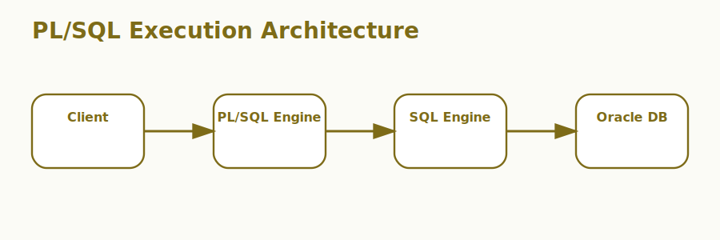

# PL/SQL Introduction Interview Questions



This page focuses on PL/SQL fundamentals, especially the procedural model Oracle adds on top of SQL.

## 1. PL SQL blocks

### 1. What is the role of PL SQL blocks in PL/SQL fundamentals?

**Answer:**

In PL/SQL fundamentals, the term PL SQL blocks refers to the executable anonymous or named blocks that
structure PL/SQL programs. It is part of the foundation a candidate should be able to explain
clearly.

**Sample:**

```sql
-- Concept: 1. PL SQL blocks
DECLARE
  v_message VARCHAR2(50) := '1. PL SQL blocks';
BEGIN
  DBMS_OUTPUT.PUT_LINE(v_message);
END;
/
```

---

### 2. Why is the concept of PL SQL blocks important in PL/SQL fundamentals?

**Answer:**

This concept matters because it influences the executable anonymous or named blocks that structure
PL/SQL programs. Good interview answers connect it to clarity, maintainability, performance,
security, or delivery depending on the situation.

**Sample:**

```sql
-- Concept: 1. PL SQL blocks
DECLARE
  v_message VARCHAR2(50) := '1. PL SQL blocks';
BEGIN
  DBMS_OUTPUT.PUT_LINE(v_message);
END;
/
```

---

### 3. When should a team focus on PL SQL blocks?

**Answer:**

A team should focus on PL SQL blocks when the requirement depends on the executable anonymous or
named blocks that structure PL/SQL programs. It becomes especially important when design decisions,
debugging, or architecture conversations depend on that area.

**Sample:**

```sql
-- Concept: 1. PL SQL blocks
DECLARE
  v_message VARCHAR2(50) := '1. PL SQL blocks';
BEGIN
  DBMS_OUTPUT.PUT_LINE(v_message);
END;
/
```

---

### 4. How is PL SQL blocks applied in practice?

**Answer:**

In practice, PL SQL blocks is applied by making the executable anonymous or named blocks that
structure PL/SQL programs explicit in the code, workflow, or collaboration pattern. The exact shape
depends on the stack, but the responsibility should stay predictable.

**Sample:**

```sql
-- Concept: 1. PL SQL blocks
DECLARE
  v_message VARCHAR2(50) := '1. PL SQL blocks';
BEGIN
  DBMS_OUTPUT.PUT_LINE(v_message);
END;
/
```

---

### 5. What strengths does PL SQL blocks bring?

**Answer:**

The strengths of PL SQL blocks are better structure, better communication, and better control over
the executable anonymous or named blocks that structure PL/SQL programs. It also makes tradeoffs
easier to explain to reviewers, interviewers, and teammates.

**Sample:**

```sql
-- Concept: 1. PL SQL blocks
DECLARE
  v_message VARCHAR2(50) := '1. PL SQL blocks';
BEGIN
  DBMS_OUTPUT.PUT_LINE(v_message);
END;
/
```

---

### 6. What tradeoffs come with PL SQL blocks?

**Answer:**

The main tradeoff is extra complexity if PL SQL blocks is introduced without a real need or a clear
understanding of the executable anonymous or named blocks that structure PL/SQL programs. That
usually leads to weak reasoning, overengineering, or fragile implementations.

**Sample:**

```sql
-- Concept: 1. PL SQL blocks
DECLARE
  v_message VARCHAR2(50) := '1. PL SQL blocks';
BEGIN
  DBMS_OUTPUT.PUT_LINE(v_message);
END;
/
```

---

### 7. How does PL SQL blocks differ from Variables and data types?

**Answer:**

PL SQL blocks is centered on the executable anonymous or named blocks that structure PL/SQL
programs, while Variables and data types is centered on the typed values used inside PL/SQL logic
for state and computation. They often work together, but they solve different parts of the topic.

**Sample:**

```sql
-- Concept: 1. PL SQL blocks
DECLARE
  v_message VARCHAR2(50) := '1. PL SQL blocks';
BEGIN
  DBMS_OUTPUT.PUT_LINE(v_message);
END;
/
```

---

### 8. What is a good real-world example of PL SQL blocks?

**Answer:**

A strong example is explaining how PL SQL blocks affects a real feature, workflow, bug, migration,
or design choice involving the executable anonymous or named blocks that structure PL/SQL programs.
Interviewers usually care more about the reasoning than the definition alone.

**Sample:**

```sql
-- Concept: 1. PL SQL blocks
DECLARE
  v_message VARCHAR2(50) := '1. PL SQL blocks';
BEGIN
  DBMS_OUTPUT.PUT_LINE(v_message);
END;
/
```

---

### 9. What is a best practice for PL SQL blocks?

**Answer:**

A good practice is to keep PL SQL blocks aligned with the actual requirement around the executable
anonymous or named blocks that structure PL/SQL programs. Teams should document intent, keep the
implementation readable, and validate important paths early.

**Sample:**

```sql
-- Concept: 1. PL SQL blocks
DECLARE
  v_message VARCHAR2(50) := '1. PL SQL blocks';
BEGIN
  DBMS_OUTPUT.PUT_LINE(v_message);
END;
/
```

---

### 10. What is a common mistake around PL SQL blocks?

**Answer:**

A common mistake is naming PL SQL blocks without understanding how it affects the executable
anonymous or named blocks that structure PL/SQL programs. In real work, that usually appears as poor
decisions, weak debugging, or incomplete explanations.

**Sample:**

```sql
-- Concept: 1. PL SQL blocks
DECLARE
  v_message VARCHAR2(50) := '1. PL SQL blocks';
BEGIN
  DBMS_OUTPUT.PUT_LINE(v_message);
END;
/
```

---

### 11. How do you troubleshoot PL SQL blocks-related issues?

**Answer:**

When troubleshooting PL SQL blocks, first verify whether the executable anonymous or named blocks
that structure PL/SQL programs is behaving as expected. Then check surrounding dependencies, inputs,
configuration, logs, and edge cases before changing the design.

**Sample:**

```sql
-- Concept: 1. PL SQL blocks
DECLARE
  v_message VARCHAR2(50) := '1. PL SQL blocks';
BEGIN
  DBMS_OUTPUT.PUT_LINE(v_message);
END;
/
```

---

### 12. How does PL SQL blocks connect to the rest of PL/SQL fundamentals?

**Answer:**

PL SQL blocks connects to the rest of PL/SQL fundamentals by giving structure to the executable
anonymous or named blocks that structure PL/SQL programs. It is one of the pieces that turns
isolated facts into a coherent end-to-end explanation.

**Sample:**

```sql
-- Concept: 1. PL SQL blocks
DECLARE
  v_message VARCHAR2(50) := '1. PL SQL blocks';
BEGIN
  DBMS_OUTPUT.PUT_LINE(v_message);
END;
/
```

---

## 2. Variables and data types

### 13. What is the role of Variables and data types in PL/SQL fundamentals?

**Answer:**

In PL/SQL fundamentals, the term Variables and data types refers to the typed values used inside PL/SQL logic
for state and computation. It is part of the foundation a candidate should be able to explain
clearly.

**Sample:**

```sql
-- Concept: 2. Variables and data types
DECLARE
  v_message VARCHAR2(50) := '2. Variables and data types';
BEGIN
  DBMS_OUTPUT.PUT_LINE(v_message);
END;
/
```

---

### 14. Why is the concept of Variables and data types important in PL/SQL fundamentals?

**Answer:**

This concept matters because it influences the typed values used inside PL/SQL logic for
state and computation. Good interview answers connect it to clarity, maintainability, performance,
security, or delivery depending on the situation.

**Sample:**

```sql
-- Concept: 2. Variables and data types
DECLARE
  v_message VARCHAR2(50) := '2. Variables and data types';
BEGIN
  DBMS_OUTPUT.PUT_LINE(v_message);
END;
/
```

---

### 15. When should a team focus on Variables and data types?

**Answer:**

A team should focus on Variables and data types when the requirement depends on the typed values
used inside PL/SQL logic for state and computation. It becomes especially important when design
decisions, debugging, or architecture conversations depend on that area.

**Sample:**

```sql
-- Concept: 2. Variables and data types
DECLARE
  v_message VARCHAR2(50) := '2. Variables and data types';
BEGIN
  DBMS_OUTPUT.PUT_LINE(v_message);
END;
/
```

---

### 16. How is Variables and data types applied in practice?

**Answer:**

In practice, Variables and data types is applied by making the typed values used inside PL/SQL logic
for state and computation explicit in the code, workflow, or collaboration pattern. The exact shape
depends on the stack, but the responsibility should stay predictable.

**Sample:**

```sql
-- Concept: 2. Variables and data types
DECLARE
  v_message VARCHAR2(50) := '2. Variables and data types';
BEGIN
  DBMS_OUTPUT.PUT_LINE(v_message);
END;
/
```

---

### 17. What strengths does Variables and data types bring?

**Answer:**

The strengths of Variables and data types are better structure, better communication, and better
control over the typed values used inside PL/SQL logic for state and computation. It also makes
tradeoffs easier to explain to reviewers, interviewers, and teammates.

**Sample:**

```sql
-- Concept: 2. Variables and data types
DECLARE
  v_message VARCHAR2(50) := '2. Variables and data types';
BEGIN
  DBMS_OUTPUT.PUT_LINE(v_message);
END;
/
```

---

### 18. What tradeoffs come with Variables and data types?

**Answer:**

The main tradeoff is extra complexity if Variables and data types is introduced without a real need
or a clear understanding of the typed values used inside PL/SQL logic for state and computation.
That usually leads to weak reasoning, overengineering, or fragile implementations.

**Sample:**

```sql
-- Concept: 2. Variables and data types
DECLARE
  v_message VARCHAR2(50) := '2. Variables and data types';
BEGIN
  DBMS_OUTPUT.PUT_LINE(v_message);
END;
/
```

---

### 19. How does Variables and data types differ from Control structures?

**Answer:**

Variables and data types is centered on the typed values used inside PL/SQL logic for state and
computation, while Control structures is centered on the conditional and looping constructs that
give PL/SQL procedural behavior. They often work together, but they solve different parts of the
topic.

**Sample:**

```sql
-- Concept: 2. Variables and data types
DECLARE
  v_message VARCHAR2(50) := '2. Variables and data types';
BEGIN
  DBMS_OUTPUT.PUT_LINE(v_message);
END;
/
```

---

### 20. What is a good real-world example of Variables and data types?

**Answer:**

A strong example is explaining how Variables and data types affects a real feature, workflow, bug,
migration, or design choice involving the typed values used inside PL/SQL logic for state and
computation. Interviewers usually care more about the reasoning than the definition alone.

**Sample:**

```sql
-- Concept: 2. Variables and data types
DECLARE
  v_message VARCHAR2(50) := '2. Variables and data types';
BEGIN
  DBMS_OUTPUT.PUT_LINE(v_message);
END;
/
```

---

### 21. What is a best practice for Variables and data types?

**Answer:**

A good practice is to keep Variables and data types aligned with the actual requirement around the
typed values used inside PL/SQL logic for state and computation. Teams should document intent, keep
the implementation readable, and validate important paths early.

**Sample:**

```sql
-- Concept: 2. Variables and data types
DECLARE
  v_message VARCHAR2(50) := '2. Variables and data types';
BEGIN
  DBMS_OUTPUT.PUT_LINE(v_message);
END;
/
```

---

### 22. What is a common mistake around Variables and data types?

**Answer:**

A common mistake is naming Variables and data types without understanding how it affects the typed
values used inside PL/SQL logic for state and computation. In real work, that usually appears as
poor decisions, weak debugging, or incomplete explanations.

**Sample:**

```sql
-- Concept: 2. Variables and data types
DECLARE
  v_message VARCHAR2(50) := '2. Variables and data types';
BEGIN
  DBMS_OUTPUT.PUT_LINE(v_message);
END;
/
```

---

### 23. How do you troubleshoot Variables and data types-related issues?

**Answer:**

When troubleshooting Variables and data types, first verify whether the typed values used inside
PL/SQL logic for state and computation is behaving as expected. Then check surrounding dependencies,
inputs, configuration, logs, and edge cases before changing the design.

**Sample:**

```sql
-- Concept: 2. Variables and data types
DECLARE
  v_message VARCHAR2(50) := '2. Variables and data types';
BEGIN
  DBMS_OUTPUT.PUT_LINE(v_message);
END;
/
```

---

### 24. How does Variables and data types connect to the rest of PL/SQL fundamentals?

**Answer:**

Variables and data types connects to the rest of PL/SQL fundamentals by giving structure to the
typed values used inside PL/SQL logic for state and computation. It is one of the pieces that turns
isolated facts into a coherent end-to-end explanation.

**Sample:**

```sql
-- Concept: 2. Variables and data types
DECLARE
  v_message VARCHAR2(50) := '2. Variables and data types';
BEGIN
  DBMS_OUTPUT.PUT_LINE(v_message);
END;
/
```

---

## 3. Control structures

### 25. What is the role of Control structures in PL/SQL fundamentals?

**Answer:**

In PL/SQL fundamentals, the term Control structures refers to the conditional and looping constructs that
give PL/SQL procedural behavior. It is part of the foundation a candidate should be able to explain
clearly.

**Sample:**

```sql
-- Concept: 3. Control structures
DECLARE
  v_message VARCHAR2(50) := '3. Control structures';
BEGIN
  DBMS_OUTPUT.PUT_LINE(v_message);
END;
/
```

---

### 26. Why is the concept of Control structures important in PL/SQL fundamentals?

**Answer:**

This concept matters because it influences the conditional and looping constructs that give
PL/SQL procedural behavior. Good interview answers connect it to clarity, maintainability,
performance, security, or delivery depending on the situation.

**Sample:**

```sql
-- Concept: 3. Control structures
DECLARE
  v_message VARCHAR2(50) := '3. Control structures';
BEGIN
  DBMS_OUTPUT.PUT_LINE(v_message);
END;
/
```

---

### 27. When should a team focus on Control structures?

**Answer:**

A team should focus on Control structures when the requirement depends on the conditional and
looping constructs that give PL/SQL procedural behavior. It becomes especially important when design
decisions, debugging, or architecture conversations depend on that area.

**Sample:**

```sql
-- Concept: 3. Control structures
DECLARE
  v_message VARCHAR2(50) := '3. Control structures';
BEGIN
  DBMS_OUTPUT.PUT_LINE(v_message);
END;
/
```

---

### 28. How is Control structures applied in practice?

**Answer:**

In practice, Control structures is applied by making the conditional and looping constructs that
give PL/SQL procedural behavior explicit in the code, workflow, or collaboration pattern. The exact
shape depends on the stack, but the responsibility should stay predictable.

**Sample:**

```sql
-- Concept: 3. Control structures
DECLARE
  v_message VARCHAR2(50) := '3. Control structures';
BEGIN
  DBMS_OUTPUT.PUT_LINE(v_message);
END;
/
```

---

### 29. What strengths does Control structures bring?

**Answer:**

The strengths of Control structures are better structure, better communication, and better control
over the conditional and looping constructs that give PL/SQL procedural behavior. It also makes
tradeoffs easier to explain to reviewers, interviewers, and teammates.

**Sample:**

```sql
-- Concept: 3. Control structures
DECLARE
  v_message VARCHAR2(50) := '3. Control structures';
BEGIN
  DBMS_OUTPUT.PUT_LINE(v_message);
END;
/
```

---

### 30. What tradeoffs come with Control structures?

**Answer:**

The main tradeoff is extra complexity if Control structures is introduced without a real need or a
clear understanding of the conditional and looping constructs that give PL/SQL procedural behavior.
That usually leads to weak reasoning, overengineering, or fragile implementations.

**Sample:**

```sql
-- Concept: 3. Control structures
DECLARE
  v_message VARCHAR2(50) := '3. Control structures';
BEGIN
  DBMS_OUTPUT.PUT_LINE(v_message);
END;
/
```

---

### 31. How does Control structures differ from Cursors?

**Answer:**

Control structures is centered on the conditional and looping constructs that give PL/SQL procedural
behavior, while Cursors is centered on the mechanisms used to work with query results row by row
when needed. They often work together, but they solve different parts of the topic.

**Sample:**

```sql
-- Concept: 3. Control structures
DECLARE
  v_message VARCHAR2(50) := '3. Control structures';
BEGIN
  DBMS_OUTPUT.PUT_LINE(v_message);
END;
/
```

---

### 32. What is a good real-world example of Control structures?

**Answer:**

A strong example is explaining how Control structures affects a real feature, workflow, bug,
migration, or design choice involving the conditional and looping constructs that give PL/SQL
procedural behavior. Interviewers usually care more about the reasoning than the definition alone.

**Sample:**

```sql
-- Concept: 3. Control structures
DECLARE
  v_message VARCHAR2(50) := '3. Control structures';
BEGIN
  DBMS_OUTPUT.PUT_LINE(v_message);
END;
/
```

---

### 33. What is a best practice for Control structures?

**Answer:**

A good practice is to keep Control structures aligned with the actual requirement around the
conditional and looping constructs that give PL/SQL procedural behavior. Teams should document
intent, keep the implementation readable, and validate important paths early.

**Sample:**

```sql
-- Concept: 3. Control structures
DECLARE
  v_message VARCHAR2(50) := '3. Control structures';
BEGIN
  DBMS_OUTPUT.PUT_LINE(v_message);
END;
/
```

---

### 34. What is a common mistake around Control structures?

**Answer:**

A common mistake is naming Control structures without understanding how it affects the conditional
and looping constructs that give PL/SQL procedural behavior. In real work, that usually appears as
poor decisions, weak debugging, or incomplete explanations.

**Sample:**

```sql
-- Concept: 3. Control structures
DECLARE
  v_message VARCHAR2(50) := '3. Control structures';
BEGIN
  DBMS_OUTPUT.PUT_LINE(v_message);
END;
/
```

---

### 35. How do you troubleshoot Control structures-related issues?

**Answer:**

When troubleshooting Control structures, first verify whether the conditional and looping constructs
that give PL/SQL procedural behavior is behaving as expected. Then check surrounding dependencies,
inputs, configuration, logs, and edge cases before changing the design.

**Sample:**

```sql
-- Concept: 3. Control structures
DECLARE
  v_message VARCHAR2(50) := '3. Control structures';
BEGIN
  DBMS_OUTPUT.PUT_LINE(v_message);
END;
/
```

---

### 36. How does Control structures connect to the rest of PL/SQL fundamentals?

**Answer:**

Control structures connects to the rest of PL/SQL fundamentals by giving structure to the
conditional and looping constructs that give PL/SQL procedural behavior. It is one of the pieces
that turns isolated facts into a coherent end-to-end explanation.

**Sample:**

```sql
-- Concept: 3. Control structures
DECLARE
  v_message VARCHAR2(50) := '3. Control structures';
BEGIN
  DBMS_OUTPUT.PUT_LINE(v_message);
END;
/
```

---

## 4. Cursors

### 37. What is the role of Cursors in PL/SQL fundamentals?

**Answer:**

In PL/SQL fundamentals, the term Cursors refers to the mechanisms used to work with query results row by row
when needed. It is part of the foundation a candidate should be able to explain clearly.

**Sample:**

```sql
-- Concept: 4. Cursors
DECLARE
  v_message VARCHAR2(50) := '4. Cursors';
BEGIN
  DBMS_OUTPUT.PUT_LINE(v_message);
END;
/
```

---

### 38. Why is the concept of Cursors important in PL/SQL fundamentals?

**Answer:**

This concept matters because it influences the mechanisms used to work with query results row by row when
needed. Good interview answers connect it to clarity, maintainability, performance, security, or
delivery depending on the situation.

**Sample:**

```sql
-- Concept: 4. Cursors
DECLARE
  v_message VARCHAR2(50) := '4. Cursors';
BEGIN
  DBMS_OUTPUT.PUT_LINE(v_message);
END;
/
```

---

### 39. When should a team focus on Cursors?

**Answer:**

A team should focus on Cursors when the requirement depends on the mechanisms used to work with
query results row by row when needed. It becomes especially important when design decisions,
debugging, or architecture conversations depend on that area.

**Sample:**

```sql
-- Concept: 4. Cursors
DECLARE
  v_message VARCHAR2(50) := '4. Cursors';
BEGIN
  DBMS_OUTPUT.PUT_LINE(v_message);
END;
/
```

---

### 40. How is Cursors applied in practice?

**Answer:**

In practice, Cursors is applied by making the mechanisms used to work with query results row by row
when needed explicit in the code, workflow, or collaboration pattern. The exact shape depends on the
stack, but the responsibility should stay predictable.

**Sample:**

```sql
-- Concept: 4. Cursors
DECLARE
  v_message VARCHAR2(50) := '4. Cursors';
BEGIN
  DBMS_OUTPUT.PUT_LINE(v_message);
END;
/
```

---

### 41. What strengths does Cursors bring?

**Answer:**

The strengths of Cursors are better structure, better communication, and better control over the
mechanisms used to work with query results row by row when needed. It also makes tradeoffs easier to
explain to reviewers, interviewers, and teammates.

**Sample:**

```sql
-- Concept: 4. Cursors
DECLARE
  v_message VARCHAR2(50) := '4. Cursors';
BEGIN
  DBMS_OUTPUT.PUT_LINE(v_message);
END;
/
```

---

### 42. What tradeoffs come with Cursors?

**Answer:**

The main tradeoff is extra complexity if Cursors is introduced without a real need or a clear
understanding of the mechanisms used to work with query results row by row when needed. That usually
leads to weak reasoning, overengineering, or fragile implementations.

**Sample:**

```sql
-- Concept: 4. Cursors
DECLARE
  v_message VARCHAR2(50) := '4. Cursors';
BEGIN
  DBMS_OUTPUT.PUT_LINE(v_message);
END;
/
```

---

### 43. How does Cursors differ from Exceptions?

**Answer:**

Cursors is centered on the mechanisms used to work with query results row by row when needed, while
Exceptions is centered on the structured error handling model used to capture and react to runtime
failures. They often work together, but they solve different parts of the topic.

**Sample:**

```sql
-- Concept: 4. Cursors
DECLARE
  v_message VARCHAR2(50) := '4. Cursors';
BEGIN
  DBMS_OUTPUT.PUT_LINE(v_message);
END;
/
```

---

### 44. What is a good real-world example of Cursors?

**Answer:**

A strong example is explaining how Cursors affects a real feature, workflow, bug, migration, or
design choice involving the mechanisms used to work with query results row by row when needed.
Interviewers usually care more about the reasoning than the definition alone.

**Sample:**

```sql
-- Concept: 4. Cursors
DECLARE
  v_message VARCHAR2(50) := '4. Cursors';
BEGIN
  DBMS_OUTPUT.PUT_LINE(v_message);
END;
/
```

---

### 45. What is a best practice for Cursors?

**Answer:**

A good practice is to keep Cursors aligned with the actual requirement around the mechanisms used to
work with query results row by row when needed. Teams should document intent, keep the
implementation readable, and validate important paths early.

**Sample:**

```sql
-- Concept: 4. Cursors
DECLARE
  v_message VARCHAR2(50) := '4. Cursors';
BEGIN
  DBMS_OUTPUT.PUT_LINE(v_message);
END;
/
```

---

### 46. What is a common mistake around Cursors?

**Answer:**

A common mistake is naming Cursors without understanding how it affects the mechanisms used to work
with query results row by row when needed. In real work, that usually appears as poor decisions,
weak debugging, or incomplete explanations.

**Sample:**

```sql
-- Concept: 4. Cursors
DECLARE
  v_message VARCHAR2(50) := '4. Cursors';
BEGIN
  DBMS_OUTPUT.PUT_LINE(v_message);
END;
/
```

---

### 47. How do you troubleshoot Cursors-related issues?

**Answer:**

When troubleshooting Cursors, first verify whether the mechanisms used to work with query results
row by row when needed is behaving as expected. Then check surrounding dependencies, inputs,
configuration, logs, and edge cases before changing the design.

**Sample:**

```sql
-- Concept: 4. Cursors
DECLARE
  v_message VARCHAR2(50) := '4. Cursors';
BEGIN
  DBMS_OUTPUT.PUT_LINE(v_message);
END;
/
```

---

### 48. How does Cursors connect to the rest of PL/SQL fundamentals?

**Answer:**

Cursors connects to the rest of PL/SQL fundamentals by giving structure to the mechanisms used to
work with query results row by row when needed. It is one of the pieces that turns isolated facts
into a coherent end-to-end explanation.

**Sample:**

```sql
-- Concept: 4. Cursors
DECLARE
  v_message VARCHAR2(50) := '4. Cursors';
BEGIN
  DBMS_OUTPUT.PUT_LINE(v_message);
END;
/
```

---

## 5. Exceptions

### 49. What is the role of Exceptions in PL/SQL fundamentals?

**Answer:**

In PL/SQL fundamentals, the term Exceptions refers to the structured error handling model used to capture and
react to runtime failures. It is part of the foundation a candidate should be able to explain
clearly.

**Sample:**

```sql
-- Concept: 5. Exceptions
DECLARE
  v_message VARCHAR2(50) := '5. Exceptions';
BEGIN
  DBMS_OUTPUT.PUT_LINE(v_message);
END;
/
```

---

### 50. Why is the concept of Exceptions important in PL/SQL fundamentals?

**Answer:**

This concept matters because it influences the structured error handling model used to capture and
react to runtime failures. Good interview answers connect it to clarity, maintainability,
performance, security, or delivery depending on the situation.

**Sample:**

```sql
-- Concept: 5. Exceptions
DECLARE
  v_message VARCHAR2(50) := '5. Exceptions';
BEGIN
  DBMS_OUTPUT.PUT_LINE(v_message);
END;
/
```

---

### 51. When should a team focus on Exceptions?

**Answer:**

A team should focus on Exceptions when the requirement depends on the structured error handling
model used to capture and react to runtime failures. It becomes especially important when design
decisions, debugging, or architecture conversations depend on that area.

**Sample:**

```sql
-- Concept: 5. Exceptions
DECLARE
  v_message VARCHAR2(50) := '5. Exceptions';
BEGIN
  DBMS_OUTPUT.PUT_LINE(v_message);
END;
/
```

---

### 52. How is Exceptions applied in practice?

**Answer:**

In practice, Exceptions is applied by making the structured error handling model used to capture and
react to runtime failures explicit in the code, workflow, or collaboration pattern. The exact shape
depends on the stack, but the responsibility should stay predictable.

**Sample:**

```sql
-- Concept: 5. Exceptions
DECLARE
  v_message VARCHAR2(50) := '5. Exceptions';
BEGIN
  DBMS_OUTPUT.PUT_LINE(v_message);
END;
/
```

---

### 53. What strengths does Exceptions bring?

**Answer:**

The strengths of Exceptions are better structure, better communication, and better control over the
structured error handling model used to capture and react to runtime failures. It also makes
tradeoffs easier to explain to reviewers, interviewers, and teammates.

**Sample:**

```sql
-- Concept: 5. Exceptions
DECLARE
  v_message VARCHAR2(50) := '5. Exceptions';
BEGIN
  DBMS_OUTPUT.PUT_LINE(v_message);
END;
/
```

---

### 54. What tradeoffs come with Exceptions?

**Answer:**

The main tradeoff is extra complexity if Exceptions is introduced without a real need or a clear
understanding of the structured error handling model used to capture and react to runtime failures.
That usually leads to weak reasoning, overengineering, or fragile implementations.

**Sample:**

```sql
-- Concept: 5. Exceptions
DECLARE
  v_message VARCHAR2(50) := '5. Exceptions';
BEGIN
  DBMS_OUTPUT.PUT_LINE(v_message);
END;
/
```

---

### 55. How does Exceptions differ from Procedures?

**Answer:**

Exceptions is centered on the structured error handling model used to capture and react to runtime
failures, while Procedures is centered on the named program units used to package reusable PL/SQL
logic without returning a value. They often work together, but they solve different parts of the
topic.

**Sample:**

```sql
-- Concept: 5. Exceptions
DECLARE
  v_message VARCHAR2(50) := '5. Exceptions';
BEGIN
  DBMS_OUTPUT.PUT_LINE(v_message);
END;
/
```

---

### 56. What is a good real-world example of Exceptions?

**Answer:**

A strong example is explaining how Exceptions affects a real feature, workflow, bug, migration, or
design choice involving the structured error handling model used to capture and react to runtime
failures. Interviewers usually care more about the reasoning than the definition alone.

**Sample:**

```sql
-- Concept: 5. Exceptions
DECLARE
  v_message VARCHAR2(50) := '5. Exceptions';
BEGIN
  DBMS_OUTPUT.PUT_LINE(v_message);
END;
/
```

---

### 57. What is a best practice for Exceptions?

**Answer:**

A good practice is to keep Exceptions aligned with the actual requirement around the structured
error handling model used to capture and react to runtime failures. Teams should document intent,
keep the implementation readable, and validate important paths early.

**Sample:**

```sql
-- Concept: 5. Exceptions
DECLARE
  v_message VARCHAR2(50) := '5. Exceptions';
BEGIN
  DBMS_OUTPUT.PUT_LINE(v_message);
END;
/
```

---

### 58. What is a common mistake around Exceptions?

**Answer:**

A common mistake is naming Exceptions without understanding how it affects the structured error
handling model used to capture and react to runtime failures. In real work, that usually appears as
poor decisions, weak debugging, or incomplete explanations.

**Sample:**

```sql
-- Concept: 5. Exceptions
DECLARE
  v_message VARCHAR2(50) := '5. Exceptions';
BEGIN
  DBMS_OUTPUT.PUT_LINE(v_message);
END;
/
```

---

### 59. How do you troubleshoot Exceptions-related issues?

**Answer:**

When troubleshooting Exceptions, first verify whether the structured error handling model used to
capture and react to runtime failures is behaving as expected. Then check surrounding dependencies,
inputs, configuration, logs, and edge cases before changing the design.

**Sample:**

```sql
-- Concept: 5. Exceptions
DECLARE
  v_message VARCHAR2(50) := '5. Exceptions';
BEGIN
  DBMS_OUTPUT.PUT_LINE(v_message);
END;
/
```

---

### 60. How does Exceptions connect to the rest of PL/SQL fundamentals?

**Answer:**

Exceptions connects to the rest of PL/SQL fundamentals by giving structure to the structured error
handling model used to capture and react to runtime failures. It is one of the pieces that turns
isolated facts into a coherent end-to-end explanation.

**Sample:**

```sql
-- Concept: 5. Exceptions
DECLARE
  v_message VARCHAR2(50) := '5. Exceptions';
BEGIN
  DBMS_OUTPUT.PUT_LINE(v_message);
END;
/
```

---

## 6. Procedures

### 61. What is the role of Procedures in PL/SQL fundamentals?

**Answer:**

In PL/SQL fundamentals, the term Procedures refers to the named program units used to package reusable PL/SQL
logic without returning a value. It is part of the foundation a candidate should be able to explain
clearly.

**Sample:**

```sql
-- Concept: 6. Procedures
DECLARE
  v_message VARCHAR2(50) := '6. Procedures';
BEGIN
  DBMS_OUTPUT.PUT_LINE(v_message);
END;
/
```

---

### 62. Why is the concept of Procedures important in PL/SQL fundamentals?

**Answer:**

This concept matters because it influences the named program units used to package reusable PL/SQL
logic without returning a value. Good interview answers connect it to clarity, maintainability,
performance, security, or delivery depending on the situation.

**Sample:**

```sql
-- Concept: 6. Procedures
DECLARE
  v_message VARCHAR2(50) := '6. Procedures';
BEGIN
  DBMS_OUTPUT.PUT_LINE(v_message);
END;
/
```

---

### 63. When should a team focus on Procedures?

**Answer:**

A team should focus on Procedures when the requirement depends on the named program units used to
package reusable PL/SQL logic without returning a value. It becomes especially important when design
decisions, debugging, or architecture conversations depend on that area.

**Sample:**

```sql
-- Concept: 6. Procedures
DECLARE
  v_message VARCHAR2(50) := '6. Procedures';
BEGIN
  DBMS_OUTPUT.PUT_LINE(v_message);
END;
/
```

---

### 64. How is Procedures applied in practice?

**Answer:**

In practice, Procedures is applied by making the named program units used to package reusable PL/SQL
logic without returning a value explicit in the code, workflow, or collaboration pattern. The exact
shape depends on the stack, but the responsibility should stay predictable.

**Sample:**

```sql
-- Concept: 6. Procedures
DECLARE
  v_message VARCHAR2(50) := '6. Procedures';
BEGIN
  DBMS_OUTPUT.PUT_LINE(v_message);
END;
/
```

---

### 65. What strengths does Procedures bring?

**Answer:**

The strengths of Procedures are better structure, better communication, and better control over the
named program units used to package reusable PL/SQL logic without returning a value. It also makes
tradeoffs easier to explain to reviewers, interviewers, and teammates.

**Sample:**

```sql
-- Concept: 6. Procedures
DECLARE
  v_message VARCHAR2(50) := '6. Procedures';
BEGIN
  DBMS_OUTPUT.PUT_LINE(v_message);
END;
/
```

---

### 66. What tradeoffs come with Procedures?

**Answer:**

The main tradeoff is extra complexity if Procedures is introduced without a real need or a clear
understanding of the named program units used to package reusable PL/SQL logic without returning a
value. That usually leads to weak reasoning, overengineering, or fragile implementations.

**Sample:**

```sql
-- Concept: 6. Procedures
DECLARE
  v_message VARCHAR2(50) := '6. Procedures';
BEGIN
  DBMS_OUTPUT.PUT_LINE(v_message);
END;
/
```

---

### 67. How does Procedures differ from Functions?

**Answer:**

Procedures is centered on the named program units used to package reusable PL/SQL logic without
returning a value, while Functions is centered on the reusable PL/SQL program units that return a
value to the caller. They often work together, but they solve different parts of the topic.

**Sample:**

```sql
-- Concept: 6. Procedures
DECLARE
  v_message VARCHAR2(50) := '6. Procedures';
BEGIN
  DBMS_OUTPUT.PUT_LINE(v_message);
END;
/
```

---

### 68. What is a good real-world example of Procedures?

**Answer:**

A strong example is explaining how Procedures affects a real feature, workflow, bug, migration, or
design choice involving the named program units used to package reusable PL/SQL logic without
returning a value. Interviewers usually care more about the reasoning than the definition alone.

**Sample:**

```sql
-- Concept: 6. Procedures
DECLARE
  v_message VARCHAR2(50) := '6. Procedures';
BEGIN
  DBMS_OUTPUT.PUT_LINE(v_message);
END;
/
```

---

### 69. What is a best practice for Procedures?

**Answer:**

A good practice is to keep Procedures aligned with the actual requirement around the named program
units used to package reusable PL/SQL logic without returning a value. Teams should document intent,
keep the implementation readable, and validate important paths early.

**Sample:**

```sql
-- Concept: 6. Procedures
DECLARE
  v_message VARCHAR2(50) := '6. Procedures';
BEGIN
  DBMS_OUTPUT.PUT_LINE(v_message);
END;
/
```

---

### 70. What is a common mistake around Procedures?

**Answer:**

A common mistake is naming Procedures without understanding how it affects the named program units
used to package reusable PL/SQL logic without returning a value. In real work, that usually appears
as poor decisions, weak debugging, or incomplete explanations.

**Sample:**

```sql
-- Concept: 6. Procedures
DECLARE
  v_message VARCHAR2(50) := '6. Procedures';
BEGIN
  DBMS_OUTPUT.PUT_LINE(v_message);
END;
/
```

---

### 71. How do you troubleshoot Procedures-related issues?

**Answer:**

When troubleshooting Procedures, first verify whether the named program units used to package
reusable PL/SQL logic without returning a value is behaving as expected. Then check surrounding
dependencies, inputs, configuration, logs, and edge cases before changing the design.

**Sample:**

```sql
-- Concept: 6. Procedures
DECLARE
  v_message VARCHAR2(50) := '6. Procedures';
BEGIN
  DBMS_OUTPUT.PUT_LINE(v_message);
END;
/
```

---

### 72. How does Procedures connect to the rest of PL/SQL fundamentals?

**Answer:**

Procedures connects to the rest of PL/SQL fundamentals by giving structure to the named program
units used to package reusable PL/SQL logic without returning a value. It is one of the pieces that
turns isolated facts into a coherent end-to-end explanation.

**Sample:**

```sql
-- Concept: 6. Procedures
DECLARE
  v_message VARCHAR2(50) := '6. Procedures';
BEGIN
  DBMS_OUTPUT.PUT_LINE(v_message);
END;
/
```

---

## 7. Functions

### 73. What is the role of Functions in PL/SQL fundamentals?

**Answer:**

In PL/SQL fundamentals, the term Functions refers to the reusable PL/SQL program units that return a value to
the caller. It is part of the foundation a candidate should be able to explain clearly.

**Sample:**

```sql
-- Concept: 7. Functions
DECLARE
  v_message VARCHAR2(50) := '7. Functions';
BEGIN
  DBMS_OUTPUT.PUT_LINE(v_message);
END;
/
```

---

### 74. Why is the concept of Functions important in PL/SQL fundamentals?

**Answer:**

This concept matters because it influences the reusable PL/SQL program units that return a value to the
caller. Good interview answers connect it to clarity, maintainability, performance, security, or
delivery depending on the situation.

**Sample:**

```sql
-- Concept: 7. Functions
DECLARE
  v_message VARCHAR2(50) := '7. Functions';
BEGIN
  DBMS_OUTPUT.PUT_LINE(v_message);
END;
/
```

---

### 75. When should a team focus on Functions?

**Answer:**

A team should focus on Functions when the requirement depends on the reusable PL/SQL program units
that return a value to the caller. It becomes especially important when design decisions, debugging,
or architecture conversations depend on that area.

**Sample:**

```sql
-- Concept: 7. Functions
DECLARE
  v_message VARCHAR2(50) := '7. Functions';
BEGIN
  DBMS_OUTPUT.PUT_LINE(v_message);
END;
/
```

---

### 76. How is Functions applied in practice?

**Answer:**

In practice, Functions is applied by making the reusable PL/SQL program units that return a value to
the caller explicit in the code, workflow, or collaboration pattern. The exact shape depends on the
stack, but the responsibility should stay predictable.

**Sample:**

```sql
-- Concept: 7. Functions
DECLARE
  v_message VARCHAR2(50) := '7. Functions';
BEGIN
  DBMS_OUTPUT.PUT_LINE(v_message);
END;
/
```

---

### 77. What strengths does Functions bring?

**Answer:**

The strengths of Functions are better structure, better communication, and better control over the
reusable PL/SQL program units that return a value to the caller. It also makes tradeoffs easier to
explain to reviewers, interviewers, and teammates.

**Sample:**

```sql
-- Concept: 7. Functions
DECLARE
  v_message VARCHAR2(50) := '7. Functions';
BEGIN
  DBMS_OUTPUT.PUT_LINE(v_message);
END;
/
```

---

### 78. What tradeoffs come with Functions?

**Answer:**

The main tradeoff is extra complexity if Functions is introduced without a real need or a clear
understanding of the reusable PL/SQL program units that return a value to the caller. That usually
leads to weak reasoning, overengineering, or fragile implementations.

**Sample:**

```sql
-- Concept: 7. Functions
DECLARE
  v_message VARCHAR2(50) := '7. Functions';
BEGIN
  DBMS_OUTPUT.PUT_LINE(v_message);
END;
/
```

---

### 79. How does Functions differ from Packages?

**Answer:**

Functions is centered on the reusable PL/SQL program units that return a value to the caller, while
Packages is centered on the grouping mechanism that organizes related procedures, functions, types,
and variables together. They often work together, but they solve different parts of the topic.

**Sample:**

```sql
-- Concept: 7. Functions
DECLARE
  v_message VARCHAR2(50) := '7. Functions';
BEGIN
  DBMS_OUTPUT.PUT_LINE(v_message);
END;
/
```

---

### 80. What is a good real-world example of Functions?

**Answer:**

A strong example is explaining how Functions affects a real feature, workflow, bug, migration, or
design choice involving the reusable PL/SQL program units that return a value to the caller.
Interviewers usually care more about the reasoning than the definition alone.

**Sample:**

```sql
-- Concept: 7. Functions
DECLARE
  v_message VARCHAR2(50) := '7. Functions';
BEGIN
  DBMS_OUTPUT.PUT_LINE(v_message);
END;
/
```

---

### 81. What is a best practice for Functions?

**Answer:**

A good practice is to keep Functions aligned with the actual requirement around the reusable PL/SQL
program units that return a value to the caller. Teams should document intent, keep the
implementation readable, and validate important paths early.

**Sample:**

```sql
-- Concept: 7. Functions
DECLARE
  v_message VARCHAR2(50) := '7. Functions';
BEGIN
  DBMS_OUTPUT.PUT_LINE(v_message);
END;
/
```

---

### 82. What is a common mistake around Functions?

**Answer:**

A common mistake is naming Functions without understanding how it affects the reusable PL/SQL
program units that return a value to the caller. In real work, that usually appears as poor
decisions, weak debugging, or incomplete explanations.

**Sample:**

```sql
-- Concept: 7. Functions
DECLARE
  v_message VARCHAR2(50) := '7. Functions';
BEGIN
  DBMS_OUTPUT.PUT_LINE(v_message);
END;
/
```

---

### 83. How do you troubleshoot Functions-related issues?

**Answer:**

When troubleshooting Functions, first verify whether the reusable PL/SQL program units that return a
value to the caller is behaving as expected. Then check surrounding dependencies, inputs,
configuration, logs, and edge cases before changing the design.

**Sample:**

```sql
-- Concept: 7. Functions
DECLARE
  v_message VARCHAR2(50) := '7. Functions';
BEGIN
  DBMS_OUTPUT.PUT_LINE(v_message);
END;
/
```

---

### 84. How does Functions connect to the rest of PL/SQL fundamentals?

**Answer:**

Functions connects to the rest of PL/SQL fundamentals by giving structure to the reusable PL/SQL
program units that return a value to the caller. It is one of the pieces that turns isolated facts
into a coherent end-to-end explanation.

**Sample:**

```sql
-- Concept: 7. Functions
DECLARE
  v_message VARCHAR2(50) := '7. Functions';
BEGIN
  DBMS_OUTPUT.PUT_LINE(v_message);
END;
/
```

---

## 8. Packages

### 85. What is the role of Packages in PL/SQL fundamentals?

**Answer:**

In PL/SQL fundamentals, the term Packages refers to the grouping mechanism that organizes related procedures,
functions, types, and variables together. It is part of the foundation a candidate should be able to
explain clearly.

**Sample:**

```sql
-- Concept: 8. Packages
DECLARE
  v_message VARCHAR2(50) := '8. Packages';
BEGIN
  DBMS_OUTPUT.PUT_LINE(v_message);
END;
/
```

---

### 86. Why is the concept of Packages important in PL/SQL fundamentals?

**Answer:**

This concept matters because it influences the grouping mechanism that organizes related procedures,
functions, types, and variables together. Good interview answers connect it to clarity,
maintainability, performance, security, or delivery depending on the situation.

**Sample:**

```sql
-- Concept: 8. Packages
DECLARE
  v_message VARCHAR2(50) := '8. Packages';
BEGIN
  DBMS_OUTPUT.PUT_LINE(v_message);
END;
/
```

---

### 87. When should a team focus on Packages?

**Answer:**

A team should focus on Packages when the requirement depends on the grouping mechanism that
organizes related procedures, functions, types, and variables together. It becomes especially
important when design decisions, debugging, or architecture conversations depend on that area.

**Sample:**

```sql
-- Concept: 8. Packages
DECLARE
  v_message VARCHAR2(50) := '8. Packages';
BEGIN
  DBMS_OUTPUT.PUT_LINE(v_message);
END;
/
```

---

### 88. How is Packages applied in practice?

**Answer:**

In practice, Packages is applied by making the grouping mechanism that organizes related procedures,
functions, types, and variables together explicit in the code, workflow, or collaboration pattern.
The exact shape depends on the stack, but the responsibility should stay predictable.

**Sample:**

```sql
-- Concept: 8. Packages
DECLARE
  v_message VARCHAR2(50) := '8. Packages';
BEGIN
  DBMS_OUTPUT.PUT_LINE(v_message);
END;
/
```

---

### 89. What strengths does Packages bring?

**Answer:**

The strengths of Packages are better structure, better communication, and better control over the
grouping mechanism that organizes related procedures, functions, types, and variables together. It
also makes tradeoffs easier to explain to reviewers, interviewers, and teammates.

**Sample:**

```sql
-- Concept: 8. Packages
DECLARE
  v_message VARCHAR2(50) := '8. Packages';
BEGIN
  DBMS_OUTPUT.PUT_LINE(v_message);
END;
/
```

---

### 90. What tradeoffs come with Packages?

**Answer:**

The main tradeoff is extra complexity if Packages is introduced without a real need or a clear
understanding of the grouping mechanism that organizes related procedures, functions, types, and
variables together. That usually leads to weak reasoning, overengineering, or fragile
implementations.

**Sample:**

```sql
-- Concept: 8. Packages
DECLARE
  v_message VARCHAR2(50) := '8. Packages';
BEGIN
  DBMS_OUTPUT.PUT_LINE(v_message);
END;
/
```

---

### 91. How does Packages differ from Triggers?

**Answer:**

Packages is centered on the grouping mechanism that organizes related procedures, functions, types,
and variables together, while Triggers is centered on the database programs that run automatically
in response to table or system events. They often work together, but they solve different parts of
the topic.

**Sample:**

```sql
-- Concept: 8. Packages
DECLARE
  v_message VARCHAR2(50) := '8. Packages';
BEGIN
  DBMS_OUTPUT.PUT_LINE(v_message);
END;
/
```

---

### 92. What is a good real-world example of Packages?

**Answer:**

A strong example is explaining how Packages affects a real feature, workflow, bug, migration, or
design choice involving the grouping mechanism that organizes related procedures, functions, types,
and variables together. Interviewers usually care more about the reasoning than the definition
alone.

**Sample:**

```sql
-- Concept: 8. Packages
DECLARE
  v_message VARCHAR2(50) := '8. Packages';
BEGIN
  DBMS_OUTPUT.PUT_LINE(v_message);
END;
/
```

---

### 93. What is a best practice for Packages?

**Answer:**

A good practice is to keep Packages aligned with the actual requirement around the grouping
mechanism that organizes related procedures, functions, types, and variables together. Teams should
document intent, keep the implementation readable, and validate important paths early.

**Sample:**

```sql
-- Concept: 8. Packages
DECLARE
  v_message VARCHAR2(50) := '8. Packages';
BEGIN
  DBMS_OUTPUT.PUT_LINE(v_message);
END;
/
```

---

### 94. What is a common mistake around Packages?

**Answer:**

A common mistake is naming Packages without understanding how it affects the grouping mechanism that
organizes related procedures, functions, types, and variables together. In real work, that usually
appears as poor decisions, weak debugging, or incomplete explanations.

**Sample:**

```sql
-- Concept: 8. Packages
DECLARE
  v_message VARCHAR2(50) := '8. Packages';
BEGIN
  DBMS_OUTPUT.PUT_LINE(v_message);
END;
/
```

---

### 95. How do you troubleshoot Packages-related issues?

**Answer:**

When troubleshooting Packages, first verify whether the grouping mechanism that organizes related
procedures, functions, types, and variables together is behaving as expected. Then check surrounding
dependencies, inputs, configuration, logs, and edge cases before changing the design.

**Sample:**

```sql
-- Concept: 8. Packages
DECLARE
  v_message VARCHAR2(50) := '8. Packages';
BEGIN
  DBMS_OUTPUT.PUT_LINE(v_message);
END;
/
```

---

### 96. How does Packages connect to the rest of PL/SQL fundamentals?

**Answer:**

Packages connects to the rest of PL/SQL fundamentals by giving structure to the grouping mechanism
that organizes related procedures, functions, types, and variables together. It is one of the pieces
that turns isolated facts into a coherent end-to-end explanation.

**Sample:**

```sql
-- Concept: 8. Packages
DECLARE
  v_message VARCHAR2(50) := '8. Packages';
BEGIN
  DBMS_OUTPUT.PUT_LINE(v_message);
END;
/
```

---

## 9. Triggers

### 97. What is the role of Triggers in PL/SQL fundamentals?

**Answer:**

In PL/SQL fundamentals, the term Triggers refers to the database programs that run automatically in response
to table or system events. It is part of the foundation a candidate should be able to explain
clearly.

**Sample:**

```sql
-- Concept: 9. Triggers
DECLARE
  v_message VARCHAR2(50) := '9. Triggers';
BEGIN
  DBMS_OUTPUT.PUT_LINE(v_message);
END;
/
```

---

### 98. Why is the concept of Triggers important in PL/SQL fundamentals?

**Answer:**

This concept matters because it influences the database programs that run automatically in response to
table or system events. Good interview answers connect it to clarity, maintainability, performance,
security, or delivery depending on the situation.

**Sample:**

```sql
-- Concept: 9. Triggers
DECLARE
  v_message VARCHAR2(50) := '9. Triggers';
BEGIN
  DBMS_OUTPUT.PUT_LINE(v_message);
END;
/
```

---

### 99. When should a team focus on Triggers?

**Answer:**

A team should focus on Triggers when the requirement depends on the database programs that run
automatically in response to table or system events. It becomes especially important when design
decisions, debugging, or architecture conversations depend on that area.

**Sample:**

```sql
-- Concept: 9. Triggers
DECLARE
  v_message VARCHAR2(50) := '9. Triggers';
BEGIN
  DBMS_OUTPUT.PUT_LINE(v_message);
END;
/
```

---

### 100. How is Triggers applied in practice?

**Answer:**

In practice, Triggers is applied by making the database programs that run automatically in response
to table or system events explicit in the code, workflow, or collaboration pattern. The exact shape
depends on the stack, but the responsibility should stay predictable.

**Sample:**

```sql
-- Concept: 9. Triggers
DECLARE
  v_message VARCHAR2(50) := '9. Triggers';
BEGIN
  DBMS_OUTPUT.PUT_LINE(v_message);
END;
/
```

---

### 101. What strengths does Triggers bring?

**Answer:**

The strengths of Triggers are better structure, better communication, and better control over the
database programs that run automatically in response to table or system events. It also makes
tradeoffs easier to explain to reviewers, interviewers, and teammates.

**Sample:**

```sql
-- Concept: 9. Triggers
DECLARE
  v_message VARCHAR2(50) := '9. Triggers';
BEGIN
  DBMS_OUTPUT.PUT_LINE(v_message);
END;
/
```

---

### 102. What tradeoffs come with Triggers?

**Answer:**

The main tradeoff is extra complexity if Triggers is introduced without a real need or a clear
understanding of the database programs that run automatically in response to table or system events.
That usually leads to weak reasoning, overengineering, or fragile implementations.

**Sample:**

```sql
-- Concept: 9. Triggers
DECLARE
  v_message VARCHAR2(50) := '9. Triggers';
BEGIN
  DBMS_OUTPUT.PUT_LINE(v_message);
END;
/
```

---

### 103. How does Triggers differ from Transactions and bulk processing?

**Answer:**

Triggers is centered on the database programs that run automatically in response to table or system
events, while Transactions and bulk processing is centered on the control of commit behavior and
performance-oriented processing of larger data sets. They often work together, but they solve
different parts of the topic.

**Sample:**

```sql
-- Concept: 9. Triggers
DECLARE
  v_message VARCHAR2(50) := '9. Triggers';
BEGIN
  DBMS_OUTPUT.PUT_LINE(v_message);
END;
/
```

---

### 104. What is a good real-world example of Triggers?

**Answer:**

A strong example is explaining how Triggers affects a real feature, workflow, bug, migration, or
design choice involving the database programs that run automatically in response to table or system
events. Interviewers usually care more about the reasoning than the definition alone.

**Sample:**

```sql
-- Concept: 9. Triggers
DECLARE
  v_message VARCHAR2(50) := '9. Triggers';
BEGIN
  DBMS_OUTPUT.PUT_LINE(v_message);
END;
/
```

---

### 105. What is a best practice for Triggers?

**Answer:**

A good practice is to keep Triggers aligned with the actual requirement around the database programs
that run automatically in response to table or system events. Teams should document intent, keep the
implementation readable, and validate important paths early.

**Sample:**

```sql
-- Concept: 9. Triggers
DECLARE
  v_message VARCHAR2(50) := '9. Triggers';
BEGIN
  DBMS_OUTPUT.PUT_LINE(v_message);
END;
/
```

---

### 106. What is a common mistake around Triggers?

**Answer:**

A common mistake is naming Triggers without understanding how it affects the database programs that
run automatically in response to table or system events. In real work, that usually appears as poor
decisions, weak debugging, or incomplete explanations.

**Sample:**

```sql
-- Concept: 9. Triggers
DECLARE
  v_message VARCHAR2(50) := '9. Triggers';
BEGIN
  DBMS_OUTPUT.PUT_LINE(v_message);
END;
/
```

---

### 107. How do you troubleshoot Triggers-related issues?

**Answer:**

When troubleshooting Triggers, first verify whether the database programs that run automatically in
response to table or system events is behaving as expected. Then check surrounding dependencies,
inputs, configuration, logs, and edge cases before changing the design.

**Sample:**

```sql
-- Concept: 9. Triggers
DECLARE
  v_message VARCHAR2(50) := '9. Triggers';
BEGIN
  DBMS_OUTPUT.PUT_LINE(v_message);
END;
/
```

---

### 108. How does Triggers connect to the rest of PL/SQL fundamentals?

**Answer:**

Triggers connects to the rest of PL/SQL fundamentals by giving structure to the database programs
that run automatically in response to table or system events. It is one of the pieces that turns
isolated facts into a coherent end-to-end explanation.

**Sample:**

```sql
-- Concept: 9. Triggers
DECLARE
  v_message VARCHAR2(50) := '9. Triggers';
BEGIN
  DBMS_OUTPUT.PUT_LINE(v_message);
END;
/
```

---

## 10. Transactions and bulk processing

### 109. What is the role of Transactions and bulk processing in PL/SQL fundamentals?

**Answer:**

In PL/SQL fundamentals, the term Transactions and bulk processing refers to the control of commit behavior
and performance-oriented processing of larger data sets. It is part of the foundation a candidate
should be able to explain clearly.

**Sample:**

```sql
-- Concept: 10. Transactions and bulk processing
DECLARE
  v_message VARCHAR2(50) := '10. Transactions and bulk processing';
BEGIN
  DBMS_OUTPUT.PUT_LINE(v_message);
END;
/
```

---

### 110. Why is the concept of Transactions and bulk processing important in PL/SQL fundamentals?

**Answer:**

This concept matters because it influences the control of commit behavior and
performance-oriented processing of larger data sets. Good interview answers connect it to clarity,
maintainability, performance, security, or delivery depending on the situation.

**Sample:**

```sql
-- Concept: 10. Transactions and bulk processing
DECLARE
  v_message VARCHAR2(50) := '10. Transactions and bulk processing';
BEGIN
  DBMS_OUTPUT.PUT_LINE(v_message);
END;
/
```

---

### 111. When should a team focus on Transactions and bulk processing?

**Answer:**

A team should focus on Transactions and bulk processing when the requirement depends on the control
of commit behavior and performance-oriented processing of larger data sets. It becomes especially
important when design decisions, debugging, or architecture conversations depend on that area.

**Sample:**

```sql
-- Concept: 10. Transactions and bulk processing
DECLARE
  v_message VARCHAR2(50) := '10. Transactions and bulk processing';
BEGIN
  DBMS_OUTPUT.PUT_LINE(v_message);
END;
/
```

---

### 112. How is Transactions and bulk processing applied in practice?

**Answer:**

In practice, Transactions and bulk processing is applied by making the control of commit behavior
and performance-oriented processing of larger data sets explicit in the code, workflow, or
collaboration pattern. The exact shape depends on the stack, but the responsibility should stay
predictable.

**Sample:**

```sql
-- Concept: 10. Transactions and bulk processing
DECLARE
  v_message VARCHAR2(50) := '10. Transactions and bulk processing';
BEGIN
  DBMS_OUTPUT.PUT_LINE(v_message);
END;
/
```

---

### 113. What strengths does Transactions and bulk processing bring?

**Answer:**

The strengths of Transactions and bulk processing are better structure, better communication, and
better control over the control of commit behavior and performance-oriented processing of larger
data sets. It also makes tradeoffs easier to explain to reviewers, interviewers, and teammates.

**Sample:**

```sql
-- Concept: 10. Transactions and bulk processing
DECLARE
  v_message VARCHAR2(50) := '10. Transactions and bulk processing';
BEGIN
  DBMS_OUTPUT.PUT_LINE(v_message);
END;
/
```

---

### 114. What tradeoffs come with Transactions and bulk processing?

**Answer:**

The main tradeoff is extra complexity if Transactions and bulk processing is introduced without a
real need or a clear understanding of the control of commit behavior and performance-oriented
processing of larger data sets. That usually leads to weak reasoning, overengineering, or fragile
implementations.

**Sample:**

```sql
-- Concept: 10. Transactions and bulk processing
DECLARE
  v_message VARCHAR2(50) := '10. Transactions and bulk processing';
BEGIN
  DBMS_OUTPUT.PUT_LINE(v_message);
END;
/
```

---

### 115. How does Transactions and bulk processing differ from PL SQL blocks?

**Answer:**

Transactions and bulk processing is centered on the control of commit behavior and performance-
oriented processing of larger data sets, while PL SQL blocks is centered on the executable anonymous
or named blocks that structure PL/SQL programs. They often work together, but they solve different
parts of the topic.

**Sample:**

```sql
-- Concept: 10. Transactions and bulk processing
DECLARE
  v_message VARCHAR2(50) := '10. Transactions and bulk processing';
BEGIN
  DBMS_OUTPUT.PUT_LINE(v_message);
END;
/
```

---

### 116. What is a good real-world example of Transactions and bulk processing?

**Answer:**

A strong example is explaining how Transactions and bulk processing affects a real feature,
workflow, bug, migration, or design choice involving the control of commit behavior and performance-
oriented processing of larger data sets. Interviewers usually care more about the reasoning than the
definition alone.

**Sample:**

```sql
-- Concept: 10. Transactions and bulk processing
DECLARE
  v_message VARCHAR2(50) := '10. Transactions and bulk processing';
BEGIN
  DBMS_OUTPUT.PUT_LINE(v_message);
END;
/
```

---

### 117. What is a best practice for Transactions and bulk processing?

**Answer:**

A good practice is to keep Transactions and bulk processing aligned with the actual requirement
around the control of commit behavior and performance-oriented processing of larger data sets. Teams
should document intent, keep the implementation readable, and validate important paths early.

**Sample:**

```sql
-- Concept: 10. Transactions and bulk processing
DECLARE
  v_message VARCHAR2(50) := '10. Transactions and bulk processing';
BEGIN
  DBMS_OUTPUT.PUT_LINE(v_message);
END;
/
```

---

### 118. What is a common mistake around Transactions and bulk processing?

**Answer:**

A common mistake is naming Transactions and bulk processing without understanding how it affects the
control of commit behavior and performance-oriented processing of larger data sets. In real work,
that usually appears as poor decisions, weak debugging, or incomplete explanations.

**Sample:**

```sql
-- Concept: 10. Transactions and bulk processing
DECLARE
  v_message VARCHAR2(50) := '10. Transactions and bulk processing';
BEGIN
  DBMS_OUTPUT.PUT_LINE(v_message);
END;
/
```

---

### 119. How do you troubleshoot Transactions and bulk processing-related issues?

**Answer:**

When troubleshooting Transactions and bulk processing, first verify whether the control of commit
behavior and performance-oriented processing of larger data sets is behaving as expected. Then check
surrounding dependencies, inputs, configuration, logs, and edge cases before changing the design.

**Sample:**

```sql
-- Concept: 10. Transactions and bulk processing
DECLARE
  v_message VARCHAR2(50) := '10. Transactions and bulk processing';
BEGIN
  DBMS_OUTPUT.PUT_LINE(v_message);
END;
/
```

---

### 120. How does Transactions and bulk processing connect to the rest of PL/SQL fundamentals?

**Answer:**

Transactions and bulk processing connects to the rest of PL/SQL fundamentals by giving structure to
the control of commit behavior and performance-oriented processing of larger data sets. It is one of
the pieces that turns isolated facts into a coherent end-to-end explanation.

**Sample:**

```sql
-- Concept: 10. Transactions and bulk processing
DECLARE
  v_message VARCHAR2(50) := '10. Transactions and bulk processing';
BEGIN
  DBMS_OUTPUT.PUT_LINE(v_message);
END;
/
```
