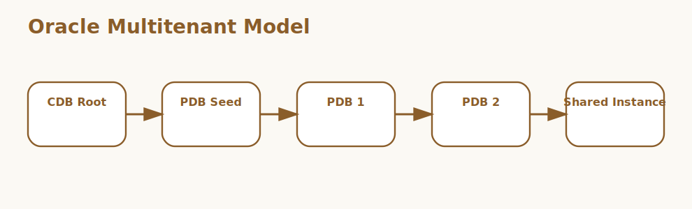

# Oracle Pluggable Database Interview Questions



This page covers Oracle multitenant concepts, especially how pluggable databases work inside a container database.

## 1. CDB and PDB architecture

### 1. What is the role of CDB and PDB architecture in Oracle pluggable databases?

**Answer:**

In Oracle pluggable databases, the term CDB and PDB architecture refers to the multitenant structure where
one container database hosts multiple pluggable databases. It is part of the foundation a candidate
should be able to explain clearly.

**Sample:**

```sql
-- Concept: 1. CDB and PDB architecture
SHOW PDBS;
ALTER PLUGGABLE DATABASE pdb1 OPEN;
ALTER SESSION SET CONTAINER = pdb1;
```

---

### 2. Why is the concept of CDB and PDB architecture important in Oracle pluggable databases?

**Answer:**

This concept matters because it influences the multitenant structure where one container
database hosts multiple pluggable databases. Good interview answers connect it to clarity,
maintainability, performance, security, or delivery depending on the situation.

**Sample:**

```sql
-- Concept: 1. CDB and PDB architecture
SHOW PDBS;
ALTER PLUGGABLE DATABASE pdb1 OPEN;
ALTER SESSION SET CONTAINER = pdb1;
```

---

### 3. When should a team focus on CDB and PDB architecture?

**Answer:**

A team should focus on CDB and PDB architecture when the requirement depends on the multitenant
structure where one container database hosts multiple pluggable databases. It becomes especially
important when design decisions, debugging, or architecture conversations depend on that area.

**Sample:**

```sql
-- Concept: 1. CDB and PDB architecture
SHOW PDBS;
ALTER PLUGGABLE DATABASE pdb1 OPEN;
ALTER SESSION SET CONTAINER = pdb1;
```

---

### 4. How is CDB and PDB architecture applied in practice?

**Answer:**

In practice, CDB and PDB architecture is applied by making the multitenant structure where one
container database hosts multiple pluggable databases explicit in the code, workflow, or
collaboration pattern. The exact shape depends on the stack, but the responsibility should stay
predictable.

**Sample:**

```sql
-- Concept: 1. CDB and PDB architecture
SHOW PDBS;
ALTER PLUGGABLE DATABASE pdb1 OPEN;
ALTER SESSION SET CONTAINER = pdb1;
```

---

### 5. What strengths does CDB and PDB architecture bring?

**Answer:**

The strengths of CDB and PDB architecture are better structure, better communication, and better
control over the multitenant structure where one container database hosts multiple pluggable
databases. It also makes tradeoffs easier to explain to reviewers, interviewers, and teammates.

**Sample:**

```sql
-- Concept: 1. CDB and PDB architecture
SHOW PDBS;
ALTER PLUGGABLE DATABASE pdb1 OPEN;
ALTER SESSION SET CONTAINER = pdb1;
```

---

### 6. What tradeoffs come with CDB and PDB architecture?

**Answer:**

The main tradeoff is extra complexity if CDB and PDB architecture is introduced without a real need
or a clear understanding of the multitenant structure where one container database hosts multiple
pluggable databases. That usually leads to weak reasoning, overengineering, or fragile
implementations.

**Sample:**

```sql
-- Concept: 1. CDB and PDB architecture
SHOW PDBS;
ALTER PLUGGABLE DATABASE pdb1 OPEN;
ALTER SESSION SET CONTAINER = pdb1;
```

---

### 7. How does CDB and PDB architecture differ from Root container and seed database?

**Answer:**

CDB and PDB architecture is centered on the multitenant structure where one container database hosts
multiple pluggable databases, while Root container and seed database is centered on the central
container and template database that support pluggable database creation. They often work together,
but they solve different parts of the topic.

**Sample:**

```sql
-- Concept: 1. CDB and PDB architecture
SHOW PDBS;
ALTER PLUGGABLE DATABASE pdb1 OPEN;
ALTER SESSION SET CONTAINER = pdb1;
```

---

### 8. What is a good real-world example of CDB and PDB architecture?

**Answer:**

A strong example is explaining how CDB and PDB architecture affects a real feature, workflow, bug,
migration, or design choice involving the multitenant structure where one container database hosts
multiple pluggable databases. Interviewers usually care more about the reasoning than the definition
alone.

**Sample:**

```sql
-- Concept: 1. CDB and PDB architecture
SHOW PDBS;
ALTER PLUGGABLE DATABASE pdb1 OPEN;
ALTER SESSION SET CONTAINER = pdb1;
```

---

### 9. What is a best practice for CDB and PDB architecture?

**Answer:**

A good practice is to keep CDB and PDB architecture aligned with the actual requirement around the
multitenant structure where one container database hosts multiple pluggable databases. Teams should
document intent, keep the implementation readable, and validate important paths early.

**Sample:**

```sql
-- Concept: 1. CDB and PDB architecture
SHOW PDBS;
ALTER PLUGGABLE DATABASE pdb1 OPEN;
ALTER SESSION SET CONTAINER = pdb1;
```

---

### 10. What is a common mistake around CDB and PDB architecture?

**Answer:**

A common mistake is naming CDB and PDB architecture without understanding how it affects the
multitenant structure where one container database hosts multiple pluggable databases. In real work,
that usually appears as poor decisions, weak debugging, or incomplete explanations.

**Sample:**

```sql
-- Concept: 1. CDB and PDB architecture
SHOW PDBS;
ALTER PLUGGABLE DATABASE pdb1 OPEN;
ALTER SESSION SET CONTAINER = pdb1;
```

---

### 11. How do you troubleshoot CDB and PDB architecture-related issues?

**Answer:**

When troubleshooting CDB and PDB architecture, first verify whether the multitenant structure where
one container database hosts multiple pluggable databases is behaving as expected. Then check
surrounding dependencies, inputs, configuration, logs, and edge cases before changing the design.

**Sample:**

```sql
-- Concept: 1. CDB and PDB architecture
SHOW PDBS;
ALTER PLUGGABLE DATABASE pdb1 OPEN;
ALTER SESSION SET CONTAINER = pdb1;
```

---

### 12. How does CDB and PDB architecture connect to the rest of Oracle pluggable databases?

**Answer:**

CDB and PDB architecture connects to the rest of Oracle pluggable databases by giving structure to
the multitenant structure where one container database hosts multiple pluggable databases. It is one
of the pieces that turns isolated facts into a coherent end-to-end explanation.

**Sample:**

```sql
-- Concept: 1. CDB and PDB architecture
SHOW PDBS;
ALTER PLUGGABLE DATABASE pdb1 OPEN;
ALTER SESSION SET CONTAINER = pdb1;
```

---

## 2. Root container and seed database

### 13. What is the role of Root container and seed database in Oracle pluggable databases?

**Answer:**

In Oracle pluggable databases, the term Root container and seed database refers to the central container and
template database that support pluggable database creation. It is part of the foundation a candidate
should be able to explain clearly.

**Sample:**

```sql
-- Concept: 2. Root container and seed database
SHOW PDBS;
ALTER PLUGGABLE DATABASE pdb1 OPEN;
ALTER SESSION SET CONTAINER = pdb1;
```

---

### 14. Why is the concept of Root container and seed database important in Oracle pluggable databases?

**Answer:**

This concept matters because it influences the central container and template
database that support pluggable database creation. Good interview answers connect it to clarity,
maintainability, performance, security, or delivery depending on the situation.

**Sample:**

```sql
-- Concept: 2. Root container and seed database
SHOW PDBS;
ALTER PLUGGABLE DATABASE pdb1 OPEN;
ALTER SESSION SET CONTAINER = pdb1;
```

---

### 15. When should a team focus on Root container and seed database?

**Answer:**

A team should focus on Root container and seed database when the requirement depends on the central
container and template database that support pluggable database creation. It becomes especially
important when design decisions, debugging, or architecture conversations depend on that area.

**Sample:**

```sql
-- Concept: 2. Root container and seed database
SHOW PDBS;
ALTER PLUGGABLE DATABASE pdb1 OPEN;
ALTER SESSION SET CONTAINER = pdb1;
```

---

### 16. How is Root container and seed database applied in practice?

**Answer:**

In practice, Root container and seed database is applied by making the central container and
template database that support pluggable database creation explicit in the code, workflow, or
collaboration pattern. The exact shape depends on the stack, but the responsibility should stay
predictable.

**Sample:**

```sql
-- Concept: 2. Root container and seed database
SHOW PDBS;
ALTER PLUGGABLE DATABASE pdb1 OPEN;
ALTER SESSION SET CONTAINER = pdb1;
```

---

### 17. What strengths does Root container and seed database bring?

**Answer:**

The strengths of Root container and seed database are better structure, better communication, and
better control over the central container and template database that support pluggable database
creation. It also makes tradeoffs easier to explain to reviewers, interviewers, and teammates.

**Sample:**

```sql
-- Concept: 2. Root container and seed database
SHOW PDBS;
ALTER PLUGGABLE DATABASE pdb1 OPEN;
ALTER SESSION SET CONTAINER = pdb1;
```

---

### 18. What tradeoffs come with Root container and seed database?

**Answer:**

The main tradeoff is extra complexity if Root container and seed database is introduced without a
real need or a clear understanding of the central container and template database that support
pluggable database creation. That usually leads to weak reasoning, overengineering, or fragile
implementations.

**Sample:**

```sql
-- Concept: 2. Root container and seed database
SHOW PDBS;
ALTER PLUGGABLE DATABASE pdb1 OPEN;
ALTER SESSION SET CONTAINER = pdb1;
```

---

### 19. How does Root container and seed database differ from Local and common users?

**Answer:**

Root container and seed database is centered on the central container and template database that
support pluggable database creation, while Local and common users is centered on the distinction
between users scoped to one pluggable database and users shared across containers. They often work
together, but they solve different parts of the topic.

**Sample:**

```sql
-- Concept: 2. Root container and seed database
SHOW PDBS;
ALTER PLUGGABLE DATABASE pdb1 OPEN;
ALTER SESSION SET CONTAINER = pdb1;
```

---

### 20. What is a good real-world example of Root container and seed database?

**Answer:**

A strong example is explaining how Root container and seed database affects a real feature,
workflow, bug, migration, or design choice involving the central container and template database
that support pluggable database creation. Interviewers usually care more about the reasoning than
the definition alone.

**Sample:**

```sql
-- Concept: 2. Root container and seed database
SHOW PDBS;
ALTER PLUGGABLE DATABASE pdb1 OPEN;
ALTER SESSION SET CONTAINER = pdb1;
```

---

### 21. What is a best practice for Root container and seed database?

**Answer:**

A good practice is to keep Root container and seed database aligned with the actual requirement
around the central container and template database that support pluggable database creation. Teams
should document intent, keep the implementation readable, and validate important paths early.

**Sample:**

```sql
-- Concept: 2. Root container and seed database
SHOW PDBS;
ALTER PLUGGABLE DATABASE pdb1 OPEN;
ALTER SESSION SET CONTAINER = pdb1;
```

---

### 22. What is a common mistake around Root container and seed database?

**Answer:**

A common mistake is naming Root container and seed database without understanding how it affects the
central container and template database that support pluggable database creation. In real work, that
usually appears as poor decisions, weak debugging, or incomplete explanations.

**Sample:**

```sql
-- Concept: 2. Root container and seed database
SHOW PDBS;
ALTER PLUGGABLE DATABASE pdb1 OPEN;
ALTER SESSION SET CONTAINER = pdb1;
```

---

### 23. How do you troubleshoot Root container and seed database-related issues?

**Answer:**

When troubleshooting Root container and seed database, first verify whether the central container
and template database that support pluggable database creation is behaving as expected. Then check
surrounding dependencies, inputs, configuration, logs, and edge cases before changing the design.

**Sample:**

```sql
-- Concept: 2. Root container and seed database
SHOW PDBS;
ALTER PLUGGABLE DATABASE pdb1 OPEN;
ALTER SESSION SET CONTAINER = pdb1;
```

---

### 24. How does Root container and seed database connect to the rest of Oracle pluggable databases?

**Answer:**

Root container and seed database connects to the rest of Oracle pluggable databases by giving
structure to the central container and template database that support pluggable database creation.
It is one of the pieces that turns isolated facts into a coherent end-to-end explanation.

**Sample:**

```sql
-- Concept: 2. Root container and seed database
SHOW PDBS;
ALTER PLUGGABLE DATABASE pdb1 OPEN;
ALTER SESSION SET CONTAINER = pdb1;
```

---

## 3. Local and common users

### 25. What is the role of Local and common users in Oracle pluggable databases?

**Answer:**

In Oracle pluggable databases, the term Local and common users refers to the distinction between users scoped
to one pluggable database and users shared across containers. It is part of the foundation a
candidate should be able to explain clearly.

**Sample:**

```sql
-- Concept: 3. Local and common users
SHOW PDBS;
ALTER PLUGGABLE DATABASE pdb1 OPEN;
ALTER SESSION SET CONTAINER = pdb1;
```

---

### 26. Why is the concept of Local and common users important in Oracle pluggable databases?

**Answer:**

This concept matters because it influences the distinction between users scoped to one
pluggable database and users shared across containers. Good interview answers connect it to clarity,
maintainability, performance, security, or delivery depending on the situation.

**Sample:**

```sql
-- Concept: 3. Local and common users
SHOW PDBS;
ALTER PLUGGABLE DATABASE pdb1 OPEN;
ALTER SESSION SET CONTAINER = pdb1;
```

---

### 27. When should a team focus on Local and common users?

**Answer:**

A team should focus on Local and common users when the requirement depends on the distinction
between users scoped to one pluggable database and users shared across containers. It becomes
especially important when design decisions, debugging, or architecture conversations depend on that
area.

**Sample:**

```sql
-- Concept: 3. Local and common users
SHOW PDBS;
ALTER PLUGGABLE DATABASE pdb1 OPEN;
ALTER SESSION SET CONTAINER = pdb1;
```

---

### 28. How is Local and common users applied in practice?

**Answer:**

In practice, Local and common users is applied by making the distinction between users scoped to one
pluggable database and users shared across containers explicit in the code, workflow, or
collaboration pattern. The exact shape depends on the stack, but the responsibility should stay
predictable.

**Sample:**

```sql
-- Concept: 3. Local and common users
SHOW PDBS;
ALTER PLUGGABLE DATABASE pdb1 OPEN;
ALTER SESSION SET CONTAINER = pdb1;
```

---

### 29. What strengths does Local and common users bring?

**Answer:**

The strengths of Local and common users are better structure, better communication, and better
control over the distinction between users scoped to one pluggable database and users shared across
containers. It also makes tradeoffs easier to explain to reviewers, interviewers, and teammates.

**Sample:**

```sql
-- Concept: 3. Local and common users
SHOW PDBS;
ALTER PLUGGABLE DATABASE pdb1 OPEN;
ALTER SESSION SET CONTAINER = pdb1;
```

---

### 30. What tradeoffs come with Local and common users?

**Answer:**

The main tradeoff is extra complexity if Local and common users is introduced without a real need or
a clear understanding of the distinction between users scoped to one pluggable database and users
shared across containers. That usually leads to weak reasoning, overengineering, or fragile
implementations.

**Sample:**

```sql
-- Concept: 3. Local and common users
SHOW PDBS;
ALTER PLUGGABLE DATABASE pdb1 OPEN;
ALTER SESSION SET CONTAINER = pdb1;
```

---

### 31. How does Local and common users differ from Plugging and unplugging?

**Answer:**

Local and common users is centered on the distinction between users scoped to one pluggable database
and users shared across containers, while Plugging and unplugging is centered on the process of
moving pluggable databases into or out of a container environment. They often work together, but
they solve different parts of the topic.

**Sample:**

```sql
-- Concept: 3. Local and common users
SHOW PDBS;
ALTER PLUGGABLE DATABASE pdb1 OPEN;
ALTER SESSION SET CONTAINER = pdb1;
```

---

### 32. What is a good real-world example of Local and common users?

**Answer:**

A strong example is explaining how Local and common users affects a real feature, workflow, bug,
migration, or design choice involving the distinction between users scoped to one pluggable database
and users shared across containers. Interviewers usually care more about the reasoning than the
definition alone.

**Sample:**

```sql
-- Concept: 3. Local and common users
SHOW PDBS;
ALTER PLUGGABLE DATABASE pdb1 OPEN;
ALTER SESSION SET CONTAINER = pdb1;
```

---

### 33. What is a best practice for Local and common users?

**Answer:**

A good practice is to keep Local and common users aligned with the actual requirement around the
distinction between users scoped to one pluggable database and users shared across containers. Teams
should document intent, keep the implementation readable, and validate important paths early.

**Sample:**

```sql
-- Concept: 3. Local and common users
SHOW PDBS;
ALTER PLUGGABLE DATABASE pdb1 OPEN;
ALTER SESSION SET CONTAINER = pdb1;
```

---

### 34. What is a common mistake around Local and common users?

**Answer:**

A common mistake is naming Local and common users without understanding how it affects the
distinction between users scoped to one pluggable database and users shared across containers. In
real work, that usually appears as poor decisions, weak debugging, or incomplete explanations.

**Sample:**

```sql
-- Concept: 3. Local and common users
SHOW PDBS;
ALTER PLUGGABLE DATABASE pdb1 OPEN;
ALTER SESSION SET CONTAINER = pdb1;
```

---

### 35. How do you troubleshoot Local and common users-related issues?

**Answer:**

When troubleshooting Local and common users, first verify whether the distinction between users
scoped to one pluggable database and users shared across containers is behaving as expected. Then
check surrounding dependencies, inputs, configuration, logs, and edge cases before changing the
design.

**Sample:**

```sql
-- Concept: 3. Local and common users
SHOW PDBS;
ALTER PLUGGABLE DATABASE pdb1 OPEN;
ALTER SESSION SET CONTAINER = pdb1;
```

---

### 36. How does Local and common users connect to the rest of Oracle pluggable databases?

**Answer:**

Local and common users connects to the rest of Oracle pluggable databases by giving structure to the
distinction between users scoped to one pluggable database and users shared across containers. It is
one of the pieces that turns isolated facts into a coherent end-to-end explanation.

**Sample:**

```sql
-- Concept: 3. Local and common users
SHOW PDBS;
ALTER PLUGGABLE DATABASE pdb1 OPEN;
ALTER SESSION SET CONTAINER = pdb1;
```

---

## 4. Plugging and unplugging

### 37. What is the role of Plugging and unplugging in Oracle pluggable databases?

**Answer:**

In Oracle pluggable databases, the term Plugging and unplugging refers to the process of moving pluggable
databases into or out of a container environment. It is part of the foundation a candidate should be
able to explain clearly.

**Sample:**

```sql
-- Concept: 4. Plugging and unplugging
SHOW PDBS;
ALTER PLUGGABLE DATABASE pdb1 OPEN;
ALTER SESSION SET CONTAINER = pdb1;
```

---

### 38. Why is the concept of Plugging and unplugging important in Oracle pluggable databases?

**Answer:**

This concept matters because it influences the process of moving pluggable databases into
or out of a container environment. Good interview answers connect it to clarity, maintainability,
performance, security, or delivery depending on the situation.

**Sample:**

```sql
-- Concept: 4. Plugging and unplugging
SHOW PDBS;
ALTER PLUGGABLE DATABASE pdb1 OPEN;
ALTER SESSION SET CONTAINER = pdb1;
```

---

### 39. When should a team focus on Plugging and unplugging?

**Answer:**

A team should focus on Plugging and unplugging when the requirement depends on the process of moving
pluggable databases into or out of a container environment. It becomes especially important when
design decisions, debugging, or architecture conversations depend on that area.

**Sample:**

```sql
-- Concept: 4. Plugging and unplugging
SHOW PDBS;
ALTER PLUGGABLE DATABASE pdb1 OPEN;
ALTER SESSION SET CONTAINER = pdb1;
```

---

### 40. How is Plugging and unplugging applied in practice?

**Answer:**

In practice, Plugging and unplugging is applied by making the process of moving pluggable databases
into or out of a container environment explicit in the code, workflow, or collaboration pattern. The
exact shape depends on the stack, but the responsibility should stay predictable.

**Sample:**

```sql
-- Concept: 4. Plugging and unplugging
SHOW PDBS;
ALTER PLUGGABLE DATABASE pdb1 OPEN;
ALTER SESSION SET CONTAINER = pdb1;
```

---

### 41. What strengths does Plugging and unplugging bring?

**Answer:**

The strengths of Plugging and unplugging are better structure, better communication, and better
control over the process of moving pluggable databases into or out of a container environment. It
also makes tradeoffs easier to explain to reviewers, interviewers, and teammates.

**Sample:**

```sql
-- Concept: 4. Plugging and unplugging
SHOW PDBS;
ALTER PLUGGABLE DATABASE pdb1 OPEN;
ALTER SESSION SET CONTAINER = pdb1;
```

---

### 42. What tradeoffs come with Plugging and unplugging?

**Answer:**

The main tradeoff is extra complexity if Plugging and unplugging is introduced without a real need
or a clear understanding of the process of moving pluggable databases into or out of a container
environment. That usually leads to weak reasoning, overengineering, or fragile implementations.

**Sample:**

```sql
-- Concept: 4. Plugging and unplugging
SHOW PDBS;
ALTER PLUGGABLE DATABASE pdb1 OPEN;
ALTER SESSION SET CONTAINER = pdb1;
```

---

### 43. How does Plugging and unplugging differ from Open modes?

**Answer:**

Plugging and unplugging is centered on the process of moving pluggable databases into or out of a
container environment, while Open modes is centered on the states that control whether a pluggable
database is available for access or maintenance. They often work together, but they solve different
parts of the topic.

**Sample:**

```sql
-- Concept: 4. Plugging and unplugging
SHOW PDBS;
ALTER PLUGGABLE DATABASE pdb1 OPEN;
ALTER SESSION SET CONTAINER = pdb1;
```

---

### 44. What is a good real-world example of Plugging and unplugging?

**Answer:**

A strong example is explaining how Plugging and unplugging affects a real feature, workflow, bug,
migration, or design choice involving the process of moving pluggable databases into or out of a
container environment. Interviewers usually care more about the reasoning than the definition alone.

**Sample:**

```sql
-- Concept: 4. Plugging and unplugging
SHOW PDBS;
ALTER PLUGGABLE DATABASE pdb1 OPEN;
ALTER SESSION SET CONTAINER = pdb1;
```

---

### 45. What is a best practice for Plugging and unplugging?

**Answer:**

A good practice is to keep Plugging and unplugging aligned with the actual requirement around the
process of moving pluggable databases into or out of a container environment. Teams should document
intent, keep the implementation readable, and validate important paths early.

**Sample:**

```sql
-- Concept: 4. Plugging and unplugging
SHOW PDBS;
ALTER PLUGGABLE DATABASE pdb1 OPEN;
ALTER SESSION SET CONTAINER = pdb1;
```

---

### 46. What is a common mistake around Plugging and unplugging?

**Answer:**

A common mistake is naming Plugging and unplugging without understanding how it affects the process
of moving pluggable databases into or out of a container environment. In real work, that usually
appears as poor decisions, weak debugging, or incomplete explanations.

**Sample:**

```sql
-- Concept: 4. Plugging and unplugging
SHOW PDBS;
ALTER PLUGGABLE DATABASE pdb1 OPEN;
ALTER SESSION SET CONTAINER = pdb1;
```

---

### 47. How do you troubleshoot Plugging and unplugging-related issues?

**Answer:**

When troubleshooting Plugging and unplugging, first verify whether the process of moving pluggable
databases into or out of a container environment is behaving as expected. Then check surrounding
dependencies, inputs, configuration, logs, and edge cases before changing the design.

**Sample:**

```sql
-- Concept: 4. Plugging and unplugging
SHOW PDBS;
ALTER PLUGGABLE DATABASE pdb1 OPEN;
ALTER SESSION SET CONTAINER = pdb1;
```

---

### 48. How does Plugging and unplugging connect to the rest of Oracle pluggable databases?

**Answer:**

Plugging and unplugging connects to the rest of Oracle pluggable databases by giving structure to
the process of moving pluggable databases into or out of a container environment. It is one of the
pieces that turns isolated facts into a coherent end-to-end explanation.

**Sample:**

```sql
-- Concept: 4. Plugging and unplugging
SHOW PDBS;
ALTER PLUGGABLE DATABASE pdb1 OPEN;
ALTER SESSION SET CONTAINER = pdb1;
```

---

## 5. Open modes

### 49. What is the role of Open modes in Oracle pluggable databases?

**Answer:**

In Oracle pluggable databases, the term Open modes refers to the states that control whether a pluggable
database is available for access or maintenance. It is part of the foundation a candidate should be
able to explain clearly.

**Sample:**

```sql
-- Concept: 5. Open modes
SHOW PDBS;
ALTER PLUGGABLE DATABASE pdb1 OPEN;
ALTER SESSION SET CONTAINER = pdb1;
```

---

### 50. Why is the concept of Open modes important in Oracle pluggable databases?

**Answer:**

This concept matters because it influences the states that control whether a pluggable database is
available for access or maintenance. Good interview answers connect it to clarity, maintainability,
performance, security, or delivery depending on the situation.

**Sample:**

```sql
-- Concept: 5. Open modes
SHOW PDBS;
ALTER PLUGGABLE DATABASE pdb1 OPEN;
ALTER SESSION SET CONTAINER = pdb1;
```

---

### 51. When should a team focus on Open modes?

**Answer:**

A team should focus on Open modes when the requirement depends on the states that control whether a
pluggable database is available for access or maintenance. It becomes especially important when
design decisions, debugging, or architecture conversations depend on that area.

**Sample:**

```sql
-- Concept: 5. Open modes
SHOW PDBS;
ALTER PLUGGABLE DATABASE pdb1 OPEN;
ALTER SESSION SET CONTAINER = pdb1;
```

---

### 52. How is Open modes applied in practice?

**Answer:**

In practice, Open modes is applied by making the states that control whether a pluggable database is
available for access or maintenance explicit in the code, workflow, or collaboration pattern. The
exact shape depends on the stack, but the responsibility should stay predictable.

**Sample:**

```sql
-- Concept: 5. Open modes
SHOW PDBS;
ALTER PLUGGABLE DATABASE pdb1 OPEN;
ALTER SESSION SET CONTAINER = pdb1;
```

---

### 53. What strengths does Open modes bring?

**Answer:**

The strengths of Open modes are better structure, better communication, and better control over the
states that control whether a pluggable database is available for access or maintenance. It also
makes tradeoffs easier to explain to reviewers, interviewers, and teammates.

**Sample:**

```sql
-- Concept: 5. Open modes
SHOW PDBS;
ALTER PLUGGABLE DATABASE pdb1 OPEN;
ALTER SESSION SET CONTAINER = pdb1;
```

---

### 54. What tradeoffs come with Open modes?

**Answer:**

The main tradeoff is extra complexity if Open modes is introduced without a real need or a clear
understanding of the states that control whether a pluggable database is available for access or
maintenance. That usually leads to weak reasoning, overengineering, or fragile implementations.

**Sample:**

```sql
-- Concept: 5. Open modes
SHOW PDBS;
ALTER PLUGGABLE DATABASE pdb1 OPEN;
ALTER SESSION SET CONTAINER = pdb1;
```

---

### 55. How does Open modes differ from Service names?

**Answer:**

Open modes is centered on the states that control whether a pluggable database is available for
access or maintenance, while Service names is centered on the identifiers clients use to connect to
specific pluggable databases. They often work together, but they solve different parts of the topic.

**Sample:**

```sql
-- Concept: 5. Open modes
SHOW PDBS;
ALTER PLUGGABLE DATABASE pdb1 OPEN;
ALTER SESSION SET CONTAINER = pdb1;
```

---

### 56. What is a good real-world example of Open modes?

**Answer:**

A strong example is explaining how Open modes affects a real feature, workflow, bug, migration, or
design choice involving the states that control whether a pluggable database is available for access
or maintenance. Interviewers usually care more about the reasoning than the definition alone.

**Sample:**

```sql
-- Concept: 5. Open modes
SHOW PDBS;
ALTER PLUGGABLE DATABASE pdb1 OPEN;
ALTER SESSION SET CONTAINER = pdb1;
```

---

### 57. What is a best practice for Open modes?

**Answer:**

A good practice is to keep Open modes aligned with the actual requirement around the states that
control whether a pluggable database is available for access or maintenance. Teams should document
intent, keep the implementation readable, and validate important paths early.

**Sample:**

```sql
-- Concept: 5. Open modes
SHOW PDBS;
ALTER PLUGGABLE DATABASE pdb1 OPEN;
ALTER SESSION SET CONTAINER = pdb1;
```

---

### 58. What is a common mistake around Open modes?

**Answer:**

A common mistake is naming Open modes without understanding how it affects the states that control
whether a pluggable database is available for access or maintenance. In real work, that usually
appears as poor decisions, weak debugging, or incomplete explanations.

**Sample:**

```sql
-- Concept: 5. Open modes
SHOW PDBS;
ALTER PLUGGABLE DATABASE pdb1 OPEN;
ALTER SESSION SET CONTAINER = pdb1;
```

---

### 59. How do you troubleshoot Open modes-related issues?

**Answer:**

When troubleshooting Open modes, first verify whether the states that control whether a pluggable
database is available for access or maintenance is behaving as expected. Then check surrounding
dependencies, inputs, configuration, logs, and edge cases before changing the design.

**Sample:**

```sql
-- Concept: 5. Open modes
SHOW PDBS;
ALTER PLUGGABLE DATABASE pdb1 OPEN;
ALTER SESSION SET CONTAINER = pdb1;
```

---

### 60. How does Open modes connect to the rest of Oracle pluggable databases?

**Answer:**

Open modes connects to the rest of Oracle pluggable databases by giving structure to the states that
control whether a pluggable database is available for access or maintenance. It is one of the pieces
that turns isolated facts into a coherent end-to-end explanation.

**Sample:**

```sql
-- Concept: 5. Open modes
SHOW PDBS;
ALTER PLUGGABLE DATABASE pdb1 OPEN;
ALTER SESSION SET CONTAINER = pdb1;
```

---

## 6. Service names

### 61. What is the role of Service names in Oracle pluggable databases?

**Answer:**

In Oracle pluggable databases, the term Service names refers to the identifiers clients use to connect to
specific pluggable databases. It is part of the foundation a candidate should be able to explain
clearly.

**Sample:**

```sql
-- Concept: 6. Service names
SHOW PDBS;
ALTER PLUGGABLE DATABASE pdb1 OPEN;
ALTER SESSION SET CONTAINER = pdb1;
```

---

### 62. Why is the concept of Service names important in Oracle pluggable databases?

**Answer:**

This concept matters because it influences the identifiers clients use to connect to specific
pluggable databases. Good interview answers connect it to clarity, maintainability, performance,
security, or delivery depending on the situation.

**Sample:**

```sql
-- Concept: 6. Service names
SHOW PDBS;
ALTER PLUGGABLE DATABASE pdb1 OPEN;
ALTER SESSION SET CONTAINER = pdb1;
```

---

### 63. When should a team focus on Service names?

**Answer:**

A team should focus on Service names when the requirement depends on the identifiers clients use to
connect to specific pluggable databases. It becomes especially important when design decisions,
debugging, or architecture conversations depend on that area.

**Sample:**

```sql
-- Concept: 6. Service names
SHOW PDBS;
ALTER PLUGGABLE DATABASE pdb1 OPEN;
ALTER SESSION SET CONTAINER = pdb1;
```

---

### 64. How is Service names applied in practice?

**Answer:**

In practice, Service names is applied by making the identifiers clients use to connect to specific
pluggable databases explicit in the code, workflow, or collaboration pattern. The exact shape
depends on the stack, but the responsibility should stay predictable.

**Sample:**

```sql
-- Concept: 6. Service names
SHOW PDBS;
ALTER PLUGGABLE DATABASE pdb1 OPEN;
ALTER SESSION SET CONTAINER = pdb1;
```

---

### 65. What strengths does Service names bring?

**Answer:**

The strengths of Service names are better structure, better communication, and better control over
the identifiers clients use to connect to specific pluggable databases. It also makes tradeoffs
easier to explain to reviewers, interviewers, and teammates.

**Sample:**

```sql
-- Concept: 6. Service names
SHOW PDBS;
ALTER PLUGGABLE DATABASE pdb1 OPEN;
ALTER SESSION SET CONTAINER = pdb1;
```

---

### 66. What tradeoffs come with Service names?

**Answer:**

The main tradeoff is extra complexity if Service names is introduced without a real need or a clear
understanding of the identifiers clients use to connect to specific pluggable databases. That
usually leads to weak reasoning, overengineering, or fragile implementations.

**Sample:**

```sql
-- Concept: 6. Service names
SHOW PDBS;
ALTER PLUGGABLE DATABASE pdb1 OPEN;
ALTER SESSION SET CONTAINER = pdb1;
```

---

### 67. How does Service names differ from Metadata and storage separation?

**Answer:**

Service names is centered on the identifiers clients use to connect to specific pluggable databases,
while Metadata and storage separation is centered on the way multitenant design balances shared
infrastructure with isolated data ownership. They often work together, but they solve different
parts of the topic.

**Sample:**

```sql
-- Concept: 6. Service names
SHOW PDBS;
ALTER PLUGGABLE DATABASE pdb1 OPEN;
ALTER SESSION SET CONTAINER = pdb1;
```

---

### 68. What is a good real-world example of Service names?

**Answer:**

A strong example is explaining how Service names affects a real feature, workflow, bug, migration,
or design choice involving the identifiers clients use to connect to specific pluggable databases.
Interviewers usually care more about the reasoning than the definition alone.

**Sample:**

```sql
-- Concept: 6. Service names
SHOW PDBS;
ALTER PLUGGABLE DATABASE pdb1 OPEN;
ALTER SESSION SET CONTAINER = pdb1;
```

---

### 69. What is a best practice for Service names?

**Answer:**

A good practice is to keep Service names aligned with the actual requirement around the identifiers
clients use to connect to specific pluggable databases. Teams should document intent, keep the
implementation readable, and validate important paths early.

**Sample:**

```sql
-- Concept: 6. Service names
SHOW PDBS;
ALTER PLUGGABLE DATABASE pdb1 OPEN;
ALTER SESSION SET CONTAINER = pdb1;
```

---

### 70. What is a common mistake around Service names?

**Answer:**

A common mistake is naming Service names without understanding how it affects the identifiers
clients use to connect to specific pluggable databases. In real work, that usually appears as poor
decisions, weak debugging, or incomplete explanations.

**Sample:**

```sql
-- Concept: 6. Service names
SHOW PDBS;
ALTER PLUGGABLE DATABASE pdb1 OPEN;
ALTER SESSION SET CONTAINER = pdb1;
```

---

### 71. How do you troubleshoot Service names-related issues?

**Answer:**

When troubleshooting Service names, first verify whether the identifiers clients use to connect to
specific pluggable databases is behaving as expected. Then check surrounding dependencies, inputs,
configuration, logs, and edge cases before changing the design.

**Sample:**

```sql
-- Concept: 6. Service names
SHOW PDBS;
ALTER PLUGGABLE DATABASE pdb1 OPEN;
ALTER SESSION SET CONTAINER = pdb1;
```

---

### 72. How does Service names connect to the rest of Oracle pluggable databases?

**Answer:**

Service names connects to the rest of Oracle pluggable databases by giving structure to the
identifiers clients use to connect to specific pluggable databases. It is one of the pieces that
turns isolated facts into a coherent end-to-end explanation.

**Sample:**

```sql
-- Concept: 6. Service names
SHOW PDBS;
ALTER PLUGGABLE DATABASE pdb1 OPEN;
ALTER SESSION SET CONTAINER = pdb1;
```

---

## 7. Metadata and storage separation

### 73. What is the role of Metadata and storage separation in Oracle pluggable databases?

**Answer:**

In Oracle pluggable databases, the term Metadata and storage separation refers to the way multitenant design
balances shared infrastructure with isolated data ownership. It is part of the foundation a
candidate should be able to explain clearly.

**Sample:**

```sql
-- Concept: 7. Metadata and storage separation
SHOW PDBS;
ALTER PLUGGABLE DATABASE pdb1 OPEN;
ALTER SESSION SET CONTAINER = pdb1;
```

---

### 74. Why is the concept of Metadata and storage separation important in Oracle pluggable databases?

**Answer:**

This concept matters because it influences the way multitenant design balances
shared infrastructure with isolated data ownership. Good interview answers connect it to clarity,
maintainability, performance, security, or delivery depending on the situation.

**Sample:**

```sql
-- Concept: 7. Metadata and storage separation
SHOW PDBS;
ALTER PLUGGABLE DATABASE pdb1 OPEN;
ALTER SESSION SET CONTAINER = pdb1;
```

---

### 75. When should a team focus on Metadata and storage separation?

**Answer:**

A team should focus on Metadata and storage separation when the requirement depends on the way
multitenant design balances shared infrastructure with isolated data ownership. It becomes
especially important when design decisions, debugging, or architecture conversations depend on that
area.

**Sample:**

```sql
-- Concept: 7. Metadata and storage separation
SHOW PDBS;
ALTER PLUGGABLE DATABASE pdb1 OPEN;
ALTER SESSION SET CONTAINER = pdb1;
```

---

### 76. How is Metadata and storage separation applied in practice?

**Answer:**

In practice, Metadata and storage separation is applied by making the way multitenant design
balances shared infrastructure with isolated data ownership explicit in the code, workflow, or
collaboration pattern. The exact shape depends on the stack, but the responsibility should stay
predictable.

**Sample:**

```sql
-- Concept: 7. Metadata and storage separation
SHOW PDBS;
ALTER PLUGGABLE DATABASE pdb1 OPEN;
ALTER SESSION SET CONTAINER = pdb1;
```

---

### 77. What strengths does Metadata and storage separation bring?

**Answer:**

The strengths of Metadata and storage separation are better structure, better communication, and
better control over the way multitenant design balances shared infrastructure with isolated data
ownership. It also makes tradeoffs easier to explain to reviewers, interviewers, and teammates.

**Sample:**

```sql
-- Concept: 7. Metadata and storage separation
SHOW PDBS;
ALTER PLUGGABLE DATABASE pdb1 OPEN;
ALTER SESSION SET CONTAINER = pdb1;
```

---

### 78. What tradeoffs come with Metadata and storage separation?

**Answer:**

The main tradeoff is extra complexity if Metadata and storage separation is introduced without a
real need or a clear understanding of the way multitenant design balances shared infrastructure with
isolated data ownership. That usually leads to weak reasoning, overengineering, or fragile
implementations.

**Sample:**

```sql
-- Concept: 7. Metadata and storage separation
SHOW PDBS;
ALTER PLUGGABLE DATABASE pdb1 OPEN;
ALTER SESSION SET CONTAINER = pdb1;
```

---

### 79. How does Metadata and storage separation differ from Backup and recovery?

**Answer:**

Metadata and storage separation is centered on the way multitenant design balances shared
infrastructure with isolated data ownership, while Backup and recovery is centered on the
operational model for protecting pluggable database data and restoring it when required. They often
work together, but they solve different parts of the topic.

**Sample:**

```sql
-- Concept: 7. Metadata and storage separation
SHOW PDBS;
ALTER PLUGGABLE DATABASE pdb1 OPEN;
ALTER SESSION SET CONTAINER = pdb1;
```

---

### 80. What is a good real-world example of Metadata and storage separation?

**Answer:**

A strong example is explaining how Metadata and storage separation affects a real feature, workflow,
bug, migration, or design choice involving the way multitenant design balances shared infrastructure
with isolated data ownership. Interviewers usually care more about the reasoning than the definition
alone.

**Sample:**

```sql
-- Concept: 7. Metadata and storage separation
SHOW PDBS;
ALTER PLUGGABLE DATABASE pdb1 OPEN;
ALTER SESSION SET CONTAINER = pdb1;
```

---

### 81. What is a best practice for Metadata and storage separation?

**Answer:**

A good practice is to keep Metadata and storage separation aligned with the actual requirement
around the way multitenant design balances shared infrastructure with isolated data ownership. Teams
should document intent, keep the implementation readable, and validate important paths early.

**Sample:**

```sql
-- Concept: 7. Metadata and storage separation
SHOW PDBS;
ALTER PLUGGABLE DATABASE pdb1 OPEN;
ALTER SESSION SET CONTAINER = pdb1;
```

---

### 82. What is a common mistake around Metadata and storage separation?

**Answer:**

A common mistake is naming Metadata and storage separation without understanding how it affects the
way multitenant design balances shared infrastructure with isolated data ownership. In real work,
that usually appears as poor decisions, weak debugging, or incomplete explanations.

**Sample:**

```sql
-- Concept: 7. Metadata and storage separation
SHOW PDBS;
ALTER PLUGGABLE DATABASE pdb1 OPEN;
ALTER SESSION SET CONTAINER = pdb1;
```

---

### 83. How do you troubleshoot Metadata and storage separation-related issues?

**Answer:**

When troubleshooting Metadata and storage separation, first verify whether the way multitenant
design balances shared infrastructure with isolated data ownership is behaving as expected. Then
check surrounding dependencies, inputs, configuration, logs, and edge cases before changing the
design.

**Sample:**

```sql
-- Concept: 7. Metadata and storage separation
SHOW PDBS;
ALTER PLUGGABLE DATABASE pdb1 OPEN;
ALTER SESSION SET CONTAINER = pdb1;
```

---

### 84. How does Metadata and storage separation connect to the rest of Oracle pluggable databases?

**Answer:**

Metadata and storage separation connects to the rest of Oracle pluggable databases by giving
structure to the way multitenant design balances shared infrastructure with isolated data ownership.
It is one of the pieces that turns isolated facts into a coherent end-to-end explanation.

**Sample:**

```sql
-- Concept: 7. Metadata and storage separation
SHOW PDBS;
ALTER PLUGGABLE DATABASE pdb1 OPEN;
ALTER SESSION SET CONTAINER = pdb1;
```

---

## 8. Backup and recovery

### 85. What is the role of Backup and recovery in Oracle pluggable databases?

**Answer:**

In Oracle pluggable databases, the term Backup and recovery refers to the operational model for protecting
pluggable database data and restoring it when required. It is part of the foundation a candidate
should be able to explain clearly.

**Sample:**

```sql
-- Concept: 8. Backup and recovery
SHOW PDBS;
ALTER PLUGGABLE DATABASE pdb1 OPEN;
ALTER SESSION SET CONTAINER = pdb1;
```

---

### 86. Why is the concept of Backup and recovery important in Oracle pluggable databases?

**Answer:**

This concept matters because it influences the operational model for protecting pluggable
database data and restoring it when required. Good interview answers connect it to clarity,
maintainability, performance, security, or delivery depending on the situation.

**Sample:**

```sql
-- Concept: 8. Backup and recovery
SHOW PDBS;
ALTER PLUGGABLE DATABASE pdb1 OPEN;
ALTER SESSION SET CONTAINER = pdb1;
```

---

### 87. When should a team focus on Backup and recovery?

**Answer:**

A team should focus on Backup and recovery when the requirement depends on the operational model for
protecting pluggable database data and restoring it when required. It becomes especially important
when design decisions, debugging, or architecture conversations depend on that area.

**Sample:**

```sql
-- Concept: 8. Backup and recovery
SHOW PDBS;
ALTER PLUGGABLE DATABASE pdb1 OPEN;
ALTER SESSION SET CONTAINER = pdb1;
```

---

### 88. How is Backup and recovery applied in practice?

**Answer:**

In practice, Backup and recovery is applied by making the operational model for protecting pluggable
database data and restoring it when required explicit in the code, workflow, or collaboration
pattern. The exact shape depends on the stack, but the responsibility should stay predictable.

**Sample:**

```sql
-- Concept: 8. Backup and recovery
SHOW PDBS;
ALTER PLUGGABLE DATABASE pdb1 OPEN;
ALTER SESSION SET CONTAINER = pdb1;
```

---

### 89. What strengths does Backup and recovery bring?

**Answer:**

The strengths of Backup and recovery are better structure, better communication, and better control
over the operational model for protecting pluggable database data and restoring it when required. It
also makes tradeoffs easier to explain to reviewers, interviewers, and teammates.

**Sample:**

```sql
-- Concept: 8. Backup and recovery
SHOW PDBS;
ALTER PLUGGABLE DATABASE pdb1 OPEN;
ALTER SESSION SET CONTAINER = pdb1;
```

---

### 90. What tradeoffs come with Backup and recovery?

**Answer:**

The main tradeoff is extra complexity if Backup and recovery is introduced without a real need or a
clear understanding of the operational model for protecting pluggable database data and restoring it
when required. That usually leads to weak reasoning, overengineering, or fragile implementations.

**Sample:**

```sql
-- Concept: 8. Backup and recovery
SHOW PDBS;
ALTER PLUGGABLE DATABASE pdb1 OPEN;
ALTER SESSION SET CONTAINER = pdb1;
```

---

### 91. How does Backup and recovery differ from Patching and maintenance?

**Answer:**

Backup and recovery is centered on the operational model for protecting pluggable database data and
restoring it when required, while Patching and maintenance is centered on the lifecycle tasks used
to keep multitenant environments secure and consistent. They often work together, but they solve
different parts of the topic.

**Sample:**

```sql
-- Concept: 8. Backup and recovery
SHOW PDBS;
ALTER PLUGGABLE DATABASE pdb1 OPEN;
ALTER SESSION SET CONTAINER = pdb1;
```

---

### 92. What is a good real-world example of Backup and recovery?

**Answer:**

A strong example is explaining how Backup and recovery affects a real feature, workflow, bug,
migration, or design choice involving the operational model for protecting pluggable database data
and restoring it when required. Interviewers usually care more about the reasoning than the
definition alone.

**Sample:**

```sql
-- Concept: 8. Backup and recovery
SHOW PDBS;
ALTER PLUGGABLE DATABASE pdb1 OPEN;
ALTER SESSION SET CONTAINER = pdb1;
```

---

### 93. What is a best practice for Backup and recovery?

**Answer:**

A good practice is to keep Backup and recovery aligned with the actual requirement around the
operational model for protecting pluggable database data and restoring it when required. Teams
should document intent, keep the implementation readable, and validate important paths early.

**Sample:**

```sql
-- Concept: 8. Backup and recovery
SHOW PDBS;
ALTER PLUGGABLE DATABASE pdb1 OPEN;
ALTER SESSION SET CONTAINER = pdb1;
```

---

### 94. What is a common mistake around Backup and recovery?

**Answer:**

A common mistake is naming Backup and recovery without understanding how it affects the operational
model for protecting pluggable database data and restoring it when required. In real work, that
usually appears as poor decisions, weak debugging, or incomplete explanations.

**Sample:**

```sql
-- Concept: 8. Backup and recovery
SHOW PDBS;
ALTER PLUGGABLE DATABASE pdb1 OPEN;
ALTER SESSION SET CONTAINER = pdb1;
```

---

### 95. How do you troubleshoot Backup and recovery-related issues?

**Answer:**

When troubleshooting Backup and recovery, first verify whether the operational model for protecting
pluggable database data and restoring it when required is behaving as expected. Then check
surrounding dependencies, inputs, configuration, logs, and edge cases before changing the design.

**Sample:**

```sql
-- Concept: 8. Backup and recovery
SHOW PDBS;
ALTER PLUGGABLE DATABASE pdb1 OPEN;
ALTER SESSION SET CONTAINER = pdb1;
```

---

### 96. How does Backup and recovery connect to the rest of Oracle pluggable databases?

**Answer:**

Backup and recovery connects to the rest of Oracle pluggable databases by giving structure to the
operational model for protecting pluggable database data and restoring it when required. It is one
of the pieces that turns isolated facts into a coherent end-to-end explanation.

**Sample:**

```sql
-- Concept: 8. Backup and recovery
SHOW PDBS;
ALTER PLUGGABLE DATABASE pdb1 OPEN;
ALTER SESSION SET CONTAINER = pdb1;
```

---

## 9. Patching and maintenance

### 97. What is the role of Patching and maintenance in Oracle pluggable databases?

**Answer:**

In Oracle pluggable databases, the term Patching and maintenance refers to the lifecycle tasks used to keep
multitenant environments secure and consistent. It is part of the foundation a candidate should be
able to explain clearly.

**Sample:**

```sql
-- Concept: 9. Patching and maintenance
SHOW PDBS;
ALTER PLUGGABLE DATABASE pdb1 OPEN;
ALTER SESSION SET CONTAINER = pdb1;
```

---

### 98. Why is the concept of Patching and maintenance important in Oracle pluggable databases?

**Answer:**

This concept matters because it influences the lifecycle tasks used to keep multitenant
environments secure and consistent. Good interview answers connect it to clarity, maintainability,
performance, security, or delivery depending on the situation.

**Sample:**

```sql
-- Concept: 9. Patching and maintenance
SHOW PDBS;
ALTER PLUGGABLE DATABASE pdb1 OPEN;
ALTER SESSION SET CONTAINER = pdb1;
```

---

### 99. When should a team focus on Patching and maintenance?

**Answer:**

A team should focus on Patching and maintenance when the requirement depends on the lifecycle tasks
used to keep multitenant environments secure and consistent. It becomes especially important when
design decisions, debugging, or architecture conversations depend on that area.

**Sample:**

```sql
-- Concept: 9. Patching and maintenance
SHOW PDBS;
ALTER PLUGGABLE DATABASE pdb1 OPEN;
ALTER SESSION SET CONTAINER = pdb1;
```

---

### 100. How is Patching and maintenance applied in practice?

**Answer:**

In practice, Patching and maintenance is applied by making the lifecycle tasks used to keep
multitenant environments secure and consistent explicit in the code, workflow, or collaboration
pattern. The exact shape depends on the stack, but the responsibility should stay predictable.

**Sample:**

```sql
-- Concept: 9. Patching and maintenance
SHOW PDBS;
ALTER PLUGGABLE DATABASE pdb1 OPEN;
ALTER SESSION SET CONTAINER = pdb1;
```

---

### 101. What strengths does Patching and maintenance bring?

**Answer:**

The strengths of Patching and maintenance are better structure, better communication, and better
control over the lifecycle tasks used to keep multitenant environments secure and consistent. It
also makes tradeoffs easier to explain to reviewers, interviewers, and teammates.

**Sample:**

```sql
-- Concept: 9. Patching and maintenance
SHOW PDBS;
ALTER PLUGGABLE DATABASE pdb1 OPEN;
ALTER SESSION SET CONTAINER = pdb1;
```

---

### 102. What tradeoffs come with Patching and maintenance?

**Answer:**

The main tradeoff is extra complexity if Patching and maintenance is introduced without a real need
or a clear understanding of the lifecycle tasks used to keep multitenant environments secure and
consistent. That usually leads to weak reasoning, overengineering, or fragile implementations.

**Sample:**

```sql
-- Concept: 9. Patching and maintenance
SHOW PDBS;
ALTER PLUGGABLE DATABASE pdb1 OPEN;
ALTER SESSION SET CONTAINER = pdb1;
```

---

### 103. How does Patching and maintenance differ from Multitenant use cases?

**Answer:**

Patching and maintenance is centered on the lifecycle tasks used to keep multitenant environments
secure and consistent, while Multitenant use cases is centered on the scenarios where pluggable
databases improve consolidation, isolation, and operational efficiency. They often work together,
but they solve different parts of the topic.

**Sample:**

```sql
-- Concept: 9. Patching and maintenance
SHOW PDBS;
ALTER PLUGGABLE DATABASE pdb1 OPEN;
ALTER SESSION SET CONTAINER = pdb1;
```

---

### 104. What is a good real-world example of Patching and maintenance?

**Answer:**

A strong example is explaining how Patching and maintenance affects a real feature, workflow, bug,
migration, or design choice involving the lifecycle tasks used to keep multitenant environments
secure and consistent. Interviewers usually care more about the reasoning than the definition alone.

**Sample:**

```sql
-- Concept: 9. Patching and maintenance
SHOW PDBS;
ALTER PLUGGABLE DATABASE pdb1 OPEN;
ALTER SESSION SET CONTAINER = pdb1;
```

---

### 105. What is a best practice for Patching and maintenance?

**Answer:**

A good practice is to keep Patching and maintenance aligned with the actual requirement around the
lifecycle tasks used to keep multitenant environments secure and consistent. Teams should document
intent, keep the implementation readable, and validate important paths early.

**Sample:**

```sql
-- Concept: 9. Patching and maintenance
SHOW PDBS;
ALTER PLUGGABLE DATABASE pdb1 OPEN;
ALTER SESSION SET CONTAINER = pdb1;
```

---

### 106. What is a common mistake around Patching and maintenance?

**Answer:**

A common mistake is naming Patching and maintenance without understanding how it affects the
lifecycle tasks used to keep multitenant environments secure and consistent. In real work, that
usually appears as poor decisions, weak debugging, or incomplete explanations.

**Sample:**

```sql
-- Concept: 9. Patching and maintenance
SHOW PDBS;
ALTER PLUGGABLE DATABASE pdb1 OPEN;
ALTER SESSION SET CONTAINER = pdb1;
```

---

### 107. How do you troubleshoot Patching and maintenance-related issues?

**Answer:**

When troubleshooting Patching and maintenance, first verify whether the lifecycle tasks used to keep
multitenant environments secure and consistent is behaving as expected. Then check surrounding
dependencies, inputs, configuration, logs, and edge cases before changing the design.

**Sample:**

```sql
-- Concept: 9. Patching and maintenance
SHOW PDBS;
ALTER PLUGGABLE DATABASE pdb1 OPEN;
ALTER SESSION SET CONTAINER = pdb1;
```

---

### 108. How does Patching and maintenance connect to the rest of Oracle pluggable databases?

**Answer:**

Patching and maintenance connects to the rest of Oracle pluggable databases by giving structure to
the lifecycle tasks used to keep multitenant environments secure and consistent. It is one of the
pieces that turns isolated facts into a coherent end-to-end explanation.

**Sample:**

```sql
-- Concept: 9. Patching and maintenance
SHOW PDBS;
ALTER PLUGGABLE DATABASE pdb1 OPEN;
ALTER SESSION SET CONTAINER = pdb1;
```

---

## 10. Multitenant use cases

### 109. What is the role of Multitenant use cases in Oracle pluggable databases?

**Answer:**

In Oracle pluggable databases, the term Multitenant use cases refers to the scenarios where pluggable
databases improve consolidation, isolation, and operational efficiency. It is part of the foundation
a candidate should be able to explain clearly.

**Sample:**

```sql
-- Concept: 10. Multitenant use cases
SHOW PDBS;
ALTER PLUGGABLE DATABASE pdb1 OPEN;
ALTER SESSION SET CONTAINER = pdb1;
```

---

### 110. Why is the concept of Multitenant use cases important in Oracle pluggable databases?

**Answer:**

This concept matters because it influences the scenarios where pluggable databases improve
consolidation, isolation, and operational efficiency. Good interview answers connect it to clarity,
maintainability, performance, security, or delivery depending on the situation.

**Sample:**

```sql
-- Concept: 10. Multitenant use cases
SHOW PDBS;
ALTER PLUGGABLE DATABASE pdb1 OPEN;
ALTER SESSION SET CONTAINER = pdb1;
```

---

### 111. When should a team focus on Multitenant use cases?

**Answer:**

A team should focus on Multitenant use cases when the requirement depends on the scenarios where
pluggable databases improve consolidation, isolation, and operational efficiency. It becomes
especially important when design decisions, debugging, or architecture conversations depend on that
area.

**Sample:**

```sql
-- Concept: 10. Multitenant use cases
SHOW PDBS;
ALTER PLUGGABLE DATABASE pdb1 OPEN;
ALTER SESSION SET CONTAINER = pdb1;
```

---

### 112. How is Multitenant use cases applied in practice?

**Answer:**

In practice, Multitenant use cases is applied by making the scenarios where pluggable databases
improve consolidation, isolation, and operational efficiency explicit in the code, workflow, or
collaboration pattern. The exact shape depends on the stack, but the responsibility should stay
predictable.

**Sample:**

```sql
-- Concept: 10. Multitenant use cases
SHOW PDBS;
ALTER PLUGGABLE DATABASE pdb1 OPEN;
ALTER SESSION SET CONTAINER = pdb1;
```

---

### 113. What strengths does Multitenant use cases bring?

**Answer:**

The strengths of Multitenant use cases are better structure, better communication, and better
control over the scenarios where pluggable databases improve consolidation, isolation, and
operational efficiency. It also makes tradeoffs easier to explain to reviewers, interviewers, and
teammates.

**Sample:**

```sql
-- Concept: 10. Multitenant use cases
SHOW PDBS;
ALTER PLUGGABLE DATABASE pdb1 OPEN;
ALTER SESSION SET CONTAINER = pdb1;
```

---

### 114. What tradeoffs come with Multitenant use cases?

**Answer:**

The main tradeoff is extra complexity if Multitenant use cases is introduced without a real need or
a clear understanding of the scenarios where pluggable databases improve consolidation, isolation,
and operational efficiency. That usually leads to weak reasoning, overengineering, or fragile
implementations.

**Sample:**

```sql
-- Concept: 10. Multitenant use cases
SHOW PDBS;
ALTER PLUGGABLE DATABASE pdb1 OPEN;
ALTER SESSION SET CONTAINER = pdb1;
```

---

### 115. How does Multitenant use cases differ from CDB and PDB architecture?

**Answer:**

Multitenant use cases is centered on the scenarios where pluggable databases improve consolidation,
isolation, and operational efficiency, while CDB and PDB architecture is centered on the multitenant
structure where one container database hosts multiple pluggable databases. They often work together,
but they solve different parts of the topic.

**Sample:**

```sql
-- Concept: 10. Multitenant use cases
SHOW PDBS;
ALTER PLUGGABLE DATABASE pdb1 OPEN;
ALTER SESSION SET CONTAINER = pdb1;
```

---

### 116. What is a good real-world example of Multitenant use cases?

**Answer:**

A strong example is explaining how Multitenant use cases affects a real feature, workflow, bug,
migration, or design choice involving the scenarios where pluggable databases improve consolidation,
isolation, and operational efficiency. Interviewers usually care more about the reasoning than the
definition alone.

**Sample:**

```sql
-- Concept: 10. Multitenant use cases
SHOW PDBS;
ALTER PLUGGABLE DATABASE pdb1 OPEN;
ALTER SESSION SET CONTAINER = pdb1;
```

---

### 117. What is a best practice for Multitenant use cases?

**Answer:**

A good practice is to keep Multitenant use cases aligned with the actual requirement around the
scenarios where pluggable databases improve consolidation, isolation, and operational efficiency.
Teams should document intent, keep the implementation readable, and validate important paths early.

**Sample:**

```sql
-- Concept: 10. Multitenant use cases
SHOW PDBS;
ALTER PLUGGABLE DATABASE pdb1 OPEN;
ALTER SESSION SET CONTAINER = pdb1;
```

---

### 118. What is a common mistake around Multitenant use cases?

**Answer:**

A common mistake is naming Multitenant use cases without understanding how it affects the scenarios
where pluggable databases improve consolidation, isolation, and operational efficiency. In real
work, that usually appears as poor decisions, weak debugging, or incomplete explanations.

**Sample:**

```sql
-- Concept: 10. Multitenant use cases
SHOW PDBS;
ALTER PLUGGABLE DATABASE pdb1 OPEN;
ALTER SESSION SET CONTAINER = pdb1;
```

---

### 119. How do you troubleshoot Multitenant use cases-related issues?

**Answer:**

When troubleshooting Multitenant use cases, first verify whether the scenarios where pluggable
databases improve consolidation, isolation, and operational efficiency is behaving as expected. Then
check surrounding dependencies, inputs, configuration, logs, and edge cases before changing the
design.

**Sample:**

```sql
-- Concept: 10. Multitenant use cases
SHOW PDBS;
ALTER PLUGGABLE DATABASE pdb1 OPEN;
ALTER SESSION SET CONTAINER = pdb1;
```

---

### 120. How does Multitenant use cases connect to the rest of Oracle pluggable databases?

**Answer:**

Multitenant use cases connects to the rest of Oracle pluggable databases by giving structure to the
scenarios where pluggable databases improve consolidation, isolation, and operational efficiency. It
is one of the pieces that turns isolated facts into a coherent end-to-end explanation.

**Sample:**

```sql
-- Concept: 10. Multitenant use cases
SHOW PDBS;
ALTER PLUGGABLE DATABASE pdb1 OPEN;
ALTER SESSION SET CONTAINER = pdb1;
```
