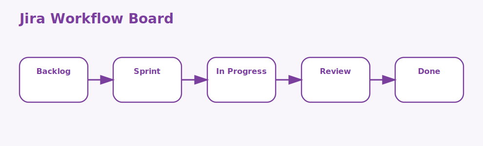

# Jira Basics Interview Questions



This page covers the basic Jira concepts that teams use every day to plan, track, and deliver work.

## 1. Projects

### 1. What is the role of Projects in Jira basics?

**Answer:**

In Jira basics, the term Projects refers to the containers that group related work items, workflows, and
configuration. It is part of the foundation a candidate should be able to explain clearly.

**Sample:**

```jql
-- Concept: 1. Projects
project = APP
AND issuetype in (Story, Task, Bug)
AND status != Done
ORDER BY priority DESC
```

---

### 2. Why is the concept of Projects important in Jira basics?

**Answer:**

This concept matters because it influences the containers that group related work items, workflows, and
configuration. Good interview answers connect it to clarity, maintainability, performance, security,
or delivery depending on the situation.

**Sample:**

```jql
-- Concept: 1. Projects
project = APP
AND issuetype in (Story, Task, Bug)
AND status != Done
ORDER BY priority DESC
```

---

### 3. When should a team focus on Projects?

**Answer:**

A team should focus on Projects when the requirement depends on the containers that group related
work items, workflows, and configuration. It becomes especially important when design decisions,
debugging, or architecture conversations depend on that area.

**Sample:**

```jql
-- Concept: 1. Projects
project = APP
AND issuetype in (Story, Task, Bug)
AND status != Done
ORDER BY priority DESC
```

---

### 4. How is Projects applied in practice?

**Answer:**

In practice, Projects is applied by making the containers that group related work items, workflows,
and configuration explicit in the code, workflow, or collaboration pattern. The exact shape depends
on the stack, but the responsibility should stay predictable.

**Sample:**

```jql
-- Concept: 1. Projects
project = APP
AND issuetype in (Story, Task, Bug)
AND status != Done
ORDER BY priority DESC
```

---

### 5. What strengths does Projects bring?

**Answer:**

The strengths of Projects are better structure, better communication, and better control over the
containers that group related work items, workflows, and configuration. It also makes tradeoffs
easier to explain to reviewers, interviewers, and teammates.

**Sample:**

```jql
-- Concept: 1. Projects
project = APP
AND issuetype in (Story, Task, Bug)
AND status != Done
ORDER BY priority DESC
```

---

### 6. What tradeoffs come with Projects?

**Answer:**

The main tradeoff is extra complexity if Projects is introduced without a real need or a clear
understanding of the containers that group related work items, workflows, and configuration. That
usually leads to weak reasoning, overengineering, or fragile implementations.

**Sample:**

```jql
-- Concept: 1. Projects
project = APP
AND issuetype in (Story, Task, Bug)
AND status != Done
ORDER BY priority DESC
```

---

### 7. How does Projects differ from Issues?

**Answer:**

Projects is centered on the containers that group related work items, workflows, and configuration,
while Issues is centered on the individual units of tracked work in Jira. They often work together,
but they solve different parts of the topic.

**Sample:**

```jql
-- Concept: 1. Projects
project = APP
AND issuetype in (Story, Task, Bug)
AND status != Done
ORDER BY priority DESC
```

---

### 8. What is a good real-world example of Projects?

**Answer:**

A strong example is explaining how Projects affects a real feature, workflow, bug, migration, or
design choice involving the containers that group related work items, workflows, and configuration.
Interviewers usually care more about the reasoning than the definition alone.

**Sample:**

```jql
-- Concept: 1. Projects
project = APP
AND issuetype in (Story, Task, Bug)
AND status != Done
ORDER BY priority DESC
```

---

### 9. What is a best practice for Projects?

**Answer:**

A good practice is to keep Projects aligned with the actual requirement around the containers that
group related work items, workflows, and configuration. Teams should document intent, keep the
implementation readable, and validate important paths early.

**Sample:**

```jql
-- Concept: 1. Projects
project = APP
AND issuetype in (Story, Task, Bug)
AND status != Done
ORDER BY priority DESC
```

---

### 10. What is a common mistake around Projects?

**Answer:**

A common mistake is naming Projects without understanding how it affects the containers that group
related work items, workflows, and configuration. In real work, that usually appears as poor
decisions, weak debugging, or incomplete explanations.

**Sample:**

```jql
-- Concept: 1. Projects
project = APP
AND issuetype in (Story, Task, Bug)
AND status != Done
ORDER BY priority DESC
```

---

### 11. How do you troubleshoot Projects-related issues?

**Answer:**

When troubleshooting Projects, first verify whether the containers that group related work items,
workflows, and configuration is behaving as expected. Then check surrounding dependencies, inputs,
configuration, logs, and edge cases before changing the design.

**Sample:**

```jql
-- Concept: 1. Projects
project = APP
AND issuetype in (Story, Task, Bug)
AND status != Done
ORDER BY priority DESC
```

---

### 12. How does Projects connect to the rest of Jira basics?

**Answer:**

Projects connects to the rest of Jira basics by giving structure to the containers that group
related work items, workflows, and configuration. It is one of the pieces that turns isolated facts
into a coherent end-to-end explanation.

**Sample:**

```jql
-- Concept: 1. Projects
project = APP
AND issuetype in (Story, Task, Bug)
AND status != Done
ORDER BY priority DESC
```

---

## 2. Issues

### 13. What is the role of Issues in Jira basics?

**Answer:**

In Jira basics, the term Issues refers to the individual units of tracked work in Jira. It is part of the
foundation a candidate should be able to explain clearly.

**Sample:**

```jql
-- Concept: 2. Issues
project = APP
AND issuetype in (Story, Task, Bug)
AND status != Done
ORDER BY priority DESC
```

---

### 14. Why is the concept of Issues important in Jira basics?

**Answer:**

This concept matters because it influences the individual units of tracked work in Jira. Good interview
answers connect it to clarity, maintainability, performance, security, or delivery depending on the
situation.

**Sample:**

```jql
-- Concept: 2. Issues
project = APP
AND issuetype in (Story, Task, Bug)
AND status != Done
ORDER BY priority DESC
```

---

### 15. When should a team focus on Issues?

**Answer:**

A team should focus on Issues when the requirement depends on the individual units of tracked work
in Jira. It becomes especially important when design decisions, debugging, or architecture
conversations depend on that area.

**Sample:**

```jql
-- Concept: 2. Issues
project = APP
AND issuetype in (Story, Task, Bug)
AND status != Done
ORDER BY priority DESC
```

---

### 16. How is Issues applied in practice?

**Answer:**

In practice, Issues is applied by making the individual units of tracked work in Jira explicit in
the code, workflow, or collaboration pattern. The exact shape depends on the stack, but the
responsibility should stay predictable.

**Sample:**

```jql
-- Concept: 2. Issues
project = APP
AND issuetype in (Story, Task, Bug)
AND status != Done
ORDER BY priority DESC
```

---

### 17. What strengths does Issues bring?

**Answer:**

The strengths of Issues are better structure, better communication, and better control over the
individual units of tracked work in Jira. It also makes tradeoffs easier to explain to reviewers,
interviewers, and teammates.

**Sample:**

```jql
-- Concept: 2. Issues
project = APP
AND issuetype in (Story, Task, Bug)
AND status != Done
ORDER BY priority DESC
```

---

### 18. What tradeoffs come with Issues?

**Answer:**

The main tradeoff is extra complexity if Issues is introduced without a real need or a clear
understanding of the individual units of tracked work in Jira. That usually leads to weak reasoning,
overengineering, or fragile implementations.

**Sample:**

```jql
-- Concept: 2. Issues
project = APP
AND issuetype in (Story, Task, Bug)
AND status != Done
ORDER BY priority DESC
```

---

### 19. How does Issues differ from Issue types?

**Answer:**

Issues is centered on the individual units of tracked work in Jira, while Issue types is centered on
the categories such as epic, story, task, bug, and sub-task that shape work tracking. They often
work together, but they solve different parts of the topic.

**Sample:**

```jql
-- Concept: 2. Issues
project = APP
AND issuetype in (Story, Task, Bug)
AND status != Done
ORDER BY priority DESC
```

---

### 20. What is a good real-world example of Issues?

**Answer:**

A strong example is explaining how Issues affects a real feature, workflow, bug, migration, or
design choice involving the individual units of tracked work in Jira. Interviewers usually care more
about the reasoning than the definition alone.

**Sample:**

```jql
-- Concept: 2. Issues
project = APP
AND issuetype in (Story, Task, Bug)
AND status != Done
ORDER BY priority DESC
```

---

### 21. What is a best practice for Issues?

**Answer:**

A good practice is to keep Issues aligned with the actual requirement around the individual units of
tracked work in Jira. Teams should document intent, keep the implementation readable, and validate
important paths early.

**Sample:**

```jql
-- Concept: 2. Issues
project = APP
AND issuetype in (Story, Task, Bug)
AND status != Done
ORDER BY priority DESC
```

---

### 22. What is a common mistake around Issues?

**Answer:**

A common mistake is naming Issues without understanding how it affects the individual units of
tracked work in Jira. In real work, that usually appears as poor decisions, weak debugging, or
incomplete explanations.

**Sample:**

```jql
-- Concept: 2. Issues
project = APP
AND issuetype in (Story, Task, Bug)
AND status != Done
ORDER BY priority DESC
```

---

### 23. How do you troubleshoot Issues-related issues?

**Answer:**

When troubleshooting Issues, first verify whether the individual units of tracked work in Jira is
behaving as expected. Then check surrounding dependencies, inputs, configuration, logs, and edge
cases before changing the design.

**Sample:**

```jql
-- Concept: 2. Issues
project = APP
AND issuetype in (Story, Task, Bug)
AND status != Done
ORDER BY priority DESC
```

---

### 24. How does Issues connect to the rest of Jira basics?

**Answer:**

Issues connects to the rest of Jira basics by giving structure to the individual units of tracked
work in Jira. It is one of the pieces that turns isolated facts into a coherent end-to-end
explanation.

**Sample:**

```jql
-- Concept: 2. Issues
project = APP
AND issuetype in (Story, Task, Bug)
AND status != Done
ORDER BY priority DESC
```

---

## 3. Issue types

### 25. What is the role of Issue types in Jira basics?

**Answer:**

In Jira basics, the term Issue types refers to the categories such as epic, story, task, bug, and sub-task
that shape work tracking. It is part of the foundation a candidate should be able to explain
clearly.

**Sample:**

```jql
-- Concept: 3. Issue types
project = APP
AND issuetype in (Story, Task, Bug)
AND status != Done
ORDER BY priority DESC
```

---

### 26. Why is the concept of Issue types important in Jira basics?

**Answer:**

This concept matters because it influences the categories such as epic, story, task, bug, and sub-
task that shape work tracking. Good interview answers connect it to clarity, maintainability,
performance, security, or delivery depending on the situation.

**Sample:**

```jql
-- Concept: 3. Issue types
project = APP
AND issuetype in (Story, Task, Bug)
AND status != Done
ORDER BY priority DESC
```

---

### 27. When should a team focus on Issue types?

**Answer:**

A team should focus on Issue types when the requirement depends on the categories such as epic,
story, task, bug, and sub-task that shape work tracking. It becomes especially important when design
decisions, debugging, or architecture conversations depend on that area.

**Sample:**

```jql
-- Concept: 3. Issue types
project = APP
AND issuetype in (Story, Task, Bug)
AND status != Done
ORDER BY priority DESC
```

---

### 28. How is Issue types applied in practice?

**Answer:**

In practice, Issue types is applied by making the categories such as epic, story, task, bug, and
sub-task that shape work tracking explicit in the code, workflow, or collaboration pattern. The
exact shape depends on the stack, but the responsibility should stay predictable.

**Sample:**

```jql
-- Concept: 3. Issue types
project = APP
AND issuetype in (Story, Task, Bug)
AND status != Done
ORDER BY priority DESC
```

---

### 29. What strengths does Issue types bring?

**Answer:**

The strengths of Issue types are better structure, better communication, and better control over the
categories such as epic, story, task, bug, and sub-task that shape work tracking. It also makes
tradeoffs easier to explain to reviewers, interviewers, and teammates.

**Sample:**

```jql
-- Concept: 3. Issue types
project = APP
AND issuetype in (Story, Task, Bug)
AND status != Done
ORDER BY priority DESC
```

---

### 30. What tradeoffs come with Issue types?

**Answer:**

The main tradeoff is extra complexity if Issue types is introduced without a real need or a clear
understanding of the categories such as epic, story, task, bug, and sub-task that shape work
tracking. That usually leads to weak reasoning, overengineering, or fragile implementations.

**Sample:**

```jql
-- Concept: 3. Issue types
project = APP
AND issuetype in (Story, Task, Bug)
AND status != Done
ORDER BY priority DESC
```

---

### 31. How does Issue types differ from Workflows?

**Answer:**

Issue types is centered on the categories such as epic, story, task, bug, and sub-task that shape
work tracking, while Workflows is centered on the status paths that show how work items move from
creation to completion. They often work together, but they solve different parts of the topic.

**Sample:**

```jql
-- Concept: 3. Issue types
project = APP
AND issuetype in (Story, Task, Bug)
AND status != Done
ORDER BY priority DESC
```

---

### 32. What is a good real-world example of Issue types?

**Answer:**

A strong example is explaining how Issue types affects a real feature, workflow, bug, migration, or
design choice involving the categories such as epic, story, task, bug, and sub-task that shape work
tracking. Interviewers usually care more about the reasoning than the definition alone.

**Sample:**

```jql
-- Concept: 3. Issue types
project = APP
AND issuetype in (Story, Task, Bug)
AND status != Done
ORDER BY priority DESC
```

---

### 33. What is a best practice for Issue types?

**Answer:**

A good practice is to keep Issue types aligned with the actual requirement around the categories
such as epic, story, task, bug, and sub-task that shape work tracking. Teams should document intent,
keep the implementation readable, and validate important paths early.

**Sample:**

```jql
-- Concept: 3. Issue types
project = APP
AND issuetype in (Story, Task, Bug)
AND status != Done
ORDER BY priority DESC
```

---

### 34. What is a common mistake around Issue types?

**Answer:**

A common mistake is naming Issue types without understanding how it affects the categories such as
epic, story, task, bug, and sub-task that shape work tracking. In real work, that usually appears as
poor decisions, weak debugging, or incomplete explanations.

**Sample:**

```jql
-- Concept: 3. Issue types
project = APP
AND issuetype in (Story, Task, Bug)
AND status != Done
ORDER BY priority DESC
```

---

### 35. How do you troubleshoot Issue types-related issues?

**Answer:**

When troubleshooting Issue types, first verify whether the categories such as epic, story, task,
bug, and sub-task that shape work tracking is behaving as expected. Then check surrounding
dependencies, inputs, configuration, logs, and edge cases before changing the design.

**Sample:**

```jql
-- Concept: 3. Issue types
project = APP
AND issuetype in (Story, Task, Bug)
AND status != Done
ORDER BY priority DESC
```

---

### 36. How does Issue types connect to the rest of Jira basics?

**Answer:**

Issue types connects to the rest of Jira basics by giving structure to the categories such as epic,
story, task, bug, and sub-task that shape work tracking. It is one of the pieces that turns isolated
facts into a coherent end-to-end explanation.

**Sample:**

```jql
-- Concept: 3. Issue types
project = APP
AND issuetype in (Story, Task, Bug)
AND status != Done
ORDER BY priority DESC
```

---

## 4. Workflows

### 37. What is the role of Workflows in Jira basics?

**Answer:**

In Jira basics, the term Workflows refers to the status paths that show how work items move from creation to
completion. It is part of the foundation a candidate should be able to explain clearly.

**Sample:**

```jql
-- Concept: 4. Workflows
project = APP
AND issuetype in (Story, Task, Bug)
AND status != Done
ORDER BY priority DESC
```

---

### 38. Why is the concept of Workflows important in Jira basics?

**Answer:**

This concept matters because it influences the status paths that show how work items move from creation
to completion. Good interview answers connect it to clarity, maintainability, performance, security,
or delivery depending on the situation.

**Sample:**

```jql
-- Concept: 4. Workflows
project = APP
AND issuetype in (Story, Task, Bug)
AND status != Done
ORDER BY priority DESC
```

---

### 39. When should a team focus on Workflows?

**Answer:**

A team should focus on Workflows when the requirement depends on the status paths that show how work
items move from creation to completion. It becomes especially important when design decisions,
debugging, or architecture conversations depend on that area.

**Sample:**

```jql
-- Concept: 4. Workflows
project = APP
AND issuetype in (Story, Task, Bug)
AND status != Done
ORDER BY priority DESC
```

---

### 40. How is Workflows applied in practice?

**Answer:**

In practice, Workflows is applied by making the status paths that show how work items move from
creation to completion explicit in the code, workflow, or collaboration pattern. The exact shape
depends on the stack, but the responsibility should stay predictable.

**Sample:**

```jql
-- Concept: 4. Workflows
project = APP
AND issuetype in (Story, Task, Bug)
AND status != Done
ORDER BY priority DESC
```

---

### 41. What strengths does Workflows bring?

**Answer:**

The strengths of Workflows are better structure, better communication, and better control over the
status paths that show how work items move from creation to completion. It also makes tradeoffs
easier to explain to reviewers, interviewers, and teammates.

**Sample:**

```jql
-- Concept: 4. Workflows
project = APP
AND issuetype in (Story, Task, Bug)
AND status != Done
ORDER BY priority DESC
```

---

### 42. What tradeoffs come with Workflows?

**Answer:**

The main tradeoff is extra complexity if Workflows is introduced without a real need or a clear
understanding of the status paths that show how work items move from creation to completion. That
usually leads to weak reasoning, overengineering, or fragile implementations.

**Sample:**

```jql
-- Concept: 4. Workflows
project = APP
AND issuetype in (Story, Task, Bug)
AND status != Done
ORDER BY priority DESC
```

---

### 43. How does Workflows differ from Boards?

**Answer:**

Workflows is centered on the status paths that show how work items move from creation to completion,
while Boards is centered on the visual surfaces used to see and manage work in progress. They often
work together, but they solve different parts of the topic.

**Sample:**

```jql
-- Concept: 4. Workflows
project = APP
AND issuetype in (Story, Task, Bug)
AND status != Done
ORDER BY priority DESC
```

---

### 44. What is a good real-world example of Workflows?

**Answer:**

A strong example is explaining how Workflows affects a real feature, workflow, bug, migration, or
design choice involving the status paths that show how work items move from creation to completion.
Interviewers usually care more about the reasoning than the definition alone.

**Sample:**

```jql
-- Concept: 4. Workflows
project = APP
AND issuetype in (Story, Task, Bug)
AND status != Done
ORDER BY priority DESC
```

---

### 45. What is a best practice for Workflows?

**Answer:**

A good practice is to keep Workflows aligned with the actual requirement around the status paths
that show how work items move from creation to completion. Teams should document intent, keep the
implementation readable, and validate important paths early.

**Sample:**

```jql
-- Concept: 4. Workflows
project = APP
AND issuetype in (Story, Task, Bug)
AND status != Done
ORDER BY priority DESC
```

---

### 46. What is a common mistake around Workflows?

**Answer:**

A common mistake is naming Workflows without understanding how it affects the status paths that show
how work items move from creation to completion. In real work, that usually appears as poor
decisions, weak debugging, or incomplete explanations.

**Sample:**

```jql
-- Concept: 4. Workflows
project = APP
AND issuetype in (Story, Task, Bug)
AND status != Done
ORDER BY priority DESC
```

---

### 47. How do you troubleshoot Workflows-related issues?

**Answer:**

When troubleshooting Workflows, first verify whether the status paths that show how work items move
from creation to completion is behaving as expected. Then check surrounding dependencies, inputs,
configuration, logs, and edge cases before changing the design.

**Sample:**

```jql
-- Concept: 4. Workflows
project = APP
AND issuetype in (Story, Task, Bug)
AND status != Done
ORDER BY priority DESC
```

---

### 48. How does Workflows connect to the rest of Jira basics?

**Answer:**

Workflows connects to the rest of Jira basics by giving structure to the status paths that show how
work items move from creation to completion. It is one of the pieces that turns isolated facts into
a coherent end-to-end explanation.

**Sample:**

```jql
-- Concept: 4. Workflows
project = APP
AND issuetype in (Story, Task, Bug)
AND status != Done
ORDER BY priority DESC
```

---

## 5. Boards

### 49. What is the role of Boards in Jira basics?

**Answer:**

In Jira basics, the term Boards refers to the visual surfaces used to see and manage work in progress. It is
part of the foundation a candidate should be able to explain clearly.

**Sample:**

```jql
-- Concept: 5. Boards
project = APP
AND issuetype in (Story, Task, Bug)
AND status != Done
ORDER BY priority DESC
```

---

### 50. Why is the concept of Boards important in Jira basics?

**Answer:**

This concept matters because it influences the visual surfaces used to see and manage work in progress.
Good interview answers connect it to clarity, maintainability, performance, security, or delivery
depending on the situation.

**Sample:**

```jql
-- Concept: 5. Boards
project = APP
AND issuetype in (Story, Task, Bug)
AND status != Done
ORDER BY priority DESC
```

---

### 51. When should a team focus on Boards?

**Answer:**

A team should focus on Boards when the requirement depends on the visual surfaces used to see and
manage work in progress. It becomes especially important when design decisions, debugging, or
architecture conversations depend on that area.

**Sample:**

```jql
-- Concept: 5. Boards
project = APP
AND issuetype in (Story, Task, Bug)
AND status != Done
ORDER BY priority DESC
```

---

### 52. How is Boards applied in practice?

**Answer:**

In practice, Boards is applied by making the visual surfaces used to see and manage work in progress
explicit in the code, workflow, or collaboration pattern. The exact shape depends on the stack, but
the responsibility should stay predictable.

**Sample:**

```jql
-- Concept: 5. Boards
project = APP
AND issuetype in (Story, Task, Bug)
AND status != Done
ORDER BY priority DESC
```

---

### 53. What strengths does Boards bring?

**Answer:**

The strengths of Boards are better structure, better communication, and better control over the
visual surfaces used to see and manage work in progress. It also makes tradeoffs easier to explain
to reviewers, interviewers, and teammates.

**Sample:**

```jql
-- Concept: 5. Boards
project = APP
AND issuetype in (Story, Task, Bug)
AND status != Done
ORDER BY priority DESC
```

---

### 54. What tradeoffs come with Boards?

**Answer:**

The main tradeoff is extra complexity if Boards is introduced without a real need or a clear
understanding of the visual surfaces used to see and manage work in progress. That usually leads to
weak reasoning, overengineering, or fragile implementations.

**Sample:**

```jql
-- Concept: 5. Boards
project = APP
AND issuetype in (Story, Task, Bug)
AND status != Done
ORDER BY priority DESC
```

---

### 55. How does Boards differ from Backlog?

**Answer:**

Boards is centered on the visual surfaces used to see and manage work in progress, while Backlog is
centered on the prioritized list of upcoming work that the team has not started yet. They often work
together, but they solve different parts of the topic.

**Sample:**

```jql
-- Concept: 5. Boards
project = APP
AND issuetype in (Story, Task, Bug)
AND status != Done
ORDER BY priority DESC
```

---

### 56. What is a good real-world example of Boards?

**Answer:**

A strong example is explaining how Boards affects a real feature, workflow, bug, migration, or
design choice involving the visual surfaces used to see and manage work in progress. Interviewers
usually care more about the reasoning than the definition alone.

**Sample:**

```jql
-- Concept: 5. Boards
project = APP
AND issuetype in (Story, Task, Bug)
AND status != Done
ORDER BY priority DESC
```

---

### 57. What is a best practice for Boards?

**Answer:**

A good practice is to keep Boards aligned with the actual requirement around the visual surfaces
used to see and manage work in progress. Teams should document intent, keep the implementation
readable, and validate important paths early.

**Sample:**

```jql
-- Concept: 5. Boards
project = APP
AND issuetype in (Story, Task, Bug)
AND status != Done
ORDER BY priority DESC
```

---

### 58. What is a common mistake around Boards?

**Answer:**

A common mistake is naming Boards without understanding how it affects the visual surfaces used to
see and manage work in progress. In real work, that usually appears as poor decisions, weak
debugging, or incomplete explanations.

**Sample:**

```jql
-- Concept: 5. Boards
project = APP
AND issuetype in (Story, Task, Bug)
AND status != Done
ORDER BY priority DESC
```

---

### 59. How do you troubleshoot Boards-related issues?

**Answer:**

When troubleshooting Boards, first verify whether the visual surfaces used to see and manage work in
progress is behaving as expected. Then check surrounding dependencies, inputs, configuration, logs,
and edge cases before changing the design.

**Sample:**

```jql
-- Concept: 5. Boards
project = APP
AND issuetype in (Story, Task, Bug)
AND status != Done
ORDER BY priority DESC
```

---

### 60. How does Boards connect to the rest of Jira basics?

**Answer:**

Boards connects to the rest of Jira basics by giving structure to the visual surfaces used to see
and manage work in progress. It is one of the pieces that turns isolated facts into a coherent end-
to-end explanation.

**Sample:**

```jql
-- Concept: 5. Boards
project = APP
AND issuetype in (Story, Task, Bug)
AND status != Done
ORDER BY priority DESC
```

---

## 6. Backlog

### 61. What is the role of Backlog in Jira basics?

**Answer:**

In Jira basics, the term Backlog refers to the prioritized list of upcoming work that the team has not
started yet. It is part of the foundation a candidate should be able to explain clearly.

**Sample:**

```jql
-- Concept: 6. Backlog
project = APP
AND issuetype in (Story, Task, Bug)
AND status != Done
ORDER BY priority DESC
```

---

### 62. Why is the concept of Backlog important in Jira basics?

**Answer:**

This concept matters because it influences the prioritized list of upcoming work that the team has not
started yet. Good interview answers connect it to clarity, maintainability, performance, security,
or delivery depending on the situation.

**Sample:**

```jql
-- Concept: 6. Backlog
project = APP
AND issuetype in (Story, Task, Bug)
AND status != Done
ORDER BY priority DESC
```

---

### 63. When should a team focus on Backlog?

**Answer:**

A team should focus on Backlog when the requirement depends on the prioritized list of upcoming work
that the team has not started yet. It becomes especially important when design decisions, debugging,
or architecture conversations depend on that area.

**Sample:**

```jql
-- Concept: 6. Backlog
project = APP
AND issuetype in (Story, Task, Bug)
AND status != Done
ORDER BY priority DESC
```

---

### 64. How is Backlog applied in practice?

**Answer:**

In practice, Backlog is applied by making the prioritized list of upcoming work that the team has
not started yet explicit in the code, workflow, or collaboration pattern. The exact shape depends on
the stack, but the responsibility should stay predictable.

**Sample:**

```jql
-- Concept: 6. Backlog
project = APP
AND issuetype in (Story, Task, Bug)
AND status != Done
ORDER BY priority DESC
```

---

### 65. What strengths does Backlog bring?

**Answer:**

The strengths of Backlog are better structure, better communication, and better control over the
prioritized list of upcoming work that the team has not started yet. It also makes tradeoffs easier
to explain to reviewers, interviewers, and teammates.

**Sample:**

```jql
-- Concept: 6. Backlog
project = APP
AND issuetype in (Story, Task, Bug)
AND status != Done
ORDER BY priority DESC
```

---

### 66. What tradeoffs come with Backlog?

**Answer:**

The main tradeoff is extra complexity if Backlog is introduced without a real need or a clear
understanding of the prioritized list of upcoming work that the team has not started yet. That
usually leads to weak reasoning, overengineering, or fragile implementations.

**Sample:**

```jql
-- Concept: 6. Backlog
project = APP
AND issuetype in (Story, Task, Bug)
AND status != Done
ORDER BY priority DESC
```

---

### 67. How does Backlog differ from Sprints?

**Answer:**

Backlog is centered on the prioritized list of upcoming work that the team has not started yet,
while Sprints is centered on the time-boxed delivery iterations used by Scrum teams. They often work
together, but they solve different parts of the topic.

**Sample:**

```jql
-- Concept: 6. Backlog
project = APP
AND issuetype in (Story, Task, Bug)
AND status != Done
ORDER BY priority DESC
```

---

### 68. What is a good real-world example of Backlog?

**Answer:**

A strong example is explaining how Backlog affects a real feature, workflow, bug, migration, or
design choice involving the prioritized list of upcoming work that the team has not started yet.
Interviewers usually care more about the reasoning than the definition alone.

**Sample:**

```jql
-- Concept: 6. Backlog
project = APP
AND issuetype in (Story, Task, Bug)
AND status != Done
ORDER BY priority DESC
```

---

### 69. What is a best practice for Backlog?

**Answer:**

A good practice is to keep Backlog aligned with the actual requirement around the prioritized list
of upcoming work that the team has not started yet. Teams should document intent, keep the
implementation readable, and validate important paths early.

**Sample:**

```jql
-- Concept: 6. Backlog
project = APP
AND issuetype in (Story, Task, Bug)
AND status != Done
ORDER BY priority DESC
```

---

### 70. What is a common mistake around Backlog?

**Answer:**

A common mistake is naming Backlog without understanding how it affects the prioritized list of
upcoming work that the team has not started yet. In real work, that usually appears as poor
decisions, weak debugging, or incomplete explanations.

**Sample:**

```jql
-- Concept: 6. Backlog
project = APP
AND issuetype in (Story, Task, Bug)
AND status != Done
ORDER BY priority DESC
```

---

### 71. How do you troubleshoot Backlog-related issues?

**Answer:**

When troubleshooting Backlog, first verify whether the prioritized list of upcoming work that the
team has not started yet is behaving as expected. Then check surrounding dependencies, inputs,
configuration, logs, and edge cases before changing the design.

**Sample:**

```jql
-- Concept: 6. Backlog
project = APP
AND issuetype in (Story, Task, Bug)
AND status != Done
ORDER BY priority DESC
```

---

### 72. How does Backlog connect to the rest of Jira basics?

**Answer:**

Backlog connects to the rest of Jira basics by giving structure to the prioritized list of upcoming
work that the team has not started yet. It is one of the pieces that turns isolated facts into a
coherent end-to-end explanation.

**Sample:**

```jql
-- Concept: 6. Backlog
project = APP
AND issuetype in (Story, Task, Bug)
AND status != Done
ORDER BY priority DESC
```

---

## 7. Sprints

### 73. What is the role of Sprints in Jira basics?

**Answer:**

In Jira basics, the term Sprints refers to the time-boxed delivery iterations used by Scrum teams. It is part
of the foundation a candidate should be able to explain clearly.

**Sample:**

```jql
-- Concept: 7. Sprints
project = APP
AND issuetype in (Story, Task, Bug)
AND status != Done
ORDER BY priority DESC
```

---

### 74. Why is the concept of Sprints important in Jira basics?

**Answer:**

This concept matters because it influences the time-boxed delivery iterations used by Scrum teams. Good
interview answers connect it to clarity, maintainability, performance, security, or delivery
depending on the situation.

**Sample:**

```jql
-- Concept: 7. Sprints
project = APP
AND issuetype in (Story, Task, Bug)
AND status != Done
ORDER BY priority DESC
```

---

### 75. When should a team focus on Sprints?

**Answer:**

A team should focus on Sprints when the requirement depends on the time-boxed delivery iterations
used by Scrum teams. It becomes especially important when design decisions, debugging, or
architecture conversations depend on that area.

**Sample:**

```jql
-- Concept: 7. Sprints
project = APP
AND issuetype in (Story, Task, Bug)
AND status != Done
ORDER BY priority DESC
```

---

### 76. How is Sprints applied in practice?

**Answer:**

In practice, Sprints is applied by making the time-boxed delivery iterations used by Scrum teams
explicit in the code, workflow, or collaboration pattern. The exact shape depends on the stack, but
the responsibility should stay predictable.

**Sample:**

```jql
-- Concept: 7. Sprints
project = APP
AND issuetype in (Story, Task, Bug)
AND status != Done
ORDER BY priority DESC
```

---

### 77. What strengths does Sprints bring?

**Answer:**

The strengths of Sprints are better structure, better communication, and better control over the
time-boxed delivery iterations used by Scrum teams. It also makes tradeoffs easier to explain to
reviewers, interviewers, and teammates.

**Sample:**

```jql
-- Concept: 7. Sprints
project = APP
AND issuetype in (Story, Task, Bug)
AND status != Done
ORDER BY priority DESC
```

---

### 78. What tradeoffs come with Sprints?

**Answer:**

The main tradeoff is extra complexity if Sprints is introduced without a real need or a clear
understanding of the time-boxed delivery iterations used by Scrum teams. That usually leads to weak
reasoning, overengineering, or fragile implementations.

**Sample:**

```jql
-- Concept: 7. Sprints
project = APP
AND issuetype in (Story, Task, Bug)
AND status != Done
ORDER BY priority DESC
```

---

### 79. How does Sprints differ from Epics?

**Answer:**

Sprints is centered on the time-boxed delivery iterations used by Scrum teams, while Epics is
centered on the larger bodies of work that group related stories and tasks. They often work
together, but they solve different parts of the topic.

**Sample:**

```jql
-- Concept: 7. Sprints
project = APP
AND issuetype in (Story, Task, Bug)
AND status != Done
ORDER BY priority DESC
```

---

### 80. What is a good real-world example of Sprints?

**Answer:**

A strong example is explaining how Sprints affects a real feature, workflow, bug, migration, or
design choice involving the time-boxed delivery iterations used by Scrum teams. Interviewers usually
care more about the reasoning than the definition alone.

**Sample:**

```jql
-- Concept: 7. Sprints
project = APP
AND issuetype in (Story, Task, Bug)
AND status != Done
ORDER BY priority DESC
```

---

### 81. What is a best practice for Sprints?

**Answer:**

A good practice is to keep Sprints aligned with the actual requirement around the time-boxed
delivery iterations used by Scrum teams. Teams should document intent, keep the implementation
readable, and validate important paths early.

**Sample:**

```jql
-- Concept: 7. Sprints
project = APP
AND issuetype in (Story, Task, Bug)
AND status != Done
ORDER BY priority DESC
```

---

### 82. What is a common mistake around Sprints?

**Answer:**

A common mistake is naming Sprints without understanding how it affects the time-boxed delivery
iterations used by Scrum teams. In real work, that usually appears as poor decisions, weak
debugging, or incomplete explanations.

**Sample:**

```jql
-- Concept: 7. Sprints
project = APP
AND issuetype in (Story, Task, Bug)
AND status != Done
ORDER BY priority DESC
```

---

### 83. How do you troubleshoot Sprints-related issues?

**Answer:**

When troubleshooting Sprints, first verify whether the time-boxed delivery iterations used by Scrum
teams is behaving as expected. Then check surrounding dependencies, inputs, configuration, logs, and
edge cases before changing the design.

**Sample:**

```jql
-- Concept: 7. Sprints
project = APP
AND issuetype in (Story, Task, Bug)
AND status != Done
ORDER BY priority DESC
```

---

### 84. How does Sprints connect to the rest of Jira basics?

**Answer:**

Sprints connects to the rest of Jira basics by giving structure to the time-boxed delivery
iterations used by Scrum teams. It is one of the pieces that turns isolated facts into a coherent
end-to-end explanation.

**Sample:**

```jql
-- Concept: 7. Sprints
project = APP
AND issuetype in (Story, Task, Bug)
AND status != Done
ORDER BY priority DESC
```

---

## 8. Epics

### 85. What is the role of Epics in Jira basics?

**Answer:**

In Jira basics, the term Epics refers to the larger bodies of work that group related stories and tasks. It
is part of the foundation a candidate should be able to explain clearly.

**Sample:**

```jql
-- Concept: 8. Epics
project = APP
AND issuetype in (Story, Task, Bug)
AND status != Done
ORDER BY priority DESC
```

---

### 86. Why is the concept of Epics important in Jira basics?

**Answer:**

This concept matters because it influences the larger bodies of work that group related stories and tasks.
Good interview answers connect it to clarity, maintainability, performance, security, or delivery
depending on the situation.

**Sample:**

```jql
-- Concept: 8. Epics
project = APP
AND issuetype in (Story, Task, Bug)
AND status != Done
ORDER BY priority DESC
```

---

### 87. When should a team focus on Epics?

**Answer:**

A team should focus on Epics when the requirement depends on the larger bodies of work that group
related stories and tasks. It becomes especially important when design decisions, debugging, or
architecture conversations depend on that area.

**Sample:**

```jql
-- Concept: 8. Epics
project = APP
AND issuetype in (Story, Task, Bug)
AND status != Done
ORDER BY priority DESC
```

---

### 88. How is Epics applied in practice?

**Answer:**

In practice, Epics is applied by making the larger bodies of work that group related stories and
tasks explicit in the code, workflow, or collaboration pattern. The exact shape depends on the
stack, but the responsibility should stay predictable.

**Sample:**

```jql
-- Concept: 8. Epics
project = APP
AND issuetype in (Story, Task, Bug)
AND status != Done
ORDER BY priority DESC
```

---

### 89. What strengths does Epics bring?

**Answer:**

The strengths of Epics are better structure, better communication, and better control over the
larger bodies of work that group related stories and tasks. It also makes tradeoffs easier to
explain to reviewers, interviewers, and teammates.

**Sample:**

```jql
-- Concept: 8. Epics
project = APP
AND issuetype in (Story, Task, Bug)
AND status != Done
ORDER BY priority DESC
```

---

### 90. What tradeoffs come with Epics?

**Answer:**

The main tradeoff is extra complexity if Epics is introduced without a real need or a clear
understanding of the larger bodies of work that group related stories and tasks. That usually leads
to weak reasoning, overengineering, or fragile implementations.

**Sample:**

```jql
-- Concept: 8. Epics
project = APP
AND issuetype in (Story, Task, Bug)
AND status != Done
ORDER BY priority DESC
```

---

### 91. How does Epics differ from Stories tasks and bugs?

**Answer:**

Epics is centered on the larger bodies of work that group related stories and tasks, while Stories
tasks and bugs is centered on the common day-to-day work items used to describe features, work, and
defects. They often work together, but they solve different parts of the topic.

**Sample:**

```jql
-- Concept: 8. Epics
project = APP
AND issuetype in (Story, Task, Bug)
AND status != Done
ORDER BY priority DESC
```

---

### 92. What is a good real-world example of Epics?

**Answer:**

A strong example is explaining how Epics affects a real feature, workflow, bug, migration, or design
choice involving the larger bodies of work that group related stories and tasks. Interviewers
usually care more about the reasoning than the definition alone.

**Sample:**

```jql
-- Concept: 8. Epics
project = APP
AND issuetype in (Story, Task, Bug)
AND status != Done
ORDER BY priority DESC
```

---

### 93. What is a best practice for Epics?

**Answer:**

A good practice is to keep Epics aligned with the actual requirement around the larger bodies of
work that group related stories and tasks. Teams should document intent, keep the implementation
readable, and validate important paths early.

**Sample:**

```jql
-- Concept: 8. Epics
project = APP
AND issuetype in (Story, Task, Bug)
AND status != Done
ORDER BY priority DESC
```

---

### 94. What is a common mistake around Epics?

**Answer:**

A common mistake is naming Epics without understanding how it affects the larger bodies of work that
group related stories and tasks. In real work, that usually appears as poor decisions, weak
debugging, or incomplete explanations.

**Sample:**

```jql
-- Concept: 8. Epics
project = APP
AND issuetype in (Story, Task, Bug)
AND status != Done
ORDER BY priority DESC
```

---

### 95. How do you troubleshoot Epics-related issues?

**Answer:**

When troubleshooting Epics, first verify whether the larger bodies of work that group related
stories and tasks is behaving as expected. Then check surrounding dependencies, inputs,
configuration, logs, and edge cases before changing the design.

**Sample:**

```jql
-- Concept: 8. Epics
project = APP
AND issuetype in (Story, Task, Bug)
AND status != Done
ORDER BY priority DESC
```

---

### 96. How does Epics connect to the rest of Jira basics?

**Answer:**

Epics connects to the rest of Jira basics by giving structure to the larger bodies of work that
group related stories and tasks. It is one of the pieces that turns isolated facts into a coherent
end-to-end explanation.

**Sample:**

```jql
-- Concept: 8. Epics
project = APP
AND issuetype in (Story, Task, Bug)
AND status != Done
ORDER BY priority DESC
```

---

## 9. Stories tasks and bugs

### 97. What is the role of Stories tasks and bugs in Jira basics?

**Answer:**

In Jira basics, the term Stories tasks and bugs refers to the common day-to-day work items used to describe
features, work, and defects. It is part of the foundation a candidate should be able to explain
clearly.

**Sample:**

```jql
-- Concept: 9. Stories tasks and bugs
project = APP
AND issuetype in (Story, Task, Bug)
AND status != Done
ORDER BY priority DESC
```

---

### 98. Why is the concept of Stories tasks and bugs important in Jira basics?

**Answer:**

This concept matters because it influences the common day-to-day work items used to
describe features, work, and defects. Good interview answers connect it to clarity, maintainability,
performance, security, or delivery depending on the situation.

**Sample:**

```jql
-- Concept: 9. Stories tasks and bugs
project = APP
AND issuetype in (Story, Task, Bug)
AND status != Done
ORDER BY priority DESC
```

---

### 99. When should a team focus on Stories tasks and bugs?

**Answer:**

A team should focus on Stories tasks and bugs when the requirement depends on the common day-to-day
work items used to describe features, work, and defects. It becomes especially important when design
decisions, debugging, or architecture conversations depend on that area.

**Sample:**

```jql
-- Concept: 9. Stories tasks and bugs
project = APP
AND issuetype in (Story, Task, Bug)
AND status != Done
ORDER BY priority DESC
```

---

### 100. How is Stories tasks and bugs applied in practice?

**Answer:**

In practice, Stories tasks and bugs is applied by making the common day-to-day work items used to
describe features, work, and defects explicit in the code, workflow, or collaboration pattern. The
exact shape depends on the stack, but the responsibility should stay predictable.

**Sample:**

```jql
-- Concept: 9. Stories tasks and bugs
project = APP
AND issuetype in (Story, Task, Bug)
AND status != Done
ORDER BY priority DESC
```

---

### 101. What strengths does Stories tasks and bugs bring?

**Answer:**

The strengths of Stories tasks and bugs are better structure, better communication, and better
control over the common day-to-day work items used to describe features, work, and defects. It also
makes tradeoffs easier to explain to reviewers, interviewers, and teammates.

**Sample:**

```jql
-- Concept: 9. Stories tasks and bugs
project = APP
AND issuetype in (Story, Task, Bug)
AND status != Done
ORDER BY priority DESC
```

---

### 102. What tradeoffs come with Stories tasks and bugs?

**Answer:**

The main tradeoff is extra complexity if Stories tasks and bugs is introduced without a real need or
a clear understanding of the common day-to-day work items used to describe features, work, and
defects. That usually leads to weak reasoning, overengineering, or fragile implementations.

**Sample:**

```jql
-- Concept: 9. Stories tasks and bugs
project = APP
AND issuetype in (Story, Task, Bug)
AND status != Done
ORDER BY priority DESC
```

---

### 103. How does Stories tasks and bugs differ from Basic JQL?

**Answer:**

Stories tasks and bugs is centered on the common day-to-day work items used to describe features,
work, and defects, while Basic JQL is centered on the query language used to search and filter Jira
issues efficiently. They often work together, but they solve different parts of the topic.

**Sample:**

```jql
-- Concept: 9. Stories tasks and bugs
project = APP
AND issuetype in (Story, Task, Bug)
AND status != Done
ORDER BY priority DESC
```

---

### 104. What is a good real-world example of Stories tasks and bugs?

**Answer:**

A strong example is explaining how Stories tasks and bugs affects a real feature, workflow, bug,
migration, or design choice involving the common day-to-day work items used to describe features,
work, and defects. Interviewers usually care more about the reasoning than the definition alone.

**Sample:**

```jql
-- Concept: 9. Stories tasks and bugs
project = APP
AND issuetype in (Story, Task, Bug)
AND status != Done
ORDER BY priority DESC
```

---

### 105. What is a best practice for Stories tasks and bugs?

**Answer:**

A good practice is to keep Stories tasks and bugs aligned with the actual requirement around the
common day-to-day work items used to describe features, work, and defects. Teams should document
intent, keep the implementation readable, and validate important paths early.

**Sample:**

```jql
-- Concept: 9. Stories tasks and bugs
project = APP
AND issuetype in (Story, Task, Bug)
AND status != Done
ORDER BY priority DESC
```

---

### 106. What is a common mistake around Stories tasks and bugs?

**Answer:**

A common mistake is naming Stories tasks and bugs without understanding how it affects the common
day-to-day work items used to describe features, work, and defects. In real work, that usually
appears as poor decisions, weak debugging, or incomplete explanations.

**Sample:**

```jql
-- Concept: 9. Stories tasks and bugs
project = APP
AND issuetype in (Story, Task, Bug)
AND status != Done
ORDER BY priority DESC
```

---

### 107. How do you troubleshoot Stories tasks and bugs-related issues?

**Answer:**

When troubleshooting Stories tasks and bugs, first verify whether the common day-to-day work items
used to describe features, work, and defects is behaving as expected. Then check surrounding
dependencies, inputs, configuration, logs, and edge cases before changing the design.

**Sample:**

```jql
-- Concept: 9. Stories tasks and bugs
project = APP
AND issuetype in (Story, Task, Bug)
AND status != Done
ORDER BY priority DESC
```

---

### 108. How does Stories tasks and bugs connect to the rest of Jira basics?

**Answer:**

Stories tasks and bugs connects to the rest of Jira basics by giving structure to the common day-to-
day work items used to describe features, work, and defects. It is one of the pieces that turns
isolated facts into a coherent end-to-end explanation.

**Sample:**

```jql
-- Concept: 9. Stories tasks and bugs
project = APP
AND issuetype in (Story, Task, Bug)
AND status != Done
ORDER BY priority DESC
```

---

## 10. Basic JQL

### 109. What is the role of Basic JQL in Jira basics?

**Answer:**

In Jira basics, the term Basic JQL refers to the query language used to search and filter Jira issues
efficiently. It is part of the foundation a candidate should be able to explain clearly.

**Sample:**

```jql
-- Concept: 10. Basic JQL
project = APP
AND issuetype in (Story, Task, Bug)
AND status != Done
ORDER BY priority DESC
```

---

### 110. Why is the concept of Basic JQL important in Jira basics?

**Answer:**

This concept matters because it influences the query language used to search and filter Jira issues
efficiently. Good interview answers connect it to clarity, maintainability, performance, security,
or delivery depending on the situation.

**Sample:**

```jql
-- Concept: 10. Basic JQL
project = APP
AND issuetype in (Story, Task, Bug)
AND status != Done
ORDER BY priority DESC
```

---

### 111. When should a team focus on Basic JQL?

**Answer:**

A team should focus on Basic JQL when the requirement depends on the query language used to search
and filter Jira issues efficiently. It becomes especially important when design decisions,
debugging, or architecture conversations depend on that area.

**Sample:**

```jql
-- Concept: 10. Basic JQL
project = APP
AND issuetype in (Story, Task, Bug)
AND status != Done
ORDER BY priority DESC
```

---

### 112. How is Basic JQL applied in practice?

**Answer:**

In practice, Basic JQL is applied by making the query language used to search and filter Jira issues
efficiently explicit in the code, workflow, or collaboration pattern. The exact shape depends on the
stack, but the responsibility should stay predictable.

**Sample:**

```jql
-- Concept: 10. Basic JQL
project = APP
AND issuetype in (Story, Task, Bug)
AND status != Done
ORDER BY priority DESC
```

---

### 113. What strengths does Basic JQL bring?

**Answer:**

The strengths of Basic JQL are better structure, better communication, and better control over the
query language used to search and filter Jira issues efficiently. It also makes tradeoffs easier to
explain to reviewers, interviewers, and teammates.

**Sample:**

```jql
-- Concept: 10. Basic JQL
project = APP
AND issuetype in (Story, Task, Bug)
AND status != Done
ORDER BY priority DESC
```

---

### 114. What tradeoffs come with Basic JQL?

**Answer:**

The main tradeoff is extra complexity if Basic JQL is introduced without a real need or a clear
understanding of the query language used to search and filter Jira issues efficiently. That usually
leads to weak reasoning, overengineering, or fragile implementations.

**Sample:**

```jql
-- Concept: 10. Basic JQL
project = APP
AND issuetype in (Story, Task, Bug)
AND status != Done
ORDER BY priority DESC
```

---

### 115. How does Basic JQL differ from Projects?

**Answer:**

Basic JQL is centered on the query language used to search and filter Jira issues efficiently, while
Projects is centered on the containers that group related work items, workflows, and configuration.
They often work together, but they solve different parts of the topic.

**Sample:**

```jql
-- Concept: 10. Basic JQL
project = APP
AND issuetype in (Story, Task, Bug)
AND status != Done
ORDER BY priority DESC
```

---

### 116. What is a good real-world example of Basic JQL?

**Answer:**

A strong example is explaining how Basic JQL affects a real feature, workflow, bug, migration, or
design choice involving the query language used to search and filter Jira issues efficiently.
Interviewers usually care more about the reasoning than the definition alone.

**Sample:**

```jql
-- Concept: 10. Basic JQL
project = APP
AND issuetype in (Story, Task, Bug)
AND status != Done
ORDER BY priority DESC
```

---

### 117. What is a best practice for Basic JQL?

**Answer:**

A good practice is to keep Basic JQL aligned with the actual requirement around the query language
used to search and filter Jira issues efficiently. Teams should document intent, keep the
implementation readable, and validate important paths early.

**Sample:**

```jql
-- Concept: 10. Basic JQL
project = APP
AND issuetype in (Story, Task, Bug)
AND status != Done
ORDER BY priority DESC
```

---

### 118. What is a common mistake around Basic JQL?

**Answer:**

A common mistake is naming Basic JQL without understanding how it affects the query language used to
search and filter Jira issues efficiently. In real work, that usually appears as poor decisions,
weak debugging, or incomplete explanations.

**Sample:**

```jql
-- Concept: 10. Basic JQL
project = APP
AND issuetype in (Story, Task, Bug)
AND status != Done
ORDER BY priority DESC
```

---

### 119. How do you troubleshoot Basic JQL-related issues?

**Answer:**

When troubleshooting Basic JQL, first verify whether the query language used to search and filter
Jira issues efficiently is behaving as expected. Then check surrounding dependencies, inputs,
configuration, logs, and edge cases before changing the design.

**Sample:**

```jql
-- Concept: 10. Basic JQL
project = APP
AND issuetype in (Story, Task, Bug)
AND status != Done
ORDER BY priority DESC
```

---

### 120. How does Basic JQL connect to the rest of Jira basics?

**Answer:**

Basic JQL connects to the rest of Jira basics by giving structure to the query language used to
search and filter Jira issues efficiently. It is one of the pieces that turns isolated facts into a
coherent end-to-end explanation.

**Sample:**

```jql
-- Concept: 10. Basic JQL
project = APP
AND issuetype in (Story, Task, Bug)
AND status != Done
ORDER BY priority DESC
```
