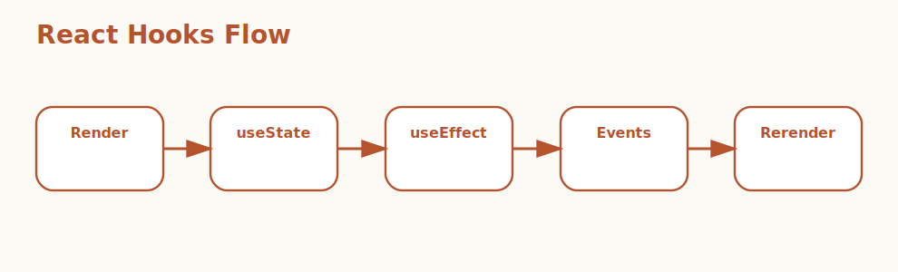

# React Hooks Interview Questions



This guide focuses on React Hooks and how modern React components manage state, side effects, references, memoization, and reusable logic. It follows the corrected format of **100 interview questions for each subtopic**, and every answer includes a React code example with rotated real-world scenarios so the examples do not repeat verbatim.

## How To Use This Page

- Questions 1-100 cover Rules of Hooks.
- Questions 101-200 cover useState.
- Questions 201-300 cover useEffect.
- Questions 301-400 cover Dependency arrays.
- Questions 401-500 cover Cleanup logic.
- Questions 501-600 cover useContext.
- Questions 601-700 cover useRef.
- Questions 701-800 cover useMemo.
- Questions 801-900 cover useCallback.
- Questions 901-1000 cover Custom Hooks.

## 1. Rules of Hooks

### Q1.1 What is top-level hook usage in React Hooks?

**Answer:**

top-level Hook usage matters in React Hooks because it affects when Hooks must run in the same order on every render. In a real situation like a banking dashboard with many widgets sharing auth, filters, and polling behavior, strong answers connect the concept to rerender behavior, side-effect timing, maintainability, and how stateful logic is shared or optimized in production components. A senior engineer also explains how the concept changes day-to-day React design so the explanation reflects real Hook behavior rather than API memorization.

**Code Example:**

```jsx
function Counter() {
  const [count, setCount] = useState(0);
  return <button onClick={() => setCount(count + 1)}>{count}</button>;
}
```

### Q1.2 Why does component and custom hook boundaries matter in real React applications?

**Answer:**

component and custom Hook boundaries matters in React Hooks because it affects when Hooks should only run inside React functions. In a real situation like a SaaS admin portal where local state, async effects, and memoization all interact in one screen, strong answers connect the concept to rerender behavior, side-effect timing, maintainability, and how stateful logic is shared or optimized in production components. A senior engineer also explains how the concept changes day-to-day React design so teams can reason about render flow and side effects more confidently.

**Code Example:**

```jsx
function useSessionFlag() {
  const [enabled, setEnabled] = useState(false);
  return { enabled, setEnabled };
}
```

### Q1.3 When should a team focus on predictable hook ordering?

**Answer:**

predictable Hook ordering matters in React Hooks because it affects when React state relies on call position rather than variable names. In a real situation like a CMS editor where stale closures and incorrect dependencies can lose unsaved content, strong answers connect the concept to rerender behavior, side-effect timing, maintainability, and how stateful logic is shared or optimized in production components. A senior engineer also explains how the concept changes day-to-day React design so Hook-related bugs around stale data and rerender loops become easier to prevent.

**Code Example:**

```jsx
const hookRules = ['call Hooks at the top level', 'call Hooks from React functions'];
console.log(hookRules);
```

### Q1.4 How would you explain lint-enforced hook discipline in a production React discussion?

**Answer:**

lint-enforced Hook discipline matters in React Hooks because it affects when teams prevent subtle runtime bugs through consistent patterns. In a real situation like a healthcare frontend where cleanup and side-effect correctness matter for reliability, strong answers connect the concept to rerender behavior, side-effect timing, maintainability, and how stateful logic is shared or optimized in production components. A senior engineer also explains how the concept changes day-to-day React design so stateful logic stays more reusable and maintainable as the app grows.

**Code Example:**

```jsx
function Dashboard({ showDetails }) {
  const [open, setOpen] = useState(false);
  if (showDetails) {
    return <div>{String(open)}</div>;
  }
  return null;
}
```

### Q1.5 What is a common interview trap around mental model of hook execution?

**Answer:**

mental model of Hook execution matters in React Hooks because it affects when interviews test whether you understand why the rules exist. In a real situation like a logistics app with complex filters, route transitions, and long-lived subscriptions, strong answers connect the concept to rerender behavior, side-effect timing, maintainability, and how stateful logic is shared or optimized in production components. A senior engineer also explains how the concept changes day-to-day React design so performance tuning decisions become more intentional instead of superstitious.

**Code Example:**

```jsx
const predictableOrder = true;
console.log(predictableOrder ? 'Hook call order must stay consistent.' : 'Conditional Hooks break React assumptions.');
```

### Q1.6 How do you apply top-level hook usage safely in real projects?

**Answer:**

top-level Hook usage matters in React Hooks because it affects when Hooks must run in the same order on every render. In a real situation like a customer-support console where frequent rerenders can impact responsiveness during busy sessions, strong answers connect the concept to rerender behavior, side-effect timing, maintainability, and how stateful logic is shared or optimized in production components. A senior engineer also explains how the concept changes day-to-day React design so custom Hooks improve architecture without hiding important behavior.

**Code Example:**

```jsx
function Counter() {
  const [count, setCount] = useState(0);
  return <button onClick={() => setCount(count + 1)}>{count}</button>;
}
```

### Q1.7 What bug pattern usually exposes weak understanding of component and custom hook boundaries?

**Answer:**

component and custom Hook boundaries matters in React Hooks because it affects when Hooks should only run inside React functions. In a real situation like a manufacturing dashboard with timers, refs, and imperative chart integration, strong answers connect the concept to rerender behavior, side-effect timing, maintainability, and how stateful logic is shared or optimized in production components. A senior engineer also explains how the concept changes day-to-day React design so shared state and context usage stay better scoped across the tree.

**Code Example:**

```jsx
function useSessionFlag() {
  const [enabled, setEnabled] = useState(false);
  return { enabled, setEnabled };
}
```

### Q1.8 How would a senior engineer justify predictable hook ordering to a frontend team?

**Answer:**

predictable Hook ordering matters in React Hooks because it affects when React state relies on call position rather than variable names. In a real situation like an enterprise React app where teams create shared hooks for auth, tables, and API access, strong answers connect the concept to rerender behavior, side-effect timing, maintainability, and how stateful logic is shared or optimized in production components. A senior engineer also explains how the concept changes day-to-day React design so components remain easier to test and evolve over time.

**Code Example:**

```jsx
const hookRules = ['call Hooks at the top level', 'call Hooks from React functions'];
console.log(hookRules);
```

### Q1.9 What trade-off does lint-enforced hook discipline introduce?

**Answer:**

lint-enforced Hook discipline matters in React Hooks because it affects when teams prevent subtle runtime bugs through consistent patterns. In a real situation like a public-facing product where performance tuning must be measured instead of guessed, strong answers connect the concept to rerender behavior, side-effect timing, maintainability, and how stateful logic is shared or optimized in production components. A senior engineer also explains how the concept changes day-to-day React design so the answer sounds like production React experience instead of tutorial knowledge.

**Code Example:**

```jsx
function Dashboard({ showDetails }) {
  const [open, setOpen] = useState(false);
  if (showDetails) {
    return <div>{String(open)}</div>;
  }
  return null;
}
```

### Q1.10 How do you answer a tricky follow-up about mental model of hook execution?

**Answer:**

mental model of Hook execution matters in React Hooks because it affects when interviews test whether you understand why the rules exist. In a real situation like a migration from older class components to modern function components with Hooks, strong answers connect the concept to rerender behavior, side-effect timing, maintainability, and how stateful logic is shared or optimized in production components. A senior engineer also explains how the concept changes day-to-day React design so new team members can understand why Hook rules exist, not just recite them.

**Code Example:**

```jsx
const predictableOrder = true;
console.log(predictableOrder ? 'Hook call order must stay consistent.' : 'Conditional Hooks break React assumptions.');
```

### Q1.11 What is top-level hook usage in React Hooks?

**Answer:**

top-level Hook usage matters in React Hooks because it affects when Hooks must run in the same order on every render. In a real situation like a banking dashboard with many widgets sharing auth, filters, and polling behavior, strong answers connect the concept to rerender behavior, side-effect timing, maintainability, and how stateful logic is shared or optimized in production components. A senior engineer also explains how the concept changes day-to-day React design so the explanation reflects real Hook behavior rather than API memorization.

**Code Example:**

```jsx
function Counter() {
  const [count, setCount] = useState(0);
  return <button onClick={() => setCount(count + 1)}>{count}</button>;
}
```

### Q1.12 Why does component and custom hook boundaries matter in real React applications?

**Answer:**

component and custom Hook boundaries matters in React Hooks because it affects when Hooks should only run inside React functions. In a real situation like a SaaS admin portal where local state, async effects, and memoization all interact in one screen, strong answers connect the concept to rerender behavior, side-effect timing, maintainability, and how stateful logic is shared or optimized in production components. A senior engineer also explains how the concept changes day-to-day React design so teams can reason about render flow and side effects more confidently.

**Code Example:**

```jsx
function useSessionFlag() {
  const [enabled, setEnabled] = useState(false);
  return { enabled, setEnabled };
}
```

### Q1.13 When should a team focus on predictable hook ordering?

**Answer:**

predictable Hook ordering matters in React Hooks because it affects when React state relies on call position rather than variable names. In a real situation like a CMS editor where stale closures and incorrect dependencies can lose unsaved content, strong answers connect the concept to rerender behavior, side-effect timing, maintainability, and how stateful logic is shared or optimized in production components. A senior engineer also explains how the concept changes day-to-day React design so Hook-related bugs around stale data and rerender loops become easier to prevent.

**Code Example:**

```jsx
const hookRules = ['call Hooks at the top level', 'call Hooks from React functions'];
console.log(hookRules);
```

### Q1.14 How would you explain lint-enforced hook discipline in a production React discussion?

**Answer:**

lint-enforced Hook discipline matters in React Hooks because it affects when teams prevent subtle runtime bugs through consistent patterns. In a real situation like a healthcare frontend where cleanup and side-effect correctness matter for reliability, strong answers connect the concept to rerender behavior, side-effect timing, maintainability, and how stateful logic is shared or optimized in production components. A senior engineer also explains how the concept changes day-to-day React design so stateful logic stays more reusable and maintainable as the app grows.

**Code Example:**

```jsx
function Dashboard({ showDetails }) {
  const [open, setOpen] = useState(false);
  if (showDetails) {
    return <div>{String(open)}</div>;
  }
  return null;
}
```

### Q1.15 What is a common interview trap around mental model of hook execution?

**Answer:**

mental model of Hook execution matters in React Hooks because it affects when interviews test whether you understand why the rules exist. In a real situation like a logistics app with complex filters, route transitions, and long-lived subscriptions, strong answers connect the concept to rerender behavior, side-effect timing, maintainability, and how stateful logic is shared or optimized in production components. A senior engineer also explains how the concept changes day-to-day React design so performance tuning decisions become more intentional instead of superstitious.

**Code Example:**

```jsx
const predictableOrder = true;
console.log(predictableOrder ? 'Hook call order must stay consistent.' : 'Conditional Hooks break React assumptions.');
```

### Q1.16 How do you apply top-level hook usage safely in real projects?

**Answer:**

top-level Hook usage matters in React Hooks because it affects when Hooks must run in the same order on every render. In a real situation like a customer-support console where frequent rerenders can impact responsiveness during busy sessions, strong answers connect the concept to rerender behavior, side-effect timing, maintainability, and how stateful logic is shared or optimized in production components. A senior engineer also explains how the concept changes day-to-day React design so custom Hooks improve architecture without hiding important behavior.

**Code Example:**

```jsx
function Counter() {
  const [count, setCount] = useState(0);
  return <button onClick={() => setCount(count + 1)}>{count}</button>;
}
```

### Q1.17 What bug pattern usually exposes weak understanding of component and custom hook boundaries?

**Answer:**

component and custom Hook boundaries matters in React Hooks because it affects when Hooks should only run inside React functions. In a real situation like a manufacturing dashboard with timers, refs, and imperative chart integration, strong answers connect the concept to rerender behavior, side-effect timing, maintainability, and how stateful logic is shared or optimized in production components. A senior engineer also explains how the concept changes day-to-day React design so shared state and context usage stay better scoped across the tree.

**Code Example:**

```jsx
function useSessionFlag() {
  const [enabled, setEnabled] = useState(false);
  return { enabled, setEnabled };
}
```

### Q1.18 How would a senior engineer justify predictable hook ordering to a frontend team?

**Answer:**

predictable Hook ordering matters in React Hooks because it affects when React state relies on call position rather than variable names. In a real situation like an enterprise React app where teams create shared hooks for auth, tables, and API access, strong answers connect the concept to rerender behavior, side-effect timing, maintainability, and how stateful logic is shared or optimized in production components. A senior engineer also explains how the concept changes day-to-day React design so components remain easier to test and evolve over time.

**Code Example:**

```jsx
const hookRules = ['call Hooks at the top level', 'call Hooks from React functions'];
console.log(hookRules);
```

### Q1.19 What trade-off does lint-enforced hook discipline introduce?

**Answer:**

lint-enforced Hook discipline matters in React Hooks because it affects when teams prevent subtle runtime bugs through consistent patterns. In a real situation like a public-facing product where performance tuning must be measured instead of guessed, strong answers connect the concept to rerender behavior, side-effect timing, maintainability, and how stateful logic is shared or optimized in production components. A senior engineer also explains how the concept changes day-to-day React design so the answer sounds like production React experience instead of tutorial knowledge.

**Code Example:**

```jsx
function Dashboard({ showDetails }) {
  const [open, setOpen] = useState(false);
  if (showDetails) {
    return <div>{String(open)}</div>;
  }
  return null;
}
```

### Q1.20 How do you answer a tricky follow-up about mental model of hook execution?

**Answer:**

mental model of Hook execution matters in React Hooks because it affects when interviews test whether you understand why the rules exist. In a real situation like a migration from older class components to modern function components with Hooks, strong answers connect the concept to rerender behavior, side-effect timing, maintainability, and how stateful logic is shared or optimized in production components. A senior engineer also explains how the concept changes day-to-day React design so new team members can understand why Hook rules exist, not just recite them.

**Code Example:**

```jsx
const predictableOrder = true;
console.log(predictableOrder ? 'Hook call order must stay consistent.' : 'Conditional Hooks break React assumptions.');
```

### Q1.21 What is top-level hook usage in React Hooks?

**Answer:**

top-level Hook usage matters in React Hooks because it affects when Hooks must run in the same order on every render. In a real situation like a banking dashboard with many widgets sharing auth, filters, and polling behavior, strong answers connect the concept to rerender behavior, side-effect timing, maintainability, and how stateful logic is shared or optimized in production components. A senior engineer also explains how the concept changes day-to-day React design so the explanation reflects real Hook behavior rather than API memorization.

**Code Example:**

```jsx
function Counter() {
  const [count, setCount] = useState(0);
  return <button onClick={() => setCount(count + 1)}>{count}</button>;
}
```

### Q1.22 Why does component and custom hook boundaries matter in real React applications?

**Answer:**

component and custom Hook boundaries matters in React Hooks because it affects when Hooks should only run inside React functions. In a real situation like a SaaS admin portal where local state, async effects, and memoization all interact in one screen, strong answers connect the concept to rerender behavior, side-effect timing, maintainability, and how stateful logic is shared or optimized in production components. A senior engineer also explains how the concept changes day-to-day React design so teams can reason about render flow and side effects more confidently.

**Code Example:**

```jsx
function useSessionFlag() {
  const [enabled, setEnabled] = useState(false);
  return { enabled, setEnabled };
}
```

### Q1.23 When should a team focus on predictable hook ordering?

**Answer:**

predictable Hook ordering matters in React Hooks because it affects when React state relies on call position rather than variable names. In a real situation like a CMS editor where stale closures and incorrect dependencies can lose unsaved content, strong answers connect the concept to rerender behavior, side-effect timing, maintainability, and how stateful logic is shared or optimized in production components. A senior engineer also explains how the concept changes day-to-day React design so Hook-related bugs around stale data and rerender loops become easier to prevent.

**Code Example:**

```jsx
const hookRules = ['call Hooks at the top level', 'call Hooks from React functions'];
console.log(hookRules);
```

### Q1.24 How would you explain lint-enforced hook discipline in a production React discussion?

**Answer:**

lint-enforced Hook discipline matters in React Hooks because it affects when teams prevent subtle runtime bugs through consistent patterns. In a real situation like a healthcare frontend where cleanup and side-effect correctness matter for reliability, strong answers connect the concept to rerender behavior, side-effect timing, maintainability, and how stateful logic is shared or optimized in production components. A senior engineer also explains how the concept changes day-to-day React design so stateful logic stays more reusable and maintainable as the app grows.

**Code Example:**

```jsx
function Dashboard({ showDetails }) {
  const [open, setOpen] = useState(false);
  if (showDetails) {
    return <div>{String(open)}</div>;
  }
  return null;
}
```

### Q1.25 What is a common interview trap around mental model of hook execution?

**Answer:**

mental model of Hook execution matters in React Hooks because it affects when interviews test whether you understand why the rules exist. In a real situation like a logistics app with complex filters, route transitions, and long-lived subscriptions, strong answers connect the concept to rerender behavior, side-effect timing, maintainability, and how stateful logic is shared or optimized in production components. A senior engineer also explains how the concept changes day-to-day React design so performance tuning decisions become more intentional instead of superstitious.

**Code Example:**

```jsx
const predictableOrder = true;
console.log(predictableOrder ? 'Hook call order must stay consistent.' : 'Conditional Hooks break React assumptions.');
```

### Q1.26 How do you apply top-level hook usage safely in real projects?

**Answer:**

top-level Hook usage matters in React Hooks because it affects when Hooks must run in the same order on every render. In a real situation like a customer-support console where frequent rerenders can impact responsiveness during busy sessions, strong answers connect the concept to rerender behavior, side-effect timing, maintainability, and how stateful logic is shared or optimized in production components. A senior engineer also explains how the concept changes day-to-day React design so custom Hooks improve architecture without hiding important behavior.

**Code Example:**

```jsx
function Counter() {
  const [count, setCount] = useState(0);
  return <button onClick={() => setCount(count + 1)}>{count}</button>;
}
```

### Q1.27 What bug pattern usually exposes weak understanding of component and custom hook boundaries?

**Answer:**

component and custom Hook boundaries matters in React Hooks because it affects when Hooks should only run inside React functions. In a real situation like a manufacturing dashboard with timers, refs, and imperative chart integration, strong answers connect the concept to rerender behavior, side-effect timing, maintainability, and how stateful logic is shared or optimized in production components. A senior engineer also explains how the concept changes day-to-day React design so shared state and context usage stay better scoped across the tree.

**Code Example:**

```jsx
function useSessionFlag() {
  const [enabled, setEnabled] = useState(false);
  return { enabled, setEnabled };
}
```

### Q1.28 How would a senior engineer justify predictable hook ordering to a frontend team?

**Answer:**

predictable Hook ordering matters in React Hooks because it affects when React state relies on call position rather than variable names. In a real situation like an enterprise React app where teams create shared hooks for auth, tables, and API access, strong answers connect the concept to rerender behavior, side-effect timing, maintainability, and how stateful logic is shared or optimized in production components. A senior engineer also explains how the concept changes day-to-day React design so components remain easier to test and evolve over time.

**Code Example:**

```jsx
const hookRules = ['call Hooks at the top level', 'call Hooks from React functions'];
console.log(hookRules);
```

### Q1.29 What trade-off does lint-enforced hook discipline introduce?

**Answer:**

lint-enforced Hook discipline matters in React Hooks because it affects when teams prevent subtle runtime bugs through consistent patterns. In a real situation like a public-facing product where performance tuning must be measured instead of guessed, strong answers connect the concept to rerender behavior, side-effect timing, maintainability, and how stateful logic is shared or optimized in production components. A senior engineer also explains how the concept changes day-to-day React design so the answer sounds like production React experience instead of tutorial knowledge.

**Code Example:**

```jsx
function Dashboard({ showDetails }) {
  const [open, setOpen] = useState(false);
  if (showDetails) {
    return <div>{String(open)}</div>;
  }
  return null;
}
```

### Q1.30 How do you answer a tricky follow-up about mental model of hook execution?

**Answer:**

mental model of Hook execution matters in React Hooks because it affects when interviews test whether you understand why the rules exist. In a real situation like a migration from older class components to modern function components with Hooks, strong answers connect the concept to rerender behavior, side-effect timing, maintainability, and how stateful logic is shared or optimized in production components. A senior engineer also explains how the concept changes day-to-day React design so new team members can understand why Hook rules exist, not just recite them.

**Code Example:**

```jsx
const predictableOrder = true;
console.log(predictableOrder ? 'Hook call order must stay consistent.' : 'Conditional Hooks break React assumptions.');
```

### Q1.31 What is top-level hook usage in React Hooks?

**Answer:**

top-level Hook usage matters in React Hooks because it affects when Hooks must run in the same order on every render. In a real situation like a banking dashboard with many widgets sharing auth, filters, and polling behavior, strong answers connect the concept to rerender behavior, side-effect timing, maintainability, and how stateful logic is shared or optimized in production components. A senior engineer also explains how the concept changes day-to-day React design so the explanation reflects real Hook behavior rather than API memorization.

**Code Example:**

```jsx
function Counter() {
  const [count, setCount] = useState(0);
  return <button onClick={() => setCount(count + 1)}>{count}</button>;
}
```

### Q1.32 Why does component and custom hook boundaries matter in real React applications?

**Answer:**

component and custom Hook boundaries matters in React Hooks because it affects when Hooks should only run inside React functions. In a real situation like a SaaS admin portal where local state, async effects, and memoization all interact in one screen, strong answers connect the concept to rerender behavior, side-effect timing, maintainability, and how stateful logic is shared or optimized in production components. A senior engineer also explains how the concept changes day-to-day React design so teams can reason about render flow and side effects more confidently.

**Code Example:**

```jsx
function useSessionFlag() {
  const [enabled, setEnabled] = useState(false);
  return { enabled, setEnabled };
}
```

### Q1.33 When should a team focus on predictable hook ordering?

**Answer:**

predictable Hook ordering matters in React Hooks because it affects when React state relies on call position rather than variable names. In a real situation like a CMS editor where stale closures and incorrect dependencies can lose unsaved content, strong answers connect the concept to rerender behavior, side-effect timing, maintainability, and how stateful logic is shared or optimized in production components. A senior engineer also explains how the concept changes day-to-day React design so Hook-related bugs around stale data and rerender loops become easier to prevent.

**Code Example:**

```jsx
const hookRules = ['call Hooks at the top level', 'call Hooks from React functions'];
console.log(hookRules);
```

### Q1.34 How would you explain lint-enforced hook discipline in a production React discussion?

**Answer:**

lint-enforced Hook discipline matters in React Hooks because it affects when teams prevent subtle runtime bugs through consistent patterns. In a real situation like a healthcare frontend where cleanup and side-effect correctness matter for reliability, strong answers connect the concept to rerender behavior, side-effect timing, maintainability, and how stateful logic is shared or optimized in production components. A senior engineer also explains how the concept changes day-to-day React design so stateful logic stays more reusable and maintainable as the app grows.

**Code Example:**

```jsx
function Dashboard({ showDetails }) {
  const [open, setOpen] = useState(false);
  if (showDetails) {
    return <div>{String(open)}</div>;
  }
  return null;
}
```

### Q1.35 What is a common interview trap around mental model of hook execution?

**Answer:**

mental model of Hook execution matters in React Hooks because it affects when interviews test whether you understand why the rules exist. In a real situation like a logistics app with complex filters, route transitions, and long-lived subscriptions, strong answers connect the concept to rerender behavior, side-effect timing, maintainability, and how stateful logic is shared or optimized in production components. A senior engineer also explains how the concept changes day-to-day React design so performance tuning decisions become more intentional instead of superstitious.

**Code Example:**

```jsx
const predictableOrder = true;
console.log(predictableOrder ? 'Hook call order must stay consistent.' : 'Conditional Hooks break React assumptions.');
```

### Q1.36 How do you apply top-level hook usage safely in real projects?

**Answer:**

top-level Hook usage matters in React Hooks because it affects when Hooks must run in the same order on every render. In a real situation like a customer-support console where frequent rerenders can impact responsiveness during busy sessions, strong answers connect the concept to rerender behavior, side-effect timing, maintainability, and how stateful logic is shared or optimized in production components. A senior engineer also explains how the concept changes day-to-day React design so custom Hooks improve architecture without hiding important behavior.

**Code Example:**

```jsx
function Counter() {
  const [count, setCount] = useState(0);
  return <button onClick={() => setCount(count + 1)}>{count}</button>;
}
```

### Q1.37 What bug pattern usually exposes weak understanding of component and custom hook boundaries?

**Answer:**

component and custom Hook boundaries matters in React Hooks because it affects when Hooks should only run inside React functions. In a real situation like a manufacturing dashboard with timers, refs, and imperative chart integration, strong answers connect the concept to rerender behavior, side-effect timing, maintainability, and how stateful logic is shared or optimized in production components. A senior engineer also explains how the concept changes day-to-day React design so shared state and context usage stay better scoped across the tree.

**Code Example:**

```jsx
function useSessionFlag() {
  const [enabled, setEnabled] = useState(false);
  return { enabled, setEnabled };
}
```

### Q1.38 How would a senior engineer justify predictable hook ordering to a frontend team?

**Answer:**

predictable Hook ordering matters in React Hooks because it affects when React state relies on call position rather than variable names. In a real situation like an enterprise React app where teams create shared hooks for auth, tables, and API access, strong answers connect the concept to rerender behavior, side-effect timing, maintainability, and how stateful logic is shared or optimized in production components. A senior engineer also explains how the concept changes day-to-day React design so components remain easier to test and evolve over time.

**Code Example:**

```jsx
const hookRules = ['call Hooks at the top level', 'call Hooks from React functions'];
console.log(hookRules);
```

### Q1.39 What trade-off does lint-enforced hook discipline introduce?

**Answer:**

lint-enforced Hook discipline matters in React Hooks because it affects when teams prevent subtle runtime bugs through consistent patterns. In a real situation like a public-facing product where performance tuning must be measured instead of guessed, strong answers connect the concept to rerender behavior, side-effect timing, maintainability, and how stateful logic is shared or optimized in production components. A senior engineer also explains how the concept changes day-to-day React design so the answer sounds like production React experience instead of tutorial knowledge.

**Code Example:**

```jsx
function Dashboard({ showDetails }) {
  const [open, setOpen] = useState(false);
  if (showDetails) {
    return <div>{String(open)}</div>;
  }
  return null;
}
```

### Q1.40 How do you answer a tricky follow-up about mental model of hook execution?

**Answer:**

mental model of Hook execution matters in React Hooks because it affects when interviews test whether you understand why the rules exist. In a real situation like a migration from older class components to modern function components with Hooks, strong answers connect the concept to rerender behavior, side-effect timing, maintainability, and how stateful logic is shared or optimized in production components. A senior engineer also explains how the concept changes day-to-day React design so new team members can understand why Hook rules exist, not just recite them.

**Code Example:**

```jsx
const predictableOrder = true;
console.log(predictableOrder ? 'Hook call order must stay consistent.' : 'Conditional Hooks break React assumptions.');
```

### Q1.41 What is top-level hook usage in React Hooks?

**Answer:**

top-level Hook usage matters in React Hooks because it affects when Hooks must run in the same order on every render. In a real situation like a banking dashboard with many widgets sharing auth, filters, and polling behavior, strong answers connect the concept to rerender behavior, side-effect timing, maintainability, and how stateful logic is shared or optimized in production components. A senior engineer also explains how the concept changes day-to-day React design so the explanation reflects real Hook behavior rather than API memorization.

**Code Example:**

```jsx
function Counter() {
  const [count, setCount] = useState(0);
  return <button onClick={() => setCount(count + 1)}>{count}</button>;
}
```

### Q1.42 Why does component and custom hook boundaries matter in real React applications?

**Answer:**

component and custom Hook boundaries matters in React Hooks because it affects when Hooks should only run inside React functions. In a real situation like a SaaS admin portal where local state, async effects, and memoization all interact in one screen, strong answers connect the concept to rerender behavior, side-effect timing, maintainability, and how stateful logic is shared or optimized in production components. A senior engineer also explains how the concept changes day-to-day React design so teams can reason about render flow and side effects more confidently.

**Code Example:**

```jsx
function useSessionFlag() {
  const [enabled, setEnabled] = useState(false);
  return { enabled, setEnabled };
}
```

### Q1.43 When should a team focus on predictable hook ordering?

**Answer:**

predictable Hook ordering matters in React Hooks because it affects when React state relies on call position rather than variable names. In a real situation like a CMS editor where stale closures and incorrect dependencies can lose unsaved content, strong answers connect the concept to rerender behavior, side-effect timing, maintainability, and how stateful logic is shared or optimized in production components. A senior engineer also explains how the concept changes day-to-day React design so Hook-related bugs around stale data and rerender loops become easier to prevent.

**Code Example:**

```jsx
const hookRules = ['call Hooks at the top level', 'call Hooks from React functions'];
console.log(hookRules);
```

### Q1.44 How would you explain lint-enforced hook discipline in a production React discussion?

**Answer:**

lint-enforced Hook discipline matters in React Hooks because it affects when teams prevent subtle runtime bugs through consistent patterns. In a real situation like a healthcare frontend where cleanup and side-effect correctness matter for reliability, strong answers connect the concept to rerender behavior, side-effect timing, maintainability, and how stateful logic is shared or optimized in production components. A senior engineer also explains how the concept changes day-to-day React design so stateful logic stays more reusable and maintainable as the app grows.

**Code Example:**

```jsx
function Dashboard({ showDetails }) {
  const [open, setOpen] = useState(false);
  if (showDetails) {
    return <div>{String(open)}</div>;
  }
  return null;
}
```

### Q1.45 What is a common interview trap around mental model of hook execution?

**Answer:**

mental model of Hook execution matters in React Hooks because it affects when interviews test whether you understand why the rules exist. In a real situation like a logistics app with complex filters, route transitions, and long-lived subscriptions, strong answers connect the concept to rerender behavior, side-effect timing, maintainability, and how stateful logic is shared or optimized in production components. A senior engineer also explains how the concept changes day-to-day React design so performance tuning decisions become more intentional instead of superstitious.

**Code Example:**

```jsx
const predictableOrder = true;
console.log(predictableOrder ? 'Hook call order must stay consistent.' : 'Conditional Hooks break React assumptions.');
```

### Q1.46 How do you apply top-level hook usage safely in real projects?

**Answer:**

top-level Hook usage matters in React Hooks because it affects when Hooks must run in the same order on every render. In a real situation like a customer-support console where frequent rerenders can impact responsiveness during busy sessions, strong answers connect the concept to rerender behavior, side-effect timing, maintainability, and how stateful logic is shared or optimized in production components. A senior engineer also explains how the concept changes day-to-day React design so custom Hooks improve architecture without hiding important behavior.

**Code Example:**

```jsx
function Counter() {
  const [count, setCount] = useState(0);
  return <button onClick={() => setCount(count + 1)}>{count}</button>;
}
```

### Q1.47 What bug pattern usually exposes weak understanding of component and custom hook boundaries?

**Answer:**

component and custom Hook boundaries matters in React Hooks because it affects when Hooks should only run inside React functions. In a real situation like a manufacturing dashboard with timers, refs, and imperative chart integration, strong answers connect the concept to rerender behavior, side-effect timing, maintainability, and how stateful logic is shared or optimized in production components. A senior engineer also explains how the concept changes day-to-day React design so shared state and context usage stay better scoped across the tree.

**Code Example:**

```jsx
function useSessionFlag() {
  const [enabled, setEnabled] = useState(false);
  return { enabled, setEnabled };
}
```

### Q1.48 How would a senior engineer justify predictable hook ordering to a frontend team?

**Answer:**

predictable Hook ordering matters in React Hooks because it affects when React state relies on call position rather than variable names. In a real situation like an enterprise React app where teams create shared hooks for auth, tables, and API access, strong answers connect the concept to rerender behavior, side-effect timing, maintainability, and how stateful logic is shared or optimized in production components. A senior engineer also explains how the concept changes day-to-day React design so components remain easier to test and evolve over time.

**Code Example:**

```jsx
const hookRules = ['call Hooks at the top level', 'call Hooks from React functions'];
console.log(hookRules);
```

### Q1.49 What trade-off does lint-enforced hook discipline introduce?

**Answer:**

lint-enforced Hook discipline matters in React Hooks because it affects when teams prevent subtle runtime bugs through consistent patterns. In a real situation like a public-facing product where performance tuning must be measured instead of guessed, strong answers connect the concept to rerender behavior, side-effect timing, maintainability, and how stateful logic is shared or optimized in production components. A senior engineer also explains how the concept changes day-to-day React design so the answer sounds like production React experience instead of tutorial knowledge.

**Code Example:**

```jsx
function Dashboard({ showDetails }) {
  const [open, setOpen] = useState(false);
  if (showDetails) {
    return <div>{String(open)}</div>;
  }
  return null;
}
```

### Q1.50 How do you answer a tricky follow-up about mental model of hook execution?

**Answer:**

mental model of Hook execution matters in React Hooks because it affects when interviews test whether you understand why the rules exist. In a real situation like a migration from older class components to modern function components with Hooks, strong answers connect the concept to rerender behavior, side-effect timing, maintainability, and how stateful logic is shared or optimized in production components. A senior engineer also explains how the concept changes day-to-day React design so new team members can understand why Hook rules exist, not just recite them.

**Code Example:**

```jsx
const predictableOrder = true;
console.log(predictableOrder ? 'Hook call order must stay consistent.' : 'Conditional Hooks break React assumptions.');
```

### Q1.51 What is top-level hook usage in React Hooks?

**Answer:**

top-level Hook usage matters in React Hooks because it affects when Hooks must run in the same order on every render. In a real situation like a banking dashboard with many widgets sharing auth, filters, and polling behavior, strong answers connect the concept to rerender behavior, side-effect timing, maintainability, and how stateful logic is shared or optimized in production components. A senior engineer also explains how the concept changes day-to-day React design so the explanation reflects real Hook behavior rather than API memorization.

**Code Example:**

```jsx
function Counter() {
  const [count, setCount] = useState(0);
  return <button onClick={() => setCount(count + 1)}>{count}</button>;
}
```

### Q1.52 Why does component and custom hook boundaries matter in real React applications?

**Answer:**

component and custom Hook boundaries matters in React Hooks because it affects when Hooks should only run inside React functions. In a real situation like a SaaS admin portal where local state, async effects, and memoization all interact in one screen, strong answers connect the concept to rerender behavior, side-effect timing, maintainability, and how stateful logic is shared or optimized in production components. A senior engineer also explains how the concept changes day-to-day React design so teams can reason about render flow and side effects more confidently.

**Code Example:**

```jsx
function useSessionFlag() {
  const [enabled, setEnabled] = useState(false);
  return { enabled, setEnabled };
}
```

### Q1.53 When should a team focus on predictable hook ordering?

**Answer:**

predictable Hook ordering matters in React Hooks because it affects when React state relies on call position rather than variable names. In a real situation like a CMS editor where stale closures and incorrect dependencies can lose unsaved content, strong answers connect the concept to rerender behavior, side-effect timing, maintainability, and how stateful logic is shared or optimized in production components. A senior engineer also explains how the concept changes day-to-day React design so Hook-related bugs around stale data and rerender loops become easier to prevent.

**Code Example:**

```jsx
const hookRules = ['call Hooks at the top level', 'call Hooks from React functions'];
console.log(hookRules);
```

### Q1.54 How would you explain lint-enforced hook discipline in a production React discussion?

**Answer:**

lint-enforced Hook discipline matters in React Hooks because it affects when teams prevent subtle runtime bugs through consistent patterns. In a real situation like a healthcare frontend where cleanup and side-effect correctness matter for reliability, strong answers connect the concept to rerender behavior, side-effect timing, maintainability, and how stateful logic is shared or optimized in production components. A senior engineer also explains how the concept changes day-to-day React design so stateful logic stays more reusable and maintainable as the app grows.

**Code Example:**

```jsx
function Dashboard({ showDetails }) {
  const [open, setOpen] = useState(false);
  if (showDetails) {
    return <div>{String(open)}</div>;
  }
  return null;
}
```

### Q1.55 What is a common interview trap around mental model of hook execution?

**Answer:**

mental model of Hook execution matters in React Hooks because it affects when interviews test whether you understand why the rules exist. In a real situation like a logistics app with complex filters, route transitions, and long-lived subscriptions, strong answers connect the concept to rerender behavior, side-effect timing, maintainability, and how stateful logic is shared or optimized in production components. A senior engineer also explains how the concept changes day-to-day React design so performance tuning decisions become more intentional instead of superstitious.

**Code Example:**

```jsx
const predictableOrder = true;
console.log(predictableOrder ? 'Hook call order must stay consistent.' : 'Conditional Hooks break React assumptions.');
```

### Q1.56 How do you apply top-level hook usage safely in real projects?

**Answer:**

top-level Hook usage matters in React Hooks because it affects when Hooks must run in the same order on every render. In a real situation like a customer-support console where frequent rerenders can impact responsiveness during busy sessions, strong answers connect the concept to rerender behavior, side-effect timing, maintainability, and how stateful logic is shared or optimized in production components. A senior engineer also explains how the concept changes day-to-day React design so custom Hooks improve architecture without hiding important behavior.

**Code Example:**

```jsx
function Counter() {
  const [count, setCount] = useState(0);
  return <button onClick={() => setCount(count + 1)}>{count}</button>;
}
```

### Q1.57 What bug pattern usually exposes weak understanding of component and custom hook boundaries?

**Answer:**

component and custom Hook boundaries matters in React Hooks because it affects when Hooks should only run inside React functions. In a real situation like a manufacturing dashboard with timers, refs, and imperative chart integration, strong answers connect the concept to rerender behavior, side-effect timing, maintainability, and how stateful logic is shared or optimized in production components. A senior engineer also explains how the concept changes day-to-day React design so shared state and context usage stay better scoped across the tree.

**Code Example:**

```jsx
function useSessionFlag() {
  const [enabled, setEnabled] = useState(false);
  return { enabled, setEnabled };
}
```

### Q1.58 How would a senior engineer justify predictable hook ordering to a frontend team?

**Answer:**

predictable Hook ordering matters in React Hooks because it affects when React state relies on call position rather than variable names. In a real situation like an enterprise React app where teams create shared hooks for auth, tables, and API access, strong answers connect the concept to rerender behavior, side-effect timing, maintainability, and how stateful logic is shared or optimized in production components. A senior engineer also explains how the concept changes day-to-day React design so components remain easier to test and evolve over time.

**Code Example:**

```jsx
const hookRules = ['call Hooks at the top level', 'call Hooks from React functions'];
console.log(hookRules);
```

### Q1.59 What trade-off does lint-enforced hook discipline introduce?

**Answer:**

lint-enforced Hook discipline matters in React Hooks because it affects when teams prevent subtle runtime bugs through consistent patterns. In a real situation like a public-facing product where performance tuning must be measured instead of guessed, strong answers connect the concept to rerender behavior, side-effect timing, maintainability, and how stateful logic is shared or optimized in production components. A senior engineer also explains how the concept changes day-to-day React design so the answer sounds like production React experience instead of tutorial knowledge.

**Code Example:**

```jsx
function Dashboard({ showDetails }) {
  const [open, setOpen] = useState(false);
  if (showDetails) {
    return <div>{String(open)}</div>;
  }
  return null;
}
```

### Q1.60 How do you answer a tricky follow-up about mental model of hook execution?

**Answer:**

mental model of Hook execution matters in React Hooks because it affects when interviews test whether you understand why the rules exist. In a real situation like a migration from older class components to modern function components with Hooks, strong answers connect the concept to rerender behavior, side-effect timing, maintainability, and how stateful logic is shared or optimized in production components. A senior engineer also explains how the concept changes day-to-day React design so new team members can understand why Hook rules exist, not just recite them.

**Code Example:**

```jsx
const predictableOrder = true;
console.log(predictableOrder ? 'Hook call order must stay consistent.' : 'Conditional Hooks break React assumptions.');
```

### Q1.61 What is top-level hook usage in React Hooks?

**Answer:**

top-level Hook usage matters in React Hooks because it affects when Hooks must run in the same order on every render. In a real situation like a banking dashboard with many widgets sharing auth, filters, and polling behavior, strong answers connect the concept to rerender behavior, side-effect timing, maintainability, and how stateful logic is shared or optimized in production components. A senior engineer also explains how the concept changes day-to-day React design so the explanation reflects real Hook behavior rather than API memorization.

**Code Example:**

```jsx
function Counter() {
  const [count, setCount] = useState(0);
  return <button onClick={() => setCount(count + 1)}>{count}</button>;
}
```

### Q1.62 Why does component and custom hook boundaries matter in real React applications?

**Answer:**

component and custom Hook boundaries matters in React Hooks because it affects when Hooks should only run inside React functions. In a real situation like a SaaS admin portal where local state, async effects, and memoization all interact in one screen, strong answers connect the concept to rerender behavior, side-effect timing, maintainability, and how stateful logic is shared or optimized in production components. A senior engineer also explains how the concept changes day-to-day React design so teams can reason about render flow and side effects more confidently.

**Code Example:**

```jsx
function useSessionFlag() {
  const [enabled, setEnabled] = useState(false);
  return { enabled, setEnabled };
}
```

### Q1.63 When should a team focus on predictable hook ordering?

**Answer:**

predictable Hook ordering matters in React Hooks because it affects when React state relies on call position rather than variable names. In a real situation like a CMS editor where stale closures and incorrect dependencies can lose unsaved content, strong answers connect the concept to rerender behavior, side-effect timing, maintainability, and how stateful logic is shared or optimized in production components. A senior engineer also explains how the concept changes day-to-day React design so Hook-related bugs around stale data and rerender loops become easier to prevent.

**Code Example:**

```jsx
const hookRules = ['call Hooks at the top level', 'call Hooks from React functions'];
console.log(hookRules);
```

### Q1.64 How would you explain lint-enforced hook discipline in a production React discussion?

**Answer:**

lint-enforced Hook discipline matters in React Hooks because it affects when teams prevent subtle runtime bugs through consistent patterns. In a real situation like a healthcare frontend where cleanup and side-effect correctness matter for reliability, strong answers connect the concept to rerender behavior, side-effect timing, maintainability, and how stateful logic is shared or optimized in production components. A senior engineer also explains how the concept changes day-to-day React design so stateful logic stays more reusable and maintainable as the app grows.

**Code Example:**

```jsx
function Dashboard({ showDetails }) {
  const [open, setOpen] = useState(false);
  if (showDetails) {
    return <div>{String(open)}</div>;
  }
  return null;
}
```

### Q1.65 What is a common interview trap around mental model of hook execution?

**Answer:**

mental model of Hook execution matters in React Hooks because it affects when interviews test whether you understand why the rules exist. In a real situation like a logistics app with complex filters, route transitions, and long-lived subscriptions, strong answers connect the concept to rerender behavior, side-effect timing, maintainability, and how stateful logic is shared or optimized in production components. A senior engineer also explains how the concept changes day-to-day React design so performance tuning decisions become more intentional instead of superstitious.

**Code Example:**

```jsx
const predictableOrder = true;
console.log(predictableOrder ? 'Hook call order must stay consistent.' : 'Conditional Hooks break React assumptions.');
```

### Q1.66 How do you apply top-level hook usage safely in real projects?

**Answer:**

top-level Hook usage matters in React Hooks because it affects when Hooks must run in the same order on every render. In a real situation like a customer-support console where frequent rerenders can impact responsiveness during busy sessions, strong answers connect the concept to rerender behavior, side-effect timing, maintainability, and how stateful logic is shared or optimized in production components. A senior engineer also explains how the concept changes day-to-day React design so custom Hooks improve architecture without hiding important behavior.

**Code Example:**

```jsx
function Counter() {
  const [count, setCount] = useState(0);
  return <button onClick={() => setCount(count + 1)}>{count}</button>;
}
```

### Q1.67 What bug pattern usually exposes weak understanding of component and custom hook boundaries?

**Answer:**

component and custom Hook boundaries matters in React Hooks because it affects when Hooks should only run inside React functions. In a real situation like a manufacturing dashboard with timers, refs, and imperative chart integration, strong answers connect the concept to rerender behavior, side-effect timing, maintainability, and how stateful logic is shared or optimized in production components. A senior engineer also explains how the concept changes day-to-day React design so shared state and context usage stay better scoped across the tree.

**Code Example:**

```jsx
function useSessionFlag() {
  const [enabled, setEnabled] = useState(false);
  return { enabled, setEnabled };
}
```

### Q1.68 How would a senior engineer justify predictable hook ordering to a frontend team?

**Answer:**

predictable Hook ordering matters in React Hooks because it affects when React state relies on call position rather than variable names. In a real situation like an enterprise React app where teams create shared hooks for auth, tables, and API access, strong answers connect the concept to rerender behavior, side-effect timing, maintainability, and how stateful logic is shared or optimized in production components. A senior engineer also explains how the concept changes day-to-day React design so components remain easier to test and evolve over time.

**Code Example:**

```jsx
const hookRules = ['call Hooks at the top level', 'call Hooks from React functions'];
console.log(hookRules);
```

### Q1.69 What trade-off does lint-enforced hook discipline introduce?

**Answer:**

lint-enforced Hook discipline matters in React Hooks because it affects when teams prevent subtle runtime bugs through consistent patterns. In a real situation like a public-facing product where performance tuning must be measured instead of guessed, strong answers connect the concept to rerender behavior, side-effect timing, maintainability, and how stateful logic is shared or optimized in production components. A senior engineer also explains how the concept changes day-to-day React design so the answer sounds like production React experience instead of tutorial knowledge.

**Code Example:**

```jsx
function Dashboard({ showDetails }) {
  const [open, setOpen] = useState(false);
  if (showDetails) {
    return <div>{String(open)}</div>;
  }
  return null;
}
```

### Q1.70 How do you answer a tricky follow-up about mental model of hook execution?

**Answer:**

mental model of Hook execution matters in React Hooks because it affects when interviews test whether you understand why the rules exist. In a real situation like a migration from older class components to modern function components with Hooks, strong answers connect the concept to rerender behavior, side-effect timing, maintainability, and how stateful logic is shared or optimized in production components. A senior engineer also explains how the concept changes day-to-day React design so new team members can understand why Hook rules exist, not just recite them.

**Code Example:**

```jsx
const predictableOrder = true;
console.log(predictableOrder ? 'Hook call order must stay consistent.' : 'Conditional Hooks break React assumptions.');
```

### Q1.71 What is top-level hook usage in React Hooks?

**Answer:**

top-level Hook usage matters in React Hooks because it affects when Hooks must run in the same order on every render. In a real situation like a banking dashboard with many widgets sharing auth, filters, and polling behavior, strong answers connect the concept to rerender behavior, side-effect timing, maintainability, and how stateful logic is shared or optimized in production components. A senior engineer also explains how the concept changes day-to-day React design so the explanation reflects real Hook behavior rather than API memorization.

**Code Example:**

```jsx
function Counter() {
  const [count, setCount] = useState(0);
  return <button onClick={() => setCount(count + 1)}>{count}</button>;
}
```

### Q1.72 Why does component and custom hook boundaries matter in real React applications?

**Answer:**

component and custom Hook boundaries matters in React Hooks because it affects when Hooks should only run inside React functions. In a real situation like a SaaS admin portal where local state, async effects, and memoization all interact in one screen, strong answers connect the concept to rerender behavior, side-effect timing, maintainability, and how stateful logic is shared or optimized in production components. A senior engineer also explains how the concept changes day-to-day React design so teams can reason about render flow and side effects more confidently.

**Code Example:**

```jsx
function useSessionFlag() {
  const [enabled, setEnabled] = useState(false);
  return { enabled, setEnabled };
}
```

### Q1.73 When should a team focus on predictable hook ordering?

**Answer:**

predictable Hook ordering matters in React Hooks because it affects when React state relies on call position rather than variable names. In a real situation like a CMS editor where stale closures and incorrect dependencies can lose unsaved content, strong answers connect the concept to rerender behavior, side-effect timing, maintainability, and how stateful logic is shared or optimized in production components. A senior engineer also explains how the concept changes day-to-day React design so Hook-related bugs around stale data and rerender loops become easier to prevent.

**Code Example:**

```jsx
const hookRules = ['call Hooks at the top level', 'call Hooks from React functions'];
console.log(hookRules);
```

### Q1.74 How would you explain lint-enforced hook discipline in a production React discussion?

**Answer:**

lint-enforced Hook discipline matters in React Hooks because it affects when teams prevent subtle runtime bugs through consistent patterns. In a real situation like a healthcare frontend where cleanup and side-effect correctness matter for reliability, strong answers connect the concept to rerender behavior, side-effect timing, maintainability, and how stateful logic is shared or optimized in production components. A senior engineer also explains how the concept changes day-to-day React design so stateful logic stays more reusable and maintainable as the app grows.

**Code Example:**

```jsx
function Dashboard({ showDetails }) {
  const [open, setOpen] = useState(false);
  if (showDetails) {
    return <div>{String(open)}</div>;
  }
  return null;
}
```

### Q1.75 What is a common interview trap around mental model of hook execution?

**Answer:**

mental model of Hook execution matters in React Hooks because it affects when interviews test whether you understand why the rules exist. In a real situation like a logistics app with complex filters, route transitions, and long-lived subscriptions, strong answers connect the concept to rerender behavior, side-effect timing, maintainability, and how stateful logic is shared or optimized in production components. A senior engineer also explains how the concept changes day-to-day React design so performance tuning decisions become more intentional instead of superstitious.

**Code Example:**

```jsx
const predictableOrder = true;
console.log(predictableOrder ? 'Hook call order must stay consistent.' : 'Conditional Hooks break React assumptions.');
```

### Q1.76 How do you apply top-level hook usage safely in real projects?

**Answer:**

top-level Hook usage matters in React Hooks because it affects when Hooks must run in the same order on every render. In a real situation like a customer-support console where frequent rerenders can impact responsiveness during busy sessions, strong answers connect the concept to rerender behavior, side-effect timing, maintainability, and how stateful logic is shared or optimized in production components. A senior engineer also explains how the concept changes day-to-day React design so custom Hooks improve architecture without hiding important behavior.

**Code Example:**

```jsx
function Counter() {
  const [count, setCount] = useState(0);
  return <button onClick={() => setCount(count + 1)}>{count}</button>;
}
```

### Q1.77 What bug pattern usually exposes weak understanding of component and custom hook boundaries?

**Answer:**

component and custom Hook boundaries matters in React Hooks because it affects when Hooks should only run inside React functions. In a real situation like a manufacturing dashboard with timers, refs, and imperative chart integration, strong answers connect the concept to rerender behavior, side-effect timing, maintainability, and how stateful logic is shared or optimized in production components. A senior engineer also explains how the concept changes day-to-day React design so shared state and context usage stay better scoped across the tree.

**Code Example:**

```jsx
function useSessionFlag() {
  const [enabled, setEnabled] = useState(false);
  return { enabled, setEnabled };
}
```

### Q1.78 How would a senior engineer justify predictable hook ordering to a frontend team?

**Answer:**

predictable Hook ordering matters in React Hooks because it affects when React state relies on call position rather than variable names. In a real situation like an enterprise React app where teams create shared hooks for auth, tables, and API access, strong answers connect the concept to rerender behavior, side-effect timing, maintainability, and how stateful logic is shared or optimized in production components. A senior engineer also explains how the concept changes day-to-day React design so components remain easier to test and evolve over time.

**Code Example:**

```jsx
const hookRules = ['call Hooks at the top level', 'call Hooks from React functions'];
console.log(hookRules);
```

### Q1.79 What trade-off does lint-enforced hook discipline introduce?

**Answer:**

lint-enforced Hook discipline matters in React Hooks because it affects when teams prevent subtle runtime bugs through consistent patterns. In a real situation like a public-facing product where performance tuning must be measured instead of guessed, strong answers connect the concept to rerender behavior, side-effect timing, maintainability, and how stateful logic is shared or optimized in production components. A senior engineer also explains how the concept changes day-to-day React design so the answer sounds like production React experience instead of tutorial knowledge.

**Code Example:**

```jsx
function Dashboard({ showDetails }) {
  const [open, setOpen] = useState(false);
  if (showDetails) {
    return <div>{String(open)}</div>;
  }
  return null;
}
```

### Q1.80 How do you answer a tricky follow-up about mental model of hook execution?

**Answer:**

mental model of Hook execution matters in React Hooks because it affects when interviews test whether you understand why the rules exist. In a real situation like a migration from older class components to modern function components with Hooks, strong answers connect the concept to rerender behavior, side-effect timing, maintainability, and how stateful logic is shared or optimized in production components. A senior engineer also explains how the concept changes day-to-day React design so new team members can understand why Hook rules exist, not just recite them.

**Code Example:**

```jsx
const predictableOrder = true;
console.log(predictableOrder ? 'Hook call order must stay consistent.' : 'Conditional Hooks break React assumptions.');
```

### Q1.81 What is top-level hook usage in React Hooks?

**Answer:**

top-level Hook usage matters in React Hooks because it affects when Hooks must run in the same order on every render. In a real situation like a banking dashboard with many widgets sharing auth, filters, and polling behavior, strong answers connect the concept to rerender behavior, side-effect timing, maintainability, and how stateful logic is shared or optimized in production components. A senior engineer also explains how the concept changes day-to-day React design so the explanation reflects real Hook behavior rather than API memorization.

**Code Example:**

```jsx
function Counter() {
  const [count, setCount] = useState(0);
  return <button onClick={() => setCount(count + 1)}>{count}</button>;
}
```

### Q1.82 Why does component and custom hook boundaries matter in real React applications?

**Answer:**

component and custom Hook boundaries matters in React Hooks because it affects when Hooks should only run inside React functions. In a real situation like a SaaS admin portal where local state, async effects, and memoization all interact in one screen, strong answers connect the concept to rerender behavior, side-effect timing, maintainability, and how stateful logic is shared or optimized in production components. A senior engineer also explains how the concept changes day-to-day React design so teams can reason about render flow and side effects more confidently.

**Code Example:**

```jsx
function useSessionFlag() {
  const [enabled, setEnabled] = useState(false);
  return { enabled, setEnabled };
}
```

### Q1.83 When should a team focus on predictable hook ordering?

**Answer:**

predictable Hook ordering matters in React Hooks because it affects when React state relies on call position rather than variable names. In a real situation like a CMS editor where stale closures and incorrect dependencies can lose unsaved content, strong answers connect the concept to rerender behavior, side-effect timing, maintainability, and how stateful logic is shared or optimized in production components. A senior engineer also explains how the concept changes day-to-day React design so Hook-related bugs around stale data and rerender loops become easier to prevent.

**Code Example:**

```jsx
const hookRules = ['call Hooks at the top level', 'call Hooks from React functions'];
console.log(hookRules);
```

### Q1.84 How would you explain lint-enforced hook discipline in a production React discussion?

**Answer:**

lint-enforced Hook discipline matters in React Hooks because it affects when teams prevent subtle runtime bugs through consistent patterns. In a real situation like a healthcare frontend where cleanup and side-effect correctness matter for reliability, strong answers connect the concept to rerender behavior, side-effect timing, maintainability, and how stateful logic is shared or optimized in production components. A senior engineer also explains how the concept changes day-to-day React design so stateful logic stays more reusable and maintainable as the app grows.

**Code Example:**

```jsx
function Dashboard({ showDetails }) {
  const [open, setOpen] = useState(false);
  if (showDetails) {
    return <div>{String(open)}</div>;
  }
  return null;
}
```

### Q1.85 What is a common interview trap around mental model of hook execution?

**Answer:**

mental model of Hook execution matters in React Hooks because it affects when interviews test whether you understand why the rules exist. In a real situation like a logistics app with complex filters, route transitions, and long-lived subscriptions, strong answers connect the concept to rerender behavior, side-effect timing, maintainability, and how stateful logic is shared or optimized in production components. A senior engineer also explains how the concept changes day-to-day React design so performance tuning decisions become more intentional instead of superstitious.

**Code Example:**

```jsx
const predictableOrder = true;
console.log(predictableOrder ? 'Hook call order must stay consistent.' : 'Conditional Hooks break React assumptions.');
```

### Q1.86 How do you apply top-level hook usage safely in real projects?

**Answer:**

top-level Hook usage matters in React Hooks because it affects when Hooks must run in the same order on every render. In a real situation like a customer-support console where frequent rerenders can impact responsiveness during busy sessions, strong answers connect the concept to rerender behavior, side-effect timing, maintainability, and how stateful logic is shared or optimized in production components. A senior engineer also explains how the concept changes day-to-day React design so custom Hooks improve architecture without hiding important behavior.

**Code Example:**

```jsx
function Counter() {
  const [count, setCount] = useState(0);
  return <button onClick={() => setCount(count + 1)}>{count}</button>;
}
```

### Q1.87 What bug pattern usually exposes weak understanding of component and custom hook boundaries?

**Answer:**

component and custom Hook boundaries matters in React Hooks because it affects when Hooks should only run inside React functions. In a real situation like a manufacturing dashboard with timers, refs, and imperative chart integration, strong answers connect the concept to rerender behavior, side-effect timing, maintainability, and how stateful logic is shared or optimized in production components. A senior engineer also explains how the concept changes day-to-day React design so shared state and context usage stay better scoped across the tree.

**Code Example:**

```jsx
function useSessionFlag() {
  const [enabled, setEnabled] = useState(false);
  return { enabled, setEnabled };
}
```

### Q1.88 How would a senior engineer justify predictable hook ordering to a frontend team?

**Answer:**

predictable Hook ordering matters in React Hooks because it affects when React state relies on call position rather than variable names. In a real situation like an enterprise React app where teams create shared hooks for auth, tables, and API access, strong answers connect the concept to rerender behavior, side-effect timing, maintainability, and how stateful logic is shared or optimized in production components. A senior engineer also explains how the concept changes day-to-day React design so components remain easier to test and evolve over time.

**Code Example:**

```jsx
const hookRules = ['call Hooks at the top level', 'call Hooks from React functions'];
console.log(hookRules);
```

### Q1.89 What trade-off does lint-enforced hook discipline introduce?

**Answer:**

lint-enforced Hook discipline matters in React Hooks because it affects when teams prevent subtle runtime bugs through consistent patterns. In a real situation like a public-facing product where performance tuning must be measured instead of guessed, strong answers connect the concept to rerender behavior, side-effect timing, maintainability, and how stateful logic is shared or optimized in production components. A senior engineer also explains how the concept changes day-to-day React design so the answer sounds like production React experience instead of tutorial knowledge.

**Code Example:**

```jsx
function Dashboard({ showDetails }) {
  const [open, setOpen] = useState(false);
  if (showDetails) {
    return <div>{String(open)}</div>;
  }
  return null;
}
```

### Q1.90 How do you answer a tricky follow-up about mental model of hook execution?

**Answer:**

mental model of Hook execution matters in React Hooks because it affects when interviews test whether you understand why the rules exist. In a real situation like a migration from older class components to modern function components with Hooks, strong answers connect the concept to rerender behavior, side-effect timing, maintainability, and how stateful logic is shared or optimized in production components. A senior engineer also explains how the concept changes day-to-day React design so new team members can understand why Hook rules exist, not just recite them.

**Code Example:**

```jsx
const predictableOrder = true;
console.log(predictableOrder ? 'Hook call order must stay consistent.' : 'Conditional Hooks break React assumptions.');
```

### Q1.91 What is top-level hook usage in React Hooks?

**Answer:**

top-level Hook usage matters in React Hooks because it affects when Hooks must run in the same order on every render. In a real situation like a banking dashboard with many widgets sharing auth, filters, and polling behavior, strong answers connect the concept to rerender behavior, side-effect timing, maintainability, and how stateful logic is shared or optimized in production components. A senior engineer also explains how the concept changes day-to-day React design so the explanation reflects real Hook behavior rather than API memorization.

**Code Example:**

```jsx
function Counter() {
  const [count, setCount] = useState(0);
  return <button onClick={() => setCount(count + 1)}>{count}</button>;
}
```

### Q1.92 Why does component and custom hook boundaries matter in real React applications?

**Answer:**

component and custom Hook boundaries matters in React Hooks because it affects when Hooks should only run inside React functions. In a real situation like a SaaS admin portal where local state, async effects, and memoization all interact in one screen, strong answers connect the concept to rerender behavior, side-effect timing, maintainability, and how stateful logic is shared or optimized in production components. A senior engineer also explains how the concept changes day-to-day React design so teams can reason about render flow and side effects more confidently.

**Code Example:**

```jsx
function useSessionFlag() {
  const [enabled, setEnabled] = useState(false);
  return { enabled, setEnabled };
}
```

### Q1.93 When should a team focus on predictable hook ordering?

**Answer:**

predictable Hook ordering matters in React Hooks because it affects when React state relies on call position rather than variable names. In a real situation like a CMS editor where stale closures and incorrect dependencies can lose unsaved content, strong answers connect the concept to rerender behavior, side-effect timing, maintainability, and how stateful logic is shared or optimized in production components. A senior engineer also explains how the concept changes day-to-day React design so Hook-related bugs around stale data and rerender loops become easier to prevent.

**Code Example:**

```jsx
const hookRules = ['call Hooks at the top level', 'call Hooks from React functions'];
console.log(hookRules);
```

### Q1.94 How would you explain lint-enforced hook discipline in a production React discussion?

**Answer:**

lint-enforced Hook discipline matters in React Hooks because it affects when teams prevent subtle runtime bugs through consistent patterns. In a real situation like a healthcare frontend where cleanup and side-effect correctness matter for reliability, strong answers connect the concept to rerender behavior, side-effect timing, maintainability, and how stateful logic is shared or optimized in production components. A senior engineer also explains how the concept changes day-to-day React design so stateful logic stays more reusable and maintainable as the app grows.

**Code Example:**

```jsx
function Dashboard({ showDetails }) {
  const [open, setOpen] = useState(false);
  if (showDetails) {
    return <div>{String(open)}</div>;
  }
  return null;
}
```

### Q1.95 What is a common interview trap around mental model of hook execution?

**Answer:**

mental model of Hook execution matters in React Hooks because it affects when interviews test whether you understand why the rules exist. In a real situation like a logistics app with complex filters, route transitions, and long-lived subscriptions, strong answers connect the concept to rerender behavior, side-effect timing, maintainability, and how stateful logic is shared or optimized in production components. A senior engineer also explains how the concept changes day-to-day React design so performance tuning decisions become more intentional instead of superstitious.

**Code Example:**

```jsx
const predictableOrder = true;
console.log(predictableOrder ? 'Hook call order must stay consistent.' : 'Conditional Hooks break React assumptions.');
```

### Q1.96 How do you apply top-level hook usage safely in real projects?

**Answer:**

top-level Hook usage matters in React Hooks because it affects when Hooks must run in the same order on every render. In a real situation like a customer-support console where frequent rerenders can impact responsiveness during busy sessions, strong answers connect the concept to rerender behavior, side-effect timing, maintainability, and how stateful logic is shared or optimized in production components. A senior engineer also explains how the concept changes day-to-day React design so custom Hooks improve architecture without hiding important behavior.

**Code Example:**

```jsx
function Counter() {
  const [count, setCount] = useState(0);
  return <button onClick={() => setCount(count + 1)}>{count}</button>;
}
```

### Q1.97 What bug pattern usually exposes weak understanding of component and custom hook boundaries?

**Answer:**

component and custom Hook boundaries matters in React Hooks because it affects when Hooks should only run inside React functions. In a real situation like a manufacturing dashboard with timers, refs, and imperative chart integration, strong answers connect the concept to rerender behavior, side-effect timing, maintainability, and how stateful logic is shared or optimized in production components. A senior engineer also explains how the concept changes day-to-day React design so shared state and context usage stay better scoped across the tree.

**Code Example:**

```jsx
function useSessionFlag() {
  const [enabled, setEnabled] = useState(false);
  return { enabled, setEnabled };
}
```

### Q1.98 How would a senior engineer justify predictable hook ordering to a frontend team?

**Answer:**

predictable Hook ordering matters in React Hooks because it affects when React state relies on call position rather than variable names. In a real situation like an enterprise React app where teams create shared hooks for auth, tables, and API access, strong answers connect the concept to rerender behavior, side-effect timing, maintainability, and how stateful logic is shared or optimized in production components. A senior engineer also explains how the concept changes day-to-day React design so components remain easier to test and evolve over time.

**Code Example:**

```jsx
const hookRules = ['call Hooks at the top level', 'call Hooks from React functions'];
console.log(hookRules);
```

### Q1.99 What trade-off does lint-enforced hook discipline introduce?

**Answer:**

lint-enforced Hook discipline matters in React Hooks because it affects when teams prevent subtle runtime bugs through consistent patterns. In a real situation like a public-facing product where performance tuning must be measured instead of guessed, strong answers connect the concept to rerender behavior, side-effect timing, maintainability, and how stateful logic is shared or optimized in production components. A senior engineer also explains how the concept changes day-to-day React design so the answer sounds like production React experience instead of tutorial knowledge.

**Code Example:**

```jsx
function Dashboard({ showDetails }) {
  const [open, setOpen] = useState(false);
  if (showDetails) {
    return <div>{String(open)}</div>;
  }
  return null;
}
```

### Q1.100 How do you answer a tricky follow-up about mental model of hook execution?

**Answer:**

mental model of Hook execution matters in React Hooks because it affects when interviews test whether you understand why the rules exist. In a real situation like a migration from older class components to modern function components with Hooks, strong answers connect the concept to rerender behavior, side-effect timing, maintainability, and how stateful logic is shared or optimized in production components. A senior engineer also explains how the concept changes day-to-day React design so new team members can understand why Hook rules exist, not just recite them.

**Code Example:**

```jsx
const predictableOrder = true;
console.log(predictableOrder ? 'Hook call order must stay consistent.' : 'Conditional Hooks break React assumptions.');
```

## 2. useState

### Q2.1 What is local component state in React Hooks?

**Answer:**

local component state matters in React Hooks because it affects when a component needs data that changes over time. In a real situation like a banking dashboard with many widgets sharing auth, filters, and polling behavior, strong answers connect the concept to rerender behavior, side-effect timing, maintainability, and how stateful logic is shared or optimized in production components. A senior engineer also explains how the concept changes day-to-day React design so the explanation reflects real Hook behavior rather than API memorization.

**Code Example:**

```jsx
function SearchBox() {
  const [query, setQuery] = useState('');
  return <input value={query} onChange={e => setQuery(e.target.value)} />;
}
```

### Q2.2 Why does state update scheduling matter in real React applications?

**Answer:**

state update scheduling matters in React Hooks because it affects when React re-renders in response to state changes. In a real situation like a SaaS admin portal where local state, async effects, and memoization all interact in one screen, strong answers connect the concept to rerender behavior, side-effect timing, maintainability, and how stateful logic is shared or optimized in production components. A senior engineer also explains how the concept changes day-to-day React design so teams can reason about render flow and side effects more confidently.

**Code Example:**

```jsx
function Toggle() {
  const [open, setOpen] = useState(false);
  return <button onClick={() => setOpen(v => !v)}>{String(open)}</button>;
}
```

### Q2.3 When should a team focus on functional updates?

**Answer:**

functional updates matters in React Hooks because it affects when the next value depends on the previous one. In a real situation like a CMS editor where stale closures and incorrect dependencies can lose unsaved content, strong answers connect the concept to rerender behavior, side-effect timing, maintainability, and how stateful logic is shared or optimized in production components. A senior engineer also explains how the concept changes day-to-day React design so Hook-related bugs around stale data and rerender loops become easier to prevent.

**Code Example:**

```jsx
const stateExamples = ['modal open', 'search text', 'selected row'];
console.log(stateExamples);
```

### Q2.4 How would you explain simple ui interaction state in a production React discussion?

**Answer:**

simple UI interaction state matters in React Hooks because it affects when toggles, counters, and input values live inside one component. In a real situation like a healthcare frontend where cleanup and side-effect correctness matter for reliability, strong answers connect the concept to rerender behavior, side-effect timing, maintainability, and how stateful logic is shared or optimized in production components. A senior engineer also explains how the concept changes day-to-day React design so stateful logic stays more reusable and maintainable as the app grows.

**Code Example:**

```jsx
function Counter() {
  const [count, setCount] = useState(0);
  const increment = () => setCount(current => current + 1);
  return <button onClick={increment}>{count}</button>;
}
```

### Q2.5 What is a common interview trap around state ownership basics?

**Answer:**

state ownership basics matters in React Hooks because it affects when teams decide which component should own a value. In a real situation like a logistics app with complex filters, route transitions, and long-lived subscriptions, strong answers connect the concept to rerender behavior, side-effect timing, maintainability, and how stateful logic is shared or optimized in production components. A senior engineer also explains how the concept changes day-to-day React design so performance tuning decisions become more intentional instead of superstitious.

**Code Example:**

```jsx
const localOwnership = {
  state: 'component-local',
  reason: 'only this component needs the value'
};
```

### Q2.6 How do you apply local component state safely in real projects?

**Answer:**

local component state matters in React Hooks because it affects when a component needs data that changes over time. In a real situation like a customer-support console where frequent rerenders can impact responsiveness during busy sessions, strong answers connect the concept to rerender behavior, side-effect timing, maintainability, and how stateful logic is shared or optimized in production components. A senior engineer also explains how the concept changes day-to-day React design so custom Hooks improve architecture without hiding important behavior.

**Code Example:**

```jsx
function SearchBox() {
  const [query, setQuery] = useState('');
  return <input value={query} onChange={e => setQuery(e.target.value)} />;
}
```

### Q2.7 What bug pattern usually exposes weak understanding of state update scheduling?

**Answer:**

state update scheduling matters in React Hooks because it affects when React re-renders in response to state changes. In a real situation like a manufacturing dashboard with timers, refs, and imperative chart integration, strong answers connect the concept to rerender behavior, side-effect timing, maintainability, and how stateful logic is shared or optimized in production components. A senior engineer also explains how the concept changes day-to-day React design so shared state and context usage stay better scoped across the tree.

**Code Example:**

```jsx
function Toggle() {
  const [open, setOpen] = useState(false);
  return <button onClick={() => setOpen(v => !v)}>{String(open)}</button>;
}
```

### Q2.8 How would a senior engineer justify functional updates to a frontend team?

**Answer:**

functional updates matters in React Hooks because it affects when the next value depends on the previous one. In a real situation like an enterprise React app where teams create shared hooks for auth, tables, and API access, strong answers connect the concept to rerender behavior, side-effect timing, maintainability, and how stateful logic is shared or optimized in production components. A senior engineer also explains how the concept changes day-to-day React design so components remain easier to test and evolve over time.

**Code Example:**

```jsx
const stateExamples = ['modal open', 'search text', 'selected row'];
console.log(stateExamples);
```

### Q2.9 What trade-off does simple ui interaction state introduce?

**Answer:**

simple UI interaction state matters in React Hooks because it affects when toggles, counters, and input values live inside one component. In a real situation like a public-facing product where performance tuning must be measured instead of guessed, strong answers connect the concept to rerender behavior, side-effect timing, maintainability, and how stateful logic is shared or optimized in production components. A senior engineer also explains how the concept changes day-to-day React design so the answer sounds like production React experience instead of tutorial knowledge.

**Code Example:**

```jsx
function Counter() {
  const [count, setCount] = useState(0);
  const increment = () => setCount(current => current + 1);
  return <button onClick={increment}>{count}</button>;
}
```

### Q2.10 How do you answer a tricky follow-up about state ownership basics?

**Answer:**

state ownership basics matters in React Hooks because it affects when teams decide which component should own a value. In a real situation like a migration from older class components to modern function components with Hooks, strong answers connect the concept to rerender behavior, side-effect timing, maintainability, and how stateful logic is shared or optimized in production components. A senior engineer also explains how the concept changes day-to-day React design so new team members can understand why Hook rules exist, not just recite them.

**Code Example:**

```jsx
const localOwnership = {
  state: 'component-local',
  reason: 'only this component needs the value'
};
```

### Q2.11 What is local component state in React Hooks?

**Answer:**

local component state matters in React Hooks because it affects when a component needs data that changes over time. In a real situation like a banking dashboard with many widgets sharing auth, filters, and polling behavior, strong answers connect the concept to rerender behavior, side-effect timing, maintainability, and how stateful logic is shared or optimized in production components. A senior engineer also explains how the concept changes day-to-day React design so the explanation reflects real Hook behavior rather than API memorization.

**Code Example:**

```jsx
function SearchBox() {
  const [query, setQuery] = useState('');
  return <input value={query} onChange={e => setQuery(e.target.value)} />;
}
```

### Q2.12 Why does state update scheduling matter in real React applications?

**Answer:**

state update scheduling matters in React Hooks because it affects when React re-renders in response to state changes. In a real situation like a SaaS admin portal where local state, async effects, and memoization all interact in one screen, strong answers connect the concept to rerender behavior, side-effect timing, maintainability, and how stateful logic is shared or optimized in production components. A senior engineer also explains how the concept changes day-to-day React design so teams can reason about render flow and side effects more confidently.

**Code Example:**

```jsx
function Toggle() {
  const [open, setOpen] = useState(false);
  return <button onClick={() => setOpen(v => !v)}>{String(open)}</button>;
}
```

### Q2.13 When should a team focus on functional updates?

**Answer:**

functional updates matters in React Hooks because it affects when the next value depends on the previous one. In a real situation like a CMS editor where stale closures and incorrect dependencies can lose unsaved content, strong answers connect the concept to rerender behavior, side-effect timing, maintainability, and how stateful logic is shared or optimized in production components. A senior engineer also explains how the concept changes day-to-day React design so Hook-related bugs around stale data and rerender loops become easier to prevent.

**Code Example:**

```jsx
const stateExamples = ['modal open', 'search text', 'selected row'];
console.log(stateExamples);
```

### Q2.14 How would you explain simple ui interaction state in a production React discussion?

**Answer:**

simple UI interaction state matters in React Hooks because it affects when toggles, counters, and input values live inside one component. In a real situation like a healthcare frontend where cleanup and side-effect correctness matter for reliability, strong answers connect the concept to rerender behavior, side-effect timing, maintainability, and how stateful logic is shared or optimized in production components. A senior engineer also explains how the concept changes day-to-day React design so stateful logic stays more reusable and maintainable as the app grows.

**Code Example:**

```jsx
function Counter() {
  const [count, setCount] = useState(0);
  const increment = () => setCount(current => current + 1);
  return <button onClick={increment}>{count}</button>;
}
```

### Q2.15 What is a common interview trap around state ownership basics?

**Answer:**

state ownership basics matters in React Hooks because it affects when teams decide which component should own a value. In a real situation like a logistics app with complex filters, route transitions, and long-lived subscriptions, strong answers connect the concept to rerender behavior, side-effect timing, maintainability, and how stateful logic is shared or optimized in production components. A senior engineer also explains how the concept changes day-to-day React design so performance tuning decisions become more intentional instead of superstitious.

**Code Example:**

```jsx
const localOwnership = {
  state: 'component-local',
  reason: 'only this component needs the value'
};
```

### Q2.16 How do you apply local component state safely in real projects?

**Answer:**

local component state matters in React Hooks because it affects when a component needs data that changes over time. In a real situation like a customer-support console where frequent rerenders can impact responsiveness during busy sessions, strong answers connect the concept to rerender behavior, side-effect timing, maintainability, and how stateful logic is shared or optimized in production components. A senior engineer also explains how the concept changes day-to-day React design so custom Hooks improve architecture without hiding important behavior.

**Code Example:**

```jsx
function SearchBox() {
  const [query, setQuery] = useState('');
  return <input value={query} onChange={e => setQuery(e.target.value)} />;
}
```

### Q2.17 What bug pattern usually exposes weak understanding of state update scheduling?

**Answer:**

state update scheduling matters in React Hooks because it affects when React re-renders in response to state changes. In a real situation like a manufacturing dashboard with timers, refs, and imperative chart integration, strong answers connect the concept to rerender behavior, side-effect timing, maintainability, and how stateful logic is shared or optimized in production components. A senior engineer also explains how the concept changes day-to-day React design so shared state and context usage stay better scoped across the tree.

**Code Example:**

```jsx
function Toggle() {
  const [open, setOpen] = useState(false);
  return <button onClick={() => setOpen(v => !v)}>{String(open)}</button>;
}
```

### Q2.18 How would a senior engineer justify functional updates to a frontend team?

**Answer:**

functional updates matters in React Hooks because it affects when the next value depends on the previous one. In a real situation like an enterprise React app where teams create shared hooks for auth, tables, and API access, strong answers connect the concept to rerender behavior, side-effect timing, maintainability, and how stateful logic is shared or optimized in production components. A senior engineer also explains how the concept changes day-to-day React design so components remain easier to test and evolve over time.

**Code Example:**

```jsx
const stateExamples = ['modal open', 'search text', 'selected row'];
console.log(stateExamples);
```

### Q2.19 What trade-off does simple ui interaction state introduce?

**Answer:**

simple UI interaction state matters in React Hooks because it affects when toggles, counters, and input values live inside one component. In a real situation like a public-facing product where performance tuning must be measured instead of guessed, strong answers connect the concept to rerender behavior, side-effect timing, maintainability, and how stateful logic is shared or optimized in production components. A senior engineer also explains how the concept changes day-to-day React design so the answer sounds like production React experience instead of tutorial knowledge.

**Code Example:**

```jsx
function Counter() {
  const [count, setCount] = useState(0);
  const increment = () => setCount(current => current + 1);
  return <button onClick={increment}>{count}</button>;
}
```

### Q2.20 How do you answer a tricky follow-up about state ownership basics?

**Answer:**

state ownership basics matters in React Hooks because it affects when teams decide which component should own a value. In a real situation like a migration from older class components to modern function components with Hooks, strong answers connect the concept to rerender behavior, side-effect timing, maintainability, and how stateful logic is shared or optimized in production components. A senior engineer also explains how the concept changes day-to-day React design so new team members can understand why Hook rules exist, not just recite them.

**Code Example:**

```jsx
const localOwnership = {
  state: 'component-local',
  reason: 'only this component needs the value'
};
```

### Q2.21 What is local component state in React Hooks?

**Answer:**

local component state matters in React Hooks because it affects when a component needs data that changes over time. In a real situation like a banking dashboard with many widgets sharing auth, filters, and polling behavior, strong answers connect the concept to rerender behavior, side-effect timing, maintainability, and how stateful logic is shared or optimized in production components. A senior engineer also explains how the concept changes day-to-day React design so the explanation reflects real Hook behavior rather than API memorization.

**Code Example:**

```jsx
function SearchBox() {
  const [query, setQuery] = useState('');
  return <input value={query} onChange={e => setQuery(e.target.value)} />;
}
```

### Q2.22 Why does state update scheduling matter in real React applications?

**Answer:**

state update scheduling matters in React Hooks because it affects when React re-renders in response to state changes. In a real situation like a SaaS admin portal where local state, async effects, and memoization all interact in one screen, strong answers connect the concept to rerender behavior, side-effect timing, maintainability, and how stateful logic is shared or optimized in production components. A senior engineer also explains how the concept changes day-to-day React design so teams can reason about render flow and side effects more confidently.

**Code Example:**

```jsx
function Toggle() {
  const [open, setOpen] = useState(false);
  return <button onClick={() => setOpen(v => !v)}>{String(open)}</button>;
}
```

### Q2.23 When should a team focus on functional updates?

**Answer:**

functional updates matters in React Hooks because it affects when the next value depends on the previous one. In a real situation like a CMS editor where stale closures and incorrect dependencies can lose unsaved content, strong answers connect the concept to rerender behavior, side-effect timing, maintainability, and how stateful logic is shared or optimized in production components. A senior engineer also explains how the concept changes day-to-day React design so Hook-related bugs around stale data and rerender loops become easier to prevent.

**Code Example:**

```jsx
const stateExamples = ['modal open', 'search text', 'selected row'];
console.log(stateExamples);
```

### Q2.24 How would you explain simple ui interaction state in a production React discussion?

**Answer:**

simple UI interaction state matters in React Hooks because it affects when toggles, counters, and input values live inside one component. In a real situation like a healthcare frontend where cleanup and side-effect correctness matter for reliability, strong answers connect the concept to rerender behavior, side-effect timing, maintainability, and how stateful logic is shared or optimized in production components. A senior engineer also explains how the concept changes day-to-day React design so stateful logic stays more reusable and maintainable as the app grows.

**Code Example:**

```jsx
function Counter() {
  const [count, setCount] = useState(0);
  const increment = () => setCount(current => current + 1);
  return <button onClick={increment}>{count}</button>;
}
```

### Q2.25 What is a common interview trap around state ownership basics?

**Answer:**

state ownership basics matters in React Hooks because it affects when teams decide which component should own a value. In a real situation like a logistics app with complex filters, route transitions, and long-lived subscriptions, strong answers connect the concept to rerender behavior, side-effect timing, maintainability, and how stateful logic is shared or optimized in production components. A senior engineer also explains how the concept changes day-to-day React design so performance tuning decisions become more intentional instead of superstitious.

**Code Example:**

```jsx
const localOwnership = {
  state: 'component-local',
  reason: 'only this component needs the value'
};
```

### Q2.26 How do you apply local component state safely in real projects?

**Answer:**

local component state matters in React Hooks because it affects when a component needs data that changes over time. In a real situation like a customer-support console where frequent rerenders can impact responsiveness during busy sessions, strong answers connect the concept to rerender behavior, side-effect timing, maintainability, and how stateful logic is shared or optimized in production components. A senior engineer also explains how the concept changes day-to-day React design so custom Hooks improve architecture without hiding important behavior.

**Code Example:**

```jsx
function SearchBox() {
  const [query, setQuery] = useState('');
  return <input value={query} onChange={e => setQuery(e.target.value)} />;
}
```

### Q2.27 What bug pattern usually exposes weak understanding of state update scheduling?

**Answer:**

state update scheduling matters in React Hooks because it affects when React re-renders in response to state changes. In a real situation like a manufacturing dashboard with timers, refs, and imperative chart integration, strong answers connect the concept to rerender behavior, side-effect timing, maintainability, and how stateful logic is shared or optimized in production components. A senior engineer also explains how the concept changes day-to-day React design so shared state and context usage stay better scoped across the tree.

**Code Example:**

```jsx
function Toggle() {
  const [open, setOpen] = useState(false);
  return <button onClick={() => setOpen(v => !v)}>{String(open)}</button>;
}
```

### Q2.28 How would a senior engineer justify functional updates to a frontend team?

**Answer:**

functional updates matters in React Hooks because it affects when the next value depends on the previous one. In a real situation like an enterprise React app where teams create shared hooks for auth, tables, and API access, strong answers connect the concept to rerender behavior, side-effect timing, maintainability, and how stateful logic is shared or optimized in production components. A senior engineer also explains how the concept changes day-to-day React design so components remain easier to test and evolve over time.

**Code Example:**

```jsx
const stateExamples = ['modal open', 'search text', 'selected row'];
console.log(stateExamples);
```

### Q2.29 What trade-off does simple ui interaction state introduce?

**Answer:**

simple UI interaction state matters in React Hooks because it affects when toggles, counters, and input values live inside one component. In a real situation like a public-facing product where performance tuning must be measured instead of guessed, strong answers connect the concept to rerender behavior, side-effect timing, maintainability, and how stateful logic is shared or optimized in production components. A senior engineer also explains how the concept changes day-to-day React design so the answer sounds like production React experience instead of tutorial knowledge.

**Code Example:**

```jsx
function Counter() {
  const [count, setCount] = useState(0);
  const increment = () => setCount(current => current + 1);
  return <button onClick={increment}>{count}</button>;
}
```

### Q2.30 How do you answer a tricky follow-up about state ownership basics?

**Answer:**

state ownership basics matters in React Hooks because it affects when teams decide which component should own a value. In a real situation like a migration from older class components to modern function components with Hooks, strong answers connect the concept to rerender behavior, side-effect timing, maintainability, and how stateful logic is shared or optimized in production components. A senior engineer also explains how the concept changes day-to-day React design so new team members can understand why Hook rules exist, not just recite them.

**Code Example:**

```jsx
const localOwnership = {
  state: 'component-local',
  reason: 'only this component needs the value'
};
```

### Q2.31 What is local component state in React Hooks?

**Answer:**

local component state matters in React Hooks because it affects when a component needs data that changes over time. In a real situation like a banking dashboard with many widgets sharing auth, filters, and polling behavior, strong answers connect the concept to rerender behavior, side-effect timing, maintainability, and how stateful logic is shared or optimized in production components. A senior engineer also explains how the concept changes day-to-day React design so the explanation reflects real Hook behavior rather than API memorization.

**Code Example:**

```jsx
function SearchBox() {
  const [query, setQuery] = useState('');
  return <input value={query} onChange={e => setQuery(e.target.value)} />;
}
```

### Q2.32 Why does state update scheduling matter in real React applications?

**Answer:**

state update scheduling matters in React Hooks because it affects when React re-renders in response to state changes. In a real situation like a SaaS admin portal where local state, async effects, and memoization all interact in one screen, strong answers connect the concept to rerender behavior, side-effect timing, maintainability, and how stateful logic is shared or optimized in production components. A senior engineer also explains how the concept changes day-to-day React design so teams can reason about render flow and side effects more confidently.

**Code Example:**

```jsx
function Toggle() {
  const [open, setOpen] = useState(false);
  return <button onClick={() => setOpen(v => !v)}>{String(open)}</button>;
}
```

### Q2.33 When should a team focus on functional updates?

**Answer:**

functional updates matters in React Hooks because it affects when the next value depends on the previous one. In a real situation like a CMS editor where stale closures and incorrect dependencies can lose unsaved content, strong answers connect the concept to rerender behavior, side-effect timing, maintainability, and how stateful logic is shared or optimized in production components. A senior engineer also explains how the concept changes day-to-day React design so Hook-related bugs around stale data and rerender loops become easier to prevent.

**Code Example:**

```jsx
const stateExamples = ['modal open', 'search text', 'selected row'];
console.log(stateExamples);
```

### Q2.34 How would you explain simple ui interaction state in a production React discussion?

**Answer:**

simple UI interaction state matters in React Hooks because it affects when toggles, counters, and input values live inside one component. In a real situation like a healthcare frontend where cleanup and side-effect correctness matter for reliability, strong answers connect the concept to rerender behavior, side-effect timing, maintainability, and how stateful logic is shared or optimized in production components. A senior engineer also explains how the concept changes day-to-day React design so stateful logic stays more reusable and maintainable as the app grows.

**Code Example:**

```jsx
function Counter() {
  const [count, setCount] = useState(0);
  const increment = () => setCount(current => current + 1);
  return <button onClick={increment}>{count}</button>;
}
```

### Q2.35 What is a common interview trap around state ownership basics?

**Answer:**

state ownership basics matters in React Hooks because it affects when teams decide which component should own a value. In a real situation like a logistics app with complex filters, route transitions, and long-lived subscriptions, strong answers connect the concept to rerender behavior, side-effect timing, maintainability, and how stateful logic is shared or optimized in production components. A senior engineer also explains how the concept changes day-to-day React design so performance tuning decisions become more intentional instead of superstitious.

**Code Example:**

```jsx
const localOwnership = {
  state: 'component-local',
  reason: 'only this component needs the value'
};
```

### Q2.36 How do you apply local component state safely in real projects?

**Answer:**

local component state matters in React Hooks because it affects when a component needs data that changes over time. In a real situation like a customer-support console where frequent rerenders can impact responsiveness during busy sessions, strong answers connect the concept to rerender behavior, side-effect timing, maintainability, and how stateful logic is shared or optimized in production components. A senior engineer also explains how the concept changes day-to-day React design so custom Hooks improve architecture without hiding important behavior.

**Code Example:**

```jsx
function SearchBox() {
  const [query, setQuery] = useState('');
  return <input value={query} onChange={e => setQuery(e.target.value)} />;
}
```

### Q2.37 What bug pattern usually exposes weak understanding of state update scheduling?

**Answer:**

state update scheduling matters in React Hooks because it affects when React re-renders in response to state changes. In a real situation like a manufacturing dashboard with timers, refs, and imperative chart integration, strong answers connect the concept to rerender behavior, side-effect timing, maintainability, and how stateful logic is shared or optimized in production components. A senior engineer also explains how the concept changes day-to-day React design so shared state and context usage stay better scoped across the tree.

**Code Example:**

```jsx
function Toggle() {
  const [open, setOpen] = useState(false);
  return <button onClick={() => setOpen(v => !v)}>{String(open)}</button>;
}
```

### Q2.38 How would a senior engineer justify functional updates to a frontend team?

**Answer:**

functional updates matters in React Hooks because it affects when the next value depends on the previous one. In a real situation like an enterprise React app where teams create shared hooks for auth, tables, and API access, strong answers connect the concept to rerender behavior, side-effect timing, maintainability, and how stateful logic is shared or optimized in production components. A senior engineer also explains how the concept changes day-to-day React design so components remain easier to test and evolve over time.

**Code Example:**

```jsx
const stateExamples = ['modal open', 'search text', 'selected row'];
console.log(stateExamples);
```

### Q2.39 What trade-off does simple ui interaction state introduce?

**Answer:**

simple UI interaction state matters in React Hooks because it affects when toggles, counters, and input values live inside one component. In a real situation like a public-facing product where performance tuning must be measured instead of guessed, strong answers connect the concept to rerender behavior, side-effect timing, maintainability, and how stateful logic is shared or optimized in production components. A senior engineer also explains how the concept changes day-to-day React design so the answer sounds like production React experience instead of tutorial knowledge.

**Code Example:**

```jsx
function Counter() {
  const [count, setCount] = useState(0);
  const increment = () => setCount(current => current + 1);
  return <button onClick={increment}>{count}</button>;
}
```

### Q2.40 How do you answer a tricky follow-up about state ownership basics?

**Answer:**

state ownership basics matters in React Hooks because it affects when teams decide which component should own a value. In a real situation like a migration from older class components to modern function components with Hooks, strong answers connect the concept to rerender behavior, side-effect timing, maintainability, and how stateful logic is shared or optimized in production components. A senior engineer also explains how the concept changes day-to-day React design so new team members can understand why Hook rules exist, not just recite them.

**Code Example:**

```jsx
const localOwnership = {
  state: 'component-local',
  reason: 'only this component needs the value'
};
```

### Q2.41 What is local component state in React Hooks?

**Answer:**

local component state matters in React Hooks because it affects when a component needs data that changes over time. In a real situation like a banking dashboard with many widgets sharing auth, filters, and polling behavior, strong answers connect the concept to rerender behavior, side-effect timing, maintainability, and how stateful logic is shared or optimized in production components. A senior engineer also explains how the concept changes day-to-day React design so the explanation reflects real Hook behavior rather than API memorization.

**Code Example:**

```jsx
function SearchBox() {
  const [query, setQuery] = useState('');
  return <input value={query} onChange={e => setQuery(e.target.value)} />;
}
```

### Q2.42 Why does state update scheduling matter in real React applications?

**Answer:**

state update scheduling matters in React Hooks because it affects when React re-renders in response to state changes. In a real situation like a SaaS admin portal where local state, async effects, and memoization all interact in one screen, strong answers connect the concept to rerender behavior, side-effect timing, maintainability, and how stateful logic is shared or optimized in production components. A senior engineer also explains how the concept changes day-to-day React design so teams can reason about render flow and side effects more confidently.

**Code Example:**

```jsx
function Toggle() {
  const [open, setOpen] = useState(false);
  return <button onClick={() => setOpen(v => !v)}>{String(open)}</button>;
}
```

### Q2.43 When should a team focus on functional updates?

**Answer:**

functional updates matters in React Hooks because it affects when the next value depends on the previous one. In a real situation like a CMS editor where stale closures and incorrect dependencies can lose unsaved content, strong answers connect the concept to rerender behavior, side-effect timing, maintainability, and how stateful logic is shared or optimized in production components. A senior engineer also explains how the concept changes day-to-day React design so Hook-related bugs around stale data and rerender loops become easier to prevent.

**Code Example:**

```jsx
const stateExamples = ['modal open', 'search text', 'selected row'];
console.log(stateExamples);
```

### Q2.44 How would you explain simple ui interaction state in a production React discussion?

**Answer:**

simple UI interaction state matters in React Hooks because it affects when toggles, counters, and input values live inside one component. In a real situation like a healthcare frontend where cleanup and side-effect correctness matter for reliability, strong answers connect the concept to rerender behavior, side-effect timing, maintainability, and how stateful logic is shared or optimized in production components. A senior engineer also explains how the concept changes day-to-day React design so stateful logic stays more reusable and maintainable as the app grows.

**Code Example:**

```jsx
function Counter() {
  const [count, setCount] = useState(0);
  const increment = () => setCount(current => current + 1);
  return <button onClick={increment}>{count}</button>;
}
```

### Q2.45 What is a common interview trap around state ownership basics?

**Answer:**

state ownership basics matters in React Hooks because it affects when teams decide which component should own a value. In a real situation like a logistics app with complex filters, route transitions, and long-lived subscriptions, strong answers connect the concept to rerender behavior, side-effect timing, maintainability, and how stateful logic is shared or optimized in production components. A senior engineer also explains how the concept changes day-to-day React design so performance tuning decisions become more intentional instead of superstitious.

**Code Example:**

```jsx
const localOwnership = {
  state: 'component-local',
  reason: 'only this component needs the value'
};
```

### Q2.46 How do you apply local component state safely in real projects?

**Answer:**

local component state matters in React Hooks because it affects when a component needs data that changes over time. In a real situation like a customer-support console where frequent rerenders can impact responsiveness during busy sessions, strong answers connect the concept to rerender behavior, side-effect timing, maintainability, and how stateful logic is shared or optimized in production components. A senior engineer also explains how the concept changes day-to-day React design so custom Hooks improve architecture without hiding important behavior.

**Code Example:**

```jsx
function SearchBox() {
  const [query, setQuery] = useState('');
  return <input value={query} onChange={e => setQuery(e.target.value)} />;
}
```

### Q2.47 What bug pattern usually exposes weak understanding of state update scheduling?

**Answer:**

state update scheduling matters in React Hooks because it affects when React re-renders in response to state changes. In a real situation like a manufacturing dashboard with timers, refs, and imperative chart integration, strong answers connect the concept to rerender behavior, side-effect timing, maintainability, and how stateful logic is shared or optimized in production components. A senior engineer also explains how the concept changes day-to-day React design so shared state and context usage stay better scoped across the tree.

**Code Example:**

```jsx
function Toggle() {
  const [open, setOpen] = useState(false);
  return <button onClick={() => setOpen(v => !v)}>{String(open)}</button>;
}
```

### Q2.48 How would a senior engineer justify functional updates to a frontend team?

**Answer:**

functional updates matters in React Hooks because it affects when the next value depends on the previous one. In a real situation like an enterprise React app where teams create shared hooks for auth, tables, and API access, strong answers connect the concept to rerender behavior, side-effect timing, maintainability, and how stateful logic is shared or optimized in production components. A senior engineer also explains how the concept changes day-to-day React design so components remain easier to test and evolve over time.

**Code Example:**

```jsx
const stateExamples = ['modal open', 'search text', 'selected row'];
console.log(stateExamples);
```

### Q2.49 What trade-off does simple ui interaction state introduce?

**Answer:**

simple UI interaction state matters in React Hooks because it affects when toggles, counters, and input values live inside one component. In a real situation like a public-facing product where performance tuning must be measured instead of guessed, strong answers connect the concept to rerender behavior, side-effect timing, maintainability, and how stateful logic is shared or optimized in production components. A senior engineer also explains how the concept changes day-to-day React design so the answer sounds like production React experience instead of tutorial knowledge.

**Code Example:**

```jsx
function Counter() {
  const [count, setCount] = useState(0);
  const increment = () => setCount(current => current + 1);
  return <button onClick={increment}>{count}</button>;
}
```

### Q2.50 How do you answer a tricky follow-up about state ownership basics?

**Answer:**

state ownership basics matters in React Hooks because it affects when teams decide which component should own a value. In a real situation like a migration from older class components to modern function components with Hooks, strong answers connect the concept to rerender behavior, side-effect timing, maintainability, and how stateful logic is shared or optimized in production components. A senior engineer also explains how the concept changes day-to-day React design so new team members can understand why Hook rules exist, not just recite them.

**Code Example:**

```jsx
const localOwnership = {
  state: 'component-local',
  reason: 'only this component needs the value'
};
```

### Q2.51 What is local component state in React Hooks?

**Answer:**

local component state matters in React Hooks because it affects when a component needs data that changes over time. In a real situation like a banking dashboard with many widgets sharing auth, filters, and polling behavior, strong answers connect the concept to rerender behavior, side-effect timing, maintainability, and how stateful logic is shared or optimized in production components. A senior engineer also explains how the concept changes day-to-day React design so the explanation reflects real Hook behavior rather than API memorization.

**Code Example:**

```jsx
function SearchBox() {
  const [query, setQuery] = useState('');
  return <input value={query} onChange={e => setQuery(e.target.value)} />;
}
```

### Q2.52 Why does state update scheduling matter in real React applications?

**Answer:**

state update scheduling matters in React Hooks because it affects when React re-renders in response to state changes. In a real situation like a SaaS admin portal where local state, async effects, and memoization all interact in one screen, strong answers connect the concept to rerender behavior, side-effect timing, maintainability, and how stateful logic is shared or optimized in production components. A senior engineer also explains how the concept changes day-to-day React design so teams can reason about render flow and side effects more confidently.

**Code Example:**

```jsx
function Toggle() {
  const [open, setOpen] = useState(false);
  return <button onClick={() => setOpen(v => !v)}>{String(open)}</button>;
}
```

### Q2.53 When should a team focus on functional updates?

**Answer:**

functional updates matters in React Hooks because it affects when the next value depends on the previous one. In a real situation like a CMS editor where stale closures and incorrect dependencies can lose unsaved content, strong answers connect the concept to rerender behavior, side-effect timing, maintainability, and how stateful logic is shared or optimized in production components. A senior engineer also explains how the concept changes day-to-day React design so Hook-related bugs around stale data and rerender loops become easier to prevent.

**Code Example:**

```jsx
const stateExamples = ['modal open', 'search text', 'selected row'];
console.log(stateExamples);
```

### Q2.54 How would you explain simple ui interaction state in a production React discussion?

**Answer:**

simple UI interaction state matters in React Hooks because it affects when toggles, counters, and input values live inside one component. In a real situation like a healthcare frontend where cleanup and side-effect correctness matter for reliability, strong answers connect the concept to rerender behavior, side-effect timing, maintainability, and how stateful logic is shared or optimized in production components. A senior engineer also explains how the concept changes day-to-day React design so stateful logic stays more reusable and maintainable as the app grows.

**Code Example:**

```jsx
function Counter() {
  const [count, setCount] = useState(0);
  const increment = () => setCount(current => current + 1);
  return <button onClick={increment}>{count}</button>;
}
```

### Q2.55 What is a common interview trap around state ownership basics?

**Answer:**

state ownership basics matters in React Hooks because it affects when teams decide which component should own a value. In a real situation like a logistics app with complex filters, route transitions, and long-lived subscriptions, strong answers connect the concept to rerender behavior, side-effect timing, maintainability, and how stateful logic is shared or optimized in production components. A senior engineer also explains how the concept changes day-to-day React design so performance tuning decisions become more intentional instead of superstitious.

**Code Example:**

```jsx
const localOwnership = {
  state: 'component-local',
  reason: 'only this component needs the value'
};
```

### Q2.56 How do you apply local component state safely in real projects?

**Answer:**

local component state matters in React Hooks because it affects when a component needs data that changes over time. In a real situation like a customer-support console where frequent rerenders can impact responsiveness during busy sessions, strong answers connect the concept to rerender behavior, side-effect timing, maintainability, and how stateful logic is shared or optimized in production components. A senior engineer also explains how the concept changes day-to-day React design so custom Hooks improve architecture without hiding important behavior.

**Code Example:**

```jsx
function SearchBox() {
  const [query, setQuery] = useState('');
  return <input value={query} onChange={e => setQuery(e.target.value)} />;
}
```

### Q2.57 What bug pattern usually exposes weak understanding of state update scheduling?

**Answer:**

state update scheduling matters in React Hooks because it affects when React re-renders in response to state changes. In a real situation like a manufacturing dashboard with timers, refs, and imperative chart integration, strong answers connect the concept to rerender behavior, side-effect timing, maintainability, and how stateful logic is shared or optimized in production components. A senior engineer also explains how the concept changes day-to-day React design so shared state and context usage stay better scoped across the tree.

**Code Example:**

```jsx
function Toggle() {
  const [open, setOpen] = useState(false);
  return <button onClick={() => setOpen(v => !v)}>{String(open)}</button>;
}
```

### Q2.58 How would a senior engineer justify functional updates to a frontend team?

**Answer:**

functional updates matters in React Hooks because it affects when the next value depends on the previous one. In a real situation like an enterprise React app where teams create shared hooks for auth, tables, and API access, strong answers connect the concept to rerender behavior, side-effect timing, maintainability, and how stateful logic is shared or optimized in production components. A senior engineer also explains how the concept changes day-to-day React design so components remain easier to test and evolve over time.

**Code Example:**

```jsx
const stateExamples = ['modal open', 'search text', 'selected row'];
console.log(stateExamples);
```

### Q2.59 What trade-off does simple ui interaction state introduce?

**Answer:**

simple UI interaction state matters in React Hooks because it affects when toggles, counters, and input values live inside one component. In a real situation like a public-facing product where performance tuning must be measured instead of guessed, strong answers connect the concept to rerender behavior, side-effect timing, maintainability, and how stateful logic is shared or optimized in production components. A senior engineer also explains how the concept changes day-to-day React design so the answer sounds like production React experience instead of tutorial knowledge.

**Code Example:**

```jsx
function Counter() {
  const [count, setCount] = useState(0);
  const increment = () => setCount(current => current + 1);
  return <button onClick={increment}>{count}</button>;
}
```

### Q2.60 How do you answer a tricky follow-up about state ownership basics?

**Answer:**

state ownership basics matters in React Hooks because it affects when teams decide which component should own a value. In a real situation like a migration from older class components to modern function components with Hooks, strong answers connect the concept to rerender behavior, side-effect timing, maintainability, and how stateful logic is shared or optimized in production components. A senior engineer also explains how the concept changes day-to-day React design so new team members can understand why Hook rules exist, not just recite them.

**Code Example:**

```jsx
const localOwnership = {
  state: 'component-local',
  reason: 'only this component needs the value'
};
```

### Q2.61 What is local component state in React Hooks?

**Answer:**

local component state matters in React Hooks because it affects when a component needs data that changes over time. In a real situation like a banking dashboard with many widgets sharing auth, filters, and polling behavior, strong answers connect the concept to rerender behavior, side-effect timing, maintainability, and how stateful logic is shared or optimized in production components. A senior engineer also explains how the concept changes day-to-day React design so the explanation reflects real Hook behavior rather than API memorization.

**Code Example:**

```jsx
function SearchBox() {
  const [query, setQuery] = useState('');
  return <input value={query} onChange={e => setQuery(e.target.value)} />;
}
```

### Q2.62 Why does state update scheduling matter in real React applications?

**Answer:**

state update scheduling matters in React Hooks because it affects when React re-renders in response to state changes. In a real situation like a SaaS admin portal where local state, async effects, and memoization all interact in one screen, strong answers connect the concept to rerender behavior, side-effect timing, maintainability, and how stateful logic is shared or optimized in production components. A senior engineer also explains how the concept changes day-to-day React design so teams can reason about render flow and side effects more confidently.

**Code Example:**

```jsx
function Toggle() {
  const [open, setOpen] = useState(false);
  return <button onClick={() => setOpen(v => !v)}>{String(open)}</button>;
}
```

### Q2.63 When should a team focus on functional updates?

**Answer:**

functional updates matters in React Hooks because it affects when the next value depends on the previous one. In a real situation like a CMS editor where stale closures and incorrect dependencies can lose unsaved content, strong answers connect the concept to rerender behavior, side-effect timing, maintainability, and how stateful logic is shared or optimized in production components. A senior engineer also explains how the concept changes day-to-day React design so Hook-related bugs around stale data and rerender loops become easier to prevent.

**Code Example:**

```jsx
const stateExamples = ['modal open', 'search text', 'selected row'];
console.log(stateExamples);
```

### Q2.64 How would you explain simple ui interaction state in a production React discussion?

**Answer:**

simple UI interaction state matters in React Hooks because it affects when toggles, counters, and input values live inside one component. In a real situation like a healthcare frontend where cleanup and side-effect correctness matter for reliability, strong answers connect the concept to rerender behavior, side-effect timing, maintainability, and how stateful logic is shared or optimized in production components. A senior engineer also explains how the concept changes day-to-day React design so stateful logic stays more reusable and maintainable as the app grows.

**Code Example:**

```jsx
function Counter() {
  const [count, setCount] = useState(0);
  const increment = () => setCount(current => current + 1);
  return <button onClick={increment}>{count}</button>;
}
```

### Q2.65 What is a common interview trap around state ownership basics?

**Answer:**

state ownership basics matters in React Hooks because it affects when teams decide which component should own a value. In a real situation like a logistics app with complex filters, route transitions, and long-lived subscriptions, strong answers connect the concept to rerender behavior, side-effect timing, maintainability, and how stateful logic is shared or optimized in production components. A senior engineer also explains how the concept changes day-to-day React design so performance tuning decisions become more intentional instead of superstitious.

**Code Example:**

```jsx
const localOwnership = {
  state: 'component-local',
  reason: 'only this component needs the value'
};
```

### Q2.66 How do you apply local component state safely in real projects?

**Answer:**

local component state matters in React Hooks because it affects when a component needs data that changes over time. In a real situation like a customer-support console where frequent rerenders can impact responsiveness during busy sessions, strong answers connect the concept to rerender behavior, side-effect timing, maintainability, and how stateful logic is shared or optimized in production components. A senior engineer also explains how the concept changes day-to-day React design so custom Hooks improve architecture without hiding important behavior.

**Code Example:**

```jsx
function SearchBox() {
  const [query, setQuery] = useState('');
  return <input value={query} onChange={e => setQuery(e.target.value)} />;
}
```

### Q2.67 What bug pattern usually exposes weak understanding of state update scheduling?

**Answer:**

state update scheduling matters in React Hooks because it affects when React re-renders in response to state changes. In a real situation like a manufacturing dashboard with timers, refs, and imperative chart integration, strong answers connect the concept to rerender behavior, side-effect timing, maintainability, and how stateful logic is shared or optimized in production components. A senior engineer also explains how the concept changes day-to-day React design so shared state and context usage stay better scoped across the tree.

**Code Example:**

```jsx
function Toggle() {
  const [open, setOpen] = useState(false);
  return <button onClick={() => setOpen(v => !v)}>{String(open)}</button>;
}
```

### Q2.68 How would a senior engineer justify functional updates to a frontend team?

**Answer:**

functional updates matters in React Hooks because it affects when the next value depends on the previous one. In a real situation like an enterprise React app where teams create shared hooks for auth, tables, and API access, strong answers connect the concept to rerender behavior, side-effect timing, maintainability, and how stateful logic is shared or optimized in production components. A senior engineer also explains how the concept changes day-to-day React design so components remain easier to test and evolve over time.

**Code Example:**

```jsx
const stateExamples = ['modal open', 'search text', 'selected row'];
console.log(stateExamples);
```

### Q2.69 What trade-off does simple ui interaction state introduce?

**Answer:**

simple UI interaction state matters in React Hooks because it affects when toggles, counters, and input values live inside one component. In a real situation like a public-facing product where performance tuning must be measured instead of guessed, strong answers connect the concept to rerender behavior, side-effect timing, maintainability, and how stateful logic is shared or optimized in production components. A senior engineer also explains how the concept changes day-to-day React design so the answer sounds like production React experience instead of tutorial knowledge.

**Code Example:**

```jsx
function Counter() {
  const [count, setCount] = useState(0);
  const increment = () => setCount(current => current + 1);
  return <button onClick={increment}>{count}</button>;
}
```

### Q2.70 How do you answer a tricky follow-up about state ownership basics?

**Answer:**

state ownership basics matters in React Hooks because it affects when teams decide which component should own a value. In a real situation like a migration from older class components to modern function components with Hooks, strong answers connect the concept to rerender behavior, side-effect timing, maintainability, and how stateful logic is shared or optimized in production components. A senior engineer also explains how the concept changes day-to-day React design so new team members can understand why Hook rules exist, not just recite them.

**Code Example:**

```jsx
const localOwnership = {
  state: 'component-local',
  reason: 'only this component needs the value'
};
```

### Q2.71 What is local component state in React Hooks?

**Answer:**

local component state matters in React Hooks because it affects when a component needs data that changes over time. In a real situation like a banking dashboard with many widgets sharing auth, filters, and polling behavior, strong answers connect the concept to rerender behavior, side-effect timing, maintainability, and how stateful logic is shared or optimized in production components. A senior engineer also explains how the concept changes day-to-day React design so the explanation reflects real Hook behavior rather than API memorization.

**Code Example:**

```jsx
function SearchBox() {
  const [query, setQuery] = useState('');
  return <input value={query} onChange={e => setQuery(e.target.value)} />;
}
```

### Q2.72 Why does state update scheduling matter in real React applications?

**Answer:**

state update scheduling matters in React Hooks because it affects when React re-renders in response to state changes. In a real situation like a SaaS admin portal where local state, async effects, and memoization all interact in one screen, strong answers connect the concept to rerender behavior, side-effect timing, maintainability, and how stateful logic is shared or optimized in production components. A senior engineer also explains how the concept changes day-to-day React design so teams can reason about render flow and side effects more confidently.

**Code Example:**

```jsx
function Toggle() {
  const [open, setOpen] = useState(false);
  return <button onClick={() => setOpen(v => !v)}>{String(open)}</button>;
}
```

### Q2.73 When should a team focus on functional updates?

**Answer:**

functional updates matters in React Hooks because it affects when the next value depends on the previous one. In a real situation like a CMS editor where stale closures and incorrect dependencies can lose unsaved content, strong answers connect the concept to rerender behavior, side-effect timing, maintainability, and how stateful logic is shared or optimized in production components. A senior engineer also explains how the concept changes day-to-day React design so Hook-related bugs around stale data and rerender loops become easier to prevent.

**Code Example:**

```jsx
const stateExamples = ['modal open', 'search text', 'selected row'];
console.log(stateExamples);
```

### Q2.74 How would you explain simple ui interaction state in a production React discussion?

**Answer:**

simple UI interaction state matters in React Hooks because it affects when toggles, counters, and input values live inside one component. In a real situation like a healthcare frontend where cleanup and side-effect correctness matter for reliability, strong answers connect the concept to rerender behavior, side-effect timing, maintainability, and how stateful logic is shared or optimized in production components. A senior engineer also explains how the concept changes day-to-day React design so stateful logic stays more reusable and maintainable as the app grows.

**Code Example:**

```jsx
function Counter() {
  const [count, setCount] = useState(0);
  const increment = () => setCount(current => current + 1);
  return <button onClick={increment}>{count}</button>;
}
```

### Q2.75 What is a common interview trap around state ownership basics?

**Answer:**

state ownership basics matters in React Hooks because it affects when teams decide which component should own a value. In a real situation like a logistics app with complex filters, route transitions, and long-lived subscriptions, strong answers connect the concept to rerender behavior, side-effect timing, maintainability, and how stateful logic is shared or optimized in production components. A senior engineer also explains how the concept changes day-to-day React design so performance tuning decisions become more intentional instead of superstitious.

**Code Example:**

```jsx
const localOwnership = {
  state: 'component-local',
  reason: 'only this component needs the value'
};
```

### Q2.76 How do you apply local component state safely in real projects?

**Answer:**

local component state matters in React Hooks because it affects when a component needs data that changes over time. In a real situation like a customer-support console where frequent rerenders can impact responsiveness during busy sessions, strong answers connect the concept to rerender behavior, side-effect timing, maintainability, and how stateful logic is shared or optimized in production components. A senior engineer also explains how the concept changes day-to-day React design so custom Hooks improve architecture without hiding important behavior.

**Code Example:**

```jsx
function SearchBox() {
  const [query, setQuery] = useState('');
  return <input value={query} onChange={e => setQuery(e.target.value)} />;
}
```

### Q2.77 What bug pattern usually exposes weak understanding of state update scheduling?

**Answer:**

state update scheduling matters in React Hooks because it affects when React re-renders in response to state changes. In a real situation like a manufacturing dashboard with timers, refs, and imperative chart integration, strong answers connect the concept to rerender behavior, side-effect timing, maintainability, and how stateful logic is shared or optimized in production components. A senior engineer also explains how the concept changes day-to-day React design so shared state and context usage stay better scoped across the tree.

**Code Example:**

```jsx
function Toggle() {
  const [open, setOpen] = useState(false);
  return <button onClick={() => setOpen(v => !v)}>{String(open)}</button>;
}
```

### Q2.78 How would a senior engineer justify functional updates to a frontend team?

**Answer:**

functional updates matters in React Hooks because it affects when the next value depends on the previous one. In a real situation like an enterprise React app where teams create shared hooks for auth, tables, and API access, strong answers connect the concept to rerender behavior, side-effect timing, maintainability, and how stateful logic is shared or optimized in production components. A senior engineer also explains how the concept changes day-to-day React design so components remain easier to test and evolve over time.

**Code Example:**

```jsx
const stateExamples = ['modal open', 'search text', 'selected row'];
console.log(stateExamples);
```

### Q2.79 What trade-off does simple ui interaction state introduce?

**Answer:**

simple UI interaction state matters in React Hooks because it affects when toggles, counters, and input values live inside one component. In a real situation like a public-facing product where performance tuning must be measured instead of guessed, strong answers connect the concept to rerender behavior, side-effect timing, maintainability, and how stateful logic is shared or optimized in production components. A senior engineer also explains how the concept changes day-to-day React design so the answer sounds like production React experience instead of tutorial knowledge.

**Code Example:**

```jsx
function Counter() {
  const [count, setCount] = useState(0);
  const increment = () => setCount(current => current + 1);
  return <button onClick={increment}>{count}</button>;
}
```

### Q2.80 How do you answer a tricky follow-up about state ownership basics?

**Answer:**

state ownership basics matters in React Hooks because it affects when teams decide which component should own a value. In a real situation like a migration from older class components to modern function components with Hooks, strong answers connect the concept to rerender behavior, side-effect timing, maintainability, and how stateful logic is shared or optimized in production components. A senior engineer also explains how the concept changes day-to-day React design so new team members can understand why Hook rules exist, not just recite them.

**Code Example:**

```jsx
const localOwnership = {
  state: 'component-local',
  reason: 'only this component needs the value'
};
```

### Q2.81 What is local component state in React Hooks?

**Answer:**

local component state matters in React Hooks because it affects when a component needs data that changes over time. In a real situation like a banking dashboard with many widgets sharing auth, filters, and polling behavior, strong answers connect the concept to rerender behavior, side-effect timing, maintainability, and how stateful logic is shared or optimized in production components. A senior engineer also explains how the concept changes day-to-day React design so the explanation reflects real Hook behavior rather than API memorization.

**Code Example:**

```jsx
function SearchBox() {
  const [query, setQuery] = useState('');
  return <input value={query} onChange={e => setQuery(e.target.value)} />;
}
```

### Q2.82 Why does state update scheduling matter in real React applications?

**Answer:**

state update scheduling matters in React Hooks because it affects when React re-renders in response to state changes. In a real situation like a SaaS admin portal where local state, async effects, and memoization all interact in one screen, strong answers connect the concept to rerender behavior, side-effect timing, maintainability, and how stateful logic is shared or optimized in production components. A senior engineer also explains how the concept changes day-to-day React design so teams can reason about render flow and side effects more confidently.

**Code Example:**

```jsx
function Toggle() {
  const [open, setOpen] = useState(false);
  return <button onClick={() => setOpen(v => !v)}>{String(open)}</button>;
}
```

### Q2.83 When should a team focus on functional updates?

**Answer:**

functional updates matters in React Hooks because it affects when the next value depends on the previous one. In a real situation like a CMS editor where stale closures and incorrect dependencies can lose unsaved content, strong answers connect the concept to rerender behavior, side-effect timing, maintainability, and how stateful logic is shared or optimized in production components. A senior engineer also explains how the concept changes day-to-day React design so Hook-related bugs around stale data and rerender loops become easier to prevent.

**Code Example:**

```jsx
const stateExamples = ['modal open', 'search text', 'selected row'];
console.log(stateExamples);
```

### Q2.84 How would you explain simple ui interaction state in a production React discussion?

**Answer:**

simple UI interaction state matters in React Hooks because it affects when toggles, counters, and input values live inside one component. In a real situation like a healthcare frontend where cleanup and side-effect correctness matter for reliability, strong answers connect the concept to rerender behavior, side-effect timing, maintainability, and how stateful logic is shared or optimized in production components. A senior engineer also explains how the concept changes day-to-day React design so stateful logic stays more reusable and maintainable as the app grows.

**Code Example:**

```jsx
function Counter() {
  const [count, setCount] = useState(0);
  const increment = () => setCount(current => current + 1);
  return <button onClick={increment}>{count}</button>;
}
```

### Q2.85 What is a common interview trap around state ownership basics?

**Answer:**

state ownership basics matters in React Hooks because it affects when teams decide which component should own a value. In a real situation like a logistics app with complex filters, route transitions, and long-lived subscriptions, strong answers connect the concept to rerender behavior, side-effect timing, maintainability, and how stateful logic is shared or optimized in production components. A senior engineer also explains how the concept changes day-to-day React design so performance tuning decisions become more intentional instead of superstitious.

**Code Example:**

```jsx
const localOwnership = {
  state: 'component-local',
  reason: 'only this component needs the value'
};
```

### Q2.86 How do you apply local component state safely in real projects?

**Answer:**

local component state matters in React Hooks because it affects when a component needs data that changes over time. In a real situation like a customer-support console where frequent rerenders can impact responsiveness during busy sessions, strong answers connect the concept to rerender behavior, side-effect timing, maintainability, and how stateful logic is shared or optimized in production components. A senior engineer also explains how the concept changes day-to-day React design so custom Hooks improve architecture without hiding important behavior.

**Code Example:**

```jsx
function SearchBox() {
  const [query, setQuery] = useState('');
  return <input value={query} onChange={e => setQuery(e.target.value)} />;
}
```

### Q2.87 What bug pattern usually exposes weak understanding of state update scheduling?

**Answer:**

state update scheduling matters in React Hooks because it affects when React re-renders in response to state changes. In a real situation like a manufacturing dashboard with timers, refs, and imperative chart integration, strong answers connect the concept to rerender behavior, side-effect timing, maintainability, and how stateful logic is shared or optimized in production components. A senior engineer also explains how the concept changes day-to-day React design so shared state and context usage stay better scoped across the tree.

**Code Example:**

```jsx
function Toggle() {
  const [open, setOpen] = useState(false);
  return <button onClick={() => setOpen(v => !v)}>{String(open)}</button>;
}
```

### Q2.88 How would a senior engineer justify functional updates to a frontend team?

**Answer:**

functional updates matters in React Hooks because it affects when the next value depends on the previous one. In a real situation like an enterprise React app where teams create shared hooks for auth, tables, and API access, strong answers connect the concept to rerender behavior, side-effect timing, maintainability, and how stateful logic is shared or optimized in production components. A senior engineer also explains how the concept changes day-to-day React design so components remain easier to test and evolve over time.

**Code Example:**

```jsx
const stateExamples = ['modal open', 'search text', 'selected row'];
console.log(stateExamples);
```

### Q2.89 What trade-off does simple ui interaction state introduce?

**Answer:**

simple UI interaction state matters in React Hooks because it affects when toggles, counters, and input values live inside one component. In a real situation like a public-facing product where performance tuning must be measured instead of guessed, strong answers connect the concept to rerender behavior, side-effect timing, maintainability, and how stateful logic is shared or optimized in production components. A senior engineer also explains how the concept changes day-to-day React design so the answer sounds like production React experience instead of tutorial knowledge.

**Code Example:**

```jsx
function Counter() {
  const [count, setCount] = useState(0);
  const increment = () => setCount(current => current + 1);
  return <button onClick={increment}>{count}</button>;
}
```

### Q2.90 How do you answer a tricky follow-up about state ownership basics?

**Answer:**

state ownership basics matters in React Hooks because it affects when teams decide which component should own a value. In a real situation like a migration from older class components to modern function components with Hooks, strong answers connect the concept to rerender behavior, side-effect timing, maintainability, and how stateful logic is shared or optimized in production components. A senior engineer also explains how the concept changes day-to-day React design so new team members can understand why Hook rules exist, not just recite them.

**Code Example:**

```jsx
const localOwnership = {
  state: 'component-local',
  reason: 'only this component needs the value'
};
```

### Q2.91 What is local component state in React Hooks?

**Answer:**

local component state matters in React Hooks because it affects when a component needs data that changes over time. In a real situation like a banking dashboard with many widgets sharing auth, filters, and polling behavior, strong answers connect the concept to rerender behavior, side-effect timing, maintainability, and how stateful logic is shared or optimized in production components. A senior engineer also explains how the concept changes day-to-day React design so the explanation reflects real Hook behavior rather than API memorization.

**Code Example:**

```jsx
function SearchBox() {
  const [query, setQuery] = useState('');
  return <input value={query} onChange={e => setQuery(e.target.value)} />;
}
```

### Q2.92 Why does state update scheduling matter in real React applications?

**Answer:**

state update scheduling matters in React Hooks because it affects when React re-renders in response to state changes. In a real situation like a SaaS admin portal where local state, async effects, and memoization all interact in one screen, strong answers connect the concept to rerender behavior, side-effect timing, maintainability, and how stateful logic is shared or optimized in production components. A senior engineer also explains how the concept changes day-to-day React design so teams can reason about render flow and side effects more confidently.

**Code Example:**

```jsx
function Toggle() {
  const [open, setOpen] = useState(false);
  return <button onClick={() => setOpen(v => !v)}>{String(open)}</button>;
}
```

### Q2.93 When should a team focus on functional updates?

**Answer:**

functional updates matters in React Hooks because it affects when the next value depends on the previous one. In a real situation like a CMS editor where stale closures and incorrect dependencies can lose unsaved content, strong answers connect the concept to rerender behavior, side-effect timing, maintainability, and how stateful logic is shared or optimized in production components. A senior engineer also explains how the concept changes day-to-day React design so Hook-related bugs around stale data and rerender loops become easier to prevent.

**Code Example:**

```jsx
const stateExamples = ['modal open', 'search text', 'selected row'];
console.log(stateExamples);
```

### Q2.94 How would you explain simple ui interaction state in a production React discussion?

**Answer:**

simple UI interaction state matters in React Hooks because it affects when toggles, counters, and input values live inside one component. In a real situation like a healthcare frontend where cleanup and side-effect correctness matter for reliability, strong answers connect the concept to rerender behavior, side-effect timing, maintainability, and how stateful logic is shared or optimized in production components. A senior engineer also explains how the concept changes day-to-day React design so stateful logic stays more reusable and maintainable as the app grows.

**Code Example:**

```jsx
function Counter() {
  const [count, setCount] = useState(0);
  const increment = () => setCount(current => current + 1);
  return <button onClick={increment}>{count}</button>;
}
```

### Q2.95 What is a common interview trap around state ownership basics?

**Answer:**

state ownership basics matters in React Hooks because it affects when teams decide which component should own a value. In a real situation like a logistics app with complex filters, route transitions, and long-lived subscriptions, strong answers connect the concept to rerender behavior, side-effect timing, maintainability, and how stateful logic is shared or optimized in production components. A senior engineer also explains how the concept changes day-to-day React design so performance tuning decisions become more intentional instead of superstitious.

**Code Example:**

```jsx
const localOwnership = {
  state: 'component-local',
  reason: 'only this component needs the value'
};
```

### Q2.96 How do you apply local component state safely in real projects?

**Answer:**

local component state matters in React Hooks because it affects when a component needs data that changes over time. In a real situation like a customer-support console where frequent rerenders can impact responsiveness during busy sessions, strong answers connect the concept to rerender behavior, side-effect timing, maintainability, and how stateful logic is shared or optimized in production components. A senior engineer also explains how the concept changes day-to-day React design so custom Hooks improve architecture without hiding important behavior.

**Code Example:**

```jsx
function SearchBox() {
  const [query, setQuery] = useState('');
  return <input value={query} onChange={e => setQuery(e.target.value)} />;
}
```

### Q2.97 What bug pattern usually exposes weak understanding of state update scheduling?

**Answer:**

state update scheduling matters in React Hooks because it affects when React re-renders in response to state changes. In a real situation like a manufacturing dashboard with timers, refs, and imperative chart integration, strong answers connect the concept to rerender behavior, side-effect timing, maintainability, and how stateful logic is shared or optimized in production components. A senior engineer also explains how the concept changes day-to-day React design so shared state and context usage stay better scoped across the tree.

**Code Example:**

```jsx
function Toggle() {
  const [open, setOpen] = useState(false);
  return <button onClick={() => setOpen(v => !v)}>{String(open)}</button>;
}
```

### Q2.98 How would a senior engineer justify functional updates to a frontend team?

**Answer:**

functional updates matters in React Hooks because it affects when the next value depends on the previous one. In a real situation like an enterprise React app where teams create shared hooks for auth, tables, and API access, strong answers connect the concept to rerender behavior, side-effect timing, maintainability, and how stateful logic is shared or optimized in production components. A senior engineer also explains how the concept changes day-to-day React design so components remain easier to test and evolve over time.

**Code Example:**

```jsx
const stateExamples = ['modal open', 'search text', 'selected row'];
console.log(stateExamples);
```

### Q2.99 What trade-off does simple ui interaction state introduce?

**Answer:**

simple UI interaction state matters in React Hooks because it affects when toggles, counters, and input values live inside one component. In a real situation like a public-facing product where performance tuning must be measured instead of guessed, strong answers connect the concept to rerender behavior, side-effect timing, maintainability, and how stateful logic is shared or optimized in production components. A senior engineer also explains how the concept changes day-to-day React design so the answer sounds like production React experience instead of tutorial knowledge.

**Code Example:**

```jsx
function Counter() {
  const [count, setCount] = useState(0);
  const increment = () => setCount(current => current + 1);
  return <button onClick={increment}>{count}</button>;
}
```

### Q2.100 How do you answer a tricky follow-up about state ownership basics?

**Answer:**

state ownership basics matters in React Hooks because it affects when teams decide which component should own a value. In a real situation like a migration from older class components to modern function components with Hooks, strong answers connect the concept to rerender behavior, side-effect timing, maintainability, and how stateful logic is shared or optimized in production components. A senior engineer also explains how the concept changes day-to-day React design so new team members can understand why Hook rules exist, not just recite them.

**Code Example:**

```jsx
const localOwnership = {
  state: 'component-local',
  reason: 'only this component needs the value'
};
```

## 3. useEffect

### Q3.1 What is side-effect handling in React Hooks?

**Answer:**

side-effect handling matters in React Hooks because it affects when work should happen after React commits the UI. In a real situation like a banking dashboard with many widgets sharing auth, filters, and polling behavior, strong answers connect the concept to rerender behavior, side-effect timing, maintainability, and how stateful logic is shared or optimized in production components. A senior engineer also explains how the concept changes day-to-day React design so the explanation reflects real Hook behavior rather than API memorization.

**Code Example:**

```jsx
function UsersPage() {
  const [users, setUsers] = useState([]);

  useEffect(() => {
    fetch('/api/users')
      .then(r => r.json())
      .then(setUsers);
  }, []);

  return <div>{users.length}</div>;
}
```

### Q3.2 Why does synchronizing with external systems matter in real React applications?

**Answer:**

synchronizing with external systems matters in React Hooks because it affects when components interact with APIs, timers, or browser APIs. In a real situation like a SaaS admin portal where local state, async effects, and memoization all interact in one screen, strong answers connect the concept to rerender behavior, side-effect timing, maintainability, and how stateful logic is shared or optimized in production components. A senior engineer also explains how the concept changes day-to-day React design so teams can reason about render flow and side effects more confidently.

**Code Example:**

```jsx
function Clock() {
  useEffect(() => {
    console.log('effect runs after render');
  });
  return null;
}
```

### Q3.3 When should a team focus on effect timing?

**Answer:**

effect timing matters in React Hooks because it affects when interviews test what runs during render versus after render. In a real situation like a CMS editor where stale closures and incorrect dependencies can lose unsaved content, strong answers connect the concept to rerender behavior, side-effect timing, maintainability, and how stateful logic is shared or optimized in production components. A senior engineer also explains how the concept changes day-to-day React design so Hook-related bugs around stale data and rerender loops become easier to prevent.

**Code Example:**

```jsx
const effectUseCases = ['fetch data', 'subscribe', 'sync title', 'start timer'];
console.log(effectUseCases);
```

### Q3.4 How would you explain state-to-world synchronization in a production React discussion?

**Answer:**

state-to-world synchronization matters in React Hooks because it affects when UI state must trigger non-render behavior. In a real situation like a healthcare frontend where cleanup and side-effect correctness matter for reliability, strong answers connect the concept to rerender behavior, side-effect timing, maintainability, and how stateful logic is shared or optimized in production components. A senior engineer also explains how the concept changes day-to-day React design so stateful logic stays more reusable and maintainable as the app grows.

**Code Example:**

```jsx
function TitleSync({ title }) {
  useEffect(() => {
    document.title = title;
  }, [title]);
  return null;
}
```

### Q3.5 What is a common interview trap around effect discipline?

**Answer:**

effect discipline matters in React Hooks because it affects when misuse can create loops, stale values, or noisy re-renders. In a real situation like a logistics app with complex filters, route transitions, and long-lived subscriptions, strong answers connect the concept to rerender behavior, side-effect timing, maintainability, and how stateful logic is shared or optimized in production components. A senior engineer also explains how the concept changes day-to-day React design so performance tuning decisions become more intentional instead of superstitious.

**Code Example:**

```jsx
const renderVsEffect = true;
console.log(renderVsEffect ? 'Effects run after React commits UI.' : 'Do not place side effects directly in render.');
```

### Q3.6 How do you apply side-effect handling safely in real projects?

**Answer:**

side-effect handling matters in React Hooks because it affects when work should happen after React commits the UI. In a real situation like a customer-support console where frequent rerenders can impact responsiveness during busy sessions, strong answers connect the concept to rerender behavior, side-effect timing, maintainability, and how stateful logic is shared or optimized in production components. A senior engineer also explains how the concept changes day-to-day React design so custom Hooks improve architecture without hiding important behavior.

**Code Example:**

```jsx
function UsersPage() {
  const [users, setUsers] = useState([]);

  useEffect(() => {
    fetch('/api/users')
      .then(r => r.json())
      .then(setUsers);
  }, []);

  return <div>{users.length}</div>;
}
```

### Q3.7 What bug pattern usually exposes weak understanding of synchronizing with external systems?

**Answer:**

synchronizing with external systems matters in React Hooks because it affects when components interact with APIs, timers, or browser APIs. In a real situation like a manufacturing dashboard with timers, refs, and imperative chart integration, strong answers connect the concept to rerender behavior, side-effect timing, maintainability, and how stateful logic is shared or optimized in production components. A senior engineer also explains how the concept changes day-to-day React design so shared state and context usage stay better scoped across the tree.

**Code Example:**

```jsx
function Clock() {
  useEffect(() => {
    console.log('effect runs after render');
  });
  return null;
}
```

### Q3.8 How would a senior engineer justify effect timing to a frontend team?

**Answer:**

effect timing matters in React Hooks because it affects when interviews test what runs during render versus after render. In a real situation like an enterprise React app where teams create shared hooks for auth, tables, and API access, strong answers connect the concept to rerender behavior, side-effect timing, maintainability, and how stateful logic is shared or optimized in production components. A senior engineer also explains how the concept changes day-to-day React design so components remain easier to test and evolve over time.

**Code Example:**

```jsx
const effectUseCases = ['fetch data', 'subscribe', 'sync title', 'start timer'];
console.log(effectUseCases);
```

### Q3.9 What trade-off does state-to-world synchronization introduce?

**Answer:**

state-to-world synchronization matters in React Hooks because it affects when UI state must trigger non-render behavior. In a real situation like a public-facing product where performance tuning must be measured instead of guessed, strong answers connect the concept to rerender behavior, side-effect timing, maintainability, and how stateful logic is shared or optimized in production components. A senior engineer also explains how the concept changes day-to-day React design so the answer sounds like production React experience instead of tutorial knowledge.

**Code Example:**

```jsx
function TitleSync({ title }) {
  useEffect(() => {
    document.title = title;
  }, [title]);
  return null;
}
```

### Q3.10 How do you answer a tricky follow-up about effect discipline?

**Answer:**

effect discipline matters in React Hooks because it affects when misuse can create loops, stale values, or noisy re-renders. In a real situation like a migration from older class components to modern function components with Hooks, strong answers connect the concept to rerender behavior, side-effect timing, maintainability, and how stateful logic is shared or optimized in production components. A senior engineer also explains how the concept changes day-to-day React design so new team members can understand why Hook rules exist, not just recite them.

**Code Example:**

```jsx
const renderVsEffect = true;
console.log(renderVsEffect ? 'Effects run after React commits UI.' : 'Do not place side effects directly in render.');
```

### Q3.11 What is side-effect handling in React Hooks?

**Answer:**

side-effect handling matters in React Hooks because it affects when work should happen after React commits the UI. In a real situation like a banking dashboard with many widgets sharing auth, filters, and polling behavior, strong answers connect the concept to rerender behavior, side-effect timing, maintainability, and how stateful logic is shared or optimized in production components. A senior engineer also explains how the concept changes day-to-day React design so the explanation reflects real Hook behavior rather than API memorization.

**Code Example:**

```jsx
function UsersPage() {
  const [users, setUsers] = useState([]);

  useEffect(() => {
    fetch('/api/users')
      .then(r => r.json())
      .then(setUsers);
  }, []);

  return <div>{users.length}</div>;
}
```

### Q3.12 Why does synchronizing with external systems matter in real React applications?

**Answer:**

synchronizing with external systems matters in React Hooks because it affects when components interact with APIs, timers, or browser APIs. In a real situation like a SaaS admin portal where local state, async effects, and memoization all interact in one screen, strong answers connect the concept to rerender behavior, side-effect timing, maintainability, and how stateful logic is shared or optimized in production components. A senior engineer also explains how the concept changes day-to-day React design so teams can reason about render flow and side effects more confidently.

**Code Example:**

```jsx
function Clock() {
  useEffect(() => {
    console.log('effect runs after render');
  });
  return null;
}
```

### Q3.13 When should a team focus on effect timing?

**Answer:**

effect timing matters in React Hooks because it affects when interviews test what runs during render versus after render. In a real situation like a CMS editor where stale closures and incorrect dependencies can lose unsaved content, strong answers connect the concept to rerender behavior, side-effect timing, maintainability, and how stateful logic is shared or optimized in production components. A senior engineer also explains how the concept changes day-to-day React design so Hook-related bugs around stale data and rerender loops become easier to prevent.

**Code Example:**

```jsx
const effectUseCases = ['fetch data', 'subscribe', 'sync title', 'start timer'];
console.log(effectUseCases);
```

### Q3.14 How would you explain state-to-world synchronization in a production React discussion?

**Answer:**

state-to-world synchronization matters in React Hooks because it affects when UI state must trigger non-render behavior. In a real situation like a healthcare frontend where cleanup and side-effect correctness matter for reliability, strong answers connect the concept to rerender behavior, side-effect timing, maintainability, and how stateful logic is shared or optimized in production components. A senior engineer also explains how the concept changes day-to-day React design so stateful logic stays more reusable and maintainable as the app grows.

**Code Example:**

```jsx
function TitleSync({ title }) {
  useEffect(() => {
    document.title = title;
  }, [title]);
  return null;
}
```

### Q3.15 What is a common interview trap around effect discipline?

**Answer:**

effect discipline matters in React Hooks because it affects when misuse can create loops, stale values, or noisy re-renders. In a real situation like a logistics app with complex filters, route transitions, and long-lived subscriptions, strong answers connect the concept to rerender behavior, side-effect timing, maintainability, and how stateful logic is shared or optimized in production components. A senior engineer also explains how the concept changes day-to-day React design so performance tuning decisions become more intentional instead of superstitious.

**Code Example:**

```jsx
const renderVsEffect = true;
console.log(renderVsEffect ? 'Effects run after React commits UI.' : 'Do not place side effects directly in render.');
```

### Q3.16 How do you apply side-effect handling safely in real projects?

**Answer:**

side-effect handling matters in React Hooks because it affects when work should happen after React commits the UI. In a real situation like a customer-support console where frequent rerenders can impact responsiveness during busy sessions, strong answers connect the concept to rerender behavior, side-effect timing, maintainability, and how stateful logic is shared or optimized in production components. A senior engineer also explains how the concept changes day-to-day React design so custom Hooks improve architecture without hiding important behavior.

**Code Example:**

```jsx
function UsersPage() {
  const [users, setUsers] = useState([]);

  useEffect(() => {
    fetch('/api/users')
      .then(r => r.json())
      .then(setUsers);
  }, []);

  return <div>{users.length}</div>;
}
```

### Q3.17 What bug pattern usually exposes weak understanding of synchronizing with external systems?

**Answer:**

synchronizing with external systems matters in React Hooks because it affects when components interact with APIs, timers, or browser APIs. In a real situation like a manufacturing dashboard with timers, refs, and imperative chart integration, strong answers connect the concept to rerender behavior, side-effect timing, maintainability, and how stateful logic is shared or optimized in production components. A senior engineer also explains how the concept changes day-to-day React design so shared state and context usage stay better scoped across the tree.

**Code Example:**

```jsx
function Clock() {
  useEffect(() => {
    console.log('effect runs after render');
  });
  return null;
}
```

### Q3.18 How would a senior engineer justify effect timing to a frontend team?

**Answer:**

effect timing matters in React Hooks because it affects when interviews test what runs during render versus after render. In a real situation like an enterprise React app where teams create shared hooks for auth, tables, and API access, strong answers connect the concept to rerender behavior, side-effect timing, maintainability, and how stateful logic is shared or optimized in production components. A senior engineer also explains how the concept changes day-to-day React design so components remain easier to test and evolve over time.

**Code Example:**

```jsx
const effectUseCases = ['fetch data', 'subscribe', 'sync title', 'start timer'];
console.log(effectUseCases);
```

### Q3.19 What trade-off does state-to-world synchronization introduce?

**Answer:**

state-to-world synchronization matters in React Hooks because it affects when UI state must trigger non-render behavior. In a real situation like a public-facing product where performance tuning must be measured instead of guessed, strong answers connect the concept to rerender behavior, side-effect timing, maintainability, and how stateful logic is shared or optimized in production components. A senior engineer also explains how the concept changes day-to-day React design so the answer sounds like production React experience instead of tutorial knowledge.

**Code Example:**

```jsx
function TitleSync({ title }) {
  useEffect(() => {
    document.title = title;
  }, [title]);
  return null;
}
```

### Q3.20 How do you answer a tricky follow-up about effect discipline?

**Answer:**

effect discipline matters in React Hooks because it affects when misuse can create loops, stale values, or noisy re-renders. In a real situation like a migration from older class components to modern function components with Hooks, strong answers connect the concept to rerender behavior, side-effect timing, maintainability, and how stateful logic is shared or optimized in production components. A senior engineer also explains how the concept changes day-to-day React design so new team members can understand why Hook rules exist, not just recite them.

**Code Example:**

```jsx
const renderVsEffect = true;
console.log(renderVsEffect ? 'Effects run after React commits UI.' : 'Do not place side effects directly in render.');
```

### Q3.21 What is side-effect handling in React Hooks?

**Answer:**

side-effect handling matters in React Hooks because it affects when work should happen after React commits the UI. In a real situation like a banking dashboard with many widgets sharing auth, filters, and polling behavior, strong answers connect the concept to rerender behavior, side-effect timing, maintainability, and how stateful logic is shared or optimized in production components. A senior engineer also explains how the concept changes day-to-day React design so the explanation reflects real Hook behavior rather than API memorization.

**Code Example:**

```jsx
function UsersPage() {
  const [users, setUsers] = useState([]);

  useEffect(() => {
    fetch('/api/users')
      .then(r => r.json())
      .then(setUsers);
  }, []);

  return <div>{users.length}</div>;
}
```

### Q3.22 Why does synchronizing with external systems matter in real React applications?

**Answer:**

synchronizing with external systems matters in React Hooks because it affects when components interact with APIs, timers, or browser APIs. In a real situation like a SaaS admin portal where local state, async effects, and memoization all interact in one screen, strong answers connect the concept to rerender behavior, side-effect timing, maintainability, and how stateful logic is shared or optimized in production components. A senior engineer also explains how the concept changes day-to-day React design so teams can reason about render flow and side effects more confidently.

**Code Example:**

```jsx
function Clock() {
  useEffect(() => {
    console.log('effect runs after render');
  });
  return null;
}
```

### Q3.23 When should a team focus on effect timing?

**Answer:**

effect timing matters in React Hooks because it affects when interviews test what runs during render versus after render. In a real situation like a CMS editor where stale closures and incorrect dependencies can lose unsaved content, strong answers connect the concept to rerender behavior, side-effect timing, maintainability, and how stateful logic is shared or optimized in production components. A senior engineer also explains how the concept changes day-to-day React design so Hook-related bugs around stale data and rerender loops become easier to prevent.

**Code Example:**

```jsx
const effectUseCases = ['fetch data', 'subscribe', 'sync title', 'start timer'];
console.log(effectUseCases);
```

### Q3.24 How would you explain state-to-world synchronization in a production React discussion?

**Answer:**

state-to-world synchronization matters in React Hooks because it affects when UI state must trigger non-render behavior. In a real situation like a healthcare frontend where cleanup and side-effect correctness matter for reliability, strong answers connect the concept to rerender behavior, side-effect timing, maintainability, and how stateful logic is shared or optimized in production components. A senior engineer also explains how the concept changes day-to-day React design so stateful logic stays more reusable and maintainable as the app grows.

**Code Example:**

```jsx
function TitleSync({ title }) {
  useEffect(() => {
    document.title = title;
  }, [title]);
  return null;
}
```

### Q3.25 What is a common interview trap around effect discipline?

**Answer:**

effect discipline matters in React Hooks because it affects when misuse can create loops, stale values, or noisy re-renders. In a real situation like a logistics app with complex filters, route transitions, and long-lived subscriptions, strong answers connect the concept to rerender behavior, side-effect timing, maintainability, and how stateful logic is shared or optimized in production components. A senior engineer also explains how the concept changes day-to-day React design so performance tuning decisions become more intentional instead of superstitious.

**Code Example:**

```jsx
const renderVsEffect = true;
console.log(renderVsEffect ? 'Effects run after React commits UI.' : 'Do not place side effects directly in render.');
```

### Q3.26 How do you apply side-effect handling safely in real projects?

**Answer:**

side-effect handling matters in React Hooks because it affects when work should happen after React commits the UI. In a real situation like a customer-support console where frequent rerenders can impact responsiveness during busy sessions, strong answers connect the concept to rerender behavior, side-effect timing, maintainability, and how stateful logic is shared or optimized in production components. A senior engineer also explains how the concept changes day-to-day React design so custom Hooks improve architecture without hiding important behavior.

**Code Example:**

```jsx
function UsersPage() {
  const [users, setUsers] = useState([]);

  useEffect(() => {
    fetch('/api/users')
      .then(r => r.json())
      .then(setUsers);
  }, []);

  return <div>{users.length}</div>;
}
```

### Q3.27 What bug pattern usually exposes weak understanding of synchronizing with external systems?

**Answer:**

synchronizing with external systems matters in React Hooks because it affects when components interact with APIs, timers, or browser APIs. In a real situation like a manufacturing dashboard with timers, refs, and imperative chart integration, strong answers connect the concept to rerender behavior, side-effect timing, maintainability, and how stateful logic is shared or optimized in production components. A senior engineer also explains how the concept changes day-to-day React design so shared state and context usage stay better scoped across the tree.

**Code Example:**

```jsx
function Clock() {
  useEffect(() => {
    console.log('effect runs after render');
  });
  return null;
}
```

### Q3.28 How would a senior engineer justify effect timing to a frontend team?

**Answer:**

effect timing matters in React Hooks because it affects when interviews test what runs during render versus after render. In a real situation like an enterprise React app where teams create shared hooks for auth, tables, and API access, strong answers connect the concept to rerender behavior, side-effect timing, maintainability, and how stateful logic is shared or optimized in production components. A senior engineer also explains how the concept changes day-to-day React design so components remain easier to test and evolve over time.

**Code Example:**

```jsx
const effectUseCases = ['fetch data', 'subscribe', 'sync title', 'start timer'];
console.log(effectUseCases);
```

### Q3.29 What trade-off does state-to-world synchronization introduce?

**Answer:**

state-to-world synchronization matters in React Hooks because it affects when UI state must trigger non-render behavior. In a real situation like a public-facing product where performance tuning must be measured instead of guessed, strong answers connect the concept to rerender behavior, side-effect timing, maintainability, and how stateful logic is shared or optimized in production components. A senior engineer also explains how the concept changes day-to-day React design so the answer sounds like production React experience instead of tutorial knowledge.

**Code Example:**

```jsx
function TitleSync({ title }) {
  useEffect(() => {
    document.title = title;
  }, [title]);
  return null;
}
```

### Q3.30 How do you answer a tricky follow-up about effect discipline?

**Answer:**

effect discipline matters in React Hooks because it affects when misuse can create loops, stale values, or noisy re-renders. In a real situation like a migration from older class components to modern function components with Hooks, strong answers connect the concept to rerender behavior, side-effect timing, maintainability, and how stateful logic is shared or optimized in production components. A senior engineer also explains how the concept changes day-to-day React design so new team members can understand why Hook rules exist, not just recite them.

**Code Example:**

```jsx
const renderVsEffect = true;
console.log(renderVsEffect ? 'Effects run after React commits UI.' : 'Do not place side effects directly in render.');
```

### Q3.31 What is side-effect handling in React Hooks?

**Answer:**

side-effect handling matters in React Hooks because it affects when work should happen after React commits the UI. In a real situation like a banking dashboard with many widgets sharing auth, filters, and polling behavior, strong answers connect the concept to rerender behavior, side-effect timing, maintainability, and how stateful logic is shared or optimized in production components. A senior engineer also explains how the concept changes day-to-day React design so the explanation reflects real Hook behavior rather than API memorization.

**Code Example:**

```jsx
function UsersPage() {
  const [users, setUsers] = useState([]);

  useEffect(() => {
    fetch('/api/users')
      .then(r => r.json())
      .then(setUsers);
  }, []);

  return <div>{users.length}</div>;
}
```

### Q3.32 Why does synchronizing with external systems matter in real React applications?

**Answer:**

synchronizing with external systems matters in React Hooks because it affects when components interact with APIs, timers, or browser APIs. In a real situation like a SaaS admin portal where local state, async effects, and memoization all interact in one screen, strong answers connect the concept to rerender behavior, side-effect timing, maintainability, and how stateful logic is shared or optimized in production components. A senior engineer also explains how the concept changes day-to-day React design so teams can reason about render flow and side effects more confidently.

**Code Example:**

```jsx
function Clock() {
  useEffect(() => {
    console.log('effect runs after render');
  });
  return null;
}
```

### Q3.33 When should a team focus on effect timing?

**Answer:**

effect timing matters in React Hooks because it affects when interviews test what runs during render versus after render. In a real situation like a CMS editor where stale closures and incorrect dependencies can lose unsaved content, strong answers connect the concept to rerender behavior, side-effect timing, maintainability, and how stateful logic is shared or optimized in production components. A senior engineer also explains how the concept changes day-to-day React design so Hook-related bugs around stale data and rerender loops become easier to prevent.

**Code Example:**

```jsx
const effectUseCases = ['fetch data', 'subscribe', 'sync title', 'start timer'];
console.log(effectUseCases);
```

### Q3.34 How would you explain state-to-world synchronization in a production React discussion?

**Answer:**

state-to-world synchronization matters in React Hooks because it affects when UI state must trigger non-render behavior. In a real situation like a healthcare frontend where cleanup and side-effect correctness matter for reliability, strong answers connect the concept to rerender behavior, side-effect timing, maintainability, and how stateful logic is shared or optimized in production components. A senior engineer also explains how the concept changes day-to-day React design so stateful logic stays more reusable and maintainable as the app grows.

**Code Example:**

```jsx
function TitleSync({ title }) {
  useEffect(() => {
    document.title = title;
  }, [title]);
  return null;
}
```

### Q3.35 What is a common interview trap around effect discipline?

**Answer:**

effect discipline matters in React Hooks because it affects when misuse can create loops, stale values, or noisy re-renders. In a real situation like a logistics app with complex filters, route transitions, and long-lived subscriptions, strong answers connect the concept to rerender behavior, side-effect timing, maintainability, and how stateful logic is shared or optimized in production components. A senior engineer also explains how the concept changes day-to-day React design so performance tuning decisions become more intentional instead of superstitious.

**Code Example:**

```jsx
const renderVsEffect = true;
console.log(renderVsEffect ? 'Effects run after React commits UI.' : 'Do not place side effects directly in render.');
```

### Q3.36 How do you apply side-effect handling safely in real projects?

**Answer:**

side-effect handling matters in React Hooks because it affects when work should happen after React commits the UI. In a real situation like a customer-support console where frequent rerenders can impact responsiveness during busy sessions, strong answers connect the concept to rerender behavior, side-effect timing, maintainability, and how stateful logic is shared or optimized in production components. A senior engineer also explains how the concept changes day-to-day React design so custom Hooks improve architecture without hiding important behavior.

**Code Example:**

```jsx
function UsersPage() {
  const [users, setUsers] = useState([]);

  useEffect(() => {
    fetch('/api/users')
      .then(r => r.json())
      .then(setUsers);
  }, []);

  return <div>{users.length}</div>;
}
```

### Q3.37 What bug pattern usually exposes weak understanding of synchronizing with external systems?

**Answer:**

synchronizing with external systems matters in React Hooks because it affects when components interact with APIs, timers, or browser APIs. In a real situation like a manufacturing dashboard with timers, refs, and imperative chart integration, strong answers connect the concept to rerender behavior, side-effect timing, maintainability, and how stateful logic is shared or optimized in production components. A senior engineer also explains how the concept changes day-to-day React design so shared state and context usage stay better scoped across the tree.

**Code Example:**

```jsx
function Clock() {
  useEffect(() => {
    console.log('effect runs after render');
  });
  return null;
}
```

### Q3.38 How would a senior engineer justify effect timing to a frontend team?

**Answer:**

effect timing matters in React Hooks because it affects when interviews test what runs during render versus after render. In a real situation like an enterprise React app where teams create shared hooks for auth, tables, and API access, strong answers connect the concept to rerender behavior, side-effect timing, maintainability, and how stateful logic is shared or optimized in production components. A senior engineer also explains how the concept changes day-to-day React design so components remain easier to test and evolve over time.

**Code Example:**

```jsx
const effectUseCases = ['fetch data', 'subscribe', 'sync title', 'start timer'];
console.log(effectUseCases);
```

### Q3.39 What trade-off does state-to-world synchronization introduce?

**Answer:**

state-to-world synchronization matters in React Hooks because it affects when UI state must trigger non-render behavior. In a real situation like a public-facing product where performance tuning must be measured instead of guessed, strong answers connect the concept to rerender behavior, side-effect timing, maintainability, and how stateful logic is shared or optimized in production components. A senior engineer also explains how the concept changes day-to-day React design so the answer sounds like production React experience instead of tutorial knowledge.

**Code Example:**

```jsx
function TitleSync({ title }) {
  useEffect(() => {
    document.title = title;
  }, [title]);
  return null;
}
```

### Q3.40 How do you answer a tricky follow-up about effect discipline?

**Answer:**

effect discipline matters in React Hooks because it affects when misuse can create loops, stale values, or noisy re-renders. In a real situation like a migration from older class components to modern function components with Hooks, strong answers connect the concept to rerender behavior, side-effect timing, maintainability, and how stateful logic is shared or optimized in production components. A senior engineer also explains how the concept changes day-to-day React design so new team members can understand why Hook rules exist, not just recite them.

**Code Example:**

```jsx
const renderVsEffect = true;
console.log(renderVsEffect ? 'Effects run after React commits UI.' : 'Do not place side effects directly in render.');
```

### Q3.41 What is side-effect handling in React Hooks?

**Answer:**

side-effect handling matters in React Hooks because it affects when work should happen after React commits the UI. In a real situation like a banking dashboard with many widgets sharing auth, filters, and polling behavior, strong answers connect the concept to rerender behavior, side-effect timing, maintainability, and how stateful logic is shared or optimized in production components. A senior engineer also explains how the concept changes day-to-day React design so the explanation reflects real Hook behavior rather than API memorization.

**Code Example:**

```jsx
function UsersPage() {
  const [users, setUsers] = useState([]);

  useEffect(() => {
    fetch('/api/users')
      .then(r => r.json())
      .then(setUsers);
  }, []);

  return <div>{users.length}</div>;
}
```

### Q3.42 Why does synchronizing with external systems matter in real React applications?

**Answer:**

synchronizing with external systems matters in React Hooks because it affects when components interact with APIs, timers, or browser APIs. In a real situation like a SaaS admin portal where local state, async effects, and memoization all interact in one screen, strong answers connect the concept to rerender behavior, side-effect timing, maintainability, and how stateful logic is shared or optimized in production components. A senior engineer also explains how the concept changes day-to-day React design so teams can reason about render flow and side effects more confidently.

**Code Example:**

```jsx
function Clock() {
  useEffect(() => {
    console.log('effect runs after render');
  });
  return null;
}
```

### Q3.43 When should a team focus on effect timing?

**Answer:**

effect timing matters in React Hooks because it affects when interviews test what runs during render versus after render. In a real situation like a CMS editor where stale closures and incorrect dependencies can lose unsaved content, strong answers connect the concept to rerender behavior, side-effect timing, maintainability, and how stateful logic is shared or optimized in production components. A senior engineer also explains how the concept changes day-to-day React design so Hook-related bugs around stale data and rerender loops become easier to prevent.

**Code Example:**

```jsx
const effectUseCases = ['fetch data', 'subscribe', 'sync title', 'start timer'];
console.log(effectUseCases);
```

### Q3.44 How would you explain state-to-world synchronization in a production React discussion?

**Answer:**

state-to-world synchronization matters in React Hooks because it affects when UI state must trigger non-render behavior. In a real situation like a healthcare frontend where cleanup and side-effect correctness matter for reliability, strong answers connect the concept to rerender behavior, side-effect timing, maintainability, and how stateful logic is shared or optimized in production components. A senior engineer also explains how the concept changes day-to-day React design so stateful logic stays more reusable and maintainable as the app grows.

**Code Example:**

```jsx
function TitleSync({ title }) {
  useEffect(() => {
    document.title = title;
  }, [title]);
  return null;
}
```

### Q3.45 What is a common interview trap around effect discipline?

**Answer:**

effect discipline matters in React Hooks because it affects when misuse can create loops, stale values, or noisy re-renders. In a real situation like a logistics app with complex filters, route transitions, and long-lived subscriptions, strong answers connect the concept to rerender behavior, side-effect timing, maintainability, and how stateful logic is shared or optimized in production components. A senior engineer also explains how the concept changes day-to-day React design so performance tuning decisions become more intentional instead of superstitious.

**Code Example:**

```jsx
const renderVsEffect = true;
console.log(renderVsEffect ? 'Effects run after React commits UI.' : 'Do not place side effects directly in render.');
```

### Q3.46 How do you apply side-effect handling safely in real projects?

**Answer:**

side-effect handling matters in React Hooks because it affects when work should happen after React commits the UI. In a real situation like a customer-support console where frequent rerenders can impact responsiveness during busy sessions, strong answers connect the concept to rerender behavior, side-effect timing, maintainability, and how stateful logic is shared or optimized in production components. A senior engineer also explains how the concept changes day-to-day React design so custom Hooks improve architecture without hiding important behavior.

**Code Example:**

```jsx
function UsersPage() {
  const [users, setUsers] = useState([]);

  useEffect(() => {
    fetch('/api/users')
      .then(r => r.json())
      .then(setUsers);
  }, []);

  return <div>{users.length}</div>;
}
```

### Q3.47 What bug pattern usually exposes weak understanding of synchronizing with external systems?

**Answer:**

synchronizing with external systems matters in React Hooks because it affects when components interact with APIs, timers, or browser APIs. In a real situation like a manufacturing dashboard with timers, refs, and imperative chart integration, strong answers connect the concept to rerender behavior, side-effect timing, maintainability, and how stateful logic is shared or optimized in production components. A senior engineer also explains how the concept changes day-to-day React design so shared state and context usage stay better scoped across the tree.

**Code Example:**

```jsx
function Clock() {
  useEffect(() => {
    console.log('effect runs after render');
  });
  return null;
}
```

### Q3.48 How would a senior engineer justify effect timing to a frontend team?

**Answer:**

effect timing matters in React Hooks because it affects when interviews test what runs during render versus after render. In a real situation like an enterprise React app where teams create shared hooks for auth, tables, and API access, strong answers connect the concept to rerender behavior, side-effect timing, maintainability, and how stateful logic is shared or optimized in production components. A senior engineer also explains how the concept changes day-to-day React design so components remain easier to test and evolve over time.

**Code Example:**

```jsx
const effectUseCases = ['fetch data', 'subscribe', 'sync title', 'start timer'];
console.log(effectUseCases);
```

### Q3.49 What trade-off does state-to-world synchronization introduce?

**Answer:**

state-to-world synchronization matters in React Hooks because it affects when UI state must trigger non-render behavior. In a real situation like a public-facing product where performance tuning must be measured instead of guessed, strong answers connect the concept to rerender behavior, side-effect timing, maintainability, and how stateful logic is shared or optimized in production components. A senior engineer also explains how the concept changes day-to-day React design so the answer sounds like production React experience instead of tutorial knowledge.

**Code Example:**

```jsx
function TitleSync({ title }) {
  useEffect(() => {
    document.title = title;
  }, [title]);
  return null;
}
```

### Q3.50 How do you answer a tricky follow-up about effect discipline?

**Answer:**

effect discipline matters in React Hooks because it affects when misuse can create loops, stale values, or noisy re-renders. In a real situation like a migration from older class components to modern function components with Hooks, strong answers connect the concept to rerender behavior, side-effect timing, maintainability, and how stateful logic is shared or optimized in production components. A senior engineer also explains how the concept changes day-to-day React design so new team members can understand why Hook rules exist, not just recite them.

**Code Example:**

```jsx
const renderVsEffect = true;
console.log(renderVsEffect ? 'Effects run after React commits UI.' : 'Do not place side effects directly in render.');
```

### Q3.51 What is side-effect handling in React Hooks?

**Answer:**

side-effect handling matters in React Hooks because it affects when work should happen after React commits the UI. In a real situation like a banking dashboard with many widgets sharing auth, filters, and polling behavior, strong answers connect the concept to rerender behavior, side-effect timing, maintainability, and how stateful logic is shared or optimized in production components. A senior engineer also explains how the concept changes day-to-day React design so the explanation reflects real Hook behavior rather than API memorization.

**Code Example:**

```jsx
function UsersPage() {
  const [users, setUsers] = useState([]);

  useEffect(() => {
    fetch('/api/users')
      .then(r => r.json())
      .then(setUsers);
  }, []);

  return <div>{users.length}</div>;
}
```

### Q3.52 Why does synchronizing with external systems matter in real React applications?

**Answer:**

synchronizing with external systems matters in React Hooks because it affects when components interact with APIs, timers, or browser APIs. In a real situation like a SaaS admin portal where local state, async effects, and memoization all interact in one screen, strong answers connect the concept to rerender behavior, side-effect timing, maintainability, and how stateful logic is shared or optimized in production components. A senior engineer also explains how the concept changes day-to-day React design so teams can reason about render flow and side effects more confidently.

**Code Example:**

```jsx
function Clock() {
  useEffect(() => {
    console.log('effect runs after render');
  });
  return null;
}
```

### Q3.53 When should a team focus on effect timing?

**Answer:**

effect timing matters in React Hooks because it affects when interviews test what runs during render versus after render. In a real situation like a CMS editor where stale closures and incorrect dependencies can lose unsaved content, strong answers connect the concept to rerender behavior, side-effect timing, maintainability, and how stateful logic is shared or optimized in production components. A senior engineer also explains how the concept changes day-to-day React design so Hook-related bugs around stale data and rerender loops become easier to prevent.

**Code Example:**

```jsx
const effectUseCases = ['fetch data', 'subscribe', 'sync title', 'start timer'];
console.log(effectUseCases);
```

### Q3.54 How would you explain state-to-world synchronization in a production React discussion?

**Answer:**

state-to-world synchronization matters in React Hooks because it affects when UI state must trigger non-render behavior. In a real situation like a healthcare frontend where cleanup and side-effect correctness matter for reliability, strong answers connect the concept to rerender behavior, side-effect timing, maintainability, and how stateful logic is shared or optimized in production components. A senior engineer also explains how the concept changes day-to-day React design so stateful logic stays more reusable and maintainable as the app grows.

**Code Example:**

```jsx
function TitleSync({ title }) {
  useEffect(() => {
    document.title = title;
  }, [title]);
  return null;
}
```

### Q3.55 What is a common interview trap around effect discipline?

**Answer:**

effect discipline matters in React Hooks because it affects when misuse can create loops, stale values, or noisy re-renders. In a real situation like a logistics app with complex filters, route transitions, and long-lived subscriptions, strong answers connect the concept to rerender behavior, side-effect timing, maintainability, and how stateful logic is shared or optimized in production components. A senior engineer also explains how the concept changes day-to-day React design so performance tuning decisions become more intentional instead of superstitious.

**Code Example:**

```jsx
const renderVsEffect = true;
console.log(renderVsEffect ? 'Effects run after React commits UI.' : 'Do not place side effects directly in render.');
```

### Q3.56 How do you apply side-effect handling safely in real projects?

**Answer:**

side-effect handling matters in React Hooks because it affects when work should happen after React commits the UI. In a real situation like a customer-support console where frequent rerenders can impact responsiveness during busy sessions, strong answers connect the concept to rerender behavior, side-effect timing, maintainability, and how stateful logic is shared or optimized in production components. A senior engineer also explains how the concept changes day-to-day React design so custom Hooks improve architecture without hiding important behavior.

**Code Example:**

```jsx
function UsersPage() {
  const [users, setUsers] = useState([]);

  useEffect(() => {
    fetch('/api/users')
      .then(r => r.json())
      .then(setUsers);
  }, []);

  return <div>{users.length}</div>;
}
```

### Q3.57 What bug pattern usually exposes weak understanding of synchronizing with external systems?

**Answer:**

synchronizing with external systems matters in React Hooks because it affects when components interact with APIs, timers, or browser APIs. In a real situation like a manufacturing dashboard with timers, refs, and imperative chart integration, strong answers connect the concept to rerender behavior, side-effect timing, maintainability, and how stateful logic is shared or optimized in production components. A senior engineer also explains how the concept changes day-to-day React design so shared state and context usage stay better scoped across the tree.

**Code Example:**

```jsx
function Clock() {
  useEffect(() => {
    console.log('effect runs after render');
  });
  return null;
}
```

### Q3.58 How would a senior engineer justify effect timing to a frontend team?

**Answer:**

effect timing matters in React Hooks because it affects when interviews test what runs during render versus after render. In a real situation like an enterprise React app where teams create shared hooks for auth, tables, and API access, strong answers connect the concept to rerender behavior, side-effect timing, maintainability, and how stateful logic is shared or optimized in production components. A senior engineer also explains how the concept changes day-to-day React design so components remain easier to test and evolve over time.

**Code Example:**

```jsx
const effectUseCases = ['fetch data', 'subscribe', 'sync title', 'start timer'];
console.log(effectUseCases);
```

### Q3.59 What trade-off does state-to-world synchronization introduce?

**Answer:**

state-to-world synchronization matters in React Hooks because it affects when UI state must trigger non-render behavior. In a real situation like a public-facing product where performance tuning must be measured instead of guessed, strong answers connect the concept to rerender behavior, side-effect timing, maintainability, and how stateful logic is shared or optimized in production components. A senior engineer also explains how the concept changes day-to-day React design so the answer sounds like production React experience instead of tutorial knowledge.

**Code Example:**

```jsx
function TitleSync({ title }) {
  useEffect(() => {
    document.title = title;
  }, [title]);
  return null;
}
```

### Q3.60 How do you answer a tricky follow-up about effect discipline?

**Answer:**

effect discipline matters in React Hooks because it affects when misuse can create loops, stale values, or noisy re-renders. In a real situation like a migration from older class components to modern function components with Hooks, strong answers connect the concept to rerender behavior, side-effect timing, maintainability, and how stateful logic is shared or optimized in production components. A senior engineer also explains how the concept changes day-to-day React design so new team members can understand why Hook rules exist, not just recite them.

**Code Example:**

```jsx
const renderVsEffect = true;
console.log(renderVsEffect ? 'Effects run after React commits UI.' : 'Do not place side effects directly in render.');
```

### Q3.61 What is side-effect handling in React Hooks?

**Answer:**

side-effect handling matters in React Hooks because it affects when work should happen after React commits the UI. In a real situation like a banking dashboard with many widgets sharing auth, filters, and polling behavior, strong answers connect the concept to rerender behavior, side-effect timing, maintainability, and how stateful logic is shared or optimized in production components. A senior engineer also explains how the concept changes day-to-day React design so the explanation reflects real Hook behavior rather than API memorization.

**Code Example:**

```jsx
function UsersPage() {
  const [users, setUsers] = useState([]);

  useEffect(() => {
    fetch('/api/users')
      .then(r => r.json())
      .then(setUsers);
  }, []);

  return <div>{users.length}</div>;
}
```

### Q3.62 Why does synchronizing with external systems matter in real React applications?

**Answer:**

synchronizing with external systems matters in React Hooks because it affects when components interact with APIs, timers, or browser APIs. In a real situation like a SaaS admin portal where local state, async effects, and memoization all interact in one screen, strong answers connect the concept to rerender behavior, side-effect timing, maintainability, and how stateful logic is shared or optimized in production components. A senior engineer also explains how the concept changes day-to-day React design so teams can reason about render flow and side effects more confidently.

**Code Example:**

```jsx
function Clock() {
  useEffect(() => {
    console.log('effect runs after render');
  });
  return null;
}
```

### Q3.63 When should a team focus on effect timing?

**Answer:**

effect timing matters in React Hooks because it affects when interviews test what runs during render versus after render. In a real situation like a CMS editor where stale closures and incorrect dependencies can lose unsaved content, strong answers connect the concept to rerender behavior, side-effect timing, maintainability, and how stateful logic is shared or optimized in production components. A senior engineer also explains how the concept changes day-to-day React design so Hook-related bugs around stale data and rerender loops become easier to prevent.

**Code Example:**

```jsx
const effectUseCases = ['fetch data', 'subscribe', 'sync title', 'start timer'];
console.log(effectUseCases);
```

### Q3.64 How would you explain state-to-world synchronization in a production React discussion?

**Answer:**

state-to-world synchronization matters in React Hooks because it affects when UI state must trigger non-render behavior. In a real situation like a healthcare frontend where cleanup and side-effect correctness matter for reliability, strong answers connect the concept to rerender behavior, side-effect timing, maintainability, and how stateful logic is shared or optimized in production components. A senior engineer also explains how the concept changes day-to-day React design so stateful logic stays more reusable and maintainable as the app grows.

**Code Example:**

```jsx
function TitleSync({ title }) {
  useEffect(() => {
    document.title = title;
  }, [title]);
  return null;
}
```

### Q3.65 What is a common interview trap around effect discipline?

**Answer:**

effect discipline matters in React Hooks because it affects when misuse can create loops, stale values, or noisy re-renders. In a real situation like a logistics app with complex filters, route transitions, and long-lived subscriptions, strong answers connect the concept to rerender behavior, side-effect timing, maintainability, and how stateful logic is shared or optimized in production components. A senior engineer also explains how the concept changes day-to-day React design so performance tuning decisions become more intentional instead of superstitious.

**Code Example:**

```jsx
const renderVsEffect = true;
console.log(renderVsEffect ? 'Effects run after React commits UI.' : 'Do not place side effects directly in render.');
```

### Q3.66 How do you apply side-effect handling safely in real projects?

**Answer:**

side-effect handling matters in React Hooks because it affects when work should happen after React commits the UI. In a real situation like a customer-support console where frequent rerenders can impact responsiveness during busy sessions, strong answers connect the concept to rerender behavior, side-effect timing, maintainability, and how stateful logic is shared or optimized in production components. A senior engineer also explains how the concept changes day-to-day React design so custom Hooks improve architecture without hiding important behavior.

**Code Example:**

```jsx
function UsersPage() {
  const [users, setUsers] = useState([]);

  useEffect(() => {
    fetch('/api/users')
      .then(r => r.json())
      .then(setUsers);
  }, []);

  return <div>{users.length}</div>;
}
```

### Q3.67 What bug pattern usually exposes weak understanding of synchronizing with external systems?

**Answer:**

synchronizing with external systems matters in React Hooks because it affects when components interact with APIs, timers, or browser APIs. In a real situation like a manufacturing dashboard with timers, refs, and imperative chart integration, strong answers connect the concept to rerender behavior, side-effect timing, maintainability, and how stateful logic is shared or optimized in production components. A senior engineer also explains how the concept changes day-to-day React design so shared state and context usage stay better scoped across the tree.

**Code Example:**

```jsx
function Clock() {
  useEffect(() => {
    console.log('effect runs after render');
  });
  return null;
}
```

### Q3.68 How would a senior engineer justify effect timing to a frontend team?

**Answer:**

effect timing matters in React Hooks because it affects when interviews test what runs during render versus after render. In a real situation like an enterprise React app where teams create shared hooks for auth, tables, and API access, strong answers connect the concept to rerender behavior, side-effect timing, maintainability, and how stateful logic is shared or optimized in production components. A senior engineer also explains how the concept changes day-to-day React design so components remain easier to test and evolve over time.

**Code Example:**

```jsx
const effectUseCases = ['fetch data', 'subscribe', 'sync title', 'start timer'];
console.log(effectUseCases);
```

### Q3.69 What trade-off does state-to-world synchronization introduce?

**Answer:**

state-to-world synchronization matters in React Hooks because it affects when UI state must trigger non-render behavior. In a real situation like a public-facing product where performance tuning must be measured instead of guessed, strong answers connect the concept to rerender behavior, side-effect timing, maintainability, and how stateful logic is shared or optimized in production components. A senior engineer also explains how the concept changes day-to-day React design so the answer sounds like production React experience instead of tutorial knowledge.

**Code Example:**

```jsx
function TitleSync({ title }) {
  useEffect(() => {
    document.title = title;
  }, [title]);
  return null;
}
```

### Q3.70 How do you answer a tricky follow-up about effect discipline?

**Answer:**

effect discipline matters in React Hooks because it affects when misuse can create loops, stale values, or noisy re-renders. In a real situation like a migration from older class components to modern function components with Hooks, strong answers connect the concept to rerender behavior, side-effect timing, maintainability, and how stateful logic is shared or optimized in production components. A senior engineer also explains how the concept changes day-to-day React design so new team members can understand why Hook rules exist, not just recite them.

**Code Example:**

```jsx
const renderVsEffect = true;
console.log(renderVsEffect ? 'Effects run after React commits UI.' : 'Do not place side effects directly in render.');
```

### Q3.71 What is side-effect handling in React Hooks?

**Answer:**

side-effect handling matters in React Hooks because it affects when work should happen after React commits the UI. In a real situation like a banking dashboard with many widgets sharing auth, filters, and polling behavior, strong answers connect the concept to rerender behavior, side-effect timing, maintainability, and how stateful logic is shared or optimized in production components. A senior engineer also explains how the concept changes day-to-day React design so the explanation reflects real Hook behavior rather than API memorization.

**Code Example:**

```jsx
function UsersPage() {
  const [users, setUsers] = useState([]);

  useEffect(() => {
    fetch('/api/users')
      .then(r => r.json())
      .then(setUsers);
  }, []);

  return <div>{users.length}</div>;
}
```

### Q3.72 Why does synchronizing with external systems matter in real React applications?

**Answer:**

synchronizing with external systems matters in React Hooks because it affects when components interact with APIs, timers, or browser APIs. In a real situation like a SaaS admin portal where local state, async effects, and memoization all interact in one screen, strong answers connect the concept to rerender behavior, side-effect timing, maintainability, and how stateful logic is shared or optimized in production components. A senior engineer also explains how the concept changes day-to-day React design so teams can reason about render flow and side effects more confidently.

**Code Example:**

```jsx
function Clock() {
  useEffect(() => {
    console.log('effect runs after render');
  });
  return null;
}
```

### Q3.73 When should a team focus on effect timing?

**Answer:**

effect timing matters in React Hooks because it affects when interviews test what runs during render versus after render. In a real situation like a CMS editor where stale closures and incorrect dependencies can lose unsaved content, strong answers connect the concept to rerender behavior, side-effect timing, maintainability, and how stateful logic is shared or optimized in production components. A senior engineer also explains how the concept changes day-to-day React design so Hook-related bugs around stale data and rerender loops become easier to prevent.

**Code Example:**

```jsx
const effectUseCases = ['fetch data', 'subscribe', 'sync title', 'start timer'];
console.log(effectUseCases);
```

### Q3.74 How would you explain state-to-world synchronization in a production React discussion?

**Answer:**

state-to-world synchronization matters in React Hooks because it affects when UI state must trigger non-render behavior. In a real situation like a healthcare frontend where cleanup and side-effect correctness matter for reliability, strong answers connect the concept to rerender behavior, side-effect timing, maintainability, and how stateful logic is shared or optimized in production components. A senior engineer also explains how the concept changes day-to-day React design so stateful logic stays more reusable and maintainable as the app grows.

**Code Example:**

```jsx
function TitleSync({ title }) {
  useEffect(() => {
    document.title = title;
  }, [title]);
  return null;
}
```

### Q3.75 What is a common interview trap around effect discipline?

**Answer:**

effect discipline matters in React Hooks because it affects when misuse can create loops, stale values, or noisy re-renders. In a real situation like a logistics app with complex filters, route transitions, and long-lived subscriptions, strong answers connect the concept to rerender behavior, side-effect timing, maintainability, and how stateful logic is shared or optimized in production components. A senior engineer also explains how the concept changes day-to-day React design so performance tuning decisions become more intentional instead of superstitious.

**Code Example:**

```jsx
const renderVsEffect = true;
console.log(renderVsEffect ? 'Effects run after React commits UI.' : 'Do not place side effects directly in render.');
```

### Q3.76 How do you apply side-effect handling safely in real projects?

**Answer:**

side-effect handling matters in React Hooks because it affects when work should happen after React commits the UI. In a real situation like a customer-support console where frequent rerenders can impact responsiveness during busy sessions, strong answers connect the concept to rerender behavior, side-effect timing, maintainability, and how stateful logic is shared or optimized in production components. A senior engineer also explains how the concept changes day-to-day React design so custom Hooks improve architecture without hiding important behavior.

**Code Example:**

```jsx
function UsersPage() {
  const [users, setUsers] = useState([]);

  useEffect(() => {
    fetch('/api/users')
      .then(r => r.json())
      .then(setUsers);
  }, []);

  return <div>{users.length}</div>;
}
```

### Q3.77 What bug pattern usually exposes weak understanding of synchronizing with external systems?

**Answer:**

synchronizing with external systems matters in React Hooks because it affects when components interact with APIs, timers, or browser APIs. In a real situation like a manufacturing dashboard with timers, refs, and imperative chart integration, strong answers connect the concept to rerender behavior, side-effect timing, maintainability, and how stateful logic is shared or optimized in production components. A senior engineer also explains how the concept changes day-to-day React design so shared state and context usage stay better scoped across the tree.

**Code Example:**

```jsx
function Clock() {
  useEffect(() => {
    console.log('effect runs after render');
  });
  return null;
}
```

### Q3.78 How would a senior engineer justify effect timing to a frontend team?

**Answer:**

effect timing matters in React Hooks because it affects when interviews test what runs during render versus after render. In a real situation like an enterprise React app where teams create shared hooks for auth, tables, and API access, strong answers connect the concept to rerender behavior, side-effect timing, maintainability, and how stateful logic is shared or optimized in production components. A senior engineer also explains how the concept changes day-to-day React design so components remain easier to test and evolve over time.

**Code Example:**

```jsx
const effectUseCases = ['fetch data', 'subscribe', 'sync title', 'start timer'];
console.log(effectUseCases);
```

### Q3.79 What trade-off does state-to-world synchronization introduce?

**Answer:**

state-to-world synchronization matters in React Hooks because it affects when UI state must trigger non-render behavior. In a real situation like a public-facing product where performance tuning must be measured instead of guessed, strong answers connect the concept to rerender behavior, side-effect timing, maintainability, and how stateful logic is shared or optimized in production components. A senior engineer also explains how the concept changes day-to-day React design so the answer sounds like production React experience instead of tutorial knowledge.

**Code Example:**

```jsx
function TitleSync({ title }) {
  useEffect(() => {
    document.title = title;
  }, [title]);
  return null;
}
```

### Q3.80 How do you answer a tricky follow-up about effect discipline?

**Answer:**

effect discipline matters in React Hooks because it affects when misuse can create loops, stale values, or noisy re-renders. In a real situation like a migration from older class components to modern function components with Hooks, strong answers connect the concept to rerender behavior, side-effect timing, maintainability, and how stateful logic is shared or optimized in production components. A senior engineer also explains how the concept changes day-to-day React design so new team members can understand why Hook rules exist, not just recite them.

**Code Example:**

```jsx
const renderVsEffect = true;
console.log(renderVsEffect ? 'Effects run after React commits UI.' : 'Do not place side effects directly in render.');
```

### Q3.81 What is side-effect handling in React Hooks?

**Answer:**

side-effect handling matters in React Hooks because it affects when work should happen after React commits the UI. In a real situation like a banking dashboard with many widgets sharing auth, filters, and polling behavior, strong answers connect the concept to rerender behavior, side-effect timing, maintainability, and how stateful logic is shared or optimized in production components. A senior engineer also explains how the concept changes day-to-day React design so the explanation reflects real Hook behavior rather than API memorization.

**Code Example:**

```jsx
function UsersPage() {
  const [users, setUsers] = useState([]);

  useEffect(() => {
    fetch('/api/users')
      .then(r => r.json())
      .then(setUsers);
  }, []);

  return <div>{users.length}</div>;
}
```

### Q3.82 Why does synchronizing with external systems matter in real React applications?

**Answer:**

synchronizing with external systems matters in React Hooks because it affects when components interact with APIs, timers, or browser APIs. In a real situation like a SaaS admin portal where local state, async effects, and memoization all interact in one screen, strong answers connect the concept to rerender behavior, side-effect timing, maintainability, and how stateful logic is shared or optimized in production components. A senior engineer also explains how the concept changes day-to-day React design so teams can reason about render flow and side effects more confidently.

**Code Example:**

```jsx
function Clock() {
  useEffect(() => {
    console.log('effect runs after render');
  });
  return null;
}
```

### Q3.83 When should a team focus on effect timing?

**Answer:**

effect timing matters in React Hooks because it affects when interviews test what runs during render versus after render. In a real situation like a CMS editor where stale closures and incorrect dependencies can lose unsaved content, strong answers connect the concept to rerender behavior, side-effect timing, maintainability, and how stateful logic is shared or optimized in production components. A senior engineer also explains how the concept changes day-to-day React design so Hook-related bugs around stale data and rerender loops become easier to prevent.

**Code Example:**

```jsx
const effectUseCases = ['fetch data', 'subscribe', 'sync title', 'start timer'];
console.log(effectUseCases);
```

### Q3.84 How would you explain state-to-world synchronization in a production React discussion?

**Answer:**

state-to-world synchronization matters in React Hooks because it affects when UI state must trigger non-render behavior. In a real situation like a healthcare frontend where cleanup and side-effect correctness matter for reliability, strong answers connect the concept to rerender behavior, side-effect timing, maintainability, and how stateful logic is shared or optimized in production components. A senior engineer also explains how the concept changes day-to-day React design so stateful logic stays more reusable and maintainable as the app grows.

**Code Example:**

```jsx
function TitleSync({ title }) {
  useEffect(() => {
    document.title = title;
  }, [title]);
  return null;
}
```

### Q3.85 What is a common interview trap around effect discipline?

**Answer:**

effect discipline matters in React Hooks because it affects when misuse can create loops, stale values, or noisy re-renders. In a real situation like a logistics app with complex filters, route transitions, and long-lived subscriptions, strong answers connect the concept to rerender behavior, side-effect timing, maintainability, and how stateful logic is shared or optimized in production components. A senior engineer also explains how the concept changes day-to-day React design so performance tuning decisions become more intentional instead of superstitious.

**Code Example:**

```jsx
const renderVsEffect = true;
console.log(renderVsEffect ? 'Effects run after React commits UI.' : 'Do not place side effects directly in render.');
```

### Q3.86 How do you apply side-effect handling safely in real projects?

**Answer:**

side-effect handling matters in React Hooks because it affects when work should happen after React commits the UI. In a real situation like a customer-support console where frequent rerenders can impact responsiveness during busy sessions, strong answers connect the concept to rerender behavior, side-effect timing, maintainability, and how stateful logic is shared or optimized in production components. A senior engineer also explains how the concept changes day-to-day React design so custom Hooks improve architecture without hiding important behavior.

**Code Example:**

```jsx
function UsersPage() {
  const [users, setUsers] = useState([]);

  useEffect(() => {
    fetch('/api/users')
      .then(r => r.json())
      .then(setUsers);
  }, []);

  return <div>{users.length}</div>;
}
```

### Q3.87 What bug pattern usually exposes weak understanding of synchronizing with external systems?

**Answer:**

synchronizing with external systems matters in React Hooks because it affects when components interact with APIs, timers, or browser APIs. In a real situation like a manufacturing dashboard with timers, refs, and imperative chart integration, strong answers connect the concept to rerender behavior, side-effect timing, maintainability, and how stateful logic is shared or optimized in production components. A senior engineer also explains how the concept changes day-to-day React design so shared state and context usage stay better scoped across the tree.

**Code Example:**

```jsx
function Clock() {
  useEffect(() => {
    console.log('effect runs after render');
  });
  return null;
}
```

### Q3.88 How would a senior engineer justify effect timing to a frontend team?

**Answer:**

effect timing matters in React Hooks because it affects when interviews test what runs during render versus after render. In a real situation like an enterprise React app where teams create shared hooks for auth, tables, and API access, strong answers connect the concept to rerender behavior, side-effect timing, maintainability, and how stateful logic is shared or optimized in production components. A senior engineer also explains how the concept changes day-to-day React design so components remain easier to test and evolve over time.

**Code Example:**

```jsx
const effectUseCases = ['fetch data', 'subscribe', 'sync title', 'start timer'];
console.log(effectUseCases);
```

### Q3.89 What trade-off does state-to-world synchronization introduce?

**Answer:**

state-to-world synchronization matters in React Hooks because it affects when UI state must trigger non-render behavior. In a real situation like a public-facing product where performance tuning must be measured instead of guessed, strong answers connect the concept to rerender behavior, side-effect timing, maintainability, and how stateful logic is shared or optimized in production components. A senior engineer also explains how the concept changes day-to-day React design so the answer sounds like production React experience instead of tutorial knowledge.

**Code Example:**

```jsx
function TitleSync({ title }) {
  useEffect(() => {
    document.title = title;
  }, [title]);
  return null;
}
```

### Q3.90 How do you answer a tricky follow-up about effect discipline?

**Answer:**

effect discipline matters in React Hooks because it affects when misuse can create loops, stale values, or noisy re-renders. In a real situation like a migration from older class components to modern function components with Hooks, strong answers connect the concept to rerender behavior, side-effect timing, maintainability, and how stateful logic is shared or optimized in production components. A senior engineer also explains how the concept changes day-to-day React design so new team members can understand why Hook rules exist, not just recite them.

**Code Example:**

```jsx
const renderVsEffect = true;
console.log(renderVsEffect ? 'Effects run after React commits UI.' : 'Do not place side effects directly in render.');
```

### Q3.91 What is side-effect handling in React Hooks?

**Answer:**

side-effect handling matters in React Hooks because it affects when work should happen after React commits the UI. In a real situation like a banking dashboard with many widgets sharing auth, filters, and polling behavior, strong answers connect the concept to rerender behavior, side-effect timing, maintainability, and how stateful logic is shared or optimized in production components. A senior engineer also explains how the concept changes day-to-day React design so the explanation reflects real Hook behavior rather than API memorization.

**Code Example:**

```jsx
function UsersPage() {
  const [users, setUsers] = useState([]);

  useEffect(() => {
    fetch('/api/users')
      .then(r => r.json())
      .then(setUsers);
  }, []);

  return <div>{users.length}</div>;
}
```

### Q3.92 Why does synchronizing with external systems matter in real React applications?

**Answer:**

synchronizing with external systems matters in React Hooks because it affects when components interact with APIs, timers, or browser APIs. In a real situation like a SaaS admin portal where local state, async effects, and memoization all interact in one screen, strong answers connect the concept to rerender behavior, side-effect timing, maintainability, and how stateful logic is shared or optimized in production components. A senior engineer also explains how the concept changes day-to-day React design so teams can reason about render flow and side effects more confidently.

**Code Example:**

```jsx
function Clock() {
  useEffect(() => {
    console.log('effect runs after render');
  });
  return null;
}
```

### Q3.93 When should a team focus on effect timing?

**Answer:**

effect timing matters in React Hooks because it affects when interviews test what runs during render versus after render. In a real situation like a CMS editor where stale closures and incorrect dependencies can lose unsaved content, strong answers connect the concept to rerender behavior, side-effect timing, maintainability, and how stateful logic is shared or optimized in production components. A senior engineer also explains how the concept changes day-to-day React design so Hook-related bugs around stale data and rerender loops become easier to prevent.

**Code Example:**

```jsx
const effectUseCases = ['fetch data', 'subscribe', 'sync title', 'start timer'];
console.log(effectUseCases);
```

### Q3.94 How would you explain state-to-world synchronization in a production React discussion?

**Answer:**

state-to-world synchronization matters in React Hooks because it affects when UI state must trigger non-render behavior. In a real situation like a healthcare frontend where cleanup and side-effect correctness matter for reliability, strong answers connect the concept to rerender behavior, side-effect timing, maintainability, and how stateful logic is shared or optimized in production components. A senior engineer also explains how the concept changes day-to-day React design so stateful logic stays more reusable and maintainable as the app grows.

**Code Example:**

```jsx
function TitleSync({ title }) {
  useEffect(() => {
    document.title = title;
  }, [title]);
  return null;
}
```

### Q3.95 What is a common interview trap around effect discipline?

**Answer:**

effect discipline matters in React Hooks because it affects when misuse can create loops, stale values, or noisy re-renders. In a real situation like a logistics app with complex filters, route transitions, and long-lived subscriptions, strong answers connect the concept to rerender behavior, side-effect timing, maintainability, and how stateful logic is shared or optimized in production components. A senior engineer also explains how the concept changes day-to-day React design so performance tuning decisions become more intentional instead of superstitious.

**Code Example:**

```jsx
const renderVsEffect = true;
console.log(renderVsEffect ? 'Effects run after React commits UI.' : 'Do not place side effects directly in render.');
```

### Q3.96 How do you apply side-effect handling safely in real projects?

**Answer:**

side-effect handling matters in React Hooks because it affects when work should happen after React commits the UI. In a real situation like a customer-support console where frequent rerenders can impact responsiveness during busy sessions, strong answers connect the concept to rerender behavior, side-effect timing, maintainability, and how stateful logic is shared or optimized in production components. A senior engineer also explains how the concept changes day-to-day React design so custom Hooks improve architecture without hiding important behavior.

**Code Example:**

```jsx
function UsersPage() {
  const [users, setUsers] = useState([]);

  useEffect(() => {
    fetch('/api/users')
      .then(r => r.json())
      .then(setUsers);
  }, []);

  return <div>{users.length}</div>;
}
```

### Q3.97 What bug pattern usually exposes weak understanding of synchronizing with external systems?

**Answer:**

synchronizing with external systems matters in React Hooks because it affects when components interact with APIs, timers, or browser APIs. In a real situation like a manufacturing dashboard with timers, refs, and imperative chart integration, strong answers connect the concept to rerender behavior, side-effect timing, maintainability, and how stateful logic is shared or optimized in production components. A senior engineer also explains how the concept changes day-to-day React design so shared state and context usage stay better scoped across the tree.

**Code Example:**

```jsx
function Clock() {
  useEffect(() => {
    console.log('effect runs after render');
  });
  return null;
}
```

### Q3.98 How would a senior engineer justify effect timing to a frontend team?

**Answer:**

effect timing matters in React Hooks because it affects when interviews test what runs during render versus after render. In a real situation like an enterprise React app where teams create shared hooks for auth, tables, and API access, strong answers connect the concept to rerender behavior, side-effect timing, maintainability, and how stateful logic is shared or optimized in production components. A senior engineer also explains how the concept changes day-to-day React design so components remain easier to test and evolve over time.

**Code Example:**

```jsx
const effectUseCases = ['fetch data', 'subscribe', 'sync title', 'start timer'];
console.log(effectUseCases);
```

### Q3.99 What trade-off does state-to-world synchronization introduce?

**Answer:**

state-to-world synchronization matters in React Hooks because it affects when UI state must trigger non-render behavior. In a real situation like a public-facing product where performance tuning must be measured instead of guessed, strong answers connect the concept to rerender behavior, side-effect timing, maintainability, and how stateful logic is shared or optimized in production components. A senior engineer also explains how the concept changes day-to-day React design so the answer sounds like production React experience instead of tutorial knowledge.

**Code Example:**

```jsx
function TitleSync({ title }) {
  useEffect(() => {
    document.title = title;
  }, [title]);
  return null;
}
```

### Q3.100 How do you answer a tricky follow-up about effect discipline?

**Answer:**

effect discipline matters in React Hooks because it affects when misuse can create loops, stale values, or noisy re-renders. In a real situation like a migration from older class components to modern function components with Hooks, strong answers connect the concept to rerender behavior, side-effect timing, maintainability, and how stateful logic is shared or optimized in production components. A senior engineer also explains how the concept changes day-to-day React design so new team members can understand why Hook rules exist, not just recite them.

**Code Example:**

```jsx
const renderVsEffect = true;
console.log(renderVsEffect ? 'Effects run after React commits UI.' : 'Do not place side effects directly in render.');
```

## 4. Dependency arrays

### Q4.1 What is effect dependencies in React Hooks?

**Answer:**

effect dependencies matters in React Hooks because it affects when React should know which values an effect depends on. In a real situation like a banking dashboard with many widgets sharing auth, filters, and polling behavior, strong answers connect the concept to rerender behavior, side-effect timing, maintainability, and how stateful logic is shared or optimized in production components. A senior engineer also explains how the concept changes day-to-day React design so the explanation reflects real Hook behavior rather than API memorization.

**Code Example:**

```jsx
useEffect(() => {
  console.log(filter);
}, [filter]);
```

### Q4.2 Why does stale closure prevention matter in real React applications?

**Answer:**

stale closure prevention matters in React Hooks because it affects when missing dependencies make logic use outdated values. In a real situation like a SaaS admin portal where local state, async effects, and memoization all interact in one screen, strong answers connect the concept to rerender behavior, side-effect timing, maintainability, and how stateful logic is shared or optimized in production components. A senior engineer also explains how the concept changes day-to-day React design so teams can reason about render flow and side effects more confidently.

**Code Example:**

```jsx
useEffect(() => {
  fetch(`/api/orders?status=${status}`);
}, [status]);
```

### Q4.3 When should a team focus on selective reruns?

**Answer:**

selective reruns matters in React Hooks because it affects when effects should react only to relevant changes. In a real situation like a CMS editor where stale closures and incorrect dependencies can lose unsaved content, strong answers connect the concept to rerender behavior, side-effect timing, maintainability, and how stateful logic is shared or optimized in production components. A senior engineer also explains how the concept changes day-to-day React design so Hook-related bugs around stale data and rerender loops become easier to prevent.

**Code Example:**

```jsx
const dependencyFacts = ['list every reactive value used inside the effect'];
console.log(dependencyFacts);
```

### Q4.4 How would you explain dependency correctness in a production React discussion?

**Answer:**

dependency correctness matters in React Hooks because it affects when lint rules and mental models prevent hard-to-debug behavior. In a real situation like a healthcare frontend where cleanup and side-effect correctness matter for reliability, strong answers connect the concept to rerender behavior, side-effect timing, maintainability, and how stateful logic is shared or optimized in production components. A senior engineer also explains how the concept changes day-to-day React design so stateful logic stays more reusable and maintainable as the app grows.

**Code Example:**

```jsx
const staleClosureRisk = {
  bug: 'effect sees old value',
  cause: 'missing dependency'
};
```

### Q4.5 What is a common interview trap around performance versus correctness balance?

**Answer:**

performance versus correctness balance matters in React Hooks because it affects when teams should avoid both under- and over-declaring dependencies. In a real situation like a logistics app with complex filters, route transitions, and long-lived subscriptions, strong answers connect the concept to rerender behavior, side-effect timing, maintainability, and how stateful logic is shared or optimized in production components. A senior engineer also explains how the concept changes day-to-day React design so performance tuning decisions become more intentional instead of superstitious.

**Code Example:**

```jsx
useEffect(() => {
  const handler = () => console.log(query);
  window.addEventListener('resize', handler);
  return () => window.removeEventListener('resize', handler);
}, [query]);
```

### Q4.6 How do you apply effect dependencies safely in real projects?

**Answer:**

effect dependencies matters in React Hooks because it affects when React should know which values an effect depends on. In a real situation like a customer-support console where frequent rerenders can impact responsiveness during busy sessions, strong answers connect the concept to rerender behavior, side-effect timing, maintainability, and how stateful logic is shared or optimized in production components. A senior engineer also explains how the concept changes day-to-day React design so custom Hooks improve architecture without hiding important behavior.

**Code Example:**

```jsx
useEffect(() => {
  console.log(filter);
}, [filter]);
```

### Q4.7 What bug pattern usually exposes weak understanding of stale closure prevention?

**Answer:**

stale closure prevention matters in React Hooks because it affects when missing dependencies make logic use outdated values. In a real situation like a manufacturing dashboard with timers, refs, and imperative chart integration, strong answers connect the concept to rerender behavior, side-effect timing, maintainability, and how stateful logic is shared or optimized in production components. A senior engineer also explains how the concept changes day-to-day React design so shared state and context usage stay better scoped across the tree.

**Code Example:**

```jsx
useEffect(() => {
  fetch(`/api/orders?status=${status}`);
}, [status]);
```

### Q4.8 How would a senior engineer justify selective reruns to a frontend team?

**Answer:**

selective reruns matters in React Hooks because it affects when effects should react only to relevant changes. In a real situation like an enterprise React app where teams create shared hooks for auth, tables, and API access, strong answers connect the concept to rerender behavior, side-effect timing, maintainability, and how stateful logic is shared or optimized in production components. A senior engineer also explains how the concept changes day-to-day React design so components remain easier to test and evolve over time.

**Code Example:**

```jsx
const dependencyFacts = ['list every reactive value used inside the effect'];
console.log(dependencyFacts);
```

### Q4.9 What trade-off does dependency correctness introduce?

**Answer:**

dependency correctness matters in React Hooks because it affects when lint rules and mental models prevent hard-to-debug behavior. In a real situation like a public-facing product where performance tuning must be measured instead of guessed, strong answers connect the concept to rerender behavior, side-effect timing, maintainability, and how stateful logic is shared or optimized in production components. A senior engineer also explains how the concept changes day-to-day React design so the answer sounds like production React experience instead of tutorial knowledge.

**Code Example:**

```jsx
const staleClosureRisk = {
  bug: 'effect sees old value',
  cause: 'missing dependency'
};
```

### Q4.10 How do you answer a tricky follow-up about performance versus correctness balance?

**Answer:**

performance versus correctness balance matters in React Hooks because it affects when teams should avoid both under- and over-declaring dependencies. In a real situation like a migration from older class components to modern function components with Hooks, strong answers connect the concept to rerender behavior, side-effect timing, maintainability, and how stateful logic is shared or optimized in production components. A senior engineer also explains how the concept changes day-to-day React design so new team members can understand why Hook rules exist, not just recite them.

**Code Example:**

```jsx
useEffect(() => {
  const handler = () => console.log(query);
  window.addEventListener('resize', handler);
  return () => window.removeEventListener('resize', handler);
}, [query]);
```

### Q4.11 What is effect dependencies in React Hooks?

**Answer:**

effect dependencies matters in React Hooks because it affects when React should know which values an effect depends on. In a real situation like a banking dashboard with many widgets sharing auth, filters, and polling behavior, strong answers connect the concept to rerender behavior, side-effect timing, maintainability, and how stateful logic is shared or optimized in production components. A senior engineer also explains how the concept changes day-to-day React design so the explanation reflects real Hook behavior rather than API memorization.

**Code Example:**

```jsx
useEffect(() => {
  console.log(filter);
}, [filter]);
```

### Q4.12 Why does stale closure prevention matter in real React applications?

**Answer:**

stale closure prevention matters in React Hooks because it affects when missing dependencies make logic use outdated values. In a real situation like a SaaS admin portal where local state, async effects, and memoization all interact in one screen, strong answers connect the concept to rerender behavior, side-effect timing, maintainability, and how stateful logic is shared or optimized in production components. A senior engineer also explains how the concept changes day-to-day React design so teams can reason about render flow and side effects more confidently.

**Code Example:**

```jsx
useEffect(() => {
  fetch(`/api/orders?status=${status}`);
}, [status]);
```

### Q4.13 When should a team focus on selective reruns?

**Answer:**

selective reruns matters in React Hooks because it affects when effects should react only to relevant changes. In a real situation like a CMS editor where stale closures and incorrect dependencies can lose unsaved content, strong answers connect the concept to rerender behavior, side-effect timing, maintainability, and how stateful logic is shared or optimized in production components. A senior engineer also explains how the concept changes day-to-day React design so Hook-related bugs around stale data and rerender loops become easier to prevent.

**Code Example:**

```jsx
const dependencyFacts = ['list every reactive value used inside the effect'];
console.log(dependencyFacts);
```

### Q4.14 How would you explain dependency correctness in a production React discussion?

**Answer:**

dependency correctness matters in React Hooks because it affects when lint rules and mental models prevent hard-to-debug behavior. In a real situation like a healthcare frontend where cleanup and side-effect correctness matter for reliability, strong answers connect the concept to rerender behavior, side-effect timing, maintainability, and how stateful logic is shared or optimized in production components. A senior engineer also explains how the concept changes day-to-day React design so stateful logic stays more reusable and maintainable as the app grows.

**Code Example:**

```jsx
const staleClosureRisk = {
  bug: 'effect sees old value',
  cause: 'missing dependency'
};
```

### Q4.15 What is a common interview trap around performance versus correctness balance?

**Answer:**

performance versus correctness balance matters in React Hooks because it affects when teams should avoid both under- and over-declaring dependencies. In a real situation like a logistics app with complex filters, route transitions, and long-lived subscriptions, strong answers connect the concept to rerender behavior, side-effect timing, maintainability, and how stateful logic is shared or optimized in production components. A senior engineer also explains how the concept changes day-to-day React design so performance tuning decisions become more intentional instead of superstitious.

**Code Example:**

```jsx
useEffect(() => {
  const handler = () => console.log(query);
  window.addEventListener('resize', handler);
  return () => window.removeEventListener('resize', handler);
}, [query]);
```

### Q4.16 How do you apply effect dependencies safely in real projects?

**Answer:**

effect dependencies matters in React Hooks because it affects when React should know which values an effect depends on. In a real situation like a customer-support console where frequent rerenders can impact responsiveness during busy sessions, strong answers connect the concept to rerender behavior, side-effect timing, maintainability, and how stateful logic is shared or optimized in production components. A senior engineer also explains how the concept changes day-to-day React design so custom Hooks improve architecture without hiding important behavior.

**Code Example:**

```jsx
useEffect(() => {
  console.log(filter);
}, [filter]);
```

### Q4.17 What bug pattern usually exposes weak understanding of stale closure prevention?

**Answer:**

stale closure prevention matters in React Hooks because it affects when missing dependencies make logic use outdated values. In a real situation like a manufacturing dashboard with timers, refs, and imperative chart integration, strong answers connect the concept to rerender behavior, side-effect timing, maintainability, and how stateful logic is shared or optimized in production components. A senior engineer also explains how the concept changes day-to-day React design so shared state and context usage stay better scoped across the tree.

**Code Example:**

```jsx
useEffect(() => {
  fetch(`/api/orders?status=${status}`);
}, [status]);
```

### Q4.18 How would a senior engineer justify selective reruns to a frontend team?

**Answer:**

selective reruns matters in React Hooks because it affects when effects should react only to relevant changes. In a real situation like an enterprise React app where teams create shared hooks for auth, tables, and API access, strong answers connect the concept to rerender behavior, side-effect timing, maintainability, and how stateful logic is shared or optimized in production components. A senior engineer also explains how the concept changes day-to-day React design so components remain easier to test and evolve over time.

**Code Example:**

```jsx
const dependencyFacts = ['list every reactive value used inside the effect'];
console.log(dependencyFacts);
```

### Q4.19 What trade-off does dependency correctness introduce?

**Answer:**

dependency correctness matters in React Hooks because it affects when lint rules and mental models prevent hard-to-debug behavior. In a real situation like a public-facing product where performance tuning must be measured instead of guessed, strong answers connect the concept to rerender behavior, side-effect timing, maintainability, and how stateful logic is shared or optimized in production components. A senior engineer also explains how the concept changes day-to-day React design so the answer sounds like production React experience instead of tutorial knowledge.

**Code Example:**

```jsx
const staleClosureRisk = {
  bug: 'effect sees old value',
  cause: 'missing dependency'
};
```

### Q4.20 How do you answer a tricky follow-up about performance versus correctness balance?

**Answer:**

performance versus correctness balance matters in React Hooks because it affects when teams should avoid both under- and over-declaring dependencies. In a real situation like a migration from older class components to modern function components with Hooks, strong answers connect the concept to rerender behavior, side-effect timing, maintainability, and how stateful logic is shared or optimized in production components. A senior engineer also explains how the concept changes day-to-day React design so new team members can understand why Hook rules exist, not just recite them.

**Code Example:**

```jsx
useEffect(() => {
  const handler = () => console.log(query);
  window.addEventListener('resize', handler);
  return () => window.removeEventListener('resize', handler);
}, [query]);
```

### Q4.21 What is effect dependencies in React Hooks?

**Answer:**

effect dependencies matters in React Hooks because it affects when React should know which values an effect depends on. In a real situation like a banking dashboard with many widgets sharing auth, filters, and polling behavior, strong answers connect the concept to rerender behavior, side-effect timing, maintainability, and how stateful logic is shared or optimized in production components. A senior engineer also explains how the concept changes day-to-day React design so the explanation reflects real Hook behavior rather than API memorization.

**Code Example:**

```jsx
useEffect(() => {
  console.log(filter);
}, [filter]);
```

### Q4.22 Why does stale closure prevention matter in real React applications?

**Answer:**

stale closure prevention matters in React Hooks because it affects when missing dependencies make logic use outdated values. In a real situation like a SaaS admin portal where local state, async effects, and memoization all interact in one screen, strong answers connect the concept to rerender behavior, side-effect timing, maintainability, and how stateful logic is shared or optimized in production components. A senior engineer also explains how the concept changes day-to-day React design so teams can reason about render flow and side effects more confidently.

**Code Example:**

```jsx
useEffect(() => {
  fetch(`/api/orders?status=${status}`);
}, [status]);
```

### Q4.23 When should a team focus on selective reruns?

**Answer:**

selective reruns matters in React Hooks because it affects when effects should react only to relevant changes. In a real situation like a CMS editor where stale closures and incorrect dependencies can lose unsaved content, strong answers connect the concept to rerender behavior, side-effect timing, maintainability, and how stateful logic is shared or optimized in production components. A senior engineer also explains how the concept changes day-to-day React design so Hook-related bugs around stale data and rerender loops become easier to prevent.

**Code Example:**

```jsx
const dependencyFacts = ['list every reactive value used inside the effect'];
console.log(dependencyFacts);
```

### Q4.24 How would you explain dependency correctness in a production React discussion?

**Answer:**

dependency correctness matters in React Hooks because it affects when lint rules and mental models prevent hard-to-debug behavior. In a real situation like a healthcare frontend where cleanup and side-effect correctness matter for reliability, strong answers connect the concept to rerender behavior, side-effect timing, maintainability, and how stateful logic is shared or optimized in production components. A senior engineer also explains how the concept changes day-to-day React design so stateful logic stays more reusable and maintainable as the app grows.

**Code Example:**

```jsx
const staleClosureRisk = {
  bug: 'effect sees old value',
  cause: 'missing dependency'
};
```

### Q4.25 What is a common interview trap around performance versus correctness balance?

**Answer:**

performance versus correctness balance matters in React Hooks because it affects when teams should avoid both under- and over-declaring dependencies. In a real situation like a logistics app with complex filters, route transitions, and long-lived subscriptions, strong answers connect the concept to rerender behavior, side-effect timing, maintainability, and how stateful logic is shared or optimized in production components. A senior engineer also explains how the concept changes day-to-day React design so performance tuning decisions become more intentional instead of superstitious.

**Code Example:**

```jsx
useEffect(() => {
  const handler = () => console.log(query);
  window.addEventListener('resize', handler);
  return () => window.removeEventListener('resize', handler);
}, [query]);
```

### Q4.26 How do you apply effect dependencies safely in real projects?

**Answer:**

effect dependencies matters in React Hooks because it affects when React should know which values an effect depends on. In a real situation like a customer-support console where frequent rerenders can impact responsiveness during busy sessions, strong answers connect the concept to rerender behavior, side-effect timing, maintainability, and how stateful logic is shared or optimized in production components. A senior engineer also explains how the concept changes day-to-day React design so custom Hooks improve architecture without hiding important behavior.

**Code Example:**

```jsx
useEffect(() => {
  console.log(filter);
}, [filter]);
```

### Q4.27 What bug pattern usually exposes weak understanding of stale closure prevention?

**Answer:**

stale closure prevention matters in React Hooks because it affects when missing dependencies make logic use outdated values. In a real situation like a manufacturing dashboard with timers, refs, and imperative chart integration, strong answers connect the concept to rerender behavior, side-effect timing, maintainability, and how stateful logic is shared or optimized in production components. A senior engineer also explains how the concept changes day-to-day React design so shared state and context usage stay better scoped across the tree.

**Code Example:**

```jsx
useEffect(() => {
  fetch(`/api/orders?status=${status}`);
}, [status]);
```

### Q4.28 How would a senior engineer justify selective reruns to a frontend team?

**Answer:**

selective reruns matters in React Hooks because it affects when effects should react only to relevant changes. In a real situation like an enterprise React app where teams create shared hooks for auth, tables, and API access, strong answers connect the concept to rerender behavior, side-effect timing, maintainability, and how stateful logic is shared or optimized in production components. A senior engineer also explains how the concept changes day-to-day React design so components remain easier to test and evolve over time.

**Code Example:**

```jsx
const dependencyFacts = ['list every reactive value used inside the effect'];
console.log(dependencyFacts);
```

### Q4.29 What trade-off does dependency correctness introduce?

**Answer:**

dependency correctness matters in React Hooks because it affects when lint rules and mental models prevent hard-to-debug behavior. In a real situation like a public-facing product where performance tuning must be measured instead of guessed, strong answers connect the concept to rerender behavior, side-effect timing, maintainability, and how stateful logic is shared or optimized in production components. A senior engineer also explains how the concept changes day-to-day React design so the answer sounds like production React experience instead of tutorial knowledge.

**Code Example:**

```jsx
const staleClosureRisk = {
  bug: 'effect sees old value',
  cause: 'missing dependency'
};
```

### Q4.30 How do you answer a tricky follow-up about performance versus correctness balance?

**Answer:**

performance versus correctness balance matters in React Hooks because it affects when teams should avoid both under- and over-declaring dependencies. In a real situation like a migration from older class components to modern function components with Hooks, strong answers connect the concept to rerender behavior, side-effect timing, maintainability, and how stateful logic is shared or optimized in production components. A senior engineer also explains how the concept changes day-to-day React design so new team members can understand why Hook rules exist, not just recite them.

**Code Example:**

```jsx
useEffect(() => {
  const handler = () => console.log(query);
  window.addEventListener('resize', handler);
  return () => window.removeEventListener('resize', handler);
}, [query]);
```

### Q4.31 What is effect dependencies in React Hooks?

**Answer:**

effect dependencies matters in React Hooks because it affects when React should know which values an effect depends on. In a real situation like a banking dashboard with many widgets sharing auth, filters, and polling behavior, strong answers connect the concept to rerender behavior, side-effect timing, maintainability, and how stateful logic is shared or optimized in production components. A senior engineer also explains how the concept changes day-to-day React design so the explanation reflects real Hook behavior rather than API memorization.

**Code Example:**

```jsx
useEffect(() => {
  console.log(filter);
}, [filter]);
```

### Q4.32 Why does stale closure prevention matter in real React applications?

**Answer:**

stale closure prevention matters in React Hooks because it affects when missing dependencies make logic use outdated values. In a real situation like a SaaS admin portal where local state, async effects, and memoization all interact in one screen, strong answers connect the concept to rerender behavior, side-effect timing, maintainability, and how stateful logic is shared or optimized in production components. A senior engineer also explains how the concept changes day-to-day React design so teams can reason about render flow and side effects more confidently.

**Code Example:**

```jsx
useEffect(() => {
  fetch(`/api/orders?status=${status}`);
}, [status]);
```

### Q4.33 When should a team focus on selective reruns?

**Answer:**

selective reruns matters in React Hooks because it affects when effects should react only to relevant changes. In a real situation like a CMS editor where stale closures and incorrect dependencies can lose unsaved content, strong answers connect the concept to rerender behavior, side-effect timing, maintainability, and how stateful logic is shared or optimized in production components. A senior engineer also explains how the concept changes day-to-day React design so Hook-related bugs around stale data and rerender loops become easier to prevent.

**Code Example:**

```jsx
const dependencyFacts = ['list every reactive value used inside the effect'];
console.log(dependencyFacts);
```

### Q4.34 How would you explain dependency correctness in a production React discussion?

**Answer:**

dependency correctness matters in React Hooks because it affects when lint rules and mental models prevent hard-to-debug behavior. In a real situation like a healthcare frontend where cleanup and side-effect correctness matter for reliability, strong answers connect the concept to rerender behavior, side-effect timing, maintainability, and how stateful logic is shared or optimized in production components. A senior engineer also explains how the concept changes day-to-day React design so stateful logic stays more reusable and maintainable as the app grows.

**Code Example:**

```jsx
const staleClosureRisk = {
  bug: 'effect sees old value',
  cause: 'missing dependency'
};
```

### Q4.35 What is a common interview trap around performance versus correctness balance?

**Answer:**

performance versus correctness balance matters in React Hooks because it affects when teams should avoid both under- and over-declaring dependencies. In a real situation like a logistics app with complex filters, route transitions, and long-lived subscriptions, strong answers connect the concept to rerender behavior, side-effect timing, maintainability, and how stateful logic is shared or optimized in production components. A senior engineer also explains how the concept changes day-to-day React design so performance tuning decisions become more intentional instead of superstitious.

**Code Example:**

```jsx
useEffect(() => {
  const handler = () => console.log(query);
  window.addEventListener('resize', handler);
  return () => window.removeEventListener('resize', handler);
}, [query]);
```

### Q4.36 How do you apply effect dependencies safely in real projects?

**Answer:**

effect dependencies matters in React Hooks because it affects when React should know which values an effect depends on. In a real situation like a customer-support console where frequent rerenders can impact responsiveness during busy sessions, strong answers connect the concept to rerender behavior, side-effect timing, maintainability, and how stateful logic is shared or optimized in production components. A senior engineer also explains how the concept changes day-to-day React design so custom Hooks improve architecture without hiding important behavior.

**Code Example:**

```jsx
useEffect(() => {
  console.log(filter);
}, [filter]);
```

### Q4.37 What bug pattern usually exposes weak understanding of stale closure prevention?

**Answer:**

stale closure prevention matters in React Hooks because it affects when missing dependencies make logic use outdated values. In a real situation like a manufacturing dashboard with timers, refs, and imperative chart integration, strong answers connect the concept to rerender behavior, side-effect timing, maintainability, and how stateful logic is shared or optimized in production components. A senior engineer also explains how the concept changes day-to-day React design so shared state and context usage stay better scoped across the tree.

**Code Example:**

```jsx
useEffect(() => {
  fetch(`/api/orders?status=${status}`);
}, [status]);
```

### Q4.38 How would a senior engineer justify selective reruns to a frontend team?

**Answer:**

selective reruns matters in React Hooks because it affects when effects should react only to relevant changes. In a real situation like an enterprise React app where teams create shared hooks for auth, tables, and API access, strong answers connect the concept to rerender behavior, side-effect timing, maintainability, and how stateful logic is shared or optimized in production components. A senior engineer also explains how the concept changes day-to-day React design so components remain easier to test and evolve over time.

**Code Example:**

```jsx
const dependencyFacts = ['list every reactive value used inside the effect'];
console.log(dependencyFacts);
```

### Q4.39 What trade-off does dependency correctness introduce?

**Answer:**

dependency correctness matters in React Hooks because it affects when lint rules and mental models prevent hard-to-debug behavior. In a real situation like a public-facing product where performance tuning must be measured instead of guessed, strong answers connect the concept to rerender behavior, side-effect timing, maintainability, and how stateful logic is shared or optimized in production components. A senior engineer also explains how the concept changes day-to-day React design so the answer sounds like production React experience instead of tutorial knowledge.

**Code Example:**

```jsx
const staleClosureRisk = {
  bug: 'effect sees old value',
  cause: 'missing dependency'
};
```

### Q4.40 How do you answer a tricky follow-up about performance versus correctness balance?

**Answer:**

performance versus correctness balance matters in React Hooks because it affects when teams should avoid both under- and over-declaring dependencies. In a real situation like a migration from older class components to modern function components with Hooks, strong answers connect the concept to rerender behavior, side-effect timing, maintainability, and how stateful logic is shared or optimized in production components. A senior engineer also explains how the concept changes day-to-day React design so new team members can understand why Hook rules exist, not just recite them.

**Code Example:**

```jsx
useEffect(() => {
  const handler = () => console.log(query);
  window.addEventListener('resize', handler);
  return () => window.removeEventListener('resize', handler);
}, [query]);
```

### Q4.41 What is effect dependencies in React Hooks?

**Answer:**

effect dependencies matters in React Hooks because it affects when React should know which values an effect depends on. In a real situation like a banking dashboard with many widgets sharing auth, filters, and polling behavior, strong answers connect the concept to rerender behavior, side-effect timing, maintainability, and how stateful logic is shared or optimized in production components. A senior engineer also explains how the concept changes day-to-day React design so the explanation reflects real Hook behavior rather than API memorization.

**Code Example:**

```jsx
useEffect(() => {
  console.log(filter);
}, [filter]);
```

### Q4.42 Why does stale closure prevention matter in real React applications?

**Answer:**

stale closure prevention matters in React Hooks because it affects when missing dependencies make logic use outdated values. In a real situation like a SaaS admin portal where local state, async effects, and memoization all interact in one screen, strong answers connect the concept to rerender behavior, side-effect timing, maintainability, and how stateful logic is shared or optimized in production components. A senior engineer also explains how the concept changes day-to-day React design so teams can reason about render flow and side effects more confidently.

**Code Example:**

```jsx
useEffect(() => {
  fetch(`/api/orders?status=${status}`);
}, [status]);
```

### Q4.43 When should a team focus on selective reruns?

**Answer:**

selective reruns matters in React Hooks because it affects when effects should react only to relevant changes. In a real situation like a CMS editor where stale closures and incorrect dependencies can lose unsaved content, strong answers connect the concept to rerender behavior, side-effect timing, maintainability, and how stateful logic is shared or optimized in production components. A senior engineer also explains how the concept changes day-to-day React design so Hook-related bugs around stale data and rerender loops become easier to prevent.

**Code Example:**

```jsx
const dependencyFacts = ['list every reactive value used inside the effect'];
console.log(dependencyFacts);
```

### Q4.44 How would you explain dependency correctness in a production React discussion?

**Answer:**

dependency correctness matters in React Hooks because it affects when lint rules and mental models prevent hard-to-debug behavior. In a real situation like a healthcare frontend where cleanup and side-effect correctness matter for reliability, strong answers connect the concept to rerender behavior, side-effect timing, maintainability, and how stateful logic is shared or optimized in production components. A senior engineer also explains how the concept changes day-to-day React design so stateful logic stays more reusable and maintainable as the app grows.

**Code Example:**

```jsx
const staleClosureRisk = {
  bug: 'effect sees old value',
  cause: 'missing dependency'
};
```

### Q4.45 What is a common interview trap around performance versus correctness balance?

**Answer:**

performance versus correctness balance matters in React Hooks because it affects when teams should avoid both under- and over-declaring dependencies. In a real situation like a logistics app with complex filters, route transitions, and long-lived subscriptions, strong answers connect the concept to rerender behavior, side-effect timing, maintainability, and how stateful logic is shared or optimized in production components. A senior engineer also explains how the concept changes day-to-day React design so performance tuning decisions become more intentional instead of superstitious.

**Code Example:**

```jsx
useEffect(() => {
  const handler = () => console.log(query);
  window.addEventListener('resize', handler);
  return () => window.removeEventListener('resize', handler);
}, [query]);
```

### Q4.46 How do you apply effect dependencies safely in real projects?

**Answer:**

effect dependencies matters in React Hooks because it affects when React should know which values an effect depends on. In a real situation like a customer-support console where frequent rerenders can impact responsiveness during busy sessions, strong answers connect the concept to rerender behavior, side-effect timing, maintainability, and how stateful logic is shared or optimized in production components. A senior engineer also explains how the concept changes day-to-day React design so custom Hooks improve architecture without hiding important behavior.

**Code Example:**

```jsx
useEffect(() => {
  console.log(filter);
}, [filter]);
```

### Q4.47 What bug pattern usually exposes weak understanding of stale closure prevention?

**Answer:**

stale closure prevention matters in React Hooks because it affects when missing dependencies make logic use outdated values. In a real situation like a manufacturing dashboard with timers, refs, and imperative chart integration, strong answers connect the concept to rerender behavior, side-effect timing, maintainability, and how stateful logic is shared or optimized in production components. A senior engineer also explains how the concept changes day-to-day React design so shared state and context usage stay better scoped across the tree.

**Code Example:**

```jsx
useEffect(() => {
  fetch(`/api/orders?status=${status}`);
}, [status]);
```

### Q4.48 How would a senior engineer justify selective reruns to a frontend team?

**Answer:**

selective reruns matters in React Hooks because it affects when effects should react only to relevant changes. In a real situation like an enterprise React app where teams create shared hooks for auth, tables, and API access, strong answers connect the concept to rerender behavior, side-effect timing, maintainability, and how stateful logic is shared or optimized in production components. A senior engineer also explains how the concept changes day-to-day React design so components remain easier to test and evolve over time.

**Code Example:**

```jsx
const dependencyFacts = ['list every reactive value used inside the effect'];
console.log(dependencyFacts);
```

### Q4.49 What trade-off does dependency correctness introduce?

**Answer:**

dependency correctness matters in React Hooks because it affects when lint rules and mental models prevent hard-to-debug behavior. In a real situation like a public-facing product where performance tuning must be measured instead of guessed, strong answers connect the concept to rerender behavior, side-effect timing, maintainability, and how stateful logic is shared or optimized in production components. A senior engineer also explains how the concept changes day-to-day React design so the answer sounds like production React experience instead of tutorial knowledge.

**Code Example:**

```jsx
const staleClosureRisk = {
  bug: 'effect sees old value',
  cause: 'missing dependency'
};
```

### Q4.50 How do you answer a tricky follow-up about performance versus correctness balance?

**Answer:**

performance versus correctness balance matters in React Hooks because it affects when teams should avoid both under- and over-declaring dependencies. In a real situation like a migration from older class components to modern function components with Hooks, strong answers connect the concept to rerender behavior, side-effect timing, maintainability, and how stateful logic is shared or optimized in production components. A senior engineer also explains how the concept changes day-to-day React design so new team members can understand why Hook rules exist, not just recite them.

**Code Example:**

```jsx
useEffect(() => {
  const handler = () => console.log(query);
  window.addEventListener('resize', handler);
  return () => window.removeEventListener('resize', handler);
}, [query]);
```

### Q4.51 What is effect dependencies in React Hooks?

**Answer:**

effect dependencies matters in React Hooks because it affects when React should know which values an effect depends on. In a real situation like a banking dashboard with many widgets sharing auth, filters, and polling behavior, strong answers connect the concept to rerender behavior, side-effect timing, maintainability, and how stateful logic is shared or optimized in production components. A senior engineer also explains how the concept changes day-to-day React design so the explanation reflects real Hook behavior rather than API memorization.

**Code Example:**

```jsx
useEffect(() => {
  console.log(filter);
}, [filter]);
```

### Q4.52 Why does stale closure prevention matter in real React applications?

**Answer:**

stale closure prevention matters in React Hooks because it affects when missing dependencies make logic use outdated values. In a real situation like a SaaS admin portal where local state, async effects, and memoization all interact in one screen, strong answers connect the concept to rerender behavior, side-effect timing, maintainability, and how stateful logic is shared or optimized in production components. A senior engineer also explains how the concept changes day-to-day React design so teams can reason about render flow and side effects more confidently.

**Code Example:**

```jsx
useEffect(() => {
  fetch(`/api/orders?status=${status}`);
}, [status]);
```

### Q4.53 When should a team focus on selective reruns?

**Answer:**

selective reruns matters in React Hooks because it affects when effects should react only to relevant changes. In a real situation like a CMS editor where stale closures and incorrect dependencies can lose unsaved content, strong answers connect the concept to rerender behavior, side-effect timing, maintainability, and how stateful logic is shared or optimized in production components. A senior engineer also explains how the concept changes day-to-day React design so Hook-related bugs around stale data and rerender loops become easier to prevent.

**Code Example:**

```jsx
const dependencyFacts = ['list every reactive value used inside the effect'];
console.log(dependencyFacts);
```

### Q4.54 How would you explain dependency correctness in a production React discussion?

**Answer:**

dependency correctness matters in React Hooks because it affects when lint rules and mental models prevent hard-to-debug behavior. In a real situation like a healthcare frontend where cleanup and side-effect correctness matter for reliability, strong answers connect the concept to rerender behavior, side-effect timing, maintainability, and how stateful logic is shared or optimized in production components. A senior engineer also explains how the concept changes day-to-day React design so stateful logic stays more reusable and maintainable as the app grows.

**Code Example:**

```jsx
const staleClosureRisk = {
  bug: 'effect sees old value',
  cause: 'missing dependency'
};
```

### Q4.55 What is a common interview trap around performance versus correctness balance?

**Answer:**

performance versus correctness balance matters in React Hooks because it affects when teams should avoid both under- and over-declaring dependencies. In a real situation like a logistics app with complex filters, route transitions, and long-lived subscriptions, strong answers connect the concept to rerender behavior, side-effect timing, maintainability, and how stateful logic is shared or optimized in production components. A senior engineer also explains how the concept changes day-to-day React design so performance tuning decisions become more intentional instead of superstitious.

**Code Example:**

```jsx
useEffect(() => {
  const handler = () => console.log(query);
  window.addEventListener('resize', handler);
  return () => window.removeEventListener('resize', handler);
}, [query]);
```

### Q4.56 How do you apply effect dependencies safely in real projects?

**Answer:**

effect dependencies matters in React Hooks because it affects when React should know which values an effect depends on. In a real situation like a customer-support console where frequent rerenders can impact responsiveness during busy sessions, strong answers connect the concept to rerender behavior, side-effect timing, maintainability, and how stateful logic is shared or optimized in production components. A senior engineer also explains how the concept changes day-to-day React design so custom Hooks improve architecture without hiding important behavior.

**Code Example:**

```jsx
useEffect(() => {
  console.log(filter);
}, [filter]);
```

### Q4.57 What bug pattern usually exposes weak understanding of stale closure prevention?

**Answer:**

stale closure prevention matters in React Hooks because it affects when missing dependencies make logic use outdated values. In a real situation like a manufacturing dashboard with timers, refs, and imperative chart integration, strong answers connect the concept to rerender behavior, side-effect timing, maintainability, and how stateful logic is shared or optimized in production components. A senior engineer also explains how the concept changes day-to-day React design so shared state and context usage stay better scoped across the tree.

**Code Example:**

```jsx
useEffect(() => {
  fetch(`/api/orders?status=${status}`);
}, [status]);
```

### Q4.58 How would a senior engineer justify selective reruns to a frontend team?

**Answer:**

selective reruns matters in React Hooks because it affects when effects should react only to relevant changes. In a real situation like an enterprise React app where teams create shared hooks for auth, tables, and API access, strong answers connect the concept to rerender behavior, side-effect timing, maintainability, and how stateful logic is shared or optimized in production components. A senior engineer also explains how the concept changes day-to-day React design so components remain easier to test and evolve over time.

**Code Example:**

```jsx
const dependencyFacts = ['list every reactive value used inside the effect'];
console.log(dependencyFacts);
```

### Q4.59 What trade-off does dependency correctness introduce?

**Answer:**

dependency correctness matters in React Hooks because it affects when lint rules and mental models prevent hard-to-debug behavior. In a real situation like a public-facing product where performance tuning must be measured instead of guessed, strong answers connect the concept to rerender behavior, side-effect timing, maintainability, and how stateful logic is shared or optimized in production components. A senior engineer also explains how the concept changes day-to-day React design so the answer sounds like production React experience instead of tutorial knowledge.

**Code Example:**

```jsx
const staleClosureRisk = {
  bug: 'effect sees old value',
  cause: 'missing dependency'
};
```

### Q4.60 How do you answer a tricky follow-up about performance versus correctness balance?

**Answer:**

performance versus correctness balance matters in React Hooks because it affects when teams should avoid both under- and over-declaring dependencies. In a real situation like a migration from older class components to modern function components with Hooks, strong answers connect the concept to rerender behavior, side-effect timing, maintainability, and how stateful logic is shared or optimized in production components. A senior engineer also explains how the concept changes day-to-day React design so new team members can understand why Hook rules exist, not just recite them.

**Code Example:**

```jsx
useEffect(() => {
  const handler = () => console.log(query);
  window.addEventListener('resize', handler);
  return () => window.removeEventListener('resize', handler);
}, [query]);
```

### Q4.61 What is effect dependencies in React Hooks?

**Answer:**

effect dependencies matters in React Hooks because it affects when React should know which values an effect depends on. In a real situation like a banking dashboard with many widgets sharing auth, filters, and polling behavior, strong answers connect the concept to rerender behavior, side-effect timing, maintainability, and how stateful logic is shared or optimized in production components. A senior engineer also explains how the concept changes day-to-day React design so the explanation reflects real Hook behavior rather than API memorization.

**Code Example:**

```jsx
useEffect(() => {
  console.log(filter);
}, [filter]);
```

### Q4.62 Why does stale closure prevention matter in real React applications?

**Answer:**

stale closure prevention matters in React Hooks because it affects when missing dependencies make logic use outdated values. In a real situation like a SaaS admin portal where local state, async effects, and memoization all interact in one screen, strong answers connect the concept to rerender behavior, side-effect timing, maintainability, and how stateful logic is shared or optimized in production components. A senior engineer also explains how the concept changes day-to-day React design so teams can reason about render flow and side effects more confidently.

**Code Example:**

```jsx
useEffect(() => {
  fetch(`/api/orders?status=${status}`);
}, [status]);
```

### Q4.63 When should a team focus on selective reruns?

**Answer:**

selective reruns matters in React Hooks because it affects when effects should react only to relevant changes. In a real situation like a CMS editor where stale closures and incorrect dependencies can lose unsaved content, strong answers connect the concept to rerender behavior, side-effect timing, maintainability, and how stateful logic is shared or optimized in production components. A senior engineer also explains how the concept changes day-to-day React design so Hook-related bugs around stale data and rerender loops become easier to prevent.

**Code Example:**

```jsx
const dependencyFacts = ['list every reactive value used inside the effect'];
console.log(dependencyFacts);
```

### Q4.64 How would you explain dependency correctness in a production React discussion?

**Answer:**

dependency correctness matters in React Hooks because it affects when lint rules and mental models prevent hard-to-debug behavior. In a real situation like a healthcare frontend where cleanup and side-effect correctness matter for reliability, strong answers connect the concept to rerender behavior, side-effect timing, maintainability, and how stateful logic is shared or optimized in production components. A senior engineer also explains how the concept changes day-to-day React design so stateful logic stays more reusable and maintainable as the app grows.

**Code Example:**

```jsx
const staleClosureRisk = {
  bug: 'effect sees old value',
  cause: 'missing dependency'
};
```

### Q4.65 What is a common interview trap around performance versus correctness balance?

**Answer:**

performance versus correctness balance matters in React Hooks because it affects when teams should avoid both under- and over-declaring dependencies. In a real situation like a logistics app with complex filters, route transitions, and long-lived subscriptions, strong answers connect the concept to rerender behavior, side-effect timing, maintainability, and how stateful logic is shared or optimized in production components. A senior engineer also explains how the concept changes day-to-day React design so performance tuning decisions become more intentional instead of superstitious.

**Code Example:**

```jsx
useEffect(() => {
  const handler = () => console.log(query);
  window.addEventListener('resize', handler);
  return () => window.removeEventListener('resize', handler);
}, [query]);
```

### Q4.66 How do you apply effect dependencies safely in real projects?

**Answer:**

effect dependencies matters in React Hooks because it affects when React should know which values an effect depends on. In a real situation like a customer-support console where frequent rerenders can impact responsiveness during busy sessions, strong answers connect the concept to rerender behavior, side-effect timing, maintainability, and how stateful logic is shared or optimized in production components. A senior engineer also explains how the concept changes day-to-day React design so custom Hooks improve architecture without hiding important behavior.

**Code Example:**

```jsx
useEffect(() => {
  console.log(filter);
}, [filter]);
```

### Q4.67 What bug pattern usually exposes weak understanding of stale closure prevention?

**Answer:**

stale closure prevention matters in React Hooks because it affects when missing dependencies make logic use outdated values. In a real situation like a manufacturing dashboard with timers, refs, and imperative chart integration, strong answers connect the concept to rerender behavior, side-effect timing, maintainability, and how stateful logic is shared or optimized in production components. A senior engineer also explains how the concept changes day-to-day React design so shared state and context usage stay better scoped across the tree.

**Code Example:**

```jsx
useEffect(() => {
  fetch(`/api/orders?status=${status}`);
}, [status]);
```

### Q4.68 How would a senior engineer justify selective reruns to a frontend team?

**Answer:**

selective reruns matters in React Hooks because it affects when effects should react only to relevant changes. In a real situation like an enterprise React app where teams create shared hooks for auth, tables, and API access, strong answers connect the concept to rerender behavior, side-effect timing, maintainability, and how stateful logic is shared or optimized in production components. A senior engineer also explains how the concept changes day-to-day React design so components remain easier to test and evolve over time.

**Code Example:**

```jsx
const dependencyFacts = ['list every reactive value used inside the effect'];
console.log(dependencyFacts);
```

### Q4.69 What trade-off does dependency correctness introduce?

**Answer:**

dependency correctness matters in React Hooks because it affects when lint rules and mental models prevent hard-to-debug behavior. In a real situation like a public-facing product where performance tuning must be measured instead of guessed, strong answers connect the concept to rerender behavior, side-effect timing, maintainability, and how stateful logic is shared or optimized in production components. A senior engineer also explains how the concept changes day-to-day React design so the answer sounds like production React experience instead of tutorial knowledge.

**Code Example:**

```jsx
const staleClosureRisk = {
  bug: 'effect sees old value',
  cause: 'missing dependency'
};
```

### Q4.70 How do you answer a tricky follow-up about performance versus correctness balance?

**Answer:**

performance versus correctness balance matters in React Hooks because it affects when teams should avoid both under- and over-declaring dependencies. In a real situation like a migration from older class components to modern function components with Hooks, strong answers connect the concept to rerender behavior, side-effect timing, maintainability, and how stateful logic is shared or optimized in production components. A senior engineer also explains how the concept changes day-to-day React design so new team members can understand why Hook rules exist, not just recite them.

**Code Example:**

```jsx
useEffect(() => {
  const handler = () => console.log(query);
  window.addEventListener('resize', handler);
  return () => window.removeEventListener('resize', handler);
}, [query]);
```

### Q4.71 What is effect dependencies in React Hooks?

**Answer:**

effect dependencies matters in React Hooks because it affects when React should know which values an effect depends on. In a real situation like a banking dashboard with many widgets sharing auth, filters, and polling behavior, strong answers connect the concept to rerender behavior, side-effect timing, maintainability, and how stateful logic is shared or optimized in production components. A senior engineer also explains how the concept changes day-to-day React design so the explanation reflects real Hook behavior rather than API memorization.

**Code Example:**

```jsx
useEffect(() => {
  console.log(filter);
}, [filter]);
```

### Q4.72 Why does stale closure prevention matter in real React applications?

**Answer:**

stale closure prevention matters in React Hooks because it affects when missing dependencies make logic use outdated values. In a real situation like a SaaS admin portal where local state, async effects, and memoization all interact in one screen, strong answers connect the concept to rerender behavior, side-effect timing, maintainability, and how stateful logic is shared or optimized in production components. A senior engineer also explains how the concept changes day-to-day React design so teams can reason about render flow and side effects more confidently.

**Code Example:**

```jsx
useEffect(() => {
  fetch(`/api/orders?status=${status}`);
}, [status]);
```

### Q4.73 When should a team focus on selective reruns?

**Answer:**

selective reruns matters in React Hooks because it affects when effects should react only to relevant changes. In a real situation like a CMS editor where stale closures and incorrect dependencies can lose unsaved content, strong answers connect the concept to rerender behavior, side-effect timing, maintainability, and how stateful logic is shared or optimized in production components. A senior engineer also explains how the concept changes day-to-day React design so Hook-related bugs around stale data and rerender loops become easier to prevent.

**Code Example:**

```jsx
const dependencyFacts = ['list every reactive value used inside the effect'];
console.log(dependencyFacts);
```

### Q4.74 How would you explain dependency correctness in a production React discussion?

**Answer:**

dependency correctness matters in React Hooks because it affects when lint rules and mental models prevent hard-to-debug behavior. In a real situation like a healthcare frontend where cleanup and side-effect correctness matter for reliability, strong answers connect the concept to rerender behavior, side-effect timing, maintainability, and how stateful logic is shared or optimized in production components. A senior engineer also explains how the concept changes day-to-day React design so stateful logic stays more reusable and maintainable as the app grows.

**Code Example:**

```jsx
const staleClosureRisk = {
  bug: 'effect sees old value',
  cause: 'missing dependency'
};
```

### Q4.75 What is a common interview trap around performance versus correctness balance?

**Answer:**

performance versus correctness balance matters in React Hooks because it affects when teams should avoid both under- and over-declaring dependencies. In a real situation like a logistics app with complex filters, route transitions, and long-lived subscriptions, strong answers connect the concept to rerender behavior, side-effect timing, maintainability, and how stateful logic is shared or optimized in production components. A senior engineer also explains how the concept changes day-to-day React design so performance tuning decisions become more intentional instead of superstitious.

**Code Example:**

```jsx
useEffect(() => {
  const handler = () => console.log(query);
  window.addEventListener('resize', handler);
  return () => window.removeEventListener('resize', handler);
}, [query]);
```

### Q4.76 How do you apply effect dependencies safely in real projects?

**Answer:**

effect dependencies matters in React Hooks because it affects when React should know which values an effect depends on. In a real situation like a customer-support console where frequent rerenders can impact responsiveness during busy sessions, strong answers connect the concept to rerender behavior, side-effect timing, maintainability, and how stateful logic is shared or optimized in production components. A senior engineer also explains how the concept changes day-to-day React design so custom Hooks improve architecture without hiding important behavior.

**Code Example:**

```jsx
useEffect(() => {
  console.log(filter);
}, [filter]);
```

### Q4.77 What bug pattern usually exposes weak understanding of stale closure prevention?

**Answer:**

stale closure prevention matters in React Hooks because it affects when missing dependencies make logic use outdated values. In a real situation like a manufacturing dashboard with timers, refs, and imperative chart integration, strong answers connect the concept to rerender behavior, side-effect timing, maintainability, and how stateful logic is shared or optimized in production components. A senior engineer also explains how the concept changes day-to-day React design so shared state and context usage stay better scoped across the tree.

**Code Example:**

```jsx
useEffect(() => {
  fetch(`/api/orders?status=${status}`);
}, [status]);
```

### Q4.78 How would a senior engineer justify selective reruns to a frontend team?

**Answer:**

selective reruns matters in React Hooks because it affects when effects should react only to relevant changes. In a real situation like an enterprise React app where teams create shared hooks for auth, tables, and API access, strong answers connect the concept to rerender behavior, side-effect timing, maintainability, and how stateful logic is shared or optimized in production components. A senior engineer also explains how the concept changes day-to-day React design so components remain easier to test and evolve over time.

**Code Example:**

```jsx
const dependencyFacts = ['list every reactive value used inside the effect'];
console.log(dependencyFacts);
```

### Q4.79 What trade-off does dependency correctness introduce?

**Answer:**

dependency correctness matters in React Hooks because it affects when lint rules and mental models prevent hard-to-debug behavior. In a real situation like a public-facing product where performance tuning must be measured instead of guessed, strong answers connect the concept to rerender behavior, side-effect timing, maintainability, and how stateful logic is shared or optimized in production components. A senior engineer also explains how the concept changes day-to-day React design so the answer sounds like production React experience instead of tutorial knowledge.

**Code Example:**

```jsx
const staleClosureRisk = {
  bug: 'effect sees old value',
  cause: 'missing dependency'
};
```

### Q4.80 How do you answer a tricky follow-up about performance versus correctness balance?

**Answer:**

performance versus correctness balance matters in React Hooks because it affects when teams should avoid both under- and over-declaring dependencies. In a real situation like a migration from older class components to modern function components with Hooks, strong answers connect the concept to rerender behavior, side-effect timing, maintainability, and how stateful logic is shared or optimized in production components. A senior engineer also explains how the concept changes day-to-day React design so new team members can understand why Hook rules exist, not just recite them.

**Code Example:**

```jsx
useEffect(() => {
  const handler = () => console.log(query);
  window.addEventListener('resize', handler);
  return () => window.removeEventListener('resize', handler);
}, [query]);
```

### Q4.81 What is effect dependencies in React Hooks?

**Answer:**

effect dependencies matters in React Hooks because it affects when React should know which values an effect depends on. In a real situation like a banking dashboard with many widgets sharing auth, filters, and polling behavior, strong answers connect the concept to rerender behavior, side-effect timing, maintainability, and how stateful logic is shared or optimized in production components. A senior engineer also explains how the concept changes day-to-day React design so the explanation reflects real Hook behavior rather than API memorization.

**Code Example:**

```jsx
useEffect(() => {
  console.log(filter);
}, [filter]);
```

### Q4.82 Why does stale closure prevention matter in real React applications?

**Answer:**

stale closure prevention matters in React Hooks because it affects when missing dependencies make logic use outdated values. In a real situation like a SaaS admin portal where local state, async effects, and memoization all interact in one screen, strong answers connect the concept to rerender behavior, side-effect timing, maintainability, and how stateful logic is shared or optimized in production components. A senior engineer also explains how the concept changes day-to-day React design so teams can reason about render flow and side effects more confidently.

**Code Example:**

```jsx
useEffect(() => {
  fetch(`/api/orders?status=${status}`);
}, [status]);
```

### Q4.83 When should a team focus on selective reruns?

**Answer:**

selective reruns matters in React Hooks because it affects when effects should react only to relevant changes. In a real situation like a CMS editor where stale closures and incorrect dependencies can lose unsaved content, strong answers connect the concept to rerender behavior, side-effect timing, maintainability, and how stateful logic is shared or optimized in production components. A senior engineer also explains how the concept changes day-to-day React design so Hook-related bugs around stale data and rerender loops become easier to prevent.

**Code Example:**

```jsx
const dependencyFacts = ['list every reactive value used inside the effect'];
console.log(dependencyFacts);
```

### Q4.84 How would you explain dependency correctness in a production React discussion?

**Answer:**

dependency correctness matters in React Hooks because it affects when lint rules and mental models prevent hard-to-debug behavior. In a real situation like a healthcare frontend where cleanup and side-effect correctness matter for reliability, strong answers connect the concept to rerender behavior, side-effect timing, maintainability, and how stateful logic is shared or optimized in production components. A senior engineer also explains how the concept changes day-to-day React design so stateful logic stays more reusable and maintainable as the app grows.

**Code Example:**

```jsx
const staleClosureRisk = {
  bug: 'effect sees old value',
  cause: 'missing dependency'
};
```

### Q4.85 What is a common interview trap around performance versus correctness balance?

**Answer:**

performance versus correctness balance matters in React Hooks because it affects when teams should avoid both under- and over-declaring dependencies. In a real situation like a logistics app with complex filters, route transitions, and long-lived subscriptions, strong answers connect the concept to rerender behavior, side-effect timing, maintainability, and how stateful logic is shared or optimized in production components. A senior engineer also explains how the concept changes day-to-day React design so performance tuning decisions become more intentional instead of superstitious.

**Code Example:**

```jsx
useEffect(() => {
  const handler = () => console.log(query);
  window.addEventListener('resize', handler);
  return () => window.removeEventListener('resize', handler);
}, [query]);
```

### Q4.86 How do you apply effect dependencies safely in real projects?

**Answer:**

effect dependencies matters in React Hooks because it affects when React should know which values an effect depends on. In a real situation like a customer-support console where frequent rerenders can impact responsiveness during busy sessions, strong answers connect the concept to rerender behavior, side-effect timing, maintainability, and how stateful logic is shared or optimized in production components. A senior engineer also explains how the concept changes day-to-day React design so custom Hooks improve architecture without hiding important behavior.

**Code Example:**

```jsx
useEffect(() => {
  console.log(filter);
}, [filter]);
```

### Q4.87 What bug pattern usually exposes weak understanding of stale closure prevention?

**Answer:**

stale closure prevention matters in React Hooks because it affects when missing dependencies make logic use outdated values. In a real situation like a manufacturing dashboard with timers, refs, and imperative chart integration, strong answers connect the concept to rerender behavior, side-effect timing, maintainability, and how stateful logic is shared or optimized in production components. A senior engineer also explains how the concept changes day-to-day React design so shared state and context usage stay better scoped across the tree.

**Code Example:**

```jsx
useEffect(() => {
  fetch(`/api/orders?status=${status}`);
}, [status]);
```

### Q4.88 How would a senior engineer justify selective reruns to a frontend team?

**Answer:**

selective reruns matters in React Hooks because it affects when effects should react only to relevant changes. In a real situation like an enterprise React app where teams create shared hooks for auth, tables, and API access, strong answers connect the concept to rerender behavior, side-effect timing, maintainability, and how stateful logic is shared or optimized in production components. A senior engineer also explains how the concept changes day-to-day React design so components remain easier to test and evolve over time.

**Code Example:**

```jsx
const dependencyFacts = ['list every reactive value used inside the effect'];
console.log(dependencyFacts);
```

### Q4.89 What trade-off does dependency correctness introduce?

**Answer:**

dependency correctness matters in React Hooks because it affects when lint rules and mental models prevent hard-to-debug behavior. In a real situation like a public-facing product where performance tuning must be measured instead of guessed, strong answers connect the concept to rerender behavior, side-effect timing, maintainability, and how stateful logic is shared or optimized in production components. A senior engineer also explains how the concept changes day-to-day React design so the answer sounds like production React experience instead of tutorial knowledge.

**Code Example:**

```jsx
const staleClosureRisk = {
  bug: 'effect sees old value',
  cause: 'missing dependency'
};
```

### Q4.90 How do you answer a tricky follow-up about performance versus correctness balance?

**Answer:**

performance versus correctness balance matters in React Hooks because it affects when teams should avoid both under- and over-declaring dependencies. In a real situation like a migration from older class components to modern function components with Hooks, strong answers connect the concept to rerender behavior, side-effect timing, maintainability, and how stateful logic is shared or optimized in production components. A senior engineer also explains how the concept changes day-to-day React design so new team members can understand why Hook rules exist, not just recite them.

**Code Example:**

```jsx
useEffect(() => {
  const handler = () => console.log(query);
  window.addEventListener('resize', handler);
  return () => window.removeEventListener('resize', handler);
}, [query]);
```

### Q4.91 What is effect dependencies in React Hooks?

**Answer:**

effect dependencies matters in React Hooks because it affects when React should know which values an effect depends on. In a real situation like a banking dashboard with many widgets sharing auth, filters, and polling behavior, strong answers connect the concept to rerender behavior, side-effect timing, maintainability, and how stateful logic is shared or optimized in production components. A senior engineer also explains how the concept changes day-to-day React design so the explanation reflects real Hook behavior rather than API memorization.

**Code Example:**

```jsx
useEffect(() => {
  console.log(filter);
}, [filter]);
```

### Q4.92 Why does stale closure prevention matter in real React applications?

**Answer:**

stale closure prevention matters in React Hooks because it affects when missing dependencies make logic use outdated values. In a real situation like a SaaS admin portal where local state, async effects, and memoization all interact in one screen, strong answers connect the concept to rerender behavior, side-effect timing, maintainability, and how stateful logic is shared or optimized in production components. A senior engineer also explains how the concept changes day-to-day React design so teams can reason about render flow and side effects more confidently.

**Code Example:**

```jsx
useEffect(() => {
  fetch(`/api/orders?status=${status}`);
}, [status]);
```

### Q4.93 When should a team focus on selective reruns?

**Answer:**

selective reruns matters in React Hooks because it affects when effects should react only to relevant changes. In a real situation like a CMS editor where stale closures and incorrect dependencies can lose unsaved content, strong answers connect the concept to rerender behavior, side-effect timing, maintainability, and how stateful logic is shared or optimized in production components. A senior engineer also explains how the concept changes day-to-day React design so Hook-related bugs around stale data and rerender loops become easier to prevent.

**Code Example:**

```jsx
const dependencyFacts = ['list every reactive value used inside the effect'];
console.log(dependencyFacts);
```

### Q4.94 How would you explain dependency correctness in a production React discussion?

**Answer:**

dependency correctness matters in React Hooks because it affects when lint rules and mental models prevent hard-to-debug behavior. In a real situation like a healthcare frontend where cleanup and side-effect correctness matter for reliability, strong answers connect the concept to rerender behavior, side-effect timing, maintainability, and how stateful logic is shared or optimized in production components. A senior engineer also explains how the concept changes day-to-day React design so stateful logic stays more reusable and maintainable as the app grows.

**Code Example:**

```jsx
const staleClosureRisk = {
  bug: 'effect sees old value',
  cause: 'missing dependency'
};
```

### Q4.95 What is a common interview trap around performance versus correctness balance?

**Answer:**

performance versus correctness balance matters in React Hooks because it affects when teams should avoid both under- and over-declaring dependencies. In a real situation like a logistics app with complex filters, route transitions, and long-lived subscriptions, strong answers connect the concept to rerender behavior, side-effect timing, maintainability, and how stateful logic is shared or optimized in production components. A senior engineer also explains how the concept changes day-to-day React design so performance tuning decisions become more intentional instead of superstitious.

**Code Example:**

```jsx
useEffect(() => {
  const handler = () => console.log(query);
  window.addEventListener('resize', handler);
  return () => window.removeEventListener('resize', handler);
}, [query]);
```

### Q4.96 How do you apply effect dependencies safely in real projects?

**Answer:**

effect dependencies matters in React Hooks because it affects when React should know which values an effect depends on. In a real situation like a customer-support console where frequent rerenders can impact responsiveness during busy sessions, strong answers connect the concept to rerender behavior, side-effect timing, maintainability, and how stateful logic is shared or optimized in production components. A senior engineer also explains how the concept changes day-to-day React design so custom Hooks improve architecture without hiding important behavior.

**Code Example:**

```jsx
useEffect(() => {
  console.log(filter);
}, [filter]);
```

### Q4.97 What bug pattern usually exposes weak understanding of stale closure prevention?

**Answer:**

stale closure prevention matters in React Hooks because it affects when missing dependencies make logic use outdated values. In a real situation like a manufacturing dashboard with timers, refs, and imperative chart integration, strong answers connect the concept to rerender behavior, side-effect timing, maintainability, and how stateful logic is shared or optimized in production components. A senior engineer also explains how the concept changes day-to-day React design so shared state and context usage stay better scoped across the tree.

**Code Example:**

```jsx
useEffect(() => {
  fetch(`/api/orders?status=${status}`);
}, [status]);
```

### Q4.98 How would a senior engineer justify selective reruns to a frontend team?

**Answer:**

selective reruns matters in React Hooks because it affects when effects should react only to relevant changes. In a real situation like an enterprise React app where teams create shared hooks for auth, tables, and API access, strong answers connect the concept to rerender behavior, side-effect timing, maintainability, and how stateful logic is shared or optimized in production components. A senior engineer also explains how the concept changes day-to-day React design so components remain easier to test and evolve over time.

**Code Example:**

```jsx
const dependencyFacts = ['list every reactive value used inside the effect'];
console.log(dependencyFacts);
```

### Q4.99 What trade-off does dependency correctness introduce?

**Answer:**

dependency correctness matters in React Hooks because it affects when lint rules and mental models prevent hard-to-debug behavior. In a real situation like a public-facing product where performance tuning must be measured instead of guessed, strong answers connect the concept to rerender behavior, side-effect timing, maintainability, and how stateful logic is shared or optimized in production components. A senior engineer also explains how the concept changes day-to-day React design so the answer sounds like production React experience instead of tutorial knowledge.

**Code Example:**

```jsx
const staleClosureRisk = {
  bug: 'effect sees old value',
  cause: 'missing dependency'
};
```

### Q4.100 How do you answer a tricky follow-up about performance versus correctness balance?

**Answer:**

performance versus correctness balance matters in React Hooks because it affects when teams should avoid both under- and over-declaring dependencies. In a real situation like a migration from older class components to modern function components with Hooks, strong answers connect the concept to rerender behavior, side-effect timing, maintainability, and how stateful logic is shared or optimized in production components. A senior engineer also explains how the concept changes day-to-day React design so new team members can understand why Hook rules exist, not just recite them.

**Code Example:**

```jsx
useEffect(() => {
  const handler = () => console.log(query);
  window.addEventListener('resize', handler);
  return () => window.removeEventListener('resize', handler);
}, [query]);
```

## 5. Cleanup logic

### Q5.1 What is effect cleanup functions in React Hooks?

**Answer:**

effect cleanup functions matters in React Hooks because it affects when subscriptions, timers, or listeners should be disposed. In a real situation like a banking dashboard with many widgets sharing auth, filters, and polling behavior, strong answers connect the concept to rerender behavior, side-effect timing, maintainability, and how stateful logic is shared or optimized in production components. A senior engineer also explains how the concept changes day-to-day React design so the explanation reflects real Hook behavior rather than API memorization.

**Code Example:**

```jsx
useEffect(() => {
  const id = setInterval(() => console.log('tick'), 1000);
  return () => clearInterval(id);
}, []);
```

### Q5.2 Why does resource lifecycle management matter in real React applications?

**Answer:**

resource lifecycle management matters in React Hooks because it affects when components should leave no side effects behind. In a real situation like a SaaS admin portal where local state, async effects, and memoization all interact in one screen, strong answers connect the concept to rerender behavior, side-effect timing, maintainability, and how stateful logic is shared or optimized in production components. A senior engineer also explains how the concept changes day-to-day React design so teams can reason about render flow and side effects more confidently.

**Code Example:**

```jsx
useEffect(() => {
  const handler = () => console.log('resize');
  window.addEventListener('resize', handler);
  return () => window.removeEventListener('resize', handler);
}, []);
```

### Q5.3 When should a team focus on unmount safety?

**Answer:**

unmount safety matters in React Hooks because it affects when async work or event handlers should not keep running after removal. In a real situation like a CMS editor where stale closures and incorrect dependencies can lose unsaved content, strong answers connect the concept to rerender behavior, side-effect timing, maintainability, and how stateful logic is shared or optimized in production components. A senior engineer also explains how the concept changes day-to-day React design so Hook-related bugs around stale data and rerender loops become easier to prevent.

**Code Example:**

```jsx
const cleanupTargets = ['timers', 'subscriptions', 'event listeners', 'abort controllers'];
console.log(cleanupTargets);
```

### Q5.4 How would you explain re-run cleanup behavior in a production React discussion?

**Answer:**

re-run cleanup behavior matters in React Hooks because it affects when cleanup should happen before an effect re-executes. In a real situation like a healthcare frontend where cleanup and side-effect correctness matter for reliability, strong answers connect the concept to rerender behavior, side-effect timing, maintainability, and how stateful logic is shared or optimized in production components. A senior engineer also explains how the concept changes day-to-day React design so stateful logic stays more reusable and maintainable as the app grows.

**Code Example:**

```jsx
useEffect(() => {
  const controller = new AbortController();
  fetch('/api/report', { signal: controller.signal });
  return () => controller.abort();
}, []);
```

### Q5.5 What is a common interview trap around memory-leak prevention?

**Answer:**

memory-leak prevention matters in React Hooks because it affects when real apps accumulate bugs from missing cleanup. In a real situation like a logistics app with complex filters, route transitions, and long-lived subscriptions, strong answers connect the concept to rerender behavior, side-effect timing, maintainability, and how stateful logic is shared or optimized in production components. A senior engineer also explains how the concept changes day-to-day React design so performance tuning decisions become more intentional instead of superstitious.

**Code Example:**

```jsx
const cleanupMatters = true;
console.log(cleanupMatters ? 'Cleanup prevents leaks and stale work.' : 'Unmounted components should not keep external work alive.');
```

### Q5.6 How do you apply effect cleanup functions safely in real projects?

**Answer:**

effect cleanup functions matters in React Hooks because it affects when subscriptions, timers, or listeners should be disposed. In a real situation like a customer-support console where frequent rerenders can impact responsiveness during busy sessions, strong answers connect the concept to rerender behavior, side-effect timing, maintainability, and how stateful logic is shared or optimized in production components. A senior engineer also explains how the concept changes day-to-day React design so custom Hooks improve architecture without hiding important behavior.

**Code Example:**

```jsx
useEffect(() => {
  const id = setInterval(() => console.log('tick'), 1000);
  return () => clearInterval(id);
}, []);
```

### Q5.7 What bug pattern usually exposes weak understanding of resource lifecycle management?

**Answer:**

resource lifecycle management matters in React Hooks because it affects when components should leave no side effects behind. In a real situation like a manufacturing dashboard with timers, refs, and imperative chart integration, strong answers connect the concept to rerender behavior, side-effect timing, maintainability, and how stateful logic is shared or optimized in production components. A senior engineer also explains how the concept changes day-to-day React design so shared state and context usage stay better scoped across the tree.

**Code Example:**

```jsx
useEffect(() => {
  const handler = () => console.log('resize');
  window.addEventListener('resize', handler);
  return () => window.removeEventListener('resize', handler);
}, []);
```

### Q5.8 How would a senior engineer justify unmount safety to a frontend team?

**Answer:**

unmount safety matters in React Hooks because it affects when async work or event handlers should not keep running after removal. In a real situation like an enterprise React app where teams create shared hooks for auth, tables, and API access, strong answers connect the concept to rerender behavior, side-effect timing, maintainability, and how stateful logic is shared or optimized in production components. A senior engineer also explains how the concept changes day-to-day React design so components remain easier to test and evolve over time.

**Code Example:**

```jsx
const cleanupTargets = ['timers', 'subscriptions', 'event listeners', 'abort controllers'];
console.log(cleanupTargets);
```

### Q5.9 What trade-off does re-run cleanup behavior introduce?

**Answer:**

re-run cleanup behavior matters in React Hooks because it affects when cleanup should happen before an effect re-executes. In a real situation like a public-facing product where performance tuning must be measured instead of guessed, strong answers connect the concept to rerender behavior, side-effect timing, maintainability, and how stateful logic is shared or optimized in production components. A senior engineer also explains how the concept changes day-to-day React design so the answer sounds like production React experience instead of tutorial knowledge.

**Code Example:**

```jsx
useEffect(() => {
  const controller = new AbortController();
  fetch('/api/report', { signal: controller.signal });
  return () => controller.abort();
}, []);
```

### Q5.10 How do you answer a tricky follow-up about memory-leak prevention?

**Answer:**

memory-leak prevention matters in React Hooks because it affects when real apps accumulate bugs from missing cleanup. In a real situation like a migration from older class components to modern function components with Hooks, strong answers connect the concept to rerender behavior, side-effect timing, maintainability, and how stateful logic is shared or optimized in production components. A senior engineer also explains how the concept changes day-to-day React design so new team members can understand why Hook rules exist, not just recite them.

**Code Example:**

```jsx
const cleanupMatters = true;
console.log(cleanupMatters ? 'Cleanup prevents leaks and stale work.' : 'Unmounted components should not keep external work alive.');
```

### Q5.11 What is effect cleanup functions in React Hooks?

**Answer:**

effect cleanup functions matters in React Hooks because it affects when subscriptions, timers, or listeners should be disposed. In a real situation like a banking dashboard with many widgets sharing auth, filters, and polling behavior, strong answers connect the concept to rerender behavior, side-effect timing, maintainability, and how stateful logic is shared or optimized in production components. A senior engineer also explains how the concept changes day-to-day React design so the explanation reflects real Hook behavior rather than API memorization.

**Code Example:**

```jsx
useEffect(() => {
  const id = setInterval(() => console.log('tick'), 1000);
  return () => clearInterval(id);
}, []);
```

### Q5.12 Why does resource lifecycle management matter in real React applications?

**Answer:**

resource lifecycle management matters in React Hooks because it affects when components should leave no side effects behind. In a real situation like a SaaS admin portal where local state, async effects, and memoization all interact in one screen, strong answers connect the concept to rerender behavior, side-effect timing, maintainability, and how stateful logic is shared or optimized in production components. A senior engineer also explains how the concept changes day-to-day React design so teams can reason about render flow and side effects more confidently.

**Code Example:**

```jsx
useEffect(() => {
  const handler = () => console.log('resize');
  window.addEventListener('resize', handler);
  return () => window.removeEventListener('resize', handler);
}, []);
```

### Q5.13 When should a team focus on unmount safety?

**Answer:**

unmount safety matters in React Hooks because it affects when async work or event handlers should not keep running after removal. In a real situation like a CMS editor where stale closures and incorrect dependencies can lose unsaved content, strong answers connect the concept to rerender behavior, side-effect timing, maintainability, and how stateful logic is shared or optimized in production components. A senior engineer also explains how the concept changes day-to-day React design so Hook-related bugs around stale data and rerender loops become easier to prevent.

**Code Example:**

```jsx
const cleanupTargets = ['timers', 'subscriptions', 'event listeners', 'abort controllers'];
console.log(cleanupTargets);
```

### Q5.14 How would you explain re-run cleanup behavior in a production React discussion?

**Answer:**

re-run cleanup behavior matters in React Hooks because it affects when cleanup should happen before an effect re-executes. In a real situation like a healthcare frontend where cleanup and side-effect correctness matter for reliability, strong answers connect the concept to rerender behavior, side-effect timing, maintainability, and how stateful logic is shared or optimized in production components. A senior engineer also explains how the concept changes day-to-day React design so stateful logic stays more reusable and maintainable as the app grows.

**Code Example:**

```jsx
useEffect(() => {
  const controller = new AbortController();
  fetch('/api/report', { signal: controller.signal });
  return () => controller.abort();
}, []);
```

### Q5.15 What is a common interview trap around memory-leak prevention?

**Answer:**

memory-leak prevention matters in React Hooks because it affects when real apps accumulate bugs from missing cleanup. In a real situation like a logistics app with complex filters, route transitions, and long-lived subscriptions, strong answers connect the concept to rerender behavior, side-effect timing, maintainability, and how stateful logic is shared or optimized in production components. A senior engineer also explains how the concept changes day-to-day React design so performance tuning decisions become more intentional instead of superstitious.

**Code Example:**

```jsx
const cleanupMatters = true;
console.log(cleanupMatters ? 'Cleanup prevents leaks and stale work.' : 'Unmounted components should not keep external work alive.');
```

### Q5.16 How do you apply effect cleanup functions safely in real projects?

**Answer:**

effect cleanup functions matters in React Hooks because it affects when subscriptions, timers, or listeners should be disposed. In a real situation like a customer-support console where frequent rerenders can impact responsiveness during busy sessions, strong answers connect the concept to rerender behavior, side-effect timing, maintainability, and how stateful logic is shared or optimized in production components. A senior engineer also explains how the concept changes day-to-day React design so custom Hooks improve architecture without hiding important behavior.

**Code Example:**

```jsx
useEffect(() => {
  const id = setInterval(() => console.log('tick'), 1000);
  return () => clearInterval(id);
}, []);
```

### Q5.17 What bug pattern usually exposes weak understanding of resource lifecycle management?

**Answer:**

resource lifecycle management matters in React Hooks because it affects when components should leave no side effects behind. In a real situation like a manufacturing dashboard with timers, refs, and imperative chart integration, strong answers connect the concept to rerender behavior, side-effect timing, maintainability, and how stateful logic is shared or optimized in production components. A senior engineer also explains how the concept changes day-to-day React design so shared state and context usage stay better scoped across the tree.

**Code Example:**

```jsx
useEffect(() => {
  const handler = () => console.log('resize');
  window.addEventListener('resize', handler);
  return () => window.removeEventListener('resize', handler);
}, []);
```

### Q5.18 How would a senior engineer justify unmount safety to a frontend team?

**Answer:**

unmount safety matters in React Hooks because it affects when async work or event handlers should not keep running after removal. In a real situation like an enterprise React app where teams create shared hooks for auth, tables, and API access, strong answers connect the concept to rerender behavior, side-effect timing, maintainability, and how stateful logic is shared or optimized in production components. A senior engineer also explains how the concept changes day-to-day React design so components remain easier to test and evolve over time.

**Code Example:**

```jsx
const cleanupTargets = ['timers', 'subscriptions', 'event listeners', 'abort controllers'];
console.log(cleanupTargets);
```

### Q5.19 What trade-off does re-run cleanup behavior introduce?

**Answer:**

re-run cleanup behavior matters in React Hooks because it affects when cleanup should happen before an effect re-executes. In a real situation like a public-facing product where performance tuning must be measured instead of guessed, strong answers connect the concept to rerender behavior, side-effect timing, maintainability, and how stateful logic is shared or optimized in production components. A senior engineer also explains how the concept changes day-to-day React design so the answer sounds like production React experience instead of tutorial knowledge.

**Code Example:**

```jsx
useEffect(() => {
  const controller = new AbortController();
  fetch('/api/report', { signal: controller.signal });
  return () => controller.abort();
}, []);
```

### Q5.20 How do you answer a tricky follow-up about memory-leak prevention?

**Answer:**

memory-leak prevention matters in React Hooks because it affects when real apps accumulate bugs from missing cleanup. In a real situation like a migration from older class components to modern function components with Hooks, strong answers connect the concept to rerender behavior, side-effect timing, maintainability, and how stateful logic is shared or optimized in production components. A senior engineer also explains how the concept changes day-to-day React design so new team members can understand why Hook rules exist, not just recite them.

**Code Example:**

```jsx
const cleanupMatters = true;
console.log(cleanupMatters ? 'Cleanup prevents leaks and stale work.' : 'Unmounted components should not keep external work alive.');
```

### Q5.21 What is effect cleanup functions in React Hooks?

**Answer:**

effect cleanup functions matters in React Hooks because it affects when subscriptions, timers, or listeners should be disposed. In a real situation like a banking dashboard with many widgets sharing auth, filters, and polling behavior, strong answers connect the concept to rerender behavior, side-effect timing, maintainability, and how stateful logic is shared or optimized in production components. A senior engineer also explains how the concept changes day-to-day React design so the explanation reflects real Hook behavior rather than API memorization.

**Code Example:**

```jsx
useEffect(() => {
  const id = setInterval(() => console.log('tick'), 1000);
  return () => clearInterval(id);
}, []);
```

### Q5.22 Why does resource lifecycle management matter in real React applications?

**Answer:**

resource lifecycle management matters in React Hooks because it affects when components should leave no side effects behind. In a real situation like a SaaS admin portal where local state, async effects, and memoization all interact in one screen, strong answers connect the concept to rerender behavior, side-effect timing, maintainability, and how stateful logic is shared or optimized in production components. A senior engineer also explains how the concept changes day-to-day React design so teams can reason about render flow and side effects more confidently.

**Code Example:**

```jsx
useEffect(() => {
  const handler = () => console.log('resize');
  window.addEventListener('resize', handler);
  return () => window.removeEventListener('resize', handler);
}, []);
```

### Q5.23 When should a team focus on unmount safety?

**Answer:**

unmount safety matters in React Hooks because it affects when async work or event handlers should not keep running after removal. In a real situation like a CMS editor where stale closures and incorrect dependencies can lose unsaved content, strong answers connect the concept to rerender behavior, side-effect timing, maintainability, and how stateful logic is shared or optimized in production components. A senior engineer also explains how the concept changes day-to-day React design so Hook-related bugs around stale data and rerender loops become easier to prevent.

**Code Example:**

```jsx
const cleanupTargets = ['timers', 'subscriptions', 'event listeners', 'abort controllers'];
console.log(cleanupTargets);
```

### Q5.24 How would you explain re-run cleanup behavior in a production React discussion?

**Answer:**

re-run cleanup behavior matters in React Hooks because it affects when cleanup should happen before an effect re-executes. In a real situation like a healthcare frontend where cleanup and side-effect correctness matter for reliability, strong answers connect the concept to rerender behavior, side-effect timing, maintainability, and how stateful logic is shared or optimized in production components. A senior engineer also explains how the concept changes day-to-day React design so stateful logic stays more reusable and maintainable as the app grows.

**Code Example:**

```jsx
useEffect(() => {
  const controller = new AbortController();
  fetch('/api/report', { signal: controller.signal });
  return () => controller.abort();
}, []);
```

### Q5.25 What is a common interview trap around memory-leak prevention?

**Answer:**

memory-leak prevention matters in React Hooks because it affects when real apps accumulate bugs from missing cleanup. In a real situation like a logistics app with complex filters, route transitions, and long-lived subscriptions, strong answers connect the concept to rerender behavior, side-effect timing, maintainability, and how stateful logic is shared or optimized in production components. A senior engineer also explains how the concept changes day-to-day React design so performance tuning decisions become more intentional instead of superstitious.

**Code Example:**

```jsx
const cleanupMatters = true;
console.log(cleanupMatters ? 'Cleanup prevents leaks and stale work.' : 'Unmounted components should not keep external work alive.');
```

### Q5.26 How do you apply effect cleanup functions safely in real projects?

**Answer:**

effect cleanup functions matters in React Hooks because it affects when subscriptions, timers, or listeners should be disposed. In a real situation like a customer-support console where frequent rerenders can impact responsiveness during busy sessions, strong answers connect the concept to rerender behavior, side-effect timing, maintainability, and how stateful logic is shared or optimized in production components. A senior engineer also explains how the concept changes day-to-day React design so custom Hooks improve architecture without hiding important behavior.

**Code Example:**

```jsx
useEffect(() => {
  const id = setInterval(() => console.log('tick'), 1000);
  return () => clearInterval(id);
}, []);
```

### Q5.27 What bug pattern usually exposes weak understanding of resource lifecycle management?

**Answer:**

resource lifecycle management matters in React Hooks because it affects when components should leave no side effects behind. In a real situation like a manufacturing dashboard with timers, refs, and imperative chart integration, strong answers connect the concept to rerender behavior, side-effect timing, maintainability, and how stateful logic is shared or optimized in production components. A senior engineer also explains how the concept changes day-to-day React design so shared state and context usage stay better scoped across the tree.

**Code Example:**

```jsx
useEffect(() => {
  const handler = () => console.log('resize');
  window.addEventListener('resize', handler);
  return () => window.removeEventListener('resize', handler);
}, []);
```

### Q5.28 How would a senior engineer justify unmount safety to a frontend team?

**Answer:**

unmount safety matters in React Hooks because it affects when async work or event handlers should not keep running after removal. In a real situation like an enterprise React app where teams create shared hooks for auth, tables, and API access, strong answers connect the concept to rerender behavior, side-effect timing, maintainability, and how stateful logic is shared or optimized in production components. A senior engineer also explains how the concept changes day-to-day React design so components remain easier to test and evolve over time.

**Code Example:**

```jsx
const cleanupTargets = ['timers', 'subscriptions', 'event listeners', 'abort controllers'];
console.log(cleanupTargets);
```

### Q5.29 What trade-off does re-run cleanup behavior introduce?

**Answer:**

re-run cleanup behavior matters in React Hooks because it affects when cleanup should happen before an effect re-executes. In a real situation like a public-facing product where performance tuning must be measured instead of guessed, strong answers connect the concept to rerender behavior, side-effect timing, maintainability, and how stateful logic is shared or optimized in production components. A senior engineer also explains how the concept changes day-to-day React design so the answer sounds like production React experience instead of tutorial knowledge.

**Code Example:**

```jsx
useEffect(() => {
  const controller = new AbortController();
  fetch('/api/report', { signal: controller.signal });
  return () => controller.abort();
}, []);
```

### Q5.30 How do you answer a tricky follow-up about memory-leak prevention?

**Answer:**

memory-leak prevention matters in React Hooks because it affects when real apps accumulate bugs from missing cleanup. In a real situation like a migration from older class components to modern function components with Hooks, strong answers connect the concept to rerender behavior, side-effect timing, maintainability, and how stateful logic is shared or optimized in production components. A senior engineer also explains how the concept changes day-to-day React design so new team members can understand why Hook rules exist, not just recite them.

**Code Example:**

```jsx
const cleanupMatters = true;
console.log(cleanupMatters ? 'Cleanup prevents leaks and stale work.' : 'Unmounted components should not keep external work alive.');
```

### Q5.31 What is effect cleanup functions in React Hooks?

**Answer:**

effect cleanup functions matters in React Hooks because it affects when subscriptions, timers, or listeners should be disposed. In a real situation like a banking dashboard with many widgets sharing auth, filters, and polling behavior, strong answers connect the concept to rerender behavior, side-effect timing, maintainability, and how stateful logic is shared or optimized in production components. A senior engineer also explains how the concept changes day-to-day React design so the explanation reflects real Hook behavior rather than API memorization.

**Code Example:**

```jsx
useEffect(() => {
  const id = setInterval(() => console.log('tick'), 1000);
  return () => clearInterval(id);
}, []);
```

### Q5.32 Why does resource lifecycle management matter in real React applications?

**Answer:**

resource lifecycle management matters in React Hooks because it affects when components should leave no side effects behind. In a real situation like a SaaS admin portal where local state, async effects, and memoization all interact in one screen, strong answers connect the concept to rerender behavior, side-effect timing, maintainability, and how stateful logic is shared or optimized in production components. A senior engineer also explains how the concept changes day-to-day React design so teams can reason about render flow and side effects more confidently.

**Code Example:**

```jsx
useEffect(() => {
  const handler = () => console.log('resize');
  window.addEventListener('resize', handler);
  return () => window.removeEventListener('resize', handler);
}, []);
```

### Q5.33 When should a team focus on unmount safety?

**Answer:**

unmount safety matters in React Hooks because it affects when async work or event handlers should not keep running after removal. In a real situation like a CMS editor where stale closures and incorrect dependencies can lose unsaved content, strong answers connect the concept to rerender behavior, side-effect timing, maintainability, and how stateful logic is shared or optimized in production components. A senior engineer also explains how the concept changes day-to-day React design so Hook-related bugs around stale data and rerender loops become easier to prevent.

**Code Example:**

```jsx
const cleanupTargets = ['timers', 'subscriptions', 'event listeners', 'abort controllers'];
console.log(cleanupTargets);
```

### Q5.34 How would you explain re-run cleanup behavior in a production React discussion?

**Answer:**

re-run cleanup behavior matters in React Hooks because it affects when cleanup should happen before an effect re-executes. In a real situation like a healthcare frontend where cleanup and side-effect correctness matter for reliability, strong answers connect the concept to rerender behavior, side-effect timing, maintainability, and how stateful logic is shared or optimized in production components. A senior engineer also explains how the concept changes day-to-day React design so stateful logic stays more reusable and maintainable as the app grows.

**Code Example:**

```jsx
useEffect(() => {
  const controller = new AbortController();
  fetch('/api/report', { signal: controller.signal });
  return () => controller.abort();
}, []);
```

### Q5.35 What is a common interview trap around memory-leak prevention?

**Answer:**

memory-leak prevention matters in React Hooks because it affects when real apps accumulate bugs from missing cleanup. In a real situation like a logistics app with complex filters, route transitions, and long-lived subscriptions, strong answers connect the concept to rerender behavior, side-effect timing, maintainability, and how stateful logic is shared or optimized in production components. A senior engineer also explains how the concept changes day-to-day React design so performance tuning decisions become more intentional instead of superstitious.

**Code Example:**

```jsx
const cleanupMatters = true;
console.log(cleanupMatters ? 'Cleanup prevents leaks and stale work.' : 'Unmounted components should not keep external work alive.');
```

### Q5.36 How do you apply effect cleanup functions safely in real projects?

**Answer:**

effect cleanup functions matters in React Hooks because it affects when subscriptions, timers, or listeners should be disposed. In a real situation like a customer-support console where frequent rerenders can impact responsiveness during busy sessions, strong answers connect the concept to rerender behavior, side-effect timing, maintainability, and how stateful logic is shared or optimized in production components. A senior engineer also explains how the concept changes day-to-day React design so custom Hooks improve architecture without hiding important behavior.

**Code Example:**

```jsx
useEffect(() => {
  const id = setInterval(() => console.log('tick'), 1000);
  return () => clearInterval(id);
}, []);
```

### Q5.37 What bug pattern usually exposes weak understanding of resource lifecycle management?

**Answer:**

resource lifecycle management matters in React Hooks because it affects when components should leave no side effects behind. In a real situation like a manufacturing dashboard with timers, refs, and imperative chart integration, strong answers connect the concept to rerender behavior, side-effect timing, maintainability, and how stateful logic is shared or optimized in production components. A senior engineer also explains how the concept changes day-to-day React design so shared state and context usage stay better scoped across the tree.

**Code Example:**

```jsx
useEffect(() => {
  const handler = () => console.log('resize');
  window.addEventListener('resize', handler);
  return () => window.removeEventListener('resize', handler);
}, []);
```

### Q5.38 How would a senior engineer justify unmount safety to a frontend team?

**Answer:**

unmount safety matters in React Hooks because it affects when async work or event handlers should not keep running after removal. In a real situation like an enterprise React app where teams create shared hooks for auth, tables, and API access, strong answers connect the concept to rerender behavior, side-effect timing, maintainability, and how stateful logic is shared or optimized in production components. A senior engineer also explains how the concept changes day-to-day React design so components remain easier to test and evolve over time.

**Code Example:**

```jsx
const cleanupTargets = ['timers', 'subscriptions', 'event listeners', 'abort controllers'];
console.log(cleanupTargets);
```

### Q5.39 What trade-off does re-run cleanup behavior introduce?

**Answer:**

re-run cleanup behavior matters in React Hooks because it affects when cleanup should happen before an effect re-executes. In a real situation like a public-facing product where performance tuning must be measured instead of guessed, strong answers connect the concept to rerender behavior, side-effect timing, maintainability, and how stateful logic is shared or optimized in production components. A senior engineer also explains how the concept changes day-to-day React design so the answer sounds like production React experience instead of tutorial knowledge.

**Code Example:**

```jsx
useEffect(() => {
  const controller = new AbortController();
  fetch('/api/report', { signal: controller.signal });
  return () => controller.abort();
}, []);
```

### Q5.40 How do you answer a tricky follow-up about memory-leak prevention?

**Answer:**

memory-leak prevention matters in React Hooks because it affects when real apps accumulate bugs from missing cleanup. In a real situation like a migration from older class components to modern function components with Hooks, strong answers connect the concept to rerender behavior, side-effect timing, maintainability, and how stateful logic is shared or optimized in production components. A senior engineer also explains how the concept changes day-to-day React design so new team members can understand why Hook rules exist, not just recite them.

**Code Example:**

```jsx
const cleanupMatters = true;
console.log(cleanupMatters ? 'Cleanup prevents leaks and stale work.' : 'Unmounted components should not keep external work alive.');
```

### Q5.41 What is effect cleanup functions in React Hooks?

**Answer:**

effect cleanup functions matters in React Hooks because it affects when subscriptions, timers, or listeners should be disposed. In a real situation like a banking dashboard with many widgets sharing auth, filters, and polling behavior, strong answers connect the concept to rerender behavior, side-effect timing, maintainability, and how stateful logic is shared or optimized in production components. A senior engineer also explains how the concept changes day-to-day React design so the explanation reflects real Hook behavior rather than API memorization.

**Code Example:**

```jsx
useEffect(() => {
  const id = setInterval(() => console.log('tick'), 1000);
  return () => clearInterval(id);
}, []);
```

### Q5.42 Why does resource lifecycle management matter in real React applications?

**Answer:**

resource lifecycle management matters in React Hooks because it affects when components should leave no side effects behind. In a real situation like a SaaS admin portal where local state, async effects, and memoization all interact in one screen, strong answers connect the concept to rerender behavior, side-effect timing, maintainability, and how stateful logic is shared or optimized in production components. A senior engineer also explains how the concept changes day-to-day React design so teams can reason about render flow and side effects more confidently.

**Code Example:**

```jsx
useEffect(() => {
  const handler = () => console.log('resize');
  window.addEventListener('resize', handler);
  return () => window.removeEventListener('resize', handler);
}, []);
```

### Q5.43 When should a team focus on unmount safety?

**Answer:**

unmount safety matters in React Hooks because it affects when async work or event handlers should not keep running after removal. In a real situation like a CMS editor where stale closures and incorrect dependencies can lose unsaved content, strong answers connect the concept to rerender behavior, side-effect timing, maintainability, and how stateful logic is shared or optimized in production components. A senior engineer also explains how the concept changes day-to-day React design so Hook-related bugs around stale data and rerender loops become easier to prevent.

**Code Example:**

```jsx
const cleanupTargets = ['timers', 'subscriptions', 'event listeners', 'abort controllers'];
console.log(cleanupTargets);
```

### Q5.44 How would you explain re-run cleanup behavior in a production React discussion?

**Answer:**

re-run cleanup behavior matters in React Hooks because it affects when cleanup should happen before an effect re-executes. In a real situation like a healthcare frontend where cleanup and side-effect correctness matter for reliability, strong answers connect the concept to rerender behavior, side-effect timing, maintainability, and how stateful logic is shared or optimized in production components. A senior engineer also explains how the concept changes day-to-day React design so stateful logic stays more reusable and maintainable as the app grows.

**Code Example:**

```jsx
useEffect(() => {
  const controller = new AbortController();
  fetch('/api/report', { signal: controller.signal });
  return () => controller.abort();
}, []);
```

### Q5.45 What is a common interview trap around memory-leak prevention?

**Answer:**

memory-leak prevention matters in React Hooks because it affects when real apps accumulate bugs from missing cleanup. In a real situation like a logistics app with complex filters, route transitions, and long-lived subscriptions, strong answers connect the concept to rerender behavior, side-effect timing, maintainability, and how stateful logic is shared or optimized in production components. A senior engineer also explains how the concept changes day-to-day React design so performance tuning decisions become more intentional instead of superstitious.

**Code Example:**

```jsx
const cleanupMatters = true;
console.log(cleanupMatters ? 'Cleanup prevents leaks and stale work.' : 'Unmounted components should not keep external work alive.');
```

### Q5.46 How do you apply effect cleanup functions safely in real projects?

**Answer:**

effect cleanup functions matters in React Hooks because it affects when subscriptions, timers, or listeners should be disposed. In a real situation like a customer-support console where frequent rerenders can impact responsiveness during busy sessions, strong answers connect the concept to rerender behavior, side-effect timing, maintainability, and how stateful logic is shared or optimized in production components. A senior engineer also explains how the concept changes day-to-day React design so custom Hooks improve architecture without hiding important behavior.

**Code Example:**

```jsx
useEffect(() => {
  const id = setInterval(() => console.log('tick'), 1000);
  return () => clearInterval(id);
}, []);
```

### Q5.47 What bug pattern usually exposes weak understanding of resource lifecycle management?

**Answer:**

resource lifecycle management matters in React Hooks because it affects when components should leave no side effects behind. In a real situation like a manufacturing dashboard with timers, refs, and imperative chart integration, strong answers connect the concept to rerender behavior, side-effect timing, maintainability, and how stateful logic is shared or optimized in production components. A senior engineer also explains how the concept changes day-to-day React design so shared state and context usage stay better scoped across the tree.

**Code Example:**

```jsx
useEffect(() => {
  const handler = () => console.log('resize');
  window.addEventListener('resize', handler);
  return () => window.removeEventListener('resize', handler);
}, []);
```

### Q5.48 How would a senior engineer justify unmount safety to a frontend team?

**Answer:**

unmount safety matters in React Hooks because it affects when async work or event handlers should not keep running after removal. In a real situation like an enterprise React app where teams create shared hooks for auth, tables, and API access, strong answers connect the concept to rerender behavior, side-effect timing, maintainability, and how stateful logic is shared or optimized in production components. A senior engineer also explains how the concept changes day-to-day React design so components remain easier to test and evolve over time.

**Code Example:**

```jsx
const cleanupTargets = ['timers', 'subscriptions', 'event listeners', 'abort controllers'];
console.log(cleanupTargets);
```

### Q5.49 What trade-off does re-run cleanup behavior introduce?

**Answer:**

re-run cleanup behavior matters in React Hooks because it affects when cleanup should happen before an effect re-executes. In a real situation like a public-facing product where performance tuning must be measured instead of guessed, strong answers connect the concept to rerender behavior, side-effect timing, maintainability, and how stateful logic is shared or optimized in production components. A senior engineer also explains how the concept changes day-to-day React design so the answer sounds like production React experience instead of tutorial knowledge.

**Code Example:**

```jsx
useEffect(() => {
  const controller = new AbortController();
  fetch('/api/report', { signal: controller.signal });
  return () => controller.abort();
}, []);
```

### Q5.50 How do you answer a tricky follow-up about memory-leak prevention?

**Answer:**

memory-leak prevention matters in React Hooks because it affects when real apps accumulate bugs from missing cleanup. In a real situation like a migration from older class components to modern function components with Hooks, strong answers connect the concept to rerender behavior, side-effect timing, maintainability, and how stateful logic is shared or optimized in production components. A senior engineer also explains how the concept changes day-to-day React design so new team members can understand why Hook rules exist, not just recite them.

**Code Example:**

```jsx
const cleanupMatters = true;
console.log(cleanupMatters ? 'Cleanup prevents leaks and stale work.' : 'Unmounted components should not keep external work alive.');
```

### Q5.51 What is effect cleanup functions in React Hooks?

**Answer:**

effect cleanup functions matters in React Hooks because it affects when subscriptions, timers, or listeners should be disposed. In a real situation like a banking dashboard with many widgets sharing auth, filters, and polling behavior, strong answers connect the concept to rerender behavior, side-effect timing, maintainability, and how stateful logic is shared or optimized in production components. A senior engineer also explains how the concept changes day-to-day React design so the explanation reflects real Hook behavior rather than API memorization.

**Code Example:**

```jsx
useEffect(() => {
  const id = setInterval(() => console.log('tick'), 1000);
  return () => clearInterval(id);
}, []);
```

### Q5.52 Why does resource lifecycle management matter in real React applications?

**Answer:**

resource lifecycle management matters in React Hooks because it affects when components should leave no side effects behind. In a real situation like a SaaS admin portal where local state, async effects, and memoization all interact in one screen, strong answers connect the concept to rerender behavior, side-effect timing, maintainability, and how stateful logic is shared or optimized in production components. A senior engineer also explains how the concept changes day-to-day React design so teams can reason about render flow and side effects more confidently.

**Code Example:**

```jsx
useEffect(() => {
  const handler = () => console.log('resize');
  window.addEventListener('resize', handler);
  return () => window.removeEventListener('resize', handler);
}, []);
```

### Q5.53 When should a team focus on unmount safety?

**Answer:**

unmount safety matters in React Hooks because it affects when async work or event handlers should not keep running after removal. In a real situation like a CMS editor where stale closures and incorrect dependencies can lose unsaved content, strong answers connect the concept to rerender behavior, side-effect timing, maintainability, and how stateful logic is shared or optimized in production components. A senior engineer also explains how the concept changes day-to-day React design so Hook-related bugs around stale data and rerender loops become easier to prevent.

**Code Example:**

```jsx
const cleanupTargets = ['timers', 'subscriptions', 'event listeners', 'abort controllers'];
console.log(cleanupTargets);
```

### Q5.54 How would you explain re-run cleanup behavior in a production React discussion?

**Answer:**

re-run cleanup behavior matters in React Hooks because it affects when cleanup should happen before an effect re-executes. In a real situation like a healthcare frontend where cleanup and side-effect correctness matter for reliability, strong answers connect the concept to rerender behavior, side-effect timing, maintainability, and how stateful logic is shared or optimized in production components. A senior engineer also explains how the concept changes day-to-day React design so stateful logic stays more reusable and maintainable as the app grows.

**Code Example:**

```jsx
useEffect(() => {
  const controller = new AbortController();
  fetch('/api/report', { signal: controller.signal });
  return () => controller.abort();
}, []);
```

### Q5.55 What is a common interview trap around memory-leak prevention?

**Answer:**

memory-leak prevention matters in React Hooks because it affects when real apps accumulate bugs from missing cleanup. In a real situation like a logistics app with complex filters, route transitions, and long-lived subscriptions, strong answers connect the concept to rerender behavior, side-effect timing, maintainability, and how stateful logic is shared or optimized in production components. A senior engineer also explains how the concept changes day-to-day React design so performance tuning decisions become more intentional instead of superstitious.

**Code Example:**

```jsx
const cleanupMatters = true;
console.log(cleanupMatters ? 'Cleanup prevents leaks and stale work.' : 'Unmounted components should not keep external work alive.');
```

### Q5.56 How do you apply effect cleanup functions safely in real projects?

**Answer:**

effect cleanup functions matters in React Hooks because it affects when subscriptions, timers, or listeners should be disposed. In a real situation like a customer-support console where frequent rerenders can impact responsiveness during busy sessions, strong answers connect the concept to rerender behavior, side-effect timing, maintainability, and how stateful logic is shared or optimized in production components. A senior engineer also explains how the concept changes day-to-day React design so custom Hooks improve architecture without hiding important behavior.

**Code Example:**

```jsx
useEffect(() => {
  const id = setInterval(() => console.log('tick'), 1000);
  return () => clearInterval(id);
}, []);
```

### Q5.57 What bug pattern usually exposes weak understanding of resource lifecycle management?

**Answer:**

resource lifecycle management matters in React Hooks because it affects when components should leave no side effects behind. In a real situation like a manufacturing dashboard with timers, refs, and imperative chart integration, strong answers connect the concept to rerender behavior, side-effect timing, maintainability, and how stateful logic is shared or optimized in production components. A senior engineer also explains how the concept changes day-to-day React design so shared state and context usage stay better scoped across the tree.

**Code Example:**

```jsx
useEffect(() => {
  const handler = () => console.log('resize');
  window.addEventListener('resize', handler);
  return () => window.removeEventListener('resize', handler);
}, []);
```

### Q5.58 How would a senior engineer justify unmount safety to a frontend team?

**Answer:**

unmount safety matters in React Hooks because it affects when async work or event handlers should not keep running after removal. In a real situation like an enterprise React app where teams create shared hooks for auth, tables, and API access, strong answers connect the concept to rerender behavior, side-effect timing, maintainability, and how stateful logic is shared or optimized in production components. A senior engineer also explains how the concept changes day-to-day React design so components remain easier to test and evolve over time.

**Code Example:**

```jsx
const cleanupTargets = ['timers', 'subscriptions', 'event listeners', 'abort controllers'];
console.log(cleanupTargets);
```

### Q5.59 What trade-off does re-run cleanup behavior introduce?

**Answer:**

re-run cleanup behavior matters in React Hooks because it affects when cleanup should happen before an effect re-executes. In a real situation like a public-facing product where performance tuning must be measured instead of guessed, strong answers connect the concept to rerender behavior, side-effect timing, maintainability, and how stateful logic is shared or optimized in production components. A senior engineer also explains how the concept changes day-to-day React design so the answer sounds like production React experience instead of tutorial knowledge.

**Code Example:**

```jsx
useEffect(() => {
  const controller = new AbortController();
  fetch('/api/report', { signal: controller.signal });
  return () => controller.abort();
}, []);
```

### Q5.60 How do you answer a tricky follow-up about memory-leak prevention?

**Answer:**

memory-leak prevention matters in React Hooks because it affects when real apps accumulate bugs from missing cleanup. In a real situation like a migration from older class components to modern function components with Hooks, strong answers connect the concept to rerender behavior, side-effect timing, maintainability, and how stateful logic is shared or optimized in production components. A senior engineer also explains how the concept changes day-to-day React design so new team members can understand why Hook rules exist, not just recite them.

**Code Example:**

```jsx
const cleanupMatters = true;
console.log(cleanupMatters ? 'Cleanup prevents leaks and stale work.' : 'Unmounted components should not keep external work alive.');
```

### Q5.61 What is effect cleanup functions in React Hooks?

**Answer:**

effect cleanup functions matters in React Hooks because it affects when subscriptions, timers, or listeners should be disposed. In a real situation like a banking dashboard with many widgets sharing auth, filters, and polling behavior, strong answers connect the concept to rerender behavior, side-effect timing, maintainability, and how stateful logic is shared or optimized in production components. A senior engineer also explains how the concept changes day-to-day React design so the explanation reflects real Hook behavior rather than API memorization.

**Code Example:**

```jsx
useEffect(() => {
  const id = setInterval(() => console.log('tick'), 1000);
  return () => clearInterval(id);
}, []);
```

### Q5.62 Why does resource lifecycle management matter in real React applications?

**Answer:**

resource lifecycle management matters in React Hooks because it affects when components should leave no side effects behind. In a real situation like a SaaS admin portal where local state, async effects, and memoization all interact in one screen, strong answers connect the concept to rerender behavior, side-effect timing, maintainability, and how stateful logic is shared or optimized in production components. A senior engineer also explains how the concept changes day-to-day React design so teams can reason about render flow and side effects more confidently.

**Code Example:**

```jsx
useEffect(() => {
  const handler = () => console.log('resize');
  window.addEventListener('resize', handler);
  return () => window.removeEventListener('resize', handler);
}, []);
```

### Q5.63 When should a team focus on unmount safety?

**Answer:**

unmount safety matters in React Hooks because it affects when async work or event handlers should not keep running after removal. In a real situation like a CMS editor where stale closures and incorrect dependencies can lose unsaved content, strong answers connect the concept to rerender behavior, side-effect timing, maintainability, and how stateful logic is shared or optimized in production components. A senior engineer also explains how the concept changes day-to-day React design so Hook-related bugs around stale data and rerender loops become easier to prevent.

**Code Example:**

```jsx
const cleanupTargets = ['timers', 'subscriptions', 'event listeners', 'abort controllers'];
console.log(cleanupTargets);
```

### Q5.64 How would you explain re-run cleanup behavior in a production React discussion?

**Answer:**

re-run cleanup behavior matters in React Hooks because it affects when cleanup should happen before an effect re-executes. In a real situation like a healthcare frontend where cleanup and side-effect correctness matter for reliability, strong answers connect the concept to rerender behavior, side-effect timing, maintainability, and how stateful logic is shared or optimized in production components. A senior engineer also explains how the concept changes day-to-day React design so stateful logic stays more reusable and maintainable as the app grows.

**Code Example:**

```jsx
useEffect(() => {
  const controller = new AbortController();
  fetch('/api/report', { signal: controller.signal });
  return () => controller.abort();
}, []);
```

### Q5.65 What is a common interview trap around memory-leak prevention?

**Answer:**

memory-leak prevention matters in React Hooks because it affects when real apps accumulate bugs from missing cleanup. In a real situation like a logistics app with complex filters, route transitions, and long-lived subscriptions, strong answers connect the concept to rerender behavior, side-effect timing, maintainability, and how stateful logic is shared or optimized in production components. A senior engineer also explains how the concept changes day-to-day React design so performance tuning decisions become more intentional instead of superstitious.

**Code Example:**

```jsx
const cleanupMatters = true;
console.log(cleanupMatters ? 'Cleanup prevents leaks and stale work.' : 'Unmounted components should not keep external work alive.');
```

### Q5.66 How do you apply effect cleanup functions safely in real projects?

**Answer:**

effect cleanup functions matters in React Hooks because it affects when subscriptions, timers, or listeners should be disposed. In a real situation like a customer-support console where frequent rerenders can impact responsiveness during busy sessions, strong answers connect the concept to rerender behavior, side-effect timing, maintainability, and how stateful logic is shared or optimized in production components. A senior engineer also explains how the concept changes day-to-day React design so custom Hooks improve architecture without hiding important behavior.

**Code Example:**

```jsx
useEffect(() => {
  const id = setInterval(() => console.log('tick'), 1000);
  return () => clearInterval(id);
}, []);
```

### Q5.67 What bug pattern usually exposes weak understanding of resource lifecycle management?

**Answer:**

resource lifecycle management matters in React Hooks because it affects when components should leave no side effects behind. In a real situation like a manufacturing dashboard with timers, refs, and imperative chart integration, strong answers connect the concept to rerender behavior, side-effect timing, maintainability, and how stateful logic is shared or optimized in production components. A senior engineer also explains how the concept changes day-to-day React design so shared state and context usage stay better scoped across the tree.

**Code Example:**

```jsx
useEffect(() => {
  const handler = () => console.log('resize');
  window.addEventListener('resize', handler);
  return () => window.removeEventListener('resize', handler);
}, []);
```

### Q5.68 How would a senior engineer justify unmount safety to a frontend team?

**Answer:**

unmount safety matters in React Hooks because it affects when async work or event handlers should not keep running after removal. In a real situation like an enterprise React app where teams create shared hooks for auth, tables, and API access, strong answers connect the concept to rerender behavior, side-effect timing, maintainability, and how stateful logic is shared or optimized in production components. A senior engineer also explains how the concept changes day-to-day React design so components remain easier to test and evolve over time.

**Code Example:**

```jsx
const cleanupTargets = ['timers', 'subscriptions', 'event listeners', 'abort controllers'];
console.log(cleanupTargets);
```

### Q5.69 What trade-off does re-run cleanup behavior introduce?

**Answer:**

re-run cleanup behavior matters in React Hooks because it affects when cleanup should happen before an effect re-executes. In a real situation like a public-facing product where performance tuning must be measured instead of guessed, strong answers connect the concept to rerender behavior, side-effect timing, maintainability, and how stateful logic is shared or optimized in production components. A senior engineer also explains how the concept changes day-to-day React design so the answer sounds like production React experience instead of tutorial knowledge.

**Code Example:**

```jsx
useEffect(() => {
  const controller = new AbortController();
  fetch('/api/report', { signal: controller.signal });
  return () => controller.abort();
}, []);
```

### Q5.70 How do you answer a tricky follow-up about memory-leak prevention?

**Answer:**

memory-leak prevention matters in React Hooks because it affects when real apps accumulate bugs from missing cleanup. In a real situation like a migration from older class components to modern function components with Hooks, strong answers connect the concept to rerender behavior, side-effect timing, maintainability, and how stateful logic is shared or optimized in production components. A senior engineer also explains how the concept changes day-to-day React design so new team members can understand why Hook rules exist, not just recite them.

**Code Example:**

```jsx
const cleanupMatters = true;
console.log(cleanupMatters ? 'Cleanup prevents leaks and stale work.' : 'Unmounted components should not keep external work alive.');
```

### Q5.71 What is effect cleanup functions in React Hooks?

**Answer:**

effect cleanup functions matters in React Hooks because it affects when subscriptions, timers, or listeners should be disposed. In a real situation like a banking dashboard with many widgets sharing auth, filters, and polling behavior, strong answers connect the concept to rerender behavior, side-effect timing, maintainability, and how stateful logic is shared or optimized in production components. A senior engineer also explains how the concept changes day-to-day React design so the explanation reflects real Hook behavior rather than API memorization.

**Code Example:**

```jsx
useEffect(() => {
  const id = setInterval(() => console.log('tick'), 1000);
  return () => clearInterval(id);
}, []);
```

### Q5.72 Why does resource lifecycle management matter in real React applications?

**Answer:**

resource lifecycle management matters in React Hooks because it affects when components should leave no side effects behind. In a real situation like a SaaS admin portal where local state, async effects, and memoization all interact in one screen, strong answers connect the concept to rerender behavior, side-effect timing, maintainability, and how stateful logic is shared or optimized in production components. A senior engineer also explains how the concept changes day-to-day React design so teams can reason about render flow and side effects more confidently.

**Code Example:**

```jsx
useEffect(() => {
  const handler = () => console.log('resize');
  window.addEventListener('resize', handler);
  return () => window.removeEventListener('resize', handler);
}, []);
```

### Q5.73 When should a team focus on unmount safety?

**Answer:**

unmount safety matters in React Hooks because it affects when async work or event handlers should not keep running after removal. In a real situation like a CMS editor where stale closures and incorrect dependencies can lose unsaved content, strong answers connect the concept to rerender behavior, side-effect timing, maintainability, and how stateful logic is shared or optimized in production components. A senior engineer also explains how the concept changes day-to-day React design so Hook-related bugs around stale data and rerender loops become easier to prevent.

**Code Example:**

```jsx
const cleanupTargets = ['timers', 'subscriptions', 'event listeners', 'abort controllers'];
console.log(cleanupTargets);
```

### Q5.74 How would you explain re-run cleanup behavior in a production React discussion?

**Answer:**

re-run cleanup behavior matters in React Hooks because it affects when cleanup should happen before an effect re-executes. In a real situation like a healthcare frontend where cleanup and side-effect correctness matter for reliability, strong answers connect the concept to rerender behavior, side-effect timing, maintainability, and how stateful logic is shared or optimized in production components. A senior engineer also explains how the concept changes day-to-day React design so stateful logic stays more reusable and maintainable as the app grows.

**Code Example:**

```jsx
useEffect(() => {
  const controller = new AbortController();
  fetch('/api/report', { signal: controller.signal });
  return () => controller.abort();
}, []);
```

### Q5.75 What is a common interview trap around memory-leak prevention?

**Answer:**

memory-leak prevention matters in React Hooks because it affects when real apps accumulate bugs from missing cleanup. In a real situation like a logistics app with complex filters, route transitions, and long-lived subscriptions, strong answers connect the concept to rerender behavior, side-effect timing, maintainability, and how stateful logic is shared or optimized in production components. A senior engineer also explains how the concept changes day-to-day React design so performance tuning decisions become more intentional instead of superstitious.

**Code Example:**

```jsx
const cleanupMatters = true;
console.log(cleanupMatters ? 'Cleanup prevents leaks and stale work.' : 'Unmounted components should not keep external work alive.');
```

### Q5.76 How do you apply effect cleanup functions safely in real projects?

**Answer:**

effect cleanup functions matters in React Hooks because it affects when subscriptions, timers, or listeners should be disposed. In a real situation like a customer-support console where frequent rerenders can impact responsiveness during busy sessions, strong answers connect the concept to rerender behavior, side-effect timing, maintainability, and how stateful logic is shared or optimized in production components. A senior engineer also explains how the concept changes day-to-day React design so custom Hooks improve architecture without hiding important behavior.

**Code Example:**

```jsx
useEffect(() => {
  const id = setInterval(() => console.log('tick'), 1000);
  return () => clearInterval(id);
}, []);
```

### Q5.77 What bug pattern usually exposes weak understanding of resource lifecycle management?

**Answer:**

resource lifecycle management matters in React Hooks because it affects when components should leave no side effects behind. In a real situation like a manufacturing dashboard with timers, refs, and imperative chart integration, strong answers connect the concept to rerender behavior, side-effect timing, maintainability, and how stateful logic is shared or optimized in production components. A senior engineer also explains how the concept changes day-to-day React design so shared state and context usage stay better scoped across the tree.

**Code Example:**

```jsx
useEffect(() => {
  const handler = () => console.log('resize');
  window.addEventListener('resize', handler);
  return () => window.removeEventListener('resize', handler);
}, []);
```

### Q5.78 How would a senior engineer justify unmount safety to a frontend team?

**Answer:**

unmount safety matters in React Hooks because it affects when async work or event handlers should not keep running after removal. In a real situation like an enterprise React app where teams create shared hooks for auth, tables, and API access, strong answers connect the concept to rerender behavior, side-effect timing, maintainability, and how stateful logic is shared or optimized in production components. A senior engineer also explains how the concept changes day-to-day React design so components remain easier to test and evolve over time.

**Code Example:**

```jsx
const cleanupTargets = ['timers', 'subscriptions', 'event listeners', 'abort controllers'];
console.log(cleanupTargets);
```

### Q5.79 What trade-off does re-run cleanup behavior introduce?

**Answer:**

re-run cleanup behavior matters in React Hooks because it affects when cleanup should happen before an effect re-executes. In a real situation like a public-facing product where performance tuning must be measured instead of guessed, strong answers connect the concept to rerender behavior, side-effect timing, maintainability, and how stateful logic is shared or optimized in production components. A senior engineer also explains how the concept changes day-to-day React design so the answer sounds like production React experience instead of tutorial knowledge.

**Code Example:**

```jsx
useEffect(() => {
  const controller = new AbortController();
  fetch('/api/report', { signal: controller.signal });
  return () => controller.abort();
}, []);
```

### Q5.80 How do you answer a tricky follow-up about memory-leak prevention?

**Answer:**

memory-leak prevention matters in React Hooks because it affects when real apps accumulate bugs from missing cleanup. In a real situation like a migration from older class components to modern function components with Hooks, strong answers connect the concept to rerender behavior, side-effect timing, maintainability, and how stateful logic is shared or optimized in production components. A senior engineer also explains how the concept changes day-to-day React design so new team members can understand why Hook rules exist, not just recite them.

**Code Example:**

```jsx
const cleanupMatters = true;
console.log(cleanupMatters ? 'Cleanup prevents leaks and stale work.' : 'Unmounted components should not keep external work alive.');
```

### Q5.81 What is effect cleanup functions in React Hooks?

**Answer:**

effect cleanup functions matters in React Hooks because it affects when subscriptions, timers, or listeners should be disposed. In a real situation like a banking dashboard with many widgets sharing auth, filters, and polling behavior, strong answers connect the concept to rerender behavior, side-effect timing, maintainability, and how stateful logic is shared or optimized in production components. A senior engineer also explains how the concept changes day-to-day React design so the explanation reflects real Hook behavior rather than API memorization.

**Code Example:**

```jsx
useEffect(() => {
  const id = setInterval(() => console.log('tick'), 1000);
  return () => clearInterval(id);
}, []);
```

### Q5.82 Why does resource lifecycle management matter in real React applications?

**Answer:**

resource lifecycle management matters in React Hooks because it affects when components should leave no side effects behind. In a real situation like a SaaS admin portal where local state, async effects, and memoization all interact in one screen, strong answers connect the concept to rerender behavior, side-effect timing, maintainability, and how stateful logic is shared or optimized in production components. A senior engineer also explains how the concept changes day-to-day React design so teams can reason about render flow and side effects more confidently.

**Code Example:**

```jsx
useEffect(() => {
  const handler = () => console.log('resize');
  window.addEventListener('resize', handler);
  return () => window.removeEventListener('resize', handler);
}, []);
```

### Q5.83 When should a team focus on unmount safety?

**Answer:**

unmount safety matters in React Hooks because it affects when async work or event handlers should not keep running after removal. In a real situation like a CMS editor where stale closures and incorrect dependencies can lose unsaved content, strong answers connect the concept to rerender behavior, side-effect timing, maintainability, and how stateful logic is shared or optimized in production components. A senior engineer also explains how the concept changes day-to-day React design so Hook-related bugs around stale data and rerender loops become easier to prevent.

**Code Example:**

```jsx
const cleanupTargets = ['timers', 'subscriptions', 'event listeners', 'abort controllers'];
console.log(cleanupTargets);
```

### Q5.84 How would you explain re-run cleanup behavior in a production React discussion?

**Answer:**

re-run cleanup behavior matters in React Hooks because it affects when cleanup should happen before an effect re-executes. In a real situation like a healthcare frontend where cleanup and side-effect correctness matter for reliability, strong answers connect the concept to rerender behavior, side-effect timing, maintainability, and how stateful logic is shared or optimized in production components. A senior engineer also explains how the concept changes day-to-day React design so stateful logic stays more reusable and maintainable as the app grows.

**Code Example:**

```jsx
useEffect(() => {
  const controller = new AbortController();
  fetch('/api/report', { signal: controller.signal });
  return () => controller.abort();
}, []);
```

### Q5.85 What is a common interview trap around memory-leak prevention?

**Answer:**

memory-leak prevention matters in React Hooks because it affects when real apps accumulate bugs from missing cleanup. In a real situation like a logistics app with complex filters, route transitions, and long-lived subscriptions, strong answers connect the concept to rerender behavior, side-effect timing, maintainability, and how stateful logic is shared or optimized in production components. A senior engineer also explains how the concept changes day-to-day React design so performance tuning decisions become more intentional instead of superstitious.

**Code Example:**

```jsx
const cleanupMatters = true;
console.log(cleanupMatters ? 'Cleanup prevents leaks and stale work.' : 'Unmounted components should not keep external work alive.');
```

### Q5.86 How do you apply effect cleanup functions safely in real projects?

**Answer:**

effect cleanup functions matters in React Hooks because it affects when subscriptions, timers, or listeners should be disposed. In a real situation like a customer-support console where frequent rerenders can impact responsiveness during busy sessions, strong answers connect the concept to rerender behavior, side-effect timing, maintainability, and how stateful logic is shared or optimized in production components. A senior engineer also explains how the concept changes day-to-day React design so custom Hooks improve architecture without hiding important behavior.

**Code Example:**

```jsx
useEffect(() => {
  const id = setInterval(() => console.log('tick'), 1000);
  return () => clearInterval(id);
}, []);
```

### Q5.87 What bug pattern usually exposes weak understanding of resource lifecycle management?

**Answer:**

resource lifecycle management matters in React Hooks because it affects when components should leave no side effects behind. In a real situation like a manufacturing dashboard with timers, refs, and imperative chart integration, strong answers connect the concept to rerender behavior, side-effect timing, maintainability, and how stateful logic is shared or optimized in production components. A senior engineer also explains how the concept changes day-to-day React design so shared state and context usage stay better scoped across the tree.

**Code Example:**

```jsx
useEffect(() => {
  const handler = () => console.log('resize');
  window.addEventListener('resize', handler);
  return () => window.removeEventListener('resize', handler);
}, []);
```

### Q5.88 How would a senior engineer justify unmount safety to a frontend team?

**Answer:**

unmount safety matters in React Hooks because it affects when async work or event handlers should not keep running after removal. In a real situation like an enterprise React app where teams create shared hooks for auth, tables, and API access, strong answers connect the concept to rerender behavior, side-effect timing, maintainability, and how stateful logic is shared or optimized in production components. A senior engineer also explains how the concept changes day-to-day React design so components remain easier to test and evolve over time.

**Code Example:**

```jsx
const cleanupTargets = ['timers', 'subscriptions', 'event listeners', 'abort controllers'];
console.log(cleanupTargets);
```

### Q5.89 What trade-off does re-run cleanup behavior introduce?

**Answer:**

re-run cleanup behavior matters in React Hooks because it affects when cleanup should happen before an effect re-executes. In a real situation like a public-facing product where performance tuning must be measured instead of guessed, strong answers connect the concept to rerender behavior, side-effect timing, maintainability, and how stateful logic is shared or optimized in production components. A senior engineer also explains how the concept changes day-to-day React design so the answer sounds like production React experience instead of tutorial knowledge.

**Code Example:**

```jsx
useEffect(() => {
  const controller = new AbortController();
  fetch('/api/report', { signal: controller.signal });
  return () => controller.abort();
}, []);
```

### Q5.90 How do you answer a tricky follow-up about memory-leak prevention?

**Answer:**

memory-leak prevention matters in React Hooks because it affects when real apps accumulate bugs from missing cleanup. In a real situation like a migration from older class components to modern function components with Hooks, strong answers connect the concept to rerender behavior, side-effect timing, maintainability, and how stateful logic is shared or optimized in production components. A senior engineer also explains how the concept changes day-to-day React design so new team members can understand why Hook rules exist, not just recite them.

**Code Example:**

```jsx
const cleanupMatters = true;
console.log(cleanupMatters ? 'Cleanup prevents leaks and stale work.' : 'Unmounted components should not keep external work alive.');
```

### Q5.91 What is effect cleanup functions in React Hooks?

**Answer:**

effect cleanup functions matters in React Hooks because it affects when subscriptions, timers, or listeners should be disposed. In a real situation like a banking dashboard with many widgets sharing auth, filters, and polling behavior, strong answers connect the concept to rerender behavior, side-effect timing, maintainability, and how stateful logic is shared or optimized in production components. A senior engineer also explains how the concept changes day-to-day React design so the explanation reflects real Hook behavior rather than API memorization.

**Code Example:**

```jsx
useEffect(() => {
  const id = setInterval(() => console.log('tick'), 1000);
  return () => clearInterval(id);
}, []);
```

### Q5.92 Why does resource lifecycle management matter in real React applications?

**Answer:**

resource lifecycle management matters in React Hooks because it affects when components should leave no side effects behind. In a real situation like a SaaS admin portal where local state, async effects, and memoization all interact in one screen, strong answers connect the concept to rerender behavior, side-effect timing, maintainability, and how stateful logic is shared or optimized in production components. A senior engineer also explains how the concept changes day-to-day React design so teams can reason about render flow and side effects more confidently.

**Code Example:**

```jsx
useEffect(() => {
  const handler = () => console.log('resize');
  window.addEventListener('resize', handler);
  return () => window.removeEventListener('resize', handler);
}, []);
```

### Q5.93 When should a team focus on unmount safety?

**Answer:**

unmount safety matters in React Hooks because it affects when async work or event handlers should not keep running after removal. In a real situation like a CMS editor where stale closures and incorrect dependencies can lose unsaved content, strong answers connect the concept to rerender behavior, side-effect timing, maintainability, and how stateful logic is shared or optimized in production components. A senior engineer also explains how the concept changes day-to-day React design so Hook-related bugs around stale data and rerender loops become easier to prevent.

**Code Example:**

```jsx
const cleanupTargets = ['timers', 'subscriptions', 'event listeners', 'abort controllers'];
console.log(cleanupTargets);
```

### Q5.94 How would you explain re-run cleanup behavior in a production React discussion?

**Answer:**

re-run cleanup behavior matters in React Hooks because it affects when cleanup should happen before an effect re-executes. In a real situation like a healthcare frontend where cleanup and side-effect correctness matter for reliability, strong answers connect the concept to rerender behavior, side-effect timing, maintainability, and how stateful logic is shared or optimized in production components. A senior engineer also explains how the concept changes day-to-day React design so stateful logic stays more reusable and maintainable as the app grows.

**Code Example:**

```jsx
useEffect(() => {
  const controller = new AbortController();
  fetch('/api/report', { signal: controller.signal });
  return () => controller.abort();
}, []);
```

### Q5.95 What is a common interview trap around memory-leak prevention?

**Answer:**

memory-leak prevention matters in React Hooks because it affects when real apps accumulate bugs from missing cleanup. In a real situation like a logistics app with complex filters, route transitions, and long-lived subscriptions, strong answers connect the concept to rerender behavior, side-effect timing, maintainability, and how stateful logic is shared or optimized in production components. A senior engineer also explains how the concept changes day-to-day React design so performance tuning decisions become more intentional instead of superstitious.

**Code Example:**

```jsx
const cleanupMatters = true;
console.log(cleanupMatters ? 'Cleanup prevents leaks and stale work.' : 'Unmounted components should not keep external work alive.');
```

### Q5.96 How do you apply effect cleanup functions safely in real projects?

**Answer:**

effect cleanup functions matters in React Hooks because it affects when subscriptions, timers, or listeners should be disposed. In a real situation like a customer-support console where frequent rerenders can impact responsiveness during busy sessions, strong answers connect the concept to rerender behavior, side-effect timing, maintainability, and how stateful logic is shared or optimized in production components. A senior engineer also explains how the concept changes day-to-day React design so custom Hooks improve architecture without hiding important behavior.

**Code Example:**

```jsx
useEffect(() => {
  const id = setInterval(() => console.log('tick'), 1000);
  return () => clearInterval(id);
}, []);
```

### Q5.97 What bug pattern usually exposes weak understanding of resource lifecycle management?

**Answer:**

resource lifecycle management matters in React Hooks because it affects when components should leave no side effects behind. In a real situation like a manufacturing dashboard with timers, refs, and imperative chart integration, strong answers connect the concept to rerender behavior, side-effect timing, maintainability, and how stateful logic is shared or optimized in production components. A senior engineer also explains how the concept changes day-to-day React design so shared state and context usage stay better scoped across the tree.

**Code Example:**

```jsx
useEffect(() => {
  const handler = () => console.log('resize');
  window.addEventListener('resize', handler);
  return () => window.removeEventListener('resize', handler);
}, []);
```

### Q5.98 How would a senior engineer justify unmount safety to a frontend team?

**Answer:**

unmount safety matters in React Hooks because it affects when async work or event handlers should not keep running after removal. In a real situation like an enterprise React app where teams create shared hooks for auth, tables, and API access, strong answers connect the concept to rerender behavior, side-effect timing, maintainability, and how stateful logic is shared or optimized in production components. A senior engineer also explains how the concept changes day-to-day React design so components remain easier to test and evolve over time.

**Code Example:**

```jsx
const cleanupTargets = ['timers', 'subscriptions', 'event listeners', 'abort controllers'];
console.log(cleanupTargets);
```

### Q5.99 What trade-off does re-run cleanup behavior introduce?

**Answer:**

re-run cleanup behavior matters in React Hooks because it affects when cleanup should happen before an effect re-executes. In a real situation like a public-facing product where performance tuning must be measured instead of guessed, strong answers connect the concept to rerender behavior, side-effect timing, maintainability, and how stateful logic is shared or optimized in production components. A senior engineer also explains how the concept changes day-to-day React design so the answer sounds like production React experience instead of tutorial knowledge.

**Code Example:**

```jsx
useEffect(() => {
  const controller = new AbortController();
  fetch('/api/report', { signal: controller.signal });
  return () => controller.abort();
}, []);
```

### Q5.100 How do you answer a tricky follow-up about memory-leak prevention?

**Answer:**

memory-leak prevention matters in React Hooks because it affects when real apps accumulate bugs from missing cleanup. In a real situation like a migration from older class components to modern function components with Hooks, strong answers connect the concept to rerender behavior, side-effect timing, maintainability, and how stateful logic is shared or optimized in production components. A senior engineer also explains how the concept changes day-to-day React design so new team members can understand why Hook rules exist, not just recite them.

**Code Example:**

```jsx
const cleanupMatters = true;
console.log(cleanupMatters ? 'Cleanup prevents leaks and stale work.' : 'Unmounted components should not keep external work alive.');
```

## 6. useContext

### Q6.1 What is shared tree-level data in React Hooks?

**Answer:**

shared tree-level data matters in React Hooks because it affects when multiple components need the same value without prop drilling. In a real situation like a banking dashboard with many widgets sharing auth, filters, and polling behavior, strong answers connect the concept to rerender behavior, side-effect timing, maintainability, and how stateful logic is shared or optimized in production components. A senior engineer also explains how the concept changes day-to-day React design so the explanation reflects real Hook behavior rather than API memorization.

**Code Example:**

```jsx
const ThemeContext = createContext('light');

function Toolbar() {
  const theme = useContext(ThemeContext);
  return <div>{theme}</div>;
}
```

### Q6.2 Why does context providers and consumers matter in real React applications?

**Answer:**

context providers and consumers matters in React Hooks because it affects when state or configuration should be exposed across a subtree. In a real situation like a SaaS admin portal where local state, async effects, and memoization all interact in one screen, strong answers connect the concept to rerender behavior, side-effect timing, maintainability, and how stateful logic is shared or optimized in production components. A senior engineer also explains how the concept changes day-to-day React design so teams can reason about render flow and side effects more confidently.

**Code Example:**

```jsx
function App() {
  return (
    <ThemeContext.Provider value="dark">
      <Toolbar />
    </ThemeContext.Provider>
  );
}
```

### Q6.3 When should a team focus on cross-cutting app concerns?

**Answer:**

cross-cutting app concerns matters in React Hooks because it affects when theme, auth, or locale information is widely needed. In a real situation like a CMS editor where stale closures and incorrect dependencies can lose unsaved content, strong answers connect the concept to rerender behavior, side-effect timing, maintainability, and how stateful logic is shared or optimized in production components. A senior engineer also explains how the concept changes day-to-day React design so Hook-related bugs around stale data and rerender loops become easier to prevent.

**Code Example:**

```jsx
const contextUseCases = ['theme', 'auth', 'locale', 'feature flags'];
console.log(contextUseCases);
```

### Q6.4 How would you explain context design boundaries in a production React discussion?

**Answer:**

context design boundaries matters in React Hooks because it affects when not every shared value should become global context. In a real situation like a healthcare frontend where cleanup and side-effect correctness matter for reliability, strong answers connect the concept to rerender behavior, side-effect timing, maintainability, and how stateful logic is shared or optimized in production components. A senior engineer also explains how the concept changes day-to-day React design so stateful logic stays more reusable and maintainable as the app grows.

**Code Example:**

```jsx
const providerDesign = {
  scope: 'subtree',
  warning: 'do not put every changing value into one giant context'
};
```

### Q6.5 What is a common interview trap around render behavior with context?

**Answer:**

render behavior with context matters in React Hooks because it affects when updates can fan out across many consumers. In a real situation like a logistics app with complex filters, route transitions, and long-lived subscriptions, strong answers connect the concept to rerender behavior, side-effect timing, maintainability, and how stateful logic is shared or optimized in production components. A senior engineer also explains how the concept changes day-to-day React design so performance tuning decisions become more intentional instead of superstitious.

**Code Example:**

```jsx
const sharedTreeData = true;
console.log(sharedTreeData ? 'Context helps avoid prop drilling for widely needed values.' : 'Local state is often enough.');
```

### Q6.6 How do you apply shared tree-level data safely in real projects?

**Answer:**

shared tree-level data matters in React Hooks because it affects when multiple components need the same value without prop drilling. In a real situation like a customer-support console where frequent rerenders can impact responsiveness during busy sessions, strong answers connect the concept to rerender behavior, side-effect timing, maintainability, and how stateful logic is shared or optimized in production components. A senior engineer also explains how the concept changes day-to-day React design so custom Hooks improve architecture without hiding important behavior.

**Code Example:**

```jsx
const ThemeContext = createContext('light');

function Toolbar() {
  const theme = useContext(ThemeContext);
  return <div>{theme}</div>;
}
```

### Q6.7 What bug pattern usually exposes weak understanding of context providers and consumers?

**Answer:**

context providers and consumers matters in React Hooks because it affects when state or configuration should be exposed across a subtree. In a real situation like a manufacturing dashboard with timers, refs, and imperative chart integration, strong answers connect the concept to rerender behavior, side-effect timing, maintainability, and how stateful logic is shared or optimized in production components. A senior engineer also explains how the concept changes day-to-day React design so shared state and context usage stay better scoped across the tree.

**Code Example:**

```jsx
function App() {
  return (
    <ThemeContext.Provider value="dark">
      <Toolbar />
    </ThemeContext.Provider>
  );
}
```

### Q6.8 How would a senior engineer justify cross-cutting app concerns to a frontend team?

**Answer:**

cross-cutting app concerns matters in React Hooks because it affects when theme, auth, or locale information is widely needed. In a real situation like an enterprise React app where teams create shared hooks for auth, tables, and API access, strong answers connect the concept to rerender behavior, side-effect timing, maintainability, and how stateful logic is shared or optimized in production components. A senior engineer also explains how the concept changes day-to-day React design so components remain easier to test and evolve over time.

**Code Example:**

```jsx
const contextUseCases = ['theme', 'auth', 'locale', 'feature flags'];
console.log(contextUseCases);
```

### Q6.9 What trade-off does context design boundaries introduce?

**Answer:**

context design boundaries matters in React Hooks because it affects when not every shared value should become global context. In a real situation like a public-facing product where performance tuning must be measured instead of guessed, strong answers connect the concept to rerender behavior, side-effect timing, maintainability, and how stateful logic is shared or optimized in production components. A senior engineer also explains how the concept changes day-to-day React design so the answer sounds like production React experience instead of tutorial knowledge.

**Code Example:**

```jsx
const providerDesign = {
  scope: 'subtree',
  warning: 'do not put every changing value into one giant context'
};
```

### Q6.10 How do you answer a tricky follow-up about render behavior with context?

**Answer:**

render behavior with context matters in React Hooks because it affects when updates can fan out across many consumers. In a real situation like a migration from older class components to modern function components with Hooks, strong answers connect the concept to rerender behavior, side-effect timing, maintainability, and how stateful logic is shared or optimized in production components. A senior engineer also explains how the concept changes day-to-day React design so new team members can understand why Hook rules exist, not just recite them.

**Code Example:**

```jsx
const sharedTreeData = true;
console.log(sharedTreeData ? 'Context helps avoid prop drilling for widely needed values.' : 'Local state is often enough.');
```

### Q6.11 What is shared tree-level data in React Hooks?

**Answer:**

shared tree-level data matters in React Hooks because it affects when multiple components need the same value without prop drilling. In a real situation like a banking dashboard with many widgets sharing auth, filters, and polling behavior, strong answers connect the concept to rerender behavior, side-effect timing, maintainability, and how stateful logic is shared or optimized in production components. A senior engineer also explains how the concept changes day-to-day React design so the explanation reflects real Hook behavior rather than API memorization.

**Code Example:**

```jsx
const ThemeContext = createContext('light');

function Toolbar() {
  const theme = useContext(ThemeContext);
  return <div>{theme}</div>;
}
```

### Q6.12 Why does context providers and consumers matter in real React applications?

**Answer:**

context providers and consumers matters in React Hooks because it affects when state or configuration should be exposed across a subtree. In a real situation like a SaaS admin portal where local state, async effects, and memoization all interact in one screen, strong answers connect the concept to rerender behavior, side-effect timing, maintainability, and how stateful logic is shared or optimized in production components. A senior engineer also explains how the concept changes day-to-day React design so teams can reason about render flow and side effects more confidently.

**Code Example:**

```jsx
function App() {
  return (
    <ThemeContext.Provider value="dark">
      <Toolbar />
    </ThemeContext.Provider>
  );
}
```

### Q6.13 When should a team focus on cross-cutting app concerns?

**Answer:**

cross-cutting app concerns matters in React Hooks because it affects when theme, auth, or locale information is widely needed. In a real situation like a CMS editor where stale closures and incorrect dependencies can lose unsaved content, strong answers connect the concept to rerender behavior, side-effect timing, maintainability, and how stateful logic is shared or optimized in production components. A senior engineer also explains how the concept changes day-to-day React design so Hook-related bugs around stale data and rerender loops become easier to prevent.

**Code Example:**

```jsx
const contextUseCases = ['theme', 'auth', 'locale', 'feature flags'];
console.log(contextUseCases);
```

### Q6.14 How would you explain context design boundaries in a production React discussion?

**Answer:**

context design boundaries matters in React Hooks because it affects when not every shared value should become global context. In a real situation like a healthcare frontend where cleanup and side-effect correctness matter for reliability, strong answers connect the concept to rerender behavior, side-effect timing, maintainability, and how stateful logic is shared or optimized in production components. A senior engineer also explains how the concept changes day-to-day React design so stateful logic stays more reusable and maintainable as the app grows.

**Code Example:**

```jsx
const providerDesign = {
  scope: 'subtree',
  warning: 'do not put every changing value into one giant context'
};
```

### Q6.15 What is a common interview trap around render behavior with context?

**Answer:**

render behavior with context matters in React Hooks because it affects when updates can fan out across many consumers. In a real situation like a logistics app with complex filters, route transitions, and long-lived subscriptions, strong answers connect the concept to rerender behavior, side-effect timing, maintainability, and how stateful logic is shared or optimized in production components. A senior engineer also explains how the concept changes day-to-day React design so performance tuning decisions become more intentional instead of superstitious.

**Code Example:**

```jsx
const sharedTreeData = true;
console.log(sharedTreeData ? 'Context helps avoid prop drilling for widely needed values.' : 'Local state is often enough.');
```

### Q6.16 How do you apply shared tree-level data safely in real projects?

**Answer:**

shared tree-level data matters in React Hooks because it affects when multiple components need the same value without prop drilling. In a real situation like a customer-support console where frequent rerenders can impact responsiveness during busy sessions, strong answers connect the concept to rerender behavior, side-effect timing, maintainability, and how stateful logic is shared or optimized in production components. A senior engineer also explains how the concept changes day-to-day React design so custom Hooks improve architecture without hiding important behavior.

**Code Example:**

```jsx
const ThemeContext = createContext('light');

function Toolbar() {
  const theme = useContext(ThemeContext);
  return <div>{theme}</div>;
}
```

### Q6.17 What bug pattern usually exposes weak understanding of context providers and consumers?

**Answer:**

context providers and consumers matters in React Hooks because it affects when state or configuration should be exposed across a subtree. In a real situation like a manufacturing dashboard with timers, refs, and imperative chart integration, strong answers connect the concept to rerender behavior, side-effect timing, maintainability, and how stateful logic is shared or optimized in production components. A senior engineer also explains how the concept changes day-to-day React design so shared state and context usage stay better scoped across the tree.

**Code Example:**

```jsx
function App() {
  return (
    <ThemeContext.Provider value="dark">
      <Toolbar />
    </ThemeContext.Provider>
  );
}
```

### Q6.18 How would a senior engineer justify cross-cutting app concerns to a frontend team?

**Answer:**

cross-cutting app concerns matters in React Hooks because it affects when theme, auth, or locale information is widely needed. In a real situation like an enterprise React app where teams create shared hooks for auth, tables, and API access, strong answers connect the concept to rerender behavior, side-effect timing, maintainability, and how stateful logic is shared or optimized in production components. A senior engineer also explains how the concept changes day-to-day React design so components remain easier to test and evolve over time.

**Code Example:**

```jsx
const contextUseCases = ['theme', 'auth', 'locale', 'feature flags'];
console.log(contextUseCases);
```

### Q6.19 What trade-off does context design boundaries introduce?

**Answer:**

context design boundaries matters in React Hooks because it affects when not every shared value should become global context. In a real situation like a public-facing product where performance tuning must be measured instead of guessed, strong answers connect the concept to rerender behavior, side-effect timing, maintainability, and how stateful logic is shared or optimized in production components. A senior engineer also explains how the concept changes day-to-day React design so the answer sounds like production React experience instead of tutorial knowledge.

**Code Example:**

```jsx
const providerDesign = {
  scope: 'subtree',
  warning: 'do not put every changing value into one giant context'
};
```

### Q6.20 How do you answer a tricky follow-up about render behavior with context?

**Answer:**

render behavior with context matters in React Hooks because it affects when updates can fan out across many consumers. In a real situation like a migration from older class components to modern function components with Hooks, strong answers connect the concept to rerender behavior, side-effect timing, maintainability, and how stateful logic is shared or optimized in production components. A senior engineer also explains how the concept changes day-to-day React design so new team members can understand why Hook rules exist, not just recite them.

**Code Example:**

```jsx
const sharedTreeData = true;
console.log(sharedTreeData ? 'Context helps avoid prop drilling for widely needed values.' : 'Local state is often enough.');
```

### Q6.21 What is shared tree-level data in React Hooks?

**Answer:**

shared tree-level data matters in React Hooks because it affects when multiple components need the same value without prop drilling. In a real situation like a banking dashboard with many widgets sharing auth, filters, and polling behavior, strong answers connect the concept to rerender behavior, side-effect timing, maintainability, and how stateful logic is shared or optimized in production components. A senior engineer also explains how the concept changes day-to-day React design so the explanation reflects real Hook behavior rather than API memorization.

**Code Example:**

```jsx
const ThemeContext = createContext('light');

function Toolbar() {
  const theme = useContext(ThemeContext);
  return <div>{theme}</div>;
}
```

### Q6.22 Why does context providers and consumers matter in real React applications?

**Answer:**

context providers and consumers matters in React Hooks because it affects when state or configuration should be exposed across a subtree. In a real situation like a SaaS admin portal where local state, async effects, and memoization all interact in one screen, strong answers connect the concept to rerender behavior, side-effect timing, maintainability, and how stateful logic is shared or optimized in production components. A senior engineer also explains how the concept changes day-to-day React design so teams can reason about render flow and side effects more confidently.

**Code Example:**

```jsx
function App() {
  return (
    <ThemeContext.Provider value="dark">
      <Toolbar />
    </ThemeContext.Provider>
  );
}
```

### Q6.23 When should a team focus on cross-cutting app concerns?

**Answer:**

cross-cutting app concerns matters in React Hooks because it affects when theme, auth, or locale information is widely needed. In a real situation like a CMS editor where stale closures and incorrect dependencies can lose unsaved content, strong answers connect the concept to rerender behavior, side-effect timing, maintainability, and how stateful logic is shared or optimized in production components. A senior engineer also explains how the concept changes day-to-day React design so Hook-related bugs around stale data and rerender loops become easier to prevent.

**Code Example:**

```jsx
const contextUseCases = ['theme', 'auth', 'locale', 'feature flags'];
console.log(contextUseCases);
```

### Q6.24 How would you explain context design boundaries in a production React discussion?

**Answer:**

context design boundaries matters in React Hooks because it affects when not every shared value should become global context. In a real situation like a healthcare frontend where cleanup and side-effect correctness matter for reliability, strong answers connect the concept to rerender behavior, side-effect timing, maintainability, and how stateful logic is shared or optimized in production components. A senior engineer also explains how the concept changes day-to-day React design so stateful logic stays more reusable and maintainable as the app grows.

**Code Example:**

```jsx
const providerDesign = {
  scope: 'subtree',
  warning: 'do not put every changing value into one giant context'
};
```

### Q6.25 What is a common interview trap around render behavior with context?

**Answer:**

render behavior with context matters in React Hooks because it affects when updates can fan out across many consumers. In a real situation like a logistics app with complex filters, route transitions, and long-lived subscriptions, strong answers connect the concept to rerender behavior, side-effect timing, maintainability, and how stateful logic is shared or optimized in production components. A senior engineer also explains how the concept changes day-to-day React design so performance tuning decisions become more intentional instead of superstitious.

**Code Example:**

```jsx
const sharedTreeData = true;
console.log(sharedTreeData ? 'Context helps avoid prop drilling for widely needed values.' : 'Local state is often enough.');
```

### Q6.26 How do you apply shared tree-level data safely in real projects?

**Answer:**

shared tree-level data matters in React Hooks because it affects when multiple components need the same value without prop drilling. In a real situation like a customer-support console where frequent rerenders can impact responsiveness during busy sessions, strong answers connect the concept to rerender behavior, side-effect timing, maintainability, and how stateful logic is shared or optimized in production components. A senior engineer also explains how the concept changes day-to-day React design so custom Hooks improve architecture without hiding important behavior.

**Code Example:**

```jsx
const ThemeContext = createContext('light');

function Toolbar() {
  const theme = useContext(ThemeContext);
  return <div>{theme}</div>;
}
```

### Q6.27 What bug pattern usually exposes weak understanding of context providers and consumers?

**Answer:**

context providers and consumers matters in React Hooks because it affects when state or configuration should be exposed across a subtree. In a real situation like a manufacturing dashboard with timers, refs, and imperative chart integration, strong answers connect the concept to rerender behavior, side-effect timing, maintainability, and how stateful logic is shared or optimized in production components. A senior engineer also explains how the concept changes day-to-day React design so shared state and context usage stay better scoped across the tree.

**Code Example:**

```jsx
function App() {
  return (
    <ThemeContext.Provider value="dark">
      <Toolbar />
    </ThemeContext.Provider>
  );
}
```

### Q6.28 How would a senior engineer justify cross-cutting app concerns to a frontend team?

**Answer:**

cross-cutting app concerns matters in React Hooks because it affects when theme, auth, or locale information is widely needed. In a real situation like an enterprise React app where teams create shared hooks for auth, tables, and API access, strong answers connect the concept to rerender behavior, side-effect timing, maintainability, and how stateful logic is shared or optimized in production components. A senior engineer also explains how the concept changes day-to-day React design so components remain easier to test and evolve over time.

**Code Example:**

```jsx
const contextUseCases = ['theme', 'auth', 'locale', 'feature flags'];
console.log(contextUseCases);
```

### Q6.29 What trade-off does context design boundaries introduce?

**Answer:**

context design boundaries matters in React Hooks because it affects when not every shared value should become global context. In a real situation like a public-facing product where performance tuning must be measured instead of guessed, strong answers connect the concept to rerender behavior, side-effect timing, maintainability, and how stateful logic is shared or optimized in production components. A senior engineer also explains how the concept changes day-to-day React design so the answer sounds like production React experience instead of tutorial knowledge.

**Code Example:**

```jsx
const providerDesign = {
  scope: 'subtree',
  warning: 'do not put every changing value into one giant context'
};
```

### Q6.30 How do you answer a tricky follow-up about render behavior with context?

**Answer:**

render behavior with context matters in React Hooks because it affects when updates can fan out across many consumers. In a real situation like a migration from older class components to modern function components with Hooks, strong answers connect the concept to rerender behavior, side-effect timing, maintainability, and how stateful logic is shared or optimized in production components. A senior engineer also explains how the concept changes day-to-day React design so new team members can understand why Hook rules exist, not just recite them.

**Code Example:**

```jsx
const sharedTreeData = true;
console.log(sharedTreeData ? 'Context helps avoid prop drilling for widely needed values.' : 'Local state is often enough.');
```

### Q6.31 What is shared tree-level data in React Hooks?

**Answer:**

shared tree-level data matters in React Hooks because it affects when multiple components need the same value without prop drilling. In a real situation like a banking dashboard with many widgets sharing auth, filters, and polling behavior, strong answers connect the concept to rerender behavior, side-effect timing, maintainability, and how stateful logic is shared or optimized in production components. A senior engineer also explains how the concept changes day-to-day React design so the explanation reflects real Hook behavior rather than API memorization.

**Code Example:**

```jsx
const ThemeContext = createContext('light');

function Toolbar() {
  const theme = useContext(ThemeContext);
  return <div>{theme}</div>;
}
```

### Q6.32 Why does context providers and consumers matter in real React applications?

**Answer:**

context providers and consumers matters in React Hooks because it affects when state or configuration should be exposed across a subtree. In a real situation like a SaaS admin portal where local state, async effects, and memoization all interact in one screen, strong answers connect the concept to rerender behavior, side-effect timing, maintainability, and how stateful logic is shared or optimized in production components. A senior engineer also explains how the concept changes day-to-day React design so teams can reason about render flow and side effects more confidently.

**Code Example:**

```jsx
function App() {
  return (
    <ThemeContext.Provider value="dark">
      <Toolbar />
    </ThemeContext.Provider>
  );
}
```

### Q6.33 When should a team focus on cross-cutting app concerns?

**Answer:**

cross-cutting app concerns matters in React Hooks because it affects when theme, auth, or locale information is widely needed. In a real situation like a CMS editor where stale closures and incorrect dependencies can lose unsaved content, strong answers connect the concept to rerender behavior, side-effect timing, maintainability, and how stateful logic is shared or optimized in production components. A senior engineer also explains how the concept changes day-to-day React design so Hook-related bugs around stale data and rerender loops become easier to prevent.

**Code Example:**

```jsx
const contextUseCases = ['theme', 'auth', 'locale', 'feature flags'];
console.log(contextUseCases);
```

### Q6.34 How would you explain context design boundaries in a production React discussion?

**Answer:**

context design boundaries matters in React Hooks because it affects when not every shared value should become global context. In a real situation like a healthcare frontend where cleanup and side-effect correctness matter for reliability, strong answers connect the concept to rerender behavior, side-effect timing, maintainability, and how stateful logic is shared or optimized in production components. A senior engineer also explains how the concept changes day-to-day React design so stateful logic stays more reusable and maintainable as the app grows.

**Code Example:**

```jsx
const providerDesign = {
  scope: 'subtree',
  warning: 'do not put every changing value into one giant context'
};
```

### Q6.35 What is a common interview trap around render behavior with context?

**Answer:**

render behavior with context matters in React Hooks because it affects when updates can fan out across many consumers. In a real situation like a logistics app with complex filters, route transitions, and long-lived subscriptions, strong answers connect the concept to rerender behavior, side-effect timing, maintainability, and how stateful logic is shared or optimized in production components. A senior engineer also explains how the concept changes day-to-day React design so performance tuning decisions become more intentional instead of superstitious.

**Code Example:**

```jsx
const sharedTreeData = true;
console.log(sharedTreeData ? 'Context helps avoid prop drilling for widely needed values.' : 'Local state is often enough.');
```

### Q6.36 How do you apply shared tree-level data safely in real projects?

**Answer:**

shared tree-level data matters in React Hooks because it affects when multiple components need the same value without prop drilling. In a real situation like a customer-support console where frequent rerenders can impact responsiveness during busy sessions, strong answers connect the concept to rerender behavior, side-effect timing, maintainability, and how stateful logic is shared or optimized in production components. A senior engineer also explains how the concept changes day-to-day React design so custom Hooks improve architecture without hiding important behavior.

**Code Example:**

```jsx
const ThemeContext = createContext('light');

function Toolbar() {
  const theme = useContext(ThemeContext);
  return <div>{theme}</div>;
}
```

### Q6.37 What bug pattern usually exposes weak understanding of context providers and consumers?

**Answer:**

context providers and consumers matters in React Hooks because it affects when state or configuration should be exposed across a subtree. In a real situation like a manufacturing dashboard with timers, refs, and imperative chart integration, strong answers connect the concept to rerender behavior, side-effect timing, maintainability, and how stateful logic is shared or optimized in production components. A senior engineer also explains how the concept changes day-to-day React design so shared state and context usage stay better scoped across the tree.

**Code Example:**

```jsx
function App() {
  return (
    <ThemeContext.Provider value="dark">
      <Toolbar />
    </ThemeContext.Provider>
  );
}
```

### Q6.38 How would a senior engineer justify cross-cutting app concerns to a frontend team?

**Answer:**

cross-cutting app concerns matters in React Hooks because it affects when theme, auth, or locale information is widely needed. In a real situation like an enterprise React app where teams create shared hooks for auth, tables, and API access, strong answers connect the concept to rerender behavior, side-effect timing, maintainability, and how stateful logic is shared or optimized in production components. A senior engineer also explains how the concept changes day-to-day React design so components remain easier to test and evolve over time.

**Code Example:**

```jsx
const contextUseCases = ['theme', 'auth', 'locale', 'feature flags'];
console.log(contextUseCases);
```

### Q6.39 What trade-off does context design boundaries introduce?

**Answer:**

context design boundaries matters in React Hooks because it affects when not every shared value should become global context. In a real situation like a public-facing product where performance tuning must be measured instead of guessed, strong answers connect the concept to rerender behavior, side-effect timing, maintainability, and how stateful logic is shared or optimized in production components. A senior engineer also explains how the concept changes day-to-day React design so the answer sounds like production React experience instead of tutorial knowledge.

**Code Example:**

```jsx
const providerDesign = {
  scope: 'subtree',
  warning: 'do not put every changing value into one giant context'
};
```

### Q6.40 How do you answer a tricky follow-up about render behavior with context?

**Answer:**

render behavior with context matters in React Hooks because it affects when updates can fan out across many consumers. In a real situation like a migration from older class components to modern function components with Hooks, strong answers connect the concept to rerender behavior, side-effect timing, maintainability, and how stateful logic is shared or optimized in production components. A senior engineer also explains how the concept changes day-to-day React design so new team members can understand why Hook rules exist, not just recite them.

**Code Example:**

```jsx
const sharedTreeData = true;
console.log(sharedTreeData ? 'Context helps avoid prop drilling for widely needed values.' : 'Local state is often enough.');
```

### Q6.41 What is shared tree-level data in React Hooks?

**Answer:**

shared tree-level data matters in React Hooks because it affects when multiple components need the same value without prop drilling. In a real situation like a banking dashboard with many widgets sharing auth, filters, and polling behavior, strong answers connect the concept to rerender behavior, side-effect timing, maintainability, and how stateful logic is shared or optimized in production components. A senior engineer also explains how the concept changes day-to-day React design so the explanation reflects real Hook behavior rather than API memorization.

**Code Example:**

```jsx
const ThemeContext = createContext('light');

function Toolbar() {
  const theme = useContext(ThemeContext);
  return <div>{theme}</div>;
}
```

### Q6.42 Why does context providers and consumers matter in real React applications?

**Answer:**

context providers and consumers matters in React Hooks because it affects when state or configuration should be exposed across a subtree. In a real situation like a SaaS admin portal where local state, async effects, and memoization all interact in one screen, strong answers connect the concept to rerender behavior, side-effect timing, maintainability, and how stateful logic is shared or optimized in production components. A senior engineer also explains how the concept changes day-to-day React design so teams can reason about render flow and side effects more confidently.

**Code Example:**

```jsx
function App() {
  return (
    <ThemeContext.Provider value="dark">
      <Toolbar />
    </ThemeContext.Provider>
  );
}
```

### Q6.43 When should a team focus on cross-cutting app concerns?

**Answer:**

cross-cutting app concerns matters in React Hooks because it affects when theme, auth, or locale information is widely needed. In a real situation like a CMS editor where stale closures and incorrect dependencies can lose unsaved content, strong answers connect the concept to rerender behavior, side-effect timing, maintainability, and how stateful logic is shared or optimized in production components. A senior engineer also explains how the concept changes day-to-day React design so Hook-related bugs around stale data and rerender loops become easier to prevent.

**Code Example:**

```jsx
const contextUseCases = ['theme', 'auth', 'locale', 'feature flags'];
console.log(contextUseCases);
```

### Q6.44 How would you explain context design boundaries in a production React discussion?

**Answer:**

context design boundaries matters in React Hooks because it affects when not every shared value should become global context. In a real situation like a healthcare frontend where cleanup and side-effect correctness matter for reliability, strong answers connect the concept to rerender behavior, side-effect timing, maintainability, and how stateful logic is shared or optimized in production components. A senior engineer also explains how the concept changes day-to-day React design so stateful logic stays more reusable and maintainable as the app grows.

**Code Example:**

```jsx
const providerDesign = {
  scope: 'subtree',
  warning: 'do not put every changing value into one giant context'
};
```

### Q6.45 What is a common interview trap around render behavior with context?

**Answer:**

render behavior with context matters in React Hooks because it affects when updates can fan out across many consumers. In a real situation like a logistics app with complex filters, route transitions, and long-lived subscriptions, strong answers connect the concept to rerender behavior, side-effect timing, maintainability, and how stateful logic is shared or optimized in production components. A senior engineer also explains how the concept changes day-to-day React design so performance tuning decisions become more intentional instead of superstitious.

**Code Example:**

```jsx
const sharedTreeData = true;
console.log(sharedTreeData ? 'Context helps avoid prop drilling for widely needed values.' : 'Local state is often enough.');
```

### Q6.46 How do you apply shared tree-level data safely in real projects?

**Answer:**

shared tree-level data matters in React Hooks because it affects when multiple components need the same value without prop drilling. In a real situation like a customer-support console where frequent rerenders can impact responsiveness during busy sessions, strong answers connect the concept to rerender behavior, side-effect timing, maintainability, and how stateful logic is shared or optimized in production components. A senior engineer also explains how the concept changes day-to-day React design so custom Hooks improve architecture without hiding important behavior.

**Code Example:**

```jsx
const ThemeContext = createContext('light');

function Toolbar() {
  const theme = useContext(ThemeContext);
  return <div>{theme}</div>;
}
```

### Q6.47 What bug pattern usually exposes weak understanding of context providers and consumers?

**Answer:**

context providers and consumers matters in React Hooks because it affects when state or configuration should be exposed across a subtree. In a real situation like a manufacturing dashboard with timers, refs, and imperative chart integration, strong answers connect the concept to rerender behavior, side-effect timing, maintainability, and how stateful logic is shared or optimized in production components. A senior engineer also explains how the concept changes day-to-day React design so shared state and context usage stay better scoped across the tree.

**Code Example:**

```jsx
function App() {
  return (
    <ThemeContext.Provider value="dark">
      <Toolbar />
    </ThemeContext.Provider>
  );
}
```

### Q6.48 How would a senior engineer justify cross-cutting app concerns to a frontend team?

**Answer:**

cross-cutting app concerns matters in React Hooks because it affects when theme, auth, or locale information is widely needed. In a real situation like an enterprise React app where teams create shared hooks for auth, tables, and API access, strong answers connect the concept to rerender behavior, side-effect timing, maintainability, and how stateful logic is shared or optimized in production components. A senior engineer also explains how the concept changes day-to-day React design so components remain easier to test and evolve over time.

**Code Example:**

```jsx
const contextUseCases = ['theme', 'auth', 'locale', 'feature flags'];
console.log(contextUseCases);
```

### Q6.49 What trade-off does context design boundaries introduce?

**Answer:**

context design boundaries matters in React Hooks because it affects when not every shared value should become global context. In a real situation like a public-facing product where performance tuning must be measured instead of guessed, strong answers connect the concept to rerender behavior, side-effect timing, maintainability, and how stateful logic is shared or optimized in production components. A senior engineer also explains how the concept changes day-to-day React design so the answer sounds like production React experience instead of tutorial knowledge.

**Code Example:**

```jsx
const providerDesign = {
  scope: 'subtree',
  warning: 'do not put every changing value into one giant context'
};
```

### Q6.50 How do you answer a tricky follow-up about render behavior with context?

**Answer:**

render behavior with context matters in React Hooks because it affects when updates can fan out across many consumers. In a real situation like a migration from older class components to modern function components with Hooks, strong answers connect the concept to rerender behavior, side-effect timing, maintainability, and how stateful logic is shared or optimized in production components. A senior engineer also explains how the concept changes day-to-day React design so new team members can understand why Hook rules exist, not just recite them.

**Code Example:**

```jsx
const sharedTreeData = true;
console.log(sharedTreeData ? 'Context helps avoid prop drilling for widely needed values.' : 'Local state is often enough.');
```

### Q6.51 What is shared tree-level data in React Hooks?

**Answer:**

shared tree-level data matters in React Hooks because it affects when multiple components need the same value without prop drilling. In a real situation like a banking dashboard with many widgets sharing auth, filters, and polling behavior, strong answers connect the concept to rerender behavior, side-effect timing, maintainability, and how stateful logic is shared or optimized in production components. A senior engineer also explains how the concept changes day-to-day React design so the explanation reflects real Hook behavior rather than API memorization.

**Code Example:**

```jsx
const ThemeContext = createContext('light');

function Toolbar() {
  const theme = useContext(ThemeContext);
  return <div>{theme}</div>;
}
```

### Q6.52 Why does context providers and consumers matter in real React applications?

**Answer:**

context providers and consumers matters in React Hooks because it affects when state or configuration should be exposed across a subtree. In a real situation like a SaaS admin portal where local state, async effects, and memoization all interact in one screen, strong answers connect the concept to rerender behavior, side-effect timing, maintainability, and how stateful logic is shared or optimized in production components. A senior engineer also explains how the concept changes day-to-day React design so teams can reason about render flow and side effects more confidently.

**Code Example:**

```jsx
function App() {
  return (
    <ThemeContext.Provider value="dark">
      <Toolbar />
    </ThemeContext.Provider>
  );
}
```

### Q6.53 When should a team focus on cross-cutting app concerns?

**Answer:**

cross-cutting app concerns matters in React Hooks because it affects when theme, auth, or locale information is widely needed. In a real situation like a CMS editor where stale closures and incorrect dependencies can lose unsaved content, strong answers connect the concept to rerender behavior, side-effect timing, maintainability, and how stateful logic is shared or optimized in production components. A senior engineer also explains how the concept changes day-to-day React design so Hook-related bugs around stale data and rerender loops become easier to prevent.

**Code Example:**

```jsx
const contextUseCases = ['theme', 'auth', 'locale', 'feature flags'];
console.log(contextUseCases);
```

### Q6.54 How would you explain context design boundaries in a production React discussion?

**Answer:**

context design boundaries matters in React Hooks because it affects when not every shared value should become global context. In a real situation like a healthcare frontend where cleanup and side-effect correctness matter for reliability, strong answers connect the concept to rerender behavior, side-effect timing, maintainability, and how stateful logic is shared or optimized in production components. A senior engineer also explains how the concept changes day-to-day React design so stateful logic stays more reusable and maintainable as the app grows.

**Code Example:**

```jsx
const providerDesign = {
  scope: 'subtree',
  warning: 'do not put every changing value into one giant context'
};
```

### Q6.55 What is a common interview trap around render behavior with context?

**Answer:**

render behavior with context matters in React Hooks because it affects when updates can fan out across many consumers. In a real situation like a logistics app with complex filters, route transitions, and long-lived subscriptions, strong answers connect the concept to rerender behavior, side-effect timing, maintainability, and how stateful logic is shared or optimized in production components. A senior engineer also explains how the concept changes day-to-day React design so performance tuning decisions become more intentional instead of superstitious.

**Code Example:**

```jsx
const sharedTreeData = true;
console.log(sharedTreeData ? 'Context helps avoid prop drilling for widely needed values.' : 'Local state is often enough.');
```

### Q6.56 How do you apply shared tree-level data safely in real projects?

**Answer:**

shared tree-level data matters in React Hooks because it affects when multiple components need the same value without prop drilling. In a real situation like a customer-support console where frequent rerenders can impact responsiveness during busy sessions, strong answers connect the concept to rerender behavior, side-effect timing, maintainability, and how stateful logic is shared or optimized in production components. A senior engineer also explains how the concept changes day-to-day React design so custom Hooks improve architecture without hiding important behavior.

**Code Example:**

```jsx
const ThemeContext = createContext('light');

function Toolbar() {
  const theme = useContext(ThemeContext);
  return <div>{theme}</div>;
}
```

### Q6.57 What bug pattern usually exposes weak understanding of context providers and consumers?

**Answer:**

context providers and consumers matters in React Hooks because it affects when state or configuration should be exposed across a subtree. In a real situation like a manufacturing dashboard with timers, refs, and imperative chart integration, strong answers connect the concept to rerender behavior, side-effect timing, maintainability, and how stateful logic is shared or optimized in production components. A senior engineer also explains how the concept changes day-to-day React design so shared state and context usage stay better scoped across the tree.

**Code Example:**

```jsx
function App() {
  return (
    <ThemeContext.Provider value="dark">
      <Toolbar />
    </ThemeContext.Provider>
  );
}
```

### Q6.58 How would a senior engineer justify cross-cutting app concerns to a frontend team?

**Answer:**

cross-cutting app concerns matters in React Hooks because it affects when theme, auth, or locale information is widely needed. In a real situation like an enterprise React app where teams create shared hooks for auth, tables, and API access, strong answers connect the concept to rerender behavior, side-effect timing, maintainability, and how stateful logic is shared or optimized in production components. A senior engineer also explains how the concept changes day-to-day React design so components remain easier to test and evolve over time.

**Code Example:**

```jsx
const contextUseCases = ['theme', 'auth', 'locale', 'feature flags'];
console.log(contextUseCases);
```

### Q6.59 What trade-off does context design boundaries introduce?

**Answer:**

context design boundaries matters in React Hooks because it affects when not every shared value should become global context. In a real situation like a public-facing product where performance tuning must be measured instead of guessed, strong answers connect the concept to rerender behavior, side-effect timing, maintainability, and how stateful logic is shared or optimized in production components. A senior engineer also explains how the concept changes day-to-day React design so the answer sounds like production React experience instead of tutorial knowledge.

**Code Example:**

```jsx
const providerDesign = {
  scope: 'subtree',
  warning: 'do not put every changing value into one giant context'
};
```

### Q6.60 How do you answer a tricky follow-up about render behavior with context?

**Answer:**

render behavior with context matters in React Hooks because it affects when updates can fan out across many consumers. In a real situation like a migration from older class components to modern function components with Hooks, strong answers connect the concept to rerender behavior, side-effect timing, maintainability, and how stateful logic is shared or optimized in production components. A senior engineer also explains how the concept changes day-to-day React design so new team members can understand why Hook rules exist, not just recite them.

**Code Example:**

```jsx
const sharedTreeData = true;
console.log(sharedTreeData ? 'Context helps avoid prop drilling for widely needed values.' : 'Local state is often enough.');
```

### Q6.61 What is shared tree-level data in React Hooks?

**Answer:**

shared tree-level data matters in React Hooks because it affects when multiple components need the same value without prop drilling. In a real situation like a banking dashboard with many widgets sharing auth, filters, and polling behavior, strong answers connect the concept to rerender behavior, side-effect timing, maintainability, and how stateful logic is shared or optimized in production components. A senior engineer also explains how the concept changes day-to-day React design so the explanation reflects real Hook behavior rather than API memorization.

**Code Example:**

```jsx
const ThemeContext = createContext('light');

function Toolbar() {
  const theme = useContext(ThemeContext);
  return <div>{theme}</div>;
}
```

### Q6.62 Why does context providers and consumers matter in real React applications?

**Answer:**

context providers and consumers matters in React Hooks because it affects when state or configuration should be exposed across a subtree. In a real situation like a SaaS admin portal where local state, async effects, and memoization all interact in one screen, strong answers connect the concept to rerender behavior, side-effect timing, maintainability, and how stateful logic is shared or optimized in production components. A senior engineer also explains how the concept changes day-to-day React design so teams can reason about render flow and side effects more confidently.

**Code Example:**

```jsx
function App() {
  return (
    <ThemeContext.Provider value="dark">
      <Toolbar />
    </ThemeContext.Provider>
  );
}
```

### Q6.63 When should a team focus on cross-cutting app concerns?

**Answer:**

cross-cutting app concerns matters in React Hooks because it affects when theme, auth, or locale information is widely needed. In a real situation like a CMS editor where stale closures and incorrect dependencies can lose unsaved content, strong answers connect the concept to rerender behavior, side-effect timing, maintainability, and how stateful logic is shared or optimized in production components. A senior engineer also explains how the concept changes day-to-day React design so Hook-related bugs around stale data and rerender loops become easier to prevent.

**Code Example:**

```jsx
const contextUseCases = ['theme', 'auth', 'locale', 'feature flags'];
console.log(contextUseCases);
```

### Q6.64 How would you explain context design boundaries in a production React discussion?

**Answer:**

context design boundaries matters in React Hooks because it affects when not every shared value should become global context. In a real situation like a healthcare frontend where cleanup and side-effect correctness matter for reliability, strong answers connect the concept to rerender behavior, side-effect timing, maintainability, and how stateful logic is shared or optimized in production components. A senior engineer also explains how the concept changes day-to-day React design so stateful logic stays more reusable and maintainable as the app grows.

**Code Example:**

```jsx
const providerDesign = {
  scope: 'subtree',
  warning: 'do not put every changing value into one giant context'
};
```

### Q6.65 What is a common interview trap around render behavior with context?

**Answer:**

render behavior with context matters in React Hooks because it affects when updates can fan out across many consumers. In a real situation like a logistics app with complex filters, route transitions, and long-lived subscriptions, strong answers connect the concept to rerender behavior, side-effect timing, maintainability, and how stateful logic is shared or optimized in production components. A senior engineer also explains how the concept changes day-to-day React design so performance tuning decisions become more intentional instead of superstitious.

**Code Example:**

```jsx
const sharedTreeData = true;
console.log(sharedTreeData ? 'Context helps avoid prop drilling for widely needed values.' : 'Local state is often enough.');
```

### Q6.66 How do you apply shared tree-level data safely in real projects?

**Answer:**

shared tree-level data matters in React Hooks because it affects when multiple components need the same value without prop drilling. In a real situation like a customer-support console where frequent rerenders can impact responsiveness during busy sessions, strong answers connect the concept to rerender behavior, side-effect timing, maintainability, and how stateful logic is shared or optimized in production components. A senior engineer also explains how the concept changes day-to-day React design so custom Hooks improve architecture without hiding important behavior.

**Code Example:**

```jsx
const ThemeContext = createContext('light');

function Toolbar() {
  const theme = useContext(ThemeContext);
  return <div>{theme}</div>;
}
```

### Q6.67 What bug pattern usually exposes weak understanding of context providers and consumers?

**Answer:**

context providers and consumers matters in React Hooks because it affects when state or configuration should be exposed across a subtree. In a real situation like a manufacturing dashboard with timers, refs, and imperative chart integration, strong answers connect the concept to rerender behavior, side-effect timing, maintainability, and how stateful logic is shared or optimized in production components. A senior engineer also explains how the concept changes day-to-day React design so shared state and context usage stay better scoped across the tree.

**Code Example:**

```jsx
function App() {
  return (
    <ThemeContext.Provider value="dark">
      <Toolbar />
    </ThemeContext.Provider>
  );
}
```

### Q6.68 How would a senior engineer justify cross-cutting app concerns to a frontend team?

**Answer:**

cross-cutting app concerns matters in React Hooks because it affects when theme, auth, or locale information is widely needed. In a real situation like an enterprise React app where teams create shared hooks for auth, tables, and API access, strong answers connect the concept to rerender behavior, side-effect timing, maintainability, and how stateful logic is shared or optimized in production components. A senior engineer also explains how the concept changes day-to-day React design so components remain easier to test and evolve over time.

**Code Example:**

```jsx
const contextUseCases = ['theme', 'auth', 'locale', 'feature flags'];
console.log(contextUseCases);
```

### Q6.69 What trade-off does context design boundaries introduce?

**Answer:**

context design boundaries matters in React Hooks because it affects when not every shared value should become global context. In a real situation like a public-facing product where performance tuning must be measured instead of guessed, strong answers connect the concept to rerender behavior, side-effect timing, maintainability, and how stateful logic is shared or optimized in production components. A senior engineer also explains how the concept changes day-to-day React design so the answer sounds like production React experience instead of tutorial knowledge.

**Code Example:**

```jsx
const providerDesign = {
  scope: 'subtree',
  warning: 'do not put every changing value into one giant context'
};
```

### Q6.70 How do you answer a tricky follow-up about render behavior with context?

**Answer:**

render behavior with context matters in React Hooks because it affects when updates can fan out across many consumers. In a real situation like a migration from older class components to modern function components with Hooks, strong answers connect the concept to rerender behavior, side-effect timing, maintainability, and how stateful logic is shared or optimized in production components. A senior engineer also explains how the concept changes day-to-day React design so new team members can understand why Hook rules exist, not just recite them.

**Code Example:**

```jsx
const sharedTreeData = true;
console.log(sharedTreeData ? 'Context helps avoid prop drilling for widely needed values.' : 'Local state is often enough.');
```

### Q6.71 What is shared tree-level data in React Hooks?

**Answer:**

shared tree-level data matters in React Hooks because it affects when multiple components need the same value without prop drilling. In a real situation like a banking dashboard with many widgets sharing auth, filters, and polling behavior, strong answers connect the concept to rerender behavior, side-effect timing, maintainability, and how stateful logic is shared or optimized in production components. A senior engineer also explains how the concept changes day-to-day React design so the explanation reflects real Hook behavior rather than API memorization.

**Code Example:**

```jsx
const ThemeContext = createContext('light');

function Toolbar() {
  const theme = useContext(ThemeContext);
  return <div>{theme}</div>;
}
```

### Q6.72 Why does context providers and consumers matter in real React applications?

**Answer:**

context providers and consumers matters in React Hooks because it affects when state or configuration should be exposed across a subtree. In a real situation like a SaaS admin portal where local state, async effects, and memoization all interact in one screen, strong answers connect the concept to rerender behavior, side-effect timing, maintainability, and how stateful logic is shared or optimized in production components. A senior engineer also explains how the concept changes day-to-day React design so teams can reason about render flow and side effects more confidently.

**Code Example:**

```jsx
function App() {
  return (
    <ThemeContext.Provider value="dark">
      <Toolbar />
    </ThemeContext.Provider>
  );
}
```

### Q6.73 When should a team focus on cross-cutting app concerns?

**Answer:**

cross-cutting app concerns matters in React Hooks because it affects when theme, auth, or locale information is widely needed. In a real situation like a CMS editor where stale closures and incorrect dependencies can lose unsaved content, strong answers connect the concept to rerender behavior, side-effect timing, maintainability, and how stateful logic is shared or optimized in production components. A senior engineer also explains how the concept changes day-to-day React design so Hook-related bugs around stale data and rerender loops become easier to prevent.

**Code Example:**

```jsx
const contextUseCases = ['theme', 'auth', 'locale', 'feature flags'];
console.log(contextUseCases);
```

### Q6.74 How would you explain context design boundaries in a production React discussion?

**Answer:**

context design boundaries matters in React Hooks because it affects when not every shared value should become global context. In a real situation like a healthcare frontend where cleanup and side-effect correctness matter for reliability, strong answers connect the concept to rerender behavior, side-effect timing, maintainability, and how stateful logic is shared or optimized in production components. A senior engineer also explains how the concept changes day-to-day React design so stateful logic stays more reusable and maintainable as the app grows.

**Code Example:**

```jsx
const providerDesign = {
  scope: 'subtree',
  warning: 'do not put every changing value into one giant context'
};
```

### Q6.75 What is a common interview trap around render behavior with context?

**Answer:**

render behavior with context matters in React Hooks because it affects when updates can fan out across many consumers. In a real situation like a logistics app with complex filters, route transitions, and long-lived subscriptions, strong answers connect the concept to rerender behavior, side-effect timing, maintainability, and how stateful logic is shared or optimized in production components. A senior engineer also explains how the concept changes day-to-day React design so performance tuning decisions become more intentional instead of superstitious.

**Code Example:**

```jsx
const sharedTreeData = true;
console.log(sharedTreeData ? 'Context helps avoid prop drilling for widely needed values.' : 'Local state is often enough.');
```

### Q6.76 How do you apply shared tree-level data safely in real projects?

**Answer:**

shared tree-level data matters in React Hooks because it affects when multiple components need the same value without prop drilling. In a real situation like a customer-support console where frequent rerenders can impact responsiveness during busy sessions, strong answers connect the concept to rerender behavior, side-effect timing, maintainability, and how stateful logic is shared or optimized in production components. A senior engineer also explains how the concept changes day-to-day React design so custom Hooks improve architecture without hiding important behavior.

**Code Example:**

```jsx
const ThemeContext = createContext('light');

function Toolbar() {
  const theme = useContext(ThemeContext);
  return <div>{theme}</div>;
}
```

### Q6.77 What bug pattern usually exposes weak understanding of context providers and consumers?

**Answer:**

context providers and consumers matters in React Hooks because it affects when state or configuration should be exposed across a subtree. In a real situation like a manufacturing dashboard with timers, refs, and imperative chart integration, strong answers connect the concept to rerender behavior, side-effect timing, maintainability, and how stateful logic is shared or optimized in production components. A senior engineer also explains how the concept changes day-to-day React design so shared state and context usage stay better scoped across the tree.

**Code Example:**

```jsx
function App() {
  return (
    <ThemeContext.Provider value="dark">
      <Toolbar />
    </ThemeContext.Provider>
  );
}
```

### Q6.78 How would a senior engineer justify cross-cutting app concerns to a frontend team?

**Answer:**

cross-cutting app concerns matters in React Hooks because it affects when theme, auth, or locale information is widely needed. In a real situation like an enterprise React app where teams create shared hooks for auth, tables, and API access, strong answers connect the concept to rerender behavior, side-effect timing, maintainability, and how stateful logic is shared or optimized in production components. A senior engineer also explains how the concept changes day-to-day React design so components remain easier to test and evolve over time.

**Code Example:**

```jsx
const contextUseCases = ['theme', 'auth', 'locale', 'feature flags'];
console.log(contextUseCases);
```

### Q6.79 What trade-off does context design boundaries introduce?

**Answer:**

context design boundaries matters in React Hooks because it affects when not every shared value should become global context. In a real situation like a public-facing product where performance tuning must be measured instead of guessed, strong answers connect the concept to rerender behavior, side-effect timing, maintainability, and how stateful logic is shared or optimized in production components. A senior engineer also explains how the concept changes day-to-day React design so the answer sounds like production React experience instead of tutorial knowledge.

**Code Example:**

```jsx
const providerDesign = {
  scope: 'subtree',
  warning: 'do not put every changing value into one giant context'
};
```

### Q6.80 How do you answer a tricky follow-up about render behavior with context?

**Answer:**

render behavior with context matters in React Hooks because it affects when updates can fan out across many consumers. In a real situation like a migration from older class components to modern function components with Hooks, strong answers connect the concept to rerender behavior, side-effect timing, maintainability, and how stateful logic is shared or optimized in production components. A senior engineer also explains how the concept changes day-to-day React design so new team members can understand why Hook rules exist, not just recite them.

**Code Example:**

```jsx
const sharedTreeData = true;
console.log(sharedTreeData ? 'Context helps avoid prop drilling for widely needed values.' : 'Local state is often enough.');
```

### Q6.81 What is shared tree-level data in React Hooks?

**Answer:**

shared tree-level data matters in React Hooks because it affects when multiple components need the same value without prop drilling. In a real situation like a banking dashboard with many widgets sharing auth, filters, and polling behavior, strong answers connect the concept to rerender behavior, side-effect timing, maintainability, and how stateful logic is shared or optimized in production components. A senior engineer also explains how the concept changes day-to-day React design so the explanation reflects real Hook behavior rather than API memorization.

**Code Example:**

```jsx
const ThemeContext = createContext('light');

function Toolbar() {
  const theme = useContext(ThemeContext);
  return <div>{theme}</div>;
}
```

### Q6.82 Why does context providers and consumers matter in real React applications?

**Answer:**

context providers and consumers matters in React Hooks because it affects when state or configuration should be exposed across a subtree. In a real situation like a SaaS admin portal where local state, async effects, and memoization all interact in one screen, strong answers connect the concept to rerender behavior, side-effect timing, maintainability, and how stateful logic is shared or optimized in production components. A senior engineer also explains how the concept changes day-to-day React design so teams can reason about render flow and side effects more confidently.

**Code Example:**

```jsx
function App() {
  return (
    <ThemeContext.Provider value="dark">
      <Toolbar />
    </ThemeContext.Provider>
  );
}
```

### Q6.83 When should a team focus on cross-cutting app concerns?

**Answer:**

cross-cutting app concerns matters in React Hooks because it affects when theme, auth, or locale information is widely needed. In a real situation like a CMS editor where stale closures and incorrect dependencies can lose unsaved content, strong answers connect the concept to rerender behavior, side-effect timing, maintainability, and how stateful logic is shared or optimized in production components. A senior engineer also explains how the concept changes day-to-day React design so Hook-related bugs around stale data and rerender loops become easier to prevent.

**Code Example:**

```jsx
const contextUseCases = ['theme', 'auth', 'locale', 'feature flags'];
console.log(contextUseCases);
```

### Q6.84 How would you explain context design boundaries in a production React discussion?

**Answer:**

context design boundaries matters in React Hooks because it affects when not every shared value should become global context. In a real situation like a healthcare frontend where cleanup and side-effect correctness matter for reliability, strong answers connect the concept to rerender behavior, side-effect timing, maintainability, and how stateful logic is shared or optimized in production components. A senior engineer also explains how the concept changes day-to-day React design so stateful logic stays more reusable and maintainable as the app grows.

**Code Example:**

```jsx
const providerDesign = {
  scope: 'subtree',
  warning: 'do not put every changing value into one giant context'
};
```

### Q6.85 What is a common interview trap around render behavior with context?

**Answer:**

render behavior with context matters in React Hooks because it affects when updates can fan out across many consumers. In a real situation like a logistics app with complex filters, route transitions, and long-lived subscriptions, strong answers connect the concept to rerender behavior, side-effect timing, maintainability, and how stateful logic is shared or optimized in production components. A senior engineer also explains how the concept changes day-to-day React design so performance tuning decisions become more intentional instead of superstitious.

**Code Example:**

```jsx
const sharedTreeData = true;
console.log(sharedTreeData ? 'Context helps avoid prop drilling for widely needed values.' : 'Local state is often enough.');
```

### Q6.86 How do you apply shared tree-level data safely in real projects?

**Answer:**

shared tree-level data matters in React Hooks because it affects when multiple components need the same value without prop drilling. In a real situation like a customer-support console where frequent rerenders can impact responsiveness during busy sessions, strong answers connect the concept to rerender behavior, side-effect timing, maintainability, and how stateful logic is shared or optimized in production components. A senior engineer also explains how the concept changes day-to-day React design so custom Hooks improve architecture without hiding important behavior.

**Code Example:**

```jsx
const ThemeContext = createContext('light');

function Toolbar() {
  const theme = useContext(ThemeContext);
  return <div>{theme}</div>;
}
```

### Q6.87 What bug pattern usually exposes weak understanding of context providers and consumers?

**Answer:**

context providers and consumers matters in React Hooks because it affects when state or configuration should be exposed across a subtree. In a real situation like a manufacturing dashboard with timers, refs, and imperative chart integration, strong answers connect the concept to rerender behavior, side-effect timing, maintainability, and how stateful logic is shared or optimized in production components. A senior engineer also explains how the concept changes day-to-day React design so shared state and context usage stay better scoped across the tree.

**Code Example:**

```jsx
function App() {
  return (
    <ThemeContext.Provider value="dark">
      <Toolbar />
    </ThemeContext.Provider>
  );
}
```

### Q6.88 How would a senior engineer justify cross-cutting app concerns to a frontend team?

**Answer:**

cross-cutting app concerns matters in React Hooks because it affects when theme, auth, or locale information is widely needed. In a real situation like an enterprise React app where teams create shared hooks for auth, tables, and API access, strong answers connect the concept to rerender behavior, side-effect timing, maintainability, and how stateful logic is shared or optimized in production components. A senior engineer also explains how the concept changes day-to-day React design so components remain easier to test and evolve over time.

**Code Example:**

```jsx
const contextUseCases = ['theme', 'auth', 'locale', 'feature flags'];
console.log(contextUseCases);
```

### Q6.89 What trade-off does context design boundaries introduce?

**Answer:**

context design boundaries matters in React Hooks because it affects when not every shared value should become global context. In a real situation like a public-facing product where performance tuning must be measured instead of guessed, strong answers connect the concept to rerender behavior, side-effect timing, maintainability, and how stateful logic is shared or optimized in production components. A senior engineer also explains how the concept changes day-to-day React design so the answer sounds like production React experience instead of tutorial knowledge.

**Code Example:**

```jsx
const providerDesign = {
  scope: 'subtree',
  warning: 'do not put every changing value into one giant context'
};
```

### Q6.90 How do you answer a tricky follow-up about render behavior with context?

**Answer:**

render behavior with context matters in React Hooks because it affects when updates can fan out across many consumers. In a real situation like a migration from older class components to modern function components with Hooks, strong answers connect the concept to rerender behavior, side-effect timing, maintainability, and how stateful logic is shared or optimized in production components. A senior engineer also explains how the concept changes day-to-day React design so new team members can understand why Hook rules exist, not just recite them.

**Code Example:**

```jsx
const sharedTreeData = true;
console.log(sharedTreeData ? 'Context helps avoid prop drilling for widely needed values.' : 'Local state is often enough.');
```

### Q6.91 What is shared tree-level data in React Hooks?

**Answer:**

shared tree-level data matters in React Hooks because it affects when multiple components need the same value without prop drilling. In a real situation like a banking dashboard with many widgets sharing auth, filters, and polling behavior, strong answers connect the concept to rerender behavior, side-effect timing, maintainability, and how stateful logic is shared or optimized in production components. A senior engineer also explains how the concept changes day-to-day React design so the explanation reflects real Hook behavior rather than API memorization.

**Code Example:**

```jsx
const ThemeContext = createContext('light');

function Toolbar() {
  const theme = useContext(ThemeContext);
  return <div>{theme}</div>;
}
```

### Q6.92 Why does context providers and consumers matter in real React applications?

**Answer:**

context providers and consumers matters in React Hooks because it affects when state or configuration should be exposed across a subtree. In a real situation like a SaaS admin portal where local state, async effects, and memoization all interact in one screen, strong answers connect the concept to rerender behavior, side-effect timing, maintainability, and how stateful logic is shared or optimized in production components. A senior engineer also explains how the concept changes day-to-day React design so teams can reason about render flow and side effects more confidently.

**Code Example:**

```jsx
function App() {
  return (
    <ThemeContext.Provider value="dark">
      <Toolbar />
    </ThemeContext.Provider>
  );
}
```

### Q6.93 When should a team focus on cross-cutting app concerns?

**Answer:**

cross-cutting app concerns matters in React Hooks because it affects when theme, auth, or locale information is widely needed. In a real situation like a CMS editor where stale closures and incorrect dependencies can lose unsaved content, strong answers connect the concept to rerender behavior, side-effect timing, maintainability, and how stateful logic is shared or optimized in production components. A senior engineer also explains how the concept changes day-to-day React design so Hook-related bugs around stale data and rerender loops become easier to prevent.

**Code Example:**

```jsx
const contextUseCases = ['theme', 'auth', 'locale', 'feature flags'];
console.log(contextUseCases);
```

### Q6.94 How would you explain context design boundaries in a production React discussion?

**Answer:**

context design boundaries matters in React Hooks because it affects when not every shared value should become global context. In a real situation like a healthcare frontend where cleanup and side-effect correctness matter for reliability, strong answers connect the concept to rerender behavior, side-effect timing, maintainability, and how stateful logic is shared or optimized in production components. A senior engineer also explains how the concept changes day-to-day React design so stateful logic stays more reusable and maintainable as the app grows.

**Code Example:**

```jsx
const providerDesign = {
  scope: 'subtree',
  warning: 'do not put every changing value into one giant context'
};
```

### Q6.95 What is a common interview trap around render behavior with context?

**Answer:**

render behavior with context matters in React Hooks because it affects when updates can fan out across many consumers. In a real situation like a logistics app with complex filters, route transitions, and long-lived subscriptions, strong answers connect the concept to rerender behavior, side-effect timing, maintainability, and how stateful logic is shared or optimized in production components. A senior engineer also explains how the concept changes day-to-day React design so performance tuning decisions become more intentional instead of superstitious.

**Code Example:**

```jsx
const sharedTreeData = true;
console.log(sharedTreeData ? 'Context helps avoid prop drilling for widely needed values.' : 'Local state is often enough.');
```

### Q6.96 How do you apply shared tree-level data safely in real projects?

**Answer:**

shared tree-level data matters in React Hooks because it affects when multiple components need the same value without prop drilling. In a real situation like a customer-support console where frequent rerenders can impact responsiveness during busy sessions, strong answers connect the concept to rerender behavior, side-effect timing, maintainability, and how stateful logic is shared or optimized in production components. A senior engineer also explains how the concept changes day-to-day React design so custom Hooks improve architecture without hiding important behavior.

**Code Example:**

```jsx
const ThemeContext = createContext('light');

function Toolbar() {
  const theme = useContext(ThemeContext);
  return <div>{theme}</div>;
}
```

### Q6.97 What bug pattern usually exposes weak understanding of context providers and consumers?

**Answer:**

context providers and consumers matters in React Hooks because it affects when state or configuration should be exposed across a subtree. In a real situation like a manufacturing dashboard with timers, refs, and imperative chart integration, strong answers connect the concept to rerender behavior, side-effect timing, maintainability, and how stateful logic is shared or optimized in production components. A senior engineer also explains how the concept changes day-to-day React design so shared state and context usage stay better scoped across the tree.

**Code Example:**

```jsx
function App() {
  return (
    <ThemeContext.Provider value="dark">
      <Toolbar />
    </ThemeContext.Provider>
  );
}
```

### Q6.98 How would a senior engineer justify cross-cutting app concerns to a frontend team?

**Answer:**

cross-cutting app concerns matters in React Hooks because it affects when theme, auth, or locale information is widely needed. In a real situation like an enterprise React app where teams create shared hooks for auth, tables, and API access, strong answers connect the concept to rerender behavior, side-effect timing, maintainability, and how stateful logic is shared or optimized in production components. A senior engineer also explains how the concept changes day-to-day React design so components remain easier to test and evolve over time.

**Code Example:**

```jsx
const contextUseCases = ['theme', 'auth', 'locale', 'feature flags'];
console.log(contextUseCases);
```

### Q6.99 What trade-off does context design boundaries introduce?

**Answer:**

context design boundaries matters in React Hooks because it affects when not every shared value should become global context. In a real situation like a public-facing product where performance tuning must be measured instead of guessed, strong answers connect the concept to rerender behavior, side-effect timing, maintainability, and how stateful logic is shared or optimized in production components. A senior engineer also explains how the concept changes day-to-day React design so the answer sounds like production React experience instead of tutorial knowledge.

**Code Example:**

```jsx
const providerDesign = {
  scope: 'subtree',
  warning: 'do not put every changing value into one giant context'
};
```

### Q6.100 How do you answer a tricky follow-up about render behavior with context?

**Answer:**

render behavior with context matters in React Hooks because it affects when updates can fan out across many consumers. In a real situation like a migration from older class components to modern function components with Hooks, strong answers connect the concept to rerender behavior, side-effect timing, maintainability, and how stateful logic is shared or optimized in production components. A senior engineer also explains how the concept changes day-to-day React design so new team members can understand why Hook rules exist, not just recite them.

**Code Example:**

```jsx
const sharedTreeData = true;
console.log(sharedTreeData ? 'Context helps avoid prop drilling for widely needed values.' : 'Local state is often enough.');
```

## 7. useRef

### Q7.1 What is stable mutable references in React Hooks?

**Answer:**

stable mutable references matters in React Hooks because it affects when a value should persist across renders without causing re-renders. In a real situation like a banking dashboard with many widgets sharing auth, filters, and polling behavior, strong answers connect the concept to rerender behavior, side-effect timing, maintainability, and how stateful logic is shared or optimized in production components. A senior engineer also explains how the concept changes day-to-day React design so the explanation reflects real Hook behavior rather than API memorization.

**Code Example:**

```jsx
function SearchInput() {
  const inputRef = useRef(null);

  useEffect(() => {
    inputRef.current?.focus();
  }, []);

  return <input ref={inputRef} />;
}
```

### Q7.2 Why does dom access matter in real React applications?

**Answer:**

DOM access matters in React Hooks because it affects when components need focus, measurement, or imperative browser interaction. In a real situation like a SaaS admin portal where local state, async effects, and memoization all interact in one screen, strong answers connect the concept to rerender behavior, side-effect timing, maintainability, and how stateful logic is shared or optimized in production components. A senior engineer also explains how the concept changes day-to-day React design so teams can reason about render flow and side effects more confidently.

**Code Example:**

```jsx
function TimerHolder() {
  const timerRef = useRef(null);
  timerRef.current = setTimeout(() => console.log('done'), 500);
  return null;
}
```

### Q7.3 When should a team focus on instance-like storage?

**Answer:**

instance-like storage matters in React Hooks because it affects when timers, previous values, or external handles should be retained. In a real situation like a CMS editor where stale closures and incorrect dependencies can lose unsaved content, strong answers connect the concept to rerender behavior, side-effect timing, maintainability, and how stateful logic is shared or optimized in production components. A senior engineer also explains how the concept changes day-to-day React design so Hook-related bugs around stale data and rerender loops become easier to prevent.

**Code Example:**

```jsx
const refUseCases = ['DOM focus', 'previous value', 'timer id', 'third-party instance'];
console.log(refUseCases);
```

### Q7.4 How would you explain non-render state in a production React discussion?

**Answer:**

non-render state matters in React Hooks because it affects when the component needs memory that is not UI state. In a real situation like a healthcare frontend where cleanup and side-effect correctness matter for reliability, strong answers connect the concept to rerender behavior, side-effect timing, maintainability, and how stateful logic is shared or optimized in production components. A senior engineer also explains how the concept changes day-to-day React design so stateful logic stays more reusable and maintainable as the app grows.

**Code Example:**

```jsx
function PreviousValue({ value }) {
  const prev = useRef(value);
  useEffect(() => {
    prev.current = value;
  }, [value]);
  return <span>{prev.current}</span>;
}
```

### Q7.5 What is a common interview trap around imperative escape hatches?

**Answer:**

imperative escape hatches matters in React Hooks because it affects when React should still cooperate with browser APIs safely. In a real situation like a logistics app with complex filters, route transitions, and long-lived subscriptions, strong answers connect the concept to rerender behavior, side-effect timing, maintainability, and how stateful logic is shared or optimized in production components. A senior engineer also explains how the concept changes day-to-day React design so performance tuning decisions become more intentional instead of superstitious.

**Code Example:**

```jsx
const noRerenderFromRef = true;
console.log(noRerenderFromRef ? 'Updating ref.current does not trigger rerender.' : 'Refs are not UI state.');
```

### Q7.6 How do you apply stable mutable references safely in real projects?

**Answer:**

stable mutable references matters in React Hooks because it affects when a value should persist across renders without causing re-renders. In a real situation like a customer-support console where frequent rerenders can impact responsiveness during busy sessions, strong answers connect the concept to rerender behavior, side-effect timing, maintainability, and how stateful logic is shared or optimized in production components. A senior engineer also explains how the concept changes day-to-day React design so custom Hooks improve architecture without hiding important behavior.

**Code Example:**

```jsx
function SearchInput() {
  const inputRef = useRef(null);

  useEffect(() => {
    inputRef.current?.focus();
  }, []);

  return <input ref={inputRef} />;
}
```

### Q7.7 What bug pattern usually exposes weak understanding of dom access?

**Answer:**

DOM access matters in React Hooks because it affects when components need focus, measurement, or imperative browser interaction. In a real situation like a manufacturing dashboard with timers, refs, and imperative chart integration, strong answers connect the concept to rerender behavior, side-effect timing, maintainability, and how stateful logic is shared or optimized in production components. A senior engineer also explains how the concept changes day-to-day React design so shared state and context usage stay better scoped across the tree.

**Code Example:**

```jsx
function TimerHolder() {
  const timerRef = useRef(null);
  timerRef.current = setTimeout(() => console.log('done'), 500);
  return null;
}
```

### Q7.8 How would a senior engineer justify instance-like storage to a frontend team?

**Answer:**

instance-like storage matters in React Hooks because it affects when timers, previous values, or external handles should be retained. In a real situation like an enterprise React app where teams create shared hooks for auth, tables, and API access, strong answers connect the concept to rerender behavior, side-effect timing, maintainability, and how stateful logic is shared or optimized in production components. A senior engineer also explains how the concept changes day-to-day React design so components remain easier to test and evolve over time.

**Code Example:**

```jsx
const refUseCases = ['DOM focus', 'previous value', 'timer id', 'third-party instance'];
console.log(refUseCases);
```

### Q7.9 What trade-off does non-render state introduce?

**Answer:**

non-render state matters in React Hooks because it affects when the component needs memory that is not UI state. In a real situation like a public-facing product where performance tuning must be measured instead of guessed, strong answers connect the concept to rerender behavior, side-effect timing, maintainability, and how stateful logic is shared or optimized in production components. A senior engineer also explains how the concept changes day-to-day React design so the answer sounds like production React experience instead of tutorial knowledge.

**Code Example:**

```jsx
function PreviousValue({ value }) {
  const prev = useRef(value);
  useEffect(() => {
    prev.current = value;
  }, [value]);
  return <span>{prev.current}</span>;
}
```

### Q7.10 How do you answer a tricky follow-up about imperative escape hatches?

**Answer:**

imperative escape hatches matters in React Hooks because it affects when React should still cooperate with browser APIs safely. In a real situation like a migration from older class components to modern function components with Hooks, strong answers connect the concept to rerender behavior, side-effect timing, maintainability, and how stateful logic is shared or optimized in production components. A senior engineer also explains how the concept changes day-to-day React design so new team members can understand why Hook rules exist, not just recite them.

**Code Example:**

```jsx
const noRerenderFromRef = true;
console.log(noRerenderFromRef ? 'Updating ref.current does not trigger rerender.' : 'Refs are not UI state.');
```

### Q7.11 What is stable mutable references in React Hooks?

**Answer:**

stable mutable references matters in React Hooks because it affects when a value should persist across renders without causing re-renders. In a real situation like a banking dashboard with many widgets sharing auth, filters, and polling behavior, strong answers connect the concept to rerender behavior, side-effect timing, maintainability, and how stateful logic is shared or optimized in production components. A senior engineer also explains how the concept changes day-to-day React design so the explanation reflects real Hook behavior rather than API memorization.

**Code Example:**

```jsx
function SearchInput() {
  const inputRef = useRef(null);

  useEffect(() => {
    inputRef.current?.focus();
  }, []);

  return <input ref={inputRef} />;
}
```

### Q7.12 Why does dom access matter in real React applications?

**Answer:**

DOM access matters in React Hooks because it affects when components need focus, measurement, or imperative browser interaction. In a real situation like a SaaS admin portal where local state, async effects, and memoization all interact in one screen, strong answers connect the concept to rerender behavior, side-effect timing, maintainability, and how stateful logic is shared or optimized in production components. A senior engineer also explains how the concept changes day-to-day React design so teams can reason about render flow and side effects more confidently.

**Code Example:**

```jsx
function TimerHolder() {
  const timerRef = useRef(null);
  timerRef.current = setTimeout(() => console.log('done'), 500);
  return null;
}
```

### Q7.13 When should a team focus on instance-like storage?

**Answer:**

instance-like storage matters in React Hooks because it affects when timers, previous values, or external handles should be retained. In a real situation like a CMS editor where stale closures and incorrect dependencies can lose unsaved content, strong answers connect the concept to rerender behavior, side-effect timing, maintainability, and how stateful logic is shared or optimized in production components. A senior engineer also explains how the concept changes day-to-day React design so Hook-related bugs around stale data and rerender loops become easier to prevent.

**Code Example:**

```jsx
const refUseCases = ['DOM focus', 'previous value', 'timer id', 'third-party instance'];
console.log(refUseCases);
```

### Q7.14 How would you explain non-render state in a production React discussion?

**Answer:**

non-render state matters in React Hooks because it affects when the component needs memory that is not UI state. In a real situation like a healthcare frontend where cleanup and side-effect correctness matter for reliability, strong answers connect the concept to rerender behavior, side-effect timing, maintainability, and how stateful logic is shared or optimized in production components. A senior engineer also explains how the concept changes day-to-day React design so stateful logic stays more reusable and maintainable as the app grows.

**Code Example:**

```jsx
function PreviousValue({ value }) {
  const prev = useRef(value);
  useEffect(() => {
    prev.current = value;
  }, [value]);
  return <span>{prev.current}</span>;
}
```

### Q7.15 What is a common interview trap around imperative escape hatches?

**Answer:**

imperative escape hatches matters in React Hooks because it affects when React should still cooperate with browser APIs safely. In a real situation like a logistics app with complex filters, route transitions, and long-lived subscriptions, strong answers connect the concept to rerender behavior, side-effect timing, maintainability, and how stateful logic is shared or optimized in production components. A senior engineer also explains how the concept changes day-to-day React design so performance tuning decisions become more intentional instead of superstitious.

**Code Example:**

```jsx
const noRerenderFromRef = true;
console.log(noRerenderFromRef ? 'Updating ref.current does not trigger rerender.' : 'Refs are not UI state.');
```

### Q7.16 How do you apply stable mutable references safely in real projects?

**Answer:**

stable mutable references matters in React Hooks because it affects when a value should persist across renders without causing re-renders. In a real situation like a customer-support console where frequent rerenders can impact responsiveness during busy sessions, strong answers connect the concept to rerender behavior, side-effect timing, maintainability, and how stateful logic is shared or optimized in production components. A senior engineer also explains how the concept changes day-to-day React design so custom Hooks improve architecture without hiding important behavior.

**Code Example:**

```jsx
function SearchInput() {
  const inputRef = useRef(null);

  useEffect(() => {
    inputRef.current?.focus();
  }, []);

  return <input ref={inputRef} />;
}
```

### Q7.17 What bug pattern usually exposes weak understanding of dom access?

**Answer:**

DOM access matters in React Hooks because it affects when components need focus, measurement, or imperative browser interaction. In a real situation like a manufacturing dashboard with timers, refs, and imperative chart integration, strong answers connect the concept to rerender behavior, side-effect timing, maintainability, and how stateful logic is shared or optimized in production components. A senior engineer also explains how the concept changes day-to-day React design so shared state and context usage stay better scoped across the tree.

**Code Example:**

```jsx
function TimerHolder() {
  const timerRef = useRef(null);
  timerRef.current = setTimeout(() => console.log('done'), 500);
  return null;
}
```

### Q7.18 How would a senior engineer justify instance-like storage to a frontend team?

**Answer:**

instance-like storage matters in React Hooks because it affects when timers, previous values, or external handles should be retained. In a real situation like an enterprise React app where teams create shared hooks for auth, tables, and API access, strong answers connect the concept to rerender behavior, side-effect timing, maintainability, and how stateful logic is shared or optimized in production components. A senior engineer also explains how the concept changes day-to-day React design so components remain easier to test and evolve over time.

**Code Example:**

```jsx
const refUseCases = ['DOM focus', 'previous value', 'timer id', 'third-party instance'];
console.log(refUseCases);
```

### Q7.19 What trade-off does non-render state introduce?

**Answer:**

non-render state matters in React Hooks because it affects when the component needs memory that is not UI state. In a real situation like a public-facing product where performance tuning must be measured instead of guessed, strong answers connect the concept to rerender behavior, side-effect timing, maintainability, and how stateful logic is shared or optimized in production components. A senior engineer also explains how the concept changes day-to-day React design so the answer sounds like production React experience instead of tutorial knowledge.

**Code Example:**

```jsx
function PreviousValue({ value }) {
  const prev = useRef(value);
  useEffect(() => {
    prev.current = value;
  }, [value]);
  return <span>{prev.current}</span>;
}
```

### Q7.20 How do you answer a tricky follow-up about imperative escape hatches?

**Answer:**

imperative escape hatches matters in React Hooks because it affects when React should still cooperate with browser APIs safely. In a real situation like a migration from older class components to modern function components with Hooks, strong answers connect the concept to rerender behavior, side-effect timing, maintainability, and how stateful logic is shared or optimized in production components. A senior engineer also explains how the concept changes day-to-day React design so new team members can understand why Hook rules exist, not just recite them.

**Code Example:**

```jsx
const noRerenderFromRef = true;
console.log(noRerenderFromRef ? 'Updating ref.current does not trigger rerender.' : 'Refs are not UI state.');
```

### Q7.21 What is stable mutable references in React Hooks?

**Answer:**

stable mutable references matters in React Hooks because it affects when a value should persist across renders without causing re-renders. In a real situation like a banking dashboard with many widgets sharing auth, filters, and polling behavior, strong answers connect the concept to rerender behavior, side-effect timing, maintainability, and how stateful logic is shared or optimized in production components. A senior engineer also explains how the concept changes day-to-day React design so the explanation reflects real Hook behavior rather than API memorization.

**Code Example:**

```jsx
function SearchInput() {
  const inputRef = useRef(null);

  useEffect(() => {
    inputRef.current?.focus();
  }, []);

  return <input ref={inputRef} />;
}
```

### Q7.22 Why does dom access matter in real React applications?

**Answer:**

DOM access matters in React Hooks because it affects when components need focus, measurement, or imperative browser interaction. In a real situation like a SaaS admin portal where local state, async effects, and memoization all interact in one screen, strong answers connect the concept to rerender behavior, side-effect timing, maintainability, and how stateful logic is shared or optimized in production components. A senior engineer also explains how the concept changes day-to-day React design so teams can reason about render flow and side effects more confidently.

**Code Example:**

```jsx
function TimerHolder() {
  const timerRef = useRef(null);
  timerRef.current = setTimeout(() => console.log('done'), 500);
  return null;
}
```

### Q7.23 When should a team focus on instance-like storage?

**Answer:**

instance-like storage matters in React Hooks because it affects when timers, previous values, or external handles should be retained. In a real situation like a CMS editor where stale closures and incorrect dependencies can lose unsaved content, strong answers connect the concept to rerender behavior, side-effect timing, maintainability, and how stateful logic is shared or optimized in production components. A senior engineer also explains how the concept changes day-to-day React design so Hook-related bugs around stale data and rerender loops become easier to prevent.

**Code Example:**

```jsx
const refUseCases = ['DOM focus', 'previous value', 'timer id', 'third-party instance'];
console.log(refUseCases);
```

### Q7.24 How would you explain non-render state in a production React discussion?

**Answer:**

non-render state matters in React Hooks because it affects when the component needs memory that is not UI state. In a real situation like a healthcare frontend where cleanup and side-effect correctness matter for reliability, strong answers connect the concept to rerender behavior, side-effect timing, maintainability, and how stateful logic is shared or optimized in production components. A senior engineer also explains how the concept changes day-to-day React design so stateful logic stays more reusable and maintainable as the app grows.

**Code Example:**

```jsx
function PreviousValue({ value }) {
  const prev = useRef(value);
  useEffect(() => {
    prev.current = value;
  }, [value]);
  return <span>{prev.current}</span>;
}
```

### Q7.25 What is a common interview trap around imperative escape hatches?

**Answer:**

imperative escape hatches matters in React Hooks because it affects when React should still cooperate with browser APIs safely. In a real situation like a logistics app with complex filters, route transitions, and long-lived subscriptions, strong answers connect the concept to rerender behavior, side-effect timing, maintainability, and how stateful logic is shared or optimized in production components. A senior engineer also explains how the concept changes day-to-day React design so performance tuning decisions become more intentional instead of superstitious.

**Code Example:**

```jsx
const noRerenderFromRef = true;
console.log(noRerenderFromRef ? 'Updating ref.current does not trigger rerender.' : 'Refs are not UI state.');
```

### Q7.26 How do you apply stable mutable references safely in real projects?

**Answer:**

stable mutable references matters in React Hooks because it affects when a value should persist across renders without causing re-renders. In a real situation like a customer-support console where frequent rerenders can impact responsiveness during busy sessions, strong answers connect the concept to rerender behavior, side-effect timing, maintainability, and how stateful logic is shared or optimized in production components. A senior engineer also explains how the concept changes day-to-day React design so custom Hooks improve architecture without hiding important behavior.

**Code Example:**

```jsx
function SearchInput() {
  const inputRef = useRef(null);

  useEffect(() => {
    inputRef.current?.focus();
  }, []);

  return <input ref={inputRef} />;
}
```

### Q7.27 What bug pattern usually exposes weak understanding of dom access?

**Answer:**

DOM access matters in React Hooks because it affects when components need focus, measurement, or imperative browser interaction. In a real situation like a manufacturing dashboard with timers, refs, and imperative chart integration, strong answers connect the concept to rerender behavior, side-effect timing, maintainability, and how stateful logic is shared or optimized in production components. A senior engineer also explains how the concept changes day-to-day React design so shared state and context usage stay better scoped across the tree.

**Code Example:**

```jsx
function TimerHolder() {
  const timerRef = useRef(null);
  timerRef.current = setTimeout(() => console.log('done'), 500);
  return null;
}
```

### Q7.28 How would a senior engineer justify instance-like storage to a frontend team?

**Answer:**

instance-like storage matters in React Hooks because it affects when timers, previous values, or external handles should be retained. In a real situation like an enterprise React app where teams create shared hooks for auth, tables, and API access, strong answers connect the concept to rerender behavior, side-effect timing, maintainability, and how stateful logic is shared or optimized in production components. A senior engineer also explains how the concept changes day-to-day React design so components remain easier to test and evolve over time.

**Code Example:**

```jsx
const refUseCases = ['DOM focus', 'previous value', 'timer id', 'third-party instance'];
console.log(refUseCases);
```

### Q7.29 What trade-off does non-render state introduce?

**Answer:**

non-render state matters in React Hooks because it affects when the component needs memory that is not UI state. In a real situation like a public-facing product where performance tuning must be measured instead of guessed, strong answers connect the concept to rerender behavior, side-effect timing, maintainability, and how stateful logic is shared or optimized in production components. A senior engineer also explains how the concept changes day-to-day React design so the answer sounds like production React experience instead of tutorial knowledge.

**Code Example:**

```jsx
function PreviousValue({ value }) {
  const prev = useRef(value);
  useEffect(() => {
    prev.current = value;
  }, [value]);
  return <span>{prev.current}</span>;
}
```

### Q7.30 How do you answer a tricky follow-up about imperative escape hatches?

**Answer:**

imperative escape hatches matters in React Hooks because it affects when React should still cooperate with browser APIs safely. In a real situation like a migration from older class components to modern function components with Hooks, strong answers connect the concept to rerender behavior, side-effect timing, maintainability, and how stateful logic is shared or optimized in production components. A senior engineer also explains how the concept changes day-to-day React design so new team members can understand why Hook rules exist, not just recite them.

**Code Example:**

```jsx
const noRerenderFromRef = true;
console.log(noRerenderFromRef ? 'Updating ref.current does not trigger rerender.' : 'Refs are not UI state.');
```

### Q7.31 What is stable mutable references in React Hooks?

**Answer:**

stable mutable references matters in React Hooks because it affects when a value should persist across renders without causing re-renders. In a real situation like a banking dashboard with many widgets sharing auth, filters, and polling behavior, strong answers connect the concept to rerender behavior, side-effect timing, maintainability, and how stateful logic is shared or optimized in production components. A senior engineer also explains how the concept changes day-to-day React design so the explanation reflects real Hook behavior rather than API memorization.

**Code Example:**

```jsx
function SearchInput() {
  const inputRef = useRef(null);

  useEffect(() => {
    inputRef.current?.focus();
  }, []);

  return <input ref={inputRef} />;
}
```

### Q7.32 Why does dom access matter in real React applications?

**Answer:**

DOM access matters in React Hooks because it affects when components need focus, measurement, or imperative browser interaction. In a real situation like a SaaS admin portal where local state, async effects, and memoization all interact in one screen, strong answers connect the concept to rerender behavior, side-effect timing, maintainability, and how stateful logic is shared or optimized in production components. A senior engineer also explains how the concept changes day-to-day React design so teams can reason about render flow and side effects more confidently.

**Code Example:**

```jsx
function TimerHolder() {
  const timerRef = useRef(null);
  timerRef.current = setTimeout(() => console.log('done'), 500);
  return null;
}
```

### Q7.33 When should a team focus on instance-like storage?

**Answer:**

instance-like storage matters in React Hooks because it affects when timers, previous values, or external handles should be retained. In a real situation like a CMS editor where stale closures and incorrect dependencies can lose unsaved content, strong answers connect the concept to rerender behavior, side-effect timing, maintainability, and how stateful logic is shared or optimized in production components. A senior engineer also explains how the concept changes day-to-day React design so Hook-related bugs around stale data and rerender loops become easier to prevent.

**Code Example:**

```jsx
const refUseCases = ['DOM focus', 'previous value', 'timer id', 'third-party instance'];
console.log(refUseCases);
```

### Q7.34 How would you explain non-render state in a production React discussion?

**Answer:**

non-render state matters in React Hooks because it affects when the component needs memory that is not UI state. In a real situation like a healthcare frontend where cleanup and side-effect correctness matter for reliability, strong answers connect the concept to rerender behavior, side-effect timing, maintainability, and how stateful logic is shared or optimized in production components. A senior engineer also explains how the concept changes day-to-day React design so stateful logic stays more reusable and maintainable as the app grows.

**Code Example:**

```jsx
function PreviousValue({ value }) {
  const prev = useRef(value);
  useEffect(() => {
    prev.current = value;
  }, [value]);
  return <span>{prev.current}</span>;
}
```

### Q7.35 What is a common interview trap around imperative escape hatches?

**Answer:**

imperative escape hatches matters in React Hooks because it affects when React should still cooperate with browser APIs safely. In a real situation like a logistics app with complex filters, route transitions, and long-lived subscriptions, strong answers connect the concept to rerender behavior, side-effect timing, maintainability, and how stateful logic is shared or optimized in production components. A senior engineer also explains how the concept changes day-to-day React design so performance tuning decisions become more intentional instead of superstitious.

**Code Example:**

```jsx
const noRerenderFromRef = true;
console.log(noRerenderFromRef ? 'Updating ref.current does not trigger rerender.' : 'Refs are not UI state.');
```

### Q7.36 How do you apply stable mutable references safely in real projects?

**Answer:**

stable mutable references matters in React Hooks because it affects when a value should persist across renders without causing re-renders. In a real situation like a customer-support console where frequent rerenders can impact responsiveness during busy sessions, strong answers connect the concept to rerender behavior, side-effect timing, maintainability, and how stateful logic is shared or optimized in production components. A senior engineer also explains how the concept changes day-to-day React design so custom Hooks improve architecture without hiding important behavior.

**Code Example:**

```jsx
function SearchInput() {
  const inputRef = useRef(null);

  useEffect(() => {
    inputRef.current?.focus();
  }, []);

  return <input ref={inputRef} />;
}
```

### Q7.37 What bug pattern usually exposes weak understanding of dom access?

**Answer:**

DOM access matters in React Hooks because it affects when components need focus, measurement, or imperative browser interaction. In a real situation like a manufacturing dashboard with timers, refs, and imperative chart integration, strong answers connect the concept to rerender behavior, side-effect timing, maintainability, and how stateful logic is shared or optimized in production components. A senior engineer also explains how the concept changes day-to-day React design so shared state and context usage stay better scoped across the tree.

**Code Example:**

```jsx
function TimerHolder() {
  const timerRef = useRef(null);
  timerRef.current = setTimeout(() => console.log('done'), 500);
  return null;
}
```

### Q7.38 How would a senior engineer justify instance-like storage to a frontend team?

**Answer:**

instance-like storage matters in React Hooks because it affects when timers, previous values, or external handles should be retained. In a real situation like an enterprise React app where teams create shared hooks for auth, tables, and API access, strong answers connect the concept to rerender behavior, side-effect timing, maintainability, and how stateful logic is shared or optimized in production components. A senior engineer also explains how the concept changes day-to-day React design so components remain easier to test and evolve over time.

**Code Example:**

```jsx
const refUseCases = ['DOM focus', 'previous value', 'timer id', 'third-party instance'];
console.log(refUseCases);
```

### Q7.39 What trade-off does non-render state introduce?

**Answer:**

non-render state matters in React Hooks because it affects when the component needs memory that is not UI state. In a real situation like a public-facing product where performance tuning must be measured instead of guessed, strong answers connect the concept to rerender behavior, side-effect timing, maintainability, and how stateful logic is shared or optimized in production components. A senior engineer also explains how the concept changes day-to-day React design so the answer sounds like production React experience instead of tutorial knowledge.

**Code Example:**

```jsx
function PreviousValue({ value }) {
  const prev = useRef(value);
  useEffect(() => {
    prev.current = value;
  }, [value]);
  return <span>{prev.current}</span>;
}
```

### Q7.40 How do you answer a tricky follow-up about imperative escape hatches?

**Answer:**

imperative escape hatches matters in React Hooks because it affects when React should still cooperate with browser APIs safely. In a real situation like a migration from older class components to modern function components with Hooks, strong answers connect the concept to rerender behavior, side-effect timing, maintainability, and how stateful logic is shared or optimized in production components. A senior engineer also explains how the concept changes day-to-day React design so new team members can understand why Hook rules exist, not just recite them.

**Code Example:**

```jsx
const noRerenderFromRef = true;
console.log(noRerenderFromRef ? 'Updating ref.current does not trigger rerender.' : 'Refs are not UI state.');
```

### Q7.41 What is stable mutable references in React Hooks?

**Answer:**

stable mutable references matters in React Hooks because it affects when a value should persist across renders without causing re-renders. In a real situation like a banking dashboard with many widgets sharing auth, filters, and polling behavior, strong answers connect the concept to rerender behavior, side-effect timing, maintainability, and how stateful logic is shared or optimized in production components. A senior engineer also explains how the concept changes day-to-day React design so the explanation reflects real Hook behavior rather than API memorization.

**Code Example:**

```jsx
function SearchInput() {
  const inputRef = useRef(null);

  useEffect(() => {
    inputRef.current?.focus();
  }, []);

  return <input ref={inputRef} />;
}
```

### Q7.42 Why does dom access matter in real React applications?

**Answer:**

DOM access matters in React Hooks because it affects when components need focus, measurement, or imperative browser interaction. In a real situation like a SaaS admin portal where local state, async effects, and memoization all interact in one screen, strong answers connect the concept to rerender behavior, side-effect timing, maintainability, and how stateful logic is shared or optimized in production components. A senior engineer also explains how the concept changes day-to-day React design so teams can reason about render flow and side effects more confidently.

**Code Example:**

```jsx
function TimerHolder() {
  const timerRef = useRef(null);
  timerRef.current = setTimeout(() => console.log('done'), 500);
  return null;
}
```

### Q7.43 When should a team focus on instance-like storage?

**Answer:**

instance-like storage matters in React Hooks because it affects when timers, previous values, or external handles should be retained. In a real situation like a CMS editor where stale closures and incorrect dependencies can lose unsaved content, strong answers connect the concept to rerender behavior, side-effect timing, maintainability, and how stateful logic is shared or optimized in production components. A senior engineer also explains how the concept changes day-to-day React design so Hook-related bugs around stale data and rerender loops become easier to prevent.

**Code Example:**

```jsx
const refUseCases = ['DOM focus', 'previous value', 'timer id', 'third-party instance'];
console.log(refUseCases);
```

### Q7.44 How would you explain non-render state in a production React discussion?

**Answer:**

non-render state matters in React Hooks because it affects when the component needs memory that is not UI state. In a real situation like a healthcare frontend where cleanup and side-effect correctness matter for reliability, strong answers connect the concept to rerender behavior, side-effect timing, maintainability, and how stateful logic is shared or optimized in production components. A senior engineer also explains how the concept changes day-to-day React design so stateful logic stays more reusable and maintainable as the app grows.

**Code Example:**

```jsx
function PreviousValue({ value }) {
  const prev = useRef(value);
  useEffect(() => {
    prev.current = value;
  }, [value]);
  return <span>{prev.current}</span>;
}
```

### Q7.45 What is a common interview trap around imperative escape hatches?

**Answer:**

imperative escape hatches matters in React Hooks because it affects when React should still cooperate with browser APIs safely. In a real situation like a logistics app with complex filters, route transitions, and long-lived subscriptions, strong answers connect the concept to rerender behavior, side-effect timing, maintainability, and how stateful logic is shared or optimized in production components. A senior engineer also explains how the concept changes day-to-day React design so performance tuning decisions become more intentional instead of superstitious.

**Code Example:**

```jsx
const noRerenderFromRef = true;
console.log(noRerenderFromRef ? 'Updating ref.current does not trigger rerender.' : 'Refs are not UI state.');
```

### Q7.46 How do you apply stable mutable references safely in real projects?

**Answer:**

stable mutable references matters in React Hooks because it affects when a value should persist across renders without causing re-renders. In a real situation like a customer-support console where frequent rerenders can impact responsiveness during busy sessions, strong answers connect the concept to rerender behavior, side-effect timing, maintainability, and how stateful logic is shared or optimized in production components. A senior engineer also explains how the concept changes day-to-day React design so custom Hooks improve architecture without hiding important behavior.

**Code Example:**

```jsx
function SearchInput() {
  const inputRef = useRef(null);

  useEffect(() => {
    inputRef.current?.focus();
  }, []);

  return <input ref={inputRef} />;
}
```

### Q7.47 What bug pattern usually exposes weak understanding of dom access?

**Answer:**

DOM access matters in React Hooks because it affects when components need focus, measurement, or imperative browser interaction. In a real situation like a manufacturing dashboard with timers, refs, and imperative chart integration, strong answers connect the concept to rerender behavior, side-effect timing, maintainability, and how stateful logic is shared or optimized in production components. A senior engineer also explains how the concept changes day-to-day React design so shared state and context usage stay better scoped across the tree.

**Code Example:**

```jsx
function TimerHolder() {
  const timerRef = useRef(null);
  timerRef.current = setTimeout(() => console.log('done'), 500);
  return null;
}
```

### Q7.48 How would a senior engineer justify instance-like storage to a frontend team?

**Answer:**

instance-like storage matters in React Hooks because it affects when timers, previous values, or external handles should be retained. In a real situation like an enterprise React app where teams create shared hooks for auth, tables, and API access, strong answers connect the concept to rerender behavior, side-effect timing, maintainability, and how stateful logic is shared or optimized in production components. A senior engineer also explains how the concept changes day-to-day React design so components remain easier to test and evolve over time.

**Code Example:**

```jsx
const refUseCases = ['DOM focus', 'previous value', 'timer id', 'third-party instance'];
console.log(refUseCases);
```

### Q7.49 What trade-off does non-render state introduce?

**Answer:**

non-render state matters in React Hooks because it affects when the component needs memory that is not UI state. In a real situation like a public-facing product where performance tuning must be measured instead of guessed, strong answers connect the concept to rerender behavior, side-effect timing, maintainability, and how stateful logic is shared or optimized in production components. A senior engineer also explains how the concept changes day-to-day React design so the answer sounds like production React experience instead of tutorial knowledge.

**Code Example:**

```jsx
function PreviousValue({ value }) {
  const prev = useRef(value);
  useEffect(() => {
    prev.current = value;
  }, [value]);
  return <span>{prev.current}</span>;
}
```

### Q7.50 How do you answer a tricky follow-up about imperative escape hatches?

**Answer:**

imperative escape hatches matters in React Hooks because it affects when React should still cooperate with browser APIs safely. In a real situation like a migration from older class components to modern function components with Hooks, strong answers connect the concept to rerender behavior, side-effect timing, maintainability, and how stateful logic is shared or optimized in production components. A senior engineer also explains how the concept changes day-to-day React design so new team members can understand why Hook rules exist, not just recite them.

**Code Example:**

```jsx
const noRerenderFromRef = true;
console.log(noRerenderFromRef ? 'Updating ref.current does not trigger rerender.' : 'Refs are not UI state.');
```

### Q7.51 What is stable mutable references in React Hooks?

**Answer:**

stable mutable references matters in React Hooks because it affects when a value should persist across renders without causing re-renders. In a real situation like a banking dashboard with many widgets sharing auth, filters, and polling behavior, strong answers connect the concept to rerender behavior, side-effect timing, maintainability, and how stateful logic is shared or optimized in production components. A senior engineer also explains how the concept changes day-to-day React design so the explanation reflects real Hook behavior rather than API memorization.

**Code Example:**

```jsx
function SearchInput() {
  const inputRef = useRef(null);

  useEffect(() => {
    inputRef.current?.focus();
  }, []);

  return <input ref={inputRef} />;
}
```

### Q7.52 Why does dom access matter in real React applications?

**Answer:**

DOM access matters in React Hooks because it affects when components need focus, measurement, or imperative browser interaction. In a real situation like a SaaS admin portal where local state, async effects, and memoization all interact in one screen, strong answers connect the concept to rerender behavior, side-effect timing, maintainability, and how stateful logic is shared or optimized in production components. A senior engineer also explains how the concept changes day-to-day React design so teams can reason about render flow and side effects more confidently.

**Code Example:**

```jsx
function TimerHolder() {
  const timerRef = useRef(null);
  timerRef.current = setTimeout(() => console.log('done'), 500);
  return null;
}
```

### Q7.53 When should a team focus on instance-like storage?

**Answer:**

instance-like storage matters in React Hooks because it affects when timers, previous values, or external handles should be retained. In a real situation like a CMS editor where stale closures and incorrect dependencies can lose unsaved content, strong answers connect the concept to rerender behavior, side-effect timing, maintainability, and how stateful logic is shared or optimized in production components. A senior engineer also explains how the concept changes day-to-day React design so Hook-related bugs around stale data and rerender loops become easier to prevent.

**Code Example:**

```jsx
const refUseCases = ['DOM focus', 'previous value', 'timer id', 'third-party instance'];
console.log(refUseCases);
```

### Q7.54 How would you explain non-render state in a production React discussion?

**Answer:**

non-render state matters in React Hooks because it affects when the component needs memory that is not UI state. In a real situation like a healthcare frontend where cleanup and side-effect correctness matter for reliability, strong answers connect the concept to rerender behavior, side-effect timing, maintainability, and how stateful logic is shared or optimized in production components. A senior engineer also explains how the concept changes day-to-day React design so stateful logic stays more reusable and maintainable as the app grows.

**Code Example:**

```jsx
function PreviousValue({ value }) {
  const prev = useRef(value);
  useEffect(() => {
    prev.current = value;
  }, [value]);
  return <span>{prev.current}</span>;
}
```

### Q7.55 What is a common interview trap around imperative escape hatches?

**Answer:**

imperative escape hatches matters in React Hooks because it affects when React should still cooperate with browser APIs safely. In a real situation like a logistics app with complex filters, route transitions, and long-lived subscriptions, strong answers connect the concept to rerender behavior, side-effect timing, maintainability, and how stateful logic is shared or optimized in production components. A senior engineer also explains how the concept changes day-to-day React design so performance tuning decisions become more intentional instead of superstitious.

**Code Example:**

```jsx
const noRerenderFromRef = true;
console.log(noRerenderFromRef ? 'Updating ref.current does not trigger rerender.' : 'Refs are not UI state.');
```

### Q7.56 How do you apply stable mutable references safely in real projects?

**Answer:**

stable mutable references matters in React Hooks because it affects when a value should persist across renders without causing re-renders. In a real situation like a customer-support console where frequent rerenders can impact responsiveness during busy sessions, strong answers connect the concept to rerender behavior, side-effect timing, maintainability, and how stateful logic is shared or optimized in production components. A senior engineer also explains how the concept changes day-to-day React design so custom Hooks improve architecture without hiding important behavior.

**Code Example:**

```jsx
function SearchInput() {
  const inputRef = useRef(null);

  useEffect(() => {
    inputRef.current?.focus();
  }, []);

  return <input ref={inputRef} />;
}
```

### Q7.57 What bug pattern usually exposes weak understanding of dom access?

**Answer:**

DOM access matters in React Hooks because it affects when components need focus, measurement, or imperative browser interaction. In a real situation like a manufacturing dashboard with timers, refs, and imperative chart integration, strong answers connect the concept to rerender behavior, side-effect timing, maintainability, and how stateful logic is shared or optimized in production components. A senior engineer also explains how the concept changes day-to-day React design so shared state and context usage stay better scoped across the tree.

**Code Example:**

```jsx
function TimerHolder() {
  const timerRef = useRef(null);
  timerRef.current = setTimeout(() => console.log('done'), 500);
  return null;
}
```

### Q7.58 How would a senior engineer justify instance-like storage to a frontend team?

**Answer:**

instance-like storage matters in React Hooks because it affects when timers, previous values, or external handles should be retained. In a real situation like an enterprise React app where teams create shared hooks for auth, tables, and API access, strong answers connect the concept to rerender behavior, side-effect timing, maintainability, and how stateful logic is shared or optimized in production components. A senior engineer also explains how the concept changes day-to-day React design so components remain easier to test and evolve over time.

**Code Example:**

```jsx
const refUseCases = ['DOM focus', 'previous value', 'timer id', 'third-party instance'];
console.log(refUseCases);
```

### Q7.59 What trade-off does non-render state introduce?

**Answer:**

non-render state matters in React Hooks because it affects when the component needs memory that is not UI state. In a real situation like a public-facing product where performance tuning must be measured instead of guessed, strong answers connect the concept to rerender behavior, side-effect timing, maintainability, and how stateful logic is shared or optimized in production components. A senior engineer also explains how the concept changes day-to-day React design so the answer sounds like production React experience instead of tutorial knowledge.

**Code Example:**

```jsx
function PreviousValue({ value }) {
  const prev = useRef(value);
  useEffect(() => {
    prev.current = value;
  }, [value]);
  return <span>{prev.current}</span>;
}
```

### Q7.60 How do you answer a tricky follow-up about imperative escape hatches?

**Answer:**

imperative escape hatches matters in React Hooks because it affects when React should still cooperate with browser APIs safely. In a real situation like a migration from older class components to modern function components with Hooks, strong answers connect the concept to rerender behavior, side-effect timing, maintainability, and how stateful logic is shared or optimized in production components. A senior engineer also explains how the concept changes day-to-day React design so new team members can understand why Hook rules exist, not just recite them.

**Code Example:**

```jsx
const noRerenderFromRef = true;
console.log(noRerenderFromRef ? 'Updating ref.current does not trigger rerender.' : 'Refs are not UI state.');
```

### Q7.61 What is stable mutable references in React Hooks?

**Answer:**

stable mutable references matters in React Hooks because it affects when a value should persist across renders without causing re-renders. In a real situation like a banking dashboard with many widgets sharing auth, filters, and polling behavior, strong answers connect the concept to rerender behavior, side-effect timing, maintainability, and how stateful logic is shared or optimized in production components. A senior engineer also explains how the concept changes day-to-day React design so the explanation reflects real Hook behavior rather than API memorization.

**Code Example:**

```jsx
function SearchInput() {
  const inputRef = useRef(null);

  useEffect(() => {
    inputRef.current?.focus();
  }, []);

  return <input ref={inputRef} />;
}
```

### Q7.62 Why does dom access matter in real React applications?

**Answer:**

DOM access matters in React Hooks because it affects when components need focus, measurement, or imperative browser interaction. In a real situation like a SaaS admin portal where local state, async effects, and memoization all interact in one screen, strong answers connect the concept to rerender behavior, side-effect timing, maintainability, and how stateful logic is shared or optimized in production components. A senior engineer also explains how the concept changes day-to-day React design so teams can reason about render flow and side effects more confidently.

**Code Example:**

```jsx
function TimerHolder() {
  const timerRef = useRef(null);
  timerRef.current = setTimeout(() => console.log('done'), 500);
  return null;
}
```

### Q7.63 When should a team focus on instance-like storage?

**Answer:**

instance-like storage matters in React Hooks because it affects when timers, previous values, or external handles should be retained. In a real situation like a CMS editor where stale closures and incorrect dependencies can lose unsaved content, strong answers connect the concept to rerender behavior, side-effect timing, maintainability, and how stateful logic is shared or optimized in production components. A senior engineer also explains how the concept changes day-to-day React design so Hook-related bugs around stale data and rerender loops become easier to prevent.

**Code Example:**

```jsx
const refUseCases = ['DOM focus', 'previous value', 'timer id', 'third-party instance'];
console.log(refUseCases);
```

### Q7.64 How would you explain non-render state in a production React discussion?

**Answer:**

non-render state matters in React Hooks because it affects when the component needs memory that is not UI state. In a real situation like a healthcare frontend where cleanup and side-effect correctness matter for reliability, strong answers connect the concept to rerender behavior, side-effect timing, maintainability, and how stateful logic is shared or optimized in production components. A senior engineer also explains how the concept changes day-to-day React design so stateful logic stays more reusable and maintainable as the app grows.

**Code Example:**

```jsx
function PreviousValue({ value }) {
  const prev = useRef(value);
  useEffect(() => {
    prev.current = value;
  }, [value]);
  return <span>{prev.current}</span>;
}
```

### Q7.65 What is a common interview trap around imperative escape hatches?

**Answer:**

imperative escape hatches matters in React Hooks because it affects when React should still cooperate with browser APIs safely. In a real situation like a logistics app with complex filters, route transitions, and long-lived subscriptions, strong answers connect the concept to rerender behavior, side-effect timing, maintainability, and how stateful logic is shared or optimized in production components. A senior engineer also explains how the concept changes day-to-day React design so performance tuning decisions become more intentional instead of superstitious.

**Code Example:**

```jsx
const noRerenderFromRef = true;
console.log(noRerenderFromRef ? 'Updating ref.current does not trigger rerender.' : 'Refs are not UI state.');
```

### Q7.66 How do you apply stable mutable references safely in real projects?

**Answer:**

stable mutable references matters in React Hooks because it affects when a value should persist across renders without causing re-renders. In a real situation like a customer-support console where frequent rerenders can impact responsiveness during busy sessions, strong answers connect the concept to rerender behavior, side-effect timing, maintainability, and how stateful logic is shared or optimized in production components. A senior engineer also explains how the concept changes day-to-day React design so custom Hooks improve architecture without hiding important behavior.

**Code Example:**

```jsx
function SearchInput() {
  const inputRef = useRef(null);

  useEffect(() => {
    inputRef.current?.focus();
  }, []);

  return <input ref={inputRef} />;
}
```

### Q7.67 What bug pattern usually exposes weak understanding of dom access?

**Answer:**

DOM access matters in React Hooks because it affects when components need focus, measurement, or imperative browser interaction. In a real situation like a manufacturing dashboard with timers, refs, and imperative chart integration, strong answers connect the concept to rerender behavior, side-effect timing, maintainability, and how stateful logic is shared or optimized in production components. A senior engineer also explains how the concept changes day-to-day React design so shared state and context usage stay better scoped across the tree.

**Code Example:**

```jsx
function TimerHolder() {
  const timerRef = useRef(null);
  timerRef.current = setTimeout(() => console.log('done'), 500);
  return null;
}
```

### Q7.68 How would a senior engineer justify instance-like storage to a frontend team?

**Answer:**

instance-like storage matters in React Hooks because it affects when timers, previous values, or external handles should be retained. In a real situation like an enterprise React app where teams create shared hooks for auth, tables, and API access, strong answers connect the concept to rerender behavior, side-effect timing, maintainability, and how stateful logic is shared or optimized in production components. A senior engineer also explains how the concept changes day-to-day React design so components remain easier to test and evolve over time.

**Code Example:**

```jsx
const refUseCases = ['DOM focus', 'previous value', 'timer id', 'third-party instance'];
console.log(refUseCases);
```

### Q7.69 What trade-off does non-render state introduce?

**Answer:**

non-render state matters in React Hooks because it affects when the component needs memory that is not UI state. In a real situation like a public-facing product where performance tuning must be measured instead of guessed, strong answers connect the concept to rerender behavior, side-effect timing, maintainability, and how stateful logic is shared or optimized in production components. A senior engineer also explains how the concept changes day-to-day React design so the answer sounds like production React experience instead of tutorial knowledge.

**Code Example:**

```jsx
function PreviousValue({ value }) {
  const prev = useRef(value);
  useEffect(() => {
    prev.current = value;
  }, [value]);
  return <span>{prev.current}</span>;
}
```

### Q7.70 How do you answer a tricky follow-up about imperative escape hatches?

**Answer:**

imperative escape hatches matters in React Hooks because it affects when React should still cooperate with browser APIs safely. In a real situation like a migration from older class components to modern function components with Hooks, strong answers connect the concept to rerender behavior, side-effect timing, maintainability, and how stateful logic is shared or optimized in production components. A senior engineer also explains how the concept changes day-to-day React design so new team members can understand why Hook rules exist, not just recite them.

**Code Example:**

```jsx
const noRerenderFromRef = true;
console.log(noRerenderFromRef ? 'Updating ref.current does not trigger rerender.' : 'Refs are not UI state.');
```

### Q7.71 What is stable mutable references in React Hooks?

**Answer:**

stable mutable references matters in React Hooks because it affects when a value should persist across renders without causing re-renders. In a real situation like a banking dashboard with many widgets sharing auth, filters, and polling behavior, strong answers connect the concept to rerender behavior, side-effect timing, maintainability, and how stateful logic is shared or optimized in production components. A senior engineer also explains how the concept changes day-to-day React design so the explanation reflects real Hook behavior rather than API memorization.

**Code Example:**

```jsx
function SearchInput() {
  const inputRef = useRef(null);

  useEffect(() => {
    inputRef.current?.focus();
  }, []);

  return <input ref={inputRef} />;
}
```

### Q7.72 Why does dom access matter in real React applications?

**Answer:**

DOM access matters in React Hooks because it affects when components need focus, measurement, or imperative browser interaction. In a real situation like a SaaS admin portal where local state, async effects, and memoization all interact in one screen, strong answers connect the concept to rerender behavior, side-effect timing, maintainability, and how stateful logic is shared or optimized in production components. A senior engineer also explains how the concept changes day-to-day React design so teams can reason about render flow and side effects more confidently.

**Code Example:**

```jsx
function TimerHolder() {
  const timerRef = useRef(null);
  timerRef.current = setTimeout(() => console.log('done'), 500);
  return null;
}
```

### Q7.73 When should a team focus on instance-like storage?

**Answer:**

instance-like storage matters in React Hooks because it affects when timers, previous values, or external handles should be retained. In a real situation like a CMS editor where stale closures and incorrect dependencies can lose unsaved content, strong answers connect the concept to rerender behavior, side-effect timing, maintainability, and how stateful logic is shared or optimized in production components. A senior engineer also explains how the concept changes day-to-day React design so Hook-related bugs around stale data and rerender loops become easier to prevent.

**Code Example:**

```jsx
const refUseCases = ['DOM focus', 'previous value', 'timer id', 'third-party instance'];
console.log(refUseCases);
```

### Q7.74 How would you explain non-render state in a production React discussion?

**Answer:**

non-render state matters in React Hooks because it affects when the component needs memory that is not UI state. In a real situation like a healthcare frontend where cleanup and side-effect correctness matter for reliability, strong answers connect the concept to rerender behavior, side-effect timing, maintainability, and how stateful logic is shared or optimized in production components. A senior engineer also explains how the concept changes day-to-day React design so stateful logic stays more reusable and maintainable as the app grows.

**Code Example:**

```jsx
function PreviousValue({ value }) {
  const prev = useRef(value);
  useEffect(() => {
    prev.current = value;
  }, [value]);
  return <span>{prev.current}</span>;
}
```

### Q7.75 What is a common interview trap around imperative escape hatches?

**Answer:**

imperative escape hatches matters in React Hooks because it affects when React should still cooperate with browser APIs safely. In a real situation like a logistics app with complex filters, route transitions, and long-lived subscriptions, strong answers connect the concept to rerender behavior, side-effect timing, maintainability, and how stateful logic is shared or optimized in production components. A senior engineer also explains how the concept changes day-to-day React design so performance tuning decisions become more intentional instead of superstitious.

**Code Example:**

```jsx
const noRerenderFromRef = true;
console.log(noRerenderFromRef ? 'Updating ref.current does not trigger rerender.' : 'Refs are not UI state.');
```

### Q7.76 How do you apply stable mutable references safely in real projects?

**Answer:**

stable mutable references matters in React Hooks because it affects when a value should persist across renders without causing re-renders. In a real situation like a customer-support console where frequent rerenders can impact responsiveness during busy sessions, strong answers connect the concept to rerender behavior, side-effect timing, maintainability, and how stateful logic is shared or optimized in production components. A senior engineer also explains how the concept changes day-to-day React design so custom Hooks improve architecture without hiding important behavior.

**Code Example:**

```jsx
function SearchInput() {
  const inputRef = useRef(null);

  useEffect(() => {
    inputRef.current?.focus();
  }, []);

  return <input ref={inputRef} />;
}
```

### Q7.77 What bug pattern usually exposes weak understanding of dom access?

**Answer:**

DOM access matters in React Hooks because it affects when components need focus, measurement, or imperative browser interaction. In a real situation like a manufacturing dashboard with timers, refs, and imperative chart integration, strong answers connect the concept to rerender behavior, side-effect timing, maintainability, and how stateful logic is shared or optimized in production components. A senior engineer also explains how the concept changes day-to-day React design so shared state and context usage stay better scoped across the tree.

**Code Example:**

```jsx
function TimerHolder() {
  const timerRef = useRef(null);
  timerRef.current = setTimeout(() => console.log('done'), 500);
  return null;
}
```

### Q7.78 How would a senior engineer justify instance-like storage to a frontend team?

**Answer:**

instance-like storage matters in React Hooks because it affects when timers, previous values, or external handles should be retained. In a real situation like an enterprise React app where teams create shared hooks for auth, tables, and API access, strong answers connect the concept to rerender behavior, side-effect timing, maintainability, and how stateful logic is shared or optimized in production components. A senior engineer also explains how the concept changes day-to-day React design so components remain easier to test and evolve over time.

**Code Example:**

```jsx
const refUseCases = ['DOM focus', 'previous value', 'timer id', 'third-party instance'];
console.log(refUseCases);
```

### Q7.79 What trade-off does non-render state introduce?

**Answer:**

non-render state matters in React Hooks because it affects when the component needs memory that is not UI state. In a real situation like a public-facing product where performance tuning must be measured instead of guessed, strong answers connect the concept to rerender behavior, side-effect timing, maintainability, and how stateful logic is shared or optimized in production components. A senior engineer also explains how the concept changes day-to-day React design so the answer sounds like production React experience instead of tutorial knowledge.

**Code Example:**

```jsx
function PreviousValue({ value }) {
  const prev = useRef(value);
  useEffect(() => {
    prev.current = value;
  }, [value]);
  return <span>{prev.current}</span>;
}
```

### Q7.80 How do you answer a tricky follow-up about imperative escape hatches?

**Answer:**

imperative escape hatches matters in React Hooks because it affects when React should still cooperate with browser APIs safely. In a real situation like a migration from older class components to modern function components with Hooks, strong answers connect the concept to rerender behavior, side-effect timing, maintainability, and how stateful logic is shared or optimized in production components. A senior engineer also explains how the concept changes day-to-day React design so new team members can understand why Hook rules exist, not just recite them.

**Code Example:**

```jsx
const noRerenderFromRef = true;
console.log(noRerenderFromRef ? 'Updating ref.current does not trigger rerender.' : 'Refs are not UI state.');
```

### Q7.81 What is stable mutable references in React Hooks?

**Answer:**

stable mutable references matters in React Hooks because it affects when a value should persist across renders without causing re-renders. In a real situation like a banking dashboard with many widgets sharing auth, filters, and polling behavior, strong answers connect the concept to rerender behavior, side-effect timing, maintainability, and how stateful logic is shared or optimized in production components. A senior engineer also explains how the concept changes day-to-day React design so the explanation reflects real Hook behavior rather than API memorization.

**Code Example:**

```jsx
function SearchInput() {
  const inputRef = useRef(null);

  useEffect(() => {
    inputRef.current?.focus();
  }, []);

  return <input ref={inputRef} />;
}
```

### Q7.82 Why does dom access matter in real React applications?

**Answer:**

DOM access matters in React Hooks because it affects when components need focus, measurement, or imperative browser interaction. In a real situation like a SaaS admin portal where local state, async effects, and memoization all interact in one screen, strong answers connect the concept to rerender behavior, side-effect timing, maintainability, and how stateful logic is shared or optimized in production components. A senior engineer also explains how the concept changes day-to-day React design so teams can reason about render flow and side effects more confidently.

**Code Example:**

```jsx
function TimerHolder() {
  const timerRef = useRef(null);
  timerRef.current = setTimeout(() => console.log('done'), 500);
  return null;
}
```

### Q7.83 When should a team focus on instance-like storage?

**Answer:**

instance-like storage matters in React Hooks because it affects when timers, previous values, or external handles should be retained. In a real situation like a CMS editor where stale closures and incorrect dependencies can lose unsaved content, strong answers connect the concept to rerender behavior, side-effect timing, maintainability, and how stateful logic is shared or optimized in production components. A senior engineer also explains how the concept changes day-to-day React design so Hook-related bugs around stale data and rerender loops become easier to prevent.

**Code Example:**

```jsx
const refUseCases = ['DOM focus', 'previous value', 'timer id', 'third-party instance'];
console.log(refUseCases);
```

### Q7.84 How would you explain non-render state in a production React discussion?

**Answer:**

non-render state matters in React Hooks because it affects when the component needs memory that is not UI state. In a real situation like a healthcare frontend where cleanup and side-effect correctness matter for reliability, strong answers connect the concept to rerender behavior, side-effect timing, maintainability, and how stateful logic is shared or optimized in production components. A senior engineer also explains how the concept changes day-to-day React design so stateful logic stays more reusable and maintainable as the app grows.

**Code Example:**

```jsx
function PreviousValue({ value }) {
  const prev = useRef(value);
  useEffect(() => {
    prev.current = value;
  }, [value]);
  return <span>{prev.current}</span>;
}
```

### Q7.85 What is a common interview trap around imperative escape hatches?

**Answer:**

imperative escape hatches matters in React Hooks because it affects when React should still cooperate with browser APIs safely. In a real situation like a logistics app with complex filters, route transitions, and long-lived subscriptions, strong answers connect the concept to rerender behavior, side-effect timing, maintainability, and how stateful logic is shared or optimized in production components. A senior engineer also explains how the concept changes day-to-day React design so performance tuning decisions become more intentional instead of superstitious.

**Code Example:**

```jsx
const noRerenderFromRef = true;
console.log(noRerenderFromRef ? 'Updating ref.current does not trigger rerender.' : 'Refs are not UI state.');
```

### Q7.86 How do you apply stable mutable references safely in real projects?

**Answer:**

stable mutable references matters in React Hooks because it affects when a value should persist across renders without causing re-renders. In a real situation like a customer-support console where frequent rerenders can impact responsiveness during busy sessions, strong answers connect the concept to rerender behavior, side-effect timing, maintainability, and how stateful logic is shared or optimized in production components. A senior engineer also explains how the concept changes day-to-day React design so custom Hooks improve architecture without hiding important behavior.

**Code Example:**

```jsx
function SearchInput() {
  const inputRef = useRef(null);

  useEffect(() => {
    inputRef.current?.focus();
  }, []);

  return <input ref={inputRef} />;
}
```

### Q7.87 What bug pattern usually exposes weak understanding of dom access?

**Answer:**

DOM access matters in React Hooks because it affects when components need focus, measurement, or imperative browser interaction. In a real situation like a manufacturing dashboard with timers, refs, and imperative chart integration, strong answers connect the concept to rerender behavior, side-effect timing, maintainability, and how stateful logic is shared or optimized in production components. A senior engineer also explains how the concept changes day-to-day React design so shared state and context usage stay better scoped across the tree.

**Code Example:**

```jsx
function TimerHolder() {
  const timerRef = useRef(null);
  timerRef.current = setTimeout(() => console.log('done'), 500);
  return null;
}
```

### Q7.88 How would a senior engineer justify instance-like storage to a frontend team?

**Answer:**

instance-like storage matters in React Hooks because it affects when timers, previous values, or external handles should be retained. In a real situation like an enterprise React app where teams create shared hooks for auth, tables, and API access, strong answers connect the concept to rerender behavior, side-effect timing, maintainability, and how stateful logic is shared or optimized in production components. A senior engineer also explains how the concept changes day-to-day React design so components remain easier to test and evolve over time.

**Code Example:**

```jsx
const refUseCases = ['DOM focus', 'previous value', 'timer id', 'third-party instance'];
console.log(refUseCases);
```

### Q7.89 What trade-off does non-render state introduce?

**Answer:**

non-render state matters in React Hooks because it affects when the component needs memory that is not UI state. In a real situation like a public-facing product where performance tuning must be measured instead of guessed, strong answers connect the concept to rerender behavior, side-effect timing, maintainability, and how stateful logic is shared or optimized in production components. A senior engineer also explains how the concept changes day-to-day React design so the answer sounds like production React experience instead of tutorial knowledge.

**Code Example:**

```jsx
function PreviousValue({ value }) {
  const prev = useRef(value);
  useEffect(() => {
    prev.current = value;
  }, [value]);
  return <span>{prev.current}</span>;
}
```

### Q7.90 How do you answer a tricky follow-up about imperative escape hatches?

**Answer:**

imperative escape hatches matters in React Hooks because it affects when React should still cooperate with browser APIs safely. In a real situation like a migration from older class components to modern function components with Hooks, strong answers connect the concept to rerender behavior, side-effect timing, maintainability, and how stateful logic is shared or optimized in production components. A senior engineer also explains how the concept changes day-to-day React design so new team members can understand why Hook rules exist, not just recite them.

**Code Example:**

```jsx
const noRerenderFromRef = true;
console.log(noRerenderFromRef ? 'Updating ref.current does not trigger rerender.' : 'Refs are not UI state.');
```

### Q7.91 What is stable mutable references in React Hooks?

**Answer:**

stable mutable references matters in React Hooks because it affects when a value should persist across renders without causing re-renders. In a real situation like a banking dashboard with many widgets sharing auth, filters, and polling behavior, strong answers connect the concept to rerender behavior, side-effect timing, maintainability, and how stateful logic is shared or optimized in production components. A senior engineer also explains how the concept changes day-to-day React design so the explanation reflects real Hook behavior rather than API memorization.

**Code Example:**

```jsx
function SearchInput() {
  const inputRef = useRef(null);

  useEffect(() => {
    inputRef.current?.focus();
  }, []);

  return <input ref={inputRef} />;
}
```

### Q7.92 Why does dom access matter in real React applications?

**Answer:**

DOM access matters in React Hooks because it affects when components need focus, measurement, or imperative browser interaction. In a real situation like a SaaS admin portal where local state, async effects, and memoization all interact in one screen, strong answers connect the concept to rerender behavior, side-effect timing, maintainability, and how stateful logic is shared or optimized in production components. A senior engineer also explains how the concept changes day-to-day React design so teams can reason about render flow and side effects more confidently.

**Code Example:**

```jsx
function TimerHolder() {
  const timerRef = useRef(null);
  timerRef.current = setTimeout(() => console.log('done'), 500);
  return null;
}
```

### Q7.93 When should a team focus on instance-like storage?

**Answer:**

instance-like storage matters in React Hooks because it affects when timers, previous values, or external handles should be retained. In a real situation like a CMS editor where stale closures and incorrect dependencies can lose unsaved content, strong answers connect the concept to rerender behavior, side-effect timing, maintainability, and how stateful logic is shared or optimized in production components. A senior engineer also explains how the concept changes day-to-day React design so Hook-related bugs around stale data and rerender loops become easier to prevent.

**Code Example:**

```jsx
const refUseCases = ['DOM focus', 'previous value', 'timer id', 'third-party instance'];
console.log(refUseCases);
```

### Q7.94 How would you explain non-render state in a production React discussion?

**Answer:**

non-render state matters in React Hooks because it affects when the component needs memory that is not UI state. In a real situation like a healthcare frontend where cleanup and side-effect correctness matter for reliability, strong answers connect the concept to rerender behavior, side-effect timing, maintainability, and how stateful logic is shared or optimized in production components. A senior engineer also explains how the concept changes day-to-day React design so stateful logic stays more reusable and maintainable as the app grows.

**Code Example:**

```jsx
function PreviousValue({ value }) {
  const prev = useRef(value);
  useEffect(() => {
    prev.current = value;
  }, [value]);
  return <span>{prev.current}</span>;
}
```

### Q7.95 What is a common interview trap around imperative escape hatches?

**Answer:**

imperative escape hatches matters in React Hooks because it affects when React should still cooperate with browser APIs safely. In a real situation like a logistics app with complex filters, route transitions, and long-lived subscriptions, strong answers connect the concept to rerender behavior, side-effect timing, maintainability, and how stateful logic is shared or optimized in production components. A senior engineer also explains how the concept changes day-to-day React design so performance tuning decisions become more intentional instead of superstitious.

**Code Example:**

```jsx
const noRerenderFromRef = true;
console.log(noRerenderFromRef ? 'Updating ref.current does not trigger rerender.' : 'Refs are not UI state.');
```

### Q7.96 How do you apply stable mutable references safely in real projects?

**Answer:**

stable mutable references matters in React Hooks because it affects when a value should persist across renders without causing re-renders. In a real situation like a customer-support console where frequent rerenders can impact responsiveness during busy sessions, strong answers connect the concept to rerender behavior, side-effect timing, maintainability, and how stateful logic is shared or optimized in production components. A senior engineer also explains how the concept changes day-to-day React design so custom Hooks improve architecture without hiding important behavior.

**Code Example:**

```jsx
function SearchInput() {
  const inputRef = useRef(null);

  useEffect(() => {
    inputRef.current?.focus();
  }, []);

  return <input ref={inputRef} />;
}
```

### Q7.97 What bug pattern usually exposes weak understanding of dom access?

**Answer:**

DOM access matters in React Hooks because it affects when components need focus, measurement, or imperative browser interaction. In a real situation like a manufacturing dashboard with timers, refs, and imperative chart integration, strong answers connect the concept to rerender behavior, side-effect timing, maintainability, and how stateful logic is shared or optimized in production components. A senior engineer also explains how the concept changes day-to-day React design so shared state and context usage stay better scoped across the tree.

**Code Example:**

```jsx
function TimerHolder() {
  const timerRef = useRef(null);
  timerRef.current = setTimeout(() => console.log('done'), 500);
  return null;
}
```

### Q7.98 How would a senior engineer justify instance-like storage to a frontend team?

**Answer:**

instance-like storage matters in React Hooks because it affects when timers, previous values, or external handles should be retained. In a real situation like an enterprise React app where teams create shared hooks for auth, tables, and API access, strong answers connect the concept to rerender behavior, side-effect timing, maintainability, and how stateful logic is shared or optimized in production components. A senior engineer also explains how the concept changes day-to-day React design so components remain easier to test and evolve over time.

**Code Example:**

```jsx
const refUseCases = ['DOM focus', 'previous value', 'timer id', 'third-party instance'];
console.log(refUseCases);
```

### Q7.99 What trade-off does non-render state introduce?

**Answer:**

non-render state matters in React Hooks because it affects when the component needs memory that is not UI state. In a real situation like a public-facing product where performance tuning must be measured instead of guessed, strong answers connect the concept to rerender behavior, side-effect timing, maintainability, and how stateful logic is shared or optimized in production components. A senior engineer also explains how the concept changes day-to-day React design so the answer sounds like production React experience instead of tutorial knowledge.

**Code Example:**

```jsx
function PreviousValue({ value }) {
  const prev = useRef(value);
  useEffect(() => {
    prev.current = value;
  }, [value]);
  return <span>{prev.current}</span>;
}
```

### Q7.100 How do you answer a tricky follow-up about imperative escape hatches?

**Answer:**

imperative escape hatches matters in React Hooks because it affects when React should still cooperate with browser APIs safely. In a real situation like a migration from older class components to modern function components with Hooks, strong answers connect the concept to rerender behavior, side-effect timing, maintainability, and how stateful logic is shared or optimized in production components. A senior engineer also explains how the concept changes day-to-day React design so new team members can understand why Hook rules exist, not just recite them.

**Code Example:**

```jsx
const noRerenderFromRef = true;
console.log(noRerenderFromRef ? 'Updating ref.current does not trigger rerender.' : 'Refs are not UI state.');
```

## 8. useMemo

### Q8.1 What is memoized computation in React Hooks?

**Answer:**

memoized computation matters in React Hooks because it affects when expensive derived values should not be recalculated on every render. In a real situation like a banking dashboard with many widgets sharing auth, filters, and polling behavior, strong answers connect the concept to rerender behavior, side-effect timing, maintainability, and how stateful logic is shared or optimized in production components. A senior engineer also explains how the concept changes day-to-day React design so the explanation reflects real Hook behavior rather than API memorization.

**Code Example:**

```jsx
function Results({ items, query }) {
  const filtered = useMemo(
    () => items.filter(item => item.name.includes(query)),
    [items, query]
  );
  return <div>{filtered.length}</div>;
}
```

### Q8.2 Why does referential stability for values matter in real React applications?

**Answer:**

referential stability for values matters in React Hooks because it affects when child components or effects depend on stable object references. In a real situation like a SaaS admin portal where local state, async effects, and memoization all interact in one screen, strong answers connect the concept to rerender behavior, side-effect timing, maintainability, and how stateful logic is shared or optimized in production components. A senior engineer also explains how the concept changes day-to-day React design so teams can reason about render flow and side effects more confidently.

**Code Example:**

```jsx
const memoizedValue = useMemo(() => ({ sort: 'date' }), []);
```

### Q8.3 When should a team focus on measured optimization?

**Answer:**

measured optimization matters in React Hooks because it affects when teams optimize only after identifying real work. In a real situation like a CMS editor where stale closures and incorrect dependencies can lose unsaved content, strong answers connect the concept to rerender behavior, side-effect timing, maintainability, and how stateful logic is shared or optimized in production components. A senior engineer also explains how the concept changes day-to-day React design so Hook-related bugs around stale data and rerender loops become easier to prevent.

**Code Example:**

```jsx
const memoGuideline = ['optimize measured expensive work', 'not every value needs useMemo'];
console.log(memoGuideline);
```

### Q8.4 How would you explain derived-data caching in a production React discussion?

**Answer:**

derived-data caching matters in React Hooks because it affects when transformations of props or state are repeated often. In a real situation like a healthcare frontend where cleanup and side-effect correctness matter for reliability, strong answers connect the concept to rerender behavior, side-effect timing, maintainability, and how stateful logic is shared or optimized in production components. A senior engineer also explains how the concept changes day-to-day React design so stateful logic stays more reusable and maintainable as the app grows.

**Code Example:**

```jsx
function Summary({ orders }) {
  const total = useMemo(
    () => orders.reduce((sum, order) => sum + order.amount, 0),
    [orders]
  );
  return <span>{total}</span>;
}
```

### Q8.5 What is a common interview trap around performance trade-off awareness?

**Answer:**

performance trade-off awareness matters in React Hooks because it affects when memoization cost should be weighed against benefit. In a real situation like a logistics app with complex filters, route transitions, and long-lived subscriptions, strong answers connect the concept to rerender behavior, side-effect timing, maintainability, and how stateful logic is shared or optimized in production components. A senior engineer also explains how the concept changes day-to-day React design so performance tuning decisions become more intentional instead of superstitious.

**Code Example:**

```jsx
const memoTradeoff = {
  benefit: 'skip repeated computation',
  cost: 'extra complexity and bookkeeping'
};
```

### Q8.6 How do you apply memoized computation safely in real projects?

**Answer:**

memoized computation matters in React Hooks because it affects when expensive derived values should not be recalculated on every render. In a real situation like a customer-support console where frequent rerenders can impact responsiveness during busy sessions, strong answers connect the concept to rerender behavior, side-effect timing, maintainability, and how stateful logic is shared or optimized in production components. A senior engineer also explains how the concept changes day-to-day React design so custom Hooks improve architecture without hiding important behavior.

**Code Example:**

```jsx
function Results({ items, query }) {
  const filtered = useMemo(
    () => items.filter(item => item.name.includes(query)),
    [items, query]
  );
  return <div>{filtered.length}</div>;
}
```

### Q8.7 What bug pattern usually exposes weak understanding of referential stability for values?

**Answer:**

referential stability for values matters in React Hooks because it affects when child components or effects depend on stable object references. In a real situation like a manufacturing dashboard with timers, refs, and imperative chart integration, strong answers connect the concept to rerender behavior, side-effect timing, maintainability, and how stateful logic is shared or optimized in production components. A senior engineer also explains how the concept changes day-to-day React design so shared state and context usage stay better scoped across the tree.

**Code Example:**

```jsx
const memoizedValue = useMemo(() => ({ sort: 'date' }), []);
```

### Q8.8 How would a senior engineer justify measured optimization to a frontend team?

**Answer:**

measured optimization matters in React Hooks because it affects when teams optimize only after identifying real work. In a real situation like an enterprise React app where teams create shared hooks for auth, tables, and API access, strong answers connect the concept to rerender behavior, side-effect timing, maintainability, and how stateful logic is shared or optimized in production components. A senior engineer also explains how the concept changes day-to-day React design so components remain easier to test and evolve over time.

**Code Example:**

```jsx
const memoGuideline = ['optimize measured expensive work', 'not every value needs useMemo'];
console.log(memoGuideline);
```

### Q8.9 What trade-off does derived-data caching introduce?

**Answer:**

derived-data caching matters in React Hooks because it affects when transformations of props or state are repeated often. In a real situation like a public-facing product where performance tuning must be measured instead of guessed, strong answers connect the concept to rerender behavior, side-effect timing, maintainability, and how stateful logic is shared or optimized in production components. A senior engineer also explains how the concept changes day-to-day React design so the answer sounds like production React experience instead of tutorial knowledge.

**Code Example:**

```jsx
function Summary({ orders }) {
  const total = useMemo(
    () => orders.reduce((sum, order) => sum + order.amount, 0),
    [orders]
  );
  return <span>{total}</span>;
}
```

### Q8.10 How do you answer a tricky follow-up about performance trade-off awareness?

**Answer:**

performance trade-off awareness matters in React Hooks because it affects when memoization cost should be weighed against benefit. In a real situation like a migration from older class components to modern function components with Hooks, strong answers connect the concept to rerender behavior, side-effect timing, maintainability, and how stateful logic is shared or optimized in production components. A senior engineer also explains how the concept changes day-to-day React design so new team members can understand why Hook rules exist, not just recite them.

**Code Example:**

```jsx
const memoTradeoff = {
  benefit: 'skip repeated computation',
  cost: 'extra complexity and bookkeeping'
};
```

### Q8.11 What is memoized computation in React Hooks?

**Answer:**

memoized computation matters in React Hooks because it affects when expensive derived values should not be recalculated on every render. In a real situation like a banking dashboard with many widgets sharing auth, filters, and polling behavior, strong answers connect the concept to rerender behavior, side-effect timing, maintainability, and how stateful logic is shared or optimized in production components. A senior engineer also explains how the concept changes day-to-day React design so the explanation reflects real Hook behavior rather than API memorization.

**Code Example:**

```jsx
function Results({ items, query }) {
  const filtered = useMemo(
    () => items.filter(item => item.name.includes(query)),
    [items, query]
  );
  return <div>{filtered.length}</div>;
}
```

### Q8.12 Why does referential stability for values matter in real React applications?

**Answer:**

referential stability for values matters in React Hooks because it affects when child components or effects depend on stable object references. In a real situation like a SaaS admin portal where local state, async effects, and memoization all interact in one screen, strong answers connect the concept to rerender behavior, side-effect timing, maintainability, and how stateful logic is shared or optimized in production components. A senior engineer also explains how the concept changes day-to-day React design so teams can reason about render flow and side effects more confidently.

**Code Example:**

```jsx
const memoizedValue = useMemo(() => ({ sort: 'date' }), []);
```

### Q8.13 When should a team focus on measured optimization?

**Answer:**

measured optimization matters in React Hooks because it affects when teams optimize only after identifying real work. In a real situation like a CMS editor where stale closures and incorrect dependencies can lose unsaved content, strong answers connect the concept to rerender behavior, side-effect timing, maintainability, and how stateful logic is shared or optimized in production components. A senior engineer also explains how the concept changes day-to-day React design so Hook-related bugs around stale data and rerender loops become easier to prevent.

**Code Example:**

```jsx
const memoGuideline = ['optimize measured expensive work', 'not every value needs useMemo'];
console.log(memoGuideline);
```

### Q8.14 How would you explain derived-data caching in a production React discussion?

**Answer:**

derived-data caching matters in React Hooks because it affects when transformations of props or state are repeated often. In a real situation like a healthcare frontend where cleanup and side-effect correctness matter for reliability, strong answers connect the concept to rerender behavior, side-effect timing, maintainability, and how stateful logic is shared or optimized in production components. A senior engineer also explains how the concept changes day-to-day React design so stateful logic stays more reusable and maintainable as the app grows.

**Code Example:**

```jsx
function Summary({ orders }) {
  const total = useMemo(
    () => orders.reduce((sum, order) => sum + order.amount, 0),
    [orders]
  );
  return <span>{total}</span>;
}
```

### Q8.15 What is a common interview trap around performance trade-off awareness?

**Answer:**

performance trade-off awareness matters in React Hooks because it affects when memoization cost should be weighed against benefit. In a real situation like a logistics app with complex filters, route transitions, and long-lived subscriptions, strong answers connect the concept to rerender behavior, side-effect timing, maintainability, and how stateful logic is shared or optimized in production components. A senior engineer also explains how the concept changes day-to-day React design so performance tuning decisions become more intentional instead of superstitious.

**Code Example:**

```jsx
const memoTradeoff = {
  benefit: 'skip repeated computation',
  cost: 'extra complexity and bookkeeping'
};
```

### Q8.16 How do you apply memoized computation safely in real projects?

**Answer:**

memoized computation matters in React Hooks because it affects when expensive derived values should not be recalculated on every render. In a real situation like a customer-support console where frequent rerenders can impact responsiveness during busy sessions, strong answers connect the concept to rerender behavior, side-effect timing, maintainability, and how stateful logic is shared or optimized in production components. A senior engineer also explains how the concept changes day-to-day React design so custom Hooks improve architecture without hiding important behavior.

**Code Example:**

```jsx
function Results({ items, query }) {
  const filtered = useMemo(
    () => items.filter(item => item.name.includes(query)),
    [items, query]
  );
  return <div>{filtered.length}</div>;
}
```

### Q8.17 What bug pattern usually exposes weak understanding of referential stability for values?

**Answer:**

referential stability for values matters in React Hooks because it affects when child components or effects depend on stable object references. In a real situation like a manufacturing dashboard with timers, refs, and imperative chart integration, strong answers connect the concept to rerender behavior, side-effect timing, maintainability, and how stateful logic is shared or optimized in production components. A senior engineer also explains how the concept changes day-to-day React design so shared state and context usage stay better scoped across the tree.

**Code Example:**

```jsx
const memoizedValue = useMemo(() => ({ sort: 'date' }), []);
```

### Q8.18 How would a senior engineer justify measured optimization to a frontend team?

**Answer:**

measured optimization matters in React Hooks because it affects when teams optimize only after identifying real work. In a real situation like an enterprise React app where teams create shared hooks for auth, tables, and API access, strong answers connect the concept to rerender behavior, side-effect timing, maintainability, and how stateful logic is shared or optimized in production components. A senior engineer also explains how the concept changes day-to-day React design so components remain easier to test and evolve over time.

**Code Example:**

```jsx
const memoGuideline = ['optimize measured expensive work', 'not every value needs useMemo'];
console.log(memoGuideline);
```

### Q8.19 What trade-off does derived-data caching introduce?

**Answer:**

derived-data caching matters in React Hooks because it affects when transformations of props or state are repeated often. In a real situation like a public-facing product where performance tuning must be measured instead of guessed, strong answers connect the concept to rerender behavior, side-effect timing, maintainability, and how stateful logic is shared or optimized in production components. A senior engineer also explains how the concept changes day-to-day React design so the answer sounds like production React experience instead of tutorial knowledge.

**Code Example:**

```jsx
function Summary({ orders }) {
  const total = useMemo(
    () => orders.reduce((sum, order) => sum + order.amount, 0),
    [orders]
  );
  return <span>{total}</span>;
}
```

### Q8.20 How do you answer a tricky follow-up about performance trade-off awareness?

**Answer:**

performance trade-off awareness matters in React Hooks because it affects when memoization cost should be weighed against benefit. In a real situation like a migration from older class components to modern function components with Hooks, strong answers connect the concept to rerender behavior, side-effect timing, maintainability, and how stateful logic is shared or optimized in production components. A senior engineer also explains how the concept changes day-to-day React design so new team members can understand why Hook rules exist, not just recite them.

**Code Example:**

```jsx
const memoTradeoff = {
  benefit: 'skip repeated computation',
  cost: 'extra complexity and bookkeeping'
};
```

### Q8.21 What is memoized computation in React Hooks?

**Answer:**

memoized computation matters in React Hooks because it affects when expensive derived values should not be recalculated on every render. In a real situation like a banking dashboard with many widgets sharing auth, filters, and polling behavior, strong answers connect the concept to rerender behavior, side-effect timing, maintainability, and how stateful logic is shared or optimized in production components. A senior engineer also explains how the concept changes day-to-day React design so the explanation reflects real Hook behavior rather than API memorization.

**Code Example:**

```jsx
function Results({ items, query }) {
  const filtered = useMemo(
    () => items.filter(item => item.name.includes(query)),
    [items, query]
  );
  return <div>{filtered.length}</div>;
}
```

### Q8.22 Why does referential stability for values matter in real React applications?

**Answer:**

referential stability for values matters in React Hooks because it affects when child components or effects depend on stable object references. In a real situation like a SaaS admin portal where local state, async effects, and memoization all interact in one screen, strong answers connect the concept to rerender behavior, side-effect timing, maintainability, and how stateful logic is shared or optimized in production components. A senior engineer also explains how the concept changes day-to-day React design so teams can reason about render flow and side effects more confidently.

**Code Example:**

```jsx
const memoizedValue = useMemo(() => ({ sort: 'date' }), []);
```

### Q8.23 When should a team focus on measured optimization?

**Answer:**

measured optimization matters in React Hooks because it affects when teams optimize only after identifying real work. In a real situation like a CMS editor where stale closures and incorrect dependencies can lose unsaved content, strong answers connect the concept to rerender behavior, side-effect timing, maintainability, and how stateful logic is shared or optimized in production components. A senior engineer also explains how the concept changes day-to-day React design so Hook-related bugs around stale data and rerender loops become easier to prevent.

**Code Example:**

```jsx
const memoGuideline = ['optimize measured expensive work', 'not every value needs useMemo'];
console.log(memoGuideline);
```

### Q8.24 How would you explain derived-data caching in a production React discussion?

**Answer:**

derived-data caching matters in React Hooks because it affects when transformations of props or state are repeated often. In a real situation like a healthcare frontend where cleanup and side-effect correctness matter for reliability, strong answers connect the concept to rerender behavior, side-effect timing, maintainability, and how stateful logic is shared or optimized in production components. A senior engineer also explains how the concept changes day-to-day React design so stateful logic stays more reusable and maintainable as the app grows.

**Code Example:**

```jsx
function Summary({ orders }) {
  const total = useMemo(
    () => orders.reduce((sum, order) => sum + order.amount, 0),
    [orders]
  );
  return <span>{total}</span>;
}
```

### Q8.25 What is a common interview trap around performance trade-off awareness?

**Answer:**

performance trade-off awareness matters in React Hooks because it affects when memoization cost should be weighed against benefit. In a real situation like a logistics app with complex filters, route transitions, and long-lived subscriptions, strong answers connect the concept to rerender behavior, side-effect timing, maintainability, and how stateful logic is shared or optimized in production components. A senior engineer also explains how the concept changes day-to-day React design so performance tuning decisions become more intentional instead of superstitious.

**Code Example:**

```jsx
const memoTradeoff = {
  benefit: 'skip repeated computation',
  cost: 'extra complexity and bookkeeping'
};
```

### Q8.26 How do you apply memoized computation safely in real projects?

**Answer:**

memoized computation matters in React Hooks because it affects when expensive derived values should not be recalculated on every render. In a real situation like a customer-support console where frequent rerenders can impact responsiveness during busy sessions, strong answers connect the concept to rerender behavior, side-effect timing, maintainability, and how stateful logic is shared or optimized in production components. A senior engineer also explains how the concept changes day-to-day React design so custom Hooks improve architecture without hiding important behavior.

**Code Example:**

```jsx
function Results({ items, query }) {
  const filtered = useMemo(
    () => items.filter(item => item.name.includes(query)),
    [items, query]
  );
  return <div>{filtered.length}</div>;
}
```

### Q8.27 What bug pattern usually exposes weak understanding of referential stability for values?

**Answer:**

referential stability for values matters in React Hooks because it affects when child components or effects depend on stable object references. In a real situation like a manufacturing dashboard with timers, refs, and imperative chart integration, strong answers connect the concept to rerender behavior, side-effect timing, maintainability, and how stateful logic is shared or optimized in production components. A senior engineer also explains how the concept changes day-to-day React design so shared state and context usage stay better scoped across the tree.

**Code Example:**

```jsx
const memoizedValue = useMemo(() => ({ sort: 'date' }), []);
```

### Q8.28 How would a senior engineer justify measured optimization to a frontend team?

**Answer:**

measured optimization matters in React Hooks because it affects when teams optimize only after identifying real work. In a real situation like an enterprise React app where teams create shared hooks for auth, tables, and API access, strong answers connect the concept to rerender behavior, side-effect timing, maintainability, and how stateful logic is shared or optimized in production components. A senior engineer also explains how the concept changes day-to-day React design so components remain easier to test and evolve over time.

**Code Example:**

```jsx
const memoGuideline = ['optimize measured expensive work', 'not every value needs useMemo'];
console.log(memoGuideline);
```

### Q8.29 What trade-off does derived-data caching introduce?

**Answer:**

derived-data caching matters in React Hooks because it affects when transformations of props or state are repeated often. In a real situation like a public-facing product where performance tuning must be measured instead of guessed, strong answers connect the concept to rerender behavior, side-effect timing, maintainability, and how stateful logic is shared or optimized in production components. A senior engineer also explains how the concept changes day-to-day React design so the answer sounds like production React experience instead of tutorial knowledge.

**Code Example:**

```jsx
function Summary({ orders }) {
  const total = useMemo(
    () => orders.reduce((sum, order) => sum + order.amount, 0),
    [orders]
  );
  return <span>{total}</span>;
}
```

### Q8.30 How do you answer a tricky follow-up about performance trade-off awareness?

**Answer:**

performance trade-off awareness matters in React Hooks because it affects when memoization cost should be weighed against benefit. In a real situation like a migration from older class components to modern function components with Hooks, strong answers connect the concept to rerender behavior, side-effect timing, maintainability, and how stateful logic is shared or optimized in production components. A senior engineer also explains how the concept changes day-to-day React design so new team members can understand why Hook rules exist, not just recite them.

**Code Example:**

```jsx
const memoTradeoff = {
  benefit: 'skip repeated computation',
  cost: 'extra complexity and bookkeeping'
};
```

### Q8.31 What is memoized computation in React Hooks?

**Answer:**

memoized computation matters in React Hooks because it affects when expensive derived values should not be recalculated on every render. In a real situation like a banking dashboard with many widgets sharing auth, filters, and polling behavior, strong answers connect the concept to rerender behavior, side-effect timing, maintainability, and how stateful logic is shared or optimized in production components. A senior engineer also explains how the concept changes day-to-day React design so the explanation reflects real Hook behavior rather than API memorization.

**Code Example:**

```jsx
function Results({ items, query }) {
  const filtered = useMemo(
    () => items.filter(item => item.name.includes(query)),
    [items, query]
  );
  return <div>{filtered.length}</div>;
}
```

### Q8.32 Why does referential stability for values matter in real React applications?

**Answer:**

referential stability for values matters in React Hooks because it affects when child components or effects depend on stable object references. In a real situation like a SaaS admin portal where local state, async effects, and memoization all interact in one screen, strong answers connect the concept to rerender behavior, side-effect timing, maintainability, and how stateful logic is shared or optimized in production components. A senior engineer also explains how the concept changes day-to-day React design so teams can reason about render flow and side effects more confidently.

**Code Example:**

```jsx
const memoizedValue = useMemo(() => ({ sort: 'date' }), []);
```

### Q8.33 When should a team focus on measured optimization?

**Answer:**

measured optimization matters in React Hooks because it affects when teams optimize only after identifying real work. In a real situation like a CMS editor where stale closures and incorrect dependencies can lose unsaved content, strong answers connect the concept to rerender behavior, side-effect timing, maintainability, and how stateful logic is shared or optimized in production components. A senior engineer also explains how the concept changes day-to-day React design so Hook-related bugs around stale data and rerender loops become easier to prevent.

**Code Example:**

```jsx
const memoGuideline = ['optimize measured expensive work', 'not every value needs useMemo'];
console.log(memoGuideline);
```

### Q8.34 How would you explain derived-data caching in a production React discussion?

**Answer:**

derived-data caching matters in React Hooks because it affects when transformations of props or state are repeated often. In a real situation like a healthcare frontend where cleanup and side-effect correctness matter for reliability, strong answers connect the concept to rerender behavior, side-effect timing, maintainability, and how stateful logic is shared or optimized in production components. A senior engineer also explains how the concept changes day-to-day React design so stateful logic stays more reusable and maintainable as the app grows.

**Code Example:**

```jsx
function Summary({ orders }) {
  const total = useMemo(
    () => orders.reduce((sum, order) => sum + order.amount, 0),
    [orders]
  );
  return <span>{total}</span>;
}
```

### Q8.35 What is a common interview trap around performance trade-off awareness?

**Answer:**

performance trade-off awareness matters in React Hooks because it affects when memoization cost should be weighed against benefit. In a real situation like a logistics app with complex filters, route transitions, and long-lived subscriptions, strong answers connect the concept to rerender behavior, side-effect timing, maintainability, and how stateful logic is shared or optimized in production components. A senior engineer also explains how the concept changes day-to-day React design so performance tuning decisions become more intentional instead of superstitious.

**Code Example:**

```jsx
const memoTradeoff = {
  benefit: 'skip repeated computation',
  cost: 'extra complexity and bookkeeping'
};
```

### Q8.36 How do you apply memoized computation safely in real projects?

**Answer:**

memoized computation matters in React Hooks because it affects when expensive derived values should not be recalculated on every render. In a real situation like a customer-support console where frequent rerenders can impact responsiveness during busy sessions, strong answers connect the concept to rerender behavior, side-effect timing, maintainability, and how stateful logic is shared or optimized in production components. A senior engineer also explains how the concept changes day-to-day React design so custom Hooks improve architecture without hiding important behavior.

**Code Example:**

```jsx
function Results({ items, query }) {
  const filtered = useMemo(
    () => items.filter(item => item.name.includes(query)),
    [items, query]
  );
  return <div>{filtered.length}</div>;
}
```

### Q8.37 What bug pattern usually exposes weak understanding of referential stability for values?

**Answer:**

referential stability for values matters in React Hooks because it affects when child components or effects depend on stable object references. In a real situation like a manufacturing dashboard with timers, refs, and imperative chart integration, strong answers connect the concept to rerender behavior, side-effect timing, maintainability, and how stateful logic is shared or optimized in production components. A senior engineer also explains how the concept changes day-to-day React design so shared state and context usage stay better scoped across the tree.

**Code Example:**

```jsx
const memoizedValue = useMemo(() => ({ sort: 'date' }), []);
```

### Q8.38 How would a senior engineer justify measured optimization to a frontend team?

**Answer:**

measured optimization matters in React Hooks because it affects when teams optimize only after identifying real work. In a real situation like an enterprise React app where teams create shared hooks for auth, tables, and API access, strong answers connect the concept to rerender behavior, side-effect timing, maintainability, and how stateful logic is shared or optimized in production components. A senior engineer also explains how the concept changes day-to-day React design so components remain easier to test and evolve over time.

**Code Example:**

```jsx
const memoGuideline = ['optimize measured expensive work', 'not every value needs useMemo'];
console.log(memoGuideline);
```

### Q8.39 What trade-off does derived-data caching introduce?

**Answer:**

derived-data caching matters in React Hooks because it affects when transformations of props or state are repeated often. In a real situation like a public-facing product where performance tuning must be measured instead of guessed, strong answers connect the concept to rerender behavior, side-effect timing, maintainability, and how stateful logic is shared or optimized in production components. A senior engineer also explains how the concept changes day-to-day React design so the answer sounds like production React experience instead of tutorial knowledge.

**Code Example:**

```jsx
function Summary({ orders }) {
  const total = useMemo(
    () => orders.reduce((sum, order) => sum + order.amount, 0),
    [orders]
  );
  return <span>{total}</span>;
}
```

### Q8.40 How do you answer a tricky follow-up about performance trade-off awareness?

**Answer:**

performance trade-off awareness matters in React Hooks because it affects when memoization cost should be weighed against benefit. In a real situation like a migration from older class components to modern function components with Hooks, strong answers connect the concept to rerender behavior, side-effect timing, maintainability, and how stateful logic is shared or optimized in production components. A senior engineer also explains how the concept changes day-to-day React design so new team members can understand why Hook rules exist, not just recite them.

**Code Example:**

```jsx
const memoTradeoff = {
  benefit: 'skip repeated computation',
  cost: 'extra complexity and bookkeeping'
};
```

### Q8.41 What is memoized computation in React Hooks?

**Answer:**

memoized computation matters in React Hooks because it affects when expensive derived values should not be recalculated on every render. In a real situation like a banking dashboard with many widgets sharing auth, filters, and polling behavior, strong answers connect the concept to rerender behavior, side-effect timing, maintainability, and how stateful logic is shared or optimized in production components. A senior engineer also explains how the concept changes day-to-day React design so the explanation reflects real Hook behavior rather than API memorization.

**Code Example:**

```jsx
function Results({ items, query }) {
  const filtered = useMemo(
    () => items.filter(item => item.name.includes(query)),
    [items, query]
  );
  return <div>{filtered.length}</div>;
}
```

### Q8.42 Why does referential stability for values matter in real React applications?

**Answer:**

referential stability for values matters in React Hooks because it affects when child components or effects depend on stable object references. In a real situation like a SaaS admin portal where local state, async effects, and memoization all interact in one screen, strong answers connect the concept to rerender behavior, side-effect timing, maintainability, and how stateful logic is shared or optimized in production components. A senior engineer also explains how the concept changes day-to-day React design so teams can reason about render flow and side effects more confidently.

**Code Example:**

```jsx
const memoizedValue = useMemo(() => ({ sort: 'date' }), []);
```

### Q8.43 When should a team focus on measured optimization?

**Answer:**

measured optimization matters in React Hooks because it affects when teams optimize only after identifying real work. In a real situation like a CMS editor where stale closures and incorrect dependencies can lose unsaved content, strong answers connect the concept to rerender behavior, side-effect timing, maintainability, and how stateful logic is shared or optimized in production components. A senior engineer also explains how the concept changes day-to-day React design so Hook-related bugs around stale data and rerender loops become easier to prevent.

**Code Example:**

```jsx
const memoGuideline = ['optimize measured expensive work', 'not every value needs useMemo'];
console.log(memoGuideline);
```

### Q8.44 How would you explain derived-data caching in a production React discussion?

**Answer:**

derived-data caching matters in React Hooks because it affects when transformations of props or state are repeated often. In a real situation like a healthcare frontend where cleanup and side-effect correctness matter for reliability, strong answers connect the concept to rerender behavior, side-effect timing, maintainability, and how stateful logic is shared or optimized in production components. A senior engineer also explains how the concept changes day-to-day React design so stateful logic stays more reusable and maintainable as the app grows.

**Code Example:**

```jsx
function Summary({ orders }) {
  const total = useMemo(
    () => orders.reduce((sum, order) => sum + order.amount, 0),
    [orders]
  );
  return <span>{total}</span>;
}
```

### Q8.45 What is a common interview trap around performance trade-off awareness?

**Answer:**

performance trade-off awareness matters in React Hooks because it affects when memoization cost should be weighed against benefit. In a real situation like a logistics app with complex filters, route transitions, and long-lived subscriptions, strong answers connect the concept to rerender behavior, side-effect timing, maintainability, and how stateful logic is shared or optimized in production components. A senior engineer also explains how the concept changes day-to-day React design so performance tuning decisions become more intentional instead of superstitious.

**Code Example:**

```jsx
const memoTradeoff = {
  benefit: 'skip repeated computation',
  cost: 'extra complexity and bookkeeping'
};
```

### Q8.46 How do you apply memoized computation safely in real projects?

**Answer:**

memoized computation matters in React Hooks because it affects when expensive derived values should not be recalculated on every render. In a real situation like a customer-support console where frequent rerenders can impact responsiveness during busy sessions, strong answers connect the concept to rerender behavior, side-effect timing, maintainability, and how stateful logic is shared or optimized in production components. A senior engineer also explains how the concept changes day-to-day React design so custom Hooks improve architecture without hiding important behavior.

**Code Example:**

```jsx
function Results({ items, query }) {
  const filtered = useMemo(
    () => items.filter(item => item.name.includes(query)),
    [items, query]
  );
  return <div>{filtered.length}</div>;
}
```

### Q8.47 What bug pattern usually exposes weak understanding of referential stability for values?

**Answer:**

referential stability for values matters in React Hooks because it affects when child components or effects depend on stable object references. In a real situation like a manufacturing dashboard with timers, refs, and imperative chart integration, strong answers connect the concept to rerender behavior, side-effect timing, maintainability, and how stateful logic is shared or optimized in production components. A senior engineer also explains how the concept changes day-to-day React design so shared state and context usage stay better scoped across the tree.

**Code Example:**

```jsx
const memoizedValue = useMemo(() => ({ sort: 'date' }), []);
```

### Q8.48 How would a senior engineer justify measured optimization to a frontend team?

**Answer:**

measured optimization matters in React Hooks because it affects when teams optimize only after identifying real work. In a real situation like an enterprise React app where teams create shared hooks for auth, tables, and API access, strong answers connect the concept to rerender behavior, side-effect timing, maintainability, and how stateful logic is shared or optimized in production components. A senior engineer also explains how the concept changes day-to-day React design so components remain easier to test and evolve over time.

**Code Example:**

```jsx
const memoGuideline = ['optimize measured expensive work', 'not every value needs useMemo'];
console.log(memoGuideline);
```

### Q8.49 What trade-off does derived-data caching introduce?

**Answer:**

derived-data caching matters in React Hooks because it affects when transformations of props or state are repeated often. In a real situation like a public-facing product where performance tuning must be measured instead of guessed, strong answers connect the concept to rerender behavior, side-effect timing, maintainability, and how stateful logic is shared or optimized in production components. A senior engineer also explains how the concept changes day-to-day React design so the answer sounds like production React experience instead of tutorial knowledge.

**Code Example:**

```jsx
function Summary({ orders }) {
  const total = useMemo(
    () => orders.reduce((sum, order) => sum + order.amount, 0),
    [orders]
  );
  return <span>{total}</span>;
}
```

### Q8.50 How do you answer a tricky follow-up about performance trade-off awareness?

**Answer:**

performance trade-off awareness matters in React Hooks because it affects when memoization cost should be weighed against benefit. In a real situation like a migration from older class components to modern function components with Hooks, strong answers connect the concept to rerender behavior, side-effect timing, maintainability, and how stateful logic is shared or optimized in production components. A senior engineer also explains how the concept changes day-to-day React design so new team members can understand why Hook rules exist, not just recite them.

**Code Example:**

```jsx
const memoTradeoff = {
  benefit: 'skip repeated computation',
  cost: 'extra complexity and bookkeeping'
};
```

### Q8.51 What is memoized computation in React Hooks?

**Answer:**

memoized computation matters in React Hooks because it affects when expensive derived values should not be recalculated on every render. In a real situation like a banking dashboard with many widgets sharing auth, filters, and polling behavior, strong answers connect the concept to rerender behavior, side-effect timing, maintainability, and how stateful logic is shared or optimized in production components. A senior engineer also explains how the concept changes day-to-day React design so the explanation reflects real Hook behavior rather than API memorization.

**Code Example:**

```jsx
function Results({ items, query }) {
  const filtered = useMemo(
    () => items.filter(item => item.name.includes(query)),
    [items, query]
  );
  return <div>{filtered.length}</div>;
}
```

### Q8.52 Why does referential stability for values matter in real React applications?

**Answer:**

referential stability for values matters in React Hooks because it affects when child components or effects depend on stable object references. In a real situation like a SaaS admin portal where local state, async effects, and memoization all interact in one screen, strong answers connect the concept to rerender behavior, side-effect timing, maintainability, and how stateful logic is shared or optimized in production components. A senior engineer also explains how the concept changes day-to-day React design so teams can reason about render flow and side effects more confidently.

**Code Example:**

```jsx
const memoizedValue = useMemo(() => ({ sort: 'date' }), []);
```

### Q8.53 When should a team focus on measured optimization?

**Answer:**

measured optimization matters in React Hooks because it affects when teams optimize only after identifying real work. In a real situation like a CMS editor where stale closures and incorrect dependencies can lose unsaved content, strong answers connect the concept to rerender behavior, side-effect timing, maintainability, and how stateful logic is shared or optimized in production components. A senior engineer also explains how the concept changes day-to-day React design so Hook-related bugs around stale data and rerender loops become easier to prevent.

**Code Example:**

```jsx
const memoGuideline = ['optimize measured expensive work', 'not every value needs useMemo'];
console.log(memoGuideline);
```

### Q8.54 How would you explain derived-data caching in a production React discussion?

**Answer:**

derived-data caching matters in React Hooks because it affects when transformations of props or state are repeated often. In a real situation like a healthcare frontend where cleanup and side-effect correctness matter for reliability, strong answers connect the concept to rerender behavior, side-effect timing, maintainability, and how stateful logic is shared or optimized in production components. A senior engineer also explains how the concept changes day-to-day React design so stateful logic stays more reusable and maintainable as the app grows.

**Code Example:**

```jsx
function Summary({ orders }) {
  const total = useMemo(
    () => orders.reduce((sum, order) => sum + order.amount, 0),
    [orders]
  );
  return <span>{total}</span>;
}
```

### Q8.55 What is a common interview trap around performance trade-off awareness?

**Answer:**

performance trade-off awareness matters in React Hooks because it affects when memoization cost should be weighed against benefit. In a real situation like a logistics app with complex filters, route transitions, and long-lived subscriptions, strong answers connect the concept to rerender behavior, side-effect timing, maintainability, and how stateful logic is shared or optimized in production components. A senior engineer also explains how the concept changes day-to-day React design so performance tuning decisions become more intentional instead of superstitious.

**Code Example:**

```jsx
const memoTradeoff = {
  benefit: 'skip repeated computation',
  cost: 'extra complexity and bookkeeping'
};
```

### Q8.56 How do you apply memoized computation safely in real projects?

**Answer:**

memoized computation matters in React Hooks because it affects when expensive derived values should not be recalculated on every render. In a real situation like a customer-support console where frequent rerenders can impact responsiveness during busy sessions, strong answers connect the concept to rerender behavior, side-effect timing, maintainability, and how stateful logic is shared or optimized in production components. A senior engineer also explains how the concept changes day-to-day React design so custom Hooks improve architecture without hiding important behavior.

**Code Example:**

```jsx
function Results({ items, query }) {
  const filtered = useMemo(
    () => items.filter(item => item.name.includes(query)),
    [items, query]
  );
  return <div>{filtered.length}</div>;
}
```

### Q8.57 What bug pattern usually exposes weak understanding of referential stability for values?

**Answer:**

referential stability for values matters in React Hooks because it affects when child components or effects depend on stable object references. In a real situation like a manufacturing dashboard with timers, refs, and imperative chart integration, strong answers connect the concept to rerender behavior, side-effect timing, maintainability, and how stateful logic is shared or optimized in production components. A senior engineer also explains how the concept changes day-to-day React design so shared state and context usage stay better scoped across the tree.

**Code Example:**

```jsx
const memoizedValue = useMemo(() => ({ sort: 'date' }), []);
```

### Q8.58 How would a senior engineer justify measured optimization to a frontend team?

**Answer:**

measured optimization matters in React Hooks because it affects when teams optimize only after identifying real work. In a real situation like an enterprise React app where teams create shared hooks for auth, tables, and API access, strong answers connect the concept to rerender behavior, side-effect timing, maintainability, and how stateful logic is shared or optimized in production components. A senior engineer also explains how the concept changes day-to-day React design so components remain easier to test and evolve over time.

**Code Example:**

```jsx
const memoGuideline = ['optimize measured expensive work', 'not every value needs useMemo'];
console.log(memoGuideline);
```

### Q8.59 What trade-off does derived-data caching introduce?

**Answer:**

derived-data caching matters in React Hooks because it affects when transformations of props or state are repeated often. In a real situation like a public-facing product where performance tuning must be measured instead of guessed, strong answers connect the concept to rerender behavior, side-effect timing, maintainability, and how stateful logic is shared or optimized in production components. A senior engineer also explains how the concept changes day-to-day React design so the answer sounds like production React experience instead of tutorial knowledge.

**Code Example:**

```jsx
function Summary({ orders }) {
  const total = useMemo(
    () => orders.reduce((sum, order) => sum + order.amount, 0),
    [orders]
  );
  return <span>{total}</span>;
}
```

### Q8.60 How do you answer a tricky follow-up about performance trade-off awareness?

**Answer:**

performance trade-off awareness matters in React Hooks because it affects when memoization cost should be weighed against benefit. In a real situation like a migration from older class components to modern function components with Hooks, strong answers connect the concept to rerender behavior, side-effect timing, maintainability, and how stateful logic is shared or optimized in production components. A senior engineer also explains how the concept changes day-to-day React design so new team members can understand why Hook rules exist, not just recite them.

**Code Example:**

```jsx
const memoTradeoff = {
  benefit: 'skip repeated computation',
  cost: 'extra complexity and bookkeeping'
};
```

### Q8.61 What is memoized computation in React Hooks?

**Answer:**

memoized computation matters in React Hooks because it affects when expensive derived values should not be recalculated on every render. In a real situation like a banking dashboard with many widgets sharing auth, filters, and polling behavior, strong answers connect the concept to rerender behavior, side-effect timing, maintainability, and how stateful logic is shared or optimized in production components. A senior engineer also explains how the concept changes day-to-day React design so the explanation reflects real Hook behavior rather than API memorization.

**Code Example:**

```jsx
function Results({ items, query }) {
  const filtered = useMemo(
    () => items.filter(item => item.name.includes(query)),
    [items, query]
  );
  return <div>{filtered.length}</div>;
}
```

### Q8.62 Why does referential stability for values matter in real React applications?

**Answer:**

referential stability for values matters in React Hooks because it affects when child components or effects depend on stable object references. In a real situation like a SaaS admin portal where local state, async effects, and memoization all interact in one screen, strong answers connect the concept to rerender behavior, side-effect timing, maintainability, and how stateful logic is shared or optimized in production components. A senior engineer also explains how the concept changes day-to-day React design so teams can reason about render flow and side effects more confidently.

**Code Example:**

```jsx
const memoizedValue = useMemo(() => ({ sort: 'date' }), []);
```

### Q8.63 When should a team focus on measured optimization?

**Answer:**

measured optimization matters in React Hooks because it affects when teams optimize only after identifying real work. In a real situation like a CMS editor where stale closures and incorrect dependencies can lose unsaved content, strong answers connect the concept to rerender behavior, side-effect timing, maintainability, and how stateful logic is shared or optimized in production components. A senior engineer also explains how the concept changes day-to-day React design so Hook-related bugs around stale data and rerender loops become easier to prevent.

**Code Example:**

```jsx
const memoGuideline = ['optimize measured expensive work', 'not every value needs useMemo'];
console.log(memoGuideline);
```

### Q8.64 How would you explain derived-data caching in a production React discussion?

**Answer:**

derived-data caching matters in React Hooks because it affects when transformations of props or state are repeated often. In a real situation like a healthcare frontend where cleanup and side-effect correctness matter for reliability, strong answers connect the concept to rerender behavior, side-effect timing, maintainability, and how stateful logic is shared or optimized in production components. A senior engineer also explains how the concept changes day-to-day React design so stateful logic stays more reusable and maintainable as the app grows.

**Code Example:**

```jsx
function Summary({ orders }) {
  const total = useMemo(
    () => orders.reduce((sum, order) => sum + order.amount, 0),
    [orders]
  );
  return <span>{total}</span>;
}
```

### Q8.65 What is a common interview trap around performance trade-off awareness?

**Answer:**

performance trade-off awareness matters in React Hooks because it affects when memoization cost should be weighed against benefit. In a real situation like a logistics app with complex filters, route transitions, and long-lived subscriptions, strong answers connect the concept to rerender behavior, side-effect timing, maintainability, and how stateful logic is shared or optimized in production components. A senior engineer also explains how the concept changes day-to-day React design so performance tuning decisions become more intentional instead of superstitious.

**Code Example:**

```jsx
const memoTradeoff = {
  benefit: 'skip repeated computation',
  cost: 'extra complexity and bookkeeping'
};
```

### Q8.66 How do you apply memoized computation safely in real projects?

**Answer:**

memoized computation matters in React Hooks because it affects when expensive derived values should not be recalculated on every render. In a real situation like a customer-support console where frequent rerenders can impact responsiveness during busy sessions, strong answers connect the concept to rerender behavior, side-effect timing, maintainability, and how stateful logic is shared or optimized in production components. A senior engineer also explains how the concept changes day-to-day React design so custom Hooks improve architecture without hiding important behavior.

**Code Example:**

```jsx
function Results({ items, query }) {
  const filtered = useMemo(
    () => items.filter(item => item.name.includes(query)),
    [items, query]
  );
  return <div>{filtered.length}</div>;
}
```

### Q8.67 What bug pattern usually exposes weak understanding of referential stability for values?

**Answer:**

referential stability for values matters in React Hooks because it affects when child components or effects depend on stable object references. In a real situation like a manufacturing dashboard with timers, refs, and imperative chart integration, strong answers connect the concept to rerender behavior, side-effect timing, maintainability, and how stateful logic is shared or optimized in production components. A senior engineer also explains how the concept changes day-to-day React design so shared state and context usage stay better scoped across the tree.

**Code Example:**

```jsx
const memoizedValue = useMemo(() => ({ sort: 'date' }), []);
```

### Q8.68 How would a senior engineer justify measured optimization to a frontend team?

**Answer:**

measured optimization matters in React Hooks because it affects when teams optimize only after identifying real work. In a real situation like an enterprise React app where teams create shared hooks for auth, tables, and API access, strong answers connect the concept to rerender behavior, side-effect timing, maintainability, and how stateful logic is shared or optimized in production components. A senior engineer also explains how the concept changes day-to-day React design so components remain easier to test and evolve over time.

**Code Example:**

```jsx
const memoGuideline = ['optimize measured expensive work', 'not every value needs useMemo'];
console.log(memoGuideline);
```

### Q8.69 What trade-off does derived-data caching introduce?

**Answer:**

derived-data caching matters in React Hooks because it affects when transformations of props or state are repeated often. In a real situation like a public-facing product where performance tuning must be measured instead of guessed, strong answers connect the concept to rerender behavior, side-effect timing, maintainability, and how stateful logic is shared or optimized in production components. A senior engineer also explains how the concept changes day-to-day React design so the answer sounds like production React experience instead of tutorial knowledge.

**Code Example:**

```jsx
function Summary({ orders }) {
  const total = useMemo(
    () => orders.reduce((sum, order) => sum + order.amount, 0),
    [orders]
  );
  return <span>{total}</span>;
}
```

### Q8.70 How do you answer a tricky follow-up about performance trade-off awareness?

**Answer:**

performance trade-off awareness matters in React Hooks because it affects when memoization cost should be weighed against benefit. In a real situation like a migration from older class components to modern function components with Hooks, strong answers connect the concept to rerender behavior, side-effect timing, maintainability, and how stateful logic is shared or optimized in production components. A senior engineer also explains how the concept changes day-to-day React design so new team members can understand why Hook rules exist, not just recite them.

**Code Example:**

```jsx
const memoTradeoff = {
  benefit: 'skip repeated computation',
  cost: 'extra complexity and bookkeeping'
};
```

### Q8.71 What is memoized computation in React Hooks?

**Answer:**

memoized computation matters in React Hooks because it affects when expensive derived values should not be recalculated on every render. In a real situation like a banking dashboard with many widgets sharing auth, filters, and polling behavior, strong answers connect the concept to rerender behavior, side-effect timing, maintainability, and how stateful logic is shared or optimized in production components. A senior engineer also explains how the concept changes day-to-day React design so the explanation reflects real Hook behavior rather than API memorization.

**Code Example:**

```jsx
function Results({ items, query }) {
  const filtered = useMemo(
    () => items.filter(item => item.name.includes(query)),
    [items, query]
  );
  return <div>{filtered.length}</div>;
}
```

### Q8.72 Why does referential stability for values matter in real React applications?

**Answer:**

referential stability for values matters in React Hooks because it affects when child components or effects depend on stable object references. In a real situation like a SaaS admin portal where local state, async effects, and memoization all interact in one screen, strong answers connect the concept to rerender behavior, side-effect timing, maintainability, and how stateful logic is shared or optimized in production components. A senior engineer also explains how the concept changes day-to-day React design so teams can reason about render flow and side effects more confidently.

**Code Example:**

```jsx
const memoizedValue = useMemo(() => ({ sort: 'date' }), []);
```

### Q8.73 When should a team focus on measured optimization?

**Answer:**

measured optimization matters in React Hooks because it affects when teams optimize only after identifying real work. In a real situation like a CMS editor where stale closures and incorrect dependencies can lose unsaved content, strong answers connect the concept to rerender behavior, side-effect timing, maintainability, and how stateful logic is shared or optimized in production components. A senior engineer also explains how the concept changes day-to-day React design so Hook-related bugs around stale data and rerender loops become easier to prevent.

**Code Example:**

```jsx
const memoGuideline = ['optimize measured expensive work', 'not every value needs useMemo'];
console.log(memoGuideline);
```

### Q8.74 How would you explain derived-data caching in a production React discussion?

**Answer:**

derived-data caching matters in React Hooks because it affects when transformations of props or state are repeated often. In a real situation like a healthcare frontend where cleanup and side-effect correctness matter for reliability, strong answers connect the concept to rerender behavior, side-effect timing, maintainability, and how stateful logic is shared or optimized in production components. A senior engineer also explains how the concept changes day-to-day React design so stateful logic stays more reusable and maintainable as the app grows.

**Code Example:**

```jsx
function Summary({ orders }) {
  const total = useMemo(
    () => orders.reduce((sum, order) => sum + order.amount, 0),
    [orders]
  );
  return <span>{total}</span>;
}
```

### Q8.75 What is a common interview trap around performance trade-off awareness?

**Answer:**

performance trade-off awareness matters in React Hooks because it affects when memoization cost should be weighed against benefit. In a real situation like a logistics app with complex filters, route transitions, and long-lived subscriptions, strong answers connect the concept to rerender behavior, side-effect timing, maintainability, and how stateful logic is shared or optimized in production components. A senior engineer also explains how the concept changes day-to-day React design so performance tuning decisions become more intentional instead of superstitious.

**Code Example:**

```jsx
const memoTradeoff = {
  benefit: 'skip repeated computation',
  cost: 'extra complexity and bookkeeping'
};
```

### Q8.76 How do you apply memoized computation safely in real projects?

**Answer:**

memoized computation matters in React Hooks because it affects when expensive derived values should not be recalculated on every render. In a real situation like a customer-support console where frequent rerenders can impact responsiveness during busy sessions, strong answers connect the concept to rerender behavior, side-effect timing, maintainability, and how stateful logic is shared or optimized in production components. A senior engineer also explains how the concept changes day-to-day React design so custom Hooks improve architecture without hiding important behavior.

**Code Example:**

```jsx
function Results({ items, query }) {
  const filtered = useMemo(
    () => items.filter(item => item.name.includes(query)),
    [items, query]
  );
  return <div>{filtered.length}</div>;
}
```

### Q8.77 What bug pattern usually exposes weak understanding of referential stability for values?

**Answer:**

referential stability for values matters in React Hooks because it affects when child components or effects depend on stable object references. In a real situation like a manufacturing dashboard with timers, refs, and imperative chart integration, strong answers connect the concept to rerender behavior, side-effect timing, maintainability, and how stateful logic is shared or optimized in production components. A senior engineer also explains how the concept changes day-to-day React design so shared state and context usage stay better scoped across the tree.

**Code Example:**

```jsx
const memoizedValue = useMemo(() => ({ sort: 'date' }), []);
```

### Q8.78 How would a senior engineer justify measured optimization to a frontend team?

**Answer:**

measured optimization matters in React Hooks because it affects when teams optimize only after identifying real work. In a real situation like an enterprise React app where teams create shared hooks for auth, tables, and API access, strong answers connect the concept to rerender behavior, side-effect timing, maintainability, and how stateful logic is shared or optimized in production components. A senior engineer also explains how the concept changes day-to-day React design so components remain easier to test and evolve over time.

**Code Example:**

```jsx
const memoGuideline = ['optimize measured expensive work', 'not every value needs useMemo'];
console.log(memoGuideline);
```

### Q8.79 What trade-off does derived-data caching introduce?

**Answer:**

derived-data caching matters in React Hooks because it affects when transformations of props or state are repeated often. In a real situation like a public-facing product where performance tuning must be measured instead of guessed, strong answers connect the concept to rerender behavior, side-effect timing, maintainability, and how stateful logic is shared or optimized in production components. A senior engineer also explains how the concept changes day-to-day React design so the answer sounds like production React experience instead of tutorial knowledge.

**Code Example:**

```jsx
function Summary({ orders }) {
  const total = useMemo(
    () => orders.reduce((sum, order) => sum + order.amount, 0),
    [orders]
  );
  return <span>{total}</span>;
}
```

### Q8.80 How do you answer a tricky follow-up about performance trade-off awareness?

**Answer:**

performance trade-off awareness matters in React Hooks because it affects when memoization cost should be weighed against benefit. In a real situation like a migration from older class components to modern function components with Hooks, strong answers connect the concept to rerender behavior, side-effect timing, maintainability, and how stateful logic is shared or optimized in production components. A senior engineer also explains how the concept changes day-to-day React design so new team members can understand why Hook rules exist, not just recite them.

**Code Example:**

```jsx
const memoTradeoff = {
  benefit: 'skip repeated computation',
  cost: 'extra complexity and bookkeeping'
};
```

### Q8.81 What is memoized computation in React Hooks?

**Answer:**

memoized computation matters in React Hooks because it affects when expensive derived values should not be recalculated on every render. In a real situation like a banking dashboard with many widgets sharing auth, filters, and polling behavior, strong answers connect the concept to rerender behavior, side-effect timing, maintainability, and how stateful logic is shared or optimized in production components. A senior engineer also explains how the concept changes day-to-day React design so the explanation reflects real Hook behavior rather than API memorization.

**Code Example:**

```jsx
function Results({ items, query }) {
  const filtered = useMemo(
    () => items.filter(item => item.name.includes(query)),
    [items, query]
  );
  return <div>{filtered.length}</div>;
}
```

### Q8.82 Why does referential stability for values matter in real React applications?

**Answer:**

referential stability for values matters in React Hooks because it affects when child components or effects depend on stable object references. In a real situation like a SaaS admin portal where local state, async effects, and memoization all interact in one screen, strong answers connect the concept to rerender behavior, side-effect timing, maintainability, and how stateful logic is shared or optimized in production components. A senior engineer also explains how the concept changes day-to-day React design so teams can reason about render flow and side effects more confidently.

**Code Example:**

```jsx
const memoizedValue = useMemo(() => ({ sort: 'date' }), []);
```

### Q8.83 When should a team focus on measured optimization?

**Answer:**

measured optimization matters in React Hooks because it affects when teams optimize only after identifying real work. In a real situation like a CMS editor where stale closures and incorrect dependencies can lose unsaved content, strong answers connect the concept to rerender behavior, side-effect timing, maintainability, and how stateful logic is shared or optimized in production components. A senior engineer also explains how the concept changes day-to-day React design so Hook-related bugs around stale data and rerender loops become easier to prevent.

**Code Example:**

```jsx
const memoGuideline = ['optimize measured expensive work', 'not every value needs useMemo'];
console.log(memoGuideline);
```

### Q8.84 How would you explain derived-data caching in a production React discussion?

**Answer:**

derived-data caching matters in React Hooks because it affects when transformations of props or state are repeated often. In a real situation like a healthcare frontend where cleanup and side-effect correctness matter for reliability, strong answers connect the concept to rerender behavior, side-effect timing, maintainability, and how stateful logic is shared or optimized in production components. A senior engineer also explains how the concept changes day-to-day React design so stateful logic stays more reusable and maintainable as the app grows.

**Code Example:**

```jsx
function Summary({ orders }) {
  const total = useMemo(
    () => orders.reduce((sum, order) => sum + order.amount, 0),
    [orders]
  );
  return <span>{total}</span>;
}
```

### Q8.85 What is a common interview trap around performance trade-off awareness?

**Answer:**

performance trade-off awareness matters in React Hooks because it affects when memoization cost should be weighed against benefit. In a real situation like a logistics app with complex filters, route transitions, and long-lived subscriptions, strong answers connect the concept to rerender behavior, side-effect timing, maintainability, and how stateful logic is shared or optimized in production components. A senior engineer also explains how the concept changes day-to-day React design so performance tuning decisions become more intentional instead of superstitious.

**Code Example:**

```jsx
const memoTradeoff = {
  benefit: 'skip repeated computation',
  cost: 'extra complexity and bookkeeping'
};
```

### Q8.86 How do you apply memoized computation safely in real projects?

**Answer:**

memoized computation matters in React Hooks because it affects when expensive derived values should not be recalculated on every render. In a real situation like a customer-support console where frequent rerenders can impact responsiveness during busy sessions, strong answers connect the concept to rerender behavior, side-effect timing, maintainability, and how stateful logic is shared or optimized in production components. A senior engineer also explains how the concept changes day-to-day React design so custom Hooks improve architecture without hiding important behavior.

**Code Example:**

```jsx
function Results({ items, query }) {
  const filtered = useMemo(
    () => items.filter(item => item.name.includes(query)),
    [items, query]
  );
  return <div>{filtered.length}</div>;
}
```

### Q8.87 What bug pattern usually exposes weak understanding of referential stability for values?

**Answer:**

referential stability for values matters in React Hooks because it affects when child components or effects depend on stable object references. In a real situation like a manufacturing dashboard with timers, refs, and imperative chart integration, strong answers connect the concept to rerender behavior, side-effect timing, maintainability, and how stateful logic is shared or optimized in production components. A senior engineer also explains how the concept changes day-to-day React design so shared state and context usage stay better scoped across the tree.

**Code Example:**

```jsx
const memoizedValue = useMemo(() => ({ sort: 'date' }), []);
```

### Q8.88 How would a senior engineer justify measured optimization to a frontend team?

**Answer:**

measured optimization matters in React Hooks because it affects when teams optimize only after identifying real work. In a real situation like an enterprise React app where teams create shared hooks for auth, tables, and API access, strong answers connect the concept to rerender behavior, side-effect timing, maintainability, and how stateful logic is shared or optimized in production components. A senior engineer also explains how the concept changes day-to-day React design so components remain easier to test and evolve over time.

**Code Example:**

```jsx
const memoGuideline = ['optimize measured expensive work', 'not every value needs useMemo'];
console.log(memoGuideline);
```

### Q8.89 What trade-off does derived-data caching introduce?

**Answer:**

derived-data caching matters in React Hooks because it affects when transformations of props or state are repeated often. In a real situation like a public-facing product where performance tuning must be measured instead of guessed, strong answers connect the concept to rerender behavior, side-effect timing, maintainability, and how stateful logic is shared or optimized in production components. A senior engineer also explains how the concept changes day-to-day React design so the answer sounds like production React experience instead of tutorial knowledge.

**Code Example:**

```jsx
function Summary({ orders }) {
  const total = useMemo(
    () => orders.reduce((sum, order) => sum + order.amount, 0),
    [orders]
  );
  return <span>{total}</span>;
}
```

### Q8.90 How do you answer a tricky follow-up about performance trade-off awareness?

**Answer:**

performance trade-off awareness matters in React Hooks because it affects when memoization cost should be weighed against benefit. In a real situation like a migration from older class components to modern function components with Hooks, strong answers connect the concept to rerender behavior, side-effect timing, maintainability, and how stateful logic is shared or optimized in production components. A senior engineer also explains how the concept changes day-to-day React design so new team members can understand why Hook rules exist, not just recite them.

**Code Example:**

```jsx
const memoTradeoff = {
  benefit: 'skip repeated computation',
  cost: 'extra complexity and bookkeeping'
};
```

### Q8.91 What is memoized computation in React Hooks?

**Answer:**

memoized computation matters in React Hooks because it affects when expensive derived values should not be recalculated on every render. In a real situation like a banking dashboard with many widgets sharing auth, filters, and polling behavior, strong answers connect the concept to rerender behavior, side-effect timing, maintainability, and how stateful logic is shared or optimized in production components. A senior engineer also explains how the concept changes day-to-day React design so the explanation reflects real Hook behavior rather than API memorization.

**Code Example:**

```jsx
function Results({ items, query }) {
  const filtered = useMemo(
    () => items.filter(item => item.name.includes(query)),
    [items, query]
  );
  return <div>{filtered.length}</div>;
}
```

### Q8.92 Why does referential stability for values matter in real React applications?

**Answer:**

referential stability for values matters in React Hooks because it affects when child components or effects depend on stable object references. In a real situation like a SaaS admin portal where local state, async effects, and memoization all interact in one screen, strong answers connect the concept to rerender behavior, side-effect timing, maintainability, and how stateful logic is shared or optimized in production components. A senior engineer also explains how the concept changes day-to-day React design so teams can reason about render flow and side effects more confidently.

**Code Example:**

```jsx
const memoizedValue = useMemo(() => ({ sort: 'date' }), []);
```

### Q8.93 When should a team focus on measured optimization?

**Answer:**

measured optimization matters in React Hooks because it affects when teams optimize only after identifying real work. In a real situation like a CMS editor where stale closures and incorrect dependencies can lose unsaved content, strong answers connect the concept to rerender behavior, side-effect timing, maintainability, and how stateful logic is shared or optimized in production components. A senior engineer also explains how the concept changes day-to-day React design so Hook-related bugs around stale data and rerender loops become easier to prevent.

**Code Example:**

```jsx
const memoGuideline = ['optimize measured expensive work', 'not every value needs useMemo'];
console.log(memoGuideline);
```

### Q8.94 How would you explain derived-data caching in a production React discussion?

**Answer:**

derived-data caching matters in React Hooks because it affects when transformations of props or state are repeated often. In a real situation like a healthcare frontend where cleanup and side-effect correctness matter for reliability, strong answers connect the concept to rerender behavior, side-effect timing, maintainability, and how stateful logic is shared or optimized in production components. A senior engineer also explains how the concept changes day-to-day React design so stateful logic stays more reusable and maintainable as the app grows.

**Code Example:**

```jsx
function Summary({ orders }) {
  const total = useMemo(
    () => orders.reduce((sum, order) => sum + order.amount, 0),
    [orders]
  );
  return <span>{total}</span>;
}
```

### Q8.95 What is a common interview trap around performance trade-off awareness?

**Answer:**

performance trade-off awareness matters in React Hooks because it affects when memoization cost should be weighed against benefit. In a real situation like a logistics app with complex filters, route transitions, and long-lived subscriptions, strong answers connect the concept to rerender behavior, side-effect timing, maintainability, and how stateful logic is shared or optimized in production components. A senior engineer also explains how the concept changes day-to-day React design so performance tuning decisions become more intentional instead of superstitious.

**Code Example:**

```jsx
const memoTradeoff = {
  benefit: 'skip repeated computation',
  cost: 'extra complexity and bookkeeping'
};
```

### Q8.96 How do you apply memoized computation safely in real projects?

**Answer:**

memoized computation matters in React Hooks because it affects when expensive derived values should not be recalculated on every render. In a real situation like a customer-support console where frequent rerenders can impact responsiveness during busy sessions, strong answers connect the concept to rerender behavior, side-effect timing, maintainability, and how stateful logic is shared or optimized in production components. A senior engineer also explains how the concept changes day-to-day React design so custom Hooks improve architecture without hiding important behavior.

**Code Example:**

```jsx
function Results({ items, query }) {
  const filtered = useMemo(
    () => items.filter(item => item.name.includes(query)),
    [items, query]
  );
  return <div>{filtered.length}</div>;
}
```

### Q8.97 What bug pattern usually exposes weak understanding of referential stability for values?

**Answer:**

referential stability for values matters in React Hooks because it affects when child components or effects depend on stable object references. In a real situation like a manufacturing dashboard with timers, refs, and imperative chart integration, strong answers connect the concept to rerender behavior, side-effect timing, maintainability, and how stateful logic is shared or optimized in production components. A senior engineer also explains how the concept changes day-to-day React design so shared state and context usage stay better scoped across the tree.

**Code Example:**

```jsx
const memoizedValue = useMemo(() => ({ sort: 'date' }), []);
```

### Q8.98 How would a senior engineer justify measured optimization to a frontend team?

**Answer:**

measured optimization matters in React Hooks because it affects when teams optimize only after identifying real work. In a real situation like an enterprise React app where teams create shared hooks for auth, tables, and API access, strong answers connect the concept to rerender behavior, side-effect timing, maintainability, and how stateful logic is shared or optimized in production components. A senior engineer also explains how the concept changes day-to-day React design so components remain easier to test and evolve over time.

**Code Example:**

```jsx
const memoGuideline = ['optimize measured expensive work', 'not every value needs useMemo'];
console.log(memoGuideline);
```

### Q8.99 What trade-off does derived-data caching introduce?

**Answer:**

derived-data caching matters in React Hooks because it affects when transformations of props or state are repeated often. In a real situation like a public-facing product where performance tuning must be measured instead of guessed, strong answers connect the concept to rerender behavior, side-effect timing, maintainability, and how stateful logic is shared or optimized in production components. A senior engineer also explains how the concept changes day-to-day React design so the answer sounds like production React experience instead of tutorial knowledge.

**Code Example:**

```jsx
function Summary({ orders }) {
  const total = useMemo(
    () => orders.reduce((sum, order) => sum + order.amount, 0),
    [orders]
  );
  return <span>{total}</span>;
}
```

### Q8.100 How do you answer a tricky follow-up about performance trade-off awareness?

**Answer:**

performance trade-off awareness matters in React Hooks because it affects when memoization cost should be weighed against benefit. In a real situation like a migration from older class components to modern function components with Hooks, strong answers connect the concept to rerender behavior, side-effect timing, maintainability, and how stateful logic is shared or optimized in production components. A senior engineer also explains how the concept changes day-to-day React design so new team members can understand why Hook rules exist, not just recite them.

**Code Example:**

```jsx
const memoTradeoff = {
  benefit: 'skip repeated computation',
  cost: 'extra complexity and bookkeeping'
};
```

## 9. useCallback

### Q9.1 What is stable function references in React Hooks?

**Answer:**

stable function references matters in React Hooks because it affects when callbacks should not change on every render unnecessarily. In a real situation like a banking dashboard with many widgets sharing auth, filters, and polling behavior, strong answers connect the concept to rerender behavior, side-effect timing, maintainability, and how stateful logic is shared or optimized in production components. A senior engineer also explains how the concept changes day-to-day React design so the explanation reflects real Hook behavior rather than API memorization.

**Code Example:**

```jsx
function SearchBox({ onSearch }) {
  const handleChange = useCallback(
    event => onSearch(event.target.value),
    [onSearch]
  );

  return <input onChange={handleChange} />;
}
```

### Q9.2 Why does child render optimization matter in real React applications?

**Answer:**

child render optimization matters in React Hooks because it affects when memoized children depend on callback identity. In a real situation like a SaaS admin portal where local state, async effects, and memoization all interact in one screen, strong answers connect the concept to rerender behavior, side-effect timing, maintainability, and how stateful logic is shared or optimized in production components. A senior engineer also explains how the concept changes day-to-day React design so teams can reason about render flow and side effects more confidently.

**Code Example:**

```jsx
const stableHandlerReason = ['memoized children', 'effect dependency stability'];
console.log(stableHandlerReason);
```

### Q9.3 When should a team focus on effect dependency control?

**Answer:**

effect dependency control matters in React Hooks because it affects when callback stability influences other Hooks. In a real situation like a CMS editor where stale closures and incorrect dependencies can lose unsaved content, strong answers connect the concept to rerender behavior, side-effect timing, maintainability, and how stateful logic is shared or optimized in production components. A senior engineer also explains how the concept changes day-to-day React design so Hook-related bugs around stale data and rerender loops become easier to prevent.

**Code Example:**

```jsx
function Toolbar({ onRefresh }) {
  const refresh = useCallback(() => onRefresh('manual'), [onRefresh]);
  return <button onClick={refresh}>Refresh</button>;
}
```

### Q9.4 How would you explain event handler design in a production React discussion?

**Answer:**

event handler design matters in React Hooks because it affects when function recreation interacts with performance-sensitive trees. In a real situation like a healthcare frontend where cleanup and side-effect correctness matter for reliability, strong answers connect the concept to rerender behavior, side-effect timing, maintainability, and how stateful logic is shared or optimized in production components. A senior engineer also explains how the concept changes day-to-day React design so stateful logic stays more reusable and maintainable as the app grows.

**Code Example:**

```jsx
const callbackTradeoff = {
  warning: 'do not wrap every function automatically',
  reason: 'use only when stability matters'
};
```

### Q9.5 What is a common interview trap around practical memoization boundaries?

**Answer:**

practical memoization boundaries matters in React Hooks because it affects when teams should avoid cargo-cult useCallback everywhere. In a real situation like a logistics app with complex filters, route transitions, and long-lived subscriptions, strong answers connect the concept to rerender behavior, side-effect timing, maintainability, and how stateful logic is shared or optimized in production components. A senior engineer also explains how the concept changes day-to-day React design so performance tuning decisions become more intentional instead of superstitious.

**Code Example:**

```jsx
const performanceSensitiveTree = true;
console.log(performanceSensitiveTree ? 'useCallback can help when child rerenders depend on function identity.' : 'Measure before optimizing.');
```

### Q9.6 How do you apply stable function references safely in real projects?

**Answer:**

stable function references matters in React Hooks because it affects when callbacks should not change on every render unnecessarily. In a real situation like a customer-support console where frequent rerenders can impact responsiveness during busy sessions, strong answers connect the concept to rerender behavior, side-effect timing, maintainability, and how stateful logic is shared or optimized in production components. A senior engineer also explains how the concept changes day-to-day React design so custom Hooks improve architecture without hiding important behavior.

**Code Example:**

```jsx
function SearchBox({ onSearch }) {
  const handleChange = useCallback(
    event => onSearch(event.target.value),
    [onSearch]
  );

  return <input onChange={handleChange} />;
}
```

### Q9.7 What bug pattern usually exposes weak understanding of child render optimization?

**Answer:**

child render optimization matters in React Hooks because it affects when memoized children depend on callback identity. In a real situation like a manufacturing dashboard with timers, refs, and imperative chart integration, strong answers connect the concept to rerender behavior, side-effect timing, maintainability, and how stateful logic is shared or optimized in production components. A senior engineer also explains how the concept changes day-to-day React design so shared state and context usage stay better scoped across the tree.

**Code Example:**

```jsx
const stableHandlerReason = ['memoized children', 'effect dependency stability'];
console.log(stableHandlerReason);
```

### Q9.8 How would a senior engineer justify effect dependency control to a frontend team?

**Answer:**

effect dependency control matters in React Hooks because it affects when callback stability influences other Hooks. In a real situation like an enterprise React app where teams create shared hooks for auth, tables, and API access, strong answers connect the concept to rerender behavior, side-effect timing, maintainability, and how stateful logic is shared or optimized in production components. A senior engineer also explains how the concept changes day-to-day React design so components remain easier to test and evolve over time.

**Code Example:**

```jsx
function Toolbar({ onRefresh }) {
  const refresh = useCallback(() => onRefresh('manual'), [onRefresh]);
  return <button onClick={refresh}>Refresh</button>;
}
```

### Q9.9 What trade-off does event handler design introduce?

**Answer:**

event handler design matters in React Hooks because it affects when function recreation interacts with performance-sensitive trees. In a real situation like a public-facing product where performance tuning must be measured instead of guessed, strong answers connect the concept to rerender behavior, side-effect timing, maintainability, and how stateful logic is shared or optimized in production components. A senior engineer also explains how the concept changes day-to-day React design so the answer sounds like production React experience instead of tutorial knowledge.

**Code Example:**

```jsx
const callbackTradeoff = {
  warning: 'do not wrap every function automatically',
  reason: 'use only when stability matters'
};
```

### Q9.10 How do you answer a tricky follow-up about practical memoization boundaries?

**Answer:**

practical memoization boundaries matters in React Hooks because it affects when teams should avoid cargo-cult useCallback everywhere. In a real situation like a migration from older class components to modern function components with Hooks, strong answers connect the concept to rerender behavior, side-effect timing, maintainability, and how stateful logic is shared or optimized in production components. A senior engineer also explains how the concept changes day-to-day React design so new team members can understand why Hook rules exist, not just recite them.

**Code Example:**

```jsx
const performanceSensitiveTree = true;
console.log(performanceSensitiveTree ? 'useCallback can help when child rerenders depend on function identity.' : 'Measure before optimizing.');
```

### Q9.11 What is stable function references in React Hooks?

**Answer:**

stable function references matters in React Hooks because it affects when callbacks should not change on every render unnecessarily. In a real situation like a banking dashboard with many widgets sharing auth, filters, and polling behavior, strong answers connect the concept to rerender behavior, side-effect timing, maintainability, and how stateful logic is shared or optimized in production components. A senior engineer also explains how the concept changes day-to-day React design so the explanation reflects real Hook behavior rather than API memorization.

**Code Example:**

```jsx
function SearchBox({ onSearch }) {
  const handleChange = useCallback(
    event => onSearch(event.target.value),
    [onSearch]
  );

  return <input onChange={handleChange} />;
}
```

### Q9.12 Why does child render optimization matter in real React applications?

**Answer:**

child render optimization matters in React Hooks because it affects when memoized children depend on callback identity. In a real situation like a SaaS admin portal where local state, async effects, and memoization all interact in one screen, strong answers connect the concept to rerender behavior, side-effect timing, maintainability, and how stateful logic is shared or optimized in production components. A senior engineer also explains how the concept changes day-to-day React design so teams can reason about render flow and side effects more confidently.

**Code Example:**

```jsx
const stableHandlerReason = ['memoized children', 'effect dependency stability'];
console.log(stableHandlerReason);
```

### Q9.13 When should a team focus on effect dependency control?

**Answer:**

effect dependency control matters in React Hooks because it affects when callback stability influences other Hooks. In a real situation like a CMS editor where stale closures and incorrect dependencies can lose unsaved content, strong answers connect the concept to rerender behavior, side-effect timing, maintainability, and how stateful logic is shared or optimized in production components. A senior engineer also explains how the concept changes day-to-day React design so Hook-related bugs around stale data and rerender loops become easier to prevent.

**Code Example:**

```jsx
function Toolbar({ onRefresh }) {
  const refresh = useCallback(() => onRefresh('manual'), [onRefresh]);
  return <button onClick={refresh}>Refresh</button>;
}
```

### Q9.14 How would you explain event handler design in a production React discussion?

**Answer:**

event handler design matters in React Hooks because it affects when function recreation interacts with performance-sensitive trees. In a real situation like a healthcare frontend where cleanup and side-effect correctness matter for reliability, strong answers connect the concept to rerender behavior, side-effect timing, maintainability, and how stateful logic is shared or optimized in production components. A senior engineer also explains how the concept changes day-to-day React design so stateful logic stays more reusable and maintainable as the app grows.

**Code Example:**

```jsx
const callbackTradeoff = {
  warning: 'do not wrap every function automatically',
  reason: 'use only when stability matters'
};
```

### Q9.15 What is a common interview trap around practical memoization boundaries?

**Answer:**

practical memoization boundaries matters in React Hooks because it affects when teams should avoid cargo-cult useCallback everywhere. In a real situation like a logistics app with complex filters, route transitions, and long-lived subscriptions, strong answers connect the concept to rerender behavior, side-effect timing, maintainability, and how stateful logic is shared or optimized in production components. A senior engineer also explains how the concept changes day-to-day React design so performance tuning decisions become more intentional instead of superstitious.

**Code Example:**

```jsx
const performanceSensitiveTree = true;
console.log(performanceSensitiveTree ? 'useCallback can help when child rerenders depend on function identity.' : 'Measure before optimizing.');
```

### Q9.16 How do you apply stable function references safely in real projects?

**Answer:**

stable function references matters in React Hooks because it affects when callbacks should not change on every render unnecessarily. In a real situation like a customer-support console where frequent rerenders can impact responsiveness during busy sessions, strong answers connect the concept to rerender behavior, side-effect timing, maintainability, and how stateful logic is shared or optimized in production components. A senior engineer also explains how the concept changes day-to-day React design so custom Hooks improve architecture without hiding important behavior.

**Code Example:**

```jsx
function SearchBox({ onSearch }) {
  const handleChange = useCallback(
    event => onSearch(event.target.value),
    [onSearch]
  );

  return <input onChange={handleChange} />;
}
```

### Q9.17 What bug pattern usually exposes weak understanding of child render optimization?

**Answer:**

child render optimization matters in React Hooks because it affects when memoized children depend on callback identity. In a real situation like a manufacturing dashboard with timers, refs, and imperative chart integration, strong answers connect the concept to rerender behavior, side-effect timing, maintainability, and how stateful logic is shared or optimized in production components. A senior engineer also explains how the concept changes day-to-day React design so shared state and context usage stay better scoped across the tree.

**Code Example:**

```jsx
const stableHandlerReason = ['memoized children', 'effect dependency stability'];
console.log(stableHandlerReason);
```

### Q9.18 How would a senior engineer justify effect dependency control to a frontend team?

**Answer:**

effect dependency control matters in React Hooks because it affects when callback stability influences other Hooks. In a real situation like an enterprise React app where teams create shared hooks for auth, tables, and API access, strong answers connect the concept to rerender behavior, side-effect timing, maintainability, and how stateful logic is shared or optimized in production components. A senior engineer also explains how the concept changes day-to-day React design so components remain easier to test and evolve over time.

**Code Example:**

```jsx
function Toolbar({ onRefresh }) {
  const refresh = useCallback(() => onRefresh('manual'), [onRefresh]);
  return <button onClick={refresh}>Refresh</button>;
}
```

### Q9.19 What trade-off does event handler design introduce?

**Answer:**

event handler design matters in React Hooks because it affects when function recreation interacts with performance-sensitive trees. In a real situation like a public-facing product where performance tuning must be measured instead of guessed, strong answers connect the concept to rerender behavior, side-effect timing, maintainability, and how stateful logic is shared or optimized in production components. A senior engineer also explains how the concept changes day-to-day React design so the answer sounds like production React experience instead of tutorial knowledge.

**Code Example:**

```jsx
const callbackTradeoff = {
  warning: 'do not wrap every function automatically',
  reason: 'use only when stability matters'
};
```

### Q9.20 How do you answer a tricky follow-up about practical memoization boundaries?

**Answer:**

practical memoization boundaries matters in React Hooks because it affects when teams should avoid cargo-cult useCallback everywhere. In a real situation like a migration from older class components to modern function components with Hooks, strong answers connect the concept to rerender behavior, side-effect timing, maintainability, and how stateful logic is shared or optimized in production components. A senior engineer also explains how the concept changes day-to-day React design so new team members can understand why Hook rules exist, not just recite them.

**Code Example:**

```jsx
const performanceSensitiveTree = true;
console.log(performanceSensitiveTree ? 'useCallback can help when child rerenders depend on function identity.' : 'Measure before optimizing.');
```

### Q9.21 What is stable function references in React Hooks?

**Answer:**

stable function references matters in React Hooks because it affects when callbacks should not change on every render unnecessarily. In a real situation like a banking dashboard with many widgets sharing auth, filters, and polling behavior, strong answers connect the concept to rerender behavior, side-effect timing, maintainability, and how stateful logic is shared or optimized in production components. A senior engineer also explains how the concept changes day-to-day React design so the explanation reflects real Hook behavior rather than API memorization.

**Code Example:**

```jsx
function SearchBox({ onSearch }) {
  const handleChange = useCallback(
    event => onSearch(event.target.value),
    [onSearch]
  );

  return <input onChange={handleChange} />;
}
```

### Q9.22 Why does child render optimization matter in real React applications?

**Answer:**

child render optimization matters in React Hooks because it affects when memoized children depend on callback identity. In a real situation like a SaaS admin portal where local state, async effects, and memoization all interact in one screen, strong answers connect the concept to rerender behavior, side-effect timing, maintainability, and how stateful logic is shared or optimized in production components. A senior engineer also explains how the concept changes day-to-day React design so teams can reason about render flow and side effects more confidently.

**Code Example:**

```jsx
const stableHandlerReason = ['memoized children', 'effect dependency stability'];
console.log(stableHandlerReason);
```

### Q9.23 When should a team focus on effect dependency control?

**Answer:**

effect dependency control matters in React Hooks because it affects when callback stability influences other Hooks. In a real situation like a CMS editor where stale closures and incorrect dependencies can lose unsaved content, strong answers connect the concept to rerender behavior, side-effect timing, maintainability, and how stateful logic is shared or optimized in production components. A senior engineer also explains how the concept changes day-to-day React design so Hook-related bugs around stale data and rerender loops become easier to prevent.

**Code Example:**

```jsx
function Toolbar({ onRefresh }) {
  const refresh = useCallback(() => onRefresh('manual'), [onRefresh]);
  return <button onClick={refresh}>Refresh</button>;
}
```

### Q9.24 How would you explain event handler design in a production React discussion?

**Answer:**

event handler design matters in React Hooks because it affects when function recreation interacts with performance-sensitive trees. In a real situation like a healthcare frontend where cleanup and side-effect correctness matter for reliability, strong answers connect the concept to rerender behavior, side-effect timing, maintainability, and how stateful logic is shared or optimized in production components. A senior engineer also explains how the concept changes day-to-day React design so stateful logic stays more reusable and maintainable as the app grows.

**Code Example:**

```jsx
const callbackTradeoff = {
  warning: 'do not wrap every function automatically',
  reason: 'use only when stability matters'
};
```

### Q9.25 What is a common interview trap around practical memoization boundaries?

**Answer:**

practical memoization boundaries matters in React Hooks because it affects when teams should avoid cargo-cult useCallback everywhere. In a real situation like a logistics app with complex filters, route transitions, and long-lived subscriptions, strong answers connect the concept to rerender behavior, side-effect timing, maintainability, and how stateful logic is shared or optimized in production components. A senior engineer also explains how the concept changes day-to-day React design so performance tuning decisions become more intentional instead of superstitious.

**Code Example:**

```jsx
const performanceSensitiveTree = true;
console.log(performanceSensitiveTree ? 'useCallback can help when child rerenders depend on function identity.' : 'Measure before optimizing.');
```

### Q9.26 How do you apply stable function references safely in real projects?

**Answer:**

stable function references matters in React Hooks because it affects when callbacks should not change on every render unnecessarily. In a real situation like a customer-support console where frequent rerenders can impact responsiveness during busy sessions, strong answers connect the concept to rerender behavior, side-effect timing, maintainability, and how stateful logic is shared or optimized in production components. A senior engineer also explains how the concept changes day-to-day React design so custom Hooks improve architecture without hiding important behavior.

**Code Example:**

```jsx
function SearchBox({ onSearch }) {
  const handleChange = useCallback(
    event => onSearch(event.target.value),
    [onSearch]
  );

  return <input onChange={handleChange} />;
}
```

### Q9.27 What bug pattern usually exposes weak understanding of child render optimization?

**Answer:**

child render optimization matters in React Hooks because it affects when memoized children depend on callback identity. In a real situation like a manufacturing dashboard with timers, refs, and imperative chart integration, strong answers connect the concept to rerender behavior, side-effect timing, maintainability, and how stateful logic is shared or optimized in production components. A senior engineer also explains how the concept changes day-to-day React design so shared state and context usage stay better scoped across the tree.

**Code Example:**

```jsx
const stableHandlerReason = ['memoized children', 'effect dependency stability'];
console.log(stableHandlerReason);
```

### Q9.28 How would a senior engineer justify effect dependency control to a frontend team?

**Answer:**

effect dependency control matters in React Hooks because it affects when callback stability influences other Hooks. In a real situation like an enterprise React app where teams create shared hooks for auth, tables, and API access, strong answers connect the concept to rerender behavior, side-effect timing, maintainability, and how stateful logic is shared or optimized in production components. A senior engineer also explains how the concept changes day-to-day React design so components remain easier to test and evolve over time.

**Code Example:**

```jsx
function Toolbar({ onRefresh }) {
  const refresh = useCallback(() => onRefresh('manual'), [onRefresh]);
  return <button onClick={refresh}>Refresh</button>;
}
```

### Q9.29 What trade-off does event handler design introduce?

**Answer:**

event handler design matters in React Hooks because it affects when function recreation interacts with performance-sensitive trees. In a real situation like a public-facing product where performance tuning must be measured instead of guessed, strong answers connect the concept to rerender behavior, side-effect timing, maintainability, and how stateful logic is shared or optimized in production components. A senior engineer also explains how the concept changes day-to-day React design so the answer sounds like production React experience instead of tutorial knowledge.

**Code Example:**

```jsx
const callbackTradeoff = {
  warning: 'do not wrap every function automatically',
  reason: 'use only when stability matters'
};
```

### Q9.30 How do you answer a tricky follow-up about practical memoization boundaries?

**Answer:**

practical memoization boundaries matters in React Hooks because it affects when teams should avoid cargo-cult useCallback everywhere. In a real situation like a migration from older class components to modern function components with Hooks, strong answers connect the concept to rerender behavior, side-effect timing, maintainability, and how stateful logic is shared or optimized in production components. A senior engineer also explains how the concept changes day-to-day React design so new team members can understand why Hook rules exist, not just recite them.

**Code Example:**

```jsx
const performanceSensitiveTree = true;
console.log(performanceSensitiveTree ? 'useCallback can help when child rerenders depend on function identity.' : 'Measure before optimizing.');
```

### Q9.31 What is stable function references in React Hooks?

**Answer:**

stable function references matters in React Hooks because it affects when callbacks should not change on every render unnecessarily. In a real situation like a banking dashboard with many widgets sharing auth, filters, and polling behavior, strong answers connect the concept to rerender behavior, side-effect timing, maintainability, and how stateful logic is shared or optimized in production components. A senior engineer also explains how the concept changes day-to-day React design so the explanation reflects real Hook behavior rather than API memorization.

**Code Example:**

```jsx
function SearchBox({ onSearch }) {
  const handleChange = useCallback(
    event => onSearch(event.target.value),
    [onSearch]
  );

  return <input onChange={handleChange} />;
}
```

### Q9.32 Why does child render optimization matter in real React applications?

**Answer:**

child render optimization matters in React Hooks because it affects when memoized children depend on callback identity. In a real situation like a SaaS admin portal where local state, async effects, and memoization all interact in one screen, strong answers connect the concept to rerender behavior, side-effect timing, maintainability, and how stateful logic is shared or optimized in production components. A senior engineer also explains how the concept changes day-to-day React design so teams can reason about render flow and side effects more confidently.

**Code Example:**

```jsx
const stableHandlerReason = ['memoized children', 'effect dependency stability'];
console.log(stableHandlerReason);
```

### Q9.33 When should a team focus on effect dependency control?

**Answer:**

effect dependency control matters in React Hooks because it affects when callback stability influences other Hooks. In a real situation like a CMS editor where stale closures and incorrect dependencies can lose unsaved content, strong answers connect the concept to rerender behavior, side-effect timing, maintainability, and how stateful logic is shared or optimized in production components. A senior engineer also explains how the concept changes day-to-day React design so Hook-related bugs around stale data and rerender loops become easier to prevent.

**Code Example:**

```jsx
function Toolbar({ onRefresh }) {
  const refresh = useCallback(() => onRefresh('manual'), [onRefresh]);
  return <button onClick={refresh}>Refresh</button>;
}
```

### Q9.34 How would you explain event handler design in a production React discussion?

**Answer:**

event handler design matters in React Hooks because it affects when function recreation interacts with performance-sensitive trees. In a real situation like a healthcare frontend where cleanup and side-effect correctness matter for reliability, strong answers connect the concept to rerender behavior, side-effect timing, maintainability, and how stateful logic is shared or optimized in production components. A senior engineer also explains how the concept changes day-to-day React design so stateful logic stays more reusable and maintainable as the app grows.

**Code Example:**

```jsx
const callbackTradeoff = {
  warning: 'do not wrap every function automatically',
  reason: 'use only when stability matters'
};
```

### Q9.35 What is a common interview trap around practical memoization boundaries?

**Answer:**

practical memoization boundaries matters in React Hooks because it affects when teams should avoid cargo-cult useCallback everywhere. In a real situation like a logistics app with complex filters, route transitions, and long-lived subscriptions, strong answers connect the concept to rerender behavior, side-effect timing, maintainability, and how stateful logic is shared or optimized in production components. A senior engineer also explains how the concept changes day-to-day React design so performance tuning decisions become more intentional instead of superstitious.

**Code Example:**

```jsx
const performanceSensitiveTree = true;
console.log(performanceSensitiveTree ? 'useCallback can help when child rerenders depend on function identity.' : 'Measure before optimizing.');
```

### Q9.36 How do you apply stable function references safely in real projects?

**Answer:**

stable function references matters in React Hooks because it affects when callbacks should not change on every render unnecessarily. In a real situation like a customer-support console where frequent rerenders can impact responsiveness during busy sessions, strong answers connect the concept to rerender behavior, side-effect timing, maintainability, and how stateful logic is shared or optimized in production components. A senior engineer also explains how the concept changes day-to-day React design so custom Hooks improve architecture without hiding important behavior.

**Code Example:**

```jsx
function SearchBox({ onSearch }) {
  const handleChange = useCallback(
    event => onSearch(event.target.value),
    [onSearch]
  );

  return <input onChange={handleChange} />;
}
```

### Q9.37 What bug pattern usually exposes weak understanding of child render optimization?

**Answer:**

child render optimization matters in React Hooks because it affects when memoized children depend on callback identity. In a real situation like a manufacturing dashboard with timers, refs, and imperative chart integration, strong answers connect the concept to rerender behavior, side-effect timing, maintainability, and how stateful logic is shared or optimized in production components. A senior engineer also explains how the concept changes day-to-day React design so shared state and context usage stay better scoped across the tree.

**Code Example:**

```jsx
const stableHandlerReason = ['memoized children', 'effect dependency stability'];
console.log(stableHandlerReason);
```

### Q9.38 How would a senior engineer justify effect dependency control to a frontend team?

**Answer:**

effect dependency control matters in React Hooks because it affects when callback stability influences other Hooks. In a real situation like an enterprise React app where teams create shared hooks for auth, tables, and API access, strong answers connect the concept to rerender behavior, side-effect timing, maintainability, and how stateful logic is shared or optimized in production components. A senior engineer also explains how the concept changes day-to-day React design so components remain easier to test and evolve over time.

**Code Example:**

```jsx
function Toolbar({ onRefresh }) {
  const refresh = useCallback(() => onRefresh('manual'), [onRefresh]);
  return <button onClick={refresh}>Refresh</button>;
}
```

### Q9.39 What trade-off does event handler design introduce?

**Answer:**

event handler design matters in React Hooks because it affects when function recreation interacts with performance-sensitive trees. In a real situation like a public-facing product where performance tuning must be measured instead of guessed, strong answers connect the concept to rerender behavior, side-effect timing, maintainability, and how stateful logic is shared or optimized in production components. A senior engineer also explains how the concept changes day-to-day React design so the answer sounds like production React experience instead of tutorial knowledge.

**Code Example:**

```jsx
const callbackTradeoff = {
  warning: 'do not wrap every function automatically',
  reason: 'use only when stability matters'
};
```

### Q9.40 How do you answer a tricky follow-up about practical memoization boundaries?

**Answer:**

practical memoization boundaries matters in React Hooks because it affects when teams should avoid cargo-cult useCallback everywhere. In a real situation like a migration from older class components to modern function components with Hooks, strong answers connect the concept to rerender behavior, side-effect timing, maintainability, and how stateful logic is shared or optimized in production components. A senior engineer also explains how the concept changes day-to-day React design so new team members can understand why Hook rules exist, not just recite them.

**Code Example:**

```jsx
const performanceSensitiveTree = true;
console.log(performanceSensitiveTree ? 'useCallback can help when child rerenders depend on function identity.' : 'Measure before optimizing.');
```

### Q9.41 What is stable function references in React Hooks?

**Answer:**

stable function references matters in React Hooks because it affects when callbacks should not change on every render unnecessarily. In a real situation like a banking dashboard with many widgets sharing auth, filters, and polling behavior, strong answers connect the concept to rerender behavior, side-effect timing, maintainability, and how stateful logic is shared or optimized in production components. A senior engineer also explains how the concept changes day-to-day React design so the explanation reflects real Hook behavior rather than API memorization.

**Code Example:**

```jsx
function SearchBox({ onSearch }) {
  const handleChange = useCallback(
    event => onSearch(event.target.value),
    [onSearch]
  );

  return <input onChange={handleChange} />;
}
```

### Q9.42 Why does child render optimization matter in real React applications?

**Answer:**

child render optimization matters in React Hooks because it affects when memoized children depend on callback identity. In a real situation like a SaaS admin portal where local state, async effects, and memoization all interact in one screen, strong answers connect the concept to rerender behavior, side-effect timing, maintainability, and how stateful logic is shared or optimized in production components. A senior engineer also explains how the concept changes day-to-day React design so teams can reason about render flow and side effects more confidently.

**Code Example:**

```jsx
const stableHandlerReason = ['memoized children', 'effect dependency stability'];
console.log(stableHandlerReason);
```

### Q9.43 When should a team focus on effect dependency control?

**Answer:**

effect dependency control matters in React Hooks because it affects when callback stability influences other Hooks. In a real situation like a CMS editor where stale closures and incorrect dependencies can lose unsaved content, strong answers connect the concept to rerender behavior, side-effect timing, maintainability, and how stateful logic is shared or optimized in production components. A senior engineer also explains how the concept changes day-to-day React design so Hook-related bugs around stale data and rerender loops become easier to prevent.

**Code Example:**

```jsx
function Toolbar({ onRefresh }) {
  const refresh = useCallback(() => onRefresh('manual'), [onRefresh]);
  return <button onClick={refresh}>Refresh</button>;
}
```

### Q9.44 How would you explain event handler design in a production React discussion?

**Answer:**

event handler design matters in React Hooks because it affects when function recreation interacts with performance-sensitive trees. In a real situation like a healthcare frontend where cleanup and side-effect correctness matter for reliability, strong answers connect the concept to rerender behavior, side-effect timing, maintainability, and how stateful logic is shared or optimized in production components. A senior engineer also explains how the concept changes day-to-day React design so stateful logic stays more reusable and maintainable as the app grows.

**Code Example:**

```jsx
const callbackTradeoff = {
  warning: 'do not wrap every function automatically',
  reason: 'use only when stability matters'
};
```

### Q9.45 What is a common interview trap around practical memoization boundaries?

**Answer:**

practical memoization boundaries matters in React Hooks because it affects when teams should avoid cargo-cult useCallback everywhere. In a real situation like a logistics app with complex filters, route transitions, and long-lived subscriptions, strong answers connect the concept to rerender behavior, side-effect timing, maintainability, and how stateful logic is shared or optimized in production components. A senior engineer also explains how the concept changes day-to-day React design so performance tuning decisions become more intentional instead of superstitious.

**Code Example:**

```jsx
const performanceSensitiveTree = true;
console.log(performanceSensitiveTree ? 'useCallback can help when child rerenders depend on function identity.' : 'Measure before optimizing.');
```

### Q9.46 How do you apply stable function references safely in real projects?

**Answer:**

stable function references matters in React Hooks because it affects when callbacks should not change on every render unnecessarily. In a real situation like a customer-support console where frequent rerenders can impact responsiveness during busy sessions, strong answers connect the concept to rerender behavior, side-effect timing, maintainability, and how stateful logic is shared or optimized in production components. A senior engineer also explains how the concept changes day-to-day React design so custom Hooks improve architecture without hiding important behavior.

**Code Example:**

```jsx
function SearchBox({ onSearch }) {
  const handleChange = useCallback(
    event => onSearch(event.target.value),
    [onSearch]
  );

  return <input onChange={handleChange} />;
}
```

### Q9.47 What bug pattern usually exposes weak understanding of child render optimization?

**Answer:**

child render optimization matters in React Hooks because it affects when memoized children depend on callback identity. In a real situation like a manufacturing dashboard with timers, refs, and imperative chart integration, strong answers connect the concept to rerender behavior, side-effect timing, maintainability, and how stateful logic is shared or optimized in production components. A senior engineer also explains how the concept changes day-to-day React design so shared state and context usage stay better scoped across the tree.

**Code Example:**

```jsx
const stableHandlerReason = ['memoized children', 'effect dependency stability'];
console.log(stableHandlerReason);
```

### Q9.48 How would a senior engineer justify effect dependency control to a frontend team?

**Answer:**

effect dependency control matters in React Hooks because it affects when callback stability influences other Hooks. In a real situation like an enterprise React app where teams create shared hooks for auth, tables, and API access, strong answers connect the concept to rerender behavior, side-effect timing, maintainability, and how stateful logic is shared or optimized in production components. A senior engineer also explains how the concept changes day-to-day React design so components remain easier to test and evolve over time.

**Code Example:**

```jsx
function Toolbar({ onRefresh }) {
  const refresh = useCallback(() => onRefresh('manual'), [onRefresh]);
  return <button onClick={refresh}>Refresh</button>;
}
```

### Q9.49 What trade-off does event handler design introduce?

**Answer:**

event handler design matters in React Hooks because it affects when function recreation interacts with performance-sensitive trees. In a real situation like a public-facing product where performance tuning must be measured instead of guessed, strong answers connect the concept to rerender behavior, side-effect timing, maintainability, and how stateful logic is shared or optimized in production components. A senior engineer also explains how the concept changes day-to-day React design so the answer sounds like production React experience instead of tutorial knowledge.

**Code Example:**

```jsx
const callbackTradeoff = {
  warning: 'do not wrap every function automatically',
  reason: 'use only when stability matters'
};
```

### Q9.50 How do you answer a tricky follow-up about practical memoization boundaries?

**Answer:**

practical memoization boundaries matters in React Hooks because it affects when teams should avoid cargo-cult useCallback everywhere. In a real situation like a migration from older class components to modern function components with Hooks, strong answers connect the concept to rerender behavior, side-effect timing, maintainability, and how stateful logic is shared or optimized in production components. A senior engineer also explains how the concept changes day-to-day React design so new team members can understand why Hook rules exist, not just recite them.

**Code Example:**

```jsx
const performanceSensitiveTree = true;
console.log(performanceSensitiveTree ? 'useCallback can help when child rerenders depend on function identity.' : 'Measure before optimizing.');
```

### Q9.51 What is stable function references in React Hooks?

**Answer:**

stable function references matters in React Hooks because it affects when callbacks should not change on every render unnecessarily. In a real situation like a banking dashboard with many widgets sharing auth, filters, and polling behavior, strong answers connect the concept to rerender behavior, side-effect timing, maintainability, and how stateful logic is shared or optimized in production components. A senior engineer also explains how the concept changes day-to-day React design so the explanation reflects real Hook behavior rather than API memorization.

**Code Example:**

```jsx
function SearchBox({ onSearch }) {
  const handleChange = useCallback(
    event => onSearch(event.target.value),
    [onSearch]
  );

  return <input onChange={handleChange} />;
}
```

### Q9.52 Why does child render optimization matter in real React applications?

**Answer:**

child render optimization matters in React Hooks because it affects when memoized children depend on callback identity. In a real situation like a SaaS admin portal where local state, async effects, and memoization all interact in one screen, strong answers connect the concept to rerender behavior, side-effect timing, maintainability, and how stateful logic is shared or optimized in production components. A senior engineer also explains how the concept changes day-to-day React design so teams can reason about render flow and side effects more confidently.

**Code Example:**

```jsx
const stableHandlerReason = ['memoized children', 'effect dependency stability'];
console.log(stableHandlerReason);
```

### Q9.53 When should a team focus on effect dependency control?

**Answer:**

effect dependency control matters in React Hooks because it affects when callback stability influences other Hooks. In a real situation like a CMS editor where stale closures and incorrect dependencies can lose unsaved content, strong answers connect the concept to rerender behavior, side-effect timing, maintainability, and how stateful logic is shared or optimized in production components. A senior engineer also explains how the concept changes day-to-day React design so Hook-related bugs around stale data and rerender loops become easier to prevent.

**Code Example:**

```jsx
function Toolbar({ onRefresh }) {
  const refresh = useCallback(() => onRefresh('manual'), [onRefresh]);
  return <button onClick={refresh}>Refresh</button>;
}
```

### Q9.54 How would you explain event handler design in a production React discussion?

**Answer:**

event handler design matters in React Hooks because it affects when function recreation interacts with performance-sensitive trees. In a real situation like a healthcare frontend where cleanup and side-effect correctness matter for reliability, strong answers connect the concept to rerender behavior, side-effect timing, maintainability, and how stateful logic is shared or optimized in production components. A senior engineer also explains how the concept changes day-to-day React design so stateful logic stays more reusable and maintainable as the app grows.

**Code Example:**

```jsx
const callbackTradeoff = {
  warning: 'do not wrap every function automatically',
  reason: 'use only when stability matters'
};
```

### Q9.55 What is a common interview trap around practical memoization boundaries?

**Answer:**

practical memoization boundaries matters in React Hooks because it affects when teams should avoid cargo-cult useCallback everywhere. In a real situation like a logistics app with complex filters, route transitions, and long-lived subscriptions, strong answers connect the concept to rerender behavior, side-effect timing, maintainability, and how stateful logic is shared or optimized in production components. A senior engineer also explains how the concept changes day-to-day React design so performance tuning decisions become more intentional instead of superstitious.

**Code Example:**

```jsx
const performanceSensitiveTree = true;
console.log(performanceSensitiveTree ? 'useCallback can help when child rerenders depend on function identity.' : 'Measure before optimizing.');
```

### Q9.56 How do you apply stable function references safely in real projects?

**Answer:**

stable function references matters in React Hooks because it affects when callbacks should not change on every render unnecessarily. In a real situation like a customer-support console where frequent rerenders can impact responsiveness during busy sessions, strong answers connect the concept to rerender behavior, side-effect timing, maintainability, and how stateful logic is shared or optimized in production components. A senior engineer also explains how the concept changes day-to-day React design so custom Hooks improve architecture without hiding important behavior.

**Code Example:**

```jsx
function SearchBox({ onSearch }) {
  const handleChange = useCallback(
    event => onSearch(event.target.value),
    [onSearch]
  );

  return <input onChange={handleChange} />;
}
```

### Q9.57 What bug pattern usually exposes weak understanding of child render optimization?

**Answer:**

child render optimization matters in React Hooks because it affects when memoized children depend on callback identity. In a real situation like a manufacturing dashboard with timers, refs, and imperative chart integration, strong answers connect the concept to rerender behavior, side-effect timing, maintainability, and how stateful logic is shared or optimized in production components. A senior engineer also explains how the concept changes day-to-day React design so shared state and context usage stay better scoped across the tree.

**Code Example:**

```jsx
const stableHandlerReason = ['memoized children', 'effect dependency stability'];
console.log(stableHandlerReason);
```

### Q9.58 How would a senior engineer justify effect dependency control to a frontend team?

**Answer:**

effect dependency control matters in React Hooks because it affects when callback stability influences other Hooks. In a real situation like an enterprise React app where teams create shared hooks for auth, tables, and API access, strong answers connect the concept to rerender behavior, side-effect timing, maintainability, and how stateful logic is shared or optimized in production components. A senior engineer also explains how the concept changes day-to-day React design so components remain easier to test and evolve over time.

**Code Example:**

```jsx
function Toolbar({ onRefresh }) {
  const refresh = useCallback(() => onRefresh('manual'), [onRefresh]);
  return <button onClick={refresh}>Refresh</button>;
}
```

### Q9.59 What trade-off does event handler design introduce?

**Answer:**

event handler design matters in React Hooks because it affects when function recreation interacts with performance-sensitive trees. In a real situation like a public-facing product where performance tuning must be measured instead of guessed, strong answers connect the concept to rerender behavior, side-effect timing, maintainability, and how stateful logic is shared or optimized in production components. A senior engineer also explains how the concept changes day-to-day React design so the answer sounds like production React experience instead of tutorial knowledge.

**Code Example:**

```jsx
const callbackTradeoff = {
  warning: 'do not wrap every function automatically',
  reason: 'use only when stability matters'
};
```

### Q9.60 How do you answer a tricky follow-up about practical memoization boundaries?

**Answer:**

practical memoization boundaries matters in React Hooks because it affects when teams should avoid cargo-cult useCallback everywhere. In a real situation like a migration from older class components to modern function components with Hooks, strong answers connect the concept to rerender behavior, side-effect timing, maintainability, and how stateful logic is shared or optimized in production components. A senior engineer also explains how the concept changes day-to-day React design so new team members can understand why Hook rules exist, not just recite them.

**Code Example:**

```jsx
const performanceSensitiveTree = true;
console.log(performanceSensitiveTree ? 'useCallback can help when child rerenders depend on function identity.' : 'Measure before optimizing.');
```

### Q9.61 What is stable function references in React Hooks?

**Answer:**

stable function references matters in React Hooks because it affects when callbacks should not change on every render unnecessarily. In a real situation like a banking dashboard with many widgets sharing auth, filters, and polling behavior, strong answers connect the concept to rerender behavior, side-effect timing, maintainability, and how stateful logic is shared or optimized in production components. A senior engineer also explains how the concept changes day-to-day React design so the explanation reflects real Hook behavior rather than API memorization.

**Code Example:**

```jsx
function SearchBox({ onSearch }) {
  const handleChange = useCallback(
    event => onSearch(event.target.value),
    [onSearch]
  );

  return <input onChange={handleChange} />;
}
```

### Q9.62 Why does child render optimization matter in real React applications?

**Answer:**

child render optimization matters in React Hooks because it affects when memoized children depend on callback identity. In a real situation like a SaaS admin portal where local state, async effects, and memoization all interact in one screen, strong answers connect the concept to rerender behavior, side-effect timing, maintainability, and how stateful logic is shared or optimized in production components. A senior engineer also explains how the concept changes day-to-day React design so teams can reason about render flow and side effects more confidently.

**Code Example:**

```jsx
const stableHandlerReason = ['memoized children', 'effect dependency stability'];
console.log(stableHandlerReason);
```

### Q9.63 When should a team focus on effect dependency control?

**Answer:**

effect dependency control matters in React Hooks because it affects when callback stability influences other Hooks. In a real situation like a CMS editor where stale closures and incorrect dependencies can lose unsaved content, strong answers connect the concept to rerender behavior, side-effect timing, maintainability, and how stateful logic is shared or optimized in production components. A senior engineer also explains how the concept changes day-to-day React design so Hook-related bugs around stale data and rerender loops become easier to prevent.

**Code Example:**

```jsx
function Toolbar({ onRefresh }) {
  const refresh = useCallback(() => onRefresh('manual'), [onRefresh]);
  return <button onClick={refresh}>Refresh</button>;
}
```

### Q9.64 How would you explain event handler design in a production React discussion?

**Answer:**

event handler design matters in React Hooks because it affects when function recreation interacts with performance-sensitive trees. In a real situation like a healthcare frontend where cleanup and side-effect correctness matter for reliability, strong answers connect the concept to rerender behavior, side-effect timing, maintainability, and how stateful logic is shared or optimized in production components. A senior engineer also explains how the concept changes day-to-day React design so stateful logic stays more reusable and maintainable as the app grows.

**Code Example:**

```jsx
const callbackTradeoff = {
  warning: 'do not wrap every function automatically',
  reason: 'use only when stability matters'
};
```

### Q9.65 What is a common interview trap around practical memoization boundaries?

**Answer:**

practical memoization boundaries matters in React Hooks because it affects when teams should avoid cargo-cult useCallback everywhere. In a real situation like a logistics app with complex filters, route transitions, and long-lived subscriptions, strong answers connect the concept to rerender behavior, side-effect timing, maintainability, and how stateful logic is shared or optimized in production components. A senior engineer also explains how the concept changes day-to-day React design so performance tuning decisions become more intentional instead of superstitious.

**Code Example:**

```jsx
const performanceSensitiveTree = true;
console.log(performanceSensitiveTree ? 'useCallback can help when child rerenders depend on function identity.' : 'Measure before optimizing.');
```

### Q9.66 How do you apply stable function references safely in real projects?

**Answer:**

stable function references matters in React Hooks because it affects when callbacks should not change on every render unnecessarily. In a real situation like a customer-support console where frequent rerenders can impact responsiveness during busy sessions, strong answers connect the concept to rerender behavior, side-effect timing, maintainability, and how stateful logic is shared or optimized in production components. A senior engineer also explains how the concept changes day-to-day React design so custom Hooks improve architecture without hiding important behavior.

**Code Example:**

```jsx
function SearchBox({ onSearch }) {
  const handleChange = useCallback(
    event => onSearch(event.target.value),
    [onSearch]
  );

  return <input onChange={handleChange} />;
}
```

### Q9.67 What bug pattern usually exposes weak understanding of child render optimization?

**Answer:**

child render optimization matters in React Hooks because it affects when memoized children depend on callback identity. In a real situation like a manufacturing dashboard with timers, refs, and imperative chart integration, strong answers connect the concept to rerender behavior, side-effect timing, maintainability, and how stateful logic is shared or optimized in production components. A senior engineer also explains how the concept changes day-to-day React design so shared state and context usage stay better scoped across the tree.

**Code Example:**

```jsx
const stableHandlerReason = ['memoized children', 'effect dependency stability'];
console.log(stableHandlerReason);
```

### Q9.68 How would a senior engineer justify effect dependency control to a frontend team?

**Answer:**

effect dependency control matters in React Hooks because it affects when callback stability influences other Hooks. In a real situation like an enterprise React app where teams create shared hooks for auth, tables, and API access, strong answers connect the concept to rerender behavior, side-effect timing, maintainability, and how stateful logic is shared or optimized in production components. A senior engineer also explains how the concept changes day-to-day React design so components remain easier to test and evolve over time.

**Code Example:**

```jsx
function Toolbar({ onRefresh }) {
  const refresh = useCallback(() => onRefresh('manual'), [onRefresh]);
  return <button onClick={refresh}>Refresh</button>;
}
```

### Q9.69 What trade-off does event handler design introduce?

**Answer:**

event handler design matters in React Hooks because it affects when function recreation interacts with performance-sensitive trees. In a real situation like a public-facing product where performance tuning must be measured instead of guessed, strong answers connect the concept to rerender behavior, side-effect timing, maintainability, and how stateful logic is shared or optimized in production components. A senior engineer also explains how the concept changes day-to-day React design so the answer sounds like production React experience instead of tutorial knowledge.

**Code Example:**

```jsx
const callbackTradeoff = {
  warning: 'do not wrap every function automatically',
  reason: 'use only when stability matters'
};
```

### Q9.70 How do you answer a tricky follow-up about practical memoization boundaries?

**Answer:**

practical memoization boundaries matters in React Hooks because it affects when teams should avoid cargo-cult useCallback everywhere. In a real situation like a migration from older class components to modern function components with Hooks, strong answers connect the concept to rerender behavior, side-effect timing, maintainability, and how stateful logic is shared or optimized in production components. A senior engineer also explains how the concept changes day-to-day React design so new team members can understand why Hook rules exist, not just recite them.

**Code Example:**

```jsx
const performanceSensitiveTree = true;
console.log(performanceSensitiveTree ? 'useCallback can help when child rerenders depend on function identity.' : 'Measure before optimizing.');
```

### Q9.71 What is stable function references in React Hooks?

**Answer:**

stable function references matters in React Hooks because it affects when callbacks should not change on every render unnecessarily. In a real situation like a banking dashboard with many widgets sharing auth, filters, and polling behavior, strong answers connect the concept to rerender behavior, side-effect timing, maintainability, and how stateful logic is shared or optimized in production components. A senior engineer also explains how the concept changes day-to-day React design so the explanation reflects real Hook behavior rather than API memorization.

**Code Example:**

```jsx
function SearchBox({ onSearch }) {
  const handleChange = useCallback(
    event => onSearch(event.target.value),
    [onSearch]
  );

  return <input onChange={handleChange} />;
}
```

### Q9.72 Why does child render optimization matter in real React applications?

**Answer:**

child render optimization matters in React Hooks because it affects when memoized children depend on callback identity. In a real situation like a SaaS admin portal where local state, async effects, and memoization all interact in one screen, strong answers connect the concept to rerender behavior, side-effect timing, maintainability, and how stateful logic is shared or optimized in production components. A senior engineer also explains how the concept changes day-to-day React design so teams can reason about render flow and side effects more confidently.

**Code Example:**

```jsx
const stableHandlerReason = ['memoized children', 'effect dependency stability'];
console.log(stableHandlerReason);
```

### Q9.73 When should a team focus on effect dependency control?

**Answer:**

effect dependency control matters in React Hooks because it affects when callback stability influences other Hooks. In a real situation like a CMS editor where stale closures and incorrect dependencies can lose unsaved content, strong answers connect the concept to rerender behavior, side-effect timing, maintainability, and how stateful logic is shared or optimized in production components. A senior engineer also explains how the concept changes day-to-day React design so Hook-related bugs around stale data and rerender loops become easier to prevent.

**Code Example:**

```jsx
function Toolbar({ onRefresh }) {
  const refresh = useCallback(() => onRefresh('manual'), [onRefresh]);
  return <button onClick={refresh}>Refresh</button>;
}
```

### Q9.74 How would you explain event handler design in a production React discussion?

**Answer:**

event handler design matters in React Hooks because it affects when function recreation interacts with performance-sensitive trees. In a real situation like a healthcare frontend where cleanup and side-effect correctness matter for reliability, strong answers connect the concept to rerender behavior, side-effect timing, maintainability, and how stateful logic is shared or optimized in production components. A senior engineer also explains how the concept changes day-to-day React design so stateful logic stays more reusable and maintainable as the app grows.

**Code Example:**

```jsx
const callbackTradeoff = {
  warning: 'do not wrap every function automatically',
  reason: 'use only when stability matters'
};
```

### Q9.75 What is a common interview trap around practical memoization boundaries?

**Answer:**

practical memoization boundaries matters in React Hooks because it affects when teams should avoid cargo-cult useCallback everywhere. In a real situation like a logistics app with complex filters, route transitions, and long-lived subscriptions, strong answers connect the concept to rerender behavior, side-effect timing, maintainability, and how stateful logic is shared or optimized in production components. A senior engineer also explains how the concept changes day-to-day React design so performance tuning decisions become more intentional instead of superstitious.

**Code Example:**

```jsx
const performanceSensitiveTree = true;
console.log(performanceSensitiveTree ? 'useCallback can help when child rerenders depend on function identity.' : 'Measure before optimizing.');
```

### Q9.76 How do you apply stable function references safely in real projects?

**Answer:**

stable function references matters in React Hooks because it affects when callbacks should not change on every render unnecessarily. In a real situation like a customer-support console where frequent rerenders can impact responsiveness during busy sessions, strong answers connect the concept to rerender behavior, side-effect timing, maintainability, and how stateful logic is shared or optimized in production components. A senior engineer also explains how the concept changes day-to-day React design so custom Hooks improve architecture without hiding important behavior.

**Code Example:**

```jsx
function SearchBox({ onSearch }) {
  const handleChange = useCallback(
    event => onSearch(event.target.value),
    [onSearch]
  );

  return <input onChange={handleChange} />;
}
```

### Q9.77 What bug pattern usually exposes weak understanding of child render optimization?

**Answer:**

child render optimization matters in React Hooks because it affects when memoized children depend on callback identity. In a real situation like a manufacturing dashboard with timers, refs, and imperative chart integration, strong answers connect the concept to rerender behavior, side-effect timing, maintainability, and how stateful logic is shared or optimized in production components. A senior engineer also explains how the concept changes day-to-day React design so shared state and context usage stay better scoped across the tree.

**Code Example:**

```jsx
const stableHandlerReason = ['memoized children', 'effect dependency stability'];
console.log(stableHandlerReason);
```

### Q9.78 How would a senior engineer justify effect dependency control to a frontend team?

**Answer:**

effect dependency control matters in React Hooks because it affects when callback stability influences other Hooks. In a real situation like an enterprise React app where teams create shared hooks for auth, tables, and API access, strong answers connect the concept to rerender behavior, side-effect timing, maintainability, and how stateful logic is shared or optimized in production components. A senior engineer also explains how the concept changes day-to-day React design so components remain easier to test and evolve over time.

**Code Example:**

```jsx
function Toolbar({ onRefresh }) {
  const refresh = useCallback(() => onRefresh('manual'), [onRefresh]);
  return <button onClick={refresh}>Refresh</button>;
}
```

### Q9.79 What trade-off does event handler design introduce?

**Answer:**

event handler design matters in React Hooks because it affects when function recreation interacts with performance-sensitive trees. In a real situation like a public-facing product where performance tuning must be measured instead of guessed, strong answers connect the concept to rerender behavior, side-effect timing, maintainability, and how stateful logic is shared or optimized in production components. A senior engineer also explains how the concept changes day-to-day React design so the answer sounds like production React experience instead of tutorial knowledge.

**Code Example:**

```jsx
const callbackTradeoff = {
  warning: 'do not wrap every function automatically',
  reason: 'use only when stability matters'
};
```

### Q9.80 How do you answer a tricky follow-up about practical memoization boundaries?

**Answer:**

practical memoization boundaries matters in React Hooks because it affects when teams should avoid cargo-cult useCallback everywhere. In a real situation like a migration from older class components to modern function components with Hooks, strong answers connect the concept to rerender behavior, side-effect timing, maintainability, and how stateful logic is shared or optimized in production components. A senior engineer also explains how the concept changes day-to-day React design so new team members can understand why Hook rules exist, not just recite them.

**Code Example:**

```jsx
const performanceSensitiveTree = true;
console.log(performanceSensitiveTree ? 'useCallback can help when child rerenders depend on function identity.' : 'Measure before optimizing.');
```

### Q9.81 What is stable function references in React Hooks?

**Answer:**

stable function references matters in React Hooks because it affects when callbacks should not change on every render unnecessarily. In a real situation like a banking dashboard with many widgets sharing auth, filters, and polling behavior, strong answers connect the concept to rerender behavior, side-effect timing, maintainability, and how stateful logic is shared or optimized in production components. A senior engineer also explains how the concept changes day-to-day React design so the explanation reflects real Hook behavior rather than API memorization.

**Code Example:**

```jsx
function SearchBox({ onSearch }) {
  const handleChange = useCallback(
    event => onSearch(event.target.value),
    [onSearch]
  );

  return <input onChange={handleChange} />;
}
```

### Q9.82 Why does child render optimization matter in real React applications?

**Answer:**

child render optimization matters in React Hooks because it affects when memoized children depend on callback identity. In a real situation like a SaaS admin portal where local state, async effects, and memoization all interact in one screen, strong answers connect the concept to rerender behavior, side-effect timing, maintainability, and how stateful logic is shared or optimized in production components. A senior engineer also explains how the concept changes day-to-day React design so teams can reason about render flow and side effects more confidently.

**Code Example:**

```jsx
const stableHandlerReason = ['memoized children', 'effect dependency stability'];
console.log(stableHandlerReason);
```

### Q9.83 When should a team focus on effect dependency control?

**Answer:**

effect dependency control matters in React Hooks because it affects when callback stability influences other Hooks. In a real situation like a CMS editor where stale closures and incorrect dependencies can lose unsaved content, strong answers connect the concept to rerender behavior, side-effect timing, maintainability, and how stateful logic is shared or optimized in production components. A senior engineer also explains how the concept changes day-to-day React design so Hook-related bugs around stale data and rerender loops become easier to prevent.

**Code Example:**

```jsx
function Toolbar({ onRefresh }) {
  const refresh = useCallback(() => onRefresh('manual'), [onRefresh]);
  return <button onClick={refresh}>Refresh</button>;
}
```

### Q9.84 How would you explain event handler design in a production React discussion?

**Answer:**

event handler design matters in React Hooks because it affects when function recreation interacts with performance-sensitive trees. In a real situation like a healthcare frontend where cleanup and side-effect correctness matter for reliability, strong answers connect the concept to rerender behavior, side-effect timing, maintainability, and how stateful logic is shared or optimized in production components. A senior engineer also explains how the concept changes day-to-day React design so stateful logic stays more reusable and maintainable as the app grows.

**Code Example:**

```jsx
const callbackTradeoff = {
  warning: 'do not wrap every function automatically',
  reason: 'use only when stability matters'
};
```

### Q9.85 What is a common interview trap around practical memoization boundaries?

**Answer:**

practical memoization boundaries matters in React Hooks because it affects when teams should avoid cargo-cult useCallback everywhere. In a real situation like a logistics app with complex filters, route transitions, and long-lived subscriptions, strong answers connect the concept to rerender behavior, side-effect timing, maintainability, and how stateful logic is shared or optimized in production components. A senior engineer also explains how the concept changes day-to-day React design so performance tuning decisions become more intentional instead of superstitious.

**Code Example:**

```jsx
const performanceSensitiveTree = true;
console.log(performanceSensitiveTree ? 'useCallback can help when child rerenders depend on function identity.' : 'Measure before optimizing.');
```

### Q9.86 How do you apply stable function references safely in real projects?

**Answer:**

stable function references matters in React Hooks because it affects when callbacks should not change on every render unnecessarily. In a real situation like a customer-support console where frequent rerenders can impact responsiveness during busy sessions, strong answers connect the concept to rerender behavior, side-effect timing, maintainability, and how stateful logic is shared or optimized in production components. A senior engineer also explains how the concept changes day-to-day React design so custom Hooks improve architecture without hiding important behavior.

**Code Example:**

```jsx
function SearchBox({ onSearch }) {
  const handleChange = useCallback(
    event => onSearch(event.target.value),
    [onSearch]
  );

  return <input onChange={handleChange} />;
}
```

### Q9.87 What bug pattern usually exposes weak understanding of child render optimization?

**Answer:**

child render optimization matters in React Hooks because it affects when memoized children depend on callback identity. In a real situation like a manufacturing dashboard with timers, refs, and imperative chart integration, strong answers connect the concept to rerender behavior, side-effect timing, maintainability, and how stateful logic is shared or optimized in production components. A senior engineer also explains how the concept changes day-to-day React design so shared state and context usage stay better scoped across the tree.

**Code Example:**

```jsx
const stableHandlerReason = ['memoized children', 'effect dependency stability'];
console.log(stableHandlerReason);
```

### Q9.88 How would a senior engineer justify effect dependency control to a frontend team?

**Answer:**

effect dependency control matters in React Hooks because it affects when callback stability influences other Hooks. In a real situation like an enterprise React app where teams create shared hooks for auth, tables, and API access, strong answers connect the concept to rerender behavior, side-effect timing, maintainability, and how stateful logic is shared or optimized in production components. A senior engineer also explains how the concept changes day-to-day React design so components remain easier to test and evolve over time.

**Code Example:**

```jsx
function Toolbar({ onRefresh }) {
  const refresh = useCallback(() => onRefresh('manual'), [onRefresh]);
  return <button onClick={refresh}>Refresh</button>;
}
```

### Q9.89 What trade-off does event handler design introduce?

**Answer:**

event handler design matters in React Hooks because it affects when function recreation interacts with performance-sensitive trees. In a real situation like a public-facing product where performance tuning must be measured instead of guessed, strong answers connect the concept to rerender behavior, side-effect timing, maintainability, and how stateful logic is shared or optimized in production components. A senior engineer also explains how the concept changes day-to-day React design so the answer sounds like production React experience instead of tutorial knowledge.

**Code Example:**

```jsx
const callbackTradeoff = {
  warning: 'do not wrap every function automatically',
  reason: 'use only when stability matters'
};
```

### Q9.90 How do you answer a tricky follow-up about practical memoization boundaries?

**Answer:**

practical memoization boundaries matters in React Hooks because it affects when teams should avoid cargo-cult useCallback everywhere. In a real situation like a migration from older class components to modern function components with Hooks, strong answers connect the concept to rerender behavior, side-effect timing, maintainability, and how stateful logic is shared or optimized in production components. A senior engineer also explains how the concept changes day-to-day React design so new team members can understand why Hook rules exist, not just recite them.

**Code Example:**

```jsx
const performanceSensitiveTree = true;
console.log(performanceSensitiveTree ? 'useCallback can help when child rerenders depend on function identity.' : 'Measure before optimizing.');
```

### Q9.91 What is stable function references in React Hooks?

**Answer:**

stable function references matters in React Hooks because it affects when callbacks should not change on every render unnecessarily. In a real situation like a banking dashboard with many widgets sharing auth, filters, and polling behavior, strong answers connect the concept to rerender behavior, side-effect timing, maintainability, and how stateful logic is shared or optimized in production components. A senior engineer also explains how the concept changes day-to-day React design so the explanation reflects real Hook behavior rather than API memorization.

**Code Example:**

```jsx
function SearchBox({ onSearch }) {
  const handleChange = useCallback(
    event => onSearch(event.target.value),
    [onSearch]
  );

  return <input onChange={handleChange} />;
}
```

### Q9.92 Why does child render optimization matter in real React applications?

**Answer:**

child render optimization matters in React Hooks because it affects when memoized children depend on callback identity. In a real situation like a SaaS admin portal where local state, async effects, and memoization all interact in one screen, strong answers connect the concept to rerender behavior, side-effect timing, maintainability, and how stateful logic is shared or optimized in production components. A senior engineer also explains how the concept changes day-to-day React design so teams can reason about render flow and side effects more confidently.

**Code Example:**

```jsx
const stableHandlerReason = ['memoized children', 'effect dependency stability'];
console.log(stableHandlerReason);
```

### Q9.93 When should a team focus on effect dependency control?

**Answer:**

effect dependency control matters in React Hooks because it affects when callback stability influences other Hooks. In a real situation like a CMS editor where stale closures and incorrect dependencies can lose unsaved content, strong answers connect the concept to rerender behavior, side-effect timing, maintainability, and how stateful logic is shared or optimized in production components. A senior engineer also explains how the concept changes day-to-day React design so Hook-related bugs around stale data and rerender loops become easier to prevent.

**Code Example:**

```jsx
function Toolbar({ onRefresh }) {
  const refresh = useCallback(() => onRefresh('manual'), [onRefresh]);
  return <button onClick={refresh}>Refresh</button>;
}
```

### Q9.94 How would you explain event handler design in a production React discussion?

**Answer:**

event handler design matters in React Hooks because it affects when function recreation interacts with performance-sensitive trees. In a real situation like a healthcare frontend where cleanup and side-effect correctness matter for reliability, strong answers connect the concept to rerender behavior, side-effect timing, maintainability, and how stateful logic is shared or optimized in production components. A senior engineer also explains how the concept changes day-to-day React design so stateful logic stays more reusable and maintainable as the app grows.

**Code Example:**

```jsx
const callbackTradeoff = {
  warning: 'do not wrap every function automatically',
  reason: 'use only when stability matters'
};
```

### Q9.95 What is a common interview trap around practical memoization boundaries?

**Answer:**

practical memoization boundaries matters in React Hooks because it affects when teams should avoid cargo-cult useCallback everywhere. In a real situation like a logistics app with complex filters, route transitions, and long-lived subscriptions, strong answers connect the concept to rerender behavior, side-effect timing, maintainability, and how stateful logic is shared or optimized in production components. A senior engineer also explains how the concept changes day-to-day React design so performance tuning decisions become more intentional instead of superstitious.

**Code Example:**

```jsx
const performanceSensitiveTree = true;
console.log(performanceSensitiveTree ? 'useCallback can help when child rerenders depend on function identity.' : 'Measure before optimizing.');
```

### Q9.96 How do you apply stable function references safely in real projects?

**Answer:**

stable function references matters in React Hooks because it affects when callbacks should not change on every render unnecessarily. In a real situation like a customer-support console where frequent rerenders can impact responsiveness during busy sessions, strong answers connect the concept to rerender behavior, side-effect timing, maintainability, and how stateful logic is shared or optimized in production components. A senior engineer also explains how the concept changes day-to-day React design so custom Hooks improve architecture without hiding important behavior.

**Code Example:**

```jsx
function SearchBox({ onSearch }) {
  const handleChange = useCallback(
    event => onSearch(event.target.value),
    [onSearch]
  );

  return <input onChange={handleChange} />;
}
```

### Q9.97 What bug pattern usually exposes weak understanding of child render optimization?

**Answer:**

child render optimization matters in React Hooks because it affects when memoized children depend on callback identity. In a real situation like a manufacturing dashboard with timers, refs, and imperative chart integration, strong answers connect the concept to rerender behavior, side-effect timing, maintainability, and how stateful logic is shared or optimized in production components. A senior engineer also explains how the concept changes day-to-day React design so shared state and context usage stay better scoped across the tree.

**Code Example:**

```jsx
const stableHandlerReason = ['memoized children', 'effect dependency stability'];
console.log(stableHandlerReason);
```

### Q9.98 How would a senior engineer justify effect dependency control to a frontend team?

**Answer:**

effect dependency control matters in React Hooks because it affects when callback stability influences other Hooks. In a real situation like an enterprise React app where teams create shared hooks for auth, tables, and API access, strong answers connect the concept to rerender behavior, side-effect timing, maintainability, and how stateful logic is shared or optimized in production components. A senior engineer also explains how the concept changes day-to-day React design so components remain easier to test and evolve over time.

**Code Example:**

```jsx
function Toolbar({ onRefresh }) {
  const refresh = useCallback(() => onRefresh('manual'), [onRefresh]);
  return <button onClick={refresh}>Refresh</button>;
}
```

### Q9.99 What trade-off does event handler design introduce?

**Answer:**

event handler design matters in React Hooks because it affects when function recreation interacts with performance-sensitive trees. In a real situation like a public-facing product where performance tuning must be measured instead of guessed, strong answers connect the concept to rerender behavior, side-effect timing, maintainability, and how stateful logic is shared or optimized in production components. A senior engineer also explains how the concept changes day-to-day React design so the answer sounds like production React experience instead of tutorial knowledge.

**Code Example:**

```jsx
const callbackTradeoff = {
  warning: 'do not wrap every function automatically',
  reason: 'use only when stability matters'
};
```

### Q9.100 How do you answer a tricky follow-up about practical memoization boundaries?

**Answer:**

practical memoization boundaries matters in React Hooks because it affects when teams should avoid cargo-cult useCallback everywhere. In a real situation like a migration from older class components to modern function components with Hooks, strong answers connect the concept to rerender behavior, side-effect timing, maintainability, and how stateful logic is shared or optimized in production components. A senior engineer also explains how the concept changes day-to-day React design so new team members can understand why Hook rules exist, not just recite them.

**Code Example:**

```jsx
const performanceSensitiveTree = true;
console.log(performanceSensitiveTree ? 'useCallback can help when child rerenders depend on function identity.' : 'Measure before optimizing.');
```

## 10. Custom Hooks

### Q10.1 What is reusable hook logic in React Hooks?

**Answer:**

reusable Hook logic matters in React Hooks because it affects when stateful behavior should be shared without copying component code. In a real situation like a banking dashboard with many widgets sharing auth, filters, and polling behavior, strong answers connect the concept to rerender behavior, side-effect timing, maintainability, and how stateful logic is shared or optimized in production components. A senior engineer also explains how the concept changes day-to-day React design so the explanation reflects real Hook behavior rather than API memorization.

**Code Example:**

```jsx
function useWindowWidth() {
  const [width, setWidth] = useState(window.innerWidth);

  useEffect(() => {
    const handler = () => setWidth(window.innerWidth);
    window.addEventListener('resize', handler);
    return () => window.removeEventListener('resize', handler);
  }, []);

  return width;
}
```

### Q10.2 Why does composition of hooks matter in real React applications?

**Answer:**

composition of Hooks matters in React Hooks because it affects when multiple built-in Hooks should form one focused abstraction. In a real situation like a SaaS admin portal where local state, async effects, and memoization all interact in one screen, strong answers connect the concept to rerender behavior, side-effect timing, maintainability, and how stateful logic is shared or optimized in production components. A senior engineer also explains how the concept changes day-to-day React design so teams can reason about render flow and side effects more confidently.

**Code Example:**

```jsx
function useToggle(initialValue = false) {
  const [value, setValue] = useState(initialValue);
  const toggle = useCallback(() => setValue(v => !v), []);
  return { value, toggle };
}
```

### Q10.3 When should a team focus on domain-specific react behavior?

**Answer:**

domain-specific React behavior matters in React Hooks because it affects when app patterns like auth, polling, or forms repeat. In a real situation like a CMS editor where stale closures and incorrect dependencies can lose unsaved content, strong answers connect the concept to rerender behavior, side-effect timing, maintainability, and how stateful logic is shared or optimized in production components. A senior engineer also explains how the concept changes day-to-day React design so Hook-related bugs around stale data and rerender loops become easier to prevent.

**Code Example:**

```jsx
const customHookUseCases = ['pagination', 'auth session', 'polling', 'form state'];
console.log(customHookUseCases);
```

### Q10.4 How would you explain hook api design in a production React discussion?

**Answer:**

Hook API design matters in React Hooks because it affects when reusable logic should expose a clean contract to components. In a real situation like a healthcare frontend where cleanup and side-effect correctness matter for reliability, strong answers connect the concept to rerender behavior, side-effect timing, maintainability, and how stateful logic is shared or optimized in production components. A senior engineer also explains how the concept changes day-to-day React design so stateful logic stays more reusable and maintainable as the app grows.

**Code Example:**

```jsx
function useSearchFilters(initialFilters) {
  const [filters, setFilters] = useState(initialFilters);
  return { filters, setFilters };
}
```

### Q10.5 What is a common interview trap around maintainable react architecture?

**Answer:**

maintainable React architecture matters in React Hooks because it affects when custom Hooks reduce duplication while preserving clarity. In a real situation like a logistics app with complex filters, route transitions, and long-lived subscriptions, strong answers connect the concept to rerender behavior, side-effect timing, maintainability, and how stateful logic is shared or optimized in production components. A senior engineer also explains how the concept changes day-to-day React design so performance tuning decisions become more intentional instead of superstitious.

**Code Example:**

```jsx
const hookApiDesign = {
  goal: 'encapsulate reusable stateful behavior',
  benefit: 'components stay smaller and clearer'
};
```

### Q10.6 How do you apply reusable hook logic safely in real projects?

**Answer:**

reusable Hook logic matters in React Hooks because it affects when stateful behavior should be shared without copying component code. In a real situation like a customer-support console where frequent rerenders can impact responsiveness during busy sessions, strong answers connect the concept to rerender behavior, side-effect timing, maintainability, and how stateful logic is shared or optimized in production components. A senior engineer also explains how the concept changes day-to-day React design so custom Hooks improve architecture without hiding important behavior.

**Code Example:**

```jsx
function useWindowWidth() {
  const [width, setWidth] = useState(window.innerWidth);

  useEffect(() => {
    const handler = () => setWidth(window.innerWidth);
    window.addEventListener('resize', handler);
    return () => window.removeEventListener('resize', handler);
  }, []);

  return width;
}
```

### Q10.7 What bug pattern usually exposes weak understanding of composition of hooks?

**Answer:**

composition of Hooks matters in React Hooks because it affects when multiple built-in Hooks should form one focused abstraction. In a real situation like a manufacturing dashboard with timers, refs, and imperative chart integration, strong answers connect the concept to rerender behavior, side-effect timing, maintainability, and how stateful logic is shared or optimized in production components. A senior engineer also explains how the concept changes day-to-day React design so shared state and context usage stay better scoped across the tree.

**Code Example:**

```jsx
function useToggle(initialValue = false) {
  const [value, setValue] = useState(initialValue);
  const toggle = useCallback(() => setValue(v => !v), []);
  return { value, toggle };
}
```

### Q10.8 How would a senior engineer justify domain-specific react behavior to a frontend team?

**Answer:**

domain-specific React behavior matters in React Hooks because it affects when app patterns like auth, polling, or forms repeat. In a real situation like an enterprise React app where teams create shared hooks for auth, tables, and API access, strong answers connect the concept to rerender behavior, side-effect timing, maintainability, and how stateful logic is shared or optimized in production components. A senior engineer also explains how the concept changes day-to-day React design so components remain easier to test and evolve over time.

**Code Example:**

```jsx
const customHookUseCases = ['pagination', 'auth session', 'polling', 'form state'];
console.log(customHookUseCases);
```

### Q10.9 What trade-off does hook api design introduce?

**Answer:**

Hook API design matters in React Hooks because it affects when reusable logic should expose a clean contract to components. In a real situation like a public-facing product where performance tuning must be measured instead of guessed, strong answers connect the concept to rerender behavior, side-effect timing, maintainability, and how stateful logic is shared or optimized in production components. A senior engineer also explains how the concept changes day-to-day React design so the answer sounds like production React experience instead of tutorial knowledge.

**Code Example:**

```jsx
function useSearchFilters(initialFilters) {
  const [filters, setFilters] = useState(initialFilters);
  return { filters, setFilters };
}
```

### Q10.10 How do you answer a tricky follow-up about maintainable react architecture?

**Answer:**

maintainable React architecture matters in React Hooks because it affects when custom Hooks reduce duplication while preserving clarity. In a real situation like a migration from older class components to modern function components with Hooks, strong answers connect the concept to rerender behavior, side-effect timing, maintainability, and how stateful logic is shared or optimized in production components. A senior engineer also explains how the concept changes day-to-day React design so new team members can understand why Hook rules exist, not just recite them.

**Code Example:**

```jsx
const hookApiDesign = {
  goal: 'encapsulate reusable stateful behavior',
  benefit: 'components stay smaller and clearer'
};
```

### Q10.11 What is reusable hook logic in React Hooks?

**Answer:**

reusable Hook logic matters in React Hooks because it affects when stateful behavior should be shared without copying component code. In a real situation like a banking dashboard with many widgets sharing auth, filters, and polling behavior, strong answers connect the concept to rerender behavior, side-effect timing, maintainability, and how stateful logic is shared or optimized in production components. A senior engineer also explains how the concept changes day-to-day React design so the explanation reflects real Hook behavior rather than API memorization.

**Code Example:**

```jsx
function useWindowWidth() {
  const [width, setWidth] = useState(window.innerWidth);

  useEffect(() => {
    const handler = () => setWidth(window.innerWidth);
    window.addEventListener('resize', handler);
    return () => window.removeEventListener('resize', handler);
  }, []);

  return width;
}
```

### Q10.12 Why does composition of hooks matter in real React applications?

**Answer:**

composition of Hooks matters in React Hooks because it affects when multiple built-in Hooks should form one focused abstraction. In a real situation like a SaaS admin portal where local state, async effects, and memoization all interact in one screen, strong answers connect the concept to rerender behavior, side-effect timing, maintainability, and how stateful logic is shared or optimized in production components. A senior engineer also explains how the concept changes day-to-day React design so teams can reason about render flow and side effects more confidently.

**Code Example:**

```jsx
function useToggle(initialValue = false) {
  const [value, setValue] = useState(initialValue);
  const toggle = useCallback(() => setValue(v => !v), []);
  return { value, toggle };
}
```

### Q10.13 When should a team focus on domain-specific react behavior?

**Answer:**

domain-specific React behavior matters in React Hooks because it affects when app patterns like auth, polling, or forms repeat. In a real situation like a CMS editor where stale closures and incorrect dependencies can lose unsaved content, strong answers connect the concept to rerender behavior, side-effect timing, maintainability, and how stateful logic is shared or optimized in production components. A senior engineer also explains how the concept changes day-to-day React design so Hook-related bugs around stale data and rerender loops become easier to prevent.

**Code Example:**

```jsx
const customHookUseCases = ['pagination', 'auth session', 'polling', 'form state'];
console.log(customHookUseCases);
```

### Q10.14 How would you explain hook api design in a production React discussion?

**Answer:**

Hook API design matters in React Hooks because it affects when reusable logic should expose a clean contract to components. In a real situation like a healthcare frontend where cleanup and side-effect correctness matter for reliability, strong answers connect the concept to rerender behavior, side-effect timing, maintainability, and how stateful logic is shared or optimized in production components. A senior engineer also explains how the concept changes day-to-day React design so stateful logic stays more reusable and maintainable as the app grows.

**Code Example:**

```jsx
function useSearchFilters(initialFilters) {
  const [filters, setFilters] = useState(initialFilters);
  return { filters, setFilters };
}
```

### Q10.15 What is a common interview trap around maintainable react architecture?

**Answer:**

maintainable React architecture matters in React Hooks because it affects when custom Hooks reduce duplication while preserving clarity. In a real situation like a logistics app with complex filters, route transitions, and long-lived subscriptions, strong answers connect the concept to rerender behavior, side-effect timing, maintainability, and how stateful logic is shared or optimized in production components. A senior engineer also explains how the concept changes day-to-day React design so performance tuning decisions become more intentional instead of superstitious.

**Code Example:**

```jsx
const hookApiDesign = {
  goal: 'encapsulate reusable stateful behavior',
  benefit: 'components stay smaller and clearer'
};
```

### Q10.16 How do you apply reusable hook logic safely in real projects?

**Answer:**

reusable Hook logic matters in React Hooks because it affects when stateful behavior should be shared without copying component code. In a real situation like a customer-support console where frequent rerenders can impact responsiveness during busy sessions, strong answers connect the concept to rerender behavior, side-effect timing, maintainability, and how stateful logic is shared or optimized in production components. A senior engineer also explains how the concept changes day-to-day React design so custom Hooks improve architecture without hiding important behavior.

**Code Example:**

```jsx
function useWindowWidth() {
  const [width, setWidth] = useState(window.innerWidth);

  useEffect(() => {
    const handler = () => setWidth(window.innerWidth);
    window.addEventListener('resize', handler);
    return () => window.removeEventListener('resize', handler);
  }, []);

  return width;
}
```

### Q10.17 What bug pattern usually exposes weak understanding of composition of hooks?

**Answer:**

composition of Hooks matters in React Hooks because it affects when multiple built-in Hooks should form one focused abstraction. In a real situation like a manufacturing dashboard with timers, refs, and imperative chart integration, strong answers connect the concept to rerender behavior, side-effect timing, maintainability, and how stateful logic is shared or optimized in production components. A senior engineer also explains how the concept changes day-to-day React design so shared state and context usage stay better scoped across the tree.

**Code Example:**

```jsx
function useToggle(initialValue = false) {
  const [value, setValue] = useState(initialValue);
  const toggle = useCallback(() => setValue(v => !v), []);
  return { value, toggle };
}
```

### Q10.18 How would a senior engineer justify domain-specific react behavior to a frontend team?

**Answer:**

domain-specific React behavior matters in React Hooks because it affects when app patterns like auth, polling, or forms repeat. In a real situation like an enterprise React app where teams create shared hooks for auth, tables, and API access, strong answers connect the concept to rerender behavior, side-effect timing, maintainability, and how stateful logic is shared or optimized in production components. A senior engineer also explains how the concept changes day-to-day React design so components remain easier to test and evolve over time.

**Code Example:**

```jsx
const customHookUseCases = ['pagination', 'auth session', 'polling', 'form state'];
console.log(customHookUseCases);
```

### Q10.19 What trade-off does hook api design introduce?

**Answer:**

Hook API design matters in React Hooks because it affects when reusable logic should expose a clean contract to components. In a real situation like a public-facing product where performance tuning must be measured instead of guessed, strong answers connect the concept to rerender behavior, side-effect timing, maintainability, and how stateful logic is shared or optimized in production components. A senior engineer also explains how the concept changes day-to-day React design so the answer sounds like production React experience instead of tutorial knowledge.

**Code Example:**

```jsx
function useSearchFilters(initialFilters) {
  const [filters, setFilters] = useState(initialFilters);
  return { filters, setFilters };
}
```

### Q10.20 How do you answer a tricky follow-up about maintainable react architecture?

**Answer:**

maintainable React architecture matters in React Hooks because it affects when custom Hooks reduce duplication while preserving clarity. In a real situation like a migration from older class components to modern function components with Hooks, strong answers connect the concept to rerender behavior, side-effect timing, maintainability, and how stateful logic is shared or optimized in production components. A senior engineer also explains how the concept changes day-to-day React design so new team members can understand why Hook rules exist, not just recite them.

**Code Example:**

```jsx
const hookApiDesign = {
  goal: 'encapsulate reusable stateful behavior',
  benefit: 'components stay smaller and clearer'
};
```

### Q10.21 What is reusable hook logic in React Hooks?

**Answer:**

reusable Hook logic matters in React Hooks because it affects when stateful behavior should be shared without copying component code. In a real situation like a banking dashboard with many widgets sharing auth, filters, and polling behavior, strong answers connect the concept to rerender behavior, side-effect timing, maintainability, and how stateful logic is shared or optimized in production components. A senior engineer also explains how the concept changes day-to-day React design so the explanation reflects real Hook behavior rather than API memorization.

**Code Example:**

```jsx
function useWindowWidth() {
  const [width, setWidth] = useState(window.innerWidth);

  useEffect(() => {
    const handler = () => setWidth(window.innerWidth);
    window.addEventListener('resize', handler);
    return () => window.removeEventListener('resize', handler);
  }, []);

  return width;
}
```

### Q10.22 Why does composition of hooks matter in real React applications?

**Answer:**

composition of Hooks matters in React Hooks because it affects when multiple built-in Hooks should form one focused abstraction. In a real situation like a SaaS admin portal where local state, async effects, and memoization all interact in one screen, strong answers connect the concept to rerender behavior, side-effect timing, maintainability, and how stateful logic is shared or optimized in production components. A senior engineer also explains how the concept changes day-to-day React design so teams can reason about render flow and side effects more confidently.

**Code Example:**

```jsx
function useToggle(initialValue = false) {
  const [value, setValue] = useState(initialValue);
  const toggle = useCallback(() => setValue(v => !v), []);
  return { value, toggle };
}
```

### Q10.23 When should a team focus on domain-specific react behavior?

**Answer:**

domain-specific React behavior matters in React Hooks because it affects when app patterns like auth, polling, or forms repeat. In a real situation like a CMS editor where stale closures and incorrect dependencies can lose unsaved content, strong answers connect the concept to rerender behavior, side-effect timing, maintainability, and how stateful logic is shared or optimized in production components. A senior engineer also explains how the concept changes day-to-day React design so Hook-related bugs around stale data and rerender loops become easier to prevent.

**Code Example:**

```jsx
const customHookUseCases = ['pagination', 'auth session', 'polling', 'form state'];
console.log(customHookUseCases);
```

### Q10.24 How would you explain hook api design in a production React discussion?

**Answer:**

Hook API design matters in React Hooks because it affects when reusable logic should expose a clean contract to components. In a real situation like a healthcare frontend where cleanup and side-effect correctness matter for reliability, strong answers connect the concept to rerender behavior, side-effect timing, maintainability, and how stateful logic is shared or optimized in production components. A senior engineer also explains how the concept changes day-to-day React design so stateful logic stays more reusable and maintainable as the app grows.

**Code Example:**

```jsx
function useSearchFilters(initialFilters) {
  const [filters, setFilters] = useState(initialFilters);
  return { filters, setFilters };
}
```

### Q10.25 What is a common interview trap around maintainable react architecture?

**Answer:**

maintainable React architecture matters in React Hooks because it affects when custom Hooks reduce duplication while preserving clarity. In a real situation like a logistics app with complex filters, route transitions, and long-lived subscriptions, strong answers connect the concept to rerender behavior, side-effect timing, maintainability, and how stateful logic is shared or optimized in production components. A senior engineer also explains how the concept changes day-to-day React design so performance tuning decisions become more intentional instead of superstitious.

**Code Example:**

```jsx
const hookApiDesign = {
  goal: 'encapsulate reusable stateful behavior',
  benefit: 'components stay smaller and clearer'
};
```

### Q10.26 How do you apply reusable hook logic safely in real projects?

**Answer:**

reusable Hook logic matters in React Hooks because it affects when stateful behavior should be shared without copying component code. In a real situation like a customer-support console where frequent rerenders can impact responsiveness during busy sessions, strong answers connect the concept to rerender behavior, side-effect timing, maintainability, and how stateful logic is shared or optimized in production components. A senior engineer also explains how the concept changes day-to-day React design so custom Hooks improve architecture without hiding important behavior.

**Code Example:**

```jsx
function useWindowWidth() {
  const [width, setWidth] = useState(window.innerWidth);

  useEffect(() => {
    const handler = () => setWidth(window.innerWidth);
    window.addEventListener('resize', handler);
    return () => window.removeEventListener('resize', handler);
  }, []);

  return width;
}
```

### Q10.27 What bug pattern usually exposes weak understanding of composition of hooks?

**Answer:**

composition of Hooks matters in React Hooks because it affects when multiple built-in Hooks should form one focused abstraction. In a real situation like a manufacturing dashboard with timers, refs, and imperative chart integration, strong answers connect the concept to rerender behavior, side-effect timing, maintainability, and how stateful logic is shared or optimized in production components. A senior engineer also explains how the concept changes day-to-day React design so shared state and context usage stay better scoped across the tree.

**Code Example:**

```jsx
function useToggle(initialValue = false) {
  const [value, setValue] = useState(initialValue);
  const toggle = useCallback(() => setValue(v => !v), []);
  return { value, toggle };
}
```

### Q10.28 How would a senior engineer justify domain-specific react behavior to a frontend team?

**Answer:**

domain-specific React behavior matters in React Hooks because it affects when app patterns like auth, polling, or forms repeat. In a real situation like an enterprise React app where teams create shared hooks for auth, tables, and API access, strong answers connect the concept to rerender behavior, side-effect timing, maintainability, and how stateful logic is shared or optimized in production components. A senior engineer also explains how the concept changes day-to-day React design so components remain easier to test and evolve over time.

**Code Example:**

```jsx
const customHookUseCases = ['pagination', 'auth session', 'polling', 'form state'];
console.log(customHookUseCases);
```

### Q10.29 What trade-off does hook api design introduce?

**Answer:**

Hook API design matters in React Hooks because it affects when reusable logic should expose a clean contract to components. In a real situation like a public-facing product where performance tuning must be measured instead of guessed, strong answers connect the concept to rerender behavior, side-effect timing, maintainability, and how stateful logic is shared or optimized in production components. A senior engineer also explains how the concept changes day-to-day React design so the answer sounds like production React experience instead of tutorial knowledge.

**Code Example:**

```jsx
function useSearchFilters(initialFilters) {
  const [filters, setFilters] = useState(initialFilters);
  return { filters, setFilters };
}
```

### Q10.30 How do you answer a tricky follow-up about maintainable react architecture?

**Answer:**

maintainable React architecture matters in React Hooks because it affects when custom Hooks reduce duplication while preserving clarity. In a real situation like a migration from older class components to modern function components with Hooks, strong answers connect the concept to rerender behavior, side-effect timing, maintainability, and how stateful logic is shared or optimized in production components. A senior engineer also explains how the concept changes day-to-day React design so new team members can understand why Hook rules exist, not just recite them.

**Code Example:**

```jsx
const hookApiDesign = {
  goal: 'encapsulate reusable stateful behavior',
  benefit: 'components stay smaller and clearer'
};
```

### Q10.31 What is reusable hook logic in React Hooks?

**Answer:**

reusable Hook logic matters in React Hooks because it affects when stateful behavior should be shared without copying component code. In a real situation like a banking dashboard with many widgets sharing auth, filters, and polling behavior, strong answers connect the concept to rerender behavior, side-effect timing, maintainability, and how stateful logic is shared or optimized in production components. A senior engineer also explains how the concept changes day-to-day React design so the explanation reflects real Hook behavior rather than API memorization.

**Code Example:**

```jsx
function useWindowWidth() {
  const [width, setWidth] = useState(window.innerWidth);

  useEffect(() => {
    const handler = () => setWidth(window.innerWidth);
    window.addEventListener('resize', handler);
    return () => window.removeEventListener('resize', handler);
  }, []);

  return width;
}
```

### Q10.32 Why does composition of hooks matter in real React applications?

**Answer:**

composition of Hooks matters in React Hooks because it affects when multiple built-in Hooks should form one focused abstraction. In a real situation like a SaaS admin portal where local state, async effects, and memoization all interact in one screen, strong answers connect the concept to rerender behavior, side-effect timing, maintainability, and how stateful logic is shared or optimized in production components. A senior engineer also explains how the concept changes day-to-day React design so teams can reason about render flow and side effects more confidently.

**Code Example:**

```jsx
function useToggle(initialValue = false) {
  const [value, setValue] = useState(initialValue);
  const toggle = useCallback(() => setValue(v => !v), []);
  return { value, toggle };
}
```

### Q10.33 When should a team focus on domain-specific react behavior?

**Answer:**

domain-specific React behavior matters in React Hooks because it affects when app patterns like auth, polling, or forms repeat. In a real situation like a CMS editor where stale closures and incorrect dependencies can lose unsaved content, strong answers connect the concept to rerender behavior, side-effect timing, maintainability, and how stateful logic is shared or optimized in production components. A senior engineer also explains how the concept changes day-to-day React design so Hook-related bugs around stale data and rerender loops become easier to prevent.

**Code Example:**

```jsx
const customHookUseCases = ['pagination', 'auth session', 'polling', 'form state'];
console.log(customHookUseCases);
```

### Q10.34 How would you explain hook api design in a production React discussion?

**Answer:**

Hook API design matters in React Hooks because it affects when reusable logic should expose a clean contract to components. In a real situation like a healthcare frontend where cleanup and side-effect correctness matter for reliability, strong answers connect the concept to rerender behavior, side-effect timing, maintainability, and how stateful logic is shared or optimized in production components. A senior engineer also explains how the concept changes day-to-day React design so stateful logic stays more reusable and maintainable as the app grows.

**Code Example:**

```jsx
function useSearchFilters(initialFilters) {
  const [filters, setFilters] = useState(initialFilters);
  return { filters, setFilters };
}
```

### Q10.35 What is a common interview trap around maintainable react architecture?

**Answer:**

maintainable React architecture matters in React Hooks because it affects when custom Hooks reduce duplication while preserving clarity. In a real situation like a logistics app with complex filters, route transitions, and long-lived subscriptions, strong answers connect the concept to rerender behavior, side-effect timing, maintainability, and how stateful logic is shared or optimized in production components. A senior engineer also explains how the concept changes day-to-day React design so performance tuning decisions become more intentional instead of superstitious.

**Code Example:**

```jsx
const hookApiDesign = {
  goal: 'encapsulate reusable stateful behavior',
  benefit: 'components stay smaller and clearer'
};
```

### Q10.36 How do you apply reusable hook logic safely in real projects?

**Answer:**

reusable Hook logic matters in React Hooks because it affects when stateful behavior should be shared without copying component code. In a real situation like a customer-support console where frequent rerenders can impact responsiveness during busy sessions, strong answers connect the concept to rerender behavior, side-effect timing, maintainability, and how stateful logic is shared or optimized in production components. A senior engineer also explains how the concept changes day-to-day React design so custom Hooks improve architecture without hiding important behavior.

**Code Example:**

```jsx
function useWindowWidth() {
  const [width, setWidth] = useState(window.innerWidth);

  useEffect(() => {
    const handler = () => setWidth(window.innerWidth);
    window.addEventListener('resize', handler);
    return () => window.removeEventListener('resize', handler);
  }, []);

  return width;
}
```

### Q10.37 What bug pattern usually exposes weak understanding of composition of hooks?

**Answer:**

composition of Hooks matters in React Hooks because it affects when multiple built-in Hooks should form one focused abstraction. In a real situation like a manufacturing dashboard with timers, refs, and imperative chart integration, strong answers connect the concept to rerender behavior, side-effect timing, maintainability, and how stateful logic is shared or optimized in production components. A senior engineer also explains how the concept changes day-to-day React design so shared state and context usage stay better scoped across the tree.

**Code Example:**

```jsx
function useToggle(initialValue = false) {
  const [value, setValue] = useState(initialValue);
  const toggle = useCallback(() => setValue(v => !v), []);
  return { value, toggle };
}
```

### Q10.38 How would a senior engineer justify domain-specific react behavior to a frontend team?

**Answer:**

domain-specific React behavior matters in React Hooks because it affects when app patterns like auth, polling, or forms repeat. In a real situation like an enterprise React app where teams create shared hooks for auth, tables, and API access, strong answers connect the concept to rerender behavior, side-effect timing, maintainability, and how stateful logic is shared or optimized in production components. A senior engineer also explains how the concept changes day-to-day React design so components remain easier to test and evolve over time.

**Code Example:**

```jsx
const customHookUseCases = ['pagination', 'auth session', 'polling', 'form state'];
console.log(customHookUseCases);
```

### Q10.39 What trade-off does hook api design introduce?

**Answer:**

Hook API design matters in React Hooks because it affects when reusable logic should expose a clean contract to components. In a real situation like a public-facing product where performance tuning must be measured instead of guessed, strong answers connect the concept to rerender behavior, side-effect timing, maintainability, and how stateful logic is shared or optimized in production components. A senior engineer also explains how the concept changes day-to-day React design so the answer sounds like production React experience instead of tutorial knowledge.

**Code Example:**

```jsx
function useSearchFilters(initialFilters) {
  const [filters, setFilters] = useState(initialFilters);
  return { filters, setFilters };
}
```

### Q10.40 How do you answer a tricky follow-up about maintainable react architecture?

**Answer:**

maintainable React architecture matters in React Hooks because it affects when custom Hooks reduce duplication while preserving clarity. In a real situation like a migration from older class components to modern function components with Hooks, strong answers connect the concept to rerender behavior, side-effect timing, maintainability, and how stateful logic is shared or optimized in production components. A senior engineer also explains how the concept changes day-to-day React design so new team members can understand why Hook rules exist, not just recite them.

**Code Example:**

```jsx
const hookApiDesign = {
  goal: 'encapsulate reusable stateful behavior',
  benefit: 'components stay smaller and clearer'
};
```

### Q10.41 What is reusable hook logic in React Hooks?

**Answer:**

reusable Hook logic matters in React Hooks because it affects when stateful behavior should be shared without copying component code. In a real situation like a banking dashboard with many widgets sharing auth, filters, and polling behavior, strong answers connect the concept to rerender behavior, side-effect timing, maintainability, and how stateful logic is shared or optimized in production components. A senior engineer also explains how the concept changes day-to-day React design so the explanation reflects real Hook behavior rather than API memorization.

**Code Example:**

```jsx
function useWindowWidth() {
  const [width, setWidth] = useState(window.innerWidth);

  useEffect(() => {
    const handler = () => setWidth(window.innerWidth);
    window.addEventListener('resize', handler);
    return () => window.removeEventListener('resize', handler);
  }, []);

  return width;
}
```

### Q10.42 Why does composition of hooks matter in real React applications?

**Answer:**

composition of Hooks matters in React Hooks because it affects when multiple built-in Hooks should form one focused abstraction. In a real situation like a SaaS admin portal where local state, async effects, and memoization all interact in one screen, strong answers connect the concept to rerender behavior, side-effect timing, maintainability, and how stateful logic is shared or optimized in production components. A senior engineer also explains how the concept changes day-to-day React design so teams can reason about render flow and side effects more confidently.

**Code Example:**

```jsx
function useToggle(initialValue = false) {
  const [value, setValue] = useState(initialValue);
  const toggle = useCallback(() => setValue(v => !v), []);
  return { value, toggle };
}
```

### Q10.43 When should a team focus on domain-specific react behavior?

**Answer:**

domain-specific React behavior matters in React Hooks because it affects when app patterns like auth, polling, or forms repeat. In a real situation like a CMS editor where stale closures and incorrect dependencies can lose unsaved content, strong answers connect the concept to rerender behavior, side-effect timing, maintainability, and how stateful logic is shared or optimized in production components. A senior engineer also explains how the concept changes day-to-day React design so Hook-related bugs around stale data and rerender loops become easier to prevent.

**Code Example:**

```jsx
const customHookUseCases = ['pagination', 'auth session', 'polling', 'form state'];
console.log(customHookUseCases);
```

### Q10.44 How would you explain hook api design in a production React discussion?

**Answer:**

Hook API design matters in React Hooks because it affects when reusable logic should expose a clean contract to components. In a real situation like a healthcare frontend where cleanup and side-effect correctness matter for reliability, strong answers connect the concept to rerender behavior, side-effect timing, maintainability, and how stateful logic is shared or optimized in production components. A senior engineer also explains how the concept changes day-to-day React design so stateful logic stays more reusable and maintainable as the app grows.

**Code Example:**

```jsx
function useSearchFilters(initialFilters) {
  const [filters, setFilters] = useState(initialFilters);
  return { filters, setFilters };
}
```

### Q10.45 What is a common interview trap around maintainable react architecture?

**Answer:**

maintainable React architecture matters in React Hooks because it affects when custom Hooks reduce duplication while preserving clarity. In a real situation like a logistics app with complex filters, route transitions, and long-lived subscriptions, strong answers connect the concept to rerender behavior, side-effect timing, maintainability, and how stateful logic is shared or optimized in production components. A senior engineer also explains how the concept changes day-to-day React design so performance tuning decisions become more intentional instead of superstitious.

**Code Example:**

```jsx
const hookApiDesign = {
  goal: 'encapsulate reusable stateful behavior',
  benefit: 'components stay smaller and clearer'
};
```

### Q10.46 How do you apply reusable hook logic safely in real projects?

**Answer:**

reusable Hook logic matters in React Hooks because it affects when stateful behavior should be shared without copying component code. In a real situation like a customer-support console where frequent rerenders can impact responsiveness during busy sessions, strong answers connect the concept to rerender behavior, side-effect timing, maintainability, and how stateful logic is shared or optimized in production components. A senior engineer also explains how the concept changes day-to-day React design so custom Hooks improve architecture without hiding important behavior.

**Code Example:**

```jsx
function useWindowWidth() {
  const [width, setWidth] = useState(window.innerWidth);

  useEffect(() => {
    const handler = () => setWidth(window.innerWidth);
    window.addEventListener('resize', handler);
    return () => window.removeEventListener('resize', handler);
  }, []);

  return width;
}
```

### Q10.47 What bug pattern usually exposes weak understanding of composition of hooks?

**Answer:**

composition of Hooks matters in React Hooks because it affects when multiple built-in Hooks should form one focused abstraction. In a real situation like a manufacturing dashboard with timers, refs, and imperative chart integration, strong answers connect the concept to rerender behavior, side-effect timing, maintainability, and how stateful logic is shared or optimized in production components. A senior engineer also explains how the concept changes day-to-day React design so shared state and context usage stay better scoped across the tree.

**Code Example:**

```jsx
function useToggle(initialValue = false) {
  const [value, setValue] = useState(initialValue);
  const toggle = useCallback(() => setValue(v => !v), []);
  return { value, toggle };
}
```

### Q10.48 How would a senior engineer justify domain-specific react behavior to a frontend team?

**Answer:**

domain-specific React behavior matters in React Hooks because it affects when app patterns like auth, polling, or forms repeat. In a real situation like an enterprise React app where teams create shared hooks for auth, tables, and API access, strong answers connect the concept to rerender behavior, side-effect timing, maintainability, and how stateful logic is shared or optimized in production components. A senior engineer also explains how the concept changes day-to-day React design so components remain easier to test and evolve over time.

**Code Example:**

```jsx
const customHookUseCases = ['pagination', 'auth session', 'polling', 'form state'];
console.log(customHookUseCases);
```

### Q10.49 What trade-off does hook api design introduce?

**Answer:**

Hook API design matters in React Hooks because it affects when reusable logic should expose a clean contract to components. In a real situation like a public-facing product where performance tuning must be measured instead of guessed, strong answers connect the concept to rerender behavior, side-effect timing, maintainability, and how stateful logic is shared or optimized in production components. A senior engineer also explains how the concept changes day-to-day React design so the answer sounds like production React experience instead of tutorial knowledge.

**Code Example:**

```jsx
function useSearchFilters(initialFilters) {
  const [filters, setFilters] = useState(initialFilters);
  return { filters, setFilters };
}
```

### Q10.50 How do you answer a tricky follow-up about maintainable react architecture?

**Answer:**

maintainable React architecture matters in React Hooks because it affects when custom Hooks reduce duplication while preserving clarity. In a real situation like a migration from older class components to modern function components with Hooks, strong answers connect the concept to rerender behavior, side-effect timing, maintainability, and how stateful logic is shared or optimized in production components. A senior engineer also explains how the concept changes day-to-day React design so new team members can understand why Hook rules exist, not just recite them.

**Code Example:**

```jsx
const hookApiDesign = {
  goal: 'encapsulate reusable stateful behavior',
  benefit: 'components stay smaller and clearer'
};
```

### Q10.51 What is reusable hook logic in React Hooks?

**Answer:**

reusable Hook logic matters in React Hooks because it affects when stateful behavior should be shared without copying component code. In a real situation like a banking dashboard with many widgets sharing auth, filters, and polling behavior, strong answers connect the concept to rerender behavior, side-effect timing, maintainability, and how stateful logic is shared or optimized in production components. A senior engineer also explains how the concept changes day-to-day React design so the explanation reflects real Hook behavior rather than API memorization.

**Code Example:**

```jsx
function useWindowWidth() {
  const [width, setWidth] = useState(window.innerWidth);

  useEffect(() => {
    const handler = () => setWidth(window.innerWidth);
    window.addEventListener('resize', handler);
    return () => window.removeEventListener('resize', handler);
  }, []);

  return width;
}
```

### Q10.52 Why does composition of hooks matter in real React applications?

**Answer:**

composition of Hooks matters in React Hooks because it affects when multiple built-in Hooks should form one focused abstraction. In a real situation like a SaaS admin portal where local state, async effects, and memoization all interact in one screen, strong answers connect the concept to rerender behavior, side-effect timing, maintainability, and how stateful logic is shared or optimized in production components. A senior engineer also explains how the concept changes day-to-day React design so teams can reason about render flow and side effects more confidently.

**Code Example:**

```jsx
function useToggle(initialValue = false) {
  const [value, setValue] = useState(initialValue);
  const toggle = useCallback(() => setValue(v => !v), []);
  return { value, toggle };
}
```

### Q10.53 When should a team focus on domain-specific react behavior?

**Answer:**

domain-specific React behavior matters in React Hooks because it affects when app patterns like auth, polling, or forms repeat. In a real situation like a CMS editor where stale closures and incorrect dependencies can lose unsaved content, strong answers connect the concept to rerender behavior, side-effect timing, maintainability, and how stateful logic is shared or optimized in production components. A senior engineer also explains how the concept changes day-to-day React design so Hook-related bugs around stale data and rerender loops become easier to prevent.

**Code Example:**

```jsx
const customHookUseCases = ['pagination', 'auth session', 'polling', 'form state'];
console.log(customHookUseCases);
```

### Q10.54 How would you explain hook api design in a production React discussion?

**Answer:**

Hook API design matters in React Hooks because it affects when reusable logic should expose a clean contract to components. In a real situation like a healthcare frontend where cleanup and side-effect correctness matter for reliability, strong answers connect the concept to rerender behavior, side-effect timing, maintainability, and how stateful logic is shared or optimized in production components. A senior engineer also explains how the concept changes day-to-day React design so stateful logic stays more reusable and maintainable as the app grows.

**Code Example:**

```jsx
function useSearchFilters(initialFilters) {
  const [filters, setFilters] = useState(initialFilters);
  return { filters, setFilters };
}
```

### Q10.55 What is a common interview trap around maintainable react architecture?

**Answer:**

maintainable React architecture matters in React Hooks because it affects when custom Hooks reduce duplication while preserving clarity. In a real situation like a logistics app with complex filters, route transitions, and long-lived subscriptions, strong answers connect the concept to rerender behavior, side-effect timing, maintainability, and how stateful logic is shared or optimized in production components. A senior engineer also explains how the concept changes day-to-day React design so performance tuning decisions become more intentional instead of superstitious.

**Code Example:**

```jsx
const hookApiDesign = {
  goal: 'encapsulate reusable stateful behavior',
  benefit: 'components stay smaller and clearer'
};
```

### Q10.56 How do you apply reusable hook logic safely in real projects?

**Answer:**

reusable Hook logic matters in React Hooks because it affects when stateful behavior should be shared without copying component code. In a real situation like a customer-support console where frequent rerenders can impact responsiveness during busy sessions, strong answers connect the concept to rerender behavior, side-effect timing, maintainability, and how stateful logic is shared or optimized in production components. A senior engineer also explains how the concept changes day-to-day React design so custom Hooks improve architecture without hiding important behavior.

**Code Example:**

```jsx
function useWindowWidth() {
  const [width, setWidth] = useState(window.innerWidth);

  useEffect(() => {
    const handler = () => setWidth(window.innerWidth);
    window.addEventListener('resize', handler);
    return () => window.removeEventListener('resize', handler);
  }, []);

  return width;
}
```

### Q10.57 What bug pattern usually exposes weak understanding of composition of hooks?

**Answer:**

composition of Hooks matters in React Hooks because it affects when multiple built-in Hooks should form one focused abstraction. In a real situation like a manufacturing dashboard with timers, refs, and imperative chart integration, strong answers connect the concept to rerender behavior, side-effect timing, maintainability, and how stateful logic is shared or optimized in production components. A senior engineer also explains how the concept changes day-to-day React design so shared state and context usage stay better scoped across the tree.

**Code Example:**

```jsx
function useToggle(initialValue = false) {
  const [value, setValue] = useState(initialValue);
  const toggle = useCallback(() => setValue(v => !v), []);
  return { value, toggle };
}
```

### Q10.58 How would a senior engineer justify domain-specific react behavior to a frontend team?

**Answer:**

domain-specific React behavior matters in React Hooks because it affects when app patterns like auth, polling, or forms repeat. In a real situation like an enterprise React app where teams create shared hooks for auth, tables, and API access, strong answers connect the concept to rerender behavior, side-effect timing, maintainability, and how stateful logic is shared or optimized in production components. A senior engineer also explains how the concept changes day-to-day React design so components remain easier to test and evolve over time.

**Code Example:**

```jsx
const customHookUseCases = ['pagination', 'auth session', 'polling', 'form state'];
console.log(customHookUseCases);
```

### Q10.59 What trade-off does hook api design introduce?

**Answer:**

Hook API design matters in React Hooks because it affects when reusable logic should expose a clean contract to components. In a real situation like a public-facing product where performance tuning must be measured instead of guessed, strong answers connect the concept to rerender behavior, side-effect timing, maintainability, and how stateful logic is shared or optimized in production components. A senior engineer also explains how the concept changes day-to-day React design so the answer sounds like production React experience instead of tutorial knowledge.

**Code Example:**

```jsx
function useSearchFilters(initialFilters) {
  const [filters, setFilters] = useState(initialFilters);
  return { filters, setFilters };
}
```

### Q10.60 How do you answer a tricky follow-up about maintainable react architecture?

**Answer:**

maintainable React architecture matters in React Hooks because it affects when custom Hooks reduce duplication while preserving clarity. In a real situation like a migration from older class components to modern function components with Hooks, strong answers connect the concept to rerender behavior, side-effect timing, maintainability, and how stateful logic is shared or optimized in production components. A senior engineer also explains how the concept changes day-to-day React design so new team members can understand why Hook rules exist, not just recite them.

**Code Example:**

```jsx
const hookApiDesign = {
  goal: 'encapsulate reusable stateful behavior',
  benefit: 'components stay smaller and clearer'
};
```

### Q10.61 What is reusable hook logic in React Hooks?

**Answer:**

reusable Hook logic matters in React Hooks because it affects when stateful behavior should be shared without copying component code. In a real situation like a banking dashboard with many widgets sharing auth, filters, and polling behavior, strong answers connect the concept to rerender behavior, side-effect timing, maintainability, and how stateful logic is shared or optimized in production components. A senior engineer also explains how the concept changes day-to-day React design so the explanation reflects real Hook behavior rather than API memorization.

**Code Example:**

```jsx
function useWindowWidth() {
  const [width, setWidth] = useState(window.innerWidth);

  useEffect(() => {
    const handler = () => setWidth(window.innerWidth);
    window.addEventListener('resize', handler);
    return () => window.removeEventListener('resize', handler);
  }, []);

  return width;
}
```

### Q10.62 Why does composition of hooks matter in real React applications?

**Answer:**

composition of Hooks matters in React Hooks because it affects when multiple built-in Hooks should form one focused abstraction. In a real situation like a SaaS admin portal where local state, async effects, and memoization all interact in one screen, strong answers connect the concept to rerender behavior, side-effect timing, maintainability, and how stateful logic is shared or optimized in production components. A senior engineer also explains how the concept changes day-to-day React design so teams can reason about render flow and side effects more confidently.

**Code Example:**

```jsx
function useToggle(initialValue = false) {
  const [value, setValue] = useState(initialValue);
  const toggle = useCallback(() => setValue(v => !v), []);
  return { value, toggle };
}
```

### Q10.63 When should a team focus on domain-specific react behavior?

**Answer:**

domain-specific React behavior matters in React Hooks because it affects when app patterns like auth, polling, or forms repeat. In a real situation like a CMS editor where stale closures and incorrect dependencies can lose unsaved content, strong answers connect the concept to rerender behavior, side-effect timing, maintainability, and how stateful logic is shared or optimized in production components. A senior engineer also explains how the concept changes day-to-day React design so Hook-related bugs around stale data and rerender loops become easier to prevent.

**Code Example:**

```jsx
const customHookUseCases = ['pagination', 'auth session', 'polling', 'form state'];
console.log(customHookUseCases);
```

### Q10.64 How would you explain hook api design in a production React discussion?

**Answer:**

Hook API design matters in React Hooks because it affects when reusable logic should expose a clean contract to components. In a real situation like a healthcare frontend where cleanup and side-effect correctness matter for reliability, strong answers connect the concept to rerender behavior, side-effect timing, maintainability, and how stateful logic is shared or optimized in production components. A senior engineer also explains how the concept changes day-to-day React design so stateful logic stays more reusable and maintainable as the app grows.

**Code Example:**

```jsx
function useSearchFilters(initialFilters) {
  const [filters, setFilters] = useState(initialFilters);
  return { filters, setFilters };
}
```

### Q10.65 What is a common interview trap around maintainable react architecture?

**Answer:**

maintainable React architecture matters in React Hooks because it affects when custom Hooks reduce duplication while preserving clarity. In a real situation like a logistics app with complex filters, route transitions, and long-lived subscriptions, strong answers connect the concept to rerender behavior, side-effect timing, maintainability, and how stateful logic is shared or optimized in production components. A senior engineer also explains how the concept changes day-to-day React design so performance tuning decisions become more intentional instead of superstitious.

**Code Example:**

```jsx
const hookApiDesign = {
  goal: 'encapsulate reusable stateful behavior',
  benefit: 'components stay smaller and clearer'
};
```

### Q10.66 How do you apply reusable hook logic safely in real projects?

**Answer:**

reusable Hook logic matters in React Hooks because it affects when stateful behavior should be shared without copying component code. In a real situation like a customer-support console where frequent rerenders can impact responsiveness during busy sessions, strong answers connect the concept to rerender behavior, side-effect timing, maintainability, and how stateful logic is shared or optimized in production components. A senior engineer also explains how the concept changes day-to-day React design so custom Hooks improve architecture without hiding important behavior.

**Code Example:**

```jsx
function useWindowWidth() {
  const [width, setWidth] = useState(window.innerWidth);

  useEffect(() => {
    const handler = () => setWidth(window.innerWidth);
    window.addEventListener('resize', handler);
    return () => window.removeEventListener('resize', handler);
  }, []);

  return width;
}
```

### Q10.67 What bug pattern usually exposes weak understanding of composition of hooks?

**Answer:**

composition of Hooks matters in React Hooks because it affects when multiple built-in Hooks should form one focused abstraction. In a real situation like a manufacturing dashboard with timers, refs, and imperative chart integration, strong answers connect the concept to rerender behavior, side-effect timing, maintainability, and how stateful logic is shared or optimized in production components. A senior engineer also explains how the concept changes day-to-day React design so shared state and context usage stay better scoped across the tree.

**Code Example:**

```jsx
function useToggle(initialValue = false) {
  const [value, setValue] = useState(initialValue);
  const toggle = useCallback(() => setValue(v => !v), []);
  return { value, toggle };
}
```

### Q10.68 How would a senior engineer justify domain-specific react behavior to a frontend team?

**Answer:**

domain-specific React behavior matters in React Hooks because it affects when app patterns like auth, polling, or forms repeat. In a real situation like an enterprise React app where teams create shared hooks for auth, tables, and API access, strong answers connect the concept to rerender behavior, side-effect timing, maintainability, and how stateful logic is shared or optimized in production components. A senior engineer also explains how the concept changes day-to-day React design so components remain easier to test and evolve over time.

**Code Example:**

```jsx
const customHookUseCases = ['pagination', 'auth session', 'polling', 'form state'];
console.log(customHookUseCases);
```

### Q10.69 What trade-off does hook api design introduce?

**Answer:**

Hook API design matters in React Hooks because it affects when reusable logic should expose a clean contract to components. In a real situation like a public-facing product where performance tuning must be measured instead of guessed, strong answers connect the concept to rerender behavior, side-effect timing, maintainability, and how stateful logic is shared or optimized in production components. A senior engineer also explains how the concept changes day-to-day React design so the answer sounds like production React experience instead of tutorial knowledge.

**Code Example:**

```jsx
function useSearchFilters(initialFilters) {
  const [filters, setFilters] = useState(initialFilters);
  return { filters, setFilters };
}
```

### Q10.70 How do you answer a tricky follow-up about maintainable react architecture?

**Answer:**

maintainable React architecture matters in React Hooks because it affects when custom Hooks reduce duplication while preserving clarity. In a real situation like a migration from older class components to modern function components with Hooks, strong answers connect the concept to rerender behavior, side-effect timing, maintainability, and how stateful logic is shared or optimized in production components. A senior engineer also explains how the concept changes day-to-day React design so new team members can understand why Hook rules exist, not just recite them.

**Code Example:**

```jsx
const hookApiDesign = {
  goal: 'encapsulate reusable stateful behavior',
  benefit: 'components stay smaller and clearer'
};
```

### Q10.71 What is reusable hook logic in React Hooks?

**Answer:**

reusable Hook logic matters in React Hooks because it affects when stateful behavior should be shared without copying component code. In a real situation like a banking dashboard with many widgets sharing auth, filters, and polling behavior, strong answers connect the concept to rerender behavior, side-effect timing, maintainability, and how stateful logic is shared or optimized in production components. A senior engineer also explains how the concept changes day-to-day React design so the explanation reflects real Hook behavior rather than API memorization.

**Code Example:**

```jsx
function useWindowWidth() {
  const [width, setWidth] = useState(window.innerWidth);

  useEffect(() => {
    const handler = () => setWidth(window.innerWidth);
    window.addEventListener('resize', handler);
    return () => window.removeEventListener('resize', handler);
  }, []);

  return width;
}
```

### Q10.72 Why does composition of hooks matter in real React applications?

**Answer:**

composition of Hooks matters in React Hooks because it affects when multiple built-in Hooks should form one focused abstraction. In a real situation like a SaaS admin portal where local state, async effects, and memoization all interact in one screen, strong answers connect the concept to rerender behavior, side-effect timing, maintainability, and how stateful logic is shared or optimized in production components. A senior engineer also explains how the concept changes day-to-day React design so teams can reason about render flow and side effects more confidently.

**Code Example:**

```jsx
function useToggle(initialValue = false) {
  const [value, setValue] = useState(initialValue);
  const toggle = useCallback(() => setValue(v => !v), []);
  return { value, toggle };
}
```

### Q10.73 When should a team focus on domain-specific react behavior?

**Answer:**

domain-specific React behavior matters in React Hooks because it affects when app patterns like auth, polling, or forms repeat. In a real situation like a CMS editor where stale closures and incorrect dependencies can lose unsaved content, strong answers connect the concept to rerender behavior, side-effect timing, maintainability, and how stateful logic is shared or optimized in production components. A senior engineer also explains how the concept changes day-to-day React design so Hook-related bugs around stale data and rerender loops become easier to prevent.

**Code Example:**

```jsx
const customHookUseCases = ['pagination', 'auth session', 'polling', 'form state'];
console.log(customHookUseCases);
```

### Q10.74 How would you explain hook api design in a production React discussion?

**Answer:**

Hook API design matters in React Hooks because it affects when reusable logic should expose a clean contract to components. In a real situation like a healthcare frontend where cleanup and side-effect correctness matter for reliability, strong answers connect the concept to rerender behavior, side-effect timing, maintainability, and how stateful logic is shared or optimized in production components. A senior engineer also explains how the concept changes day-to-day React design so stateful logic stays more reusable and maintainable as the app grows.

**Code Example:**

```jsx
function useSearchFilters(initialFilters) {
  const [filters, setFilters] = useState(initialFilters);
  return { filters, setFilters };
}
```

### Q10.75 What is a common interview trap around maintainable react architecture?

**Answer:**

maintainable React architecture matters in React Hooks because it affects when custom Hooks reduce duplication while preserving clarity. In a real situation like a logistics app with complex filters, route transitions, and long-lived subscriptions, strong answers connect the concept to rerender behavior, side-effect timing, maintainability, and how stateful logic is shared or optimized in production components. A senior engineer also explains how the concept changes day-to-day React design so performance tuning decisions become more intentional instead of superstitious.

**Code Example:**

```jsx
const hookApiDesign = {
  goal: 'encapsulate reusable stateful behavior',
  benefit: 'components stay smaller and clearer'
};
```

### Q10.76 How do you apply reusable hook logic safely in real projects?

**Answer:**

reusable Hook logic matters in React Hooks because it affects when stateful behavior should be shared without copying component code. In a real situation like a customer-support console where frequent rerenders can impact responsiveness during busy sessions, strong answers connect the concept to rerender behavior, side-effect timing, maintainability, and how stateful logic is shared or optimized in production components. A senior engineer also explains how the concept changes day-to-day React design so custom Hooks improve architecture without hiding important behavior.

**Code Example:**

```jsx
function useWindowWidth() {
  const [width, setWidth] = useState(window.innerWidth);

  useEffect(() => {
    const handler = () => setWidth(window.innerWidth);
    window.addEventListener('resize', handler);
    return () => window.removeEventListener('resize', handler);
  }, []);

  return width;
}
```

### Q10.77 What bug pattern usually exposes weak understanding of composition of hooks?

**Answer:**

composition of Hooks matters in React Hooks because it affects when multiple built-in Hooks should form one focused abstraction. In a real situation like a manufacturing dashboard with timers, refs, and imperative chart integration, strong answers connect the concept to rerender behavior, side-effect timing, maintainability, and how stateful logic is shared or optimized in production components. A senior engineer also explains how the concept changes day-to-day React design so shared state and context usage stay better scoped across the tree.

**Code Example:**

```jsx
function useToggle(initialValue = false) {
  const [value, setValue] = useState(initialValue);
  const toggle = useCallback(() => setValue(v => !v), []);
  return { value, toggle };
}
```

### Q10.78 How would a senior engineer justify domain-specific react behavior to a frontend team?

**Answer:**

domain-specific React behavior matters in React Hooks because it affects when app patterns like auth, polling, or forms repeat. In a real situation like an enterprise React app where teams create shared hooks for auth, tables, and API access, strong answers connect the concept to rerender behavior, side-effect timing, maintainability, and how stateful logic is shared or optimized in production components. A senior engineer also explains how the concept changes day-to-day React design so components remain easier to test and evolve over time.

**Code Example:**

```jsx
const customHookUseCases = ['pagination', 'auth session', 'polling', 'form state'];
console.log(customHookUseCases);
```

### Q10.79 What trade-off does hook api design introduce?

**Answer:**

Hook API design matters in React Hooks because it affects when reusable logic should expose a clean contract to components. In a real situation like a public-facing product where performance tuning must be measured instead of guessed, strong answers connect the concept to rerender behavior, side-effect timing, maintainability, and how stateful logic is shared or optimized in production components. A senior engineer also explains how the concept changes day-to-day React design so the answer sounds like production React experience instead of tutorial knowledge.

**Code Example:**

```jsx
function useSearchFilters(initialFilters) {
  const [filters, setFilters] = useState(initialFilters);
  return { filters, setFilters };
}
```

### Q10.80 How do you answer a tricky follow-up about maintainable react architecture?

**Answer:**

maintainable React architecture matters in React Hooks because it affects when custom Hooks reduce duplication while preserving clarity. In a real situation like a migration from older class components to modern function components with Hooks, strong answers connect the concept to rerender behavior, side-effect timing, maintainability, and how stateful logic is shared or optimized in production components. A senior engineer also explains how the concept changes day-to-day React design so new team members can understand why Hook rules exist, not just recite them.

**Code Example:**

```jsx
const hookApiDesign = {
  goal: 'encapsulate reusable stateful behavior',
  benefit: 'components stay smaller and clearer'
};
```

### Q10.81 What is reusable hook logic in React Hooks?

**Answer:**

reusable Hook logic matters in React Hooks because it affects when stateful behavior should be shared without copying component code. In a real situation like a banking dashboard with many widgets sharing auth, filters, and polling behavior, strong answers connect the concept to rerender behavior, side-effect timing, maintainability, and how stateful logic is shared or optimized in production components. A senior engineer also explains how the concept changes day-to-day React design so the explanation reflects real Hook behavior rather than API memorization.

**Code Example:**

```jsx
function useWindowWidth() {
  const [width, setWidth] = useState(window.innerWidth);

  useEffect(() => {
    const handler = () => setWidth(window.innerWidth);
    window.addEventListener('resize', handler);
    return () => window.removeEventListener('resize', handler);
  }, []);

  return width;
}
```

### Q10.82 Why does composition of hooks matter in real React applications?

**Answer:**

composition of Hooks matters in React Hooks because it affects when multiple built-in Hooks should form one focused abstraction. In a real situation like a SaaS admin portal where local state, async effects, and memoization all interact in one screen, strong answers connect the concept to rerender behavior, side-effect timing, maintainability, and how stateful logic is shared or optimized in production components. A senior engineer also explains how the concept changes day-to-day React design so teams can reason about render flow and side effects more confidently.

**Code Example:**

```jsx
function useToggle(initialValue = false) {
  const [value, setValue] = useState(initialValue);
  const toggle = useCallback(() => setValue(v => !v), []);
  return { value, toggle };
}
```

### Q10.83 When should a team focus on domain-specific react behavior?

**Answer:**

domain-specific React behavior matters in React Hooks because it affects when app patterns like auth, polling, or forms repeat. In a real situation like a CMS editor where stale closures and incorrect dependencies can lose unsaved content, strong answers connect the concept to rerender behavior, side-effect timing, maintainability, and how stateful logic is shared or optimized in production components. A senior engineer also explains how the concept changes day-to-day React design so Hook-related bugs around stale data and rerender loops become easier to prevent.

**Code Example:**

```jsx
const customHookUseCases = ['pagination', 'auth session', 'polling', 'form state'];
console.log(customHookUseCases);
```

### Q10.84 How would you explain hook api design in a production React discussion?

**Answer:**

Hook API design matters in React Hooks because it affects when reusable logic should expose a clean contract to components. In a real situation like a healthcare frontend where cleanup and side-effect correctness matter for reliability, strong answers connect the concept to rerender behavior, side-effect timing, maintainability, and how stateful logic is shared or optimized in production components. A senior engineer also explains how the concept changes day-to-day React design so stateful logic stays more reusable and maintainable as the app grows.

**Code Example:**

```jsx
function useSearchFilters(initialFilters) {
  const [filters, setFilters] = useState(initialFilters);
  return { filters, setFilters };
}
```

### Q10.85 What is a common interview trap around maintainable react architecture?

**Answer:**

maintainable React architecture matters in React Hooks because it affects when custom Hooks reduce duplication while preserving clarity. In a real situation like a logistics app with complex filters, route transitions, and long-lived subscriptions, strong answers connect the concept to rerender behavior, side-effect timing, maintainability, and how stateful logic is shared or optimized in production components. A senior engineer also explains how the concept changes day-to-day React design so performance tuning decisions become more intentional instead of superstitious.

**Code Example:**

```jsx
const hookApiDesign = {
  goal: 'encapsulate reusable stateful behavior',
  benefit: 'components stay smaller and clearer'
};
```

### Q10.86 How do you apply reusable hook logic safely in real projects?

**Answer:**

reusable Hook logic matters in React Hooks because it affects when stateful behavior should be shared without copying component code. In a real situation like a customer-support console where frequent rerenders can impact responsiveness during busy sessions, strong answers connect the concept to rerender behavior, side-effect timing, maintainability, and how stateful logic is shared or optimized in production components. A senior engineer also explains how the concept changes day-to-day React design so custom Hooks improve architecture without hiding important behavior.

**Code Example:**

```jsx
function useWindowWidth() {
  const [width, setWidth] = useState(window.innerWidth);

  useEffect(() => {
    const handler = () => setWidth(window.innerWidth);
    window.addEventListener('resize', handler);
    return () => window.removeEventListener('resize', handler);
  }, []);

  return width;
}
```

### Q10.87 What bug pattern usually exposes weak understanding of composition of hooks?

**Answer:**

composition of Hooks matters in React Hooks because it affects when multiple built-in Hooks should form one focused abstraction. In a real situation like a manufacturing dashboard with timers, refs, and imperative chart integration, strong answers connect the concept to rerender behavior, side-effect timing, maintainability, and how stateful logic is shared or optimized in production components. A senior engineer also explains how the concept changes day-to-day React design so shared state and context usage stay better scoped across the tree.

**Code Example:**

```jsx
function useToggle(initialValue = false) {
  const [value, setValue] = useState(initialValue);
  const toggle = useCallback(() => setValue(v => !v), []);
  return { value, toggle };
}
```

### Q10.88 How would a senior engineer justify domain-specific react behavior to a frontend team?

**Answer:**

domain-specific React behavior matters in React Hooks because it affects when app patterns like auth, polling, or forms repeat. In a real situation like an enterprise React app where teams create shared hooks for auth, tables, and API access, strong answers connect the concept to rerender behavior, side-effect timing, maintainability, and how stateful logic is shared or optimized in production components. A senior engineer also explains how the concept changes day-to-day React design so components remain easier to test and evolve over time.

**Code Example:**

```jsx
const customHookUseCases = ['pagination', 'auth session', 'polling', 'form state'];
console.log(customHookUseCases);
```

### Q10.89 What trade-off does hook api design introduce?

**Answer:**

Hook API design matters in React Hooks because it affects when reusable logic should expose a clean contract to components. In a real situation like a public-facing product where performance tuning must be measured instead of guessed, strong answers connect the concept to rerender behavior, side-effect timing, maintainability, and how stateful logic is shared or optimized in production components. A senior engineer also explains how the concept changes day-to-day React design so the answer sounds like production React experience instead of tutorial knowledge.

**Code Example:**

```jsx
function useSearchFilters(initialFilters) {
  const [filters, setFilters] = useState(initialFilters);
  return { filters, setFilters };
}
```

### Q10.90 How do you answer a tricky follow-up about maintainable react architecture?

**Answer:**

maintainable React architecture matters in React Hooks because it affects when custom Hooks reduce duplication while preserving clarity. In a real situation like a migration from older class components to modern function components with Hooks, strong answers connect the concept to rerender behavior, side-effect timing, maintainability, and how stateful logic is shared or optimized in production components. A senior engineer also explains how the concept changes day-to-day React design so new team members can understand why Hook rules exist, not just recite them.

**Code Example:**

```jsx
const hookApiDesign = {
  goal: 'encapsulate reusable stateful behavior',
  benefit: 'components stay smaller and clearer'
};
```

### Q10.91 What is reusable hook logic in React Hooks?

**Answer:**

reusable Hook logic matters in React Hooks because it affects when stateful behavior should be shared without copying component code. In a real situation like a banking dashboard with many widgets sharing auth, filters, and polling behavior, strong answers connect the concept to rerender behavior, side-effect timing, maintainability, and how stateful logic is shared or optimized in production components. A senior engineer also explains how the concept changes day-to-day React design so the explanation reflects real Hook behavior rather than API memorization.

**Code Example:**

```jsx
function useWindowWidth() {
  const [width, setWidth] = useState(window.innerWidth);

  useEffect(() => {
    const handler = () => setWidth(window.innerWidth);
    window.addEventListener('resize', handler);
    return () => window.removeEventListener('resize', handler);
  }, []);

  return width;
}
```

### Q10.92 Why does composition of hooks matter in real React applications?

**Answer:**

composition of Hooks matters in React Hooks because it affects when multiple built-in Hooks should form one focused abstraction. In a real situation like a SaaS admin portal where local state, async effects, and memoization all interact in one screen, strong answers connect the concept to rerender behavior, side-effect timing, maintainability, and how stateful logic is shared or optimized in production components. A senior engineer also explains how the concept changes day-to-day React design so teams can reason about render flow and side effects more confidently.

**Code Example:**

```jsx
function useToggle(initialValue = false) {
  const [value, setValue] = useState(initialValue);
  const toggle = useCallback(() => setValue(v => !v), []);
  return { value, toggle };
}
```

### Q10.93 When should a team focus on domain-specific react behavior?

**Answer:**

domain-specific React behavior matters in React Hooks because it affects when app patterns like auth, polling, or forms repeat. In a real situation like a CMS editor where stale closures and incorrect dependencies can lose unsaved content, strong answers connect the concept to rerender behavior, side-effect timing, maintainability, and how stateful logic is shared or optimized in production components. A senior engineer also explains how the concept changes day-to-day React design so Hook-related bugs around stale data and rerender loops become easier to prevent.

**Code Example:**

```jsx
const customHookUseCases = ['pagination', 'auth session', 'polling', 'form state'];
console.log(customHookUseCases);
```

### Q10.94 How would you explain hook api design in a production React discussion?

**Answer:**

Hook API design matters in React Hooks because it affects when reusable logic should expose a clean contract to components. In a real situation like a healthcare frontend where cleanup and side-effect correctness matter for reliability, strong answers connect the concept to rerender behavior, side-effect timing, maintainability, and how stateful logic is shared or optimized in production components. A senior engineer also explains how the concept changes day-to-day React design so stateful logic stays more reusable and maintainable as the app grows.

**Code Example:**

```jsx
function useSearchFilters(initialFilters) {
  const [filters, setFilters] = useState(initialFilters);
  return { filters, setFilters };
}
```

### Q10.95 What is a common interview trap around maintainable react architecture?

**Answer:**

maintainable React architecture matters in React Hooks because it affects when custom Hooks reduce duplication while preserving clarity. In a real situation like a logistics app with complex filters, route transitions, and long-lived subscriptions, strong answers connect the concept to rerender behavior, side-effect timing, maintainability, and how stateful logic is shared or optimized in production components. A senior engineer also explains how the concept changes day-to-day React design so performance tuning decisions become more intentional instead of superstitious.

**Code Example:**

```jsx
const hookApiDesign = {
  goal: 'encapsulate reusable stateful behavior',
  benefit: 'components stay smaller and clearer'
};
```

### Q10.96 How do you apply reusable hook logic safely in real projects?

**Answer:**

reusable Hook logic matters in React Hooks because it affects when stateful behavior should be shared without copying component code. In a real situation like a customer-support console where frequent rerenders can impact responsiveness during busy sessions, strong answers connect the concept to rerender behavior, side-effect timing, maintainability, and how stateful logic is shared or optimized in production components. A senior engineer also explains how the concept changes day-to-day React design so custom Hooks improve architecture without hiding important behavior.

**Code Example:**

```jsx
function useWindowWidth() {
  const [width, setWidth] = useState(window.innerWidth);

  useEffect(() => {
    const handler = () => setWidth(window.innerWidth);
    window.addEventListener('resize', handler);
    return () => window.removeEventListener('resize', handler);
  }, []);

  return width;
}
```

### Q10.97 What bug pattern usually exposes weak understanding of composition of hooks?

**Answer:**

composition of Hooks matters in React Hooks because it affects when multiple built-in Hooks should form one focused abstraction. In a real situation like a manufacturing dashboard with timers, refs, and imperative chart integration, strong answers connect the concept to rerender behavior, side-effect timing, maintainability, and how stateful logic is shared or optimized in production components. A senior engineer also explains how the concept changes day-to-day React design so shared state and context usage stay better scoped across the tree.

**Code Example:**

```jsx
function useToggle(initialValue = false) {
  const [value, setValue] = useState(initialValue);
  const toggle = useCallback(() => setValue(v => !v), []);
  return { value, toggle };
}
```

### Q10.98 How would a senior engineer justify domain-specific react behavior to a frontend team?

**Answer:**

domain-specific React behavior matters in React Hooks because it affects when app patterns like auth, polling, or forms repeat. In a real situation like an enterprise React app where teams create shared hooks for auth, tables, and API access, strong answers connect the concept to rerender behavior, side-effect timing, maintainability, and how stateful logic is shared or optimized in production components. A senior engineer also explains how the concept changes day-to-day React design so components remain easier to test and evolve over time.

**Code Example:**

```jsx
const customHookUseCases = ['pagination', 'auth session', 'polling', 'form state'];
console.log(customHookUseCases);
```

### Q10.99 What trade-off does hook api design introduce?

**Answer:**

Hook API design matters in React Hooks because it affects when reusable logic should expose a clean contract to components. In a real situation like a public-facing product where performance tuning must be measured instead of guessed, strong answers connect the concept to rerender behavior, side-effect timing, maintainability, and how stateful logic is shared or optimized in production components. A senior engineer also explains how the concept changes day-to-day React design so the answer sounds like production React experience instead of tutorial knowledge.

**Code Example:**

```jsx
function useSearchFilters(initialFilters) {
  const [filters, setFilters] = useState(initialFilters);
  return { filters, setFilters };
}
```

### Q10.100 How do you answer a tricky follow-up about maintainable react architecture?

**Answer:**

maintainable React architecture matters in React Hooks because it affects when custom Hooks reduce duplication while preserving clarity. In a real situation like a migration from older class components to modern function components with Hooks, strong answers connect the concept to rerender behavior, side-effect timing, maintainability, and how stateful logic is shared or optimized in production components. A senior engineer also explains how the concept changes day-to-day React design so new team members can understand why Hook rules exist, not just recite them.

**Code Example:**

```jsx
const hookApiDesign = {
  goal: 'encapsulate reusable stateful behavior',
  benefit: 'components stay smaller and clearer'
};
```
