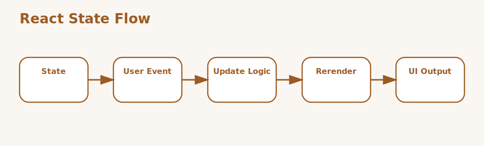

# React State Management Interview Questions



This page stays focused on React state management rather than general React rendering or Hooks syntax.

## 1. Local component state

### 1. What is the role of Local component state in React state management?

**Answer:**

In React state management, the term Local component state refers to state that belongs to a single component
and drives only that part of the UI. It is part of the foundation a candidate should be able to
explain clearly.

**Sample:**

```jsx
// Concept: 1. Local component state
const StateContext = createContext(null);
function reducer(state, action) {
  if (action.type === 'set') return { ...state, value: action.value };
  return state;
}
```

---

### 2. Why is the concept of Local component state important in React state management?

**Answer:**

This concept matters because it influences state that belongs to a single component and
drives only that part of the UI. Good interview answers connect it to clarity, maintainability,
performance, security, or delivery depending on the situation.

**Sample:**

```jsx
// Concept: 1. Local component state
const StateContext = createContext(null);
function reducer(state, action) {
  if (action.type === 'set') return { ...state, value: action.value };
  return state;
}
```

---

### 3. When should a team focus on Local component state?

**Answer:**

A team should focus on Local component state when the requirement depends on state that belongs to a
single component and drives only that part of the UI. It becomes especially important when design
decisions, debugging, or architecture conversations depend on that area.

**Sample:**

```jsx
// Concept: 1. Local component state
const StateContext = createContext(null);
function reducer(state, action) {
  if (action.type === 'set') return { ...state, value: action.value };
  return state;
}
```

---

### 4. How is Local component state applied in practice?

**Answer:**

In practice, Local component state is applied by making state that belongs to a single component and
drives only that part of the UI explicit in the code, workflow, or collaboration pattern. The exact
shape depends on the stack, but the responsibility should stay predictable.

**Sample:**

```jsx
// Concept: 1. Local component state
const StateContext = createContext(null);
function reducer(state, action) {
  if (action.type === 'set') return { ...state, value: action.value };
  return state;
}
```

---

### 5. What strengths does Local component state bring?

**Answer:**

The strengths of Local component state are better structure, better communication, and better
control over state that belongs to a single component and drives only that part of the UI. It also
makes tradeoffs easier to explain to reviewers, interviewers, and teammates.

**Sample:**

```jsx
// Concept: 1. Local component state
const StateContext = createContext(null);
function reducer(state, action) {
  if (action.type === 'set') return { ...state, value: action.value };
  return state;
}
```

---

### 6. What tradeoffs come with Local component state?

**Answer:**

The main tradeoff is extra complexity if Local component state is introduced without a real need or
a clear understanding of state that belongs to a single component and drives only that part of the
UI. That usually leads to weak reasoning, overengineering, or fragile implementations.

**Sample:**

```jsx
// Concept: 1. Local component state
const StateContext = createContext(null);
function reducer(state, action) {
  if (action.type === 'set') return { ...state, value: action.value };
  return state;
}
```

---

### 7. How does Local component state differ from Lifting state up?

**Answer:**

Local component state is centered on state that belongs to a single component and drives only that
part of the UI, while Lifting state up is centered on moving shared state to the closest common
owner so multiple components can coordinate around it. They often work together, but they solve
different parts of the topic.

**Sample:**

```jsx
// Concept: 1. Local component state
const StateContext = createContext(null);
function reducer(state, action) {
  if (action.type === 'set') return { ...state, value: action.value };
  return state;
}
```

---

### 8. What is a good real-world example of Local component state?

**Answer:**

A strong example is explaining how Local component state affects a real feature, workflow, bug,
migration, or design choice involving state that belongs to a single component and drives only that
part of the UI. Interviewers usually care more about the reasoning than the definition alone.

**Sample:**

```jsx
// Concept: 1. Local component state
const StateContext = createContext(null);
function reducer(state, action) {
  if (action.type === 'set') return { ...state, value: action.value };
  return state;
}
```

---

### 9. What is a best practice for Local component state?

**Answer:**

A good practice is to keep Local component state aligned with the actual requirement around state
that belongs to a single component and drives only that part of the UI. Teams should document
intent, keep the implementation readable, and validate important paths early.

**Sample:**

```jsx
// Concept: 1. Local component state
const StateContext = createContext(null);
function reducer(state, action) {
  if (action.type === 'set') return { ...state, value: action.value };
  return state;
}
```

---

### 10. What is a common mistake around Local component state?

**Answer:**

A common mistake is naming Local component state without understanding how it affects state that
belongs to a single component and drives only that part of the UI. In real work, that usually
appears as poor decisions, weak debugging, or incomplete explanations.

**Sample:**

```jsx
// Concept: 1. Local component state
const StateContext = createContext(null);
function reducer(state, action) {
  if (action.type === 'set') return { ...state, value: action.value };
  return state;
}
```

---

### 11. How do you troubleshoot Local component state-related issues?

**Answer:**

When troubleshooting Local component state, first verify whether state that belongs to a single
component and drives only that part of the UI is behaving as expected. Then check surrounding
dependencies, inputs, configuration, logs, and edge cases before changing the design.

**Sample:**

```jsx
// Concept: 1. Local component state
const StateContext = createContext(null);
function reducer(state, action) {
  if (action.type === 'set') return { ...state, value: action.value };
  return state;
}
```

---

### 12. How does Local component state connect to the rest of React state management?

**Answer:**

Local component state connects to the rest of React state management by giving structure to state
that belongs to a single component and drives only that part of the UI. It is one of the pieces that
turns isolated facts into a coherent end-to-end explanation.

**Sample:**

```jsx
// Concept: 1. Local component state
const StateContext = createContext(null);
function reducer(state, action) {
  if (action.type === 'set') return { ...state, value: action.value };
  return state;
}
```

---

## 2. Lifting state up

### 13. What is the role of Lifting state up in React state management?

**Answer:**

In React state management, the term Lifting state up refers to moving shared state to the closest common
owner so multiple components can coordinate around it. It is part of the foundation a candidate
should be able to explain clearly.

**Sample:**

```jsx
// Concept: 2. Lifting state up
const StateContext = createContext(null);
function reducer(state, action) {
  if (action.type === 'set') return { ...state, value: action.value };
  return state;
}
```

---

### 14. Why is the concept of Lifting state up important in React state management?

**Answer:**

This concept matters because it influences moving shared state to the closest common owner so
multiple components can coordinate around it. Good interview answers connect it to clarity,
maintainability, performance, security, or delivery depending on the situation.

**Sample:**

```jsx
// Concept: 2. Lifting state up
const StateContext = createContext(null);
function reducer(state, action) {
  if (action.type === 'set') return { ...state, value: action.value };
  return state;
}
```

---

### 15. When should a team focus on Lifting state up?

**Answer:**

A team should focus on Lifting state up when the requirement depends on moving shared state to the
closest common owner so multiple components can coordinate around it. It becomes especially
important when design decisions, debugging, or architecture conversations depend on that area.

**Sample:**

```jsx
// Concept: 2. Lifting state up
const StateContext = createContext(null);
function reducer(state, action) {
  if (action.type === 'set') return { ...state, value: action.value };
  return state;
}
```

---

### 16. How is Lifting state up applied in practice?

**Answer:**

In practice, Lifting state up is applied by making moving shared state to the closest common owner
so multiple components can coordinate around it explicit in the code, workflow, or collaboration
pattern. The exact shape depends on the stack, but the responsibility should stay predictable.

**Sample:**

```jsx
// Concept: 2. Lifting state up
const StateContext = createContext(null);
function reducer(state, action) {
  if (action.type === 'set') return { ...state, value: action.value };
  return state;
}
```

---

### 17. What strengths does Lifting state up bring?

**Answer:**

The strengths of Lifting state up are better structure, better communication, and better control
over moving shared state to the closest common owner so multiple components can coordinate around
it. It also makes tradeoffs easier to explain to reviewers, interviewers, and teammates.

**Sample:**

```jsx
// Concept: 2. Lifting state up
const StateContext = createContext(null);
function reducer(state, action) {
  if (action.type === 'set') return { ...state, value: action.value };
  return state;
}
```

---

### 18. What tradeoffs come with Lifting state up?

**Answer:**

The main tradeoff is extra complexity if Lifting state up is introduced without a real need or a
clear understanding of moving shared state to the closest common owner so multiple components can
coordinate around it. That usually leads to weak reasoning, overengineering, or fragile
implementations.

**Sample:**

```jsx
// Concept: 2. Lifting state up
const StateContext = createContext(null);
function reducer(state, action) {
  if (action.type === 'set') return { ...state, value: action.value };
  return state;
}
```

---

### 19. How does Lifting state up differ from Prop drilling?

**Answer:**

Lifting state up is centered on moving shared state to the closest common owner so multiple
components can coordinate around it, while Prop drilling is centered on passing data through
intermediate components that do not directly need it. They often work together, but they solve
different parts of the topic.

**Sample:**

```jsx
// Concept: 2. Lifting state up
const StateContext = createContext(null);
function reducer(state, action) {
  if (action.type === 'set') return { ...state, value: action.value };
  return state;
}
```

---

### 20. What is a good real-world example of Lifting state up?

**Answer:**

A strong example is explaining how Lifting state up affects a real feature, workflow, bug,
migration, or design choice involving moving shared state to the closest common owner so multiple
components can coordinate around it. Interviewers usually care more about the reasoning than the
definition alone.

**Sample:**

```jsx
// Concept: 2. Lifting state up
const StateContext = createContext(null);
function reducer(state, action) {
  if (action.type === 'set') return { ...state, value: action.value };
  return state;
}
```

---

### 21. What is a best practice for Lifting state up?

**Answer:**

A good practice is to keep Lifting state up aligned with the actual requirement around moving shared
state to the closest common owner so multiple components can coordinate around it. Teams should
document intent, keep the implementation readable, and validate important paths early.

**Sample:**

```jsx
// Concept: 2. Lifting state up
const StateContext = createContext(null);
function reducer(state, action) {
  if (action.type === 'set') return { ...state, value: action.value };
  return state;
}
```

---

### 22. What is a common mistake around Lifting state up?

**Answer:**

A common mistake is naming Lifting state up without understanding how it affects moving shared state
to the closest common owner so multiple components can coordinate around it. In real work, that
usually appears as poor decisions, weak debugging, or incomplete explanations.

**Sample:**

```jsx
// Concept: 2. Lifting state up
const StateContext = createContext(null);
function reducer(state, action) {
  if (action.type === 'set') return { ...state, value: action.value };
  return state;
}
```

---

### 23. How do you troubleshoot Lifting state up-related issues?

**Answer:**

When troubleshooting Lifting state up, first verify whether moving shared state to the closest
common owner so multiple components can coordinate around it is behaving as expected. Then check
surrounding dependencies, inputs, configuration, logs, and edge cases before changing the design.

**Sample:**

```jsx
// Concept: 2. Lifting state up
const StateContext = createContext(null);
function reducer(state, action) {
  if (action.type === 'set') return { ...state, value: action.value };
  return state;
}
```

---

### 24. How does Lifting state up connect to the rest of React state management?

**Answer:**

Lifting state up connects to the rest of React state management by giving structure to moving shared
state to the closest common owner so multiple components can coordinate around it. It is one of the
pieces that turns isolated facts into a coherent end-to-end explanation.

**Sample:**

```jsx
// Concept: 2. Lifting state up
const StateContext = createContext(null);
function reducer(state, action) {
  if (action.type === 'set') return { ...state, value: action.value };
  return state;
}
```

---

## 3. Prop drilling

### 25. What is the role of Prop drilling in React state management?

**Answer:**

In React state management, the term Prop drilling refers to passing data through intermediate components that
do not directly need it. It is part of the foundation a candidate should be able to explain clearly.

**Sample:**

```jsx
// Concept: 3. Prop drilling
const StateContext = createContext(null);
function reducer(state, action) {
  if (action.type === 'set') return { ...state, value: action.value };
  return state;
}
```

---

### 26. Why is the concept of Prop drilling important in React state management?

**Answer:**

This concept matters because it influences passing data through intermediate components that do not
directly need it. Good interview answers connect it to clarity, maintainability, performance,
security, or delivery depending on the situation.

**Sample:**

```jsx
// Concept: 3. Prop drilling
const StateContext = createContext(null);
function reducer(state, action) {
  if (action.type === 'set') return { ...state, value: action.value };
  return state;
}
```

---

### 27. When should a team focus on Prop drilling?

**Answer:**

A team should focus on Prop drilling when the requirement depends on passing data through
intermediate components that do not directly need it. It becomes especially important when design
decisions, debugging, or architecture conversations depend on that area.

**Sample:**

```jsx
// Concept: 3. Prop drilling
const StateContext = createContext(null);
function reducer(state, action) {
  if (action.type === 'set') return { ...state, value: action.value };
  return state;
}
```

---

### 28. How is Prop drilling applied in practice?

**Answer:**

In practice, Prop drilling is applied by making passing data through intermediate components that do
not directly need it explicit in the code, workflow, or collaboration pattern. The exact shape
depends on the stack, but the responsibility should stay predictable.

**Sample:**

```jsx
// Concept: 3. Prop drilling
const StateContext = createContext(null);
function reducer(state, action) {
  if (action.type === 'set') return { ...state, value: action.value };
  return state;
}
```

---

### 29. What strengths does Prop drilling bring?

**Answer:**

The strengths of Prop drilling are better structure, better communication, and better control over
passing data through intermediate components that do not directly need it. It also makes tradeoffs
easier to explain to reviewers, interviewers, and teammates.

**Sample:**

```jsx
// Concept: 3. Prop drilling
const StateContext = createContext(null);
function reducer(state, action) {
  if (action.type === 'set') return { ...state, value: action.value };
  return state;
}
```

---

### 30. What tradeoffs come with Prop drilling?

**Answer:**

The main tradeoff is extra complexity if Prop drilling is introduced without a real need or a clear
understanding of passing data through intermediate components that do not directly need it. That
usually leads to weak reasoning, overengineering, or fragile implementations.

**Sample:**

```jsx
// Concept: 3. Prop drilling
const StateContext = createContext(null);
function reducer(state, action) {
  if (action.type === 'set') return { ...state, value: action.value };
  return state;
}
```

---

### 31. How does Prop drilling differ from Context API?

**Answer:**

Prop drilling is centered on passing data through intermediate components that do not directly need
it, while Context API is centered on the built-in React mechanism for sharing values through the
tree without repeated prop passing. They often work together, but they solve different parts of the
topic.

**Sample:**

```jsx
// Concept: 3. Prop drilling
const StateContext = createContext(null);
function reducer(state, action) {
  if (action.type === 'set') return { ...state, value: action.value };
  return state;
}
```

---

### 32. What is a good real-world example of Prop drilling?

**Answer:**

A strong example is explaining how Prop drilling affects a real feature, workflow, bug, migration,
or design choice involving passing data through intermediate components that do not directly need
it. Interviewers usually care more about the reasoning than the definition alone.

**Sample:**

```jsx
// Concept: 3. Prop drilling
const StateContext = createContext(null);
function reducer(state, action) {
  if (action.type === 'set') return { ...state, value: action.value };
  return state;
}
```

---

### 33. What is a best practice for Prop drilling?

**Answer:**

A good practice is to keep Prop drilling aligned with the actual requirement around passing data
through intermediate components that do not directly need it. Teams should document intent, keep the
implementation readable, and validate important paths early.

**Sample:**

```jsx
// Concept: 3. Prop drilling
const StateContext = createContext(null);
function reducer(state, action) {
  if (action.type === 'set') return { ...state, value: action.value };
  return state;
}
```

---

### 34. What is a common mistake around Prop drilling?

**Answer:**

A common mistake is naming Prop drilling without understanding how it affects passing data through
intermediate components that do not directly need it. In real work, that usually appears as poor
decisions, weak debugging, or incomplete explanations.

**Sample:**

```jsx
// Concept: 3. Prop drilling
const StateContext = createContext(null);
function reducer(state, action) {
  if (action.type === 'set') return { ...state, value: action.value };
  return state;
}
```

---

### 35. How do you troubleshoot Prop drilling-related issues?

**Answer:**

When troubleshooting Prop drilling, first verify whether passing data through intermediate
components that do not directly need it is behaving as expected. Then check surrounding
dependencies, inputs, configuration, logs, and edge cases before changing the design.

**Sample:**

```jsx
// Concept: 3. Prop drilling
const StateContext = createContext(null);
function reducer(state, action) {
  if (action.type === 'set') return { ...state, value: action.value };
  return state;
}
```

---

### 36. How does Prop drilling connect to the rest of React state management?

**Answer:**

Prop drilling connects to the rest of React state management by giving structure to passing data
through intermediate components that do not directly need it. It is one of the pieces that turns
isolated facts into a coherent end-to-end explanation.

**Sample:**

```jsx
// Concept: 3. Prop drilling
const StateContext = createContext(null);
function reducer(state, action) {
  if (action.type === 'set') return { ...state, value: action.value };
  return state;
}
```

---

## 4. Context API

### 37. What is the role of Context API in React state management?

**Answer:**

In React state management, the term Context API refers to the built-in React mechanism for sharing values
through the tree without repeated prop passing. It is part of the foundation a candidate should be
able to explain clearly.

**Sample:**

```jsx
// Concept: 4. Context API
const StateContext = createContext(null);
function reducer(state, action) {
  if (action.type === 'set') return { ...state, value: action.value };
  return state;
}
```

---

### 38. Why is the concept of Context API important in React state management?

**Answer:**

This concept matters because it influences the built-in React mechanism for sharing values through
the tree without repeated prop passing. Good interview answers connect it to clarity,
maintainability, performance, security, or delivery depending on the situation.

**Sample:**

```jsx
// Concept: 4. Context API
const StateContext = createContext(null);
function reducer(state, action) {
  if (action.type === 'set') return { ...state, value: action.value };
  return state;
}
```

---

### 39. When should a team focus on Context API?

**Answer:**

A team should focus on Context API when the requirement depends on the built-in React mechanism for
sharing values through the tree without repeated prop passing. It becomes especially important when
design decisions, debugging, or architecture conversations depend on that area.

**Sample:**

```jsx
// Concept: 4. Context API
const StateContext = createContext(null);
function reducer(state, action) {
  if (action.type === 'set') return { ...state, value: action.value };
  return state;
}
```

---

### 40. How is Context API applied in practice?

**Answer:**

In practice, Context API is applied by making the built-in React mechanism for sharing values
through the tree without repeated prop passing explicit in the code, workflow, or collaboration
pattern. The exact shape depends on the stack, but the responsibility should stay predictable.

**Sample:**

```jsx
// Concept: 4. Context API
const StateContext = createContext(null);
function reducer(state, action) {
  if (action.type === 'set') return { ...state, value: action.value };
  return state;
}
```

---

### 41. What strengths does Context API bring?

**Answer:**

The strengths of Context API are better structure, better communication, and better control over the
built-in React mechanism for sharing values through the tree without repeated prop passing. It also
makes tradeoffs easier to explain to reviewers, interviewers, and teammates.

**Sample:**

```jsx
// Concept: 4. Context API
const StateContext = createContext(null);
function reducer(state, action) {
  if (action.type === 'set') return { ...state, value: action.value };
  return state;
}
```

---

### 42. What tradeoffs come with Context API?

**Answer:**

The main tradeoff is extra complexity if Context API is introduced without a real need or a clear
understanding of the built-in React mechanism for sharing values through the tree without repeated
prop passing. That usually leads to weak reasoning, overengineering, or fragile implementations.

**Sample:**

```jsx
// Concept: 4. Context API
const StateContext = createContext(null);
function reducer(state, action) {
  if (action.type === 'set') return { ...state, value: action.value };
  return state;
}
```

---

### 43. How does Context API differ from useReducer?

**Answer:**

Context API is centered on the built-in React mechanism for sharing values through the tree without
repeated prop passing, while useReducer is centered on the reducer-based state pattern used when
updates are easier to model as actions. They often work together, but they solve different parts of
the topic.

**Sample:**

```jsx
// Concept: 4. Context API
const StateContext = createContext(null);
function reducer(state, action) {
  if (action.type === 'set') return { ...state, value: action.value };
  return state;
}
```

---

### 44. What is a good real-world example of Context API?

**Answer:**

A strong example is explaining how Context API affects a real feature, workflow, bug, migration, or
design choice involving the built-in React mechanism for sharing values through the tree without
repeated prop passing. Interviewers usually care more about the reasoning than the definition alone.

**Sample:**

```jsx
// Concept: 4. Context API
const StateContext = createContext(null);
function reducer(state, action) {
  if (action.type === 'set') return { ...state, value: action.value };
  return state;
}
```

---

### 45. What is a best practice for Context API?

**Answer:**

A good practice is to keep Context API aligned with the actual requirement around the built-in React
mechanism for sharing values through the tree without repeated prop passing. Teams should document
intent, keep the implementation readable, and validate important paths early.

**Sample:**

```jsx
// Concept: 4. Context API
const StateContext = createContext(null);
function reducer(state, action) {
  if (action.type === 'set') return { ...state, value: action.value };
  return state;
}
```

---

### 46. What is a common mistake around Context API?

**Answer:**

A common mistake is naming Context API without understanding how it affects the built-in React
mechanism for sharing values through the tree without repeated prop passing. In real work, that
usually appears as poor decisions, weak debugging, or incomplete explanations.

**Sample:**

```jsx
// Concept: 4. Context API
const StateContext = createContext(null);
function reducer(state, action) {
  if (action.type === 'set') return { ...state, value: action.value };
  return state;
}
```

---

### 47. How do you troubleshoot Context API-related issues?

**Answer:**

When troubleshooting Context API, first verify whether the built-in React mechanism for sharing
values through the tree without repeated prop passing is behaving as expected. Then check
surrounding dependencies, inputs, configuration, logs, and edge cases before changing the design.

**Sample:**

```jsx
// Concept: 4. Context API
const StateContext = createContext(null);
function reducer(state, action) {
  if (action.type === 'set') return { ...state, value: action.value };
  return state;
}
```

---

### 48. How does Context API connect to the rest of React state management?

**Answer:**

Context API connects to the rest of React state management by giving structure to the built-in React
mechanism for sharing values through the tree without repeated prop passing. It is one of the pieces
that turns isolated facts into a coherent end-to-end explanation.

**Sample:**

```jsx
// Concept: 4. Context API
const StateContext = createContext(null);
function reducer(state, action) {
  if (action.type === 'set') return { ...state, value: action.value };
  return state;
}
```

---

## 5. useReducer

### 49. What is the role of useReducer in React state management?

**Answer:**

In React state management, the term useReducer refers to the reducer-based state pattern used when updates
are easier to model as actions. It is part of the foundation a candidate should be able to explain
clearly.

**Sample:**

```jsx
// Concept: 5. useReducer
const StateContext = createContext(null);
function reducer(state, action) {
  if (action.type === 'set') return { ...state, value: action.value };
  return state;
}
```

---

### 50. Why is the concept of useReducer important in React state management?

**Answer:**

This concept matters because it influences the reducer-based state pattern used when updates are
easier to model as actions. Good interview answers connect it to clarity, maintainability,
performance, security, or delivery depending on the situation.

**Sample:**

```jsx
// Concept: 5. useReducer
const StateContext = createContext(null);
function reducer(state, action) {
  if (action.type === 'set') return { ...state, value: action.value };
  return state;
}
```

---

### 51. When should a team focus on useReducer?

**Answer:**

A team should focus on useReducer when the requirement depends on the reducer-based state pattern
used when updates are easier to model as actions. It becomes especially important when design
decisions, debugging, or architecture conversations depend on that area.

**Sample:**

```jsx
// Concept: 5. useReducer
const StateContext = createContext(null);
function reducer(state, action) {
  if (action.type === 'set') return { ...state, value: action.value };
  return state;
}
```

---

### 52. How is useReducer applied in practice?

**Answer:**

In practice, useReducer is applied by making the reducer-based state pattern used when updates are
easier to model as actions explicit in the code, workflow, or collaboration pattern. The exact shape
depends on the stack, but the responsibility should stay predictable.

**Sample:**

```jsx
// Concept: 5. useReducer
const StateContext = createContext(null);
function reducer(state, action) {
  if (action.type === 'set') return { ...state, value: action.value };
  return state;
}
```

---

### 53. What strengths does useReducer bring?

**Answer:**

The strengths of useReducer are better structure, better communication, and better control over the
reducer-based state pattern used when updates are easier to model as actions. It also makes
tradeoffs easier to explain to reviewers, interviewers, and teammates.

**Sample:**

```jsx
// Concept: 5. useReducer
const StateContext = createContext(null);
function reducer(state, action) {
  if (action.type === 'set') return { ...state, value: action.value };
  return state;
}
```

---

### 54. What tradeoffs come with useReducer?

**Answer:**

The main tradeoff is extra complexity if useReducer is introduced without a real need or a clear
understanding of the reducer-based state pattern used when updates are easier to model as actions.
That usually leads to weak reasoning, overengineering, or fragile implementations.

**Sample:**

```jsx
// Concept: 5. useReducer
const StateContext = createContext(null);
function reducer(state, action) {
  if (action.type === 'set') return { ...state, value: action.value };
  return state;
}
```

---

### 55. How does useReducer differ from Derived state?

**Answer:**

useReducer is centered on the reducer-based state pattern used when updates are easier to model as
actions, while Derived state is centered on values that should usually be computed from existing
state rather than stored separately. They often work together, but they solve different parts of the
topic.

**Sample:**

```jsx
// Concept: 5. useReducer
const StateContext = createContext(null);
function reducer(state, action) {
  if (action.type === 'set') return { ...state, value: action.value };
  return state;
}
```

---

### 56. What is a good real-world example of useReducer?

**Answer:**

A strong example is explaining how useReducer affects a real feature, workflow, bug, migration, or
design choice involving the reducer-based state pattern used when updates are easier to model as
actions. Interviewers usually care more about the reasoning than the definition alone.

**Sample:**

```jsx
// Concept: 5. useReducer
const StateContext = createContext(null);
function reducer(state, action) {
  if (action.type === 'set') return { ...state, value: action.value };
  return state;
}
```

---

### 57. What is a best practice for useReducer?

**Answer:**

A good practice is to keep useReducer aligned with the actual requirement around the reducer-based
state pattern used when updates are easier to model as actions. Teams should document intent, keep
the implementation readable, and validate important paths early.

**Sample:**

```jsx
// Concept: 5. useReducer
const StateContext = createContext(null);
function reducer(state, action) {
  if (action.type === 'set') return { ...state, value: action.value };
  return state;
}
```

---

### 58. What is a common mistake around useReducer?

**Answer:**

A common mistake is naming useReducer without understanding how it affects the reducer-based state
pattern used when updates are easier to model as actions. In real work, that usually appears as poor
decisions, weak debugging, or incomplete explanations.

**Sample:**

```jsx
// Concept: 5. useReducer
const StateContext = createContext(null);
function reducer(state, action) {
  if (action.type === 'set') return { ...state, value: action.value };
  return state;
}
```

---

### 59. How do you troubleshoot useReducer-related issues?

**Answer:**

When troubleshooting useReducer, first verify whether the reducer-based state pattern used when
updates are easier to model as actions is behaving as expected. Then check surrounding dependencies,
inputs, configuration, logs, and edge cases before changing the design.

**Sample:**

```jsx
// Concept: 5. useReducer
const StateContext = createContext(null);
function reducer(state, action) {
  if (action.type === 'set') return { ...state, value: action.value };
  return state;
}
```

---

### 60. How does useReducer connect to the rest of React state management?

**Answer:**

useReducer connects to the rest of React state management by giving structure to the reducer-based
state pattern used when updates are easier to model as actions. It is one of the pieces that turns
isolated facts into a coherent end-to-end explanation.

**Sample:**

```jsx
// Concept: 5. useReducer
const StateContext = createContext(null);
function reducer(state, action) {
  if (action.type === 'set') return { ...state, value: action.value };
  return state;
}
```

---

## 6. Derived state

### 61. What is the role of Derived state in React state management?

**Answer:**

In React state management, the term Derived state refers to values that should usually be computed from
existing state rather than stored separately. It is part of the foundation a candidate should be
able to explain clearly.

**Sample:**

```jsx
// Concept: 6. Derived state
const StateContext = createContext(null);
function reducer(state, action) {
  if (action.type === 'set') return { ...state, value: action.value };
  return state;
}
```

---

### 62. Why is the concept of Derived state important in React state management?

**Answer:**

This concept matters because it influences values that should usually be computed from existing
state rather than stored separately. Good interview answers connect it to clarity, maintainability,
performance, security, or delivery depending on the situation.

**Sample:**

```jsx
// Concept: 6. Derived state
const StateContext = createContext(null);
function reducer(state, action) {
  if (action.type === 'set') return { ...state, value: action.value };
  return state;
}
```

---

### 63. When should a team focus on Derived state?

**Answer:**

A team should focus on Derived state when the requirement depends on values that should usually be
computed from existing state rather than stored separately. It becomes especially important when
design decisions, debugging, or architecture conversations depend on that area.

**Sample:**

```jsx
// Concept: 6. Derived state
const StateContext = createContext(null);
function reducer(state, action) {
  if (action.type === 'set') return { ...state, value: action.value };
  return state;
}
```

---

### 64. How is Derived state applied in practice?

**Answer:**

In practice, Derived state is applied by making values that should usually be computed from existing
state rather than stored separately explicit in the code, workflow, or collaboration pattern. The
exact shape depends on the stack, but the responsibility should stay predictable.

**Sample:**

```jsx
// Concept: 6. Derived state
const StateContext = createContext(null);
function reducer(state, action) {
  if (action.type === 'set') return { ...state, value: action.value };
  return state;
}
```

---

### 65. What strengths does Derived state bring?

**Answer:**

The strengths of Derived state are better structure, better communication, and better control over
values that should usually be computed from existing state rather than stored separately. It also
makes tradeoffs easier to explain to reviewers, interviewers, and teammates.

**Sample:**

```jsx
// Concept: 6. Derived state
const StateContext = createContext(null);
function reducer(state, action) {
  if (action.type === 'set') return { ...state, value: action.value };
  return state;
}
```

---

### 66. What tradeoffs come with Derived state?

**Answer:**

The main tradeoff is extra complexity if Derived state is introduced without a real need or a clear
understanding of values that should usually be computed from existing state rather than stored
separately. That usually leads to weak reasoning, overengineering, or fragile implementations.

**Sample:**

```jsx
// Concept: 6. Derived state
const StateContext = createContext(null);
function reducer(state, action) {
  if (action.type === 'set') return { ...state, value: action.value };
  return state;
}
```

---

### 67. How does Derived state differ from Immutability?

**Answer:**

Derived state is centered on values that should usually be computed from existing state rather than
stored separately, while Immutability is centered on the practice of updating state by creating new
values instead of mutating old ones directly. They often work together, but they solve different
parts of the topic.

**Sample:**

```jsx
// Concept: 6. Derived state
const StateContext = createContext(null);
function reducer(state, action) {
  if (action.type === 'set') return { ...state, value: action.value };
  return state;
}
```

---

### 68. What is a good real-world example of Derived state?

**Answer:**

A strong example is explaining how Derived state affects a real feature, workflow, bug, migration,
or design choice involving values that should usually be computed from existing state rather than
stored separately. Interviewers usually care more about the reasoning than the definition alone.

**Sample:**

```jsx
// Concept: 6. Derived state
const StateContext = createContext(null);
function reducer(state, action) {
  if (action.type === 'set') return { ...state, value: action.value };
  return state;
}
```

---

### 69. What is a best practice for Derived state?

**Answer:**

A good practice is to keep Derived state aligned with the actual requirement around values that
should usually be computed from existing state rather than stored separately. Teams should document
intent, keep the implementation readable, and validate important paths early.

**Sample:**

```jsx
// Concept: 6. Derived state
const StateContext = createContext(null);
function reducer(state, action) {
  if (action.type === 'set') return { ...state, value: action.value };
  return state;
}
```

---

### 70. What is a common mistake around Derived state?

**Answer:**

A common mistake is naming Derived state without understanding how it affects values that should
usually be computed from existing state rather than stored separately. In real work, that usually
appears as poor decisions, weak debugging, or incomplete explanations.

**Sample:**

```jsx
// Concept: 6. Derived state
const StateContext = createContext(null);
function reducer(state, action) {
  if (action.type === 'set') return { ...state, value: action.value };
  return state;
}
```

---

### 71. How do you troubleshoot Derived state-related issues?

**Answer:**

When troubleshooting Derived state, first verify whether values that should usually be computed from
existing state rather than stored separately is behaving as expected. Then check surrounding
dependencies, inputs, configuration, logs, and edge cases before changing the design.

**Sample:**

```jsx
// Concept: 6. Derived state
const StateContext = createContext(null);
function reducer(state, action) {
  if (action.type === 'set') return { ...state, value: action.value };
  return state;
}
```

---

### 72. How does Derived state connect to the rest of React state management?

**Answer:**

Derived state connects to the rest of React state management by giving structure to values that
should usually be computed from existing state rather than stored separately. It is one of the
pieces that turns isolated facts into a coherent end-to-end explanation.

**Sample:**

```jsx
// Concept: 6. Derived state
const StateContext = createContext(null);
function reducer(state, action) {
  if (action.type === 'set') return { ...state, value: action.value };
  return state;
}
```

---

## 7. Immutability

### 73. What is the role of Immutability in React state management?

**Answer:**

In React state management, the term Immutability refers to the practice of updating state by creating new
values instead of mutating old ones directly. It is part of the foundation a candidate should be
able to explain clearly.

**Sample:**

```jsx
// Concept: 7. Immutability
const StateContext = createContext(null);
function reducer(state, action) {
  if (action.type === 'set') return { ...state, value: action.value };
  return state;
}
```

---

### 74. Why is the concept of Immutability important in React state management?

**Answer:**

This concept matters because it influences the practice of updating state by creating new values
instead of mutating old ones directly. Good interview answers connect it to clarity,
maintainability, performance, security, or delivery depending on the situation.

**Sample:**

```jsx
// Concept: 7. Immutability
const StateContext = createContext(null);
function reducer(state, action) {
  if (action.type === 'set') return { ...state, value: action.value };
  return state;
}
```

---

### 75. When should a team focus on Immutability?

**Answer:**

A team should focus on Immutability when the requirement depends on the practice of updating state
by creating new values instead of mutating old ones directly. It becomes especially important when
design decisions, debugging, or architecture conversations depend on that area.

**Sample:**

```jsx
// Concept: 7. Immutability
const StateContext = createContext(null);
function reducer(state, action) {
  if (action.type === 'set') return { ...state, value: action.value };
  return state;
}
```

---

### 76. How is Immutability applied in practice?

**Answer:**

In practice, Immutability is applied by making the practice of updating state by creating new values
instead of mutating old ones directly explicit in the code, workflow, or collaboration pattern. The
exact shape depends on the stack, but the responsibility should stay predictable.

**Sample:**

```jsx
// Concept: 7. Immutability
const StateContext = createContext(null);
function reducer(state, action) {
  if (action.type === 'set') return { ...state, value: action.value };
  return state;
}
```

---

### 77. What strengths does Immutability bring?

**Answer:**

The strengths of Immutability are better structure, better communication, and better control over
the practice of updating state by creating new values instead of mutating old ones directly. It also
makes tradeoffs easier to explain to reviewers, interviewers, and teammates.

**Sample:**

```jsx
// Concept: 7. Immutability
const StateContext = createContext(null);
function reducer(state, action) {
  if (action.type === 'set') return { ...state, value: action.value };
  return state;
}
```

---

### 78. What tradeoffs come with Immutability?

**Answer:**

The main tradeoff is extra complexity if Immutability is introduced without a real need or a clear
understanding of the practice of updating state by creating new values instead of mutating old ones
directly. That usually leads to weak reasoning, overengineering, or fragile implementations.

**Sample:**

```jsx
// Concept: 7. Immutability
const StateContext = createContext(null);
function reducer(state, action) {
  if (action.type === 'set') return { ...state, value: action.value };
  return state;
}
```

---

### 79. How does Immutability differ from Global state libraries?

**Answer:**

Immutability is centered on the practice of updating state by creating new values instead of
mutating old ones directly, while Global state libraries is centered on external tools used when
application-wide state becomes too complex for local patterns alone. They often work together, but
they solve different parts of the topic.

**Sample:**

```jsx
// Concept: 7. Immutability
const StateContext = createContext(null);
function reducer(state, action) {
  if (action.type === 'set') return { ...state, value: action.value };
  return state;
}
```

---

### 80. What is a good real-world example of Immutability?

**Answer:**

A strong example is explaining how Immutability affects a real feature, workflow, bug, migration, or
design choice involving the practice of updating state by creating new values instead of mutating
old ones directly. Interviewers usually care more about the reasoning than the definition alone.

**Sample:**

```jsx
// Concept: 7. Immutability
const StateContext = createContext(null);
function reducer(state, action) {
  if (action.type === 'set') return { ...state, value: action.value };
  return state;
}
```

---

### 81. What is a best practice for Immutability?

**Answer:**

A good practice is to keep Immutability aligned with the actual requirement around the practice of
updating state by creating new values instead of mutating old ones directly. Teams should document
intent, keep the implementation readable, and validate important paths early.

**Sample:**

```jsx
// Concept: 7. Immutability
const StateContext = createContext(null);
function reducer(state, action) {
  if (action.type === 'set') return { ...state, value: action.value };
  return state;
}
```

---

### 82. What is a common mistake around Immutability?

**Answer:**

A common mistake is naming Immutability without understanding how it affects the practice of
updating state by creating new values instead of mutating old ones directly. In real work, that
usually appears as poor decisions, weak debugging, or incomplete explanations.

**Sample:**

```jsx
// Concept: 7. Immutability
const StateContext = createContext(null);
function reducer(state, action) {
  if (action.type === 'set') return { ...state, value: action.value };
  return state;
}
```

---

### 83. How do you troubleshoot Immutability-related issues?

**Answer:**

When troubleshooting Immutability, first verify whether the practice of updating state by creating
new values instead of mutating old ones directly is behaving as expected. Then check surrounding
dependencies, inputs, configuration, logs, and edge cases before changing the design.

**Sample:**

```jsx
// Concept: 7. Immutability
const StateContext = createContext(null);
function reducer(state, action) {
  if (action.type === 'set') return { ...state, value: action.value };
  return state;
}
```

---

### 84. How does Immutability connect to the rest of React state management?

**Answer:**

Immutability connects to the rest of React state management by giving structure to the practice of
updating state by creating new values instead of mutating old ones directly. It is one of the pieces
that turns isolated facts into a coherent end-to-end explanation.

**Sample:**

```jsx
// Concept: 7. Immutability
const StateContext = createContext(null);
function reducer(state, action) {
  if (action.type === 'set') return { ...state, value: action.value };
  return state;
}
```

---

## 8. Global state libraries

### 85. What is the role of Global state libraries in React state management?

**Answer:**

In React state management, the term Global state libraries refers to external tools used when application-
wide state becomes too complex for local patterns alone. It is part of the foundation a candidate
should be able to explain clearly.

**Sample:**

```jsx
// Concept: 8. Global state libraries
const StateContext = createContext(null);
function reducer(state, action) {
  if (action.type === 'set') return { ...state, value: action.value };
  return state;
}
```

---

### 86. Why is the concept of Global state libraries important in React state management?

**Answer:**

This concept matters because it influences external tools used when application-wide state
becomes too complex for local patterns alone. Good interview answers connect it to clarity,
maintainability, performance, security, or delivery depending on the situation.

**Sample:**

```jsx
// Concept: 8. Global state libraries
const StateContext = createContext(null);
function reducer(state, action) {
  if (action.type === 'set') return { ...state, value: action.value };
  return state;
}
```

---

### 87. When should a team focus on Global state libraries?

**Answer:**

A team should focus on Global state libraries when the requirement depends on external tools used
when application-wide state becomes too complex for local patterns alone. It becomes especially
important when design decisions, debugging, or architecture conversations depend on that area.

**Sample:**

```jsx
// Concept: 8. Global state libraries
const StateContext = createContext(null);
function reducer(state, action) {
  if (action.type === 'set') return { ...state, value: action.value };
  return state;
}
```

---

### 88. How is Global state libraries applied in practice?

**Answer:**

In practice, Global state libraries is applied by making external tools used when application-wide
state becomes too complex for local patterns alone explicit in the code, workflow, or collaboration
pattern. The exact shape depends on the stack, but the responsibility should stay predictable.

**Sample:**

```jsx
// Concept: 8. Global state libraries
const StateContext = createContext(null);
function reducer(state, action) {
  if (action.type === 'set') return { ...state, value: action.value };
  return state;
}
```

---

### 89. What strengths does Global state libraries bring?

**Answer:**

The strengths of Global state libraries are better structure, better communication, and better
control over external tools used when application-wide state becomes too complex for local patterns
alone. It also makes tradeoffs easier to explain to reviewers, interviewers, and teammates.

**Sample:**

```jsx
// Concept: 8. Global state libraries
const StateContext = createContext(null);
function reducer(state, action) {
  if (action.type === 'set') return { ...state, value: action.value };
  return state;
}
```

---

### 90. What tradeoffs come with Global state libraries?

**Answer:**

The main tradeoff is extra complexity if Global state libraries is introduced without a real need or
a clear understanding of external tools used when application-wide state becomes too complex for
local patterns alone. That usually leads to weak reasoning, overengineering, or fragile
implementations.

**Sample:**

```jsx
// Concept: 8. Global state libraries
const StateContext = createContext(null);
function reducer(state, action) {
  if (action.type === 'set') return { ...state, value: action.value };
  return state;
}
```

---

### 91. How does Global state libraries differ from Server state separation?

**Answer:**

Global state libraries is centered on external tools used when application-wide state becomes too
complex for local patterns alone, while Server state separation is centered on the distinction
between remote data synchronization and purely local UI state. They often work together, but they
solve different parts of the topic.

**Sample:**

```jsx
// Concept: 8. Global state libraries
const StateContext = createContext(null);
function reducer(state, action) {
  if (action.type === 'set') return { ...state, value: action.value };
  return state;
}
```

---

### 92. What is a good real-world example of Global state libraries?

**Answer:**

A strong example is explaining how Global state libraries affects a real feature, workflow, bug,
migration, or design choice involving external tools used when application-wide state becomes too
complex for local patterns alone. Interviewers usually care more about the reasoning than the
definition alone.

**Sample:**

```jsx
// Concept: 8. Global state libraries
const StateContext = createContext(null);
function reducer(state, action) {
  if (action.type === 'set') return { ...state, value: action.value };
  return state;
}
```

---

### 93. What is a best practice for Global state libraries?

**Answer:**

A good practice is to keep Global state libraries aligned with the actual requirement around
external tools used when application-wide state becomes too complex for local patterns alone. Teams
should document intent, keep the implementation readable, and validate important paths early.

**Sample:**

```jsx
// Concept: 8. Global state libraries
const StateContext = createContext(null);
function reducer(state, action) {
  if (action.type === 'set') return { ...state, value: action.value };
  return state;
}
```

---

### 94. What is a common mistake around Global state libraries?

**Answer:**

A common mistake is naming Global state libraries without understanding how it affects external
tools used when application-wide state becomes too complex for local patterns alone. In real work,
that usually appears as poor decisions, weak debugging, or incomplete explanations.

**Sample:**

```jsx
// Concept: 8. Global state libraries
const StateContext = createContext(null);
function reducer(state, action) {
  if (action.type === 'set') return { ...state, value: action.value };
  return state;
}
```

---

### 95. How do you troubleshoot Global state libraries-related issues?

**Answer:**

When troubleshooting Global state libraries, first verify whether external tools used when
application-wide state becomes too complex for local patterns alone is behaving as expected. Then
check surrounding dependencies, inputs, configuration, logs, and edge cases before changing the
design.

**Sample:**

```jsx
// Concept: 8. Global state libraries
const StateContext = createContext(null);
function reducer(state, action) {
  if (action.type === 'set') return { ...state, value: action.value };
  return state;
}
```

---

### 96. How does Global state libraries connect to the rest of React state management?

**Answer:**

Global state libraries connects to the rest of React state management by giving structure to
external tools used when application-wide state becomes too complex for local patterns alone. It is
one of the pieces that turns isolated facts into a coherent end-to-end explanation.

**Sample:**

```jsx
// Concept: 8. Global state libraries
const StateContext = createContext(null);
function reducer(state, action) {
  if (action.type === 'set') return { ...state, value: action.value };
  return state;
}
```

---

## 9. Server state separation

### 97. What is the role of Server state separation in React state management?

**Answer:**

In React state management, the term Server state separation refers to the distinction between remote data
synchronization and purely local UI state. It is part of the foundation a candidate should be able
to explain clearly.

**Sample:**

```jsx
// Concept: 9. Server state separation
const StateContext = createContext(null);
function reducer(state, action) {
  if (action.type === 'set') return { ...state, value: action.value };
  return state;
}
```

---

### 98. Why is the concept of Server state separation important in React state management?

**Answer:**

This concept matters because it influences the distinction between remote data
synchronization and purely local UI state. Good interview answers connect it to clarity,
maintainability, performance, security, or delivery depending on the situation.

**Sample:**

```jsx
// Concept: 9. Server state separation
const StateContext = createContext(null);
function reducer(state, action) {
  if (action.type === 'set') return { ...state, value: action.value };
  return state;
}
```

---

### 99. When should a team focus on Server state separation?

**Answer:**

A team should focus on Server state separation when the requirement depends on the distinction
between remote data synchronization and purely local UI state. It becomes especially important when
design decisions, debugging, or architecture conversations depend on that area.

**Sample:**

```jsx
// Concept: 9. Server state separation
const StateContext = createContext(null);
function reducer(state, action) {
  if (action.type === 'set') return { ...state, value: action.value };
  return state;
}
```

---

### 100. How is Server state separation applied in practice?

**Answer:**

In practice, Server state separation is applied by making the distinction between remote data
synchronization and purely local UI state explicit in the code, workflow, or collaboration pattern.
The exact shape depends on the stack, but the responsibility should stay predictable.

**Sample:**

```jsx
// Concept: 9. Server state separation
const StateContext = createContext(null);
function reducer(state, action) {
  if (action.type === 'set') return { ...state, value: action.value };
  return state;
}
```

---

### 101. What strengths does Server state separation bring?

**Answer:**

The strengths of Server state separation are better structure, better communication, and better
control over the distinction between remote data synchronization and purely local UI state. It also
makes tradeoffs easier to explain to reviewers, interviewers, and teammates.

**Sample:**

```jsx
// Concept: 9. Server state separation
const StateContext = createContext(null);
function reducer(state, action) {
  if (action.type === 'set') return { ...state, value: action.value };
  return state;
}
```

---

### 102. What tradeoffs come with Server state separation?

**Answer:**

The main tradeoff is extra complexity if Server state separation is introduced without a real need
or a clear understanding of the distinction between remote data synchronization and purely local UI
state. That usually leads to weak reasoning, overengineering, or fragile implementations.

**Sample:**

```jsx
// Concept: 9. Server state separation
const StateContext = createContext(null);
function reducer(state, action) {
  if (action.type === 'set') return { ...state, value: action.value };
  return state;
}
```

---

### 103. How does Server state separation differ from Performance-aware state design?

**Answer:**

Server state separation is centered on the distinction between remote data synchronization and
purely local UI state, while Performance-aware state design is centered on structuring state updates
so rerenders remain understandable and efficient. They often work together, but they solve different
parts of the topic.

**Sample:**

```jsx
// Concept: 9. Server state separation
const StateContext = createContext(null);
function reducer(state, action) {
  if (action.type === 'set') return { ...state, value: action.value };
  return state;
}
```

---

### 104. What is a good real-world example of Server state separation?

**Answer:**

A strong example is explaining how Server state separation affects a real feature, workflow, bug,
migration, or design choice involving the distinction between remote data synchronization and purely
local UI state. Interviewers usually care more about the reasoning than the definition alone.

**Sample:**

```jsx
// Concept: 9. Server state separation
const StateContext = createContext(null);
function reducer(state, action) {
  if (action.type === 'set') return { ...state, value: action.value };
  return state;
}
```

---

### 105. What is a best practice for Server state separation?

**Answer:**

A good practice is to keep Server state separation aligned with the actual requirement around the
distinction between remote data synchronization and purely local UI state. Teams should document
intent, keep the implementation readable, and validate important paths early.

**Sample:**

```jsx
// Concept: 9. Server state separation
const StateContext = createContext(null);
function reducer(state, action) {
  if (action.type === 'set') return { ...state, value: action.value };
  return state;
}
```

---

### 106. What is a common mistake around Server state separation?

**Answer:**

A common mistake is naming Server state separation without understanding how it affects the
distinction between remote data synchronization and purely local UI state. In real work, that
usually appears as poor decisions, weak debugging, or incomplete explanations.

**Sample:**

```jsx
// Concept: 9. Server state separation
const StateContext = createContext(null);
function reducer(state, action) {
  if (action.type === 'set') return { ...state, value: action.value };
  return state;
}
```

---

### 107. How do you troubleshoot Server state separation-related issues?

**Answer:**

When troubleshooting Server state separation, first verify whether the distinction between remote
data synchronization and purely local UI state is behaving as expected. Then check surrounding
dependencies, inputs, configuration, logs, and edge cases before changing the design.

**Sample:**

```jsx
// Concept: 9. Server state separation
const StateContext = createContext(null);
function reducer(state, action) {
  if (action.type === 'set') return { ...state, value: action.value };
  return state;
}
```

---

### 108. How does Server state separation connect to the rest of React state management?

**Answer:**

Server state separation connects to the rest of React state management by giving structure to the
distinction between remote data synchronization and purely local UI state. It is one of the pieces
that turns isolated facts into a coherent end-to-end explanation.

**Sample:**

```jsx
// Concept: 9. Server state separation
const StateContext = createContext(null);
function reducer(state, action) {
  if (action.type === 'set') return { ...state, value: action.value };
  return state;
}
```

---

## 10. Performance-aware state design

### 109. What is the role of Performance-aware state design in React state management?

**Answer:**

In React state management, the term Performance-aware state design refers to structuring state updates so
rerenders remain understandable and efficient. It is part of the foundation a candidate should be
able to explain clearly.

**Sample:**

```jsx
// Concept: 10. Performance-aware state design
const StateContext = createContext(null);
function reducer(state, action) {
  if (action.type === 'set') return { ...state, value: action.value };
  return state;
}
```

---

### 110. Why is the concept of Performance-aware state design important in React state management?

**Answer:**

This concept matters because it influences structuring state updates so rerenders
remain understandable and efficient. Good interview answers connect it to clarity, maintainability,
performance, security, or delivery depending on the situation.

**Sample:**

```jsx
// Concept: 10. Performance-aware state design
const StateContext = createContext(null);
function reducer(state, action) {
  if (action.type === 'set') return { ...state, value: action.value };
  return state;
}
```

---

### 111. When should a team focus on Performance-aware state design?

**Answer:**

A team should focus on Performance-aware state design when the requirement depends on structuring
state updates so rerenders remain understandable and efficient. It becomes especially important when
design decisions, debugging, or architecture conversations depend on that area.

**Sample:**

```jsx
// Concept: 10. Performance-aware state design
const StateContext = createContext(null);
function reducer(state, action) {
  if (action.type === 'set') return { ...state, value: action.value };
  return state;
}
```

---

### 112. How is Performance-aware state design applied in practice?

**Answer:**

In practice, Performance-aware state design is applied by making structuring state updates so
rerenders remain understandable and efficient explicit in the code, workflow, or collaboration
pattern. The exact shape depends on the stack, but the responsibility should stay predictable.

**Sample:**

```jsx
// Concept: 10. Performance-aware state design
const StateContext = createContext(null);
function reducer(state, action) {
  if (action.type === 'set') return { ...state, value: action.value };
  return state;
}
```

---

### 113. What strengths does Performance-aware state design bring?

**Answer:**

The strengths of Performance-aware state design are better structure, better communication, and
better control over structuring state updates so rerenders remain understandable and efficient. It
also makes tradeoffs easier to explain to reviewers, interviewers, and teammates.

**Sample:**

```jsx
// Concept: 10. Performance-aware state design
const StateContext = createContext(null);
function reducer(state, action) {
  if (action.type === 'set') return { ...state, value: action.value };
  return state;
}
```

---

### 114. What tradeoffs come with Performance-aware state design?

**Answer:**

The main tradeoff is extra complexity if Performance-aware state design is introduced without a real
need or a clear understanding of structuring state updates so rerenders remain understandable and
efficient. That usually leads to weak reasoning, overengineering, or fragile implementations.

**Sample:**

```jsx
// Concept: 10. Performance-aware state design
const StateContext = createContext(null);
function reducer(state, action) {
  if (action.type === 'set') return { ...state, value: action.value };
  return state;
}
```

---

### 115. How does Performance-aware state design differ from Local component state?

**Answer:**

Performance-aware state design is centered on structuring state updates so rerenders remain
understandable and efficient, while Local component state is centered on state that belongs to a
single component and drives only that part of the UI. They often work together, but they solve
different parts of the topic.

**Sample:**

```jsx
// Concept: 10. Performance-aware state design
const StateContext = createContext(null);
function reducer(state, action) {
  if (action.type === 'set') return { ...state, value: action.value };
  return state;
}
```

---

### 116. What is a good real-world example of Performance-aware state design?

**Answer:**

A strong example is explaining how Performance-aware state design affects a real feature, workflow,
bug, migration, or design choice involving structuring state updates so rerenders remain
understandable and efficient. Interviewers usually care more about the reasoning than the definition
alone.

**Sample:**

```jsx
// Concept: 10. Performance-aware state design
const StateContext = createContext(null);
function reducer(state, action) {
  if (action.type === 'set') return { ...state, value: action.value };
  return state;
}
```

---

### 117. What is a best practice for Performance-aware state design?

**Answer:**

A good practice is to keep Performance-aware state design aligned with the actual requirement around
structuring state updates so rerenders remain understandable and efficient. Teams should document
intent, keep the implementation readable, and validate important paths early.

**Sample:**

```jsx
// Concept: 10. Performance-aware state design
const StateContext = createContext(null);
function reducer(state, action) {
  if (action.type === 'set') return { ...state, value: action.value };
  return state;
}
```

---

### 118. What is a common mistake around Performance-aware state design?

**Answer:**

A common mistake is naming Performance-aware state design without understanding how it affects
structuring state updates so rerenders remain understandable and efficient. In real work, that
usually appears as poor decisions, weak debugging, or incomplete explanations.

**Sample:**

```jsx
// Concept: 10. Performance-aware state design
const StateContext = createContext(null);
function reducer(state, action) {
  if (action.type === 'set') return { ...state, value: action.value };
  return state;
}
```

---

### 119. How do you troubleshoot Performance-aware state design-related issues?

**Answer:**

When troubleshooting Performance-aware state design, first verify whether structuring state updates
so rerenders remain understandable and efficient is behaving as expected. Then check surrounding
dependencies, inputs, configuration, logs, and edge cases before changing the design.

**Sample:**

```jsx
// Concept: 10. Performance-aware state design
const StateContext = createContext(null);
function reducer(state, action) {
  if (action.type === 'set') return { ...state, value: action.value };
  return state;
}
```

---

### 120. How does Performance-aware state design connect to the rest of React state management?

**Answer:**

Performance-aware state design connects to the rest of React state management by giving structure to
structuring state updates so rerenders remain understandable and efficient. It is one of the pieces
that turns isolated facts into a coherent end-to-end explanation.

**Sample:**

```jsx
// Concept: 10. Performance-aware state design
const StateContext = createContext(null);
function reducer(state, action) {
  if (action.type === 'set') return { ...state, value: action.value };
  return state;
}
```
